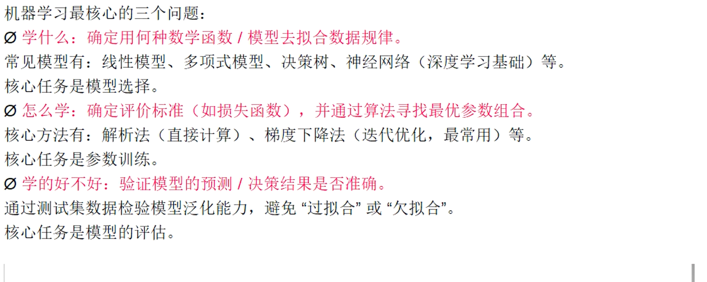

# 机器学习

## 1. 基础数学

### 1.1 基本知识
- 幂函数

$$
y = x^k
$$


- 三角函数

$$
tan(x) = \dfrac{sin(x)}{cos(x)}
$$

- 指数函数

$$
y = a^x
$$

- 对数函数

$$
y = log_{10}(x) \\
y = ln(x)\\
y = \log_{a}(x)\\
$$

- 自然函数e

$$
e = 2.71828 \\
指数函数：y = e^x \\

$$

- 求和与连乘数

$$
求和: \Sigma \\
y = \sum_{i=0}^{n} x_i^2 \\
$$

$$
连乘: \Pi \\
y = \prod_{i=0}^{n} x_i^e \\
y = \prod_{i=0}^{n}\prod_{c=0}^{m}f(x_ic)
$$


### 1.2 微积分

- 微分  
y对x的导数 
$$
y = f(x) \Rightarrow \dfrac{dx}{dy}
$$

- 积分
$$
\int_{a}^{b} f(x)\cdot dx
$$

- 极限
$$
\lim_{x \to a} f(x) = L \\
\lim_{x \to \infin} f(x) = M
$$

$$
\lim_{馅 \to 0} f(包子) = 馒头 \\
\lim_{馅 \to +\infin} f(包子) = 丸子
$$


- 导数(微分)
$$
y' = \dfrac{dy}{dx} = \lim_{x \to 0} \dfrac{\Delta y}{\Delta x} =f'(x) = \dfrac{f(x+\Delta_{x}) - f(x)}{\Delta{x}}
$$

#### 求导运算法则（四则运算与复合）

| 法则名称 | 运算规则（$u, v$ 为关于 $x$ 的可导函数） | LaTeX 代码 |
| :--- | :--- | :--- |
| **常数倍** | $(C \cdot u)' = C \cdot u'$ | `$(C \cdot u)' = C \cdot u'$` |
| **加减法** | $(u \pm v)' = u' \pm v'$ | `$(u \pm v)' = u' \pm v'$` |
| **乘法（莱布尼茨法则）** | $(u \cdot v)' = u' \cdot v + u \cdot v'$ | `$(u \cdot v)' = u' \cdot v + u \cdot v'$` |
| **除法** | $\left( \dfrac{u}{v} \right)' = \dfrac{u' \cdot v - u \cdot v'}{v^2}$（$v \neq 0$） | `$\left( \dfrac{u}{v} \right)' = \dfrac{u' \cdot v - u \cdot v'}{v^2}$` |
| **链式法则（复合函数）** | $\bigl( f(g(x)) \bigr)' = f'(g(x)) \cdot g'(x)$ | `$\bigl( f(g(x)) \bigr)' = f'(g(x)) \cdot g'(x)$` |
| **反函数求导** | $[f^{-1}(x)]' = \dfrac{1}{f'(f^{-1}(x))}$ | `$[f^{-1}(x)]' = \dfrac{1}{f'(f^{-1}(x))}$` |


#### 高阶导数与隐函数求导（补充）

| 类型 | 公式/方法 | LaTeX 示例 |
| :--- | :--- | :--- |
| **高阶导数** | $f^{(n)}(x) = \dfrac{d^n}{dx^n} f(x)$ | `$f^{(n)}(x) = \dfrac{d^n}{dx^n} f(x)$` |
| **莱布尼茨高阶公式** | $(u \cdot v)^{(n)} = \sum_{k=0}^{n} \binom{n}{k} u^{(k)} v^{(n-k)}$ | `$(u \cdot v)^{(n)} = \sum_{k=0}^{n} \binom{n}{k} u^{(k)} v^{(n-k)}$` |
| **隐函数求导** | 对方程两边同时对 $x$ 求导，将 $y$ 视为 $x$ 的函数，解出 $\dfrac{dy}{dx}$。 | 例：$x^2 + y^2 = 1 \implies 2x + 2y y' = 0 \implies y' = -\dfrac{x}{y}$ |
| **参数方程求导** | $\dfrac{dy}{dx} = \dfrac{dy/dt}{dx/dt}$（需 $dx/dt \neq 0$） | `$\dfrac{dy}{dx} = \dfrac{dy/dt}{dx/dt}$` |

---

#### 📊 机器学习核心函数求导速查表


| 类别 | 函数类型 | 原函数 $f(x)$ | 导函数 $f'(x)$ | 特殊注意事项 |
| :--- | :--- | :--- | :--- | :--- |
| **常数** | 常数函数 | $C$（$C$ 为常数） | $0$ | 任何常数的导数都是 0 |
| **幂函数** | 幂函数（一般形式） | $x^n$（$n$ 为实数） | $n \cdot x^{n-1}$ | 当 $n=1$ 时导数为 $1$；$n=-1$ 时导数 $-\dfrac{1}{x^2}$ |
| | 根式（特殊幂） | $\sqrt{x}$ | $\dfrac{1}{2\sqrt{x}}$ | 即 $x^{1/2}$ 的导数 |
| **指数函数** | 自然底数 | $e^x$ | $e^x$ | 最难忘记的导数（不变） |
| | 一般底数 | $a^x$（$a>0, a\neq 1$） | $a^x \cdot \ln a$ | 例如 $(2^x)' = 2^x \ln 2$ |
| **对数函数** | 自然对数 | $\ln x$（$x>0$） | $\dfrac{1}{x}$ | 积分中极其常用 |
| | 常用对数（以10为底） | $\log_{10} x$（$x>0$） | $\dfrac{1}{x \cdot \ln 10}$ | 比自然对数多了一个常数系数 |
| | 一般底数 | $\log_a x$（$a>0, a\neq 1$） | $\dfrac{1}{x \cdot \ln a}$ | 换底公式推导而来 |
| **三角函数** | 正弦 | $\sin x$ | $\cos x$ | 记忆口诀：**正**变**余**（正号） |
| | 余弦 | $\cos x$ | $-\sin x$ | 记忆口诀：**余**变**正**（负号） |
| | 正切 | $\tan x$ | $\sec^2 x = \dfrac{1}{\cos^2 x}$ | 定义域需 $x \neq \dfrac{\pi}{2} + k\pi$ |
| | 余切 | $\cot x$ | $-\csc^2 x = -\dfrac{1}{\sin^2 x}$ | 定义域需 $x \neq k\pi$ |
| | 正割 | $\sec x$ | $\sec x \cdot \tan x$ | 常出现在三角换元积分中 |
| | 余割 | $\csc x$ | $-\csc x \cdot \cot x$ | 常出现在三角换元积分中 |
| **反三角函数** | 反正弦 | $\arcsin x$（$x \in [-1,1]$） | $\dfrac{1}{\sqrt{1 - x^2}}$ | 导数恒为正，注意定义域 |
| | 反余弦 | $\arccos x$（$x \in [-1,1]$） | $-\dfrac{1}{\sqrt{1 - x^2}}$ | 导数为负，与 $\arcsin$ 相差常数 |
| | 反正切 | $\arctan x$ | $\dfrac{1}{1 + x^2}$ | 机器学习中 Softmax 推导常用其变体 |
| | 反余切 | $\arccot x$ | $-\dfrac{1}{1 + x^2}$ | 与 $\arctan$ 导数相反 |
| | 反正割 | $\arcsec x$（$\vert x\vert \geq 1$） | $\dfrac{1}{\vert x\vert \sqrt{x^2 - 1}}$ | 定义域较特殊 |
| | 反余割 | $\arccsc x$（$\vert x\vert \geq 1$） | $-\dfrac{1}{\vert x\vert \sqrt{x^2 - 1}}$ | 极少使用 |
| **双曲函数**<br>（进阶） | 双曲正弦 | $\sinh x = \dfrac{e^x - e^{-x}}{2}$ | $\cosh x$ | 与三角函数类似但**无负号** |
| | 双曲余弦 | $\cosh x = \dfrac{e^x + e^{-x}}{2}$ | $\sinh x$ | 悬链线方程的核心 |
| | 双曲正切 | $\tanh x = \dfrac{\sinh x}{\cosh x}$ | $\operatorname{sech}^2 x$ | 机器学习 RNN 常用（见上表） |
| | 双曲正割/余割 | $\operatorname{sech} x$ / $\operatorname{csch} x$ | $-\operatorname{sech} x \cdot \tanh x$ / $-\operatorname{csch} x \cdot \coth x$ | 物理场论中偶现 |

---


#### 偏导与梯度

- 偏导数  
偏导数可以看作是多元函数(变量个数>=2),沿某个自变量轴方向的变化率。  
有多个变量，只让一个变量变化，其余当作常数，求y的变化率。  


- 方向导数
函数在【任意指定方向】上的变化率  

随便指一个方向，**方向导数**都能告诉你函数在这点往这个方向走，是升还是降、变化多快  

- **全微分公式**

$$
z' = f'(x,y) = \dfrac{\partial f}{\partial x} \cdot dx + \dfrac{\partial f}{\partial y} \cdot dy = \dfrac{f(x + \Delta x, y)}{\Delta x} + \dfrac{f(x, y + \Delta y)}{\Delta y}
$$

方向导数与梯度关系：
$$
方向导数 = 梯度 \cdot 单位方向向量 \\
f'(x,y) = \dfrac{\partial f}{\partial x} \cdot dx + \dfrac{\partial f}{\partial y} \cdot dy
$$

- 梯度(Gradient)


方向导数:是所有方向的变化率，敢问路在何方?  
**梯度**:给出坡度最大的方向和大小，变化率最大的那个方向  
**梯度下降**:沿着方向导数最小的方向走，我们在里面找一个方向导数最小(最负)的方向。  
这个方向，就是梯度的反方向。所以:梯度下降，本质就是:用方向导数，找出下降最快的那条路。

$$
导数\rightarrow偏导\rightarrow方向导数\rightarrow梯度\rightarrow梯度下降\rightarrow机器学习训练
$$
整条链，全是同一个东西:**变化率**。

机器“学习”的本质：
$$
w_{new} = w_{old} - 学习率\cdot 梯度 \\
x = x - lr * gradient(x)
$$


### 1.3 线性代数

#### 标量与向量（Scalars & Vectors）

| 概念 | 数学定义 | 几何直觉 | LaTeX 表示 |
| :--- | :--- | :--- | :--- |
| **标量** | 一个单独的数值（通常为实数 $\mathbb{R}$ 或复数 $\mathbb{C}$），只有**大小**，没有方向。 | 数轴上的一个点。 | $x \in \mathbb{R}$（如 $x=3.14$） |
| **向量** | 按一定顺序排列的一组数值，既有**大小**又有**方向**。 | 空间中的箭头，从原点指向目标点。 | $\mathbf{v} = \begin{bmatrix} v_1 \\ v_2 \\ \vdots \\ v_n \end{bmatrix}$（列向量，默认）<br>或 $\mathbf{v} = [v_1, v_2, \dots, v_n]^T$（$T$ 表示转置） |

**核心规则**：
- 向量的**维度**（$n$）由它所包含的元素个数决定，记作 $\mathbf{v} \in \mathbb{R}^n$。
- 在机器学习中，**列向量**是默认标准（例如 PyTorch 中的数据张量通常按列处理）。

---

#### 向量运算（Vector Operations）

这是线性代数中最基础的操作，我把它们按“结果类型”分类，方便记忆。

| 运算名称 | 计算方法（代数定义） | 几何含义 | LaTeX 代码示例 |
| :--- | :--- | :--- | :--- |
| **向量加法**<br>（逐元素相加） | 对应位置元素相加。<br>$\mathbf{u} + \mathbf{v} = [u_1+v_1, \dots, u_n+v_n]^T$ | 首尾相连（平行四边形法则）。 | `$\mathbf{u} + \mathbf{v}$` |
| **标量乘法**<br>（数乘） | 向量中的每个元素都乘以该标量。<br>$c \cdot \mathbf{v} = [c \cdot v_1, \dots, c \cdot v_n]^T$ | 向量的**长度**缩放（$c>1$ 拉长，$0<c<1$ 缩短，$c<0$ 反向）。 | `$c \cdot \mathbf{v}$` |
| **向量减法** | $\mathbf{u} - \mathbf{v} = \mathbf{u} + (-1)\cdot \mathbf{v}$ | 从 $\mathbf{v}$ 的终点指向 $\mathbf{u}$ 的终点的向量。 | `$\mathbf{u} - \mathbf{v}$` |
| **内积 / 点积**<br>（Dot Product） | 对应位置相乘再求和（**结果是标量**）。<br>$\langle \mathbf{u}, \mathbf{v} \rangle = \mathbf{u}^T \mathbf{v} = \sum_{i=1}^{n} u_i v_i$ | $\|\mathbf{u}\| \|\mathbf{v}\| \cos \theta$（衡量两个向量的**相似性**，如余弦相似度）。 | `$\mathbf{u}^T \mathbf{v}$` 或 `$\langle \mathbf{u}, \mathbf{v} \rangle$` |
| **Hadamard 积**<br>（逐元素相乘） | 对应位置相乘（**结果是向量**）。<br>$\mathbf{u} \odot \mathbf{v} = [u_1 v_1, \dots, u_n v_n]^T$ | 常用于**注意力机制**（如 Transformer 中的 Mask）或特征交叉。 | `$\mathbf{u} \odot \mathbf{v}$` |
| **外积**<br>（Outer Product） | 列向量 $\mathbf{u} \in \mathbb{R}^m$ 与 $\mathbf{v} \in \mathbb{R}^n$ 相乘，得到**矩阵**。<br>$\mathbf{u} \mathbf{v}^T = \begin{bmatrix} u_1 v_1 & \dots & u_1 v_n \\ \vdots & \ddots & \vdots \\ u_m v_1 & \dots & u_m v_n \end{bmatrix}$ | 生成秩 1 矩阵，常用于协方差矩阵的构建。 | `$\mathbf{u} \mathbf{v}^T$` |
| **叉积 / 向量积**<br>（仅限于 $\mathbb{R}^3$） | $\mathbf{u} \times \mathbf{v} = \begin{bmatrix} u_2 v_3 - u_3 v_2 \\ u_3 v_1 - u_1 v_3 \\ u_1 v_2 - u_2 v_1 \end{bmatrix}$ | 得到同时垂直于 $\mathbf{u}$ 和 $\mathbf{v}$ 的向量。 | `$\mathbf{u} \times \mathbf{v}$` |
  

---


#### 向量范数（Vector Norms）

简单来说句量范数是衡量向量“大小”或“长度”的一种方法。  
它是一个函数，将一个向量映射到一个非负的实数，这个数值可以被看作是该向量的“长度”或“模”  
在数学上，对于一个n维向量x=(x1，xz，....xn)，它的范数记为|x|并且需要满足以下三个基本性质:  
1.非负性: `||x||≥0`，且`|x||=0`当且仅当x是零向量(即所有分量都为0)。  
2.齐次性:对于任意标量a，有`||ax||=|a|*|x|`。(标量乘以向量后的范数等于标量绝对值乘以向量的范数)  
3.三角不等式:对于任意两个向量x和y，有`||x+y||≤|x|+|y|`。(两个向量之和的范数小于等于它们范数的和)  

**一整套度量“向量大小”的方法**

**范数**本质上是一个函数，用来衡量一个向量的“**长度**”或“**大小**”。在机器学习中，它用于**正则化惩罚项（防止过拟合）** 和**损失函数（误差度量）**。

数学上，向量 $\mathbf{x}$ 的 $p$-范数定义为：
$$ \|\mathbf{x}\|_p = \left( \sum_{i=1}^{n} |x_i|^p \right)^{1/p} $$

| 范数名称 | $p$ 值 | 数学公式 | 几何直觉 | 机器学习应用场景 |
| :--- | :--- | :--- | :--- | :--- |
| **L1 范数**<br>（曼哈顿距离） | $p=1$ | $\|\mathbf{x}\|_1 = \sum_{i=1}^{n} \|x_i\|$ | 在坐标轴网格上的“街区距离”。 | **Lasso 回归（稀疏性诱导）**：能使部分权重变为 0，用于特征选择。 |
| **L2 范数**<br>（欧几里得距离） | $p=2$ | $\|\mathbf{x}\|_2 = \sqrt{\sum_{i=1}^{n} x_i^2}$ | 空间中两点间的直线最短距离。 | **Ridge 回归**、权重衰减（让权重尽量小但均匀分布）、大部分距离度量。 |
| **L∞ 范数**<br>（无穷范数 / 最大范数） | $p \to \infty$ | $\|\mathbf{x}\|_\infty = \max_i \|x_i\|$ | 只关注向量元素中的**最大值**。 | 对抗攻击（Adversarial Attack）中衡量扰动的大小，控制单像素最大变化。 |
| **L2 范数的平方** | （非严格范数） | $\|\mathbf{x}\|_2^2 = \sum_{i=1}^{n} x_i^2$ | 在 L2 基础上省略了开根号，使**求导更简洁**（导数为 $2x$）。 | **线性回归的 MSE 损失**、逻辑回归的误差反向传播中常用。 |

> **ML 冷知识**：为什么 L2 正则化叫“权重衰减”而 L1 正则化叫“稀疏性诱导”？
> - L2 的导数正比于权重 $w$，梯度下降时每次都会按比例减去一点，相当于**温和地压缩**所有参数。
> - L1 的导数是常数 $\pm 1$，梯度下降会**以恒定的速度**将参数推向 0，因此容易产生精确的零解。

---


### 1.4 概率论和数理统计

- 方差

$$
\sigma^2 = \sum_{i=0}^{n} (x_i - \bar{x})^2
$$
---
- 标准差

$$
\sigma = \sqrt{\sum_{i=0}^{n} (x_i - \bar{x})^2}
$$
---
**概率(Probability)**: $P(x|\theta)$ 函数自变量是数据$x$, 参数$\theta$是已知固定的。它描述的是“在确定的参数下，观测到不同数据的可能性”  
**似然性(Likelihood)**: $L(x|\theta)$ 函数自变量是$\theta$, 参数$x$是已知固定的。它描述的是“在已知观测数据下，不同参数值的支持程度”  

例子：  
求概率：盒子中有10个球，4个红球，6个蓝球。抓到篮球的概率是多少？
求似然估计：盒子中有10个球，抓到蓝球的概率是60%. 盒子中有几个蓝球？


---
#### 全概率公式（Law of Total Probability）

**核心思想**：如果一件事情的发生有 $ n $ 种互斥的"途径"（原因），那么这件事发生的总概率，就是"走每条途径的概率"乘以"走这条途径后成功的概率"之和。

**数学定义**：
设 $(B_1, B_2, \dots, B_n )$ 是样本空间的一个**完备事件组**（即它们两两互斥，且并集为全集），且 $( P(B_i) > 0 )$。则对于任意事件 $A$，有：

$$ P(A) = \sum_{i=1}^{n} P(B_i) \cdot P(A \mid B_i) $$


**生活实例**：
> 假设你上班有 3 条路可以走$( B_1, B_2, B_3 )$  
> 选择每条路的概率分别是 30%、50%、20%。  
> 走每条路遇到堵车$A$的概率分别是 10%、40%、80%。  
> 那么你**今天上班堵车的总概率$P(A)$就是：
$( 0.3 \times 0.1 + 0.5 \times 0.4 + 0.2 \times 0.8 = 0.39 )$（即 39%）。

---


#### 贝叶斯公式（Bayes' Theorem）


**核心思想**：当结果$A$已经发生时，你想知道这个结果是由**某个特定原因$B_i$**引起的**后验概率**。它结合了"先验知识"和"观测到的证据"。

**数学定义**：
在满足全概率公式的条件下，已知事件 $A$ 发生，求它是由原因$B_i$ 导致的概率：

$$ P(B_i \mid A) = \frac{P(B_i) \cdot P(A \mid B_i)}{\sum_{j=1}^{n} P(B_j) \cdot P(A \mid B_j)} $$

**生活实例（延续堵车案例）**：
> 假设你今天**真的堵车了$A$发生了）**，你想反推：**我走第 3 条路$B_3$导致堵车的概率有多大？**  
> 代入公式：  
> $P(B_3 \mid A) = \frac{0.2 \times 0.8}{0.39} \approx 0.410$（即 41%）。  
> 说明虽然你选第 3 条路的概率只有 20%，但一旦堵车，有 41% 的可能性是因为你选了那条爱堵的路。  

---

#### 两大公式的联系与机器学习映射（极其重要）

| 对比维度 | **全概率公式** | **贝叶斯公式** |
| :--- | :--- | :--- |
| **思考方向** | 正向传播（原因$\to$ 结果） | 反向传播（结果$\to$ 原因） |
| **分母来源** | 不需要特殊分母，直接求和 | **分母就是全概率公式** $P(A)$（起归一化作用，确保后验概率总和为 1） |
| **机器学习术语** | 计算**证据（Evidence）** 或边际似然 | 计算**后验概率（Posterior）** |

---

- 机器学习中的灵魂连线（结合你上一问的"似然"）

在机器学习（尤其是贝叶斯统计和分类器）中，我们通常把贝叶斯公式写成下面这种**更直观的形态**，它完美呼应了你之前问的"概率与似然"：

$$
\underbrace{P(\theta \mid X)}_{\text{后验概率}} = \frac{\overbrace{P(X \mid \theta)}^{\text{似然（Likelihood）}} \cdot \overbrace{P(\theta)}^{\text{先验概率（Prior）}}}{\underbrace{P(X)}_{\text{证据（Evidence）}}}
$$

- **先验 $ P(\theta) $**：在看数据之前，你对参数 $ \theta $ 的已有认知（比如认为硬币大概率是公平的）。
- **似然 $ P(X \mid \theta) $**：在某个参数 $ \theta $ 下，出现当前数据 $ X $ 的可能性（你上一问刚学过）。
- **证据 $ P(X) $**：数据本身出现的全概率（由全概率公式计算，通常只作为归一化常数）。
- **后验 $ P(\theta \mid X) $**：看完数据之后，你对参数 $ \theta $ 更新的认知。

> **终极结论**：
> - 全概率公式负责计算**证据（分母）**。
> - 贝叶斯公式负责将**先验**和**似然**结合起来，更新为**后验**。
> - 如果忽略分母（因为分母对参数$\theta$ 是常数），机器学习中常用的**最大后验估计（MAP）** 就变成了：$\hat{\theta}_{MAP} = \arg\max_\theta \; P(X \mid \theta) \cdot P(\theta) $。

如果你需要，我可以继续给你手写一个**朴素贝叶斯分类器（Naive Bayes）**的完整推导例子，看看这两个公式是如何在垃圾邮件过滤中具体发挥作用的！


## 2. 机器学习

- 编码环境准备
```sh
pip install notebook jupyterlib
pip install numpy pandas matplotlib
pip install scikit-learn
```


### 2.1 机器学习理论介绍

机器学习是一门让计算机从数据中自动归纳规律，并利用规律实现预测或决策的学科。  
其核心逻辑打破了传统编程“硬编码规则"的模式，转而依靠数据驱动。 究其本质,就是:
**“自动求导 + 参数更新”的数学优化过程。**


#### 机器学习3大类别

| 类型 | 核心逻辑 | 类比（就像考试） | 常见算法 |
| :--- | :--- | :--- | :--- |
| **监督学习**<br>（Supervised） | **有标准答案**。给模型输入（特征）和输出（标签），让它学会从输入映射到输出。 | 老师给你一堆**带答案的例题**，你学会后去做新题。 | 线性回归、逻辑回归、支持向量机（SVM）、神经网络 |
| **无监督学习**<br>（Unsupervised） | **没有标准答案**。只给模型输入数据，让它自己发现数据中的结构和规律。 | 给你一堆混杂的积木，不告诉你类别，让你**自己按形状或颜色分类**。 | K-means 聚类、主成分分析（PCA）、自编码器 |
| **强化学习**<br>（Reinforcement Learning） | **试错反馈**。模型（智能体）在环境中行动，根据得到的“奖励”或“惩罚”信号来学习最优策略。 | 训练小狗：做对了给零食（奖励），做错了轻微呵斥（惩罚）。 | Q-learning、深度 Q 网络（DQN）、AlphaGo |


#### 机器学习常用算法

--- 
| 算法类别 | 算法名称 | 核心数学公式（你学过的！） | 数学本质（一句话概括） | 核心优化目标（损失函数） |
| :--- | :--- | :--- | :--- | :--- |
| **监督学习**<br>（回归） | **线性回归**<br>（Linear Regression） | $y = \theta_0 + \theta_1 x$ <br>（矩阵形式：$\hat{y} = X\theta$） | **线性代数 + 微积分**：找到一条直线/超平面，让所有点到它的**垂直距离平方和**最小。 | **MSE（均方误差）** <br>$J(\theta) = \frac{1}{2m} \sum (\hat{y}^{(i)} - y^{(i)})^2$ <br>（你求导表里的 MSE） |
| | **逻辑回归**<br>（Logistic Regression） | $h_\theta(x) = \dfrac{1}{1 + e^{-\theta^T x}}$ <br>（**Sigmoid** 函数） | **概率 + 微积分**：把线性输出压缩成 0~1 的概率值。用**最大似然估计（MLE）** 来求参数。 | **二分类交叉熵（BCE）** <br>$J(\theta) = -\frac{1}{m} \sum [y\ln(h) + (1-y)\ln(1-h)]$ <br>（你求导表里的交叉熵） |
| | **支持向量机**<br>（SVM） | $\min \frac{1}{2} \|\theta\|^2$ <br> s.t. $y^{(i)}(\theta^T x^{(i)} + b) \geq 1$ | **线性代数（范数）+ 凸优化**：找到一个决策边界，让两个类别的点离这条边界的**最短距离（间隔）最大化**。 | **合页损失（Hinge Loss）** <br>$L = \max(0, 1 - y \cdot \hat{y})$ |
| | **朴素贝叶斯**<br>（Naive Bayes） | $P(y \mid x) \propto P(y) \prod_{i=1}^{n} P(x_i \mid y)$ <br>（**贝叶斯公式** + 特征独立性假设） | **概率统计**：直接套用贝叶斯公式，计算在给定特征下，属于哪个类别的**后验概率**最大。 | **最大化后验概率（MAP）** <br>（不需要梯度下降，直接统计频率） |
| | **K近邻（KNN）** | $\|\mathbf{x}^{(i)} - \mathbf{x}^{(j)}\|_2$ <br>（**L2 范数** / 欧氏距离） | **线性代数（范数）**：不需要显式的训练过程。预测时，看离新样本最近的 K 个“邻居”属于哪一类。 | **无损失函数**（惰性学习） |
| **监督学习**<br>（集成/树） | **决策树 / 随机森林**<br>（Decision Tree / RF） | $H(S) = -\sum_{k} p_k \log_2 p_k$ <br>（**信息熵**，包含你学的 $\log$） | **概率统计**：每次分裂都找一个特征，让分裂后的子集**纯度最高**（熵减最大，即信息增益最大）。 | **信息增益 / 基尼系数** |
| **无监督学习**<br>（聚类） | **K-Means 聚类** | $\arg\min_S \sum_{i=1}^{k} \sum_{\mathbf{x} \in S_i} \|\mathbf{x} - \boldsymbol{\mu}_i\|_2^2$ <br>（**L2 范数** 的平方） | **线性代数（范数）+ 优化**：把数据分成 K 个簇，让每个簇内的点离**簇中心（均值）** 的距离平方和最小。 | **簇内误差平方和（Inertia）** |
| | **主成分分析**<br>（PCA） | $\Sigma = \dfrac{1}{m} X^T X$ <br>（**协方差矩阵**） <br> 求其特征向量 | **线性代数（特征值/特征向量）**：找到数据**方差最大**的方向（即主成分），把高维数据投影到低维。 | **最大化投影方差** |
| **神经网络**<br>（深度学习） | **多层感知机（MLP）** | $a^{(l+1)} = \sigma(W^{(l)} a^{(l)} + b^{(l)})$ <br>（矩阵乘法 + **链式求导**） | **线性代数 + 微积分（链式法则）**：多层线性变换嵌套非线性激活函数。反向传播就是反复使用**链式法则**求梯度。 | 根据任务选交叉熵 或 MSE |


#### 机器学习流程

```text
+------------------+      +------------------+      +------------------+
|  1. 业务问题定义  | ---> |  2. 数据获取与探索 | ---> |  3. 特征工程与  |
| (Business & Goal)|      |  (Data & EDA)    |      |    预处理        |
+------------------+      +------------------+      +------------------+
        ^                                                       |
        |                                                       v
+------------------+      +------------------+      +------------------+
|  7. 部署与监控   | <--- |  6. 模型评估与调优 | <--- |  4. 模型选择与  |
| (MLOps & Retrain)|      |  (Evaluation &    |      |    训练          |
+------------------+      |   Hyperparameters)|      |  (Training)      |
                          +------------------+      +------------------+
```
#### 常见术语
- 数据集(Data Set):多条记录的集合。
- 训练集(Training Set):用于训练模型的数据。
- 验证集(Validation Set):用于调节超参数的数据。
- 测试集(Test Set):用于评估模型性能的数据。
- 样本(Sample):数据集中的一条记录是关于一个事件或对象的描述，称为一个样本。
- 特征(Feature):数据集中一列反映事件或对象在某方面的表现或性质的事项，称为特征或属性。
- 特征向量(FeatureVector):将样本的所有特征表示为向量的形式，输入到模型中。
- 标签(Label):监督学习中每个样本的结果信息，也称作目标值(target)。
- 模型(Model):一个机器学习算法与训练后的参数集合，用于进行预测或分类。
- 参数(Parameter):模型通过训练学习到的值，例如线性回归中的权重和偏置。
- 超参数(Hyper Parameter):由用户设置的参数，不能通过训练自动学习，例如学习率、正则化系数等。


### 2.2 特征建模

#### 数学模型简介
$$
机器学习 = 固定结构 + 寻找最优参数
$$

对于线性模型: 
$$
y = \beta_{0} + \sum_{i=1}^{n}\beta_{i}x_{i} \\
y = \beta_{0} + \beta_{1}x_{1} + \beta_{2}x_{2} + ... + \beta_{n}x_{n}\\

\begin{cases}
x_i = 特征维度, \beta_{i} = 特征维度x_i的权重 \\
\beta = 自由变量 = (\beta_{0}, \beta_{1}, ..., \beta_{n})
\end{cases}
$$


给定一堆$(x_{0},...,x_{n}, y)$数据，找到一组合适的$\beta_{0}, \beta_{1}, ..., \beta_{n}$，让这个公式预测得最准。  
求这一堆β的最合适参数，就是调优.   
**本质就是:给定数据，求解最优系数β，这就是参数调优**  


机器学习的训练过程在干什么?  
1. 一开始, 权重$\beta$ 是瞎猜的  
2. 然后用损失函数计算预测值与真实值之间的差距  
3. 不断更新$\beta$, 让损失值尽可能最小
4. 找到最优的一组$\beta$, 损失值最小, 也就是预测最准

#### 特征工程
特征工程(Feature Engineering)是机器学习过程中非常重要的一步，指的是通过对原始数据的处理、转换和构造，生成新的特征或选择有效的特征，从而提高模型的性能。  
简单来说，特征工程是将原始数据转换为可以更好地表示问题的特征形式，帮助模型更好地理解和学习数据中的规律。  
优秀的特征工程可以显著提高模型的表现;反之，忽视特征工程可能导致模型性能欠佳甚至模型无法训练。

主要步骤: $数据清洗 \Rightarrow 特征选择 \Rightarrow 特征转换 \Rightarrow 特征降维$
- 特征选择
从原始特征中挑选出与目标变量(标签)关系最密切的特征，剔除冗余、无关或噪声特征.  

特征选择依据:  
1. 高价值特征(保留)
2. 低价值特征(丢弃)
3. 冗余特征(精简)
4. 噪声特征(祛除)

特征选择的三大核心方法:  
1. 过滤法(Filter): 基于统计指标(如方差、相关性)对特征进行评分和筛选，独立于任何机器学习模型。
2. 包裹法(Wrapper): 将模型性能作为评价标准，通过反复训练和测试不同的特征子集来寻找最优组合。 
3. 嵌入法(Embedding): 将特征选择过程嵌入到模型训练过程中，模型在训练时自动学习特征的重要性。


##### 过滤法
| 特征类型 vs 标签类型 | 数学指标 | 公式（你学过的） | 适用场景 |
| :--- | :--- | :--- | :--- |
| **连续型** vs **连续型**（回归） | **皮尔逊相关系数** | $\rho = \frac{\text{Cov}(X, Y)}{\sigma_X \sigma_Y}= \frac{\frac{1}{n-1} \sum_{i=1}^{n} (x_i - \bar{x})(y_i - \bar{y})}{\sigma_X \sigma_Y}$ | 衡量线性相关性（对非线性关系失效）。 |
| **离散型** vs **离散型**（分类） | **卡方检验**（$\chi^2$） | $\chi^2 = \sum \frac{(O - E)^2}{E}$ | 检验两个分类变量是否独立（独立则剔除）。 |
| **任意型** vs **离散型**（分类） | **互信息（MI）** | $I(X;Y) = H(Y) - H(Y\|X)$<br>（涉及**信息熵**） | 衡量**任意**关系（线性+非线性），极其稳健。 |
| **连续型** vs **离散型**（分类） | **方差分析（ANOVA）** | $F = \frac{\text{组间方差}}{\text{组内方差}}$ | 看不同类别下，该特征的均值是否有显著差异。 |

##### 嵌入法
| 正则项 | 公式（你学过的！） | 特征选择效果 | 代表算法 |
| :--- | :--- | :--- | :--- |
| **L1 正则化（Lasso）** | 加 $\lambda \|\theta\|_1$ | **稀疏解**：不重要的特征权重被压缩成 **0**，直接剔除。 | Lasso 回归、逻辑回归（带 L1 惩罚） |
| **L2 正则化（Ridge）** | 加 $\lambda \|\theta\|_2^2$ | **平滑解**：权重趋于 0 但不等于 0（不选特征，只防过拟合）。 | Ridge 回归 |
| **树模型重要性** | 基于信息增益/基尼系数 | 计算每个特征在决策树分裂时减少了多少“不纯度”，累加排序。 | 随机森林、XGBoost 的 `feature_importances_` |


##### 选择依据
| 数据场景 | 推荐方法 | 理由 |
| :--- | :--- | :--- |
| **特征数 > 10000**（如文本词袋） | **过滤法**（互信息/卡方） | 仅包裹/嵌入法，训练时间会爆炸。 |
| **特征数 < 500，样本量适中** | **包裹法（RFE）** | 精度最高，让模型自己反复验证组合。 |
| **特征数中等，追求可解释性** | **嵌入法（Lasso）** | 直接看哪些权重不为 0，经济学/医学论文最爱。 |
| **深度学习（图像/文本）** | **不选特征** | CNN/Transformer 自带特征提取能力，做特征选择反而会破坏端到端的优势。 |

特征选择四大流派（总览）

| 类别 | 核心逻辑 | 与模型的关系 | 计算效率 | 典型数学工具 |
| :--- | :--- | :--- | :--- | :--- |
| **1. 过滤法**<br>（Filter） | 根据统计指标排序，筛掉“分不高”的特征。 | **独立**（先筛再训练） | ⚡ 极快 | 相关系数、卡方检验、互信息 |
| **2. 包裹法**<br>（Wrapper） | 把特征选择当作“黑盒优化”，用模型得分衡量特征子集好坏。 | **依赖**（反复训练） | 🐢 极慢 | 递归特征消除（RFE）、前向/后向搜索 |
| **3. 嵌入法**<br>（Embedded） | 在模型训练过程中，自动学出特征的重要性权重。 | **内置**（边训边选） | 🚀 较快 | **L1 正则化（Lasso）**、决策树特征重要性 |
| **4. 混合法**<br>（Hybrid） | 先过滤粗筛，再包裹精筛。 | 先独立再依赖 | ⚡🐢 均衡 | 先卡方过滤，再 RFE 精挑 |


#### 特征转换
特征转换是对数据做数学/统计处理，使其适配模型输入要求。  
- 归一化 Normalization

- 标准化 Standardization


| 大类 | 转化方法 | 核心原理 / 公式 | 适用场景 / 算法 | 注意事项 / 优缺点 |
| :--- | :--- | :--- | :--- | :--- |
| **数值型**<br>（连续变量） | **标准化 (Z-Score)** | $x' = \frac{x - \mu}{\sigma}$ (转为均值为0，方差为1) | **距离敏感模型** (SVM, 神经网络, 逻辑回归, K-Means) | 最常用；不能解决偏态分布问题。 |
| | **归一化 (Min-Max)** | $x' = \frac{x - \min(x)}{\max(x) - \min(x)}$ (映射到 [0,1]) | **有边界的数据** (如像素值 0-255) 或 KNN | 受**异常值**影响极大；一旦有新数据超出原范围需重新计算。 |
| | **稳健标准化 (RobustScaler)** | 使用中位数($Q2$)和四分位距($IQR$)替代均值和标准差 | **存在大量异常值**的数据集 | 对异常值具有极高的鲁棒性。 |
| | **非线性变换 (幂变换)** | 对数($\log x$)、平方根($\sqrt{x}$)、Box-Cox/Yeo-Johnson自动幂次 | **长尾分布 / 偏态严重**的数据 | 强制拉近极端值，使数据更接近正态分布（树模型可做可不做，但线性模型必做）。 |
| | **离散化 (分箱)** | 等宽分箱、等频分箱、聚类分箱 | 将连续值转化为**有序类别**；解决数值过拟合 | 会损失原始数据的细节信息。 |
| **类别型**<br>（离散变量） | **独热编码 (One-Hot)** | 将类别展开为 N 个 0/1 特征（如 红 绿 蓝 -> 3列） | **无序类别特征** (性别、颜色、城市大类) | 简单直观；但当类别数量极多时，容易造成**维度爆炸**。 |
| | **标签/序数编码** | 直接映射为整数 (如 低=0, 中=1, 高=2) | **有序类别特征** (学历、星级) | **切忌用于无序类别**（如把北京=1，上海=2，模型会误以为北京<上海）。 |
| | **目标编码 (Target Encoding)** | 用该类别对应目标变量(Label)的均值/概率替代原类别 | **高基数类别特征** (如用户ID、城市ID)，常用于提升树模型 | 效果好，但**极易造成数据泄露**，必须结合交叉验证（CV）使用。 |
| | **频率/计数编码** | 用该类别在训练集中出现的频率替代原类别 | **高基数类别特征** (如罕见词汇、稀疏类别) | 对出现频率低的类别能进行很好的平滑处理。 |
| **高阶构造**<br>（衍生特征） | **多项式特征** | 生成特征之间的组合：$x_1^2, x_1 \times x_2$ | **线性模型** (线性回归) 捕捉非线性关系 | 特征数量会呈指数级增长，容易过拟合，需要配合正则化。 |
| | **降维 (PCA / LDA)** | 将高维特征投影到低维正交空间 | **高维数据**去噪、压缩，以及加速训练 | PCA 是无监督（只看方差）；LDA 是有监督（最大化类别距离）。 |
| | **交互特征** | 人工对特征进行加减乘除组合 (如 总价/面积 = 单价) | 结合**业务领域知识**，补充算法无法挖掘的信息 | 极其考验业务理解能力，效果往往非常显著。 |
| **特定领域**<br>（非结构化） | **时间序列转化** | 分解为年/月/日/周、是否为节假日；滑动窗口滞后特征(Lag)；傅里叶变换提取周期性 | 股票、天气、销售预测等时序任务 | 注重周期性、趋势性和自相关性。 |
| | **文本特征转化** | 将文本转为数值向量 (TF-IDF, Word2Vec, BERT Embedding) | 自然语言处理 (NLP) 任务 | 从稀疏的计数向量(BoW)到稠密语义向量(Embedding)的演变。 |
| | **图像特征转化** | 像素归一化；使用 CNN 提取特征图 | 计算机视觉 (CV) 任务 | 现代深度学习倾向于让网络自己学习特征表示。 |

#### 特征降维

##### 主成分分析 PCA

把一堆复杂信息，压缩成更精炼、更好用的表达，浓缩才是精华  
主要步骤:  
1. 去中心化：将每个特征减去它的平均值，把数据中心移到坐标原点（这是为了让后续计算没有偏差）。

2. 计算协方差矩阵：算出原始特征两两之间的相关性。

3. 特征值分解（或 SVD 分解）：解出协方差矩阵的特征值（代表新轴的能量/信息量大小）和特征向量（代表新轴的方向）。

4. 降维投影：按照特征值从大到小，挑出前$k$个最大的特征向量。把原始数据投影到这$k$个新方向上，得到最终的低维数据。  

原理: 某个特征的方差越大, 说明它的数据分布幅度越广, 包含的信息越多  

```python
from sklearn.decomposition import PCA
import numpy as np

X = np.array([[...原始数据...]]) 
pca = PCA(n_components=2) # 设定你想保留的主成分个数（比如降成2个）
X_pca = pca.fit_transform(X) # 拟合并完成转化
```

##### 损失函数

**损失函数（Loss Function）**是机器学习模型**训练过程**中的“指挥棒”。结合您刚刚问的 PCA（数据压缩），损失函数则是在“模型学习”阶段发挥作用。

我将从定义、分类、对比表格以及实战选择建议四个方面为您详细剖析。

---
*   **数学定义**：损失函数衡量的是**机器学习模型的预测值（$\hat{y}$）与真实值（$y$）之间的差异程度**。它是一个非负实数，值越小，代表模型预测得越准确。
*   **训练目标**：机器学习的训练过程，本质上就是寻找一组模型参数，使得**损失函数的值最小化**（通常通过梯度下降法实现）。
*   **生活类比**：它就像是老师批改学生试卷时的**“扣分标准”**。如果学生（模型）答错了，损失函数就记上一笔扣分。整个训练过程就是让学生通过大量练习，找到让自己“总扣分最少”的答题策略。

| 任务类型 | 最常用的损失函数 | 核心应用场景 | 对异常值的敏感性 | 梯度特性 |
| :--- | :--- | :--- | :--- | :--- |
| **回归** | **MSE (均方误差)** | 平稳数据、无异常值的场景（如基础销售量预测） | 极敏感 | 处处可导，梯度随误差增大 |
| **回归** | **MAE (平均绝对误差)** | 存在明显极端异常值的数据（如房价） | **极鲁棒** | 0点不可导（现代求解器已解决） |
| **回归** | **Huber** | 噪声较多、不确信数据质量的回归场景 | 较鲁棒 | 平滑可导 |
| **分类** | **交叉熵 (CE)** | 90% 以上的分类任务（二分类、多分类） | 对标签错误敏感 | 配合 Softmax 梯度稳定 |
| **分类** | **Focal Loss** | 极度不平衡分类（罕见病检测、欺诈检测） | 对简单样本降权 | 梯度稳定 |
| **分类** | **Hinge** | SVM 模型专用 | 对边际内样本敏感 | 次梯度 |


| 任务类型 | 损失函数 | 数学公式（LaTeX） | 核心特性与适用场景 |
| :---: | :--- | :--- | :--- |
| **回归** | **MSE** | $L = \frac{1}{n}\sum_{i=1}^{n}(y_i - \hat{y}_i)^2$ | 最常用，处处可导；对**异常值极度敏感**。 |
| **回归** | **MAE** | $L = \dfrac{1}{n}\sum_{i=1}^{n} \vert y_i - \hat{y}_i \vert$ | 对**异常值极其鲁棒**；0点处不可导。 |
| **回归** | **Huber** | $L_\delta = \begin{cases} \frac{1}{2}(y - \hat{y})^2, & \|y-\hat{y}\|\le\delta \\ \delta\|y-\hat{y}\|-\frac{1}{2}\delta^2, & \text{其他} \end{cases}$ | 平滑可导，结合前两者优点，适合带噪声的数据。 |
| **分类** | **二分类交叉熵** | $L = -[y\log(\hat{y}) + (1-y)\log(1-\hat{y})]$ | 配合 **Sigmoid** 使用；二分类任务首选。 |
| **分类** | **多分类交叉熵** | $L = -\sum_{c=1}^{M}y_c\log(\hat{y}_c)$ | 配合 **Softmax** 使用；多分类任务首选。 |
| **分类** | **Focal Loss** | $L = -\alpha_t(1-p_t)^\gamma\log(p_t)$ | 降低易分类样本权重，**专治极度不平衡**的分类问题。 |
| **分类** | **合页损失** | $L = \max(0, 1 - y\hat{y})$ | **支持向量机 (SVM)** 专用，追求最大分类间隔。 |


结合我们刚才讨论的**损失函数**，**正则化（Regularization）**实际上就是在原来的损失函数后面“追加”一个**惩罚项**。

它的核心逻辑是：**总损失 = 数据拟合损失 + 模型复杂度惩罚**。

###### 正则化

- 为什么要用正则化？（防止过拟合）
如果只追求“数据拟合损失”最小（比如 MSE 降到 0），模型可能会为了迎合训练集中的每一个**噪声和异常值**，把权重参数变得极度巨大，导致函数图像极其扭曲（即**过拟合**）。
正则化就像给模型套上一个“紧箍咒”，强制把各个权重（特征的重要性）压缩在合理的范围内。**模型参数越小，说明模型越简单，泛化能力越强**（对应奥卡姆剃刀原理：如无必要，勿增实体）。

- 常用的两种正则化方式（L1 与 L2）
数学公式上，总损失通常写为：
$$
 J(\theta) = \text{Loss}(\text{Data}) + \lambda \cdot \Omega(\theta) 
$$

| 类型 | 数学公式 (LaTeX) | 核心特点 | 应用场景 |
| :---: | :--- | :--- | :--- |
| **L1 正则化**<br>*(Lasso)* | $\Omega(\theta) = \sum_{j} \vert \theta_j \vert$* | **产生稀疏解**。会把不重要的特征权重直接压缩成 **0**，相当于直接丢弃了该特征。 | **特征选择**（当特征很多，但很多是冗余特征时，用 L1 极佳）。 |
| **L2 正则化**<br>*(Ridge)* | $\Omega(\theta) = \sum_{j} \theta_j^2$ | **权重衰减**。会把所有权重无限**逼近 0**，但永远不会变成 0。它让所有特征都参与预测，但影响程度都被均摊缩小。 | **解决多重共线性**（特征之间高度相关），绝大多数深度学习场景默认使用 L2。 |
| **弹性网络**<br>*(Elastic Net)* | $\Omega(\theta) = \rho \sum_{j} \|\theta_j\| + \frac{1-\rho}{2} \sum_{j} \theta_j^2$ | **兼顾两者**。结合了 L1 和 L2 的优点，既能选特征，又能防过拟合。 | 特征数量远大于样本数量的复杂场景。 |

---

正则化(Regularization)是一种在训练机器学习模型时，在损失函数中添加额外项，来惩罚过大的参数，进而限制模型复杂度、避免过拟合，提高模型泛化能力的技术。

在平方损失函数中加入正则化项 $\lambda\sum_{i=1}^{k}\theta_i^2$  

$$Loss = \dfrac{1}{n}(\sum_{i=1}^{n}(f(x_i) - y_i)^2 + \lambda\sum_{i=1}^{k}\theta_i^2)$$  
这里的$\lambda$是**正则化系数**，用来表示惩罚项的权重。  
正则化系数不属于模型的参数，无法通过训练学习得到，需要在模型训练开始之前手动设置，这种参数被称为**超参数**。


### 2.3 线性回归


### 2.4 逻辑回归


## 3. 深度学习


### 3.1 多层感知机

### 3.2 反向传播机制

### 3.3 卷积神经网络

### 3.4 RNN：循环神经网络
