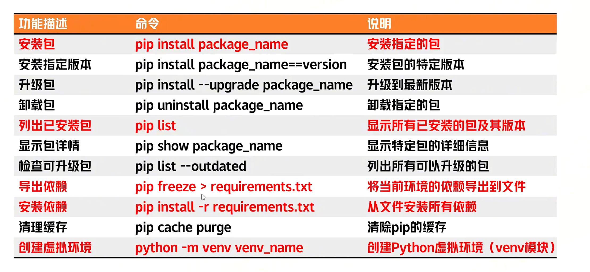
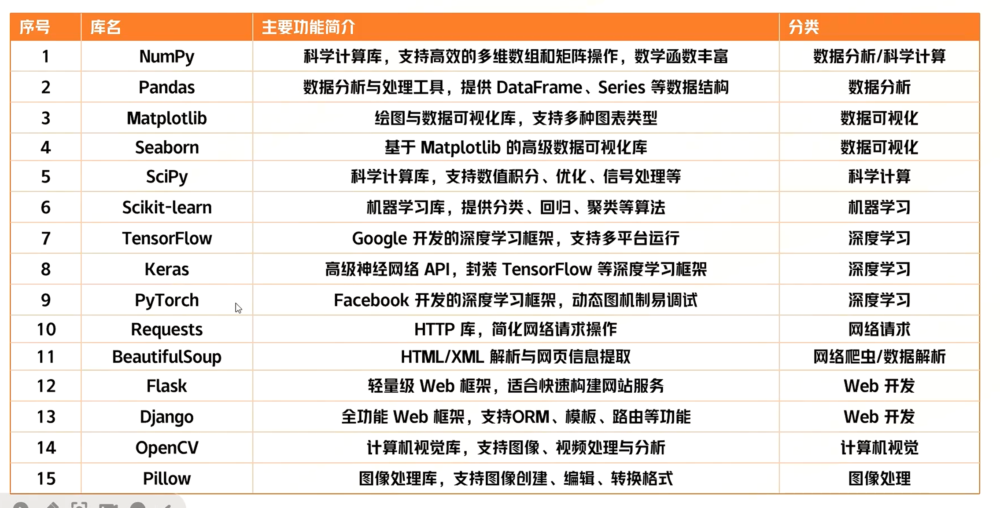

# Python与AI生态

## Python基础

## 智算平台

### 大模型的三大阶段

#### 1. 预训练 Pre-training
预训练通过海量的无标注的数据学习语言的基本规律和世界常识  - 无监督学习
> 这一阶段消耗的计算资源最多，通常需要数千张GPU/TPU数周甚至数月的训练时间。
#### 2. 训练 Fine-tunning / 微调
训练(特别是微调)阶段则像是专业教育，使用特定领域的有标注数据调整模型参数，使其适应具体任务需求。 - 监督学习
> 相比预训练，这一阶段数据量小但更精准，训练时间大幅缩短。
#### 3. 推理 Inference
推理阶段是模型的实际应用，此时模型参数固定，根据输入生成输出。
> 这一阶段的优化重点从"学习能力“转向"响应速度“和”计算效率“。