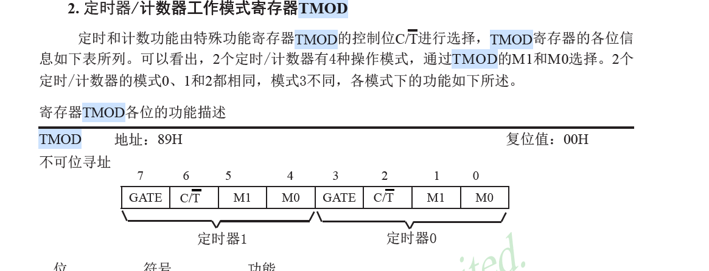
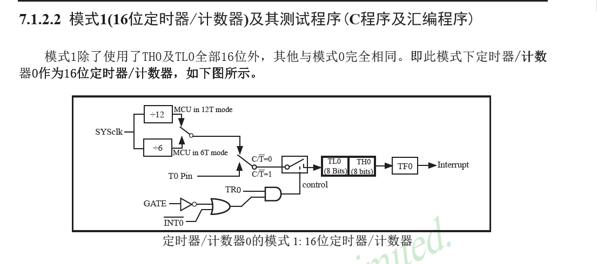
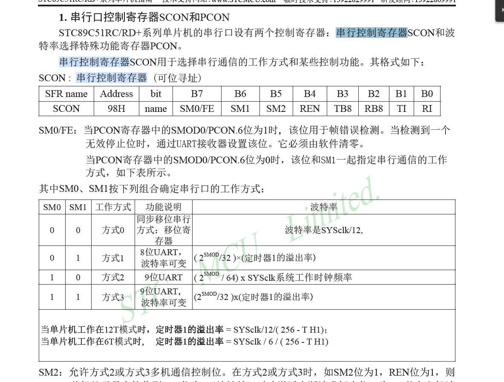

> C语言51单片机STM32 HAL库入门到项目实战 单片机嵌入式入门必备教程
> 课程：https://www.bilibili.com/video/BV1C4421U7c2  
> 资料：https://x509p6c8to.feishu.cn/wiki/C5HHw0MqOii1d8kdziFcu1TlnJg  

## 基础
### Keil搭建51工程

根据芯片的类型选择创建启动代码文件  
`embedded_system\demo01\STARTUP.A51`
> `STARTUP.A51` 是 Keil C51 编译器为 51 单片机提供的一个启动代码文件。它是一个用 A51 汇编语言编写的源文件，在单片机上电或复位后，在用户程序的 main() 函数之前执行，其主要任务是为 C 语言程序的运行搭建好环境  
> `main.c`开发程序入口  
> `Objects\demo01.hex`通过main.c编译生成的，需要烧录到开发板的固件  


### 固件烧录

- 接线
  - 连接电源线
  - 连接数据线，查看COM口（如果没有驱动需要安装驱动）
- 烧录
  - 电脑安装烧录工具`STC-ISP`
  - 选择芯片型号`STC89C52RC/LE52RC` (FYI：STC89C52RC和STC89LE52RC两款芯片是完全兼容的)
  - 根据设备，选择COM口
  - 选择通过`main.c`编译好的`demo01.hex`烧录
- 运行


### 寄存器

> H 代表 十六进制（Hexadecimal）。  
> A0H 就是十六进制数 0xA0（十进制是 160）。在汇编或 Keil 代码中，写成 A0H 或 0xA0 都可以。

最大的误区（核心）：P2.0 ~ P2.7 的地址不是 00 ~ FF！  

- 地址（A0H）：是指这一整组 8 个引脚（P2.0 ~ P2.7）在单片机内部的“门牌号”。整个 P2 端口只有 1 个地址，就是 A0H，而不是每个引脚都有独立的地址。

- 数据值（0x20, 0x40, 0x80）：是你写进这个门牌号（A0H 房间）里面的内容。


### 机械抖动
在学习按键时，有时候按键不会触发想要的结果。这是因为按键在闭合或断开的时候，机械触点会存在抖动的现象，所以需要消抖。  
> 原因：按键抖动（物理现象）。  
> 按键内部是一个金属弹片。你手按下去的瞬间，弹片并不会稳稳地接触，而是会在接触点高速弹跳（就像快速敲桌子，手指会弹起来几次）。  
> 这个过程大约持续 5ms ~ 20ms。单片机的速度极快（微秒级），在这 20ms 内它可能读到了 0（接通）、1（断开）、0（接通） 几十次，所以程序以为你按了很多下。

### 触摸板

`#include <reg52.h>`中没有定义`P4`，其实是因为Keil中选择的芯片类型`AT89C52`不是国产`STC`公司的，所以在这个头文件中没有P4, 需要我们自己定义。  
`P4`对应的是`0xE8`寄存器。  
可以自己定义  
```c
sfr P4 = 0xE8;
```


### 中断

- 外部中断：由外部引脚触发的中断
- 定时器中断：由定时器触发的中断
- 串口中断：通讯过程中发送或接收数据完毕触发的中断

#### 外部中断


STC89C5x提供的外部中断有`INT0~INT3`  
1. 根据手册，`P4.3`对应的外部中断为`INT2`  
2. 根据手册，`INT2`的中断触发方式为：
   - (IT2/XICON.0=1):下降沿
   - (IT2/XICON.0=0):低电平
3. 根据手册，`EA`为中断总控制的寄存器，`EX2`为`INT2`中断的控制器寄存器
4. 根据手册, 找到`INT2`的中断优先级为`6`
```c
// 定义中断服务函数（中断程序）
void exit2() interrupt 6
{
	// 当按下按键灯切换
	while(touch == 0)
	{
		led = ~led;
	}
}
```

```c
void main()
{
	IT2 = 1; //设置中断触发条件为：下降沿
	EA = 1; // 允许所有中断经过；中断使能
	EX2 = 2; // 允许中断2经过，EX2为IT2中断的允许控制器
	while(1)
	{
		// P2.5一直闪烁，代表主程序在运行
		while(1) {
			delay_ms(300);
			led2 = ~led2;
		}
	}
}
```

- 设置中断优先级

```c
void main()
{
	IT0 = 1; // 运行中断0触发条件为下降沿
	EX0 = 1; // 使能中断INT0
	
	IT2 = 1; //设置中断触发条件为：下降沿
	EA = 1; // 允许所有中断经过；总中断使能
	EX2 = 2; // 允许中断2经过，EX2为IT2中断的允许控制器
	
	// 设置INT0中断的优先级为最低
	// PX0H = 0; // 这种无法编译通过，因为PXH是不可以·位寻址·的
	PX0 = 0;
	
	// 设置INT2中断优先级为最高
	// PX2H = 1; // 这种无法编译通过，因为PXH是不可以·位寻址·的
	PX2 = 1; 
	
	// IPH不可位寻址，所以只能通过IPH统一设置 PX0H和PX2H
	IPH = 0x40;
	while(1)
	{
		// P2.5一直闪烁，代表主程序在运行
		while(1) {
			delay_ms(300);
			led2 = ~led2;
		}
	}
}
```

### 定时器

根据手册：
- `TMOD`为定时器模式寄存器。第八位控制定时器0，高八位控制定时器1
- `M0`, `M1`位，控制模式。
- `C/T`位，选择定时器(0) 或者计数器(1). 定时器一般也做系统时钟，计数器也做外部时钟





TL0和TH0构成16bit位定时器/计数器。来一个数就累加。累加最大值2^16 - 1(0xFF)。再加一溢出，TF0(TCON寄存器)被置1.  
TF0被置1后，向CPU请求中断，一直保持CPU响应该中断时，才由硬件将TF0置0  

> 由于选择的分频器是12分频，假如芯片时钟的频率12M Hz, 分频后为1M Hz.  
> 1M Hz => 平均震动一次是1微秒(10^-6)，那么1000次就是1ms  
> 将TL0和TH0构成的计数器设置为 64536, 那么累加1000次后，就会通过TF0触发一次中断。
> 触发一次中断说明过去了1ms

当单片机时钟频率为11.0592MHz时，使用12分频模式得到定时器频率为：11.0592 / 12 = 921600MHz。
- 1s计算921600次。
- 100ms计算92160次
- 10ms计算9216次
对于TL0 | TH0， 定时器时间可以通过初始值表示  
- 10ms = 65535 - 9216
- 20ms = 65535 - 9216 * 2

### 串口通信

>- 串行通信是指使用一条数据线，将数据一位一位地依次传输，每一位数据占据一个固定的时间长度。其只需要少数几条线就可以在系统间交换信息，特别适用于计算机与计算机，计算机与外设之间的远距离通信，先传输低位在传输高位。  
>- 并行通信通常是将数据字节的各位用多条数据线同时进行传送，通常是8位，16位，32位等数据一起传输.
>- 波特率：每秒信号变化的次数（符号/秒）在串口通信（你图中的 USB-TTL）场景下，你可以直接把它理解为“每秒传输的位数（bit/s，即 bps


- UART：通用异步收发传输器

