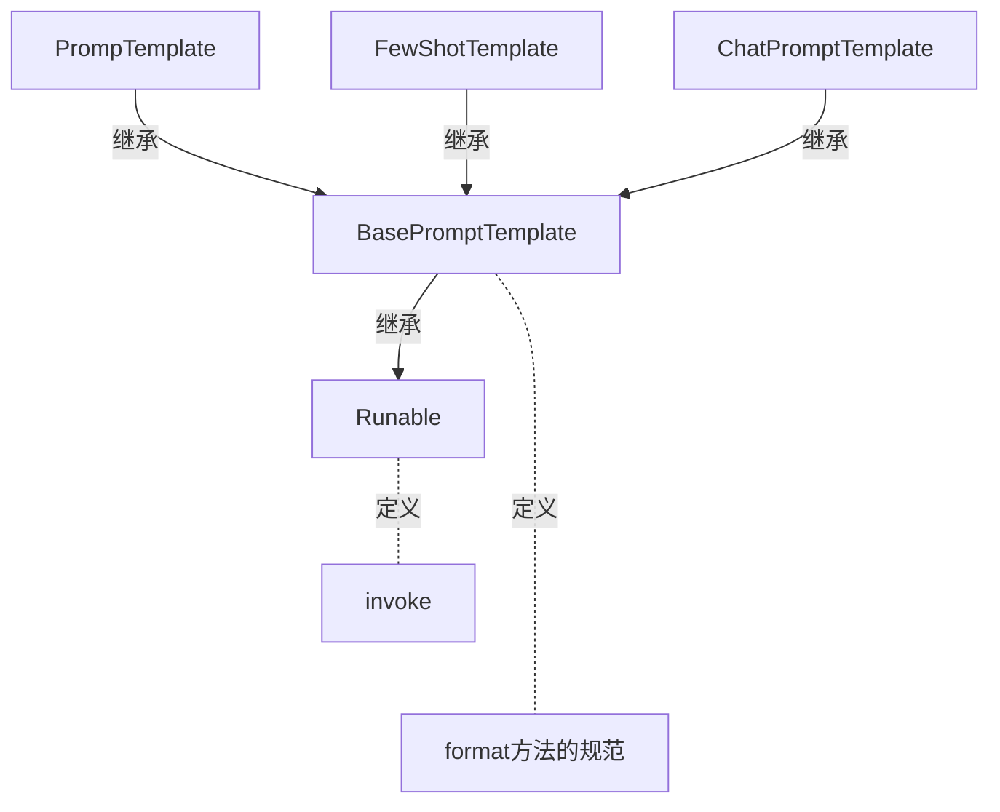
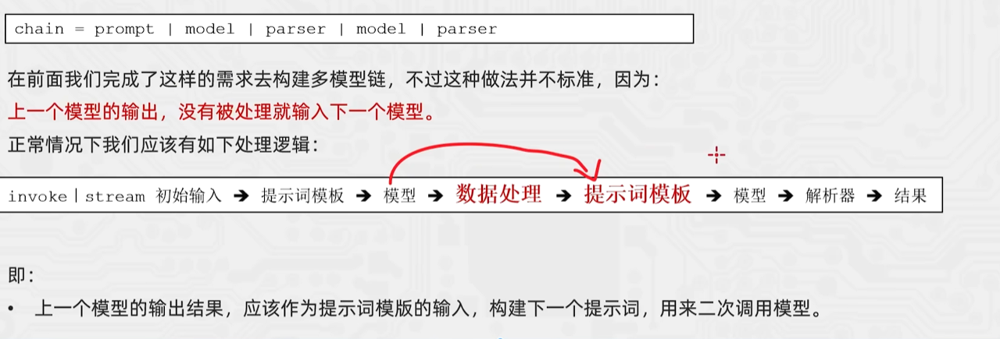

> 课程： https://www.bilibili.com/video/BV1yjz5BLEoY  

### format和invoke区别
> [base_promptTemplate.py](rag/base_promptTemplate.py)



- format
  - 纯字符串替换，解析占位符，生成提示词
  - 返回字符串
  - 支持解析`{}`
- invoke
  - Runable接口标准方法，解析占位符，生成提示词
  - 返回PromptVlue类对象
  - 支持解析`{}`占位符和`MessagePlaceholder`结构化占位符

```python
from langchain_core.prompts import FewShotPromptTemplate, PromptTemplate

template = PromptTemplate.from_template("单词：{word} \n 释义：{definition} \n 反义词：{antonym}")

# 通过 format 方法进行字符串格式化
res = template.format(word="大", definition="尺寸或体积较大的", antonym="小")
print(res)

# 通过 invoke 方法进行字符串格式化
res2 = template.invoke({"word": "大", "definition": "尺寸或体积较大的", "antonym": "小"})
print(res2.to_string())
``` 

### 各类Prompt模板类

- PromptTemplate: 通用提示词模板，支持注入动态信息
- FewShotPromptTemplate:支持基于模板注入任意数量的示例信息
- ChatPromptTemplate: 支持注入任意数量的历史会话信息


## Chain链

将组件串联，上一个组件的输出作为下一个组件的输入,是LangChain链(尤其是| 管道链)的核心工作原理，这也是链式调用的核心价值:实现数据的自动化流转与组件的协同工作，如下。  
`chain = prompt_template | model`  
**核心前提**: 即Runnable子类对象才能入链(以及callable、Mapping接口子类对象也可加入(后续了解用的不多))   

```python
# 顺序必须是 prompt -> model, 实际等于 model.invoke(prompt.invoke(msg))

chain : RunnableSerializable = chat_template | model
```

> `|` 是langchain_core.runnables.base.RunnableSerializable中定义的`__or__`


### `|`符号的重写

前文代码中: `chain= chat prompt templatemodel`在语法上使用了`|`运算符的重写  
在Python中，运算符(如`+`、`|`)的行为由类的魔法方法决定。例如:  
- `a+b` 本质调用的是`a.__add__(b)`
- `a | b`本质调用的是`a.__or__(b)`  

只需要自行实现类的`__or__`方法，即可对`|`符号的功能进行重写。  
示例:  
- 让`a | b | c`的代码得到一个自定义的类对象(类似列表即[a，b，c])  
- 调用`run`方法依次输出`a、b、c`

```python
class TestOr(object):
    """
    让`a | b | c`的代码得到一个自定义的类对象(类似列表即[a,b,c]) 
    """
    def __init__(self, *args):
        self.arr : list = []
        for arg in args:
            self.arr.append(arg)
    
    def __str__(self):
        return f"TestOr({self.arr})"

    def __or__(self, other):
        return TestOr(*self.arr, other)
    
    def run(self):
        print(*self.arr)

# *号代表打包或者拆包一个元组或list

a = TestOr("a")
my_chain = a | "b" | "c"

print(my_chain)

my_chain.run()

```


### `StrOutputParser`字符串输出解析器

> StrOutputParser是LangChain内置的简单字符串解析器  
> 可以将AIMessage解析为简单的字符串，符合了模型invoke方法要求(可传入字符串，不接收AIMessage类型)  
> 是Runnable接口的子类(可以加入链)

- 用法

```python

from langchain_ollama import OllamaLLM
from langchain_core.prompts import ChatPromptTemplate, MessagesPlaceholder
from langchain_core.runnables.base import RunnableSerializable, RunnableSequence
from langchain_core.output_parsers import StrOutputParser


model = OllamaLLM(model="qwen3:8b")

prompt = ChatPromptTemplate([
    ("system", "你是一个英语老师，帮助用户完成英语学习。当用户询问单词时，不要生成过多的内容，尽最大可能精简回答"),
    MessagesPlaceholder("history"),
    ("human", "瓶子的英文是什么？")
])

chain = prompt | model 


history_msg = [
    ("human", "盒子的英文是什么？"),
    ("ai", "盒子=box")
]

print("prompt invoke: ", type(prompt.invoke({"history": history_msg})))
print("model invoke type: ", type(chain.invoke({"history": history_msg})))
print("chain type: ", type(chain))

print(chain.invoke({"history": history_msg}))

# 使用StrOutputParser-字符串输出解析器

output_parsers = StrOutputParser()

chain = chain | output_parsers | model

print(chain.invoke({"history": history_msg}))


```

### `JsonOutputParser` Json输出解析器



```python
from langchain_core.output_parsers import JsonOutputParser, StrOutputParser
from langchain_ollama import OllamaLLM
from langchain_core.prompts import ChatPromptTemplate, MessagesPlaceholder, PromptTemplate
from langchain_core.runnables.base import RunnableSerializable, RunnableSequence

model = OllamaLLM(model="qwen3:8b")

first_prompt = PromptTemplate.from_template(
    "我姓:{lastname}, 生了个{gender}, 帮我给孩子取个名，并封装为json格式返回给我"
    "要求key是name, value是起的名。"
    "请严格遵守格式要求, 无任何多余字符串"
)

json_parser = JsonOutputParser()

chain = first_prompt | model
print( "============= start up ======== ")

data = {"lastname": "谢", "gender": "儿子"}

output = chain.invoke(data)


print("first_prompt | model -> ", type(output), " value = ", output)

print( "=================================")

chain = chain | json_parser

print("jsonparse type is -> ", type(chain), " value = ", chain)

print( "=================================")

second_prompt = PromptTemplate.from_template(
    "名字是{name}, 请解析其含义"
)

chain = chain | second_prompt

print("second prompt is = ", chain)

print( "=================================")

chain = chain | model

print("result : ", chain.invoke(data))


```

### 自定义函数加入链
```python
chain = first_prompt | model | json_parser | second_prompt | model | str_parser
```

> 前文我们根据JsonoutputParser完成了多模型执行链条的构建。除了JsonOutputParser这类固定功能的解析器之外
> 我们也可以自己编写Lambda匿名函数来完成自定义逻辑的数据转换，想怎么转换就怎么转换，更自由。  
> **想要完成这个功能，可以基于RunnableLambda类实现。**
> RunnableLambda类是LangChain内置的，将普通函数等转换为Runnable接口实例，方便自定义函数加入chain。
> 语法:  
> `RunnableLambda(函数对象或lambda匿名函数)`

