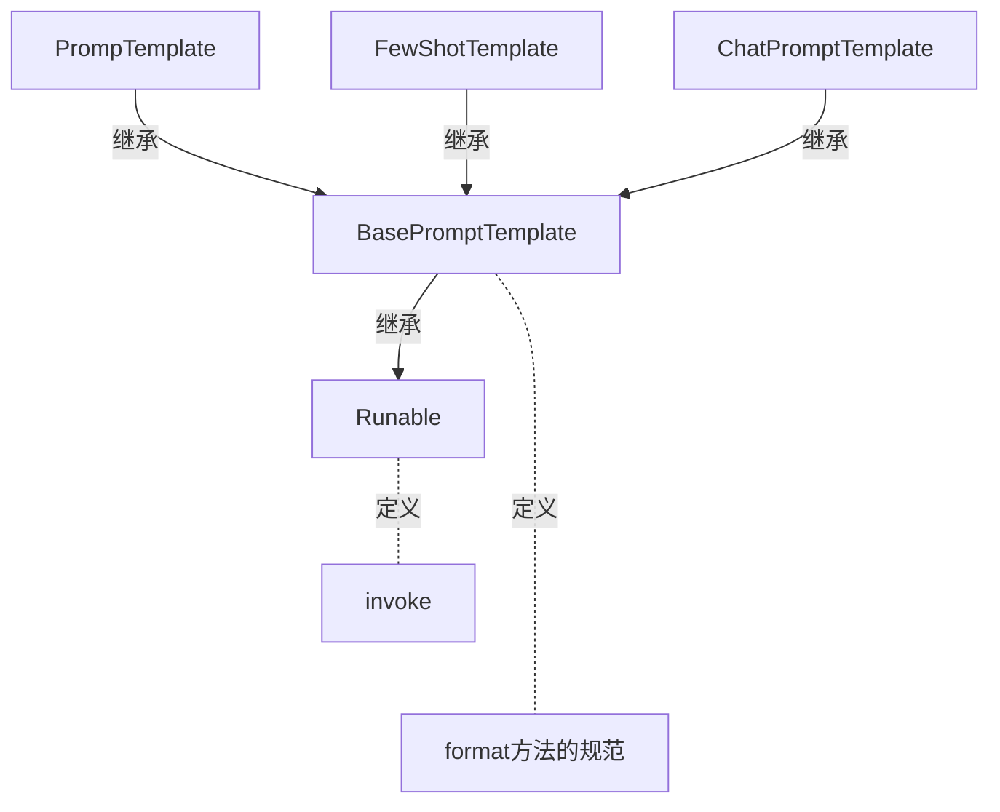

> 课程： https://www.bilibili.com/video/BV1yjz5BLEoY  

# 1. RAG开发

### format和invoke区别
> [base_promptTemplate.py](rag/base_promptTemplate.py)



- format
  - 纯字符串替换，解析占位符，生成提示词
  - 返回字符串
  - 支持解析`{}`
- invoke
  - Runable接口标准方法，解析占位符，生成提示词
  - 返回PromptVlue类对象
  - 支持解析`{}`占位符和`MessagePlaceholder`结构化占位符

```python
from langchain_core.prompts import FewShotPromptTemplate, PromptTemplate

template = PromptTemplate.from_template("单词：{word} \n 释义：{definition} \n 反义词：{antonym}")

# 通过 format 方法进行字符串格式化
res = template.format(word="大", definition="尺寸或体积较大的", antonym="小")
print(res)

# 通过 invoke 方法进行字符串格式化
res2 = template.invoke({"word": "大", "definition": "尺寸或体积较大的", "antonym": "小"})
print(res2.to_string())
``` 

### 各类Prompt模板类

- PromptTemplate: 通用提示词模板，支持注入动态信息
- FewShotPromptTemplate:支持基于模板注入任意数量的示例信息
- ChatPromptTemplate: 支持注入任意数量的历史会话信息


## Chain链

将组件串联，上一个组件的输出作为下一个组件的输入,是LangChain链(尤其是| 管道链)的核心工作原理，这也是链式调用的核心价值:实现数据的自动化流转与组件的协同工作，如下。  
`chain = prompt_template | model`  
**核心前提**: 即Runnable子类对象才能入链(以及callable、Mapping接口子类对象也可加入(后续了解用的不多))   

```python
# 顺序必须是 prompt -> model, 实际等于 model.invoke(prompt.invoke(msg))

chain : RunnableSerializable = chat_template | model
```

> `|` 是langchain_core.runnables.base.RunnableSerializable中定义的`__or__`


### `|`符号的重写

前文代码中: `chain= chat prompt templatemodel`在语法上使用了`|`运算符的重写  
在Python中，运算符(如`+`、`|`)的行为由类的魔法方法决定。例如:  
- `a+b` 本质调用的是`a.__add__(b)`
- `a | b`本质调用的是`a.__or__(b)`  

只需要自行实现类的`__or__`方法，即可对`|`符号的功能进行重写。  
示例:  
- 让`a | b | c`的代码得到一个自定义的类对象(类似列表即[a，b，c])  
- 调用`run`方法依次输出`a、b、c`

```python
class TestOr(object):
    """
    让`a | b | c`的代码得到一个自定义的类对象(类似列表即[a,b,c]) 
    """
    def __init__(self, *args):
        self.arr : list = []
        for arg in args:
            self.arr.append(arg)
    
    def __str__(self):
        return f"TestOr({self.arr})"

    def __or__(self, other):
        return TestOr(*self.arr, other)
    
    def run(self):
        print(*self.arr)

# *号代表打包或者拆包一个元组或list

a = TestOr("a")
my_chain = a | "b" | "c"

print(my_chain)

my_chain.run()

```


### `StrOutputParser`字符串输出解析器

> StrOutputParser是LangChain内置的简单字符串解析器  
> 可以将AIMessage解析为简单的字符串，符合了模型invoke方法要求(可传入字符串，不接收AIMessage类型)  
> 是Runnable接口的子类(可以加入链)

- 用法

```python

from langchain_ollama import OllamaLLM
from langchain_core.prompts import ChatPromptTemplate, MessagesPlaceholder
from langchain_core.runnables.base import RunnableSerializable, RunnableSequence
from langchain_core.output_parsers import StrOutputParser


model = OllamaLLM(model="qwen3:8b")

prompt = ChatPromptTemplate([
    ("system", "你是一个英语老师，帮助用户完成英语学习。当用户询问单词时，不要生成过多的内容，尽最大可能精简回答"),
    MessagesPlaceholder("history"),
    ("human", "瓶子的英文是什么？")
])

chain = prompt | model 


history_msg = [
    ("human", "盒子的英文是什么？"),
    ("ai", "盒子=box")
]

print("prompt invoke: ", type(prompt.invoke({"history": history_msg})))
print("model invoke type: ", type(chain.invoke({"history": history_msg})))
print("chain type: ", type(chain))

print(chain.invoke({"history": history_msg}))

# 使用StrOutputParser-字符串输出解析器

output_parsers = StrOutputParser()

chain = chain | output_parsers | model

print(chain.invoke({"history": history_msg}))


```

### `JsonOutputParser` Json输出解析器


```python
from langchain_core.output_parsers import JsonOutputParser, StrOutputParser
from langchain_ollama import OllamaLLM
from langchain_core.prompts import ChatPromptTemplate, MessagesPlaceholder, PromptTemplate
from langchain_core.runnables.base import RunnableSerializable, RunnableSequence

model = OllamaLLM(model="qwen3:8b")

first_prompt = PromptTemplate.from_template(
    "我姓:{lastname}, 生了个{gender}, 帮我给孩子取个名，并封装为json格式返回给我"
    "要求key是name, value是起的名。"
    "请严格遵守格式要求, 无任何多余字符串"
)

json_parser = JsonOutputParser()

chain = first_prompt | model
print( "============= start up ======== ")

data = {"lastname": "谢", "gender": "儿子"}

output = chain.invoke(data)


print("first_prompt | model -> ", type(output), " value = ", output)

print( "=================================")

chain = chain | json_parser

print("jsonparse type is -> ", type(chain), " value = ", chain)

print( "=================================")

second_prompt = PromptTemplate.from_template(
    "名字是{name}, 请解析其含义"
)

chain = chain | second_prompt

print("second prompt is = ", chain)

print( "=================================")

chain = chain | model

print("result : ", chain.invoke(data))


```

### 自定义函数加入链
```python
chain = first_prompt | model | json_parser | second_prompt | model | str_parser
```

> 前文我们根据JsonoutputParser完成了多模型执行链条的构建。除了JsonOutputParser这类固定功能的解析器之外
> 我们也可以自己编写Lambda匿名函数来完成自定义逻辑的数据转换，想怎么转换就怎么转换，更自由。  
> **想要完成这个功能，可以基于RunnableLambda类实现。**
> RunnableLambda类是LangChain内置的，将普通函数等转换为Runnable接口实例，方便自定义函数加入chain。
> 语法:  
> `RunnableLambda(函数对象或lambda匿名函数)`


## 临时记忆

如果想要封装历史记录，除了自行维护历史消息外，也可以借助LangChain内置的历史记录附加功能。LangChain提供了History功能，帮助模型在有历史记忆的情况下回答。  
- 基于`RunnableWithMessageHistory`在原有链的基础上创建带有历史记录功能的新链(新Runnable实例)
- 基于`InMemoryChatMessageHistory`为历史记录提供内存存储(临时用)  

```python

from langchain_core.runnables.history import RunnableWithMessageHistory
from langchain_core.chat_history import InMemoryChatMessageHistory
from langchain_core.runnables.config import RunnableConfig
from langchain_ollama import OllamaLLM
from langchain_core.prompts import ChatPromptTemplate, MessagesPlaceholder, PromptTemplate

model = OllamaLLM(model="qwen3:8b")

prompt = PromptTemplate.from_template(
    "你是一个智能的助手, 你拥有一些历史消息: {chat_history}. 现在你根据用户输入回答用户"
    "用户的输入是{input}。 "
)

chain = prompt | model

chat_history_store = {}

def get_history(session_id):
    if session_id not in chat_history_store:
        chat_history_store[session_id] = InMemoryChatMessageHistory()
    return chat_history_store[session_id]

conversation_chain = RunnableWithMessageHistory(
    chain, # 被附加历史消息的Runnable, 通常是chain
    get_history,  # 获取指定会话id的历史会话函数
    input_messages_key="input", # 声明用户输入在模板中的占位符
    history_messages_key="chat_history" # 声明历史消息在模板中的占位符
)

session_config = {"configurable" : {"session_id" : "chat_001"}} # 格式固定

print(conversation_chain.invoke({"input": "小明有9条狗"}, session_config ) )
print(conversation_chain.invoke({"input": "Jack有3条狗"}, session_config ) )
print(conversation_chain.invoke({"input": "小明和Jack一共有几条狗？"}, session_config ) )
```

## 长期记忆(json方式)

```python
import json, os
from collections.abc import Sequence
from langchain_core.messages import messages_from_dict, message_to_dict, BaseMessage
from langchain_core.chat_history import BaseChatMessageHistory
from langchain_ollama import OllamaLLM
from langchain_core.prompts import ChatPromptTemplate, MessagesPlaceholder, PromptTemplate
from langchain_core.runnables.history import RunnableWithMessageHistory

class FileChatMsgHistory(BaseChatMessageHistory):
    
    def __init__(self, session_id, storage_path):
        self.storage_path = storage_path
        self.session_id = session_id

        self.file_path = os.path.join(self.storage_path, self.session_id)
        os.makedirs(os.path.dirname(self.storage_path), exist_ok=True)
    
    @property
    def messages(self) -> list[BaseMessage]:
        try:
            with open(
                os.path.join(self.storage_path, self.session_id),
                "r",
                encoding="utf-8",
            ) as f:
                messages_data = json.load(f)
            return messages_from_dict(messages_data)
        except FileNotFoundError:
            return []
    
    def add_messages(self, messages: Sequence[BaseMessage]) -> None:
        all_messages = list(self.messages) # 已有的消息
        all_messages.extend(messages) # 新的消息
        serialized = [message_to_dict(message) for message in all_messages]
        file_path = os.path.join(self.storage_path, self.session_id)
        os.makedirs(os.path.dirname(file_path), exist_ok=True)
        with open(file_path, "w", encoding="utf-8") as f:
            json.dump(serialized, f)
        
    def clear(self) -> None:
        file_path = os.path.join(self.storage_path, self.session_id)
        os.makedirs(os.path.dirname(file_path), exist_ok=True)
        with open(file_path, "w", encoding="utf-8") as f:
            json.dump([], f)


model = OllamaLLM(model="qwen3:8b")

prompt = PromptTemplate.from_template(
    "你是一个智能的助手, 你拥有一些历史消息: {chat_history}. 现在你根据用户输入回答用户"
    "用户的输入是{input}。 "
)

chain = prompt | model

chat_history_store = {}

def get_history(session_id):
    return FileChatMsgHistory(session_id, ".\\ai_agent\\rag")

conversation_chain = RunnableWithMessageHistory(
    chain, # 被附加历史消息的Runnable, 通常是chain
    get_history,  # 获取指定会话id的历史会话函数
    input_messages_key="input", # 声明用户输入在模板中的占位符
    history_messages_key="chat_history" # 声明历史消息在模板中的占位符
)

session_config = {"configurable" : {"session_id" : "chat_001"}} # 格式固定

# print(conversation_chain.invoke({"input": "tom今年有9条狗"}, session_config ) )
# print(conversation_chain.invoke({"input": "jerry去年有3条狗，死了2条狗，今年又买了1条狗"}, session_config ) )
print(conversation_chain.invoke({"input": "tom和jerry今年一共有几条狗？"}, session_config ) )


```


## 文档加载器

### CSV loader
```python
from langchain_community.document_loaders.csv_loader import CSVLoader
from langchain_community.document_loaders.json_loader import JSONLoader
from langchain_community.document_loaders.pdf import PyPDFLoader

loader = CSVLoader(
    file_path="ai_agent\\rag\\data\\stu.csv",
    encoding="utf-8",
    csv_args={
        "delimiter": ",", # 指定分隔符号
        "quotechar": '"',   # 指定带有分隔符文本的引号是单引号还是双引号
        "fieldnames": ['a','b','c','d'] #指定一个表头
    }
)


# 批量加载
documents = loader.load()

for doc in documents:
    print(type(doc), doc)


# 懒加载 .lazy_load()

for doc in loader.lazy_load():
    print(doc)
```

### JSON loader

```sh
# 安装jq
pip install jq
```

```python
from langchain_community.document_loaders import JSONLoader
import json

loader = JSONLoader(
    file_path="ai_agent\\rag\\data\\stu.json",
    jq_schema=".[].name",     # jq_schema的语法
    json_lines=False,   # 是否是jsonLines文件（每一行都是json的文件）
    text_content=True, # 抽取的是否是字符串
)

documents = loader.load()
print(documents)


```

## txt Loader


> `RecursiveCharacterTextSplitter`，递归字符文本分割器，主要用于按自然段落分割大文档。  
> 是LangChain官方推荐的默认字符分割器。  
> 它在保持上下文完整性和控制片段大小之间实现了良好平衡，开箱即用效果佳

```python
from langchain_community.document_loaders import TextLoader
from langchain_text_splitters import RecursiveCharacterTextSplitter

loader = TextLoader(
    file_path="ai_agent\\rag\\data\\stu.txt",
    encoding="utf-8"
)

document = loader.load()

print(document)
print("*="*30)

splitter = RecursiveCharacterTextSplitter(
    chunk_size=509, # 分段的最大字符数
    chunk_overlap=50, # 分段之间允许重叠的字符数
    separators=["\n\n", "\n", ".", "。", "?", "!", "！", "？", " ", ":\n"], # 文本分段依据
    length_function=len, # 字符统计依据(函数)
)

split_docs = splitter.split_documents(document)

for sd in split_docs:
    print(sd)
    print("="*20)

```

## PDF Loader

```sh
pip install pypdf
```

```python
from langchain_community.document_loaders import PyPDFLoader

loader = PyPDFLoader(
    file_path="ai_agent\\rag\\data\\fiction.pdf",
    mode="page", # 安装页进行划分Document对象
    # password="123" # 文档密码
)

doc = loader.load()

print(doc)
```

## 向量存储

```python
from langchain_ollama import OllamaEmbeddings
from langchain_core.vectorstores import InMemoryVectorStore
from langchain_community.document_loaders import PyPDFLoader


# 获取 embedding 模型对象
emb= OllamaEmbeddings(model="nomic-embed-text-v2-moe:latest")

vector_store = InMemoryVectorStore(emb)
loader = PyPDFLoader(
    file_path="ai_agent\\rag\\data\\fiction.pdf",
    mode="page", # 安装页进行划分Document对象
    # password="123" # 文档密码
)

doc = loader.load()

print("doc = " , doc)
print("+=*" * 20)

# 添加文档到向量数据库，并指定id
vector_store.add_documents(documents=doc)

# 相似性搜索, 4代表结果个数
similar_docs = vector_store.similarity_search("三百万信用点", 1)
print(similar_docs)


```


# 2. RAG项目


# 3. Agent项目