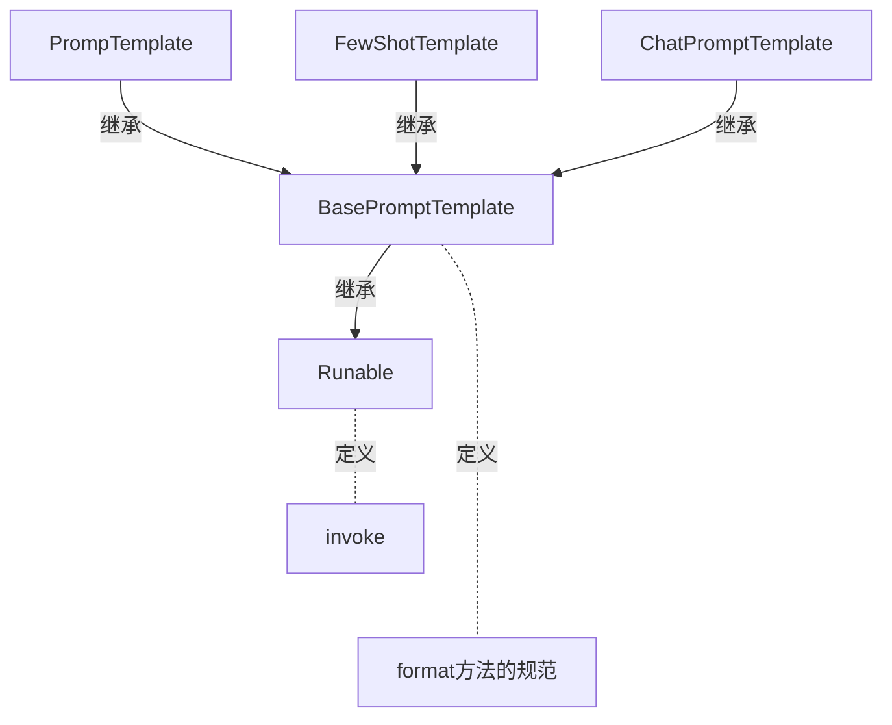

> 课程： https://www.bilibili.com/video/BV1yjz5BLEoY  

### format和invoke区别
> [base_promptTemplate.py](rag/base_promptTemplate.py)



- format
  - 纯字符串替换，解析占位符，生成提示词
  - 返回字符串
  - 支持解析`{}`
- invoke
  - Runable接口标准方法，解析占位符，生成提示词
  - 返回PromptVlue类对象
  - 支持解析`{}`占位符和`MessagePlaceholder`结构化占位符

```python
from langchain_core.prompts import FewShotPromptTemplate, PromptTemplate

template = PromptTemplate.from_template("单词：{word} \n 释义：{definition} \n 反义词：{antonym}")

# 通过 format 方法进行字符串格式化
res = template.format(word="大", definition="尺寸或体积较大的", antonym="小")
print(res)

# 通过 invoke 方法进行字符串格式化
res2 = template.invoke({"word": "大", "definition": "尺寸或体积较大的", "antonym": "小"})
print(res2.to_string())
``` 

### 各类Prompt模板类

- PromptTemplate: 通用提示词模板，支持注入动态信息
- FewShotPromptTemplate:支持基于模板注入任意数量的示例信息
- ChatPromptTemplate: 支持注入任意数量的历史会话信息


## Chain链

将组件串联，上一个组件的输出作为下一个组件的输入,是LangChain链(尤其是| 管道链)的核心工作原理，这也是链式调用的核心价值:实现数据的自动化流转与组件的协同工作，如下。  
`chain = prompt_template | model`  
**核心前提**: 即Runnable子类对象才能入链(以及callable、Mapping接口子类对象也可加入(后续了解用的不多))   
