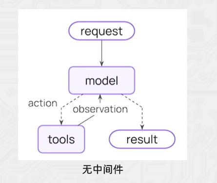
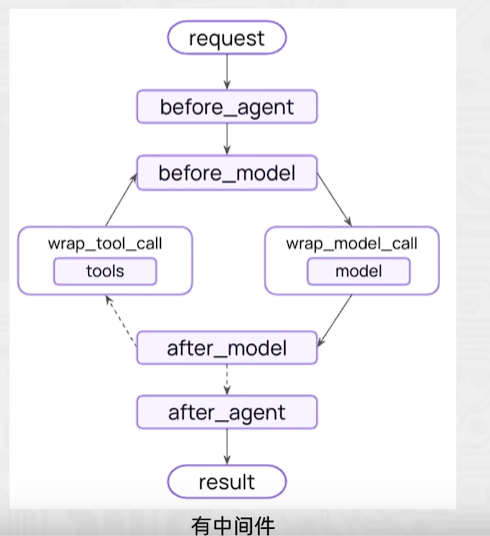
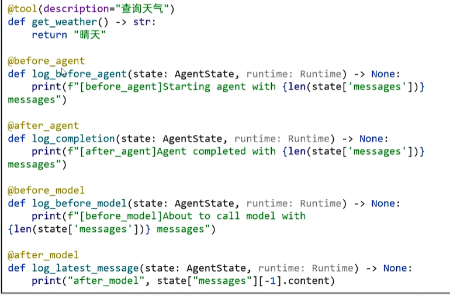

# Agent智能体

智能体(Agent)是一种能够自主规划、决策、执行任务的组件，核心是让大语言模型(LLM)根据任务需求，选择并调用工具，完成单靠模型自身无法解决的复杂问题。
- 没有Agent时，LLM 只能基于自身训练数据回答问题，遇到需要实时数据、复杂计算、外部工具调用的场景就会卡壳。
- 有了Agent后，LLM 就像一个"指挥官"，能思考任务步骤选择合适工具执行工具调用>根据结果调整策略，直到完成任务。

核心特点：
- 目标驱动
- 工具调用能力
- 自主决策与迭代

通过`create_agent`创建的Agent对象，也是Runnable接口的子类实现，所以也拥有：
- invoke，一次性得到完整结果
- stream，获得流式结果

```python
for chunk in agent.stream({
        "messages": [{"role":"user", "content": "Search the AI news, and summarize the findings"}]
    },
    stream_mode="values"):
    latest_message = chunck["messages"][-1]
    if latest_message.content:
        print(f"Agent: {latest_message.content}")
    elif latest_message.tool_calls:
        printf(f"Calling tools: {[tc['name'] for tc in latest_message.tool_calls]}")
```


# ReAct

Agent ReAct 是大模型智能体的核心思考与行动框架，全称Reasoning+Acting(推理+行动)，是让Agent 像人类一样`「思考问题>制定策略>执行行动>验证结果」`的关键逻辑。  
简单来说:ReAct让Agent不再是“直接回答问题”，而是通过“自然语言思考过程”指导工具调用，一步步解决复杂问题，完美适配需要多步推理、工具协作的场景(如智能客服、报告生成、任务规划等)


# middleware中间件

中间件的作用是对智能体的每一步工作进行控制和自定义的执行。作用场景:
- 日志记录、分析、调试
- 转换提示词、工具选择
- 重试、备用、提前终止等逻辑控制安全防护、个人身份检测等





> langchain的中间件： https://docs.langchain.com/oss/python/langchain/middleware/built-in

## Hooks

中间件通过Hooks钩子来实现拦截，自定义中间件可以简单的使用装饰器来定义。  
- 节点式钩子(执行点顺序拦截):
  - before_agent:agent执行之前拦截
  - after_agent:agent执行后拦截
  - before_model:模型执行前拦截
  - after_model:模型执行后拦截
- 针对工具和模型的包装式钩子:
  - wrap_model_call:每个模型调用时候拦截
  - wrap_tool_call:每个工具调用时候拦截

