# 00、开课

# 本章内容概要

- 作息时间
- 课堂截图
- 关于笔记
- 文件扩展名
- EditPlus的安装与配置
- windows常用dos命令
- 通用的文本编辑快捷键
- 学习方法
- 电脑配置

# 本章内容详解

## 作息时间

| **时间段** | **安排 ** |
| --- | --- |
| **09:00 - 09:50** | 第一节课 |
| **09:50 - 10:05** | 课间休息 |
| **10:05 - 10:55** | 第二节课 |
| **10:55 - 11:10** | 课间休息 |
| **11:10 - 12:00** | 第三节课 |
| **12:00 - 14:00** | 午餐 & 午休 |
| **14:00 - 15:00** | 第四节课 |
| **15:00 - 15:15** | 课间休息 |
| **15:15 - 16:15** | 第五节课 |
| **16:15 - 16:30** | 课间休息 |
| **16:30 - 18:00** | 第六节课 |
| **18:00 - 19:00** | 晚餐 & 休息 |
| **19:00 - 21:30** | **晚自习** |
| **21:30 以后** | 自由安排 / 休息 |

**周三 **自习，**周日**休息。

## 课堂截图

### 为什么使用截图工具

---

在听课的过程中，有的时候老师操作的比较快，通过截图的方式将老师的操作保存下来，以便后期的操作。另外截图之后的图片也可以用于笔记的记录，在笔记当中最好采用图文并茂的方式，这样更加利于知识的回顾。

### 使用哪个截图工具

---

snipaste

1. 免费
2. 免安装，直接解压即可使用
3. 可个性定制

### 截图工具的下载

---

1. snipaste下载地址：[https://zh.snipaste.com/](https://zh.snipaste.com/)

### 截图工具的安装与配置

---

- 安装
  - 直接解压即可使用
  - 解压后鼠标双击Snipaste.exe启动它
- 配置
  - 在启动之后的图标（在系统右下角有图标）上点击鼠标右键，如下图所示

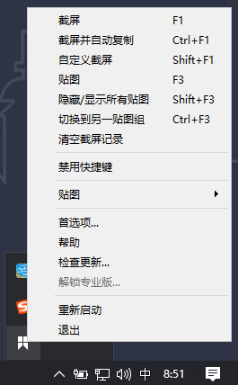

- 然后点击“首选项...”，打开配置窗口，如下图所示

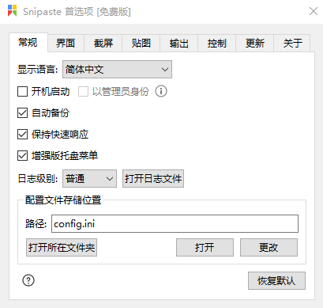

- 设置“开机启动”，在上图中的“常规”中选择“开机启动”即可，表示下次启动系统时会自动启动该截图软件。
- 设置截图之后的图片保存位置，在上图中点击“输出”选项卡，如下图所示

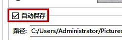


选中“自动保存”，并且可以通过“更改文件夹”来自定义保存的位置。

- ·查看截图快捷键，在上图中选择“控制”选项卡，可以看到截图快捷键默认是F1，也就是说只要按F1键就可以截图，如果想设置为其他快捷键可以修改。

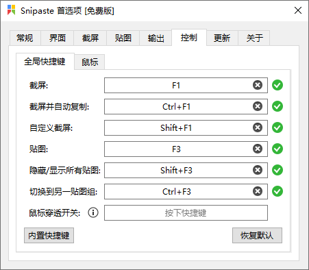

### 截图工具的使用

---

在听课的过程当中，如果遇到一些比较快的操作，直接按截图快捷键F1，**选中截图范围后直接回车**，图片可自动保存。

### 注意事项

---

课堂上截图时可能有些情况下无法截到自己想要的图片，建议能多截图就多截几个，这样课下先将没用的图片删除，然后将有用的图片保存到笔记当中，尽可能图文并茂，容易复习。

## 关于笔记

### 为什么要记笔记

---

1. 方便回顾复习。Java的技术体系庞大，并且每天都有新内容，为了防止遗忘，建议制定有规律的复习计划。笔记是回顾复习的依据。
2. 课下自己写的练习代码应该是尝试推翻这些课堂上记录的重点结论。笔记是重要结论的集中地。

### 用什么记笔记

---

1. 阿里的语雀
2. 飞书
3. 印象笔记
4. 有道云笔记
5. 为知笔记
6. ......

以上记笔记的工具都是支持 MarkDown 语法的，需要提前掌握一些 MarkDown 的基础语法：

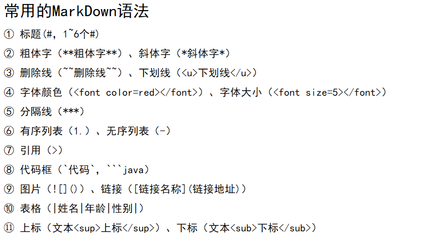

### 课堂上笔记应该怎么记

---

1. 记简笔，因为记太细致的话，会导致跟不上老师的讲课速度。
2. 笔记中应该记录的是大量的重点结论。
3. 笔记中应该还要记下自己在听课过程当中，自己偶然的疑问。课下可以再根据笔记慢慢思考，不懂还可以问老师。
4. 笔记最好是图文并茂，所以听课过程中有些位置是可以截图的哦。

### 关于课下笔记的整理

---

1. 在课下第一时间先整理笔记。
2. 切记整理笔记的时间不要太长，最好在30分钟之内完成。
3. 不要有强迫症，整理笔记不是“绣花”，对不齐就对不齐吧，梳理知识点的速度要快，因为程序员应该留有大量的时间敲代码去实践。

## 文件扩展名

### 什么是文件扩展名

---

- 每一个文件都有文件扩展名，扩展名决定了文件的类型，什么是文件扩展名，例如：
  - a.doc，文件的扩展名是doc，说明该文件是一个word文件
  - a.txt，文件扩展名是txt，说明该文件是一个普通文本文件
  - a.java，文件扩展名是java，说明该文件是一个Java文件
  - a.mp4，文件扩展名是mp4，说明该文件是一个mp4视频文件

### 为什么要显示文件扩展名

---

- 默认情况下，如果一台电脑刚做完系统，文件扩展名是隐藏的，在隐藏的情况下有什么问题呢？在**文件扩展名隐藏的情况下**我们新建一个HelloWorld.java文件，请看：
  - 第一步：新建一个文本文档

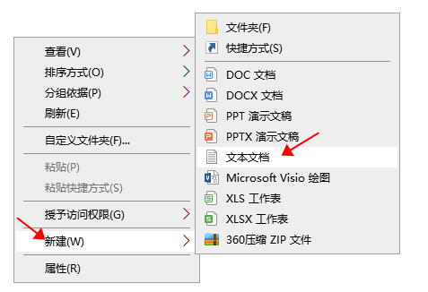

- 第二步：创建文件之后，如下图：


- 第三步：将以上文件名修改为HelloWorld.java


- 第四步：将以上新建的文件拖拽到DOS命令窗口中

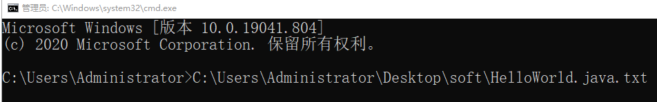

- 通过以上的测试得知：表面上看文件名是“HelloWorld.java”，实际上是“HelloWorld.java.txt”，也就是说这个文件实际上是txt文件，不是java文件。所以文件的扩展名不能隐藏起来。

### 怎么显示文件扩展名

---

- 以win10系统为例，显示文件扩展名，请看以下步骤
  - 第一步：win + E组合键打开资源管理
  - 第二步：按照下图操作

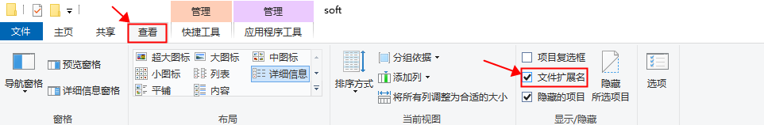

- 显示文件扩展名之后，文件名就全部显示出来了，如下图：


- 将以上文件的扩展名.txt去掉之后，就是一个java文件了，去掉时会提示你：

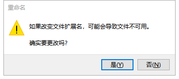


点击“是”即可。

- 文件名修改后如下所示，这就是一个java文件了：


## EditPlus的安装与配置

### 为什么不建议初学者一开始就用集成开发工具

---

1. 使用文本编辑器写代码可以帮助初学者更好的记忆API。
2. 可以更好的锻炼指法速度。
3. 可以培养出更好的书写规范。

### 常见的文本编辑器有哪些

---

1. windows系统自带的记事本不够用吗，为什么要再安装其他的文本编辑器？
  1. 这是因为记事本的编辑功能太弱。
2. EditPlus只是一个普通的文本编辑器，比记事本功能强大一些。这个工具不是Java开发所必须的。只要是文本编辑器都可以写Java代码，常见的文本编辑器有哪些：
  1. EditPlus
  2. Notepad++
  3. Sublime Text
  4. UltraEdit
  5. ......

### EditPlus下载地址

---

[https://www.editplus.com/download.html](https://www.editplus.com/download.html)

### 安装EditPlus

---

- 第一步：双击安装包，弹出如下窗口。

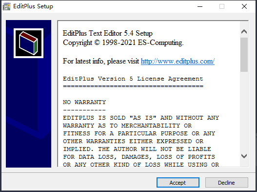

- 第二步：点击Accept后，如下图所示。可以修改安装位置。另外下图中第一个复选框表示是否在菜单中创建快捷方式，第二个复选框表示是否将EditPlus添加到鼠标右键中，第三个复选框表示是否创建桌面快捷方式。你可以自行选择，在这里三个复选框都选中。

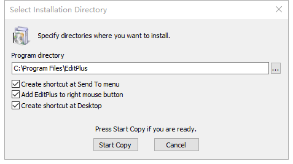

- 第三步：点击Start Copy，开始拷贝，如下图所示安装完成。

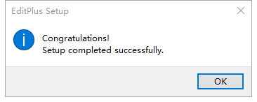

- 第四步：点击上图的OK，结束安装，电脑桌面上会出现以下的快捷方式。

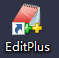

### 配置EditPlus

---

- 第一步：在任意位置新建一个文件，起名：Test.java

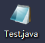

- 第二步：在Test.java文件上点击鼠标右键，选择EditPlus工具打开，如下图

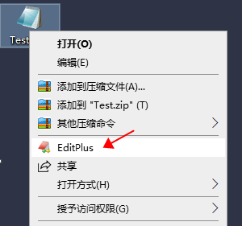

- 第三步：第一次在使用EditPlus工具打开文件的时候，需要你接受协议，点击Yes即可。

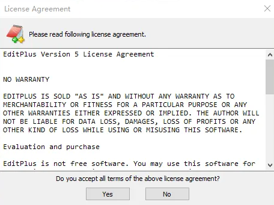

- 第四步：INI file directory设置EditPlus的配置文件路径，Syntax directory设置EditPlus的语法文件路径，这里默认即可。点击OK。

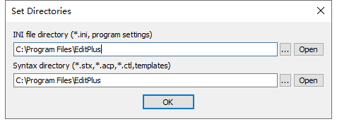

- 第五步：如果出现下图，直接点击是即可。

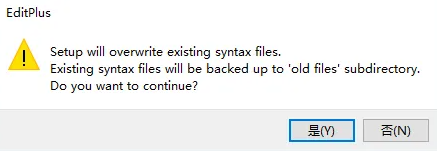

- 第六步：打开后工具会自动提示你输入注册码

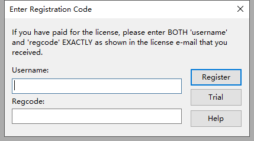

- 第七步：将以下注册码粘贴到以上窗口对应位置进行破解

注册名 Vovan
注册码 3AG46-JJ48E-CEACC-8E6EW-ECUAW

- 第八步：此时便可以打开 Test.java 文件了。
- 第九步：在以上文件中随便编写内容，并保存，你会发现桌面上生成了一个备份文件

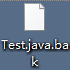

- 第十步：如果你不想生成备份文件，可以进行如下配置：

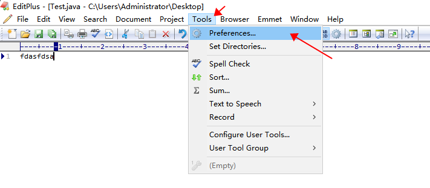

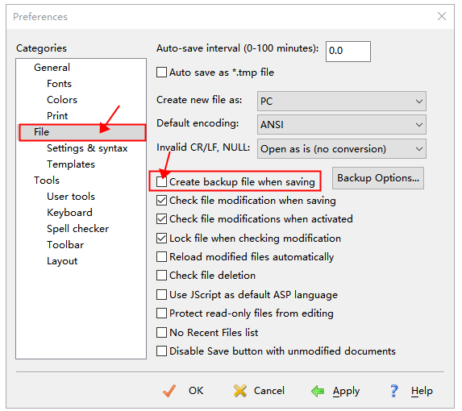


上图复选框中的对钩去掉，然后点击Apply，点击OK。再次编辑文件之后保存，你会发现不再生成备份文件了。

- 第十一步：设置字体（还是在以上窗口中完成设置）

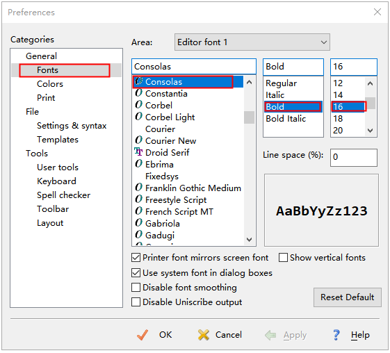

- 第十二步：设置缩进（按tab键时，默认情况下EditPlus中缩进较长，可以适当调整缩进距离）

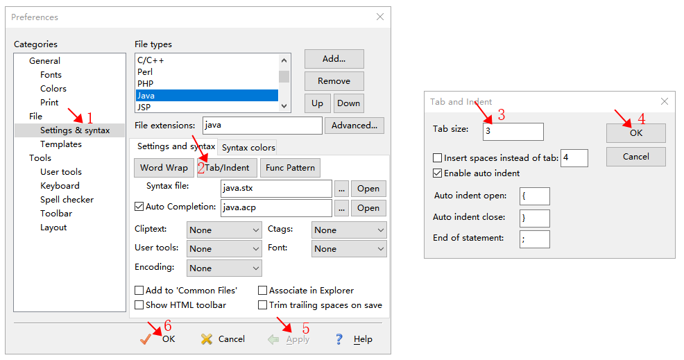

### 修改文件的默认打开方式

---

当在windows系统中使用鼠标双击某个文件时，windows系统会使用默认的软件将其打开，怎么设置文件的默认打开方式呢？请看以下操作步骤：

- 第一步：在文件上点击右键，然后点击属性
- 第二步：在弹出的属性窗口的“常规”中点击“更改”，然后在弹出的窗口中点击“更多应用”

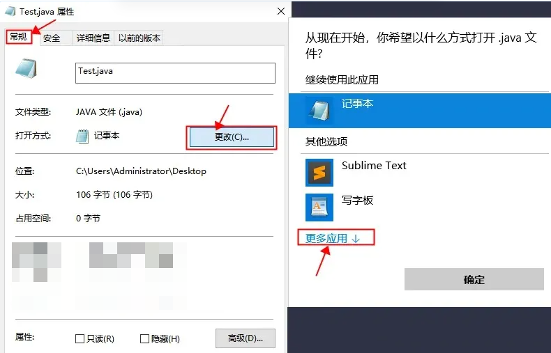

- 第三步：如果在应用列表中没有找到对应的应用，点击“在这台电脑上查找其他应用”

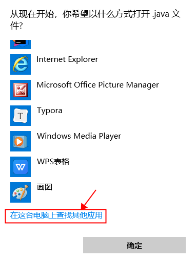

- 第四步：在这台电脑上找到EditPlus这个应用，并点击打开，如下图

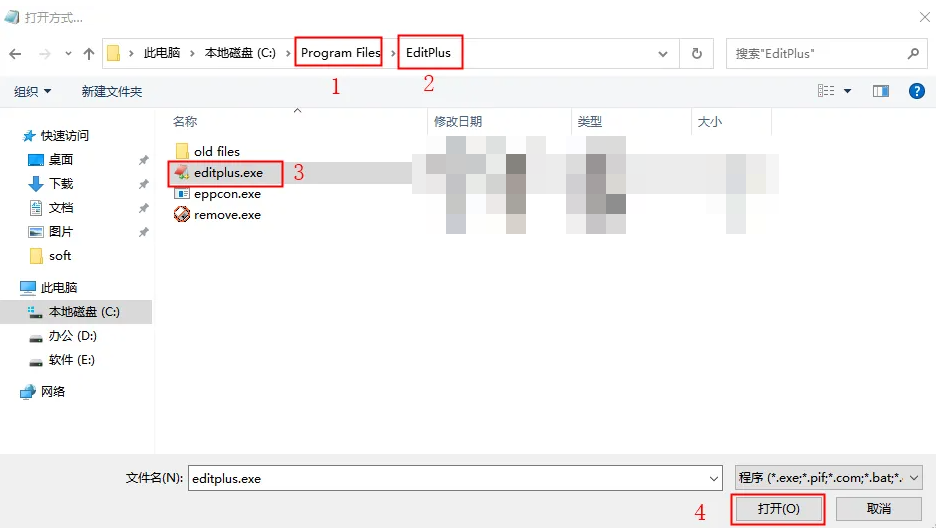

- 第五步：发现图标发生了变化，点击确定，到此就设置完成了

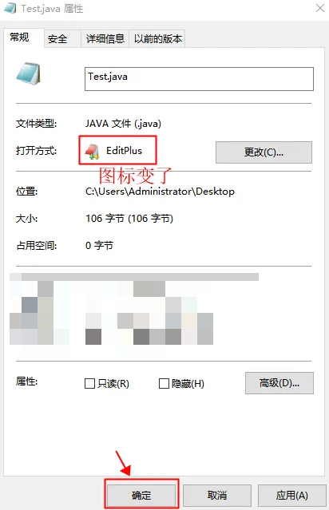

- 第六步：找到刚才的Test.java文件，然后双击，看看是否默认采用EditPlus工具打开

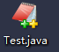

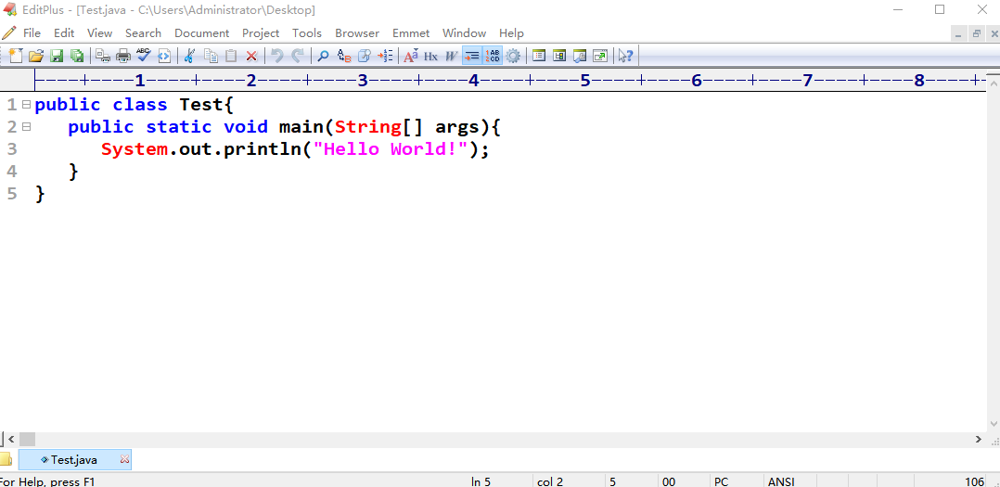

## windows常用dos命令

### 常用的windows组合键

---

1. WIN + D
  - 显示桌面
2. WIN + E
  - 打开资源管理器
3. WIN + R
  - 打开运行窗口
4. WIN + L
  - 锁屏
5. alt + tab
  - 切换应用

### 什么是dos命令

---

注意：从现在开始你已经不是普通的PC机用户了，你是一个Java软件工程师，至少要知道基本的dos命令，这是必须的。

### 打开dos命令窗口

---

- 第一步：WIN + R 打开运行窗口

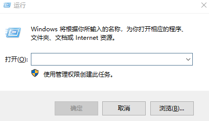

- 第二步：输入cmd

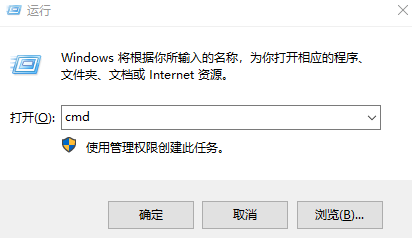

- 第三步：回车

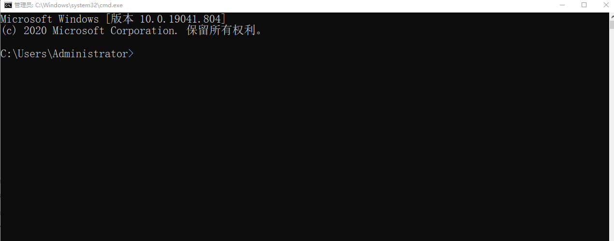

### 怎么在dos命令窗口中复制粘贴

---

以win10为例，实现步骤如下：

- 第一步：鼠标左键选中要复制的内容
- 第二步：点击鼠标右键，此时被选中的内容已经复制到剪贴板中
- 第三步：在需要粘贴的位置直接点击鼠标右键即可粘贴

注意：以上三步的操作都是**在dos命令窗口内**进行的操作。

### 关于dos命令窗口中的当前所在目录

---

在学习后面内容之前，需要大家理解在dos命令窗口中什么是当前所在目录，如下图：

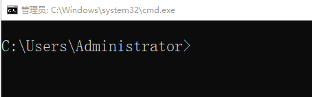


上图中的当前所在目录是：C:\Users\Administrator，当前所在目录就是当前所在位置，也可以叫做**当前路径**，再看下图：

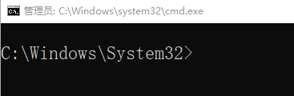


对于上图中的当前路径就是：C:\Windows\System32。如果你此时在当前这个位置对文件进行操作，默认情况下操作的文件都是C:\Windows\System32目录的文件。

### 常用的dos命令

---

1. dir
  - 作用：列出当前目录下所有的文件和目录
  - 示例：

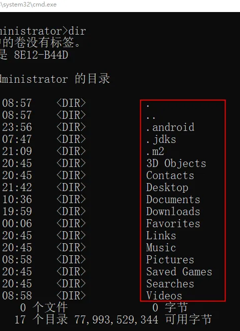

- 对以上执行结果进行说明：其中红框内的就是在**当前目录下**所有的文件以及目录。这里所说的当前目录是什么呢？当前目录为：C:\Users\Administrator

1. cls
  - 作用：清屏
  - 使用cls命令之前，满屏信息

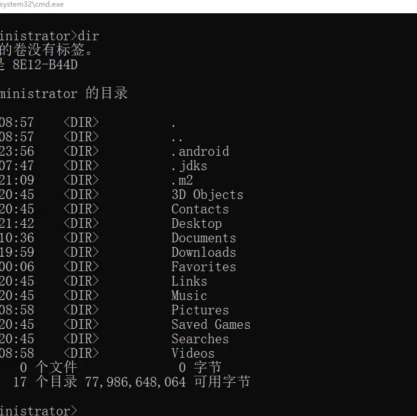

- 使用cls命令之后，清除屏幕上的信息

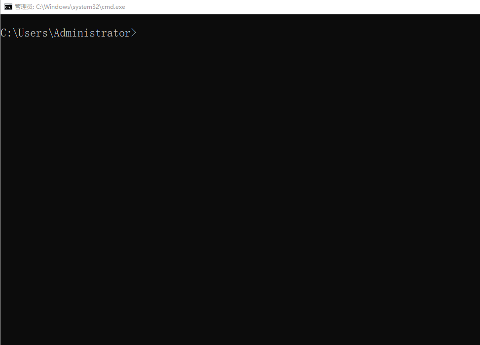

1. exit
  - 作用：退出dos命令窗口
2. 切换盘符
  - 直接输入盘符加冒号，例如：

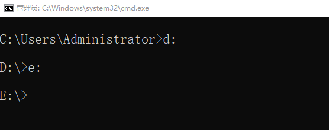

1. del

- 作用：删除1个或多个文件
- 示例1（删除一个文件）：

```bash
del A.txt
```

- 示例2（删除多个文件）：

```bash
del *.java
```

1. ipconfig

- 作用：查看本机的ip地址信息。ip地址是计算机在网络中的唯一标识，通常两台计算机建立连接的前提是要知道对方的ip地址。
- 示例1：ipconfig

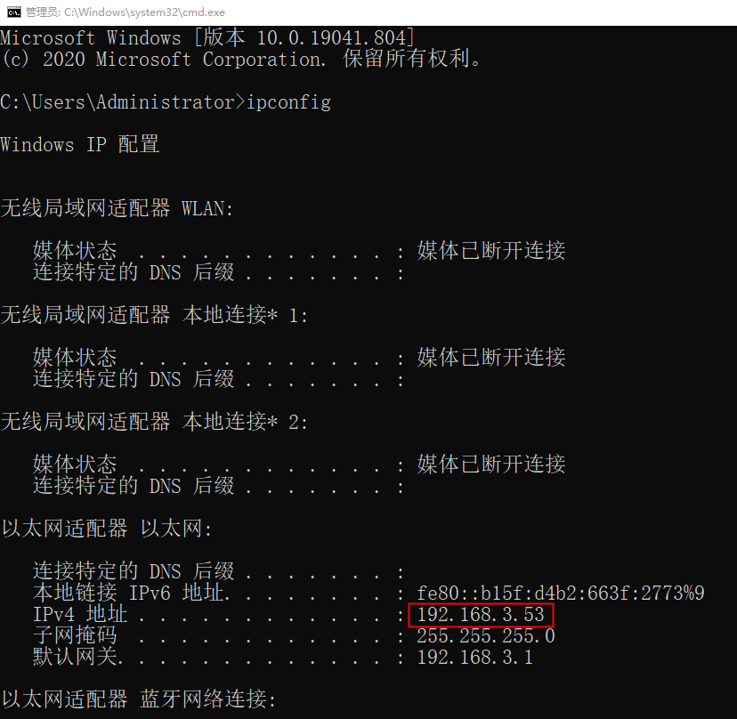

- 示例2：ipconfig /all 可以查看更详细的ip信息，包括网卡的物理地址，网卡的物理地址是出厂时的编号，具有全球唯一性

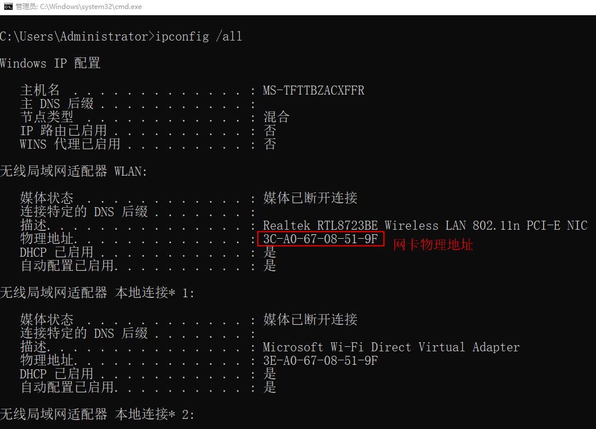

1. ping
  - 作用：查看两台计算机之间是否能够正常通信
  - 示例1：ping 对应的ip地址

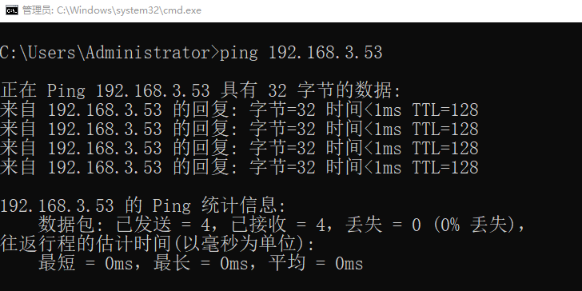


使用该命令之前，需要知道对方计算机的ip地址。
上图的意思是：给对方计算机发送了4个数据包，对方计算机回复了4个数据包，另外所耗时间较短，说明两台计算机可以正常通信。

- 示例2：ping 合法域名

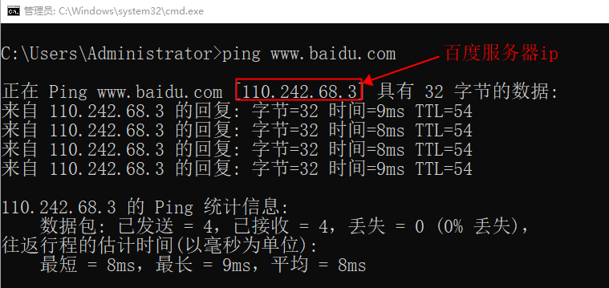


ping命令后面除了跟ip地址之外，还可以是一个合法的域名，通过这种方式也可以看到当前计算机是否可以正常上网。
上图中110.242.68.3为百度服务器的ip地址。
**注意：dos命令窗口中怎么快速找到之前执行过的命令？按向上或向下的箭头可以查找历史命令。**

- 示例3：ping ip地址或合法域名 -t

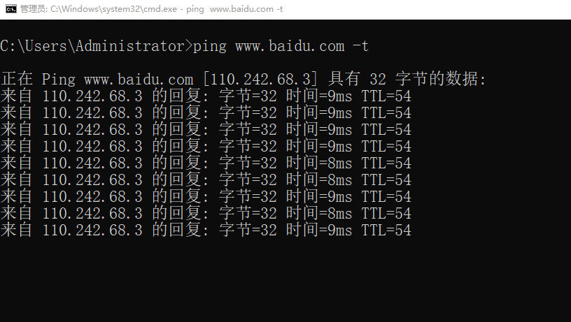


通过-t参数这种方式可以不断的发送和接受数据包，查看通讯结果的耗时，可以看出当前网络是否稳定。
**怎么终止dos命令窗口中正在执行的命令？Ctrl + C**

1. mkdir （也可以简写md）
  - 作用：新建目录
  - 示例：

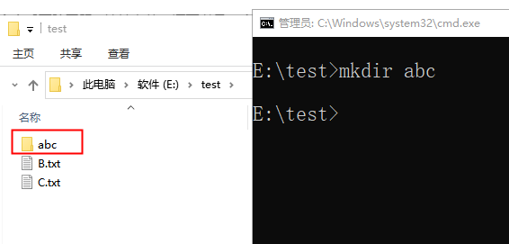

1. cd

- cd命令用来切换目录：change directory
- 语法格式：cd 路径
- cd .. 回到上级目录

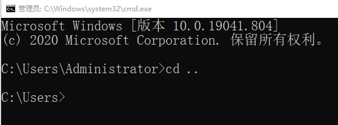

- cd / 回到根目录

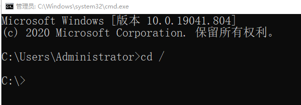

- 路径包括：相对路径和绝对路径
  - 绝对路径：凡是路径以盘符开始的都是绝对路径，例如：E:\test、C:\Windows\System等。
  - 相对路径：相对路径都是相对于当前路径而言，从当前路径作为起点开始的路径。
- 绝对路径和相对路径的区别？
  - 走，同学们，接下来我们去“XX 市 XX 区 XX 街道 XX 大厦 702 房间”。这就是一个绝对路径。
  - 假设你当前所在的位置是“XX 市 XX 区 XX 街道 XX 大厦 701 房间”，你说：走，同学们，接下来我们去“隔壁 702 房间”。这个“隔壁 702 房间”就是一个相对路径。
- cd命令的使用
  - 示例1：绝对路径

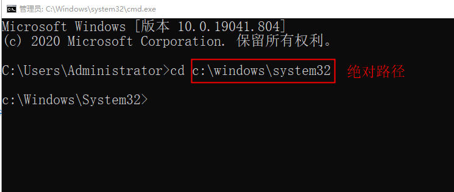

```plaintext
- 示例2：相对路径
```

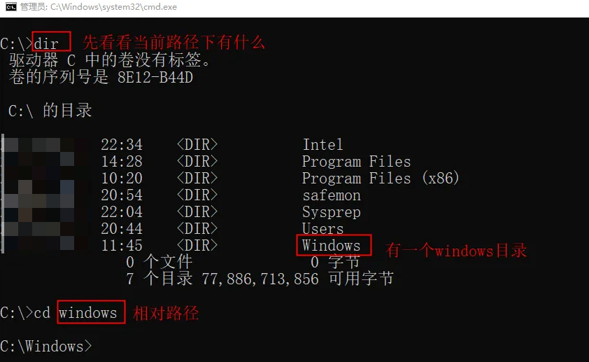

- cd命令使用时的小妙招

cd后面在输入目录名字的时候可以按“tab键”自动补全目录的名字。

1. rd

- 作用：删除某个目录
- 示例：

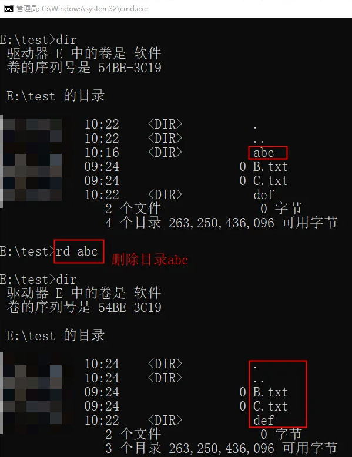

删除一个不为空的目录（谨慎操作）：rd /s /q 目录

1. 让dos窗口直接进入某个目录的小妙招

- 第一步：打开资源管理器，进入目标目录下

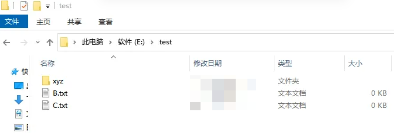

- 第二步：在地址栏上输入cmd

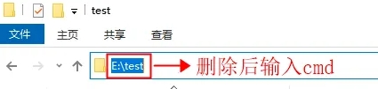

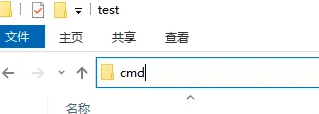

- 第三步：回车

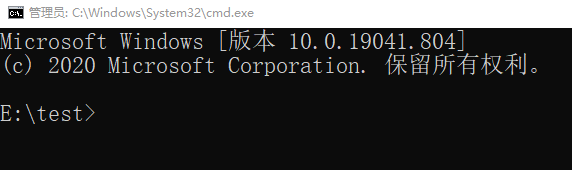

1. ren

- 作用：重命名
- 示例：

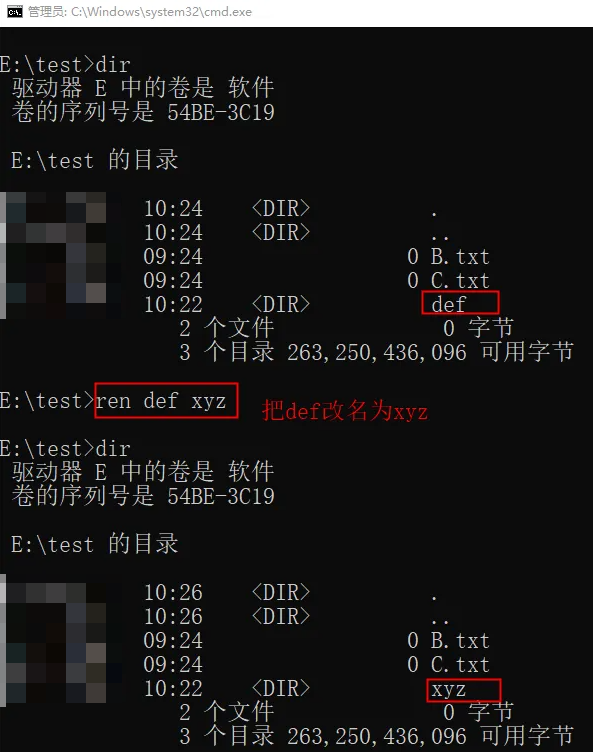

1. copy

- 作用：拷贝文件
- 示例：

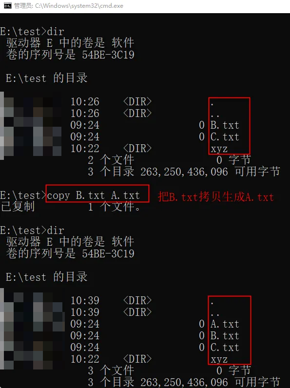

1. shutdown

- 作用：关机
- 用法：shudown -s -t 3600 【表示在1小时之后关机，3600秒为1小时】

### 批处理文件

---

- 什么是批处理文件？

可以批量执行dos命令的文件，批处理文件的扩展名为“.bat”
批处理文件中可以编写大量的dos命令，然后使用鼠标双击即可执行批处理文件。

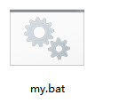

- 使用文本编辑器可以将“my.bat”文件打开，然后编写dos命令，如下：

```shell
d:
cd test/xyz
del a.txt
del b.txt
```

双击 my.bat 文件执行批处理，查看 test/xyz 目录下的文件是否删除了。

## 通用的文本编辑快捷键

### 程序员要尽量使用快捷键

---

使用快捷键可以提高编码速度。
刚开始用的时候比较慢，但一定要坚持，慢慢你的编码速度就会提升。

### 通用的文本编辑快捷键

---

ctrl+c 复制
ctrl+v 粘贴
ctrl+x 剪切
ctrl+s 保存
ctrl+z 撤销
ctrl+y 重做
ctrl+a 全选
home 光标回到行首

end 光标回到行尾
ctrl + home 光标回到文章开始
ctrl + end 光标回到文章末尾
shift + home 或 end 选中一行
鼠标双击 （选中一个单词）
ctrl + shift + 右箭头或左箭头 （选中一个单词）
ctrl + f 查找

## 学习方法

### 程序员需要提升的两个方面

---

1. 提升敲代码的速度
2. 提升用编程思维解决现实生活中问题的意识（其实就是提升动手能力）

### 怎么提升敲代码速度

---

提升指法速度是比较简单的，只要具备以下两点即可：

1. 标准的键盘手势
  1. 左手：a s d f
  2. 右手：j k l ;
  3. 需要按shift键的时候最好左右手同时开工
  4. 可以你之前已经使用某种错误的方式多年了，很难改过来，但一定要改过来
2. 不断的使用盲打的方式大量敲代码
  1. 刚开始是不习惯的，只要你有恒心，坚持不懈，必然会有重大的变化，你慢慢会发现自己不再需要看键盘了，而且速度也大大提升了。
  2. 不需要专门使用金山打字通练习，只要敲Java代码即可，每天都要大量的练习。

### 怎么提升编程思维

---

所谓的编程思维就是使用编程的方式解决现实生活中问题的一种能力，编程思维的提升是很困难的，是一个漫长的过程，在这个过程中又需要你去进行大量的实战才能锻炼出来的。经常会有同学这样问：老师，我现在能听懂，但是一到做题的时候就懵了，不知道该从何开始。像这样的同学就是严重缺乏编程思维，导致这个问题的原因主要包括两方面：

1. 平时只听理论，很少动手敲代码。
2. 敲代码时机械性照抄别人的代码。

综合以上两方面，其实根本原因就是：采用自己思维方式敲代码的量太少。如何解决这个问题，给出以下解决方案：

1. 不要机械性照抄老师代码，只有HelloWorld可以照抄，因为HelloWorld是为了测试本地的Java环境是否正常。
2. 把老师课堂上的代码总结出中文的核心步骤，例如：

```java
public class BankActTest {
        public static void main(String[] args){
            // 第一步：判断A账户余额是否充足
        // 第二步：判断B账户是否正常
        // 第三步：更新A账户
        // 第四步：更新B账户
    }
}
```

然后强行将老师的代码关闭，根据自己总结的中文思路一行一行实现自己的代码。刚开始很慢，很容易放弃，但是随着自己慢慢积累，就会发现编程思维慢慢具备了。

1. 使用结论验证法敲属于自己的代码
  - 有很多同学在课下的时候会说：老师没有给布置练习题，我们课下该干啥？有这样问题的同学那一定没有找到很好的学习方法。其实课下大家应该花费大量的时间去验证课堂上的结论，验证结论的好处包括：
    - 第一：验证结论的代码一定是属于自己敲的代码，没有抄袭任何人的代码，这个可以很好的提升编程思维。
    - 第二：结论验证之后，可以让你对这个结论记忆更加深刻。
  - 应该如何使用结论验证法
    - 假设老师课堂上讲了这样一个语法：if后面有一个小括号，小括号中只能是boolean类型的数据。这个时候的你，应该持有怀疑的态度，尝试给一个非boolean类型的数据试一试，想尽一切办法去推翻这个结论，如果通过多次测试，无法推翻，那这个结论就是正确的。这就是结论验证法。

### 一天的学习流程

---

1. 回顾最近3天的内容：
  - 这个回顾要快，通过笔记回顾课堂上的重点结论
  - 如果能保证每天回顾的是最近3天的内容，这样每天的内容就等于回顾了3遍。目的是更容易记住、不忘。
2. 课堂上专心听课截图、记笔记：
  - 集中精力听课，能够有效的捕捉课堂上的重点。有很多情况下，老师在讲授某个知识点的时候，为了让大家很好的理解，可能会有很长时间的铺垫，最后的结论可能很短就会结束。所以学生必须集中精力，能够有效的捕捉重点结论，并将重点结论记录到笔记当中。切记：课堂上的笔记一定是简笔。
  - 听课的过程中思考一些问题，如果问题无法解决的记录下来，课下研究，或者向老师寻求帮助。
  - 听课过程中应伴有截图。
  - 不要跟着老师敲代码，你跟不上。
3. 定一个闹铃，一个小时，让自己休息15分钟：
  - 休息
  - 喝热水
  - 上洗手间
4. 中午：
  - 午休很重要，最好能睡着10分钟。
5. 晚上：
  - 第一件事：花费最多30分钟的时间整理当天笔记。（整理笔记不是绣花，不要花费太长时间。）
  - 第二件事：采用结论验证法，验证当天的所有结论。
  - 第三件事：完成老师布置的作业。
  - 第四件事：不要太晚，以免影响第二天听课效率。

### 强烈不建议的

---

- 不建议钻牛角尖
  - 不会的问题先放一放，有的时候学着后面的内容，再看前面的就会豁然开朗。
  - 钻牛角尖会浪费大量时间，而且有可能你把时间浪费在一个不重点的问题上。先学会用，其它的再说。

### 知识屏蔽法

---

先从简单入手，学会简单的，复杂的先放一放，要学会屏蔽。因为学着后面的内容前面慢慢就理解了。

### 关于知识点周期性回顾

---

回顾的作用就是帮助你记忆。学习的知识点要不断反复的回顾才能记住。而且最好能够制定有规律的回顾。为了帮助大家记忆，可以按照以下的回顾方式进行：

1. 每天回顾最近5天的内容。可以保证每天内容回顾5遍。
2. 每15天回顾一次最近15天的内容。
3. 每30天回顾一次最近30天的内容。

可以提前制定好一个计划，定个闹铃，按部就班的完成回顾。

## 建议的电脑配置

1. 操作系统：win10/11
2. CPU：Intel 酷睿 i7 10代+
3. 内存：32G内存+
4. 硬盘：建议固态硬盘

## 怎么访问 github

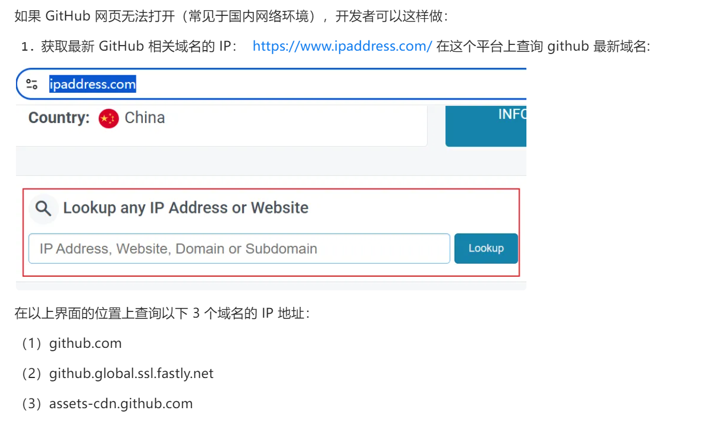

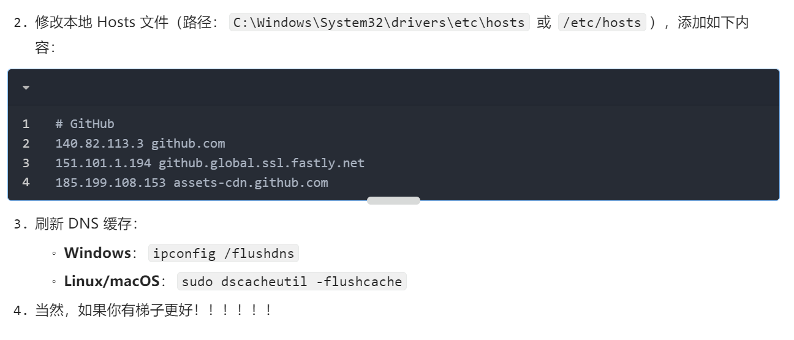