# 第01章 初识Java


# 本章内容概要

- 计算机概述（了解）
- 计算机语言概述（了解）
- Java语言概述（了解）
- Java的加载与执行（理解）
- 第一个Java程序（掌握）
- Java程序的注释（掌握）
- public class与class的区别（掌握）

# 本章内容详解

## 计算机概述（了解）

计算机由**硬件**和**软件**两部分组成

### 硬件

硬件是计算机系统的物理部分，主要包括以下组件：

1. 中央处理器（CPU）：负责处理计算机的指令和数据，是计算机的核心部件。 （比如：1+2=3，1,2,3数据存储在内存中，3这个结果是CPU算出来的。）


1. 内存：用于存储计算机正在运行的程序和数据，是计算机的临时存储器。

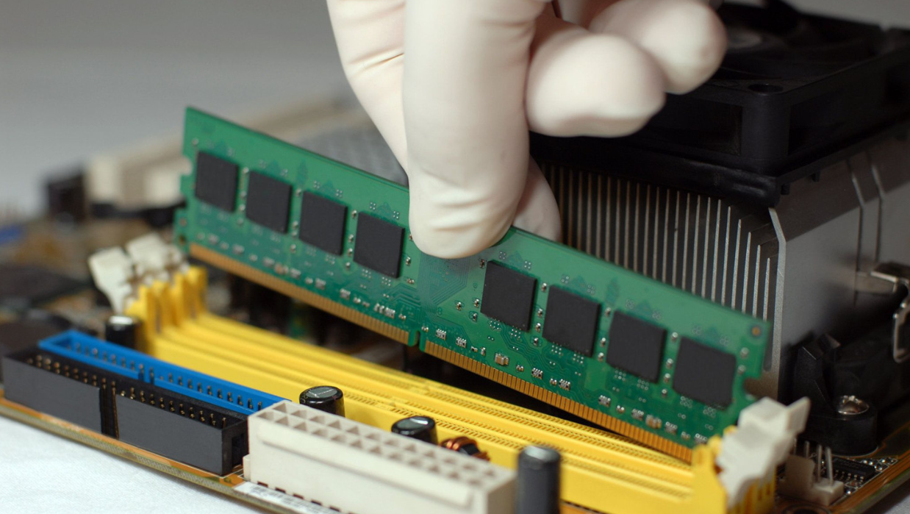

1. 硬盘：用于存储计算机的操作系统、程序和数据，是计算机的永久存储器。

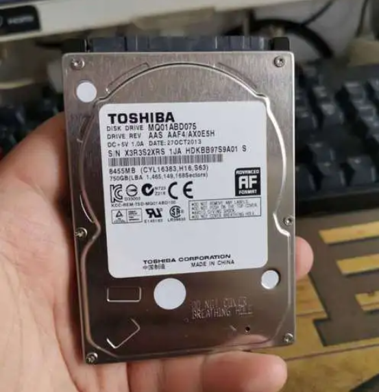

1. 显示器：用于显示计算机处理的图像和文字。
2. 键盘和鼠标：用于输入指令和数据。
3. 主板：连接计算机各个硬件组件的中心部件。

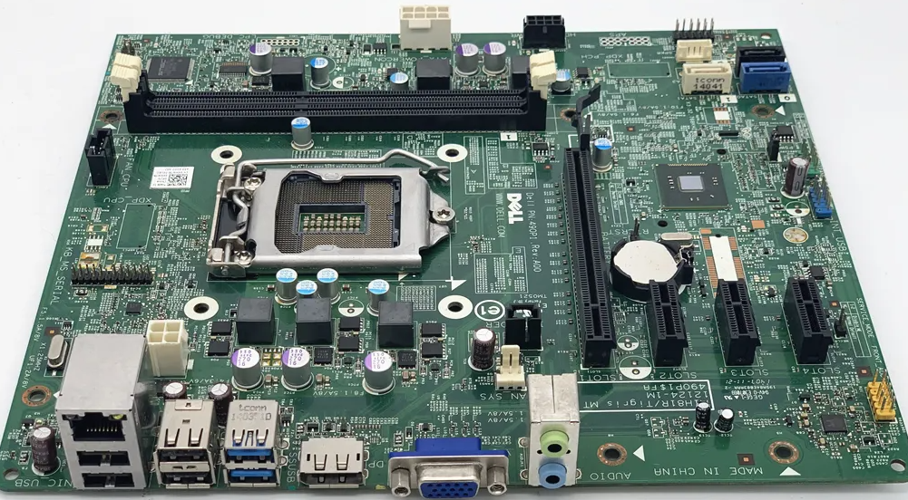

1. 电源：提供电能给计算机各个部件。

还有其他硬件组件，如声卡、网卡、显卡、光驱、散热器等。这些硬件组件共同工作，使计算机能够完成各种任务。

计算机性能主要由以下几个部件决定：

1. 中央处理器（CPU）：CPU 是计算机的核心部件，它决定着计算机的计算能力。CPU 的主要指标包括频率、核心数、缓存大小等。它负责执行计算机的指令和处理数据。CPU 从内存中读取指令和数据，并通过其内部的逻辑电路进行计算和处理，最终将结果再存储回内存。
2. 内存：内存是计算机的临时存储器，越大的内存能够存储更多的程序和数据，从而提高计算机的运行速度。
3. 硬盘：硬盘是计算机的永久存储器，它能够存储大量的数据和程序。硬盘的读写速度和容量大小都会影响计算机的性能。
4. 显卡：显卡是计算机的图形处理器，它能够加速计算机的图形处理和显示速度。
5. 主板：主板是计算机各个硬件组件的中心部件，它能够影响计算机的稳定性和性能。
6. 散热器：散热器是计算机的散热部件，它能够保证计算机在高负载运行时不会过热而导致性能下降或者损坏。

这些部件共同工作，决定着计算机的性能和稳定性。


### 软件

通常计算机软件可以分为**系统软件**和**应用软件**两类：

- 系统软件包括操作系统、驱动程序、系统工具等，用于管理计算机硬件和提供基本的计算机功能。
- 应用软件包括各种办公软件、图形图像软件、音视频软件、游戏软件等，用于满足用户的各种需求和实现各种功能。

常见的系统软件（操作系统OS）：

1. Windows操作系统：由微软公司开发，用于个人电脑和服务器。
2. macOS操作系统：由苹果公司开发，用于苹果电脑。
3. Linux操作系统：一种开源的操作系统，由社区开发和维护，用于个人电脑和服务器。
4. Android操作系统：由谷歌公司开发，用于智能手机和平板电脑。
5. iOS操作系统：由苹果公司开发，用于iPhone、iPad等移动设备。
6. Chrome OS操作系统：由谷歌公司开发，用于Chromebook笔记本电脑。
7. Ubuntu操作系统：一种基于Linux的操作系统，由社区开发和维护，用于个人电脑和服务器。
8. FreeBSD操作系统：一种类Unix操作系统，由社区开发和维护，用于服务器等领域。

常见的应用软件：

1. Microsoft Office套件：包括Word、Excel、PowerPoint、Outlook等。
2. Adobe公司的：包括Photoshop、Acrobat等。
3. 浏览器：Chrome、Firefox、Safari、Edge等。
4. 邮件客户端：Outlook、Gmail、Foxmail等。
5. 影音软件：QuickTime、Windows Media Player等。
6. 聊天工具：微信、QQ、Skype、WhatsApp等。
7. 数据库管理软件：MySQL、Oracle、SQL Server等。
8. 个人理财软件：支付宝、微信支付、银行APP等。
9. 云盘：百度云、腾讯微云、OneDrive等。

硬件、系统软件、应用软件的关系

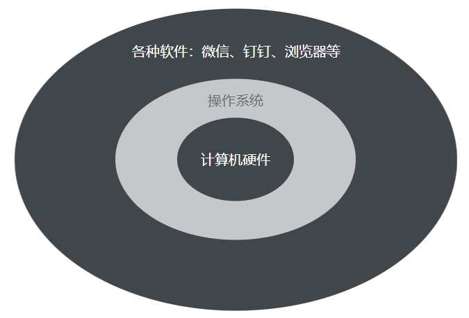


## 计算机语言概述（了解）

### 什么是计算机程序

计算机程序是一系列指令和规则的集合，用于指导计算机执行特定任务或完成特定操作。它通常由**计算机语言**编写而成。计算机程序可以完成各种任务，包括数据处理、图形处理、网络通信、游戏开发等。

### 计算机语言概述及发展史

计算机语言是人与计算机之间进行交流的方式，它是一种特定的符号系统，用于编写计算机程序。

**机器语言（第一代）**

- **特点**：二进制代码（0/1），直接由CPU执行
- **问题**：难写、难读、难改、易错、严重依赖具体机器型号
- **示例**：`10110000 01100001`

**汇编语言（第二代）**

- **特点**：用助记符（如MOV、ADD）代替二进制
- **进步**：可读性提高，但仍需**汇编器**转换为机器码
- **局限**：依然**与硬件强相关**，移植性差

**高级语言（第三代及以后）**

**早期高级语言（1950s–1960s）**

- **Fortran**（1957）：科学计算
- **Lisp**（1958）：人工智能
- **COBOL**（1959）：商业数据处理
- **ALGOL**（1958/1960）：结构化编程的奠基者

**结构化与系统编程语言（1970s）**

- **C语言**（1972）：Unix系统、兼顾效率与可移植性
- **Pascal**（1970）：教学用，强调结构化

**面向对象语言（1980s–1990s）**

- **C++**（1985）：C + 面向对象
- **Java**（1995）：跨平台（JVM）
- **Python**（1991）：简洁、动态
- **C#**（2000）：微软 .NET

**现代与多范式语言（2000s至今）**

- **Go**（2009）、**Rust**（2015）、**Swift**（2014）
- 脚本语言：**JavaScript**、**PHP**、**Ruby**
- 函数式：**Haskell**、**Scala**

总之，计算机语言的发展经历了从低级语言到高级语言的演变过程，它们的不断更新和发展，为计算机技术的进步和发展提供了强有力的支持。

## Java语言概述（了解）

Java是一种面向对象的编程语言（Java底层是C++语言实现的），由Sun Microsystems公司于1995年推出。它是一种通用的、高级的、并发性强的、安全的、可移植的、解释性的、编译性的、动态的、跨平台的编程语言。Sun Microsystems公司于2010年1月被甲骨文（Oracle）公司以74亿美元的价格收购。甲骨文公司成为了Java语言的主要维护者和开发者之一。甲骨文公司官网地址：[http://www.oracle.com](http://www.oracle.com)


### Java之父

Java之父：Java之父指的是詹姆斯·高斯林（James Gosling），他是Java编程语言的发明者之一。高斯林在20世纪80年代末和90年代初，与Sun Microsystems公司的一些工程师一起开发了Java语言。高斯林出生于加拿大，1983年获得了卡尔加里大学的计算机科学博士学位。之后，他加入了Sun Microsystems公司，开始从事编程语言方面的研究工作。在Sun公司，他领导了一支团队，致力于开发一种新的编程语言，这就是后来的Java语言。Java语言的设计初衷是为了解决跨平台编程的问题。在Java语言的设计中，高斯林和他的团队引入了许多新的概念和技术，如虚拟机、垃圾回收、面向对象编程等，这些技术极大地改进了编程语言的性能和可用性。高斯林在Java语言的发明和推广过程中，发挥了非常重要的作用。他不仅是Java语言的设计者之一，而且还是Java社区的重要领袖和推动者。他一直致力于推广Java技术，帮助Java社区不断发展壮大。


### Java名字来历及logo标志

Java的名字有一个有趣的历史背景。在1990年代初，SUN公司的研发团队正在开发一种新的软件平台，该平台可以在各种不同的计算机系统上运行，并且能够处理各种多媒体文件。这种平台最初被称为“Oak”，以纪念SUN公司的首席科学家James Gosling喜欢的一棵橡树。

然而，在1995年，SUN公司发现该名称已经被一家电视机制造商使用了，因此他们需要一个新的名称。SUN公司的营销团队进行了一系列的市场调研，他们最终选择了Java这个名字。Java这个名字来源于印度尼西亚的爪哇岛，因为该岛是印度尼西亚咖啡的主产区。SUN公司的营销团队认为这个名字可以带来一些独特的品牌价值，并且可以与咖啡文化相关联，因此他们决定将这个名字用于新的软件平台。

Java的logo同样也是一杯冒着热气的咖啡：

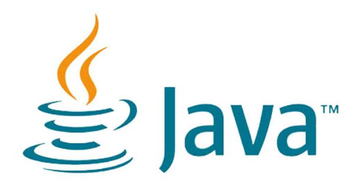

### Java语言发展史

Java语言的发展历程中的重要事件：

1. 1995年：Java语言诞生，由Sun Microsystems的James Gosling等人开发。
2. 1996年：发布Java 1.0版本。
3. 1998年：发布Java 2（也称为Java SE）版本，引入了重要的新特性，如Swing图形界面工具包、JavaBeans组件技术等。
4. 2004年：发布Java SE 5.0版本，引入了自动装箱/拆箱、泛型、枚举、注解等重要特性。
5. 2006年：Sun Microsystems发布Java SE 6版本，引入了更多的新特性，如JDBC 4.0、JAX-WS 2.0等。
6. 2010年：Oracle公司收购了Sun Microsystems，成为Java语言的主要维护者。
7. 2011年：发布Java SE 7版本，引入了重要的新特性，如Switch语句的字符串支持、NIO 2.0等。
8. 2014年：发布Java SE 8版本，引入了Lambda表达式、Stream API、新的日期/时间API等重要特性。
9. 2017年：发布Java SE 9版本，引入了模块化系统、REPL工具等新特性。
10. 2018年3月：发布Java SE 10版本，引入了局部变量类型推断、G1垃圾收集器等新特性。
11. 2018年9月：发布Java SE 11版本，成为长期支持版本，移除了一些过时的API，引入了新的HTTP Client API等新特性。
12. 2019年3月：发布Java SE 12版本，增加了Switch表达式、新的垃圾回收器Shenandoah等特性。
13. 2019年9月：发布Java SE 13版本，增加了文本块、改进的Switch表达式、动态CDS等特性。
14. 2020年3月：发布Java SE 14版本，增加了Switch表达式的模式匹配、Records、改进的垃圾回收器等特性。
15. 2020年9月：发布Java SE 15版本，增加了Sealed类、文本块、ZGC（Z Garbage Collector）等功能。
16. 2021年3月：发布Java SE 16版本，增加了Records、Pattern Matching for instanceof、Vector API等功能。
17. 2021年9月：发布Java SE 17版本，增加了Sealed类、Pattern Matching for switch、Records、Foreign Linker API等功能。
18. 2023 年 9 月：发布 JavaSE21 版本，这也是一个 LTS 版（Long-Term Support，长期支持版）
19. 2025年9月：发布JavaSE25版本，它也是一个LTS版本。


### Java的三大分支

Java的三大分支：

- Java SE（Java Standard Edition）是Java的标准版，它包含了Java语言的核心部分，包括基础类库、虚拟机和开发工具等。Java SE主要用于开发桌面应用程序、控制台程序和小型服务器端应用程序等。
- Java EE（Java Enterprise Edition）是Java的企业版，它是在Java SE的基础上扩展而来，主要用于开发大型企业级应用程序，如电子商务系统、ERP系统和CRM系统等。Java EE包含了许多企业级技术，如Servlet、JSP、EJB、JMS、JTA等。
- Java ME（Java Micro Edition）是Java的微型版，它主要用于嵌入式设备和移动设备上的应用程序开发，如手机、平板电脑、数码相机、路由器等。Java ME的特点是体积小、速度快、资源占用少，可以在较小的内存和处理能力的设备上运行。

Java的三大分支之间存在一定的关系，可以简单概括为：

- Java SE是Java的核心部分，Java EE和Java ME都是在Java SE的基础上进行扩展和定制。
- Java EE是在Java SE的基础上增加了更多的企业级技术，如Servlet、JSP、EJB、JMS、JTA等，用于开发大型企业级应用程序。
- Java ME是在Java SE的基础上进行裁剪和优化，使其适合嵌入式设备和移动设备上的应用程序开发。

总之，Java SE是Java的基础，Java EE和Java ME都是在Java SE的基础上进行扩展和定制，用于不同领域的应用程序开发。

### Java语言特性

Java语言的特点包括：

1. 简单易学：Java语言的语法和C语言很相似，但是它去掉了C中的复杂的指针和多重继承等特性，使得Java语言更加简单易学。
2. 面向对象：Java语言是一种纯面向对象的编程语言，它支持对象的封装、继承和多态等面向对象的特性。
3. **平台无关性（跨平台性：一次编译到处运行）**：Java语言的程序可以在不同的操作系统和硬件平台上运行，这是因为Java程序被编译成字节码，而不是机器码，字节码可以在任何支持Java虚拟机的平台上运行。 实现原理：不同的操作系统上安装属于自己的Java虚拟机，而Java虚拟机屏蔽了各个操作系统之间的差异，从而做到跨平台。
4. 安全性：Java语言具有很高的安全性，它提供了一系列的安全措施来保护程序不受恶意攻击和病毒侵害。
5. 高性能：Java语言具有很高的性能，它采用了一系列优化措施来提高程序的执行速度和内存使用效率。
6. 多线程支持：Java语言具有很好的多线程支持，它提供了一系列的线程控制机制，使得程序可以更好地利用计算机的多核处理能力。
7. **自动垃圾回收机制**：Java语言采用的是垃圾回收机制（Garbage Collection，简称GC），也就是自动内存管理机制。在传统的编程语言中，程序员需要手动分配和释放内存，容易出现内存泄漏和悬挂指针等问题。而Java语言采用的垃圾回收机制可以自动分配和释放内存，避免了这些问题。

总之，Java语言是一种强大的、易学的、安全的、跨平台的编程语言，它在企业级应用开发、Web应用开发、移动应用开发和嵌入式系统开发等领域都有广泛的应用。


## Java的加载与执行（理解）


1. 包含两个阶段：编译阶段和运行阶段。
2. 编译阶段和运行阶段可以在不同的操作系统上完成。
3. 编译后删除java源程序，不会影响程序的执行。
4. 生成的class文件如果是A.class，则类名为A。如果是Hello.class，则类名为Hello。
5. javac是负责编译的命令。
6. java是负责运行的命令。
7. class文件不是机器码，操作系统无法直接执行。只有JVM才能看懂。
8. JVM会把class字节码解释为机器码，这样操作系统才能看懂。
9. 类加载器是如何找到class文件的？是通过环境变量CLASSPATH中的路径去搜索的。
10. Java程序要想运行，必须有JVM才行。JVM怎么安装？只要安装了JRE，JRE中自带JVM。
11. JDK、JRE、JVM分别是什么？它们的关系是？

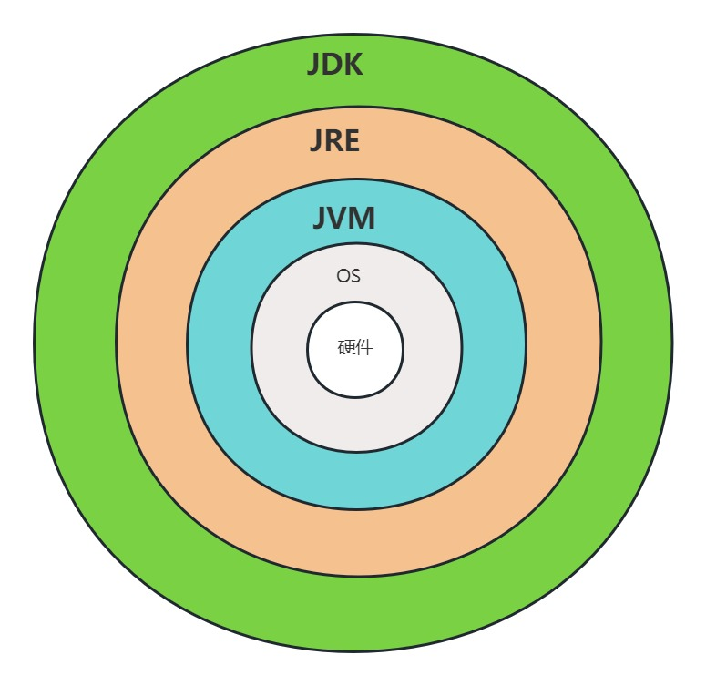

- JDK（Java Development Kit）是Java开发工具包，包含了Java开发所需的所有工具和类库，包括JRE（Java Runtime Environment）和JVM（Java Virtual Machine）。
- JRE（Java Runtime Environment）是Java运行时环境，包含了Java虚拟机和运行Java程序所需的类库等文件。
- JVM（Java Virtual Machine）是Java虚拟机，是Java程序的运行环境，能够在各种平台上运行Java程序，它将Java字节码解释成本地机器码执行。


## 第一个Java程序（掌握）

### JDK下载和安装（windows）

以下是详细的步骤：

1. 下载 JDK21 安装文件

在Oracle官网下载JDK21 的安装文件，下载地址为：[https://www.oracle.com/java/technologies/downloads/#jdk21-windows](https://www.oracle.com/java/technologies/downloads/#jdk21-windows) 。根据你的操作系统版本和位数，选择相应的安装文件进行下载。

1. 运行安装程序

双击下载的安装文件，启动安装程序。在弹出的安装程序窗口中，点击“Next”按钮，开始安装。

1. 选择安装路径

在弹出的“Custom Setup”窗口中，选择JDK17的安装路径。建议选择默认路径，也可以根据需要进行自定义路径设置。点击“Next”按钮继续。

1. 安装组件

在弹出的“Custom Setup”窗口中，选择需要安装的组件。建议选择全部组件，以确保安装的完整性。点击“Next”按钮继续。

1. 等待安装完成

在弹出的“Ready to Install”窗口中，点击“Install”按钮，开始安装。安装程序会自动完成安装，需要等待一段时间。

1. **配置环境变量PATH**

在安装完成后，需要将JDK17的安装路径添加到环境变量中，使其可以被系统识别。具体操作步骤如下：

- 右键点击“我的电脑”或“此电脑”图标，选择“属性”。
- 在弹出的窗口中，选择“高级系统设置”。
- 在弹出的“系统属性”窗口中，选择“高级”选项卡，点击“环境变量”按钮。
- 在弹出的“环境变量”窗口中，找到“系统变量”中的“Path”变量，点击“编辑”按钮。
- 在弹出的“编辑环境变量”窗口中，点击“新建”按钮，添加JDK17的安装路径。例如：C:\Program Files\Java\jdk-17。
- 点击“确定”按钮，保存设置。

1. 验证安装

打开命令行窗口，输入“java -version”命令，如果输出JDK17的版本信息，则安装成功。如果未能输出版本信息，则需要重新检查环境变量的设置是否正确。


### JDK下载和安装（macOS）

以下是详细的步骤：

1. 下载地址：[https://www.oracle.com/java/technologies/downloads/#jdk17-mac](https://www.oracle.com/java/technologies/downloads/#jdk17-mac)

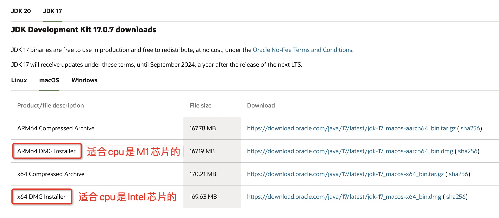

1. 下载后的dmg文件


1. 双击dmg安装包

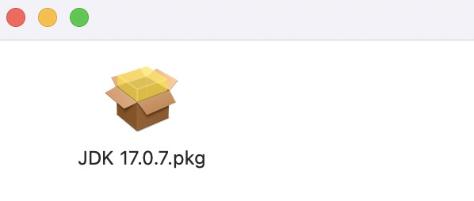

1. 双击pkg文件后，一步一步安装即可

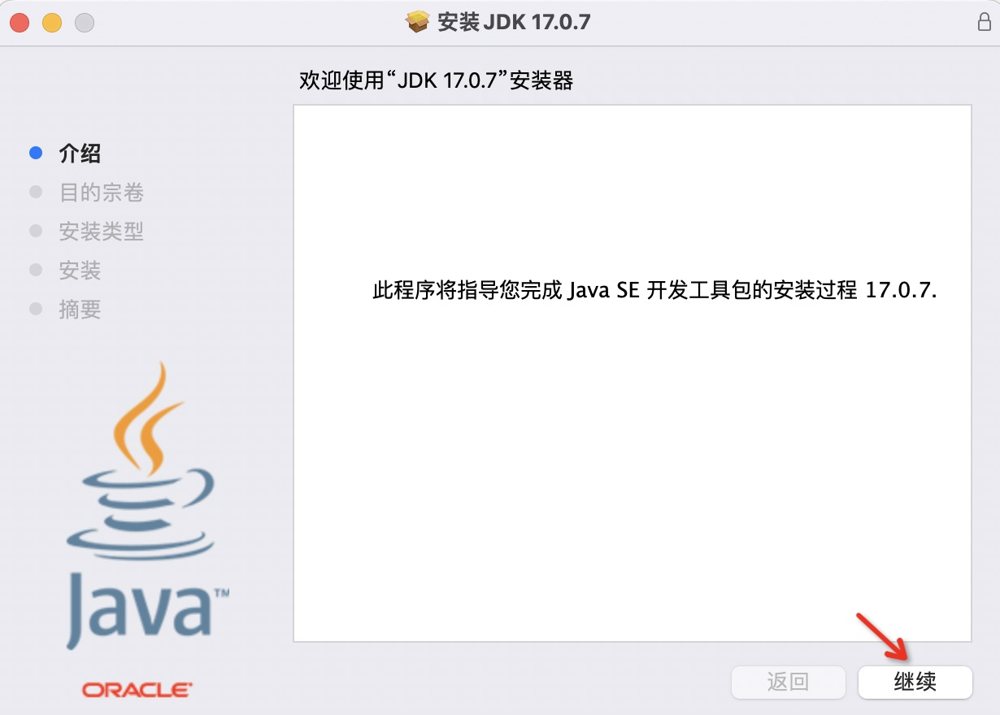

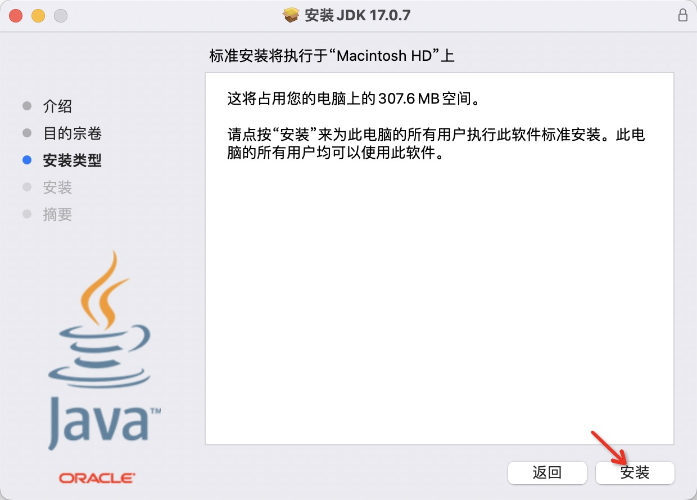

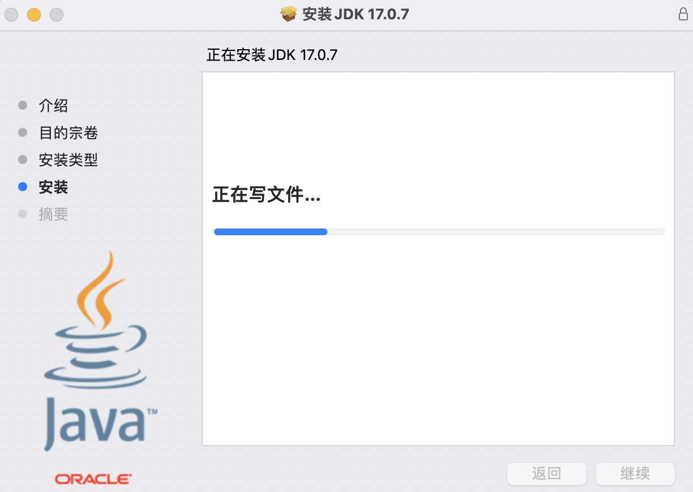

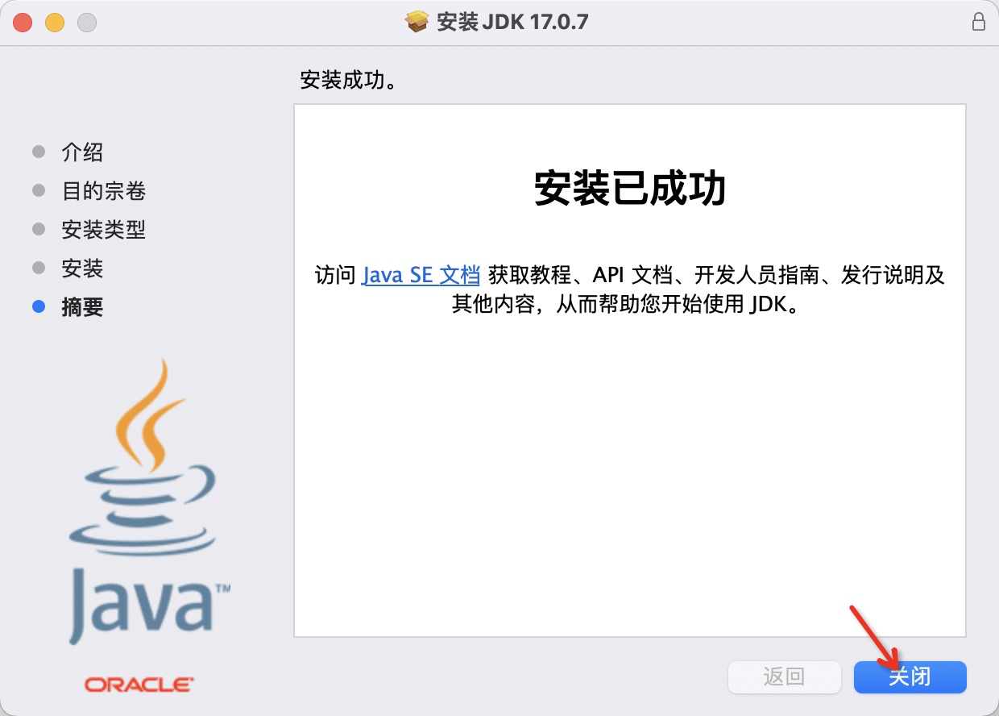

1. 安装完毕后，打开终端，输入java -version，然后输入javac -version，如下图显示表示安装成功了

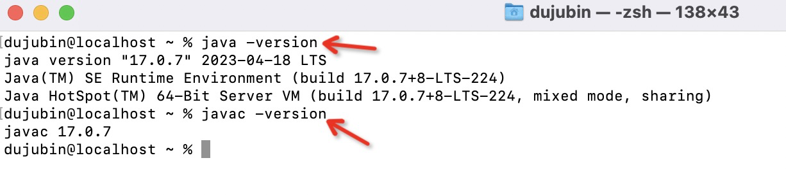

如果你的macOS上曾经安装过JDK其他版本，如果你想让系统默认使用你安装的最新的JDK17，你还需要按照以下步骤设置环境变量JAVA_HOME

1. 打开终端，输入以下命令查看JDK的安装路径：

```bash
/usr/libexec/java_home -v 17
```

1. 复制上述命令输出的路径，例如：

```bash
/Library/Java/JavaVirtualMachines/jdk-17.jdk/Contents/Home
```

1. 打开终端，输入以下命令打开.bash_profile文件：

```bash
sudo vim ~/.bash_profile
```

1. 在.bash_profile文件中添加以下内容：

```bash
export JAVA_HOME=/Library/Java/JavaVirtualMachines/jdk-17.jdk/Contents/Home
export PATH=$PATH:$JAVA_HOME/bin
```

重点：在 ~/.bash_profile 文件中添加以上内容后，按ESC键，输入:wq，保存退出。

1. 保存并关闭.bash_profile文件，输入以下命令使配置生效：

```bash
source ~/.bash_profile
```

1. 输入以下命令测试JAVA_HOME环境变量是否配置成功：

```bash
echo $JAVA_HOME
```

如果输出的路径与步骤2中复制的路径一致，则说明配置成功。


### JDK目录说明

1. bin目录：包含JDK17的可执行文件，如java、javac、javadoc等。
2. conf目录：包含JDK17的配置文件，如Java安全策略文件、JVM配置文件等。
3. include目录：包含头文件，用于开发C和C++应用程序。
4. jmods目录：包含模块化的JDK17组件，使得开发者可以更方便地构建和管理应用程序。
5. legal目录：包含JDK17的相关法律文件和许可证信息。
6. lib目录：包含JDK17的类库和其他支持文件，如JVM库、JDBC驱动程序等。
7. release文件：包含JDK17的版本信息和发布说明。
8. lib/src.zip文件：包含JDK17的源代码，用于开发者进行Java开发。
9. README文件：包含JDK17的安装说明和使用指南。
10. LICENSE文件：包含JDK17的许可证信息，开发者需要了解并遵守相关规定。

### 编写第一个Java程序

在任意位置新建HelloWorld.java文件，注意：必须确保该文件的扩展名是：.java，然后使用任意一个文本编辑器打开并编写如下代码。代码要严格照抄，包括大小写、换行、缩进等，总之，要和以下代码一模一样：

```java
public class HelloWorld {
    public static void main(String[] args){
        System.out.println("Hello World!");
    }
}
```

### 编译第一个Java程序

使用javac命令进行编译。javac命令是Java编译器命令，用于将Java源代码文件编译成Java字节码文件。下面是javac命令的详细用法：

基本用法：

```plaintext
javac [options] [source files]
```

其中，`[options]`表示编译选项，`[source files]`表示要编译的Java源代码文件。

常用选项：

- `-classpath <path>`：指定类路径，多个路径之间用分号（Windows）或冒号（Unix/Linux/Mac）分隔。
- `-d <directory>`：指定输出目录，编译后的字节码文件将保存在该目录下。
- `-verbose`：显示编译详细信息。
- `-nowarn`：禁用警告信息。
- `-source <version>`：指定源代码版本，例如1.8。
- `-target <version>`：指定生成的字节码版本，例如1.8。
- `-help`：显示帮助信息。

**要点：javac命令后面跟的是java源文件的路径。路径可以是绝对路径，也可以是相对路径。**

编译成功后会生成.class字节码文件。


### 运行第一个Java程序

**这里有一个非常重要的步骤：首先在DOS命令窗口中将路径切换到class文件所在位置。这一步非常关键。**

然后执行以下命令：

```plaintext
java 类名
```

运行Java程序需要使用的命令是：java

java命令怎么用？java命令后面跟的是“类名”，而不是文件的路径。

什么是类名：A.class则类名为A；B.class则类名为B；HelloWorld.class则类名为HelloWorld

运行成功后，会打印一句话。

### 理解环境变量CLASSPATH

1. CLASSPATH是一个环境变量。隶属于Java。（之前接触过的PATH也是一个环境变量，隶属于windows系统的。）
2. CLASSPATH环境变量是给JVM的类加载器指路的。
3. 如果CLASSPATH没有配置的话，默认从当前路径下查找并加载类。
4. 如果显示的配置了CLASSPATH的话，只会从配置的CLASSPATH中加载类。不再从当前路径下加载。

## Java注释（掌握）

### 注释有什么用

Java中的注释是用于解释和说明代码的文本，它不会被编译器编译，也不会被程序执行。注释的作用如下：

1. 代码的解释说明：注释可以解释代码的功能，作用，实现方法等，让其他程序员更容易理解代码。
2. 代码的调试：在程序调试的过程中，注释可以帮助程序员快速定位问题所在。
3. 文档生成：注释可以用于自动生成文档，方便其他人阅读和使用代码。
4. 代码的维护：注释可以帮助程序员更好地维护代码，防止出现不必要的错误。

总之，注释是程序设计中的重要工具，能够提高代码的可读性和可维护性，减少程序错误。


### 怎么写好注释

写好注释需要一定的技巧和经验，以下是一些写好注释的技巧：

1. 注释要简洁明了。注释应该简短、精炼、易于理解，不要冗长、重复或者难以理解。
2. 注释要准确无误。注释必须准确描述代码的功能、参数、返回值、限制条件等，不能有误导性的描述。
3. 注释要规范化。注释应该遵循一定的规范，如使用特定的注释格式、标记、缩进等，以便于其他程序员阅读和维护。
4. 注释要适当。注释应该适当地使用，不要在每一行代码都加注释，也不要在显而易见的代码上浪费注释。
5. 注释要更新。注释应该及时更新，反映代码的变化和更新，避免注释与代码不一致。
6. 注释要有意义。注释应该有意义，能够解释代码的意图和目的，帮助其他程序员理解代码的设计思想。

总之，写好注释需要结合实际情况，遵循规范，注重准确性和简洁性，适当使用，及时更新，有意义的描述代码的设计思想和实现方法。

### java中的三种注释

Java中有三种常见的注释写法：单行注释、多行注释和文档注释。

1. 单行注释：以“//”开头，注释内容在“//”后面，一直到该行结束。例如：

```java
// 这是一个单行注释
```

1. 多行注释：以“/*_”开头，“*_/”结尾，注释内容在两个符号之间。例如：

```java
/*
这是一个多行注释
可以写多行内容
*/
```

1. 文档注释：以“/**”开头，“*/”结尾，注释内容在两个符号之间。文档注释是一种特殊的注释，用于生成API文档。例如：

```java
/**
 * 这是一个文档注释，用于生成API文档。
 * 可以写多行内容，包括HTML标签。
 */
```

文档注释中可以使用特殊的标签来表示注释内容的含义，例如：

- @author：指定作者。
- @version：指定当前代码版本。

使用文档注释可以为代码编写清晰、易懂、规范的API文档，方便其他开发人员阅读和使用。


### javadoc命令

有这样一段代码注释的程序：

```java
/**
 * 这是一个简单的Java HelloWorld程序。
 * 
 * @author ：张三
 * @version ：1.0
 */
public class HelloWorld {
  
  /**
   * 这是主方法，用于将消息“Hello, World!”输出到控制台。
   * 
   * @param args 未使用的命令行参数。
   */
  public static void main(String[] args) {
    System.out.println("Hello, World!");
  }
  
}
```

使用javadoc命令生成API文档：

1. 打开命令行工具，进入HelloWorld.java文件所在的目录。
2. 输入以下命令：

```plaintext
javadoc -author -version -d doc HelloWorld.java
```

1. 执行命令后，javadoc会在当前目录下生成一个名为“doc”的文件夹，其中包含了生成的API文档。
2. 打开“doc”文件夹，找到“index.html”文件，用浏览器打开即可查看生成的API文档。


### 解释HelloWorld

当我们学习一门新语言时，通常第一步就是编写一个简单的“Hello, World!”程序。这个程序的目的是打印出一条简单的问候语，以证明我们已经成功地安装了编程环境并能够编写并运行程序。

在Java中，HelloWorld程序通常如下所示：

```java
public class HelloWorld {
    public static void main(String[] args) {
        System.out.println("Hello, World!");
    }
}
```

让我们逐行分解一下这个程序：

1. `public class HelloWorld {` - 这一行定义了一个名为“HelloWorld”的公共类。Java中的每个程序都必须有一个公共类，并且该类的名称必须与程序的文件名相同。
2. `public static void main(String[] args) {` - 这是程序的主方法。在Java中，每个程序都必须有一个名为“main”的方法，作为程序的入口点。它必须是一个公共、静态的方法，并且接受一个字符串数组作为参数。
3. `System.out.println("Hello, World!");` - 这一行使用Java的标准输出函数打印出一条问候语。

在运行这个程序时，Java虚拟机将首先查找名为“HelloWorld”的类，并且将在该类中查找名为“main”的方法。一旦找到该方法，它将执行其中的代码，并且将“Hello, World!”打印到控制台上。

总之，HelloWorld程序是一个简单的入门示例，它向我们展示了Java程序的基本结构和语法。

## public class与class的区别（掌握）

1. 一个java源文件中可以定义多个class
2. 一个class会编译生成一个class文件
3. public的类可以没有，有的话，只能有一个，并且public的类名要和源文件名保持一致
4. 任何一个class中都可以有main方法，但对于一个软件来说，一般入口只有一个


# 本章作业题

## 打印你的个人信息

包括：姓名，年龄，性别，家庭住址，联系电话等

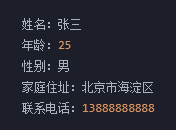

```java
public class PersonalInfo {
    public static void main(String[] args) {
        System.out.println("姓名：张三");
        System.out.println("年龄：25");
        System.out.println("性别：男");
        System.out.println("家庭住址：天津市南开区");
        System.out.println("联系电话：13888888888");
    }
}
```

## 打印一个菱形


```java
public class Diamond {
    public static void main(String[] args) {
        System.out.println("    *    ");
        System.out.println("   ***   ");
        System.out.println("  *****  ");
        System.out.println(" ******* ");
        System.out.println("*********");
        System.out.println(" ******* ");
        System.out.println("  *****  ");
        System.out.println("   ***   ");
        System.out.println("    *    ");
    }
}
```

## 打印商品列表

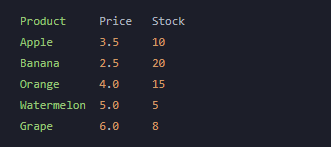

```java
public class ProductList {
    public static void main(String[] args) {
        System.out.println("Product\t\tPrice\tStock");
        System.out.println("Apple\t\t3.5\t10");
        System.out.println("Banana\t\t2.5\t20");
        System.out.println("Orange\t\t4.0\t15");
        System.out.println("Watermelon\t5.0\t5");
        System.out.println("Grape\t\t6.0\t8");
    }
}
```


# 本章面试题

## 你认为Java是解释型语言还是编译型语言？

Java既不是纯解释型语言，也不是纯编译型语言，而是一种混合型语言。Java源代码首先会被编译成字节码文件，字节码文件不是针对特定的硬件和操作系统而编译的，而是针对Java虚拟机（JVM）而编译的。字节码文件在运行时由JVM解释执行，JVM会将字节码文件转换为机器码并执行，这样就可以实现跨平台性，使得Java程序可以在任何安装了JVM的计算机上运行。因此，Java是一种混合型语言，它既具备编译型语言的高效性，又具备解释型语言的跨平台性。

## Java是如何做到跨平台的，请说出你的理解？

Java是一种基于虚拟机的编程语言，它的跨平台性是通过Java虚拟机（JVM）实现的。Java程序在编译时会被编译成字节码，而不是直接编译成机器语言。这些字节码可以在任何支持Java虚拟机的平台上运行，包括Windows、Mac、Linux等操作系统。

Java虚拟机是一个抽象的计算机，它提供了一个独立于硬件平台的运行环境。当Java程序在不同的操作系统上运行时，JVM会将字节码解释成机器码，从而实现跨平台运行。这种机制保证了Java程序在不同平台上的一致性和可移植性。

总的来说，Java的跨平台性是通过将程序编译成字节码，再由Java虚拟机解释执行实现的。这种机制使得Java程序可以在不同平台上运行，无需重新编译。

## 请解释一下Java中的类路径是什么？

Java中的类路径（Classpath）是指JVM在搜索类文件（.class文件）时所使用的路径。在Java中，当需要加载一个类时，JVM会按照一定的顺序在类路径中查找该类的字节码文件。如果找到了该文件，则会加载该类并创建相应的对象。

类路径可以由多个路径组成，路径之间用分号（Windows系统）或者冒号（Unix/Linux系统）分隔。在Java中，类路径可以分为系统类路径和用户类路径。

系统类路径是JVM默认的类路径，它包含了Java运行环境中的核心类库和扩展类库。系统类路径可以通过系统属性"java.class.path"来获得。

用户类路径是用户自定义的类路径，它包含了用户自己编写的类文件和第三方库文件。用户类路径可以通过"-classpath"或"-cp"选项指定，也可以通过设置系统环境变量CLASSPATH来指定。

通常情况下，Java程序的类文件都位于用户类路径中，而核心类库和扩展类库位于系统类路径中。在编写Java程序时，需要根据实际情况配置类路径，以确保程序能够正常运行。

## Java字节码是机器码吗？

Java字节码不是机器码。Java源代码在编译时会被编译成Java字节码（.class文件），而不是直接编译成机器码。Java字节码是一种中间代码，它是一种平台无关的二进制代码，可以在任何支持Java虚拟机（JVM）的平台上运行。

Java字节码是由Java编译器生成的一种二进制文件，它包含了Java源代码编译后的中间代码，而不是机器码。Java字节码可以被JVM解释执行，JVM会将字节码解释成机器码，从而实现跨平台运行。

Java字节码的优点是可以在不同平台上运行，而不需要重新编译。这种机制使得Java程序具有很强的可移植性和跨平台性。但是，由于Java字节码需要被JVM解释执行，因此Java程序的执行速度相对较慢。

# 本章总结

1. 计算机的核心硬件是什么？各自有什么用？
2. 软件分为哪两类？
3. 你知道哪些系统软件？
4. 你知道哪些应用软件？
5. 计算机语言发展的大体趋势是怎样的？
6. Java之父的名字是？logo是？
7. Java中被长期支持的稳定版本是？
8. Java语言的三大分支？
9. Java中非常重要的两个特性是？
10. 能够简单的描述出Java的加载与执行的过程。
11. 能够独立的编写第一个Java程序，从安装JDK，到配置环境变量，到编写，到编译，到最终的运行。
12. 能够完全理解PATH环境变量
13. 能够完全理解CLASSPATH环境变量
14. Java注释的三种写法？
15. 了解javadoc命令
16. 一个文件中可以定义多个class，一个class会生成一个class文件
17. public的类可以没有，但如果有，只能有一个，并且和源文件名一致
18. 任何一个class中都可以有main方法，但对于一个软件来说，一般入口只有一个

