# 第03章 IntelliJ IDEA的使用

# IDEA的概述

## IDEA的介绍

IDEA 全称 IntelliJ IDEA，是java编程语言的集成开发环境。IntelliJ在业界被公认为最好的Java开发工具，尤其在智能代码助手、代码自动提示、重构、JavaEE支持、各类版本工具(git、svn等)、JUnit、CVS整合、代码分析、 创新的GUI设计等方面的功能可以说是超常的。IDEA是JetBrains公司的产品，这家公司总部位于捷克共和国的首都布拉格，开发人员以严谨著称的东欧程序员为主。它的旗舰版还支持HTML，CSS，PHP，MySQL，Python等。免费版只支持Java,Kotlin等少数语言。

## IDEA的下载

在后面的学习中，我们使用的是IDEA新款的 2025.2.2 版本，我们先从IDEA官网下载安装包，下载链接为：[https://www.jetbrains.com/idea/](https://www.jetbrains.com/idea/)

# IDEA安装

## IDEA的安装

双击安装即可，一个是安装路径，需要修改的可以修改一下。快捷方式需要创建的可以创建一下。如下图：

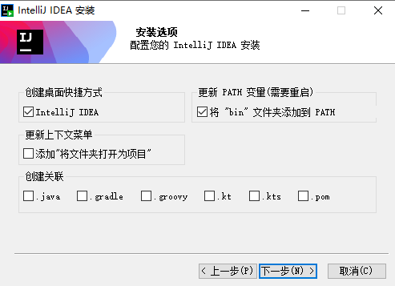

## IDEA的激活

1. 激活过程中，IDEA 工具保持关闭。
2. 下载我分享给大家的激活包并解压【建议解压的目录中不要有中文，另外解压之后位置不要移动，也不要删除】

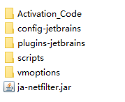

1. 打开 `scripts`目录，双击执行这个脚本

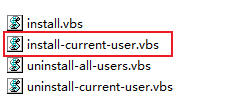

等一会，会弹窗，弹窗之后点击确定即可。

1. 从这个目录下找 IDEA 的激活码，打开文件并复制激活码：

1. 打开 IDEA 工具，选择英文环境：

1. 不分享

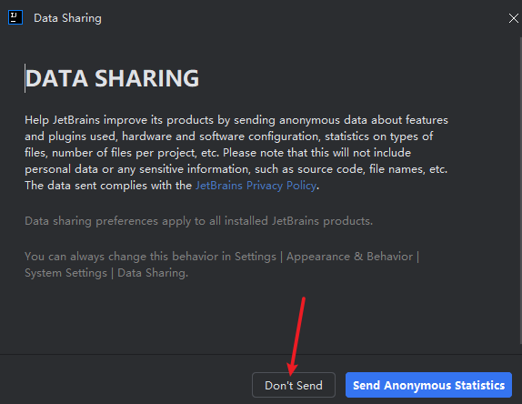

1. 点击左下角设置，选择如下图的 `Manage Subscriptions`：

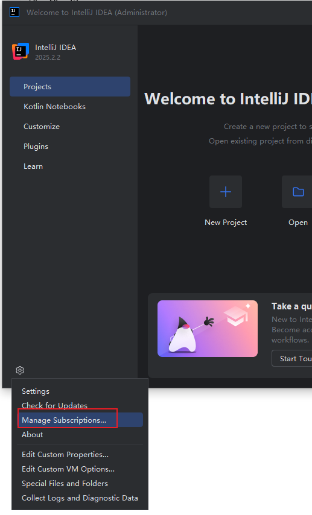

1. 选择 `Active Code`，粘贴激活码，确定激活

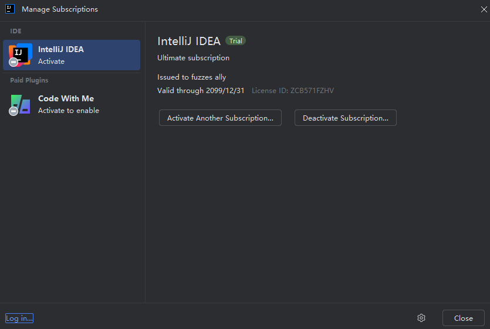

# IDEA的基本使用

## 创建空项目和模块

第一步：打开IDEA

IDEA安装破解完毕后，我们启动IDEA，则就呈现出以下的欢迎界面。

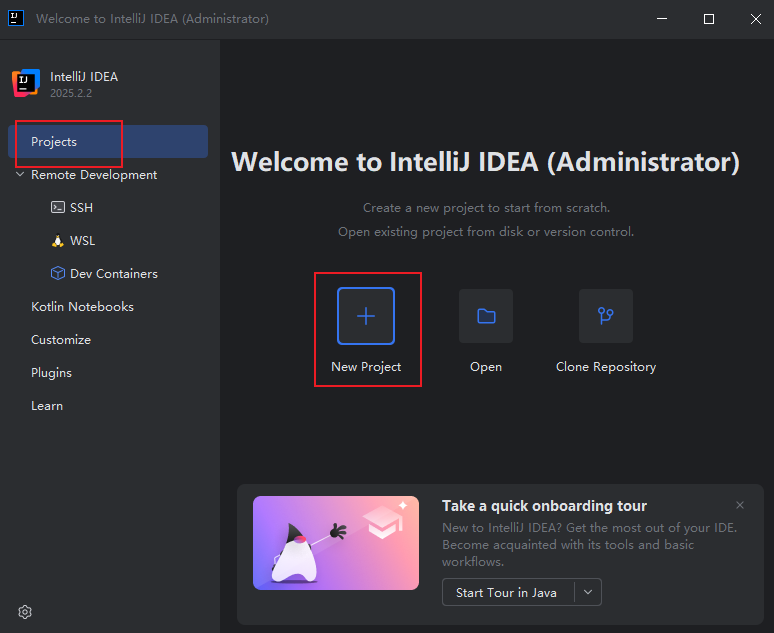

第二步：新建空项目（设置项目名和项目的存放位置）

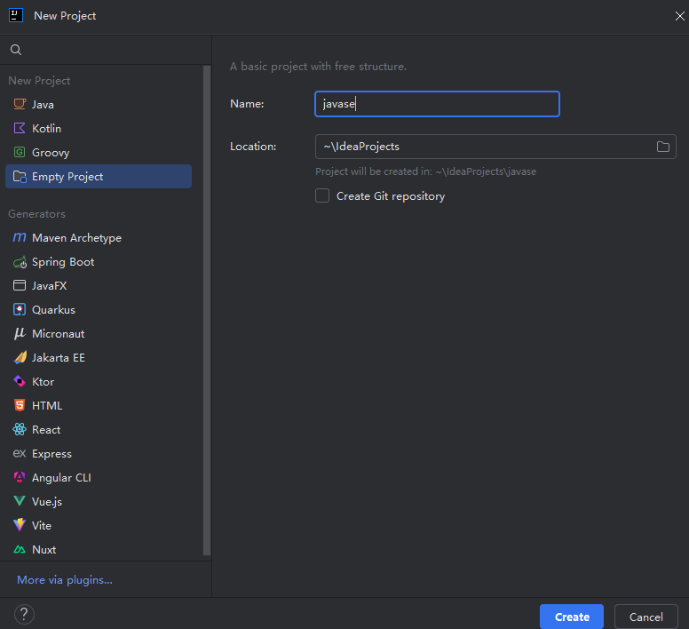

第三步：解释IDEA窗口

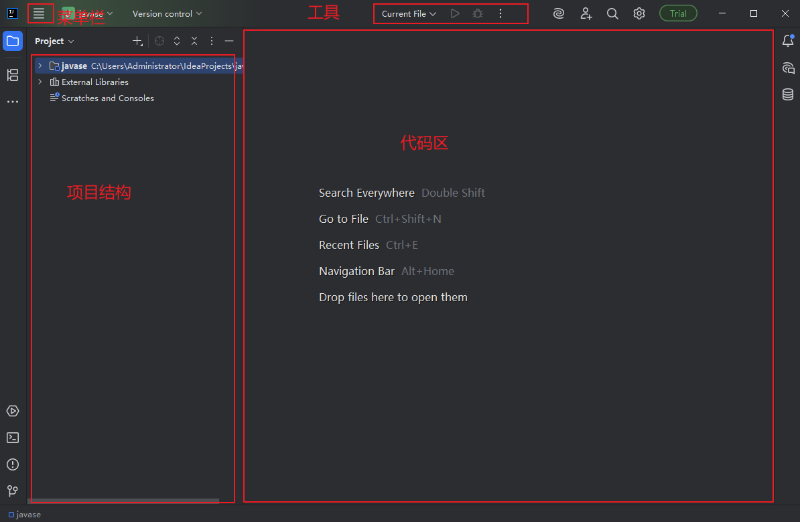

第四步：设置项目的 JDK 版本和编译器版本

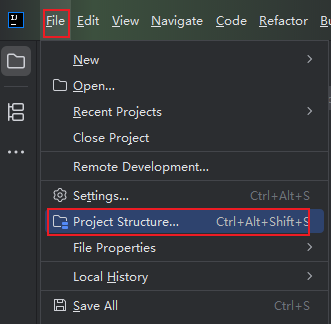

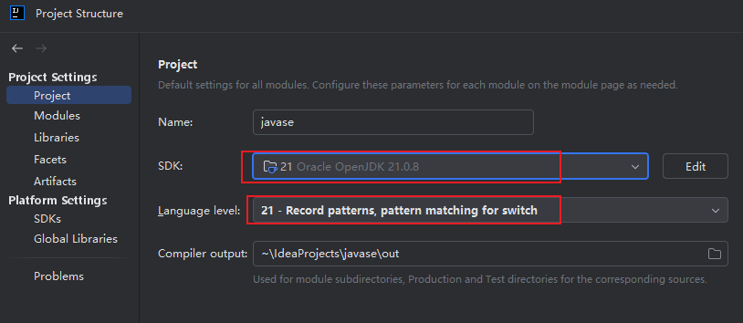

第五步：新建模块 Module

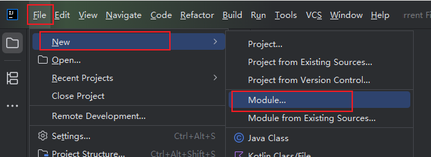

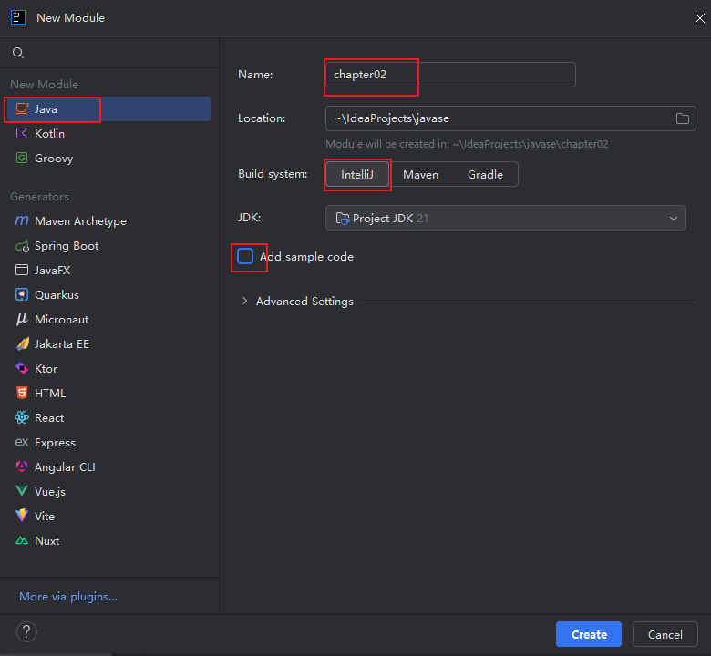

## 设置字符编码方式

统一设置为 UTF-8

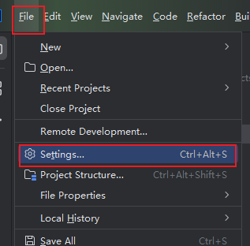

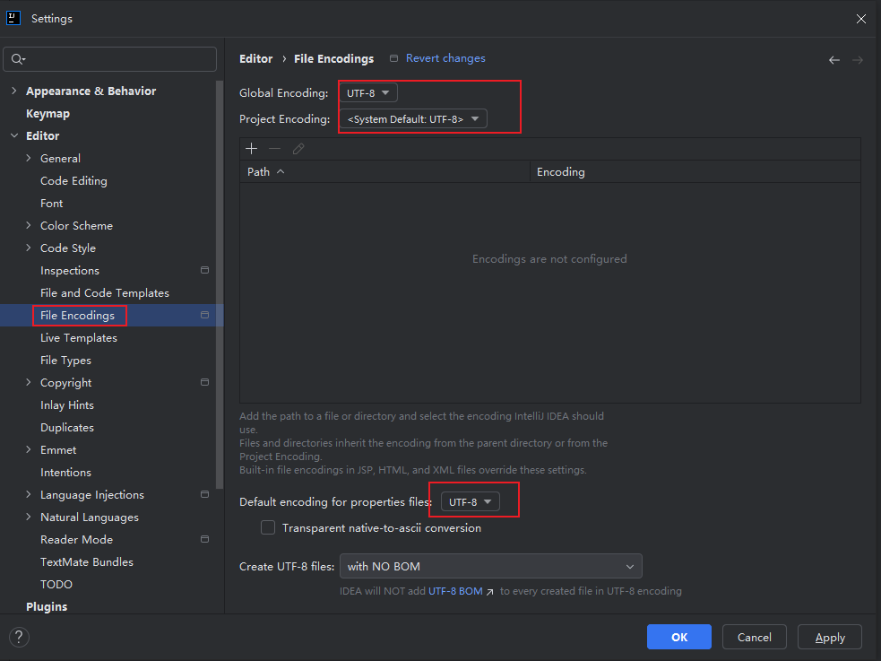

## 创建包（Package）

选中src目录或某个包，然后鼠标右键选中New，接着选中Package，并给包进行命名。

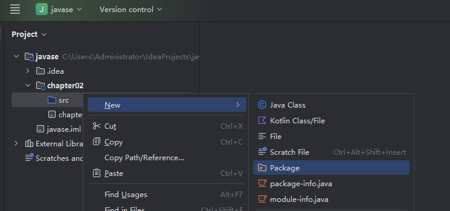

包名必须符合“标识符”的命名规则，还需符合“单词全部小写，多个单词之间以“.”连接，并且做到顶级域名倒着写”的命名规范。

## 创建类（Class）

选中某个包，然后右键选中New，接着选中Java Class，最后给类进行命名。

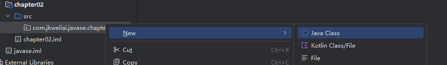

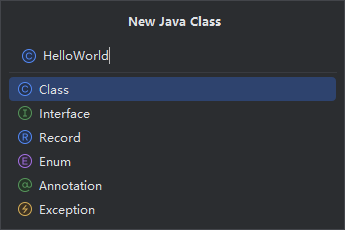

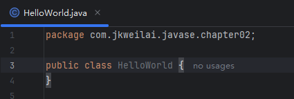

# IDEA的编译和运行

## 使用IDEA编写程序

- 生成main方法：psvm
- 生成输出语句：sout

## 使用IDEA编译程序

IDEA 会自动保存，自动编译，编译之后会输出到 `out`目录下。在该目录下可以看到字节码文件。如果没有 out 目录的，可以运行一次程序就有了。

## 使用IDEA运行程序

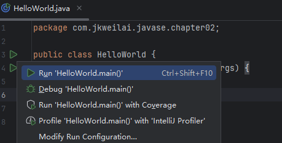

# IDEA的常用设置

## 配置字体与大小

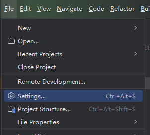

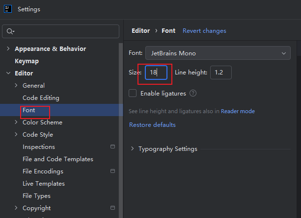

## 配置主题风格

选中导航栏的“File”，然后选中“Settings...”，最后按照下图所示来设置。

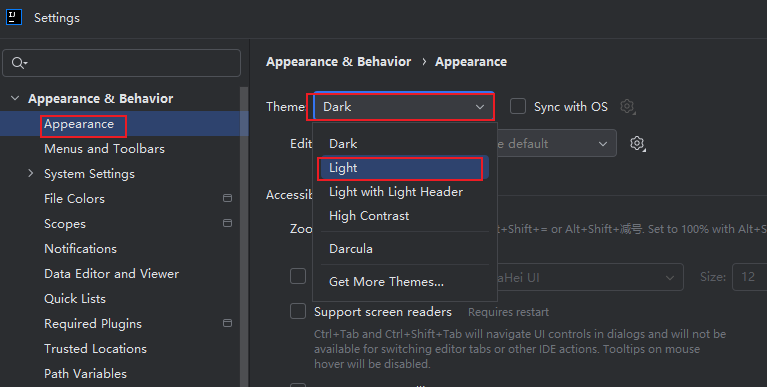

## 设置注释的样式

选中导航栏的“File”，然后选中“Settings...”，接着按照下图所示来设置。

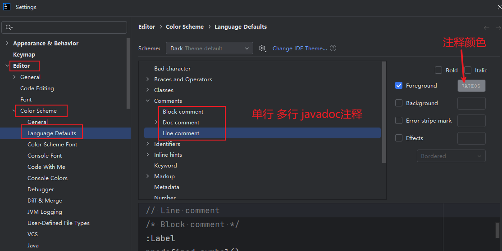

单行注释和多行注释的字体颜色：068052

文档注释字体（Text）颜色：3F5FBF

# IDEA实用快捷键

| **快捷键** | **功能说明** |
| --- | --- |
| Alt + Insert | 新建/新增任何东西，例如新建类，生成 setter 和 getter 方法，生成构造方法等 |
| esc | 退出任何窗口 |
| Ctrl + Shift + F12 | 最大化源码窗口 |
| psvm | 生成 main 方法 |
| sout | 快速生成打印语句 |
| Alt + 1 | 打开 Project 窗口 |
| .var | 自动生成变量 |
| Ctrl + Y | 删除一行 |
| Ctrl + X | 删除一行，并且这一行的代码会被自动放到剪贴板 |
| Ctrl + D | 复制一行 |
| Ctrl + F12 | 在当前类中查找方法 |
| Ctrl + / | 单行注释 |
| Ctrl + Shift + / | 多行注释 |
| Ctrl 别松手，鼠标移动到对应的类名下方，出现下划线，点击过去，可以查看类源码 | 查看源码 |
| Alt 别松手，鼠标拖动多行，完成多行编辑 | 多行编辑 |
| fori | 生成 for 循环 |
| Alt + 左右方向键 | 切换窗口 |
| 敲两次 Shift | 查找任何资源 |
| 布尔变量.if | 自动生成 if 语句 |
| 类名.new.var | 快速生成创建对象的语句 |
| Alt + Enter | 自动纠错 |
| Alt + Shift + 上下方向 | 移动代码 |
| Ctrl + O | 快速重写方法 |
| 变量名.castvar | 快速向下转型 |
| Ctrl + P | 查看方法参数 |
| Ctrl + Alt + 左右方向键 | 回到上一个位置或回到下一个位置 |
| Ctrl + Alt + L | 代码格式化 |
| Ctrl + H | 查看类的继承结构 |
| Ctrl + Alt + T | 自动代码包裹 |
| Ctrl + R | 替换 |
| Ctrl + Z | 撤销 |
| Ctrl + Shift + Z | 重做 |