# 第04章 面向对象


# 面向对象概述

## 软件开发方法

通常的软件开发方法包括**面向过程**与**面向对象**。

**面向过程：关注点在实现功能的步骤上。**

1. PO：Procedure Oriented。代表语言：C语言
2. 面向过程就是分析出解决问题所需要的步骤，然后用函数把这些步骤一步一步实现，使用的时候一个一个依次调用就可以了。
3. 例如开汽车：启动、踩离合、挂挡、松离合、踩油门、车走了。
4. 再例如装修房子：做水电、刷墙、贴地砖、做柜子和家具、入住。
5. 对于简单的流程是适合使用面向过程的方式进行的。复杂的流程不适合使用面向过程的开发方式。

**面向对象：关注点在实现功能需要哪些对象的参与。**

1. OO：Object Oriented 面向对象。包括OOA,OOD,OOP。OOA：Object Oriented Analysis 面向对象分析。OOD：Object Oriented Design 面向对象设计。OOP：Object Oriented Programming 面向对象编程。代表语言：Java、C#、Python等。
2. 人类是以面向对象的方式去认知世界的。所以采用面向对象的思想更加容易处理复杂的问题。
3. 面向对象就是分析出解决这个问题都需要哪些对象的参加，然后让对象与对象之间协作起来形成一个系统。
4. 例如开汽车：汽车对象、司机对象。司机对象有一个驾驶的行为。司机对象驾驶汽车对象。
5. 再例如装修房子：水电工对象，油漆工对象，瓦工对象，木工对象。每个对象都有自己的行为动作。最终完成装修。
6. 面向对象开发方式耦合度低，扩展能力强。例如采用面向过程生产一台电脑，不会分CPU、内存和硬盘，它会按照电脑的工作流程一次成型。采用面向对象生产一台电脑，CPU是一个对象，内存条是一个对象，硬盘是一个对象，如果觉得硬盘容量小，后期是很容易更换的，这就是扩展性。

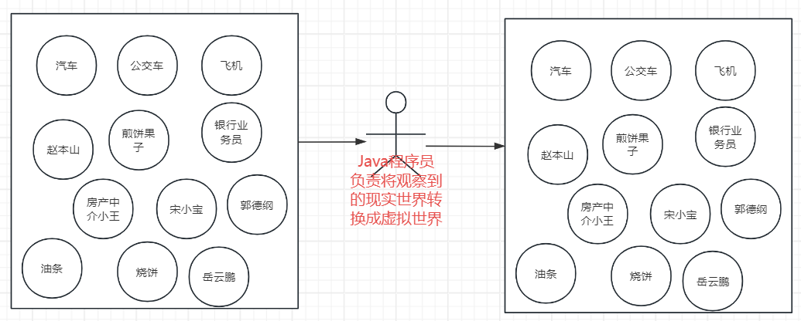


## 面向对象三大特征

面向对象有三大特征：

1. 封装（Encapsulation）
2. 继承（Inheritance）
3. 多态（Polymorphism）

## 类与对象

### 类

1. 现实世界中，事物与事物之间具有共同特征，例如：刘德华和梁朝伟都有姓名、身份证号、身高等状态，都有吃、跑、跳等行为。将这些共同的状态和行为提取出来，形成了一个模板，称为类。
2. 类实际上是人类大脑思考总结的一个模板，类是一个抽象的概念。
3. 状态在程序中对应属性。属性通常用变量来表示。
4. 行为在程序中对应方法。用方法来描述行为动作。
5. 类 = 属性（实例变量） + 方法（实例方法）。
6. **实例变量 + 实例方法，他们要想访问，必须先造对象，然后通过对象才能访问实例变量+实例方法。**

### 对象

1. 对象是实际存在的个体。
2. 对象又称为实例（instance）。
3. 通过类这个模板可以实例化n个对象。（通过类可以创造多个对象）
4. 例如通过“明星类”可以创造出“刘德华对象”和“梁朝伟对象”。
5. 明星类中有一个属性**姓名**：String name;
6. “刘德华对象”和“梁朝伟对象”由于是通过明星类造出来的，所以这两个都有name属性，但是值是不同的。因此这种属性被称为**实例变量**。

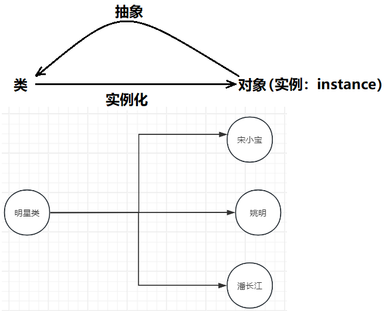


# 对象的创建和使用

之前所讲的面向对象，使用 Java 语言完全可以实现，Java 语言就是站在完全面向对象的角度实现的。

## 类的定义

定义类的语法格式如下：

:::info
[修饰符列表] class 类名 {

// 属性（描述状态：实例变量/对象变量）

// 方法（描述行为动作：实例方法/对象方法）

}

:::

例如：学生类

```java
public class Student {
    // 姓名
    String name; // 实例变量
    // 年龄
    int age;
    // 性别
    boolean gender;
    // 学习
    public void study(){ System.out.println(“正在学习”); } // 实例方法
}
```

## 对象的创建和使用

**对象的创建**

```java
Student s = new Student();
```

在Java中，使用class定义的类，属于引用数据类型。所以Student属于引用数据类型。类型名为：Student。

Student s; 表示定义一个变量。数据类型是Student。变量名是s。（你可以粗略的认为 s 是一个对象）

**对象的使用**

读取属性值：s.name

修改属性值：s.name = "jackson";

**一个类实例化多个对象**

```java
Student s1 = new Student();
Student s2 = new Student();
```

**练一练：**

定义一个宠物类，属性包括名字，出生日期，性别。有吃和跑的行为。再编写测试程序，创建宠物对象，访问宠物的属性，调用宠物吃和跑的方法。


## 对象的内存分析（对象与引用）

1. JVM 是一套规范，**规范中规定的**主要内存空间有：虚拟机栈（VM Stack）、堆（Heap）、方法区（Method Area）等。这是逻辑名称，不是物理存储。
2. 实现 JVM 规范的代表是：Oracle 的 HotSpot。（**它是最主流、最广泛使用的 JVM 实现**）
3. 虚拟机栈中主要存什么？
  1. 存栈帧，栈帧中有局部变量表（**存****局部变量**）、操作数栈等。
4. 堆中主要存什么？
  1. new 出来的对象都在堆内存当中。
  2. **实例变量**在对象内部。
5. 方法区中主要存什么？
  1. **类的元数据（类名、父类、接口、字段、方法信息、常量池）**
  2. **静态变量**
  3. **方法字节码**
  4. **运行时常量池**等。
6. 方法区的具体实现有哪些？
  1. HotSpot JDK7 及之前，方法区的实现叫做永久代（**PermGen**），使用** JVM 的内存**，容易出现 OOM。**此时的静态变量是在永久代中的。**
  2. HotSpot JDK8 及之后，方法区的实现叫做元空间（**Metaspace**），使用**系统本地内存**，避免 OOM。**此时的****静态变量**是在堆中的。(HotSpot JDK8 及之后**静态变量、字符串常量池****都是在堆中)**
7. new运算符会在JVM的堆内存中分配空间用来存储实例变量。new分配的空间就是**Java对象**。
8. 在JVM中对象创建后会有对应的内存地址，将内存地址赋值给一个变量，这个变量被称为**引用**。
9. Java中的GC主要针对的是JVM的堆内存，当然，GC 也会对方法区进行垃圾回收（FullGC 的时候才会对方法区进行垃圾回收）。
10. 什么是字符串常量池，它的作用是什么？**字符串常量池是JVM中专门用于存储字符串字面量引用的特殊内存区域，作用是复用相同内容的字符串对象以节省内存和提高性能。**
11. 字符串常量池存储在哪里？HotSpot JDK7 及之后，字符串常量池存储在**堆**中。
12. 字符串常量池中存储的什么？存储的是**字符串对象的内存地址**。
13. 字符串常量池什么时候初始化？**类加载时，该类中所有用双引号括起来的字符串都会提前在堆中初始化完成(不需要等方法执行，方法还没有执行呢，就已经初始化了），并将字符串对象的地址存入字符串常量池。**
14. **空指针异常是如何发生的？**
  1. 当访问一个空引用的实例相关的数据时，必然会出现空指针异常。
15. **方法调用时参数是如何传递的？**
  1. 将变量中保存的值复制一份传递过去。（这个值可能是一个基本类型的数值，也可能是一个对象的内存地址）
16. 初识 this关键字，要求能够画出内存图。
  1. 出现在实例方法中，代表当前对象。
  2. “this.”大部分情况下可以省略。
  3. this存储在实例方法栈帧的局部变量表的0号槽位上。
17. 假设 A 对象中有 B 对象的引用，要求能够画出内存图，通过内存图能够深刻理解对象的链式访问。


# 封装

## 对封装的理解

**面向对象三大特征之一：封装**

**现实世界中封装：**

液晶电视也是一种封装好的电视设备，它将电视所需的各项零部件封装在一个整体的外壳中，提供给用户一个简单而便利的使用接口，让用户可以轻松地切换频道、调节音量、等。液晶电视内部包含了很多复杂的技术，如显示屏、LED背光模块、电路板、扬声器等等，而这些内部结构对于大多数普通用户来说是不可见的，用户只需要通过遥控器就可以完成电视的各种设置和操作，这就是封装的好处。液晶电视的封装不仅提高了用户的便利程度和使用效率，而且还起到了保护设备内部部件的作用，防止灰尘、脏物等干扰。同时，液晶电视外壳材料的选择也能起到防火、防潮、防电等效果，为用户的生活带来更安全的保障。

**什么是封装？**

封装是一种将数据和方法加以包装，使之成为一个独立的实体，并且把它与外部对象隔离开来的机制。具体来说，封装是将一个对象的所有“状态（属性）”以及“行为（方法）”统一封装到一个类中，从而隐藏了对象内部的具体实现细节，向外界提供了有限的访问接口，以实现对对象的保护和隔离。

**封装的好处？**

封装通过限制外部对对象内部的直接访问和修改，保证了数据的安全性，并提高了代码的可维护性和可复用性。

## 不使用封装存在的问题

```java
package com.jkweilai.p05;

// 不使用封装机制，大家分析这个程序存在的问题。
public class Person {
    int age;
}
```

```java
package com.jkweilai.p05;

public class PersonTest {
    public static void main(String[] args) {
        // 创建对象
        Person p = new Person();

        // 设置年龄
        p.age = 20;

        // 读取年龄
        System.out.println("年龄 = " + p.age);

        // 外部程序对Person对象age属性可以随意的访问
        // 因为Person没有进行封装。
        p.age = -1;

        System.out.println("年龄 = " + p.age);
    }
}
```

外部程序可以随意访问对象中的数据，导致数据不安全。

## 如何实现封装

**在代码上如何实现封装？**

属性私有化，对外提供getter和setter方法。

```java
package com.jkweilai.p05;

// 使用封装机制，解决安全问题
/*
封装的步骤：
    第一步：属性私有化。
    第二步：对外提供该属性的访问入口。一般访问入口提供两个，一个负责读，一个负责修改。
        读的方法规范是这样的：getter方法
            public 有返回值 getXxx(){}
        修改的方法规范是这样：setter方法
            public 无返回值 setXxx(需要一个参数){}
        注意：setter和getter方法都是实例方法。
    第三步：在setter方法中编写安全控制逻辑。
 */
public class User {
    private int age;

    /**
     * setter方法
     * @param x
     */
    /*
    public void setAge(int x){
        // 安全控制代码
        if (x < 0 || x > 150) {
            System.out.println("对不起，您提供的年龄不合法！");
            return;
        }
        // 程序执行到这里，说明合法的，则赋值。
        this.age = x;
    }
    */

    public void setAge(int age){
        if (age < 0 || age > 150) {
            System.out.println("对不起，您提供的年龄不合法！");
            return;
        }
        // this. 在这种情况下是不能省略的。
        this.age = age;
    }

    /**
     * getter方法
     * @return
     */
    public int getAge(){
        //return this.age;
        return age;
    }
}
```

```java
package com.jkweilai.p05;

public class UserTest {
    public static void main(String[] args) {
        User u = new User();
        /*
        u.age = 20;
        System.out.println(u.age);
        u.age = -1;
        System.out.println(u.age);
        */

        /*System.out.println("年龄 = " + u.getAge()); // 0

        u.setAge(20);

        System.out.println("年龄 = " + u.getAge()); // 20

        u.setAge(22);

        System.out.println("年龄 = " + u.getAge()); // 22

        u.setAge(-100);

        System.out.println("年龄 = " + u.getAge()); // 年龄 = 22*/

        u.setAge(18);
        System.out.println("年龄 = " + u.getAge()); // ?

    }
}
```

## 自动生成 setter 和 getter

IDEA 支持自动生成 setter 和 getter 方法，在需要生成方法的类体中使用 Alt+Insert，选择生成 setter and getter 并生成。

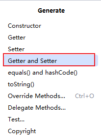

需要注意的是：对于布尔类型生成的 getter 方法名为：**isXxx()**;

**练一练：**

1. 定义一个汽车类，包括属性：品牌、价格、颜色等。并对其中的价格属性进行封装，价格不得高于50万，不得低于20万。
2. 定义一个银行账户类，包含属性：账户名、余额等。并对其中的余额进行封装，余额不得小于0。另外定义一个取款方法withdraw，判断取款金额是否合法，另外余额是否充足。
3. 定义一个员工类，包含属性：姓名、年龄、工资等。并对其中的工资进行封装，工资不得低于800元。另外定义一个raise方法用来涨薪，如果涨薪后的工资超过了10000元，则不再涨薪。
4. 定义一个顾客类Customer，包括属性：姓名，生日，性别，联系电话等属性。对所有属性进行封装。然后提供一个购物的shopping()方法，再提供一个付款的pay()方法，在shopping()方法中购物，购物行为在结束前需要完成支付，因此在shopping()方法的最后调用pay()方法。**体会实例方法中调用实例方法**。


# 构造方法

构造方法又称为构造器（Constructor）。

## 构造方法的语法

**构造方法有什么作用？**

1. 构造方法的执行分为两个阶段：对象的创建和对象的初始化。这两个阶段不能颠倒，也不可分割。
2. 在Java中，当我们使用关键字new时，就会在内存中创建一个新的对象，虽然对象已经被创建出来了，但还没有被初始化。而初始化则是在执行构造方法体时进行的。

**构造方法如何定义？**

1. [修饰符列表] 构造方法名(形参){}

**构造方法如何调用？**

1. new 构造方法名(实参);

**关于无参数构造方法**

1. 如果一个类没有显示的定义任何构造方法，系统会默认提供一个无参数构造方法，也被称为缺省构造器。一旦显示的定义了构造方法，则缺省构造器将不存在。为了方便对象的创建，建议将缺省构造器显示的定义出来。

**构造方法支持重载机制。**

## 构造方法的执行流程

**关于构造代码块。对象的创建和初始化过程梳理：**

1. new的时候在堆内存中开辟空间，给所有属性赋默认值
2. 执行构造代码块进行初始化
3. 执行构造方法体进行初始化
4. 构造方法执行结束，对象初始化完毕。

请判断下面代码的执行结果：

```java
/*
对象实例化的过程：当new发生后
1. 堆内存中分配空间，所有实例变量赋默认值。
2. 给实例变量手动赋值与构造代码块执行在同一个时间执行，执行顺序依靠代码的上下顺序。
3. 执行构造方法体。
 */
public class CodeExeOrder {
    CodeExeOrder(){
        System.out.println("构造方法执行");
    }
    int x = getX();
    {
        System.out.println("构造代码块执行");
    }
    int y = getY();
    public int getX(){
        System.out.println("getX执行了");
        return 100;
    }
    public int getY(){
        System.out.println("getY执行了");
        return 200;
    }
    public static void main(String[] args) {
        new CodeExeOrder();
    }
}
```

## 代码示例

```java
package com.jkweilai.p06;

public class User {
    String name;
    int age;
    boolean gender;
    String address;

    // 在构造代码块执行之前，对象就已经创建好了，所有属性都已经初始化完毕了。
    // 构造代码块
    {
        System.out.println("构造代码块执行！！！");
        System.out.println("===>" + this.name);
        System.out.println("===>" + this.address);
        System.out.println("===>" + this.age);
        System.out.println("===>" + this.gender);
    }

    // 手动的/显示的 将无参数的构造方法编写出来。
    public User(){
        System.out.println("User类的无参数构造方法执行了！");
    }

    public User(String name) {
        System.out.println("有参数的构造方法User(String name)执行了");
        this.name = name;
    }

    public User(String name, int age, boolean gender, String address) {
        this.name = name;
        this.age = age;
        this.gender = gender;
        this.address = address;
    }
}
```

```java
package com.jkweilai.p06;

/**
 * 构造方法/构造器/Constructor
 *  1.构造方法的作用：创建对象，给对象属性赋值。
 *  2.调用构造方法的语法格式：
 *      new 构造方法名(实际参数列表);
 *  3.当一个类中没有编写任何构造方法，系统默认提供一个无参数的构造方法。
 *  4.构造方法的方法名必须和当前类的类名保持一致。
 *  5.构造方法怎么定义，语法格式？
 *      [修饰符列表] 构造方法名(形式参数列表){
 *          构造方法体;
 *      }
 *  6.当一个类中手动的定义了构造方法（任意形式的构造方法），系统则不再提供默认的无参构造器。
 *  因此，建议将无参数构造方法手动的写出来，别依靠系统的自动生成功能。
 *  7.一个类中可以编写多个构造方法，这些构造方法之间构成了方法的重载机制。
 *  8.对象的创建过程：
 *      在执行构造方法的方法体之前实际上系统做了很多事，我们是看不见的。
 *      在构造方法方法体代码执行之前，会给对象先分配内存空间，并且完成
 *      所有属性的初始化，这个时候的初始化，采用的都是系统默认值进行初始化的。
 *      因此在构造方法的方法体当中可以使用this关键字。
 *  9. 构造代码块的语法格式：
 *      直接写一个大括号就行：{}
 *      构造方法执行之前都会执行一次构造代码块。
 *      构造方法执行一次，则构造代码块就执行一次。
 *      本质上：在执行构造代码块之前就已经完成了对象空间的分配，以及实例变量的初始化。
 *  10.构造代码块有用吗？
 *      当所有构造方法体当中有一些公共的代码，可以将这些代码提取到构造代码块中，这样代码复用性增强。
 *  11.描述一下对象的创建过程？
 *      new User("jack", 20, true, "天津南开");
 *      1. 在JVM的堆内存的年轻代的伊甸园区中开辟空间。
 *      2. 给User对象的所有属性进行初始化操作（赋系统默认值）
 *      3. 执行构造代码块。
 *      4. 执行构造方法的方法体。
 */
public class ConstructorTest01 {
    public static void main(String[] args) {

        User u1 = new User();
        System.out.println(u1.name); // null

        User u2 = new User("jackson");
        System.out.println(u2.name); // jackson

        System.out.println("=================================");

        User u3 = new User("jack", 20, true, "天津南开");
        System.out.println(u3.name);
        System.out.println(u3.age);
        System.out.println(u3.gender);
        System.out.println(u3.address);
    }
}
```

## 构造方法已经给属性赋值了还需要 setter 吗？

构造方法虽然已经给属性赋值了，但这个赋值是在对象的创建过程中的赋值，如果对象创建完成之后，还需要修改对象的属性值，此时就需要使用 `setter`方法了。

```java
package com.jkweilai.p06;

public class Person {
    // 属性
    private long id;
    private String name;
    private int age;

    // constructor
    public Person() {
    }

    public Person(long id, String name) {
        this.id = id;
        this.name = name;
    }

    public Person(long id, String name, int age) {
        this.id = id;
        this.name = name;
        this.age = age;
    }

    //setter and getter
    public long getId() {
        return id;
    }

    public void setId(long id) {
        this.id = id;
    }

    public String getName() {
        return name;
    }

    public void setName(String name) {
        this.name = name;
    }

    public int getAge() {
        return age;
    }

    public void setAge(int age) {
        this.age = age;
    }

    // 打印个人信息
    /*public void print(){
        System.out.println("ID：" + this.id + ", NAME = " + this.name + ", AGE = " + this.age);
    }*/

    public void print(){
        System.out.println("ID：" + id + ", NAME = " + name + ", AGE = " + age);
    }

}
```

```java
package com.jkweilai.p06;

public class PersonTest {
    public static void main(String[] args) {
        // 创建对象
        Person p1 = new Person();
        p1.print();

        // 创建对象
        Person p2 = new Person(100L, "jackson");
        p2.print();

        // 创建对象
        Person p3 = new Person(200L, "lucy", 30);
        p3.print();

        p3.setName("张三");
        p3.print();
    }
}
```

**练一练**

1. 请定义一个交通工具Vehicle类，属性：品牌brand，速度speed，尺寸长length,宽width,高height等，属性封装。方法：移动move()，加速speedUp()，减速speedDown()等。最后在测试类中实例化一个交通工具对象，并通过构造方法给它初始化brand,speed,length,width,height的值，调用加速，减速的方法对速度进行改变。
2. 编写 Java 程序，模拟简单的计算器。定义名为 Number 的类，其中有两个int类型属性n1,n2，属性封装。编写构造方法为n1和n2赋初始值，再为该类定义 加(add)、减(sub)、乘(mul)、除(div)等实例方法，分别对两个属性执行加、减、乘、除的运算。在main方法中创建Number类的对象，调用各个方法，并显示计算结果。
3. 定义一个网络用户类，要处理的信息有用户id、用户密码、 email地址。在建立类的实例时，把以上三个信息都作为构造方法的参数输入，其中用户id和用户密码是必须的，缺省的 email 地址是用户id加上字符串"@jkweilai.com"


# this 关键字

## 语法规则

1. this是一个关键字。
2. this出现在实例方法中，代表当前对象。语法是：this.
3. this本质上是一个引用，该引用保存当前对象的内存地址。
4. 通过“this.”可以访问实例变量，可以调用实例方法。
5. this存储在：栈帧的局部变量表的第0个槽位上。
6. this. 大部分情况下可以省略，用于区分局部变量和实例变量时不能省略。
7. this不能出现在静态方法中。
8. “this(实参)”语法：
  1. 只能出现在构造方法的第一行。
  2. 通过当前构造方法去调用本类中其他的构造方法。
  3. 作用是：代码复用。

## this 的使用

```java
package com.jkweilai.p07;

/*
1. this是一个关键字。
2. this出现在实例方法中，代表当前对象。语法是：this.
3. this本质上是一个引用，该引用保存当前对象的内存地址。
4. 通过“this.”可以访问实例变量，可以调用实例方法。
5. this存储在：栈帧的局部变量表的第0个槽位上。
6. this. 大部分情况下可以省略，用于区分局部变量和实例变量时不能省略。
7. this不能出现在静态方法中。
 */
public class Customer {
    String name;

    public Customer(String name) {
        // this. 在这里不能省略。
        this.name = name;
    }

    public void shopping(){
        //System.out.println(this.name + "正在疯狂的购物！");
        System.out.println(name + "正在疯狂的购物！");
        // 结账
        //this.pay();
        pay();
    }

    public void pay(){
        System.out.println(this.name + "正在结账付款！！！");
    }

    public static void m(){
        // 语法报错。
        //System.out.println(name);
        //System.out.println(this.name);
        //pay();
        //this.pay();

        Customer cc = new Customer("lucy");
        System.out.println(cc.name);
        cc.pay();
    }
}
```

```java
package com.jkweilai.p07;

public class CustomerTest {

    int i = 100;

    public void m(){
        System.out.println(i);
    }

    public static void main(String[] args) {
        Customer c = new Customer("杰克");
        c.shopping();

        Customer.m();

        // 错误：在静态上下文中不能引用非静态变量 i
        // 在静态方法中不能直接访问实例变量。
        //System.out.println(i);

        CustomerTest ct = new CustomerTest();
        System.out.println(ct.i);
    }
}
```

## this()的使用

```java
package com.jkweilai.p07;

/*
自定义一个日期类：
    年
    月
    日
 */
public class MyDate {
    private int year;
    private int month;
    private int day;

    public void display(){
        System.out.println(year + "年" + month + "月" + day + "日");
    }

    /*
    系统需求：当程序员调用无参数构造方法创建日期时，系统默认创建的日期为：1970-1-1
     */
    public MyDate() {
        //System.out.println();
        /*this.year = 1970;
        this.month = 1;
        this.day = 1;*/

        //new MyDate(1970, 1, 1);

        // 通过一个构造方法调用另外一个构造方法。代码复用。
        // this()语法只能出现在构造方法的第一行。
        this(1970, 1, 1);
    }

    public MyDate(int year, int month, int day) {
        this.year = year;
        this.month = month;
        this.day = day;
    }
}
```

```java
package com.jkweilai.p07;

public class MyDateTest {
    public static void main(String[] args) {
        // 创建日期1
        MyDate d1 = new MyDate();
        d1.display();

        // 创建日期2
        MyDate d2 = new MyDate(2008, 8, 8);
        d2.display();
    }
}
```

# static 关键字

## static 语法概括

1. static是一个关键字，翻译为：静态的。
2. static修饰的变量叫做静态变量。当所有对象的某个属性的值是相同的，建议将该属性定义为静态变量，来节省内存的开销。
3. 静态变量在类加载时初始化，在 HotSpot JDK8 之后，静态变量**存储在堆内存的 Class 对象的内部**。
4. static修饰的方法叫做静态方法。
5. 所有静态变量和静态方法，统一使用“类名.”调用。虽然可以使用“引用.”来调用，但实际运行时和对象无关，所以不建议这样写，因为这样写会给其他人造成疑惑。
6. 使用“引用.”访问静态相关的，即使引用为null，也不会出现空指针异常。
7. 静态方法中不能使用this关键字。因此无法直接访问实例变量和调用实例方法。
8. 静态代码块在类加载时执行，一个类中可以编写多个静态代码块，遵循自上而下的顺序依次执行。
9. 静态代码块代表了类加载时刻，如果你有代码需要在此时刻执行，可以将该代码放到静态代码块中。

## 什么时候定义为静态变量

对于以下代码，如果将 `country`设计为实例变量，则比较浪费空间：

```java
package com.jkweilai.p08;

/*
中国人  类。
 */
public class Chinese {
    // 身份证号
    String idCard;
    // 姓名
    String name;

    // 国籍
    String country = "中国";

    public Chinese(String idCard, String name) {
        this.idCard = idCard;
        this.name = name;
    }
}
```

以上代码的内存结构：

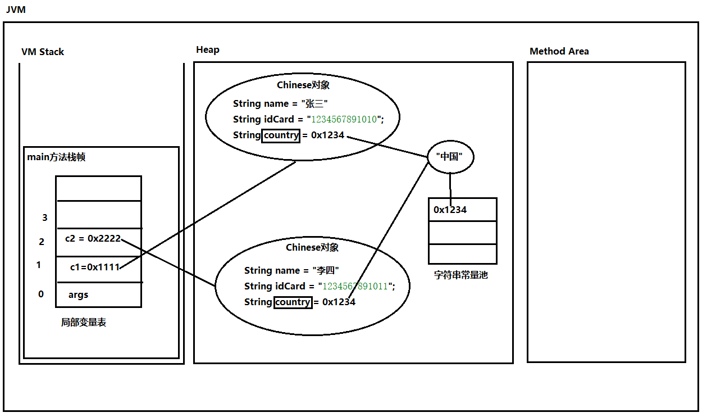

因此，建议将 `country`定义为静态变量，静态变量在类加载时初始化，代码如下：

```java
package com.jkweilai.p08;

/*
中国人  类。
 */
public class Chinese {
    // 身份证号
    String idCard;
    // 姓名
    String name;

    // 国籍
    static String country = "中国";

    static int count = 100;

    public Chinese(String idCard, String name) {
        this.idCard = idCard;
        this.name = name;
    }

    // 请设计一个方法，这个方法可以打印一个“中国人对象”的信息。
    public void print(){
        System.out.println(name);
        doSome();
    }

    public void doSome(){
        System.out.println("do some实例方法");
    }
}
```

请画出以上代码所对应的内存结构图。

## 静态变量的访问方式

静态变量既可以使用“类名.”访问，也可以使用“引用.”访问，但建议使用“类名.”访问，并且空的引用访问静态变量不会出现空指针异常：

```java
public class StaticTest01 {

    // 我写好了main方法，等着别人去调用main方法，站在我的角度，可以将main方法称为回调方法/回调函数/callback
    public static void main(String[] args) {

        // 局部变量不能使用static修饰。
        //int i = 100;

        // 创建 Chinese 对象1
        Chinese c1 = new Chinese("123456", "张三");

        // 创建 Chinese 对象2
        Chinese c2 = new Chinese("123457", "李四");

        // 访问静态变量
        System.out.println("国籍：" + Chinese.country);
        System.out.println("count：" + Chinese.count);

        // 这样写可以，编译和运行都不会有问题。
        // 但是按照开发规范来说，你这个代码不符合开发规范。
        // 因为这样写容易误导其他开发者，开发者会认为country是一个实例变量。
        System.out.println("国籍：" + c1.country);
        System.out.println("国籍：" + c2.country);

        c1 = null;
        c2 = null;

        // 并没有出现空指针异常。
        System.out.println("国籍：" + c1.country);
        System.out.println("国籍：" + c2.country);

        // 这里会出现空指针异常
        // 只有当空引用访问实例相关的才会出现空指针异常。
        //System.out.println(c1.name);
    }
}
```

静态上下文中无法直接访问实例变量，但可以自己 new 对象的方式来访问：

```java
package com.jkweilai.p08;

public class StaticTest02 {
    // 实例变量
    int num = 100;

    // 实例方法
    public void test(){
        System.out.println("test method invoke!");
    }

    public static void main(String[] args) {
        // 在静态上下文中不能“直接”访问实例相关的。
        /*System.out.println(num);
        test();*/

        // 能间接
        StaticTest02 st = new StaticTest02();
        System.out.println(st.num);
        st.test();
    }

    public void main2(String[] args) {
        System.out.println(this.num);
        this.test();

        System.out.println(num);
        test();
    }
}
```

## 静态代码块

静态代码块的语法规则：

```java
package com.jkweilai.p08;

/*
静态代码块
    1. 语法格式：
        static {}
    2. 静态代码块在类加载时执行，并且只执行一次。（main方法执行之前静态代码块就已经执行了。）
    3. 一个类中可以编写多个静态代码块，并且遵循自上而下的顺序依次执行。
    4. 静态代码块有什么用呢？
        静态代码块实际上就是一个类加载时间节点。
        具体什么时候用？看看你在类加载的时候要不要执行一段代码。这段代码写到对应的位置，到了这个时间节点，系统会自动调用。
        需求：假设任意一个类加载的时候，我要求你记录日志。这个记录日志的代码就可以写到静态代码块中。
 */
public class StaticTest03 {
    static int count = 0;

    static {
        System.out.println(1);
        System.out.println(count);
        // 报错
        //System.out.println(width);
    }

    static int width = 300;

    public static void main(String[] args) {
        System.out.println("main begin");
    }

    static {
        System.out.println(2);
    }

    static {
        System.out.println(3);
    }
}
```

## 关于代码的执行顺序

关于代码的执行顺序：

```java
package com.jkweilai.p08;

public class StaticTest04 {
    static {
        System.out.println("静态代码块1执行");
    }

    public static void main(String[] args) {
        System.out.println("main begin");
        new StaticTest04();
        new StaticTest04();
        System.out.println("main over");
    }

    public StaticTest04(){
        System.out.println("构造方法执行");
    }

    {
        System.out.println("构造代码块1执行");
    }

    {
        System.out.println("构造代码块2执行");
    }

    static {
        System.out.println("静态代码块2执行");
    }

    static {
        System.out.println("静态代码块3执行");
    }
}
```

## 什么情况下方法定义为静态方法

1. 当在方法体当中需要直接访问实例变量和实例方法时，方法必须定义为实例方法。
2. 一般工具类中的方法都定义为静态方法。


# JVM 体系结构

## JVM 是一套规范

**JVM对应了一套规范（Java虚拟机规范），它可以有不同的实现，例如：**

1. HotSpot：HotSpot 由 Oracle 公司开发，是目前最常用的虚拟机实现，也是默认的 Java 虚拟机，默认包含在 Oracle JDK 和 OpenJDK 中
2. JRockit：JRockit 也是由 Oracle 公司开发。它是一款针对生产环境优化的 JVM 实现，能够提供高性能和可伸缩性
3. Azul Zing：Azul Zing 是针对生产环境优化的虚拟机实现，能够提供高性能和实时处理能力，适合于**高负载的企业应用**和**实时分析**等场景
4. OpenJ9：OpenJ9 是由 IBM 开发的优化的 Java 虚拟机实现，高度轻量级、低延时的 GC、优化的 JIT 编译器，提供了**健康度测试 的 可观察性仪表板**

**下图是从oracle官网上截取的Java虚拟机规范中的一部分。（大家也可以找一下oracle官方文档）**

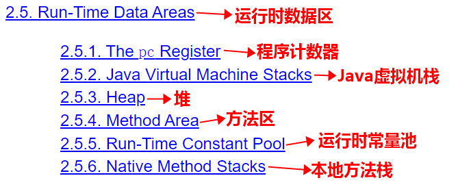

**我们主要研究运行时数据区。运行时数据区包括6部分：**

1. The pc Register（程序计数器）
2. Java Virtual Machine Stacks（Java虚拟机栈）
3. Heap（堆）
4. Method Area（方法区）
5. Run-Time Constant Pool（运行时常量池）
6. Native Method Stacks（本地方法栈）


## JVM 规范中的运行时数据区

1. The pc Register（程序计数器）【线程私有】：是一块较小的内存空间，此计数器记录的是正在执行的虚拟机字节码指令的地址；
2. Java Virtual Machine Stacks（Java虚拟机栈）【线程私有】：Java虚拟机栈用于存储栈帧。栈帧用于存储局部变量表、操作数栈、动态链接、方法出口等信息。
3. Heap（堆）【线程共享】：是Java虚拟机所管理的最大的一块内存。堆内存用于存放Java对象实例以及数组。堆是垃圾收集器收集垃圾的主要区域。
4. Method Area（方法区）【线程共享】：用于存储已被虚拟机加载的**类的元数据**、常量、静态变量、即时编译器编译后的代码等数据。
5. Run-Time Constant Pool（运行时常量池）【线程共享】：是方法区的一部分，用于存放**数字字面量**与**符号引用（类和方法的全限定名）**。程序运行是，会将符号引用转换成直接引用。**符号引用是名字，直接引用是地址**。
6. Native Method Stacks（本地方法栈）【线程私有】：在本地方法的执行过程中，会使用到本地方法栈。和 Java 虚拟机栈十分相似。

总结：这些运行时数据区虽然在功能上有所区别，但在整个 Java 虚拟机启动时都需要被创建，并且在虚拟机运行期间始终存在，直到虚拟机停止运行时被销毁。同时，不同的 JVM 实现对运行时数据区的分配和管理方式也可能不同，会对性能和功能产生影响。

## JVM 体系结构图（规范）

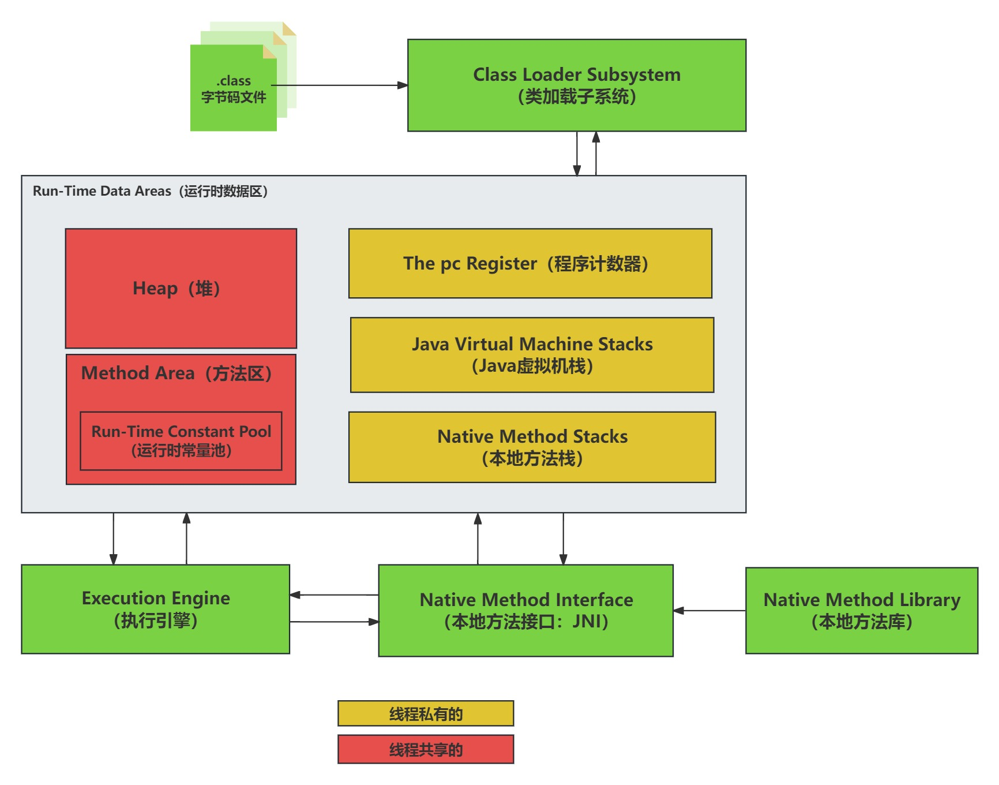


## JVM 规范的代表实现

JVM规范的实现：HotSpot（Oracle JDK/Open JDK内部使用的JVM就是HotSpot）

HotSpot 完整内存布局：

```plaintext
JVM内存（Java 8+）
├── 堆（Heap） - 线程共享，存储对象实例
│   ├── 年轻代（Young Generation） - 新创建对象所在区域
│   │   ├── 伊甸园区（Eden） - 对象首次分配区域
│   │   └── 幸存者区（Survivor Spaces） - 2个，存放Minor GC后存活的对象
│   │       ├── Survivor 0（S0/From区）
│   │       └── Survivor 1（S1/To区）
│   ├── 老年代（Old Generation） - 存放长期存活对象
│   ├── 静态变量（存储在堆内存的Class对象内部）
│   └── 字符串常量池（String Table）
│       ├── 字符串字面量对象（"hello"等）的地址
│       └── intern()方法放入的字符串对象
│
├── 元空间（Metaspace） - 线程共享，取代永久代，使用本地内存，防止OOM
│   ├── 类元信息（Class Metadata） - 类结构、字段、方法信息等
│   ├── 方法字节码（Method Code） - 编译后的方法字节码
│   └── 运行时常量池（Runtime Constant Pool） - 符号引用、数字字面量
│
├── 虚拟机栈（JVM Stacks） - 线程私有，方法执行内存模型
│   ├── 栈帧（Stack Frames） - 每个方法对应一个栈帧
│   │   ├── 局部变量表（Local Variables） - 方法局部变量
│   │   ├── 操作数栈（Operand Stack） - 计算中间结果
│   │   ├── 动态链接（Dynamic Linking）
│   │   └── 方法返回地址（Return Address）
│   └── ...（每个线程独立）
│
├── 本地方法栈（Native Method Stacks） - 线程私有，Native方法执行
│
└── 程序计数器（Program Counter Register） - 线程私有，当前指令地址
```

**对象生命周期：**

1. 新对象创建 → Eden区（年轻代）
2. 第一次Minor GC存活 → Survivor区（年轻代）
  1. Minor GC只清理年轻代（Eden区 + Survivor区）的垃圾回收。
  2. 简单说：专门打扫"年轻人区域"的保洁工作，只清理新创建的对象，速度快但频率高。
3. 多次GC后年龄达标 → 老年代（还有一种可能就是对象是一个体积较大的对象，当然这个对象大小的阈值是可以配置的。当创建的对象大小超过了阈值，会直接进入老年代。）

**两个术语理解一下：**

1. 符号引用：类全名，属性全名，方法全名等。
2. 直接引用：程序在运行的时候，会将符号引用转换成直接引用。直接引入是地址。
3. 字面量符号：指的是字面量的名字，而不是字面量本身。（就像电话和人的关系一样：电话是符号，人是真实存在的）

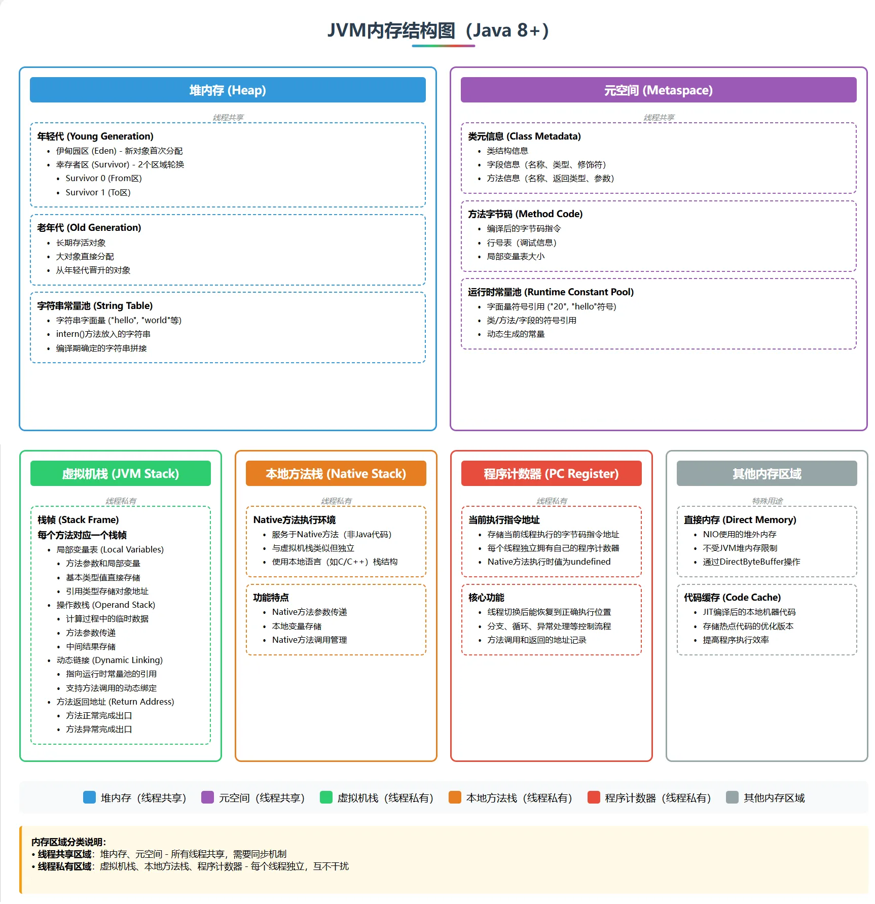


# 单例模式

## 设计模式概述

**什么是设计模式？**

设计模式（Design Pattern）是一套被广泛接受的、经过试验验证的、可反复使用的基于面向对象的软件设计经验总结，它是软件开发人员在软件设计中，对常见问题的解决方案的总结和抽象。设计模式是针对软件开发中常见问题和模式的通用解决方案

**设计模式有哪些？**

1. GoF设计模式：《Design Patterns: Elements of Reusable Object-Oriented Software》（即后述《设计模式》一书），由 Erich Gamma、Richard Helm、Ralph Johnson 和 John Vlissides 合著（Addison-Wesley，1995）。这几位作者常被称为四人组（Gang of Four）。
2. 架构设计模式（Architectural Pattern）：主要用于软件系统的整体架构设计，包括多层架构、MVC架构、微服务架构、REST架构和大数据架构等。
3. 企业级设计模式（Enterprise Pattern）：主要用于企业级应用程序设计，包括基于服务的架构（SOA）、企业集成模式（EIP）、业务流程建模（BPM）和企业规则引擎（BRE）等。
4. 领域驱动设计模式（Domain Driven Design Pattern）：主要用于领域建模和开发，包括聚合、实体、值对象、领域事件和领域服务等。
5. 并发设计模式（Concurrency Pattern）：主要用于处理并发性问题，包括互斥、线程池、管道、多线程算法和Actor模型等。
6. 数据访问模式（Data Access Pattern）：主要用于处理数据访问层次结构，包括数据访问对象（DAO）、仓库模式和活动记录模式等。

---

**GoF设计模式的分类？**

1. 创建型：主要解决对象的创建问题
2. 结构型：通过设计和构建对象之间的关系，以达到更好的重用性、扩展性和灵活性
3. 行为型：主要用于处理对象之间的算法和责任分配


## 单例模式

单例模式（GoF23种设计模式之一，最简单的设计模式：如何保证某种类型的对象只创建一个）

### 饿汉式单例模式

类加载是就创建对象

```java
public class Singleton {
    private static Singleton instance = new Singleton(); // 在类加载的时候就创建实例
    private Singleton() {}  // 将构造方法设为私有化
    public static Singleton getInstance() {  // 提供一个公有的静态方法，以获取实例
        return instance;
    }
}
```

### 懒汉式单例模式

第一次调用get方法时才会创建对象。

```java
public class Singleton {
    private static Singleton instance; // 声明一个静态的、私有的该类类型的变量，用于存储该类的实例
    private Singleton() {} // 将构造方法设为私有化
    public static Singleton getInstance() { // 提供一个公有的静态方法，以获取实例
        if (instance == null) { // 第一次调用该方法时，才真正创建实例
            instance = new Singleton(); // 创建实例
        }
        return instance;
    }
}
```

**练一练：**

1. 封装练习题：

设计一个学生类（Student），拥有姓名、年龄、性别三个属性（属性类型你可以自定），并包含获取/设置这些属性的方法。在设置年龄时需要做出一些限制：年龄不能为负数，如果年龄超过了范围（比如超过了120岁），则输出一个错误信息。

1. 构造方法练习题：

设计一个商品类（Product），拥有名称、价格、数量三个属性，实现构造方法，以方便创建该类的实例。另外，需要提供一个计算商品总价的方法，该方法返回该商品的总价（即价格*数量）。

1. static关键字练习题：

设计一个人类（Person），拥有姓名、年龄、性别三个属性，需要统计总人口数。在每次创建Person对象时，需要将总人口数加1，实现这个功能需要使用static关键字。

1. this关键字练习题：

设计一个银行卡类（Card），拥有持卡人姓名、卡号、余额三个属性，实现构造方法、取款、存款、查询余额等方法。在实现取款和存款方法时，需要使用this关键字来区分对象的属性和方法的参数。

1. 高级练习题：

设计一个学生选课系统，有两个类，一个是学生类（Student），一个是课程类（Course）。学生类包含姓名、学号、已选课程三个属性，课程类包含课程名称、课程编号、所属学院、授课老师、课程学分五个属性。需要设计学生选课和退课的方法。再设计一个打印某学生具体的选课信息的方法。（一个学生只能选一门课。）


# 继承

**面向对象三大特征之一：继承**

## 继承的作用及语法

**继承作用？**

1. 基本作用：代码复用
2. 重要作用：有了继承，才有了方法覆盖和多态机制。

**继承在java中如何实现？**

1. [修饰符列表] class 类名 extends 父类名{}
2. extends翻译为扩展。表示子类继承父类后，子类是对父类的扩展。

**继承相关的术语：当B类继承A类时**

1. A类称为：父类、超类、基类、superclass
2. B类称为：子类、派生类、subclass

**Java只支持单继承，一个类只能****直接****继承一个类。**

**Java不支持多继承，但支持****多重****继承（多层继承）。**

**子类继承父类后，除私有的不支持继承、构造方法不支持继承。其它的全部会继承。**

```java
package com.jkweilai.p10;

public class User {
}
```

```java
package com.jkweilai.p10;

// java支持多重继承，直接继承只能继承1个，间接继承可以继承多个。
// Student extends Person extends User
public class Person extends User{
    String name;
    int age;

    public void run(){
        System.out.println(name + "在跑步！");
    }
}
```

```java
package com.jkweilai.p10;

// Java不支持多继承，只能直接继承1个类。因此报错。
//public class Student extends Person, User {
public class Student extends Person {

    // 子类特有的（这是扩展的）
    double score;

    public Student(String name, int age, double score) {
        this.name = name;
        this.age = age;
        this.score = score;
    }

    // 子类特有的（这是扩展的）
    public void study(){
        System.out.println(name + "正在努力的学习！");
    }
}
```

```java
package com.jkweilai.p10;

public class Teacher extends Person {
    // 子类特有的（这是扩展的）
    double sal;

    public Teacher(String name, int age, double sal) {
        this.name = name;
        this.age = age;
        this.sal = sal;
    }

    // 子类特有的（这是扩展的）
    public void teach(){
        System.out.println(name + "拼命的授课！");
    }
}
```

```java
package com.jkweilai.p10;

public class ExtendsTest01 {
    public static void main(String[] args) {
        // 创建学生对象
        Student s = new Student("张三", 20, 100.0);
        s.run();
        s.study();

        // 创建老师对象
        Teacher t = new Teacher("李四", 50, 10000.0);
        t.run();
        t.teach();
    }
}
```

## 默认继承 Object

**一个类没有显示继承任何类时，默认继承java.lang.Object类。**

```java
package com.jkweilai.p10;

public class ObjectTest {
    public static void main(String[] args) {
        Teacher t = new Teacher("李四", 50, 10000.0);
        String result = t.toString();
        // com.jkweilai.p10.Teacher@1d81eb93
        System.out.println(result);

        int hashCode = t.hashCode();
        System.out.println(hashCode);

        // 将十进制转换成十六进制。
        String hexString = Integer.toHexString(hashCode);
        System.out.println(hexString);
    }
}
```

---


# 方法覆盖

**方法覆盖/override/方法重写/overwrite**

---

**什么情况下考虑使用方法覆盖？**

1. 当从父类中继承过来的方法无法满足当前子类的业务需求时。

**发生方法覆盖的条件？**

1. 具有继承关系的父子类之间
2. 相同的返回值类型，相同的方法名，相同的形式参数列表

**方法覆盖的小细节：**

1. @Override注解标注的方法会在编译阶段检查该方法是否重写了父类的方法。
2. 访问权限不能变低，可以变高。
3. 抛出异常不能变多，可以变少。
4. 返回值类型可以是父类方法返回值类型的子类。
5. 私有方法不能继承，所以不能覆盖。
6. 构造方法不能继承，所以不能覆盖。
7. 静态方法不存在方法覆盖，方法覆盖针对的是实例方法。(方法覆盖需要和多态联合起来才有意义)
8. 方法覆盖说的实例方法，和实例变量无关。（可以写程序测试一下）

```java
package com.jkweilai.p11;

public class Person {
    String name = "jack";
    protected void speak() throws Exception{
        System.out.println("Person Speak");
    }

    public void eat(){
        System.out.println("正在美餐！");
    }

    public Object getInstance(){
        return null;
    }

    public static void print(){
        System.out.println("Person print");
    }

    // 对于Person来说，我不满意Object类中的toString。我想重写。
    @Override
    public String toString() {
        return "人";
    }
}
```

```java
package com.jkweilai.p11;

public class ChinesePerson extends Person{
    public void speak(){
        System.out.println("你好");
    }
}
```

```java
package com.jkweilai.p11;

public class EnglishPerson extends Person{

    String name = "lucy";

    @Override
    public void speak() {
        System.out.println("Hello");
    }

    @Override
    public EnglishPerson getInstance(){
        return null;
    }

    public static void print(){
        System.out.println("EnglishPerson print");
    }
}
```

```java
package com.jkweilai.p11;

import java.security.spec.ECGenParameterSpec;

/**
 * 方法重载/overload
 *  1.什么情况下考虑使用方法重载？
 *      功能相似
 *  2. 满足什么条件的时候构成方法重载？
 *      条件1：在同一个类中。
 *      条件2：相同的方法名。
 *      条件3：不同的参数列表：
 *              类型不同算不同
 *              个数不同算不同
 *              顺序不同算不同
 *
 * 方法覆盖/override/方法重写/overwrite
 *  1. 什么情况下考虑使用方法覆盖？
 *      当父类中的方法已经无法满足子类的需求时。
 *      子类有权利将继承过来的方法重写一次。
 *      方法重写之后，子类对象将来执行的是重写之后的方法。
 *  2. 满足什么条件的时候构成方法重写？
 *      条件1：具有继承关系的父子类之间。
 *      条件2：相同的返回值类型、相同的方法名、相同的参数列表。（一模一样）
 *  3. 方法覆盖的小细节：
 *      1. @Override注解标注的方法会在编译阶段检查该方法是否重写了父类的方法。
 *      2. 访问权限不能变低，可以变高。
 *      3. 抛出异常不能变多，可以变少。
 *      4. 返回值类型可以是父类方法返回值类型的子类。
 *      5. 私有方法不能继承，所以不能覆盖。
 *      6. 构造方法不能继承，所以不能覆盖。
 *      7. 静态方法不存在方法覆盖，方法覆盖针对的是实例方法。(方法覆盖需要和多态联合起来才有意义)
 *      8. 方法覆盖说的实例方法，和实例变量无关。（可以写程序测试一下）
 */
public class OverrideTest01 {

    public static void main(String[] args) {

        EnglishPerson p1 = new EnglishPerson();
        p1.speak();
        p1.eat();

        ChinesePerson p2 = new ChinesePerson();
        p2.speak();
        p2.eat();

        //p1 = null;

        // 注意：在java中，如果输出一个“引用”，会自动先调用“引用.toString()”
        // 以下这一行代码，在调用toString()方法之前会进行空处理，避免空指针异常的发生。
        System.out.println(p1); // 人
        // 如果p1是null，这里会出现空指针异常。
        System.out.println(p1.toString()); // 人

        Person.print();
        EnglishPerson.print();

        // 多态
        Person x = new EnglishPerson();
        System.out.println(x.name);// jack
    }

}
```


# 多态

## 多态基础语法

### 向上转型和向下转型

**什么是向上转型和向下转型？**

1. java允许具有继承关系的父子类型之间的类型转换。
2. 向上转型（upcasting）：子-->父
  1. 子类型的对象可以赋值给一个父类型的引用。
3. 向下转型（downcasting）：父-->子
  1. 父类型的引用可以转换为子类型的引用。但是需要加强制类型转换符。
4. 无论是向上转型还是向下转型，前提条件是：两种类型之间必须存在继承关系。这样编译器才能编译通过。

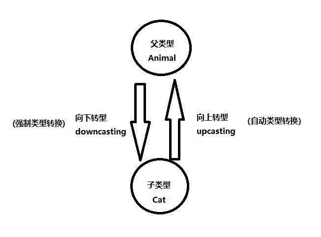


### 什么是多态

1. 父类型引用指向子类对象。Animal a = new Cat(); a.move();
2. 程序分为编译阶段和运行阶段：
  1. 编译阶段：编译器只知道a是Animal类型，因此去Animal类中找move()方法，找到之后，绑定成功，编译通过。这个过程通常被称为静态绑定。
  2. 运行阶段：运行时和JVM堆内存中的真实Java对象有关，所以运行时会自动调用真实对象的move()方法。这个过程通常被称为动态绑定。
3. 多态指的是：多种形态，编译阶段一种形态，运行阶段另一种形态，因此叫做多态。

### instanceof 运算符

**向下转型我们需要注意什么？**

1. 向下转型时，使用不当，容易发生类型转换异常：ClassCastException。
2. 在向下转型时，一般建议使用instanceof运算符进行判断来避免ClassCastException的发生。

**instanceof运算符的使用**

1. 语法格式：(引用 instanceof 类型)
2. 执行结果是true或者false
3. 例如：(a instanceof Cat)
  1. 如果结果是true：表示a引用指向的对象是Cat类型的。
  2. 如果结果是false：表示a引用指向的对象不是Cat类型的。
4. instanceof 运算符的新语法规则：

```java
if(a instanceof Cat){
    Cat c = (Cat)a;
}

// 可以写做
if(a instanceof Cat c){
}
```

### 代码示例

```java
package com.jkweilai.p12;

public class Animal {

    public void move(){
        System.out.println("动物在移动");
    }

}
```

```java
package com.jkweilai.p12;

public class Bird extends Animal {

    @Override
    public void move() {
        System.out.println("Bird fly");
    }

    // 子类独有的方法
    public void sing(){
        System.out.println("鸟儿在唱歌！");
    }

}
```

```java
package com.jkweilai.p12;

public class Cat extends Animal {

    @Override
    public void move() {
        System.out.println("猫在走猫步！");
    }

    // 子类独有的方法
    public void catchMouse(){
        System.out.println("猫抓老鼠！");
    }
}
```

```java
package com.jkweilai.p12;

public class T {
    public static void t(Animal a) {
        // 我实际上是不知道这个程序在运行的时候a的类型是Cat还是Bird，我是不知道。
        // 但我知道你一定会给我传过来Animal类型或者Animal类型的子类型。
        // 对于我来说，我希望是这样的效果：
        // 当传过来的是猫，我就让猫抓老鼠。
        // 当传过来的是鸟，我就让它唱歌。
        /*if(a instanceof Cat) {
            Cat cat = (Cat) a;
            cat.catchMouse();
        }else if(a instanceof Bird) {
            Bird bird = (Bird) a;
            bird.sing();
        }*/

        // 新特性。
        if(a instanceof Cat c) {
            c.catchMouse();
        }else if(a instanceof Bird b) {
            b.sing();
        }
    }
}
```

```java
package com.jkweilai.p12;

/*

关于java语言中基本数据类型之间的相互转换：
    1. 小容量可以自动转换成大容量。
        int a = 100;
        long b = a;
    2. 大容量要转换成小容量，必须添加强制类型转换符。
        long x = 100L;
        int y = (int)x;

关于Java语言中引用数据类型中的向上转型和向下转型：
    1.向上转型/up casting（更加接近自动类型转换。）
        子 ---> 父
        Animal a = new Cat();
    2.向下转型/down casting（更加接近强制类型转换。）
        父 ---> 子
        Animal a = new Cat();
        Cat c = (Cat)a;
    3. java中允许引用数据类型进行类型转换。允许上面的这种语法。但是有前提：
        无论是向上转型还是向下转型，两种类型之间必须要有继承关系，要不然编译报错。
 */
public class Test01 {
    public static void main(String[] args) {
        // 编译器报错。
        /*Bird b = new Bird();
        Cat c = new Cat();
        Bird b1 = (Bird)c;*/

        // 正常没有类型转换的代码（这是没有类型转换的代码）
        /*Cat c1 = new Cat();
        Bird b1 = new Bird();

        c1.move();
        c1.catchMouse();

        b1.move();
        b1.sing();*/

        /*
            1.父类型的引用指向子类型的对象，在Java中是允许的。（向上转型）
            2.分析以下程序的时候，分为两个阶段：
                第一个阶段：编译阶段
                    编译器的时候，编译器只知道 “a引用” 的类型是Animal类型，
                    因此编译器会去Animal.class中找move()方法，找到了，绑
                    定上，只要能绑定成功，编译就通过了。（静态绑定）
                第二个阶段：运行阶段
                    java中规定，运行阶段和堆内存当中真实的Java对象有关系，
                    在运行的时候，堆内存当中真实的对象是Cat对象，则运行时
                    会动态执行Cat对象上的move()方法，此时发生了动态绑定。
         */
        Animal a = new Cat();
        a.move();

        // 静态绑定失败，编译器报错。
        // 编译器检测到a是Animal类型，会去Animal.class中找catchMouse()方法，找不到，报错了。
        //a.catchMouse();

        // 假设现在就想去执行 catchMouse() 方法，代码该怎么写？
        // 如果要调用子类中特有的方法，必须使用向下转型。
        Cat c = (Cat)a;
        c.catchMouse();

        // 向下转型有风险！！！！！！！！
        // 父类型引用指向子类型对象。
        //Animal x = new Bird();
        // 编译能通过：因为编译器认为x是Animal类型，而Animal类型和Cat类型之间存在继承关系。
        // 运行报错：ClassCastException（非常著名的类型转换异常，只有向下转型的时候才会出现这个问题。）
        //Cat y = (Cat)x;

        // 怎么避免 ClassCastException 异常的发生？
        // Java开发规范中要求，在进行任何向下转型的时候，一定要使用 instanceof 运算符进行类型判断。
        /*
            instanceof 运算的使用：
                1. 语法规则：
                    (引用 instanceof 类型) ===> (a instanceof Cat)
                    运算结果是布尔类型：
                        当结果是true：a 引用指向的堆中的对象是一个Cat类型的实例。
                        当结果是false：a 引用指向的堆中的对象不是一个Cat类型的实例。
                2. 用法：
                    if(a instanceof Cat){
                        Cat c = (Cat)a;
                    }
         */

        /*Animal x = new Bird();
        if(x instanceof Cat) {
            Cat y = (Cat)x;
        }*/

        //T.t(new Cat());

        Cat temp = new Cat();
        T.t(temp);

        T.t(new Bird());

        // 关于JDK中 instanceof 运算符的改进。
        Animal x = new Bird();
        if(x instanceof Cat y) {
            y.catchMouse();
        }

    }
}
```


## 软件设计原则

软件开发原则旨在引导软件行业的从业者在代码设计和开发过程中，遵循一些基本原则，以达到高质量、易维护、易扩展、安全性强等目标。软件开发原则与具体的编程语言无关的，属于软件设计方面的知识

**SOLID原则体系**

1. 单一职责原则（SRP）。

每个类或模块应仅承担一个明确的功能职责。例如，数据库连接类DBUtil仅负责数据库连接管理，避免与业务逻辑耦合。

1. 开闭原则（OCP）。

(Open-Closed Principle，OCP)：一个软件实体应该对扩展开放，对修改关闭。即在不修改原有代码的基础上，通过添加新的代码来扩展功能。（最基本的原则，其它原则都是为这个原则服务的。）

1. 里氏替换原则（LSP）。

子类必须能完全替代父类且不破坏程序逻辑。例如，在继承关系中，子类避免重写父类核心方法，可通过新增方法扩展功能。

1. 接口隔离原则（ISP）。

接口应细化拆分，避免“臃肿接口”。例如，将用户权限管理拆分为“登录接口”和“权限验证接口”，降低实现类复杂度。

1. 依赖倒置原则（DIP）。

高层模块通过抽象接口依赖低层模块，而非直接依赖具体实现。例如，订单服务通过接口PaymentService调用支付功能，而非直接绑定支付宝或微信支付类。

**扩展原则**

1. 迪米特法则（LoD）。

对象间应减少直接交互，仅与“直接朋友”通信。例如，订单类通过中间类OrderProcessor调用库存服务，而非直接操作库存类。

1. 合成复用原则（CRP）。

优先通过组合或聚合复用功能，而非继承。例如，使用Car类聚合Engine对象，而非继承Engine类，降低耦合度。


## 多态在开发中的作用

尽量使用多态，面向抽象编程，不要面向具体编程。使用多态可以降低程序的耦合度，提高程序的扩展力。

```java
package com.jkweilai.p13;

// 主人
// 尽量使用多态，面向抽象编程，不要面向具体编程。使用多态可以降低程序的耦合度，提高程序的扩展力。
// 多态其实是符合OCP原则的。
public class Master {

    // 喂养
    // 这个方法的设计不太符合ocp原则。
    // 因为这个参数Cat只能接收Cat类型的数据。
    /*public void feed(Cat c){
        c.eat();
    }*/

    // 添加了这个方法，等于是修改了Master类来完成需求。
    // 所以违背OCP。
    /*public void feed(Dog d){
        d.eat();
    }*/

    // 参数在设计的时候最好是面向抽象编程，面向多态编程。不要面向具体编程。
    // 面向具体编程，扩展力差。耦合度高。
    // 面向抽象编程，耦合度低，扩展力强。
    public void feed(Pet p){
        p.eat();
    }

}
```

```java
package com.jkweilai.p13;

public class Pet {
    String name = "小黑";

    public void eat(){
        // 这个方法中的代码不需要写。因为写上意义也不大。
        // 因此这个方法应该定义为抽象方法更合适。
    }

    public static void run(){
        System.out.println("Pet run");
    }
}
```

```java
package com.jkweilai.p13;

// 宠物猫
public class Cat extends Pet {

    public void eat(){
        System.out.println("猫咪在进食！！！");
    }
}
```

```java
package com.jkweilai.p13;

public class Dog extends Pet {

    String name = "金毛";

    public void eat(){
        System.out.println("狗狗在啃骨头！");
    }

    //@Override
    public static void run(){
        System.out.println("Dog run");
    }

}
```

```java
package com.jkweilai.p13;

public class Snake extends Pet{

    public void eat(){
        System.out.println("蛇吞象！");
    }

}
```

```java
package com.jkweilai.p13;

public class Test {
    public static void main(String[] args) {
        // 创建主人对象
        Master master = new Master();
        // 创建猫咪宠物对象
        Cat cat = new Cat();
        // 主人喂养宠物
        master.feed(cat);

        // 创建宠物狗对象
        //Dog dog = new Dog();
        //master.feed(dog);
        master.feed(new Dog());

        Snake snake = new Snake();
        master.feed(snake);

        // 多态
        // 方法覆盖指的是：实例方法。（不是静态方法，实例变量不属于方法覆盖范畴！）
        Pet p = new Dog();
        p.run();
        System.out.println(p.name);
    }
}
```

**练一练：**

1. 创建一个名为`Shape`的类，在其中定义两个属性`length`和`width`，并提供相应的getter和setter方法来进行属性的访问和修改。在此基础上，创建一个名为`Rectangle`的子类和一个名为`Square`的子类，并分别重写`getArea()`方法来计算矩形和正方形的面积，使用多态实现打印出各自的面积。
2. 创建一个名为`Person`的类，在其中定义方法`greet()`，用于问候对方。在此基础上，创建一个名为`EnglishPerson`的子类和一个名为`ChinesePerson`的子类分别重写`greet()`方法，分别使用英文和中文问候对方。在`main`方法中，创建一个`EnglishPerson`对象和一个`ChinesePerson`对象，使用`greet()`方法向对方问候。
3. 创建一个名为`Animal`的类，在其中定义方法`move()`，用于输出动物的移动方式。在此基础上，创建一个名为`Cat`的子类和一个名为`Fish`的子类分别重写`move()`方法，分别输出猫和鱼的移动方式。在`main`方法中，创建一个名为`animal`的变量，再在运行时分别将它指定为`Cat`和`Fish`的实例，然后调用它们的`move()`方法。
4. 设计一个简单的员工管理系统，包含以下类：
  1. `Employee`类：定义员工的基本属性，包括姓名、部门、工资等，并定义方法`getSalary()`用于返回工资。
  2. `HourlyEmployee`类：通过继承`Employee`类，实现新的属性和方法，包括时薪和工作小时数，并重写父类的`getSalary()`方法，计算出按照时薪计算的工资。
  3. `SalariedEmployee`类：通过继承`Employee`类，实现新的属性和方法，包括月薪和工作天数，并重写父类的`getSalary()`方法，计算出按照月薪计算的工资。
  4. `CommissionedEmployee`类：通过继承`Employee`类，实现新的属性和方法，包括佣金比例和销售额，并重写父类的`getSalary()`方法，计算出按照销售额和佣金比例计算的工资。
  5. 在主方法中，实例化`HourlyEmployee`、`SalariedEmployee`和`CommissionedEmployee`对象，分别计算他们的工资并输出。


# super 关键字

## super 的基础语法规则

1. super关键字和this关键字对比来学习。this代表的是当前对象。super代表的是当前对象中的父类型特征。
2. super不能使用在静态上下文中。
3. “super.”大部分情况下是可以省略的。什么时候不能省略？
  1. 当父类和子类中定义了相同的属性（实例变量）或者相同方法（实例方法）时，如果需要在子类中访问父类的属性或方法时，super.不能省略。
4. this可以单独输出，super不能单独输出。
5. super(实参); 通过子类的构造方法调用父类的构造方法，目的是为了完成父类型特征的初始化和赋值。
6. 当一个构造方法第一行没有显示的调用“super(实参);”，也没有显示的调用“this(实参)”，系统会自动调用super()。因此一个类中的无参数构造方法建议显示的定义出来。
7. super(实参); 这个语法只能出现在构造方法第一行。
8. 在Java语言中只要new对象，Object的无参数构造方法一定会执行。

## 初步理解 super

```java
/*
    1. super关键字和this关键字对比来学习。
    2. this的用法：this. 和 this()，那么super的用法：super. 和 super()
    3. this代表的是当前对象。super代表的是当前对象中的父类型特征。
    4. this 可以单独打印输出，super不行。
    5. this是一个引用，保存内存地址。super不是一个引用，不保存内存地址指向单独一个对象。
    6. this指向了一个当前对象，当前对象中的数据肯定是有一些从父类中继承过来的，而这些继
    承过来的数据上面都有一个super标记。
*/
public class SuperTest01 {
    public void m(){
        System.out.println(this);
        // 编译报错。
        //System.out.println(super);
    }
}
```

## super 不能出现在静态上下文

```java
/*
    super不能使用在静态上下文中
    super可以看做是 this的一部分。
    this和super都不能出现在静态上下文中。
*/
public class SuperTest02 extends T {
    public static void main(String[] args) {
        // 报错
        //System.out.println(this);
    }

    // 报错
    /*public static void m(){
        System.out.println(super.name);
    }*/
}

class T {
    String name = "jack";
}
```

## "super."何时不能省略

```java
/*
    super. 大部分情况下是可以省略的。什么时候必须使用 "super."
        1.当父类和子类有同名属性，并且在子类中的方法体当中访问继承过来的父类的属性，必须使用"super."
        2.当父类和子类有同名方法，并且在子类中的方法体当中访问父类中的方法，必须使用“super.”
 */
public class SuperTest03 {
    public static void main(String[] args) {
        Cat c = new Cat();
        c.print();
    }
}

class Animal {
    String name = "小黑";

    public void run(){
        System.out.println("Animal run");
    }
}

class Cat extends Animal {
    String name = "小白";

    // 方法覆盖
    @Override
    public void run() {
        System.out.println("Cat.run");
    }

    // 实例方法
    public void print(){
        System.out.println(name);
        System.out.println(this.name);
        // 这个访问的是继承过来的父类型特征中的name。
        System.out.println(super.name);
        this.run();
        super.run();
    }
}
```

## "super."在开发中的应用

```java
// super. 在实际开发中的应用。
public class SuperTest04 {
    public static void main(String[] args) {
        Worker w = new Teacher();
        w.doSome();
    }
}

class Worker {
    public void doSome(){
        System.out.println("do some....");
    }
}

class Teacher extends Worker {
    // 要求重写doSome()方法，但是要求在父类doSome方法代码的基础之上进行功能扩展。
    @Override
    public void doSome() {
        // 前扩展
        System.out.println("前面的扩展代码");
        // 把父类中的方法执行一下
        super.doSome();
        // 后扩展
        // 然后再基于这个代码进行功能扩展。
        System.out.println("后面的扩展代码");
    }
}
```

## super()语法

```java
/*
    1. 当一个构造方法第一行，既没有编写 this(实参) 语法，又没有编写 super(实参) 语法。第一行系统会自动调用：super();
    2. super() 是通过子类的构造方法调用父类的构造方法，模拟现实生活中的：要有儿子，先有父亲。
    3. super() 执行的是父类的构造方法，但不会真正的创建对象，实际上只是为了给当前对象的父类型特征初始化。
    4. super() 和 this() 不能共存。都是只能出现在构造方法第一行。
*/
public class SuperTest05 {
    public static void main(String[] args) {
        Student s = new Student("jack", 20, 90.0);
        s.print();
    }
}

class Person extends Object{
    String name;
    int age;

    public Person(){
        super();
        System.out.println("Person的无参数构造方法执行了");
    }
}

class Student extends Person {
    String name;
    double score;

    public Student(){
    }

    public Student(String name, int age, double score) {
        super();
        this.name = name;
        this.age = age;
        this.score = score;
    }

    public void print(){
        System.out.println(this.name); // jack
        System.out.println(super.name); // null
    }
}
```

## 关于 super 的内存图

以下代码对应的内存图：

```java
public class SuperTest05 {
    public static void main(String[] args) {
        Student s = new Student("jack", 20, 90.0);
    }
}

class Person extends Object{
    String name;
    int age;

    public Person(){
    }
}

class Student extends Person {
    double score;

    public Student(){
    }

    public Student(String name, int age, double score) {
        super();
        this.name = name;
        this.age = age;
        this.score = score;
    }
}
```

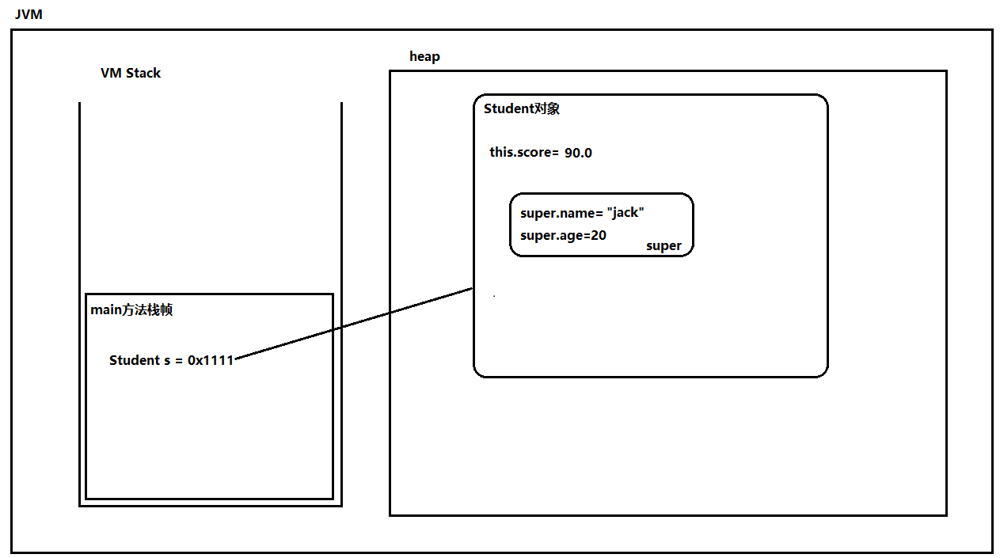

以下代码对应的内存图：

```java
public class SuperTest05 {
    public static void main(String[] args) {
        Student s = new Student("jack", 20, 90.0);
    }
}

class Person extends Object{
    String name;
    int age;
    public Person(){
    }
}

class Student extends Person {
    String name;
    double score;
    public Student(){
    }
    public Student(String name, int age, double score) {
        super();
        this.name = name;
        this.age = age;
        this.score = score;
    }
}
```

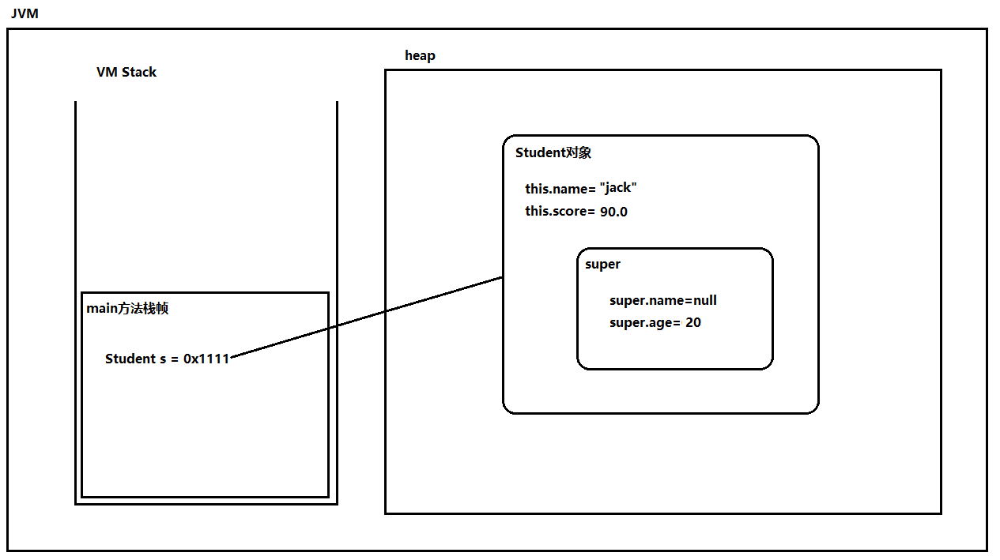

## 以下程序的报错原因

```java
package com.jkweilai.p15;

public class A {
    public A(String name){}
}
```

```java
package com.jkweilai.p15;

public class B extends A {
}
```

报错原因是：B 类中虽然没有编写任何构造方法，但系统会自动提供一个无参数构造方法，并且该无参数构造方法第一行会自动调用 `super();`【调用 A 类的无参数构造方法】，而由于 A 类中手动定义了一个有参数的构造方法，导致 A 类中无参数构造方法不存在，因此报错。因此在实际开发中，定义 Java 类时，建议将无参数构造方法显示的定义出来。

## super(实参)在开发中的应用

```java
package com.jkweilai.p15;

public class Account {
    private String actNo;
    private double balance;

    public Account() {
    }

    public Account(String actNo, double balance) {
        //super();
        this.actNo = actNo;
        this.balance = balance;
    }

    public String getActNo() {
        return actNo;
    }

    public void setActNo(String actNo) {
        this.actNo = actNo;
    }

    public double getBalance() {
        return balance;
    }

    public void setBalance(double balance) {
        this.balance = balance;
    }
}
```

```java
package com.jkweilai.p15;

public class CreditAccount extends Account {
    // 子类特有的属性
    private double credit;

    public void m(){
        // super.actNo 是一个私有的空间，无法访问。
        //System.out.println(super.actNo);
    }

    /*public CreditAccount(){
        super();
    }*/

    /*public CreditAccount(String actNo, double balance, double credit){
        super(actNo, balance);
        //this.actNo = actNo;
        //this.balance = balance;
        this.credit = credit;
    }*/

    public CreditAccount(String actNo, double balance, double credit) {
        super(actNo, balance);
        this.credit = credit;
    }

    public double getCredit() {
        return credit;
    }

    public void setCredit(double credit) {
        this.credit = credit;
    }
}
```

```java
package com.jkweilai.p15;

public class SuperTest {
    public static void main(String[] args) {
        CreditAccount ca = new CreditAccount("110", 100.0, 1.0);

        System.out.println(ca.getActNo());
        System.out.println(ca.getBalance());
        System.out.println(ca.getCredit());
    }
}
```

`super(实参);` 主要应用是：当父类中的属性是私有的，子类构造方法中无法直接给父类的属性赋值，通过 `super(实参);`来调用父类的构造方法完成赋值。

以上代码对应的内存图如下：

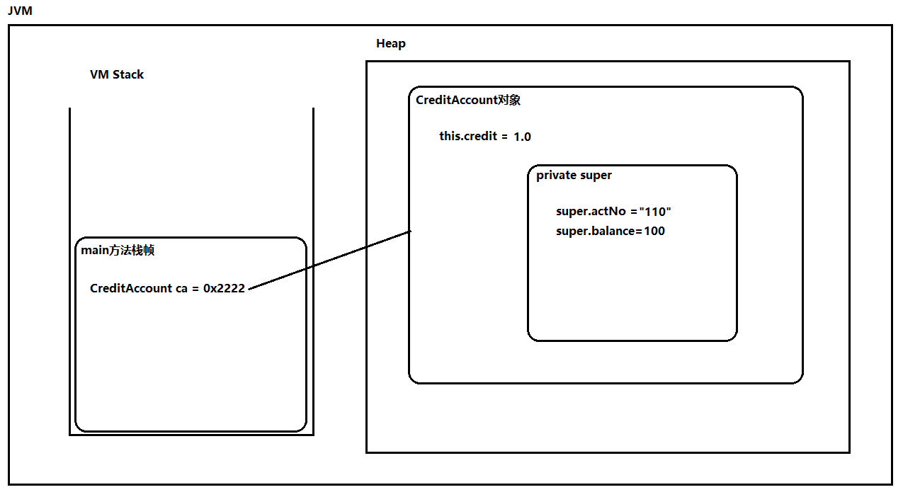

# final 关键字

## final 关键字

1. final修饰的类不能被继承
2. final修饰的方法不能被覆盖
3. final修饰的变量，一旦赋值不能重新赋值
4. final修饰的实例变量必须在对象初始化时手动赋值
5. final修饰的实例变量一般和static联合使用：称为常量
6. final修饰的引用，一旦指向某个对象后，不能再指向其它对象。但指向的对象内部的数据是可以修改的。

## 类加载的三大阶段


---

**类加载的过程有三个重要的阶段，分别是：**

1. **加载：**将 class 字节码文件加载到内存，静态变量内存未分配。
2. **链接：**链接又包括三个阶段
  1. 验证：对类的字节码进行验证，确保它符合 Java 语言规范和安全规范。
  2. 准备：为静态变量赋默认值。**不过这里有一个特殊情况：****如果静态变量同时被 **`**<font style="color:rgb(15, 17, 21);background-color:rgb(235, 238, 242);">final</font>**`** 修饰（即常量），且类型是基本类型或 **`**<font style="color:rgb(15, 17, 21);background-color:rgb(235, 238, 242);">String</font>**`**，则在准备阶段就直接赋值为代码中指定的值（比如 **`**<font style="color:rgb(15, 17, 21);background-color:rgb(235, 238, 242);">static final int a = 100;</font>**`**，在准备阶段就是 **`**<font style="color:rgb(15, 17, 21);background-color:rgb(235, 238, 242);">100</font>**`**，而不是 **`**<font style="color:rgb(15, 17, 21);background-color:rgb(235, 238, 242);">0</font>**`**）**
  3. 解析：将符号引用转换为直接引用，也就是将类名、字段名等符号引用转换为直接地址。
3. **初始化：赋初始值（类加载的最后一步），这个阶段会执行类构造器 **`**<font style="color:rgb(15, 17, 21);background-color:rgb(235, 238, 242);"><clinit>()</font>**`。这个构造器会收集：
  1. 所有静态变量的**赋值语句**（`<font style="color:rgb(15, 17, 21);background-color:rgb(235, 238, 242);">static int b = 5;</font>`）。
  2. 所有**静态代码块** `<font style="color:rgb(15, 17, 21);background-color:rgb(235, 238, 242);">static { ... }</font>` 中的代码。

按照代码中的**书写顺序**从上往下执行。（**注意：这个类构造器不创建任何对象，它的职责非常单一：执行静态变量的赋值语句 和 静态代码块**）

**通过下面代码来理解类加载的过程：**

```java
public class Test {
    // 静态变量
    static int a;          // 准备阶段: a = 0; 初始化阶段: 没有显式赋值，保持0
    static int b = 5;      // 准备阶段: b = 0; 初始化阶段: b = 5
    static int c;          // 准备阶段: c = 0;

    static {
        c = 10;            // 初始化阶段执行: c 从 0 -> 10
        System.out.println("静态代码块执行");
    }

    static int d = c;      // 准备阶段: d = 0; 初始化阶段: d = 当前c的值(10)
}
```

## 代码执行顺序

分析以下代码的执行顺序：【地狱级难度】

```java
class ExecutionOrder {
    // 静态变量 - 调用构造方法赋值
    private static ExecutionOrder staticField = new ExecutionOrder("静态变量初始化");

    // 实例变量 - 调用另一个类的构造方法赋值
    private StringContainer instanceField = new StringContainer("实例变量初始化");

    // final静态变量 - 调用构造方法赋值
    private static final ExecutionOrder FINAL_STATIC_FIELD = new ExecutionOrder("final静态变量");

    // final实例变量
    private final StringContainer finalInstanceField;

    private String name;

    // 静态代码块1
    static {
        System.out.println("静态代码块1");
        new ExecutionOrder("静态代码块1中创建的对象");
    }

    // 构造代码块1
    {
        System.out.println("构造代码块1 - " + name);
        finalInstanceField = new StringContainer("final实例变量赋值");
    }

    // 无参构造函数
    public ExecutionOrder() {
        this("默认名称");
        System.out.println("无参构造函数完成");
    }

    // 带参构造函数
    public ExecutionOrder(String name) {
        System.out.println("构造函数开始: " + name);
        this.name = name;
        instanceField = new StringContainer("构造函数中修改的实例变量");
        System.out.println("构造函数结束: " + name);
    }

    // 静态代码块2
    static {
        System.out.println("静态代码块2");
    }

    // 主方法
    public static void main(String[] args) {
        System.out.println("main开始");
        new ExecutionOrder("main方法中创建的对象");
        new ChildClass("ChildClass");
        System.out.println("main结束");
    }
}

class StringContainer {
    private String value;

    public StringContainer(String value) {
        System.out.println("StringContainer构造函数: " + value);
        this.value = value;
    }
}

class ParentClass {
    private static ParentClass staticParent = new ParentClass("父类静态变量");

    static {
        System.out.println("父类静态代码块");
    }

    private StringContainer parentField = new StringContainer("父类实例变量");

    public ParentClass(String name) {
        System.out.println("父类构造函数: " + name);
    }
}

class ChildClass extends ParentClass {
    private static ChildClass staticChild = new ChildClass("子类静态变量");

    static {
        System.out.println("子类静态代码块");
    }

    private StringContainer childField = new StringContainer("子类实例变量");

    public ChildClass(String name) {
        super("子类构造调用");
        System.out.println("子类构造函数: " + name);
    }
}
```

以下代码的执行顺序是怎样的？

```java
/*
对象实例化的过程：当new发生后
1. 堆内存中分配空间，所有实例变量赋默认值。
2. 给实例变量手动赋值与构造代码块执行在同一个时间执行，执行顺序依靠代码的上下顺序。
3. 执行构造方法体。
 */
public class CodeExeOrder {
    CodeExeOrder(){
        System.out.println("构造方法执行");
    }
    int x = getX();
    {
        System.out.println("构造代码块执行");
    }
    int y = getY();
    public int getX(){
        System.out.println("getX执行了");
        return 100;
    }
    public int getY(){
        System.out.println("getY执行了");
        return 200;
    }
    public static void main(String[] args) {
        new CodeExeOrder();
    }
}
```

# 抽象类

## 基础语法

1. 什么时候考虑将类定义为抽象类？
  1. 如果类中有些方法无法实现或者没有意义，可以将方法定义为抽象方法。类定义为抽象类。这样在抽象类中只提供公共代码，具体的实现强行交给子类去做。比如一个Person类有一个问候的方法greet()，但是不同国家的人问候的方式不同，因此greet()方法具体实现应该交给子类。再比如主人喂养宠物的例子中的宠物Pet，Pet中的eat()方法的方法体就是没有意义的。
2. 抽象类如何定义？
  1. abstract class 类名{}
3. 抽象类有构造方法，但无法实例化。抽象类的构造方法是给子类使用的。
4. 抽象方法如何定义？
  1. abstract 方法返回值类型 方法名(形参);
5. 抽象类中不一定有抽象方法，但如果有抽象方法那么类要求必须是抽象类。
6. 一个非抽象的类继承抽象类，要求必须将抽象方法进行实现/重写。
7. abstract关键字不能和private，final，static关键字共存。

## 抽象类代码演示

```java
package com.jkweilai.p17;

public abstract class Person {

    // 抽象类中可以有抽象的内容，也可以有非抽象的内容。
    private String name;

    public Person(){}

    // 抽象类有构造方法，但是抽象类无法实例化。这个构造方法是给子类使用的。
    // 因为子类创建的时候要调用：super(...)
    public Person(String name) {
        this.name = name;
    }

    // 非抽象方法
    public String getName() {
        return name;
    }

    // 非抽象方法
    public void setName(String name) {
        this.name = name;
    }

    // 抽象方法
    abstract public void greet();

}
```

```java
package com.jkweilai.p17;

public class ChinesePerson extends Person {

    public ChinesePerson(String name) {
        super(name);
    }

    @Override
    public void greet() {
        System.out.println("你好，我的名字叫" + this.getName());
    }
}
```

```java
package com.jkweilai.p17;

public class EnglishPerson extends Person {

    public EnglishPerson(){
        super();
    }

    public EnglishPerson(String name) {
        super(name);
    }

    @Override
    public void greet() {
        System.out.println("Hello, My name is " + this.getName());
    }
}
```

```java
package com.jkweilai.p17;

public class AbstractTest01 {
    public static void main(String[] args) {
        // 抽象类无法创建对象。
        //Person p1 = new Person();
        //Person p2 = new Person("lucy");

        Person p1 = new EnglishPerson("lucy");
        p1.greet();

        Person p2 = new ChinesePerson("杰克");
        p2.greet();
    }
}
```

## abstract 的互斥关键字

abstract关键字不能和private，final，static关键字共存。

```java
package com.jkweilai.p17;

/*
    abstract和private互斥。
    abstract和final互斥。
    abstract和static互斥。
 */
public abstract class Customer {
    //public final abstract void shopping();
    //private abstract void shopping();
    //public abstract static void shopping();
}
```

**练一练：super，final，抽象类 综合练习**

请根据题目要求编写程序，实现一个包含抽象类和抽象方法的Java程序，要求：

- 定义一个抽象类Shape，包含属性：name、color、抽象方法area()，非抽象方法display()。思考为什么area()方法定义为抽象方法？
- 定义一个Circle类，继承Shape类，包含一个双精度类型实例变量radius，以及一个构造方法，该构造方法使用super关键字调用父类Shape的构造方法，来初始化color和name。Circle类还实现了抽象方法area()，用于计算圆形的面积。定义一个常量类，常量类中定义一个常量用来专门存储圆周率。
- 定义一个Rectangle类，继承Shape类，包含两个双精度类型实例变量width和height，以及一个构造方法，该构造方法使用super关键字调用父类Shape的构造方法，来初始化color和name。Rectangle类还实现了抽象方法area()，用于计算矩形的面积。
- 在程序的main()方法中，创建一个Circle对象、一个Rectangle对象，并分别调用它们的display()方法，输出结果。调用area()方法输出面积。


# 接口

## 接口的基础语法

1. 接口（interface）在Java中表示一种规范或契约，它定义了一组抽象方法和常量，用来描述一些实现这个接口的类应该具有哪些行为和属性。接口和类一样，也是一种引用数据类型。
2. 接口怎么定义？[修饰符列表] interface 接口名{}
3. 抽象类是半抽象的，接口是完全抽象的。接口没有构造方法，也无法实例化。
4. 接口中只能定义：常量+抽象方法。接口中的常量的static final可以省略。接口中的抽象方法的abstract可以省略。接口中所有的方法和变量都是public修饰的。
5. 接口和接口之间可以多继承。
6. 类和接口的关系我们叫做实现（这里的实现也可以等同看做继承）。使用implements关键字进行接口的实现。
7. 一个非抽象的类实现接口必须将接口中所有的抽象方法全部实现。
8. 一个类可以实现多个接口。语法是：class 类 extends 父类 implements 接口A,接口B{}
9. Java8之后，接口中允许出现默认方法和静态方法(JDK8新特性)
  1. 引入默认方式是为了解决接口演变问题：接口可以定义抽象方法，但是不能实现这些方法。所有实现接口的类都必须实现这些抽象方法。这会导致接口升级的问题：当我们向接口添加或删除一个抽象方法时，这会破坏该接口的所有实现，并且所有该接口的用户都必须修改其代码才能适应更改。这就是所谓的"接口演变"问题。
  2. 引入的静态方法只能使用本接口名来访问，无法使用实现类的类名访问。
10. JDK9之后允许接口中定义私有的实例方法（为默认方法服务的）和私有的静态方法（为静态方法服务的）。
11. 所有的接口隐式的继承Object。因此接口也可以调用Object类的相关方法。


## 接口的作用

1. 面向接口调用的称为：接口调用者
2. 面向接口实现的称为：接口实现者
3. 调用者和实现者通过接口达到了解耦合。也就是说调用者不需要关心具体的实现者，实现者也不需要关心具体的调用者，双方都遵循规范，面向接口进行开发。
4. 面向抽象编程，面向接口编程，可以降低程序的耦合度，提高程序的扩展力。
5. 例如定义一个Usb接口，提供read()和write()方法，通过read()方法读，通过write()方法写：
  1. 定义一个电脑类Computer，它是调用者，面向Usb接口来调用。
  2. Usb接口的实现可以有很多，例如：打印机（Printer），硬盘（HardDrive）。

```java
public class Computer{
    public void conn(Usb usb){
        usb.read();
        usb.write();
    }
}
```

1. 再想想，我们平时去饭店吃饭，这个场景中有没有接口呢？食谱菜单就是接口。顾客是调用者。厨师是实现者。

## 抽象类和接口如何选择

抽象类和接口虽然在代码角度都能达到同样的效果，但适用场景不同：

1. 抽象类主要适用于公共代码的提取。当多个类中有共同的属性和方法时，为了达到代码的复用，建议为这几个类提取出来一个父类，在该父类中编写公共的代码。如果有一些方法无法在该类中实现，可以延迟到子类中实现。这样的类就应该使用抽象类。
2. 接口主要用于功能的扩展。例如有很多类，一些类需要这个方法，另外一些类不需要这个方法时，可以将该方法定义到接口中。需要这个方法的类就去实现这个接口，不需要这个方法的就可以不实现这个接口。接口主要规定的是行为。

**练一练：要求如下**

1. 定义一个动物类Animal，属性包括name，age。方法包括display()，eat()。display()方法可以有具体的实现，显示动物的基本信息。但因为不同的动物会有不同的吃的方式，因此eat()方法应该定义为抽象方法，延迟给子类来实现。
2. 定义多个子类，例如：XiaoYanZi、Dog、YingWu。分别继承Animal，实现eat()方法。
3. 不是所有的动物都会飞，其中只有XiaoYanZi和YingWu会飞，请定义一个Flyable接口，接口中定义fly()方法。让XiaoYanZi和YingWu都能飞。
4. 不是所有的动物都会说话，其中只有YingWu会说话，请定义一个Speakable接口，接口中定义speak()方法。让YingWu会说话。
5. 编写测试程序，创建各个动物对象，调用display()方法，eat()方法，能飞的动物让它飞，能说话的动物让它说话。

注意：

一个类继承某个类的同时可以实现多个接口：class 类 extends 父类 implements 接口A,接口B{}

**当某种类型向下转型为某个接口类型时，接口类型和该类之间可以没有继承关系，编译器不会报错的。**

**练一练：要求如下**

**案例：运输系统**

这个案例能清晰展示接口定义“能力”，抽象类实现“共性” 的区别。

**需求描述**

设计一个程序来模拟不同的交通工具的工作方式。系统中会有多种交通工具，如汽车、自行车、轮船等。每种交通工具的行为各有特点。

核心需求：

1. 我们需要明确这些交通工具能做什么（即它们的能力）。
2. 我们需要抽取出不同交通工具之间的共同特征和行为，避免代码重复。
3. 每种交通工具在共同行为之下，又有自己独特的具体实现。

**请根据以上需求，完成以下设计任务：**

**任务1：设计接口（定义“可移动”的能力）**

- 创建一个名为 `Movable` 的接口。
- 接口里只声明一个方法：`void move()`。
- 设计思想：这个接口不关心你具体是什么，只关心你“能不能移动”。只要实现了这个接口，就承诺具备了移动的能力。

**任务2：设计抽象类（抽取“交通工具”的共性）**

- 创建一个名为 `Vehicle`（交通工具）的抽象类。
- 这个抽象类应该实现 `Movable` 接口。
- 共性属性：所有交通工具都有的属性，比如 `brand`（品牌）、`speed`（当前速度）。
- 共性方法：所有交通工具都可能有的具体方法，比如 `void honk()`（鸣笛），它可以有一个默认实现（例如打印“滴滴！”）。
- 抽象方法：声明一个抽象方法 `void startEngine()`（启动引擎）。为什么它是抽象的？ 因为汽车启动引擎、自行车“启动引擎”（可能是踩踏板）、轮船启动引擎的方式完全不同，无法在抽象类中给出统一实现，必须交给具体的交通工具自己去定义。

**任务3：设计具体类（实现特异行为）**

现在，请你思考如何创建具体的类：

- `Car`（汽车）类：继承 `Vehicle` 抽象类。
  - 它必须实现 `startEngine()` 方法：输出“汽车用钥匙启动发动机”。
  - 它必须实现 `move()` 方法：输出“汽车正在公路上行驶”。
- `Bicycle`（自行车）类：继承 `Vehicle` 抽象类。
  - 它必须实现 `startEngine()` 方法：输出“自行车通过人力踩踏板启动”。
  - 它必须实现 `move()` 方法：输出“自行车正在自行车道上骑行”。
- `Boat`（轮船）类：继承 `Vehicle` 抽象类。
  - 它必须实现 `startEngine()` 方法：输出“轮船启动涡轮发动机”。
  - 它必须实现 `move()` 方法：输出“轮船正在海上航行”。

最终编写测试程序：创建汽车对象、自行车对象、轮船对象，分别调用 `startEngine()``move()``honk()`方法。感受抽象类和接口的区别！！！


# 类之间关系

## UML

UML（Unified Modeling Language，统一建模语言）是一种用于面向对象软件开发的图形化的建模语言。它由Grady Booch、James Rumbaugh和Ivar Jacobson等三位著名的软件工程师所开发，并于1997年正式发布。UML提供了一套通用的图形化符号和规范，帮助开发人员以图形化的形式表达软件设计和编写的所有关键方面，从而更好地展示软件系统的设计和实现过程。

UML是一种图形化的语言，类似于现实生活中建筑工程师画的建筑图纸，图纸上有特定的符号代表特殊的含义。

UML不是专门为java语言准备的。只要是面向对象的编程语言，开发前的设计，都需要画UML图进行系统设计。（设计模式、软件开发七大原则等同样也不是只为java语言准备的。）

UML图包括：

- **类图（Class Diagram）：描述软件系统中的类、接口、关系和其属性等；**
- **用例图（Use Case Diagram）：描述系统的功能需求和用户与系统之间的关系；**
- **序列图（Sequence Diagram）：描述对象之间的交互、消息传递和时序约束等；**
- **状态图（Statechart Diagram）：描述类或对象的生命周期以及状态之间的转换；**
- 对象图（Object Diagram）：表示特定时间的系统状态，并显示其包含的对象及其属性；
- 协作图（Collaboration Diagram）：描述对象之间的协作，表示对象之间相互合作来完成任务的关系；
- 活动图（Activity Diagram）：描述系统的动态行为和流程，包括控制流和对象流；
- 部署图（Deployment Diagram）：描述软件或系统在不同物理设备上部署的情况，包括计算机、网络、中间件、应用程序等。

常见的UML建模工具有：StarUML，Rational Rose等。


## 类之间关系

1. 泛化关系（is a）【继承关系】
2. 实现关系（is like a）【类实现接口】
3. 关联关系（has a）
4. 聚合关系
聚合关系指的是一个类包含、合成或者拥有另一个类的实例，而这个实例是可以独立存在的。聚合关系是一种弱关联关系，表示整体与部分之间的关系。例如一个教室有多个学生
5. 组合关系（Composition）
组合关系是聚合关系的一种特殊情况，表示整体与部分之间的关系更加强烈。组合关系指的是一个类包含、合成或者拥有另一个类的实例，而这个实例只能同时存在于一个整体对象中。如果整体对象被销毁，那么部分对象也会被销毁。例如一个人对应四个肢体。
6. 依赖关系（Dependency）
依赖关系是一种临时性的关系，当一个类使用另一个类的功能时，就会产生依赖关系。如果一个类的改变会影响到另一个类的功能，那么这两个类之间就存在依赖关系。依赖关系是一种较弱的关系，可以存在多个依赖于同一个类的对象。例如A类中使用了B类，但是B类作为A类的方法参数或者局部变量等。

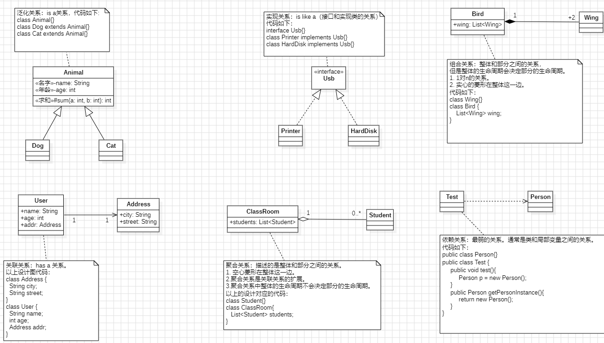


# 访问控制权限

| **访问权限修饰符** |   |   |   |   |
| --- | --- | --- | --- | --- |
| 修饰符 | 同一个类 | 同一个包 | 子类 | 所有类 |
| private | √ |   |   |   |
| 缺省 | √ | √ |   |   |
| protected | √ | √ | √（必须在子类的类体当中） |   |
| public | √ | √ | √ | √ |

1. private：私有的，只能在本类中访问。
2. 缺省：默认的，同一个包下可以访问。
3. protected：受保护的，子类中可以访问。（受保护的通常就是给子孙用的。）
  1. **注意：是子类的类体中。**
4. public：公共的，在任何位置都可以访问。
5. 类中的属性和方法访问权限共有四种：private、缺省、protected和public。
6. 类的访问权限只有两种：public和 缺省。
7. 访问权限控制符不能修饰局部变量。


# Object 类

1. java.lang.Object是所有类的超类。java中所有类都实现了这个类中的方法。
2. Object类是我们学习JDK类库的第一个类。通过这个类的学习要求掌握会查阅API帮助文档。
3. 现阶段Object类中需要掌握的方法：
  1. toString：将java对象转换成字符串。
  2. equals：判断两个对象是否相等。
4. 现阶段Object类中需要了解的方法：
  1. hashCode：返回一个对象的哈希值，通常作为在哈希表中查找该对象的键值。Object类的默认实现是根据对象的内存地址生成一个哈希码（即将对象的内存地址转换为整数作为哈希值）。hashCode()方法是为了HashMap、Hashtable、HashSet等集合类进行优化而设置的，以便更快地查找和存储对象。
  2. finalize：当java对象被回收时，由GC自动调用被回收对象的finalize方法，通常在该方法中完成销毁前的准备。
  3. clone：对象的拷贝。（浅拷贝，深拷贝）
    1. protected修饰的只能在同一个包下或者子类中访问。
    2. 只有实现了Cloneable接口的对象才能被克隆。


# 内部类

1. 什么是内部类？
  1. 定义在一个类中的类。
2. 什么时候使用内部类？
  1. **当某个类只服务于另一个类，且需要访问其外部类的私有成员时，就需要使用内部类。**
3. 内部类包括哪几种？
  1. 静态内部类：和静态变量一个级别
    1. 静态内部类如何实例化：OuterClass.StaticInnerClass staticInnerClass = new OuterClass.StaticInnerClass();
    2. 无法直接访问外部类中实例变量和实例方法。
  2. 实例内部类：和实例变量一个级别
    1. 实例内部类如何实例化：OuterClass.InnerClass innerClass = new OuterClass().new InnerClass();
    2. 可以直接访问外部类中所有的实例变量，实例方法，静态变量，静态方法。
  3. 局部内部类：和局部变量一个级别
    1. 局部内部类访问外部的局部变量时，局部变量需要被final修饰。
    2. 从JDK8开始，不需要手动添加final了，但JVM会自动添加。
  4. 匿名内部类：特殊的局部内部类，没有名字，只能用一次。