# 第05章 数组


# 数组概述和特点

## 数组的概念

数组概念：数组就是一种能够存放相同数据类型的有序集合（通俗来讲数组就是一个容器）。

## 数组的创建

### 动态创建数组

语法格式：

```java
数据类型[]  数组名 = new 数据类型[数组长度];

// 或者

数据类型  数组名[] = new 数据类型[数组长度];
```

注意：数组的声明建议大家使用第一种方式。

【示例】动态创建数组

```java
public static void main(String[] args) {
        // 创建一个可以容纳3个int类型数据的数组
        int[] arr1 = new int[3];
    
        // 创建一个可以容纳5个字符串类型数据的数组
        String[] arr2 = new String[5];
}
```

### 静态创建数组

语法格式：

```java
数据类型[]  数组名 = new 数据类型[]{元素1, 元素2, 元素3，…};
```

注意：使用静态的方式来创建数组，数组的长度由元素个数来确定。

【示例】静态创建数组（new）

```java
public static void main(String[] args) {
        // 创建指定内容的int类型数组
        int[] arr1 = new int[]{1, 2, 3, 4, 5};
        // 创建指定内容的String类型数组
        String[] arr2 = new String[]{"11", "22", "33", "44"};
}
```

除了使用new关键字来静态创建数组，还可以直接使用大括号来静态创建数组。

语法格式：

```java
数据类型[]  数组名 = {元素1, 元素2, 元素3，…};
```

【示例】静态创建数组（大括号）

```java
public static void main(String[] args) {
        // 创建指定内容的int类型数组
        int[] arr1 = {1, 2, 3, 4, 5};
        // 创建指定内容的String类型数组
        String[] arr2 = {"11", "22", "33", "44"};
}
```

注意事项：

1. 对数组执行赋值操作时，则赋值元素的类型必须和声明数组的类型保持一致。
2. 创建一个数组时，必须指定数组长度，创建成功数组的大小就不可以改变了。


## 数组的基本操作

数组中的元素，我们可以通过索引（下标）来访问，索引的合法取值范围在[0, 数组长度-1]之间。根据索引操作数组元素的时候，如果索引值越界就会抛出数组索引越界异常（ArrayIndexOutOfBoundsException）。

### 数组的赋值操作

【示例】给数组元素赋值

```java
public static void main(String[] args) {
    // 初始化5个空间的int类型数组
        int[] arr = new int[5];
        // 添加元素
        arr[0] = 11; // 给第一个元素赋值
        arr[1] = 22; // 给第二个元素赋值
        arr[2] = 22; // 给第三个元素赋值
        // 修改第二个元素的值
        arr[1] = 222;
}
```

### 数组的取值操作

【示例】获得数组元素的值

```java
public static void main(String[] args) {
        // 创建指定内容的int类型数组
        int[] arr = {1, 2, 3, 4, 5};
        // 获取元素
        int num1 = arr[0]; // 获取第一个元素
        int num2 = arr[1]; // 获取第二个元素
        int num3 = arr[2]; // 获取第三个元素
}
```

### 获取数组的长度

【示例】通过length属性，获得数组长度

```java
public static void main(String[] args) {
        // 创建指定内容的int类型数组
        int[] arr = {1, 2, 3, 4, 5};
    
        // 通过length属性，来获取数组的长度
        System.out.println(arr.length); // 输出：5
}
```


### 通过for循环遍历数组

【示例】通过for循环遍历数组

思路：通过for循环获得数组的合法索引取值范围，然后在根据索引获得数组元素。

```java
public static void main(String[] args) {
        // 创建指定内容的int类型数组
        int[] arr = {1, 2, 3, 4, 5};
        // 通过length属性，获取数组元素的个数
        int length = arr.length;
        // 通过for循环，遍历数组所有元素
        for(int i = 0; i < length; i++) {
                // 通过下标获取数组中的元素
                System.out.println("第" + (i + 1) + "个元素的值:" + arr[i]);
        }
}
```

练习：获取10个学生成绩，然后把成绩保存在数组中，接着遍历数组获得学生成绩，最后计算总分和平均分。

## 数组的默认初始化

动态创建出来的数组，那么数组中的元素就有默认值，并且默认值规则如下：

1. 整数型（byte、short、int、long）数组元素的默认值为0。
2. 浮点型（float、double）数组元素的默认值为0.0。
3. 字符型（char）数组元素的默认为“\u0000”。
4. 布尔性（boolean）数组元素的默认值为 false。
5. 引用数据类型（数组、字符串、类和接口等） 数组元素的默认值为null（空对象）。


# 数组常见操作

## 获取数组的最值

需求：获取数组{5, 12, 90, 18, 77, 76, 45, 28, 59, 72}的最大值，也就是获得90。

思路：先假设第一个元素就是最大值，并赋值给maxValue变量保存，然后依次取出数组中的元素和maxValue作比较，如果取出元素大于maxValue，那么把该元素设置为最大值。

【示例】获得数组元素的最大值

```java
/**
* 获取数组的最大值
* @param arr 需要查询的数组 
* @return 返回查询到的最大值
*/
public static int maxElement(int[] arr) {
        // 假设第一个元素的值就是最大值
        int max = arr[0];
        // 遍历数组元素，依次和假设的最大值作比较
        for(int i = 1; i < arr.length; i++) {
                // 取出每个元素的值和value作比较
                if(arr[i] > max) {
                        // 推翻假设，更新最大值
                        max = arr[i];
                }
        }
        return max;
}
```

思考：获取数组中最大值的索引，我们该怎么去做呢？

## 通过值获取索引

需求：获取元素59在数组{5, 12, 90, 18, 77, 76, 45, 28, 59, 72}中的索引。

要求：

1. 如果查询的元素在数组中不存在，则返回索引-1即可。
2. 如果查询的元素在数组中存在多个，则返回第一次出现的元素索引。

思路：通过for循环来遍历数组，把需要查询的值和数组中的元素一一做比较，如果需要查询的值和某个元素相等，则返回索引值并结束方法。如果循环完毕都没查找到，则返回-1。

【示例】根据元素获得索引

```java
/**
* 根据value值，获取它在数组中的索引位置
* @param arr 需要查询的数组
* @param value 需要判断的值
* @return 找到，则返回第一次出现的索引；未找到，则返回-1
*/
public static int search(int[] arr, int value) {
        // 遍历数组，把数组中的元素依次和value作比较
        for(int i = 0; i < arr.length; i++) {
                // 取出元素值和value作比较
                if(arr[i] == value) {
                        return i; // 找到相同的元素，返回索引位置
                }
        }
        // 未找到，则返回-1
        return -1;
}
```


## 数组元素的反转

需求：将数组元素反转，原数组{5, 12, 90, 18, 77, 76, 45, 28, 59, 72}，反转后为{72, 59, 28, 45, 76, 77, 18, 90, 12, 5}。

方式一：创建一个新的数组，用于保存反转之后的结果。

```java
/**
* 数组的反转（方式一）
* @param arr 需要反转的数组
* @return 返回反转后的数组
*/
public static int[] reverseOrderArray(int[] arr) {
        // 定义一个反序后的数组
        int[] desArr = new int[arr.length];
        // 把原数组元素倒序遍历
        for(int i = 0; i < arr.length; i++) {
                // 把arr的第i个元素赋值给desArr的最后第i个元素中
                desArr[arr.length - 1 - i] = arr[i];
        }
        // 返回倒序后的数组
        return desArr;
}
```

方式二：通过“首尾元素交换位置”的思路来实现。

```java
/**
* 数组的反转（方式二）
* @param arr 需要反转的数组
*/
public static void reverseOrderArray(int[] arr) {
        // 把原数组元素倒序遍历
        for(int i = 0; i < arr.length/2; i++) {
                // 把数组中的元素收尾交换
                int temp = arr[i];
                arr[i] = arr[arr.length - i - 1];
                arr[arr.length - i - 1] = temp;
        }
}
```


# 数组知识点补充

## for-each循环遍历

for-each（增强for循环）是JDK1.5增加了一种功能很强的循环结构，可以用来一次处理数组中的每个元素（其他类型的元素集合亦可）而不必为指定下标值而分心。

增强的for-each循环的语法格式为：

```java
for (type element : array) {
         System.out.println(element); // 输出数组中的每一个元素
}
```

【示例】通过增强for循环遍历数组

```java
public static void main(String[] args) {
        int[] arr = {1, 2, 3, 4, 5, 6};
        // 通过增强for循环遍历数组
        for(int element : arr) {
                // 依次输出数组的元素
                System.out.println(element);
        }
}
```

优点：语法简洁。

**缺点：相比较普通for循环，增强for循环遍历过程中无法获得索引值。**

## main方法的形参【了解】

参数String[] args的作用就是可以在main方法运行前将参数传入main方法中。

### 从控制台，输入编译执行命令时传参数

例如下面代码：

```java
public static void main(String[] args) {
        System.out.println("args数组长度：" + args.length);
        // 遍历args中的每一个元素
        for(String arg : args) {
                System.out.println(arg);
        }
}
```

但是此时args[]并没有赋值，我们需要从控制台命令行进行赋值，就像这样：

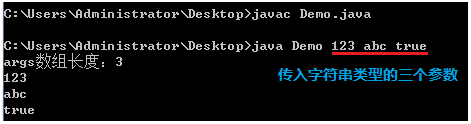


### 在IDEA使用String[] args参数

在工具栏，选中“Edit Configurations...”

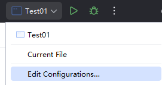

出现以下窗口，在“Program arguments:”窗口中输入参数，最后点击Apply保存即可

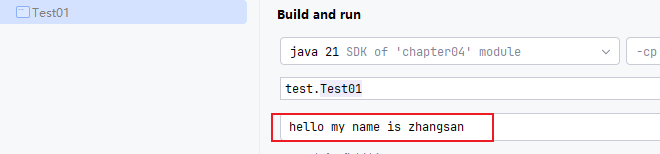

## 方法的可变参数

说明：适用于参数个数不确定，但类型确定的情况，在java中把可变参数当做数组处理。

语法：数据类型 ... 可变参数名

【示例】可变参数的使用

```java
public static void main(String[] args) {
        System.out.println(add(1, 2));   // 输出：3
        System.out.println(add(1, 2, 3));  // 输出：6
}
// 可变参数函数        
public static int add(int a, int b, int ... arr) {
        int sum = a + b;
        for(int i = 0; i < arr.length; i++) {
                sum += arr[i];
        }
        return sum;
}
```

可变参数的特点：

1. 在形参列表中，可变参数最多只能有一个（0或1），并且只能出现在形参列表的最后面。
2. 在方法体中，我们可以把可变参数当成数组来使用，可变参数本质上就是一个数组。

## 关于传递数组参数的问题

代码不能这样写，是错误的：

```java
public class Test {
    public static void main(String[] args) {
        // 错误的
        m({1,2,3});
    }
    public static void m(int[] arr){
        for (int i = 0; i < arr.length; i++) {
            System.out.println(arr[i]);
        }
    }
}
```

你需要这样写：

```java
public class Test {
    public static void main(String[] args) {
        m(new int[]{1,2,3});
    }
    public static void m(int[] arr){
        for (int i = 0; i < arr.length; i++) {
            System.out.println(arr[i]);
        }
    }
}
```


# Arrays工具类 

Arrays用于操作数组工具类，里面定义了常见操作数组的静态方法。

注意：要使用Arrays工具类，必须使用import关键字导入Arrays工具类。

```java
import java.util.Arrays;
```

## toString方法 

public static String toString(Type[] arr)，返回指定数组内容的字符串表示形式。

【示例】

```java
int[] arr = {3, 5, 1, 7, 6, 2, 4};
// 把数组转化为字符串输出
System.out.println(Arrays.toString(arr)); // 输出：[1, 2, 3, 4, 5, 6]
```

## equals判断

public static boolean equals(Type[] a1, Type[] a2)， 判断两个数组中的内容是否相同。

【示例】

```java
int[] arr1 = {3, 5, 1, 7, 6, 2, 4};
int[] arr2 = {3, 5, 1, 7, 6, 2};
// 判断两个数组的内容是否相同
boolean flag = Arrays.equals(arr1, arr2);
System.out.println(flag); // 输出：false
```


## sort排序

public static void sort(Type[] arr) ，对数组中的内容进行升序排序。

【示例】

```java
int[] arr = {3, 5, 1, 6, 2, 4};
// 对数组中的内容进行升序排序
Arrays.sort(arr);
System.out.println(Arrays.toString(arr)); // 输出：[1, 2, 3, 4, 5, 6]
```

## 二分法查找

public static int binarySearch(Type[] arr, Type key)，查找key在数组中的索引位置。如果找到，则返回索引位置；如果没找到，则返回一个负数。

注意：在调用此调用之前，必须先对数组进行排序。

【示例】

```java
// 排序好的数组
int[] arr = {0, 1, 2, 3, 4, 5, 6, 7, 8, 9};
// 查找6在数组中的索引位置
int index = Arrays.binarySearch(arr, 6);
System.out.println(index);  // 输出：6
// 查找18在数组中的索引位置
index = Arrays.binarySearch(arr, 18);
System.out.println(index);  // 输出：-11,证明没找到
```


## fill填充数组

public static void fill(Type[] a, Type val)，给数组填充指定内容。

【示例】

```java
int[] arr = new int[5];
Arrays.fill(arr, 89);
System.out.println(Arrays.toString(arr)); // 输出：[89, 89, 89, 89, 89]
```

## 数组拷贝

public static Type[] copyOf(Type[] original, Type newLength)，从数组的第一个元素开始拷贝，拷贝指定长度的数组，拷贝完成返回一个新的数组。

【示例】

```java
int[] arr = {1, 2, 3, 4, 5};
int[] newArr = Arrays.copyOf(arr, 3);
System.out.println(Arrays.toString(newArr));  // 输出：[1, 2, 3]
```

public static Type[] copyOfRange(Type[] original, int from, int to),从指定范围拷贝数组，拷贝完成返回一个新的数组。

【示例】

```java
int[] arr = {1, 2, 3, 4, 5, 6, 7, 8};
int[] newArr = Arrays.copyOfRange(arr, 2, 5);
System.out.println(Arrays.toString(newArr));   // 输出：[3, 4, 5]
```

调用以上方法进行数组拷贝时，底层源码都调用了 `System.arraycopy()`方法，源码如下：

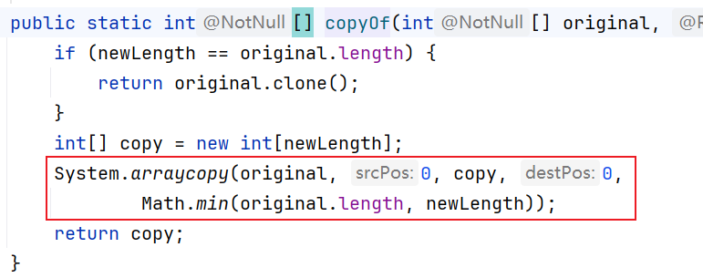

`System.arraycopy()`方法的源码如下：

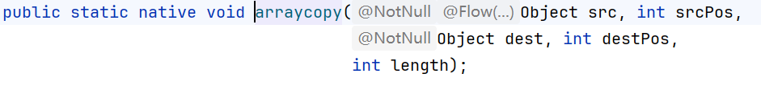

可以看到底层是一个 native 方法。该方法有 5 个参数每个参数的含义是：

1. src：拷贝源
2. srcPos：拷贝源的起始下标
3. dest：目标数组
4. destPos：目标数组的起始下标
5. length：拷贝长度


# 二维数组

## 二维数组的定义

数组中的每个元素都是一维数组，这样的数组就是二维数组（即“数组的数组”）。

## 二维数组的创建

### 创建格式一，创建等长的二维数组

语法语法：数据类型[][] 数组名 = new 数据类型[m][n];

- m: 表示这个二维数组的长度。
- n: 表示二维数组中每个元素的长度。

【示例代码】

```java
public class StringArrayExample {
    public static void main(String[] args) {
        // 创建2行3列的字符串数组
        String[][] students = new String[2][3];
        
        // 初始化数据
        students[0][0] = "张三";
        students[0][1] = "李四";
        students[0][2] = "王五";
        
        students[1][0] = "赵六";
        students[1][1] = "钱七";
        students[1][2] = "孙八";
        
        // 遍历输出
        System.out.println("学生名单:");
        for (int i = 0; i < students.length; i++) {
            System.out.print("第 " + (i + 1) + " 组: ");
            for (int j = 0; j < students[i].length; j++) {
                System.out.print(students[i][j] + " ");
            }
            System.out.println();
        }
    }
}
```


### 创建格式二，创建不定长二维数组

语法格式：数据类型[][] 数组名 = new 数据类型[m][];

- m: 表示这个二维数组的长度。
- 二维数组中元素的长度没有给出，可以动态的给。

【示例代码】

```java
public class Test {
    public static void main(String[] args) {
        // 声明一个不规则二维数组，只指定第一维长度
        int[][] arr = new int[3][];

        // 动态为第二维分配不同长度的数组
        arr[0] = new int[2];  // 第一行有2个元素
        arr[1] = new int[4];  // 第二行有4个元素
        arr[2] = new int[3];  // 第三行有3个元素
        
        // 直接初始化不规则二维数组
        String[][] students = new String[4][];

        students[0] = new String[]{"张三", "李四"};           // 2个学生
        students[1] = new String[]{"王五", "赵六", "钱七"};   // 3个学生
        students[2] = new String[]{"孙八"};                  // 1个学生
        students[3] = new String[]{"周九", "吴十", "郑十一", "王十二"}; // 4个学生
    }
}
```

### 创建格式三，创建静态二维维数组

基本格式：

- 数据类型[][] 数组名 = new 数据类型[][]{{元素1,元素2...},{元素1,元素2...},{元素1,元素2...}};

简化格式：

- 数据类型[][] 数组名 = {{元素1,元素2...},{元素1,元素2...},{元素1,元素2...}};

【代码示例】

```java
public class StringArrayExample {
    public static void main(String[] args) {
        // 简化格式 - 学生信息表
        String[][] students = {
            {"张三", "18", "男", "计算机科学"},
            {"李四", "19", "女", "软件工程"}, 
            {"王五", "20", "男", "人工智能"},
            {"赵六", "18", "女", "数据科学"}
        };
        
        // 基本格式 - 课程表
        String[][] schedule = new String[][]{
            {"数学", "英语", "物理", "化学"},
            {"语文", "历史", "地理", "生物"},
            {"体育", "音乐", "美术", "编程"}
        };
        
        System.out.println("学生信息表:");
        System.out.println("姓名\t年龄\t性别\t专业");
        for (String[] student : students) {
            for (String info : student) {
                System.out.print(info + "\t");
            }
            System.out.println();
        }
        
        System.out.println("\n课程表:");
        String[] days = {"周一", "周二", "周三"};
        for (int i = 0; i < schedule.length; i++) {
            System.out.print(days[i] + ": ");
            for (String course : schedule[i]) {
                System.out.print(course + " ");
            }
            System.out.println();
        }
    }
}
```

二维数组的内存图：

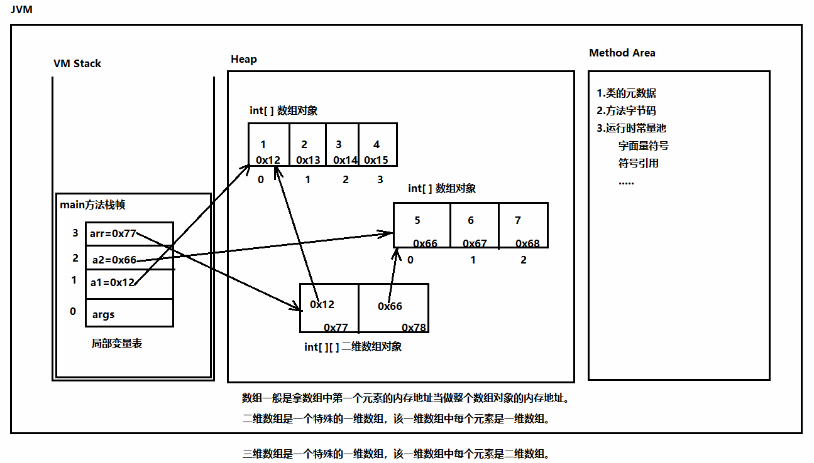


# 酒店管理系统

题目要求：

1. 请实现酒店管理系统，该系统是酒店前台使用的，使用该系统可以：查看酒店所有房间状态、预定房间、退房操作。
2. 定义一个 Room 类作为酒店的房间，属性包括 房间编号（一层 101,102..... 二层 201、202..... 五层 501、502.....）、房间类型（单人间、标准间、豪华间）、房间状态（true 表示占用，false 表示空闲）。
3. 提供一个酒店类 `Hotel`，在该类中有一个二维数组的属性，二维数组中存储 Room。在 Hotel 类中提供**构造方法**，初始化酒店所有房间对象，将房间对象放到二维数组中。
4. Hotel 类中提供三个方法：预定房间、退房、打印所有房间状态。
5. 最后编写一个 main 方法，在 main 方法中打印项目使用说明，然后接收用户键盘输入，通过输入不同的数字来执行对应的功能。

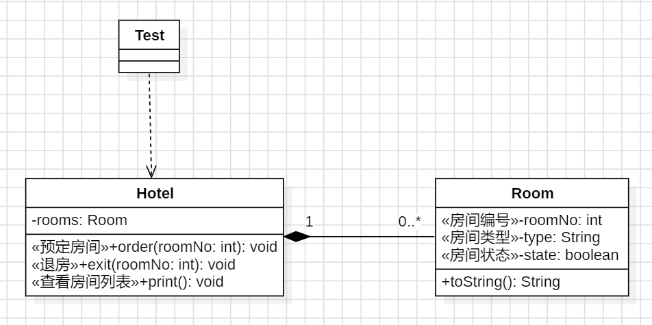

# 什么是数据结构

数据结构是计算机中存储、组织数据的方式。

按照不同的视角和目的，数据结构分为**逻辑结构**和**物理结构**。

**逻辑结构**是数据元素之间的“抽象关系”，而**物理结构****是这种关系在计算机内存中的“具体实现”。**

## 逻辑结构 - “思考的模型”

逻辑结构关注的是数据对象中数据元素之间的**相互关系**，与数据的存储无关。它就像建筑的蓝图，定义了房间之间的布局关系（哪个是客厅，哪个是卧室，它们如何连通），但不管墙是用砖头还是木头建的。

**主要分为四类：**

- **集合结构：** 数据元素除了“同属于一个集合”外，没有其他关系。
  - *例子：* 教室里所有学生组成的集合。
- **线性结构：** 数据元素之间存在**一对一**的线性关系。
  - *例子：* 排队的队伍、数组、链表。
- **树形结构：** 数据元素之间存在**一对多**的层次关系。
  - *例子：* 公司的组织架构、家族的族谱、计算机的文件目录。
- **图形结构：** 数据元素之间存在**多对多**的复杂关系。
  - *例子：* 地图上的城市交通网、社交网络中的好友关系。

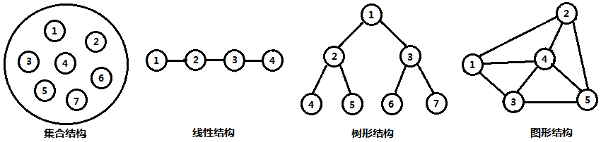


## 物理结构 - “实现的载体”

物理结构（也叫存储结构）关注的是逻辑结构在计算机内存中的**具体存储方式**。它就像按照蓝图实际建造房子时，选择用什么材料（砖、混凝土）和施工方法。

**主要分为两类：**

- **顺序存储结构：** 把数据元素**连续地**存放在内存单元中。数据之间的逻辑关系通过元素的**存储位置**（如物理地址相邻）来体现。
  - *特点：* 查询快（通过下标直接访问），增删慢（需要移动大量元素）。
  - *例子：* **数组** 是典型的顺序存储。

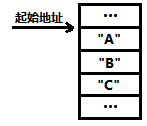

- **链式存储结构：** 数据元素可以存储在任意位置，每个元素节点除了存储数据本身，还**存储一个或多个指针（地址）**，用来指向与其相关的其他元素。
  - *特点：* 增删快（只需修改指针），查询慢（需要从头部开始遍历）。
  - *例子：* **链表** 是典型的链式存储。

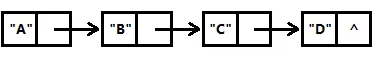

## 核心关系与总结

**一种****逻辑结构**可以用不同的**物理结构****来实现。**

- 例如，“线性结构”这种逻辑模型，既可以用 **数组（顺序存储）** 来实现，也可以用 **链表（链式存储）** 来实现。

设计程序时，我们首先根据问题需求选择最合适的**逻辑结构**（比如用树来组织数据），然后再根据性能要求（频繁查找还是频繁插入删除）选择最有效的**物理结构**（用数组还是链表来实现这棵树）。


# 什么是算法

## 算法的简介

### 算法的定义

算法就是 “一步步解决问题的流水线指令”。比如炒菜的步骤、新手机的开机设置向导，它规定好了先做什么、后做什么，确保谁来做结果都一样。

### 评价算法优劣的依据

举例：如何计算1+2+3+...+100的结果？

1. 算法1：通过循环，依次累加来实现。比较耗费时间
2. 算法2：使用递归来实现。比较耗费内存
3. 算法3：高斯解法，首尾相加*50。时间短，又不耗费内存。

同一问题可用不同的算法来解决，而一个算法的质量优劣将影响到算法乃至程序的效率。

因此，我们学习算法目的在于选择合适算法和改进算法，一个算法的评价主要从时间复杂度和空间复杂度来考虑。

1. 时间复杂度：执行程序所耗费的时间长短。
2. 空间复杂度：执行程序所耗费的内存大小。

## 数据结构和算法

**程序 = 数据结构 + 算法**
你可以理解为：

- **数据结构是“如何存储信息”**（像书本的目录）
- **算法是“如何操作信息”**（像查阅目录快速找到内容的步骤）

它们共同决定了软件是否**跑得快（效率高）、稳得住（不出错）**，这就是为什么它是程序员的内功基础。


# 算法的时间复杂度

## 时间复杂度的计算

### 如何衡量算法的执行时间？

衡量算法的执行时间，通常有两种方法：

1. 事后统计的方法

因为事后统计方法更多的依赖于计算机的硬件、软件等环境因素，有时容易掩盖算法本身的优劣。因此，我们更多采用事前估算的方法来衡量算法的执行时间。

1. 事前估算的方法

在编写程序前，通过分析某个算法的**时间复杂度**来判断哪个算法更优。

### 时间频度与时间复杂度

**时间频度就是一个算法在电脑上**真正运行**时，到底执行了【多少次】核心操作。**

想象一下，你要完成一个任务：**“把一堆杂乱的书按字母顺序放进空书架”**。

这个任务里的**核心操作**就是 **“拿起一本书，找到正确位置，插入”**。

- 如果这里有 **100本书**，你就需要执行大约100次这个“拿起和插入”的核心操作。
- 如果这里有 **1000本书**，你就需要执行大约1000次。

**这个“100次”或“1000次”，就是完成这个任务的“时间频度”。**

**它直接、真实地反映了你的工作量。**

**时间频度 T(n) **：是**具体的数字**。比如，对n个元素排序，我的算法需要执行 `<font style="color:rgb(15, 17, 21);background-color:rgb(235, 238, 242);">n² + 2n + 5</font>` 次核心操作。这个式子就是时间频度。

**时间复杂度 O(n)**：是**一种趋势估计**。它从时间频度 `<font style="color:rgb(15, 17, 21);background-color:rgb(235, 238, 242);">n² + 2n + 5</font>` 中，抓住最主要、影响最大的部分 `<font style="color:rgb(15, 17, 21);background-color:rgb(235, 238, 242);">n²</font>`，然后忽略掉常数和次要项，说这个算法的复杂度是 **O(n²)**。

**时间频度是算法时间复杂度的【计算基础】。** 我们通过分析一个算法的**时间频度**，然后抓住其主要趋势，最终得出它的**时间复杂度**，从而在理论上判断当数据量变大时，哪个算法更快。


### 时间复杂度计算公式

**核心公式：**

**时间复杂度 = 忽略系数和低次项后，时间频度T(n)中【随n增长最快】的那一项**

**计算公式拆解：**

**第一步：写出时间频度 T(n)**
计算你的算法所有**核心操作**的执行次数，得到一个关于 **n** (数据规模) 的表达式。

**第二步：取出最高次项**
在 T(n) 的表达式中，找到那个当 n 变得**非常大**时，对结果影响**最大**的项。

**第三步：去掉系数**
忽略这个最高次项前面的常数系数。

**最终得到的就是大O表示法的时间复杂度：O(最高次项)**

**举例说明：**

假设我们分析一个算法，得到它的时间频度是：
**T(n) = 3n² + 100n + 500**

**第一步：** 我们已经有了 T(n) = 3n² + 100n + 500

**第二步：找出增长最快的项**
我们比较当 n 很大时，各项的大小：

- `<font style="color:rgb(15, 17, 21);">500</font>` (常数项)：永远固定是500
- `<font style="color:rgb(15, 17, 21);">100n</font>` (线性项)：随着 n 变大而线性增长
- `<font style="color:rgb(15, 17, 21);">3n²</font>` (平方项)：随着 n 变大，它增长得**最快**！

**所以，主导项是 3n²**

**第三步：去掉系数 3**
去掉系数 3，得到 **n²**

**最终时间复杂度：O(n²)**

**为什么可以这样简化？**

因为当 n 非常大时（比如 n=1000000）：

- `<font style="color:rgb(15, 17, 21);">3n²</font>` 的值大约是 3,000,000,000,000
- `<font style="color:rgb(15, 17, 21);">100n</font>` 的值大约是 100,000,000
- `<font style="color:rgb(15, 17, 21);">500</font>` 的值是 500

后面两项 `<font style="color:rgb(15, 17, 21);">100n + 500</font>` 相对于第一项 `<font style="color:rgb(15, 17, 21);">3n²</font>` 来说，**影响非常小，可以忽略不计**。甚至连系数 `<font style="color:rgb(15, 17, 21);">3</font>` 也可以忽略，因为我们只关心**增长趋势**，而不是精确的执行时间。

**常见时间复杂度公式对照表**

| 时间频度 T(n) | 时间复杂度 O( ) | 通俗理解 |
| --- | --- | --- |
| `<font style="color:rgb(15, 17, 21);">T(n) = 5</font>` | **O(1)** | 常数时间，与n无关 |
| `<font style="color:rgb(15, 17, 21);">T(n) = 2log₂n + 3</font>` | **O(log n)** | 对数时间，增长很慢 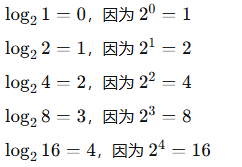 |
| `<font style="color:rgb(15, 17, 21);">T(n) = 3n + 8</font>` | **O(n)** | 线性时间，与n成正比 |
| `<font style="color:rgb(15, 17, 21);">T(n) = 2n² + 5n + 1</font>` | **O(n²)** | 平方时间，n翻倍时间变4倍 |
| `<font style="color:rgb(15, 17, 21);">T(n) = 2ⁿ + n³</font>` | **O(2ⁿ)** | 指数时间，增长极快 |

**记住核心：**
**找最高次项 → 去掉系数 → 得到大O**
这就是时间复杂度的“计算公式”！


## 常见的时间复杂度

### 常数阶 O(1)

无论代码执行了多少行，**只要没有循环等复杂结构**，那这个代码的时间复杂度就都是O(1)。

```java
int num1 = 3, num2 = 5;
int temp = num1;
num1 = num2;
num2 = temp;
System.out.println("num1:" + num1 + " num2:" + num2);
```

在上述代码中，没有循环等复杂结构，它消耗的时间并不随着某个变量的增长而增长，那么无论这类代码有多长，即使有几万几十万行，都可以用O(1)来表示它的时间复杂度。

### 对数阶 O(log₂n)

O(log₂n)指的就是：在循环中，每趟循环执行完毕后，循环变量都放大两倍。

```java
int n = 1024;
for(int i = 1; i < n; i *= 2) {
        System.out.println("hello jkweilai");
}
```

以上程序的执行次数就是：log₂1024（程序员界一般称为老二 1024，结果是 10 ，也就是说 2 连续乘 10 次结果就是 1024，最终以上循环次数是 10 次）

同理，如果每趟循环执行完毕后，循环变量都放大3倍，那么时间复杂度就为：O(log**₃**n) 。

### 线性阶 O(n)

```java
int n = 100;
for(int i = 0; i < n; i++) {
        System.out.println("hello jkweilai");
}
```

在上述代码中，for循环会执行n趟，因此它消耗的时间是随着n的变化而变化的，因此这类代码都可以用O(n)来表示它的时间复杂度。

### 线性对数阶 O(nlog₂n)

```java
int n = 100;
for(int i = 1; i <= n; i++) {
        for(int j = 1; j <= n; j *= 2) {
             System.out.println("hello jkweilai");
        }
}
```

线性对数阶O(nlog₂n) 其实非常容易理解，将时间复杂度为O(log₂n)的代码循环n遍的话，那么它的时间复杂度就是n*O(log₂n)，也就是了O(nlog₂n)。

### 平方阶 O(n**²**)

```java
int n = 100;
for(int i = 1; i <= n; i++) {
        for(int j = 1; j <= n; j++) {
                System.out.println("hello jkweilai");
        }
}
```

外层i的循环执行一次，内层j的循环就要执行n次。因为外层执行n次，那么总的就需要执行n*n次，也就是需要执行n**²**次。因此这个代码的时间复杂度为：O（n**²**）。

同理，立方阶 O(n**³**)，参考上面的O(n**²**)去理解，也就是需要用到3层循环。

### 指数阶O(2**ⁿ**)和阶乘阶O(n!)

指数阶O(2**ⁿ**)指的就是：当n为10的时候，需要执行2**¹⁰**次（1024）。

阶乘阶O(n!)指的就是：当n为10的时候，需要执行10*9*8*...*2*1次。

### 常见的时间复杂度耗时比较

算法的时间复杂度是衡量一个算法好坏的重要指标。一般情况下，随着规模n的增大，T(n)的增长较慢的算法为最优算法。

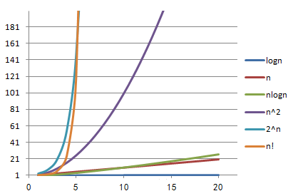

其中x轴代表n值，y轴代表T(n)值。T(n)值随着n的值的变化而变化，其中可以看出O(n!)和O(2**ⁿ**)随着n值的增大，它们的T(n)值上升幅度非常大，而O(logn)、O(n)、O(nlogn)、O(n**²**)随着n值的增大，T(n)值上升幅度相对较小。

常用的时间复杂度按照耗费的时间从小到大依次是：O(1) < O(logn) < O(n) < O(nlogn) < O(n**²**) < O(n**³**) < O(2**ⁿ**) < O(n!)。


# 数组结构的特点

## 数组的核心特点

1. 数组是一块连续的存储空间，意味着相邻两个元素的存储空间是紧挨着的。
2. 数组存储的是相同类型的元素，则意味着每个元素占用的字节数是相同的。
3. 创建数组时必须明确数组的空间长度，数组一旦创建成功则空间长度就不能改变啦。

总结：基于数组以上的这些特点，我们就能解释数组增、删、改和查的执行效率。

## 数组的内存结构图

有这样一段代码，请画出它的内存结构图：

```java
public class Test {
    public static void main(String[] args) {
        int[] arr = {100, 200, 300, 400};
    }
}
```

还有这样一段代码，再画出它的内存结构图：

```java
public class Test {
    public static void main(String[] args) {
        Cat c = new Cat();
        Bird b = new Bird();
        Animal[] animals = {c, b};
    }
}

abstract class Animal {
    public abstract void move();
}
class Cat extends Animal{
    @Override
    public void move() {
        System.out.println("猫在走猫步！");
    }
    public void catchMouse(){
        System.out.println("猫抓老鼠");
    }
}
class Bird extends Animal {
    @Override
    public void move() {
        System.out.println("鸟儿在飞翔！");
    }
    public void sing(){
        System.out.println("鸟儿在唱歌");
    }
}
```


## 根据索引操作元素

结论：根据索引查询和修改数组元素的效率非常高，属于所有数据结构效率最高的。

依据：

1. 数组是一块连续的存储空间，意味着相邻两个元素的存储空间是紧挨着的。
2. 数组存储的是相同类型的元素，则意味着每个元素占用的字节数是相同的。

### 通过索引操作元素的原理

因为数组的存储空间是连续的，我们通过数组的“首地址+索引值”就能快速的找到索引对应元素的存储空间，从而就能对数组元素执行查询和修改的操作，因此根据索引查询和修改数组元素效率高。

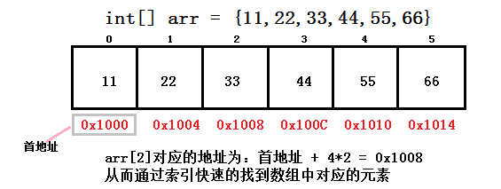

索引操作数组原理：首地址 + 索引值 * 每个元素占用字节数。


## 根据索引删除元素

结论：根据索引删除元素的效率非常低，因为需要大量挪动数组元素。

依据：

1. 数组是一块连续的存储空间，意味着相邻两个元素的存储空间是紧挨着的。
2. 数组一旦创建成功，那么数组的空间长度就不能改变啦（不能删除数组空间）。

## 根据索引插入元素

结论：根据索引插入元素的效率非常低，因为需要大量挪动数组元素+可能做扩容操作。

依据：

1. 数组是一块连续的存储空间，意味着相邻两个元素的存储空间是紧挨着的。
2. 数组一旦创建成功，那么数组的空间长度就不能改变啦（不能新增数组空间）。

# 数组的排序算法

## 冒泡排序算法

### 升序排序思路

相邻两个元素做比较大小，如果前一个元素大于后一个元素，则交换位置。

### 升序排序代码

```java
import java.util.Arrays;

public class Test01 {
        public static void main(String[] args) {
                int[] arr = {3, 5, 1, 2, 4};
                sort(arr);
                System.out.println(Arrays.toString(arr));        
        }        
        /**
         * 冒泡排序（升序）
         * @param arr
         */
        public static void sort(int[] arr) {
                // 外侧循环：用于控制比较趟数。
                for(int i = 0; i < arr.length - 1; i++) {
                        // 内侧循环：用于每趟循环相邻两个元素比较的次数
                        for(int j = 0; j < arr.length - i - 1; j++) {
                                // b)如果前一个元素大于后一个元素，则交换位置
                                if(arr[j] > arr[j + 1]) {
                                        int temp = arr[j];
                                        arr[j] = arr[j + 1];
                                        arr[j + 1] = temp;
                                }
                        }
                }
        }
}
```


### 冒泡排序优化

因为冒泡排序存在提前排序成功的可能，因此我们需要对以上冒泡排序算法进行优化，此处的优化思路使用了“假设法”来实现。

实现步骤：

1. 执行每一趟相邻两个元素比较之前，先假设本趟判断已经排序成功。
2. 如果相邻两个元素比较的时候，发生前一个元素大于后一个元素，则推翻假设。
3. 每一趟相邻两个元素比较完毕后，如果假设依旧成立，则跳出外侧循环。

代码实现

```java
import java.util.Arrays;
public class Test01 {
        public static void main(String[] args) {
                int[] arr = {3, 5, 1, 2, 4};
                sort(arr);
                System.out.println(Arrays.toString(arr));        
        }        
        /**
         * 冒泡排序（升序）
         * @param arr
         */
        public static void sort(int[] arr) {
                // 外侧循环：用于控制比较趟数。
                for(int i = 0; i < arr.length - 1; i++) {
                        // a)假设第本趟比较已经排序成功
                        boolean flag = true;
                        // 内侧循环：用于每趟循环相邻两个元素比较的次数
                        for(int j = 0; j < arr.length - i - 1; j++) {
                                // b)如果前一个元素大于后一个元素，则交换位置
                                if(arr[j] > arr[j + 1]) {
                                        int temp = arr[j];
                                        arr[j] = arr[j + 1];
                                        arr[j + 1] = temp;
                                        // 如果排序的过程中元素发生了交换，则证明排序没有成功
                                        flag = false;
                                }
                        }
                        // c)每趟排序完毕后，检查flag标记的值
                        if(flag) { // 如果flag标记值为true，则证明排成功
                                break;
                        }
                }
        }
}
```


## 选择排序算法

### 升序排序思路

在未排序的序列中，把未排序第一个元素和未排序的最小元素交换位置。

### 升序排序代码

```java
import java.util.Arrays;
public class SelectTest {
        public static void main(String[] args) {
                int[] arr = {3, 2, 1, 4, 5};
                sort(arr);
                System.out.println(Arrays.toString(arr));
        }
        /**
         * 选择排序（升序）
         * @param arr
         */
        public static void sort(int[] arr) {
                // 1.定义一个循环，用于控制执行的趟数
                for(int i = 0; i < arr.length - 1; i++) {
                        // 2.遍历获得arr[i]到arr[arr.length-1]之间的最小值
                        // 2.1假设第i个元素就是最小值，并且使用min变量来保存最小值索引
                        int min = i;
                        // 2.2遍历arr[i+1]到arr[arr.length-1]之间的所有元素
                        for(int j = i + 1; j < arr.length; j++) {
                                // 2.3如果arr[min]大于arr[j]，则更新最小值索引
                                if(arr[min] > arr[j]) {
                                        min = j;
                                }
                        }
                        // 3.如果假设的最小值索引发生改变，则交换arr[min]和arr[i]的为位置
                        if(min != i) {
                                int temp = arr[min];
                                arr[min] = arr[i];
                                arr[i] = temp;
                        }
                }
        }
}
```


# 数组的查找算法

## 线性查找算法

### 线性查找介绍

线性查找是一种最简单粗暴的查找法了，采用逐一比对的方式进行对数组的遍历，如果发现了匹配值，返回数组下标即可。

线性查找，优点是查找数组无需有序；其缺点是查找的次数多，效率低下。

### 代码实现

```java
public class Test04 {
        public static void main(String[] args) {
                int[] arr = {3, 8, 1, 5, 2, 7, 4, 6, 9};
                // 线性查找思路
                int index = seqSearch(arr, 4);
                System.out.println(index);
        }
        /**
         * 线性查找
         * @param arr
         * @param value
         * @return 如果返回值为正数，则证明找到；如果返回-1，则证明没找到。
         */
        public static int seqSearch(int[] arr, int value) {
                // 遍历数组所有元素
                for(int i = 0; i < arr.length; i++) {
                        // 如果arr[i]和value值相同，则证明找到了
                        if(arr[i] == value) {
                                // 返回value在数组中的索引值
                                return i; 
                        }
                }
                // 执行到此处，证明value在数组中不存在
                return -1;
        }
}
```


## 二分查找算法

### 二分查找介绍

二分查找又称折半查找，优点是比较次数少，查找速度快，平均性能好；缺点是要求待查数组必须排序，且执行插入和删除操作困难。

因此，折半查找方法适用于不经常变动而查找频繁数组。

### 二分查找思路

假设查找的数组为升序排序，则首先定义两个变量，分别用于保存查找元素（value）所在范围的最小索引值（min）和最大索引值（max）。

然后开启二分查找，每次查找前都定义一个mid变量，并设置该变量的初始值为：(max + min)/2。在查找的过程中，发生以下三种情况，则做对应的处理。

1. 如果arr[mid]大于value，则证明查找的元素在mid的左侧，那么更新max的值为：mid-1
2. 如果arr[mid]小于value，则证明查找的元素在mid的右侧，那么更新min的值为：mid+1
3. 如果arr[mid]等于value，则证明查找元素的索引值就是mid，返回mid的值即可！

在以上的操作中，我们不停的更改min和max的值，如果发生min大于max的情况，则证明查找的元素不存在，那么返回-1（表示找不到）即可！

### 代码实现

```java
public class Test04 {
        public static void main(String[] args) {
                // 使用二分法查找的数组（升序）
                int[] arr = {0, 2, 4, 6, 8, 10, 12, 14, 16, 18, 20};
                // 调用二分法查找，找到查找元素的索引
                int index = binarySearch(arr, 18);
                System.out.println(index); // 输出：9
        }
        /**
        * 二分法查找
        * @param arr 需要查找的数组（升序）
        * @param value 需要查找的元素值
        * @return 如果返回值为正数，则证明找到；如果返回-1，则证明没找到。
        */
        public static int binarySearch(int[] arr, int value) {
                // 最小索引
                int min = 0;
                // 最大索引
                int max = arr.length - 1;
                // 开始循环查找
                while(true) {
                        // 获取中间索引
                        int mid = (min + max) / 2;
                        // 如果arr[mid]>value,则证明在上半区
                        if(arr[mid] > value) {
                                // 更新max的值
                                max = mid - 1;
                        }
                        // 如果arr[mid]<value,则证明在下半区
                        else if(arr[mid] < value) {
                                // 更新min的值
                                min = mid + 1;
                        }
                        // 如果arr[mid]==value,则证明找到
                        else {
                                return mid;
                        }
                        // 如果min>max,则证明没找到该值
                        if(min > max) {
                                return -1;
                        }
                }
        }
}
```

思考：如果查找的元素在数组中存在多个，如何获得查找元素在数组中的所有索引值？


# IDEA的debug调试

## debug调试的作用

通过debug调试（断点调试），我们能够分析代码的执行顺序，查看变量值的变化，从而找到问题并解决问题。通俗点说，debug调试就是用来找bug的。

## 开启debug调试

第一步：在程序可能出现问题的位置打断点。

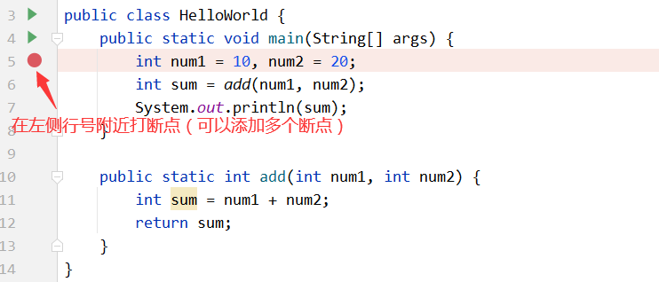

第二步：开启debug调试，常见的方式有如下三种。

- 第一种方式：

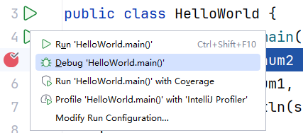

- 第二种方式：


- 第三种方式：

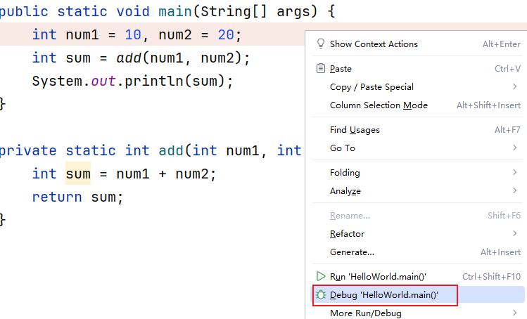

第三步：debug 启动后，会有一个调试窗口

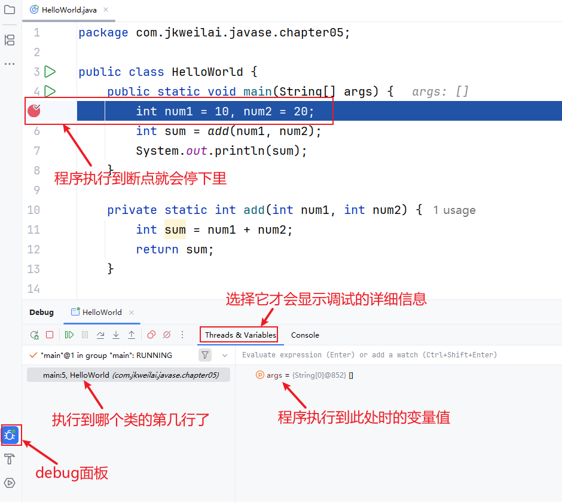


## debug按钮分析

### 第一组按钮

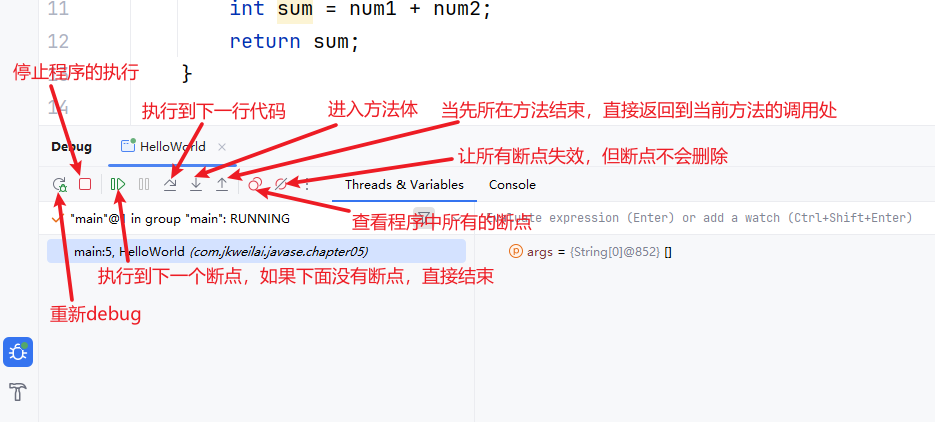

### 第二组按钮

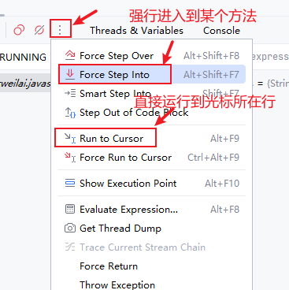

### 添加监视和计算表达式

添加监视后，可以监视某个变量值的变化，并且该监视不会随着程序执行而消失。

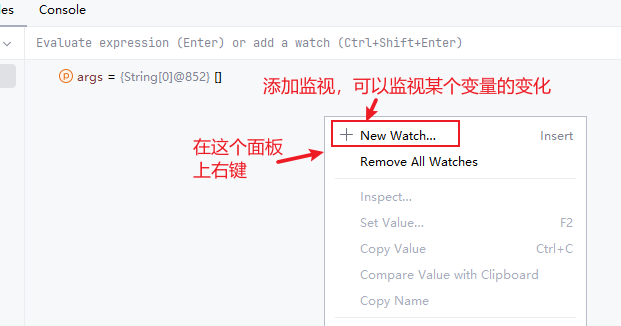

当然，程序运行到某个位置后，如果你临时需要使用某个变量参与某个数学表达式的运算，可以使用计算表达式：

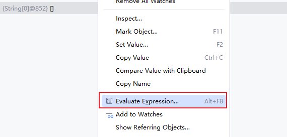

### 查看所有断点以及删除断点

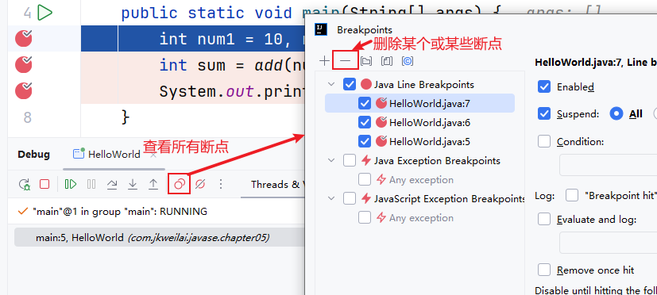


## 断点的条件设置

通常，当我们在遍历一个比较大的集合或数组时，在循环内设置了一个断点，难道我们要一个一个去看变量的值？那肯定很累，说不定你还错过这个值得重新来一次。

先要解决以上问题，就需要使用断点的条件设置。通过设置断点条件，在满足条件时，才停在断点处，否则直接运行。

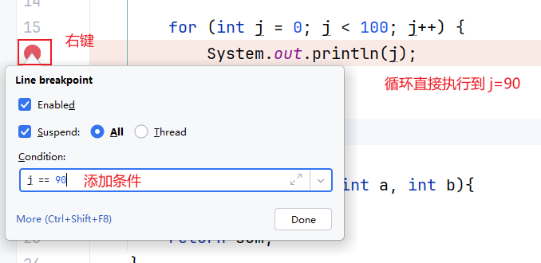

## 中断debug调试

向数据库写入数据的时候，我们发现写入的数据有问题，也就意味着不想执行写入数据的流程，否则后续就要执行删除数据库数据的操作，那么该需求如何实现呢？在debug操作的时候，想要中断请求，也就是不执行剩下的流程，我们可以通过Force Return，即强制返回来避免后续的流程，如下图所示：

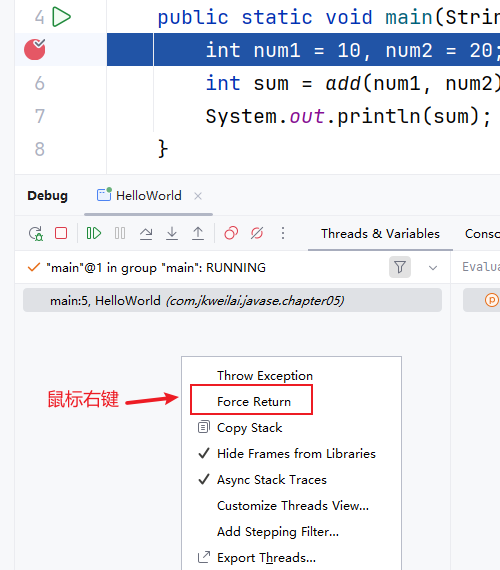


## 多线程的调试

一般情况下我们调试的时候是在一个线程中的，一步一步往下走。但有时候你会发现在debug调试的时候，想发起另外一个请求是不行的。那是因为IDEA在debug时默认阻塞级别是ALL，会阻塞其它线程，只有在当前调试线程走完时才会走其它线程。我们可以在View Breakpoints里选择Thread，然后点击Make Default设置为默认选项，来解决该问题，如下图所示：

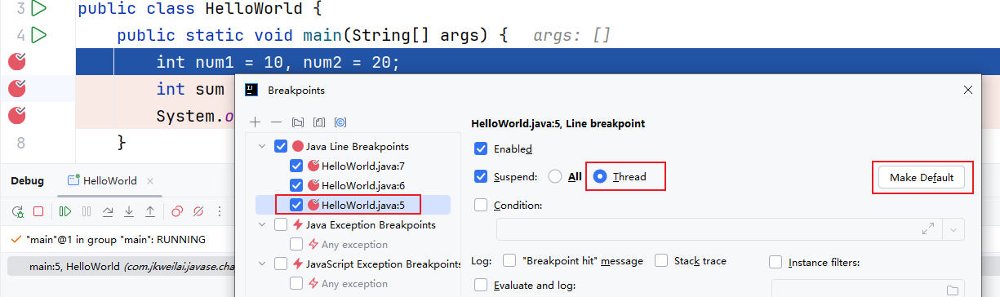


# 单元测试（JUnit5）

## 什么是单元测试

一个大的系统是由很多方法构成的，只有我们保证每一个方法没问题，整个系统才不会出现问题。那怎么保证你编写的每个方法没问题呢？这就需要编写单元测试了。

## 导入 JUnit5 的 jar 包

单元测试一般使用 Java 语言编写的 JUnit 框架。我们这里选择 JUnit5 版本进行单元测试。因此需要去下载 JUnit5 框架的相关 jar 包，并将其引入到我们的项目的 classpath 中。

JUnit5 的 jar 包下载地址：[https://repo1.maven.org/maven2/org/junit/platform/junit-platform-console-standalone/](https://repo1.maven.org/maven2/org/junit/platform/junit-platform-console-standalone/)

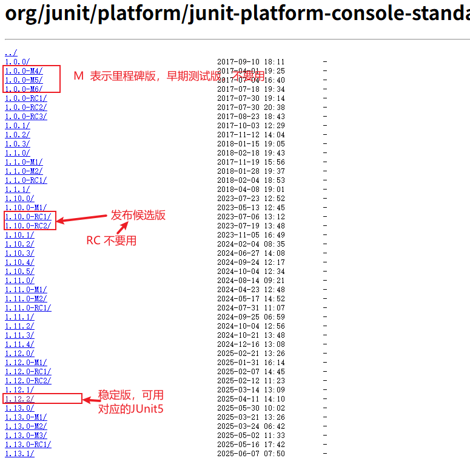

点击 `1.12.2`版本号，进入下载页：

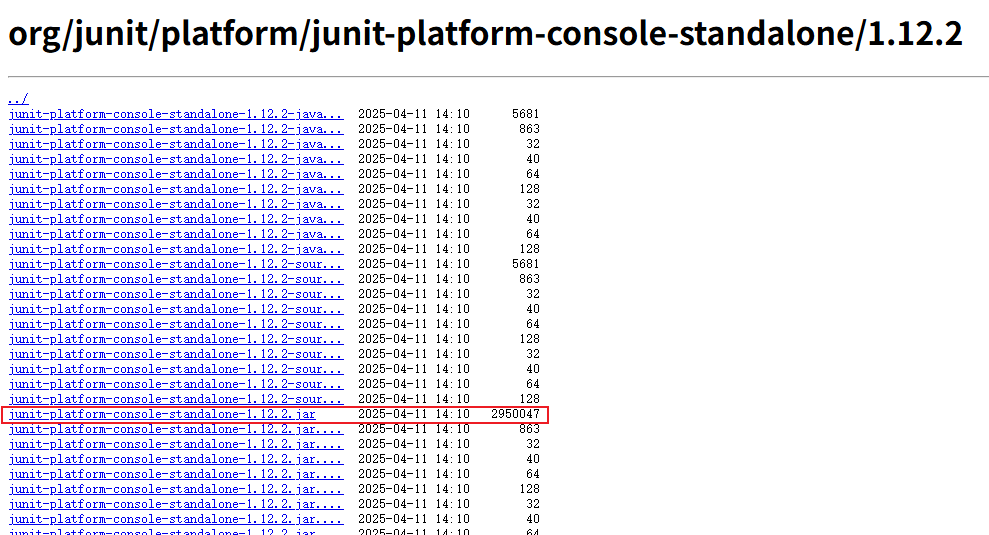

点击下载即可。

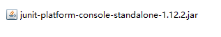

下载完成后，我们需要在 IDEA 中，将 jar 包添加到 classpath 当中，按照下图方式操作：

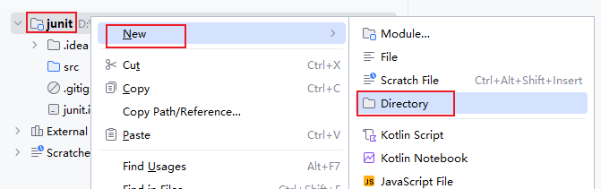

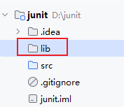

将 jar 包拷贝到 `lib`目录下。然后在 jar 包上右键：`Add as Library...`

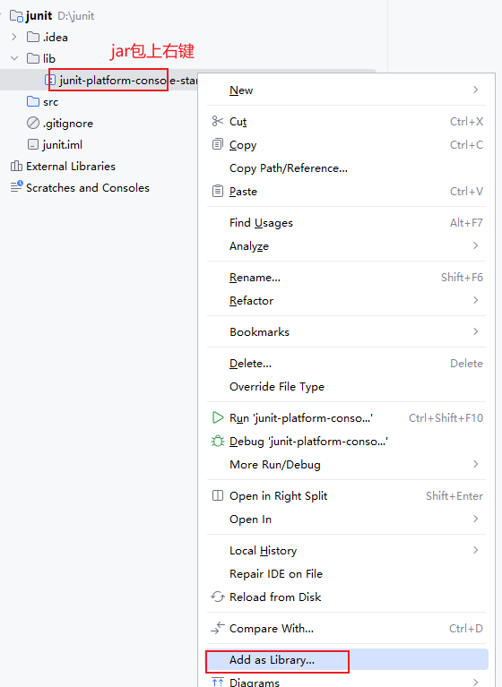

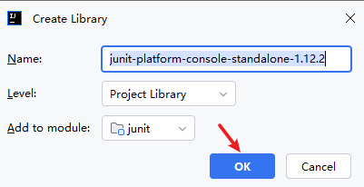

## 编写测试用例

假设我们现在编写好了这样一段代码，如下：

```java
package com.jkweilai.project.util;

public class MyMath {
    
    public static int sum(int a, int b){
        return a + b;
    }

    public static int divide(int a, int b){
        return a / b;
    }
}
```

我们要测试以上程序中两个方法是否正常，可以为 `MyMath`类编写测试用例，测试用例的名字一般叫做 `XxxxTest`，例如：`MyMathTest`，测试用例代码如下：

```java
package com.jkweilai.project.util;

import org.junit.jupiter.api.Assertions;
import org.junit.jupiter.api.Test;

// 这个类被称为测试用例
// 该类必须只能有一个唯一的无参数构造方法
public class MyMathTest {

    // 这个方法称为测试方法
    @Test
    public void testSum(){
        // 准备测试数据
        int a = 10;
        int b = 20;
        // 调用要测试的方法
        // 返回实际值
        int actual = MyMath.sum(a, b);
        // 预期值
        int expected = 30;
        // 添加断言机制，看看预期值和实际值是否一致
        Assertions.assertEquals(expected, actual);
    }

    @Test
    public void testDivide(){
        // 准备测试数据
        int a = 100;
        int b = 20;
        // 调用要测试的方法
        // 返回实际值
        int actual = MyMath.divide(a, b);
        // 预期值
        int expected = 5;
        // 添加断言机制，看看预期值和实际值是否一致
        Assertions.assertEquals(expected, actual);
    }
}
```

1. 测试用例起名规范：假设你测试是 `MyMath`类，测试用例命名一般为：`MyMathTest`
2. 测试方法的编写规范：

```java
// 测试方法必须使用public修饰，并且必须是一个无参无返回值的实例方法
// 使用 @Test 注解进行标注
// 假设要测试的方法是sum，则起名 testSum
@Test
public void testXxx(){
    
}
```

## 单元测试方法中使用Scanner失效

选中导航栏的“Help”，然后选中“Edit Custom VM Options...”，接着在“IDEA64.exe.vmoptions”文件中添加内容“-Deditable.java.test.console=true”，最后再重启IDEA即可解决。

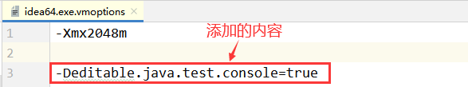