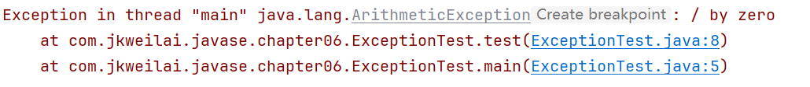
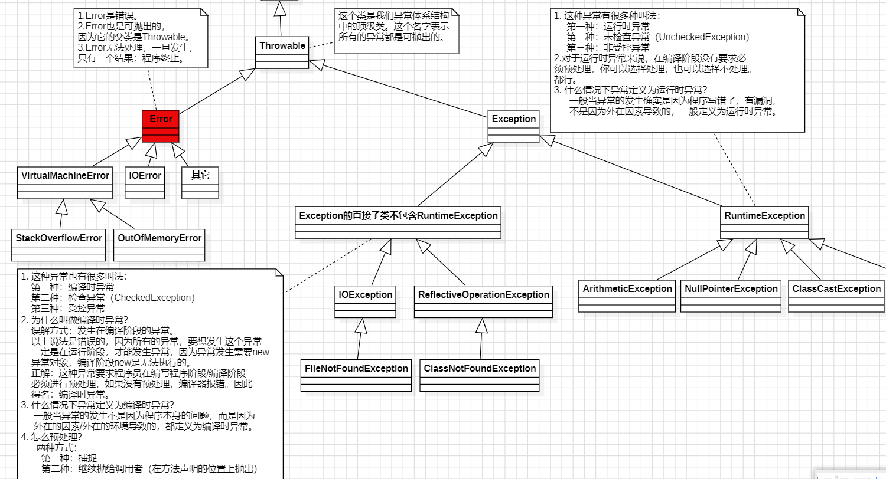
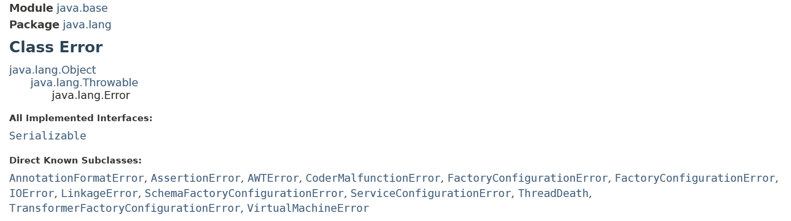

# 第06章 异常处理


# 异常概述

## 异常的引入

现实生活中万物在发展和变化会出现各种各样不正常的现象，例如：人的成长过程中会生病。

实际工作中，遇到的情况不可能是非常完美的。比如：你写的某个模块，用户输入不一定符合你的要求、你的程序要打开某个文件，这个文件可能不存在或者文件格式不对，你要读取数据库的数据，数据可能是空的等。我们的程序再跑着，内存或硬盘可能满了等等。

软件程序在运行过程中，非常可能遇到刚刚提到的这些异常问题，我们叫异常，英文是：Exception，意思是例外。这些，例外情况，或者叫异常，怎么让我们写的程序做出合理的处理，安全的退出，而不至于程序崩溃。

需求：根据索引获取数组中的元素值，我们需要考虑各种异常情况，伪代码如下：

【示例】根据索引获取数组中的元素值(仅限示意，不能运行)

```java
public static int getValue(int[] arr, int index) {
        // 索引为负数的时候
        if(index < 0) {
                System.out.println("索引不能为负数！！");
                return ???; // 此处该返回什么呢？
        }        
        // 索引大于等于数组长度的时候
        if(index >= arr.length) {
                System.out.println("索引不能大于等于数组长度！！");
                return ???; // 此处该返回什么呢？
        }
        // 正常返回元素值
        return arr[index];
}
```

这种方式，有好几个坏处：

1. 正常逻辑代码和错误处理代码放一起！
2. 可能无论怎么处理，都不能满足开发需求！！！

那么我们还如何应对以上的异常情况呢？其实JAVA给我们提供了处理异常的机制，就是当程序出现错误，程序安全退出的机制。


## 异常的概念

实际开发中，异常从面向对象的角度考虑也是一类事物，我们可以向上抽取为异常类。这个异常类可以对一些不正常的现象进行描述，并封装为对象。

我们开始看我们的第一个异常对象，并分析一下异常机制是如何工作的。

【示例】异常的分析案例

```java
public class ExceptionTest {
        public static void main(String[] args) {
                test();
        }
        public static void test() {
                int x = 3 / 0;
                System.out.println("x:" + x);
        }
}
```

运行结果如下：



java是采用面向对象的方式来处理异常的。当程序出现问题时，就会创建异常类对象并抛出异常相关的信息（如异常出现的位置、原因等）。


# 异常分类

## 异常体系

JDK 中定义了很多异常类，这些类对应了各种各样可能出现的异常事件，所有异常对象都是派生于Throwable类的一个实例。如果内置的异常类不能够满足需要，还可以创建自己的异常类。

Thorwable类（表示可抛出）是所有异常和错误的超类，两个直接子类为Error和Exception，分别表示错误和异常。

先来看看java中异常的体系结构图解：




## Throwable

Throwable类是所有异常或错误的超类，它有两个子类：Error和Exception，分别表示错误和异常。其中异常Exception又分为运行时异常(RuntimeException)和编译时异常。

Error和运行时异常，因为程序在编译时不检查这种异常，所以又称为**未检查异常**(Unchecked Exception)。

编译时异常，因为程序在编译时异常可以被检查出，所以又称为**检查异常**(Checked Exception)

Throwable常用方法介绍：

| **方法名** | **描述** |
| --- | --- |
| public String getMessage() | 返回此throwable的详细消息字符串。 |
| public String toString() | 返回此 throwable 的简短描述 |
| public void printStackTrace() | 打印异常的堆栈的跟踪信息 |

## Error(错误)

Error类是java所有错误类的父类，描述了java运行时系统内部错误和资源耗尽错误。这类错误是我们无法控制的，同时也是非常罕见的错误，表明系统JVM已经处于不可恢复的崩溃状态中，它是由JVM产生和抛出的，比如OutOfMemoryError、ThreadDeath等。

所以错误是很难处理的，一般的开发人员（当然不是你）是无法处理这些错误的，我们在编程中，可以不去处理这类错误。



**以下是一些常见的Error案例：**

【示例】内存溢出案例

```java
public class ExceptionDemo {
        public static void main(String[] args) {
                // 数组需要1G的内存，这样子就会造成内存溢出
                int[] but = new int[1024*1024*1024]; // 1K-->1M-->1G
                System.out.println(but);
        }
}
```

异常信息如下：

```java
Exception in thread "main" java.lang.OutOfMemoryError: Java heap space
        at ExceptionDemo.main(ExceptionDemo.java:4)
```

【示例】栈溢出案例

```java
public class ExceptionDemo {
        public static void main(String[] args) {
                test();
        }
        public static void test() {
                test(); // 一直递归调用，这样子就会造成堆栈溢出
        }
}
```

异常信息如下：

```java
Exception in thread "main" java.lang.StackOverflowError
        at ExceptionDemo.test(ExceptionDemo.java:6)
        at ExceptionDemo.test(ExceptionDemo.java:7)
        at ExceptionDemo.test(ExceptionDemo.java:7)
        at ExceptionDemo.test(ExceptionDemo.java:7)
        ...
```


## Exception(异常)

Exception类所有异常类的父类，其子类对应了各种各样可能出现的异常事件。Error是程序无法处理的错误，但是Exception是程序本身可以处理的异常，在程序中应当尽可能去处理这些异常。

Error与Exception的区别：

1. 我开着车走在路上，一头猪冲在路中间，我刹车，这叫一个异常。
2. 我开着车在路上，发动机坏了，我停车，这叫错误。发动机什么时候坏？我们普通司机能管吗？不能。发动机什么时候坏是发动机制造商的事。

Exception又分为两大类：

1. UncheckedException 未检查异常（运行时异常）
2. CheckedException 检查异常（编译时异常）


### 运行时异常

RuntimeException及其子类异常，都属于运行时期异常。例如：ClassCastException、NullPointerException、IndexOutOfBoundsException、ArithmeticException等。因为程序编译时异常不能被检查出，所以又称为不检查异常（UnCheckedException）。

运行时异常一般是由程序逻辑错误引起的，所以在编写程序时，我们应该从逻辑角度尽可能避免这类异常的发生。

当出现RuntimeException的时候，系统将自动检测并将它们交给缺省的异常处理程序（虚拟机接管并处理），用户可以不必对其处理。比如：我们从来没有人去处理过NullPointerException异常，它就是运行时异常，并且这种异常还是最常见的异常之一。 

ArithmeticException异常，异常算术条件时抛出。例如：“除以零”的整数会抛出此类的一个实例。

【示例】ArithmeticException异常案例

```java
public static void main(String[] args) {
        int x = 0;
        // 此处对x变量加判断，从而避免ArithmeticException异常
        int y = 3 / x; 
        System.out.println("y:" + y);
}
```

执行结果：

```java
Exception in thread "main" java.lang.ArithmeticException: / by zero
```

NullPointerException异常（空指针异常），当程序访问一个空对象的成员变量或方法，访问一个空数组的成员时发生。

【示例】NullPointerException异常案例

```java
public static void main(String[] args) {
        int[] arr = null;
        // 此处判断arr是否为null，从而避免NullPointerException异常
        System.out.println(arr.length);
}
```

执行结果：

```java
Exception in thread "main" java.lang.NullPointerException
```

ClassCastException异常，当对象转换为不属于实例的子类时发生。

【示例】ClassCastException异常案例

```java
// 父类
class Animal {}
// 子类
class Dog extends Animal {}
class Cat extends Animal {}
// 测试类
public class RuntimeDemo {
        public static void main(String[] args) {
                Animal animal = new Dog();
                // 转型之前先用instanceof判断类型，从而避免ClassCastException异常
                Cat cat = (Cat)animal;
        }
}
```

执行结果：

```java
Exception in thread "main" java.lang.ClassCastException: Dog cannot be cast to Cat
```

ArrayIndexOutOfBoundsException异常，当使用非法索引访问数组时发生， 索引为负数或大于或等于数组的大小。

【示例】ArrayIndexOutOfBoundsException异常案例

```java
public static void main(String[] args) {
        int[] arr = new int[3];
        // 获取数组元素之前，先对数组索引判断
        System.out.println(arr[-1]);
}
```

执行结果：

```java
Exception in thread "main" java.lang.ArrayIndexOutOfBoundsException: Index -1 out of bounds for length 3
```


### 编译时异常

Exception及其子类（不包含运行异常），统称为编译时异常。因为程序编译时异常可以被检查出，所以又称为检查异常（CheckedException）。

常见的编译时异常：如IOException、SQLException等以及用户继承于Exception的自定义异常。

对于编译时异常，在编译时就强制要求我们必需对出现的这些异常进行处理，否则程序就不能编译通过。所以，面对这种异常不管我们是否愿意，都只能自己去处理可能出现的异常。

【示例】编译时异常案例

```java
import java.io.*;

public class CheckedExceptionDemo {
    public static void main(String[] args){
        InputStream in = new FileInputStream("D:\abc.txt");
    }
}
```

可以看看是不是编译报错了，具体报错信息也可以看一下。FileNotFoundException是一个编译时异常，必须在编写阶段进行预处理，不处理，编译器报错。


# 异常处理

## 抛出异常(throw)

在编写程序时，我们必须要考虑程序出现问题的情况。比如，在定义方法时，方法需要接受参数。那么，当调用方法使用接受到的参数时，首先需要先对参数数据进行合法的判断，数据若不合法，就应该告诉调用者，传递合法的数据进来。这时需要使用抛出异常的方式来告诉调用者。

在java语言中，提供了一个throw关键字，它用来抛出一个指定的异常对象。那么，抛出一个异常具体如何操作呢？

1. 创建异常对象，并通过构造方法封装异常出现的原因。
2. 通过throw关键字来抛出创建的异常对象（throw只能在方法体中使用）。

在方法体中，使用throw关键字来抛出一个异常对象，将这个异常对象传递到调用者处，并结束当前方法的执行。

抛出异常格式：throw new 异常类名(参数列表);

【示例】throw 抛出异常案例

```java
// 工具类
class ArraysTool {
        // 根据索引获取数组中对应元素的值
        public static int getValue(int[] arr, int index) {
                // 判断索引是否合法
                if(index < 0 || index >= arr.length) {
                        // 当索引不合法时，抛出索引不合法异常。
                        // 这时就会结束当前方法的执行，并将异常告知给调用者
                        throw new ArrayIndexOutOfBoundsException("索引不合法");
                }
                int value = arr[index];
                return value;
        }
}
// 测试类
public class ExceptionDemo {
        public static void main(String[] args) {
                int[] arr = {1, 2, 3};
                // 调用方法，获取数组中指定索引处元素
                int value = ArraysTool.getValue(arr, 3);
                System.out.println(value);
        }
}
```

如果以上代码的索引不合法，那么就会抛出以下的异常！

```java
Exception in thread "main" java.lang.ArrayIndexOutOfBoundsException: 索引不合法
        at com.jkweilai.exceprion.ArraysTool.getValue(ExceptionDemo.java:10)
        at com.jkweilai.exceprion.ExceptionDemo.main(ExceptionDemo.java:20)        
```


## 声明异常(throws)

声明：将问题标识出来，报告给调用者。如果方法内通过throw 抛出了编译时异常，而没有捕获处理（稍后讲解该方式），那么必须通过throws关键字进行声明，让调用者去处理。

声明异常格式：

```java
[修饰符] 返回值类型 方法名(参数列表) throws 异常类名1, 异常类名2, … {        }
```

【示例】throws 声明异常案例

```java
//工具类
public class ArraysTool {
        // 使用throws关键字声明异常，把可能发生的异常报告给调用者。
        public static int getValue(int[] arr, int index) throws ArrayIndexOutOfBoundsException {
                // 判断索引是否合法
                if(index < 0 || index >= arr.length) 
                        throw new ArrayIndexOutOfBoundsException("索引不合法");
                // 返回元素值
                return arr[index];
        }
}
```

throws用于进行异常类的声明，若该方法可能有多种异常情况产生，那么在throws后面可以写多个异常类，用逗号隔开。

【示例】throws 声明多个异常案例

```java
//工具类
class ArraysTool {
        // 使用throws关键字声明异常，把可能发生的异常报告给调用者。
        public static int getValue(int[] arr, int index) throws NullPointerException, ArrayIndexOutOfBoundsException {
                // 判断arr是否为null
                if(null == arr) 
                        throw new NullPointerException("对象arr为null");
                // 判断索引是否合法
                if(index < 0 || index >= arr.length) 
                        throw new ArrayIndexOutOfBoundsException("索引不合法");
                // 返回元素值
                return arr[index];
        }
}
```

当程序中出现运行时异常时，方法定义中无需 throws 声明该异常，调用者也无需捕获处理该异常（即没有try-catch），系统会把异常一直默认往上层抛，一直抛到最上层。

当程序中出现非运行时异常时，要么用try-catch语句捕获它，要么用throws语句声明抛出它，否则编译不会通过。

【示例】throws 声明非运行时异常案例

```java
// Demo类
class Demo {
        /*
         * 因为NullPointerException是运行时异常，可以不用在方法上使用throws声明
         * 而FileNotFoundException是非运行时异常，此处应该在方法上使用throws声明，
         * 否则编译不通过
         */
        public void test(Object obj, String path) throws FileNotFoundException {
                // 判断obj是否为null
                if(null == obj)
                        throw new NullPointerException("obj不能为null");
                // 创建文件字节读取流对象，如果文件地址不存在会抛出FileNotFoundException异常
                FileInputStream is = new FileInputStream(path);
        }
}
// 测试类
public class ThrowsExceptionDemo {
        /*
         * main()方法中没有对FileNotFoundException异常进行捕获处理
         * 那么应该继续在main()方法上抛出，最后交给JVM来做处理
         */
        public static void main(String[] args) throws FileNotFoundException {
                // 调用Demo类中的test()方法
                new Demo().test(new Object(), "D://abc.txt");
        }
}
```


## 捕获异常(try-catch-finally)

如果程序出现了异常，自己又解决不了，那么可以把异常声明出来（throws），报告给调用者，让调用者来做处理。

如果出现的异常自己能解决，那么就不用声明异常，而是自己捕获该异常（try-catch-finally），并在catch块中对该异常做处理。

一个try语句必须带有至少一个catch语句块或一个finally语句块 。 

### try-catch组合方式

try-catch 组合：对代码进行异常检测，并对检测到的异常传递给 catch 处理。

捕获异常格式：

```java
try {
        // 需要被检测的语句。
} catch(异常类 对象) { // 参数
        // 异常的处理语句。
}
```

try：该代码块中编写可能产生异常的代码，该段代码就是一次捕获并处理的范围。在执行过程中，当任意一条语句产生异常时，就会跳过该段中后面的代码。代码中可能会产生并抛出一种或几种类型的异常对象，它后面的catch语句要分别对这些异常做相应的处理。

catch：用来进行某种异常的捕获，实现对捕获到的异常进行处理。catch中的参数就是被捕获到的异常对象（也就是被抛出的那个异常对象），我们可以根据这个异常对象来获取到该异常的具体信息。

【示例】try-catch捕获异常案例

```java
// 工具类
class ArraysTool {
        // ArrayIndexOutOfBoundsException属于运行时异常，不用强制throws声明
        public static int getValue(int[] arr, int index) {
                // 判断索引是否合法
                if(index < 0 || index >= arr.length) {
                        throw new ArrayIndexOutOfBoundsException("索引不合法");
                }
                // 返回元素值
                return arr[index];
        }
}
// 测试类
public class TryCatchDemo {
        public static void main(String[] args) {
                int[] arr = {1, 2, 3, 4};
                try {
                        // 获取元素的值，可能会抛出异常对象
                        // 如果发生了异常，那么就会结束当前当前代码块的执行
                        int value = ArraysTool.getValue(arr, 5);
                        System.out.println("value:" + value); // 不执行
                } catch(ArrayIndexOutOfBoundsException e) { // 参数为抛出的异常
                        // 获取异常信息
                        System.out.println("msg:" + e.getMessage());
                        // 打印异常对象，该对象重写了toString()方法
                        System.out.println("exception:" + e);
                        // 输出栈异常
                        e.printStackTrace();
                }
                // 无论是否发生异常，该代码都执行
                System.out.println("over"); // 执行
        }
}
```

一个try多个catch组合 : 对代码进行异常检测，并对检测的异常传递给catch处理。对每种异常信息进行不同的捕获处理。

```java
// 工具类
class ArraysTool {
        public static int getValue(int[] arr, int idx) throws Exception {
                // 判断arr是否为null
                if(null == arr) 
                        throw new NullPointerException("对象arr不能为null");
                // 判断索引是否大于等于arr.length
                if(idx < 0 || idx >= arr.length) 
                        throw new ArrayIndexOutOfBoundsException("索引越界异常");
                // 返回元素值
                return arr[idx];
        }
}
// 测试类
public class TryCatchDemo {
        public static void main(String[] args) {
                int[] arr = {1, 2, 3, 4};
                try {
                        // 获取元素的值，可能会抛出异常对象
                        int value = ArraysTool.getValue(arr, -5);
                        System.out.println("value:" + value); // 不执行
                } catch (NullPointerException e) { // 空指针异常
                        // 获取异常信息
                        System.out.println("msg:" + e.getMessage());
                        // 输出栈异常
                        e.printStackTrace();
                } catch (ArrayIndexOutOfBoundsException e) {// 索引索引越界异常
                        // 获取异常信息
                        System.out.println("msg:" + e.getMessage());
                        // 输出栈异常
                        e.printStackTrace();
                } 
                // 多catch的时候，父类异常的catch应该放在最下面！！！
                catch (Exception e) {  // 索引小于0异常
                        // 获取异常信息
                        System.out.println("msg:" + e.getMessage());
                        // 输出栈异常
                        e.printStackTrace();
                }
                // 无论是否发生异常，该代码都执行
                System.out.println("over"); // 执行
        }
}
```

注意:这种异常处理方式，要求多个 catch 中的异常不能相同，并且若 catch 中的多个异常之间有子父类异常的关系，那么子类异常要求在上面的 catch 处理，父类异常在下面的 catch 处理。


### try-catch-finally组合方式

try-catch-finally组合：检测异常，并把捕捉到的异常传递给catch代码块处理，然后在finally中进行资源释放。

捕获异常格式：

```java
try {
        // 需要被检测的语句。
} catch(异常类 对象) { // 参数
        // 异常的处理语句。
} finally {
        // 一定会被执行的语句，用于释放资源。
}
```

try：该代码块中编写可能产生异常的代码，该段代码就是一次捕获并处理的范围。

catch：用来进行某种异常的捕获，实现对捕获到的异常进行处理，可以一个try对应多个catch。

finally：有一些特定的代码无论异常是否发生，都需要执行。另外，因为异常会引发程序跳转，导致有些语句执行不到。而 finally 就是解决这个问题的，在 finally 代码块中存放的代码都是一定会被执行的。

【示例】try-catch-finally捕获异常案例

```java
// 工具类
class ArraysTool {
        public static int getValue(int[] arr, int index) {
                // 判断arr是否为null
                if(arr == null) 
                        throw new NullPointerException("对象arr不能为null");
                // 判断索引是否合法
                if(index < 0 || index >= arr.length) 
                        throw new ArrayIndexOutOfBoundsException("索引不合法");
                // 返回元素值
                return arr[index];
        }
}
// 测试类
public class TryCatchDemo {
        public static void main(String[] args) {
                int[] arr = {1, 2, 3, 4};
                try {
                        // 获取元素的值，可能会抛出异常对象
                        int value = ArraysTool.getValue(arr, -2);
                        System.out.println("value:" + value); // 不执行
                } catch (NullPointerException e) { // 空指针异常
                        // 获取异常信息
                        System.out.println("msg:" + e.getMessage());
                        // 输出栈异常
                        e.printStackTrace();
                } catch (ArrayIndexOutOfBoundsException e) { // 索引不合法异常
                        // 获取异常信息
                        System.out.println("msg:" + e.getMessage());
                        // 输出栈异常
                        e.printStackTrace();
                } finally {
                        // 无论异常是否发生，都需要执行finally中的代码。
                        // finally块中的代码一般用于释放资源。
                        System.out.println("执行finally");
                }
                // 无论是否发生异常，该代码都执行
                System.out.println("over"); // 执行
        }
}
```

注意：即使在try或catch中添加return，finally中的代码都会执行，除非调用System.exit(0);做退出虚拟机的操作，这样finally中的代码才不会执行。

【示例】在try或catch中添加return案例

```java
public static void main(String[] args) {
        int[] arr = {1, 2, 3, 4};
        try {
                // 获取元素的值，可能会抛出异常对象
                int value = arr[4];
                System.out.println("value:" + value);
                return; // 添加return;        
} catch (ArrayIndexOutOfBoundsException e) { 
                return; // 添加return;        
        } finally {
                // 在try或catch中添加return操作，finally块中的代码依旧会执行
                System.out.println("执行finally"); // 执行
        }
}
```

【示例】在try或catch中添加System.exit(0);案例

```java
public static void main(String[] args) {
        int[] arr = {1, 2, 3, 4};
        try {
                // 获取元素的值，可能会抛出异常对象
                int value = arr[3]; 
                System.out.println("value:" + value);
                System.exit(0); // 退出虚拟机操作
        } catch (ArrayIndexOutOfBoundsException e) { 
                System.exit(0); // 退出虚拟机操作
        } finally {
                // 在try或catch中添加System.exit(0);操作，finally块中的代码才不会执行
                System.out.println("不执行finally"); // 不执行
        }
}
```


### try-finally组合方式

try-finally 组合: 对代码进行异常检测，检测到异常后因为没有catch，所以一样会被默认 jvm 抛出。异常是没有捕获处理的。但是功能所开启资源需要进行关闭，所有finally只为关闭资源。

捕获异常格式：

```java
try {
        // 需要被检测的语句。
} finally {
        // 一定会被执行的语句，用于释放资源。
}
```

【示例】try-finally组合案例

```java
// 抛出Exception异常
public static void main(String[] args) throws Exception {
        try {
                // 非运行时异常，如果没有用catch捕获，那么应该在方法上声明异常
                throw new Exception("自定义异常");
        } finally {
                // 关闭资源操作。。。
        }
}
```


# 自定义异常

## 自定义异常格式

在程序中，可能会遇到任何标准异常类都没有充分的描述清楚的问题，这种情况下可以创建自己的异常类。

java中所有的异常类，都是继承Throwable，或者继承Throwable的子类。这样该异常才可以被throw抛出，因为异常体系具备一个可抛性，即可以使用throw 关键字。

自定义的类应该包含两个构造器：一个是默认的构造器，另一个是带有详细信息的构造器。

自定义异常格式：

```java
class 自定义异常名 extends Exception或RuntimeException {
        public 自定义异常名() {
                // 默认调用父类无参构造方法
        }
        public 自定义异常名(String msg) {
                // 调用父类具有异常信息的构造方法
                super(msg);
        }
}
```

## 自定义异常使用

在 Person 类的有参数构造方法中，进行年龄范围的判断，若年龄为负数或大于130岁，则抛出AgeOutOfBoundsException异常。

【示例】自定义异常使用案例

```java
// 自定义异常类
class AgeOutOfBoundsException extends Exception {
        // 无参构造方法
        public AgeOutOfBoundsException() {}
        // 有参构造方法
        public AgeOutOfBoundsException(String msg) {
                super(msg);
        }
}
// Person类
class Person {
        int age;
        public Person(int age) throws AgeOutOfBoundsException {
                // 判断年龄是否合法
                if(age < 0 || age >= 130) {
                        throw new AgeOutOfBoundsException("年龄数值非法异常");
                }
                // 进行属性赋值
                this.age = age;
        }
}
// 测试类
public class MyException {
        public static void main(String[] args) {
                try {
                        // 初始化对象，可能会抛出AgeOutOfBoundsException异常
                        Person p = new Person(140);
                        System.out.println("age:" + p.age);
                } catch (AgeOutOfBoundsException e) {
                        // 获取异常信息
                        System.out.println("msg:" + e.getMessage());
                        // 输出堆栈异常
                        e.printStackTrace();
                }
        }
}
```

自定义异常继承Exception和继承RuntimeException的区别？ 

1. 继承Exception属于非运行时异常，如果没有对其异常进行捕获处理（try-catch），那么必须在方法上声明异常（throws），以便告知调用者进行捕获。
2. 继承RuntimeException属于运行时异常，方法上不需要声明异常（throws ），调用者也可以不捕获异常（try-catch）。代码一旦抛出异常，那么程序就会挂掉，并有JVM把异常信息显示到日志窗口上，让调用者看到异常并修改代码。


# 异常技能补充

## 方法重写中的异常

原则：子类声明的异常范围不能超过父类声明范围。

如果父类方法没有声明异常，则子类重写方法也不能声明异常。

```java
class Parent {
        public void show(){}
}
class Child extends Parent {
        public void show() throws Exception {} // 编译错误
}
```

如果父类抛出一个异常，那么子类只能声明父类的异常或该异常的子类。

```java
class AAException extends Exception {}
class BBException extends AAException {}
class Parent {
        public void show() throws AAException {}
}
class Child extends Parent {
        // public void show() {} // 不声明异常，编译通过
        // 声明父类方法异常的父类，编译错误
        // public void show() throws Exception {} 
        // 声明与父类方法相同的异常或该异常的子类，编译通过
        // public void show() throws AAException {}// 编译通过
        public void show() throws BBException {}// 编译通过
        // 子类声明的异常可以有多个，但是都必须是父类方法相同的异常或该异常的子类
        public void show() throws BBException, AAException {}// 编译通过
}
```


## 关于异常链

异常需要封装，但是仅仅封装还是不够的，还需要传递异常。一个系统的友好型的标识，友好的界面功能是一方面，另一方面就是系统出现非预期的情况的处理方式了。

有时候我们会捕获一个异常后再抛出另一个异常，这就形成了一个异常链。

【示例】链案例

```java
// 自定义异常
class DenominatorZeroException extends Exception {
        public DenominatorZeroException() {}
        public DenominatorZeroException(String msg) {
                super(msg);
        }
}
// 计算器类
class Calculator {
        // 除法运算
        public static int division(int num, int den) throws DenominatorZeroException {
                int result = 0;
                try {
                        result = num/den;
                }catch(ArithmeticException e) {
                        // 抛出一个更详细的异常
                        throw new DenominatorZeroException("分母不能为0");
                }
                return result;
        }
}

public class ExceptionTest07 {
        public static void main(String[] args) {
                try {
                        // 两个数做除法运算，可以会发生算数异常
                        Calculator.division(5, 0);
                } catch (DenominatorZeroException e) {
                        e.printStackTrace();
                }
        }
}
```