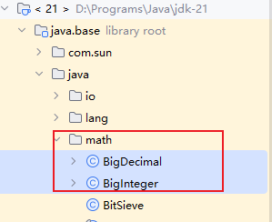
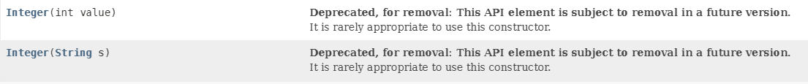
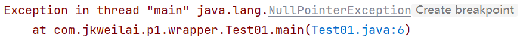
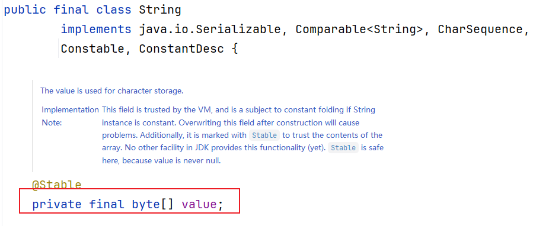
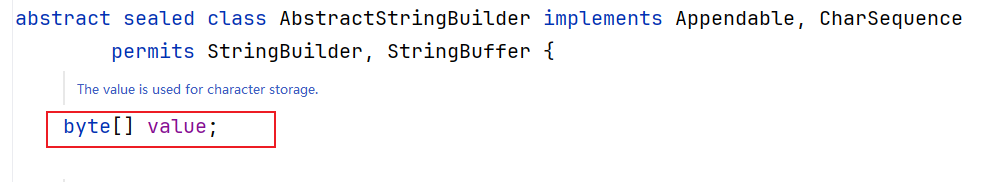
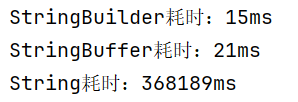
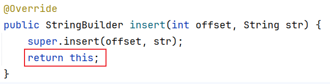
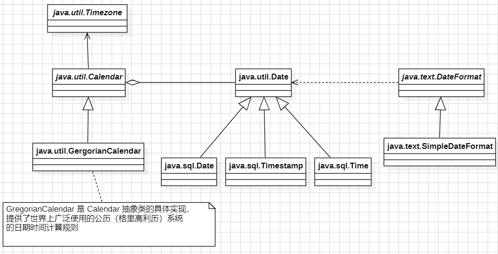
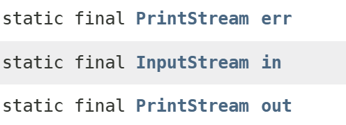

# 第07章 常用类


# 基本数据类型包装类

## 包装类的概述

java是面向对象的语言，但不是“纯面向对象”，基本数据类型就不是对象。但是我们在实际使用中经常需要将基本数据转化成对象，便于操作。比如：Object[]数组操作中，我们就需要将基本类型数据转化成对象！

为了解决这个不足，在设计类时为每个基本数据类型设计了一个对应的类进行代表，这样八个和基本数据类型对应的类统称为包装类(Wrapper Class)。

包装类均位于java.lang包中，以下是包装类和基本数据类型的对应关系：

| **基本数据类型** | **包装类** |
| --- | --- |
| byte | java.lang.Byte |
| short | java.lang.Short |
| int | java.lang.**Integer** |
| long | java.lang.Long |
| float | java.lang.Float |
| double | java.lang.Double |
| boolean | java.lang.Boolean |
| char | java.lang.**Character** |

在这八个类名中，除了Integer和Character类以外，其它六个类的类名和基本数据类型一致，只是类名的第一个字母大写即可。

在这八个包装类中，除了Character和Boolean之外都是“数值型”，数值型是java.lang.Number的子类。Number类是抽象类，因此它的抽象方法，所有子类都需要提供实现。Number类提供了抽象方法：byteValue()、shortValue()、intValue()、longValue()、floatValue()、doubleValue()，意味着所有的数值型包装类都可以互相转型。



对于包装类说，这些类的用途主要包含两种：

1. 包装类用于实现“基本数据类型”和“引用数据类型”之间的转换，这样就方便涉及到对象的操作，如Object[]、集合等的操作。
2. 通过包装类的属性，可以获得整数型表示的最大值和最小值，通过包装类提供的方法，用于实现基本数据类型、包装类和字符串之间的相互转换。


## 基本类型&包装类

### 基本类型转包装类

我们可以通过包装类提供的构造方法，可以把基本类型或字符串类型转化为包装对象。下面以Integer构造方法API截图，其它包装类的构造方法基本相同。



【示例】实例化包装对象案例

```java
// 基本数据类型转化为包装类对象
Integer i1 = new Integer(12);
Float f2 = new Float(1.23);
// 字符串转化为包装类对象
Integer i2 = new Integer("123");
Float f2 = new Float("1.23");
```

通过包装类的valueOf()静态方法，也能把字符串或基本数据类型转化为包装类对象。

【示例】基本类型或字符串类型转化为包装对象

```java
// 基本数据类型转化为包装类型对象
Double f1 = Double.valueOf(1.23);
Integer i1 = Integer.valueOf(123);
// 字符串类型转化为包装类型对象
Double f2 = Double.valueOf("1.23");
Integer i2 = Integer.valueOf("123");
```

基本类型转换成包装对象，注意事项：

1. 针对Character类型，则字符串不能转化为Character类型的包装对象，只能把char类型的数据转化为Character类型的包装对象。
2. 针对Boolean类型，只有字符串为“true”(不区分大小写)的时候，转化为包装对象的值才为true，否则一律都返回false。

在数值型的包装类中（排除Character和Boolean），“字符串内容的格式”必须和“包装类对象基本数据类型的格式”保持一致，否则抛出NumberFormatException异常。


### 包装类转基本类型

数值型包装类是java.lang.Number的子类，Number类提供了抽象方法：byteValue()、shortValue()、intValue()、longValue()、floatValue()、doubleValue()，意味着所有的数值型包装类都可以互相转型。

【示例】数值型包装对象转化为基本类型

```java
// 实例化一个包装类对象
Double d = new Double("1.23");
// 获取包装对象中的int数值
int num = d.intValue();
// 获取包装对象中的double数值
double dou = d.doubleValue();
// 输出：num:1 , dou:1.23
System.out.println("num:" + num + " , dou:" + dou);
```

非数值型包装类中，Boolean类型对象只能转化为boolean类型，因为它只有booleanValue()方法；Character类型对象只能转化为char类型，因为它只有charValue()方法。

【示例】非数值型包装对象转化为基本类型

```java
// Boolean对象转化为boolean类型
Boolean b = new Boolean("true");
boolean flag = b.booleanValue();
System.out.println("flag:" + flag); // 输出：flag:true
// Character对象转化为char类型
Character c = new Character('A');
char cc = c.charValue();
System.out.println("char:" + cc); // 输出：char:A
```


## 基本类型&字符串

### 字符串转基本类型

通过包装类中的静态方法，把字符串转化成基本数据类型。

| **包装类** | **静态方法** | **方法描述** |
| --- | --- | --- |
| Byte | static byte parseByte(String s) | 将字符串参数解析为带符号的十进制byte 。 |
| Short | static short parseShort(String s) | 将字符串参数解析为带符号的十进制short |
| Integer | static int parseInt(String s) | 将字符串参数解析为带符号的十进制int |
| Long | static long parseLong(String s) | 将字符串参数解析为带符号的十进制long |
| Float | static float parseFloat(String s) | 返回一个新 float值，该值被初始化为用指定字符串表示的值 |
| Double | static double parseDouble(String s) | 返回一个新 double值，该值被初始化为用指定字符串表示的值 |
| Boolean | static boolean parseBoolean(String s) | 将字符串参数解析为boolean值 |

【示例】字符串转基本类型案例

```java
// 字符串转double基本数据类型
System.out.println(Double.parseDouble("123.4") + 0.6); // 输出：124.0
// 字符串转int基本数据类型
System.out.println(Integer.parseInt("123") + 77); // 输出：200
```

注意事项：

1. 不能把字符串转化为char类型，因为Character类型中没有提供parseChar(String value)方法。
2. 针对Boolean类型，只有字符串为“true”（不区分大小写）的时候，转化为基本类型的值才为true，否则一律都返回false。

在数值型的包装类中，“字符串内容的格式”必须和“包装类对象基本数据类型的格式”保持一致，否则抛出NumberFormatException异常。


### 基本类型转字符串

通过包装类中的静态方法，也就是toString()方法，就能把基本数据类型转化成字符串。

| **包装类** | **方法** | **方法描述** |
| --- | --- | --- |
| 所有包装类 | String toString() | 返回对象的字符串表示形式 |
| Byte | static String toString(byte b) | 把byte类型转化为字符串返回 |
| Short | static String toString(short s) | 把short类型转化为字符串返回 |
| Integer | static String toString(int i) | 把int类型转化为字符串返回 |
| Long | static String toString(long i) | 把long类型转化为字符串返回 |
| Float | static String toString(float f) | 把float类型转化为字符串返回 |
| Double | static String toString(double d) | 把double类型转化为字符串返回 |
| Boolean | static String toString(boolean b) | 把boolean类型转化为字符串返回 |
| Character | static String toString(char c) | 把char类型转化为字符串返回 |

【示例】基本数值转成字符串案例

```java
// 把int类型转化成字符串
System.out.println(Integer.toString(123) + "A"); // 输出："123A"
// 把double类型转化为字符串
System.out.println(Double.toString(123.4) + "A"); // 输出："123.4A"
// 把char类型转化成字符串
System.out.println(Character.toString('A') + "A"); // 输出："AA"
```

思考：还有那些方式能把基本数据类型转化为字符串呢？


## 自动装箱拆箱（重点）

自动装箱和拆箱就是将基本类型和包装类进行自动的互相转换。JDK1.5后，将自动装箱(autoboxing)和拆箱(unboxing)引入java中。

### 自动装箱和自动拆箱

当基本类型数据处于需要对象的环境中时，则就会触发自动装箱机制，也就是自动把基本数据类型转化为包装类对象。

我们以Integer为例：在JDK1.5以前，这样的代码 Integer i = 5 是错误的，必须要通过Integer i = new Integer(5) 这样的语句来实现基本数据类型转换成包装类的过程;        而在JDK1.5以后，Java提供了自动装箱的功能，因此只需Integer i = 5这样的语句就能实现基本数据类型转换成包装类，这是因为JVM为我们执行了Integer i = Integer.valueOf(5)这样的操作，这就是Java的自动装箱。

【示例】自动装箱案例

```java
Integer i1 = 100; // 自动装箱，等效于：Integer i1 = Integer.valueOf(100);
```

通过自动装箱特性，我们可以使用Object类型的数组来存放任意类型的元素。

```java
// 存放基本数据类型的数组（自动装箱）
Object[] arr = {11.1, 18, 12, 11.1};
```

当对象处于需要基本数据类型的环境中，则就会触发自动拆箱机制，也就是自动把包装类对象转化为基本数据类型。

自动装箱过程是通过调用包装类的valueOf()方法实现的，而自动拆箱过程是通过调用包装类的xxxValue()方法实现的(xxx代表对应的基本数据类型，如intValue()、doubleValue()等)。

【示例】自动拆箱案例

```java
Integer integer = 100; // 自动装箱
int num = integer; // 自动拆箱，等效于：int num = integer.intValue();
```


### 自动装箱缓存问题

针对整数型的包装类，如果整数值在[-128, 127]之间时，那么触发自动装箱机制的时候，默认会从“缓冲池”中取出一个包装类对象并返回，而不会创建一个新的包装类对象并返回；如果整数值在[-128, 127]之外时，那么触发自动装箱机制的时候，则就会创建一个新的包装类对象并返回，而不会从“缓冲池”中取出一个包装类对象并返回。

我们以Intger包装类为例，来分析自动装箱机制的实现过程，源码如下：

```java
public static Integer valueOf(int i) {
     if (i >= IntegerCache.low && i <= IntegerCache.high)
          return IntegerCache.cache[i + (-IntegerCache.low)];
     return new Integer(i);
}
```

通过IntegerCache这个静态内部类，实现对[128, 127]之间的数值会进行缓存处理。

【示例】自动装箱缓存机制的演示

```java
// 说明：自动装箱的整数值在[-128, 127]之间，则就会触发缓存机制
Integer integer1 = 127;
Integer integer2 = 127;
System.out.println(integer1 == integer2);      // 输出：true
System.out.println(integer1.equals(integer2)); // 输出：true

// 说明：自动装箱的整数值在[-128, 127]之外，则不会触发缓存机制
Integer integer3 = 128;
Integer integer4 = 128;
System.out.println(integer3 == integer4);      // 输出：false
System.out.println(integer3.equals(integer4)); // 输出：true
```

扩展：尝试着模拟实现Integer类。

### 空指针异常问题

【示例】包装类空指针异常案例

```java
Integer integer = null;
int num = integer ;
```

执行结果如下图所示：



以上代码运行结果之所以会出现空指针异常，是因为该代码相当于：

```java
// 把null赋值类integer变量，是一个合法的操作
Integer integer = null;
// 对空对象integer执行intValue()方法，抛出空指针异常
int num = integer .intValue();
```

null表示integer没有指向任何对象的实体，但作为对象名称是合法的(不管这个对象名称存是否指向了某个对象的实体)。由于实际上integer并没有指向任何对象的实体，所以也就不可能操作intValue()方法，否则就会抛出NullPointerException异常。


## 整数进制转换（了解）

### 十进制转别的进制

我们可以通过Integer类提供的静态方法实现进制之间的转换。

| **包装类** | **方法** | **作用** |
| --- | --- | --- |
| Integer | static String toBinaryString(int i) | 把十进制转化为2进制 |
| Integer | static String toOctalString(int i) | 把十进制转化为8进制 |
| Integer | static String toHexString(int i) | 把十进制转化为16进制 |

【示例】十进制转别的进制案例

```java
// 需求：十进制转化为二进制
System.out.println(Integer.toBinaryString(4));  // 输出：100
// 需求：十进制转化为八进制
System.out.println(Integer.toOctalString(9));   // 输出：11
// 需求：十进制转化为十六进制
System.out.println(Integer.toHexString(17));    // 输出：11
```

### 别的进制转十进制

通过Integer类的static int parseInt(String str, int radix)方法，把别的进制转化为十进制。

【示例】别的进制转十进制案例

```java
// 需求：二进制转化为十进制
System.out.println(Integer.parseInt("100010", 2)); // 输出：34
// 需求：八进制转化为十进制
System.out.println(Integer.parseInt("017", 8)); // 输出：15
// 需求：十六进制转化为十进制
System.out.println(Integer.parseInt("2B", 16)); // 输出：43
```


## Java大数字运算（了解）

### BigInteger类

由于java语言中的long类型表示整数数据范围有限，若希望描述更大的整数数据时，就需要借助java.math.BigInteger类型加以描述。BigInteger类属于java.math包中，因此在每次使用前都要import 这个类。

| **BigInteger类部分构造方法摘要** |   |
| --- | --- |
| BigInteger(String val) | 创建一个具有参数所指定以字符串表示的数值的对象。 |

【示例】BigInteger类的构造方法

```java
// 参数类型为String的构造方法
BigInteger bd = new BigInteger("111111");
// 输出：111111
System.out.println(bd);
```

一般来说，可以使用BigInteger的构造方法或者静态方法的valueOf()方法把基本类型的变量构建成BigInteger对象。

因为BigInteger所创建的是对象，我们不能使用传统的+、-、*、/、%等算术运算符直接对其对象进行数学运算，而必须调用其相对应的方法，方法中的参数也必须是BigInteger的对象。

| **BigInteger类数学运算方法摘要** |   |
| --- | --- |
| BigInteger add(BigInteger augend) | 加法运算 |
| BigInteger subtract(BigInteger subtrahend) | 减法运算 |
| BigInteger multiply(BigInteger multiplicand) | 乘法运算 |
| BigInteger divide(BigInteger divisor) | 除法运算 |
| BigInteger[] divideAndRemainder(BigInteger val) | 求余运算 |

【示例】BigInteger类的数学运算方法

```java
// 实例化两个BigInteger对象
BigInteger d1 = new BigInteger("5");

BigInteger d2 = new BigInteger("2");
// 加法运算
BigInteger addNum = d1.add(d2);
System.out.println("加法运算:" + addNum); // 输出：7
// 减法运算
BigInteger subtractNum = d1.subtract(d2);
System.out.println("减法运算:" + subtractNum); // 输出：3
// 乘法运算
BigInteger multiplyNum = d1.multiply(d2);
System.out.println("乘法运算:" + multiplyNum); // 输出：10
// 除法运算
BigInteger divideNum = d1.divide(d2);
System.out.println("除法运算:" + divideNum); // 输出：2
// 取余运算
BigInteger[] result = d1.divideAndRemainder(d2);
// 输出：商:2 余数：1
System.out.println("商:" + result[0] + " 余数：" + result[1]);
```

进行传统的+、-、*、/、%等算术运算后，我们可能需要将BigInteger对象转换成相应的基本数据类型的变量，可以使用intValue()，doubleValue()等方法。

【示例】BigInteger类型转化为基本数据类型

```java
// 实例化两个BigInteger对象
BigInteger d1 = new BigInteger("5");
BigInteger d2 = new BigInteger("2");
// 加法运算
BigInteger addNum = d1.add(d2);
// 把BigInteger类型转化为int类型
int num = addNum.intValue();
System.out.println(num); // 输出：7
// 减法运算
BigInteger subtractNum = d1.subtract(d2);
// 把BigInteger类型转化为double类型
double d = subtractNum.doubleValue();
System.out.println(d); // 输出：3.0
```


### BigDecimal类

float和double类型的主要设计目标是为了科学计算和工程计算，双精度浮点型变量double可以处理16位有效数，然而，它们没有提供完全精确的结果，所以不应该被用于要求精确结果的场合。

【示例】浮点型无法精确提供运算结果案例

```java
// 输出结果为：3.0000000000000004E-8
System.out.println(0.00000001 + 0.00000002);
```

但是商业计算往往要求结果精确，这时候java.math.BigDecimal类就派上大用场啦。BigDecimal由任意精度的整数非标度值和32位的整数标度 (scale) 组成。如果为零或正数，则标度是小数点后的位数。如果为负数，则将该数的非标度值乘以10的负scale 次幂。

| **BigDecimal类部分构造方法摘要** |   |
| --- | --- |
| BigDecimal(double val) | 创建一个具有参数所指定双精度值的对象 |
| BigDecimal(int val) | 创建一个具有参数所指定整数值的对象 |
| BigDecimal(long val) | 创建一个具有参数所指定长整数值的对象 |
| BigDecimal(String val) | 创建一个具有参数所指定以字符串表示的数值的对象 |

构造一个浮点型的BigDecimal对象，参数类型为double的构造方法的结果有一定的不可预知性，而String 构造方法是完全可预知的，所以尽量使用参数类型为String的构造函数。

【示例】BigDecimal类的构造方法

```java
// 参数类型为double的构造方法
BigDecimal aDouble = new BigDecimal(1.22);
// 输出：aDouble: 1.2199999999999999733546474089962430298328399658203125
System.out.println("aDouble: " + aDouble);
// 参数类型为String的构造方法，建议使用
BigDecimal aString = new BigDecimal("1.22");
// 输出：aString: 1.22
System.out.println("aString: " + aString);
```

一般来说，可以使用BigDecimal的构造方法或者静态方法的valueOf()方法把基本类型的变量构建成BigDecimal对象。

因为BigDecimal所创建的是对象，我们不能使用传统的+、-、*、/等算术运算符直接对其对象进行数学运算，而必须调用其相对应的方法，方法中的参数也必须是BigDecimal的对象。

| **BigDecimal类数学运算方法摘要** |   |
| --- | --- |
| BigDecimal add(BigDecimal augend) | 加法运算 |
| BigDecimal subtract(BigDecimal subtrahend) | 减法运算 |
| BigDecimal multiply(BigDecimal multiplicand) | 乘法运算 |
| BigDecimal divide(BigDecimal divisor) | 除法运算 |

【示例】BigDecimal类的数学运算方法

```java
// 实例化两个BigDecimal对象
BigDecimal d1 = new BigDecimal("3.0");
BigDecimal d2 = new BigDecimal("2.0");
// 加法运算
BigDecimal addNum = d1.add(d2);
System.out.println("加法运算:" + addNum); // 输出：5.0
// 减法运算
BigDecimal subtractNum = d1.subtract(d2);
System.out.println("减法运算:" + subtractNum); // 输出：1.0
// 乘法运算
BigDecimal multiplyNum = d1.multiply(d2);
System.out.println("乘法运算:" + multiplyNum); // 输出：6.00
// 除法运算
BigDecimal divideNum = d1.divide(d2);
System.out.println("除法运算:" + divideNum); // 输出：1.5
```

进行传统的+、-、*、/等算术运算后，我们可能需要将BigDecimal对象转换成相应的基本数据类型的变量，可以使用floatValue()，doubleValue()等方法。

【示例】BigDecimal类型转化为基本数据类型

```java
// 实例化两个BigDecimal对象
BigDecimal d1 = new BigDecimal("3.0");
BigDecimal d2 = new BigDecimal("2.0");
// 加法运算
BigDecimal addNum = d1.add(d2);
// BigDecimal类型转化为int类型
int n = addNum.intValue();
System.out.println(n); // 输出：5
// 除法运算
BigDecimal divideNum = d1.divide(d2);
// BigDecimal类型转化为double类型
double d = addNum.intValue();
System.out.println(d); // 输出：5.0
```


# String类

## String类概述

String类对象代表不可变的Unicode字符序列。什么叫做“不可变的对象”？指的是对象内部的成员变量的值无法再改变。我们打开String类的源码：



我们发现字符串内容全部存储到value[]数组中，而且该数组是final类型，也就是常量(即只能被赋值一次)，这就是“不可变对象”的典型定义方式。

虽然字符串本身不能改变，但是String类型变量中记录的地址值是可以改变的。

【示例】字符串多次赋值案例

```java
public static void main(String[] args) {
        // 方法栈中的str指向堆中的某个地址
        String str = new String("jkweilai");
        // 方法栈中的str指向堆中的另一个地址
        str = "jkweilai";
}
```

执行该代码时， str引用先指向堆中的一个字符串("jkweilai")，然后紧接着 str 又指向堆中另外一个字符串("jkweilai")，此时字符串"jkweilai"就没有引用再指向它了。

Java专门在堆中为字符串准备了一个字符串常量池。因为字符串使用比较频繁，放在字符串常量池中省去了对象的创建过程，从而提高程序的执行效率。（常量池属于一种缓存技术，缓存技术是提高程序执行效率的重要手段。）

```java
String s1 = "hello"; 
String s2 = "hello";
System.out.println(s1 == s2); // true 说明s1和s2指向了字符串常量池中的同一个字符串对象。
```

注意：字符串字面量在编译的时候就已经确定了将其放到字符串常量池中。JVM启动时会立即将程序中带有双引号的字符串全部放入字符串常量池(在main方法执行之前就已经完成了字符串常量池初始化。)。

Java8之后字符串常量池在堆中。Java8之前字符串常量池在永久代。

动态拼接之后的新字符串不会自动放到字符串常量池中

```java
String s1 = "abc";
String s2 = "def";
String s3 = s1 + s2;
String s4 = "abcdef";
System.out.println(s3 == s4); // false 说明拼接后的字符串并没有放到字符串常量池

//以上程序中字符串常量中有三个： "abc" "def" "abcdef" 
//以上程序中除了字符串常量池的字符串之外，在堆中还有一个字符串对象 "abcdef"
```

两个字符串字面量拼接会做编译阶段的优化，在编译阶段就会进行字符串的拼接。

```java
String s1 = "aaa" + "bbb";
```

以上程序会在编译阶段进行拼接，因此以上程序在字符串常量池中只有一个："aaabbb"

## String类构造方法

| **String类部分构造方法摘要** |   |
| --- | --- |
| String() | 初始化新创建的String对象，使其表示空字符序列。 |
| String(String original) | 初始化新创建的String对象，新创建的字符串是参数字符串的副本。 这个方法被@IntrinsicCandidate标注，这个注解的作用是告诉编译器,该方法或构造函数是一个内在的候选方法,可以被优化和替换为更高效的代码。因此它是不建议使用的。 |
| String(byte[] bytes) | 通过使用平台的默认字符集解码指定的字节数组来构造新的String。 |
| String(byte[] bytes, int offset, int length) | 根据字节数组的指定部分创建一个新的字符串对象，默认使用平台默认的字符集进行解码 |
| String(byte[] bytes, String charsetName) | 根据字节数组和指定的字符集名称创建一个新的字符串对象。这是一个解码的过程。你需要提前知道“byte[] bytes”是通过哪个编码方式进行编码得到的。如果通过GBK的方式进行编码得到的“byte[] bytes”，调用以上构造方法时采用UTF-8的方式进行解码。就会出现乱码 |
| String(char[] value) | 分配一个新的String，以便它表示当前包含在字符数组参数中的字符序列。 |

【示例】字符串构造方法使用案例

```java
// 1.创建一个空字符串
String str1 = new String(); // 存储内容：""
// 2.通过常量字符串来创建字符串
String str2 = new String("jkweilai"); // 存储内容："jkweilai"
// 3.通过byte数组来创建字符串
byte[] bytes = new byte[] {65, 66, 67, 68, 69}; 
// 3.1把byte数组全部元素作为字符串的内容来创建字符串
String str3 = new String(bytes); // 存储内容："ABCDE"
// 4.通过char数组来创建字符串
char[] chars = new char[] {'a', 'b', 'c', 'd', 'e'};
// 4.1把char数组全部元素作为字符串的内容来创建字符串
String str4 = new String(chars); // 存储内容："abcde"
```

通过String类的构造方法可以完成字符串对象的创建，那么通过使用双引号的方式创建对象与new的方式创建对象，有什么不同呢？

【示例】两种字符串创建方式区别

```java
// 通过双引号创建字符串
String str1 = "hello world";
// 通过构造方法创建字符串
String str2 = new String("hello world");
// 比较地址
System.out.println(str1 == str2); // 输出：false
// equals方法比较字符串内容
System.out.println(str1.equals(str2)); // 输出：true
```

str1 和 str2 的创建方式有什么不同呢？

1. str1创建，在内存中只有一个对象，这个对象在字符串常量池中。
2. str2创建，在内存中有两个对象。一个new的对象在堆中，一个字符串本身对象，在字符串常量池中。


## String类查找方法

### 获取字符串长度

通过String类提供的length()方法，可以获取到字符串中有多少个字符。注意区分获取数组长度和字符串长度的方式，数组是通过length属性来获取数组的长度 。

【示例】获取字符串长度案例

```java
String str = new String("jkweilai");
int length = str.length();
System.out.println("length:" + length); // 输出：5
```

### charAt方法

char charAt(int index)方法是一个能够用来检索特定索引下的字符的String实例的方法。

charAt()方法返回指定索引位置的char值，索引范围为0 ~ length() – 1，如果索引越界，则抛出StringIndexOutOfBoundsException异常。

【示例】根据索引获取字符案例

```java
String str = new String("jkweilai");
// 注意：索引范围为[0, 字符串长度)
char c1 = str.charAt(3);
System.out.println(c1); // 输出：'e'
// 如果索引越界，抛出StringIndexOutOfBoundsException异常
char c2 = str.charAt(8); // 运行抛出异常
```

### indexOf方法

通过indexOf方法，获取字符&子字符串在指定字符串中第一次出现的位置（从前往后查找）。

indexOf方法返回一个整数值，该整数值就是字符或子字符串在指定字符串中所在的位置，如果没有找到则返回-1。如果fromIndex是负数，则fromIndex被当作零，如果它比最大的字符位置索引还大，则它被当作最大的可能索引。

| **String类中indexOf方法摘要** |   |
| --- | --- |
| int indexOf(int ch) | 返回指定字符第一次出现在字符串内的索引。 |
| int indexOf(int ch, int fromIndex) | 返回指定字符第一次出现在字符串内的索引，以指定的索引开始搜索。 |
| int indexOf(String str) | 返回指定子字符串第一次出现在字符串内的索引。 |
| int indexOf(String str, int fromIndex) | 返回指定子串的第一次出现在字符串中的索引，从指定的索引开始搜索。 |

【示例】indexOf方法案例

```java
String str = "hello-world-hello-world";
// 1. 获取指定字符在字符串中的第一次出现的位置，如果字符不存在返回-1
int index1 = str.indexOf('o');
System.out.println("index:" + index1); // 输出：4
// 2. 获取指定字符第一次出现在字符串中的位置，以指定的索引开始搜索，如果字符不存在返回-1
int index2 = str.indexOf('o', 5);
System.out.println("index:" + index2); // 输出：7
// 3.获取指定子字符串在字符串中第一次出现的位置，如果字符不存在返回-1
int index3 = str.indexOf("llo");
System.out.println("index:" + index3); // 输出：2
// 4.获取指定字符串第一次出现的字符串中的位置，以指定的索引开始搜索，如果字符不存在返回-1
int index4 = str.indexOf("llo", 9);
System.out.println("index:" + index4); // 输出：14
```


### lastIndexOf方法

通过lastIndexOf方法，获取字符&子字符串在指定字符串中最后一次出现的位置（从后往前查找）。lastIndexOf方法返回一个整数值，该整数值就是字符或子字符串在指定字符串中所在的位置，如果没有找到则返回-1。如果fromIndex是负数，则fromIndex被当作零，如果它比最大的字符位置索引还大，则它被当作最大的可能索引。

| **String类中lastIndexOf方法摘要** |   |
| --- | --- |
| int lastIndexOf(int ch) | 返回指定字符最后一次出现在字符串内的索引 |
| int lastIndexOf(int ch, int fromIndex) | 返回指定字符最后一次出现在字符串内的索引，以指定的索引开始搜索 |
| int lastIndexOf(String str) | 返回指定子字符串最后一次出现在字符串内的索引 |
| int lastIndexOf(String str, int fromIndex) | 返回指定子串的最后一次出现在字符串中的索引，从指定的索引开始搜索 |

【示例】lastIndexOf方法案例

```java
String str = "hello-world-hello-world";
// 1.获取指定字符在字符串中的最后一次出现的位置，如果字符不存在返回-1
int index1 = str.lastIndexOf('o'); 
System.out.println("index:" + index1); // 返回：19
// 2.获取指定字符最后一次出现在字符串中的位置，以指定的索引开始搜索，如果字符不存在返回-1
int index2 = str.lastIndexOf('o', 15);
System.out.println("index:" + index2); // 返回：7
// 3.获取指定子字符串在字符串中最后一次出现的位置，如果字符不存在返回-1
int index3 = str.lastIndexOf("llo");
System.out.println("index:" + index3); // 返回：14
// 4.获取指定字符串最后一次出现在字符串中的位置，以指定的索引开始搜索，如果字符不存在返回-1
int index4 = str.lastIndexOf("llo", 9);
System.out.println("index:" + index4); // 返回：2
```

### startsWith方法

startsWith(String prefix)方法，判断字符串是否以指定字符串开头，返回值为boolean类型。

【示例】startsWith方法案例

```java
String url = "http://www.jkweilai.com";
// 判断url是否采用的http:协议,就是判断字符串是否以"http:"开头
boolean flag = url.startsWith("http:");
System.out.println("flag:" + flag); // 输出：true
```

### endsWith方法

endsWith(String prefix)方法，判断字符串是否以指定字符串结尾，返回值为boolean类型。

【示例】endsWith方法案例

```java
String url = "http://www.jkweilai.com";
// 判断网站域名是否是.cn域名，也就是判断字符串是否以.cn结尾
boolean flag = url.endsWith(".cn");
System.out.println("flag:" + flag); // 输出：false
```

### contains方法

contains(CharSequence s)方法，判断字符串中是否包含指定字符串，返回值为boolean类型。

CharSequence是一个接口，String类是该接口的实现类，所以contains方法的参数可以为字符串。

【示例】contains方法案例

```java
String url = "http://www.jkweilai.com";
// 判断字符串中是否包含"jkweilai"
boolean flag = url.contains("jkweilai");
System.out.println("flag:" + flag); // 输出：true
```


## String类转换方法

### 字符串转数组

| **String类中字符串转数组方法摘要** |   |
| --- | --- |
| String[] split(String regex) | 将一个字符串分割为子字符串，并返回字符串数组 |
| char[] toCharArray() | 将此字符串转换为新的字符数组 |
| byte[] getBytes() | 得到一个操作系统默认的编码格式的字节数组 |
| byte[] getBytes(String charsetName) | 将字符串按照指定字符集的方式进行编码。 |

【示例】字符串转数组案例

```java
String str = "I Love jkweilai";
// 字符串转数组，通过空格来做分割
String[] arr1 = str.split(" ");
// 输出：[I, Love, jkweilai]
System.out.println(Arrays.toString(arr1)); 
// 字符串转字符数组
char[] arr2 = str.toCharArray();
// 输出：[I,  , L, o, v, e,  , Y, o, u]
System.out.println(Arrays.toString(arr2)); 
// 字符串转字节数组
byte[] arr3 = str.getBytes();
// 输出：[73, 32, 76, 111, 118, 101, 32, 87, 72, 83, 88, 84]
System.out.println(Arrays.toString(arr3));
```

### 字符串大小写转换

| **String类中字符串字母大小写转换方法摘要** |   |
| --- | --- |
| String toUpperCase() | 返回一个新的字符串，该字符串中所有英文字符转换为大写字母 |
| String toLowerCase() | 返回一个新的字符串，该字符串中所有英文字符转换为小写字母 |

【示例】字符串转数组案例

```java
String str = "hello world";
// 将字符串中字母全部转化为大写
String upperStr = str.toUpperCase();
System.out.println(upperStr); // 输出："HELLO WORLD"
// 将字符串中字母全部转化为小写
String lowerStr = upperStr.toLowerCase();
System.out.println(lowerStr); // 输出："hello world"
```


### 忽略字符串前后空格

使用trim()方法去掉字符串中首尾的空格。

【示例】忽略字符串前后空格案例

```java
String str = "   he llo  ";
// 忽略字符串前后空格
String newStr = str.trim();
// 输出："--he llo--"
System.out.println("--" + newStr + "--");
```

### 字符串的截取

| **String类中字符串截取方法摘要** |   |
| --- | --- |
| String substring(int beginIndex) | 从beginIndex开始截取字符串，到字符串末尾结束 |
| String substring(int beginIndex, int endIndex) | 从beginIndex开始截取字符串，到字符索引endIndex-1结束 |

【示例】字符串截取案例

```java
String str = "hello world";
// 从索引startIndex(包含)开始截取，一直截取到字符串末尾
String subStr1 = str.substring(3);
System.out.println(subStr1); // 输出："lo world"
// 从索引startIndex(包含)开始截取，到endIndex(不包含)结束
String subStr2 = str.substring(3, 8);
System.out.println(subStr2); // 输出："lo wo"
```

注意事项：

1. 在substring(int beginIndex)方法中，如果 beginIndex的值为负或大于字符串长度，则抛出IndexOutOfBoundsException异常。
2. 在substring(int beginIndex, int endIndex)方法中，如果beginIndex为负，或endIndex大于字符串长度，或beginIndex大于endIndex，则抛出IndexOutOfBoundsException异常。

### 字符串的替换

| **String类中字符串替换方法摘要** |   |
| --- | --- |
| String replace(char oldChar, char newChar) | 通过用newChar字符替换字符串中出现的所有oldChar字符，并返回替换后的新字符串 |
| String replace(CharSequence target, CharSequence replacement) | 将与字面目标序列匹配的字符串的每个子字符串替换为指定的字面替换序列 |

【示例】字符串替换案例

```java
String str = "CD and jkweilai";
// 替换字符串中的符合条件的字符
String newStr1 = str.replace('D', '都');
// 输出："C都 and jkweilai"
System.out.println(newStr1); 
// 替换字符串中所有符合条件的子字符串
String newStr2 = str.replace("CD", "成都");
// 输出："成都 and jkweilai"
System.out.println(newStr2);
```

### 字符串的拼接

String concat(String str)方法，将指定的字符串连接到该字符串的末尾，该方法实现的功能和“+”连接符比较相似。

【示例】字符串拼接案例

```java
// 字符串拼接，功能和“+”连接符相似
String str = "hello".concat(" world");
// 输出："hello world"
System.out.println(str);
```

**concat 和+的区别？**

- 既可以进行求和，也可以进行字符串的拼接，底层拼接时会创建StringBuilder对象进行拼接。+ 拼接null时不会出现空指针异常。

1. concat方法参数只能是字符串类型，拼接时不会创建StringBuilder对象，拼接完成后返回一个新的String对象。拼接null会出现空指针异常。
  - 使用较多。如果进行大量字符串拼接，这两个都不合适。


## String类其他方法

### isEmpty方法

boolean isEmpty()方法，判断字符串内容是否为空。当字符串长度为0，则返回true，否则返回false。

【示例】判断字符串内容是否空案例

```java
// 当字符串内容为空时，返回true
String str1 = "";
boolean flag1 = str1.isEmpty();
System.out.println(flag1); // 输出：true
// 当字符串内容为不为空时，返回false
String str2 = "hello world";
boolean flag2 = str1.isEmpty();
System.out.println(flag2); // 输出：true
```

### equals方法

| **String类中equals方法摘要** |   |
| --- | --- |
| boolean equals(Object anObject) | 判断字符串内容是否相同 |
| boolean equalsIgnoreCase(String str) | 判断字符串内容是否相同，忽略字母大小写 |

【示例】判断字符串内容是否相同案例

```java
String str = "hello world";
// 判断字符串内容是否相同
boolean flag1 = str.equals("hello WORLD");
System.out.println(flag1); // 输出：false
// 判断字符串内容是否相同，忽略大小写
boolean flag2 = str.equalsIgnoreCase("hello WORLD");
System.out.println(flag2); // 输出：true
```

### valueOf方法

valueOf方法是一个静态方法，可以把基本数据类型转化为字符串类型，是类型转换中非常重要的一个方法。

【示例】valueOf方法使用

```java
// 把int类中转化为字符串
System.out.println(String.valueOf(123) + 4); // 输出："1234"
// 把double类型转化为字符串
System.out.println(String.valueOf(1.23) + 4); // 输出："1.234"
// 把boolean类型转化为字符串
System.out.println(String.valueOf(true) + 4); // 输出："true4"
// 把char类型转化为字符串
System.out.println(String.valueOf('A') + 4); // 输出："A4"
```

## String 新增方法

### intern()方法

String intern(); 获取字符串常量池中的字符串，如果常量池中没有，则将字符串加入常量池并返回。

```java
byte[] bytes = {97,98,99,100}; 
String s = new String(bytes);
String s2 = s.intern(); // 将字符串 “abcd”放入字符串常量池并返回常量池中的字符串 “abcd”
```

### 去除前后空白

```java
// 去除字符串前后空白（支持所有的编码形式的空白，可以将全角空格去除，\u3000 是全角空格，Java11新增）
String strip(); 
// 去除前空白
String stripLeading(); 
// 去除后空白
String stripTrailing(); 
```

### join

它是一个静态方法，将多个字符串以某个分隔符连接（Java8新增）

```java
static String join(CharSequence d, CharSequence... elements); 
```

## 正则表达式

正则表达式（regular expression），简称为regex或regexp，是一种用于描述特定模式的表达式。它可以匹配、查找、替换文本中与该模式匹配的内容，被广泛应用于各种文本处理和匹配相关的应用中。

**正则表达式的应用:**

1. 验证输入内容的格式是否正确。例如，邮箱，手机号，密码等
2. 在文本编辑器中进行搜索和替换。例如，在代码编辑器中查找指定字符串或替换错误的代码成为正确的代码块
3. 数据挖掘和信息提取。正则表达式可以从HTML、XML、JSON等格式的数据中提取所需的信息
4. 用于编写脚本语言，如awk，grep和sed
5. 服务器端编程。正则表达式在处理数据和字符串时具有高效的性能，可以在开发Web应用程序时被广泛应用

**正则表达式和Java语言的关系？**

1. Java语言中可以使用正则表达式。C语言以及其它大部分编程语言都是支持正则表达式的。

**常见的正则表达式符号**

**元字符**

```plaintext
.        匹配除换行符以外的任意字符
\w        匹配字母或数字或下划线或汉字
\s        匹配任意的空白符
\d        匹配数字
\b        匹配单词的开始或结束
^        匹配字符串的开始
$        匹配字符串的结束
```

**字符转义**

```plaintext
\. 表示一个普通的.字符。    \* 表示一个普通*字符。
```

重复次数

```plaintext
*        重复零次或更多次（0 - n）
+        重复一次或更多次(1 - n)
?        重复零次或一次 (0 或 1)
{n}        重复n次 (n)
{n,}        重复n次或更多次 ( >= n)
{n,m}        重复n到m次 (n - m)
```

**字符类**

```plaintext
[abcdef]        匹配abcdef这几个字符中的任意一个字符
[0-9]                匹配0-9中的任意一个数字
[a-zA-Z0-9]         匹配a-z，A-Z，0-9的任意一个字符
[.?!]                匹配标点符号（.或?或!）
[abc-]        匹配abc-四个字符中的任意一个字符（注意-只能出现在末尾。如果-在中间则表示区间）
```

**分支条件**

```plaintext
0\d{2}-\d{8}|0\d{3}-\d{7}

这个表达式能匹配两种以连字号分隔的电话号码：
一种是三位区号，8位本地号(如010-12345678)，一种是4位区号，7位本地号(0376-2233445)
```

---

**分组**

```plaintext
(\d{1,3}.){3}\d{1,3}
是一个简单的IP地址匹配表达式。要理解这个表达式，请按下列顺序分析它：\d{1,3}匹配1到3位的数字，

(\d{1,3}.){3}
匹配三位数字加上一个英文句号(这个整体也就是这个分组)重复3次，最后再加上一个一到三位的数字(\d{1,3})
```

**反义**

```plaintext
\W                匹配任意不是字母，数字，下划线，汉字的字符
\S                匹配任意不是空白符的字符
\D                匹配任意非数字的字符
\B                匹配不是单词开头或结束的位置
[^x]                匹配除了x以外的任意字符
[^aeiou]        匹配除了aeiou这几个字母以外的任意字符
```

**String的正则表达式相关的方法：**

```java
// 将当前字符串中所有的target替换成replacement，返回一个新的字符串。
String replace(CharSequence target, CharSequence replacement);

// 将当前字符串中所有符合正则表达式的regex替换成replacement。
String replaceAll(String regex, String replacement);

// 将当前字符串以某个正则表达式表示的子字符串进行分割，返回一个字符串数组。
String[] split(String regex);

// 判断当前字符串是否符合正则表达式regex。
boolean matches(String regex);
```

## String 类的面试题

```java
String s1 = new String("abc");
String s2 = "abc";
System.out.println(s1 == s2); // false
System.out.println(s1.equals(s2)); // true
```

```java
// 创建了几个对象（5个）
// "a"、"b"、new String("b")导致堆中1个、s1+s2拼接的时候底层有一个StringBuilder对象、拼接之后生成一个新String对象。
String s1 = "a";
String s2 = new String("b");
String s3 = s1 + s2;
```

```java
// 输出结果是什么？还是出现空指针异常？
String s1 = null;
String s2 = s1 + null;
System.out.println(s2); // nullnull
```

```java
// 执行结果是什么？
String s1 = "a1";
String s2 = "a" + 1;
System.out.println(s1 == s2);  // true
```

```java
String s1 = "a" + "b" + "c";
String s2 = "abc";
System.out.println(s1 == s2); // true
System.out.println(s1.equals(s2)); // true
```

```java
// 创建了几个对象（6个）
String str = new String("a") + new String("b");
```

```java
// 程序执行结果是？
String s1 = "ab";
final String s2 = "b";
String s3 = "a" + s2;
System.out.println(s1 == s3); // true
```

```java
String s1 = "abc";
StringBuilder s2 = new StringBuilder(s1);
System.out.println(s1.equals(s2)); // false（类型不一致，false）
```

```java
String s1 = "ab";
String s2 = "abc";
String s3 = s1 + "c";
System.out.println(s2 == s3); // false
System.out.println(s2.equals(s3)); // true
```

```java
public static void main(String[] args){
    String s1 = "ab";
    final String s2 = getB();
    String s3 = "a" + s2;
    System.out.println(s1 == s3); // false
}

public statc String getB(){
    return "b";
}
```

```java
// 创建了几个对象？（1个）
String s = "a" + "b";
```


## String类方法练习

### 获取指定字符串中大写字母、小写字母、数字的个数

```java
public static void method(String str) {
        // 1.保存大写字母、小写字母和数字的个数
        int bigCount = 0, smallCount = 0, numberCount = 0;
        // 2.遍历出字符串中每一个字符，并对每一个字符进行判断
        for(int i = 0; i < str.length(); i++) {
                // 2.1获取到每个字符
                char c = str.charAt(i);
                // 2.2判断字符是否为大写字母
                if (c >= 'A' && c <= 'Z') {
                        bigCount++;
                }
                // 2.3判断字符是否为小写字母
                else if (c >= 'a' && c <= 'z') {
                        smallCount++;
                }
                // 2.4判断字符是否为数字
                else if (c >= '0' && c <= '9') {
                        numberCount++;
                }
        }
        // 3.显示大写字母、小写字母、数字的个数
        System.out.println("大写字母个数：" + bigCount);
        System.out.println("小写字母个数：" + smallCount);
        System.out.println("数字个数：" + numberCount);        
}
```

### 判断字符串中指定某一个字符在字符串中出现的次数

```java
public static int method(String str, char ch) {
        // 保存出现的次数
        int count = 0;
        // 循环查找字符，一直到字符串中不存在该字符为止
        while (str.indexOf(ch) != -1) {
                // 获取查询到字符的索引位置
                int index = str.indexOf(ch);
                // 截取字符串，下次查询从当前位置后开始查询
                str = str.substring(index + 1);
                // 执行count递增操作
                count++;
        }
        return count;

}
```

在以上的操作中，每次查找ch字符都需要执行indexOf()方法两次，并且还在循环中定义了index变量，那么有没有更优的解决方案呢？？？请查看以下优化后的代码。

```java
public static int method(String str, char ch) {
    // 定义一个变量，用于保存出现的次数
    int count = 0;
    // 定义一个零时变量，用于保存ch字符在str中的位置
    int index = 0;
    // 循环查找ch字符，并保存ch在字符串中的位置，直到返回结果是-1截止
    while ((index = str.indexOf(ch)) != -1) {
        // 更新str字符串，为下一次查询做铺垫
        str = str.substring(index + 1);
        // 执行count递增操作
        count++;
    }
        return count;
}
```

### 模拟trim()方法的实现，忽略字符串中前后的空格

```java
public static String method(String str) {
        // 开始索引和结束索引
        int start = 0, end = str.length() - 1;
        // 开始索引的空格
        while (start <= end && str.charAt(start) == ' ') {
                start++;
        }
        // 结束索引空格
        while (start <= end && str.charAt(end) == ' ') {
                end--;
        }
        // 截取字符串
        return str.substring(start, end + 1);
}
```


# StringBuffer类

## StringBuffer类概述

String和StringBuffer都可以用来存储和操作字符串，即包含多个字符的字符串数据。String类代表不可变的Unicode字符序列，是字符串常量。String字符串一旦被初始化后，就不能再被改变其内容了(其原理在String类概述中已经讲述)。对String字符串的操作实际上对其副本（原始拷贝）的操作，原来的字符串一点都没有改变。比如：

```java
// 创建了一个字符串
String str = "hello"; 

// 实际上原来的"hello"字符串对象已经丢弃了，现在又产生了一个字符串"hello世界"
str = str + "世界"; 
```

如果多次执行这些改变串内容的操作，会导致大量副本字符串对象存留在内存中，从而降低了程序的效率。

StringBuffer类是抽象类AbstractStringBuilder的子类，StringBuffer类代表可变的Unicode字符序列，是字符串变量。我们打开AbstractStringBuilder类的源码：



从源码中可以看出，AbstractStringBuilder内部也是一个字符数组，但是这个字符数组没有用final修饰，那么意味着我们可以随时修改，所以我们又称StringBuffer为“可变字符序列”。因为StringBuffer类是对原字符串本身进行操作的，对字符串进行修改操作而不产生副本拷贝，效率较高。

## StringBuffer类构造方法

| **StringBuffer类构造方法摘要** |   |
| --- | --- |
| StringBuffer() | 构造一个没有字符的字符串缓冲区，初始容量为16个字符 |
| StringBuffer(CharSequence seq) | 构造一个包含与指定的相同字符的字符串缓冲区CharSequence |
| StringBuffer(int capacity) | 构造一个没有字符的字符串缓冲区和指定的初始容量 |
| StringBuffer(String str) | 构造一个初始化为指定字符串内容的字符串缓冲区 |

【示例】StringBuffer类构造方法使用

```java
// 1.实例化一个初始容量为16个字符的可变字符串
StringBuffer sb1 = new StringBuffer();
// 2.实例化一个指定字符容量的可变字符串
StringBuffer sb2 = new StringBuffer(20);
// 3.实例化一个指定字符串内容的可变字符串
StringBuffer sb3 = new StringBuffer("hello world");
```


## StringBuffer类常见方法

### 添加方法

append(Type data)方法，把指定内容追加到可变字符串末尾，类似于字符串的连接。调用该方法以后，可变字符串的内容也发生改变。

【示例】append方法使用

```java
// 创建一个可变字符容器，用来存放数据
StringBuffer sb = new StringBuffer("hello");
// 字符串添加
sb.append("123");
System.out.println(sb); // 输出："hello123"
sb.append(false);
System.out.println(sb); // 输出："hello123false"
sb.append(123);
System.out.println(sb); // 输出："hello123false123"
```

insert(int offset, Type data)方法，将内容插入到指定索引位置的可变字符串中。注意：offset索引的取值范围是[0, 数组长度-1)之间，超出范围抛出字符串越界异常（StringIndexOutOfBoundsException）。调用该方法以后，可变字符串的内容也发生改变。

【示例】insert方法使用

```java
// 创建一个可变字符容器，用来存放数据
StringBuffer sb = new StringBuffer("hello world");
// 字符串插入
ssb.insert(2, "AAA");
System.out.println(sb); // 输出："heAAAllo world"
sb.insert(7, 123);
System.out.println(sb); // 输出："heAAAll123o world"
sb.insert(12, true);
System.out.println(sb); // 输出："heAAAll123o trueworld"
```


### 删除方法

delete(int start, int end)方法，删除从start开始到end-1为止的一段字符序列。注意start的取值范围是0到length()之间，并且end应该大于等于start，否则抛出StringIndexOutOfBoundsException异常。调用该方法以后，可变字符串的内容也发生改变。

【示例】delete方法使用

```java
// 创建一个可变字符容器，用来存放数据
StringBuffer sb = new StringBuffer("hello world");
// 字符串删除
sb.delete(2, 5); 
System.out.println(sb); // 输出："he world"
```

deleteCharAt(int index)方法，删除可变字符串中指定位置的某一个字符。注意索引的取值范围是0到length() - 1之间，超出范围抛出StringIndexOutOfBoundsException异常。调用该方法以后，可变字符串的内容也发生改变。

【示例】deleteCharAt方法使用

```java
// 创建一个可变字符容器，用来存放数据
StringBuffer sb = new StringBuffer("hello world");
// 字符串删除
sb.deleteCharAt(2);
System.out.println(sb); // 输出："helo world"
```

### 查找方法

StringBuffer类的查找方法和String类中的方法和功能完全一致，此处就不详细概述了。

| charAt(int index) | 返回 char在指定索引在这个序列值 |
| --- | --- |
| indexOf(String str) | 返回指定子字符串第一次出现的字符串内的索引 |
| indexOf(String str, int fromIndex) | 返回指定子串的第一次出现的字符串中的索引，从指定的索引开始 |
| lastIndexOf(String str) | 返回指定子字符串最右边出现的字符串内的索引 |
| lastIndexOf(String str, int fromIndex) | 返回指定子字符串最后一次出现的字符串中的索引，从指定的索引开始 |


### 修改方法

replace(int start, int end, String str)方法，用字符串str替换从start开始到end-1截止的字符。注意start的取值范围是0到length()之间，并且end应该大于等于start，否则抛出StringIndexOutOfBoundsException异常。调用该方法以后，可变字符串的内容也发生改变。

【示例】replace方法使用

```java
// 创建一个可变字符容器，用来存放数据
StringBuffer sb = new StringBuffer("hello world");
// 字符串替换
sb.replace(5, 6, "我替换了空格");
System.out.println(sb); // 输出："hello我替换了空格world"
```

setCharAt(int index, char ch)方法，替换可变字符串中指定索引位置的字符。注意索引的取值范围是0到length() - 1之间，超出范围抛出StringIndexOutOfBoundsException异常。调用该方法以后，可变字符串的内容也发生改变。

【示例】setCharAt方法使用

```java
// 创建一个可变字符容器，用来存放数据
StringBuffer sb = new StringBuffer("hello-world");
// 字符串替换
sb.setCharAt(5, '_');
System.out.println(sb); // 输出："hello_world"
```

### reverse方法

reverse()方法，用于将字符序列逆序。调用该方法以后，可变字符串的内容也发生改变。

【示例】reverse方法使用

```java
// 创建一个可变字符容器，用来存放数据
StringBuffer sb = new StringBuffer("hello world");
// 将字符序列逆序，可变字符串中的内容随之也发生改变
sb.reverse();
System.out.println(sb); // 输出："dlrow olleh"
```

### setLength方法

setLength(int newLength)方法，用于设置字符序列的长度。注意newLength的取值必须大于或等于0，否则抛出IndexOutOfBoundsException异常。

【示例】setLength方法使用

```java
// 创建一个可变字符容器，用来存放数据
StringBuffer sb = new StringBuffer("hello-world");
// 设置字符串长度
sb.setLength(3);
// 输出：内容："hel" length:3
System.out.println("内容：" + sb + " length:" + sb.length());
```


### 其它常见方法

StringBuffer类的其他常见方法，这些方法和String类中的方法和功能完全一致。

| **和String类含义类似的方法摘要** |   |
| --- | --- |
| length() | 返回char类型数组的空间长度 |
| substring(int start) | 返回一个新的 String ，其中包含此字符序列中当前包含的字符的子序列 |
| substring(int start, int end) | 返回一个新的 String ，其中包含此序列中当前包含的字符的子序列 |

# StringBuilder类

## StringBuilder类概述

StringBuffer类和StringBuilder类非常类似，都是继承自抽象类AbstractStringBuilder类，均代表可变的Unicode字符序列。StringBuilder类和StringBuffer类方法几乎一模一样，不过StringBuilder不是线程安全的，这是和StringBuffer的主要区别：

1. StringBuffer线程安全，做线程同步检查，效率较低。
2. StringBuilder线程不安全，不做线程同步检查，因此效率较高（推荐使用）。

因为JDK1.5版本之前只有一个StringBuffer类（线程安全），由于发现利用多线程对同一字符串数据操作的情况是很少的，为了提高效率JDK1.5以后就有了StringBuilder类，StringBuilder类提供一个与StringBuffer兼容的API，所以StringBuilder类和StringBuffer类的方法和功能完全一致。

目前，我们还没有涉及到线程与同步，知道结论 StringBuilder 比 StringBuffer 快即可。


## 字符串的效率比较

分别使用String、StringBuffer、StringBuilder进行10000次的字符串拼接操作，通过计算运行时间来分析执行的效率。

【示例】字符串拼接效率比较

```java
package com.jkweilai.javase.chapter07.test;

public class StringBuilderDemo {
    public static void main(String[] args) {
        stringBuilderAppend(); // 测试StringBuilder耗时
        stringBufferAppend(); // 测试StringBuffer耗时
        stringAppend(); // 测试String耗时
    }
    // 测试String耗时
    public static void stringAppend() {
        String str = "";
        long now1 = System.currentTimeMillis(); // 开始时间
        for (int i = 0; i < 1000000; i++) { // 进行1000000次字符串拼接
            str += i; // 相当于产生了10000个StringBuffer对象
        }
        long now2 = System.currentTimeMillis(); // 结束时间
        System.out.println("String耗时：" + (now2 - now1) + "ms");
    }
    // 测试StringBuffer耗时
    public static void stringBufferAppend() {
        StringBuffer sb = new StringBuffer();
        long now1 = System.currentTimeMillis(); // 开始时间
        for (int i = 0; i < 1000000; i++) { // 进行1000000次字符串拼接
            sb.append(i);
        }
        long now2 = System.currentTimeMillis();        // 结束时间
        System.out.println("StringBuffer耗时：" + (now2 - now1) + "ms");
    }
    // 测试StringBuilder耗时
    public static void stringBuilderAppend() {
        StringBuilder sb = new StringBuilder();
        long now1 = System.currentTimeMillis(); // 开始时间
        for (int i = 0; i < 1000000; i++) { // 进行1000000次字符串拼接
            sb.append(i);
        }
        long now2 = System.currentTimeMillis(); // 结束时间
        System.out.println("StringBuilder耗时：" + (now2 - now1) + "ms");
    }
}
```

执行结果如下：



StringBuffer和StringBuilder的运行效率几乎一致，这是因为二者都是对对象本身进行操作，不会生成新的字符串对象。二者的区别主要是StringBuffer是线程安全的，而StringBuilder是线程不安全的，所以StringBuilder的运行效率略高于StringBuffer。

String是不可变的对象，每次对String进行操作的时候，都会生成一个新的对象（StringBuilder），占用大量内存空间，这会对系统的性能造成影响，执行效率最低。所以在平时编程的过程中，如果字符串需要经常改变，应该尽量避免使用String。


## 对象方法链式调用

在我们日常开发中，会遇到调用一个方法后，返回一个对象的情况，这种设计允许用户连续的链式调用方法，从而实现按人的惯性思维进行快速开发，我们称之为链式语法。在我们学过的常用工具类中，StringBuffer类和StringBuilder类中的方法都是使用链式语法的典范，通过在方法添加return this的形式来实现方法的链式调用，我们打开StringBuilder的源码：



从源码中我们可以看到，我们每次调用StringBuilder类中的insert方法，都会返回当前可变字符串对象，然后我们可以使用返回的对象继续调用方法，从而实现了方法链式调用。

【示例】对象的方法链式调用案例

```java
// 创建一个可变字符容器，用来存放数据
StringBuilder sb = new StringBuilder("hello-world");
// 通过链式语法操作可变字符串数据
sb.append("-jkweilai").insert(4, "AAA").delete(6, 8);
// 输出："hellAA-world-jkweilai"
System.out.println(sb);
```

# 日期&时间处理相关类

## 时间处理类概述

“时间如流水，一去不复返”，时间是一个一维的东东。所以，我们需要一把刻度尺来区表达和度量时间。在计算机世界，我们把1970 年1月1日 00:00:00定为基准时间，每个度量单位是毫秒(1秒的千分之一)。


我们用long类型的变量来表示时间，从基准时间往前几亿年，往后几亿年都能表示。如果想获得现在时刻的“时刻数值”，可以使用：

```java
long now = System.currentTimeMillis();
```

这个“时刻数值”是所有时间类的核心值，年月日都是根据这个“数值”计算出来的。我们工作学习涉及的时间相关类有如下这些：




## Date时间类

在标准Java类库中包含一个java.util.Date类，它的对象表示一个特定的瞬间，精确到毫秒。Date类送JDK1.0开始就存在了，但因为它历史悠久，所以它的大部分构造器、方法都已经过时了，不再推荐使用了。

Date类提供了6个构造器，其中4个已经过时不再推荐使用（使用不再推荐的构造器编译器会提出警告信息，并导致程序性能、安全性等方面的问题），剩下的两个构造器如下：

| public Date() | 创建一个代表当前日期时间的Date对象 |
| --- | --- |
| public Date(long date) | 指定的long型整数来创建一个Date对象（参数为距离1970年1月1日凌晨的毫秒数） |

标准基准时间：又称为“历元（epoch）”，即1970年1月1日凌晨。 

【示例】Date对象的创建方式

```java
// 创建一个代表当前日期时间的Date对象。
Date date1 = new Date();
System.out.println(date1); // 输出：Wed Jan 03 22:22:38 CST 2020
// 指定毫秒数来创建一个Date对象。
Date date2 = new Date(1514984127939L);
System.out.println(date2); // 输出：Wed Jan 03 20:55:27 CST 2020
```

Date对象的大部分方法也已经弃用了，只剩下为数不多的几个方法：

1. boolean before(Date when)：测试此日期是否在指定日期之前。
2. boolean after(Date when)：测试此日期是否在指定日期之后。
3. boolean equals(Object obj)：比较两个日期的相等性。
4. long getTime()：返回当前时间距离1970年1月1日凌晨的毫秒数。
5. void setTime(long time)：使用给定的毫秒时间值设置现有的Date对象。

【示例】根据两个日期对象返回相差天数

```java
public int method(Date date1, Date date2) {
        // 1.把日期对象转化为毫秒数
        long time1 = date1.getTime();
        long time2 = date2.getTime();
        // 2.获取毫秒数的查值
        long result = Math.abs(time1 - time2);
        // 3.转化为天数
        int day = (int) Math.floor(result/1000/60/60/24);
        // 4.返回天数
        return day;
}
```


## SimpleDateFormat类

SimpleDateFormat类是抽象类DateFormat的子类，用于以区域设置敏感的方式格式化和解析日期。

关于Date、时间戳(long)和String类型之间的相互转换，主要是用SimpleDateFormat类来实现，在创建SimpleDateFormat对象时，我们可以指定格式来对日期和时间来进行格式化操作，然后再进行Date对象和字符串的转换。

指定格式规则如下：

- 当出现 y 时，会将 y 替换成年。
- 当出现 M 时，会将 M 替换成月。
- 当出现 d 时，会将 d 替换成日。
- 当出现 h 时，会将 h 替换成时(12小时制)。
- 当出现 H 时，会将 H 替换成时(24小时制)。
- 当出现 m 时，会将 m 替换成分。
- 当出现 s 时，会将 s 替换成秒。
- 当出现 S 时，会将 S 替换成毫秒。
- 当出现D时，获得当前时间是今年的第几天。
- 当出现w时，获得当前时间是今年的第几周。
- 当出现W时，获得当前时间是本月的第几周。

【示例】自定义日期格式转换案例

```java
public static void main(String[] args) throws ParseException {
        // Date对象转化为String
        dateToString(new Date());
        // String转化为Date对象
        stringToDate("2024年12月18日 23:11:20");
}
// String转化为Date对象
public static void stringToDate(String time) throws ParseException {
        DateFormat df = new SimpleDateFormat("yyyy年MM月dd日 HH:mm:ss");
        Date date = df.parse(time);
        System.out.println(date); // 输出：Mon Dec 18 23:11:20 CST 2017
}
// Date对象转化为String
public static void dateToString(Date date) {
        DateFormat df = new SimpleDateFormat("yyyy-MM-dd");
        String time = df.format(date);
        System.out.println(time); // 输出：2018-01-04
}
```

【示例】获得当前时间是今年的第几天

```java
DateFormat df = new SimpleDateFormat("D");
String day = df.format(new Date());
System.out.println("今天是今年的第" + day + "天");
```


## Calendar日历类

Calendar我们称之为“日历类”，通过Calendar类的实例不但能保存某个指定时间，并且还提供了日期相关的计算功能。正是因为Calendar类的出现，因此就替代了Date类中的很多方法。

因为Calendar是一个抽象类，因此就无法直接实例化Calendar对象，而是通过Calendar类提供的静态方法来获得Calendar类的实现类对象，方法如下：

| **方法名** | **描述** |
| --- | --- |
| public static Calendar getInstance() | 获得“当前时间”的Calendar实现类对象 |

返回的实现类为GregorianCalendar类，而GregorianCalendar类是Calendar的实现类，提供了世界上大多数国家/地区使用的标准日历系统。

【示例】创建当前日历对象案例

```java
// 通过静态方法创建当前日期对象
Calendar calendar = Calendar.getInstance(); 
System.out.println(calendar);
```

### Calendar类的常见字段

Calendar类中的常见字段，本质上都是Calendar类中int类型的全局静态常量，通过这些字段我们就可以去操作Calendar对象中存储的时间，常用字段如下：

- Calendar.YEAR 获取年份
- Calendar.MONTH 获取月份，0表示1月，1表示2月，...，11表示12月
- Calendar.DAY_OF_MONTH 获取本月的第几天
- Calendar.DAY_OF_YEAR 获取本年的第几天
- Calendar.HOUR_OF_DAY 小时，24小时制
- Calendar.HOUR 小时，12小时制
- Calendar.MINUTE 获取分钟
- Calendar.SECOND 获取秒
- Calendar.MILLISECOND 获取毫秒
- Calendar.DAY_OF_WEEK 获取星期几，1表示星期日，...，7表示星期六


### 获取的方法

| **方法名** | **描述** |
| --- | --- |
| public int get(int field) | 根据字段获得时间 |

【示例】根据字段获得时间的案例

```java
// 获得保存“当前时间”的Calender对象
Calendar calendar = Calendar.getInstance(); 
int year = calendar.get(Calendar.YEAR); // 获取年份
// 注意：0表示1月，1表示2月，2表示3月，...，11表示12月
int month = calendar.get(Calendar.MONTH);// 获取月份
int day = calendar.get(Calendar.DAY_OF_MONTH); // 获取本月第几天
int hour = calendar.get(Calendar.HOUR_OF_DAY); // 获取小时
int minute = calendar.get(Calendar.MINUTE); // 获取分钟
int second = calendar.get(Calendar.SECOND); // 获取秒
int milliSecond = calendar.get(Calendar.MILLISECOND); // 获取毫秒
// 注意：1表示星期日，2表示星期一，...，7表示星期六
int week = calendar.get(Calendar.DAY_OF_WEEK); // 获取星期几
int days = calendar.get(Calendar.DAY_OF_YEAR); // 获取本年度第几天
```

### 设置的方法

| **方法名** | **描述** |
| --- | --- |
| public void set(int field, int value) | 根据字段设置时间 |
| public final void set(int year, int month, int date) | 设置年、月和日的数据 |
| public final void set(int year, int month, int date, int hour, int minute) | 设置年、月、日、时和分的数据 |
| public final void set(int year, int month, int date, int hour, int minute, int second) | 设置年、月、日、时、分和秒的数据 |

【示例】根据时间字段编号，单独设置日期元素案例

```java
// 获得保存“当前时间”的Calender对象
Calendar calendar = Calendar.getInstance(); 
// 根据字段设置时间（设置年份为2017年，其余数据不变）
calendar.set(Calendar.YEAR, 2017);  
```

【示例】根据年月日时分秒设置日期元素值案例

```java
// 获得保存“当前时间”的Calender对象
Calendar calendar = Calendar.getInstance(); 
// 设置保存的时间为2022年5月20日（其余数据不变）
calendar.set(2022, 4, 50);
```


### 计算的方法

| **方法名** | **描述** |
| --- | --- |
| public void add(int field, int amount) | 根据字段增加或减少数据 |

如果amount值为正数，则做“增加操作”；如果amount值为负数，则做“减少操作”。

【示例】根据字段来增加或减少时间

```java
// 通过静态方法创建当前日期对象
Calendar calendar = Calendar.getInstance(); 
// 修改当前时间为 4 天后（增加）
calendar.add(Calendar.DAY_OF_MONTH, 4);
// 修改当前时间为 5 小时前（减少）
calendar.add(Calendar.HOUR_OF_DAY, -5);
```

### Calendar的重要方法

| **方法名** | **描述** |
| --- | --- |
| public final Date getTime() | 获得Calendar对象保存的时间 |
| public final void setTime(Date date) | 修改Calendar对象保存的时间 |

【示例】把字符串保存时间转化为Calendar对象来保存

```java
// 1.定义一个字符串，用于保存时间
String str = "2023年02月08日 13时14分00秒";
// 2.创建一个SimpleDateFormat对象，并设置好解析字段的规则
DateFormat sdf = new SimpleDateFormat("yyyy年MM月dd日 HH时mm分ss秒");
// 3.把字符串保存时间转化为Date对象来保存
Date date = sdf.parse(str);
// 4.获得一个Calendar对象
Calendar calendar = Calendar.getInstance();
// 5.设置Calendar对象保存的时间
calendar.setTime(date);
// 6.输出calendar对象保存时间
System.out.println(calendar);
```

【示例】把Calendar对象保存时间转化为字符串来保存

```java
// 1.获得保存当前时间的Calendar对象
Calendar calendar = Calendar.getInstance();
// 2.获得Calendar对象保存时间
Date date = calendar.getTime();
// 3.创建一个SimpleDateFormat对象，并设置好解析字段的规则
DateFormat sdf = new SimpleDateFormat("yyyy年MM月dd日 HH时mm分ss秒");
// 4.把Date对象保存时间转化为字符串时间
String format = sdf.format(date);
// 5.输出转化为字符串的时间
System.out.println(format);
```


# 工具类

## System类

System类我们称之为“系统工具类”，在System类中只存在“静态属性”和“静态方法”，因此System类就无需被实例化，那么System类的构造方法使用了private关键字修饰。

System类提供了标准输入流、标准输出流和标准错误输出流，也是Java中最底层的类。

### System类的属性



### System类的方法

| **方法名** | **描述** |
| --- | --- |
| public static void gc() | 唤醒垃圾回收机制来销毁未被引用的对象 |
| public static long currentTimeMillis() | 返回当前时间距离1970年1月1日凌晨的毫秒数 |
| public static long nanoTime() | 以纳秒为单位返回正在运行的Java虚拟机的高分辨率时间源的当前值 |
| public static Map<String,String> getenv() | 返回当前系统环境的不可修改的字符串映射视图 |
| public static void exit(int status) | 终止当前运行的Java虚拟机（状态值为0，代表正常结束程序） |
| public static Properties getProperties() | 获取所有的系统参数 |
| public static String getProperty(String key) | 根据key获得对应的系统参数 |

【示例】获取java程序运行时的系统环境变量

```java
public class TestSystem {
    public static void main(String[] args) {
        // 获取操作系统的名称
        String osName = System.getProperty("os.name");
        System.out.println("操作系统的名称：" + osName);
        // 获取操作系统的架构
        String osArch = System.getProperty("os.arch");
        System.out.println("操作系统的架构：" + osArch);
        // 获取JVM的名称和版本
        String vmName = System.getProperty("java.vm.name");
        String vmVersion = System.getProperty("java.vm.version");
        System.out.println("JVM名称：" + vmName);
        System.out.println("JVM版本：" + vmVersion);
        // 获取用户的当前工作目录
        String userDir = System.getProperty("user.dir");
        System.out.println("当前工作目录：" + userDir);
      }
}
```


## Math类

java.lang.Math类我们称之为“数学相关的工具类”，在Math类中只存在“静态属性”和“静态方法”，因此Math类就无需被实例化，那么Math类的构造方法使用了private关键字修饰。

### Math类的静态属性

Math.PI圆周长与其直径的比率，也就是圆周率。

【示例】计算圆周长

```java
// 半径
double radius = 5.0;
// 计算圆周长
double circumference = 2 * Math.PI * radius;
// 圆周长：3.141592653589793
System.out.println("园周长：" + circumference);
```

### Math类的静态方法

小数取整的方法

| **方法名** | **描述** |
| --- | --- |
| public static double ceil(double a) | 返回大于参数的最小整数（向上取整） |
| public static double floor(double a) | 返回小于参数的最大整数（向下取整） |
| public static long round(double a) | 返回四舍五入的整数 |

【示例】小数取整案例

```java
// 地板取整
System.out.println(Math.floor(12.96)); // 输出：12.0
// 天花板取整
System.out.println(Math.ceil(12.16));  // 输出：13.0
// 四舍五入取整
System.out.println(Math.round(12.56)); // 输出：13
```

获取两个数的最大值和最小值方法

| **方法名** | **描述** |
| --- | --- |
| public static int max(int a, int b) | 返回两个数的最大值 |
| public static int min(int a, int b) | 返回两个数的最小值 |

【示例】获取两个数的最值案例

```java
// 获取两个数的最大值
System.out.println(Math.max(12.0, 5.0)); // 输出：12.0
// 获取两个数的最小值
System.out.println(Math.min(12.0, 5.0)); // 输出：5.0
```

跟数学相关的方法

| **方法名** | **描述** |
| --- | --- |
| public static int abs(int a) | 获取a的绝对值 |
| public static double pow(double a, double b) | 获得a的b次方幂 |
| public static double sqrt(double a) | 对a执行开平方的操作 |

【示例】abs、pow和sqrt案例

```java
// 取绝对值
System.out.println(Math.abs(-11.2)); // 输出：11.2
// a的b次方幂
System.out.println(Math.pow(2, 3));  // 输出：8.0
// 开平方根
System.out.println(Math.sqrt(9.0));  // 输出：3.0
```

获得指定范围的随机数

| **方法名** | **描述** |
| --- | --- |
| public static double random() | 获得[0.0, 1.0)之间的随机小数 |

【示例】获取1到10之间的随机数

```java
// 获取区间为[1, 10]的随机整数（方式一）
double num1 = Math.ceil(Math.random() * 10);
// 获取区间为[1, 10]的随机整数（方式二）
int num2 = (int)(Math.random() * 10 + 1);
```

另外 Java 中获取随机数还提供了一个随机数类：**java.util.Random**，获取随机数使用它更加方便。


## UUID类

UUID是通用唯一识别码(Universally Unique Identifier)的缩写，是一种软件构建的标准，其目的是让分布式系统中的所有元素，都能有唯一的辨识信息，不需要通过中央控制端来做辨识信息的指定。它由一组32位数的16进制数字所构成。

【示例】Java中生成UUID方式

```java
import java.util.UUID;
public class Test {
        public static void main(String[] args) {
                // 生成一个随机的UUID对象
                UUID uuid = UUID.randomUUID();
                // 把UUID对象转化为字符串
                String code = uuid.toString();
                System.out.println(code);
        }
}
```

# 枚举类（enum）

## 枚举的概述

枚举（enum）类型是JDK1.5新增的特性，它是一种新的类型，允许用常量来表示特定的数据片断，而且全部都以类型安全的形式来表示。

### 枚举的定义

枚举类型的定义包括枚举声明和枚举值，格式如下：

```java
[修饰符] enum 枚举名 {
    枚举值1, 枚举值2, 枚举值3, ...;
}
```

枚举中的所有枚举值，则都是采用“常量名”的命名规范。

【示例】创建季节的枚举

```java
public enum Season {
    SPRING, SUMMER, AUTUMN, WINTER; 
}
```


### 枚举的底层

enum的语法结构尽管和class的语法不一样，但是我们将枚举反编译后，发现所有的

枚举都隐式的继承于java.lang.Enum抽象类。也就意味着，枚举类实质上还是一个类，并且所有的枚举类都采用final修饰。而枚举中的所有枚举值，本质上都是枚举类型的全局静态常量，也就是默认都采用public static final来修饰（可以通过反编译查看）。

例如，我们对Season枚举使用javap反编译的结果为：

```java
public final class Season extends java.lang.Enum {
    public static final Season SPRING;
    public static final Season SUMMER;
    public static final Season AUTUMN;
        public static final Season WINTER;
    public static Season[] values();
    public static Season valueOf(String str);
    static {}
}
```

## 枚举的使用

【示例】枚举的简单使用

```java
// 枚举
enum Gender {
        MAN, WOMAN;
}
// Person类
class Student {
        // 姓名属性
        String name;
        // 性别属性：男或女。保证数据的安全性，选用枚举
        Gender sex;
        // 构造方法
        public Student(String name, Gender sex) {
                this.name = name;
                this.sex = sex;
        }
}
// 测试类
public class Test {
        public static void main(String[] args) {
                // 创建Student对象，并对属性赋值
                Student p = new Student("小明", Gender.MAN);
                // 输出："name: 小明 sex: MAN"
                System.out.println("name: " + p.name + " sex: " + p.sex);
        }
}
```

【示例】枚举遍历

```java
enum Week {
        星期一, 星期二, 星期三, 星期四, 星期五, 星期六, 星期日;
}
// 测试类
public class Test {
        public static void main(String[] args) {
                // 遍历所有的枚举
                for(Week week : Week.values()) {
                        System.out.println("week: " + week);
                }
        }
}
```

【示例】枚举在switch中的使用

```java
enum Season {
    SPRING, SUMMER, AUTUMN, WINTER;
}
// 测试类
public class EnumDemo {
        public static void main(String[] args) {
                // 获取0到3之间的随机数
                int num = new java.util.Random().nextInt(4);
                System.out.println(num);
                // 根据随机数，得到枚举值
                Season season = Season.values()[num];
                // 判断season的取值，从而输出对应季节的特点
                switch(season) {
                        // 在switch中Season.SPRING可以简写为SPRING
                        case SPRING: 
                                System.out.println("春意盎然");
                                break;
                        case SUMMER: 
                                System.out.println("夏日炎炎");
                                break;
                        case AUTUMN: 
                                System.out.println("秋高气爽");
                                break;
                        case WINTER: 
                                System.out.println("冬雪皑皑");
                                break;
                }
        }
}
```


## 枚举的高级

在JDK1.5之前，我们想要实现季节的枚举，并且要求对每个季节进行说明（名字+描述），那么可以通过定义一个类来实现，只是实现的过程稍微有点复杂。

【示例】JDK1.5之前，实现季节的枚举

```java
/**
 * 季节的枚举（名字+描述）
 */
public class Season {
    // 1.私有的属性（常量），用于描述季节
    private final String seasonName;
    private final String seasonDesc;
    // 2.提供私有构造方法，给属性做初始化
    private Season(String seasonName, String seasonDesc) {
        this.seasonName = seasonName;
        this.seasonDesc = seasonDesc;
    }
    // 3.通过getter方法，方便获得属性值
    public String getSeasonName() {
        return seasonName;
    }
    public String getSeasonDesc() {
        return seasonDesc;
    }
    // 4.提供枚举值，用于描述一年四季
    public static final Season SPRING = new Season("春季", "春意盎然");
    public static final Season SUMMER = new Season("夏季", "夏日炎炎");
    public static final Season AUTUMN = new Season("秋季", "秋高气爽");
    public static final Season WINTER = new Season("冬季", "冬雪皑皑");
}
```

在JDK1.5之后，可以使用enum来定义枚举类，因为枚举本质上就是一个类，因此枚举中也可以拥有普通类中所包含的内容，只是枚举类中的构造方法默认采用了private来修饰，并且所有的枚举值都有自己特殊的写法。

【示例】JDK1.5之后，实现季节的枚举

```java
/**
 * 季节的枚举（名字+描述）
 */
public enum Season {
    // 3.提供枚举值，用于描述一年四季（最前面）
    SPRING("春季", "春意盎然"),
    SUMMER("夏季", "夏日炎炎"),
    AUTUMN("秋季", "秋高气爽"),
    WINTER("冬季", "冬雪皑皑");

    // 1.私有的属性（常量），用于描述季节
    private final String seasonName;
    private final String seasonDesc;
    // 2.提供私有构造方法，给属性做初始化（默认为private修饰）
    /*private*/ Season(String seasonName, String seasonDesc) {
        this.seasonName = seasonName;
        this.seasonDesc = seasonDesc;
    }
    // 4.通过getter方法，方便获得属性值
    public String getSeasonName() {
        return seasonName;
    }
    public String getSeasonDesc() {
        return seasonDesc;
    }
}
```

因为枚举类隐式的继承于java.lang.Enum抽象类，也就意味着枚举类就不能继承于别的父类了，但是枚举类还是可以实现任意多个接口，并且实现接口的方式有两种。

方式一：让枚举类实现于某个接口，也就是所有的枚举值都使用同一个重写方法。

```java
/**
 * 接口
 */
interface Eatable {
    void eat();
}

/**
 * 季节的枚举（名字+描述）
 */
public enum Season implements Eatable {
    // 3.提供枚举值，用于描述一年四季（最前面）
    SPRING("春季", "春意盎然"),
    SUMMER("夏季", "夏日炎炎"),
    AUTUMN("秋季", "秋高气爽"),
    WINTER("冬季", "冬雪皑皑");

    // 1.私有的属性（常量），用于描述季节
    private final String seasonName;
    private final String seasonDesc;
    // 2.提供私有构造方法，给属性做初始化（默认为private修饰）
    /*private*/ Season(String seasonName, String seasonDesc) {
        this.seasonName = seasonName;
        this.seasonDesc = seasonDesc;
    }
    // 4.通过getter方法，方便获得属性值
    public String getSeasonName() {
        return seasonName;
    }
    public String getSeasonDesc() {
        return seasonDesc;
    }

    // 实现Eatable接口的eat()方法
    @Override
    public void eat() {
        System.out.println("一年四季，好吃不断！");
    }
}
/**
 * 测试类
 */
public class Test01 {
    public static void main(String[] args) {
        // 获得所有季节的枚举
        Season[] seasons = Season.values();
        // 遍历得到所有的枚举
        for (Season season : seasons) {
            // 通过枚举值来调用eat()方法
            // 注意：此处输出的都是“一年四季，好吃不断！”
            season.eat();
        }
    }
}
```

方式二：让每个枚举值都重写接口中的抽象方法，则每个枚举的重写方法内容都不一样。

```java
/**
 * 接口
 */
interface Eatable {
    void eat();
}

/**
 * 季节的枚举（名字+描述）
 */
public enum Season implements Eatable {
    // 3.提供枚举值，用于描述一年四季（最前面）
    SPRING("春季", "春意盎然") {
        @Override
        public void eat() {
            System.out.println("春季吃苹果");
        }
    },
    SUMMER("夏季", "夏日炎炎") {
        @Override
        public void eat() {
            System.out.println("夏季吃雪糕");
        }
    },
    AUTUMN("秋季", "秋高气爽") {
        @Override
        public void eat() {
            System.out.println("秋季吃螃蟹");
        }
    },
    WINTER("冬季", "冬雪皑皑") {
        @Override
        public void eat() {
            System.out.println("冬季吃火锅");
        }
    };

    // 1.私有的属性（常量），用于描述季节
    private final String seasonName;
    private final String seasonDesc;
    // 2.提供私有构造方法，给属性做初始化（默认为private修饰）
    /*private*/ Season(String seasonName, String seasonDesc) {
        this.seasonName = seasonName;
        this.seasonDesc = seasonDesc;
    }
    // 4.通过getter方法，方便获得属性值
    public String getSeasonName() {
        return seasonName;
    }
    public String getSeasonDesc() {
        return seasonDesc;
    }
}

/**
 * 测试类
 */
public class Test01 {
    public static void main(String[] args) {
        // 获得所有季节的枚举
        Season[] seasons = Season.values();
        // 遍历得到所有的枚举
        for (Season season : seasons) {
            // 通过枚举值来调用eat()方法
            // 注意：此处调用枚举值中重写的eat()方法
            season.eat();
        }
    }
}
```