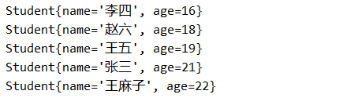
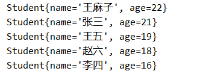
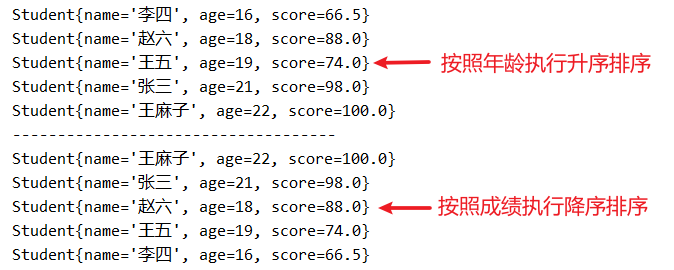

# 第08章 泛型和比较器


# 泛型的概述

泛型（Generics）是JDK1.5 新增的特性，他可以帮助我们建立类型安全的集合。在使用了泛型的集合中，不必进行强制类型转换。JDK提供了支持泛型的编译器，将运行时的类型检查提前到了编译时，增强了代码的可读性和安全性。

## 泛型的引入

在JDK 1.5版本之前，我们通常使用Object类型来实现参数的“任意化”，但这种方式需要开发者进行显式的强制类型转换，并且要求开发者能够预知实际的参数类型。如果强制类型转换出错，编译器可能不会提示错误，直到运行时才会抛出异常，这无疑是一个安全隐患。接下来，我们将通过模拟ArrayList集合来演示使用Object类型实现参数任意化所带来的弊端。

【示例】使用ArrayList集合对Object类型的数组进行封装

```java
/**
 * 对Object类型的数组进行封装
 */
public class ArrayList {
    /**
     * 用于存储数据的数组
     */
    Object[] elementData;
    
    /**
     * 存储实际添加元素的个数
     */
    int size;

    /**
     * 无参构造方法，默认给elementData开辟空间长度为5
     */
    public ArrayList() {
        this.elementData = new Object[5];
    }

    /**
     * 获得实际添加元素的个数
     * @return
     */
    public int size() {
        return size;
    }

    /**
     * 在数组末尾添加元素（不考虑扩容）
     * @param element 需要添加的元素
     */
    public void add(Object element) {
        // 把添加的元素放在数组索引为size位置
        elementData[size] = element;
        // 添加元素后，则size执行自增+1的操作
        size++;
    }

    /**
     * 根据索引获得元素
     * @param index 索引值
     * @return 返回index对应的元素
     */
    public Object get(int index) {
        // 如果index取值不合法，则就抛出数组索引越界异常
        if (index < 0 || index >= elementData.length) 
            throw new ArrayIndexOutOfBoundsException("数组索引越界异常");
        // 返回index对应的元素值
        return elementData[index];
    }
}
```

在上述ArrayList的实现中，其底层数组为Object类型。这意味着，虽然我们可以通过`<font style="color:rgb(15, 17, 21);background-color:rgb(235, 238, 242);">add(Object element)</font>`方法存入任意类型的元素，但在通过`<font style="color:rgb(15, 17, 21);background-color:rgb(235, 238, 242);">get(int index)</font>`方法取出时，想要得到元素的实际类型，就必须进行向下转型。然而，这种转型操作并非绝对安全，极易引发`<font style="color:rgb(15, 17, 21);background-color:rgb(235, 238, 242);">ClassCastException</font>`异常。

【示例】使用ArrayList集合添加元素，然后在遍历集合

```java
public class Test01 {
    public static void main(String[] args) {
        // 创建ArrayList集合
        ArrayList list = new ArrayList();
        // 添加元素
        list.add("aa");        
        list.add("bb");        
        list.add("cc");     
        list.add("dd");      
        list.add(1234);
        // 遍历集合
        for (int i = 0; i < list.size; i++) {
            // 获得索引为i的元素（向下转型）
            String element = (String) list.get(i);
            System.out.println(element);
        }
    }
}
```

以上程序就会抛出类型转换异常（ClassCastException），为了解决这个问题，泛型就应运而生。


## 泛型的好处

泛型的本质是参数化类型。这意味着在定义类、接口或方法时，我们可以将类型作为一个参数（称为类型形参，如 `<font style="color:rgb(15, 17, 21);background-color:rgb(235, 238, 242);"><E></font>`）来声明。在使用时，再传入具体的类型（称为类型实参，如 `<font style="color:rgb(15, 17, 21);background-color:rgb(235, 238, 242);">String</font>`）。这样，编译器就知道要操作的具体类型，从而提供编译时的类型安全。

【示例】对模拟的ArrayList集合添加泛型（该代码无需掌握）

```java
/**
 * 对Object类型的数组进行封装
 * @param <E> 设置添加元素的类型
 */
public class ArrayList<E> {
    /**
     * 用于存储数据的数组
     */
    E[] elementData;

    /**
     * 存储实际添加元素的个数
     */
    int size;

    /**
     * 无参构造方法，默认给elementData开辟空间长度为5
     */
    public ArrayList() {
        this.elementData = (E[]) new Object[5];
    }

    /**
     * 获得实际添加元素的个数
     * @return
     */
    public int size() {
        return size;
    }

    /**
     * 在数组末尾添加元素（不考虑扩容）
     * @param element 需要添加的元素
     */
    public void add(E element) {
        // 把添加的元素放在数组索引为size位置
        elementData[size] = element;
        // 添加元素后，则size执行自增+1的操作
        size++;
    }

    /**
     * 根据索引获得元素
     * @param index 索引值
     * @return 返回index对应的元素
     */
    public E get(int index) {
        // 如果index取值不合法，则就抛出数组索引越界异常
        if (index < 0 || index >= elementData.length)
            throw new ArrayIndexOutOfBoundsException("数组索引越界异常");
        // 返回index对应的元素值
        return elementData[index];
    }
}
```

为上述代码中的 `<font style="color:rgb(15, 17, 21);background-color:rgb(235, 238, 242);">ArrayList</font>` 添加泛型 `<font style="color:rgb(15, 17, 21);background-color:rgb(235, 238, 242);"><E></font>` 后，集合中元素的添加和获取类型均被统一为 `<font style="color:rgb(15, 17, 21);background-color:rgb(235, 238, 242);">E</font>`。在创建 `<font style="color:rgb(15, 17, 21);background-color:rgb(235, 238, 242);">ArrayList</font>` 实例时，必须指定 `<font style="color:rgb(15, 17, 21);background-color:rgb(235, 238, 242);">E</font>` 的具体类型。例如，若将 `<font style="color:rgb(15, 17, 21);background-color:rgb(235, 238, 242);">E</font>` 设置为 `<font style="color:rgb(15, 17, 21);background-color:rgb(235, 238, 242);">String</font>`，则集合只能添加 `<font style="color:rgb(15, 17, 21);background-color:rgb(235, 238, 242);">String</font>` 类型的元素，而从中获取的元素也必然是 `<font style="color:rgb(15, 17, 21);background-color:rgb(235, 238, 242);">String</font>` 类型。这样一来，就无需进行向下转型，从而彻底避免了 `<font style="color:rgb(15, 17, 21);background-color:rgb(235, 238, 242);">ClassCastException</font>` 异常的风险。

【示例】使用ArrayList集合添加元素，然后在遍历集合

```java
public class Test01 {
    public static void main(String[] args) {
        // 创建ArrayList集合（设置泛型为String类型）
        ArrayList<String> list = new ArrayList<>();
        // 添加元素（添加元素必须为String类型）
        list.add("aa");
        list.add("bb");
        list.add("cc");
        list.add("dd");
        // list.add(1234); // 添加非String类型元素就编译错误
        // 遍历集合
        for (int i = 0; i < list.size; i++) {
            // 获得索引为i的元素（获得的元素默认为String类型）
            String element = list.get(i);
            System.out.println(element);
        }
    }
}
```

泛型本质上是一种在编译阶段发挥作用的技术，其核心价值在于将部分在运行时期可能暴露的问题提前到编译阶段进行检验。在未使用泛型的情况下，对获取的元素进行向下转型时，编译阶段不会报错，但运行时期则可能抛出`<font style="color:rgb(15, 17, 21);background-color:rgb(235, 238, 242);">ClassCastException</font>`。而在使用泛型之后，根据索引获取元素时无需再执行向下转型，从而杜绝了运行时的类型转换异常；同时，如果添加的元素类型与泛型所指定的类型不一致，就会在编译阶段直接报错，无法通过编译。

**与基于 Object 的集合相比，泛型通过施加类型约束，牺牲了存储任意类型的灵活性，但换来了编译时类型安全与简化的代码。它既避免了运行时的类型转换异常，也省去了繁琐的强制转换。在实际开发中，由于集合元素类型通常是统一的，这一权衡非常值得。**


## 泛型的工作原理

泛型的核心价值在于将类型检查前置到编译阶段，从而提升代码的安全性。其工作原理可分为编译时和运行时两个阶段。

**一、编译时：类型检查与泛型擦除**

泛型本质上是一项编译阶段的技术。编译器会利用泛型信息对代码进行严格的类型检查，确保类型使用的正确性。通过编译检查后，为了确保与旧版本（JDK 1.5之前）的字节码兼容，编译器会执行“泛型擦除”，即将所有泛型信息从类或方法的字节码中移除，泛型类型被替换为其原始类型（如 `Object` 或声明的上界）。

**二、运行时：自动的类型转换**

类加载器加载的是已经擦除泛型信息的类。因此，在运行时，集合内部存储的元素实质上是 `Object` 类型。当从集合中获取元素时，虚拟机并非进行动态类型推断，而是**直接执行编译器根据泛型声明已插入的强制类型转换指令**。例如，对于声明为 `ArrayList<String>` 的列表，语句 `String s = list.get(0);` 在编译后实际等同于 `String s = (String) list.get(0);`。

**总结**

因此，泛型是一种“语法糖”，它通过在编译时进行严格类型检查来保证程序的安全性，再通过擦除机制与编译器自动插入的转换指令，在确保与旧版本兼容的同时，为开发者提供了类型安全的编程体验，无需手动进行繁琐的强制类型转换。

# 泛型的使用

泛型用于灵活的将数据类型应用到**类、方法和接口**上，从而将数据类型作为参数进行传递。

## 在类上定义泛型

定义语法：

```java
[修饰符] class 类名<泛型1, 泛型2, 泛型3, ...> {        }
```

【示例】泛型类的定义

```java
/**
 * 在类上定义泛型
 */
public class Tiger<E> {
    private E element;

    public Tiger() {}
    // 这个代码就属于在类上定义泛型，在方法中使用泛型。（并不是在方法上定义泛型）
    public Tiger(E element) {
        this.element = element;
    }

    public E getElement() {
        return element;
    }

    // 这个代码就属于在类上定义泛型，在方法中使用泛型。（并不是在方法上定义泛型）
    public void setElement(E element) {
        this.element = element;
    }
}
```

创建含有泛型类的对象时，我们需要明确泛型的类型，也就是**类中的泛型由创建对象的时候决定**。

因此在类上定义的泛型，可以使用在**实例变量**和**实例方法**上。

**类中定义的泛型不能在静态变量、静态方法和静态代码块位置使用**。

【示例】泛型类的使用

```java
public class Test01 {
    public static void main(String[] args) {
        // 创建Tiger对象，明确泛型为String类型
        Tiger<String> tiger = new Tiger<>();
        // 给成员变量赋值
        tiger.setElement("母老虎");
        // 获得成员变量值
        String element = tiger.getElement();
    }
}
```

以上操作中，我们创建Tiger对象时设置泛型E为String类型，则调用setElement(E element)方法赋值的数据就必须为String类型，同时调用E getElement()方法返回的数据也肯定为String类型。


## 在方法上定义泛型

因为在类中定义的泛型，该泛型就不能在静态方法中使用，如果想要在静态方法中使用泛型，则就需要使用含有泛型的方法，也就是在方法中定义泛型。

**实例方法和静态方法上都可以定义泛型。**

定义语法：

```java
[修饰符] <泛型1, 泛型2, 泛型3, ...> 返回值类型 方法名(形参列表) {}
```

【示例】泛型方法的定义和使用

```java
class MyClass {
    // 在实例方法上定义泛型
    public <U> U m2(U obj){
        return obj;
    }
    // 在静态方法上定义泛型
    public static <K> K m3(K obj){
        return obj;
    }

    public static void main(String[] args) {
        MyClass myClass = new MyClass();
        // 使用实例方法上定义的泛型
        String result = myClass.m2("hello");
        // 使用静态方法上定义的泛型
        Date date = MyClass.m3(new Date());
        
        // 这样是正确的。通常<String>可以省略，会做类型自动推断。
        MyClass.<String>m3("hello");
        // 但是这么写就错了
        //MyClass.<String>m3(100);
    }
}
```

当 `m2`方法的参数传 `"hello"`时，返回值类型在编译阶段自动推断出是 `String`类型，不需要做向下转型。

**总结：在方法上定义泛型的好处**

- ✅ **作用域限于方法内部**：与类的泛型参数相互独立
- ✅ **支持类型推断**：调用时通常不需要显式指定类型
- ✅ **提高灵活性**：让单个方法能够处理多种类型，同时保证类型安全


## 在接口上定义泛型

定义格式：

```java
[修饰符] interface 接口名<泛型1, 泛型2, 泛型3, ...> {        }
```

【示例】泛型接口的定义

```java
public interface Impl<E> {
    void method(E element);
}
```

因为接口中定义了泛型，那么我们定义接口的实现类时，则就需要处理以下两种情况。

情况一：定义实现类的时候，我们能够明确接口中泛型的类型

```java
/**
 * 定义实现类的时候，我们能够明确接口中泛型的类型
 */
public class StringImpl implements Impl<String> {
    @Override
    public void method(String element) {
        System.out.println(element);
    }
}
```

定义实现类的时候，已经明确了接口中的泛型为String类型，那么实现方法的形参就为String类型。并且，因为实现类中没有定义泛型，因此创建实现类的实例就无需设置泛型。

情况二：定义实现类的时候，我们无法确定接口中泛型的类型。

```java
/**
 * 定义实现类的时候，我们无法确定接口中泛型的类型。
 */
public class IntegerImpl<E> implements Impl<E> {
    @Override
    public void method(E element) {
        System.out.println(element);
    }
}
```

定义实现类的时候，因为还未明确接口的泛型类型，所以实现方法的形参类型依旧为E类型。同时，因为实现类中有定义泛型，所以创建实现类的实例时还需明确泛型的类型。


## 泛型通配符

泛型是在限定数据类型，当在集合或者其他地方使用到泛型后，那么这时一旦明确泛型的数据类型，那么在使用的时候只能给其传递和数据类型匹配的类型，否则就会报错。

有的情况下，我们在定义方法时，根本无法确定集合中存储元素的类型是什么。为了解决这个“无法确定集合中存储元素类型”问题，那么Java语言就提供了泛型的通配符。

通配符的几种形式：

1. 无限定通配符，，此处“？”可以为任意引用数据类型。
2. 上限通配符，<? extends Number>，此处“？”必须为Number及其子类。
3. 下限通配符，<? super Number>，此处“？”必须为Number及其父类。

【示例】无限定通配符案例

```java
public class Test02 {
    public static void main(String[] args) {
        // ArrayList的泛型为String类型，则“?”表示的就是String类型
        test01(new ArrayList<String>());
        // ArrayList的泛型为Integer类型，则“?”表示的就是Integer类型
        test01(new ArrayList<Integer>()); 
        // ArrayList的泛型为Object类型，则“?”表示的就是Object类型
        test01(new ArrayList<Object>()); 
    }

    /**
     * 无限定通配符，此处“？”可以为任意类型。
     * @param list
     */
    public static void test01(ArrayList<?> list) { }
}
```

在以上代码中，因为test01(ArrayList list)方法使用了“无限定通配符”，因此“?”就可以表示任意引用数据类型，并且“?”的实际类型由调用方法的实参来决定。

【示例】上限通配符案例

```java
/**
 * 父类
 */
class Animal {}

/**
 * 子类
 */
class Dog extends Animal {}
class Panda extends Animal {}

/**
 * 测试类
 */
public class Test02 {
    public static void main(String[] args) {
        // ArrayList的泛型为Animal类型，则“?”表示的就是Animal类型
        test02(new ArrayList<Animal>()); // 没问题
        // ArrayList的泛型为Dog类型，则“?”表示的就是Dog类型
        test02(new ArrayList<Dog>());    // 没问题
        // ArrayList的泛型为Panda类型，则“?”表示的就是Panda类型
        test02(new ArrayList<Panda>());   // 没问题
        // 设置泛型为Object类型，但Object类型并不是Animal及其子类
        // test02(new ArrayList<Object>());  // 编译错误
        // 设置泛型为String类型，但String类型并不是Animal及其子类
        // test02(new ArrayList<String>());  // 编译错误
    }

    /**
     * 上限通配符，此处“？”可以为Animal类及其子类。
     * @param list
     */
    public static void test02(ArrayList<? extends Animal> list) { }
}
```

在以上代码中，test02(ArrayList<? extends Animal> list)方法使用了“上限通配符”，则“?”就必须为Animal类及其子类，并且“?”的实际类型由调用方法的实参来决定。

【示例】下限通配符案例

```java
/**
 * 父类
 */
class Animal {}

/**
 * 子类
 */
class Dog extends Animal {}
class Panda extends Animal {}

/**
 * 测试类
 */
public class Test02 {
    public static void main(String[] args) {
        // ArrayList的泛型为Animal类型，则“?”表示的就是Animal类型
        test03(new ArrayList<Animal>());    // 没问题
        // ArrayList的泛型为Object类型，则“?”表示的就是Object类型
        test03(new ArrayList<Object>());    // 没问题
        // 设置泛型为Panda类型，但Panda类型并不是Animal及其父类
        // test03(new ArrayList<Panda>());  // 编译错误
        // 设置泛型为Object类型，但Object类型并不是Animal及其父类
        // test03(new ArrayList<Object>());  // 编译错误
        // 设置泛型为String类型，但String类型并不是Animal及其父类
        // test03(new ArrayList<String>());  // 编译错误
    }

    /**
     * 下限通配符，此处“？”可以为Animal类及其父类。
     * @param list
     */
    public static void test03(ArrayList<? super Animal> list) { }
}
```

在以上代码中，test03(ArrayList<? super Animal> list)方法使用了“下限通配符”，则“?”就必须为Animal类及其父类，并且“?”的实际类型由调用方法的实参来决定。


# 自然排序（Comparable）

## 比较对象的大小

基本数据类型（排除boolean类型）的比较大小，我们可以使用“比较运算符”来实现，那么引用数据类型又该如何比较大小呢，或者说如何比较两个对象的大小呢？因为对象在内存中存储的是地址值，也意味着两个对象是无法使用比较运算符来比较大小的。

想要比较两个对象的大小，我们首先需要设置好比较的规则（例如：按照某个属性来比较大小），然后将比较规则封装在对象所对应类的方法中，一般情况下我们都将比较对象大小的方法定义为compareTo()方法，并且通过int类型的返回值来表示比较后的结果。

例如，想要比较两个学生年龄的大小，则就在学生类中定义int compareTo(Student stu)方法来实现，并且根据调用方法后返回的结果来知晓两个对象年龄的大小，实现代码如下。

【示例】比较两个学生对象年龄的大小

```java
/**
 * 学生类
 */
public class Student {
    private String name;
    private int age;

    public Student() {}
    public Student(String name, int age) {
        this.name = name;
        this.age = age;
    }

    /**
     * 比较两个学生对象年龄的大小
     *   如果this.age大于stu.age，则返回正数。
     *   如果this.age小于stu.age，则返回负数。
     *   如果this.age等于stu.age，则返回零即可。
     */
    public int compareTo(Student stu) {
        return this.age - stu.age;
    }
}

/**
 * 测试类
 */
public class Test01 {
    public static void main(String[] args) {
        // 创建两个学生对象
        Student stu1 = new Student("卧龙", 21);
        Student stu2 = new Student("凤雏", 18);
        // 比较两个对象年龄的大小
        int compare = stu1.compareTo(stu2);
        // 因为卧龙的年龄大于凤雏的年龄，因此返回正数
        System.out.println(compare); // 输出：3
    }
}
```

因为比较大小的结果有三种情况，故而就采用了int类型的返回值来表示比较后的结果。在以上代码中，如果compareTo()方法返回的结果为“正数”，就代表stu1.age大于stu2.age；如果compareTo()方法返回的结果为“负数”，就代表stu1.age小于stu2.age；如果compareTo()方法返回的结果为“零”，就代表stu1.age等于stu2.age。

## 对象数组的排序

在以前的学习中，我们通过“冒泡排序”就能实现对基本数据类型（排除boolean类型）数组元素的排序操作，那么想要实现对象数组的排序操作又该如何实现呢？

我们知道，使用“冒泡排序”的核心就是“相邻两个元素的比较大小”，对象数组中存储的元素都是引用数据类型，则我们就可以使用compareTo()方法来实现相邻两个元素的比较。


### 对象数组的升序排序

例如，根据学生的年龄来实现数组的“升序”排序，那么想要完成“升序”排序的核心就是要控制compareTo()方法返回的结果，在“升序”排序中int compareTo(Student stu)方法的返回值规则必须如下所示：

如果this.age大于stu.age，则就返回“正数”；

如果this.age小于stu.age，则就返回“负数”；

如果this.age等于stu.age，则就返回“零”即可。

【示例】定义Student类，并按照学生年龄执行“升序”排序

```java
/**
 * 学生类
 */
public class Student {
    private String name;
    private int age;

    public Student() {}
    public Student(String name, int age) {
        this.name = name;
        this.age = age;
    }

    /**
     * 按照学生年龄执行“升序”排序
     *   如果this.age大于stu.age，则返回正数。
     *   如果this.age小于stu.age，则返回负数。
     *   如果this.age等于stu.age，则返回零即可。
     */
    public int compareTo(Student stu) {
        return this.age - stu.age;
    }

    @Override
    public String toString() {
        return "Student{" +
                "name='" + name + '\'' +
                ", age=" + age +
                '}';
    }
}
```

在Student类提供的compareTo()方法中，我们按照学生年龄的“升序”排序规则来比较，接下来我们就在ArrayUtil类中定义sort(Student[] arr)方法用于实现排序操作。

【示例】在ArrayUitl类中，提供sort(Student[] arr)方法

```java
public class ArrayUtil {
    /**
     * 冒泡排序
     * @param arr 要排序的数组
     */
    public static void sort(Student[] arr) {
        // 外侧循环：用于控制比较趟数。
        for(int i = 0; i < arr.length - 1; i++) {
            // 内侧循环：用于每趟循环相邻两个元素比较的次数
            for(int j = 0; j < arr.length - i - 1; j++) {
                // b)如果前一个元素大于后一个元素，则交换位置
                // 如果“arr[j].compareTo(arr[j+1])”的结果大于0，则意味着arr[j]大于arr[j+1]
                if(arr[j].compareTo(arr[j + 1]) > 0) {
                    Student temp = arr[j];
                    arr[j] = arr[j + 1];
                    arr[j + 1] = temp;
                }
            }
        }
    }
}
```

在冒泡排序的“升序”排序算法中，如果满足“前一个元素大于后一个元素”，则交换位置。此处元素的比较大小就需要调用compareTo(Student stu)方法来实现，也就是当“arr[j].compareTo(arr[j + 1])”方法返回的结果大于0，则就意味着arr[j]大于arr[j + 1]，也就是满足了“前一个元素大于后一个元素”，从而就实现了“升序”排序。

接下来，我们就实现根据学生年龄来执行升序排序，实现代码如下。

【示例】根据学生年龄来实现升序排序

```java
public class Test01 {
    public static void main(String[] args) {
        // 创建Student类型的数组
        Student[] arr = new Student[5];
        // 添加数组元素
        arr[0] = new Student("张三", 21);
        arr[1] = new Student("李四", 16);
        arr[2] = new Student("王五", 19);
        arr[3] = new Student("赵六", 18);
        arr[4] = new Student("王麻子", 22);
        // 根据学生年龄执行升序排序
        ArrayUtil.sort(arr);
        // 遍历排序后的数组元素
        for (Student stu : arr) {
            System.out.println(stu);
        }
    }
}
```

以上代码执行完毕，则就实现了根据学生年龄来执行升序排序，并且输出的结果如下：




### 对象数组的降序排序

在以上的操作中，我们完成了根据学生年龄来执行“升序”排序，如何想要根据学生年龄来执行“降序”排序，那么又该如何实现呢？想要实现“降序”排序，核心就是要控制Student类中compareTo()方法返回的结果，在“降序”排序中int compareTo(Student stu)方法的返回值规则必须如下所示：

如果this.age大于stu.age，则就返回“负数”；

如果this.age小于stu.age，则就返回“整数”；

如果this.age等于stu.age，则就返回“零”即可；

【示例】定义Student类，并按照学生年龄执行“降序”排序

```java
/**
 * 学生类
 */
public class Student {
    private String name;
    private int age;

    public Student() {}
    public Student(String name, int age) {
        this.name = name;
        this.age = age;
    }

    /**
     * 按照学生年龄执行“降序”排序
     *   如果this.age大于stu.age，则返回负数。
     *   如果this.age小于stu.age，则返回正数。
     *   如果this.age等于stu.age，则返回零即可。
     */
    public int compareTo(Student stu) {
        return stu.age - this.age;
    }

    @Override
    public String toString() {
        return "Student{" +
                "name='" + name + '\'' +
                ", age=" + age +
                '}';
    }
}
```

在Student类提供的compareTo()方法中，我们按照学生年龄的“降序”排序规则来比较，而在ArrayUtil工具类提供的sort(Student[] arr)方法中，我们无需修改任何代码就可以实现降序排序的操作。

在冒泡排序的“降序”规则中，如果满足“前一个元素小于后一个元素”，则就交换位置，也就是当“arr[j].compareTo(arr[j + 1])”的返回的结果大于0，则就意味着arr[j]小于arr[j + 1]，也就是满足了“前一个元素小于后一个元素”，从而就实现了“降序”排序，因此我们就无需修改sort(Student[] arr)方法中的任何代码。

接下来，我们就根据学生年龄来执行“降序”排序的操作，代码如下：

【示例】根据学生年龄来实现降序排序

```java
public class Test02 {
    public static void main(String[] args) {
        // 创建Student类型的数组
        Student[] arr = new Student[5];
        // 添加数组元素
        arr[0] = new Student("张三", 21);
        arr[1] = new Student("李四", 16);
        arr[2] = new Student("王五", 19);
        arr[3] = new Student("赵六", 18);
        arr[4] = new Student("王麻子", 22);
        // 根据学生年龄执行“降序”排序
        ArrayUtil.sort(arr);
        // 遍历排序后的数组元素
        for (Student stu : arr) {
            System.out.println(stu);
        }
    }
}
```

以上代码执行完毕，则就实现了根据学生年龄来执行降序排序，并且输出的结果如下：




## 对象数组排序优化

### 优化1：使用Comparable接口

对象数组想要实现排序的操作，则对象对应的类就需要提供compareTo()方法，而这些类属于“不同体系”的类并且都有相同的compareTo()方法，则我们对这些类进行“向上提取”，那么就得到一个Comparable接口。

在Comparable接口中，我们需要定义一个泛型（T），该泛型代表的就是需要比较对象的类型，并且还需在接口中提供compareTo(T obj)方法，并且约定好该方法的返回值规则。

【示例】定义Comparable接口

```java
/**
 * 定义Comparable接口
 * @param <T> 比较对象对应的类型
 */
public interface Comparable<T> {
    /**
     * 按照“升序”来进行排序，则返回值规则如下：
     *   如果this大于obj，则返回正数；
     *   如果this小于obj，则返回负数；
     *   如果this等于obj，则返回零即可；
     * 按照“降序”来进行排序，则返回值规则如下：
     *   如果this大于obj，则返回负数；
     *   如果this小于obj，则返回正数；
     *   如果this等于obj，则返回零即可；
     */
    int compareTo(T obj);
}
```

想要实现对象数组的排序操作，则对象对应的类就需要实现Comparable接口，然后再实现接口中提供的compareTo()方法，并且在重写的方法中封装好比较的规则，接着按照指定的返回值规则来返回，这样就能控制对象数组的升序或降序排序。

例如，想要根据学生年龄来执行升序排序，那么Student类就需要实现Comparable接口，并且在重写的compareTo()方法中按照学生年龄升序排序来返回，实现代码如下：

【示例】定义Student类，并按照学生年龄执行“升序”排序

```java
/**
 * 学生类
 * 定义实现类时，明确要比较的是Student对象，则泛型类型就为Student类型。
 */
public class Student implements Comparable<Student> {
    private String name;
    private int age;

    public Student() {}
    public Student(String name, int age) {
        this.name = name;
        this.age = age;
    }

    /**
     * 按照学生年龄执行“升序”排序
     *   如果this.age大于stu.age，则就返回正数
     *   如果this.age小于stu.age，则就返回负数
     *   如果this.age等于stu.age，则就返回零即可
     */
    @Override
    public int compareTo(Student stu) {
        return this.age - stu.age;
    }

    @Override
    public String toString() {
        return "Student{" +
                "name='" + name + '\'' +
                ", age=" + age +
                '}';
    }
}
```

### 优化2：重构sort()方法

在以前的代码中，我们想要实现Student类型数组元素的排序操作，那么就需要在ArrayUtil工具类中提供sort(Student[] arr)方法；想要实现Tiger类型数组元素的排序操作，那么就需要在ArrayUtil工具类中提供sort(Tiger[] arr)方法；以此类推，也就意味着需要在ArrayUtil类中提供无穷无尽的sort(Xxx[] arr)方法，这样显然是不可取的，我们该如何解决该问题呢？

想要解决以上问题，那么就需要使用“多态”来实现。我们在ArrayUtil工具类中提供sort(Object[] arr)方法，这样调用方法的实参就可以为任意引用数据类型的数组。在sort()方法体中，我们获得arr数组中的元素并强转为Comparable类型，然后再调用compareTo()方法来实现比较相邻两个元素的大小。当然，如果数组元素对应的类没有实现Comparable接口，那么调用ArrayUtil工具类的sort(Object[] arr)方法就会抛出类型转换异常。

【示例】重构ArrayUtil工具类的sort(Object[] arr)方法

```java
public class ArrayUtil {
    /**
     * 冒泡排序
     * @param arr 要排序的数组
     */
    public static void sort(Object[] arr) {
        // 外侧循环：用于控制比较趟数。
        for(int i = 0; i < arr.length - 1; i++) {
            // 内侧循环：用于每趟循环相邻两个元素比较的次数
            for(int j = 0; j < arr.length - i - 1; j++) {
                // 获得arr数组中的元素并强转为Comparable类型
                Comparable com = (Comparable) arr[j];
                // b)如果前一个元素大于后一个元素，则交换位置
                if(com.compareTo(arr[j + 1]) > 0) {
                    Object temp = arr[j];
                    arr[j] = arr[j + 1];
                    arr[j + 1] = temp;
                }
            }
        }
    }
}
```

因为ArrayUtil类中提供了sort(Object[] arr)方法，因此调用ArrayUtil类中的sort()方法就能实现对任意对象数组的排序操作，并且排序的规则依旧封装在对象所对应类的compareTo()方法中，并且根据compareTo()方法返回的结果来控制升序或降序排序。


## 自然排序的总结

### 实现自然排序

在Java语言中，专门提供了java.lang.Comparable接口来比较对象的大小，因为比较的规则定义在对象所对应的类中，因此我们也把Comparable接口称之为“内部比较器”，并且在该接口中还提供了“int compareTo(T obj)”方法，通过该方法的返回值就能控制升序或降序的排序，其返回值规则如下：

1. 按照“升序”来进行排序，则返回值规则如下：

- 如果this大于obj，则返回正数；
- 如果this小于obj，则返回负数；
- 如果this等于obj，则返回零即可。

1. 按照“降序”来进行排序，则返回值规则如下：

- 如果this大于obj，则返回负数；
- 如果this小于obj，则返回正数；
- 如果this等于obj，则返回零即可。

在Arrays工具类中，还提供了sort(Object[] arr)方法，通过该sort()方法就能实现任意任意数据类型数组的排序操作，如果数组元素对应的类没有实现Comparable接口，那么调用sort()方法就会抛出类型转换异常。

调用Arrays工具类的sort(Object[] arr)方法来实现排序，我们称之为“自然排序”。

【示例】根据学生年龄来实现降序排序（自然排序）

```java
/**
 * 学生类
 */
public class Student implements Comparable<Student> {
    private String name;
    private int age;

    public Student() {}
    public Student(String name, int age) {
        this.name = name;
        this.age = age;
    }

    /**
     * 按照学生年龄执行“升序”排序
     *   如果this.age大于stu.age，则就返回正数
     *   如果this.age小于stu.age，则就返回负数
     *   如果this.age等于stu.age，则就返回零即可
     */
    @Override
    public int compareTo(Student stu) {
        return this.age - stu.age;
    }

    @Override
    public String toString() {
        return "Student{" +
                "name='" + name + '\'' +
                ", age=" + age +
                '}';
    }
}
/**
 * 测试类
 */
public class Test01 {
    public static void main(String[] args) {
        // 创建Student类型的数组
        Student[] arr = new Student[5];
        // 添加数组元素
        arr[0] = new Student("张三", 21);
        arr[1] = new Student("李四", 16);
        arr[2] = new Student("王五", 19);
        arr[3] = new Student("赵六", 18);
        arr[4] = new Student("王麻子", 22);
        // 根据学生年龄执行“升序”排序
        Arrays.sort(arr);
        // 遍历排序后的数组元素
        for (Student stu : arr) {
            System.out.println(stu);
        }
    }
}
```

### 自然排序的缺点

1. 通过实现Comparable接口，则每个类都只能定义一种排序规则，无法定义多种排序规则。
2. 对于Java提供的类，则默认都实现了Comparable接口，并且默认按照升序来进行排序。

【示例】演示Integer类型数组的自然排序

```java
public class Test01 {
    public static void main(String[] args) {
        // 创建Integer类型的数组
        Integer[] arr = {3, 1, 5, 4, 2};
        // 对arr数组执行自然排序
        Arrays.sort(arr);
        // 输出排序后的数组元素
        System.out.println(Arrays.toString(arr)); // 输出：[1, 2, 3, 4, 5]
    }
}
```


# 定制排序（Comparator）

## 比较对象的大小

通过实现Comparable接口的方式，我们可以实现比较两个对象的大小，但是通过该方式只能设置一种比较规则，如果想要设置多种比较规则，该如何实现呢？例如，我们先按照学生年龄来比较大小，然后再根据学生成绩来比较大小，这个需求该如何实现？

想要实现以上需求，那么比较的规则就不能定义在对象所在的类中，而是应该把比较的规则定义在对象所在类的外部来实现。按照这个思路，我们可以定义一个Comparator接口，并在接口中定义int compare(T obj1, T obj2)方法，该方法就用于比较两个对象的大小。

【示例】定义Comparator接口

```java
/**
 * 定义Comparator接口
 * @param <T> 比较对象对应的类型
 */
public interface Comparator<T> {
    /**
     * 比较obj1和obj2两个对象的大小
     *   如果obj1大于obj2，则返回正数
     *   如果obj1小于obj2，则返回负数
     *   如果obj1等于obj2，则返回零即可
     */
    int compare(T obj1, T obj2);
}
```

想要实现比较对象的大小，则就需要定义Comparator接口的实现类，在实现类中重写int compare(T obj1, T obj2)方法，并且在该重写方法中定义好比较的规则。

【示例】比较对象的大小，并设置多种比较规则

```java
/**
 * 学生类
 */
public class Student {
    private String name;
    private int age;
    private double score;

    public Student() {}
    public Student(String name, int age, double score) {
        this.name = name;
        this.age = age;
        this.score = score;
    }

    public String getName() {
        return name;
    }

    public void setName(String name) {
        this.name = name;
    }

    public int getAge() {
        return age;
    }

    public void setAge(int age) {
        this.age = age;
    }

    public double getScore() {
        return score;
    }

    public void setScore(double score) {
        this.score = score;
    }

    @Override
    public String toString() {
        return "Student{" +
                "name='" + name + '\'' +
                ", age=" + age +
                ", score=" + score +
                '}';
    }
}
public class Test01 {
    public static void main(String[] args) {
        // 实例化两个Student对象
        Student stu1 = new Student("张三", 25, 99.5);
        Student stu2 = new Student("李四", 21, 100.0);

        // 需求：按照“年龄”来比较大小
        // 1.创建Comparator接口的实现类对象，并设置按照“年龄”来比较大小
        Comparator<Student> comparator1 = new Comparator<>() {
            /**
             * 按照“年龄”来比较学生对象的大小
             *   如果stu1.getAge()大于stu2.getAge()，则返回正数
             *   如果stu1.getAge()小于stu2.getAge()，则返回负数
             *   如果stu1.getAge()等于stu2.getAge()，则返回零即可
             */
            @Override
            public int compare(Student stu1, Student stu2) {
                return stu1.getAge() - stu2.getAge();
            }
        };
        // 2.调用compare()方法来比较学生“年龄”的大小
        int compare1 = comparator1.compare(stu1, stu2);
        System.out.println(compare1); // 输出：正数

        // 需求：按照“成绩”来比较大小
        // 1.创建Comparator接口的实现类对象，并设置按照“成绩”来比较大小
        Comparator<Student> comparator2 = new Comparator<>() {
            /**
             * 按照“成绩”来比较学生对象的大小
             *   如果stu1.getScore()大于stu2.getScore()，则返回正数
             *   如果stu1.getScore()小于stu2.getScore()，则返回负数
             *   如果stu1.getScore()等于stu2.getScore()，则返回零即可
             */
            @Override
            public int compare(Student stu1, Student stu2) {
                // 调用Double类型包装类的方法，用于比较两个对象的年龄大小
                return Double.compare(stu1.getScore(), stu2.getScore());
            }
        };
        // 2.调用compare()方法来比较学生“成绩”的大小
        int compare2 = comparator2.compare(stu1, stu2);
        System.out.println(compare2); // 输出：负数
    }
}
```


## 对象数组的排序

通过自然排序，每次只能设置一种排序规则，如果想要设置多种排序规则，则就需要使用Comparator接口来实现。在Comparator接口中，我们需要明确int compare(T obj1, T obj2)方法的返回值规则，通过该方法的返回值就能确定升序或降序的排序，返回值规则如下：

1. 按照“升序”来进行排序，则返回值规则如下：

- 如果obj1大于obj2，则返回正数；
- 如果obj1小于obj2，则返回负数；
- 如果obj1等于obj2，则返回零即可。

1. 按照“降序”来进行排序，则返回值规则如下：

- 如果obj1大于obj2，则返回负数；
- 如果obj1小于obj2，则返回正数；
- 如果obj1等于obj2，则返回零即可。

在Comparator接口的实现类中，我们按照指定的排序规则来重写compare()方法，这样就明确了数组采用的是升序或降序来排序。然后在ArrayUtil类中提供sort(Object[] arr, Comparator comparator)方法，调用sort()方法传入要排序的数组和排序的比较规则，那么就能实现数组的排序操作，此处sort()方法的实现代码如下：

【示例】在ArrayUitl类中，提供sort(Object[] arr, Comparator comparator)方法

```java
public class ArrayUtil {
    /**
     * 冒泡排序
     * @param arr 要排序的数组
     * @param comparator 保存比较规则
     */
    public static void sort(Object[] arr, Comparator comparator) {
        // 外侧循环：用于控制比较趟数。
        for(int i = 0; i < arr.length - 1; i++) {
            // 内侧循环：用于每趟循环相邻两个元素比较的次数
            for(int j = 0; j < arr.length - i - 1; j++) {
                // b)如果前一个元素大于后一个元素，则交换位置
                if(comparator.compare(arr[j], arr[j + 1]) > 0) {
                    Object temp = arr[j];
                    arr[j] = arr[j + 1];
                    arr[j + 1] = temp;
                }
            }
        }
    }
}
```

在ArrayUtil工具类的sort()方法中，当comparator对象保存的是升序排序规则，如果“comparator.compareTo(arr[j], arr[j + 1])”返回的结果大于0，也就意味着arr[j]大于arr[j + 1]，则就满足“前一个元素大于后一个元素”，从而就实现了升序排序。当comparator对象保存的是降序排序规则，如果“comparator.compareTo(arr[j], arr[j + 1])”返回的结果大于0，也就意味着arr[j]小于arr[j + 1]，则就满足“前一个元素小于后一个元素”，从而就实现了降序排序。总结，调用ArrayUtil工具类的sort()方法，最终数组排序规则由comparator对象来决定。

【示例】实现对象数组的排序操作，并且设置多种排序规则。

```java
/**
 * 学生类
 */
public class Student {
    private String name;
    private int age;
    private double score;

    public Student() {}
    public Student(String name, int age, double score) {
        this.name = name;
        this.age = age;
        this.score = score;
    }

    public String getName() {
        return name;
    }

    public void setName(String name) {
        this.name = name;
    }

    public int getAge() {
        return age;
    }

    public void setAge(int age) {
        this.age = age;
    }

    public double getScore() {
        return score;
    }

    public void setScore(double score) {
        this.score = score;
    }

    @Override
    public String toString() {
        return "Student{" +
                "name='" + name + '\'' +
                ", age=" + age +
                ", score=" + score +
                '}';
    }
}

/**
 * 测试类
 */
public class Test02 {
    public static void main(String[] args) {
        // 创建Student类型的数组
        Student[] arr = new Student[5];
        // 添加数组元素
        arr[0] = new Student("张三", 21, 98.0);
        arr[1] = new Student("李四", 16, 66.5);
        arr[2] = new Student("王五", 19, 74.0);
        arr[3] = new Student("赵六", 18, 88.0);
        arr[4] = new Student("王麻子", 22, 100.0);
        // 需求：根据学生年龄执行“升序”排序
        ArrayUtil.sort(arr, new Comparator<Student>() {
            @Override
            public int compare(Student stu1, Student stu2) {
                return stu1.getAge() - stu2.getAge();
            }
        });
        // 遍历排序后的数组元素
        for (Student stu : arr) {
            System.out.println(stu);
        }

        System.out.println("------------------------------------");
        // 需求：根据学生成绩执行“降序”排序
        ArrayUtil.sort(arr, new Comparator<Student>() {
            @Override
            public int compare(Student stu1, Student stu2) {
                return -Double.compare(stu1.getScore(), stu2.getScore());
            }
        });
        // 遍历排序后的数组元素
        for (Student stu : arr) {
            System.out.println(stu);
        }
    }
}
```

以上代码执行完毕，那么就实现了两种排序规则，并且输出的结果如下所示：


## 对象数组排序优化

在ArrayUtil类中，我们提供了sort(Object[] arr, Comparator comparator)方法，该sort()方法中要排序数组的类型不确定，并且Comparator还需设置泛型的类型，在这样的情况下就不建议使用Object类型的数组来作为形参。

我们可以在sort()方法中定义泛型E，然后把形参arr设置为E类型的数组，并将形参comparator的类型设置为Comparator<? super E>类型，这样?的实际类型就可以为E类型或E的父类类型。当我们调用sort()方法时，根据传入数组的类型就能确定泛型E的类型，也就明确了?就是数组元素的类型或元素的父类，从而就明确了需要比较对象对应的类型，ArrayUtil类中修改后sort()方法如下：

【示例】添加泛型后的sort()方法

```java
public class ArrayUtil {
    /**
     * 冒泡排序
     * @param arr 要排序的数组
     * @param comparator 保存比较规则
     * @param <E> 设置数组元素的类型
     */
    public static <E> void sort(E[] arr, Comparator<? super E> comparator) {
        // 外侧循环：用于控制比较趟数。
        for(int i = 0; i < arr.length - 1; i++) {
            // 内侧循环：用于每趟循环相邻两个元素比较的次数
            for(int j = 0; j < arr.length - i - 1; j++) {
                // b)如果前一个元素大于后一个元素，则交换位置
                if(comparator.compare(arr[j], arr[j + 1]) > 0) {
                    E temp = arr[j];
                    arr[j] = arr[j + 1];
                    arr[j + 1] = temp;
                }
            }
        }
    }
}
```

## 定制排序的总结

### 实现定制排序

在Java语言中，专门提供了java.util.Comparator接口来比较对象的大小，因为比较对象大小的规则定义在Comparator接口的实现类中，因此我们也把Comparator接口称之为“外部比较器”，并且在该接口中还提供了“int compare(T obj1, T obj2)”方法，通过该方法的返回值就能控制升序或降序的排序，其返回值规则如下：

1. 按照“升序”来进行排序，则返回值规则如下：

- 如果obj1大于obj2，则返回正数；
- 如果obj1小于obj2，则返回负数；
- 如果obj1等于obj2，则返回零即可。

1. 按照“降序”来进行排序，则返回值规则如下：

- 如果obj1大于obj2，则返回负数；
- 如果obj1小于obj2，则返回正数；
- 如果obj1等于obj2，则返回零即可。

在Arrays工具类中，还提供了sort(T[] arr, Comparator<? super T> comparator)方法，通过该sort()方法就能实现任意任意数据类型数组的排序操作，并且排序的规则都封装在comparator对象中。

调用Arrays工具类的sort(T[] arr, Comparator<? super T> comparator)方法来实现排序，该排序操作不会抛出类型转换异常，我们也就称之为“自然排序”。

【示例】实现对象数组的排序操作，并且设置多种排序规则。

```java
/**
 * 学生类
 */
public class Student {
    private String name;
    private int age;
    private double score;

    public Student() {}
    public Student(String name, int age, double score) {
        this.name = name;
        this.age = age;
        this.score = score;
    }

    public String getName() {
        return name;
    }

    public void setName(String name) {
        this.name = name;
    }

    public int getAge() {
        return age;
    }

    public void setAge(int age) {
        this.age = age;
    }

    public double getScore() {
        return score;
    }

    public void setScore(double score) {
        this.score = score;
    }

    @Override
    public String toString() {
        return "Student{" +
                "name='" + name + '\'' +
                ", age=" + age +
                ", score=" + score +
                '}';
    }
}

/**
 * 测试类
 */
public class Test01 {
    public static void main(String[] args) {
        // 创建Student类型的数组
        Student[] arr = new Student[5];
        // 添加数组元素
        arr[0] = new Student("张三", 21, 98.0);
        arr[1] = new Student("李四", 16, 66.5);
        arr[2] = new Student("王五", 19, 74.0);
        arr[3] = new Student("赵六", 18, 88.0);
        arr[4] = new Student("王麻子", 22, 100.0);
        // 需求：根据学生年龄执行“升序”排序
        Arrays.sort(arr, new Comparator<Student>() {
            @Override
            public int compare(Student stu1, Student stu2) {
                return stu1.getAge() - stu2.getAge();
            }
        });
        // 遍历排序后的数组元素
        for (Student stu : arr) {
            System.out.println(stu);
        }

        System.out.println("------------------------------------");
        // 需求：根据学生成绩执行“降序”排序
        Arrays.sort(arr, new Comparator<Student>() {
            @Override
            public int compare(Student stu1, Student stu2) {
                return -Double.compare(stu1.getScore(), stu2.getScore());
            }
        });
        // 遍历排序后的数组元素
        for (Student stu : arr) {
            System.out.println(stu);
        }
    }
}
```

以上代码执行完毕，那么就实现了两种排序规则，并且输出的结果如下所示：




### 定制排序的优点

1. 通过实现Comparator接口，则每个类都可以定义多种排序规则，避免了Comparable接口的弊端。
2. 针对Java提供类的数组，我们可以使用定制排序来实现“降序”排序的操作，避免了自然排序的弊端。

【示例】演示Integer类型数组的降序排序

```java
public class Test02 {
    public static void main(String[] args) {
        // 创建Integer类型的数组
        Integer[] arr = {3, 1, 5, 4, 2};
        // 对arr数组执行“降序”排序
        Arrays.sort(arr, new Comparator<Integer>() {
            @Override
            public int compare(Integer o1, Integer o2) {
                return -o1.compareTo(o2);
            }
        });
        // 输出排序后的数组元素
        System.out.println(Arrays.toString(arr)); // 输出：[5, 4, 3, 2, 1]
    }
}
```