# 第09章 数据结构和集合


# 集合概述

## 集合的介绍

在软件开发和编程学习中，我们无时无刻不在与数据打交道，如何高效地组织与管理这些数据至关重要。通常，我们会使用“容器”来容纳和管理它们。实际上，**数组就是最基础的一种容器**，它可以存放对象或基本类型数据。

**数组的优势**在于其结构简单，作为一种线性序列，它支持通过索引快速访问元素，效率极高。

然而，**数组的劣势**也同样突出：**灵活性不足**。其容量必须在定义时确定，无法根据实际需求动态扩容。此外，进行元素的插入与删除操作效率也非常低。

例如，在一个用户管理系统中，若需要取出当天所有注册的用户，在编写程序时，我们根本无法预知用户的具体数量。因此，在这种情况下使用数组是不现实的。

正因为数组难以满足我们日益复杂的数据管理需求，所以我们需要一种更强大、更灵活、容量可动态调整的容器来承载对象。而这，正是我们今天将要学习的**容器（Collection）**，也称为**集合**。需要注意的是，**集合中存储的元素必须是引用类型数据**。

在众多集合中，**ArrayList** 是一种非常常见的代表，我们可以利用它来灵活地管理和组织数据。

【示例】ArrayList存储和遍历元素案例

```java
// 1.创建ArrayList集合对象
ArrayList list = new ArrayList();
// 2.通过add(obj)方法，添加元素
list.add(111); // 自动装箱
list.add(222);
list.add(333);
// 3.遍历数组
// 3.1通过size()方法，获取元素个数
for(int i = 0; i < list.size(); i++) {
        // 3.2通过get(index)方法，获取元素的值
        System.out.println(list.get(i));
}
```

## 集合的继承关系

在Java的集合框架（Java Collections Framework）中，所有的集合类和数据结构的根接口可以分为两大核心体系：**Collection** 和 **Map**。

- Collection：存储单一对象的集合
- Map：存储键值对（Key-Value）的集合

**Map 和 Collection 之间不存在继承关系，它俩分别都是两大帮派的老大！！！**

**但需要注意的是：虽然它俩没有继承关系，但私下里小弟们之间有借用关系。**

### Collection 的继承结构

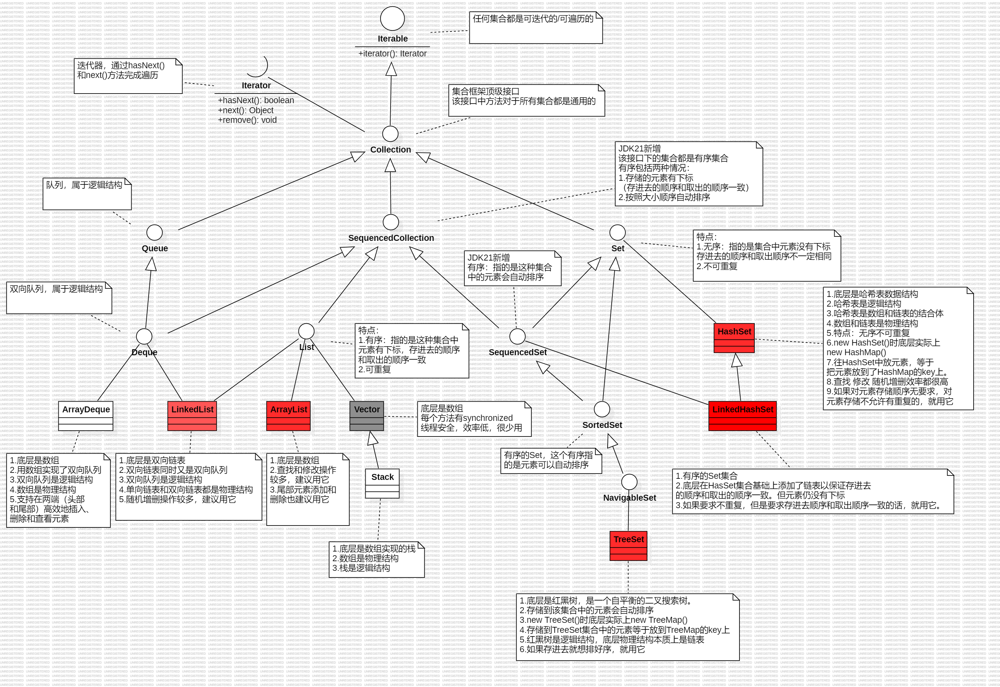

### Map 的继承结构

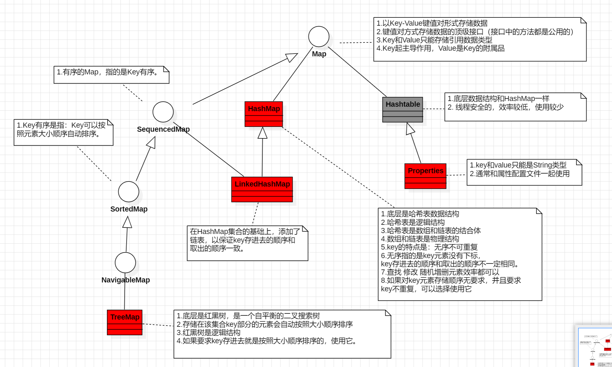


# Collection接口

既然Collection接口是集合中的顶层接口，也就意味着Collection接口中定义的方法则实现类都可以使用。查询API，发现Collection接口中有很多操作集合的方法，那么这些方法都具体能做什么呢？

| **方法** | **描述** |
| --- | --- |
| int size(); | 获得集合中存储元素的个数 |
| boolean isEmpty(); | 判断集合是否为空 |
| boolean add(E e); | 在集合末尾添加元素 |
| boolean addAll(Collection<? extends E> c); | 将集合c中所有元素增加到当前集合的末尾 |
| boolean remove(Object o); | 删除集合中的某个元素 |
| boolean removeAll(Collection c); | 移除两个集合都包含的元素（移除交集元素） |
| boolean retainAll(Collection c); | 保留两个集合都包含的元素（保留交集元素） |
| boolean contains(Object o); | 判断集合中是否包含某个元素 |
| boolean containsAll(Collection c); | 判断当前集合中是否包含c集合中的所有元素 |
| Object[] toArray(); | 把集合中元素转化成Object数组 |
| void clear(); | 清除集合中的存储的所有元素 |
| Iterator iterator(); | 获得集合的迭代器（用于遍历集合） |

因为List接口和Set接口都是Collection接口的子接口，意味着所有List和Set的实现类都有拥有以上的方法。

【示例】演示 Collection 接口中的方法

```java
// 1.创建集合
Collection coll = new ArrayList();
// 2.往集合中添加对象元素
coll.add("111");
coll.add("222");
coll.add("333");
System.out.println(coll); // 输出:"[111, 222, 333]"
// 3.从集合中删除元素
coll.remove("111");
System.out.println(coll); // 输出:"[222, 333]"
// 4.判断集合中是否包含指定元素
System.out.println(coll.contains("222")); // 输出:true
// 5.获取集合元素个数
System.out.println(coll.size());  // 输出:2
// 6.返回包含集合中所有元素的数组
Object[] arr = coll.toArray(); // 数组中结果为：[222, 333]
// 7.清除集合元素
coll.clear(); // 清空后，集合元素为[]，代表没有元素
```


# 集合的通用迭代

从 Collection 的继承结构上可以看到，Collection 继承了 Iterable，表示所有的 Collection 都是可迭代的/可遍历的，那它如何遍历呢？首先你需要获取这个集合对象依赖的迭代器对象，怎么获取呢？

```java
// 获取集合依赖的迭代器对象
Iterator it = collection.iterator();
```

调用迭代器的 `hasNext()`方法来判断集合中是否还有更多的元素可以迭代：

```java
while(it.hasNext()){
    
}
```

再调用迭代器的 `next()`方法取出元素：

```java
while(it.hasNext()){
    Object element = it.next();
}
```

`ArrayList`集合底层迭代原理图如下：

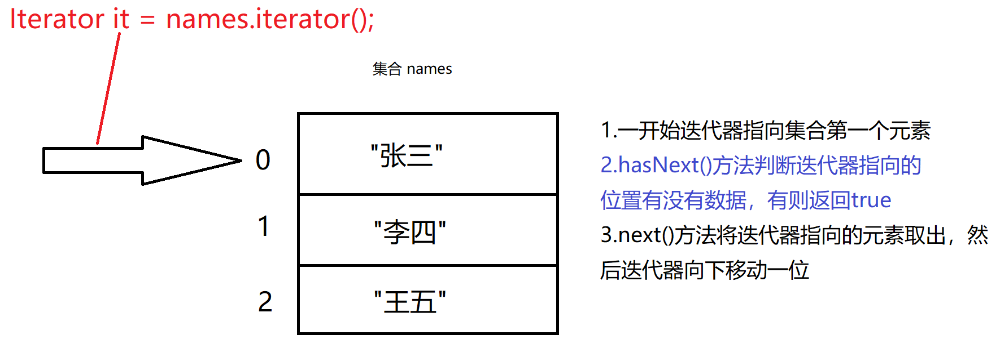

完整代码如下：

```java
import java.util.ArrayList;
import java.util.Collection;
import java.util.Iterator;

public class Test {
    public static void main(String[] args) {
        Collection c = new ArrayList();
        c.add("jack");
        c.add("lucy");
        c.add("jetty");

        Iterator it = c.iterator();
        while(it.hasNext()){
            Object obj = it.next();
        }
    }
}
```

集合支持泛型，加上泛型之后，代码如下：

```java
import java.util.ArrayList;
import java.util.Collection;
import java.util.Iterator;

public class Test {
    public static void main(String[] args) {
        Collection<String> c = new ArrayList<String>();
        c.add("jack");
        c.add("lucy");
        c.add("jetty");

        Iterator<String> it = c.iterator();
        while(it.hasNext()){
            String s = it.next();
        }
    }
}
```

介绍一个 JDK 新特性：

Java 的“钻石表达式”语法是一种在创建泛型对象时简化代码的语法糖，它是在 **JDK 7** 中引入的

它的核心是：在创建泛型对象时，**可以省略构造器后尖括号 **`**<font style="color:rgb(15, 17, 21);background-color:rgb(235, 238, 242);"><></font>**`** 中的具体类型参数**，编译器会根据上下文自动推断。

```java
import java.util.ArrayList;
import java.util.Collection;
import java.util.Iterator;

public class Test {
    public static void main(String[] args) {
        Collection<String> c = new ArrayList<>();
        c.add("jack");
        c.add("lucy");
        c.add("jetty");

        Iterator<String> it = c.iterator();
        while(it.hasNext()){
            String s = it.next();
        }
    }
}
```

当然，对于循环来说，也不一定必须使用 while 循环，也可以写成 for 循环的形式：

```java
import java.util.ArrayList;
import java.util.Collection;
import java.util.Iterator;

public class Test {
    public static void main(String[] args) {
        Collection<String> c = new ArrayList<>();
        c.add("jack");
        c.add("lucy");
        c.add("jetty");

        for(Iterator<String> it = c.iterator(); it.hasNext();){
            String s = it.next();
        }
    }
}
```

或者使用 `foreach`也可以：

```java
import java.util.ArrayList;
import java.util.Collection;

public class Test {
    public static void main(String[] args) {
        Collection<String> c = new ArrayList<>();
        c.add("jack");
        c.add("lucy");
        c.add("jetty");

        for(String s: c){
            System.out.println(s);
        }
    }
}
```


# SequencedCollection 接口

JDK21 新增，所有的有序集合都实现了这个接口。有序包括两种情况：

1. 存储的元素有下标。存进去的顺序和取出的顺序一致。
2. 存储的元素会自动按照元素的大小顺序排序。

由于是有序的集合，它在 Collection 接口基础之上扩展了一些方法：

- void addFirst(Object o)：向头部添加
- void addLast(Object o)：向末尾添加
- Object removeFirst()：删除头部
- Object removeLast()：删除末尾
- Object getFirst()：获取头部节点
- Object getLast()：获取末尾节点
- SequencedCollection reversed(); 反转集合中的元素

# List接口

## List接口简介

List是一个有序的、可以重复、可以为null 的集合。

有序指的是：List中每个元素都有下标。可以根据元素的下标访问元素。

可重复指的是：List中允许加入重复的元素。加入一个 1，还能再加一个 1。 

List接口继承于Collection接口，除了Collection接口提供的方法，List接口还新增了一些跟下标有关的方法：

| **方法** | **描述** |
| --- | --- |
| void add(int index, E element); | 在index索引位置插入元素 |
| boolean addAll(int index, Collection<? extends E> c); | 在index索引位置插入c集合中的所有元素 |
| E set(int index, E element); | 修改索引为index对应的元素 |
| E get(int index); | 获得索引为index对应的元素（**List 集合特有的遍历方式**） |
| E remove(int index); | 删除索引为index对应的元素 |
| int indexOf(Object o); | 从前往后查询指定元素的索引，不存在返回-1 |
| int lastIndexOf(Object o); | 从后往前查询指定元素的索引，不存在返回-1 |
| List subList(int fromIndex, int toIndex); | 获得指定索引范围的集合元素 |
| ListIterator listIterator(); | 获得List接口对应的迭代器 |

在Arrays工具类中，也提供了把数组转化为List集合的方法，通过该方法返回的就是不可变的List集合，也就是可以修改List集合中的元素，但是不能删除或添加的元素。

【示例】把数组转化为List集合

```java
public class Test01 {
    public static void main(String[] args) {
        // 把数组转化为List集合
        List<Integer> list = Arrays.asList(new Integer[]{11, 22, 33});
        // 根据索引修改元素（没问题）
        list.set(1, 222);
        // 删除索引为1的元素（抛出UnsupportedOperationException异常）
        // list.remove(1);
        // 在集合末尾添加元素（抛出UnsupportedOperationException异常）
        // list.add(44);
        // 遍历集合中的所有元素
        for (Integer element : list) {
            // 依次输出11、222、33
            System.out.println(element);
        }
    }
}
```

List接口常用的实现类有3个：ArrayList、LinkedList、Vector。


## ArrayList类详解

我们对 ArrayList 集合源码进行分析。

### ArrayList 属性

ArrayList底层使用“数组”来存储元素，并且ArrayList底层的数组可以实现自动扩容操作。

ArrayList集合的特点为：查询效率高，修改效率高，末尾元素增删效率高，随机增删效率低，线程不安全。

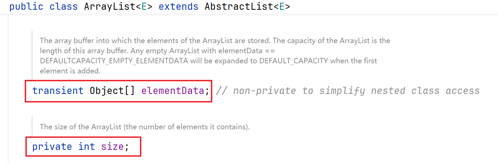

查看源码，我们可以看出ArrayList类底层使用Object数组来存储元素数据。所有的方法，都围绕这个核心的Object数组来开展。

对ArrayList集合的操作，其实就是对底层数组做的操作，接下来我们分析一下 JDK21 中 ArrayList 集合底层实现原理。

ArrayList类重要的两个属性：

```java
public class ArrayList<E> extends AbstractList<E> implements List<E>, RandomAccess, Cloneable, java.io.Serializable{
    // 向ArrayList集合中添加元素，就是加到这个数组中了。
    transient Object[] elementData;
    // 记录添加的元素的个数。而非容量。
    private int size;
}
```

很容易理解，elementData存储ArrayList集合的元素，size表示添加的元素的个数。

### 构造方法分析

ArrayList 中提供了 3 个构造方法：

```java
public class ArrayList<E>{
    // 空数组
    private static final Object[] EMPTY_ELEMENTDATA = {};
    // 默认容量的空数组
    private static final Object[] DEFAULTCAPACITY_EMPTY_ELEMENTDATA = {};
    // 集合底层真正存储数据的数组
    transient Object[] elementData;
    // 现在集合中存储元素的个数
    private int size;

    // 通过给定的初始化容量来初始化一个ArrayList集合
    public ArrayList(int initialCapacity) {
        if (initialCapacity > 0) {
            // 如果初始化容量值是大于0的，则初始化
            this.elementData = new Object[initialCapacity];
        } else if (initialCapacity == 0) {
            // 如果初始化容量是0，则赋值一个长度为0的数组。
            this.elementData = EMPTY_ELEMENTDATA;
        } else {
            // 其它情况抛异常
            throw new IllegalArgumentException("Illegal Capacity: " + initialCapacity);
        }
    }

    // 调用无参数构造方法时，初始化一个长度为0的数组。
    public ArrayList() {
        this.elementData = DEFAULTCAPACITY_EMPTY_ELEMENTDATA;
    }

    // 用给定集合初始化一个ArrayList集合
    public ArrayList(Collection<? extends E> c) {
        // 将参数集合转换成数组
        Object[] a = c.toArray();
        // 这个很巧妙：
        // 当参数集合的长度不是0时，也就是说：参数集合中有元素
        // 同时把size给修改了。size是当前集合中存储的元素个数。
        if ((size = a.length) != 0) {
            if (c.getClass() == ArrayList.class) { 
                // 如果参数集合本身就是一个ArrayList集合，直接赋值
                elementData = a;
            } else {
                // 如果参数集合不是ArrayList集合，例如是Set集合，则拷贝。
                elementData = Arrays.copyOf(a, size, Object[].class);
            }
        } else {
            // 程序执行到这里说明参数集合中元素的个数为0，则赋一个空数组。
            elementData = EMPTY_ELEMENTDATA;
        }
    }
}
```


### 添加元素方法

添加元素的重载方法很多，我们这里重点分析： add(E e)方法

```java
public class ArrayList<E> {
    
    private static final int DEFAULT_CAPACITY = 10;
    
    // 调用该方法添加元素
    public boolean add(E e) {
        // 这个先不用看，后面再说
        modCount++;
        // 调用这个重载的add方法完成添加
        add(e, elementData, size);
        // 程序能执行到这里说明添加成功了
        return true;
    }
    // 真正添加元素的是这个方法
    private void add(E e, Object[] elementData, int s) {
        // 如果数组已经满了。
        if (s == elementData.length)
            // 就扩容
            elementData = grow();
        // 扩容之后，将元素放到末尾（放到已添加的所有的元素后面）
        elementData[s] = e;
        // 集合总元素总数加1
        size = s + 1;
    }
    // 扩容方法
    private Object[] grow() {
        // 假如当前集合中存储的元素个数是10，也就是size == 10
        // 那么至少扩容之后的最小容量值是11
        return grow(size + 1);
    }
    
    // 具体的扩容策略。
    private Object[] grow(int minCapacity) {
        // 获取原容量
        int oldCapacity = elementData.length;
        
        // 集合中本身是有元素的
        if (oldCapacity > 0 || elementData != DEFAULTCAPACITY_EMPTY_ELEMENTDATA) {
            // 计算一个新容量值
            // 新容量的算法需要分析 ArraysSupport.newLength()这个方法。
            // 这个方法有三个参数：第一个参数是原容量，假设为10
            // 第二个参数是最小增长值，如果原容量是10，最小容量是11，则第二个参数的值是1
            // 第三个参数是 原容量/2，则为5
            // 也就是：ArraysSupport.newLength(10,1,5); 接下来看看这个方法的源码
            int newCapacity = ArraysSupport.newLength(oldCapacity,
                    minCapacity - oldCapacity, /* minimum growth */
                    oldCapacity >> 1           /* preferred growth */);
            
            // 按照新容量进行扩容
            return elementData = Arrays.copyOf(elementData, newCapacity);
        } else {
            // 如果集合中本身是没有元素的
            // 当原容量为 0 时，判断 DEFAULT_CAPACITY 和 minCapacity谁大，哪个大就按照哪个容量进行数组初始化。
            // 从这个代码上可以看到当向ArrayList集合中添加第一个元素时，初始化容量变为10
            return elementData = new Object[Math.max(DEFAULT_CAPACITY, minCapacity)];
        }
    }
}


public class ArraysSupport {
    public static int newLength(int oldLength, int minGrowth, int prefGrowth) {
        // 核心算法：新容量 = 原容量 + Math.max(最小增长量, 首选增长量)
        // 也就是：新容量 = 10 + Math.max(1, 5);
        // 新容量 = 15
        int prefLength = oldLength + Math.max(minGrowth, prefGrowth);
        if (0 < prefLength && prefLength <= SOFT_MAX_ARRAY_LENGTH) {
            return prefLength;
        } else {
            // 异常处理
            return hugeLength(oldLength, minGrowth);
        }
    }
}
```

通过源码分析得出结论：

1. 如果你刚开始创建的是一个空的数组，第一次添加元素之后的默认初始化容量是 10
2. 扩容策略是：
  1. 如果**最小增长值**没有超过 ** 原容量的一半** ，则按照原容量的一半进行扩容，扩容之后的新容量是原容量的 **1.5** 倍。
  2. 如果**最小增长值** 超过了 ** 原容量的一半**，则按照最小增长值进行扩容。


### 获取元素方法

```java
public class ArrayList<E> {
    public E get(int index) {
        // 先检查下标有没有越界
        Objects.checkIndex(index, size);
        // 程序能够执行到这里就是没有越界，直接返回数组下标位置的元素。
        return elementData(index);
    }    
}

public class Objects {
    public static int checkIndex(int index, int length) {
        return Preconditions.checkIndex(index, length, null);
    }
}

public class Preconditions {
    public static <X extends RuntimeException> int checkIndex(int index, int length,BiFunction<String, List<Number>, X> oobef) {
        if (index < 0 || index >= length)
            throw outOfBoundsCheckIndex(oobef, index, length);
        return index;
    }
}
```

### 修改元素方法

```java
public class ArrayList<E> {
    public E set(int index, E element) {
        // 先看看下标是否越界
        Objects.checkIndex(index, size);
        // 能执行到这里说明没有越界
        // 没有越界就把即将被修改掉的旧值保存一份
        E oldValue = elementData(index);
        // 把新值赋上去
        elementData[index] = element;
        // 返回旧值
        return oldValue;
    }
}
```

### 插入元素方法

```java
public class ArrayList<E> {
    public void add(int index, E element) {
        // 检查下标是否越界
        rangeCheckForAdd(index);
        // 程序执行到此处说明下标不越界
        modCount++;
        // 临时变量s，用来保存插入元素之前的元素个数
        final int s;
        // 临时变量数组，用来保存插入元素之前的原数组
        Object[] elementData;
        // 如果当前集合中元素个数和数组长度相等就表示集合已经满了
        // 如果已经满了就把当前的size赋给临时变量s，把当前的老数组赋给临时变量elementData
        if ((s = size) == (elementData = this.elementData).length)
            // 扩容
            elementData = grow();
        // 不管扩容还是不扩容，都需要数组拷贝。
        System.arraycopy(elementData, index, elementData, index + 1, s - index);
        // 将元素插入到指定为止
        elementData[index] = element;
        // 元素个数 + 1
        size = s + 1;
    }
}
```

### 删除元素方法

```java
public class ArrayList<E> {
    
    public E remove(int index) {
        // 检查下标是否越界
        Objects.checkIndex(index, size);
        // 把当前数组对象地址临时保存的es变量中
        final Object[] es = elementData;
        // 先保存一下即将被删除的元素
        E oldValue = (E) es[index];
        // 快删除
        fastRemove(es, index);
        // 返回删除的元素
        return oldValue;
    }

    private void fastRemove(Object[] es, int i) {
        modCount++;
        final int newSize;
        if ((newSize = size - 1) > i)
            // 数组拷贝
            System.arraycopy(es, i + 1, es, i, newSize - i);
            // 原数组的末尾设置为null
            es[size = newSize] = null;
        }
}
```


## 链式存储结构

### 单链表概述

**【单链表的定义】**

单链表采用的是链式存储结构，使用一组地址任意的存储单元来存放数据元素。在单链表中，存储的每一条数据都是以节点来表示的，每个节点的构成为：元素（存储数据的存储单元） +  指针（存储下一个节点的地址值），单链表的节点结构如下图所示：

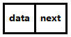

另外，单链表中的开始节点，我们又称之为首节点；单链表中的终端节点，我们又称之为尾节点。如下图所示：

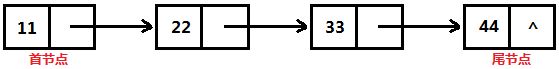

**【根据序号获取节点的操作】**

在线性表中，每个节点都有一个唯一的序号，该序号是从0开始递增的。通过序号获取单链表的节点时，我们需要从单链表的首节点开始，从前往后循环遍历，直到遇到查询序号所对应的节点时为止。

以下图为例，我们需要获得序号为2的节点，那么就需要依次遍历获得“节点11”和“节点22”，然后才能获得序号为2的节点，也就是“节点33”。

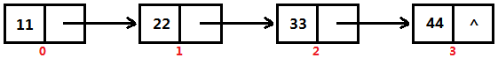

因此，在链表中通过序号获得节点的操作效率是非常低的，查询的时间复杂度为O(n)。

**【根据序号删除节点的操作】**

根据序号删除节点的操作，我们首先应该根据序号获得需要删除的节点，然后让“删除节点的前一个节点”指向“删除节点的后一个节点”，这样就实现了节点的删除操作。

以下图为例，我们需要删除序号为2的节点，那么就让“节点22”指向“节点44”即可，这样就删除了序号为2的节点，也就是删除了“节点33”。

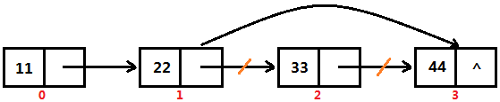

通过序号来插入节点，时间主要浪费在找正确的删除位置上，故时间复杂度为O(n)。但是，单论删除的操作，也就是无需考虑定位到删除节点的位置，那么删除操作的时间复杂度就是O(1)。

**【根据序号插入节点的操作】**

根据序号插入节点的操作，我们首先应该根据序号找到插入的节点位置，然后让“插入位置的上一个节点”指向“新插入的节点”，然后再让“新插入的节点”指向“插入位置的节点”，这样就实现了节点的插入操作。

以下图为例，我们需要在序号为2的位置插入元素值“00”，首先先把字符串“00”封装为一个节点对象，然后就让“节点22”指向“新节点00”，最后再让“节点00”指向“节点33”，这样就插入了一个新节点。

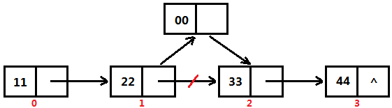

通过序号来插入节点，时间主要浪费在找正确的插入位置上，故时间复杂度为O(n)。但是，单论插入的操作，也就是无需考虑定位到插入节点的位置，那么插入操作的时间复杂度就是O(1)。


### 双链表概述

**【双链表的定义】**

双链表也叫双向链表，它依旧采用的是链式存储结构。在双链表中，每个节点中都有两个指针，分别指向直接前驱节点（保存前一个节点的地址值）和直接后继节点（保存后一个节点的地址值），如下图所示。

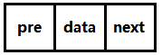

所以，从双链表中的任意一个节点开始，都可以很方便地访问它的直接前驱节点和直接后继节点，如下图所示。

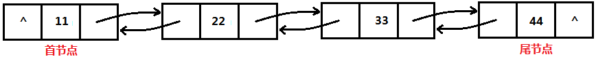

**【单链表和双链表的区别】**

逻辑上没有区别，他们均是完成线性表的内容，主要的区别是结构上的构造有所区别。 

(1)单链表

对于一个节点，有储存数据的data和指向下一个节点的next。也就是说，单链表的遍历操作都得通过前节点—>后节点。


(2)双链表

对于一个节点，有储存数据的data和指向下一个节点的next，还有一个指向前一个节点的pre。也就是说，双链表不但可以通过前节点—>后节点，还可以通过后节点—>前节点。


### 环形链表概述

环形链表依旧采用的是链式存储结构，它的特点就是设置首节点和尾节点相互指向，从而实现让整个链表形成一个环。在我们实际开发中，常见的环形链表有：

1. 环形单链表

在单链表中，尾节点的指针指向了首节点，从而整个链表形成一个环，如下图所示：

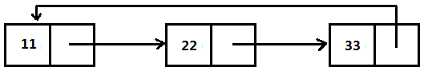

1. 环形双链表

在双链表中，尾节点的指针指向了首节点，首节点的指针指向了尾节点，从而整个链表形成一个环，如下图所示：

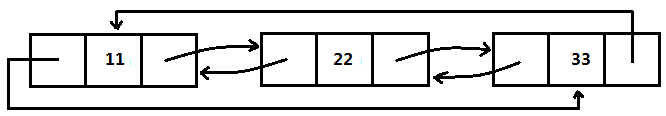


## LinkedList类详解

### LinkedList 是双向链表

LinkedList集合底层采用双向链表实现的存储，也就意味着LinkedList集合采用的是链式存储结构。在双链表中，每个节点中都有两个指针，分别指向前一个节点（保存前一个节点的地址值）和后一个节点（保存后一个节点的地址值）。

LinkedList集合的特点为：查询效率低，增删效率高，线程不安全。我们打开LinkedList源码，可以看到里面包含了双向链表的相关代码：

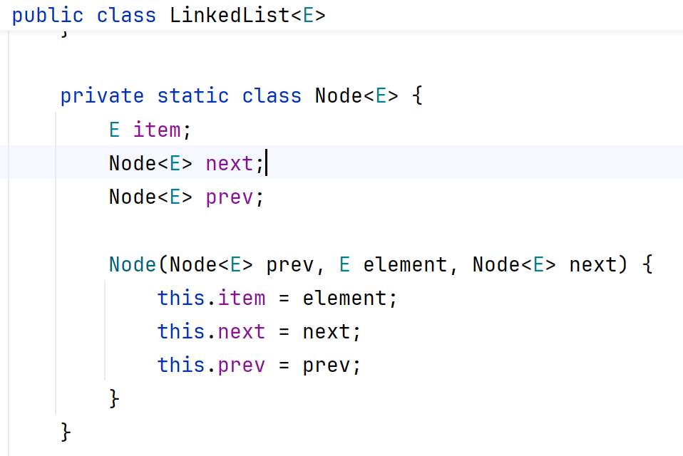

源码中Node类中包含了item、next和prev三个实例变量，其中item保存了节点中存储的数据，next和prev分别指向了后一个节点和前一个节点，则意味着Node类就是双向链表的节点类。

将接下来，我们再继续看LinkeList集合包含了哪些属性，源码如下：

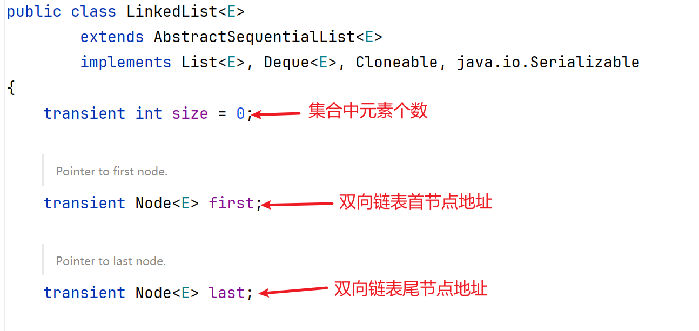

源码中first属性保存的就是双链表的首节点，last属性保存的就是双链表的尾结点，而size属性保存了双链表实际存放元素的个数。

因此，对LinkedList集合的操作，其实就是对双链表做的操作。


### 增加的相关方法

因为LinkedList类属于Deque接口的实现类，也就意味着LinkedList集合对比List接口新增了一些方法，这些新增的方法都是实现于Deque接口的方法，**用于模拟双向队列**，新增的部分方法如下。

| **方法** | **描述** |
| --- | --- |
| boolean offerFirst(E e); | 在双链表开头插入元素，并返回是否插入成功 |
| boolean offerLast(E e); | 在双链表末尾插入元素，并返回是否插入成功 |
| E pollFirst(); | 删除双链表开头的元素，如果没有元素则返回null |
| E pollLast(); | 删除双链表末尾的元素，如果没有元素则返回null |
| E peekFirst(); | 获取双链表开头的元素，如果没有元素则返回null |
| E peekLast(); | 获取双链表末尾的元素，如果没有元素则返回null |

### 节点类的分析

```java
public class LinkedList<E> {
    // 节点类是静态内部类
    private static class Node<E> {
        // 节点上的数据
        E item;
        // 下一个节点的地址
        Node<E> next;
        // 上一个节点的地址
        Node<E> prev;

        // 构造一个节点对象
        Node(Node<E> prev, E element, Node<E> next) {
            this.item = element;
            this.next = next;
            this.prev = prev;
        }
    }
}
```

### 属性分析

```java
public class LinkedList<E> {
    // 记录集合中元素的个数
    transient int size = 0;
    // 首节点
    transient Node<E> first;
    // 尾节点
    transient Node<E> last;
    // 构造方法
    public LinkedList() {
        // 创建一个空链表
        // size是0
        // first是null
        // last是null
    }
}
```

### 添加元素方法

```java
public class LinkedList<E>{
    // 添加元素
    public boolean add(E e) {
        // 将元素添加到链表的末尾
        linkLast(e);
        // 程序能够执行到这里返回添加成功
        return true;
    }
    void linkLast(E e) {
        // 将添加前的末尾节点保存一份
        final Node<E> l = last;
        // 创建一个新的节点作为末尾节点
        final Node<E> newNode = new Node<>(l, e, null);
        // 新的节点作为末尾节点
        last = newNode;
        if (l == null)
            // 如果一开始链表就是空的，则新节点既是末尾节点又是头节点
            first = newNode;
        else
            // 如果一开始这个链表就不是空的，则让原先的末尾节点的下一个节点指向新的末尾节点
            l.next = newNode;
        // 添加成功，元素数量加1
        size++;
        modCount++;
    }
}
```


### 获取元素方法

```java
public class LinkedList<E> {
    
    // 根据下标从链表上查找元素
    public E get(int index) {
        // 检查下标是否越界
        checkElementIndex(index);
        // 如果没有越界，就返回下标位置那个节点上存储的数据
        return node(index).item;
    }
    Node<E> node(int index) {
        // 如果查找的元素在链表的左半部分，则从头节点开始找。
        if (index < (size >> 1)) {
            // 把第一个元素临时让x保存一下
            Node<E> x = first;
            // 循环index次
            for (int i = 0; i < index; i++)
                x = x.next;
            // 直接返回 x
            return x;
        } else {
            // 如果查找的元素在链表的右半部分，则从尾节点开始找。
            Node<E> x = last;
            // 逆向遍历查找
            for (int i = size - 1; i > index; i--)
                x = x.prev;
            return x;
        }
    }
}
```

### 修改元素方法

```java
public class LinkedList<E> {
    public E set(int index, E element) {
        // 检查下标是否越界
        checkElementIndex(index);
        // 先找到要修改的元素
        Node<E> x = node(index);
        // 先把要修改的值先保存一份，后面返回它
        E oldVal = x.item;
        // 修改
        x.item = element;
        // 返回修改前的数据
        return oldVal;
    }
}
```

### 插入元素方法

```java
public class LinkedList<E> {
     public void add(int index, E element) {
        // 先检查下标是否合法
        checkPositionIndex(index);
        // 如果正好是往末尾添加
        if (index == size)
            // 加到末尾
            linkLast(element);
        else
            // 把新元素插到被查找的元素的前面
            linkBefore(element, node(index));
    }
    void linkBefore(E e, Node<E> succ) {
        // 先把查找到的元素的上一个节点的内存地址保存一份
        final Node<E> pred = succ.prev;
        // 创建新节点
        final Node<E> newNode = new Node<>(pred, e, succ);
        // 新节点作为查找到的节点的上一个节点
        succ.prev = newNode;
        // 如果是空链表
        if (pred == null)
            // 新节点作为头节点
            first = newNode;
        else
            // 不是空链表的话，上一个节点的下一个节点是新增的节点
            pred.next = newNode;
        // 元素+1
        size++;
        modCount++;
    }
}
```


### 删除元素方法

```java
public class LinkedList<E> {
    public E remove(int index) {
        // 检查下标是否越界
        checkElementIndex(index);
        // 查找到这个元素，断开连接（删除元素）
        return unlink(node(index));
    }
    E unlink(Node<E> x) {
        // 要删除的数据留一份，最后要返回的
        final E element = x.item;
        // 保留住被删除节点的下一个节点的地址
        final Node<E> next = x.next;
        // 保留住被删除节点的上一个节点的地址
        final Node<E> prev = x.prev;

        // 如果要删除的是头节点
        if (prev == null) {
            // 把下一个节点作为头节点
            first = next;
        } else {
            // 如果删除的不是头节点
            // 让被删除的节点的上一个节点的下一个指针指向被删除元素的下一个节点。
            prev.next = next;
            // 被删除元素的上一个节点设置null
            x.prev = null;
        }

        // 如果要删除的是尾巴节点
        if (next == null) {
            // 被删除的元素的上一个节点作为新的尾巴
            last = prev;
        } else {
            next.prev = prev;
            x.next = null;
        }

        // 删除数据
        x.item = null;
        // 元素数量-1
        size--;
        modCount++;
        // 返回被删除的元素
        return element;
    }
}
```


## Vector类详解

### Vector类概述

Vector集合和ArrayList集合的用法几乎一模一样，底层都是采用了数组来存储集合中的元素。

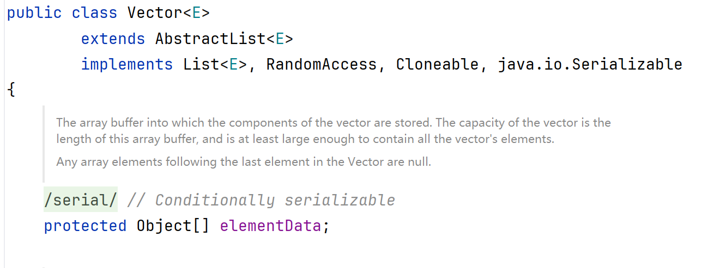

只不过Vector类的方法都加了同步检查，因此“线程安全，效率低”。 

比如：add(E e)方法就增加了synchronized同步标记。

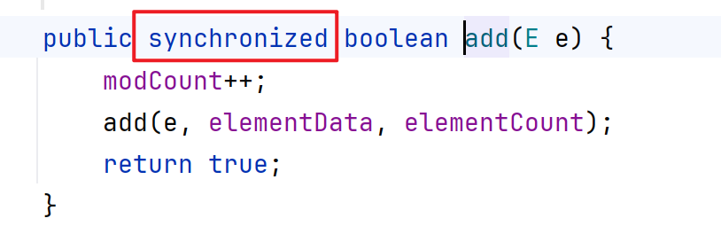

另外 Vector 的初始化容量是 10，和 ArrayList 有点区别，因为 Vector 初始化的时候理解就创建了一个长度为 10 的数组：

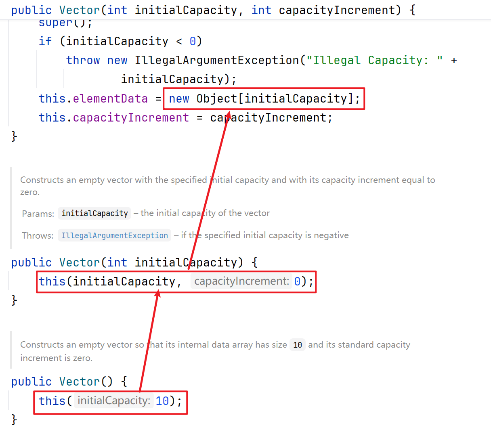

可以在看一眼它的扩容策略：

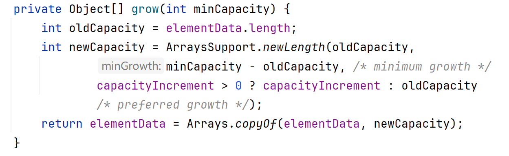

它的扩容策略是：直接 2 倍。

相比较于ArrayList集合，在Vector集合中还包含了许多传统的方法，并且这些方法不属于集合框架，此处的传统方法我们了解即可。


### Vector类演示

```java
public class Test {
        public static void main(String[] args) {
                // 实例化一个Vector
                Vector<String> vector = new Vector<String>();
                // 添加元素，addElement()方法和add()方法类似
                vector.addElement("java");
                vector.addElement("HTML");
                vector.addElement("JavaScript");
                vector.addElement("CSS");
                // 遍历集合, elements()方法类似于iterator()方法
                Enumeration<String> elements = vector.elements();
                while(elements.hasMoreElements()) {
                        System.out.println(elements.nextElement());
                }
        }
}
```

**面试题：如何选用ArrayList、LinkedList、Vector？**

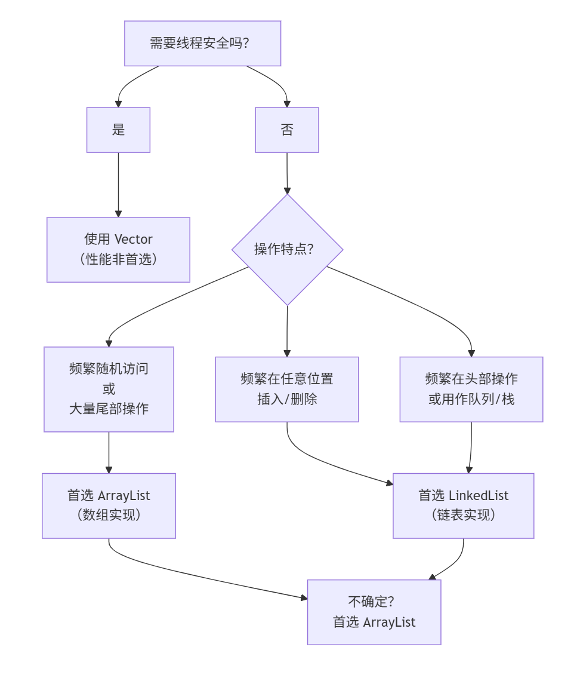


# 迭代器

## 演示并发修改异常

**ConcurrentModificationException**

迭代器遍历过程中，如果使用迭代器的 `remove()`方法不会出现异常，但迭代过程中使用集合自身的 `remove()`方法时会出现并发修改异常。

迭代器遍历过程中，调用迭代器的 `remove()`方法时不出现异常：

```java
public static void main(String[] args) {
    List<String> names = new ArrayList<>();
    names.add("1");
    names.add("2");
    names.add("3");
    names.add("4");

    Iterator<String> it = names.iterator();
    while(it.hasNext()) {
        String name = it.next();
        if("2".equals(name)){
            it.remove();
        }
    }

    System.out.println(names);
}
```

迭代器遍历过程中，调用集合的 `remove()`方法是出现异常：

```java
public static void main(String[] args) {
    List<String> names = new ArrayList<>();
    names.add("1");
    names.add("2");
    names.add("3");
    names.add("4");

    Iterator<String> it = names.iterator();
    while(it.hasNext()) {
        String name = it.next();
        if("2".equals(name)){
            names.remove(name);
        }
    }

    System.out.println(names);
}
```

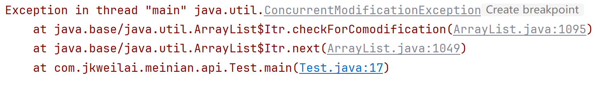

**抛出这种异常的这种机制我们一般称为：快速失败机制（fail-fast 机制）。**

## 为什么要有 fail-fast 机制

**防止数据不一致和不可预知的行为**

想象一下，如果没有这个异常，当你在用迭代器遍历一个 `<font style="color:rgb(15, 17, 21);background-color:rgb(235, 238, 242);">ArrayList</font>` 时，另一个地方直接用 `<font style="color:rgb(15, 17, 21);background-color:rgb(235, 238, 242);">list.remove(element)</font>` 删除了一个元素，会发生什么？

**1. 迭代器内部状态失效**
迭代器在遍历时，内部会维护一个“游标”（cursor）来指向下一个元素。假设你正在遍历 `<font style="color:rgb(15, 17, 21);background-color:rgb(235, 238, 242);">["A", "B", "C"]</font>`：

- 迭代器内部认为下一个要访问的元素是 `<font style="color:rgb(15, 17, 21);background-color:rgb(235, 238, 242);">"B"</font>`（索引1）。
- 此时，你通过 `<font style="color:rgb(15, 17, 21);background-color:rgb(235, 238, 242);">list.remove("A")</font>` 删除了 `<font style="color:rgb(15, 17, 21);background-color:rgb(235, 238, 242);">"A"</font>`。集合为了保持紧凑，会将 `<font style="color:rgb(15, 17, 21);background-color:rgb(235, 238, 242);">"B"</font>` 和 `<font style="color:rgb(15, 17, 21);background-color:rgb(235, 238, 242);">"C"</font>` 前移，数组变为 `<font style="color:rgb(15, 17, 21);background-color:rgb(235, 238, 242);">["B", "C"]</font>`。
- 当迭代器下一次调用 `<font style="color:rgb(15, 17, 21);background-color:rgb(235, 238, 242);">next()</font>` 时，它仍然去访问索引1的位置，结果拿到的是 `<font style="color:rgb(15, 17, 21);background-color:rgb(235, 238, 242);">"C"</font>`。
- `**<font style="color:rgb(15, 17, 21);background-color:rgb(235, 238, 242);">"B"</font>**`** ****就这样被神奇地跳过了！** 这就是数据不一致和不可预知的行为。

**2. 更恶劣的情况：链表结构破坏**
对于 `<font style="color:rgb(15, 17, 21);background-color:rgb(235, 238, 242);">LinkedList</font>` 这样的链表结构，如果在遍历过程中直接删除节点，可能会破坏节点的前后链接关系，甚至导致`<font style="color:rgb(15, 17, 21);background-color:rgb(235, 238, 242);">NullPointerException</font>`，使程序完全崩溃。假设我们有一个简单的双向链表 `<font style="color:rgb(15, 17, 21);background-color:rgb(235, 238, 242);">[A, B, C]</font>`，现在，我们开始遍历并尝试删除 "B"。

**第一步：遍历到 "A"**

- 迭代器状态：`<font style="color:rgb(15, 17, 21);background-color:rgb(235, 238, 242);">current</font>` 指向 "A"，`<font style="color:rgb(15, 17, 21);background-color:rgb(235, 238, 242);">next</font>` 指向 "B"。
- 我们调用 `<font style="color:rgb(15, 17, 21);background-color:rgb(235, 238, 242);">it.next()</font>`，返回 "A"。一切正常。

**第二步：在遍历到 "B" 之前，直接使用**** **`**<font style="color:rgb(15, 17, 21);background-color:rgb(235, 238, 242);">list.remove("B")</font>**`

- 这是我们做的**危险操作**！我们没有用迭代器的 `<font style="color:rgb(15, 17, 21);background-color:rgb(235, 238, 242);">it.remove()</font>`。
- `<font style="color:rgb(15, 17, 21);background-color:rgb(235, 238, 242);">list.remove("B")</font>` 方法会正确地执行删除，它需要：
  1. 找到 "B" 的前驱 "A" 和后继 "C"。
  2. 将 "A" 的 `<font style="color:rgb(15, 17, 21);background-color:rgb(235, 238, 242);">next</font>` 指针指向 "C"。
  3. 将 "C" 的 `<font style="color:rgb(15, 17, 21);background-color:rgb(235, 238, 242);">prev</font>` 指针指向 "A"。
  4. 至此，"B" 节点被从链表中摘除，链表变为：`<font style="color:rgb(15, 17, 21);background-color:rgb(235, 238, 242);">A <-> C</font>`。

  - **关键点**：`<font style="color:rgb(15, 17, 21);background-color:rgb(235, 238, 242);">list.remove()</font>` 操作成功了，并且它使集合的 `<font style="color:rgb(15, 17, 21);background-color:rgb(235, 238, 242);">modCount</font>` 加 1。

**第三步：迭代器继续遍历，调用**** **`**<font style="color:rgb(15, 17, 21);background-color:rgb(235, 238, 242);">it.next()</font>**`

- 迭代器对此处的结构破坏一无所知！它内部的 `<font style="color:rgb(15, 17, 21);background-color:rgb(235, 238, 242);">next</font>` 指针还**固执地指向原来那个已经被删除的 "B" 节点**！
- 迭代器愉快地返回了 `<font style="color:rgb(15, 17, 21);background-color:rgb(235, 238, 242);">next</font>` 指向的节点，也就是已经被删除的 "B"。
- **数据不一致**：你拿到了一个逻辑上不应该存在的元素 "B"，因为它已经从集合中被移除了。

**第四步：再次调用**** **`**<font style="color:rgb(15, 17, 21);background-color:rgb(235, 238, 242);">it.next()</font>**`

- 迭代器试图将 `<font style="color:rgb(15, 17, 21);background-color:rgb(235, 238, 242);">current</font>` 移动到 `<font style="color:rgb(15, 17, 21);background-color:rgb(235, 238, 242);">next</font>`（即 "B"），然后让 `<font style="color:rgb(15, 17, 21);background-color:rgb(235, 238, 242);">next</font>` 指向 "B" 的 `<font style="color:rgb(15, 17, 21);background-color:rgb(235, 238, 242);">next</font>`。
- 但 "B" 已经被从链表中移除，在Java中，一个被正确移除的节点，其 `<font style="color:rgb(15, 17, 21);background-color:rgb(235, 238, 242);">next</font>` 和 `<font style="color:rgb(15, 17, 21);background-color:rgb(235, 238, 242);">prev</font>` 会被置为 `<font style="color:rgb(15, 17, 21);background-color:rgb(235, 238, 242);">null</font>`（帮助GC）。因此，当迭代器试图访问 `<font style="color:rgb(15, 17, 21);background-color:rgb(235, 238, 242);">"B".next</font>` 时，会得到一个 `<font style="color:rgb(15, 17, 21);background-color:rgb(235, 238, 242);">null</font>`。然后当它试图继续操作这个 `<font style="color:rgb(15, 17, 21);background-color:rgb(235, 238, 242);">null</font>` 时，就会抛出 `<font style="color:rgb(15, 17, 21);background-color:rgb(235, 238, 242);">NullPointerException</font>`，导致程序崩溃。

**这种 fail-fast 机制是如何实现的：通过模数印记机制实现的。**

## 模数印记机制是什么

模数印记机制的实现原理：

1. 集合中设置了一个modCount属性，用来记录修改次数，使用集合对象执行增，删，改中任意一个操作时，modCount就会自动加1。
2. 获取迭代器对象的时候，会给迭代器对象初始化一个expectedModCount属性。并且将expectedModCount初始化为modCount，即：int expectedModCount = modCount;
3. 当使用集合对象删除元素时：modCount会加1。但是迭代器中的expectedModCount不会加1。而当迭代器对象的next()方法执行时，会检测expectedModCount和modCount是否相等，如果不相等，则抛出：ConcurrentModificationException异常。
4. 当使用迭代器删除元素的时候：modCount会加1，并且expectedModCount也会加1。这样当迭代器对象的next()方法执行时，检测到的expectedModCount和modCount相等，则不会出现ConcurrentModificationException异常。

**结论：**

迭代集合时，删除元素要使用“迭代器对象.remove()”方法来删除，避免使用“集合对象.remove(元素)”。主要是为了避免 `ConcurrentModificationException` 异常的发生。


## Iterator和for-each的区别

1. 使用for-each不但能遍历集合，还能遍历数组，但是使用Iterator只能遍历集合。
2. 使用for-each遍历集合时不能删除元素，但是使用Iterator遍历集合时可以删除元素。

## ListIterator接口

ListIterator接口继承于Iterator接口，因此ListIterator提供的功能比Iterator更加的强大。使用ListIterator迭代器，不但能“从前往后”遍历集合，还可以“从后往前”遍历集合，并且遍历集合的过程中还能删除、修改和插入元素，常用方法如下：

| **方法** | **描述** |
| --- | --- |
| boolean hasNext(); | 从前往后遍历集合，判断是否还有下一个元素 |
| E next(); | 获得集合中的下一个元素 |
| boolean hasPrevious(); | 从后往前遍历集合，判断是否还有前一个元素 |
| E previous(); | 获得集合中的前一个元素 |
| void remove(); | 删除当前迭代器遍历出来的元素 |
| void set(E e); | 修改当前迭代器遍历出来的元素 |
| void add(E e); | 在遍历出来元素“之前”或“之后”插入元素 |

在List接口中，提供了获得ListIterator迭代器的方法，获取方式如下：

| **方法** | **描述** |
| --- | --- |
| ListIterator listIterator(); | 获得迭代器 |
| ListIterator listIterator(int index); | 获得迭代器，游标位置指定为：index |

使用ListIterator迭代器遍历集合，想要实现“从前往后”遍历List集合，使用“ListIterator listIterator();”来获得迭代器；想要实现“从后往前”遍历List集合，则游标位置需要设置为“实际添加元素的个数”，也就是必须使用“ListIterator listIterator(int index);”获得迭代器。

【示例】“从前往后”遍历ArrayList集合

```java
public class Test01 {
    public static void main(String[] args) {
        // 创建ArrayList集合
        ArrayList<String> list = new ArrayList<>();
        // 添加元素
        list.add("aaa");
        list.add("bbb");
        list.add("ccc");
        // 获得迭代器，用于“从前往后”遍历集合
        ListIterator<String> iterator = list.listIterator();
        // 如果存在下一个元素，则执行循环
        while(iterator.hasNext()) {
            // 获得集合中的下一个元素并输出
            System.out.println(iterator.next());
        }
    }
}
```

【示例】“从前往后”遍历ArrayList集合

```java
public class Test01 {
    public static void main(String[] args) {
        // 创建ArrayList集合
        ArrayList<String> list = new ArrayList<>();
        // 添加元素
        list.add("aaa");
        list.add("bbb");
        list.add("ccc");
        // 获得迭代器，用于“从后往前”遍历集合
        ListIterator<String> iterator = list.listIterator(list.size());
        // 如果存在前一个元素，则执行循环
        while (iterator.hasPrevious()) {
            // 获得集合中的前一个元素并输出
            System.out.println(iterator.previous());
        }
    }
}
```

使用Iterator迭代器，只能删除遍历出来的元素；而使用ListIterator迭代器，不但能删除遍历出来的元素，还能修改遍历出来的元素和在遍历出来元素之前或之后插入元素。

【示例】迭代过程中对ArrayList元素操作

```java
public class Test01 {
    public static void main(String[] args) {
        // 创建ArrayList集合
        LinkedList<Integer> list = new LinkedList<Integer>();
        // 添加元素
        list.add(10);
        list.add(20);
        list.add(30);
        // 获得迭代器，用于“从前往后”遍历集合
        ListIterator<Integer> iterator = list.listIterator();
        // 如果还存在下一个元素，则执行循环
        while(iterator.hasNext()) {
            // 获得遍历出来的元素
            Integer value = iterator.next();
            // 遍历集合的过程中，执行删除、修改和插入操作
            if(value <= 10) {
                iterator.remove(); // 删除当前迭代的这个元素
            } else if (value <= 20) {
                iterator.set(22);  // 修改当前迭代的这个元素
            } else {
                iterator.add(40);  // 在遍历出来元素后面添加元素
            }
        }
        System.out.println(list); // 输出：[22, 30, 40]
    }
}
```

**Iterator和ListIterator的区别：**

1. Iterator应用于Set集合和List集合，但是ListIterator只能应用于List集合。
2. Iterator只能从前往后遍历集合，而ListIterator能从前往后和从后往前遍历集合。
3. Iterator只有remove()方法，而ListIterator有remove()、add()和set()方法。


# 队列（Queue）

## 队列的简介

队列是一种特殊的线性表，特殊之处在于它只允许在表的前端（front）进行删除操作，而在表的后端（rear）进行插入操作，队列是一种操作受限制的线性表。进行插入操作（入口）的端称为队尾，进行删除操作（出口）的端称为队头。

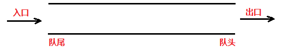

队列的插入操作只能在队尾操作，队列的删除操作只能在队头操作，因此队列是一种先进先出（First In First Out）的线性表，简称**FIFO**表。

LinkedList类属于Queue接口的实现类，在Queue接口中提供的方法可以实现队列的相关操作，因此使用LinkedList集合就能实现队列的操作。而双链表两端都能作为入口和出口，因此我们也称LinkedList集合为“两端队列”。并且，Queue接口继承于Collection接口，在 Queue接口中新增的方法如下：

| **方法** | **描述** |
| --- | --- |
| boolean offer(E e); | 在队列末尾添加元素，如果队列已满则返回false |
| E element(); | 查看队列头部元素，如果队列为空则抛出异常 |
| E peek(); | 查看队列头部元素，如果队列为空则返回null |
| E poll(); | 删除队列头部元素，如果队列为空则返回null |
| boolean isEmpty(); | 判断队列是否为空 |

【示例】使用LinkedList实现队列操作

```java
public static void main(String[] args) {
    // 创建队列
    Queue<Integer> queue = new LinkedList<>();
    // 入队
    queue.offer(1);
    queue.offer(2);
    queue.offer(3);
    queue.offer(4);
    queue.offer(5);
    // 出队
    while(!queue.isEmpty()) {
        System.out.println(queue.poll());
        System.out.println(queue.poll());
        System.out.println(queue.poll());
        System.out.println(queue.poll());
        System.out.println(queue.poll());
    }
}
```

## 队列的实现方式

### 数组实现队列

**顺序队列的实现**

以下采用数组实现，初始化一个队列数组的空间长度为5，队列有两个标记，一个队头的位置front，一个队尾的位置rear，初始都指向数组下标为0的位置，如图所示：

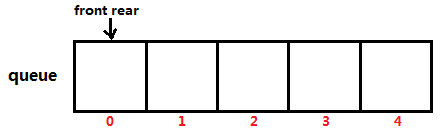

在插入元素时，rear标记递增+1，比如依次入队11，22，33这三个元素，则当前队列存储情况如图：

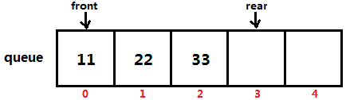

当前front为0，rear为3，接下来执行出队操作，此处将11元素出队，则front标记递增+1，此时队列的存储情况如图：

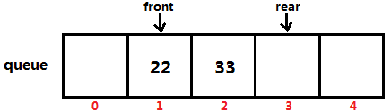

根据上面的图例:

- 使用`**rear-front**`获得队列中元素的个数。
- 当 `**front==rear**` 时，此时队列为空。
- 而当 `**rear==数组长度**` 时，此时将无法添加元素，我们可以设为队列已满。

**循环队列的实现**

front 和 rear在入队和出队操作中只增不减，因此head和tail都会最终指向队列之外的存储位置，此时虽然数组为空，但也无法将元素入队。

如何解决这个问题，循环队列可以解决。当rear的取值为数组空间长度，此时如果数组还有空闲的位置，将rear从新指向数组的0索引处即可，如图所示：

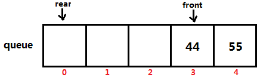

如果继续入队66和77这两个元素，则队列的存储结构如图：

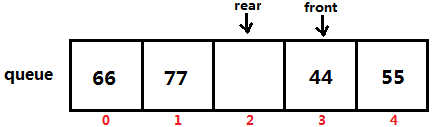

在采用循环队列实现的过程中，当队列满队时，front等于rear，而当队列空时，front也等于rear，为了区分两种状态，一般规定循环队列的长度为"**数组长度-1**"，即有一个位置不放元素，此时 `front==rear` 时为空队，而当 `**front==(rear+1)%数组长度**`，说明队满。

在 Java 的集合框架中，`ArrayDeque`就是一个数组实现的队列，而且是一个双端队列，使用它的代码如下：

```java
public static void main(String[] args) {
    // 创建双端队列
    Deque<Integer> deque = new ArrayDeque<>();

    // 队头进
    deque.offerFirst(1);
    deque.offerFirst(2);
    deque.offerFirst(3);
    deque.offerFirst(4);

    // 队尾出
    System.out.println(deque.pollLast());
    System.out.println(deque.pollLast());
    System.out.println(deque.pollLast());
    System.out.println(deque.pollLast());

    // 队尾进
    deque.offerLast(1);
    deque.offerLast(2);
    deque.offerLast(3);
    deque.offerLast(4);

    // 队头出
    System.out.println(deque.pollFirst());
    System.out.println(deque.pollFirst());
    System.out.println(deque.pollFirst());
    System.out.println(deque.pollFirst());
}
```


### 链表实现队列

队列的核心操作是：

- **入队（Enqueue）**：在**尾部（Rear）** 添加元素。
- **出队（Dequeue）**：从**头部（Front）** 移除元素。

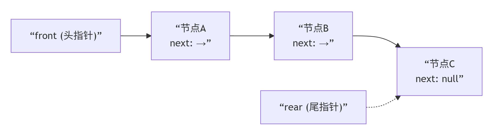

在这种结构下：

- **入队（在尾部添加）**：通过 `<font style="color:rgb(15, 17, 21);background-color:rgb(235, 238, 242);">rear</font>` 指针，我们可以在尾部快速接入新节点，然后更新 `<font style="color:rgb(15, 17, 21);background-color:rgb(235, 238, 242);">rear</font>`。时间复杂度为 **O(1)**。
- **出队（在头部移除）**：通过 `<font style="color:rgb(15, 17, 21);background-color:rgb(235, 238, 242);">front</font>` 指针，我们可以快速移除头节点，并将 `<font style="color:rgb(15, 17, 21);background-color:rgb(235, 238, 242);">front</font>` 指向 `<font style="color:rgb(15, 17, 21);background-color:rgb(235, 238, 242);">front.next</font>`。时间复杂度为 **O(1)**。

这与队列 FIFO 的行为逻辑完全吻合，所以从这个角度看，它是“天生”的。

在 Java 的集合框架中，`LinkedList`就是一个链表实现的队列，而且是一个双端队列，使用它的代码如下：

```java
public static void main(String[] args) {
    // 创建双端队列
    Deque<Integer> deque = new LinkedList<>();

    // 队头进
    deque.offerFirst(1);
    deque.offerFirst(2);
    deque.offerFirst(3);
    deque.offerFirst(4);

    // 队尾出
    System.out.println(deque.pollLast());
    System.out.println(deque.pollLast());
    System.out.println(deque.pollLast());
    System.out.println(deque.pollLast());

    // 队尾进
    deque.offerLast(1);
    deque.offerLast(2);
    deque.offerLast(3);
    deque.offerLast(4);

    // 队头出
    System.out.println(deque.pollFirst());
    System.out.println(deque.pollFirst());
    System.out.println(deque.pollFirst());
    System.out.println(deque.pollFirst());
}
```

# 栈（Stack）

栈是一种特殊的线性表，仅能在线性表的一端操作，栈顶允许操作，栈底不允许操作，栈的重要特点为：后进先出或先进后出。

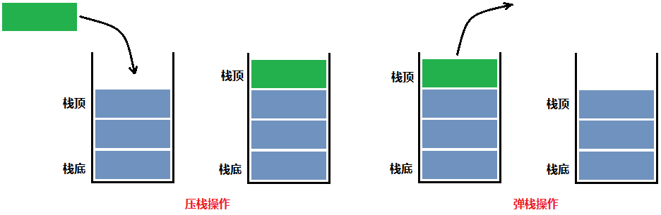

栈的一个最重要的特征就是栈的插入和删除只能在栈顶进行，所以每次删除的元素都是最后进栈的元素，故栈也被称为后进先出（Last In First Out）的线性表，简称**LIFO**表。

Java中提供了一个Stack类，可以用于表示栈。另外栈相关方法Deque中也有，也就是说 LinkedList、ArrayDeque 都能实现栈的特点：

| **方法** | **描述** |
| --- | --- |
| void push(E e); | 入栈操作，在栈顶添加元素，如果栈满了，会抛出异常 |
| E pop(); | 出栈操作，返回栈顶的元素并删除，如果栈为空，则抛出异常 |
| E peek(); | 获得栈顶元素，但不删除栈顶元素，如果栈为空，返回null |
| boolean isEmpty(); | 判断栈是否为空，如果为空则返回true；否则返回false |

【示例】使用LinkedList实现栈操作

```java
public class Test01 {
    public static void main(String[] args) {
        // 创建LinkedList集合，用于实现栈
        Deque<Integer> stack = new LinkedList<>();
        // 入栈操作，在栈顶添加元素
        stack.push(111);
        stack.push(222);
        stack.push(333);
        stack.push(444);
        // 遍历栈中的所有元素，直到栈为空为止
        while(!stack.isEmpty()) {
            // 出栈操作，获取栈顶元素
            System.out.println(stack.pop());
        }
    }
}
```

**作业：用数组模拟栈数据结构。（经常出现的面试题）**


# Map接口

## Map接口介绍

生活中，我们经常需要“成对”的存储某些信息。比如，每个公民都有“身份证号”和“姓名”的成对信息，想要存储“身份证号-姓名”的成对信息，则就需要使用Map来存储。

Map就是用来存储“键(key)-值(value) ”的数据，公民的“身份证号”就是“键(key)”，公民的姓名就是“值(value)”。因为每个公民的“身份证号”都是唯一的，而公民的“姓名”是可以重复的，通过“身份证号”就能找到公民的“名字”。也就意味着，Map中存储的键(key)必须是唯一的，而Map中存储的值(value)是可以重复的，通过键(key）就能找到对应的值（value）。

Map接口位于java.util包中,Map接口最常用的实现类有HashMap、LinkedHashMap、TreeMap、Hashtable、Properties等等。

### Map常用方法

| **方法** | **描述** |
| --- | --- |
| V put(K key, V value); | 添加键值对。如果key重复，则返回被覆盖的value值 |
| V get(Object key); | 根据key获得value值。如果key不存在，则返回null |
| V remove(Object key); | 根据key删除键值对。删除成功，则返回被删除的value值 |
| boolean containsKey(Object key); | 判断Map中是否包含某个key |
| boolean containsValue(Object value); | 判断Map中是否包含某个value |
| Collection values(); | 获得Map中的所有value值 |
| int size(); | 获得添加键值对的个数 |
| boolean isEmpty(); | 判断Map是否为空 |
| void clear(); | 清空Map中存储的所有键值对 |

Map接口中没有提供迭代器，想要遍历得到Map集合中的所有键值对，则还需使用Map接口提供的keySet()和entrySet()方法来实现。

### keySet() 方法

在Map接口中，提供了“Set keySet()”方法来遍历Map中的键值对。使用keySet()方法的遍历Map的原理为：先获得Map集合中所有key对应的Set集合，然后通过迭代器遍历Set集合获得所有的key，最后在通过Map接口提供的get()方法获得对应的value值。

【示例】keySet() 方法使用

```java
public class Test02 {
    public static void main(String[] args) {
        // 实例化HashMap集合
        Map<Integer, String> map = new HashMap<>();
        // 添加键值对
        map.put(1024, "老张");
        map.put(9527, "卧龙");
        map.put(2048, "凤雏");
        // 获得Map中的所有key的Set集合。
        Set<Integer> set = map.keySet();
        // 通过迭代器，遍历并获得Set集合中的所有元素
        Iterator<Integer> iterator = set.iterator();
        while (iterator.hasNext()) {
            // 获得Set集合中存储的key，然后通过key获得value值
            Integer key = iterator.next();
            System.out.println("key：" + key + " value：" + map.get(key));
        }
    }
}
```


### entrySet()方法

在Map接口中，提供了“Set<Map.Entry<K, V>> entrySet();”方法来遍历Map中的键值对。调用entrySet()方法，获得就是存储Map.Entry对象的Set集合，而Map.Entry对象存储就是Map集合中的键值对。

Map.Entry接口在java.util包中，它是定义在Map接口中的一个内部接口，getKey()和getValue()是接口Map.Entry<K,V>中的方法，返回对应的key和对应的value。

【示例】entrySet()方法使用

```java
public class Test02 {
    public static void main(String[] args) {
        // 实例化HashMap集合
        Map<Integer, String> map = new HashMap<>();
        // 添加键值对
        map.put(1024, "老张");
        map.put(9527, "卧龙");
        map.put(2048, "凤雏");
        // 获得存储Map.Entry对象的Set集合
        Set<Map.Entry<Integer, String>> set = map.entrySet();
        // 获得Set集合的迭代器，迭代出来的为Map.Entry对象
        Iterator<Map.Entry<Integer, String>> iterator = set.iterator();
        // 通过迭代器来遍历Set集合，从而获得Map.Entry对象
        while (iterator.hasNext()) {
            // 获得遍历出来的Map.Entry对象
            Map.Entry<Integer, String> entry = iterator.next();
            // 获得Entry对象存储的key和value
            System.out.println("key：" + entry.getKey() + " value：" + entry.getValue());
        }
    }
}
```

## HashMap集合的使用

HashMap属于Map接口中最常用的实现类，并且在HashMap集合中没有新增任何方法。由于HashMap集合底层采用了哈希表这种数据结构来实现，因此HashMap集合执行增、删、改和查的效率都非常高，但是存储的**键值对**却属于无序的。

使用HashMap集合时，因为添加键值对中的key不能重复(**key可以为null**)，因此我们需要重写key所对应类的equals()方法和hashCode()方法来保证Key的唯一性。

### 情况一：key为自定义的类

如果key为自定义的类，则我们就必须重写equals()方法和hashCode()方法，从而保证key的唯一性。执行put()方法时，底层就会判断添加键值对的key是否重复（通过equals()方法判断），如果key发生了重复，那么默认就会执行覆盖操作。

例如，每位学生（姓名，年龄）都有自己的家庭住址。那么既然有对应关系，则将学生对象和家庭住址存储到HashMap 集合中。学生对象作为键(key)，家庭住址作为值(value)，当学生姓名相同并且年龄相同视为同一名学生，那么添加键值对的时候就会发生覆盖操作。

【示例】定义Student类

```java
/**
 * 学生类
 */
public class Student {
    // 实例变量
    private String name;
    private int age;
    // 构造方法
    public Student() {}
    public Student(String name, int age) {
        this.name = name;
        this.age = age;
    }
    // 重写equals()方法
    @Override
    public boolean equals(Object o) {
        if (this == o) return true;
        if (o == null || getClass() != o.getClass()) return false;
        Student student = (Student) o;
        return age == student.age && Objects.equals(name, student.name);
    }
    // 重写hashCode()方法
    @Override
    public int hashCode() {
        return Objects.hash(name, age);
    }
    // 重写toString()方法
    @Override
    public String toString() {
        return "Student{" +
                "name='" + name + '\'' +
                ", age=" + age +
                '}';
    }
}
```

【示例】使用HashMap集合的案例

```java
public class Test02 {
    public static void main(String[] args) {
        // 实例化HashMap对象
        HashMap<Student, String> map = new HashMap<>();
        // 添加键值对
        map.put(new Student("张三", 33), "天津");
        map.put(new Student("李四", 19), "天津");
        map.put(new Student("王五", 18), "北京");
        map.put(new Student("赵六", 28), "北京");
        map.put(new Student("赵六", 28), "上海"); // 覆盖北京的赵六
        // 遍历Map集合
        Iterator<Student> iterator = map.keySet().iterator();
        while (iterator.hasNext()) {
            Student stu = iterator.next();
            System.out.println("key:" + stu + " value:" + map.get(stu));
        }
    }
}
```

输出结果如下：

key:Student{name='王五', age=18} value:北京

key:Student{name='张三', age=33} value:天津

key:Student{name='李四', age=19} value:天津

key:Student{name='赵六', age=28} value:上海


### 情况二：key为Java提供的类

对于Java提供的类，因为默认已经重写了equals()方法和hashCode()方法，从而保证了key的唯一性。那么执行put()方法时，底层就会判断添加键值对的key是否重复（通过equals()方法判断），如果key发生了重复，那么默认就会执行覆盖操作。

【示例】使用HashMap集合的案例

```java
public class Test02 {
    public static void main(String[] args) {
        // 实例化HashMap对象
        Map<String, Integer> map = new HashMap<>();
        // 添加键值对
        map.put("aa", 111);
        map.put("bb", 222);
        map.put("cc", 333);
        map.put("bb", 666); // 覆盖222这个value
        // 遍历Map集合
        Iterator<String> iterator = map.keySet().iterator();
        while(iterator.hasNext()) {
            String key = iterator.next();
            System.out.println("key:" + key + " value:" + map.get(key));
        }
    }
}
```

输出结果如下：

key:aa value:111

key:bb value:666

key:cc value:333

## HashMap集合的底层

### HashMap源码分析

哈希表也叫散列表，是一种非常重要的数据结构，应用场景及其丰富，许多缓存技术（比如：Redis）的核心其实就是在内存中维护一张大的哈希表，而HashMap的实现原理也常常出现在各类的面试题中，重要性可见一斑。在讨论哈希表之前，我们先回顾一下数组和链表来实现对数据的存储的优缺点：

1. 数组：占用空间连续。 寻址容易，查询速度快。但是，增加和删除效率非常低。
2. 链表：占用空间不连续。 寻址困难，查询速度慢。但是，增加和删除效率非常高。

从上分析我们知道，数组优势是查询效率高，链表的优势是增删效率高。那么有没有一种数据结构能结合“数组+链表”的双方优点呢？答案就是“哈希表”。 

哈希表的可以通过“数组+链表”的方式来实现，还可以通过“数组+链表+红黑树”来实现，是一种非常重要的数据结构。在哈希表中进行添加、删除、查找和修改等操作，性能十分之高，不考虑哈希冲突的情况下，仅需一次定位即可完成。

我们知道，数据结构的物理存储结构只有两种：顺序存储结构和链式存储结构。而在上面我们提到过，在数组中根据下标查找某个元素，一次定位就可以达到，哈希表利用了这种特性，哈希表的主干就是数组。

我们打开HashMap源码，发现有如下两个核心内容：

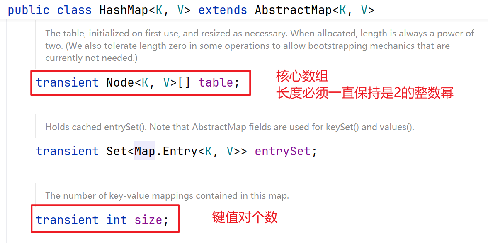

其中的，Node[] table 就是HashMap的核心数组结构，我们也称之为“位桶数组”。我们再继续看Node是什么，源码如下：

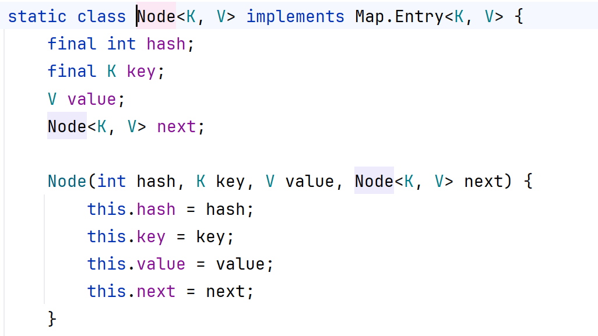

在Node类中，key存储的是“键对象”，value存储的是“值对象”，hash存储的是“键对象的哈希值”，而next存储的就是“指向下一个节点的地址值”。显然Node类就是一个单链表节点类，我们使用图形表示该单链表如下所示：

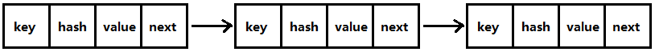

然后，我们画出Node[]数组的结构（这也是HashMap在 JDK1.7 的存储结构）：

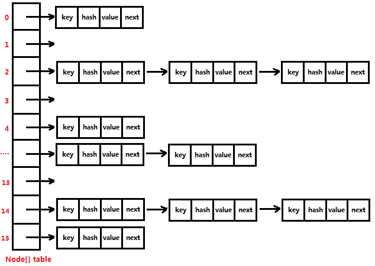

由图可知，在 JDK1.7 版本中，HashMap底层使用的哈希表就是“数组+链表”来实现，也就是数组存储的每个元素都是一个单链表。

### 哈希表的存储原理分析

#### 哈希表存储原理图

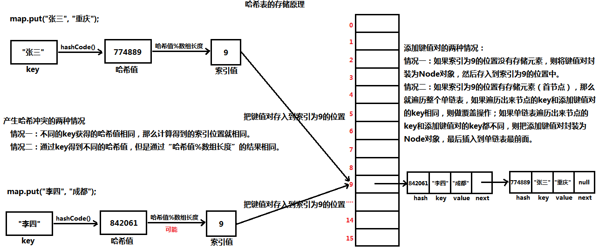

#### 哈希函数

哈希函数（也就是hashCode()方法），通过哈希函数获得key对象的哈希码，实际上就是建立起key值与int值映射关系的函数。这就好比每个人都有一个身份证号一样，无论是男是女，出生在何处，都可以通过身份证号来分辨，这就是把人的信息映射成一串数字的典型做法。哈希函数和此类似，不过是把任意的Java对象，映射成一个int数值（散列均匀，尽量不重复），供哈希表使用。

另外，通过hashCode()方法获得的结果是一个很大的整数，我们的哈希表不可能提供那么大的存储空间，所以我们还需要对获得的哈希码值做处理。现实开发中，最常见的做法就是“取余法”，把获得的“哈希值 % 数组长度”，这样得到的结果就在[0, 数组长度-1]之间，也就是获得键值对在table数组的存储位置。

#### 哈希碰撞

通过hashCode()方法，获得了一个散列均匀的哈希码值，但是不同的key对象获得哈希码值可能相同；另外，通过对不同的“哈希值 % 数组长度”得到的索引值也可能相同，那就意味着在哈希表的某个索引位置需要存储多条数据，这就是所谓的哈希碰撞问题。

目前比较通用的解决哈希碰撞的方法，可以使用“数组+链表”组合的方式。当出现哈希碰撞时，在该位置的数据就通过单链表的方式链接起来，这样一来数组中的每个元素维护的就是一个单链表啦。


### HashMap 重点方法分析

#### 属性分析

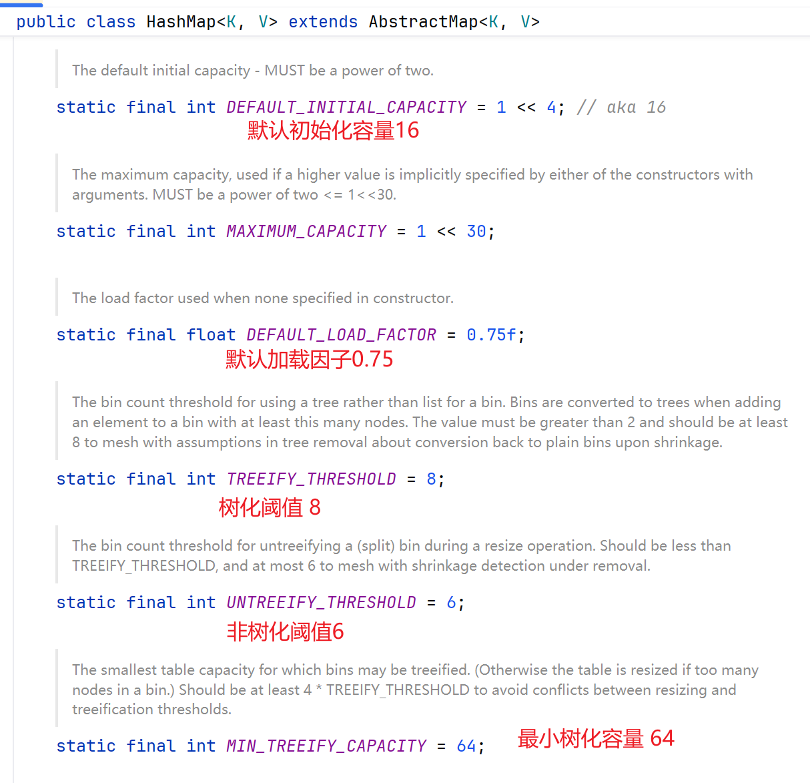

**注释中写到：初始化容量永远都是 2 的整数幂。**

#### 构造方法分析

```java
public HashMap() {
    this.loadFactor = DEFAULT_LOAD_FACTOR; // all other fields defaulted
}
public HashMap(int initialCapacity) {
    this(initialCapacity, DEFAULT_LOAD_FACTOR);
}
public HashMap(Map<? extends K, ? extends V> m) {
    this.loadFactor = DEFAULT_LOAD_FACTOR;
    putMapEntries(m, false);
}

public HashMap(int initialCapacity, float loadFactor) {
    if (initialCapacity < 0)
        throw new IllegalArgumentException("Illegal initial capacity: " +
                                           initialCapacity);
    if (initialCapacity > MAXIMUM_CAPACITY)
        initialCapacity = MAXIMUM_CAPACITY;
    if (loadFactor <= 0 || Float.isNaN(loadFactor))
        throw new IllegalArgumentException("Illegal load factor: " +
                                           loadFactor);
    this.loadFactor = loadFactor;
    // 根据初始化容量的值重新计算初始化容量值，以保证这个初始化容量是2的整数幂，并且给定容量的最小2的整数幂。
    this.threshold = tableSizeFor(initialCapacity);
}

// 计算大于等于给定容量的最小2的幂次方值。
// 输入 cap=3，返回 4
// 输入 cap=10，返回 16
// 输入 cap=16，返回 16
static final int tableSizeFor(int cap) {
    // -1的原码：10000000 00000000 00000000 00000001
    // -1的反码：11111111 11111111 11111111 11111110
    // -1的补码：11111111 11111111 11111111 11111111
    // Integer.numberOfLeadingZeros 这个方法是统计一个二进制中左侧连续0的个数
    // 例如，构造方法传递过来的容量是3，则 cap - 1后的值是2
    // 2的二进制：00000000 00000000 00000000 00000010 (这个二进制左边有28个0)
    // -1 >>> 28，无符号右移左补0，因此最终结果是 00000000 00000000 00000000 00000011 （也就是3）
    int n = -1 >>> Integer.numberOfLeadingZeros(cap - 1);
    // 最后再 3 + 1，结果就是 4
    return (n < 0) ? 1 : (n >= MAXIMUM_CAPACITY) ? MAXIMUM_CAPACITY : n + 1;
}
```

#### put 方法分析

准备工作完成之后，我们继续深入学习HashMap如何存储键值对，核心就是要根据key获得键值对在table数组中的存储位置。


```java
final V putVal(int hash, K key, V value, boolean onlyIfAbsent,
                   boolean evict) {
        // 声明局部变量：哈希桶数组tab，当前节点p，数组长度n，索引位置i
        Node<K,V>[] tab; Node<K,V> p; int n, i;

        // 重点注意：通过无参数构造方法创建的HashMap是空的哈希表，第一次调用put方法时扩容，初始化容量16.
        // 步骤1：如果哈希表(table)为空或者长度为0，则进行初始化扩容
        if ((tab = table) == null || (n = tab.length) == 0)
            n = (tab = resize()).length; // 扩容后更新数组长度n

        // 重点注意：我们之前讲过，找数组下标的算法是 hash % 数组长度，这里为什么变成了 hash & (n-1)
        // 步骤2：计算元素在数组中的索引 i = (n - 1) & hash，并检查该位置是否为空
        if ((p = tab[i = (n - 1) & hash]) == null)
            // 重点注意：如果下标位置没有任何数据，则直接放进去，没有发生哈希碰撞。
            // 如果位置为空，直接在此处创建一个新节点
            tab[i] = newNode(hash, key, value, null);
        else {
            // 重点注意：如果能执行这个分支，说明发生了哈希碰撞
            // 步骤3：如果数组该位置不为空（发生哈希碰撞）
            Node<K,V> e; K k; // e用于记录找到的已存在key的节点

            // 重点注意：先看看第一个节点是否和参数key重复，如果头节点是重复的，那么就不需要管底层是链表还是红黑树了。
            // 步骤3.1：检查第一个节点p的key是否与要插入的key相同
            if (p.hash == hash &&
                ((k = p.key) == key || (key != null && key.equals(k))))
                // 如果相同，将e指向p，表示找到已存在的key
                e = p;
            // 步骤3.2：判断p是否是红黑树节点
            else if (p instanceof TreeNode)
                // 重点注意：程序执行到这里，就是红黑树了。走红黑树的添加规则。
                // 如果是树节点，则调用红黑树的put方法，返回值e可能是找到的已存在节点或null
                e = ((TreeNode<K,V>)p).putTreeVal(this, tab, hash, key, value);
            else {
                // 重点注意：程序能够走到说明是一个单向链表。
                // 步骤3.3：否则，该位置是一个链表
                for (int binCount = 0; ; ++binCount) {
                    // 遍历链表，直到链表末尾
                    if ((e = p.next) == null) {
                        // 重点注意：JDK8之后采用的是尾插法。不是头插法。
                        // 在链表尾部插入新节点
                        p.next = newNode(hash, key, value, null);
                        // 插入后，如果链表长度达到树化阈值(8-1=7)，则考虑转为红黑树
                        if (binCount >= TREEIFY_THRESHOLD - 1) // -1 for 1st
                            treeifyBin(tab, hash); // 实际树化还会判断数组长度是否>=64
                        break; // 新节点已插入，跳出循环
                    }
                    // 在遍历链表过程中，检查当前节点e的key是否与要插入的key相同
                    if (e.hash == hash &&
                        ((k = e.key) == key || (key != null && key.equals(k))))
                        break; // 找到已存在的key，跳出循环，此时e指向该节点
                    p = e; // p指针向后移动，继续遍历
                }
            }

            // 重点注意：经过以上一系列的查找，最终就能确定是否有已存在的key，如果key存在，则value覆盖。
            // 步骤4：如果e不为空，说明找到了已存在的key（e指向该节点）
            if (e != null) { // existing mapping for key
                V oldValue = e.value; // 记录旧值
                // 如果onlyIfAbsent为false（允许覆盖），或者旧值为null，则更新值
                if (!onlyIfAbsent || oldValue == null)
                    e.value = value;
                // 用于LinkedHashMap的回调，在HashMap中是空实现
                afterNodeAccess(e);
                return oldValue; // 返回旧值
            }
        }

        // 步骤5：如果执行到这里，说明是新增了一个节点，而不是覆盖
        ++modCount; // 结构性修改次数加1

        // 步骤6：如果当前大小超过扩容阈值，则进行扩容
        if (++size > threshold)
            resize();
        // 用于LinkedHashMap的回调，在HashMap中是空实现
        afterNodeInsertion(evict);
        // 对于新增操作，返回null
        return null;
    }
```

#### get 方法分析

```java
final Node<K,V> getNode(Object key) {
    Node<K,V>[] tab; Node<K,V> first, e; int n, hash; K k;

    // 重点注意：查找的第一件事也是先调用 hashCode方法得出hash值，然后进行 (n - 1) & hash
    // 1. 检查表不为空，并计算key所在的桶位置
    if ((tab = table) != null && (n = tab.length) > 0 &&
        (first = tab[(n - 1) & (hash = hash(key))]) != null) {

        // 重点注意：判断key是否存在底层会调用equals方法。
        // 2. 先检查桶的第一个节点
        if (first.hash == hash &&
            ((k = first.key) == key || (key != null && key.equals(k))))
            return first; // 第一个节点就匹配，直接返回

        // 重点注意：程序如果能执行到这里，说明以前存储的时候一定发生哈希碰撞。
        // 3. 第一个节点不匹配，检查后续节点
        if ((e = first.next) != null) {
            // 3.1 如果是红黑树，调用树查找
            if (first instanceof TreeNode)
                return ((TreeNode<K,V>)first).getTreeNode(hash, key);
            
            // 3.2 如果是链表，遍历查找
            do {
                if (e.hash == hash &&
                    ((k = e.key) == key || (key != null && key.equals(k))))
                    return e; // 找到匹配节点
            } while ((e = e.next) != null);
        }
    }

    // 如果get方法找不到元素则返回null。
    // 4. 未找到匹配节点
    return null;
}
```

到此处，关于HashMap底层put()方法和get()方法的实现就讲解完毕，那么接下来我们来我们对HashMap集合进行总结。


### HashMap集合的总结

#### JDK1.7 和JDK1.8的区别

1. 在 JDK1.7 中，底层table数组在构造方法中初始化，在JDK1.8中，底层table数组在第一次调用put()方法时初始化。
2. 在 JDK1.7 中，处理哈希冲突采用的是“头插法”；在JDK1.8中，处理哈希冲突采用的是“尾插法”。
3. 在 JDK.17 中，HashMap底层采用“数组+链表”来实现；在JDK1.8中，HashMap底层采用“数组+链表+红黑树”来实现。

说明：当单链表的个数大于等于 8 并且table数组的空间长度大于等于64，则单链表就会变为红黑树；删除红黑树的节点时，如果节点个数小于等于6，则红黑树就变为单链表。

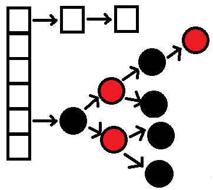

#### 分析底层table数组空间长度

通过HashMap集合的无参构造方法来创建集合，则底层table数组的空间长度默认为16。

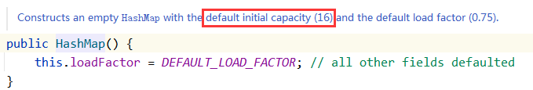

通过HashMap集合的有参构造方法创建集合，则底层table数组肯定为2的整数次幂，也就是**空间长度为大于实参的最小2的整数次幂**，如下代码所示：

```java
public class Test02 {
    public static void main(String[] args) {
        // 调用构造方法的实参为15，则底层的table数组空间长度为：16
        HashMap<String, Integer> hashMap1 = new HashMap<>(15);
        // 调用构造方法的实参为1000，则底层的table数组空间长度为：1024
        HashMap<String, Integer> hashMap2 = new HashMap<>(1000);
    }
}
```

为什么HashMap集合底层table数组的空间长度必须为2的整数次幂呢？？？把table数组空间长度设置为2的整数次幂，就是为了**加快散列计算**以及**减少散列冲突**。

为什么可以加快散列计算？因为& 运算属于位运算，是直接基于二进制做的操作，因此&运算比%运算效率更高。当table数组的空间长度（length）为2的整数次幂，则执行“hash & (length - 1)”和“hash % length”的运算的结果相同，但是&运算的效率高于%运算，所以建议哈希表的容量设置为2的整数次幂，代码验证如下：

```java
public class Test {
    public static void main(String[] args) {
        // 获得散列码值，值为：96354
        int hashCode = "abc".hashCode();
        System.out.println(hashCode);
        // 计算得到2^3的结果，结果为：8
        int length = (int)Math.pow(2, 3);
        // &运算结果为：2
        System.out.println(hashCode & (length - 1));
        // %运算结果为：2
        System.out.println(hashCode % length);
    }
}
```

为什么可以减少冲突？假设现在table数组空间长度length可能是偶数也可能是奇数。

当length为偶数时，则length-1为奇数，而奇数的二进制最低位肯定为1，这样hash &(length-1) 结果的二进制最低位可能为0，也可能为1（这取决于hash的值）。也就是运算的结果可能为偶数，也可能为奇数，这样便可以保证散列的均匀性。

当length为奇数时，则length-1为偶数，而偶数的二进制最低位肯定为0，这样hash & (length-1)结果的二进制最低位肯定为0。也就是运算的结果肯定为偶数，这样得到的结果对应的就是table数组索引为偶数的位置，那么流浪费了近一半的空间。

因此，table数组空间长度为2的整数次幂，是为了使不同hash值发生碰撞的概率较小，这样就能使元素在哈希表中均匀地散列。

#### 设置哈希表的初始化容量

当哈希表中的元素越来越多的时候，哈希碰撞的几率也就越来越高（因为数组的长度是固定的），从而导致单链表过长，降低了哈希表的性能，此时我们就需要对哈希表进行扩容操作。

那么HashMap什么时候进行扩容呢？当执行put()操作的时候，如果HashMap中存储元素的个数超过“数组长度* loadFactor”的结果（loadFactor指的是负载因子，loadFactor的默认值一般为0.75），那么就就需要执行数组扩容操作。

所谓的扩容操作，就是把数组的空间大小扩大一倍，然后遍历哈希表中元素，把这些元素重新均匀分散到扩容后的哈希表中。例如，默认情况下，数组大小为16，那么当Hashtable中元素个数超过16*0.75=12的时候，就需要执行扩容操作，把数组的大小扩展为2*16=32，然后重新计算每个元素在数组中的位置，这是一个非常消耗性能的操作。

为了避免扩容带来的性能损坏，建议使用哈希表之前，先预测哈希表需要存储元素的个数，提前为哈希表中的数组设置合适的存储空间大小，避免去执行扩容的操作，进一步提升哈希表的性能。例如：我们需要存储1000个元素，按照哈希表的容量设置为2的整数次幂的思想，我们设置哈希表的容量为1024更合适。但是0.75*1024 =768，也就是说当添加元素达到 768 的时候就要开始扩容了，因为你预计元素的个数是 1000 个，所以会执行消耗性能的扩容操作，因此我们设置哈希表的容量为2048更加合适，这样既考虑了&的问题，也避免了扩容的问题。 

思考：当我们创建一个HashMap对象，设置哈希表的容量为15，请问HashMap对象创建成功后，哈希表的实际容量为多少呢？？？**16 * 0.75=12，最多存储 12 个，第 13 个元素的时候就要扩容了。**


## LinkedHashMap类详解

### LinkedHashMap类概述

LinkedHashMap类继承于HashMap类，在LinkedHashMap类中没有新增任何方法，它的底层采用“哈希表+链表”结构，能够保证元素存与取的顺序完全一致。

LinkedHashMap集合和HashMap集合用法几乎一模一样。当然，LinkedHashMap集合中的key不能重复，我们需要通过重写hashCode()与equals()方法来保证可以的唯一。另外，key的取值可以为null，并且如果key发生了重复，则做覆盖操作。

### LinkedHashMap的使用

【示例】LinkedHashMap使用案例

```java
public class Test02 {
    public static void main(String[] args) {
        // 创建一个LinkedHashMap对象
        LinkedHashMap<String, Integer> map = new LinkedHashMap<>();
        // 添加键值对
        map.put("xixi", 11);
        map.put("haha", 22);
        map.put("hehe", 33);
        map.put(null, 44);
        // 获得key的迭代器
        Iterator<String> iterator = map.keySet().iterator();
        while (iterator.hasNext()) {
            // 获取key值
            String key = iterator.next();
            // 输出key和value
            System.out.println("key：" + key + "value：" + map.get(key));
        }
    }
}
```

## Hashtable类详解

### Hashtable类概述

Hashtable集合和HashMap集合用法几乎一模一样，它的底层依旧采用“哈希表”来存储键值对，具备查询速度快，在很多情况下它们可以互用。

只不过Hashtable类继承于Dictionary类并实现了Map接口，HashMap类只是Map接口的实现类。另外Hashtable的方法添加了Synchronized关键字确保线程同步检查，效率较低。在Hashtable类中，put(K key, V value)方法就增加了synchronized同步标记。

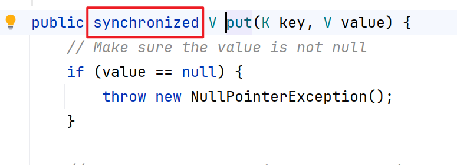

相比较于HashMap类，Hashtable类中还包含了许多传统的方法，显然这些方法都不属于集合框架，在Hashtable类中常见的传统方法如下所示：

| **方法名** | **说明** |
| --- | --- |
| public synchronized Enumeration keys() | 获得所有key的迭代器 |
| public synchronized Enumeration elements() | 获得所有value的迭代器 |

通过Hashtable的keys()和elements()方法，返回的结果是Enumeration接口，此处Enumeration接口功能类似于Iterator接口，都可以实现迭代器的效果，常见的方法如下：

| **方法名** | **说明** |
| --- | --- |
| boolean hasMoreElements(); | 判断迭代器中是否还有下一个元素 |
| E nextElement(); | 返回迭代的下一个元素，并把指针向后移动一位 |

### Hashtable的使用

【示例】Hashtable类传统方法演示

```java
public class Test {
        public static void main(String[] args) {
                // 创建Hashtable对象
                Hashtable<String, String> ht = new Hashtable<String, String>();
                // 添加键值对
                ht.put("cn", "China");
                ht.put("jp", "Japan");
                ht.put("us", "America");
                // 遍历所有的key，keys()方法类似于keySet()方法
                Enumeration<String> keys = ht.keys();
                while(keys.hasMoreElements()) {
                        String key = keys.nextElement();
                        System.out.println(key + "-->" + ht.get(key));
                }
                // 遍历所有的value，elements()方法类似于values()方法
                Enumeration<String> elements = ht.elements();
                while(elements.hasMoreElements()) {
                        String element = elements.nextElement();
                        System.out.println("value: " + element);
                }
        }
}
```

【新手建议】HashMap与HashTable的区别？

1. HashMap：线程不安全，效率高，允许key或value为null。
2. Hashtable：线程安全，效率低，不允许key或value为null。


## Properties类的详解

### Properties类概述

Java中有个比较重要的类Properties（Java.util.Properties），主要用于读取Java的配置文件，各种语言都有自己所支持的配置文件，配置文件中很多变量是经常改变的，这样做也是为了方便用户，让用户能够脱离程序本身去修改相关的变量设置。

在Java语言中，配置文件常为.properties文件，格式为文本文件，文件的内容的格式是“键=值”的格式，文本注释信息可以用"#"来注释。

Properties类继承自Hashtable类，属于线程安全的类，其特点如下：

1. 属于Hashtable的子类，Map集合中的方法都可以用。
2. 该Properties集合中没有泛型，键值都是字符串。
3. 它是一个可以持久化的属性集，具有和IO流技术相结合的方法。

### Properties的使用

在Properties集合中，除了能使用Map接口提供的方法，并且在Properties集合还新增了一些方法，常用的方法如下：

| **方法名** | **说明** |
| --- | --- |
| public synchronized Object setProperty(String key, String value) | 添加键值对的方法，底层调用put()方法来实现 |
| public String getProperty(String key) | 根据key获得value值 |
| public Set stringPropertyNames() | 获得key 的Set集合 |

【示例】演示Properties集合

```java
public class Test02 {
    public static void main(String[] args) {
        // 创建一个Properties对象
        Properties properties = new Properties();
        // 添加元素
        properties.setProperty("张三", "北京");
        properties.setProperty("李四", "天津");
        properties.setProperty("王五", "上海");
        properties.setProperty("赵六", "北京");
        properties.setProperty("王五", "西安"); // 此处会覆盖上海的王五
        // 获得所有的key的Set集合
        Set<String> set = properties.stringPropertyNames();
        // 通过迭代器来遍历Properties集合
        Iterator<String> iterator = set.iterator();
        while (iterator.hasNext()) {
            String key = iterator.next();
            String value = properties.getProperty(key);
            System.out.println("key：" + key + "，value：" + value);
        }
    }
}
```

## 二叉树和红黑二叉树

### 二叉树的定义

二叉树是树形结构的一个重要类型。 许多实际问题抽象出来的数据结构往往是二叉树的形式，即使是一般的树也能简单地转换为二叉树，而且二叉树的存储结构及其算法都较为简单，因此二叉树显得特别重要。

二叉树(BinaryTree)由一个结点及两棵互不相交的、分别称作这个根的左子树和右子树的二叉树组成。下图中展现了五种不同基本形态的二叉树。

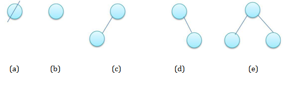

(a) 为空树。

(b) 为仅有一个结点的二叉树。

(c) 是仅有左子树而右子树为空的二叉树。

(d) 是仅有右子树而左子树为空的二叉树。

(e) 是左、右子树均非空的二叉树。

**排序二叉树特性如下：**

1. 左子树上所有节点的值均小于它的根节点的值。
2. 右子树上所有节点的值均大于它的根节点的值。

比如：我们要将数据【14, 12, 23, 4, 16, 13, 8, 3】存储到排序二叉树中，如下图所示：

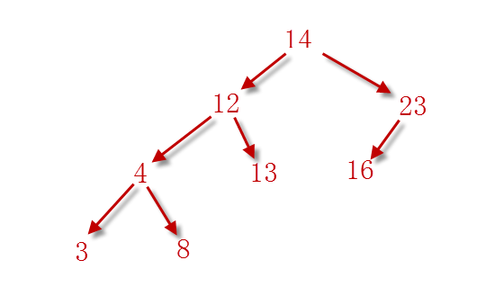

排序二叉树本身实现了排序功能，可以快速检索。但如果插入的节点集本身就是有序的，要么是由小到大排列，要么是由大到小排列，那么最后得到的排序二叉树将变成普通的链表，其检索效率就会很差。 比如上面的数据【14, 12, 23, 4, 16, 13, 8, 3】，我们先进行排序变成：【3, 4, 8, 12, 13, 14, 16, 23】，然后存储到排序二叉树中，显然就变成了链表，如下图所示：

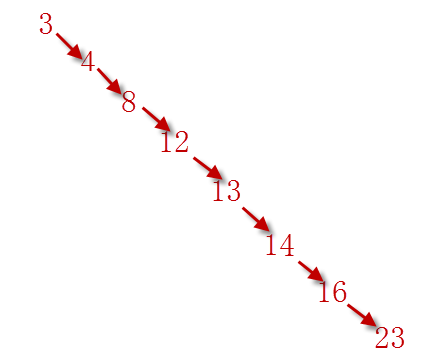

### 平衡二叉树(AVL)

为了避免出现上述一边倒的存储，科学家提出了“平衡二叉树”。

在平衡二叉树中任何节点的两个子树的高度最大差别为1，所以它也被称为高度平衡树。 增加和删除节点可能需要通过一次或多次树旋转来重新平衡这个树。

节点的平衡因子是它的左子树的高度减去它的右子树的高度(有时相反)。带有平衡因子1、0或 -1的节点被认为是平衡的。带有平衡因子-2或2的节点被认为是不平衡的，并需要重新平衡这个树。

比如，我们存储排好序的数据【3, 4, 8, 12, 13, 14, 16, 23】，增加节点如果出现不平衡，则通过节点的左旋或右旋，重新平衡树结构，最终平衡二叉树如下图所示：

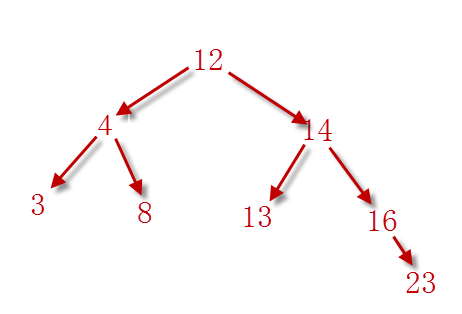

平衡二叉树追求绝对平衡，实现起来比较麻烦，每次插入新节点需要做的旋转操作次数不能预知（可视化数据结构网站：[https://www.cs.usfca.edu/~galles/visualization/Algorithms.html](https://www.cs.usfca.edu/~galles/visualization/Algorithms.html)）。


### 红黑二叉树

红黑二叉树(简称：红黑树)，它首先是一棵二叉树，同时也是一棵自平衡的排序二叉树。

红黑树在原有的排序二叉树增加了如下几个要求：

1. 每个节点要么红色，要么黑色。
2. 根节点永远是黑色。
3. 所有的叶节点都是空节点(即null)，并且是黑色的。
4. 每个红色节点的两个子节点都是黑色 (从每个叶子到根节点的路径上不会有两个连续的红色节点) 。
5. 从任一节点到其子树中每个叶子节点的路径都包含相同数量的黑色节点。

这些约束强化了红黑树的关键性质：从根到叶子的最长的可能路径不多于最短的可能路径的两倍长。这样就让树大致上是平衡的。

红黑树是一个更高效的检索二叉树，JDK 提供的集合类 TreeMap、TreeSet 本身就是一个红黑树的实现。红黑树的基本操作：插入、删除、左旋、右旋、着色。每插入或者删除一个节点，可能会导致树不在符合红黑树的特征，需要进行修复，进行 “左旋、右旋、着色” 操作，使树继续保持红黑树的特性。

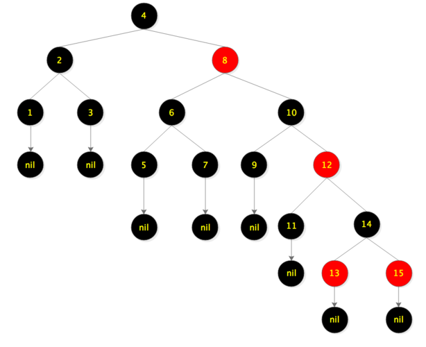

## TreeMap类使用详解

### TreeMap源码分析

TreeMap类属于Map接口的实现类，在TreeMap集合中没有新增方法，并且TreeMap存储的键值对还能实现排序操作。TreeMap底层通过红黑二叉树（Red-Black tree）来实现的。我们打开TreeMap的源码，发现里面有一行核心代码：

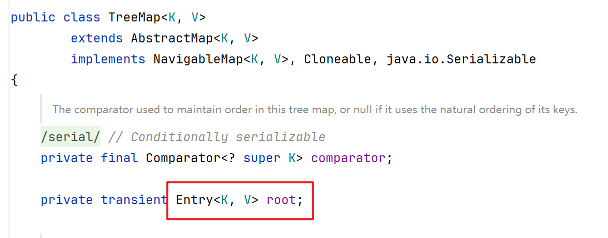

在源码中，私有属性root用来存储整个红黑树的根节点，我们再继续跟踪Entry（它是TreeMap的内部类）的代码：

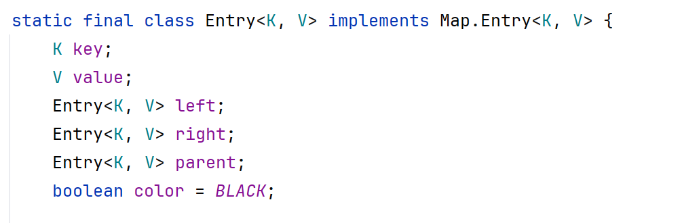

可以看到Entry节点类中包含了键（key）、值（key）、左节点（left）、右节点（right）、父节点（parent）以及节点颜色（color），从这里我们就能确定TreeMap底层采用的就是红黑二叉树来实现。

TreeMap基于红黑树来实现，也就是需要根据存储的key进行排序操作，执行排序操作就需要设置比较key的大小，也就意味着需要使用比较器来实现。

TreeMap中支持两种排序方式：

1. 方式一：根据key进行自然排序（使用Comparable接口来排序）
2. 方式二：根据key进行定制排序（使用Comparator接口进行排序） 。

具体使用哪些排序方式，完全取决于其使用的构造方法，常用的构造方法如下：

| **方法名** | **说明** |
| --- | --- |
| public TreeMap() | 创建一个空TreeMap，keys按照自然排序 |
| public TreeMap(Comparator<? super K> comparator) | 创建一个空TreeMap，按照指定的comparator排序 |

TreeMap和HashMap用法大致相同，而HashMap和TreeMap的区别如下：

1. HashMap是key无序的(key可以为null)，而TreeMap是key有序的（key不能为null）。
2. HashMap效率略高于TreeMap，在需要排序的Map时才选用TreeMap。


### 自然排序：Comparable接口

要想实现TreeMap的自然排序，我们就采用无参构造方法来实例化TreeMap对象，TreeMap的无参构造方法如下：

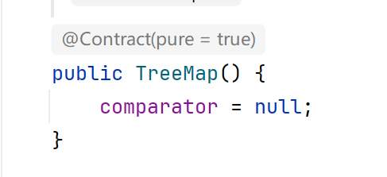

#### Java提供的类

对于key为Java提供的类（例如：String类、Integer类等），这些类都默认实现了Comparable接口，并且还实现了compareTo()方法，而且默认按照“升序”来进行排序。

接下来以key为String类型为例，我们按照“自然排序”来创建TreeMap集合，从而实现对key为字符串的升序排序。

【示例】key为Java提供类的案例

```java
public class Test02 {
    public static void main(String[] args) {
        // 创建TreeMap集合（采用自然排序）
        TreeMap<String, Integer> map = new TreeMap<String, Integer>();
        // 添加键值对
        map.put("a", 11);
        map.put("d", 44);
        map.put("c", 33);
        map.put("d", 55); // 会覆盖value值为44的键值对
        map.put("b", 22);
        // 遍历输出map中的键值对
        Iterator<Map.Entry<String, Integer>> iterator = map.entrySet().iterator();
        while(iterator.hasNext()) {
            Map.Entry<String, Integer> entry = iterator.next();
            System.out.println("key:" + entry.getKey() + " value:" + entry.getValue());
        }
    }
}
```

当compareTo()方法返回的结果为0，则意味着key发生了重复，排序后输出结果如下：

key:a value:11

key:b value:22

key:c value:33

key:d value:55

#### 自定义的类

如果key为自定义的类，则在自定义类中必须实现Comparable接口，并实现接口中提供的compareTo()方法，并且在重写的compareTo()方法中定义好排序规则，否则就会抛出java.lang.ClassCastException异常。

接下来，我们以TreeMap集合存储“学生对象-城市”为例，并且按照学生的年龄执行“升序”排序，来演示key为自定义类的存储过程，示例代码如下：

【示例】定义Student类，按照学生的年龄升序排序

```java
/**
 * 学生类
 */
public class Student implements Comparable<Student> {
    // 实例变量
    private String name;
    private int age;
    // 构造方法
    public Student() {}
    public Student(String name, int age) {
        this.name = name;
        this.age = age;
    }

    /**
     * 按照学生年龄执行升序排序，返回值规则如下：
     *   如果this.age大于stu.age，则返回正数
     *   如果this.age小于stu.age，则返回负数
     *   如果this.age等于stu.age，则返回零
     */
    @Override
    public int compareTo(Student stu) {
        return Integer.compare(this.age, stu.age);
    }

    // 重写toString()方法
    @Override
    public String toString() {
        return "Student{" +
                "name='" + name + '\'' +
                ", age=" + age +
                '}';
    }
}
```

在以上的Student类中，我们按照学生的年龄来实现升序排序，接下来按照“自然排序”来创建TreeMap集合，按照实现对Student对象的排序操作。

【示例】key为自定义类的案例

```java
public class Test02 {
    public static void main(String[] args) {
        // 创建TreeMap集合（采用自然排序）
        Map<Student, String> map = new TreeMap<>();
        // 添加键值对
        map.put(new Student("张三", 38), "天津");
        map.put(new Student("李四", 20), "北京");
        map.put(new Student("王五", 27), "北京");
        map.put(new Student("赵六", 18), "南京");
        map.put(new Student("王五", 27), "上海"); // 此处会覆盖“北京”
        // 使用迭代器来遍历TreeMap集合
        Iterator<Student> iterator = map.keySet().iterator();
        while (iterator.hasNext()) {
            Student key = iterator.next();
            System.out.println("key:" + key + ", value:" + map.get(key));
        }
    }
}
```

当compareTo()方法返回的结果为0，则意味着key发生了重复，以上案例输出结果如下：

key:Student{name='赵六', age=18}, value:南京

key:Student{name='李四', age=20}, value:北京

key:Student{name='王五', age=27}, value:上海

key:Student{name='张三', age=38}, value:天津


### 定制排序：Comparator接口

当我们采用自然排序的Comparable接口来实现排序时，那么每个类只能定义一种排序规则，如果某个类想实现多种排序规则，那么就必须采用定制排序的java.util.Comparator接口来实现。

要想实现TreeMap的定制排序，我们还需在构造方法中传入一个Comparator比较器，那么TreeMap就会按照定制排序的规则进行排序，使用TreeMap的构造方法如下：

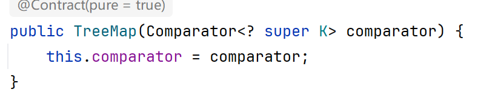

因此，我们使用外部比较器实现TreeMap集合的排序时，必须创建一个Comparator接口的实现类对象，在实现类中重写“int compare(T o1, T o2)”方法，并且还需在重写的方法中封装好排序规则。

接下来以key为字符串类型为例，并按照“定制排序”来创建TreeMap集合，按照实现对字符串的“降序”排序操作。

【示例】HashMap集合key为String类的降序排序

```java
public class Test02 {
    public static void main(String[] args) {
        // 创建TreeMap集合（采用定制排序）
        TreeMap<String, Integer> map = new TreeMap<>(new Comparator<String>() {
            /**
             * 按照降序执行排序
             */
            @Override
            public int compare(String o1, String o2) {
                return -o1.compareTo(o2);
            }
        });
        // 添加键值对
        map.put("a", 11);
        map.put("d", 44);
        map.put("c", 33);
        map.put("d", 55); // 会覆盖value值为44的键值对
        map.put("b", 22);
        // 遍历输出map中的键值对
        Iterator<Map.Entry<String, Integer>> iterator = map.entrySet().iterator();
        while(iterator.hasNext()) {
            Map.Entry<String, Integer> entry = iterator.next();
            System.out.println("key:" + entry.getKey() + " value:" + entry.getValue());
        }
    }
}
```

当compare()方法返回的结果为0，则意味着key发生了重复，以上案例输出结果如下：

key:d value:55

key:c value:33

key:b value:22

key:a value:11

接下来以key为Student类型为例，并按照“定制排序”来创建TreeMap集合，先按照对学生年龄执行“降序”排序的操作，然后再按照学生成绩执行“升序”排序。

【示例】定义Student类（无需在类中封装排序规则）

```java
/**
 * 学生类
 */
public class Student {
    // 实例变量
    private String name;
    private int age;
    private double score;
    // 构造方法
    public Student() {}
    public Student(String name, int age, double score) {
        this.name = name;
        this.age = age;
        this.score = score;
    }

    public String getName() {
        return name;
    }

    public void setName(String name) {
        this.name = name;
    }

    public int getAge() {
        return age;
    }

    public void setAge(int age) {
        this.age = age;
    }

    public double getScore() {
        return score;
    }

    public void setScore(double score) {
        this.score = score;
    }

    // 重写toString()方法
    @Override
    public String toString() {
        return "Student{" +
                "name='" + name + '\'' +
                ", age=" + age +
                ", score=" + score +
                '}';
    }
}
```

接下来，我们使用Comparator接口，按照学生的年龄执行升序排序，代码实现如下。

【示例】key为Student类，并且按照年龄执行降序排序

```java
public class Test02 {
    public static void main(String[] args) {
        // 创建TreeMap集合（采用定制排序）
        TreeMap<Student, String> map = new TreeMap<>(new Comparator<Student>() {
            /**
             * 按照学生年龄执行“降序”排序
             */
            @Override
            public int compare(Student stu1, Student stu2) {
                return -Integer.compare(stu1.getAge(), stu2.getAge());
            }
        });
        // 添加键值对
        map.put(new Student("张三", 38, 78.5), "天津");
        map.put(new Student("李四", 20, 99.5), "北京");
        map.put(new Student("王五", 27, 100.0), "北京");
        map.put(new Student("赵六", 18, 59.5), "南京");
        map.put(new Student("王五", 27, 67.0), "上海"); // 此处会覆盖“北京”
        // 使用迭代器来遍历TreeMap集合
        Iterator<Student> iterator = map.keySet().iterator();
        while (iterator.hasNext()) {
            Student key = iterator.next();
            System.out.println("key:" + key + ", value:" + map.get(key));
        }
    }
}
```

当compare()方法返回的结果为0，则意味着key发生了重复，以上案例输出结果如下：

key:Student{name='张三', age=38, score=78.5}, value:天津

key:Student{name='王五', age=27, score=100.0}, value:上海

key:Student{name='李四', age=20, score=99.5}, value:北京

key:Student{name='赵六', age=18, score=59.5}, value:南京

然后，我们继续使用Comparator接口，按照学生的成绩执行升序排序，代码实现如下。

【示例】key为Student类，并且按照成绩执行升序排序

```java
public class Test02 {
    public static void main(String[] args) {
        // 创建TreeMap集合（采用定制排序）
        TreeMap<Student, String> map = new TreeMap<>(new Comparator<Student>() {
            /**
             * 按照学生成绩执行“升序”排序
             */
            @Override
            public int compare(Student stu1, Student stu2) {
                return Double.compare(stu1.getScore(), stu2.getScore());
            }
        });
        // 添加键值对
        map.put(new Student("张三", 38, 78.5), "天津");
        map.put(new Student("李四", 20, 99.5), "北京");
        map.put(new Student("王五", 27, 100.0), "北京");
        map.put(new Student("赵六", 18, 99.5), "南京");// 此处会覆盖“北京”
        map.put(new Student("王麻子", 27, 67.0), "上海");
        // 使用迭代器来遍历TreeMap集合
        Iterator<Student> iterator = map.keySet().iterator();
        while (iterator.hasNext()) {
            Student key = iterator.next();
            System.out.println("key:" + key + ", value:" + map.get(key));
        }
    }
}
```

当compare()方法返回的结果为0，则意味着key发生了重复，以上案例输出结果如下：

key:Student{name='王麻子', age=27, score=67.0}, value:上海

key:Student{name='张三', age=38, score=78.5}, value:天津

key:Student{name='李四', age=20, score=99.5}, value:南京

key:Student{name='王五', age=27, score=100.0}, value:北京

**使用TreeMap要点：**

1. TreeMap集合内部要做排序，要么使用Comparable接口，要么使用Comparator接口。
2. TreeMap的key不能为null，否则抛出java.lang.NullPointerException异常。


# Set接口

## Set接口介绍

Set接口继承自Collection接口，在Set接口中没有新增任何方法，Set接口的方法和Collection接口的方法完全一致，因此学习Set集合的使用将没有任何难度。

Set接口有多个实现类，常见的实现类有HashSet、LinkedHashSet和TreeSet。

Set集合特点：无序、不可重复。无序指Set集合存储的元素无序（添加和遍历顺序不一致）；不可重复指不允许加入重复的元素。

## HashSet类详解

### HashSet源码分析

HashSet类属于Set接口的实现类，在HashSet类中没有新增任何方法，并且HashSet依旧采用哈希表来实现，因此添加元素对应的类就必须重写hashCode()和equals()方法。

在HashSet集合中，底层实际上采用HashMap来存储元素的，因此HashSet集合本质就是一个简化版的HashMap。我们打开HashSet集合的源码，发现里面有一行核心代码：

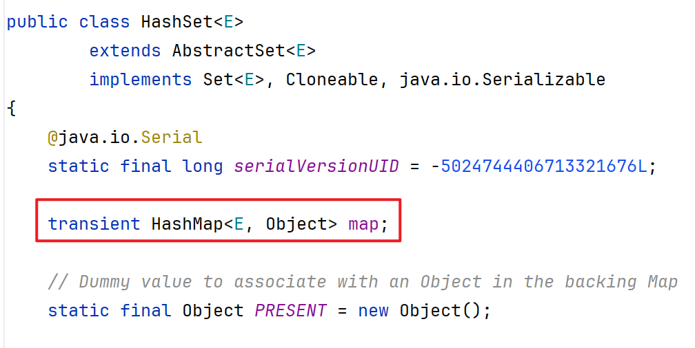

我们发现里面有个map属性，这就是HashSet的核心秘密。我们再看add()方法，发现增加一个元素说白了就是在map中增加一个键值对，键对象就是要添加的元素，值对象是名为PRESENT的Object对象。说白了，就是“往set中加入元素，本质就是把这个元素作为key加入到了内部的HashMap集合中”。

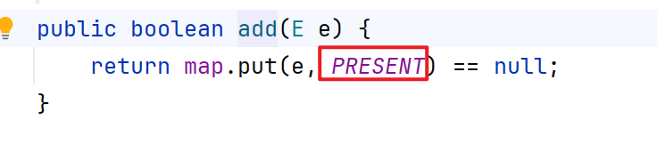

由于HashMap集合中的key不能重复的，并且HashMap存储的键值对都是无序的，因此HashSet存储的元素也不能重复，并且HashSet存储的元素还属于无序。

### HashSet 集合的使用

当HashSet集合中存储元素为Java提供的类时，则就无需手动重写元素对应类的equals()和hashCode()方法，因为Java提供的类中已经重写了这两个方法，如String类、Integer类等。

【示例】HashSet存储 String

```java
public class Test02 {
    public static void main(String[] args) {
        // 实例化HashSet集合
        HashSet<String> set = new HashSet<String>();
        // 添加元素
        set.add("aaa");
        set.add("bbb");
        set.add("ccc");
        set.add("bbb"); // 元素重复，添加失败。
        // 输出元素
        Iterator<String> iterator = set.iterator();
        while (iterator.hasNext()) {
            System.out.println(iterator.next());
        }
    }
}
```

输出结果如下，说明HashSet集合不能存储重复元素，并且存储元素还属于无序：

aaa

ccc

bbb

向HashSet集合中存储自定义类型元素时，则存储元素对应的类就必须手动重写hashCode()和equals()方法，这样才能保证HashSet集合存储元素的唯一性。

【示例】定义Student类

```java
/**
 * 学生类
 */
public class Student {
    // 实例变量
    private String name;
    private int age;
    // 构造方法
    public Student() {}
    public Student(String name, int age) {
        this.name = name;
        this.age = age;
    }
    // 重写equals()方法
    @Override
    public boolean equals(Object o) {
        if (this == o) return true;
        if (o == null || getClass() != o.getClass()) return false;
        Student student = (Student) o;
        return age == student.age && Objects.equals(name, student.name);
    }
    // 重写hashCode()方法
    @Override
    public int hashCode() {
        return Objects.hash(name, age);
    }

    // 重写toString()方法
    @Override
    public String toString() {
        return "Student{" +
                "name='" + name + '\'' +
                ", age=" + age +
                '}';
    }
}
```

【示例】创建 HashSet 集合，存储 Student对象

```java
public class Test01 {
    public static void main(String[] args) {
        // 实例化HashSet集合
        HashSet<Student> set = new HashSet<>();
        // 添加元素
        set.add(new Student("张三", 23));
        set.add(new Student("王五", 33));
        set.add(new Student("李四", 28));
        set.add(new Student("王五", 33)); // 元素重复，添加失败
        // 使用迭代器遍历HashSet集合
        Iterator<Student> iterator = set.iterator();
        while(iterator.hasNext()) {
            Student stu = iterator.next();
            System.out.println(stu);
        }
    }
}
```

输出结果如下，说明HashSet集合不能存储重复元素，并且存储元素还属于无序：

Student{name='张三', age=23}

Student{name='王五', age=33}

Student{name='李四', age=28}


### HashSet的面试题

分析以下代码，然后思考输出的结果是什么，并且分析为什么会有这样的结果。

【示例】HashSet的面试题（做以下题目的前提是已经重写 Student 的 **hashCode+equals**）

```java
public class Test01 {
    public static void main(String[] args) {
        // 创建HashSet集合
        HashSet<Student> set = new HashSet<>();
        // 创建Student对象
        Student stu = new Student("张三", 18);
        // 添加元素
        set.add(stu);
        set.add(new Student("李四", 21));
        System.out.println("添加元素后：" + set);
        // 修改stu对象的实例变量值，则集合中存储对象的实例变量也改变
        stu.setName("王五");

        // 问题1：请问是否删除了HashSet集合中的stu对象呢？？？
        set.remove(stu);
        System.out.println("删除元素后：" + set);

        // 问题2：添加以下Student对象是否成功？？？
        set.add(new Student("王五", 18));
        System.out.println("添加元素后：" + set);

        // 问题3：添加以下Student对象是否成功？？？
        set.add(new Student("张三", 18));
        System.out.println("添加元素后：" + set);
    }
}
```

问题1：请问是否删除了HashSet集合中的stu对象呢？？？

答案：不能，stu对象实例变量值发生变化，则stu对象的哈希值也发生变化，而集合中存储元素的哈希值没改变，因此肯定删除失败。

问题2：添加以下Student对象是否成功？？？

答案：成功，添加元素的哈希值和存储元素的哈希值不一样，可视为添加的元素没有重复。

问题3：添加以下Student对象是否成功？？？

答案：成功，添加元素的哈希值和存储元素的哈希值虽然相同，但是调用equals()方法结果为false，可视为添加的元素没有重复。

总结：使用HashSet存储元素时，切记不要修改元素的实例变量值，使用HashMap存储键值对时，也切记不要修改key的实例变量值，否则就会产生一些额外问题。


## LinkedHashSet类详解

HashSet集合存储的元素不能重复，但是HashSet集合存储的元素却属于“无序”的，想要实现存储元素的“有序”，并且还要求存储的元素不能重复，那么该如何实现呢？

想要实现以上需求，我们就可以使用LinkedHashSet集合来实现。LinkedHashSet类继承于HashSet类，在LinkedHashSet类中没有新增任何方法，使用的方法和HashSet一致。

在LinkedHashSet集合中，默认采用了“哈希表+双链表”来实现，因此存储元素对应的类就必须重写equals()和hashCode()方法，这样就能保证存储的元素的唯一性，并且LinkedHashSet集合存储的元素还具备有序的特点（添加和遍历顺序一致）。

【示例】使用LinkedHashSet集合的案例

```java
/**
 * 学生类
 */
public class Student {
    // 实例变量
    private String name;
    private int age;
    // 构造方法
    public Student() {}
    public Student(String name, int age) {
        this.name = name;
        this.age = age;
    }
    // 重写equals()方法
    @Override
    public boolean equals(Object o) {
        if (this == o) return true;
        if (o == null || getClass() != o.getClass()) return false;
        Student student = (Student) o;
        return age == student.age && Objects.equals(name, student.name);
    }
    // 重写hashCode()方法
    @Override
    public int hashCode() {
        return Objects.hash(name, age);
    }

    // 重写toString()方法
    @Override
    public String toString() {
        return "Student{" +
                "name='" + name + '\'' +
                ", age=" + age +
                '}';
    }
}
public class Test01 {
    public static void main(String[] args) {
        // 实例化LinkedHashSet集合
        LinkedHashSet<Student> set = new LinkedHashSet<>();
        // 添加自定义对象
        set.add(new Student("张三", 23));
        set.add(new Student("李四", 28));
        set.add(new Student("王五", 33));
        set.add(new Student("李四", 28)); // 元素重复，添加失败
        // 输出set中的每个元素
        Iterator<Student> iterator = set.iterator();
        while(iterator.hasNext()) {
            Student stu = iterator.next();
            System.out.println(stu);
        }
    }
}
```

输出结果如下，说明LinkedHashSet集合不能存储重复元素，并且存储元素还有序：

Student{name='张三', age=23}

Student{name='李四', age=28}

Student{name='王五', age=33}


## TreeSet类详解

### TreeSet源码分析

TreeSet类属于Set接口的实现类，在TreeSet类中没有新增任何方法，并且底层采用“红黑树”来实现，因此使用TreeSet集合就必须配合“比较器”来实现。

在TreeSet集合中，底层实际上采用TreeMap来存储元素的，因此TreeSet集合本质就是一个简化版的TreeMap。我们打开TreeSet集合的源码，发现里面有一行核心代码：

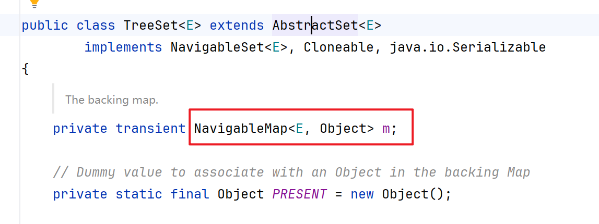

NavigableMap是一个接口，而TreeMap类就属于NavigableMap接口的实现类，因此给m赋值的就可以为TreeMap集合，此处使用了“多态”来实现，分析构造方法源码如下：

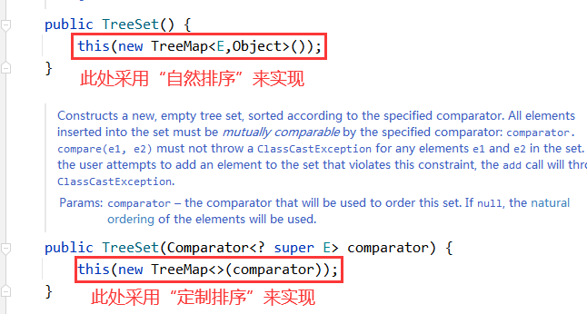

接下来，我们再分析add()方法的源码，发现增加一个元素就是在TreeMap集合中增加一个键值对，键对象就是添加元素，值对象是名为PRESENT的Object对象。说白了，就是“往TreeSet集合中添加元素，本质就是把这个元素作为key加入到了内部的TreeMap集合中”。

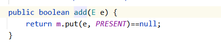

因为TreeMap集合存储的key不能重复，并且TreeMap还能根据key实现排序操作，因此TreeSet集合存储的元素也不能重复，并且存储的元素还可以实现排序（升序|降序）操作。

### 自然排序：Comparable接口

要想实现TreeSet集合的自然排序，我们就采用无参构造方法来实例化TreeSet集合，TreeSet类的无参构造方法如下：

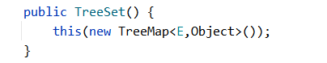

#### Java提供的类

对于添加的元素为Java提供的类（例如：String类、Integer类等），因为Java提供的类默认已经实现Comparerable接口，并且还实现了compareTo()方法，而且默认按照“升序”来进行排序。

接下来以添加String类型元素为例，我们按照“自然排序”来创建TreeSet集合，从而实现对字符串类型元素的升序排序。

【示例】使用HashSet集合存储字符串

```java
public class Test02 {
    public static void main(String[] args) {
        // 实例化TreeSet集合（自然排序）
        TreeSet<String> set = new TreeSet<>();
        // 添加元素
        set.add("cc");
        set.add("aa");
        set.add("bb");
        set.add("dd");
        set.add("bb"); // 元素重复，添加失败
        // 遍历元素
        Iterator<String> iterator = set.iterator();
        while(iterator.hasNext()) {
            System.out.println(iterator.next());
        }
    }
}
```

当compareTo()方法返回的结果为0，则意味着添加元素发生重复，以上案例输出结果如下：

aa

bb

cc

dd

#### 自定义排序

HashSet集合存储的元素为自定义的类时，则在自定义类中必须实现Comparable接口，并重写接口的compareTo方法，否则就会抛出java.lang.ClassCastException异常。

接下来，我们以HashSet集合存储Student对象为例，并且按照学生的年龄进行“升序”排序，代码实现如下。

【示例】定义Student类（封装排序规则）

```java
/**
 * 学生类
 */
public class Student implements Comparable<Student> {
    // 实例变量
    private String name;
    private int age;
    // 构造方法
    public Student() {}
    public Student(String name, int age) {
        this.name = name;
        this.age = age;
    }

    /**
     * 按照学生年龄执行升序排序，返回值规则如下：
     *   如果this.age大于stu.age，则返回正数
     *   如果this.age小于stu.age，则返回负数
     *   如果this.age等于stu.age，则返回零
     */
    @Override
    public int compareTo(Student stu) {
        return Integer.compare(this.age, stu.age);
    }

    // 重写toString()方法
    @Override
    public String toString() {
        return "Student{" +
                "name='" + name + '\'' +
                ", age=" + age +
                '}';
    }
}
```

在以上的Student类中，我们按照学生的年龄来实现升序排序，接下来按照“自然排序”来创建TreeSet集合，按照实现对学生年龄的升序排序。

【示例】创建TreeSet集合，并按照年龄执行升序排序

```java
public class Test02 {
    public static void main(String[] args) {
        // 创建TreeSet集合（自然排序）
        TreeSet<Student> set = new TreeSet<>();
        // 添加键值对
        set.add(new Student("张三", 38));
        set.add(new Student("李四", 20));
        set.add(new Student("王五", 27));
        set.add(new Student("赵六", 20)); // 元素重复，添加失败
        // 遍历map
        Iterator<Student> iterator = set.iterator();
        while (iterator.hasNext()) {
            System.out.println(iterator.next());
        }
    }
}
```

当compareTo()方法返回的结果为0，则意味着添加元素发生重复，以上案例输出结果如下：

Student{name='李四', age=20}

Student{name='王五', age=27}

Student{name='张三', age=38}


### 定制排序：Comparator接口

要想实现TreeSet集合的定制排序，我们就采用有参构造方法来实例化TreeSet集合，TreeSet类的有参构造方法如下：

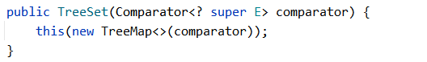

因为Java提供的类默认实现Comparerable接口，并且还实现了compareTo()方法，而且默认按照“升序”来进行排序。如果使用TreeSet集合来存储Java提供类的对象，并且还需要实现降序排序，那么就必须使用TreeSet集合的定制排序来实现。

【示例】HashSet集合存储元素为String的降序排序

```java

public class Test02 {
    public static void main(String[] args) {
        // 创建TreeSet集合（定制排序）
        TreeSet<String> set = new TreeSet<>();
        // 添加元素
        set.add("cc");
        set.add("aa");
        set.add("dd");
        set.add("bb");
        set.add("cc"); // 元素重复，添加失败
        // 遍历TreeSet集合
        Iterator<String> iterator = set.iterator();
        while (iterator.hasNext()) {
            System.out.println(iterator.next());
        }
    }
}
```

当compare()方法返回的结果为0，则意味着添加元素发生重复，以上案例输出结果如下：

aa

bb

cc

dd

使用TreeSet集合来存储Student对象，我们按照“定制排序”来创建TreeSet集合，然后按照对学生年龄执行“降序”排序的操作，代码实现如下。

【示例】定义学生类（无需封装排序规则）

```java
/**
 * 学生类
 */
public class Student {
    // 实例变量
    private String name;
    private int age;
    // 构造方法
    public Student() {}
    public Student(String name, int age) {
        this.name = name;
        this.age = age;
    }

    public String getName() {
        return name;
    }

    public void setName(String name) {
        this.name = name;
    }

    public int getAge() {
        return age;
    }

    public void setAge(int age) {
        this.age = age;
    }

    // 重写toString()方法
    @Override
    public String toString() {
        return "Student{" +
                "name='" + name + '\'' +
                ", age=" + age +
                '}';
    }
}
```

接下来，我们使用TreeSet集合来存储Student对象，并按照学生的年龄执行“降序”排序，实现代码如下。

【示例】使用TreeSet集合来存储Student对象，实现按照学生年龄降序排序

```java
public class Test01 {
    public static void main(String[] args) {
        // 实例化TreeSet集合（定制排序）
        TreeSet<Student> set = new TreeSet<>(new Comparator<Student>() {
            /**
             * 按照年龄执行“降序”排序
             */
            @Override
            public int compare(Student stu1, Student stu2) {
                return -Integer.compare(stu1.getAge(), stu2.getAge());
            }
        });
        // 添加元素
        set.add(new Student("张三", 23));
        set.add(new Student("王五", 33));
        set.add(new Student("李四", 28));
        set.add(new Student("王五", 33));  // 添加失败
        // 使用迭代器遍历HashSet集合
        Iterator<Student> iterator = set.iterator();
        while(iterator.hasNext()) {
            Student stu = iterator.next();
            System.out.println(stu);
        }
    }
}
```

当compare()方法返回的结果为0，则意味着添加元素发生重复，以上案例输出结果如下：

Student{name='王五', age=33}

Student{name='李四', age=28}

Student{name='张三', age=23}

**使用TreeSet要点：**

1. 由于底层为二叉树实现，需要对存储元素做排序操作。要么实现Comparable接口（自然排序），要么实现Comparator接口（定制排序）。
2. TreeSet中不能放入null元素，否则抛出java.lang.NullPointerException异常。


# Collections工具类

java.util.Collections 类提供了对Set、List进行排序、填充、查找元素的辅助方法。

## 排序（sort）

在Collections工具类中，专门提供了sort()方法用来对List类型集合执行排序，它有两种参数形式：

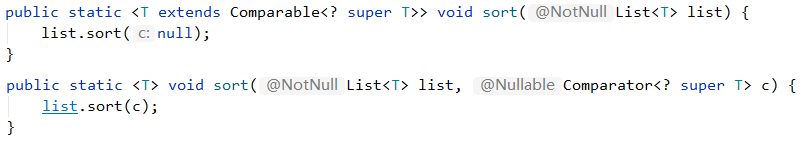

也就意味着，我们可以使用内部比较器执行List集合中的元素执行排序，也可以使用外部比较器实现List集合中的元素执行排序。

【示例】使用Comparable接口，实现List集合排序

```java
/**
 * 学生类
 */
public class Student implements Comparable<Student> {
    // 实例变量
    private String name;
    private int age;
    // 构造方法
    public Student() {}
    public Student(String name, int age) {
        this.name = name;
        this.age = age;
    }

    // 按照学生年龄执行升序排序
    @Override
    public int compareTo(Student stu) {
        return Integer.compare(this.age, stu.age);
    }

    // 重写toString()方法
    @Override
    public String toString() {
        return "Student{" +
                "name='" + name + '\'' +
                ", age=" + age +
                '}';
    }
}
/**
 * 测试类
 */
public class Test01 {
    public static void main(String[] args) {
        // 创建一个list对象
        ArrayList<Student> list = new ArrayList<>();
        // 添加学生对象
        list.add(new Student("张三", 18));
        list.add(new Student("李四", 31));
        list.add(new Student("王五", 23));
        list.add(new Student("赵六", 17));
        list.add(new Student("罗七", 28));
        // 按照学生年龄执行升序排序
        Collections.sort(list);
        // 遍历集合中的元素
        Iterator<Student> iterator = list.iterator();
        while (iterator.hasNext()) {
            System.out.println(iterator.next());
        }
    }
}
```

【示例】使用Comparator接口，实现List集合排序

```java
/**
 * 学生类
 */
public class Student {
    // 实例变量
    private String name;
    private int age;
    // 构造方法
    public Student() {}
    public Student(String name, int age) {
        this.name = name;
        this.age = age;
    }

    public String getName() {
        return name;
    }

    public void setName(String name) {
        this.name = name;
    }

    public int getAge() {
        return age;
    }

    public void setAge(int age) {
        this.age = age;
    }
    // 重写toString()方法
    @Override
    public String toString() {
        return "Student{" +
                "name='" + name + '\'' +
                ", age=" + age +
                '}';
    }
}
/**
 * 测试类
 */
public class Test01 {
    public static void main(String[] args) {
        // 创建一个list对象
        ArrayList<Student> list = new ArrayList<>();
        // 添加学生对象
        list.add(new Student("张三", 18));
        list.add(new Student("李四", 31));
        list.add(new Student("王五", 23));
        list.add(new Student("赵六", 17));
        list.add(new Student("罗七", 28));
        // 按照学生年龄执行升序排序
        Collections.sort(list, new Comparator<Student>() {
            @Override
            public int compare(Student stu1, Student stu2) {
                return Integer.compare(stu1.getAge(), stu2.getAge());
            }
        });
        // 遍历集合中的元素
        Iterator<Student> iterator = list.iterator();
        while (iterator.hasNext()) {
            System.out.println(iterator.next());
        }
    }
}
```


## 混排（shuffle）

混排算法所做的正好与sort相反，它打乱在一个List中可能有的任何排列的踪迹，也是就是对元素进行随机排列。这个算法在实现一个碰运气的游戏中是非常有用的。例如，它可被用来混排代表一副牌的Card对象的一个List。

【示例】shuffling随机排序

```java
public class Test03 {
    public static void main(String[] args) {
        // 实例化一个list集合
        ArrayList<Integer> list = new ArrayList<>();
        // 添加元素
        for (int i = 1; i <= 10; i++) {
            list.add(i);
        }
        // 随机排序
        Collections.shuffle(list);
        // 遍历集合
        Iterator<Integer> iter = list.iterator();
        while(iter.hasNext()) {
            System.out.println(iter.next());
        }
    }
}
```

## 反转（reverse）

使用reverse方法可以根据元素的自然顺序，对指定列表按降序进行排序。

【示例】reverse倒序排序

```java
public class Test04 {
    public static void main(String[] args) {
        // 实例化一个list集合
        ArrayList<Integer> list = new ArrayList<>();
        // 添加元素
        for (int i = 1; i <= 10; i++) {
            list.add(i);
        }
        // 反序排序
        Collections.reverse(list);
        // 遍历集合
        Iterator<Integer> iter = list.iterator();
        while(iter.hasNext()) {
            System.out.println(iter.next());
        }
    }
}
```

## 替换所有的元素（fill）

使用指定元素替换指定列表中的所有元素。

【示例】fill替换所有的元素

```java
public class Test04 {
    public static void main(String[] args) {
        // 实例化一个list集合
        ArrayList<Integer> list = new ArrayList<>();
        // 添加元素
        for (int i = 1; i <= 10; i++) {
            list.add(i);
        }
        // 填充元素
        Collections.fill(list, 666);;
        // 遍历集合
        Iterator<Integer> iter = list.iterator();
        while(iter.hasNext()) {
            System.out.println(iter.next());
        }
    }
}
```