# 第10章 Java I_O


# File类

## File类的概述

实例化一个File对象就可以表示某个“文件”或“目录”。在开发中，创建文件（目录）、删除文件（目录）、操作文件属性等操作就会使用File类，但是使用File无法操作文件中的内容（操作文件中的内容需要使用IO的技术）。

File类的常见构造方法：public File(String pathname)

pathname代表文件路径，该路径可以为相对路径，也可以为绝对路径。如果pathname是相对路径，则默认的当前路径在系统属性user.dir中存储。

【示例】分别以相对路径和绝对路径创建File对象

```java
public static void main(String[] args) throws IOException {
        // 获取当前工作目录路径
        System.out.println(System.getProperty("user.dir"));
        // 1.相对路径创建File对象：默认放到user.dir目录下面
        File file1 = new File("abc.txt");
        // 创建文件
        file1.createNewFile();
        // 2.绝对路径创建File对象
        File file2 = new File("D:/abc.txt");
        // 创建文件
        file2.createNewFile();
}
```

在idea项目开发中，user.dir就是当前工作空间的目录。因此，执行完毕后，在本项目和D盘下都生成了新的文件(如果是IDEA环境中，一定按F5刷新目录结构才能看到新文件)。

File类的其它构造方法，详情请查看以下表格：

| **构造方法** | **描述** |
| --- | --- |
| public File(String parent, String child) | 根据parent路径名字符串和child路径名字符串创建一个新File实例 |

例如以下代码：

```java
File f = new File("d:/test1", "test2/image.jpg");
System.out.println(f.getPath()); // d:\test1\test2\image.jpg
```

## File类的方法

### File类获取功能

| **方法名** | **描述** |
| --- | --- |
| public String getName() | 返回由此抽象路径名表示的文件或目录的名称 |
| public String getPath() | 返回此抽象路径名的绝对路径或相对路径 |
| public String getAbsolutePath() | 返回此抽象路径名的绝对形式（绝对路径） |
| public long lastModified() | 返回此抽象路径名表示文件最后一次被修改的时间 |
| public long length() | 返回由此抽象路径名表示的文件的长度 |

【示例】File类基本获取功能

```java
// 1.相对路径创建File对象
File file = new File("abc.txt");
// 2.获取文件或目录名字
System.out.println(file.getName());
// 3.返回此抽象路径名的绝对形式（绝对路径或相对路径）。 
System.out.println(file.getPath());
// 4.返回此抽象路径名的绝对形式（绝对路径）。 
System.out.println(file.getAbsolutePath());
// 5.返回此抽象路径名表示的文件最后一次被修改的时间 
System.out.println(file.lastModified());
// 6.返回由此抽象路径名表示的文件的长度。 
System.out.println(file.length());
```


### File类判断功能

| **方法名** | **描述** |
| --- | --- |
| public boolean exists() | 测试此抽象路径名表示的文件或目录是否存在 |
| public boolean isDirectory() | 测试此抽象路径名表示的文件是否是一个目录 |
| public boolean isFile() | 测试此抽象路径名表示的文件是否是一个标准文件 |
| public boolean isHidden() | 测试此抽象路径名指定的文件是否是一个隐藏文件 |
| public boolean canRead() | 测试应用程序是否可以读取此抽象路径名表示的文件 |
| public boolean canWrite() | 测试应用程序是否可以修改此抽象路径名表示的文件 |

【示例】File类判断功能案例

```java
// 1.相对路径创建File对象
File file = new File("abc.txt");
// 2.测试此抽象路径名表示的文件或目录是否存在。 
System.out.println(file.exists());
// 3.测试此抽象路径名表示的文件是否是一个目录。
System.out.println(file.isDirectory());
// 4.测试此抽象路径名表示的文件是否是一个标准文件。
System.out.println(file.isFile());
// 5.测试此抽象路径名指定的文件是否是一个隐藏文件。
System.out.println(file.isHidden());
// 6.测试应用程序是否可以读取此抽象路径名表示的文件。 
System.out.println(file.canRead());
// 7.测试应用程序是否可以修改此抽象路径名表示的文件。 
System.out.println(file.canWrite());
```

### File类其它功能

| **方法名** | **描述** |
| --- | --- |
| public boolean mkdir() | 创建一个文件夹 |
| public boolean mkdirs() | 创建多个文件夹 |
| public boolean createNewFile() | 创建文件，如果文件不存在，则创建 |
| public boolean delete() | 删除此抽象路径名表示的文件或目录 |
| public boolean renameTo(File dest) | 移动文件，并对移动后的文件重新命名 |
| public String[] list() | 返回字符串数组，元素为子文件名字或子目录名字 |
| public File[] listFiles() | 返回一个File数组，该元素为子目录File对象 |

【示例】File类其它常见功能案例

```java
public static void main(String[] args) throws IOException {
        // 1.mkdir方法使用(G盘下没有demo文件夹)
        File file1 = new File("G:/demo");
        if(!file1.exists()) { // 判断文件夹是够存在
                file1.mkdir(); // 不存在则创建一个文件夹
        }
        // 2.mkdirs方法使用(G盘下没有java和demo文件夹)
        File file2 = new File("G:/java/demo");
        if(!file2.exists()) { // 判断文件夹是够存在
                file2.mkdirs(); // 不存在则创建多个文件夹
        }
        // 3.createNewFile方法使用(G盘下没有abc.txt文件)
        File file3 = new File("G:/abc.txt");
        if(!file3.exists()) { // 判断文件是够存在
                file3.createNewFile(); // 不存在则创建该文件
        }
        // 4.delete方法，删除文件或文件夹
        file1.delete(); // 删除文件文件夹
        file3.delete(); // 删除文件
        // 5.renameTo方法，文件重命名
        file3.renameTo(new File("G:/haha.txt"));
        // 6.list方法，遍历文件和文件夹
        File file4 = new File("G:");
        for(String path : file4.list()) {
                System.out.println(path);
        }
        // 7.listFiles方法，遍历目录中的文件
        for(File file : file4.listFiles()) {
                System.out.println(file);
        }
}
```


## File类的过滤器

通过listFiles()方法，我们可以获取到一个目录下的所有文件和文件夹，但能不能对其进行过滤呢？比如我们只想要一个目录下的指定扩展名的文件，或者包含某些关键字的文件夹呢？

我们是可以先把一个目录下的所有文件和文件夹获取到，并遍历当前获取到所有内容，遍历过程中在进行筛选，但是这个动作有点麻烦，Java 给我们提供相应的功能来解决这个问题。

查阅File类的API，在查阅时发现File类中重载的listFiles方法，并且接受指定的过滤器。

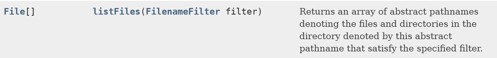

【示例】获取扩展名为.java所有文件

```java
package com.jkweilai.filedemo;
import java.io.File;
import java.io.FilenameFilter;
public class FileDemo {
    public static void main(String[] args) {
        // 创建 File 对象
        File file = new File("C:/Users/test/Desktop");
        // 获取指定扩展名的文件
        File[] list = file.listFiles(new FilenameFilter() {
            /**
             * 执行过滤操作
             * @param dir 指的是需要遍历的file对象
             * @param name 遍历出来的文件夹或文件名称
             * @return 如果返回true，则保留获得该文件或文件夹
             */
            @Override
            public boolean accept(File dir, String name) {
                return name.endsWith(".java");
            }
        });
        // 遍历获取到的所有符合条件的文件
        for(File f : list) {
            System.out.println(f.getName());
        }
    }
}
```

在查阅API时，我们发现，在listFiles(FileFilter filter) 也可以接受一个 FileFilter过滤器，它和我们讲的FilenameFilter有啥区别呢？

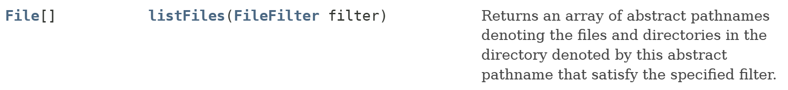

FilenameFilter过滤器中的accept方法接受两个参数，一个当前目录的File对象，另一个是遍历出来的文件或文件夹对象的名称。

FileFilter 过滤器中的accept方法接受一个参数，这个参数就遍历出来文件或文件夹的File对象。

当我们需要过滤文件名称时就可以使用FilenameFilter这个过滤器，当我们想对遍历出来的File对象进行过滤，就可以使用FileFilter，比如需要当前目录下的所有文件夹，就可以使用FileFilter过滤器。

【示例】获取指定目录下的文件

```java
package com.jkweilai.filedemo;
import java.io.File;
import java.io.FileFilter;
import java.io.FilenameFilter;
public class FileDemo {
    public static void main(String[] args) {
        // 创建 File 对象
        File file = new File("C:/Users/test/Desktop");
        // 获取指定目录下的文件
        File[] files = file.listFiles(new FileFilter() {
            /**
             * 执行过滤操作
             * @param pathname 遍历出来的file对象
             * @return 如果返回true，则保留获得该文件或文件夹
             */
            @Override
            public boolean accept(File pathname) {
                return pathname.isFile();
            }
        });
        // 遍历获取到的所有符合条件的文件
        for (File f : files) {
            System.out.println(f.getName());
        }
    }
}
```


## 遍历目录和文件案例

【示例】File类的综合应用，遍历盘符下所有的目录和文件

```java
public class FileDemo {
        public static void main(String[] args) {
                File file = new File("G:/demo");
                printFile(file, 0);
        }
        /**
         * 打印文件信息
         * @param file 文件名称
         * @param level 层次数(实际就是：第几次递归调用)
         */
        public static void printFile(File file, int level) {
                // 1.输出层次结构
                for(int i = 0; i < level; i++) {
                        System.out.print("-");
                }
                // 2.输出文件或文件夹名称
                System.out.println(file.getName());
                // 3.遍历是否为文件夹
                if(file.isDirectory()) {
                        // 4.获取文件中所有的子文件
                        File[] files = file.listFiles();
                        // 5.遍历所有子文件
                        for(File f : files) {
                                // 6.继续打印文件信息
                                printFile(f, level + 1);
                        }
                }
        }
}
```

# IO流概述

## 输入和输出的理解

对于任何程序设计语言而言，输入输出(Input/Output)系统都是非常核心的功能。程序运行需要数据，数据的获取往往需要跟外部系统进行通信，外部系统可能是文件、数据库、其它程序、网络、IO设备等等。

外部系统比较复杂多变，那么我们有必要通过某种手段进行抽象、屏蔽外部的差异，从而实现更加便捷的编程。

输入(Input)指的是：可以让程序从外部系统获得数据（核心含义是“读”，读取外部数据）。

常见的应用：

1. 读取硬盘上的文件内容到程序。
  1. 例如：播放器打开一个视频文件、word打开一个doc文件。
2. 读取网络上某个位置内容到程序。
  1. 例如：浏览器中输入网址打开该网址对应的网页内容、下载网络上某个网址的文件。
3. 读取数据库系统的数据到程序。
4. 读取某些硬件系统数据到程序。
  1. 例如：车载电脑读取雷达扫描信息到程序。

输出(Output)指的是：程序输出数据给外部系统从而可以操作外部系统（核心含义是“写”，将数据写出到外部系统）。

常见的应用：

1. 将数据写到硬盘中。 
  1. 例如：我们编辑完一个word文档后，将内容写到硬盘上进行保存。
2. 将数据写到数据库系统中。
  1. 例如：我们注册一个网站会员，实际就是后台程序向数据库中写入一条记录。
3. 将数据写到某些硬件系统中。


## 数据源和流的理解

- **数据源**：就是**水的来源或目的地**（比如水塔、水库、你家水龙头）。
- **流**：就是**水管本身**，它负责在水源和目的地之间建立通道，让水（数据）可以单向流动。

### 数据源

**数据源** 是指数据的原始来源或最终目的地。它本身并不是流，而是流操作的对象。

你可以把它理解为数据的“端点”。在Java中，几乎任何可以读写数据的地方都可以被视为数据源。

**常见的数据源类型包括：**

1. **文件**
  - 这是最常见的数据源。例如硬盘上的 `<font style="color:rgb(15, 17, 21);background-color:rgb(235, 238, 242);">.txt</font>`, `<font style="color:rgb(15, 17, 21);background-color:rgb(235, 238, 242);">.jpg</font>`, `<font style="color:rgb(15, 17, 21);background-color:rgb(235, 238, 242);">.mp3</font>` 等文件。
  - **作为源（输入）**：从文件读取数据。
  - **作为目的地（输出）**：向文件写入数据。
2. **网络连接**
  - 例如一个网站的服务器，或者另一个正在运行的应用程序。
  - **作为源（输入）**：从网络套接字读取数据。
  - **作为目的地（输出）**：向网络套接字写入数据。
3. **内存**
  - 比如一个字节数组 `<font style="color:rgb(15, 17, 21);background-color:rgb(235, 238, 242);">byte[]</font>` 或字符串 `<font style="color:rgb(15, 17, 21);background-color:rgb(235, 238, 242);">String</font>`。
  - **作为源（输入）**：从内存中的数组读取数据。
  - **作为目的地（输出）**：向内存中的数组写入数据。
4. **键盘/控制台/显示器**
  - **标准输入（**[**System.in**](https://system.in/)**）**：通常指键盘，是一个输入数据源。
  - **标准输出（System.out）**：通常指控制台/显示器，是一个输出数据源。
  - **标准错误（System.err）**：同标准输出，用于输出错误信息。

**核心要点：** 数据源是**静态的**，它就在那里（在硬盘上、在网络上、在内存里），它自己不会动。我们需要一个东西（也就是“流”）来主动地从它那里读取数据，或者向它那里写入数据。

### 流

**流** 是一个抽象的概念，它代表了一个**连续的、单向的数据序列**。你可以把它看作是在数据源（或目的地）与你的Java程序之间搭建的一座桥梁、一条通道。

流的关键特性是**单向性**：

- **输入流**：只能从数据源**读取**数据到程序中。
- **输出流**：只能从程序**写入**数据到目的地。


## IO流的分类和体系

### 按流的方向分类

输入流：数据流向是数据源到程序(InputStream、Reader结尾的流)

输出流：数据流向是程序到目的地(OutPutStream、Writer结尾的流)

### 按处理的数据单位分类

根据处理数据的单位，流可以分为两大类：

1. **字节流（Byte Streams）**
  - **处理单位**：以字节（8-bit）为单位进行读写(InputStream、OutputStream)，命名上以stream结尾的流一般是字节流
  - **特点**：可以处理所有类型的数据，包括图片、音频、视频等二进制文件，当然也包括文本文件。它是万能的，但处理文本时可能不够方便。
2. **字符流（Character Streams）**
  - **处理单位**：以字符（16-bit Unicode）为单位进行读写(Reader、Writer)，命名上以Reader/Writer结尾的流一般是字符流。
  - **特点**：专门为处理文本数据而设计。它能自动处理字符编码（如UTF-8, GBK），避免乱码问题。不能用于处理图片、视频等二进制文件。

### 按照流的“连接角色”和“功能层次”进行分类

节点流（普通流）：可以直接从数据源或目的地读写数据。

处理流（包装流）：不直接连接到数据源或目的地，是“处理流的流”。通过对其它流进行封装，目的主要是简化操作和提高程序的性能。

节点流处于IO操作的第一线，所有操作必须通过他们进行；处理流可以对节点流进行包装，提高性能或提高程序的灵活性。

### IO流的体系

Java为我们提供了多种多样的IO流，我们可以根据不同的功能及性能要求挑选合适的IO流，以下操作IO流的类都在java.io包中。

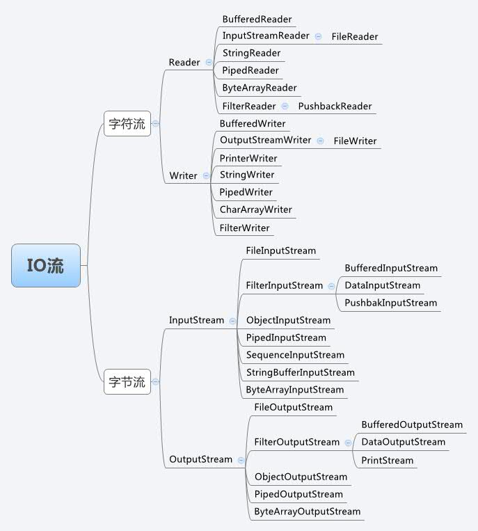

注：这里只列出常用的类，详情可以参考API文档。

# 字节流

## OutputStream类

OutputStream是一个抽象类，属于所有“字节输出流”的老祖宗。操作的数据单元为“字节”，该类中定义了字节输出流的基本共性功能方法。

OutputStream类中常见的方法：

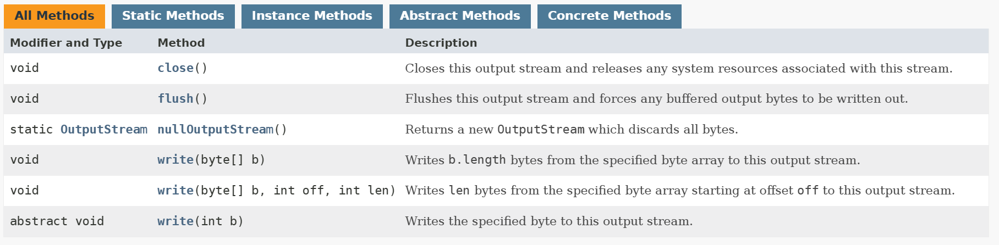


## FileOutputStream类

FileOutputStream类属于OutputStream抽象类的实现类，在FileOutputStream类中没有新增别的方法，因此该类使用的都是OutputStream抽象类的方法。 

FileOutputStream类通过“字节”的方式写出数据到文件，适合所有类型文件（图片文件、视频文件、音乐文件和文本文件等等）。

### 构造方法

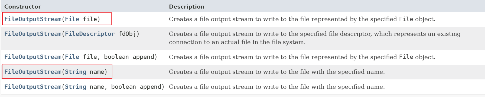

### 写入数据到文件中

【示例】将数据写到文件中

```java
public class FileOutputStreamDemo {
        public static void main(String[] args) {
                OutputStream os = null;
                try {
                        // 创建一个字节输出流，明确需要操作的文件
                        // 如果文件不存在，则创建；如果文件存在，则覆盖！
                        os = new FileOutputStream(new File("test.txt"));
                        // 调用父类的方法存数据。
                        os.write("jkweilai".getBytes());
                } catch (FileNotFoundException e) {
                        e.printStackTrace();
                } catch (IOException e) {
                        e.printStackTrace();
                } finally {
                        // 一定要判断 os 是否为 null，只有不为null时，才可以关闭资源
                        if(os != null) {
                                try {
                                        os.close();
                                } catch (IOException e) {
                                        e.printStackTrace();
                                }
                        }
                }        
        }
}
```

### 给文件中续写

我们直接 new FileOutputStream(file)这样创建对象，写入数据，会覆盖原有的文件，那么我们想在原有的文件中续写内容怎么办呢？

继续查阅 FileOutputStream 的 API。发现在 FileOutputStream类的构造函数中，可以接受一个boolean类型的值，如果参数值为true，就会在文件末位继续添加。

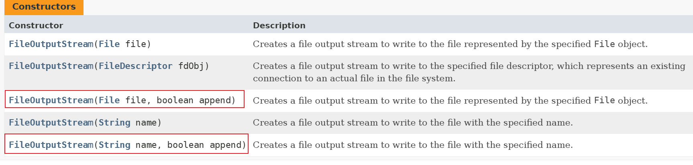

【示例】将数据续写到文件中

```java
public class FileOutputStreamDemo {
        public static void main(String[] args) {
                OutputStream os = null;
                try {
                        // 创建一个字节输出流，明确需要操作的文件
                        os = new FileOutputStream(new File("test.txt"), true);
                        // 调用父类的方法存数据。
                        os.write("jkweilai\n".getBytes());
                        os.write("jkweilai".getBytes());
                } catch (FileNotFoundException e) {
                        e.printStackTrace();
                } catch (IOException e) {
                        e.printStackTrace();
                } finally {
                        // 一定要判断 os 是否为null，只有不为null时，才可以关闭资源
                        if(os != null) {
                                try {
                                        os.close();
                                } catch (IOException e) {
                                        e.printStackTrace();
                                }
                        }                        
                }
        }
}
```

## InputStream类

InputSteam类是一个抽象类，是所有“字节输入流”的老祖宗。操作的数据单元为“字节”，该类定义了字节输入流的基本共性功能方法。

InputStream类中常见的方法：

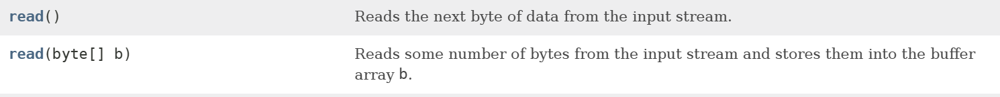

int read(): 读取一个字节的数据。读取成功，则返回读取的字节对应的正整数；读取失败，则返回-1。 

int read(byte[]): 读取一定量的字节数，并存储到字节数组中。读取成功，则返回读取的字节的个数；读取失败，则返回-1。


## FileInputStream类

FileInputStream类属于InputStream抽象类的实现类，并且在FileInputStream类中没有新增任何方法，因此该类使用的都是InputStream抽象类的方法。 

我们可以通过FileInputStream类来“读取”文件中的数据，每次读取的数据单位为“字节”，适合读取所有类型文件（图片文件、视频文件、文本文件等）。

### 构造方法

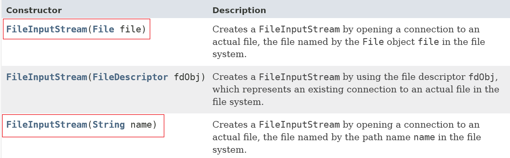

### 读取数据 read() 方法

在读取文件中的数据时，调用read()方法每次读一个字节，从而实现从文件中读取数据。

【示例】读取数据 read() 方法

```java
public class FileInputStreamDemo {
        public static void main(String[] args) {
                FileInputStream fs = null;
                try {
                        // 创建一个字节输入流对象,必须明确数据源
            // 如果文件不存在，则抛出FileNotFoundException异常！
                        fs = new FileInputStream("input.txt");
                        // 一次读一个字节
                        int len = 0;
                        // 当返回值为-1，则数据读取完毕
                        while ((len = fs.read()) != -1) {
                                System.out.println((char)len);
                        }
                } catch (FileNotFoundException e) {
                        e.printStackTrace();
                } catch (IOException e) {
                        e.printStackTrace();
                } finally {
                        if(fs != null) {
                                try {
                                        fs.close();
                                } catch (IOException e) {
                                        e.printStackTrace();
                                }
                        }
                }
        }
}
```


### 读取数据 read(byte[])方法

在读取文件中的数据时，调用read()方法，每次只能读取一个字节太麻烦，于是我们可以定义数组作为临时的存储容器，这时可以调用重载的read(char[] ch)方法，每次就可以读取多个字节。

【示例】读取数据 read(byte[])方法

```java
public class FileInputStreamDemo {
        public static void main(String[] args) {
                FileInputStream fs = null;
                try {
                        // 创建一个字节输入流对象,必须明确数据源
                        fs = new FileInputStream("test.txt");
                        StringBuilder sb = new StringBuilder();
                        byte[] by = new byte[1024];
                        int len = 0; // 保存获取到字节的长度
                        // 当返回值为-1，则数据读取完毕
                        while ((len = fs.read(by)) != -1) {
                                sb.append(new String(by, 0, len));
                        }
                        // 输出内容
                        System.out.println(sb);
                } catch (FileNotFoundException e) {
                        e.printStackTrace();
                } catch (IOException e) {
                        e.printStackTrace();
                } finally {
                        if(fs != null) {
                                try {
                                        fs.close();
                                } catch (IOException e) {
                                        e.printStackTrace();
                                }
                        }
                }
        }
}
```

### 一次性读取文件全部数据

使用FileInputStream类的available()方法，可以获取文件的所有字节个数。但是该方法建议少用，如果遇到文件数据量很大，容易造成内存溢出。

【示例】一次性读取文件全部数据

```java
public class FileInputStreamDemo {
        public static void main(String[] args) {
                FileInputStream fs = null;
                try {
                        // 创建一个字节输入流对象，必须明确数据源
                        fs = new FileInputStream("test.txt");
                        int len = 0;
                        // 获取文件字节个数
                        int available = fs.available();
                        byte[] by = new byte[available];
                        // 一次性获取文件所有数据
                        fs.read(by);
                        System.out.println(new String(by));
                } catch (FileNotFoundException e) {
                        e.printStackTrace();
                } catch (IOException e) {
                        e.printStackTrace();
                } finally {
                        if(fs != null) {
                                try {
                                        fs.close();
                                } catch (IOException e) {
                                        e.printStackTrace();
                                }
                        }
                }
        }
}
```

保存文件时编码的区别：

1. utf-8：英文字符占用一个字节，中文字符占用三个字节。
2. GBK：英文字符占用一个字节，中文字符占用两个字节。
3. Unicode：每个字符都是占用两个字节！


## 字节流文件拷贝案例

思路：读取一个已有的数据，并将这些读到的数据写入到另一个文件中。

【示例】字节流文件的拷贝案例

```java
public class FileCopyDemo {
    public static void main(String[] args) {
        FileInputStream fis = null; // 输入流
        FileOutputStream fos = null; // 输出流
        try {
            // 明确字节流，输入流和源相关联，输出流和目的关联。
            fis = new FileInputStream("E://movie.mp4");
            fos = new FileOutputStream("F://movie_copy.mp4");
            // 定义一个数组，用于缓存取出来的数据
            byte[] by = new byte[1024];
            int len = 0;
            // 输入流，读取数据
            while ((len = fis.read(by)) != -1) {
                // 输出流，保存数据
                fos.write(by, 0, len);
            }
        } catch (IOException e) {
            e.printStackTrace();
        } finally {
            // 关闭流
            if (fis != null) {
                try {
                    fis.close();
                } catch (IOException e) {
                    e.printStackTrace();
                }
            }
            if (fos != null) {
                try {
                    fos.close();
                } catch (IOException e) {
                    e.printStackTrace();
                }
            }
        }
    }
}
```


# 字符流

字节流可以操作任意格式的文件（例如：视频文件、音乐文件、文本文件和*.doc文件等），但是字符流只能操作文本文件（例如：以.txt和.java后缀的文件）。

## Writer类

Writer类是一个抽象类，是所有“字符输出流”的老祖宗。操作的数据单元为“字符”，该类定义了字符输出流的基本共性功能方法。

Writer类中常见的方法：

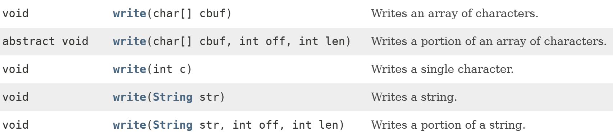

## FileWriter类

FileWriter类属于Writer抽象类的实现类，在FileWriter类中没有新增任何方法。FileWriter类用于向文件文件中存储数据，并且每次操作的数据单元为“字符”，属于向文本文件存储字符数据的便捷类。

### 构造方法

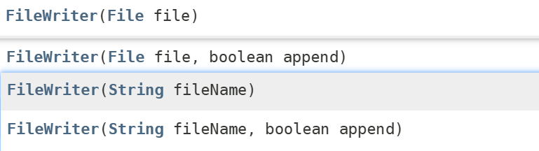

### 写入数据到文件中

【示例】将数据写到文件中

```java
public class FileWriteDemo {
        public static void main(String[] args) {
                Writer fw = null;
                try {
                        // 创建字符输出流，明确需要操作的文件
                        fw = new FileWriter("demo.txt");
                        // 写入字符文件
                        fw.write("hello world!");
                        // 强制刷新保存数据
                        fw.flush();
                } catch (IOException e) {
                        e.printStackTrace();
                } finally {
                        if(fw != null) {
                                try {
                                        // 关闭流，刷新数据+关闭流
                                        fw.close();
                                } catch (IOException e) {
                                        e.printStackTrace();
                                }        
                        }
                }
        }
}
```


### 给文件中续写

发现在FileWriter的构造方法中，可以接受一个boolean类型的参数值，如果参数值为true，就会在文件末位继续添加内容。

【示例】将数据续写到文件中

```java
public class FileWriteDemo01 {
        public static void main(String[] args) {
                Writer fw = null;
                try {
                        // 创建字符输出流，明确需要操作的文件
                        fw = new FileWriter("demo.txt", true);
                        // 写入字符文件
                        fw.write("hello world!");
                        // 强制刷新保存数据
                        fw.flush();
                } catch (IOException e) {
                        e.printStackTrace();
                } finally {
                        if(fw != null) {
                                try {
                                        // 关闭流，刷新数据+关闭流
                                        fw.close();
                                } catch (IOException e) {
                                        e.printStackTrace();
                                }        
                        }
                }
        }
}
```

## Reader类

Reader类是一个抽象类，是所有“字符输入流”的老祖宗。操作的数据单元为“字符”，该类定义了字符输入流的基本共性功能方法。

Reader类中常见的方法：

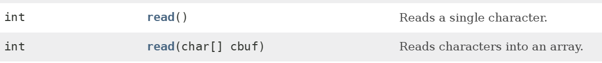

read(): 读取单个字符并返回。读取成功，则返回字符对应的正整数，读取失败，则返回-1。

read(char[]): 将数据读取到字符数组中。读取成功，则返回读取字符的个数，读取失败，则返回-1。


## FileReader类

FileReader类属于Reader抽象类的实现类，在FileReader类中没有新增任何方法。

FileWriter类用于向文件中读取数据，并且每次操作的数据单元为“字符”，属于向文本文件读取字符数据的便捷类。

### 构造方法

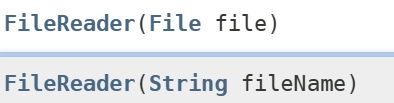

### 读取数据 read() 方法

在读取文本文件中的数据时，如果调用read()方法每次只能读取一个字符。

【示例】读取数据 read() 方法

```java
public class FileReaderDemo01 {
        public static void main(String[] args) {
                FileReader fr = null;
                try {
                        // 创建一个读取流对象，一定要明确读取的文件，并且保证文件路径正确
                        fr = new FileReader("demo.txt");
                        StringBuffer sb = new StringBuffer();
                        int len = 0;
                        // 一次读取一个字符，当返回值为-1，则数据读取完毕
                        while ((len = fr.read()) != -1) {
                                sb.append((char) len);
                        }
                        System.out.println("string: " + sb);
                } catch (FileNotFoundException e) {
                        e.printStackTrace();
                } catch (IOException e) {
                        e.printStackTrace();
                } finally {
                        if (fr != null) {
                                try {
                                        fr.close();
                                } catch (IOException e) {
                                        e.printStackTrace();
                                }
                        }
                }
        }
}
```


### 读取数据 read(char[])方法

在读取文件中的数据时，调用read()方法，每次只能读取一个字符，太麻烦了，于是我们可以定义数组作为临时的存储容器，这时可以调用重载的read(char[])方法，一次可以读取多个字符。

【示例】读取数据 read(char[])方法

```java
public class FileReaderDemo {
        public static void main(String[] args) {
                FileReader fr = null;
                try {
                        // 创建一个读取流对象，一定要明确读取的文件，并且保证文件路径正确
                        fr = new FileReader("demo.txt");
                        StringBuffer sb = new StringBuffer();
                        int len = 0;
                        char[] buf = new char[1024];
                        // 一次性读取多个字符，当返回值为-1，则数据读取完毕
                        while ((len = fr.read(buf)) != -1) {
                                sb.append(new String(buf, 0, len));
                        }
                        System.out.println(sb);
                } catch (FileNotFoundException e) {
                        e.printStackTrace();
                } catch (IOException e) {
                        e.printStackTrace();
                } finally {
                        if (fr != null) {
                                try {
                                        fr.close();
                                } catch (IOException e) {
                                        e.printStackTrace();
                                }
                        }
                }
        }
}
```

## 字符流文件拷贝案例

思路：读取一个已有的数据，并将这些读到的数据写入到另一个文件中。

【示例】字符流文件的拷贝案例

```java
public class FileWriterReaderDemo {
    public static void main(String[] args) {
        FileReader fr = null;
        FileWriter fw = null;
        try {
            // 创建字符输入流
            fr = new FileReader("E://demo.txt");
            // 创建字符输出流
            fw = new FileWriter("F://demo.txt");
            // 读取数据
            int len = 0;
            char[] chars = new char[1024];
            // 读取文件中的数据
            while ((len = fr.read(chars)) != -1) {
                // 保存读取的数据
                fw.write(chars, 0, len);
            }
        } catch (IOException e) {
            e.printStackTrace();
        } finally {
            // 关闭资源
            if (fw != null) {
                try {
                    fw.close();
                } catch (IOException e) {
                    e.printStackTrace();
                }
            }
            if (fr != null) {
                try {
                    fr.close();
                } catch (IOException e) {
                    e.printStackTrace();
                }
            }
        }
    }
}
```


# 缓冲流

## 缓冲流概述

### 包装流（处理流）

IO流根据功能划分，可以分为：节点流和包装流（处理流）。

1. 节点流：可以从或向一个特定的地方（节点）读写数据，例如：FileOutputStream、FileInputStream、FileReader、FileWriter 等。
2. 包装流：对一个已存在的流的连接和封装，通过所封装的流的提供的方法实现数据读写操作，例如：缓冲流、转换流和对象流等。

**怎么区分节点流和处理流？看构造方法，如果所有的构造方法中，只要有一个构造方法支持传 File/文件路径字符串，则该流是节点流。**

### 缓冲流的概述

在我们学习字节流与字符流的时候，大家都进行过读取文件中数据的操作，读取数据量大的文件时，读取的速度会很慢，很影响我们程序的效率，那么我想提高效率，怎么办呢？

那么可以使用缓冲流进行文件读取操作，缓冲流是一个包装流，目的是缓存作用，加快读取和写入数据的速度。

- 字节缓冲流：BufferedInputStream、BufferedOutputStream
- 字符缓冲流：BufferedReader、BufferedWriter

注意：缓冲流属于包装流，只能对已有的流进行封装，不能直接关联文件进行操作

### 缓冲流的原理

原理：先把数据写入到缓冲区，等缓冲区存储满了，再把缓冲区的数据写出到文件中或写入到程序中。

例如：家里盖房子，有一堆砖头要搬在工地100米外，单字节的读取就好比你一个人每次搬一块砖头，从堆砖头的地方搬到工地，这样肯定效率低下。然而聪明的人类会用小推车，每次先搬砖头搬到小车上，再利用小推车运到工地上去，这样你再从小推车上取砖头是不是方便多了呀！这样效率就会大大提高，缓冲流就好比我们的小推车，给数据暂时提供一个可存放的空间。

总结：通过缓冲流较少了与磁盘的交互次数（操作内存效率高，操作硬盘效率低），因此缓冲流的读取效率高。

## 字节缓冲流

字节缓冲流根据流的方向，共有 2 个：

1. 写入数据到流中，字节缓冲输出流 BufferedOutputStream
2. 读取流中的数据，字节缓冲输入流 BufferedInputStream

它们的内部都包含了一个缓冲区，通过缓冲区读写，就可以提高了 IO 流的读写速度。

### BufferedOutputStream类

BufferedOutputStream类属于OutputStream抽象类的实现类，在BufferedOutputStream类中没有新增任何方法。

- **构造方法**

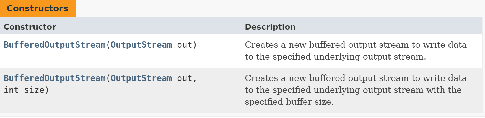

我们可以指定缓冲区的大小，一般情况下，使用默认的缓冲区大小就足够了（默认为8192）。

- **向文件中写出数据**

【示例】使用字节缓冲流向文件中写数据

```java
public class BufferedByteDemo {
    public static void main(String[] args)  {
        BufferedOutputStream bos = null;
        try {
            // 创建字节缓冲输出流
            FileOutputStream fos = new FileOutputStream("test.txt");
            bos = new BufferedOutputStream(fos);
            // 存数据
            bos.write("jkweilai".getBytes());
        } catch (IOException e) {
            e.printStackTrace();
        } finally {
            // 关闭流
            if (bos != null) {
                try {
                    bos.close();
                } catch (IOException e) {
                    e.printStackTrace();
                }
            }
        }
    }
}
```

关闭缓冲流的时候，我们查看API底层源码，可知关闭缓冲流的方法时，方法内部已经实现对字节流的关闭，所以此处我们只需要关闭缓冲流即可。


### BufferedInputStream类

BufferedInputStream类属于InputStream抽象类的实现类，在BufferedInputStream类中没有新增任何方法。

- **构造方法**

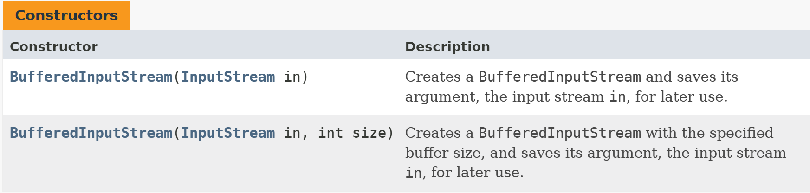

我们可以指定缓冲区的大小，一般情况下，使用默认的缓冲区大小就足够了（默认为8192）。

- **从文件中读入数据**

【示例】使用字节缓冲流从文件中读数据

```java
public class BufferedByteDemo {
    public static void main(String[] args) {
        BufferedInputStream bis = null;
        try {
            // 创建字节缓冲输入流
            FileInputStream fis = new FileInputStream("test.txt");
            bis = new BufferedInputStream(fis);
            // 读取数据
            int len = 0;
            byte[] by = new byte[1024];
            StringBuilder sb = new StringBuilder();
            while ((len = bis.read(by)) != -1) {
                sb.append(new String(by, 0, len));
            }
            System.out.println(sb);
        } catch (IOException e) {
            e.printStackTrace();
        } finally {
            // 关闭流
            if (bis != null) {
                try {
                    bis.close();
                } catch (IOException e) {
                    e.printStackTrace();
                }
            }
        }
    }
}
```

我们查看API底层源码，可知调用关闭缓冲流的方法时，方法内部已经实现对字节流的关闭，所以此处我们只需要关闭缓冲流即可。

### 字节缓冲流拷贝案例

【示例】字节缓冲流拷贝案例

```java
public class BufferedByteDemo {
    public static void main(String[] args) {
        BufferedInputStream bis = null;
        BufferedOutputStream bos = null;
        try {
            // 创建IO流（字节缓冲输入流和字节缓冲输出流）
            FileInputStream fis = new FileInputStream("E:\\战狼.avi");
            bis = new BufferedInputStream(fis);
            FileOutputStream fos = new FileOutputStream("F:\\战狼.avi");
            bos = new BufferedOutputStream(fos);
            // 拷贝数据（读取|写入）
            // 读取数据
            byte[] by = new byte[1024];
            int len = 0;
            while ((len = bis.read(by)) != -1) {
                // 存储数据
                bos.write(by, 0, len);
            }
        } catch (IOException e) {
            e.printStackTrace();
        } finally {
            // 关闭资源
            if (bis != null) {
                try {
                    bis.close();
                } catch (IOException e) {
                    e.printStackTrace();
                }
            }
            if (bos != null) {
                try {
                    bos.close();
                } catch (IOException e) {
                    e.printStackTrace();
                }
            }
        }
    }

}
```

思考：使用【节点流】和【缓冲流】分别实现文件的拷贝操作，感受两者的工作效率差别。


## 字符缓冲流

为了提高字符流读写的效率，引入了缓冲机制，进行字符批量的读写，提高了单个字符读写的效率。BufferedReader类用于加快读取字符的速度，BufferedWriter类用于加快写入的速度。

字符缓冲流根据流的方向，共有2个：

- 写入数据到流中，字符缓冲输出流BufferedReader
- 读取流中的数据，字符缓冲输入流BufferedWriter

### BufferedWriter类

BufferedWriter类属于Writer抽象类的实现类，在BufferedWriter类中新增了newLine()方法。

- 构造方法

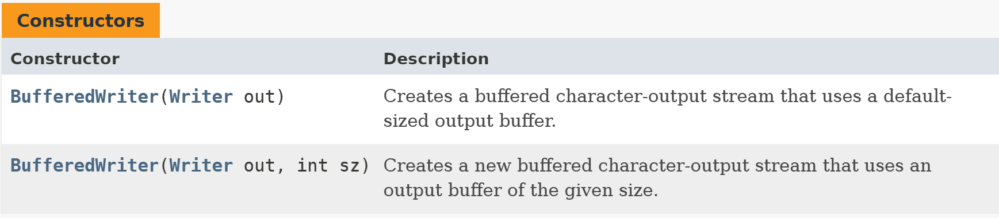

我们可以指定缓冲区的大小，一般情况下，使用默认的缓冲区大小就足够了（默认为8192）。

- 新增的方法

在BufferedWriter类中，不但继承了Writer抽象类的方法，还新增了newLine()方法。


newLine()方法会根据当前的操作系统，写入一个换行符。

**关于flush()方法使用场景：**

假设我们有1100个字符要写到文件中，缓冲区大小假设为1000，在程序执行时，先将字符写到缓冲区中，缓冲区满了，才会触发磁盘交互的（真正的写操作）。这会导致第二次写的时候，因缓冲区没有被填满，无法触发真正的写操作。这时我们需要调用缓冲流自带的一个方法flush（强制写入）将缓冲区的内容强制写入到文件中去。

- 向文件中写数据

【示例】使用字符缓冲流向文件中写数据

```java
public class BufferedCharDemo {
    public static void main(String[] args) {
        BufferedWriter bw = null;
        try {
            // 创建字符输出流
            Writer w = new FileWriter("demo.txt");
            bw = new BufferedWriter(w);
            // 存储数据
            for(int i = 0; i < 5; i++) {
                bw.write("你好啊");
                // 添加换行符
                bw.newLine();
                bw.flush();
            }
        } catch (IOException e) {
            e.printStackTrace();
        } finally {
            // 关闭资源
            if (bw != null) {
                try {
                    bw.close();
                } catch (IOException e) {
                    e.printStackTrace();
                }
            }
        }
    }
}
```

注意：关闭缓冲流时已经实现对字符流的关闭，所以此处我们只需要关闭缓冲流即可。

- **flush()和 close()的区别**


flush(): 将流中的缓冲区缓冲的数据刷新到目的地中，刷新后，流还可以继续使用。

close(): 关闭资源，但在关闭前会将缓冲区中的数据先刷新到目的地，否则丢失数据，然后在关闭流。关闭流之后就不能再做write()或flush()操作，否则抛出异常。


### BufferedReader类

BufferedReader类属于Reader抽象类的实现类，在BufferedReader类中新增了readLine()方法。

- 构造方法

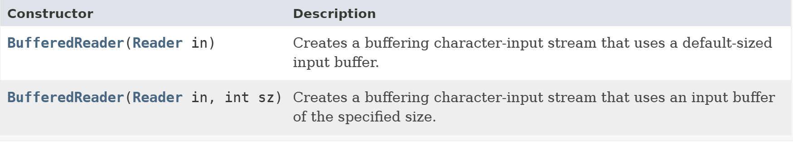

我们可以指定缓冲区的大小，一般情况下，使用默认的缓冲区大小就足够了（默认为8192）。

- 常用的方法

在BufferedReader类中，不但继承了Reader类的方法，还新增了readLine()方法。


读取成功，则返回读取的一行文本内容；读取失败，则返回null。 

- 从文件中读取数据

【示例】使用字符缓冲流从文件中读数据

```java
public class BufferedCharDemo {
    public static void main(String[] args) {
        BufferedReader bw = null;
        try {
            // 创建字符输入流
            Reader fr = new FileReader("demo.txt");
            bw = new BufferedReader(fr);
            // 读取数据
            String line= null;
            while ((line = bw.readLine()) != null) {
                System.out.println(line);
            }
        } catch (IOException e) {
            e.printStackTrace();
        } finally {
            // 关闭流
            if (bw != null) {
                try {
                    bw.close();
                } catch (IOException e) {
                    e.printStackTrace();
                }
            }
        }
    }
}
```

注意：关闭缓冲流时已经实现对字符流的关闭，所以此处我们只需要关闭缓冲流即可。

### 字符缓冲流拷贝案例

【示例】字符缓冲流拷贝案例

```java
public class BufferedCharDemo {
    public static void main(String[] args) {
        BufferedReader br = null;
        BufferedWriter bw = null;
        try {
            // 创建IO流（字符缓冲输入流和字符缓冲输出流）
            br = new BufferedReader(new FileReader("E:\\Test.java"));
            bw = new BufferedWriter(new FileWriter("F:\\Test.java"));
            // 拷贝数据（读取|存储）
            String line = null;
            while((line = br.readLine()) != null) {
                bw.write(line);
                bw.newLine();
                // 刷新数据
                bw.flush();
            }
        } catch (IOException e) {
            e.printStackTrace();
        } finally {
            // 关闭流
            if (br != null) {
                try {
                    br.close();
                } catch (IOException e) {
                    e.printStackTrace();
                }
            }
            if (bw != null) {
                try {
                    bw.close();
                } catch (IOException e) {
                    e.printStackTrace();
                }
            }
        }
    }
}
```


# 转换流

## 转换流概述

### 编码引出的问题

在IDEA中，使用FileReader读取硬盘中的文本文件。在Windows系统中，由于IDEA默认采用的都是UTF-8编码，当读取GBK编码格式的文本文件时，就会出现乱码的情况。

【示例】编码引出的问题案例

```java
public class Test {
    public static void main(String[] args) {
        FileReader reader = null;
        try {
            // 字符输入流，操作的demo.txt的编码格式为：GBK
            reader = new FileReader("E:\\demo.txt");
            // 读取文件数据
            int read = 0;
            while ((read = reader.read()) != -1) {
                System.out.print((char)read);
            }
        } catch (FileNotFoundException e) {
            e.printStackTrace();
        } catch (IOException e) {
            e.printStackTrace();
        } finally {
            // 关闭流
            if (reader != null) {
                try {
                    reader.close();
                } catch (IOException e) {
                    e.printStackTrace();
                }
            }
        }
    }
}
```

输出的结果为：

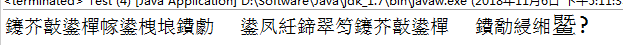

当IDEA默认采用UTF-8编码的情况下，那么如何读取GBK编码的文件呢？答案：转换流。

### 转换流的理解

专门解决乱码的流：在内存中的是字符，在文件中的是二进制。

- InputStreamReader：它负责读的（将字节流转换成字符流），是从文件到内存，也就是将二进制转换成字符，这个过程是一个解码的过程。没有指定采用哪一种字符编码方式进行解码的话，默认采用JVM默认的字符编码方式进行解码。JVM默认的字符编码方式是UTF-8，因此在你没有指定字符编码方式的前提下，你只能对UTF-8编码的文件进行解码。如果文件不是UTF-8的编码方式，则解码时会出现乱码的。
- OutputStreamWriter：它负责写的（将字符流转换成字节流），是从内存到文件，也就是将字符转换成二进制，这个过程是一个编码的过程。如果没有指定采用哪一种字符编码方式进行编码的话，默认采用JVM默认的字符编码方式进行编码。因此在你没有指定字符编码方式的前提下，生成的文件是UTF-8的文件。如果你指定了采用GBK的方式编码，则生成的文件是GBK的文件。
- 转换流本质上就是字符和字节之间的桥梁，转换流原理：字节流+编码表。

**如何获取JVM的默认编码方式，代码如下：**

```java
public class Test {
    public static void main(String[] args) throws Exception{
        // 这两种方式都可以获取到当前JVM的默认编码方式。
        System.out.println(System.getProperty("file.encoding"));
        System.out.println(Charset.defaultCharset());
    }
}
```

### 转换流的使用场合

主要有两个场合：

1. 一旦操作文本涉及到具体的指定编码表时，必须使用转换流 。
2. 源或者目的对应的设备是字节流，但是操作的却是文本数据，可以使用转换流作为桥梁。


## InputStreamReader类

InputStreamReader属于Reader抽象类的实现类，将输入的字节流变为字符流，即：将一个字节流的输入对象变为字符流的输入对象。

### 构造方法

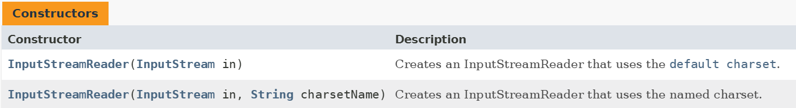

指定字符集可以为UTF-8，GBK、Unicode等，我们根据实际情况选用合适的字符集。

【示例】读取GBK的文本文件

```java
public class InputStreamReaderDemo {
    public static void main(String[] args) {
        InputStreamReader isr = null;
        try {
            // 创建字节输入流（文件编码为：GBK）
            FileInputStream fis = new FileInputStream("E:\\demo.txt");
            // 创建转换流对象，编码格式指定为GBK
            isr = new InputStreamReader(fis, "GBK");
            // 读取数据
            char[] buf = new char[1024];
            int len = 0;
            while ((len = isr.read(buf)) != -1) {
                System.out.println(new String(buf, 0, len));
            }
        } catch (IOException e) {
            e.printStackTrace();
        } finally {
            // 关闭流：此处只需关闭转换流即可！
            if (isr != null) {
                try {
                    isr.close();
                } catch (IOException e) {
                    e.printStackTrace();
                }
            }
        }
    }
}
```

注意：在读取指定的编码的文件时，一定要指定编码格式来解码，否则就会发生乱码现象。

## OutputStreamWriter类

OutputStreamWriter类属于Writer抽象类的实现类，将输出的字符流变为字节流，即：将一个字符流的输出对象变为字节流的输出对象。

### 构造方法

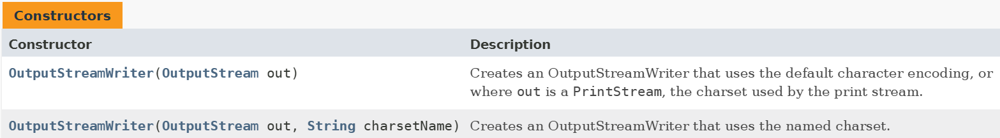

指定字符集可以为UTF-8，GBK、Unicode等，我们根据实际情况选用合适的字符集。

### 采用指定的编码输出文本文件

【示例】把文本按照GBK格式存储

```java
public class OutputStreamWriterDemo {
    public static void main(String[] args) {
        OutputStreamWriter osw = null;
        try {
            // 创建字节输出流
            FileOutputStream fos = new FileOutputStream("E:\\demo.txt");
            // 创建转换流对象，并指定编码为“GBK”
            osw = new OutputStreamWriter(fos, "GBK");
            // 存储数据
            osw.write("极课未来");
        } catch (IOException e) {
            e.printStackTrace();
        } finally {
            // 关闭流：此处只需关闭转换流即可！
            if (osw != null) {
                try {
                    osw.close();
                } catch (IOException e) {
                    e.printStackTrace();
                }
            }
        }
    }
}
```


## FileReader和FileWriter

FileReader并不是Reader的直接子类，而是InputStreamReader的子类；FileWriter也并不直接是Writer的子类，而是OutputStreamWriter的子类。

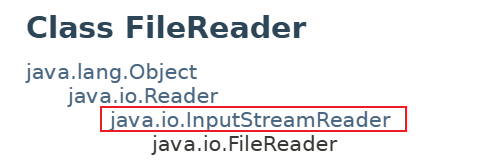

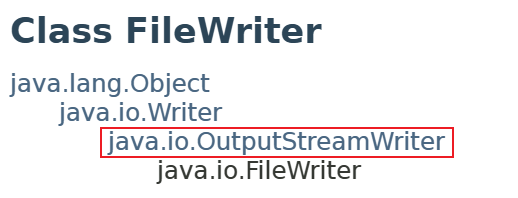

FileWriter和FileReader作为子类，仅作为操作字符文件的便捷类存在。

如果操作的字符文件使用的是默认编码表，那么可以不用父类，而直接用子类就完成操作了，简化了代码。但是，如果操作的字符文件使用了其它指定编码时，那么就绝对不能用子类，必须使用字符转换流。

【示例】创建默认编码的输入流

```java
// 创建字节输入流对象
FileInputStream fis = new FileInputStream("E:\\demo.txt");
// 采用默认编码集
InputStreamReader isr1 = new InputStreamReader(fis);
// 采用指定GBK字符集。
InputStreamReader isr2 = new InputStreamReader(fis, "GBK");
// 采用默认编码集的字符输入流
FileReader fr = new FileReader("demo.txt");
```

这三个输入流的在Windows系统中功能是一样的，但是第三个最为便捷。

# 打印流

IO 有这样两个类：

- PrintStream（字节打印流：字节方式）
- PrintWriter（字符打印流：字符方式）

根据名字，一般把它翻译为打印流，第一印象是向控制台输出的。这样理解是错误的，它既可以输出到控制台，也可以输出到文件，或者网络等其它目的地。他们有一个更现代化的名字：**格式化输出流**

## 打印流的优势

**格式化输出（核心优势）**

```java
// ❌ 没有打印流：格式化很痛苦
String output = "产品: " + productName + 
               ", 价格: " + String.format("%.2f", price) +
               ", 库存: " + stock + 
               ", 折扣: " + String.format("%.1f", discount) + "%" +
               ", 有效: " + isValid;
bw.write(output);
bw.newLine();

// ✅ 打印流：一行搞定，清晰直观
// 现代开发中主要应用在日志输出上，或者程序调试方面。
pw.printf("产品: %s, 价格: %.2f, 库存: %d, 折扣: %.1f%%, 有效: %b%n", 
          productName, price, stock, discount, isValid);
```

**数据类型自动转换**

```java
// 自动处理所有类型 → 字符串
pw.print(100);       // int → 自动转换
pw.print(3.14);      // double → 自动转换  
pw.print(true);      // boolean → 自动转换
pw.print('A');       // char → 自动转换
pw.print(new Date());// Object → 自动调用toString()

// 对比传统方式：都要手动转换
bw.write(String.valueOf(100));
bw.write(String.valueOf(3.14));
bw.write(String.valueOf(true));
```

**异常处理简化（IOException 基本不用管）**

```java
// ❌ 传统方式：每个write都可能抛异常
try {
    bw.write("第一行");
    bw.newLine();  // 可能抛IOException
    bw.write("第二行");  // 可能抛IOException
    bw.flush();    // 可能抛IOException
} catch (IOException e) {
    // 处理异常
}

// ✅ 打印流：内部消化异常
pw.println("第一行");
pw.println("第二行");
pw.flush();
// 只需要最后检查一次
if (pw.checkError()) {
    System.out.println("写入出错");
}
```

**自动刷新机制**

```java
// 设置自动刷新后，println和printf会自动flush
PrintWriter pw = new PrintWriter(System.out, true); // autoFlush = true

pw.println("这行会自动刷新");  // 立即显示，无需手动flush
pw.printf("进度: %d%%%n", 75); // 立即显示（%n是换行符，遇到换行符自动刷新）

// 对比：传统方式需要手动刷新
bw.write("需要手动刷新");
bw.newLine();
bw.flush(); // 不能忘！
```

**方法链式调用**

```java
// 打印流支持链式调用
pw.print("Hello").print(" ").println("World")
  .printf("数字: %d", 100)
  .flush();

// 传统方式无法链式调用
bw.write("Hello");
bw.write(" ");
bw.write("World");
bw.newLine();
```

**说白了就是：JDK那帮大神知道咱们程序员懒，不爱处理各种麻烦事，所以就搞了个打印流来帮咱们：**

- **不用操心异常**
- **不用手动转类型**
- **不用拼字符串**
- **不用管底层细节**

**这样咱们就能专心写业务代码，不用在输出这种小事上浪费时间了！**


## PrintStream

### 构造方法

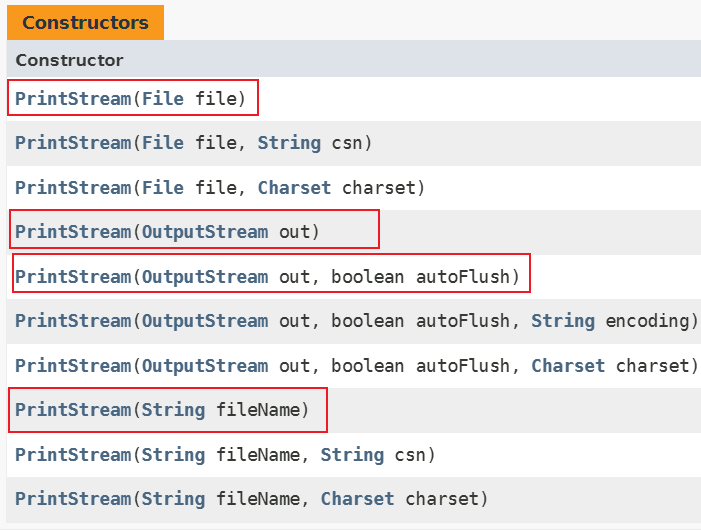

1. 可以看到 PrintStream 是一个处理流。对节点流 OutputStream 进行了功能增强。
2. 只有调用构造方法时，传递了 autoFlush 为 true 时，每遇到**换行符**时就会自动刷新一次。（没有遇到换行符就不会自动刷新）
3. 没有 autoFlush 参数的不支持自动刷新。

### 常用方法

```java
// 支持各种类型输出，底层会自动转换为字符串，不需要程序员来手动转换。
void print(T type);

// 支持各种类型输出，底层会自动转换为字符串，不需要程序员来手动转换，并且当构造方法中指定自动刷新的话，println会自动刷新，因为它自带换行符。
void println(T type);

// 以特定的格式输出，是这个流的核心优势
void printf(String format, Object... args);

// 一般在程序最后，使用它来判断写入是否成功，true表示写入成功，false表示写入失败。
boollean checkError();

// 流用完一定要关闭。
void close();

// 当然，对于没有自动刷新的流，也支持手动调用flush()来刷新
void flush();
```

**【基本示例】**

```java
class PrintStreamDemo {
    public static void main(String[] args) throws FileNotFoundException {
        // 创建一个字符打印流对象
        PrintStream ps = new PrintStream("demo.txt");
        // 把数组中的元素值输入到文件中
        Object[] arr = {true, 123, "Hello World", 123.45};
        for (int i = 0; i < arr.length; i++) {
            // 打印数据
            ps.println(arr[i]);
        }
        ps.close();
    }
}
```

### 格式化输出

| **说明符** | **用途** | **示例** |
| --- | --- | --- |
| `<font style="color:rgb(15, 17, 21);background-color:rgb(235, 238, 242);">%d</font>` | 整数 | `<font style="color:rgb(15, 17, 21);background-color:rgb(235, 238, 242);">printf("%d", 100)</font>` → "100" |
| `<font style="color:rgb(15, 17, 21);background-color:rgb(235, 238, 242);">%f</font>` | 浮点数 | `<font style="color:rgb(15, 17, 21);background-color:rgb(235, 238, 242);">printf("%.2f", 3.14159)</font>`→ "3.14" |
| `<font style="color:rgb(15, 17, 21);background-color:rgb(235, 238, 242);">%s</font>` | 字符串 | `<font style="color:rgb(15, 17, 21);background-color:rgb(235, 238, 242);">printf("%s", "Hello")</font>`→ "Hello" |
| `<font style="color:rgb(15, 17, 21);background-color:rgb(235, 238, 242);">%c</font>` | 字符 | `<font style="color:rgb(15, 17, 21);background-color:rgb(235, 238, 242);">printf("%c", 'A')</font>`→ "A" |
| `<font style="color:rgb(15, 17, 21);background-color:rgb(235, 238, 242);">%b</font>` | 布尔值 | `<font style="color:rgb(15, 17, 21);background-color:rgb(235, 238, 242);">printf("%b", true)</font>`→ "true" |
| `<font style="color:rgb(15, 17, 21);background-color:rgb(235, 238, 242);">%n</font>` | 换行 | 平台无关的换行符 |
| `<font style="color:rgb(15, 17, 21);background-color:rgb(235, 238, 242);">%%</font>` | 百分号 | `<font style="color:rgb(15, 17, 21);background-color:rgb(235, 238, 242);">printf("完成度: %d%%", 75)</font>`→ "完成度: 75%" |

**【示例】格式化输出案例**

```java
public class DateFormatExample {
    public static void main(String[] args) {
        int year = 2024;
        int month = 12;
        int day = 5;
        String weekday = "星期三";
        char ampm = '下';
        boolean isHoliday = true;
        double temperature = 5.54;
        int progress = 85;
        
        System.out.printf("%d年%02d月%02d日 %s %c午 温度%.1f℃ 节假日:%b 完成度%d%%%n", 
                         year, month, day, weekday, ampm, temperature, isHoliday, progress);
        System.out.println("Hello World!");
    }
}
```

执行结果如下：

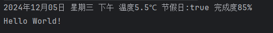

优点：比自己拼接字符串方便很多。


## PrintWriter

**PrintStream** 就像个"多面手"：能处理字节，也能处理文本（但不够专业）

**PrintWriter** 就像个"文字专家"：专门研究字符编码

### 构造方法

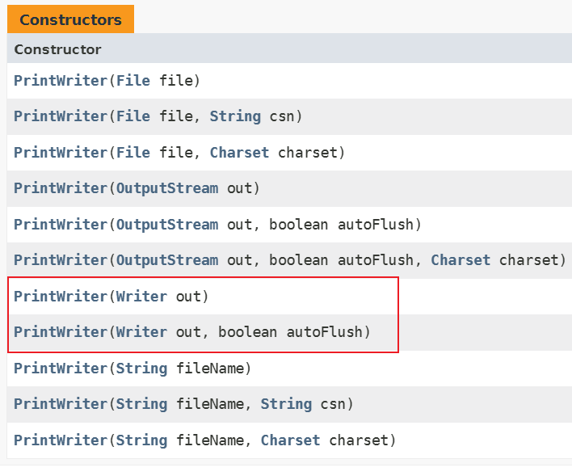

很明显可以看到 PrintWriter 的构造方法支持 Writer 参数。这一点是和 PrintStream 的一个区别。

### 常用方法

PrintWriter 在方法使用方面几乎和 PrintStream 是一样的，也支持格式化输出。

【示例】把指定的数据，写入到文件中

```java
public class PrintWriterDemo {
        public static void main(String[] args) throws IOException {
                FileWriter writer = new FileWriter("demo.txt");
                // 创建字符打印流对象,并设置为自定刷新
                PrintWriter pw = new PrintWriter(writer, true);
                // 存储数据
                for(int i = 0; i < 10; i++) {
                        pw.println("hello world");
                }
                pw.close();
        }
}
```

### PrintStream VS PrintWriter

| **特性** | **PrintStream** | **PrintWriter** |
| --- | --- | --- |
| **继承体系** | 字节流(OutputStream体系) | 字符流(Writer体系) |
| **核心用途** | 处理字节数据，系统标准输出 | 处理字符文本 |
| **字符编码** | 有限支持，主要用平台默认编码 | 完整支持，可指定任意字符编码 |
| **异常处理** | 不抛IOException，用checkError()检查 | 可捕获IOException，更标准 |
| **性能** | 原始字节操作，稍快 | 字符转换，适合文本 |

### 什么时候用谁

#### 用 PrintStream 当：

```java
// 1. 系统标准输出
System.out.println("控制台输出"); // System.out就是PrintStream

// 2. 简单字节数据输出
PrintStream ps = new PrintStream("data.bin");
ps.write(byteData); // 需要处理原始字节时

// 3. 不需要关心字符编码的简单场景
PrintStream ps = new PrintStream("log.txt");
ps.println("简单日志"); // 用平台默认编码
```

#### 用 PrintWriter 当：

```java
// 1. 处理文本文件，需要指定编码
PrintWriter pw = new PrintWriter("file.txt", "UTF-8");

// 2. 国际化应用，多语言文本
pw.println("中文文本");
pw.println("English text");
pw.println("日本語テキスト");
pw.flush();

// 3. 需要标准异常处理
try (PrintWriter pw = new PrintWriter("important.txt")) {
    pw.println("关键数据");
} catch (IOException e) {
    // 可以捕获异常
    e.printStackTrace();
}

// 4. 网络通信、HTTP响应等文本输出
PrintWriter pw = new PrintWriter(socket.getOutputStream());
pw.println("HTTP/1.1 200 OK");
```

#### 实际项目选择口诀

**"字节用Stream，文本用Writer"**

- **底层、系统、性能敏感** → PrintStream
- **文本、编码、国际化** → PrintWriter
- **不确定时** → 优先用PrintWriter（更现代）

**记住：大多数现代应用都用PrintWriter，因为文本处理更常见！**


## 标准输入&输出流

Java通过系统类System实现标准输入&输出的功能，定义了3个流变量：in、out和err。这三个流在Java中都定义为静态变量，可以直接通过System类进行调用。System.in表示标准输入，通常指从键盘输入数据；System.out表示标准输出，通常指把数据输出到控制台或者屏幕；System.err表示标准错误输出，通常指把数据输出到控制台或者屏幕。

### 标准的输入流

使用“System.in”就能获得一个标准的输入流，通过标准的输入流就能够获得用户在控制台中输入的数据。

普通的输入流，是获得文件或网络中的数据；而标准的输入流，是获得控制台输入的数据。

【示例】获取控制台输入的数据

```java
public class InputStreamDemo {
        public static void main(String[] args) throws IOException {
                // 获取一个标准的输入流
                InputStream in = System.in;
                // 读取键盘输入的内容
                byte[] by = new byte[1024];
                int count = in.read(by);
                // 遍历输出读取到的内容
                for(int i = 0; i < count; i++) {
                        System.out.println("-->" + by[i]);
                }
                // 注意：通过System.in获取到的标准输入流不用关闭！
        }
}
```

运行程序，从键盘输入3个字符abc并按Enter键，保存在缓冲区中字符的元素个数count为4，换行占用最后一个字节'\n'，下图为控制台的效果。

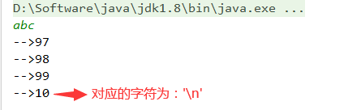

在System类中，还提供了setIn(InputStream in)的静态方法，通过该方法就可以修改输出流，也就是能够修改标准输入流读取的数据源。

【示例】通过标准的输入流，实现读取文件中的数据

```java
public class InputStreamDemo {
    public static void main(String[] args) throws IOException {
        // 修改标准输入流的数据源
        System.setIn(new FileInputStream("demo.txt"));
        // 获取一个标准的输入流
        InputStream in = System.in;
        // 读取文件中的内容
        byte[] by = new byte[1024];
        int len = -1;
        while ((len = in.read(by)) != -1) {
            System.out.print(new String(by, 0, len));
        }
        // 注意：通过System.in获取到的标准输入流不用关闭！
    }
}
```

### 字节流System.in转为字符流BufferedReader

System.in表示标准输入流，可以等待并获取键盘输入的文本数据。但是System.in属于字节流，而获取一行文本readLine()方法只有字符流能够提供，那么就需要把字节流System.in转为字符流BufferedReader，这就涉及到了把字节流向字符流之间的转换。

【示例】从键盘录入的数据存储到文件中

```java
public class InputStreamReaderTest {
        public static void main(String[] args) throws IOException {                
                // 创建一个字符输出流，明确目标文件
                BufferedWriter bw = new BufferedWriter(new FileWriter("E://a.txt"));
                // 字节流-->字符流
                InputStreamReader isr = new InputStreamReader(System.in);
                // 创建一个字符输入缓冲流，方便读取键盘输入的一行数据
                BufferedReader br = new BufferedReader(isr);
                // 获取键盘输入的数据
                String line = null;
                // 当输入的字符串为“over”时，结束循环
                while(!(line = br.readLine()).equals("over")) {
                        // 将获取的字符串存储
                        bw.write(line);
                        // 添加换行
                        bw.newLine();
                        // 刷新数据
                        bw.flush();
                }
                // 关闭流
                br.close();
                bw.close();
        }
}
```

注意：因为使用流接收键盘的输入太复杂了，所以高版本中提供了Scanner类来实现。

### 标准的输出流 

使用“System.out”就能获得一个标准的输出流，通过标准的输出流就能够把数据在控制台输出。

普通的输出流，是把数据写入到文件或网络中；而标准的输出流，是把数据打印在控制台。

【示例】在控制台输输出的数据

```java
public class PrintStreamTest {
        public static void main(String[] args) {
                // 获取一个标准的输出流
                PrintStream ps = System.out;
                // 在控制台输出数据
                ps.println(123);
                ps.println(123.456);
                ps.println("hello world");
                ps.println(true);
                ps.println('A');
                ps.println(new Date());
                // 注意：通过System.out获取到的标准输出流不用关闭！
        }
}
```

在System类中，还提供了setOut(PrintStream ps)的静态方法，通过该方法就能修改输出流，也就是能够修改输出的位置。

【示例】通过标准的输出流，将数据写入到文件中

```java
public class PrintStreamTest {
    public static void main(String[] args) throws IOException {
        // 修改标准输出流
        System.setOut(new PrintStream(new FileOutputStream("demo.txt")));
        // 把数据在文件中存储
        System.out.println(123);
        System.out.println(123.456);
        System.out.println("hello world");
        System.out.println(true);
        System.out.println('A');
        System.out.println(new Date());
    }
}
```

### 字符流BufferedReader转为字节流System.out

System.out表示标准输出流，可以将数据在控制台输出。但是System.out属于字节流，而写入一行字符串write(String line)方法只有字符流能够提供，那么就需要把字符流BufferedReader转为字节流System.out，这就涉及到了把字符流向字节流之间的转换。

【示例】获取文件中的数据，然后再控制台输出

```java
public class OutputStreamWriterTest {
        public static void main(String[] args) throws IOException {
                // 创建一个字符输入流，明确目标文件
                BufferedReader br = new BufferedReader(new FileReader("E:\\a.txt"));
                // 字符流-->字节流
                OutputStreamWriter osw = new OutputStreamWriter(System.out);
                // 创建一个字符输出缓冲流，方便写入一行字符串文本
                BufferedWriter bw = new BufferedWriter(osw);
                // 通过循环，读取文件中的数据
                String line = null;
                while((line = br.readLine()) != null) {
                        // 写入一行文本，也就是在控制台输出一行文本
                        bw.write(line);
                        // 添加换行
                        bw.newLine();
                        // 刷新数据
                        bw.flush();
                }
                // 关闭流
                bw.close();
                br.close();
        }
}
```

补充：使用流输出内容到控制台太复杂了，还是使用System.out.println()简洁一些！


# 数据流

## 数据流概述

有没有一种IO流，既能够实现基本数据类型和String类型(暂时不考虑别的引用数据类型)的存取操作，又能实现存、取数据类型的一致性呢？答案就是：数据流。

数据流将“基本数据类型与字符串类型”作为数据源，以DataInputStream和DataOutputStream来操作基本数据类型和字符串类型数据。

注意：数据流只有字节流，没有字符流。

## DataOutputStream类

DataOutputStream数据输出流允许应用程序以适当方式将基本数据类型和字符串类型数据写入文件中，常见的方法有：writeByte()、writeShort()、writeInt()、writeLong()、writeFloat()、writeDouble()、writeChar()、writeBoolean()、writeUTF()等方法。

【示例】把基本数据类型和String类型写入文件中

```java
public class DataStreamTest {
        public static void main(String[] args)  {
                DataOutputStream dos = null;
                try {
                        // 字节输出流
                        FileOutputStream fos = new FileOutputStream("a.txt");
                        // 缓冲流
                        BufferedOutputStream bos = new BufferedOutputStream(fos);
                        // 数据输出流
                        dos = new DataOutputStream(bos);
                        // 数据输出
                        dos.writeInt(123); // 写入int类型数据
                        dos.writeDouble(123.45); // 写入Double类型数据
                        dos.writeBoolean(false); // 写入Boolean类型数据
                        dos.writeUTF("jkweilai"); // 写入String类型数据
                } catch (FileNotFoundException e) {
                        e.printStackTrace();
                } catch (IOException e) {
                        e.printStackTrace();
                } finally {
                        if(dos != null) {
                                // 关闭流
                                try {
                                        dos.close();
                                } catch (IOException e) {
                                        e.printStackTrace();
                                }
                        }
                }
        }
}
```

注意：通过DataOutputStream写入文件的数据为二进制数据，打开文件就是一堆乱码。

## DataInputStream类

使用DataOutputStream写入文件的二进制数据，必须通过DataInputStream来读取，并且读取的顺序必须和写入的顺序相同。

常见的方法有：readByte()、readShort()、readInt()、readLong()、readFloat()、readDouble()、readChar()、readBoolean()、readUTF()等方法。

【示例】读取数据流写入的文件数据

```java
public class DataStreamTest {
        public static void main(String[] args) {
                DataInputStream dis = null;
                try {
                        // 字节输入流
                        FileInputStream fos = new FileInputStream("a.txt");
                        // 缓冲流
                        BufferedInputStream bos = new BufferedInputStream(fos);
                        // 数据输入流
                        dis = new DataInputStream(bos);
                        // 读取数据,需要保证存取顺序一致
                        int i = dis.readInt();
                        double d = dis.readDouble();
                        boolean b = dis.readBoolean();
                        String str = dis.readUTF();
                        System.out.println(i + " " + d + " " + b + " " + str);
                } catch (FileNotFoundException e) {
                        e.printStackTrace();
                } catch (IOException e) {
                        e.printStackTrace();
                } finally {
                        if (dis != null) {
                                try {
                                        dis.close();
                                } catch (IOException e) {
                                        e.printStackTrace();
                                }
                        }
                }
        }
}
```

要用DataInputStream读取文件，这个文件必须是由DataOutputStream 写出的，否则会抛出EOFException异常，因为DataOutputStream 在写出的时候会做一些特殊标记，只有DataInputStream 才能成功的读取。


# 对象流

## 对象流概述

我们前边学到的数据流只能实现对基本数据类型和字符串类型的读写，并不能读取对象（字符串除外），如果要对某个对象进行读写操作，我们需要学习一对新的处理流：ObjectInputStream和ObjectOutputStream。

- ObjectOutputStream代表对象输出流，可以对基本数据类型和对象进行序列化操作。
- ObjectInputStream代表对象输入流，可以对ObjectOutputStream写入的基本数据类型和对象进行反序列化。

备注：关于序列化与反序列化我们将在下一个章节学习。

【示例】对象流的简单应用

```java
public class ObjectStreanTest {
        /**
         * 通过ObjectOutputStream写出数据
         */
        public static void write() {
                ObjectOutputStream oos = null;
                try {
                        // 字节输出流
                        FileOutputStream fos = new FileOutputStream("a.txt");
                        // 缓冲流
                        OutputStream bos = new BufferedOutputStream(fos);
                        // 对象输出流
                        oos = new ObjectOutputStream(bos);
                        // 数据输出，执行序列化操作
                        oos.writeInt(123); // 写入int类型数据
                        oos.writeBoolean(false); // 写入Boolean类型数据
                        oos.writeUTF("jkweilai"); // 写入String类型数据
                        oos.writeObject(new Date()); // 写入Date对象
                } catch (FileNotFoundException e) {
                        e.printStackTrace();
                } catch (IOException e) {
                        e.printStackTrace();
                } finally {
                        if(oos != null) {
                                try {
                                        oos.close(); // 关闭流
                                } catch (IOException e) {
                                        e.printStackTrace();
                                }
                        }
                }
        }
        /**
         * 通过ObjectInputStream写入数据
         */
        public static void read() {
                ObjectInputStream ois = null;
                try {
                        // 字节输入流文件
                        FileInputStream fos = new FileInputStream("a.txt");
                        // 缓冲流
                        BufferedInputStream bos = new BufferedInputStream(fos);
                        // 对象输入流
                        ois = new ObjectInputStream(bos);
                        // 读取数据，执行反序列化操作，需要保证存取顺序一致
                        int i = ois.readInt();
                        boolean b = ois.readBoolean();
                        String str = ois.readUTF();
                        Date date = (Date)ois.readObject(); // 读取对象
                        System.out.println(i + " " + b + " " + str + date);
                } catch (FileNotFoundException e) {
                        e.printStackTrace();
                } catch (IOException e) {
                        e.printStackTrace();
                } catch (ClassNotFoundException e) {
                        e.printStackTrace();
                } finally {
                        if(ois != null) {
                                try {
                                        ois.close(); // 关闭流
                                } catch (IOException e) {
                                        e.printStackTrace();
                                }
                        }
                }
        }
}
```

对象流不仅可以读写对象，还可以读写基本数据类型。使用对象流读写对象时，该对象必须实现序列化与反序列化，系统提供的类（如Date和String等）已经实现了序列化接口，但是自定义类必须手动实现序列化接口。


## 序列化和反序列化

### 序列化和反序列化概述

当两个进程远程通信时，彼此可以发送任意数据类型的数据。无论是何种类型的数据，都会以二进制序列的形式在网络上传送。比如，我们可以通过HTTP协议发送字符串信息，我们也可以在网络上直接发送Java对象。发送方需要把这个Java对象转换为字节序列，才能在网络上传送；接收方则需要把字节序列再恢复为Java对象。

把Java对象转换为字节序列的过程称为对象的序列化。把字节序列恢复为Java对象的过程称为对象的反序列化。

对象序列化的作用：

1. 把对象的字节序列永久地保存到硬盘上，通常存放在文件中，也就是执行持久化操作。
2. 在网络上传送对象的字节序列。比如：服务器之间的数据通信、对象传递。

### 对象的序列化的实现

ObjectOutputStream代表对象输出流，它的writeObject(Object obj)方法可对参数指定的对象进行序列化，把得到的字节序列写到一个目标输出流中。

当一个对象要能被序列化，这个对象所属的类必须实现java.io.Serializable接口。Java提供的类（如Date和String等）默认已经现了Serializable接口，但是自定义类必须手动实现Serializable接口，否则会发生NotSerializableException 异常。

另外，java.io.Serializable接口是个空接口，该接口中什么内容都没有，因此不需要重写任何方法，该接口只起到可序列化的标志的作用。

【示例】将Student类实现Serializable接口

```java
class Student implements Serializable { // 实现Serializable接口
        private String name;
        private int age;
        public Student() {}
        public Student(String name, int age) {
                this.name = name;
                this.age = age;
        }
        public String getName() {
                return name;
        }
        public void setName(String name) {
                this.name = name;
        }
        public int getAge() {
                return age;
        }
        public void setAge(int age) {
                this.age = age;
        }
}
```

注意：如果对象的属性是对象，则属性对应类也必须实现java.io.Serializable接口。

【示例】将Student对象进行序列化

```java
public class ObjectOutputStreamTest {
        public static void main(String[] args) {
                ObjectOutputStream oos = null;
                try {
                        // 明确存储对象的文件
                        FileOutputStream fos = new FileOutputStream("stu.object");
                        // 给操作文件对象加入写入对象功能
                        oos = new ObjectOutputStream(fos);
                        // 调用了写入对象的方法
                        oos.writeObject(new Student("小明", 18));                        
                } catch (FileNotFoundException e) {
                        e.printStackTrace();
                } catch (IOException e) {
                        e.printStackTrace();
                } finally {
                        if(oos != null) {
                                try {
                                        oos.close(); // 关闭资源
                                } catch (IOException e) {
                                        e.printStackTrace();
                                } 
                        }
                }
        }
}
```

如果需要持久化Student对象的个数不确定,，建议把需要序列化的Student对象添加进入集合中，然后对集合对象进行序列化，这样做的好处就是方便存取。

【示例】对多个Student对象进行序列化

```java
public class ObjectOutputStreamTest {

        public static void main(String[] args) {
                ObjectOutputStream oos = null;
                try {
                        // 明确存储对象的文件
                        FileOutputStream fos = new FileOutputStream("list.object");
                        // 给操作文件对象加入写入对象功能
                        oos = new ObjectOutputStream(fos);
                        // 把需要持久化的Student对象添加进入List中
                        ArrayList<Student> list = new ArrayList<Student>();
                        for (int i = 0; i < 5; i++) {
                                list.add(new Student("小明" + i, 18 + i));
                        }
                        // 调用了写入对象的方法，进行持久化操作
                        oos.writeObject(list);        
                } catch (FileNotFoundException e) {
                        e.printStackTrace();
                } catch (IOException e) {
                        e.printStackTrace();
                } finally {
                        if(oos != null) {
                                try {
                                        oos.close(); // 关闭资源
                                } catch (IOException e) {
                                        e.printStackTrace();
                                } 
                        }
                }
        }
}
```

### 对象的反序列化的实现

ObjectInputStream代表对象输入流，它的readObject()方法从一个源输入流中读取字节序列，再把它们反序列化为一个对象，并将其返回。

【示例】将单个Student对象进行反序列化

```java
public class ObjectInputStreamTest {
        public static void main(String[] args) {
                ObjectInputStream ois = null;
                try {
                        // 定义流对象关联存储了对象文件。
                        FileInputStream fis = new FileInputStream("stu.object");
                        // 建立用于读取对象的功能对象。
                        ois = new ObjectInputStream(fis);
                        // 读取Student对象，也就是执行反序列化操作
                        Student p = (Student) ois.readObject();
                        System.out.println(p.getName() + " " + p.getAge());
                } catch (FileNotFoundException e) {
                        e.printStackTrace();
                } catch (IOException e) {
                        e.printStackTrace();
                } catch (ClassNotFoundException e) {
                        e.printStackTrace();
                } finally {
                        if(ois != null) {
                                try {
                                        ois.close(); // 关闭流
                                } catch (IOException e) {
                                        e.printStackTrace();
                                }
                        }
                }
        }
}
```

注意：只有支持 java.io.Serializable 接口的对象才能从流读取。

【示例】将多个Student对象进行反序列化

```java
public class ObjectInputStreamTest {
        public static void main(String[] args) {
                ObjectInputStream ois = null;
                try {
                        // 定义流对象关联存储了对象文件。
                        FileInputStream fis = new FileInputStream("list.object");
                        // 建立用于读取对象的功能对象。
                        ois = new ObjectInputStream(fis);
                        // 读取list集合
                        ArrayList<Student> list = (ArrayList<Student>)ois.readObject();
                        for (int i = 0; i < list.size(); i++) {
                                Student p = list.get(i);
                                System.out.println(p.getName() + " " + p.getAge());
                        }
                } catch (FileNotFoundException e) {
                        e.printStackTrace();
                } catch (IOException e) {
                        e.printStackTrace();
                } catch (ClassNotFoundException e) {
                        e.printStackTrace();
                } finally {
                        if(ois != null) {
                                try {
                                        ois.close(); // 关闭流
                                } catch (IOException e) {
                                        e.printStackTrace();
                                }
                        }
                }
        }
}
```


## 序列化接口（Serializable ）

当一个对象要能被序列化，这个对象所属的类必须实现java.io.Serializable 接口，否则会抛出java.io.NotSerializableException 异常。

同时当反序列化对象时，如果对象所属的 class 文件在序列化之后进行的修改，那么进行反序列化操作时会抛出 java.io.InvalidClassException异常，发生这个异常的原因是：该类的序列版本号与从流中读取的类描述符的版本号不匹配，核心错误提示如下：

java.io.InvalidClassException: com.jkweilai.object.Student; local class incompatible: stream classdesc serialVersionUID = -5582980675580634268, local class serialVersionUID = 8297661684965222279

从错误提示中，我们看到Student对象对应类在序列化时的版本号为：8297661684965222279L，而在反序列化时的版本号为：4913547067458582336L。serialVersionUID 版本号的目的在于验证序列化的对象和对应类是否版本匹配，如果不匹配则抛出java.io.InvalidClassException异常。

为了避免对象所属的class文件在序列化之后发生修改，从而引发出序列化版本号不一致的问题，我们需要在实现了java.io.Serializable接口之后，手动的添加一个serialVersionUID。

如果没有特殊需求的话，使用用默认的1L就可以，这样可以确保代码一致时反序列化成功。那么随机生成的序列化ID有什么作用呢，有些时候，通过改变序列化ID可以用来限制某些用户的使用。

【示例】将需要序列化的类实现Serializable接口

```java
// 实现Serializable接口
class Student implements Serializable { 
        /**
         * 给类显示声明一个动态的序列版本号。
         */
        private static final long serialVersionUID = 4913547067458582336L;
        private String name;
        private int age;
        public Student() {}
        public Student(String name, int age) {
                this.name = name;
                this.age = age;
        }
        public String getName() {
                return name;
        }
        public void setName(String name) {
                this.name = name;
        }
        public int getAge() {
                return age;
        }
        public void setAge(int age) {
                this.age = age;
        }
}
```


## 瞬态关键字 （transient）

当一个类的对象需要被序列化时，某些成员变量无需被序列化，这时不需要序列化的成员变量可以使用关键字transient修饰。只要被transient修饰的成员变量，序列化时这个成员变量就不会被序列化。

同时static修饰变量也不会被序列化，因为序列化是把对象数据进行持久化存储，而静态的属于类加载时的数据，不会被序列化。

【示例】代码修改如下，并进行读取对象测试

```java
// 实现Serializable接口
class Student implements Serializable { 
        /**
         * 给类显示声明一个动态的序列版本号。
         */
        private static final long serialVersionUID = 4913547067458582336L;
        private transient /*瞬态*/ String name;
        private static /*静态*/int age;
        public Student() {}
        public Student(String name, int age) {
                this.name = name;
                this.age = age;
        }
        public String getName() {
                return name;
        }
        public void setName(String name) {
                this.name = name;
        }
        public int getAge() {
                return age;
        }
        public void setAge(int age) {
                this.age = age;
        }
}
```

# 字节数组流（内存流）

## 字节数组流概述

回顾我们所学的IO流，IO流按照处理对象不同来分类，可以分为节点流和包装流。目前我们所学的FileOutputStream、FileInputStream都属于节点流，而缓冲流、转换流、打印流、数据流和对象流等都属于包装流。节点流都可以配合包装流来操作，例如直接使用字节流来复制文件效率低，那么我们可以使用缓冲流来提高效率。例如使用字节流来存取任意数据类型数据操作繁琐，那么我们可以使用对象流来简化操作等等。

接下来，我们要学习的字节数组流，它也属于节点流。字节数组流分为输入流和输出流，分别是：ByteArrayInputStream和ByteArrayOutputStream。使用字节数组流的时候，为了提高效率和简化操作，我们也可以让字节数组流配合包装流来一起使用。

常见的节点流中，例如：FileInputStreamr和FileReader都是把“文件”当做数据源，而ByteArrayInputStream则是把内存中的“字节数组”当做数据源。字节数组流，就是和内存中的数组相关的一个流，可以将字节数组写到输出流中，也可以将字节数组从输入流中读出来，不涉及磁盘。内存数组输出流可以看成一个可自动扩容的byte数组，可以往里写字节。

**通过字节数组流，我们可以实现所有数据类型（基本数据类型、引用数据类型）和字节数组之间的转换，然后转换成字节数组后可以保存到文件或者传输到网络。**

## ByteArrayOutputStream类

ByteArrayOutputStream字节数组输出流在内存中创建一个byte数组缓冲区，所有发送到输出流的数据保存在该字节数组缓冲区中。缓冲区初始化时默认32个字节，会随着数据的不断写入而自动增长，但是缓冲区最大容量是2G，只要数据不超过2G，都可以往里写。

数据写出完毕后，可使用toByteArray()方法或toString()方法来获取数据，从而实现了将任意数据类型数据转化为字节数组。

例如，给一个字节数组，然后往这个数组中放入各种数据，比如整形、布尔型、浮点型、字符串和对象等，这种需求就可以使用ByteArrayOutputStream来实现。

【示例】将任意数据类型数据转化为字节数组案例

```java
public class ArrayStreamTest {
        public static void main(String[] args) {
                try {
                        // 字节数组输出流(节点流)，可将任意数据类型转换为字节数组
                        ByteArrayOutputStream baos = new ByteArrayOutputStream(); 
                        // 缓冲流(包装类)，用于提高效率
                        BufferedOutputStream bos = new BufferedOutputStream(baos);
                        // 对象流(包装流)，实现写出任意数据类型
                        ObjectOutputStream oos = new ObjectOutputStream(bos);
                        // 使用对象流来写数据
                        oos.writeInt(123);
                        oos.writeDouble(123.45);
                        oos.writeChar('A');
                        oos.writeBoolean(false);
                        oos.writeUTF("jkweilai");
                        oos.writeObject(new Date());
                        // 刷新流，在获取数据之前一定要先刷新流，因为使用了包装流
                        oos.flush();
                        // 获取数据
                        byte[] bs = baos.toByteArray();
                        System.out.println(Arrays.toString(bs));
                } catch (IOException e) {
                        e.printStackTrace();
                }
        }
}
```

通过查看底层源码，我们发现ByteArrayOutputStream类的close()方法并没有实现，所以调用close()方法关闭此流后仍可被使用。


## ByteArrayInputStream类

字节数组输入流就是把一个字节数组 byte[] 包装了一下，使其具有流的属性，可顺序读下去，还可标记跳回来继续读，主要的作用就是用来读取字节数组中的数据。

同理，关闭ByteArrayInputStream无效，调用close()方法在关闭此流后仍可被调用。

【示例】读取上个案例获取的字符数组

```java
public class ArrayStreamTest {
        public static void main(String[] args) {
                try {
                        // 获取字节数组,返回上个案例中通过字节数组输出流写出的字节数组
                        byte[] bs = outputStreamMethod();
                        // 字节数组输入流(节点流)，用于读取字节数组中的数据
                        ByteArrayInputStream bios = new ByteArrayInputStream(bs);
                        // 缓冲流(包装类)，用于提高效率
                        BufferedInputStream bis = new BufferedInputStream(bios);
                        // 对象流(包装流)，实现读取指定类型的数据
                        ObjectInputStream ois = new ObjectInputStream(bis);
                        // 读取数据
                        System.out.println(ois.readInt());
                        System.out.println(ois.readDouble());
                        System.out.println(ois.readChar());
                        System.out.println(ois.readBoolean());
                        System.out.println(ois.readUTF());
                        System.out.println(ois.readObject());
                } catch (IOException e) {
                        e.printStackTrace();
                } catch (ClassNotFoundException e) {
                        e.printStackTrace();
                }
        }
}
```

补充，ByteArrayInputStream和ByteArrayOutputStream是字节数组流，那么与之对应的字符数组流则是StringReader和StringWriter。

与字节数组流相比，字符数组流反而用得更少，因为StringBuilder和StringBuffer也能方便的用来存储动态长度的字符，而且大家更熟悉这些类。


# 操作配置文件

## 配置文件的概述

在Java语言中，配置文件为“.properties”后缀的文件，格式为文本文件，文件的内容的格式是“键=值”的格式，文本注释信息可以用"#"来注释。

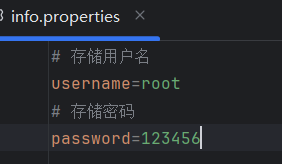

开发中，我们可以将一些动态数据存入到配置文件中，然后在程序执行的过程中来读取配置文件中的数据，让用户能够脱离程序本身去修改程序相关的一些数据，例如：在反射章节，我们就会读取配置文件中的数据来创建对象。

## Properties的使用

在Java语言中，专门提供了Properties集合，在Properties集合中能够存储“键=值”格式的数据，通过Properties集合提供的方法配合IO流就能操作配置文件中的数据。

### 通过集合读取配置文件中的数据

| **方法名** | **描述** |
| --- | --- |
| load(Reader reader) | 通过字符输入流将配置文件的数据读取到集合中 |
| load(InputStream inStream) | 通过字节输入流将配置文件的数据读取到集合中 |

【示例】读取配置文件中的数据，并保存到集合

```java
public static void main(String[] args) {
    FileInputStream fis = null;
    try {
        // 创建一个Properties对象
        Properties properties = new Properties();
        // 创建字节输入流（指向配置文件）
        fis = new FileInputStream("info.properties");
        // 读取配置文件中的数据
        properties.load(fis);
        // 根据key获得对应的value值
        String username = properties.getProperty("username");
        String password = properties.getProperty("password");
        // 输出获得的数据
        System.out.println("用户名：" + username + "，密码：" + password);
    } catch (IOException e) {
        e.printStackTrace();
    } finally {
        // 关闭资源
        if (fis != null) {
            try {
                fis.close();
            } catch (IOException e) {
                e.printStackTrace();
            }
        }
    }
}
```

### 将集合中的数据存储到配置文件

| **方法名** | **描述** |
| --- | --- |
| store(Writer writer, String s) | 通过字符输出流将集合中的数据存入配置文件 |
| store(OutputStream out, String s) | 通过字节输出流将集合中的数据存入配置文件 |

【示例】将 Properties 集合中的元素存储到文件中

```java
public static void main(String[] args) {
    FileOutputStream fos = null;
    try {
        // 创建一个Properties集合
        Properties properties = new Properties();
        // 添加键值对
        properties.setProperty("张三", "18");
        properties.setProperty("李四", "28");
        properties.setProperty("王五", "38");
        properties.setProperty("赵六", "48");
        // 创建字节输出流
        fos = new FileOutputStream("user.properties");
        // 对properties集合进行持久化操作，参数二为对配置文件的描述
        properties.store(fos, "姓名和年龄");
    } catch (IOException e) {
        e.printStackTrace();
    } finally {
        // 关闭资源
        if (fos != null) {
            try {
                fos.close();
            } catch (IOException e) {
                e.printStackTrace();
            }
        }
    }

}
```

## 资源绑定器的使用

在java.util包中，专门提供了一个资源绑定器（ResourceBundle类），用于获取属性配置文件中的内容。使用该方式时，操作的配置文件必须放在src路径中，并且只能绑定xxx.properties文件，绑定配置文件的时候还必须省略后缀.properties。

【示例】使用资源绑定器案例

```java
public static void main(String[] args) {
    // 获得一个资源绑定器，用于绑定info.properties文件
    ResourceBundle resourceBundle = ResourceBundle.getBundle("info");
    // 获得info.properties配置文件中的数据
    String userName = resourceBundle.getString("username");
    String password = resourceBundle.getString("password");
    // 输出获得的数据
    System.out.println("用户名：" + userName + "，密码：" + password);
}
```


# 复制文件夹案例

复制文件夹中的所有文件和文件夹到另一个文件夹中，因为这个需求相对比较简单，这里就直接上代码了。

【示例】复制文件夹操作

```java
/**
 * 复制文件夹操作
 * @param sourceDir 源文件夹
 * @param destDir 目标文件夹
 * @throws FileNotFoundException 
 */
public static void copyDir(File sourceFile, File destFile) throws FileNotFoundException {
        // 1.判断源文件是否存在
        if(!sourceFile.exists()) {
                throw new FileNotFoundException("源文件夹不存在！");
        }
        // 2.如果目标文件不存在，则新建目标文件夹
        if(!destFile.exists()) {
                destFile.mkdirs(); 
        }
        // 3.获取源文件夹中所有的子文件(包含文件和文件夹)
        File[] files = sourceFile.listFiles();
        for(File file : files) {
                // 3.1如果是文件，则直接复制文件即可
                if(file.isFile()) {
                        // 执行拷贝文件操作
                        copyFile(file, new File(destFile, file.getName()));
                }
                // 3.2如果是文件夹，则递归调用
                else {
                        copyDir(file, new File(destFile, file.getName()));
                }
        }
}
```

【示例】复制文件操作

```java
/**
 * 文件拷贝
 * @param sourceFile 需要拷贝的文件
 * @param destFile 把文件拷贝到哪里去
 */
public static void copyFile(File sourceFile, File destFile) {
        BufferedInputStream bis = null;
        BufferedOutputStream bos = null;
        try {
                // 1.文件输入流
                FileInputStream fis = new FileInputStream(sourceFile);
                bis = new BufferedInputStream(fis);
                // 2.文件输出流
                FileOutputStream fos = new FileOutputStream(destFile);
                bos = new BufferedOutputStream(fos);
                // 3.读取数据
                byte[] by = new byte[1024];
                int len = 0;
                while((len = bis.read(by)) != -1) {
                        // 4.写入数据
                        bos.write(by, 0, len);
                }
        } catch (FileNotFoundException e) {
                e.printStackTrace();
        } catch (IOException e) {
                e.printStackTrace();
        } finally {
                if(bos != null) {
                        try {
                                bos.close(); // 关闭输出流
                        } catch (IOException e) {
                                e.printStackTrace();
                        }
                }
                if(bis != null) {
                        try {
                                bis.close(); // 关闭输入流
                        } catch (IOException e) {
                                e.printStackTrace();
                        }
                }
        }
}
```

【示例】main方法中调用拷贝文件夹方法

```java
public static void main(String[] args) {
        // 需要复制的目录
        File sourceDirFile = new File("E:\\bj_180920_JAVA");
        // 复制到哪里去的目录
        File destDirFile = new File("E:\\BJ_JAVA");
        try {
                copyDir(sourceDirFile, destDirFile);
        } catch (FileNotFoundException e) {
                e.printStackTrace();
        }
}
```


# 装饰器模式

## 问题场景：给动物添加能力

我们需要给动物添加各种能力：

- ✅ 基础动物：猫、狗、鸟
- ✅ 能力：飞行、游泳、爬树
- ✅ 可以给动物动态添加多种能力

**糟糕的实现方式**（使用继承）：

```java
class Cat
class FlyingCat
class SwimmingCat  
class FlyingSwimmingCat
class Dog
class FlyingDog
// ... 3种动物 × 7种能力组合 = 21个类！
```

## 装饰器模式解决方案

### 核心思想

**像给动物装备技能一样装饰对象**：

- 基础对象：一只猫
- 装饰器：飞行能力、游泳能力、爬树能力
- 可以随意搭配能力，不需要为每种动物能力组合创建新的子类

## 实战实现

### 第一步：定义动物接口

```java
// 动物接口
public interface Animal {
    String describe();    // 描述动物
    double getSpeed();    // 获取速度
}
```

### 第二步：实现基础动物

```java
// 猫
public class Cat implements Animal {
    @Override
    public String describe() {
        return "猫";
    }
    
    @Override
    public double getSpeed() {
        return 10.0;  // 基础速度10
    }
}

// 狗
public class Dog implements Animal {
    @Override
    public String describe() {
        return "狗";
    }
    
    @Override
    public double getSpeed() {
        return 15.0;  // 基础速度15
    }
}

// 鸟
public class Bird implements Animal {
    @Override
    public String describe() {
        return "鸟";
    }
    
    @Override
    public double getSpeed() {
        return 8.0;   // 基础速度8
    }
}
```

### 第三步：创建能力装饰器基类

```java
// 能力装饰器基类
public abstract class AbilityDecorator implements Animal {
    protected Animal decoratedAnimal;  // 被装饰的动物
    
    public AbilityDecorator(Animal animal) {
        this.decoratedAnimal = animal;
    }
    
    @Override
    public String describe() {
        return decoratedAnimal.describe();
    }
    
    @Override
    public double getSpeed() {
        return decoratedAnimal.getSpeed();
    }
}
```


### 第四步：实现具体能力装饰器

**装饰器1：飞行能力**

```java
public class FlyingAbility extends AbilityDecorator {
    public FlyingAbility(Animal animal) {
        super(animal);
    }
    
    @Override
    public String describe() {
        return decoratedAnimal.describe() + " + 飞行能力";
    }
    
    @Override
    public double getSpeed() {
        return decoratedAnimal.getSpeed() + 25.0;  // 飞行大幅增加速度
    }
}
```

**装饰器2：游泳能力**

```java
public class SwimmingAbility extends AbilityDecorator {
    public SwimmingAbility(Animal animal) {
        super(animal);
    }
    
    @Override
    public String describe() {
        return decoratedAnimal.describe() + " + 游泳能力";
    }
    
    @Override
    public double getSpeed() {
        // 根据动物类型调整速度加成
        double baseSpeed = decoratedAnimal.getSpeed();
        if (decoratedAnimal.describe().contains("猫")) {
            return baseSpeed + 2.0;  // 猫游泳不快
        }
        return baseSpeed + 8.0;      // 其他动物游泳较快
    }
}
```

**装饰器3：爬树能力**

```java
public class ClimbingAbility extends AbilityDecorator {
    public ClimbingAbility(Animal animal) {
        super(animal);
    }
    
    @Override
    public String describe() {
        return decoratedAnimal.describe() + " + 爬树能力";
    }
    
    @Override
    public double getSpeed() {
        // 爬树对速度影响不大，主要影响灵活性
        return decoratedAnimal.getSpeed() + 3.0;
    }
}
```

## 客户端使用：自由组合能力

```java
public class AnimalDemo {
    public static void main(String[] args) {
        System.out.println("\n=== 单一能力 ===");
        Animal flyingCat = new FlyingAbility(new Cat());
        printAnimal(flyingCat);

        Animal swimmingDog = new SwimmingAbility(new Dog());
        printAnimal(swimmingDog);

        System.out.println("\n=== 双重能力 ===");
        Animal superCat = new ClimbingAbility(
                new SwimmingAbility(new Cat()));
        printAnimal(superCat);

        System.out.println("\n=== 三重能力 - 超级动物 ===");
        Animal superAnimal = new FlyingAbility(
                new SwimmingAbility(
                        new ClimbingAbility(new Dog())));
        printAnimal(superAnimal);

        System.out.println("\n=== 不同顺序测试 ===");
        Animal animal1 = new FlyingAbility(new SwimmingAbility(new Bird()));
        Animal animal2 = new SwimmingAbility(new FlyingAbility(new Bird()));
        printAnimal(animal1);
        printAnimal(animal2);
    }

    private static void printAnimal(Animal animal) {
        System.out.println(animal.describe() + " | 速度: " + animal.getSpeed());
    }
}
```


## 装饰器模式核心要点

### 四大角色

1. **Component**（组件）：`Animal` 接口
2. **ConcreteComponent**（具体组件）：`Cat`, `Dog`, `Bird`
3. **Decorator**（装饰器）：`AbilityDecorator`
4. **ConcreteDecorator**（具体装饰器）：`FlyingAbility`等

### 关键特点

- **透明性**：装饰后的动物还是动物，接口不变
- **嵌套性**：可以多层装饰（飞行+游泳+爬树）
- **灵活性**：运行时动态添加能力

## 实战练习

**任务**：实现一个 `FireBreathingAbility` 装饰器，给动物添加喷火能力。

**要求**：

- 描述中添加" + 喷火能力"
- 速度增加15
- 额外方法：`void breatheFire()` 输出喷火动作

**提示**：

```java
public class FireBreathingAbility extends AbilityDecorator {
    public FireBreathingAbility(Animal animal) {
        super(animal);
    }
    
    @Override
    public String describe() {
        return decoratedAnimal.describe() + " + 喷火能力";
    }
    
    @Override
    public double getSpeed() {
        return decoratedAnimal.getSpeed() + 15.0;
    }
    
    // 新增方法
    public void breatheFire() {
        System.out.println(describe() + " 喷出火焰！");
    }
}

// 使用示例
FireBreathingAbility dragonCat = new FireBreathingAbility(new Cat());
dragonCat.breatheFire();
```

## 总结

**装饰器模式解决了什么问题？**

- 避免类爆炸：3种动物 × 3种能力 → 3个装饰器，而不是21个具体类
- 灵活组合：运行时给动物动态添加能力
- 符合开闭原则：新增能力不修改现有动物代码

**什么时候使用装饰器模式？**

- 需要动态、透明地给对象添加功能
- 功能可以任意组合时
- 使用继承会导致类爆炸时


## 一个疑惑

功能扩展直接实现接口不就行了吗？比如有 3 个功能扩展，那定义 3 个接口就可以了吧？想有 2 个功能实现 2 个接口，想有 3 个功能实现 3 个接口不就行了吗？为什么还弄一个装饰器模式？

### 直接实现接口

```java
// 能力接口
interface Flyable { void fly(); }
interface Swimmable { void swim(); }
interface Climbable { void climb(); }

// 动物类实现多个接口
class SuperCat implements Flyable, Swimmable, Climbable {
    public void fly() { System.out.println("猫在飞"); }
    public void swim() { System.out.println("猫在游泳"); }
    public void climb() { System.out.println("猫在爬树"); }
}

class SuperDog implements Flyable, Swimmable {
    public void fly() { System.out.println("狗在飞"); }
    public void swim() { System.out.println("狗在游泳"); }
}
```

### 两种方案的对比

#### 接口实现的问题

**问题1：编译时绑定，无法动态改变**

```java
// 一旦创建，能力就固定了
SuperCat cat = new SuperCat();  // 这个猫永远会飞、游泳、爬树

// 想要一个只会飞的猫？需要新类！
class FlyingOnlyCat implements Flyable {
    public void fly() { System.out.println("猫在飞"); }
}

// 想要一个只会游泳的猫？又需要新类！
class SwimmingOnlyCat implements Swimmable {
    public void swim() { System.out.println("猫在游泳"); }
}
// 类爆炸问题又来了！
```

**问题2：无法在运行时添加/移除能力**

```java
// 假设游戏中有个道具"飞行药水"，喝了就能飞
// 用你的方案无法实现：
Animal cat = new Cat();  // 普通猫，不会飞

// 喝了飞行药水后... 怎么让猫会飞？
// 无法做到！因为能力在编译时就确定了
```

#### 装饰器方案的优势

**运行时动态组合**

```java
// 开始：普通猫
Animal cat = new Cat();
printAbilities(cat);  // 输出：猫

// 获得飞行药水后
cat = new FlyingAbility(cat);
printAbilities(cat);  // 输出：猫 + 飞行能力

// 获得游泳圈后  
cat = new SwimmingAbility(cat);
printAbilities(cat);  // 输出：猫 + 飞行能力 + 游泳能力

// 甚至可以移除能力（通过不装饰）
Animal basicCat = new Cat();  // 回到基础猫
```

### 什么时候用哪种方案？

#### 用接口实现的场景：

```java
// 动物的本质特性，不会改变
interface Mammal {}      // 哺乳动物
interface Carnivore {}   // 食肉动物

class Cat implements Mammal, Carnivore { 
    // 猫的本质就是哺乳动物和食肉动物，不会改变
}
```

#### 用装饰器的场景：

```java
// 动物的临时能力、装备、状态
Animal cat = new Cat();
cat = new FlyingAbility(cat);        // 临时获得飞行能力
cat = new InvisibleAbility(cat);     // 临时获得隐身
cat = new PoisonedStatus(cat);       // 中毒状态
```

### 总结

**核心区别**：

- **接口实现**：定义"是什么"（本质特性）
- **装饰器模式**：定义"有什么"（临时能力、装备、状态）

**简单判断标准**：

- 如果这个功能是对象与生俱来的，不会改变的 → 用接口
- 如果这个功能是后天获得的，可以随时改变、组合的 → 用装饰器