# 第11章 多线程


# 多线程概述

## 多线程介绍

多线程是Java语言的重要特性，大量应用于网络编程、服务器端程序的开发，最常见的UI界面底层原理、操作系统底层原理都大量使用了多线程。

我们可以流畅的点击软件或者游戏中的各种按钮，其实，底层就是多线程的应用。UI界面的主线程绘制界面，如果有一个耗时的操作发生则启动新的线程，完全不影响主线程的工作。当这个线程工作完毕后，再更新到主界面上。

我们可以上百人、上千人、上万人同时访问某个网站，其实，也是基于网站服务器的多线程原理，如果没有多线程，服务器处理速度会极大降低。

在学习多线程之前，我们先要了解几个关于多线程有关的概念。

### 程序

程序(Program)是一个静态的概念，一般对应于操作系统中一个可执行文件，比如：我们要启动酷狗听音乐，则对应酷狗的可执行程序。当我们双击酷狗，则加载程序到内存中，开始执行该程序，于是产生了“进程”。

### 进程

进程(Process)是一个动态的概念，将程序加载进入内存中，则就产生了一个进程。确切的来说，当一个程序进入内存运行，即变成一个进程，进程是处于运行过程中的程序，并且具有一定独立功能。

现代的操作系统都可以同时启动多个进程。比如：我们在用酷狗听音乐、也可以使用idea写代码、也可以同时用浏览器查看网页。


**多进程有什么意义呢？**

单进程的计算机只能做一件事情，而我们现在的计算机都可以做多件事情。例如，一边玩游戏（游戏进程），一边听音乐（音乐进程）。

也就是说现在的计算机都是支持多进程的，可以在一个时间段内执行多个任务。并且，还可以提高CPU的使用率。


### 线程

线程是进程中的一个执行单元，负责当前进程中任务的执行，一个进程中至少有一个线程，也可以有多个线程。

什么是多线程呢？即就是一个程序中有多个线程在同时执行，我们也称之为多线程程序。


紧接着，我们来区别单线程程序与多线程程序的不同：

1. 单线程程序：若有多个任务只能依次执行。当上一个任务执行结束后，下一个任务才开始执行。
2. 多线程程序：若有多个任务可以同时执行。多个任务可以并发执行，每个线程都执行一个任务。

### Java程序的运行原理

由java命令启动JVM，JVM启动就相当于启动了一个进程，该线程在负责java程序的运行，而且这个线程运行的代码存在于main方法中，我们把这个线程称之为主线程。

JVM虚拟机的启动是单线程的还是多线程的? 答案是多线程。原因是垃圾回收线程也要先启动，否则很容易会出现内存溢出。现在的垃圾回收线程加上前面的主线程，最低启动了两个线程，所以，JVM的启动其实是多线程的。


## 线程调度策略

如果多个线程被分配到一个CPU内核中执行，则同一时刻只能允许有一个线程能获得CPU的执行权，那么进程中的多个线程就会抢夺CPU的执行权，这就是涉及到线程调度策略。

### 分时调度

所有线程轮流使用CPU的执行权，并且平均分配每个线程占用的CPU的时间。

### 抢占式调度

让优先级高的线程以较大的概率优先获得CPU的执行权，如果线程的优先级相同，那么就会随机选择一个线程获得CPU的执行权，而Java采用的就是抢占式调用。

## 并发和并行

在学习多线程之前，我们必须先理解什么是并发，什么是并行，什么是并发编程，什么是并行编程。

### 并发(concurrency)

使用单核CPU的时候，同一时刻只能有一条指令执行，但多个指令被快速的轮换执行，使得在宏观上具有多个指令同时执行的效果，但在微观上并不是同时执行的，只是把时间分成若干段，使多个指令快速交替的执行。

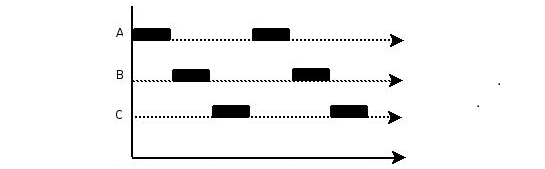

如上图所示，假设只有一个CPU资源，线程之间要竞争得到执行机会。图中的第一个阶段，在A执行的过程中，B、C不会执行，因为这段时间内这个CPU资源被A竞争到了，同理，第二阶段只有B在执行，第三阶段只有C在执行。其实，并发过程中，A、B、C并不是同时进行的（微观角度），但又是同时进行的（宏观角度）。

在同一个时间点上，一个CPU只能支持一个线程在执行。因为CPU运行的速度很快，CPU使用抢占式调度模式在多个线程间进行着高速的切换，因此我们看起来的感觉就像是多线程一样，也就是看上去就是在同一时刻运行。


### 并行(parallellism)

使用多核CPU的时候，同一时刻，有多条指令在多个CPU上同时执行。


如图所示，在同一时刻，ABC都是同时执行（微观、宏观）。

### 了解并发和并行有什么用

在多线程编程中，**并发** 和 **并行** 是两个相关但不同的概念：

- **并发**：指系统具有**处理多个任务**的能力。这些任务在**时间上是重叠的**。在单核CPU上，通过操作系统的时间片轮转调度，CPU核心快速切换执行不同的线程，从而在宏观上形成“同时运行”的错觉。这种情况下，线程之间会竞争唯一的CPU时间片。
- **并行**：指系统具有**在同一时刻执行多个任务**的能力。这依赖于多核CPU或多CPU硬件。当一个进程内的多个线程被分配到不同的CPU核心上时，它们就能真正地同时执行，从而实现并行。

那么，多线程程序实现的是并发还是并行？
这取决于底层的硬件资源：

- 在**单核CPU**上，多线程只能是**并发**。
- 在**多核CPU**上，多线程可以**既是并发也是并行**。如果线程数少于或等于核心数，它们可以并行执行；如果线程数多于核心数，那么操作系统会调度它们在多个核心上并发执行。

**总结**：我们使用多线程的主要目的，就是为了最大限度地提高CPU资源的利用率。无论是单核上的并发，还是多核上的并行，都是为了在 CPU等待 I/O 的时候，能够去执行其他线程的计算任务，从而让CPU尽可能“忙”起来，提升程序的整体效率和响应速度。

**理解并发和并行有什么用？ 对程序调优有帮助：**

这是最直接的价值。如果您不理解这两者，在优化性能时可能会南辕北辙。

**反面案例：**
一个程序员写了一个计算密集型程序（比如处理大量图片），发现很慢。他心想：“多线程不是能提高速度吗？”于是他在自己的4核CPU上创建了100个线程来执行计算任务。

**结果：** 性能提升微乎其微，甚至可能更慢了。

**原因分析：**

- 他错误地认为 **线程数越多，并行能力越强**。
- 实际上，对于计算密集型任务，并行度受限于CPU核心数。4个核心最多只能有4个线程真正**并行**。
- 创建100个线程导致了巨大的**并发**开销：操作系统需要花费大量精力在这100个线程之间切换（上下文切换），线程本身也消耗内存。大部分线程都在“等待”CPU时间片，而不是在“计算”。

**正确的做法：**
理解**并行的基础是CPU核心数**后，他会创建一个大小与CPU核心数相近的**线程池**（比如4个或8个线程）。这样，每个核心都能保持忙碌，且最大限度地减少了线程切换的开销，从而实现真正的性能提升。

**CPU密集型任务采用「少量线程并行」（线程数≈核心数），IO密集型任务采用「大量线程并发」（线程数远大于核心数）。**


# 线程的创建

在Java中使用多线程非常简单，我们先学习如何创建和使用线程，然后结合案例再深入剖析线程的特性。

## Thread 类介绍

该如何创建线程呢？通过API中搜索，查到Thread类。通过阅读Thread类中的描述，知道Thread类用来描述线程，使其具备线程应该有功能。Java虚拟机允许应用程序并发地运行多个执行线程。

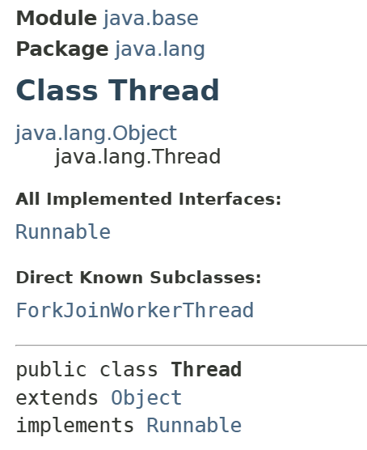

### 构造方法

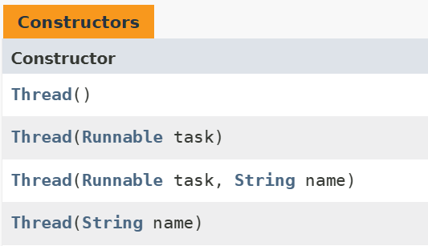

### 常用方法


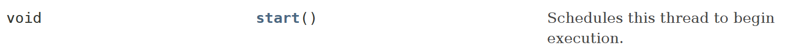

继续阅读，发现创建新执行线程有两种方法。

1. 一种方法是将类声明为Thread的子类。该子类应重写 Thread 类的run()方法。创建对象，开启线程。run()方法相当于主线程的main()方法。
2. 另一种方法是声明一个实现Runnable接口的类。该类然后实现run()方法。然后创建Runnable的子类对象，传入到某个线程的构造方法中，开启线程。

## 创建线程方式一：继承Thread类

继承Thread类实现多线程的步骤：

1. 定义一个继承于Thread类的子类，则该子类就具备线程功能。
2. 在子类中重写Thread类的run()方法，并在重写的run()方法中封装任务。
3. 实例化继承于Thread类的子类对象，并且还可以给创建的线程进行命名。
4. 通过Thread的实例来调用start()方法启动线程，则默认就会调用run()方法。

【示例】继承Thread类实现多线程

```java
/**
 * 自定义线程类
 */
class TestThread extends Thread {
        public TestThread() {}
        public TestThread(String name) {
                super(name); // 设置线程名字
        }
        @Override
        public void run() {
                for (int i = 0; i < 10; i++) {
                        // 通过Thread的getName()方法获取线程名字
                        System.out.println(this.getName() + "--->" + i);
                }
        }
}
/**
 * 测试类
 */
public class Test {
        public static void main(String[] args) {
                // 创建线程对象
                TestThread th1 = new TestThread("A线程");
                TestThread th2 = new TestThread("B线程");
                // 启动线程
                th1.start(); // 注意：一个线程对象的start()方法只能被调用一次。
                th2.start();
                for(int i = 0; i < 10; i++) {
                        System.out.println("主线程：" + i);
                }
        }
}
```

运行以上案例代码，输出结果如下：


## 【扩展】创建线程深度剖析

**思考1：线程对象调用run方法和调用start方法区别？**

线程对象调用run()方法不开启线程，仅是对象调用方法并在主线程中执行。线程对象调用start()开启线程，并让JVM调用run()方法在开启的线程中执行。

**思考2：我们为什么要继承Thread类，然后调用start方法开启线程呢？**

继承Thread类：因为Thread类用来描述线程，具备线程应该有功能。那为什么要创建继承于Thread的子类对象，而不是直接创建Thread类的对象呢？如下代码：

```java
public static void main(String[] args) {
        Thread th = new Thread();
        th.start();
}
```

以上代码语法上没有任何问题，但是该start()调用的是Thread类中的run()方法，而这个run()方法没有做什么事情，更重要的是这个run()方法中并没有定义我们需要让线程执行的代码。

创建线程的目的就是为了建立程序单独的执行路径，让多部分代码实现同时执行。也就是说线程创建并执行需要给定线程要执行的任务。对于之前所讲的主线程，它的任务定义在main方法数中。自定义线程需要执行的任务都定义在run()方法中。

Thread类run()方法中的任务并不是我们所需要的，只有重写这个run()方法。既然Thread类已经定义了线程任务的编写位置（run方法），那么只要在编写位置（run方法）中定义任务代码即可，所以进行了重写run()方法动作。

**思考3:多线程执行时，到底在内存中是如何运行的呢？**

多线程执行时，每一个执行线程都有一片自己所属的栈内存空间，用于方法的压栈和弹栈。

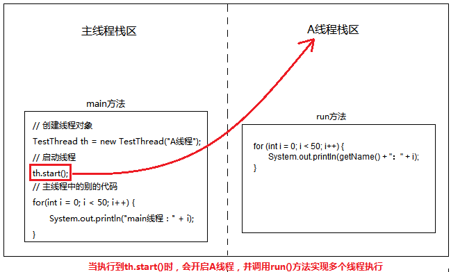

在多线程中，每个线程都有自己独立的栈内存，但是都是共享的同一个堆内存。在某个线程中程序执行出现了异常，那么对应线程执行终止，但是不影响别的线程执行。

main方法执行完毕之后，虚拟机有可能不会立即结束，只有等所有的线程都执行完毕之后，虚拟机才会结束！

**思考4：开启的线程都会有自己的独立运行栈内存，那么这些运行的线程的名字是什么呢？**

查阅Thread类的API文档发现有个方法是获取当前正在运行的线程对象，还有个方法是获取当前线程对象的名称。


想要获取运行时线程名称，必须先要得到运行时线程对象(这里的线程对象和继承Thread子类对象是不一样的)。在线程类方法当中有一个方法，叫做currentThread()，返回thread类型，静态的，类名可以直接调用。

【示例】获取当前线程对象和线程名称

```java
/**
 * 自定义线程类
 */
class TestThread extends Thread {
        private String name; // 定义一个普通成员变量
        public TestThread(String name) {
                this.name = name; // 给成员变量赋值
        }
        @Override
        public void run() {
                // 获取当前线程名称
                String threadName = Thread.currentThread().getName();
                System.out.println(name + "线程名称：" + threadName);
        }
}
/**
 * 测试类
 */
public class Test {
        public static void main(String[] args) {
                // 获取主线程对象
                Thread main = Thread.currentThread();
                // 获取主线程名称
                String name = main.getName();
                System.out.println("主线程名称：" + name);
                // 创建线程对象
                TestThread th1 = new TestThread("th1");
                TestThread th2 = new TestThread("th2");
                // 启动线程
                th1.start(); 
                th2.start();                
        }
}
```

运行以上案例代码，输出结果如下：


通过运行结果观察，发现主线程的名称为：main。自定义的线程名字默认为：Thread-加上编号，编号从0开始递增，th1线程对应的名称为：Thread-0，th2线程对应的名称为Thread-1。

那么自定义线程的默认名字是怎么来的呢？ 通过对Thread类的源码分析，我们发现调用Thread类的构造方法时，默认就给该线程对象定义了一个名字，格式为：Thread-加上编号。

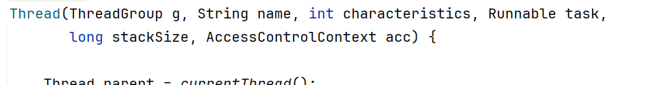

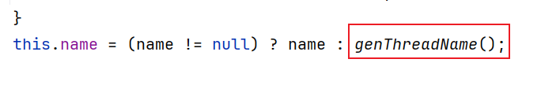

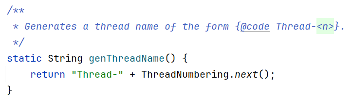

由此，我们也可以得出一个结论：当我们创建线程子类对象的时候，它们在创建的同时已经完成了名称的定义。

【示例】获取线程对象的名称

```java
public class Test {
        public static void main(String[] args) {
                // 创建线程对象
                Thread th1 = new Thread();
                Thread th2 = new Thread();
                // 获取创建线程对象的名称
                System.out.println("th1线程对象名称：" + th1.getName());
                System.out.println("th2线程对象名称：" + th2.getName());                
        }
}
```

运行以上案例代码，输出结果如下：


**思考5:可以手动的设置线程名称吗？**

自定义的线程名字默认为：Thread-加上编号，如果我们想要修改默认的线程名字，可以在创建线程对象的时候设置线程的名称，也可以使用Thread类提供的setName()方法来实现。


【示例】设置线程对象的名称

```java
public class Test {
        public static void main(String[] args) {
                // 创建线程对象
                Thread th = new Thread();
                // 设置线程的名称
                th.setName("线程A");
                // 获取创建线程对象的名称
                System.out.println("th线程对象名称：" + th.getName());
        }
}
```

运行以上案例代码，输出结果如下：


## 创建线程方式二：实现Runnable接口

使用继承Thread类的方式来创建线程有一个缺点，那就是自定义的类继承Thread类后就不能继承别的父类，如果还想继承别的父类那么可以选用第二种创建线程的方式。

在开发中，我们更多的是通过Runnable接口实现多线程，使用这种方式避免了Java单继承的局限性，所以实现Runnable接口方式要通用一些。

查看 Runnable接口说明文档：Runnable接口用来指定每个线程要执行的任务，并且包含了一个run()的无参抽象方法，需要Runnable接口的实现类来重写该方法。

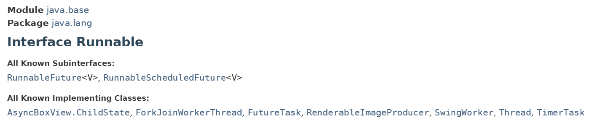

### 接口中的方法


### Thread类构造方法


实现Runnable接口实现多线程的步骤：

1. 定义一个类并实现Runnable接口,然后重写Runnable接口的run()方法。
2. 通过Thread类创建线程对象，并把Runnable接口的实现类对象作为参数传递。
3. 调用线程对象的start()方法开启线程，并调用Runnable实现类的run()方法。

【示例】实现Runable接口实现多线程

```java
/**
 * Runnable接口的实现类
 */
class TestRunnable implements Runnable {
        @Override
        public void run() {
                for(int i = 0; i < 10; i++) {
                        System.out.println("线程名称：" + Thread.currentThread().getName());
                }
        }
}
/**
 * 测试类
 */
public class Test {
        public static void main(String[] args) {
                // 创建线程执行任务对象
                TestRunnable tr = new TestRunnable();
                // 创建线程对象，将tr作为参数传递给Thread类的构造函数
                Thread th1 = new Thread(tr, "线程A");
                Thread th2 = new Thread(tr, "线程B");
                // 启动线程
                th1.start();
                th2.start();
                for(int i = 0; i < 10; i++) {
                        System.out.println("线程名称：" + Thread.currentThread().getName());
                }
        }
}
```

运行以上案例代码，输出结果如下：


思考一：开发中，使用继承Thread创建线程多，还是实现Runnable接口创建线程多呢？

答案：实现Runnable接口创建线程

思考二：开发中，使用Runnable接口来创建线程有什么好处呢？？？

1. 实现Runnable接口来创建线程，则线程类就可以继承别的父类，那么就避免单继承的局限性。
2. 实现Runnable接口来创建线程，实现了任务对象和线程对象相分离，实现了代码的解耦操作。
3. 实现Runnable接口来创建线程，可以实现数据的共享，而使用Thread创建线程不方便数据的共享。


# 线程的生命周期和状态控制

## 线程的生命周期

线程的生命周期，就是一个线程从创建到消亡的过程。关于Java中线程的生命周期，首先看一下下面这张较为经典的图：

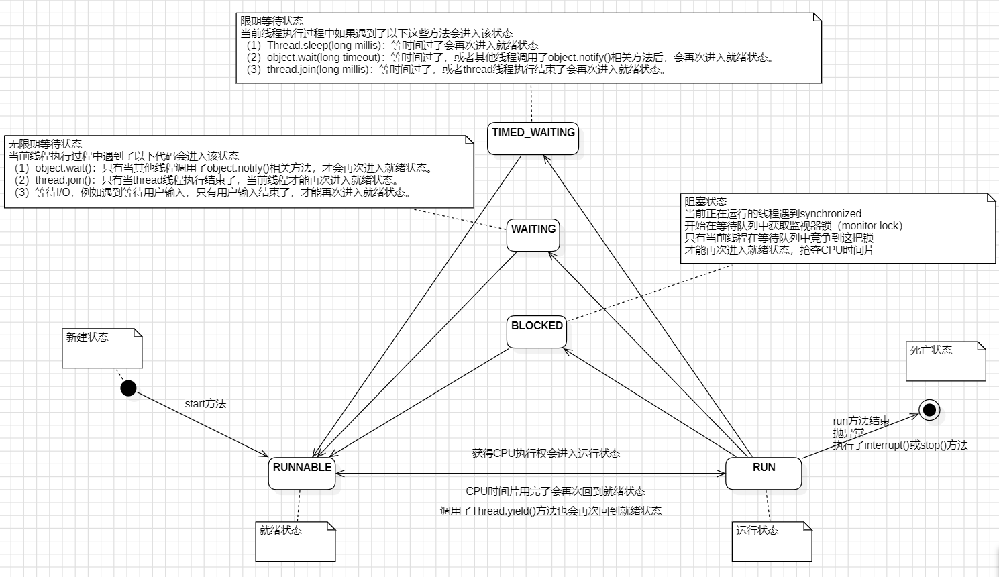

当线程被创建并启动以后，它既不是一启动就进入了执行状态，也不是一直处于执行状态。在线程的生命周期中，它要经过新建（New）、就绪（Runnable）、运行（Running）、阻塞（Blocked）和死亡（Dead）五种不同的状态。尤其是当线程启动以后，它不可能一直“霸占”着CPU独自运行，所以CPU需要在多条线程之间切换，于是线程状态也会多次在运行、阻塞之间切换。

### 新建状态（NEW）

创建Thread类的实例成功后，则该线程对象就处于新建状态。处于新建状态的线程有自己的内存空间，通过调用start()方法进入就绪状态（Runnable）。

### 就绪状态（RUNNABLE）

处于就绪状态的线程已经具备了运行条件（也就是具备了在CPU上运行的资格），但还没有分配到CPU的执行权，处于“线程就绪队列”，等待系统为其分配CPU。就绪状态并不是执行状态，当系统选定一个等待执行的Thread对象后，它就会进入执行状态。一旦获得CPU，线程就进入运行状态并自动调用run()方法。

### 运行状态（Running）

处于就绪状态的线程，如果获得了CPU的调度，就会从就绪状态变为运行状态，执行run()方中的任务。

运行状态的线程最为复杂，它可以变为阻塞状态、就绪状态和死亡状态。

如果该线程失去了CPU资源，就会又从运行状态变为就绪状态，重新等待系统分配资源。也可以对在运行状态的线程调用yield()方法，它就会让出CPU资源，再次变为就绪状态。

### 阻塞状态（BLOCKED）

- **含义**：线程正在等待一个监视器锁（monitor lock），以便进入一个**同步方法或同步代码块(synchronized)**。
- **进入情况**：
  - 线程A试图执行一个被 `<font style="color:rgb(15, 17, 21);background-color:rgb(235, 238, 242);">synchronized</font>` 修饰的代码块或方法时，如果该锁正被**线程B**持有，那么**线程A**就会进入 `<font style="color:rgb(15, 17, 21);background-color:rgb(235, 238, 242);">BLOCKED</font>` 状态。
  - 直到**线程B**释放了该锁，并且等待队列中的**线程A**竞争到了这把锁，它才能从 `<font style="color:rgb(15, 17, 21);background-color:rgb(235, 238, 242);">BLOCKED</font>` 状态退出，重新变为 `<font style="color:rgb(15, 17, 21);background-color:rgb(235, 238, 242);">RUNNABLE</font>`。

### 无限期等待状态（WAITING）

- **含义**：线程处于等待状态，因为它正在等待另一个线程执行一个特定的操作（“通知”或“中断”）。**在没有外部干预的情况下，它会无限期地等下去**。
- **进入情况**（通过调用以下方法之一，且**不带超时参数**）：
  - `<font style="color:rgb(15, 17, 21);background-color:rgb(235, 238, 242);">object.wait()</font>`：在一个拥有对象锁的同步块中调用，会释放锁，并让当前线程等待，直到其他线程调用该对象的 `<font style="color:rgb(15, 17, 21);background-color:rgb(235, 238, 242);">notify()</font>` 或 `<font style="color:rgb(15, 17, 21);background-color:rgb(235, 238, 242);">notifyAll()</font>`。
  - `<font style="color:rgb(15, 17, 21);background-color:rgb(235, 238, 242);">Thread.join()</font>`：等待目标线程执行终止。例如，在主线程中调用 `<font style="color:rgb(15, 17, 21);background-color:rgb(235, 238, 242);">threadB.join()</font>`，主线程会进入 `<font style="color:rgb(15, 17, 21);background-color:rgb(235, 238, 242);">WAITING</font>` 状态，直到 `<font style="color:rgb(15, 17, 21);background-color:rgb(235, 238, 242);">threadB</font>` 执行完毕。
- **退出条件**：被其他线程 `<font style="color:rgb(15, 17, 21);background-color:rgb(235, 238, 242);">notify()</font>` / `<font style="color:rgb(15, 17, 21);background-color:rgb(235, 238, 242);">notifyAll()</font>`，或被 `<font style="color:rgb(15, 17, 21);background-color:rgb(235, 238, 242);">interrupt()</font>`。

### 限期等待状态（TIMED_WAITING）

- **含义**：与 `<font style="color:rgb(15, 17, 21);background-color:rgb(235, 238, 242);">WAITING</font>` 状态类似，但设定了最大的等待时间。线程将等待直到超时或被唤醒。
- **进入情况**（通过调用以下方法之一，且**带超时参数**）：
  - `<font style="color:rgb(15, 17, 21);background-color:rgb(235, 238, 242);">Thread.sleep(long millis)</font>`
  - `<font style="color:rgb(15, 17, 21);background-color:rgb(235, 238, 242);">object.wait(long timeout)</font>`
  - `<font style="color:rgb(15, 17, 21);background-color:rgb(235, 238, 242);">thread.join(long millis)</font>`
- **退出条件**：
  1. 等待时间到期。
  2. 在等待时间内被其他线程唤醒（如 `<font style="color:rgb(15, 17, 21);background-color:rgb(235, 238, 242);">notify()</font>`）。
  3. 在等待时间内被中断 (`<font style="color:rgb(15, 17, 21);background-color:rgb(235, 238, 242);">interrupt()</font>`)。

### 死亡状态（TERMINATED）

线程在run()方法执行完了或者因异常退出了run()方法，该线程结束生命周期。此外，如果线程执行了interrupt()或stop()方法，那么它也会以异常退出的方式进入死亡状态。


## 线程状态的控制

Java提供了一些便捷的方法用于线程状态的控制。线程状态的控制Java给我们提供了很多方法，但是有些已经标注为过时的，我们应该尽可能的避免使用它们，此处我们重点关注start()、join()、sleep()、yield()等直接控制方法，和setDaemon()、setPriority()等间接控制方法。

### 线程睡眠

如果需要让当前正在执行的线程暂停一段时间，并进入阻塞状态，指定时间之后，解除阻塞状态，进入就绪状态，则可以通过调用Thread的sleep()方法来实现。

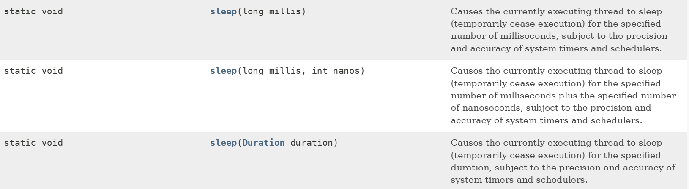

比如，我们想要使主线程每休眠1000毫秒，然后再打印出数字：

【示例】每隔1000毫秒打印一个数字

```java
public class Test {

        public static void main(String[] args) {
                for(int i = 1; i < 10; i++) {
                        System.out.println(i);
                        try {
                                Thread.sleep(1000); // 对主线程休眠1秒钟
                        } catch (InterruptedException e) {
                                e.printStackTrace();
                        }
                }
        }
}
```

通过执行代码，我们可以明显看到打印的数字在时间上有些许的间隔。

注意事项：

1. sleep是静态方法，最好不要用Thread的实例对象调用它，因为它睡眠的始终是当前正在运行的线程，而不是调用它的线程对象，它只对正在运行状态的线程对象有效。
2. 使用sleep方法之后，线程是进入阻塞状态的，只有当睡眠的时间结束，才会重新进入到就绪状态，而就绪状态进入到运行状态，是由系统控制的，我们不可能精准的去干涉它，所以如果调用Thread.sleep(1000)使得线程睡眠1秒，可能结果会大于1秒。

**JUC 并发包下提供了一个类 TimeUnit，可读性更好，更方便，也可以使用它：**

```java
// 传统的Thread.sleep()
Thread.sleep(1000); // 休眠1秒，单位是毫秒

// 使用TimeUnit（推荐）
TimeUnit.SECONDS.sleep(1);    // 休眠1秒
TimeUnit.MILLISECONDS.sleep(500); // 休眠500毫秒
TimeUnit.MINUTES.sleep(2);    // 休眠2分钟
TimeUnit.HOURS.sleep(1);      // 休眠1小时
```

### 线程的优先级

每个线程执行时都有一个优先级的属性，优先级高的线程可以获得较多的执行机会，而优先级低的线程则获得较少的执行机会。与线程休眠类似，线程的优先级仍然无法保障线程的执行次序。只不过，优先级高的线程获取CPU资源的概率较大，优先级低的也并非没机会执行。

Thread类提供了setPriority(int newPriority)和getPriority()方法来设置和返回一个指定线程的优先级，其中setPriority方法的参数是一个整数，能够设置[1-10]之间的整数，数值越大，那么优先级越高，也可以使用Thread类提供的三个静态常量：

1. public final static int MIN_PRIORITY = 1;
2. public final static int NORM_PRIORITY = 5; 默认
3. public final static int MAX_PRIORITY = 10;

【示例】测试线程优先级的执行

```java
/**
 * 自定义线程类
 */
class TestThread extends Thread {
        public TestThread() {}
        public TestThread(String name, int pro) {
                super(name); // 设置线程名字
                this.setPriority(pro); // 设置线程的优先级
        }
        @Override
        public void run() {
                for (int i = 0; i < 10; i++) {
                        System.out.println(this.getName() + "线程第" + i + "次执行！");
                }
        }
}
/**
 * 测试类
 */
public class Test {
        public static void main(String[] args) {
                new TestThread("高级", 10).start();
                new TestThread("低级", 1).start();
        }
}
```

执行程序，从结果可以看到，一般情况下，高级线程更先执行完毕。


### 线程让步

yield()方法和sleep()方法有点相似，yield()方法也是Thread类提供的一个静态的方法，它也可以让当前正在执行的线程暂停，让出CPU资源给其它的线程。但是和sleep()方法不同的是，它不会进入到阻塞状态，而是进入到就绪状态。yield()方法只是让当前线程暂停一下，重新进入就绪的线程池中，让系统的线程调度器重新调度器重新调度一次，完全可能出现这样的情况：当某个线程调用yield()方法之后，线程调度器又将其调度出来重新进入到运行状态执行。

实际上，当某个线程调用了yield()方法暂停之后，优先级与当前线程相同，或者优先级比当前线程更高的就绪状态的线程更有可能获得执行的机会，当然，只是有可能，因为我们不可能精确的干涉CPU调度线程。

【示例】线程让步的使用

```java
/**
 * 自定义线程类
 */
class TestThread extends Thread {
        public TestThread() {}
        public TestThread(String name, int pro) {
                super(name); // 设置线程名字
                this.setPriority(pro); // 设置线程的优先级
        }
        @Override
        public void run() {
                for (int i = 0; i < 5; i++) {
                        System.out.println(this.getName() + "线程第" + i + "次执行！");
                        Thread.yield(); // 线程让步
                }
        }
}
/**
 * 测试类
 */
public class Test {
        public static void main(String[] args) {
                new TestThread("高级", 10).start();
                new TestThread("低级", 1).start();
        }
}
```

关于sleep()方法和yield()方的区别如下：

1. sleep方法暂停当前线程后，会进入阻塞状态，只有当睡眠时间到了，才会转入就绪状态。而yield方法调用后，是直接进入就绪状态，所以有可能刚进入就绪状态，又被调度到运行状态。
2. sleep方法声明抛出了InterruptedException，所以调用sleep方法的时候要捕获该异常，或者显示声明抛出该异常。而yield方法则没有声明抛出任务异常。
3. sleep方法比yield方法有更好的可移植性，通常不要依靠yield方法来控制并发线程的执行，因此开发中yield方法不常用。

### 线程合并

线程的合并就是：线程A在运行期间，可以调用线程B的join()方法，这样线程A就必须等待线程B执行完毕后，才能继续执行A线程。

应用场景是当一个线程必须等待另一个线程执行完毕才能执行时，Thread类提供了join方法来完成这个功能，注意，它不是静态方法。

线程合并有三个重载的方法：

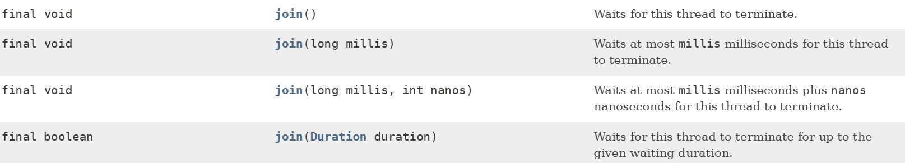

【示例】线程合并的使用

```java
/**
 * 自定义线程类
 */
class TestThread extends Thread {
        public TestThread() {}
        public TestThread(String name, int pro) {
                super(name); // 设置线程名字
                this.setPriority(pro); // 设置线程的优先级
        }
        @Override
        public void run() {
                for (int i = 0; i < 30; i++) {
                        System.out.println(this.getName() + "线程第" + i + "次执行！");
                }
        }
}
/**
 * 测试类
 */
public class Test {
        public static void main(String[] args) {
                TestThread th = new TestThread();
                th.start();
                try {
                        // 等待th线程执行任务完毕之后，再执行主线程中的任务
                        th.join();
                } catch (InterruptedException e) {
                        e.printStackTrace();
                }
        // 主线程任务
                for (int i = 0; i < 30; i++) {
                        String name = Thread.currentThread().getName();
                        System.out.println(name + "线程第" + i + "次执行！");
                }
        }
}
```

在这个例子中，在主线程中调用th.join(); 就是将主线程加入到th子线程后面等待执行。


### 守护线程

守护线程与普通线程写法上基本没啥区别，调用线程对象的方法setDaemon(true)，就可以把该线程标记为守护线程。

当普通线程（前台线程）都全部执行完毕，也就是当前在运行的线程都是守护线程时，Java虚拟机（JVM）将退出。另外，setDaemon(true)方法必须在启动线程前调用，否则抛出IllegalThreadStateException异常。   

【示例】线程合并的使用

```java
// 前台线程
class CommonThread extends Thread {
        @Override
        public void run() {
                for (int i = 0; i < 5; i++) {
                        System.out.println("前台线程第" + i + "次执行！");
                }
        }
}
// 后台线程或守护线程
class DaemonThread extends Thread {
        int i = 0;
        @Override
        public void run() {
                while(true) {
                        System.out.println("后台线程第" + i++ + "次执行！");
                }
        }
}
//测试类
public class Test {
        public static void main(String[] args) {
                CommonThread ct = new CommonThread();
                DaemonThread dt = new DaemonThread();
                ct.start();
                dt.setDaemon(true); // 将dt设置为守护线程
                dt.start();
        }
}
```

运行以上代码，通过执行的结果可以看出：前台线程是保证执行完毕的，后台线程还没有执行完毕就退出了。

**守护线程的用途**：守护线程通常用于执行一些后台作业，例如在你的应用程序运行时播放背景音乐，在文字编辑器里做自动语法检查、自动保存等功能。Java的垃圾回收也是一个守护线程。守护线的好处就是你不需要关心它的结束问题。例如你在你的应用程序运行的时候希望播放背景音乐，如果将这个播放背景音乐的线程设定为非守护线程，那么在用户请求退出的时候，不仅要退出主线程，还要通知播放背景音乐的线程退出；如果设定为守护线程则不需要了。


# 线程同步

前面章节，我们学习了线程的创建和状态控制，但是每个线程之间几乎都没有什么太大的联系。可是有的时候，可能存在多个线程对同一个数据进行操作，这样，可能就会引用各种奇怪的问题。现在就来学习多线程对数据访问的控制吧。

由于同一进程的多个线程共享同一个数据源，在带来方便的同时，也带来了访问冲突这个严重的问题。好在Java语言提供了专门机制以解决这种冲突，有效避免了同一个数据对象被多个线程同时访问。

## 线程安全概述

下面看一个经典的问题，关于银行取钱的问题：

假设你的银行账户有5000元，并且你和你的妻子两人都知道账户密码。某一天，你去银行取3000元，银行系统会先查看你的账户够不够3000元，明显你是满足条件的，但是，如果此时你的妻子也需要去取3000元，并且你的取钱线程刚好因为某些状况被打断了（这时系统还来不及修改你的账户余额），所以你的妻子去取钱时也满足条件，所以她完成了取钱动作，而你取钱线程恢复之后，你也将完成取钱动作。

【示例】通过代码模拟取钱的过程

```java
// 银行账户类
class Account {
        // 账户余额
        private int balance = 5000;
        // 获取账户余额方法
        public int getBalance() {
                return balance;
        }
        // 取钱方法
        public void drawMoney(int money) {
                balance -= money;
        }
}
// Runnable类,模拟取钱的操作
public class AccountRunnable implements Runnable {
        // 银行账户对象
        private Account account;
        public AccountRunnable(Account account) {
                this.account = account;
        }
        @Override
        public void run() {
                // 先判断余额够不够，如果足够则取款
                if(account.getBalance() >= 3000) {
                        try {
                                Thread.sleep(1); // 取钱线程中断，起切换线程的作用
                        } catch (InterruptedException e) {
                                e.printStackTrace();
                        }
                        // 取款3000元
                        account.drawMoney(3000);
                        // 输出余额
                        System.out.println(Thread.currentThread().getName() + "取款成功" 
                        + "，余额为:" + account.getBalance());
                }
                // 余额不够，则不允许取款
                else {
                        System.out.println(Thread.currentThread().getName()
                                        +"取款失败，余额为：" + account.getBalance());
                }
        }
}
// 测试类，模拟你和你老婆取钱
public class Test {
        public static void main(String[] args) {
                // 实例化银行账户对象
                Account account = new Account();
                // 创建并开启线程
                AccountRunnable ar = new AccountRunnable(account);
                new Thread(ar, "你").start();
                new Thread(ar, "你老婆").start();
        }
}
```

执行以上代码，输出结果为：


通过运行结果观察，我们可以发现共享数据明明只有5000（账户余额）的完整性被破坏了，两个线程同时操作一个银行账户，银行账户元，结果两人却轻松取出了3000元，如果现实中真发生这种情况，估计银行就要哭晕在厕所了。

为了避免这样的事情发生，我们要保证线程同步互斥，所谓同步互斥就是：**并发执行的多个线程在某个时间内只允许一个线程在执行并访问共享数据。**就好比：教室里，只有一台电脑，多个人都想使用。天然的解决办法就是，在电脑旁边，大家排队。上一个人使用完后，下一个人再使用。

为了解决这个问题，java提供了线程同步机制，它能够解决上述的线程安全问题，线程同步的方式有两种：同步代码块和同步方法。


## 同步代码块详解

“非线程安全”其实就是在多个线程对同一个对象中的实例变量进行并发访问时发生，产生的后果就是“脏读”，也就是取到的数据其实是被更改过的的结果。在Java中，关键字synchronized可以保证在同一个时刻，只有一个线程可以执行某个方法或者某个代码块（主要是对方法或者代码块中存在共享数据的操作）。

在某些情况下，我们编写的方法体可能比较大，同时存在一些比较耗时的操作，而需要同步的代码又只有一小部分，此时我们可以使用同步代码块。同步代码块，就是在代码块声明上加上synchronized关键字。

```java
synchronized (同步监视器) {
        // 可能会产生线程安全问题的代码
}
```

同步监视器可以理解为就是一把锁，锁住了别的线程就进不去了，直到该线程释放掉这个锁（释放锁是指持锁线程退出了synchronized同步代码块）。

同步监视器注意事项：

1. 所谓的同步监视器就是一个“对象”，我们可以理解为是一个“锁”。
2. 多个线程访问同一个同步代码块时，要求必须使用同一个“对象”来作为“锁”。
3. 尽量不要用String和包装类型作为同步监视器，容易造成指向堆中地址的变化。
4. 使用Runnable来创建线程，建议使用“this”来作为锁；使用继承Thread来创建线程，建议使用“类名.class”来作为锁。

接下来我们通过同步代码块，对银行取钱案例中AccountRunnable类进行如下代码修改：

【示例】使用同步代码块模拟取钱

```java
// Runnable类,模拟取钱的操作
public class AccountRunnable implements Runnable {
        // 银行账户对象
        private Account account;
        public AccountRunnable(Account account) {
                this.account = account;
        }
        @Override
        public void run() {
                // 同步代码块
                synchronized (this) {
                        // 先判断余额够不够，如果足够则取款
                        if(account.getBalance() >= 3000) {
                                try {
                                        Thread.sleep(1); // 取钱线程中断，起切换线程的作用
                                } catch (InterruptedException e) {
                                        e.printStackTrace();
                                }
                                // 取款3000元
                                account.drawMoney(3000);
                                // 输出余额
                   System.out.println(Thread.currentThread().getName() + "取款成功，余额为：" + account.getBalance());

                        }
                        // 余额不够，则不允许取款
                        else {
                            System.out.println(Thread.currentThread().getName() + "取款失败，余额为：" + account.getBalance());
                        }
                }
        }
}
```

当使用了同步代码块后，上述的线程的安全问题，解决了。

“synchronized (this)”意味着线程需要获得this对象的“锁”才有资格运行同步块中的代码。this对象的“锁”也成为“互斥锁”，只能同时被一个线程使用。例如，A线程拥有锁，则可以调用“同步块”中的代码；B线程没有锁，则进入this对象的“锁池队列”等待，直到A线程使用完毕释放了this对象的锁，B线程才可以开始调用“同步块”中的代码。


## 同步方法详解

当某一个方法中的所有代码都需要同步的时候，这时候我们可以使用同步方法，同步方法就是在方法声明上加添加synchronized关键字。

### 非静态同步方法

在非静态方法声明上添加synchronized，我们称之为非静态同步方法。

```java
[修饰符] synchronized 返回值类型 方法名(实参列表) {
        // 可能会产生线程安全问题的代码
}
```

非静态同步方法和同步代码块的原理比较类似，不过非静态同步方法中的同步监视器是隐式的，该同步监视器默认为this（感兴趣的同学可以自己通过代码验证一下）。

接下来我们使用非静态同步方法，对银行取钱案例中AccountRunnable类进行如下修改：

【示例】使用非静态同步方法模拟取钱

```java
// Runnable类,模拟取钱的操作
public class AccountRunnable implements Runnable {
        // 银行账户对象
        private Account account;
        public AccountRunnable(Account account) {
                this.account = account;
        }
        @Override
        public void run() {
                // 此处省略500句（与安全无关）
                drawMoney();
                // 此处省略500句（与安全无关）
        }
        /**
         * 同步方法
         */
        public synchronized void drawMoney() {
                // 先判断余额够不够，如果足够则取款

                if (account.getBalance() >= 3000) {
                        try {
                                Thread.sleep(1); // 起切换线程的作用
                        } catch (InterruptedException e) {
                                e.printStackTrace();
                        }
                        // 取款3000元
                        account.drawMoney(3000);
                        // 输出余额
                        System.out.println(Thread.currentThread().getName() + "取款成功" + "，余额为:" + account.getBalance());
                }
                // 余额不够，则不允许取款
                else {
                        System.out.println(Thread.currentThread().getName() + "取款失败，余额为：" + account.getBalance());
                }
        }
}
```

建议，不要在重写的run方法添加synchronized，否则run方法中的任务都变为同步了。

目前我们已接触到的类中，StringBuffer、Hashtable和Vecter都属于线程安全类，这些线程安全类中的方法都为非静态同步方法，例如StringBuffer类中的append方法就是synchronized修饰的。

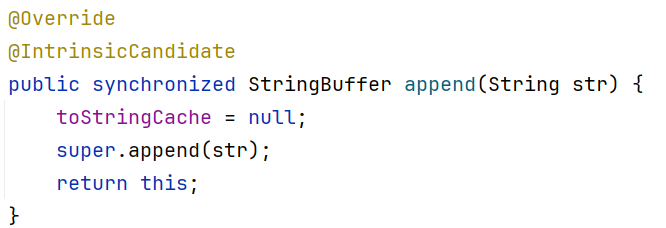

### 静态同步方法

synchronized关键字不但能修饰成员方法，还能修饰静态方法。在静态方法的声明上添加synchronized，我们称之为静态同步方法。

```java
[修饰符] static synchronized 返回值类型 方法名(实参列表) {
        // 可能会产生线程安全问题的代码
}
```

静态同步方法中同步监视器是隐式的，静态同步方法的同步监视器默认为“类名.class”。

synchronized修饰成员方法，实际上是对调用该方法的对象（也就是this）加锁，俗称“对象锁”；synchronized修饰静态方法，实际上是对该类对象加锁，俗称“类锁”。

另外，同步方法直接在方法声明上加synchronized实现加锁，同步代码块则在方法内部加锁，很明显，同步方法锁的范围比较大，而同步代码块范围要小点。并且，同步是一种高开销的操作，因此应该尽量减少同步的内容。 通常没有必要同步整个方法，使用synchronized代码块同步关键代码即可。

## synchronized总结

**总结1：synchronized关键字使用注意点**

1. synchronized关键字只能修饰方法和代码块，而不能修饰变量、构造方法和类。
2. 只有共享资源的读写访问才需要同步，如果不是共享资源，根本没有同步的必要。
3. 编写线程安全的代码会使系统的总体效率会降低，并且容易发生死锁（后面学习）的情况。
4. 同步代码块和同步方法，都是必须获得对象锁才能够进入同步代码块或同步方法进行操作。
5. 成员同步方法，它的对象锁为“this”对象；静态同步方法，它的对象锁为“类名.class”。

**总结2：一个线程取得了同步锁，那么在什么时候才会释放掉呢？**

1. 获取锁的线程执行完了同步代码，然后线程释放对锁的占有。
2. 线程执行发生了异常或错误，此时虚拟机（JVM）会让线程自动释放锁。
3. 当线程执行同步方法或同步代码块时，程序执行了同步锁对象的wait()方法（后面学习）。

**总结3：synchronized的可重入性**

在使用synchronized时，当一个线程得到一个对象锁后（只要该线程还没有释放这个对象锁），再次请求此对象锁时是可以再次得到该对象的锁的。

【示例】在同步方法中，可以调用当前类的另一个同步方法

```java
class TestRunnable implements Runnable {
        @Override
        public void run() {
                method01();
        }
        public synchronized void method01() {
                System.out.println("执行method01方法啦");
                // 在同步方法中调用同一个对象的另外一个同步方法 
                method02();
        }
        public synchronized void method02() {
                System.out.println("执行method02方法啦");
        }
}
// 测试类
public class Test {
        public static void main(String[] args) {
                new Thread(new TestRunnable()).start();
        }
}
```

可重入锁也支持在父子类继承的环境中。当存在父子类继承关系时，子类是完全可以通过“可重入锁”调用父类的同步方法。

【示例】在子类同步方法中，可以调用父类的同步方法

```java
// 父类
class Parent {
        public synchronized void parentMethod() {
                System.out.println("父类parentMethod方法被执行啦");
        }
}
// 子类
class ChildRunnable extends Parent implements Runnable {
        @Override
        public void run() {
                childMethod();
        }
        public synchronized void childMethod() {
                System.out.println("子类childMethod方法被执行啦");
                // 调用父类方法
                super.parentMethod();
        }
}
// 测试类
public class Test {
        public static void main(String[] args) {
                new Thread(new ChildRunnable()).start();
        }
}
```

**总结4：同步方法和方法重写的要求**

【示例】子类重写父类的同步方法，子类重写的方法可以为非同步方法

```java
//父类
class Parent {
        // 父类的method方法为同步方法
        public synchronized void method() {
                System.out.println("父类method方法");
        }
}
//子类
class Child {
        // 子类重写父类的method方法，但是子类方法可以不是同步方法
        public void method() {
                System.out.println("子类method方法");
        }
}
```

## synchronized 面试题

### 面试题 1

问：m2 方法的执行需要等待 m1 方法的结束吗？

```java
package com.jkweilai.javase.thread;

import java.util.concurrent.TimeUnit;

public class Exam01 {
    public static void main(String[] args) throws InterruptedException {
        MyClass mc = new MyClass();
        Thread t1 = new Thread(new MyRunnable(mc), "t1");
        Thread t2 = new Thread(new MyRunnable(mc), "t2");
        t1.start();
        TimeUnit.SECONDS.sleep(3);
        t2.start();
    }
}

class MyRunnable implements Runnable {
    MyClass mc;

    public MyRunnable(MyClass mc) {
        this.mc = mc;
    }

    @Override
    public void run() {
        if("t1".equals(Thread.currentThread().getName())){
            mc.m1();
        }else if("t2".equals(Thread.currentThread().getName())){
            mc.m2();
        }
    }
}

class MyClass {
    public synchronized void m1(){
        System.out.println("m1 begin");
        try {
            TimeUnit.SECONDS.sleep(10);
        } catch (InterruptedException e) {
            throw new RuntimeException(e);
        }
        System.out.println("m2 over");
    }
    public void m2(){
        System.out.println("m2 begin");
        System.out.println("m2 over");
    }
}
```

### 面试题 2

问：m2 方法的执行需要等待 m1 方法的结束吗？

```java
package com.jkweilai.javase.thread;

import java.util.concurrent.TimeUnit;

public class Exam01 {
    public static void main(String[] args) throws InterruptedException {
        MyClass mc = new MyClass();
        Thread t1 = new Thread(new MyRunnable(mc), "t1");
        Thread t2 = new Thread(new MyRunnable(mc), "t2");
        t1.start();
        TimeUnit.SECONDS.sleep(3);
        t2.start();
    }
}

class MyRunnable implements Runnable {
    MyClass mc;

    public MyRunnable(MyClass mc) {
        this.mc = mc;
    }

    @Override
    public void run() {
        if("t1".equals(Thread.currentThread().getName())){
            mc.m1();
        }else if("t2".equals(Thread.currentThread().getName())){
            mc.m2();
        }
    }
}

class MyClass {
    public synchronized void m1(){
        System.out.println("m1 begin");
        try {
            TimeUnit.SECONDS.sleep(10);
        } catch (InterruptedException e) {
            throw new RuntimeException(e);
        }
        System.out.println("m2 over");
    }
    public synchronized void m2(){
        System.out.println("m2 begin");
        System.out.println("m2 over");
    }
}
```

### 面试题 3

问：m2 方法的执行需要等待 m1 方法的结束吗？

```java
package com.jkweilai.javase.thread;

import java.util.concurrent.TimeUnit;

public class Exam01 {
    public static void main(String[] args) throws InterruptedException {
        MyClass mc1 = new MyClass();
        MyClass mc2 = new MyClass();
        Thread t1 = new Thread(new MyRunnable(mc1), "t1");
        Thread t2 = new Thread(new MyRunnable(mc2), "t2");
        t1.start();
        TimeUnit.SECONDS.sleep(3);
        t2.start();
    }
}

class MyRunnable implements Runnable {
    MyClass mc;

    public MyRunnable(MyClass mc) {
        this.mc = mc;
    }

    @Override
    public void run() {
        if("t1".equals(Thread.currentThread().getName())){
            mc.m1();
        }else if("t2".equals(Thread.currentThread().getName())){
            mc.m2();
        }
    }
}

class MyClass {
    public synchronized void m1(){
        System.out.println("m1 begin");
        try {
            TimeUnit.SECONDS.sleep(10);
        } catch (InterruptedException e) {
            throw new RuntimeException(e);
        }
        System.out.println("m2 over");
    }
    public synchronized void m2(){
        System.out.println("m2 begin");
        System.out.println("m2 over");
    }
}
```

### 面试题 4

问：m2 方法的执行需要等待 m1 方法的结束吗？

```java
package com.jkweilai.javase.thread;

import java.util.concurrent.TimeUnit;

public class Exam01 {
    public static void main(String[] args) throws InterruptedException {
        MyClass mc1 = new MyClass();
        MyClass mc2 = new MyClass();
        Thread t1 = new Thread(new MyRunnable(mc1), "t1");
        Thread t2 = new Thread(new MyRunnable(mc2), "t2");
        t1.start();
        TimeUnit.SECONDS.sleep(3);
        t2.start();
    }
}

class MyRunnable implements Runnable {
    MyClass mc;

    public MyRunnable(MyClass mc) {
        this.mc = mc;
    }

    @Override
    public void run() {
        if("t1".equals(Thread.currentThread().getName())){
            mc.m1();
        }else if("t2".equals(Thread.currentThread().getName())){
            mc.m2();
        }
    }
}

class MyClass {
    public static synchronized void m1(){
        System.out.println("m1 begin");
        try {
            TimeUnit.SECONDS.sleep(10);
        } catch (InterruptedException e) {
            throw new RuntimeException(e);
        }
        System.out.println("m2 over");
    }
    public static synchronized void m2(){
        System.out.println("m2 begin");
        System.out.println("m2 over");
    }
}
```


## 死锁详解

简单的说就是：当A线程等待B线程释放资源，而同时B又在等待A线程释放资源，这就形成了死锁。这里举一个通俗的例子，例如在人行道上两个人迎面相遇，为了给对方让道，两人同时向一侧迈出一步，双方无法通过，又同时向另一侧迈出一步，这样还是无法通过。假设这种情况一直持续下去，这样就会发生死锁现象。

导致死锁的根源在于不适当地运用“synchronized”关键词来管理线程对特定对象的访问。比如有两个对象A 和 B 。第一个线程锁住了A，然后休眠1秒，轮到第二个线程执行，第二个线程锁住了B，然后也休眠1秒，然后有轮到第一个线程执行。第一个线程又企图锁住B，可是B已经被第二个线程锁定了，所以第一个线程进入阻塞状态，又切换到第二个线程执行。第二个线程又企图锁住A，可是A已经被第一个线程锁定了，所以第二个线程也进入阻塞状态。就这样，死锁造成了。

【示例】死锁情况的代码演示

```java
// 线程任务类
class LockA implements Runnable {
        @Override
        public void run() {
                System.out.println("LockA线程开始执行啦");
                while(true) {
                        // LockA线程被obj1锁住
                        synchronized (Test.obj1) { 
                                System.out.println("LockA被obj1锁住啦");
                                // 线程休眠10ms，给LockB线程执行的机会
                                try {
                                        Thread.sleep(10); 
                                } catch (InterruptedException e) {
                                        e.printStackTrace();
                                }
                                // 在LockA线程中，LockB线程已经被obj2锁住
                                synchronized (Test.obj2) {
                                        System.out.println("LockA被obj2锁住啦");
                                }
                        }
                }
        }        
}
// 线程任务类
class LockB implements Runnable {
        @Override
        public void run() {
                System.out.println("LockB线程开始执行啦");
                while(true) {
                        // LockB线程被obj2锁住
                        synchronized (Test.obj2) {
                                System.out.println("LockB被obj2锁住啦");
                                // 线程休眠10ms，给LockA线程执行的机会
                                try {
                                        Thread.sleep(10); 
                                } catch (InterruptedException e) {
                                        e.printStackTrace();
                                }
                                // 在LockB线程中，LockA线程已经被obj1锁住
                                synchronized (Test.obj1) {
                                        System.out.println("LockB被obj1锁住啦");
                                }
                        }
                }
        }        
}
// 测试类
public class Test {
        // 线程LockA的同步监视器
        public static Object obj1 = new Object();
        // 线程LockB的同步监视器
        public static Object obj2 = new Object();
        // main方法，程序的入口
        public static void main(String[] args) {
                new Thread(new LockA()).start();
                new Thread(new LockB()).start();
        }
}
```

第一个线程首先锁住了obj1 ，然后休眠。接着第二个线程锁住了obj2，然后休眠。在第一个线程企图在锁住obj2，进入阻塞。然后第二个线程企图在锁住obj1，进入阻塞。然后就进入死锁了。

死锁是线程间相互等待锁造成的，在实际中发生的概率非常的小。如果真的遇见死锁的这种情况，我们只避免死锁的发生，唯一的解决方案就是优化代码的逻辑。


# 线程通讯

多线程环境下，我们经常需要多个线程的并发和通讯。关于线程通讯，最经典的例子就是生产者和消费者的问题。 

## 等待唤醒方法概述

例如：生产者循环的交替生产“黄色的馒头”和“白色的包子”，然后生产者把生产好的“馒头”或“包子”放入一个篮子里，消费者不断的从篮子里拿“馒头”或“包子”来吃。并且，当篮子中存在“馒头”或“包子”的时候，生产者就通知消费者来吃“馒头”或“包子”，并且自己等待不再生产“馒头”和“包子”。当篮子没食物的的时候，由消费者通知生产者来生产“馒头”和“包子”，然后这样的操作不停的循环。

要完成上面的功能，光靠我们前面的同步等知识，是不能完成的，而是需要用到线程之间的通讯技术，也就是等待唤醒机制所涉及到的方法：

- wait()：执行这个代码的当前线程进入等待状态，并释放监视器锁（monitor lock）。
- notify()：唤醒其中一个通过wait()方法进入等待状态的线程
- notifyAll()：唤醒全部通过wait()方法进入等待状态的线程

其实，所谓唤醒的意思就是让通过wait()方法进入等待的线程具备执行资格。必须注意的是，**这些方法都是在同步中才有效**。同时这些方法在使用时必须标明所属锁，这样才可以明确出这些方法操作的到底是哪个锁上的线程。

仔细查看API之后，发现这些方法并不定义在Thread中，也没定义在Runnable接口中，却被定义在了Object类中，为什么这些操作线程的方法定义在Object类中？

因为这些方法在使用时，必须要标明所属的锁，而锁又可以是任意对象，能被任意对象调用的方法一定是定义在Object类中。

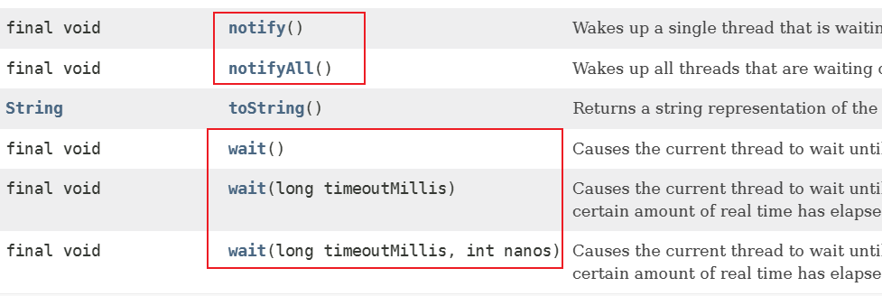

wait()方法有三种形式：无时间参数的wait()方法（一直等待，直到其他线程通知），带毫秒参数的wait()方法和带毫秒、微秒参数的wait()方法（这两种方法都是等待指定时间后自动苏醒）。并且调用wait()方法的当前线程会释放对该同步监视器的锁定。

使用wait、notify和notifyAll三个方法必须明白下面几点：

1. wait()、notify()和notifyAll()这三个方法都是java.lang.Object类提供的方法。
2. 使用wait()方法进入等待状态的线程，还会释放掉锁，并且只有其它线程调用notify()或者notifyAll()方法，则进入wait()状态的锁才能被唤醒。
3. wait()、notify()和notifyAll()这三个方法，都必须在同步代码块或同步方法中，并且都必须通过“同步监视器”来调用，否则就会抛出IllegalMonitorStateException异常。

**sleep()和 wait()方法的区别：**

1. sleep方法是Thread类的方法，而wait方法是Object类的方法。
2. sleep方法可以在任何地方使用，而wait方法必须在同步代码中使用。
3. sleep在休眠的时间内，不能唤醒，而wait在等待的时间内，能被唤醒。
4. sleep不释放同步锁，会一直持有锁，而wait方法会释放同步锁。


## 生产者消费者模式

学习“生产者消费者模式”，需要明白什么是生产者，什么是消费者，什么是缓冲区。

### 什么是生产者？

生产者指的是负责生产数据的模块，此案例中对应的就是负责交替生产“黄色的馒头”和“白色的包子”的生产者类（ProductRunnable类)。

### 什么是消费者？

消费者指的是负责处理数据的模块，此案例中对应的就是消费“黄色的馒头”和“白色的包子”的消费者类（ConsumeRunnable类)。

### 什么是缓冲区？

消费者不能直接使用生产者的数据，它们之间有个“缓冲区”。生产者将生产好的数据放入“缓冲区”，消费者从“缓冲区”拿要处理的数据。此案例中对应的就是盛放“黄色的馒头”和“白色的包子”的篮子，对应的类就是ProductStack类。

缓冲区是实现并发的核心，缓冲区的设置有3个好处：

1. 实现线程的并发协作。
  1. 有了缓冲区以后，生产者线程只需要往缓冲区里面放置数据，而不需管消费者消费的情况；同样，消费者只需要从缓冲区拿数据处理即可，也不需管生产者生产的情况。这样，就从逻辑上实现了“生产者线程”和“消费者线程”的分离。
2. 解耦了生产者和消费者。
  1. 生产者不需要和消费者直接打交道。
3. 解决忙闲不均，提高效率。
  1. 生产者生产数据慢时，缓冲区仍有数据，不影响消费者消费；消费者处理数据慢时，生产者仍然可以继续往缓冲区里面放置数据 。

### 生产者消费者模式的代码实现

要想完成生产者消费者模式的代码实现，首先我们应该创建一个商品类，商品类包含两个属性，分别为name属性和color属性，代表生产者循环交替生产的“黄色的馒头”和“白色的包子”。

【示例】商品类的代码实现

```java
// 商品类
public class Product {
        // 商品名称
        private String name;
        // 商品颜色
        private String color;
        public String getName() {
                return name;
        }
        public void setName(String name) {
                this.name = name;
        }
        public String getColor() {
                return color;
        }
        public void setColor(String color) {
                this.color = color;
        }
}
```

完成商品类设计之后，我们紧接着需要设计缓冲区也就是仓库类的实现。仓库类有一个product属性和flag属性，product属性代表存储在仓库中商品（可能是“黄色馒头”，也有可能是“白色包子”），flag属性用于标记仓库中是否有商品存在。

【示例】仓库类的代码实现

```java
// 仓库类
public class ProductStock {
    // 商品对象
    private Product product;
    /**
     * 设置仓库是否有商品的标记
     *          如果标记值为true，则证明仓库中有商品
     *   如果标记值为false，则证明仓库中没有商品
     */
    private boolean flag; // 默认值为false
    // 构造方法
    public ProductStock(Product product) {
        this.product = product;
    }
    // 生产商品方法
    public synchronized void product(String name, String color) {
        // 1.如果有商品，则等待
        if(flag) {
            try {
                this.wait(); // 该生产者线程进入线程池等待，如果唤醒则继续往下执行代码
            } catch (InterruptedException e) {
                e.printStackTrace();
            }
        }
        // 2.如果没有商品，则生产。
        product.setName(name);
        try {
            // 线程等待，主要作用是为了切换线程
            Thread.sleep(1);
        } catch (InterruptedException e) {
            e.printStackTrace();
        }
        product.setColor(color);
        System.out.println("生产者----->" + color + name);
        // 3.更改商品状态
        this.flag = true;
        // 4.唤醒消费者线程，告诉消费者可以消费了
        this.notify();
    }
    // 消费商品方法
    public synchronized void consume() {
        // 1.如果没有商品，则等待
        if (!flag) {
            try {
                this.wait(); // 消费者线程进入线程池等待，如果唤醒则继续往下执行代码
            } catch (InterruptedException e) {
                e.printStackTrace();
            }
        }
        // 2.如果有商品，则消费
        // 输出消费的商品信息
        System.out.println("消费者-->" + product.getColor() + product.getName());
        // 3.更改仓库商品状态
        this.flag = false;
        // 4.唤醒生产着线程，告诉生产者可以继续生产了
        this.notify();
    }
}
```

仓库类中，生产商品方法（product）和消费商品方法（consume）是本案例的核心。

生产商品实现步骤：如果仓库中已经存在商品，那么生产者线程进入等待，不再进行商品的生产。如果仓库中不存在商品，则生产者线程开始生产商品，生产商品完毕之后更改仓库商品状态，最后唤醒消费者线程，通知消费者线程可以消费产品了。

消费商品实现步骤：如果仓库中不存在商品，那么消费者线程进入等待。如果厂库中存在商品，则消费者线程开始消费商品，商品消费完毕之后更改仓库商品状态，最后唤醒生成者线程，通知生产者线程可以继续生产商品了。

完成仓库类设计之后，接下来就可以去设计生产者类和消费者类了。生产者类负责交替生产“黄色的馒头”和“白色的包子”，消费者类负责消费商品，也就是输出商品信息。

【示例】生产者类和消费者类的代码实现

```java
// 生产者类
class ProduceRunnable implements Runnable {
    int index = 0;
    // 商品
    private ProductStock stack;
    public ProduceRunnable(ProductStock stack) {
        this.stack = stack;
    }
    // 实现交替生产，奇数次生产：黄色馒头，偶数次生产：白色包子
    @Override
    public void run() {
        while(true) {
            if(index%2 == 0) {
                // 生产白色的包子
                stack.product("包子", "白色");
            } else {
                // 生产黄色馒头
                stack.product("馒头", "黄色");
            }
            index++;
        }
    }
}
// 消费者类
class ConsumeRunnable implements Runnable {
    // 商品
    private ProductStock stack;
    public ConsumeRunnable(ProductStock stack) {
        this.stack = stack;
    }
    @Override
    public void run() {
        while(true) {
            // 消费商品
            stack.consume();
        }
    }
}
```

生产者类和消费者类的实现相对比较简单，生产者类生产商品时只需要调用product()方法即可，消费者类消费商品时也只需要调用consume()方法即可，但是切记消费者和生产者操作的都是同一个仓库，也就是说消费者类和生产者类中的stack是一个共享对象，那么创建消费者和生产者对象时，就需要在构造方法中传入同一个仓库对象才行！

最后，我们来编写测试类，在测试类的main方法中开启生产者线程和消费者线程，但是切记需要在生产者类和消费者类的构造方法中传入同一个仓库对象！

【示例】测试类代码实现

```java
// 测试类
public class Test {
    public static void main(String[] args) {
        // 实例化一个商品类
        ProductStock stack = new ProductStock(new Product());
        // 实例化生产者和消费者任务类
        ProduceRunnable pr = new ProduceRunnable(stack);
        ConsumeRunnable cr = new ConsumeRunnable(stack);
        // 开启线程
        new Thread(pr).start();
        new Thread(cr).start();
    }
}
```

通过执行代码，我们可以明显看生产者交替的生产“黄色的馒头”和“白色的包子”，并且生产者每生产一个商品，消费者就对应消费对应生产的商品，实现生产者和消费者交替执行的功能。


## 多生产者多消费者问题

在上一个章节中，我们在测试类中开启了一个生产者线程和一个消费者线程，可以通过标志位flag的if判断和同步方法互斥较好解决两个线程，一个生产者和一个消费者交替执行的功能。

接下来，如果我们开启多个线程会怎么样呢？例如在测试类中，我们开启两个生产者线程和两个消费者线程，还能实现生产者和消费者交替执行的功能吗？

【示例】在测试类中开启两个生产者线程和两个消费者线程

```java
// 测试类
public class Test {
    public static void main(String[] args) {
        // 实例化一个商品类
        ProductStock stack = new ProductStock(new Product());
        // 实例化生产者和消费者任务类
        ProduceRunnable pr = new ProduceRunnable(stack);
        ConsumeRunnable cr = new ConsumeRunnable(stack);
        // 开启线程
        Thread th1 = new Thread(pr);
        Thread th2 = new Thread(pr); // 新增的生产者线程 
        Thread th3 = new Thread(cr);
        Thread th4 = new Thread(cr); // 新增的消费者线程
        th1.start();
        th2.start();
        th3.start();
        th4.start();
    }
}
```

运行以上案例代码，输出结果如下：


运行后发现，加上th2和th4之后结果就错了。

为什么两个线程的时候执行结果正确，然而四个线程的时候就不对了呢？接下来我们就基于以上程序运行结果来分析，假设th3线程刚执行完毕，然后执行notify唤醒在线程池中的任意一个线程，恰好唤醒了th4线程，th4线程接到唤醒通知后立即往下执行（也就从if判断中的this.wait()之后执行），而不会进行if条件判断，这样就造成了消费者消费了两次“白色包子”，也就是在控制台输出了两次“消费者-->白色包子”。

解决这个问题其实很简单，我们只需要修改仓库类(ProductStack类)中生产商品方法和消费商品方法即可，让线程被唤醒之后再次进行条件判断。解决方案就是把两个方法中的if变为while，让线程被唤醒并获得执行权之后再次进行条件判断，这样就能避免连续生产多个商品或连续消费多个商品的情况发生。

【示例】仓库类代码的优化实现

```java
// 仓库类
public class ProductStock {
    // 商品对象，属于共享数据
    private Product product;
    // 设置仓库是否有商品的标记
    private boolean flag; // 默认值为false
    // 构造方法
    public ProductStock(Product product) {
        this.product = product;
    }
    // 生产商品方法
    public synchronized void product(String name, String color) {
        // 1.如果有商品，则等待
        while(flag) { // 将if判断标记修改为while判断标记
            try {
                this.wait(); // 该生产者线程进入线程池等待
            } catch (InterruptedException e) {
                e.printStackTrace();
            }
        }
        // 2.如果没有商品，则生产。
        product.setName(name);
        try {
            // 线程等待，主要作用是为了切换线程
            Thread.sleep(1);
        } catch (InterruptedException e) {
            e.printStackTrace();
        }
        product.setColor(color);
        System.out.println("生产者----->" + color + name);
        // 3.更改商品状态
        this.flag = true;
        // 4.唤醒线程池中任意一个线程，未必是消费者线程
        this.notify(); // 注意：此处代码未做任何修改，但是唤醒的未必是消费者线程
    }
    // 消费商品方法
    public synchronized void consume() {
        // 1.如果没有商品，则等待
        while(!flag) {  // 将if判断标记修改为while判断标记
            try {
                this.wait(); // 消费者线程进入线程池等待
            } catch (InterruptedException e) {
                e.printStackTrace();
            }
        }
        // 2.如果有商品，则消费
        // 输出消费的商品信息
        System.out.println("消费者-->" + product.getColor() + product.getName());
        // 3.更改商品状态
        this.flag = false;
        // 4.唤醒线程池中任意一个线程，未必是生产者线程
        this.notify(); // 注意：此处代码未做任何修改，但是唤醒的未必是生产者线程
    }
}
```

修改完成之后，重新运行程序，我们发现程序进入了死循环，这又是怎么回事呢？


出现死循环的原因是：while判断标记+notify()导致的死锁。假设th2、th3、th4线程都进入了等待状态，那么能执行的只有th1线程。

如果此时仓库中的flag值为true，那么th1线程也直接进入等待状态，依旧造成了死锁。

如果此时仓库中的flag值为false，那么th1生产者线程可以正常的进行商品生产，商品生产完毕之后把仓库中的flag值为true，然后执行notify()方法，唤醒线程池中的任意一个线程，恰巧此次唤醒的就是th2线程，那么目前可执行的线程就只有th1和th2线程，并且仓库中的 flag 值为true，最终可执行th1和th2线程都会进入等待状态，也就造成了死锁。

解决方案：因为notify()方法只能唤醒一个线程，如果本方线程唤醒了本方线程，那就没有任何意义。此处我们需要notifyAll()方法来唤醒线程池中的所有线程，让所有等待的线程都唤醒避免了出现死锁的情况，也就是需要将两个方法中的this.notify()方法换为this.notifyAll()方法即可！

【示例】仓库类代码的优化实现

```java
// 仓库类
public class ProductStock {
    // 商品对象，属于共享数据
    private Product product;
    // 设置仓库是否有商品的标记
    private boolean flag; // 默认值为false
    // 构造方法
    public ProductStock(Product product) {
        this.product = product;
    }
    // 生产商品方法
    public synchronized void product(String name, String color) {
        // 1.如果有商品，则等待
        while(flag) {
            try {
                this.wait(); // 该生产者线程进入线程池等待
            } catch (InterruptedException e) {
                e.printStackTrace();
            }
        }
        // 2.如果没有商品，则生产。
        product.setName(name);
        try {
            // 线程等待，主要作用是为了切换线程
            Thread.sleep(1);
        } catch (InterruptedException e) {
            e.printStackTrace();
        }
        product.setColor(color);
        System.out.println("生产者----->" + color + name);
        // 3.更改商品状态
        this.flag = true;
        // 4.唤醒线程池中所有的线程
        this.notifyAll();
    }
    // 消费商品方法
    public synchronized void consume() {
        // 1.如果没有商品，则等待
        while(!flag) {
            try {
                this.wait(); // 消费者线程进入线程池等待
            } catch (InterruptedException e) {
                e.printStackTrace();
            }
        }
        // 2.如果有商品，则消费
        // 输出消费的商品信息
        System.out.println("消费者-->" + product.getColor() + product.getName());
        // 3.更改商品状态
        this.flag = false;
        // 4.唤醒线程池中所有的线程
        this.notifyAll();
    }
}
```

通过以上两种优化方案，我们就实现了多生产者多消费者模式。生产者每生产一个商品，消费者就对应消费对应生产的商品，也就是完成了生产者和消费者交替执行的功能。


# Lock锁

前面章节我们学习了如何使用关键字synchronized来实现同步访问。本文我们继续来探讨这个问题，从JDK1.5之后，在java.util.concurrent.locks包下提供了另外一种方式来实现同步访问，那就是Lock。

也许有朋友会问，既然都可以通过synchronized来实现同步访问了，那么为什么还需要提供Lock这个问题将在下面进行阐述。本章节先从synchronized的缺陷讲起，然后再讲述java.util.concurrent.locks包下常用的有哪些类和接口，最后讨论以下一些关于锁的概念方面的东西。

## synchronized的缺陷

在多生产者多消费者问题中，我们通过while判断和notifyAll()全唤醒方案来解决问题，但是notifyAll()同时也带来了弊端，它要唤醒所有的被等待的线程，意味着既唤醒了对方，也唤醒了本方，在唤醒本方线程后还要不断判断标记，就降低了程序的效率。如果我们希望只唤醒对方的线程，而不唤醒本方线程，那么我们可以使用JDK1.5以后提供的Lock锁。

另外，虽然我们可以理解同步代码块和同步方法的锁对象问题，但是我们并没有直接看到在哪里加上了锁，在哪里释放了锁，因为synchronized对于锁的操作是隐式的。

同步代码块的加锁和释放锁位置：

```java
synchronized (同步监视器) { // 加锁位置
        // 需要同步的代码
} // 释放锁位置
```

同步方法的加锁和释放锁位置：

```java
[修饰符] synchronized 返回值类型 方法名(形参列表) { // 加锁位置
        // 需要被同步的代码
} // 释放锁位置
```

为了更清晰的表达如何加锁和释放锁，我们可以使用JDK1.5以后提供的Lock锁。Lock将同步和锁封装成了对象，并将加锁和释放锁变为了显示动作，这个是synchronized无法办到的。总之，Lock锁实现提供了比使用synchronized方法和代码块更广泛的锁定操作。

总结一下，也就是说Lock提供了比synchronized更多的功能。但是要注意以下几点：

1. synchronized是Java语言的关键字；Lock是一个接口，通过Lock接口的实现类可以实现同步访问。
2. synchronized不需要用户去手动释放锁，当synchronized方法或者synchronized代码块执行完之后，系统会自动让线程释放对锁的占用；而Lock则必须要用户去手动释放锁，如果没有主动释放锁，就有可能导致出现死锁现象。

## Lock接口的详解

查看Lock的源码可知，Lock就是一个接口，位于java.util.concurrent.locks包中。

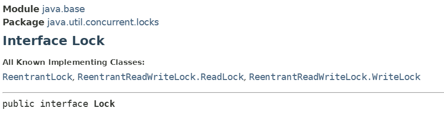

接下来，我们对Lock接口中两个重要的方法进行讲解，分别是lock()方法和unlock()方法，lock()方法用来获取锁，unLock()方法是用来释放锁。

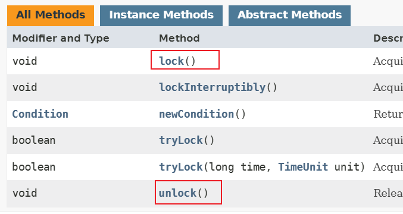

首先lock()方法是平常使用得最多的一个方法，就是用来获取锁。如果锁已被其它线程获取，则进行等待。

由于在前面讲到如果采用Lock，必须主动去释放锁，并且在发生异常时，不会自动释放锁。因此一般来说，使用Lock必须在try{}catch{}块中进行，并且将释放锁的操作放在finally块中进行，以保证锁一定被被释放，防止死锁的发生。

通常使用Lock来进行同步的话，是以下面这种形式去使用的：

```java
Lock lock = ...;
lock.lock(); // 获取锁
try{
        // 需要处理任务代码
} catch(Exception e) {
        // 处理异常的操作 
} finally {
        lock.unlock(); // 释放锁
}
```


## ReentrantLock类详解

ReentrantLock，意思是“可重入锁”。ReentrantLock类是Lock接口的实现类，并且ReentrantLock类中提供了更多的实用方法。下面通过一些实例具体看一下如何使用ReentrantLock。

在我们的现实生活中，去火车站买票是一件很平常的事。例如某个班次的列车一共有100张火车票需要卖，火车站为了提高买票的效率，安排了三个售票窗口来进行卖票。从编程的角度上来讲，三个卖票窗口就是开启了三个线程，三个线程并发访问同一个共享数据（也就是100张票）。

接下来，我们就对卖票案例进行代码实现。

【示例】多线程买票案例

```java
// 卖票线程任务类
class TicketRunnable implements Runnable {
        // 共享数据，保存火车票的总量
        private static int ticketNum = 100;         
        @Override
        public void run() {
                while (true) {
                        // 当票数小于等于0时，窗口停止售票，跳出死循环
                        if (ticketNum <= 0)
                                break;
                        // 当票数大于0时，售票窗口开始售票
                        try {
                                Thread.sleep(10); // 模拟切换线程的操作
                        } catch (InterruptedException e) {
                                e.printStackTrace();
                        }
                        // 输出售票窗口(线程名)卖出的哪一张票
                        String name = Thread.currentThread().getName();
                        System.out.println(name + "--卖出第" + ticketNum + "张票");
                        // 卖票之后，总票数递减
                        ticketNum--;
                }
        }
}
```

完成卖票线程任务类之后，接下来我们来编写测试类。

```java
// 测试类
public class Test {
        public static void main(String[] args) {
                // 创建线程任务类对象
                TicketRunnable tr = new TicketRunnable();
                // 开启三个售票线程
                new Thread(tr, "窗口1").start();
                new Thread(tr, "窗口2").start();
                new Thread(tr, "窗口3").start();
        }
}
```

运行以上案例代码，输出结果如下：


分析运行结果，我们发现有些火车票被售票员卖了多次，例如第3张票被“窗口1”、“窗口2”和“窗口3”都卖过，并且当火车票已经全部卖完的时候，“窗口3”和“窗口2”都还在卖票。很明显，我们上面的程序时有问题的，如果现实生活中发生了这样的情况，那么火车站的秩序肯定就乱套了。

那么到底是什么原因造成以上的情况呢？原因就是三个线程并发访问同一个共享数据（也就是100张票），产生的后果就是“脏读”，也就是取到的数据其实是被更改过的的结果。为了解决这个问题，我们需要实现对共享数据（也就是100张票）的同步访问，这样就避免了多线程引发的线程安全问题。

实现对部分代码的同步，我们可以使用同步代码块来实现，也可以通过ReentrantLock锁来解决。接下来我们就使用ReentrantLock锁来解决卖票的问题，以上案例中只需要实现TicketRunnable类中卖票代码的添加同步即可。

【示例】多线程买票案例优化

```java
// 卖票线程任务类
class TicketRunnable implements Runnable {
        // 共享数据，保存火车票的总量
        private int ticketNum = 300;
        // 创建一个锁对象
        private Lock lock = new ReentrantLock();
        @Override
        public void run() {
                while (true) {
                        lock.lock(); // 获取锁
                        try {
                                // 当票数小于等于0时，窗口停止售票，跳出死循环
                                if (ticketNum <= 0)
                                        break;
                                // 当票数大于0时，售票窗口开始售票
                                Thread.sleep(1); // 模拟切换线程的操作
                                // 输出售票窗口(线程名)卖出的哪一张票
                                String name = Thread.currentThread().getName();
                                System.out.println(name + "-卖出第" + ticketNum + "张票");
                                // 卖票之后，总票数递减
                                ticketNum--;
                        } catch (InterruptedException e) {
                                e.printStackTrace();
                        } finally {
                                lock.unlock(); // 释放锁
                        }
                }
        }
}
```


## 多生产者多消费者问题

多生产者多消费者带来的问题，我们可以通过while判断和notifyAll()全唤醒方案来解决，但是notifyAll()全唤醒也带来了弊端，它要唤醒所有的被等待的线程，意味着既唤醒了对方，也唤醒了本方，在唤醒本方线程后还要不断判断标记，就降低了程序的效率。

这些问题在JDK1.5之后给出了解决方案，如果我们希望只唤醒对方的线程，而不唤醒本方线程，那么我们可以使用Lock锁。

接下来，我们就基于【生产者消费者案例】中的仓库类（ProductStack类）的代码进行修改，把synchronized修饰的方法改为Lock锁来实现同步。

【示例】仓库类中基于Lock锁实现同步

```java
// 仓库类
public class ProductStack {
        // 商品对象，属于共享数据
        private Product product;
        // 设置仓库是否有商品的标记
        private boolean flag; // 默认值为false
        // 创建一个锁对象
        Lock lock = new ReentrantLock();
        // 构造方法
        public ProductStack(Product product) {
                this.product = product;
        }
        // 生产商品方法
        public /*synchronized*/ void product(String name, String color) {
                lock.lock(); // 获取锁
                try {
                        // 1.如果有商品，则等待
                        while (flag) 
                                this.wait(); // 该生产者线程进入线程池等待
                        // 2.如果没有商品，则生产。
                        product.setName(name);
                        product.setColor(color);
                        System.out.println("生产者----->" + color + name);
                        // 3.更改商品状态
                        this.flag = true;
                        // 4.唤醒消费者线程，告诉消费者可以消费了
                        this.notifyAll();
                } catch (InterruptedException e) {
                        e.printStackTrace();
                } finally {
                        lock.unlock(); // 释放锁
                }
        }
        // 消费商品方法
        public /*synchronized*/ void consume() {
                lock.lock(); // 获取锁
                try {
                        // 1.如果没有商品，则等待
                        while (!flag) 
                                this.wait(); // 消费者线程进入线程池等待
                        // 2.如果有商品，则消费
                        // 输出消费的商品信息
                        System.out.println("消费者-->" + product.getColor() + product.getName());
                        // 3.更改商品状态
                        this.flag = false;
                        // 4.唤醒生产着线程，可以继续生产产品了
                        notifyAll();
                } catch (InterruptedException e) {
                        e.printStackTrace();
                } finally {
                        lock.unlock(); // 释放锁
                }
        }
}
```

运行以上案例代码，结果抛出异常了，什么时候会抛出java.lang.IllegalMonitorStateException异常呢？当前线程的锁对象和调用wait()方法和notifyAll()方法的对象不一致的时候造成，这时就会抛出java.lang.IllegalMonitorStateException异常。以上案例中，我们用到的锁是Lock，而不是同步方法中的this，在代码中调用wait()、notifyAll()方法的锁依旧是this，这就是抛出异常的根源。

在JDK1.5的新特性中，使用Lock锁替代了同步方法和同步代码块，使用Condition的方法替代了Object提供的等待唤醒的方法。在Condition接口中，用await()替换wait()，用signal()替换notify()，用signalAll()替换notifyAll()，这些方法与Lock锁配合使用也可以实现等待/唤醒机制。

Condition可以替代传统的线程间通信，Condition定义了等待/通知两种类型的方法，当前线程调用这些方法时，需要提前获取到Condition对象关联的锁。Condition对象是由Lock对象（调用Lock对象的newCondition()方法）获取出来的，换句话说，Condition是依赖Lock对象的。另外，Condition接口可以支持多个等待队列，也就是说通过一个Lock对象，我们可以获取多个Condition对象。

接下来，我们就通过Condition的等待/通知机制来实现多生产多消费的问题，通过Lock对象的newCondition()方法，来获取两个相关的 Condition对象，一个是关于生产者的Condition对象，另外一个就是消费者的Condition对象。

【示例】仓库类中基于Condition实现等待和唤醒机制

```java
// 仓库类
public class ProductStack {
        // 商品对象，属于共享数据
        private Product product;
        // 设置仓库是否有商品的标记
        private boolean flag; // 默认值为false
        // 创建一个锁对象
        Lock lock = new ReentrantLock();
        // 获取生产者的Condition对象
        Condition condition_pro = lock.newCondition();
        // 获取消费者的Condition对象
        Condition condition_con = lock.newCondition();
        // 构造方法
        public ProductStack(Product product) {
                this.product = product;
        }
        // 生产商品方法
        public /*synchronized*/ void product(String name, String color) {
                lock.lock(); // 获取锁
                try {
                        // 1.如果有商品，则等待
                        while (flag) 
                                condition_pro.await(); // 该生产者线程进入等待
                        // 2.如果没有商品，则生产。
                        product.setName(name);
                        product.setColor(color);
                        System.out.println("生产者----->" + color + name);
                        // 3.更改商品状态
                        this.flag = true;
                        // 4.唤醒所有的消费者线程，告诉消费者可以消费了
                        condition_con.signalAll();
                } catch (InterruptedException e) {
                        e.printStackTrace();
                } finally {
                        lock.unlock(); // 释放锁
                }
        }
        // 消费商品方法
        public /*synchronized*/ void consume() {
                lock.lock(); // 获取锁
                try {
                        // 1.如果没有商品，则等待
                        while (!flag) 
                                condition_con.await(); // 消费者线程进入等待
                        // 2.如果有商品，则消费
                        // 输出消费的商品信息
                        System.out.println("消费者-->" + product.getColor() + product.getName());
                        // 3.更改商品状态
                        this.flag = false;
                        // 4.唤醒所有的生产者线程，可以继续生产产品了
                        condition_pro.signalAll();
                } catch (InterruptedException e) {

                        e.printStackTrace();
                } finally {
                        lock.unlock(); // 释放锁
                }
        }
}
```


# 线程的其它创建方式

## 创建线程方式三：实现Callable接口

我们目前已经学习了创建线程的两种方式，一种是直接继承Thread类，另外一种就是实现Runnable接口。但是这两种方式都有一个缺陷就是：在执行完任务之后无法获取执行结果，并且在run()方法中不允许抛出异常。

如果想要在执行线程任务的方法中返回一个结果或声明异常，则就需要通过实现Callable接口的方式来创建线程。

Callable接口在java.util.concurrent包中，该接口用来指定每个线程要执行的任务，其中包含了一个call()抽象方法，并且需要在Callable接口的实现类来重写该方法。

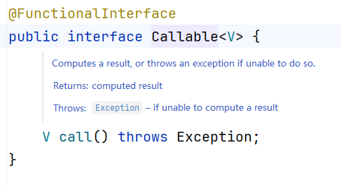

### 接口中的方法

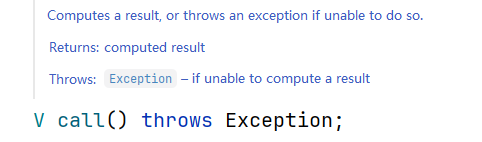

通过Callable接口来创建线程，还需用到实现于Runnable接口和Future接口的实现类FutureTask。FutureTask是一个可取消的异步计算结果，在FutureTask类中提供了对Future的基本实现，可以调用方法去开始和取消一个计算，可以查询计算是否完成并且获取计算结果，常见的方法如下：

| **方法名** | **说明** |
| --- | --- |
| public boolean cancel(boolean flag) | 参数为true，则取消当前任务的执行 |
| public boolean isCancelled() | 任务正常结束之前被取消，则返回true |
| public boolean isDone() | 任务完成，将返回true |
| public V get() | 等待任务结束，然后获取结果 |

实现Callable接口实现多线程的步骤：

1. 定义一个Callable接口的实现类，并重写call()方法（封装任务）
2. 通过Callable实现类对象来创建FutureTask对象（FutureTask实现于Runnable）。
3. 通过FutureTask对象创建一个Thread对象（构造方法），并启动线程。
4. 调用FutureTask对象的get()方法，获得call()方法的返回值

【示例】实现Callable接口实现多线程

```java
/**
 * 注意：此处Callable的泛型类型，指的就是call方法的返回值类型
 */
public class MyCallable implements Callable<Integer> {
    /**
     * 计算1+2+3+...+99+100的结果
     * @return
     * @throws Exception
     */
    @Override
    public Integer call() throws Exception {
        int sum = 0;
        for (int i = 1; i <= 100; i++) {
            sum += i;
        }
        return sum;
    }
}
public class Test01 {
    public static void main(String[] args) {
        // 1.实例化Callable接口的实现类对象
        MyCallable callable = new MyCallable();
        // 2.实例化FutureTask对象，构造方法中传入Callable接口的实现类对象
        FutureTask<Integer> task = new FutureTask<>(callable);
        // 3.实例化Thread对象，在构造方法中存入FutureTask对象
        new Thread(task, "线程A").start();
        try {
            // 4.调用FutureTask对象的get()方法，得到call()方法的返回值
            System.out.println(task.get());
        } catch (InterruptedException e) {
            e.printStackTrace();
        } catch (ExecutionException e) {
            e.printStackTrace();
        }
    }
}
```


## 创建线程方式四：线程池

在前面的章节中，我们使用线程的时候就去创建一个线程，这样实现起来非常简便，但是就会有一个问题：

如果并发的线程数量很多，并且每个线程都是执行一个时间很短的任务就结束了，这样频繁创建线程就会大大降低系统的效率，因为系统启动一个新线程的成本是比较高的，它涉及到与操作系统的交互，频繁创建线程和销毁线程都需要时间。

在这种情况下，使用线程池可以很好的提供性能，尤其是当程序中需要创建大量生存期很短暂的线程时，更应该考虑使用线程池。

线程池在系统启动时即创建大量空闲的线程，程序将一个Runnable对象传给线程池，线程池就会启动一条线程来执行该对象的run()方法，当run()方法执行结束后，该线程并不会死亡，而是再次返回线程池中成为空闲状态，等待执行下一个Runnable对象的run()方法。

除此之外，使用线程池可以有效地控制系统中并发线程的数量，但系统中包含大量并发线程时，会导致系统性能剧烈下降，甚至导致JVM崩溃。而线程池的最大线程数参数可以控制系统中并发的线程不超过此数目。

合理利用线程池能够带来三个好处：

1. 降低资源消耗。通过重复利用已创建的线程降低线程创建和销毁造成的消耗。
2. 提高响应速度。当任务到达时，任务可以不需要等到线程创建就能立即执行。
3. 提高线程的可管理性。线程是稀缺资源，如果无限制的创建，不仅会消耗系统资源，还会降低系统的稳定性，使用线程池可以进行统一的分配，调优和监控。

在JDK1.5之前，开发者必须手动的实现自己的线程池，从JDK1.5之后，Java内建支持线程池。与多线程并发的所有支持的类都在java.lang.concurrent包中，我们可以使用里面的类更加方便的控制多线程的执行。

### Executors线程池工具类

JDK1.5中提供Executors工厂类来产生线程池，该工厂类中包含如下的几个静态工程方法来创建线程池，我们只需要调用对应的静态方法就可以获得想要的线程池对象。

```java
public static ExecutorService newFixedThreadPool(int nThreads) { ... }
```

创建可容纳固定数量线程的池子，每个线程的存活时间是无限的，当池子满了就不再添加线程了；如果池中的所有线程均在繁忙状态，对于新任务会进入阻塞队列中。

### ExecutorService接口

可以看到上面的两个方法中，这些方法的返回值都是一个ExecutorService对象。该ExecutorService代表着一个尽快执行线程任务的线程池（只要线程池中有空闲线程立即执行线程任务），程序只要将一个Runnable对象或Callable对象提交给该线程池即可，该线程就会尽快的执行该任务。

ExecutorService将Runnable对象或Callable对象提交给该线程池执行任务的方法：

| **方法名** | **描述** |
| --- | --- |
| Future submit(Callable task); | 提交一个Callable的任务用于执行 |
| Future submit(Runnable task); | 提交一个Runable的任务用于执行 |
| void shutdown(); | 关闭线程池，不接受新任务，但是正在执行的线程会正常执行完毕 |

接下来，我们就来学习一下线程池的简单使用，如何通过线程池的submit方法来执行Runnable接口或Callable接口中封装的线程任务。

#### 使用线程池方式一：Runnable接口

通常，线程池都是通过线程池工厂创建，再调用线程池中的方法获取线程，再通过获得的线程去执行任务，实现步骤如下：

1. 通过Executors类获取一个线程池对象（ExecutorService）。
2. 定义Runnable接口的实现类，并实现Runnable接口的run()方法。
3. 通过线程池对象的submit()方法，提交Runnable接口的实现类对象。
4. 调用线程池对象（ExecutorService）的shutdown()方法关闭线程池。

调用submit()方法后，即便线程任务执行完毕，程序并不终止，因为线程池控制了线程的关闭，将使用完的线程又归还到了线程池中，所以我们需要调用shutdown()方法来关闭线程池。

【示例】使用线程池方式之Runnable 接口

```java
public class MyRunnable implements Runnable {
    @Override
    public void run() {
        try {
            Thread.sleep(500);
        } catch (InterruptedException e) {
            e.printStackTrace();
        }
        System.out.println(Thread.currentThread().getName() + "处理完任务");
    }
}
public class Test01 {
    public static void main(String[] args) {
        // 获取一个线程池，创建一个固定大小为2的线程池
        ExecutorService service = Executors.newFixedThreadPool(2);
        // 实例化Runnable接口的实现类对象
        MyRunnable runnable = new MyRunnable();
        // 定义一个for循环，开启5个线程任务
        for (int i = 0; i < 5; i++) {
            // 调用线程池的submit()方法，并传入Runnable实现类对象
            service.submit(runnable);
        }
        // 关闭线程池，但是正在执行的任务不会关闭
        service.shutdown();
    }
}
```

运行以上案例代码，输出结果如下：


我们创建一个固定大小为2的线程池，意味着可并发执行的任务数量最多为2个。程序中我们添加了5个线程任务，则这5个线程任务都是由“pool-1-thread-1”线程和“pool-1-thread-2”线程来完成。

也就是说，使用线程池可以有效地控制系统中并发线程的数量，提高系统的运行性能，避免JVM崩溃的发生。

#### 使用线程池方式二：Callable接口

Callable接口与Runnable接口功能相似，用来指定线程的任务。其中的call()方法，用来返回线程任务执行完毕后的结果，并且在call()方法中可以抛出异常，实现步骤如下：

1. 通过Executors类获取一个线程池对象（ExecutorService）。
2. 定义Callable接口的实现类，实现Callable接口的call()方法。
3. 通过线程池对象的submit()方法，提交Callable接口的实现类对象。
4. 调用线程池对象（ExecutorService）的shutdown()方法关闭线程池。

【示例】使用线程池方式之Callable接口

```java
public class MyCallable implements Callable<Integer> {
    @Override
    public Integer call() throws Exception {
        System.out.println(Thread.currentThread().getName() + "正在执行！");
        int sum = 0;
        for (int i = 1; i <= 100; i++) {
            sum += i;
        }
        return sum;
    }
}
public class Test02 {
    public static void main(String[] args){
        // 获得线程池对象，创建一个固定大小为4的线程池
        ExecutorService service = Executors.newFixedThreadPool(4);
        // 实例化Callable接口的实现类对象
        MyCallable callable = new MyCallable();
        // 通过for循环，开启十个线程任务
        for (int i = 0; i < 10; i++) {
            // 调用线程池对象的submit()方法，传入Callable实现类对象
            Future<Integer> future = service.submit(callable);
            try {
                // 调用Future的get()方法，获得call()方法的返回值
                Integer result = future.get();
                System.out.println(result);
            } catch (InterruptedException e) {
                e.printStackTrace();
            } catch (ExecutionException e) {
                e.printStackTrace();
            }
        }
        // 关闭线程池，但是正在执行的任务不会关闭
        service.shutdown();
    }
}
```

以上案例中，通过Callable接口的call()方法来执行线程任务，并得到了call()方法的返回值。


# 单例模式：从线程不安全到线程安全

## 线程不安全的单例模式

```java
package test;

public class Singleton {

    private static Singleton s;

    private Singleton() {
    }

    public static Singleton getInstance() {
        if (s == null) {
            s = new Singleton();
        }
        return s;
    }
}
```

测试程序：

```java
package test;

public class SingletonTest {
    public static void main(String[] args) {
        Thread t1 = new Thread(new MyRunnable(), "t1");
        Thread t2 = new Thread(new MyRunnable(), "t2");
        t1.start();
        t2.start();
    }
}

class MyRunnable implements Runnable {

    @Override
    public void run() {
        Singleton s = Singleton.getInstance();
        System.out.println(s);
    }
}
```

执行结果：

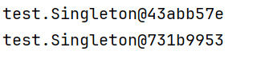

## 线程安全的单例模式演进

### 方法1：同步方法（效率较低）

```java
package test;

public class Singleton {

    private static Singleton s;

    private Singleton() {
    }

    public static synchronized Singleton getInstance() {
        if (s == null) {
            s = new Singleton();
        }
        return s;
    }
}
```

测试程序：

```java
package test;

public class SingletonTest {
    public static void main(String[] args) {
        Thread t1 = new Thread(new MyRunnable(), "t1");
        Thread t2 = new Thread(new MyRunnable(), "t2");
        t1.start();
        t2.start();
    }
}

class MyRunnable implements Runnable {

    @Override
    public void run() {
        Singleton s = Singleton.getInstance();
        System.out.println(s);
    }
}
```

**优缺点：**

- ✅ 线程安全
- ❌ 每次获取实例都要加锁，性能较差

### 方法2：双重检查锁定（DCL）

```java
package test;

// 双重检查DCL + volatile禁止指令重排序
public class Singleton {

    // 使用volatile关键字禁止指令重排序
    private static volatile Singleton s;

    private Singleton() {
    }

    public static Singleton getInstance() {
        // 第一次检查：避免不必要的同步
        // 加这个检查的目的是：只有对象第一次创建的时候才会走同步。一旦对象创建了，以后就不需要走同步了。
        if (s == null) {
            // 两个线程可能都进来这个if语句的分支了。因此需要第二次检查。
            synchronized (Singleton.class){
                // 第二次检查：确保对象只创建一次。
                if(s == null){
                    s = new Singleton();
                }
            }
        }
        return s;
    }
}
```

**volatile关键字的重要性：**

```java
// 没有volatile时可能发生的问题：
s = new Singleton();
// 这行代码实际上包含三个步骤：
// 1. 分配内存空间
// 2. 初始化对象
// 3. 将s指向分配的内存地址

// 由于指令重排序，可能执行顺序变为：1->3->2
// 这样其他线程可能在对象未完全初始化时就获取到实例（也就是其他线程可能获取到一个半成品对象。）
```


### 方法3：静态内部类（推荐使用）

```java
package test;

// 静态内部类方式：用到的时候调用方法时，才会创建对象，比饿汉式好。
public class Singleton {

    private Singleton(){}

    // 静态内部类（类加载时执行没有多线程并发的安全问题）
    private static class SingletonHolder {
        private static final Singleton INSTANCE = new Singleton();
    }

    public static Singleton getInstance(){
        return SingletonHolder.INSTANCE;
    }
}
```

**原理：**

- 利用类加载机制保证线程安全（**那你可能会问，那为什么不直接用静态变量呢？因为使用静态变量的话，是饿汉式，饿汉式创建对象太早。咱们这种方式是：调用方法的时候才加载。**）
- 静态内部类在第一次调用 `getInstance()` 时才加载
- JVM 在类加载时是线程安全的

### 方法4：枚举单例（最佳实践）

```java
package test;

public enum Singleton {
    SINGLETON;

    // 枚举也可以有属性和方法。
    private String name;

    public String getName() {
        System.out.println("getName执行");
        return name;
    }

    public void setName(String name) {
        System.out.println("setName执行");
        this.name = name;
    }
}
```

**枚举单例的优点：**

- ✅ 线程安全
- ✅ 防止反射攻击
- ✅ 防止序列化破坏单例
- ✅ 代码简洁

## 总结

| **实现方式** | **线程安全** | **性能** | **防止反射** | **防止序列化** | **推荐度** |
| --- | --- | --- | --- | --- | --- |
| 懒汉式 | ❌ | ✅ | ❌ | ❌ | 不推荐 |
| 同步方法 | ✅ | ❌ | ❌ | ❌ | 一般 |
| 双重检查锁定 | ✅ | ✅ | ❌ | ❌ | 推荐 |
| 静态内部类 | ✅ | ✅ | ❌ | ❌ | 推荐 |
| 枚举 | ✅ | ✅ | ✅ | ✅ | 强烈推荐 |

**最佳实践建议：**

1. 如果需要懒加载：使用静态内部类方式
2. 如果不需要懒加载：使用枚举方式（最安全）
3. 在Android等内存敏感环境：考虑使用双重检查锁定
4. 避免使用同步方法，性能较差

volatile关键字在双重检查锁定中至关重要，它确保了：

- 可见性：保证单例对象创建好之后，第一时间通知其他线程。
- 禁止指令重排序：防止对象初始化过程被重排序

# 定时任务

**定时任务**就是让程序在"将来某个时间"自动执行某些操作，比如：

- ⏰ 每天早上8点发送日报
- 🔄 每5分钟检查一次系统状态
- 📅 每月1号凌晨执行数据统计
- 🚨 30秒后自动取消未支付的订单

**ScheduledExecutorService** 是 Java 中用来执行定时任务的工具，可以让你安排任务在特定时间执行，或者按照固定间隔重复执行。

【示例代码】

```java
package test;

import java.util.concurrent.Executors;
import java.util.concurrent.ScheduledExecutorService;
import java.util.concurrent.TimeUnit;

public class Test {
    public static void main(String[] args) {

        // 获取一个能够  执行定时任务的  线程池。
        ScheduledExecutorService pool = Executors.newScheduledThreadPool(4);

        // 指派一次性任务
        pool.schedule(new Runnable() {
            @Override
            public void run() {
                System.out.println("执行一次性任务");
            }
        }, 10, TimeUnit.SECONDS); // 10秒后执行。

        // 固定速率任务
        pool.scheduleAtFixedRate(new Runnable() {
            @Override
            public void run() {
                System.out.println("执行固定速率任务");
            }
        }, 15, 5, TimeUnit.SECONDS); // 15秒后执行，每隔5秒执行一次。

        // 固定延迟任务
        pool.scheduleWithFixedDelay(new Runnable() {
            @Override
            public void run() {
                System.out.println("执行固定延迟任务");
            }
        }, 22, 2, TimeUnit.SECONDS); // 22秒后开始执行，执行后过2秒立即再执行....

        // 延迟5分钟。
        try {
            TimeUnit.MINUTES.sleep(5);
        } catch (InterruptedException e) {
            throw new RuntimeException(e);
        }

        // 关闭定时任务线程池
        pool.shutdown();
    }
}
```