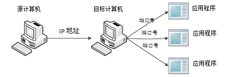
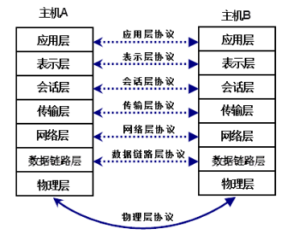
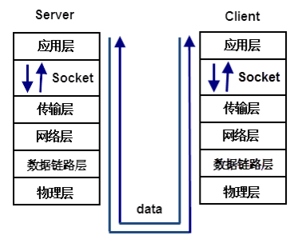
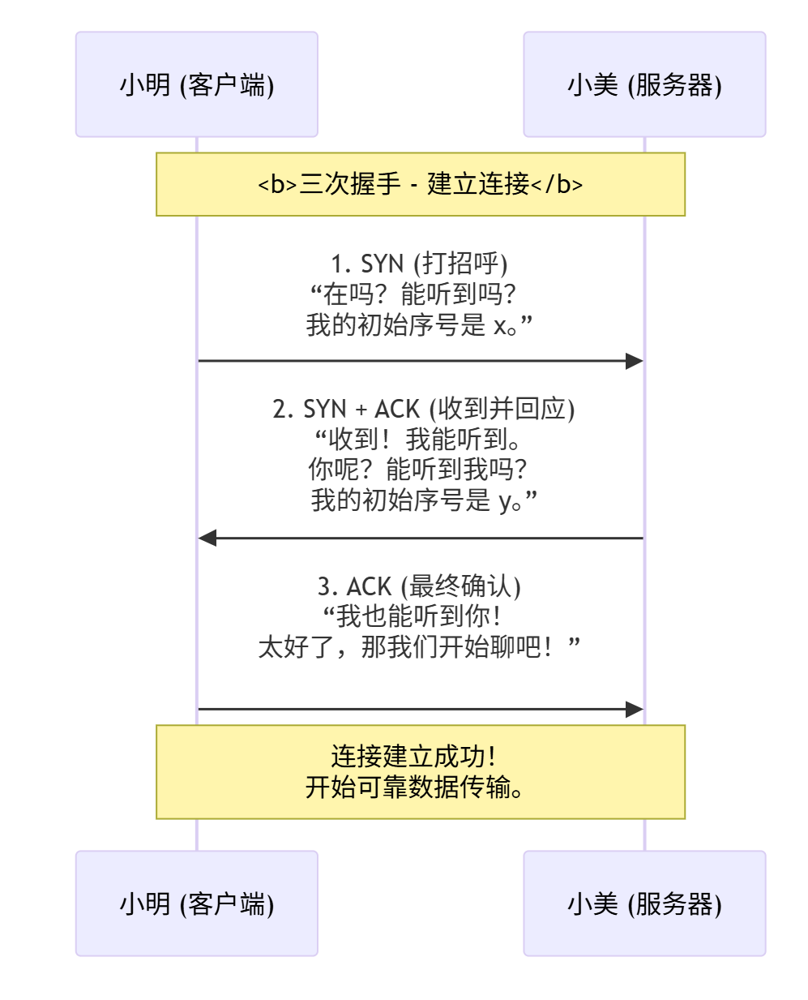
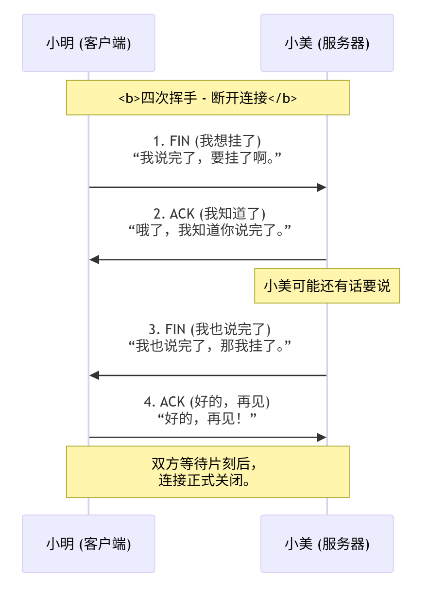
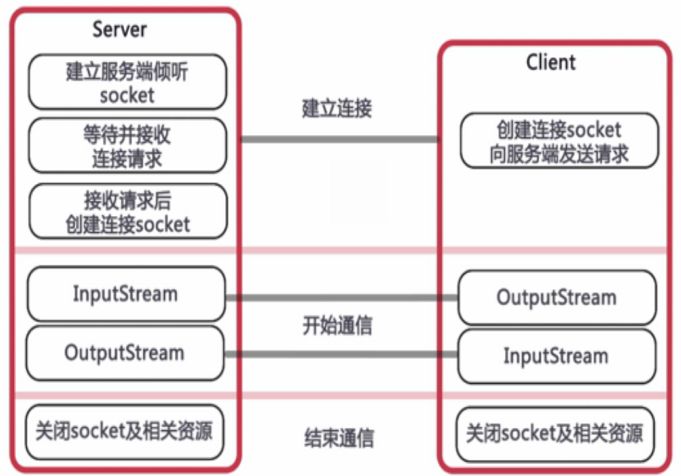
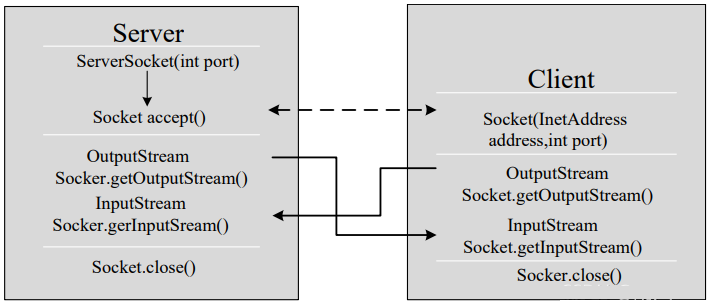

# 第12章 网络编程


# 什么是网络编程

如今，计算机已经成为人们学习、工作、生活必不可少的工具。我们利用计算机可以和亲朋好友网上聊天，也可以玩网游、发邮件等等，这些功能实现都离不开计算机网络。计算机网络实现了不同计算机之间的通信，这必须依靠编写网络程序来实现。

在Java语言中，我们可以使用java.net包下的技术轻松开发出常见的网络应用程序，从而把分布在不同地理区域的计算机与专门的外部设备用通信线路互连成一个规模大、功能强的网络系统，从而使众多的计算机可以方便地互相传递信息、共享硬件、软件、数据信息等资源。

想要实现网络互联的不同计算机上运行的程序间可以进行数据交换，那么就要涉及到网络编程的“三要素”，这样就能解决以下的三个问题：

1. 如何准确地定位网络上一台或多台主机？IP地址
2. 如何定位到主机上某个特定的应用？端口号
3. 找到主机后如何可靠高效地进行数据传输？通讯协议

# 网络编程三要素

## IP地址

要想让网络中的计算机能够互相通信，必须为每台计算机指定一个标识号，通过这个标识号来指定要接收数据的计算机和识别发送的计算机，而IP地址就是这个标识号。也就是设备的标识，简单说就是设备在网络中的地址，是唯一的标识。

目前，IP地址广泛使用的版本是IPv4，它是由4个字节大小的二进制数来表示，例如：0000-1010 0000-0000 0000-0000 0000-0001。由于二进制形式表示的IP地址非常不便记忆和处理，因此通常会将IP地址写成十进制的形式，每个字节（8位）用一个十进制整数来（0-255）表示，数字间用符号“.”分开，如“192.168.0.1”。因为8位对应的十进制无符号整数为：0-255，所以-4.278.4.1是错误的IPv4地址。

随着计算机网络规模的不断扩大，对IP地址的需求也越来越多，IPv4这种用4个字节表示的IP地址面临枯竭，因此IPv6便应运而生了，IPv6使用16个字节表示IP地址，它所拥有的地址容量达到2128 个（算上全零的），这样就解决了网络地址资源数量不够的问题。16个字节写成8个16位的无符号整数，每个整数用四个十六进制位表示，每个数之间用冒号分开，如：3ffe:3201:1401:1280:c8ff:fe4d:db39:1984。

注意事项：

1. 本机地址：127.0.0.1，主机名：localhost。
2. 192.168.0.0--192.168.255.255为私有地址，属于非注册地址，专门为组织机构内部使用。

### 域名和DNS

#### 域名

IP地址毕竟是数字标识，使用时不好记忆和书写，因此在IP地址的基础上又发展出一种符号化的地址方案，来代替数字型的IP地址。每一个符号化的地址都与特定的IP地址对应。这个与网络上的数字型IP地址相对应的字符型地址，就被称为域名。

目前域名已经成为互联网品牌、网上商标保护必备的要素之一，除了识别功能外，还有引导、宣传等作用。如：www.baidu.com。

#### DNS

在Internet上域名与IP地址之间是一对一（或者多对一）的，域名虽然便于人们记忆，但机器之间只能互相认识IP地址，它们之间的转换工作称为域名解析，域名解析需要由专门的域名解析服务器来完成，DNS（Domain Name System域名系统）就是进行域名解析的服务器，域名的最终指向是IP。


## 端口号

IP地址用来标识一台计算机，但是一台计算机上可能提供多种网络应用程序，如何来区分这些不同的程序呢？这就要用到端口。

在计算机中，不同的应用程序是通过端口号区分的。端口号是用两个字节（无符号）表示的，它的取值范围是0~65535，而这些计算机端口可分为3大类：

公认端口：0~1023。被预先定义的服务通信占用（如：HTTP占用端口80，FTP占用端口21，Telnet占用端口23等）

注册端口：1024~49151。分配给用户进程或应用程序。（如：Tomcat占用端口8080，MySQL占用端口3306，Oracle占用端口1521等）。

动态/私有端口：49152~65535。

IP地址好比每个人的地址（门牌号），端口好比是房间号。必须同时指定IP地址和端口号才能够正确的发送数据。接下来通过一个图例来描述IP地址和端口号的作用，如下图所示



从上图中可以清楚地看到，位于网络中一台计算机可以通过IP地址去访问另一台计算机，并通过端口号访问目标计算机中的某个应用程序。

## 通讯协议

通过计算机网络可以使多台计算机实现连接，位于同一个网络中的计算机在进行连接和通信时需要遵守一定的规则。就像两个人想要顺利沟通就必须使用同一种语言一样，如果一个人只懂英语而另外一个人只懂中文，这样就会造成没有共同语言而无法沟通。

在计算机网络中，这些连接和通信的规则被称为网络通信协议，它对数据的传输格式、传输速率、传输步骤等做了统一规定，通信双方必须同时遵守才能完成数据交换。

### OSI参考模型

在电脑网络的“远古时代”，各大公司都搞自己的一套网络标准，比如IBM有SNA，DEC公司有DNA。

这就导致了一个大问题：如果你用了IBM的网络，那你所有的设备基本上也只能买IBM的，不然就接不进去。

为了解决这个混乱局面，一个国际组织（ISO）在1977年站出来，决定制定一个“世界通用”的网络标准。这个标准不偏向任何一家公司，任何电脑系统只要遵循这个标准，就能互相联网。

这个最终提出的通用标准蓝图，就叫做 **OSI参考模型**（开放系统互联参考模型）。它为了让事情变得清晰，把复杂的网络通信过程拆分成了七个明确的分工层，也就是我们常说的**物理层、数据链路层、网络层、传输层、会话层、表示层和应用层**。



想象一下，你给你的朋友发一条微信，如果按照 OSI 模型，数据是这样传送的：

**发送端（你的手机）：**

1. **应用层：** 你在微信里输入内容并点击“发送”。
2. **表示层：** 微信将你的消息进行加密或压缩。
3. **会话层：** 你的手机和服务器之间建立一条通信通道。
4. **传输层：** 将数据分段并编号，确保可靠传输。
5. **网络层：** 给数据包贴上发送和接收的IP地址。
6. **数据链路层：** 给数据包贴上路由器的MAC地址，准备在本地网络传输。
7. **物理层：** 将数据转换成电信号或无线信号发出。

**接收端（朋友的手机）：**

1. **物理层：** 接收到电信号或无线信号。
2. **数据链路层：** 校验数据并查看MAC地址。
3. **网络层：** 查看IP地址，确认是发给自己的。
4. **传输层：** 将数据段按序重组，确认数据完整。
5. **会话层：** 维持通信连接，直至数据传输完毕。
6. **表示层：** 将数据解密或解压。
7. **应用层：** 微信将消息显示在朋友的聊天窗口上。

**OSI模型因过于复杂且商业化进程缓慢而未能落地，而TCP/IP则因简单、实用并随着互联网的爆发抢先成为了事实标准。**

### TCP/IP模型


**TCP/IP模型是一个四层的实用网络通信架构：**

1. **网络接口层：** 负责在本地网络中通过物理信号（如网线、Wi-Fi）传输数据帧。
2. **网络层：** 核心协议是IP，负责给数据包写上发送和接收的IP地址，并进行路由选择，让它能穿越整个网络找到目标。
3. **传输层：** 核心协议是TCP和UDP，负责端到端的通信控制。**TCP**像“可靠快递”，保证数据不丢不乱；**UDP**像“快速邮筒”，只管发送不求可靠。
4. **应用层：** 包含了所有面向用户的具体协议，如HTTP（网页）、SMTP（邮件）、DNS（域名解析）等。

### TCP/IP 协议族

**TCP/IP模型** 就像一栋建筑的**建筑设计图纸**。

**TCP/IP协议族** 则是按照这张图纸**施工时用到的具体材料和规范**。

模型中的每一层，都由协议族中的具体协议来“实现”：

- **应用层** ←→ **HTTP**（网页）、**FTP**（文件传输）、**DNS**（域名解析）、**SMTP**（邮件）等。
- **传输层** ←→ **TCP**（可靠传输）、**UDP**（高效传输）等。
- **网络层** ←→ **IP**（寻址和路由）、**ICMP**（错误控制，如ping）等。
- **网络接口层** ←→ **以太网**、**Wi-Fi** 等底层技术。


# 网络编程基础类

Java为了可移植性，不允许直接调用操作系统，而是由java.net包来提供网络功能。Java虚拟机负责提供与操作系统的实际连接。

## InetAddress类

java.net.IntAddress类用来封装计算机的IP地址和DNS（没有端口信息），它包括一个主机名和一个IP地址，是java对IP地址的高层表示。大多数其它网络类都要用到这个类，包括Socket、ServerSocket、URL、DatagramSocket、DatagramPacket等

### 常用静态方法

| **方法名** | **描述** |
| --- | --- |
| public static InetAddress getByName(String host) | 传入目标主机的名字或IP地址得到对应的InetAddress对象，其中封装了IP地址和主机名 |
| public static InetAddress getLocalHost() | 得到本机的InetAddress对象，其中封装了IP地址和主机名 |

调用getByName(String host)方法，只需要传入目标主机的名字或IP地址，InetAddress会尝试做连接DNS服务器，并且获取IP地址和主机名的操作。

### 常用成员方法

| **方法名** | **描述** |
| --- | --- |
| public String getHostAddress() | 获得IP地址 |
| public String getHostName() | 获得主机名 |

### InetAddress的使用

【示例】使用getLocalHost方法创建InetAddress对象

```java
public class Test {
    public static void main(String[] args) throws Exception{
        InetAddress inetAddress = InetAddress.getLocalHost();
        System.out.println(inetAddress.getHostName()); // DESKTOP-Q38N0PA
        System.out.println(inetAddress.getHostAddress()); // 192.168.1.5
    }
}
```

【示例】根据域名得到InetAddress对象

```java
public class Test {
    public static void main(String[] args) throws Exception{
        InetAddress inetAddress = InetAddress.getByName("baidu.com");
        System.out.println(inetAddress.getHostName()); // baidu.com
        System.out.println(inetAddress.getHostAddress()); // 39.156.70.37
    }
}
```


## URL类

**定义**：URL 是统一资源定位符，是互联网资源的唯一地址，定义了资源位置与访问方式。

**格式**：标准格式为 `<font style="color:rgb(15, 17, 21);background-color:rgb(235, 238, 242);">协议://域名:端口/路径</font>`。例如 `<font style="color:rgb(15, 17, 21);background-color:rgb(235, 238, 242);">https://www.baidu.com</font>`。其中，“协议”和“域名”必需，“端口”和“路径”常可省略（如HTTP默认端口80）。

**Java实现**：JDK 的 `<font style="color:rgb(15, 17, 21);background-color:rgb(235, 238, 242);">java.net.URL</font>` 类封装了底层网络细节，为程序员提供了解析、处理URL的便捷接口。

【示例】URL的使用

```java
package test;

import java.net.MalformedURLException;
import java.net.URL;

public class Test {
    public static void main(String[] args) throws MalformedURLException {
        // 创建URL对象
        URL url = new URL("http://www.jd.com:8080/java/index.html?name=admin#tip");
        // 协议：http
        System.out.println("协议：" + url.getProtocol());
        // 域名：www.jd.com
        System.out.println("域名：" + url.getHost());
        // 获取与URL关联的协议的默认端口：80
        System.out.println("获取与URL关联的协议的默认端口：" + url.getDefaultPort());
        // 端口：8080
        System.out.println("端口：" + url.getPort());
        // getPath:/java/index.html
        System.out.println("getPath:" + url.getPath());
        // getFile:/java/index.html?name=admin
        System.out.println("getFile:" + url.getFile());
        // 参数：name=admin
        System.out.println("参数：" + url.getQuery());
        // 锚点：tip
        System.out.println("锚点：" + url.getRef());
    }
}
```

使用java.net.URL类的InputStream openStream() 方法，还可以打开到此URL的连接并返回一个用于从该连接读入的InputStream，实现最简单的网络爬虫。

【示例】最简单的网络爬虫案例

```java
package test;

import java.io.BufferedReader;
import java.io.IOException;
import java.io.InputStream;
import java.io.InputStreamReader;
import java.net.URL;

public class Test {
    public static void main(String[] args) {
        BufferedReader br = null;
        try {
            URL url = new URL("http://www.baidu.com/");
            InputStream ips = url.openStream();
            // 将字节流转换为字符流
            br = new BufferedReader(new InputStreamReader(ips));
            String str = null;
            // 这样就可以将网络内容下载到本地机器。
            // 然后进行数据分析，建立索引，这也是搜索引擎的第一步。
            while ((str = br.readLine()) != null) {
                System.out.println(str);
            }
        } catch (Exception e) {
            e.printStackTrace();
        } finally {
            if (br != null) {
                try {
                    br.close();
                } catch (IOException e) {
                    e.printStackTrace();
                }
            }
        }
    }
}
```


# TCP和UDP协议

## Socket套接字的概述

在网络分层模型中，应用程序位于应用层，而TCP、UDP等协议工作在传输层。应用程序若要使用传输层的服务，必须通过一个名为 **套接字 (Socket)** 的接口。

**Socket是传输层为应用层提供的编程接口**，它如同应用层与传输层之间的一个“服务窗口”，也是两者通信的桥梁。应用程序只需将数据送入这个“窗口”，或从中读取数据，而无需关心数据在窗口之下（即传输层、网络层等）的复杂处理过程，如分组、路由和传输保障。这种设计有效地分离了应用程序功能与底层网络通信的细节。

基于Socket接口编程，开发者能够分别开发客户端和服务器端应用程序，实现设备间在本地网络或全球互联网上的通信。



## TCP和UDP协议

TCP协议和UDP协议是传输层的两种协议。Socket是传输层供给应用层的编程接口，所以Socket编程就分为TCP编程和UDP编程两类。

### TCP协议

使用TCP协议，须先建立TCP连接，形成传输数据通道，似于拨打电话

传输前，采用“三次握手”方式，属于点对点通信，是面向连接的，效率低。

仅支持单播传输，每条TCP传输连接只能有两个端点（客户端、服务端）。

两个端点的数据传输，采用的是“字节流”来传输，属于可靠的数据传输。

传输完毕，需释放已建立的连接，开销大，速度慢，适用于文件传输、邮件等。

### UDP协议

采用数据报（数据、源、目的）的方式来传输，无需建立连接，类似于发短信。

每个数据报的大小限制在64K内，超出64k可以分为多个数据报来发送。

发送不管对方是否准备好，接收方即使收到也不确认，因此属于不可靠的。

可以广播发送，也就是属于一对一、一对多和多对一连接的通信协议。

发送数据结束时无需释放资源，开销小，速度快，适用于视频会议、直播等。

### TCP协议和UDP协议的区别

| **描述** | **TCP** | **UDP** |
| --- | --- | --- |
| 是否连接 | 面向连接 | 面向非连接 |
| 传输可靠性 | 可靠 | 不可靠 |
| 连接对象个数 | 一对一 | 一对一、一对多、多对一 |
| 传输方式 | 面向字节流 | 面向报文 |
| 传输速度 | 慢 | 快 |
| 应用场景 | 适用于可靠传输（文件传输、邮件等） | 适用于实时应用（视频会议、直播等） |


## 三次握手和四次挥手

**三次握手和四次挥手正是TCP协议的核心机制，分别用于可靠地建立和断开连接。**

- **三次握手** → **打电话时的确认过程** (“喂，听得到吗？” “听得到，你呢？” “我也听得到，开始说吧。”) 确保**连接畅通，可以开始通信**。
- **四次挥手** → **挂电话时的道别过程** (“我说完了，要挂了。” “好的，我知道你说完了。” “那我这边也挂了。” “好的，再见。”) 确保**数据已传完，双方同意断开**。

**SYN：****Synchronize Sequence Numbers（同步序列号），发起对话的信号。**

**ACK： Acknowledgment（确认）**

**场景：** 客户端（小明）想和服务器（小美）打电话。



**为什么不能是两次？—— “幽灵电话”问题**

- **场景：** 小明说“在吗？”，但这个请求卡在网络里，迟迟没到小美那里。小明等不及了，又发了一个“在吗？”，这次通了。
- **问题：** 如果只需要小美回一句“收到！能听到吗？”（两次握手）就接通，那么当那个卡住的“幽灵请求”——“在吗？”——突然到达小美那时，小美会独自接通电话，并一直等待小明说话，而小明根本不知道这个连接存在！这就浪费了小美的资源。
- **解决方案：** 必须要有小明的**第三次确认**。当“幽灵请求”让小美接通时，小明会收到一个莫名其妙的回应，他会说：“你谁啊？我没找你啊！”，这样小美就知道挂断这个无效连接了。

**场景：** 小明和小美通完电话，要挂断了。



**为什么是四次？**

因为TCP连接是**全双工**的——像一条双向车道。

- 小明说“我要挂了”（FIN），只是关掉了**他这边通向小美的车道**。他依然可以**接收小美说的话**。
- 所以，小美要先回一句“哦了”（ACK），确认收到小明的意图。然后，小美可能还有数据要发送。
- 等小美也把所有数据发完了，她再说“我也要挂了”（FIN）。
- 最后小明再说“好的，再见”（ACK），完成整个关闭流程。

**等待 2MSL 是为什么？**
可以理解为小明说完“再见”后，没有立刻跑开，而是等了一会儿。**目的：**

1. **确保小美收到了“再见”**：如果小美没收到，她会以为小明没礼貌，会重新说一遍“我要挂了！”，这时小明还在，可以再说一次“再见”。
2. **让“幽灵数据”消失**：等足够长的时间，让网络里所有关于这次通话的“残影”都消失，不影响下一次新的通话。

**MSL： Maximum Segment Lifetime，最大报文段生存时间，通俗理解：** 任何一个TCP数据包在网络这个“迷宫”里所能存活的最长时间。超过这个时间，这个包就会被“迷宫”丢弃，彻底消失。

**2MSL 通俗理解：** 一个数据包在网络里“来回跑一趟”所允许的最大时间。


# 基于TCP协议的编程

## TCP协议编程的概述

套接字是一种进程间的数据交换机制，利用套接字(Socket)开发网络应用程序早已被广泛的采用，以至于成为事实上的标准。

在网络通讯中，第一次主动发起通讯的程序被称作客户端(Client)，而在第一次通讯中等待连接的程序被称作服务端(Server)。一旦通讯建立，则客户端和服务器端完全一样，没有本质的区别。

套接字与主机地址和端口号相关联，主机地址就是客户端或服务器程序所在的主机的IP地址，端口地址是指客户端或服务器程序使用的主机的通信端口。在客户端和服务器中，分别创建独立的Socket，并通过Socket的属性，将两个Socket进行连接，这样客户端和服务器通过套接字所建立连接并使用IO流进行通信。



## Socket类的概述

Socket类实现客户端套接字(Client），套接字是两台机器间通信的端点。

Socket类的构造方法：

| **方法名** | **描述** |
| --- | --- |
| public Socket(InetAddress a, int p) | 创建套接字并连接到指定IP地址的指定端口号上 |

Socket类的成员方法：

| **方法名** | **描述** |
| --- | --- |
| public InetAddress getInetAddress() | 返回此套接字连接到的远程 IP 地址。 |
| public InputStream getInputStream() | 返回此套接字的输入流（接收网络消息）。 |
| public OutputStream getOutputStream() | 返回此套接字的输出流（发送网络消息）。 |
| public void shutdownInput() | 禁用此套接字的输入流 |
| public void shutdownOutput() | 禁用此套接字的输出流。 |
| public synchronized void close() | 关闭此套接字（默认会关闭IO流）。 |

## ServerSocket类的概述

ServerSocket类用于实现服务器套接字(Server服务端)。服务器套接字等待请求通过网络传入。它基于该请求执行某些操作，然后可能向请求者返回结果。

ServerSocket类的构造方法：

| **方法名** | **描述** |
| --- | --- |
| public ServerSocket(int port) | 创建服务器套接字并绑定端口号 |

ServerSocket类的常用方法：

| **方法名** | **描述** |
| --- | --- |
| public Socket accept() | 侦听要连接到此套接字并接受它。 |
| public InetAddress getInetAddress() | 返回此服务器套接字的本地地址。 |
| public void close() | 关闭此套接字。 |


## TCP单向通讯的实现

Java语言的基于套接字编程分为服务端编程和客户端编程，其通信模型如图所示：



### 服务器端实现步骤

1. 创建ServerSocket对象，绑定并监听端口；
2. 通过accept监听客户端的请求；
3. 建立连接后，通过输出输入流进行读写操作；

【示例】TCP：单向通信之服务端

```java
package test;

import java.io.BufferedReader;
import java.io.InputStreamReader;
import java.net.ServerSocket;
import java.net.Socket;

public class Server {
    public static void main(String[] args) {
        try (ServerSocket serverSocket = new ServerSocket(8888)) {
            // 循环一直接收客户端发过来的消息
            while(true){
                // 接收到客户端套接字。
                try(Socket clientSocket = serverSocket.accept();
                    BufferedReader br = new BufferedReader(new InputStreamReader(clientSocket.getInputStream()))) {
                    // 获取输入流，读客户端发过来的消息
                    String s = null;
                    while((s = br.readLine()) != null){
                        System.out.println("接收到来自客户端的消息：" + s);
                    }
                }catch (Exception e){
                    e.printStackTrace();
                }
            }
        } catch (Exception e) {
            e.printStackTrace();
        }
    }
}
```

注意：socket对象调用了close()方法之后，那么该socket对象就不能再使用了！

### 客户端实现步骤

1. 创建Socket对象，指定服务端的地址和端口号；
2. 建立连接后，通过输入输出流进行读写操作；
3. 通过输出输入流获取服务器返回信息；

【示例】TCP：单向通信之客户端

```java
package test;

import java.io.BufferedWriter;
import java.io.OutputStreamWriter;
import java.net.Socket;
import java.util.Scanner;

public class Client {
    public static void main(String[] args) {
        try (Socket clientSoket = new Socket("127.0.0.1", 8888);
             BufferedWriter writer = new BufferedWriter(new OutputStreamWriter(clientSoket.getOutputStream()))) {

            Scanner s = new Scanner(System.in);
            while(true){
                System.out.println("请输入消息：");
                String userInput = s.next();
                writer.write(userInput);
                writer.newLine();
                writer.flush();
            }
        } catch (Exception e) {
            e.printStackTrace();
        }
    }
}
```

注意：一定是先启动服务器程序，然后再启动客户端程序，先后循序千万别弄混了！


## TCP双向通讯的实现

### 服务器端实现步骤

1. 创建ServerSocket对象，绑定监听端口；
2. 通过accept()方法监听客户端请求；
3. 使用输入流接收客户端发送的消息
4. 通过输出流向客户端发送消息。

【示例】TCP：双向通信之服务端

```java
package test;

import java.io.BufferedReader;
import java.io.BufferedWriter;
import java.io.InputStreamReader;
import java.io.OutputStreamWriter;
import java.net.ServerSocket;
import java.net.Socket;
import java.util.Scanner;

public class Server {
    public static void main(String[] args) {
        try (ServerSocket serverSocket = new ServerSocket(8888)) {
            System.out.println("服务器启动，开始接收客户端的消息");
            // 循环一直接收客户端发过来的消息
            while(true){
                Scanner scanner = new Scanner(System.in);
                // 接收到客户端套接字。
                try(Socket clientSocket = serverSocket.accept();
                    BufferedReader br = new BufferedReader(new InputStreamReader(clientSocket.getInputStream()));
                    BufferedWriter bw = new BufferedWriter(new OutputStreamWriter(clientSocket.getOutputStream()))) {
                    // 获取输入流，读客户端发过来的消息
                    String s = null;
                    while((s = br.readLine()) != null){
                        System.out.println("接收到来自客户端的消息：" + s);
                        // 服务器也可以给客户端发消息
                        System.out.print("请输入消息（发送给客户端）：");
                        String serverMsg = scanner.next();
                        bw.write(serverMsg);
                        bw.newLine();
                        bw.flush();
                    }

                }catch (Exception e){
                    e.printStackTrace();
                }
            }
        } catch (Exception e) {
            e.printStackTrace();
        }
    }
}
```

### 客户端实现步骤

1. 创建socket对象，指明需要连接的服务器地址和端口号；
2. 建立连接后，通过输出流向服务器端发送消息；
3. 通过输入流获取服务器的响应信息；

【示例】TCP：双向通信之客户端

```java
package test;

import java.io.BufferedReader;
import java.io.BufferedWriter;
import java.io.InputStreamReader;
import java.io.OutputStreamWriter;
import java.net.Socket;
import java.util.Scanner;

public class Client {
    public static void main(String[] args) {
        try (Socket clientSoket = new Socket("127.0.0.1", 8888);
             BufferedWriter writer = new BufferedWriter(new OutputStreamWriter(clientSoket.getOutputStream()));
             BufferedReader br = new BufferedReader(new InputStreamReader(clientSoket.getInputStream()))) {
            Scanner s = new Scanner(System.in);
            while(true){
                System.out.print("请输入要发送给服务器的消息：");
                String msg = s.next();
                writer.write(msg);
                writer.newLine();
                writer.flush();
                // 等待服务器的回复
                String fromServerMsg = br.readLine();
                System.out.println("服务器给您回复的消息：" + fromServerMsg);
            }
        } catch (Exception e) {
            e.printStackTrace();
        }
    }
}
```


# 基于UDP协议的编程

## UDP协议编程的概述

在UDP通信协议下，两台计算机之间进行数据交互，并不需要先建立连接，发送端直接往指定的IP和端口号上发送数据即可，但是它并不能保证数据一定能让对方收到，也不能确定什么时候可以送达。

java.net.DatagramSocket类和java.net.DatagramPacket类是使用UDP编程中需要使用的两个类，并且发送端和接收端都需要使用这个俩类，并且发送端与接收端是两个独立的运行程序。

1. DatagramSocket：负责接收和发送数据，创建接收端时需要指定端口号。
2. DatagramPacket：负责把数据打包，创建发送端时需指定接收端的IP地址和端口。

## DatagramSocket类的概述

DatagramSocket类作为基于UDP协议的Socket，使用DatagramSocket类可以用于接收和发送数据，同时创建接收端时还需指定端口号。

DatagramSocket类的构造方法：

| **方法名** | **描述** |
| --- | --- |
| public DatagramSocket() | 创建发送端的数据报套接字 |
| public DatagramSocket(int port) | 创建接收端的数据报套接字，并指定端口号 |

DatagramSocket类的常用方法：

| **方法名** | **描述** |
| --- | --- |
| public void send(DatagramPacket p) | 发送数据报。 |
| public void receive(DatagramPacket p) | 接收数据报。 |
| public void close() | 关闭数据报套接字。 |

## DatagramPacket类的概述

DatagramPacket类负责把发送的数据打包（打包的数据为byte类型的数组），并且创建发送端时需指定接收端的IP地址和端口。

DatagramPacket类的构造方法：

| **方法名** | **描述** |
| --- | --- |
| public DatagramPacket(byte buf[], int offset, int length) | 创建接收端的数据报。 |
| public DatagramPacket(byte buf[], int offset, int length, InetAddress address, int port) | 创建发送端的数据报，并指定接收端的IP地址和端口号。 |

DatagramPacket类的常用方法：

| **方法名** | **描述** |
| --- | --- |
| public synchronized byte[] getData() | 返回数据报中存储的数据 |
| public synchronized int getLength() | 获得发送或接收数据报中的长度 |


## 基于UDP编程的实现

### 接收端实现步骤

1. 创建DatagramSocket对象（接收端），并指定端口号；
2. 创建DatagramPacket对象（数据报）；
3. 调用receive()方法，用于接收数据报；
4. 调用close()方法关闭资源

【示例】UDP：网络通信之接收端

```java
public class Test01 {
    public static void main(String[] args) {
        DatagramSocket datagramSocket = null;
        try {
            // 实例化DatagramSocket对象（接收端），并指定端口号
            datagramSocket = new DatagramSocket(8888);
            // 创建数据报对象，用于接收发送端传递的数据
            byte[] bytes = new byte[1024 * 64];
            DatagramPacket datagramPacket = new DatagramPacket(bytes, bytes.length);
            // 接收发送端的传递过来的数据
            datagramSocket.receive(datagramPacket);
            // 获得数据报对象中存储的数据
            byte[] data = datagramPacket.getData();
            int length = datagramPacket.getLength();
            String str = new String(data, 0, length);
            System.out.println(str);
        } catch (IOException e) {
            e.printStackTrace();
        } finally {
            // 关闭资源
            datagramSocket.close();
        }
    }
}
```

### 发送端实现步骤

1. 创建DatagramSocket对象（发送端）；
2. 创建DatagramPacket对象（数据报），并指定接收端IP地址和端口；
3. 调用send()方法，用于发送数据报；
4. 调用close()方法关闭资源。

【示例】UDP：网络通信之发送端

```java
public class Test02 {
    public static void main(String[] args) {
        DatagramSocket datagramSocket = null;
        try {
            // 创建数据报套接字（发送端）
            datagramSocket = new DatagramSocket();
            // 创建数据报对象用于封装传送的数据，并设置连接接收端的IP地址和端口
            byte[] bytes = "好好学习，天天向上".getBytes();
            InetAddress inetAddress = InetAddress.getByName("127.0.0.1");
            DatagramPacket datagramPacket = new DatagramPacket(bytes, 0, bytes.length, inetAddress, 8888);
            // 发送数据
            datagramSocket.send(datagramPacket);
        } catch (IOException e) {
            e.printStackTrace();
        } finally {
            // 关闭资源
            datagramSocket.close();
        }
    }
}
```