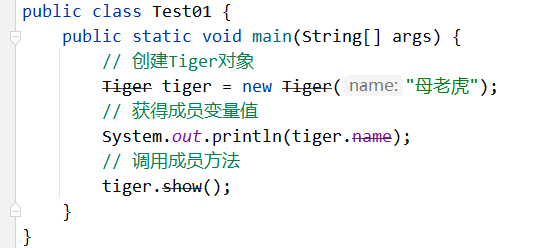

# 第14章 注解


# 注解（Annotion）

## 什么是注解

从JDK1.5开始，Java增加对元数据的支持，也就是注解（Annotation）。注解可以理解为代码里的特殊标记，这些标记可以在源代码，加载类，运行时被读取，并执行相应的处理。通过注解开发人员可以在不改变原有代码和逻辑的情况下在源代码中嵌入补充信息。

## 注解和注释

虽然注释和注解都属于对代码做的特殊标记，但是这两者却有本质的区别。

- 注释：就是对代码的解释说明，专门用于给程序员看的，程序编译时会忽略注释内容。
- 注解：用于给编译器或其他程序读取的，程序中根据注解的不同，可以做出相应的处理。

注解本身不起作用，起作用的是注解解释器，注解需要和反射一起使用才能发挥大的威力。

## 注解的重要性

在JavaSE中，注解的使用非常简单，例如用于标记过时的功能、忽略警告和生成API文档等操作，但是在JavaEE中注解就占据了非常重要的角色，例如用于配置应用程序的切面，替代JavaEE旧版本中遗留的繁冗代码和XML配置等。

未来的开发模式都是基于注解的，注解是一种趋势，一定程度上可以说：框架 = 反射 + 注解 + 设计模式。

# Java 内置注解

## @Deprecated

这个注解是用来标记过时的元素，在编译阶段遇到这个注解时会发出提醒警告，告诉开发者正在调用一个过时的元素比如过时的类、过时的方法、过时的属性等。

【示例】演示@Deprecated注解

```java
@Deprecated
public class Tiger {
    @Deprecated
    public String name;
    @Deprecated
    public Tiger(String name) {
        this.name = name;
    }
    @Deprecated
    public void show() {
        System.out.println("show ...");
    }
}
```

在测试类中，我们去使用Tiger类来实例化对象，然后再操作对象的属性和方法，则在IDEA编辑器中的显示效果如下：



可以看到，Tiger类、构造方法、name变量和show()方法上面被一条直线划了一条，这其实就是编译器识别后的提醒效果。


## @Override

使用@Override注解修饰的成员方法，则该方法必须是个重写方法，否则就会编译失败。

【示例】演示@Override注解

```java
/**
 * 父类
 */
public class Animal {
    public void show() {
        System.out.println("Animal show ...");
    }
}
/**
 * 子类
 */
public class Dog extends Animal {
    @Override
    public void show() {
        System.out.println("Dog show ...");
    }
}
```

## @SuppressWarnings

当你的编码可能存在警告时，比如安全警告，可以用@SuppressWarnings来消除。使用@SuppressWarnings注解可以为类、属性、方法、构造方法、构造函数和局部变量等进行标注。

常见的抑制警告的关键字如下：

- @SuppressWarnings("unchecked") 抑制未检查的转化，例如集合没有指定类型的警告
- @SuppressWarnings("unused") 抑制未使用的变量的警告
- @SuppressWarnings("resource") 抑制与使用Closeable类型资源相关的警告
- @SuppressWarnings("path") 抑制在类路径，原文件路径中有不存在的路径的警告
- @SuppressWarnings("deprecation") 抑制使用了某些不赞成使用的类和方法的警告
- @SuppressWarnings("fallthrough") 抑制switch语句执行到底没有break关键字的警告
- @SuppressWarnings("serial") 抑制某类实现Serializable，但是没提供serialVersionUID的警告
- @SuppressWarnings("rawtypes") 抑制没有传递带有泛型的参数的警告
- @SuppressWarnings("all") 抑制全部类型的警告

【示例】演示@SuppressWarnings注解

```java
// 抑制使用了某些不赞成使用的类和方法的警告
@SuppressWarnings("deprecation")
Tiger tiger = new Tiger("母老虎");
System.out.println(tiger);
// 抑制未使用的变量的警告
@SuppressWarnings("unused")
int num = 10;
// 抑制所有的警告
@SuppressWarnings("all")
ArrayList arrayList = new ArrayList();
```


## @FunctionalInterface

@FunctionalInterface属于"函数式接口"的注解，这个是 JDK1.8 版本引入的新特性。使用@FunctionalInterface标注的接口，则该接口就有且只能存在一个抽象方法，否则就会发生编译错误。

【示例】演示@FunctionalInterface注解

```java
@FunctionalInterface
public interface Flyable {
    // 在函数式接口中，我们有且只能定义一个抽象方法
    void showFly();
    // 但是，可以定义任意多个默认方法或静态方法
    default void show() {
        System.out.println("JDK1.8之后，接口还可以定义默认方法和静态方法");
    }
}
```

# 自定义注解

## 注解的定义

定义类使用class关键字来修饰，定义接口使用interface关键字来修饰，定义枚举使用enum关键字来修饰，而定义注解采用的是@interface来修饰，此处类、接口、枚举和注解都是一种数据类型，以下为自定义注解的定义语法：

```java
[修饰符] @interface 注解名称 {
    // 属性列表
}
```

【示例】创建并使用自定义注解

```java
/**
 * 定义注解
 */
public @interface MyAnnotation {
    // 属性列表
}
/**
 * 使用注解
 */
@MyAnnotation
public class Tiger {
    @MyAnnotation
    private String name;
    @MyAnnotation
    public Tiger(String name) {
        this.name = name;
    }
    @MyAnnotation
    public void show() {
        System.out.println("show ...");
    }
}
```


## 注解的属性

### 属性的定义

注解的属性也叫做实例变量，注解只有实例变量，没有方法。注解的属性以"无参的方法"形式来声明，其方法名定义了该实例变量的名字，其返回值类型定义了该实例变量的类型。

```java
public @interface MyAnnotation {
    int id();
    String name();
    double[] data();
}
```

在以上代码中，我们在MyAnnotation注解中定义了id属性、name属性和data属性。在使用MyAnnotation注解的时候，我们就应该给这个三个属性进行赋值。

### 属性的赋值

使用注解的时候，我们就需要给注解中的属性进行赋值，赋值的格式为 "name=value" 的形式，多个属性之间使用","隔开。

针对数组类型的属性，如果该属性中只有一个元素值，那么我们还可以省略大括号。

```java
@MyAnnotation(id = 123, name = "jack", data = {1.0, 2.0})
public class Tiger {
    @MyAnnotation(id = 123, name = "jack", data = 1.23)
    public void show() {
        System.out.println("show ...");
    }
}
```

如果注解中的属性没有设置默认值，则使用注解的时候必须给属性赋值。当然，我们也可以给注解中的属性设置默认值，给属性设置默认值需要用default关键值指定，比如：

```java
public @interface MyAnnotation {
    int id() default -1;
    String name() default "admin";
    double[] data() default {1.0, 2.0, 3.0};
}
```

在MyAnnotation注解中，id 属性默认值为 -1，name属性默认值为 "admin"，data属性默认值为{1.0, 2.0, 3.0}，因此使用MyAnnotation注解时，我们就可以这么来做，如下所示：

```java
@MyAnnotation(id = 456) // 部分使用默认值
public class Tiger {
    @MyAnnotation(id = 123, name = "jack", data = 3.14)
    public void show() {
        System.out.println("show ...");
    }
}
```

### value属性

如果注解中仅仅只有一个名字为value的属性时，则给该属性赋值时就可以省略属性名，而是直接在小括号中填写属性值即可。

【示例】操作String类型的value属性

```java
public @interface MyAnnotation {
    String value();
}
@MyAnnotation("jack")
public class Tiger {
    @MyAnnotation("zhiyi")
    public void show() {
        System.out.println("show ...");
    }
}
```

【示例】操作String[]类型的value属性

```java
public @interface MyAnnotation {
    String[] value();
}
@MyAnnotation({"jack", "zhiyi"})
public class Tiger {
    @MyAnnotation("zhiyi")
    public void show() {
        System.out.println("show ...");
    }
}
```


# Java的元注解

元注解我们可以理解为注解的注解，它是作用在注解中，方便我们使用注解实现想要的功能。元注解分别有@Retention、 @Target、 @Documented、 @Inherited和@Repeatable（JDK1.8加入）五种。

## @Retention

Retention英文意思有保留、保持的意思，它表示注解存在阶段是保留在源代码（编译期），字节码（类加载）或者运行时（JVM中运行）。

在@Retention注解中使用枚举RetentionPolicy来表示注解保留时期。

- @Retention(RetentionPolicy.SOURCE)：注解仅存在于源代码中，在字节码文件中不包含。
- @Retention(RetentionPolicy.CLASS)：注解在字节码文件中存在，但运行时无法获得（默认）。
- @Retention(RetentionPolicy.RUNTIME)：注解在字节码文件中存在，且运行时可通过反射获取。

【示例】演示@Retention注解的使用

```java
// @Retention(RetentionPolicy.SOURCE) 注解仅存在于源代码中，在字节码文件中不包含
@Retention(RetentionPolicy.CLASS) /*注解在字节码文件中存在，但运行时无法获得(默认)*/
// @Retention(RetentionPolicy.RUNTIME)注解在字节码文件中存在，且运行时可通过反射获取
public @interface MyAnnotation {
    String value();
}
```

## @Target

用于描述注解可以使用的位置，该注解使用ElementType枚举类型用于描述注解可以出现的位置，ElementType有如下枚举值：

- @Target(ElementType.TYPE)：作用于接口、类、枚举、注解
- @Target(ElementType.FIELD)：作用于属性、枚举的常量
- @Target(ElementType.METHOD)：作用于方法
- @Target(ElementType.PARAMETER)：作用于方法参数
- @Target(ElementType.CONSTRUCTOR)：作用于构造方法
- @Target(ElementType.LOCAL_VARIABLE)：作用于局部变量
- @Target(ElementType.ANNOTATION_TYPE)：作用于注解
- @Target(ElementType.PACKAGE)：作用于包
- @Target(ElementType.TYPE_PARAMETER)：作用于泛型，即泛型方法、泛型类和泛型接口。
- @Target(ElementType.TYPE_USE)：作用于任意类型。

【示例】演示@Target注解的使用

```java
// 注意：该注解可以在类、接口、枚举、注解、属性和方法使用
@Target({ElementType.TYPE, ElementType.FIELD, ElementType.METHOD})
public @interface MyAnnotation {
    String value();
}
```

## @Documented

Documented的英文意思是文档。使用javadoc..exe工具可以从程序源代码中抽取类、方法、属性等注释形成一个源代码配套的API帮助文档，而该工具抽取时默认不包括注释内容。如果使用的注解被@Documented标注，那么该注解就能被javadoc.exe工具提取到API文档。

【示例】演示@Documented注解的使用

```java
@Documented
@Target({ElementType.TYPE, ElementType.METHOD})
// 使用该注解将被javadoc工具提取到API文档。
public @interface MyAnnotation {
    String value();
}
@MyAnnotation("admin")
public class Tiger {
    @MyAnnotation("method")
    public void show() {
        System.out.println("show ...");
    }
}
```

注意：通过javadoc.exe生成API文档时，则Tiger类的注解就会在API文档中展示。

**IDEA 生成 javadoc 文档的步骤：**

1. **打开项目** → 在项目窗口中**选中要生成文档的包/类**
2. 点击顶部菜单 **Tools** → **Generate JavaDoc**
3. 在弹出的对话框中配置：
  - **Output directory**: 选择文档输出路径
  - **Scope**: 选择生成范围（整个项目/模块/自定义）
  - **Locale**: 输入 `<font style="color:rgb(15, 17, 21);background-color:rgb(235, 238, 242);">zh_CN</font>`（中文文档）
  - **command line arguments**: 可添加编码参数：`<font style="color:rgb(15, 17, 21);">-encoding UTF-8 -charset UTF-8</font>`


## @Inherited

Inherited的英文意思是继承，但是这个继承和我们平时理解的继承大同小异，一个被@Inherited注解了的注解修饰了一个父类，则它的子类也继承了父类的注解。

【示例】演示@Inherited注解的使用

```java
@Inherited
@Retention(RetentionPolicy.RUNTIME)
// 如果该注解去修饰了一个父类，则它的子类也继承了父类的注解
public @interface MyAnnotation {
    String value();
}
/**
 * 父类
 */
@MyAnnotation("admin")
public class Animal { }
/**
 * 子类
 */
public class Tiger extends Animal {}
```

在以上代码中，我们通过反射获得Tiger类的注解，本质是获得的继承于Animal类的注解。

# 反射中注解的使用

## 获得类的注解

通过反射来获得类中的注解，则该注解必须设置为@Retention(RetentionPolicy.RUNTIME) 模式，并设置该注解可以用于修饰类（@Target(ElementType.TYPE)），这样在运行时期才能通过反射来获得修饰类的注解。

【示例】获得User类中的所有注解

```java
@Retention(RetentionPolicy.RUNTIME)
@Target(ElementType.TYPE)
public @interface AnnotationTest01 {
    int id() default 0;
    String value();
}
@Retention(RetentionPolicy.RUNTIME)
@Target(ElementType.TYPE)
public @interface AnnotationTest02 {
    String[] value();
}
@AnnotationTest01(id = 123, value = "jack")

@AnnotationTest02({"userName", "passworld"})
public class User { }
/**
 * 测试类
 */
public class Test01 {
    public static void main(String[] args) {
        // 获得User类的Class对象
        Class<User> clazz = User.class;
        // 获得User类的所有注解
        Annotation[] annotations = clazz.getAnnotations();
        // 遍历annotations数组，获得类中的所有注解
        for (Annotation annotation : annotations) {
            System.out.println(annotation);
        }
    }
}
```

通过以上方式，虽然能够获得类中的所有注解，但是却不方便获得每个注解中的属性值。如果想要获得类中某个注解的属性值，则就必须单独的获得类的某个注解，然后再获得该注解中的属性值。

【示例】获得User类中的AnnotationTest01注解

```java
@Retention(RetentionPolicy.RUNTIME)
@Target(ElementType.TYPE)
public @interface AnnotationTest01 {
    int id() default 0;
    String value();
}
@Retention(RetentionPolicy.RUNTIME)
@Target(ElementType.TYPE)
public @interface AnnotationTest02 {
    String[] value();
}
@AnnotationTest01(id = 123, value = "jack")
@AnnotationTest02({"userName", "passworld"})
public class User { }
/**
 * 测试类
 */
public class Test01 {
    public static void main(String[] args) {
        // 获得User类的Class对象
        Class<User> clazz = User.class;
        // 判断User类中是否存在AnnotationTest01注解
        // 如果User类中存在该注解，则返回true，否则就返回false
        if (clazz.isAnnotationPresent(AnnotationTest01.class)) {
            // 获得User类中的AnnotationTest01注解
            AnnotationTest01 an = clazz.getAnnotation(AnnotationTest01.class);
            // 获得注解中的所有属性值
            System.out.println("id：" + an.id() + "，value：" + an.value();
        }
    }
}
```

## 获得属性的注解

通过反射获得属性的注解，则该注解必须设置为@Retention(RetentionPolicy.RUNTIME) 模式，并设置该注解可以用于修饰属性（@Target(ElementType.FIELD)），这样在运行时期才能通过反射来获得属性的注解。

【示例】获得User类中某个属性的所有注解

```java
@Retention(RetentionPolicy.RUNTIME)
@Target(ElementType.FIELD)
public @interface AnnotationTest01 {
    int id() default 0;
    String value();
}
@Retention(RetentionPolicy.RUNTIME)
@Target(ElementType.FIELD)
public @interface AnnotationTest02 {
    String[] value();
}
public class User {
    @AnnotationTest01(id = 456, value = "admin")
    @AnnotationTest02({"xixi", "haha"})
    private String name;
}
/**
 * 测试类
 */
public class Test01 {
    public static void main(String[] args) {
        try {
            // 获得User类的Class对象
            Class<User> clazz = User.class;
            // 获得User类中私有的name属性
            Field field = clazz.getDeclaredField("name");
            // 获得name属性中的所有注解
            Annotation[] annotations = field.getAnnotations();
            // 遍历annotations数组，获得属性中的所有注解
            for (Annotation annotation : annotations) {
                System.out.println(annotation);
            }
        } catch (NoSuchFieldException e) {
            e.printStackTrace();
        }
    }
}
```

通过以上方式，虽然能够获得属性中的所有注解，但是却不方便获得每个注解中的属性值。如果想要获得属性某个注解的属性值，则就必须单独的获得属性中的某个注解，然后再获得该注解的属性值。

【示例】获得User类中指定属性的某个注解

```java
@Retention(RetentionPolicy.RUNTIME)
@Target(ElementType.FIELD)
public @interface AnnotationTest01 {
    int id() default 0;
    String value();
}
@Retention(RetentionPolicy.RUNTIME)
@Target(ElementType.FIELD)
public @interface AnnotationTest02 {
    String[] value();
}
public class User {
    @AnnotationTest01(id = 456, value = "admin")
    @AnnotationTest02({"xixi", "haha"})
    private String name;
}
/**
 * 测试类
 */
public class Test01 {
    public static void main(String[] args) {
        try {
            // 获得User类的Class对象
            Class<User> clazz = User.class;
            // 获得User类中的私有name属性
            Field field = clazz.getDeclaredField("name");
            // 判断name属性中是否存在AnnotationTest02注解
            // 如果name属性中存在该注解，则返回true，否则就返回false
            if (field.isAnnotationPresent(AnnotationTest02.class)) {
                // 获得User类中的AnnotationTest02注解
                AnnotationTest02 an = field.getAnnotation(AnnotationTest02.class);
                // 获得注解中的所有属性值
                String[] value = an.value();
                System.out.println(Arrays.toString(value));
            }
        } catch (NoSuchFieldException e) {
            e.printStackTrace();
        }
    }
}
```

以上代码执行完毕，则输出的结果如下：


## 获得方法的注解

通过反射获得方法的注解，则该注解必须设置为@Retention(RetentionPolicy.RUNTIME) 模式，并设置该注解可以用于修饰方法（@Target(ElementType.METHOD)），这样在运行时期才能通过反射来获得方法的注解。

【示例】获得User类中某个方法的所有注解

```java
@Retention(RetentionPolicy.RUNTIME)
@Target(ElementType.METHOD)
public @interface AnnotationTest01 {
    int id() default 0;
    String value();
}
@Retention(RetentionPolicy.RUNTIME)
@Target(ElementType.METHOD)
public @interface AnnotationTest02 {
    String[] value();
}
public class User {
    @AnnotationTest01(id = 789, value = "baidu")
    @AnnotationTest02({"code", "like"})
    public void show(String name) {}
}
/**
 * 测试类
 */
public class Test01 {
    public static void main(String[] args) {
        try {
            // 获得User类的Class对象
            Class<User> clazz = User.class;
            // 获得User类的show(String)方法
            Method method = clazz.getDeclaredMethod("show", String.class);
            // 获得show()方法的所有注解
            Annotation[] annotations = method.getAnnotations();
            // 遍历annotations数组，获得show()中的所有注解
            for (Annotation annotation : annotations) {
                System.out.println(annotation);
            }
        } catch (NoSuchMethodException e) {
            e.printStackTrace();
        }
    }
}
```

通过以上方式，虽然能够获得方法的所有注解，但是却不方便获得每个注解中的属性值。如果想要获得方法某个注解的属性值，则就必须单独的获得方法中的某个注解，然后再获得该注解中的属性值。

【示例】获得User类中指定方法的某个注解

```java
@Retention(RetentionPolicy.RUNTIME)
@Target(ElementType.METHOD)
public @interface AnnotationTest01 {
    int id() default 0;
    String value();
}
@Retention(RetentionPolicy.RUNTIME)
@Target(ElementType.METHOD)
public @interface AnnotationTest02 {
    String[] value();
}
public class User {
    @AnnotationTest01(id = 789, value = "baidu")
    @AnnotationTest02({"code", "like"})
    public void show(String name) {}
}
/**
 * 测试类
 */
public class Test01 {
    public static void main(String[] args) {
        try {
            // 获得User类的Class对象
            Class<User> clazz = User.class;
            // 获得User类的show(String)方法
            Method method = clazz.getDeclaredMethod("show", String.class);
            // 判断show()方法中是否存在AnnotationTest02注解
            // 如果show()方法中存在该注解，则返回true，否则就返回false
            if (method.isAnnotationPresent(AnnotationTest02.class)) {
                // 获得show()方法的指定的AnnotationTest02注解
                AnnotationTest02 an = method.getAnnotation(AnnotationTest02.class);
                // 获得注解中的属性值
                String[] value = an.value();
                System.out.println(Arrays.toString(value));
            }
        } catch (NoSuchMethodException e) {
            e.printStackTrace();
        }
    }
}
```