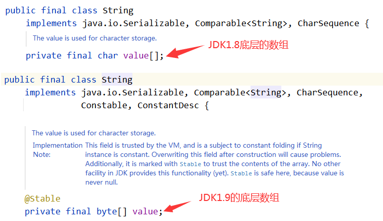
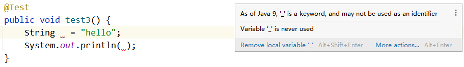

# 第17章 Java新特性


# 新特性的概述

纵观Java这几年的版本变化，在Java被收入Oracle之后，Java以小步快跑的迭代方式，在功能更新上迈出了更加轻快的步伐。基于时间发布的版本，可以让Java研发团队及时获得开发人员的反馈，因此可以看到最近的Java版本，有很多语法层面简化的特性。同时，Java在支持容器化场景，提供低延迟的GC方面(ZGC等)也取得了巨大的进步。

注意一个新特性的出现通常会经过以下阶段：

1. 孵化器（Incubator）阶段：这是新特性最早的开发和试验阶段，此时新特性只能作为一个单独的模块或库出现，而不会包含在Java SE中。在这个阶段，特性的设计可能会有些不稳定，而且会经常调整和变更。
2. 预览（Preview）阶段：在经过了孵化器阶段的验证和修改后，新特性进入了预览阶段，这是一种在Java SE内部实现的，开发人员可以使用并对其提供反馈的渠道。此时特性可能被包含在Java SE版本中，但是它默认是未开启的，需要通过特定的命令行参数或其他方式进行启用。
3. 正式版（GA）阶段：在经过了预览阶段的反复测试和修复后，新特性最终会在Java SE的稳定版本中发布。此时，特性被默认开启，成为Java SE的一部分，并可以在各个Java应用程序中使用。

需要注意的是，上述阶段并非一成不变，并不是所有JEP（Java Enhancement Proposal：Java增强方案）都需要经过孵化器阶段和预览阶段，这取决于特定的提案和规划。但是，Java SE领导小组通常会遵循这些阶段的流程，以确保新特性可以经过充分的评估和测试，以便能够稳定和可靠地使用在Java应用程序中。

在以下的内容中，我们对Java9到Java21新特性做一个简单的概述。

## Java9新特性

Java9经过4次推迟，历经曲折的Java9最终在2017年9月21日发布，提供了超过150项新功能特性。

- JEP 261: Module System
  - JDK 9 开始引入的一种全新的模块化编程方式。JPMS 的目的是为了更好地支持大型应用程序的开发和维护，同时也可以使 Java 程序在更为动态、可移植和安全的环境下运行。
- JEP 222: jshell: The Java Shell (Read-Eval-Print Loop)
  - 一种交互式的 Java Shell，可以在命令行上快速地进行 Java 代码的编写、验证和执行，从而提高开发者的生产力。
- JEP 213: Milling Project Coin（细化工程改进，该计划旨在引入小型语言特性来提高代码的简洁性和可读性）
  - 在Java 9中，@SafeVarargs注解可以用于一个私有实例方法上。在Java 7和Java 8中，@SafeVarargs注解只能用于静态方法、final实例方法和构造函数。
  - 在Java 9中，可以将效果等同于final变量作为try-with-resources语句块中的资源来使用。在Java 7/8中，try-with-resources语句块中的资源必须是显式的final或事实上的final（即变量在初始化后未被修改），否则编译器会报错。这个限制限制了Java程序员使用try-with-resources语句块的能力，特别是在涉及lambda表达式、匿名类或其他读取外部变量的代码段时。
  - Java 9允许在匿名类实例化时使用钻石操作符(<>)来简化代码，但参数类型必须是具体的、可推导的类型。
  - 从Java9开始，不能使用一个单一的“_”作为标识符了。
  - 从Java9开始，接口中支持定义私有方法。
- JEP 224: HTML5 Javadoc
  - 从Java9开始，javadoc开始支持HTML5的语法。
- JEP 254: Compact Strings
  - 一种新的字符串表示方式，称为紧凑型字符串，以提高Java应用程序的性能和内存利用率。通过String源码得知：char[] 变成了 byte[]。
- JEP 269: Convenience Factory Methods for Collections
  - 更加方便的创建只读集合：List.of("abc", "def", "xyz");
- JEP 269：对Stream API进行了增强
  - 其中最显著的是引入了四个新的方法，分别是 `takeWhile()`, `dropWhile()`, `ofNullable()` 和 `iterate()`
- JEP 110：一个新的HTTP客户端API，名为HttpClient，它是一种基于异步和事件驱动的方式，更加高效和灵活的HTTP客户端。


## Java10新特性

2018年3月21日，Oracle官方宣布JAVA10正式发布。JAVA10一共定义了109个新特性，其中包含JEP，对开发人员来说，真正的新特性也就一个，还有一些新的API和JVM规范以及JAVA语言规范上的改动。

- 286：局部变量类型推断
- 296：将 JDK 森林合并到单个存储库中
- 304：垃圾收集器接口
- 307：G1 的并行完整 GC
- 310：应用程序类数据共享
- 312：线程局部握手
- 313：删除本机头生成工具 (javah)
- 314：附加 Unicode 语言标签扩展
- 316：替代内存设备上的堆分配
- 317：基于 Java 的实验性 JIT 编译器
- 319：根证书
- 322：基于时间的发布版本控制


## Java11新特性

2018年9月26日，Oracle官方发布JAVA11。这是JAVA大版本周期变化后的第一个长期支持版本，官方支持到2026年。

- 181：基于 Nest 的访问控制
- 309：动态类文件常量
- 315：改进 Aarch64 内部函数
- 318：Epsilon：无操作垃圾收集器
- 320：删除 Java EE 和 CORBA 模块
- 321：HTTP 客户端（标准）
- 323：本地变量语法LAMBDA参数
- 324：与Curve25519密钥协商和Curve448
- 327：Unicode的10
- 328：飞行记录器
- 329：ChaCha20和Poly1305加密算法
- 330：启动单文件源代码程序
- 331：低开销堆纹
- 332：传输层安全性 (TLS) 1.3
- 333：ZGC：可扩展的低延迟垃圾收集器（实验性）
- 335：弃用 Nashorn JavaScript 引擎
- 336：弃用 Pack200 工具和 API

## Java12新特性

2019年3月19日，java12正式发布。

- 189：Shenandoah：一个低暂停时间的垃圾收集器（实验性）
- 230：微基准套件
- 325：switch表达式（预览）
- 334：JVM 常量 API
- 340：一个 AArch64 端口
- 341：默认 CDS 档案
- 344：G1 支持可中断的 Mixed GC
- 346：及时从 G1 返回未使用的已提交内存

## Java13新特性

- 350：动态 CDS 档案
- 351：ZGC：取消提交未使用的内存
- 353：重新实现旧的 Socket API
- 354：开关表达式（预览）
- 355：文本块（预览）


## Java14新特性

- 305：instanceof 的模式匹配（预览）
- 343：包装工具（孵化器）
- 345：G1 的 NUMA 感知内存分配
- 349：JFR 事件流
- 352：非易失性映射字节缓冲区
- 358：有用的空指针异常
- 359：记录（预览）
- 361： 开关表达式（标准）
- 362：弃用 Solaris 和 SPARC 端口
- 363：删除并发标记清除 (CMS) 垃圾收集器
- 364：macOS 上的 ZGC
- 365：Windows 上的 ZGC
- 366：弃用 ParallelScavenge + SerialOld GC 组合
- 367：删除 Pack200 工具和 API
- 368：文本块（第二次预览）
- 370：外部内存访问 API（孵化器）

## Java15新特性

- 339：爱德华兹曲线数字签名算法 (EdDSA)
- 360：密封类（预览）
- 371：隐藏类
- 372：删除 Nashorn JavaScript 引擎
- 373：重新实现旧版 DatagramSocket API
- 374：禁用和弃用偏向锁定
- 375：instanceof 的模式匹配（第二次预览，无改动）
- 377：ZGC：可扩展的低延迟垃圾收集器（确定正式版）
- 378：文本块（确定正式版）
- 379：Shenandoah：一个低暂停时间的垃圾收集器（确定正式版）
- 381：删除 Solaris 和 SPARC 端口
- 383：外内存访问API（第二孵化器）
- 384：记录（第二次预览）
- 385：弃用 RMI 激活以进行删除

## Java16新特性

- 338：Vector API（孵化器）
- 347：启用 C++14 语言功能
- 357：从 Mercurial 迁移到 Git
- 369：迁移到 GitHub
- 376：ZGC：并发线程栈处理
- 380：Unix 域套接字通道
- 386：Alpine Linux 端口
- 387：弹性元空间
- 388：Windows/AArch64 端口
- 389：外链 API（孵化器）
- 390：基于值的类的警告
- 392：打包工具
- 393：外内存访问API（第三孵化器）
- 394：instanceof 的模式匹配
- 395：记录
- 396：默认情况下强封装JDK内部
- 397：密封类（第二次预览）


## Java17新特性

2021年9月14日，java17正式发布（LTS）。长期支持版，支持到2029年。Oracle 宣布，从JDK17开始，后面的JDK都全部免费提供。

- 306：恢复始终严格的浮点语义
- 356：增强型伪随机数发生器
- 382：新的 macOS 渲染管线
- 391：macOS/AArch64 端口
- 398：弃用 Applet API 以进行删除
- 403：强封装JDK内部
- 406：switch模式匹配（预览）
- 407：删除 RMI 激活
- 409：密封类（正式确定）
- 410：删除实验性 AOT 和 JIT 编译器
- 411：弃用安全管理器以进行删除
- 412：外部函数和内存 API（孵化器）
- 414：Vector API（第二孵化器）
- 415：上下文特定的反序列化过滤器

## Java18新特性

2022年3月22日发布。非长期支持版本。

- JEP 400：从JDK18开始，UTF-8是Java SE API的默认字符集。
- JEP 408：从JDK18开始，引入了jwebserver这样一个简单的WEB服务器，它是一个命令工具。
- JEP 416：使用方法句柄重新实现核心反射
- JEP 418：互联网地址解析SPI
- JEP 413：Java API文档中的代码段（javadoc注释中使用

- 括起来的代码段会原模原样的生成到帮助文档中）
- JEP 417：Vector API（第三孵化器）
- JEP 419：Foreign Function & Memory API（第二孵化器）
- JEP 420：switch 的模式匹配（第二次预览）
- JEP 421：Object中的finalize()方法被移除

## Java19新特性

2022年9月20日发布。非长期支持的版本。直到 2023 年 3 月它将被 JDK 20 取代。

- JEP 425：虚拟线程（预览版）
  - 一种新的线程模型，即虚拟线程；"虚拟线程" 指的是一种轻量级线程，可以通过 JVM 进行管理和调度，而不需要操作系统进行支持
- JEP 428：结构化并发（孵化器）
  - 一组新的API和规范，用于优化并简化Java程序的并发编程
- JEP 405：Record模式 (预览版)
- JEP 427：switch语句中的模式匹配（第三次预览版）
  - "switch语句中的模式匹配"表示该特性是针对 switch 语句的改进，可以使用模式匹配的方式处理 switch 语句中的分支
- JEP 424：外部函数和内存API（预览版）
  - “外部函数”指的是在Java程序中调用非Java语言编写的函数，比如C/C++函数
  - “内存API”指的是在Java程序中直接操作内存的API
- JEP 426：向量API（第四版孵化器）
  - 一组专用于向量化处理的API，允许在Java程序中轻松高效地执行向量化计算

## Java20新特性

2023年3月21日发布。非长期支持版本。直到 2023 年 9月它将被 JDK 21 取代。

- JEP 432： Record模式(第二次预览版)
- JEP 433： switch的模式匹配 (第四次预览版)
- JEP 434： 外部函数和内存API（第二次预览版）
- JEP 438： 向量API (第五版孵化器)
- JEP 429： Scoped Values (Incubator)
- JEP 436： 虚拟线程(第二次预览版)
- JEP 437： 结构化并发（第二版孵化器）

## Java21新特性

2023年9月19日发布。长期支持版本。

- JEP 440：Record模式（正式确定）
- JEP 441：switch的模式匹配（正式确定）
- JEP 430：String Templates (Preview)
- JEP 443：Unnamed Patterns and Variables (Preview)
- JEP 445：Unnamed Classes and Instance Main Methods (Preview)
- JEP 444：Virtual Threads
- JEP 431：Sequenced Collections
- JEP 452：Key Encapsulation Mechanism API
- JEP 442：Foreign Function & Memory API (Third Preview)
- JEP 453：Structured Concurrency (Preview)
- JEP 446：Scoped Values (Preview)
- JEP 448：Vector API (Sixth Incubator)
- JEP 439：Generational ZGC
- JEP 451：Prepare to Disallow the Dynamic Loading of Agents


# 新语法方面的变化

## jShell命令

**jShell** - Java 9引入的交互式REPL（Read-Eval-Print Loop）工具，让你像Python、JavaScript一样即时执行Java代码。

只要你配置了环境变量 path，打开 dos 命令窗口，输入 `<font style="color:rgb(15, 17, 21);">jshell</font>`命令即可用：

**快速测试代码片段（最常用！）**

```java
// 传统方式：需要创建类、main方法
public class Test {
    public static void main(String[] args) {
        System.out.println("Hello World");
    }
}

// jShell方式：直接输入
jshell> System.out.println("Hello World")
Hello World
```

**学习API和探索新特性**

```java
// 快速了解新日期API
jshell> import java.time.*
jshell> LocalDate today = LocalDate.now()
today ==> 2023-12-25

jshell> today.plusDays(10)
$2 ==> 2024-01-04

jshell> today.getDayOfWeek()
$3 ==> MONDAY
```

**调试和问题排查**

```java
// 怀疑某个方法的返回值？
jshell> "hello world".substring(0, 5)
$4 ==> "hello"

jshell> Arrays.asList(1, 2, 3).stream().map(x -> x * 2).collect(Collectors.toList())
$5 ==> [2, 4, 6]
```

**常用命令包括：**

1. /list：列出代码编写记录
2. /vars：查看所有定义过的变量
3. /methods：查看所有定义过的方法
4. /save：保存代码


## try-with-resources

众所周知，所有被打开的系统资源，比如流、文件、Socket连接等，都需要被开发者手动关闭，否则随着程序的不断运行，资源泄露将会累积成重大的生产事故。

在Java7以前，我们想要关闭资源就必须的finally代码块中完成。

【示例】Java7之前资源的关闭的方式

```java
public void copyFile1(File srcFile, File destFile) {
    FileInputStream fis = null;
    FileOutputStream fos = null;
    try {
        // 实例化IO流（输入流和输出流）
        fis = new FileInputStream(srcFile);
        fos = new FileOutputStream(destFile);
        // 拷贝文件（存储和读取）
        int len = 0;
        byte[] bytes = new byte[1024];
        while ((len = fis.read(bytes)) != -1) {
            fos.write(bytes, 0, len);
        }
    } catch (FileNotFoundException e) {
        e.printStackTrace();
    } catch (IOException e) {
        e.printStackTrace();
    } finally {
        // 关闭资源
        if (fis != null) {
            try {
                fis.close();
            } catch (IOException e) {
                e.printStackTrace();
            }
        }
        if (fos != null) {
            try {
                fos.close();
            } catch (IOException e) {
                e.printStackTrace();
            }
        }
    }

}
```

Java7及以后关闭资源的正确姿势：try-with-resource，该语法格式为：

```java
try(/*实例化需要关闭资源的对象或引用需要关闭资源的对象*/){
        // 书写可能出现异常的代码
} catch(Exception e) {
        // 处理异常
}
```

使用try-with-resource来自动关闭资源，则需要关闭资源的对象对应的类就必须实现java.lang.AutoCloseable接口，该接口中提供了一个close()的抽象方法，而自动关闭资源默认调用的就是实现于java.lang.AutoCloseable接口中的close()方法。

因为FileInputStream类和FileOutputStream类都属于java.lang.AutoCloseable接口的实现类，因此此处文件拷贝的操作就可以使用try-with-resource来自动关闭资源。

【示例】Java7之后资源的关闭的方式

```java
public void copyFile(File srcFile, File destFile) {
    // 实例化IO流（输入流和输出流）
    try (FileInputStream fis = new FileInputStream(srcFile);
         FileOutputStream fos = new FileOutputStream(destFile)) {
        // 拷贝文件（存储和读取）
        int len = 0;
        byte[] bytes = new byte[1024];
        while ((len = fis.read(bytes)) != -1) {
            fos.write(bytes, 0, len);
        }
    } catch (FileNotFoundException e) {
        e.printStackTrace();
    } catch (IOException e) {
        e.printStackTrace();
    }
}
```

通过try-with-resource来关闭放资源，即使资源很多，代码也可以写的很简洁，如果用Java7之前的方式去关闭资源，那么资源越多，用finally关闭资源时嵌套也就越多。

在Java9之后，为了避免在try后面的小括号中去实例化很多需要关闭资源的对象（复杂），则就可以把需要关闭资源的多个对象在try之前实例化，然后在try后面的小括号中引用需要关闭资源的对象即可，从而提高了代码的可读性。

【示例】Java9之后的使用方式

```java
public void copyFile(File srcFile, File destFile) throws FileNotFoundException {
    // 实例化IO流（输入流和输出流）
    FileInputStream fis = new FileInputStream(srcFile);
    FileOutputStream fos = new FileOutputStream(destFile);
    // 拷贝文件（存储和读取）
    try (fis; fos) {
        int len = 0;
        byte[] bytes = new byte[1024];
        while ((len = fis.read(bytes)) != -1) {
            fos.write(bytes, 0, len);
        }
    } catch (IOException e) {
        e.printStackTrace();
    }
}
```

在以上代码中，表达式中引用了fis和fos，那么在fis和fos就自动变为常量啦，也就意味着在try代码块中不能修改fis和fos的指向，从而保证打开的资源肯定能够关闭。


## 局部变量类型判断

在Java10中，新增了局部变量类型判断。在方法体或代码块中，对于可以在编译期确定的类型，可以使用var来定义。这个特性并不意味着java是弱类型的语言，仅是提供了更简洁的书写方式。对于编译期无法确定的类型，依然要写清楚类型。

【示例】局部变量类型判断案例

```java
// 使用var来作为变量的引用声明
var num = 123;
var str = "hello world";
var arr = new int[] {11, 22, 33};
var arrayList = new ArrayList<String>();
var calendar = Calendar.getInstance();
// 以下为不可以声明为var的情况
// 1.使用var必须要求变量必须初始化
// var userName;
// 2.不能给变量赋null值
// var userName = null;
// 3.lambda表达式不可以声明为var
// var function = (num) -> Math.round(3.51);
// 4.方法引用不可以声明为var
// var method = System.out :: println;
// 5.数组静态初始化不可以声明为var
// var arr = {"aa", "bb", "cc"};
// 6.类的成员变量不可以使用var类型推断
// 7.所有参数声明，返回值类型，构造方法参数都不可以
```

## instanceof的模式匹配

在JDK14中新增instanceof模式匹配增强(预览)，在JDK16中转正。通过instanceof模式匹配增强，我们就可以直接在模式匹配的括号内声明对应类型的局部变量。

【示例】执行向下转型的操作，从而调用show()方法

```java
/**
 * 以前的代码实现方式
 */
@Test
public void testOld() {
    // 父类引用指向子类对象（多态）
    Animal animal = new Dog();
    // 判断animal是否为Dog类的实例
    if (animal instanceof Dog) {
        // 指向向下转型的操作
        Dog dog = (Dog) animal;
        // 调用Dog类特有的show()方法
        dog.show();
    }
}
/**
 * 使用instanceof模式匹配增强的实现方式
 */
public void testNew() {
    // 父类引用指向子类对象（多态）
    Animal animal = new Dog();
    // 如果animal是Dog类的实例，则向下转型后就命名为dog
    if (animal instanceof Dog dog) {
        // 调用Dog类特有的show()方法
        dog.show();
    }
}
```

【示例】重写equals()，判断成员变量是否相等

```java
public class Tiger {
    String name;
    int age;

    /**
     * 以前的代码实现方式
     */
    /*@Override
    public boolean equals(Object obj) {
        if (this == obj) return true;
        if (obj == null) return false;
        // 如果obj属于Tiger类型，则就执行向下转型的操作
        if (obj instanceof Tiger) {
            // 执行向下转型的操作，恢复对象的实际类型
            Tiger tiger = (Tiger) obj;
            // 如果成员变量都相等，则返回true，否则返回false
            return age == tiger.age && Objects.equals(name, tiger.name);
        }
        // 如果obj不属于Tiger类型，则返回false即可
        return false;
    }*/

    /**
     * 使用instanceof模式匹配增强的实现方式
     */
    @Override
    public boolean equals(Object obj) {
        if (this == obj) return true;
        if (obj == null) return false;
        // 如果obj属于Tiger类型并且成员变量值都相等，那么返回true
        if (obj instanceof Tiger tiger) {
            return age == tiger.age && Objects.equals(name, tiger.name);
        }
        // 如果obj不属于Tiger类型，则返回false即可
        return false;
    }
}
```


## switch表达式

目前switch表达式的问题：

1. 匹配自上而下，若无break，后面的case语句都会执行
2. 不同的case语句定义的变量名不能相同
3. 不能在一个case后面写多个值
4. 整个switch不能作为表达式的返回值

在Java12中对switch表达式做了增强（预览），能够使用更加简洁的代码来解决这些问题。

【示例】switch表达式使用的案例

```java
/**
 * 需求：根据月份输出对应季节的特点
 * 方案一：使用以前的技术来实现
 */
public static void normalSwitch(int month) {
    // 定义一个变量，用于保存季节的特点
    String season;
    // 判断month的取值，从而知晓对应的季节
    switch (month) {
        case 12:
        case 1:
        case 2:
            season = "白雪皑皑";
            break;
        case 3:
        case 4:
        case 5:
            season = "春意盎然";
            break;
        case 6:
        case 7:
        case 8:
            season = "夏日炎炎";
            break;
        case 9:
        case 10:
        case 11:
            season = "秋高气爽";
            break;
        default:
            throw new RuntimeException("没有该月份。。。");
    }
    // 输出month对应季节的特点
    System.out.println(season);
}

/**
 * 需求：根据月份输出对应季节的特点
 * 方案二：使用Java12的新特性来实现
 */
public static void newSwitch(int month) {
    // 判断month的取值，获得对应季节的特点
    String season = switch (month) {
        case 12, 1, 2 -> "白雪皑皑";
        case 3, 4, 5 -> "春意盎然";
        case 6, 7, 8 -> "夏日炎炎";
        case 9, 10, 11 -> "秋高气爽";
        default -> throw new RuntimeException("没有该月份。。。");
    };
    // 输出month对应季节的特点
    System.out.println(season);
}
```

在Java13中，增加关键字yield关键字（预览）， 用于在switch表达式中返回结果。到Java14版本中，Java12和Java13中关于switch的新特性都确定为正式版本。

【示例】switch表达式中的yield关键字

```java
/**
 * 需求：根据月份输出对应季节的特点
 * 演示：Java13版本中新增的yield新特性
 */
public static void yieldSwitch1(int month) {
    // 判断month的取值，获得对应季节的特点
    String season = switch (month) {
        case 12, 1, 2:
            yield "白雪皑皑";
        case 3, 4, 5:
            yield "春意盎然";
        case 6, 7, 8:
            yield "夏日炎炎";
        case 9, 10, 11:
            yield "秋高气爽";
        default:
            throw new RuntimeException("没有该月份。。。");
    };
    // 输出month对应季节的特点
    System.out.println(season);
}
```


## 文本块

在Java语言中，通常需要使用String类型表达HTML，XML，SQL或JSON等格式的字符串，在进行字符串赋值时需要进行转义和连接操作，然后才能编译该代码，这种表达方式难以阅读并且难以维护。

在Java12版本中，新增了文本块（预览）。文本块就是指多行字符串，例如一段格式化后的xml、json等。而有了文本块以后，用户不需要转义，Java能自动搞定。因此，文本块将提高Java程序的可读性和可写性。

【示例】演示文本块的使用

```java
// 使用以前拼接的方式
String html1 = "<html>\n" +
        "      <body>\n" +
        "            <p>Hello， world</p>\n" +
        "      </body>\n" +
        "</html>";
System.out.println(html1);
// 使用文本块的方式
String html2 = """
        <html>
              <body>
                    <p>Hello， world</p>
              </body>
        </html>
        """;
System.out.println(html2);
```

在Java14版本中，针对文本块又新增两个特性（阅览）。1)在一行的结尾增加“\”可以取消改行的换行符；2)可以通过“\s”增加空格。

【示例】演示文本块新增特性

```java
// 取消换行（\）
String json1 = """
        {
            "username":"jack"，\
            "age":18
        }
        """;
System.out.println(json1);
// 添加空格（\s）
String json2 = """
        {
            "username"\s:\s"jack"，
            "age"\s:\s18
        }
        """;
System.out.println(json2);
```


## Record

**传统写法（啰嗦）：**

```java
public final class Tiger {
    private final String name;
    private final int age;
    
    // 还要写构造方法、getter、equals、hashCode、toString...
    // 总共需要几十行代码！
}
```

---

**Record写法（简洁）：**

```java
// 一行搞定！自动生成所有必要方法
public record Tiger(String name, int age) { }
```

---

**Record 的核心特点**

1. **自动生成**：编译器自动生成构造方法、getter、equals、hashCode、toString
2. **不可变**：所有字段都是 final 的，创建后不能修改
3. **简洁明了**：专为纯数据载体设计

---

**如何使用**

```java
// 定义
public record User(String username, String email, int age) { }

// 使用
User user = new User("张三", "zhang@example.com", 25);
String name = user.username();  // getter方法名与字段名相同
String email = user.email();
```

---

**什么时候用 Record**

**适合**：DTO、VO、配置类、返回结果等纯数据对象
**不适合**：需要继承、需要可变字段的复杂业务对象

**一句话总结：Record 让纯数据类变得超级简洁！**

在Record类中，我们还可以新增静态属性、无参构造方法、成员方法和静态方法，但是创建对象时不能调用无参构造方法，而是通过全参构造方法创建对象的时候，默认就会调用Record类中的无参构造方法。

【示例】在Record类中添加的内容

```java
public record Tiger(String name, int age)  {
    // 新增静态属性
    static double score;
    // 新增无参构造方法
    // 注意：通过全参构造方法创建对象，默认就会调用此处的无参构造方法
    public Tiger {
        System.out.println("无参构造方法");
    }
    // 新增成员方法
    void show() {
        System.out.println("show. ..");
    }
    // 新增静态方法
    static void method() {
        System.out.println("method ...");
    }
}
```


## 密封类

Java15 引入的，密封类让你明确指定哪些类可以继承自己，关闭随意继承的权限。

**核心规则是：**

1. **明确指定**：使用 `<font style="color:rgb(15, 17, 21);background-color:rgb(235, 238, 242);">permits</font>` 列出所有子类
2. **三种继承方式**：
  - `<font style="color:rgb(15, 17, 21);background-color:rgb(235, 238, 242);">final</font>` - 不能再继承
  - `<font style="color:rgb(15, 17, 21);background-color:rgb(235, 238, 242);">sealed</font>` - 可以继承，但也要指定范围
  - `<font style="color:rgb(15, 17, 21);background-color:rgb(235, 238, 242);">non-sealed</font>` - 开放继承

**好处**：在编译期就确保继承关系的可控性，避免意外的类继承你的基类。

使用sealed关键字修饰的类，我们就称之为密封类。密封类必须是一个父类，我们可以使用permits关键字来指定哪些子类可以继承于密封类，并且密封类的子类必须使用sealed、final或non-sealed来修饰。

【示例】密封类的演示

```java
// 密封类必须被继承，并且使用permits来指定哪些子类可以被继承
sealed class Animal permits Dog, Bird, Tiger { }
// 注意：密封类的子类必须使用sealed、final或non-sealed来修饰
// final关键字修饰的子类，则该子类不能被继承
final class Tiger extends Animal { }
// non-sealed修饰的子类，则该子类就是一个普通类
non-sealed class Bird extends Animal { }
// sealed修饰的子类，则该类就必须被继承，否则就会编译错误
sealed class Dog extends Animal {}
non-sealed class SmallDog extends Dog {}
```

使用sealed关键字修饰的接口，我们就称之为密封接口。密封接口必须使用permits关键字来指定实现类或子接口。针对密封接口的实现类，则必须使用sealed、final或non-sealed来修饰；针对密封接口的子接口，则必须使用sealed或non-sealed来修饰。

【示例】密封接口的演示

```java
// 使用sealed修饰的接口，则必须使用permits来指定实现类或子接口。
public sealed interface InterA permits Student, InterB { }
// 密封接口的实现类，必须使用sealed、final或non-sealed来修饰
non-sealed /*final*/ /*sealed*/ class Student implements InterA { }
// 密封接口的子接口，必须使用sealed或non-sealed来修饰
non-sealed /*sealed*/ interface InterB extends InterA {}
```

**sealed与record：**

因为Record类默认采用了final关键字修饰，因此Record类就可以作为密封接口的实现类。

【示例】密封接口和Record类

```java
// 密封接口
sealed interface Flyable permits SuperMan { }
// 让Record类作为密封接口的实现类
record SuperMan(String name, int age) implements Flyable { }
```


# API层面的变化

## String存储结构改变

在Java8及其之前，String底层采用char类型数组来存储字符；在Java9及其以后，String底层采用byte类型的数组来存储字符。将char[]转化为byte[]，其目的就是为了节约存储空间。



## String 新增的方法

在Java11版本中，对String类新增了一些方法，新增的方法如下：

```java
// 空格，制表符，换行等都认为是空的
boolean blank = "\t \n".isBlank();
System.out.println(blank); // 输出：true

String source = "\u3000\u3000\u3000\u3000\u3000\u3000\u3000\u3000www.baidu.com\u3000\u3000\u3000\u3000\u3000";
// 去除“前后”的中文空格
System.out.println(source.strip());
// 去除“开头”的中文空格
System.out.println(source.stripLeading());
// 去除“末尾”的中文空格
System.out.println(source.stripTrailing());

// 把字符串内容重复n份
String repeat = "xixi".repeat(3);
System.out.println(repeat); // 输出：xixixixixixi

// 按照换行来分割字符串，返回的结果是Stream对象
Stream<String> lines = "a\nb\nc\n".lines();
System.out.println(lines.count()); // 输出：3
```

在Java12版本中，对String类新增了一些方法，新增的方法如下：

```java
// 在字符串前面添加n个空格
String result2 = "Java Golang".indent(4);
System.out.println(result2);
```


## 接口支持私有方法

在Java8版本中，接口中支持“公开”的静态方法和公开的默认方法；在Java9版本中，接口中还允许定义“私有”的静态方法和成员方法，但是不能定义私有的默认方法。

【示例】演示接口中的私有静态方法和成员方法

```java
/**
 * 接口（JDK1.9）
 */
public interface Flyable {
    // 私有的静态方法
    private static void staticMethod() {
        System.out.println("static method ...");
    }
    // 私有的成员方法
    private void method() {
        System.out.println("default method ...");
    }
}
```

## 标识符命名的变化

在Java8及其之前，标识符可以独立使用“_”来命名。

```java
String _ = "hello";
System.out.println(_);
```

但是，在Java9中规定“_”不能独立命名标识符了，如果使用就会报错：



## 简化编译运行程序

在我们的认知里面，要运行一个Java源代码必须先编译（javac命令），再运行（java命令），两步执行动作。而在Java 11版本中，通过一个java命令就直接搞定了。

需要执行的程序：

```java
public class HelloWorld {
    public static void main(String[] args) {
        System.out.println("hello world");
    }
}
```

可以直接执行 `java HelloWorld.java`来编译和运行程序。

## 创建不可变集合

在Java9版本中，我们可以通过List、Set和Map接口提供的of(E... elements)静态方法来创建不可变集合。通过此方式创建的不可变集合，我们不但不能添加或删除元素，并且还不能修改元素。

【示例】创建不可变集合

```java
// 创建不可变List集合
List<Integer> list = List.of(1, 2, 3, 4, 5);
System.out.println(list);
// 创建不可变Set集合
// 注意：如果Set集合中有相同的元素，则就会抛出IllegalArgumentException异常。
Set<Integer> set = Set.of(1, 2, 3, 4, 5, 4);
System.out.println(set);
// 创建不可变Map集合
Map<Integer, String> map = Map.of(123, "武汉", 456, "成都");
System.out.println(map);
```

Arrays.asList与List.of的区别：

List.of：不能向集合中添加或删除元素，也不能修改集合中的元素。

Arrays.asList：不能向集合中添加或删除元素，但是可以修改集合中的元素。

【示例】Arrays.asList与List.of的区别

```java
// 通过Arrays.asList()方法创建不可变集合
List<Integer> list1 = Arrays.asList(1, 2, 3, 4, 5);
// list1.add(6); // 抛出UnsupportedOperationException异常
// list1.remove(2); // 抛出UnsupportedOperationException异常
list1.set(2, 33); // 没有问题
System.out.println(list1); // 输出：[1, 2, 33, 4, 5]

// 通过List.of()方法创建不可变集合
List<Integer> list2 = List.of(1, 2, 3, 4, 5);
// list2.add(6); // 抛出UnsupportedOperationException异常
// list2.remove(2); // 抛出UnsupportedOperationException异常
// list2.set(2, 33); // 抛出UnsupportedOperationException异常
```


## Optional API

### 了解 Optional API

**Optional API 是 Java8 的新特性，核心原则：使用 Optional 的目的是强制调用者处理空值情况，让空指针异常在编译期就暴露出来！**

```java
// 代码如果这样写存在空指针异常
// ❌ 传统方式：可以"忘记"处理null
Address addr = user.getAddress();
System.out.println(addr.getCity());

// 为了防止NPE出现，使用这种传统写法，代码不够优雅
if(user != null){
    Address addr = user.getAddress();
    if(addr != null){
        System.out.println(addr.getCity());
    }else{
        System.out.println("未知");
    }
}else{
    System.out.println("未知");
}

// Optional API写法
// ✅ Optional方式：编译器"强迫"你处理
// 编译警告！必须调用orElse、orElseThrow等处理方法
String result = Optional.ofNullable(user).map(User::getAddress).map(Address::getCity).orElse("未知");
System.out.println(result);
```

### 创建 Optional 对象

```java
// 1.1 创建包含非null值的Optional
Optional<String> name = Optional.of("张三"); // 如果为null会立即抛异常

// 1.2 创建可能为null的Optional
Optional<String> emptyName = Optional.ofNullable(getName()); // 如果为null返回empty

// 1.3 创建空Optional
Optional<String> empty = Optional.empty();
```

### 检查值是否存在

```java
Optional<User> userOpt = findUserById(1);

// 存在时执行操作（推荐）
userOpt.ifPresent(user -> {
    System.out.println("用户存在: " + user.getName());
});

// 存在时执行操作，否则执行其他
userOpt.ifPresentOrElse(
    user -> System.out.println("用户: " + user.getName()),
    () -> System.out.println("用户不存在")
);
```

### 获取值（安全方式）

```java
Optional<String> nameOpt = Optional.ofNullable(getName());

// 3.1 为null时返回默认值
String name1 = nameOpt.orElse("未知用户");

// 3.2 为null时通过Supplier获取默认值
String name2 = nameOpt.orElseGet(() -> getDefaultName());

// 3.3 为null时抛出自定义异常
String name3 = nameOpt.orElseThrow(() -> new UserNotFoundException());

// 3.4 为null时抛默认异常
String name4 = nameOpt.orElseThrow(); // 抛NoSuchElementException
```

### 转换和过滤

```java
Optional<User> userOpt = findUserById(1);

// 映射转换（类似Stream的map）
Optional<String> nameOpt = userOpt.map(User::getName);

// 过滤
Optional<User> adultUser = userOpt.filter(user -> user.getAge() >= 18);

// 链式操作（Optional对象不是Stream对象，它借鉴了Stream对象的函数式编程的灵感，Optional对象是一个最多包含一个值的容器。）
String result = userOpt
    .filter(user -> user.getAge() > 18)
    .map(User::getName)
    .map(String::toUpperCase)
    .orElse("未找到符合条件的用户");
```


# Java8 的新日期 API

## 为什么需要新的日期API

旧版Date的问题

```java
// 问题1：非线程安全
Date date = new Date();
// 问题2：设计混乱，月份从0开始
Calendar calendar = Calendar.getInstance();
calendar.set(2023, 11, 25); // 实际是12月，反人类设计
// 问题3：时区处理麻烦
```

## 新版API的优势

- **不可变对象**：线程安全
- **清晰的设计**：方法名明确，逻辑清晰
- **时区处理**：完善的时区支持
- **链式调用**：流畅的API设计

## 主要类及其用途

- **LocalDate**：只含日期，如 2023-12-25
- **LocalTime**：只含时间，如 14:30:00
- **LocalDateTime**：日期+时间，如 2023-12-25 14:30:00
- **ZonedDateTime**：带时区的日期时间
- **Instant**：时间戳（Unix时间）
- **Duration**：时间间隔（秒、纳秒）
- **Period**：日期间隔（年、月、日）

## 创建日期时间对象

```java
// 获取当前
LocalDate today = LocalDate.now();
LocalTime nowTime = LocalTime.now();
LocalDateTime now = LocalDateTime.now();

// 指定日期
LocalDate birthday = LocalDate.of(1990, Month.DECEMBER, 25);
LocalTime meetingTime = LocalTime.of(14, 30, 0);
LocalDateTime meeting = LocalDateTime.of(2023, 12, 25, 14, 30);

// 解析字符串（常用格式）
LocalDate date = LocalDate.parse("2023-12-25");
LocalDateTime datetime = LocalDateTime.parse("2023-12-25T14:30:00");
```

## 日期计算和调整（最常用！）

```java
// 加减操作

// 在当前日期基础上加1周，返回新的LocalDate对象
LocalDate nextWeek = today.plusWeeks(1);

// 在当前日期时间基础上加2小时，返回新的LocalDateTime对象  
LocalDateTime twoHoursLater = now.plusHours(2);

// 在当前日期基础上减1个月，返回新的LocalDate对象
LocalDate lastMonth = today.minusMonths(1);

// 日期调整（非常实用！）

// 调整到下一个星期一（如果今天就是周一，则返回下周一）
LocalDate nextMonday = today.with(TemporalAdjusters.next(DayOfWeek.MONDAY));

// 调整到当月的最后一天
LocalDate lastDayOfMonth = today.with(TemporalAdjusters.lastDayOfMonth());

// 调整到当月的第一个星期一
LocalDate firstMonday = today.with(TemporalAdjusters.firstInMonth(DayOfWeek.MONDAY));

// 获取给定日期的下个工作日
LocalDate nextWorkDay = today.with(temporal -> {
    // 1. 从temporal对象中获取星期几
    DayOfWeek day = DayOfWeek.from(temporal);
    
    // 2. 默认情况下，下个工作日就是明天（加1天）
    int daysToAdd = 1;
    
    // 3. 特殊处理周末情况：
    if (day == DayOfWeek.FRIDAY) {
        daysToAdd = 3;      // 如果是周五，下个工作日是下周一（+3天）
    } else if (day == DayOfWeek.SATURDAY) {
        daysToAdd = 2;      // 如果是周六，下个工作日是下周一（+2天）
    }
    // 周日到周四的情况，默认加1天就是下个工作日
    
    // 4. 返回计算后的新日期
    return temporal.plus(daysToAdd, ChronoUnit.DAYS);
});
```


## 日期比较和判断

```java
// 比较

// 判断生日是否在今天之前（生日是否已经过去）
boolean isBefore = birthday.isBefore(today);

// 判断会议时间是否在当前时间之后（会议是否还没开始）
boolean isAfter = meetingTime.isAfter(LocalTime.now());

// 判断今天日期是否与当前日期相等（通常为true，用于比较两个LocalDate是否相同）
// 实际开发中建议使用equals方法，更安全。除非你非常确定是两个日期进行比较，
// 比如LocalDate和LocalDateTime只进行日期部分的比较。
boolean isEqual = today.isEqual(LocalDate.now());

// 判断

// 判断当前日期所在的年份是否为闰年
boolean isLeapYear = today.isLeapYear(); // 是否闰年

// 判断今天是否是周末（周六或周日）
boolean isWeekend = today.getDayOfWeek() == DayOfWeek.SATURDAY 
                 || today.getDayOfWeek() == DayOfWeek.SUNDAY;
```

## 日期信息获取

```java
// 获取日期组成部分
int year = today.getYear();

Month month = today.getMonth();
int day = today.getDayOfMonth();
DayOfWeek dayOfWeek = today.getDayOfWeek();

// 获取时间组成部分
int hour = nowTime.getHour();
int minute = nowTime.getMinute();
```

## 格式化（日常开发必备）

```java
// 日期 -> 字符串

// 使用预定义的ISO标准格式将日期格式化为字符串（格式：2023-12-25）
String formattedDate = today.format(DateTimeFormatter.ISO_DATE);

// 使用自定义格式将日期时间格式化为字符串（格式：2023-12-25 14:30:00）
String customFormat = now.format(DateTimeFormatter.ofPattern("yyyy-MM-dd HH:mm:ss"));

// 使用中文格式将日期时间格式化为字符串（格式：2023年12月25日 14时30分）
String chineseFormat = now.format(DateTimeFormatter.ofPattern("yyyy年MM月dd日 HH时mm分"));

// 字符串 -> 日期

// 将字符串解析为LocalDateTime对象，需要指定匹配的格式模式
LocalDateTime parsed = LocalDateTime.parse("2023-12-25 14:30:00", 
    DateTimeFormatter.ofPattern("yyyy-MM-dd HH:mm:ss"));
```

## 时区处理（国际化系统必备）

```java
// 时区转换

// 获取指定时区的当前时间（北京时区，UTC+8）
ZonedDateTime beijingTime = ZonedDateTime.now(ZoneId.of("Asia/Shanghai"));

// 将北京时区的时间转换为纽约时区的同一时刻（自动计算时差）
ZonedDateTime newYorkTime = beijingTime.withZoneSameInstant(ZoneId.of("America/New_York"));

// 系统默认时区

// 获取系统默认时区的当前时间（根据运行环境的时区设置）
ZonedDateTime defaultZoneTime = ZonedDateTime.now();

// 时区列表

// 获取所有可用的时区ID集合（包含所有支持的时区字符串）
Set<String> zoneIds = ZoneId.getAvailableZoneIds();
```

## 时间间隔计算

```java
// 两个时间点之间的间隔（精确到纳秒的时间差）

// 创建开始时间：2023年12月1日 9:00
LocalDateTime start = LocalDateTime.of(2023, 12, 1, 9, 0);
// 创建结束时间：2023年12月25日 18:00  
LocalDateTime end = LocalDateTime.of(2023, 12, 25, 18, 0);

// 计算两个时间点之间的持续时间（精确时间差）
Duration duration = Duration.between(start, end);
// 获取总小时数（24小时制，包含天数转换）
long hours = duration.toHours(); // 总小时数
// 获取总天数（按24小时为一天计算）
long days = duration.toDays();   // 总天数

// 日期间隔（以年、月、日为单位的时间差）

// 计算两个日期之间的周期（年月日差）
Period period = Period.between(LocalDate.of(2023, 1, 1), today);
// 获取相差的年数
int years = period.getYears();
// 获取相差的月数（不足年的月数）
int months = period.getMonths();
```

## 与旧Date互操作（兼容老代码）

```java
// Date -> LocalDateTime
Date oldDate = new Date();
LocalDateTime newDateTime = oldDate.toInstant()
    .atZone(ZoneId.systemDefault())
    .toLocalDateTime();

// LocalDateTime -> Date
LocalDateTime localDateTime = LocalDateTime.now();
Date date = Date.from(localDateTime.atZone(ZoneId.systemDefault()).toInstant());
```

## 注意事项

1. **始终使用新API**：新项目不要使用Date和Calendar
2. **明确时区**：涉及多时区的系统要明确指定时区，数据库存储建议用UTC时间（UTC 是国际标准时间）。你需要永远记住，如果要做一个国际化系统，数据库存储一定要存储 UTC 时间，展示的时候按照对应时区展示。如果不是国际化系统无所谓。
3. **使用不可变对象**：所有日期时间对象都是不可变的，每次修改返回新对象，例如这段代码 `LocalDate newDate = date.plusDays(1);`会返回一个新的日期对象，底层这样做是为了保证线程安全。
4. **优先使用LocalDate**：如果不需要时间，只用日期，根据需求选择最合适的类，不要过度使用LocalDateTime
5. **不要使用==比较**：日期对象的比较也需要使用equals方法
6. **格式化线程安全**：DateTimeFormatter是线程安全的，可以共享使用，也就是说它可以声明为静态变量，没问题。
7. **正确处理周期和时间段：**处理日期段用 `Period period = Period.between(startDate, endDate);`，处理时间间隔用 `Duration duration = Duration.between(startTime, endTime);`。