# 1.MySQL


# 什么是数据库

---

- 数据库是一门独立的学科，只要是做软件开发的，数据库都要学。
- 数据库（电子化的文件柜）是“按照数据结构来组织、存储和管理数据的仓库”。是一个长期存储在计算机内的、有组织的、可共享的、统一管理的大量数据的集合。
- 它的存储空间很大，可以存放百万条、千万条、上亿条数据。
- 数据库并不是随意地将数据进行存放，是有一定的规则的，否则查询的效率会很低。
- 当今世界是一个充满着数据的互联网世界，充斥着大量的数据。即这个互联网世界就是数据世界。数据的来源有很多，比如出行记录、消费记录、浏览的网页、发送的消息等等。除了文本类型的数据，图像、音乐、声音都是数据。
- 数据库对应的英文单词是DataBase，简称DB。

# 数据库类型

---

- 关系型数据库
  - 关系型数据库是依据关系模型来创建的数据库。所谓关系模型就是“一对一、一对多、多对多”等关系模型，关系模型就是指二维表格模型，因而一个关系型数据库就是由二维表及其之间的联系组成的一个数据组织。
  - 关系型数据可以很好地存储一些关系模型的数据，比如一个老师对应多个学生的数据（“多对多”），一本书对应多个作者（“一对多”），一本书对应一个出版日期（“一对一”）。
  - 关系模型包括数据结构（数据存储的问题，二维表）、操作指令集合（SQL语句）、完整性约束(表内数据约束、表与表之间的约束)。
- 非关系型数据库（NoSQL）
  - NoSQL，泛指非关系型的数据库。随着互联网web2.0网站的兴起，传统的关系数据库在处理web2.0网站，特别是超大规模和高并发的SNS类型的web2.0纯动态网站已经显得力不从心，出现了很多难以克服的问题，而非关系型的数据库则由于其本身的特点得到了非常迅速的发展。
  - NoSQL数据库的产生就是为了解决大规模数据集合多重数据种类带来的挑战，特别是大数据应用难题。NoSQL最常见的解释是“non-relational”， “Not Only SQL”也被很多人接受。
  - NoSQL仅仅是一个概念，泛指非关系型的数据库，区别于关系数据库，它们不保证关系数据的ACID特性。NoSQL是一项全新的数据库革命性运动，其拥护者们提倡运用非关系型的数据存储，相对于铺天盖地的关系型数据库运用，这一概念无疑是一种全新的思维的注入。
  - NoSQL有如下优点：易扩展，NoSQL数据库种类繁多，但是一个共同的特点都是去掉关系数据库的关系型特性。数据之间无关系，这样就非常容易扩展。无形之间也在架构的层面上带来了可扩展的能力。大数据量，高性能，NoSQL数据库都具有非常高的读写性能，尤其在大数据量下，同样表现优秀。这得益于它的无关系性，数据库的结构简单。

# 数据库管理系统

---

- 数据库管理系统（Database Management System，简称DBMS）是为管理数据库而设计的电脑软件系统，一般具有存储、截取、安全保障、备份等基础功能。
- 数据库管理系统是数据库系统的核心组成部分，主要完成对数据库的操作与管理功能，实现数据库对象的创建、数据库存储数据的查询、添加、修改与删除操作和数据库的用户管理、权限管理等。
- 常见的数据库管理系统有：MySQL、Oracle、DB2、MS SQL Server、SQLite、PostgreSQL、Sybase等。


# 什么是SQL

---

- 结构化查询语言（Structured Query Language）简称SQL，是一种特殊目的的编程语言，是一种数据库查询和程序设计语言，用于存取数据以及查询、更新和管理关系数据库系统。
- 结构化查询语言是高级的非过程化编程语言，允许用户在高层数据结构上工作。它不要求用户指定对数据的存放方法，也不需要用户了解具体的数据存放方式，所以具有完全不同底层结构的不同数据库系统, 可以使用相同的结构化查询语言作为数据输入与管理的接口。结构化查询语言语句可以嵌套，这使它具有极大的灵活性和强大的功能。
- SQL的分类
  - DQL
    - 数据查询语言（Data Query Language, DQL）是SQL语言中，负责进行数据查询而不会对数据本身进行修改的语句，这是最基本的SQL语句。保留字SELECT是DQL（也是所有SQL）用得最多的动词，其他DQL常用的保留字有FROM，WHERE，GROUP BY，HAVING和ORDER BY。这些DQL保留字常与其他类型的SQL语句一起使用。
  - DDL
    - 数据定义语言 (Data Definition Language, DDL) 是SQL语言集中，负责数据结构定义与数据库对象定义的语言，由CREATE、ALTER与DROP三个语法所组成，最早是由 Codasyl (Conference on Data Systems Languages) 数据模型开始，现在被纳入 SQL 指令中作为其中一个子集。
  - DML
    - 数据操纵语言（Data Manipulation Language, DML）是SQL语言中，负责对数据库对象运行数据访问工作的指令集，以INSERT、UPDATE、DELETE三种指令为核心，分别代表插入、更新与删除。
  - DCL
    - 数据控制语言 (Data Control Language) 在SQL语言中，是一种可对数据访问权进行控制的指令，它可以控制特定用户账户对数据表、查看表、预存程序、用户自定义函数等数据库对象的控制权。由 GRANT 和 REVOKE 两个指令组成。DCL以控制用户的访问权限为主，GRANT为授权语句，对应的REVOKE是撤销授权语句。
  - TPL
    - 数据事务管理语言（Transaction Processing Language）它的语句能确保被DML语句影响的表的所有行及时得以更新。TPL语句包括BEGIN TRANSACTION，COMMIT和ROLLBACK。
  - CCL
    - 指针控制语言（Cursor Control Language），它的语句，像DECLARE CURSOR，FETCH INTO和UPDATE WHERE CURRENT用于对一个或多个表单独行的操作。
- DBMS、SQL、DB之间的关系
  - DBMS通过执行SQL来操作DB中的数据。

# MySQL概述

---


- MySQL是一个关系型数据库管理系统，由瑞典MySQL AB公司开发，MySQL AB公司被Sun公司收购，Sun公司又被Oracle公司收购，目前属于Oracle公司。
- MySQL是目前最流行的关系型数据库管理系统，在WEB应用方面MySQL是最好的RDBMS应用软件之一。 国内淘宝网站就使用的是MySQL集群。
- MySQL特点
  - MySQL有开源版本和收费版本，你使用开源版本是不收费的。
  - MySQL支持大型数据库，可以处理上千万记录的大型数据库。
  - MySQL使用标准的SQL数据库语言形式。
  - MySQL在很多系统上面都支持。
  - MySQL对Java，C都有很好的支持，当然其他的语言也支持比如Python、PHP。
  - MySQL是可以定制的，采用了GPL协议，你可以修改源码来开发自己的MySQL系统。


# MySQL的下载

---

## 官网下载

- 第一步：打开MySQL官网[https://www.mysql.com/](https://www.mysql.com/)


- 第二步：点击"DOWNLOADS"


- 第三步：当前页继续下拉，直到找到下图链接


- 第四步：点击上图链接，进入下面页面，其中“MySQL Community Server”是解压版mysql，“MySQL Installer for Windows”是安装版，这里我们选择解压版

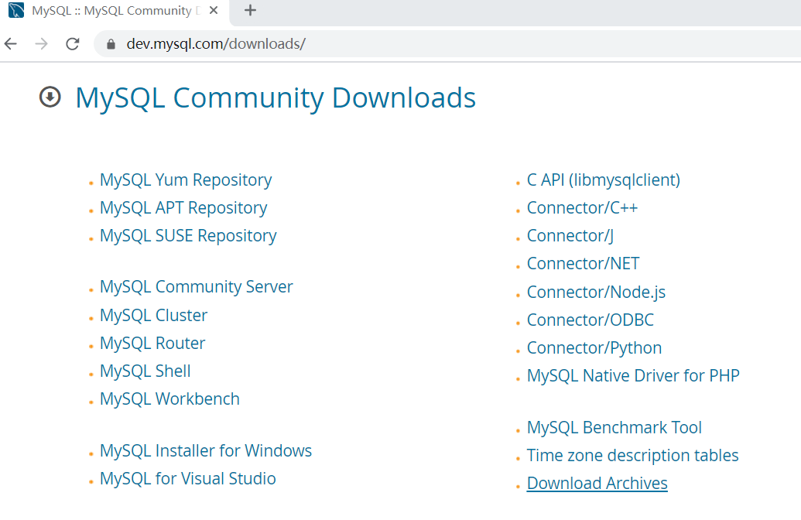

- 第五步：点击上图“MySQL Community Server”

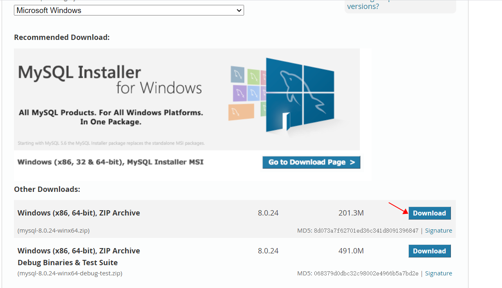

- 第六步：点击上图第1个“Download”


- 第七步：点击上图“No thanks, just start my download.”开始下载，直到下载完毕。


# MySQL安装与配置

---

- 将下载的zip压缩包解压，我这里直接解压到C盘的根目录下


mysql的根目录为：C:\mysql-8.0.24-winx64

- 将C:\mysql-8.0.24-winx64\bin目录配置到环境变量path当中

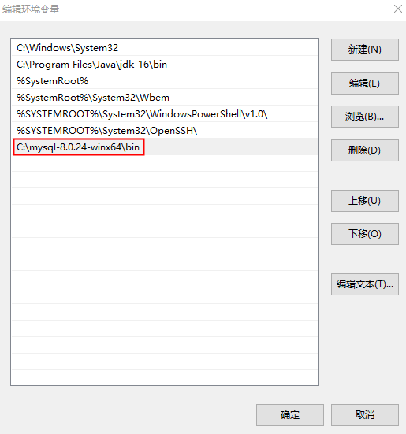

- 初始化data目录

使用管理员身份打开dos命令窗口（按win键，输入cmd，点击管理员身份运行）

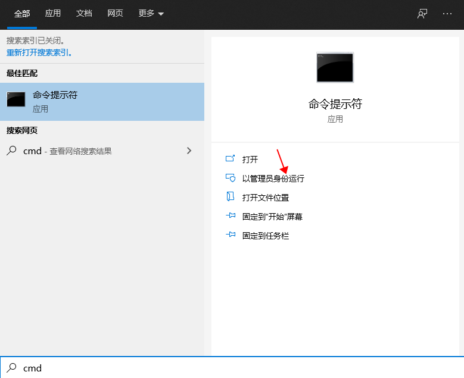

cd命令切换到mysql的bin目录下，执行 `mysqld --initialize --console` 进行data目录初始化，此时会在控制台生成一个随机密码，下图红框中就是随机密码

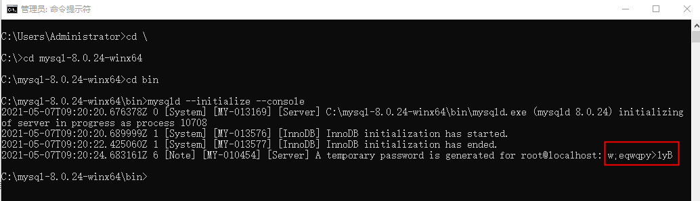

技巧：左键选中密码，直接点击右键，此时密码已经复制到剪贴板中了，

然后随便找一个文件，将密码粘贴到文件中保存起来。

- 安装MySQL服务：cd命令切换到bin目录下，执行命令mysqld -install

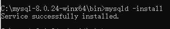

- 查看mysql服务名称：此电脑-右键-管理-服务和应用程序-服务-找MySQL服务，如下图mysql服务名称：MySQL


- 启动MySQL服务：net start mysql，注意start后面是mysql服务的名称

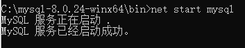

停止mysql服务的命令：net stop mysql

注意：启停mysql服务也可以在上一步的图中点击右键进行启停服务。

- 登录mysql：输入mysql -uroot -p，然后回车，输入刚才的随机密码，然后回车，看到下图表示成功登录mysql


- 修改MySQL的root账户密码：ALTER USER 'root'@'localhost' IDENTIFIED WITH mysql_native_password BY '新密码';
- **注意：mysql8.4之后的版本需要这样：ALTER USER 'root'@'localhost' IDENTIFIED WITH caching_sha2_password BY '123456';**


- 使用新密码登录mysql

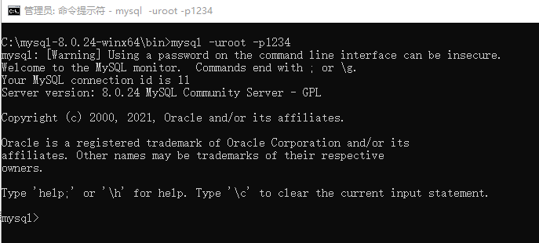


# MySQL卸载

---

- 停止mysql的服务

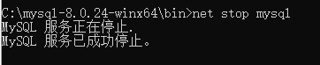

- 删除mysql服务

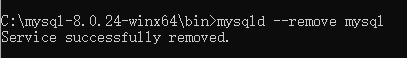

- 删除mysql的目录

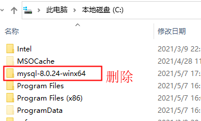

# 登录MySQL

---

## 本地登录

- 如果mysql的服务是启动的，打开dos命令窗口，输入：mysql -uroot -p，回车，然后输入root账户的密码

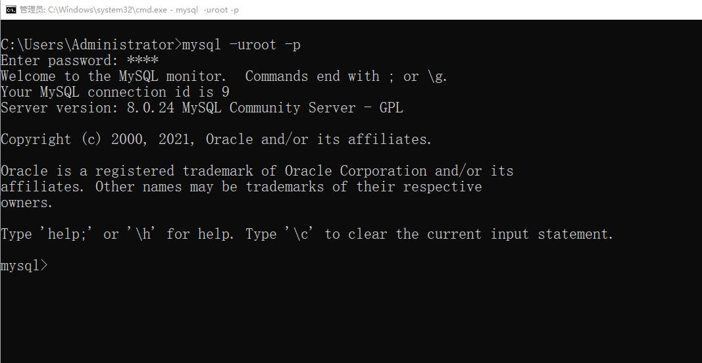

解释“mysql -uroot -p”：

mysql是一个命令，在bin目录下，对应的命令文件是mysql.exe，如果将bin目录配置到环境

变量path中，才可以在以上位置使用该命令。

-uroot 表示登录的用户是root，u实际上是user单词的首字母。

-p 表示登录时使用密码，p实际上是password单词的首字母。

- 也可以将密码以明文的形式写到-p后面，这样做可能会导致你的密码泄露


## 远程登录

- 假设mysql安装在A机器上，现在你要在B机器上连接mysql数据库，此时需要使用远程登录，远程登录时加上远程机器的ip地址即可


-h中的h实际上是host单词的首字母。在-h后面的是远程计算机的ip地址。

127.0.0.1是计算机默认的本机IP地址。

127.0.0.1又可以写作：localhost，他们是等效的。

注意：mysql默认情况下root账户是不支持远程登录的，其实这是一种安全策略，

为了保护root账户的安全。如果希望root账户支持远程登录，这是需要进行设置的。

第一步：root身份登录mysql

第二步：use mysql;

第三步：update user set host='%' where user='root';

第四步：flush privileges;

# MySQL命令行基本命令

---

1. 列出当前数据库管理系统中有哪些数据库。

```sql
show databases;
```

1. 创建数据库，起名test。

```sql
create database test;
```

1. 使用test数据库。

```sql
use test;
```

1. 查看当前用的是哪个数据库。

```sql
select database();
```

1. 查看当前数据库中有哪些表。

```sql
show tables;
```

1. 删除数据库test。

```sql
drop database test;
```

1. 退出mysql
  1. exit
  2. quit
  3. ctrl + c
2. 查看当前mysql版本

```sql
select version();
```

还可以使用mysql.exe命令来查看版本信息（在没有登录mysql之前使用）：mysql --version

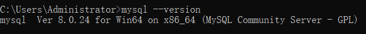


# 数据库表的概述

---

| name | age | gender |
| --- | --- | --- |
| 张三 | 20 | 男 |
| 李四 | 22 | 女 |

- 以上就是数据库表格的直观展示形式。
- 表格英文单词table。
- 表是数据库存储数据的基本单元，数据库存储数据的时候，是将数据存储在表对象当中的。为什么将数据存储在表中呢？因为表存储数据非常直观。
- 任何一张表都有行和列：
  - 行：记录（一行就是一条数据）
  - 列：字段（name字段、age字段、gender字段）
- 每个字段包含以下属性：
  - 字段名：name、age、gender都是字段的名字
  - 字段的数据类型：每个字段都有数据类型，比如：字符类型、数字类型、日期类型
  - 字段的数据长度：每个字段有可能会有长度的限制
  - 字段的约束：比如某些字段要求该字段下的数据不能重复、不能为空等，用来保证表格中数据合法有效

# 初始化测试数据

---

为了方便后面内容的学习，老师提前准备了表以及表中的测试数据，以下是建表并且初始化数据的sql脚本

```sql
DROP TABLE IF EXISTS EMP;
DROP TABLE IF EXISTS DEPT;
DROP TABLE IF EXISTS SALGRADE;

CREATE TABLE DEPT(DEPTNO int(2) not null ,
        DNAME VARCHAR(14) ,
        LOC VARCHAR(13),
        primary key (DEPTNO)
);
CREATE TABLE EMP(EMPNO int(4)  not null ,
        ENAME VARCHAR(10),
        JOB VARCHAR(9),
        MGR INT(4),

        HIREDATE DATE  DEFAULT NULL,
        SAL DOUBLE(7,2),
        COMM DOUBLE(7,2),
        primary key (EMPNO),
        DEPTNO INT(2) 
);

CREATE TABLE SALGRADE( GRADE INT,
        LOSAL INT,
        HISAL INT
);

INSERT INTO DEPT ( DEPTNO, DNAME, LOC ) VALUES ( 10, 'ACCOUNTING', 'NEW YORK'); 
INSERT INTO DEPT ( DEPTNO, DNAME, LOC ) VALUES ( 20, 'RESEARCH', 'DALLAS'); 
INSERT INTO DEPT ( DEPTNO, DNAME, LOC ) VALUES ( 30, 'SALES', 'CHICAGO'); 
INSERT INTO DEPT ( DEPTNO, DNAME, LOC ) VALUES ( 40, 'OPERATIONS', 'BOSTON'); 
 
INSERT INTO EMP ( EMPNO, ENAME, JOB, MGR, HIREDATE, SAL, COMM,DEPTNO ) VALUES ( 7369, 'SMITH', 'CLERK', 7902,  '1980-12-17', 800, NULL, 20); 
INSERT INTO EMP ( EMPNO, ENAME, JOB, MGR, HIREDATE, SAL, COMM,DEPTNO ) VALUES ( 7499, 'ALLEN', 'SALESMAN', 7698,  '1981-02-20', 1600, 300, 30); 
INSERT INTO EMP ( EMPNO, ENAME, JOB, MGR, HIREDATE, SAL, COMM,DEPTNO ) VALUES ( 7521, 'WARD', 'SALESMAN', 7698,  '1981-02-22', 1250, 500, 30); 
INSERT INTO EMP ( EMPNO, ENAME, JOB, MGR, HIREDATE, SAL, COMM,DEPTNO ) VALUES ( 7566, 'JONES', 'MANAGER', 7839,  '1981-04-02', 2975, NULL, 20); 
INSERT INTO EMP ( EMPNO, ENAME, JOB, MGR, HIREDATE, SAL, COMM,DEPTNO ) VALUES ( 7654, 'MARTIN', 'SALESMAN', 7698,  '1981-09-28', 1250, 1400, 30); 
INSERT INTO EMP ( EMPNO, ENAME, JOB, MGR, HIREDATE, SAL, COMM,DEPTNO ) VALUES ( 7698, 'BLAKE', 'MANAGER', 7839,  '1981-05-01', 2850, NULL, 30); 
INSERT INTO EMP ( EMPNO, ENAME, JOB, MGR, HIREDATE, SAL, COMM,DEPTNO ) VALUES ( 7782, 'CLARK', 'MANAGER', 7839,  '1981-06-09', 2450, NULL, 10); 
INSERT INTO EMP ( EMPNO, ENAME, JOB, MGR, HIREDATE, SAL, COMM,DEPTNO ) VALUES ( 7788, 'SCOTT', 'ANALYST', 7566,  '1987-04-19', 3000, NULL, 20); 
INSERT INTO EMP ( EMPNO, ENAME, JOB, MGR, HIREDATE, SAL, COMM,DEPTNO ) VALUES ( 7839, 'KING', 'PRESIDENT', NULL,  '1981-11-17', 5000, NULL, 10); 
INSERT INTO EMP ( EMPNO, ENAME, JOB, MGR, HIREDATE, SAL, COMM,DEPTNO ) VALUES ( 7844, 'TURNER', 'SALESMAN', 7698,  '1981-09-08', 1500, 0, 30); 
INSERT INTO EMP ( EMPNO, ENAME, JOB, MGR, HIREDATE, SAL, COMM,DEPTNO ) VALUES ( 7876, 'ADAMS', 'CLERK', 7788,  '1987-05-23', 1100, NULL, 20); 
INSERT INTO EMP ( EMPNO, ENAME, JOB, MGR, HIREDATE, SAL, COMM,DEPTNO ) VALUES ( 7900, 'JAMES', 'CLERK', 7698,  '1981-12-03', 950, NULL, 30); 
INSERT INTO EMP ( EMPNO, ENAME, JOB, MGR, HIREDATE, SAL, COMM,DEPTNO ) VALUES ( 7902, 'FORD', 'ANALYST', 7566,  '1981-12-03', 3000, NULL, 20); 
INSERT INTO EMP ( EMPNO, ENAME, JOB, MGR, HIREDATE, SAL, COMM,DEPTNO ) VALUES ( 7934, 'MILLER', 'CLERK', 7782,  '1982-01-23', 1300, NULL, 10); 
 
INSERT INTO SALGRADE ( GRADE, LOSAL, HISAL ) VALUES ( 1, 700, 1200); 
INSERT INTO SALGRADE ( GRADE, LOSAL, HISAL ) VALUES ( 2, 1201, 1400); 
INSERT INTO SALGRADE ( GRADE, LOSAL, HISAL ) VALUES ( 3, 1401, 2000); 
INSERT INTO SALGRADE ( GRADE, LOSAL, HISAL ) VALUES ( 4, 2001, 3000); 
INSERT INTO SALGRADE ( GRADE, LOSAL, HISAL ) VALUES ( 5, 3001, 9999); 
commit;
```

- 什么是sql脚本：文件名是.sql，并且该文件中编写了大量的SQL语句，执行sql脚本程序就相当于批量执行SQL语句。
- 你入职的时候，项目一般都是进展了一部分，多数情况下你进项目组的时候数据库的表以及数据都是有的，项目经理第一天可能会给你一个较大的sql脚本文件，你需要执行这个脚本文件来初始化你的本地数据库。（当然，也有可能数据库是共享的。）
- 创建文件：test.sql，把以上SQL语句全部复制到sql脚本文件中。
- 执行SQL脚本文件，初始化数据库
  - 第一步：命令窗口登录mysql
  - 第二步：创建数据库test（如果之前已经创建就不需要再创建了）：create database test;
  - 第三步：使用数据库test：use test;
  - 第四步：source命令执行sql脚本，注意：source命令后面是sql脚本文件的绝对路径。
  - 第五步：查看是否初始化成功，执行：show tables;
- 使用其他的mysql客户端工具也可以执行sql脚本，比如navicat。使用source命令执行sql脚本的优点：**可支持大文件**。


# 熟悉测试数据

---

emp dept salgrade三张表分别存储什么信息

- emp：员工信息
- dept：部门信息
- salgrade：工资等级信息

查看表结构：desc或describe，语法格式：desc或describe +表名

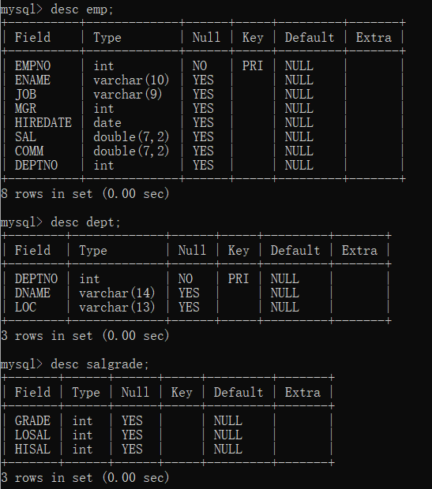

以上的结果展示的不是表中的数据，而是表的结构。

- Field是字段名
- Type是这个字段的数据类型
- Null是这个字段是否允许为空
- Key是这个字段是否为主键或外键
- Default是这个字段的默认值

对以上表结构进行解释说明：

- emp表
  - empno：员工编号，int类型（整数），不能为空，主键（主键后期学习约束时会进行说明）
  - ename：员工姓名，varchar类型（字符串）
  - job：工作岗位，varchar类型
  - mgr：上级领导编号，int类型
  - hiredate：雇佣日期，date类型（日期类型）
  - sal：月薪，double类型（带有浮点的数字）
  - comm：补助津贴，double类型
  - deptno：部门编号，int类型
- dept表
  - deptno：部门编号，int类型，主键
  - dname：部门名称，varchar类型
  - loc：位置，varchar类型
- salgrade表
  - grade：等级，int类型
  - losal：最低工资，int类型
  - hisal：最高工资，int类型

对于以上表结构要提前了解，后面学习的内容需要你马上反应出：哪个字段是什么意思。

查看一下表中的数据，来加深一下印象（以下SQL语句会在后面课程中学习）：

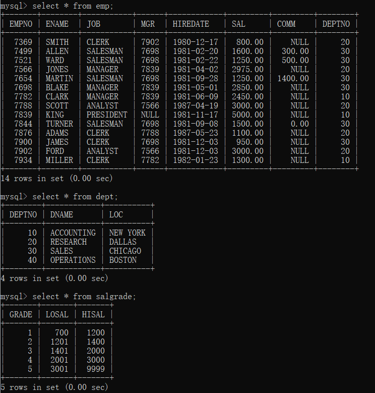


# 简单查询

---

查询是SQL语言的核心，用于表达SQL查询的select查询命令是功能最强也是最为复杂的SQL语句，它的作用就是从数据库中检索数据，并将查询结果返回给用户。 select语句由：select子句(查询内容)、from子句(查询对象)、where子句(查询条件)、order by子句(排序方式)、group by子句(分组方式)等组成。查询语句属于SQL语句中的DQL语句，是所有SQL语句中最为复杂也是最重要的语句，所以必须掌握。接下来我们先从简单查询语句开始学习。

## 查一个字段

---

查询一个字段说的是：一个表有多列，查询其中的一列。

语法格式：select 字段名 from 表名;

- select和from是关键字，不能随便写
- **一条SQL语句必须以“;”结尾**
- **对于SQL语句来说，大小写都可以**
- 字段名和表名属于标识符，按照表的实际情况填写，不知道字段名的，可以使用desc命令查看表结构

案例1：查询公司中所有员工编号

```sql
select empno from emp; 
```

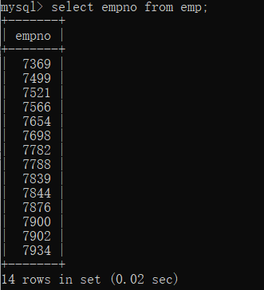

案例2：查询公司中所有员工姓名

```sql
SELECT ENAME FROM EMP;
```

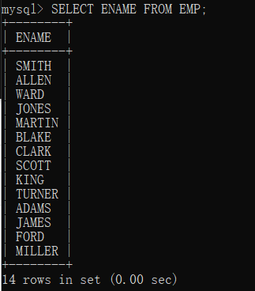

在mysql命令行客户端中，sql语句没有分号是不会执行的：

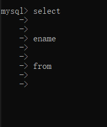

末尾加上“;”就执行了：

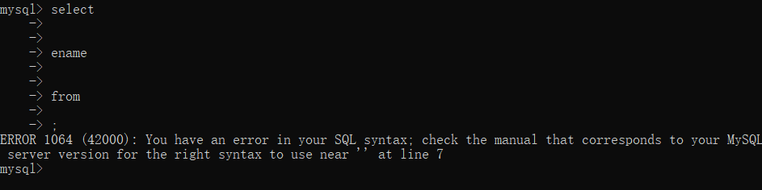

以上sql虽然以分号结尾之后执行了，但是报错了，错误信息显示：语法错误。

假设一个SQL语句在书写过程中出错了，怎么终止这条SQL呢？\c

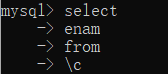

- [ ] 任务1：查询所有部门名称。
- [ ] 任务2：查询所有薪资等级。


## 查多个字段

---

查询多个字段时，在字段名和字段名之间添加“,”即可。

语法格式：select 字段名1,字段名2,字段名3 from 表名;

案例1：查询员工编号以及员工姓名。

```sql
select empno, ename from emp;
```

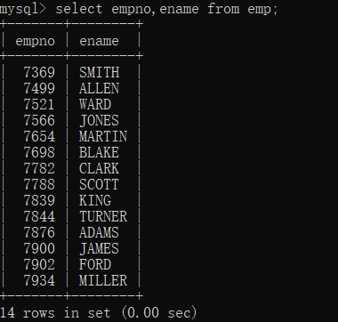

字段的前后顺序无所谓（只是显示结果列的时候顺序变了）：

```sql
select ename, empno from emp;
```

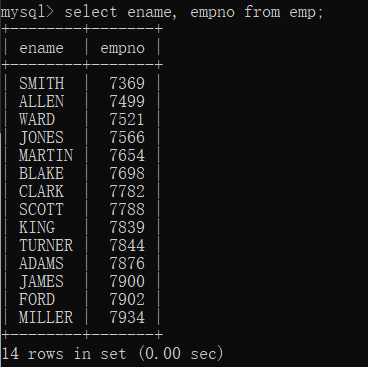

- [ ] 任务1：查询部门编号、部门名称以及位置。
- [ ] 任务2：查询员工的名字以及工作岗位。

## 查所有字段

---

查询所有字段的可以将每个字段都列出来查询，也可以采用“*”来代表所有字段

案例1：查询员工的所有信息

```sql
select * from emp;
```

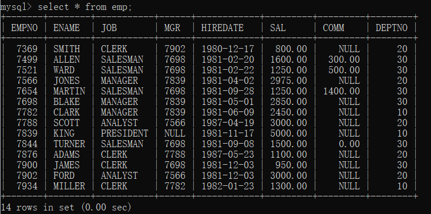

案例2：查询所有部门信息

```sql
select * from dept;
```

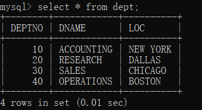

采用“*”进行查询存在的缺点：

- select * from dept; 在执行的时候会被解析为 select DEPTNO, DNAME, LOC from dept; 再执行，所以这种效率方面弱一些。
- 采用“*”的可读性较差，通过“*”很难看出都有哪些具体的字段。

什么时候使用“*”？

- 这个SQL语句不在项目编码中使用，如果平时自己想快速查看表中所有数据的话，这种写法还是很给力的。

- [ ] 任务1：查询所有的薪资等级以及每个薪资等级的最低工资和最高工资。


## 查询时字段可参与数学运算

---

在进行查询操作的时候，字段是可以参与数学运算的，例如加减乘除等。

案例1：查询每个员工的月薪

```sql
select ename, sal from emp;
```

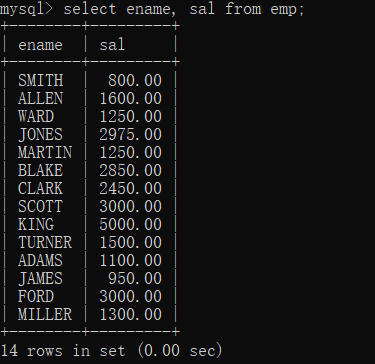

案例2：查询每个员工的年薪（月薪 * 12）

```sql
select ename, sal * 12 from emp;
```

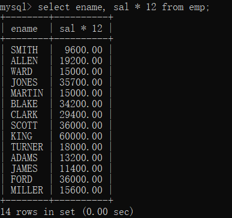

- [ ] 任务1：查询每个员工月薪加1000之后的月薪
- [ ] 任务2：查询每个员工月薪加1000之后的年薪


## 查询时字段可起别名

---

我们借用一下之前的SQL语句

```sql
select ename, sal * 12 from emp;
```


以上的查询结果列名“sal * 12”可读性较差，是否可以给查询结果的列名进行重命名呢？

### as关键字

- 使用as关键字

```sql
select ename, sal * 12 as yearsal from emp;
```

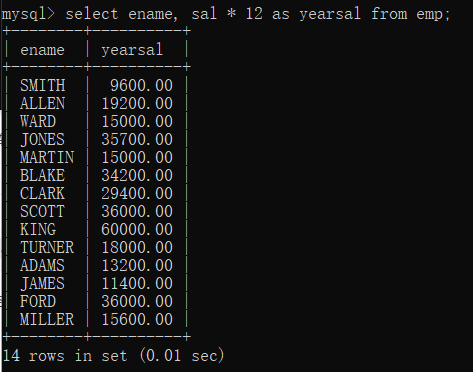

通过as关键字起别名后，查询结果列显示yearsal，可读性增强。

### 省略as关键字

- 其实as关键字可以省略，只要使用空格即可

```sql
select ename, sal * 12 yearsal from emp;
```

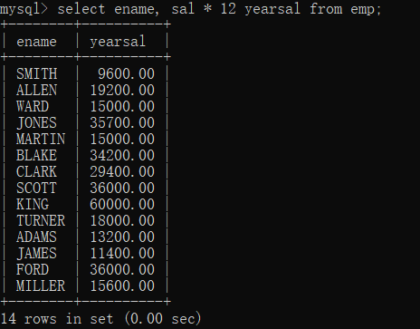

- 通过以上测试，得知as可以省略，可以使用空格代替as，但如果别名中有空格呢？

### 别名中有空格

```sql
select ename, sal * 12 year sal from emp;
```

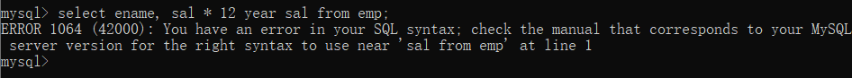

可以看出，执行报错了，说语法有问题，这是为什么？分析一下：SQL语句编译器在检查该语句的时候，在year后面遇到了空格，会继续找from关键字，但year后面不是from关键字，所以编译器报错了。怎么解决这个问题？记住：如果别名中有空格的话，可以将这个别名使用双引号或者单引号将其括起来。

```sql
select ename, sal * 12 "year sal" from emp;
select ename, sal * 12 'year sal' from emp;
```

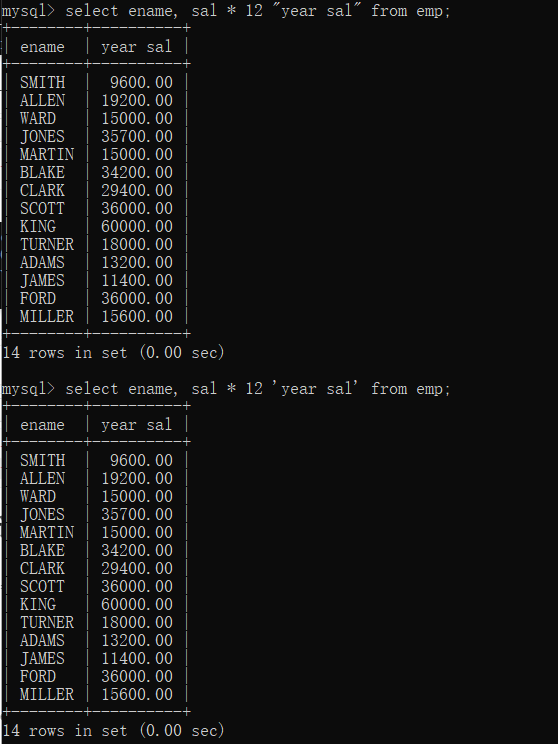

**在mysql中，字符串既可以使用双引号也可以使用单引号，但还是建议使用单引号，因为单引号属于标准SQL。**

### 别名中有中文

- 如果别名采用中文呢？

```sql
select ename, sal * 12 年薪 from emp;
```

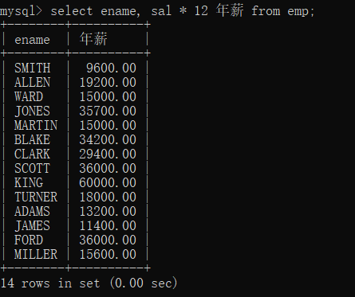

**别名是中文是可以的，但是对于低版本的mysql来说会报错，需要添加双引号或单引号。**我们当前使用的mysql版本是：8.0.24

- [ ] 任务：查询所有员工的信息，要求每个字段名采用中文显示。


# 条件查询

---

通常在进行查询操作的时候，都是查询符合某些条件的数据，很少将表中所有数据都取出来。怎么取出表的部分数据？需要在查询语句中添加条件进行数据的过滤。常见的过滤条件如下：

| **条件** | **说明** |
| --- | --- |
| = | 等于 |
| <>或!= | 不等于 |
| >= | 大于等于 |
| <= | 小于等于 |
| > | 大于 |
| < | 小于 |
| between...and... | 等同于 >= and <= |
| is null | 为空 |
| is not null | 不为空 |
| <=> | 安全等于（可读性差，很少使用了）。 |
| and 或 && | 并且 |
| or 或 |   |
| in | 在指定的值当中 |
| not in | 不在指定的值当中 |
| like | 模糊查询 |

## 条件查询语法格式

---

```sql
select 
  ...
from
  ...
where
  过滤条件;
```

过滤条件放在where子句当中，以上语句的执行顺序是：

```plaintext
第一步：先执行from

第二步：再通过where条件过滤

第三步：最后执行select，查询并将结果展示到控制台
```


## 等于、不等于

---

### 等于 =

判断等量关系，支持多种数据类型，比如：数字、字符串、日期等。

案例1：查询月薪3000的员工编号及姓名

```sql
select 
  empno,ename
from
  emp
where
  sal = 3000;
```

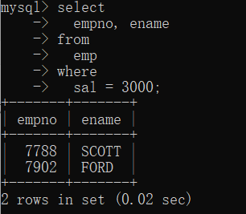

案例2：查询员工FORD的岗位及月薪

```sql
select
        job, sal
from
        emp
where
        ename = 'FORD';
```

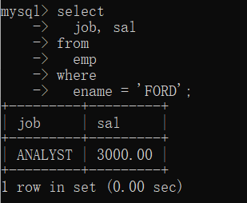

存储在表emp中的员工姓名是FORD，全部大写，如果在查询的时候，写成全部小写会怎样呢？

```sql
select
        job, sal
from
        emp
where
        ename = 'ford';
```

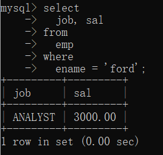

通过测试发现，即使写成小写ford，也是可以查询到结果的，**不过这里需要注意的是：在Oracle数据库当中是查询不到数据的，Oracle的语法要比MySQL的语法严谨。对于SQL语句本身来说是不区分大小写的，但是对于表中真实存储的数据，大写A和小写a还是不一样的，这一点Oracle做的很好。MySQL的语法更随性。另外在Oracle当中，字符串是必须使用单引号括起来的，但在MySQL当中，字符串可以使用单引号，也可以使用双引号**，如下：

```sql
select
        job, sal
from
  emp
where
  ename = "FORD";
```

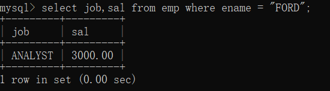

案例3：查询岗位是MANAGER的员工编号及姓名

```sql
select
  empno, ename
from
  emp
where
  job = 'MANAGER';
```

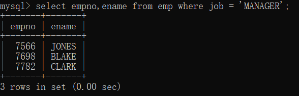

- [ ] 任务：查询工资级别是1的最低工资以及最高工资


### 不等于 <> 或 !=

判断非等量关系，支持字符串、数字、日期类型等。不等号有两种写法，第一种<>，第二种!=，第二种写法和Java程序中的不等号相同，第一种写法比较诡异，不过也很好理解，比如<>3，表示小于3、大于3，就是不等于3。你get到了吗？

案例1：查询工资不是3000的员工编号、姓名、薪资

```sql
select
  empno,ename,sal
from
  emp
where
  sal <> 3000;
```

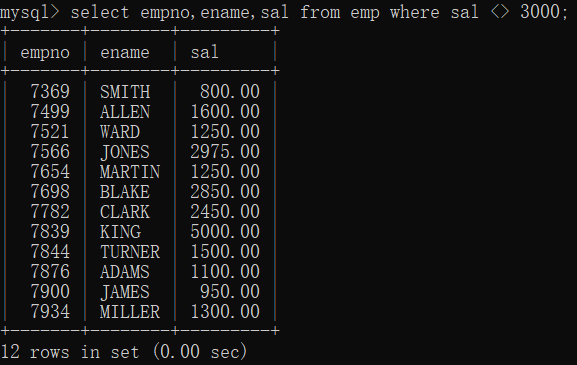

案例2：查询工作岗位不是MANAGER的员工姓名和岗位

```sql
select
  ename,job
from
        emp
where
        job <> 'MANAGER';
```

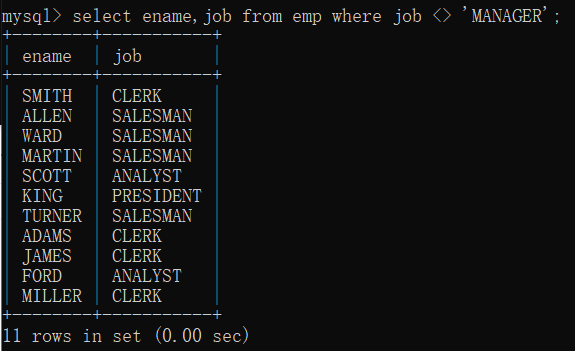

- [ ] 任务：查询不在部门编号为10的部门工作的员工信息


## 大于、大于等于、小于、小于等于

---

### 大于 >

案例：找出薪资大于3000的员工姓名、薪资

```sql
select 
  ename, sal
from
  emp
where
  sal > 3000;
```

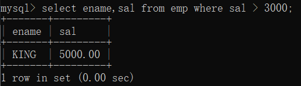

### 大于等于 >=

案例：找出薪资大于等于3000的员工姓名、薪资

```sql
select 
  ename, sal
from
  emp
where
  sal >= 3000;
```

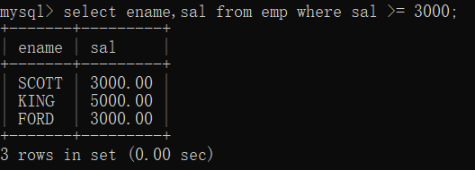

### 小于 <

案例：找出薪资小于3000的员工姓名、薪资

```sql
select 
  ename, sal
from
  emp
where
  sal < 3000;
```

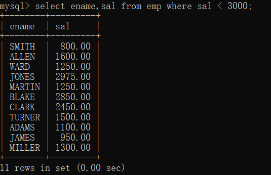

### 小于等于 <=

案例：找出薪资小于等于3000的员工姓名、薪资

```sql
select 
  ename, sal
from
  emp
where
  sal <= 3000;
```

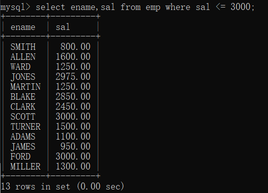


## and

---

and表示并且，还有另一种写法：&&

案例：找出薪资大于等于3000并且小于等于5000的员工姓名、薪资。

```sql
select
  ename,sal
from
  emp
where
  sal >= 3000 and sal <= 5000;
```

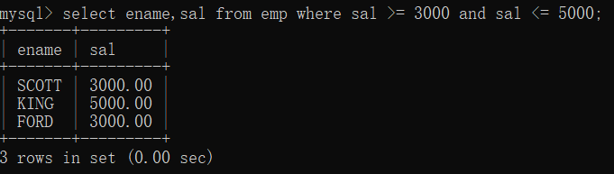

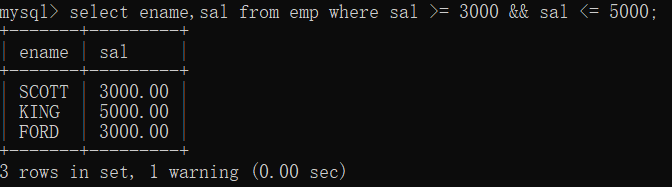

- [ ] 任务：找出工资级别为2~4（包含2和4）的最低工资和最高工资。


## or

---

or表示或者，还有另一种写法：||

案例：找出工作岗位是MANAGER和SALESMAN的员工姓名、工作岗位

```sql
select 
  ename, job
from
  emp
where
  job = 'MANAGER' or job = 'SALESMAN';
```

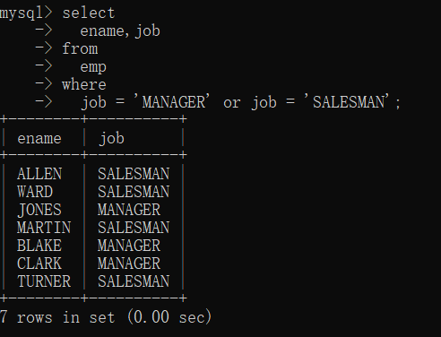

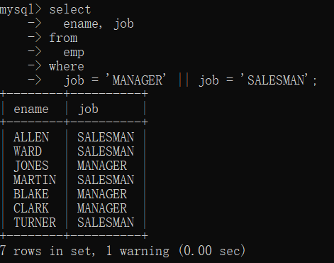

注意：这个题目描述中有这样一句话：MANAGER和SALESMAN，有的同学一看到“和”，就直接使用“and”了，因为“和”对应的英文单词是“and”，如果是这样的话，就大错特错了，因为and表示并且，使用and表示工作岗位既是MANAGER又是SALESMAN的员工，这样的员工是不存在的，因为每一个员工只有一个岗位，不可能同时从事两个岗位。所以使用and是查询不到任何结果的。如下

```sql
select 
  ename, job
from
  emp
where
  job = 'MANAGER' and job = 'SALESMAN';
```

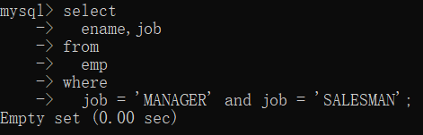

- [ ] 任务：查询20和30部门的员工信息。


## and和or的优先级问题

---

and和or同时出现时，and优先级较高，会先执行，如果希望or先执行，这个时候需要给or条件添加小括号。另外，以后遇到不确定的优先级时，可以通过添加小括号的方式来解决。对于优先级问题没必要记忆。

案例：找出薪资小于1500，并且部门编号是20或30的员工姓名、薪资、部门编号。

先来看一下错误写法：

```sql
select
  ename,sal,deptno
from
  emp
where
  sal < 1500 and deptno = 20 or deptno = 30;
```

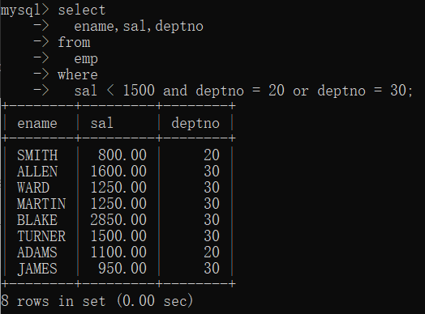

认真解读题意得知：薪资小于1500是一个大前提，要找出的是薪资小于1500的，满足这个条件的前提下，再找部门编号是20或30的，显然以上的运行结果中出现了薪资为1600的，为什么1600的会出现呢？这是因为“sal < 1500 and deptno = 20”结合在一起了，“depnto = 30”成了一个独立的条件。会导致部门编号为30的所有员工全部查询出来。我们应该让“deptno = 20 or deptno = 30”结合在一起，正确写法如下：

```sql
select
  ename,sal,deptno
from
  emp
where
  sal < 1500 and (deptno = 20 or deptno = 30);
```

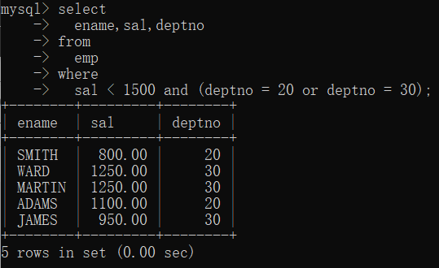

- [ ] 任务：找出薪资小于1500的，并且工作岗位是CLERK和SALESMAN的员工姓名、薪资、岗位。


## between...and...

---

between...and...等同于 >= and <=

做区间判断的，包含左右两个边界值。

它支持数字、日期、字符串等数据类型。

between...and...在使用时一定是**左小右大**。左大右小时无法查询到数据。

between...and... 和 >= and <=只是在写法结构上有区别，执行原理和效率方面没有区别。

案例：找出薪资在1600到3000的员工姓名、薪资

```sql
select 
  ename,sal
from
  emp
where
        sal between 1600 and 3000;
```

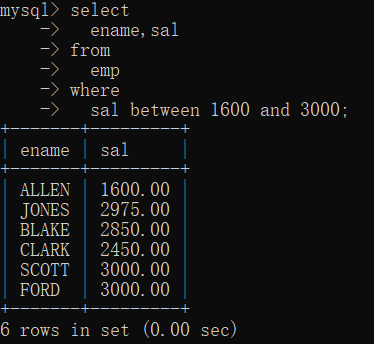

采用左大右小的方式：

```sql
select 
  ename,sal
from
  emp
where
        sal between 3000 and 1600;
```


没有查询到任何数据，所以在使用的时候一定要注意：**左小右大**。

- [ ] 任务：查询在1982-01-23到1987-04-19之间入职的员工


注意：以上SQL语句中日期需要加上单引号。


## is null、is not null

---

判断某个数据是否为null，不能使用等号，只能使用 is null

判断某个数据是否不为null，不能使用不等号，只能使用 is not null

在数据库中null不是一个值，不能用等号和不等号衡量，null代表什么也没有，没有数据，没有值

### is null

案例1：找出津贴为空的员工姓名、薪资、津贴。

```sql
select
  ename,sal,comm
from
  emp
where
  comm is null;
```


我们使用等号，尝试一下：

```sql
select
  ename,sal,comm
from
  emp
where
  comm = null;
```


查询不到任何数据，所以判断是否为空，不能用等号。

### is not null

案例2：找出津贴不为空的员工姓名、薪资、津贴

```sql
select
  ename,sal,comm
from
  emp
where
  comm is not null;
```


## in、not in

---

### in

job in('MANAGER','SALESMAN','CLERK') 等同于 job = 'MANAGER' or job = 'SALESMAN' or job = 'CLERK'

sal in(1600, 3000, 5000) 等同于 sal = 1600 or sal = 3000 or sal = 5000

in后面有一个小括号，小括号当中有多个值，值和值之间采用逗号隔开

sal in(1500, 5000)，需要注意的是：这个并不是说薪资在1500到5000之间，in不代表区间，表示sal是1500的和sal是5000的

案例1：找出工作岗位是MANAGER和SALESMAN的员工姓名、薪资、工作岗位

第一种：使用or

```sql
select
  ename,sal,job
from
  emp
where
  job = 'MANAGER' or job = 'SALESMAN';
```


第二种：使用in

```sql
select
  ename,sal,job
from
  emp
where
  job in('MANAGER', 'SALESMAN');
```


案例2：找出薪资是1500/1600/3000的员工姓名、工作岗位

```sql
select
  ename,job
from
  emp
where
  sal in(1500, 1600, 3000);
```


- [ ] 任务：找出部门编号是10和20的员工编号、姓名。（要求使用两种方案）

### not in

job not in('MANAGER','SALESMAN') 等同于 job <> 'MANAGER' and job <> 'SALESMAN'

sal not in(1600, 5000) 等同于 sal <> 1600 and sal <> 5000

案例：找出工作岗位不是MANAGER和SALESMAN的员工姓名、工作岗位

第一种：使用and

```sql
select 
  ename,job
from
  emp
where
  job <> 'MANAGER' and job <> 'SALESMAN';
```


第二种：使用not in

```sql
select 
  ename,job
from
  emp
where
  job not in('MANAGER', 'SALESMAN');
```


- [ ] 任务：找出薪资不是1600和3000的员工姓名、薪资。


### in、not in 与 NULL

先来看一下emp表中的数据

```sql
select * from emp;
```


通过表中数据观察到，有4个员工的津贴不为NULL，剩下10个员工的津贴都是NULL。

写这样一条SQL语句：

```sql
select * from emp where comm in(NULL, 300);
```


为什么以上执行结果只有一条记录呢？分析一下：

首先你要知道in的执行原理实际上是采用=和or的方式，也就是说，以上SQL语句实际上是：

```sql

select * from emp where comm = NULL or comm = 300;
```

其中NULL不能用等号=进行判断，所以comm = NULL结果是false，然而中间使用的是or，所以comm = NULL被忽略了。所以查询结果就以上一条数据。

通过以上的测试得知：**in是自动忽略NULL的**。

再写这样一条SQL语句：

```sql
select * from emp where comm not in(NULL, 300);
```


以上的执行结果奇怪了，为什么没有查到任何数据呢？我们分析一下：

首先你要知道not in的执行原理实际上是采用<>和and的方式，也就是说，以上SQL语句实际上是：

```sql
select * from emp where comm <> NULL and comm <> 300;
```

其中NULL的判断不能使用<>，所以comm <> NULL结果是false，由于后面是and，and表示并且，comm <> NULL已经是false了，所以and右边的就没必要运算了，comm <> NULL and comm <> 300的整体运算结果就是false。所以查询不到任何数据。

通过以上测试得知，**not in是不会自动忽略NULL的**，所以在使用not in的时候一定要提前过滤掉NULL。

## in和or的效率比拼

---

在MySQL当中，如何统计一个SQL语句的执行时长？

- 可以使用这个命令：show profiles; 这个命令可以查看在mysql中执行的所有SQL以及命令的耗费时长。
- show profiles; 是在mysql5.0.37之后添加的。所以要确保你的mysql版本没问题。
- 如何开启时长统计功能：set profiling = 1;
- 查看时长统计功能是否开启：show variables like '%pro%';
- 查看每条SQL的耗时：show profiles;
- 查看其中某条SQL耗时明细：show profile for query query_id;
- 查看最新一条SQL的耗时明细：show profile;
- 查看cpu，io等信息：show profile block io, cpu for query query_id;

or的效率为O(n)，而in的效率为O(log n), 当n越大的时候效率相差越明显（**也就是说数据量越大的时候，in的效率越高**）。以下是测试过程：

第一步，创建测试表，并生成测试数据，测试数据为1000万条记录。数据库中关闭了query cache，因此数据库缓存不会对查询造成影响。具体的代码如下：

```sql
#创建测试的test表
DROP TABLE IF EXISTS test; 
CREATE TABLE test( 
    ID INT(10) NOT NULL, 
    `Name` VARCHAR(20) DEFAULT '' NOT NULL, 
    PRIMARY KEY( ID ) 
)ENGINE=INNODB DEFAULT CHARSET utf8; 

#创建生成测试数据的存储过程
DROP PROCEDURE IF EXISTS pre_test; 
DELIMITER //
CREATE PROCEDURE pre_test() 
BEGIN 
DECLARE i INT DEFAULT 0; 
SET autocommit = 0; 
WHILE i<10000000 DO 
INSERT INTO test ( ID,`Name` ) VALUES( i, CONCAT( 'Carl', i ) ); 
SET i = i+1; 
IF i%2000 = 0 THEN 
COMMIT; 
END IF; 
END WHILE; 
END; //
DELIMITER ;

#执行存储过程生成测试数据
CALL pre_test();
```

以上SQL看不懂没关系，先执行它，进行数据初始化准备工作。

第二步：分三种情况进行测试，分别是：

第1种情况：in和or所在列为主键的情形。

第2种情况：in和or所在列创建有索引的情形。

第3种情况：in和or所在列没有索引的情形。

每种情况又采用不同的in和or的数量进行测试。由于测试语句的数据量有4种情况，我这里就称为A组、B组、C组、D组，其中A组为3个值，B组为150个值，C组为300个值，D组为1000个值。具体的测试语句如下：

```sql
#A组
#in和or中有3条数据的情况
SELECT * FROM test WHERE id IN (1,23,48);
SELECT * FROM test WHERE id =1 OR id=23 OR id=48;

#B组
#in和or中有150条数据的情况
SELECT * FROM test WHERE id IN (59617932,98114476,89047409,26968186,56586105,35488201,53251989,18182139,71164231,57655852,7948544,60658339,50758185,66667117,34771253,68699137,27877290,44275282,1585444,71219424,90937482,83928635,24588528,81933207,9607562,12013895,84640278,85549596,53249244,8567444,85402877,15040223,54266509,17718135,91687882,22930500,94756430,66031097,13084573,18137443,89917778,46845456,43939093,35943480,18213703,46362815,49835919,83137546,2101409,74932951,11984477,93113331,77848222,68546065,33728734,90793684,44975642,61387237,52483391,97716233,49449060,22411182,30776331,60597240,6911731,45789095,62075344,8379933,97910423,86861971,81342386,93423963,83852896,18566482,22747687,51420625,75862064,26402882,93958561,85202979,97049369,67674725,9475653,92302381,78133617,49295001,36517340,81387142,15707241,60832834,93157830,64171432,58537826,70141767,7326025,36632075,9639624,8900056,99702164,35108945,87820933,57302965,16652391,41845132,62184393,70136913,79574630,32562398,94616790,61258220,73162018,81644480,19453596,97380163,1204733,33357040,84854495,13888863,49041868,89272326,38405345,571248,6349029,70755321,79307694,60619684,92624181,73135306,23279848,95612954,55845916,6223606,43836918,37459781,67969314,99398872,7616960,37189193,50151920,62881879,12364637,33204320,27135672,28441504,47373461,87967926,30631796,20053540,18735984,83406724);
SELECT * FROM test WHERE id=59617932 OR id=98114476 OR id=89047409 OR id=26968186 OR id=56586105 OR id=35488201 OR id=53251989 OR id=18182139 OR id=71164231 OR id=57655852 OR id=7948544 OR id=60658339 OR id=50758185 OR id=66667117 OR id=34771253 OR id=68699137 OR id=27877290 OR id=44275282 OR id=1585444 OR id=71219424 OR id=90937482 OR id=83928635 OR id=24588528 OR id=81933207 OR id=9607562 OR id=12013895 OR id=84640278 OR id=85549596 OR id=53249244 OR id=8567444 OR id=85402877 OR id=15040223 OR id=54266509 OR id=17718135 OR id=91687882 OR id=22930500 OR id=94756430 OR id=66031097 OR id=13084573 OR id=18137443 OR id=89917778 OR id=46845456 OR id=43939093 OR id=35943480 OR id=18213703 OR id=46362815 OR id=49835919 OR id=83137546 OR id=2101409 OR id=74932951 OR id=11984477 OR id=93113331 OR id=77848222 OR id=68546065 OR id=33728734 OR id=90793684 OR id=44975642 OR id=61387237 OR id=52483391 OR id=97716233 OR id=49449060 OR id=22411182 OR id=30776331 OR id=60597240 OR id=6911731 OR id=45789095 OR id=62075344 OR id=8379933 OR id=97910423 OR id=86861971 OR id=81342386 OR id=93423963 OR id=83852896 OR id=18566482 OR id=22747687 OR id=51420625 OR id=75862064 OR id=26402882 OR id=93958561 OR id=85202979 OR id=97049369 OR id=67674725 OR id=9475653 OR id=92302381 OR id=78133617 OR id=49295001 OR id=36517340 OR id=81387142 OR id=15707241 OR id=60832834 OR id=93157830 OR id=64171432 OR id=58537826 OR id=70141767 OR id=7326025 OR id=36632075 OR id=9639624 OR id=8900056 OR id=99702164 OR id=35108945 OR id=87820933 OR id=57302965 OR id=16652391 OR id=41845132 OR id=62184393 OR id=70136913 OR id=79574630 OR id=32562398 OR id=94616790 OR id=61258220 OR id=73162018 OR id=81644480 OR id=19453596 OR id=97380163 OR id=1204733 OR id=33357040 OR id=84854495 OR id=13888863 OR id=49041868 OR id=89272326 OR id=38405345 OR id=571248 OR id=6349029 OR id=70755321 OR id=79307694 OR id=60619684 OR id=92624181 OR id=73135306 OR id=23279848 OR id=95612954 OR id=55845916 OR id=6223606 OR id=43836918 OR id=37459781 OR id=67969314 OR id=99398872 OR id=7616960 OR id=37189193 OR id=50151920 OR id=62881879 OR id=12364637 OR id=33204320 OR id=27135672 OR id=28441504 OR id=47373461 OR id=87967926 OR id=30631796 OR id=20053540 OR id=18735984 OR id=83406724;


#C组
#in和or中有300条数据的情况
SELECT * FROM test WHERE id IN (37092877,94859722,74276090,8763830,38727241,95732954,93414819,55070016,3591352,73857925,92290525,15210159,83905516,54934589,83004136,31442143,6060569,22209206,27649629,11464943,77822402,28714780,10058522,62252663,13751461,38997875,47320577,64507359,36137908,54297630,97411161,56542672,22017966,55190708,70072386,24300664,93413617,23621629,74772508,62774612,43001947,46161388,85563006,70177147,63960440,18001207,81734850,10635060,6551152,54877885,44426798,73950635,18713144,21690065,82153543,26048520,79954773,22411093,97307339,74193176,1413532,88006544,36062746,24043946,17132007,95958217,26112542,27303972,17247403,56778979,60928031,69369613,90584759,86234538,41726089,25315005,27568726,25091624,15307765,83130887,42726438,75872353,18991223,47819224,75457713,54659391,54889687,65229322,17124556,38376043,1989975,45973571,48597804,58632319,43388664,97010450,94745635,13217373,40472912,40220510,58319808,48228318,48936085,86281500,65466706,96815281,11751559,50188155,76649755,35315411,20360954,17739218,10918461,51429591,41447650,65170472,26810295,80912347,17157209,75851858,61150903,4408208,61200404,6655467,66863737,51549112,61951371,14368308,14663119,8762531,31765056,30560647,41048147,95526521,94929131,56881239,79014587,62705983,15892901,66151473,98846144,79336731,35949035,26250054,97536202,40575682,6965144,91059908,97939380,30854180,1965937,17193347,76584991,70467475,6559872,97386594,13939914,20379091,84906436,45989448,17337270,4949675,96963499,12561575,77153018,73213368,68283041,33977574,86290771,70381017,73095085,454900,44614195,48171334,49603342,7430998,29447060,47643508,82393912,83169846,94256496,35275444,40024984,25377535,46571333,32510994,70927802,92017916,97302502,22859741,32726786,79071601,93977472,47409421,49311618,77366144,84838598,59401507,67110877,42075938,76962007,27984930,72982484,81363683,75017478,88624177,67220235,88290070,26311443,87681081,77960250,4996033,68448074,67762279,99650583,36766422,27233152,71436659,25428777,81481679,51070397,88351803,78755075,26783938,83610840,45650662,86305644,1717314,66176062,6507047,45084786,74402982,55661367,35721238,40424913,24294239,30223531,55367671,56777532,12604154,4870493,14750488,74039611,42549918,70710424,56247316,63002053,71117605,16510883,67417211,34057637,74185092,58603491,66987830,73584171,9178319,47096502,1554825,37756804,85168245,92690138,6120773,99586029,74696745,61803307,56631845,42681796,58965644,68703695,69660559,15879062,26713059,85186928,63117471,53007808,74576547,32187857,13701205,88645881,24507258,87453800,39624977,75862710,62419627,70804059,10461373,18265782,56366177,68093007,75760763,43931574,65808002,49148775,98019987,71183123,53762434,78851856,37767085,89124453,47566746);


SELECT * FROM test WHERE id=37092877 OR id=94859722 OR id=74276090 OR id=8763830 OR id=38727241 OR id=95732954 OR id=93414819 OR id=55070016 OR id=3591352 OR id=73857925 OR id=92290525 OR id=15210159 OR id=83905516 OR id=54934589 OR id=83004136 OR id=31442143 OR id=6060569 OR id=22209206 OR id=27649629 OR id=11464943 OR id=77822402 OR id=28714780 OR id=10058522 OR id=62252663 OR id=13751461 OR id=38997875 OR id=47320577 OR id=64507359 OR id=36137908 OR id=54297630 OR id=97411161 OR id=56542672 OR id=22017966 OR id=55190708 OR id=70072386 OR id=24300664 OR id=93413617 OR id=23621629 OR id=74772508 OR id=62774612 OR id=43001947 OR id=46161388 OR id=85563006 OR id=70177147 OR id=63960440 OR id=18001207 OR id=81734850 OR id=10635060 OR id=6551152 OR id=54877885 OR id=44426798 OR id=73950635 OR id=18713144 OR id=21690065 OR id=82153543 OR id=26048520 OR id=79954773 OR id=22411093 OR id=97307339 OR id=74193176 OR id=1413532 OR id=88006544 OR id=36062746 OR id=24043946 OR id=17132007 OR id=95958217 OR id=26112542 OR id=27303972 OR id=17247403 OR id=56778979 OR id=60928031 OR id=69369613 OR id=90584759 OR id=86234538 OR id=41726089 OR id=25315005 OR id=27568726 OR id=25091624 OR id=15307765 OR id=83130887 OR id=42726438 OR id=75872353 OR id=18991223 OR id=47819224 OR id=75457713 OR id=54659391 OR id=54889687 OR id=65229322 OR id=17124556 OR id=38376043 OR id=1989975 OR id=45973571 OR id=48597804 OR id=58632319 OR id=43388664 OR id=97010450 OR id=94745635 OR id=13217373 OR id=40472912 OR id=40220510 OR id=58319808 OR id=48228318 OR id=48936085 OR id=86281500 OR id=65466706 OR id=96815281 OR id=11751559 OR id=50188155 OR id=76649755 OR id=35315411 OR id=20360954 OR id=17739218 OR id=10918461 OR id=51429591 OR id=41447650 OR id=65170472 OR id=26810295 OR id=80912347 OR id=17157209 OR id=75851858 OR id=61150903 OR id=4408208 OR id=61200404 OR id=6655467 OR id=66863737 OR id=51549112 OR id=61951371 OR id=14368308 OR id=14663119 OR id=8762531 OR id=31765056 OR id=30560647 OR id=41048147 OR id=95526521 OR id=94929131 OR id=56881239 OR id=79014587 OR id=62705983 OR id=15892901 OR id=66151473 OR id=98846144 OR id=79336731 OR id=35949035 OR id=26250054 OR id=97536202 OR id=40575682 OR id=6965144 OR id=91059908 OR id=97939380 OR id=30854180 OR id=1965937 OR id=17193347 OR id=76584991 OR id=70467475 OR id=6559872 OR id=97386594 OR id=13939914 OR id=20379091 OR id=84906436 OR id=45989448 OR id=17337270 OR id=4949675 OR id=96963499 OR id=12561575 OR id=77153018 OR id=73213368 OR id=68283041 OR id=33977574 OR id=86290771 OR id=70381017 OR id=73095085 OR id=454900 OR id=44614195 OR id=48171334 OR id=49603342 OR id=7430998 OR id=29447060 OR id=47643508 OR id=82393912 OR id=83169846 OR id=94256496 OR id=35275444 OR id=40024984 OR id=25377535 OR id=46571333 OR id=32510994 OR id=70927802 OR id=92017916 OR id=97302502 OR id=22859741 OR id=32726786 OR id=79071601 OR id=93977472 OR id=47409421 OR id=49311618 OR id=77366144 OR id=84838598 OR id=59401507 OR id=67110877 OR id=42075938 OR id=76962007 OR id=27984930 OR id=72982484 OR id=81363683 OR id=75017478 OR id=88624177 OR id=67220235 OR id=88290070 OR id=26311443 OR id=87681081 OR id=77960250 OR id=4996033 OR id=68448074 OR id=67762279 OR id=99650583 OR id=36766422 OR id=27233152 OR id=71436659 OR id=25428777 OR id=81481679 OR id=51070397 OR id=88351803 OR id=78755075 OR id=26783938 OR id=83610840 OR id=45650662 OR id=86305644 OR id=1717314 OR id=66176062 OR id=6507047 OR id=45084786 OR id=74402982 OR id=55661367 OR id=35721238 OR id=40424913 OR id=24294239 OR id=30223531 OR id=55367671 OR id=56777532 OR id=12604154 OR id=4870493 OR id=14750488 OR id=74039611 OR id=42549918 OR id=70710424 OR id=56247316 OR id=63002053 OR id=71117605 OR id=16510883 OR id=67417211 OR id=34057637 OR id=74185092 OR id=58603491 OR id=66987830 OR id=73584171 OR id=9178319 OR id=47096502 OR id=1554825 OR id=37756804 OR id=85168245 OR id=92690138 OR id=6120773 OR id=99586029 OR id=74696745 OR id=61803307 OR id=56631845 OR id=42681796 OR id=58965644 OR id=68703695 OR id=69660559 OR id=15879062 OR id=26713059 OR id=85186928 OR id=63117471 OR id=53007808 OR id=74576547 OR id=32187857 OR id=13701205 OR id=88645881 OR id=24507258 OR id=87453800 OR id=39624977 OR id=75862710 OR id=62419627 OR id=70804059 OR id=10461373 OR id=18265782 OR id=56366177 OR id=68093007 OR id=75760763 OR id=43931574 OR id=65808002 OR id=49148775 OR id=98019987 OR id=71183123 OR id=53762434 OR id=78851856 OR id=37767085 OR id=89124453 OR id=47566746;


#D组
#in和or中有1000条数据的情况

SELECT * FROM test WHERE id IN (93674701,9720356,31732184,53855095,33144472,71864888,27541768,27238726,83648428,12942332,26918445,19781953,81861032,74800064,12286132,6624397,64942581,70512799,46356598,88292448,87069909,38175756,98121997,62570414,15900806,51527968,89092372,8084203,53772848,78871524,3608561,85909562,41702172,61800503,57877634,93407278,30824340,13159046,49055339,73058078,983603,73571456,51694978,75136628,82716874,83551181,7964224,47505945,92695321,15885152,79282709,18572099,27392970,14552787,19848227,4518183,11773920,22285326,71605145,2402625,63365854,70973600,10584706,83688869,84268419,6026005,36545233,24462648,19293921,17561083,52105483,59243514,35230465,34650779,30053489,24225251,59642405,81933853,94495716,26364324,25980634,5579237,14569289,89417845,71178959,4143920,20467990,53316808,21288525,82249537,37737589,44712689,36788133,15668654,4697556,63785060,11555169,36401204,92276179,4135929,75453019,28231031,8649240,11576980,20262028,56242424,11305608,5655216,90240601,28569373,5296027,10739594,72751648,22531251,12535926,36347415,19740655,69125465,7523885,88128548,88830806,25010302,29411467,99614288,32646290,16592563,69036910,32604729,88737786,90169676,57646877,72105460,40027541,70362483,37221415,25284914,69691185,17972978,1544661,47324366,25337670,91133621,63697117,48652228,18538437,79966496,26066529,65334307,8305141,86289387,20178085,88836090,74948034,14101728,7837868,83548120,65602502,83129211,24785681,65000269,49140174,62636621,31096695,52276400,28546681,83631937,57100225,42531528,28326396,38641032,93055463,20525612,66073509,35154065,29007664,12600294,76829494,73917074,67226149,12478806,39842542,70312958,82792046,49668650,46280815,96555182,22966062,83158116,87566530,66277804,7944142,90649884,64342810,9881875,14833854,82959569,50523207,48788762,3801076,14677723,63080506,96215352,36302231,35067168,11695282,19447382,66401373,40822285,41406321,48630216,78955925,57194625,52097877,16169037,44834346,2593695,29948466,41842778,50510473,39669493,64590865,26160800,94882286,2703212,41243905,89363549,82819429,25565895,86836890,58385785,55898457,99305620,43332680,98223672,4494624,25408421,28054121,48197701,90633404,25825550,90631154,24867226,61846156,38911183,67826056,10676975,57116645,474292,82387517,56211477,46555785,49282428,99468990,81172472,26720330,38692582,96073680,88412290,28829489,1816508,75321051,81650509,23175973,42008725,60743468,52532114,731909,77811415,86804961,29675484,33584929,180367,93687804,41093066,5987495,27291494,78229979,63194139,34357776,9992084,22643334,22407822,69740170,29581361,50036776,88768091,82537322,83709895,55361776,90616169,44595355,9468440,54552233,73496954,46104486,92947715,38522993,88515232,57725249,48507967,25309486,91597013,85635814,69579638,68775627,57556546,77900275,95965693,9601780,5448068,54075952,64335883,80114875,14793294,21016639,1959922,93176996,7893733,51407895,45849129,33857790,30096194,78021982,66555961,15842998,77678123,56648395,8171848,80152264,78616680,80098122,22882409,77242219,3124519,60865422,43164198,43256621,73261157,12541949,49780175,23167183,10509251,41809106,25655902,6752559,39850293,50992519,40061483,84526968,93056718,53267125,53914467,39404926,83672449,21484465,34147538,13437853,74079093,50400032,85705998,7557614,10300505,79264856,65669946,23899714,53506926,36081544,11113765,65755643,5826515,60392667,55562374,98132987,80904530,92663352,7283593,3709276,52078745,84847057,34235334,63889320,70036669,58603533,27394053,54766781,50920854,80202681,67618417,82912294,20150728,20042189,86403320,38738266,58393070,50887299,12170654,16212895,37361223,13677457,19503506,20213757,84240441,39618969,26401150,47937678,55871130,79189571,5717133,12444503,95283334,14827147,22008485,56345882,43237192,56980197,68699371,46407250,72120555,70694039,46438829,17774982,36484024,138767,89563532,54847019,7815592,44909604,50479084,17462504,96594465,58317102,92426225,91894699,4501659,43315607,9442814,19705166,87751308,95588126,92372510,20281564,19251355,10321183,34573093,19074704,84678191,24383998,27670253,50223562,34091936,99304371,32477827,54273037,86525073,73253547,33316827,6724062,76707318,78171148,44729510,16697684,68966388,57448392,51380186,35344477,98153122,51825492,27202774,26901641,37527637,88241695,15100257,30418000,21821200,95511035,9289513,83870196,54628801,39402988,88345504,84232433,13925255,70816934,6822742,14400466,430652,87397095,89773413,10883914,89939310,39597573,49356789,62857680,93292662,55644642,81922551,94304087,63705961,137763,22392805,65195561,39498904,22576234,59467794,46389072,66341462,44602153,18204976,45366397,3880945,98231882,27999162,38209350,10599910,77139550,35114264,57109708,93064441,34801782,24938667,84955486,53018874,37969943,64372852,69596670,21288762,12774121,97588451,23575359,10954061,50363988,56263940,61520763,85096643,36250068,19807406,20984386,24520668,44631794,62587890,44963362,7663521,78505677,98442373,90280978,14494324,16069861,11397153,87726305,26133866,42024935,93393929,72575268,76384597,42272046,81658814,40811718,86054463,35997739,51075676,62839927,68179261,19292480,10464999,6342696,75842285,28671096,30029838,19617648,94667632,75855376,83477767,456684,81197213,1961395,79590898,470693,64786459,90138714,30486571,75566704,64467558,21380112,17742907,7733647,92017,64615799,72272722,66873854,77198963,35594848,42694993,12431322,2247181,11020746,42416726,19127785,95444937,36842133,4203521,48149533,45322440,59710953,38250773,31370132,26889920,45927952,55298246,31197238,44744953,35531670,38850041,29759177,76433451,33696500,2823716,68574340,68889919,35744793,64772909,41562277,72606631,54617176,76086087,61060196,1593669,4666059,44201567,97015910,51039786,47534369,36899420,95163693,34278055,24361819,93200909,29991418,63172824,53644148,61454424,44726508,64910883,31088636,14005026,83267869,28497493,12406441,34686539,70646963,7687253,23115957,64556990,49701688,76843379,22370877,11199132,15492661,72101877,47154152,54969058,96696025,33567129,95788960,13301506,38695877,52992551,37817234,82136809,28111091,84977065,93404791,56350318,27576451,84170153,37381626,22432144,35119973,23922989,98961080,14336913,49612713,47410677,41559348,64216475,75502736,16203656,81726720,64541981,82181762,95869963,1086041,76856852,99484886,47292021,99746735,79082859,67416188,46391963,58631281,80994168,9464550,5851058,16534935,63307701,91875109,18716507,15870646,6003995,836024,35610568,39574140,76244639,83403189,51252728,6516065,94907007,81605606,40398075,40258386,6692981,50852074,2869416,97682971,44427361,9608914,58464559,81806036,20047387,66264452,58063775,54179837,48463792,17877188,31718426,64192249,35574859,3671766,88905164,78137697,46929619,21063327,83078770,93293821,41618319,3832324,91310612,79854291,68734227,8826717,80881657,95208907,7079422,30037415,5494004,44809486,97620027,35689182,13120783,26108678,1537176,16538727,50841024,36515680,82635278,11112660,16276555,72997511,93487848,88201238,53997085,15198916,61214583,78412499,3585265,1402827,56445518,47661453,25615629,58263458,62155263,46608555,15822703,82285214,76021596,84571697,45999350,40074628,8219220,5429523,74024203,22354037,17605466,60436920,52777032,65801717,43656316,10424270,48035786,29493228,83897372,62101275,84793857,56894828,70636689,72497148,67388694,68146510,64298548,97117498,25553211,54226533,90395845,24172623,91712292,98280822,54042497,25032894,6833135,39011254,9837753,63507766,26747954,45941264,99955245,80051546,78510759,71322333,92407609,95809491,18999217,23430377,11861293,42583098,24163209,11358738,3237302,3176665,87151132,2789150,63905882,59864282,3673596,19570439,22883042,72375525,51614404,47526636,98443133,99140135,33855918,28333489,81416033,2670097,4897577,24439616,36643479,40817600,76022791,40072872,95193435,96967607,24983145,49883271,94602753,83555050,85455145,34563229,72328311,12002151,71481181,72998351,1489188,38426973,91893116,61594591,89693630,6268166,20056665,62169880,17143472,35103925,22452590,54272289,34236829,78028543,84474414,40386926,50550952,49413559,48781941,22927237,44447815,29960478,47578119,10192558,87733936,88699383,38808712,79944807,84014713,31865463,72617685,19557568,47865990,39069638,20086122,1777562,29018078,78358083,94561719,46281152,99789008,86929490,16534451,55989144,52455669,54561585,97379646,20416183,87617750,76115505,3282482,8383619,45456319,29576432,67750627,61736333,33745442,51502165,35349384,78106651,23232822,94851387,78254073,82406754,10317954,70125940,45067526,27061875,25640164,52574899,93819227,93789607,96122951,31673246,70431904,54067896,37146857,37817889,14058940,60710246,64844350,91604383,71972005,13888349,19093493,27397281,61085409,66529387,82761299,72236310,19277077,96599501,68304096,48292937,97503321,88011133,29224803,79782945,79965966,83716914,90432214,48938902,12498489,30246261,91624049,68652396,23677785,44084687,3865123,37823170,45287730,38784682,28058351,68226368,61569897,44737876,70575908,25568463,24668386,88650569,35559584,1897737,77844785,29780669,84004602,29029776,91003545,48058106,9463847);


SELECT * FROM test WHERE id=93674701 OR id=9720356 OR id=31732184 OR id=53855095 OR id=33144472 OR id=71864888 OR id=27541768 OR id=27238726 OR id=83648428 OR id=12942332 OR id=26918445 OR id=19781953 OR id=81861032 OR id=74800064 OR id=12286132 OR id=6624397 OR id=64942581 OR id=70512799 OR id=46356598 OR id=88292448 OR id=87069909 OR id=38175756 OR id=98121997 OR id=62570414 OR id=15900806 OR id=51527968 OR id=89092372 OR id=8084203 OR id=53772848 OR id=78871524 OR id=3608561 OR id=85909562 OR id=41702172 OR id=61800503 OR id=57877634 OR id=93407278 OR id=30824340 OR id=13159046 OR id=49055339 OR id=73058078 OR id=983603 OR id=73571456 OR id=51694978 OR id=75136628 OR id=82716874 OR id=83551181 OR id=7964224 OR id=47505945 OR id=92695321 OR id=15885152 OR id=79282709 OR id=18572099 OR id=27392970 OR id=14552787 OR id=19848227 OR id=4518183 OR id=11773920 OR id=22285326 OR id=71605145 OR id=2402625 OR id=63365854 OR id=70973600 OR id=10584706 OR id=83688869 OR id=84268419 OR id=6026005 OR id=36545233 OR id=24462648 OR id=19293921 OR id=17561083 OR id=52105483 OR id=59243514 OR id=35230465 OR id=34650779 OR id=30053489 OR id=24225251 OR id=59642405 OR id=81933853 OR id=94495716 OR id=26364324 OR id=25980634 OR id=5579237 OR id=14569289 OR id=89417845 OR id=71178959 OR id=4143920 OR id=20467990 OR id=53316808 OR id=21288525 OR id=82249537 OR id=37737589 OR id=44712689 OR id=36788133 OR id=15668654 OR id=4697556 OR id=63785060 OR id=11555169 OR id=36401204 OR id=92276179 OR id=4135929 OR id=75453019 OR id=28231031 OR id=8649240 OR id=11576980 OR id=20262028 OR id=56242424 OR id=11305608 OR id=5655216 OR id=90240601 OR id=28569373 OR id=5296027 OR id=10739594 OR id=72751648 OR id=22531251 OR id=12535926 OR id=36347415 OR id=19740655 OR id=69125465 OR id=7523885 OR id=88128548 OR id=88830806 OR id=25010302 OR id=29411467 OR id=99614288 OR id=32646290 OR id=16592563 OR id=69036910 OR id=32604729 OR id=88737786 OR id=90169676 OR id=57646877 OR id=72105460 OR id=40027541 OR id=70362483 OR id=37221415 OR id=25284914 OR id=69691185 OR id=17972978 OR id=1544661 OR id=47324366 OR id=25337670 OR id=91133621 OR id=63697117 OR id=48652228 OR id=18538437 OR id=79966496 OR id=26066529 OR id=65334307 OR id=8305141 OR id=86289387 OR id=20178085 OR id=88836090 OR id=74948034 OR id=14101728 OR id=7837868 OR id=83548120 OR id=65602502 OR id=83129211 OR id=24785681 OR id=65000269 OR id=49140174 OR id=62636621 OR id=31096695 OR id=52276400 OR id=28546681 OR id=83631937 OR id=57100225 OR id=42531528 OR id=28326396 OR id=38641032 OR id=93055463 OR id=20525612 OR id=66073509 OR id=35154065 OR id=29007664 OR id=12600294 OR id=76829494 OR id=73917074 OR id=67226149 OR id=12478806 OR id=39842542 OR id=70312958 OR id=82792046 OR id=49668650 OR id=46280815 OR id=96555182 OR id=22966062 OR id=83158116 OR id=87566530 OR id=66277804 OR id=7944142 OR id=90649884 OR id=64342810 OR id=9881875 OR id=14833854 OR id=82959569 OR id=50523207 OR id=48788762 OR id=3801076 OR id=14677723 OR id=63080506 OR id=96215352 OR id=36302231 OR id=35067168 OR id=11695282 OR id=19447382 OR id=66401373 OR id=40822285 OR id=41406321 OR id=48630216 OR id=78955925 OR id=57194625 OR id=52097877 OR id=16169037 OR id=44834346 OR id=2593695 OR id=29948466 OR id=41842778 OR id=50510473 OR id=39669493 OR id=64590865 OR id=26160800 OR id=94882286 OR id=2703212 OR id=41243905 OR id=89363549 OR id=82819429 OR id=25565895 OR id=86836890 OR id=58385785 OR id=55898457 OR id=99305620 OR id=43332680 OR id=98223672 OR id=4494624 OR id=25408421 OR id=28054121 OR id=48197701 OR id=90633404 OR id=25825550 OR id=90631154 OR id=24867226 OR id=61846156 OR id=38911183 OR id=67826056 OR id=10676975 OR id=57116645 OR id=474292 OR id=82387517 OR id=56211477 OR id=46555785 OR id=49282428 OR id=99468990 OR id=81172472 OR id=26720330 OR id=38692582 OR id=96073680 OR id=88412290 OR id=28829489 OR id=1816508 OR id=75321051 OR id=81650509 OR id=23175973 OR id=42008725 OR id=60743468 OR id=52532114 OR id=731909 OR id=77811415 OR id=86804961 OR id=29675484 OR id=33584929 OR id=180367 OR id=93687804 OR id=41093066 OR id=5987495 OR id=27291494 OR id=78229979 OR id=63194139 OR id=34357776 OR id=9992084 OR id=22643334 OR id=22407822 OR id=69740170 OR id=29581361 OR id=50036776 OR id=88768091 OR id=82537322 OR id=83709895 OR id=55361776 OR id=90616169 OR id=44595355 OR id=9468440 OR id=54552233 OR id=73496954 OR id=46104486 OR id=92947715 OR id=38522993 OR id=88515232 OR id=57725249 OR id=48507967 OR id=25309486 OR id=91597013 OR id=85635814 OR id=69579638 OR id=68775627 OR id=57556546 OR id=77900275 OR id=95965693 OR id=9601780 OR id=5448068 OR id=54075952 OR id=64335883 OR id=80114875 OR id=14793294 OR id=21016639 OR id=1959922 OR id=93176996 OR id=7893733 OR id=51407895 OR id=45849129 OR id=33857790 OR id=30096194 OR id=78021982 OR id=66555961 OR id=15842998 OR id=77678123 OR id=56648395 OR id=8171848 OR id=80152264 OR id=78616680 OR id=80098122 OR id=22882409 OR id=77242219 OR id=3124519 OR id=60865422 OR id=43164198 OR id=43256621 OR id=73261157 OR id=12541949 OR id=49780175 OR id=23167183 OR id=10509251 OR id=41809106 OR id=25655902 OR id=6752559 OR id=39850293 OR id=50992519 OR id=40061483 OR id=84526968 OR id=93056718 OR id=53267125 OR id=53914467 OR id=39404926 OR id=83672449 OR id=21484465 OR id=34147538 OR id=13437853 OR id=74079093 OR id=50400032 OR id=85705998 OR id=7557614 OR id=10300505 OR id=79264856 OR id=65669946 OR id=23899714 OR id=53506926 OR id=36081544 OR id=11113765 OR id=65755643 OR id=5826515 OR id=60392667 OR id=55562374 OR id=98132987 OR id=80904530 OR id=92663352 OR id=7283593 OR id=3709276 OR id=52078745 OR id=84847057 OR id=34235334 OR id=63889320 OR id=70036669 OR id=58603533 OR id=27394053 OR id=54766781 OR id=50920854 OR id=80202681 OR id=67618417 OR id=82912294 OR id=20150728 OR id=20042189 OR id=86403320 OR id=38738266 OR id=58393070 OR id=50887299 OR id=12170654 OR id=16212895 OR id=37361223 OR id=13677457 OR id=19503506 OR id=20213757 OR id=84240441 OR id=39618969 OR id=26401150 OR id=47937678 OR id=55871130 OR id=79189571 OR id=5717133 OR id=12444503 OR id=95283334 OR id=14827147 OR id=22008485 OR id=56345882 OR id=43237192 OR id=56980197 OR id=68699371 OR id=46407250 OR id=72120555 OR id=70694039 OR id=46438829 OR id=17774982 OR id=36484024 OR id=138767 OR id=89563532 OR id=54847019 OR id=7815592 OR id=44909604 OR id=50479084 OR id=17462504 OR id=96594465 OR id=58317102 OR id=92426225 OR id=91894699 OR id=4501659 OR id=43315607 OR id=9442814 OR id=19705166 OR id=87751308 OR id=95588126 OR id=92372510 OR id=20281564 OR id=19251355 OR id=10321183 OR id=34573093 OR id=19074704 OR id=84678191 OR id=24383998 OR id=27670253 OR id=50223562 OR id=34091936 OR id=99304371 OR id=32477827 OR id=54273037 OR id=86525073 OR id=73253547 OR id=33316827 OR id=6724062 OR id=76707318 OR id=78171148 OR id=44729510 OR id=16697684 OR id=68966388 OR id=57448392 OR id=51380186 OR id=35344477 OR id=98153122 OR id=51825492 OR id=27202774 OR id=26901641 OR id=37527637 OR id=88241695 OR id=15100257 OR id=30418000 OR id=21821200 OR id=95511035 OR id=9289513 OR id=83870196 OR id=54628801 OR id=39402988 OR id=88345504 OR id=84232433 OR id=13925255 OR id=70816934 OR id=6822742 OR id=14400466 OR id=430652 OR id=87397095 OR id=89773413 OR id=10883914 OR id=89939310 OR id=39597573 OR id=49356789 OR id=62857680 OR id=93292662 OR id=55644642 OR id=81922551 OR id=94304087 OR id=63705961 OR id=137763 OR id=22392805 OR id=65195561 OR id=39498904 OR id=22576234 OR id=59467794 OR id=46389072 OR id=66341462 OR id=44602153 OR id=18204976 OR id=45366397 OR id=3880945 OR id=98231882 OR id=27999162 OR id=38209350 OR id=10599910 OR id=77139550 OR id=35114264 OR id=57109708 OR id=93064441 OR id=34801782 OR id=24938667 OR id=84955486 OR id=53018874 OR id=37969943 OR id=64372852 OR id=69596670 OR id=21288762 OR id=12774121 OR id=97588451 OR id=23575359 OR id=10954061 OR id=50363988 OR id=56263940 OR id=61520763 OR id=85096643 OR id=36250068 OR id=19807406 OR id=20984386 OR id=24520668 OR id=44631794 OR id=62587890 OR id=44963362 OR id=7663521 OR id=78505677 OR id=98442373 OR id=90280978 OR id=14494324 OR id=16069861 OR id=11397153 OR id=87726305 OR id=26133866 OR id=42024935 OR id=93393929 OR id=72575268 OR id=76384597 OR id=42272046 OR id=81658814 OR id=40811718 OR id=86054463 OR id=35997739 OR id=51075676 OR id=62839927 OR id=68179261 OR id=19292480 OR id=10464999 OR id=6342696 OR id=75842285 OR id=28671096 OR id=30029838 OR id=19617648 OR id=94667632 OR id=75855376 OR id=83477767 OR id=456684 OR id=81197213 OR id=1961395 OR id=79590898 OR id=470693 OR id=64786459 OR id=90138714 OR id=30486571 OR id=75566704 OR id=64467558 OR id=21380112 OR id=17742907 OR id=7733647 OR id=92017 OR id=64615799 OR id=72272722 OR id=66873854 OR id=77198963 OR id=35594848 OR id=42694993 OR id=12431322 OR id=2247181 OR id=11020746 OR id=42416726 OR id=19127785 OR id=95444937 OR id=36842133 OR id=4203521 OR id=48149533 OR id=45322440 OR id=59710953 OR id=38250773 OR id=31370132 OR id=26889920 OR id=45927952 OR id=55298246 OR id=31197238 OR id=44744953 OR id=35531670 OR id=38850041 OR id=29759177 OR id=76433451 OR id=33696500 OR id=2823716 OR id=68574340 OR id=68889919 OR id=35744793 OR id=64772909 OR id=41562277 OR id=72606631 OR id=54617176 OR id=76086087 OR id=61060196 OR id=1593669 OR id=4666059 OR id=44201567 OR id=97015910 OR id=51039786 OR id=47534369 OR id=36899420 OR id=95163693 OR id=34278055 OR id=24361819 OR id=93200909 OR id=29991418 OR id=63172824 OR id=53644148 OR id=61454424 OR id=44726508 OR id=64910883 OR id=31088636 OR id=14005026 OR id=83267869 OR id=28497493 OR id=12406441 OR id=34686539 OR id=70646963 OR id=7687253 OR id=23115957 OR id=64556990 OR id=49701688 OR id=76843379 OR id=22370877 OR id=11199132 OR id=15492661 OR id=72101877 OR id=47154152 OR id=54969058 OR id=96696025 OR id=33567129 OR id=95788960 OR id=13301506 OR id=38695877 OR id=52992551 OR id=37817234 OR id=82136809 OR id=28111091 OR id=84977065 OR id=93404791 OR id=56350318 OR id=27576451 OR id=84170153 OR id=37381626 OR id=22432144 OR id=35119973 OR id=23922989 OR id=98961080 OR id=14336913 OR id=49612713 OR id=47410677 OR id=41559348 OR id=64216475 OR id=75502736 OR id=16203656 OR id=81726720 OR id=64541981 OR id=82181762 OR id=95869963 OR id=1086041 OR id=76856852 OR id=99484886 OR id=47292021 OR id=99746735 OR id=79082859 OR id=67416188 OR id=46391963 OR id=58631281 OR id=80994168 OR id=9464550 OR id=5851058 OR id=16534935 OR id=63307701 OR id=91875109 OR id=18716507 OR id=15870646 OR id=6003995 OR id=836024 OR id=35610568 OR id=39574140 OR id=76244639 OR id=83403189 OR id=51252728 OR id=6516065 OR id=94907007 OR id=81605606 OR id=40398075 OR id=40258386 OR id=6692981 OR id=50852074 OR id=2869416 OR id=97682971 OR id=44427361 OR id=9608914 OR id=58464559 OR id=81806036 OR id=20047387 OR id=66264452 OR id=58063775 OR id=54179837 OR id=48463792 OR id=17877188 OR id=31718426 OR id=64192249 OR id=35574859 OR id=3671766 OR id=88905164 OR id=78137697 OR id=46929619 OR id=21063327 OR id=83078770 OR id=93293821 OR id=41618319 OR id=3832324 OR id=91310612 OR id=79854291 OR id=68734227 OR id=8826717 OR id=80881657 OR id=95208907 OR id=7079422 OR id=30037415 OR id=5494004 OR id=44809486 OR id=97620027 OR id=35689182 OR id=13120783 OR id=26108678 OR id=1537176 OR id=16538727 OR id=50841024 OR id=36515680 OR id=82635278 OR id=11112660 OR id=16276555 OR id=72997511 OR id=93487848 OR id=88201238 OR id=53997085 OR id=15198916 OR id=61214583 OR id=78412499 OR id=3585265 OR id=1402827 OR id=56445518 OR id=47661453 OR id=25615629 OR id=58263458 OR id=62155263 OR id=46608555 OR id=15822703 OR id=82285214 OR id=76021596 OR id=84571697 OR id=45999350 OR id=40074628 OR id=8219220 OR id=5429523 OR id=74024203 OR id=22354037 OR id=17605466 OR id=60436920 OR id=52777032 OR id=65801717 OR id=43656316 OR id=10424270 OR id=48035786 OR id=29493228 OR id=83897372 OR id=62101275 OR id=84793857 OR id=56894828 OR id=70636689 OR id=72497148 OR id=67388694 OR id=68146510 OR id=64298548 OR id=97117498 OR id=25553211 OR id=54226533 OR id=90395845 OR id=24172623 OR id=91712292 OR id=98280822 OR id=54042497 OR id=25032894 OR id=6833135 OR id=39011254 OR id=9837753 OR id=63507766 OR id=26747954 OR id=45941264 OR id=99955245 OR id=80051546 OR id=78510759 OR id=71322333 OR id=92407609 OR id=95809491 OR id=18999217 OR id=23430377 OR id=11861293 OR id=42583098 OR id=24163209 OR id=11358738 OR id=3237302 OR id=3176665 OR id=87151132 OR id=2789150 OR id=63905882 OR id=59864282 OR id=3673596 OR id=19570439 OR id=22883042 OR id=72375525 OR id=51614404 OR id=47526636 OR id=98443133 OR id=99140135 OR id=33855918 OR id=28333489 OR id=81416033 OR id=2670097 OR id=4897577 OR id=24439616 OR id=36643479 OR id=40817600 OR id=76022791 OR id=40072872 OR id=95193435 OR id=96967607 OR id=24983145 OR id=49883271 OR id=94602753 OR id=83555050 OR id=85455145 OR id=34563229 OR id=72328311 OR id=12002151 OR id=71481181 OR id=72998351 OR id=1489188 OR id=38426973 OR id=91893116 OR id=61594591 OR id=89693630 OR id=6268166 OR id=20056665 OR id=62169880 OR id=17143472 OR id=35103925 OR id=22452590 OR id=54272289 OR id=34236829 OR id=78028543 OR id=84474414 OR id=40386926 OR id=50550952 OR id=49413559 OR id=48781941 OR id=22927237 OR id=44447815 OR id=29960478 OR id=47578119 OR id=10192558 OR id=87733936 OR id=88699383 OR id=38808712 OR id=79944807 OR id=84014713 OR id=31865463 OR id=72617685 OR id=19557568 OR id=47865990 OR id=39069638 OR id=20086122 OR id=1777562 OR id=29018078 OR id=78358083 OR id=94561719 OR id=46281152 OR id=99789008 OR id=86929490 OR id=16534451 OR id=55989144 OR id=52455669 OR id=54561585 OR id=97379646 OR id=20416183 OR id=87617750 OR id=76115505 OR id=3282482 OR id=8383619 OR id=45456319 OR id=29576432 OR id=67750627 OR id=61736333 OR id=33745442 OR id=51502165 OR id=35349384 OR id=78106651 OR id=23232822 OR id=94851387 OR id=78254073 OR id=82406754 OR id=10317954 OR id=70125940 OR id=45067526 OR id=27061875 OR id=25640164 OR id=52574899 OR id=93819227 OR id=93789607 OR id=96122951 OR id=31673246 OR id=70431904 OR id=54067896 OR id=37146857 OR id=37817889 OR id=14058940 OR id=60710246 OR id=64844350 OR id=91604383 OR id=71972005 OR id=13888349 OR id=19093493 OR id=27397281 OR id=61085409 OR id=66529387 OR id=82761299 OR id=72236310 OR id=19277077 OR id=96599501 OR id=68304096 OR id=48292937 OR id=97503321 OR id=88011133 OR id=29224803 OR id=79782945 OR id=79965966 OR id=83716914 OR id=90432214 OR id=48938902 OR id=12498489 OR id=30246261 OR id=91624049 OR id=68652396 OR id=23677785 OR id=44084687 OR id=3865123 OR id=37823170 OR id=45287730 OR id=38784682 OR id=28058351 OR id=68226368 OR id=61569897 OR id=44737876 OR id=70575908 OR id=25568463 OR id=24668386 OR id=88650569 OR id=35559584 OR id=1897737 OR id=77844785 OR id=29780669 OR id=84004602 OR id=29029776 OR id=91003545 OR id=48058106 OR id=9463847;
```

测试结果如下：

第一种情况，ID列为主键的情况，4组测试执行计划一样，执行的时间也基本没有区别。

A组or和in的执行时间： or的执行时间为：0.002s     in的执行时间为：0.002s

B组or和in的执行时间： or的执行时间为：0.004s     in的执行时间为：0.004s

C组or和in的执行时间： or的执行时间为：0.006s     in的执行时间为：0.005s

D组or和in的执行时间： or的执行时间为：0.018s     in的执行时间为：0.014s

第二种情况，ID列为一般索引的情况，4组测试执行计划一样，执行的时间也基本没有区别。

A组or和in的执行时间： or的执行时间为：0.002s     in的执行时间为：0.002s

B组or和in的执行时间： or的执行时间为：0.006s     in的执行时间为：0.005s  

C组or和in的执行时间： or的执行时间为：0.008s     in的执行时间为：0.008s

D组or和in的执行时间： or的执行时间为：0.021s     in的执行时间为：0.020s  

第三种情况，ID列没有索引的情况，4组测试执行计划一样，执行的时间有很大的区别。

A组or和in的执行时间： or的执行时间为：5.016s      in的执行时间为：5.071s

B组or和in的执行时间： or的执行时间为：1min 02s     in的执行时间为：5.018s

C组or和in的执行时间： or的执行时间为：1min 55s     in的执行时间为：5.018s

D组or和in的执行时间： or的执行时间为：6min 17s     in的执行时间为：5.057s

**结论：从上面的测试结果，可以看出如果in和or所在列有索引或者主键的话，or和in没啥差别，执行计划和执行时间都几乎一样。如果in和or所在列没有索引的话，性能差别就很大了。在没有索引的情况下，随着in或者or后面的数据量越多，in的效率不会有太大的下降，但是or会随着记录越多的话性能下降非常厉害，从第三种测试情况中可以很明显地看出了，基本上是指数级增长。因此在给in和or的效率下定义的时候，应该再加上一个条件，就是所在的列是否有索引或者是否是主键。如果有索引或者主键性能没啥差别，如果没有索引，性能差别不是一点点！**

**简单记住一句话：对于有主键或有索引的前提下，in 和 or 效率没区别。对于没有主键或没有索引的列来说，in 效率高，or 效率低。**


## 模糊查询like

---

模糊查询又被称为模糊匹配，在实际开发中使用较多，比如：查询公司中所有姓张的，查询岗位中带有经理两个字的职位等等，这些都需要使用模糊查询。

模糊查询的语法格式如下：

```sql
select .. from .. where 字段 like '通配符表达式';
```

在模糊查询中，通配符主要包括两个：一个是%，一个是下划线_。其中%代表任意多个字符。下划线_代表任意一个字符。

案例1：查询员工名字以'S'开始的员工姓名

```sql
select ename from emp where ename like 'S%';
```


案例2：查询员工名字以'T'结尾的员工姓名

```sql
select ename from emp where ename like '%T';
```


案例3：查询员工名字中含有'O'的员工姓名

```sql
select ename from emp where ename like '%O%';
```


案例4：查询员工名字中第二个字母是'A'的员工姓名

```sql
select ename from emp where ename like '_A%';
```


案例5：查询学员名字中含有下划线的。

执行以下SQL语句，先准备测试数据：

```sql
drop table if exists student;
create table student(
  id int,
  name varchar(255)
);
insert into student(id,name) values(1, 'susan');
insert into student(id,name) values(2, 'lucy');
insert into student(id,name) values(3, 'jack_son');
select * from student;
```


查询学员名字中含有下划线的，执行以下SQL试试：

```sql
select * from student where name like '%_%';
```


显然这个查询结果不是我们想要的，以上SQL之所以将所有数据全部显示了，因为下划线代表任意单个字符，如果你想让这个下划线变成一个普通的下划线字符，就要使用转义字符了，在mysql当中转义字符是“\”，这个和java语言中的转义字符是一样的：

```sql
select * from student where name like '%\_%';
```


# 排序操作

---

排序操作很常用，比如查询学员成绩，按照成绩降序排列。排序的SQL语法：

```sql
select .. from .. order by 字段 asc/desc
```

## 单一字段升序

查询员工的编号、姓名、薪资，按照薪资升序排列。

```sql
select empno,ename,sal from emp order by sal asc;
```


## 单一字段降序

查询员工的编号、姓名、薪资，按照薪资降序排列。

```sql
select empno,ename,sal from emp order by sal desc;
```


## 默认采用升序

查询员工的编号、姓名、薪资，按照薪资升序排列。

```sql
select empno,ename,sal from emp order by sal;
```


查询员工的编号、姓名，按照姓名升序排列。

```sql
select empno,ename from emp order by ename;
```


## 多个字段排序

查询员工的编号、姓名、薪资，按照薪资升序排列，如果薪资相同的，再按照姓名升序排列。

```sql
select empno,ename,sal from emp order by sal asc, ename asc;
```


## where和order by的位置

找出岗位是MANAGER的员工姓名和薪资，按照薪资升序排列。

```sql
select ename,sal from emp where job = 'MANAGER' order by sal asc;
```


**通过这个例子主要是想告诉大家：where先执行，order by语句是最后执行的。**


# distinct去重

查询工作岗位

```sql
select job from emp;
```


可以看到工作岗位中有重复的记录，如何在显示的时候去除重复记录呢？在字段前添加distinct关键字。

```sql
select distinct job from emp;
```


注意：这个去重只是将显示的结果去重，原表数据不会被更改。

接下来测试一下，在distinct关键字前添加其它字段是否可以？

```sql
select ename, distinct job from emp;
```

分析一下：ename是14条记录，distinct job是5条记录，可以同时显示吗？


报错了，通过测试得知，distinct只能出现在所有字段的最前面。

**当distinct出现后，后面多个字段一定是联合去重的**，我们来做两个练习就知道了：

练习1：找出公司中所有的工作岗位。


练习2：找出公司中不同部门的不同工作岗位。


# 数据处理函数

---

关于select语句，我们之前都是这样写：select 字段名 from 表名; 其实，这里的字段名可以看做“变量”，select后面既然可以跟变量，那么可以跟常量吗，尝试一下：


通过以上sql的测试得知，select后面既可以跟变量，又可以跟常量。

以上三条SQL中前两条中100和'abc'都是常量，最后一条SQL的abc没有添加单引号，它会被当做某个表的字段名，因为没有这个字段所以报错。

## 字符串相关

### 转大写upper和ucase

```sql
# 查询所有员工名字，以大写形式展现
select upper(ename) as ename from emp;
```


还有一个和upper函数功能相同的函数ucase，也可以转大写，了解一下即可：

```sql
# 查询所有员工姓名，以大写形式展现
select ucase(ename) as ename from emp;
```


```sql
# 查询员工smith的岗位、薪资（假如你不知道数据库表中的人名是大写、小写还是大小写混合）
select ename, job, sal from emp where upper(ename) = 'SMITH';
```


### 转小写lower和lcase

**很简单，不再赘述，直接上代码：**

```sql
# 查询员工姓名，以小写形式展现
select lower(ename) as ename from emp;
select lcase(ename) as ename from emp;
```


### 截取字符串substr

语法：substr('被截取的字符串', 起始下标, 截取长度)

有两种写法：

第一种：substr('被截取的字符串', 起始下标, 截取长度)

第二种：substr('被截取的字符串', 起始下标)，当第三个参数“截取长度”缺失时，截取到字符串末尾

注意：起始下标从1开始，不是从0开始。（1表示从左侧开始的第一个位置，-1表示从右侧开始的第一个位置。）


练习：找出员工名字中第二个字母是A的

```sql
select ename from emp where substr(ename, 2, 1) = 'A';
```


### 获取字符串长度length


注意：一个汉字是2个长度。

### 获取字符的个数char_length


### 字符串拼接

语法：concat('字符串1', '字符串2', '字符串3'....)

拼接的字符串数量没有限制。


注意：在mysql8之前，双竖线||也是可以完成字符串拼接的。但在mysql8之后，||只作为逻辑运算符，不能再进行字符串拼接了。

```sql
select 'abc' || 'def' || 'xyz';
```

mysql8之后，|| 只作为“或者”运算符，例如：找出工资高于3000或者低于900的员工姓名和薪资：

```sql
select ename, sal from emp where sal > 3000 || sal < 900;
```


mysql中可以使用+进行字符串的拼接吗？不可以，在mysql中+只作加法运算，在进行加法运算时，会将加号两边的数据尽最大的努力转换成数字再求和，如果无法转换成数字，最终运算结果通通是0

### 去除字符串前后空白trim

```sql
select concat(trim('    abc    '), 'def');
```


默认是去除前后空白，也可以去除指定的前缀后缀，例如：

去除前置0

```sql
select trim(leading '0' from '000111000');
```


去除后置0

```sql
select trim(trailing '0' from '000111000');
```


前置0和后置0全部去除

```sql
select trim(both '0' from '000111000');
```


## 数字相关

### rand()和rand(x)

rand()生成0到1的随机浮点数。


rand(x)生成0到1的随机浮点数，通过指定整数x来确定每次获取到相同的浮点值。


### round(x)和round(x,y)四舍五入

round(x) 四舍五入，保留整数位，舍去所有小数


round(x,y) 四舍五入，保留y位小数


### truncate(x, y)舍去


以上SQL表示保留两位小数，剩下的全部舍去。

### ceil与floor

数字处理函数除了以上的之外，还有ceil和floor函数：

- ceil函数：返回大于或等于数值x的最小整数
- floor函数：返回小于或等于数值x的最大整数


## 空处理

ifnull(x, y)，空处理函数，当x为NULL时，将x当做y处理。

ifnull(comm, 0)，表示如果员工的津贴是NULL时当做0处理。

在SQL语句中，凡是有NULL参与的数学运算，最终的计算结果都是NULL：


看这样一个需求：查询每个员工的年薪。（年薪 = (月薪 + 津贴) * 12个月。注意：有的员工津贴comm是NULL。）


以上查询结果中显示SMITH等人的年薪是NULL，这是为什么，这是因为SMITH等人的津贴comm是NULL，有NULL参与的数学运算，最终结果都是NULL，显然这个需要空处理，此时就用到了ifnull函数：


## 日期和时间相关函数

### 获取当前日期和时间


now()和sysdate()的区别：

- now()：获取的是执行select语句的时刻。
- sysdate()：获取的是执行sysdate()函数的时刻。

### 获取当前日期


获取当前日期有三种写法，掌握任意一种即可：

- curdate()
- current_date()
- current_date


### 获取当前时间


获取档期时间有三种写法，掌握其中一种即可：

- curtime()
- current_time()
- current_time

### 获取单独的年、月、日、时、分、秒


注意：这些函数在使用的时候，需要传递一个日期参数给它，它可以获取到你给定的这个日期相关的年、月、日、时、分、秒的信息。

一次性提取一个给定日期的“年月日”部分，可以使用date()函数，例如：


一次性提取一个给定日期的“时分秒”部分，可以使用time()函数，例如：


### date_add函数

date_add函数的作用：给指定的日期添加间隔的时间，从而得到一个新的日期。

date_add函数的语法格式：date_add(日期, interval expr 单位)，例如：


以'2023-01-03'为基准，间隔3天之后的日期：'2023-01-06'


以'2023-01-03'为基准，间隔3个月之后的日期：'2023-04-03'

详细解释一下这个函数的相关参数：

- 日期：一个日期类型的数据
- interval：关键字，翻译为“间隔”，固定写法
- expr：指定具体的间隔量，一般是一个数字。**也可以为负数，如果为负数，效果和date_sub函数相同**。
- 单位：
  - year：年
  - month：月
  - day：日
  - hour：时
  - minute：分
  - second：秒
  - microsecond：微秒（1秒等于1000毫秒，1毫秒等于1000微秒）
  - week：周
  - quarter：季度

请分析下面这条SQL语句所表达的含义：


以上SQL表示：以2022-10-01 10:10:10为基准，在这个时间基础上添加-1微秒，也就是减去1微秒。

以上SQL也可以采用date_sub函数完成，例如：


另外，单位也可以采用复合型单位，例如：

- SECOND_MICROSECOND
- MINUTE_MICROSECOND
- MINUTE_SECOND：几分几秒之后
- HOUR_MICROSECOND
- HOUR_SECOND
- HOUR_MINUTE：几小时几分之后
- DAY_MICROSECOND
- DAY_SECOND
- DAY_MINUTE
- DAY_HOUR：几天几小时之后
- YEAR_MONTH：几年几个月之后

如果单位采用复合型的话，expr该怎么写呢？例如单位采用：day_hour，假设我要表示3天2小时之后，怎么写？


'3,2'这个应该很好理解，表示3天2个小时之后。'3,2'和day_hour是对应的。


### date_format日期格式化函数

将日期转换成具有某种格式的日期字符串，通常用在查询操作当中。（date类型转换成char类型）

语法格式：date_format(日期, '日期格式')

该函数有两个参数：

- 第一个参数：日期。这个参数就是即将要被格式化的日期。类型是date类型。
- 第二个参数：指定要格式化的格式字符串。
  - %Y：四位年份
  - %y：两位年份
  - %m：月份（1..12）
  - %d：日（1..30）
  - %H：小时（0..23）
  - %i：分（0..59）
  - %s：秒（0..59）

例如：获取当前系统时间，让其以这个格式展示：2000-10-11 20:15:30


注意：在mysql当中，默认的日期格式就是：%Y-%m-%d %H:%i:%s，所以当你直接输出日期数据的时候，会自动转换成该格式的字符串：


### str_to_date函数

该函数的作用是将char类型的日期字符串转换成日期类型date，通常使用在插入和修改操作当中。（char类型转换成date类型）

假设有一个学生表t_student，学生有一个生日的字段，类型是date类型：

```sql
drop table if exists t_student;
create table t_student(
  name varchar(255),
  birth date
);
desc t_student;
```

我们要给这个表插入一条数据：姓名zhangsan，生日85年10月1日，执行以下insert语句：


错误原因：日期值不正确。意思是：birth字段需要一个日期，你给的这个字符串'10/01/1985'我识别不了。这种情况下，我们就可以使用str_to_date函数进行类型转换：


当然，如果你提供的日期字符串格式能够被mysql解析，str_to_date函数是可以省略的，底层会自动调用该函数进行类型转换：


如果日期格式符合以上的几种格式，mysql都会自动进行类型转换的。


### dayofweek、dayofmonth、dayofyear函数


dayofweek：一周中的第几天（1~7），周日是1，周六是7。

dayofmonth：一个月中的第几天（1~31）

dayofyear：一年中的第几天（1~366）

### last_day函数

获取给定日期所在月的最后一天的日期：


### datediff函数

计算两个日期之间所差天数：


时分秒不算，只计算日期部分相差的天数。

### timediff函数

计算两个日期所差时间，例如日期1和日期2所差10:20:30，表示差10小时20分钟30秒。


## if函数

如果条件为TRUE则返回“YES”，如果条件为FALSE则返回“NO”：

```sql
SELECT IF(500<1000, "YES", "NO");
```

例如：如果工资高于3000，则输出1，反之则输出0


再例如：如果名字是SMITH的，工资上调10%，其他员工工资正常显示。


再例如：工作岗位是MANAGER的工资上调10%，是SALESMAN的工资上调20%，其他岗位工资正常。


**上面这个需求也可以使用：case.. when.. then.. when.. then.. else.. end来完成：**


## cast函数

cast函数用于将值从一种数据类型转换为表达式中指定的另一种数据类型

语法：cast(值 as 数据类型)

例如：cast('2020-10-11' as date)，表示将字符串'2020-10-11'转换成日期date类型。

在使用cast函数时，可用的数据类型包括：

- date：日期类型
- time：时间类型
- datetime：日期时间类型
- signed：有符号的int类型（有符号指的是正数负数）
- char：定长字符串类型
- decimal：浮点型


## 加密函数

md5函数，可以将给定的字符串经过md5算法进行加密处理，字符串经过加密之后会生成一个固定长度32位的字符串，md5加密之后的密文通常是不能解密的：

```sql
select md5('abc12345');
```


# 分组函数

**分组函数的执行原则：先分组，然后对每一组数据执行分组函数。如果没有分组语句group by的话，整张表的数据自成一组。**

分组函数包括五个：

- max：最大值
- min：最小值
- avg：平均值
- sum：求和
- count：计数

## max

**找出员工的最高薪资**

```sql
select max(sal) from emp;
```

## min

**找出员工的最低工资**

```sql
select min(sal) from emp;
```

## avg

**计算员工的平均薪资**

```sql
select avg(sal) from emp;
```

## sum

**计算员工的工资和**

```sql
select sum(sal) from emp;
```

**计算员工的津贴之和**

```sql

select sum(comm) from emp;
```

重点：所有的分组函数都是自动忽略NULL的。

## count

**统计员工人数**

```sql
select count(ename) from emp;
select count(*) from emp;
select count(1) from emp;
```

count(*)和count(1)的效果一样，统计该组中总记录行数。

count(ename)统计的是这个ename字段中不为NULL个数总和。

例如：count(comm) 结果是 4，而不是14

```sql
select count(comm) from emp;
```

**统计岗位数量**

```sql
select count(distinct job) from emp;
```

## 分组函数组合使用

select count(*),max(sal),min(sal),avg(sal),sum(sal) from emp;

## 分组函数注意事项

**分组函数不能直接使用在where子句当中**

select ename,job from emp where sal > avg(sal); 这个会报错的

原因：分组的行为是在where执行之后才开始的。


# 分组查询

## group by

按照某个字段分组，或者按照某些字段联合分组。注意：group by的执行是在where之后执行。

语法：

group by 字段

group by 字段1,字段2,字段3....

**找出每个岗位的平均薪资**

```sql
select job, avg(sal) from emp group by job;
```

**找出每个部门最高工资**

```sql
select deptno,max(sal) from emp group by deptno;
```

**找出每个部门不同岗位的平均薪资**

```sql
select deptno,job,avg(sal) from emp group by deptno,job;
```

**当select语句中有group by的话，select后面只能跟分组函数或参加分组的字段**

```sql
select ename,deptno,avg(sal) from emp group by deptno; // 这个SQL执行后会报错。
```


## having

having写在group by的后面，当你对分组之后的数据不满意，可以继续通过having对分组之后的数据进行过滤。

where的过滤是在分组前进行过滤。

使用原则：尽量在where中过滤，实在不行，再使用having。越早过滤效率越高。

---

**找出除20部分之外，其它部门的平均薪资。**

```sql
select deptno,avg(sal) from emp where deptno<>20 group by deptno; // 建议
select deptno,avg(sal) from emp group by deptno having deptno <> 20; // 不建议
```

---

**查询每个部门平均薪资，找出平均薪资高于2000的。**

```sql
select deptno,avg(sal) from emp group by deptno having avg(sal) > 2000;
```

## 组内排序

案例：找出每个工作岗位的工资排名在前两名的。

substring_index函数的使用：


group_concat函数的使用：


学习了这两个函数之后，自己可以尝试写出来吗？

```sql
select job,substring_index(group_concat(empno order by sal desc),',',2) from emp group by job;
```

# 总结单表的DQL语句

select ...5

from ...1

where ...2

group by ...3

having ...4

order by ...6

重点掌握一个完整的DQL语句执行顺序。


# 连接查询

## 什么是连接查询

1. 从一张表中查询数据称为单表查询。
2. 从两张或更多张表中联合查询数据称为多表查询，又叫做连接查询。
3. 什么时候需要使用连接查询？
  1. 比如这样的需求：员工表中有员工姓名，部门表中有部门名字，要求查询每个员工所在的部门名字，这个时候就需要连接查询。

## 连接查询的分类

1. 根据语法出现的年代进行分类：
  1. SQL92（这种语法很少用，可以不用学。）
  2. SQL99（我们主要学习这种语法。）
2. 根据连接方式的不同进行分类：
  1. 内连接
    1. 等值连接
    2. 非等值连接
    3. 自连接
  2. 外连接
    1. 左外连接（左连接）
    2. 右外连接（右连接）
  3. 全连接


## 笛卡尔积现象

1. 当两张表进行连接查询时，如果没有任何条件进行过滤，最终的查询结果条数是两张表条数的乘积。为了避免笛卡尔积现象的发生，需要添加条件进行筛选过滤。
2. 需要注意：添加条件之后，虽然避免了笛卡尔积现象，但是匹配的次数没有减少。
3. 为了SQL语句的可读性，为了执行效率，建议给表起别名。

## 内连接

### 什么叫内连接


满足条件的记录才会出现在结果集中。

### 内连接之等值连接

连接时，条件为等量关系。

案例：查询每个员工所在的部门名称，要求显示员工名、部门名。

```sql
select
        e.ename,d.dname
from
        emp e
inner join
        dept d
on
        e.deptno = d.deptno;
```

注意：inner可以省略。


### 内连接之非等值连接

连接时，条件是非等量关系。

案例：查询每个员工的工资等级，要求显示员工名、工资、工资等级。

```sql
select
        e.ename,e.sal,s.grade
from
        emp e
join
        salgrade s
on
        e.sal between s.losal and s.hisal;
```


### 内连接之自连接

连接时，一张表看做两张表，自己和自己进行连接。

案例：找出每个员工的直属领导，要求显示员工名、领导名。

```sql
select
        e.ename 员工名, l.ename 领导名
from
        emp e
join
        emp l
on
        e.mgr = l.empno;
```


思路：

将emp表当做员工表 e


将emp表当做领导表 l


可以发现连接条件是：e.mgr = l.empno（员工的领导编号=领导的员工编号）

注意：KING这个员工没有查询出来。如果想将KING也查询出来，需要使用外连接。


## 外连接

### 什么叫外连接

内连接是满足条件的记录查询出来。也就是两张表的交集。

外连接是除了满足条件的记录查询出来，再将其中一张表的记录全部查询出来，另一张表如果没有与之匹配的记录，自动模拟出NULL与其匹配。

左外连接：


右外连接：


### 外连接之左外连接（左连接）

案例：查询所有部门信息，并且找出每个部门下的员工。

```sql
select
  d.*,e.ename
from
  dept d
left outer join
  emp e
on
  d.deptno = e.deptno;
```


注意：outer可以省略。

任何一个左连接都可以写作右连接。

### 外连接之右外连接（右连接）

还是上面的案例，可以写作右连接。

```sql
select
  d.*,e.ename
from
  emp e
right outer join
  dept d
on
  d.deptno = e.deptno;
```


案例：找出所有员工的上级领导，要求显示员工名和领导名。

```sql
select 
  e.ename 员工名,l.ename 领导名 
from 
  emp e 
left join 
  emp l 
on
  e.mgr = l.empno;
```

```sql
select 
  e.ename 员工名,l.ename 领导名 
from 
  emp l 
right join 
  emp e 
on
  e.mgr = l.empno;
```


## 全连接

什么是全连接？

MySQL不支持full join。oracle数据库支持。


两张表数据全部查询出来，没有匹配的记录，各自为对方模拟出NULL进行匹配。

客户表：t_customer


订单表：t_order


案例：查询所有的客户和订单。

```sql
select 
 c.*,o.* 
from 
 t_customer c 
full join 
 t_order o 
on 
 c.cid = o.cid;
```

## 多张表连接

三张表甚至更多张表如何进行表连接

案例：找出每个员工的部门，并且要求显示每个员工的薪资等级。

```sql
select 
 e.ename,d.dname,s.grade 
from 
 emp e 
join 
 dept d 
on 
 e.deptno = d.deptno 
join 
 salgrade s 
on 
 e.sal between s.losal and s.hisal;
```


# 子查询

## 什么是子查询

1. select语句中嵌套select语句就叫做子查询。
2. select语句可以嵌套在哪里？
  1. where后面、from后面、select后面都是可以的。

## where后面使用子查询

案例：找出高于平均薪资的员工姓名和薪资。

错误的示范：

```sql
select ename,sal from emp where sal > avg(sal);
```

错误原因：where后面不能直接使用分组函数。

可以使用子查询：

```sql
select ename,sal from emp where sal > (select avg(sal) from emp);
```

## from后面使用子查询

小窍门：from后面的子查询可以看做一张临时表。

案例：找出每个部门的平均工资的等级。

第一步：先找出每个部门平均工资。

```sql
select deptno, avg(sal) avgsal from emp group by deptno;
```


第二步：将以上查询结果当做临时表t，t表和salgrade表进行连接查询。条件：t.avgsal between s.losal and s.hisal

```sql
select t.*,s.grade from (select deptno, avg(sal) avgsal from emp group by deptno) t join salgrade s on t.avgsal between s.losal and s.hisal;
```


## select后面使用子查询

```sql
select e.ename,(select d.dname from dept d where e.deptno = d.deptno) as dname from emp e;
```


## exists、not exists

在 MySQL 数据库中，EXISTS（存在）是一个用于检查子查询是否存在任何返回行的关键字。如果子查询至少返回一行，则 EXISTS 条件为真。

主要应用场景：

- EXISTS 可以与 SELECT、UPDATE、DELETE 一起使用，用于检查另一个查询是否返回任何行；
- EXISTS 可以用于验证条件子句中的表达式是否存在；
- EXISTS 常用于子查询条件过滤，例如查询有订单的用户等。

```sql
drop table if exists t_customer;
drop table if exists t_order;

create table t_customer(
  customer_id int,
  customer_name varchar(32)
);

create table t_order(
  order_id int,
  order_price decimal(5,1),
  customer_id int
);

insert into t_customer(customer_id,customer_name) values(1,'zhangsan');
insert into t_customer(customer_id,customer_name) values(2,'lisi');
insert into t_customer(customer_id,customer_name) values(3,'wangwu');

insert into t_order(order_id, order_price, customer_id) values(10, 1000.0, 1);
insert into t_order(order_id, order_price, customer_id) values(20, 2000.0, 1);
insert into t_order(order_id, order_price, customer_id) values(30, 3000.0, 2);
insert into t_order(order_id, order_price, customer_id) values(40, 4000.0, 2);

commit;
select * from t_customer;
select * from t_order;
```

现在我们来看一个简单的案例，假设我们要查询先前有过订单的顾客，而订单信息保存在 t_order 表中，顾客信息保存在 t_customer 表中。我们可以使用以下 sql 语句：

```sql
select * from t_customer c where exists(select * from t_order o where o.customer_id=c.customer_id);
```

在这个查询语句中，子查询用于检查是否有订单与每个客户相关联。如果子查询返回至少一行，则表示该顾客已经下过订单，并返回此客户的所有信息，否则该顾客将不被包含在结果中。

以下是这个查询语句的执行过程：

1. 首先查询表 t_customer 中的所有顾客信息（以下简称为顾客表）；
2. 对于顾客表中的每一行，都执行一次子查询，子查询查询该顾客有没有订单，如果有，则在结果集中保留该顾客信息；如果没有，则将该顾客排除；
3. 最终返回有订单顾客的所有信息。

除了 EXISTS，也可以使用 NOT EXISTS 条件从 SELECT、UPDATE、DELETE 语句中获取子查询的返回结果。NOT EXISTS 用于检查一个子查询是否返回任何行，如果没有行返回，那么 NOT EXISTS 将返回 true。

例如，我们想要查找所有没有下过订单的顾客，可以使用以下 sql 语句：

```sql
select * from t_customer c where not exists(select * from t_order o where o.customer_id=c.customer_id);
```

在这个查询语句中，如果没有任何与顾客相关联的订单，则 NOT EXISTS 子查询将返回一个空结果集，这时候 WHERE 条件为 true，并将返回所有顾客信息。如果顾客有订单，则 NOT EXISTS 子查询的结果集将不为空，WHERE 条件为 false，则不会返回该顾客的信息。

总之，无论是 EXISTS 还是 NOT EXISTS，都是非常有用的 SQL 工具。可以通过它们来结合子查询来动态过滤查询结果，使 SQL 查询变得更加灵活和高效。


## in和exists区别

IN 和 EXISTS 都是用于关系型数据库查询的操作符。不同之处在于：

1. IN 操作符是根据指定列表中的值来判断是否满足条件，而 EXISTS 操作符则是根据子查询的结果是否有返回记录集来判断。
2. EXISTS 操作符通常比 IN 操作符更快，尤其是在子查询返回记录数很大的情况下。因为 EXISTS 只需要判断是否存在符合条件的记录，而 IN 操作符需要比对整个列表，因此执行效率相对较低。
3. IN 操作符可同时匹配多个值，而 EXISTS 只能匹配一组条件。

下面是一个简单的示例，用于演示 IN 和 EXISTS 之间的区别。假设我们有两个表 orders 和 products，orders 表中记录了订单信息，products 表中记录了商品信息。现在我们想查询所有“手机”和“平板电脑”这两种商品中，至少有一笔订单销售了 $1000 以上的商品：

使用 IN 操作符：

```sql
SELECT *
FROM products
WHERE product_name IN ('手机', '平板电脑')
AND product_id IN (
  SELECT product_id
  FROM orders
  WHERE order_amount > 1000
);
```

使用 EXISTS 操作符：

```sql
SELECT *
FROM products
WHERE product_name IN ('手机', '平板电脑')
AND EXISTS (
  SELECT *
  FROM orders
  WHERE orders.product_id = products.product_id
  AND order_amount > 1000
);
```

总之，IN 和 EXISTS 都是用于条件过滤的操作符，但其实现方式和性能特点都不同，需要根据具体情况进行选择和使用。

# union&union all

不管是union还是union all都可以将两个查询结果集进行合并。

union会对合并之后的查询结果集进行去重操作。

union all是直接将查询结果集合并，不进行去重操作。（union all和union都可以完成的话，优先选择union all，union all因为不需要去重，所以效率高一些。）


案例：查询工作岗位是MANAGER和SALESMAN的员工。

```sql
select ename,sal from emp where job='MANAGER'
union all
select ename,sal from emp where job='SALESMAN';
```

以上案例采用or也可以完成，那or和union all有什么区别？考虑走索引优化之类的选择union all，其它选择or。

两个结果集合并时，列数量要相同：


# limit

1. limit作用：查询第几条到第几条的记录。通常是因为表中数据量太大，需要分页显示。
2. limit语法格式：
  1. limit 开始下标, 长度
3. 案例：查询员工表前5条记录

```sql
select ename,sal from emp limit 0, 5;
```

如果下标是从0开始，可以简写为：

```sql
select ename,sal from emp limit 5;
```

1. 查询工资排名在前5名的员工（limit是在order by执行之后才会执行的）

```sql
select ename,sal from emp order by sal desc limit 5;
```

1. 通用的分页sql

假设每页显示3条记录：pageSize = 3

第1页：limit 0, 3

第2页：limit 3, 3

第3页：limit 6, 3

第pageNo页：limit (pageNo - 1)*pageSize, pageSize

# 35个DQL练手题

## 第1题

1. 取得每个部门最高薪水的人员名称
  1. 第一步：取得每个部门最高薪水

```sql
select deptno,max(sal) as maxsal from emp group by deptno;
```

```plaintext
2. 第二步：将上面第一步的查询结果当做一张临时表t，进行表连接，条件是：t.deptno=e.deptno and t.maxsal=e.sal
```

```sql
select e.ename,t.* from emp e join (select deptno,max(sal) as maxsal from emp group by deptno) t on e.deptno = t.deptno and e.sal = t.maxsal;
```

## 第2题

1. 哪些人的薪水在部门的平均薪水之上
  1. 第一步：取得每个部门的平均薪水

```sql
select deptno,avg(sal) as avgsal from emp group by deptno;
```

```plaintext
2. 第二步：将上面的查询结果当做临时表t，让t和emp e表进行表连接，条件是：t.deptno=e.deptno and e.sal>t.avgsal
```

```sql
select e.ename,e.sal,t.* from emp e join (select deptno,avg(sal) as avgsal from emp group by deptno) t on t.deptno=e.deptno and e.sal>t.avgsal;
```

## 第3题

1. 取得每个部门平均薪水的等级
  1. 第一步：取得每个部门的平均薪水

```sql
select deptno,avg(sal) as avgsal from emp group by deptno;
```

```plaintext
2. 第二步：将上面的查询结果当做临时表t，然后t和salgrade s表进行连接，条件是：t.avgsal between s.losal and s.hisal
```

```sql
select t.*,s.grade from (select deptno,avg(sal) as avgsal from emp group by deptno) t join salgrade s on t.avgsal between s.losal and s.hisal;
```

## 第4题

1. 取得部门中（所有人的）平均的薪水等级
  1. 第一步：找出每个人的薪水等级

```sql
select e.ename,e.sal,s.grade from emp e join salgrade s on e.sal between s.losal and s.hisal;
```

```plaintext
2. 第二步：在上面的查询结果当中继续按照部门编号进行分组，求平均值。（不需要将上面的查询结果当做临时表，继续基于它进行分组即可。）
```

```sql
select 
   e.deptno,avg(s.grade) 
from 
  emp e 
join 
  salgrade s 
on 
  e.sal between s.losal and s.hisal 
group by 
  e.deptno;
```

## 第5题

1. 不准用组函数（Max），取得最高薪水（给出两种解决方案）
  1. 第一种方案：按照薪资降序排列，取第一个。

```sql
select sal from emp order by sal desc limit 1;
```

```plaintext
2. 第二种方案：采用表的自连接方式。
```

```sql
select ename,sal from emp where sal not in(select distinct a.sal from emp a join emp b on a.sal < b.sal);
```

## 第6题

1. 取得平均薪水最高的部门的部门编号（至少给出两种解决方案）
  1. 第一种方案：降序排列取第一个

```sql
select deptno,avg(sal) as avgsal from emp group by deptno order by avgsal desc limit 1;
```

```plaintext
2. 第二种方案：max函数
```

```sql
select deptno,avg(sal) as avgsal from emp group by deptno having avg(sal)=(select max(t.avgsal) from (select avg(sal) as avgsal from emp group by deptno) t);
```

## 第7题

1. 取得平均薪水最高的部门的部门名称
  1. 比上面的题目多一个表连接，和dept表连接，按照部门名称进行分组。

```sql
select d.dname,avg(e.sal) as avgsal from emp e join dept d on e.deptno=d.deptno group by d.dname order by avgsal desc limit 1;
```


## 第8题

1. 求平均薪水的等级最低的部门的部门名称
  1. 第一步：求每个部门的平均薪水

```sql
select d.dname,avg(e.sal) as avgsal from emp e join dept d on e.deptno = d.deptno group by d.dname;
```

```plaintext
2. 第二步：求每个部门的平均薪水等级（将以上的执行结果当做临时表t，t和salgrade s表进行连接，条件：t.avgsal between .s.losal and s.hisal）
```

```sql
select t.*,s.grade from (select d.dname,avg(e.sal) as avgsal from emp e join dept d on e.deptno = d.deptno group by d.dname) t join salgrade s on t.avgsal between s.losal and s.hisal;
```

```plaintext
3. 第三步：找到最低的部门名称（以上结果继续按照grade进行升序，然后limit 1）
```

```sql
select t.*,s.grade from (select d.dname,avg(e.sal) as avgsal from emp e join dept d on e.deptno = d.deptno group by d.dname) t join salgrade s on t.avgsal between s.losal and s.hisal order by s.grade asc limit 1;
```

## 第9题

1. 取得比普通员工(员工代码没有在mgr字段上出现的)的最高薪水还要高的领导人姓名
  1. 第一步：找出所有的普通员工的最高薪水

```sql
select max(sal) from emp where empno not in(select mgr from emp where mgr is not null);
```

```plaintext
2. 第二步：大于以上最高薪水的一定是要找的领导人。
```

```sql
select ename,sal from emp where sal > (select max(sal) from emp where empno not in(select mgr from emp where mgr is not null));
```

## 第10题

1. 取得薪水最高的前五名员工

```sql
select ename,sal from emp order by sal desc limit 5;
```

## 第11题

1. 取得薪水最高的第六到第十名员工

```sql
select ename,sal from emp order by sal desc limit 5, 5;
```


## 第12题

1. 取得最后入职的5名员工

```sql
select ename,sal,hiredate from emp order by hiredate desc limit 5;
```

## 第13题

1. 取得每个薪水等级有多少员工
  1. 第一步：找出每个员工的薪水等级

```sql
select e.ename,s.grade from emp e join salgrade s on e.sal between s.losal and s.hisal;
```

```plaintext
2. 第二步：基于以上的记录继续根据等级分组，count即可。
```

```sql
select s.grade,count(*) from emp e join salgrade s on e.sal between s.losal and s.hisal group by s.grade;
```

## 第14题

1. 列出所有员工及领导的姓名

```sql
select e.ename 员工名, l.ename 领导名 from emp e left join emp l on e.mgr = l.empno;
```

## 第15题

1. 列出受雇日期早于其直接上级的所有员工的编号,姓名,部门名称

```sql
select e.ename 员工名,e.hiredate, l.ename 领导名,l.hiredate,d.dname from emp e join emp l on e.mgr = l.empno join dept d on e.deptno = d.deptno where e.hiredate < l.hiredate;
```

## 第16题

1. 列出部门名称和这些部门的员工信息,同时列出那些没有员工的部门

```sql
select d.dname,e.ename,e.sal from dept d left join emp e on d.deptno = e.deptno;
```

## 第17题

1. 列出至少有5个员工的所有部门

```sql
select deptno, count(*) from emp group by deptno having count(*) >= 5;
```

## 第18题

1. 列出薪金比"SMITH"多的所有员工信息

```sql
select ename,sal from emp where sal > (select sal from emp where ename = 'SMITH');
```


## 第19题

1. 列出所有"CLERK"(办事员)的姓名及其部门名称,部门的人数

```sql
select t1.ename,t1.dname,t2.total from (select e.ename,d.dname,d.deptno from emp e join dept d on e.deptno = d.deptno where e.job = 'CLERK') t1 join (select count(*) as total,deptno  from emp group by deptno) t2 on t1.deptno = t2.deptno;
```

## 第20题

1. 列出最低薪金大于1500的各种工作及从事此工作的全部雇员人数

```sql
select job,min(sal),count(*) from emp group by job having min(sal)>1500;
```

## 第21题

1. 列出在部门"SALES"<销售部>工作的员工的姓名,假定不知道销售部的部门编号

```sql
select e.ename,d.dname from emp e join dept d on e.deptno = d.deptno where d.dname='sales';
```

## 第22题

1. 列出薪金高于公司平均薪金的所有员工,所在部门,上级领导,雇员的工资等级

```sql
select e.ename 员工,l.ename 领导,d.dname,s.grade from 
emp e left join emp l on e.mgr = l.empno 
join dept d on e.deptno = d.deptno 
join salgrade s on e.sal between s.losal and s.hisal 
where e.sal > (select avg(sal) from emp);
```

## 第23题

1. 列出与"SCOTT"从事相同工作的所有员工及部门名称

```sql
select e.ename,d.dname,e.job from emp e join dept d on e.deptno=d.deptno where job=(select job from emp where ename ='scott');
```

## 第24题

1. 列出薪金等于部门30中员工的薪金的其他员工的姓名和薪金

```sql
select ename,sal,deptno from emp where sal in(select distinct sal from emp where deptno=30) and deptno <> 30;
```


## 第25题

1. 列出薪金高于在部门30工作的所有员工的薪金的员工姓名和薪金.部门名称

```sql
select e.ename,e.sal,d.dname from emp e join dept d on e.deptno = d.deptno where sal > (select max(sal) from emp where deptno=30);
```

## 第26题

1. 列出在每个部门工作的员工数量,平均工资和平均服务期限

```sql
select avg(sal),count(*),deptno,avg(datediff(now(),hiredate)) as avgtime from emp group by deptno;
```

## 第27题

1. 列出所有员工的姓名、部门名称和工资

```sql
select e.ename,e.sal,d.dname from emp e join dept d on e.deptno = d.deptno;
```

## 第28题

1. 列出所有部门的详细信息和人数

```sql
select d.deptno,d.dname,d.loc,count(e.deptno) from emp e right join dept d on e.deptno=d.deptno group by  d.deptno,d.dname,d.loc;
```

## 第29题

1. 列出各种工作的最低工资及从事此工作的雇员姓名

```sql
select t.job,t.minsal,e.ename from emp e join (select job,min(sal) as minsal from emp group by job) t on e.job=t.job and e.sal=t.minsal;
```


## 第30题

1. 列出各个部门的MANAGER(领导)的最低薪金

```sql
select deptno,min(sal) from emp where job='MANAGER' group by deptno
```

## 第31题

1. 列出所有员工的年工资,按年薪从低到高排序

```sql
select ename,(sal+ifnull(comm,0))*12 as yearsal from emp order by yearsal asc;
```

## 第32题

1. 求出员工领导的薪水超过3000的员工名称与领导名称

```sql
select e.ename 员工名, l.ename 领导名 from emp e join emp l on e.mgr = l.empno where l.sal>3000;
```

## 第33题

1. 求出部门名称中,带'S'字符的部门员工的工资合计、部门人数

```sql
select d.dname,ifnull(sum(sal),0) as sumsal,count(e.ename) from emp e right join dept d on e.deptno=d.deptno where d.dname like '%S%' group by d.dname;
```

## 第34题

1. 给任职日期超过30年的员工加薪10%

```sql
update emp set sal=sal*1.1 where datediff(now(),hiredate)/365 > 30;
```


## 第35题

1. 某公司面试题

有3个表S（学生表），C（课程表），SC（学生选课表）

S（SNO，SNAME）代表（学号，姓名）

C（CNO，CNAME，CTEACHER）代表（课号，课名，教师）

SC（SNO，CNO，SCGRADE）代表（学号，课号，成绩）

```sql
CREATE TABLE SC
(
  SNO      VARCHAR(200),
  CNO      VARCHAR(200),
  SCGRADE  VARCHAR(200)
);

CREATE TABLE S
(
  SNO    VARCHAR(200 ),
  SNAME  VARCHAR(200)
);

CREATE TABLE C
(
  CNO       VARCHAR(200),
  CNAME     VARCHAR(200),
  CTEACHER  VARCHAR(200)
);

INSERT INTO C ( CNO, CNAME, CTEACHER ) VALUES ( '1', '语文', '张'); 
INSERT INTO C ( CNO, CNAME, CTEACHER ) VALUES ( '2', '政治', '王'); 
INSERT INTO C ( CNO, CNAME, CTEACHER ) VALUES ( '3', '英语', '李'); 
INSERT INTO C ( CNO, CNAME, CTEACHER ) VALUES ( '4', '数学', '赵'); 
INSERT INTO C ( CNO, CNAME, CTEACHER ) VALUES ( '5', '物理', '黎明'); 
commit;
 
INSERT INTO S ( SNO, SNAME ) VALUES ( '1', '学生1'); 
INSERT INTO S ( SNO, SNAME ) VALUES ( '2', '学生2'); 
INSERT INTO S ( SNO, SNAME ) VALUES ( '3', '学生3'); 
INSERT INTO S ( SNO, SNAME ) VALUES ( '4', '学生4'); 
commit;
 
INSERT INTO SC ( SNO, CNO, SCGRADE ) VALUES ( '1', '1', '40'); 
INSERT INTO SC ( SNO, CNO, SCGRADE ) VALUES ( '1', '2', '30'); 
INSERT INTO SC ( SNO, CNO, SCGRADE ) VALUES ( '1', '3', '20'); 
INSERT INTO SC ( SNO, CNO, SCGRADE ) VALUES ( '1', '4', '80'); 
INSERT INTO SC ( SNO, CNO, SCGRADE ) VALUES ( '1', '5', '60'); 
INSERT INTO SC ( SNO, CNO, SCGRADE ) VALUES ( '2', '1', '60'); 
INSERT INTO SC ( SNO, CNO, SCGRADE ) VALUES ( '2', '2', '60'); 
INSERT INTO SC ( SNO, CNO, SCGRADE ) VALUES ( '2', '3', '60'); 
INSERT INTO SC ( SNO, CNO, SCGRADE ) VALUES ( '2', '4', '60'); 
INSERT INTO SC ( SNO, CNO, SCGRADE ) VALUES ( '2', '5', '40'); 
INSERT INTO SC ( SNO, CNO, SCGRADE ) VALUES ( '3', '1', '60'); 
INSERT INTO SC ( SNO, CNO, SCGRADE ) VALUES ( '3', '3', '80'); 
commit;
```

问题：

1，找出没选过“黎明”老师的所有学生姓名。

```sql
select sname from s where sno not in(select sno from sc where cno=(select cno from c where cteacher='黎明'));
```

2，列出2门以上（含2门）不及格学生姓名及平均成绩。

```sql
select a.*,b.avgscore from (select s.sno,s.sname,count(sc.scgrade) as num from sc join s on sc.sno=s.sno where sc.scgrade < 60 group by s.sname,s.sno having count(sc.scgrade) >= 2) a join (select sno,avg(scgrade) avgscore from sc group by sno) b on a.sno = b.sno;
```

3，既学过1号课程又学过2号课所有学生的姓名。

```sql
select sc.sno,s.sname from sc join s on sc.sno=s.sno where sc.cno=1 and sc.sno in(select sno from sc where cno=2);
```


# 创建表

语法格式：

```sql
create table 表名(
  字段名1 数据类型,
  字段名2 数据类型,
  字段名3 数据类型,
  ......
);
```

例如：创建学生表

```sql
create table t_student(
  no int,
  name varchar(32),
  gender char(1) default '男'
);
```

# 插入数据

语法格式：

```sql
insert into 表名(字段名1, 字段名2, 字段名3,......) values (值1,值2,值3,......);
```

字段名和值要一一对应。类型要一一对应，数量要一一对应。

字段名也可以省略，如果字段名省略就表示把所有字段名都写上去了，并且顺序和建表时的顺序相同。

# 删除表

语法格式：

```sql
drop table 表名;
```

或者

```sql
drop table if exists 表名;
```

判断是否存在这个表，如果存在则删除。避免不存在时的报错。


# MySQL数据类型

数据类型（data_type）是指系统中所允许的数据的类型。数据库中的每个列都应该有适当的数据类型，用于限制或允许该列中存储的数据。例如，列中存储的为数字，则相应的数据类型应该为数值类型。

如果使用错误的数据类型可能会严重影响应用程序的功能和性能，所以在设计表时，应该特别重视数据列所用的数据类型。更改包含数据的列不是一件小事，这样做可能会导致数据丢失。因此，在创建表时必须为每个列设置正确的数据类型和长度。

MySQL 的数据类型可以分为整数类型、浮点数类型、定点数类型、日期和时间类型、字符串类型、二进制类型等。

## 整数类型

tinyint：1个字节（微小整数）

smallint：2个字节（小整数）

mediumint：3个字节（中等大小的整数）

**int（integer）：4个字节（普通大小整数）**

**bigint：8个字节（大整数）**

## 浮点数类型

float：4个字节，单精度（最多5位小数）

**double：8个字节，双精度（最多16位小数）**

## 定点数类型

decimal：定点数类型。底层实际上采用字符串的形式存储数字。

语法：decimal(m, d)

例如：decimal(3, 2) 表示3个有效数字，2个小数。（有效数字最多65个，小数位最多30个）

## 日期和时间类型

year：1个字节，只存储年，格式 2025

time：3个字节，只存储时间，格式 14:20:15 / 142015

date：3个字节，只存储年月日，格式：2025-10-11

datetime：8个字节，存储年月日+时分秒，格式：2025-10-11 14:20:15（从公元1000年~公元9999年）

timestamp：4个字节，存储年月日+时分秒，格式：2025-10-11 14:20:15（从公元1970年~公元2038年）或者格式为 20251011142015（采用这种格式不需要使用单引号，当然你使用单引号也可以）


## 字符串类型

### char

**char(m)：**m长度是0~255个字符。

固定长度字符串，在定义时指定字符串列长。当保存时，在右侧填充空格以达到指定的长度。m表示列的长度，范围是 0～255 个字符。

例如，CHAR(4) 定义了一个固定长度的字符串列，包含的字符个数最大为 4。当插入的字符长度大于4，则报错（除非超过4个长度之后都是空格字符，则空格字符会自动被删除用来保证插入的成功）。

但是，在 mysql 提供的 JDBC 驱动中会将查询出的 CHAR 字符串进行自动去除右空白。如果建表指定的是 char(10)，插入是 jack，数据库底层存储的是 `<font style="color:rgb(51, 51, 51);">"jack "</font>`，但是 JDBC 查询出来的是 `<font style="color:rgb(51, 51, 51);">"jack"</font>`

### varchar

**varchar(m)：VARCHAR 最大允许 65,535 字节******

长度可变的字符串。varchar 的最大实际长度由最长的行的大小和使用的字符集确定，而实际占用的空间为字符串的实际长度加 1 或加 2。

例如，varchar(50) 定义了一个最大长度为 50 的字符串，如果插入的字符串只有 10 个字符，则实际存储的字符串为一个字符串的长度位+ 10 个字符（长度位占 1 个字节/2 个字节，具体看字符串的长度，如果字符串的长度大于 255，则字符串的长度位占 2 个字节）。

另外，如果指定的长度是 varchar(10)，当插入数据长度超过 10 之后，在 mysql 严格模式下会报错，非严格模式下会截断字符串。

无论是 char 还是 varchar，指定的长度都是字符数量。具体占多少个字节，取决于你采用哪一种字符编码方式。

### text

**text类型：**

- tinytext 表示长度为 255字符的 TEXT 列。
- text 表示长度为 65535字符的 TEXT 列。
- mediumtext 表示长度为 16777215字符的 TEXT 列。
- longtext 表示长度为 4294967295 或 4GB 字符的 TEXT 列。

### enum

**enum类型：**

- 语法：<字段名> enum('值1','值2',...)
- 该字段插入值时，只能是指定的枚举值。
- JDBC 查询出来是 String 类型。

### set

**set类型：**

- 语法：<字段名> set('值1','值2','值3',...) 注意：值不可重复。
- 该字段插入值时，只能是指定的值。

## 二进制类型

BLOB类型：二进制大对象，可以存储图片、声音、视频等文件。

- blob：小的，最大长度65535个字节
- mediumblob：中等的，最大长度16777215个字节
- longblob：大的，最大长度4GB的字节


## JSON 类型

MySQL 从 **5.7.8 版本** 开始支持 JSON 数据类型。MySQL 8.0：进一步增强了 JSON 功能，性能大幅提升。

```sql
-- 创建包含 JSON 列的表
CREATE TABLE users (
    id INT PRIMARY KEY,
    profile JSON
);

-- 插入 JSON 数据
INSERT INTO users VALUES (1, '{"name": "John", "age": 30}');

-- 查询 JSON 字段
SELECT profile->'$.name' FROM users;
```

**JSON 创建函数：**

```sql
-- 创建 JSON 对象
SELECT JSON_OBJECT('name', 'John', 'age', 30);
-- 结果: {"name": "John", "age": 30}

-- 创建 JSON 数组
SELECT JSON_ARRAY('apple', 'banana', 'orange');
-- 结果: ["apple", "banana", "orange"]

-- 合并 JSON
SELECT JSON_MERGE('{"a":1}', '{"b":2}');
-- 结果: {"a": 1, "b": 2}
```

**JSON 查询函数**

```sql
-- 提取值 (返回 JSON 类型)
SELECT JSON_EXTRACT('{"name": "John", "age": 30}', '$.name');
-- 结果: "John"
-- 它仍然是一个 JSON 类型的对象，而不是一个纯粹的 MySQL 字符串，结果是带双引号的JSON对象。

-- 箭头语法 (5.7.9+)
SELECT profile->'$.name' FROM users;

-- 提取标量值 (返回字符串)
SELECT JSON_UNQUOTE(JSON_EXTRACT('{"name": "John"}', '$.name'));
-- JSON_UNQUOTE 去除了外层的双引号，将其转换为了一个 MySQL 原生的标量值（在这里是字符串）
-- 结果: John，原生的MySQL的字符串类型。

-- 箭头语法简化版 (返回字符串)
SELECT profile->>'$.name' FROM users;
```

**JSON 搜索函数**

```sql
-- 检查路径是否存在
SELECT JSON_CONTAINS_PATH('{"a":1, "b":2}', 'one', '$.a', '$.c');
-- 检查 JSON 文档 {"a":1, "b":2} 在路径 '$.a' 和 '$.c' 中，是否至少存在一个路径
-- 'one'：匹配模式 - 只要存在任意一个指定路径就返回 1
-- 结果: 1 (true)

-- 检查是否包含特定值
SELECT JSON_CONTAINS('{"a":1, "b":2}', '1', '$.a');
-- 检查 JSON 文档 {"a":1, "b":2} 中，路径 $.a 位置的值是否包含（等于）指定的值 1
-- 结果: 1 (true)

-- 搜索键
SELECT JSON_SEARCH('{"name":"John", "email":"john@test.com"}', 'one', 'john%');
-- 在 JSON 文档 {"name":"John", "email":"john@test.com"} 中，搜索符合 'john%' 模式的值，
-- 并返回第一个匹配值的路径。
-- 结果: "$.email"
```

**JSON 修改函数**

```sql
-- 插入/更新值
SELECT JSON_SET('{"a":1}', '$.b', 2, '$.c', 3);
-- 结果: {"a": 1, "b": 2, "c": 3}

-- 仅插入新值
SELECT JSON_INSERT('{"a":1}', '$.b', 2, '$.a', 99);
-- 结果: {"a": 1, "b": 2}  (a不变)

-- 替换现有值
SELECT JSON_REPLACE('{"a":1, "b":2}', '$.a', 10, '$.c', 30);
-- 结果: {"a": 10, "b": 2}  (c不存在，不插入)

-- 删除键
SELECT JSON_REMOVE('{"a":1, "b":2, "c":3}', '$.b');
-- 结果: {"a": 1, "c": 3}
```

**JSON 属性函数**

```sql
-- 获取 JSON 类型
SELECT JSON_TYPE('{"name":"John"}');  -- OBJECT
SELECT JSON_TYPE('[1,2,3]');         -- ARRAY
SELECT JSON_TYPE('"hello"');         -- STRING

-- 获取数组长度
SELECT JSON_LENGTH('[1,2,3,4]');     -- 4

-- 获取键
SELECT JSON_KEYS('{"a":1, "b":2}');  -- ["a", "b"]
```


# 增删改表结构DDL

## 创建一个学生表

```sql
create table t_student(
  no bigint,
  name varchar(255),
  age int comment '年龄'
);
```

## 查看建表语句

```sql
show create table 表名;
```

## 修改表名

```sql
alter table 表名 rename 新表名;
```

## 新增字段

```sql
alter table 表名 add 字段名 数据类型;
```

## 修改字段名

```sql
alter table 表名 change 旧字段名 新字段名 数据类型;
```

## 修改字段数据类型

```sql
-- column 关键字可以省略，也可以带着。
alter table 表名 modify column 字段名 数据类型;
```

## 删除字段

```sql
alter table 表名 drop 字段名;
```


# DML语句

当我们对表中的数据进行增删改的时候，称它为DML语句。（数据操纵语言），主要包括：insert、delete、update

## insert 增

语法格式：

```sql
insert into 表名(字段名1,字段名2,字段名3,...) values(值1,值2,值3,...);
```

表名后面的小括号当中的字段名如果省略掉，表示自动将所有字段都列出来了，并且字段的顺序和建表时的顺序一致。

一般为了可读性强，建议把字段名写上。

```sql
insert into 表名 values(值1,值2,值3,...);
```

一次可以插入多条记录：

```sql
insert into t_stu(no,name,age) values(1,'jack',20),(2,'lucy',30);
```

## delete 删

语法格式：

```sql
# 将所有记录全部删除
delete from 表名;

# 删除符合条件的记录
delete from 表名 where 条件;
```

以上的删除属于DML的方式删除，这种删除的数据是可以通过事务回滚的方式重新恢复的，但是删除的效率较低。（这种删除是支持事务的。）

另外还有一种删除表中数据的方式，但是这种方式不支持事务，不可以回滚，删了之后数据是永远也找不回来了。这种删除叫做：表被截断。

注意：这个语句删除效率非常高，巨大的表，瞬间干掉所有数据。但不可恢复。

```sql
truncate table 表名;
```

## update 改

语法格式：

```sql
update 表名 set 字段名1=值1, 字段名2=值2, 字段名3=值3 where 条件;
```

如果没有更新条件的话，所有记录全部更新。


# 约束constraint

创建表时，可以给表的字段添加约束，可以保证数据的完整性、有效性。比如大家上网注册用户时常见的：用户名不能为空。对不起，用户名已存在。等提示信息。

约束通常包括：

- 非空约束：not null
- 检查约束：check
- 唯一性约束：unique
- 主键约束：primary key
- 外键约束：foreign key

## 非空约束

语法格式：

```sql
create table t_stu(
  no int,
  name varchar(255) not null,
  age int
);
```

name字段不能为空。插入数据时如果没有给name指定值，则报错。

## 检查约束

```sql
create table t_stu(
  no int,
  name varchar(255),
  age int,
  check(age > 18)
);
```

## 唯一性约束

语法格式：

```sql
create table t_stu(
  no int,
  name varchar(255),
  email varchar(255) unique
);
```

email字段设置为唯一性，唯一性的字段值是可以为NULL的。但不能重复。以上在字段后面添加的约束，叫做列级约束。

当然，添加约束还有另一种方式：表级约束：

```sql
create table t_stu(
  no int,
  name varchar(255),
  email varchar(255),
  unique(email)
);
```

使用表级约束可以为多个字段添加联合唯一。

```sql
create table t_stu(
  no int,
  name varchar(255),
  email varchar(255),
  unique(name,email)
);
```

创建约束时也可以给约束起名字，将来可以通过约束的名字来删除约束：

```sql
create table t_stu(
  no int,
  name varchar(255),
  email varchar(255),
  constraint t_stu_name_email_unique unique(name,email)
);
```

所有的约束都存储在一个系统表当中：table_constraints。这个系统表在这个数据库当中：information_schema


## 主键约束

1. 主键：primary key，简称PK
2. 主键约束的字段不能为NULL，并且不能重复。
3. 任何一张表都应该有主键，没有主键的表可以视为无效表。
4. 主键值是这行记录的身份证号，是唯一标识。在数据库表中即使两条数据一模一样，但由于主键值不同，我们也会认为是两条完全的不同的数据。
5. 主键分类：
  1. 根据字段数量分类：
    1. 单一主键（1个字段作为主键）==>建议的
    2. 复合主键（2个或2个以上的字段作为主键）
  2. 根据业务分类：
    1. 自然主键（主键和任何业务都无关，只是一个单纯的自然数据）===>建议的
    2. 业务主键（主键和业务挂钩，例如：银行卡账号作为主键）
6. 单一主键（建议使用这种方式）

```sql
create table t_student(
  id bigint primary key,
  sno varchar(255) unique,
  sname varchar(255) not null
)
```

1. 复合主键（很少用，了解）

```sql
create table t_user(
  no int,
  name varchar(255),
  age int,
  primary key(no,name)
);
```

1. 主键自增：既然主键值是一个自然的数字，mysql为主键值提供了一种自增机制，不需要我们程序员维护，mysql自动维护该字段

```sql
create table t_vip(
  no int primary key auto_increment,
  name varchar(255)
);
```


## 外键约束

1. 有这样一个需求：要求设计表，能够存储学生以及学校信息。
  1. 第一种方案：一张表


这种方式会导致数据冗余，浪费空间。

```plaintext
2. 第二种方案：两张表：一张存储学生，一张存储学校
```

t_school 表


t_student 表


如果采用以上两张表存储数据，对于学生表来说，sno这个字段的值是不能随便填的，这个sno是学校编号，必须要求这个字段中的值来自学校表的sno。

为了达到要求，此时就必须要给t_student表的sno字段添加外键约束了。

1. 外键约束：foreign key，简称FK。
2. 添加了外键约束的字段中的数据必须来自其他字段，不能随便填。
3. 假设给a字段添加了外键约束，要求a字段中的数据必须来自b字段，b字段不一定是主键，但至少要有唯一性。
4. 外键约束可以给单个字段添加，叫做单一外键。也可以给多个字段联合添加，叫做复合外键。复合外键很少用。
5. a表如果引用b表中的数据，可以把b表叫做父表，把a表叫做子表。
  1. 创建表时，先创建父表，再创建子表。
  2. 插入数据时，先插入父表，在插入子表。
  3. 删除数据时，先删除子表，再删除父表。
  4. 删除表时，先删除子表，再删除父表。
6. 如何添加外键：

```sql
create table t_school( 
  sno int primary key, 
  sname varchar(255) 
); 
create table t_student( 
  no int primary key, 
  name varchar(255), 
  age int, 
  sno int, 
  constraint t_school_sno_fk foreign key(sno) references t_school(sno) 
);
```

1. 级联删除

创建子表时，外键可以添加：on delete cascade，这样在删除父表数据时，子表会级联删除。谨慎使用。

```sql
create table t_student( 
  no int primary key, 
  name varchar(255), 
  age int, 
  sno int, 
  constraint t_school_sno_fk foreign key(sno) references t_school(sno) on delete cascade 
);
```

```sql
###删除约束
alert table t_student drop foreign key t_student_sno_fk;
###添加约束
alert table t_student add constraint t_student_sno_fk foreign key(sno) references t_school(sno) on delete cascade;
```

1. 级联更新

```sql
create table t_student( 
  no int primary key, 
  name varchar(255), 
  age int, 
  sno int, 
  constraint t_school_sno_fk foreign key(sno) references t_school(sno) on update cascade 
);
```

1. 级联置空

```sql
create table t_student( 
  no int primary key, 
  name varchar(255), 
  age int, 
  sno int, 
  constraint t_school_sno_fk foreign key(sno) references t_school(sno) on delete set null 
);
```


# 数据库设计三范式

## 什么是数据库设计三范式

数据库表设计的原则。教你怎么设计数据库表有效，并且节省空间。

## 三范式

1. 第一范式：任何一张表都应该有主键，每个字段是原子性的不能再分
  1. 以下表的设计不符合第一范式：无主键，并且联系方式可拆分。


```plaintext
2. 应该这样设计：
```


1. 第二范式：建立在第一范式基础上的，另外要求所有非主键字段完全依赖主键，不能产生部分依赖
  1. 以下表存储了学生和老师的信息


虽然符合第一范式，但是违背了第二范式，学生姓名、老师姓名都产生了部分依赖。导致数据冗余。

```plaintext
2. 以下这种设计方式就是符合第二范式的：
```


1. 第三范式：建立在第二范式基础上的，非主键字段不能传递依赖于主键字段
  1. 以下设计方式就是违背第三范式的


以上因为产生了传递依赖，导致班级名称冗余。

```plaintext
2. 以下这种方式就是符合第三范式的：
```


## 一对多怎么设计

口诀：一对多两张表，多的表加外键。


## 多对多怎么设计

多对多三张表，关系表添加外键。


## 一对一怎么设计

两种方案：

1. 第一种：主键共享


1. 第二种：外键唯一


## 最终的设计

最终以满足客户需求为原则，有的时候会拿空间换速度。


# 视图

1. 只能将select语句创建为视图。
2. 创建视图

```sql
create or replace view v_emp as select e.ename,d.dname from emp e join dept d on e.deptno = d.deptno;
```

1. 视图作用
  1. 如果开发中有一条非常复杂的SQL，而这个SQL在多处使用，会给开发和维护带来成本。使用视图可以降低开发和维护的成本。
  2. 视图可以隐藏表的字段名。
2. 修改视图

```sql
alter view v_emp as select e.ename,d.dname,d.deptno from emp e join dept d on e.deptno = d.deptno;
```

1. 删除视图
  1. drop view if exists v_emp;
2. 对视图增删改可以影响到原表数据。


# 事务

## 事务概述

1. 事务是一个最小的工作单元。在数据库当中，事务表示一件完整的事儿。
2. 一个业务的完成可能需要多条DML语句共同配合才能完成，例如转账业务，需要执行两条DML语句，先更新张三账户的余额，再更新李四账户的余额，为了保证转账业务不出现问题，就必须保证要么同时成功，要么同时失败，怎么保证同时成功或者同时失败呢？就需要使用事务机制。
3. 也就是说用了事务机制之后，在同一个事务当中，多条DML语句会同时成功，或者同时失败，不会出现一部分成功，一部分失败的现象。
4. 事务只针对DML语句有效：因为只有这三个语句是改变表中数据的。
  1. insert
  2. delete
  3. update

## 事务四大特性：ACID

1. 原子性（Atomicity）：是指事务包含的所有操作要么全部成功，要么同时失败。
2. 一致性（Consistency）：是指事务开始前，和事务完成后，数据应该是一致的。例如张三和李四的钱加起来是5000，中间不管进行过多少次的转账操作(update)，总量5000是不会变的。这就是事务的一致性。
3. 隔离性（Isolation）：隔离性是当多个⽤户并发访问数据库时，⽐如操作同⼀张表时，数据库为每⼀个⽤户开启的事务，不能被其他事务的操作所⼲扰，多个并发事务之间要相互隔离。
4. 持久性（Durability）：持久性是指⼀个事务⼀旦被提交了，那么对数据库中的数据的改变就是永久性的，即便是在数据库系统遇到故障的情况下也不会丢失提交事务的操作。

## 演示MySQL事务

在dos命令窗口中开启MySQL事务：start transaction; 或者：begin;

回滚事务：rollback;

提交事务：commit;

只要执行以上的rollback或者commit，事务都会结束。

MySQL默认情况下采用的事务机制是：自动提交。所谓自动提交就是只要执行一条DML语句则提交一次。


## 事务隔离级别


**隔离级别从低到高排序：读未提交 < 读提交 < 可重复读 < 串行化**

**不同隔离级别会存在不同的现象，现象按照严重性从高到低排序：脏读 > 不可重复读 > 幻读**

### 查看与设置隔离级别

mysql默认的隔离级别：可重复读（REPEATABLE READ）。

- 查看当前会话的隔离级别：select @@session.transaction_isolation;
- 查看全局的隔离级别：select @@gobal.transaction_isolation;

设置事务隔离级别：

- 会话级：set session transaction isolation level read committed;
- 全局级：set global transaction isolation level read committed;

### 不同现象

#### 脏读

指的是一个事务读取了另一个事务尚未提交的数据，即读取了另一个事务中的脏数据（Dirty Data）。在此情况下，如果另一个事务回滚了或者修改了这些数据，那么读取这些脏数据的事务所处理的数据就是不准确的。

#### 不可重复读

不可重复读特指在同一个事务中，两次读取**同一行数据**，期间该数据被其他已提交的事务修改，导致两次读取结果不一致。

#### 幻读

指在事务执行过程中，前后两次相同的查询条件得到的结果集不一致，可能会变多或变少。

### 隔离级别

#### 读未提交（READ UNCOMMITTED）

A事务与B事务，A事务可以读取到B事务未提交的数据。这是最低的隔离级别。几乎两个事务之间没有隔离。这种隔离级别是一种理论层面的，在实际的数据库产品中，没有从这个级别起步的。

当事务隔离级别是读未提交时，三种现象都存在：脏读，不可重复读，幻读。

我们可以开启两个DOS命令窗口，模拟两个事务，演示一下这种隔离级别。三种现象中最严重的是脏读，我们只需要演示脏读问题即可，因为存在脏读的话，就一定存在不可重复读和幻读问题。

将全局事务隔离级别设置为：READ UNCOMMITTED

```sql
set global transaction isolation level read uncommitted;
```

开启两个DOS命令窗口来模拟两个事务：A事务与B事务。

| **A事务** | **B事务** |
| --- | --- |
| mysql> use test |   |
|   | mysql> use test |
| mysql> start transaction; |   |
|   | mysql> start transaction; |
| mysql> select * from a;  |   |
|   | mysql> insert into a values(4); |
| mysql> select * from a;  |   |

通过以上测试，可以看到，A事务读取到了B事务还没有提交的数据。这种现象就是脏读。


#### 读提交（READ COMMITTED）

A事务与B事务，A事务可以读取到B事务提交之后的数据。Oracle数据库默认的就是这种隔离级别。

将数据库的全局事务隔离级别设置为读提交：READ COMMITTED

```sql
set global transaction isolation level read committed;
```

演示：

| **A事务** | **B事务** |
| --- | --- |
| mysql> use test |   |
|   | mysql> use test |
| mysql> start transaction; |   |
|   | mysql> start transaction; |
| mysql> select * from a;  |   |
|   | mysql> insert into a values(4); |
| mysql> select * from a;  |   |
|   | mysql> commit; |
| mysql> select * from a;  |   |

通过以上测试看出，A事务只能读取到B事务提交之后的数据。这种隔离级别解决了脏读问题，但肯定是存在不可重复读和幻读问题。因为只要事务B进行了增删改操作之后并提交了，事务A读取到的数据肯定是不同的。即：不可重复读和幻读都存在。


#### 可重复读（REPEATABLE READ）

这个隔离级别是MySQL数据库默认的。

A事务和B事务，A事务开启后，读取了某一条记录，然后B事务对这条记录进行修改并提交，A事务读取到的还是修改前的数据。这种隔离级别称为可重复读。

将数据库全局隔离级别修改为可重复读：

```sql
set global transaction isolation level repeatable read;
```

演示：

| **A事务** | **B事务** |
| --- | --- |
| mysql> use test |   |
|   | mysql> use test |
| mysql> start transaction; |   |
|   | mysql> start transaction; |
| mysql> select empno,ename,sal from emp where empno=7369;  |   |
|   | mysql> update emp set ename='SMITH',sal=8000 where empno=7369; |
|   | mysql> commit; |
| mysql> select empno,ename,sal from emp where empno=7369;  |   |

通过以上测试得知：当事务隔离级别设置为可重复读时，避免了不可重复读问题。

那么在MySQL当中，当事务隔离级别设置为可重复读时，能够避免幻读问题吗？测试一下：

| **事务A** | **事务B** |
| --- | --- |
| mysql> use test |   |
|   | mysql> use test |
| mysql> start transaction; |   |
|   | mysql> start transaction; |
| mysql> select * from a;  |   |
|   | mysql> insert into a values(5); |
|   | mysql> commit; |
| mysql> select * from a;  |   |

通过以上测试得知：**当事务隔离级别设置为可重复读时，也避免了幻读问题。是完全避免了幻读问题吗？并不是。**请看以下测试：

| **事务A** | **事务B** |
| --- | --- |
| mysql> use test |   |
|   | mysql> use test |
| mysql> start transaction; |   |
|   | mysql> start transaction; |
| mysql> select * from a;  |   |
|   | mysql> insert into a values(6); |
|   | mysql> commit; |
| mysql> select * from a **for update;**  |   |

通过以上测试得知：**当事务隔离级别设置为可重复读，MySQL会尽最大努力避免幻读问题，但这种隔离级别无法完全避免幻读问题。**


#### 串行化（SERIALIZABLE）

这种隔离级别最高，避免了所有的问题，缺点是效率低，因为这种隔离级别会导致事务排队处理，不支持并发。

设置数据库全局隔离级别为串行化：

```sql
set global transaction isolation level serializable;
```

演示：

| **事务A** | **事务B** |
| --- | --- |
| mysql> use test |   |
|   | mysql> use test |
| mysql> start transaction; |   |
|   | mysql> start transaction; |
| mysql> select * from a;  |   |
| mysql> insert into a values(7); |   |
|   | mysql> select * from a;  |
| mysql> commit; |   |
|   |  |

通过以上测试得知：当事务隔离级别设置为串行化时，事务只能排队执行，不支持并发。

### 可重复读的幻读问题

在上面讲解过程中我提到，MySQL默认的隔离级别可重复读，在很大程度上避免了幻读问题（并不能完全解决），那么它是如何解决幻读问题的呢，解决方案包括两种：

- 针对**快照读**（普通 select 语句），是**通过 MVCC 方式解决了幻读**，因为可重复读隔离级别下，事务执行过程中看到的数据，一直跟这个事务启动时看到的数据是一致的，即使中途有其他事务插入了一条数据，是查询不出来这条数据的，所以就很好的避免了幻读问题。
  - **MVCC 是 Multi-Version Concurrency Control 的缩写，中文是"多版本并发控制"**
  - **MVCC 就是用数据快照实现读写不阻塞（因为我读永远是数据快照，我的读不影响你写，你的写也不会影响到我的读。），让每个事务看到一致的数据版本。**
  - **核心机制是版本控制**：每条数据保留多个版本，每个事务根据启动时间看到相应的数据快照。
- 针对**当前读**（select ... for update 等语句），是**通过 next-key lock（记录锁+间隙锁）方式解决了幻读**，因为当执行 select ... for update 语句的时候，会加上 next-key lock，如果有其他事务在 next-key lock 锁范围内插入了一条记录，那么这个插入语句就会被阻塞，无法成功插入，所以就很好的避免了幻读问题。
- 在可重复读隔离级别下，在一个事务中，如果一直都是快照读，不会出现幻读，一直都是当前读，也不会出现幻读。只有在同一个事务中，快照读和当前读交叉时就会出现幻读问题。

#### 快照读是如何解决幻读的

什么是快照读？普通的select语句都是采用的快照读。顾名思义：在整个事务的处理过程中，执行相同的一个select语句时，每次都是读取的快照。（快照指的是固定的某个时刻的数据，就像现实世界中的拍照一样，把那个美好的时刻留下来）。也就是说，当事务隔离级别是可重复读，并且执行的select语句是一个普通的select语句时，都会采用快照读的方式读取数据，底层实现原理是：

- 底层由 MVCC（多版本并发控制）实现，实现的方式是开始事务后，在执行第一个查询语句后，会创建一个 Read View，后续查询语句通过这个 Read View 就可以在 undo log 版本链找到事务开始时的数据，所以事务过程中每次查询的数据都是一样的，即使中途有其他事务插入了新纪录，是查不到这条数据的，所以就很好的避免了幻读问题。
- **Undo Log 版本链就是数据的“时光机”，通过链表保存了同一条记录的所有历史修改版本，让事务能回溯到它开始时的数据状态。**
  - **链表结构**：每个数据行包含一个指向它上一个版本的指针
  - **版本回溯**：通过这个指针链，可以找到记录在任何历史时间点的值

演示：

| **事务A** | **事务B** |
| --- | --- |
| mysql> use test |   |
|   | mysql> use test |
| mysql> start transaction; |   |
|   | mysql> start transaction; |
| mysql> select * from a; //快照读  |   |
|   | mysql> insert into a values(5); |
|   | mysql> commit; |
| mysql> select * from a; //快照读  |   |


#### 当前读是如何解决幻读的

当前读，顾名思义：每一次都读取最新的数据。当前读包括：update、delete、insert、select...for update。这个很好理解，因为增删改的时候都要基于最新的数据进行增删改。

而select...for update原理是：对查询范围内的数据进行加锁，不允许其它事务对这个范围内的数据进行增删改。也就是说这个select语句范围内的数据是不允许并发的，只能排队执行，从而避免幻读问题。

select...for update加的锁叫做：next-key lock。我们可以称其为：间隙锁 + 记录锁。间隙锁用来保证在锁定的范围内不允许insert操作。记录锁用来保证在锁定的范围内不允许delete和update操作。

**for update这种方式又称为行级锁，锁定的是行，而不是整张表。**

**锁定行的前提条件是：查询条件的中的字段需要是主键，或者添加了索引的字段。**

假如有这样的数据：


SQL语句是这样写的：

```sql
select * from a where id between 2 and 4 for update;
```

那么id在[2-4]区间的所有记录行被锁定，不能插入3是通过间隙锁来搞定的。不能修改或删除2和4是通过记录锁来搞定的。

演示：

| **事务A** | **事务B** |
| --- | --- |
| mysql> use test |   |
|   | mysql> use test |
| mysql> start transaction; |   |
|   | mysql> start transaction; |
| mysql> select * from a where id between 2 and 4 for update; // 当前读 |   |
|   |  |

#### 出现幻读的两种情况

在同一个事务处理过程中，如果前后两次都采用快照读，或者都采用当前读，则不会出现幻读问题。如果第一次使用快照读，后面使用了当前读，则会出现幻读问题。

##### 第一种产生幻读的场景

A事务与B事务。在A事务中第一次查询使用快照读，B事务插入数据。然后在A事务中第二次查询使用当前读。则会产生幻读现象。

演示：

| **事务A** | **事务B** |
| --- | --- |
| mysql> use test |   |
|   | mysql> use test |
| mysql> start transaction; |   |
|   | mysql> start transaction; |
| mysql> select * from a;  |   |
|   | mysql> insert into a values(5); |
|   | mysql> commit; |
| mysql> select * from a for update; // 产生了幻读  |   |

##### 第二种产生幻读的场景

事务A与事务B，在事务A中第一次查询使用快照读，在事务B中插入一条数据，然后在事务A中更新事务B插入的那条记录，最后在事务A中再次使用快照读。则会发生幻读现象。

| **事务A** | **事务B** |
| --- | --- |
| mysql> use test |   |
|   | mysql> use test |
| mysql> start transaction; |   |
|   | mysql> start transaction; |
| mysql> select * from a;  |   |
|   | mysql> insert into a values(6); |
|   | mysql> commit; |
| mysql> update a set id=100 where id=6; //主要是因为这个SQL语句的执行触发了当前读，但是要注意，这个修改的数据必须是其他事务插入的新数据。 |   |
| mysql> select * from a; // 产生了幻读  |   |

#### 总结可重复读的幻读问题

MySQL的可重复读隔离级别（默认隔离级），根据不同的查询方式，分别提出了避免幻读的方案：

- 针对快照读（普通 select 语句），是通过 MVCC 方式解决了幻读。
- 针对当前读（select ... for update 等语句），是通过 next-key lock（记录锁+间隙锁）方式解决了幻读。

我举例了两个发生幻读场景的例子。

- 第一个例子：对于快照读， MVCC 并不能完全避免幻读现象。因为**当事务 A 更新了一条事务 B **插入的记录，那么事务 A 前后两次查询的记录条目就不一样了，所以就发生幻读。
- 第二个例子：对于当前读，如果事务开启后，并没有执行当前读，而是先快照读，然后这期间如果其他事务插入了一条记录，那么事务后续使用当前读进行查询的时候，就会发现两次查询的记录条目就不一样了，所以就发生幻读。

所以，MySQL 可重复读隔离级别并没有彻底解决幻读，只是很大程度上避免了幻读现象的发生。

要避免这类特殊场景下发生幻读的现象的话，就是尽量在开启事务之后，马上执行 select ... for update 这类当前读的语句，因为它会对记录加 next-key lock，从而避免其他事务插入一条新记录。（使用 for update 这种行级锁，是一种悲观锁，效率较低，但是它确实可以避免幻读现象。）

除了悲观锁之外，还有乐观锁 CAS（比较与交换），乐观锁不是解决幻读问题的，乐观锁是保证数据安全的。


# 常用 DBA 命令

## 新建用户

创建一个用户名为java1，密码设置为123的本地用户：

```sql
create user 'java1'@'localhost' identified by '123';
```

创建一个用户名为java2，密码设置为123的外网用户：

```sql
create user 'java2'@'%' identified by '123';
```

采用以上方式新建的用户没有任何权限：系统表也只能看到以下两个


使用root用户查看系统中当前用户有哪些？

```sql
select user,host from mysql.user;
```


## 给用户授权

授权语法：grant [权限1，权限2...] on 库名.表名 to '用户名'@'主机名/IP地址';

给本地用户授权：grant [权限1，权限2...] on 库名.表名 to '用户名'@'localhost';

给外网用户授权：grant [权限1，权限2...] on 库名.表名 to '用户名'@'%';

所有权限：all privileges

细粒度权限：select、insert、delete、update、alter、create、drop、index(索引)、usage(登录权限)......

库名可以使用 * ，它代表所有数据库

表名可以采用 * ，它代表所有表

也可以提供具体的数据库和表，例如：test.emp （test数据库的emp表）

```sql
# 将所有库所有表的查询权限赋予本地用户java1
grant select on *.* to 'java1'@'localhost';

# 将test库中所有表的所有权限赋予本地用户java1
grant all privileges on test.* to 'java1'@'localhost';
```

授权后必须刷新权限，才能生效：flush privileges

查看某个用户拥有哪些权限？

```sql
show grants for 'java1'@'localhost';
show grants for 'java2'@'%';
```

with grant option：

```sql
# with grant option的作用是：java2用户也可以给其他用户授权了。
grant select,insert,delete,update on test.* to 'java2'@'%' with grant option;
```

## 撤销用户权限

revoke 权限 on 数据库名.表名 from '用户'@'IP地址';

```sql
# 撤销本地用户java1的insert、update、delete权限
revoke insert, update, delete on test.* from 'java1'@'localhost'

# 撤销外网用户java2的insert权限
revoke insert on test.* from 'java2'@'%'
```

撤销权限后也需要刷新权限：flush privileges

注意：撤销权限时 “数据库名.表名” 不能随便写，要求和授权语句时的 “数据库名.表名” 一致


## 修改用户的密码

具有管理用户权限的用户才能修改密码，例如root账户可以修改其他账户的密码：

```sql
# 本地用户修改密码
alter user 'java1'@'localhost' identified by '456';

# 外网用户修改密码
alter user 'java2'@'%' identified by '456';
```

修改密码后，也需要刷新权限才能生效：flush privileges

以上是MySQL8版本以后修改用户密码的方式。

## 修改用户名

```sql
rename user '原始用户名'@'localhost' to '新用户名'@'localhost';
rename user '原始用户名'@'localhost' to '新用户名'@'%';

rename user 'java1'@'localhost' to 'java11'@'localhost';
rename user 'java11'@'localhost' to 'java123'@'%';
```

flush privileges;

## 删除用户

```sql
drop user 'java123'@'localhost';
drop user 'java2'@'%';
```

flush privileges;


## 数据备份

- 导出数据（请在登录mysql数据库之前进行）

```sql
# 导出test这个数据库中所有的表
mysqldump test > d:/test.sql -uroot -p123456 --default-character-set=utf8

# 导出test中emp表的数据
mysqldump test emp > d:/test.sql -uroot -p123456 --default-character-set=utf8
```

- 导入数据第一种方式（请在登录mysql之前操作）

```sql
# 登录mysql之后，先新建数据库
create database test;
# 在登录mysql之前，执行下面的命令
mysql test < d:/test.sql -uroot -p123456 --default-character-set=utf8
```

- 导入数据第二种方式（请在登录mysql之后操作）

```sql
create  database test;
use test;
source d:/test.sql
```

# 常用 mysql 客户端工具

1. 对于后端开发人员来说，一个好的MySQL客户端工具可以大大提升开发效率。目前企业中使用最多的是以下三个：
  1. Navicat for MySQL


```plaintext
2. SQLyog
```


```plaintext
3. MySQL Workbench
```


1. 安装Navicat for MySQL
2. 使用Navicat for MySQL
  1. 客户端连接MySQL服务器
  2. 创建数据库（字符集的选择）
  3. 创建表，设置主键，并且主键自增
  4. 添加数据（开启事务提交事务）
  5. 删除数据
  6. 修改数据
  7. 导出SQL脚本，导入SQL脚本
  8. 执行查询（全部执行和选择执行）
  9. 事务
  10. 外键

# 企业面试题

## 第一题


```sql
select name from t_student group by name having min(sal) > 80;
```


## 第二题


其中，两个表的关联字段为申请单号。

1）查询身份证号为440401430103082的申请日期。

2）查询同一个身份证号码有两条以上记录的身份证号码及记录个数。

3）将身份证号码为440401430103082的记录在两个表中的申请状态均改为07。

4）删除g_cardapplydetail表中所有姓李的记录。

模拟数据：考试做这种题目最重要的是要冷静下来，只有静下来SQL才能写好。要模拟数据。看到数据SQL就好写了。


1）查询身份证号为440401430103082的申请日期。

bigint转date，可以使用from_unixtime函数。

```sql
select a.g_applydate from g_cardapply a join g_cardapplydetail b on a.g_applyno = b.g_applyno where b.g_idcard = '440401430103082'
```

2）查询同一个身份证号码有两条以上记录的身份证号码及记录个数。

```sql
select count(g_idcard),g_idcard from g_cardapplydetail group by g_idcard having count(g_idcard) >= 2
```

3）将身份证号码为440401430103082的记录在两个表中的申请状态均改为07。

```sql
UPDATE 
        g_cardapply
JOIN 
        g_cardapplydetail 
ON 
        g_cardapply.g_applyno = g_cardapplydetail.g_applyno 
AND
        g_cardapplydetail.g_idcard = '440401430103082'
SET g_cardapply.g_state = '07',
g_cardapplydetail.g_state = '07'
```

4）删除g_cardapplydetail表中所有姓李的记录。

```sql
delete t1,t2 from g_cardapply t1 join g_cardapplydetail t2 on t1.g_applyno=t2.g_applyno where t2.g_name like '李%';
```


## 第三题


表名：stuscore

1）统计如下：课程不及格[0~59]的多少个，良[60~80]多少个，优[81-100]多少个。

```sql
select 
  (case 
    when score < 60 then '不及格' 
    when score >= 60 and score <= 80 then '良' 
    else '优' end) as result,
  count(*)
from 
  stuscore
group by 
  result;
```

2）计算科科及格的人的平均成绩。

```sql
select name, avg(score) from stuscore group by name having min(score) > 60;
```


## 第四题


1）请用一条SQL语句查询出不同部门中担任“钳工”的职工平均工资。

2）请用一条SQL语句查询出不同部门中担任“钳工”的职工平均工资高于2000的部门。


## 第五题


Employee是雇员信息表：

雇员姓名（主键）：person-name

街道：street

城市：city

Company是公司信息表：

公司名称（主键）：company-name

城市：city

Works是雇员工作信息表：

雇员姓名（主键）：person-name

公司名称：company-name

年薪：salary

Manages是雇员工作关系表：

雇员姓名（主键）：person-name

经理姓名：manager-name

模拟数据：

员工表：employee


公司表：company


雇员工作信息表：Works


雇员工作关系表：Manages


请给出下面每一个查询的SQL语句：

1. 找出所有居住地与工作的公司在同一城市的员工的姓名。
2. 找出比Small Bank Corporation的所有员工收入都高的所有员工的姓名。
3. 找出平均年薪在10000美元以上的公司及其平均年薪。


## 第六题


客户表Client


订单表Order


客户订单表ClientOrder


图书表Book


1. 请写出一条SQL语句，查询出每个客户的所有订单并按照地址排序，要求输出格式为：address client_name phone order_id
2. 请写出一条SQL语句，查询出每个客户订购的图书总价。要求输出格式为：client_name total_price
3. 如果要求每个订单可以包含多种图书，应该如何修改Order表的主键？为了保证每个订单只被一个客户拥有，应该在ClientOrder表上增加怎样的约束？


## 第七题


模拟数据：

学生表：student


课程表：course


成绩表：sc


教师表：teacher


1. 查询1号课比2号课成绩高的所有学生学号。
2. 查询平均成绩大于60分的学号和平均成绩。
3. 查询所有学生学号、姓名、选课数、总成绩。
4. 查询姓“李”的老师的个数。
5. 查询没学过“叶平”老师课的学号、姓名。


## 第八题


学生表：student


课程表：class


选课表：chosen_class


1. 没有选修课程编号为C1的学生姓名
2. 列出每门课程名称和平均成绩，并按照成绩排序
3. 选了2门课以上的学生姓名。


## 第九题


要转换成：


## MySQL行转列

MySQL行转列又叫做**数据透视**。什么叫做行转列？将原本横向排列的数据透视成纵向排列的数据，进而进行计算、分析、展示等操作。

假设有一个学生选课成绩表，包含学生姓名（stu_name）、课程名称（course_name）和分数（score）三个字段。在原始数据中，每个学生在不同的课程中都有自己的得分情况，数据样例如下：

| stu_name | course_name | score |
| --- | --- | --- |
| 张三 | 数学 | 80 |
| 张三 | 英语 | 85 |
| 张三 | 历史 | 90 |
| 李四 | 数学 | 75 |
| 李四 | 英语 | 92 |
| 李四 | 历史 | 85 |
| 王五 | 数学 | 88 |
| 王五 | 英语 | 90 |
| 王五 | 历史 | 95 |

可以使用行转列操作，将每个学生在不同课程中的分数拆分成多条记录，每条记录包含一个课程以及对应的分数。转换后的数据样例如下：

| stu_name | 数学 | 英语 | 历史 |
| --- | --- | --- | --- |
| 张三 | 80 | 85 | 90 |
| 李四 | 75 | 92 | 85 |
| 王五 | 88 | 90 | 95 |

从上表中可以看出，在行转列之后，每一行记录都表示了一个学生在不同课程中的分数。这样更便于对不同科目的分数进行比较、计算平均值等分析操作。


### 使用case when+group by完成

```sql
drop table if exists t_student;
create table t_student(
  stu_name varchar(10),
  course_name varchar(10),
  score int
);
insert into t_student(stu_name, course_name, score) values('张三', '数学', 80);
insert into t_student(stu_name, course_name, score) values('张三', '英语', 85);
insert into t_student(stu_name, course_name, score) values('张三', '历史', 90);
insert into t_student(stu_name, course_name, score) values('李四', '数学', 75);
insert into t_student(stu_name, course_name, score) values('李四', '英语', 92);
insert into t_student(stu_name, course_name, score) values('李四', '历史', 85);
insert into t_student(stu_name, course_name, score) values('王五', '数学', 88);
insert into t_student(stu_name, course_name, score) values('王五', '英语', 90);
insert into t_student(stu_name, course_name, score) values('王五', '历史', 95);
commit;
select * from t_student;
```


行转列后的效果是：


sql如下：

```sql
select
        stu_name,
        max(case course_name when '数学' then score else 0 end) as '数学',
        max(case course_name when '英语' then score else 0 end) as '英语', 
        max(case course_name when '历史' then score else 0 end) as '历史' 
from 
        t_student
group by 
        stu_name;
```

通过以上内容的学习，我们这个面试题就迎刃而解了：

```sql
select
        year,
        max(case season when '一季度' then count else 0 end) as '一季度',
        max(case season when '二季度' then count else 0 end) as '二季度',
        max(case season when '三季度' then count else 0 end) as '三季度',

        max(case season when '四季度' then count else 0 end) as '四季度'
from 
        t_temp 
group by 
        year;
```


## 第十题


```sql
-- 第一种方案：
select 
        x.a 开始数字, y.a 结束数字
from 
        (select m.a,row_number() over(order by m.a) as rownum from (select a, lag(a) over(order by a asc) as pre_a from t) m where m.a - m.pre_a != 1 or m.pre_a is null) x 
join 
        (select n.a,row_number() over(order by n.a) as rownum from (select a, lead(a) over(order by a asc) as next_a from t) n where n.next_a - n.a != 1 or n.next_a is null) y 
on 
        x.rownum = y.rownum;

-- 第二种方案：（优选方案）
select 
  min(a) '开始数字', 
  max(a) '结束数字'
from 
  (select a, a - row_number() over () diff from t) t1
group by 
  diff;
```

解答上面这个题目需要具备以下知识点：

- lag函数
- lead函数
- row_number函数

**lag函数**：获取当前行的上一行数据

```sql
select empno,ename,sal,(lag(sal) over(order by sal asc)) as pre_sal from emp;
```


注意：over函数用来指定“在.....范围内”，通常和lag函数联用。

**lead函数**：获取当前行的下一行数据

```sql
select empno,ename,sal,(lead(sal) over(order by sal asc)) as next_sal from emp;
```


注意：over函数用来指定“在.....范围内”，通常和lead函数联用。

**row_number函数**：可以为查询结果集生成行号：

```sql
select empno,ename,sal,row_number() over(order by sal) as rownum from emp;
```


利用row_number函数，将两个不相关的列拼接在一起显示：


```sql
select 
        x.a, y.b 
from 
        (select a,row_number() over(order by a) as rownum from t1) x 
join 
        (select b,row_number() over(order by b) as rownum from t2) y 
on 
        x.rownum = y.rownum;
```


CTE语法（公用表表达式）：Common Table Expression。创建临时表的一种语法：

```sql
-- 查询每个部门平均工资的工资等级
-- 第一种写法
select 
        t.deptno,t.avgsal,s.grade 
from 
        (select deptno,avg(sal) as avgsal from emp group by deptno) t 
join 
        salgrade s 
on 
        t.avgsal between s.losal and s.hisal;

-- 第二种写法：使用CTE语法
with cte_exp as(select deptno,avg(sal) as avgsal from emp group by deptno)
select 
        cte_exp.deptno,cte_exp.avgsal,s.grade
from
        cte_exp
join
        salgrade s
on
        cte_exp.avgsal between s.losal and s.hisal;
```

partition by：将数据分区，和group by区别是：group by是分组，然后和分组函数一起用。partition by分区不需要和分组函数一起使用

```sql
select deptno, empno,ename,sal,(lag(sal) over(partition by deptno order by sal asc)) as pre_sal from emp;
```


**MySQL 8.0及以上版本中支持如下常用的窗口函数：**

1. ROW_NUMBER()：排名函数，强制编号，连续的数字；
2. RANK()：排名函数，并列排名，后续排名跳过数字；
3. DENSE_RANK()：排名函数，并列排名，后续排名不跳过数字；
4. NTILE()：将分组结果等分为指定的组数，计算每组的大小；
5. LAG()：返回分组内前一行的值；
6. LEAD()：返回分组内后一行的值；
7. FIRST_VALUE()：返回分组内第一个值；
8. LAST_VALUE()：返回分组内最后一个值；
9. AVG()、SUM()、COUNT()、MIN()、MAX()：聚合函数，可以配合OVER()进行窗口操作。

需要注意的是，MySQL的窗口函数和其他DBMS中的窗口函数相比较，可能略有不同，需要根据MySQL的文档进行使用。

```sql
SELECT 
    name,
    score,
    ROW_NUMBER() OVER (ORDER BY score DESC) as row_num,
    RANK() OVER (ORDER BY score DESC) as rank,
    DENSE_RANK() OVER (ORDER BY score DESC) as dense_rank,
    NTILE(4) OVER (ORDER BY score DESC) as quartile
FROM scores;
```

