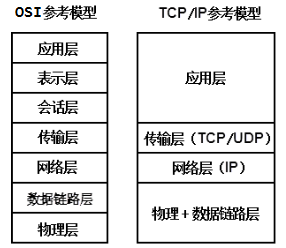
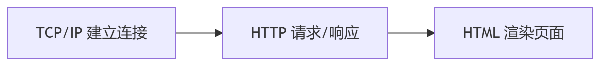
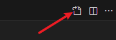
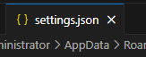

# 1.HTML5


# Web前端简介

## 为什么要学习Web前端

目前软件的形式分两种：一种是C/S架构，另一种是B/S架构

- C/S架构（Client/Server，客户端/服务器模式）
- B/S架构（Browser/Server，浏览器/服务器模式）

那么，要想在浏览器中展示数据，必然涉及到Web前端的知识。因此，Web前端也成为目前软件工程师必须要掌握的基本技能！

## Web前端需要学习那些知识

一个网站由多个网页组成，每个网页又由HTML、CSS、JavaScript组成

- HTML ：结构， 决定网页的结构和内容(“骨架”)
- CSS ：表现(样式) ， 设定网页的表现样式(“皮肤”)
- JavaScript ：行为， 实现交互(“肌肉【有肌肉才能动】”)

开发一个网页，就如同修建一个房子。先把房子的结构建好（HTML），例如房子有几层高、每层有几间房间。房子建好之后给房子装修（CSS），例如给窗户安装窗帘、往地板铺设漂亮的瓷砖。装修完毕之后，当夜幕降临的时候，我们要开灯（JavaScript），这样屋子就能够看得见了。

## 常见浏览器介绍

以下是世界主流浏览器及其使用的内核（渲染引擎 + JavaScript 引擎）的详细列表

### 主流浏览器内核

| **浏览器名称** | **内核（渲染引擎）** | **JavaScript 引擎** | **内核简写** |
| --- | --- | --- | --- |
| **Google Chrome** | Blink | V8 | Blink/V8 |
| **Microsoft Edge** | Blink | V8 | Blink/V8 |
| **Mozilla Firefox** | Gecko | SpiderMonkey | Gecko |
| **Safari (Apple)** | WebKit | JavaScriptCore | WebKit/JSC |
| **Opera** | Blink | V8 | Blink/V8 |

**内核（渲染引擎）**：解析 HTML/CSS，渲染页面视觉内容

**JavaScript引擎**：解析和执行 JavaScript 代码逻辑

### **内核简写说明**

1. **Blink**
  - 由 Google 主导开发，Chromium 项目核心。
2. **Gecko**
  - Mozilla 开发的独立内核，支持现代 Web 标准。
3. **WebKit**
  - Apple 主导的开源引擎，Safari 的默认内核。

### 市场份额参考（2023年）

1. **Blink 系**：Chrome + Edge + Opera ≈ **85%+**
2. **Gecko (Firefox)**：≈ **3-5%**
3. **WebKit (Safari)**：≈ **8-10%**（主要来自 iOS/macOS 用户）


## 互联网三大基石

互联网的三大基石通常被认为是 **TCP/IP**、**HTTP** 和 **HTML**

### TCP/IP

#### TCP/IP模型



**TCP/IP模型是一个四层的实用网络通信架构：**

1. **网络接口层：** 负责在本地网络中通过物理信号（如网线、Wi-Fi）传输数据帧。
2. **网络层：** 核心协议是IP，负责给数据包写上发送和接收的IP地址，并进行路由选择，让它能穿越整个网络找到目标。
3. **传输层：** 核心协议是TCP和UDP，负责端到端的通信控制。**TCP**像“可靠快递”，保证数据不丢不乱；**UDP**像“快速邮筒”，只管发送不求可靠。
4. **应用层：** 包含了所有面向用户的具体协议，如HTTP（网页）、SMTP（邮件）、DNS（域名解析）等。

#### TCP/IP 协议族

**TCP/IP模型** 就像一栋建筑的**建筑设计图纸**。

**TCP/IP协议族** 则是按照这张图纸**施工时用到的具体材料和规范**。

模型中的每一层，都由协议族中的具体协议来“实现”：

- **应用层** ←→ **HTTP**（网页）、**FTP**（文件传输）、**DNS**（域名解析）、**SMTP**（邮件）等。
- **传输层** ←→ **TCP**（可靠传输）、**UDP**（高效传输）等。
- **网络层** ←→ **IP**（寻址和路由）、**ICMP**（错误控制，如ping）等。
- **网络接口层** ←→ **以太网**、**Wi-Fi** 等底层技术。

### HTTP

定义客户端（浏览器）与服务器之间的通信规则，用于传输网页、图片等资源。

### HTML

定义网页的结构和内容，是浏览器渲染页面的基础。

### **三大基石的协作流程**

1. **TCP/IP**：建立设备间的物理连接（如你的电脑 → 服务器）。
2. **HTTP**：浏览器通过 HTTP 请求服务器上的 HTML 文件。
3. **HTML**：服务器返回 HTML，浏览器解析并渲染页面。



 


# HTML发展史

## HTML的简介

HTML(Hyper Text Markup Language)中文译为“超文本标记语言”，主要是通过HTML标记对网页中的文本、图片、声音等内容进行描述。

HTML不是一种编程语言，而是一种标记语言，它提供了许多标记，如段落标记、标题标记、超链接标记、图片标记等，网页中需要定义什么内容，就用相应的HTML标记描述即可。

HTML之所以称为超文本标记语言，不仅是因为他通过标记描述网页内容，同时也由于文本中包含了所谓的“超级链接”点。通过超链接将网站与网页以及各种网页元素链接起来，构成了丰富多彩的Web页面。

## HTML语言的开发和标准化

HTML 语言的开发和标准化主要由以下三个核心组织负责，它们各自在不同阶段推动 HTML 的发展：

### W3C（万维网联盟，World Wide Web Consortium）

- **成立时间**：1994 年
- **创始人**：蒂姆·伯纳斯-李（Tim Berners-Lee，HTML 发明者）
- **角色**： 主导 HTML 标准的制定与发布（如 HTML4、XHTML 1.0）。 推动 Web 技术标准化（CSS、XML 等）。
- **争议**：因 XHTML 2.0 过于严格且脱离开发者需求，导致部分成员退出并成立 **WHATWG**。

### WHATWG（Web 超文本应用技术工作组，Web Hypertext Application Technology Working Group）

- **成立时间**：2004 年
- **成立背景**：由 Apple、Mozilla、Opera 等浏览器厂商因反对 W3C 的 XHTML 2.0 方向而组建。
- **贡献**：提出 **HTML5** 草案（成为现代 Web 标准的基础）。

### IETF（互联网工程任务组，Internet Engineering Task Force）

- **早期角色**：在 HTML 1.0~2.0 阶段参与标准化（如 RFC 1866）。
- **现状**：后续将 HTML 标准制定权移交 W3C，专注底层协议（如 HTTP、TCP/IP）。

### 总结

- **主导者**：W3C（早期） + WHATWG（现代）。
- **协作模式**：WHATWG 负责技术迭代，W3C 负责官方认证。
- **开发者影响**：浏览器厂商和社区反馈直接推动 HTML 功能的演进

## HTML发展历程

- HTML1.0
  - 超文本标记语言(第一版) 在1993年6月发为互联网工程工作小组(IETF)工作草案发布(并非标准)
- HTML2.0
  - 1995年11月作为RFC 1866发布，在RFC2854于2000年6月发布之后被宣布已经过时。
- HTML3.2
  - 1996年1月14日，W3C推荐标准。
- HTML4.0
  - 1997年12月18日，W3C推荐标准。
- HTML4.01
  - 1999年12月24日，W3C推荐标准。
- XHTML1.0
  - 发布于2000年1月26日，是W3C推荐标准，后经过修订于2002年8月1日重新发布。
- XHTML1.1
  - 于2001年5月31日发布。
- HTML5.0
  - 2014年10月28日，万维网联盟宣布，经过接近8年的努力，标准规范终于制定完成。

## XHTML和HTML的区别

- **HTML**（超文本标记语言）：网页内容的“通用语言”，语法宽松（如标签可省略闭合），兼容性强，是互联网页面的基础。
- **XHTML**（可扩展超文本标记语言）：HTML 的严格 XML 版，语法必须严谨（如标签必须闭合、属性加引号），追求标准化，但已逐渐被 HTML5 取代。


# HTML的开发工具

## HTML文件扩展名

HTML文件的扩展名`html`或`htm`。但通常是`html`。

## HTML文件的开发

创建`xx.html`文件，使用任何一个文本编辑器打开即可开发，例如记事本。

## HTML文件的运行

直接使用浏览器打开`xx.html`文件即可渲染。

## 当下较为流行的HTML IDE

在国内的Web前端开发中，开发者常用的HTML集成开发环境（IDE）和编辑器主要包括以下工具，每个工具的特点和适用场景如下：

### Visual Studio Code (VS Code)

- **特点**：
  - **轻量级**、免费开源，由微软开发，插件生态丰富。
  - 内置对HTML、CSS、JavaScript的智能提示（IntelliSense）和调试支持。
  - 支持Emmet快速编写HTML标签，集成终端和Git。
- **适用场景**：
  - 个人开发者、团队协作，适合中小型到大型项目。
  - 插件扩展（如 **Live Server**、**Prettier**）可增强HTML开发体验。

### WebStorm

- **特点**：
  - JetBrains旗下的**专业前端IDE**，功能强大但付费（学生可免费）。
  - 深度支持HTML/CSS/JavaScript框架（Vue、React等），智能重构和代码分析。
  - 内置调试工具、版本控制（Git）和终端。
- **适用场景**：
  - 企业级复杂项目，需要高代码质量和工程化支持。
- **提示**：
  - WebStorm 的功能实际上是 IntelliJ IDEA 的子集。

### HBuilder / HBuilderX

- **特点**：
  - 国产IDE（DCloud开发），**专注中文开发者**，内置浏览器内核预览。
  - 对HTML5+、Vue、UniApp等有深度优化，适合跨平台开发。
  - 提供云打包和真机调试功能。
- **适用场景**：
  - 国内移动端开发（尤其微信小程序、混合App）。

### **总结推荐**

| **工具** | **推荐指数** | **适合人群** |
| --- | --- | --- |
| VS Code | ⭐⭐⭐⭐⭐ | 所有前端开发者（首选） |
| WebStorm | ⭐⭐⭐⭐ | 专业团队/复杂项目 |
| HBuilderX | ⭐⭐⭐⭐ | 国内小程序/UniApp开发者 |


## VS Code开发HTML

### 开发步骤

第一步：在任意位置创建一个文件夹，例如`code`，用于存放HTML文件。

第二步：打开VS Code。

第三步：在VS Code中 File 菜单，`Open Folder...`打开第一步中创建的目录。

第四步：新建`html`文件，并编写代码。

### VS Code部分快捷键

1. 复制一行：alt + shift + 向下键
2. 删除一行：shift + delete
3. 编辑窗口最大化：ctrl + b
4. 窗口切换：alt + 左方向/右方向
5. 格式化：alt + shift + f（不需要了，因为安装了插件之后，ctrl + s 组合之后，会自动格式化。）
6. 多行编辑：按 alt 键，然后鼠标点击多个位置可实现多行编辑。
7. 设置字体：左下角齿轮-setting-输入font-输入数字设置字体大小
8. 直接将html文件用浏览器打开：安装 open in browser 插件，然后在html编辑窗口右键，Open In Default Browser。如果打不开，需要将windows上的xx.html文件的默认打开方式设置为默认的浏览器。
9. 也可以安装一个插件 open with live server，这样可以让 HTML 文件放到 web 服务器中，然后通过浏览器访问 web 服务器来访问这个 html 页面。这种方式更加接近生产环境。
10. 创建html文件后，直接输入一个感叹号`!`，直接生成HTML文件的基本结构。
11. 快速注释：ctrl + /
12. 在 JS 代码中多行注释：shift + alt + a
13. VS Code 支持自动保存：点击**文件**菜单，然后点击**自动保存**

### 强烈建议安装的 vscode 插件

`ctrl+``组合键，打开控制面板（dos 命令窗口）。

然后直接将以下命令全部执行一遍，安装插件：

```shell
code --install-extension formulahendry.auto-rename-tag
code --install-extension formulahendry.auto-close-tag
code --install-extension christian-kohler.path-intellisense
code --install-extension pranaygp.vscode-css-peek
code --install-extension ecmel.vscode-html-css
code --install-extension rangav.vscode-thunder-client
code --install-extension dsznajder.es7-react-js-snippets
code --install-extension Vue.volar
code --install-extension pmneo.tsimporter
code --install-extension bradlc.vscode-tailwindcss
code --install-extension dbaeumer.vscode-eslint
code --install-extension esbenp.prettier-vscode
code --install-extension EditorConfig.EditorConfig
code --install-extension PKief.material-icon-theme
code --install-extension vscode-icons-team.vscode-icons
code --install-extension kisstkondoros.vscode-gutter-preview
code --install-extension ritwickdey.liveserver
code --install-extension eamodio.gitlens
code --install-extension usernamehw.errorlens
code --install-extension streetsidesoftware.code-spell-checker
```

安装完之后需要简单设置一下：`ctrl + ,`打开设置。然后在 vscode 界面上看右上角



打开一个配置文件：



然后将以下配置全部覆盖到这个文件上：

```json
{
  "workbench.iconTheme": "vscode-icons",
  "editor.fontSize": 22,

  // 保存时自动格式化
  "editor.formatOnSave": true,

  // 保存时自动修复
  "editor.codeActionsOnSave": {
    "source.fixAll.eslint": "explicit"
  },

  // 默认格式化工具选择 Prettier
  "editor.defaultFormatter": "esbenp.prettier-vscode",
  "files.autoSaveDelay": 1000,

  // 括号对着色
  "editor.bracketPairColorization.enabled": true,

  // 缩进参考线
  "editor.guides.bracketPairs": true,

  "git.decorations.enabled": false,
  "files.autoSave": "afterDelay"
}
```

### 建议安装简体中文包

1. 搜索简体中文的插件，并安装
2. 如果安装后，没有切换到简体中文环境，按照下面步骤操作：
a. 在 VSCode 中按下 Ctrl+Shift+P 打开命令面板。
b. 输入并执行命令：Configure Display Language
c. 选择简体中文


# 第一个HTML程序

HTML 的学习可以参考官方文档：[**MDN Web Docs**](https://developer.mozilla.org/zh-CN/)

**MDN是由Mozilla维护的，集权威标准、详尽教程和实用参考于一体的Web开发文档库。**

**MDN为全球开发者提供了免费、开源、且紧跟官方标准的Web技术权威指南。**

**MDN是Web开发领域最值得信赖的官方文档和学习平台。**

**MDN是一个由开发者社区与专家共同构建的，内容严谨且始终更新的Web技术知识库。**

---

---

创建`index.html`文件，并编写如下代码：

```html
<!DOCTYPE html>
<html lang="en">
<head>
    <meta charset="UTF-8">
    <title>我的第一个HTML页面</title>
</head>
<body>
    <p>body元素的内容会显示在浏览器中。</p>
    <p>title元素的内容会显示在浏览器的标题栏中。</p>
</body>
</html>
```

## 标签

用于定义文档的头部，是所有头部元素的容器。

中的元素可以引用脚本、指示浏览器在哪里找到样式表。文档的头部描述了文档的各种属性和信息。绝大多数文档头部包含的数据都不会真正作为内容显示给用户。

在`<head>`标签中可以出现的子标签：