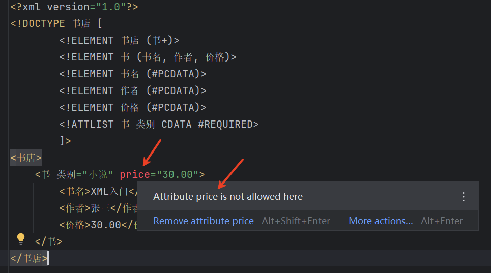
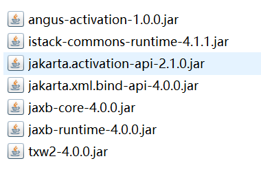
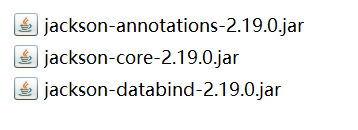

# 1.XML、JSON

# XML 概述


XML（eXtensible Markup Language，可扩展标记语言）是一种用于存储和传输数据的标记语言，由万维网联盟（W3C）于1998年推出。

## 基本概念

1. **标记语言**：XML使用标签来描述数据结构
2. **可扩展性**：用户可以自定义标签
3. **平台无关**：独立于硬件和软件
4. **纯文本格式**：人类可读且机器可解析

## 主要特点

- **结构化数据表示**：以层次结构组织数据
- **自描述性**：标签名称通常描述其内容
- **语法严格**：要求良好格式
- **广泛支持**：几乎所有编程语言都提供XML处理工具

## 基本语法规则

```xml
<?xml version="1.0" encoding="UTF-8"?>
<rootElement>
  <childElement attribute="value">
    Content text
  </childElement>
  <emptyElement/>
</rootElement>
```

1. 必须有且只有一个根元素
2. 标签区分大小写
3. 所有标签必须闭合
4. 属性值必须加引号
5. 特殊字符需转义（如`<`代表`<`）

## 关于 XML 声明

以下是一个完整的声明：

```xml
<?xml version="1.0" encoding="UTF-8" standalone="yes"?>
```

| **属性** | **说明** | **是否可选** |
| --- | --- | --- |
| `**<font style="color:rgb(64, 64, 64);background-color:rgb(236, 236, 236);">version</font>**` | 指定 XML 版本（通常是 `**<font style="color:rgb(64, 64, 64);background-color:rgb(236, 236, 236);">1.0</font>**` 或 `**<font style="color:rgb(64, 64, 64);background-color:rgb(236, 236, 236);">1.1</font>**`） | **必选** |
| `**<font style="color:rgb(64, 64, 64);background-color:rgb(236, 236, 236);">encoding</font>**` | 指定文档字符编码（如 `**<font style="color:rgb(64, 64, 64);background-color:rgb(236, 236, 236);">UTF-8</font>**`、`**<font style="color:rgb(64, 64, 64);background-color:rgb(236, 236, 236);">GBK</font>**`） | 可选（默认取决于解析器） |
| `**<font style="color:rgb(64, 64, 64);background-color:rgb(236, 236, 236);">standalone</font>**` | 定义文档是否依赖外部 DTD（`**<font style="color:rgb(64, 64, 64);background-color:rgb(236, 236, 236);">yes</font>**`/`**<font style="color:rgb(64, 64, 64);background-color:rgb(236, 236, 236);">no</font>**`） | 可选，默认值 no，yes 的时候表示本 XML 不依赖任何外部 DTD 约束，即它的结构和约束完全由自身定义。 |

注意事项：

- **必须放在第一行**，前面不能有任何字符（包括空格）。
- **大小写敏感**，必须是小写 `**<font style="color:rgb(64, 64, 64);background-color:rgb(236, 236, 236);"><?xml</font>**`。
- `**<font style="color:rgb(64, 64, 64);background-color:rgb(236, 236, 236);">version="1.0"</font>**` 是最常用的，`**<font style="color:rgb(64, 64, 64);background-color:rgb(236, 236, 236);">1.1</font>**` 版本较少使用。
- `**<font style="color:rgb(64, 64, 64);background-color:rgb(236, 236, 236);">encoding</font>**` 推荐使用 `**<font style="color:rgb(64, 64, 64);background-color:rgb(236, 236, 236);">UTF-8</font>**`，避免乱码问题。

## XML应用领域

- 数据存储（相当于小型数据库）
- 数据交换（不同语言或不同系统之间交换数据的通用格式）
- 配置文件（如 JavaWeb 项目中的 web.xml 配置文件）
- 用作协议（如 SOAP 协议）

# XML 约束


## DTD

DTD（Document Type Definition）是XML文档的一种模式定义方式，它定义了XML文档的结构和合法元素。DTD可以确保XML文档遵循预定义的结构和规则。

### DTD的主要作用

1. 定义XML文档中允许的元素
2. 定义元素的属性和属性类型
3. 定义元素的子元素及出现顺序
4. 定义实体（特殊字符或文本的替代）

### 内嵌DTD的XML文档示例

```xml
<?xml version="1.0"?>
<!DOCTYPE 书店 [
  <!ELEMENT 书店 (书+)>
  <!ELEMENT 书 (书名, 作者, 价格)>
  <!ELEMENT 书名 (#PCDATA)>
  <!ELEMENT 作者 (#PCDATA)>
  <!ELEMENT 价格 (#PCDATA)>
  <!ATTLIST 书 类别 CDATA #REQUIRED>
]>
<书店>
  <书 类别="小说">
    <书名>XML入门</书名>
    <作者>张三</作者>
    <价格>30.00</价格>
  </书>
</书店>
```

在 IDEA 工具中可以校验 XML 文件是否符合 DTD 语法，不符合会报错：



### 外部DTD示例

**books.dtd**文件：

```plaintext
<!ELEMENT 书店 (书+)>
<!ELEMENT 书 (书名, 作者, 价格)>
<!ELEMENT 书名 (#PCDATA)>
<!ELEMENT 作者 (#PCDATA)>
<!ELEMENT 价格 (#PCDATA)>
<!ATTLIST 书 
  类别 CDATA #REQUIRED
  库存 (有|无) "有"
>
```

**引用外部DTD的XML文件**：

```xml
<?xml version="1.0"?>
<!DOCTYPE 书店 SYSTEM "books.dtd">
<书店>
  <书 类别="科技" 库存="有">
    <书名>XML高级编程</书名>
    <作者>李四</作者>
    <价格>45.00</价格>
  </书>
</书店>
```

DTD虽然简单易用，但在现代XML开发中，XML Schema (XSD)因其更强大的功能而更为常用。

## XSD

XSD（XML Schema Definition）是比DTD更强大、更灵活的XML模式定义语言，它使用XML语法来描述XML文档的结构和约束。

### XSD相比DTD的优势

1. 使用XML语法编写，不需要额外学习语法
2. 支持数据类型（字符串、数字、日期等）
3. 支持命名空间
4. 可扩展性更好
5. 支持更复杂的约束

### 基础XSD示例（books.xsd）

```xml
<?xml version="1.0"?>
<xs:schema xmlns:xs="http://www.w3.org/2001/XMLSchema">

  <!-- 定义根元素"书店" -->
  <xs:element name="书店">
    <xs:complexType>
      <xs:sequence>
        <!-- 书店包含一个或多个"书"元素 -->
        <xs:element name="书" maxOccurs="unbounded">
          <xs:complexType>
            <xs:sequence>
              <!-- 定义子元素及其类型 -->
              <xs:element name="书名" type="xs:string"/>
              <xs:element name="作者" type="xs:string"/>
              <xs:element name="价格" type="xs:decimal"/>
              <xs:element name="出版日期" type="xs:date" minOccurs="0"/>
            </xs:sequence>
            <!-- 定义属性 -->
            <xs:attribute name="类别" use="required">
              <xs:simpleType>
                <xs:restriction base="xs:string">
                  <xs:enumeration value="小说"/>
                  <xs:enumeration value="科技"/>
                  <xs:enumeration value="历史"/>
                </xs:restriction>
              </xs:simpleType>
            </xs:attribute>
            <xs:attribute name="库存" type="xs:boolean" default="true"/>
          </xs:complexType>
        </xs:element>
      </xs:sequence>
    </xs:complexType>
  </xs:element>
</xs:schema>
```

### 引用XSD的XML示例

```xml
<?xml version="1.0"?>
<书店 xmlns:xsi="http://www.w3.org/2001/XMLSchema-instance"
      xsi:noNamespaceSchemaLocation="books.xsd">
  
  <书 类别="科技" 库存="true">
    <书名>XML高级编程</书名>
    <作者>李四</作者>
    <价格>45.00</价格>
    <出版日期>2023-05-15</出版日期>
  </书>
  
  <书 类别="小说">
    <书名>XML奇幻之旅</书名>
    <作者>王五</作者>
    <价格>32.50</价格>
  </书>
</书店>
```

### xmlns: 指定命名空间

没有命名空间时的冲突：

```xml
<文档>
    <标题>公司文件</标题>
    <正文>
        <标题>这是正文标题</标题> <!-- 两个"标题"元素含义不同 -->
    </正文>
</文档>
```

使用命名空间解决冲突：

```xml
<文档 xmlns:doc="http://example.com/document"
      xmlns:body="http://example.com/body">
    <doc:标题>公司文件</doc:标题>
    <doc:正文>
        <body:标题>这是正文标题</body:标题> <!-- 现在可以区分了 -->
    </doc:正文>
</文档>
```

### XSD关键概念说明

1. **简单类型(simpleType)**：只能包含文本，不能包含子元素或属性
2. **复杂类型(complexType)**：可以包含子元素和属性
3. **元素出现次数**：
  - `minOccurs`：最少出现次数（默认1）
  - `maxOccurs`：最多出现次数（默认1，"unbounded"表示无限）
4. **常用数据类型**：
  - `xs:string`：字符串
  - `xs:decimal`：十进制数
  - `xs:integer`：整数
  - `xs:boolean`：布尔值
  - `xs:date`：日期
  - `xs:time`：时间

XSD比DTD功能强大得多，是现代XML应用开发中首选的模式定义方式。

# XSLT


XSLT（Extensible Stylesheet Language Transformations）是一种用于将 XML 文档转换为其他格式（如 HTML、XML 或纯文本）的语言。

## XSLT 主要用途

1. 将 XML 转换为 HTML 用于网页显示
2. 将 XML 转换为其他 XML 格式
3. 提取和过滤 XML 数据
4. 对 XML 数据进行排序和重组

## 简单 XSLT 示例

### 输入 XML (books.xml)

```xml
<?xml version="1.0"?>
<?xml-stylesheet type="text/xsl" href="transform.xsl"?>
<books>
    <book category="technology">
        <title>XML Basics</title>
        <author>John Doe</author>
        <price>39.95</price>
    </book>
    <book category="fiction">
        <title>XML Adventures</title>
        <author>Jane Smith</author>
        <price>29.99</price>
    </book>
</books>
```

### XSLT 样式表 (transform.xsl)

```xml
<?xml version="1.0"?>
<xsl:stylesheet version="1.0" 
                xmlns:xsl="http://www.w3.org/1999/XSL/Transform">

  <xsl:template match="/">
    <html>
      <head>
        <title>Book List</title>
      </head>
      <body>
        <h1>Book Collection</h1>
        <table border="1">
          <tr>
            <th>Title</th>
            <th>Author</th>
            <th>Price</th>
            <th>Category</th>
          </tr>
          <xsl:for-each select="books/book">
            <tr>
              <td><xsl:value-of select="title"/></td>
              <td><xsl:value-of select="author"/></td>
              <td>$<xsl:value-of select="price"/></td>
              <td><xsl:value-of select="@category"/></td>
            </tr>
          </xsl:for-each>
        </table>
      </body>
    </html>
  </xsl:template>
</xsl:stylesheet>
```

### 转换后的 HTML 输出

```html
<html>
  <head>
    <title>Book List</title>
  </head>
  <body>
    <h1>Book Collection</h1>
    <table border="1">
      <tr>
        <th>Title</th>
        <th>Author</th>
        <th>Price</th>
        <th>Category</th>
      </tr>
      <tr>
        <td>XML Basics</td>
        <td>John Doe</td>
        <td>$39.95</td>
        <td>technology</td>
      </tr>
      <tr>
        <td>XML Adventures</td>
        <td>Jane Smith</td>
        <td>$29.99</td>
        <td>fiction</td>
      </tr>
    </table>
  </body>
</html>
```

# XML 解析


XML解析主要有以下三种方式：DOM 解析、SAX 解析、StAX 解析

## DOM解析（Document Object Model）

**特点**：

- 将整个XML文档加载到内存，形成树状结构（节点树）。
- 可以**随机访问**任意节点，支持增删改查。

**优点**：
✅ 编程简单，直观（类似操作HTML DOM）
✅ 适合小型XML文件
✅ 支持XPath查询

**缺点**：
❌ **内存占用高**（整个XML必须加载到内存）
❌ **解析速度慢**（大文件时性能差）

**典型应用场景**：

- 配置文件解析（如Spring的XML配置）
- 需要频繁修改XML结构的场景

## SAX解析（Simple API for XML）

**特点**：

- **基于事件驱动**，逐行读取XML，不存储整个文档。
- 只能**顺序访问**，无法随机跳转。

**优点**：
✅ **内存占用极低**（适合大文件，如GB级XML）
✅ **解析速度快**（流式处理，边读边解析）

**缺点**：
❌ **无法随机访问**（只能顺序读取）
❌ **编程复杂**（需要实现回调方法）
❌ **不支持修改XML**

**典型应用场景**：

- 大数据量XML解析（如日志文件）
- 仅需读取数据，无需修改的场景

## StAX解析（Streaming API for XML）

**特点：**

- **基于拉取模型（Pull Parsing）**，由应用程序主动控制解析流程（按需读取XML事件）。
- **流式解析**，不加载整个文档到内存，仅缓存当前解析的位置。
- **介于DOM和SAX之间**，比SAX更灵活，比DOM更节省内存。

**优点：**

✅ **内存占用低**（类似SAX，仅缓存当前事件，适合大文件解析）。
✅ **编程更直观**（相比SAX的回调模式，StAX采用迭代器方式，代码更易读）。
✅ **支持选择性解析**（可以跳过不需要的部分，提高解析效率）。
✅ **支持XML写入**（`XMLStreamWriter` 可直接生成XML，而SAX仅支持读取）。

**缺点：**

❌ **仍不能随机访问**（需顺序解析，但比SAX更可控）。
❌ **比DOM稍复杂**（但比SAX的回调模式更易管理）。

**典型应用场景：**

- **大数据量XML解析**（如WebService消息、API响应）。
- **需要部分解析**（仅提取关键数据，跳过无关内容）。
- **XML生成与修改**（结合 `XMLStreamWriter` 动态构建XML）。

## 三种解析方式对比总结

| **特性** | **DOM解析** | **SAX解析** | **StAX解析** |
| --- | --- | --- | --- |
| **解析模式** | 树形结构（内存加载） | 事件驱动（推送模型） | 流式拉取（按需读取） |
| **内存占用** | 高（整个文档加载） | 极低（逐行解析） | 低（仅缓存当前事件） |
| **访问方式** | 随机访问 | 顺序访问 | 顺序访问（可控） |
| **编程复杂度** | 简单（类DOM操作） | 复杂（回调接口） | 中等（迭代器模式） |
| **是否支持修改XML** | ✅（可增删改查） | ❌（仅读取） | ✅（可写XML） |
| **适用场景** | 小型XML、配置解析 | 超大XML、日志解析 | 大文件解析、Web API |

# Java 解析 XML


Java 解析 XML 指的是：Java 读取 XML。

## Java 解析 XML 的抽象规范

| **名称** | **类型** | **定义内容** | **归属组织** |
| --- | --- | --- | --- |
| **JAXP** | 统一工厂接口 | 提供 `**<font style="color:rgb(64, 64, 64);background-color:rgb(236, 236, 236);">SAXParserFactory</font>**`, `**<font style="color:rgb(64, 64, 64);background-color:rgb(236, 236, 236);">DocumentBuilderFactory</font>**`, `**<font style="color:rgb(64, 64, 64);background-color:rgb(236, 236, 236);">TransformerFactory</font>**` 是 **抽象工厂**，不包含具体实现，通过 SPI 加载底层解析器。 **SPI（Service Provider Interface）** 是 Java 提供的一种**服务发现机制**，用于解耦接口与实现，让第三方可以为标准接口提供具体实现，并由 Java 自动加载。它在 XML 解析（如 JAXP）、JDBC 驱动等场景中广泛使用。 **SPI 与 API 的区别**：SPI 的接口由标准库定义，实现由第三方提供，典型场景JAXP、JDBC 驱动、日志框架（SLF4J）。 API 的接口和实现均由同一方提供，典型场景Java 集合类、IO 流等标准库。 | Oracle (Java 标准库) |
| **DOM** | 树形结构解析规范 | 定义 `**<font style="color:rgb(64, 64, 64);background-color:rgb(236, 236, 236);">Document</font>**`, `**<font style="color:rgb(64, 64, 64);background-color:rgb(236, 236, 236);">Element</font>**`, `**<font style="color:rgb(64, 64, 64);background-color:rgb(236, 236, 236);">Node</font>**`等 W3C 标准接口 | W3C |
| **SAX** | 事件驱动解析规范 | 定义 `**<font style="color:rgb(64, 64, 64);background-color:rgb(236, 236, 236);">ContentHandler</font>**`, `**<font style="color:rgb(64, 64, 64);background-color:rgb(236, 236, 236);">ErrorHandler</font>**`等回调接口 | SAX 开源社区 |
| **StAX** | 流式推拉模型规范 | 定义 `**<font style="color:rgb(64, 64, 64);background-color:rgb(236, 236, 236);">XMLStreamReader</font>**`（拉模式）, `**<font style="color:rgb(64, 64, 64);background-color:rgb(236, 236, 236);">XMLEventReader</font>**`（推模式） | JSR-173 (Java 标准) |
| **XPath** | 查询语言规范 | 定义 `**<font style="color:rgb(64, 64, 64);background-color:rgb(236, 236, 236);">XPathExpression</font>**`, `**<font style="color:rgb(64, 64, 64);background-color:rgb(236, 236, 236);">XPathNodes</font>**`等查询接口 **注意：只有 DOM 解析中才需要 XPath** | W3C |

## Java 解析 XML 的具体库

| **实现库名称** | **实现的规范** | **支持解析方式** | **开发团队** | **JDK 内置** | **特点** |
| --- | --- | --- | --- | --- | --- |
| **DOM4J** | DOM (扩展) | DOM + XPath | MetaStuff | 否 | API 更友好，性能优于 W3C DOM，Hibernate 等框架曾使用 |
| **JDOM** | DOM (简化版) | DOM | Jason Hunter 等 | 否 | 专为 Java 优化，使用 `**<font style="color:rgb(64, 64, 64);background-color:rgb(236, 236, 236);">List</font>**`等集合类简化操作 |
| **XOM** | DOM (严格规范) | DOM | Elliotte Rusty Harold | 否 | 严格遵循 XML 规范，轻量级 |
| **Woodstox** | StAX | StAX（推拉模型） | FasterXML | 否 | 高性能 StAX 实现，适合大数据流式解析 |
| **Xerces** | SAX, DOM | SAX, DOM | Apache | 否 | 历史最久，JDK 早期默认实现 |
| **JDK 内置解析器（JDK9+）** | SAX, DOM, StAX | SAX, DOM, StAX | Oracle | 是 | 包名前缀：**jdk.xml.internal** |

## DOM4J 解析 XML(DOM+XPath)

以第三方库 DOM4J 来演示 DOM 解析。解析时采用 DOM+XPath 方式。

### XPath

XPath（XML Path Language）是一种用于在XML文档中定位节点的查询语言。在DOM4J解析XML时，XPath提供了一种简洁高效的方式来查找和选择XML文档中的特定节点或节点集，而不需要手动遍历整个DOM树。

**常见XPath表达式**

1. 基本路径表达式

- `//book`：选择文档中所有的book元素
- `/bookstore/book`：选择根元素bookstore下的所有book子元素
- `book/title`：选择当前节点下book元素的title子元素

1. 条件筛选

- `//book[1]`：选择第一个book元素
- `//book[last()]`：选择最后一个book元素
- `//book[price>35]`：选择price大于35的book元素
- `//book[@category='WEB']`：选择category属性为WEB的book元素

1. 通配符

- `//*`：选择文档中的所有元素
- `//book/*`：选择book元素的所有子元素
- `//@*`：选择所有的属性

1. 轴选择

- `//book/title | //book/price`：选择所有book的title和price元素
- `//title/../@category`：选择title父元素的category属性

1. 函数

- `//book[contains(title, 'XML')]`：选择 title 元素的文本内容包含"XML"的book元素
- `//book[starts-with(title, 'Java')]`：选择title 元素的文本内容以"Java"开头的book元素
- `//book[string-length(title) > 10]`：选择title 元素的文本内容长度大于10的book元素

### DOM+XPath 解析

要使用 DOM4J，需要引入它的 jar 包，如下：


XML 文件：

```xml
<?xml version="1.0" encoding="UTF-8"?>
<bookstore>
    <book category="COOKING">
        <title lang="en">Everyday Italian</title>
        <author>Giada De Laurentiis</author>
        <year>2005</year>
        <price>30.00</price>
    </book>
    <book category="CHILDREN">
        <title lang="en">Harry Potter</title>
        <author>J.K. Rowling</author>
        <year>2005</year>
        <price>29.99</price>
    </book>
    <book category="WEB">
        <title lang="en">Learning XML</title>
        <author>Erik T. Ray</author>
        <year>2003</year>
        <price>39.95</price>
    </book>
    <book category="WEB">
        <title lang="en">XQuery Kick Start</title>
        <author>James McGovern</author>
        <year>2003</year>
        <price>49.99</price>
    </book>
</bookstore>
```

Java 代码：

```java
import org.dom4j.Document;
import org.dom4j.DocumentException;
import org.dom4j.Node;
import org.dom4j.io.SAXReader;
import java.io.File;
import java.util.List;

public class Dom4jXpathExample {
    public static void main(String[] args) {
        try {
            // 1. 创建SAXReader对象
            // 注意：DOM4J 的 SAXReader 不是纯 SAX 解析，而是 SAX + DOM 混合模式。
            // 它底层用 SAX 高效读取 XML，但最终构建 DOM4J 的 Document 对象，支持 XPath 查询。
            SAXReader reader = new SAXReader();
            
            // 2. 加载XML文件
            File file = new File("books.xml");
            Document document = reader.read(file);
            
            System.out.println("=== 所有书籍标题 ===");
            // 3. 使用XPath选择所有title元素
            List<Node> titleNodes = document.selectNodes("//book/title");
            for (Node node : titleNodes) {
                System.out.println(node.getText());
            }
            
            System.out.println("\n=== 价格超过35的书籍 ===");
            // 4. 使用XPath选择价格>35的书籍
            List<Node> expensiveBooks = document.selectNodes("//book[price>35]");
            for (Node book : expensiveBooks) {
                String title = book.selectSingleNode("title").getText();
                String price = book.selectSingleNode("price").getText();
                System.out.println(title + " - 价格: " + price);
            }
            
            System.out.println("\n=== WEB类别的书籍 ===");
            // 5. 使用属性选择
            List<Node> webBooks = document.selectNodes("//book[@category='WEB']");
            for (Node book : webBooks) {
                String title = book.selectSingleNode("title").getText();
                String author = book.selectSingleNode("author").getText();
                System.out.println(title + " - 作者: " + author);
            }
            
            // 6. 获取单个节点
            Node firstBook = document.selectSingleNode("//book[1]");
            System.out.println("\n第一本书的类别: " + firstBook.valueOf("@category"));
            
        } catch (DocumentException e) {
            e.printStackTrace();
        }
    }
}
```

## JDK 内置解析器 SAX 解析

以 JDK 内置解析器为例，演示 SAX 解析。

XML 文件：

```xml
<?xml version="1.0" encoding="UTF-8"?>
<bookstore>
    <book category="COOKING">
        <title lang="en">Everyday Italian</title>
        <author>Giada De Laurentiis</author>
        <year>2005</year>
        <price>30.00</price>
    </book>
    <book category="CHILDREN">
        <title lang="en">Harry Potter</title>
        <author>J.K. Rowling</author>
        <year>2005</year>
        <price>29.99</price>
    </book>
    <book category="WEB">
        <title lang="en">Learning XML</title>
        <author>Erik T. Ray</author>
        <year>2003</year>
        <price>39.95</price>
    </book>
</bookstore>
```

Java 代码：

```java
import org.xml.sax.Attributes;
import org.xml.sax.SAXException;
import org.xml.sax.helpers.DefaultHandler;

import javax.xml.parsers.SAXParser;
import javax.xml.parsers.SAXParserFactory;
import java.io.File;

public class SAXParserExample {

    public static void main(String[] args) {
        try {
            // 1. 创建SAXParserFactory实例
            SAXParserFactory factory = SAXParserFactory.newInstance();

            // 2. 创建SAXParser实例
            SAXParser saxParser = factory.newSAXParser();

            // 3. 创建自定义的Handler
            BookHandler handler = new BookHandler();

            // 4. 解析XML文件
            File xmlFile = new File("books.xml");
            saxParser.parse(xmlFile, handler);

        } catch (Exception e) {
            e.printStackTrace();
        }
    }
}

// 自定义Handler类，继承DefaultHandler
class BookHandler extends DefaultHandler {

    private String currentElement;
    private StringBuilder currentText;

    @Override
    public void startDocument() throws SAXException {
        System.out.println("开始解析文档");
        currentText = new StringBuilder();
    }

    @Override
    public void endDocument() throws SAXException {
        System.out.println("文档解析结束");
    }

    @Override
    public void startElement(String uri, String localName, String qName, Attributes attributes) throws SAXException {

        currentElement = qName;
        currentText.setLength(0);

        if ("book".equals(qName)) {
            String category = attributes.getValue("category");
            System.out.println("\nBook Category: " + category);
        } else if ("title".equals(qName) && attributes.getLength() > 0) {
            String lang = attributes.getValue("lang");
            System.out.println("Title Language: " + lang);
        }
    }

    @Override
    public void endElement(String uri, String localName, String qName) throws SAXException {

        if ("title".equals(qName)) {
            System.out.println("Title: " + currentText.toString().trim());
        } else if ("author".equals(qName)) {
            System.out.println("Author: " + currentText.toString().trim());
        } else if ("year".equals(qName)) {
            System.out.println("Year: " + currentText.toString().trim());
        } else if ("price".equals(qName)) {
            System.out.println("Price: " + currentText.toString().trim());
        }
    }

    @Override
    public void characters(char[] ch, int start, int length) throws SAXException {
        currentText.append(ch, start, length);
    }
}
```

## JDK 内置解析器 StAX 解析

以 JDK 内置解析器为例，演示 StAX 解析。

XML 文件：

```xml
<?xml version="1.0" encoding="UTF-8"?>
<library>
    <book id="101">
        <title>Java Programming</title>
        <author>James Gosling</author>
        <published>2020</published>
        <price>49.99</price>
    </book>
    <book id="102">
        <title>Effective Java</title>
        <author>Joshua Bloch</author>
        <published>2018</published>
        <price>39.95</price>
    </book>
    <book id="103">
        <title>Head First Design Patterns</title>
        <author>Eric Freeman</author>
        <published>2021</published>
        <price>45.50</price>
    </book>
</library>
```

Java 代码：

```java
import javax.xml.stream.XMLInputFactory;
import javax.xml.stream.XMLStreamConstants;
import javax.xml.stream.XMLStreamException;
import javax.xml.stream.XMLStreamReader;
import java.io.FileInputStream;
import java.io.InputStream;

public class StAXParserExample {

    public static void main(String[] args) {
        try {
            // 1. 创建XMLInputFactory实例
            XMLInputFactory factory = XMLInputFactory.newInstance();

            // 2. 创建XMLStreamReader
            InputStream input = new FileInputStream("books.xml");
            XMLStreamReader reader = factory.createXMLStreamReader(input);

            // 3. 解析XML
            parseXML(reader);

            // 4. 关闭reader
            reader.close();

        } catch (Exception e) {
            e.printStackTrace();
        }
    }

    private static void parseXML(XMLStreamReader reader) throws XMLStreamException {
        String currentElement = null;
        StringBuilder textContent = new StringBuilder();

        while (reader.hasNext()) {
            int event = reader.next();

            switch (event) {
                case XMLStreamConstants.START_ELEMENT:
                    currentElement = reader.getLocalName();
                    System.out.println("Start Element: " + currentElement);

                    // 处理属性
                    if (reader.getAttributeCount() > 0) {
                        String id = reader.getAttributeValue(null, "id");
                        System.out.println("  ID: " + id);
                    }
                    break;

                case XMLStreamConstants.CHARACTERS:
                    textContent.append(reader.getText().trim());
                    break;

                case XMLStreamConstants.END_ELEMENT:
                    String elementName = reader.getLocalName();
                    String text = textContent.toString().trim();

                    if (!text.isEmpty()) {
                        System.out.println("  " + elementName + ": " + text);
                    }
                    System.out.println("End Element: " + elementName);

                    textContent.setLength(0); // 清空内容缓存
                    break;

                case XMLStreamConstants.START_DOCUMENT:
                    System.out.println("Start parsing document...");
                    break;

                case XMLStreamConstants.END_DOCUMENT:
                    System.out.println("End of document reached.");
                    break;
            }
        }
    }
}
```

# Java 对象和 XML 互转


JAXB(Java Architecture for XML Binding)是最常用的XML绑定技术。

使用 JAXB 需要引入以下 jar 包：



## Java 对象转换为 XML

```java
import jakarta.xml.bind.JAXBContext;
import jakarta.xml.bind.Marshaller;
import jakarta.xml.bind.annotation.XmlRootElement;

import java.io.StringWriter;

public class JavaObjectToXML {
    public static void main(String[] args) throws Exception {
        User user = new User("admin", 30);
        
        // 创建JAXBContext上下文环境，指定要序列化的类
        // JAXBContext是JAXB API的入口点，负责管理XML绑定的元数据
        JAXBContext context = JAXBContext.newInstance(User.class);

        // 通过JAXBContext创建Marshaller对象
        // Marshaller负责将Java对象转换为XML数据(序列化器)
        Marshaller marshaller = context.createMarshaller();
        
        // 设置Marshaller的属性，使输出的XML格式美观（有缩进和换行）
        // 如果不设置此属性，XML将会是单行显示，没有格式
        marshaller.setProperty(Marshaller.JAXB_FORMATTED_OUTPUT, true);
        
        StringWriter writer = new StringWriter();
        
        // 执行对象到XML的转换（序列化）
        // 将user对象转换为XML并写入到writer中
        marshaller.marshal(user, writer);
        
        String xmlString = writer.toString();
        System.out.println(xmlString);
    }
}

@XmlRootElement
class User{
    private String name;
    private int age;

    public User() {
    }

    public User(String name, int age) {
        this.name = name;
        this.age = age;
    }

    public String getName() {
        return name;
    }

    public void setName(String name) {
        this.name = name;
    }

    public int getAge() {
        return age;
    }

    public void setAge(int age) {
        this.age = age;
    }
}
```

## XML 转换为 Java 对象

```java
import jakarta.xml.bind.JAXBContext;
import jakarta.xml.bind.Unmarshaller;

import java.io.StringReader;

public class XMLToJavaObject {
    public static void main(String[] args) throws Exception {
        String xmlString = """
                <?xml version="1.0" encoding="UTF-8" standalone="yes"?>
                <user>
                    <age>30</age>
                    <name>admin</name>
                </user>
                """;
        
        // 创建JAXBContext上下文环境，指定要处理的类(User.class)
        // JAXBContext是JAXB操作的入口点，它包含了对象与XML映射的元数据信息
        JAXBContext context = JAXBContext.newInstance(User.class);

        // 通过JAXBContext创建Unmarshaller对象
        // Unmarshaller负责将XML数据转换回Java对象（反序列化）
        Unmarshaller unmarshaller = context.createUnmarshaller();

        // 执行XML到对象的转换（反序列化）
        // 将XML字符串通过StringReader读取，然后转换为User对象
        // unmarshal()方法返回的是Object类型，需要强制转换为User类型
        User user = (User) unmarshaller.unmarshal(new StringReader(xmlString));
        System.out.println(user);
    }
}
```

当然，Java 对象和 XML 互转，不仅仅有 JAXB 技术，还有其它的，例如：XStream、Jackson XML 等，感兴趣的可以自行研究。

# JSON 概述


## 什么是JSON

JSON（JavaScript Object Notation）是一种轻量级的数据交换格式，它基于ECMAScript的一个子集，采用完全独立于编程语言的文本格式来存储和表示数据。

JSON的特点：

- 易于人阅读和编写
- 易于机器解析和生成
- 比XML更小、更快、更易解析

## JSON的语法格式

JSON的基本语法规则：

1. 数据以键值对形式存在 `"key": value`（注意：合法的 JSON 字符串中的 key 必须使用双引号括起来）
2. 数据由逗号分隔 `,`
3. 大括号 `{}` 保存对象（无序的键值对集合）
4. 中括号 `[]` 保存数组（有序的值集合）

JSON支持的数据类型：

- 字符串（必须用双引号）
- 数字（整数或浮点数）
- 布尔值（true/false）
- 数组（在方括号中）
- 对象（在花括号中）
- null

## JSON 示例

```json
{
  "name": "张三",
  "age": 20,
  "isStudent": false,
  "hobbies": ["读书", "游泳", "编程"],
  "address": {
    "street": "人民路123号",
    "city": "北京",
    "postalCode": "100000"
  },
  "languages": [
    {"name": "中文", "level": "母语"},
    {"name": "英语", "level": "流利"}
  ],
  "hasCar": null
}
```

## JSON的应用场景

1. **Web API数据传输**：大多数现代Web API使用JSON作为数据交换格式
2. **配置文件**：许多应用程序使用JSON格式存储配置
3. **NoSQL数据库**：如MongoDB使用类似JSON的BSON格式存储数据
4. **前后端数据交互**：前端JavaScript与后端服务之间的数据交换
5. **移动应用开发**：移动APP与服务器之间的通信
6. **日志存储**：结构化日志常以JSON格式存储
7. **序列化和反序列化**：在不同系统间传递对象数据

JSON由于其简洁性和易用性，已成为现代Web开发中最流行的数据交换格式之一。

# XML 与 JSON 优缺点


## XML的优点

1. **格式统一，标准完善**：XML格式统一，符合W3C标准，被广泛接受和采用。
2. **强大的数据描述能力**：XML具有极强的数据描述能力，易于理解和验证，特别适合描述复杂的数据结构。
3. **扩展性强**：支持自定义标签和命名空间，具有极强的扩展性，可以通过定义新的标签和命名空间来适应不同的需求。
4. **支持混合内容**：能够记录混合内容（mixed content），例如在XML中处理包含结构化标记的字符串时非常方便。
5. **成熟的生态系统**：有丰富的标准支持，包括XML Schema、DTD、XPath、XQuery、XSLT等，以及DOM、SAX、StAX等解析标准。
6. **命名空间支持**：允许在同一文档中混合由多个源读取或写入的数据，适合复杂的企业级应用。
7. **行业广泛应用**：在文档处理（如Microsoft Word）、Web服务（如SOAP）等领域仍是主要格式。

## XML的缺点

1. **冗余度高**：XML文件庞大，格式复杂，包含大量冗余标签，传输占用带宽较多。
2. **解析复杂**：服务器端和客户端都需要花费大量代码来解析XML，代码复杂且不易维护。
3. **资源消耗大**：解析XML花费较多的计算资源和时间，特别是在处理大型文档时。
4. **浏览器兼容性问题**：不同浏览器之间解析XML的方式可能不一致，需要额外的兼容性处理。
5. **学习曲线陡峭**：完整的XML技术栈（Schema、XPath、XSLT等）学习成本较高。

## JSON的优点

1. **轻量简洁**：数据格式简单，冗余少，占用带宽小，传输效率高。
2. **易于解析**：解析JSON非常简单快速，特别是在JavaScript中可以直接转换为对象。
3. **与JavaScript无缝集成**：作为JavaScript的子集，在Web开发中处理非常自然。
4. **数据类型支持**：天然支持常见的数据类型（字符串、数字、布尔值、数组、对象等），无需额外定义。
5. **开发效率高**：大大简化了服务器端和客户端的代码开发量，易于维护。
6. **性能优势**：序列化和反序列化速度显著优于XML，CPU和内存资源消耗更少。
7. **适合现代Web应用**：特别适合前后端分离架构和RESTful API设计。

## JSON的缺点

1. **缺乏某些高级特性**：不支持注释、命名空间、属性等XML具有的特性。
2. **模式支持有限**：虽然JSON Schema存在，但不如XML Schema成熟和强大。
3. **不适合复杂文档**：对复杂数据结构（如嵌套多层的数据）可能不够直观和易读。
4. **安全性问题**：直接使用eval()解析JSON可能存在安全风险（虽然可以用JSON.parse()避免）。
5. **企业级支持不足**：在某些企业环境和传统系统中支持不如XML广泛。

## 应用场景选择建议

### 选择XML

1. 需要严格的数据验证和行业标准XSD支持时
2. 处理文档型数据（如Office文档）或需要混合内容时
3. 在企业级系统集成中，特别是使用SOAP等传统Web服务时
4. 需要利用XSLT进行数据转换时
5. 在需要命名空间支持的多源数据集成场景中

### 选择JSON

1. 开发Web或移动应用，特别是前后端数据交互时
2. 需要轻量级解决方案，追求性能和简洁性时
3. 使用JavaScript或与JavaScript生态系统紧密集成的技术栈时
4. 在NoSQL数据库（如MongoDB）中存储数据时
5. 开发RESTful API或微服务架构时

## 未来趋势

从搜索结果来看，JSON在Web开发领域已经取得了明显优势，特别是在前后端分离、移动应用和API设计方面。随着JavaScript全栈开发（如Node.js）和NoSQL数据库（如MongoDB）的流行，JSON的使用场景还在不断扩大。

然而，XML在文档处理、企业级应用和某些特定行业（如金融、医疗）中仍占据重要地位。两者的关系更多是互补而非替代，开发者应根据具体需求选择合适的工具。

# JavaScript 解析 JSON


## JavaScript 对象转换为 JSON

```javascript
const myObject = {
  name: "张三",
  age: 30,
  city: "北京"
};

// 将对象转换为 JSON 字符串
const jsonString = JSON.stringify(myObject);

console.log(jsonString);
// 输出: {"name":"张三","age":30,"city":"北京"}
```

## JSON 转换为 JavaScript 对象

```javascript
const jsonString = '{"name":"张三","age":30,"city":"北京"}';

// 将 JSON 字符串转换为 JavaScript 对象
const jsObject = JSON.parse(jsonString);

console.log(jsObject.name); // 输出: "张三"
console.log(jsObject.age);  // 输出: 30
```

# Java 解析 JSON


## Java 解析 JSON 的常用库

在Java语言中，常用的JSON解析库有以下几种，每种都有其特点和适用场景：

### Jackson

- **特点**：高性能、功能全面、社区活跃，支持流式解析（`Streaming API`）、数据绑定（`ObjectMapper`）和树模型。
- **优点**：速度快，适合处理大规模数据；支持注解配置；与Spring框架深度集成。（Spring 生态默认集成）
- **缺点**：API略复杂。
- **示例**：

```java
ObjectMapper mapper = new ObjectMapper();
User user = mapper.readValue(jsonString, User.class); // JSON转对象
String json = mapper.writeValueAsString(user); // 对象转JSON
```

### Gson

- **特点**：Google出品，API简洁，支持对象与JSON的直接转换。
- **优点**：易用性强，适合简单场景；支持泛型、自定义序列化/反序列化。
- **缺点**：性能略低于Jackson。
- **示例**：

```java
Gson gson = new Gson();
User user = gson.fromJson(jsonString, User.class); // JSON转对象
String json = gson.toJson(user); // 对象转JSON
```

### org.json (JSON-Java)

- **特点**：Java官方提供的轻量级库，API简单。
- **优点**：无需额外依赖，适合小型项目。
- **缺点**：功能较少，不支持对象直接映射；性能一般。
- **示例**：

```java
JSONObject obj = new JSONObject(jsonString);
String name = obj.getString("name");
```

### JSON.simple

- **特点**：轻量级，符合JSON规范，适合简单读写。
- **优点**：体积小，学习成本低。
- **缺点**：功能有限，不支持复杂对象映射。
- **示例**：

```java
JSONObject obj = (JSONObject) JSONValue.parse(jsonString);
String name = (String) obj.get("name");
```

### Fastjson

- **特点**：阿里巴巴开源，号称最快的JSON库。（Fastjson曾多次曝出漏洞，生产环境建议用Jackson或Gson）
- **优点**：性能极佳，支持对象直接映射。
- **缺点**：安全性曾曝出漏洞（需及时更新版本）；社区活跃度下降。
- **示例**：

```java
User user = JSON.parseObject(jsonString, User.class); // JSON转对象
String json = JSON.toJSONString(user); // 对象转JSON
```

### JSON-B (Java EE标准)

- **特点**：Java EE的JSON绑定标准（JSR 367），类似JAXB for XML。
- **优点**：标准化，与Java EE生态集成好（如Jakarta EE）。
- **缺点**：依赖容器，灵活性较低。
- **示例**：

```java
Jsonb jsonb = JsonbBuilder.create();
User user = jsonb.fromJson(jsonString, User.class);
```

### Moshi

- **特点**：Square公司出品，专注于JSON绑定，支持Kotlin。
- **优点**：轻量、模块化设计，适合Android或Kotlin项目。
- **缺点**：Java生态中不如Jackson/Gson流行。
- **示例**：

```java
Moshi moshi = new Moshi.Builder().build();
JsonAdapter<User> adapter = moshi.adapter(User.class);
User user = adapter.fromJson(jsonString);
```

## Jackson 解析 JSON

Jackson 库解析 JSON 需要引入以下 jar 包：



### 实体类的定义

```java
package com.laodu.jackson;

import java.util.List;

public class Person {
    private String name;
    private int age;
    private String email;
    private Address address;
    private List<String> hobbies;

    // 必须有无参构造函数
    public Person() {}

    // setter and getter
}
```

```java
package com.laodu.jackson;

public class Address {
    private String street;
    private String city;

    public Address() {}

    // setter and getter
}
```

### Java 对象转换为 JSON

```java
package com.laodu.jackson;

import com.fasterxml.jackson.databind.ObjectMapper;

import java.util.List;

public class JavaToJsonExample {
    public static void main(String[] args) throws Exception {
        // 1. 创建 Person 对象
        Address address = new Address();
        address.setStreet("123 Main St");
        address.setCity("New York");

        Person person = new Person();
        person.setName("Alice");
        person.setAge(30);
        person.setEmail("alice@example.com");
        person.setAddress(address);
        person.setHobbies(List.of("Reading", "Hiking"));

        // 2. 使用 Jackson 转换为 JSON 字符串
        ObjectMapper mapper = new ObjectMapper();
        String jsonString = mapper.writerWithDefaultPrettyPrinter().writeValueAsString(person);

        // 3. 打印结果
        System.out.println("JSON 字符串：\n" + jsonString);
    }
}
```

### JSON 转换为 Java 对象

```java
package com.laodu.jackson;

import com.fasterxml.jackson.databind.ObjectMapper;

public class JsonToJavaExample {
    public static void main(String[] args) throws Exception {
        // 1. 模拟 JSON 字符串
        String jsonString = """
                {
                  "name" : "Bob",
                  "age" : 25,
                  "email" : "bob@example.com",
                  "address" : {
                    "street" : "456 Oak Ave",
                    "city" : "Los Angeles"
                  },
                  "hobbies" : [ "Gaming", "Swimming" ]
                }
                """;

        // 2. 使用 Jackson 解析为 Java 对象
        ObjectMapper mapper = new ObjectMapper();
        // 这里需要注意的是：Person 需要保证存在无参数构造方法。
        Person person = mapper.readValue(jsonString, Person.class);

        // 3. 验证结果
        System.out.println("Person 对象：");
        System.out.println("Name: " + person.getName());
        System.out.println("Age: " + person.getAge());
        System.out.println("Address: " + person.getAddress().getStreet() + ", " + person.getAddress().getCity());
        System.out.println("Hobbies: " + person.getHobbies());
    }
}
```

## Gson 解析 JSON

Google出品，API简洁，支持对象与JSON的直接转换。

需要引入 jar 包：


API 超级简单：

```java
Gson gson = new Gson();
User user = gson.fromJson(jsonString, User.class); // JSON转对象
String json = gson.toJson(user); // 对象转JSON
```

到此为止，XML 与 JSON 的课程内容就结束了。