# 2.Servlet、Thymeleaf

# BS与CS系统结构解析


## 什么是BS结构

BS（Browser/Server，浏览器/服务器）结构是一种基于Web的应用程序架构模式。在这种模式下，用户通过浏览器（如Chrome、Firefox等）访问应用程序，而业务逻辑和数据存储则集中在服务器端。

### BS结构的优点

1. **无需安装客户端**：用户只需有浏览器即可使用
2. **跨平台性强**：支持Windows、Mac、Linux等各种操作系统
3. **维护方便**：升级只需更新服务器端代码
4. **数据安全性高**：业务逻辑和数据都集中在服务器端

### BS结构的缺点

1. **依赖网络**：网络状况直接影响用户体验
2. **功能受限**：难以实现复杂的本地操作（如硬件访问）
3. **性能较低**：相比CS结构，响应速度较慢
4. **界面交互性弱**：用户体验不如本地应用丰富

### 常见 BS 结构系统

1. **Web邮箱**：Gmail、Outlook Web
2. **在线文档**：Google Docs、Office 365
3. **电商平台**：淘宝、亚马逊
4. **社交媒体**：Facebook、Twitter网页版
5. **企业ERP**：许多基于Web的ERP系统
6. **银行网银**：各大银行的网上银行系统
7. **云存储**：Dropbox、百度网盘的网页版

## 什么是CS结构

CS（Client/Server，客户端/服务器）结构是一种传统的应用程序架构模式。在这种模式下，需要在用户设备上安装专门的客户端软件，客户端直接与服务器进行通信。

### CS结构的优点

1. **响应速度快**：部分计算在本地完成
2. **功能强大**：可以充分利用本地硬件资源
3. **交互体验好**：可实现复杂的用户界面
4. **离线操作**：部分功能可在无网络时使用

### CS结构的缺点

1. **安装维护复杂**：需要为不同平台开发客户端
2. **升级困难**：每次更新需用户下载安装
3. **兼容性问题**：不同操作系统可能需要不同版本
4. **成本较高**：开发和维护成本较大

### 常见 CS 结构系统

1. **传统ERP系统**：如SAP客户端
2. **大型游戏**：如魔兽世界、英雄联盟
3. **专业软件**：Photoshop、AutoCAD
4. **即时通讯**：早期QQ、Skype
5. **数据库工具**：Navicat、Toad
6. **股票交易软件**：各大证券公司的交易终端
7. **企业专用系统**：如银行柜台系统、医院HIS系统

## 发展趋势

近年来，随着Web技术的发展（如HTML5、WebAssembly等），BS结构的功能越来越强大，许多传统CS应用正在向BS迁移。同时，也出现了混合架构，如PWA（渐进式Web应用）结合了BS和CS的优点。

# BS 结构通信原理


## URL

一个标准的 **URL（统一资源定位符）** 由多个部分组成，用于精确标识网络上的资源位置。

### URL 的完整格式

```plaintext
  https://www.example.com:8080/path/to/page
  \___/   \_____________/ \__/ \_________/ 
    |           |          |        |      
  协议      主机名（域名）  端口     路径    
```

### 协议

**什么是协议**：两台计算机之间通信时，需要提前制定好一套数据传送格式。只有提前制定好传送的数据格式，接收方才能根据格式进行解析，拿到数据。这套提前制定好的数据传送格式被称为协议。

**普通网页协议（未加密）：**`http`，例如：`http://`

**加密的安全网页协议（SSL/TLS）：**`https`，例如：`https://`

**谁制定的上网协议：**互联网工程任务组（IETF）+万维网联盟 （W3C）**。**

**对于 HTTP 协议来说包括：**

- 请求协议：从浏览器向服务器发数据。（B--->S：请求 request）
- 响应协议：从服务器向浏览器发数据。（S--->B：响应 response）

### 主机名（域名）

主机名可以是 `IP 地址` 形式，也可以是 `域名` 形式。

**IP 地址**：例如 `9.23.56.78`，用来定位网络中的某台计算机，这台计算机通常被我们称为服务器（**硬件服务器**）。

**域名**：由于 IP 地址不便于记忆，因此一般会购买一个域名，然后将域名和 IP 地址绑定在一起，用户访问该域名时，DNS 解析器会自动将其解析为 IP 地址。

### 端口号

端口号 `port`用来定位计算机上的某个服务（某个软件），对于 BS 结构的系统来说，这个 `port`用来定位的是**硬件服务器**上的 **web 服务器**这个软件。

**web 服务默认端口**：80

**Tomcat 服务器默认端口**：8080（Tomcat 是一个具体的 web 服务器软件）

### 路径

`/path/to/page`，是 web 服务器上的某个资源的路径。

例如 `/oa/index.html`表示在 web 服务器中 `oa`这个项目中的 `index.html`页面。

## BS 结构通信流程

以下是基于B/S（Browser/Server）结构的系统通信流程，从用户输入URL开始的简化步骤：

### **用户输入URL**

- 用户在浏览器地址栏输入URL（如 `https://www.example.com`）。

### **DNS解析**

- 浏览器检查本地缓存（如Hosts文件、浏览器DNS缓存）是否有域名对应的IP地址。
- 若未找到，向**本地DNS服务器**发起递归查询，最终通过DNS层级解析获取IP（如 `93.184.216.34`）。

### **建立TCP连接**

- 浏览器通过IP地址和默认端口（HTTP:80 / HTTPS:443）向服务器发起**TCP三次握手**，建立连接。
- 若为HTTPS，会额外进行TLS握手（交换证书、协商加密密钥等）。

### **发送HTTP请求**

- 浏览器构造**HTTP请求报文**（如 `GET /index.html HTTP/1.1`），包含请求头（User-Agent、Cookie等）和请求体（如POST数据）。
- 示例请求方法：`GET`、`POST`等。

### **服务器处理请求**

- 服务器（如 Tomcat）接收请求，根据路径转发到后端应用（如Java Servlet）。
- 后端程序处理业务逻辑（查询数据库、调用API等），生成响应数据（如HTML/JSON）。

### **服务器返回HTTP响应**

- 服务器返回**HTTP响应报文**，包含状态码（如 `200 OK`）、响应头（Content-Type等）和响应体（如HTML内容）。

### **浏览器解析渲染**

- 浏览器解析HTML，逐行构建DOM树。渲染页面。

### **断开连接**

- 完成传输后，若HTTP头`Connection: close`或协议为HTTP/1.0，则通过**TCP四次挥手**断开连接；HTTP/1.1默认保持长连接复用。

## URL 和 URI 的区别与联系

### 核心区别

| **特性** | **URI** | **URL** |
| --- | --- | --- |
| **定位能力** | 可能不提供资源位置（如 URN） | 必须提供资源访问路径和方式 |
| **范围** | 更广泛（包含 URL 和 URN） | 是 URI 的子集 |
| **用途** | 唯一标识资源 | 定位并访问资源 |

### 类比解释

- **URI 像“身份证号”**：唯一标识一个人，但不告诉你如何找到他。
- **URL 像“家庭住址”**：不仅标识这个人，还告诉你如何去他家（通过街道、门牌号等）。
- **URI = URL + URN**（URL 是 URI 的子集）。
- **URL 必须能定位资源**，URI 只需标识资源（不一定能定位）。

# JavaEE 概述


JavaEE（Java Platform, Enterprise Edition）是Sun Microsystems（后被Oracle收购）推出的企业级Java平台，现演变为**Jakarta EE**。以下是详细解答：

## 什么是JavaEE

- **定义**：JavaEE是一套基于Java SE（标准版）的企业级开发规范集合，用于构建分布式、可扩展、可靠的多层应用（如Web应用、微服务等）。
- **特点**：提供标准化的组件和API（如Servlet、JPA等），简化企业开发中的复杂性（如事务、安全、并发等）。

## JavaEE的核心规范（常用）

JavaEE包含以下关键规范（不同版本略有增减）：

| **分类** | **规范** | **用途** |
| --- | --- | --- |
| **Web层** | Servlet | 处理HTTP请求/响应 |
|   | JSP (JavaServer Pages) | 动态页面生成（现多被模板引擎替代） |
|   | JSF (JavaServer Faces) | 组件化Web框架 |
| **业务层** | EJB (Enterprise JavaBeans) | 分布式业务逻辑（如事务管理） |
|   | CDI (Contexts and Dependency Injection) | 依赖注入和上下文管理 |
| **数据层** | JPA (Java Persistence API) | 对象关系映射（ORM） |
|   | JTA (Java Transaction API) | 分布式事务管理 |
| **消息/集成** | JMS (Java Message Service) | 异步消息队列（如ActiveMQ、RabbitMQ集成） |
| **安全** | JAAS (Java Authentication and Authorization Service) | 认证和授权 |
| **其他** | JAX-RS (Java API for RESTful Services) | RESTful Web服务（如Jersey、RESTEasy） |
|   | JAX-WS (Java API for XML Web Services) | SOAP Web服务 |

**因此：Servlet 属于 JavaEE 规范。**

## Jakarta EE是什么

- **背景**：2017年Oracle将JavaEE移交给**Eclipse基金会**（开源组织），因商标问题，JavaEE更名为**Jakarta EE**。
- **关系**：
  - Jakarta EE是JavaEE的延续，目前最新版本为**Jakarta EE 10**（2022年发布）。
  - 规范名称中的`javax.*`包逐步改为`jakarta.*`（如`javax.servlet` → `jakarta.servlet`）。

| **对比项** | **JavaEE** | **Jakarta EE** |
| --- | --- | --- |
| 维护方 | Oracle | Eclipse基金会 |
| 版本 | 最终版本JavaEE 8（2017） | 持续更新（如Jakarta EE 10） |
| 包名 | `javax.*` | `jakarta.*` |
| 新特性 | 停止更新 | 新增云原生支持 |

## Jakarta EE 10 API 帮助文档

主站点：[https://jakarta.ee/](https://jakarta.ee/)

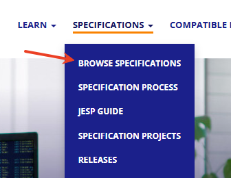

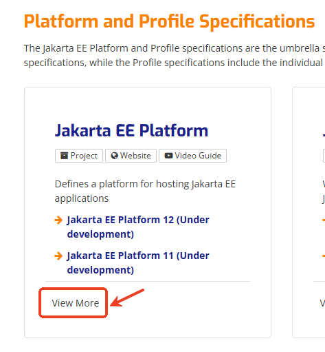

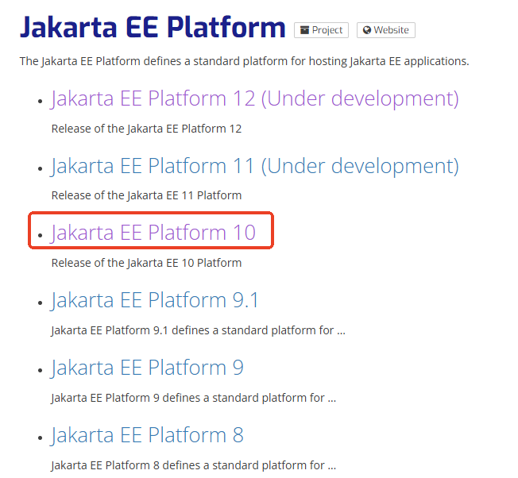

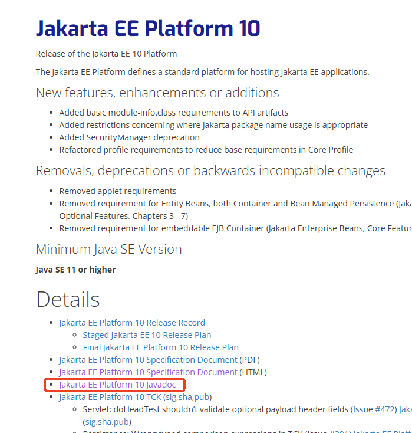

# Tomcat 服务器


## Web 服务器&应用服务器

### Web Server

**Web服务器**是专门用于处理HTTP请求的软件，主要功能是存储、处理和传递网页给客户端（通常是浏览器）。

**主要特点**：

- 处理HTTP/HTTPS协议请求
- 返回静态内容（HTML、CSS、JS、图片等）
- 轻量级，性能高

**Java Web服务器代表**：

1. **Apache Tomcat** - 最流行的Java Web服务器和Servlet容器
2. **Jetty** - 轻量级、嵌入式的Web服务器
3. **Undertow** - JBoss提供的轻量高性能Web服务器

### Application Server

**应用服务器**是为应用程序提供业务逻辑的中间件平台，功能比Web服务器更全面。

**主要特点**：

- 包含Web服务器的所有功能
- 支持EJB、JMS、JTA等企业级特性
- 提供事务管理、连接池、集群等高级功能
- 支持分布式计算和复杂业务逻辑

**Java应用服务器代表**：

1. **WildFly** (原JBoss AS) - Red Hat开发的开源应用服务器
2. **WebLogic** - Oracle提供的商业应用服务器
3. **WebSphere Application Server** - IBM的商业应用服务器
4. **GlassFish** - Oracle提供的开源参考实现

### 总结

**Web 服务器** = 只实现了 Jakarta EE 中的 Servlet + JSP 规范。

**应用服务器** = 实现了完整的 Jakarta EE 规范。

**现代趋势**：随着微服务架构的流行，轻量级的Web服务器(如Tomcat)结合Spring Boot等框架的使用越来越普遍，传统重量级应用服务器的使用在减少。

## Tomcat 简介

### 开发与维护

- **创始人**：Tomcat最初由Sun Microsystems的工程师**James Duncan Davidson**开发（1999年），后捐赠给Apache软件基金会。
- **当前维护**：由**Apache软件基金会**下的开源社区维护，是Apache Jakarta项目的一部分。

### 名字和 logo

**Tomcat**的名字源自开发者James Duncan Davidson养的公猫（Tom）。象征敏捷（轻量级）和独立（自己可以照顾自己）。


### 核心功能

- **Servlet/JSP容器**：实现Java EE（现Jakarta EE）的Servlet、JSP规范，支持动态Web应用。
- **轻量级**：相比完整应用服务器，Tomcat更专注于Servlet容器功能。
- **嵌入式支持**：可嵌入Spring Boot等框架作为内嵌服务器。

### 核心组件

- **Catalina**：Servlet容器。（**它是最核心的组件，相当于 Tomcat 的大脑**）**Santa Catalina Island** 是美国加州附近的一座风景优美的岛屿，延续了 Apache 软件基金会的“地理风”命名风格。
- **Coyote**：HTTP连接器（支持HTTP/1.1、HTTP/2）。
- **Jasper**：JSP引擎。
- **Cluster**：高可用性模块。

### 版本历史

| **Tomcat版本** | **发布日期** | **Servlet/JSP规范** | **Java EE/Jakarta EE版本** | **JDK 要求** | **状态** | **备注** |
| --- | --- | --- | --- | --- | --- | --- |
| **Tomcat 11** | 2023 年 | Servlet 6.0, JSP 3.1 | Jakarta EE 10 | **JDK 11+** | **过渡版本** |   |
| **Tomcat 10.1** | 2022年（持续更新） | Servlet 6.0, JSP 3.1 | Jakarta EE 10 | **JDK 11+** | **长期支持（LTS）** | 包名改为 `**<font style="color:#DF2A3F;background-color:rgb(236, 236, 236);">jakarta.*</font>**`（不兼容旧版） 当前企业主流版本，呈上升趋势。 |
| **Tomcat 10.0** | 2021年 | Servlet 5.0, JSP 3.0 | Jakarta EE 9 | **JDK 8+** | 过渡版本 | 首个 Jakarta EE 兼容版本 |
| **Tomcat 9.0** | 2018年（持续更新） | Servlet 4.0, JSP 2.3 | Java EE 8 | **JDK 8+** | **长期支持（LTS）** | 当前企业使用呈减少趋势。 |
| **Tomcat 8.5** | 2016年 | Servlet 3.1, JSP 2.3 | Java EE 7 | **JDK 7+**（推荐8+） | **2024年3月终止支持** | 支持HTTP/2、TLS 1.2等 |
| **Tomcat 7.0** | 2011年 | Servlet 3.0, JSP 2.2 | Java EE 6 | **JDK 6+** | 已终止（2021年3月） | 需升级到更高版本 |
| **Tomcat 6.0** | 2007年 | Servlet 2.5, JSP 2.1 | Java EE 5 | **JDK 5+** | 已终止（2016年12月） | 仅适合遗留系统 |
| **Tomcat 5.5** | 2004年 | Servlet 2.4, JSP 2.0 | J2EE 1.4 | **JDK 1.4+** | 已终止（2012年） | 需要JDK 1.4或更高版本 |
| **Tomcat 4.x** | 2002年 | Servlet 2.3, JSP 1.2 | J2EE 1.3 | **JDK 1.3+** | 已终止 | 首个Apache主导版本 |
| **Tomcat 3.x** | 1999年 | Servlet 2.2, JSP 1.1 | - | **JDK 1.1+** | 已终止 | 原始版本（Sun捐赠代码） |

**Jakarta EE、JavaSE（JDK）、Servlet、Tomcat，它们的关系是什么？**

- Jakarta EE 是 Java 企业级开发规范。
- Jakarta EE 是建立在 Java SE 基础上的（JDK 是最基本的）。
- Jakarta EE 中的子规范很多，Servlet 是其中的一个子规范。
- Tomcat 是实现了 Servlet 规范的 Web 服务器/Web 容器。

## Tomcat 下载

Apache 软件基金会官网地址：[https://apache.org/](https://apache.org/)，该页面底部找到 Tomcat

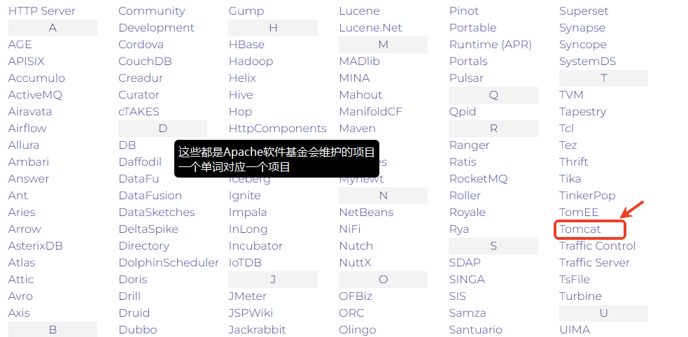

或者直接输入 Tomcat 的官网地址：[https://tomcat.apache.org/](https://tomcat.apache.org/) （是 apache 软件基金会官网的子域名，大家可以记住这个子域名的特点。）

`Maven`也是 Apache 的子项目，它的官网地址是：[https://maven.apache.org/](https://maven.apache.org/)


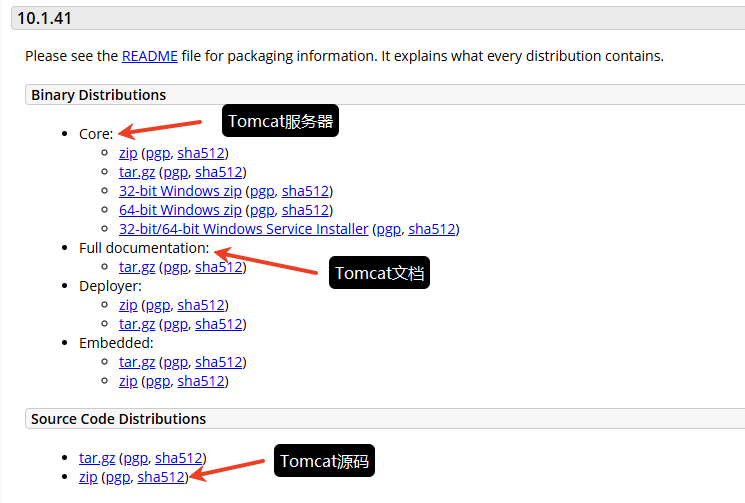

我们这里把 Tomcat 服务器以及 Tomcat 服务器的源码全部下载下来：

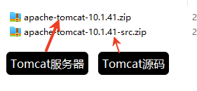

## Tomcat 安装

解压就是安装，直接将


解压到没有中文的路径中，我这里解压到 `C 盘`的根目录下。

打开 Tomcat 服务器的根目录，如下：


## Tomcat 目录介绍

### `bin`（Binary）

- **作用**：存放 Tomcat 的可执行脚本和启动/停止相关的文件。
- **关键内容**：
  - **启动/停止脚本**：如 `startup.sh`（Linux/macOS）和 `startup.bat`（Windows）用于启动 Tomcat；`shutdown.sh`/`shutdown.bat` 用于停止。
  - 其他工具：如 `catalina.sh`（核心脚本）、`version.sh`（版本检查）等。

### `conf`（Configuration）

- **作用**：存放 Tomcat 的全局配置文件。
- **关键文件**：
  - `server.xml`：主配置文件，定义**服务器端口（默认 8080）**、虚拟主机（Host）、连接器（Connector）等。
  - `web.xml`：所有 Web 应用的默认部署描述符（如默认 Servlet、MIME 类型）。

### `lib`（Libraries）

- **作用**：存放 Tomcat 运行所需的全局 Java 库（JAR 文件）。
- **关键内容**：Tomcat 核心库：如 `servlet-api.jar`、`jsp-api.jar`、`catalina.jar` 等。

### `logs`

- **作用**：存放 Tomcat 运行日志和应用日志。
- **关键文件**：
  - `catalina.out`**/**`catalina.log`：核心引擎日志（启动/停止错误等）。
  - `localhost.log`：应用部署相关的日志（如 Context 加载失败）。
- **注意**：日志是排查问题的首要位置，可通过 `conf/logging.properties` 配置格式和级别。

### `temp`

- **作用**：存放临时文件（如上传的文件、Session 持久化数据等）。

### `webapps`

- **作用：**默认的 Web 应用部署目录。我们开发的 webapp 默认都放到这个目录下。

### `work`

- **作用**：存放运行时生成的临时文件（主要是 JSP 编译后的 Servlet 类文件和 Session 数据）。
- **JSP 编译结果**：如 `org/apache/jsp/index_jsp.java` 和 `.class` 文件。

## Tomcat 配置

### 配置哪些环境变量

Tomcat 服务器是纯 Java 语言实现的。

启动 Tomcat 服务器时，需要执行 `bin`目录下的 `startup.bat`**（bat 文件是 windows 批处理文件，可批量执行 dos 命令）**，用文本编辑器打开 `startup.bat`文件，可以搜索`CATALINA_HOME`：

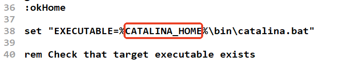

在 windows 环境中，取环境变量值的语法是 `**<font style="color:#DF2A3F;">%变量名%</font>**`，因此 `CATALINA_HOME`这个环境变量是**必须要配置的**，如果没有配置会导致 Tomcat 服务器启动失败。

并且通过以上命令可以看出：当我们执行 `startup.bat`的时候，会自动去找 `catalina.bat`文件。我们再使用文本编辑器将 `catalina.bat`打开，可以搜索 `JAVA_HOME`：


通过以上内容可以看出 `JAVA_HOME`环境变量也是必须配置的，如果不配置则无法启动 Tomcat。

Tomcat 服务器是纯 Java 语言实现的，启动 Tomcat 服务器实质上就是执行某个类的 main 方法。

因此要启动 Tomcat 服务器有两个环境变量是必须要配置的：

- JAVA_HOME=JDK 的根
- CATALINA_HOME=Tomcat 的根

另外为了能够在 dos 命令窗口的任意位置都能启动和关闭 Tomcat 服务器，还需要将 `CATALINA_HOME\bin`目录配置到 `PATH`环境变量中，但这不是必须的：

- PATH=%CATALINA_HOME%\bin

### JAVA_HOME 配置

此电脑-->右键-->属性-->高级系统设置-->环境变量

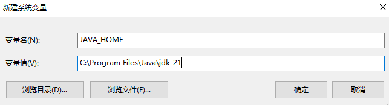

### CATALINA_HOME 配置

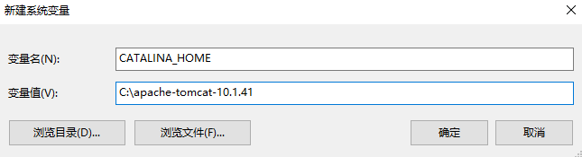

### PATH 配置

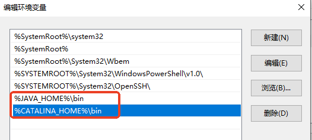

## Tomcat 启动和关闭

### 启动

windows 环境中执行 startup.bat 来启动 Tomcat：

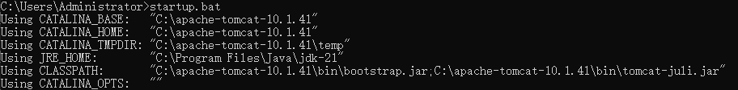

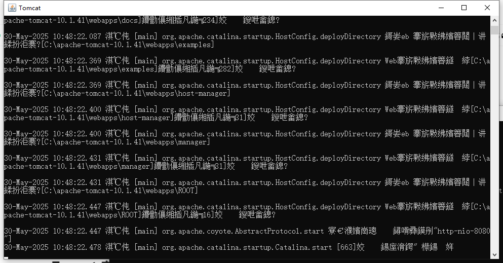

以上的控制台窗口中会显示 Tomcat 服务器运行过程中打印的日志信息。

Tomcat 服务器运行期间这个控制台窗口不能关闭。

### 关闭

windows 环境中执行 shutdown.bat 来关闭 Tomcat：


执行该命令后，之前的控制台窗口会关闭，Tomcat 服务器退出。

日志信息乱码可以通过修改配置文件来解决，打开 `CATALINA_HOME/conf/logging.properties`，将 `UTF-8`修改为 `GBK`，如下：

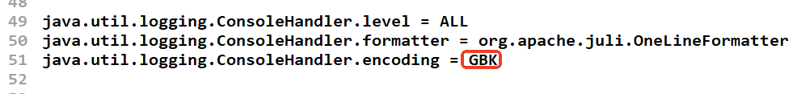

重新启动 Tomcat，查看控制台，乱码已解决：

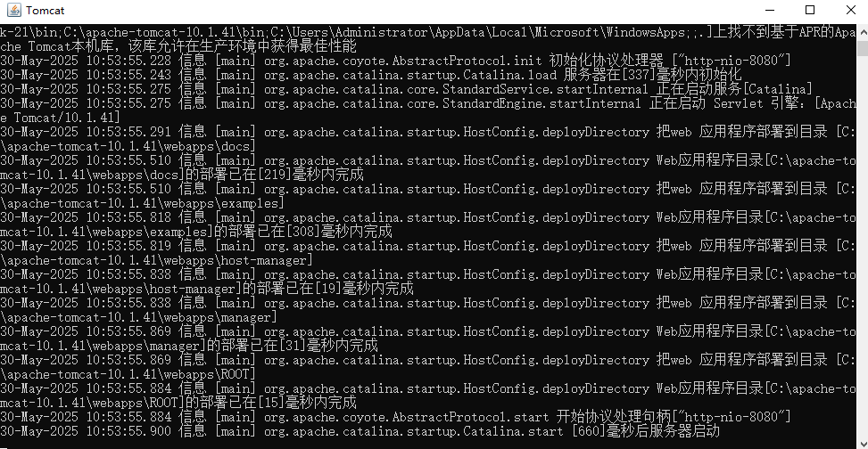

### 测试

打开浏览器，在浏览器地址栏上输入：http://localhost:8080，你将看到以下页面：

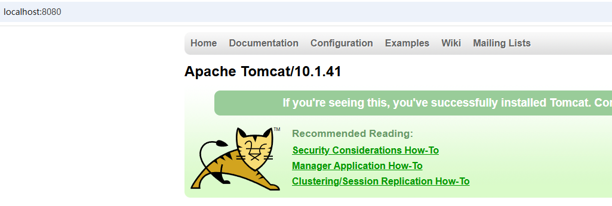

提醒：`127.0.0.1` 和 `localhost` 都表示本机。

# 开发静态网站


## 创建项目

在任意位置创建目录 `dept`。

`dept`就是项目名，该项目主要完成部门的维护。


## 开发静态网页

在 `dept`目录下新建 `index.html`、`list.html`、`add.html`、`edit.html`、`detail.html`

以下页面是 AI 生成的：

### index.html

```html
<!DOCTYPE html>
<html lang="zh-CN">
<head>
    <meta charset="UTF-8">
    <meta name="viewport" content="width=device-width, initial-scale=1.0">
    <title>部门管理系统 - 登录</title>
    <style>
        * {
            margin: 0;
            padding: 0;
            box-sizing: border-box;
            font-family: 'Arial', sans-serif;
        }
        body {
            background-color: #f5f5f5;
            display: flex;
            justify-content: center;
            align-items: center;
            height: 100vh;
        }
        .login-container {
            background-color: white;
            padding: 40px;
            border-radius: 8px;
            box-shadow: 0 4px 12px rgba(0, 0, 0, 0.1);
            width: 400px;
        }
        .login-header {
            text-align: center;
            margin-bottom: 30px;
        }
        .login-header h1 {
            color: #333;
            font-size: 24px;
            margin-bottom: 10px;
        }
        .form-group {
            margin-bottom: 20px;
        }
        .form-group label {
            display: block;
            margin-bottom: 8px;
            color: #555;
            font-weight: 500;
        }
        .form-group input {
            width: 100%;
            padding: 12px;
            border: 1px solid #ddd;
            border-radius: 4px;
            font-size: 16px;
            transition: border-color 0.3s;
        }
        .form-group input:focus {
            border-color: #4a90e2;
            outline: none;
        }
        .login-btn {
            width: 100%;
            padding: 12px;
            background-color: #4a90e2;
            color: white;
            border: none;
            border-radius: 4px;
            font-size: 16px;
            cursor: pointer;
            transition: background-color 0.3s;
        }
        .login-btn:hover {
            background-color: #3a7bc8;
        }
        .footer {
            text-align: center;
            margin-top: 20px;
            color: #888;
            font-size: 14px;
        }
    </style>
</head>
<body>
    <div class="login-container">
        <div class="login-header">
            <h1>部门管理系统</h1>
            <p>请输入您的凭据以继续</p>
        </div>
        <form action="#" method="post">
            <div class="form-group">
                <label for="username">用户名</label>
                <input type="text" id="username" name="username" placeholder="请输入用户名" required>
            </div>
            <div class="form-group">
                <label for="password">密码</label>
                <input type="password" id="password" name="password" placeholder="请输入密码" required>
            </div>
            <button type="submit" class="login-btn">登录</button>
        </form>
        <div class="footer">
            <p>© 2025 部门管理系统 - 版权所有</p>
        </div>
    </div>
</body>
</html>
```

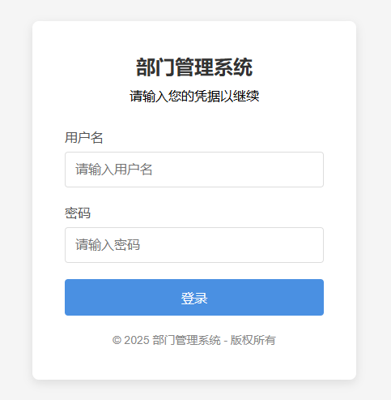

### list.html

```html
<!DOCTYPE html>
<html lang="zh-CN">
<head>
    <meta charset="UTF-8">
    <meta name="viewport" content="width=device-width, initial-scale=1.0">
    <title>部门管理系统 - 部门列表</title>
    <style>
        * {
            margin: 0;
            padding: 0;
            box-sizing: border-box;
            font-family: 'Arial', sans-serif;
        }
        body {
            background-color: #f5f5f5;
        }
        .container {
            max-width: 1200px;
            margin: 0 auto;
            padding: 20px;
        }
        .header {
            display: flex;
            justify-content: space-between;
            align-items: center;
            margin-bottom: 30px;
        }
        .header h1 {
            color: #333;
            font-size: 24px;
        }
        .add-btn {
            padding: 10px 20px;
            background-color: #4a90e2;
            color: white;
            border: none;
            border-radius: 4px;
            cursor: pointer;
            text-decoration: none;
            font-size: 14px;
            transition: background-color 0.3s;
        }
        .add-btn:hover {
            background-color: #3a7bc8;
        }
        .department-table {
            width: 100%;
            border-collapse: collapse;
            background-color: white;
            box-shadow: 0 2px 8px rgba(0, 0, 0, 0.1);
            border-radius: 4px;
            overflow: hidden;
        }
        .department-table th, .department-table td {
            padding: 15px;
            text-align: left;
            border-bottom: 1px solid #eee;
        }
        .department-table th {
            background-color: #f8f9fa;
            font-weight: 600;
            color: #555;
        }
        .department-table tr:hover {
            background-color: #f8f9fa;
        }
        .action-btn {
            padding: 6px 12px;
            margin-right: 5px;
            border: none;
            border-radius: 4px;
            cursor: pointer;
            font-size: 13px;
            transition: all 0.3s;
            text-decoration: none;
            display: inline-block;
        }
        .view-btn {
            background-color: #5cb85c;
            color: white;
        }
        .view-btn:hover {
            background-color: #4cae4c;
        }
        .edit-btn {
            background-color: #f0ad4e;
            color: white;
        }
        .edit-btn:hover {
            background-color: #eea236;
        }
        .delete-btn {
            background-color: #d9534f;
            color: white;
        }
        .delete-btn:hover {
            background-color: #d43f3a;
        }
        .logout {
            text-align: right;
            margin-top: 20px;
        }
        .logout a {
            color: #777;
            text-decoration: none;
            font-size: 14px;
        }
        .logout a:hover {
            color: #333;
        }
    </style>

</head>
<body>
    <div class="container">
        <div class="header">
            <h1>部门列表</h1>
            <a href="" class="add-btn">添加部门</a>
        </div>
        
        <table class="department-table">
            <thead>
                <tr>
                    <th>部门编号</th>
                    <th>部门名称</th>
                    <th>部门地理位置</th>
                    <th>操作</th>
                </tr>
            </thead>
            <tbody>
                <tr>
                    <td>D001</td>
                    <td>技术部</td>
                    <td>北京总部A座3层</td>
                    <td>
                        <a href="" class="action-btn view-btn">查看</a>
                        <a href="" class="action-btn edit-btn">修改</a>
                        <a href="#" class="action-btn delete-btn" onclick="">删除</a>
                    </td>
                </tr>
                <tr>
                    <td>D002</td>
                    <td>市场部</td>
                    <td>北京总部A座2层</td>
                    <td>
                        <a href="" class="action-btn view-btn">查看</a>
                        <a href="" class="action-btn edit-btn">修改</a>
                        <a href="#" class="action-btn delete-btn" onclick="">删除</a>
                    </td>
                </tr>
                <tr>
                    <td>D003</td>
                    <td>人力资源部</td>
                    <td>北京总部B座1层</td>
                    <td>
                        <a href="" class="action-btn view-btn">查看</a>
                        <a href="" class="action-btn edit-btn">修改</a>
                        <a href="#" class="action-btn delete-btn" onclick="">删除</a>
                    </td>
                </tr>
            </tbody>
        </table>
        
        <div class="logout">
            <a href="">退出登录</a>
        </div>
    </div>
</body>
</html>
```


### add.html

```html
<!DOCTYPE html>
<html lang="zh-CN">
<head>
    <meta charset="UTF-8">
    <meta name="viewport" content="width=device-width, initial-scale=1.0">
    <title>部门管理系统 - 添加部门</title>
    <style>
        * {
            margin: 0;
            padding: 0;
            box-sizing: border-box;
            font-family: 'Arial', sans-serif;
        }
        body {
            background-color: #f5f5f5;
        }
        .container {
            max-width: 800px;
            margin: 30px auto;
            padding: 30px;
            background-color: white;
            border-radius: 8px;
            box-shadow: 0 2px 8px rgba(0, 0, 0, 0.1);
        }
        .header {
            display: flex;
            justify-content: space-between;
            align-items: center;
            margin-bottom: 30px;
            padding-bottom: 15px;
            border-bottom: 1px solid #eee;
        }
        .header h1 {
            color: #333;
            font-size: 24px;
        }
        .back-btn {
            padding: 8px 16px;
            background-color: #6c757d;
            color: white;
            border: none;
            border-radius: 4px;
            cursor: pointer;
            text-decoration: none;
            font-size: 14px;
            transition: background-color 0.3s;
        }
        .back-btn:hover {
            background-color: #5a6268;
        }
        .form-group {
            margin-bottom: 20px;
        }
        .form-group label {
            display: block;
            margin-bottom: 8px;
            color: #555;
            font-weight: 500;
        }
        .form-group input, .form-group select {
            width: 100%;
            padding: 12px;
            border: 1px solid #ddd;
            border-radius: 4px;
            font-size: 16px;
            transition: border-color 0.3s;
        }
        .form-group input:focus, .form-group select:focus {
            border-color: #4a90e2;
            outline: none;
        }
        .submit-btn {
            padding: 12px 24px;
            background-color: #4a90e2;
            color: white;
            border: none;
            border-radius: 4px;
            cursor: pointer;
            font-size: 16px;
            transition: background-color 0.3s;
        }
        .submit-btn:hover {
            background-color: #3a7bc8;
        }
        .footer {
            text-align: right;
            margin-top: 30px;
            padding-top: 15px;
            border-top: 1px solid #eee;
        }
    </style>
</head>
<body>
    <div class="container">
        <div class="header">
            <h1>添加新部门</h1>
            <a href="" class="back-btn">返回列表</a>
        </div>
        
        <form action="#" method="post">
            <div class="form-group">
                <label for="deptId">部门编号</label>
                <input type="text" id="deptId" name="deptId" placeholder="请输入部门编号" required>
            </div>
            <div class="form-group">
                <label for="deptName">部门名称</label>
                <input type="text" id="deptName" name="deptName" placeholder="请输入部门名称" required>
            </div>
            <div class="form-group">
                <label for="location">部门地理位置</label>
                <input type="text" id="location" name="location" placeholder="请输入部门地理位置" required>
            </div>
            
            <div class="footer">
                <button type="submit" class="submit-btn">保存</button>
            </div>
        </form>
    </div>
</body>
</html>
```


### edit.html

```html
<!DOCTYPE html>
<html lang="zh-CN">
<head>
    <meta charset="UTF-8">
    <meta name="viewport" content="width=device-width, initial-scale=1.0">
    <title>部门管理系统 - 修改部门</title>
    <style>
        * {
            margin: 0;
            padding: 0;
            box-sizing: border-box;
            font-family: 'Arial', sans-serif;
        }
        body {
            background-color: #f5f5f5;
        }
        .container {
            max-width: 800px;
            margin: 30px auto;
            padding: 30px;
            background-color: white;
            border-radius: 8px;
            box-shadow: 0 2px 8px rgba(0, 0, 0, 0.1);
        }
        .header {
            display: flex;
            justify-content: space-between;
            align-items: center;
            margin-bottom: 30px;
            padding-bottom: 15px;
            border-bottom: 1px solid #eee;
        }
        .header h1 {
            color: #333;
            font-size: 24px;
        }
        .back-btn {
            padding: 8px 16px;
            background-color: #6c757d;
            color: white;
            border: none;
            border-radius: 4px;
            cursor: pointer;
            text-decoration: none;
            font-size: 14px;
            transition: background-color 0.3s;
        }
        .back-btn:hover {
            background-color: #5a6268;
        }
        .form-group {
            margin-bottom: 20px;
        }
        .form-group label {
            display: block;
            margin-bottom: 8px;
            color: #555;
            font-weight: 500;
        }
        .form-group input, .form-group select {
            width: 100%;
            padding: 12px;
            border: 1px solid #ddd;
            border-radius: 4px;
            font-size: 16px;
            transition: border-color 0.3s;
        }
        .form-group input:focus, .form-group select:focus {
            border-color: #4a90e2;
            outline: none;
        }
        .form-group input[readonly] {
            background-color: #f8f9fa;
            color: #6c757d;
        }
        .btn-group {
            display: flex;
            justify-content: space-between;
            margin-top: 30px;
            padding-top: 15px;
            border-top: 1px solid #eee;
        }
        .submit-btn {
            padding: 12px 24px;
            background-color: #4a90e2;
            color: white;
            border: none;
            border-radius: 4px;
            cursor: pointer;
            font-size: 16px;
            transition: background-color 0.3s;
        }
        .submit-btn:hover {
            background-color: #3a7bc8;
        }
        .cancel-btn {
            padding: 12px 24px;
            background-color: #6c757d;
            color: white;
            border: none;
            border-radius: 4px;
            cursor: pointer;
            font-size: 16px;
            transition: background-color 0.3s;
            text-decoration: none;
        }
        .cancel-btn:hover {
            background-color: #5a6268;
        }
    </style>
</head>
<body>
    <div class="container">
        <div class="header">
            <h1>修改部门信息</h1>
            <a href="" class="back-btn">返回列表</a>
        </div>
        
        <form action="#" method="post">
            <div class="form-group">
                <label for="deptId">部门编号</label>
                <input type="text" id="deptId" name="deptId" value="D001" readonly>
            </div>
            <div class="form-group">
                <label for="deptName">部门名称</label>
                <input type="text" id="deptName" name="deptName" value="技术部" required>
            </div>
            <div class="form-group">
                <label for="location">部门地理位置</label>
                <input type="text" id="location" name="location" value="北京总部A座3层" required>
            </div>
            
            <div class="btn-group">
                <a href="" class="cancel-btn">取消</a>
                <button type="submit" class="submit-btn">保存更改</button>
            </div>
        </form>
    </div>
</body>
</html>
```


### detail.html

```html
<!DOCTYPE html>
<html lang="zh-CN">
<head>
    <meta charset="UTF-8">
    <meta name="viewport" content="width=device-width, initial-scale=1.0">
    <title>部门管理系统 - 部门详情</title>
    <style>
        * {
            margin: 0;
            padding: 0;
            box-sizing: border-box;
            font-family: 'Arial', sans-serif;
        }
        body {
            background-color: #f5f5f5;
        }
        .container {
            max-width: 800px;
            margin: 30px auto;
            padding: 30px;
            background-color: white;
            border-radius: 8px;
            box-shadow: 0 2px 8px rgba(0, 0, 0, 0.1);
        }
        .header {
            display: flex;
            justify-content: space-between;
            align-items: center;
            margin-bottom: 30px;
            padding-bottom: 15px;
            border-bottom: 1px solid #eee;
        }
        .header h1 {
            color: #333;
            font-size: 24px;
        }
        .back-btn {
            padding: 8px 16px;
            background-color: #6c757d;
            color: white;
            border: none;
            border-radius: 4px;
            cursor: pointer;
            text-decoration: none;
            font-size: 14px;
            transition: background-color 0.3s;
        }
        .back-btn:hover {
            background-color: #5a6268;
        }
        .detail-card {
            padding: 20px;
            border-radius: 6px;
            background-color: #f8f9fa;
        }
        .detail-row {
            display: flex;
            margin-bottom: 15px;
            padding-bottom: 15px;
            border-bottom: 1px solid #e9ecef;
        }
        .detail-row:last-child {
            margin-bottom: 0;
            padding-bottom: 0;
            border-bottom: none;
        }
        .detail-label {
            width: 150px;
            font-weight: 600;
            color: #495057;
        }
        .detail-value {
            flex: 1;
            color: #212529;
        }
        .action-btns {
            margin-top: 30px;
            text-align: right;
        }
        .edit-btn {
            padding: 10px 20px;
            background-color: #f0ad4e;
            color: white;
            border: none;
            border-radius: 4px;
            cursor: pointer;
            text-decoration: none;
            font-size: 14px;
            transition: background-color 0.3s;
        }
        .edit-btn:hover {
            background-color: #eea236;
        }
    </style>

</head>
<body>
    <div class="container">
        <div class="header">
            <h1>部门详细信息</h1>
            <a href="" class="back-btn">返回列表</a>
        </div>
        
        <div class="detail-card">
            <div class="detail-row">
                <div class="detail-label">部门编号</div>
                <div class="detail-value">D001</div>
            </div>
            <div class="detail-row">
                <div class="detail-label">部门名称</div>
                <div class="detail-value">技术部</div>
            </div>
            <div class="detail-row">
                <div class="detail-label">部门地理位置</div>
                <div class="detail-value">北京总部A座3层</div>
            </div>
        </div>
        
        <div class="action-btns">
            <a href="" class="edit-btn">编辑部门信息</a>
        </div>
    </div>
</body>
</html>
```


## 部署项目

部署就是将开发的项目拷贝到 `CATALINA_HOME/webapps`目录下，将 `dept`目录拷贝到该目录下。

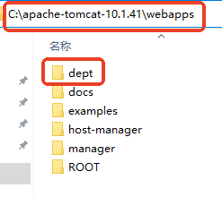

## 启动 Tomcat 打开浏览器访问

访问地址分别如下：

1. http://localhost:8080/dept/index.html
2. http://localhost:8080/dept/list.html
3. http://localhost:8080/dept/add.html
4. http://localhost:8080/dept/edit.html
5. http://localhost:8080/dept/detail.html

## 添加超链接跑通页面

1. 用户在地址栏上直接输入 `URL`回车和用户直接点击网页中的超链接，底层原理相同，都是浏览器向服务器发送请求。
2. 超链接 URL 中的 `http://localhost:8080`可以省略。
3. 页面跳转设计：
  1. index.html 跳转到 list.html
  2. list.html 页面中点击 `添加部门` 跳转到 add.html
  3. list.html 页面中点击 `修改`跳转到 edit.html
  4. list.html 页面中点击 `查看`跳转到 detail.html
4. 我以 list.html 为例添加超链接，其它页面自己完成：

```html
<!DOCTYPE html>
<html lang="zh-CN">
<head>
    <meta charset="UTF-8">
    <meta name="viewport" content="width=device-width, initial-scale=1.0">
    <title>部门管理系统 - 部门列表</title>
    <style>
        * {
            margin: 0;
            padding: 0;
            box-sizing: border-box;
            font-family: 'Arial', sans-serif;
        }
        body {
            background-color: #f5f5f5;
        }
        .container {
            max-width: 1200px;
            margin: 0 auto;
            padding: 20px;
        }
        .header {
            display: flex;
            justify-content: space-between;
            align-items: center;
            margin-bottom: 30px;
        }
        .header h1 {
            color: #333;
            font-size: 24px;
        }
        .add-btn {
            padding: 10px 20px;
            background-color: #4a90e2;
            color: white;
            border: none;
            border-radius: 4px;
            cursor: pointer;
            text-decoration: none;
            font-size: 14px;
            transition: background-color 0.3s;
        }
        .add-btn:hover {
            background-color: #3a7bc8;
        }
        .department-table {
            width: 100%;
            border-collapse: collapse;
            background-color: white;
            box-shadow: 0 2px 8px rgba(0, 0, 0, 0.1);
            border-radius: 4px;
            overflow: hidden;
        }
        .department-table th, .department-table td {
            padding: 15px;
            text-align: left;
            border-bottom: 1px solid #eee;
        }
        .department-table th {
            background-color: #f8f9fa;
            font-weight: 600;
            color: #555;
        }
        .department-table tr:hover {
            background-color: #f8f9fa;
        }
        .action-btn {
            padding: 6px 12px;
            margin-right: 5px;
            border: none;
            border-radius: 4px;
            cursor: pointer;
            font-size: 13px;
            transition: all 0.3s;
            text-decoration: none;
            display: inline-block;
        }
        .view-btn {
            background-color: #5cb85c;
            color: white;
        }
        .view-btn:hover {
            background-color: #4cae4c;
        }
        .edit-btn {
            background-color: #f0ad4e;
            color: white;
        }
        .edit-btn:hover {
            background-color: #eea236;
        }
        .delete-btn {
            background-color: #d9534f;
            color: white;
        }
        .delete-btn:hover {
            background-color: #d43f3a;
        }
        .logout {
            text-align: right;
            margin-top: 20px;
        }
        .logout a {
            color: #777;
            text-decoration: none;
            font-size: 14px;
        }
        .logout a:hover {
            color: #333;
        }
    </style>
</head>
<body>
    <div class="container">
        <div class="header">
            <h1>部门列表</h1>
            <a href="/dept/add.html" class="add-btn">添加部门</a>
        </div>
        
        <table class="department-table">
            <thead>
                <tr>
                    <th>部门编号</th>
                    <th>部门名称</th>
                    <th>部门地理位置</th>
                    <th>操作</th>
                </tr>
            </thead>
            <tbody>
                <tr>
                    <td>D001</td>
                    <td>技术部</td>
                    <td>北京总部A座3层</td>
                    <td>
                        <a href="/dept/detail.html" class="action-btn view-btn">查看</a>
                        <a href="/dept/edit.html" class="action-btn edit-btn">修改</a>
                        <a href="#" class="action-btn delete-btn" onclick="">删除</a>
                    </td>
                </tr>
                <tr>
                    <td>D002</td>
                    <td>市场部</td>
                    <td>北京总部A座2层</td>
                    <td>
                        <a href="/dept/detail.html" class="action-btn view-btn">查看</a>
                        <a href="/dept/edit.html" class="action-btn edit-btn">修改</a>
                        <a href="#" class="action-btn delete-btn" onclick="">删除</a>
                    </td>
                </tr>
                <tr>
                    <td>D003</td>
                    <td>人力资源部</td>
                    <td>北京总部B座1层</td>
                    <td>
                        <a href="/dept/detail.html" class="action-btn view-btn">查看</a>
                        <a href="/dept/edit.html" class="action-btn edit-btn">修改</a>
                        <a href="#" class="action-btn delete-btn" onclick="">删除</a>
                    </td>
                </tr>
            </tbody>
        </table>
        
        <div class="logout">
            <a href="/dept/index.html">退出登录</a>
        </div>
    </div>
</body>
</html>
```

修改完成后，启动 Tomcat 服务器，打开浏览器，输入 URL：http://localhost:8080/index.html 测试页面流转是否正确。

## 值得思考的问题

- **第一个问题**：直接找到 html 文件，鼠标双击，直接采用浏览器打开不就行了吗？为什么还要安装 Tomcat 服务器，又是开发，又是部署的，还得打开浏览器输入 URL 地址，多麻烦呀！你看呢？
- **第二个问题**：这些页面目前都是静态的，我们怎么能让页面变成动态网页，这里所说的动态网页不是说页面中有 flash 动画，指的是页面中的数据是动态的，假设数据库表中有 10 条记录，则部门列表页面显示 10 个部门信息。如果有 100 条则页面也显示 100 条。这就需要编写 Java 程序了，让 Java 程序去连接数据库，动态查询数据就搞定了，那么这个服务器端的 Java 程序通常被我们称为 Servlet。（Servlet：Server Applet 表示服务器端的 Java 小程序。）

# 深入理解 Servlet


## BS 系统涉及的角色与协议

**详细图：**

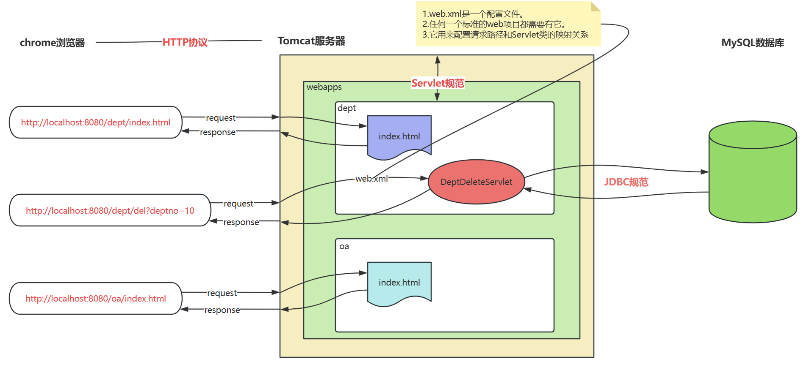

**简略图：**


---

**4 个角色：**

- 浏览器开发者（开发谷歌浏览器的那些人）
- Web 服务器开发者（开发 Tomcat 服务器的那些人）
- Web 应用开发者（JavaWeb 程序员，说的是我们）
- 数据库服务器开发者（开发 MySQL 数据库的那些人）

**3 个协议：**

- 浏览器和 Web 服务器之间的通信协议 HTTP。
- Web 服务器和 Web 应用之间都必须遵循 Servlet 规范。这样 Web 服务器和 Web 应用才可以解耦合。**（怎么理解解耦合：Web 应用开发完成后不一定非要部署到 Tomcat 中，可以部署到任何一个实现了 Servlet 规范的容器中）**
- Web 应用中的 Java 程序和数据库服务器之间必须遵循 JDBC 规范。这样 Java 程序和具体的数据库产品就解耦合了。**（怎么理解解耦合：Java 程序不一定非要连接 MySQL 数据库，不改任何代码的前提下，还可以连接 Oracle 数据库）**

## 模拟 Servlet 接口

我们来模拟一下 Servlet 接口，帮助大家理解 Servlet 的本质及实现原理。不需要那么复杂，我们模拟两个角色，一个规范即可。

**两个角色：**

- Tomcat 服务器开发者。
- Web 应用的开发者。（JavaWeb 程序员）

**一个规范：**

- Servlet 规范。

**创建一个目录用来存储代码：**

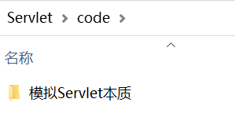

### 制定 Servlet 规范

Servlet 规范中规范了很多东西，我们这里只编写一个 `Servlet`接口即可。`Tomcat 服务器开发者`和 `Web 应用开发者`都面向该接口编程，才可以做到解耦合。

打开 `模拟 Servlet 本质`目录，编写 `Servlet`接口，代码如下：

```java
package jakarta.servlet;

public interface Servlet{
        // 处理请求的核心方法
        void service();
}
```

### Web 应用的开发者

Web 应用的开发者应该完全面向 Servlet 接口编写具体的 Servlet。我们这里编写两个 Servlet。一个是处理用户登录的 LoginServlet。一个是删除部门信息的 DeptDeleteServlet。任何一个 Servlet 类都要实现 Servlet 接口，这样开发出的 Web 应用才不会依赖具体的 Web 服务器。

```java
package com.jkweilai.servlet;

import jakarta.servlet.Servlet;

public class LoginServlet implements Servlet{
        public void service(){
                System.out.println("正在处理用户的登录请求...");
        }
}
```

```java
package com.jkweilai.servlet;

import jakarta.servlet.Servlet;

public class DeptDeleteServlet implements Servlet{
        public void service(){
                System.out.println("正在删除部门信息...");
        }
}
```

重要的一步：请求路径和 Servlet 之间的映射关系需要 web.xml 配置文件。这里为了简单，使用 `web.properties`来代替 `web.xml`，新建 `web.properties`，提供以下配置：

```plaintext
/login=com.jkweilai.servlet.LoginServlet
/del=com.jkweilai.servlet.DeptDeleteServlet
```

这个配置文件的创建和编写都需要 Web 应用的开发者来提供。在这个配置文件中主要配置了请求路径和 Servlet 全限定类名之间的对应关系。当用户的请求路径是 `/login`时执行 `LoginServlet`来处理请求。当用户的请求路径是 `/del`时执行 `DeptDeleteServlet`来处理请求。

### Tomcat 服务器开发者

Tomcat 服务器开发者也要完全面向 Servlet 接口去调用，因为 Tomcat 服务器根本就不知道具体的 Servlet 是哪个，它只知道 Web 应用开发者提供的 Servlet 类都实现了 Servlet 接口。

Tomcat 服务器启动就是执行 main 方法，当服务器启动之后，开始接收用户的请求，当用户请求发送后，Tomcat 获取到用户的请求路径，然后读取 Web 应用开发者编写的 `web.properties`配置文件，通过这个配置文件找到要处理这次请求的 Servlet 类的全限定类名，通过反射机制创建 Servlet 对象，调用 service 方法来处理当前的请求。

大家思考一个问题：为什么这个配置文件的名字以及配置文件所放的位置都是 Servlet 规范中规定好的，不能随便写？

```java
package org.apache.catalina.startup;

import java.util.Scanner;
import java.util.ResourceBundle;
import jakarta.servlet.Servlet;

public class Bootstrap{

        public static void main(String[] args) throws Exception{
                System.out.println("Tomcat服务器启动成功，开始接收用户请求...");
                ResourceBundle bundle = ResourceBundle.getBundle("web");
                Scanner s = new Scanner(System.in);
                while(true){
                        System.out.print("请输入请求路径：");
                        String url = s.next();
                        String servletClassName = bundle.getString(url);
                        Class clazz = Class.forName(servletClassName);
                        Servlet servlet = (Servlet)clazz.newInstance();
                        servlet.service();
                }
        }
}
```

### 测试

编译以上程序：


如果编译时提示字符集的问题，如下：

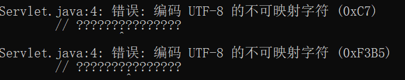

这是因为 EditPlus 编辑器默认的字符编码方式为 ANSI。将 EditPlus 的字符编码方式修改为 UTF-8，如下：

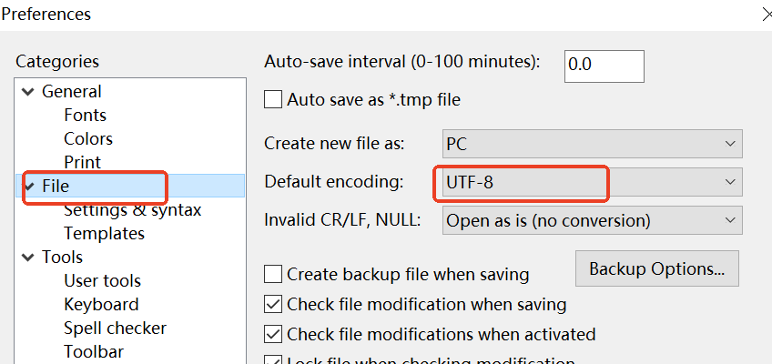

然后将我们之前编写的每个文件的字符集修改为 UTF-8：

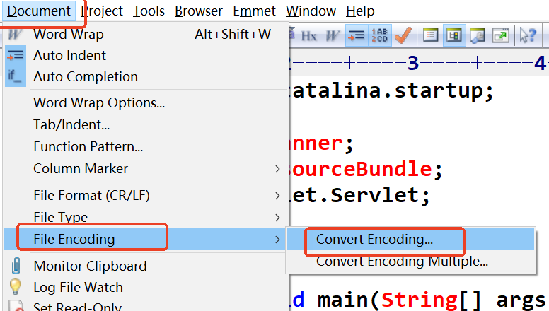

操作完成后一定要重新保存文件哦。

再次编译，结果如下：

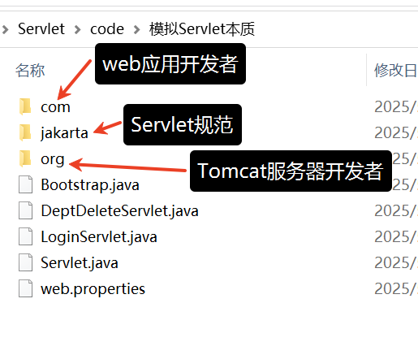

运行 Bootstrap 类，启动 Tomcat 服务器，开始接收用户的请求：

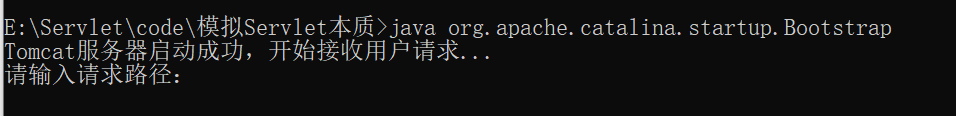

发送`/login`请求，再发送 `/del`请求，观察 Tomcat 服务器是否可以调用到对应的 Servlet：

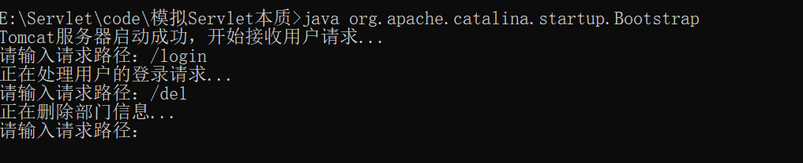

## Servlet 规范规定了什么

只有遵守了 Servlet 规范，web 应用才能够运行在不同的符合规范的 web 服务器中。你需要永远记住这句话。

### 定义了一些接口和类

Servlet 规范定义了一些接口和类，例如接口 `jakarta.servlet.Servlet`、`jakarta.servlet.ServletRequest`、`jakarta.servlet.ServletResponse`。Tomcat 服务器面向接口调用和实现。JavaWeb 程序员也面向这些接口调用和实现。这样 Web 服务器和 Web 应用就达到了解耦合。

### 规定了 JavaWeb 应用的目录结构

JavaWeb 应用的目录结构不能随便写，也是 Servlet 规范中规定的，这样我的项目就可以不依赖具体的 Web 服务器了。只要这个服务器是一个符合 Servlet 规范的服务器，都可以运行我的项目。

为了保证 web 应用的可移植性（可以运行在不同的 web 服务器中），Servlet 规范中规定了 web 应用的目录结构，一个标准的 JavaWeb 应用目录结构必须遵守以下规范：

```plaintext
webapproot
    |-------html
    |-------css
    |-------javascript
    |-------其它静态资源
    |-------WEB-INF
               |-------classes
               |-------lib
               |-------web.xml
```

1. 静态资源直接放在 web 应用的根目录下即可。这里的静态资源包括但不限于：html css javascript images 等。
2. WEB-INF 名字必须是全部大写的 `WEB-INF`
3. 放在 `WEB-INF`目录下的资源是**受保护的**，不可在浏览器地址栏上通过地址直接访问。例如在 `WEB-INF`放一个 `index.html`，在浏览器地址栏上访问 `http://localhost:8080/webapproot/WEB-INF/index.html`会出现 `404`错误。（404 是 HTTP 状态码，表示访问的资源找不到。）
4. `WEB-INF\classes`目录下放字节码。
5. `WEB-INF\lib`目录下放第三方的 `jar`包。如连接数据库的驱动 jar 包。当然也可以放到 `CATALINA_HOME/lib`目录下也是可以的，`CATALINA_HOME/lib`是全局的，`WEB-INF/lib`是局部的。
6. `WEB-INF\web.xml`文件中编写请求路径和 Servlet 全限定类名的映射关系。

### 规定的配置文件不能随便写

Servlet 规范中规定了 web 应用的配置文件不能随意编写，因为 Tomcat 服务器是按照这个规范去找这个文件，去解析这个文件的：

1. 文件名必须叫做 `web.xml`。
2. 文件必须存放到 `webapproot/WEB-INF/web.xml`这个位置。
3. web.xml 文件中的具体配置信息也不能随便写，例如要配置一个请求路径和 Servlet 全限定类名之间的映射关系，必须按照以下配置进行：

```xml
<!--servlet配置信息-->
<servlet>
  <!--servlet的名字随便写一个，但是要保证和servlet mapping中的servlet名字一致。-->
  <servlet-name>loginServlet</servlet-name>
  <!--这里必须填写Servlet类的全限定类名-->
  <servlet-class>com.jkweilai.servlet.LoginServlet</servlet-class>
</servlet>
<!--servlet映射信息-->
<servlet-mapping>
  <servlet-name>loginServlet</servlet-name>
  <!--请求路径必须以 / 开始，不要添加项目名。-->
  <url-pattern>/login</url-pattern>
  <!--支持编写多个-->
  <url-pattern>/a/b/c</url-pattern>
</servlet-mapping>
```

# 开发第一个 Servlet


## 创建项目的标准目录

在任意位置创建一个目录 `web01`，作为项目的根目录。然后在该目录下按照以下目录结构创建：

```plaintext
web01
    |-------WEB-INF
               |-------classes
```

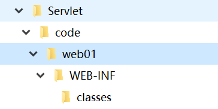

## 编写 Servlet

在任意位置创建 `HelloServlet.java`。

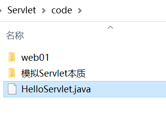

任何 `Servlet`都必须实现 `jakarta.servlet.Servlet`接口，该接口中有哪些方法呢？参考帮助文档：


编写 `HelloServlet`实现该接口中所有方法：

```java
package com.jkweilai.servlet;

import jakarta.servlet.Servlet;
import jakarta.servlet.ServletException;
import jakarta.servlet.ServletRequest;
import jakarta.servlet.ServletResponse;
import jakarta.servlet.ServletConfig;
import java.io.PrintWriter;
import java.io.IOException;

public class HelloServlet implements Servlet{

        public void init(ServletConfig config) throws ServletException{}

        public void service(ServletRequest request,ServletResponse response)
                throws ServletException, IOException{
                // 向控制台打印
                System.out.println("Hello Servlet!");
                // 向浏览器上响应HTML
                PrintWriter out = response.getWriter();
                out.print("<h1>Hello Servlet!</h1>");
        }

        public void destroy(){}

        public String getServletInfo(){
                return "";
        }

        public ServletConfig getServletConfig(){
                return null;
        }

}
```

## 编译 Servlet

配置环境变量 CLASSPATH：


思考，为什么要配置 CLASSPATH 环境变量，另外环境变量中为什么要添加一个 `.`

编译：


以上编译命令表示：编译当前目录下的 `HelloServlet.java`文件，将编译之后的程序放到当前目录下。

编译之后生成了：


## 编译后拷贝到 classes 目录

将以上编译之后的结果拷贝到 `WEB-INF/classes`目录下：


## 编写 web.xml 配置

Tomcat 服务器 webapps 目录下自带了几个项目，这些项目当中都有 `web.xml`，可以从这里拷贝样例文件。

在 `web01\WEB-INF\`目录下新建 `web.xml`文件，进行以下的配置：

```xml
<?xml version="1.0" encoding="UTF-8"?>
<web-app xmlns="https://jakarta.ee/xml/ns/jakartaee"
  xmlns:xsi="http://www.w3.org/2001/XMLSchema-instance"
  xsi:schemaLocation="https://jakarta.ee/xml/ns/jakartaee
                      https://jakarta.ee/xml/ns/jakartaee/web-app_6_0.xsd"
  version="6.0"
  metadata-complete="true">

  <servlet>
          <servlet-name>firstServlet</servlet-name>
          <servlet-class>com.jkweilai.servlet.HelloServlet</servlet-class>
  </servlet>
  <servlet-mapping>
          <servlet-name>firstServlet</servlet-name>
          <url-pattern>/hello</url-pattern>
  </servlet-mapping>
  
</web-app>
```

**需要引起注意：**

`**metadata-complete="true"**`：容器忽略所有注解，只使用 web.xml 配置

`<font style="color:rgb(15, 17, 21);">metadata-complete="false"</font>`(默认值)：容器会扫描注解

## 部署项目到 Tomcat

将 `web01`目录拷贝到 `CATALINA_HOME/webapps`目录下，如下：


## 启动 Tomcat 打开浏览器访问

浏览器上的结果：

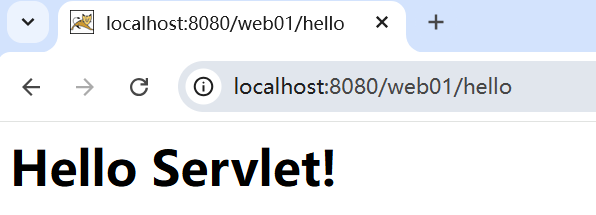

控制台的结果：


## 使用超链接发送请求

在上面测试时，浏览器地址栏上直接输入的地址是：`http://localhost:8080/web01/hello`，也可以采用用户点击超链接的方式发送请求。在 `web01`目录下新建 `index.html`。然后编写如下代码：

```html
<!DOCTYPE html>
<html lang="zh-CN">
<head>
    <meta charset="UTF-8">
    <meta name="viewport" content="width=device-width, initial-scale=1.0">
    <title>首页</title>
</head>
<body>
  <a href="http://localhost:8080/web01/hello">hello1</a>
  <!--http://ip:port 可以省略。前端编写的路径目前都以 / 开头，并且一定要添加项目名。-->
  <a href="/web01/hello">hello1</a>
</body>
</html>
```

将 `index.html`文件部署到 Tomcat 服务器的 `web01`项目下：


**再次启动服务器测试**

启动 Tomcat 服务器，然后打开浏览器在地址栏上输入：`http://localhost:8080/web01/index.html`


点击以上两个超链接发送请求，结果都是：

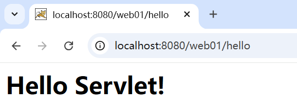

**将 index.html 放到 WEB-INF 目录下测试**


启动服务器，打开浏览器，输入地址：`http://localhost:8080/web01/WEB-INF/index.html`，如下：


通过测试得知，放在 WEB-INF 目录下的资源是受保护的。

## 响应一段中文到浏览器

修改 `HelloServlet.java`中的代码，响应一段中文到浏览器。修改代码之后，保存，然后重新编译，将新生成的代码重新拷贝到 Tomcat 服务器的 `web01/WEB-INF/classes`目录下，最后启动 Tomcat 服务器，打开浏览器访问。

```java
public void service(ServletRequest request,ServletResponse response)
    throws ServletException, IOException{
    // 向控制台打印
    System.out.println("Hello Servlet!");
    // 向浏览器上响应HTML
    PrintWriter out = response.getWriter();
    out.print("<h1>Hello Servlet!</h1>");
    out.print("<h1>你好，服务器端的小程序！</h1>");
}
```

运行效果：


发现响应中文的时候出现了乱码问题，编写以下代码来解决响应时的中文乱码问题：

```java
public void service(ServletRequest request,ServletResponse response)
    throws ServletException, IOException{
    // 向控制台打印
    System.out.println("Hello Servlet!");
    
    // 向浏览器上响应HTML
    response.setContentType("text/html"); // 设置响应的内容类型，这个对解决响应时的中文乱码问题没有作用。
    response.setCharacterEncoding("UTF-8"); // 设置响应时采用的字符编码方式。这个是解决响应时中文乱码问题的关键。
    
    PrintWriter out = response.getWriter();
    out.print("<h1>Hello Servlet!</h1>");
    out.print("<h1>你好，服务器端的小程序！</h1>");
}
```

重新编译、重新部署、重启服务器访问：

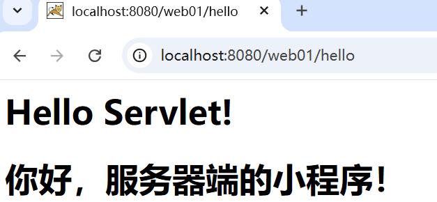

中文乱码问题就解决了。另外，以上解决中文乱码的两行代码：

```java
response.setContentType("text/html");
response.setCharacterEncoding("UTF-8");
```

可以合并为一行：

```java
response.setContentType("text/html;charset=UTF-8");
```

**注意：这行代码必须出现在 **`**PrintWriter out = response.getWriter();**`**之前才能解决乱码问题。**

`**<font style="color:#DF2A3F;">response.setCharacterEncoding("UTF-8");</font>**`**和 HTML 中的 **`**<font style="color:#DF2A3F;"><meta charset="UTF-8"></font>**`**有什么区别？**

- 前者：设置Servlet输出流的字符编码方式，影响`**<font style="color:rgb(64, 64, 64);background-color:rgb(236, 236, 236);">PrintWriter</font>**`如何将Java字符串转换为字节序列，是服务器端的行为，发生在内容发送到客户端之前，会自动设置`**<font style="color:rgb(64, 64, 64);background-color:rgb(236, 236, 236);">Content-Type</font>**`响应头的charset部分，例如：`**<font style="color:rgb(64, 64, 64);background-color:rgb(236, 236, 236);">Content-Type: text/html;charset=UTF-8</font>**`这是最根本的编码设置，决定了数据在传输时的实际编码。
- 后者：是HTML文档内部的编码声明，浏览器在解析HTML时会参考这个提示，当HTTP响应头没有指定charset时，浏览器会查找meta标签，如果HTTP头已指定charset，meta标签通常会被忽略。

# Servlet 连接数据库


继续在 `web01`项目中实现连接数据库的效果。实现功能：以列表形式显示部门名称。

## 添加 mysql 驱动

在 `WEB-INF`目录下新建 `lib`目录，将 `mysql.jar`驱动放到 `lib`目录中。


## 编写 DeptListServlet

```java
package com.jkweilai.servlet;

import jakarta.servlet.Servlet;
import jakarta.servlet.ServletException;
import jakarta.servlet.ServletRequest;
import jakarta.servlet.ServletResponse;
import jakarta.servlet.ServletConfig;
import java.io.PrintWriter;
import java.io.IOException;
import java.sql.*;

public class DeptListServlet implements Servlet{

        public void init(ServletConfig config) throws ServletException{}

        public void service(ServletRequest request,ServletResponse response)
                throws ServletException, IOException{
                response.setContentType("text/html;charset=UTF-8");
                PrintWriter out = response.getWriter();

                Connection conn = null;
                PreparedStatement ps = null;
                ResultSet rs = null;
                try{
                        // 1.注册驱动
                        Class.forName("com.mysql.cj.jdbc.Driver");
                        // 2.获取连接
                        String url = "jdbc:mysql://localhost:3306/servlet";
                        String user = "root";
                        String password = "123456";
                        conn = DriverManager.getConnection(url, user, password);
                        // 3.获取预编译的数据库操作对象
                        String sql = "select dname from dept";
                        ps = conn.prepareStatement(sql);
                        // 4.执行SQL
                        rs = ps.executeQuery();
                        // 5.处理查询结果集
                        while(rs.next()){
                                String dname = rs.getString("dname");
                                out.print(dname);
                                out.print("<br>");
                        }
                }catch(Exception e){
                        e.printStackTrace();
                }finally{
                        // 6.释放资源
                        if(rs != null){
                                try{
                                        rs.close();
                                }catch(Exception e){
                                        e.printStackTrace();
                                }
                        }
                        if(ps != null){
                                try{
                                        ps.close();
                                }catch(Exception e){
                                        e.printStackTrace();
                                }
                        }
                        if(conn != null){
                                try{
                                        conn.close();
                                }catch(Exception e){
                                        e.printStackTrace();
                                }
                        }
                }
        }

        public void destroy(){}

        public String getServletInfo(){
                return "";
        }

        public ServletConfig getServletConfig(){
                return null;
        }

}
```

编译后，将编译后的字节码拷贝到 `WEB-INF/classes`目录下，这里不再赘述。

## 编写 web.xml

```xml
<servlet>
  <servlet-name>dListServlet</servlet-name>
  <servlet-class>com.jkweilai.servlet.DeptListServlet</servlet-class>
</servlet>
<servlet-mapping>
  <servlet-name>dListServlet</servlet-name>
  <url-pattern>/list</url-pattern>
</servlet-mapping>
```

## 提供超链接

在 `index.html`文件中添加超链接：

```html
<!--对于前端请求路径目前以 / 开始，带项目名。web.xml文件中的路径不带项目名。-->
<a href="/web01/list">部门列表</a>
```

## 部署测试

将项目部署到 Tomcat 的 webapps 目录下，启动 Tomcat 服务器，打开浏览器输入地址：http://localhost:8080/web01/index.html


点击部门列表超链接发送请求：


# IDEA 开发 Servlet


## 创建空项目


设置空项目的 JDK 版本：

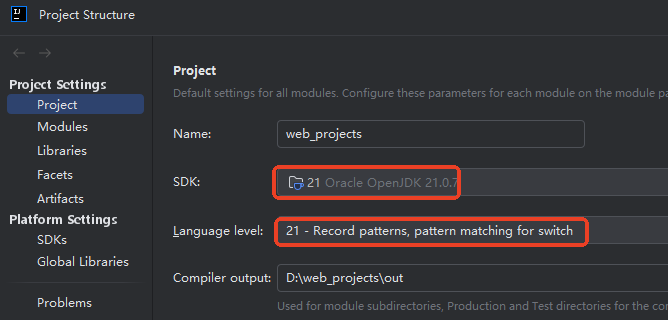

## 创建普通 java 模块

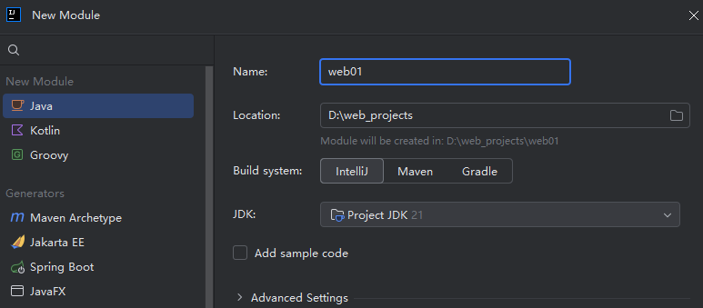

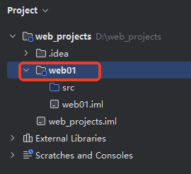

## 创建 web 目录作为 webapproot


## 添加 web 支持


添加 `web.xml`文件时，选择 `6.0`版本。

## 添加 Artifact（构件）

Artifact 是构件的意思，通常指代** 可部署的输出文件**。

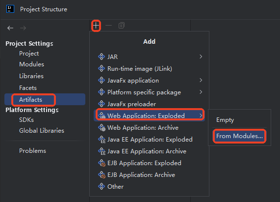


## 将 servlet-api.jar 添加到 classpath 中

注意，这个 jar 包只是起到一个编译阶段的作用（只是让我们在 IDEA 中编写的 Servlet 程序能够正常编译），因此这个 jar 包不需要放到 `WEB-INF/lib`目录中。因为 `WEB-INF/lib`目录下的 jar 包是在运行阶段起作用的，Tomcat 服务器运行时 `servlet-api.jar` 已经在 `CATALINA_HOME/lib`目录下了。

在 `web01`模块下随意创建一个目录，例如 `lib`，然后将 `servlet-api.jar`拷贝到该目录下，然后 右键-->Add as Library...


## 添加数据库驱动

在 `WEB-INF`目录下新建 `lib`目录，将 mysql 驱动 jar 包拷贝到该目录下：


这个 jar 包是在运行阶段起作用的，编译阶段不需要。

## 编写 Servlet 和 web.xml

使用之前的 `DeptListServlet`程序即可。

```xml
<?xml version="1.0" encoding="UTF-8"?>
<web-app xmlns="https://jakarta.ee/xml/ns/jakartaee"
         xmlns:xsi="http://www.w3.org/2001/XMLSchema-instance"
         xsi:schemaLocation="https://jakarta.ee/xml/ns/jakartaee https://jakarta.ee/xml/ns/jakartaee/web-app_6_0.xsd"
         version="6.0">
    <servlet>
        <servlet-name>listServlet</servlet-name>
        <servlet-class>com.jkweilai.servlet.DeptListServlet</servlet-class>
    </servlet>
    <servlet-mapping>
        <servlet-name>listServlet</servlet-name>
        <url-pattern>/list</url-pattern>
    </servlet-mapping>
</web-app>
```

## IDEA 配置 Tomcat

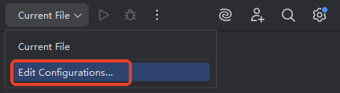

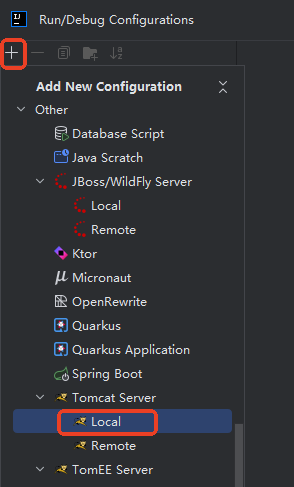


## 部署构件到 Tomcat


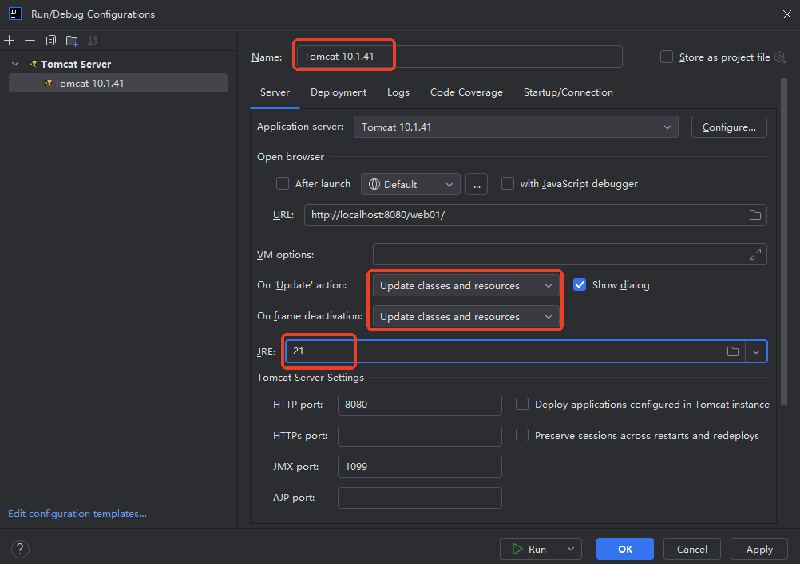

## 启动 Tomcat 测试


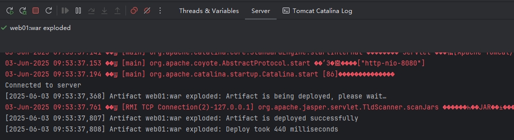

启动成功，但控制台有中文乱码，这是因为 IDEA 默认的字符编码方式为 UTF-8，需要将 `CATALINA_HOME/conf/logging.properties`文件中之前的修改的 `GBK`，再次改回 `UTF-8`即可：

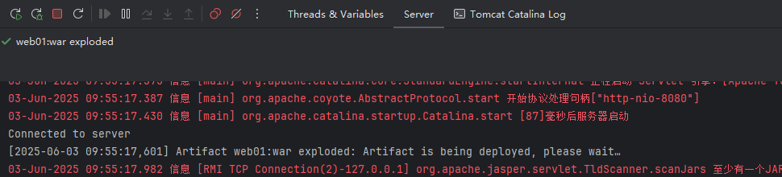

打开浏览器访问：http://localhost:8080/web01/list


# HTTP协议


## 什么是HTTP协议

**HTTP（HyperText Transfer Protocol，超文本传输协议）** 是一种用于分布式、协作式超媒体信息系统的应用层协议。它是万维网（WWW）数据通信的基础，基于**客户端-服务器模型**，通过请求-响应模式工作。

**核心特点**：

- **无状态**：默认不保留之前的请求/响应信息（可通过Cookie/Session实现状态管理）。
- **基于TCP/IP**：默认端口80（HTTPS为443）。
- **灵活可扩展**：支持自定义头部、多种数据格式（JSON、XML等）。

**HTTP 协议版本：**

- HTTP/1.0：短连接。每次浏览器向服务器发起一个请求，都会建立一个全新的 TCP 连接。
- HTTP/1.1：持久连接。浏览器和服务器建立一次 TCP 连接后，可以在这个连接上连续进行多次请求和响应。

**HTTP1.1 连接是可复用的：**

- 对同一域名的请求，可以复用同一个连接
- 例如有这样一个网页：在 HTTP/1.1 时代，浏览器通常为每个域名开启 **6** 个左右的并行连接，以下页面在加载的时候就会有连接复用的情况。（底层弄了个 TCP 连接池，连接池最高支持 6 个 TCP 连接并发，下面这个 HTML 页面需要 9 个 TCP 连接，1 个加载 HTML，8 个加载图片。因此有连接复用的情况）

```html
<body>
  
  
  
  
  
  
  
  
</body>
```

**HTTP/1.1 是有状态的吗？**

- 无状态。尽管从 1.0 的短连接升级成了 1.1 的持久连接，但 HTTP 协议仍然是无状态的。无状态主要体现在：默认不保留之前的请求/响应信息。

## HTTP请求报文详解

HTTP请求报文由以下部分组成：

```http
GET /index.html HTTP/1.1          # 请求行（方法 + URI + 协议版本）
Host: www.example.com             # 请求头部（键值对）
User-Agent: Mozilla/5.0          
Accept: text/html,application/xhtml+xml
Accept-Language: en-US           
Connection: keep-alive
Content-Type: application/x-www-form-urlencoded
Cookie: sessionId=abc123; userId=admin
                                  # 空行（分隔头部和体）
name=John&age=30                  # 请求体（GET通常无体，POST/PUT等有）
```

**关键字段说明**：

- **请求行**：
  - **方法**：GET（获取资源）、POST（提交数据）、PUT（更新）、DELETE（删除）等。
  - **URI**：请求的资源路径（如`/index.html`）。
  - **协议版本**：HTTP/1.1 或 HTTP/2。
- **请求头部**：
  - `Host`：目标服务器域名（必填）。
  - `User-Agent`：客户端标识（如浏览器类型）。
  - `Content-Type`：请求体的数据类型（`application/x-www-form-urlencoded`表示普通表单提交，`application/json`表示以 JSON 格式提交数据）。
  - `Cookie`：客户端携带的会话信息。
- **请求体**：仅POST/PUT等方法携带数据（如表单、JSON）。

## HTTP响应报文详解

HTTP响应报文结构：

```http
HTTP/1.1 200 OK                  # 状态行（协议版本 + 状态码 + 描述）
Server: nginx/1.18.0             # 响应头部
Date: Mon, 01 Jun 2025 12:00:00 GMT
Content-Type: text/html; charset=UTF-8          
Content-Length: 1234             
Connection: keep-alive          
Set-Cookie: session_id=abc123; HttpOnly; SameSite=Strict
                                 # 空行
<!DOCTYPE html>                  # 响应体（实际数据）
<html>...</html>
```

**关键字段说明**：

- **状态行**：
  - **状态码**：
    - `**<font style="color:#DF2A3F;">200 OK</font>**`**：成功。**
    - `**<font style="color:#DF2A3F;">404 Not Found</font>**`**：资源不存在。**
    - `**<font style="color:#DF2A3F;">405</font>**`**：请求方式和服务器端的处理方式不一致。（例如：前端请求方式为 POST，服务器端处理方式是 GET，则发生 405 错误。）**
    - `**<font style="color:#DF2A3F;">500 Internal Server Error</font>**`**：服务器错误。**
- **响应头部**：
  - `Content-Type`：响应体类型（如`text/html`、`application/json`）。
  - `Content-Length`：响应体大小（字节）。
  - `Set-Cookie`：服务器设置的会话标识。【HttpOnly设置在浏览器不能使用 document.cookie 读取，防止 XSS 攻击。 SameSite=Lax允许部分安全的跨站请求（如导航链接），SameSite=Strict最严格，完全禁止在跨站请求中发送Cookie】
- **响应体**：返回的实际数据（HTML、JSON等）。

## GET与POST的区别及选择

### 区别

| **特性** | **GET请求** | **POST请求** |
| --- | --- | --- |
| **数据位置** | URL查询参数（如`?name=John`） | 请求体中（不可见） |
| **数据长度限制** | 受URL长度限制（约2048字符） | 无限制（服务器可配置） |
| **安全性** | 参数暴露在URL，不适合敏感数据 | 相对更安全（HTTPS下加密） |
| **幂等性** | 幂等（多次请求结果相同） | 非幂等（可能修改数据） |
| **缓存** | 可被缓存 | 默认不缓存 |
| **浏览器历史记录** | 保留参数 | 不保留 |

**幂等性 **就是：同一个操作，你执行1次和执行N次，结果都一样。

**幂等 **操作：你按电梯的“关门”按钮，按1次和疯狂按10次，效果都一样——门只会关一次。

**非幂等 **操作：你喝奶茶，每点一次“加珍珠”按钮，杯子里就多一份珍珠（点10次就爆炸了）。

**提示：GET 和 POST 请求提交数据时的格式都是 **`**<font style="color:#DF2A3F;">name=value&name=value&name=value...</font>**`**。只是提交数据的位置不同，GET 在请求行上提交数据。POST 在请求体中提交数据。**

### 如何选择

- **用GET**：
  - 获取数据（如搜索、页面加载）。
  - 参数简单且非敏感（如分页`?page=2`）。
- **用POST**：
  - 提交敏感数据（如登录表单、支付信息）。
  - 上传文件或大量数据（如JSON body）。
  - 修改服务器状态（如创建/更新资源）。

### 怎么发送 POST 请求

到目前为止，浏览器向服务器发送请求时，我们所掌握的所有的方式包括：

1. 用户在浏览器地址栏上直接输入 URL
2. 用户点击超链接
3. 使用 window.location.href 或 document.location.href
4. 使用 window.open
5. 用户提交 form 表单

以上所有的方式中，只有当使用 `form`表单提交数据，并且 `form`标签的 `method`属性设置为 `post`时，才是 `POST`请求，其它都是 `GET` 请求。

## URL编码

URL编码（也称为百分号编码）是HTTP协议和Web开发中一个非常重要的概念，特别是在Servlet开发中。

不过大家不需要担心，大部分的请求发送都已经自动对 URL 进行了编码，只有少数情况需要手动编码。（例如：自己通过代码进行重定向的时候，重定向的 URL 中含有特殊符号就需要手动编码。）

### URL编码的作用

URL编码主要用于：

1. **解决特殊字符问题**：URL中某些字符有特殊含义（如?、&、/等），当这些字符需要作为普通字符使用时必须编码
2. **支持非ASCII字符**：URL只能使用ASCII字符集，非ASCII字符（如中文）必须编码
3. **确保数据完整性**：防止数据在传输过程中被错误解析

### 在Servlet中的主要应用场景

1. **查询字符串(Query String)**：

```java
// 例如：name=张三&age=20 需要编码为 name=%E5%BC%A0%E4%B8%89&age=20
String encodedName = URLEncoder.encode("张三", "UTF-8");
```

1. **表单提交**：
  - GET方法：参数会自动进行URL编码
  - POST方法：取决于enctype属性，application/x-www-form-urlencoded会进行编码
2. **重定向(Redirect)**：

```java
String redirectUrl = "/search?q=" + URLEncoder.encode(userInput, "UTF-8");
response.sendRedirect(redirectUrl);
```

1. **Cookie值**：Cookie的值也需要进行URL编码（对 cookie 的 value 进行编码。cookie 由 name 和 value 组成。）

### 重要性

URL编码**非常重要**，因为：

- 不正确的编码会导致数据损坏或安全漏洞（如XSS攻击）
- 是Web开发的基础知识，几乎所有涉及URL参数传递的场景都需要考虑
- 现代框架虽然大多自动处理，但理解原理对调试和解决特殊问题很有帮助

### Java中的相关API

- **编码**：`java.net.URLEncoder.encode(String s, String enc)`
- **解码**：`java.net.URLDecoder.decode(String s, String enc)`
- Servlet容器通常会自动解码请求参数

### 示例

```java
// 编码示例
String original = "搜索 关键词&特殊字符";
String encoded = URLEncoder.encode(original, "UTF-8");
// 结果为 "搜索+关键词%26特殊字符"

// 解码示例
String decoded = URLDecoder.decode(encoded, "UTF-8");
```

理解URL编码对于开发安全、健壮的Web应用至关重要，是Servlet开发的基础知识之一。

# Servlet 对象生命周期


## 生命周期及管理者

Servlet 生命周期指的是：Servlet 对象从创建到最终被销毁的整个过程。

Servlet 生命周期由 Servlet 容器来负责管理，JavaWeb 程序员无权干涉。（Servlet 容器指的是 Web 服务器/Web 容器，例如 Tomcat、Jetty 等。）

也就是说，Servlet 对象的创建和该对象上方法的调用，都是由 Tomcat 服务器来负责的，我们不能通过 new 运算符来实例化 Servlet 对象，因为我们自己 new 的 Servlet 对象生命周期不受 Tomcat 服务器的管理。

## 测试 Servlet 生命周期

编写以下代码测试 Servlet 对象生命周期：

```java
package com.jkweilai.servlet;

import jakarta.servlet.*;

import java.io.IOException;

public class LifecycleServlet implements Servlet {

    public LifecycleServlet() {
        System.out.println("LifecycleServlet's default constructor called");
    }

    @Override
    public void init(ServletConfig servletConfig) throws ServletException {
        System.out.println("LifecycleServlet's init called");
    }

    @Override
    public void service(ServletRequest servletRequest, ServletResponse servletResponse) throws ServletException, IOException {
        System.out.println("LifecycleServlet's service called");
    }

    @Override
    public void destroy() {
        System.out.println("LifecycleServlet's destroy called");
    }

    @Override
    public String getServletInfo() {
        return "";
    }

    @Override
    public ServletConfig getServletConfig() {
        return null;
    }

}
```

配置 web.xml：

```xml
<servlet>
    <servlet-name>lifeServlet</servlet-name>
    <servlet-class>com.jkweilai.servlet.LifecycleServlet</servlet-class>
</servlet>
<servlet-mapping>
    <servlet-name>lifeServlet</servlet-name>
    <url-pattern>/life</url-pattern>
</servlet-mapping>
```

启动服务器，观察启动过程，看看在启动过程中 Servlet 无参数构造方法是否执行，然后发送第一次请求，观察控制台的输出结果，再发送第二次、第三次请求，观察控制台的输出结果，最后再关闭服务器，看控制台变化：

启动服务器发送第一次请求：

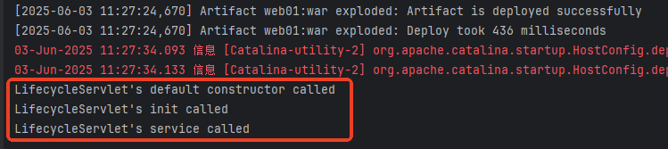

发送第二次请求：


发送第三次请求：


最后关闭 Tomcat 服务器：

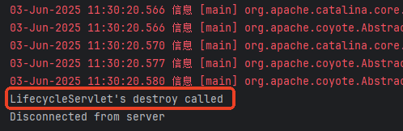

## 根据测试总结生命周期

1. 默认情况下，在服务器启动的时候并不会创建 Servlet 对象。当用户发送第一次请求时，Servlet 对象才会被创建。
2. 当用户发送第一次请求时，Tomcat 会调用 Servlet 类的无参数构造方法完成实例化，对象创建完毕后，Tomcat 服务器会调用一次 Servlet 对象的 init 方法完成 Servlet 初始化。初始化完成后，Tomcat 会调用 Servlet 对象的 service 方法处理用户的请求。
3. 服务器关闭的时候销毁 Servlet 对象，销毁 Servlet 对象之前会调用一次 `destroy`方法。
4. 在服务器运行期间，同一个类型的 Servlet 对象只会被实例化一次。也就是说 Servlet 对象是单例的。另外 Tomcat 服务器是支持多线程的。因此 Servlet 是在** 单实例多线程 **的环境下运行的。

## Servlet 三个核心方法的作用

### init 方法

init 方法只会被调用一次，在 Servlet 对象实例化完成后立即被调用，主要负责 Servlet 初始化工作。

也就是说，如果你希望在 Servlet 对象创建时执行一些操作，可以将代码写到 init 方法中。例如：解析 xml 文件、初始化连接池等耗时以及要求执行一次的操作。

思考：既然是这样，我们能否使用无参数构造方法来替代 init 方法呢？不能，Servlet 规范中规定，JavaWeb 程序员不应该在 Servlet 类中提供任何构造方法，因为这种行为可能会导致 Servlet 对象无法实例化。

怎么理解？为什么可能会导致无法实例化？实际上，创建 Servlet 对象是通过反射机制完成的，例如代码：

```java
Class clazz = Class.forName("com.jkweilai.servlet.LifecycleServlet");
Servlet servlet = (Servlet)clazz.newInstance();
```

大家应该知道，`newInstance()`方法底层调用的是无参数构造方法，如果程序员在 Servlet 类中提供构造方法的话，可能会导致无参数构造方法丢失，从而影响 Servlet 对象的实例化。因此官方不建议将代码写到构造方法中，如果你需要在创建对象的时间点上执行代码的话，请将其编写到 init 方法中。

另外 init 方法上有一个参数 `ServletConfig`，这个对象表示 **Servlet 配置信息对象**，该对象也是由 Tomcat 服务器来创建的，Tomcat 服务器将它创建好之后调用 init 方法，并且将 ServletConfig 作为 init 方法的参数传给了我们，我们可以直接使用。关于 `ServletConfig`的使用，后面再介绍。

### service 方法

service 方法是最重要最核心的一个方法。用户只要发送一次请求，service 方法就会被调用一次。

该方法上有两个非常重要的参数：

- jakarta.servlet.ServletRequest request：请求对象（该对象中封装了请求协议）
- jakarta.servlet.ServletResponse response：响应对象（该对象负责响应协议）

request 和 response 两个对象也不需要我们自己 new，Tomcat 服务器已经为我们创建好了，我们直接在 service 方法体中使用即可。

### destroy 方法

destroy 方法只会被调用一次，该方法没有任何参数。该方法被调用时 Servlet 对象还没有被销毁，只是即将被销毁。

如果你希望在对象被销毁的时候执行一次特殊的操作，例如释放连接池，可以将代码编写到 destroy 方法中。

## 服务器启动时创建 Servlet

默认情况下，Web 服务器启动时，并不会去实例化 Servlet 对象，这样可以减少内存的开销。如果想在服务器启动阶段就实例化 Servlet，可以给 Servlet 添加 `<load-on-startup>`配置，值越小，实例化的优先级越高。例如：

```xml
<servlet>
    <servlet-name>lifeServlet</servlet-name>
    <servlet-class>com.jkweilai.servlet.LifecycleServlet</servlet-class>
    <!--值越小优先级越高-->
    <load-on-startup>1</load-on-startup>
</servlet>
<servlet-mapping>
    <servlet-name>lifeServlet</servlet-name>
    <url-pattern>/life</url-pattern>
</servlet-mapping>
```

启动服务器，查看控制台输出：

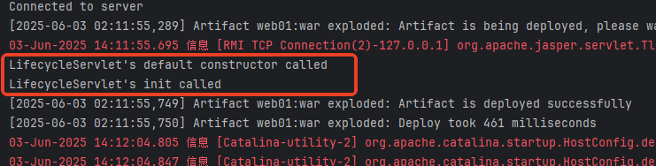

可以看到，服务器启动的时候会调用 `LifecycleServlet`的无参数构造方法，完成 Servlet 对象的实例化。

# GenericServlet


## 适配器设计模式

在GoF（Gang of Four）提出的23种经典设计模式中，**适配器模式(Adapter Pattern)**是**结构型模式**的一种。

### 模式定义

适配器模式将一个类的接口转换成客户期望的另一个接口，使得原本由于接口不兼容而不能一起工作的类可以一起工作。

### 经典案例

日志框架适配器

```java
// 目标接口
interface MyLogger {
    void log(String message);
}

// 被适配者1
class Log4jLogger {
    public void logMessage(String msg) {
        System.out.println("Log4j: " + msg);
    }
}

// 被适配者2
class Slf4jLogger {
    public void log(String content) {
        System.out.println("SLF4J: " + content);
    }
}

// 适配器1
class Log4jAdapter implements MyLogger {
    private Log4jLogger log4j;
    
    public Log4jAdapter(Log4jLogger log4j) {
        this.log4j = log4j;
    }
    
    @Override
    public void log(String message) {
        log4j.logMessage(message);
    }
}

// 适配器2
class Slf4jAdapter implements MyLogger {
    private Slf4jLogger slf4j;
    
    public Slf4jAdapter(Slf4jLogger slf4j) {
        this.slf4j = slf4j;
    }
    
    @Override
    public void log(String message) {
        slf4j.log(message);
    }
}

// 客户端可以统一使用MyLogger接口
public class Client {
    public static void main(String[] args) {
        MyLogger logger1 = new Log4jAdapter(new Log4jLogger());
        MyLogger logger2 = new Slf4jAdapter(new Slf4jLogger());
        
        logger1.log("使用Log4j记录日志");
        logger2.log("使用SLF4J记录日志");
    }
}
```

这个案例展示了适配器模式如何在不修改原有代码的情况下，使不兼容的接口能够协同工作。

## 缺省适配器设计模式

缺省适配器模式（Default Adapter Pattern），也称为默认适配器模式，是适配器模式的一种特殊形式。它主要用于为接口提供默认实现，使得子类只需关注自己感兴趣的方法，而不必实现接口中的所有方法。

### 模式定义

缺省适配器模式通过创建一个抽象类（适配器）实现目标接口，并为所有方法提供空实现或默认实现。具体子类可以继承这个适配器类，只覆盖它们感兴趣的方法。

### 模式结构

- **目标接口(Target Interface)**：定义了大量方法的接口
- **缺省适配器(Default Adapter)**：实现了目标接口，为所有方法提供默认实现
- **具体实现类(Concrete Class)**：继承缺省适配器，只实现感兴趣的方法

### 示例代码

```java
// 目标接口 - 定义了很多方法
interface ServiceInterface {
    void operation1();
    void operation2();
    void operation3();
    // ...可能还有很多方法
}

// 缺省适配器 - 提供所有方法的默认实现
abstract class DefaultAdapter implements ServiceInterface {
    public void operation1() {} // 空实现
    public void operation2() {} // 空实现
    public void operation3() {} // 空实现
    // ...其他方法的空实现
}

// 具体类 - 只实现感兴趣的方法
class ConcreteService extends DefaultAdapter {
    @Override
    public void operation2() {
        System.out.println("只实现了operation2方法");
    }
}
```

### 与普通适配器模式的区别

1. **目的不同**：普通适配器模式用于接口转换，缺省适配器用于提供默认实现
2. **结构不同**：普通适配器包含被适配对象，缺省适配器直接实现目标接口
3. **使用场景不同**：普通适配器解决接口不兼容问题，缺省适配器解决接口方法过多问题

缺省适配器模式是一种非常实用的设计模式，特别适用于处理包含大量方法的接口，它能显著简化客户端代码的编写。

## GenericServlet 是缺省适配器

`GenericServlet` 是一个典型的 **缺省适配器模式**。**为什么是缺省适配器模式？**

1. **背景：Servlet 接口的复杂性**
`Servlet` 接口定义了多个方法（如 `init()`, `service()`, `destroy()`, `getServletConfig()`, `getServletInfo()`），但实际开发中，我们通常只关心 `service()` 方法（处理请求的核心逻辑）。如果直接实现 `Servlet` 接口，必须实现所有方法，即使某些方法不需要。
2. **GenericServlet 的作用**
`GenericServlet` 是一个抽象类，它实现了 `Servlet` 接口，并为所有方法提供了 **默认的空实现**（比如 `init()` 和 `destroy()` 是空方法）。这样，用户只需继承 `GenericServlet` 并重写自己关心的方法（通常是 `service()`），而不必强制实现所有接口方法。
3. **简化子类实现**
子类可以只关注核心逻辑（如 `service()`），而无需处理其他不必要的方法。例如：

```java
public class MyServlet extends GenericServlet {
    @Override
    public void service(ServletRequest req, ServletResponse res) {
        // 只需实现业务逻辑
    }
}
```

`GenericServlet` 是缺省适配器模式的典型应用，它通过默认空实现简化了 `Servlet` 接口的使用，**让开发者能够专注于核心逻辑**。

## GenericServlet 源码剖析

GenericServlet 源码如下：

```java
package jakarta.servlet;

import java.io.IOException;
import java.util.Enumeration;

public abstract class GenericServlet implements Servlet, ServletConfig, java.io.Serializable {

    // 在 init(ServletConfig) 方法被调用时，该属性被赋值。
    private transient ServletConfig config;

    /**
     * 什么都不做。所有的 Servlet 初始化工作都由某个 init 方法完成。
     */
    public GenericServlet() {}

    /**
     * 由 Servlet 容器调用，用于通知 Servlet 它即将被投入服务。 
     */
    @Override
    public void init(ServletConfig config) throws ServletException {
        this.config = config;
        this.init();
    }

    /**
     * 由Servlet容器调用，以允许Servlet对请求作出响应。
     */
    @Override
    public abstract void service(ServletRequest req, ServletResponse res) throws ServletException, IOException;

    /**
     * 由 Servlet 容器调用，用于通知 Servlet 它即将被停止服务。
     */
    @Override
    public void destroy() {}

    /**
     * 获取ServletConfig对象。
     */ 
    @Override
    public ServletConfig getServletConfig() {
        return config;
    }

    /**
     * 返回有关该 Servlet 的信息，例如作者、版本和版权信息。
     * 默认情况下，此方法返回空字符串。如需返回有意义的值，请重写此方法。
     */
    @Override
    public String getServletInfo() {
        return "";
    }

    // ================================================以下方法都是为了开发方便额外扩展的方法====================================================

    /**
     * 如果要重写init方法，建议重写这个无参数的init方法，如果你重写有参数的 init(ServletConfig) 方法，config 属性将无法赋值。
     */
    public void init() throws ServletException {}

    // 额外扩展的方法
    @Override
    public String getInitParameter(String name) {
        return getServletConfig().getInitParameter(name);
    }

    // 额外扩展的方法
    @Override
    public Enumeration<String> getInitParameterNames() {
        return getServletConfig().getInitParameterNames();
    }

    // 额外扩展的方法
    @Override
    public ServletContext getServletContext() {
        return getServletConfig().getServletContext();
    }

    // 额外扩展的方法：获取当前servlet实例的名字。也就是<servlet-name>的配置。
    @Override
    public String getServletName() {
        return config.getServletName();
    }

    // 额外扩展的方法
    public void log(String message) {
        getServletContext().log(getServletName() + ": " + message);
    }

    // 额外扩展的方法
    public void log(String message, Throwable t) {
        getServletContext().log(getServletName() + ": " + message, t);
    }
}
```

## GenericServlet 的使用

有了 `GenericServlet`，编写 `Servlet`类时可以不再直接实现 `Servlet`接口。

编写 `WelcomServlet`继承 `GenericServlet`这个**抽象类**，如果你只需要处理用户的请求，则只需要重写 `service`方法即可。代码如下：

```java
package com.jkweilai.servlet;

import jakarta.servlet.GenericServlet;
import jakarta.servlet.ServletException;
import jakarta.servlet.ServletRequest;
import jakarta.servlet.ServletResponse;

import java.io.IOException;

public class WelcomeServlet extends GenericServlet {
    @Override
    public void service(ServletRequest request, ServletResponse response) throws ServletException, IOException {
        response.setContentType("text/html;charset=UTF-8");
        response.getWriter().print("<h1>欢迎学习 GenericServlet</h1>");
    }
}
```

编写 `web.xml`配置：

```xml
<servlet>
    <servlet-name>welServlet</servlet-name>
    <servlet-class>com.jkweilai.servlet.WelcomeServlet</servlet-class>
</servlet>
<servlet-mapping>
    <servlet-name>welServlet</servlet-name>
    <url-pattern>/wel</url-pattern>
</servlet-mapping>
```

启动服务器，打开浏览器，输入 URL：http://localhost:8080/web01/wel


可以看到，编写 Servlet 类更加的方便了。只需要继承 `GenericServlet`，重写 `service`方法即可。

# ServletConfig


## ServletConfig 对象的实例化

我们在学习 `GenericServlet`的时候，有两个 init 方法，一个是 `init(ServletConfig)`，另一个是 `init()`。

这个 `init(ServletConfig)`方法是 `Servlet`接口中的方法，`GenericServlet`对它进行了实现，具体的实现如下：

```java
public class GenericServlet {
    
    private transient ServletConfig config;

    // ...
    
    @Override
    public void init(ServletConfig config) throws ServletException {
        this.config = config;
        this.init();
    }

    public void init() throws ServletException {
        // NOOP by default
    }

    // ...
}    
```

我们之前学习 Servlet 生命周期的时候提到过，`init(ServletConfig)`方法在 Servlet 对象实例化之后立即被调用，并且该方法由 Web 服务器负责调用。大家可以试想一下，该方法有一个参数 `ServletConfig`，如果 Web 服务器要调用该方法，必须给该方法传一个 `ServletConfig`实例才能调用吧？没错，Web 服务器在调用 Servlet 对象的 `init(ServletConfig)`方法之前，会先创建 `ServletConfig`对象。

## ServletConfig 是什么

ServletConfig 是 Servlet 规范中的一员，接口名为：jakarta.servlet.ServletConfig。

ServletConfig 接口由 Web 服务器提供实现。但我们程序员不需要关心具体的实现类，我们只需要面向 ServletConfig 接口编程即可。

ServletConfig 接口的实例由 Web 服务器创建。

ServletConfig 对象在 init 方法执行之前被创建。

ServletConfig 对象被称为 Servlet 配置信息对象。Servlet 在 web.xml 文件中的配置信息会被 Web 服务器封装到 ServletConfig 对象中，例如以下配置信息：

```xml
<servlet>
    <servlet-name>uploadServlet</servlet-name>
    <servlet-class>com.jkweilai.servlet.FileUploadServlet</servlet-class>
    <!-- Servlet专属的上传路径配置 -->
    <init-param>
        <param-name>upload</param-name>
        <param-value>/uploads</param-value>
    </init-param>
    <init-param>
        <param-name>maxFileSize</param-name>
        <param-value>10485760</param-value> <!-- 10MB -->
    </init-param>
</servlet>
```

因此，我们通过 `**FileUploadServlet**`对象关联的** **`**ServletConfig**`对象，可以获取以上文件上传路径的配置，以及支持上传最大文件的配置。

每一个 Servlet 对象都对应一个 ServletConfig 对象，是一对一的关系。

## ServletConfig 对象如何获取

在 `GenericServlet`中有这样一段代码：

```java
public class GenericServlet {
    
    private transient ServletConfig config;

    // ...
    
    @Override
    public ServletConfig getServletConfig() {
        return config;
    }

    // ...
} 
```

我们要编写的 Servlet 类都会继承 GenericServlet，因此都可以通过 `getServletConfig()`方法来获取 `ServletConfig`对象。

## ServletConfig 接口常用方法

参考 `Jakarta EE 10`的 API 帮助文档。


### 获取 Servlet 初始化参数

获取初始化参数的配置信息，可以通过以下两个方法：

```java
// 通过初始化参数的name获取value
String getInitParameter(String name);

// 获取所有初始化参数的name
Enumeration<String> getInitParameterNames();
```

假设在 web.xml 中有这样的配置：

```xml
<servlet>
    <servlet-name>uploadServlet</servlet-name>
    <servlet-class>com.jkweilai.servlet.FileUploadServlet</servlet-class>
    <!--这就是Servlet初始化参数，这些配置信息会被Web服务器自动封装到ServletConfig对象中-->
    <init-param>
        <param-name>uploadDir</param-name>
        <param-value>/uploads</param-value>
    </init-param>
    <init-param>
        <param-name>maxFileSize</param-name>
        <param-value>10485760</param-value><!--最大10MB-->
    </init-param>
</servlet>
<servlet-mapping>
    <servlet-name>uploadServlet</servlet-name>
    <url-pattern>/upload</url-pattern>
</servlet-mapping>
```

在 `FileUploadServlet`中调用以上两个方法即可获取初始化参数的配置信息：

```java
package com.jkweilai.servlet;

import jakarta.servlet.*;

import java.io.IOException;
import java.io.PrintWriter;
import java.util.Enumeration;

public class FileUploadServlet extends GenericServlet {
    @Override
    public void service(ServletRequest request, ServletResponse response) throws ServletException, IOException {

        response.setContentType("text/html;charset=UTF-8");
        PrintWriter out = response.getWriter();

        // 获取ServletConfig对象
        ServletConfig servletConfig = this.getServletConfig();
        // 获取初始化参数配置信息
        Enumeration<String> initParameterNames = servletConfig.getInitParameterNames();
        while (initParameterNames.hasMoreElements()) {
            String initParameterName = initParameterNames.nextElement();
            String initParameterValue = servletConfig.getInitParameter(initParameterName);
            out.print("<h1>" + initParameterName + "=" + initParameterValue + "</h1>");
        }
    }
}
```

执行结果如下：


当然，我们也可以不获取 `ServletConfig`对象，直接调用 `Servlet`对象的 `getInitParameterNames()`和 `getInitParameter(name)`也是可以的，这是因为我们编写 Servlet 继承了 `GenericServlet`，在该类中提供了这两个方法，作为子类 Servlet 当然可以直接调用，请再次查看 GenericServlet 源码：

```java
public class GenericServlet {
    
    private transient ServletConfig config;

    // ...
    
    @Override
    public ServletConfig getServletConfig() {
        return config;
    }

    // 额外扩展的方法
    @Override
    public String getInitParameter(String name) {
        return getServletConfig().getInitParameter(name);
    }

    // 额外扩展的方法
    @Override
    public Enumeration<String> getInitParameterNames() {
        return getServletConfig().getInitParameterNames();
    }

    // ...
}
```

通过源码可以看到底层实际上调用的还是 `ServletConfig`对象的方法。因此代码可以修改为：

```java
package com.jkweilai.servlet;

import jakarta.servlet.*;

import java.io.IOException;
import java.io.PrintWriter;
import java.util.Enumeration;

public class FileUploadServlet extends GenericServlet {
    @Override
    public void service(ServletRequest request, ServletResponse response) throws ServletException, IOException {

        response.setContentType("text/html;charset=UTF-8");
        PrintWriter out = response.getWriter();
        
        // 获取初始化参数配置信息
        Enumeration<String> initParameterNames = this.getInitParameterNames();
        while (initParameterNames.hasMoreElements()) {
            String initParameterName = initParameterNames.nextElement();
            String initParameterValue = this.getInitParameter(initParameterName);
            out.print("<h1>" + initParameterName + "=" + initParameterValue + "</h1>");
        }
    }
}
```

执行结果和之前一样。

### 获取 Servlet 名字

```java

String getServletName();
```

通过这个方法可以获取 `<servlet-name>servletName</servlet-name>`配置中的 `servletName`。

```java
// 获取ServletName
ServletConfig servletConfig = this.getServletConfig();
String servletName = servletConfig.getServletName();
out.println("<h1>" + servletName + "</h1>");
```

运行结果如下：

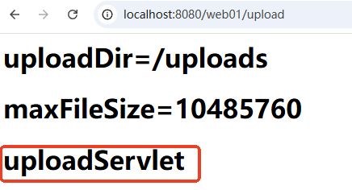

同样，在 `GenericServlet`中也提供了这样一个方法，可以在不获取 `ServletConfig`对象时直接获取 ServletName，代码如下：

```java
// 获取ServletName
String servletName = this.getServletName();
out.println("<h1>" + servletName + "</h1>");
```

运行效果和之前相同。

### 获取 ServletContext 对象

```java
ServletContext getServletContext();
```

代码如下：

```java
// 获取ServletContext对象
ServletConfig servletConfig = this.getServletConfig();
ServletContext application = servletConfig.getServletContext();
out.print("<h1>ServletContext = " + application + "</h1>");
```

执行结果如下：


同样，在 `GenericServlet`类也提供了这样一个方法，因此在不获取 ServletConfig 对象的前提下，直接获取 ServletContext 对象也是可以的，代码如下：

```java
ServletContext application = this.getServletContext();
out.print("<h1>ServletContext = " + application + "</h1>");
```

运行结果和之前一样。

# ServletContext


## ServletContext 是什么

1. ServletContext 是 Servlet 规范中的一员。全接口名为：jakarta.servlet.ServletContext。
2. ServletContext 被称为 Servlet 上下文对象。所有 Servlet 共享的一个对象。ServletContext 类型的变量名一般叫做：application
3. Web 服务器提供了 ServletContext 接口的实现，但我们不需要关心底层的具体实现，我们仍然是面向 ServletContext 接口调用即可。
4. ServletContext 对象在 Web 服务器启动时创建，对于整个 web 应用来说 ServletContext 对象只有一个，在 Web 服务器关闭的时候 ServletContext 对象才会被销毁。

## ServletContext 的主要作用

1. **应用范围的数据共享**：在整个Web应用中共享数据
2. **获取应用初始化参数**：读取web.xml中配置的上下文参数
3. **访问应用资源**：获取Web应用内的文件资源路径
4. **日志记录**：提供应用级的日志记录功能

## 如何获取 ServletContext

**第一种方式**：通过 ServletConfig 来获取

```java
ServletConfig config = this.getServletConfig();
ServletContext application = config.getServletContext();
```

**第二种方式**：直接在 Servlet 类中获取

```java
ServletContext application = this.getServletContext();
```

## ServletContext 中的常用方法

参考 `Jakarta EE 10`的 API 帮助文档。这里只看它的常用方法：

```java
// 向应用域中绑定数据
void setAttribute(String name, Object object);
// 通过name获取应用域中绑定的数据
Object getAttribute(String name);
// 根据name删除应用域中绑定的数据
void removeAttribute(String name);

// 通过上下文初始化参数的name获取value。
String getInitParameter(String name);
// 获取所有上下文初始化参数的name
Enumeration<String> getInitParameterNames();


// 获取应用的根路径
String getContextPath();
// 获取绝对路径
String getRealPath(String path);
// 获取 指向某个文件的输入流
InputStream getResourceAsStream(String path);

// 将指定消息写入Servlet日志文件
void log(String message);
void log(String message, Throwable throwable);
```

### 应用范围的数据共享

放在应用域中的数据所有 Servlet 共享，所有线程共享，注意线程安全问题，如果是热点数据，共享数据，少量数据，并且低频变更，建议存储到应用域中。

相关的方法包括以下三个：

```java
// 向应用域中绑定数据
void setAttribute(String name, Object object);
// 通过name获取应用域中绑定的数据
Object getAttribute(String name);
// 根据name删除应用域中绑定的数据
void removeAttribute(String name);
```

先简单测试一下这几个方法的使用。**具体的应用场景等学完监听器之后再看**。

编写两个 Servlet：SetDataServlet、GetDataServlet。

在 SetDataServlet 中向应用域中绑定数据。在 GetDataServlet 中从应用域中读取绑定的数据。

```java
package com.jkweilai.servlet;

import jakarta.servlet.*;

import java.io.IOException;

public class SetDataServlet extends GenericServlet {
    @Override
    public void service(ServletRequest req, ServletResponse res) throws ServletException, IOException {
        ServletContext application = this.getServletContext();
        application.setAttribute("applicationData", "application-data");
    }
}
```

```java
package com.jkweilai.servlet;

import jakarta.servlet.*;

import java.io.IOException;

public class GetDataServlet extends GenericServlet {
    @Override
    public void service(ServletRequest req, ServletResponse res) throws ServletException, IOException {
        ServletContext application = this.getServletContext();
        Object applicationData = application.getAttribute("applicationData");
        res.getWriter().print("<h1>" + applicationData + "</h1>");
    }
}
```

```xml
<servlet>
    <servlet-name>setData</servlet-name>
    <servlet-class>com.jkweilai.servlet.SetDataServlet</servlet-class>
</servlet>
<servlet-mapping>
    <servlet-name>setData</servlet-name>
    <url-pattern>/set</url-pattern>
</servlet-mapping>

<servlet>
    <servlet-name>getData</servlet-name>
    <servlet-class>com.jkweilai.servlet.GetDataServlet</servlet-class>
</servlet>
<servlet-mapping>
    <servlet-name>getData</servlet-name>
    <url-pattern>/get</url-pattern>
</servlet-mapping>
```

测试，发送两个请求：

1. http://localhost:8080/web01/set
2. http://localhost:8080/web01/get

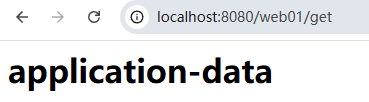

### 获取上下文初始化参数

`<init-param>`属于 Servlet 初始化参数，局部的。如果这个配置是某一个 Servlet 使用，可以使用这种方式。

`<context-param>`属于应用上下文初始化参数，全局的。如果这个配置是所有 Servlet 共享的，可以使用这种方式。

上下文初始化参数在 web.xml 文件中配置如下：

```xml
<context-param>
    <param-name>pagination.defaultPageSize</param-name>
    <param-value>10</param-value>
</context-param>
<context-param>
    <param-name>application.name</param-name>
    <param-value>新闻发布系统</param-value>
</context-param>

<servlet>
    <servlet-name>contextParam</servlet-name>
    <servlet-class>com.jkweilai.servlet.ContextParamServlet</servlet-class>
</servlet>
<servlet-mapping>
    <servlet-name>contextParam</servlet-name>
    <url-pattern>/contextParam</url-pattern>
</servlet-mapping>
```

获取上下文初始化参数的代码：

```java
package com.jkweilai.servlet;

import jakarta.servlet.*;

import java.io.IOException;
import java.io.PrintWriter;
import java.util.Enumeration;

public class ContextParamServlet extends GenericServlet {
    @Override
    public void service(ServletRequest req, ServletResponse res) throws ServletException, IOException {
        res.setContentType("text/html;charset=UTF-8");
        PrintWriter out = res.getWriter();
        ServletContext application = this.getServletContext();
        Enumeration<String> initParameterNames = application.getInitParameterNames();
        while (initParameterNames.hasMoreElements()) {
            String paramName = initParameterNames.nextElement();
            String paramValue = application.getInitParameter(paramName);
            out.print("<h3>" + paramName + "=" + paramValue + "</h3>");
        }
    }
}
```

运行结果：

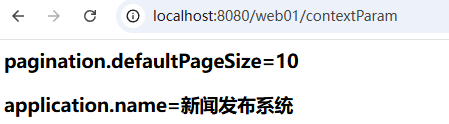

### 访问应用资源

访问应用资源涉及到以下三个方法：

```java
// 获取应用的根路径
String getContextPath();
// 获取绝对路径
String getRealPath(String path);
// 获取 指向某个文件的输入流
InputStream getResourceAsStream(String path);
```

访问应用资源的 Java 代码：

```java
package com.jkweilai.servlet;

import jakarta.servlet.*;

import java.io.IOException;
import java.io.InputStream;
import java.io.PrintWriter;

public class AccessAppResourceServlet extends GenericServlet {
    @Override
    public void service(ServletRequest request, ServletResponse response) throws ServletException, IOException {

        response.setContentType("text/html;charset=UTF-8");
        PrintWriter out = response.getWriter();

        ServletContext application = this.getServletContext();

        // 获取应用根路径
        String contextPath = application.getContextPath();
        out.print("<h3>应用根路径：" + contextPath + "</h3>");

        // 获取绝对路径（路径参数编写时要注意：以"/"开始，从应用的根路径下开始找。）
        String realPath = application.getRealPath("/WEB-INF/web.xml");
        out.print("<h3>绝对路径：" + realPath + "</h3>");

        // 以流的形式获取资源（路径参数编写时要注意：以"/"开始，从应用的根路径下开始找。）
        InputStream in = application.getResourceAsStream("/WEB-INF/web.xml");
        out.print("<h3>以流的形式获取资源：" + in + "</h3>");
    }
}
```

```xml
<servlet>
    <servlet-name>accessAppResourceServlet</servlet-name>
    <servlet-class>com.jkweilai.servlet.AccessAppResourceServlet</servlet-class>
</servlet>
<servlet-mapping>
    <servlet-name>accessAppResourceServlet</servlet-name>
    <url-pattern>/accessAppResource</url-pattern>
</servlet-mapping>
```

运行结果：

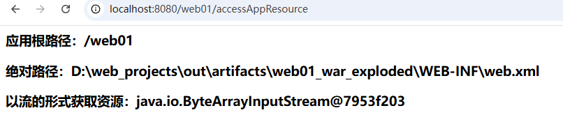

### 日志记录

日志记录涉及到以下两个方法：

```java
// 将指定消息写入Servlet日志文件
void log(String message);
void log(String message, Throwable throwable);
```

这两个方法可以通过 `ServletContext`对象来调用，也可以直接在 `Servlet`类中使用 `this`来调用，这是因为在 `GenericServlet`类中扩展了这两个方法，大家可以再翻一下 GenericServlet 的源码：

```java
public class GenericServlet{

    // ...
    
    // 额外扩展的方法
    public void log(String message) {
        getServletContext().log(getServletName() + ": " + message);
    }

    // 额外扩展的方法
    public void log(String message, Throwable t) {
        getServletContext().log(getServletName() + ": " + message, t);
    }

    // ...
}
```

可以看到，扩展的这两个方法，其实底层还是调用了 `ServletContext`对象的 `log`方法。

编写程序测试这两个方法：

```java
package com.jkweilai.servlet;

import jakarta.servlet.GenericServlet;
import jakarta.servlet.ServletException;
import jakarta.servlet.ServletRequest;
import jakarta.servlet.ServletResponse;

import java.io.IOException;

public class LogServlet extends GenericServlet {
    @Override
    public void service(ServletRequest req, ServletResponse res) throws ServletException, IOException {
        try {
            String s = null;
            s.toString();
        } catch (Exception e) {
            this.log(e.getMessage(), e);
        }
    }
}
```

```xml
<servlet>
    <servlet-name>logServlet</servlet-name>
    <servlet-class>com.jkweilai.servlet.LogServlet</servlet-class>
</servlet>
<servlet-mapping>
    <servlet-name>logServlet</servlet-name>
    <url-pattern>/log</url-pattern>
</servlet-mapping>
```

启动 Tomcat 服务器，打开浏览器，地址栏输入 URL：http://localhost:8080/web01/log

在控制台上查看日志（Tomcat 独立部署时，日志会输出到 `**<font style="color:rgb(64, 64, 64);background-color:rgb(236, 236, 236);">logs/localhost.YYYY-MM-DD.log</font>**` 和 `**<font style="color:rgb(64, 64, 64);background-color:rgb(236, 236, 236);">catalina.out</font>**`）：


## Servlet、ServletConfig、ServletContext 关系

1. 一个Web应用只有一个`<font style="color:rgb(64, 64, 64);background-color:rgb(236, 236, 236);">ServletContext</font>`（全局共享）
2. 每个`<font style="color:rgb(64, 64, 64);background-color:rgb(236, 236, 236);">Servlet</font>`有自己独立的`<font style="color:rgb(64, 64, 64);background-color:rgb(236, 236, 236);">ServletConfig</font>`（存放私有配置）
3. `<font style="color:rgb(64, 64, 64);background-color:rgb(236, 236, 236);">Servlet</font>`本身是处理请求的核心组件，它能通过`<font style="color:rgb(64, 64, 64);background-color:rgb(236, 236, 236);">ServletConfig</font>`获取`<font style="color:rgb(64, 64, 64);background-color:rgb(236, 236, 236);">ServletContext</font>`。

# HttpServlet


## 模板方法设计模式

模板方法模式（Template Method Pattern）是GoF 23种设计模式中的一种** 行为型 **设计模式，它定义了一个操作中的算法骨架，而将一些步骤延迟到子类中实现。

### 核心概念

模板方法模式的主要思想是：

- **定义一个算法的骨架**，将不变的部分（通用步骤）放在父类中实现
- **可变的部分**（具体实现）通过抽象方法或钩子方法留给子类实现
- 通过这种方式，可以在不改变算法结构的情况下，重新定义算法中的某些步骤

### 结构组成

模板方法模式通常包含以下几个角色：

1. **抽象类（AbstractClass）**：
  - 定义了一个或多个抽象操作，这些操作由子类实现
  - 实现了一个模板方法，定义了算法的骨架
2. **具体子类（ConcreteClass）**：
  - 实现抽象类中定义的抽象操作
  - 可以有多个具体子类，每个子类提供不同的实现

### 代码示例

```java
// 抽象类
// 游戏模板
abstract class Game {
    
    // 玩游戏的标准流程（模板方法）
    public final void play() {
        start();
        playing();
        if (needSound()) {
            playSound();
        }
    }
    
    // 开始游戏：每种游戏开始方式不同
    protected abstract void start();
    
    // 游戏进行中：每种游戏玩法不同
    protected abstract void playing();
    
    // 播放音效：具体方法，已经有默认实现
    private void playSound() {
        System.out.println("播放游戏音效...");
    }

    // 注意：模板方法设计模式中，不一定要有钩子。不过一般都是有钩子的。因为钩子可以让子类有决定权，子类可以决定步骤中的某个环节是否执行。
    // 是否需要音效：钩子方法，默认需要音效
    protected boolean needSound() {
        return true;
    }
}

// 具体子类
// 象棋游戏
class ChessGame extends Game {
    @Override
    protected void start() {
        System.out.println("摆好棋盘，红方先走");
    }
    
    @Override
    protected void playing() {
        System.out.println("车马炮相士帅，轮流走子");
    }
    
    @Override
    protected boolean needSound() {
        return false; // 象棋不需要音效
    }
}

// 具体子类
// 赛车游戏
class RacingGame extends Game {
    @Override
    protected void start() {
        System.out.println("3、2、1，踩油门出发！");
    }
    
    @Override
    protected void playing() {
        System.out.println("控制方向盘，躲避障碍物");
    }
    // 使用默认的needSound()方法，赛车游戏需要音效
}

// 测试
public class Test {
    public static void main(String[] args) {
        System.out.println("玩象棋：");
        Game chess = new ChessGame();
        chess.play();
        
        System.out.println("\n玩赛车游戏：");
        Game racing = new RacingGame();
        racing.play();
    }
}
```

**注意：模板方法设计模式中，不一定要有钩子。不过一般都是有钩子的。因为钩子可以让子类有决定权，子类可以决定步骤中的某个环节是否执行。**

### 应用场景

模板方法模式适用于以下情况：

1. 一次性实现一个算法的不变部分，将可变部分留给子类实现
2. 各子类中公共的行为应被提取到父类中，避免代码重复

实际应用示例：

1. **Servlet中的doGet/doPost方法**：HttpServlet类提供了service()方法作为模板方法
2. **Spring框架**：JdbcTemplate等模板类大量使用模板方法模式

### 注意事项

1. 模板方法通常被声明为final，以防止子类重写算法结构
2. 尽量减少模板方法中需要子类实现的方法数量

模板方法模式通过封装算法骨架，实现了代码复用和扩展性的平衡，是面向对象设计中非常实用的一种模式。

## HttpServlet 源码剖析

Servlet 规范中，专门针对 HTTP 协议提供了一个 Servlet，名字叫做：HttpServlet。

HttpServlet 的全限定类名是：`jakarta.servlet.http.HttpServlet`。

HttpServlet 源码大致如下：

```java
// ......
public abstract class HttpServlet extends GenericServlet {
    // ......
    private static final String METHOD_DELETE = "DELETE";
    private static final String METHOD_HEAD = "HEAD";
    private static final String METHOD_GET = "GET";
    private static final String METHOD_OPTIONS = "OPTIONS";
    private static final String METHOD_POST = "POST";
    private static final String METHOD_PUT = "PUT";
    private static final String METHOD_TRACE = "TRACE";
    // ......
    @Override
    public void init(ServletConfig config) throws ServletException {
        super.init(config);
        cachedUseLegacyDoHead = Boolean.parseBoolean(config.getInitParameter(LEGACY_DO_HEAD));
    }
    // ......
    
    // 钩子方法。
    protected void doGet(HttpServletRequest req, HttpServletResponse resp) throws ServletException, IOException {
        String msg = lStrings.getString("http.method_get_not_supported");
        sendMethodNotAllowed(req, resp, msg);
    }
    // 钩子方法。
    protected void doPost(HttpServletRequest req, HttpServletResponse resp) throws ServletException, IOException {
        String msg = lStrings.getString("http.method_post_not_supported");
        sendMethodNotAllowed(req, resp, msg);
    }
    // ......
    // 模板方法
    protected void service(HttpServletRequest req, HttpServletResponse resp) throws ServletException, IOException {
        String method = req.getMethod();
        if (method.equals(METHOD_GET)) {
            long lastModified = getLastModified(req);
            if (lastModified == -1) {
                doGet(req, resp);
            } else {
                long ifModifiedSince;
                try {
                    ifModifiedSince = req.getDateHeader(HEADER_IFMODSINCE);
                } catch (IllegalArgumentException iae) {
                    // Invalid date header - proceed as if none was set
                    ifModifiedSince = -1;
                }
                if (ifModifiedSince < (lastModified / 1000 * 1000)) {
                    // If the servlet mod time is later, call doGet()
                    // Round down to the nearest second for a proper compare
                    // A ifModifiedSince of -1 will always be less
                    maybeSetLastModified(resp, lastModified);
                    doGet(req, resp);
                } else {
                    resp.setStatus(HttpServletResponse.SC_NOT_MODIFIED);
                }
            }

        } else if (method.equals(METHOD_HEAD)) {
            long lastModified = getLastModified(req);
            maybeSetLastModified(resp, lastModified);
            doHead(req, resp);

        } else if (method.equals(METHOD_POST)) {
            doPost(req, resp);

        } else if (method.equals(METHOD_PUT)) {
            doPut(req, resp);

        } else if (method.equals(METHOD_DELETE)) {
            doDelete(req, resp);

        } else if (method.equals(METHOD_OPTIONS)) {
            doOptions(req, resp);

        } else if (method.equals(METHOD_TRACE)) {
            doTrace(req, resp);

        } else {
            String errMsg = lStrings.getString("http.method_not_implemented");
            Object[] errArgs = new Object[1];
            errArgs[0] = method;
            errMsg = MessageFormat.format(errMsg, errArgs);
            resp.sendError(HttpServletResponse.SC_NOT_IMPLEMENTED, errMsg);
        }
    }
    @Override
    public void service(ServletRequest req, ServletResponse res) throws ServletException, IOException {s
        HttpServletRequest request;
        HttpServletResponse response;
        try {
            request = (HttpServletRequest) req;
            response = (HttpServletResponse) res;
        } catch (ClassCastException e) {
            throw new ServletException(lStrings.getString("http.non_http"));
        }
        service(request, response);
    }
    // ......
}
```

通过以上 `HttpServlet`的源码可以看到，`HttpServlet`继承了 `GenericServlet`。因此 `HttpServlet`也实现了 `Servlet`接口。另外还可以看到 `HttpServlet`也是一个抽象类。

HttpServlet 核心源码大概 90 来行，大家可以认真读一下。假设你编写一个类 `MyServlet`直接继承了 `HttpServlet`，然后重写了 `doGet`方法。 当用户发送第一次请求的时候（**发送 get 请求**），底层的执行过程是怎样的呢？

```java
@WebServlet("/myservlet") // servlet3.0版本中引入的注解。代替<url-pattern>。
public class MyServlet extends HttpServlet{
    public void doGet(HttpServletRequest req, HttpServletResponse resp) throws ServletException, IOException {
        System.out.println("MyServlet's doGet execute!");
    }
}
```

我们来尝试描述下：

1. 当用户发送 get 请求：http://localhost:8080/web01/myservlet
2. Tomcat 服务器接收到 `/web01/myservlet`请求路径
3. Tomcat 服务器在整个容器中查找请求路径对应的 Servlet 实例，结果没找到。
4. Tomcat 服务器通过反射机制调用 `MyServlet`类的无参数构造方法完成实例化操作。
5. Tomcat 服务器调用 `MyServlet`对象的 `init(ServletConfig)`方法。
  1. 由于这个 init 方法并没有在 MyServlet 类中重写，因此会调用 HttpServlet 类的 init 方法。
  2. 通过 HttpServlet 源码可以看到 HttpServlet 的 init 方法调用了 GenericServlet 的 init(ServletConfig) 方法：super.init(config);
  3. 因此，GenericServlet 的 init(ServletConfig) 方法执行，完成了 ServletConfig 属性的赋值操作。
  4. HttpServlet 的 init 方法执行结束后，MyServlet 完成了初始化操作。
6. Tomcat 服务器调用 `MyServlet`对象的 `service`方法，由于在 `MyServlet`类中没有重写 `service`方法，因此会调用 `HttpServlet`的 `service`方法。`HttpServlet`类中的 `service`方法有两个，如下：
  1. service(ServletRequest req, ServletResponse res) ：这个方法是 Servlet 接口中的方法，因此这个方法会先被调用。
  2. service(HttpServletRequest req, HttpServletResponse resp)
7. 通过 `service(ServletRequest req, ServletResponse res)`方法的源码可以看出，将 ServletRequest 转换成了 HttpServletRequest，将 ServletResponse 转换成了 HttpServletResponse，然后调用了 `service(HttpServletRequest req, HttpServletResponse resp)`。
  1. HttpServletRequest 是专门为 HTTP 协议准备的请求对象，全限定接口名：jakarta.servlet.http.HttpServletRequest
  2. HttpServletResponse 是专门为 HTTP 协议准备的响应对象，全限定接口名：jakarta.servlet.http.HttpServletResponse
8. 在 `service(HttpServletRequest req, HttpServletResponse resp)`方法执行的过程中：
  1. 第一行代码：String method = req.getMethod(); 获取请求方式，因为前端发送的是 get 请求，因此 method 变量的值是"GET"。
  2. 程序继续向下执行，由于前端发送 GET 请求，因此会调用 `doGet`方法，由于 MyServlet 类正好重写了 doGet 方法，因此 MyServlet 对象的 doGet 方法被调用。该方法执行过程中处理当前的用户请求。

HttpServlet 类中的 service(HttpServletRequest req, HttpServletResponse resp)方法是一个模板方法，定义了核心算法骨架，具体的步骤延迟到子类 MyServlet 中实现的。因此 HttpServlet 是一个非常典型的模板方法设计模式。

## 405 错误的发生

根据 HttpServlet 源码可以看出，当 HttpServlet 类中的任何一个 doXxx 方法执行时，都会发生 405 错误：

```java
protected void doGet(HttpServletRequest req, HttpServletResponse resp) throws ServletException, IOException {
    String msg = lStrings.getString("http.method_get_not_supported");
    sendMethodNotAllowed(req, resp, msg);
}
protected void doPost(HttpServletRequest req, HttpServletResponse resp) throws ServletException, IOException {
    String msg = lStrings.getString("http.method_post_not_supported");
    sendMethodNotAllowed(req, resp, msg);
}
```

什么情况下会发生 405 错误呢？当用户发送 get 请求，Servlet 类继承 HttpServlet 之后重写的不是 doGet 方法，则 HttpServlet 中的 doGet 方法会执行，此时就会发生 405。

怎么避免 405？前端发送 get 请求，重写 doGet 方法。前端发送 post 请求，重写 doPost 方法。则不会出现 405 错误。

编写代码测试一下 405 错误，前端发送 get 请求，后端重写 doPost 方法：

```java
package com.jkweilai.servlet;

import jakarta.servlet.ServletException;
import jakarta.servlet.annotation.WebServlet;
import jakarta.servlet.http.HttpServlet;
import jakarta.servlet.http.HttpServletRequest;
import jakarta.servlet.http.HttpServletResponse;

import java.io.IOException;

@WebServlet("/myhttp")
public class MyHttpServlet extends HttpServlet {

    @Override
    protected void doPost(HttpServletRequest request, HttpServletResponse response) throws ServletException, IOException {

    }
}
```

启动服务器，打开浏览器，在地址栏直接输入 URL，这种方式就是 get 请求：http://localhost:8080/web01/myhttp


因此，要避免 405 错误，前后端处理方式要一致。

## JavaWeb 项目的最佳实践

最终最佳实践：

1. 编写 Servlet 类时继承 HttpServlet
2. 前端发送 get 请求，则重写 doGet 方法
3. 前端发送 post 请求，则重写 doPost 方法。

# 实现部门管理


在项目的开发过程中会融入新知识点的讲解，请务必注意新知识点的吸收。（**以项目驱动教学。**）

## 环境搭建

1. 使用之前的静态网站页面：index.html、list.html、add.html、edit.html、detail.html。完成部门信息的 CRUD 操作。
2. 使用学习 mysql 时的表：dept
3. IDEA 中创建 dept 项目模块，创建 web 目录，添加 web 支持，创建构件。
4. 创建 `WEB-INF/lib`目录，添加 mysql 驱动 jar 包。
5. 创建 lib 目录，添加 servlet-api.jar 包，并将其添加到 classpath。
6. 将构件部署到 Tomcat 服务器。

JDBC 工具类使用之前的：

```java
package com.jkweilai.dept.utils;

import java.sql.*;
import java.util.ResourceBundle;

public class DbUtils {
    private static String url;
    private static String user;
    private static String password;

    static {
        // 读取属性资源文件
        ResourceBundle bundle = ResourceBundle.getBundle("jdbc");
        String driver = bundle.getString("driver");
        url = bundle.getString("url");
        user = bundle.getString("user");
        password = bundle.getString("password");
        // 注册驱动
        try {
            Class.forName(driver);
        } catch (ClassNotFoundException e) {
            throw new RuntimeException(e);
        }
    }

    public static Connection getConnection() throws SQLException {
        Connection conn = DriverManager.getConnection(url, user, password);
        return conn;
    }

    public static void close(Connection conn, Statement stmt, ResultSet rs){
        if (rs != null) {
            try {
                rs.close();
            } catch (SQLException e) {
                throw new RuntimeException(e);
            }
        }
        if (stmt != null) {
            try {
                stmt.close();
            } catch (SQLException e) {
                throw new RuntimeException(e);
            }
        }
        if (conn != null) {
            try {
                conn.close();
            } catch (SQLException e) {
                throw new RuntimeException(e);
            }
        }
    }
}
```

在 src 目录下新建 jdbc.properties 文件，提供以下配置：

```plaintext
driver=com.mysql.cj.jdbc.Driver
url=jdbc:mysql://localhost:3306/servlet
user=root
password=123456
```

## 部门列表

编写 `DeptListServlet`，连接数据库，动态打印表格的 tr。

```java
package com.jkweilai.dept.servlets;

import com.jkweilai.dept.utils.DbUtils;
import jakarta.servlet.ServletException;
import jakarta.servlet.annotation.WebServlet;
import jakarta.servlet.http.HttpServlet;
import jakarta.servlet.http.HttpServletRequest;
import jakarta.servlet.http.HttpServletResponse;
import java.io.IOException;
import java.io.PrintWriter;
import java.sql.Connection;
import java.sql.PreparedStatement;
import java.sql.ResultSet;

@WebServlet("/list")
public class DeptListServlet extends HttpServlet {
    @Override
    protected void doGet(HttpServletRequest request, HttpServletResponse response) throws ServletException, IOException {
        response.setContentType("text/html;charset=UTF-8");
        PrintWriter out = response.getWriter();
        out.print("""
                <!DOCTYPE html>
                <html lang="zh-CN">
                <head>
                    <meta charset="UTF-8">
                    <meta name="viewport" content="width=device-width, initial-scale=1.0">
                    <title>部门管理系统 - 部门列表</title>
                    <style>
                        * {
                            margin: 0;
                            padding: 0;
                            box-sizing: border-box;
                            font-family: 'Arial', sans-serif;
                        }
                        body {
                            background-color: #f5f5f5;
                        }
                        .container {
                            max-width: 1200px;
                            margin: 0 auto;
                            padding: 20px;
                        }
                        .header {
                            display: flex;
                            justify-content: space-between;
                            align-items: center;
                            margin-bottom: 30px;
                        }
                        .header h1 {
                            color: #333;
                            font-size: 24px;
                        }
                        .add-btn {
                            padding: 10px 20px;
                            background-color: #4a90e2;
                            color: white;
                            border: none;
                            border-radius: 4px;
                            cursor: pointer;
                            text-decoration: none;
                            font-size: 14px;
                            transition: background-color 0.3s;
                        }
                        .add-btn:hover {
                            background-color: #3a7bc8;
                        }
                        .department-table {
                            width: 100%;
                            border-collapse: collapse;
                            background-color: white;
                            box-shadow: 0 2px 8px rgba(0, 0, 0, 0.1);
                            border-radius: 4px;
                            overflow: hidden;
                        }
                        .department-table th, .department-table td {
                            padding: 15px;
                            text-align: left;
                            border-bottom: 1px solid #eee;
                        }
                        .department-table th {
                            background-color: #f8f9fa;
                            font-weight: 600;
                            color: #555;
                        }
                        .department-table tr:hover {
                            background-color: #f8f9fa;
                        }
                        .action-btn {
                            padding: 6px 12px;
                            margin-right: 5px;
                            border: none;
                            border-radius: 4px;
                            cursor: pointer;
                            font-size: 13px;
                            transition: all 0.3s;
                            text-decoration: none;
                            display: inline-block;
                        }
                        .view-btn {
                            background-color: #5cb85c;
                            color: white;
                        }
                        .view-btn:hover {
                            background-color: #4cae4c;
                        }
                        .edit-btn {
                            background-color: #f0ad4e;
                            color: white;
                        }
                        .edit-btn:hover {
                            background-color: #eea236;
                        }
                        .delete-btn {
                            background-color: #d9534f;
                            color: white;
                        }
                        .delete-btn:hover {
                            background-color: #d43f3a;
                        }
                        .logout {
                            text-align: right;
                            margin-top: 20px;
                        }
                        .logout a {
                            color: #777;
                            text-decoration: none;
                            font-size: 14px;
                        }
                        .logout a:hover {
                            color: #333;
                        }
                    </style>
                </head>
                <body>
                    <div class="container">
                        <div class="header">
                            <h1>部门列表</h1>
                            <a href="" class="add-btn">添加部门</a>
                        </div>
                        <table class="department-table">
                            <thead>
                                <tr>
                                    <th>部门编号</th>
                                    <th>部门名称</th>
                                    <th>部门地理位置</th>
                                    <th>操作</th>
                                </tr>
                            </thead>
                            <tbody>
                """);
        // 连接数据库，动态打印表格的行tr
        Connection conn = null;
        PreparedStatement pst = null;
        ResultSet rs = null;
        try {
            conn = DbUtils.getConnection();
            String sql = "select deptno,dname,loc from dept";
            pst = conn.prepareStatement(sql);
            rs = pst.executeQuery();
            while(rs.next()){
                String deptno = rs.getString("deptno");
                String dname = rs.getString("dname");
                String loc = rs.getString("loc");
                out.print("<tr>");
                out.print("    <td>" + deptno + "</td>");
                out.print("    <td>" + dname + "</td>");
                out.print("    <td>" + loc + "</td>");
                out.print("    <td>");
                out.print("        <a href='' class='action-btn view-btn'>查看</a>");
                out.print("        <a href='' class='action-btn edit-btn'>修改</a>");
                out.print("        <a href='' class='action-btn delete-btn' onclick=''>删除</a>");
                out.print("    </td>");
                out.print("</tr>");
            }
        } catch (Exception e) {
            e.printStackTrace();
        } finally {
            DbUtils.close(conn, pst, rs);
        }
        out.print("""
                </tbody>
                        </table>
                        <div class="logout">
                            <a href="">退出登录</a>
                        </div>
                    </div>
                </body>
                </html>
                """);
    }
}
```

执行结果如下：

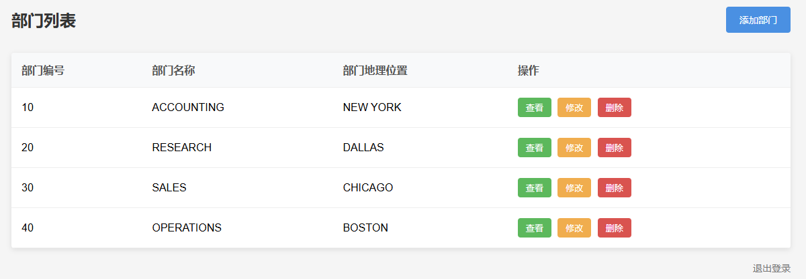

**Java 15 新特性：文本块**

Java 15 正式引入了文本块（Text Blocks），使用 三个双引号 """ 作为定界符（而非反向单引号），用于简化多行字符串的编写：

```java
String json = """
    {
        "name": "Java",
        "version": 17
    }
""";
```

## 查看部门

在部门列表页面找到 `查看`按钮，点击查看按钮，显示该部门详细信息。

实现功能的关键步骤：在查看按钮上添加请求路径，并且携带部门编号。例如：/dept/detail?deptno=10

### 添加请求路径

在 DeptListServlet 类中找到查看按钮所在位置：

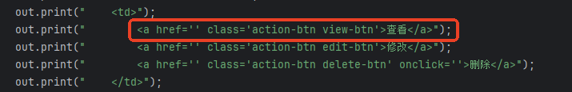

在 href 属性上添加请求路径，并且携带部门编号，代码修改为：

```java
out.print("        <a href='" + contextPath + "/detail?deptno=" + deptno + "' class='action-btn view-btn'>查看</a>");
```

**说明：**`**<font style="color:#DF2A3F;">contextPath</font>**`** 是通过 **`**<font style="color:#DF2A3F;">String contextPath = request.getContextPath();</font>**`**获取的。前端发送请求时以 **`**<font style="color:#DF2A3F;">/</font>**`**开头，添加项目名，项目名不要写死 **`**<font style="color:#DF2A3F;">/dept</font>**`**，应该通过这行代码动态获取。**

启动服务器测试，点击查看按钮，出现以下 404 错误是正常的，因为 Servlet 还没写，重点看浏览器地址栏上的请求地址是否正确：

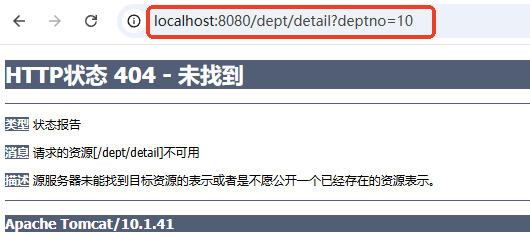

### 显示部门详细信息

编写 `DeptDetailServlet`，重写 `doGet`方法，连接数据库，根据部门编号查询部门信息，动态打印详情页：

```java
package com.jkweilai.dept.servlets;

import com.jkweilai.dept.utils.DbUtils;
import jakarta.servlet.ServletException;
import jakarta.servlet.annotation.WebServlet;
import jakarta.servlet.http.HttpServlet;
import jakarta.servlet.http.HttpServletRequest;
import jakarta.servlet.http.HttpServletResponse;

import java.io.IOException;
import java.io.PrintWriter;
import java.sql.Connection;
import java.sql.PreparedStatement;
import java.sql.ResultSet;

@WebServlet("/detail")
public class DeptDetailServlet extends HttpServlet {
    @Override
    protected void doGet(HttpServletRequest request, HttpServletResponse response) throws ServletException, IOException {
        response.setContentType("text/html;charset=UTF-8");
        PrintWriter out = response.getWriter();

        // 重点新知识：获取用户发送请求时提交的数据。
        // 用户发送请求时提交的数据自动被Tomcat封装到request对象中了，因此要通过request对象来获取用户提交的数据。
        String deptno = request.getParameter("deptno");

        out.print("""
                <!DOCTYPE html>
                <html lang='zh-CN'>
                <head>
                    <meta charset='UTF-8'>
                    <meta name='viewport' content='width=device-width, initial-scale=1.0'>
                    <title>部门管理系统 - 部门详情</title>
                    <style>
                        * {
                            margin: 0;
                            padding: 0;
                            box-sizing: border-box;
                            font-family: 'Arial', sans-serif;
                        }
                        body {
                            background-color: #f5f5f5;
                        }
                        .container {
                            max-width: 800px;
                            margin: 30px auto;
                            padding: 30px;
                            background-color: white;
                            border-radius: 8px;
                            box-shadow: 0 2px 8px rgba(0, 0, 0, 0.1);
                        }
                        .header {
                            display: flex;
                            justify-content: space-between;
                            align-items: center;
                            margin-bottom: 30px;
                            padding-bottom: 15px;
                            border-bottom: 1px solid #eee;
                        }
                        .header h1 {
                            color: #333;
                            font-size: 24px;
                        }
                        .back-btn {
                            padding: 8px 16px;
                            background-color: #6c757d;
                            color: white;
                            border: none;
                            border-radius: 4px;
                            cursor: pointer;
                            text-decoration: none;
                            font-size: 14px;
                            transition: background-color 0.3s;
                        }
                        .back-btn:hover {
                            background-color: #5a6268;
                        }
                        .detail-card {
                            padding: 20px;
                            border-radius: 6px;
                            background-color: #f8f9fa;
                        }
                        .detail-row {
                            display: flex;
                            margin-bottom: 15px;
                            padding-bottom: 15px;
                            border-bottom: 1px solid #e9ecef;
                        }
                        .detail-row:last-child {
                            margin-bottom: 0;
                            padding-bottom: 0;
                            border-bottom: none;
                        }
                        .detail-label {
                            width: 150px;
                            font-weight: 600;
                            color: #495057;
                        }
                        .detail-value {
                            flex: 1;
                            color: #212529;
                        }
                        .action-btns {
                            margin-top: 30px;
                            text-align: right;
                        }
                        .edit-btn {
                            padding: 10px 20px;
                            background-color: #f0ad4e;
                            color: white;
                            border: none;
                            border-radius: 4px;
                            cursor: pointer;
                            text-decoration: none;
                            font-size: 14px;
                            transition: background-color 0.3s;
                        }
                        .edit-btn:hover {
                            background-color: #eea236;
                        }
                    </style>
                </head>
                <body>
                """);

        Connection conn = null;
        PreparedStatement ps = null;
        ResultSet rs = null;
        try {
            conn = DbUtils.getConnection();
            String sql = "select * from dept where deptno = ?";
            ps = conn.prepareStatement(sql);
            ps.setString(1, deptno);
            rs = ps.executeQuery();
            if(rs.next()) {
                String dname = rs.getString("dname");
                String loc = rs.getString("loc");
                out.print("<div class='container'>");
                out.print("    <div class='header'>");
                out.print("        <h1>部门详细信息</h1>");
                out.print("        <a href='' class='back-btn'>返回列表</a>");
                out.print("    </div>");
                out.print("    <div class='detail-card'>");
                out.print("        <div class='detail-row'>");
                out.print("            <div class='detail-label'>部门编号</div>");
                out.print("            <div class='detail-value'>" + deptno + "</div>");
                out.print("        </div>");
                out.print("        <div class='detail-row'>");
                out.print("            <div class='detail-label'>部门名称</div>");
                out.print("            <div class='detail-value'>" + dname + "</div>");
                out.print("        </div>");
                out.print("        <div class='detail-row'>");
                out.print("            <div class='detail-label'>部门地理位置</div>");
                out.print("            <div class='detail-value'>" + loc + "</div>");
                out.print("        </div>");
                out.print("    </div>");
                out.print("    <div class='action-btns'>");
                out.print("        <a href='' class='edit-btn'>编辑部门信息</a>");
                out.print("    </div>");
                out.print("</div>");
            }
        } catch (Exception e) {
            e.printStackTrace();
        } finally {
            DbUtils.close(conn, ps, rs);
        }
        out.print("""        
                </body>
                </html>
                """);
    }
}
```

运行结果：

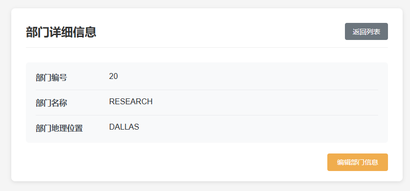

**重点内容：**

实现本功能时，使用了一个新的知识点：通过 request 对象获取用户提交的数据。

HTTP 协议中规定，无论是 get 还是 post 请求，提交数据的格式为：name=value&name=value&name=value

要获取 value，可以通过 request 对象 getParameter()方法来获取：

```java
String value = request.getParameter("name");
```

需要注意的是 `name`必须要写正确了，尽量采用复制粘贴方式。

另外需要注意的是，该方法的返回值类型永远都是字符串形式。

## 删除部门

### 添加请求路径

发送 `/dept/delete?deptno=10`的请求，根据部门编号删除部门信息。

DeptListServlet 中找到删除按钮：

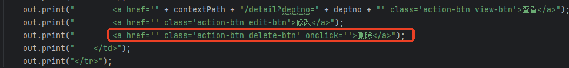

添加删除的请求路径：

```java
out.print("        <a href='javascript:void(0)' class='action-btn delete-btn' onclick='if(window.confirm(\"您确定删除吗？\"))document.location.href=\"" + contextPath + "/delete?deptno=" + deptno + "\"'>删除</a>");
```

### 实现删除

编写 DeptDeleteServlet，获取部门编号，连接数据库，根据部门编号删除数据。删除成功后再跳转到部门列表页面。

```java
package com.jkweilai.dept.servlets;

import com.jkweilai.dept.utils.DbUtils;
import jakarta.servlet.ServletException;
import jakarta.servlet.annotation.WebServlet;
import jakarta.servlet.http.HttpServlet;
import jakarta.servlet.http.HttpServletRequest;
import jakarta.servlet.http.HttpServletResponse;

import java.io.IOException;
import java.sql.Connection;
import java.sql.PreparedStatement;

@WebServlet("/delete")
public class DeptDeleteServlet extends HttpServlet {
    @Override
    protected void doGet(HttpServletRequest request, HttpServletResponse response) throws ServletException, IOException {
        // 获取部门编号
        String deptno = request.getParameter("deptno");
        // 连接数据库删除部门
        Connection conn = null;
        PreparedStatement ps = null;
        try {
            conn = DbUtils.getConnection();
            String sql = "delete from dept where deptno = ?";
            ps = conn.prepareStatement(sql);
            ps.setString(1, deptno);
            ps.executeUpdate();
        } catch (Exception e) {
            e.printStackTrace();
        } finally {
            DbUtils.close(conn, ps, null);
        }
    }

}
```

### 再跳转到部门列表

删除之后，需要展示一个全新的列表，因此需要让浏览器重新发一次全新的 `/dept/list`请求，只有浏览器发送这个请求，Tomcat 才会执行 DeptListServlet，再查一次数据库，展示新的列表，在 JavaWeb 开发中如何使用 Java 代码让浏览器自动再发一次全新的请求呢？使用重定向机制。代码如下：

**重点内容：**

```java
response.sendRedirect("/dept/list");
```

需要注意的是：重定向时的路径写法和前端超链接的写法一致，都以 `/` 开始，并且带项目名。

在 `DeptDeleteServlet`的末尾添加以下代码：

```java
response.sendRedirect(request.getContextPath() + "/list");
```

## 跳转到修改页面

### 添加请求路径

找到 DeptListServlet 中的修改按钮，添加请求路径 `/dept/edit?deptno=10`，代码如下：

```java
out.print("        <a href='" + contextPath + "/edit?deptno=" + deptno + "' class='action-btn edit-btn'>修改</a>");
```

### 展示修改页面

编写 DeptEditServlet，获取部门编号，根据部门编号查询部门信息，动态展示修改页面：

```java
package com.jkweilai.dept.servlets;

import com.jkweilai.dept.utils.DbUtils;
import jakarta.servlet.ServletException;
import jakarta.servlet.annotation.WebServlet;
import jakarta.servlet.http.HttpServlet;
import jakarta.servlet.http.HttpServletRequest;
import jakarta.servlet.http.HttpServletResponse;

import java.io.IOException;
import java.io.PrintWriter;
import java.sql.Connection;
import java.sql.PreparedStatement;
import java.sql.ResultSet;

@WebServlet("/edit")
public class DeptEditServlet extends HttpServlet {
    @Override
    protected void doGet(HttpServletRequest request, HttpServletResponse response) throws ServletException, IOException {
        response.setContentType("text/html;charset=UTF-8");
        PrintWriter out = response.getWriter();

        // 获取部门编号
        String deptno = request.getParameter("deptno");

        out.print("""
                <!DOCTYPE html>
                <html lang="zh-CN">
                <head>
                    <meta charset="UTF-8">
                    <meta name="viewport" content="width=device-width, initial-scale=1.0">
                    <title>部门管理系统 - 修改部门</title>
                    <style>
                        * {
                            margin: 0;
                            padding: 0;
                            box-sizing: border-box;
                            font-family: 'Arial', sans-serif;
                        }
                        body {
                            background-color: #f5f5f5;
                        }
                        .container {
                            max-width: 800px;
                            margin: 30px auto;
                            padding: 30px;
                            background-color: white;
                            border-radius: 8px;
                            box-shadow: 0 2px 8px rgba(0, 0, 0, 0.1);
                        }
                        .header {
                            display: flex;
                            justify-content: space-between;
                            align-items: center;
                            margin-bottom: 30px;
                            padding-bottom: 15px;
                            border-bottom: 1px solid #eee;
                        }
                        .header h1 {
                            color: #333;
                            font-size: 24px;
                        }
                        .back-btn {
                            padding: 8px 16px;
                            background-color: #6c757d;
                            color: white;
                            border: none;
                            border-radius: 4px;
                            cursor: pointer;
                            text-decoration: none;
                            font-size: 14px;
                            transition: background-color 0.3s;
                        }
                        .back-btn:hover {
                            background-color: #5a6268;
                        }
                        .form-group {
                            margin-bottom: 20px;
                        }
                        .form-group label {
                            display: block;
                            margin-bottom: 8px;
                            color: #555;
                            font-weight: 500;
                        }
                        .form-group input, .form-group select {
                            width: 100%;
                            padding: 12px;
                            border: 1px solid #ddd;
                            border-radius: 4px;
                            font-size: 16px;
                            transition: border-color 0.3s;
                        }
                        .form-group input:focus, .form-group select:focus {
                            border-color: #4a90e2;
                            outline: none;
                        }
                        .form-group input[readonly] {
                            background-color: #f8f9fa;
                            color: #6c757d;
                        }
                        .btn-group {
                            display: flex;
                            justify-content: space-between;
                            margin-top: 30px;
                            padding-top: 15px;
                            border-top: 1px solid #eee;
                        }
                        .submit-btn {
                            padding: 12px 24px;
                            background-color: #4a90e2;
                            color: white;
                            border: none;
                            border-radius: 4px;
                            cursor: pointer;
                            font-size: 16px;
                            transition: background-color 0.3s;
                        }
                        .submit-btn:hover {
                            background-color: #3a7bc8;
                        }
                        .cancel-btn {
                            padding: 12px 24px;
                            background-color: #6c757d;
                            color: white;
                            border: none;
                            border-radius: 4px;
                            cursor: pointer;
                            font-size: 16px;
                            transition: background-color 0.3s;
                            text-decoration: none;
                        }
                        .cancel-btn:hover {
                            background-color: #5a6268;
                        }
                    </style>
                </head>
                <body>
                """);

        Connection conn = null;
        PreparedStatement ps = null;
        ResultSet rs = null;
        try {
            conn = DbUtils.getConnection();
            String sql = "select * from dept where deptno = ?";
            ps = conn.prepareStatement(sql);
            ps.setString(1, deptno);
            rs = ps.executeQuery();
            if(rs.next()){
                String dname = rs.getString("dname");
                String loc = rs.getString("loc");
                out.print("<div class='container'>");
                out.print("    <div class='header'>");
                out.print("    <h1>修改部门信息</h1>");
                out.print("    <a href='' class='back-btn'>返回列表</a>");
                out.print("    </div>");
                out.print("    <form action='#' method='post'>");
                out.print("    <div class='form-group'>");
                out.print("        <label for='deptId'>部门编号</label>");
                out.print("        <input type='text' id='deptId' name='deptId' value='" + deptno + "' readonly>");
                out.print("    </div>");
                out.print("    <div class='form-group'>");
                out.print("        <label for='deptName'>部门名称</label>");
                out.print("        <input type='text' id='deptName' name='deptName' value='" + dname + "' required>");
                out.print("    </div>");
                out.print("    <div class='form-group'>");
                out.print("        <label for='location'>部门地理位置</label>");
                out.print("        <input type='text' id='location' name='location' value='" + loc + "' required>");
                out.print("    </div>");
                out.print("    <div class='btn-group'>");
                out.print("        <a href='' class='cancel-btn'>取消</a>");
                out.print("        <button type='submit' class='submit-btn'>保存更改</button>");
                out.print("    </div>");
                out.print("    </form>");
                out.print("</div>");
            }
        } catch (Exception e) {
            e.printStackTrace();
        } finally {
            DbUtils.close(conn, ps, rs);
        }

        out.print("""        
                </body>
                </html>
                """);
    }
}
```

运行效果如下：

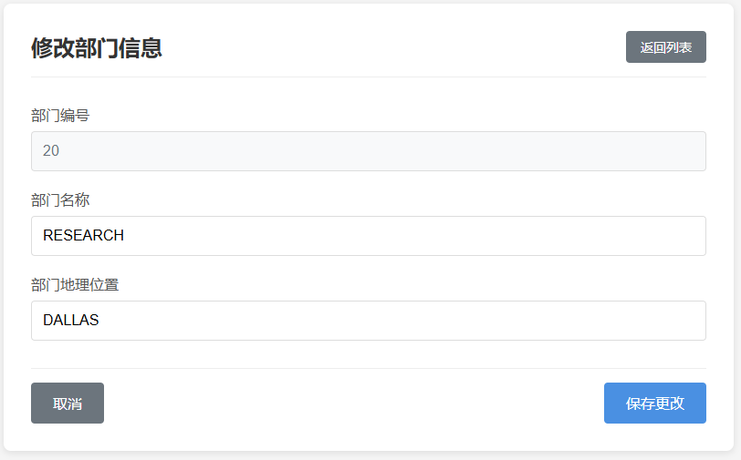

## 修改部门

### 提交表单

在修改页面 （DeptEditServlet），点击保存更改，发送请求，提交 form 表单。部门编号不支持修改。

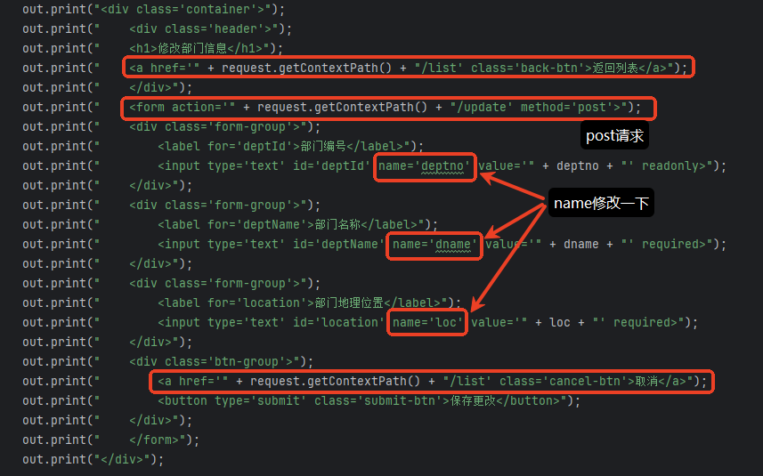

修改后的代码如下：

```java
out.print("<div class='container'>");
out.print("    <div class='header'>");
out.print("    <h1>修改部门信息</h1>");
out.print("    <a href='" + request.getContextPath() + "/list' class='back-btn'>返回列表</a>");
out.print("    </div>");
out.print("    <form action='" + request.getContextPath() + "/update' method='post'>");
out.print("    <div class='form-group'>");
out.print("        <label for='deptId'>部门编号</label>");
out.print("        <input type='text' id='deptId' name='deptno' value='" + deptno + "' readonly>");
out.print("    </div>");
out.print("    <div class='form-group'>");
out.print("        <label for='deptName'>部门名称</label>");
out.print("        <input type='text' id='deptName' name='dname' value='" + dname + "' required>");
out.print("    </div>");
out.print("    <div class='form-group'>");
out.print("        <label for='location'>部门地理位置</label>");

out.print("        <input type='text' id='location' name='loc' value='" + loc + "' required>");
out.print("    </div>");
out.print("    <div class='btn-group'>");
out.print("        <a href='" + request.getContextPath() + "/list' class='cancel-btn'>取消</a>");
out.print("        <button type='submit' class='submit-btn'>保存更改</button>");
out.print("    </div>");
out.print("    </form>");
out.print("</div>");
```

### 修改部门

编写 DeptUpdateServlet，获取表单提交的数据，更新数据库，更新成功后重定向到列表页面：

```java
package com.jkweilai.dept.servlets;

import com.jkweilai.dept.utils.DbUtils;
import jakarta.servlet.ServletException;
import jakarta.servlet.annotation.WebServlet;
import jakarta.servlet.http.HttpServlet;
import jakarta.servlet.http.HttpServletRequest;
import jakarta.servlet.http.HttpServletResponse;

import java.io.IOException;
import java.sql.Connection;
import java.sql.PreparedStatement;

@WebServlet("/update")
public class DeptUpdateServlet extends HttpServlet {
    @Override
    protected void doPost(HttpServletRequest request, HttpServletResponse response) throws ServletException, IOException {
        // 解决请求体中文乱码问题
        request.setCharacterEncoding("UTF-8");
        // 获取表单提交的数据
        String deptno = request.getParameter("deptno");
        String dname = request.getParameter("dname");
        String loc = request.getParameter("loc");
        // 连接数据库更新部门
        Connection conn = null;
        PreparedStatement ps = null;
        try {
            conn = DbUtils.getConnection();
            String sql = "update dept set dname = ?, loc = ? where deptno = ?";
            ps = conn.prepareStatement(sql);
            ps.setString(1, dname);
            ps.setString(2, loc);
            ps.setString(3, deptno);
            ps.executeUpdate();
        } catch (Exception e) {
            e.printStackTrace();
        } finally {
            DbUtils.close(conn, ps, null);
        }
        // 重定向到列表页面
        response.sendRedirect(request.getContextPath() + "/list");
    }
}
```

### 关于请求数据的乱码问题

#### post 请求乱码

`Tomcat 7`及之前的版本，请求体默认字符集采用的是 ISO-8859-1 。当使用以下代码获取请求体的数据时，会出现中文乱码问题：

```java
String value = request.getParameter("name");
```

怎么解决请求体的乱码问题呢，只需要在 `request.getParameter("name");`之前执行以下代码即可：

```java
request.setCharacterEncoding("UTF-8");
```

从 `Tomcat8.0`开始，请求体默认字符编码方式已改为 UTF-8，大部分情况下不需要手动处理乱码问题。除非浏览器客户端提交数据时采用 GBK 的方式，我们仍然需要执行以下代码来解决中文乱码问题：

```java
request.setCharacterEncoding("GBK");
```

#### get 请求乱码

get 请求数据在请求行上提交，格式：uri?name=value&name=value

如果 get 请求提交中文数据，在 Tomcat7 及之前的版本中通过 `request.getParameter("name")`取数据时也会出现中文乱码问题。怎么解决 get 请求乱码问题呢？修改 `conf/server.xml`配置文件：

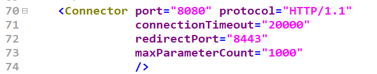

在以上 `<Connector>` 标签中添加 `URIEncoding="UTF-8"`属性。

Tomcat8 之后的版本中 `URIEncoding`属性的默认值就是 UTF-8，因此 get 请求乱码问题基本上也不需要考虑了。

怎么能够知道 `<Connector>`标签都支持哪些属性呢？可以参照 Tomcat 内部帮助文档：`CATALINA_HOME/webapps/docs/config/http.html`

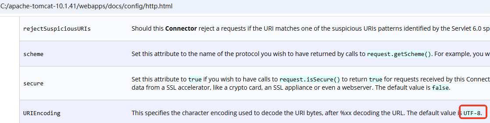

## 添加部门

### 跳转到添加部门页面

在部门列表页面点击添加部门按钮：

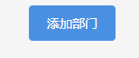

在 DeptListServlet 中找到这个按钮，设置超链接地址为：http://localhost:8080/dept/add.html

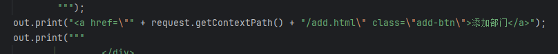

大家可能在想，为什么跳转到添加部门页面不需要经过 Servlet？这是因为添加部门页面是一个纯静态页面。不需要动态网页技术。

在项目的根下创建 `add.html`文件，将之前的 add.html 文件中的代码拷贝粘贴进来。测试效果如下：

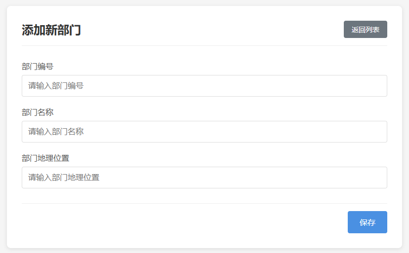

将表单中的部门编号删除，因为部门编号可以在后台 Java 程序中动态生成。最终效果如下：

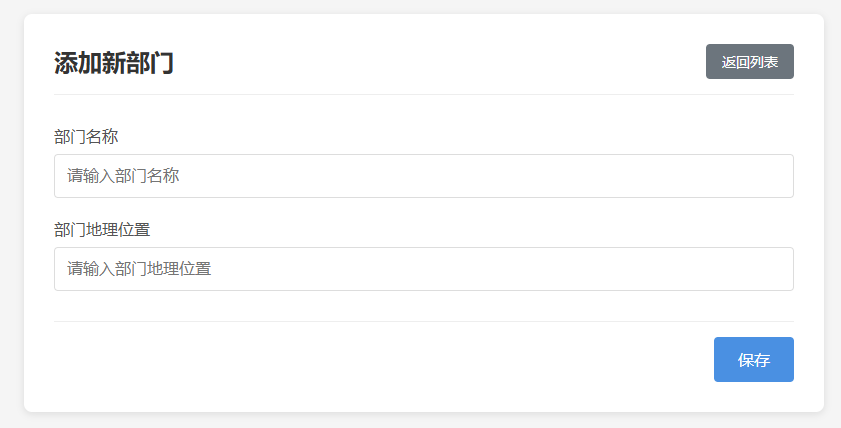

### 设置 form 表单

表单的 action 属性设置，method 设置，表单项的 name 设置等。

```html
<form action="/dept/save" method="post">
  <div class="form-group">
    <label for="deptName">部门名称</label>
    <input type="text" id="deptName" name="dname" placeholder="请输入部门名称" required>
  </div>
  <div class="form-group">
    <label for="location">部门地理位置</label>
    <input type="text" id="location" name="loc" placeholder="请输入部门地理位置" required>
  </div>
  <div class="footer">
    <button type="submit" class="submit-btn">保存</button>
  </div>
</form>
```

### 保存部门

编写 DeptSaveServlet，重写 doPost 方法，获取表单提交的数据，连接数据库保存部门信息，然后重定向到列表页面。

注意：部门编号生成算法：当前最大部门编号 + 1。另外要注意多线程并发的问题，使用线程同步机制保证安全。

```java
package com.jkweilai.dept.servlets;

import com.jkweilai.dept.utils.DbUtils;
import jakarta.servlet.ServletException;
import jakarta.servlet.annotation.WebServlet;
import jakarta.servlet.http.HttpServlet;
import jakarta.servlet.http.HttpServletRequest;
import jakarta.servlet.http.HttpServletResponse;

import java.io.IOException;
import java.sql.Connection;
import java.sql.PreparedStatement;
import java.sql.ResultSet;

@WebServlet("/save")
public class DeptSaveServlet extends HttpServlet {
    @Override
    protected void doPost(HttpServletRequest request, HttpServletResponse response) throws ServletException, IOException {
        // 解决请求体乱码问题
        request.setCharacterEncoding("UTF-8");
        // 获取部门信息
        String dname = request.getParameter("dname");
        String loc = request.getParameter("loc");
        // 连接数据库保存数据
        // 查询当前最大的部门编号，新部门编号在当前最大部门编号基础上 + 1
        Connection conn = null;
        PreparedStatement ps = null;
        PreparedStatement ps1 = null;
        ResultSet rs = null;
        try {
            conn = DbUtils.getConnection();
            String sql = "select max(deptno) as maxDeptno from dept";
            ps = conn.prepareStatement(sql);
            rs = ps.executeQuery();
            if (rs.next()) {
                int maxDeptno = rs.getInt("maxDeptno");
                synchronized (this){
                    int deptno = maxDeptno + 1;
                    String insertSql = "insert into dept values(?,?,?)";
                    ps1 = conn.prepareStatement(insertSql);
                    ps1.setInt(1, deptno);
                    ps1.setString(2, dname);
                    ps1.setString(3, loc);
                    ps1.executeUpdate();
                }
            }
        } catch (Exception e) {
            e.printStackTrace();
        } finally {
            DbUtils.close(null, ps1, null);
            DbUtils.close(conn, ps, rs);
        }

        response.sendRedirect(request.getContextPath() + "/list");
    }
}
```

到此为止，我们已经完成了基本的 CRUD 操作。

# 转发与重定向


**转发**和**重定向**是 Servlet 中完成资源跳转的重要手段。

## 关于 request 域

之前已经接触了一个域对象，叫做应用域：application，对应的接口是：jakarta.servlet.ServletContext，应用域的范围较大，是服务器级别的，整个 webapp 中只有一个应用域对象。

域对象普遍都有以下三个方法：

```java
// 向域绑定数据
void setAttribute(String name, Object data);

// 从域中获取数据
Object getAttribute(String name);

// 删除域中的数据
void removeAttribute(String name);
```

request 是请求域，生命周期较短，只在同一次请求当中有效（因为新的请求会对应新的 request 对象）。因此请求域要小于应用域。

域对象的使用原则：优先选择小的域对象，小的满足不了，再选大的。

## 重定向

重定向的代码：

```java
response.sendRedirect("/dept/list");
```

1. 重定向调用的是 response 对象的方法。
2. 重定向时路径以 `/`开始，需要添加项目名。
3. 重定向代码执行时，原理是：response 对象将 `/dept/list`响应给浏览器，浏览器自发的再向服务器发送一次全新的请求，请求路径为：`http://ip:port/dept/list`
4. 重定向是两次请求，怎么理解这个两次请求呢？借用我们之前的一个场景：用户保存部门，保存部门之后重定向到列表页面。
  1. 点击保存时发送了** 第一次 **请求：`http://ip:port/dept/save`，执行 `DeptSaveServlet`
  2. 执行保存逻辑后，`DeptSaveServlet` 执行了重定向的代码：`response.sendRedirect("/dept/list");`
  3. `response` 对象将 `/dept/list`路径响应给浏览器，浏览器又自发的向服务器发送** 第二次 **请求：`http://ip:port/dept/list`
  4. 因此，用户只是点击了 **一次**** **保存操作，但浏览器一共是发送了**两次**请求。
  5. 并且浏览器地址栏上的地址最终会显示第二次请求的路径，因此重定向会导致浏览器地址栏上的地址发生改变。（也就是说，发送的是 `/dept/save` 路径，显示的是`/dept/list`路径。）
5. 怎么测试重定向是两次请求呢？
  1. 可以使用 request 域来测试，因为 request 域只能保留同一次请求中的数据，如果是两次请求，request 域是无法共享数据的。测试两次请求的代码如下：

```java
package com.jkweilai.servlet;

import jakarta.servlet.ServletException;
import jakarta.servlet.annotation.WebServlet;
import jakarta.servlet.http.HttpServlet;
import jakarta.servlet.http.HttpServletRequest;
import jakarta.servlet.http.HttpServletResponse;

import java.io.IOException;

@WebServlet("/a")
public class AServlet extends HttpServlet {
    @Override
    protected void doGet(HttpServletRequest request, HttpServletResponse response) throws ServletException, IOException {
        // 向请求域中绑定数据
        request.setAttribute("message", "Hello Servlet!");
        // 重定向到 /web01/b
        response.sendRedirect(request.getContextPath() + "/b");
    }
}
```

```java
package com.jkweilai.servlet;

import jakarta.servlet.ServletException;
import jakarta.servlet.annotation.WebServlet;
import jakarta.servlet.http.HttpServlet;
import jakarta.servlet.http.HttpServletRequest;
import jakarta.servlet.http.HttpServletResponse;

import java.io.IOException;

@WebServlet("/b")
public class BServlet extends HttpServlet {
    @Override
    protected void doGet(HttpServletRequest request, HttpServletResponse response) throws ServletException, IOException {
        // 从request域中取数据
        Object message = request.getAttribute("message");
        // 响应到浏览器
        response.setContentType("text/html;charset=UTF-8");
        response.getWriter().print("<h2>message = " + message + "</h2>");
    }
}
```

启动服务器，打开浏览器，输入地址：http://localhost:8080/web01/a，测试结果：


1. 重定向时无法重定向到 `WEB-INF`目录下受保护的资源，例如 `WEB-INF`目录下有一个文件：`a.html`，编写以下代码会出现 404 错误：

```java
response.sendRedirect("/dept/WEB-INF/a.html");
```

为什么？前面我们已经讲过：放在 WEB-INF 目录下的资源是受保护的，不能通过在浏览器地址栏上输入地址来访问。

而重定向是浏览器的行为，以上代码会导致浏览器重新发一次新的请求，而请求路径是：`http://ip:port/dept/WEB-INF/a.html`，因此会出现 404 的问题。

## 转发

转发的代码：

```java
request.getRequestDispatcher("/list").forward(request, response);
```

1. 转发是一次请求。可以使用 request 域来测试，转发是否为一次请求，代码如下：

```java
package com.jkweilai.servlet;


import jakarta.servlet.ServletException;
import jakarta.servlet.annotation.WebServlet;
import jakarta.servlet.http.HttpServlet;
import jakarta.servlet.http.HttpServletRequest;
import jakarta.servlet.http.HttpServletResponse;

import java.io.IOException;

@WebServlet("/a")
public class AServlet extends HttpServlet {
    @Override
    protected void doGet(HttpServletRequest request, HttpServletResponse response) throws ServletException, IOException {
        // 向请求域中绑定数据
        request.setAttribute("message", "Hello Servlet!");
        // 转发到 /b
        request.getRequestDispatcher("/b").forward(request, response);
    }
}
```

```java
package com.jkweilai.servlet;

import jakarta.servlet.ServletException;
import jakarta.servlet.annotation.WebServlet;
import jakarta.servlet.http.HttpServlet;
import jakarta.servlet.http.HttpServletRequest;
import jakarta.servlet.http.HttpServletResponse;

import java.io.IOException;

@WebServlet("/b")
public class BServlet extends HttpServlet {
    @Override
    protected void doGet(HttpServletRequest request, HttpServletResponse response) throws ServletException, IOException {
        // 从request域中取数据
        Object message = request.getAttribute("message");
        // 响应到浏览器
        response.setContentType("text/html;charset=UTF-8");
        response.getWriter().print("<h2>message = " + message + "</h2>");
    }
}
```

浏览器地址栏上输入：`http://localhost:8080/web01/a`


1. 转发时路径不需要写项目名。
2. 转发调用的是 request 对象的方法。
3. 转发是当前项目内部资源的跳转，浏览器不参与。
4. 转发时路径可以是 WEB-INF 目录下受保护的资源。

## 转发与重定向如何选择

当满足以下任何一个条件时，使用转发，其它情况一律使用重定向：

1. 需要在同一次请求中共享数据。
2. 需要跳转到 WEB-INF 目录下受保护的资源。

# 监听器 Listener


Servlet 监听器是 Servlet 规范中的一部分，主要用于监听 Web 应用中的特定事件，当这些事件发生时执行预定义的操作。监听器提供了一种事件驱动的编程模型，允许开发者在应用生命周期的关键点插入自定义逻辑。

## 主要监听器类型

Servlet 规范定义了以下几种监听器接口：

1. **ServletContext 监听器**
  - `ServletContextListener`：监听 Web 应用的启动和关闭
  - `ServletContextAttributeListener`：监听应用范围内属性的添加、移除和替换
2. **HttpSession 监听器**
  - `HttpSessionListener`：监听会话的创建和销毁
  - `HttpSessionAttributeListener`：监听会话范围内属性的添加、移除和替换
  - `HttpSessionActivationListener`：监听会话的激活和钝化(集群环境)
  - `HttpSessionBindingListener`：监听对象绑定到会话或从会话解绑
3. **ServletRequest 监听器**
  - `ServletRequestListener`：监听请求的初始化和销毁
  - `ServletRequestAttributeListener`：监听请求范围内属性的添加、移除和替换

## 典型应用场景

1. **应用初始化**：在应用启动时加载资源(数据库连接池、缓存数据等)
2. **资源清理**：在应用关闭时释放资源
3. **会话管理**：统计在线用户、会话超时处理
4. **请求监控**：记录请求日志、性能监控
5. **属性变更跟踪**：跟踪应用、会话或请求范围内属性的变化

## 配置方式

监听器可以通过以下两种方式配置：

1. **注解方式**：在监听器类上使用 `@WebListener` 注解

```java
@WebListener
public class MyListener implements ServletContextListener {...}
```

1. **web.xml 配置**：

```xml
<listener>
    <listener-class>com.example.MyListener</listener-class>
</listener>
```

## 以 ServletContextListener 为例

该监听器中提供了两个方法：

- contextInitialized：服务器启动的时候这个方法自动调用。
- contextDestroyed：服务器关闭的时候这个方法自动调用。

编写类实现 `ServletContextListener`接口：

```java
package com.jkweilai.listener;

import jakarta.servlet.ServletContextEvent;
import jakarta.servlet.ServletContextListener;
import jakarta.servlet.annotation.WebListener;

@WebListener
public class MyServletContextListener implements ServletContextListener {
    @Override
    public void contextInitialized(ServletContextEvent sce) {
        System.out.println("=====contextInitialized=====");
    }

    @Override
    public void contextDestroyed(ServletContextEvent sce) {
        System.out.println("=====contextDestroyed=====");
    }
}
```

`web.xml` 文件中配置监听器，或者使用 `@WebListener注解` 标注 。这里选择使用注解，更加方便一些。

启动和关闭服务器，观察控制台输出结果：

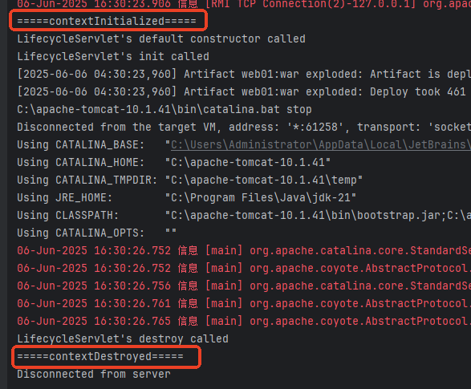

# 过滤器 Filter


在Servlet中，**Filter（过滤器）是一种可重用的组件，用于在请求到达Servlet或响应返回客户端之前拦截并处理**HTTP请求和响应。它允许开发者在不修改核心业务逻辑的情况下，对Web应用的请求/响应流程进行统一处理。

## Filter的核心作用

1. **预处理请求（Pre-processing）**
  - 在请求到达目标Servlet之前，对请求进行修改或检查（如参数编码、权限验证、日志记录等）。
2. **后处理响应（Post-processing）**
  - 在响应返回客户端之前，对响应内容进行加工（如压缩响应数据、设置HTTP头、过滤敏感信息等）。
3. **拦截请求或响应**
  - 根据条件决定是否将请求/响应继续传递到链中的下一个组件（如未登录时直接重定向到登录页）。

## 典型应用场景

- **认证/授权**：检查用户是否登录或是否有权限访问资源。
- **日志记录**：记录请求的URL、IP、耗时等信息。
- **编码处理**：统一设置请求/响应的字符编码（如`UTF-8`）。
- **数据压缩**：对响应内容进行Gzip压缩。
- **XSS防护**：过滤请求参数中的恶意脚本。
- **静态资源缓存**：为静态资源添加缓存控制头。

## Filter的工作原理

1. **链式调用**：多个Filter可以组成一个链（Filter Chain），按`web.xml`定义的顺序依次执行。
2. **生命周期**：
  - **初始化**：Web容器启动时调用`init()`方法（仅一次）。
  - **拦截处理**：每次请求触发`doFilter()`方法。
  - **销毁**：容器关闭时调用`destroy()`方法。

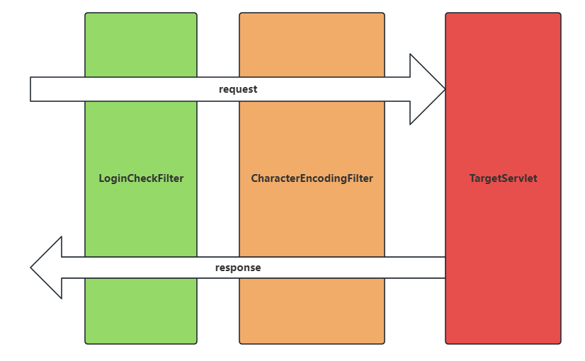

## 使用 Filter

### 不使用 Filter 存在的问题

观察以下代码存在的问题：

```java
@WebServlet("/filter/target1")
public class Target1Servlet extends HttpServlet {
    @Override
    protected void doGet(HttpServletRequest request, HttpServletResponse response) throws ServletException, IOException {
        System.out.println("begin: Common Code");

        System.out.println("Target1Servlet doGet...");

        System.out.println("end: Common Code");
    }
}
```

```java
@WebServlet("/filter/target2")
public class Target2Servlet extends HttpServlet {
    @Override
    protected void doGet(HttpServletRequest request, HttpServletResponse response) throws ServletException, IOException {
        System.out.println("begin: Common Code");

        System.out.println("Target2Servlet doGet...");

        System.out.println("end: Common Code");
    }
}
```

存在的问题：多个 Servlet 存在公共代码，每个 Servlet 中都写一遍，代码没有得到复用。

Filter 过滤器可以解决代码复用的问题。公共代码只需要在过滤器中编写一次即可。

### 使用 Filter 进行改造

两个 Servlet 改造如下：

```java
@WebServlet("/filter/target1")
public class Target1Servlet extends HttpServlet {
    @Override
    protected void doGet(HttpServletRequest request, HttpServletResponse response) throws ServletException, IOException {
        System.out.println("Target1Servlet doGet...");
    }
}
```

```java
@WebServlet("/filter/target2")
public class Target2Servlet extends HttpServlet {
    @Override
    protected void doGet(HttpServletRequest request, HttpServletResponse response) throws ServletException, IOException {
        System.out.println("Target2Servlet doGet...");
    }
}
```

编写过滤器：CommonCodeFilter

```java
package com.jkweilai.filter;

import jakarta.servlet.*;

import java.io.IOException;

public class CommonCodeFilter implements Filter {
    @Override
    public void init(FilterConfig filterConfig) throws ServletException {
        
    }

    @Override
    public void doFilter(ServletRequest request, ServletResponse response, FilterChain chain) throws IOException, ServletException {
        System.out.println("begin: Common Code");

        // 执行下一个过滤器，没有过滤器时则执行最终的Servlet
        chain.doFilter(request, response);

        System.out.println("end: Common Code");
    }

    @Override
    public void destroy() {
        
    }
}
```

`web.xml`中配置过滤器，或者也可以使用注解 `**<font style="color:#DF2A3F;">@WebFilter</font>**` 标注：

```xml
<filter>
    <filter-name>commonCodeFilter</filter-name>
    <filter-class>com.jkweilai.filter.CommonCodeFilter</filter-class>
</filter>
<filter-mapping>
    <filter-name>commonCodeFilter</filter-name>
    <url-pattern>/filter/*</url-pattern>
</filter-mapping>
```

注意：**在 **`**<font style="color:#DF2A3F;">web.xml</font>**`**文件中同时配置了 Servlet 和 Filter，用户发送的请求路径同时满足 Servlet 和 Filter 时，Filter 优先级高，先执行**。

启动服务器，打开浏览器，先后输入以下 URL，观察控制台输出：

[http://localhost:8080/web01/filter/target1](http://localhost:8080/web01/filter/target1)

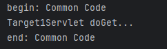

[http://localhost:8080/web01/filter/target2](http://localhost:8080/web01/filter/target2)


可以看到过滤器起作用了。

## Filter 的执行顺序

如果编写了多个过滤器，在 web.xml 文件中**配置越靠上**，优先级越高。大家可以编写程序测试一下。

## 过滤路径的写法

### 具体规则

在Servlet中，Filter的过滤路径（`url-pattern`）用于指定哪些请求会被过滤器拦截。其配置方式灵活多样，支持多种匹配规则。以下是所有常见的写法及其详细说明：

1. 精确匹配：完全匹配指定的URL路径。`<url-pattern>/user/login</url-pattern>`。仅拦截`/user/login`请求。
2. 前缀匹配：以`/`开头并以`/*`结尾，匹配所有以指定路径开头的URL。`<url-pattern>/admin/*</url-pattern>`。拦截所有以`/admin/`开头的请求。
3. 扩展名匹配：以`*.`开头，匹配特定后缀的文件或请求。`<url-pattern>*.do</url-pattern>`。
4. 默认匹配（根路径）：`<url-pattern>/</url-pattern>`。兜底匹配。
  1. 只拦截其他 Servlet 未匹配的请求（即“兜底”处理）。
  2. 不会拦截 JSP（JSP 的请求路径是：http://localhost:8080/app/test.jsp）
  3. 如果你自定义一个 Servlet 配置为 /，它会接管静态资源请求。
5. 匹配所有请求（通配符）：配置`/*`，拦截所有请求（包括静态资源）。`<url-pattern>/*</url-pattern>`。
6. 多模式匹配：通过多个`<url-pattern>`或逗号分隔（注解方式）配置多个路径。

- **示例（XML）**：

```xml
<filter-mapping>
    <filter-name>myFilter</filter-name>
    <url-pattern>/api/*</url-pattern>
    <url-pattern>*.do</url-pattern>
</filter-mapping>
```

- **示例（注解）**：

```java
@WebFilter(urlPatterns = {"/api/*", "*.do"})
```

### 优先级

1. **精确匹配** > **前缀匹配** > **扩展名匹配** > **默认匹配（**`/`**或**`/*`**）**。
  - 例如：`/user/login`优先于`/user/*`。
2. 相同类型的模式按配置顺序生效（XML中从上到下）。

## 责任链设计模式

责任链模式（Chain of Responsibility Pattern）是 GoF 23 种设计模式中的一种**行为型模式**，其主要目的是**将请求的发送者和接收者解耦**，让多个对象都有机会处理请求，从而避免请求发送者与接收者之间的强耦合关系。

### 核心思想

将多个处理请求的对象连成一条链，请求沿着这条链传递，直到有一个对象处理它为止。每个处理者都包含对下一个处理者的引用，形成链式结构。

### 关键角色

1. **抽象处理者（Handler）**
  - 定义处理请求的接口（通常包含一个处理请求的方法和一个设置下一个处理者的方法）。
  - 可以包含对下一个处理者的引用（即“链”的实现）。
2. **具体处理者（Concrete Handler）**
  - 实现抽象处理者的方法，判断是否能处理当前请求。
  - 如果能处理则处理，否则将请求转发给下一个处理者。
3. **客户端（Client）**
  - 组装责任链（设置链中处理者的顺序关系）。
  - 向链的头部发起请求。

### 工作流程

1. 客户端发起请求到责任链的第一个处理者。
2. 每个处理者判断自己是否能处理该请求：
  - 能处理 → 处理并结束流程。
  - 不能处理 → 将请求传递给下一个处理者。
3. 如果链中所有处理者都无法处理，请求可能被忽略或由默认逻辑处理。

### 该模式的优点

- **解耦**：请求发送者无需知道具体由哪个对象处理，只需向链头发送请求。
- **动态组合**：可以灵活调整链中处理者的顺序或增减处理者。
- **符合开闭原则**：新增处理者无需修改现有代码。

### 经典应用场景

1. 多级审批流程（如请假审批：组长 → 经理 → CEO）。
2. 异常处理（如 Java 中的 `try-catch` 块，按顺序匹配异常类型）。
3. 过滤器链（如 Web 框架中的中间件处理 HTTP 请求）。

### 简单代码示例

```java
// 抽象处理者
abstract class Handler {
    protected Handler next;
    public void setNext(Handler next) { this.next = next; }
    public abstract void handleRequest(String request);
}

// 具体处理者A
class ConcreteHandlerA extends Handler {
    public void handleRequest(String request) {
        if (request.equals("A")) {
            System.out.println("Handler A 处理请求");
        } else if (next != null) {
            next.handleRequest(request); // 传递给下一个处理者
        }
    }
}

// 具体处理者B
class ConcreteHandlerB extends Handler {
    public void handleRequest(String request) {
        if (request.equals("B")) {
            System.out.println("Handler B 处理请求");
        } else if (next != null) {
            next.handleRequest(request);
        }
    }
}

// 客户端
public class Client {
    public static void main(String[] args) {
        Handler handlerA = new ConcreteHandlerA();
        Handler handlerB = new ConcreteHandlerB();
        handlerA.setNext(handlerB); // 组装责任链
        
        handlerA.handleRequest("B"); // 输出：Handler B 处理请求
    }
}
```

### Filter 是责任链模式的典型应用

1. **角色对应**：
  - **抽象处理者** → `**<font style="color:rgb(64, 64, 64);background-color:rgb(236, 236, 236);">Filter</font>**` 接口（定义 `**<font style="color:rgb(64, 64, 64);background-color:rgb(236, 236, 236);">doFilter</font>**` 方法）。
  - **具体处理者** → 用户实现的 Filter（如日志、鉴权 Filter）。
  - **链式传递** → 通过 `**<font style="color:rgb(64, 64, 64);background-color:rgb(236, 236, 236);">FilterChain.doFilter()</font>**` 将请求传递给下一个节点。
2. **工作流程**：
  - 请求依次经过多个 Filter，每个 Filter 可前置处理（如权限校验），再通过 `**<font style="color:rgb(64, 64, 64);background-color:rgb(236, 236, 236);">chain.doFilter()</font>**` 传递请求，最后还可能执行后置处理（如日志记录）。
  - 链的组装通过 `**<font style="color:rgb(64, 64, 64);background-color:rgb(236, 236, 236);">web.xml</font>**` 或注解配置顺序。
3. **对比经典责任链**：
  - **强制传递**：必须调用 `**<font style="color:rgb(64, 64, 64);background-color:rgb(236, 236, 236);">chain.doFilter()</font>**` 确保请求到达 Servlet，而经典模式可能中途终止。
  - **双向处理**：支持请求前/后的拦截（经典模式通常单向）。

# Thymeleaf


## 当前项目弊端

1. **代码耦合性高，难以维护**

前端代码（HTML/CSS/JS）与后端Java逻辑混杂在同一个Servlet中，违反**关注点分离（SoC）**原则。修改前端时需要重新编译Servlet，调试困难；团队协作时前后端开发者互相干扰。

1. **开发效率低**

Java字符串拼接HTML（如`**<font style="color:rgb(64, 64, 64);background-color:rgb(236, 236, 236);">out.println("<div>...</div>")</font>**`）极其繁琐且易错。

1. **安全性风险**

**XSS漏洞**：手动拼接HTML容易遗漏转义导致 XSS 攻击。

**XSS（Cross-Site Scripting）** 是一种攻击方式，黑客通过注入恶意脚本（通常是JavaScript）到网页中，使其在其他用户的浏览器里执行。**后果**：窃取用户Cookie、篡改页面内容、重定向到恶意网站等。

假设有一个Servlet，接收用户输入的`**<font style="color:rgb(64, 64, 64);background-color:rgb(236, 236, 236);">name</font>**`并显示在页面上：

```java
String userName = request.getParameter("name"); // 用户输入
out.println("<div>Welcome, " + userName + "!</div>");
```

如果用户输入的是：

```java
<script>alert('XSS Attack!');</script>
```

最终生成的HTML会是：

```java
<div>Welcome, <script>alert('XSS Attack!');</script>!</div>
```

浏览器会执行这段脚本，弹出一个警告框（实际攻击可能是窃取Cookie或跳转到恶意网站）。如何解决这个问题，可以手动转义。

但手动转义容易遗漏，因此现代框架（如JSP、Thymeleaf、React、Vue）默认会自动转义。

1. **可测试性差**：前端逻辑与后端深度耦合，无法独立测试。

1. **多端适配困难**：同一Servlet无法灵活响应Web/移动端（不同HTML结构或API格式）。

## Thymeleaf 概述

官网地址：[https://www.thymeleaf.org/](https://www.thymeleaf.org/)

**引用官网（2025 年 6 月）： Thymeleaf 3.1.3.RELEASE** is the latest version. It requires **Java SE 8** or newer（翻译：目前最新发布版 3.1.3，要求 JDK 版本最低 8）

Thymeleaf 是一个用于 Web 和独立环境的**现代 Java 模板引擎**，主要用于处理 HTML、XML、JavaScript 等文件，支持自然模板（允许静态原型直接作为模板使用）。它由**Daniel Fernández**领导的团队开发，最初于**2011年**发布，旨在替代 JSP，提供更优雅的模板解决方案。Thymeleaf 强调语法简洁、与 Spring 框架深度集成，常用于 Spring Boot 项目。目前（截至 2025 年 6 月）仍在积极维护，最新稳定版本为 3.1.3，社区活跃且持续更新。

**Java模板引擎**是一种用于动态生成文本（如HTML、XML、邮件内容等）的工具，它通过将**静态模板文件**和**动态数据**结合，生成最终的输出内容。

现代开发中项目多数是前后端分离，Thymeleaf 这种模板技术市场份额在减少，为什么还要保留 Thymeleaf？

- **简单页面需求**：对于管理后台、报表打印、静态内容页等**无需复杂前端交互**的场景，Thymeleaf直接生成HTML比搭建全套前后端分离项目更高效。
- **快速原型开发**：初期验证阶段，用Thymeleaf快速渲染页面比协调前后端联调更省时。
- **SEO友好**：搜索引擎直接抓取服务端渲染的HTML（前后端分离的SPA需额外SSR处理）。
- **支持混合模式**：Thymeleaf允许在传统服务端渲染中逐步引入前端框架（如部分页面用Vue，其他仍用Thymeleaf），适合遗留系统改造。
- **邮件模板**：动态生成HTML邮件内容时，模板引擎仍是标准方案。
- **PDF/Excel导出**：通过模板生成结构化文档（如Apache POI + Thymeleaf）。

## Thymeleaf 处理流程

```html
<!-- 模板文件 index.html -->
<html>
  <body>
    <p th:text="'Hello, ' + ${name}">Hello, Guest</p>
  </body>
</html>
```

Thymeleaf 的处理步骤：

1. 模板解析：解析 HTML，识别 `**<font style="color:rgb(64, 64, 64);background-color:rgb(236, 236, 236);">th:text</font>**` 表达式。
2. 表达式处理：计算表达式 `**<font style="color:rgb(64, 64, 64);background-color:rgb(236, 236, 236);">${name}</font>**`（从 Servlet 作用域中获取值或从 Spring MVC 的 Model 中获取值）。
3. 渲染阶段：替换静态文本（`**<font style="color:rgb(64, 64, 64);background-color:rgb(236, 236, 236);">Hello, Guest</font>**`）为动态值（如 `**<font style="color:rgb(64, 64, 64);background-color:rgb(236, 236, 236);">Hello, Alice</font>**`）。

提示：

1. Thymeleaf 模板是合法的 HTML，可直接用浏览器打开预览。
2. Thymeleaf 默认对所有表达式输出进行 **HTML 转义**，有效防御 XSS。
3. Thymeleaf **不依赖 Servlet 容器**，可以在非 Web 环境（如邮件模板）中使用。
4. Thymeleaf **无 Java 代码嵌入**：所有逻辑通过属性（如 `**<font style="color:rgb(64, 64, 64);background-color:rgb(236, 236, 236);">th:text</font>**`、`**<font style="color:rgb(64, 64, 64);background-color:rgb(236, 236, 236);">th:if</font>**`）实现。

## Servlet 中使用 Thymeleaf

### 添加Thymeleaf 的 jar 包

jar 包从 apache 提供的 maven 中央仓库中下载，地址：[https://repo.maven.apache.org/maven2/](https://repo.maven.apache.org/maven2/)

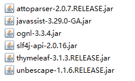

将 jar 包拷贝 `WEB-INF/lib`目录下，并且只需要将 `thymeleaf-3.1.3.RELEASE.jar`添加到 classpath 中：

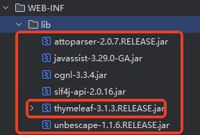

### 初始化模板引擎

写一个 ServletContextListener 监听器，在服务器启动阶段，初始化 Thymeleaf 的模板引擎：

```java
package com.jkweilai.thymeleaf.listeners;

import jakarta.servlet.ServletContext;
import jakarta.servlet.ServletContextEvent;
import jakarta.servlet.ServletContextListener;
import jakarta.servlet.annotation.WebListener;
import org.thymeleaf.TemplateEngine;
import org.thymeleaf.templatemode.TemplateMode;
import org.thymeleaf.templateresolver.WebApplicationTemplateResolver;
import org.thymeleaf.web.servlet.JakartaServletWebApplication;

@WebListener
public class ThymeleafInitializer implements ServletContextListener {
    @Override
    public void contextInitialized(ServletContextEvent sce) {
        // 获取ServletContext对象
        ServletContext application = sce.getServletContext();

        // 创建Thymeleaf与Servlet容器的桥梁对象
        JakartaServletWebApplication jakartaServletWebApplication = JakartaServletWebApplication.buildApplication(application);
        // 创建模板解析器并关联到Servlet环境
        WebApplicationTemplateResolver templateResolver = new WebApplicationTemplateResolver(jakartaServletWebApplication);

        // 设置模板文件存放的基础路径
        templateResolver.setPrefix("/WEB-INF/templates/");
        // 设置模板文件的后缀名
        templateResolver.setSuffix(".html");
        // 指定模板处理模式为HTML格式
        templateResolver.setTemplateMode(TemplateMode.HTML);
        // 禁用模板缓存（开发环境建议关闭）
        templateResolver.setCacheable(false);

        // 创建模板引擎
        TemplateEngine templateEngine = new TemplateEngine();
        // 模板引擎关联模板解析器
        templateEngine.setTemplateResolver(templateResolver);

        // 将Thymeleaf与Servlet容器的桥梁对象存储到应用域中
        application.setAttribute("jakartaServletWebApplication", jakartaServletWebApplication);
        // 将模板引擎对象存储到应用域中
        application.setAttribute("templateEngine", templateEngine);
    }
}
```

### 编写 Servlet

```java
package com.jkweilai.thymeleaf.servlets;

import jakarta.servlet.ServletContext;
import jakarta.servlet.ServletException;
import jakarta.servlet.annotation.WebServlet;
import jakarta.servlet.http.HttpServlet;
import jakarta.servlet.http.HttpServletRequest;
import jakarta.servlet.http.HttpServletResponse;
import org.thymeleaf.TemplateEngine;
import org.thymeleaf.context.WebContext;
import org.thymeleaf.web.servlet.JakartaServletWebApplication;

import java.io.IOException;
import java.time.LocalDateTime;
import java.time.format.DateTimeFormatter;

@WebServlet("/hello")
public class HelloServlet extends HttpServlet {
    @Override
    protected void doGet(HttpServletRequest request, HttpServletResponse response) throws ServletException, IOException {
        // 向request域中绑定数据
        request.setAttribute("message", "Hello from Request Scope!");
        request.setAttribute("currentTime", LocalDateTime.now().format(DateTimeFormatter.ISO_LOCAL_DATE_TIME));
        request.setAttribute("requestURI", request.getRequestURI());

        // 交给模板引擎去处理
        response.setContentType("text/html;charset=UTF-8");
        ServletContext application = getServletContext();
        // 从上下文中获取Thymeleaf的Servlet适配器实例
        JakartaServletWebApplication jakartaServletWebApplication = (JakartaServletWebApplication)application.getAttribute("jakartaServletWebApplication");
        // 从上下文中获取Thymeleaf模板引擎实例
        TemplateEngine templateEngine = (TemplateEngine) application.getAttribute("templateEngine");
        // 创建Thymeleaf上下文对象，包装当前请求/响应和语言环境
        WebContext webContext = new WebContext(jakartaServletWebApplication.buildExchange(request, response), request.getLocale());
        // 使用模板引擎渲染名为"hello"的模板，结果写入响应输出流
        templateEngine.process("hello", webContext, response.getWriter());
    }
}
```

### 创建模板文件

在`WEB-INF/templates/`下创建`hello.html`:

```html
<!DOCTYPE html>
<!--必须添加 th 命名空间-->
<html xmlns:th="http://www.thymeleaf.org">
<head>
    <meta charset="UTF-8">
    <title>first thymeleaf</title>
</head>
<body>
    <!-- 直接从request域获取数据 -->
    <h1 th:text="${message}">Default Message</h1>
    <p>Current time: <span th:text="${currentTime}"></span></p>
    <p>Request URI: <span th:text="${requestURI}"></span></p>
</body>
</html>
```

### 部署和测试

1. 部署到Servlet容器（如Tomcat）
2. 访问 `[http://localhost:8080/thymeleaf/hello](http://localhost:8080/thymeleaf/hello)`

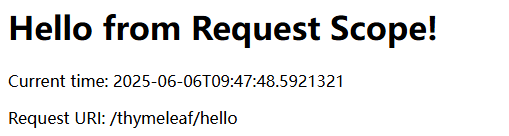

### thymeleaf 添加日志框架

thymeleaf 添加日志框架 `logback`。这样 thymeleaf 运行出错时会自动打印日志信息。便于调试。

#### 添加 logback 的 jar 包

我们项目中已经存在 `slf4j-api-2.0.16.jar`。这个是日志门面，还需要一个具体的实现 slf4j 门面的日志框架，`logback`就是一个具体的实现。

首先我们需要引入 logback 的 jar 包，放到 WEB-INF/lib 目录下：

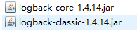

#### 添加 logback 日志框架的配置文件

在类的根路径下新建 `logback.xml`，然后将配置以下内容：

```xml
<configuration>
    <!-- 只输出 ERROR 级别及以上的日志 -->
    <logger name="org.thymeleaf" level="ERROR"/>

    <!-- 关闭 Thymeleaf 初始化 DEBUG 日志 -->
    <logger name="org.thymeleaf.TemplateEngine" level="INFO"/>

    <!-- 控制台输出格式简化 -->
    <appender name="CONSOLE" class="ch.qos.logback.core.ConsoleAppender">
        <encoder>
            <pattern>%d{HH:mm:ss} [%thread] %-5level - %msg%n</pattern>
        </encoder>
    </appender>

    <!-- 全局日志级别设为 WARN -->
    <root level="WARN">
        <appender-ref ref="CONSOLE"/>
    </root>
</configuration>
```

## Thymeleaf 的必要语法

### **基础模板结构（必须掌握）**

```html
<!DOCTYPE html>
<html xmlns:th="http://www.thymeleaf.org">  <!-- 启用Thymeleaf命名空间 -->
<head>
    <title th:text="${pageTitle}">默认标题</title>  <!-- 静态默认值会被动态替换 -->
</head>
<body>
    <!-- 所有Thymeleaf属性以 th: 开头 -->
</body>
</html>
```

**关键点**：

- `th:` 命名空间声明
- 静态内容作为默认值（直接打开HTML文件可预览）

### **变量表达式（90%场景使用）**

```html
<div th:text="${user.name}">用户名默认值</div>  <!-- 即使是一段HTML代码，也只是当做普通文本处理，转义，防止XSS攻击 -->
<div th:utext="${htmlContent}">HTML内容</div>  <!-- 对HTML代码解释执行，不转义，存在XSS攻击风险，谨慎使用 -->
```

### **条件判断（if/unless）**

和 `if/else`不一样。两个是独立的，没有关系。

- 对于 `th:if`来说，为 `true`时显示元素。
- 对于 `th:unless`来说，为 `false`时显示元素。

```html
<div th:if="${user.isAdmin}">管理员可见</div>
<div th:unless="${user.isGuest}">非访客可见</div>
```

### 关于 if 的小细节

有这样一个 VO（View Object：视图对象，负责专门在页面上展示数据的对象）UserVO，代码如下：

```java
package com.jkweilai.thymeleaf.model.vo;

public class UserVO {
    private String username;
    private Boolean isAdmin; // 注意这个属性哈。

    public UserVO() {
    }

    public UserVO(String username, Boolean isAdmin) {
        this.username = username;
        this.isAdmin = isAdmin;
    }

    public String getUsername() {
        return username;
    }

    public void setUsername(String username) {
        this.username = username;
    }

    public Boolean getAdmin() { // isAdmin 属性生成的get方法不是getIsAdmin()，而是getAdmin()。
        return isAdmin;
    }

    public void setAdmin(Boolean admin) {
        isAdmin = admin;
    }
}
```

在 Servlet 当中创建 UserVO 对象，代码如下：

```java
UserVO user = new UserVO("admin", true);
request.setAttribute("user", user);
```

thymeleaf 的模板文件中是这样写的：

```html
<div th:if="${user.isAdmin}"><span th:text="${user.username}"></span>是管理员</div>
```

测试时出现了以下异常：


这个问题是因为我们使用了 `${user.isAdmin}`，thymeleaf 底层会去找 `user`对象的 `getIsAdmin()`方法，但是这个方法不存在而导致的。针对这个问题，有多种解决方案，最直接的方式是将模板文件中的代码修改一下，修改为：

```html
<div th:if="${user.admin}"><span th:text="${user.username}"></span>是管理员</div>
```

这样就可以访问了。

### **循环遍历（列表渲染）**

```html
<ul>
    <li th:each="item : ${items}" th:text="${item.name}">商品示例</li>
</ul>
```

**关键点**：

- `th:each="item : ${集合}"` 语法
- 循环状态变量：

```html
<li th:each="item,status : ${items}" th:text="|${status.index} ======== ${item.name}|"></li>
```

**双竖线 |...| 的作用是定义 文本字面量表达式（Literal Expressions），它是一种简化字符串拼接的语法。**

**管道符内的内容会被视为一个整体，Thymeleaf 会自动将其拼接成一个字符串，无需手动加引号或 + 连接。**

### **链接与路径（URL生成）**

```html
<a th:href="@{/user/details(id=${userId})}">用户详情</a>
```

**关键点**：

- `@{}` 自动生成上下文路径（避免硬编码）
- 支持参数：`@{/path(param1=${val1}, param2=${val2})}`

### **表单绑定（重点！）**

```html
<form th:action="@{/save}" th:object="${user}" method="post">
    <input type="text" id="username" name="username" th:value="*{username}" placeholder="用户名">
    <input type="submit" value="保存">
</form>
```

**关键点**：

- `th:object` 绑定表单对象
- `th:value="*{属性名}"`

### **片段复用（布局优化）**

```html
<!-- 定义片段 -->
<div th:fragment="header">
    <h1>公共头部</h1>
</div>

<!-- 引用片段 -->
<div th:replace="~{::header}"></div>  <!-- header片段的定义如果在当前文件中的话，使用这种语法。 -->

<div th:replace="~{commons :: header}"></div>  <!-- 这种语法表示引入commons.html中定义的header片段。 -->
```

**关键点**：

- `th:fragment` 定义可复用块
- `th:replace` 直接替换当前标签

### **实用工具函数（选学）**

```html
<p th:text="${#strings.toUpperCase(user.name)}"></p>  <!-- 字符串大写 -->
<p th:text="${#dates.format(now, 'yyyy-MM-dd')}"></p>  <!-- 日期格式化 -->
```

**工具类**：

- `#strings`、`#numbers`、`#dates`、`#lists`等。

工具函数的具体使用，可以参考 thymeleaf 的官方帮助文档，按照以下步骤查找帮助：

首页面点 `Docs`：


`Read online`在线阅读，或者下载 `PDF`等：

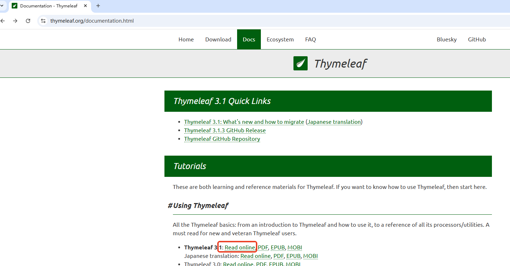

在以下页面中搜索，例如搜索 `#strings`：

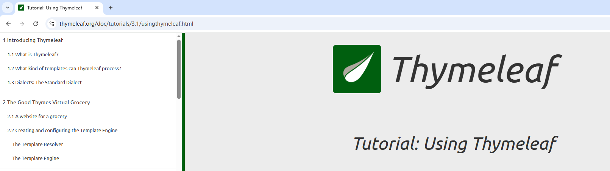


## Thymeleaf 变量查找顺序

当 `**<font style="color:rgb(64, 64, 64);background-color:rgb(236, 236, 236);">${message}</font>**` 被解析时，Thymeleaf 会按以下顺序查找：

1. `**<font style="color:rgb(64, 64, 64);background-color:rgb(236, 236, 236);">WebContext</font>**`** 显式设置的变量**（`**<font style="color:rgb(64, 64, 64);background-color:rgb(236, 236, 236);">ctx.setVariable("message", "WebContext message")</font>**`）
2. `**<font style="color:rgb(64, 64, 64);background-color:rgb(236, 236, 236);">HttpServletRequest</font>**`** 属性**（`**<font style="color:rgb(64, 64, 64);background-color:rgb(236, 236, 236);">request.setAttribute("message", "request message")</font>**`）

同名变量时，高优先级的会覆盖低优先级的。

## Thymeleaf 的其他取值

1. `**<font style="color:rgb(64, 64, 64);background-color:rgb(236, 236, 236);">HttpSession</font>**`** 属性**（`**<font style="color:rgb(64, 64, 64);background-color:rgb(236, 236, 236);">session.setAttribute("message", "session message")</font>**`），从 session 中取值需要这样写：`<font style="color:rgb(64, 64, 64);">${session.message}</font>`
2. `**<font style="color:rgb(64, 64, 64);background-color:rgb(236, 236, 236);">ServletContext</font>**`** 全局属性**（`**<font style="color:rgb(64, 64, 64);background-color:rgb(236, 236, 236);">servletContext.setAttribute("message", "application message")</font>**`），从 application 中取值需要这样写：`<font style="color:rgb(64, 64, 64);">${application.message}</font>`
3. **请求参数**（`**<font style="color:rgb(64, 64, 64);background-color:rgb(236, 236, 236);">request.getParameter("message")</font>**`），从查询参数中取值需要这样写：`<font style="color:rgb(64, 64, 64);">${param.message}</font>`
4. `**<font style="color:rgb(64, 64, 64);background-color:rgb(236, 236, 236);">th:with</font>**`** ****局部变量**（仅限当前作用域）

```html
<div th:with="message='Local Message'">
    <span th:text="${message}"></span> <!-- 输出 "Local Message" -->
</div>
```

## Thymeleaf 的内联 JavaScript 语法

```html
<!-- script脚本中使用Thymeleaf语法需要添加在script标签上添加 th:inline="javascript" -->
<script th:inline="javascript">
  // Thymeleaf的内联JavaScript语法
  // 也就是说：/*[[这里可以编写thymeleaf的语法]]*/
  let contextPath = /*[[@{/}]]*/ "";
  function deleteByDeptno(elt){
    let deptno = elt.getAttribute("data-deptno");
    if(confirm("您确定删除数据吗？")){
      document.location.href = contextPath + "deleteByNo?deptno=" + deptno;
    }
  }
</script>
```

# 改造部门管理


Servlet + Thymeleaf 改造之前的部门管理系统。

Servlet 负责核心业务的处理，将处理完成的数据收集起来。交给 Thymeleaf 来负责数据的展示。各司其职，分工协作。

## 整合 Thymeleaf

### 引入 Thymeleaf 的相关 jar

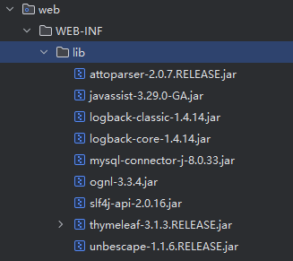

然后将 `thymeleaf jar`放到 `classpath`中。

这里将 `logback`的 jar 包一并引进来了。

### 监听器初始化引擎模板

```java
package com.jkweilai.dept.listeners;

import jakarta.servlet.ServletContext;
import jakarta.servlet.ServletContextEvent;
import jakarta.servlet.ServletContextListener;
import jakarta.servlet.annotation.WebListener;
import org.thymeleaf.TemplateEngine;
import org.thymeleaf.templatemode.TemplateMode;
import org.thymeleaf.templateresolver.WebApplicationTemplateResolver;
import org.thymeleaf.web.servlet.JakartaServletWebApplication;

@WebListener
public class ThymeleafInitializer implements ServletContextListener {
    @Override
    public void contextInitialized(ServletContextEvent sce) {
        // 获取ServletContext对象
        ServletContext application = sce.getServletContext();

        // 创建Thymeleaf与Servlet容器的桥梁对象
        JakartaServletWebApplication jakartaServletWebApplication = JakartaServletWebApplication.buildApplication(application);
        // 创建模板解析器并关联到Servlet环境
        WebApplicationTemplateResolver templateResolver = new WebApplicationTemplateResolver(jakartaServletWebApplication);

        // 设置模板文件存放的基础路径
        templateResolver.setPrefix("/WEB-INF/templates/");
        // 设置模板文件的后缀名
        templateResolver.setSuffix(".html");
        // 指定模板处理模式为HTML格式
        templateResolver.setTemplateMode(TemplateMode.HTML);
        // 禁用模板缓存（开发环境建议关闭）
        templateResolver.setCacheable(false);

        // 创建模板引擎
        TemplateEngine templateEngine = new TemplateEngine();
        // 模板引擎关联模板解析器
        templateEngine.setTemplateResolver(templateResolver);

        // 将Thymeleaf与Servlet容器的桥梁对象存储到应用域中
        application.setAttribute("jakartaServletWebApplication", jakartaServletWebApplication);
        // 将模板引擎对象存储到应用域中
        application.setAttribute("templateEngine", templateEngine);
    }
}
```

### 创建 `templates`目录

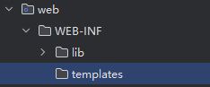

### Thymeleaf 整合 logback

类的根路径下新建 `logback.xml`文件，提供以下配置：

```xml
<configuration>
    <!-- 只输出 ERROR 级别及以上的日志 -->
    <logger name="org.thymeleaf" level="ERROR"/>

    <!-- 关闭 Thymeleaf 初始化 DEBUG 日志 -->
    <logger name="org.thymeleaf.TemplateEngine" level="INFO"/>

    <!-- 控制台输出格式简化 -->
    <appender name="CONSOLE" class="ch.qos.logback.core.ConsoleAppender">
        <encoder>
            <pattern>%d{HH:mm:ss} [%thread] %-5level - %msg%n</pattern>
        </encoder>
    </appender>

    <!-- 全局日志级别设为 WARN -->
    <root level="WARN">
        <appender-ref ref="CONSOLE"/>
    </root>
</configuration>
```

## 字符编码过滤器

提供一个字符编码过滤器，过滤所有的请求，解决请求体的中文乱码问题以及响应的中文乱码问题。

```java
package com.jkweilai.dept.filters;

import jakarta.servlet.*;
import jakarta.servlet.annotation.WebFilter;

import java.io.IOException;

@WebFilter("/*")
public class CharacterEncodingFilter implements Filter {
    @Override
    public void doFilter(ServletRequest request, ServletResponse response, FilterChain filterChain) throws IOException, ServletException {
        request.setCharacterEncoding("UTF-8");
        response.setCharacterEncoding("UTF-8");
        filterChain.doFilter(request, response);
    }
}
```

## ThymeleafViewServlet

Servlet 处理完业务之后，交给 Thymleaf 来处理页面，都要编写以下的代码：

```java
ServletContext application = getServletContext();
// 从上下文中获取Thymeleaf的Servlet适配器实例
JakartaServletWebApplication jakartaServletWebApplication = (JakartaServletWebApplication)application.getAttribute("jakartaServletWebApplication");
// 从上下文中获取Thymeleaf模板引擎实例
TemplateEngine templateEngine = (TemplateEngine) application.getAttribute("templateEngine");
// 创建Thymeleaf上下文对象，包装当前请求/响应和语言环境
WebContext webContext = new WebContext(jakartaServletWebApplication.buildExchange(request, response), request.getLocale());
// 使用模板引擎渲染名为"hello"的模板，结果写入响应输出流
templateEngine.process("hello", webContext, response.getWriter());
```

我们最好将以上的代码封装到一个 Servlet 当中，例如 `ThymeleafViewServlet`，这样代码可以得到复用：

```java
package com.jkweilai.dept.servlets;

import jakarta.servlet.ServletContext;
import jakarta.servlet.ServletException;
import jakarta.servlet.annotation.WebServlet;
import jakarta.servlet.http.HttpServlet;
import jakarta.servlet.http.HttpServletRequest;
import jakarta.servlet.http.HttpServletResponse;
import org.thymeleaf.TemplateEngine;
import org.thymeleaf.context.WebContext;
import org.thymeleaf.web.servlet.JakartaServletWebApplication;

import java.io.IOException;

@WebServlet("/view")
public class ThymeleafViewServlet extends HttpServlet {
    @Override
    protected void service(HttpServletRequest request, HttpServletResponse response) throws ServletException, IOException {
        ServletContext application = getServletContext();
        // 从上下文中获取Thymeleaf的Servlet适配器实例
        JakartaServletWebApplication jakartaServletWebApplication = (JakartaServletWebApplication) application.getAttribute("jakartaServletWebApplication");
        // 从上下文中获取Thymeleaf模板引擎实例
        TemplateEngine templateEngine = (TemplateEngine) application.getAttribute("templateEngine");
        // 创建Thymeleaf上下文对象，包装当前请求/响应和语言环境
        WebContext webContext = new WebContext(jakartaServletWebApplication.buildExchange(request, response), request.getLocale());
        // 获取模板名称
        String template = (String) request.getAttribute("template"); // 先从request域中获取模板名称
        if (template == null) {
            template = request.getParameter("template"); // 如果request域中没有，再从请求参数上获取模板名称
        }
        // 使用模板引擎渲染模板，结果写入响应输出流
        templateEngine.process(template, webContext, response.getWriter());
    }
}
```

当以后需要让 `Thymeleaf`进行页面渲染时，可以编写以下代码：

```java
// 向请求域中绑定模板名称
request.setAttribute("template", "list");

// 转发到 ThymeleafViewServlet 做页面渲染
request.getRequestDispatcher("/view").forward(request, response);
```

如果不能使用转发，必须使用重定向时，也可以通过请求参数来传递模板名称，例如：

```java
response.sendRedirect(request.getContextPath() + "/view?template=list");
```

## 部门列表

封装 `Dept`类：

```java
package com.jkweilai.dept.model;

public class Dept {
    private Integer deptno;
    private String dname;
    private String loc;
    // constructor
    // setter and getter
    // toString
}
```

`DeptListServlet`负责数据的收集：

```java
package com.jkweilai.dept.servlets;

import com.jkweilai.dept.model.Dept;
import com.jkweilai.dept.utils.DbUtils;
import jakarta.servlet.ServletException;
import jakarta.servlet.annotation.WebServlet;
import jakarta.servlet.http.HttpServlet;
import jakarta.servlet.http.HttpServletRequest;
import jakarta.servlet.http.HttpServletResponse;

import java.io.IOException;
import java.sql.Connection;
import java.sql.PreparedStatement;
import java.sql.ResultSet;
import java.util.ArrayList;
import java.util.List;

@WebServlet("/list")
public class DeptListServlet extends HttpServlet {
    @Override
    protected void doGet(HttpServletRequest request, HttpServletResponse response) throws ServletException, IOException {
        List<Dept> deptList = new ArrayList<>();
        // 连接数据库
        Connection conn = null;
        PreparedStatement pst = null;
        ResultSet rs = null;
        try {
            conn = DbUtils.getConnection();
            String sql = "select deptno,dname,loc from dept";
            pst = conn.prepareStatement(sql);
            rs = pst.executeQuery();
            while(rs.next()){
                String deptno = rs.getString("deptno");
                String dname = rs.getString("dname");
                String loc = rs.getString("loc");
                // 封装对象
                Dept dept = new Dept(Integer.valueOf(deptno),dname,loc);
                // 存储到List集合
                deptList.add(dept);
            }
        } catch (Exception e) {
            e.printStackTrace();
        } finally {
            DbUtils.close(conn, pst, rs);
        }
        // 将list集合存储到request域
        request.setAttribute("depts", deptList);
        // 将模板名字存储到request域中
        request.setAttribute("template", "list");
        // 转发给Thymeleaf做页面渲染
        request.getRequestDispatcher("/view").forward(request, response);
    }
}
```

Thymeleaf 的模板页面`**WEB-INF/templates/list.html**`来负责数据展示：

```html
<!DOCTYPE html>
<html lang="zh-CN" xmlns:th="http://www.thymeleaf.org">
<head>
  <meta charset="UTF-8">
  <meta name="viewport" content="width=device-width, initial-scale=1.0">
  <title>部门管理系统 - 部门列表</title>
  <link rel="stylesheet" th:href="@{/css/list.css}">
</head>
<body>
<div class="container">
  <div class="header">
    <h1>部门列表</h1>
    <a href="" class="add-btn">添加部门</a>
  </div>

  <table class="department-table">
    <thead>
    <tr>
      <th>部门编号</th>
      <th>部门名称</th>
      <th>部门地理位置</th>
      <th>操作</th>
    </tr>
    </thead>
    <tbody>

    <tr th:each="dept : ${depts}">
      <td th:text="${dept.deptno}"></td>
      <td th:text="${dept.dname}"></td>
      <td th:text="${dept.loc}"></td>
      <td>
        <a th:href="@{/detail(deptno=${dept.deptno})}" class="action-btn view-btn">查看</a>
        <a th:href="@{/edit(deptno=${dept.deptno})}" class="action-btn edit-btn">修改</a>
        <a th:href="@{/delete(deptno=${dept.deptno})}" class="action-btn delete-btn">删除</a>
      </td>
    </tr>

    </tbody>
  </table>

  <div class="logout">
    <a href="">退出登录</a>
  </div>
</div>
</body>
</html>
```

注意：

1. 以上代码中，把 css 样式单独提取出来放到 `css/list.css`文件中了，因此以上代码添加链接外部 css 样式文件。**css 文件不能放到 **`**<font style="color:#DF2A3F;">WEB-INF</font>**`**目录下**。
2. 当前页面中的 查看、修改、删除 等超链接的路径已经修改完毕，请参照以上代码。

## 跳转到添加部门页面

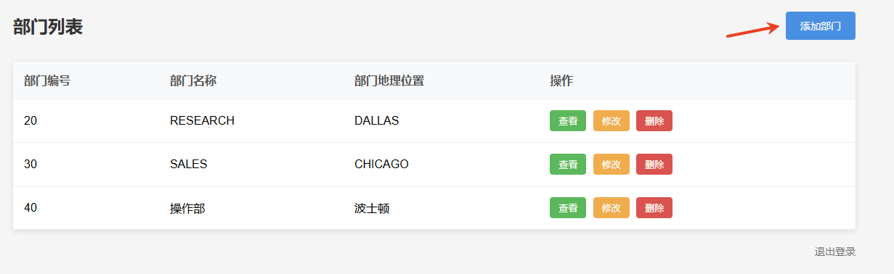

在 `list.html`页面中找到上图的**添加部门**按钮。将请求路径修改为 `th:href="@{/view(template=add)}"`

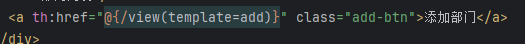

该请求路径通过执行 `ThymeleafViewServlet` 来跳转到 `WEB-INF/templates/add.html`页面，因为 `add.html`页面中也需要使用 thymleaf 语法动态设置请求路径，因此需要将之前的 `add.html`移动到 `WEB-INF/templates`目录下：

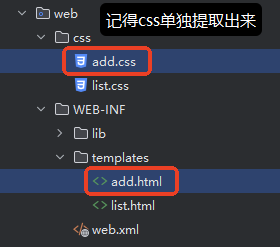

## 添加部门

添加部门页面 `add.html`代码如下：（记得把 css 单独提取出来）

```html
<!DOCTYPE html>
<html lang="zh-CN" xmlns:th="http://www.thymeleaf.org">
<head>
  <meta charset="UTF-8">
  <meta name="viewport" content="width=device-width, initial-scale=1.0">
  <title>部门管理系统 - 添加部门</title>
  <link th:href="@{/css/add.css}" rel="stylesheet">
</head>
<body>
<div class="container">
  <div class="header">
    <h1>添加新部门</h1>
    <a th:href="@{/list}" class="back-btn">返回列表</a>
  </div>
  <form th:action="@{/save}" method="post">
    <div class="form-group">
      <label for="deptName">部门名称</label>
      <input type="text" id="deptName" name="dname" placeholder="请输入部门名称" required>
    </div>
    <div class="form-group">
      <label for="location">部门地理位置</label>
      <input type="text" id="location" name="loc" placeholder="请输入部门地理位置" required>
    </div>
    <div class="footer">
      <button type="submit" class="submit-btn">保存</button>
    </div>
  </form>
</div>
</body>
</html>
```

注意：表单 form 的 `th:action`属性，设置表单提交的请求路径。

修改 `DeptSaveServlet`：

```java
package com.jkweilai.dept.servlets;

import com.jkweilai.dept.utils.DbUtils;
import jakarta.servlet.ServletException;
import jakarta.servlet.annotation.WebServlet;
import jakarta.servlet.http.HttpServlet;
import jakarta.servlet.http.HttpServletRequest;
import jakarta.servlet.http.HttpServletResponse;

import java.io.IOException;
import java.sql.Connection;
import java.sql.PreparedStatement;
import java.sql.ResultSet;

@WebServlet("/save")
public class DeptSaveServlet extends HttpServlet {
    @Override
    protected void doPost(HttpServletRequest request, HttpServletResponse response) throws ServletException, IOException {
        // 获取部门信息
        String dname = request.getParameter("dname");
        String loc = request.getParameter("loc");
        // 连接数据库保存数据
        // 查询当前最大的部门编号，新部门编号在当前最大部门编号基础上 + 1
        Connection conn = null;
        PreparedStatement ps = null;
        PreparedStatement ps1 = null;
        ResultSet rs = null;
        try {
            conn = DbUtils.getConnection();
            String sql = "select max(deptno) as maxDeptno from dept";
            ps = conn.prepareStatement(sql);
            rs = ps.executeQuery();
            if (rs.next()) {
                int maxDeptno = rs.getInt("maxDeptno");
                synchronized (this){
                    int deptno = maxDeptno + 1;
                    String insertSql = "insert into dept values(?,?,?)";
                    ps1 = conn.prepareStatement(insertSql);
                    ps1.setInt(1, deptno);
                    ps1.setString(2, dname);
                    ps1.setString(3, loc);
                    ps1.executeUpdate();
                }
            }
        } catch (Exception e) {
            e.printStackTrace();
        } finally {
            DbUtils.close(null, ps1, null);
            DbUtils.close(conn, ps, rs);
        }
        response.sendRedirect(request.getContextPath() + "/list");
    }
}
```

## 查看部门

修改 `DeptDetailServlet`程序：

```java
package com.jkweilai.dept.servlets;

import com.jkweilai.dept.model.Dept;
import com.jkweilai.dept.utils.DbUtils;
import jakarta.servlet.ServletException;
import jakarta.servlet.annotation.WebServlet;
import jakarta.servlet.http.HttpServlet;
import jakarta.servlet.http.HttpServletRequest;
import jakarta.servlet.http.HttpServletResponse;

import java.io.IOException;
import java.sql.Connection;
import java.sql.PreparedStatement;
import java.sql.ResultSet;

@WebServlet("/detail")
public class DeptDetailServlet extends HttpServlet {
    @Override
    protected void doGet(HttpServletRequest request, HttpServletResponse response) throws ServletException, IOException {
        String deptno = request.getParameter("deptno");
        Connection conn = null;
        PreparedStatement ps = null;
        ResultSet rs = null;
        Dept dept = null;
        try {
            conn = DbUtils.getConnection();
            String sql = "select * from dept where deptno = ?";
            ps = conn.prepareStatement(sql);
            ps.setString(1, deptno);
            rs = ps.executeQuery();
            if(rs.next()) {
                String dname = rs.getString("dname");
                String loc = rs.getString("loc");
                dept = new Dept(Integer.parseInt(deptno), dname, loc);
            }
        } catch (Exception e) {
            e.printStackTrace();
        } finally {
            DbUtils.close(conn, ps, rs);
        }
        // 将dept存储到request域
        request.setAttribute("dept", dept);
        // 将模板名字存储到request域
        request.setAttribute("template", "detail");
        // 转发给Thymeleaf
        request.getRequestDispatcher("/view").forward(request, response);
    }
}
```

编写 `WEB-INF/templates/detail.html`：（记得将 css 单独提取出来）

```html
<!DOCTYPE html>
<html lang="zh-CN" xmlns:th="http://www.thymeleaf.org">
<head>
    <meta charset="UTF-8">
    <meta name="viewport" content="width=device-width, initial-scale=1.0">
    <title>部门管理系统 - 部门详情</title>
    <link rel="stylesheet" th:href="@{/css/detail.css}">
</head>
<body>
<div class="container">
    <div class="header">
        <h1>部门详细信息</h1>
        <a th:href="@{/list}" class="back-btn">返回列表</a>
    </div>
    <div class="detail-card">
        <div class="detail-row">
            <div class="detail-label">部门编号</div>
            <div class="detail-value" th:text="${dept.deptno}"></div>
        </div>
        <div class="detail-row">
            <div class="detail-label">部门名称</div>
            <div class="detail-value" th:text="${dept.dname}"></div>
        </div>
        <div class="detail-row">
            <div class="detail-label">部门地理位置</div>
            <div class="detail-value" th:text="${dept.loc}"></div>
        </div>
    </div>
    <div class="action-btns">
        <a th:href="@{/edit(deptno=${dept.deptno})}" class="edit-btn">编辑部门信息</a>
    </div>
</div>
</body>
</html>
```

## 删除部门

只需要将 `list.html`页面中 **删除** 按钮发送的请求路径：

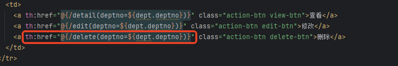

其它代码不需要修改。

## 跳转到修改页面

修改 `DeptEditServlet`，代码如下：

```java
package com.jkweilai.dept.servlets;

import com.jkweilai.dept.model.Dept;
import com.jkweilai.dept.utils.DbUtils;
import jakarta.servlet.ServletException;
import jakarta.servlet.annotation.WebServlet;
import jakarta.servlet.http.HttpServlet;
import jakarta.servlet.http.HttpServletRequest;
import jakarta.servlet.http.HttpServletResponse;

import java.io.IOException;
import java.sql.Connection;
import java.sql.PreparedStatement;
import java.sql.ResultSet;

@WebServlet("/edit")
public class DeptEditServlet extends HttpServlet {
    @Override
    protected void doGet(HttpServletRequest request, HttpServletResponse response) throws ServletException, IOException {
        // 获取部门编号
        String deptno = request.getParameter("deptno");
        Connection conn = null;
        PreparedStatement ps = null;
        ResultSet rs = null;
        Dept dept = null;
        try {
            conn = DbUtils.getConnection();
            String sql = "select * from dept where deptno = ?";
            ps = conn.prepareStatement(sql);
            ps.setString(1, deptno);
            rs = ps.executeQuery();
            if (rs.next()) {
                String dname = rs.getString("dname");
                String loc = rs.getString("loc");
                dept = new Dept(Integer.parseInt(deptno), dname, loc);
            }
        } catch (Exception e) {
            e.printStackTrace();
        } finally {
            DbUtils.close(conn, ps, rs);
        }
        request.setAttribute("dept", dept);
        request.setAttribute("template", "edit");
        request.getRequestDispatcher("/view").forward(request, response);
    }
}
```

编写 `WEB-INF/templates/edit.html`，代码如下：（记得把 css 单独提取出来）

```html
<!DOCTYPE html>
<html lang="zh-CN" xmlns:th="http://www.thymeleaf.org">
<head>
    <meta charset="UTF-8">
    <meta name="viewport" content="width=device-width, initial-scale=1.0">
    <title>部门管理系统 - 修改部门</title>
    <link th:href="@{/css/edit.css}" rel="stylesheet">
</head>
<body>

<div class="container">
    <div class="header">
        <h1>修改部门信息</h1>
        <a th:href="@{/list}" class="back-btn">返回列表</a>
    </div>
    <form th:action="@{/update}" th:object="${dept}" method="post">
        <div class="form-group">
            <label for="deptId">部门编号</label>
            <input type="text" id="deptId" name="deptno" th:value="*{deptno}" readonly>
        </div>
        <div class="form-group">
            <label for="deptName">部门名称</label>
            <input type="text" id="deptName" name="dname" th:value="*{dname}" required>
        </div>
        <div class="form-group">
            <label for="location">部门地理位置</label>
            <input type="text" id="location" name="loc" th:value="*{loc}" required>
        </div>

        <div class="btn-group">
            <a href="javascript:void(0)" class="cancel-btn" onclick="window.history.back()">取消</a>
            <button type="submit" class="submit-btn">保存更改</button>
        </div>
    </form>
</div>
</body>
</html>
```

## 修改部门

这个功能基本上不需要修改，只需要将 解决请求体 的中文乱码问题 删除即可，因为字符编码过滤器：

```java
package com.jkweilai.dept.servlets;

import com.jkweilai.dept.utils.DbUtils;
import jakarta.servlet.ServletException;
import jakarta.servlet.annotation.WebServlet;
import jakarta.servlet.http.HttpServlet;
import jakarta.servlet.http.HttpServletRequest;
import jakarta.servlet.http.HttpServletResponse;

import java.io.IOException;
import java.sql.Connection;
import java.sql.PreparedStatement;

@WebServlet("/update")
public class DeptUpdateServlet extends HttpServlet {
    @Override
    protected void doPost(HttpServletRequest request, HttpServletResponse response) throws ServletException, IOException {
        // 获取表单提交的数据
        String deptno = request.getParameter("deptno");
        String dname = request.getParameter("dname");
        String loc = request.getParameter("loc");
        // 连接数据库更新部门
        Connection conn = null;
        PreparedStatement ps = null;
        try {
            conn = DbUtils.getConnection();
            String sql = "update dept set dname = ?, loc = ? where deptno = ?";
            ps = conn.prepareStatement(sql);
            ps.setString(1, dname);
            ps.setString(2, loc);
            ps.setString(3, deptno);
            ps.executeUpdate();
        } catch (Exception e) {
            e.printStackTrace();
        } finally {
            DbUtils.close(conn, ps, null);
        }
        // 重定向到列表页面
        response.sendRedirect(request.getContextPath() + "/list");
    }
}
```

到此为止，我们之前实现的所有功能，就使用 thymeleaf 完成了所有的改造。大家记得跑通之后，让页面中所有的操作按钮，全部能用。

# 会话管理


## 项目存在的问题

部门管理系统现在任何人都可以访问，只要知道请求路径，假设知道部门列表页面的请求路径 `http://localhost:8080/dept/list`

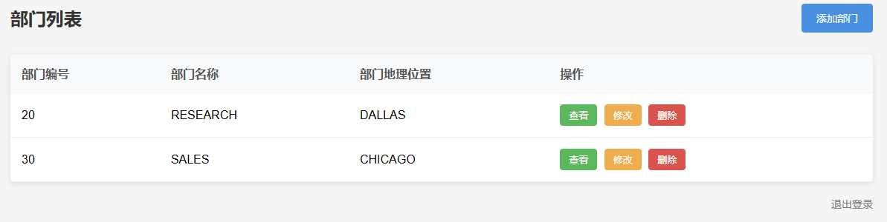

如果知道删除部门的请求路径 `http://localhost:8080/dept/delete?deptno=20`，这个部门将会删除。

因此系统应该提供登录功能，只有登录的人（管理员：有权限的人）才能够进行相关的操作。用户登录功能也是一个系统最基本的功能。

登录功能实现的关键点：

1. 正确的用户名和密码，才能登录成功。
2. 登录成功后应该将用户登录的状态保存住。

## 登录功能的实现

分析实现步骤：

1. 需要一张用户表 `t_user`存储用户名和密码。
2. 密码需要以 `Argon2（阿尔戈恩）`加密方式存储。
3. 需要提供一个登录页面。
4. 用户登录页面上填写用户名和密码，提交表单，后端 Servlet 获取用户名和密码，验证是否正确，如果正确登录成功，跳转到部门列表页面。如果错误登录失败，重新跳转到登录页面，并提示登录失败。

### 用户表创建

`t_user`表：

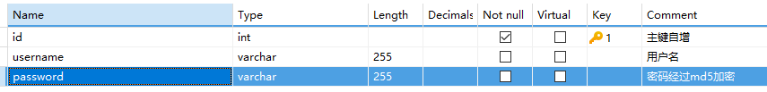

```sql
DROP TABLE IF EXISTS `t_user`;
CREATE TABLE `t_user`  (
  `id` int NOT NULL AUTO_INCREMENT COMMENT '主键自增',
  `username` varchar(255) CHARACTER SET utf8mb4 COLLATE utf8mb4_general_ci NULL DEFAULT NULL COMMENT '用户名',
  `password` varchar(255) CHARACTER SET utf8mb4 COLLATE utf8mb4_general_ci NULL DEFAULT NULL COMMENT 'hash加密',
  PRIMARY KEY (`id`) USING BTREE
) ENGINE = InnoDB CHARACTER SET = utf8mb4 COLLATE = utf8mb4_general_ci ROW_FORMAT = DYNAMIC;
```

### Argon2 加密算法

**Argon2 是一种抗 GPU/ASIC 破解的现代密码哈希算法，通过可调内存和计算成本抵御暴力攻击，被公认为当前最安全的密码存储方案之一。**（核心特点：内存困难型、抗硬件加速破解、密码哈希大赛冠军）

提供一个工具 `Argon2PasswordUtil`，将这个工具类放到 dept 项目中：

```java
package com.jkweilai.dept.utils;

import org.bouncycastle.crypto.generators.Argon2BytesGenerator;
import org.bouncycastle.crypto.params.Argon2Parameters;

import java.nio.charset.StandardCharsets;
import java.security.SecureRandom;
import java.util.Base64;

public class Argon2PasswordUtil {

    // Argon2 参数配置（可根据需求调整）
    private static final int ITERATIONS = 3;          // 迭代次数
    private static final int MEMORY_COST = 65536;     // 内存成本（64MB）
    private static final int PARALLELISM = 4;         // 并行度
    private static final int SALT_LENGTH = 16;        // 盐值长度（16字节）
    private static final int HASH_LENGTH = 32;        // 哈希输出长度（32字节）

    /**
     * 生成 Argon2 哈希密码（含盐值）
     */
    public static String hashPassword(String password) {
        // 1. 生成随机盐值
        byte[] salt = generateSalt();

        // 2. 配置 Argon2 参数
        Argon2Parameters.Builder builder = new Argon2Parameters.Builder(Argon2Parameters.ARGON2_id)
                .withSalt(salt)
                .withIterations(ITERATIONS)
                .withMemoryAsKB(MEMORY_COST)
                .withParallelism(PARALLELISM);

        // 3. 生成哈希
        Argon2BytesGenerator generator = new Argon2BytesGenerator();
        generator.init(builder.build());
        byte[] hash = new byte[HASH_LENGTH];
        generator.generateBytes(password.getBytes(StandardCharsets.UTF_8), hash);

        // 4. 返回格式：算法$版本$参数$盐$哈希（Base64编码）
        return "argon2id" +
                "$v=19" +
                "$m=" + MEMORY_COST + ",t=" + ITERATIONS + ",p=" + PARALLELISM +
                "$" + Base64.getEncoder().encodeToString(salt) +
                "$" + Base64.getEncoder().encodeToString(hash);
    }

    /**
     * 验证密码是否正确
     */
    public static boolean verifyPassword(String password, String hashedPassword) {
        // 1. 解析存储的哈希字符串
        String[] parts = hashedPassword.split("\\$");
        if (parts.length != 5 || !parts[0].equals("argon2id")) {
            throw new IllegalArgumentException("Invalid Argon2 hash format");
        }

        // 2. 提取参数
        byte[] salt = Base64.getDecoder().decode(parts[3]);
        byte[] storedHash = Base64.getDecoder().decode(parts[4]);

        // 3. 重新计算哈希
        Argon2Parameters.Builder builder = new Argon2Parameters.Builder(Argon2Parameters.ARGON2_id)
                .withSalt(salt)
                .withIterations(ITERATIONS)
                .withMemoryAsKB(MEMORY_COST)
                .withParallelism(PARALLELISM);

        Argon2BytesGenerator generator = new Argon2BytesGenerator();
        generator.init(builder.build());
        byte[] computedHash = new byte[storedHash.length];
        generator.generateBytes(password.getBytes(StandardCharsets.UTF_8), computedHash);

        // 4. 比较哈希值
        return constantTimeEquals(storedHash, computedHash);
    }

    /**
     * 生成随机盐值
     */
    private static byte[] generateSalt() {
        SecureRandom random = new SecureRandom();
        byte[] salt = new byte[SALT_LENGTH];
        random.nextBytes(salt);
        return salt;
    }

    /**
     * 安全比较字节数组（防止时序攻击）
     */
    private static boolean constantTimeEquals(byte[] a, byte[] b) {
        if (a.length != b.length) {
            return false;
        }
        int result = 0;
        for (int i = 0; i < a.length; i++) {
            result |= a[i] ^ b[i];
        }
        return result == 0;
    }
}
```

说明：

1. `hashPassword`方法的作用是：将明文经过 Argon2 算法加密生成密文。
2. `verifyPassword`方法的作用是：验证密码是否正确。

提示：如果需要使用 Argon2 加密算法，需要引入相关的 java jar 包，如下：


将这个 jar 包拷贝到 `WEB-INF/lib`目录下，并且将其添加到 classpath 当中。

### 生成密文存储到数据库

在 `Argon2PasswordUtil`中临时添加一个 main 方法，在该方法中为密码 `Abc_%*123-dEf`加密：

```java
// 临时生成密文
public static void main(String[] args) {
    String s = hashPassword("Abc_%*123-dEf");
    System.out.println(s);
}
```

执行这个 main 方法，在控制台上会打印密文，将密文插入的数据库表当中。

dept 项目的管理员用户名是：`admin`，密码是：`Abc_%*123-dEf`

### 登录页面的开发

把之前开发静态网站时的 `index.html`代码拷贝过来放到 `WEB-INF/templates/index.html`文件中：记得把 css 单独写到 `css/index.css`文件中。

```html
<!DOCTYPE html>
<html lang="zh-CN" xmlns:th="http://www.thymeleaf.org">
<head>
  <meta charset="UTF-8">
  <meta name="viewport" content="width=device-width, initial-scale=1.0">
  <title>部门管理系统 - 登录</title>
  <link rel="stylesheet" th:href="@{/css/index.css}">
</head>
<body>
<div class="login-container">
  <div class="login-header">
    <h1>部门管理系统</h1>
    <p>请输入您的凭据以继续</p>
  </div>
  <form th:action="@{/login}" method="post">
    <div class="form-group">
      <label for="username">用户名</label>
      <input type="text" id="username" name="username" placeholder="请输入用户名" required>
    </div>
    <div class="form-group">
      <label for="password">密码</label>
      <input type="password" id="password" name="password" placeholder="请输入密码" required>
    </div>
    <button type="submit" class="login-btn">登录</button>
  </form>
  <div class="footer">
    <p>© 2025 部门管理系统 - 版权所有</p>
  </div>
</div>
</body>
</html>
```

### 登录页面的展示

编写 `IndexServlet`跳转到 `WEB-INF/templates/index.html`页面，完成登录页面的展示：

```java
package com.jkweilai.dept.servlets;

import jakarta.servlet.ServletException;
import jakarta.servlet.annotation.WebServlet;
import jakarta.servlet.http.HttpServlet;
import jakarta.servlet.http.HttpServletRequest;
import jakarta.servlet.http.HttpServletResponse;

import java.io.IOException;

@WebServlet("/index")
public class IndexServlet extends HttpServlet {
    @Override
    protected void doGet(HttpServletRequest req, HttpServletResponse resp) throws ServletException, IOException {
        req.setAttribute("template", "index");
        req.getRequestDispatcher("/view").forward(req, resp);
    }
}
```

### 登录请求处理

用户在登录页面输入用户名和密码，点击登录按钮，提交表单数据，后端 `LoginServlet`接收登录信息，连接数据库验证用户名密码是否正确，如果正确，则重定向到部门列表页面，如果登录失败，则将失败信息存储到 request 域中，重新跳回登录页面。在登录页面展示登录失败的信息。

```java
package com.jkweilai.dept.servlets;


import com.jkweilai.dept.utils.Argon2PasswordUtil;
import com.jkweilai.dept.utils.DbUtils;
import jakarta.servlet.ServletException;
import jakarta.servlet.annotation.WebServlet;
import jakarta.servlet.http.HttpServlet;
import jakarta.servlet.http.HttpServletRequest;
import jakarta.servlet.http.HttpServletResponse;

import java.io.IOException;
import java.sql.Connection;
import java.sql.PreparedStatement;
import java.sql.ResultSet;

@WebServlet("/login")
public class LoginServlet extends HttpServlet {
    @Override
    protected void doPost(HttpServletRequest request, HttpServletResponse response) throws ServletException, IOException {
        // 获取用户名和密码
        String username = request.getParameter("username");
        String password = request.getParameter("password");
        // 连接数据库校验用户名和密码
        Connection conn = null;
        PreparedStatement ps = null;
        ResultSet rs = null;
        boolean loginSuccess = false;
        try {
            conn = DbUtils.getConnection();
            String sql = "select password from t_user where username = ?";
            ps = conn.prepareStatement(sql);
            ps.setString(1, username);
            rs = ps.executeQuery();
            if(rs.next()) {
                String hashPassword = rs.getString("password");
                if(Argon2PasswordUtil.verifyPassword(password, hashPassword)) {
                    // 登录成功
                    loginSuccess = true;
                    // 重定向到部门列表
                    response.sendRedirect(request.getContextPath() + "/list");
                }
            }
        } catch (Exception e) {
            e.printStackTrace();
        } finally {
            DbUtils.close(conn, ps, rs);
        }
        // 登录失败，转发到登录页面
        if(!loginSuccess) {
            request.setAttribute("errorMsg", "用户名不存在或密码错误！");
            request.setAttribute("template", "index");
            request.getRequestDispatcher("/view").forward(request, response);
        }
    }
}
```

当登录失败时，页面显示的效果如下：

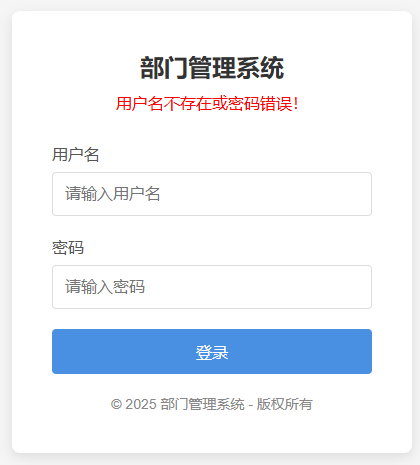

当登录成功时，会跳转到部门列表页面：

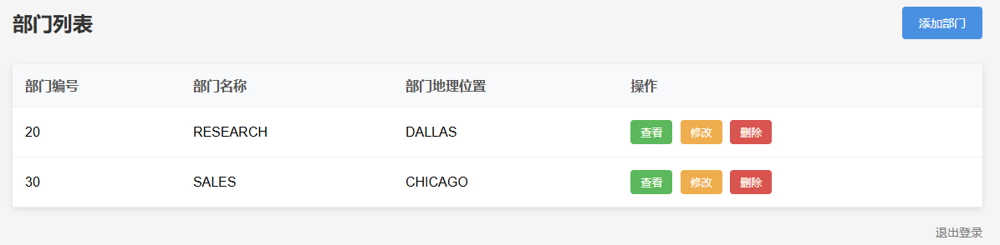

到此为止，登录功能基本的逻辑已经实现了。

### 当前登录功能有用吗

虽然登录功能已经实现，但是这个登录功能起作用了吗？

测试一下，可以把浏览器关闭，重新打开浏览器，在不登录的情况下，直接访问部门列表页面，看看能不能访问。

经过测试，大家应该看到了，部门列表页面在没有登录的情况下，仍然是可以访问的，可见目前的登录功能没有起到作用。

我们要达到的效果是：要想使用系统中的部门维护相关功能，必须是在已经登录的状态下。如果已经登录了，可以继续访问，如果没有登录则需要跳转到登录页面要求用户登录。

那我们应该怎么判断用户是已经登录了还是没有登录呢？也就是说，我们怎么判断用户当前的登录状态呢？

再换句话说，在 web 项目中我们应该怎么保存用户的登录状态呢？这就需要使用 session 机制了。

## session 机制

### HTTP 协议的无状态性

HTTP 协议在设计之初是**无状态的**：

1. **每个请求相互独立**：服务器默认不会记住之前的请求（例如：第一次请求登录，第二次请求查看购物车时，服务器不知道这两个请求来自同一用户）
2. **简单高效**：无状态设计降低了服务器资源消耗，符合早期 Web 的静态页面需求

**但现实业务需要状态！**
例如：用户登录后，后续操作（如加购商品、支付）都需要知道是谁在操作。

session 机制在 HTTP 无状态的基础上**模拟出"有状态"。**

### 什么是 session

**session（会话） 并不是 JavaWeb 独有的机制**，是一种广泛应用于 Web 开发的**会话管理技术**，几乎所有服务端技术（如 PHP、ASP.NET、Python Django/Flask等）都实现了类似的 session 机制。

session是服务器端用来跟踪用户状态的一种机制。在 JavaWeb 开发中，session 指的是 `**<font style="color:rgb(64, 64, 64);background-color:rgb(236, 236, 236);">HttpSession</font>**` 对象，它代表了服务器与客户端（通常是浏览器）之间的一次会话。

**"一次会话"**指的是 **从用户首次访问服务器到结束交互的完整过程**。

session 是存储在 web 服务器端的，在 JavaWeb 开发中，在 Tomcat 服务器中会自动维护一个 session 列表，session 对象存储在 session 列表中，每一个 session 对象都会对应一个 sessionId。

### session 的获取

在 JavaWeb 开发中，通过以下代码来获取服务器端的 session 对象：

第一种方式：获取该请求对应的 session 对象，如果没有该请求关联的 session 对象，则创建一个新的 session 对象与当前请求关联。

```java
HttpSession session = request.getSession();
```

第二种方式：获取该请求对应的 session 对象，如果没有该请求关联的 session 对象，则返回 null。

```java
HttpSession session = request.getSession(false);
```

### session 的工作原理

1. 当客户端第一次访问服务器时，执行到 `<font style="color:rgb(64, 64, 64);">HttpSession session = request.getSession();</font>`代码时，服务器会创建该用户所属的 session 对象，并且为该 session 对象生成一个 sessionId。
2. 这个 sessionId 会通过 Cookie 返回给客户端
  1. 如果浏览器禁用 Cookie 的话，可以通过**URL 重写的方式**将 sessionId 响应给客户端，不过 URL 重写机制会导致开发繁琐，因此大多数网站是要求客户不要禁用 Cookie 的
3. 客户端在**后续**请求中会携带这个 sessionId
4. 服务器通过 sessionId 识别并返回该用户所属的 session 对象

编写程序，可以测试一下，发送请求时打开浏览器的网络面板，查看具体的请求报文和响应报文：

第一次发送请求时，客户端不会携带 sessionId，因为客户端中没有 sessionId，但是服务器端会响应 sessionId，因此在请求报文中没有 sessionId，但是在响应报文中应该存在 sessionId

请求头：

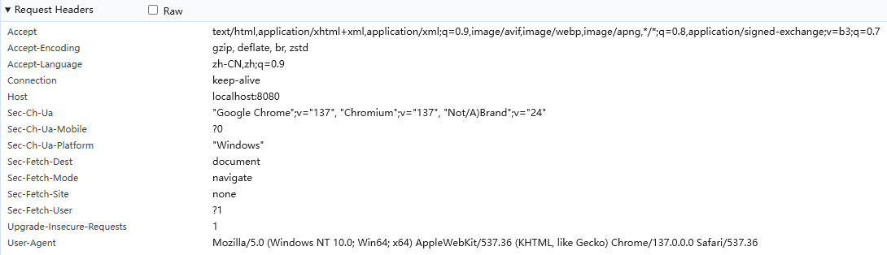

响应头：

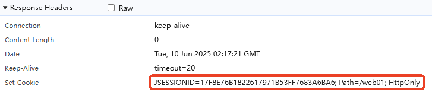

第二次发送请求时，客户端会携带 sessionId，因为客户端中已经存在 sessionId 了，服务器不会再生成新的 session 对象，进而不会生成新的 sessionId，因此响应报文中不应该存在 sessionId

请求头：

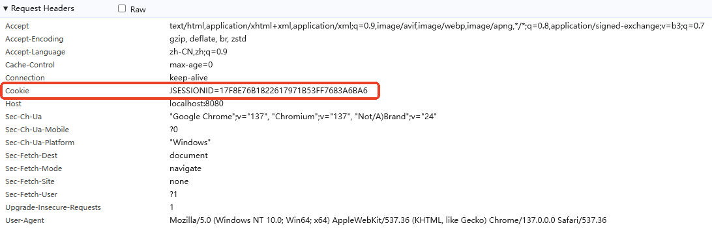

响应头：

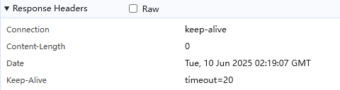

### session 的主要用途

1. **用户身份认证**：存储登录状态，记录用户是否已登录
2. **数据共享**：在同一用户的不同请求间共享数据
3. **购物车功能**：电商网站中存储用户选择的商品
4. **用户偏好设置**：保存用户的个性化设置

### session 作用域

在 JavaWeb 开发中 session 对象也提供了以下三个方法：

```java
// 向会话域中存储数据
void setAttribute(String name, Object data);

// 从会话域中取数据
Object getAttribute(String name);

// 删除会话域中的数据
void removeAttribute(String name);
```

**request、session、application** 是 JavaWeb 开发中三个不同作用域的存储对象，它们的主要区别在于**生命周期**和**数据共享范围**。以下是详细对比：

| **作用域** | **实现类/接口** | **生命周期** | **数据共享范围** | **典型应用场景** |
| --- | --- | --- | --- | --- |
| **request** | `**<font style="color:rgb(64, 64, 64);background-color:rgb(236, 236, 236);">HttpServletRequest</font>**` | 一次请求内有效 | 当前请求的转发链（forward） | 页面间跳转时传递临时数据 |
| **session** | `**<font style="color:rgb(64, 64, 64);background-color:rgb(236, 236, 236);">HttpSession</font>**` | 用户会话期间（默认30分钟无活动失效） | 同一用户的所有请求 | 存储登录状态、购物车数据 |
| **application** | `**<font style="color:rgb(64, 64, 64);background-color:rgb(236, 236, 236);">ServletContext</font>**` | Web应用启动到停止 | 所有用户共享 | 全局配置、计数器、缓存数据 |

三个作用域中 `application`应用域因所有用户共享，如果共享数据涉及到修改操作，需要考虑线程安全问题。session 和 request 则不存在这个问题。

三个作用域的选择原则：尽可能使用小的作用域对象。

### session 的超时机制

默认情况下，服务器是不知道用户关闭浏览器这个行为的，因此 session 需要引入超时机制，以免失效的 session 一直停留在服务器内存当中。

session 一直停留在服务器中的问题：

1. 耗费内存。
2. session 对象被劫持的话，存在安全问题。

在 Tomcat 服务器中，默认情况下 session 的超时时间设置的是 30 分钟，在 `CATALINA_HOME/confi/web.xml`中有默认配置，如下：

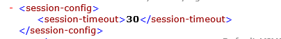

这是一个全局的配置，我们也可以在自己项目的 web.xml 文件中进行局部配置，局部优先生效。

### 手动销毁 session

session 除了依靠 session 超时机制来销毁之外，也支持手动销毁 session，调用以下方法可以销毁 session：

```java
session.invalidate(); // 手动销毁
```

例如，用户如果在浏览器上主动点击了 `安全退出`或者 `退出登录`等按钮，表示用户主动退出系统，后端应该执行以上代码来主动销毁 session 对象。

### session 中数据的持久化

session 对象销毁时，session 中可能保留了用户会话时的数据，例如用户登录后往购物车中存放的商品。（为什么要这样做？这是为了保证用户下一次登录成功后，购物车未结算的商品可以正常展示。）

如何持久化，可以使用监听器来完成，例如以下示例代码：

```java
import javax.servlet.annotation.WebListener;
import javax.servlet.http.HttpSessionEvent;
import javax.servlet.http.HttpSessionAttributeListener;
import javax.servlet.http.HttpSessionBindingEvent;

@WebListener
public class SessionPersistenceListener implements HttpSessionListener {

    @Override
    public void sessionDestroyed(HttpSessionEvent se) {
        // Session超时或调用invalidate()时触发
        HttpSession session = se.getSession();
        
        // 获取需要持久化的数据
        User user = (User) session.getAttribute("user");
        ShoppingCart cart = (ShoppingCart) session.getAttribute("cart");
        
        // 执行持久化操作
        if (user != null) {
            UserDao.saveLastActivityTime(user.getId(), new Date());
        }
        if (cart != null && !cart.isEmpty()) {
            CartService.saveTemporaryCart(user.getId(), cart);
        }
    }
}
```

## 完善登录功能

我们应该在用户登录成功后，创建该用户对应的 session 对象，然后将用户登录信息，存储到 session 域当中。以后就可以通过 session 对象中是否存在登录信息来判定用户是否登录了。

`LoginServlet`代码修改如下：

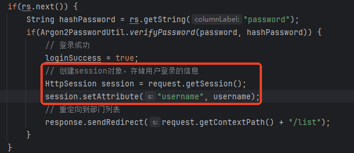

## 登录验证过滤器

怎么能让已经登录的用户才能访问部门列表页面？

这就需要在 `DeptListServlet`类中添加拦截逻辑了：获取 session，判断 session 中是否存在用户名，如果不存在则跳转到登录页面，如果存在则表示已登录，可以继续访问。

这个拦截逻辑不仅需要在 `DeptListServlet`类中添加，在其它 Servlet 中也需要添加，因此有必要编写一个过滤器来进行拦截。

思考：这个过滤器应该拦截什么请求路径，什么路径不应该拦截？

1. 如果用户是显示登录页面，不应该拦截。`/dept/index`不能拦截。
2. 如果用户是登录请求，不应该拦截。`/dept/login`不能拦截。
3. 如果请求路径以 `/css`开始，不应该拦截。（当然项目中也可能存在 js 文件，jpg 或 png 等图片，也不应该拦截）
4. 其它的请求路径一律拦截。

编写过滤器 `CheckLoginFilter`：

```java
package com.jkweilai.dept.filters;

import jakarta.servlet.*;
import jakarta.servlet.annotation.WebFilter;
import jakarta.servlet.http.HttpServletRequest;
import jakarta.servlet.http.HttpServletResponse;
import jakarta.servlet.http.HttpSession;

import java.io.IOException;

// 所有请求路径都经过这个过滤器
@WebFilter("/*")
public class CheckLoginFilter implements Filter {

    @Override
    public void doFilter(ServletRequest req, ServletResponse resp, FilterChain chain) throws IOException, ServletException {
        HttpServletRequest request = (HttpServletRequest) req;
        HttpServletResponse response = (HttpServletResponse) resp;
        HttpSession session = request.getSession(false);
        String servletPath = request.getServletPath();
        if ("/index".equals(servletPath) || "/login".equals(servletPath) || servletPath.startsWith("/css") || (session != null && session.getAttribute("username") != null)) {
            chain.doFilter(req, resp);
        } else {
            response.sendRedirect(request.getContextPath() + "/index");
        }
    }
}
```

到此为止，登录功能就完全起作用了。

## 关于 web 站点欢迎页

在 `CATALINA_HOME/conf/web.xml`文件中对欢迎页进行了全局配置，如下：

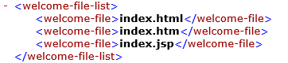

因此默认情况下，这几个页面被当做欢迎页。

设置了欢迎页之后的效果是：访问 web 项目的根时，如果没有指定具体的资源路径，默认走欢迎页，例如访问 `http://localhost:8080/dept`时，默认会访问 `http://localhost:8080/dept/index.html`。

我们也可以在自己项目的 web.xml 文件中配置局部的欢迎页，局部优先。

如果我希望把 `http://localhost:8080/dept/index`作为欢迎页的话，应该这样配置：

```xml
<?xml version="1.0" encoding="UTF-8"?>
<web-app xmlns="https://jakarta.ee/xml/ns/jakartaee"
         xmlns:xsi="http://www.w3.org/2001/XMLSchema-instance"
         xsi:schemaLocation="https://jakarta.ee/xml/ns/jakartaee https://jakarta.ee/xml/ns/jakartaee/web-app_6_0.xsd"
         version="6.0">
    
    <welcome-file-list>
        <welcome-file>index</welcome-file>
    </welcome-file-list>
</web-app>
```

需要注意的是：欢迎页路径在设置的时候，不需要添加项目名，也不需要以 `/`开头。

到此为止，我们启动服务器之后，直接在浏览器地址栏上输入 `http://localhost:8080/dept`即可访问部门管理系统了。

## 每个操作页显示用户名

添加 `common.css`文件到 `/css`目录下：

```css
.user-info {
    display: flex;
    justify-content: flex-end;
    align-items: center;
    padding: 10px 0;
    margin-bottom: 10px;
    border-bottom: 1px solid #ddd;
}
.user-name {
    margin-right: 15px;
    color: #555;
    font-weight: 600;
}
.user-actions a {
    color: #777;
    text-decoration: none;
    font-size: 14px;
    margin-left: 10px;
}
.user-actions a:hover {
    color: #333;
    text-decoration: underline;
}
```

在 `add.html`、`list.html`、`edit.html`、`detail.html`的 `<div class="container">`和 `<div class="header">`之间添加以下代码：

```html
<!-- 新增的用户信息栏 -->
<div class="user-info">
  <span class="user-name">当前用户：管理员</span>
  <div class="user-actions">
    <a href="#">退出登录</a>
  </div>
</div>
```

在 `add.html`、`list.html`、`edit.html`、`detail.html`中添加 `common.css`样式：

```html
<link rel="stylesheet" th:href="@{/css/common.css}">
```

效果如下：

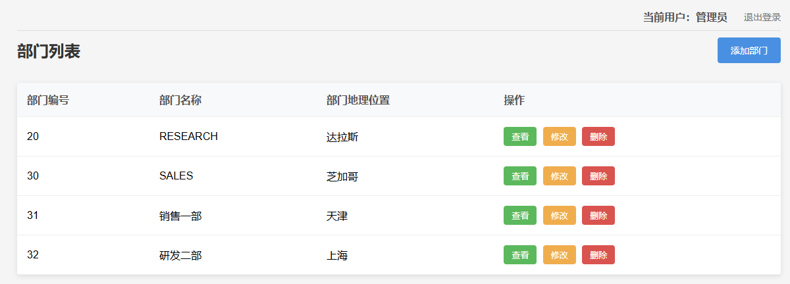

用户登录成功后，将用户名存储到 session 作用域中了，因此在 html 页面中使用 `${session.username}`取出当前登录的用户名，替换掉页面中的 `管理员`：

```html
<span class="user-name" th:text="|当前用户：${session.username}|"></span>
```

最终效果如下：

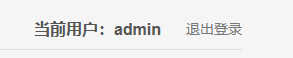

## 退出系统

用户点击退出系统时，后端应该销毁 session。

修改 退出系统 链接的请求路径：

```html
<a th:href="@{/logout}">退出登录</a>
```

编写 Servlet 销毁 session，重定向到登录页面：

```java
package com.jkweilai.dept.servlets;

import jakarta.servlet.ServletException;
import jakarta.servlet.annotation.WebServlet;
import jakarta.servlet.http.HttpServlet;
import jakarta.servlet.http.HttpServletRequest;
import jakarta.servlet.http.HttpServletResponse;
import jakarta.servlet.http.HttpSession;

import java.io.IOException;

@WebServlet("/logout")
public class LogoutServlet extends HttpServlet {
    @Override
    protected void doGet(HttpServletRequest request, HttpServletResponse response) throws ServletException, IOException {
        HttpSession session = request.getSession(false);
        if (session != null) {
            session.invalidate();
        }
        response.sendRedirect(request.getContextPath() + "/index");
    }
}
```

测试一下，用户点击退出系统后，是否还可以在浏览器地址栏上直接输入 `http://localhost:8080/dept/list`访问部门列表页面，如果跳转到登录页面则表示正常。

## Cookie&Token 机制

### cookie机制及其作用

**cookie**是Web开发中用于在客户端存储少量数据的一种机制，由服务器发送到用户浏览器并保存在本地，当浏览器再次访问同一服务器时会将Cookie数据回传给服务器。

**cookie的特点**：

- 存储在客户端（浏览器）
- 大小限制（通常4KB左右）
- 每个域名下的 cookie 数量有限制（通常20-50个）
- 可以设置过期时间（不设置有效期时，默认 cookie 保存在浏览器缓存中，浏览器关闭后 cookie 消失，设置有效期 > 0 时 cookie 会被保存在客户端硬盘文件中）
- 可以被用户禁用（浏览器可以设置禁止接收 cookie，服务器还是会响应 cookie，但浏览器可以拒绝接收）

### cookie的应用场景

1. **用户登录状态保持**：记住登录状态，避免频繁登录
2. **购物车功能**：存储用户选择的商品信息
3. **个性化设置**：保存用户的语言、主题等偏好
4. **广告定向投放**：根据用户兴趣展示相关广告
  1. 当用户访问网站时，你可以设置一个或多个 cookies来存储用户的兴趣信息。例如，如果网站是关于时尚的，你可以设置一个名为interest_fashion的 cookie
5. **跨页面数据传递**：在多个页面间共享数据
  1. 假设创建了一个 cookie 存储了一些共享数据 data，并且让 cookie 关联请求路径，假设关联的请求路径是 `/dept`，那么 `/dept/list`、`/dept/save`等请求路径浏览器都会发送 cookie 数据给服务器，这样多个 Servlet 之间可以共享数据，进而完成跨页面数据传递

### session 和 cookie 的区别

| **特性** | **cookie** | **session** |
| --- | --- | --- |
| 存储位置 | 客户端 | 服务器端 |
| 安全性 | 较低 | 较高 |
| 存储大小 | 有限（约4KB） | 较大（取决于服务器） |
| 生命周期 | 可设置长期有效 | 通常较短（会话期间） |
| 性能影响 | 每次请求都会携带 | 只在服务器端查找 |

### 在JavaWeb中创建和响应Cookie

#### 创建Cookie

```java
// 创建一个名为"username"，值为"john"的Cookie
Cookie cookie = new Cookie("username", "john");
```

cookie 的 name 和 value 要求必须是 String 类型。

#### 设置Cookie属性

```java
// 设置过期时间（秒），不设置则默认为会话Cookie（浏览器关闭即删除）
cookie.setMaxAge(60 * 60 * 24 * 7); // 一周后过期

// 设置路径，以下代码的作用是：当浏览器发送的请求路径是/myapp或者/myapp下的子路径时，都会发送该cookie给服务器。
cookie.setPath("/myapp"); 

// 设置域名（可以跨子域共享）
// 主域名：example.com
// 子域名：api.example.com、shop.example.com
// 不设置域名时，Cookie 仅对 当前完整域名 生效，不包括子域名。
// 显式设置域名时，只能设置为 当前域名或其父级主域名，不能是其他无关域名。
// 一句话：Cookie 永远被限制在它的主域名及子域名下，无法“越狱”！
// cookie.setDomain(".example.com");

// 如果网站使用的协议是HTTPS协议，应该执行以下代码，这样的话，只有发送HTTPS请求时，cookie才会提交给服务器。
// cookie.setSecure(true);

// 设置HttpOnly属性，有效减少XSS攻击
// HttpOnly 标记的 Cookie 只能由浏览器通过 HTTP(S) 请求发送到服务器，JavaScript 无法访问它，因此即使存在 XSS，攻击者也无法直接窃取这类 Cookie。
cookie.setHttpOnly(true);
```

#### 响应Cookie到客户端

```java
response.addCookie(cookie);
```

### 服务器端获取客户端提交的 Cookie

```java
// 从请求中获取所有Cookie
Cookie[] cookies = request.getCookies();

if (cookies != null) {
    for (Cookie cookie : cookies) {
        String name = cookie.getName(); // 获取Cookie的名字
        String value = cookie.getValue(); // 获取Cookie的值
        // 处理Cookie数据
        if ("username".equals(name)) {
            System.out.println("用户名: " + value);
        }
    }
}
```

### cookie的注意事项

1. **安全性问题**：
  - 敏感信息不应存储在Cookie中，即使密码是经过加密的也不要存储在 Cookie 中
  - 使用HttpOnly和Secure标志增强安全性
  - 考虑对Cookie值进行加密
2. **编码问题**：Cookie的值不能包含**空格、分号、逗号**等特殊字符，需要对特殊字符进行URL编码

```java
Cookie cookie = new Cookie("test", URLEncoder.encode("含有特殊字符的值", "UTF-8"));
```

1. **用 Java 程序删除Cookie**：

```java
Cookie cookie = new Cookie("username", "");
cookie.setMaxAge(0); // 立即过期
cookie.setPath("/"); // 必须与要删除的Cookie的路径一致
response.addCookie(cookie);
```

1. **跨域问题**：Cookie不能跨域共享，可以通过设置domain属性实现子域共享。

### 实现"记住我"功能

实现思路：登录成功后，应该创建 Cookie，Cookie 中保存登录的用户名，然后将 Cookie 响应给浏览器。下一次浏览器发送请求时就会携带 Cookie，服务器接收浏览器提交的 Cookie 后，获取 Cookie 中是否有登录的用户名，如果存在则表示已登录，如果不存在则跳转到登录页面。另外，实现了“记住我”这个功能后，用户关闭浏览器，再打开浏览器访问系统时就不需要登录了，所以 IndexServlet 程序也需要改动。因此要编写三部分代码：

1. `LoginServlet`中登录成功后，创建 Cookie，Cookie 中保存登录的用户名，然后响应 Cookie 到浏览器。
2. `CheckLoginFilter`中，获取浏览器提交的 Cookie，并且查看 Cookie 中是否保存了登录的用户名，如果有则创建 session，将登录名存储到 session 中，如果没有则跳转到登录页面。
3. `IndexServlet`中，获取浏览器提交的 Cookie，并且查看 Cookie 中是否保存了登录的用户名，如果有则创建 session，将登录名存储到 session 中，如果没有则跳转到登录页面。

```java
package com.jkweilai.dept.servlets;

import com.jkweilai.dept.utils.Argon2PasswordUtil;
import com.jkweilai.dept.utils.DbUtils;
import jakarta.servlet.ServletException;
import jakarta.servlet.annotation.WebServlet;
import jakarta.servlet.http.*;

import java.io.IOException;
import java.sql.Connection;
import java.sql.PreparedStatement;
import java.sql.ResultSet;

@WebServlet("/login")
public class LoginServlet extends HttpServlet {
    @Override
    protected void doPost(HttpServletRequest request, HttpServletResponse response) throws ServletException, IOException {
        // 获取用户名和密码
        String username = request.getParameter("username");
        String password = request.getParameter("password");
        // 连接数据库校验用户名和密码
        Connection conn = null;
        PreparedStatement ps = null;
        ResultSet rs = null;
        boolean loginSuccess = false;
        try {
            conn = DbUtils.getConnection();
            String sql = "select password from t_user where username = ?";
            ps = conn.prepareStatement(sql);
            ps.setString(1, username);
            rs = ps.executeQuery();
            if(rs.next()) {
                String hashPassword = rs.getString("password");
                if(Argon2PasswordUtil.verifyPassword(password, hashPassword)) {
                    // 登录成功
                    loginSuccess = true;
                    // 创建session对象，存储用户登录的信息
                    HttpSession session = request.getSession();
                    session.setAttribute("username", username);
                    
                    // 创建Cookie，将登录名存储到Cookie中，响应到浏览器
                    Cookie cookie = new Cookie("username", username);
                    cookie.setMaxAge(60 * 60 * 24 * 30); // 30天有效
                    cookie.setPath(request.getContextPath());
                    cookie.setHttpOnly(true);
                    if(request.isSecure()){
                        cookie.setSecure(true);
                    }
                    response.addCookie(cookie);
                    
                    // 重定向到部门列表
                    response.sendRedirect(request.getContextPath() + "/list");
                }
            }
        } catch (Exception e) {
            e.printStackTrace();
        } finally {
            DbUtils.close(conn, ps, rs);
        }
        // 登录失败，转发到登录页面
        if(!loginSuccess) {
            request.setAttribute("errorMsg", "用户名不存在或密码错误！");
            request.setAttribute("template", "index");
            request.getRequestDispatcher("/view").forward(request, response);
        }
    }
}
```

在 `LoginServlet`中添加的代码是：

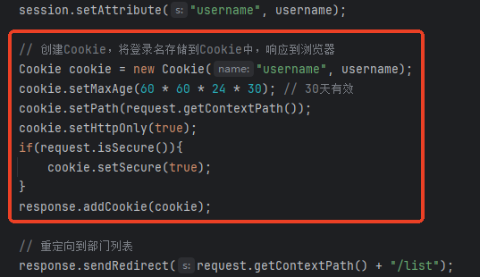

```java
package com.jkweilai.dept.filters;

import jakarta.servlet.*;
import jakarta.servlet.annotation.WebFilter;
import jakarta.servlet.http.Cookie;
import jakarta.servlet.http.HttpServletRequest;
import jakarta.servlet.http.HttpServletResponse;
import jakarta.servlet.http.HttpSession;

import java.io.IOException;

// 所有请求路径都经过这个过滤器
@WebFilter("/*")
public class CheckLoginFilter implements Filter {

    @Override
    public void doFilter(ServletRequest req, ServletResponse resp, FilterChain chain) throws IOException, ServletException {
        HttpServletRequest request = (HttpServletRequest) req;
        HttpServletResponse response = (HttpServletResponse) resp;

        // 获取客户端的Cookie，如果有名字为 username 的Cookie
        // 将该Cookie的value取出（用户的登录名），存储到session中
        // 表示该用户已登录
        Cookie[] cookies = request.getCookies();
        if(cookies != null) {
            for(Cookie cookie : cookies) {
                if(cookie.getName().equals("username")) {
                    String username = cookie.getValue();
                    request.getSession().setAttribute("username", username);
                    chain.doFilter(request, response);
                    return;
                }
            }
        }


        HttpSession session = request.getSession(false);
        String servletPath = request.getServletPath();
        if ("/index".equals(servletPath) || "/login".equals(servletPath) || servletPath.startsWith("/css") || (session != null && session.getAttribute("username") != null)) {
            chain.doFilter(req, resp);
        } else {
            response.sendRedirect(request.getContextPath() + "/index");
        }
    }
}
```

`CheckLoginFilter`过滤器中添加的代码如下：

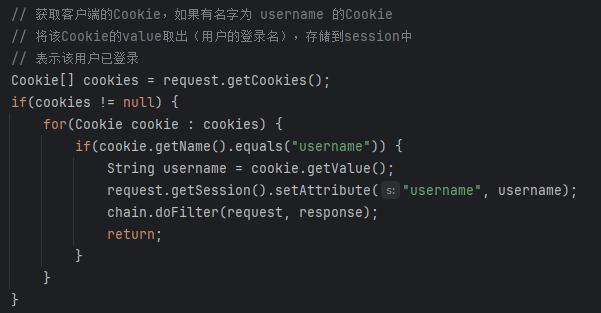

`IndexServlet`程序修改如下：

```java
package com.jkweilai.dept.servlets;

import jakarta.servlet.ServletException;
import jakarta.servlet.annotation.WebServlet;
import jakarta.servlet.http.Cookie;
import jakarta.servlet.http.HttpServlet;
import jakarta.servlet.http.HttpServletRequest;
import jakarta.servlet.http.HttpServletResponse;

import java.io.IOException;

@WebServlet("/index")
public class IndexServlet extends HttpServlet {
    @Override
    protected void doGet(HttpServletRequest request, HttpServletResponse response) throws ServletException, IOException {

        boolean isLogin = false;
        Cookie[] cookies = request.getCookies();
        if(cookies != null) {
            for(Cookie cookie : cookies) {
                if(cookie.getName().equals("username")) {
                    isLogin = true;
                    String username = cookie.getValue();
                    request.getSession().setAttribute("username", username);
                    request.setAttribute("template", "list");
                    response.sendRedirect(request.getContextPath() + "/list");
                }
            }
        }

        if(!isLogin) {
            request.setAttribute("template", "index");
            request.getRequestDispatcher("/view").forward(request, response);
        }
        
    }
}
```

到此“记住我”功能基本上实现了。大家可以自行测试一下。

以上“记住我”功能存在的问题包括：

1. **安全性问题**：直接存储用户名在Cookie中，容易被窃取或伪造。一旦被窃取或伪造，对于后端系统来说，用户名是长期有效且不可变的，攻击者可以长期冒充用户。
2. **容易导致越权访问**：如果系统仅依赖 Cookie 中的用户名做身份认证，攻击者**伪造 Cookie 即可登录任意账号**。而且还可以把 `**<font style="color:rgb(64, 64, 64);background-color:rgb(236, 236, 236);">username=admin</font>**` 改成 `**<font style="color:rgb(64, 64, 64);background-color:rgb(236, 236, 236);">username=root</font>**`，可能直接获得管理员权限。
3. **敏感信息暴露**：将明文用户名存储在客户端Cookie中，可能违反隐私保护原则。
4. **密码未参与验证**：记住我功能通常应该重新验证密码，而不仅仅是依赖Cookie。
5. **无法应对数据泄露**：如果数据库泄露，攻击者拿到所有用户名，可以直接构造恶意 Cookie，而**服务器无法区分合法和非法请求**。
6. **CSRF防护不足**：虽然设置了HttpOnly，但没有其他CSRF防护措施。

更安全的做法是生成一个随机令牌（token）存储在数据库（或者存储在 redis 缓存中），并与用户关联，同时在Cookie中只存储这个令牌值。

**因此，你需要将之前实现的“记住我”功能添加的所有代码全部删除。我们将使用 Token 令牌来实现“记住我”功能。**

### Token 令牌

实现“记住我”功能，采用 Cookie 中存储 Token 令牌要比直接存储用户名安全的多。

#### 什么是 Token 令牌

Token是一种代表用户身份和权限的凭证，它是在用户成功登录后由服务器生成并返回给客户端的一串随机字符串。客户端在后续请求中携带这个Token来证明自己的身份，而无需每次都发送用户名和密码。

#### Token 的工作流程

1. 客户端发送登录请求
2. 服务器验证用户名和密码，生成Token，Token 和用户 id 关联存储到数据库表中，然后将 Token 响应给客户端
3. 客户端存储Token（通常在localStorage或cookie中）
4. 后续请求携带Token
5. 服务器验证Token并处理请求

#### Token 为什么更安全

| **方案** | **直接存储用户名** | **存储 Token** |
| --- | --- | --- |
| **是否可伪造** | ✅ 是（直接改 Cookie） | ❌ 否（需猜中随机 Token） |
| **是否可撤销** | ❌ 否（除非改用户名） | ✅ 是（服务器可删除 Token） |
| **有效期控制** | ❌ 永久有效 | ✅ 可设置过期时间 |
| **泄露风险** | 🔴 高风险（用户名固定） | 🟢 低风险（Token 无意义） |
| **适用场景** | ❌ 不推荐 | ✅ 推荐（行业标准） |

- **直接存用户名**：相当于把家门钥匙放在门口地毯下，谁找到都能用。
- **存 Token**：相当于使用一次性密码锁，钥匙可随时更换，即使被拿到也很快失效。

#### Token 的生成算法

```java
package com.jkweilai.dept.utils;

import java.security.SecureRandom;
import java.util.Base64;

public class TokenGenerator {

    // 生成一个安全的随机 Token（Base64 编码）
    public static String generateSecureToken() {
        SecureRandom secureRandom = new SecureRandom();
        byte[] tokenBytes = new byte[32]; // 32字节 = 256位（足够安全）
        secureRandom.nextBytes(tokenBytes); // 填充随机字节
        return Base64.getUrlEncoder().withoutPadding().encodeToString(tokenBytes);
    }

}
```

- 使用 **256 位随机数**（32字节），暴力破解几乎不可能。
- `**<font style="color:rgb(64, 64, 64);background-color:rgb(236, 236, 236);">Base64</font>**` 编码后无 `**<font style="color:rgb(64, 64, 64);background-color:rgb(236, 236, 236);">+/=</font>**` 等特殊字符。

### 用 Token 实现“记住我”功能

#### Token 表的设计

```sql
CREATE TABLE `user_remember_tokens` (
  `id` bigint NOT NULL AUTO_INCREMENT,
  `user_id` bigint NOT NULL COMMENT '关联的用户ID',
  `token` varchar(64) NOT NULL COMMENT '随机生成的token',
  `series` varchar(64) NOT NULL COMMENT '序列标识(安全增强)',
  `fingerprint` varchar(255) DEFAULT NULL COMMENT '客户端指纹(IP+UserAgent哈希)',
  `created_at` datetime NOT NULL DEFAULT CURRENT_TIMESTAMP,
  `expires_at` datetime NOT NULL COMMENT '过期时间',
  `revoked` tinyint(1) NOT NULL DEFAULT '0' COMMENT '是否已撤销',
  PRIMARY KEY (`id`),
  UNIQUE KEY `uniq_series` (`series`),
  KEY `idx_user_token` (`user_id`,`token`),
  KEY `idx_expires` (`expires_at`)
) ENGINE=InnoDB DEFAULT CHARSET=utf8mb4 COLLATE=utf8mb4_0900_ai_ci COMMENT='用户持久登录token表';
```

- **series 机制**：每个浏览器生成唯一的series标识，每次更新token时保留series但更换token，如果发现相同series但不同token，可能是token被盗。

```java
String series = UUID.randomUUID().toString();
```

- **fingerprint 机制（客户端指纹）**：

```java
String ip = request.getRemoteAddr();
String userAgent = request.getHeader("User-Agent");
String fingerprint = DigestUtils.sha256Hex(ip + userAgent + "salt");
```

以上代码需要这个 jar 包：


，添加到 WEB-INF/lib 目录下，并且添加到 classpath 中。

Apache Commons Codec 是一个用于编码和解码的Java库，提供常用的编码器如Base64、Hex、URL等

#### 代码的实现

实现思路：

1. 用户登录成功后：【在 LoginServlet 中编写代码】
  1. 生成 Token，Token 关联用户 id 存储到 user_remember_tokens 表。
  2. 将 Token 放到 Cookie 中响应给浏览器。
  3. 将用户名存储到 session 中 。
2. 验证 Token：【在 CheckLoginFilter 中编写代码】
  1. 获取客户端提交的 Cookie，从 Cookie 中获取 Token
  2. 连接数据库验证 Token 是否有效：
    1. 有效，登录成功，将用户名存储到 session 中，展示部门列表
    2. 无效，删除客户端 Token，将数据库 Token 的 revoked 设置为 1， 跳转到登录页面
3. 当用户登录过之后，用户再次发送 `http://localhost:8080/dept`请求时，应该展示部门列表页面：【在 IndexServlet 中编写代码】
  1. 先看 session 中有没有用户名，如果有则直接显示部门列表。
  2. 如果 session 中没有用户名，则获取客户端提交的 Token。
  3. 连接数据库验证 Token 是否有效：
    1. 有效，登录成功，将用户名存储到 session 中，展示部门列表
    2. 无效，删除客户端 Token，将数据库 Token 的 revoked 设置为 1，跳转到登录页面

`LoginServlet`的代码：

```java
package com.jkweilai.dept.servlets;

import com.jkweilai.dept.utils.Argon2PasswordUtil;
import com.jkweilai.dept.utils.DbUtils;
import com.jkweilai.dept.utils.TokenGenerator;
import jakarta.servlet.ServletException;
import jakarta.servlet.annotation.WebServlet;
import jakarta.servlet.http.*;
import org.apache.commons.codec.digest.DigestUtils;

import java.io.IOException;
import java.sql.Connection;
import java.sql.PreparedStatement;
import java.sql.ResultSet;
import java.sql.Timestamp;
import java.time.LocalDateTime;
import java.util.UUID;

@WebServlet("/login")
public class LoginServlet extends HttpServlet {
    @Override
    protected void doPost(HttpServletRequest request, HttpServletResponse response) throws ServletException, IOException {
        // 获取用户名和密码
        String username = request.getParameter("username");
        String password = request.getParameter("password");
        // 连接数据库校验用户名和密码
        Connection conn = null;
        PreparedStatement ps = null;
        ResultSet rs = null;
        PreparedStatement ps2 = null;
        boolean loginSuccess = false;
        try {
            conn = DbUtils.getConnection();
            String sql = "select id,password from t_user where username = ?";
            ps = conn.prepareStatement(sql);
            ps.setString(1, username);
            rs = ps.executeQuery();
            if(rs.next()) {
                String hashPassword = rs.getString("password");
                if(Argon2PasswordUtil.verifyPassword(password, hashPassword)) {
                    // 登录成功
                    loginSuccess = true;

                    // ===============================================================================================
                    // 生成Token
                    String token = TokenGenerator.generateSecureToken();
                    // 保存Token到数据库
                    String insertTokenSql = "insert into user_remember_tokens(id,user_id,token,series,fingerprint,expires_at) values(null,?,?,?,?,?)";
                    ps2 = conn.prepareStatement(insertTokenSql);
                    ps2.setString(1, rs.getString("id"));
                    ps2.setString(2, token);
                    String series = UUID.randomUUID().toString();
                    ps2.setString(3, series);
                    String ip = request.getRemoteAddr();
                    String userAgent = request.getHeader("User-Agent");
                    String fingerprint = DigestUtils.sha256Hex(ip + userAgent + "salt");
                    ps2.setString(4, fingerprint);
                    LocalDateTime expiresAt = LocalDateTime.now().plusDays(30);
                    ps2.setTimestamp(5, Timestamp.valueOf(expiresAt)); // 30天有效
                    ps2.executeUpdate();
                    // 响应Token到浏览器
                    Cookie cookie = new Cookie("token", token);
                    cookie.setMaxAge(60 * 60 * 24 * 30); // 30天有效
                    cookie.setPath(request.getContextPath());
                    cookie.setHttpOnly(true);
                    if(request.isSecure()){
                        cookie.setSecure(true);
                    }
                    response.addCookie(cookie);
                    // ===============================================================================================

                    // 创建session对象，存储用户登录的信息
                    HttpSession session = request.getSession();
                    session.setAttribute("username", username);
                    // 重定向到部门列表
                    response.sendRedirect(request.getContextPath() + "/list");
                }
            }
        } catch (Exception e) {
            e.printStackTrace();
        } finally {
            DbUtils.close(null, ps2, null);
            DbUtils.close(conn, ps, rs);
        }
        // 登录失败，转发到登录页面
        if(!loginSuccess) {
            request.setAttribute("errorMsg", "用户名不存在或密码错误！");
            request.setAttribute("template", "index");
            request.getRequestDispatcher("/view").forward(request, response);
        }
    }
}
```

`CheckLoginFilter`代码的实现：

```java
package com.jkweilai.dept.filters;

import com.jkweilai.dept.utils.DbUtils;
import jakarta.servlet.*;
import jakarta.servlet.annotation.WebFilter;
import jakarta.servlet.http.Cookie;
import jakarta.servlet.http.HttpServletRequest;
import jakarta.servlet.http.HttpServletResponse;
import jakarta.servlet.http.HttpSession;
import org.apache.commons.codec.digest.DigestUtils;

import java.io.IOException;
import java.sql.Connection;
import java.sql.PreparedStatement;
import java.sql.ResultSet;

// 所有请求路径都经过这个过滤器
@WebFilter("/*")
public class CheckLoginFilter implements Filter {

    @Override
    public void doFilter(ServletRequest req, ServletResponse resp, FilterChain chain) throws IOException, ServletException {
        HttpServletRequest request = (HttpServletRequest) req;
        HttpServletResponse response = (HttpServletResponse) resp;
        HttpSession session = request.getSession(false);
        String servletPath = request.getServletPath();
        if ("/index".equals(servletPath) || "/login".equals(servletPath) || servletPath.startsWith("/css") || (session != null && session.getAttribute("username") != null)) {
            chain.doFilter(req, resp);
        } else {
            // 看看客户端是否提交Token，并且Token是否有效，如果有效登录成功，创建session存储用户名，无效则删除客户端Token并跳转到登录页面
            boolean isLogin = false;
            Cookie[] cookies = request.getCookies();
            if (cookies != null) {
                for (Cookie cookie : cookies) {
                    if ("token".equals(cookie.getName())) {
                        String token = cookie.getValue();
                        // 验证token是否有效
                        Connection conn = null;
                        PreparedStatement ps = null;
                        PreparedStatement ps2 = null;
                        ResultSet rs = null;
                        try {
                            conn = DbUtils.getConnection();
                            String sql = "select u.username from user_remember_tokens urt join t_user u on urt.user_id=u.id where urt.token=? and urt.fingerprint=? and urt.expires_at > now() and urt.revoked = '0'";
                            ps = conn.prepareStatement(sql);
                            ps.setString(1, token);
                            String ip = request.getRemoteAddr();
                            String userAgent = request.getHeader("User-Agent");
                            String fingerprint = DigestUtils.sha256Hex(ip + userAgent + "salt");
                            ps.setString(2, fingerprint);
                            rs = ps.executeQuery();
                            if (rs.next()) {
                                isLogin = true;
                                HttpSession newSession = request.getSession(true);
                                newSession.setAttribute("username", rs.getString("username"));
                                chain.doFilter(request, response);
                            } else {
                                // 将数据库中token的revoked设置为1
                                String sql2 = "update user_remember_tokens set revoked=1 where token=?";
                                ps2 = conn.prepareStatement(sql2);
                                ps2.setString(1, token);
                                ps2.executeUpdate();
                                // 删除客户端Token
                                Cookie deletedCookie = new Cookie("token", token);
                                deletedCookie.setMaxAge(0);
                                response.addCookie(deletedCookie);
                            }
                        } catch (Exception e) {
                            e.printStackTrace();
                        } finally {
                            DbUtils.close(null, ps2, null);
                            DbUtils.close(conn, ps, rs);
                        }
                    }
                }
            }
            if (!isLogin) {
                response.sendRedirect(request.getContextPath() + "/index");
            }
        }
    }

}
```

`IndexServlet`的代码：

```java
package com.jkweilai.dept.servlets;

import com.jkweilai.dept.utils.DbUtils;
import jakarta.servlet.ServletException;
import jakarta.servlet.annotation.WebServlet;
import jakarta.servlet.http.*;
import org.apache.commons.codec.digest.DigestUtils;

import java.io.IOException;
import java.sql.Connection;
import java.sql.PreparedStatement;
import java.sql.ResultSet;

@WebServlet("/index")
public class IndexServlet extends HttpServlet {
    @Override
    protected void doGet(HttpServletRequest request, HttpServletResponse response) throws ServletException, IOException {
        HttpSession session = request.getSession(false);
        if (session != null && session.getAttribute("username") != null) {
            response.sendRedirect(request.getContextPath() + "/list");
        } else {
            // 看看客户端是否提交Token，并且Token是否有效，如果有效登录成功，创建session存储用户名，无效则删除客户端Token并跳转到登录页面
            boolean isLogin = false;
            Cookie[] cookies = request.getCookies();
            if (cookies != null) {
                for (Cookie cookie : cookies) {
                    if ("token".equals(cookie.getName())) {
                        String token = cookie.getValue();
                        // 验证token是否有效
                        Connection conn = null;
                        PreparedStatement ps = null;
                        PreparedStatement ps2 = null;
                        ResultSet rs = null;
                        try {
                            conn = DbUtils.getConnection();
                            String sql = "select u.username from user_remember_tokens urt join t_user u on urt.user_id=u.id where urt.token=? and urt.fingerprint=? and urt.expires_at > now() and urt.revoked = '0'";
                            ps = conn.prepareStatement(sql);
                            ps.setString(1, token);
                            String ip = request.getRemoteAddr();
                            String userAgent = request.getHeader("User-Agent");
                            String fingerprint = DigestUtils.sha256Hex(ip + userAgent + "salt");
                            ps.setString(2, fingerprint);
                            rs = ps.executeQuery();
                            if (rs.next()) {
                                isLogin = true;
                                HttpSession newSession = request.getSession(true);
                                newSession.setAttribute("username", rs.getString("username"));
                                response.sendRedirect(request.getContextPath() + "/list");
                            } else {
                                // 将数据库中token的revoked设置为1
                                String sql2 = "update user_remember_tokens set revoked=1 where token=?";
                                ps2 = conn.prepareStatement(sql2);
                                ps2.setString(1, token);
                                ps2.executeUpdate();
                                // 删除客户端Token
                                Cookie deletedCookie = new Cookie("token", token);
                                deletedCookie.setMaxAge(0);
                                response.addCookie(deletedCookie);
                            }
                        } catch (Exception e) {
                            e.printStackTrace();
                        } finally {
                            DbUtils.close(null, ps2, null);
                            DbUtils.close(conn, ps, rs);
                        }
                    }
                }
            }
            if (!isLogin) {
                request.setAttribute("template", "index");
                request.getRequestDispatcher("/view").forward(request, response);
            }
        }
    }
}
```

### 退出系统清除 Token

退出系统时，应该删除客户端的 token，并且将数据库中的 token 撤销掉（revoked 设置为 1）。

`LogoutServlet`的代码修改如下：

```java
package com.jkweilai.dept.servlets;

import com.jkweilai.dept.utils.DbUtils;
import jakarta.servlet.ServletException;
import jakarta.servlet.annotation.WebServlet;
import jakarta.servlet.http.*;

import java.io.IOException;
import java.sql.Connection;
import java.sql.PreparedStatement;

@WebServlet("/logout")
public class LogoutServlet extends HttpServlet {
    @Override
    protected void doGet(HttpServletRequest request, HttpServletResponse response) throws ServletException, IOException {
        HttpSession session = request.getSession(false);
        if (session != null) {
            session.invalidate();
        }

        Cookie[] cookies = request.getCookies();
        if (cookies != null) {
            for (Cookie cookie : cookies) {
                if (cookie.getName().equals("token")) {
                    String token = cookie.getValue();
                    // 将数据库表中token的revoked设置为1
                    Connection conn = null;
                    PreparedStatement ps = null;
                    try {
                        conn = DbUtils.getConnection();
                        String sql = "update user_remember_tokens set revoked = 1 where token=?";
                        ps = conn.prepareStatement(sql);
                        ps.setString(1, token);
                        ps.executeUpdate();
                    } catch (Exception e) {
                        e.printStackTrace();
                    } finally {
                        DbUtils.close(conn, ps, null);
                    }
                    // 删除客户端Token
                    Cookie newCookie = new Cookie("token", token);
                    newCookie.setMaxAge(0);
                    response.addCookie(newCookie);
                }
            }
        }

        response.sendRedirect(request.getContextPath() + "/index");
    }
}
```

### 最佳实践建议

1. **限制每个用户的token数量**：实际上就是控制登录的设备

```sql
-- 创建token前检查
SELECT COUNT(*) FROM user_remember_tokens WHERE user_id = ? AND revoked = 0 AND expires_at > NOW();
```

1. **定期维护**：定期清理已撤销或已过期的 token

```sql
-- 清理过期token（可设置定时任务）
DELETE FROM user_remember_tokens WHERE expires_at < NOW() OR revoked = 1;
```

1. **敏感操作保护**：

- 修改密码/邮箱等敏感操作后立即撤销所有remember token
- 重要操作（如支付）要求重新输入密码

# request 常用方法总结


## ServletRequest 接口

以下是 ServletRequest 接口中的方法：

```java
// 将指定名称的属性绑定到请求对象中
void setAttributes(String name, Object o);
// 返回请求对象中指定名称的属性值
Object getAttribute(String name);
// 移除请求对象中指定名称的属性
void removeAttribute(String name);

// 设置请求体的字符编码格式
void setCharacterEncoding(String env);

// 返回请求中指定名称的参数值（单值）
String getParameter(String name);
// 返回请求中指定名称的所有参数值（多值，如复选框）
String[] getParameterValues(String name);
// 返回包含所有请求参数的键值对映射
Map<String,String[]> getParameterMap();
// 返回请求中所有参数名称的枚举
Enumeration<String> getParameterNames();

// 返回客户端IP地址
String getRemoteAddr();
// 返回指定路径的请求分派器，用于服务器端转发
RequestDispatcher getRequestDispatcher(String path);

// 判断请求是否通过安全协议（如HTTPS）发送
boolean isSecure();
```

## HttpServletRequest 接口

以下是关于 `HttpServletRequest`接口增加的方法，HttpServletRequest 接口继承了 ServletRequest 接口：

```java
// 返回当前Web应用的上下文路径
String getContextPath();
// 返回客户端发送的所有Cookie数组
Cookie[] getCookies();
// 返回指定请求头的值
String getHeader(String name);
// 返回HTTP请求方法（如GET、POST等）
String getMethod();
// 返回请求的URI（不包含协议、主机和查询参数）
String getRequestURI();
// 返回完整的请求URL（不包括查询参数）
StringBuffer getRequestURL();
// 返回请求URL中调用Servlet的部分
String getServletPath();
// 返回当前会话，若无则创建新会话
HttpSession getSession();
```

# Servlet 线程安全问题


## Tomcat 线程池

### 什么是线程池

线程池（Thread Pool）是一种**多线程处理机制**，它预先创建一组线程并管理它们的生命周期，避免频繁创建和销毁线程带来的性能开销。线程池的核心思想是**复用线程**，减少系统资源消耗，提高任务处理效率。

### 线程池的作用

1. **降低资源消耗**：复用线程，减少频繁创建和销毁线程的开销。
2. **提高响应速度**：任务到达时，可直接使用空闲线程执行，无需等待线程创建。
3. **控制并发数量**：防止线程过多导致系统崩溃（如OOM）。
4. **统一管理线程**：提供任务队列、拒绝策略等机制，增强系统稳定性。

### Tomcat 线程池的配置

在 `conf/server.xml` 中，`<Connector>` 标签可以配置线程池参数，例如：

```xml
<Connector 
    port="8080" 
    protocol="HTTP/1.1"
    maxThreads="200"       <!-- 最大线程数 -->
    minSpareThreads="10"   <!-- 最小空闲线程数 -->
    acceptCount="100"      <!-- 等待队列长度 -->
    connectionTimeout="20000"
/>
```

### 关键参数说明

| **参数** | **说明** |
| --- | --- |
| `maxThreads` | 最大线程数（默认200），决定Tomcat的并发处理能力 |
| `minSpareThreads` | 最小空闲线程数（默认10），避免请求到来时临时创建线程 |
| `acceptCount` | 当所有线程都在忙时，新请求进入等待队列的最大数量（默认100） |
| `connectionTimeout` | 连接超时时间（毫秒） |

### Tomcat 线程池的工作流程

1. 客户端发送 HTTP 请求到 Tomcat。
2. Tomcat 从线程池中分配一个空闲线程处理请求。
3. 如果所有线程都在忙，新请求进入等待队列（`acceptCount`）。
4. 如果队列已满，Tomcat 会拒绝请求（返回 `503 Service Unavailable`）。

## Servlet 线程安全问题

1. Servlet 是单实例的。
2. Web 服务器都是支持多线程并发的，Web 服务器内部一般会提供线程池。例如 Tomcat 服务器中就有线程池。
3. 因此 Servlet 是在单实例多线程的环境下运行的，如果 Servlet 中定义成员变量，并且成员变量涉及到修改操作，必然存在线程安全问题。
4. 实际开发中不建议在 Servlet 中定义成员变量，尽量使用局部变量。如果使用成员变量，尽量不要做修改操作，如果做修改操作，需要使用线程同步机制保证数据的安全。

# 软件架构模式


## 三层架构模式

三层架构是一种常见的软件架构模式。它将应用程序划分为三个逻辑层次，每层有明确的职责：


### 表示层(Presentation Layer)

- **职责**：处理用户界面和用户交互
- **在Servlet中的实现**：Servlet本身（处理HTTP请求和响应）、Thymeleaf 页面（视图展示）
- **主要任务**：接收用户请求、调用业务逻辑层处理、返回适当的响应（HTML、JSON等）

### 业务层(Business Logic Layer)

- **职责**：包含应用程序的核心业务规则和逻辑
- **在Servlet中的实现**：独立的Java类（通常称为Service）
- **主要任务**：处理业务规则、验证数据、协调数据访问层操作、事务管理

### 持久层/数据访问层(Data Access Layer)

- **职责**：与数据源交互（数据库、文件等）
- **在Servlet中的实现**：DAO(Data Access Object)类、可能使用JDBC或ORM框架
- **主要任务**：执行CRUD操作、封装数据访问细节、提供数据持久化功能

### 三层架构优点

1. **解耦**：各层职责明确，修改一层不影响其他层
2. **可维护性**：代码组织清晰，易于维护
3. **可测试性**：各层可以独立测试
4. **可扩展性**：可以单独扩展某一层

### 三层架构包名规范

#### 使用三层架构后建议的包名

以 `dept`项目为例，使用三层架构后建议的包名结构如下：

```plaintext
com.jkweilai.dept
├── common/                                                                                                                        （基础层）
│   ├── util/           # 工具类
│   ├── constant/       # 常量类
│   └── exception/      # 异常类
├── controller/         # Servlet控制器 （表示层）
├── service/            # 业务接口      （业务层）
├── service/impl/       # 业务实现
├── dao/                # 数据访问接口  （持久层）
├── dao/impl/           # JDBC实现
├── entity/             # 数据库实体（等同PO）（数据模型）
├── dto/                # 数据传输对象       （数据模型）
└── vo/                 # 视图对象           （数据模型）
```

#### POJO/JavaBean/PO/Entity/DTO/VO/DAO

1. **POJO (Plain Old Java Object)**
普通的Java对象，不依赖任何框架，只有属性和getter/setter。
2. **JavaBean**
符合特定规范的POJO（可序列化实现 Serializable 接口、有无参构造、以及 setter/getter方法）。
3. **PO (Persistent Object)**
与数据库表严格对应的对象，仅用于数据存储，无业务逻辑。
4. **Entity (领域实体)**
代表业务领域的对象，可能包含业务逻辑，通常与数据库表映射。
5. **DTO (Data Transfer Object)**
用于跨层/跨系统数据传输的对象，仅承载数据，无行为。 例如前端传入的参数对象。
6. **VO (View Object)**
为前端展示定制的对象，可能组合多个实体的数据（如格式化日期）。
7. **DAO (Data Access Object)**
抽象数据库操作接口（如`UserDao.save()`），隔离业务层与持久层。

---

**口诀**：

- **POJO/JavaBean**是基础
- **PO/Entity**管存储（PO纯数据，Entity可带逻辑）
- **DTO/VO**管传输（DTO跨层，VO对前端）
- **DAO**管数据库

## 银行账户转账功能实现

1. 使用三层架构实现 JavaWeb 项目。
2. 后端技术采用：Servlett + JDBC + Thymeleaf。
3. 需要保证转账时事务的安全（同时成功或同时失败）。
4. 这个项目中涉及到开发中日志代码的编写。
5. 这个项目中涉及到全局异常的处理。

### 数据库表和数据的准备

```sql
drop table if exists t_act;

create table t_act(
  id int primary key auto_increment,
  act_no varchar(255),
  balance decimal(10,1)
);

insert into t_act(act_no,balance) values('6222021234567890123', 50000.0);
insert into t_act(act_no,balance) values('6222021234567890124', 0.0);

drop table if exists t_tran;

CREATE TABLE t_tran (
  id INT PRIMARY KEY AUTO_INCREMENT,
  from_act_no VARCHAR(255) NOT NULL COMMENT '转出账号',
  to_act_no VARCHAR(255) NOT NULL COMMENT '转入账号',
  amount DECIMAL(10,1) NOT NULL COMMENT '转账金额',
  tran_time DATETIME NOT NULL COMMENT '交易时间',
  tran_no VARCHAR(32) NOT NULL COMMENT '交易号',
  INDEX idx_from_act_no (from_act_no),
  INDEX idx_to_act_no (to_act_no),
  INDEX idx_transaction_time (tran_time),
  INDEX idx_transaction_no (tran_no)
) ENGINE=InnoDB DEFAULT CHARSET=utf8mb4 COMMENT='交易记录表';

INSERT INTO t_tran(from_act_no, to_act_no, amount, tran_time, tran_no) VALUES ('6222021234567890123', '6222021234567890124', 1000.0, '2023-11-15 14:30:25', '20231115143025876543');

commit;
select * from t_act;
select * from t_tran;
```

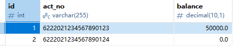

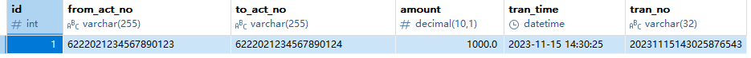

### DeepSeek 生成前端页面

#### 转账页面

```html
<!DOCTYPE html>
<html lang="zh-CN">
<head>
    <meta charset="UTF-8">
    <meta name="viewport" content="width=device-width, initial-scale=1.0">
    <title>银行账户转账</title>
    <style>
        * {
            box-sizing: border-box;
            margin: 0;
            padding: 0;
            font-family: 'Arial', sans-serif;
        }

        body {
            background-color: #f5f7fa;
            display: flex;
            justify-content: center;
            align-items: center;
            min-height: 100vh;
            padding: 20px;
        }

        .container {
            background-color: white;
            border-radius: 10px;
            box-shadow: 0 5px 15px rgba(0, 0, 0, 0.1);
            width: 100%;
            max-width: 500px;
            padding: 30px;
        }

        h1 {
            color: #2c3e50;
            text-align: center;
            margin-bottom: 30px;
            font-size: 24px;
        }

        .form-group {
            margin-bottom: 20px;
        }

        label {
            display: block;
            margin-bottom: 8px;
            color: #34495e;
            font-weight: 600;
        }

        input {
            width: 100%;
            padding: 12px 15px;
            border: 1px solid #ddd;
            border-radius: 6px;
            font-size: 16px;
            transition: border-color 0.3s;
        }

        input:focus {
            border-color: #3498db;
            outline: none;
            box-shadow: 0 0 0 2px rgba(52, 152, 219, 0.2);
        }

        button {
            background-color: #3498db;
            color: white;
            border: none;
            border-radius: 6px;
            padding: 14px;
            width: 100%;
            font-size: 16px;
            font-weight: 600;
            cursor: pointer;
            transition: background-color 0.3s;
            margin-top: 10px;
        }

        button:hover {
            background-color: #2980b9;
        }

        .result {
            margin-top: 20px;
            padding: 15px;
            border-radius: 6px;
            display: none;
        }

        .success {
            background-color: #d4edda;
            color: #155724;
            border: 1px solid #c3e6cb;
        }

        .error {
            background-color: #f8d7da;
            color: #721c24;
            border: 1px solid #f5c6cb;
        }

        .hint {
            font-size: 12px;
            color: #7f8c8d;
            margin-top: 5px;
        }
    </style>
</head>
<body>
<div class="container">
    <h1>银行账户转账</h1>

    <form id="transferForm" method="post">
        <div class="form-group">
            <label for="fromAccount">转出账户</label>
            <input type="text" id="fromAccount" placeholder="请输入转出账户号码" required>
            <div class="hint">例如：6222021234567890123</div>
        </div>

        <div class="form-group">
            <label for="toAccount">转入账户</label>
            <input type="text" id="toAccount" placeholder="请输入转入账户号码" required>
            <div class="hint">例如：6228481234567890123</div>
        </div>

        <div class="form-group">
            <label for="amount">转账金额 (元)</label>
            <input type="number" id="amount" min="0.01" step="0.01" placeholder="请输入转账金额" required>
        </div>

        <button id="transferBtn">确认转账</button>
    </form>

    <div id="resultMessage" class="result"></div>
</div>

<script>
    document.getElementById('transferBtn').addEventListener('click', function(e) {
        e.preventDefault();
        const fromAccount = document.getElementById('fromAccount').value.trim();
        const toAccount = document.getElementById('toAccount').value.trim();
        const amount = parseFloat(document.getElementById('amount').value);

        // 简单验证
        if (!fromAccount || !toAccount || isNaN(amount) || amount <= 0) {
            showResult('请填写完整的转账信息，且金额必须大于0', false);
            return;
        }

        // 验证账户格式（简单验证是否为数字）
        if (!/^\d+$/.test(fromAccount) || !/^\d+$/.test(toAccount)) {
            showResult('账户号码必须为数字', false);
            return;
        }

        // 账户长度验证（通常银行账号16-19位）
        if (fromAccount.length < 16 || fromAccount.length > 19 ||
            toAccount.length < 16 || toAccount.length > 19) {
            showResult('账户号码长度应在16-19位之间', false);
            return;
        }

        if (fromAccount === toAccount) {
            showResult('转出账户和转入账户不能相同', false);
            return;
        }

        // 提交表单
        document.getElementById("transferForm").submit();
    });

    function showResult(message, isSuccess) {
        const resultMessage = document.getElementById('resultMessage');
        resultMessage.textContent = message;
        resultMessage.className = 'result ' + (isSuccess ? 'success' : 'error');
        resultMessage.style.display = 'block';
        // 5秒后自动隐藏消息
        setTimeout(() => {
            resultMessage.style.display = 'none';
        }, 5000);
    }
</script>
</body>
</html>
```

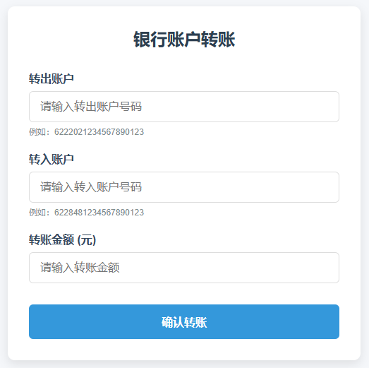

#### 转账成功页面

```html
<!DOCTYPE html>
<html lang="zh-CN">
<head>
    <meta charset="UTF-8">
    <meta name="viewport" content="width=device-width, initial-scale=1.0">
    <title>转账结果</title>
    <style>
        * {
            box-sizing: border-box;
            margin: 0;
            padding: 0;
            font-family: 'Arial', sans-serif;
        }
        
        body {
            background-color: #f5f7fa;
            display: flex;
            justify-content: center;
            align-items: center;
            min-height: 100vh;
            padding: 20px;
        }
        
        .container {
            background-color: white;
            border-radius: 10px;
            box-shadow: 0 5px 15px rgba(0, 0, 0, 0.1);
            width: 100%;
            max-width: 500px;
            padding: 30px;
            text-align: center;
        }
        
        h1 {
            color: #2c3e50;
            margin-bottom: 30px;
            font-size: 24px;
        }
        
        .status-icon {
            font-size: 60px;
            margin-bottom: 20px;
            color: #2ecc71;
        }
        
        .detail-card {
            background-color: #f8f9fa;
            border-radius: 8px;
            padding: 20px;
            margin-bottom: 15px;
            text-align: left;
        }
        
        .detail-row {
            display: flex;
            justify-content: space-between;
            margin-bottom: 12px;
            padding-bottom: 12px;
            border-bottom: 1px solid #eee;
        }
        
        .detail-row:last-child {
            border-bottom: none;
            margin-bottom: 0;
            padding-bottom: 0;
        }
        
        .detail-label {
            color: #7f8c8d;
            font-weight: 500;
        }
        
        .detail-value {
            color: #2c3e50;
            font-weight: 600;
        }
        
        .amount {
            font-size: 24px;
            color: #e74c3c;
            font-weight: 700;
        }
        
        .transaction-number {
            color: #7f8c8d;
            font-size: 14px;
            margin-bottom: 25px;
        }
        
        .continue-btn {
            background-color: #3498db;
            color: white;
            border: none;
            border-radius: 5px;
            padding: 12px 25px;
            font-size: 16px;
            font-weight: 600;
            cursor: pointer;
            width: 100%;
            transition: background-color 0.3s;
        }
        
        .continue-btn:hover {
            background-color: #2980b9;
        }
    </style>
</head>
<body>
    <div class="container">
        <div class="status-icon">✓</div>
        <h1>转账成功</h1>
        
        <div class="detail-card">
            <div class="detail-row">
                <span class="detail-label">转出账户</span>
                <span class="detail-value">****9012</span>
            </div>
            <div class="detail-row">
                <span class="detail-label">转入账户</span>
                <span class="detail-value">****2333</span>
            </div>
            <div class="detail-row">
                <span class="detail-label">转账金额</span>
                <span class="detail-value amount">￥1,500.00</span>
            </div>
            <div class="detail-row">
                <span class="detail-label">转账时间</span>
                <span class="detail-value">2030-11-15 14:30:25</span>
            </div>
        </div>
        
        <div class="transaction-number">交易流水号：20231115143025876543</div>
        <button class="continue-btn">继续转账</button>
    </div>
</body>

</html>
```

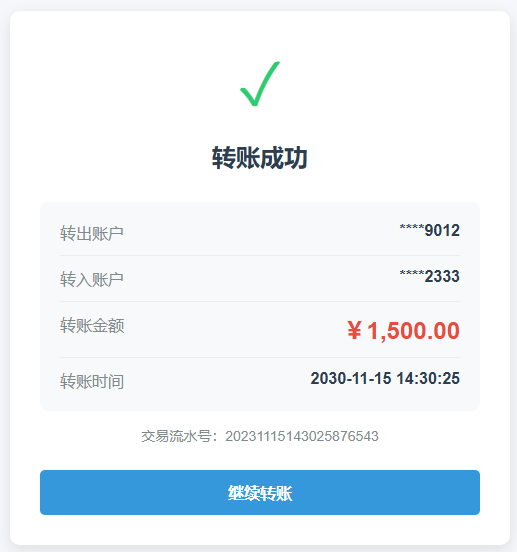

#### 转账失败页面

```html
<!DOCTYPE html>
<html lang="zh-CN">
<head>
    <meta charset="UTF-8">
    <meta name="viewport" content="width=device-width, initial-scale=1.0">
    <title>转账失败</title>
    <style>
        * {
            box-sizing: border-box;
            margin: 0;
            padding: 0;
            font-family: 'Arial', sans-serif;
        }
        
        body {
            background-color: #f5f7fa;
            display: flex;
            justify-content: center;
            align-items: center;
            min-height: 100vh;
            padding: 20px;
        }
        
        .container {
            background-color: white;
            border-radius: 10px;
            box-shadow: 0 5px 15px rgba(0, 0, 0, 0.1);
            width: 100%;
            max-width: 500px;
            padding: 40px;
            text-align: center;
        }
        
        h1 {
            color: #e74c3c;
            margin-bottom: 30px;
            font-size: 28px;
        }
        
        .status-icon {
            font-size: 60px;
            margin-bottom: 25px;
            color: #e74c3c;
        }
        
        .error-message {
            color: #e74c3c;
            font-size: 18px;
            font-weight: 500;
            margin-bottom: 30px;
        }
        
        .continue-btn {
            background-color: #3498db;
            color: white;
            border: none;
            border-radius: 6px;
            padding: 14px;
            width: 100%;
            font-size: 16px;
            font-weight: 600;
            cursor: pointer;
            transition: background-color 0.3s;
        }
        
        .continue-btn:hover {
            background-color: #2980b9;
        }
    </style>
</head>
<body>
    <div class="container">
        <div class="status-icon">✕</div>
        <h1>转账失败</h1>
        <div class="error-message">转账失败原因：账户余额不足</div>
        <button class="continue-btn" onclick="window.location.href='transfer.html'">继续转账</button>
    </div>
</body>
</html>
```

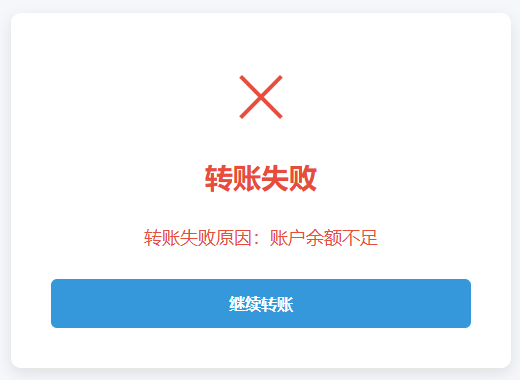

### 项目搭建及准备工作

1. IDEA 中创建一个 java 模块：bank
2. 创建 `web`目录 对 java 模块添加 web 支持
3. 添加 mysql 驱动 jar 包到 WEB-INF/lib
4. 添加 servlet-api.jar 到 classpath
5. 添加 thymeleaf 相关 jar 包
6. 添加日志框架 logback 的 jar 包和日志配置文件 logback.xml
7. 将slf4j-api-2.0.16.jar 和 thymeleaf-3.1.3.RELEASE.jar 加入到 classpath 中
8. 添加 DbUtils 工具类，将`jdbc.properties`添加到类的根路径下
9. 添加监听器完成 thymeleaf 模板引擎的初始化
10. 在 WEB-INF 目录下新建 templates 目录，用来存储 thymeleaf 的模板文件
11. 将 `index.html`、`success.html`、`error.html`拷贝到 templates 目录下
12. 拷贝之前的 `ThymeleafViewServlet`。
13. 拷贝之前的 `IndexServlet`，但 `IndexServlet`中的代码需要修改为如下：

```java
package com.jkweilai.bank.controller;

import jakarta.servlet.ServletException;
import jakarta.servlet.annotation.WebServlet;
import jakarta.servlet.http.HttpServlet;
import jakarta.servlet.http.HttpServletRequest;
import jakarta.servlet.http.HttpServletResponse;

import java.io.IOException;
s
@WebServlet("/index")
public class IndexServlet extends HttpServlet {
    @Override
    protected void doGet(HttpServletRequest request, HttpServletResponse response) throws ServletException, IOException {
        request.setAttribute("template", "index");
        request.getRequestDispatcher("/view").forward(request, response);
    }
}
```

1. 配置欢迎页，达到的效果是访问 `http://localhost:8080/bank`时，显示转账页面。

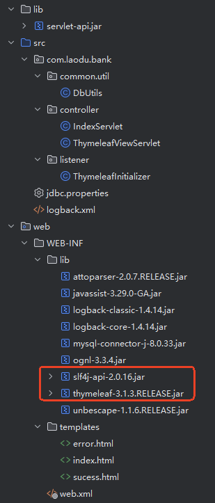

### 添加全局异常处理及日志记录

#### 日志记录

日志记录统一面向 `slf4j`日志门面进行日志记录，`slf4j`日志的实现框架采用 `logback`。

修改 `logback.xml`配置文件，代码如下：

```xml
<configuration>
    <!-- 控制台输出格式简化 -->
    <appender name="CONSOLE" class="ch.qos.logback.core.ConsoleAppender">
        <encoder>
            <pattern>%d{HH:mm:ss} [%thread] %-5level - %msg%n</pattern>
        </encoder>
    </appender>

    <!-- 错误日志单独文件输出:滚动记录，最多保留7天的日志。 -->
    <appender name="ERROR_FILE" class="ch.qos.logback.core.rolling.RollingFileAppender">
        <file>logs/error.log</file>
        <rollingPolicy class="ch.qos.logback.core.rolling.TimeBasedRollingPolicy">
            <fileNamePattern>logs/error.%d{yyyy-MM-dd}.log</fileNamePattern>
            <maxHistory>7</maxHistory>
        </rollingPolicy>
        <encoder>
            <pattern>%d{yyyy-MM-dd HH:mm:ss} [%thread] %-5level %logger{36} - %msg%n</pattern>
        </encoder>
    </appender>

    <!-- Thymeleaf相关日志设置 -->
    <logger name="org.thymeleaf" level="ERROR"/>
    <logger name="org.thymeleaf.TemplateEngine" level="INFO"/>

    <!-- JDBC日志设置：默认Hikari打印日志太多，设置为WARN，只打印重要日志 -->
    <logger name="java.sql" level="WARN"/>
    <logger name="com.zaxxer.hikari" level="WARN"/>

    <!-- 应用包路径日志设置，可以看到自己写的业务逻辑、控制器、服务类的运行情况 -->
    <logger name="com.jkweilai" level="INFO"/>

    <!-- 全局日志级别为：全局日志级别设为 WARN，所有日志同时输出到控制台和错误日志文件 -->
    <root level="WARN">
        <appender-ref ref="CONSOLE"/>
        <appender-ref ref="ERROR_FILE"/>
    </root>
</configuration>
```

日志级别从低到高：TRACE < DEBUG < INFO < WARN < ERROR（越低，信息越详细）

在需要记录日志的类中获取日志记录器对象，通过它可以记录日志：

```java
private static final Logger logger = LoggerFactory.getLogger(当前类的类名.class);
```

#### 自定义数据库访问异常

```java
package com.jkweilai.bank.common.exception;

/**
 * 数据访问层异常（所有数据库相关异常的父类）
 */
public class DataAccessException extends RuntimeException {
    
    private String errorCode;

    public DataAccessException(String message, Throwable cause) {
        super(message, cause);
    }

    public DataAccessException(String errorCode, String message) {
        super(message);
        this.errorCode = errorCode;
    }

    public DataAccessException(String errorCode, String message, Throwable cause) {
        super(message, cause);
        this.errorCode = errorCode;
    }

    public String getErrorCode() {
        return errorCode;
    }
}
```

#### 自定义业务异常

```java
package com.jkweilai.bank.common.exception;

/**
 * 业务异常
 */
public class BusinessException extends RuntimeException {
    private String errorCode;

    public BusinessException(String errorCode, String message) {
        super(message);
        this.errorCode = errorCode;
    }

    public String getErrorCode() {
        return errorCode;
    }
}
```

#### 编写全局异常处理器

web 容器的异常处理流程

异常发生时的容器行为：当应用程序中发生未捕获的异常时，Web 容器（如 Tomcat、Jetty）会：

```java
// 伪代码展示容器的大致处理逻辑
try {
    // 容器调用你的 Servlet
    servlet.service(request, response);
} catch (Throwable t) {
    // 1. 记录错误日志
    containerLogger.error("Servlet执行异常", t);
    
    // 2. 检查web.xml中的error-page配置
    String errorLocation = findErrorPage(t); // servlet/filter
    
    if (errorLocation != null) {
        // 3. 设置错误属性到request中
        request.setAttribute(RequestDispatcher.ERROR_EXCEPTION, t);
        request.setAttribute(RequestDispatcher.ERROR_STATUS_CODE, 500);
        request.setAttribute(RequestDispatcher.ERROR_MESSAGE, t.getMessage());
        
        // 4. 转发到错误处理页面
        request.getRequestDispatcher(errorLocation).forward(request, response);
    } else {
        // 没有配置错误页面，返回默认错误响应
        response.sendError(500, "Internal Server Error");
    }
}
```

因此我们可以编写这样一个全局的异常处理器：

```java
package com.jkweilai.bank.controller;

import com.jkweilai.bank.common.exception.BusinessException;
import com.jkweilai.bank.common.exception.DataAccessException;
import jakarta.servlet.RequestDispatcher;
import jakarta.servlet.ServletException;
import jakarta.servlet.annotation.WebServlet;
import jakarta.servlet.http.HttpServlet;
import jakarta.servlet.http.HttpServletRequest;
import jakarta.servlet.http.HttpServletResponse;
import org.slf4j.Logger;
import org.slf4j.LoggerFactory;

import java.io.IOException;

@WebServlet("/error-handler")
public class GlobalExceptionHandler extends HttpServlet {

    private static final Logger logger = LoggerFactory.getLogger(GlobalExceptionHandler.class);

    @Override
    protected void service(HttpServletRequest request, HttpServletResponse response) throws ServletException, IOException {
        Throwable throwable = (Throwable) request.getAttribute(RequestDispatcher.ERROR_EXCEPTION);
        Integer statusCode = (Integer) request.getAttribute(RequestDispatcher.ERROR_STATUS_CODE);

        if (throwable instanceof BusinessException e) {
            // 业务异常
            logger.warn("转账业务异常: {}", e.getMessage(), e);
            request.setAttribute("errorCode", e.getErrorCode());
            request.setAttribute("errorMessage", e.getMessage());
        } else if (throwable instanceof DataAccessException e) {
            // 数据库访问异常
            logger.error("数据库访问异常", e);
            request.setAttribute("errorCode", "DATABASE_ERROR");
            request.setAttribute("errorMessage", "系统繁忙，请稍后再试");
        } else {
            // 根据状态码定制错误信息
            if (statusCode != null && statusCode == 404) {
                logger.warn("404错误: {}", request.getAttribute(RequestDispatcher.ERROR_REQUEST_URI));
                request.setAttribute("errorCode", "NOT_FOUND");
                request.setAttribute("errorMessage", "请求的资源不存在");
            } else {
                logger.error("系统未知异常", throwable);
                request.setAttribute("errorCode", "SYSTEM_ERROR");
                request.setAttribute("errorMessage", "系统异常，请联系管理员");
            }
        }
        request.setAttribute("template", "error");
        request.getRequestDispatcher("/view").forward(request, response);
    }
}
```

#### 配置全局异常处理器 web.xml

```xml
<error-page>
    <exception-type>java.lang.Throwable</exception-type>
    <location>/error-handler</location>
</error-page>
<error-page>
    <error-code>404</error-code>
    <location>/error-handler</location>
</error-page>
<error-page>
    <error-code>500</error-code>
    <location>/error-handler</location>
</error-page>
```

#### 项目异常处理的最佳实践

在Servlet + Thymeleaf + JDBC的JavaWeb项目中，异常处理的最佳实践可归纳如下：

1. **异常分类与设计**

- **业务异常**（`BusinessException`）：继承`RuntimeException`，用于处理业务规则违规（如余额不足、数据校验失败）
- **数据访问异常**（`DataAccessException`）：封装JDBC/SQL异常，隐藏底层数据库细节
- **系统异常**：非预期的运行时异常（如`NullPointerException`），需记录完整堆栈

1. **分层处理原则**

- **DAO层**：捕获所有`SQLException`，转换为自定义`DataAccessException`
- **Service层**：抛出业务异常，避免处理UI相关逻辑
- **Controller/Servlet层**：捕获异常并转换为用户友好的错误消息

1. **全局异常处理**

- 配置`web.xml`的`<error-page>`，统一处理HTTP错误码（404/500等）
- 实现全局异常过滤器（`Filter`）或Servlet，集中处理未捕获异常
- 通过`request.setAttribute()`传递错误信息到Thymeleaf页面

1. **事务管理**

- 在Service层开启事务，确保异常时回滚（`Connection#setAutoCommit(false)`）
- 避免在`catch`块中吞没异常，需抛出或回滚
- 使用`try-with-resources`确保JDBC资源释放

1. **日志记录规范**

- 用户/运维需要知道的 → `<font style="color:rgb(15, 17, 21);background-color:rgb(235, 238, 242);">INFO</font>`
- 开发排查问题需要的 → `<font style="color:rgb(15, 17, 21);background-color:rgb(235, 238, 242);">DEBUG</font>`
- 有问题但还能继续运行的 → `<font style="color:rgb(15, 17, 21);background-color:rgb(235, 238, 242);">WARN</font>`
- 无法继续运行的错误 → `<font style="color:rgb(15, 17, 21);background-color:rgb(235, 238, 242);">ERROR</font>`

### 编写 DTO

根据表单项提取 DTO：AccountDTO

属性包括：转出账户 fromActNo、转入账户 toActNo、转账金额 amount

```java
package com.jkweilai.bank.dto;

import java.math.BigDecimal;

public class AccountDTO {
    private String fromActNo;
    private String toActNo;
    private BigDecimal amount;

    public AccountDTO() {
    }

    public AccountDTO(String fromActNo, String toActNo, BigDecimal amount) {
        this.fromActNo = fromActNo;
        this.toActNo = toActNo;
        this.amount = amount;
    }

    public String getFromActNo() {
        return fromActNo;
    }

    public void setFromActNo(String fromActNo) {
        this.fromActNo = fromActNo;
    }

    public String getToActNo() {
        return toActNo;
    }

    public void setToActNo(String toActNo) {
        this.toActNo = toActNo;
    }

    public BigDecimal getAmount() {
        return amount;
    }

    public void setAmount(BigDecimal amount) {
        this.amount = amount;
    }
}
```

### 编写 VO

根据页面的展示来编写 VO：AccountVO

属性包括：转出账户，转入账户，转账金额，转账时间，交易流水号

```java
package com.jkweilai.bank.vo;

import java.math.BigDecimal;
import java.time.LocalDateTime;

public class AccountVO {
    private String fromActNo;
    private String toActNo;
    private BigDecimal amount;
    private LocalDateTime tranTime;
    private String tranNo;

    public AccountVO() {
    }

    public AccountVO(String fromActNo, String toActNo, BigDecimal amount, LocalDateTime tranTime, String tranNo) {
        this.fromActNo = fromActNo;
        this.toActNo = toActNo;
        this.amount = amount;
        this.tranTime = tranTime;
        this.tranNo = tranNo;
    }

    public String getFromActNo() {
        return fromActNo;
    }

    public void setFromActNo(String fromActNo) {
        this.fromActNo = fromActNo;
    }

    public String getToActNo() {
        return toActNo;
    }

    public void setToActNo(String toActNo) {
        this.toActNo = toActNo;
    }

    public BigDecimal getAmount() {
        return amount;
    }

    public void setAmount(BigDecimal amount) {
        this.amount = amount;
    }

    public LocalDateTime getTranTime() {
        return tranTime;
    }

    public void setTranTime(LocalDateTime tranTime) {
        this.tranTime = tranTime;
    }

    public String getTranNo() {
        return tranNo;
    }

    public void setTranNo(String tranNo) {
        this.tranNo = tranNo;
    }
}
```

### 编写 Entity

实体类和数据库表对应即可，两个实体类：Account、Tran

```java
package com.jkweilai.bank.entity;

import java.math.BigDecimal;

public class Account {
    private Integer id;
    private String actNo;
    private BigDecimal balance;

    public Account() {
    }

    public Account(Integer id, String actNo, BigDecimal balance) {
        this.id = id;
        this.actNo = actNo;
        this.balance = balance;
    }

    public Integer getId() {
        return id;
    }

    public void setId(Integer id) {
        this.id = id;
    }

    public String getActNo() {
        return actNo;
    }

    public void setActNo(String actNo) {
        this.actNo = actNo;
    }

    public BigDecimal getBalance() {
        return balance;
    }

    public void setBalance(BigDecimal balance) {
        this.balance = balance;
    }
}
```

```java
package com.jkweilai.bank.entity;

import java.math.BigDecimal;
import java.time.LocalDateTime;

public class Tran {
    private Integer id;
    private String fromActNo;
    private String toActNo;
    private BigDecimal amount;
    private LocalDateTime tranTime;
    private String tranNo;

    public Tran() {
    }

    public Tran(Integer id, String fromActNo, String toActNo, BigDecimal amount, LocalDateTime tranTime, String tranNo) {
        this.id = id;
        this.fromActNo = fromActNo;
        this.toActNo = toActNo;
        this.amount = amount;
        this.tranTime = tranTime;
        this.tranNo = tranNo;
    }

    public Integer getId() {
        return id;
    }

    public void setId(Integer id) {
        this.id = id;
    }

    public String getFromActNo() {
        return fromActNo;
    }

    public void setFromActNo(String fromActNo) {
        this.fromActNo = fromActNo;
    }

    public String getToActNo() {
        return toActNo;
    }

    public void setToActNo(String toActNo) {
        this.toActNo = toActNo;
    }

    public BigDecimal getAmount() {
        return amount;
    }

    public void setAmount(BigDecimal amount) {
        this.amount = amount;
    }

    public LocalDateTime getTranTime() {
        return tranTime;
    }

    public void setTranTime(LocalDateTime tranTime) {
        this.tranTime = tranTime;
    }

    public String getTranNo() {
        return tranNo;
    }

    public void setTranNo(String tranNo) {
        this.tranNo = tranNo;
    }
}
```

### 编写 DAO

DAO 在编写的时候，一般一个 DAO 接口对应一张表。

DAO 接口中的方法名在起名的时候一般带有：select、insert、delete、update 单词。

#### 编写 AccountDao 接口

转账的过程中需要：

1. 根据账号查询账户，因为要看余额是否充足。
2. 转账时需要修改账户余额，因此要更新账户信息。

```java
package com.jkweilai.bank.dao;

import com.jkweilai.bank.entity.Account;

public interface AccountDao {
    Account selectByActNo(String actNo);
    int updateByActNo(Account account);
}
```

#### 编写 AccountDao 接口的实现类

```java
package com.jkweilai.bank.dao.impl;

import com.jkweilai.bank.common.exception.BusinessException;
import com.jkweilai.bank.common.exception.DataAccessException;
import com.jkweilai.bank.common.util.DbUtils;
import com.jkweilai.bank.dao.AccountDao;
import com.jkweilai.bank.entity.Account;

import java.sql.Connection;
import java.sql.PreparedStatement;
import java.sql.ResultSet;
import java.sql.SQLException;

public class AccountDaoImpl implements AccountDao {
    @Override
    public Account selectByActNo(String actNo) {
        Connection conn = null;
        PreparedStatement ps = null;
        ResultSet rs = null;
        Account account = null;
        try {
            conn = DbUtils.getConnection();
            String sql = "select * from t_act where act_no = ?";
            ps = conn.prepareStatement(sql);
            ps.setString(1, actNo);
            rs = ps.executeQuery();
            if (rs.next()) {
                account = new Account();
                account.setId(rs.getInt("id"));
                account.setActNo(rs.getString("act_no"));
                account.setBalance(rs.getBigDecimal("balance"));
            }else {
                throw new BusinessException("ACCOUNT_NOT_FOUND", actNo + " not found");
            }
        } catch (SQLException e) {
            throw new DataAccessException("数据库访问失败", e);
        } finally {
            DbUtils.close(conn, ps, rs);
        }
        return account;
    }

    @Override
    public int updateByActNo(Account account) {
        Connection conn = null;
        PreparedStatement ps = null;
        int count = 0;
        try {
            conn = DbUtils.getConnection();
            String sql = "update t_act set balance = ? where act_no = ?";
            ps = conn.prepareStatement(sql);
            ps.setBigDecimal(1, account.getBalance());
            ps.setString(2, account.getActNo());
            count = ps.executeUpdate();
            if (count != 1) {
                throw new BusinessException("ACCOUNT_UPDATE_FAIL", account.getActNo() + " update failed");
            }
        } catch (SQLException e) {
            throw new DataAccessException("数据库访问失败", e);
        } finally {
            DbUtils.close(conn, ps, null);
        }
        return count;
    }
}
```

#### 编写 TranDao 接口

转账时要生成一条交易记录，因此需要向交易表中插入一条记录：

```java
package com.jkweilai.bank.dao;

import com.jkweilai.bank.entity.Tran;

public interface TranDao {
    int insert(Tran tran);
}
```

#### 编写 TranDao 接口的实现类

```java
package com.jkweilai.bank.dao.impl;

import com.jkweilai.bank.common.exception.BusinessException;
import com.jkweilai.bank.common.exception.DataAccessException;
import com.jkweilai.bank.common.util.DbUtils;
import com.jkweilai.bank.dao.TranDao;
import com.jkweilai.bank.entity.Tran;

import java.sql.Connection;
import java.sql.PreparedStatement;
import java.sql.SQLException;
import java.sql.Timestamp;

public class TranDaoImpl implements TranDao {
    @Override
    public int insert(Tran tran) {
        Connection conn = null;
        PreparedStatement ps = null;
        int count = 0;
        try {
            conn = DbUtils.getConnection();
            String sql = "insert into t_tran(from_act_no,to_act_no,amount,tran_time,tran_no) values(?,?,?,?,?)";
            ps = conn.prepareStatement(sql);
            ps.setString(1, tran.getFromActNo());
            ps.setString(2, tran.getToActNo());
            ps.setBigDecimal(3, tran.getAmount());
            ps.setTimestamp(4, Timestamp.valueOf(tran.getTranTime()));
            ps.setString(5, tran.getTranNo());
            count = ps.executeUpdate();
            if (count != 1) {
                throw new BusinessException("SAVE_TRAN_FAIL", "保存交易记录失败");
            }
        } catch (SQLException e) {
            throw new DataAccessException("SAVE_TRAN_FAIL", "保存交易记录失败");
        } finally {
            DbUtils.close(conn, ps, null);
        }
        return count;
    }
}
```

### 编写 Service

#### 交易号生成工具

```java
package com.jkweilai.bank.common.util;

import java.text.SimpleDateFormat;
import java.util.Date;
import java.util.concurrent.atomic.AtomicLong;

public class TranNoGenerator {
    
    private static final AtomicLong counter = new AtomicLong(0);

    public static synchronized String generate() {
        SimpleDateFormat sdf = new SimpleDateFormat("yyyyMMddHHmmssSSS");
        String timePart = sdf.format(new Date());
        long count = counter.incrementAndGet() % 10000;
        return timePart + String.format("%04d", count);
    }

}
```

#### 编写 AccountService 接口

业务接口中的方法名应该带有业务色彩，例如转账：transfer

```java
package com.jkweilai.bank.service;

import com.jkweilai.bank.dto.AccountDTO;
import com.jkweilai.bank.entity.Tran;

public interface AccountService {
    Tran transfer(AccountDTO accountDTO);
}
```

#### 编写 AccountService 接口的实现类

**提示：一定要在 service 的转账业务方法中控制事务！！！！（控制事务都在业务层完成，因为一个事务对应一个完整的业务！！！）**

```java
package com.jkweilai.bank.service.impl;

import com.jkweilai.bank.common.exception.BusinessException;
import com.jkweilai.bank.common.exception.DataAccessException;
import com.jkweilai.bank.common.util.DbUtils;
import com.jkweilai.bank.common.util.TranNoGenerator;
import com.jkweilai.bank.dao.AccountDao;
import com.jkweilai.bank.dao.TranDao;
import com.jkweilai.bank.dao.impl.AccountDaoImpl;
import com.jkweilai.bank.dao.impl.TranDaoImpl;
import com.jkweilai.bank.dto.AccountDTO;
import com.jkweilai.bank.entity.Account;
import com.jkweilai.bank.entity.Tran;
import com.jkweilai.bank.service.AccountService;
import org.slf4j.Logger;
import org.slf4j.LoggerFactory;

import java.sql.Connection;
import java.sql.SQLException;
import java.time.LocalDateTime;

public class AccountServiceImpl implements AccountService {

    private static final Logger logger = LoggerFactory.getLogger(AccountServiceImpl.class);

    private AccountDao accountDao = new AccountDaoImpl();
    private TranDao tranDao = new TranDaoImpl();

    @Override
    public Tran transfer(AccountDTO accountDTO) {
        // 添加日志记录转账开始
        logger.info("开始处理转账业务，转出账户: {}, 转入账户: {}, 金额: {}", accountDTO.getFromActNo(), accountDTO.getToActNo(), accountDTO.getAmount());

        Tran tran = null;
        Connection conn = null;
        try {
            conn = DbUtils.getConnection();
            // 开启事务
            conn.setAutoCommit(false);

            // 1. 查询转出账户
            Account fromAct = accountDao.selectByActNo(accountDTO.getFromActNo());
            logger.debug("转出账户查询结果: {}", fromAct);

            // 2. 检查余额是否充足
            if (fromAct.getBalance().compareTo(accountDTO.getAmount()) < 0) {
                logger.warn("账户余额不足，转出账户: {}, 当前余额: {}, 转账金额: {}", accountDTO.getFromActNo(), fromAct.getBalance(), accountDTO.getAmount());
                throw new BusinessException("BALANCE_NOT_ENOUGH", "余额不足");
            }

            // 3. 查询转入账户
            Account toAct = accountDao.selectByActNo(accountDTO.getToActNo());
            logger.debug("转入账户查询结果: {}", toAct);

            // 4. 更新账户余额
            fromAct.setBalance(fromAct.getBalance().subtract(accountDTO.getAmount()));
            toAct.setBalance(toAct.getBalance().add(accountDTO.getAmount()));

            // 5. 更新数据库
            int count = accountDao.updateByActNo(fromAct);
            count += accountDao.updateByActNo(toAct);

            // 6. 插入交易记录
            tran = new Tran(null, accountDTO.getFromActNo(), accountDTO.getToActNo(), accountDTO.getAmount(), LocalDateTime.now(), TranNoGenerator.generate());
            count += tranDao.insert(tran);
            logger.debug("交易记录生成: {}", tran);

            if (count != 3) {
                logger.error("数据库操作数量异常，预期3条，实际{}条", count);
                throw new BusinessException("TRANSACTION_FAILED", "数据库操作异常");
            }

            // 提交事务
            conn.commit();
            logger.info("转账业务处理成功，交易单号: {}", tran.getTranNo());
        } catch (BusinessException e) {
            // 业务异常直接抛出，不需要回滚（因为已经由调用方处理）
            logger.warn("转账业务异常: {}", e.getMessage());
            throw e;
        } catch (DataAccessException e) {
            // 数据库异常回滚并包装
            logger.error("数据库操作异常", e);
            try {
                if (conn != null) {
                    conn.rollback();
                }
            } catch (SQLException ex) {
                logger.error("事务回滚失败", ex);
                throw new DataAccessException("ROLLBACK_FAILED", "事务回滚失败", ex);
            }
            throw e;
        } catch (Exception e) {
            // 其他未知异常
            logger.error("转账处理发生未知异常", e);
            try {
                if (conn != null) {
                    conn.rollback();
                }
            } catch (SQLException ex) {
                logger.error("事务回滚失败", ex);
                throw new DataAccessException("ROLLBACK_FAILED", "事务回滚失败", ex);
            }
            throw new BusinessException("TRANSFER_FAILED", "转账处理失败");
        } finally {
            DbUtils.close(conn, null, null);
        }
        return tran;
    }
}
```

### 编写 Controller

编写 `AccountController`，它是 Servlet，需要继承 `HttpServlet`，重写 `doPost`方法：

```java
package com.jkweilai.bank.controller;

import com.jkweilai.bank.dto.AccountDTO;
import com.jkweilai.bank.entity.Tran;
import com.jkweilai.bank.service.AccountService;
import com.jkweilai.bank.service.impl.AccountServiceImpl;
import com.jkweilai.bank.vo.AccountVO;
import jakarta.servlet.ServletException;
import jakarta.servlet.annotation.WebServlet;
import jakarta.servlet.http.HttpServlet;
import jakarta.servlet.http.HttpServletRequest;
import jakarta.servlet.http.HttpServletResponse;
import org.slf4j.Logger;
import org.slf4j.LoggerFactory;

import java.io.IOException;
import java.math.BigDecimal;

@WebServlet("/transfer")
public class AccountController extends HttpServlet {
    private static final Logger logger = LoggerFactory.getLogger(AccountController.class);
    private AccountService accountService = new AccountServiceImpl();

    @Override
    protected void doPost(HttpServletRequest request, HttpServletResponse response) throws ServletException, IOException {
        // 记录请求开始
        logger.info("接收到转账请求: fromActNo={}, toActNo={}, amount={}", request.getParameter("fromActNo"), request.getParameter("toActNo"), request.getParameter("amount"));

        // 1. 获取并验证参数
        String fromActNo = request.getParameter("fromActNo");
        String toActNo = request.getParameter("toActNo");
        BigDecimal amount = new BigDecimal(request.getParameter("amount"));

        // 2. 封装DTO
        AccountDTO accountDTO = new AccountDTO(fromActNo, toActNo, amount);

        // 3. 调用服务层进行转账
        Tran tran = accountService.transfer(accountDTO);
        logger.info("转账成功，交易单号: {}", tran.getTranNo());

        // 4. 封装VO对象
        AccountVO accountVO = new AccountVO("****" + fromActNo.substring(fromActNo.length() - 4), "****" + toActNo.substring(toActNo.length() - 4), amount, tran.getTranTime(), tran.getTranNo());

        // 5. 设置请求属性
        request.setAttribute("account", accountVO);
        request.setAttribute("template", "success");

        // 转发请求
        request.getRequestDispatcher("/view").forward(request, response);
    }
}
```

### 修改页面代码

所有页面添加：

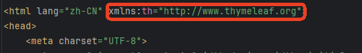

#### index.html

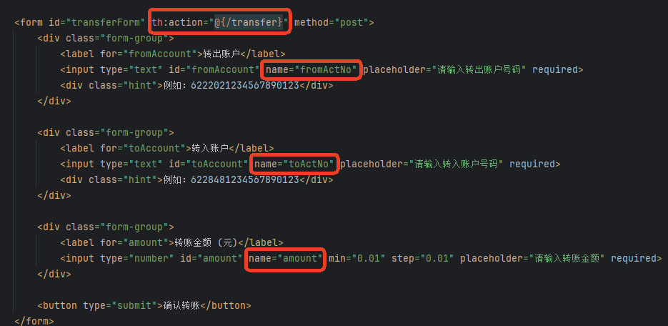

提醒：表单提交方式为 post 方式。

#### success.html

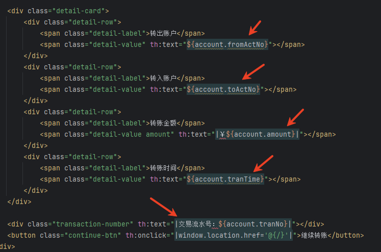

#### error.html

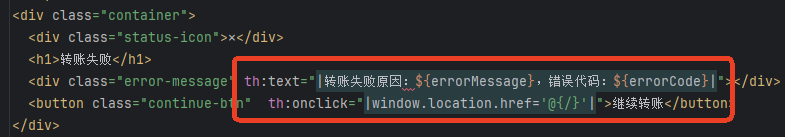

### 测试

到此为止，已经实现了基本的转账逻辑。

## 事务问题

1. 在更新转出账户和转入账户之间模拟异常，你会发现数据库中的钱丢了。

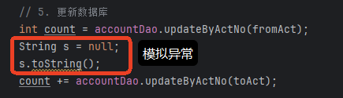

1. 什么原因导致钱丢了？
  1. 在 service 中多次使用 dao，而目前 dao 中任意一个方法只要执行一次就会开启一个新的连接对象，开启一个新的事务。导致 service 方法从开始执行到最终结束，是多个事务，而不是一个事务。
  2. JDBC 默认情况下，如果没有关闭自动提交机制的话，只要执行一条 DML 语句就会自动提交一次。
2. 怎么解决事务问题？
  1. 必须保证在同一个线程中 service 和 dao 中的 Connection 对象是同一个。

## ThreadLocal 解决事务问题

要保证在同一个线程中 service 和 dao 中的 Connection 对象是同一个，可以使用 JDK 提供的 `java.lang.ThreadLocal`。

`ThreadLocal`的作用是：在同一个线程中共享同一个 Java 对象。常用方法三个：

```java
// 向当前线程绑定数据data
void set(Object data);

// 获取当前线程中绑定的数据data
Object get();

// 删除当前线程中绑定的数据data
void remove();
```

因此我们需要修改 `DbUtils`工具类，修改获取连接对象的逻辑。代码如下：

```java
package com.jkweilai.bank.common.util;

import java.sql.*;
import java.util.ResourceBundle;

public class DbUtils {
    private static String url;
    private static String user;
    private static String password;
    private static ThreadLocal<Connection> local = new ThreadLocal<>();

    static {
        // 读取属性资源文件
        ResourceBundle bundle = ResourceBundle.getBundle("jdbc");
        String driver = bundle.getString("driver");
        url = bundle.getString("url");
        user = bundle.getString("user");
        password = bundle.getString("password");
        // 注册驱动
        try {
            Class.forName(driver);
        } catch (ClassNotFoundException e) {
            throw new RuntimeException(e);
        }
    }

    public static Connection getConnection() throws SQLException {
        Connection conn = local.get();
        if (conn == null) {
            conn = DriverManager.getConnection(url, user, password);
            local.set(conn);
        }
        return conn;
    }

    public static void close(Connection conn, Statement stmt, ResultSet rs) {
        if (rs != null) {
            try {
                rs.close();
            } catch (SQLException e) {
                throw new RuntimeException(e);
            }
        }
        if (stmt != null) {
            try {
                stmt.close();
            } catch (SQLException e) {
                throw new RuntimeException(e);
            }
        }
        if (conn != null) {
            try {
                conn.close();
                // 关闭连接对象移除绑定
                local.remove();
            } catch (SQLException e) {
                throw new RuntimeException(e);
            }
        }
    }
}
```

所有 DAO 中的方法结束时，不能关闭 Connection 对象：

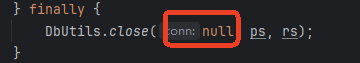

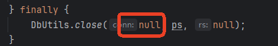

再次进行测试，你会发现，发生异常之后，数据安全了，事务得到了控制，如果不发生异常，则可以正常完成转账。

## MVC架构模式（Java后端视角）

### MVC是什么

MVC（Model-View-Controller）是一种软件架构模式，它将应用程序分为三个核心组件：

1. **Model（模型）**：只收集数据和业务逻辑处理，不关心数据如何展示
  - 在Java Web应用中，通常包含POJO（Plain Old Java Object）、Service层、DAO层等
2. **View（视图）**：只负责数据展示，不负责数据的收集与业务逻辑处理
  - 在Servlet+Thymeleaf中，Thymeleaf模板就是View层
3. **Controller（控制器）**：接收用户请求并协调Model和View
  - Servlet就是Controller的一种实现
  - 处理HTTP请求，调用适当的业务逻辑，决定返回哪个视图

### MVC的工作流程

1. 用户发起HTTP请求 → Web服务器接收请求
2. 根据URL映射到对应的Servlet（Controller）
3. Controller 处理请求：Controller解析参数，调用Service层（Model）处理业务逻辑，将结果数据绑定到域对象
4. Controller 调用Thymeleaf模板（View）,Thymeleaf引擎渲染模板，生成HTML响应，服务器返回HTML给客户端

### MVC的好处

1. **关注点分离**：各组件职责单一，便于维护
  - 修改界面不影响业务逻辑
  - 修改业务逻辑不影响界面
2. **提高可维护性**：代码结构清晰，易于理解和修改
3. **便于团队协作**：
  - 前端开发者专注于View
  - 后端开发者专注于Model和Controller
4. **可重用性**：
  - 同一个Model可以被多个View使用
  - 业务逻辑可以复用
5. **易于测试**：各组件可以独立测试

### MVC与三层架构的区别

| **维度** | **MVC** | **三层架构** |
| --- | --- | --- |
| 关注点 | 关注的是表现层的架构 | 关注的是整个应用的层次划分 |
| 适用范围 | 属于前端的软件设计模式 | 用于整个应用程序的架构模式 |
| 层次关系 | 存在于三层架构的表示层中 | 三层架构包含 MVC |

### MVC 与三层架构的联系

1. MVC通常实现于三层架构的**表示层**中：
  - Controller和View属于表示层
  - Model可能包含业务逻辑层和数据访问层
2. 在实际Java Web应用中，通常结合使用：

```plaintext
三层架构
├── 表示层 (MVC)
│   ├── Controller (Servlet)
│   ├── View (Thymeleaf)
│   └── Model (DTO/VO)
├── 业务逻辑层 (Service)
└── 数据访问层 (DAO/Repository)
```

1. MVC的Model在三层架构中可能对应业务逻辑层+数据访问层

# 关于路径的总结及作业


1. 前端发送请求的路径：以 `/`开始，添加项目名。
2. `web.xml`中 `<url-pattern>` 配置的路径：以 `/` 开始，不添加项目名。
3. `String realPath = application.getRealPath("/WEB-INF/web.xml");` 以 `/` 开始，不添加项目名
4. `InputStream in = application.getResourceAsStream("/WEB-INF/web.xml");` 以 `/` 开始，不添加项目名
5. 欢迎页面：不以 `/` 开始。从项目的根路径下开始加载。
6. 转发路径：以 `/`开始，不添加项目名。
7. 重定向路径：以 `/`开始，添加项目名。

作业：将部门管理系统修改为三层架构+MVC 架构，加入异常处理机制，优化项目。

# 关于 Tomcat 标准输出流乱码问题

**当前环境信息如下：**

1. win10 简体中文环境
2. Tomcat 版本： 10.1.48
3. IDEA 版本：2025.2.2
4. JDK 版本：21

**前提是：**

1. IDEA 工具所有涉及到字符编码配置方面都已经配置了 UTF-8
2. Tomcat 服务器的 config/logging.properties 中的字符编码方式也都配置了 UTF-8

**问题是：**在这种情况下，在 Servlet 中使用 `System.out.println()`打印中文时仍然会出现乱码。

**什么原因？**

- 根本原因：Tomcat容器的标准输出流(System.out)编码与IDEA控制台显示编码不一致。
- 具体来说：Tomcat的System.out默认使用GBK编码输出，IDEA控制台期望接收UTF-8编码的文本，编码不匹配导致中文显示为乱码。
- 在 `<font style="color:rgb(15, 17, 21);">Servlet</font>`程序中可以通过 `**<font style="color:#DF2A3F;">System.out.charset()</font>**`**方法**来获取 Tomcat 容器的标准输出流的字符编码方式，结果是 GBK。

**怎么解决？在 Tomcat 服务器的 **`**VM options**`**配置中添加这个配置：**-Dstdout.encoding=UTF-8


# 附录：HTTP状态信息


## 1xx: 信息

| **消息** | **描述** |
| --- | --- |
| 100 Continue | 服务器仅接收到部分请求，但是一旦服务器并没有拒绝该请求，客户端应该继续发送其余的请求。 |
| 101 Switching Protocols | 服务器转换协议：服务器将遵从客户的请求转换到另外一种协议。 |

## 2xx: 成功

| **消息** | **描述** |
| --- | --- |
| 200 OK | 请求成功（其后是对GET和POST请求的应答文档。） |
| 201 Created | 请求被创建完成，同时新的资源被创建。 |
| 202 Accepted | 供处理的请求已被接受，但是处理未完成。 |
| 203 Non-authoritative Information | 文档已经正常地返回，但一些应答头可能不正确，因为使用的是文档的拷贝。 |
| 204 No Content | 没有新文档。浏览器应该继续显示原来的文档。如果用户定期地刷新页面，而Servlet可以确定用户文档足够新，这个状态代码是很有用的。 |
| 205 Reset Content | 没有新文档。但浏览器应该重置它所显示的内容。用来强制浏览器清除表单输入内容。 |
| 206 Partial Content | 客户发送了一个带有Range头的GET请求，服务器完成了它。 |

## 3xx: 重定向

| **消息** | **描述** |
| --- | --- |
| 300 Multiple Choices | 多重选择。链接列表。用户可以选择某链接到达目的地。最多允许五个地址。 |
| 301 Moved Permanently | 所请求的页面已经转移至新的url。 |
| 302 Found | 所请求的页面已经临时转移至新的url。 |
| 303 See Other | 所请求的页面可在别的url下被找到。 |
| 304 Not Modified | 未按预期修改文档。客户端有缓冲的文档并发出了一个条件性的请求（一般是提供If-Modified-Since头表示客户只想比指定日期更新的文档）。服务器告诉客户，原来缓冲的文档还可以继续使用。 |
| 305 Use Proxy | 客户请求的文档应该通过Location头所指明的代理服务器提取。 |
| 306 *Unused* | 此代码被用于前一版本。目前已不再使用，但是代码依然被保留。 |
| 307 Temporary Redirect | 被请求的页面已经临时移至新的url。 |

## 4xx: 客户端错误

| **消息** | **描述** |
| --- | --- |
| 400 Bad Request | 服务器未能理解请求。 |
| 401 Unauthorized | 被请求的页面需要用户名和密码。 |
| 402 Payment Required | 此代码尚无法使用。 |
| 403 Forbidden | 对被请求页面的访问被禁止。 |
| 404 Not Found | 服务器无法找到被请求的页面。 |
| 405 Method Not Allowed | 请求中指定的方法不被允许。 |
| 406 Not Acceptable | 服务器生成的响应无法被客户端所接受。 |
| 407 Proxy Authentication Required | 用户必须首先使用代理服务器进行验证，这样请求才会被处理。 |
| 408 Request Timeout | 请求超出了服务器的等待时间。 |
| 409 Conflict | 由于冲突，请求无法被完成。 |
| 410 Gone | 被请求的页面不可用。 |
| 411 Length Required | "Content-Length" 未被定义。如果无此内容，服务器不会接受请求。 |
| 412 Precondition Failed | 请求中的前提条件被服务器评估为失败。 |
| 413 Request Entity Too Large | 由于所请求的实体的太大，服务器不会接受请求。 |
| 414 Request-url Too Long | 由于url太长，服务器不会接受请求。当post请求被转换为带有很长的查询信息的get请求时，就会发生这种情况。 |
| 415 Unsupported Media Type | 由于媒介类型不被支持，服务器不会接受请求。 |
| 416 | 服务器不能满足客户在请求中指定的Range头。 |
| 417 Expectation Failed |   |

## 5xx: 服务器错误

| **消息** | **描述** |
| --- | --- |
| 500 Internal Server Error | 请求未完成。服务器遇到不可预知的情况。 |
| 501 Not Implemented | 请求未完成。服务器不支持所请求的功能。 |
| 502 Bad Gateway | 请求未完成。服务器从上游服务器收到一个无效的响应。 |
| 503 Service Unavailable | 请求未完成。服务器临时过载或当机。 |
| 504 Gateway Timeout | 网关超时。 |
| 505 HTTP Version Not Supported | 服务器不支持请求中指明的HTTP协议版本。 |