# 3.AJAX、Axios

# 传统请求及缺点


## 如何发送传统请求

1. 直接在浏览器地址栏上输入URL。
2. 点击超链接
3. 提交form表单
4. 使用JS代码发送请求
  1. window.open(url)
  2. document.location.href = url
  3. window.location.href = url
  4. ....

## 传统请求存在的问题

1. 页面全部刷新导致了用户的体验较差。
2. 传统的请求导致用户的体验有空白期。（用户的体验是不连贯的）

以下是传统请求示意图：

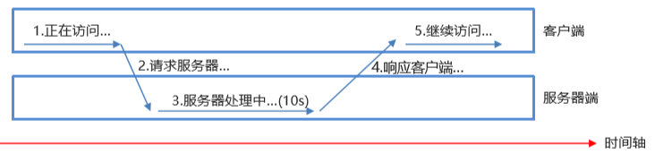

# 初识 AJAX


## AJAX 概述

1. AJAX：Asynchronous Javascript And XML（异步的 JavaScript 和 XML）
2. AJAX不能称为一种技术，它是多种技术的综合产物。
3. AJAX可以让浏览器发送一种特殊的请求，这种请求可以是：异步的。
4. AJAX代码属于WEB前端的JS代码。和后端的java没有关系，后端也可以是php语言，也可以是C语言。
5. AJAX 应用程序可能使用 XML 来传输数据，但将数据作为纯文本或 JSON 文本传输在现代开发中比较常见。
6. AJAX可以更新网页的部分，而不需要重新加载整个页面。（页面局部刷新）
7. AJAX可以做到在同一个网页中同时启动多个请求，类似于在同一个网页中启动“多线程”，一个“线程”一个“请求”。

以下是 AJAX 请求示意图：

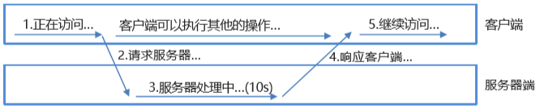

## AJAX 的实现方式

- **传统方式**：XMLHttpRequest (XHR)
- **现代方式**：Fetch API
- **第三库方式**：Axios 等

# XHR 实现 AJAX


## XMLHttpRequest 概述

1. 浏览器原生 API，1999 年 IE5 引入。
2. XMLHttpRequest对象是传统 AJAX 的核心对象，通过它可以发送请求以及接收服务器数据的返回。
3. XMLHttpRequest对象，现代浏览器都是支持的，都内置了该对象。直接用即可。
4. 创建XMLHttpRequest对象

```javascript
const xhr = new XMLHttpRequest();
```

## XMLHttpRequest对象的方法

| **方法** | **描述** |
| --- | --- |
| abort() | 取消当前请求 |
| getAllResponseHeaders() | 返回头部信息 |
| getResponseHeader() | 返回特定的头部信息 |
| **open(*****method*****, *****url*****, *****async*****, *****user*****, *****psw*****)** | method：请求类型 GET 或 POST url：请求路径 async：true（异步）或 false（同步） user：可选的用户名称 psw：可选的密码 |
| **send()** | 发送请求，适合 GET 请求。 |
| **send(*****string*****)** | 发送请求，并携带数据，适合 POST 请求，数据将在请求体当中发送。 |
| **setRequestHeader()** | 设置请求头 |

## XMLHttpRequest对象的属性

| **属性** | **描述** |
| --- | --- |
| onreadystatechange | 定义当 readyState 属性发生变化时被调用的函数 |
| **onload** | 请求成功完成时触发。但这个响应的结果可能是 200，可能是 404，也可能是 500 等。只要这一次请求完整的结束了，不管报错不报错，onload 会触发。 |
| **onerror** | onerror 只在网络层面的请求失败时触发（如无法连接服务器、DNS解析失败、CORS错误等），而不会在HTTP状态码错误（如404、500）时触发。 |
| ontimeout | 请求超时时触发，需要先设置超时时间：xhr.timeout = 5000; // 5 秒超时 超时后请求会自动终止，触发ontimeout后不会再触发onload或onerror |
| readyState | 保存 XMLHttpRequest 的状态： 0：请求未初始化 1：服务器连接已建立 2：请求已收到 3：正在处理请求 4：请求已完成且响应已就绪 |
| **responseText** | 以字符串返回响应数据 |
| responseXML | 以 XML 数据返回响应数据 |
| **status** | 返回请求的状态号 200: "OK" 403: "Forbidden" 404: "Not Found" 500："服务器内部错误" |
| statusText | 返回状态文本（比如 "OK" 或 "Not Found"） |

关于 `XMLHttpRequest`对象的使用，可参考官方文档：[**MDN Web Docs**](https://developer.mozilla.org/en-US/docs/Web/API/XMLHttpRequest)

## XHR 发送 GET 请求

功能描述：用户在注册页面上输入用户名 ，失去焦点后发送 AJAX 请求，验证用户名是否可用。

### 准备页面

```html
<!DOCTYPE html>
<html lang="zh-CN">
<head>
    <meta charset="UTF-8">
    <meta name="viewport" content="width=device-width, initial-scale=1.0">
    <title>用户名验证</title>
    <style>
        body {
                        font-family: 'Roboto', 'Microsoft YaHei', sans-serif;
                        background-color: #f5f5f5;
                        margin: 0;
                        padding: 0;
                        display: flex;
                        justify-content: center;
                        align-items: center;
                        min-height: 100vh;
                        color: #333;
                }

                .container {
                        background-color: white;
                        border-radius: 10px;
                        box-shadow: 0 4px 15px rgba(0, 0, 0, 0.1);
                        padding: 30px;
                        width: 100%;
                        max-width: 400px;
                        transition: all 0.3s ease;
                }

                h1 {
                        text-align: center;
                        color: #2c3e50;
                        margin-bottom: 30px;
                }

                .form-group {
                        margin-bottom: 20px;
                }

                label {
                        display: block;
                        margin-bottom: 8px;
                        font-weight: 500;
                        color: #2c3e50;
                }

                input[type="text"] {
                        width: 100%;
                        padding: 12px 15px;
                        border: 1px solid #ddd;
                        border-radius: 6px;
                        font-size: 16px;
                        transition: border 0.3s, box-shadow 0.3s;
                        box-sizing: border-box;
                }

                input[type="text"]:focus {
                        border-color: #3498db;
                        box-shadow: 0 0 0 3px rgba(52, 152, 219, 0.2);
                        outline: none;
                }

                .feedback {
                        margin-top: 8px;
                        padding: 10px;
                        border-radius: 4px;
                        font-size: 14px;
                        opacity: 0;
                        transition: opacity 0.3s ease;
                }

                .feedback.show {
                        opacity: 1;
                }

                .feedback.success {
                        background-color: #d4edda;
                        color: #155724;
                }

                .feedback.error {
                        background-color: #f8d7da;
                        color: #721c24;
                }

                .loading {
                        color: #17a2b8;
                        display: flex;
                        align-items: center;
                }

                .loading::after {
                        content: "";
                        display: inline-block;
                        width: 16px;
                        height: 16px;
                        margin-left: 8px;
                        border: 2px solid #17a2b8;
                        border-radius: 50%;
                        border-top-color: transparent;
                        animation: spin 0.8s linear infinite;
                }

                @keyframes spin {
                        to { transform: rotate(360deg); }
                }
    </style>
</head>
<body>
    <div class="container">
        <h1>用户注册</h1>
        <div class="form-group">
            <label for="username">用户名：</label>
            <input type="text" id="username" name="username" placeholder="请输入用户名" autocomplete="off">
            <div id="username-feedback" class="feedback"></div>
        </div>
    </div>

    <script>
                document.addEventListener('DOMContentLoaded', function() {
                        const usernameInput = document.getElementById('username');
                        const feedbackElement = document.getElementById('username-feedback');
                        
                        // 模拟已存在的用户名数据库
                        const existingUsernames = ['admin', 'test', 'user', 'guest', 'demo'];
                        
                        usernameInput.addEventListener('blur', function() {
                                const username = usernameInput.value.trim();
                                
                                if (!username) {
                                        return; // 如果用户名为空，不做任何操作
                                }
                                
                                // 显示加载状态
                                showLoading();
                                
                                // 模拟网络请求延迟
                                setTimeout(() => {
                                        // 模拟服务器响应 - 检查用户名是否已存在
                                        if (existingUsernames.includes(username.toLowerCase())) {
                                                showFeedback('error', '您的名字太受欢迎，需要重新填写。');
                                        } else {
                                                showFeedback('success', '恭喜你，您的用户名可用。');
                                        }
                                }, 800); // 800毫秒延迟模拟网络请求
                        });
                        
                        function showLoading() {
                                feedbackElement.textContent = '正在检查用户名...';
                                feedbackElement.className = 'feedback loading show';
                        }
                        
                        function showFeedback(type, message) {
                                feedbackElement.textContent = message;
                                feedbackElement.className = `feedback ${type} show`;
                        }
                        
                        // 输入时隐藏反馈信息
                        usernameInput.addEventListener('input', function() {
                                feedbackElement.className = 'feedback';
                        });
                });
    </script>
</body>
</html>
```

页面效果如下：

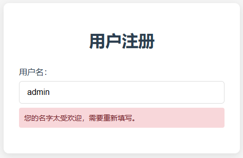

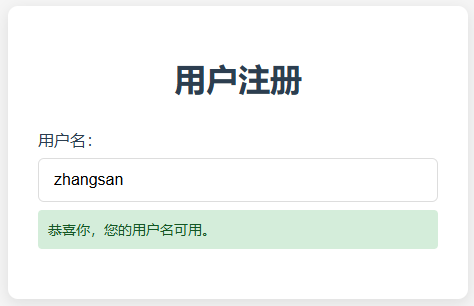

### 准备数据库表

创建 `t_user`表，准备几条数据：

```sql
SET NAMES utf8mb4;
SET FOREIGN_KEY_CHECKS = 0;

DROP TABLE IF EXISTS `t_user`;
CREATE TABLE `t_user`  (
  `id` int NOT NULL AUTO_INCREMENT,
  `username` varchar(255) CHARACTER SET utf8mb4 COLLATE utf8mb4_general_ci NULL DEFAULT NULL,
  PRIMARY KEY (`id`) USING BTREE
) ENGINE = InnoDB AUTO_INCREMENT = 3 CHARACTER SET = utf8mb4 COLLATE = utf8mb4_general_ci ROW_FORMAT = Dynamic;

INSERT INTO `t_user` VALUES (1, 'admin');
INSERT INTO `t_user` VALUES (2, 'test');

SET FOREIGN_KEY_CHECKS = 1;
```

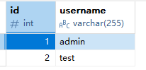

### 编写后端 Servlet

编写后端 Servlet 程序，连接数据库，验证用户名是否存在，如果存在表示用户名不可用返回：`{"success":false}`，如果不存在表示用户名可用返回：`{"success":true}`

这里为了快速开发，没有使用三层架构，直接将所有代码编写到 Servlet 中了：

```java
package com.jkweilai.ajax.servlet;

import jakarta.servlet.ServletException;
import jakarta.servlet.annotation.WebServlet;
import jakarta.servlet.http.HttpServlet;
import jakarta.servlet.http.HttpServletRequest;
import jakarta.servlet.http.HttpServletResponse;

import java.io.IOException;
import java.sql.*;

@WebServlet("/check")
public class CheckUsernameServlet extends HttpServlet {
    @Override
    protected void service(HttpServletRequest request, HttpServletResponse response) throws ServletException, IOException {
        // 获取用户名
        String username = request.getParameter("username");
        // 连接数据库验证用户名是否可用
        Connection conn = null;
        PreparedStatement ps = null;
        ResultSet rs = null;
        boolean success = true;
        try {
            Class.forName("com.mysql.cj.jdbc.Driver");
            conn = DriverManager.getConnection("jdbc:mysql://localhost:3306/ajax", "root", "123456");
            String sql = "select * from t_user where username = ?";
            ps = conn.prepareStatement(sql);
            ps.setString(1, username);
            rs = ps.executeQuery();
            if (rs.next()) {
                success = false;
            }
        } catch (Exception e) {
            throw new RuntimeException(e);
        } finally {
            if (rs != null) {
                try {
                    rs.close();
                } catch (SQLException e) {
                    throw new RuntimeException(e);
                }
            }
            if (ps != null) {
                try {
                    ps.close();
                } catch (SQLException e) {
                    throw new RuntimeException(e);
                }
            }
            if (conn != null) {
                try {
                    conn.close();
                } catch (SQLException e) {
                    throw new RuntimeException(e);
                }
            }
        }
        // 响应
        // 设置响应的内容类型以及响应时采用的字符编码方式
        response.setContentType("application/json;charset=UTF-8");
        response.getWriter().print("{\"success\" : " + success + "}");
    }
}
```

编写完后端程序之后，测试后端接口是否正常。

### 发送 GET 请求

将之前编写的页面中的以下代码注释掉：

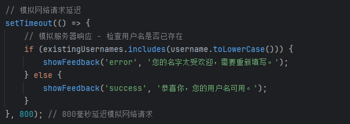

然后在注释掉的代码位置上编写使用 xhr 发送 ajax get 请求的代码，如下：

```javascript
// 1. 创建xhr对象
const xhr = new XMLHttpRequest();
// 2. 开启通道
xhr.open('GET', `check?username=${encodeURIComponent(username)}&_=${Date.now()}`, true);
// 3. 注册回调函数
xhr.onload = function(){
    if(xhr.status >= 200 && xhr.status < 300){
        try{
            const result = JSON.parse(xhr.responseText);
            if(result.success){
                showFeedback('success', '恭喜你，您的用户名可用。');
            }else{
                showFeedback('error', '您的名字太受欢迎，需要重新填写。');
            }
        }catch(e){
            showFeedback('error', '解析响应时出错，请重试。');
        }
    }else{
        showFeedback("error", "请求失败，请稍后重试。");
    }
}
xhr.onerror = function(){
    showFeedback("error", "网络错误，请检查您的连接。");
}
// 4. 发送请求
xhr.send();
```

注意：

1. 以上代码中的 `encodeURIComponent`是对提交的数据进行编码，防止 GET 请求提交的数据乱码问题。（比如表单提交数据的时候采用 GET 请求，提交的数据是：`**张三%/**` 此时这个函数就起作用了。）
2. 以上代码中 `Date.now()`是给 URL 后面添加时间戳，解决 GET 请求缓存问题。（旧版浏览器可能存在 GET 缓存问题。）

## XHR 发送 POST 请求

和 GET 请求的代码区别在于：

1. 需要设置请求头的内容类型。模拟表单提交数据。
2. 请求数据编写在 send 方法的参数上，模拟在请求体中提交数据。

代码如下：

```javascript
// 1. 创建xhr对象
const xhr = new XMLHttpRequest();
// 2. 开启通道
xhr.open('POST', 'check', true);
// 3. 注册回调函数
xhr.onload = function(){
  if(xhr.status >= 200 && xhr.status < 300){
    try{
      const result = JSON.parse(xhr.responseText);
      if(result.success){
        showFeedback('success', '恭喜你，您的用户名可用。');
      }else{
        showFeedback('error', '您的名字太受欢迎，需要重新填写。');
      }
    }catch(e){
      showFeedback('error', '解析响应时出错，请重试。');
    }
  }else{
    showFeedback("error", "请求失败，请稍后重试。");
  }
}
xhr.onerror = function(){
  showFeedback("error", "网络错误，请检查您的连接。");
}
// 4. 发送请求
// 设置请求头内容类型（模拟form表单提交数据）以及采用哪一种字符编码方式。必须放在open方法后面。
xhr.setRequestHeader("Content-type", "application/x-www-form-urlencoded; charset=UTF-8");
// 在请求体中提交数据
xhr.send(`username=${encodeURIComponent(username)}`);
```

# Promise 编程风格


`Promise`的学习可以参考官方文档：[**MDN Web Docs**](https://developer.mozilla.org/en-US/docs/Web/JavaScript/Reference/Global_Objects/Promise)

## 什么是 Promise

**Promise 的本质：一种更优雅的异步编程风格。【ES6（ECMAScript 2015）引入的，浏览器内置了 Promise 对象】**

Promise 就像一个"承诺"，表示一个将来会完成（或失败）的操作。它有三种状态：

- **Pending**：待定
- **Fulfilled**：兑现
- **Rejected**：拒绝

## 为什么需要 Promise

使用 Promise 可以对"回调地狱"（多层嵌套的回调函数）代码进行封装，对外提供一种优雅的编码风格。（变相解决回调地狱问题）

**回调地狱(**Callback Hell**)**就像是你让一群人帮你做事，但每个人都要等前一个人做完才能开始，结果形成了一连串的"等TA做完后，你再..."的嵌套关系。

**举个生活例子：**

想象你要做一顿饭，步骤是：

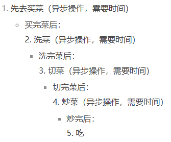

用回调函数写出来就是这样：

```javascript
买菜(function(买的菜) {
  洗菜(买的菜, function(洗好的菜) {
    切菜(洗好的菜, function(切好的菜) {
      炒菜(切好的菜, function(做好的菜) {
        吃(做好的菜);
      });
    });
  });
});
```

**为什么叫"地狱"？**

1. **代码向右延伸**：每层回调都向右缩进，最终代码会变得非常宽
2. **难以阅读**：大括号和小括号层层嵌套，眼睛都要看花
3. **难以维护**：想调整顺序或添加步骤都很困难
4. **错误处理复杂**：每个回调都要单独处理错误

**对比 Promise 的写法：**

```javascript
买菜()
  .then(洗菜)
  .then(切菜)
  .then(炒菜)
  .then(吃)
  .catch(处理错误);
```

这样代码就像一条直线往下走，清晰多了吧？这就是为什么 Promise 能解决回调地狱问题。

**对于我们之前编写的 XHR 发送 AJAX 请求，大家可以试想一下，如果继续使用这种编码风格，在请求 1 成功响应后继续发送请求 2，在请求 2 成功响应后继续发送请求 3，会不会出现回掉地狱问题！！！！**

## Promise 基本代码

```javascript
// 创建并立即返回一个Promise
// new Promise()是调用构造函数
// 构造函数中的参数我们称为：执行器函数
// 构造函数执行时，执行器函数会被立即调用
// 并且执行器函数在调用前，JavaScript引擎为执行器函数提前准备好了两个函数：resolve，reject
// resolve函数会自动传给执行器函数的第一个参数x
// reject函数会自动传给执行器函数的第二个参数y
const myPromise = new Promise((x, y) => {
  const success = true / false;
  if(success){
    // x 指向的是 resolve 函数
    // resolve 函数执行之后的作用是：将Promise对象的状态从“待定”变为“兑现”，并且存储成功的值。
    x("操作成功！");
  }else{
    // y指向的是 reject 函数
    // reject 函数执行之后的作用是：将Promise对象的状态从“待定”变为“拒绝”，并且存储失败的值。
    y(new Error("操作失败！"));
  }
});

// .then() 方法用于处理 Promise 兑现（成功）的情况，then方法的参数是一个回调函数，回调函数会自动接收到当时存储的成功的值。
// .catch() 方法用于处理 Promise 拒绝（失败）的情况，catch方法的参数也是一个回调函数，回调函数会自动接收到当时存储的失败的值。
// 注意：then方法和catch方法中的回调函数执行时机是：会等待执行器中的ajax请求结束之后才会执行。
myPromise
        .then(result => console.log(result))
        .catch(err => console.error(err));
```

## 将 XHR 代码封装为 Promise 风格

### 首次封装

将之前实现的用户名是否可用的 AJAX GET 请求封装为 Promise 风格，代码如下：

```javascript
new Promise((resolve, reject) => {
    const xhr = new XMLHttpRequest();
    xhr.open('GET', `check?username=${encodeURIComponent(username)}&_=${Date.now()}`, true);
    xhr.onload = function(){
        if(xhr.status >= 200 && xhr.status < 300){
            try{
                const result = JSON.parse(xhr.responseText);
                if(result.success){
                    resolve('恭喜你，您的用户名可用');
                }else{
                    reject("您的名字太受欢迎，需要重新填写");
                }
            }catch(e){
                reject("解析响应时出错，请重试");
            }
        }else{
            reject("请求失败，请稍后重试");
        }
    }
    xhr.onerror = function(){
        reject("网络错误，请检查您的连接");
    }
    xhr.send();
})
.then(msg => {
    showFeedback('success', msg)
})
.catch(error => {
    showFeedback('error', error);
})
```

### 升级改进

基于以上代码再次封装，封装属于自己的 Fetch API：定义 fetch 函数发送 AJAX GET 请求：

```javascript
// 自己封装的 fetch 函数（模仿的 Fetch API）
function fetch(url){
    return new Promise((resolve, reject) => {
        const xhr = new XMLHttpRequest();
        xhr.open('GET', `${url}&_=${Date.now()}`, true);
        xhr.onload = function(){
            if(xhr.status >= 200 && xhr.status < 300){
                let response;
                try{
                    response = JSON.parse(xhr.responseText);
                    resolve(response);
                }catch(e){
                    reject("解析响应时出错，请重试");
                }
            }else{
                reject("请求失败，请稍后重试");
            }
        }
        xhr.onerror = function(){
            reject("网络错误，请检查您的连接");
        }
        xhr.send();
    })
}
```

调用自定义的 fetch 函数发送 AJAX GET 请求：

```java
// 调用自定义的fetch函数发送ajax get请求
fetch(`check?username=${encodeURIComponent(username)}`)
    .then((response) => {
        if(response.success){
            showFeedback('success', '恭喜你，您的用户名可用')
        }else{
            showFeedback('error', '您的名字太受欢迎，需要重新填写')
        }
    })
    .catch(error => {
        showFeedback('error', error)
    })
```

## 用户名可用时执行保存操作

由于用户名可用时才能执行保存操作，因此这两个 AJAX 请求不能异步，必须同步，只能等待校验用户名可用的 AJAX 请求结束之后，才能发送保存的 AJAX 请求。要达到这个效果，目前可以使用的就是**嵌套**，代码如下：

```javascript
// 调用自定义的fetch函数发送ajax get请求
fetch(`check?username=${encodeURIComponent(username)}`)
    .then((response) => {
        if(response.success){
            // 用户名可用时发送ajax请求执行保存操作（嵌套的）
            fetch(`save?username=${encodeURIComponent(username)}`)
                .then((response) => {
                    if(response.success){
                        showFeedback('success', '用户名可用，并且已保存成功')
                    }else{
                        showFeedback('error', '用户名可用，但保存失败');
                    }
                })
                .catch(error => {
                    showFeedback('error', error);
                })
        }else{
            showFeedback('error', '您的名字太受欢迎，需要重新填写')
        }
    })
    .catch(error => {
        showFeedback('error', error)
    })
```

后端 Servlet 程序代码如下：

```java
package com.jkweilai.ajax.servlet;

import jakarta.servlet.ServletException;
import jakarta.servlet.annotation.WebServlet;
import jakarta.servlet.http.HttpServlet;
import jakarta.servlet.http.HttpServletRequest;
import jakarta.servlet.http.HttpServletResponse;

import java.io.IOException;
import java.io.PrintWriter;
import java.sql.Connection;
import java.sql.DriverManager;
import java.sql.PreparedStatement;
import java.sql.SQLException;

@WebServlet("/save")
public class UserSaveServlet extends HttpServlet {
    @Override
    protected void doGet(HttpServletRequest request, HttpServletResponse response) throws ServletException, IOException {
        String username = request.getParameter("username");
        Connection conn = null;
        PreparedStatement ps = null;
        int count = 0;
        try {
            Class.forName("com.mysql.cj.jdbc.Driver");
            conn = DriverManager.getConnection("jdbc:mysql://localhost:3306/ajax", "root", "123456");
            String sql = "insert into t_user(username) values(?)";
            ps = conn.prepareStatement(sql);
            ps.setString(1, username);
            count = ps.executeUpdate();
        } catch (Exception e) {
            throw new RuntimeException(e);
        } finally {
            if (ps != null) {
                try {
                    ps.close();
                } catch (SQLException e) {
                    throw new RuntimeException(e);
                }
            }
            if (conn != null) {
                try {
                    conn.close();
                } catch (SQLException e) {
                    throw new RuntimeException(e);
                }
            }
        }
        response.setContentType("application/json;charset=UTF-8");
        PrintWriter out = response.getWriter();
        out.print("{\"success\" : " + (count == 1) + "}");
    }
}
```

功能虽然实现了，但第二个 AJAX 请求必须等待第一个 AJAX 请求结束之后才能进行，为了达到这个效果，我们只能使用嵌套，提到嵌套，显然又发生了 **Callback Hell 回调地狱**问题。

解决这个问题，可以使用 ES8 新语法：async/await。

## ES8 语法 async/await

async 和 await 是 JavaScript 的语法，属于 ECMAScript **2017** (ES8) 标准引入的 异步编程语法糖，本质上是基于 Promise 的，可以让异步代码的写法更接近同步代码，提高可读性和可维护性。

### `async` 的作用

**功能：**

- 用于声明一个 **异步函数**（`async function`）。
- **返回值**：`async` 函数 **总是返回一个 **`Promise`：
  - 如果函数内返回普通值（如 `return 42`），它会被自动包装成 `Promise.resolve(42)`。
  - 如果函数内抛出错误（如 `throw new Error(...)`），它会被包装成 `Promise.reject(error)`。

**示例：以下两种写法是****等效****的。**

```javascript
let num = 100;

// 第一种写法
let promise = new Promise((resolve, reject) => {
    if(num < 0){
        // 将Promise对象状态从待定变成拒绝，并将错误值保存。
        reject(new Error("数字不能小于0"));
    }else{
        // 将Promise对象状态从待定变成兑现，并将成功的值保存。
        resolve(num);
    }
})

promise.then(result => {
    console.log(result)
});

// 第二种写法
async function fetchData(){
    if(num < 0){
        // 如果函数执行过程中出现了异常，异常将被当做失败的值保存起来。
        throw new Error("数字不能小于0");
    }
    // 返回值被当做成功的值保存起来。
    return num;
}

fetchData().then(result => {
    console.log(result)
});
```

### `await` 的作用

**功能：**

- `**await**`** 只能在 `**async**` 函数内部使用。**
- `**await**`**出现会****暂停 **`**async**`** 函数的执行**
- `**await**`**关键字后面通常是一个 **`**Promise**`
- `**await**`**会等 **`**Promise**`**的完成，只有 **`**await**`**后面的 **`**Promise**`**完成后，**`**async**`**函数才能继续往下执行。**
- `**await**`**后面的 **`**Promise**`**执行成功后，**`**await**`**会返回成功的值。**
- `**await**`**后面的 **`**Promise**`**执行抛出错误时，**`**await**`**会抛出错误，可以使用 try/catch 捕获。**

**使用 async/await 改造上面的代码，解决回调地狱问题：**

```javascript
async function checkAndSaveUser(username){
    try{
        let response = await fetch(`check?username=${encodeURIComponent(username)}`)
        if(response.success){
            response = await fetch(`save?username=${encodeURIComponent(username)}`)
            if(response.success){
                showFeedback('success', '用户名可用，并且已保存成功')
            }else{
                showFeedback('error', '用户名可用，但保存失败');
            }
        }else{
            showFeedback('error', '您的名字太受欢迎，需要重新填写')
        }
    }catch(e){
        showFeedback('error', e)
    }
}

checkAndSaveUser(username);
```

### `async/await` 对比 `Promise.then()`

**传统 **`Promise`** 写法（回调风格）**

```javascript
fetch(`check?username=${encodeURIComponent(username)}`)
    .then((response) => {
        if(response.success){
            // 用户名可用时发送ajax请求执行保存操作
            fetch(`save?username=${encodeURIComponent(username)}`)
                .then((response) => {
                    if(response.success){
                        showFeedback('success', '用户名可用，并且已保存成功')
                    }else{
                        showFeedback('error', '用户名可用，但保存失败');
                    }
                })
                .catch(error => {
                    showFeedback('error', error);
                })
        }else{
            showFeedback('error', '您的名字太受欢迎，需要重新填写')
        }
    })
    .catch(error => {
        showFeedback('error', error)
    })
```

**问题：**

- 嵌套的 `.then()` 可能导致 **回调地狱**（Callback Hell）。
- 错误处理依赖 `.catch()`，不够直观。

`async/await`** 写法（更清晰）**

```javascript
async function checkAndSaveUser(username){
    try{
        let response = await fetch(`check?username=${encodeURIComponent(username)}`)
        if(response.success){
            response = await fetch(`save?username=${encodeURIComponent(username)}`)
            if(response.success){
                showFeedback('success', '用户名可用，并且已保存成功')
            }else{
                showFeedback('error', '用户名可用，但保存失败');
            }
        }else{
            showFeedback('error', '您的名字太受欢迎，需要重新填写')
        }
    }catch(e){
        showFeedback('error', e)
    }
}

checkAndSaveUser(username);
```

**优点：**

- **代码更扁平**，没有嵌套的回调。
- **错误处理更直观**（`try/catch` 像同步代码一样）。
- **调试更方便**（可以在 `await` 处设置断点）。

### 总结

- `async`：让函数返回 `Promise`，使其支持 `await`。
- `await`：让 `async` 函数 **等待 **`Promise`** 完成**，避免回调嵌套。
- `try/catch`：替代 `.catch()`，更直观地处理错误。

`async/await`** 是 JavaScript 异步编程的终极解决方案**，让代码更清晰、更易维护！

到此为止，Promise 编程风格就说完了。

# Fetch API 实现 AJAX


在之前的课程中，`fetch`函数是我们自己定义的，实际上在 2015 年的时候，浏览器提供了一套原生的 API，称为 Fetch API，基于 Promise 实现的，也就是说 2015 年之后，浏览器内置了 `fetch`函数，可以直接使用。

Fetch API 返回的对象就是一个 Promise 对象。Fetch API 的学习可以参考官方文档：[**MDN Web Docs**](https://developer.mozilla.org/en-US/docs/Web/API/Fetch_API)

## Fetch API 发送 AJAX GET 请求

### 发送 GET 请求

浏览器内置的 API，不需要引入额外的 js 库。发送 GET 请求代码如下：

```javascript
// 使用Fetch API发送ajax get请求，验证用户名是否可用
fetch(`check?username=${encodeURIComponent(username)}`)
    .then(response => response.json()) 
    .then(data => {
        if(data.success){
            showFeedback('success', '恭喜你，您的用户名可用。');
        }else{
            showFeedback('error', '您的名字太受欢迎，需要重新填写。');
        }
    })
    .catch(error => {
        showFeedback('error', error.message);
    })
```

`response.json()` 方法执行结束之后是需要 `return` 的，这里由于使用箭头函数：`return` 关键字可以省略，如果不返回，则下一个 `.then(data)`中 `data`是没有值的。

**第一个 **`**.then()**`**的参数 response：由 fetch() 返回的 Promise 解析后得到，表示 HTTP 响应，包含状态码、头信息、响应体**等，常用方法如下：

```javascript
.then(response => {
  response.ok      // 检查请求是否成功 (状态码 200-299)
  response.status   // HTTP 状态码 (如 200, 404)
  return response.json()  // 解析为 JSON (返回另一个 Promise)【一定要return，要不然下一个 .then(data) 中的data是undefined】
  //return response.text()  // 解析为文本
})
```

注意：response.json() 和 response.text() 都是异步方法，它们返回的是 Promise 对象，必须使用 `await`或 `.then()`来获取最终结果。这两个方法都是异步读取和解析已经接收到的响应体数据。

**第二个 **`**.then()**`**的参数 data**：是解析后的实际内容，类型由解析方法决定（如 response.json()的时候 data 是 json，response.text()的时候 data 是普通文本）。

**第三个 **`**.catch()**`**的参数 error**：可能是多种错误类型，需根据 `error.name` 或 `error.message`区分处理。

### GET 请求的参数提交问题

第一种方式：直接在 URL 后面使用 `?`追加。（不推荐）

```javascript
const url = `check?username=${encodeURIComponent(username)}`
```

第二种方式：使用 URLSearchParams 构建查询字符串（推荐）

```javascript
// 创建URLSearchParams对象添加参数
const params = new URLSearchParams();
params.append('username', username); // 自动处理编码

// 拼接URL
const url = `check?${params.toString()}`;
```

第三种方式：通过 URL API 构建完整URL（推荐）

```javascript
// 使用URL对象规范处理
const url = new URL('check', window.location.href);
url.searchParams.append('username', username); // 自动编码
url = url.toString();
```

## Fetch API 发送 AJAX POST 请求

### 发送 POST 请求以 JSON 格式提交

注意：这种方式，后端 Servlet 接收到数据之后，直接通过 `request.getParameter("name")`是获取不到以 `JSON` 方式提交的数据的。`request.getParameter("name")`只能获取的提交格式为：`name=value&name=value`。如果要获取提交的 `JSON`数据，你需要编写特殊的代码。这里感兴趣的可以研究一下，后面的框架一般都自动实现了接收 `JSON`数据。我们这里只需要在前端浏览器的 F12 的网络面板中查看一下，是否能够以 `JSON`格式提交数据即可。

```javascript
fetch('check', {
  method: 'POST',  // 指定为POST方法
  headers: {
    'Content-Type': 'application/json',  // 设置内容类型为JSON
  },
  body: JSON.stringify({username: username})  // 将数据转为JSON字符串
})
.then(response => {
  if (!response.ok) {  // 检查响应是否成功
    throw new Error(`HTTP错误! 状态码: ${response.status}`);
  }
  return response.json();
})
.then(data => {
  if(data.success){
    showFeedback('success', '恭喜你，您的用户名可用。');
  }else{
    showFeedback('error', '您的名字太受欢迎，需要重新填写。');
  }
})
.catch(error => {
  showFeedback('error', error.message || '请求失败，请稍后重试');
});
```

### 发送 POST 请求以 FormData 格式提交

```javascript
// 创建URLSearchParams对象并添加参数
const formData = new URLSearchParams();
formData.append('username', username);

fetch('check', {
  method: 'POST',
  headers: {
    'Content-Type': 'application/x-www-form-urlencoded', // 必须设置这个Content-Type
  },
  body: formData.toString() // 转换为查询字符串格式
})
.then(response => {
  if (!response.ok) {
    throw new Error(`HTTP错误! 状态码: ${response.status}`);
  }
  return response.json();
})
.then(data => {
  if(data.success){
    showFeedback('success', '恭喜你，您的用户名可用。');
  }else{
    showFeedback('error', '您的名字太受欢迎，需要重新填写。');
  }
})
.catch(error => {
  showFeedback('error', error.message || '请求失败，请稍后重试');
});
```

# Axios 实现 AJAX


第三方库，底层基于 Promise+XHR 封装，并不是对 Fetch API 的封装，比 Fetch API 好用。使用它需要引入 `axios.js`库文件。使用国内 CDN 加速引入：

```html
<script src="https://cdn.bootcdn.net/ajax/libs/axios/1.6.7/axios.min.js"></script>
```

## 发送 GET 请求

```javascript
axios.get('check', {
  // 这个参数将被自动追加到url后面，格式为 url?name=value
  params: {username : username},
  // 发送请求时这个将被自动放到请求头中
  headers: {a:"b"}
}).then(response => {
  if(response.data.success) {
    showFeedback('success', '恭喜你，您的用户名可以使用')
  }else{
    showFeedback('error', '非常遗憾，您的用户名太受欢迎，请重新选一个')
  }
}).catch(error => {
  showFeedback('error', `${error.code}: ${error.message}`);
})
```

提示：

1. `params`用于将数据拼接到 URL 后面，主要应用于 get 请求，post 请求不采用这种方式提交数据。
2. `headers`用户设置请求头。

**关于 axios 库的 then() 中回调函数的 response 参数：**

当请求成功（HTTP 状态码为 2xx）时，`**<font style="color:rgb(64, 64, 64);background-color:rgb(236, 236, 236);">response</font>**` 包含以下属性：

| **属性** | **说明** |
| --- | --- |
| `**<font style="color:rgb(64, 64, 64);background-color:rgb(236, 236, 236);">data</font>**` | 服务器返回的响应体（自动解析为 JSON 对象或字符串）。 |
| `**<font style="color:rgb(64, 64, 64);background-color:rgb(236, 236, 236);">status</font>**` | HTTP 状态码（如 `**<font style="color:rgb(64, 64, 64);background-color:rgb(236, 236, 236);">200</font>**`）。 |
| `**<font style="color:rgb(64, 64, 64);background-color:rgb(236, 236, 236);">statusText</font>**` | HTTP 状态描述（如 `**<font style="color:rgb(64, 64, 64);background-color:rgb(236, 236, 236);">"OK"</font>**`）。 |
| `**<font style="color:rgb(64, 64, 64);background-color:rgb(236, 236, 236);">headers</font>**` | 响应头（是一个对象，如 `**<font style="color:rgb(64, 64, 64);background-color:rgb(236, 236, 236);">{ 'content-type': 'application/json' }</font>**`）。 |
| `**<font style="color:rgb(64, 64, 64);background-color:rgb(236, 236, 236);">config</font>**` | 本次请求的 Axios 配置（包括 URL、方法、参数等）。 |
| `**<font style="color:rgb(64, 64, 64);background-color:rgb(236, 236, 236);">request</font>**` | 浏览器中的 `**<font style="color:rgb(64, 64, 64);background-color:rgb(236, 236, 236);">XMLHttpRequest</font>**`实例 |

**关于 axios 库的 catch() 中回调函数的 error 参数：**

当请求失败（网络错误、超时或状态码非 2xx）时，`**<font style="color:rgb(64, 64, 64);background-color:rgb(236, 236, 236);">error</font>**` 是 `**<font style="color:rgb(64, 64, 64);background-color:rgb(236, 236, 236);">AxiosError</font>**` 类型的对象，包含以下关键属性：

| **属性** | **说明** |
| --- | --- |
| `**<font style="color:rgb(64, 64, 64);background-color:rgb(236, 236, 236);">response</font>**` | 如果服务器有响应（如 404、500），此属性会包含完整的 `**<font style="color:rgb(64, 64, 64);background-color:rgb(236, 236, 236);">response</font>**`对象。 |
| `**<font style="color:rgb(64, 64, 64);background-color:rgb(236, 236, 236);">request</font>**` | 浏览器中为 `**<font style="color:rgb(64, 64, 64);background-color:rgb(236, 236, 236);">XMLHttpRequest</font>**`实例 |
| `**<font style="color:rgb(64, 64, 64);background-color:rgb(236, 236, 236);">config</font>**` | 本次请求的 Axios 配置。 |
| `**<font style="color:rgb(64, 64, 64);background-color:rgb(236, 236, 236);">message</font>**` | 错误描述（如网络错误时的 `**<font style="color:rgb(64, 64, 64);background-color:rgb(236, 236, 236);">"Network Error"</font>**`）。 |
| `**<font style="color:rgb(64, 64, 64);background-color:rgb(236, 236, 236);">code</font>**` | 错误代码（如 `**<font style="color:rgb(64, 64, 64);background-color:rgb(236, 236, 236);">"ECONNABORTED"</font>**`表示超时）。 |

## 发送 POST 请求

### 以表单方式提交数据

```javascript
axios.post('check', `username=${username}`, {
  headers: {
    // 对于axios来说，这不是必须的，可以省略。它可以根据第二个参数是name=value对儿来自动决定采用表单方式提交数据。
    'content-type': 'application/x-www-form-urlencoded'
  }
}).then(response => {
  if(response.data.success) {
    showFeedback('success', '恭喜你，您的用户名可以使用')
  }else{
    showFeedback('error', '非常遗憾，您的用户名太受欢迎，请重新选一个')
  }
}).catch(error => {
  showFeedback('error', `${error.code}: ${error.message}`);
})
```

或者更加优雅的方式：

```javascript
const params = new URLSearchParams();
params.append('username', username);

axios.post('check', params, {
  headers: {
    // 可以省略。
    'content-type': 'application/x-www-form-urlencoded'
  }
}).then(response => {
  if(response.data.success) {
    showFeedback('success', '恭喜你，您的用户名可以使用')
  }else{
    showFeedback('error', '非常遗憾，您的用户名太受欢迎，请重新选一个')
  }
}).catch(error => {
  showFeedback('error', `${error.code}: ${error.message}`);
})
```

### 以 json 方式提交数据

如果后端接受 JSON 数据

```javascript
axios.post('check', {username: username}, {
  headers: {
    // 对于axios来说，这不是必须的，可以省略。它可以自动通过第二个参数是JS对象，会自动按照JSON格式提交数据。
    'content-type': 'application/json'
  }
}).then(response => {
  if(response.data.success) {
    showFeedback('success', '恭喜你，您的用户名可以使用')
  }else{
    showFeedback('error', '非常遗憾，您的用户名太受欢迎，请重新选一个')
  }
}).catch(error => {
  showFeedback('error', `${error.code}: ${error.message}`);
})
```

### 提交图片数据

```html
<!DOCTYPE html>
<html lang="zh-CN">
<head>
    <meta charset="UTF-8">
    <meta name="viewport" content="width=device-width, initial-scale=1.0">
    <title>文件上传</title>
    <script src="https://cdn.bootcdn.net/ajax/libs/axios/1.6.7/axios.min.js"></script>
</head>
<body>
    <input type="file" id="file-upload">
    <button id="upload-btn">上传</button>
    <div id="feedback"></div>

    <script>
        document.getElementById('upload-btn').addEventListener('click', function() {
            const file = document.getElementById('file-upload').files[0];
            if (!file) return;

            const formData = new FormData();
            formData.append('file', file);

            axios.post('/upload', formData, {
                headers: {
                    'Content-Type': 'multipart/form-data'
                }
            })
            .then(function(response) {
                document.getElementById('feedback').textContent = '上传成功';
            })
            .catch(function(error) {
                document.getElementById('feedback').textContent = '上传失败';
            });
        });
    </script>
</body>
</html>
```

目前后端的 Servlet 没有编写，因此以上代码会出现 404 的错误!

## Axios+async/await

终极建议方案：

```javascript
async function checkUsername(username){
  const params = new URLSearchParams();
  params.append('username', username);
  try{
    const response = await axios.post('check', params);
    if(response.data.success){
      showFeedback('success', '恭喜你，您的用户名可以使用')
    }else{
      showFeedback('error', '非常遗憾，您的用户名太受欢迎，请重新选一个')
    }
  }catch(error){
    showFeedback('error', `${error.code}: ${error.message}`);
  }
}


checkUsername(username);
```

# pushState()+AJAX 实现无刷新路由


## 什么是路由

路由（Routing） 的本质是 根据 URL 的变化，匹配对应的内容或逻辑。可以简单理解为：“网址（URL） ➔ 该显示什么（内容/功能）” 的映射规则。

## 单纯只用 AJAX 存在的问题

问题 1：AJAX 局部刷新后，URL 不会变化

现象：用户通过 AJAX 加载了新内容（比如从“首页”切换到“个人中心”），但浏览器的 URL 仍然是旧的（例如 [https://example.com](https://example.com)），地址栏不会更新。

后果：用户无法直接复制当前页面的链接分享给他人（因为 URL 未变，分享出去的链接永远是首页）。用户点击浏览器后退按钮会直接退出网站，而不是返回上一个 AJAX 加载的状态。

问题 2：浏览器历史记录无法管理

现象：每次 AJAX 加载内容后，浏览器历史记录中不会新增记录。

后果：用户无法通过前进/后退按钮导航到之前浏览的 AJAX 内容。用户体验断裂，违背用户对浏览器行为的预期（比如点击后退按钮期望回到上一屏内容，但实际却跳出了网站）。

## BOM 编程中的 history.pushState()

BOM 编程中的 history.pushState()方法可以模拟历史记录，并且修改浏览器地址栏上的 URL，并且保证不会刷新**整个**页面。

例如以下代码：

```html
<!DOCTYPE html>
<html lang="en">
<head>
    <meta charset="UTF-8">
    <title>Document</title>
</head>
<body>

<button id="home">Home</button>
<button id="about">About</button>
<button id="concat">Contact</button>
<button id="replace">Replace</button>

<script>
    document.addEventListener("DOMContentLoaded", function (){

        // history.pushState({name: value}, "", url)
        // 作用：压栈
        document.getElementById("home").addEventListener("click", function (){
            // 第一个参数是对象，对象的属性名和属性值业务需要怎么定义就怎么定义。未来可以通过popstate事件的回调函数的event参数的state属性来获取该对象。
            // 第二个参数通常是网页标题，但大部分浏览器不支持，一般给一个空字符串。
            // 第三个参数是在浏览器地址栏上变化的url。
            history.pushState({myState: "主页"}, "", "/home"); // 压栈
        });
        document.getElementById("about").addEventListener("click", function (){
            history.pushState({myState: "关于"}, "", "/about"); // 压栈
        });
        document.getElementById("concat").addEventListener("click", function (){
            history.pushState({myState: "联系我们"}, "", "/concat"); // 压栈
        });

        // history.replaceState({name: value}, "", url);
        // 作用：将当前位置的历史记录替换成新的历史记录。
        document.getElementById("replace").addEventListener("click", function (){
            history.replaceState({myState: "我是最新的历史记录"}, "", "/newHistory");
        });

        // 给当前浏览器窗口添加 popstate 事件监听
        // 当用户点击浏览器的前进和后退按钮时 popstate 事件被触发
        // 回调函数的event参数有state属性，通过state属性可以取出压栈时的对象。
        window.addEventListener("popstate", function (event){
            console.log(event.state.myState)
        });
    });
</script>

</body>
</html>
```

其中涉及到三部分重点内容：

1. history.pushState(state, '页面标题', url)
  1. 第一个参数 state 是一个状态对象 `{}`，该对象的属性和数据自行组织，业务需要怎么组织就怎么组织。该状态对象 state 可以在 popstate 事件发生时的回调函数的 event 参数的 state 属性来获取。
  2. 第二个参数是页面标题，这个页面表达大部分浏览器是不支持的，你还是需要通过 `document.title`来修改页面的标题，因此这个参数一般给一个空字符串。
  3. 第三个参数是 url，这个 url 将会被修改到地址栏上。
  4. 这个方法相当于是一个压栈的动作，将最近一次的历史记录放到栈顶部。后退的时候它将会被第一个弹出（取出但栈元素并不会删除）。这样就可以模拟出历史记录的效果了。
2. history.replaceState(state, '页面标题', url)
  1. 将当前的历史记录替换成新的历史记录。
3. window 对象的 popstate 事件
  1. 当用户点击浏览器上的前进和后退按钮时，注册的 popstate 事件会发生。该事件发生时的回调函数 event 参数的 state 属性就可以获取到 pushState 方法的第一个参数。

## 实现无刷新路由

### 前端代码

```html
<!DOCTYPE html>
<html lang="en">
<head>
    <meta charset="UTF-8">
    <title>pushState + AJAX</title>
    <script src="https://cdn.bootcdn.net/ajax/libs/axios/1.6.7/axios.min.js"></script>
</head>
<body>

<button id="home">Home</button>
<button id="about">About</button>
<button id="concat">Contact</button>

<div id="content"></div>

<script>
    document.addEventListener("DOMContentLoaded", function (){

        // 初始化加载页面
        loadPage("/ajax/home");

        document.getElementById("home").addEventListener("click", function (){
            let url = "/ajax/home";
            history.pushState({}, "", url);
            loadPage(url);
        });
        document.getElementById("about").addEventListener("click", function (){
            let url = "/ajax/about";
            history.pushState({}, "", url);
            loadPage(url);
        });
        document.getElementById("concat").addEventListener("click", function (){
            let url = "/ajax/contact";
            history.pushState({}, "", url);
            loadPage(url);
        });

        window.addEventListener("popstate", function (event){
            // 假设路径是：http://localhost:8080/ajax/contact
            // document.location.pathname：获取的是 /ajax/contact
            loadPage(document.location.pathname);
        });
    });

    async function loadPage(url){
        let response = await axios.get(url);
        document.getElementById("content").innerHTML = response.data;
    }
</script>

</body>
</html>
```

### 后端代码

```java
import jakarta.servlet.ServletException;
import jakarta.servlet.annotation.WebServlet;
import jakarta.servlet.http.HttpServlet;
import jakarta.servlet.http.HttpServletRequest;
import jakarta.servlet.http.HttpServletResponse;

import java.io.IOException;
import java.io.PrintWriter;

@WebServlet(name = "PageServlet", urlPatterns = {"/home", "/about", "/contact"})
public class PageServlet extends HttpServlet {
    protected void doGet(HttpServletRequest request, HttpServletResponse response) throws ServletException, IOException {

        response.setContentType("text/html");
        PrintWriter out = response.getWriter();

        String path = request.getServletPath();

        switch (path) {
            case "/home":
                out.println("<h1>Welcome to Home</h1><p>This is the home page.</p>");
                break;
            case "/about":
                out.println("<h1>About Us</h1><p>This is the about page.</p>");
                break;
            case "/contact":
                out.println("<h1>Contact</h1><p>Email: test@example.com</p>");
                break;
            default:
                out.println("<h1>404 Not Found</h1>");
        }
    }
}
```

注意：后面的 Vue 框架中已经将无刷新路由实现了，以上所讲是它的实现原理。

# AJAX跨域问题


## 跨域

- 跨域是指从一个域名的网页去请求另一个域名的资源。比如从百度(https://baidu.com)页面去请求京东(https://www.jd.com)的资源。
- 通过超链接或者form表单提交或者window.location.href的方式进行跨域是不存在问题的（**大家可以编写程序测试一下**）。但在一个域名的网页中的一段js代码发送ajax请求去访问另一个域名中的资源，由于同源策略的存在导致无法跨域访问，那么ajax就存在这种跨域问题。
- 同源策略是指一段脚本只能读取来自同一来源的窗口和文档的属性（例如： A 站点的一段 JS 脚本去读取 B 站点的 Cookie，这是不允许的，这就是同源策略在起作用），同源就是协议、域名和端口都相同。
- 有一些情况下，我们是需要使用ajax进行跨域访问的。比如某公司的A页面(a.domain.com)有可能需要获取B页面(b.domain.com)。

## 同源还是不同源

- 区分同源和不同源的三要素
  - 协议
  - 域名
  - 端口
- 协议一致，域名一致，端口号一致，三个要素都一致，才是同源，其它一律都是不同源

| **URL1** | ** URL2** | **是否同源** | 描述 |
| --- | --- | --- | --- |
| http://localhost:8080/a/index.html | http://localhost:8080/a/first | 同源 | 协议 域名 端口一致 |
| http://localhost:8080/a/index.html | http://localhost:8080/b/first | 同源 | 协议 域名 端口一致 |
| http://www.myweb.com:8080/a.js | https://www.myweb.com:8080/b.js | 不同源 | 协议不同 |
| http://www.myweb.com:8080/a.js | http://www.myweb.com:8081/b.js | 不同源 | 端口不同 |
| http://www.myweb.com/a.js | http://www.myweb2.com/b.js | 不同源 | 域名不同 |
| http://www.myweb.com/a.js | http://crm.myweb.com/b.js | 不同源 | 子域名不同 |

## 复现AJAX跨域问题

- 部署两个tomcat服务器，1号服务器和2号服务器，两个服务器设置的端口不同，1号服务器如下所示：

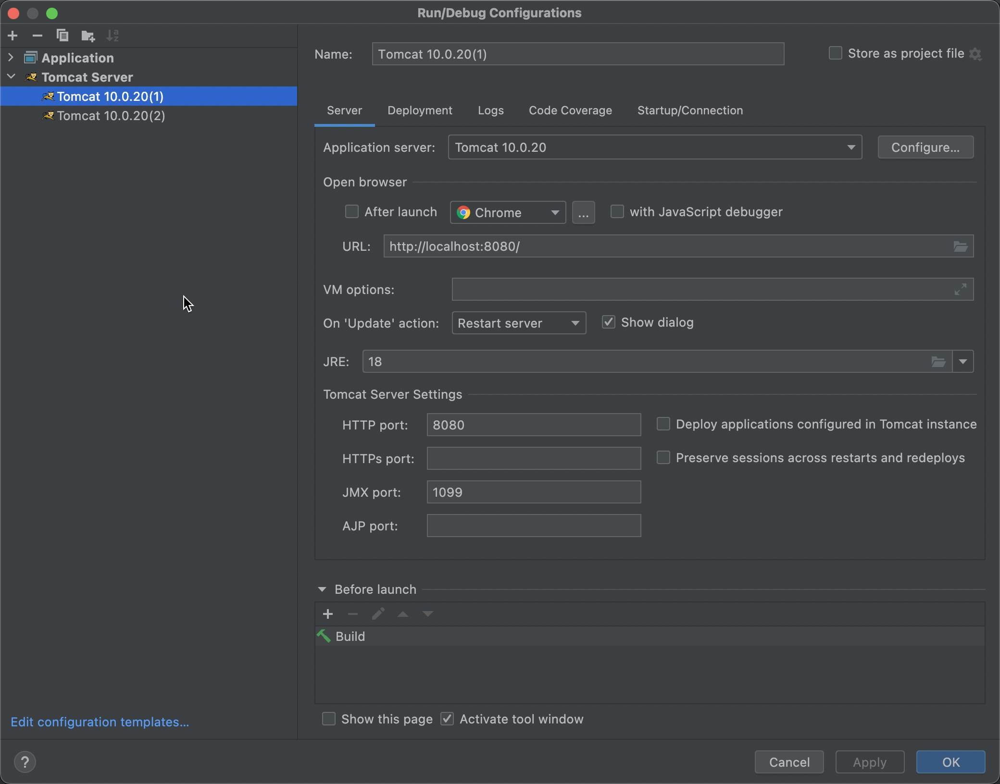

- 2号服务器如下所示，注意端口是不同的：

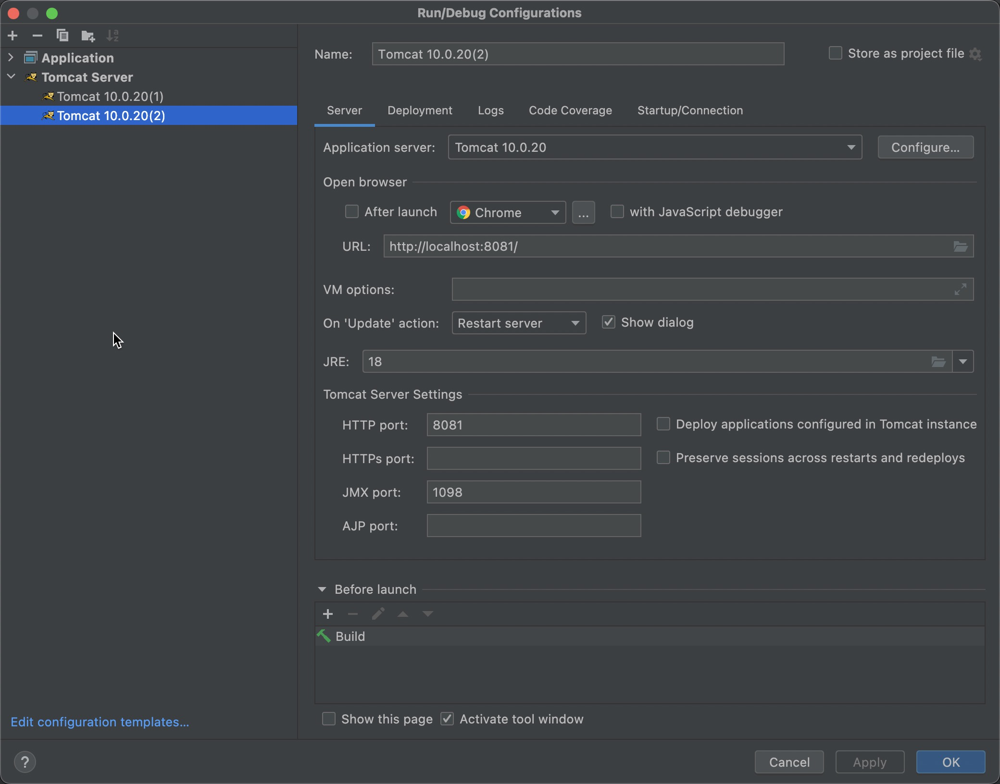

- 访问两台服务器的地址如下：
  - 1号服务器：http://localhost:8080
  - 2号服务器：http://localhost:8081
- 提供两个webapp，一个是a应用，一个是b应用。将来a应用部署到1号服务器上。b应用部署到2号服务器上。
- a应用的前端代码如下：

```html
<!DOCTYPE html>
<html lang="en">
<head>
    <meta charset="UTF-8">
    <title>a应用发送ajax请求，访问b应用的servlet</title>
</head>
<body>
<script type="text/javascript">
    window.onload = function(){
        document.getElementById("btn").onclick = function (){
            // 1.创建ajax核心对象
            let xmlHttpRequest = new XMLHttpRequest();
            // 2.注册回调函数
            xmlHttpRequest.onreadystatechange = function (){
                // 我们只是为了测试ajax请求默认情况下是否可以跨域，所以这里不需要写代码，只要保证请求发过去即可。
            }
            // 3.打开通道（这一步重的请求路径很关键）
            xmlHttpRequest.open("GET", "http://localhost:8081/b/hello", true)
            // 4.发送请求
            xmlHttpRequest.send()
        }
    }
</script>
<button id="btn">a应用发送ajax请求，访问b应用的servlet</button>
</body>
</html>
```

- b应用的后端代码如下：

```java
import jakarta.servlet.ServletException;
import jakarta.servlet.annotation.WebServlet;
import jakarta.servlet.http.HttpServlet;
import jakarta.servlet.http.HttpServletRequest;
import jakarta.servlet.http.HttpServletResponse;

import java.io.IOException;

@WebServlet("/hello")
public class HelloServlet extends HttpServlet {
    @Override
    protected void doGet(HttpServletRequest req, HttpServletResponse resp) 
            throws ServletException, IOException {
        System.out.println("hello servlet");
    }
}
```

- a应用部署到1号服务器，b应用部署到2号服务器，将1号和2号服务器都启动。
- 服务器启动成功后，打开浏览器，在地址栏上输入请求地址：http://localhost:8080/a/index.html

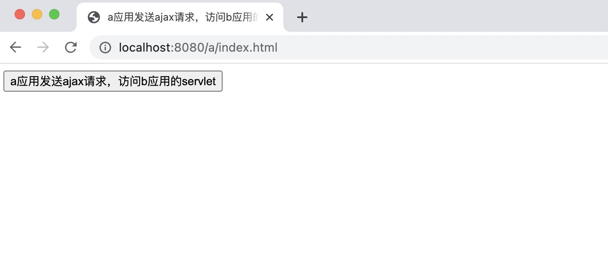

- F12，打开谷歌浏览器的控制台窗口，然后点击上图中的按钮，发送ajax请求，结果如下图：

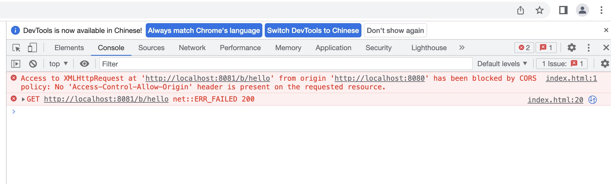

报错了，错误信息中描述了：从 `http://localhost:8080` 上访问 `http://localhost:8081/b/hello` 被同源策略阻止：请求的资源上不存在“Access Control Allow Origin”标头。这就是ajax跨域问题。

## AJAX跨域解决方案

### 方案一：后端 CORS（生产/开发）

（核心原理：被访问的资源允许你跨域访问时才可以访问。）

- a站点客户端代码：

```html
<!DOCTYPE html>
<html lang="en">
<head>
    <meta charset="UTF-8">
    <title>a应用发送ajax请求，访问b应用的servlet</title>
</head>
<body>
<script src="https://cdn.bootcdn.net/ajax/libs/axios/1.6.7/axios.min.js"></script>
<script>
    document.addEventListener("DOMContentLoaded", function (){
        document.getElementById("btn").addEventListener("click", async function (){
            let response = await axios.get("http://localhost:8081/b/hello");
            document.getElementById("mydiv").innerHTML = response.data;
        });
    });
</script>
<button id="btn">a应用发送ajax请求，访问b应用的servlet</button>
<div id="mydiv"></div>
</body>
</html>
```

- b站点服务端代码：

```java
import jakarta.servlet.ServletException;
import jakarta.servlet.annotation.WebServlet;
import jakarta.servlet.http.HttpServlet;
import jakarta.servlet.http.HttpServletRequest;
import jakarta.servlet.http.HttpServletResponse;

import java.io.IOException;
import java.io.PrintWriter;

@WebServlet("/hello")
public class HelloServlet extends HttpServlet {
    @Override
    protected void doGet(HttpServletRequest request, HttpServletResponse response)
            throws ServletException, IOException {
        // 设置响应头：以下这是表示该资源任何人都能用
        response.setHeader("Access-Control-Allow-Origin", "*");
        // 设置相应内容类型
        response.setContentType("text/html;charset=UTF-8");
        PrintWriter out = response.getWriter();
        out.print("<h1>hello ajax!!</h1>");
    }
}
```

- 将a应用部署到1号服务器，将b应用部署到2号服务器，将两台服务器都启动起来，打开浏览器，输入地址：http://localhost:8080/a/index.html，如下图：

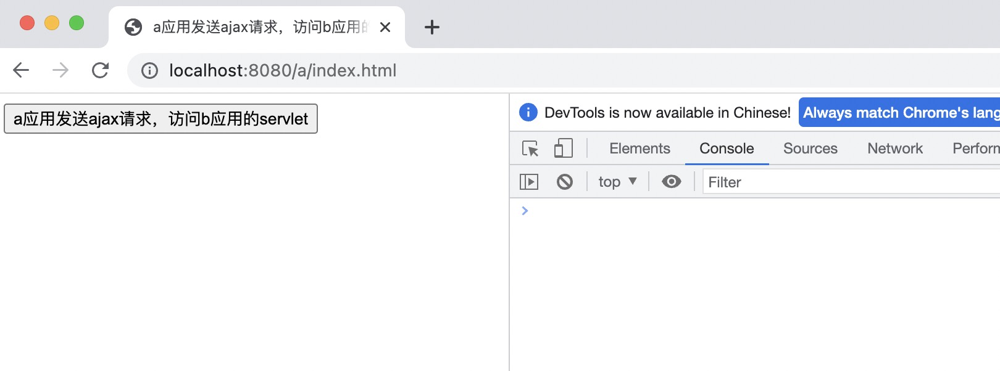

- 点击上图的按钮，发送ajax请求，结果如下图所示：

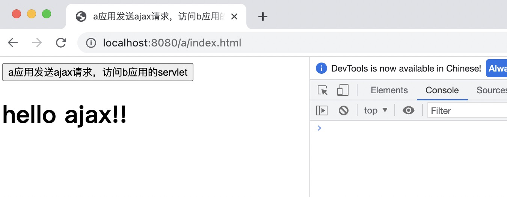

**对于 SpringBoot 项目来说可以做以下的全局配置**：

```java
@Configuration
public class CorsConfig implements WebMvcConfigurer {
    @Override
    public void addCorsMappings(CorsRegistry registry) {
        registry.addMapping("/**")
                .allowedOrigins("https://your-frontend.com")
                .allowedMethods("GET", "POST", "PUT", "DELETE");
    }
}
```

### 方案二：后端 HttpClient 代理（生产/开发）

这种方式主要是通过后端java程序来完成跨域访问。因为跨域的限制只针对XMLHttpRequest对象，java程序是可以跨域访问的，原理如下图：

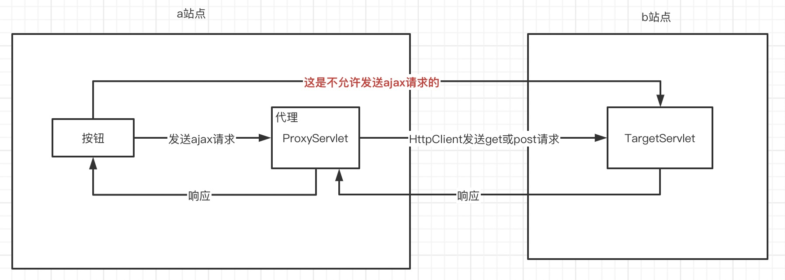

**核心原理：a站点中的按钮无法直接发送ajax请求访问b站点中的TargetServlet，但是可以发送ajax请求访问当前站点中的ProxyServlet，将它当作一个代理，然后通过代理发送get/post请求访问b站点中的TargetServlet。**

通过 Java 程序发送 get 或 post 请求可以使用 jdk 内置的 api（java.net.URLConnection，java.net.URL等类库），也可以使用 Apache 的 httpclient 开源组件完成。

这里着重看一下 httpclient 如何发送 get 或 post 请求。

首选需要引入 httpclient 的 jar 包：

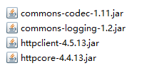

使用 httpclient 发送 get 请求：

```java
package com.jkweilai.httpclient;

import org.apache.http.HttpEntity;
import org.apache.http.client.methods.CloseableHttpResponse;
import org.apache.http.client.methods.HttpGet;
import org.apache.http.client.utils.URIBuilder;
import org.apache.http.impl.client.CloseableHttpClient;
import org.apache.http.impl.client.HttpClients;
import org.apache.http.util.EntityUtils;

import java.io.IOException;
import java.net.URI;
import java.net.URISyntaxException;

public class HttpClientGetWithParams {
    public static void main(String[] args) {
        try (CloseableHttpClient httpClient = HttpClients.createDefault()) {
            // 使用URIBuilder构建带参数的URL
            URI uri = new URIBuilder("https://example.com/api/search").addParameter("q", "httpclient").addParameter("page", "1").addParameter("size", "10").build();

            HttpGet httpGet = new HttpGet(uri);

            try (CloseableHttpResponse response = httpClient.execute(httpGet)) {
                System.out.println("Status Code: " + response.getStatusLine().getStatusCode());

                HttpEntity entity = response.getEntity();
                if (entity != null) {
                    System.out.println("Response: " + EntityUtils.toString(entity));
                    EntityUtils.consume(entity);
                }
            }
        } catch (IOException | URISyntaxException e) {
            throw new RuntimeException(e);
        }
    }
}
```

使用 httpclient 发送 post 请求：

```java
package com.jkweilai.httpclient;

import org.apache.http.HttpEntity;
import org.apache.http.NameValuePair;
import org.apache.http.client.entity.UrlEncodedFormEntity;
import org.apache.http.client.methods.CloseableHttpResponse;
import org.apache.http.client.methods.HttpPost;
import org.apache.http.impl.client.CloseableHttpClient;
import org.apache.http.impl.client.HttpClients;
import org.apache.http.message.BasicNameValuePair;
import org.apache.http.util.EntityUtils;

import java.io.IOException;
import java.util.ArrayList;
import java.util.List;

public class HttpClientPostForm {
    public static void main(String[] args) {
        try (CloseableHttpClient httpClient = HttpClients.createDefault()) {
            HttpPost httpPost = new HttpPost("https://example.com/api/login");

            // 设置表单数据
            List<NameValuePair> params = new ArrayList<>();
            params.add(new BasicNameValuePair("username", "user123"));
            params.add(new BasicNameValuePair("password", "pass123"));

            httpPost.setEntity(new UrlEncodedFormEntity(params));

            try (CloseableHttpResponse response = httpClient.execute(httpPost)) {
                System.out.println("Status Code: " + response.getStatusLine().getStatusCode());

                HttpEntity entity = response.getEntity();
                if (entity != null) {
                    System.out.println("Response: " + EntityUtils.toString(entity));
                    EntityUtils.consume(entity);
                }
            }
        } catch (IOException e) {
            throw new RuntimeException(e);
        }
    }
}
```

### 方案三：**Nginx 反向代理（生产）**

**原理**：通过 Nginx 将前端和后端请求统一转发到同源域名下。（**和 HttpClient 是完全一样的思想。**）
**配置示例**：

```nginx
server {
    listen 80;
    server_name your-domain.com;

    location /api {
        proxy_pass http://backend-server.com;
        proxy_set_header Host $host;
        proxy_set_header X-Real-IP $remote_addr;
    }

    location / {
        root /path/to/frontend;
        try_files $uri /index.html;
    }
}
```

**优点**：隐藏后端地址，统一入口，避免跨域问题。

### 方案四：开发环境代理（开发）

这是通过前端构建工具（如 Vite 或 Webpack）的开发服务器实现的 本地请求转发，**仅在开发阶段生效**，与生产环境的 Nginx/CORS 是分离的。

**Vite 项目（**`**<font style="color:rgb(64, 64, 64);background-color:rgb(236, 236, 236);">vite.config.js</font>**`**）**

```javascript
export default defineConfig({
  server: {
    proxy: {
      '/api': {
        target: 'http://backend-server.com', // 后端真实地址
        changeOrigin: true,                  // 修改请求头中的 Origin
        rewrite: path => path.replace(/^\/api/, '') // 路径重写
      }
    }
  }
})
```

前端项目运行在前端服务器中（我们叫做 Vite 开发服务器），前端服务器的代理过程如下：

```plaintext
浏览器请求: http://localhost:3000/api/users
↓
Vite开发服务器拦截到 /api 请求
↓
转发到: http://backend-server.com/users  (去掉/api)
↓
后端返回数据给Vite
↓
Vite把数据返回给浏览器
```

**几种方案的对比：**

| **方案** | **适用环境** | **配置位置** | **是否需要后端配合** |
| --- | --- | --- | --- |
| Vue 配置文件代理 | 开发环境 | 前端构建工具配置 | 否 |
| Nginx 反向代理（**如果项目最终部署不使用 Nginx，可以使用 Spring Cloud Gateway 来完成**） | 生产环境 | 服务器配置文件 | 否 |
| 后端 CORS | 生产/开发 | 后端代码 | 是 |
| 后端 HttpClient 代理 | 生产/开发 | 后端代码 | 是 |

# 作业


## 实现省市联动效果

页面给大家：

```html
<!DOCTYPE html>
<html lang="zh-CN">
<head>
    <meta charset="UTF-8">
    <meta name="viewport" content="width=device-width, initial-scale=1.0">
    <title>省市联动选择器</title>
    <style>
        * {
            box-sizing: border-box;
            margin: 0;
            padding: 0;
        }
        
        body {
            font-family: 'Helvetica Neue', Arial, sans-serif;
            background-color: #f5f5f5;
            color: #333;
            line-height: 1.6;
            display: flex;
            justify-content: center;
            align-items: center;
            min-height: 100vh;
            padding: 20px;
        }
        
        .container {
            width: 100%;
            max-width: 500px;
            background: white;
            border-radius: 10px;
            box-shadow: 0 5px 15px rgba(0, 0, 0, 0.1);
            padding: 30px;
            animation: fadeIn 0.5s ease-out;
        }
        
        @keyframes fadeIn {
            from { opacity: 0; transform: translateY(20px); }
            to { opacity: 1; transform: translateY(0); }
        }
        
        h1 {
            text-align: center;
            color: #2c3e50;
            margin-bottom: 30px;
            font-weight: 500;
        }
        
        .form-group {
            margin-bottom: 25px;
        }
        
        label {
            display: block;
            margin-bottom: 8px;
            font-weight: 600;
            color: #2c3e50;
        }
        
        select {
            width: 100%;
            padding: 12px 15px;
            border: 1px solid #ddd;
            border-radius: 6px;
            font-size: 16px;
            background-color: #fff;
            transition: border 0.3s;
            appearance: none;
            background-image: url("data:image/svg+xml;charset=UTF-8,%3csvg xmlns='http://www.w3.org/2000/svg' viewBox='0 0 24 24' fill='none' stroke='currentColor' stroke-width='2' stroke-linecap='round' stroke-linejoin='round'%3e%3cpolyline points='6 9 12 15 18 9'%3e%3c/polyline%3e%3c/svg%3e");
            background-repeat: no-repeat;
            background-position: right 10px center;
            background-size: 1em;
        }
        
        select:focus {
            outline: none;
            border-color: #3498db;
            box-shadow: 0 0 0 3px rgba(52, 152, 219, 0.2);
        }
        
        select:disabled {
            background-color: #f9f9f9;
            color: #999;
        }
        
        .result {
            margin-top: 25px;
            padding: 15px;
            background-color: #e8f4fd;
            border-radius: 6px;
            color: #2980b9;
            text-align: center;
            display: none;
        }
        
        .loading {
            display: none;
            text-align: center;
            margin: 10px 0;
            color: #7f8c8d;
        }
        
        .loading:after {
            content: "...";
            animation: dots 1.5s steps(5, end) infinite;
        }
        
        @keyframes dots {
            0%, 20% { content: "."; }
            40% { content: ".."; }
            60%, 100% { content: "..."; }
        }
        
        .footer {
            margin-top: 30px;
            text-align: center;
            font-size: 14px;
            color: #95a5a6;
        }
    </style>
</head>
<body>
    <div class="container">
        <h1>省市联动选择器</h1>
        
        <div class="form-group">
            <label for="province">选择省份</label>
            <select id="province">
                <option value="">请选择省份</option>
            </select>
        </div>
        
        <div class="form-group">
            <label for="city">选择城市</label>
            <select id="city" disabled>
                <option value="">请先选择省份</option>
            </select>
        </div>
        
        <div class="loading" id="loading">加载中</div>
        
        <div class="result" id="result"></div>
        
        <div class="footer">
            <p>基于原生JavaScript实现的省市联动效果</p>
        </div>
    </div>

    <script>
        document.addEventListener('DOMContentLoaded', function() {
            const provinceSelect = document.getElementById('province');
            const citySelect = document.getElementById('city');
            const resultDiv = document.getElementById('result');
            const loadingDiv = document.getElementById('loading');
            
            // 模拟获取省份数据
            fetchProvinces();
            
            // 省份选择变化时获取城市数据
            provinceSelect.addEventListener('change', function() {
                const provinceId = this.value;
                
                // 重置城市选择
                citySelect.innerHTML = '<option value="">请选择城市</option>';
                citySelect.disabled = !provinceId;
                resultDiv.style.display = 'none';
                
                if (provinceId) {
                    fetchCities(provinceId);
                }
            });
            
            // 城市选择变化时显示结果
            citySelect.addEventListener('change', function() {
                if (this.value) {
                    const provinceText = provinceSelect.options[provinceSelect.selectedIndex].text;
                    const cityText = this.options[this.selectedIndex].text;
                    
                    resultDiv.innerHTML = `您选择了: <strong>${provinceText} - ${cityText}</strong>`;
                    resultDiv.style.display = 'block';
                } else {
                    resultDiv.style.display = 'none';
                }
            });
            
            // 模拟获取省份数据函数
            function fetchProvinces() {
                showLoading();
                
                // 这里应该是axios请求，我们模拟一下
                setTimeout(() => {
                    // 模拟API返回的省份数据
                    const provinces = [
                        { id: '1', name: '北京市' },
                        { id: '2', name: '上海市' },
                        { id: '3', name: '广东省' },
                        { id: '4', name: '江苏省' },
                        { id: '5', name: '浙江省' },
                        { id: '6', name: '四川省' },
                        { id: '7', name: '湖北省' }
                    ];
                    
                    // 填充省份下拉框
                    provinces.forEach(province => {
                        const option = document.createElement('option');
                        option.value = province.id;
                        option.textContent = province.name;
                        provinceSelect.appendChild(option);
                    });
                    
                    hideLoading();
                }, 800);
            }
            
            // 模拟获取城市数据函数
            function fetchCities(provinceId) {
                showLoading();
                citySelect.disabled = true;
                
                // 这里应该是axios请求，我们模拟一下
                setTimeout(() => {
                    // 清空现有城市选项（保留第一个提示选项）
                    citySelect.innerHTML = '<option value="">请选择城市</option>';
                    
                    // 模拟不同省份的城市数据
                    const citiesData = {
                        '1': [ // 北京
                            { id: '101', name: '东城区' },
                            { id: '102', name: '西城区' },
                            { id: '103', name: '朝阳区' },
                            { id: '104', name: '海淀区' },
                            { id: '105', name: '丰台区' }
                        ],
                        '2': [ // 上海
                            { id: '201', name: '黄浦区' },
                            { id: '202', name: '徐汇区' },
                            { id: '203', name: '长宁区' },
                            { id: '204', name: '静安区' },
                            { id: '205', name: '浦东新区' }
                        ],
                        '3': [ // 广东
                            { id: '301', name: '广州市' },
                            { id: '302', name: '深圳市' },
                            { id: '303', name: '珠海市' },
                            { id: '304', name: '东莞市' },
                            { id: '305', name: '佛山市' }
                        ],
                        '4': [ // 江苏
                            { id: '401', name: '南京市' },
                            { id: '402', name: '苏州市' },
                            { id: '403', name: '无锡市' },
                            { id: '404', name: '常州市' },
                            { id: '405', name: '扬州市' }
                        ],
                        '5': [ // 浙江
                            { id: '501', name: '杭州市' },
                            { id: '502', name: '宁波市' },
                            { id: '503', name: '温州市' },
                            { id: '504', name: '嘉兴市' },
                            { id: '505', name: '绍兴市' }
                        ],
                        '6': [ // 四川
                            { id: '601', name: '成都市' },
                            { id: '602', name: '绵阳市' },
                            { id: '603', name: '德阳市' },
                            { id: '604', name: '宜宾市' },
                            { id: '605', name: '泸州市' }
                        ],
                        '7': [ // 湖北
                            { id: '701', name: '武汉市' },
                            { id: '702', name: '宜昌市' },
                            { id: '703', name: '襄阳市' },
                            { id: '704', name: '荆州市' },
                            { id: '705', name: '黄石市' }
                        ]
                    };
                    
                    // 填充城市下拉框
                    const cities = citiesData[provinceId] || [];
                    cities.forEach(city => {
                        const option = document.createElement('option');
                        option.value = city.id;
                        option.textContent = city.name;
                        citySelect.appendChild(option);
                    });
                    
                    citySelect.disabled = false;
                    hideLoading();
                }, 1000);
            }
            
            function showLoading() {
                loadingDiv.style.display = 'block';
            }
            
            function hideLoading() {
                loadingDiv.style.display = 'none';
            }
        });
    </script>

</body>
</html>
```

最终效果如下：

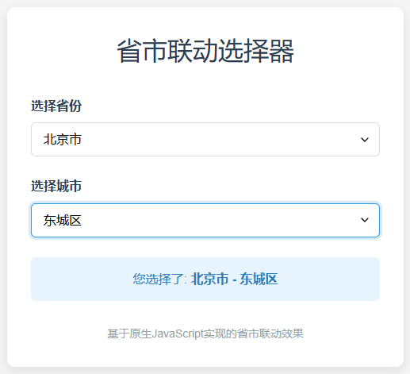

## 实现搜索联想自动补全效果

前端页面给大家：

```html
<!DOCTYPE html>
<html lang="zh-CN">
<head>
    <meta charset="UTF-8">
    <meta name="viewport" content="width=device-width, initial-scale=1.0">
    <title>自动补全输入框</title>
    <style>
        * {
            box-sizing: border-box;
            margin: 0;
            padding: 0;
        }
        
        body {
            font-family: 'Helvetica Neue', Arial, sans-serif;
            background-color: #f5f5f5;
            display: flex;
            justify-content: center;
            align-items: center;
            min-height: 100vh;
            padding: 20px;
        }
        
        .container {
            width: 100%;
            max-width: 500px;
            background: white;
            border-radius: 8px;
            box-shadow: 0 2px 10px rgba(0, 0, 0, 0.1);
            padding: 30px;
        }
        
        h1 {
            text-align: center;
            color: #333;
            margin-bottom: 30px;
            font-weight: 500;
        }
        
        .autocomplete {
            position: relative;
            width: 100%;
        }
        
        #autocomplete-input {
            width: 100%;
            padding: 12px 15px;
            border: 1px solid #ddd;
            border-radius: 4px;
            font-size: 16px;
            outline: none;
            transition: border 0.3s;
        }
        
        #autocomplete-input:focus {
            border-color: #4285f4;
        }
        
        .suggestions {
            position: absolute;
            top: 100%;
            left: 0;
            right: 0;
            background: white;
            border: 1px solid #ddd;
            border-top: none;
            border-radius: 0 0 4px 4px;
            max-height: 200px;
            overflow-y: auto;
            z-index: 100;
            display: none;
            box-shadow: 0 4px 6px rgba(0, 0, 0, 0.1);
        }
        
        .suggestion-item {
            padding: 10px 15px;
            cursor: pointer;
            transition: background 0.2s;
        }
        
        .suggestion-item:hover {
            background-color: #f5f5f5;
        }
        
        .suggestion-item.highlighted {
            background-color: #e8f0fe;
            color: #4285f4;
        }
        
        .loading {
            padding: 10px 15px;
            color: #777;
            font-size: 14px;
            text-align: center;
            display: none;
        }
        
        .no-suggestions {
            padding: 10px 15px;
            color: #777;
            font-size: 14px;
            text-align: center;
            display: none;
        }
    </style>
</head>
<body>
    <div class="container">
        <h1>自动补全输入框</h1>
        
        <div class="autocomplete">
            <input type="text" id="autocomplete-input" placeholder="请输入内容..." autocomplete="off">
            <div class="suggestions" id="suggestions">
                <div class="loading" id="loading">加载中...</div>
                <div class="no-suggestions" id="no-suggestions">无匹配项</div>
                <div id="suggestions-list"></div>
            </div>
        </div>
    </div>

    <script>
        document.addEventListener('DOMContentLoaded', function() {
            const input = document.getElementById('autocomplete-input');
            const suggestionsContainer = document.getElementById('suggestions');
            const suggestionsList = document.getElementById('suggestions-list');
            const loadingElement = document.getElementById('loading');
            const noSuggestionsElement = document.getElementById('no-suggestions');
            
            let debounceTimer;
            let currentSuggestions = [];
            let highlightedIndex = -1;
            
            // 输入事件处理
            input.addEventListener('input', function() {
                const value = this.value.trim();
                
                clearTimeout(debounceTimer);
                
                if (value.length === 0) {
                    hideSuggestions();
                    return;
                }
                
                // 显示加载状态
                showLoading();
                hideNoSuggestions();
                suggestionsList.innerHTML = '';
                
                // 防抖处理
                debounceTimer = setTimeout(() => {
                    fetchSuggestions(value);
                }, 300);
            });
            
            // 键盘事件处理
            input.addEventListener('keydown', function(e) {
                // 向下箭头
                if (e.key === 'ArrowDown') {
                    e.preventDefault();
                    navigateSuggestions(1);
                }
                // 向上箭头
                else if (e.key === 'ArrowUp') {
                    e.preventDefault();
                    navigateSuggestions(-1);
                }
                // 回车键
                else if (e.key === 'Enter') {
                    if (highlightedIndex >= 0 && highlightedIndex < currentSuggestions.length) {
                        selectSuggestion(currentSuggestions[highlightedIndex]);
                    }
                }
                // ESC键
                else if (e.key === 'Escape') {
                    hideSuggestions();
                }
            });
            
            // 输入框聚焦事件
            input.addEventListener('focus', function() {
                const value = this.value.trim();
                if (value.length > 0) {
                    fetchSuggestions(value);
                }
            });
            
            // 点击文档其他区域隐藏建议框
            document.addEventListener('click', function(e) {
                if (!input.contains(e.target) && !suggestionsContainer.contains(e.target)) {
                    hideSuggestions();
                }
            });
            
            // 获取建议
            function fetchSuggestions(query) {
                // 模拟API请求
                setTimeout(() => {
                    // 模拟数据 - 实际项目中替换为真实数据
                    const mockData = ['JavaScript指南', 'JavaScript教程', 'Java程序员'];
                    
                    // 过滤匹配项
                    currentSuggestions = mockData.filter(item => 
                        item.toLowerCase().includes(query.toLowerCase())
                    );
                    
                    renderSuggestions();
                    
                    // 隐藏加载状态
                    hideLoading();
                    
                    // 显示或隐藏建议框
                    if (currentSuggestions.length > 0) {
                        showSuggestions();
                        hideNoSuggestions();
                    } else {
                        showNoSuggestions();
                    }
                }, 500);
            }
            
            // 渲染建议列表
            function renderSuggestions() {
                suggestionsList.innerHTML = '';
                highlightedIndex = -1;
                
                currentSuggestions.forEach((item, index) => {
                    const div = document.createElement('div');
                    div.className = 'suggestion-item';
                    div.textContent = item;
                    div.addEventListener('click', () => selectSuggestion(item));
                    suggestionsList.appendChild(div);
                });
            }
            
            // 导航建议项
            function navigateSuggestions(direction) {
                if (currentSuggestions.length === 0) return;
                
                // 移除之前的高亮
                if (highlightedIndex >= 0) {
                    suggestionsList.children[highlightedIndex].classList.remove('highlighted');
                }
                
                // 计算新的高亮索引
                highlightedIndex += direction;
                
                // 循环处理
                if (highlightedIndex < 0) {
                    highlightedIndex = currentSuggestions.length - 1;
                } else if (highlightedIndex >= currentSuggestions.length) {
                    highlightedIndex = 0;
                }
                
                // 添加新的高亮
                suggestionsList.children[highlightedIndex].classList.add('highlighted');
                
                // 滚动到可见区域
                suggestionsList.children[highlightedIndex].scrollIntoView({
                    block: 'nearest'
                });
            }
            
            // 选择建议项
            function selectSuggestion(value) {
                input.value = value;
                hideSuggestions();
                input.focus();
            }
            
            // 显示建议框
            function showSuggestions() {
                suggestionsContainer.style.display = 'block';
            }
            
            // 隐藏建议框
            function hideSuggestions() {
                suggestionsContainer.style.display = 'none';
                highlightedIndex = -1;
            }
            
            // 显示加载状态
            function showLoading() {
                loadingElement.style.display = 'block';
            }
            
            // 隐藏加载状态
            function hideLoading() {
                loadingElement.style.display = 'none';
            }
            
            // 显示无建议提示
            function showNoSuggestions() {
                noSuggestionsElement.style.display = 'block';
                suggestionsList.style.display = 'none';
                showSuggestions();
            }
            
            // 隐藏无建议提示
            function hideNoSuggestions() {
                noSuggestionsElement.style.display = 'none';
                suggestionsList.style.display = 'block';
            }
        });
    </script>
</body>
</html>
```

最终效果：

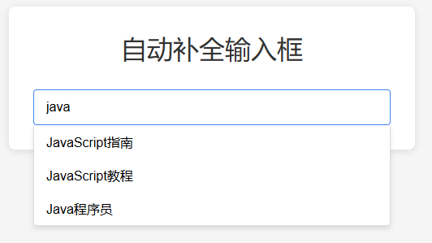