# 1.Maven、Nexus

# 什么是Maven


## Maven的概念

Maven 是自动化构建工具。

Maven 是 Apache 软件基金会组织维护的一款自动化构建工具，专注服务于 Java 平台的项目构建和依赖管理。Maven 这个单词的本意是：专家，内行。

Maven 是目前最流行的自动化构建工具，对于生产环境下多框架、多模块整合开发有重要作用，Maven 是一款在大型项目开发过程中不可或缺的重要工具。

## 为什么要使用Maven

我们知道，项目开发不仅仅是写写代码而已，期间会伴随着各种必不可少的事情要做，例如：

1. 我们需要引用各种 jar 包，尤其是比较大的工程，引用的 jar 包往往有几十个乃至上百个，每个都要到不同的官网去下载，而且每次用到的 jar 包，都需要手动引入工程目录，而且经常遇到各种让人抓狂的 jar 包冲突，版本冲突，Maven可以自动下载jar包及依赖包添加到项目中，大大减轻了工作负担。
2. 我们开发的 Java 文件，都是需要将它编译成二进制字节码文件。好在这项工作可以由各种集成开发工具帮我们完成，Eclipse、IDEA 等都可以将代码即时编译。但有时候我们需要多个模块同时编译，就必须要借助于Maven工具了。
3. 每个项目或模块开发过程中都会有 bug，因此写完了代码，我们还要写一些单元测试，然后一个个的运行来检验代码质量，Maven提供了专门的测试插件来实施测试。
4. 再优雅的代码也是要出来卖的。我们后面还需要把代码与各种配置文件、资源整合到一起，定型打包，如果是 web项目，还需要将之发布到服务器进行调用，这些都可以通过Maven轻松搞定。

总之，Maven是项目开发必不可少的工具。

类似自动化构建工具还有：Gant, Gradle。

## 项目构建过程

构建(build)是面向过程的(从开始到结尾的多个步骤)，涉及到多个环节的协同工作。

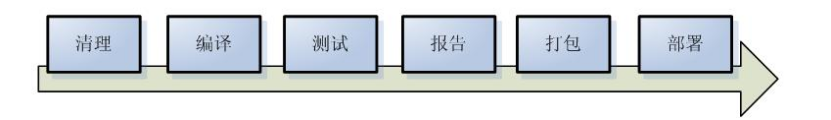

构建过程的几个主要环节

1. 清理：删除以前的编译结果，为重新编译做好准备。
2. 编译：将Java源程序编译为字节码文件。
3. 测试：针对项目中的关键点进行测试，确保项目在迭代开发过程中关键点的正确性。
4. 报告：在每一次测试后以标准的格式记录和展示测试结果。
5. 打包：将一个包含诸多文件的工程封装为一个压缩文件用于安装或部署。Java 工程对应 jar 包，Web 工程对应war包。
6. 安装：在Maven环境下特指将jar包安装到本地仓库中。这样该项目就可以被其他的maven项目通过依赖的方式引入。
7. 部署：将jar包部署到私服上。

## Maven的两大核心功能（重点）

### 项目构建

对项目进行编译，测试，打包，部署等构建。

### 依赖管理

对jar包的统一管理，Maven提供中央仓库，私服，本地仓库解决jar包的依赖和相关依赖的下载。

如下图所示：包括蓝、黄两个部分分别对应着[**依赖关系**](https://www.zhihu.com/search?q=%E4%BE%9D%E8%B5%96%E5%85%B3%E7%B3%BB&search_source=Entity&hybrid_search_source=Entity&hybrid_search_extra=%7B%22sourceType%22%3A%22answer%22%2C%22sourceId%22%3A2811089619%7D)**和****项目构建**两大核心功能。


# Maven的核心概念


## POM

POM(Project Object Model)项目对象模型，它是Maven的核心组件。它是Maven中的基本工作单元。它是一个xml文件，以pom.xml驻留在项目的根目录中。POM不仅包含有关**项目的信息**及Maven用于**构建项目的各种配置**的详细信息，还包含**目标和插件**。

pom.xml文件示例：

```xml
<!--添加父工程的引用，当前pom.xml文件中有这个配置，说明当前项目是一个子模块。从父的pom中继承配置-->
<parent>
  <groupId>com.jkweilai.bank</groupId>
  <artifactId>bank-parent</artifactId>
  <version>0.0.1-SNAPSHOT</version>
</parent>

<!--本项目的身份证号gav-->
<groupId>com.jkweilai</groupId>
<artifactId>maven_project</artifactId>          
<version>1.0.0</version>
<!--打包方式-->
<packaging>war</packaging>

<!--使用Properties集中化管理版本号-->
<properties>
  <!--mysql驱动的依赖-->
  <mysql.version>5.1.32</mysql.version>
  <spring-core-version>5.3.23</spring-core-version>
</properties>

<!-- 主要用于统一管理依赖的版本，它本身不会引入实际的依赖，所有子模块使用相同版本的依赖，避免冲突。 -->
<!-- 子模块在引用这些依赖时，可以省略 <version> 标签 -->
<!-- 只需要在这里修改一个版本号，所有子模块都会生效 -->
<dependencyManagement>
  <dependencies>
    <!-- 声明 Spring 相关依赖 -->
    <dependency>
      <groupId>org.springframework</groupId>
      <artifactId>spring-core</artifactId>
      <version>${spring-core-version}</version>
    </dependency>
  </dependencies>
</dependencyManagement>

<!--添加依赖-->
<dependencies>
  <dependency>
    <groupId>mysql</groupId>
    <artifactId>mysql-connector-java</artifactId>
    <version>${mysql.version}</version>
  </dependency>            
</dependencies>

<build>
  
  <!--聚合工程-->
  <!--当前项目如果作为一个父项目的话，可以有以下的配置，用于声明该项目包含哪些子模块-->
  <modules>
    <module>bank-manager-pojo</module>
    <module>bank-manager-mapper</module>
    <module>bank-manager-service</module>
    <module>bank-manager-web</module>
  </modules>
  
  <!--插件配置-->
  <plugins>
    <plugin>
      <groupId>org.apache.maven.plugins</groupId>
      <artifactId>maven-compiler-plugin</artifactId>
      <configuration>
        <source>17</source>
        <target>17</target>
        <encoding>UTF-8</encoding>
      </configuration>
    </plugin>
  </plugins>
  
  <!--指定配置文件识别路径-->
  <resources>
    <resource>
      <directory>src/main/java</directory>
      <includes>
        <include>**/*.properties</include>
        <include>**/*.xml</include>
      </includes>
    </resource>
    <resource>
      <directory>src/main/resources</directory>
      <includes>
        <include>**/*.properties</include>
        <include>**/*.xml</include>
      </includes>
    </resource>
  </resources>
</build>
```

## Maven工程约定的目录结构

会有预先约定好的目录结构，必须要遵循的规范，所有的Maven项目都依照这个规范。主要的目的是将项目的源码文件，测试代码，资源文件完全分开，便于项目管理和扩展。

```plaintext
maven_project
     |-----src
            |--------main
                       |------java
                       |------resources
            |--------test
                       |------java
                       |------resources
     |-----pom.xml
```

## GAV坐标

maven中使用三个标签来唯一定位jar资源。项目的唯一名称，创建项目时定义gav名称，引用项目时使用gav名称。相当于项目的身份证号。

1. `groupId`：组织名称，一般是公司域名的倒写
2. `artifactId`：项目名称
3. `version`：版本号
  1. 1.0-SNAPSHOT（开发时的临时版本号）
  2. 5.2.5.RELEASE（发布版本）

定义项目

```xml
<groupId>com.jkweilai</groupId>
<artifactId>maven_project</artifactId>          
<version>1.0.0</version>
```

引用项目

```xml
<dependency>
  <groupId>com.jkweilai</groupId>
  <artifactId>maven_project</artifactId>          
  <version>1.0.0</version>
</dependency>
```

## 仓库

存放jar包的位置 。Maven中所有的jar包都在仓库中。仓库分为`**本地仓库**`和`**远程仓库**`。

我们依赖的jar包它从哪儿获取呢？从仓库中获取的。在Maven中，任何一个依赖、插件或者项目构建的输出，都可以称之为**构件（Artifact）**。Maven 核心程序仅仅定义了自动化构建项目的生命周期，但具体的构建工作是由特定的构件完成的。而且为了提高构建的效率和构件复用，maven把所有的构件统一存储在某一个位置，这个位置就叫做仓库。

### 本地仓库

本地仓库，存在于当前电脑上，默认存放在`~\.m2\repository`中，为本机上所有的Maven工程服务。也可以通过Maven的配置文件`MAVEN_HOME/conf/settings.xml`修改本地仓库所在的目录。

### 远程仓库

远程仓库，包括：

1. 为全世界范围内的开发人员提供服务的中央仓库
2. 为本公司提供服务，自己架设的私服

Maven官方的中央仓库地址： [https://repo.maven.apache.org/maven2](https://repo.maven.apache.org/maven2)，中央仓库包含了绝大多数流行的开源Java构件，以及源码、作者信息、许可证信息等。一般来说，简单的Java项目依赖的构件都可以在这里下载得到。

私服是一种特殊的远程仓库，它是架设在局域网内的仓库服务，私服代理广域网上的远程仓库，供局域网内的Maven用户使用。当Maven需要下载构件的时候，它从私服请求，如果私服上不存在该构件，则从外部的远程仓库下载，缓存在私服上之后，再为Maven的下载请求提供服务。另外，我们还可以把一些无法从外部仓库下载到的构件上传到私服上。

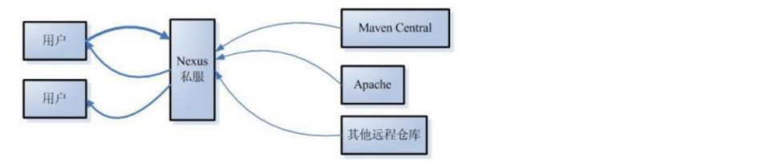

### GAV坐标去哪里找

Maven中央仓库中存储了各种构件（各种jar包），那么这些jar包的GAV坐标去哪里能找到呢？以下这个网站非常重要，在这个平台上提供了各种构件的GAV坐标，程序员经常通过这个平台来搜索各种构件的GAV坐标：[**http://mvnrepository.com/**](http://mvnrepository.com/)

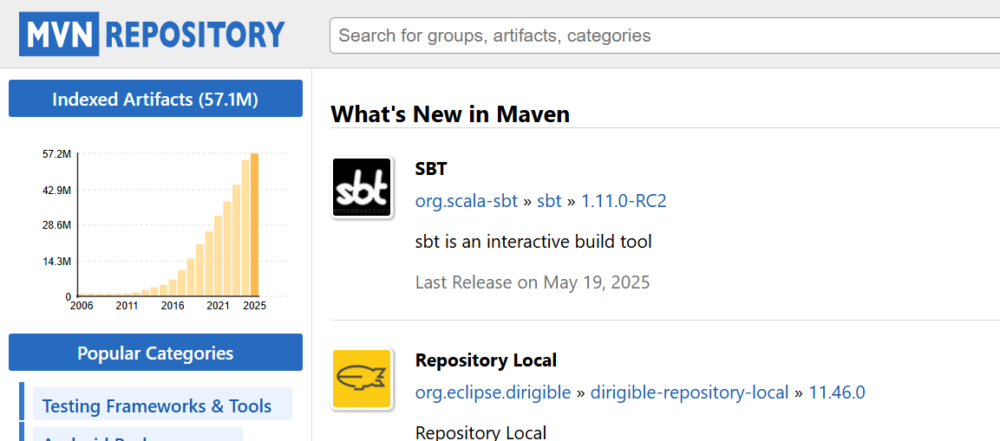

## 依赖

**依赖（Dependency）** 是 Maven 项目中声明的外部库（如 JAR 文件），通过 `pom.xml` 中的 `<dependency>`标签定义，构建时会自动从仓库下载并引入到项目中。

（核心要素：**声明坐标** → **自动下载** → **项目使用**）

```xml
<dependencies>
  <dependency>
    <groupId>org.mybatis</groupId>
    <artifactId>mybatis</artifactId>
    <version>3.5.11</version>
  </dependency>
</dependencies>
```

## 生命周期与插件

### Maven 生命周期的本质

Maven 的构建过程由 **生命周期（Lifecycle）** 驱动，它是一组**预定义的、有序的阶段（Phases）**，用于标准化项目的构建流程（如编译、测试、打包）。但需要注意的是：**生命周期本身只定义阶段顺序，不包含任何具体逻辑！** 真正干活的是 **插件（Plugins）**。

### 三大内置生命周期

Maven 提供三个核心生命周期，每个生命周期包含多个阶段：

| **生命周期** | **用途** | **关键阶段（顺序执行）** |
| --- | --- | --- |
| `default` | 项目构建和部署的完整过程 | `validate` → `compile` → `test` → `package` → `verify` → `install` → `deploy` + `<font style="color:rgb(15, 17, 21);background-color:rgb(235, 238, 242);">validate</font>`： 看看这个项目的“身份证”（基本信息）全不全，配置对不对。 + `<font style="color:rgb(15, 17, 21);background-color:rgb(235, 238, 242);">compile</font>`： 编译项目的源代码。 + `<font style="color:rgb(15, 17, 21);background-color:rgb(235, 238, 242);">test</font>`： 执行程序员编写的所有单元测试。 + `<font style="color:rgb(15, 17, 21);background-color:rgb(235, 238, 242);">package</font>`： 将编译后的代码打包，如 JAR、WAR。 + `<font style="color:rgb(15, 17, 21);background-color:rgb(235, 238, 242);">verify</font>`： 对打包后的内容进行全面检查。确保质量没问题。 + `<font style="color:rgb(15, 17, 21);background-color:rgb(235, 238, 242);">install</font>`： 将打包好的构件安装到**本地仓库**，这样就可以作为其他本地项目的依赖了。 + `<font style="color:rgb(15, 17, 21);background-color:rgb(235, 238, 242);">deploy</font>`： 将最终的构件复制到**远程仓库（私服）**，和其他开发者共享。 **注意：某阶段执行时，前面所有的阶段会全部执行一遍。** |
| `clean` | 清理构建产物 | `pre-clean` → `clean` → `post-clean` + `<font style="color:rgb(15, 17, 21);background-color:rgb(235, 238, 242);">pre-clean</font>`： **大扫除之前**的准备工作。（很少用，比如发个通知说“我要开始删了！”） + `<font style="color:rgb(15, 17, 21);background-color:rgb(235, 238, 242);">clean</font>`： **核心阶段**，就是**动手删除**** **`**<font style="color:rgb(15, 17, 21);background-color:rgb(235, 238, 242);">target</font>**`** ****文件夹**。 + `<font style="color:rgb(15, 17, 21);background-color:rgb(235, 238, 242);">post-clean</font>`： **大扫除之后**的收尾工作。（很少用，比如记录一下“我刚删完了”） |
| `site` | 生成文档和报告 | `pre-site` → `site` → `post-site` → `site-deploy` site 就是给你的项目自动创建一个“产品说明书网站”。 + `<font style="color:rgb(15, 17, 21);background-color:rgb(235, 238, 242);">pre-site</font>`： **建网站之前**的准备工作。（很少用） + `<font style="color:rgb(15, 17, 21);background-color:rgb(235, 238, 242);">site</font>`： **核心阶段**，就是**动手生成那个“说明书网站”**。生成的文件都在 `<font style="color:rgb(15, 17, 21);background-color:rgb(235, 238, 242);">target/site</font>` 文件夹里。你可以直接用浏览器打开 `<font style="color:rgb(15, 17, 21);background-color:rgb(235, 238, 242);">target/site/index.html</font>` 来查看。 + `<font style="color:rgb(15, 17, 21);background-color:rgb(235, 238, 242);">post-site</font>`： **建网站之后**的收尾工作。（很少用） + `<font style="color:rgb(15, 17, 21);background-color:rgb(235, 238, 242);">site-deploy</font>`： **把网站发布上网**，把这个“说明书网站”上传到一台服务器上，这样大家通过一个网址就能访问了，不用每个人自己本地生成。 在 pom.xml 文件中配置这个    my-website-server scp://webhost.mycompany.com/www/docs/myproject/  |

### 插件与生命周期的绑定

**每个生命周期阶段的实际行为由插件目标（Plugin Goals）实现**。Maven 通过两种方式绑定插件到生命周期：

#### 默认绑定（内置）

Maven 为核心阶段预绑定了常用插件。例如：

- `compile`** 阶段** → `maven-compiler-plugin:compile`（编译代码）
- `test`** 阶段** → `maven-surefire-plugin:test`（运行单元测试）
- `package`** 阶段** → `maven-jar-plugin:jar`（打包为 JAR 文件）

#### 自定义绑定（用户配置）

用户可以在 `pom.xml` 中覆盖默认绑定或添加新插件。例如：

```xml
<build>
  <plugins>
    <plugin>
      <groupId>org.apache.maven.plugins</groupId>
      <artifactId>maven-compiler-plugin</artifactId> <!--负责编译的工具包-->
      <version>3.11.0</version>
      <executions>
        <execution>
          <phase>compile</phase>  <!-- 绑定到 compile 阶段 -->
          <goals>
            <goal>compile</goal>   <!-- 工具包中的具体工具的名字 -->
          </goals>
        </execution>
      </executions>
    </plugin>
  </plugins>
</build>
```

### 总结生命周期和插件的关系

- **生命周期是“流程框架”**：定义阶段顺序，但无实际功能。
- **插件是“执行引擎”**：通过绑定目标（Goal）实现具体任务。
- **无插件 = 空流程**：若阶段未绑定插件，Maven 会直接跳过它。

# Maven命令


在 Maven的生命周期中，用户通过执行 **Maven 命令（即指定某个阶段）** 来触发构建流程。每个命令实际上对应生命周期中的一个或多个阶段，Maven 会按顺序执行**从初始阶段到目标阶段的所有步骤**。

## 生命周期上的核心命令

Maven 有 **3 个内置生命周期**，每个生命周期包含多个阶段，用户可通过 `mvn <phase>` 命令触发执行。

### `default` 生命周期（核心构建流程）

**用途**：编译、测试、打包、部署项目。
**核心阶段（按顺序执行）**：

| **命令（**`**mvn <phase>**`**）** | **作用** |
| --- | --- |
| `validate` | 验证项目配置是否正确（如 `pom.xml` 是否合法）。 |
| `compile` | 编译项目的主代码（生成 `target/classes`）。 |
| `test` | 运行单元测试（使用 `maven-surefire-plugin`）。 |
| `package` | 打包项目（生成 JAR/WAR 等，存放于 `target/` 目录）。 |
| `verify` | 运行集成测试或检查构建质量（如 `maven-failsafe-plugin`）。 |
| `install` | 将构建的产物安装到本地仓库（默认在 `~/.m2/repository`）。 |
| `deploy` | 将构建的产物部署到远程仓库（如 Nexus、Artifactory）。 |

**常用命令示例**：

```bash
mvn compile    # 执行到 compile 阶段（含 validate + compile）
mvn test       # 执行到 test 阶段（含 validate + compile + test）
mvn package    # 执行到 package 阶段（含 validate → compile → test → package）
mvn install    # 执行到 install 阶段（含前面所有阶段 + install）
```

### `clean` 生命周期（清理构建产物）

**用途**：删除构建生成的目录（如 `target/`）。
**核心阶段**：

| **命令** | **作用** |
| --- | --- |
| `pre-clean` | 清理前的准备工作（很少自定义）。 |
| `clean` | 删除 `target/` 目录（核心阶段）。 |
| `post-clean` | 清理后的收尾工作（很少自定义）。 |

### `site` 生命周期（生成项目文档）

**用途**：生成项目站点文档（如 API 文档、测试报告等）。
**核心阶段**：

| **命令** | **作用** |
| --- | --- |
| `pre-site` | 生成站点前的准备工作。 |
| `site` | 生成项目站点（默认到 `target/site/`）。 |
| `post-site` | 生成站点后的收尾工作。 |
| `site-deploy` | 将站点部署到远程服务器。 |

## 组合命令

Maven 支持在同一命令中组合不同生命周期的阶段：

```bash
mvn clean package      # 先清理再打包
mvn clean test         # 清理后运行测试
mvn clean install      # 清理后安装到本地仓库
mvn clean deploy       # 清理后部署到远程仓库
```

## 特殊命令

- **查看阶段绑定**：

```bash
mvn help:describe -Dcmd=compile  # 查看 compile 阶段绑定的插件
```

- **跳过测试**：

```bash
mvn install -DskipTests   # 跳过测试阶段（但编译测试代码）
mvn install -Dmaven.test.skip=true  # 完全跳过测试（不编译也不执行）
```

- **仅执行某个插件的目标**（不依赖生命周期）：

```bash
mvn dependency:tree       # 直接运行 dependency 插件的 tree 目标（直接使用dependency工具包中的tree工具）
```

## 重点规则

- 执行 `mvn <phase>` 时，Maven 会**自动运行该阶段及其之前的所有阶段**。
- 插件目标（Goals）绑定到阶段，实现具体功能（如 `maven-compiler-plugin:compile` 绑定到 `compile` 阶段）。

## 开发工具IDEA对Maven的支持

使用idea后，生命周期要调用的命令被集成化一些按钮，只需要双击即可调用相应的插件来运行。

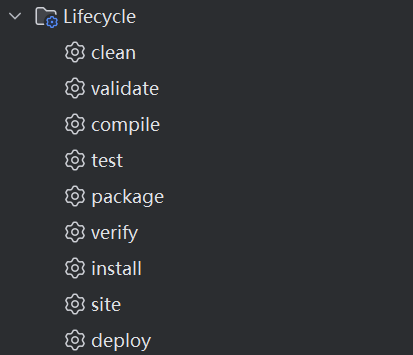

# Maven的使用


## 下载Maven

官网：[http://maven.apache.org/](http://maven.apache.org/)

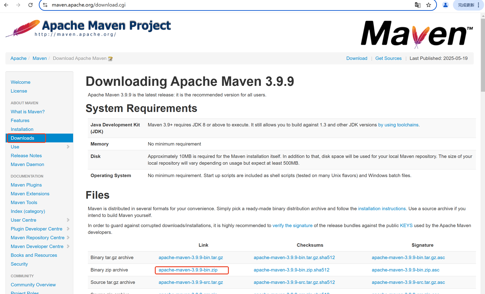

## 配置Maven

Maven解压就是安装。建议将Maven解压到一个没有中文的路径中。

### 配置环境变量

Maven的核心命令是`mvn`，这个命令对应的文件是`MAVEN_HOME/bin/mvn`，打开`mvn`文件，如下：

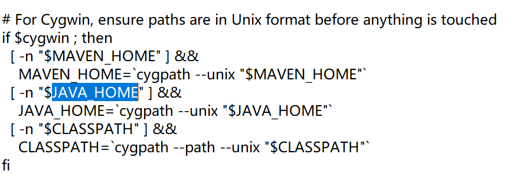

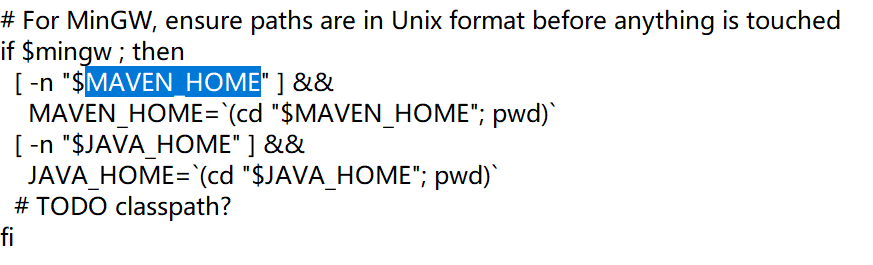

可以看到这个`mvn`命令的使用依赖了`JAVA_HOME`和`MAVEN_HOME`两个环境变量。因此这两个环境变量是必须配置的。

1. JAVA_HOME=JDK的根路径
2. MAVEN_HOME=Maven的根路径
3. PATH=%JAVA_HOME%\bin;%MAVEN_HOME%\bin

### 配置Maven工具参数

`MAVAN_HOME/conf/settings.xml`文件。

#### 配置本地仓库

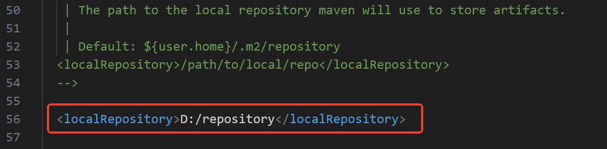

#### 配置远程仓库

找到结束标签，将以下代码贴在其前面：

```xml
<!--配置阿里远程仓库-->
<mirror>
  <id>alimaven</id>
  <name>aliyun maven</name>
  <url>https://maven.aliyun.com/repository/public/</url>
  <mirrorOf>central</mirrorOf>
</mirror>
```

这段配置是 Maven 的镜像（Mirror）设置，用于将 Maven 中央仓库（repo.maven.apache.org）的请求自动重定向到阿里云的 Maven 镜像仓库，以加速依赖下载（尤其在国内访问更稳定、更快）。

#### JDK21自适应构建配置

找到结束标签，在其前面配置以下代码：

```xml
<profile>
  <id>jdk21</id>
  <activation>
    <activeByDefault>true</activeByDefault>
    <jdk>21</jdk>
  </activation>
  <properties>
    <project.build.sourceEncoding>UTF-8</project.build.sourceEncoding>
    <maven.compiler.source>21</maven.compiler.source>
    <maven.compiler.target>21</maven.compiler.target>
    <maven.compiler.compilerVersion>21</maven.compiler.compilerVersion>
  </properties>
</profile>
```

以上配置的作用是：当系统检测到JDK21时，自动使用UTF-8编码，并强制Maven编译器以JDK21版本编译源码和生成字节码（如果不强制的话，maven 会自动通过 JAVA_HOME 环境变量指向的 JDK 进行编译，这样不利于团队协作开发，团队协作开发需要保证 JDK 版本都是一致的。），确保项目在Java 21环境下正确构建（因为我们电脑上安装的 JDK 是 21，因此需要这样配置）。

Maven 本身不包含 Java 编译器：Maven 只是一个构建工具，它需要调用你本地安装的 JDK 中的 javac 编译器来工作。

### IDEA集成Maven

注意：如果使用IDEA集成Maven，则之前配置的`MAVEN_HOME`、`JAVA_HOME`、`PATH`都是没用的。

#### 创建一个空的工程（建议）

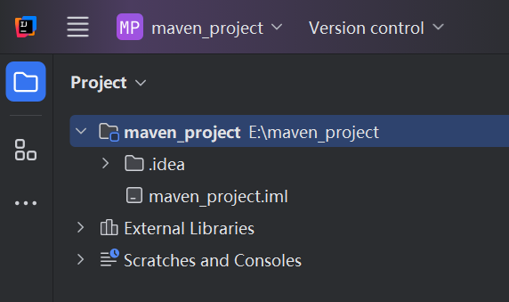

#### 设置空工程的JDK（建议）

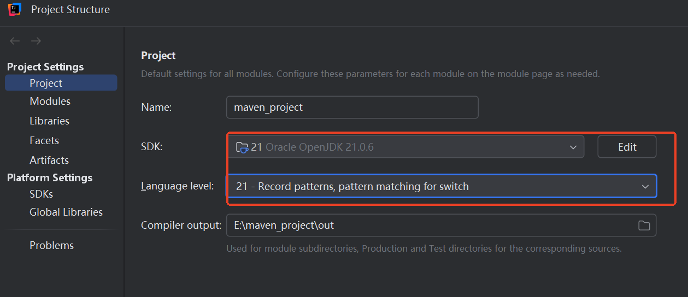

#### 集成Maven

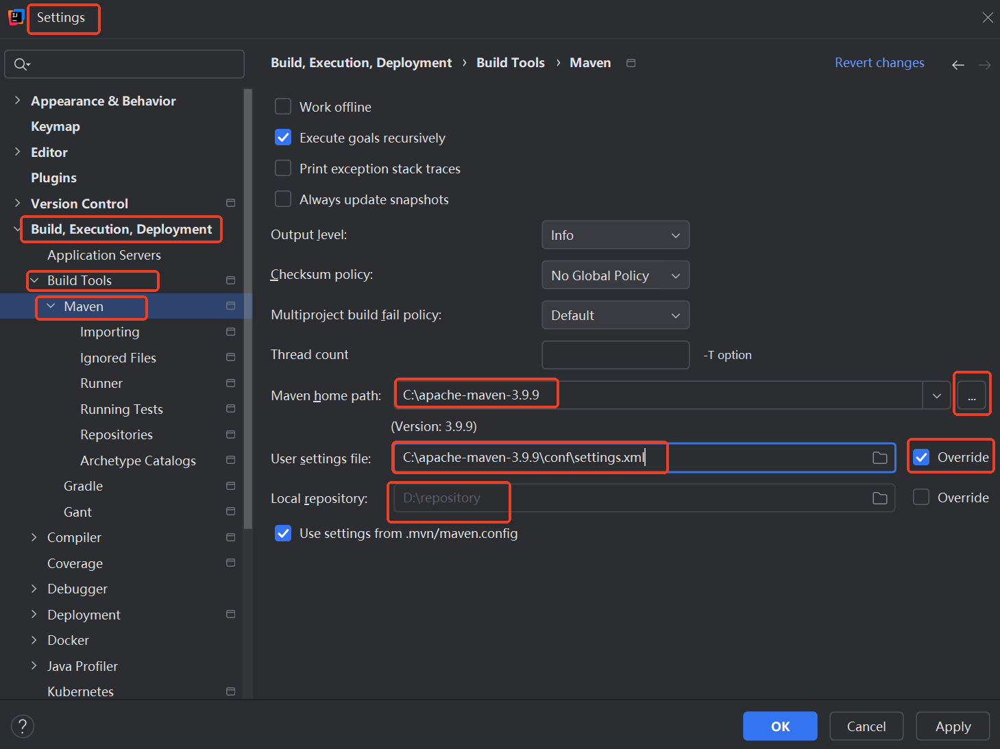

## 手动开发Maven项目

第一步：按照Maven约定的标准目录结构创建Maven项目

```plaintext
maven-001
    |-------src
              |--------main
                          |------java
                          |------resources
              |--------test
                          |------java
                          |------resources
    |-------pom.xml
```

第二步：编写pom文件

```xml
<?xml version="1.0" encoding="UTF-8"?>
<project xmlns="http://maven.apache.org/POM/4.0.0"
         xmlns:xsi="http://www.w3.org/2001/XMLSchema-instance"
         xsi:schemaLocation="http://maven.apache.org/POM/4.0.0 http://maven.apache.org/xsd/maven-4.0.0.xsd">
    <modelVersion>4.0.0</modelVersion>

    <groupId>com.jkweilai</groupId>
    <artifactId>maven-001</artifactId>
    <version>1.0-SNAPSHOT</version>

    <!--如果配置了这个，那么之前配置的profile就不需要配置了。-->
    <properties>
        <maven.compiler.source>21</maven.compiler.source>
        <maven.compiler.target>21</maven.compiler.target>
        <project.build.sourceEncoding>UTF-8</project.build.sourceEncoding>
    </properties>

</project>
```

第三步：编写Java程序

在`maven-001/src/main/java`目录下新建目录`com/jkweilai/maven`，创建文件`HelloMaven.java`。编写如下java代码：

```java
package com.jkweilai.maven;

public class HelloMaven {
    public static void main(String[] args){
        System.out.println("Hello Maven");
    }
}
```

第四步：执行编译命令，查看target目录是否生成字节码

一定要在项目的**根路径**下执行如下命令：

```shell
mvn clean compile
```

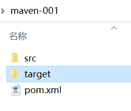

第五步：运行程序

在dos命令窗口中，将目录切换到`target/classes`目录下，然后执行以下命令运行程序：

```shell
java com.jkweilai.maven.HelloMaven
```

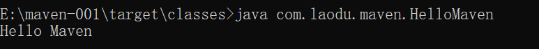

第六步：执行安装命令，查看本地仓库中是否生成jar包

一定要在项目的**根路径**下执行如下命令：

```shell
mvn clean install
```

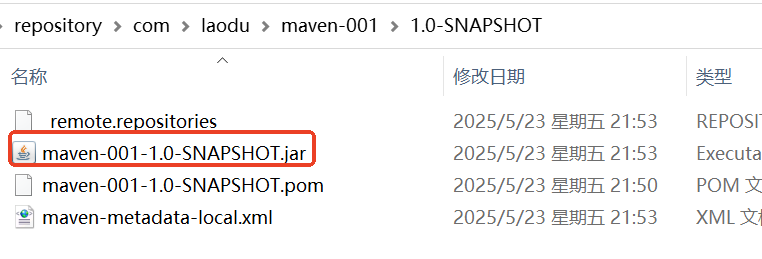

## IDEA开发Maven Java项目

### 创建Maven模块

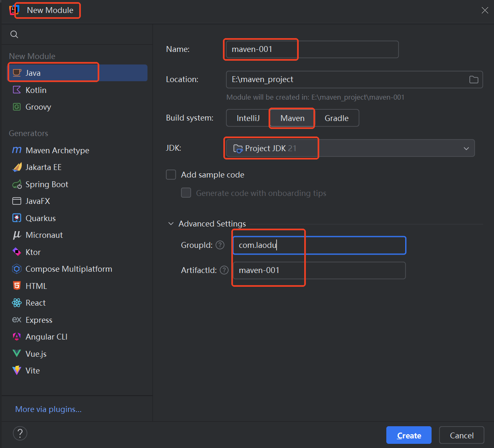

### 补齐目录（非必须）

`test`目录中添加一个子目录：`resources`

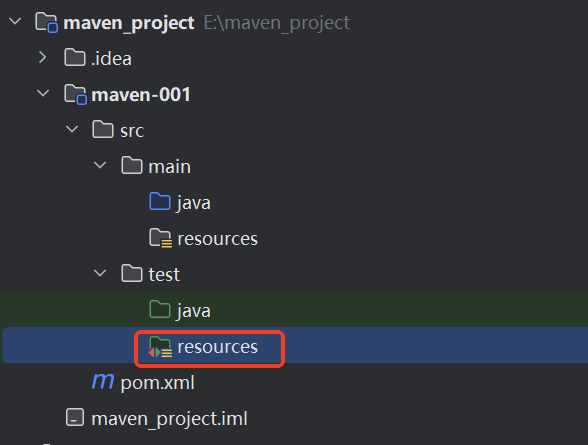

### 添加junit5依赖

```xml
<dependency>
    <groupId>org.junit.jupiter</groupId>
    <artifactId>junit-jupiter-api</artifactId>
    <version>5.12.2</version>
    <scope>test</scope>
</dependency>
```

记得点 M 刷新依赖哦。

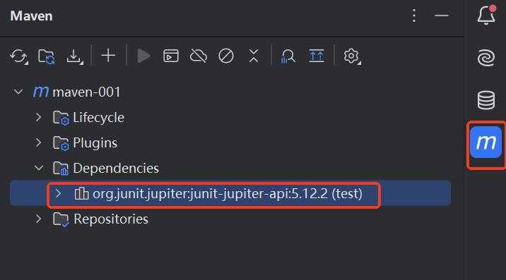

### 编写Java程序

```java
package com.jkweilai;

public class Hello {
    //加法运算
    public int sum(int num1,int num2){
        return num1 + num2;
    }
    //乘法运算
    public int mul(int num1,int num2){
        return num1 * num2;
    }
}
```

### 编写测试程序

```java
package com.jkweilai;

import org.junit.jupiter.api.Test;

public class HelloTest {
    /**
     * 测试功能由测试方法来实现
     * 测试方法的规范
     * 1)访问权限是public
     * 2)方法没有返回值void
     * 3)方法名称自定义,推荐以test开头
     * 4)方法没有参数
     * 5)使用@Test注解声明是测试方法
     */
    @Test
    public void testSum(){
        Hello  hello = new Hello();
        System.out.println(hello.sum(3,6));
    }
    @Test
    public void testMul(){
        Hello  hello = new Hello();
        System.out.println(hello.mul(3,6));
    }
}
```

## IDEA开发Maven JavaWeb项目

### 第一种方式：全部手动配置

#### 创建Java Maven模块

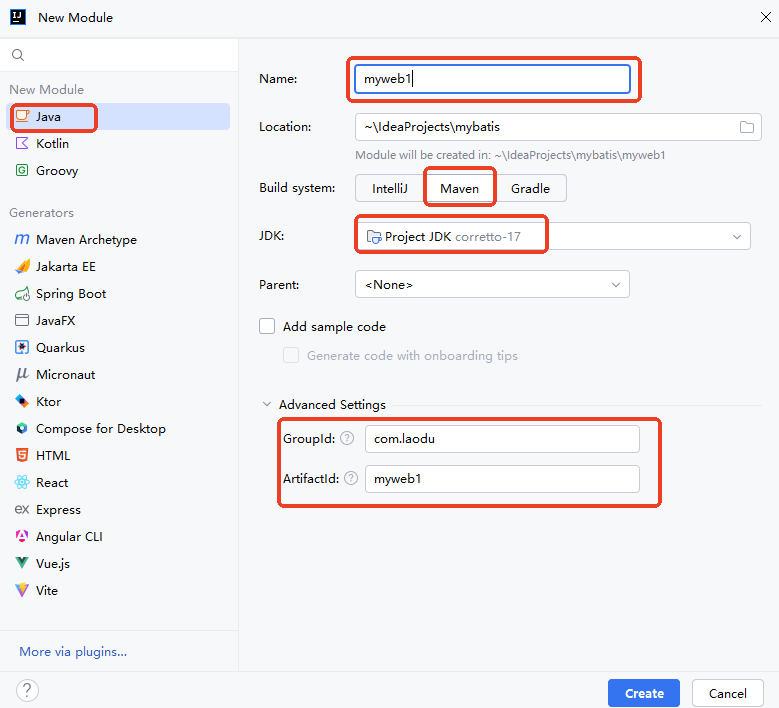

#### 手动创建目录

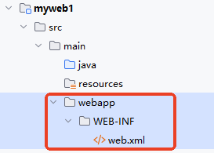

#### 提供web.xml配置

```xml
<?xml version="1.0" encoding="UTF-8"?>
<web-app xmlns="https://jakarta.ee/xml/ns/jakartaee"
         xmlns:xsi="http://www.w3.org/2001/XMLSchema-instance"
         xsi:schemaLocation="https://jakarta.ee/xml/ns/jakartaee
                             https://jakarta.ee/xml/ns/jakartaee/web-app_6_0.xsd"
         version="6.0">
</web-app>
```

#### 添加打包方式和依赖

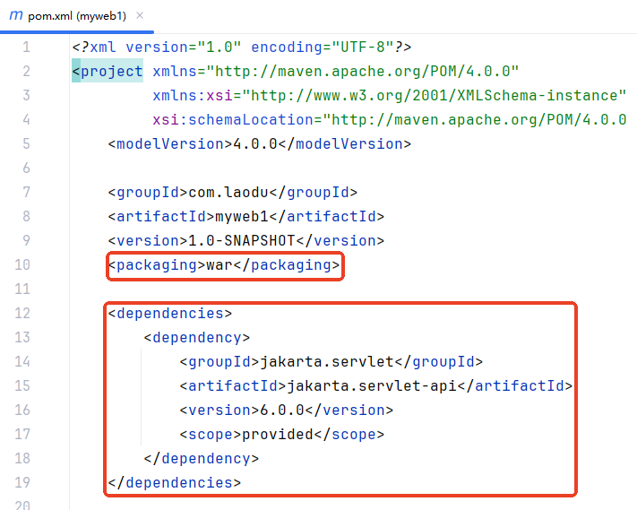

最后记得点M刷新哦。

### 第二种方式：在Module上添加Web支持

#### 创建Java Maven模块

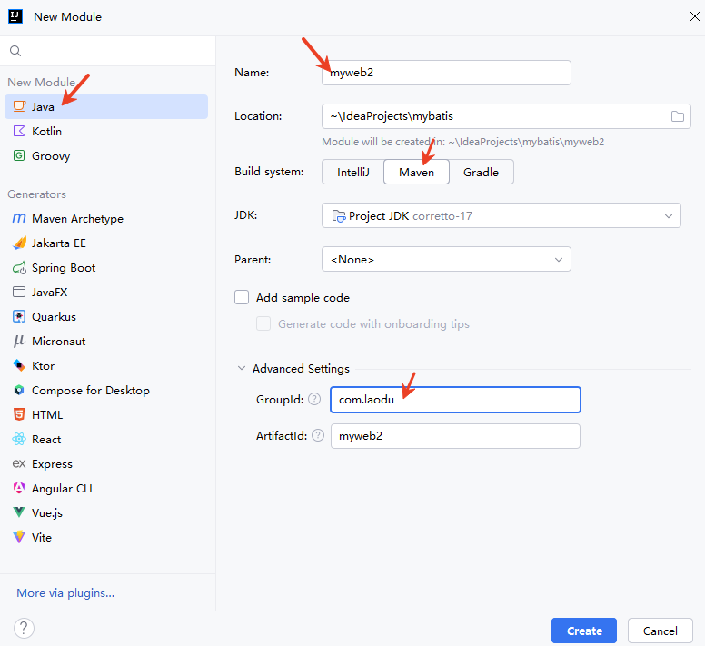

#### 打开项目结构

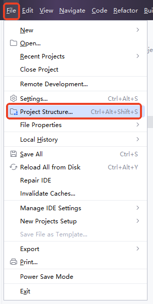

#### 在Module上添加Web支持

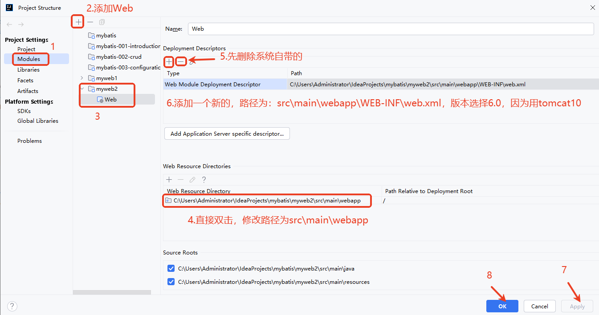

#### 打包方式war并添加servlet依赖

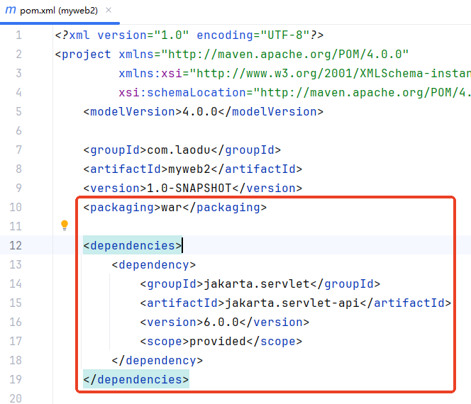

最后记得点M刷新哦。

### 第三种方式：通过Maven的webapp原型创建

#### 选择Archetype

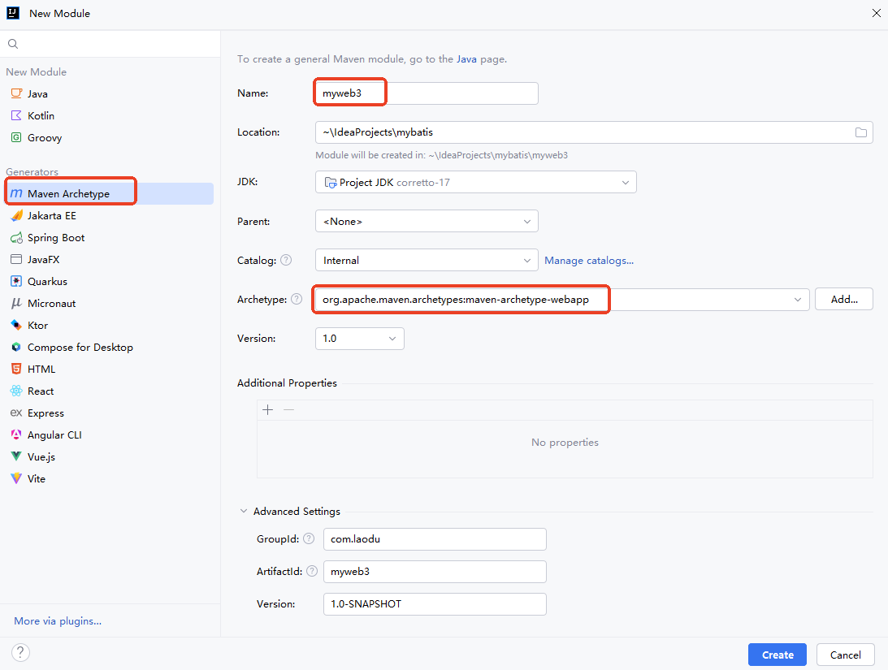

#### 修改web.xml（可选）

```xml
<?xml version="1.0" encoding="UTF-8"?>
<web-app xmlns="https://jakarta.ee/xml/ns/jakartaee"
         xmlns:xsi="http://www.w3.org/2001/XMLSchema-instance"
         xsi:schemaLocation="https://jakarta.ee/xml/ns/jakartaee https://jakarta.ee/xml/ns/jakartaee/web-app_6_0.xsd"
         version="6.0">
</web-app>
```

#### 添加servlet依赖

```xml
<dependency>
    <groupId>jakarta.servlet</groupId>
    <artifactId>jakarta.servlet-api</artifactId>
    <version>6.0.0</version>
    <scope>provided</scope>
</dependency>
```

### 编写Servlet并部署项目到Tomcat

```java
package com.jkweilai.servlet;

import jakarta.servlet.ServletException;
import jakarta.servlet.annotation.WebServlet;
import jakarta.servlet.http.HttpServlet;
import jakarta.servlet.http.HttpServletRequest;
import jakarta.servlet.http.HttpServletResponse;

import java.io.IOException;

@WebServlet("/hello")
public class HelloServlet extends HttpServlet {
    @Override
    protected void doGet(HttpServletRequest req, HttpServletResponse resp) throws ServletException, IOException {
        resp.setContentType("text/html;charset=UTF-8");
        resp.getWriter().println("Hello World");
    }
}
```

## 快速拷贝Maven项目

第一步：在硬盘上直接复制粘贴，例如将`maven-web-002`拷贝为`maven-web-003`。注意：直接在工程目录下复制，然后还是粘贴到工程目录下，修改名字。

第二步：删除target目录。

第三步：修改`pom.xml`中的`<artifactId>maven-web-003</artifactId>`

第四步：打开IDEA工具，在`pom.xml`文件上右键，然后点击`+ Add as Maven Project`。

# Maven的依赖管理


在JAVA开发中,项目的依赖管理是一项重要任务。通过合理管理项目的依赖关系，我们可以有效的管理第三方库，模块的引用及版本控制。而Maven作为一个强大的构建工具和依赖管理工具，为我们提供了便捷的方式来管理项目的依赖。

## 什么是依赖范围

Maven的依赖构件包含一个依赖范围的属性。这个属性描述的是三套classpath的控制，即编译、测试、运行。说白了就是添加的jar包起作用的范围。 maven提供了以下几种依赖范围：compile，test，provided，runtime，system，import。

### compile

默认范围（不设置 scope 时，默认就是它），在编译、测试、运行时都需要，会打包。

```xml
<dependency>
  <groupId>org.springframework</groupId>
  <artifactId>spring-context</artifactId>
  <version>6.2.6</version>
  <scope>compile</scope>
</dependency>
```

### test

仅用于测试，在编译和运行测试代码时可用，不会打包。

```xml
<dependency>
    <groupId>org.junit.jupiter</groupId>
    <artifactId>junit-jupiter-api</artifactId>
    <version>5.12.2</version>
    <scope>test</scope>
</dependency>
```

### provided

已由环境提供，编译和测试时需要，但运行时由 JDK 或容器提供，不会打包。

```xml
<dependency>
    <groupId>jakarta.servlet</groupId>
    <artifactId>jakarta.servlet-api</artifactId>
    <version>6.1.0</version>
    <scope>provided</scope>
</dependency>
```

### runtime

测试和运行时需要，但编译时不需要（如 JDBC 驱动）。

```xml
<dependency>
    <groupId>com.mysql</groupId>
    <artifactId>mysql-connector-j</artifactId>
    <version>8.4.0</version>
    <scope>runtime</scope>
</dependency>
```

### system

与 provided 类似，但你必须通过 systemPath 显式指定本地系统路径上的 JAR。（建议谨慎使用，因为别人机器上的 jar 包可能不在这个目录下。）

```xml
<dependency>
  <groupId>com.jkweilai</groupId>
  <artifactId>maven_001</artifactId>
  <version>1.0-SNAPSHOT</version>
  <scope>system</scope>
  <systemPath>D:/repository/com/jkweilai/maven_001/1.0-SNAPSHOT/maven_001-1.0-SNAPSHOT.jar</systemPath>
</dependency>
```

### import

仅用于 `<dependencyManagement>`，表示从另一个 POM 中导入依赖管理配置。

以下配置的作用是：将 `spring-boot-dependencies-2.7.0.pom`文件中 `dependencyManagement` 定义的依赖版本管理，全部导入到当前项目的 `dependencyManagement` 节点中

```xml
<dependencyManagement>
    <dependencies>
        <dependency>
            <groupId>org.springframework.boot</groupId>
            <artifactId>spring-boot-dependencies</artifactId>
            <version>2.7.0</version>
            <type>pom</type>
            <scope>import</scope>
        </dependency>
    </dependencies>
</dependencyManagement>
```

然后你声明一个实际依赖（不写版本号）：

```xml
<dependencies>
    <dependency>
        <groupId>org.springframework.boot</groupId>
        <artifactId>spring-boot-starter-web</artifactId>
        <!-- 版本由dependencyManagement决定 -->
    </dependency>
</dependencies>
```

| **scope** | **编译** | **测试** | **运行** | **示例** |
| --- | --- | --- | --- | --- |
| compile（默认） | 是 | 是 | 是 | spring-context |
| provided | 是 | 是 |   | servlet-api |
| system | 是 | 是 |   | 非maven仓库的本地jar包 |
| runtime |   | 是 | 是 | jdbc驱动 |
| test | 编译测试代码时有用 | 是 |   | junit |
| import |   |   |   | 把另一个POM文件中的依赖版本定义"复制"到当前POM中 |

## 什么是依赖传递

依赖具有传递性。不过在引入依赖时只需要引入直接依赖即可。间接依赖Maven会自动引入。


## 依赖范围对依赖传递的影响

`scope`对依赖传递也有影响。不同的 `scope`依赖传递效果不同。

### 主要依赖范围及其传递影响

1. **compile**：**传递**。会向依赖你的项目传递。（这个 jar 包在编译和运行的时候都需要，自然需要传递）
2. **runtime**：**传递**。会向依赖你的项目传递。（这个 jar 包在运行时需要，自然也需要传递）
3. **test**：**不传递**。永远不会传递给其他项目。（这个 jar 包既然只是在测试阶段起作用，传递也没有意义。）
4. **provided**：**不传递**。永远不会传递给其他项目。（这个 jar 包既然由容器提供了，传递也没有意义。）
5. **system**：**不传递**。由于与本地路径强绑定，永远不会传递给其他项目。
6. **import**：**不涉及传递**。它本身不是真正的依赖，只是导入依赖管理列表，因此不参与传递性依赖机制。

### 编写程序测试

创建`maven-003`工程和`maven-004`工程

`maven-003`工程的`pom.xml`：

```xml
<?xml version="1.0" encoding="UTF-8"?>
<project xmlns="http://maven.apache.org/POM/4.0.0"
         xmlns:xsi="http://www.w3.org/2001/XMLSchema-instance"
         xsi:schemaLocation="http://maven.apache.org/POM/4.0.0 http://maven.apache.org/xsd/maven-4.0.0.xsd">
    <modelVersion>4.0.0</modelVersion>

    <groupId>com.jkweilai</groupId>
    <artifactId>maven-003</artifactId>
    <version>1.0-SNAPSHOT</version>
    <packaging>jar</packaging>

    <dependencies>
        <!--compile:编译 测试 运行 都有效-->
        <dependency>
            <groupId>org.springframework</groupId>
            <artifactId>spring-context</artifactId>
            <version>6.2.7</version>
            <scope>compile</scope>
        </dependency>
        <!--runtime：测试 运行 有效-->
        <dependency>
            <groupId>com.mysql</groupId>
            <artifactId>mysql-connector-j</artifactId>
            <version>8.3.0</version>
            <scope>runtime</scope>
        </dependency>
        <!--test：测试 有效-->
        <dependency>
            <groupId>org.junit.jupiter</groupId>
            <artifactId>junit-jupiter-api</artifactId>
            <version>5.12.2</version>
            <scope>test</scope>
        </dependency>
        <!--provided：编译 测试 有效-->
        <dependency>
            <groupId>jakarta.servlet</groupId>
            <artifactId>jakarta.servlet-api</artifactId>
            <version>6.0.0</version>
            <scope>provided</scope>
        </dependency>
    </dependencies>

    <properties>
        <maven.compiler.source>21</maven.compiler.source>
        <maven.compiler.target>21</maven.compiler.target>
        <project.build.sourceEncoding>UTF-8</project.build.sourceEncoding>
    </properties>

</project>
```

`maven-004`工程的`pom.xml`文件：

```xml
<?xml version="1.0" encoding="UTF-8"?>
<project xmlns="http://maven.apache.org/POM/4.0.0"
         xmlns:xsi="http://www.w3.org/2001/XMLSchema-instance"
         xsi:schemaLocation="http://maven.apache.org/POM/4.0.0 http://maven.apache.org/xsd/maven-4.0.0.xsd">
    <modelVersion>4.0.0</modelVersion>

    <groupId>com.jkweilai</groupId>
    <artifactId>maven-004</artifactId>
    <version>1.0-SNAPSHOT</version>
    <packaging>jar</packaging>

    <dependencies>
        <dependency>
            <groupId>com.jkweilai</groupId>
            <artifactId>maven-003</artifactId>
            <version>1.0-SNAPSHOT</version>
        </dependency>
    </dependencies>

    <properties>
        <maven.compiler.source>21</maven.compiler.source>
        <maven.compiler.target>21</maven.compiler.target>
        <project.build.sourceEncoding>UTF-8</project.build.sourceEncoding>
    </properties>

</project>
```

观察依赖范围对依赖传递的影响，可以清楚的看到，只有`compile`和`runtime`支持传递：

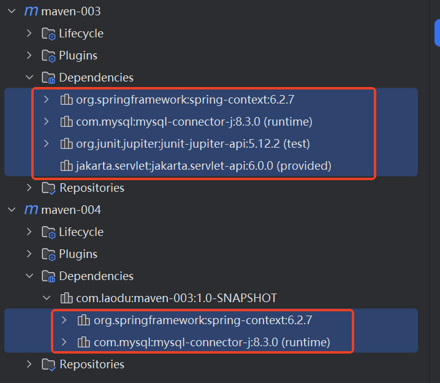

## Maven是如何解决依赖冲突的

### 什么是依赖冲突

项目中引入了 `a.jar`和 `b.jar`，结果 `a.jar`关联依赖了一个 `my.jar 1.0`，`b.jar`依赖了一个 `my.jar 1.1`。`my.jar 1.0`和 `my.jar 1.1`冲突了。

### 依赖冲突的解决方案

Maven可以通过以下途径解决依赖冲突。

#### 版本锁定

在 Maven 的父工程中，`<font style="color:rgb(15, 17, 21);background-color:rgb(235, 238, 242);"><dependencyManagement></font>` 的核心作用是进行**依赖版本的统一锁定**。它可以集中管理所有子项目共用的依赖及其版本号，从而确保整个项目体系使用的依赖是一致的。

需要明确的是，`<font style="color:rgb(15, 17, 21);background-color:rgb(235, 238, 242);"><dependencyManagement></font>` 仅仅是一个**声明**，它本身并不会实际引入这些依赖。

只有当子项目中**显式地声明**了某个依赖时，该依赖才会被真正引入。此时：

- **如果子项目没有指定版本号**，Maven 会自动使用父工程在 `<font style="color:rgb(15, 17, 21);background-color:rgb(235, 238, 242);"><dependencyManagement></font>` 中锁定的版本。
- **如果子项目明确指定了版本号**，则会以子项目自己指定的版本为准，**覆盖**掉父工程中锁定的版本。

1. 子工程使用父工程锁定的版本号

`maven-parent`工程中的`pom.xml`文件：

```xml
<?xml version="1.0" encoding="UTF-8"?>
<project xmlns="http://maven.apache.org/POM/4.0.0"
         xmlns:xsi="http://www.w3.org/2001/XMLSchema-instance"
         xsi:schemaLocation="http://maven.apache.org/POM/4.0.0 http://maven.apache.org/xsd/maven-4.0.0.xsd">
    <modelVersion>4.0.0</modelVersion>

    <groupId>com.jkweilai</groupId>
    <artifactId>maven-parent</artifactId>
    <version>1.0-SNAPSHOT</version>
    <packaging>pom</packaging>

    <modules>
        <module>maven-son</module>
    </modules>

    <properties>
        <!--统一版本号-->
        <mysql.version>8.3.0</mysql.version>
        <maven.compiler.source>21</maven.compiler.source>
        <maven.compiler.target>21</maven.compiler.target>
        <project.build.sourceEncoding>UTF-8</project.build.sourceEncoding>
    </properties>

    <!--依赖管理：只声明依赖，但不会将依赖实际的引入项目中。-->
    <dependencyManagement>
        <dependencies>
            <dependency>
                <groupId>com.mysql</groupId>
                <artifactId>mysql-connector-j</artifactId>
                <!--使用之前统一声明的版本号-->
                <version>${mysql.version}</version>
                <scope>runtime</scope>
            </dependency>
        </dependencies>
    </dependencyManagement>

</project>
```

`maven-son`工程的`pom.xml`文件：（**注意：maven-son 工程需要创建到 maven-parent 工程内**）

```xml
<?xml version="1.0" encoding="UTF-8"?>
<project xmlns="http://maven.apache.org/POM/4.0.0"
         xmlns:xsi="http://www.w3.org/2001/XMLSchema-instance"
         xsi:schemaLocation="http://maven.apache.org/POM/4.0.0 http://maven.apache.org/xsd/maven-4.0.0.xsd">
    <modelVersion>4.0.0</modelVersion>
    <!--继承父工程-->
    <parent>
        <groupId>com.jkweilai</groupId>
        <artifactId>maven-parent</artifactId>
        <version>1.0-SNAPSHOT</version>
    </parent>

    <artifactId>maven-son</artifactId>

    <dependencies>
        <!--实际引入依赖时，不需要声明版本号，版本号由父工程统一管理-->
        <dependency>
            <groupId>com.mysql</groupId>
            <artifactId>mysql-connector-j</artifactId>
        </dependency>
    </dependencies>

    <properties>
        <maven.compiler.source>21</maven.compiler.source>
        <maven.compiler.target>21</maven.compiler.target>
        <project.build.sourceEncoding>UTF-8</project.build.sourceEncoding>
    </properties>

</project>
```

通过下图可以看出，子工程使用了父工程中锁定的版本号：

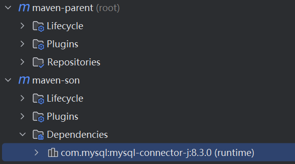

1. 子工程如果不想使用父工程中锁定的版本号，可以在子工程中指定具体的版本号：

在`maven-son`子工程的`pom.xml`文件中指定版本号：

```xml
<?xml version="1.0" encoding="UTF-8"?>
<project xmlns="http://maven.apache.org/POM/4.0.0"
         xmlns:xsi="http://www.w3.org/2001/XMLSchema-instance"
         xsi:schemaLocation="http://maven.apache.org/POM/4.0.0 http://maven.apache.org/xsd/maven-4.0.0.xsd">
    <modelVersion>4.0.0</modelVersion>
    <!--继承父工程-->
    <parent>
        <groupId>com.jkweilai</groupId>
        <artifactId>maven-parent</artifactId>
        <version>1.0-SNAPSHOT</version>
    </parent>

    <artifactId>maven-son</artifactId>

    <dependencies>
        <!--子工程定义了具体的版本号，则不再使用父工程中锁定的版本号。-->
        <dependency>
            <groupId>com.mysql</groupId>
            <artifactId>mysql-connector-j</artifactId>
            <version>8.4.0</version>
        </dependency>
    </dependencies>

    <properties>
        <maven.compiler.source>21</maven.compiler.source>
        <maven.compiler.target>21</maven.compiler.target>
        <project.build.sourceEncoding>UTF-8</project.build.sourceEncoding>
    </properties>

</project>
```

通过下图可以看出，子工程不再使用父工程锁定的版本号：


1. 父工程不使用标签，则父工程也会引入这个 jar 包。

`maven-parent`父工程中不再使用`<dependencyManagement>`：

```xml

<?xml version="1.0" encoding="UTF-8"?>
<project xmlns="http://maven.apache.org/POM/4.0.0"
         xmlns:xsi="http://www.w3.org/2001/XMLSchema-instance"
         xsi:schemaLocation="http://maven.apache.org/POM/4.0.0 http://maven.apache.org/xsd/maven-4.0.0.xsd">
    <modelVersion>4.0.0</modelVersion>

    <groupId>com.jkweilai</groupId>
    <artifactId>maven-parent</artifactId>
    <version>1.0-SNAPSHOT</version>
    <packaging>pom</packaging>

    <modules>
        <module>maven-son</module>
    </modules>

    <properties>
        <!--统一版本号-->
        <mysql.version>8.3.0</mysql.version>
        <maven.compiler.source>21</maven.compiler.source>
        <maven.compiler.target>21</maven.compiler.target>
        <project.build.sourceEncoding>UTF-8</project.build.sourceEncoding>
    </properties>

    <dependencies>
        <dependency>
            <groupId>com.mysql</groupId>
            <artifactId>mysql-connector-j</artifactId>
            <!--使用之前统一声明的版本号-->
            <version>${mysql.version}</version>
            <scope>runtime</scope>
        </dependency>
    </dependencies>

</project>
```

`maven-son`子工程不做任何引入，只是继承父工程：

```xml
<?xml version="1.0" encoding="UTF-8"?>
<project xmlns="http://maven.apache.org/POM/4.0.0"
         xmlns:xsi="http://www.w3.org/2001/XMLSchema-instance"
         xsi:schemaLocation="http://maven.apache.org/POM/4.0.0 http://maven.apache.org/xsd/maven-4.0.0.xsd">
    <modelVersion>4.0.0</modelVersion>
    <!--继承父工程-->
    <parent>
        <groupId>com.jkweilai</groupId>
        <artifactId>maven-parent</artifactId>
        <version>1.0-SNAPSHOT</version>
    </parent>

    <artifactId>maven-son</artifactId>

    <properties>
        <maven.compiler.source>21</maven.compiler.source>
        <maven.compiler.target>21</maven.compiler.target>
        <project.build.sourceEncoding>UTF-8</project.build.sourceEncoding>
    </properties>

</project>
```

通过下图可以看出：


#### 短路径优先（就近原则）

引入路径短者优先，顾名思义，当一个间接依赖存在多条引入路径时，引入路径短的会被使用。如图

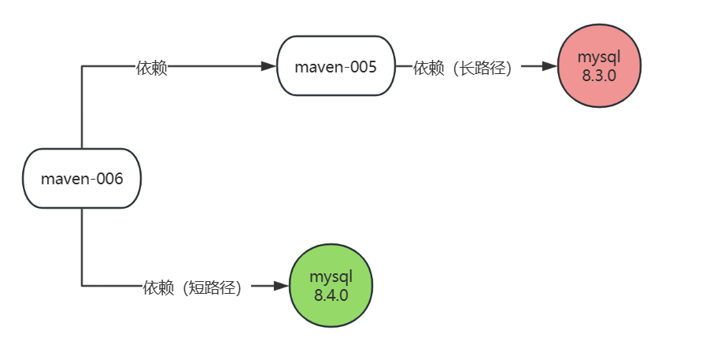

`maven-005`的`pom.xml`：

```xml
<?xml version="1.0" encoding="UTF-8"?>
<project xmlns="http://maven.apache.org/POM/4.0.0"
         xmlns:xsi="http://www.w3.org/2001/XMLSchema-instance"
         xsi:schemaLocation="http://maven.apache.org/POM/4.0.0 http://maven.apache.org/xsd/maven-4.0.0.xsd">
    <modelVersion>4.0.0</modelVersion>

    <groupId>com.jkweilai</groupId>
    <artifactId>maven-005</artifactId>
    <version>1.0-SNAPSHOT</version>

    <dependencies>
        <dependency>
            <groupId>com.mysql</groupId>
            <artifactId>mysql-connector-j</artifactId>
            <version>8.3.0</version>
            <scope>runtime</scope>
        </dependency>
    </dependencies>

    <properties>
        <maven.compiler.source>21</maven.compiler.source>
        <maven.compiler.target>21</maven.compiler.target>
        <project.build.sourceEncoding>UTF-8</project.build.sourceEncoding>
    </properties>

</project>
```

`maven-006`的`pom.xml`：

```xml
<?xml version="1.0" encoding="UTF-8"?>
<project xmlns="http://maven.apache.org/POM/4.0.0"
         xmlns:xsi="http://www.w3.org/2001/XMLSchema-instance"
         xsi:schemaLocation="http://maven.apache.org/POM/4.0.0 http://maven.apache.org/xsd/maven-4.0.0.xsd">
    <modelVersion>4.0.0</modelVersion>

    <groupId>com.jkweilai</groupId>
    <artifactId>maven-006</artifactId>
    <version>1.0-SNAPSHOT</version>

    <dependencies>
        <dependency>
            <groupId>com.jkweilai</groupId>
            <artifactId>maven-005</artifactId>
            <version>1.0-SNAPSHOT</version>
        </dependency>
        <dependency>
            <groupId>com.mysql</groupId>
            <artifactId>mysql-connector-j</artifactId>
            <version>8.4.0</version>
            <scope>runtime</scope>
        </dependency>
    </dependencies>

    <properties>
        <maven.compiler.source>21</maven.compiler.source>
        <maven.compiler.target>21</maven.compiler.target>
        <project.build.sourceEncoding>UTF-8</project.build.sourceEncoding>
    </properties>

</project>
```

结果如下图所示：


#### 声明优先

如果存在短路径，则优先选择短路径，如果路径相同的情况下，先声明者优先，POM 文件中依赖声明的顺序决定了间接依赖会不会被使用，顺序靠前的优先使用。如图。

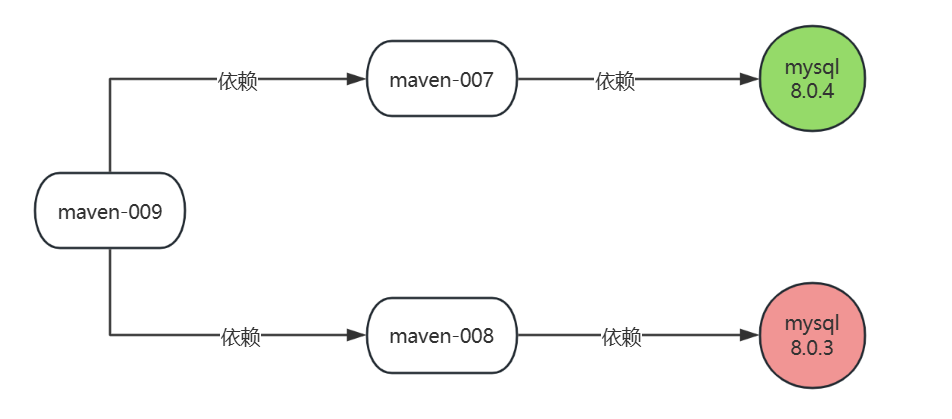

`maven-007`的`pom.xml`文件：

```xml
<?xml version="1.0" encoding="UTF-8"?>
<project xmlns="http://maven.apache.org/POM/4.0.0"
         xmlns:xsi="http://www.w3.org/2001/XMLSchema-instance"
         xsi:schemaLocation="http://maven.apache.org/POM/4.0.0 http://maven.apache.org/xsd/maven-4.0.0.xsd">
    <modelVersion>4.0.0</modelVersion>

    <groupId>com.jkweilai</groupId>
    <artifactId>maven-007</artifactId>
    <version>1.0-SNAPSHOT</version>

    <dependencies>
        <dependency>
            <groupId>com.mysql</groupId>
            <artifactId>mysql-connector-j</artifactId>
            <version>8.4.0</version>
            <scope>runtime</scope>
        </dependency>
    </dependencies>

    <properties>
        <maven.compiler.source>21</maven.compiler.source>
        <maven.compiler.target>21</maven.compiler.target>
        <project.build.sourceEncoding>UTF-8</project.build.sourceEncoding>
    </properties>

</project>
```

`maven-008`的`pom.xml`文件：

```xml
<?xml version="1.0" encoding="UTF-8"?>
<project xmlns="http://maven.apache.org/POM/4.0.0"
         xmlns:xsi="http://www.w3.org/2001/XMLSchema-instance"
         xsi:schemaLocation="http://maven.apache.org/POM/4.0.0 http://maven.apache.org/xsd/maven-4.0.0.xsd">
    <modelVersion>4.0.0</modelVersion>

    <groupId>com.jkweilai</groupId>
    <artifactId>maven-008</artifactId>
    <version>1.0-SNAPSHOT</version>

    <dependencies>
        <dependency>
            <groupId>com.mysql</groupId>
            <artifactId>mysql-connector-j</artifactId>
            <version>8.3.0</version>
            <scope>runtime</scope>
        </dependency>
    </dependencies>

    <properties>
        <maven.compiler.source>21</maven.compiler.source>
        <maven.compiler.target>21</maven.compiler.target>
        <project.build.sourceEncoding>UTF-8</project.build.sourceEncoding>
    </properties>

</project>
```

`maven-009`的`pom.xml`文件：

```xml
<?xml version="1.0" encoding="UTF-8"?>
<project xmlns="http://maven.apache.org/POM/4.0.0"
         xmlns:xsi="http://www.w3.org/2001/XMLSchema-instance"
         xsi:schemaLocation="http://maven.apache.org/POM/4.0.0 http://maven.apache.org/xsd/maven-4.0.0.xsd">
    <modelVersion>4.0.0</modelVersion>

    <groupId>com.jkweilai</groupId>
    <artifactId>maven-009</artifactId>
    <version>1.0-SNAPSHOT</version>

    <dependencies>
        <dependency>
            <groupId>com.jkweilai</groupId>
            <artifactId>maven-007</artifactId>
            <version>1.0-SNAPSHOT</version>
        </dependency>
        <dependency>
            <groupId>com.jkweilai</groupId>
            <artifactId>maven-008</artifactId>
            <version>1.0-SNAPSHOT</version>
        </dependency>
    </dependencies>

    <properties>
        <maven.compiler.source>21</maven.compiler.source>
        <maven.compiler.target>21</maven.compiler.target>
        <project.build.sourceEncoding>UTF-8</project.build.sourceEncoding>
    </properties>

</project>
```

效果如下图所示：


#### 特殊优先（后来者居上）

同一个pom.xml文件中进行了多次依赖不同版本的jar包，后面的覆盖前面的配置。这种情况比较少见，因为没有人这么傻：

`maven-010`的`pom.xml`：

```xml
<?xml version="1.0" encoding="UTF-8"?>
<project xmlns="http://maven.apache.org/POM/4.0.0"
         xmlns:xsi="http://www.w3.org/2001/XMLSchema-instance"
         xsi:schemaLocation="http://maven.apache.org/POM/4.0.0 http://maven.apache.org/xsd/maven-4.0.0.xsd">
    <modelVersion>4.0.0</modelVersion>

    <groupId>com.jkweilai</groupId>
    <artifactId>maven-010</artifactId>
    <version>1.0-SNAPSHOT</version>

    <dependencies>
        <dependency>
            <groupId>com.mysql</groupId>
            <artifactId>mysql-connector-j</artifactId>
            <version>8.3.0</version>
            <scope>runtime</scope>
        </dependency>
        <dependency>
            <groupId>com.mysql</groupId>
            <artifactId>mysql-connector-j</artifactId>
            <version>8.4.0</version>
            <scope>runtime</scope>
        </dependency>
    </dependencies>

    <properties>
        <maven.compiler.source>21</maven.compiler.source>
        <maven.compiler.target>21</maven.compiler.target>
        <project.build.sourceEncoding>UTF-8</project.build.sourceEncoding>
    </properties>

</project>
```

效果如下：


#### 可选依赖

maven项目有权利决定自己的直接依赖或者间接依赖是否继续传递给其它的maven项目。如果不想传递，添加以下配置：

```xml
<optional>true</optional>
```

`maven-011`项目的`pom.xml`:

```xml
<?xml version="1.0" encoding="UTF-8"?>
<project xmlns="http://maven.apache.org/POM/4.0.0"
         xmlns:xsi="http://www.w3.org/2001/XMLSchema-instance"
         xsi:schemaLocation="http://maven.apache.org/POM/4.0.0 http://maven.apache.org/xsd/maven-4.0.0.xsd">
    <modelVersion>4.0.0</modelVersion>

    <groupId>com.jkweilai</groupId>
    <artifactId>maven-011</artifactId>
    <version>1.0-SNAPSHOT</version>

    <dependencies>
        <dependency>
            <groupId>com.mysql</groupId>
            <artifactId>mysql-connector-j</artifactId>
            <version>8.4.0</version>
            <scope>runtime</scope>
            <!--设置mysql驱动不再继续传递给其它项目-->
            <optional>true</optional>
        </dependency>
    </dependencies>

    <properties>
        <maven.compiler.source>21</maven.compiler.source>
        <maven.compiler.target>21</maven.compiler.target>
        <project.build.sourceEncoding>UTF-8</project.build.sourceEncoding>
    </properties>

</project>
```

`maven-012`项目的`pom.xml`文件：

```xml
<?xml version="1.0" encoding="UTF-8"?>
<project xmlns="http://maven.apache.org/POM/4.0.0"
         xmlns:xsi="http://www.w3.org/2001/XMLSchema-instance"
         xsi:schemaLocation="http://maven.apache.org/POM/4.0.0 http://maven.apache.org/xsd/maven-4.0.0.xsd">
    <modelVersion>4.0.0</modelVersion>

    <groupId>com.jkweilai</groupId>
    <artifactId>maven-012</artifactId>
    <version>1.0-SNAPSHOT</version>

    <dependencies>
        <dependency>
            <groupId>com.jkweilai</groupId>
            <artifactId>maven-011</artifactId>
            <version>1.0-SNAPSHOT</version>
        </dependency>
    </dependencies>

    <properties>
        <maven.compiler.source>21</maven.compiler.source>
        <maven.compiler.target>21</maven.compiler.target>
        <project.build.sourceEncoding>UTF-8</project.build.sourceEncoding>
    </properties>

</project>
```

效果如下：


#### 排除依赖

当前的maven项目有权利将某个传递过来的依赖排除掉。使用`<exclusions>`配置。

`maven-013`项目的`pom.xml`：

```xml
<?xml version="1.0" encoding="UTF-8"?>
<project xmlns="http://maven.apache.org/POM/4.0.0"
         xmlns:xsi="http://www.w3.org/2001/XMLSchema-instance"
         xsi:schemaLocation="http://maven.apache.org/POM/4.0.0 http://maven.apache.org/xsd/maven-4.0.0.xsd">
    <modelVersion>4.0.0</modelVersion>

    <groupId>com.jkweilai</groupId>
    <artifactId>maven-013</artifactId>
    <version>1.0-SNAPSHOT</version>

    <dependencies>
        <dependency>
            <groupId>com.mysql</groupId>
            <artifactId>mysql-connector-j</artifactId>
            <version>8.4.0</version>
            <scope>runtime</scope>
        </dependency>
    </dependencies>

    <properties>
        <maven.compiler.source>21</maven.compiler.source>
        <maven.compiler.target>21</maven.compiler.target>
        <project.build.sourceEncoding>UTF-8</project.build.sourceEncoding>
    </properties>

</project>
```

`maven-014`项目的`pom.xml`文件：

```xml
<?xml version="1.0" encoding="UTF-8"?>
<project xmlns="http://maven.apache.org/POM/4.0.0"
         xmlns:xsi="http://www.w3.org/2001/XMLSchema-instance"
         xsi:schemaLocation="http://maven.apache.org/POM/4.0.0 http://maven.apache.org/xsd/maven-4.0.0.xsd">
    <modelVersion>4.0.0</modelVersion>

    <groupId>com.jkweilai</groupId>
    <artifactId>maven-014</artifactId>
    <version>1.0-SNAPSHOT</version>

    <dependencies>
        <dependency>
            <groupId>com.jkweilai</groupId>
            <artifactId>maven-013</artifactId>
            <version>1.0-SNAPSHOT</version>
            <exclusions>
                <exclusion>
                    <groupId>com.mysql</groupId>
                    <artifactId>mysql-connector-j</artifactId>
                </exclusion>
            </exclusions>
        </dependency>
    </dependencies>

    <properties>
        <maven.compiler.source>21</maven.compiler.source>
        <maven.compiler.target>21</maven.compiler.target>
        <project.build.sourceEncoding>UTF-8</project.build.sourceEncoding>
    </properties>

</project>
```

效果如下：


**可选依赖和排除依赖的区别：**

1. 可选依赖是：我不给。
2. 排除依赖是：我不要。
3. 可选依赖的优先级高于排除依赖，若对于同一个间接依赖同时使用排除依赖和可选依赖进行设置，那么可选依赖的取值必须为 false，否则排除依赖无法生效。

## 刷新依赖的几种方式

在IDEA中有时候会出现刷新延时的情况，那么需要进行手工刷新依赖：

1. 点击M刷新按钮。
2. 点Maven窗口的Reload All Maven Projects。
3. Build--->ReBuild Project 重新构建项目的同时刷新所有依赖。
4. 点击本项目的pom.xml文件--->右键--->Maven--->Sync Project 同步项目。
5. 打开pom.xml文件，全选，拷贝，删除，关闭，打开，粘贴。这属于物理刷新pom.xml文件 。

## 资源文件的指定

默认放在`java`目录下的 `.properties`文件以及 `.xml`文件，编译的时候不会自动放到 target 目录下，需要进行以下配置。

```xml
<build>
    <resources>
        <resource>
            <!--指定java目录下的所有路径下的所有文件-->
            <directory>src/main/java</directory>
            <includes>
                <include>**/*.xml</include>
                <include>**/*.properties</include>
            </includes>
        </resource>
        <resource>
            <!--指定resources目录下的所有路径下的所有文件-->
            <directory>src/main/resources</directory>
            <includes>
                <include>**/*.xml</include>
                <include>**/*.properties</include>
            </includes>
        </resource>
    </resources>
</build>
```

# Maven的继承和聚合


## 什么是Maven的继承

Maven 的**依赖传递机制**可以一定程度上简化 POM 的配置，但这**仅限于存在依赖关系的项目或模块**中。

当一个项目的多个模块都依赖于相同版本的 jar 包，且这些模块之间不存在依赖关系，这就导致同**一个依赖需要在多个模块中重复声明**，这显然是不可取的，大量的前人经验告诉我们，**重复往往意味着更多的劳动和更高的潜在风险**。

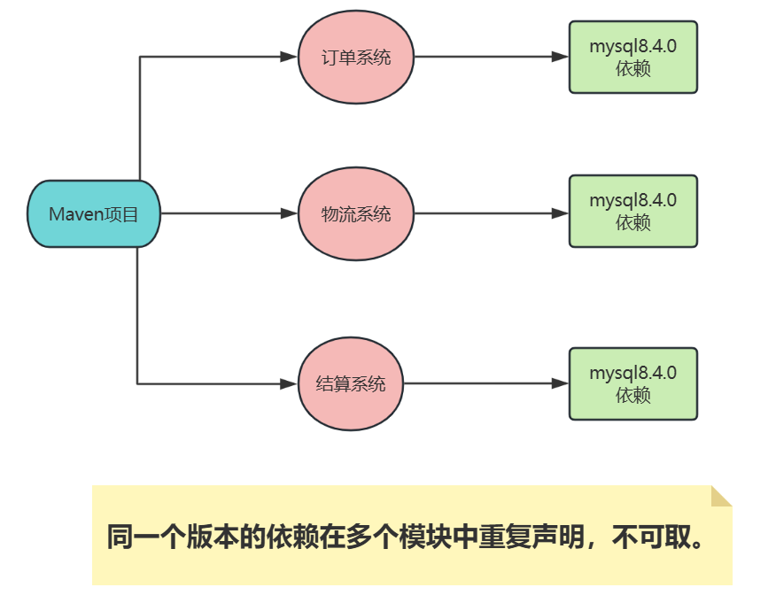

在 Java 面向对象中，我们可以建立一种类的父子结构，然后在父类中声明一些字段和方法供子类继承，这样就可以一定程度上消除重复，做到 “一处声明，多处使用”。在 Maven 的世界中，也有类似的机制，它就是 POM 继承。

Maven 在设计时，借鉴了 Java 面向对象中的继承思想，提出了 POM 继承思想。当一个项目包含多个模块时，可以在该项目中再创建一个父模块，并在其 POM 中声明依赖，其他模块的 POM 可通过继承父模块的 POM 来获得对相关依赖的声明。

如图所示：


## packaging必须是pom

**父工程的 **`packaging`** 必须设为 **`pom`**，因为它本身不包含代码或需要构建产物（如 JAR/WAR），而是作为管理角色，用于统一配置（依赖、插件等）和聚合子模块（**`<modules>`**）。**

简单来说：

- **不打包代码**：父工程只做管理，不编译、不生成 JAR/WAR。
- **核心作用**：通过 `<modules>` 管理子模块，通过 `<dependencyManagement>` 统一依赖版本。
- **Maven 规范**：`packaging=pom` 是 Maven 识别父工程的标志，确保配置正确继承。

如果误设为 `jar`，Maven 会尝试编译父工程（通常无代码），导致构建失败或逻辑混乱。

## 子工程继承父工程的什么

| **元素** | **描述** |
| --- | --- |
| groupId | 项目组 ID，项目坐标的核心元素 |
| version | 项目版本，项目坐标的核心元素 |
| description | 项目的描述信息 |
| organization | 项目的组织信息 |
| inceptionYear | 项目的创始年份 |
| url | 项目的 URL 地址 |
| developers | 项目的开发者信息 |
| contributors | 项目的贡献者信息 |
| distributionManagement | 项目的部署配置 |
| issueManagement | 项目的缺陷跟踪系统信息 |
| ciManagement | 项目的持续集成系统信息 |
| scm | 项目的版本控制系统信息 |
| mailingLists | 项目的邮件列表信息 |
| properties | 自定义的 Maven 属性 |
| dependencies | 项目的依赖配置 |
| dependencyManagement | 项目的依赖管理配置 |
| repositories | 项目的仓库配置 |
| build | 包括项目的源码目录配置、输出目录配置、插件配置、插件管理配置等 |
| reporting | 包括项目的报告输出目录配置、报告插件配置等 |

## 父工程示例

```xml
<?xml version="1.0" encoding="UTF-8"?>
<project xmlns="http://maven.apache.org/POM/4.0.0"
         xmlns:xsi="http://www.w3.org/2001/XMLSchema-instance"
         xsi:schemaLocation="http://maven.apache.org/POM/4.0.0 http://maven.apache.org/xsd/maven-4.0.0.xsd">
    <modelVersion>4.0.0</modelVersion>

    <groupId>com.jkweilai</groupId>
    <artifactId>maven-parent</artifactId>
    <version>1.0-SNAPSHOT</version>
    <!--父工程的打包方式必须是pom-->
    <packaging>pom</packaging>

    <!--声明该父项目包含哪些 子模块（子项目）：聚合子项目-->
    <modules>
        <module>maven_web</module>
        <module>maven_son</module>
    </modules>

    <properties>
        <!--定义属性，集中管理版本号。便于维护。-->
        <spring.version>6.2.7</spring.version>
        <servlet.version>6.0.0</servlet.version>

        <maven.compiler.source>21</maven.compiler.source>
        <maven.compiler.target>21</maven.compiler.target>
        <project.build.sourceEncoding>UTF-8</project.build.sourceEncoding>
    </properties>

    <!--只是定义，并没有真正的添加依赖，子工程根据需要有选择的添加依赖-->
    <dependencyManagement>
        <dependencies>
            <dependency>
                <groupId>org.springframework</groupId>
                <artifactId>spring-context</artifactId>
                <!--使用定义好的属性-->
                <version>${spring.version}</version>
            </dependency>
            <dependency>
                <groupId>jakarta.servlet</groupId>
                <artifactId>jakarta.servlet-api</artifactId>
                <version>${servlet.version}</version>
                <scope>provided</scope>
            </dependency>
        </dependencies>
    </dependencyManagement>

    <build>
        <!--只用于声明插件配置，不会实际执行插件-->
        <pluginManagement>
            <plugins>
                <plugin>
                    <groupId>org.eclipse.jetty</groupId>
                    <artifactId>jetty-maven-plugin</artifactId>
                    <version>11.0.25</version>
                    <configuration>
                        <httpConnector>
                            <port>8080</port>
                        </httpConnector>
                        <webApp>
                            <contextPath>/</contextPath>
                        </webApp>
                    </configuration>
                </plugin>
            </plugins>
        </pluginManagement>
    </build>

</project>
```

## 子工程示例

```xml
<?xml version="1.0" encoding="UTF-8"?>
<project xmlns="http://maven.apache.org/POM/4.0.0"
         xmlns:xsi="http://www.w3.org/2001/XMLSchema-instance"
         xsi:schemaLocation="http://maven.apache.org/POM/4.0.0 http://maven.apache.org/xsd/maven-4.0.0.xsd">
    <modelVersion>4.0.0</modelVersion>
    <parent>
        <groupId>com.jkweilai</groupId>
        <artifactId>maven-parent</artifactId>
        <version>1.0-SNAPSHOT</version>
    </parent>

    <!--可以省略groupId和version，与父工程保持一致-->
    <artifactId>maven_web</artifactId>

    <packaging>war</packaging>

    <!--需要什么依赖添加什么依赖，可以省略版本号，版本由父工程统一管理-->
    <dependencies>
        <dependency>
            <groupId>org.springframework</groupId>
            <artifactId>spring-context</artifactId>
        </dependency>
        <dependency>
            <groupId>jakarta.servlet</groupId>
            <artifactId>jakarta.servlet-api</artifactId>
        </dependency>
    </dependencies>

    <!--使用jetty插件-->
    <build>
        <plugins>
            <plugin>
                <groupId>org.eclipse.jetty</groupId>
                <artifactId>jetty-maven-plugin</artifactId>
                <version>11.0.25</version>
                <configuration>
                    <!--子工程可以自定义端口号，不写就使用父工程的-->
                    <httpConnector>
                        <port>8081</port>
                    </httpConnector>
                    <webApp>
                        <contextPath>/</contextPath>
                    </webApp>
                </configuration>
            </plugin>
        </plugins>
    </build>


</project>
```

**总结：通过继承可以实现子工程沿用父工程的配置。大大减少重复设置。**

## 什么是Maven的聚合

使用 Maven 聚合功能对项目进行构建时，需要在该项目中额外创建一个的聚合模块，然后通过这个模块构建整个项目的所有模块。聚合模块仅仅是帮助聚合其他模块的工具，其本身并无任何实质内容，对于一个`**纯聚合模块**`中只有一个 POM 文件，不包含 src 等目录。聚合模块的打包方式`packaging`也是 `pom`，可以在其 POM 中通过 `modules` 下的 `module` 子元素来添加需要聚合的模块的目录路径，以下是一个`**纯聚合模块**`的`pom`：

```xml
<?xml version="1.0" encoding="UTF-8"?>
<project xmlns="http://maven.apache.org/POM/4.0.0"
         xmlns:xsi="http://www.w3.org/2001/XMLSchema-instance"
         xsi:schemaLocation="http://maven.apache.org/POM/4.0.0 http://maven.apache.org/xsd/maven-4.0.0.xsd">
    <modelVersion>4.0.0</modelVersion>

    <groupId>com.jkweilai</groupId>
    <artifactId>maven_aggregation</artifactId>
    <version>1.0-SNAPSHOT</version>
    <packaging>pom</packaging>

    <modules>
        <module>../maven-parent</module>
    </modules>

</project>
```

什么是`**纯聚合项目**`，什么是`**非纯聚合项目**`？

- 纯聚合项目：项目中只有一个`pom.xml`，其他的都没有，并且在`pom.xml`文件中只编写了`<modules></modules>`标签，如下：

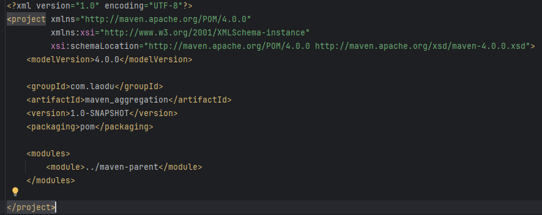

- 非纯聚合项目：一个项目中既有`**聚合部分**`，又有`**继承部分**`，聚合和继承混合，例如之前的`maven-parent`项目，它的`pom.xml`文件中既有聚合部分又有继承部分，如下：


现代的开发方式一般都是`**纯聚合**`+`**非纯聚合**`**的混合开发方式。**

## 聚合项目的作用

一键构建：通过聚合项目POM的配置，可以一次性构建所有子模块（不用挨个进目录执行命令）

对于之前的这几个项目：`maven_aggregation`、`maven-parent`、`maven_son`、`maven_web`，其中：

- `maven_aggregation`是一个纯聚合项目
- `maven-parent`是一个既有聚合又有继承的项目
- `maven_son`是`maven-parent`的子项目
- `maven_web`是`maven-parent`的子项目

在`maven_aggregation`中：


在`maven-parent`中：

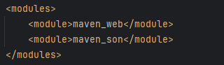

这个时候执行`maven_aggregation`项目的`install`时：

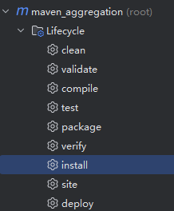

所有被管理的子项目会按照顺序执行各自的`install`：

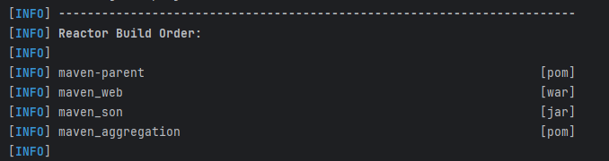

# Maven私服


## 什么是私服

**Maven 私服是一种特殊的远程仓库，它是架设在局域网内的仓库服务**，用来代理位于外部的远程仓库（中央仓库、其他远程公共仓库）。一些无法从外部仓库下载到的构件，也能从本地上传到私服供其他人使用。

Maven 私服其实并不是 Maven 的核心概念，它仅仅是一种衍生出来的特殊的仓库，但这并不代表它不重要，相反由于私服具有降低中央仓库负荷、节省外网带宽、以及提高项目稳定性等优点，使得私服在实际开发过程中得到了相当普遍地使用。建立了 Maven 私服后，当局域网内的用户需要某个构件时，会先请求本地仓库，若本地仓库不存在所需构件，则请求 Maven 私服，将所需构件下载到本地仓库，若私服中不存在所需构件，再去请求外部的远程仓库，将所需构件下载并缓存到 Maven 私服，若外部远程仓库不存在所需构件，则 Maven 直接报错。

## Maven仓库管理器Nexus

### 什么是Nexus

Nexus 是 Sonatype（中央仓库实际的维护方） 公司发布的一款仓库（Repository）管理软件，常用来搭建 Maven 私服，所以也有人将 Nexus 称为“Maven仓库管理器”。 Sonatype Nexus 是当前最流行，使用最广泛的 Maven 仓库管理器。Nexus 分为开源版和专业版，开源版足以满足大部分 Maven 用户的需求。

### Nexus仓库的类型

Nexus默认内置了许多仓库，这些仓库被分为三大类，每种类型的仓库用于存放特定的`jar`包：

1. 代理仓库（proxy）：缓存下载过的依赖，避免重复从外网拉取。例如Nexus中内置的`maven-central`库就是一个代理仓库，从远程中央仓库中下载的`jar`包会被缓存到`maven-central`这个代理仓库中。
2. 宿主仓库（hosted）：存储本地构建的私有构件，如公司内部开发的 Jar 包。对于宿主仓库来说，包含多个子分类，例如：
  1. Release：存放稳定版本（如Nexus内置的`maven-releases`仓库），一旦发布到`<font style="color:rgb(64, 64, 64);">Release</font>`类型的仓库，同一个版本的构件**不允许重复部署或覆盖**。
  2. Snapshot：存放快照版本（如Nexus内置的`maven-snapshots`仓库），发布到`<font style="color:rgb(64, 64, 64);">Snapshot</font>`类型的仓库的构件**可以被多次覆盖**。
3. 仓库组（group）：将多个仓库合并为一个逻辑入口，简化客户端配置。例如Nexus中内置的`maven-public`仓库，主要是为了简化配置，这么多仓库不需要都配置，只需要配置一个仓库组就行了。

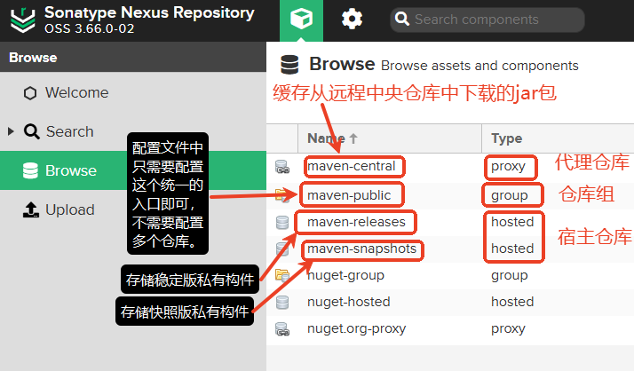


### 仓库为什么要分类

分类的目的是 **明确职责，优化管理**：

- **隔离环境**：区分快照（Snapshot）和正式版（Release），避免混淆。
- **权限控制**：可以为不同仓库设置不同的读写权限（如开发人员可上传 Snapshot，但只有管理员能发布 Release）。
- **性能优化**：代理仓库可以缓存热门依赖，而宿主仓库专注于私有构件。
- **简化客户端配置**：通过仓库组统一暴露仓库，客户端无需关心底层细节。

### 安装Nexus

#### 下载Nexus

下载地址：[https://help.sonatype.com/en/download.html](https://help.sonatype.com/en/download.html)


#### 解压安装Nexus

下载后解压到一个没有中文的路径下：


#### 启动Nexus服务

进入`C:\nexus-3.66.0-02\bin`目录下：


以管理员身份打开cmd窗口，并且`cd`到`bin`目录下，输入命令：`nexus /run`，需要等待一段时间，直到出现 `Started Sonatype Nexus OSS 3.66.0-02` 说明启动成功。


并且会生成一个比较重要的`work`目录，如下：


#### 访问Nexus

访问地址：http://localhost:8081


端口可以修改，在这个文件中：


## Nexus私服的应用

### 登录


用户名是：`admin`，密码在这个文件中：


登录：

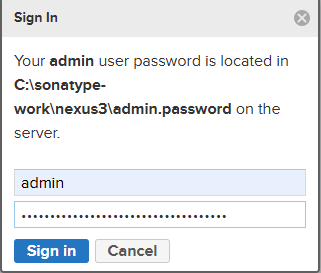

第一次登录成功后会提示你修改密码：

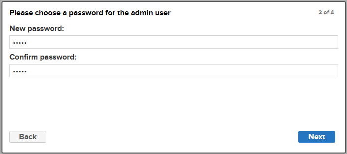

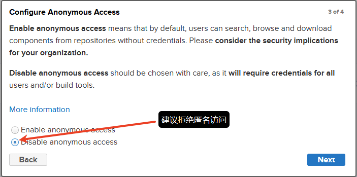

登录成功后的界面：

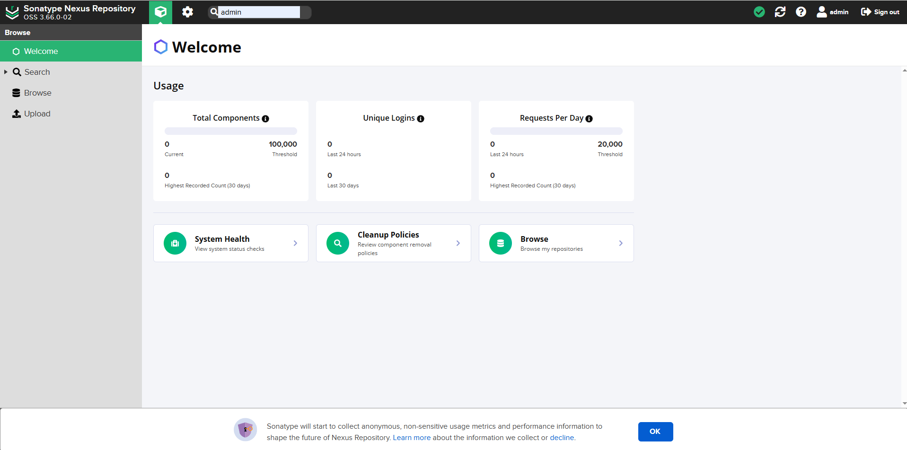

### 浏览仓库

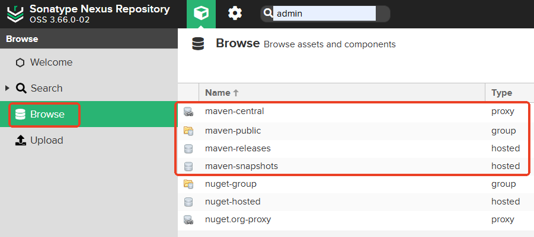

### 设置仓库

#### 创建仓库

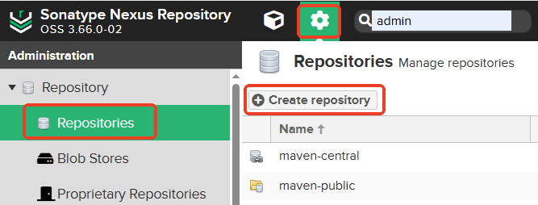

#### 创建代理仓库

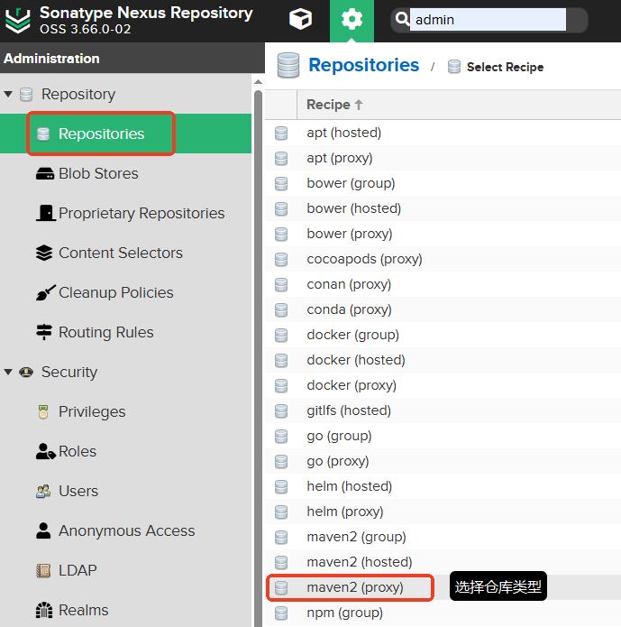

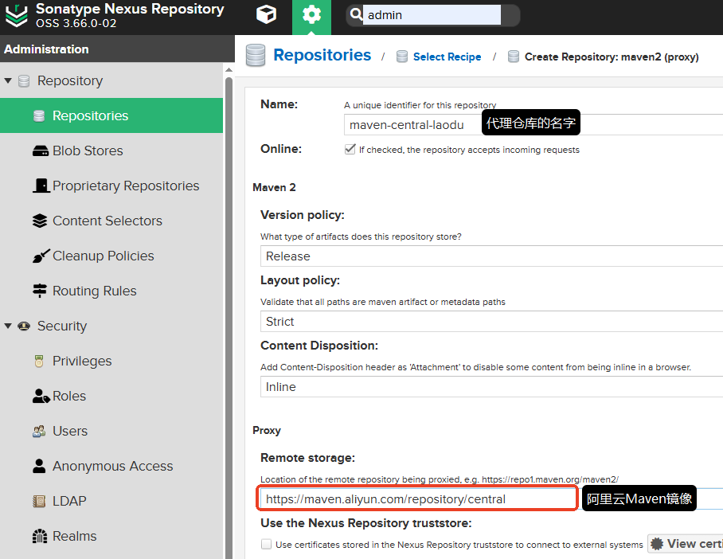

阿里云 Maven 镜像：`https://maven.aliyun.com/repository/central`

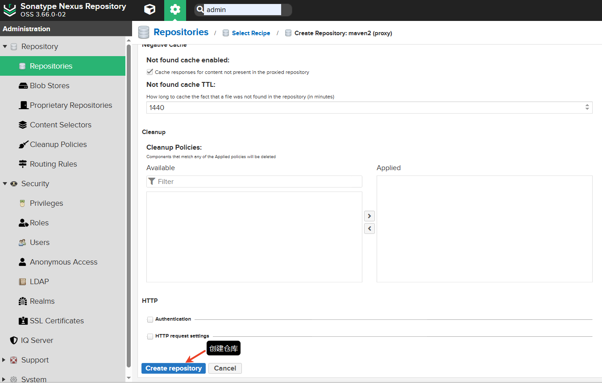

#### 创建宿主仓库：Release

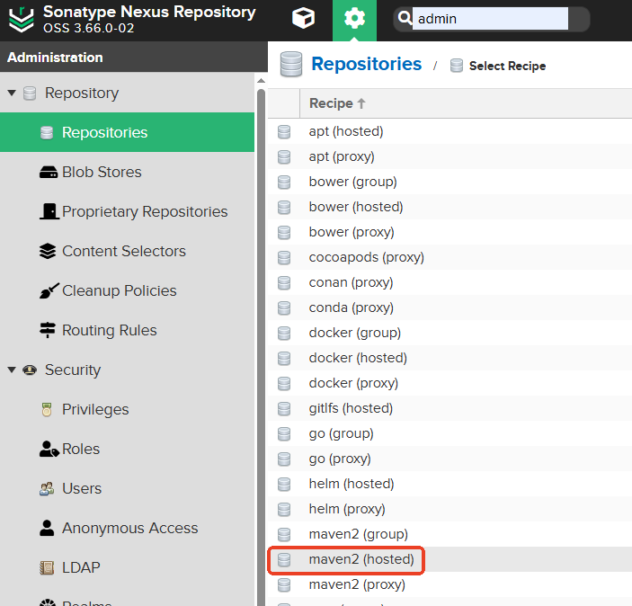

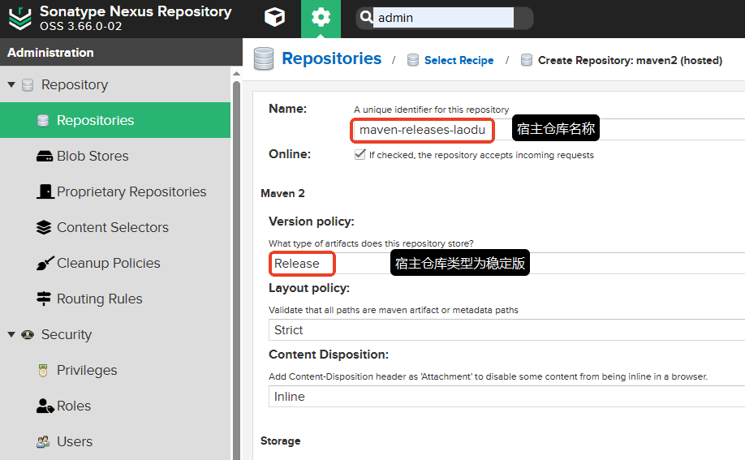


#### 创建宿主仓库：Snapshot


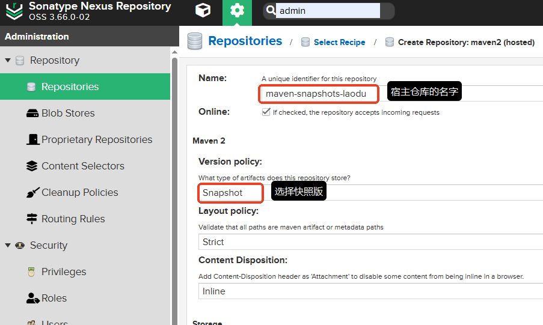


#### 创建仓库组


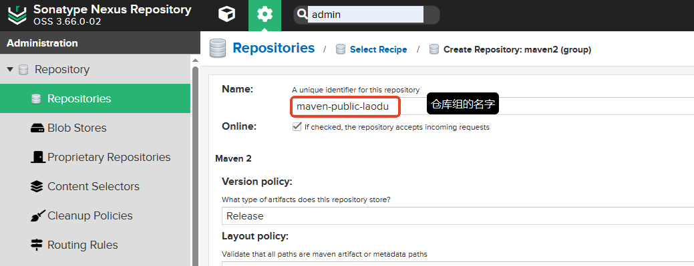

这一步非常重要，将创建的仓库放到一个仓库组当中：


最后所有创建的仓库如下：


### 使用Nexus下载jar包

#### 设置Maven本地仓库地址

修改`MAVEN_HOME/conf/settings.xml`文件：

```xml
<localRepository>D:\repository-nexus</localRepository>
```

#### 设置`<mirror>`标签

```xml
<mirror>
  <id>nexus-jkweilai</id>
  <mirrorOf>central</mirrorOf>
  <name>nexusjkweilai</name>
  <url>http://localhost:8081/repository/maven-public-jkweilai/</url>
</mirror>
```

url从这里获取：

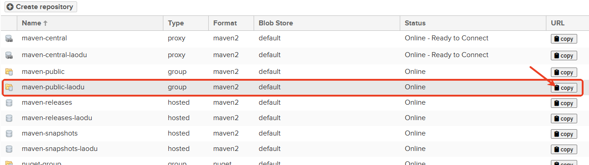

#### 设置Nexus的用户名和密码

找到 `settings.xml`文件的 `servers`标签，添加以下配置：

```xml
<server>
  <id>nexus-jkweilai</id>
  <username>admin</username>
  <password>admin</password>
</server>
```

注意：`<id>`必须和`<mirror>`中的`<id>`保持一致。

#### 确定IDEA中Maven指向的本地仓库地址


#### 随意运行一个Maven项目的`clean`


#### 观察本地仓库


#### 观察私服上的`maven-public-jkweilai`


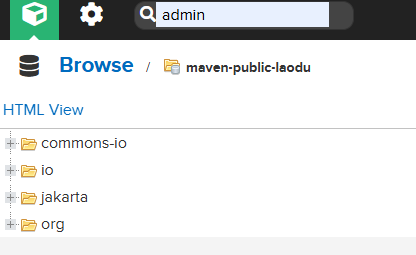

### 使用IDEA部署jar包到Nexus私服

私服Nexus是部署在局域网的，是全公司共享的仓库地址，每个团队都可以将已完成的功能或测试版本发布到私服供别人来使用。

#### 设置部署路径

打开要部署的项目的pom.xml文件，设置上传路径

```xml
<distributionManagement>
    <repository>
        <id>nexus-jkweilai</id>
        <url>http://localhost:8081/repository/maven-releases-jkweilai/</url>
    </repository>
    <snapshotRepository>
        <id>nexus-jkweilai</id>
        <url>http://localhost:8081/repository/maven-snapshots-jkweilai/</url>
    </snapshotRepository>
</distributionManagement>
```

url从这里拿：


#### 运行deploy部署命令


#### 观察私服对应仓库变化

- release项目部署


- snapshot项目部署

