# 2.MyBatis

# MyBatis概述


## 框架的理解

- 在文献中看到的framework被翻译为框架
- Java常用框架：
  - SSM三大框架：Spring + SpringMVC + MyBatis
  - SpringBoot
  - SpringCloud
  - 等。。
- 框架其实就是对通用代码的封装，提前写好了一堆接口和类，我们可以在做项目的时候直接引入这些接口和类（引入框架），基于这些现有的接口和类进行开发，可以大大提高开发效率。
- 框架一般都以jar包的形式存在。(jar包中有class文件以及各种配置文件等。)
- SSM三大框架的学习顺序：MyBatis、Spring、SpringMVC（仅仅是建议）

## 三层架构

**MyBatis 属于持久层框架**。类似的框架还有：Hibernate（实现了JPA规范）、jOOQ、Guzz、Spring Data（实现了JPA规范）、ActiveJDBC


## JDBC不足

**手动给每个占位符传值，太麻烦了：**

```java
// ......
// sql语句写死在java程序中
String sql = "insert into t_user(id,idCard,username,password,birth,gender,email,city,street,zipcode,phone,grade) values(?,?,?,?,?,?,?,?,?,?,?,?)";
PreparedStatement ps = conn.prepareStatement(sql);
// 繁琐的赋值：思考一下，这种有规律的代码能不能通过反射机制来做自动化。
ps.setString(1, "1");
ps.setString(2, "123456789");
ps.setString(3, "zhangsan");
ps.setString(4, "123456");
ps.setString(5, "1980-10-11");
ps.setString(6, "男");
ps.setString(7, "zhangsan@126.com");
ps.setString(8, "天津");
ps.setString(9, "北辰区河北工业大学河香街");
ps.setString(10, "1000000");
ps.setString(11, "16398574152");
ps.setString(12, "A");
// 执行SQL
int count = ps.executeUpdate();
// ......
```

---

**手动封装结果集，太麻烦了。**

```java
// ......
// sql语句写死在java程序中
String sql = "select id,idCard,username,password,birth,gender,email,city,street,zipcode,phone,grade from t_user";
PreparedStatement ps = conn.prepareStatement(sql);
ResultSet rs = ps.executeQuery();
List<User> userList = new ArrayList<>();
// 思考以下循环中的所有代码是否可以使用反射进行自动化封装。
while(rs.next()){
    // 获取数据
    String id = rs.getString("id");
    String idCard = rs.getString("idCard");
    String username = rs.getString("username");
    String password = rs.getString("password");
    String birth = rs.getString("birth");
    String gender = rs.getString("gender");
    String email = rs.getString("email");
    String city = rs.getString("city");
    String street = rs.getString("street");
    String zipcode = rs.getString("zipcode");
    String phone = rs.getString("phone");
    String grade = rs.getString("grade");
    // 创建对象
    User user = new User();
    // 给对象属性赋值
    user.setId(id);
    user.setIdCard(idCard);
    user.setUsername(username);
    user.setPassword(password);
    user.setBirth(birth);
    user.setGender(gender);
    user.setEmail(email);
    user.setCity(city);
    user.setStreet(street);
    user.setZipcode(zipcode);
    user.setPhone(phone);
    user.setGrade(grade);
    // 添加到集合
    userList.add(user);
}
// ......
```

## MyBatis 简介

MyBatis是一款优秀的**持久层框架** ，它极大地方便了Java程序与数据库的交互。它的核心特点包括：

**1. 彻底解放JDBC编码**
• 完全避免了手动设置参数、处理结果集等重复性JDBC代码
• 极大简化了数据库交互的编程模型

**2. SQL与代码分离**
• 支持XML和注解两种开发方式，其中XML方式因其灵活性成为主流选择
• 实现业务逻辑与数据访问逻辑的彻底解耦，代码结构更清晰

**3. 灵活的SQL定制能力**
• 提供基本映射、高级映射和动态SQL标签
• 允许编写精确优化的SQL语句，保持完全的SQL控制权

**4. 简洁的ORM映射**
• 将Java接口和简单POJO对象自动映射为数据库记录
• 架构轻量，学习成本低，仅需少量依赖配置即可快速上手

**MyBatis的发展历程：**

- MyBatis本是apache的一个开源项目iBatis，2010年这个项目由apache software foundation迁移到了google code，并且改名为MyBatis。2013年11月迁移到Github。
- iBATIS一词来源于“internet”和“abatis”的组合，是一个基于Java的持久层框架。iBATIS提供的持久层框架包括SQL Maps和Data Access Objects（DAOs）。

**ORM：对象关系映射（MyBatis属于半自动化ORM框架。Hibernate属于全自动化的ORM框架。）**

O（Object）：Java虚拟机中的Java对象

R（Relational）：关系型数据库

M（Mapping）：将 JVM 中的Java对象映射到数据库表中一行记录，或是将数据库表中一行记录映射成 JVM 中的一个Java对象。

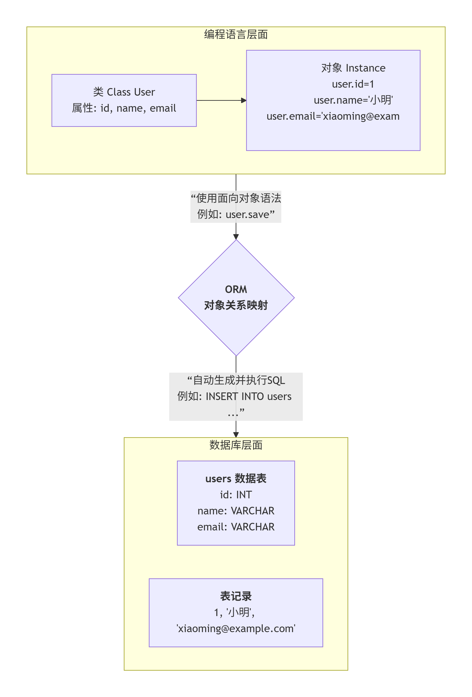

# MyBatis入门程序


MyBatis 英文文档地址：[https://mybatis.org/mybatis-3/](https://mybatis.org/mybatis-3/)

MyBatis 中文文档地址：[https://mybatis.org/mybatis-3/zh_CN/index.html](https://mybatis.org/mybatis-3/zh_CN/index.html)

## MyBatis 源码下载

字节码 jar 包不需要下载，我们用 Maven 引入依赖即可。需要源码的可以从这里下载。[https://github.com/mybatis/mybatis-3](https://github.com/mybatis/mybatis-3)

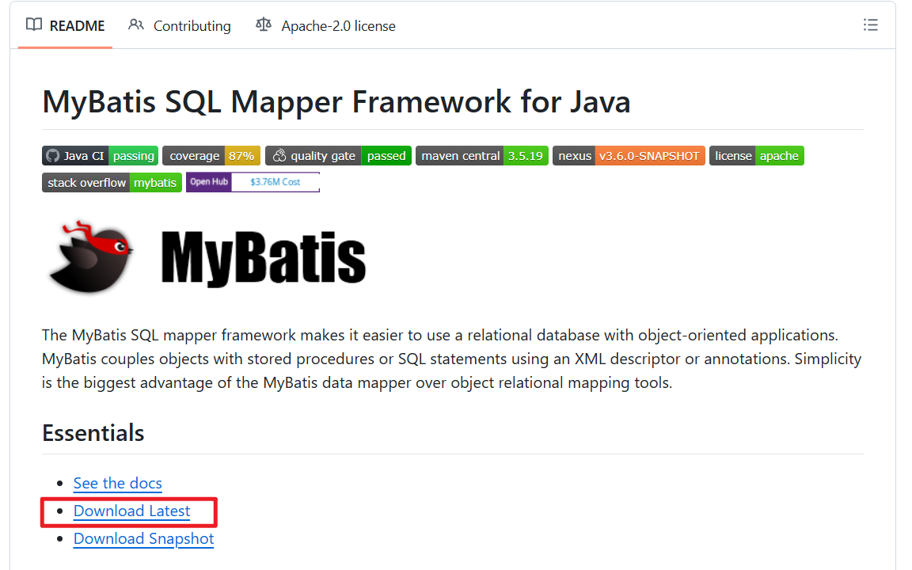

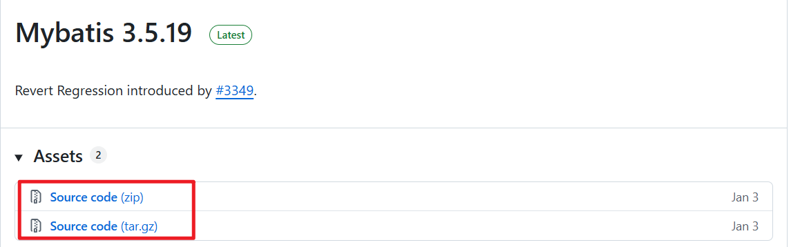

## MyBatis入门程序开发步骤

### 初始化数据库表

**创建数据库 **`**mybatis**`

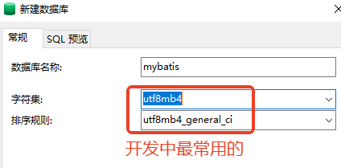

**执行 SQL 脚本：**

```sql
DROP TABLE IF EXISTS `t_car`;
CREATE TABLE `t_car`  (
  `id` bigint NOT NULL AUTO_INCREMENT COMMENT '主键自增',
  `car_num` varchar(255) CHARACTER SET utf8mb4 COLLATE utf8mb4_general_ci NULL DEFAULT NULL COMMENT '车牌号',
  `brand` varchar(255) CHARACTER SET utf8mb4 COLLATE utf8mb4_general_ci NULL DEFAULT NULL COMMENT '品牌',
  `guide_price` decimal(10, 2) NULL DEFAULT NULL COMMENT '指导价：万',
  `produce_time` char(10) CHARACTER SET utf8mb4 COLLATE utf8mb4_general_ci NULL DEFAULT NULL COMMENT '出厂日期',
  `car_type` varchar(255) CHARACTER SET utf8mb4 COLLATE utf8mb4_general_ci NULL DEFAULT NULL COMMENT '汽车类型：燃油车 电车 氢能源',
  PRIMARY KEY (`id`) USING BTREE
) ENGINE = InnoDB AUTO_INCREMENT = 3 CHARACTER SET = utf8mb4 COLLATE = utf8mb4_general_ci ROW_FORMAT = Dynamic;

INSERT INTO `t_car` VALUES (1, '京A88888', '宝驹535', 20.00, '2025-10-11', '燃油车');
INSERT INTO `t_car` VALUES (2, '京A66666', '劳斯莱斯泡影', 300.00, '2025-10-12', '新能源');
```

### IDEA 创建项目及基本设置

1. 创建空工程：`mybatis`
2. 设置 JDK 版本和编译器版本
3. 设置项目的所有字符编码方式为 UTF-8
4. 设置 Maven
5. 创建普通 `Java Maven` 模块：`mybatis-001-introduction`（不需要添加 web 支持，学 MyBatis 就像学 JDBC 一样）
6. `pom.xml`设置打包方式 `jar`
7. 引入 mybatis 依赖、mysql 驱动依赖

```xml
<!--mybatis核心依赖-->
<dependency>
    <groupId>org.mybatis</groupId>
    <artifactId>mybatis</artifactId>
    <version>3.5.19</version>
</dependency>
<!--mysql驱动依赖-->
<dependency>
    <groupId>mysql</groupId>
    <artifactId>mysql-connector-java</artifactId>
    <version>8.0.24</version>
    <scope>runtime</scope>
</dependency>
```

### 编写 mybatis 核心配置文件

在 `resources` 根目录下新建 `mybatis-config.xml` 配置文件（可以参考mybatis手册拷贝）

```xml
<?xml version="1.0" encoding="UTF-8" ?>
<!DOCTYPE configuration
        PUBLIC "-//mybatis.org//DTD Config 3.0//EN"
        "http://mybatis.org/dtd/mybatis-3-config.dtd">
<configuration>
    <environments default="development">
        <environment id="development">
            <transactionManager type="JDBC"/>
            <dataSource type="POOLED">
                <property name="driver" value="com.mysql.cj.jdbc.Driver"/>
                <property name="url" value="jdbc:mysql://localhost:3306/mybatis"/>
                <property name="username" value="root"/>
                <property name="password" value="root"/>
            </dataSource>
        </environment>
    </environments>
    <mappers>
        <!--sql映射文件创建好之后，需要将该文件路径配置到这里-->
        <mapper resource=""/>
    </mappers>
</configuration>
```

配置文件的名字和存放位置随意，无特定要求。但一般叫做 `mybatis-config.xml`，一般存放在类根路径下。

### 编写 SqlMapper.xml 配置文件

在resources根目录下新建CarMapper.xml配置文件，在该文件中编写 SQL 语句（可以参考mybatis手册拷贝）

```xml
<?xml version="1.0" encoding="UTF-8" ?>
<!DOCTYPE mapper
        PUBLIC "-//mybatis.org//DTD Mapper 3.0//EN"
        "http://mybatis.org/dtd/mybatis-3-mapper.dtd">
<!--namespace先随意写一个-->
<mapper namespace="car">
    <!--insert sql：保存一个汽车信息-->
    <insert id="insertCar">
        insert into t_car
            (id,car_num,brand,guide_price,produce_time,car_type) 
        values
            (null,'京A66688','丰田mirai',40.30,'2025-10-05','氢能源')
    </insert>
</mapper>
```

1. **sql语句最后结尾可以不写“;”**
2. CarMapper.xml文件的名字不是固定的。可以使用其它名字。
3. CarMapper.xml文件的位置也是随意的。这里选择放在resources根下，相当于放到了类的根路径下。
4. 将CarMapper.xml文件路径配置到mybatis-config.xml：

```xml
<mapper resource="CarMapper.xml"/>
```

### 编写 MyBatis 执行程序

编写MyBatisIntroductionTest代码

```java
package com.jkweilai.mybatis;

import org.apache.ibatis.session.SqlSession;
import org.apache.ibatis.session.SqlSessionFactory;
import org.apache.ibatis.session.SqlSessionFactoryBuilder;

import java.io.InputStream;

public class MyBatisIntroductionTest {
    public static void main(String[] args) {
        // 1. 创建SqlSessionFactoryBuilder对象
        SqlSessionFactoryBuilder sqlSessionFactoryBuilder = new SqlSessionFactoryBuilder();
        // 2. 创建SqlSessionFactory对象
        InputStream is = Thread.currentThread().getContextClassLoader().getResourceAsStream("mybatis-config.xml");
        SqlSessionFactory sqlSessionFactory = sqlSessionFactoryBuilder.build(is);
        // 3. 创建SqlSession对象
        SqlSession sqlSession = sqlSessionFactory.openSession();
        // 4. 执行sql
        int count = sqlSession.insert("insertCar"); // 这个"insertCar"必须是sql的id
        System.out.println("插入几条数据：" + count);
        // 5. 提交（mybatis默认采用的事务管理器是JDBC，默认是不提交的，需要手动提交。）
        sqlSession.commit();
        // 6. 关闭资源（只关闭是不会提交的）
        sqlSession.close();
    }
}
```

默认采用的事务管理器是：JDBC。JDBC事务默认是不提交的，需要手动提交。

## 改良获取输入流的代码

之前是这样写的：

```java
InputStream is = Thread.currentThread().getContextClassLoader().getResourceAsStream("mybatis-config.xml");
```

借助 MyBatis 中提供的 `Resources`，代码可以优化，但有前提：要求 `mybatis-config.xml`必须放在类路径当中：

```java
InputStream is = Resources.getResourceAsStream("mybatis-config.xml");
```

## 第一个比较完整的代码写法

```java
package com.jkweilai.mybatis;

import org.apache.ibatis.io.Resources;
import org.apache.ibatis.session.SqlSession;
import org.apache.ibatis.session.SqlSessionFactory;
import org.apache.ibatis.session.SqlSessionFactoryBuilder;

import java.io.IOException;

/**
 * 比较完整的第一个mybatis程序写法
 * @author 老杜
 */
public class MyBatisCompleteCodeTest {
    public static void main(String[] args) {
        SqlSession sqlSession = null;
        try {
            // 1.创建SqlSessionFactoryBuilder对象
            SqlSessionFactoryBuilder sqlSessionFactoryBuilder = new SqlSessionFactoryBuilder();
            // 2.创建SqlSessionFactory对象
            SqlSessionFactory sqlSessionFactory = sqlSessionFactoryBuilder.build(Resources.getResourceAsStream("mybatis-config.xml"));
            // 3.创建SqlSession对象
            sqlSession = sqlSessionFactory.openSession();
            // 4.执行SQL
            int count = sqlSession.insert("insertCar");
            System.out.println("更新了几条记录：" + count);
            // 5.提交
            sqlSession.commit();
        } catch (Exception e) {
            // 回滚
            if (sqlSession != null) {
                sqlSession.rollback();
            }
            e.printStackTrace();
        } finally {
            // 6.关闭
            if (sqlSession != null) {
                sqlSession.close();
            }
        }
    }
}
```

以上代码也可以改良为：`try-with-resource`语法。

## 引入JUnit

写测试程序我们要频繁创建新的类，编写 main 方法，为了解决这个问题，引入 JUnit：

```xml
<dependency>
    <groupId>org.junit.jupiter</groupId>
    <artifactId>junit-jupiter</artifactId>
    <version>5.10.2</version>
    <scope>test</scope>
</dependency>
```

编写一个测试用例，来测试insertCar业务

```java
package com.jkweilai.mybatis;

import org.apache.ibatis.io.Resources;
import org.apache.ibatis.session.SqlSession;
import org.apache.ibatis.session.SqlSessionFactory;
import org.apache.ibatis.session.SqlSessionFactoryBuilder;
import org.junit.jupiter.api.Test;

public class CarMapperTest {
    
    @Test
    public void testInsertCar(){
        SqlSession sqlSession = null;
        try {
            // 1.创建SqlSessionFactoryBuilder对象
            SqlSessionFactoryBuilder sqlSessionFactoryBuilder = new SqlSessionFactoryBuilder();
            // 2.创建SqlSessionFactory对象
            SqlSessionFactory sqlSessionFactory = sqlSessionFactoryBuilder.build(Resources.getResourceAsStream("mybatis-config.xml"));
            // 3.创建SqlSession对象
            sqlSession = sqlSessionFactory.openSession();
            // 4.执行SQL
            int count = sqlSession.insert("insertCar");
            System.out.println("更新了几条记录：" + count);
            // 5.提交
            sqlSession.commit();
        } catch (Exception e) {
            // 回滚
            if (sqlSession != null) {
                sqlSession.rollback();
            }
            e.printStackTrace();
        } finally {
            // 6.关闭
            if (sqlSession != null) {
                sqlSession.close();
            }
        }
    }
}
```

## 启用标准日志组件

为了看清楚mybatis执行的具体sql，启用标准日志组件：只需要在mybatis-config.xml文件中添加以下配置：【可参考mybatis手册】

```xml
<settings>
  <setting name="logImpl" value="STDOUT_LOGGING" />
</settings>
```

## MyBatis工具类SqlSessionUtil的封装

每一次获取SqlSession对象代码太繁琐，封装一个工具类

```java
package com.jkweilai.mybatis.utils;

import org.apache.ibatis.io.Resources;
import org.apache.ibatis.session.SqlSession;
import org.apache.ibatis.session.SqlSessionFactory;
import org.apache.ibatis.session.SqlSessionFactoryBuilder;

/**
 * MyBatis工具类
 *
 * @author 老杜
 */
public class SqlSessionUtil {
    private static SqlSessionFactory sqlSessionFactory;

    /**
     * 类加载时初始化sqlSessionFactory对象
     */
    static {
        try {
            SqlSessionFactoryBuilder sqlSessionFactoryBuilder = new SqlSessionFactoryBuilder();
            sqlSessionFactory = sqlSessionFactoryBuilder.build(Resources.getResourceAsStream("mybatis-config.xml"));
        } catch (Exception e) {
            e.printStackTrace();
        }
    }

    /**
     * 每调用一次openSession()可获取一个新的会话，该会话支持自动提交。
     *
     * @return 新的会话对象
     */
    public static SqlSession openSession() {
        return sqlSessionFactory.openSession(true);
    }
}
```

测试工具类，将testInsertCar()改造

```java
@Test
public void testInsertCar(){
    SqlSession sqlSession = SqlSessionUtil.openSession();
    // 执行SQL
    int count = sqlSession.insert("insertCar");
    System.out.println("插入了几条记录:" + count);
    sqlSession.close();
}
```

## idea配置文件模板

mybatis-config.xml和SqlMapper.xml文件可以在IDEA中提前创建好模板，以后通过模板创建配置文件。

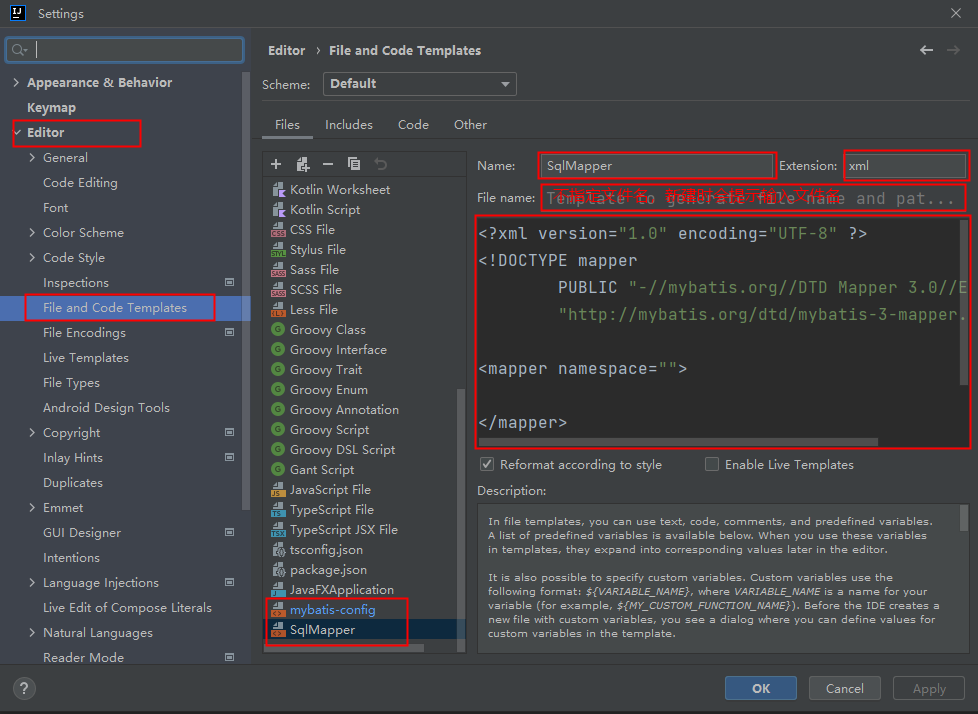

# 使用MyBatis完成CRUD


创建module（Maven的普通Java模块）：mybatis-002-crud

## insert

1. 在编写 SQL 语句时，将值写到配置文件中肯定是不行的，因为数据是变化的。
2. 可以使用 `#{}`占位符
3. 在 Java 程序中可以通过 Map 集合给 `#{}`传值，也可以通过普通 Java 对象传值。
4. Map 传值时：`#{}`中编写 `key`，如果 `key`不存在则插入数据库中的数据是 `NULL`
5. 普通 Java 对象传值时：`#{}`中编写对象属性名（底层会调用该属性的 getter 方法）

### 使用 Map 对象传值

分析以下SQL映射文件中SQL语句存在的问题

```xml
<?xml version="1.0" encoding="UTF-8" ?>
<!DOCTYPE mapper
        PUBLIC "-//mybatis.org//DTD Mapper 3.0//EN"
        "http://mybatis.org/dtd/mybatis-3-mapper.dtd">

<!--namespace先随便写-->
<mapper namespace="car">
    <insert id="insertCar">
        insert into t_car(car_num,brand,guide_price,produce_time,car_type) values('103', '奔驰E300L', 50.3, '2022-01-01', '燃油车')
    </insert>
</mapper>
```

存在的问题是：SQL语句中的值不应该写死，值应该是用户提供的。之前的JDBC代码是这样写的：

```java
// JDBC中使用 ? 作为占位符。那么MyBatis中会使用什么作为占位符呢？
String sql = "insert into t_car(car_num,brand,guide_price,produce_time,car_type) values(?,?,?,?,?)";
// ......
// 给 ? 传值。那么MyBatis中应该怎么传值呢？
ps.setString(1,"103");
ps.setString(2,"奔驰E300L");
ps.setDouble(3,50.3);
ps.setString(4,"2022-01-01");
ps.setString(5,"燃油车");
```

在MyBatis中可以这样做：

**在Java程序中，将数据放到Map集合中**

**在sql语句中使用 #{map集合的key} 来完成传值，#{} 等同于JDBC中的 ? ，#{}就是占位符**

Java程序这样写：

```java
package com.jkweilai.mybatis;

import com.jkweilai.mybatis.utils.SqlSessionUtil;
import org.apache.ibatis.session.SqlSession;
import org.junit.jupiter.api.Test;

import java.util.HashMap;
import java.util.Map;

/**
 * 测试MyBatis的CRUD
 * @author 老杜
 */
public class CarMapperTest {
    @Test
    public void testInsertCar(){
        // 准备数据
        Map<String, Object> map = new HashMap<>();
        map.put("k1", "103");
        map.put("k2", "奔驰E300L");
        map.put("k3", 50.3);
        map.put("k4", "2020-10-01");
        map.put("k5", "燃油车");
        // 获取SqlSession对象
        SqlSession sqlSession = SqlSessionUtil.openSession();
        // 执行SQL语句（使用map集合给sql语句传递数据）
        int count = sqlSession.insert("insertCar", map);
        System.out.println("插入了几条记录：" + count);
    }
}
```

SQL语句这样写：

```xml
<?xml version="1.0" encoding="UTF-8" ?>
<!DOCTYPE mapper
        PUBLIC "-//mybatis.org//DTD Mapper 3.0//EN"
        "http://mybatis.org/dtd/mybatis-3-mapper.dtd">

<!--namespace先随便写-->
<mapper namespace="car">
    <insert id="insertCar">
        insert into t_car(car_num,brand,guide_price,produce_time,car_type) values(#{k1},#{k2},#{k3},#{k4},#{k5})
    </insert>
</mapper>
```

**#{} 的里面必须填写map集合的key，不能随便写。**

如果#{}里写的是map集合中不存在的key会有什么问题？

```xml
<?xml version="1.0" encoding="UTF-8" ?>
<!DOCTYPE mapper
        PUBLIC "-//mybatis.org//DTD Mapper 3.0//EN"
        "http://mybatis.org/dtd/mybatis-3-mapper.dtd">

<mapper namespace="car">
    <insert id="insertCar">
        insert into t_car(car_num,brand,guide_price,produce_time,car_type) values(#{kk},#{k2},#{k3},#{k4},#{k5})
    </insert>
</mapper>
```

运行程序：

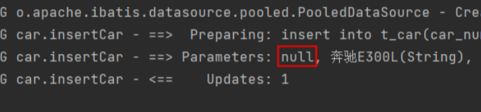

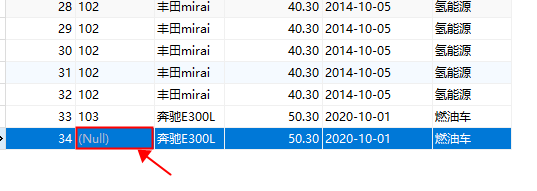

通过测试，看到程序并没有报错。正常执行。不过 #{kk} 的写法导致无法获取到map集合中的数据，最终导致数据库表car_num插入了NULL。

### 使用普通 Java 对象传值

在以上sql语句中，可以看到#{k1} #{k2} #{k3} #{k4} #{k5}的可读性太差，为了增强可读性，我们可以将Java程序做如下修改：

```java
Map<String, Object> map = new HashMap<>();
// 让key的可读性增强
map.put("carNum", "103");
map.put("brand", "奔驰E300L");
map.put("guidePrice", 50.3);
map.put("produceTime", "2020-10-01");
map.put("carType", "燃油车");
```

SQL语句做如下修改，这样可以增强程序的可读性：

```xml
<?xml version="1.0" encoding="UTF-8" ?>
<!DOCTYPE mapper
        PUBLIC "-//mybatis.org//DTD Mapper 3.0//EN"
        "http://mybatis.org/dtd/mybatis-3-mapper.dtd">
<mapper namespace="car">
    <insert id="insertCar">
        insert into t_car(car_num,brand,guide_price,produce_time,car_type) values(#{carNum},#{brand},#{guidePrice},#{produceTime},#{carType})
    </insert>
</mapper>
```

运行程序，查看数据库表：

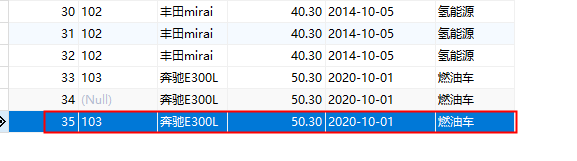

使用Map集合可以传参，那使用**pojo**（简单普通的java对象）可以完成传参吗？测试一下：

- 第一步：定义一个pojo类Car，提供相关属性。

```java
package com.jkweilai.mybatis.pojo;

/**
 * POJOs，简单普通的Java对象。封装数据用的。
 * @author 老杜
 */
public class Car {
    private Long id;
    private String carNum;
    private String brand;
    private Double guidePrice;
    private String produceTime;
    private String carType;

    // setter getter constructor toString...
}
```

- 第二步：Java程序

```java
@Test
public void testInsertCarByPOJO(){
    // 创建POJO，封装数据
    Car car = new Car();
    car.setCarNum("103");
    car.setBrand("奔驰C200");
    car.setGuidePrice(33.23);
    car.setProduceTime("2020-10-11");
    car.setCarType("燃油车");
    // 获取SqlSession对象
    SqlSession sqlSession = SqlSessionUtil.openSession();
    // 执行SQL，传数据
    int count = sqlSession.insert("insertCarByPOJO", car);
    System.out.println("插入了几条记录" + count);
}
```

- 第三步：SQL语句

```xml
<insert id="insertCarByPOJO">
  <!--#{} 里写的是POJO的属性名-->
  insert into t_car(car_num,brand,guide_price,produce_time,car_type) values(#{carNum},#{brand},#{guidePrice},#{produceTime},#{carType})
</insert>
```

- 运行程序，查看数据库表：

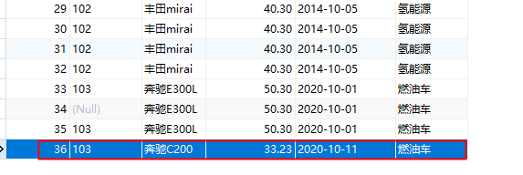

**直接告诉大家一个结论：**`**<font style="color:#DF2A3F;">#{}</font>**`**里写什么？**

- 假如我们写的是 `#{name}`，那么 mybatis 会先调用 `getName()`方法来获取数据，如果没有 `getName()`方法，则去对象中找有没有 `name`字段，如果有 `name`字段，则直接获取该字段的值。如果没有 `getName()`方法，类中也没有 `name`字段，最终会报错。

### parameterType 属性

注意：其实传参数的时候有一个属性parameterType，这个属性用来指定传参的数据类型，不过这个属性是可以省略的

```xml
<insert id="insertCar" parameterType="java.util.Map">
  insert into t_car(car_num,brand,guide_price,produce_time,car_type) values(#{carNum},#{brand},#{guidePrice},#{produceTime},#{carType})
</insert>

<insert id="insertCarByPOJO" parameterType="com.jkweilai.mybatis.pojo.Car">
  insert into t_car(car_num,brand,guide_price,produce_time,car_type) values(#{carNum},#{brand},#{guidePrice},#{produceTime},#{carType})
</insert>
```

## delete

需求：根据car_num进行删除。

SQL语句这样写：

```xml
<delete id="deleteByCarNum">
  delete from t_car where car_num = #{SuiBianXie}
</delete>
```

Java程序这样写：

```java
@Test
public void testDeleteByCarNum(){
    // 获取SqlSession对象
    SqlSession sqlSession = SqlSessionUtil.openSession();
    // 执行SQL语句
    int count = sqlSession.delete("deleteByCarNum", "102");
    System.out.println("删除了几条记录：" + count);
}
```

**注意：当占位符只有一个的时候，#{} 里面的内容可以随便写。**

## update

需求：修改id=34的Car信息，car_num为102，brand为比亚迪汉，guide_price为30.23，produce_time为2018-09-10，car_type为电车

SQL语句如下：

```xml
<update id="updateCarByPOJO">
  update t_car set 
    car_num = #{carNum}, brand = #{brand}, 
    guide_price = #{guidePrice}, produce_time = #{produceTime}, 
    car_type = #{carType} 
  where id = #{id}
</update>
```

Java代码如下：

```java
    @Test
    public void testUpdateCarByPOJO(){
        // 准备数据
        Car car = new Car();
        car.setId(34L);
        car.setCarNum("102");
        car.setBrand("比亚迪汉");
        car.setGuidePrice(30.23);
        car.setProduceTime("2018-09-10");
        car.setCarType("电车");
        // 获取SqlSession对象
        SqlSession sqlSession = SqlSessionUtil.openSession();
        // 执行SQL语句
        int count = sqlSession.update("updateCarByPOJO", car);
        System.out.println("更新了几条记录：" + count);
    }
```

当然了，如果使用**map**传数据也是可以的。

## select

select语句和其它语句不同的是：查询会有一个结果集。

1. 查询结果集要封装为什么对象，你需要通过 `resultType`属性来告知 mybatis 框架，如果未指定 `resultType`则会报错。
2. 查询结果的列名需要和 Java 对象的属性名对应上，如果对应不上则 Java 对象的属性不会赋值。（只是赋系统默认值）
3. 如何让查询结果列名和 Java 对象的属性名对应上，可以使用 `as`关键字起别名。

### 查询一条数据

需求：查询id为1的Car信息

SQL语句如下：

```xml
<select id="selectCarById">
  select * from t_car where id = #{id}
</select>
```

Java程序如下：

```java
@Test
public void testSelectCarById(){
    // 获取SqlSession对象
    SqlSession sqlSession = SqlSessionUtil.openSession();
    // 执行SQL语句
    Object car = sqlSession.selectOne("selectCarById", 1);
    System.out.println(car);
}
```

运行结果如下：

```java
### Error querying database.  Cause: org.apache.ibatis.executor.ExecutorException: 
    A query was run and no Result Maps were found for the Mapped Statement 'car.selectCarById'.  【翻译】：对于一个查询语句来说，没有找到查询的结果映射。
    It's likely that neither a Result Type nor a Result Map was specified.                                                 【翻译】：很可能既没有指定结果类型，也没有指定结果映射。
```

以上的异常大致的意思是：对于一个查询语句来说，你需要指定它的“结果类型”或者“结果映射”。

所以说，你想让mybatis查询之后返回一个Java对象的话，至少你要告诉mybatis返回一个什么类型的Java对象，可以在标签中添加resultType属性，用来指定查询要转换的类型：

```xml
<select id="selectCarById" resultType="com.jkweilai.mybatis.pojo.Car">
  select * from t_car where id = #{id}
</select>
```

运行结果：

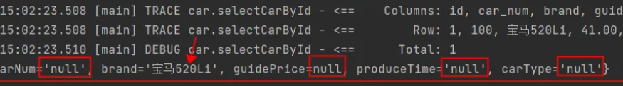

运行后之前的异常不再出现了，这说明添加了resultType属性之后，解决了之前的异常，可以看出resultType是不能省略的。

仔细观察控制台的日志信息，不难看出，结果查询出了一条。并且每个字段都查询到值了：Row: 1, 100, 宝马520Li, 41.00, 2022-09-01, 燃油车

但是奇怪的是返回的Car对象，只有id和brand两个属性有值，其它属性的值都是null，这是为什么呢？我们来观察一下查询结果列名和Car类的属性名是否能一一对应：

查询结果集的列名：id, car_num, brand, guide_price, produce_time, car_type

Car类的属性名：id, carNum, brand, guidePrice, produceTime, carType

通过观察发现：只有id和brand是一致的，其他字段名和属性名对应不上，这是不是导致null的原因呢？我们尝试在sql语句中使用as关键字来给查询结果列名起别名试试：

```xml
<select id="selectCarById" resultType="com.jkweilai.mybatis.pojo.Car">
  select 
    id, car_num as carNum, brand, guide_price as guidePrice, produce_time as produceTime, car_type as carType 
  from 
    t_car 
  where 
    id = #{id}
</select>
```

运行结果如下：

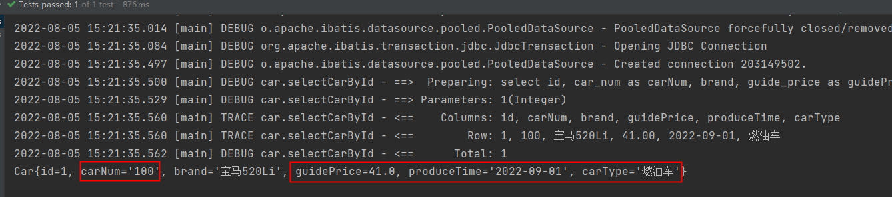

通过测试得知，如果当查询结果的字段名和java类的属性名对应不上的话，可以采用as关键字起别名，**当然还有其它解决方案，我们后面再看**。

### 查询多条数据

查询结果是多条记录时，`resultType`不能设置为 `java.util.List`，需要设置为 `List`集合中元素的类型。

需求：查询所有的Car信息。

SQL语句如下：

```xml
<!--虽然结果是List集合，但是resultType属性需要指定的是List集合中元素的类型。-->

<select id="selectCarAll" resultType="com.jkweilai.mybatis.pojo.Car">
  <!--记得使用as起别名，让查询结果的字段名和java类的属性名对应上。-->
  select
    id, car_num as carNum, brand, guide_price as guidePrice, produce_time as produceTime, car_type as carType
  from
    t_car
</select>
```

Java代码如下：

```java
@Test
public void testSelectCarAll(){
    // 获取SqlSession对象
    SqlSession sqlSession = SqlSessionUtil.openSession();
    // 执行SQL语句
    List<Object> cars = sqlSession.selectList("selectCarAll");
    // 输出结果
    cars.forEach(car -> System.out.println(car));
}
```

## SQL Mapper的namespace

在SQL Mapper配置文件中标签的namespace属性可以翻译为命名空间，这个命名空间主要是为了防止sqlId冲突的。

创建CarMapper2.xml文件，代码如下：

```xml
<?xml version="1.0" encoding="UTF-8" ?>
<!DOCTYPE mapper
        PUBLIC "-//mybatis.org//DTD Mapper 3.0//EN"
        "http://mybatis.org/dtd/mybatis-3-mapper.dtd">

<mapper namespace="car2">
    <select id="selectCarAll" resultType="com.jkweilai.mybatis.pojo.Car">
        select
            id, car_num as carNum, brand, guide_price as guidePrice, produce_time as produceTime, car_type as carType
        from
            t_car
    </select>
</mapper>
```

不难看出，CarMapper.xml和CarMapper2.xml文件中都有 id="selectCarAll"

将CarMapper2.xml配置到mybatis-config.xml文件中。

```xml
<mappers>
  <mapper resource="CarMapper.xml"/>
  <mapper resource="CarMapper2.xml"/>
</mappers>
```

编写Java代码如下：

```java
@Test
public void testNamespace(){
    // 获取SqlSession对象
    SqlSession sqlSession = SqlSessionUtil.openSession();
    // 执行SQL语句
    List<Object> cars = sqlSession.selectList("selectCarAll");
    // 输出结果
    cars.forEach(car -> System.out.println(car));
}
```

运行结果如下：

```plaintext
org.apache.ibatis.exceptions.PersistenceException: 
### Error querying database.  Cause: java.lang.IllegalArgumentException: 
  selectCarAll is ambiguous in Mapped Statements collection (try using the full name including the namespace, or rename one of the entries) 
  【翻译】selectCarAll在Mapped Statements集合中不明确（请尝试使用包含名称空间的全名，或重命名其中一个条目）
  【大致意思是】selectCarAll重名了，你要么在selectCarAll前添加一个名称空间，要有你改个其它名字。
```

Java代码修改如下：

```java
@Test
public void testNamespace(){
    // 获取SqlSession对象
    SqlSession sqlSession = SqlSessionUtil.openSession();
    // 执行SQL语句
    //List<Object> cars = sqlSession.selectList("car.selectCarAll");
    List<Object> cars = sqlSession.selectList("car2.selectCarAll");
    // 输出结果
    cars.forEach(car -> System.out.println(car));
}
```

运行结果如下：

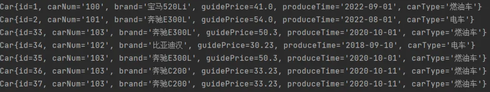

# MyBatis核心配置文件详解


```xml
<?xml version="1.0" encoding="UTF-8" ?>
<!DOCTYPE configuration
        PUBLIC "-//mybatis.org//DTD Config 3.0//EN"
        "http://mybatis.org/dtd/mybatis-3-config.dtd">
<configuration>
    <environments default="development">
        <environment id="development">
            <transactionManager type="JDBC"/>
            <dataSource type="POOLED">
                <property name="driver" value="com.mysql.cj.jdbc.Driver"/>
                <property name="url" value="jdbc:mysql://localhost:3306/mybatis"/>
                <property name="username" value="root"/>
                <property name="password" value="root"/>
            </dataSource>
        </environment>
    </environments>
    <mappers>
        <mapper resource="CarMapper.xml"/>
        <mapper resource="CarMapper2.xml"/>
    </mappers>
</configuration>
```

- configuration：根标签，表示配置信息。
- environments：环境（多个），以“s”结尾表示复数，也就是说mybatis的环境可以配置多个数据源。
  - default属性：表示默认使用的是哪个环境，default后面填写的是environment的id。**default的值只需要和environment的id值一致即可**。
- environment：具体的环境配置（**主要包括：事务管理器的配置 + 数据源的配置**）
  - id：给当前环境一个唯一标识，该标识用在environments的default后面，用来指定默认环境的选择。
- transactionManager：配置事务管理器
  - type属性：指定事务管理器具体使用什么方式，可选值包括两个
    - **JDBC**：MyBatis自己管理事务，**委托给 JDBC Connection**。**底层原理：事务开启conn.setAutoCommit(false); ...处理业务...事务提交conn.commit(); 如果在集成环境下，例如spring和mybatis集成了，spring使用**`<font style="color:rgb(15, 17, 21);background-color:rgb(235, 238, 242);">@Transactional</font>` 注解来开启、提交或回滚事务。在这种模式下，`<font style="color:rgb(15, 17, 21);background-color:rgb(235, 238, 242);">JDBC</font>` 事务管理器配置会被忽略
    - **MANAGED**：MyBatis不负责管理事务，将事务管理交给其他容器来负责，比如Spring、App Server等。如果没有管理事务的容器，则没有事务。**没有事务的含义：只要执行一条DML语句，则提交一次**。
- dataSource：指定数据源
  - type属性：用来指定具体使用的数据库连接池的策略，可选值包括**3**种情况
    - **UNPOOLED**：采用传统的获取连接的方式，虽然也实现javax.sql.DataSource接口，但是并没有使用池的思想。
      - property可以是：
        - driver 这是 JDBC 驱动的 Java 类全限定名。
        - url 这是数据库的 JDBC URL 地址。
        - username 登录数据库的用户名。
        - password 登录数据库的密码。
        - defaultTransactionIsolationLevel 默认的连接事务隔离级别。
        - defaultNetworkTimeout 等待数据库操作完成的默认网络超时时间（单位：毫秒）
    - **POOLED**：采用传统的javax.sql.DataSource规范中的连接池，这是mybatis默认自带的连接池，性能一般，开发时用，生产环境下通常使用第三方连接池技术，例如：HikariCP、Druid等。
      - property可以是（除了包含**UNPOOLED**中的之外）：
        - poolMaximumActiveConnections 在任意时间可存在的活动（正在使用）最大连接数量，默认值：10
        - poolMaximumIdleConnections 任意时间可能存在的最大空闲连接数。
        - 其它....
    - **JNDI**：采用服务器提供的JNDI技术实现，来获取DataSource对象，不同的服务器所能拿到DataSource是不一样。如果不是web或者maven的war工程，JNDI是不能使用的。
      - property可以是（最多只包含以下两个属性）：
        - initial_context 这个属性用来在 InitialContext 中寻找上下文（即，initialContext.lookup(initial_context)）这是个可选属性，如果忽略，那么将会直接从 InitialContext 中寻找 data_source 属性。
        - data_source 这是引用数据源实例位置的上下文路径。提供了 initial_context 配置时会在其返回的上下文中进行查找，没有提供时则直接在 InitialContext 中查找。
- mappers：在mappers标签中可以配置多个sql映射文件的路径
- mapper：配置某个sql映射文件的路径
  - resource属性：使用相对于类路径的资源引用方式
  - url属性：使用完全限定资源定位符（URL）方式（了解即可，开发中不用）

## environment

mybatis-003-configuration

```xml
<?xml version="1.0" encoding="UTF-8" ?>
<!DOCTYPE configuration
        PUBLIC "-//mybatis.org//DTD Config 3.0//EN"
        "http://mybatis.org/dtd/mybatis-3-config.dtd">
<configuration>
    <!--默认使用开发环境-->
    <!--<environments default="dev">-->
    <!--默认使用生产环境-->
    <environments default="production">
        <!--开发环境-->
        <environment id="dev">
            <transactionManager type="JDBC"/>
            <dataSource type="POOLED">
                <property name="driver" value="com.mysql.cj.jdbc.Driver"/>
                <property name="url" value="jdbc:mysql://localhost:3306/mybatis"/>
                <property name="username" value="root"/>
                <property name="password" value="root"/>
            </dataSource>
        </environment>
        <!--生产环境-->
        <environment id="production">
            <transactionManager type="JDBC" />
            <dataSource type="POOLED">
                <property name="driver" value="com.mysql.cj.jdbc.Driver"/>
                <property name="url" value="jdbc:mysql://localhost:3306/jkweilai"/>
                <property name="username" value="root"/>
                <property name="password" value="root"/>
            </dataSource>
        </environment>
    </environments>
    <mappers>
        <mapper resource="CarMapper.xml"/>
    </mappers>
</configuration>
```

```xml
<?xml version="1.0" encoding="UTF-8" ?>
<!DOCTYPE mapper
        PUBLIC "-//mybatis.org//DTD Mapper 3.0//EN"
        "http://mybatis.org/dtd/mybatis-3-mapper.dtd">

<mapper namespace="car">
    <insert id="insertCar">
        insert into t_car(id,car_num,brand,guide_price,produce_time,car_type) values(null,#{carNum},#{brand},#{guidePrice},#{produceTime},#{carType})
    </insert>
</mapper>
```

```java
package com.jkweilai.mybatis;

import com.jkweilai.mybatis.pojo.Car;
import org.apache.ibatis.io.Resources;
import org.apache.ibatis.session.SqlSession;
import org.apache.ibatis.session.SqlSessionFactory;
import org.apache.ibatis.session.SqlSessionFactoryBuilder;
import org.junit.jupiter.api.Test;

public class ConfigurationTest {

    @Test
    public void testEnvironment() throws Exception{
        // 准备数据
        Car car = new Car();
        car.setCarNum("133");
        car.setBrand("丰田霸道");
        car.setGuidePrice(50.3);
        car.setProduceTime("2020-01-10");
        car.setCarType("燃油车");

        // 一个数据库对应一个SqlSessionFactory对象
        // 两个数据库对应两个SqlSessionFactory对象，以此类推
        SqlSessionFactoryBuilder sqlSessionFactoryBuilder = new SqlSessionFactoryBuilder();

        // 使用默认数据库
        SqlSessionFactory sqlSessionFactory = sqlSessionFactoryBuilder.build(Resources.getResourceAsStream("mybatis-config.xml"));
        SqlSession sqlSession = sqlSessionFactory.openSession(true);
        int count = sqlSession.insert("insertCar", car);
        System.out.println("插入了几条记录：" + count);

        // 使用指定数据库
        SqlSessionFactory sqlSessionFactory1 = sqlSessionFactoryBuilder.build(Resources.getResourceAsStream("mybatis-config.xml"), "production");
        SqlSession sqlSession1 = sqlSessionFactory1.openSession(true);
        int count1 = sqlSession1.insert("insertCar", car);
        System.out.println("插入了几条记录：" + count1);
    }
}
```

## dataSource

### 测试POOLED和UNPOOLED

```xml

<?xml version="1.0" encoding="UTF-8" ?>
<!DOCTYPE configuration
        PUBLIC "-//mybatis.org//DTD Config 3.0//EN"
        "http://mybatis.org/dtd/mybatis-3-config.dtd">
<configuration>
    <environments default="dev">
        <environment id="dev">
            <transactionManager type="JDBC"/>
            <dataSource type="UNPOOLED">
                <property name="driver" value="com.mysql.cj.jdbc.Driver"/>
                <property name="url" value="jdbc:mysql://localhost:3306/mybatis"/>
                <property name="username" value="root"/>
                <property name="password" value="root"/>
            </dataSource>
        </environment>
    </environments>
    <mappers>
        <mapper resource="CarMapper.xml"/>
    </mappers>
</configuration>
```

```java
@Test
public void testDataSource() throws Exception{
    // 准备数据
    Car car = new Car();
    car.setCarNum("133");
    car.setBrand("丰田霸道");
    car.setGuidePrice(50.3);
    car.setProduceTime("2020-01-10");
    car.setCarType("燃油车");
    // 获取SqlSessionFactory对象
    SqlSessionFactoryBuilder sqlSessionFactoryBuilder = new SqlSessionFactoryBuilder();
    SqlSessionFactory sqlSessionFactory = sqlSessionFactoryBuilder.build(Resources.getResourceAsStream("mybatis-config3.xml"));
    // 获取SqlSession对象
    SqlSession sqlSession = sqlSessionFactory.openSession(true);
    // 执行SQL
    int count = sqlSession.insert("insertCar", car);
    System.out.println("插入了几条记录：" + count);
    // 关闭会话
    sqlSession.close();
}
```

当type是UNPOOLED，控制台输出：

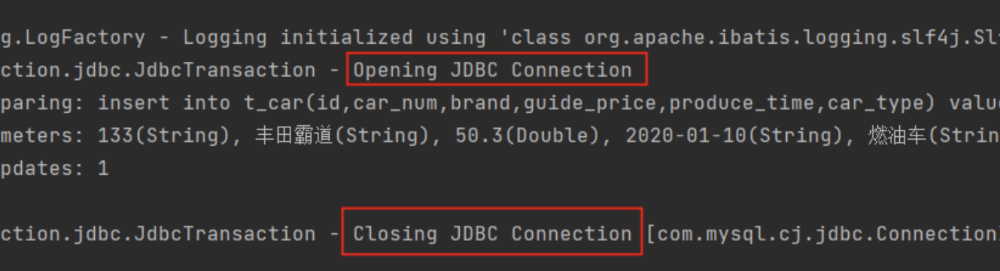

修改配置文件mybatis-config3.xml中的配置：

```xml
<dataSource type="POOLED">
```

Java测试程序不需要修改，直接执行，看控制台输出：

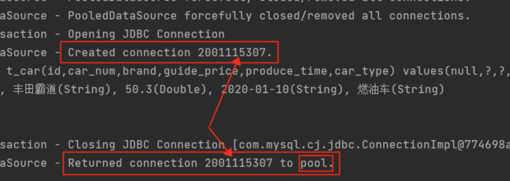

通过测试得出：UNPOOLED不会使用连接池，每一次都会新建JDBC连接对象。POOLED会使用数据库连接池。【这个连接池是mybatis自己实现的。】

### MyBatis连接池属性

type="POOLED"的时候，它的属性有哪些？

```xml
<?xml version="1.0" encoding="UTF-8" ?>
<!DOCTYPE configuration
        PUBLIC "-//mybatis.org//DTD Config 3.0//EN"
        "http://mybatis.org/dtd/mybatis-3-config.dtd">
<configuration>
    <environments default="dev">
        <environment id="dev">
            <transactionManager type="JDBC"/>
            <dataSource type="POOLED">
                <property name="driver" value="com.mysql.cj.jdbc.Driver"/>
                <property name="url" value="jdbc:mysql://localhost:3306/mybatis"/>
                <property name="username" value="root"/>
                <property name="password" value="root"/>
                <!--最大连接数-->
                <property name="poolMaximumActiveConnections" value="3"/>
                <!--这是一个底层设置，如果获取连接花费了相当长的时间，连接池会打印状态日志并重新尝试获取一个连接（避免在误配置的情况下一直失败且不打印日志），默认值：20000 毫秒（即 20 秒）。-->
                <property name="poolTimeToWait" value="20000"/>
                <!--强行回归池的时间-->
                <property name="poolMaximumCheckoutTime" value="20000"/>
                <!--最多空闲数量-->
                <property name="poolMaximumIdleConnections" value="1"/>
            </dataSource>
        </environment>
    </environments>
    <mappers>
        <mapper resource="CarMapper.xml"/>
    </mappers>
</configuration>
```

poolMaximumActiveConnections：最大的活动的连接数量。默认值10

poolMaximumIdleConnections：最大的空闲连接数量。默认值5

poolMaximumCheckoutTime：强行回归池的时间。默认值20秒。

poolTimeToWait：当无法获取到空闲连接时，每隔20秒打印一次日志，避免因代码配置有误，导致傻等。（时长是可以配置的）

当然，还有其他属性。对于连接池来说，以上几个属性比较重要。

**最大的活动的连接数量就是连接池连接数量的上限。默认值10，如果有10个请求正在使用这10个连接，第11个请求只能等待空闲连接。**

**最大的空闲连接数量。默认值5，如何已经有了5个空闲连接，当第6个连接要空闲下来的时候，连接池会选择关闭该连接对象。来减少数据库的开销。**

**需要根据系统的并发情况，来合理调整连接池最大连接数以及最多空闲数量。充分发挥数据库连接池的性能。【可以根据实际情况进行测试，然后调整一个合理的数量。】**

下图是默认配置：

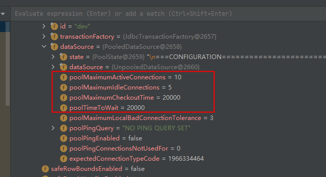

## properties

mybatis提供了更加灵活的配置，连接数据库的信息可以单独写到一个属性资源文件中，假设在类的根路径下创建jdbc.properties文件，配置如下：

```plaintext
jdbc.driver=com.mysql.cj.jdbc.Driver
jdbc.url=jdbc:mysql://localhost:3306/mybatis
```

在mybatis核心配置文件中引入并使用：

```xml
<?xml version="1.0" encoding="UTF-8" ?>
<!DOCTYPE configuration
        PUBLIC "-//mybatis.org//DTD Config 3.0//EN"
        "http://mybatis.org/dtd/mybatis-3-config.dtd">
<configuration>

    <!--引入外部属性资源文件-->
    <properties resource="jdbc.properties">
        <property name="jdbc.username" value="root"/>
        <property name="jdbc.password" value="root"/>
    </properties>

    <environments default="dev">
        <environment id="dev">
            <transactionManager type="JDBC"/>
            <dataSource type="POOLED">
                <!--${key}使用-->
                <property name="driver" value="${jdbc.driver}"/>
                <property name="url" value="${jdbc.url}"/>
                <property name="username" value="${jdbc.username}"/>
                <property name="password" value="${jdbc.password}"/>
            </dataSource>
        </environment>
    </environments>
    <mappers>
        <mapper resource="CarMapper.xml"/>
    </mappers>
</configuration>
```

编写Java程序进行测试：

```java
@Test
public void testProperties() throws Exception{
    SqlSessionFactoryBuilder sqlSessionFactoryBuilder = new SqlSessionFactoryBuilder();
    SqlSessionFactory sqlSessionFactory = sqlSessionFactoryBuilder.build(Resources.getResourceAsStream("mybatis-config4.xml"));
    SqlSession sqlSession = sqlSessionFactory.openSession();
    Object car = sqlSession.selectOne("selectCarByCarNum");
    System.out.println(car);
}
```

**properties两个属性：**

**resource：这个属性从类的根路径下开始加载。【常用的。】**

**url：从指定的url加载，假设文件放在d:/jdbc.properties，这个url可以写成：file:///d:/jdbc.properties。注意是三个斜杠哦。**

注意：如果不知道mybatis-config.xml文件中标签的编写顺序的话，可以有两种方式知道它的顺序：

- 第一种方式：查看dtd约束文件。
- 第二种方式：通过idea的报错提示信息。【一般采用这种方式】

## mapper

mapper标签用来指定SQL映射文件的路径，包含多种指定方式，这里先主要看其中两种：

第一种：resource，从类的根路径下开始加载【比url常用】

```xml
<mappers>
  <mapper resource="CarMapper.xml"/>
</mappers>
```

如果是这样写的话，必须保证类的根下有CarMapper.xml文件。

如果类的根路径下有一个包叫做test，CarMapper.xml如果放在test包下的话，这个配置应该是这样写：

```xml
<mappers>
  <mapper resource="test/CarMapper.xml"/>
</mappers>
```

**重点注意事项：以上test目录需要在resources目录下新建，默认情况下在java目录下的xml文件将不会编译到**`**<font style="color:#DF2A3F;">target/classes</font>**`**目录下，除非pom.xml做一些配置，例如：**

```xml
<build>
    <resources>
        <resource>
            <directory>src/main/resources</directory>
        </resource>
        <resource>
            <directory>src/main/java</directory>
            <includes>
                <include>**/*.xml</include>
            </includes>
        </resource>
    </resources>
</build>
```

第二种：url，从指定的url位置加载

假设CarMapper.xml文件放在d盘的根下，这个配置就需要这样写：

```xml
<mappers>
  <mapper url="file:///d:/CarMapper.xml"/>
</mappers>
```

**mapper还有其他的指定方式，后面再看！！！**

# 在WEB中应用MyBatis（使用三层架构）


我们在学习Servlet的时候，编写了一个银行账户转账的功能。并且当时开发的这个功能使用了三层架构，并且也解决了事务的问题。只不过地层使用了JDBC。我们现在把持久层换成MyBatis。当然，大家也可以按照下面的手册重新从零写一个全新的账户转账功能。

**目标：**

- 掌握mybatis在web应用中怎么用
- mybatis三大对象的作用域和生命周期
- ThreadLocal原理及使用
- 巩固MVC架构模式
- 为学习MyBatis的接口代理机制做准备

**实现功能：**

- 银行账户转账

**使用技术：**

- HTML + Servlet + MyBatis

**WEB应用的名称：**

- bank****

## 需求描述

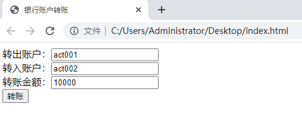

## 数据库表的设计和准备数据

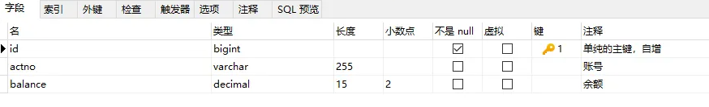

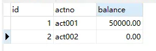

## 实现步骤

### 第一步：创建web应用

- IDEA中创建Maven WEB应用（**mybatis-004-web**）
- IDEA配置Tomcat，这里Tomcat使用10+版本。并部署应用到tomcat。
- 我们项目中不使用JSP，直接使用html即可，在web应用的根目录下创建`index.html`页面
- 确定pom.xml文件中的打包方式是war包。
- 引入相关依赖
  - 引入的依赖包括：mybatis，mysql驱动，junit，servlet。

```xml
<dependencies>
    <!--servlet api-->
    <dependency>
        <groupId>jakarta.servlet</groupId>
        <artifactId>jakarta.servlet-api</artifactId>
        <version>6.0.0</version>
        <scope>provided</scope>
    </dependency>
    <!--mysql-->
    <dependency>
        <groupId>mysql</groupId>
        <artifactId>mysql-connector-java</artifactId>
        <version>8.0.30</version>
    </dependency>
    <!--mybatis-->
    <dependency>
        <groupId>org.mybatis</groupId>
        <artifactId>mybatis</artifactId>
        <version>3.5.10</version>
    </dependency>
    <!--junit-->
    <dependency>
        <groupId>org.junit.jupiter</groupId>
        <artifactId>junit-jupiter</artifactId>
        <version>5.10.2</version>
        <scope>test</scope>
    </dependency>
</dependencies>
```

- 引入相关配置文件，放到resources目录下（全部放到类的根路径下）
  - mybatis-config.xml
  - AccountMapper.xml
  - jdbc.properties

```plaintext
jdbc.driver=com.mysql.cj.jdbc.Driver
jdbc.url=jdbc:mysql://localhost:3306/mybatis
jdbc.username=root
jdbc.password=root
```

```xml
<?xml version="1.0" encoding="UTF-8" ?>
<!DOCTYPE configuration
        PUBLIC "-//mybatis.org//DTD Config 3.0//EN"
        "http://mybatis.org/dtd/mybatis-3-config.dtd">
<configuration>

    <properties resource="jdbc.properties"/>

    <environments default="dev">
        <environment id="dev">
            <transactionManager type="JDBC"/>
            <dataSource type="POOLED">
                <property name="driver" value="${jdbc.driver}"/>
                <property name="url" value="${jdbc.url}"/>
                <property name="username" value="${jdbc.username}"/>
                <property name="password" value="${jdbc.password}"/>
            </dataSource>
        </environment>
    </environments>
    <mappers>
        <!--一定要注意这里的路径哦！！！-->
        <mapper resource="AccountMapper.xml"/>
    </mappers>

</configuration>
```

```xml
<?xml version="1.0" encoding="UTF-8" ?>
<!DOCTYPE mapper
        PUBLIC "-//mybatis.org//DTD Mapper 3.0//EN"
        "http://mybatis.org/dtd/mybatis-3-mapper.dtd">

<mapper namespace="account">

</mapper>
```

### 第二步：前端页面index.html

```html
<!DOCTYPE html>
<html lang="en">
<head>
    <meta charset="UTF-8">
    <title>银行账户转账</title>
</head>
<body>
<!--/bank是应用的根，部署web应用到tomcat的时候一定要注意这个名字-->
<form action="/bank/transfer" method="post">
    转出账户：<input type="text" name="fromActno"/><br>
    转入账户：<input type="text" name="toActno"/><br>
    转账金额：<input type="text" name="money"/><br>
    <input type="submit" value="转账"/>
</form>
</body>
</html>
```

### 第三步：创建pojo包、service包、dao包、web包、utils包

- com.jkweilai.bank.pojo
- com.jkweilai.bank.service
- com.jkweilai.bank.service.impl
- com.jkweilai.bank.dao
- com.jkweilai.bank.dao.impl
- com.jkweilai.bank.web.controller
- com.jkweilai.bank.exception
- com.jkweilai.bank.utils：**将之前编写的SqlSessionUtil工具类拷贝到该包下。**

### 第四步：定义pojo类：Account

```java
package com.jkweilai.bank.pojo;

/**
 * 银行账户类
 * @author 老杜
 */
public class Account {
    private Long id;
    private String actno;
    private Double balance;

    @Override
    public String toString() {
        return "Account{" +
                "id=" + id +
                ", actno='" + actno + '\'' +
                ", balance=" + balance +
                '}';
    }

    public Account() {
    }

    public Account(Long id, String actno, Double balance) {
        this.id = id;
        this.actno = actno;
        this.balance = balance;
    }

    public Long getId() {
        return id;
    }

    public void setId(Long id) {
        this.id = id;
    }

    public String getActno() {
        return actno;
    }

    public void setActno(String actno) {
        this.actno = actno;
    }

    public Double getBalance() {
        return balance;
    }

    public void setBalance(Double balance) {
        this.balance = balance;
    }
}
```

### 第五步：编写AccountDao接口，以及AccountDaoImpl实现类

分析dao中至少要提供几个方法，才能完成转账：

- 转账前需要查询余额是否充足：selectByActno
- 转账时要更新账户：update

```java
package com.jkweilai.bank.dao;

import com.jkweilai.bank.pojo.Account;

/**
 * 账户数据访问对象
 * @author 老杜
 */
public interface AccountDao {

    /**
     * 根据账号获取账户信息
     * @param actno 账号
     * @return 账户信息
     */
    Account selectByActno(String actno);

    /**
     * 更新账户信息
     * @param act 账户信息
     * @return 1表示更新成功，其他值表示失败
     */
    int update(Account act);
}
```

```java
package com.jkweilai.bank.dao.impl;

import com.jkweilai.bank.dao.AccountDao;
import com.jkweilai.bank.pojo.Account;
import com.jkweilai.bank.utils.SqlSessionUtil;
import org.apache.ibatis.session.SqlSession;

public class AccountDaoImpl implements AccountDao {
    @Override
    public Account selectByActno(String actno) {
        SqlSession sqlSession = SqlSessionUtil.openSession();
        Account act = (Account)sqlSession.selectOne("selectByActno", actno);
        sqlSession.close();
        return act;
    }

    @Override
    public int update(Account act) {
        SqlSession sqlSession = SqlSessionUtil.openSession();
        int count = sqlSession.update("update", act);
        sqlSession.commit();
        sqlSession.close();
        return count;
    }
}
```

### 第六步：AccountDaoImpl中编写了mybatis代码，需要编写SQL映射文件了

```xml
<?xml version="1.0" encoding="UTF-8" ?>
<!DOCTYPE mapper
        PUBLIC "-//mybatis.org//DTD Mapper 3.0//EN"
        "http://mybatis.org/dtd/mybatis-3-mapper.dtd">

<mapper namespace="account">
    <select id="selectByActno" resultType="com.jkweilai.bank.pojo.Account">
        select * from t_act where actno = #{actno}
    </select>
    <update id="update">
        update t_act set balance = #{balance} where actno = #{actno}
    </update>
</mapper>
```

### 第七步：编写AccountService接口以及AccountServiceImpl

```java
package com.jkweilai.bank.exception;

/**
 * 余额不足异常
 * @author 老杜
 */
public class MoneyNotEnoughException extends Exception{
    public MoneyNotEnoughException(){}
    public MoneyNotEnoughException(String msg){ super(msg); }
}
```

```java
package com.jkweilai.bank.exception;

/**
 * 应用异常
 * @author 老杜
 */
public class AppException extends Exception{
    public AppException(){}
    public AppException(String msg){ super(msg); }
}
```

```java
package com.jkweilai.bank.service;

import com.jkweilai.bank.exception.AppException;
import com.jkweilai.bank.exception.MoneyNotEnoughException;

/**
 * 账户业务类。
 * @author 老杜
 */
public interface AccountService {

    /**
     * 银行账户转正
     * @param fromActno 转出账户
     * @param toActno 转入账户
     * @param money 转账金额
     * @throws MoneyNotEnoughException 余额不足异常
     * @throws AppException App发生异常
     */
    void transfer(String fromActno, String toActno, double money) throws MoneyNotEnoughException, AppException;
}
```

```java
package com.jkweilai.bank.service.impl;

import com.jkweilai.bank.dao.AccountDao;
import com.jkweilai.bank.dao.impl.AccountDaoImpl;
import com.jkweilai.bank.exception.AppException;
import com.jkweilai.bank.exception.MoneyNotEnoughException;
import com.jkweilai.bank.pojo.Account;
import com.jkweilai.bank.service.AccountService;

public class AccountServiceImpl implements AccountService {

    private AccountDao accountDao = new AccountDaoImpl();

    @Override
    public void transfer(String fromActno, String toActno, double money) throws MoneyNotEnoughException, AppException {
        // 查询转出账户的余额
        Account fromAct = accountDao.selectByActno(fromActno);
        if (fromAct.getBalance() < money) {
            throw new MoneyNotEnoughException("对不起，您的余额不足。");
        }
        try {
            // 程序如果执行到这里说明余额充足
            // 修改账户余额
            Account toAct = accountDao.selectByActno(toActno);
            fromAct.setBalance(fromAct.getBalance() - money);
            toAct.setBalance(toAct.getBalance() + money);
            // 更新数据库
            accountDao.update(fromAct);
            accountDao.update(toAct);
        } catch (Exception e) {
            throw new AppException("转账失败，未知原因！");
        }
    }
}
```

### 第八步：编写AccountController

```java
package com.jkweilai.bank.web.controller;

import com.jkweilai.bank.exception.AppException;
import com.jkweilai.bank.exception.MoneyNotEnoughException;
import com.jkweilai.bank.service.AccountService;
import com.jkweilai.bank.service.impl.AccountServiceImpl;

import javax.servlet.ServletException;
import javax.servlet.http.HttpServlet;
import javax.servlet.http.HttpServletRequest;
import javax.servlet.http.HttpServletResponse;
import java.io.IOException;
import java.io.PrintWriter;

/**
 * 账户控制器
 * @author 老杜
 */
@WebServlet("/transfer")
public class AccountController extends HttpServlet {

    private AccountService accountService = new AccountServiceImpl();

    @Override
    protected void doPost(HttpServletRequest request, HttpServletResponse response)
            throws ServletException, IOException {
        // 获取响应流
        response.setContentType("text/html;charset=UTF-8");
        PrintWriter out = response.getWriter();
        // 获取账户信息
        String fromActno = request.getParameter("fromActno");
        String toActno = request.getParameter("toActno");
        double money = Integer.parseInt(request.getParameter("money"));
        // 调用业务方法完成转账
        try {
            accountService.transfer(fromActno, toActno, money);
            out.print("<h1>转账成功！！！</h1>");
        } catch (MoneyNotEnoughException e) {
            out.print(e.getMessage());
        } catch (AppException e) {
            out.print(e.getMessage());
        }
    }
}
```

启动服务器，打开浏览器，输入地址：http://localhost:8080/bank，测试：

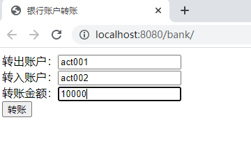

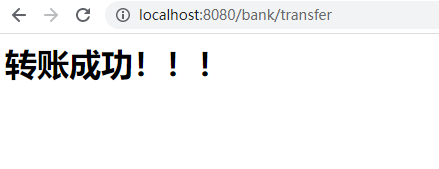

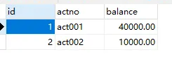

## MyBatis对象作用域以及事务问题

### MyBatis核心对象的作用域

**SqlSessionFactoryBuilder**

这个类可以被实例化、使用和丢弃，一旦创建了 SqlSessionFactory，就不再需要它了。 因此 SqlSessionFactoryBuilder 实例的最佳作用域是方法作用域（也就是局部方法变量）。 你可以重用 SqlSessionFactoryBuilder 来创建多个 SqlSessionFactory 实例，但最好还是不要一直保留着它，以保证所有的 XML 解析资源可以被释放给更重要的事情。

**SqlSessionFactory**

SqlSessionFactory 一旦被创建就应该在应用的运行期间一直存在，没有任何理由丢弃它或重新创建另一个实例。 使用 SqlSessionFactory 的最佳实践是在应用运行期间不要重复创建多次，多次重建 SqlSessionFactory 被视为一种代码“坏习惯”。因此 SqlSessionFactory 的最佳作用域是应用作用域。 有很多方法可以做到，最简单的就是使用单例模式或者静态单例模式。

**SqlSession**

每个线程都应该有它自己的 SqlSession 实例。SqlSession 的实例不是线程安全的，因此是不能被共享的，所以它的最佳的作用域是请求或方法作用域。 绝对不能将 SqlSession 实例的引用放在一个类的静态域，甚至一个类的实例变量也不行。 也绝不能将 SqlSession 实例的引用放在任何类型的托管作用域中，比如 Servlet 框架中的 HttpSession。 如果你现在正在使用一种 Web 框架，考虑将 SqlSession 放在一个和 HTTP 请求相似的作用域中。 换句话说，每次收到 HTTP 请求，就可以打开一个 SqlSession，返回一个响应后，就关闭它。 这个关闭操作很重要，为了确保每次都能执行关闭操作，你应该把这个关闭操作放到 finally 块中。 下面的示例就是一个确保 SqlSession 关闭的标准模式：

```java
try (SqlSession session = sqlSessionFactory.openSession()) {
  // 你的应用逻辑代码
}
```

### 事务问题

在之前的转账业务中，更新了两个账户，我们需要保证它们的同时成功或同时失败，这个时候就需要使用事务机制，在transfer方法开始执行时开启事务，直到两个更新都成功之后，再提交事务，我们尝试将transfer方法进行如下修改：

```java
package com.jkweilai.bank.service.impl;

import com.jkweilai.bank.dao.AccountDao;
import com.jkweilai.bank.dao.impl.AccountDaoImpl;
import com.jkweilai.bank.exception.AppException;
import com.jkweilai.bank.exception.MoneyNotEnoughException;
import com.jkweilai.bank.pojo.Account;
import com.jkweilai.bank.service.AccountService;
import com.jkweilai.bank.utils.SqlSessionUtil;
import org.apache.ibatis.session.SqlSession;

public class AccountServiceImpl implements AccountService {

    private AccountDao accountDao = new AccountDaoImpl();

    @Override
    public void transfer(String fromActno, String toActno, double money) throws MoneyNotEnoughException, AppException {
        // 查询转出账户的余额
        Account fromAct = accountDao.selectByActno(fromActno);
        if (fromAct.getBalance() < money) {
            throw new MoneyNotEnoughException("对不起，您的余额不足。");
        }
        try {
            // 程序如果执行到这里说明余额充足
            // 修改账户余额
            Account toAct = accountDao.selectByActno(toActno);
            fromAct.setBalance(fromAct.getBalance() - money);
            toAct.setBalance(toAct.getBalance() + money);
            // 更新数据库（添加事务）
            SqlSession sqlSession = SqlSessionUtil.openSession();
            accountDao.update(fromAct);
            // 模拟异常
            String s = null;
            s.toString();
            accountDao.update(toAct);
            sqlSession.commit();
            sqlSession.close();
        } catch (Exception e) {
            throw new AppException("转账失败，未知原因！");
        }
    }

}
```

运行前注意看数据库表中当前的数据：

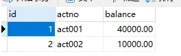

执行程序：

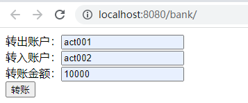


再次查看数据库表中的数据：

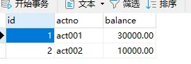

**傻眼了吧！！！事务出问题了，转账失败了，钱仍然是少了1万。这是什么原因呢？主要是因为service和dao中使用的SqlSession对象不是同一个。**

怎么办？为了保证service和dao中使用的SqlSession对象是同一个，可以将SqlSession对象存放到ThreadLocal当中。修改SqlSessionUtil工具类：

```java
package com.jkweilai.bank.utils;

import org.apache.ibatis.io.Resources;
import org.apache.ibatis.session.SqlSession;
import org.apache.ibatis.session.SqlSessionFactory;
import org.apache.ibatis.session.SqlSessionFactoryBuilder;

/**
 * MyBatis工具类
 *
 * @author 老杜
 */
public class SqlSessionUtil {
    private static SqlSessionFactory sqlSessionFactory;

    /**
     * 类加载时初始化sqlSessionFactory对象
     */
    static {
        try {
            SqlSessionFactoryBuilder sqlSessionFactoryBuilder = new SqlSessionFactoryBuilder();
            sqlSessionFactory = sqlSessionFactoryBuilder.build(Resources.getResourceAsStream("mybatis-config.xml"));
        } catch (Exception e) {
            e.printStackTrace();
        }
    }

    private static ThreadLocal<SqlSession> local = new ThreadLocal<>();

    /**
     * 每调用一次openSession()可获取一个新的会话，该会话支持自动提交。
     *
     * @return 新的会话对象
     */
    public static SqlSession openSession() {
        SqlSession sqlSession = local.get();
        if (sqlSession == null) {
            sqlSession = sqlSessionFactory.openSession();
            local.set(sqlSession);
        }
        return sqlSession;
    }

    /**
     * 关闭SqlSession对象
     * @param sqlSession
     */
    public static void close(SqlSession sqlSession){
        if (sqlSession != null) {
            sqlSession.close();
        }
        local.remove();
    }
}
```

修改dao中的方法：AccountDaoImpl中所有方法中的提交commit和关闭close代码全部删除。

```java
package com.jkweilai.bank.dao.impl;

import com.jkweilai.bank.dao.AccountDao;
import com.jkweilai.bank.pojo.Account;
import com.jkweilai.bank.utils.SqlSessionUtil;
import org.apache.ibatis.session.SqlSession;

public class AccountDaoImpl implements AccountDao {
    @Override
    public Account selectByActno(String actno) {
        SqlSession sqlSession = SqlSessionUtil.openSession();
        Account act = (Account)sqlSession.selectOne("account.selectByActno", actno);
        return act;
    }

    @Override
    public int update(Account act) {
        SqlSession sqlSession = SqlSessionUtil.openSession();
        int count = sqlSession.update("account.update", act);
        return count;
    }
}
```

修改service中的方法：

```java
package com.jkweilai.bank.service.impl;

import com.jkweilai.bank.dao.AccountDao;
import com.jkweilai.bank.dao.impl.AccountDaoImpl;
import com.jkweilai.bank.exception.AppException;
import com.jkweilai.bank.exception.MoneyNotEnoughException;
import com.jkweilai.bank.pojo.Account;
import com.jkweilai.bank.service.AccountService;
import com.jkweilai.bank.utils.SqlSessionUtil;
import org.apache.ibatis.session.SqlSession;

public class AccountServiceImpl implements AccountService {

    private AccountDao accountDao = new AccountDaoImpl();

    @Override
    public void transfer(String fromActno, String toActno, double money) throws MoneyNotEnoughException, AppException {
        // 查询转出账户的余额
        Account fromAct = accountDao.selectByActno(fromActno);
        if (fromAct.getBalance() < money) {
            throw new MoneyNotEnoughException("对不起，您的余额不足。");
        }
        try {
            // 程序如果执行到这里说明余额充足
            // 修改账户余额
            Account toAct = accountDao.selectByActno(toActno);
            fromAct.setBalance(fromAct.getBalance() - money);
            toAct.setBalance(toAct.getBalance() + money);
            // 更新数据库（添加事务）
            SqlSession sqlSession = SqlSessionUtil.openSession();
            accountDao.update(fromAct);
            // 模拟异常
            String s = null;
            s.toString();
            accountDao.update(toAct);
            sqlSession.commit();
            SqlSessionUtil.close(sqlSession);  // 只修改了这一行代码。
        } catch (Exception e) {
            throw new AppException("转账失败，未知原因！");
        }
    }
}
```

当前数据库表中的数据：

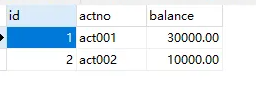

再次运行程序：


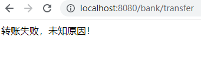

查看数据库表：没有问题。

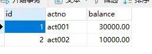

再测试转账成功：


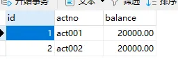

如果余额不足呢：

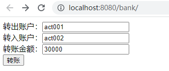

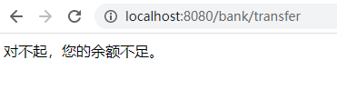

账户的余额依然正常：

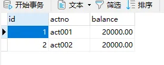

# MyBatis中接口代理机制及使用


## 分析当前程序存在的问题

我们来看一下DaoImpl的代码

```java
package com.jkweilai.bank.dao.impl;

import com.jkweilai.bank.dao.AccountDao;
import com.jkweilai.bank.pojo.Account;
import com.jkweilai.bank.utils.SqlSessionUtil;
import org.apache.ibatis.session.SqlSession;

public class AccountDaoImpl implements AccountDao {
    @Override
    public Account selectByActno(String actno) {
        SqlSession sqlSession = SqlSessionUtil.openSession();
        Account act = (Account)sqlSession.selectOne("account.selectByActno", actno);
        return act;
    }

    @Override
    public int update(Account act) {
        SqlSession sqlSession = SqlSessionUtil.openSession();
        int count = sqlSession.update("account.update", act);
        return count;
    }
}
```

我们不难发现，这个dao实现类中的方法代码很固定，基本上就是一行代码，通过SqlSession对象调用insert、delete、update、select等方法，这个类中的方法没有任何业务逻辑，既然是这样，**这个类我们能不能动态的生成**，以后可以不写这个类吗？答案：可以。

## MyBatis的接口代理机制

在MyBatis中，可以通过以下代码为DAO接口生成一个代理类，底层使用了JDK动态代理：

```java
AccountDao accountDao = (AccountDao)sqlSession.getMapper(AccountDao.class);
```

使用以上代码的前提是：**AccountMapper.xml文件中的namespace必须和dao接口的全限定名称一致，id必须和dao接口中方法名一致。**

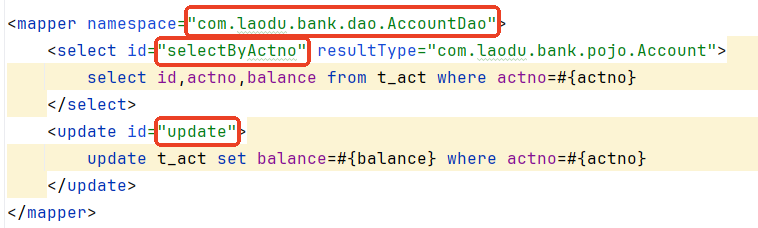

将service中获取dao对象的代码再次修改，如下：

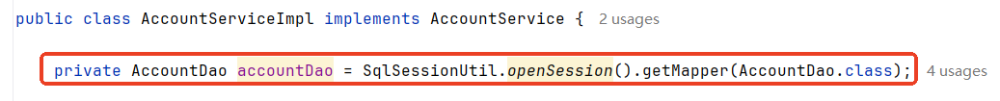

测试前数据：

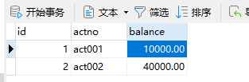

测试后数据：

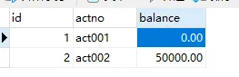

# MyBatis小技巧


## `#{}`和`${}`

- `**<font style="color:rgb(15, 17, 21);background-color:rgb(235, 238, 242);">#{}</font>**`：是**参数占位符**，MyBatis 会将其替换为 `<font style="color:rgb(15, 17, 21);background-color:rgb(235, 238, 242);">?</font>`，并通过 PreparedStatement 安全地设置参数。能有效**防止 SQL 注入**。
- `**<font style="color:rgb(15, 17, 21);background-color:rgb(235, 238, 242);">${}</font>**`：是**字符串替换**，MyBatis 会将其内容直接**拼接**到 SQL 语句中。**存在 SQL 注入风险**。

需求：根据car_type查询汽车

**模块名：mybatis-005-antic**

### 使用#{}

mapper接口

```java
package com.jkweilai.mybatis.mapper;

import com.jkweilai.mybatis.pojo.Car;

import java.util.List;

/**
 * Car的sql映射对象
 * @author 老杜
 */
public interface CarMapper {

    /**
     * 根据car_num获取Car
     * @param carType
     * @return
     */
    List<Car> selectByCarType(String carType);

}
```

CarMapper.xml：**注意namespace必须和接口名一致。id必须和接口中方法名一致**。

```xml
<?xml version="1.0" encoding="UTF-8" ?>
<!DOCTYPE mapper
        PUBLIC "-//mybatis.org//DTD Mapper 3.0//EN"
        "http://mybatis.org/dtd/mybatis-3-mapper.dtd">

<mapper namespace="com.jkweilai.mybatis.mapper.CarMapper">
    <select id="selectByCarType" resultType="com.jkweilai.mybatis.pojo.Car">
        select
            id,car_num as carNum,brand,guide_price as guidePrice,produce_time as produceTime,car_type as carType
        from
            t_car
        where
            car_type = #{carType}
    </select>
</mapper>
```

测试程序

```java
package com.jkweilai.mybatis.test;

import com.jkweilai.mybatis.mapper.CarMapper;
import com.jkweilai.mybatis.pojo.Car;
import com.jkweilai.mybatis.utils.SqlSessionUtil;
import org.junit.jupiter.api.Test;

import java.util.List;

/**
 * CarMapper测试类
 * @author 老杜
 */
public class CarMapperTest {

    @Test
    public void testSelectByCarType(){
        CarMapper mapper = (CarMapper) SqlSessionUtil.openSession().getMapper(CarMapper.class);
        List<Car> cars = mapper.selectByCarType("燃油车");
        cars.forEach(System.out::println);
    }

}
```

执行结果：

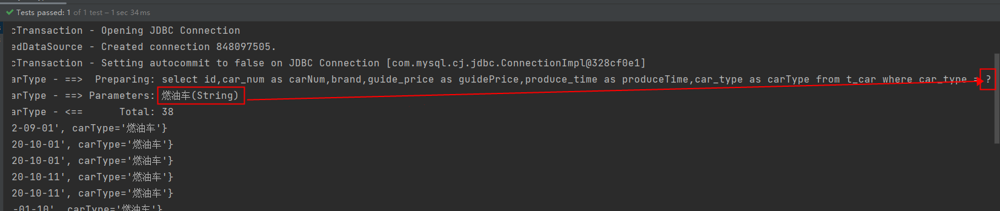

通过执行可以清楚的看到，sql语句中是带有 ? 的，这个 ? 就是大家在JDBC中所学的占位符，专门用来接收值的。

把“燃油车”以String类型的值，传递给 ?

这就是 #{}，它会先进行sql语句的预编译，然后再给占位符传值

### 使用${}

同样的需求，我们使用${}来完成

CarMapper.xml文件修改如下：

```xml
<?xml version="1.0" encoding="UTF-8" ?>
<!DOCTYPE mapper
        PUBLIC "-//mybatis.org//DTD Mapper 3.0//EN"
        "http://mybatis.org/dtd/mybatis-3-mapper.dtd">

<mapper namespace="com.jkweilai.mybatis.mapper.CarMapper">
    <select id="selectByCarType" resultType="com.jkweilai.mybatis.pojo.Car">
        select
            id,car_num as carNum,brand,guide_price as guidePrice,produce_time as produceTime,car_type as carType
        from
            t_car
        where
            <!--car_type = #{carType}-->
            car_type = ${carType}
    </select>
</mapper>
```

再次运行测试程序：

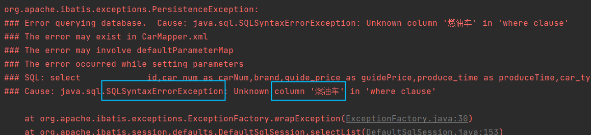

出现异常了，这是为什么呢？看看生成的sql语句：

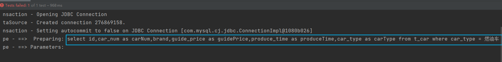

很显然，${} 是先进行sql语句的拼接，然后再编译，出现语法错误是正常的，因为 燃油车 是一个字符串，在sql语句中应该添加单引号

修改：

```xml
<?xml version="1.0" encoding="UTF-8" ?>
<!DOCTYPE mapper
        PUBLIC "-//mybatis.org//DTD Mapper 3.0//EN"
        "http://mybatis.org/dtd/mybatis-3-mapper.dtd">

<mapper namespace="com.jkweilai.mybatis.mapper.CarMapper">
    <select id="selectByCarType" resultType="com.jkweilai.mybatis.pojo.Car">
        select
            id,car_num as carNum,brand,guide_price as guidePrice,produce_time as produceTime,car_type as carType
        from
            t_car
        where
            <!--car_type = #{carType}-->
            <!--car_type = ${carType}-->
            car_type = '${carType}'
    </select>
</mapper>
```

再执行测试程序：

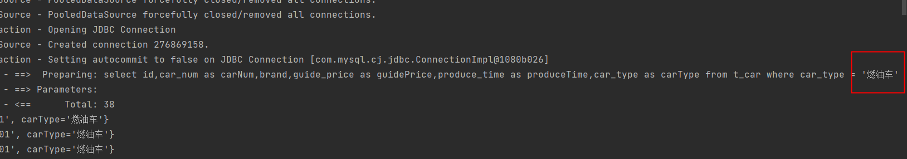

通过以上测试，可以看出，对于以上这种需求来说，还是建议使用 #{} 的方式。

**原则：能用 #{} 就不用 ${}**

### 拼接表名需要使用`${}`

业务背景：实际开发中，有的表数据量非常庞大，可能会采用分表方式进行存储，比如每天生成一张表，表的名字与日期挂钩，例如：2022年8月1日生成的表：t_user20220108。2000年1月1日生成的表：t_user20000101。此时前端在进行查询的时候会提交一个具体的日期，比如前端提交的日期为：2000年1月1日，那么后端就会根据这个日期动态拼接表名为：t_user20000101。有了这个表名之后，将表名拼接到sql语句当中，返回查询结果。那么大家思考一下，拼接表名到sql语句当中应该使用#{} 还是 ${} 呢？

使用#{}会是这样：select * from 't_car'

使用${}会是这样：select * from t_car

```xml
<select id="selectAllByTableName" resultType="car">
  select
  id,car_num as carNum,brand,guide_price as guidePrice,produce_time as produceTime,car_type as carType
  from
  ${tableName}
</select>
```

```java
/**
 * 根据表名查询所有的Car
 * @param tableName
 * @return
 */
List<Car> selectAllByTableName(String tableName);
```

```java
@Test
public void testSelectAllByTableName(){
    CarMapper mapper = SqlSessionUtil.openSession().getMapper(CarMapper.class);
    List<Car> cars = mapper.selectAllByTableName("t_car");
    cars.forEach(System.out::println);
}
```

执行结果：

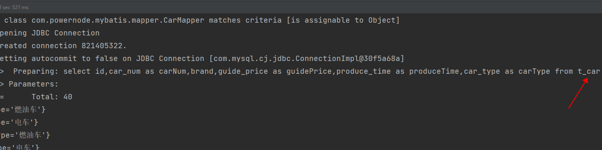

还有以下这些情况也需要使用`${}`：

1. 动态拼接列名、表名
2. group by或order by后面的列名
3. SQL函数名、关键字等。

### 使用`${}`和`#{}`的黄金法则

既然 `<font style="color:rgb(15, 17, 21);background-color:rgb(235, 238, 242);">${}</font>` 这么危险，使用时必须遵守以下规则：

1. **绝不用于用户直接输入**：永远不要将未经处理的用户输入（如来自前端的表单数据）直接用在 `<font style="color:rgb(15, 17, 21);background-color:rgb(235, 238, 242);">${}</font>` 中。
2. **严格的白名单校验**：如果必须使用 `<font style="color:rgb(15, 17, 21);background-color:rgb(235, 238, 242);">${}</font>` 来接收外部参数，必须在服务端进行严格的校验。只允许预期的、安全的值。

## 模糊查询

需求：查询奔驰系列的汽车。【只要品牌brand中含有奔驰两个字的都查询出来。】

### 第一种：concat函数

```xml
<select id="selectLikeByBrand" resultType="Car">
  select
  id,car_num as carNum,brand,guide_price as guidePrice,produce_time as produceTime,car_type as carType
  from
  t_car
  where
  brand like concat('%',#{brand},'%')
</select>
```

执行结果：

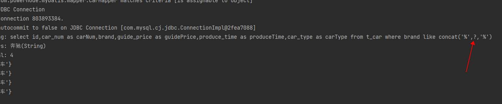

### 第二种：双引号方式

```xml
<select id="selectLikeByBrand" resultType="Car">
  select
  id,car_num as carNum,brand,guide_price as guidePrice,produce_time as produceTime,car_type as carType
  from
  t_car
  where
  brand like "%"#{brand}"%"
</select>
```

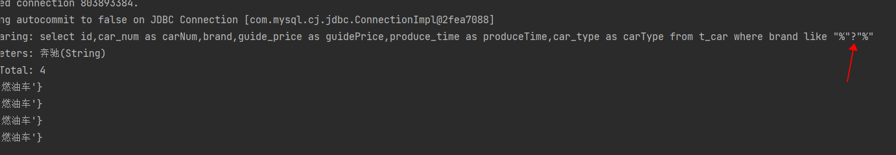

## typeAliases

我们来观察一下CarMapper.xml中的配置信息：

```xml
<?xml version="1.0" encoding="UTF-8" ?>
<!DOCTYPE mapper
        PUBLIC "-//mybatis.org//DTD Mapper 3.0//EN"
        "http://mybatis.org/dtd/mybatis-3-mapper.dtd">

<mapper namespace="com.jkweilai.mybatis.mapper.CarMapper">

    <select id="selectAll" resultType="com.jkweilai.mybatis.pojo.Car">
        select
            id,car_num as carNum,brand,guide_price as guidePrice,produce_time as produceTime,car_type as carType
        from
            t_car
        order by carNum ${key}
    </select>

    <select id="selectByCarType" resultType="com.jkweilai.mybatis.pojo.Car">
        select
            id,car_num as carNum,brand,guide_price as guidePrice,produce_time as produceTime,car_type as carType
        from
            t_car
        where
            car_type = '${carType}'
    </select>
</mapper>
```

resultType属性用来指定查询结果集的封装类型，这个名字太长，可以起别名吗？可以。

在mybatis-config.xml文件中使用typeAliases标签来起别名，包括两种方式：

### 第一种方式：typeAlias

```xml
<typeAliases>
  <typeAlias type="com.jkweilai.mybatis.pojo.Car" alias="Car"/>
</typeAliases>
```

- 首先要注意typeAliases标签的放置位置，如果不清楚的话，可以看看错误提示信息。
- typeAliases标签中的typeAlias可以写多个。
- typeAlias：
  - type属性：指定给哪个类起别名
  - alias属性：别名。
    - alias属性不是必须的，如果缺省的话，type属性指定的类型名的简类名作为别名。
    - alias是大小写不敏感的。也就是说假设alias="Car"，再用的时候，可以CAR，也可以car，也可以Car，都行。

### 第二种方式：package

如果一个包下的类太多，每个类都要起别名，会导致typeAlias标签配置较多，所以mybatis用提供package的配置方式，只需要指定包名，该包下的所有类都自动起别名，别名就是简类名。并且别名不区分大小写。

```xml
<typeAliases>
  <package name="com.jkweilai.mybatis.pojo"/>
</typeAliases>
```

package也可以配置多个的。

### 在SQL映射文件中用一下

```xml
<?xml version="1.0" encoding="UTF-8" ?>
<!DOCTYPE mapper
        PUBLIC "-//mybatis.org//DTD Mapper 3.0//EN"
        "http://mybatis.org/dtd/mybatis-3-mapper.dtd">

<mapper namespace="com.jkweilai.mybatis.mapper.CarMapper">

    <select id="selectAll" resultType="CAR">
        select
            id,car_num as carNum,brand,guide_price as guidePrice,produce_time as produceTime,car_type as carType
        from
            t_car
        order by carNum ${key}
    </select>

    <select id="selectByCarType" resultType="car">
        select
            id,car_num as carNum,brand,guide_price as guidePrice,produce_time as produceTime,car_type as carType
        from
            t_car
        where
            car_type = '${carType}'
    </select>
</mapper>
```

运行测试程序：正常。

## mappers

SQL映射文件的配置方式包括四种：

- resource：从类路径中加载
- url：从指定的全限定资源路径中加载
- class：使用映射器接口实现类的完全限定类名
- package：将包内的映射器接口实现全部注册为映射器

### resource

这种方式是从类路径中加载配置文件，所以这种方式要求SQL映射文件必须放在resources目录下或其子目录下。

```xml
<mappers>
  <mapper resource="org/mybatis/builder/AuthorMapper.xml"/>
  <mapper resource="org/mybatis/builder/BlogMapper.xml"/>
  <mapper resource="org/mybatis/builder/PostMapper.xml"/>
</mappers>
```

### url

这种方式显然使用了绝对路径的方式，这种配置对SQL映射文件存放的位置没有要求，随意。

```xml
<mappers>
  <mapper url="file:///var/mappers/AuthorMapper.xml"/>
  <mapper url="file:///var/mappers/BlogMapper.xml"/>
  <mapper url="file:///var/mappers/PostMapper.xml"/>
</mappers>
```

### class

如果使用这种方式必须满足以下条件：

- SQL映射文件和mapper接口放在同一个目录下。
- SQL映射文件的名字也必须和mapper接口名一致。

```xml
<!-- 使用映射器接口实现类的完全限定类名 -->
<mappers>
  <mapper class="org.mybatis.builder.AuthorMapper"/>
  <mapper class="org.mybatis.builder.BlogMapper"/>
  <mapper class="org.mybatis.builder.PostMapper"/>
</mappers>
```

将CarMapper.xml文件移动到和mapper接口同一个目录下：

- **在resources目录下新建：com/jkweilai/mybatis/mapper**【这里千万要注意：**不能这样新建 com.jkweilai.mybatis.dao**】
- 将CarMapper.xml文件移动到mapper目录下
- 修改mybatis-config.xml文件

```xml
<mappers>
  <mapper class="com.jkweilai.mybatis.mapper.CarMapper"/>
</mappers>
```

运行程序：正常！！！

### package

如果class较多，可以使用这种package的方式，但前提条件和上一种方式一样。

```xml
<!-- 将包内的映射器接口实现全部注册为映射器 -->
<mappers>
  <package name="com.jkweilai.mybatis.mapper"/>
</mappers>
```

## 插入数据时获取自动生成的主键

前提是：主键是自动生成的。

第一种方式：可以先插入用户数据，再写一条查询语句获取id，然后再插入user_id字段。【比较麻烦】

第二种方式：mybatis提供了一种方式更加便捷。

```java
/**
 * 获取自动生成的主键
 * @param car
 */
void insertUseGeneratedKeys(Car car);
```

```xml
<insert id="insertUseGeneratedKeys" useGeneratedKeys="true" keyProperty="id">
  insert into t_car(id,car_num,brand,guide_price,produce_time,car_type) values(null,#{carNum},#{brand},#{guidePrice},#{produceTime},#{carType})
</insert>
```

```java
@Test
public void testInsertUseGeneratedKeys(){
    CarMapper mapper = SqlSessionUtil.openSession().getMapper(CarMapper.class);
    Car car = new Car();
    car.setCarNum("5262");
    car.setBrand("BYD汉");
    car.setGuidePrice(30.3);
    car.setProduceTime("2020-10-11");
    car.setCarType("新能源");
    mapper.insertUseGeneratedKeys(car);
    SqlSessionUtil.openSession().commit();
    System.out.println(car.getId());
}
```

# MyBatis参数处理


**MyBatis参数处理指的是，在MyBatis当中都有哪些方式可以给SQL语句的占位符**`**#{}**`**传值？通常有以下几种方式：**

1. **单个简单类型参数**
2. **Map参数**
3. **实体类参数**
4. **多参数**
5. **@Param注解（命名参数）**

模块名：mybatis-006-param

表：t_student

```sql
drop table if exists t_student;
create table t_student(

  id bigint primary key auto_increment,
  name varchar(255),
  age int,
  height double,
  birth date,
  sex char(1)
);
insert into t_student values(null,'张三',45,1.81,'1980-10-12','男');
insert into t_student values(null,'李四',45,1.79,'1980-10-12','女');
select * from t_student;
```

pojo类：

```java
package com.jkweilai.mybatis.pojo;

import java.util.Date;

/**
 * 学生类
 * @author 老杜
 */
public class Student {
    private Long id;
    private String name;
    private Integer age;
    private Double height;
    private Character sex;
    private Date birth;
    // constructor
    // setter and getter
    // toString
}
```

## 单个简单类型参数

单个简单类型参数中，简单类型包括：

- byte short int long float double char
- Byte Short Integer Long Float Double Character
- String
- java.util.Date
- java.sql.Date

如果SQL语句的占位符只有一个，以上这些简单类型都可以直接传。

### 测试单个简单类型参数

需求：根据birth查

```java
package com.jkweilai.mybatis.mapper;

import com.jkweilai.mybatis.pojo.Student;

import java.util.Date;
import java.util.List;

/**
 * 学生数据Sql映射器
 * @author 老杜
 */
public interface StudentMapper {
    /**
     * 根据birth查询
     * @param birth
     * @return
     */
    List<Student> selectByBirth(Date birth);
}
```

```xml
<?xml version="1.0" encoding="UTF-8" ?>
<!DOCTYPE mapper
        PUBLIC "-//mybatis.org//DTD Mapper 3.0//EN"
        "http://mybatis.org/dtd/mybatis-3-mapper.dtd">

<mapper namespace="com.jkweilai.mybatis.mapper.StudentMapper">
    <select id="selectByBirth" resultType="student">
        select * from t_student where birth = #{birth}
    </select>
</mapper>
```

```java
package com.jkweilai.mybatis.test;

import com.jkweilai.mybatis.mapper.StudentMapper;
import com.jkweilai.mybatis.pojo.Student;
import com.jkweilai.mybatis.utils.SqlSessionUtil;
import org.junit.jupiter.api.Test;

import java.text.ParseException;
import java.text.SimpleDateFormat;
import java.util.Date;
import java.util.List;

public class StudentMapperTest {

    StudentMapper mapper = SqlSessionUtil.openSession().getMapper(StudentMapper.class);

    @Test
    public void testSelectByBirth(){
        try {
            Date birth = new SimpleDateFormat("yyyy-MM-dd").parse("2022-08-16");
            List<Student> students = mapper.selectByBirth(birth);
            students.forEach(student -> System.out.println(student));
        } catch (ParseException e) {
            throw new RuntimeException(e);
        }

    }
}
```

通过测试得知，简单类型对于mybatis来说都是可以自动类型识别的：

- 也就是说对于mybatis来说，它是可以自动推断出ps.setXxxx()方法的。ps.setString()还是ps.setInt()。它可以自动推断。

其实SQL映射文件中的配置比较完整的写法是：

```xml
<select id="selectByName" resultType="student" parameterType="java.lang.String">
  select * from t_student where name = #{name, javaType=String, jdbcType=VARCHAR}
</select>
```

其中sql语句中的javaType，jdbcType，以及select标签中的parameterType属性，都是用来帮助mybatis进行类型确定的。不过这些配置多数是可以省略的。因为mybatis它有强大的自动类型推断机制。

- javaType：可以省略
- jdbcType：可以省略
- parameterType：可以省略

**如果参数只有一个的话，#{} 里面的内容就随便写了。**

### 单个简单类型参数小细节

**单个简单类型参数**

```java
// Mapper 接口 - 单个简单参数
Student selectById(Long id);
```

在 XML 中，如果你想在 `<if>` 条件中判断 id 是否为空：

```xml
<!-- 错误写法：MyBatis 不知道 'id' 这个参数名 -->
<select id="selectById" resultType="student" parameterType="Long">
    SELECT * FROM t_student
    <if test="id != null">  <!-- 这里会报错，找不到 'id' 属性 -->
        WHERE id = #{id}
    </if>
</select>
<!-- 正确写法：使用 _parameter -->
<select id="selectById" resultType="student">
    SELECT * FROM t_student
    <if test="_parameter != null">  <!-- 使用 _parameter 引用整个参数 -->
        WHERE id = #{_parameter}    <!-- 这里也可以用 #{id} -->
    </if>
</select>
```

**为什么？** 因为对于单个简单参数，MyBatis 没有为其分配参数名，所以在 OGNL 表达式中无法通过 `id` 来引用。

什么是 `_parameter`？

`_parameter` 是 MyBatis 提供的一个**内置参数**，它代表**传入方法的整个参数**。在动态 SQL 的 OGNL 表达式中，当方法只有一个参数且是简单类型时，MyBatis 不会为这个参数自动创建参数名，这时候就需要用 `_parameter` 来引用它。

`**_parameter**`**不是唯一的解决办法，使用 **`**@Param**`** 注解也可以解决**

更好的解决方案是使用 `@Param` 注解：

```java
// 使用 @Param 注解明确指定参数名
Student selectById(@Param("id") Long id);
```

```xml
<!-- 现在可以直接使用参数名了 -->
<select id="selectById" resultType="student">
    SELECT * FROM t_student
    <if test="id != null">  <!-- 现在可以正确识别 'id' -->
        WHERE id = #{id}
    </if>
</select>
```

**复杂类型（如 LocalDate、POJO）的情况**

```java
// 复杂类型参数
List<Student> selectByBirth(LocalDate birth);
```

```xml
<!-- 可以直接使用参数名，因为 LocalDate 是复杂类型 -->
<select id="selectByBirth" resultType="student">
    SELECT * FROM t_student
    <if test="birth != null">  <!-- 这里能正常工作 -->
        WHERE birth = #{birth}
    </if>
</select>
```

## Map参数

前面我们已经用过，这里我们就不再赘述了。大家可以简单看一下以下代码：

需求：根据name和age查询

```java
/**
* 根据name和age查询
* @param paramMap
* @return
*/
List<Student> selectByParamMap(Map<String,Object> paramMap);
```

```java
@Test
public void testSelectByParamMap(){
    // 准备Map
    Map<String,Object> paramMap = new HashMap<>();
    paramMap.put("nameKey", "张三");
    paramMap.put("ageKey", 20);

    List<Student> students = mapper.selectByParamMap(paramMap);
    students.forEach(student -> System.out.println(student));
}
```

```xml
<select id="selectByParamMap" resultType="student">
  select * from t_student where name = #{nameKey} and age = #{ageKey}
</select>
```

测试运行正常。

**这种方式是手动封装Map集合，将每个条件以key和value的形式存放到集合中。然后在使用的时候通过#{map集合的key}来取值。**

## 实体类参数

前面我们已经用过，这里我们就不再赘述了。大家可以简单看一下以下代码：

需求：插入一条Student数据

```java
/**
 * 保存学生数据
 * @param student
 * @return
 */
int insert(Student student);
```

```xml
<insert id="insert">
  insert into t_student values(null,#{name},#{age},#{height},#{birth},#{sex})
</insert>
```

```java
@Test
public void testInsert(){
    Student student = new Student();
    student.setName("李四");
    student.setAge(30);
    student.setHeight(1.70);
    student.setSex('男');
    student.setBirth(new Date());
    int count = mapper.insert(student);
    SqlSessionUtil.openSession().commit();
}
```

运行正常，数据库中成功添加一条数据。

**这里需要注意的是：#{} 里面写的是属性名字。这个属性名其本质上是：set/get方法名去掉set/get之后的名字。**

## 多参数

需求：通过name和sex查询

```java
/**
 * 根据name和sex查询
 * @param name
 * @param sex
 * @return
 */
List<Student> selectByNameAndSex(String name, Character sex);
```

```java
@Test
public void testSelectByNameAndSex(){
    List<Student> students = mapper.selectByNameAndSex("张三", '女');
    students.forEach(student -> System.out.println(student));
}
```

```xml
<select id="selectByNameAndSex" resultType="student">
  select * from t_student where name = #{name} and sex = #{sex}
</select>
```

执行结果：

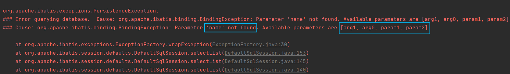

异常信息描述了：name参数找不到，可用的参数包括[arg1, arg0, param1, param2]

修改StudentMapper.xml配置文件：尝试使用[arg1, arg0, param1, param2]去参数

```xml
<select id="selectByNameAndSex" resultType="student">
  <!--select * from t_student where name = #{name} and sex = #{sex}-->
  select * from t_student where name = #{arg0} and sex = #{arg1}
</select>
```

运行结果：

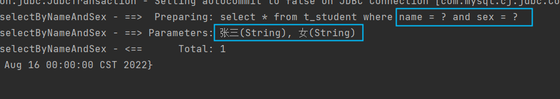

再次尝试修改StudentMapper.xml文件

```xml
<select id="selectByNameAndSex" resultType="student">
  <!--select * from t_student where name = #{name} and sex = #{sex}-->
  <!--select * from t_student where name = #{arg0} and sex = #{arg1}-->
  <!--select * from t_student where name = #{param1} and sex = #{param2}-->
  select * from t_student where name = #{arg0} and sex = #{param2}
</select>
```

通过测试可以看到：

- arg0 是第一个参数
- param1是第一个参数
- arg1 是第二个参数
- param2是第二个参数

实现原理：**实际上在mybatis底层会创建一个map集合，以arg0/param1为key，以方法上的参数为value**，例如以下代码：

```java
Map<String,Object> map = new HashMap<>();
map.put("arg0", name);
map.put("arg1", sex);
map.put("param1", name);
map.put("param2", sex);

// 所以可以这样取值：#{arg0} #{arg1} #{param1} #{param2}
// 其本质就是#{map集合的key}
```

注意：**使用mybatis****3.4.2之前的版本时：要用#{0}和#{1}这种形式。**

## @Param注解（命名参数）

可以不用arg0 arg1 param1 param2吗？这个map集合的key我们自定义可以吗？当然可以。使用@Param注解即可。这样可以增强可读性。

需求：根据name和age查询

```java
/**
 * 根据name和age查询
 * @param name
 * @param age
 * @return
 */
List<Student> selectByNameAndAge(@Param(value="name") String name, @Param("age") int age);
```

```java
@Test
public void testSelectByNameAndAge(){
    List<Student> stus = mapper.selectByNameAndAge("张三", 20);
    stus.forEach(student -> System.out.println(student));
}
```

```xml
<select id="selectByNameAndAge" resultType="student">
  select * from t_student where name = #{name} and age = #{age}
</select>
```

通过测试，一切正常。

核心：@Param("**这里填写的其实就是map集合的key**")

# MyBatis查询语句专题


模块名：mybatis-007-select

## 返回Car

之前我们已经接触过了，大家把代码看一下就行了。

有一点注意事项：查询返回结果是一个的话，返回值可以用List集合接收，也可以不用。都可以。

当查询的结果，有对应的实体类，并且查询结果只有一条时：

```java
package com.jkweilai.mybatis.mapper;

import com.jkweilai.mybatis.pojo.Car;

/**
 * Car SQL映射器
 * @author 老杜
 */
public interface CarMapper {

    /**
     * 根据id主键查询：结果最多只有一条
     * @param id
     * @return
     */
    Car selectById(Long id);
}
```

```xml
<?xml version="1.0" encoding="UTF-8" ?>
<!DOCTYPE mapper
        PUBLIC "-//mybatis.org//DTD Mapper 3.0//EN"
        "http://mybatis.org/dtd/mybatis-3-mapper.dtd">

<mapper namespace="com.jkweilai.mybatis.mapper.CarMapper">
    <select id="selectById" resultType="Car">
        select id,car_num carNum,brand,guide_price guidePrice,produce_time produceTime,car_type carType from t_car where id = #{id}
    </select>
</mapper>
```

```java
package com.jkweilai.mybatis.test;

import com.jkweilai.mybatis.mapper.CarMapper;
import com.jkweilai.mybatis.pojo.Car;
import com.jkweilai.mybatis.utils.SqlSessionUtil;
import org.junit.jupiter.api.Test;

public class CarMapperTest {

    @Test
    public void testSelectById(){
        CarMapper mapper = SqlSessionUtil.openSession().getMapper(CarMapper.class);
        Car car = mapper.selectById(35L);
        System.out.println(car);
    }
}
```

执行结果：

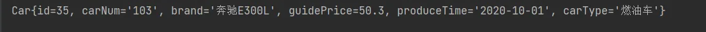

**查询结果是一条的话可以使用List集合接收吗？当然可以**。

```java
/**
* 根据id主键查询：结果最多只有一条，可以放到List集合中吗？
* @return
*/
List<Car> selectByIdToList(Long id);
```

```xml
<select id="selectByIdToList" resultType="Car">
  select id,car_num carNum,brand,guide_price guidePrice,produce_time produceTime,car_type carType from t_car where id = #{id}
</select>
```

```java
@Test
public void testSelectByIdToList(){
    CarMapper mapper = SqlSessionUtil.openSession().getMapper(CarMapper.class);
    List<Car> cars = mapper.selectByIdToList(35L);
    System.out.println(cars);
}
```

执行结果：

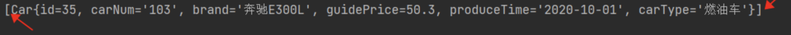

## 返回List

之前我们已经接触过了，大家把代码看一下就行了。

需要注意的一点是：如果返回结果是List集合（多条记录），如果采用单个实体类接收会报异常。

当查询的记录条数是多条的时候，必须使用集合接收。如果使用单个实体类接收会出现异常。

```java
/**
* 查询所有的Car
* @return
*/
List<Car> selectAll();
```

```xml
<select id="selectAll" resultType="Car">
  select id,car_num carNum,brand,guide_price guidePrice,produce_time produceTime,car_type carType from t_car
</select>
```

```java
@Test
public void testSelectAll(){
    CarMapper mapper = SqlSessionUtil.openSession().getMapper(CarMapper.class);
    List<Car> cars = mapper.selectAll();
    cars.forEach(car -> System.out.println(car));
}
```

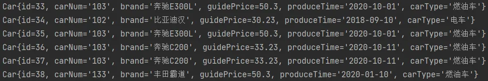

如果返回多条记录，采用单个实体类接收会怎样？

```java
/**
* 查询多条记录，采用单个实体类接收会怎样？
* @return
*/
Car selectAll2();
```

```xml
<select id="selectAll2" resultType="Car">
  select id,car_num carNum,brand,guide_price guidePrice,produce_time produceTime,car_type carType from t_car
</select>
```

```java
@Test
public void testSelectAll2(){
    CarMapper mapper = SqlSessionUtil.openSession().getMapper(CarMapper.class);
    Car car = mapper.selectAll2();
    System.out.println(car);
}
```

执行结果：

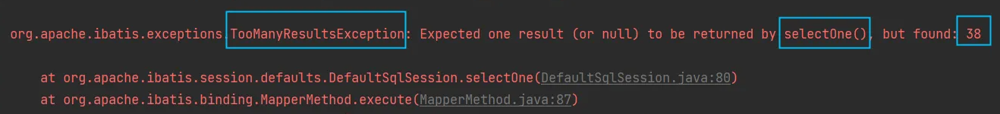

## 返回Map

当返回的数据，没有合适的实体类对应的话，可以采用Map集合接收。字段名做key，字段值做value。

查询如果可以保证只有一条数据，则返回一个Map集合即可。

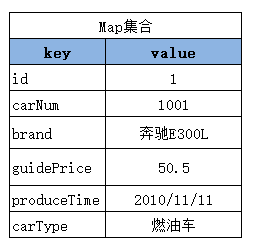

```java
/**
 * 通过id查询一条记录，返回Map集合
 * @param id
 * @return
 */
Map<String, Object> selectByIdRetMap(Long id);
```

```xml
<select id="selectByIdRetMap" resultType="map">
  select id,car_num carNum,brand,guide_price guidePrice,produce_time produceTime,car_type carType from t_car where id = #{id}
</select>
```

**resultMap="map"，这是因为mybatis内置了很多别名。【参见mybatis开发手册】**

```java
@Test
public void testSelectByIdRetMap(){
    CarMapper mapper = SqlSessionUtil.openSession().getMapper(CarMapper.class);
    Map<String,Object> car = mapper.selectByIdRetMap(35L);
    System.out.println(car);
}
```

执行结果：

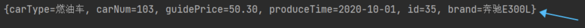

当然，如果返回一个Map集合，可以将Map集合放到List集合中吗？当然可以，这里就不再测试了。

反过来，如果返回的不是一条记录，是多条记录的话，只采用单个Map集合接收，这样同样会出现之前的异常：**TooManyResultsException**

## 返回List

查询结果条数大于等于1条数据，则可以返回一个存储Map集合的List集合。List等同于List


```java
/**
 * 查询所有的Car，返回一个List集合。List集合中存储的是Map集合。
 * @return
 */
List<Map<String,Object>> selectAllRetListMap();
```

```xml
<select id="selectAllRetListMap" resultType="map">
  select id,car_num carNum,brand,guide_price guidePrice,produce_time produceTime,car_type carType from t_car
</select>
```

```java
@Test
public void testSelectAllRetListMap(){
    CarMapper mapper = SqlSessionUtil.openSession().getMapper(CarMapper.class);
    List<Map<String,Object>> cars = mapper.selectAllRetListMap();
    System.out.println(cars);
}
```

执行结果：

```json
[
  {carType=燃油车, carNum=103, guidePrice=50.30, produceTime=2020-10-01, id=33, brand=奔驰E300L}, 
  {carType=电车, carNum=102, guidePrice=30.23, produceTime=2018-09-10, id=34, brand=比亚迪汉}, 
  {carType=燃油车, carNum=103, guidePrice=50.30, produceTime=2020-10-01, id=35, brand=奔驰E300L}, 
  {carType=燃油车, carNum=103, guidePrice=33.23, produceTime=2020-10-11, id=36, brand=奔驰C200},
  ......
]
```

## 返回Map<String,Map>

**拿Car的id做key，以后取出对应的Map集合时更方便。**


```java
/**
 * 获取所有的Car，返回一个Map集合。
 * Map集合的key是Car的id。
 * Map集合的value是对应Car。
 * @return
 */
@MapKey("id")
Map<Long,Map<String,Object>> selectAllRetMap();
```

```xml
<select id="selectAllRetMap" resultType="map">
  select id,car_num carNum,brand,guide_price guidePrice,produce_time produceTime,car_type carType from t_car
</select>
```

```java
@Test
public void testSelectAllRetMap(){
    CarMapper mapper = SqlSessionUtil.openSession().getMapper(CarMapper.class);
    Map<Long,Map<String,Object>> cars = mapper.selectAllRetMap();
    System.out.println(cars);
}
```

执行结果：

```json
{
64={carType=燃油车, carNum=133, guidePrice=50.30, produceTime=2020-01-10, id=64, brand=丰田霸道}, 
66={carType=燃油车, carNum=133, guidePrice=50.30, produceTime=2020-01-10, id=66, brand=丰田霸道}, 
67={carType=燃油车, carNum=133, guidePrice=50.30, produceTime=2020-01-10, id=67, brand=丰田霸道}, 
69={carType=燃油车, carNum=133, guidePrice=50.30, produceTime=2020-01-10, id=69, brand=丰田霸道},
......
}
```

## resultMap结果映射

查询结果的列名和java对象的属性名对应不上怎么办？

- 第一种方式：as 给列起别名
- 第二种方式：使用resultMap进行结果映射
- 第三种方式：开启驼峰命名自动映射（配置settings）

### 使用resultMap进行结果映射

```java
/**
 * 查询所有Car，使用resultMap进行结果映射
 * @return
 */
List<Car> selectAllByResultMap();
```

```xml
<!--
        resultMap:
            id：这个结果映射的标识，作为select标签的resultMap属性的值。
            type：结果集要映射的类。可以使用别名。
-->
<resultMap id="carResultMap" type="car">
  <!--对象的唯一标识，官方解释是：为了提高mybatis的性能。建议写上。-->
  <id property="id" column="id"/>
  <result property="carNum" column="car_num"/>
  <!--当属性名和数据库列名一致时，可以省略。但建议都写上。-->
  <!--javaType用来指定属性类型。jdbcType用来指定列类型。一般可以省略。-->
  <result property="brand" column="brand" javaType="string" jdbcType="VARCHAR"/>
  <result property="guidePrice" column="guide_price"/>
  <result property="produceTime" column="produce_time"/>
  <result property="carType" column="car_type"/>
</resultMap>

<!--resultMap属性的值必须和resultMap标签中id属性值一致。-->
<select id="selectAllByResultMap" resultMap="carResultMap">
  select * from t_car
</select>
```

```java
@Test
public void testSelectAllByResultMap(){
    CarMapper carMapper = SqlSessionUtil.openSession().getMapper(CarMapper.class);
    List<Car> cars = carMapper.selectAllByResultMap();
    System.out.println(cars);
}
```

执行结果正常。

### 是否开启驼峰命名自动映射

使用这种方式的前提是：属性名遵循Java的命名规范，数据库表的列名遵循SQL的命名规范。

Java命名规范：首字母小写，后面每个单词首字母大写，遵循驼峰命名方式。

SQL命名规范：全部小写，单词之间采用下划线分割。

比如以下的对应关系：

| **实体类中的属性名** | **数据库表的列名** |
| --- | --- |
| carNum | car_num |
| carType | car_type |
| produceTime | produce_time |

如何启用该功能，在mybatis-config.xml文件中进行配置：

```xml
<!--放在properties标签后面-->
<settings>
  <setting name="mapUnderscoreToCamelCase" value="true"/>
</settings>
```

```java
/**
* 查询所有Car，启用驼峰命名自动映射
* @return
*/
List<Car> selectAllByMapUnderscoreToCamelCase();
```

```xml
<select id="selectAllByMapUnderscoreToCamelCase" resultType="Car">
  select * from t_car
</select>
```

```java
@Test
public void testSelectAllByMapUnderscoreToCamelCase(){
    CarMapper carMapper = SqlSessionUtil.openSession().getMapper(CarMapper.class);
    List<Car> cars = carMapper.selectAllByMapUnderscoreToCamelCase();
    System.out.println(cars);
}
```

执行结果正常。

## 返回总记录条数

需求：查询总记录条数

```java
/**
 * 获取总记录条数
 * @return
 */
Long selectTotal();
```

```xml
<!--long是别名，可参考mybatis开发手册。-->
<select id="selectTotal" resultType="long">
  select count(*) from t_car
</select>
```

```java
@Test
public void testSelectTotal(){
    CarMapper carMapper = SqlSessionUtil.openSession().getMapper(CarMapper.class);
    Long total = carMapper.selectTotal();
    System.out.println(total);
}
```

# 动态SQL


有的业务场景，也需要SQL语句进行动态拼接，例如：

- 批量删除


```sql
delete from t_car where id in(1,2,3,4,5,6,......这里的值是动态的，根据用户选择的id不同，值是不同的);
```

- 多条件查询


```sql
select * from t_car where brand like '丰田%' and guide_price > 30 and .....;
```

创建模块：mybatis-008-dynamic-sql

## if标签

需求：多条件查询。

可能的条件包括：品牌（brand）、指导价格（guide_price）、汽车类型（car_type）

```java
package com.jkweilai.mybatis.mapper;

import com.jkweilai.mybatis.pojo.Car;
import org.apache.ibatis.annotations.Param;

import java.util.List;

public interface CarMapper {


    /**
     * 根据多条件查询Car
     * @param brand
     * @param guidePrice
     * @param carType
     * @return
     */
    List<Car> selectByMultiCondition(@Param("brand") String brand, @Param("guidePrice") Double guidePrice, @Param("carType") String carType);
}
```

```xml
<?xml version="1.0" encoding="UTF-8" ?>
<!DOCTYPE mapper
        PUBLIC "-//mybatis.org//DTD Mapper 3.0//EN"
        "http://mybatis.org/dtd/mybatis-3-mapper.dtd">

<mapper namespace="com.jkweilai.mybatis.mapper.CarMapper">

    <select id="selectByMultiCondition" resultType="car">
        select * from t_car where
        <if test="brand != null and brand != ''">
            brand like #{brand}"%"
        </if>
        <if test="guidePrice != null and guidePrice != ''">
            and guide_price >= #{guidePrice}
        </if>
        <if test="carType != null and carType != ''">
            and car_type = #{carType}
        </if>
    </select>

</mapper>
```

```java
package com.jkweilai.mybatis.test;

import com.jkweilai.mybatis.mapper.CarMapper;
import com.jkweilai.mybatis.pojo.Car;

import com.jkweilai.mybatis.utils.SqlSessionUtil;
import org.junit.jupiter.api.Test;

import java.util.List;

public class CarMapperTest {
    @Test
    public void testSelectByMultiCondition(){
        CarMapper mapper = SqlSessionUtil.openSession().getMapper(CarMapper.class);
        List<Car> cars = mapper.selectByMultiCondition("丰田", 20.0, "燃油车");
        System.out.println(cars);
    }
}
```

执行结果：


如果第一个条件为空，剩下两个条件不为空，会是怎样呢？

```java
List<Car> cars = mapper.selectByMultiCondition("", 20.0, "燃油车");
```

执行结果：


报错了，SQL语法有问题，where后面出现了and。这该怎么解决呢？

- 可以where后面添加一个恒成立的条件。


执行结果：


如果三个条件都是空，有影响吗？

```java
List<Car> cars = mapper.selectByMultiCondition("", null, "");
```

执行结果：


三个条件都不为空呢？

```java
List<Car> cars = mapper.selectByMultiCondition("丰田", 20.0, "燃油车");
```

执行结果：


## where标签

where标签的作用：让where子句更加动态智能。

- 所有条件都为空时，where标签保证不会生成where子句。
- 自动去除某些条件**前面**多余的and或or。

继续使用if标签中的需求。

```java
/**
* 根据多条件查询Car，使用where标签
* @param brand
* @param guidePrice
* @param carType
* @return
*/
List<Car> selectByMultiConditionWithWhere(@Param("brand") String brand, @Param("guidePrice") Double guidePrice, @Param("carType") String carType);
```

```xml
<select id="selectByMultiConditionWithWhere" resultType="car">
  select * from t_car
  <where>
    <if test="brand != null and brand != ''">
      and brand like #{brand}"%"
    </if>
    <if test="guidePrice != null and guidePrice != ''">
      and guide_price >= #{guidePrice}
    </if>
    <if test="carType != null and carType != ''">
      and car_type = #{carType}
    </if>
  </where>
</select>
```

```java
@Test
public void testSelectByMultiConditionWithWhere(){
    CarMapper mapper = SqlSessionUtil.openSession().getMapper(CarMapper.class);
    List<Car> cars = mapper.selectByMultiConditionWithWhere("丰田", 20.0, "燃油车");
    System.out.println(cars);
}
```

运行结果：


如果所有条件都是空呢？

```java
List<Car> cars = mapper.selectByMultiConditionWithWhere("", null, "");
```

运行结果：


它可以自动去掉前面多余的and，那可以自动去掉前面多余的or吗？

```java
List<Car> cars = mapper.selectByMultiConditionWithWhere("丰田", 20.0, "燃油车");
```

```xml
<select id="selectByMultiConditionWithWhere" resultType="car">
  select * from t_car
  <where>
    <if test="brand != null and brand != ''">
      or brand like #{brand}"%"
    </if>
    <if test="guidePrice != null and guidePrice != ''">
      and guide_price >= #{guidePrice}
    </if>
    <if test="carType != null and carType != ''">
      and car_type = #{carType}
    </if>
  </where>
</select>
```

执行结果：


它可以自动去掉前面多余的and，那可以自动去掉后面多余的and吗？

```xml
<select id="selectByMultiConditionWithWhere" resultType="car">
  select * from t_car
  <where>
    <if test="brand != null and brand != ''">
      brand like #{brand}"%" and
    </if>
    <if test="guidePrice != null and guidePrice != ''">
      guide_price >= #{guidePrice} and
    </if>
    <if test="carType != null and carType != ''">
      car_type = #{carType}
    </if>
  </where>
</select>
```

```xml
// 让最后一个条件为空
List<Car> cars = mapper.selectByMultiConditionWithWhere("丰田", 20.0, "");
```

运行结果：


很显然，后面多余的and是不会被去除的。

## trim标签

trim标签的属性：

- prefix：在trim标签中的语句前**添加**内容
- suffix：在trim标签中的语句后**添加**内容
- prefixOverrides：前缀**覆盖掉（去掉）**
- suffixOverrides：后缀**覆盖掉（去掉）**

```java
/**
* 根据多条件查询Car，使用trim标签
* @param brand
* @param guidePrice
* @param carType
* @return
*/
List<Car> selectByMultiConditionWithTrim(@Param("brand") String brand, @Param("guidePrice") Double guidePrice, @Param("carType") String carType);
```

```xml
<select id="selectByMultiConditionWithTrim" resultType="car">
  select * from t_car
  <trim prefix="where" suffixOverrides="and|or">
    <if test="brand != null and brand != ''">
      brand like #{brand}"%" and
    </if>
    <if test="guidePrice != null and guidePrice != ''">
      guide_price >= #{guidePrice} and
    </if>
    <if test="carType != null and carType != ''">
      car_type = #{carType}
    </if>
  </trim>
</select>
```

```java
@Test
public void testSelectByMultiConditionWithTrim(){
    CarMapper mapper = SqlSessionUtil.openSession().getMapper(CarMapper.class);
    List<Car> cars = mapper.selectByMultiConditionWithTrim("丰田", 20.0, "");
    System.out.println(cars);
}
```


如果所有条件为空，where会被加上吗？

```java
List<Car> cars = mapper.selectByMultiConditionWithTrim("", null, "");
```

执行结果：


## set标签

主要使用在update语句当中，用来生成set关键字，同时去掉最后多余的“,”

比如我们只更新提交的不为空的字段，如果提交的数据是空或者""，那么这个字段我们将不更新。

```java
/**
* 更新信息，使用set标签
* @param car
* @return
*/
int updateWithSet(Car car);
```

```xml
<update id="updateWithSet">
  update t_car
  <set>
    <if test="carNum != null and carNum != ''">car_num = #{carNum},</if>
    <if test="brand != null and brand != ''">brand = #{brand},</if>
    <if test="guidePrice != null and guidePrice != ''">guide_price = #{guidePrice},</if>
    <if test="produceTime != null and produceTime != ''">produce_time = #{produceTime},</if>
    <if test="carType != null and carType != ''">car_type = #{carType},</if>
  </set>
  where id = #{id}
</update>
```

```java
@Test
public void testUpdateWithSet(){
    CarMapper mapper = SqlSessionUtil.openSession().getMapper(CarMapper.class);
    Car car = new Car(38L,"1001","丰田霸道2",10.0,"",null);
    int count = mapper.updateWithSet(car);
    System.out.println(count);
    SqlSessionUtil.openSession().commit();
}
```

执行结果：


## choose when otherwise

这三个标签是在一起使用的：

```xml
<choose>
  <when></when>
  <when></when>
  <when></when>
  <otherwise></otherwise>
</choose>
```

等同于：

```java
if(){
    
}else if(){
    
}else if(){
    
}else if(){
    
}else{

}
```

只有一个分支会被选择！！！！

需求：先根据品牌查询，如果没有提供品牌，再根据指导价格查询，如果没有提供指导价格，就根据生产日期查询。

```java
/**
* 使用choose when otherwise标签查询
* @param brand
* @param guidePrice
* @param produceTime
* @return
*/
List<Car> selectWithChoose(@Param("brand") String brand, @Param("guidePrice") Double guidePrice, @Param("produceTime") String produceTime);
```

```xml
<select id="selectWithChoose" resultType="car">
  select * from t_car
  <where>
    <choose>
      <when test="brand != null and brand != ''">
        brand like #{brand}"%"
      </when>
      <when test="guidePrice != null and guidePrice != ''">
        guide_price >= #{guidePrice}
      </when>
      <otherwise>
        produce_time >= #{produceTime}
      </otherwise>
    </choose>
  </where>
</select>
```

```java
@Test
public void testSelectWithChoose(){
    CarMapper mapper = SqlSessionUtil.openSession().getMapper(CarMapper.class);
    //List<Car> cars = mapper.selectWithChoose("丰田霸道", 20.0, "2000-10-10");
    //List<Car> cars = mapper.selectWithChoose("", 20.0, "2000-10-10");
    //List<Car> cars = mapper.selectWithChoose("", null, "2000-10-10");
    List<Car> cars = mapper.selectWithChoose("", null, "");
    System.out.println(cars);
}
```


## foreach标签

循环数组或集合，动态生成sql，比如这样的SQL：

```sql
delete from t_car where id in(1,2,3);
delete from t_car where id = 1 or id = 2 or id = 3;
```

```sql
insert into t_car values
  (null,'1001','凯美瑞',35.0,'2010-10-11','燃油车'),
  (null,'1002','比亚迪唐',31.0,'2020-11-11','新能源'),
  (null,'1003','比亚迪宋',32.0,'2020-10-11','新能源')
```

### 批量删除

- 用in来删除

```java
/**
* 通过foreach完成批量删除
* @param ids
* @return
*/
int deleteBatchByForeach(@Param("ids") Long[] ids);
```

```xml
<!--
collection：集合或数组
item：集合或数组中的元素
separator：分隔符
open：foreach标签中所有内容的开始
close：foreach标签中所有内容的结束
-->
<delete id="deleteBatchByForeach">
  delete from t_car where id in
  <foreach collection="ids" item="id" separator="," open="(" close=")">
    #{id}
  </foreach>
</delete>
```

```java
@Test
public void testDeleteBatchByForeach(){
    CarMapper mapper = SqlSessionUtil.openSession().getMapper(CarMapper.class);
    int count = mapper.deleteBatchByForeach(new Long[]{40L, 41L, 42L});
    System.out.println("删除了几条记录：" + count);
    SqlSessionUtil.openSession().commit();
}
```

执行结果：


- 用or来删除

```java
/**
* 通过foreach完成批量删除
* @param ids
* @return
*/
int deleteBatchByForeach2(@Param("ids") Long[] ids);
```

```xml
<delete id="deleteBatchByForeach2">
  delete from t_car where
  <foreach collection="ids" item="id" separator="or">
    id = #{id}
  </foreach>
</delete>
```

```java
@Test
public void testDeleteBatchByForeach2(){
    CarMapper mapper = SqlSessionUtil.openSession().getMapper(CarMapper.class);
    int count = mapper.deleteBatchByForeach2(new Long[]{40L, 41L, 42L});
    System.out.println("删除了几条记录：" + count);
    SqlSessionUtil.openSession().commit();
}
```

执行结果：


### 批量添加

```java
/**
* 批量添加，使用foreach标签
* @param cars
* @return
*/
int insertBatchByForeach(@Param("cars") List<Car> cars);
```

```xml
<insert id="insertBatchByForeach">
  insert into t_car values 
  <foreach collection="cars" item="car" separator=",">
    (null,#{car.carNum},#{car.brand},#{car.guidePrice},#{car.produceTime},#{car.carType})
  </foreach>
</insert>
```

```java
@Test
public void testInsertBatchByForeach(){
    CarMapper mapper = SqlSessionUtil.openSession().getMapper(CarMapper.class);
    Car car1 = new Car(null, "2001", "兰博基尼", 100.0, "1998-10-11", "燃油车");
    Car car2 = new Car(null, "2001", "兰博基尼", 100.0, "1998-10-11", "燃油车");
    Car car3 = new Car(null, "2001", "兰博基尼", 100.0, "1998-10-11", "燃油车");
    List<Car> cars = Arrays.asList(car1, car2, car3);
    int count = mapper.insertBatchByForeach(cars);
    System.out.println("插入了几条记录" + count);
    SqlSessionUtil.openSession().commit();
}
```

执行结果：


## sql标签与include标签

sql标签用来声明sql片段

include标签用来将声明的sql片段包含到某个sql语句当中

作用：代码复用。易维护。

```xml
<sql id="carCols">id,car_num carNum,brand,guide_price guidePrice,produce_time produceTime,car_type carType</sql>

<select id="selectAllRetMap" resultType="map">
  select <include refid="carCols"/> from t_car
</select>

<select id="selectAllRetListMap" resultType="map">
  select <include refid="carCols"/> carType from t_car
</select>

<select id="selectByIdRetMap" resultType="map">
  select <include refid="carCols"/> from t_car where id = #{id}
</select>
```

# MyBatis的高级映射及延迟加载


模块名：mybatis-009-advanced-mapping

准备数据库表：一个班级对应多个学生。班级表：t_clazz。学生表：t_student

```sql
drop table if exists t_clazz;
create table t_clazz(
  cid int primary key,
  cname varchar(255)
);
insert into t_clazz(cid,cname) values(1001, '高三1班');
insert into t_clazz(cid,cname) values(1002, '高三2班');

drop table if exists t_student;
create table t_student(
  sid int primary key auto_increment,
  sname varchar(255),
  cid int
);
insert into t_student(sname,cid) values('张三', 1001);
insert into t_student(sname,cid) values('李四', 1001);
insert into t_student(sname,cid) values('王五', 1001);
insert into t_student(sname,cid) values('赵六', 1002);
insert into t_student(sname,cid) values('钱七', 1002);

select * from t_clazz;
select * from t_student;
```


创建pojo：Student、Clazz

```java
package com.jkweilai.mybatis.pojo;

/**
 * 学生类
 * @author 老杜
 */
public class Student {
    private Integer sid;
    private String sname;
    //......
}
```

```java
package com.jkweilai.mybatis.pojo;

/**
 * 班级类
 * @author 老杜
 */
public class Clazz {
    private Integer cid;
    private String cname;
    //......
}
```

创建mapper接口：StudentMapper、ClazzMapper

创建mapper映射文件：StudentMapper.xml、ClazzMapper.xml

## 多对一

多种方式，常见的包括三种：

- 第一种方式：一条SQL语句，级联属性映射。
- 第二种方式：一条SQL语句，association。
- 第三种方式：两条SQL语句，分步查询。（这种方式常用：优点一是可复用。优点二是支持懒加载。）

### 第一种方式：级联属性映射

pojo类Student中添加一个属性：Clazz clazz; 表示学生关联的班级对象。

```java
package com.jkweilai.mybatis.pojo;

/**
 * 学生类
 * @author 老杜
 */
public class Student {
    private Integer sid;
    private String sname;
    private Clazz clazz;

    public Clazz getClazz() {
        return clazz;
    }

    public void setClazz(Clazz clazz) {
        this.clazz = clazz;
    }

    @Override
    public String toString() {
        return "Student{" +
                "sid=" + sid +
                ", sname='" + sname + '\'' +
                ", clazz=" + clazz +
                '}';
    }

    public Student() {
    }

    public Student(Integer sid, String sname) {
        this.sid = sid;
        this.sname = sname;
    }

    public Integer getSid() {
        return sid;
    }

    public void setSid(Integer sid) {
        this.sid = sid;
    }

    public String getSname() {
        return sname;
    }

    public void setSname(String sname) {
        this.sname = sname;
    }
}
```

```xml
<?xml version="1.0" encoding="UTF-8" ?>
<!DOCTYPE mapper
        PUBLIC "-//mybatis.org//DTD Mapper 3.0//EN"
        "http://mybatis.org/dtd/mybatis-3-mapper.dtd">

<mapper namespace="com.jkweilai.mybatis.mapper.StudentMapper">

    <resultMap id="studentResultMap" type="Student">
        <id property="sid" column="sid"/>
        <result property="sname" column="sname"/>
        <result property="clazz.cid" column="cid"/>
        <result property="clazz.cname" column="cname"/>
    </resultMap>

    <select id="selectBySid" resultMap="studentResultMap">
        select s.*, c.* from t_student s join t_clazz c on s.cid = c.cid where sid = #{sid}
    </select>

</mapper>
```

```java
package com.jkweilai.mybatis.test;

import com.jkweilai.mybatis.mapper.StudentMapper;
import com.jkweilai.mybatis.pojo.Student;
import com.jkweilai.mybatis.utils.SqlSessionUtil;
import org.junit.jupiter.api.Test;

public class StudentMapperTest {
    @Test
    public void testSelectBySid(){
        StudentMapper mapper = SqlSessionUtil.openSession().getMapper(StudentMapper.class);
        Student student = mapper.selectBySid(1);
        System.out.println(student);
    }
}
```

执行结果：


### 第二种方式：association

其他位置都不需要修改，只需要修改resultMap中的配置：association即可。

```xml
<resultMap id="studentResultMap" type="Student">
  <id property="sid" column="sid"/>
  <result property="sname" column="sname"/>
  <association property="clazz" javaType="Clazz">
    <id property="cid" column="cid"/>
    <result property="cname" column="cname"/>
  </association>
</resultMap>
```

association翻译为：关联。

学生对象关联一个班级对象。

### 第三种方式：分步查询

其他位置不需要修改，只需要修改以及添加以下三处：

第一处：association中select位置填写sqlId。sqlId=namespace+id。其中column属性作为这条子sql语句的条件。

```xml
<resultMap id="studentResultMap" type="Student">
  <id property="sid" column="sid"/>
  <result property="sname" column="sname"/>
  <association property="clazz"
               select="com.jkweilai.mybatis.mapper.ClazzMapper.selectByCid"
               column="cid"/>
</resultMap>

<select id="selectBySid" resultMap="studentResultMap">
  select s.* from t_student s where sid = #{sid}
</select>
```

第二处：在ClazzMapper接口中添加方法

```java
package com.jkweilai.mybatis.mapper;

import com.jkweilai.mybatis.pojo.Clazz;

/**
 * Clazz映射器接口
 * @author 老杜
 */
public interface ClazzMapper {

    /**
     * 根据cid获取Clazz信息
     * @param cid
     * @return
     */
    Clazz selectByCid(Integer cid);
}
```

第三处：在ClazzMapper.xml文件中进行配置

```xml
<?xml version="1.0" encoding="UTF-8" ?>
<!DOCTYPE mapper
        PUBLIC "-//mybatis.org//DTD Mapper 3.0//EN"
        "http://mybatis.org/dtd/mybatis-3-mapper.dtd">

<mapper namespace="com.jkweilai.mybatis.mapper.ClazzMapper">
    <select id="selectByCid" resultType="Clazz">
        select * from t_clazz where cid = #{cid}
    </select>
</mapper>
```

执行结果，可以很明显看到先后有两条sql语句执行：


分步优点：

- 第一个优点：代码复用性增强。
- 第二个优点：支持延迟加载。【暂时访问不到的数据可以先不查询。提高程序的执行效率。】

## 多对一延迟加载

要想支持延迟加载，非常简单，只需要在association标签中添加fetchType="lazy"即可。

修改StudentMapper.xml文件：

```xml
<resultMap id="studentResultMap" type="Student">
  <id property="sid" column="sid"/>
  <result property="sname" column="sname"/>
  <association property="clazz"
               select="com.jkweilai.mybatis.mapper.ClazzMapper.selectByCid"
               column="cid"
               fetchType="lazy"/>
</resultMap>
```

我们现在只查询学生名字，修改测试程序：

```java
public class StudentMapperTest {
    @Test
    public void testSelectBySid(){
        StudentMapper mapper = SqlSessionUtil.openSession().getMapper(StudentMapper.class);
        Student student = mapper.selectBySid(1);
        //System.out.println(student);
        // 只获取学生姓名
        String sname = student.getSname();
        System.out.println("学生姓名：" + sname);
    }
}
```


如果后续需要使用到学生所在班级的名称，这个时候才会执行关联的sql语句，修改测试程序：

```java
public class StudentMapperTest {
    @Test
    public void testSelectBySid(){
        StudentMapper mapper = SqlSessionUtil.openSession().getMapper(StudentMapper.class);
        Student student = mapper.selectBySid(1);
        //System.out.println(student);
        // 只获取学生姓名
        String sname = student.getSname();
        System.out.println("学生姓名：" + sname);
        // 到这里之后，想获取班级名字了
        String cname = student.getClazz().getCname();
        System.out.println("学生的班级名称：" + cname);
    }
}
```


通过以上的执行结果可以看到，只有当使用到班级名称之后，才会执行关联的sql语句，这就是延迟加载。

在mybatis中如何开启全局的延迟加载呢？需要setting配置，如下：


```xml
<settings>
  <setting name="lazyLoadingEnabled" value="true"/>
</settings>
```

**把fetchType="lazy"去掉。**

执行以下程序：

```java
public class StudentMapperTest {
    @Test
    public void testSelectBySid(){
        StudentMapper mapper = SqlSessionUtil.openSession().getMapper(StudentMapper.class);
        Student student = mapper.selectBySid(1);
        //System.out.println(student);
        // 只获取学生姓名
        String sname = student.getSname();
        System.out.println("学生姓名：" + sname);
        // 到这里之后，想获取班级名字了
        String cname = student.getClazz().getCname();
        System.out.println("学生的班级名称：" + cname);
    }
}
```


通过以上的测试可以看出，我们已经开启了全局延迟加载策略。

开启全局延迟加载之后，所有的sql都会支持延迟加载，如果某个sql你不希望它支持延迟加载怎么办呢？将fetchType设置为eager：

```xml
<resultMap id="studentResultMap" type="Student">
  <id property="sid" column="sid"/>
  <result property="sname" column="sname"/>
  <association property="clazz"
               select="com.jkweilai.mybatis.mapper.ClazzMapper.selectByCid"
               column="cid"
               fetchType="eager"/>
</resultMap>
```


这样的话，针对某个特定的sql，你就关闭了延迟加载机制。

后期我们要不要开启延迟加载机制，主要看实际的业务需求是怎样的。

## 一对多

一对多的实现，通常是在一的一方中有List集合属性。

在Clazz类中添加List stus; 属性。

```java
public class Clazz {
    private Integer cid;
    private String cname;
    private List<Student> stus;
    // set get方法
    // 构造方法
    // toString方法
}
```

一对多的实现通常包括两种实现方式：

- 第一种方式：collection
- 第二种方式：分步查询

### 第一种方式：collection

```java
package com.jkweilai.mybatis.mapper;

import com.jkweilai.mybatis.pojo.Clazz;

/**
 * Clazz映射器接口
 * @author 老杜
 */
public interface ClazzMapper {

    /**
     * 根据cid获取Clazz信息
     * @param cid
     * @return
     */
    Clazz selectByCid(Integer cid);

    /**
     * 根据班级编号查询班级信息。同时班级中所有的学生信息也要查询。
     * @param cid
     * @return
     */
    Clazz selectClazzAndStusByCid(Integer cid);
}
```

```xml
<resultMap id="clazzResultMap" type="Clazz">
  <id property="cid" column="cid"/>
  <result property="cname" column="cname"/>
  <collection property="stus" ofType="Student">
    <id property="sid" column="sid"/>
    <result property="sname" column="sname"/>
  </collection>
</resultMap>

<select id="selectClazzAndStusByCid" resultMap="clazzResultMap">
  select * from t_clazz c join t_student s on c.cid = s.cid where c.cid = #{cid}
</select>
```

注意是ofType，表示“集合中的类型”。

```java
package com.jkweilai.mybatis.test;

import com.jkweilai.mybatis.mapper.ClazzMapper;
import com.jkweilai.mybatis.pojo.Clazz;
import com.jkweilai.mybatis.utils.SqlSessionUtil;
import org.junit.jupiter.api.Test;

public class ClazzMapperTest {
    @Test
    public void testSelectClazzAndStusByCid() {
        ClazzMapper mapper = SqlSessionUtil.openSession().getMapper(ClazzMapper.class);
        Clazz clazz = mapper.selectClazzAndStusByCid(1001);
        System.out.println(clazz);
    }
}
```

执行结果：


### 第二种方式：分步查询

修改以下三个位置即可：

```xml
<resultMap id="clazzResultMap" type="Clazz">
  <id property="cid" column="cid"/>
  <result property="cname" column="cname"/>
  <!--主要看这里-->
  <collection property="stus"
              select="com.jkweilai.mybatis.mapper.StudentMapper.selectByCid"
              column="cid"/>
</resultMap>

<!--sql语句也变化了-->
<select id="selectClazzAndStusByCid" resultMap="clazzResultMap">
  select * from t_clazz c where c.cid = #{cid}
</select>
```

```java
/**
* 根据班级编号获取所有的学生。
* @param cid
* @return
*/
List<Student> selectByCid(Integer cid);
```

```xml
<select id="selectByCid" resultType="Student">
  select * from t_student where cid = #{cid}
</select>
```

执行结果：


## 一对多延迟加载

一对多延迟加载机制和多对一是一样的。同样是通过两种方式：

- 第一种：fetchType="lazy"
- 第二种：修改全局的配置setting，**lazyLoadingEnabled=true，**如果开启全局延迟加载，想让某个sql不使用延迟加载：fetchType="eager"

# MyBatis的缓存


缓存：cache

缓存的作用：通过减少IO的方式，来提高程序的执行效率。

mybatis的缓存：将select语句的查询结果放到缓存（内存）当中，下一次还是这条select语句的话，直接从缓存中取，不再查数据库。一方面是减少了IO。另一方面不再执行繁琐的查找算法。效率大大提升。

mybatis缓存包括：

- 一级缓存：将查询到的数据存储到SqlSession中。
- 二级缓存：将查询到的数据存储到SqlSessionFactory中。
- 或者集成其它第三方的缓存：比如EhCache【Java语言开发的】、Memcache【C语言开发的】、**Redis【C语言开发的】**等。

**缓存只针对于DQL语句，也就是说缓存机制只对应select语句。**

## 一级缓存

一级缓存默认是开启的。不需要做任何配置。

原理：只要使用同一个SqlSession对象执行同一条SQL语句，就会走缓存。

模块名：`**mybatis-010-cache**`

```java
package com.jkweilai.mybatis.mapper;

import com.jkweilai.mybatis.pojo.Car;

public interface CarMapper {

    /**
     * 根据id获取Car信息。
     * @param id
     * @return
     */
    Car selectById(Long id);
}
```

```xml
<?xml version="1.0" encoding="UTF-8" ?>
<!DOCTYPE mapper
        PUBLIC "-//mybatis.org//DTD Mapper 3.0//EN"
        "http://mybatis.org/dtd/mybatis-3-mapper.dtd">

<mapper namespace="com.jkweilai.mybatis.mapper.CarMapper">

  <select id="selectById" resultType="Car">
    select * from t_car where id = #{id}
  </select>

</mapper>
```

```java
package com.jkweilai.mybatis.test;

import com.jkweilai.mybatis.mapper.CarMapper;
import com.jkweilai.mybatis.pojo.Car;
import com.jkweilai.mybatis.utils.SqlSessionUtil;
import org.apache.ibatis.io.Resources;
import org.apache.ibatis.session.SqlSession;
import org.apache.ibatis.session.SqlSessionFactory;
import org.apache.ibatis.session.SqlSessionFactoryBuilder;
import org.junit.jupiter.api.Test;

public class CarMapperTest {

    @Test
    public void testSelectById() throws Exception{
        // 注意：不能使用我们封装的SqlSessionUtil工具类。
        SqlSessionFactoryBuilder builder = new SqlSessionFactoryBuilder();
        SqlSessionFactory sqlSessionFactory = builder.build(Resources.getResourceAsStream("mybatis-config.xml"));

        SqlSession sqlSession1 = sqlSessionFactory.openSession();

        CarMapper mapper1 = sqlSession1.getMapper(CarMapper.class);
        Car car1 = mapper1.selectById(83L);
        System.out.println(car1);

        CarMapper mapper2 = sqlSession1.getMapper(CarMapper.class);
        Car car2 = mapper2.selectById(83L);
        System.out.println(car2);

        SqlSession sqlSession2 = sqlSessionFactory.openSession();

        CarMapper mapper3 = sqlSession2.getMapper(CarMapper.class);
        Car car3 = mapper3.selectById(83L);
        System.out.println(car3);

        CarMapper mapper4 = sqlSession2.getMapper(CarMapper.class);
        Car car4 = mapper4.selectById(83L);
        System.out.println(car4);

    }
}
```

执行结果：


什么情况下不走缓存？

- 第一种：不同的SqlSession对象。
- 第二种：查询条件变化了。

一级缓存失效情况包括两种：

- 第一种：第一次查询和第二次查询之间，手动清空了一级缓存。

```java
sqlSession.clearCache();
```

- 第二种：第一次查询和第二次查询之间，执行了增删改操作。【**这个增删改和哪张表没有关系，只要有insert delete update操作，一级缓存就失效。**】

```java
/**
* 保存账户信息
*/
void insertAccount();
```

```xml
<insert id="insertAccount">
  insert into t_act values(3, 'act003', 10000)
</insert>
```


执行结果：


## 二级缓存

MyBatis 自带的二级缓存我们实际开发中用不上。以前没有缓存技术的时候，它用得上。现在缓存技术很多，比如 redis。现代开发中一般是集成第三方缓存，比如我们项目使用 MyBatis 查询数据库，将查询到的数据，需要缓存的话，放到 redis 中，然后使用 SpringCache 来管理 redis 缓存。因此以下内容作为一个了解。

二级缓存的范围是SqlSessionFactory。

使用二级缓存需要具备以下几个条件：

1. 全局性地开启或关闭所有映射器配置文件中已配置的任何缓存。默认就是true，无需设置。
2. 在需要使用二级缓存的SqlMapper.xml文件中添加配置：
3. 使用二级缓存的实体类对象必须是可序列化的，也就是必须实现java.io.Serializable接口
4. SqlSession对象关闭或提交之后，一级缓存中的数据才会被写入到二级缓存当中。此时二级缓存才可用。

测试二级缓存：

```xml
<cache/>
```

```java
public class Car implements Serializable {
//......
}
```

```java
@Test
public void testSelectById2() throws Exception{
    SqlSessionFactory sqlSessionFactory = new SqlSessionFactoryBuilder().build(Resources.getResourceAsStream("mybatis-config.xml"));

    SqlSession sqlSession1 = sqlSessionFactory.openSession();
    CarMapper mapper1 = sqlSession1.getMapper(CarMapper.class);
    Car car1 = mapper1.selectById(83L);
    System.out.println(car1);

    // 关键一步
    sqlSession1.close();

    SqlSession sqlSession2 = sqlSessionFactory.openSession();
    CarMapper mapper2 = sqlSession2.getMapper(CarMapper.class);
    Car car2 = mapper2.selectById(83L);
    System.out.println(car2);
}
```

**执行结果可以看到：缓存命中率为0.5，它表示两次查询中有一次是从缓存中读取的数据。**

**二级缓存的失效：只要两次查询之间出现了增删改操作。二级缓存就会失效。【一级缓存也会失效】**

**二级缓存的相关配置：**


1. eviction：指定从缓存中移除某个对象的淘汰算法。默认采用LRU策略。
  1. LRU：Least Recently Used。最近最少使用。优先淘汰在间隔时间内使用频率最低的对象。(其实还有一种淘汰算法LFU，最不常用。)
  2. FIFO：First In First Out。一种先进先出的数据缓存器。先进入二级缓存的对象最先被淘汰。
  3. SOFT：软引用（内存不够时，垃圾回收器**才会**回收它。）。淘汰软引用指向的对象。具体算法和JVM的垃圾回收算法有关。
  4. WEAK：弱引用（只要垃圾回收器一工作，**立刻**回收它）。淘汰弱引用指向的对象。具体算法和JVM的垃圾回收算法有关。
2. flushInterval：
  1. 二级缓存的刷新时间间隔。单位毫秒。如果没有设置。就代表不刷新缓存，只要内存足够大，一直会向二级缓存中缓存数据。除非执行了增删改。
3. readOnly：
  1. true：多条相同的sql语句执行之后返回的对象是共享的同一个。性能好。但是多线程并发可能会存在安全问题。
  2. false：多条相同的sql语句执行之后返回的对象是副本，调用了clone方法。性能一般。但安全。
4. size：
  1. 设置二级缓存中最多可存储的java对象数量。默认值1024。

# MyBatis的逆向工程


所谓的逆向工程是：根据数据库表逆向生成Java的pojo类，SqlMapper.xml文件，以及Mapper接口类等。

要完成这个工作，需要借助别人写好的逆向工程插件。

思考：使用这个插件的话，需要给这个插件配置哪些信息？

- 实体类的类名、包名以及生成位置。
- SqlMapper.xml文件名以及生成位置。
- Mapper接口名以及生成位置。
- 连接数据库的信息。
- 指定哪些表参与逆向工程。
- ......

## 逆向工程配置与生成

### 第一步：基础环境准备

新建模块：`mybatis-011-generator`

打包方式：jar

### 第二步：在pom中添加逆向工程插件

```xml
<!--定制构建过程-->
<build>
  <!--可配置多个插件-->
  <plugins>
    <!--其中的一个插件：mybatis逆向工程插件-->
    <plugin>
      <!--插件的GAV坐标-->
      <groupId>org.mybatis.generator</groupId>
      <artifactId>mybatis-generator-maven-plugin</artifactId>
      <version>1.4.1</version>
      <!--允许覆盖-->
      <configuration>
        <overwrite>true</overwrite>
      </configuration>
      <!--插件的依赖-->
      <dependencies>
        <!--mysql驱动依赖-->
        <dependency>
          <groupId>mysql</groupId>
          <artifactId>mysql-connector-java</artifactId>
          <version>8.0.30</version>
        </dependency>
      </dependencies>
    </plugin>

  </plugins>
</build>
```

### 第三步：配置generatorConfig.xml

该文件名必须叫做：generatorConfig.xml

该文件必须放在类的根路径下。

```xml
<?xml version="1.0" encoding="UTF-8"?>
<!DOCTYPE generatorConfiguration
        PUBLIC "-//mybatis.org//DTD MyBatis Generator Configuration 1.0//EN"
        "http://mybatis.org/dtd/mybatis-generator-config_1_0.dtd">

<generatorConfiguration>
    <!--
        targetRuntime有两个值：
            MyBatis3Simple：生成的是基础版，只有基本的增删改查。
            MyBatis3：生成的是增强版，除了基本的增删改查之外还有复杂的增删改查。
    -->
    <context id="DB2Tables" targetRuntime="MyBatis3">
        <!--防止生成重复代码-->
        <plugin type="org.mybatis.generator.plugins.UnmergeableXmlMappersPlugin"/>
      
        <commentGenerator>
            <!--是否去掉生成日期-->
            <property name="suppressDate" value="true"/>
            <!--是否去除注释-->
            <property name="suppressAllComments" value="true"/>
        </commentGenerator>

        <!--连接数据库信息-->
        <jdbcConnection driverClass="com.mysql.cj.jdbc.Driver"
                        connectionURL="jdbc:mysql://localhost:3306/mybatis"
                        userId="root"
                        password="123456">
        </jdbcConnection>

        <!-- 生成entity包名和位置 -->
        <javaModelGenerator targetPackage="com.jkweilai.mybatis.entity" targetProject="src/main/java">
            <!--是否开启子包-->
            <property name="enableSubPackages" value="true"/>
            <!--是否去除字段名的前后空白-->
            <property name="trimStrings" value="true"/>
        </javaModelGenerator>

        <!-- 生成SQL映射文件的包名和位置 -->
        <sqlMapGenerator targetPackage="com.jkweilai.mybatis.mapper" targetProject="src/main/resources">
            <!--是否开启子包-->
            <property name="enableSubPackages" value="true"/>
        </sqlMapGenerator>

        <!-- 生成Mapper接口的包名和位置 -->
        <javaClientGenerator
                type="xmlMapper"
                targetPackage="com.jkweilai.mybatis.mapper"
                targetProject="src/main/java">
            <property name="enableSubPackages" value="true"/>
        </javaClientGenerator>

        <!-- 表名和对应的实体类名-->
        <table tableName="t_car" domainObjectName="Car"/>

    </context>
</generatorConfiguration>
```

### 第四步：运行插件


## 测试逆向工程生成的是否好用

### 第一步：环境准备

- 依赖：mybatis依赖、mysql驱动依赖、junit依赖
- jdbc.properties
- mybatis-config.xml

### 第二步：编写测试程序

```java
package com.jkweilai.mybatis.test;

import com.jkweilai.mybatis.mapper.CarMapper;
import com.jkweilai.mybatis.pojo.Car;
import com.jkweilai.mybatis.pojo.CarExample;
import org.apache.ibatis.io.Resources;
import org.apache.ibatis.session.SqlSession;
import org.apache.ibatis.session.SqlSessionFactory;
import org.apache.ibatis.session.SqlSessionFactoryBuilder;
import org.junit.jupiter.api.Test;

import java.math.BigDecimal;
import java.util.List;

public class GeneratorTest {
    @Test
    public void testGenerator() throws Exception{
        SqlSessionFactory sqlSessionFactory = new SqlSessionFactoryBuilder().build(Resources.getResourceAsStream("mybatis-config.xml"));
        SqlSession sqlSession = sqlSessionFactory.openSession();
        CarMapper mapper = sqlSession.getMapper(CarMapper.class);
        // 增
        /*Car car = new Car();
        car.setCarNum("1111");
        car.setBrand("比亚迪唐");
        car.setGuidePrice(new BigDecimal(30.0));
        car.setProduceTime("2010-10-12");
        car.setCarType("燃油车");
        int count = mapper.insert(car);
        System.out.println("插入了几条记录：" + count);*/
        // 删
        /*int count = mapper.deleteByPrimaryKey(83L);
        System.out.println("删除了几条记录：" + count);*/
        // 改
        // 根据主键修改
        /*Car car = new Car();
        car.setId(89L);
        car.setGuidePrice(new BigDecimal(20.0));
        car.setCarType("新能源");
        int count = mapper.updateByPrimaryKey(car);
        System.out.println("更新了几条记录：" + count);*/
        // 根据主键选择性修改
        /*car = new Car();
        car.setId(89L);
        car.setCarNum("3333");
        car.setBrand("宝马520Li");
        car.setProduceTime("1999-01-10");
        count = mapper.updateByPrimaryKeySelective(car);
        System.out.println("更新了几条记录：" + count);*/

        // 查一个
        Car car = mapper.selectByPrimaryKey(89L);
        System.out.println(car);
        // 查所有
        List<Car> cars = mapper.selectByExample(null);
        cars.forEach(c -> System.out.println(c));
        // 多条件查询
        // QBC 风格：Query By Criteria 一种查询方式，比较面向对象，看不到sql语句。
        // 1. 创建一个查询条件容器
        CarExample carExample = new CarExample();
        // 2. 创建第一组查询条件：品牌必须是"丰田霸道" AND 指导价大于60万
        carExample.createCriteria()
                .andBrandEqualTo("丰田霸道")
                .andGuidePriceGreaterThan(new BigDecimal(60.0));
        // 3. 添加OR条件：生产时间在2000-10-11到2022-10-11之间
        carExample.or().andProduceTimeBetween("2000-10-11", "2022-10-11");
        // 4. 执行查询
        mapper.selectByExample(carExample);
        sqlSession.commit();
    }
}
```

# MyBatis使用PageHelper


## limit分页

mysql的limit后面两个数字：

- 第一个数字：startIndex（起始下标。下标从0开始。）
- 第二个数字：pageSize（每页显示的记录条数）

假设已知页码pageNum，还有每页显示的记录条数pageSize，第一个数字可以动态的获取吗？

- startIndex = (pageNum - 1) * pageSize

所以，标准通用的mysql分页SQL：

```sql
select 
  * 
from 
  tableName ...... 
limit 
  (pageNum - 1) * pageSize, pageSize
```

使用mybatis应该怎么做？

模块名：mybatis-012-page

```java
package com.jkweilai.mybatis.mapper;

import com.jkweilai.mybatis.pojo.Car;
import org.apache.ibatis.annotations.Param;

import java.util.List;

public interface CarMapper {
    
    /**
    * 通过分页的方式获取Car列表
    * @param startIndex 页码
    * @param pageSize 每页显示记录条数
    * @return
    */
    List<Car> selectAllByPage(@Param("startIndex") Integer startIndex, @Param("pageSize") Integer pageSize);
}
```

```xml
<?xml version="1.0" encoding="UTF-8" ?>
<!DOCTYPE mapper
        PUBLIC "-//mybatis.org//DTD Mapper 3.0//EN"
        "http://mybatis.org/dtd/mybatis-3-mapper.dtd">

<mapper namespace="com.jkweilai.mybatis.mapper.CarMapper">

    <select id="selectAllByPage" resultType="Car">
        select * from t_car limit #{startIndex},#{pageSize}
    </select>
</mapper>
```

```java
package com.jkweilai.mybatis.test;

import com.jkweilai.mybatis.mapper.CarMapper;
import com.jkweilai.mybatis.pojo.Car;
import org.apache.ibatis.io.Resources;
import org.apache.ibatis.session.SqlSession;
import org.apache.ibatis.session.SqlSessionFactory;
import org.apache.ibatis.session.SqlSessionFactoryBuilder;
import org.junit.jupiter.api.Test;

import java.util.List;

public class PageTest {
    @Test
    public void testPage()throws Exception{
        SqlSessionFactory sqlSessionFactory = new SqlSessionFactoryBuilder().build(Resources.getResourceAsStream("mybatis-config.xml"));
        SqlSession sqlSession = sqlSessionFactory.openSession();
        CarMapper mapper = sqlSession.getMapper(CarMapper.class);

        // 页码
        Integer pageNum = 2;
        // 每页显示记录条数
        Integer pageSize = 3;
        // 起始下标
        Integer startIndex = (pageNum - 1) * pageSize;

        List<Car> cars = mapper.selectAllByPage(startIndex, pageSize);
        cars.forEach(car -> System.out.println(car));

        sqlSession.commit();
        sqlSession.close();
    }
}
```

执行结果：


获取数据不难，难的是获取分页相关的数据比较难。可以借助mybatis的PageHelper插件。

## PageHelper插件

使用PageHelper插件进行分页，更加的便捷。

### 第一步：引入依赖

```xml
<dependency>
  <groupId>com.github.pagehelper</groupId>
  <artifactId>pagehelper</artifactId>
  <version>5.3.1</version>
</dependency>
```

### 第二步：在mybatis-config.xml文件中配置插件

typeAliases标签下面进行配置：

```xml
<plugins>
  <plugin interceptor="com.github.pagehelper.PageInterceptor"></plugin>
</plugins>
```

### 第三步：编写Java代码

```java
List<Car> selectAll();
```

```xml
<select id="selectAll" resultType="Car">
  select * from t_car
</select>
```

关键点：

- 在查询语句之前开启分页功能。
- 在查询语句之后封装PageInfo对象。（PageInfo对象将来会存储到request域当中。在页面上展示。）

```java
@Test
public void testPageHelper() throws Exception{
    SqlSessionFactory sqlSessionFactory = new SqlSessionFactoryBuilder().build(Resources.getResourceAsStream("mybatis-config.xml"));
    SqlSession sqlSession = sqlSessionFactory.openSession();
    CarMapper mapper = sqlSession.getMapper(CarMapper.class);

    // 开启分页
    // 第一个参数：pageNo
    // 第二个参数：pageSize
    PageHelper.startPage(2, 2);

    // 执行查询语句
    List<Car> cars = mapper.selectAll();

    // 获取分页信息对象
    PageInfo<Car> pageInfo = new PageInfo<>(cars, 5);

    System.out.println(pageInfo);
}
```

执行结果：

PageInfo{pageNum=2, pageSize=2, size=2, startRow=3, endRow=4, total=6, pages=3, list=Page{count=true, pageNum=2, pageSize=2, startRow=2, endRow=4, total=6, pages=3, reasonable=false, pageSizeZero=false}[Car{id=86, carNum='1234', brand='丰田霸道', guidePrice=50.5, produceTime='2020-10-11', carType='燃油车'}, Car{id=87, carNum='1234', brand='丰田霸道', guidePrice=50.5, produceTime='2020-10-11', carType='燃油车'}], prePage=1, nextPage=3, isFirstPage=false, isLastPage=false, hasPreviousPage=true, hasNextPage=true, navigatePages=5, navigateFirstPage=1, navigateLastPage=3, navigatepageNums=[1, 2, 3]}

对执行结果进行格式化：

```plaintext
PageInfo{
  pageNum=2, pageSize=2, size=2, startRow=3, endRow=4, total=6, pages=3, 
  list=Page{count=true, pageNum=2, pageSize=2, startRow=2, endRow=4, total=6, pages=3, reasonable=false, pageSizeZero=false}
  [Car{id=86, carNum='1234', brand='丰田霸道', guidePrice=50.5, produceTime='2020-10-11', carType='燃油车'}, 
  Car{id=87, carNum='1234', brand='丰田霸道', guidePrice=50.5, produceTime='2020-10-11', carType='燃油车'}], 
  prePage=1, nextPage=3, isFirstPage=false, isLastPage=false, hasPreviousPage=true, hasNextPage=true, 
  navigatePages=5, navigateFirstPage=1, navigateLastPage=3, navigatepageNums=[1, 2, 3]
}
```

# MyBatis的注解式开发


mybatis中也提供了注解式开发方式，采用注解可以减少Sql映射文件的配置。

当然，使用注解式开发的话，sql语句是写在java程序中的，这种方式也会给sql语句的维护带来成本。

官方是这么说的：

使用注解编写复杂的SQL是这样的：


原则：简单sql可以注解。复杂sql使用xml。

模块名：mybatis-013-annotation

打包方式：jar

依赖：mybatis，mysql驱动，junit

配置文件：jdbc.properties、mybatis-config.xml

pojo：com.jkweilai.mybatis.pojo.Car

mapper接口：com.jkweilai.mybatis.mapper.CarMapper

## @Insert

```java
package com.jkweilai.mybatis.mapper;

import com.jkweilai.mybatis.pojo.Car;
import org.apache.ibatis.annotations.Insert;

public interface CarMapper {

    @Insert(value="insert into t_car values(null,#{carNum},#{brand},#{guidePrice},#{produceTime},#{carType})")
    int insert(Car car);
}
```

```java
package com.jkweilai.mybatis.test;

import com.jkweilai.mybatis.mapper.CarMapper;
import com.jkweilai.mybatis.pojo.Car;
import org.apache.ibatis.io.Resources;
import org.apache.ibatis.session.SqlSession;
import org.apache.ibatis.session.SqlSessionFactory;
import org.apache.ibatis.session.SqlSessionFactoryBuilder;
import org.junit.jupiter.api.Test;

public class AnnotationTest {
    @Test
    public void testInsert() throws Exception{
        SqlSessionFactory sqlSessionFactory = new SqlSessionFactoryBuilder().build(Resources.getResourceAsStream("mybatis-config.xml"));
        SqlSession sqlSession = sqlSessionFactory.openSession();
        CarMapper mapper = sqlSession.getMapper(CarMapper.class);
        Car car = new Car(null, "1112", "卡罗拉", 30.0, "2000-10-10", "燃油车");
        int count = mapper.insert(car);
        System.out.println("插入了几条记录：" + count);
        sqlSession.commit();
        sqlSession.close();
    }
}
```

## @Delete

```java
@Delete("delete from t_car where id = #{id}")
int deleteById(Long id);
```

```java
@Test
public void testDelete() throws Exception{
    SqlSessionFactory sqlSessionFactory = new SqlSessionFactoryBuilder().build(Resources.getResourceAsStream("mybatis-config.xml"));
    SqlSession sqlSession = sqlSessionFactory.openSession();
    CarMapper mapper = sqlSession.getMapper(CarMapper.class);
    mapper.deleteById(89L);
    sqlSession.commit();
    sqlSession.close();
}
```

## @Update

```java
@Update("update t_car set car_num=#{carNum},brand=#{brand},guide_price=#{guidePrice},produce_time=#{produceTime},car_type=#{carType} where id=#{id}")
int update(Car car);
```

```java
@Test
public void testUpdate() throws Exception{
    SqlSessionFactory sqlSessionFactory = new SqlSessionFactoryBuilder().build(Resources.getResourceAsStream("mybatis-config.xml"));
    SqlSession sqlSession = sqlSessionFactory.openSession();
    CarMapper mapper = sqlSession.getMapper(CarMapper.class);
    Car car = new Car(88L,"1001", "凯美瑞", 30.0,"2000-11-11", "新能源");
    mapper.update(car);
    sqlSession.commit();
    sqlSession.close();
}
```

## @Select

```java
@Select("select * from t_car where id = #{id}")
@Results({
    @Result(column = "id", property = "id", id = true),
    @Result(column = "car_num", property = "carNum"),
    @Result(column = "brand", property = "brand"),
    @Result(column = "guide_price", property = "guidePrice"),
    @Result(column = "produce_time", property = "produceTime"),
    @Result(column = "car_type", property = "carType")
})
Car selectById(Long id);
```

```java
@Test
public void testSelectById() throws Exception{
    SqlSessionFactory sqlSessionFactory = new SqlSessionFactoryBuilder().build(Resources.getResourceAsStream("mybatis-config.xml"));
    SqlSession sqlSession = sqlSessionFactory.openSession();
    CarMapper carMapper = sqlSession.getMapper(CarMapper.class);
    Car car = carMapper.selectById(88L);
    System.out.println(car);
}
```

执行结果：

