# 3.Spring

# 软件开发原则


阅读以下代码：

```java
package com.jkweilai.oa.controller;

import com.jkweilai.oa.service.UserService;
import com.jkweilai.oa.service.impl.UserServiceImpl;

public class UserController {

    private UserService userService = new UserServiceImpl();

    public void login(){
        String username = "admin";
        String password = "123456";
        boolean success = userService.login(username, password);
        if (success) {
            // 登录成功
        } else {
            // 登录失败
        }
    }
}
```

```java
package com.jkweilai.oa.service.impl;

import com.jkweilai.oa.bean.User;
import com.jkweilai.oa.dao.UserDao;
import com.jkweilai.oa.dao.impl.UserDaoImplForMySQL;
import com.jkweilai.oa.service.UserService;

public class UserServiceImpl implements UserService {

    private UserDao userDao = new UserDaoImplForMySQL();

    public boolean login(String username, String password) {
        User user = userDao.selectByUsernameAndPassword(username, password);
        if (user != null) {
            return true;
        }
        return false;
    }
}
```

```java
package com.jkweilai.oa.dao.impl;

import com.jkweilai.oa.bean.User;
import com.jkweilai.oa.dao.UserDao;

public class UserDaoImplForMySQL implements UserDao {
    public User selectByUsernameAndPassword(String username, String password) {
        // 连接MySQL数据库，根据用户名和密码查询用户信息
        return null;
    }
}
```

可以看出，UserDaoImplForMySQL中主要是连接MySQL数据库进行操作。如果更换到Oracle数据库上，则需要再提供一个UserDaoImplForOracle，如下：

```java
package com.jkweilai.oa.dao.impl;

import com.jkweilai.oa.bean.User;
import com.jkweilai.oa.dao.UserDao;

public class UserDaoImplForOracle implements UserDao {
    public User selectByUsernameAndPassword(String username, String password) {
        // 连接Oracle数据库，根据用户名和密码查询用户信息
        return null;
    }
}
```

很明显，以上的操作正在进行功能的扩展，添加了一个新的类UserDaoImplForOracle来应付数据库的变化，这里的变化会引起连锁反应吗？当然会，如果想要切换到Oracle数据库上，UserServiceImpl类代码就需要修改，如下：

```java
package com.jkweilai.oa.service.impl;

import com.jkweilai.oa.bean.User;
import com.jkweilai.oa.dao.UserDao;
import com.jkweilai.oa.dao.impl.UserDaoImplForOracle;
import com.jkweilai.oa.service.UserService;

public class UserServiceImpl implements UserService {

    //private UserDao userDao = new UserDaoImplForMySQL();
    private UserDao userDao = new UserDaoImplForOracle();

    public boolean login(String username, String password) {
        User user = userDao.selectByUsernameAndPassword(username, password);
        if (user != null) {
            return true;
        }
        return false;
    }
}
```

## OCP开闭原则

这样一来就违背了开闭原则OCP。开闭原则是这样说的：在软件开发过程中应当对扩展开放，对修改关闭。也就是说，如果在进行功能扩展的时候，添加额外的类是没问题的，但因为功能扩展而修改之前运行正常的程序，这是忌讳的，不被允许的。因为一旦修改之前运行正常的程序，就会导致项目整体要进行全方位的重新测试。这是相当麻烦的过程。导致以上问题的主要原因是：代码和代码之间的耦合度太高。如下图所示：

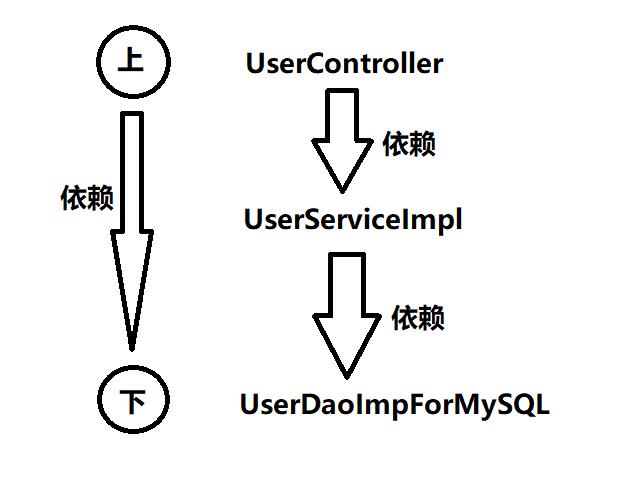

可以很明显的看出，**上层是依赖下层的。UserController依赖UserServiceImpl，而UserServiceImpl依赖UserDaoImplForMySQL，这样就会导致下面只要改动**，**上面必然会受牵连（跟着也会改）**，所谓牵一发而动全身。这样也就同时违背了另一个开发原则：依赖倒置原则。

## 依赖倒置原则DIP

依赖倒置原则(Dependence Inversion Principle)，简称DIP，主要倡导面向抽象编程，面向接口编程，不要面向具体编程，让**上层**不再依赖**下层**，下面改动了，上面的代码不会受到牵连。这样可以大大降低程序的耦合度，耦合度低了，扩展力就强了，同时代码复用性也会增强。

你可能会说，上面的代码已经面向接口编程了呀：

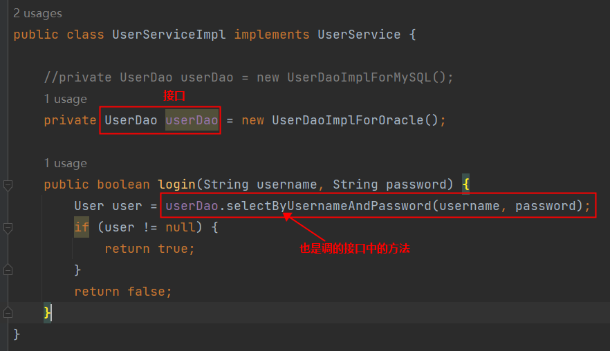

确实已经面向接口编程了，但对象的创建是：new UserDaoImplForOracle()显然并没有完全面向接口编程，还是使用到了具体的接口实现类。什么叫做完全面向接口编程？什么叫做完全符合依赖倒置原则呢？请看以下代码：

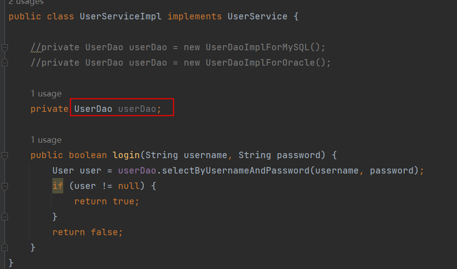

如果代码是这样编写的，才算是完全面向接口编程，才符合依赖倒置原则。那你可能会问，这样userDao是null，在执行的时候就会出现空指针异常呀。你说的有道理，确实是这样的，所以我们要解决这个问题。解决空指针异常的问题，其实就是解决两个核心的问题：

- 第一个问题：谁来负责对象的创建。【也就是说谁来：new UserDaoImplForOracle()/new UserDaoImplForMySQL()】
- 第二个问题：谁来负责把创建的对象赋到这个属性上。【也就是说谁来把上面创建的对象赋给userDao属性】

如果我们把以上两个核心问题解决了，就可以做到既符合OCP开闭原则，又符合依赖倒置原则。

很荣幸的通知你：Spring框架可以做到。

在Spring框架中，它可以帮助我们new对象，并且它还可以将new出来的对象赋到属性上。换句话说，Spring框架可以帮助我们创建对象，并且可以帮助我们维护对象和对象之间的关系。比如：

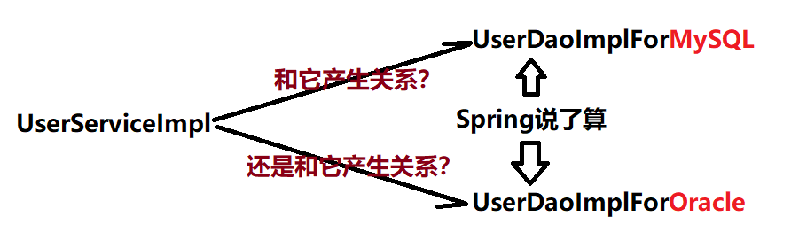

Spring可以new出来UserDaoImplForMySQL对象，也可以new出来UserDaoImplForOracle对象，并且还可以让new出来的dao对象和service对象产生关系（产生关系其实本质上就是给属性赋值）。

很显然，这种方式是将对象的创建权/管理权交出去了，不再使用硬编码的方式了。同时也把对象关系的管理权交出去了，也不再使用硬编码的方式了。像这种把对象的创建权交出去，把对象关系的管理权交出去，被称为控制反转。

## 控制反转IoC

控制反转（Inversion of Control，缩写为IoC），是面向对象编程中的一种设计思想，可以用来降低代码之间的耦合度，符合依赖倒置原则。

控制反转的核心是：**将对象的创建权交出去，将对象和对象之间关系的管理权交出去，由第三方容器来负责创建与维护**。

控制反转常见的实现方式：依赖注入（Dependency Injection，简称DI）

通常，依赖注入的实现又包括三种方式：

- set方法注入
- 构造方法注入
- 字段注入（直接给 Field 赋值：通过反射机制。）

而Spring框架就是一个实现了IoC思想的框架。

IoC可以认为是一种**全新的设计模式**，但是理论和时间成熟相对较晚，并没有包含在GoF中。（GoF指的是23种设计模式）

## SOLID 原则

OOD 五大原则：

| **原则** | **全称** | **核心思想** |
| --- | --- | --- |
| **SRP** | 单一职责原则 | **一个类只干一件事**，不要变成"万能类"。 |
| **OCP** | 开闭原则 | **加功能时尽量新增代码，而不是修改老代码**。 |
| **LSP** | 里氏替换原则 | **子类要能当父类用**，换了也不出错。 |
| **ISP** | 接口隔离原则 | **接口要专一**，不要强迫实现类去实现用不到的方法。 |
| **DIP** | 依赖倒置原则 | **依赖抽象而不是具体实现**，面向接口编程。 |

**违反 LSP 的例子：**

```java
// 父类：鸟
class Bird {
    void fly() {
        System.out.println("我在飞");
    }
}

// 子类：鸵鸟 - 语法上没问题，但行为上出错了！
class Ostrich extends Bird {
    void fly() {
        throw new RuntimeException("鸵鸟不会飞！"); // 这里就"出错"了
    }
}

// 使用场景
void makeBirdFly(Bird bird) {
    bird.fly(); // 如果传入鸵鸟，程序就崩溃了！
}
```

# Spring概述


## Spring简介


来自百度百科

## Spring 的 7 个模块

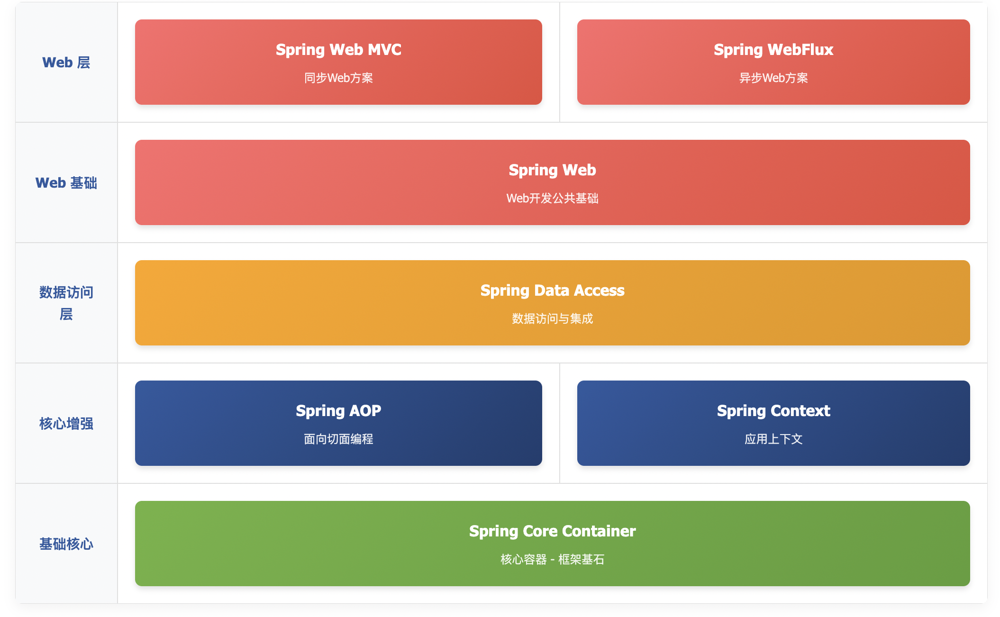

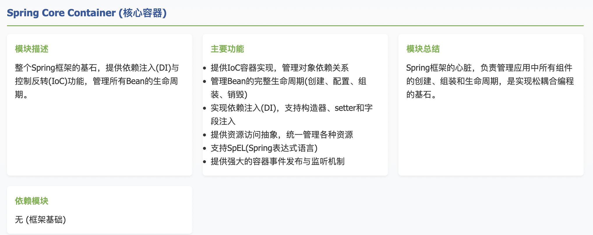

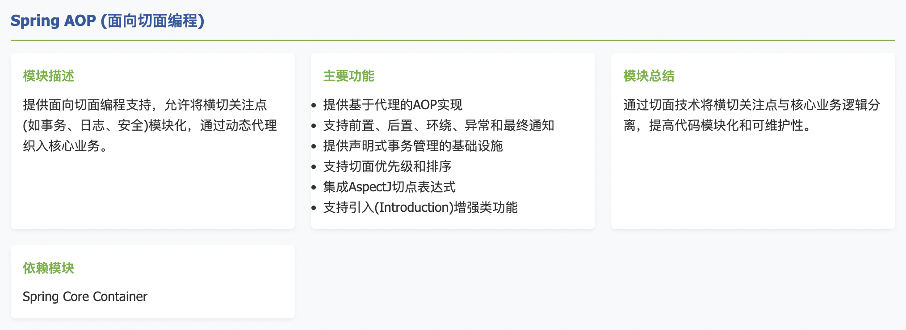

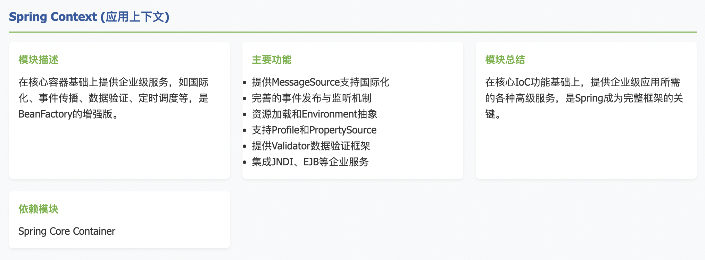

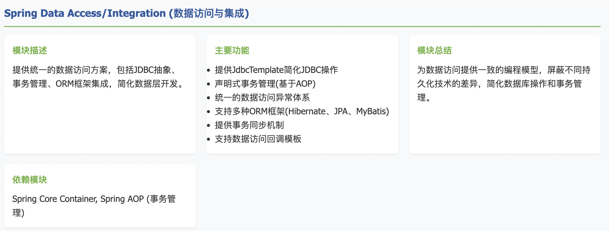

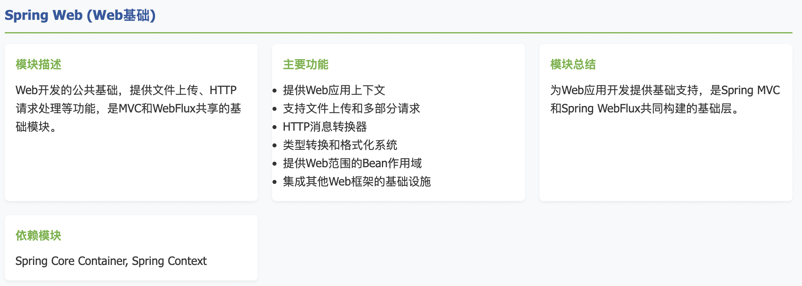

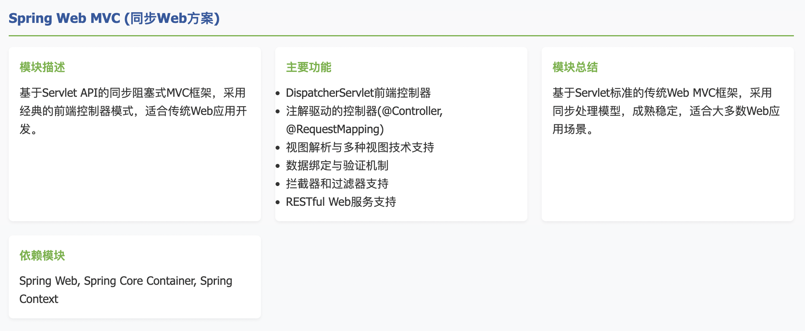

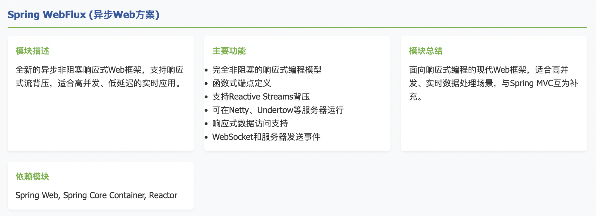

## web 同步与 web 异步的区别

Spring Web MVC 是同步方案。Spring WebFlux 是异步方案。它们的区别是：

---

**想象一个异步文件下载：**

**1. 传统同步方式 (MVC):**

```java
// 线程会停在这里等待，直到文件下载完成
byte[] data = downloadFileFromNetwork("http://example.com/file");
// 下载完成后，才继续执行这里
return data;
```

**2. WebFlux方式 (基于回调):**

```java
// 立即返回，不等待
downloadFileFromNetwork("http://example.com/file", new Callback() {
    // 这是一个回调函数
    @Override 
    public void onDataReceived(byte[] data) {
        // 当数据真正到达时，这个函数会被自动调用
        sendResponse(data);
    }
    
    @Override
    public void onError(Throwable error) {
        // 出错时的回调
        sendError(error);
    }
});
// 注意：代码执行到这里时，文件可能还没开始下载！
```

**核心要点：**

- **"你先去忙，好了call我"**：主线程不等待，立即返回
- **回调函数是"联系方式"**：告诉系统"数据到了之后，请调用我这个函数"
- **事件驱动**：当网络数据到达、数据库查询完成等事件发生时，自动触发相应的回调函数

## Spring特点

1. **控制反转/依赖注入**：对象不用自己找依赖，Spring容器自动"送货上门"，实现松耦合。
2. **面向切面编程**：像切洋葱一样把通用功能（日志、事务）横向抽取，让核心业务更纯净。
3. **数据访问支持**：用统一的方式操作各种数据库，告别繁琐的JDBC代码和不同数据库的兼容问题。
4. **声明式事务管理**：只需一个`<font style="color:rgb(15, 17, 21);background-color:rgb(235, 238, 242);">@Transactional</font>`注解，复杂的事务管理就像"开关"一样简单可控。
5. **高度模块化设计**：像乐高积木，需要什么拿什么，不必引入整个框架。
6. **强大测试支持**：专为测试而生，轻松模拟完整Spring环境进行单元和集成测试。

# Spring的入门程序


## Spring 的官方地址

官网地址：[https://spring.io/](https://spring.io/)，从这里你可以找到官方指南。

打开Spring官网后，可以看到Spring Framework，以及通过Spring Framework衍生的其它框架：

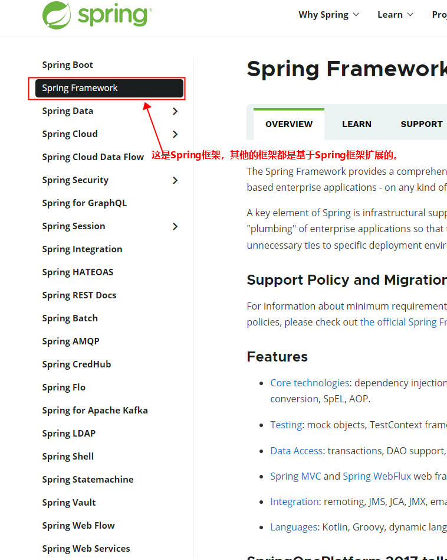

## Spring的jar文件

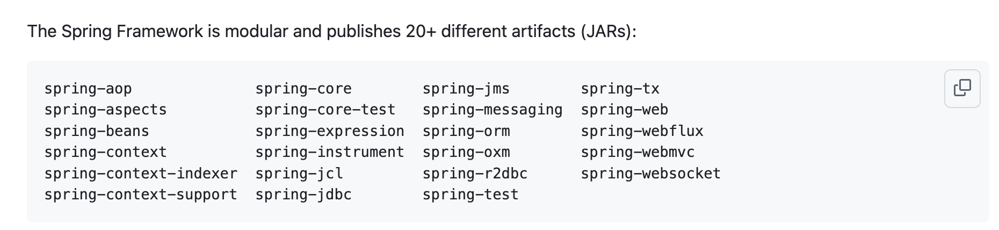

以上是 Spring Framework 的 jar 包，可以看到有 20+个。以前的开发是需要下载这些 jar 包的，需要什么功能就下载对应的 jar 包，放到项目当中，现在有 Maven，方便多了，不需要下载 jar 包了。只需要引入 GAV 坐标即可。

**了解一下重点 jar 包：**

| **模块 JAR 包** | **主要职责** | **概括** |
| --- | --- | --- |
| **spring-core** | IoC 容器基础实现 | 框架的**心脏**，提供最基础的依赖注入功能 |
| **spring-beans** | Bean 工厂与装配 | 负责**创建和管理**应用中的所有对象（Bean） |
| **spring-context** | 应用上下文与企业服务 | 在核心容器之上，提供**事件、国际化**等企业级功能 |
| **spring-aop** | 面向切面编程 | 将**事务、日志**等横切关注点从业务代码中分离出来 |
| **spring-jdbc** | JDBC 抽象与简化 | **大幅简化**传统的 JDBC 冗长编码 |
| **spring-tx** | 事务管理 | 提供**声明式事务**控制，保证数据操作的原子性 |
| **spring-orm** | ORM 框架集成 | 无缝集成 **Hibernate、JPA** 等主流持久层框架 |
| **spring-web** | Web 开发基础 | 为 **Web MVC 和 WebFlux** 提供共用的底层支持 |
| **spring-webmvc** | 同步 Web 框架 | **基于 Servlet API** 的传统 MVC 模式 Web 框架 |
| **spring-webflux** | 异步 Web 框架 | **响应式、非阻塞**的现代 Web 框架，适合高并发场景 |
| **spring-test** | 测试框架支持 | 提供对 **Spring 环境集成测试**的强大支持 |

## 第一个Spring程序

**前期准备**：

- 打开IDEA创建Empty Project：spring
- 设置JDK 版本及编译器版本
- 设置IDEA的Maven：关联自己的maven
- 在空的工程spring中创建第一个模块（普通的 Java Maven 模块）：spring-001-first

### 添加spring context依赖

```xml
<dependency>
    <groupId>org.springframework</groupId>
    <artifactId>spring-context</artifactId>
    <version>6.2.13</version>
</dependency>
```

**注意：打包方式jar。**

当加入spring context的依赖之后，会关联引入其他依赖：

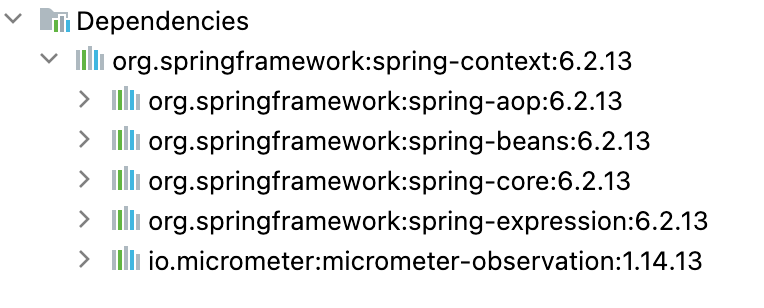

### 添加junit5依赖

```xml
<dependency>
    <groupId>org.junit.jupiter</groupId>
    <artifactId>junit-jupiter-api</artifactId>
    <version>5.11.0</version>
    <scope>test</scope>
</dependency>
```

### 定义bean

```java
package com.jkweilai.spring.bean;

public class User {
}
```

### 编写spring的配置文件

beans.xml。该文件放在类的根路径下。

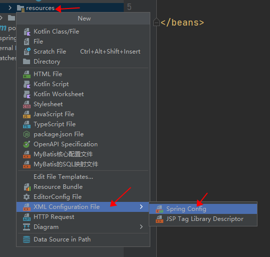

配置文件中进行bean的配置。

```xml
<?xml version="1.0" encoding="UTF-8"?>
<beans xmlns="http://www.springframework.org/schema/beans"
       xmlns:xsi="http://www.w3.org/2001/XMLSchema-instance"
       xsi:schemaLocation="http://www.springframework.org/schema/beans http://www.springframework.org/schema/beans/spring-beans.xsd">
    
  <bean id="userBean" class="com.jkweilai.spring.bean.User"></bean>
  
</beans>
```

bean的id和class属性：

- **id属性：代表对象的唯一标识。可以看做一个人的身份证号。**
- **class属性：用来指定要创建的java对象的类名，这个类名必须是全限定类名（带包名）。**

### 编写测试程序

```java
package com.jkweilai.spring.test;

import org.junit.jupiter.api.Test;
import org.springframework.context.ApplicationContext;
import org.springframework.context.support.ClassPathXmlApplicationContext;

public class SpringTest {

    @Test
    public void testFirst(){
        // 初始化Spring容器上下文（解析beans.xml文件，创建所有的bean对象）
        ApplicationContext applicationContext = new ClassPathXmlApplicationContext("beans.xml");
        // 根据id获取bean对象
        Object userBean = applicationContext.getBean("userBean");
        System.out.println(userBean);
    }
}
```

运行结果：


## 第一个Spring程序详细剖析

### bean标签的id属性可以重复吗？

```java
package com.jkweilai.spring.bean;

public class Vip {
}
```

```xml
<?xml version="1.0" encoding="UTF-8"?>
<beans xmlns="http://www.springframework.org/schema/beans"
       xmlns:xsi="http://www.w3.org/2001/XMLSchema-instance"
       xsi:schemaLocation="http://www.springframework.org/schema/beans http://www.springframework.org/schema/beans/spring-beans.xsd">

    <bean id="userBean" class="com.jkweilai.spring.bean.User"/>
    <bean id="userBean" class="com.jkweilai.spring.bean.Vip"/>
</beans>
```

**通过测试得出：在spring的配置文件中id是不能重名。**

### 底层是怎么创建对象的，是通过反射机制调用无参数构造方法吗？

```java
package com.jkweilai.spring.bean;

public class User {
    public User() {
        System.out.println("User的无参数构造方法执行");
    }
}
```

在User类中添加无参数构造方法。

**通过测试得知：创建对象时确实调用了无参数构造方法。**

如果提供一个有参数构造方法，不提供无参数构造方法会怎样呢？

```java
package com.jkweilai.spring.bean;

public class User {
    /*public User() {
        System.out.println("User的无参数构造方法执行");
    }*/

    public User(String name){
        System.out.println("User的有参数构造方法执行");
    }
}
```

**通过测试得知：spring是通过调用类的无参数构造方法来创建对象的，所以要想让spring给你创建对象，必须保证无参数构造方法是存在的。**

Spring是如何创建对象的呢？原理是什么？

```java
// dom4j解析beans.xml文件，从中获取class的全限定类名
// 通过反射机制调用无参数构造方法创建对象
Class clazz = Class.forName("com.jkweilai.spring.bean.User");
Object obj = clazz.newInstance();
```

### 把创建好的对象存储到一个什么样的数据结构当中了呢？

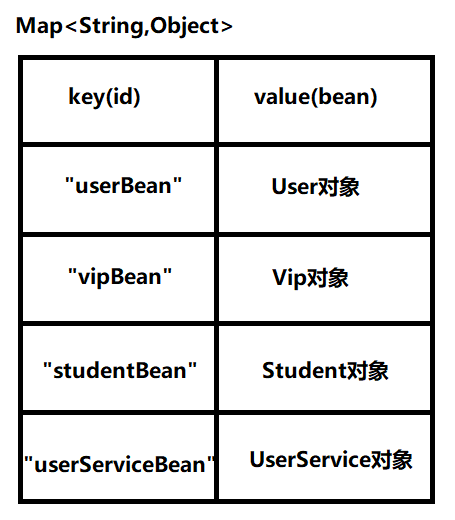

### spring配置文件的名字必须叫做beans.xml吗？

```java
ApplicationContext applicationContext = new ClassPathXmlApplicationContext("beans.xml");
```

通过以上的java代码可以看出，这个spring配置文件名字是我们负责提供的，显然spring配置文件的名字是随意的。

### 像这样的beans.xml文件可以有多个吗？

再创建一个spring配置文件，起名：spring.xml

```xml
<?xml version="1.0" encoding="UTF-8"?>
<beans xmlns="http://www.springframework.org/schema/beans"
       xmlns:xsi="http://www.w3.org/2001/XMLSchema-instance"
       xsi:schemaLocation="http://www.springframework.org/schema/beans http://www.springframework.org/schema/beans/spring-beans.xsd">
    <bean id="vipBean" class="com.jkweilai.spring.bean.Vip"/>
</beans>
```

```java
package com.jkweilai.spring.test;

import org.junit.jupiter.api.Test;
import org.springframework.context.ApplicationContext;
import org.springframework.context.support.ClassPathXmlApplicationContext;

public class SpringTest {

    @Test
    public void testFirst(){
        // 初始化Spring容器上下文（解析beans.xml文件，创建所有的bean对象）
        ApplicationContext applicationContext = new ClassPathXmlApplicationContext("beans.xml","spring.xml");

        // 根据id获取bean对象
        Object userBean = applicationContext.getBean("userBean");
        Object vipBean = applicationContext.getBean("vipBean");

        System.out.println(userBean);
        System.out.println(vipBean);
    }
}
```

通过测试得知，spring的配置文件可以有多个，在ClassPathXmlApplicationContext构造方法的参数上传递文件路径即可。这是为什么呢？通过源码可以看到：

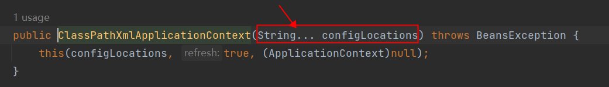

### 在配置文件中配置的类必须是自定义的吗，可以使用JDK中的类吗，例如：java.util.Date？

```xml
<?xml version="1.0" encoding="UTF-8"?>
<beans xmlns="http://www.springframework.org/schema/beans"
       xmlns:xsi="http://www.w3.org/2001/XMLSchema-instance"
       xsi:schemaLocation="http://www.springframework.org/schema/beans http://www.springframework.org/schema/beans/spring-beans.xsd">

    <bean id="userBean" class="com.jkweilai.spring.bean.User"/>
    <!--<bean id="userBean" class="com.jkweilai.spring.bean.Vip"/>-->

    <bean id="dateBean" class="java.util.Date"/>
</beans>
```

通过测试得知，在spring配置文件中配置的bean可以任意类，只要这个类不是抽象的，并且提供了无参数构造方法。

### getBean()方法调用时，如果指定的id不存在会怎样？

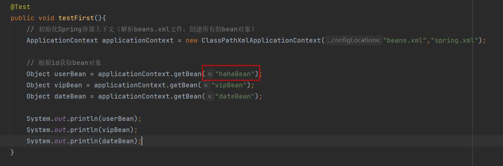

运行测试程序：

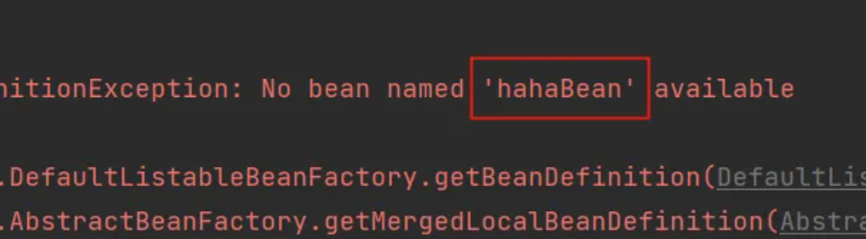

通过测试得知，当id不存在的时候，会出现异常。

### getBean()方法返回的类型是Object，如果访问子类的特有属性和方法时，还需要向下转型，有其它办法可以解决这个问题吗？

```java
User user = applicationContext.getBean("userBean", User.class);
```

### ClassPathXmlApplicationContext是从类路径中加载配置文件，如果没有在类路径当中，又应该如何加载配置文件呢？

```xml
<?xml version="1.0" encoding="UTF-8"?>
<beans xmlns="http://www.springframework.org/schema/beans"
       xmlns:xsi="http://www.w3.org/2001/XMLSchema-instance"
       xsi:schemaLocation="http://www.springframework.org/schema/beans http://www.springframework.org/schema/beans/spring-beans.xsd">
    <bean id="vipBean2" class="com.jkweilai.spring.bean.Vip"/>
</beans>
```

```java
ApplicationContext applicationContext2 = new FileSystemXmlApplicationContext("d:/spring.xml");
Vip vip = applicationContext2.getBean("vipBean2", Vip.class);
System.out.println(vip);
```

没有在类路径中的话，需要使用FileSystemXmlApplicationContext类进行加载配置文件。

这种方式较少用。一般都是将配置文件放到类路径当中，这样可移植性更强。

### ApplicationContext的超级父接口BeanFactory。

```java
BeanFactory beanFactory = new ClassPathXmlApplicationContext("spring.xml");
Object vipBean = beanFactory.getBean("vipBean");
System.out.println(vipBean);
```

BeanFactory是Spring容器的超级接口。ApplicationContext是BeanFactory的子接口。

## Spring 集成 logback 日志框架

SpringBoot 框架默认集成的是 logback 日志框架。但单纯只用 Spring 框架的时候，它是没有集成任何日志框架的，只是集成了日志门面。因此我们需要手动提供日志门面的实现，我们这里选择 logback 。

第一步：引入 logback 依赖

```xml
<dependency>
    <groupId>ch.qos.logback</groupId>
    <artifactId>logback-classic</artifactId>
    <version>1.4.14</version>

</dependency>
```

第二步：在类的根路径下提供 logback.xml 配置文件（文件名固定为：logback.xml，文件必须放到类根路径下。）

```xml
<?xml version="1.0" encoding="UTF-8"?>
<configuration>
    <!-- 定义日志输出格式 -->
    <property name="CONSOLE_LOG_PATTERN" value="%d{yyyy-MM-dd HH:mm:ss.SSS} [%thread] %-5level %logger{36} - %msg%n"/>
    <property name="FILE_LOG_PATTERN" value="%d{yyyy-MM-dd HH:mm:ss.SSS} [%thread] %-5level %logger{36} - %msg%n"/>

    <!-- 控制台输出 Appender -->
    <appender name="CONSOLE" class="ch.qos.logback.core.ConsoleAppender">
        <encoder>
            <pattern>${CONSOLE_LOG_PATTERN}</pattern>
            <charset>UTF-8</charset>
        </encoder>
    </appender>

    <!-- 文件输出 Appender -->
    <appender name="FILE" class="ch.qos.logback.core.rolling.RollingFileAppender">
        <!-- 日志文件路径 -->
        <file>logs/application.log</file>
        <encoder>
            <pattern>${FILE_LOG_PATTERN}</pattern>
            <charset>UTF-8</charset>
        </encoder>
        <!-- 滚动策略 -->
        <rollingPolicy class="ch.qos.logback.core.rolling.TimeBasedRollingPolicy">
            <!-- 按天归档 -->
            <fileNamePattern>logs/application.%d{yyyy-MM-dd}.%i.log</fileNamePattern>
            <timeBasedFileNamingAndTriggeringPolicy class="ch.qos.logback.core.rolling.SizeAndTimeBasedFNATP">
                <!-- 单个文件最大 100MB -->
                <maxFileSize>100MB</maxFileSize>
            </timeBasedFileNamingAndTriggeringPolicy>
            <!-- 保留 30 天的历史 -->
            <maxHistory>30</maxHistory>
        </rollingPolicy>
    </appender>

    <!-- 设置日志级别 -->
    <!-- Spring Framework 的日志级别 -->
    <logger name="org.springframework" level="INFO"/>
    <!-- 项目的包路径，设置为 DEBUG 以便调试 -->
    <logger name="com.jkweilai" level="DEBUG"/>

    <!-- 根日志配置 -->
    <root level="INFO">
        <appender-ref ref="CONSOLE"/>
        <appender-ref ref="FILE"/>
    </root>
</configuration>
```

日志级别

1. TRACE：最低级别，用于记录所有日志信息。
2. DEBUG：用于记录调试信息，便于开发人员进行调试，但不适用于生产环境。
3. INFO：用于记录生产环境下的信息，如启动信息、用户登录信息等。
4. WARN：用于记录警告信息，表示程序可能出现潜在问题。
5. ERROR：用于记录错误信息，表示程序已经出现错误，需要进行处理。
6. FATAL：最高级别，用于记录致命错误信息，表示程序已经无法继续执行，需要进行紧急处理。
7. OFF：关闭所有的日志记录。

第三步：使用日志框架

```java
Logger logger = LoggerFactory.getLogger(FirstSpringTest.class);
logger.info("我是一条日志消息");
```

# Spring对IoC的实现


## IoC 控制反转

- 控制反转是一种思想。
- 控制反转是为了降低程序耦合度，提高程序扩展力，达到OCP原则，达到DIP原则。
- 控制反转，反转的是什么？
  - 将对象的创建权利交出去，交给第三方容器负责。
  - 将对象和对象之间关系的维护权交出去，交给第三方容器负责。
- 控制反转这种思想如何实现呢？
  - DI（Dependency Injection）：依赖注入

## 依赖注入

依赖注入实现了控制反转的思想。

**Spring通过依赖注入的方式来完成Bean管理的。**

**Bean管理说的是：Bean对象的创建，以及Bean对象中属性的赋值（或者叫做Bean对象之间关系的维护）。**

依赖注入：

- 依赖指的是对象和对象之间的关联关系。
- 注入指的是一种数据传递行为，通过注入行为来让对象和对象产生关系。

依赖注入常见的实现方式包括两种：

- 第一种：set注入
- 第二种：构造注入

新建模块：spring-002-dependency-injection

### set注入

set注入，基于set方法实现的，底层会通过反射机制调用属性对应的set方法然后给属性赋值。这种方式要求属性必须对外提供set方法。

```java
package com.jkweilai.spring.dao;

public class UserDao {

    public void insert(){
        System.out.println("正在保存用户数据。");
    }
}
```

```java
package com.jkweilai.spring.service;

import com.jkweilai.spring.dao.UserDao;

public class UserService {

    private UserDao userDao;

    // 使用set方式注入，必须提供set方法。
    // 反射机制要调用这个方法给属性赋值的。
    public void setUserDao(UserDao userDao) {
        this.userDao = userDao;
    }

    public void save(){
        userDao.insert();
    }
}
```

像这样去配置他们的关系：

```xml
<bean id="userDaoBean" class="com.jkweilai.spring.dao.UserDao"/>

<bean id="userServiceBean" class="com.jkweilai.spring.service.UserService">
    <property name="userDao" ref="userDaoBean"/>
</bean>
```

```java
public class DITest {

    @Test
    public void testSetDI(){
        ApplicationContext applicationContext = new ClassPathXmlApplicationContext("spring.xml");
        UserService userService = applicationContext.getBean("userServiceBean", UserService.class);
        userService.save();
    }
}
```

运行结果：


重点内容是，什么原理：

```xml
<bean id="userDaoBean" class="com.jkweilai.spring.dao.UserDao"/>

<bean id="userServiceBean" class="com.jkweilai.spring.service.UserService">
  <property name="userDao" ref="userDaoBean"/>
</bean>
```

实现原理：

- 通过property标签获取到属性名：userDao
- 通过属性名推断出set方法名：setUserDao
- 通过反射机制调用setUserDao()方法给属性赋值
- property标签的name是属性名。
- property标签的ref是要注入的bean对象的id。**(通过ref属性来完成bean的装配，这是bean最简单的一种装配方式。装配指的是：创建系统组件之间关联的动作)**

**可以把set方法注释掉，再测试一下**：

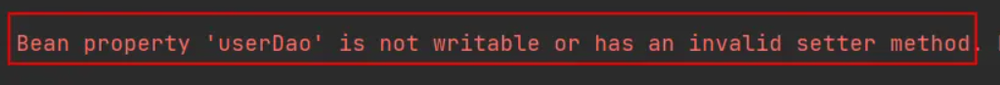

通过测试得知，底层实际上调用了setUserDao()方法。所以需要确保这个方法的存在。

我们现在把属性名修改一下，但方法名还是setUserDao()，我们来测试一下：

```java
public class UserService {

    private UserDao aaa;

    // 使用set方式注入，必须提供set方法。
    // 反射机制要调用这个方法给属性赋值的。
    public void setUserDao(UserDao userDao) {
        this.aaa = userDao;
    }

    public void save(){
        aaa.insert();
    }
}
```

运行测试程序：


通过测试看到程序仍然可以正常执行，说明property标签的name是：setUserDao()方法名演变得到的。演变的规律是：

- setUsername() 演变为 username
- setPassword() 演变为 password
- setUserDao() 演变为 userDao
- setUserService() 演变为 userService

另外，对于property标签来说，ref属性也可以采用标签的方式，但使用ref属性是多数的：

```xml
<bean id="userServiceBean" class="com.jkweilai.spring.service.UserService">
  <property name="userDao">
    <ref bean="userDaoBean"/>
  </property>
</bean>
```

**总结：set注入的核心实现原理：通过反射机制调用set方法来给属性赋值，让两个对象之间产生关系。**

### 构造注入

核心原理：通过调用构造方法来给属性赋值。

```java
public class OrderDao {
    public void deleteById(){
        System.out.println("正在删除订单。。。");
    }
}
```

```java
public class OrderService {
    private OrderDao orderDao;

    // 通过反射机制调用构造方法给属性赋值
    public OrderService(OrderDao orderDao) {
        this.orderDao = orderDao;
    }

    public void delete(){
        orderDao.deleteById();
    }
}
```

```xml
<bean id="orderDaoBean" class="com.jkweilai.spring.dao.OrderDao"/>
<bean id="orderServiceBean" class="com.jkweilai.spring.service.OrderService">
  <!--index="0"表示构造方法的第一个参数，将orderDaoBean对象传递给构造方法的第一个参数。-->
  <constructor-arg index="0" ref="orderDaoBean"/>
</bean>
```

```java
@Test
public void testConstructorDI(){
    ApplicationContext applicationContext = new ClassPathXmlApplicationContext("spring.xml");
    OrderService orderServiceBean = applicationContext.getBean("orderServiceBean", OrderService.class);
    orderServiceBean.delete();
}
```

运行结果如下：


**如果构造方法有两个参数：**

```java
public class OrderService {
    private OrderDao orderDao;
    private UserDao userDao;

    // 通过反射机制调用构造方法给属性赋值
    public OrderService(OrderDao orderDao, UserDao userDao) {
        this.orderDao = orderDao;
        this.userDao = userDao;
    }

    public void delete(){
        orderDao.deleteById();
        userDao.insert();
    }
}
```

spring配置文件：

```xml
<bean id="orderDaoBean" class="com.jkweilai.spring.dao.OrderDao"/>

<bean id="orderServiceBean" class="com.jkweilai.spring.service.OrderService">
  <!--第一个参数下标是0-->
  <constructor-arg index="0" ref="orderDaoBean"/>
  <!--第二个参数下标是1-->
  <constructor-arg index="1" ref="userDaoBean"/>
</bean>

<bean id="userDaoBean" class="com.jkweilai.spring.dao.UserDao"/>
```

执行测试程序：


**不使用参数下标，使用参数的名字可以吗？**

```xml
<bean id="orderDaoBean" class="com.jkweilai.spring.dao.OrderDao"/>

<bean id="orderServiceBean" class="com.jkweilai.spring.service.OrderService">
  <!--这里使用了构造方法上参数的名字-->
  <constructor-arg name="orderDao" ref="orderDaoBean"/>
  <constructor-arg name="userDao" ref="userDaoBean"/>
</bean>

<bean id="userDaoBean" class="com.jkweilai.spring.dao.UserDao"/>
```

执行测试程序：


**不指定参数下标，不指定参数名字，可以吗？**

```xml
<bean id="orderDaoBean" class="com.jkweilai.spring.dao.OrderDao"/>
<bean id="orderServiceBean" class="com.jkweilai.spring.service.OrderService">
  <!--没有指定下标，也没有指定参数名字-->
  <constructor-arg ref="orderDaoBean"/>
  <constructor-arg ref="userDaoBean"/>
</bean>

<bean id="userDaoBean" class="com.jkweilai.spring.dao.UserDao"/>
```

执行测试程序：


**配置文件中构造方法参数的类型顺序和构造方法参数的类型顺序不一致呢？**

```xml
<bean id="orderDaoBean" class="com.jkweilai.spring.dao.OrderDao"/>

<bean id="orderServiceBean" class="com.jkweilai.spring.service.OrderService">
  <!--顺序已经和构造方法的参数顺序不同了-->
  <constructor-arg ref="userDaoBean"/>
  <constructor-arg ref="orderDaoBean"/>
</bean>

<bean id="userDaoBean" class="com.jkweilai.spring.dao.UserDao"/>
```

执行测试程序：


通过测试得知，通过构造方法注入的时候：

- 可以通过下标
- 可以通过参数名
- 也可以不指定下标和参数名，可以类型自动推断。

Spring在装配方面做的还是比较健壮的。

## set注入专题

### 注入外部Bean

在之前4.2.1中使用的案例就是注入外部Bean的方式。

```xml
<bean id="userDaoBean" class="com.jkweilai.spring.dao.UserDao"/>

<bean id="userServiceBean" class="com.jkweilai.spring.service.UserService">
    <property name="userDao" ref="userDaoBean"/>
</bean>
```

外部Bean的特点：bean定义到外面，在property标签中使用ref属性进行注入。通常这种方式是常用的。

### 注入内部Bean

内部Bean的方式：在bean标签中嵌套bean标签。

```xml
<bean id="userServiceBean" class="com.jkweilai.spring.service.UserService">
    <property name="userDao">
        <bean class="com.jkweilai.spring.dao.UserDao"/>
    </property>
</bean>
```

```java
@Test
public void testInnerBean(){
    ApplicationContext applicationContext = new ClassPathXmlApplicationContext("spring-inner-bean.xml");
    UserService userService = applicationContext.getBean("userServiceBean", UserService.class);
    userService.save();
}
```

执行测试程序：


这种方式作为了解。

### 注入简单类型

我们之前在进行注入的时候，对象的属性是另一个对象。

```java
public class UserService{
    
    private UserDao userDao;
    
    public void setUserDao(UserDao userDao){
        this.userDao = userDao;
    }
    
}
```

那如果对象的属性是int类型呢？

```java
public class User{
    
    private int age;
    
    public void setAge(int age){
        this.age = age;
    }
    
}
```

可以通过set注入的方式给该属性赋值吗？

- 当然可以。因为只要能够调用set方法就可以给属性赋值。

**编写程序给一个User对象的age属性赋值20：**

第一步：定义User类，提供age属性，提供age属性的setter方法。

```java
public class User {
    private int age;

    public void setAge(int age) {
        this.age = age;
    }
    
    @Override
    public String toString() {
        return "User{" +
                "age=" + age +
                '}';
    }
}
```

第二步：编写spring配置文件：spring-simple-type.xml

```xml
<bean id="userBean" class="com.jkweilai.spring.beans.User">
    <!--如果像这种int类型的属性，我们称为简单类型，这种简单类型在注入的时候要使用value属性，不能使用ref-->
    <!--<property name="age" value="20"/>-->
    <property name="age">
        <value>20</value>
    </property>
</bean>
```

第三步：编写测试程序

```java
@Test
public void testSimpleType(){
    ApplicationContext applicationContext = new ClassPathXmlApplicationContext("spring-simple-type.xml");
    User user = applicationContext.getBean("userBean", User.class);
    System.out.println(user);
}
```

第四步：运行测试程序


**需要特别注意：如果给简单类型赋值，使用value属性或value标签。而不是ref。**

简单类型包括哪些呢？可以通过Spring的源码来分析一下：BeanUtils类、ClassUtils类：

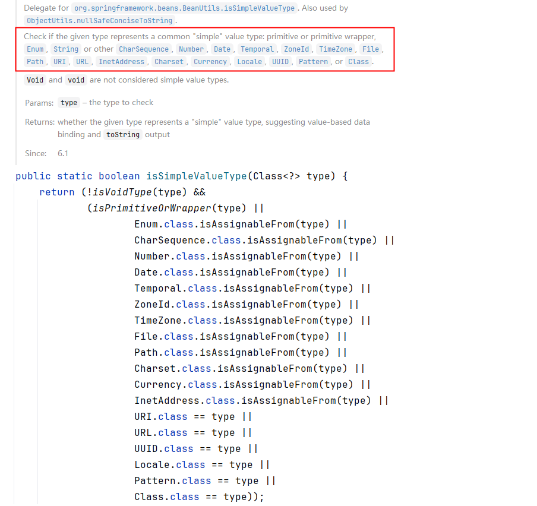

简单类型包括：


**经典案例：给数据源的属性注入值：**

假设我们现在要自己手写一个数据源，我们都知道所有的数据源都要实现javax.sql.DataSource接口，并且数据源中应该有连接数据库的信息，例如：driver、url、username、password等。

```java
public class MyDataSource implements DataSource {
    private String driver;
    private String url;
    private String username;
    private String password;

    public void setDriver(String driver) {
        this.driver = driver;
    }

    public void setUrl(String url) {
        this.url = url;
    }

    public void setUsername(String username) {
        this.username = username;
    }

    public void setPassword(String password) {
        this.password = password;
    }
    
    @Override
    public String toString() {
        return "MyDataSource{" +
                "driver='" + driver + '\'' +
                ", url='" + url + '\'' +
                ", username='" + username + '\'' +
                ", password='" + password + '\'' +
                '}';
    }

    @Override
    public Connection getConnection() throws SQLException {
        return null;
    }

    @Override
    public Connection getConnection(String username, String password) throws SQLException {
        return null;
    }

    @Override
    public PrintWriter getLogWriter() throws SQLException {
        return null;
    }

    @Override
    public void setLogWriter(PrintWriter out) throws SQLException {

    }

    @Override
    public void setLoginTimeout(int seconds) throws SQLException {

    }

    @Override
    public int getLoginTimeout() throws SQLException {
        return 0;
    }

    @Override
    public Logger getParentLogger() throws SQLFeatureNotSupportedException {
        return null;
    }

    @Override
    public <T> T unwrap(Class<T> iface) throws SQLException {
        return null;
    }

    @Override
    public boolean isWrapperFor(Class<?> iface) throws SQLException {
        return false;
    }
}
```

我们给driver、url、username、password四个属性分别提供了setter方法，我们可以使用spring的依赖注入完成数据源对象的创建和属性的赋值吗？看配置文件

```xml
<?xml version="1.0" encoding="UTF-8"?>
<beans xmlns="http://www.springframework.org/schema/beans"
       xmlns:xsi="http://www.w3.org/2001/XMLSchema-instance"
       xsi:schemaLocation="http://www.springframework.org/schema/beans http://www.springframework.org/schema/beans/spring-beans.xsd">
  
    <bean id="dataSource" class="com.jkweilai.spring.beans.MyDataSource">
        <property name="driver" value="com.mysql.cj.jdbc.Driver"/>
        <property name="url" value="jdbc:mysql://localhost:3306/spring"/>
        <property name="username" value="root"/>
        <property name="password" value="123456"/>
    </bean>
  
</beans>
```

测试程序：

```java
@Test
public void testDataSource(){
    ApplicationContext applicationContext = new ClassPathXmlApplicationContext("spring-datasource.xml");
    MyDataSource dataSource = applicationContext.getBean("dataSource", MyDataSource.class);
    System.out.println(dataSource);
}
```

执行测试程序：

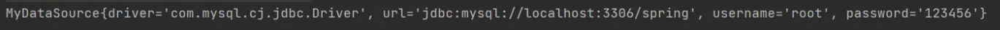

你学会了吗？

### 级联属性赋值（了解）

```java
public class Clazz {
    private String name;

    public Clazz() {
    }

    public Clazz(String name) {
        this.name = name;
    }

    public String getName() {
        return name;
    }

    public void setName(String name) {
        this.name = name;
    }

    @Override
    public String toString() {
        return "Clazz{" +
                "name='" + name + '\'' +
                '}';
    }
}
```

```java
public class Student {
    private String name;
    private Clazz clazz;

    public Student() {
    }

    public Student(String name, Clazz clazz) {
        this.name = name;
        this.clazz = clazz;
    }

    public void setName(String name) {
        this.name = name;
    }

    public void setClazz(Clazz clazz) {
        this.clazz = clazz;
    }

    public Clazz getClazz() {
        return clazz;
    }

    @Override
    public String toString() {
        return "Student{" +
                "name='" + name + '\'' +
                ", clazz=" + clazz +
                '}';
    }
}
```

```xml
<bean id="clazzBean" class="com.jkweilai.spring.beans.Clazz"/>

<bean id="student" class="com.jkweilai.spring.beans.Student">
    <property name="name" value="张三"/>

    <!--要点1：以下两行配置的顺序不能颠倒-->
    <property name="clazz" ref="clazzBean"/>
    <!--要点2：clazz属性必须有getter方法-->
    <property name="clazz.name" value="高三一班"/>
</bean>
```

```java
@Test
public void testCascade(){
    ApplicationContext applicationContext = new ClassPathXmlApplicationContext("spring-cascade.xml");
    Student student = applicationContext.getBean("student", Student.class);
    System.out.println(student);
}
```

运行结果：

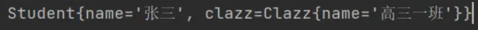

**要点：**

- **在spring配置文件中，如上，注意顺序。**
- **在spring配置文件中，clazz属性必须提供getter方法。**

### 注入数组

**当数组中的元素是简单类型**：

```java
package com.jkweilai.spring.beans;

import java.util.Arrays;

public class Person {
    private String[] favoriteFoods;

    public void setFavoriteFoods(String[] favoriteFoods) {
        this.favoriteFoods = favoriteFoods;
    }

    @Override
    public String toString() {
        return "Person{" +
                "favoriteFoods=" + Arrays.toString(favoriteFoods) +
                '}';
    }
}
```

```xml
<bean id="person" class="com.jkweilai.spring.beans.Person">
    <property name="favoriteFoods">
        <array>
            <value>鸡排</value>
            <value>汉堡</value>
            <value>鹅肝</value>
        </array>
    </property>
</bean>
```

```java
@Test
public void testArraySimple(){
    ApplicationContext applicationContext = new ClassPathXmlApplicationContext("spring-array-simple.xml");
    Person person = applicationContext.getBean("person", Person.class);
    System.out.println(person);
}
```

**当数组中的元素是非简单类型：一个订单中包含多个商品。**

```java
public class Goods {
    private String name;

    public Goods() {
    }

    public Goods(String name) {
        this.name = name;
    }

    public String getName() {
        return name;
    }

    public void setName(String name) {
        this.name = name;
    }

    @Override
    public String toString() {
        return "Goods{" +
                "name='" + name + '\'' +
                '}';
    }
}
```

```java
public class Order {
    // 一个订单中有多个商品
    private Goods[] goods;

    public Order() {
    }

    public Order(Goods[] goods) {
        this.goods = goods;
    }

    public void setGoods(Goods[] goods) {
        this.goods = goods;
    }

    @Override
    public String toString() {
        return "Order{" +
                "goods=" + Arrays.toString(goods) +
                '}';
    }
}
```

```xml
<bean id="goods1" class="com.jkweilai.spring.beans.Goods">
    <property name="name" value="西瓜"/>
</bean>

<bean id="goods2" class="com.jkweilai.spring.beans.Goods">
    <property name="name" value="苹果"/>
</bean>

<bean id="order" class="com.jkweilai.spring.beans.Order">
    <property name="goods">
        <array>
            <!--这里使用ref标签即可-->
            <ref bean="goods1"/>
            <ref bean="goods2"/>
        </array>
    </property>
</bean>
```

测试程序：

```java
@Test
public void testArray(){
    ApplicationContext applicationContext = new ClassPathXmlApplicationContext("spring-array.xml");
    Order order = applicationContext.getBean("order", Order.class);
    System.out.println(order);
}
```

执行结果：

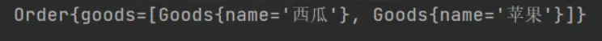

**要点：**

- **如果数组中是简单类型，使用value标签。**
- **如果数组中是非简单类型，使用ref标签。**

### 注入List集合

List集合：有序可重复

```java
public class People {
    // 一个人有多个名字
    private List<String> names;

    public void setNames(List<String> names) {
        this.names = names;
    }

    @Override
    public String toString() {
        return "People{" +
                "names=" + names +
                '}';
    }
}
```

```xml
<bean id="peopleBean" class="com.jkweilai.spring.beans.People">
    <property name="names">
        <list>
            <value>铁锤</value>
            <value>张三</value>
            <value>张三</value>
            <value>张三</value>
            <value>狼</value>
        </list>
    </property>
</bean>
```

```java
@Test
public void testCollection(){
    ApplicationContext applicationContext = new ClassPathXmlApplicationContext("spring-collection.xml");
    People peopleBean = applicationContext.getBean("peopleBean", People.class);
    System.out.println(peopleBean);
}
```

执行结果：

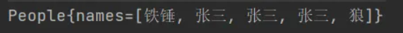

**注意：注入List集合的时候使用list标签，如果List集合中是简单类型使用value标签，反之使用ref标签。**

### 注入Set集合

Set集合：无序不可重复

```java
public class People {
    // 一个人有多个电话
    private Set<String> phones;

    public void setPhones(Set<String> phones) {
        this.phones = phones;
    }
    
    //......
    
    @Override
    public String toString() {
        return "People{" +
                "phones=" + phones +
                ", names=" + names +
                '}';
    }
}
```

```xml
<bean id="peopleBean" class="com.jkweilai.spring.beans.People">
    <property name="phones">
        <set>
            <!--非简单类型可以使用ref，简单类型使用value-->
            <value>110</value>
            <value>110</value>
            <value>120</value>
            <value>120</value>
            <value>119</value>
            <value>119</value>
        </set>
    </property>
</bean>
```

执行结果：

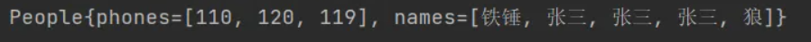

**要点：**

- **使用标签**
- **set集合中元素是简单类型的使用value标签，反之使用ref标签。**

### 注入Map集合

```java
public class People {
    // 一个人有多个住址
    private Map<Integer, String> addrs;

    public void setAddrs(Map<Integer, String> addrs) {
        this.addrs = addrs;
    }
    
    //......
    
    @Override
    public String toString() {
        return "People{" +
                "addrs=" + addrs +
                ", phones=" + phones +
                ", names=" + names +
                '}';
    }

}
```

```xml
<bean id="peopleBean" class="com.jkweilai.spring.beans.People">
    <property name="addrs">
        <map>
            <!--如果key不是简单类型，使用 key-ref 属性-->
            <!--如果value不是简单类型，使用 value-ref 属性-->
            <entry key="1" value="北京海淀"/>
            <entry key="2" value="上海浦东"/>
            <entry key="3" value="天津南开"/>
        </map>
    </property>
</bean>
```

**要点：**

- **使用标签**
- **如果key是简单类型，使用 key 属性，反之使用 key-ref 属性。**
- **如果value是简单类型，使用 value 属性，反之使用 value-ref 属性。**

### 注入Properties

java.util.Properties继承java.util.Hashtable，所以Properties也是一个Map集合。

```java
public class People {

    private Properties properties;

    public void setProperties(Properties properties) {
        this.properties = properties;
    }
    
    //......

    @Override
    public String toString() {
        return "People{" +
                "properties=" + properties +
                ", addrs=" + addrs +
                ", phones=" + phones +
                ", names=" + names +
                '}';
    }
}
```

```xml
<bean id="peopleBean" class="com.jkweilai.spring.beans.People">
    <property name="properties">
        <props>
            <prop key="driver">com.mysql.cj.jdbc.Driver</prop>
            <prop key="url">jdbc:mysql://localhost:3306/spring</prop>
            <prop key="username">root</prop>
            <prop key="password">123456</prop>
        </props>
    </property>
</bean>
```

执行测试程序：

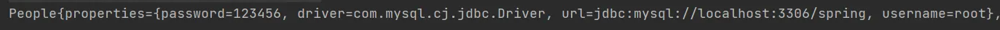

**要点：**

- **使用标签嵌套标签完成。**

### 注入null和空字符串

注入空字符串使用： 或者 value=""

注入null使用： 或者 不为该属性赋值

- 我们先来看一下，怎么注入空字符串。

```java
public class Vip {
    private String email;

    public void setEmail(String email) {
        this.email = email;
    }

    @Override
    public String toString() {
        return "Vip{" +
                "email='" + email + '\'' +
                '}';
    }
}
```

```xml
<?xml version="1.0" encoding="UTF-8"?>
<beans xmlns="http://www.springframework.org/schema/beans"
       xmlns:xsi="http://www.w3.org/2001/XMLSchema-instance"
       xsi:schemaLocation="http://www.springframework.org/schema/beans http://www.springframework.org/schema/beans/spring-beans.xsd">

    <bean id="vipBean" class="com.jkweilai.spring.beans.Vip">
        <!--空串的第一种方式-->
        <!--<property name="email" value=""/>-->
        <!--空串的第二种方式-->
        <property name="email">
            <value/>
        </property>
    </bean>

</beans>
```

```java
@Test
public void testNull(){
    ApplicationContext applicationContext = new ClassPathXmlApplicationContext("spring-null.xml");
    Vip vipBean = applicationContext.getBean("vipBean", Vip.class);
    System.out.println(vipBean);
}
```

执行结果：


- 怎么注入null呢？

第一种方式：不给属性赋值

```xml
<?xml version="1.0" encoding="UTF-8"?>
<beans xmlns="http://www.springframework.org/schema/beans"
       xmlns:xsi="http://www.w3.org/2001/XMLSchema-instance"
       xsi:schemaLocation="http://www.springframework.org/schema/beans http://www.springframework.org/schema/beans/spring-beans.xsd">

    <bean id="vipBean" class="com.jkweilai.spring.beans.Vip" />

</beans>
```

执行结果：


第二种方式：使用

```xml
<?xml version="1.0" encoding="UTF-8"?>
<beans xmlns="http://www.springframework.org/schema/beans"
       xmlns:xsi="http://www.w3.org/2001/XMLSchema-instance"
       xsi:schemaLocation="http://www.springframework.org/schema/beans http://www.springframework.org/schema/beans/spring-beans.xsd">

    <bean id="vipBean" class="com.jkweilai.spring.beans.Vip">
        <property name="email">
            <null/>
        </property>
    </bean>

</beans>
```

执行结果：


### 注入的值中含有特殊符号

XML中有5个特殊字符，分别是：`<``>``'``"``&`

以上5个特殊符号在XML中会被特殊对待，会被当做XML语法的一部分进行解析，如果这些特殊符号直接出现在注入的字符串当中，会报错。

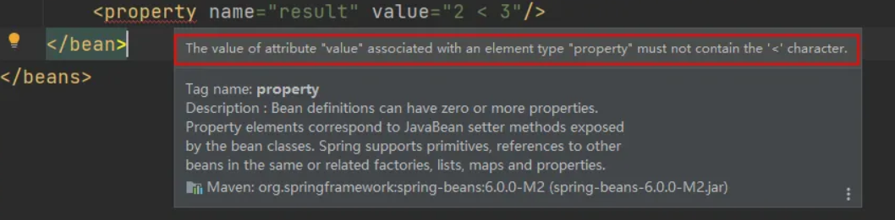

解决方案包括两种：

- 第一种：特殊符号使用转义字符代替。
- 第二种：将含有特殊符号的字符串放到： 当中。因为放在CDATA区中的数据不会被XML文件解析器解析。

5个特殊字符对应的转义字符分别是：

| **特殊字符** | **转义字符** |
| --- | --- |
| > | > |
| < | < |
| ' | ' |
| " | " |
| & | & |

先使用转义字符来代替：

```java
public class Math {
    private String result;

    public void setResult(String result) {
        this.result = result;
    }

    @Override
    public String toString() {
        return "Math{" +
                "result='" + result + '\'' +
                '}';
    }
}
```

```xml
<bean id="mathBean" class="com.jkweilai.spring.beans.Math">
    <property name="result" value="2 < 3"/>
</bean>
```

```java
@Test
public void testSpecial(){
    ApplicationContext applicationContext = new ClassPathXmlApplicationContext("spring-special.xml");
    Math mathBean = applicationContext.getBean("mathBean", Math.class);
    System.out.println(mathBean);
}
```

执行结果：


我们再来使用CDATA方式：

```xml
<bean id="mathBean" class="com.jkweilai.spring.beans.Math">
    <property name="result">
        <!--只能使用value标签-->
        <value><![CDATA[2 < 3]]></value>
    </property>
</bean>
```

**注意：使用CDATA时，不能使用value属性，只能使用value标签。**

执行结果：


## p命名空间注入

目的：简化配置。

使用p命名空间注入的前提条件包括两个：

- 第一：在XML头部信息中添加p命名空间的配置信息：xmlns:p="[http://www.springframework.org/schema/p"](http://www.springframework.org/schema/p%22)
- 第二：p命名空间注入是基于setter方法的，所以需要对应的属性提供setter方法。

```java
public class Customer {
    private String name;
    private int age;

    public void setName(String name) {
        this.name = name;
    }

    public void setAge(int age) {
        this.age = age;
    }

    @Override
    public String toString() {
        return "Customer{" +
                "name='" + name + '\'' +
                ", age=" + age +
                '}';
    }
}
```

```xml
<?xml version="1.0" encoding="UTF-8"?>
<beans xmlns="http://www.springframework.org/schema/beans"
       xmlns:p="http://www.springframework.org/schema/p"
       xmlns:xsi="http://www.w3.org/2001/XMLSchema-instance"
       xsi:schemaLocation="http://www.springframework.org/schema/beans http://www.springframework.org/schema/beans/spring-beans.xsd">

    <bean id="customerBean" class="com.jkweilai.spring.beans.Customer" p:name="zhangsan" p:age="20"/>

</beans>
```

```java
@Test
public void testP(){
    ApplicationContext applicationContext = new ClassPathXmlApplicationContext("spring-p.xml");
    Customer customerBean = applicationContext.getBean("customerBean", Customer.class);
    System.out.println(customerBean);
}
```

执行结果：

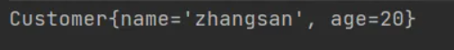

把setter方法去掉：

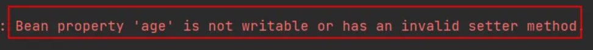

所以p命名空间实际上是对set注入的简化。

## c命名空间注入

c命名空间是简化构造方法注入的。

使用c命名空间的两个前提条件：

第一：需要在xml配置文件头部添加信息：xmlns:c="http://www.springframework.org/schema/c"

第二：需要提供构造方法。

```java
public class MyTime {
    private int year;
    private int month;
    private int day;

    public MyTime(int year, int month, int day) {
        this.year = year;
        this.month = month;
        this.day = day;
    }

    @Override
    public String toString() {
        return "MyTime{" +
                "year=" + year +
                ", month=" + month +
                ", day=" + day +
                '}';
    }
}
```

```xml
<?xml version="1.0" encoding="UTF-8"?>
<beans xmlns="http://www.springframework.org/schema/beans"
       xmlns:c="http://www.springframework.org/schema/c"
       xmlns:xsi="http://www.w3.org/2001/XMLSchema-instance"
       xsi:schemaLocation="http://www.springframework.org/schema/beans http://www.springframework.org/schema/beans/spring-beans.xsd">
  
    <bean id="myTimeBean" class="com.jkweilai.spring.beans.MyTime" c:_0="2008" c:_1="8" c:_2="8"/>

</beans>
```

```java
@Test
public void testC(){
    ApplicationContext applicationContext = new ClassPathXmlApplicationContext("spring-c.xml");
    MyTime myTimeBean = applicationContext.getBean("myTimeBean", MyTime.class);
    System.out.println(myTimeBean);
}
```

执行结果：


把构造方法注释掉：

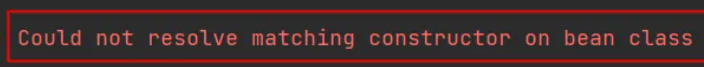

所以，c命名空间是依靠构造方法的。

**注意：不管是p命名空间还是c命名空间，注入的时候都可以注入简单类型以及非简单类型。**

## util命名空间

使用util命名空间可以让**配置复用**。

使用util命名空间的前提是：在spring配置文件头部添加配置信息。如下：

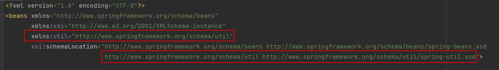

```java
public class MyDataSource1 {
    private Properties properties;

    public void setProperties(Properties properties) {
        this.properties = properties;
    }

    @Override
    public String toString() {
        return "MyDataSource1{" +
                "properties=" + properties +
                '}';
    }
}
```

```java
public class MyDataSource2 {
    private Properties properties;

    public void setProperties(Properties properties) {
        this.properties = properties;
    }

    @Override
    public String toString() {
        return "MyDataSource2{" +
                "properties=" + properties +
                '}';
    }
}
```

```xml
<?xml version="1.0" encoding="UTF-8"?>
<beans xmlns="http://www.springframework.org/schema/beans"
       xmlns:xsi="http://www.w3.org/2001/XMLSchema-instance"
       xmlns:util="http://www.springframework.org/schema/util"
       xsi:schemaLocation="http://www.springframework.org/schema/beans http://www.springframework.org/schema/beans/spring-beans.xsd
                           http://www.springframework.org/schema/util http://www.springframework.org/schema/util/spring-util.xsd">

    <util:properties id="prop">
        <prop key="driver">com.mysql.cj.jdbc.Driver</prop>
        <prop key="url">jdbc:mysql://localhost:3306/spring</prop>
        <prop key="username">root</prop>
        <prop key="password">123456</prop>
    </util:properties>

    <bean id="dataSource1" class="com.jkweilai.spring.beans.MyDataSource1">
        <property name="properties" ref="prop"/>
    </bean>

    <bean id="dataSource2" class="com.jkweilai.spring.beans.MyDataSource2">
        <property name="properties" ref="prop"/>
    </bean>
</beans>
```

```java
@Test
public void testUtil(){
    ApplicationContext applicationContext = new ClassPathXmlApplicationContext("spring-util.xml");

    MyDataSource1 dataSource1 = applicationContext.getBean("dataSource1", MyDataSource1.class);
    System.out.println(dataSource1);

    MyDataSource2 dataSource2 = applicationContext.getBean("dataSource2", MyDataSource2.class);
    System.out.println(dataSource2);
}
```

执行结果：

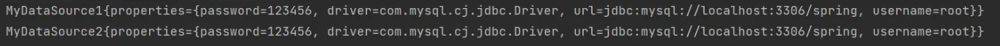

## 基于XML的自动装配

Spring还可以完成自动化的注入，自动化注入又被称为自动装配。它可以根据**名字**进行自动装配，也可以根据**类型**进行自动装配。

### 根据名称自动装配

```java
public class UserDao {

    public void insert(){
        System.out.println("正在保存用户数据。");
    }
}
```

```java
public class UserService {

    private UserDao aaa;

    // 这个set方法非常关键
    public void setAaa(UserDao aaa) {
        this.aaa = aaa;
    }

    public void save(){
        aaa.insert();
    }
}
```

Spring的配置文件这样配置：

```xml
<bean id="userService" class="com.jkweilai.spring.service.UserService" autowire="byName"/>

<bean id="aaa" class="com.jkweilai.spring.dao.UserDao"/>
```

这个配置起到关键作用：

- UserService Bean中需要添加autowire="byName"，表示通过名称进行装配。
- UserService类中有一个UserDao属性，而UserDao属性的名字是aaa，**对应的set方法是setAaa()**，正好和UserDao Bean的id是一样的。这就是根据名称自动装配。

```java
@Test
public void testAutowireByName(){
    ApplicationContext applicationContext = new ClassPathXmlApplicationContext("spring-autowire.xml");
    UserService userService = applicationContext.getBean("userService", UserService.class);
    userService.save();
}
```

执行结果：

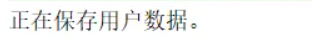

我们来测试一下，byName装配是和属性名有关还是和set方法名有关系：

```java
public class UserService {
    // 这里没修改
    private UserDao aaa;

    /*public void setAaa(UserDao aaa) {
        this.aaa = aaa;
    }*/

    // set方法名变化了
    public void setDao(UserDao aaa){
        this.aaa = aaa;
    }

    public void save(){
        aaa.insert();
    }
}
```

在执行测试程序：

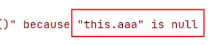

通过测试得知，aaa属性并没有赋值成功。也就是并没有装配成功。

我们将spring配置文件修改以下：

```xml
<?xml version="1.0" encoding="UTF-8"?>
<beans xmlns="http://www.springframework.org/schema/beans"
       xmlns:xsi="http://www.w3.org/2001/XMLSchema-instance"
       xsi:schemaLocation="http://www.springframework.org/schema/beans http://www.springframework.org/schema/beans/spring-beans.xsd">
  
  <bean id="userService" class="com.jkweilai.spring.service.UserService" autowire="byName"/>
  <!--这个id修改了-->
  <bean id="dao" class="com.jkweilai.spring.dao.UserDao"/>
  
</beans>
```

执行测试程序：


这说明，如果根据名称装配(byName)，底层会调用set方法进行注入。

例如：setAge() 对应的名字是age，setPassword()对应的名字是password，setEmail()对应的名字是email。

### 根据类型自动装配

```java
public class AccountDao {
    public void insert(){
        System.out.println("正在保存账户信息");
    }
}
```

```java
public class AccountService {
    private AccountDao accountDao;

    public void setAccountDao(AccountDao accountDao) {
        this.accountDao = accountDao;
    }

    public void save(){
        accountDao.insert();
    }
}
```

```xml
<?xml version="1.0" encoding="UTF-8"?>
<beans xmlns="http://www.springframework.org/schema/beans"
       xmlns:xsi="http://www.w3.org/2001/XMLSchema-instance"
       xsi:schemaLocation="http://www.springframework.org/schema/beans http://www.springframework.org/schema/beans/spring-beans.xsd">

    <!--byType表示根据类型自动装配-->
    <bean id="accountService" class="com.jkweilai.spring.service.AccountService" autowire="byType"/>

    <bean class="com.jkweilai.spring.dao.AccountDao"/>

</beans>
```

```java
@Test
public void testAutowireByType(){
    ApplicationContext applicationContext = new ClassPathXmlApplicationContext("spring-autowire.xml");
    AccountService accountService = applicationContext.getBean("accountService", AccountService.class);
    accountService.save();
}
```

执行结果：


我们把UserService中的set方法注释掉，再执行：

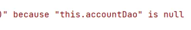

可以看到无论是byName还是byType，在装配的时候都是基于set方法的。所以set方法是必须要提供的。提供构造方法是不行的，大家可以测试一下。这里就不再赘述。

如果byType，根据类型装配时，如果配置文件中有两个类型一样的bean会出现什么问题呢？

```xml
<?xml version="1.0" encoding="UTF-8"?>
<beans xmlns="http://www.springframework.org/schema/beans"
       xmlns:xsi="http://www.w3.org/2001/XMLSchema-instance"
       xsi:schemaLocation="http://www.springframework.org/schema/beans http://www.springframework.org/schema/beans/spring-beans.xsd">

    <bean id="accountService" class="com.jkweilai.spring.service.AccountService" autowire="byType"/>

    <bean id="x" class="com.jkweilai.spring.dao.AccountDao"/>
    <bean id="y" class="com.jkweilai.spring.dao.AccountDao"/>

</beans>
```

执行测试程序：

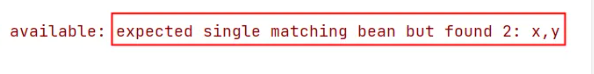

测试结果说明了，当byType进行自动装配的时候，配置文件中某种类型的Bean必须是唯一的，不能出现多个。

## Spring引入外部属性配置文件

我们都知道编写数据源的时候是需要连接数据库的信息的，例如：driver url username password等信息。这些信息可以单独写到一个属性配置文件中吗，这样用户修改起来会更加的方便。当然可以。

第一步：写一个数据源类，提供相关属性。

```java
public class MyDataSource implements DataSource {
    @Override
    public String toString() {
        return "MyDataSource{" +
                "driver='" + driver + '\'' +
                ", url='" + url + '\'' +
                ", username='" + username + '\'' +
                ", password='" + password + '\'' +
                '}';
    }

    private String driver;
    private String url;
    private String username;
    private String password;

    public void setDriver(String driver) {
        this.driver = driver;
    }

    public void setUrl(String url) {
        this.url = url;
    }

    public void setUsername(String username) {
        this.username = username;
    }

    public void setPassword(String password) {
        this.password = password;
    }

    //......

}
```

第二步：在类路径下新建jdbc.properties文件，并配置信息。

```plaintext
driver=com.mysql.cj.jdbc.Driver
url=jdbc:mysql://localhost:3306/spring
username=root
password=root123
```

第三步：在spring配置文件中引入context命名空间。

```xml
<?xml version="1.0" encoding="UTF-8"?>
<beans xmlns="http://www.springframework.org/schema/beans"
       xmlns:xsi="http://www.w3.org/2001/XMLSchema-instance"
       xmlns:context="http://www.springframework.org/schema/context"
       xsi:schemaLocation="http://www.springframework.org/schema/beans http://www.springframework.org/schema/beans/spring-beans.xsd
                           http://www.springframework.org/schema/context http://www.springframework.org/schema/context/spring-context.xsd">

</beans>
```

第四步：在spring中配置使用jdbc.properties文件。

```xml
<?xml version="1.0" encoding="UTF-8"?>
<beans xmlns="http://www.springframework.org/schema/beans"
       xmlns:xsi="http://www.w3.org/2001/XMLSchema-instance"
       xmlns:context="http://www.springframework.org/schema/context"
       xsi:schemaLocation="http://www.springframework.org/schema/beans http://www.springframework.org/schema/beans/spring-beans.xsd
                           http://www.springframework.org/schema/context http://www.springframework.org/schema/context/spring-context.xsd">

    <context:property-placeholder location="jdbc.properties"/>
    
    <bean id="dataSource" class="com.jkweilai.spring.beans.MyDataSource">
        <property name="driver" value="${driver}"/>
        <property name="url" value="${url}"/>
        <property name="username" value="${username}"/>
        <property name="password" value="${password}"/>
    </bean>
</beans>
```

测试程序：

```java
@Test
public void testProperties(){
    ApplicationContext applicationContext = new ClassPathXmlApplicationContext("spring-properties.xml");
    MyDataSource dataSource = applicationContext.getBean("dataSource", MyDataSource.class);
    System.out.println(dataSource);
}
```

执行结果：

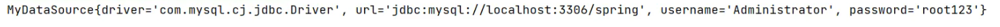

**这里有一个坑。**配置文件中用户名是 `<font style="color:rgb(15, 17, 21);">root</font>`，但是取出来的是 `<font style="color:rgb(15, 17, 21);">Adminitrator</font>`。什么原因？

这个问题很常见，是因为系统环境变量的优先级导致的。Spring在解析 `<font style="color:rgb(15, 17, 21);background-color:rgb(235, 238, 242);">${}</font>` 占位符时，会按照以下顺序查找：

1. **系统环境变量**（如 `<font style="color:rgb(15, 17, 21);background-color:rgb(235, 238, 242);">USERNAME</font>`）
2. **JVM 系统属性**（`<font style="color:rgb(15, 17, 21);background-color:rgb(235, 238, 242);">System.getProperties()</font>`）
3. **属性文件**中定义的值

在Windows系统中，`<font style="color:rgb(15, 17, 21);background-color:rgb(235, 238, 242);">USERNAME</font>` 是一个默认的环境变量，存储了当前登录用户的用户名，所以Spring会优先使用这个值而不是你属性文件中的值。

**解决这个问题很简单：**

```plaintext
jdbc.driver=com.mysql.cj.jdbc.Driver
jdbc.url=jdbc:mysql://localhost:3306/spring
jdbc.username=root
jdbc.password=root123
```

```xml
<?xml version="1.0" encoding="UTF-8"?>
<beans xmlns="http://www.springframework.org/schema/beans"
       xmlns:xsi="http://www.w3.org/2001/XMLSchema-instance"
       xmlns:context="http://www.springframework.org/schema/context"
       xsi:schemaLocation="http://www.springframework.org/schema/beans http://www.springframework.org/schema/beans/spring-beans.xsd
                           http://www.springframework.org/schema/context http://www.springframework.org/schema/context/spring-context.xsd">

    <context:property-placeholder location="jdbc.properties"/>
    
    <bean id="dataSource" class="com.jkweilai.spring.beans.MyDataSource">
        <property name="driver" value="${jdbc.driver}"/>
        <property name="url" value="${jdbc.url}"/>
        <property name="username" value="${jdbc.username}"/>
        <property name="password" value="${jdbc.password}"/>
    </bean>
</beans>
```

# Bean的作用域


## singleton

默认情况下，Spring的IoC容器创建的Bean对象是单例的。来测试一下：

```java
public class SpringBean {
}
```

```xml
<?xml version="1.0" encoding="UTF-8"?>
<beans xmlns="http://www.springframework.org/schema/beans"
       xmlns:xsi="http://www.w3.org/2001/XMLSchema-instance"
       xsi:schemaLocation="http://www.springframework.org/schema/beans http://www.springframework.org/schema/beans/spring-beans.xsd">

    <bean id="sb" class="com.jkweilai.spring.beans.SpringBean" />
    
</beans>
```

```java
@Test
public void testScope(){
    ApplicationContext applicationContext = new ClassPathXmlApplicationContext("spring-scope.xml");

    SpringBean sb1 = applicationContext.getBean("sb", SpringBean.class);
    System.out.println(sb1);

    SpringBean sb2 = applicationContext.getBean("sb", SpringBean.class);
    System.out.println(sb2);
}
```

执行结果：

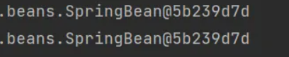

通过测试得知：Spring的IoC容器中，默认情况下，Bean对象是单例的。

这个对象在什么时候创建的呢？可以为SpringBean提供一个无参数构造方法，测试一下，如下：

```java
public class SpringBean {
    public SpringBean() {
        System.out.println("SpringBean的无参数构造方法执行。");
    }
}
```

将测试程序中getBean()所在行代码注释掉：

```java
@Test
public void testScope(){
    ApplicationContext applicationContext = new ClassPathXmlApplicationContext("spring-scope.xml");
}
```

执行测试程序：


通过测试得知，默认情况下，Bean对象的创建是在初始化Spring上下文的时候就完成的。

## prototype

如果想让Spring的Bean对象以多例的形式存在，可以在bean标签中指定scope属性的值为：**prototype**，这样Spring会在每一次执行getBean()方法的时候创建Bean对象，调用几次则创建几次。

```xml
<?xml version="1.0" encoding="UTF-8"?>
<beans xmlns="http://www.springframework.org/schema/beans"
       xmlns:xsi="http://www.w3.org/2001/XMLSchema-instance"
       xsi:schemaLocation="http://www.springframework.org/schema/beans http://www.springframework.org/schema/beans/spring-beans.xsd">

    <bean id="sb" class="com.jkweilai.spring.beans.SpringBean" scope="prototype" />

</beans>
```

```java
@Test
public void testScope(){
    ApplicationContext applicationContext = new ClassPathXmlApplicationContext("spring-scope.xml");

    SpringBean sb1 = applicationContext.getBean("sb", SpringBean.class);
    System.out.println(sb1);

    SpringBean sb2 = applicationContext.getBean("sb", SpringBean.class);
    System.out.println(sb2);
}
```

执行结果：

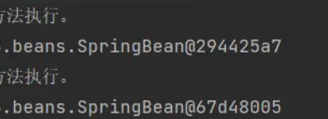

我们可以把测试代码中的getBean()方法所在行代码注释掉：

```java
@Test
public void testScope(){
    ApplicationContext applicationContext = new ClassPathXmlApplicationContext("spring-scope.xml");
}
```

执行结果：


可以看到这一次在初始化Spring上下文的时候，并没有创建Bean对象。

那你可能会问：scope如果没有配置，它的默认值是什么呢？默认值是singleton，单例的。

```xml
<?xml version="1.0" encoding="UTF-8"?>
<beans xmlns="http://www.springframework.org/schema/beans"
       xmlns:xsi="http://www.w3.org/2001/XMLSchema-instance"
       xsi:schemaLocation="http://www.springframework.org/schema/beans http://www.springframework.org/schema/beans/spring-beans.xsd">

    <bean id="sb" class="com.jkweilai.spring.beans.SpringBean" />

</beans>
```

```java
@Test
public void testScope(){
    ApplicationContext applicationContext = new ClassPathXmlApplicationContext("spring-scope.xml");

    SpringBean sb1 = applicationContext.getBean("sb", SpringBean.class);
    System.out.println(sb1);

    SpringBean sb2 = applicationContext.getBean("sb", SpringBean.class);
    System.out.println(sb2);
}
```

执行结果：

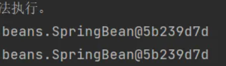

通过测试得知，没有指定scope属性时，默认是singleton单例的。

## 其它scope

**scope属性的值不止两个，它一共包括8个选项：**

- singleton：默认的，单例。
- prototype：原型。每调用一次getBean()方法则获取一个新的Bean对象。或每次注入的时候都是新对象。
- request：一个请求对应一个Bean。**仅限于在WEB应用中使用**。
- session：一个会话对应一个Bean。**仅限于在WEB应用中使用**。
- application：一个应用对应一个Bean。**仅限于在WEB应用中使用。**
- websocket：一个websocket生命周期对应一个Bean。**仅限于在WEB应用中使用。**
- 自定义scope：几乎用不上，感兴趣的可以研究。

# GoF之工厂模式


- 设计模式：一种可以被重复利用的解决方案。
- GoF（Gang of Four），中文名——四人组。
- 《Design Patterns: Elements of Reusable Object-Oriented Software》（即《设计模式》一书），1995年由 Erich Gamma、Richard Helm、Ralph Johnson 和 John Vlissides 合著。这几位作者常被称为"四人组（Gang of Four）"。
- 该书中描述了23种设计模式。我们平常所说的设计模式就是指这23种设计模式。
- 不过除了GoF23种设计模式之外，还有其它的设计模式，比如：JavaEE的设计模式（DAO模式、MVC模式等）。
- GoF23种设计模式可分为三大类：
  - **创建型**（5个）：解决对象创建问题。
    - 单例模式
    - 工厂方法模式
    - 抽象工厂模式
    - 建造者模式
    - 原型模式
  - **结构型**（7个）：一些类或对象组合在一起的经典结构。
    - 代理模式
    - 装饰模式
    - 适配器模式
    - 组合模式
    - 享元模式
    - 外观模式
    - 桥接模式
  - **行为型**（11个）：解决类或对象之间的交互问题。
    - 策略模式
    - 模板方法模式
    - 责任链模式
    - 观察者模式
    - 迭代子模式
    - 命令模式
    - 备忘录模式
    - 状态模式
    - 访问者模式
    - 中介者模式
    - 解释器模式
- 工厂模式是解决对象创建问题的，所以工厂模式属于创建型设计模式。这里为什么学习工厂模式呢？这是因为Spring框架底层使用了大量的工厂模式。

## 工厂模式的三种形态

工厂模式通常有三种形态：

- 第一种：**简单工厂模式（Simple Factory）：不属于23种设计模式之一。简单工厂模式又叫做：静态 工厂方法模式。简单工厂模式是工厂方法模式的一种特殊实现。**
- 第二种：工厂方法模式（Factory Method）：是23种设计模式之一。
- 第三种：抽象工厂模式（Abstract Factory）：是23种设计模式之一。

## 简单工厂模式

简单工厂模式的角色包括三个：

- 抽象产品 角色
- 具体产品 角色
- 工厂类 角色

简单工厂模式的代码如下：

抽象产品角色：

```java
public abstract class Weapon {
    /**
     * 所有的武器都有攻击行为
     */
    public abstract void attack();
}
```

具体产品角色：

```java
// 坦克
public class Tank extends Weapon{
    @Override
    public void attack() {
        System.out.println("坦克开炮！");
    }
}
```

```java
// 战斗机
public class Fighter extends Weapon{
    @Override
    public void attack() {
        System.out.println("战斗机投下原子弹！");
    }
}
```

```java
// 匕首
public class Dagger extends Weapon{
    @Override
    public void attack() {
        System.out.println("砍他丫的！");
    }
}
```

工厂类角色：

```java
public class WeaponFactory {
    /**
     * 根据不同的武器类型生产武器
     * @param weaponType 武器类型
     * @return 武器对象
     */
    public static Weapon get(String weaponType){
        if (weaponType == null || weaponType.trim().length() == 0) {
            return null;
        }
        Weapon weapon = null;
        if ("TANK".equals(weaponType)) {
            weapon = new Tank();
        } else if ("FIGHTER".equals(weaponType)) {
            weapon = new Fighter();
        } else if ("DAGGER".equals(weaponType)) {
            weapon = new Dagger();
        } else {
            throw new RuntimeException("不支持该武器！");
        }
        return weapon;
    }
}
```

测试程序（客户端程序）：

```java
public class Client {
    public static void main(String[] args) {
        Weapon weapon1 = WeaponFactory.get("TANK");
        weapon1.attack();

        Weapon weapon2 = WeaponFactory.get("FIGHTER");
        weapon2.attack();

        Weapon weapon3 = WeaponFactory.get("DAGGER");
        weapon3.attack();
    }
}
```

执行结果：

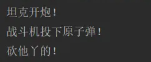

**简单工厂模式的优点：**

- 客户端程序不需要关心对象的创建细节，需要哪个对象时，只需要向工厂索要即可，初步实现了责任的分离。客户端只负责“消费”，工厂负责“生产”。生产和消费分离。

**简单工厂模式的缺点：**

- 缺点1：工厂类集中了所有产品的创造逻辑，形成一个无所不知的全能类，有人把它叫做上帝类。显然工厂类非常关键，不能出问题，一旦出问题，整个系统瘫痪。
- 缺点2：不符合OCP开闭原则，在进行系统扩展时，需要修改工厂类。

**Spring中的BeanFactory 是简单工厂模式吗？**

**从最表层的“根据名字拿对象”的功能来看，BeanFactory 的 getBean(String name) 方法扮演了类似简单工厂的角色。但从本质和实现上来看，BeanFactory 是一个功能极其丰富的 IoC容器，它包含并远远超越了简单工厂的功能。**

## 工厂方法模式

工厂方法模式既保留了简单工厂模式的优点，同时又解决了简单工厂模式的缺点。

工厂方法模式的角色包括：

- **抽象工厂角色**
- **具体工厂角色**
- 抽象产品角色
- 具体产品角色

代码如下：

```java
public abstract class Weapon {
    /**
     * 所有武器都有攻击行为
     */
    public abstract void attack();
}
```

```java
public class Gun extends Weapon{
    @Override
    public void attack() {
        System.out.println("开枪射击！");
    }
}
```

```java
public class Fighter extends Weapon{
    @Override
    public void attack() {
        System.out.println("战斗机发射核弹！");
    }
}
```

```java
public interface WeaponFactory {
    Weapon get();
}
```

```java
public class GunFactory implements WeaponFactory{
    @Override
    public Weapon get() {
        return new Gun();
    }
}
```

```java
public class FighterFactory implements WeaponFactory{
    @Override
    public Weapon get() {
        return new Fighter();
    }
}
```

客户端程序：

```java
public class Client {
    public static void main(String[] args) {
        WeaponFactory factory = new GunFactory();
        Weapon weapon = factory.get();
        weapon.attack();

        WeaponFactory factory1 = new FighterFactory();
        Weapon weapon1 = factory1.get();
        weapon1.attack();
    }
}
```

执行客户端程序：

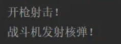

如果想扩展一个新的产品，只要新增一个产品类，再新增一个该产品对应的工厂即可，例如新增：匕首

```java
public class Dagger extends Weapon{
    @Override
    public void attack() {
        System.out.println("砍丫的！");
    }
}
```

```java
public class DaggerFactory implements WeaponFactory{
    @Override
    public Weapon get() {
        return new Dagger();
    }
}
```

客户端程序：

```java
public class Client {
    public static void main(String[] args) {
        WeaponFactory factory = new GunFactory();
        Weapon weapon = factory.get();
        weapon.attack();

        WeaponFactory factory1 = new FighterFactory();
        Weapon weapon1 = factory1.get();
        weapon1.attack();

        WeaponFactory factory2 = new DaggerFactory();
        Weapon weapon2 = factory2.get();
        weapon2.attack();
    }
}
```

执行结果如下：

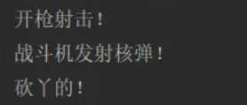

我们可以看到在进行功能扩展的时候，不需要修改之前的源代码，显然工厂方法模式符合OCP原则。

**工厂方法模式的优点：**

- 扩展性高，如果想增加一个产品，只要扩展一个工厂类就可以。
- 屏蔽产品的具体实现，调用者只关心产品的接口。

**工厂方法模式的缺点：**

- 每次增加一个产品时，都需要增加一个具体类和对象实现工厂，使得系统中类的个数成倍增加，在一定程度上增加了系统的复杂度。

## 抽象工厂模式（了解）

抽象工厂模式相对于工厂方法模式来说，就是工厂方法模式是针对一个产品系列的，而抽象工厂模式是针对多个产品系列的，即工厂方法模式是一个产品系列一个工厂类，而抽象工厂模式是多个产品系列一个工厂类。

抽象工厂模式特点：抽象工厂模式是所有形态的工厂模式中最为抽象和最具一般性的一种形态。抽象工厂模式是指当有多个抽象角色时，使用的一种工厂模式。抽象工厂模式可以向客户端提供一个接口，使客户端在不必指定产品的具体的情况下，创建多个产品族中的产品对象。它有多个抽象产品类，每个抽象产品类可以派生出多个具体产品类，一个抽象工厂类，可以派生出多个具体工厂类，每个具体工厂类可以创建多个具体产品类的实例。每一个模式都是针对一定问题的解决方案，工厂方法模式针对的是一个产品等级结构；而抽象工厂模式针对的是多个产品等级结构。

抽象工厂中包含4个角色：

- 抽象工厂角色
- 具体工厂角色
- 抽象产品角色
- 具体产品角色

抽象工厂模式的类图如下：

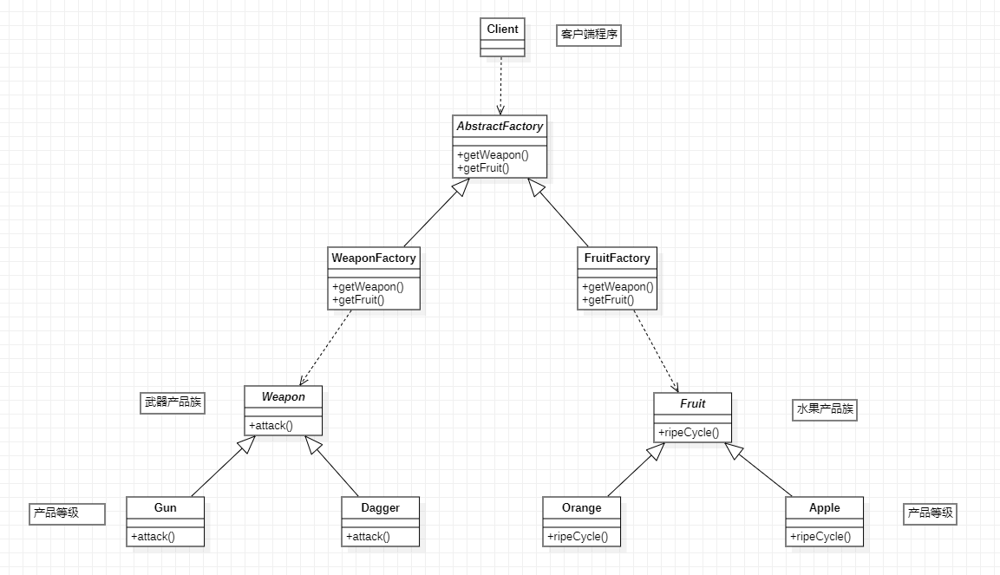

抽象工厂模式代码如下：

第一部分：武器产品族

```java
package com.jkweilai.product;

/**
 * 武器产品族
 */
public abstract class Weapon {
    public abstract void attack();
}
```

```java
package com.jkweilai.product;

/**
 * 武器产品族中的产品等级1
 */
public class Gun extends Weapon{
    @Override
    public void attack() {
        System.out.println("开枪射击！");
    }
}
```

```java
package com.jkweilai.product;

/**
 * 武器产品族中的产品等级2
 */
public class Dagger extends Weapon{
    @Override
    public void attack() {
        System.out.println("砍丫的！");
    }
}
```

第二部分：水果产品族

```java
package com.jkweilai.product;

/**
 * 水果产品族
 */
public abstract class Fruit {
    /**
     * 所有果实都有一个成熟周期。
     */
    public abstract void ripeCycle();
}
```

```java
package com.jkweilai.product;

/**
 * 水果产品族中的产品等级1
 */
public class Orange extends Fruit{
    @Override
    public void ripeCycle() {
        System.out.println("橘子的成熟周期是10个月");
    }
}
```

```java
package com.jkweilai.product;

/**
 * 水果产品族中的产品等级2
 */
public class Apple extends Fruit{
    @Override
    public void ripeCycle() {
        System.out.println("苹果的成熟周期是8个月");
    }
}
```

第三部分：抽象工厂类

```java
package com.jkweilai.factory;

import com.jkweilai.product.Fruit;
import com.jkweilai.product.Weapon;

/**
 * 抽象工厂
 */
public abstract class AbstractFactory {
    public abstract Weapon getWeapon(String type);
    public abstract Fruit getFruit(String type);
}
```

第四部分：具体工厂类

```java
package com.jkweilai.factory;

import com.jkweilai.product.Dagger;
import com.jkweilai.product.Fruit;
import com.jkweilai.product.Gun;
import com.jkweilai.product.Weapon;

/**
 * 武器族工厂
 */
public class WeaponFactory extends AbstractFactory{

    public Weapon getWeapon(String type){
        if (type == null || type.trim().length() == 0) {
            return null;
        }
        if ("Gun".equals(type)) {
            return new Gun();
        } else if ("Dagger".equals(type)) {
            return new Dagger();
        } else {
            throw new RuntimeException("无法生产该武器");
        }
    }

    @Override
    public Fruit getFruit(String type) {
        return null;
    }
}
```

```java
package com.jkweilai.factory;

import com.jkweilai.product.*;

/**
 * 水果族工厂
 */
public class FruitFactory extends AbstractFactory{
    @Override
    public Weapon getWeapon(String type) {
        return null;
    }

    public Fruit getFruit(String type){
        if (type == null || type.trim().length() == 0) {
            return null;
        }
        if ("Orange".equals(type)) {
            return new Orange();
        } else if ("Apple".equals(type)) {
            return new Apple();
        } else {
            throw new RuntimeException("我家果园不产这种水果");
        }
    }
}
```

第五部分：客户端程序

```java
package com.jkweilai.client;

import com.jkweilai.factory.AbstractFactory;
import com.jkweilai.factory.FruitFactory;
import com.jkweilai.factory.WeaponFactory;
import com.jkweilai.product.Fruit;
import com.jkweilai.product.Weapon;

public class Client {
    public static void main(String[] args) {
        // 客户端调用方法时只面向AbstractFactory调用方法。
        AbstractFactory factory = new WeaponFactory(); // 注意：这里的new WeaponFactory()可以采用 简单工厂模式 进行隐藏。
        Weapon gun = factory.getWeapon("Gun");
        Weapon dagger = factory.getWeapon("Dagger");

        gun.attack();
        dagger.attack();

        AbstractFactory factory1 = new FruitFactory(); // 注意：这里的new FruitFactory()可以采用 简单工厂模式 进行隐藏。
        Fruit orange = factory1.getFruit("Orange");
        Fruit apple = factory1.getFruit("Apple");

        orange.ripeCycle();
        apple.ripeCycle();
    }
}
```

执行结果：

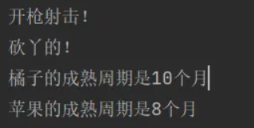

抽象工厂模式的优缺点：

- 优点：当一个产品族中的多个对象被设计成一起工作时，它能保证客户端始终只使用同一个产品族中的对象。
- 缺点：产品族扩展非常困难，要增加一个系列的某一产品，既要在AbstractFactory里加代码，又要在具体的里面加代码。

# Bean的实例化方式


Spring为Bean提供了多种实例化方式，通常包括4种方式。（也就是说在Spring中为Bean对象的创建准备了多种方案，目的是：更加灵活）

- 第一种：通过构造方法实例化
- 第二种：通过简单工厂模式实例化
- 第三种：通过factory-bean实例化
- 第四种：通过FactoryBean接口实例化

## 通过构造方法实例化

我们之前一直使用的就是这种方式。默认情况下，会调用Bean的无参数构造方法。

```java
package com.jkweilai.spring.bean;

public class User {
    public User() {
        System.out.println("User类的无参数构造方法执行。");
    }
}
```

```xml

<?xml version="1.0" encoding="UTF-8"?>
<beans xmlns="http://www.springframework.org/schema/beans"
       xmlns:xsi="http://www.w3.org/2001/XMLSchema-instance"
       xsi:schemaLocation="http://www.springframework.org/schema/beans http://www.springframework.org/schema/beans/spring-beans.xsd">

    <bean id="userBean" class="com.jkweilai.spring.bean.User"/>

</beans>
```

```java
package com.jkweilai.spring.test;

import com.jkweilai.spring.bean.User;
import org.junit.Test;
import org.springframework.context.ApplicationContext;
import org.springframework.context.support.ClassPathXmlApplicationContext;

public class SpringInstantiationTest {

    @Test
    public void testConstructor(){
        ApplicationContext applicationContext = new ClassPathXmlApplicationContext("spring.xml");
        User user = applicationContext.getBean("userBean", User.class);
        System.out.println(user);
    }
}
```

## 通过 factory-method 属性实例化

底层使用了简单工厂模式。

第一步：定义一个Bean

```java
package com.jkweilai.spring.bean;

public class Vip {
}
```

第二步：编写简单工厂模式当中的工厂类

```java
package com.jkweilai.spring.bean;

public class VipFactory {
    public static Vip get(){
        return new Vip();
    }
}
```

第三步：在Spring配置文件中指定创建该Bean的方法（使用factory-method属性指定）

```xml
<bean id="vipBean" class="com.jkweilai.spring.bean.VipFactory" factory-method="get"/>
```

第四步：编写测试程序

```java
@Test
public void testSimpleFactory(){
    ApplicationContext applicationContext = new ClassPathXmlApplicationContext("spring.xml");
    Vip vip = applicationContext.getBean("vipBean", Vip.class);
    System.out.println(vip);
}
```

执行结果：


## 通过factory-bean实例化

这种方式本质上是：通过工厂方法模式进行实例化。

第一步：定义一个Bean

```java
package com.jkweilai.spring.bean;

public class Order {
}
```

第二步：定义具体工厂类，工厂类中定义实例方法

```java
package com.jkweilai.spring.bean;

public class OrderFactory {
    public Order get(){
        return new Order();
    }
}
```

第三步：在Spring配置文件中指定factory-bean以及factory-method

```xml
<bean id="orderFactory" class="com.jkweilai.spring.bean.OrderFactory"/>
<bean id="orderBean" factory-bean="orderFactory" factory-method="get"/>
```

第四步：编写测试程序

```java
@Test
public void testSelfFactoryBean(){
    ApplicationContext applicationContext = new ClassPathXmlApplicationContext("spring.xml");
    Order orderBean = applicationContext.getBean("orderBean", Order.class);
    System.out.println(orderBean);
}
```

执行结果：

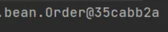

## 通过FactoryBean接口实例化

以上的第三种方式中，factory-bean是我们自定义的，factory-method也是我们自己定义的。

在Spring中，当你编写的类直接实现FactoryBean接口之后，factory-bean不需要指定了，factory-method也不需要指定了。

factory-bean会自动指向实现FactoryBean接口的类，factory-method会自动指向getObject()方法。

第一步：定义一个Bean

```java
public class Person {
}
```

第二步：编写一个类实现FactoryBean接口

```java
public class PersonFactoryBean implements FactoryBean<Person> {

    @Override
    public Person getObject() throws Exception {
        return new Person();
    }

    @Override
    public Class<?> getObjectType() {
        return null;
    }

    @Override
    public boolean isSingleton() {
        // true表示单例
        // false表示原型
        return true;
    }
}
```

第三步：在Spring配置文件中配置FactoryBean

```xml
<bean id="personBean" class="com.jkweilai.spring.bean.PersonFactoryBean"/>
```

测试程序：

```java
@Test
public void testFactoryBean(){
    ApplicationContext applicationContext = new ClassPathXmlApplicationContext("spring.xml");
    Person personBean = applicationContext.getBean("personBean", Person.class);
    System.out.println(personBean);

    Person personBean2 = applicationContext.getBean("personBean", Person.class);
    System.out.println(personBean2);
}
```

执行结果：

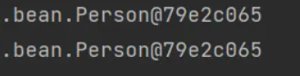

**FactoryBean在Spring中是一个接口。被称为“工厂Bean”。“工厂Bean”是一种特殊的Bean。所有的“工厂Bean”都是用来协助Spring框架来创建其他Bean对象的。**

## BeanFactory和FactoryBean的区别

### BeanFactory

Spring IoC容器的顶级对象，BeanFactory被翻译为“Bean工厂”，在Spring的IoC容器中，“Bean工厂”负责创建Bean对象。

BeanFactory是工厂。

### FactoryBean

FactoryBean：它是一个Bean，是一个能够**辅助Spring**实例化其它Bean对象的一个Bean。

在Spring中，Bean可以分为两类：

- 第一类：普通Bean
- 第二类：工厂Bean（记住：工厂Bean也是一种Bean，只不过这种Bean比较特殊，它可以辅助Spring实例化其它Bean对象。）

## 注入自定义Date

我们前面说过，java.util.Date在Spring中被当做简单类型，简单类型在注入的时候可以直接使用value属性或value标签来完成，对于Date类型来说，采用value属性或value标签赋值的时候，对日期字符串的格式要求非常严格，必须是这种格式的：Mon Oct 10 14:30:26 CST 2025。其他格式是不会被识别的。如以下代码：

```java
public class Student {
    private Date birth;

    public void setBirth(Date birth) {
        this.birth = birth;
    }

    @Override
    public String toString() {
        return "Student{" +
                "birth=" + birth +
                '}';
    }
}
```

```xml
<bean id="studentBean" class="com.jkweilai.spring.bean.Student">
  <property name="birth" value="Mon Oct 10 14:30:26 CST 2002"/>
</bean>
```

```java
@Test
public void testDate(){
    ApplicationContext applicationContext = new ClassPathXmlApplicationContext("spring.xml");
    Student studentBean = applicationContext.getBean("studentBean", Student.class);
    System.out.println(studentBean);
}
```

执行结果：

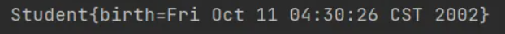

如果把日期格式修改一下：

```xml
<bean id="studentBean" class="com.jkweilai.spring.bean.Student">
  <property name="birth" value="2002-10-10"/>
</bean>
```

执行结果：


这种情况下，我们就可以使用FactoryBean来完成这个骚操作。

编写DateFactoryBean实现FactoryBean接口：

```java
public class DateFactoryBean implements FactoryBean<Date> {

    // 定义属性接收日期字符串
    private String date;

    // 通过构造方法给日期字符串属性赋值
    public DateFactoryBean(String date) {
        this.date = date;
    }

    @Override
    public Date getObject() throws Exception {
        SimpleDateFormat sdf = new SimpleDateFormat("yyyy-MM-dd");
        return sdf.parse(this.date);
    }

    @Override
    public Class<?> getObjectType() {
        return null;
    }
}
```

编写spring配置文件：

```xml
<bean id="dateBean" class="com.jkweilai.spring.bean.DateFactoryBean">
  <constructor-arg name="date" value="1999-10-11"/>
</bean>

<bean id="studentBean" class="com.jkweilai.spring.bean.Student">
  <property name="birth" ref="dateBean"/>
</bean>
```

执行测试程序：


# Bean的生命周期


## 什么是Bean的生命周期

Spring其实就是一个管理Bean对象的工厂。它负责对象的创建，对象的销毁等。

所谓的生命周期就是：对象从创建开始到最终销毁的整个过程。

什么时候创建Bean对象？

创建Bean对象的前后会调用什么方法？

Bean对象什么时候销毁？

Bean对象的销毁前后调用什么方法？

## 为什么要知道Bean的生命周期

其实生命周期的本质是：在哪个时间节点上调用了哪个类的哪个方法。

我们需要充分的了解在这个生命线上，都有哪些特殊的时间节点。

只有我们知道了特殊的时间节点都在哪，到时我们才可以确定代码写到哪。

我们可能需要在某个特殊的时间点上执行一段特定的代码，这段代码就可以放到这个节点上。当生命线走到这里的时候，自然会被调用。

任何一个生命周期都是基于回调机制的。（提前写好回调函数，到了这个时刻就会调用对应的回调函数。）

## Bean的生命周期之5步

Bean生命周期的管理，可以参考Spring的源码：**AbstractAutowireCapableBeanFactory类的doCreateBean()方法****。**

Bean生命周期可以粗略的划分为五大步：

- 第一步：实例化Bean
- 第二步：Bean属性赋值
- 第三步：初始化Bean
- 第四步：使用Bean
- 第五步：销毁Bean


编写测试程序：

定义一个Bean

```java
public class User {
    private String name;

    public User() {
        System.out.println("1.实例化Bean");
    }

    public void setName(String name) {
        this.name = name;
        System.out.println("2.Bean属性赋值");
    }

    public void initBean(){
        System.out.println("3.初始化Bean");
    }

    public void destroyBean(){
        System.out.println("5.销毁Bean");
    }

}
```

```xml
<!--
  init-method属性指定初始化方法。
  destroy-method属性指定销毁方法。
-->
<bean id="userBean" class="com.jkweilai.spring.bean.User" init-method="initBean" destroy-method="destroyBean">
    <property name="name" value="zhangsan"/>
</bean>
```

```java
public class BeanLifecycleTest {
    @Test
    public void testLifecycle(){
        ApplicationContext applicationContext = new ClassPathXmlApplicationContext("spring.xml");
        User userBean = applicationContext.getBean("userBean", User.class);
        System.out.println("4.使用Bean");
        // 只有正常关闭spring容器才会执行销毁方法
        ClassPathXmlApplicationContext context = (ClassPathXmlApplicationContext) applicationContext;
        context.close();
    }
}
```

执行结果：


需要注意的：

- 第一：只有正常关闭spring容器，bean的销毁方法才会被调用。
- 第二：ClassPathXmlApplicationContext类才有close()方法。
- 第三：配置文件中的init-method指定初始化方法。destroy-method指定销毁方法。

## Bean生命周期之7步

在以上的5步中，第3步是初始化Bean，如果你还想在初始化前和初始化后添加代码，可以加入“Bean后处理器”。

编写一个类实现BeanPostProcessor类，并且重写before和after方法：

```java
public class LogBeanPostProcessor implements BeanPostProcessor {
    @Override
    public Object postProcessBeforeInitialization(Object bean, String beanName) throws BeansException {
        System.out.println("Bean后处理器的before方法执行，即将开始初始化");
        return bean;
    }

    @Override
    public Object postProcessAfterInitialization(Object bean, String beanName) throws BeansException {
        System.out.println("Bean后处理器的after方法执行，已完成初始化");
        return bean;
    }
}
```

在spring.xml文件中配置“Bean后处理器”：

```xml
<!--配置Bean后处理器。这个后处理器将作用于当前配置文件中所有的bean。-->
<bean class="com.jkweilai.spring.bean.LogBeanPostProcessor"/>
```

**一定要注意：在spring.xml文件中配置的Bean后处理器将作用于当前配置文件中所有的Bean。**

执行测试程序：


如果加上Bean后处理器的话，Bean的生命周期就是7步了：


## Bean生命周期之10步

如果根据源码跟踪，可以划分更细粒度的步骤，10步：


上图中检查Bean是否实现了Aware的相关接口是什么意思？

Aware相关的接口包括：BeanNameAware、BeanClassLoaderAware、BeanFactoryAware

- 当Bean实现了BeanNameAware，Spring会将Bean的名字传递给Bean。
- 当Bean实现了BeanClassLoaderAware，Spring会将加载该Bean的类加载器传递给Bean。
- 当Bean实现了BeanFactoryAware，Spring会将Bean工厂对象传递给Bean。

测试以上10步，可以让User类实现5个接口，并实现所有方法：

- BeanNameAware
- BeanClassLoaderAware
- BeanFactoryAware
- InitializingBean
- DisposableBean

代码如下：

```java
public class User implements BeanNameAware, BeanClassLoaderAware, BeanFactoryAware, InitializingBean, DisposableBean {
    private String name;

    public User() {
        System.out.println("1.实例化Bean");
    }

    public void setName(String name) {
        this.name = name;
        System.out.println("2.Bean属性赋值");
    }

    public void initBean(){
        System.out.println("6.初始化Bean");
    }

    public void destroyBean(){
        System.out.println("10.销毁Bean");
    }

    @Override
    public void setBeanClassLoader(ClassLoader classLoader) {
        System.out.println("3.类加载器：" + classLoader);
    }

    @Override
    public void setBeanFactory(BeanFactory beanFactory) throws BeansException {
        System.out.println("3.Bean工厂：" + beanFactory);
    }

    @Override
    public void setBeanName(String name) {
        System.out.println("3.bean名字：" + name);
    }

    @Override
    public void destroy() throws Exception {
        System.out.println("9.DisposableBean destroy");
    }

    @Override
    public void afterPropertiesSet() throws Exception {
        System.out.println("5.afterPropertiesSet执行");
    }
}
```

```java
public class LogBeanPostProcessor implements BeanPostProcessor {
    @Override
    public Object postProcessBeforeInitialization(Object bean, String beanName) throws BeansException {
        System.out.println("4.Bean后处理器的before方法执行，即将开始初始化");
        return bean;
    }

    @Override
    public Object postProcessAfterInitialization(Object bean, String beanName) throws BeansException {
        System.out.println("7.Bean后处理器的after方法执行，已完成初始化");
        return bean;
    }
}
```

执行结果：


**通过测试可以看出来：**

- **InitializingBean的方法早于init-method的执行。**
- **DisposableBean的方法早于destroy-method的执行。**

对于SpringBean的生命周期，掌握之前的7步即可。够用。

**相关源码：**

```java
protected Object doCreateBean(String beanName, RootBeanDefinition mbd, @Nullable Object[] args)
        throws BeanCreationException {

    // 第1步：Bean实例化 - 创建Bean的原始对象
    BeanWrapper instanceWrapper = null;
    if (mbd.isSingleton()) {
        instanceWrapper = this.factoryBeanInstanceCache.remove(beanName);
    }
    if (instanceWrapper == null) {
        // 真正的实例化逻辑：通过构造函数、工厂方法等创建Bean实例
        instanceWrapper = createBeanInstance(beanName, mbd, args);
    }
    Object bean = instanceWrapper.getWrappedInstance();
    Class<?> beanType = instanceWrapper.getWrappedClass();
    if (beanType != NullBean.class) {
        mbd.resolvedTargetType = beanType;
    }

    synchronized (mbd.postProcessingLock) {
        if (!mbd.postProcessed) {
            try {
                applyMergedBeanDefinitionPostProcessors(mbd, beanType, beanName);
            }
            catch (Throwable ex) {
                throw new BeanCreationException(mbd.getResourceDescription(), beanName,
                        "Post-processing of merged bean definition failed", ex);
            }
            mbd.markAsPostProcessed();
        }
    }

    // 提前暴露单例Bean的引用，用于解决循环依赖问题
    boolean earlySingletonExposure = (mbd.isSingleton() && this.allowCircularReferences &&
            isSingletonCurrentlyInCreation(beanName));
    if (earlySingletonExposure) {
        if (logger.isTraceEnabled()) {
            logger.trace("Eagerly caching bean '" + beanName +
                    "' to allow for resolving potential circular references");
        }
        // 将Bean的早期引用（可能被代理包装）添加到单例工厂中（三级缓存）
        addSingletonFactory(beanName, () -> getEarlyBeanReference(beanName, mbd, bean));
    }

    // 这是Bean生命周期的核心部分
    Object exposedObject = bean; // 最终暴露给外部的Bean（可能是原始Bean也可能是代理后的Bean）
    try {
        // 第2步：属性赋值 - 依赖注入发生在这里
        // 包括@Autowired、@Value、@Resource等注解的注入
        populateBean(beanName, mbd, instanceWrapper);
        
        // 第3步：初始化Bean - 包含Aware接口、BeanPostProcessor、初始化方法等
        exposedObject = initializeBean(beanName, exposedObject, mbd);
    }
    catch (Throwable ex) {
        if (ex instanceof BeanCreationException bce && beanName.equals(bce.getBeanName())) {
            throw bce;
        }
        else {
            throw new BeanCreationException(mbd.getResourceDescription(), beanName, ex.getMessage(), ex);
        }
    }

    // 处理循环依赖的最终检查
    if (earlySingletonExposure) {
        Object earlySingletonReference = getSingleton(beanName, false);
        if (earlySingletonReference != null) {
            if (exposedObject == bean) {
                exposedObject = earlySingletonReference;
            }
            else if (!this.allowRawInjectionDespiteWrapping && hasDependentBean(beanName)) {
                String[] dependentBeans = getDependentBeans(beanName);
                Set<String> actualDependentBeans = CollectionUtils.newLinkedHashSet(dependentBeans.length);
                for (String dependentBean : dependentBeans) {
                    if (!removeSingletonIfCreatedForTypeCheckOnly(dependentBean)) {
                        actualDependentBeans.add(dependentBean);
                    }
                }
                if (!actualDependentBeans.isEmpty()) {
                    throw new BeanCurrentlyInCreationException(beanName,
                            "Bean with name '" + beanName + "' has been injected into other beans [" +
                            StringUtils.collectionToCommaDelimitedString(actualDependentBeans) +
                            "] in its raw version as part of a circular reference, but has eventually been " +
                            "wrapped. This means that said other beans do not use the final version of the " +
                            "bean. This is often the result of over-eager type matching - consider using " +
                            "'getBeanNamesForType' with the 'allowEagerInit' flag turned off, for example.");
                }
            }
        }
    }

    // 第5步：注册可销毁的Bean - 为Bean的销毁阶段做准备
    try {
        // 注册实现了DisposableBean接口或配置了destroy-method的Bean
        registerDisposableBeanIfNecessary(beanName, bean, mbd);
    }
    catch (BeanDefinitionValidationException ex) {
        throw new BeanCreationException(
                mbd.getResourceDescription(), beanName, "Invalid destruction signature", ex);
    }

    // 返回最终处理完成的Bean（可能是原始对象，也可能是代理对象）
    return exposedObject;
}
```

## Bean的作用域不同，管理方式不同

Spring 根据Bean的作用域来选择管理方式。

- 对于singleton作用域的Bean，Spring 能够精确地知道该Bean何时被创建，何时初始化完成，以及何时被销毁；
- 而对于 prototype 作用域的 Bean，Spring 只负责创建，当容器创建了 Bean 的实例后，Bean 的实例就交给客户端代码管理，Spring 容器将不再跟踪其生命周期。

我们把之前User类的spring.xml文件中的配置scope设置为prototype：

```xml
<!--
  init-method属性指定初始化方法。
  destroy-method属性指定销毁方法。
-->
<bean id="userBean" class="com.jkweilai.spring.bean.User" init-method="initBean" destroy-method="destroyBean" scope="prototype">
    <property name="name" value="zhangsan"/>
</bean>

<!--配置Bean后处理器。这个后处理器将作用于当前配置文件中所有的bean。-->
<bean class="com.jkweilai.spring.bean.LogBeanPostProcessor"/>
```

执行测试程序：


通过测试一目了然。只执行了前8步，第9和10都没有执行。

## 自己new的对象如何让Spring管理

有些时候可能会遇到这样的需求，某个java对象是我们自己new的，然后我们希望这个对象被Spring容器管理，怎么实现？

```java
public class User {
}
```

```java
public class RegisterBeanTest {

    @Test
    public void testBeanRegister(){
        // 自己new的对象
        User user = new User();
        System.out.println(user);

        // 创建 默认可列表BeanFactory 对象
        DefaultListableBeanFactory factory = new DefaultListableBeanFactory();
        // 注册Bean
        factory.registerSingleton("userBean", user);
        // 从spring容器中获取bean
        User userBean = factory.getBean("userBean", User.class);
        System.out.println(userBean);
    }
}
```

执行结果：


# Bean的循环依赖问题


## 什么是Bean的循环依赖

A对象中有B属性。B对象中有A属性。这就是循环依赖。我依赖你，你也依赖我。

比如：丈夫类Husband，妻子类Wife。Husband中有Wife的引用。Wife中有Husband的引用。


```java
public class Husband {
    private String name;
    private Wife wife;
}
```

```java
public class Wife {
    private String name;
    private Husband husband;
}
```

## singleton下的set注入产生的循环依赖

我们来编写程序，测试一下在singleton+setter的模式下产生的循环依赖，Spring是否能够解决？

```java
public class Husband {
    private String name;
    private Wife wife;

    public void setName(String name) {
        this.name = name;
    }

    public String getName() {
        return name;
    }

    public void setWife(Wife wife) {
        this.wife = wife;
    }

    // toString()方法重写时需要注意：不能直接输出wife，输出wife.getName()。要不然会出现递归导致的栈内存溢出错误。
    @Override
    public String toString() {
        return "Husband{" +
                "name='" + name + '\'' +
                ", wife=" + wife.getName() +
                '}';
    }
}
```

```java
public class Wife {
    private String name;
    private Husband husband;

    public void setName(String name) {
        this.name = name;
    }

    public String getName() {
        return name;
    }

    public void setHusband(Husband husband) {
        this.husband = husband;
    }


    // toString()方法重写时需要注意：不能直接输出husband，输出husband.getName()。要不然会出现递归导致的栈内存溢出错误。
    @Override
    public String toString() {
        return "Wife{" +
                "name='" + name + '\'' +
                ", husband=" + husband.getName() +
                '}';
    }
}
```

```xml
<bean id="husbandBean" class="com.jkweilai.spring.bean.Husband" scope="singleton">
    <property name="name" value="张三"/>
    <property name="wife" ref="wifeBean"/>
</bean>
<bean id="wifeBean" class="com.jkweilai.spring.bean.Wife" scope="singleton">
    <property name="name" value="小花"/>
    <property name="husband" ref="husbandBean"/>
</bean>
```

```java
public class CircularDependencyTest {

    @Test
    public void testSingletonAndSet(){
        ApplicationContext applicationContext = new ClassPathXmlApplicationContext("spring.xml");
        Husband husbandBean = applicationContext.getBean("husbandBean", Husband.class);
        Wife wifeBean = applicationContext.getBean("wifeBean", Wife.class);
        System.out.println(husbandBean);
        System.out.println(wifeBean);
    }
}
```

执行结果：


**通过测试得知：在singleton + set注入的情况下，循环依赖是没有问题的。Spring可以解决这个问题。**

## prototype下的set注入产生的循环依赖

我们再来测试一下：prototype+set注入的方式下，循环依赖会不会出现问题？

```xml
<bean id="husbandBean" class="com.jkweilai.spring.bean.Husband" scope="prototype">
    <property name="name" value="张三"/>
    <property name="wife" ref="wifeBean"/>
</bean>
<bean id="wifeBean" class="com.jkweilai.spring.bean.Wife" scope="prototype">
    <property name="name" value="小花"/>
    <property name="husband" ref="husbandBean"/>
</bean>
```

执行测试程序：发生了异常，异常信息如下：

Caused by: org.springframework.beans.factory.**BeanCurrentlyInCreationException**: Error creating bean with name 'husbandBean': Requested bean is currently in creation: Is there an unresolvable circular reference?

```plaintext
at org.springframework.beans.factory.support.AbstractBeanFactory.doGetBean(AbstractBeanFactory.java:265)

at org.springframework.beans.factory.support.AbstractBeanFactory.getBean(AbstractBeanFactory.java:199)

at org.springframework.beans.factory.support.BeanDefinitionValueResolver.resolveReference(BeanDefinitionValueResolver.java:325)

... 44 more
```

翻译为：创建名为“husbandBean”的bean时出错：请求的bean当前正在创建中：是否存在无法解析的循环引用？

通过测试得知，当循环依赖的**所有Bean**的scope="prototype"的时候，产生的循环依赖，Spring是无法解决的，会出现**BeanCurrentlyInCreationException**异常。

大家可以测试一下，以上两个Bean，如果其中一个是singleton，另一个是prototype，是没有问题的。

为什么两个Bean都是prototype时会出错呢？由于是 prototype，因此会注入一个新的对象，新对象注入时又需要关联注入一个新对象。

## singleton下的构造注入产生的循环依赖

我们再来测试一下singleton + 构造注入的方式下，spring是否能够解决这种循环依赖。

```java
public class Husband {
    private String name;
    private Wife wife;

    public Husband(String name, Wife wife) {
        this.name = name;
        this.wife = wife;
    }

    // -----------------------分割线--------------------------------
    public String getName() {
        return name;
    }

    @Override
    public String toString() {
        return "Husband{" +
                "name='" + name + '\'' +
                ", wife=" + wife +
                '}';
    }
}
```

```java
public class Wife {
    private String name;
    private Husband husband;

    public Wife(String name, Husband husband) {
        this.name = name;
        this.husband = husband;
    }

    // -------------------------分割线--------------------------------
    public String getName() {
        return name;
    }

    @Override
    public String toString() {
        return "Wife{" +
                "name='" + name + '\'' +
                ", husband=" + husband +
                '}';
    }
}
```

```xml
<bean id="hBean" class="com.jkweilai.spring.bean2.Husband" scope="singleton">
    <constructor-arg name="name" value="张三"/>
    <constructor-arg name="wife" ref="wBean"/>
</bean>

<bean id="wBean" class="com.jkweilai.spring.bean2.Wife" scope="singleton">
    <constructor-arg name="name" value="小花"/>
    <constructor-arg name="husband" ref="hBean"/>
</bean>
```

```java
@Test
public void testSingletonAndConstructor(){
    ApplicationContext applicationContext = new ClassPathXmlApplicationContext("spring2.xml");
    Husband hBean = applicationContext.getBean("hBean", Husband.class);
    Wife wBean = applicationContext.getBean("wBean", Wife.class);
    System.out.println(hBean);
    System.out.println(wBean);
}
```

执行结果：发生了异常，信息如下：

Caused by: org.springframework.beans.factory.**BeanCurrentlyInCreationException**: Error creating bean with name 'hBean': Requested bean is currently in creation: Is there an unresolvable circular reference?

```plaintext
at org.springframework.beans.factory.support.DefaultSingletonBeanRegistry.beforeSingletonCreation(DefaultSingletonBeanRegistry.java:355)

at org.springframework.beans.factory.support.DefaultSingletonBeanRegistry.getSingleton(DefaultSingletonBeanRegistry.java:227)

at org.springframework.beans.factory.support.AbstractBeanFactory.doGetBean(AbstractBeanFactory.java:324)

at org.springframework.beans.factory.support.AbstractBeanFactory.getBean(AbstractBeanFactory.java:199)

at org.springframework.beans.factory.support.BeanDefinitionValueResolver.resolveReference(BeanDefinitionValueResolver.java:325)

... 56 more
```

和上一个测试结果相同，都是提示产生了循环依赖，并且Spring是无法解决这种循环依赖的。

为什么呢？

**主要原因是因为通过构造方法注入导致的：因为构造方法注入会导致实例化对象的过程和对象属性赋值的过程没有分离开，必须在一起完成导致的。**

## Spring解决循环依赖的机理

Spring通过三级缓存机制，在Bean的生命周期中巧妙地设置了一个“提前曝光”的节点，允许半成品的Bean被引用，从而打破了循环依赖的死锁。这套设计是Spring容器生命周期管理中非常精妙的一部分。

### 三个缓存


| **缓存级别** | **名称** | **存储内容** | **作用** | **类比** |
| --- | --- | --- | --- | --- |
| **第一级** | `<font style="color:rgb(15, 17, 21);background-color:rgb(235, 238, 242);">singletonObjects</font>` | 完整的、成熟的Bean | 对外提供最终可用的Bean | **成品仓库** |
| **第二级** | `<font style="color:rgb(15, 17, 21);background-color:rgb(235, 238, 242);">earlySingletonObjects</font>` | 早期的Bean引用 | 避免重复创建早期引用 | **半成品暂存区** |
| **第三级** | `<font style="color:rgb(15, 17, 21);background-color:rgb(235, 238, 242);">singletonFactories</font>` | `<font style="color:rgb(15, 17, 21);background-color:rgb(235, 238, 242);">ObjectFactory</font>` | **核心：解决循环依赖，并处理AOP代理** | **生产线** |

### 源码分析

在该类中有这样一个方法addSingletonFactory()，这个方法的作用是：将创建Bean对象的ObjectFactory对象提前曝光。


再分析下面的源码：


从源码中可以看到，spring会先从一级缓存中获取Bean，如果获取不到，则从二级缓存中获取Bean，如果二级缓存还是获取不到，则从三级缓存中获取之前曝光的ObjectFactory对象，通过ObjectFactory对象获取Bean实例。

### 总结描述

让我们结合Spring的**三级缓存**来描述这个流程：

1. **开始创建ClassA**：
  - `<font style="color:rgb(15, 17, 21);background-color:rgb(235, 238, 242);">getBean("classA")</font>` -> `<font style="color:rgb(15, 17, 21);background-color:rgb(235, 238, 242);">doCreateBean("classA")</font>`
  - **步骤1：实例化**。通过反射调用构造函数，创建一个“原始”的ClassA对象（此时它的属性`<font style="color:rgb(15, 17, 21);background-color:rgb(235, 238, 242);">classB</font>`还是`<font style="color:rgb(15, 17, 21);background-color:rgb(235, 238, 242);">null</font>`）。
  - **步骤2：提前曝光**。Spring意识到ClassA还在创建中，于是将一个能生产ClassA的**ObjectFactory**（对象工厂）放入**第三级缓存** `<font style="color:rgb(15, 17, 21);background-color:rgb(235, 238, 242);">singletonFactories</font>` 中。
2. **填充ClassA的属性（解析依赖）**：
  - Spring发现ClassA有一个`<font style="color:rgb(15, 17, 21);background-color:rgb(235, 238, 242);">@Autowired</font>`的属性`<font style="color:rgb(15, 17, 21);background-color:rgb(235, 238, 242);">classB</font>`。
  - 于是执行`<font style="color:rgb(15, 17, 21);background-color:rgb(235, 238, 242);">getBean("classB")</font>`去获取ClassB的实例。
3. **开始创建ClassB**：
  - `<font style="color:rgb(15, 17, 21);background-color:rgb(235, 238, 242);">getBean("classB")</font>` -> `<font style="color:rgb(15, 17, 21);background-color:rgb(235, 238, 242);">doCreateBean("classB")</font>`
  - **步骤1：实例化**。创建一个“原始”的ClassB对象。
  - **步骤2：提前曝光**。同样，将ClassB的ObjectFactory放入**第三级缓存**。
4. **填充ClassB的属性（解析依赖）**：
  - Spring发现ClassB有一个`<font style="color:rgb(15, 17, 21);background-color:rgb(235, 238, 242);">@Autowired</font>`的属性`<font style="color:rgb(15, 17, 21);background-color:rgb(235, 238, 242);">classA</font>`。
  - 于是执行`<font style="color:rgb(15, 17, 21);background-color:rgb(235, 238, 242);">getBean("classA")</font>`去获取ClassA的实例。
5. **关键时刻：解决循环依赖**：
  - 这次调用`<font style="color:rgb(15, 17, 21);background-color:rgb(235, 238, 242);">getBean("classA")</font>`不会从头开始创建，因为Spring发现：
    - 在**第一级缓存** `<font style="color:rgb(15, 17, 21);background-color:rgb(235, 238, 242);">singletonObjects</font>`中找不到ClassA。
    - 在**第二级缓存** `<font style="color:rgb(15, 17, 21);background-color:rgb(235, 238, 242);">earlySingletonObjects</font>`中也找不到ClassA。
    - **但在第三级缓存**** **`**<font style="color:rgb(15, 17, 21);background-color:rgb(235, 238, 242);">singletonFactories</font>**`** ****中找到了ClassA的对象工厂**。
  - Spring**执行这个对象工厂的**`**<font style="color:rgb(15, 17, 21);background-color:rgb(235, 238, 242);">getObject()</font>**`**方法**。这个方法可能会返回ClassA的原始对象，也可能返回一个被AOP增强的代理对象（如果ClassA需要被代理的话）。
  - 然后，将这个（可能是早期的代理）对象放入**第二级缓存**，并从第三级缓存中移除。
  - 最后，将这个ClassA的早期引用注入给ClassB的`<font style="color:rgb(15, 17, 21);background-color:rgb(235, 238, 242);">classA</font>`属性。
6. **完成创建流程**：
  - ClassB的属性填充完成，完成后续的初始化（如`<font style="color:rgb(15, 17, 21);background-color:rgb(235, 238, 242);">InitializingBean</font>`, `<font style="color:rgb(15, 17, 21);background-color:rgb(235, 238, 242);">init-method</font>`），然后ClassB这个完整的Bean被放入**第一级缓存**。
  - 此时，ClassA的`<font style="color:rgb(15, 17, 21);background-color:rgb(235, 238, 242);">getBean("classB")</font>`调用返回，将创建好的ClassB实例注入到ClassA的`<font style="color:rgb(15, 17, 21);background-color:rgb(235, 238, 242);">classB</font>`属性中。
  - ClassA完成属性填充和后续初始化，最终也被放入**第一级缓存**。


### 面试题：为什么需要三级，两级不行吗？

**一句话概括：**
三级缓存的核心目的是为了**在解决循环依赖的同时，能够无缝地兼容Spring AOP的代理机制**。如果只用两级缓存，无法处理代理Bean的循环依赖。

**详细阐述（请按这个逻辑顺序说）：**

1. **首先，明确三级缓存各自的作用：**
  - **一级缓存**** **`**<font style="color:rgb(15, 17, 21);background-color:rgb(235, 238, 242);">singletonObjects</font>**`：存放完全创建好的成品Bean。
  - **二级缓存**** **`**<font style="color:rgb(15, 17, 21);background-color:rgb(235, 238, 242);">earlySingletonObjects</font>**`：存放提前暴露的、早期的Bean对象（半成品）。
  - **三级缓存**** **`**<font style="color:rgb(15, 17, 21);background-color:rgb(235, 238, 242);">singletonFactories</font>**`：存放的不是Bean对象，而是能生产Bean的 `<font style="color:rgb(15, 17, 21);background-color:rgb(235, 238, 242);">ObjectFactory</font>`（对象工厂）。
2. **提出关键问题：如果没有三级缓存，只用一级和二级会怎样？**
假设我们去掉第三级，只保留第一级（成品）和第二级（早期引用）。那么流程会是这样：
  - 实例化Bean A之后，我们会直接把**原始对象A**放入第二级缓存。
  - 当Bean B依赖A时，从第二级缓存中拿到这个**原始对象A**，并注入给B。
  - B创建完成后，A继续完成属性填充和初始化。
  - **致命问题来了**：如果Bean A需要被AOP代理，那么最终放入一级缓存的应该是它的**代理对象**** **`**<font style="color:rgb(15, 17, 21);background-color:rgb(235, 238, 242);">$ProxyA</font>**`。这就导致了一个严重的不一致：
    - **Bean B里面持有的是原始对象A。**
    - **而Spring容器里最终管理的是代理对象**** **`**<font style="color:rgb(15, 17, 21);background-color:rgb(235, 238, 242);">$ProxyA</font>**`**。**
  - 后果：通过B调用A的方法时，**完全不会经过AOP代理的增强逻辑**（例如事务、日志等全部失效），因为B调用的是一个“假的”、未被代理的对象。这是绝对不允许的。
3. **引出第三级缓存的解决方案：**
第三级缓存 `<font style="color:rgb(15, 17, 21);background-color:rgb(235, 238, 242);">singletonFactories</font>` 存储的 `<font style="color:rgb(15, 17, 21);background-color:rgb(235, 238, 242);">ObjectFactory</font>` 就是一个**智能的决策器**。它的核心价值在于 **“延迟决策”** 和 **“动态生成”**。
  - 当发生循环依赖，需要获取A的早期引用时，Spring不会直接返回一个固定的对象，而是**调用三级缓存里的**** **`**<font style="color:rgb(15, 17, 21);background-color:rgb(235, 238, 242);">ObjectFactory.getObject()</font>**`** ****方法**。
  - 这个方法会进行判断：
    - 如果这个Bean**不需要被代理**，它就返回原始的Bean对象。
    - 如果这个Bean**需要被代理**，它就有机会**立即生成并返回一个代理对象**。
  - 这样，Bean B在创建时，注入到它里面的就是A的**代理对象 **`**<font style="color:rgb(15, 17, 21);background-color:rgb(235, 238, 242);">$ProxyA</font>**`。这个代理对象与最终放入一级缓存的Bean是**同一个对象**，从而保证了依赖的一致性，AOP功能也能正常生效。

### 面试题：Spring 是如何解决循环依赖问题的

Spring框架通过一个精妙的“三级缓存”机制，默认**解决了单例Bean之间通过Setter方法或字段注入（即非构造器注入）造成的循环依赖问题**。

**核心回答（分步阐述）：**

**1. 核心机制：三级缓存**

Spring在`<font style="color:rgb(15, 17, 21);background-color:rgb(235, 238, 242);">DefaultSingletonBeanRegistry</font>`类中维护了三个Map，也就是我们常说的“三级缓存”，这是解决循环依赖的基石：

- **第一级缓存**** **`**<font style="color:rgb(15, 17, 21);background-color:rgb(235, 238, 242);">singletonObjects</font>**`：存放**已经完全创建好**的、成熟的单例Bean。这是我们日常从Spring容器中获取到的最终产品。
- **第二级缓存**** **`**<font style="color:rgb(15, 17, 21);background-color:rgb(235, 238, 242);">earlySingletonObjects</font>**`：存放**提前暴露的、早期的Bean引用**。这些Bean已经实例化，但还未进行属性填充和初始化，是一个“半成品”。
- **第三级缓存**** **`**<font style="color:rgb(15, 17, 21);background-color:rgb(235, 238, 242);">singletonFactories</font>**`：存放用于创建Bean的 `**<font style="color:rgb(15, 17, 21);background-color:rgb(235, 238, 242);">ObjectFactory</font>**`**（对象工厂）**。这是整个机制中最关键的部分。

**2. 解决流程（结合经典案例 ClassA ↔ ClassB）**

让我们以ClassA依赖ClassB，ClassB又依赖ClassA为例：

- **第一步：开始创建ClassA**
  1. Spring调用`<font style="color:rgb(15, 17, 21);background-color:rgb(235, 238, 242);">getBean("classA")</font>`，发现A不在任何缓存中，开始创建。
  2. **实例化**：通过构造函数`<font style="color:rgb(15, 17, 21);background-color:rgb(235, 238, 242);">new ClassA()</font>`，在堆内存中分配空间，创建一个**原始对象**（此时它的`<font style="color:rgb(15, 17, 21);background-color:rgb(235, 238, 242);">classB</font>`属性为`<font style="color:rgb(15, 17, 21);background-color:rgb(235, 238, 242);">null</font>`）。
  3. **提前曝光**：Spring将这个原始A对象包装成一个`<font style="color:rgb(15, 17, 21);background-color:rgb(235, 238, 242);">ObjectFactory</font>`，并放入**第三级缓存**。**（至此，A已经可以被其他Bean“发现”了。）**
- **第二步：填充ClassA的属性（发现循环依赖）**
  1. Spring开始为A进行属性填充`<font style="color:rgb(15, 17, 21);background-color:rgb(235, 238, 242);">populateBean()</font>`，发现它依赖`<font style="color:rgb(15, 17, 21);background-color:rgb(235, 238, 242);">classB</font>`。
  2. 于是调用`<font style="color:rgb(15, 17, 21);background-color:rgb(235, 238, 242);">getBean("classB")</font>`去获取B。
- **第三步：开始创建ClassB**
  1. 流程与创建A类似：实例化B，创建一个原始对象。
  2. 将B的`<font style="color:rgb(15, 17, 21);background-color:rgb(235, 238, 242);">ObjectFactory</font>`放入**第三级缓存**。
- **第四步：填充ClassB的属性（解决循环依赖的关键时刻）**
  1. Spring开始为B填充属性，发现它依赖`<font style="color:rgb(15, 17, 21);background-color:rgb(235, 238, 242);">classA</font>`。
  2. 于是再次调用`<font style="color:rgb(15, 17, 21);background-color:rgb(235, 238, 242);">getBean("classA")</font>`。
  3. 这次调用，Spring的查找顺序是：
    - 一级缓存（成品）？**没有**。
    - 二级缓存（半成品）？**没有**。
    - **三级缓存（对象工厂）？找到了！**
  4. Spring立即调用这个`<font style="color:rgb(15, 17, 21);background-color:rgb(235, 238, 242);">ObjectFactory</font>`的`<font style="color:rgb(15, 17, 21);background-color:rgb(235, 238, 242);">getObject()</font>`方法。这个方法会进行一个关键判断：
    - 如果ClassA**不需要**被AOP代理，则直接返回原始A对象。
    - 如果ClassA**需要**被AOP代理，则会**智能地提前返回一个A的代理对象**。
  5. 无论返回的是原始对象还是代理对象，Spring都会将其放入**第二级缓存**，并**从第三级缓存中移除**对应的`<font style="color:rgb(15, 17, 21);background-color:rgb(235, 238, 242);">ObjectFactory</font>`。
  6. 最终，这个（可能是早期的代理）对象被成功注入到ClassB的`<font style="color:rgb(15, 17, 21);background-color:rgb(235, 238, 242);">classA</font>`属性中。**至此，循环依赖的“环”被打破了。**
- **第五步：完成创建流程**
  1. ClassB注入A成功后，继续完成后续的初始化，然后成为一个完整的Bean，被放入**第一级缓存**。
  2. 此时，最初创建A的流程（`<font style="color:rgb(15, 17, 21);background-color:rgb(235, 238, 242);">getBean("classB")</font>`）成功返回B实例，并将其注入到A的`<font style="color:rgb(15, 17, 21);background-color:rgb(235, 238, 242);">classB</font>`属性中。
  3. ClassA也继续完成自己的初始化，最终被放入**第一级缓存**。整个应用程序上下文启动成功。

### 面试题： Spring 不能解决的循环依赖场景有哪些？

1. **构造器注入**：因为构造器注入要求在实例化之时就必须提供完整的依赖对象，而那时Bean本身都还未创建，更无法提前曝光，所以无法解决。
2. **原型Bean（Prototype）**：Spring不缓存原型Bean，每次都会重新创建，因此无法利用三级缓存机制。

# Spring IoC注解式开发


## 声明Bean的注解

负责声明Bean的注解，常见的包括四个：

- @Component
- @Controller
- @Service
- @Repository

源码如下：

```java
@Target(value = {ElementType.TYPE})
@Retention(value = RetentionPolicy.RUNTIME)
public @interface Component {
    String value();
}
```

```java
@Target({ElementType.TYPE})
@Retention(RetentionPolicy.RUNTIME)
@Documented
@Component
public @interface Controller {
    @AliasFor(
        annotation = Component.class
    )
    String value() default "";
}
```

```java
@Target({ElementType.TYPE})
@Retention(RetentionPolicy.RUNTIME)
@Documented
@Component
public @interface Service {
    @AliasFor(
        annotation = Component.class
    )
    String value() default "";
}
```

```java
@Target({ElementType.TYPE})
@Retention(RetentionPolicy.RUNTIME)
@Documented
@Component
public @interface Repository {
    @AliasFor(
        annotation = Component.class
    )
    String value() default "";
}
```

通过源码可以看到，@Controller、@Service、@Repository这三个注解都是@Component注解的别名。

也就是说：这四个注解的功能都一样。用哪个都可以。

只是为了增强程序的可读性，建议：

- 控制器类上使用：Controller
- service类上使用：Service
- dao类上使用：Repository

他们都是只有一个value属性。value属性用来指定bean的id，也就是bean的名字。

## Spring注解的使用

如何使用以上的注解呢？

- 第一步：加入aop的依赖
- 第二步：在配置文件中添加context命名空间
- 第三步：在配置文件中指定扫描的包
- 第四步：在Bean类上使用注解

**第一步：加入aop的依赖**

当加入spring-context依赖之后，会关联加入aop的依赖。所以这一步不用做。

**第二步：在配置文件中添加context命名空间**

```xml
<?xml version="1.0" encoding="UTF-8"?>
<beans xmlns="http://www.springframework.org/schema/beans"
       xmlns:xsi="http://www.w3.org/2001/XMLSchema-instance"
       xmlns:context="http://www.springframework.org/schema/context"
       xsi:schemaLocation="http://www.springframework.org/schema/beans http://www.springframework.org/schema/beans/spring-beans.xsd
                           http://www.springframework.org/schema/context http://www.springframework.org/schema/context/spring-context.xsd">

</beans>
```

**第三步：在配置文件中指定要扫描的包**

```xml
<?xml version="1.0" encoding="UTF-8"?>
<beans xmlns="http://www.springframework.org/schema/beans"
       xmlns:xsi="http://www.w3.org/2001/XMLSchema-instance"
       xmlns:context="http://www.springframework.org/schema/context"
       xsi:schemaLocation="http://www.springframework.org/schema/beans http://www.springframework.org/schema/beans/spring-beans.xsd
                           http://www.springframework.org/schema/context http://www.springframework.org/schema/context/spring-context.xsd">
    <context:component-scan base-package="com.jkweilai.spring.bean"/>
</beans>
```

**第四步：在Bean类上使用注解**

```java
package com.jkweilai.spring.bean;

import org.springframework.stereotype.Component;

@Component(value = "userBean")
public class User {
}
```

编写测试程序：

```java
public class AnnotationTest {
    @Test
    public void testBean(){
        ApplicationContext applicationContext = new ClassPathXmlApplicationContext("spring.xml");
        User userBean = applicationContext.getBean("userBean", User.class);
        System.out.println(userBean);
    }
}
```

执行结果：


**如果注解的属性名是value，那么value是可以省略的。**

```java
@Component("vipBean")
public class Vip {
}
```

```java
public class AnnotationTest {
    @Test
    public void testBean(){
        ApplicationContext applicationContext = new ClassPathXmlApplicationContext("spring.xml");
        Vip vipBean = applicationContext.getBean("vipBean", Vip.class);
        System.out.println(vipBean);
    }
}
```

执行结果：


**如果把value属性彻底去掉，spring会为 Bean自动取名吗？会的。并且默认名字的规律是：Bean类名首字母小写。**

```java
@Component
public class BankDao {
}
```

也就是说，这个BankDao的bean的名字为：bankDao

测试一下

```java
public class AnnotationTest {
    @Test
    public void testBean(){
        ApplicationContext applicationContext = new ClassPathXmlApplicationContext("spring.xml");
        BankDao bankDao = applicationContext.getBean("bankDao", BankDao.class);
        System.out.println(bankDao);
    }
}
```

执行结果：


我们将Component注解换成其它三个注解，看看是否可以用：

```java
@Controller
public class BankDao {
}
```

执行结果：


剩下的两个注解大家可以测试一下。

**如果是多个包怎么办？有两种解决方案：**

- **第一种：在配置文件中指定多个包，用逗号隔开。**
- **第二种：指定多个包的共同父包。**

先来测试一下逗号（英文）的方式：

创建一个新的包：bean2，定义一个Bean类。

```java
@Service
public class Order {
}
```

配置文件修改：

```xml
<?xml version="1.0" encoding="UTF-8"?>
<beans xmlns="http://www.springframework.org/schema/beans"
       xmlns:xsi="http://www.w3.org/2001/XMLSchema-instance"
       xmlns:context="http://www.springframework.org/schema/context"
       xsi:schemaLocation="http://www.springframework.org/schema/beans http://www.springframework.org/schema/beans/spring-beans.xsd
                           http://www.springframework.org/schema/context http://www.springframework.org/schema/context/spring-context.xsd">
    <context:component-scan base-package="com.jkweilai.spring.bean,com.jkweilai.spring.bean2"/>
</beans>
```

测试程序：

```java
public class AnnotationTest {
    @Test
    public void testBean(){
        ApplicationContext applicationContext = new ClassPathXmlApplicationContext("spring.xml");
        BankDao bankDao = applicationContext.getBean("bankDao", BankDao.class);
        System.out.println(bankDao);
        Order order = applicationContext.getBean("order", Order.class);
        System.out.println(order);
    }
}
```

执行结果：


我们再来看看，指定共同的父包行不行：

```xml
<?xml version="1.0" encoding="UTF-8"?>
<beans xmlns="http://www.springframework.org/schema/beans"
       xmlns:xsi="http://www.w3.org/2001/XMLSchema-instance"
       xmlns:context="http://www.springframework.org/schema/context"
       xsi:schemaLocation="http://www.springframework.org/schema/beans http://www.springframework.org/schema/beans/spring-beans.xsd
                           http://www.springframework.org/schema/context http://www.springframework.org/schema/context/spring-context.xsd">
    <context:component-scan base-package="com.jkweilai.spring"/>
</beans>
```

执行测试程序：


## 选择性实例化Bean

假设在某个包下有很多Bean，有的Bean上标注了Component，有的标注了Controller，有的标注了Service，有的标注了Repository，现在由于某种特殊业务的需要，只允许其中所有的Controller参与Bean管理，其他的都不实例化。这应该怎么办呢？

```java
@Component
public class A {
    public A() {
        System.out.println("A的无参数构造方法执行");
    }
}

@Controller
class B {
    public B() {
        System.out.println("B的无参数构造方法执行");
    }
}

@Service
class C {
    public C() {
        System.out.println("C的无参数构造方法执行");
    }
}

@Repository
class D {
    public D() {
        System.out.println("D的无参数构造方法执行");
    }
}

@Controller
class E {
    public E() {
        System.out.println("E的无参数构造方法执行");
    }
}

@Controller
class F {
    public F() {
        System.out.println("F的无参数构造方法执行");
    }
}
```

我只想实例化bean3包下的Controller。配置文件这样写：

```xml
<?xml version="1.0" encoding="UTF-8"?>
<beans xmlns="http://www.springframework.org/schema/beans"
       xmlns:xsi="http://www.w3.org/2001/XMLSchema-instance"
       xmlns:context="http://www.springframework.org/schema/context"
       xsi:schemaLocation="http://www.springframework.org/schema/beans http://www.springframework.org/schema/beans/spring-beans.xsd
                           http://www.springframework.org/schema/context http://www.springframework.org/schema/context/spring-context.xsd">

    <context:component-scan base-package="com.jkweilai.spring.bean3" use-default-filters="false">
        <context:include-filter type="annotation" expression="org.springframework.stereotype.Controller"/>
    </context:component-scan>
    
</beans>
```

use-default-filters="true" 表示：使用spring默认的规则，只要有Component、Controller、Service、Repository中的任意一个注解标注，则进行实例化。

**use-default-filters="false"** 表示：不再spring默认实例化规则，即使有Component、Controller、Service、Repository这些注解标注，也不再实例化。

<context:include-filter type="annotation" expression="org.springframework.stereotype.Controller"/> 表示只有Controller进行实例化。

```java
@Test
public void testChoose(){
    ApplicationContext applicationContext = new ClassPathXmlApplicationContext("spring-choose.xml");
}
```

执行结果：


也可以将use-default-filters设置为true（不写就是true），并且采用exclude-filter方式排出哪些注解标注的Bean不参与实例化：

```xml
<context:component-scan base-package="com.jkweilai.spring.bean3">
  <context:exclude-filter type="annotation" expression="org.springframework.stereotype.Repository"/>
  <context:exclude-filter type="annotation" expression="org.springframework.stereotype.Service"/>
  <context:exclude-filter type="annotation" expression="org.springframework.stereotype.Controller"/>
</context:component-scan>
```

执行测试程序：


## 负责注入的注解

@Component @Controller @Service @Repository 这四个注解是用来声明Bean的，声明后这些Bean将被实例化。接下来我们看一下，如何给Bean的属性赋值。给Bean属性赋值需要用到这些注解：

- @Value
- @Autowired
- @Qualifier
- @Resource

### @Value

当属性的类型是简单类型时，可以使用@Value注解进行注入。

```java
@Component
public class User {
    @Value(value = "zhangsan")
    private String name;
    @Value("20")
    private int age;

    @Override
    public String toString() {
        return "User{" +
                "name='" + name + '\'' +
                ", age=" + age +
                '}';
    }
}
```

开启包扫描：

```xml
<?xml version="1.0" encoding="UTF-8"?>
<beans xmlns="http://www.springframework.org/schema/beans"
       xmlns:xsi="http://www.w3.org/2001/XMLSchema-instance"
       xmlns:context="http://www.springframework.org/schema/context"
       xsi:schemaLocation="http://www.springframework.org/schema/beans http://www.springframework.org/schema/beans/spring-beans.xsd
                           http://www.springframework.org/schema/context http://www.springframework.org/schema/context/spring-context.xsd">
    <context:component-scan base-package="com.jkweilai.spring.bean4"/>
</beans>
```

```java
@Test
public void testValue(){
    ApplicationContext applicationContext = new ClassPathXmlApplicationContext("spring-injection.xml");
    Object user = applicationContext.getBean("user");
    System.out.println(user);
}
```

执行结果：


通过以上代码可以发现，我们并没有给属性提供setter方法，但仍然可以完成属性赋值。

如果提供setter方法，并且在setter方法上添加@Value注解，可以完成注入吗？尝试一下：

```java
@Component
public class User {
    
    private String name;

    private int age;

    @Value("李四")
    public void setName(String name) {
        this.name = name;
    }

    @Value("30")
    public void setAge(int age) {
        this.age = age;
    }

    @Override
    public String toString() {
        return "User{" +
                "name='" + name + '\'' +
                ", age=" + age +
                '}';
    }
}
```

执行结果：


通过测试可以得知，@Value注解可以直接使用在属性上，也可以使用在setter方法上。都是可以的。都可以完成属性的赋值。

为了简化代码，以后我们一般不提供setter方法，直接在属性上使用@Value注解完成属性赋值。

出于好奇，我们再来测试一下，是否能够通过构造方法完成注入：

```java
@Component
public class User {

    private String name;

    private int age;

    public User(@Value("隔壁老王") String name, @Value("33") int age) {
        this.name = name;
        this.age = age;
    }

    @Override
    public String toString() {
        return "User{" +
                "name='" + name + '\'' +
                ", age=" + age +
                '}';
    }
}
```

执行结果：


通过测试得知：@Value注解可以出现在属性上、setter方法上、以及构造方法的形参上。可见Spring给我们提供了多样化的注入。太灵活了。

### @Autowired与@Qualifier

@Autowired注解可以用来注入**非简单类型**。被翻译为：自动连线的，或者自动装配。

单独使用@Autowired注解，**默认根据类型装配**。【默认是byType】

看一下它的源码：

```java
@Target({ElementType.CONSTRUCTOR, ElementType.METHOD, ElementType.PARAMETER, ElementType.FIELD, ElementType.ANNOTATION_TYPE})
@Retention(RetentionPolicy.RUNTIME)
@Documented
public @interface Autowired {
        boolean required() default true;
}
```

源码中有两处需要注意：

- 第一处：该注解可以标注在哪里？
  - 构造方法上
  - 方法上
  - 形参上
  - 属性上
  - 注解上
- 第二处：该注解有一个required属性，默认值是true，表示在注入的时候要求被注入的Bean必须是存在的，如果不存在则报错。如果required属性设置为false，表示注入的Bean存在或者不存在都没关系，存在的话就注入，不存在的话，也不报错。

**我们先在属性上使用@Autowired注解：**

```java
public interface UserDao {
    void insert();
}
```

```java
@Repository //纳入bean管理
public class UserDaoForMySQL implements UserDao{
    @Override
    public void insert() {
        System.out.println("正在向mysql数据库插入User数据");
    }
}
```

```java
package com.jkweilai.spring.service;

import com.jkweilai.spring.dao.UserDao;
import org.springframework.beans.factory.annotation.Autowired;
import org.springframework.stereotype.Service;

@Service // 纳入bean管理
public class UserService {

    @Autowired // 在属性上注入
    private UserDao userDao;
    
    // 没有提供构造方法和setter方法。

    public void save(){
        userDao.insert();
    }
}
```

```xml
<?xml version="1.0" encoding="UTF-8"?>
<beans xmlns="http://www.springframework.org/schema/beans"
       xmlns:xsi="http://www.w3.org/2001/XMLSchema-instance"
       xmlns:context="http://www.springframework.org/schema/context"
       xsi:schemaLocation="http://www.springframework.org/schema/beans http://www.springframework.org/schema/beans/spring-beans.xsd
                           http://www.springframework.org/schema/context http://www.springframework.org/schema/context/spring-context.xsd">
    <context:component-scan base-package="com.jkweilai.spring.dao,com.jkweilai.spring.service"/>
</beans>
```

```java
@Test
public void testAutowired(){
    ApplicationContext applicationContext = new ClassPathXmlApplicationContext("spring-injection.xml");
    UserService userService = applicationContext.getBean("userService", UserService.class);
    userService.save();
}
```

执行结果：


以上构造方法和setter方法都没有提供，经过测试，仍然可以注入成功。

**接下来，再来测试一下@Autowired注解出现在setter方法上：**

```java
@Service
public class UserService {

    private UserDao userDao;

    @Autowired
    public void setUserDao(UserDao userDao) {
        this.userDao = userDao;
    }

    public void save(){
        userDao.insert();
    }
}
```

执行结果：


**我们再来看看能不能出现在构造方法上：**

```java
@Service
public class UserService {

    private UserDao userDao;

    @Autowired
    public UserService(UserDao userDao) {
        this.userDao = userDao;
    }

    public void save(){
        userDao.insert();
    }
}
```

执行结果：


**再来看看，这个注解能不能只标注在构造方法的形参上：**

```java
@Service
public class UserService {

    private UserDao userDao;

    public UserService(@Autowired UserDao userDao) {
        this.userDao = userDao;
    }

    public void save(){
        userDao.insert();
    }
}
```

执行结果：


**还有更劲爆的，当有参数的构造方法只有一个时，@Autowired注解可以省略。**

```java
@Service
public class UserService {

    private UserDao userDao;

    public UserService(UserDao userDao) {
        this.userDao = userDao;
    }

    public void save(){
        userDao.insert();
    }
}
```

执行结果：


**当然，如果有多个构造方法，@Autowired肯定是不能省略的。**

```java
@Service
public class UserService {

    private UserDao userDao;

    public UserService(UserDao userDao) {
        this.userDao = userDao;
    }
    
    public UserService(){
        
    }

    public void save(){
        userDao.insert();
    }
}
```

执行结果：


到此为止，我们已经清楚@Autowired注解可以出现在哪些位置了。

@Autowired注解默认是byType进行注入的，也就是说根据类型注入的，如果以上程序中，UserDao接口还有另外一个实现类，会出现问题吗？

```java
@Repository //纳入bean管理
public class UserDaoForOracle implements UserDao{
    @Override
    public void insert() {
        System.out.println("正在向Oracle数据库插入User数据");
    }
}
```

当你写完这个新的实现类之后，此时IDEA工具已经提示错误信息了：


错误信息中说：不能装配，UserDao这个Bean的数量大于1.

怎么解决这个问题呢？**当然要byName，根据名称进行装配了。**

@Autowired注解和@Qualifier注解联合起来才可以根据名称进行装配，在@Qualifier注解中指定Bean名称。

```java
@Repository // 这里没有给bean起名，默认名字是：userDaoForOracle
public class UserDaoForOracle implements UserDao{
    @Override
    public void insert() {
        System.out.println("正在向Oracle数据库插入User数据");
    }
}
```

```java
@Service
public class UserService {

    private UserDao userDao;

    @Autowired
    @Qualifier("userDaoForOracle") // 这个是bean的名字。
    public void setUserDao(UserDao userDao) {
        this.userDao = userDao;
    }

    public void save(){
        userDao.insert();
    }
}
```

执行结果：


总结：

- @Autowired注解可以出现在：属性上、构造方法上、构造方法的参数上、setter方法上。
- 当带参数的构造方法只有一个，@Autowired注解可以省略。
- @Autowired注解默认根据类型注入。如果要根据名称注入的话，需要配合@Qualifier注解一起使用。

### @Resource

@Resource注解也可以完成非简单类型注入。那它和@Autowired注解有什么区别？

- @Resource注解是JDK扩展包中的，也就是说属于JDK的一部分。所以该注解是标准注解，更加具有通用性。(JSR-250标准中制定的注解类型。JSR是Java规范提案。)
- @Autowired注解是Spring框架自己的。
- **@Resource注解默认根据名称装配byName，未指定name时，使用属性名作为name。通过name找不到的话会自动启动通过类型byType装配。**
- **@Autowired注解默认根据类型装配byType，如果想根据名称装配，需要配合@Qualifier注解一起用。**
- @Resource注解用在属性上、setter方法上。
- @Autowired注解用在属性上、setter方法上、构造方法上、构造方法参数上。

@Resource注解属于JDK扩展包，所以不在JDK当中，需要额外引入以下依赖：【**如果是JDK8的话不需要额外引入依赖。高于JDK11或低于JDK8需要引入以下依赖。**】

```xml
<dependency>
  <groupId>jakarta.annotation</groupId>
  <artifactId>jakarta.annotation-api</artifactId>
  <version>2.1.1</version>
</dependency>
```

一定要注意：**如果你用Spring6+，要知道它不再支持JavaEE，它支持的是JakartaEE9。**

@Resource注解的源码如下：


测试一下：

```java
@Repository("xyz")
public class UserDaoForOracle implements UserDao{
    @Override
    public void insert() {
        System.out.println("正在向Oracle数据库插入User数据");
    }
}
```

```java
@Service
public class UserService {

    @Resource(name = "xyz")
    private UserDao userDao;

    public void save(){
        userDao.insert();
    }
}
```

执行测试程序：


**我们把UserDaoForOracle的名字xyz修改为userDao，让这个Bean的名字和UserService类中的UserDao属性名一致：**

```java
@Repository("userDao")
public class UserDaoForOracle implements UserDao{
    @Override
    public void insert() {
        System.out.println("正在向Oracle数据库插入User数据");
    }
}
```

```java
@Service
public class UserService {

    @Resource
    private UserDao userDao;

    public void save(){
        userDao.insert();
    }
}
```

执行测试程序：


通过测试得知，当@Resource注解使用时没有指定name的时候，还是根据name进行查找，这个name是属性名。

接下来把UserService类中的属性名修改一下：

```java
@Service
public class UserService {

    @Resource
    private UserDao userDao2;

    public void save(){
        userDao2.insert();
    }
}
```

执行结果：


根据异常信息得知：显然当通过name找不到的时候，自然会启动byType进行注入。以上的错误是因为UserDao接口下有两个实现类导致的。所以根据类型注入就会报错。

我们再来看@Resource注解使用在setter方法上可以吗？

```java
@Service
public class UserService {

    private UserDao userDao;

    @Resource
    public void setUserDao(UserDao userDao) {
        this.userDao = userDao;
    }

    public void save(){
        userDao.insert();
    }
}
```

注意这个setter方法的方法名，setUserDao去掉set之后，将首字母变小写userDao，userDao就是name

执行结果：


当然，也可以指定name：

```java
@Service
public class UserService {

    private UserDao userDao;

    @Resource(name = "userDaoForMySQL")
    public void setUserDao(UserDao userDao) {
        this.userDao = userDao;
    }

    public void save(){
        userDao.insert();
    }
}
```

执行结果：


一句话总结@Resource注解：默认byName注入，没有指定name时把属性名当做name，根据name找不到时，才会byType注入。byType注入时，某种类型的Bean只能有一个。

## 全注解式开发

所谓的全注解开发就是不再使用spring配置文件了。写一个配置类来代替配置文件。

```java
package com.jkweilai.spring;

import org.springframework.context.annotation.ComponentScan;
import org.springframework.context.annotation.Configuration;

@Configuration
@ComponentScan({"com.jkweilai.spring.dao", "com.jkweilai.spring.service"})
public class SpringConfiguration {

    // 将自己new的对象纳入IoC容器的管理
    @Bean("myUserService")
    public UserService getUserService() {
        // 虽然是自己 new 的对象。如果对象中属性需要注入，Spring IoC容器会自动注入。不需要担心null。
        return new UserService();
    }
}
```

编写测试程序：不再new ClassPathXmlApplicationContext()对象了。

```java
@Test
public void testNoXml(){
    ApplicationContext applicationContext = new AnnotationConfigApplicationContext(SpringConfiguration.class);
    UserService userService = applicationContext.getBean("userService", UserService.class);
    userService.save();
    UserService myUserService = applicationContext.getBean("myUserService", UserService.class);
    myUserService.save();
}
```

以上内容主要掌握的注解有三个：

1. `@Configuration`
2. `@ComponentScan`
3. `@Bean`

# GoF之代理模式


## 对代理模式的理解

**生活场景1**：牛村的牛二看上了隔壁村小花，牛二不好意思直接找小花，于是牛二找来了媒婆王妈妈。这里面就有一个非常典型的代理模式。牛二不能和小花直接对接，只能找一个中间人。其中王妈妈是代理类，牛二是目标类。王妈妈代替牛二和小花先见个面。（现实生活中的婚介所）【在程序中，对象A和对象B无法直接交互时。】

**生活场景2**：你刚到北京，要租房子，可以自己找，也可以找链家帮你找。其中链家是代理类，你是目标类。你们两个都有共同的行为：找房子。不过链家除了满足你找房子，另外会收取一些费用的。(现实生活中的房产中介)【在程序中，功能需要增强时。】

**西游记场景**：八戒和高小姐的故事。八戒要强抢民女高翠兰。悟空得知此事之后怎么做的？悟空幻化成高小姐的模样。代替高小姐与八戒会面。其中八戒是客户端程序。悟空是代理类。高小姐是目标类。那天夜里，在八戒眼里，眼前的就是高小姐，对于八戒来说，他是不知道眼前的高小姐是悟空幻化的，在他内心里这就是高小姐。所以悟空代替高小姐和八戒亲了嘴儿。这是非常典型的代理模式实现的保护机制。**代理模式中有一个非常重要的特点：对于客户端程序来说，使用代理对象时就像在使用目标对象一样。****【在程序中，目标需要被保护时】**

**业务场景**：系统中有A、B、C三个模块，使用这些模块的前提是需要用户登录，也就是说在A模块中要编写判断登录的代码，B模块中也要编写，C模块中还要编写，这些判断登录的代码反复出现，显然代码没有得到复用，可以为A、B、C三个模块提供一个代理，在代理当中写一次登录判断即可。代理的逻辑是：请求来了之后，判断用户是否登录了，如果已经登录了，则执行对应的目标，如果没有登录则跳转到登录页面。【在程序中，目标不但受到保护，并且代码也得到了复用。】

代理模式是GoF23种设计模式之一。属于结构型设计模式。

代理模式的作用是：为其他对象提供一种代理以控制对这个对象的访问。在某些情况下，一个客户不想或者不能直接引用一个对象，此时可以通过一个称之为“代理”的第三者来实现间接引用。代理对象可以在客户端和目标对象之间起到中介的作用，并且可以通过代理对象去掉客户不应该看到的内容和服务或者添加客户需要的额外服务。 通过引入一个新的对象来实现对真实对象的操作或者将新的对象作为真实对象的一个替身，这种实现机制即为代理模式，通过引入代理对象来间接访问一个对象，这就是代理模式的模式动机。

代理模式中的角色：

- 代理类（代理主题）
- 目标类（真实主题）
- 代理类和目标类的公共接口（抽象主题）：客户端在使用代理类时就像在使用目标类，不被客户端所察觉，所以代理类和目标类要有共同的行为，也就是实现共同的接口。

代理模式的类图：


代理模式在代码实现上，包括两种形式：

- 静态代理
- 动态代理

## 静态代理

现在有这样一个接口和实现类：

```java
package com.jkweilai.mall.service;

/**
 * 订单接口
 */
public interface OrderService {
    /**
     * 生成订单
     */
    void generate();

    /**
     * 查看订单详情
     */
    void detail();

    /**
     * 修改订单
     */
    void modify();
}
```

```java
package com.jkweilai.mall.service.impl;

import com.jkweilai.mall.service.OrderService;

public class OrderServiceImpl implements OrderService {
    @Override
    public void generate() {
        try {
            Thread.sleep(1234);
        } catch (InterruptedException e) {
            e.printStackTrace();
        }
        System.out.println("订单已生成");
    }

    @Override
    public void detail() {
        try {
            Thread.sleep(2541);
        } catch (InterruptedException e) {
            e.printStackTrace();
        }
        System.out.println("订单信息如下：******");
    }

    @Override
    public void modify() {
        try {
            Thread.sleep(1010);
        } catch (InterruptedException e) {
            e.printStackTrace();
        }
        System.out.println("订单已修改");
    }
}
```

其中Thread.sleep()方法的调用是为了模拟操作耗时。

项目已上线，并且运行正常，只是客户反馈系统有一些地方运行较慢，要求项目组对系统进行优化。于是项目负责人就下达了这个需求。首先需要搞清楚是哪些业务方法耗时较长，于是让我们统计每个业务方法所耗费的时长。如果是你，你该怎么做呢？

第一种方案：直接修改Java源代码，在每个业务方法中添加统计逻辑，如下：

```java
package com.jkweilai.mall.service.impl;

import com.jkweilai.mall.service.OrderService;

public class OrderServiceImpl implements OrderService {
    @Override
    public void generate() {
        long begin = System.currentTimeMillis();
        try {
            Thread.sleep(1234);
        } catch (InterruptedException e) {
            e.printStackTrace();
        }
        System.out.println("订单已生成");
        long end = System.currentTimeMillis();
        System.out.println("耗费时长"+(end - begin)+"毫秒");
    }

    @Override
    public void detail() {
        long begin = System.currentTimeMillis();
        try {
            Thread.sleep(2541);
        } catch (InterruptedException e) {
            e.printStackTrace();
        }
        System.out.println("订单信息如下：******");
        long end = System.currentTimeMillis();
        System.out.println("耗费时长"+(end - begin)+"毫秒");
    }

    @Override
    public void modify() {
        long begin = System.currentTimeMillis();
        try {
            Thread.sleep(1010);
        } catch (InterruptedException e) {
            e.printStackTrace();
        }
        System.out.println("订单已修改");
        long end = System.currentTimeMillis();
        System.out.println("耗费时长"+(end - begin)+"毫秒");
    }
}
```

需求可以满足，但显然是违背了OCP开闭原则。这种方案不可取。

第二种方案：编写一个子类继承OrderServiceImpl，在子类中重写每个方法，代码如下：

```java
package com.jkweilai.mall.service.impl;

public class OrderServiceImplSub extends OrderServiceImpl{
    @Override
    public void generate() {
        long begin = System.currentTimeMillis();
        super.generate();
        long end = System.currentTimeMillis();
        System.out.println("耗时"+(end - begin)+"毫秒");
    }

    @Override
    public void detail() {
        long begin = System.currentTimeMillis();
        super.detail();
        long end = System.currentTimeMillis();
        System.out.println("耗时"+(end - begin)+"毫秒");
    }

    @Override
    public void modify() {
        long begin = System.currentTimeMillis();
        super.modify();
        long end = System.currentTimeMillis();
        System.out.println("耗时"+(end - begin)+"毫秒");
    }
}
```

这种方式可以解决，但是存在两个问题：

- 第一个问题：假设系统中有100个这样的业务类，需要提供100个子类，并且之前写好的创建Service对象的代码，都要修改为创建子类对象。
- 第二个问题：由于采用了继承的方式，导致代码之间的耦合度较高。

这种方案也不可取。

第三种方案：使用代理模式（这里采用静态代理）

可以为OrderService接口提供一个代理类。

```java
package com.jkweilai.mall.service;

public class OrderServiceProxy implements OrderService{ // 代理对象

    // 目标对象
    private OrderService orderService;

    // 通过构造方法将目标对象传递给代理对象
    public OrderServiceProxy(OrderService orderService) {
        this.orderService = orderService;
    }

    @Override
    public void generate() {
        long begin = System.currentTimeMillis();
        // 执行目标对象的目标方法
        orderService.generate();
        long end = System.currentTimeMillis();
        System.out.println("耗时"+(end - begin)+"毫秒");
    }

    @Override
    public void detail() {
        long begin = System.currentTimeMillis();
        // 执行目标对象的目标方法
        orderService.detail();
        long end = System.currentTimeMillis();
        System.out.println("耗时"+(end - begin)+"毫秒");
    }

    @Override
    public void modify() {
        long begin = System.currentTimeMillis();
        // 执行目标对象的目标方法
        orderService.modify();
        long end = System.currentTimeMillis();
        System.out.println("耗时"+(end - begin)+"毫秒");
    }
}
```

这种方式的优点：符合OCP开闭原则，同时采用的是关联关系，所以程序的耦合度较低。所以这种方案是被推荐的。

编写客户端程序：

```java
package com.jkweilai.mall;

import com.jkweilai.mall.service.OrderService;
import com.jkweilai.mall.service.OrderServiceProxy;
import com.jkweilai.mall.service.impl.OrderServiceImpl;

public class Client {
    public static void main(String[] args) {
        // 创建目标对象
        OrderService target = new OrderServiceImpl();
        // 创建代理对象
        OrderService proxy = new OrderServiceProxy(target);
        // 调用代理对象的代理方法
        proxy.generate();
        proxy.modify();
        proxy.detail();
    }
}
```

运行结果：


以上就是代理模式中的静态代理，其中OrderService接口是代理类和目标类的共同接口。OrderServiceImpl是目标类。OrderServiceProxy是代理类。

大家思考一下：如果系统中业务接口很多，一个接口对应一个代理类，显然也是不合理的，会导致类爆炸。怎么解决这个问题？动态代理可以解决。因为在动态代理中可以在内存中动态的为我们生成代理类的字节码。代理类不需要我们写了。类爆炸解决了，而且代码只需要写一次，代码也会得到复用。

## 动态代理

在程序运行阶段，在内存中动态生成代理类，被称为动态代理，目的是为了减少代理类的数量。解决代码复用的问题。

在内存当中动态生成类的技术常见的包括：

- JDK动态代理技术：只能代理接口。
- CGLIB动态代理技术：CGLIB(Code Generation Library)是一个开源项目。是一个强大的，高性能，高质量的Code生成类库，它可以在运行期扩展Java类与实现Java接口。它既可以代理接口，又可以代理类，**底层是通过继承的方式实现的**。性能比JDK动态代理要好。**（底层有一个小而快的字节码处理框架ASM。）**
- Javassist动态代理技术：Javassist是一个开源的分析、编辑和创建Java字节码的类库。是由东京工业大学的数学和计算机科学系的 Shigeru Chiba （千叶 滋）所创建的。它已加入了开放源代码JBoss 应用服务器项目，通过使用Javassist对字节码操作为JBoss实现动态"AOP"框架。

**注意实现：**

1. **Spring 从 5 版本开始，底层默认使用 CGLIB 动态代理。不再使用 JDK 动态代理，除非你通过配置文件开启。**
2. **动态代理只能代理 public 的方法，非 public 的方法不能代理。**

### JDK动态代理

我们还是使用静态代理中的例子：一个接口和一个实现类。

```java
package com.jkweilai.mall.service;

public interface OrderService {
    /**
     * 生成订单
     */
    void generate();

    /**
     * 查看订单详情
     */
    void detail();

    /**
     * 修改订单
     */
    void modify();
}
```

```java
package com.jkweilai.mall.service.impl;

import com.jkweilai.mall.service.OrderService;

public class OrderServiceImpl implements OrderService {
    @Override
    public void generate() {
        try {
            Thread.sleep(1234);
        } catch (InterruptedException e) {
            e.printStackTrace();
        }
        System.out.println("订单已生成");
    }

    @Override
    public void detail() {
        try {
            Thread.sleep(2541);
        } catch (InterruptedException e) {
            e.printStackTrace();
        }
        System.out.println("订单信息如下：******");
    }

    @Override
    public void modify() {
        try {
            Thread.sleep(1010);
        } catch (InterruptedException e) {
            e.printStackTrace();
        }
        System.out.println("订单已修改");
    }
}
```

我们在静态代理的时候，除了以上一个接口和一个实现类之外，是不是要写一个代理类UserServiceProxy呀！在动态代理中UserServiceProxy代理类是可以动态生成的。这个类不需要写。我们直接写客户端程序即可：

```java
package com.jkweilai.mall;

import com.jkweilai.mall.service.OrderService;
import com.jkweilai.mall.service.impl.OrderServiceImpl;

import java.lang.reflect.Proxy;

public class Client {
    public static void main(String[] args) {
        // 第一步：创建目标对象
        OrderService target = new OrderServiceImpl();
        // 第二步：创建代理对象
        OrderService orderServiceProxy = Proxy.newProxyInstance(target.getClass().getClassLoader(), target.getClass().getInterfaces(), 调用处理器对象);
        // 第三步：调用代理对象的代理方法
        orderServiceProxy.detail();
        orderServiceProxy.modify();
        orderServiceProxy.generate();
    }
}
```

以上第二步创建代理对象是需要大家理解的：

OrderService orderServiceProxy = Proxy.newProxyInstance(target.getClass().getClassLoader(), target.getClass().getInterfaces(), 调用处理器对象);

这行代码做了两件事：

- 第一件事：在内存中生成了代理类的字节码
- 第二件事：创建代理对象

Proxy类全名：java.lang.reflect.Proxy。这是JDK提供的一个类（所以称为JDK动态代理）。主要是通过这个类在内存中生成代理类的字节码。

其中newProxyInstance()方法有三个参数：

- 第一个参数：类加载器。在内存中生成了字节码，要想执行这个字节码，也是需要先把这个字节码加载到内存当中的。所以要指定使用哪个类加载器加载。
- 第二个参数：接口类型。代理类和目标类实现相同的接口，所以要通过这个参数告诉JDK动态代理生成的类要实现哪些接口。
- 第三个参数：调用处理器。这是一个JDK动态代理规定的接口，接口全名：java.lang.reflect.InvocationHandler。显然这是一个回调接口，也就是说调用这个接口中方法的程序已经写好了，就差这个接口的实现类了。

所以接下来我们要写一下java.lang.reflect.InvocationHandler接口的实现类，并且实现接口中的方法，代码如下：

```java
package com.jkweilai.mall.service;

import java.lang.reflect.InvocationHandler;
import java.lang.reflect.Method;

public class TimerInvocationHandler implements InvocationHandler {
    @Override
    public Object invoke(Object proxy, Method method, Object[] args) throws Throwable {
        return null;
    }
}
```

InvocationHandler接口中有一个方法invoke，这个invoke方法上有三个参数：

- 第一个参数：Object proxy。代理对象。设计这个参数只是为了后期的方便，如果想在invoke方法中使用代理对象的话，尽管通过这个参数来使用。
- 第二个参数：Method method。目标方法。
- 第三个参数：Object[] args。目标方法调用时要传的参数。

我们将来肯定是要调用“目标方法”的，但要调用目标方法的话，需要“目标对象”的存在，“目标对象”从哪儿来呢？我们可以给TimerInvocationHandler提供一个构造方法，可以通过这个构造方法传过来“目标对象”，代码如下：

```java
package com.jkweilai.mall.service;

import java.lang.reflect.InvocationHandler;
import java.lang.reflect.Method;

public class TimerInvocationHandler implements InvocationHandler {
    // 目标对象
    private Object target;

    // 通过构造方法来传目标对象
    public TimerInvocationHandler(Object target) {
        this.target = target;
    }

    @Override
    public Object invoke(Object proxy, Method method, Object[] args) throws Throwable {
        return null;
    }
}
```

有了目标对象我们就可以在invoke()方法中调用目标方法了。代码如下：

```java
package com.jkweilai.mall.service;

import java.lang.reflect.InvocationHandler;
import java.lang.reflect.Method;

public class TimerInvocationHandler implements InvocationHandler {
    // 目标对象
    private Object target;

    // 通过构造方法来传目标对象
    public TimerInvocationHandler(Object target) {
        this.target = target;
    }

    @Override
    public Object invoke(Object proxy, Method method, Object[] args) throws Throwable {
        // 目标执行之前增强。
        long begin = System.currentTimeMillis();
        // 调用目标对象的目标方法
        Object retValue = method.invoke(target, args);
        // 目标执行之后增强。
        long end = System.currentTimeMillis();
        System.out.println("耗时"+(end - begin)+"毫秒");
        // 一定要记得返回哦。
        return retValue;
    }
}
```

到此为止，调用处理器就完成了。接下来，应该继续完善Client程序：

```java
package com.jkweilai.mall;

import com.jkweilai.mall.service.OrderService;
import com.jkweilai.mall.service.TimerInvocationHandler;
import com.jkweilai.mall.service.impl.OrderServiceImpl;

import java.lang.reflect.Proxy;

public class Client {
    public static void main(String[] args) {
        // 创建目标对象
        OrderService target = new OrderServiceImpl();
        // 创建代理对象
        OrderService orderServiceProxy = (OrderService) Proxy.newProxyInstance(target.getClass().getClassLoader(),
                                                                                target.getClass().getInterfaces(),
                                                                                new TimerInvocationHandler(target));
        // 调用代理对象的代理方法
        orderServiceProxy.detail();
        orderServiceProxy.modify();
        orderServiceProxy.generate();
    }
}
```

大家可能会比较好奇：那个InvocationHandler接口中的invoke()方法没看见在哪里调用呀？

注意：当你调用代理对象的代理方法的时候，注册在InvocationHandler接口中的invoke()方法会被调用。也就是上面代码第24 25 26行，这三行代码中任意一行代码执行，注册在InvocationHandler接口中的invoke()方法都会被调用。

执行结果：


学到这里可能会感觉有点懵，折腾半天，到最后这不是还得写一个接口的实现类吗？没省劲儿呀？

你要这样想就错了!!!!

我们可以看到，不管你有多少个Service接口，多少个业务类，这个TimerInvocationHandler接口是不是只需要写一次就行了，代码是不是得到复用了！！！！

而且最重要的是，以后程序员只需要关注核心业务的编写了，像这种统计时间的代码根本不需要关注。因为这种统计时间的代码只需要在调用处理器中编写一次即可。

到这里，JDK动态代理的原理就结束了。

不过我们看以下这个代码确实有点繁琐，对于客户端来说，用起来不方便：


我们可以提供一个工具类：ProxyUtil，封装一个方法：

```java
package com.jkweilai.mall.util;

import com.jkweilai.mall.service.TimerInvocationHandler;

import java.lang.reflect.Proxy;

public class ProxyUtil {
    public static Object newProxyInstance(Object target) {
        return Proxy.newProxyInstance(target.getClass().getClassLoader(), 
                target.getClass().getInterfaces(), 
                new TimerInvocationHandler(target));
    }
}
```

这样客户端代码就不需要写那么繁琐了：

```java
package com.jkweilai.mall;

import com.jkweilai.mall.service.OrderService;
import com.jkweilai.mall.service.TimerInvocationHandler;
import com.jkweilai.mall.service.impl.OrderServiceImpl;
import com.jkweilai.mall.util.ProxyUtil;

import java.lang.reflect.Proxy;

public class Client {
    public static void main(String[] args) {
        // 创建目标对象
        OrderService target = new OrderServiceImpl();
        // 创建代理对象
        OrderService orderServiceProxy = (OrderService) ProxyUtil.newProxyInstance(target);
        // 调用代理对象的代理方法
        orderServiceProxy.detail();
        orderServiceProxy.modify();
        orderServiceProxy.generate();
    }
}
```

执行结果：


### CGLIB动态代理

CGLIB既可以代理接口，又可以代理类。底层采用继承的方式实现。所以被代理的目标类不能使用final修饰。

使用CGLIB，需要引入它的依赖：

```xml
<dependency>
  <groupId>cglib</groupId>
  <artifactId>cglib</artifactId>
  <version>3.3.0</version>
</dependency>
```

我们准备一个没有实现接口的类，如下：

```java
package com.jkweilai.mall.service;

public class UserService {

    public void login(){
        System.out.println("用户正在登录系统....");
    }

    public void logout(){
        System.out.println("用户正在退出系统....");
    }
}
```

使用CGLIB在内存中为UserService类生成代理类，并创建对象：

```java
package com.jkweilai.mall;

import com.jkweilai.mall.service.UserService;
import net.sf.cglib.proxy.Enhancer;

public class Client {
    public static void main(String[] args) {
        // 创建字节码增强器
        Enhancer enhancer = new Enhancer();
        
        // 告诉cglib要继承哪个类
        enhancer.setSuperclass(UserService.class);
        
        // 告诉cglib要代理哪个接口（如果要使用cglib进行接口的代码，这样写。）
        //enhancer.setInterfaces(UserServiceImpl.class.getInterfaces());
        
        // 设置回调接口
        enhancer.setCallback(方法拦截器对象);
        // 生成源码，编译class，加载到JVM，并创建代理对象
        UserService userServiceProxy = (UserService)enhancer.create();

        userServiceProxy.login();
        userServiceProxy.logout();

    }
}
```

和JDK动态代理原理差不多，在CGLIB中需要提供的不是InvocationHandler，而是：net.sf.cglib.proxy.MethodInterceptor

编写MethodInterceptor接口实现类：

```java
package com.jkweilai.mall.service;

import net.sf.cglib.proxy.MethodInterceptor;
import net.sf.cglib.proxy.MethodProxy;

import java.lang.reflect.Method;

public class TimerMethodInterceptor implements MethodInterceptor {
    @Override
    public Object intercept(Object proxy, Method method, Object[] objects, MethodProxy methodProxy) throws Throwable {
        return null;
    }
}
```

MethodInterceptor接口中有一个方法intercept()，该方法有4个参数：

**第一个参数**：代理对象

**第二个参数**：目标方法

**第三个参数**：目标方法调用时的实参

**第四个参数**：用于调用目标方法或其超类方法的代理工具，性能更优。（**直接字节码调用，性能更高**：避免了反射开销）

在MethodInterceptor的intercept()方法中调用目标以及添加增强：

```java
package com.jkweilai.mall.service;

import net.sf.cglib.proxy.MethodInterceptor;
import net.sf.cglib.proxy.MethodProxy;

import java.lang.reflect.Method;

public class TimerMethodInterceptor implements MethodInterceptor {
    @Override
    public Object intercept(Object proxy, Method method, Object[] objects, MethodProxy methodProxy) throws Throwable {
        // 前增强
        long begin = System.currentTimeMillis();
        
        // 调用目标（更高效的调用方式）
        Object retValue = methodProxy.invokeSuper(proxy, objects);
        
        // 如果不使用以上的方式调用，使用原始的反射机制调用，代码需要这样写。
        // Object retValue = method.invoke(从外部将目标对象传过来, objects);
        
        // 后增强
        long end = System.currentTimeMillis();
        System.out.println("耗时" + (end - begin) + "毫秒");
        
        // 一定要返回
        return retValue;
    }
}
```

回调已经写完了，可以修改客户端程序了：

```java
package com.jkweilai.mall;

import com.jkweilai.mall.service.TimerMethodInterceptor;
import com.jkweilai.mall.service.UserService;
import net.sf.cglib.proxy.Enhancer;

public class Client {
    public static void main(String[] args) {
        // 创建字节码增强器
        Enhancer enhancer = new Enhancer();
        // 告诉cglib要继承哪个类
        enhancer.setSuperclass(UserService.class);
        // 设置回调接口
        enhancer.setCallback(new TimerMethodInterceptor());
        // 生成源码，编译class，加载到JVM，并创建代理对象
        UserService userServiceProxy = (UserService)enhancer.create();

        userServiceProxy.login();
        userServiceProxy.logout();

    }
}
```

对于高版本的JDK，如果使用CGLIB，需要在启动项中添加两个启动参数：**（下图第一个红色框需要点击 Modify options来 Add vm options才能显示）**


- `--add-opens java.base/java.lang=ALL-UNNAMED`
- `--add-opens java.base/sun.net.util=ALL-UNNAMED`

**执行结果：**


# 面向切面编程AOP


IoC使软件组件松耦合。AOP让你能够捕捉系统中经常使用的功能，把它转化成组件。

AOP（Aspect Oriented Programming）：面向切面编程，面向方面编程。（AOP是一种编程技术）

AOP是对OOP的补充延伸。

AOP底层使用的就是动态代理来实现的。

Spring的AOP使用的动态代理是：JDK动态代理 + CGLIB动态代理技术。Spring在这两种动态代理中灵活切换，如果是代理接口，会默认使用JDK动态代理，如果要代理某个类，这个类没有实现接口，就会切换使用CGLIB。当然，你也可以强制通过一些配置让Spring只使用CGLIB。

## AOP介绍

一般一个系统当中都会有一些系统服务，例如：日志、事务管理、安全等。这些系统服务被称为：**交叉业务**

这些**交叉业务**几乎是通用的，不管你是做银行账户转账，还是删除用户数据。日志、事务管理、安全，这些都是需要做的。

如果在每一个业务处理过程当中，都掺杂这些交叉业务代码进去的话，存在两方面问题：

- 第一：交叉业务代码在多个业务流程中反复出现，显然这个交叉业务代码没有得到复用。并且修改这些交叉业务代码的话，需要修改多处。
- 第二：程序员无法专注核心业务代码的编写，在编写核心业务代码的同时还需要处理这些交叉业务。

使用AOP可以很轻松的解决以上问题。

请看下图，可以帮助你快速理解AOP的思想：


**用一句话总结AOP：将与核心业务无关的代码独立的抽取出来，形成一个独立的组件，然后以横向交叉的方式应用到业务流程当中的过程被称为AOP。**

**AOP的优点：**

- **第一：代码复用性增强。**
- **第二：代码易维护。**
- **第三：使开发者更关注业务逻辑。**

## AOP的七大术语

```java
public class UserService{
    public void do1(){
        System.out.println("do 1");
    }
    public void do2(){
        System.out.println("do 2");
    }
    public void do3(){
        System.out.println("do 3");
    }
    public void do4(){
        System.out.println("do 4");
    }
    public void do5(){
        System.out.println("do 5");
    }
    // 核心业务方法
    public void service(){
        do1();
        do2();
        do3();
        do5();
    }
}
```

- **连接点 Joinpoint**：程序执行过程中可以插入切面的具体位置（如方法执行前、方法正常返回后、方法抛出异常时、方法最终结束时等）
- **切点 Pointcut**：**切点本质上就是一个"位置表达式"**，用来精确指定在哪些连接点织入切面
- **通知 Advice**：在切点处执行的增强逻辑代码
- **切面 Aspect**：切点 + 通知
- **织入 Weaving**：将切面应用到目标对象的过程
- **代理对象 Proxy**：被增强后产生的对象
- **目标对象 Target**：原始的需要被增强的对象

## 切点表达式

切点表达式用来定义通知（Advice）往哪些方法上切入。

切入点表达式语法格式：

```plaintext
execution([访问控制权限修饰符] 返回值类型 [全限定类名]方法名(形式参数列表) [异常])
```

**访问控制权限修饰符：**

- 可选项。
- 没写时会匹配**所有访问权限**的方法。
- 写public就表示只包括公开的方法。

**返回值类型：**

- 必填项。
- `*` 表示返回值类型任意。

**全限定类名：**

- 可选项。
- 在类路径中，`<font style="color:rgb(15, 17, 21);">..</font>` 表示**当前包及其所有子包**
- 省略时表示所有的类。

**方法名：**

- 必填项。
- `*` 表示所有方法。
- `set*` 表示所有的set方法。

**形式参数列表：**

- 必填项
- `<font style="color:rgb(15, 17, 21);background-color:rgb(235, 238, 242);">()</font>` - 无参数方法
- `<font style="color:rgb(15, 17, 21);background-color:rgb(235, 238, 242);">(..)</font>` - 任意参数（0个或多个）
- `<font style="color:rgb(15, 17, 21);background-color:rgb(235, 238, 242);">(*)</font>` - 恰好一个参数，类型任意
- `<font style="color:rgb(15, 17, 21);background-color:rgb(235, 238, 242);">(String)</font>` - 恰好一个String类型参数
- `<font style="color:rgb(15, 17, 21);background-color:rgb(235, 238, 242);">(String, *)</font>` - 恰好两个参数，第一个是String，第二个任意
- `<font style="color:rgb(15, 17, 21);background-color:rgb(235, 238, 242);">(*, String)</font>` - 恰好两个参数，第二个是String，第一个任意

**异常：**

- 可选项。
- 省略时表示任意异常类型。

**理解以下的切点表达式：**

```java
execution(public * com.jkweilai.mall.service.*.delete*(..))
```

- `**<font style="color:rgb(15, 17, 21);background-color:rgb(235, 238, 242);">public</font>**`：只匹配public方法
- `**<font style="color:rgb(15, 17, 21);background-color:rgb(235, 238, 242);">*</font>**`：返回值类型任意
- `**<font style="color:rgb(15, 17, 21);background-color:rgb(235, 238, 242);">com.jkweilai.mall.service.*</font>**`：`<font style="color:rgb(15, 17, 21);background-color:rgb(235, 238, 242);">com.jkweilai.mall.service</font>`包下的**直接子类**（不包含子包）
- `**<font style="color:rgb(15, 17, 21);background-color:rgb(235, 238, 242);">delete*</font>**`：方法名以`<font style="color:rgb(15, 17, 21);background-color:rgb(235, 238, 242);">delete</font>`开头
- `**<font style="color:rgb(15, 17, 21);background-color:rgb(235, 238, 242);">(..)</font>**`：参数任意（0个或多个）

```java
execution(* com.jkweilai.mall..*(..))
```

- `**<font style="color:rgb(15, 17, 21);background-color:rgb(235, 238, 242);">*</font>**`：返回值类型任意
- `**<font style="color:rgb(15, 17, 21);background-color:rgb(235, 238, 242);">com.jkweilai.mall..*</font>**`：`<font style="color:rgb(15, 17, 21);background-color:rgb(235, 238, 242);">com.jkweilai.mall</font>`包及其**所有子包**下的所有类
- `**<font style="color:rgb(15, 17, 21);background-color:rgb(235, 238, 242);">*</font>**`：所有方法
- `**<font style="color:rgb(15, 17, 21);background-color:rgb(235, 238, 242);">(..)</font>**`：参数任意（0个或多个）

```java
execution(* *(..))
```

- `**<font style="color:rgb(15, 17, 21);background-color:rgb(235, 238, 242);">*</font>**`：返回值类型任意
- `**<font style="color:rgb(15, 17, 21);background-color:rgb(235, 238, 242);"> </font>**`：所有类
- `**<font style="color:rgb(15, 17, 21);background-color:rgb(235, 238, 242);">*</font>**`：所有方法
- `**<font style="color:rgb(15, 17, 21);background-color:rgb(235, 238, 242);">(..)</font>**`：参数任意（0个或多个）

## 使用Spring的AOP

Spring对AOP的实现包括以下3种方式：

- **第一种方式：Spring框架结合AspectJ框架实现的AOP，基于注解方式。（只需要掌握这种）**
- 第二种方式：Spring框架结合AspectJ框架实现的AOP，基于XML方式。
- 第三种方式：Spring框架自己实现的AOP，基于XML配置方式。

实际开发中，都是Spring+AspectJ来实现AOP。所以我们重点学习第一种和第二种方式。

什么是AspectJ？（Eclipse组织的一个支持AOP的框架。AspectJ框架是独立于Spring框架之外的一个框架，Spring框架用了AspectJ）

AspectJ项目起源于帕洛阿尔托（Palo Alto）研究中心（缩写为PARC）。该中心由Xerox集团资助，Gregor Kiczales领导，从1997年开始致力于AspectJ的开发，1998年第一次发布给外部用户，2001年发布1.0 release。为了推动AspectJ技术和社团的发展，PARC在2003年3月正式将AspectJ项目移交给了Eclipse组织，因为AspectJ的发展和受关注程度大大超出了PARC的预期，他们已经无力继续维持它的发展。

### 准备工作

使用Spring+AspectJ的AOP需要引入的依赖如下：

```xml
<dependency>
    <groupId>org.springframework</groupId>
    <artifactId>spring-context</artifactId>
    <version>6.2.13</version>
</dependency>
<!--spring aspects-->
<dependency>
    <groupId>org.springframework</groupId>
    <artifactId>spring-aspects</artifactId>
    <version>6.2.13</version>
</dependency>
```

Spring配置文件中添加context命名空间和aop命名空间

```xml
<?xml version="1.0" encoding="UTF-8"?>
<beans xmlns="http://www.springframework.org/schema/beans"
       xmlns:xsi="http://www.w3.org/2001/XMLSchema-instance"
       xmlns:context="http://www.springframework.org/schema/context"
       xmlns:aop="http://www.springframework.org/schema/aop"
       xsi:schemaLocation="http://www.springframework.org/schema/beans http://www.springframework.org/schema/beans/spring-beans.xsd
                           http://www.springframework.org/schema/context http://www.springframework.org/schema/context/spring-context.xsd
                           http://www.springframework.org/schema/aop http://www.springframework.org/schema/aop/spring-aop.xsd">

</beans>
```

### 基于AspectJ的AOP注解式开发

**第一步：**定义目标类以及目标方法

```java
package com.jkweilai.spring.service;

// 目标类
public class OrderService {
    // 目标方法
    public void generate(){
        System.out.println("订单已生成！");
    }
}
```

**第二步：**定义切面类

```java
package com.jkweilai.spring.service;

import org.aspectj.lang.annotation.Aspect;

// 切面类
@Aspect
public class MyAspect {
}
```

**第三步：**目标类和切面类都纳入spring bean管理

在目标类OrderService上添加**@Component**注解。

在切面类MyAspect类上添加**@Component**注解。

**第四步：**在spring配置文件中添加组建扫描

```xml
<?xml version="1.0" encoding="UTF-8"?>
<beans xmlns="http://www.springframework.org/schema/beans"
       xmlns:xsi="http://www.w3.org/2001/XMLSchema-instance"
       xmlns:context="http://www.springframework.org/schema/context"
       xmlns:aop="http://www.springframework.org/schema/aop"
       xsi:schemaLocation="http://www.springframework.org/schema/beans http://www.springframework.org/schema/beans/spring-beans.xsd
                           http://www.springframework.org/schema/context http://www.springframework.org/schema/context/spring-context.xsd
                           http://www.springframework.org/schema/aop http://www.springframework.org/schema/aop/spring-aop.xsd">
    <!--开启组件扫描-->
    <context:component-scan base-package="com.jkweilai.spring.service"/>
</beans>
```

**第五步：**在切面类中添加通知

```java
package com.jkweilai.spring.service;

import org.springframework.stereotype.Component;
import org.aspectj.lang.annotation.Aspect;

// 切面类
@Aspect
@Component
public class MyAspect {
    // 这就是需要增强的代码（通知）
    public void advice(){
        System.out.println("我是一个通知");
    }
}
```

**第六步：**在通知上添加切点表达式

```java
package com.jkweilai.spring.service;

import org.aspectj.lang.annotation.Before;
import org.springframework.stereotype.Component;
import org.aspectj.lang.annotation.Aspect;

// 切面类
@Aspect
@Component
public class MyAspect {
    
    // 切点表达式
    @Before("execution(* com.jkweilai.spring.service.OrderService.*(..))")
    // 这就是需要增强的代码（通知）
    public void advice(){
        System.out.println("我是一个通知");
    }
}
```

**注解@Before表示前置通知。**

**第七步：**在spring配置文件中启用自动代理

```xml
<?xml version="1.0" encoding="UTF-8"?>
<beans xmlns="http://www.springframework.org/schema/beans"
       xmlns:xsi="http://www.w3.org/2001/XMLSchema-instance"
       xmlns:context="http://www.springframework.org/schema/context"
       xmlns:aop="http://www.springframework.org/schema/aop"
       xsi:schemaLocation="http://www.springframework.org/schema/beans http://www.springframework.org/schema/beans/spring-beans.xsd
                           http://www.springframework.org/schema/context http://www.springframework.org/schema/context/spring-context.xsd
                           http://www.springframework.org/schema/aop http://www.springframework.org/schema/aop/spring-aop.xsd">
    <!--开启组件扫描-->
    <context:component-scan base-package="com.jkweilai.spring.service"/>
    <!--开启自动代理-->
    <aop:aspectj-autoproxy proxy-target-class="true"/>
</beans>
```

`**<font style="color:#E8323C;"><aop:aspectj-autoproxy proxy-target-class="true"/></font>**`** 开启自动代理之后，凡事带有@Aspect注解的bean都会生成代理对象。**

`**<font style="color:#E8323C;">proxy-target-class="true"</font>**`** 表示采用cglib动态代理。**

`**<font style="color:#E8323C;">proxy-target-class="false"</font>**`** 表示采用jdk动态代理。默认值是false。即使写成false，当没有接口的时候，也会自动选择cglib生成代理类。**

测试程序：

```java
package com.jkweilai.spring.test;

import com.jkweilai.spring.service.OrderService;
import org.junit.Test;
import org.springframework.context.ApplicationContext;
import org.springframework.context.support.ClassPathXmlApplicationContext;

public class AOPTest {
    @Test
    public void testAOP(){
        ApplicationContext applicationContext = new ClassPathXmlApplicationContext("spring-aspectj-aop-annotation.xml");
        OrderService orderService = applicationContext.getBean("orderService", OrderService.class);
        orderService.generate();
    }
}
```

运行结果：


### 全注解式开发AOP

就是编写一个类，在这个类上面使用大量注解来代替spring的配置文件，spring配置文件消失了，如下：

```java
package com.jkweilai.spring.service;

import org.springframework.context.annotation.ComponentScan;
import org.springframework.context.annotation.Configuration;
import org.springframework.context.annotation.EnableAspectJAutoProxy;

@Configuration
@ComponentScan("com.jkweilai.spring.service")
@EnableAspectJAutoProxy(proxyTargetClass = true)
public class SpringConfiguration {
}
```

测试程序也变化了：

```java
@Test
public void testAOPWithAllAnnotation(){
    ApplicationContext applicationContext = new AnnotationConfigApplicationContext(SpringConfiguration.class);
    OrderService orderService = applicationContext.getBean("orderService", OrderService.class);
    orderService.generate();
}
```

### 通知类型

通知类型包括：

- **前置通知：@Before** 目标方法执行之前的通知
- **后置通知：@After** 目标方法不管是否成功结束，后置通知都会执行（即时有未捕获的异常）
- **返回通知：@AfterReturning** 目标方法成功执行返回后执行的通知（目标方法出现未捕获的异常时，不会执行）
- **异常通知：@AfterThrowing** 目标方法发生异常后执行的通知
- **环绕通知：@Around** 目标方法执行之前和之后都可添加通知，**可以控制目标方法是否执行**

**执行顺序：**

- **正常执行：**@Around前半 → @Before → 目标方法 → @AfterReturning → @After → @Around后半
- **异常执行：**@Around前半 → @Before → 目标方法 → @AfterThrowing → @After → @Around后半
- **注意：**目标方法出现异常，并且最终异常没有捕获的话，@Around后半 不会执行。

接下来，编写程序来测试这几个通知的执行顺序：

```java
package com.jkweilai.spring.service;

import org.aspectj.lang.ProceedingJoinPoint;
import org.aspectj.lang.annotation.*;
import org.springframework.stereotype.Component;

// 切面类
@Component
@Aspect
public class MyAspect {

    @Around("execution(* com.jkweilai.spring.service.OrderService.*(..))")
    public Object aroundAdvice(ProceedingJoinPoint proceedingJoinPoint) throws Throwable {
        System.out.println("环绕通知开始");
        // 执行目标方法。
        Object retValue = proceedingJoinPoint.proceed();
        System.out.println("环绕通知结束");
        return retValue;
    }

    @Before("execution(* com.jkweilai.spring.service.OrderService.*(..))")
    public void beforeAdvice(){
        System.out.println("前置通知");
    }

    @AfterReturning("execution(* com.jkweilai.spring.service.OrderService.*(..))")
    public void afterReturningAdvice(){
        System.out.println("返回通知");
    }

    @AfterThrowing("execution(* com.jkweilai.spring.service.OrderService.*(..))")
    public void afterThrowingAdvice(){
        System.out.println("异常通知");
    }

    @After("execution(* com.jkweilai.spring.service.OrderService.*(..))")
    public void afterAdvice(){
        System.out.println("后置通知");
    }

}
```

```java
package com.jkweilai.spring.service;

import org.springframework.stereotype.Component;

// 目标类
@Component
public class OrderService {
    // 目标方法
    public void generate(){
        System.out.println("订单已生成！");
    }
}
```

```java
package com.jkweilai.spring.test;

import com.jkweilai.spring.service.OrderService;
import org.junit.Test;
import org.springframework.context.ApplicationContext;
import org.springframework.context.support.ClassPathXmlApplicationContext;

public class AOPTest {
    @Test
    public void testAOP(){
        ApplicationContext applicationContext = new ClassPathXmlApplicationContext("spring-aspectj-aop-annotation.xml");
        OrderService orderService = applicationContext.getBean("orderService", OrderService.class);
        orderService.generate();
    }
}
```

执行结果：


通过上面的执行结果就可以判断他们的执行顺序了，这里不再赘述。

结果中没有异常通知，这是因为目标程序执行过程中没有发生异常。我们尝试让目标方法发生异常：

```java
package com.jkweilai.spring.service;

import org.springframework.stereotype.Component;

// 目标类
@Component
public class OrderService {
    // 目标方法
    public void generate(){
        System.out.println("订单已生成！");
        if (1 == 1) {
            throw new RuntimeException("模拟异常发生");
        }
    }
}
```

再次执行测试程序，结果如下：


通过测试得知，当发生异常之后，后置通知也会执行。

出现异常之后，如果**未捕获该异常**，**返回通知**和**环绕通知的结束部分**不会执行。

出现异常之后，如果**捕获了该异常**，**返回通知**不会执行，但**环绕通知的结束部分**会执行。（可以自行测试一下）

### 切面的先后顺序

我们知道，业务流程当中不一定只有一个切面，可能有的切面控制事务，有的记录日志，有的进行安全控制，如果多个切面的话，顺序如何控制：**可以使用@Order注解来标识切面类，为@Order注解的value指定一个整数型的数字，数字越小，优先级越高**。

再定义一个切面类，如下：

```java
package com.jkweilai.spring.service;

import org.aspectj.lang.ProceedingJoinPoint;
import org.aspectj.lang.annotation.*;
import org.springframework.core.annotation.Order;
import org.springframework.stereotype.Component;

@Aspect
@Component
@Order(1) //设置优先级
public class YourAspect {

    @Around("execution(* com.jkweilai.spring.service.OrderService.*(..))")
    public Object aroundAdvice(ProceedingJoinPoint proceedingJoinPoint) throws Throwable {
        System.out.println("YourAspect环绕通知开始");
        // 执行目标方法。
        Object retValue = proceedingJoinPoint.proceed();
        System.out.println("YourAspect环绕通知结束");
        return retValue;
    }

    @Before("execution(* com.jkweilai.spring.service.OrderService.*(..))")
    public void beforeAdvice(){
        System.out.println("YourAspect前置通知");
    }

    @AfterReturning("execution(* com.jkweilai.spring.service.OrderService.*(..))")
    public void afterReturningAdvice(){
        System.out.println("YourAspect返回通知");
    }

    @AfterThrowing("execution(* com.jkweilai.spring.service.OrderService.*(..))")
    public void afterThrowingAdvice(){
        System.out.println("YourAspect异常通知");
    }

    @After("execution(* com.jkweilai.spring.service.OrderService.*(..))")
    public void afterAdvice(){
        System.out.println("YourAspect后置通知");
    }
}
```

```java
package com.jkweilai.spring.service;

import org.aspectj.lang.ProceedingJoinPoint;
import org.aspectj.lang.annotation.*;
import org.springframework.core.annotation.Order;
import org.springframework.stereotype.Component;

// 切面类
@Component
@Aspect
@Order(2) //设置优先级
public class MyAspect {

    @Around("execution(* com.jkweilai.spring.service.OrderService.*(..))")
    public Object aroundAdvice(ProceedingJoinPoint proceedingJoinPoint) throws Throwable {
        System.out.println("环绕通知开始");
        // 执行目标方法。
        Object retValue = proceedingJoinPoint.proceed();
        System.out.println("环绕通知结束");
        return retValue;
    }

    @Before("execution(* com.jkweilai.spring.service.OrderService.*(..))")
    public void beforeAdvice(){
        System.out.println("前置通知");
    }

    @AfterReturning("execution(* com.jkweilai.spring.service.OrderService.*(..))")
    public void afterReturningAdvice(){
        System.out.println("返回通知");
    }

    @AfterThrowing("execution(* com.jkweilai.spring.service.OrderService.*(..))")
    public void afterThrowingAdvice(){
        System.out.println("异常通知");
    }

    @After("execution(* com.jkweilai.spring.service.OrderService.*(..))")
    public void afterAdvice(){
        System.out.println("后置通知");
    }

}
```

执行测试程序：


通过修改@Order注解的整数值来切换顺序，执行测试程序：


### 优化使用切点表达式

观看以下代码中的切点表达式：

```java
package com.jkweilai.spring.service;

import org.aspectj.lang.ProceedingJoinPoint;
import org.aspectj.lang.annotation.*;
import org.springframework.core.annotation.Order;
import org.springframework.stereotype.Component;

// 切面类
@Component
@Aspect
@Order(2)
public class MyAspect {

    @Around("execution(* com.jkweilai.spring.service.OrderService.*(..))")
    public Object aroundAdvice(ProceedingJoinPoint proceedingJoinPoint) throws Throwable {
        System.out.println("环绕通知开始");
        // 执行目标方法。
        Object retValue = proceedingJoinPoint.proceed();
        System.out.println("环绕通知结束");
        return retValue;
    }

    @Before("execution(* com.jkweilai.spring.service.OrderService.*(..))")
    public void beforeAdvice(){
        System.out.println("前置通知");
    }

    @AfterReturning("execution(* com.jkweilai.spring.service.OrderService.*(..))")
    public void afterReturningAdvice(){
        System.out.println("返回通知");
    }

    @AfterThrowing("execution(* com.jkweilai.spring.service.OrderService.*(..))")
    public void afterThrowingAdvice(){
        System.out.println("异常通知");
    }

    @After("execution(* com.jkweilai.spring.service.OrderService.*(..))")
    public void afterAdvice(){
        System.out.println("后置通知");
    }

}
```

缺点是：

- 第一：切点表达式重复写了多次，没有得到复用。
- 第二：如果要修改切点表达式，需要修改多处，难维护。

可以这样做：将切点表达式单独的定义出来，在需要的位置引入即可。如下：

```java
package com.jkweilai.spring.service;

import org.aspectj.lang.ProceedingJoinPoint;
import org.aspectj.lang.annotation.*;
import org.springframework.core.annotation.Order;
import org.springframework.stereotype.Component;

// 切面类
@Component
@Aspect
@Order(2)
public class MyAspect {
    
    @Pointcut("execution(* com.jkweilai.spring.service.OrderService.*(..))")
    public void pointcut(){}

    @Around("pointcut()")
    public Object aroundAdvice(ProceedingJoinPoint proceedingJoinPoint) throws Throwable {
        System.out.println("环绕通知开始");
        // 执行目标方法。
        Object retValue = proceedingJoinPoint.proceed();
        System.out.println("环绕通知结束");
        return retValue;
    }

    @Before("pointcut()")
    public void beforeAdvice(){
        System.out.println("前置通知");
    }

    @AfterReturning("pointcut()")
    public void afterReturningAdvice(){
        System.out.println("返回通知");
    }

    @AfterThrowing("pointcut()")
    public void afterThrowingAdvice(){
        System.out.println("异常通知");
    }

    @After("pointcut()")
    public void afterAdvice(){
        System.out.println("后置通知");
    }

}
```

使用@Pointcut注解来定义独立的切点表达式。

注意这个@Pointcut注解标注的方法随意，只是起到一个能够让@Pointcut注解编写的位置。

## AOP的实际案例：事务处理

项目中的事务控制是在所难免的。在一个业务流程当中，可能需要多条DML语句共同完成，为了保证数据的安全，这多条DML语句要么同时成功，要么同时失败。这就需要添加事务控制的代码。例如以下伪代码：

```java
class 业务类1{
    public void 业务方法1(){
        try{
            // 开启事务
            startTransaction();
            
            // 执行核心业务逻辑
            step1();
            step2();
            step3();
            ....
            
            // 提交事务
            commitTransaction();
        }catch(Exception e){
            // 回滚事务
            rollbackTransaction();
        }
    }
    public void 业务方法2(){
        try{
            // 开启事务
            startTransaction();
            
            // 执行核心业务逻辑
            step1();
            step2();
            step3();
            ....
            
            // 提交事务
            commitTransaction();
        }catch(Exception e){
            // 回滚事务
            rollbackTransaction();
        }
    }
    public void 业务方法3(){
        try{
            // 开启事务
            startTransaction();
            
            // 执行核心业务逻辑
            step1();
            step2();
            step3();
            ....
            
            // 提交事务
            commitTransaction();
        }catch(Exception e){
            // 回滚事务
            rollbackTransaction();
        }
    }
}

class 业务类2{
    public void 业务方法1(){
        try{
            // 开启事务
            startTransaction();
            
            // 执行核心业务逻辑
            step1();
            step2();
            step3();
            ....
            
            // 提交事务
            commitTransaction();
        }catch(Exception e){
            // 回滚事务
            rollbackTransaction();
        }
    }
    public void 业务方法2(){
        try{
            // 开启事务
            startTransaction();
            
            // 执行核心业务逻辑
            step1();
            step2();
            step3();
            ....
            
            // 提交事务
            commitTransaction();
        }catch(Exception e){
            // 回滚事务
            rollbackTransaction();
        }
    }
    public void 业务方法3(){
        try{
            // 开启事务
            startTransaction();
            
            // 执行核心业务逻辑
            step1();
            step2();
            step3();
            ....
            
            // 提交事务
            commitTransaction();
        }catch(Exception e){
            // 回滚事务
            rollbackTransaction();
        }
    }
}
//......
```

可以看到，这些业务类中的每一个业务方法都是需要控制事务的，而控制事务的代码又是固定的格式，都是：

```java
try{
    // 开启事务
    startTransaction();

    // 执行核心业务逻辑
    //......

    // 提交事务
    commitTransaction();
}catch(Exception e){
    // 回滚事务
    rollbackTransaction();
}
```

这个控制事务的代码就是和业务逻辑没有关系的“**交叉业务**”。以上伪代码当中可以看到这些交叉业务的代码没有得到复用，并且如果这些交叉业务代码需要修改，那必然需要修改多处，难维护，怎么解决？可以采用AOP思想解决。可以把以上控制事务的代码作为环绕通知，切入到目标类的方法当中。接下来我们做一下这件事，有两个业务类，如下：

```java
package com.jkweilai.spring.biz;

import org.springframework.stereotype.Component;

@Component
// 业务类
public class AccountService {
    // 转账业务方法
    public void transfer(){
        System.out.println("正在进行银行账户转账");
    }
    // 取款业务方法
    public void withdraw(){
        System.out.println("正在进行取款操作");
    }
}
```

```java
package com.jkweilai.spring.biz;

import org.springframework.stereotype.Component;

@Component
// 业务类
public class OrderService {
    // 生成订单
    public void generate(){
        System.out.println("正在生成订单");
    }
    // 取消订单
    public void cancel(){
        System.out.println("正在取消订单");
    }
}
```

注意，以上两个业务类已经纳入spring bean的管理，因为都添加了@Component注解。

接下来我们给以上两个业务类的4个方法添加事务控制代码，使用AOP来完成：

```java
package com.jkweilai.spring.biz;

import org.aspectj.lang.ProceedingJoinPoint;
import org.aspectj.lang.annotation.Around;
import org.aspectj.lang.annotation.Aspect;
import org.springframework.stereotype.Component;

@Aspect
@Component
// 事务切面类
public class TransactionAspect {
    
    @Around("execution(* com.jkweilai.spring.biz..*(..))")
    public Object aroundAdvice(ProceedingJoinPoint proceedingJoinPoint){
        Object retValue = null;
        try {
            System.out.println("开启事务");
            // 执行目标
            retValue = proceedingJoinPoint.proceed();
            System.out.println("提交事务");
        } catch (Throwable e) {
            System.out.println("回滚事务");
        }
        return retValue;
    }
}
```

你看，这个事务控制代码是不是只需要写一次就行了，并且修改起来也没有成本。编写测试程序：

```java
package com.jkweilai.spring.test;

import com.jkweilai.spring.biz.AccountService;
import com.jkweilai.spring.biz.OrderService;
import com.jkweilai.spring.service.SpringConfiguration;
import org.junit.Test;
import org.springframework.context.ApplicationContext;
import org.springframework.context.annotation.AnnotationConfigApplicationContext;

public class AOPTest2 {
    @Test
    public void testTransaction(){
        ApplicationContext applicationContext = new AnnotationConfigApplicationContext(SpringConfiguration.class);
        OrderService orderService = applicationContext.getBean("orderService", OrderService.class);
        AccountService accountService = applicationContext.getBean("accountService", AccountService.class);
        // 生成订单
        orderService.generate();
        // 取消订单
        orderService.cancel();
        // 转账
        accountService.transfer();
        // 取款
        accountService.withdraw();
    }
}
```

执行结果：


通过测试可以看到，所有的业务方法都添加了事务控制的代码。

## AOP的实际案例：安全日志

需求是这样的：项目开发结束了，已经上线了。运行正常。客户提出了新的需求：凡是在系统中进行修改操作的，删除操作的，新增操作的，都要把这个人记录下来。因为这几个操作是属于危险行为。例如有业务类和业务方法：

```java
package com.jkweilai.spring.biz;

import org.springframework.stereotype.Component;

@Component
//用户业务
public class UserService {
    public void getUser(){
        System.out.println("获取用户信息");
    }
    public void saveUser(){
        System.out.println("保存用户");
    }
    public void deleteUser(){
        System.out.println("删除用户");
    }
    public void modifyUser(){
        System.out.println("修改用户");
    }
}
```

```java
package com.jkweilai.spring.biz;

import org.springframework.stereotype.Component;

// 商品业务类
@Component
public class ProductService {
    public void getProduct(){
        System.out.println("获取商品信息");
    }
    public void saveProduct(){
        System.out.println("保存商品");
    }
    public void deleteProduct(){
        System.out.println("删除商品");
    }
    public void modifyProduct(){
        System.out.println("修改商品");
    }
}
```

注意：已经添加了@Component注解。

接下来我们使用aop来解决上面的需求：编写一个负责安全的切面类

```java
package com.jkweilai.spring.biz;

import org.aspectj.lang.JoinPoint;
import org.aspectj.lang.annotation.Aspect;
import org.aspectj.lang.annotation.Before;
import org.aspectj.lang.annotation.Pointcut;
import org.springframework.stereotype.Component;

@Component
@Aspect
public class SecurityAspect {

    @Pointcut("execution(* com.jkweilai.spring.biz..save*(..))")
    public void savePointcut(){}

    @Pointcut("execution(* com.jkweilai.spring.biz..delete*(..))")
    public void deletePointcut(){}

    @Pointcut("execution(* com.jkweilai.spring.biz..modify*(..))")
    public void modifyPointcut(){}

    @Before("savePointcut() || deletePointcut() || modifyPointcut()")
    public void beforeAdivce(JoinPoint joinpoint){
        System.out.println("XXX操作员正在操作"+joinpoint.getSignature().getName()+"方法");
    }
}
```

```java
@Test
public void testSecurity(){
    ApplicationContext applicationContext = new AnnotationConfigApplicationContext(SpringConfiguration.class);
    UserService userService = applicationContext.getBean("userService", UserService.class);
    ProductService productService = applicationContext.getBean("productService", ProductService.class);
    userService.getUser();
    userService.saveUser();
    userService.deleteUser();
    userService.modifyUser();
    productService.getProduct();
    productService.saveProduct();
    productService.deleteProduct();
    productService.modifyProduct();
}
```

执行结果：


# Spring集成MyBatis


## 实现步骤

- 第一步：准备数据库表
  - 使用t_act表（账户表）
- 第二步：IDEA中创建一个模块，并引入依赖
  - spring-context
  - spring-jdbc
  - mysql驱动
  - mybatis
  - mybatis-spring：**mybatis提供的与spring框架集成的依赖**
  - HikariCP（连接池）
  - Lombok
  - Aspects
  - junit5
- 第三步：基于三层架构实现，所以提前创建好所有的包
  - com.jkweilai.bank.mapper
  - com.jkweilai.bank.service
  - com.jkweilai.bank.service.impl
  - com.jkweilai.bank.entity
- 第四步：编写entity
  - Account，提供属性，使用 lombok 注解标注。
- 第五步：编写mapper接口
  - AccountMapper接口，定义方法
- 第六步：编写mapper配置文件
  - 在配置文件中配置命名空间，以及每一个方法对应的sql。
- 第七步：编写service接口和service接口实现类
  - AccountService
  - AccountServiceImpl
- 第八步：编写jdbc.properties配置文件
  - 数据库连接池相关信息
- 第九步：编写mybatis-config.xml配置文件
  - 该文件可以没有，大部分的配置可以转移到spring配置文件中。
  - 如果遇到mybatis相关的系统级配置，还是需要这个文件。（**比如开启 mybatis 标准日志，自动下划线转驼峰映射**）
- 第十步：编写spring.xml配置文件（**当然：配置文件也可以采用配置类完成**）
  - 组件扫描
  - 引入外部的属性文件
  - 数据源
  - SqlSessionFactoryBean配置
    - 注入mybatis核心配置文件路径
    - 指定别名包
    - 注入数据源
  - Mapper扫描配置器
    - 指定扫描的包
  - 事务管理器DataSourceTransactionManager
    - 注入数据源
  - 启用事务注解
    - 注入事务管理器
- 第十一步：编写测试程序，并添加事务，进行测试

## 具体实现

### 第一步：准备数据库表

```sql
DROP TABLE IF EXISTS `t_act`;
CREATE TABLE `t_act`  (
  `id` bigint NOT NULL AUTO_INCREMENT,
  `act_no` varchar(255) CHARACTER SET utf8mb4 COLLATE utf8mb4_general_ci NULL DEFAULT NULL,
  `balance` decimal(10, 2) NULL DEFAULT NULL,
  PRIMARY KEY (`id`) USING BTREE
) ENGINE = InnoDB AUTO_INCREMENT = 3 CHARACTER SET = utf8mb4 COLLATE = utf8mb4_general_ci ROW_FORMAT = Dynamic;

INSERT INTO `t_act` VALUES (1, 'act-001', 50000.00);
INSERT INTO `t_act` VALUES (2, 'act-002', 0.00);
```

### 第二步：IDEA中创建一个模块，并引入依赖

```xml
<?xml version="1.0" encoding="UTF-8"?>
<project xmlns="http://maven.apache.org/POM/4.0.0"
         xmlns:xsi="http://www.w3.org/2001/XMLSchema-instance"
         xsi:schemaLocation="http://maven.apache.org/POM/4.0.0 http://maven.apache.org/xsd/maven-4.0.0.xsd">
    <modelVersion>4.0.0</modelVersion>

    <groupId>com.jkweilai</groupId>
    <artifactId>spring-016-sm</artifactId>
    <version>1.0-SNAPSHOT</version>
    <packaging>jar</packaging>

    <dependencies>
        <!--spring context-->
        <dependency>
            <groupId>org.springframework</groupId>
            <artifactId>spring-context</artifactId>
            <version>6.2.13</version>
        </dependency>
        <!--AspectJ依赖-->
        <dependency>
            <groupId>org.springframework</groupId>
            <artifactId>spring-aspects</artifactId>
            <version>6.2.13</version>
        </dependency>
        <!--spring jdbc-->
        <dependency>
            <groupId>org.springframework</groupId>
            <artifactId>spring-jdbc</artifactId>
            <version>6.2.13</version>
        </dependency>
        <!--mysql驱动-->
        <dependency>
            <groupId>com.mysql</groupId>
            <artifactId>mysql-connector-j</artifactId>
            <version>8.4.0</version>
        </dependency>
        <!--mybatis依赖-->
        <dependency>
            <groupId>org.mybatis</groupId>
            <artifactId>mybatis</artifactId>
            <version>3.5.16</version>
        </dependency>
        <!--mybatis和spring集成的依赖-->
        <dependency>
            <groupId>org.mybatis</groupId>
            <artifactId>mybatis-spring</artifactId>
            <version>3.0.4</version>
        </dependency>
        <!--HikariCP连接池的依赖-->
        <dependency>
            <groupId>com.zaxxer</groupId>
            <artifactId>HikariCP</artifactId>
            <version>7.0.2</version>
        </dependency>
        <!--junit的依赖-->
        <dependency>
            <groupId>org.junit.jupiter</groupId>
            <artifactId>junit-jupiter-api</artifactId>
            <version>5.11.0</version>
            <scope>test</scope>
        </dependency>
        <dependency>
            <groupId>org.springframework</groupId>
            <artifactId>spring-test</artifactId>
            <version>6.2.13</version>
            <scope>test</scope>
        </dependency>
    </dependencies>

    <properties>
        <maven.compiler.source>17</maven.compiler.source>
        <maven.compiler.target>17</maven.compiler.target>
    </properties>

</project>
```

### 第三步：基于三层架构实现，所以提前创建好所有的包

`com.jkweilai.bank.mapper`

`com.jkweilai.bank.entity`

`com.jkweilai.bank.impl`

### 第四步：编写 entity

```java
package com.jkweilai.bank.entity;

import lombok.Data;

import java.math.BigDecimal;

@Data
public class Account {
    private Long id;
    private String actNo;
    private BigDecimal balance;
}
```

### 第五步：编写mapper接口

```java
package com.jkweilai.bank.mapper;

import com.jkweilai.bank.entity.Account;

import java.util.List;

public interface AccountMapper {

    /**
     * 修改账户
     * @param account
     * @return
     */
    int update(Account account);

    /**
     * 根据账号查询账户
     * @param actno
     * @return
     */
    Account selectByActno(String actno);
}
```

### 第六步：编写mapper配置文件

一定要注意，在 `resources`目录下新建 `com/jkweilai/bank/mapper`目录时，是斜杠不是点儿。在resources目录下新建。并且要和Mapper接口包对应上。

如果接口叫做AccountMapper，配置文件必须是AccountMapper.xml

```xml
<?xml version="1.0" encoding="UTF-8" ?>
<!DOCTYPE mapper
        PUBLIC "-//mybatis.org//DTD Mapper 3.0//EN"
        "http://mybatis.org/dtd/mybatis-3-mapper.dtd">
<mapper namespace="com.jkweilai.bank.mapper.AccountMapper">
    <update id="update">
        update t_act set balance = #{balance} where actno = #{actno}
    </update>
    <select id="selectByActno" resultType="Account">
        select * from t_act where actno = #{actno}
    </select>
</mapper>
```

### 第七步：编写service接口和service接口实现类

注意编写的service实现类纳入IoC容器管理：

```java
package com.jkweilai.bank.service;

public interface AccountService {
    /**
     * 转账
     * @param fromActno
     * @param toActno
     * @param money
     */
    void transfer(String fromActno, String toActno, double money);
}
```

```java
package com.jkweilai.bank.service.impl;

import com.jkweilai.bank.mapper.AccountMapper;
import com.jkweilai.bank.entity.Account;
import com.jkweilai.bank.service.AccountService;

import org.springframework.beans.factory.annotation.Autowired;
import org.springframework.stereotype.Service;

import java.util.List;

@Service("accountService")
public class AccountServiceImpl implements AccountService {

    @Autowired
    private AccountMapper accountMapper;

    @Override
    @Transactional
    public void transfer(String fromActno, String toActno, double money) {
        Account fromAct = accountMapper.selectByActno(fromActno);
        if (fromAct.getBalance() < money) {
            throw new RuntimeException("余额不足");
        }
        Account toAct = accountMapper.selectByActno(toActno);
        fromAct.setBalance(fromAct.getBalance() - money);
        toAct.setBalance(toAct.getBalance() + money);
        int count = accountMapper.update(fromAct);
        count += accountMapper.update(toAct);
        if (count != 2) {
            throw new RuntimeException("转账失败");
        }
    }
}
```

### 第八步：编写jdbc.properties配置文件

放在类的根路径下

```plaintext
jdbc.driver=com.mysql.cj.jdbc.Driver
jdbc.url=jdbc:mysql://localhost:3306/spring
jdbc.username=root
jdbc.password=123456
```

### 第九步：编写mybatis-config.xml配置文件

放在类的根路径下，只开启日志，其他配置到spring.xml中。

```xml
<?xml version="1.0" encoding="UTF-8" ?>
<!DOCTYPE configuration
        PUBLIC "-//mybatis.org//DTD Config 3.0//EN"
        "http://mybatis.org/dtd/mybatis-3-config.dtd">
<configuration>
    <settings>
        <setting name="logImpl" value="STDOUT_LOGGING"/>
    </settings>
</configuration>
```

### 第十步：编写spring.xml配置文件

**注意：当你在spring.xml文件中直接写标签内容时，IDEA会自动给你添加命名空间**

```xml
<?xml version="1.0" encoding="UTF-8"?>
<beans xmlns="http://www.springframework.org/schema/beans"
       xmlns:xsi="http://www.w3.org/2001/XMLSchema-instance"
       xmlns:context="http://www.springframework.org/schema/context" xmlns:tx="http://www.springframework.org/schema/tx"
       xsi:schemaLocation="http://www.springframework.org/schema/beans http://www.springframework.org/schema/beans/spring-beans.xsd http://www.springframework.org/schema/context https://www.springframework.org/schema/context/spring-context.xsd http://www.springframework.org/schema/tx http://www.springframework.org/schema/tx/spring-tx.xsd">
  
    <!--组件扫描-->
    <context:component-scan base-package="com.jkweilai.bank"/>
  
    <!--外部属性配置文件-->
    <context:property-placeholder location="jdbc.properties"/>

    <!--数据源-->
    <bean id="dataSource" class="com.zaxxer.hikari.HikariDataSource">
        <property name="driverClassName" value="${jdbc.driver}"/>
        <property name="jdbcUrl" value="${jdbc.url}"/>
        <property name="username" value="${jdbc.username}"/>
        <property name="password" value="${jdbc.password}"/>
    </bean>

    <!--SqlSessionFactoryBean-->
    <bean class="org.mybatis.spring.SqlSessionFactoryBean">
        <!--mybatis核心配置文件路径-->
        <property name="configLocation" value="mybatis-config.xml"/>
        <!--注入数据源-->
        <property name="dataSource" ref="dataSource"/>
        <!--起别名-->
        <property name="typeAliasesPackage" value="com.jkweilai.bank.entity"/>
    </bean>

    <!--Mapper扫描器-->
    <bean class="org.mybatis.spring.mapper.MapperScannerConfigurer">
        <property name="basePackage" value="com.jkweilai.bank.mapper"/>
    </bean>

    <!--事务管理器-->
    <bean id="txManager" class="org.springframework.jdbc.datasource.DataSourceTransactionManager">
        <property name="dataSource" ref="dataSource"/>
    </bean>

    <!--开启事务注解-->
    <tx:annotation-driven transaction-manager="txManager"/>

</beans>
```

### 第十一步：编写测试程序，并添加事务，进行测试

```java
package com.jkweilai.spring.test;

import com.jkweilai.bank.service.AccountService;
import org.junit.Test;
import org.springframework.context.ApplicationContext;
import org.springframework.context.support.ClassPathXmlApplicationContext;

public class SMTest {

    @Test
    public void testSM(){
        ApplicationContext applicationContext = new ClassPathXmlApplicationContext("spring.xml");
        AccountService accountService = applicationContext.getBean("accountService", AccountService.class);
        try {
            accountService.transfer("act-001", "act-002", 10000.0);
            System.out.println("转账成功");
        } catch (Exception e) {
            e.printStackTrace();
            System.out.println("转账失败");
        }
    }

}
```

**最后大家别忘了测试事务！！！！**

## 配置类方式

以上的程序如果换成配置类的方式，代码如下：

```java
package com.jkweilai.bank.config;

import com.zaxxer.hikari.HikariDataSource;
import org.mybatis.spring.SqlSessionFactoryBean;
import org.mybatis.spring.annotation.MapperScan;
import org.springframework.beans.factory.annotation.Value;
import org.springframework.context.annotation.*;
import org.springframework.core.io.ClassPathResource;
import org.springframework.core.io.Resource;
import org.springframework.jdbc.datasource.DataSourceTransactionManager;
import org.springframework.transaction.annotation.EnableTransactionManagement;

import javax.sql.DataSource;

@Configuration
@ComponentScan("com.jkweilai.bank")
@PropertySource("classpath:application.properties")
@EnableTransactionManagement
@EnableAspectJAutoProxy
@MapperScan("com.jkweilai.bank.mapper")
public class SpringMyBatisConfig {

    @Bean
    public DataSource dataSource(
            @Value("${spring.datasource.driver}")
            String driver,
            @Value("${spring.datasource.url}")
            String url,
            @Value("${spring.datasource.user}")
            String user,
            @Value("${spring.datasource.password}")
            String password) {
        HikariDataSource dataSource = new HikariDataSource();
        dataSource.setDriverClassName(driver);
        dataSource.setJdbcUrl(url);
        dataSource.setUsername(user);
        dataSource.setPassword(password);
        return dataSource;
    }

    @Bean
    public SqlSessionFactoryBean sqlSessionFactoryBean(
            DataSource dataSource,
            @Value("${mybatis.config.location}")
            String mybatisConfigLocation,
            @Value("${mybatis.type.aliases.package}")
            String typeAliasesPackage) {
        SqlSessionFactoryBean sqlSessionFactoryBean = new SqlSessionFactoryBean();
        Resource resource = new ClassPathResource(mybatisConfigLocation);
        sqlSessionFactoryBean.setConfigLocation(resource);
        sqlSessionFactoryBean.setDataSource(dataSource);
        sqlSessionFactoryBean.setTypeAliasesPackage(typeAliasesPackage);
        return sqlSessionFactoryBean;
    }


    @Bean
    public DataSourceTransactionManager transactionManager(DataSource dataSource) {
        DataSourceTransactionManager dataSourceTransactionManager = new DataSourceTransactionManager();
        dataSourceTransactionManager.setDataSource(dataSource);
        return dataSourceTransactionManager;
    }

}
```

测试程序如下：

```java
package com.jkweilai.bank.test;

import com.jkweilai.bank.config.SpringMyBatisConfig;
import com.jkweilai.bank.service.AccountService;
import org.junit.jupiter.api.Test;
import org.springframework.context.ApplicationContext;
import org.springframework.context.annotation.AnnotationConfigApplicationContext;

import java.math.BigDecimal;

public class BankTest {
    @Test
    public void test(){
        ApplicationContext context = new AnnotationConfigApplicationContext(SpringMyBatisConfig.class);
        AccountService accountService = context.getBean(AccountService.class);
        accountService.transfer("act-001", "act-002", new BigDecimal(10000.0));
    }
}
```

配置文件 `application.properties`如下：

```plaintext
spring.datasource.driver=com.mysql.cj.jdbc.Driver
spring.datasource.url=jdbc:mysql://localhost:3306/spring
spring.datasource.user=root
spring.datasource.password=123456
mybatis.config.location=mybatis-config.xml
mybatis.type.aliases.package=com.jkweilai.bank.entity
```

## Spring配置文件的import

spring配置文件有多个，并且可以在spring的核心配置文件中使用import进行引入，我们可以将组件扫描单独定义到一个配置文件中，如下：

```xml
<?xml version="1.0" encoding="UTF-8"?>
<beans xmlns="http://www.springframework.org/schema/beans"
       xmlns:xsi="http://www.w3.org/2001/XMLSchema-instance"
       xmlns:context="http://www.springframework.org/schema/context"
       xsi:schemaLocation="http://www.springframework.org/schema/beans http://www.springframework.org/schema/beans/spring-beans.xsd http://www.springframework.org/schema/context https://www.springframework.org/schema/context/spring-context.xsd">

    <!--组件扫描-->
    <context:component-scan base-package="com.jkweilai.bank"/>

</beans>
```

然后在核心配置文件中引入：

```xml
<?xml version="1.0" encoding="UTF-8"?>
<beans xmlns="http://www.springframework.org/schema/beans"
       xmlns:xsi="http://www.w3.org/2001/XMLSchema-instance"
       xmlns:context="http://www.springframework.org/schema/context" xmlns:tx="http://www.springframework.org/schema/tx"
       xsi:schemaLocation="http://www.springframework.org/schema/beans http://www.springframework.org/schema/beans/spring-beans.xsd http://www.springframework.org/schema/context https://www.springframework.org/schema/context/spring-context.xsd http://www.springframework.org/schema/tx http://www.springframework.org/schema/tx/spring-tx.xsd">

    <!--引入其他的spring配置文件-->
    <import resource="common.xml"/>

</beans>
```

**注意：在实际开发中，service单独配置到一个文件中，dao单独配置到一个文件中，然后在核心配置文件中引入，养成好习惯。**

# Spring对事务的支持


## 事务概述

- 什么是事务
  - 在一个业务流程当中，通常需要多条DML（insert delete update）语句共同联合才能完成，这多条DML语句必须同时成功，或者同时失败，这样才能保证数据的安全。
  - 多条DML要么同时成功，要么同时失败，这叫做事务。
  - 事务：Transaction（tx）
- 事务的四个处理过程：
  - 第一步：开启事务 (start transaction)
  - 第二步：执行核心业务代码
  - 第三步：提交事务（如果核心业务处理过程中没有出现异常）(commit transaction)
  - 第四步：回滚事务（如果核心业务处理过程中出现异常）(rollback transaction)
- 事务的四个特性：
  - A 原子性：事务是最小的工作单元，不可再分。
  - C 一致性：事务要求要么同时成功，要么同时失败。事务前和事务后的总量不变。
  - I 隔离性：事务和事务之间因为有隔离性，才可以保证互不干扰。
  - D 持久性：持久性是事务结束的标志。

## 引入事务场景

以银行账户转账为例学习事务。两个账户act-001和act-002。act-001账户向act-002账户转账10000，必须同时成功，或者同时失败。（一个减成功，一个加成功， 这两条update语句必须同时成功，或同时失败。）

采用三层架构搭建：


### 没有异常时

模块名：spring-013-tx-bank（将之前spring和mybatis集成的代码完全拷贝到当前模块中。）

执行结果：


数据变化：


### 模拟异常后

执行结果：


数据库表中数据：


**丢了1万。**

## Spring对事务的支持

### Spring实现事务的两种方式

- 编程式事务
  - 通过编写代码的方式来实现事务的管理。
- 声明式事务
  - **基于注解方式（掌握这种方式）**
  - 基于XML配置方式

### Spring事务管理API

Spring对事务的管理底层实现方式是基于AOP实现的。采用AOP的方式进行了封装。所以Spring专门针对事务开发了一套API，API的核心接口如下：


PlatformTransactionManager接口：spring事务管理器的核心接口。在**Spring**中它有两个实现：

- DataSourceTransactionManager：支持JdbcTemplate、MyBatis、Hibernate等事务管理。
- JtaTransactionManager：支持分布式事务管理。

如果要在Spring中使用JdbcTemplate、MyBatis、Hibernate，就要使用DataSourceTransactionManager来管理事务。（Spring内置写好了，可以直接用。）

### 声明式事务之注解实现方式

- 第一步：在spring配置文件中配置事务管理器。

```xml
<bean id="transactionManager" class="org.springframework.jdbc.datasource.DataSourceTransactionManager">
  <property name="dataSource" ref="dataSource"/>
</bean>
```

- 第二步：在spring配置文件中引入tx命名空间。

```xml
<?xml version="1.0" encoding="UTF-8"?>
<beans xmlns="http://www.springframework.org/schema/beans"
       xmlns:xsi="http://www.w3.org/2001/XMLSchema-instance"
       xmlns:context="http://www.springframework.org/schema/context"
       xmlns:tx="http://www.springframework.org/schema/tx"
       xsi:schemaLocation="http://www.springframework.org/schema/beans http://www.springframework.org/schema/beans/spring-beans.xsd
                           http://www.springframework.org/schema/context http://www.springframework.org/schema/context/spring-context.xsd
                           http://www.springframework.org/schema/tx http://www.springframework.org/schema/tx/spring-tx.xsd">
```

- 第三步：在spring配置文件中配置“事务注解驱动器”，开启注解的方式控制事务。

```xml
<tx:annotation-driven transaction-manager="transactionManager"/>
```

- 第四步：在service类上或方法上添加@Transactional注解

在类上添加该注解，该类中所有的方法都有事务。在某个方法上添加该注解，表示只有这个方法使用事务。

```java
package com.jkweilai.bank.service.impl;

import com.jkweilai.bank.mapper.AccountMapper;
import com.jkweilai.bank.entity.Account;
import com.jkweilai.bank.service.AccountService;
import org.springframework.stereotype.Service;
import org.springframework.transaction.annotation.Transactional;

@Service("accountService")
@Transactional
public class AccountServiceImpl implements AccountService {

    @Autowired
    private AccountMapper accountMapper;

    @Override
    public void transfer(String fromActno, String toActno, double money) {
        // 查询账户余额是否充足
        Account fromAct = accountMapper.selectByActno(fromActno);
        if (fromAct.getBalance() < money) {
            throw new RuntimeException("账户余额不足");
        }
        // 余额充足，开始转账
        Account toAct = accountMapper.selectByActno(toActno);
        fromAct.setBalance(fromAct.getBalance() - money);
        toAct.setBalance(toAct.getBalance() + money);
        int count = accountMapper.update(fromAct);

        // 模拟异常
        String s = null;
        s.toString();

        count += accountMapper.update(toAct);
        if (count != 2) {
            throw new RuntimeException("转账失败，请联系银行");
        }
    }
}
```

当前数据库表中的数据：


执行测试程序：


虽然出现异常了，再次查看数据库表中数据：


通过测试，发现数据没有变化，事务起作用了。

### 事务属性

#### 事务属性包括哪些


事务中的重点属性：

- 事务传播行为
- 事务隔离级别
- 事务超时
- 只读事务
- 设置出现哪些异常回滚事务
- 设置出现哪些异常不回滚事务

#### 事务传播行为

什么是事务的传播行为？

在service类中有a()方法和b()方法，a()方法上有事务，b()方法上也有事务，当a()方法执行过程中调用了b()方法，事务是如何传递的？合并到一个事务里？还是开启一个新的事务？这就是事务传播行为。

事务传播行为在spring框架中被定义为枚举类型：


一共有七种传播行为：

- REQUIRED：支持当前事务，如果不存在就新建一个(默认)**【没有就新建，有就加入】**
- SUPPORTS：支持当前事务，如果当前没有事务，就以非事务方式执行**【有就加入，没有就不管了】**
- MANDATORY：必须运行在一个事务中，如果当前没有事务正在发生，将抛出一个异常**【有就加入，没有就抛异常】**
- REQUIRES_NEW：开启一个新的事务，如果一个事务已经存在，则将这个存在的事务挂起**【不管有没有，直接开启一个新事务，开启的新事务和之前的事务不存在嵌套关系，之前事务被挂起，挂起就是把当前事务暂停，等新事务完成后，再恢复继续执行】**
- NOT_SUPPORTED：以非事务方式运行，如果有事务存在，挂起当前事务**【不支持事务，存在就挂起】**
- NEVER：以非事务方式运行，如果有事务存在，抛出异常**【不支持事务，存在就抛异常】**
- NESTED：如果当前正有一个事务在进行中，则该方法应当运行在一个嵌套式事务中。被嵌套的事务可以独立于外层事务进行提交或回滚。如果外层事务不存在，行为就像REQUIRED一样。**【当前有事务的话，就在这个事务里再嵌套一个完全独立的事务，嵌套的事务可以独立的提交和回滚。当前没有事务就和REQUIRED一样。嵌套事务的特点是：外层回滚会导致内层回滚】**

在代码中设置事务的传播行为：

```java
@Transactional(propagation = Propagation.REQUIRED)
```

可以编写程序测试一下传播行为：**需要分成两个类来进行测试，在一个类中测不出来，主要原因是Spring的事务管理是基于AOP代理的，而在同一个类内部的方法调用不会经过事务拦截器。**

```java
@Transactional(propagation = Propagation.REQUIRED)
public void save(Account act) {

    // 这里调用dao的insert方法。
    accountDao.insert(act); // 保存act-003账户

    // 创建账户对象
    Account act2 = new Account("act-004", 1000.0);
    try {
        accountService.save(act2); // 保存act-004账户
    } catch (Exception e) {

    }
    // 继续往后进行我当前1号事务自己的事儿。
}
```

```java
@Override
//@Transactional(propagation = Propagation.REQUIRED)
@Transactional(propagation = Propagation.REQUIRES_NEW)
public void save(Account act) {
    accountDao.insert(act);
    // 模拟异常
    String s = null;
    s.toString();

    // 事儿没有处理完，这个大括号当中的后续也许还有其他的DML语句。
}
```

#### 事务隔离级别

在Spring代码中如何设置隔离级别？

隔离级别在spring中以枚举类型存在：


```java
@Transactional(isolation = Isolation.READ_COMMITTED)
```

测试事务隔离级别：READ_UNCOMMITTED 和 READ_COMMITTED

怎么测试：一个service负责插入，一个service负责查询。负责插入的service要模拟延迟。

```java
package com.jkweilai.bank.service.impl;

import com.jkweilai.bank.mapper.AccountMapper;
import com.jkweilai.bank.entity.Account;
import org.springframework.stereotype.Service;
import org.springframework.transaction.annotation.Isolation;
import org.springframework.transaction.annotation.Transactional;

@Service("i1")
public class IsolationService1 {

    @Autowired
    private AccountMapper accountMapper;

    // 1号
    // 负责查询
    // 当前事务可以读取到别的事务没有提交的数据。
    //@Transactional(isolation = Isolation.READ_UNCOMMITTED)
    // 对方事务提交之后的数据我才能读取到。
    @Transactional(isolation = Isolation.READ_COMMITTED)
    public void getByActno(String actno) {
        Account account = accountMapper.selectByActno(actno);
        System.out.println("查询到的账户信息：" + account);
    }

}
```

```java
package com.jkweilai.bank.service.impl;

import com.jkweilai.bank.mapper.AccountMapper;
import com.jkweilai.bank.entity.Account;
import org.springframework.stereotype.Service;
import org.springframework.transaction.annotation.Transactional;

@Service("i2")
public class IsolationService2 {

    @Autowired
    private AccountMapper accountMapper;

    // 2号
    // 负责insert
    @Transactional
    public void save(Account act) {
        accountMapper.insert(act);
        // 睡眠一会
        try {
            Thread.sleep(1000 * 20);
        } catch (InterruptedException e) {
            e.printStackTrace();
        }
    }

}
```

测试程序

```java
@Test
public void testIsolation1(){
    ApplicationContext applicationContext = new ClassPathXmlApplicationContext("spring.xml");
    IsolationService1 i1 = applicationContext.getBean("i1", IsolationService1.class);
    i1.getByActno("act-004");
}

@Test
public void testIsolation2(){
    ApplicationContext applicationContext = new ClassPathXmlApplicationContext("spring.xml");
    IsolationService2 i2 = applicationContext.getBean("i2", IsolationService2.class);
    Account act = new Account("act-004", 1000.0);
    i2.save(act);
}
```

通过执行结果可以清晰的看出隔离级别不同，执行效果不同。

#### 事务超时

代码如下：

```java
@Transactional(timeout = 10)
```

以上代码表示设置事务的超时时间为10秒。

**表示超过10秒如果该事务中所有的DML语句还没有执行完毕的话，最终结果会选择回滚。**

默认值-1，表示没有时间限制。

```java
@Service("i2")
public class IsolationService2 {

    @Autowired
    private AccountMapper accountMapper;

    @Transactional(timeout = 10)
    public void save(Account account) {
        accountMapper.insert(account);
        try {
            Thread.sleep(1000 * 20);
            // 注意，数据库操作会触发事务的超时检查，而纯Java代码不会触发超时检查。
            // 因此在事务结束之前需要执行一个数据库的操作,CRUD都行。
            accountMapper.selectByActNo("act-001");
        } catch (InterruptedException e) {
            throw new RuntimeException(e);
        }
    }
}
```

#### 只读事务

```java
@Transactional(readOnly = true)
```

**面试题：Spring 的事务如果设置为 **`**readOnly=true**`**有什么用？**

**核心答案：**
“设置 `<font style="color:rgb(15, 17, 21);background-color:rgb(235, 238, 242);">readOnly=true</font>` 主要有两个核心作用：第一是为了**性能优化**，第二是为了**声明代码意图**。”

**分点阐述：**

1. **性能优化（最主要）：**
“它是一个给数据库和ORM框架的**优化提示**。特别是对于Hibernate/JPA，它可以**跳过事务提交时的脏检查**，因为框架知道不会有数据更新，这能节省大量CPU资源。”
2. **声明意图与规范：**
“它在代码层面清晰地标明了这是一个**只读查询方法**，增强了可读性。同时，它也能在数据库读写分离的架构中，作为路由信号，**将查询操作自动指向从库**，减轻主库压力。”

**如果被追问“写了数据会怎样”：**
“需要特别注意的是，它通常是一个**提示而非强制约束**。在大多数情况下，误操作写数据依然会成功。但有些平台，比如Hibernate，可能会在提交时抛出异常。所以，我们不能依赖它来防止写操作，而应把它当作一种性能和规范上的最佳实践。”

**总结（一句话收尾）：**
“所以，在我的项目中，我们会强制要求所有纯查询方法都加上 `<font style="color:rgb(15, 17, 21);background-color:rgb(235, 238, 242);">@Transactional(readOnly = true)</font>`，这既是为了性能，也是为了代码的清晰和规范。”

#### 设置事务的异常回滚规则

**核心机制：**
在Spring框架的`@Transactional`注解中，事务回滚的默认行为是：

- **默认回滚**：遇到**运行时异常**（`RuntimeException`及其子类）和**错误**（`Error`及其子类）时，事务会自动回滚。
- **默认不回滚**：遇到**受检异常**（Checked Exception，即编译时异常），事务默认不会回滚。

**1. 设置特定异常触发回滚**

您可以通过`rollbackFor`属性来覆盖默认规则，指定哪些异常（包括原本默认不回滚的受检异常）发生时也触发回滚。

```java
// 示例1：任何异常（包括所有运行时异常和受检异常）发生都回滚
@Transactional(rollbackFor = Exception.class)

// 示例2：发生IOException（受检异常）或任何运行时异常时，都触发回滚
@Transactional(rollbackFor = IOException.class)
```

**2. 设置特定异常不触发回滚**

您可以通过`noRollbackFor`属性来指定即使发生了某些默认会回滚的异常（如运行时异常），事务也不回滚。

```java
// 示例：发生NullPointerException（运行时异常）时不回滚，但发生其他运行时异常或已配置的受检异常时仍会回滚。
@Transactional(noRollbackFor = NullPointerException.class)
```

**关键提醒：**

- `rollbackFor` 用于 **扩展** 回滚的异常范围。
- `noRollbackFor` 用于 **缩小** 回滚的异常范围。

### 事务的全注解式开发

编写一个类来代替配置文件，代码如下：

```java
package com.jkweilai.bank.config;

import com.alibaba.druid.pool.DruidDataSource;
import org.mybatis.spring.SqlSessionFactoryBean;
import org.mybatis.spring.mapper.MapperScannerConfigurer;
import org.springframework.context.annotation.Bean;
import org.springframework.context.annotation.ComponentScan;
import org.springframework.context.annotation.Configuration;
import org.springframework.core.io.InputStreamResource;
import org.springframework.jdbc.datasource.DataSourceTransactionManager;
import org.springframework.transaction.TransactionManager;
import org.springframework.transaction.annotation.EnableTransactionManagement;

import javax.sql.DataSource;
import java.util.ResourceBundle;

// 这个类是代替 spring.xml 文件。
@Configuration
@ComponentScan("com.jkweilai.bank")
@MapperScan("com.jkweilai.bank.mapper")
@EnableTransactionManagement
public class SpringConfig {

    @Bean
    public DataSource getDataSource(){
        ResourceBundle bundle = ResourceBundle.getBundle("jdbc");
        String driver = bundle.getString("jdbc.driver");
        String url = bundle.getString("jdbc.url");
        String username = bundle.getString("jdbc.username");
        String password = bundle.getString("jdbc.password");
        DruidDataSource dataSource = new DruidDataSource();
        dataSource.setDriverClassName(driver);
        dataSource.setUrl(url);
        dataSource.setUsername(username);
        dataSource.setPassword(password);
        return dataSource;
    }

    @Bean
    public SqlSessionFactoryBean getSqlSessionFactoryBean(DataSource dataSource){ // 这个 DataSource 参数会被自动注入。
        SqlSessionFactoryBean sqlSessionFactoryBean = new SqlSessionFactoryBean();
        InputStreamResource isr = new InputStreamResource(Thread.currentThread()
                .getContextClassLoader().getResourceAsStream("mybatis-config.xml"));
        sqlSessionFactoryBean.setConfigLocation(isr);
        sqlSessionFactoryBean.setDataSource(dataSource);
        sqlSessionFactoryBean.setTypeAliasesPackage("com.jkweilai.bank.entity");
        return sqlSessionFactoryBean;
    }

    @Bean
    public TransactionManager getTransactionManager(DataSource dataSource){
        DataSourceTransactionManager dataSourceTransactionManager = new DataSourceTransactionManager();
        dataSourceTransactionManager.setDataSource(dataSource);
        return dataSourceTransactionManager;
    }
}
```

测试程序如下：

```java
@Test
public void testNoXml(){
    ApplicationContext applicationContext = new AnnotationConfigApplicationContext(SpringConfig.class);
    AccountService accountService = applicationContext.getBean("accountService", AccountService.class);
    try {
        accountService.transfer("act-001", "act-002", 10000);
        System.out.println("转账成功");
    } catch (Exception e) {
        e.printStackTrace();
    }
}
```

执行结果：


数据库表中数据：


# Spring中的八大模式


## 简单工厂模式

获取 bean 的时候可以通过简单工厂模式（静态工厂模式）来获取；

## 工厂方法模式

FactoryBean是典型的工厂方法模式。在配置文件中通过factory-method属性来指定工厂方法，该方法是一个实例方法。

## 单例模式

Spring用的是双重判断加锁的单例模式。请看下面代码，我们之前讲解Bean的循环依赖的时候见过：


## 代理模式

Spring的AOP就是使用了动态代理实现的。

## 装饰器模式

JavaSE中的IO流是非常典型的装饰器模式。

**IoC 容器中的 Bean 包装：**

```java
// Bean 的装饰器模式应用
BeanWrapper wrapper = new BeanWrapperImpl(targetObject);
```

Spring 使用装饰器来增强 Bean 的功能，如属性访问、类型转换等。

**Spring中类名中带有：Decorator和Wrapper单词的类，都是装饰器模式。**

## 观察者模式

### Spring 容器生命周期管理

在 `AbstractApplicationContext` 的 `refresh()` 方法中：

```java
// Spring 容器启动时的观察者模式
public void refresh() {
    // 1. 准备刷新 - 发布 ContextRefreshedEvent
    initApplicationEventMulticaster();
    
    // 2. 通知所有监听器容器正在启动
    publishEvent(new ContextRefreshedEvent(this));
    
    // 3. 容器关闭时发布 ContextClosedEvent
    publishEvent(new ContextClosedEvent(this));
}
```

Spring 容器自己就是个"大主播"，在**启动、刷新、关闭**这些关键节点时，会发布事件通知所有"粉丝"（内置监听器），让它们执行相应的处理逻辑。

## 策略模式

**Resource 资源加载策略**

```java
// 策略接口
org.springframework.core.io.ResourceLoader

// 具体策略实现
ClassPathResourceLoader     // 类路径加载
FileSystemResourceLoader    // 文件系统加载  
UrlResourceLoader          // 网络资源加载
ServletContextResourceLoader // Web应用加载
```

Spring 根据资源路径的前缀（`classpath:`、`file:`、`http:`）自动选择不同的加载策略。

**事务管理策略**

```java
// 策略接口
org.springframework.transaction.PlatformTransactionManager

// 具体策略
DataSourceTransactionManager    // JDBC事务
JpaTransactionManager          // JPA事务
HibernateTransactionManager    // Hibernate事务
JtaTransactionManager          // 分布式事务
```

根据不同的数据访问技术，选择对应的事务管理实现。

**特点：**

- 都有统一的策略接口
- 多个具体实现类
- 根据运行时条件动态选择策略

## 模板方法模式

Spring中的JdbcTemplate类就是一个模板类。它就是一个模板方法设计模式的体现。在模板类的模板方法execute中编写核心算法，具体的实现步骤在子类中完成。