# 4.SpringMVC

# 初识 SpringMVC


## 回顾MVC 架构模式

MVC是一种软件架构模式（是一种软件架构设计思想，不止Java开发中用到，其它语言也需要用到），它将应用分为三块：

- M：Model（模型）
- V：View（视图）
- C：Controller（控制器）

MVC将应用分为三块，每一块各司其职，都有自己专注的事情要做，他们属于分工协作，互相配合：

- Model：负责业务处理及数据的收集。
- View：负责数据的展示
- Controller：负责调度。它是一个调度中心，它来决定什么时候调用Model来处理业务，什么时候调用View视图来展示数据。

MVC架构模式如下所示：

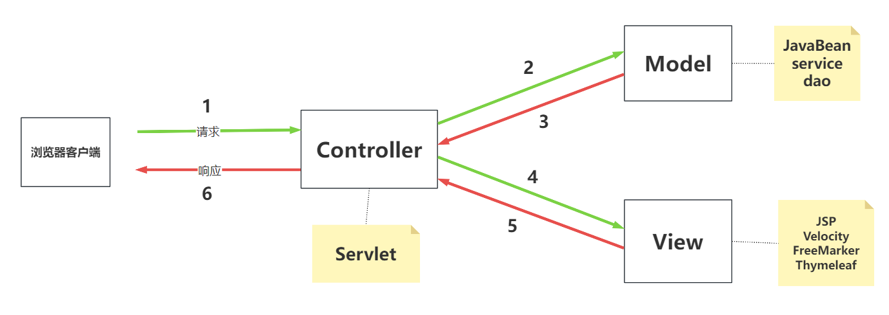

MVC架构模式的描述：前端浏览器发送请求给web服务器，web服务器中的Controller接收到用户的请求，Controller负责将前端提交的数据进行封装，然后Controller调用Model来处理业务，当Model处理完业务后会返回处理之后的数据给Controller，Controller再调用View来完成数据的展示，最终将结果响应给浏览器，浏览器进行渲染展示页面。

**面试题：什么是三层模型，并说一说MVC架构模式与三层模型的区别？**

- 三层架构是系统整体的纵向分层，解决的是表现、业务、数据访问之间的职责分离；
- 而MVC是表现层内部的横向解耦，解决的是用户交互中数据、视图、控制逻辑的关系。
- 它们不是二选一，通常会在项目中协同工作——在三层架构的‘表现层’里使用MVC模式。
- 比如Spring MVC项目，就是用MVC模式实现了三层架构里的表现层。

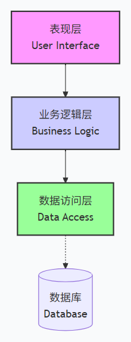

## SpringMVC概述


SpringMVC是一个实现了MVC架构模式的Web框架，底层基于Servlet实现。全称：`Spring Web MVC`，是 `Spring`框架的七大模块之一。

SpringMVC已经将MVC架构模式实现了，因此只要我们是基于SpringMVC框架写代码，编写的程序就是符合MVC架构模式的。（**MVC的架子搭好了，我们只需要添添补补**）

使用SpringMVC框架的时候同样也可以使用IoC和AOP。

## SpringMVC帮我们做了什么

SpringMVC框架帮我们做了什么，与纯粹的Servlet开发有什么区别？

1. 入口控制：SpringMVC框架通过DispatcherServlet作为入口控制器，负责接收请求和分发请求。而在Servlet开发中，需要自己编写Servlet程序，并在web.xml中进行配置，才能接受和处理请求。
2. 在SpringMVC中，表单提交时可以自动将表单数据绑定到相应的Java对象中，只需要在控制器方法的参数列表中声明该Java对象即可，无需手动获取和赋值表单数据。而在纯粹的Servlet开发中，这些都是需要自己手动完成的。
3. IoC容器：SpringMVC框架通过IoC容器管理对象，只需要在配置文件中进行相应的配置即可获取实例对象，而在Servlet开发中需要手动创建对象实例。
4. 统一处理请求：SpringMVC框架提供了拦截器、异常处理器等统一处理请求的机制，并且可以灵活地配置这些处理器。而在Servlet开发中，需要自行编写过滤器、异常处理器等，增加了代码的复杂度和开发难度。
5. 视图解析：SpringMVC框架提供了多种视图模板，如JSP、Freemarker、Velocity、Thymeleaf 等，并且支持国际化、主题等特性。而在Servlet开发中需要手动处理视图层，增加了代码的复杂度。

总之，与Servlet开发相比，SpringMVC框架可以帮我们节省很多时间和精力，减少代码的复杂度，更加专注于业务开发。同时，也提供了更多的功能和扩展性，可以更好地满足企业级应用的开发需求。

## SpringMVC框架的特点


1. 轻量级：相对于其他Web框架，Spring MVC框架比较小巧轻便。（只有几个几百KB左右的Jar包文件）
2. 模块化：请求处理过程被分成多个模块，以模块化的方式进行处理。
  1. 控制器模块：Controller
  2. 业务逻辑模块：Model
  3. 视图模块：View
3. 依赖注入：Spring MVC框架利用Spring框架的依赖注入功能实现对象的管理，实现松散耦合。
4. 易于扩展：提供了很多口子，允许开发者根据需要插入自己的代码，以扩展实现应用程序的特殊需求。
  1. Spring MVC框架允许开发人员通过自定义模块和组件来扩展和增强框架的功能。
  2. Spring MVC框架与其他Spring框架及第三方框架集成得非常紧密，这使得开发人员可以非常方便地集成其他框架，以获得更好的功能。
5. 易于测试：支持单元测试框架，提高代码质量和可维护性。 （对SpringMVC中的Controller测试时，不需要依靠Web服务器。）
6. 自动化配置：提供自动化配置，减少配置细节。
  1. Spring MVC框架基于约定大于配置的原则，对常用的配置约定进行自动化配置。
7. 灵活性：Spring MVC框架支持多种视图技术，如JSP、FreeMarker、Thymeleaf等，针对不同的视图配置不同的视图解析器即可。

## 第一个SpringMVC程序

### 创建Maven模块

第一步：创建Empty Project，起名：springmvc。

第二步：设置springmvc工程的JDK版本：Java21。

第三步：设置maven、设置字符编码方式 UTF-8。

第四步：创建Maven模块 `springmvc-001`

第五步：将pom.xml文件中的打包方式修改为war

```xml
<!-- 打包方式设置为war方式 -->
<packaging>war</packaging>
```

第六步：添加以下依赖

```xml
<dependencies>
    <!--Spring MVC依赖-->
    <dependency>
        <groupId>org.springframework</groupId>
        <artifactId>spring-webmvc</artifactId>
        <version>6.2.13</version>
    </dependency>
    <!--logback日志框架依赖-->
    <dependency>
        <groupId>ch.qos.logback</groupId>
        <artifactId>logback-classic</artifactId>
        <version>1.5.21</version>
        <scope>compile</scope>
    </dependency>
    <!--servlet规范依赖-->
    <dependency>
        <groupId>jakarta.servlet</groupId>
        <artifactId>jakarta.servlet-api</artifactId>
        <version>6.1.0</version>
        <scope>provided</scope>
    </dependency>
    <!--thymeleaf与spring6整合依赖-->
    <dependency>
        <groupId>org.thymeleaf</groupId>
        <artifactId>thymeleaf-spring6</artifactId>
        <version>3.1.2.RELEASE</version>
    </dependency>
</dependencies>
```

### 添加web支持

**第一步：**在main目录下创建一个webapp目录

**第二步：**添加web.xml配置文件

- 注意 web.xml 文件的位置：E:\Spring MVC\code\springmvc\springmvc-001**src\main\webapp\WEB-INF\web.xml**
- 注意版本选择：6.0

添加web支持后的目录结构：

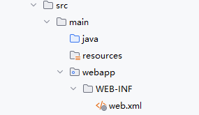

### 配置web.xml文件


Spring MVC是一个web框架，在javaweb中谁来负责接收请求，处理请求，以及响应呢？当然是Servlet。

在SpringMVC框架中已经为我们写好了一个Servlet，它的名字叫做：DispatcherServlet，我们称其为前端控制器。既然是Servlet，那么它就需要在web.xml文件中进行配置：

```xml
<?xml version="1.0" encoding="UTF-8"?>
<web-app xmlns="https://jakarta.ee/xml/ns/jakartaee"
         xmlns:xsi="http://www.w3.org/2001/XMLSchema-instance"
         xsi:schemaLocation="https://jakarta.ee/xml/ns/jakartaee https://jakarta.ee/xml/ns/jakartaee/web-app_6_0.xsd"
         version="6.0">

    <!--前端控制器-->
    <servlet>
        <servlet-name>springmvc</servlet-name>
        <servlet-class>org.springframework.web.servlet.DispatcherServlet</servlet-class>
    </servlet>

    <servlet-mapping>
        <servlet-name>springmvc</servlet-name>
        <!--
            1. / 是 Spring MVC 官方推荐写法。
            2. /* 会拦截所有路径，包括 xx.jsp，jsp应该交由Web容器内置的JspServlet自动处理，Spring MVC不应该拦截。因此不建议写 /*
            3. / 到底拦截的是什么？拦截的是所有其他Servlet不要的请求，不过在spring mvc开发中我们只编写一个 DispatcherServlet，不需要
            编写其他的Servlet，在这种情况下，我们可以等同的认为 / 拦截了除jsp之外的所有请求。
            4. / 会拦截所有的静态资源。看似是一个缺点。实则是优点。
            5. / 的优点有三个：
                第一：支持 RESTful URL
                第二：放行 JSP 给容器
                第三：促使使用更优的静态资源方案（web容器自带Servlet处理静态资源效率低。Spring框架处理静态资源效率高：例如spring提供了缓存控制等高级功能）
        -->
        <url-pattern>/</url-pattern>
    </servlet-mapping>

</web-app>
```

DispatcherServlet是SpringMVC框架为我们提供的最核心的类，它是整个SpringMVC框架的前端控制器，负责接收HTTP请求、将请求路由到处理程序、处理响应信息，最终将响应返回给客户端。DispatcherServlet是Web应用程序的主要入口点之一，它的职责包括：

1. 接收客户端的HTTP请求：DispatcherServlet监听来自Web浏览器的HTTP请求，然后根据请求的URL将请求数据解析为Request对象。
2. 处理请求的URL：DispatcherServlet将请求的URL与处理程序进行匹配，确定要调用哪个控制器（Controller）来处理此请求。
3. 调用相应的控制器：DispatcherServlet将请求发送给找到的控制器处理，控制器将执行业务逻辑，然后返回一个模型对象（Model）。
4. 渲染视图：DispatcherServlet将调用视图引擎，将模型对象呈现为用户可以查看的HTML页面。
5. 返回响应给客户端：DispatcherServlet将生成的响应发送回浏览器，响应可以包括JSON、XML、HTML以及其它类型的数据

### 编写控制器FirstController

DispatcherServlet接收到请求之后，会根据请求路径分发到对应的Controller，Controller来负责处理请求的核心业务。在SpringMVC框架中Controller是一个普通的Java类（一个普通的POJO类，不需要继承任何类或实现任何接口），需要注意的是：POJO类要纳入IoC容器来管理，POJO类的生命周期由Spring来管理，因此要使用注解标注：

```java
package com.jkweilai.springmvc.controller;

import org.springframework.stereotype.Controller;

@Controller
public class FirstController {
    
}
```

### 配置springmvc-servlet.xml文件


SpringMVC框架有它自己的配置文件，该配置文件的名字默认为：-servlet.xml，**默认存放的位置是WEB-INF 目录下**：

```xml
<?xml version="1.0" encoding="UTF-8"?>
<beans xmlns="http://www.springframework.org/schema/beans"
       xmlns:xsi="http://www.w3.org/2001/XMLSchema-instance"
       xmlns:context="http://www.springframework.org/schema/context"
       xsi:schemaLocation="http://www.springframework.org/schema/beans http://www.springframework.org/schema/beans/spring-beans.xsd http://www.springframework.org/schema/context https://www.springframework.org/schema/context/spring-context.xsd">
    <!--组件扫描-->
    <context:component-scan base-package="com.jkweilai.springmvc.controller"/>
    <!--视图解析器-->
    <bean id="thymeleafViewResolver" class="org.thymeleaf.spring6.view.ThymeleafViewResolver">
        <!--作用于视图渲染的过程中，可以设置视图渲染后输出时采用的编码字符集-->
        <property name="characterEncoding" value="UTF-8"/>
        <!--如果配置多个视图解析器，它来决定优先使用哪个视图解析器，它的值越小优先级越高-->
        <property name="order" value="1"/>
        <!--当 ThymeleafViewResolver 渲染模板时，会使用该模板引擎来解析、编译和渲染模板-->
        <property name="templateEngine">
            <bean class="org.thymeleaf.spring6.SpringTemplateEngine">
                <!--用于指定 Thymeleaf 模板引擎使用的模板解析器。模板解析器负责根据模板位置、模板资源名称、文件编码等信息，加载模板并对其进行解析-->
                <property name="templateResolver">
                    <bean class="org.thymeleaf.spring6.templateresolver.SpringResourceTemplateResolver">
                        <!--设置模板文件的位置（前缀）-->
                        <property name="prefix" value="/WEB-INF/templates/"/>
                        <!--设置模板文件后缀（后缀），Thymeleaf文件扩展名不一定是html，也可以是其他，例如txt，大部分都是html-->
                        <property name="suffix" value=".html"/>
                        <!--设置模板类型，例如：HTML,TEXT,JAVASCRIPT,CSS等-->
                        <property name="templateMode" value="HTML"/>
                        <!--用于模板文件在读取和解析过程中采用的编码字符集-->
                        <property name="characterEncoding" value="UTF-8"/>
                    </bean>
                </property>
            </bean>
        </property>
    </bean>
</beans>
```

在WEB-INF目录下新建springmvc-servlet.xml文件，并且提供以上配置信息。


以上配置主要两项：

- 第一项：组件扫描。spring扫描这个包中的类，将这个包中的类实例化并纳入IoC容器的管理。
- 第二项：视图解析器。视图解析器（View Resolver）的作用主要是将Controller方法返回的逻辑视图名称解析成实际的视图对象。视图解析器将解析出的视图对象返回给DispatcherServlet，并最终由DispatcherServlet将该视图对象转化为响应结果，呈现给用户。

注意：如果采用了其它视图，请配置对应的视图解析器，例如：

- JSP的视图解析器：InternalResourceViewResolver
- FreeMarker视图解析器：FreeMarkerViewResolver
- Velocity视图解析器：VelocityViewResolver

### 提供视图

在WEB-INF目录下新建templates目录，在templates目录中新建html文件，例如：first.html，并提供以下代码：

```html
<!DOCTYPE html>
<!--指定 th 命名空间，让 Thymeleaf 标准表达式可以被解析和执行-->
<html lang="en" xmlns:th="http://www.thymeleaf.org">
<head>
    <meta charset="UTF-8">
    <title>first springmvc</title>
</head>
<body>
<h1>我的第一个Spring MVC程序</h1>
</body>
</html>
```

对于每一个Thymeleaf文件来说 xmlns:th="http://www.thymeleaf.org" 是必须要写的，为了方便后续开发，可以将其添加到html模板文件中：


### 控制器FirstController处理请求返回逻辑视图名称


```java
package com.jkweilai.springmvc.controller;

import org.springframework.stereotype.Controller;
import org.springframework.web.bind.annotation.RequestMapping;

@Controller
public class FirstController {
    @RequestMapping(value="/haha")
    public String 名字随意(){
        System.out.println("正在处理请求....");
        // 返回逻辑视图名称（决定跳转到哪个页面）
        return "first";
    }
}
```

### 测试

第一步：配置Tomcat服务器

第二步：部署web模块到Tomcat服务器

第三步：启动Tomcat服务器。

第四步：打开浏览器，在浏览器地址栏上输入地址：http://localhost:8080/springmvc/haha

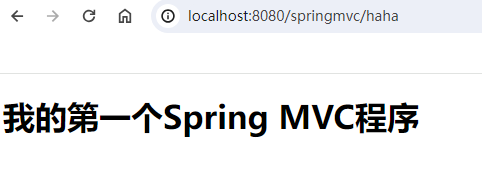

后端控制台输出：

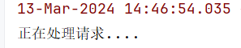

### 执行流程总结

1. 浏览器发送请求：http://localhost:8080/springmvc/haha
2. SpringMVC的前端控制器DispatcherServlet接收到请求
3. DispatcherServlet根据请求路径 `/haha` 映射到 `**FirstController#****<font style="color:#000000;background-color:#ffffff;">名字随意()</font>**`，调用该方法
4. FirstController#名字随意() 处理请求
5. FirstController#名字随意() 返回逻辑视图名称 first 给视图解析器
6. 视图解析器找到 /WEB-INF/templates/first.html 文件，并进行解析，生成视图解析对象返回给前端控制器DispatcherServlet
7. 前端控制器DispatcherServlet响应结果到浏览器。

### 一个Controller可以编写多个方法


一个Controller可以提供多个方法，每个方法通常是处理对应的请求，例如：

```java
@Controller
public class FirstController {
    @RequestMapping(value="/haha")
    public String 名字随意(){
        System.out.println("正在处理请求....");
        // 返回逻辑视图名称（决定跳转到哪个页面）
        return "first";
    }
    
    @RequestMapping("/other")
    public String other(){
        System.out.println("正在处理其它请求...");
        return "other";
    }
}
```

提供 other.html 文件

```html
<!DOCTYPE html>
<html lang="en" xmlns:th="http://www.thymeleaf.org">
<head>
    <meta charset="UTF-8">
    <title>other</title>
</head>
<body>
<h1>other ...</h1>
</body>
</html>
```

在 first.html 文件中，添加超链接，用超链接发送 /other 请求：

```html
<!DOCTYPE html>
<html lang="en" xmlns:th="http://www.thymeleaf.org">
<head>
    <meta charset="UTF-8">
    <title>first springmvc</title>
</head>
<body>
<h1>我的第一个Spring MVC程序</h1>
<a th:href="@{/other}">other请求</a>
</body>
</html>
```

启动Tomcat，打开浏览器，输入请求路径：http://localhost:8080/springmvc/haha

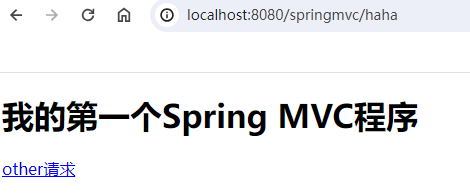

点击超链接：other请求


## 访问首页面效果


模块名称：`springmvc-002`

### 配置web.xml文件

重点：SpringMVC配置文件的名字和路径是可以手动设置的，如下：

```xml
<?xml version="1.0" encoding="UTF-8"?>
<web-app xmlns="http://xmlns.jcp.org/xml/ns/javaee"
         xmlns:xsi="http://www.w3.org/2001/XMLSchema-instance"
         xsi:schemaLocation="http://xmlns.jcp.org/xml/ns/javaee http://xmlns.jcp.org/xml/ns/javaee/web-app_4_0.xsd"
         version="4.0">
    <!--配置前端控制器-->
    <servlet>
        <servlet-name>springmvc</servlet-name>
        <servlet-class>org.springframework.web.servlet.DispatcherServlet</servlet-class>
        <!--手动设置springmvc配置文件的路径及名字-->
        <init-param>
            <param-name>contextConfigLocation</param-name>
            <param-value>classpath:springmvc.xml</param-value>
        </init-param>
        <!--为了提高用户的第一次访问效率，建议在web服务器启动时初始化前端控制器-->
        <load-on-startup>1</load-on-startup>
    </servlet>
    <servlet-mapping>
        <servlet-name>springmvc</servlet-name>
        <url-pattern>/</url-pattern>
    </servlet-mapping>
</web-app>
```

**通过来设置SpringMVC配置文件的路径和名字。在DispatcherServlet的init方法执行时设置的。**

**1建议加上，这样可以提高用户第一次访问的效率。表示在web服务器启动时初始化DispatcherServlet。**

### 编写IndexController

```java
package com.jkweilai.springmvc.controller;

import org.springframework.stereotype.Controller;
import org.springframework.web.bind.annotation.RequestMapping;

@Controller
public class IndexController {
    @RequestMapping("/")
    public String toIndex(){
        return "index";
    }
}
```

表示请求路径如果是：[http://localhost:8080/springmvc/](http://localhost:8080/springmvc/) ，则进入 /WEB-INF/templates/index.html 页面。

**这就是项目的首页效果！！！！！**

### 编写 springmvc.xml 配置


注意位置：在 `resources` 目录下配置 `springmvc.xml`文件

配置内容和之前一样，一个是视图解析器，一个是组件扫描。

### 提供视图

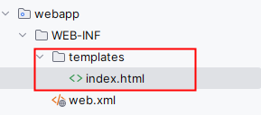

```html
<!DOCTYPE html>
<html lang="en" xmlns:th="http://www.thymeleaf.org">
<head>
    <meta charset="UTF-8">
    <title>index page</title>
</head>
<body>
<h1>index page</h1>
</body>
</html>
```

### 测试

部署到web服务器，启动web服务器，打开浏览器，在地址栏上输入：[http://localhost:8080/springmvc/](http://localhost:8080/springmvc/)

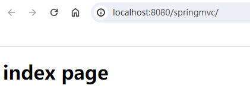

# RequestMapping 注解


## RequestMapping的作用

`@RequestMapping` 注解是 Spring MVC 框架中的一个控制器映射注解，用于将请求映射到相应的处理方法上。具体来说，它可以将指定 URL 的请求绑定到一个特定的方法或类上，从而实现对请求的处理和响应。

## RequestMapping的出现位置

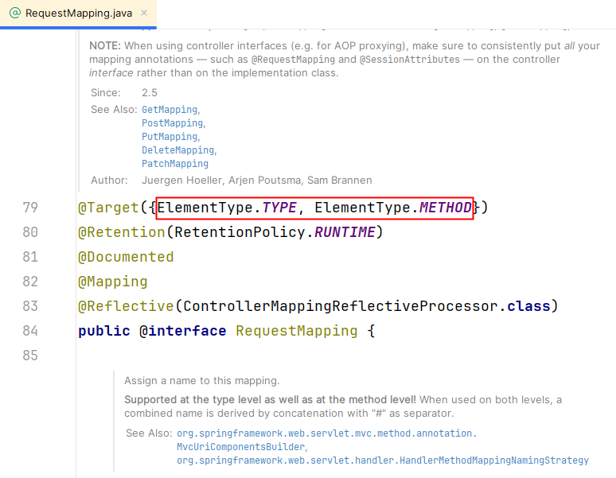

通过RequestMapping的源码可以看到RequestMapping注解只能出现在类上或者方法上。

## 类上与方法上结合使用


我们先来看，在同一个web应用中，是否可以有两个完全一样的RequestMapping。测试一下：假设两个RequestMapping，其中一个是展示用户详细信息，另一个是展示商品详细信息。提供两个Controller，一个是UserController，另一个是ProductController。如下：

```java
package com.jkweilai.springmvc.controller;

import org.springframework.stereotype.Controller;
import org.springframework.web.bind.annotation.RequestMapping;

@Controller
public class UserController {
    @RequestMapping("/detail")
    public String toDetail(){
        return "detail";
    }
}
```

```java
package com.jkweilai.springmvc.controller;

import org.springframework.stereotype.Controller;
import org.springframework.web.bind.annotation.RequestMapping;

@Controller
public class ProductController {
    @RequestMapping("/detail")
    public String toDetail(){
        return "detail";
    }
}
```

以上两个Controller的RequestMapping相同，都是"/detail"，我们来启动服务器看会不会出现问题：异常发生了，异常信息如下

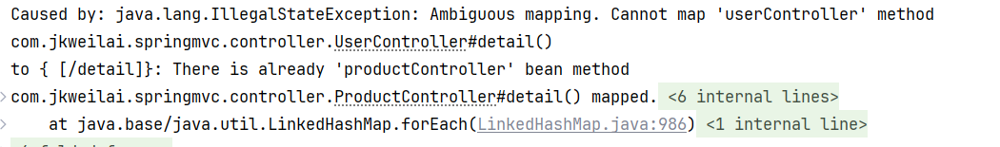

以上异常信息大致的意思是：不明确的映射。无法映射UserController中的toDetail()方法，因为已经在ProductController中映射过了！！！！

通过测试得知，在同一个webapp中，RequestMapping必须具有唯一性。怎么解决以上问题？两种解决方案：

- 第一种方案：将方法上RequestMapping的映射路径修改的不一样。
- 第二种方案：在类上添加RequestMapping的映射路径，以类上的RequestMapping作为命名空间，来加以区分两个不同的映射。

### 第一种方案

将方法上RequestMapping的映射路径修改的不一样。

```java
@RequestMapping("/user/detail")
public String toDetail(){
    return "/user/detail";
}
```

```java
@RequestMapping("/product/detail")
public String toDetail(){
    return "/product/detail";
}
```

再次启动web服务器，会发现没有再报错了。

为这两个请求分别提供对应的视图页面：


```html
<!DOCTYPE html>
<html lang="en" xmlns:th="http://www.thymeleaf.org">
<head>
    <meta charset="UTF-8">
    <title>商品详情页面</title>
</head>
<body>
<h1>商品详情</h1>
</body>
</html>
```

```html
<!DOCTYPE html>
<html lang="en" xmlns:th="http://www.thymeleaf.org">
<head>
    <meta charset="UTF-8">
    <title>用户详情页面</title>
</head>
<body>
<h1>用户详情</h1>
</body>
</html>
```

在首页面添加两个超链接：

```html
<!DOCTYPE html>
<html lang="en" xmlns:th="http://www.thymeleaf.org">
<head>
    <meta charset="UTF-8">
    <title>index page</title>
</head>
<body>
<h1>index page</h1>
<a th:href="@{/user/detail}">用户详情</a><br>
<a th:href="@{/product/detail}">商品详情</a><br>
</body>
</html>
```

启动Tomcat服务器，并测试：http://localhost:8080/springmvc/


点击用户详情，点击商品详情，都可以正常显示：


### 第二种方案

在类上和方法上都使用RequestMapping注解来进行路径的映射。假设在类上映射的路径是"/a"，在方法上映射的路径是"/b"，那么整体表示映射的路径就是："/a/b"

在第一种方案中，假设UserController类中有很多方法，每个方法的 RequestMapping注解中都需要以"/user"开始，显然比较啰嗦，干脆将"/user"提升到类级别上，例如：

```java
package com.jkweilai.springmvc.controller;

import org.springframework.stereotype.Controller;
import org.springframework.web.bind.annotation.RequestMapping;

@Controller
@RequestMapping("/user")
public class UserController {
    @RequestMapping("/detail")
    public String toDetail(){
        return "/user/detail";
    }
}
```

```java
package com.jkweilai.springmvc.controller;

import org.springframework.stereotype.Controller;
import org.springframework.web.bind.annotation.RequestMapping;

@Controller
@RequestMapping("/product")
public class ProductController {
    @RequestMapping("/detail")
    public String toDetail(){
        return "/product/detail";
    }
}
```

经过测试，程序可以正常执行！！！

**对于路径组合来说，以下写法都行：**

- 如果**两个路径都有**** **`**<font style="color:rgb(15, 17, 21);background-color:rgb(235, 238, 242);">/</font>**`：`<font style="color:rgb(15, 17, 21);background-color:rgb(235, 238, 242);">/user</font>` + `<font style="color:rgb(15, 17, 21);background-color:rgb(235, 238, 242);">/detail</font>` = `<font style="color:rgb(15, 17, 21);background-color:rgb(235, 238, 242);">/user/detail</font>`
- 如果**方法路径没有**** **`**<font style="color:rgb(15, 17, 21);background-color:rgb(235, 238, 242);">/</font>**`：`<font style="color:rgb(15, 17, 21);background-color:rgb(235, 238, 242);">/user</font>` + `<font style="color:rgb(15, 17, 21);background-color:rgb(235, 238, 242);">detail</font>` = `<font style="color:rgb(15, 17, 21);background-color:rgb(235, 238, 242);">/user/detail</font>`
- 如果**类路径没有**** **`**<font style="color:rgb(15, 17, 21);background-color:rgb(235, 238, 242);">/</font>**`：`<font style="color:rgb(15, 17, 21);background-color:rgb(235, 238, 242);">user</font>` + `<font style="color:rgb(15, 17, 21);background-color:rgb(235, 238, 242);">/detail</font>` = `<font style="color:rgb(15, 17, 21);background-color:rgb(235, 238, 242);">/user/detail</font>`
- 如果**两个都没有 **`**<font style="color:rgb(15, 17, 21);background-color:rgb(235, 238, 242);">/</font>**`：`<font style="color:rgb(15, 17, 21);background-color:rgb(235, 238, 242);">user</font>` + `<font style="color:rgb(15, 17, 21);background-color:rgb(235, 238, 242);">detail</font>` = `<font style="color:rgb(15, 17, 21);background-color:rgb(235, 238, 242);">/user/detail</font>`

## RequestMapping注解的value属性

### value属性的使用

**value 属性是一个数组，也就是说：它支持多个请求路径映射到同一个方法上。**

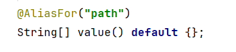

既然是数组，就表示可以提供多个路径，也就是说，在SpringMVC中，多个不同的请求路径可以映射同一个控制器的同一个方法：

编写新的控制器：

```java
package com.jkweilai.springmvc.controller;

import org.springframework.stereotype.Controller;
import org.springframework.web.bind.annotation.RequestMapping;

@Controller
public class RequestMappingTestController {
    @RequestMapping(value = {"/testValue1", "/testValue2"})
    public String testValue(){
        return "testValue";
    }
}
```

提供视图页面：

```html
<!DOCTYPE html>
<html lang="en" xmlns:th="http://www.thymeleaf.org">
<head>
    <meta charset="UTF-8">
    <title>test Value</title>
</head>
<body>
<h1>Test RequestMapping's Value</h1>
</body>
</html>
```

在index.html文件中添加两个超链接：

```html
<!DOCTYPE html>
<html lang="en" xmlns:th="http://www.thymeleaf.org">
<head>
    <meta charset="UTF-8">
    <title>index page</title>
</head>
<body>
<h1>index page</h1>
<a th:href="@{/user/detail}">用户详情</a><br>
<a th:href="@{/product/detail}">商品详情</a><br>

<!--测试RequestMapping的value属性-->
<a th:href="@{/testValue1}">testValue1</a><br>
<a th:href="@{/testValue2}">testValue2</a><br>

</body>
</html>
```

启动服务器，测试，点击以下的两个超链接，发送请求，都可以正常访问到同一个控制器上的同一个方法：

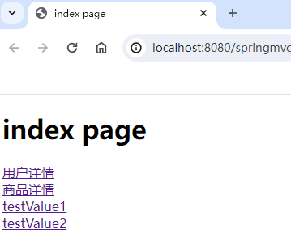


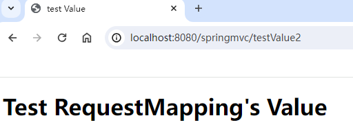

### value 支持模糊匹配

**value是可以用来匹配路径的，路径支持模糊匹配，我们把这种模糊匹配称之为Ant风格。关于路径中的通配符包括：**

- `**?**`**，代表任意一个字符**
- `*****`**，代表0到N个任意字符，但不包含 **`**/**`
- `**/****`**，代表0到N个任意字符，包含 **`**/**`**，****springmvc6.2.10 版本测试结果： **`**<font style="color:#DF2A3F;">**</font>**`**只能出现在路径的末尾。更高的版本允许 **`**<font style="color:#DF2A3F;">**</font>**`**出现在前面**
  - **这样会报错：**`**/user/**/detail**`
  - **如果这样写：**`**/user/x**y/detail**`**，虽然表面上看用了 **`******`**，但实质上还是用了一个 **`*****`**。因为这种方式不支持 **`**/**`**。**
  - **这样编写是正确的：**`**/user/detail/****`

测试一下这些通配符，在 RequestMappingTestController 中添加以下方法：

```java
@RequestMapping("/x?z/testValueAnt")
public String testValueAnt(){
    return "testValueAnt";
}
```

提供视图页面：

```html
<!DOCTYPE html>
<html lang="en" xmlns:th="http://www.thymeleaf.org">
<head>
    <meta charset="UTF-8">
    <title>test Value Ant</title>
</head>
<body>
<h1>测试RequestMapping注解的value属性支持模糊匹配</h1>
</body>
</html>
```

在index.html页面中编写超链接：

```html
<!--测试RequestMapping注解的value属性支持模糊匹配-->
<a th:href="@{/xyz/testValueAnt}">测试value属性的模糊匹配</a><br>
```

测试结果如下：

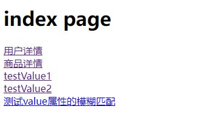


通过修改浏览器地址栏上的路径，可以反复测试通配符 ? 的语法：

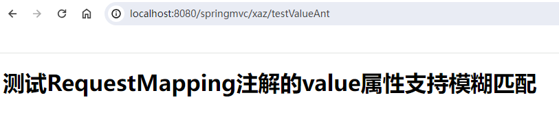


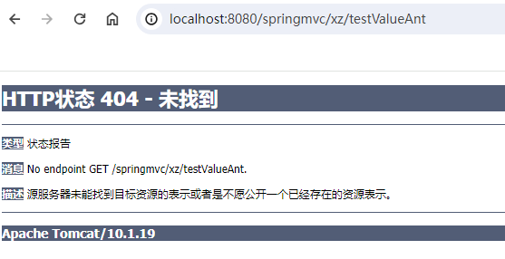

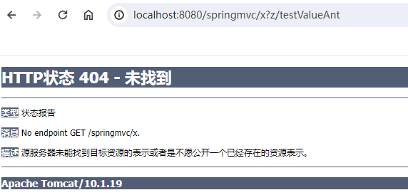

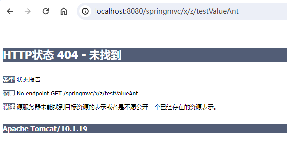

将 ? 通配符修改为 * 通配符：

```java
//@RequestMapping("/x?z/testValueAnt")
@RequestMapping("/x*z/testValueAnt")
public String testValueAnt(){
    return "testValueAnt";
}
```

打开浏览器直接在地址栏上输入路径进行测试：


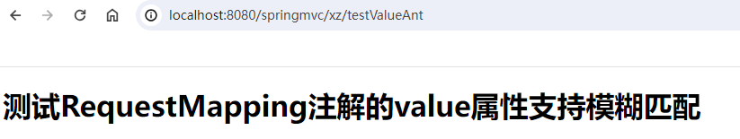

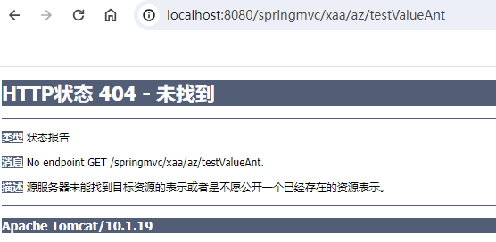

将 * 通配符修改为 ** 通配符：

```java
@RequestMapping("/x**z/testValueAnt")
public String testValueAnt(){
    return "testValueAnt";
}
```

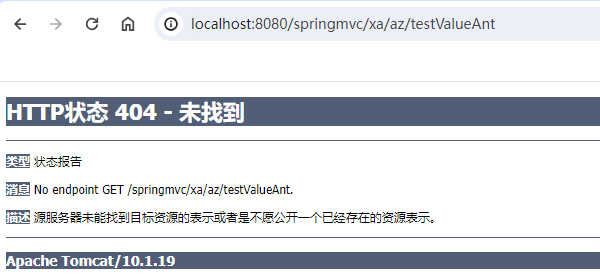

注意：/x**z/ 实际上并没有使用通配符 **，本质上还是使用的 *，因为通配符 ** 在使用的时候，左右两边都不能有任何字符，必须是 /。

```java
@RequestMapping("/**/testValueAnt")
public String testValueAnt(){
    return "testValueAnt";
}
```

启动服务器发现报错了：


以上写法在Spring5的时候是支持的，但是在Spring6中进行了严格的规定，** 通配符只能出现在路径的末尾，例如：

```java
@RequestMapping("/testValueAnt/**")
public String testValueAnt(){
    return "testValueAnt";
}
```

测试结果：


### value中的占位符（重点）

到目前为止，我们的请求路径是这样的格式：uri?name1=value1&name2=value2&name3=value3

其实除了这种方式，还有另外一种格式的请求路径，格式为：uri/value1/value2/value3，我们将这样的请求路径叫做 RESTful 风格的请求路径。

RESTful风格的请求路径在现代的开发中使用较多。

普通的请求路径：http://localhost:8080/springmvc/login?username=admin&password=123&age=20

RESTful风格的请求路径：http://localhost:8080/springmvc/login/admin/123/20

如果使用RESTful风格的请求路径，在控制器中应该如何获取请求中的数据呢？可以在value属性中使用占位符，例如：/login/{id}/{username}/{password}

在 RequestMappingTestController 类中添加一个方法：

```java
@RequestMapping(value="/testRESTful/{id}/{username}/{age}")
public String testRESTful(
        @PathVariable("id")
        int id,
        @PathVariable("username")
        String username,
        @PathVariable("age")
        int age){
    System.out.println(id + "," + username + "," + age);
    return "testRESTful";
}
```

提供视图页面：

```html
<!DOCTYPE html>
<html lang="en" xmlns:th="http://www.thymeleaf.org">
<head>
    <meta charset="UTF-8">
    <title>test RESTful</title>
</head>
<body>
<h1>测试value属性使用占位符</h1>
</body>
</html>
```

在 index.html 页面中添加超链接：

```html
<!--测试RequestMapping注解的value属性支持占位符-->
<a th:href="@{/testRESTful/1/zhangsan/20}">测试value属性使用占位符</a>
```

启动服务器测试：


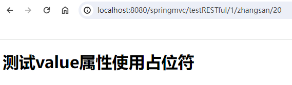


## RequestMapping注解的method属性


### method属性的作用

在Servlet当中，如果后端要求前端必须发送一个post请求，后端可以通过重写doPost方法来实现。后端要求前端必须发送一个get请求，后端可以通过重写doGet方法来实现。当重写的方法是doPost时，前端就必须发送post请求，当重写doGet方法时，前端就必须发送get请求。如果前端发送请求的方式和后端的处理方式不一致时，会出现405错误。

HTTP状态码405，这种机制的作用是：限制客户端的请求方式，以保证服务器中数据的安全。

假设后端程序要处理的请求是一个登录请求，为了保证登录时的用户名和密码不被显示到浏览器的地址栏上，后端程序有义务要求前端必须发送一个post请求，如果前端发送get请求，则应该拒绝。

那么在SpringMVC框架中应该如何实现这种机制呢？可以使用RequestMapping注解的method属性来实现。

通过RequestMapping源码可以看到，method属性也是一个数组：


数组中的每个元素是 RequestMethod，而RequestMethod是一个枚举类型的数据：


因此如果要求前端发送POST请求，该注解应该这样用：

```java
@RequestMapping(value = "/login", method = RequestMethod.POST)
public String login(){
    return "success";
}
```

接下来，我们来测试一下：

在RequestMappingTestController类中添加以下方法：

```java
@RequestMapping(value="/login", method = RequestMethod.POST)
public String testMethod(){
    return "testMethod";
}
```

提供视图页面：

```html
<!DOCTYPE html>
<html lang="en" xmlns:th="http://www.thymeleaf.org">
<head>
    <meta charset="UTF-8">
    <title>test Method</title>
</head>
<body>
<h1>Login Success!!!</h1>
</body>
</html>
```

在index.html页面中提供一个登录的form表单，后端要求发送post请求，则form表单的method属性应设置为post：

```html
<!--测试RequestMapping的method属性-->
<form th:action="@{/login}" method="post">
    用户名：<input type="text" name="username"/><br>
    密码：<input type="password" name="password"/><br>
    <input type="submit" value="登录">
</form>
```

启动服务器，测试：

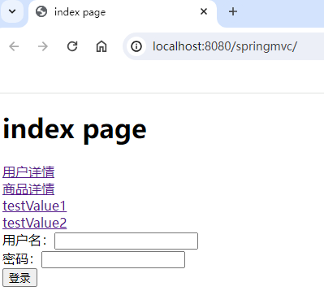


通过测试，前端发送的请求方式post，后端处理请求的方式也是post，就不会有问题。

当然，如果后端要求前端必须发送post请求，而前端发送了get请求，则会出现405错误，将index.html中form表单提交方式修改为get：

```html
<!--测试RequestMapping的method属性-->
<form th:action="@{/login}" method="get">
    用户名：<input type="text" name="username"/><br>
    密码：<input type="password" name="password"/><br>
    <input type="submit" value="登录">
</form>
```

再次测试：

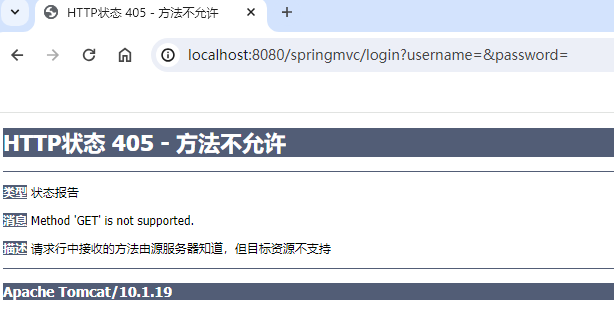

**因此，可以看出，对于RequestMapping注解来说，多一个属性，就相当于多了一个映射的条件，如果value和method属性都有，则表示只有前端发送的请求路径 + 请求方式都满足时才能与控制器上的方法建立映射关系，只要有一个不满足，则无法建立映射关系。例如：@RequestMapping(value="/login", method = RequestMethod.POST) 表示当前端发送的请求路径是 /login，并且发送请求的方式是POST的时候才会建立映射关系。如果前端发送的是get请求，或者前端发送的请求路径不是 /login，则都是无法建立映射的。**

### 衍生Mapping

对于以上的程序来说，SpringMVC提供了另一个注解，使用这个注解更加的方便，它就是：PostMapping，使用该注解时，不需要指定method属性，因为它默认采用的就是POST处理方式：修改RequestMappingTestController代码如下

```java
//@RequestMapping(value="/login", method = RequestMethod.POST)
@PostMapping("/login")
public String testMethod(){
    return "testMethod";
}
```

当前端发送get请求时，测试一下：


当前端发送post请求时，测试一下：

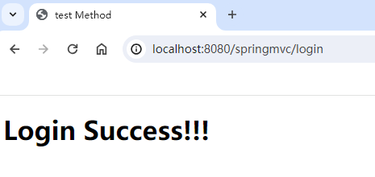

在SpringMVC中不仅提供了 **PostMaping**注解，像这样的注解还有几个，包括：

- **GetMapping**：要求前端必须发送get请求
- **PutMapping**：要求前端必须发送put请求
- **DeleteMapping**：要求前端必须发送delete请求
- ......

### web的请求方式

前端向服务器发送请求的方式包括哪些？共9种，前5种常用，后面作为了解：

- **GET：获取资源，只允许读取数据，不影响数据的状态和功能。使用 URL 中传递参数或者在 HTTP 请求的头部使用参数，服务器返回请求的资源。**
- **POST：向服务器提交资源，可能还会改变数据的状态和功能。通过表单等方式提交请求体，服务器接收请求体后，进行数据处理。**
- **PUT：更新资源，用于更新指定的资源上所有可编辑内容。通过请求体发送需要被更新的全部内容，服务器接收数据后，将被更新的资源进行替换或修改。**
- **DELETE：删除资源，用于删除指定的资源。将要被删除的资源标识符放在 URL 中或请求体中。**
- **HEAD：请求服务器返回资源的头部，与 GET 命令类似，但是所有返回的信息都是头部信息，不会包含数据体。主要用于资源检测和缓存控制。**
- PATCH：部分更改请求。当被请求的资源是可被更改的资源时，请求服务器对该资源进行部分更新，即每次更新一部分。
- OPTIONS：请求获得服务器支持的请求方法类型，以及支持的请求头标志。“OPTIONS *”则返回支持全部方法类型的服务器标志。
- TRACE：服务器响应输出客户端的 HTTP 请求，主要用于调试和测试。
- CONNECT：建立网络连接，通常用于加密 SSL/TLS 连接。

注意：

1. 使用超链接以及原生的form表单只能提交get和post请求，put、delete、head请求可以通过 ajax请求的方式来实现。
2. 使用超链接发送的是get请求
3. 使用form表单，如果没有设置method，发送get请求
4. 使用form表单，设置method="get"，发送get请求
5. 使用form表单，设置method="post"，发送post请求
6. **使用form表单，设置method="put/delete/head"，发送get请求。（针对这种情况，可以测试一下）**

将index.html中登录表单的提交方式method设置为put：

```html
<!--测试RequestMapping的method属性-->
<form th:action="@{/login}" method="put">
    用户名：<input type="text" name="username"/><br>
    密码：<input type="password" name="password"/><br>
    <input type="submit" value="登录">
</form>
```

修改RequestMappingTestController类的代码：

```java
@RequestMapping(value="/login", method = RequestMethod.PUT)
//@PostMapping("/login")
public String testMethod(){
    return "testMethod";
}
```

测试结果：

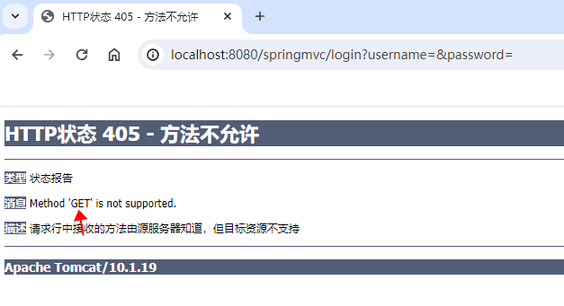

通过测试得知，即使form中method设置为put方式，但仍然采用get方式发送请求。

再次修改RequestMappingTestController：

```java
@RequestMapping(value="/login", method = RequestMethod.GET)
//@PostMapping("/login")
public String testMethod(){
    return "testMethod";
}
```

再次测试：

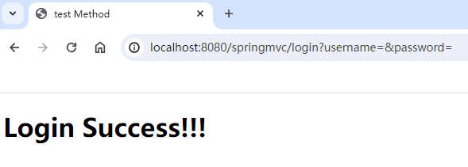

## RequestMapping注解的params属性


### params属性的理解

params属性用来设置通过请求参数来映射请求。

对于RequestMapping注解来说：

- value属性是一个数组，只要满足数组中的任意一个路径，就能映射成功
- method属性也是一个数组，只要满足数组中任意一个请求方式，就能映射成功。
- **params属性也是一个数组，不过要求请求参数必须和params数组中要求的所有参数完全一致后，才能映射成功。**

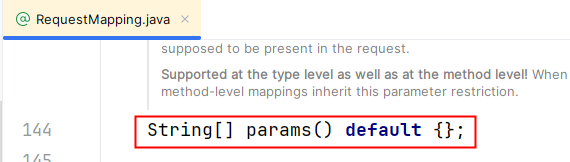

### params属性的4种用法

@RequestMapping(value="/login", params={**"username"**, "password"}) 表示：请求参数中必须包含 username 和 password，才能与当前标注的方法进行映射。

@RequestMapping(value="/login", params={**"!username"**, "password"}) 表示：请求参数中不能包含username参数，但必须包含password参数，才能与当前标注的方法进行映射。

@RequestMapping(value="/login", params={**"username=admin"**, "password"}) 表示：请求参数中必须包含username参数，并且参数的值必须是admin，另外也必须包含password参数，才能与当前标注的方法进行映射。

@RequestMapping(value="/login", params={**"username!=admin"**, "password"}) 表示：请求参数中必须包含username参数，但参数的值不能是admin，另外也必须包含password参数，才能与当前标注的方法进行映射。

注意：如果前端提交的参数，和后端要求的请求参数不一致，则出现400错误！！！

**HTTP状态码400的原因：请求参数格式不正确而导致的。**

### 测试params属性

在 RequestMappingTestController 类中添加如下方法：

```java
@RequestMapping(value="/testParams", params = {"username", "password"})
public String testParams(){
    return "testParams";
}
```

提供视图页面：

```html
<!DOCTYPE html>
<html lang="en" xmlns:th="http://www.thymeleaf.org">
<head>
    <meta charset="UTF-8">
    <title>testParams</title>
</head>
<body>
<h1>测试RequestMapping注解的Params属性</h1>
</body>
</html>
```

在index.html文件中添加超链接：

```html
<!--测试RequestMapping的params属性-->
<a th:href="@{/testParams(username='admin',password='123')}">测试params属性</a>
```

当然，你也可以这样写：这样写IDEA会报错，但不影响使用。

```html
<a th:href="@{/testParams?username=admin&password=123}">测试params属性</a><br>
```

启动服务器，测试：

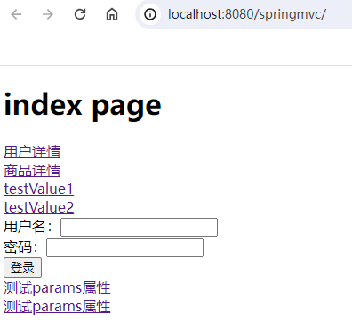


假如发送请求时，没有传递username参数会怎样？

```html
<a th:href="@{/testParams(password='123')}">测试params属性</a><br>
```

启动服务器，测试：


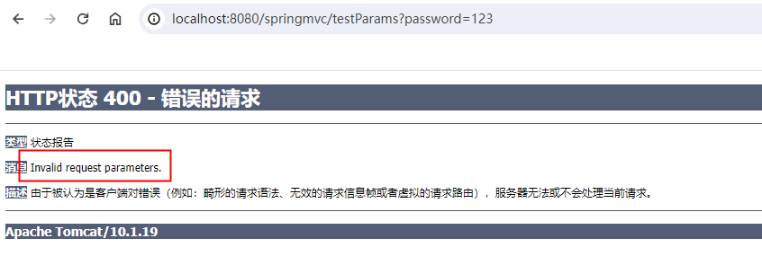

提示无效的请求参数，服务器无法或不会处理当前请求。

params属性剩下的三种情况，自行测试！！！！

## RequestMapping注解的headers属性


### 认识headers属性

headers和params原理相同，用法也相同。

当前端提交的请求头信息和后端要求的请求头信息一致时，才能映射成功。

请求头信息怎么查看？在chrome浏览器中，F12打开控制台，找到Network，可以查看具体的请求协议和响应协议。在请求协议中可以看到请求头信息，例如：

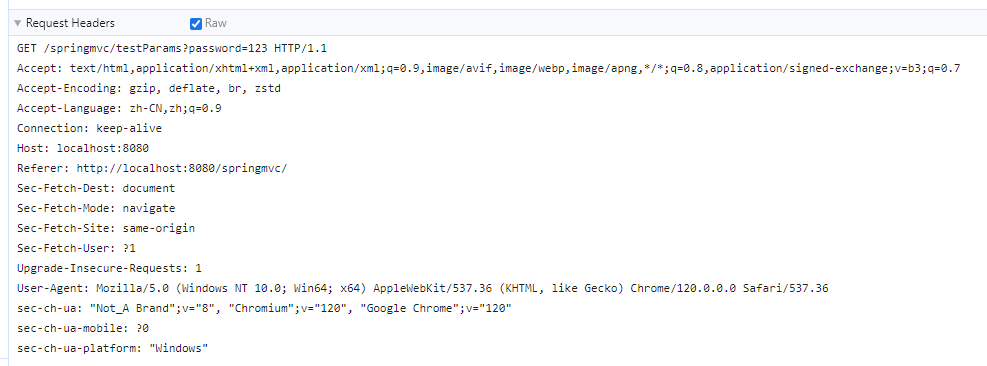

请求头信息和请求参数信息一样，都是键值对形式，例如上图中：

- Referer: http://localhost:8080/springmvc/ 键是Referer，值是http://localhost:8080/springmvc/
- Host: localhost:8080 键是Host，值是localhost:8080

### headers属性的4种用法

@RequestMapping(value="/login", headers={**"Referer"**, "Host"}) 表示：请求头信息中必须包含Referer和Host，才能与当前标注的方法进行映射。

@RequestMapping(value="/login", headers={**"Referer"**, "!Host"}) 表示：请求头信息中必须包含Referer，但不包含Host，才能与当前标注的方法进行映射。

@RequestMapping(value="/login", headers={**"Referer=http://localhost:8080/springmvc/"**, "Host"}) 表示：请求头信息中必须包含Referer和Host，并且Referer的值必须是http://localhost:8080/springmvc/，才能与当前标注的方法进行映射。

@RequestMapping(value="/login", headers={**"Referer!=http://localhost:8080/springmvc/"**, "Host"}) 表示：请求头信息中必须包含Referer和Host，并且Referer的值不是http://localhost:8080/springmvc/，才能与当前标注的方法进行映射。

注意：如果前端提交的请求头信息，和后端要求的请求头信息不一致，则出现404错误！！！

### 测试headers属性


在 RequestMappingTestController 类中添加以下方法：

```java
@RequestMapping(value="/testHeaders", headers = {"Referer=http://localhost:8080/springmvc/"})
public String testHeaders(){
    return "testHeaders";
}
```

提供视图页面：

```html
<!DOCTYPE html>
<html lang="en" xmlns:th="http://www.thymeleaf.org">
<head>
    <meta charset="UTF-8">
    <title>test Headers</title>
</head>
<body>
<h1>测试RequestMapping注解的headers属性</h1>
</body>
</html>
```

在index.html页面中添加超链接：

```html
<!--测试RequestMapping的headers属性-->
<a th:href="@{/testHeaders}">测试headers属性</a><br>
```

启动服务器，测试结果：

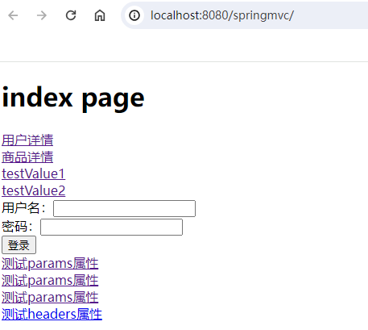


将后端控制器中的headers属性值进行修改：

```java
@RequestMapping(value="/testHeaders", headers = {"Referer=http://localhost:8888/springmvc/"})
public String testHeaders(){
    return "testHeaders";
}
```

再次测试：

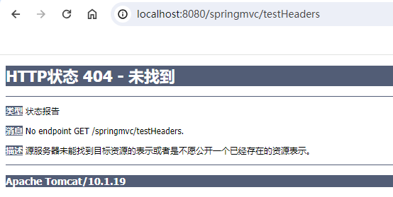

其他情况自行测试！！！！

# 获取请求数据


假设有这样一个请求：http://localhost:8080/springmvc/register?name=zhangsan&password=123&email=zhangsan@jkweilai.com

在SpringMVC中应该如何获取请求提交的数据呢？

在SpringMVC中又应该如何获取请求头信息呢？

在SpringMVC中又应该如何获取客户端提交的Cookie数据呢？

**创建新的模块：**`springmvc-003`

## 准备工作

### 创建UserController

```java
package com.jkweilai.springmvc.controller;

import org.springframework.stereotype.Controller;
import org.springframework.web.bind.annotation.RequestMapping;

@Controller
public class UserController {
    @RequestMapping("/")
    public String toRegisterPage(){
        return "register";
    }
}
```

### 提供一个注册页面

```html
<!DOCTYPE html>
<html lang="en" xmlns:th="http://www.thymeleaf.org">
<head>
    <meta charset="UTF-8">
    <title>用户注册</title>
</head>
<body>
<h3>用户注册</h3>
<hr>
<form th:action="@{/register}" method="post">
    用户名：<input type="text" name="username"><br>
    密码：<input type="password" name="password"><br>
    性别：
        男 <input type="radio" name="sex" value="1">
        女 <input type="radio" name="sex" value="0">
        <br>
    爱好：
        跑步 <input type="checkbox" name="hobby" value="1">
        唱歌 <input type="checkbox" name="hobby" value="2">
        跳舞 <input type="checkbox" name="hobby" value="3">
        <br>
    简介：<textarea rows="10" cols="60" name="intro"></textarea><br>
    <input type="submit" value="注册">
</form>
</body>
</html>
```

## 使用原生的Servlet API进行获取

**知识点列表：**

1. **什么是原生 Servlet API？**HttpServletRequest、HttpServletResponse 等
2. **Servlet 原生 API 如何注入？直接方法参数即可注入。**
3. **开发中是否推荐？不推荐。因为这种方式会导致 Controller 无法脱离 web 容器进行单元测试。**
4. **什么时候使用这种方式？比如需要手动设置响应头的场景就必须使用这种方式了。**

**原生的Servlet API指的是：**HttpServletRequest、HttpServletResponse 等。

在SpringMVC当中，一个Controller类中的方法参数上如果有HttpServletRequest，SpringMVC会自动将`**<font style="color:#DF2A3F;">当前请求对象</font>**`传递给这个参数，因此我们可以通过这个参数来获取请求提交的数据。

```java
@PostMapping(value="/register")
public String register(HttpServletRequest request){
    // 通过当前请求对象获取提交的数据
    String username = request.getParameter("username");
    String password = request.getParameter("password");
    String sex = request.getParameter("sex");
    String[] hobbies = request.getParameterValues("hobby");
    String intro = request.getParameter("intro");
    System.out.println(username + "," + password + "," + sex + "," + Arrays.toString(hobbies) + "," + intro);
    return "success";
}
```

**以下代码是完成一个文件下载的功能，这种情况下就需要使用原生的 Servlet API 了：**

```java
@GetMapping("/down")
public void downloadJpg(HttpServletRequest request, HttpServletResponse response) {
    try {
        // 获取ServletContext对象。
        ServletContext application = request.getServletContext();
        // 通过ServletContext获取文件绝对路径。
        String realPath = application.getRealPath("/img/image.jpg");
        File file = new File(realPath);

        // 设置图片相关的响应头
        response.setContentType("image/jpeg");
        // 设置文件下载行为：attachment 强制下载，不直接在浏览器中显示
        response.setHeader("Content-Disposition", "attachment; filename=\"image.jpg\"");
        response.setHeader("Content-Length", String.valueOf(file.length()));

        // 写入响应流
        Files.copy(file.toPath(), response.getOutputStream());
        response.flushBuffer();

    } catch (IOException e) {
        // 处理异常
        response.setStatus(HttpServletResponse.SC_NOT_FOUND);
    }
}
```

## 使用RequestParam注解标注


**知识点列表：**

1. **RequestParam注解作用：将**`**请求参数**`**与方法上的**`**形参**`**映射。**
2. **对于@RequestParam注解来说，属性有value和name，这两个属性的作用相同，都是用来指定提交数据的name。**
3. **@RequestParam(value="name2") 中value一定不要写错，写错就会出现 400 错误。**
4. **出现 400 错误的本质原因是：**`**@RequestParam**`**注解有一个 **`**required**`**属性，该属性未指定时，默认为 `**true**`，表示前端提交数据时必须提交该参数，如果不提交，则出现 400 错误。想避免该错误的发生，可以将 **`**required**`**属性值设置为 **`**false**`**。**
5. `**@RequestParam**`**注解有一个 **`**defaultValue**`**属性，用来指定参数的默认值，当没有提交该参数或提交的是空字符串时，**`**defaultValue**`**属性起作用。**

### RequestParam注解的基本使用

RequestParam注解作用：将`请求参数`与方法上的`形参`映射。

```java
@PostMapping(value = "/register")
public String register(
        @RequestParam(value="username")
        String a,
        @RequestParam(value="password")
        String b,
        @RequestParam(value="sex")
        String c,
        @RequestParam(value="hobby")
        String[] d,
        @RequestParam(name="intro")
        String e) {
    System.out.println(a);
    System.out.println(b);
    System.out.println(c);
    System.out.println(Arrays.toString(d));
    System.out.println(e);
    return "success";
}
```

注意：对于@RequestParam注解来说，属性有value和name，这两个属性的作用相同，都是用来指定提交数据的name。


例如：发送请求时提交的数据是：name1=value1&name2=value2，则这个注解应该这样写：@RequestParam(value="name1")、@RequestParam(value="name2")

一定要注意： @RequestParam(value="name2") 中value一定不要写错，写错就会出现以下问题：

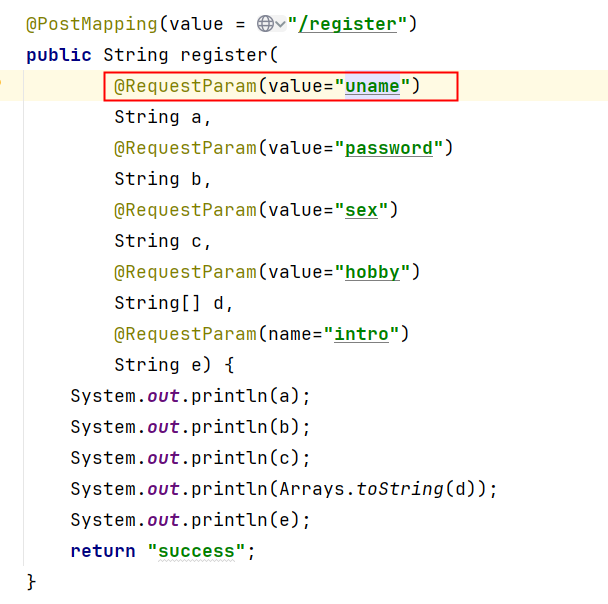

测试结果：


### RequestParam注解的required属性

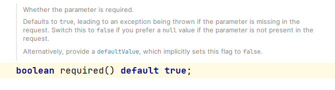

required属性用来设置该方法参数是否为必须的。

默认情况下，这个参数为 `true`，表示方法参数是必需的。如果请求中缺少对应的参数，则会抛出异常。

可以将其设置为`false`，false表示不是必须的，如果请求中缺少对应的参数，则方法的参数为null。

测试，修改register方法，如下：


添加了一个 age 形参，没有指定 required 属性时，默认是true，表示必需的，但前端表单中没有年龄age，我们来看报错信息：


错误信息告诉我们：参数age是必需的。没有提供这个请求参数，HTTP状态码 400

如果将 required 属性设置为 false。则该参数则不是必须的，如果请求参数仍然未提供时，我们来看结果：

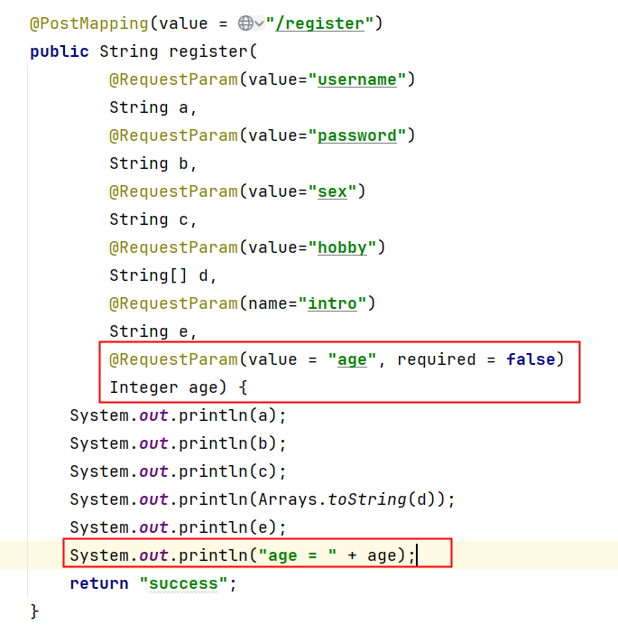


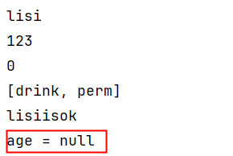

通过测试得知，如果一个参数被设置为`不是必需的`，当没有提交对应的请求参数时，形参默认值null。

### 安装接口测试工具 Apipost

它是一个**国产的**接口测试工具，目前在国内使用较多。把它安装一下。咱们接下来使用一下：

**使用 Apipost 发送 get 请求，携带查询参数：**

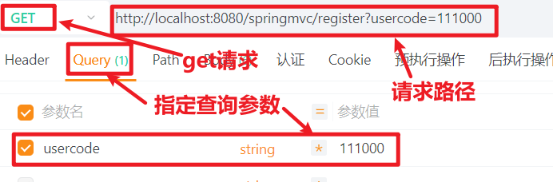

**使用 Apipost 发送 post 请求，以普通文本形式提交表单数据：**

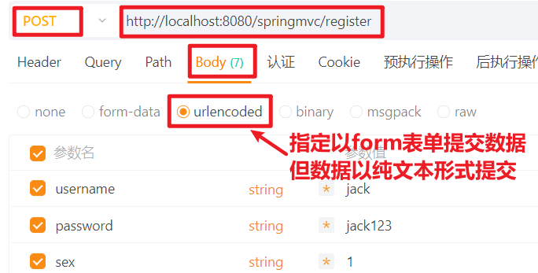

**使用 Apipost 发送 post 请求，以二进制的方式提交表单数据：（适合文件上传）**

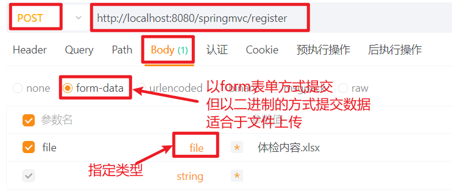

**使用 Apipost 发送 post 请求，并且提交 JSON 字符串到服务器：**

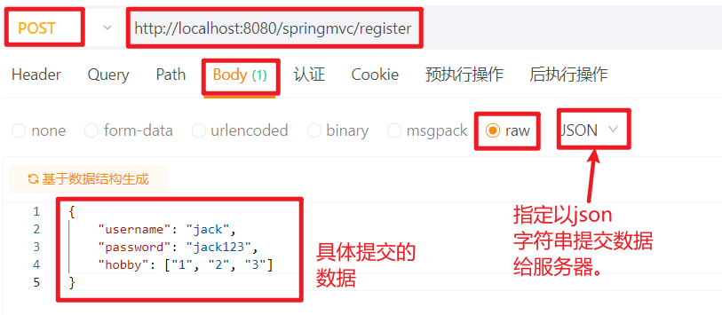

**使用 Apipost 工具发送请求时，设置请求头：**

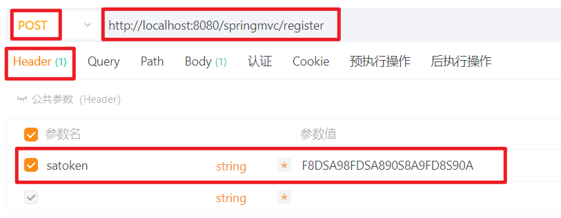

**使用 Apipost 工作提交纯二进制数据，例如做单文件上传：**

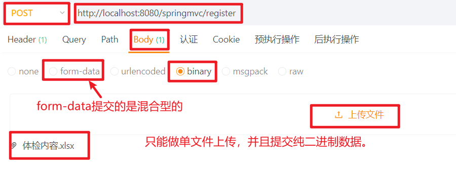

### RequestParam注解的defaultValue属性

defaultValue属性用来设置形参的默认值，当`没有提供对应的请求参数`或者`请求参数的值是空字符串""`的时候，方法的形参会采用默认值。

**当前端页面没有提交email的时候：**

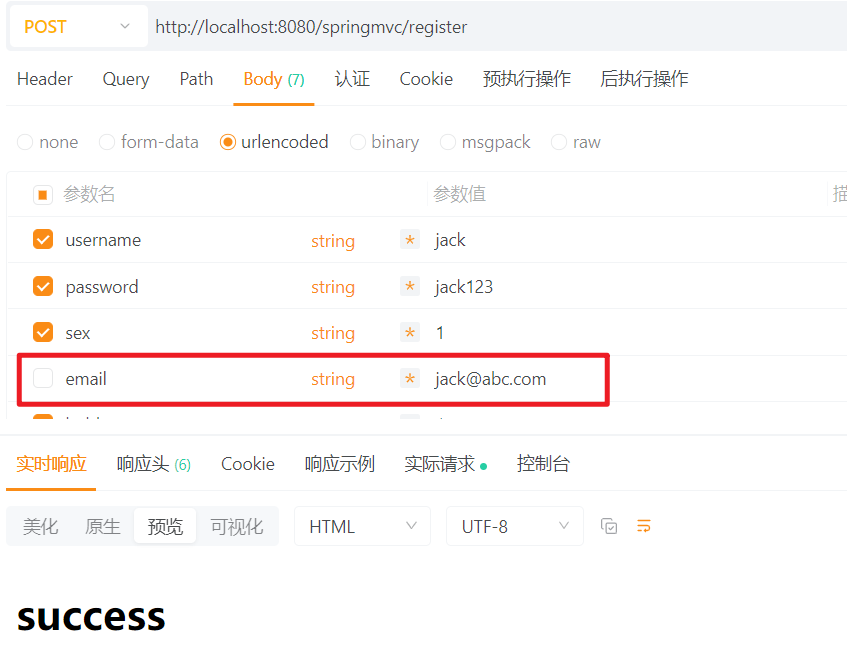


**当前端页面提交的email是空字符串的时候：**

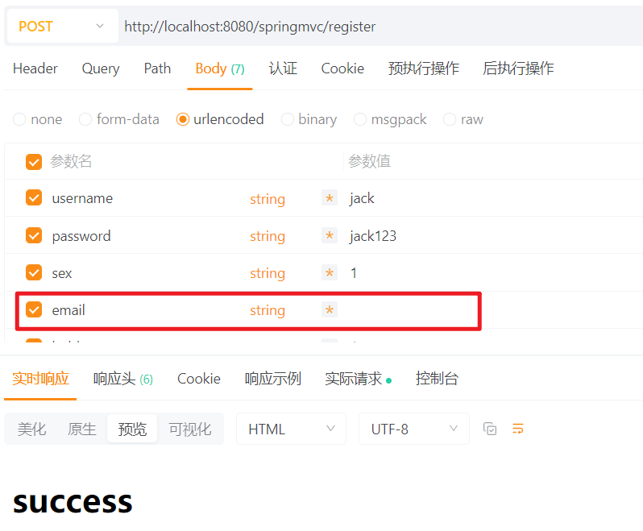

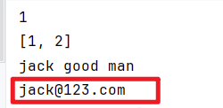

**当前端提交的email不是空字符串的时候：**

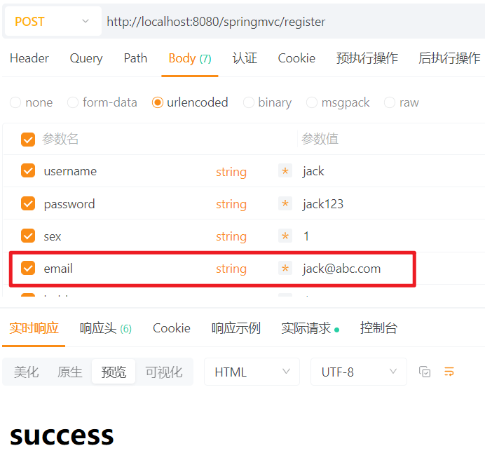

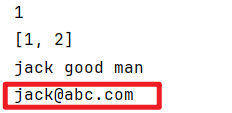

## 依靠控制器方法上的形参名来接收

**知识点列表：**

1. **@RequestParam 这个注解是可以省略的，如果方法形参的名字和提交数据时的name相同，则 @RequestParam 可以省略。**
2. **但有一个前提：如果你采用的是Spring6+版本，你需要在pom.xml文件中指定编译参数'-parameter'**
3. **形参名必须和提交数据的 name 一致。如果不一致，则形参值为 null。**
4. **如果前端提交的数组，后端也可以用 String 来接收，不一定使用数组。**

配置如下：

```xml
<build>
    <plugins>
        <plugin>
            <groupId>org.apache.maven.plugins</groupId>
            <artifactId>maven-compiler-plugin</artifactId>
            <version>3.12.1</version>
            <configuration>
                <source>21</source>
                <target>21</target>
                <compilerArgs>
                    <arg>-parameters</arg>
                </compilerArgs>
            </configuration>
        </plugin>
    </plugins>
</build>
```

**注意：如果你使用的是Spring5的版本，以上的配置是不需要的。**

Controller中的方法只需要这样写：**形参的名字必须和提交的数据的name一致！！！！！**

```java
@PostMapping(value="/register")
public String register(String username, String password, String sex, String[] hobby, String intro){
    System.out.println(username + "," + password + "," + sex + "," + Arrays.toString(hobby) + "," + intro);
    return "success";
}
```

如果形参名和提交的数据的name不一致时：


另外，还有一点，对于提交的hobby数据，也可以采用String来接收，不一定使用数组方式：

```java
@PostMapping(value="/register")
public String register(String username, String password, String sex, String hobby, String intro){
    System.out.println(username + "," + password + "," + sex + "," + hobby + "," + intro);
    return "success";
}
```

根据输出结果可以看到多个hobby是采用“,”进行连接的。

## 使用 JavaBean 接收请求参数


**知识点列表：**

1. **使用 JavaBean 接收数据更方便。**
2. **前提条件是提交的参数 name 必须和 JavaBean 的属性名保持一致。**
3. **底层实现原理是：通过反射机制调用 setter 方法给属性赋值的。**

以上方式大家可以看到，当提交的数据非常多时，方法的形参个数会非常多，这不是很好的设计。在SpringMVC中也可以使用POJO类/JavaBean来接收请求参数。不过有一个非常重要的要求：`POJO类的属性名`必须和`请求参数的参数名`保持一致。

**提供以下的 javabean 类：**

```java
package com.jkweilai.springmvc.pojo;

import java.util.Arrays;

public class User {
    private Long id;
    private String username;
    private String password;
    private String sex;
    private String[] hobby;
    private String intro;

    // setter and getter

    @Override
    public String toString() {
        return "User{" +
                "id=" + id +
                ", username='" + username + '\'' +
                ", password='" + password + '\'' +
                ", sex='" + sex + '\'' +
                ", hobby=" + Arrays.toString(hobby) +
                ", intro='" + intro + '\'' +
                '}';
    }
}
```

在控制器方法的形参位置上使用javabean来接收请求参数：

```java
@PostMapping("/register")
public String register(User user){
    System.out.println(user);
    return "success";
}
```

**底层的实现原理：反射机制。先获取请求参数的名字，因为请求参数的名字就是JavaBean的属性名，通过这种方式给对应的属性赋值**。

我们来测试一下：当JavaBean的属性名和请求参数的参数名不一致时，会出现什么问题？（注意：**getter和setter的方法名不修改，只修改属性名**）

```java
package com.jkweilai.springmvc.pojo;

import java.util.Arrays;

public class User {
    private Long id;
    private String uname;
    private String upwd;
    private String usex;
    private String[] uhobby;
    private String uintro;

    public User() {
    }

    public User(Long id, String username, String password, String sex, String[] hobby, String intro) {
        this.id = id;
        this.uname = username;
        this.upwd = password;
        this.usex = sex;
        this.uhobby = hobby;
        this.uintro = intro;
    }

    public Long getId() {
        return id;
    }

    public void setId(Long id) {
        this.id = id;
    }

    public String getUsername() {
        return uname;
    }

    public void setUsername(String username) {
        this.uname = username;
    }

    public String getPassword() {
        return upwd;
    }

    public void setPassword(String password) {
        this.upwd = password;
    }

    public String getSex() {
        return usex;
    }

    public void setSex(String sex) {
        this.usex = sex;
    }

    public String[] getHobby() {
        return uhobby;
    }

    public void setHobby(String[] hobby) {
        this.uhobby = hobby;
    }

    public String getIntro() {
        return uintro;
    }

    public void setIntro(String intro) {
        this.uintro = intro;
    }

    @Override
    public String toString() {
        return "User{" +
                "id=" + id +
                ", username='" + uname + '\'' +
                ", password='" + upwd + '\'' +
                ", sex='" + usex + '\'' +
                ", hobby=" + Arrays.toString(uhobby) +
                ", intro='" + uintro + '\'' +
                '}';
    }
}
```

测试结果：


通过测试，我们得知：`请求参数名`可以和`JavaBean的属性名`不一致。

我们继续将其中一个属性的setter和getter方法名修改一下：

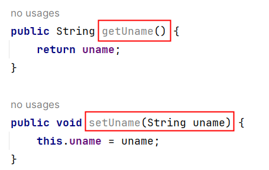

再次测试：

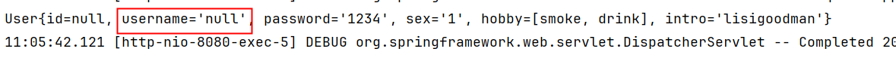

**通过测试可以看到：username属性没有赋上值。可见请求参数是否可以赋值到JavaBean对应的属性上，不是取决于属性名，而是setter方法名**。

## RequestHeader注解


**知识点列表：**

1. **该注解的作用是：将**`**请求头信息**`**映射到**`**方法的形参上**`**。**
2. **和RequestParam注解功能相似，RequestParam注解的作用：将**`**请求参数**`**映射到**`**方法的形参**`**上。**
3. **对于RequestHeader注解来说，也有三个属性：value、required、defaultValue，和RequestParam一样。**

测试：

```java
@PostMapping("/register")
public String register(User user, 
                       @RequestHeader(value="Referer", required = false, defaultValue = "") 
                       String referer){
    System.out.println(user);
    System.out.println(referer);
    return "success";
}
```

执行结果：


## CookieValue注解


**知识点列表：**

1. **该注解的作用：将**`**请求提交的Cookie数据**`**映射到**`**方法形参**`**上**
2. **同样是有三个属性：value、required、defaultValue**

前端页面中编写发送cookie的代码：

```html
<script type="text/javascript">
    function sendCookie(){
        document.cookie = "id=123456789; expires=Thu, 18 Dec 2025 12:00:00 UTC; path=/";
        document.location = "/springmvc/register";
    }
</script>
<button onclick="sendCookie()">向服务器端发送Cookie</button>
```

后端UserController代码：

```java
    @GetMapping("/register")
    public String register(User user,
                           @RequestHeader(value="Referer", required = false, defaultValue = "")
                           String referer,
                           @CookieValue(value="id", required = false, defaultValue = "2222222222")
                           String id){
        System.out.println(user);
        System.out.println(referer);
        System.out.println(id);
        return "success";
    }
```

测试结果：


## 请求的中文乱码问题


**知识点列表：**

1. **get 请求乱码如何解决？**
2. **post 请求乱码如何解决？**
3. **Tomcat10+版本已经默认将 GET/POST 字符编码方式设置为 UTF-8 了，因此多数情况下是不存在乱码问题的。**
4. **在 Controller 中编写 **`**request.setCharacterEncoding("UTF-8");**`**可以解决请求体的乱码问题吗？**
5. **SpringMVC 中内置了一个字符编码过滤器，它解决了乱码问题。直接配置它就行了。**

有可能很多同学使用的不是Tomcat10，如果不是Tomcat10，则会出现乱码问题，我们来模拟一下乱码的产生，将apache-tomcat-10.1.19\conf\web.xml文件中的UTF-8配置修改为ISO-8859-1：


**一定要重启Tomcat10**，新的配置才能生效，来测试一下是否存在乱码：


那么，在SpringMVC中如何解决请求体的中文乱码问题呢？当然，还是使用`request.setCharacterEncoding("UTF-8")`

使用它有一个前提条件，要想解决请求体乱码问题，以上代码必须在 `request.getParameter("username")`执行之前执行才有效。

也就是说以上代码如果放在Controller的相关方法中执行是无效的，因为Controller的方法在执行之前 DispatcherServlet已经调用了 `request.getParameter("username")`方法。因此在Controller方法中使用`request.setCharacterEncoding("UTF-8");`无效我们来测试一下：

```html
<form th:action="@{/register}" method="post">
    用户名：<input type="text" name="username"><br>
    密码：<input type="password" name="password"><br>
    性别：
        男 <input type="radio" name="sex" value="1">
        女 <input type="radio" name="sex" value="0">
        <br>
    爱好：
        抽烟 <input type="checkbox" name="hobby" value="smoke">
        喝酒 <input type="checkbox" name="hobby" value="drink">
        烫头 <input type="checkbox" name="hobby" value="perm">
        <br>
    简介：<textarea rows="10" cols="60" name="intro"></textarea><br>
    <input type="submit" value="注册">
</form>
```

注意：以上表单已经修改为post请求

```java
@PostMapping("/register")
public String register(User user, HttpServletRequest request) throws UnsupportedEncodingException {
    request.setCharacterEncoding("UTF-8");
    System.out.println(user);
    return "success";
}
```

测试结果：


通过测试可以看到：在Controller当中调用`request.setCharacterEncoding("UTF-8")`是无法解决POST乱码问题的。

那怎么办呢？怎么样才能在DispatcherServlet之前执行`request.setCharacterEncoding("UTF-8")`呢？没错，我相信大家想到了：过滤器Filter。过滤器Filter可以在Servlet执行之前执行。有同学又说了：监听器不行吗？不行。因为我们需要对每一次请求解决乱码，而监听器只在服务器启动阶段执行一次。因此这里解决每一次请求的乱码问题，应该使用过滤器Filter。并且，告诉大家一个好消息，SpringMVC已经将这个字符编码的过滤器提前写好了，我们直接配置好即可：`CharacterEncodingFilter`，我们一起看一下它的源码：

```java
/*
 * Copyright 2002-2018 the original author or authors.
 *
 * Licensed under the Apache License, Version 2.0 (the "License");
 * you may not use this file except in compliance with the License.
 * You may obtain a copy of the License at
 *
 *      https://www.apache.org/licenses/LICENSE-2.0
 *
 * Unless required by applicable law or agreed to in writing, software
 * distributed under the License is distributed on an "AS IS" BASIS,
 * WITHOUT WARRANTIES OR CONDITIONS OF ANY KIND, either express or implied.
 * See the License for the specific language governing permissions and
 * limitations under the License.
 */

package org.springframework.web.filter;

import java.io.IOException;

import jakarta.servlet.FilterChain;
import jakarta.servlet.ServletException;
import jakarta.servlet.http.HttpServletRequest;
import jakarta.servlet.http.HttpServletResponse;

import org.springframework.lang.Nullable;
import org.springframework.util.Assert;

/**
 * Servlet Filter that allows one to specify a character encoding for requests.
 * This is useful because current browsers typically do not set a character
 * encoding even if specified in the HTML page or form.
 *
 * <p>This filter can either apply its encoding if the request does not already
 * specify an encoding, or enforce this filter's encoding in any case
 * ("forceEncoding"="true"). In the latter case, the encoding will also be
 * applied as default response encoding (although this will usually be overridden
 * by a full content type set in the view).
 *
 * @author Juergen Hoeller
 * @since 15.03.2004
 * @see #setEncoding
 * @see #setForceEncoding
 * @see jakarta.servlet.http.HttpServletRequest#setCharacterEncoding
 * @see jakarta.servlet.http.HttpServletResponse#setCharacterEncoding
 */
public class CharacterEncodingFilter extends OncePerRequestFilter {

        @Nullable
        private String encoding;

        private boolean forceRequestEncoding = false;

        private boolean forceResponseEncoding = false;


        /**
         * Create a default {@code CharacterEncodingFilter},
         * with the encoding to be set via {@link #setEncoding}.
         * @see #setEncoding
         */
        public CharacterEncodingFilter() {
        }

        /**
         * Create a {@code CharacterEncodingFilter} for the given encoding.
         * @param encoding the encoding to apply
         * @since 4.2.3
         * @see #setEncoding
         */
        public CharacterEncodingFilter(String encoding) {
                this(encoding, false);
        }

        /**
         * Create a {@code CharacterEncodingFilter} for the given encoding.
         * @param encoding the encoding to apply
         * @param forceEncoding whether the specified encoding is supposed to
         * override existing request and response encodings
         * @since 4.2.3
         * @see #setEncoding
         * @see #setForceEncoding
         */
        public CharacterEncodingFilter(String encoding, boolean forceEncoding) {
                this(encoding, forceEncoding, forceEncoding);
        }

        /**
         * Create a {@code CharacterEncodingFilter} for the given encoding.
         * @param encoding the encoding to apply
         * @param forceRequestEncoding whether the specified encoding is supposed to
         * override existing request encodings
         * @param forceResponseEncoding whether the specified encoding is supposed to
         * override existing response encodings
         * @since 4.3
         * @see #setEncoding
         * @see #setForceRequestEncoding(boolean)
         * @see #setForceResponseEncoding(boolean)
         */
        public CharacterEncodingFilter(String encoding, boolean forceRequestEncoding, boolean forceResponseEncoding) {
                Assert.hasLength(encoding, "Encoding must not be empty");
                this.encoding = encoding;
                this.forceRequestEncoding = forceRequestEncoding;
                this.forceResponseEncoding = forceResponseEncoding;
        }


        /**
         * Set the encoding to use for requests. This encoding will be passed into a
         * {@link jakarta.servlet.http.HttpServletRequest#setCharacterEncoding} call.
         * <p>Whether this encoding will override existing request encodings
         * (and whether it will be applied as default response encoding as well)
         * depends on the {@link #setForceEncoding "forceEncoding"} flag.
         */
        public void setEncoding(@Nullable String encoding) {
                this.encoding = encoding;
        }

        /**
         * Return the configured encoding for requests and/or responses.
         * @since 4.3
         */
        @Nullable
        public String getEncoding() {
                return this.encoding;
        }

        /**
         * Set whether the configured {@link #setEncoding encoding} of this filter
         * is supposed to override existing request and response encodings.
         * <p>Default is "false", i.e. do not modify the encoding if
         * {@link jakarta.servlet.http.HttpServletRequest#getCharacterEncoding()}
         * returns a non-null value. Switch this to "true" to enforce the specified
         * encoding in any case, applying it as default response encoding as well.
         * <p>This is the equivalent to setting both {@link #setForceRequestEncoding(boolean)}
         * and {@link #setForceResponseEncoding(boolean)}.
         * @see #setForceRequestEncoding(boolean)
         * @see #setForceResponseEncoding(boolean)
         */
        public void setForceEncoding(boolean forceEncoding) {
                this.forceRequestEncoding = forceEncoding;
                this.forceResponseEncoding = forceEncoding;
        }

        /**
         * Set whether the configured {@link #setEncoding encoding} of this filter
         * is supposed to override existing request encodings.
         * <p>Default is "false", i.e. do not modify the encoding if
         * {@link jakarta.servlet.http.HttpServletRequest#getCharacterEncoding()}
         * returns a non-null value. Switch this to "true" to enforce the specified
         * encoding in any case.
         * @since 4.3
         */
        public void setForceRequestEncoding(boolean forceRequestEncoding) {
                this.forceRequestEncoding = forceRequestEncoding;
        }

        /**
         * Return whether the encoding should be forced on requests.
         * @since 4.3
         */
        public boolean isForceRequestEncoding() {
                return this.forceRequestEncoding;
        }

        /**
         * Set whether the configured {@link #setEncoding encoding} of this filter
         * is supposed to override existing response encodings.
         * <p>Default is "false", i.e. do not modify the encoding.
         * Switch this to "true" to enforce the specified encoding
         * for responses in any case.
         * @since 4.3
         */
        public void setForceResponseEncoding(boolean forceResponseEncoding) {
                this.forceResponseEncoding = forceResponseEncoding;
        }

        /**
         * Return whether the encoding should be forced on responses.
         * @since 4.3
         */
        public boolean isForceResponseEncoding() {
                return this.forceResponseEncoding;
        }


        @Override
        protected void doFilterInternal(
                        HttpServletRequest request, HttpServletResponse response, FilterChain filterChain)
                        throws ServletException, IOException {

                String encoding = getEncoding();
                if (encoding != null) {
                        if (isForceRequestEncoding() || request.getCharacterEncoding() == null) {
                                request.setCharacterEncoding(encoding);
                        }
                        if (isForceResponseEncoding()) {
                                response.setCharacterEncoding(encoding);
                        }
                }
                filterChain.doFilter(request, response);
        }

}
```

最核心的方法是：

```java
@Override
protected void doFilterInternal(
        HttpServletRequest request, HttpServletResponse response, FilterChain filterChain)
        throws ServletException, IOException {

    String encoding = getEncoding();
    if (encoding != null) {
        if (isForceRequestEncoding() || request.getCharacterEncoding() == null) {
            request.setCharacterEncoding(encoding);
        }
        if (isForceResponseEncoding()) {
            response.setCharacterEncoding(encoding);
        }
    }
    filterChain.doFilter(request, response);
}
```

分析以上核心方法得知该过滤器对请求和响应都设置了字符编码方式。

- 当`**强行使用请求字符编码方式为true**`时，或者`**请求对象的字符编码方式为null**`时，设置请求的字符编码方式。
- 当`**强行使用响应字符编码方式为true**`时，设置响应的字符编码方式。

根据以上代码，可以得出以下配置信息，在web.xml文件中对过滤器进行如下配置：

```xml
<!--字符编码过滤器-->
<filter>
    <filter-name>characterEncodingFilter</filter-name>
    <filter-class>org.springframework.web.filter.CharacterEncodingFilter</filter-class>
    <init-param>
        <param-name>encoding</param-name>
        <param-value>UTF-8</param-value>
    </init-param>
    <init-param>
        <param-name>forceRequestEncoding</param-name>
        <param-value>true</param-value>
    </init-param>
    <init-param>
        <param-name>forceResponseEncoding</param-name>
        <param-value>true</param-value>
    </init-param>
</filter>
<filter-mapping>
    <filter-name>characterEncodingFilter</filter-name>
    <url-pattern>/*</url-pattern>
</filter-mapping>
```

我们再来测试，重启Tomcat10，看看乱码是否能够解决？


注意：针对于我们当前的Tomcat10的配置来说，它有默认的字符集ISO-8859-1，因此以下在web.xml文件中的配置是不能缺少的：

```xml
<init-param>
    <param-name>forceRequestEncoding</param-name>
    <param-value>true</param-value>
</init-param>
```

如果缺少它，仍然是会存在乱码问题的。自行测试一下！！！！

# Servlet中的三个域对象


## 回顾域对象

请求域：request

会话域：session

应用域：application

三个域都有以下三个方法：

```java
// 向域中存储数据
void setAttribute(String name, Object obj);

// 从域中读取数据
Object getAttribute(String name);

// 删除域中的数据
void removeAttribute(String name);
```

主要是通过：setAttribute + getAttribute方法来完成在域中数据的传递和共享。

**request**

接口名：HttpServletRequest

简称：request

request对象代表了一次请求。一次请求一个request。

使用请求域的业务场景：在A资源中通过转发的方式跳转到B资源，因为是转发，因此从A到B是一次请求，如果想让A资源和B资源共享同一个数据，可以将数据存储到request域中。

**session**

接口名：HttpSession

简称：session

session对象代表了一次会话。从打开浏览器开始访问，到最终浏览器关闭，这是一次完整的会话。每个会话session对象都对应一个JSESSIONID，而JSESSIONID生成后以cookie的方式存储在浏览器客户端。浏览器关闭，JSESSIONID失效，会话结束。

使用会话域的业务场景：

1. 在A资源中通过重定向的方式跳转到B资源，因为是重定向，因此从A到B是两次请求，如果想让A资源和B资源共享同一个数据，可以将数据存储到session域中。
2. 登录成功后保存用户的登录状态。

**application**

接口名：ServletContext

简称：application

application对象代表了整个web应用，服务器启动时创建，服务器关闭时销毁。对于一个web应用来说，application对象只有一个。

使用应用域的业务场景：记录网站的在线人数。

## request域对象


在SpringMVC中，在request域中共享数据有以下几种方式：

1. 使用原生Servlet API方式。
2. 使用Model接口。
3. 使用Map接口。
4. 使用ModelMap类。
5. 使用ModelAndView类。

### 使用原生Servlet API方式

在Controller的方法上使用HttpServletRequest：

```java
@Controller
public class RequestScopeTestController {

    @RequestMapping("/testServletAPI")
    public String testServletAPI(HttpServletRequest request){
        // 向request域中存储数据
        request.setAttribute("testRequestScope", "在SpringMVC中使用原生Servlet API实现request域数据共享");
        return "view";
    }
}
```

页面：

```html
<!DOCTYPE html>
<html lang="en" xmlns:th="http://www.thymeleaf.org">
<head>
    <meta charset="UTF-8">
    <title>view</title>
</head>
<body>
<div th:text="${testRequestScope}"></div>
</body>
</html>
```

超链接：

```html
<!DOCTYPE html>
<html lang="en" xmlns:th="http://www.thymeleaf.org">
<head>
    <meta charset="UTF-8">
    <title>index</title>
</head>
<body>
<h1>Index Page</h1>
<a th:href="@{/testServletAPI}">在SpringMVC中使用原生Servlet API实现request域数据共享</a><br>
</body>
</html>
```

测试结果：


这种方式当然可以，用SpringMVC框架，不建议使用原生Servlet API。

### 使用Model接口

```java
@RequestMapping("/testModel")
public String testModel(Model model){
    // 向request域中存储数据
    model.addAttribute("testRequestScope", "在SpringMVC中使用Model接口实现request域数据共享");
    return "view";
}
```

### 使用Map接口

```java
@RequestMapping("/testMap")
public String testMap(Map<String, Object> map){
    // 向request域中存储数据
    map.put("testRequestScope", "在SpringMVC中使用Map接口实现request域数据共享");
    return "view";
}
```

### 使用ModelMap类

```java
@RequestMapping("/testModelMap")
public String testModelMap(ModelMap modelMap){
    // 向request域中存储数据
    modelMap.addAttribute("testRequestScope", "在SpringMVC中使用ModelMap实现request域数据共享");
    return "view";
}
```

### Model、Map、ModelMap的关系

可以在以上Model、Map、ModelMap的测试程序中将其输出，看看输出什么：


看不出来什么区别，从输出结果上可以看到都是一样的。

可以将其运行时类名输出：


通过输出结果可以看出，无论是Model、Map还是ModelMap，底层实例化的对象都是：BindingAwareModelMap。

可以查看BindingAwareModelMap的继承结构：


通过继承结构可以看出：BindingAwareModelMap继承了ModelMap，而ModelMap又实现了Map接口。

另外，请看以下源码：


可以看出ModelMap又实现了Model接口。因此表面上是采用了不同方式，底层本质上是相同的。

SpringMVC之所以提供了这些方式，目的就是方便程序员的使用，提供了多样化的方式，可见它的重要性。

### 使用ModelAndView类

在SpringMVC框架中为了更好的体现MVC架构模式，提供了一个类：ModelAndView。这个类的实例封装了Model和View。也就是说这个类既封装业务处理之后的数据，也体现了跳转到哪个视图。使用它也可以完成request域数据共享。

```java
@RequestMapping("/testModelAndView")
public ModelAndView testModelAndView(){
    // 创建“模型与视图对象”
    ModelAndView modelAndView = new ModelAndView();
    // 绑定数据
    modelAndView.addObject("testRequestScope", "在SpringMVC中使用ModelAndView实现request域数据共享");
    // 绑定视图
    modelAndView.setViewName("view");
    // 返回
    return modelAndView;
}
```

这种方式需要注意的是：

1. 方法的返回值类型不是String，而是ModelAndView对象。
2. ModelAndView不是出现在方法的参数位置，而是在方法体中new的。
3. 需要调用addObject向域中存储数据。
4. 需要调用setViewName设置视图的名字。

### ModelAndView源码分析

以上我们通过了五种方式完成了request域数据共享，包括：原生Servlet API，Model、Map、ModelMap、ModelAndView

其中后四种：Model、Map、ModelMap、ModelAndView。这四种方式在底层DispatcherServlet调用我们的Controller之后，返回的对象都是ModelAndView，这个可以通过源码进行分析。

在以上四种方式中，拿Model举例，添加断点进行调试：


启动服务器，发送请求，走到断点：


查看VM Stack信息：


查看DispatcherServlet的1089行，源码如下：


可以看到这里，无论你使用哪种方式，最终都要返回一个ModelAndView对象。

提醒：大家可以通过以下断点调试方式，采用一级一级返回，最终可以看到都会返回ModelAndView对象。


## session域对象


在SpringMVC中使用session域共享数据，实现方式有多种，其中比较常见的两种方式：

1. 使用原生Servlet API
2. 使用SessionAttributes注解

### 使用原生Servlet API

```java
@Controller
public class SessionScopeTestController {

    @RequestMapping("/testSessionScope1")
    public String testServletAPI(HttpSession session) {
        // 向会话域中存储数据
        session.setAttribute("testSessionScope1", "使用原生Servlet API实现session域共享数据");
        return "view";
    }

}
```

视图页面：

```html
<div th:text="${session.testSessionScope1}"></div>
```

超链接：

```html
<a th:href="@{/testSessionScope1}">在SpringMVC中使用原生Servlet API实现session域共享数据</a><br>
```

### 使用SessionAttributes注解

使用SessionAttributes注解标注Controller：

```java
@Controller
@SessionAttributes(value = {"x", "y"})
public class SessionScopeTestController {

    @RequestMapping("/testSessionScope2")
    public String testSessionAttributes(ModelMap modelMap){
        // 向session域中存储数据
        modelMap.addAttribute("x", "我是埃克斯");
        modelMap.addAttribute("y", "我是歪");

        return "view";
    }
}
```

注意：SessionAttributes注解使用在Controller类上。标注了当key是 x 或者 y 时，数据将被存储到会话session中。如果没有 SessionAttributes注解，默认存储到request域中。

## application域对象


在SpringMVC实现application域数据共享，最常见的方案就是直接使用Servlet API了：

```java
@Controller
public class ApplicationScopeTestController {

    @RequestMapping("/testApplicationScope")
    public String testApplicationScope(HttpServletRequest request){
        
        // 获取ServletContext对象
        ServletContext application = request.getServletContext();

        // 向应用域中存储数据
        application.setAttribute("applicationScope", "我是应用域当中的一条数据");

        return "view";
    }
}
```

视图页面：

```html
<div th:text="${application.applicationScope}"></div>
```

超链接：

```html
<a th:href="@{/testApplicationScope}">在SpringMVC中使用ServletAPI实现application域共享数据</a><br>
```

# SpringMVC 中的视图技术


## SpringMVC中视图的实现原理

### Spring MVC视图支持可配置

在Spring MVC中，视图**View是支持定制**的，例如我们之前在 springmvc.xml 文件中进行了如下的配置：

```xml
<!--视图解析器-->
<bean id="thymeleafViewResolver" class="org.thymeleaf.spring6.view.ThymeleafViewResolver">
    <!--作用于视图渲染的过程中，可以设置视图渲染后输出时采用的编码字符集-->
    <property name="characterEncoding" value="UTF-8"/>
    <!--如果配置多个视图解析器，它来决定优先使用哪个视图解析器，它的值越小优先级越高-->
    <property name="order" value="1"/>
    <!--当 ThymeleafViewResolver 渲染模板时，会使用该模板引擎来解析、编译和渲染模板-->
    <property name="templateEngine">
        <bean class="org.thymeleaf.spring6.SpringTemplateEngine">
            <!--用于指定 Thymeleaf 模板引擎使用的模板解析器。模板解析器负责根据模板位置、模板资源名称、文件编码等信息，加载模板并对其进行解析-->
            <property name="templateResolver">
                <bean class="org.thymeleaf.spring6.templateresolver.SpringResourceTemplateResolver">
                    <!--设置模板文件的位置（前缀）-->
                    <property name="prefix" value="/WEB-INF/templates/"/>
                    <!--设置模板文件后缀（后缀），Thymeleaf文件扩展名不一定是html，也可以是其他，例如txt，大部分都是html-->
                    <property name="suffix" value=".html"/>
                    <!--设置模板类型，例如：HTML,TEXT,JAVASCRIPT,CSS等-->
                    <property name="templateMode" value="HTML"/>
                    <!--用于模板文件在读取和解析过程中采用的编码字符集-->
                    <property name="characterEncoding" value="UTF-8"/>
                </bean>
            </property>
        </bean>
    </property>
</bean>
```

以上的配置表明当前SpringMVC框架使用的视图View是Thymeleaf的。

如果你需要换成其他的视图View，修改以上的配置即可。这样就可以非常轻松的完成视图View的扩展。

这种设计是完全符合OCP开闭原则的。视图View和框架是解耦合的，耦合度低扩展能力强。视图View可以通过配置文件进行灵活切换。

### Spring MVC支持的常见视图

Spring MVC支持的常见视图包括：

1. InternalResourceView：内部资源视图（Spring MVC框架内置的，专门为`JSP模板语法`准备的）
2. RedirectView：重定向视图（Spring MVC框架内置的，用来完成重定向效果）
3. ThymeleafView：Thymeleaf视图（第三方的，为`Thymeleaf模板语法`准备的）
4. FreeMarkerView：FreeMarker视图（第三方的，为`FreeMarker模板语法`准备的）
5. VelocityView：Velocity视图（第三方的，为`Velocity模板语法`准备的）
6. PDFView：PDF视图（第三方的，专门用来生成pdf文件视图）
7. ExcelView：Excel视图（第三方的，专门用来生成excel文件视图）
8. ......

### 实现视图机制的核心接口

实现视图的核心类与接口包括：

1. DispatcherServlet类（前端控制器）：
  1. 职责：Spring MVC 的中央调度器，协调所有组件完成请求处理流程。
  2. 核心方法：doDispatch


1. ViewResolver接口（视图解析器）：
  1. 职责：将**逻辑视图名**解析为具体的 **View** 对象。
  2. 核心方法：resolveViewName


1. View接口（视图）:
  1. 职责：将模型数据渲染为具体的视图格式（HTML、JSON等），并输出到客户端
  2. 核心方法：render


1. ViewResolverRegistry（视图解析器注册器）：
  1. 负责在 Spring 容器启动的时候，完成视图解析器的注册。如果有多个视图解析器，会将视图解析器对象按照order的配置放入List集合。

**总结：**

- **实现视图的核心类和接口包括：DispatcherServlet、ViewResolver、View、**ViewResolverRegistry
- **如果你想定制自己的视图组件：**
  - **编写类实现ViewResolver接口，实现resolveViewName方法， ****在这个方法中根据逻辑视图名创建并配置对应的View对象。**
  - **编写类实现View接口，实现render方法，在该方法中将模板语言转换成HTML代码，并将HTML代码响应到浏览器。**

### 实现视图机制的原理描述

**假设我们SpringMVC中使用了Thymeleaf作为视图。**

第一步：浏览器发送请求给web服务器

第二步：Spring MVC中的DispatcherServlet接收到请求

第三步：DispatcherServlet根据请求路径分发到对应的Controller

第四步：DispatcherServlet调用Controller的方法

第五步：Controller的方法处理业务并返回一个`逻辑视图名`给DispatcherServlet

第六步：DispatcherServlet调用ThymeleafViewResolver的resolveViewName方法，将`逻辑视图名`转换为 View 对象，并创建ThymeleafView对象返回给DispatcherServlet

第七步：DispatcherServlet再调用ThymeleafView的render方法，render方法将模板语言转换为HTML代码，响应给浏览器，完成最终的渲染。

**假设我们SpringMVC中使用了JSP作为视图。**

第一步：浏览器发送请求给web服务器

第二步：Spring MVC中的DispatcherServlet接收到请求

第三步：DispatcherServlet根据请求路径分发到对应的Controller

第四步：DispatcherServlet调用Controller的方法

第五步：Controller的方法处理业务并返回一个`逻辑视图名`给DispatcherServlet

第六步：DispatcherServlet调用`InternalResourceViewResolver`的`resolveViewName`方法，将`逻辑视图名`转换为`物理视图名`，并创建`InternalResourceView`对象返回给DispatcherServlet

第七步：DispatcherServlet再调用`InternalResourceView`的`render`方法，render方法将模板语言转换为HTML代码，响应给浏览器，完成最终的渲染。

### 逻辑视图名到物理视图名的转换

逻辑视图名最终转换的物理视图名是什么，取决于在 springmvc.xml文件中视图解析器的配置：

假如视图解析器配置的是ThymeleafViewResolver，如下：

```xml
<bean id="thymeleafViewResolver" class="org.thymeleaf.spring6.view.ThymeleafViewResolver">
    <property name="characterEncoding" value="UTF-8"/>
    <property name="order" value="1"/>
    <property name="templateEngine">
        <bean class="org.thymeleaf.spring6.SpringTemplateEngine">
            <property name="templateResolver">
                <bean class="org.thymeleaf.spring6.templateresolver.SpringResourceTemplateResolver">
                    <property name="prefix" value="/WEB-INF/templates/"/>
                    <property name="suffix" value=".html"/>
                    <property name="templateMode" value="HTML"/>
                    <property name="characterEncoding" value="UTF-8"/>
                </bean>
            </property>
        </bean>
    </property>
</bean>
```

以下程序返回逻辑视图名：index

```java
@RequestMapping("/index")
public String toIndex(){
    return "index";
}
```

最终逻辑视图名"index" 转换为物理视图名：/WEB-INF/templates/index.html

假如视图解析器配置的是InternalResourceViewResolver，如下：

```xml
<bean id="viewResolver" class="org.springframework.web.servlet.view.InternalResourceViewResolver">
  <property name="prefix" value="/WEB-INF/templates/"/>
  <property name="suffix" value=".jsp"/>
</bean>
```

以下程序返回逻辑视图名：index

```java
@RequestMapping("/index")
public String toIndex(){
    return "index";
}
```

最终逻辑视图名"index" 转换为物理视图名：/WEB-INF/templates/index.jsp

## Thymeleaf视图


我们在学习前面内容的时候，采用的都是Thymeleaf视图。我们再来测试一下，看看底层创建的视图对象是不是`ThymeleafView`

springmvc.xml配置内容如下：

```xml
<?xml version="1.0" encoding="UTF-8"?>
<beans xmlns="http://www.springframework.org/schema/beans"
       xmlns:xsi="http://www.w3.org/2001/XMLSchema-instance"
       xmlns:context="http://www.springframework.org/schema/context"
       xsi:schemaLocation="http://www.springframework.org/schema/beans http://www.springframework.org/schema/beans/spring-beans.xsd http://www.springframework.org/schema/context https://www.springframework.org/schema/context/spring-context.xsd">

    <!--组件扫描-->
    <context:component-scan base-package="com.jkweilai.springmvc.controller"/>

    <!--视图解析器-->
    <bean id="thymeleafViewResolver" class="org.thymeleaf.spring6.view.ThymeleafViewResolver">
        <property name="characterEncoding" value="UTF-8"/>
        <property name="order" value="1"/>
        <property name="templateEngine">
            <bean class="org.thymeleaf.spring6.SpringTemplateEngine">
                <property name="templateResolver">
                    <bean class="org.thymeleaf.spring6.templateresolver.SpringResourceTemplateResolver">
                        <property name="prefix" value="/WEB-INF/thymeleaf/"/>
                        <property name="suffix" value=".html"/>
                        <property name="templateMode" value="HTML"/>
                        <property name="characterEncoding" value="UTF-8"/>
                    </bean>
                </property>
            </bean>
        </property>
    </bean>
</beans>
```

Controller代码如下：

```java
package com.jkweilai.springmvc.controller;

import org.springframework.stereotype.Controller;
import org.springframework.web.bind.annotation.RequestMapping;

@Controller
public class IndexController {
    @RequestMapping("/index")
    public String toIndex(){
        return "index";
    }
}
```

视图页面：

```html
<!DOCTYPE html>
<html lang="en" xmlns:th="http://www.thymeleaf.org">
<head>
    <meta charset="UTF-8">
    <title>index page</title>
</head>
<body>
<h1>index page</h1>
</body>
</html>
```

添加断点：在DispatcherServlet的doDispatch方法的下图位置添加断点


启动Tomcat，在浏览器地址栏上发送请求：http://localhost:8080/springmvc/index


程序走到以上位置，这行代码是调用对应的Controller，并且Controller最终会返回ModelAndView对象：mv

按照我们之前所讲，返回mv之后，接下来就是视图处理与渲染，接着往下走，走到下图这一行：


这个方法的作用是处理分发结果，就是在这个方法当中进行了视图的处理与渲染，进入该方法：


进去之后走到上图位置：这个方法就是用来渲染页面的方法，再进入该方法：


走到上图位置就可以看到底层创建的是ThymeleafView对象。

## JSP视图（了解）

我们再来跟一下源码，看看JSP视图底层创建的是不是InternalResourceView对象。

我们前面说过 InternalResourceView是SpringMVC框架内置的，翻译为内部资源视图，SpringMVC把JSP看做是内部资源。可见JSP在之前的技术栈中有很高的地位。

不过，当下流行的开发中JSP使用较少，这里不再详细讲解。只是测试一下。

springmvc.xml配置如下：

```xml
<?xml version="1.0" encoding="UTF-8"?>
<beans xmlns="http://www.springframework.org/schema/beans"
       xmlns:xsi="http://www.w3.org/2001/XMLSchema-instance"
       xmlns:context="http://www.springframework.org/schema/context"
       xsi:schemaLocation="http://www.springframework.org/schema/beans http://www.springframework.org/schema/beans/spring-beans.xsd http://www.springframework.org/schema/context https://www.springframework.org/schema/context/spring-context.xsd">

    <!--组件扫描-->
    <context:component-scan base-package="com.jkweilai.springmvc.controller"/>

    <!--视图解析器-->
    <bean id="viewResolver" class="org.springframework.web.servlet.view.InternalResourceViewResolver">
        <property name="prefix" value="/WEB-INF/jsp/"/>
        <property name="suffix" value=".jsp"/>
    </bean>
</beans>
```

Controller代码如下：

```java
package com.jkweilai.springmvc.controller;

import org.springframework.stereotype.Controller;
import org.springframework.web.bind.annotation.RequestMapping;

@Controller
public class IndexController {
    @RequestMapping("/index")
    public String toIndex(){
        return "index";
    }
}
```

视图页面：

```html
<%@ page contentType="text/html;charset=UTF-8" language="java" %>
<html>
  <head>
    <title>index jsp</title>
  </head>
  <body>
    <h1>index jsp!</h1>
  </body>
</html>
```

启动web容器，添加断点跟踪：


通过测试得知：对于JSP视图来说，底层创建的视图对象是InternalResourceView。

## 转发与重定向


### 回顾转发和重定向区别

1. 转发是一次请求。因此浏览器地址栏上的地址不会发生变化。
2. 重定向是两次请求。因此浏览器地址栏上的地址会发生变化。
3. 转发的代码实现：request.getRequestDispatcher("/index").forward(request, response);
4. 重定向的代码实现：response.sendRedirect("/webapproot/index");
5. 转发是服务器内部资源跳转，由服务器来控制。不可实现跨域访问。
6. 重定向可以完成内部资源的跳转，也可以完成跨域跳转。
7. 转发的方式可以访问WEB-INF目录下受保护的资源。
8. 重定向相当于浏览器重新发送了一次请求，在浏览器直接发送的请求是无法访问WEB-INF目录下受保护的资源的。
9. 转发原理：
  1. 假设发送了 /a 请求，执行了 AServlet
  2. 在AServlet 中通过`request.getRequestDispatcher("/b").forward(request,response);`转发到BServlet
  3. 从AServlet跳转到BServlet是服务器内部来控制的。对于浏览器而言，浏览器只发送了一个 /a 请求。
10. 重定向原理：
  1. 假设发送了 /a 请求，执行了 AServlet
  2. 在AServlet 中通过`response.sendRedirect("/webapproot/b")`重定向到BServlet
  3. 此时服务器会将请求路径`/webapproot/b`响应给浏览器
  4. 浏览器会自发的再次发送`/webapproot/b`请求来访问BServlet
  5. 因此对于重定向来说，发送了两次请求，一次是 `/webapproot/a`，另一次是`/webapproot/b`。

以上所描述的是使用原生Servlet API来完成转发和重定向。在Spring MVC中是如何转发和重定向的呢？

### forward

在Spring MVC中默认就是转发的方式，我们之前所写的程序，都是转发的方式。只不过都是转发到Thymeleaf的模板文件xxx.html上。

那么，在Spring MVC中如何转发到另一个Controller上呢？可以使用Spring MVC的`forward`

代码实现如下：

```java
package com.jkweilai.springmvc.controller;

import org.springframework.stereotype.Controller;
import org.springframework.web.bind.annotation.RequestMapping;

@Controller
public class IndexController {

    @RequestMapping("/a")
    public String toA(){
        return "forward:/b";
    }

    @RequestMapping("/b")
    public String toB(){
        return "b";
    }
}
```

视图页面：

```html
<!DOCTYPE html>
<html lang="en" xmlns:th="http://www.thymeleaf.org">
<head>
    <meta charset="UTF-8">
    <title>b</title>
</head>
<body>
<h1>Page B!!!</h1>
</body>
</html>
```

启动服务器，浏览器地址栏上输入：http://localhost:8080/springmvc/a


通过测试，可以顺利的完成转发，转发是一次请求，可以看到地址栏上的地址没有发生改变。

我们来跟踪一下源码，看看以上程序执行过程中，创建了几个视图对象，分别是什么？


通过源码的跟踪得知：整个请求处理过程中，一共创建了两个视图对象

- InternalResourceView
- ThymeleafView

这说明转发底层创建的视图对象是：InternalResourceView。

### redirect

redirect是专门完成重定向效果的。和forward语法类似，只需要将之前的 `return "forward:/b"`修改为 `return "redirect:/b"`即可。

```java
package com.jkweilai.springmvc.controller;

import org.springframework.stereotype.Controller;
import org.springframework.web.bind.annotation.RequestMapping;

@Controller
public class IndexController {

    @RequestMapping("/a")
    public String toA(){
        return "redirect:/b";
    }

    @RequestMapping("/b")
    public String toB(){
        return "b";
    }
}
```

视图页面：

```html
<!DOCTYPE html>
<html lang="en" xmlns:th="http://www.thymeleaf.org">
<head>
    <meta charset="UTF-8">
    <title>b</title>
</head>
<body>
<h1>Page B!!!</h1>
</body>
</html>
```

启动服务器，浏览器地址栏上输入：http://localhost:8080/springmvc/a


可见，重定向是两次请求，地址栏上的地址发生了改变。

可以看一下源码，在重定向的时候，Spring MVC创建哪个视图对象？


通过断点调试可以看出，当重定向的时候，SpringMVC会创建一个重定向视图对象：**RedirectView**。这个视图对象也是SpringMVC框架内置的。

另外可以看出重定向之后的第二次请求创建的视图对象就是ThymeleafView了。

注意：从springmvc应用重定向到springmvc2应用（跨域），语法是：

```java
@RequestMapping("/a")
public String a(){
    return "redirect:http://localhost:8080/springmvc2/b";
}
```

可以自行测试一下！！！

## mvc:view-controller


`<mvc:view-controller>` 配置用于将某个请求映射到特定的视图上，即指定某一个 URL 请求到一个视图资源的映射，使得这个视图资源可以被访问。它相当于是一个独立的处理程序，不需要编写任何 Controller，只需要指定 URL 和对应的视图名称就可以了。

一般情况下，`<mvc:view-controller>` 配置可以替代一些没有业务逻辑的 Controller，例如首页、错误页面等。当用户访问配置的 URL 时，框架将直接匹配到对应的视图，而无需再经过其他控制器的处理。

`<mvc:view-controller>` 配置的格式如下：

```xml
<mvc:view-controller path="/如何访问该页面" view-name="对应的逻辑视图名称" />
```

其中：

- `path`：被映射的 URL 路径。
- `view-name`：对应的逻辑视图名称。

例如，配置首页的映射：

```xml
<mvc:view-controller path="/" view-name="index" />
```

上述配置将会匹配上访问应用程序的根路径，如：http://localhost:8080/。当用户在浏览器中访问该根路径时，就会直接渲染名为 `index` 的视图。

## mvc:annotation-driven/


在SpringMVC中，如果在springmvc.xml文件中配置了 `<font style="color:#080808;background-color:#ffffff;"><mvc:view-controller></font>`，就需要同时在springmvc.xml文件中添加如下配置：

```xml
<mvc:annotation-driven/>
```

该配置的作用是：启用Spring MVC的注解。

如果没有以上的配置，Controller就无法访问到。访问之前的Controller会发生 404 问题。

## 访问静态资源

一个项目可能会包含大量的静态资源，比如：css、js、images等。

由于我们DispatcherServlet的url-pattern配置的是“/”，之前我们说过，这个"/"代表的是除jsp请求之外的所有请求，也就是说访问应用中的静态资源，也会走DispatcherServlet，这会导致404错误，无法访问静态资源，如何解决，两种方案：

- 使用默认 Servlet 处理静态资源
- 使用 `mvc:resources` 标签配置静态资源处理

### 使用默认Servlet处理静态资源

首先需要在springmvc.xml文件中添加以下配置，开启 `默认Servlet处理静态资源` 功能：

```xml
<!-- 开启注解驱动 -->
<mvc:annotation-driven />

<!--开启默认Servlet处理-->
<mvc:default-servlet-handler>
```

**工作原理**：

- 在 Servlet 容器（如 Tomcat、Jetty）中，都有一个名为 "default" 的默认 Servlet（看下图）
- 这个默认 Servlet 负责处理静态资源（HTML、CSS、JS、图片等）
- 当 DispatcherServlet 配置为 `<font style="color:rgb(15, 17, 21);background-color:rgb(235, 238, 242);">/</font>` 时，它拦截了除 `<font style="color:rgb(15, 17, 21);">jsp</font>`之外的所有请求（因为我们并没有在 web.xml 文件中配置其他的 Servlet，只有 DispatcherServlet）
- `<font style="color:rgb(15, 17, 21);background-color:rgb(235, 238, 242);"><mvc:default-servlet-handler/></font>` 会注册一个 `<font style="color:rgb(15, 17, 21);background-color:rgb(235, 238, 242);">DefaultServletHttpRequestHandler</font>`
- 当请求是静态资源时，该 Handler 会将请求**转发给容器的默认 Servlet**


### 使用 mvc:resources 标签配置静态资源

访问静态资源，也可以在springmvc.xml文件中添加如下的配置：

```xml
<!-- 开启注解驱动 -->
<mvc:annotation-driven />

<!-- 配置静态资源处理 -->
<mvc:resources mapping="/static/**" location="/static/" />
```

表示凡是请求路径是"/static/"开始的，都会去"/static/"目录下找该资源。

注意：要想使用 `<mvc:resources>` 配置，必须开启注解驱动 `<mvc:annotation-driven />`

| **特性** | `**<font style="color:rgb(15, 17, 21);background-color:rgb(235, 238, 242);"><mvc:default-servlet-handler/></font>**` | `**<font style="color:rgb(15, 17, 21);background-color:rgb(235, 238, 242);"><mvc:resources></font>**` |
| --- | --- | --- |
| **处理者** | Web容器（Tomcat等） | Spring MVC 自身 |
| **性能** | 相对较低（需经过容器） | 较高（Spring直接处理） |
| **控制粒度** | 粗粒度（所有静态资源） | 细粒度（可自定义映射） |
| **缓存控制** | 依赖容器配置 | Spring可配置缓存 |
| **推荐度** | 不推荐 | 推荐 |

# RESTful编程风格


## RESTful是什么

RESTful是`WEB服务接口`的一种设计风格。

RESTful定义了一组约束条件和规范，可以让`WEB服务接口`更加简洁、易于理解、易于扩展、安全可靠。

RESTful对一个`WEB服务接口`都规定了哪些东西？

- 对请求的URL格式有约束和规范
- 对HTTP的请求方式有约束和规范
- 对请求和响应的数据格式有约束和规范
- 对HTTP状态码有约束和规范
- 等 ......

REST对请求方式的约束是这样的：

- 查询必须发送GET请求
- 新增必须发送POST请求
- 修改必须发送PUT请求
- 删除必须发送DELETE请求

REST对URL的约束是这样的：

- 传统的URL：get请求，/springmvc/getUserById?id=1
- REST风格的URL：get请求，/springmvc/user/1
- 传统的URL：get请求，/springmvc/deleteUserById?id=1
- REST风格的URL：delete请求, /springmvc/user/1

RESTful对URL的约束和规范的核心是：**通过采用**`**<font style="color:#DF2A3F;">不同的请求方式</font>**`**+ **`**<font style="color:#DF2A3F;">URL</font>**`**来确定WEB服务中的资源。**

## RESTful风格与传统方式对比

传统的 URL 与 RESTful URL 的区别是传统的 URL 是基于方法名进行资源访问和操作，而 RESTful URL 是基于资源的结构和状态进行操作的。下面是一张表格，展示两者之间的具体区别：

| **传统的 URL** | **RESTful URL** |
| --- | --- |
| GET /getUserById?id=1 | GET /user/1 |
| GET /getAllUser | GET /user |
| POST /addUser | POST /user |
| POST /modifyUser | PUT /user |
| GET /deleteUserById?id=1 | DELETE /user/1 |

从上表中我们可以看出，传统的URL是基于动作的，而 RESTful URL 是基于资源和状态的，因此 RESTful URL 更加清晰和易于理解，这也是 REST 架构风格被广泛使用的主要原因之一。

## RESTful方式演示查询

RESTful规范中规定，如果要查询数据，需要发送GET请求。

### 根据id查询(GET /api/user/1)

```xml
<?xml version="1.0" encoding="UTF-8"?>
<beans xmlns="http://www.springframework.org/schema/beans"
       xmlns:xsi="http://www.w3.org/2001/XMLSchema-instance"
       xmlns:context="http://www.springframework.org/schema/context"
       xmlns:mvc="http://www.springframework.org/schema/mvc"
       xsi:schemaLocation="http://www.springframework.org/schema/beans http://www.springframework.org/schema/beans/spring-beans.xsd http://www.springframework.org/schema/context https://www.springframework.org/schema/context/spring-context.xsd http://www.springframework.org/schema/mvc https://www.springframework.org/schema/mvc/spring-mvc.xsd">

    <!--组件扫描-->
    <context:component-scan base-package="com.jkweilai.springmvc.controller"/>

    <!--视图解析器-->
    <bean id="thymeleafViewResolver" class="org.thymeleaf.spring6.view.ThymeleafViewResolver">
        <property name="characterEncoding" value="UTF-8"/>
        <property name="order" value="1"/>
        <property name="templateEngine">
            <bean class="org.thymeleaf.spring6.SpringTemplateEngine">
                <property name="templateResolver">
                    <bean class="org.thymeleaf.spring6.templateresolver.SpringResourceTemplateResolver">
                        <property name="prefix" value="/WEB-INF/thymeleaf/"/>
                        <property name="suffix" value=".html"/>
                        <property name="templateMode" value="HTML"/>
                        <property name="characterEncoding" value="UTF-8"/>
                    </bean>
                </property>
            </bean>
        </property>
    </bean>

    <!--启用注解-->
    <mvc:annotation-driven/>

    <!--视图控制器映射-->
    <mvc:view-controller path="/" view-name="index"/>

</beans>
```

首页index.html

```html
<!DOCTYPE html>
<html lang="en" xmlns:th="http://www.thymeleaf.org">
<head>
    <meta charset="UTF-8">
    <title>index</title>
</head>
<body>
<h1>index page</h1>
<hr>
<!--根据id查询：GET /api/user/1 -->
<a th:href="@{/api/user/1}">根据id查询用户信息</a><br>

</body>
</html>
```

控制器Controller：

```java
package com.jkweilai.springmvc.controller;

import org.springframework.stereotype.Controller;
import org.springframework.web.bind.annotation.PathVariable;
import org.springframework.web.bind.annotation.RequestMapping;
import org.springframework.web.bind.annotation.RequestMethod;

@Controller
public class UserController {

    @RequestMapping(value = "/api/user/{id}", method = RequestMethod.GET)
    public String getById(@PathVariable("id") Integer id){
        System.out.println("根据用户id查询用户信息，用户id是" + id);
        return "ok";
    }

}
```

视图页面：

```html
<!DOCTYPE html>
<html lang="en" xmlns:th="http://www.thymeleaf.org">
<head>
    <meta charset="UTF-8">
    <title>ok</title>
</head>
<body>
<h1>ok</h1>
</body>
</html>
```

启动服务器，测试：http://localhost:8080/springmvc

### 查询所有(GET /api/user)

```html
<!--查询所有-->
<a th:href="@{/api/user}">查询所有</a><br>
```

```java
@RequestMapping(value = "/api/user", method = RequestMethod.GET)
public String getAll(){
    System.out.println("查询所有用户信息");
    return "ok";
}
```

## RESTful方式演示增加(POST /api/user)

RESTful规范中规定，如果要进行保存操作，需要发送POST请求。

```html
<!--保存用户-->
<form th:action="@{/api/user}" method="post">
    <input type="submit" th:value="保存">
</form>
```

```java
@RequestMapping(value = "/api/user", method = RequestMethod.POST)
public String save(){
    System.out.println("保存用户信息");
    return "ok";
}
```

## RESTful方式演示修改

RESTful规范中规定，如果要进行保存操作，需要发送PUT请求。

**如何发送PUT请求？**

**第一步：首先你必须是一个POST请求。**

**第二步：在发送POST请求的时候，提交这样的数据：**`**<font style="color:#DF2A3F;">_method=PUT</font>**`

**第三步：在web.xml文件配置SpringMVC提供的过滤器：HiddenHttpMethodFilter**

实践一下：

```html
<!--修改用户-->
<hr>
<form th:action="@{/api/user}" method="post">
    <!--隐藏域的方式提交 _method=put -->
    <input type="hidden" name="_method" value="put">
    用户名：<input type="text" name="username"><br>
    <input type="submit" th:value="修改">
</form>
```

```xml
<!--隐藏的HTTP请求方式过滤器-->
<filter>
    <filter-name>hiddenHttpMethodFilter</filter-name>
    <filter-class>org.springframework.web.filter.HiddenHttpMethodFilter</filter-class>
</filter>
<filter-mapping>
    <filter-name>hiddenHttpMethodFilter</filter-name>
    <url-pattern>/*</url-pattern>
</filter-mapping>
```

```java
@RequestMapping(value = "/api/user", method = RequestMethod.PUT)
public String update(@RequestParam("username") String username){
    System.out.println("修改用户信息，用户名：" + username);
    return "ok";
}
```

## HiddenHttpMethodFilter

HiddenHttpMethodFilter是Spring MVC框架提供的，专门用于RESTful编程风格。

实现原理可以通过源码查看：


通过源码可以看到，if语句中，首先判断是否为POST请求，如果是POST请求，调用`request.getParameter(this.methodParam)`。可以看到`this.methodParam`是`_method`，这样就要求我们在提交请求方式的时候必须采用这个格式：`_method=put`。获取到请求方式之后，调用了toUpperCase转换成大写了。因此前端页面中小写的put或者大写的PUT都是可以的。if语句中嵌套的if语句说的是，只有请求方式是 PUT,DELETE,PATCH的时候会创建HttpMethodRequestWrapper对象。而HttpMethodRequestWrapper对象的构造方法是这样的：


这样method就从POST变成了：PUT/DELETE/PATCH。

**重点注意事项：CharacterEncodingFilter和****HiddenHttpMethodFilter的顺序**

细心的同学应该注意到了，在HiddenHttpMethodFilter源码中有这样一行代码：


大家是否还记得，字符编码过滤器执行之前不能调用 request.getParameter方法，如果提前调用了，乱码问题就无法解决了。因为request.setCharacterEncoding()方法的执行必须在所有request.getParameter()方法之前执行。因此这两个过滤器就有先后顺序的要求，在web.xml文件中，应该先配置CharacterEncodingFilter，然后再配置HiddenHttpMethodFilter。

# 使用RESTful实现用户管理系统


## 静态页面准备

文件包括：user.css、user_index.html、user_list.html、user_add.html、user_edit.html。代码如下：

### user.css

```css
.header {
  background-color: #f2f2f2;
  padding: 20px;
  text-align: center;
}

ul {
  list-style-type: none;
  margin: 0;
  padding: 0;
  overflow: hidden;
  background-color: #333;
}

li {
  float: left;
}

li a {
  display: block;
  color: white;
  text-align: center;
  padding: 14px 16px;
  text-decoration: none;
}

li a:hover:not(.active) {
  background-color: #111;
}

.active {
  background-color: #4CAF50;
}

form {
  width: 50%;
  margin: 0 auto;
  padding: 20px;
  border: 1px solid #ddd;
  border-radius: 4px;
}

label {
  display: block;
  margin-bottom: 8px;
}

input[type="text"], input[type="email"], select {
  width: 100%;
  padding: 6px 10px;
  margin: 8px 0;
  box-sizing: border-box;
  border: 1px solid #555;
  border-radius: 4px;
  font-size: 16px;
}

button[type="submit"] {
  padding: 10px;
  background-color: #4CAF50;
  color: #fff;
  border: none;
  border-radius: 4px;
  cursor: pointer;
}

button[type="submit"]:hover {
  background-color: #3e8e41;
}

table {
  border-collapse: collapse;
  width: 100%;
}

th, td {
  border: 1px solid #ddd;
  padding: 8px;
  text-align: left;
}

th {
  background-color: #f2f2f2;
}

tr:nth-child(even) {
  background-color: #f2f2f2;
}

.header {
  background-color: #f2f2f2;
  padding: 20px;
  text-align: center;
}

a {
  text-decoration: none;
  color: #333;
}

.add-button {
  margin-bottom: 20px;
  padding: 10px;
  background-color: #4CAF50;
  color: #fff;
  border: none;
  border-radius: 4px;
  cursor: pointer;
}

.add-button:hover {
  background-color: #3e8e41;
}
```

### user_index.html

```html
<!DOCTYPE html>
<html lang="en">
<head>
  <meta charset="UTF-8">
  <title>用户管理系统</title>
  <link rel="stylesheet" href="user.css" type="text/css"></link>
</head>
<body>
  <div class="header">
    <h1>用户管理系统</h1>
  </div>
  <ul>
    <li><a class="active" href="user_list.html">用户列表</a></li>
  </ul>
</body>
</html>
```

### user_list.html

```html
<!DOCTYPE html>
<html lang="en">
<head>
  <meta charset="UTF-8">
  <title>用户列表</title>
  <link rel="stylesheet" href="user.css" type="text/css"></link>
</head>
<body>
  <div class="header">
    <h1>用户列表</h1>
  </div>
  <div class="add-button-wrapper">
    <a class="add-button" href="user_add.html">新增用户</a>
  </div>
  <table>
    <thead>
      <tr>
        <th>编号</th>
        <th>用户名</th>
        <th>性别</th>
        <th>邮箱</th>
        <th>操作</th>
      </tr>
    </thead>
        <tbody>
      <tr>
        <td>1</td>
        <td>张三</td>
        <td>男</td>
        <td>zhangsan@jkweilai.com</td>
        <td>
          修改
          删除
        </td>
      </tr>
      <tr>
        <td>2</td>
        <td>李四</td>
        <td>女</td>
        <td>lisi@jkweilai.com</td>
        <td>
          修改
          删除
        </td>
      </tr>
    </tbody>
  </table>
</body>
</html>
```

### user_add.html

```html
<!DOCTYPE html>
<html lang="en">
<head>
  <meta charset="UTF-8">
  <title>新增用户</title>
  <link rel="stylesheet" href="user.css" type="text/css"></link>
</head>
<body>
  <h1>新增用户</h1>
  <form>
    <label>用户名:</label>
    <input type="text" name="username" required>

    <label>性别:</label>
    <select name="gender" required>
      <option value="">-- 请选择 --</option>
      <option value="1">男</option>
      <option value="0">女</option>
    </select>

    <label>邮箱:</label>
    <input type="email" name="email" required>

        <button type="submit">保存</button>
  </form>
</body>
</html>
```

### user_edit.html

```html
<!DOCTYPE html>
<html lang="en">
<head>
  <meta charset="UTF-8">
  <title>修改用户</title>
  <link rel="stylesheet" href="user.css" type="text/css"></link>
</head>
<body>
  <h1>修改用户</h1>
  <form>
    <label>用户名:</label>
    <input type="text" name="username" value="张三" required>

    <label>性别:</label>
    <select name="gender" required>
      <option value="">-- 请选择 --</option>
      <option value="1" selected>男</option>
      <option value="0">女</option>
    </select>

    <label>邮箱:</label>
    <input type="email" name="email" value="zhangsan@jkweilai.com" required>

    <button type="submit">修改</button>
  </form>
</body>
</html>
```

## SpringMVC环境搭建

### 创建module：usermgt

打包方式 `war`

### 引入相关依赖

```xml
<dependencies>
    <!--Spring MVC依赖-->
    <dependency>
        <groupId>org.springframework</groupId>
        <artifactId>spring-webmvc</artifactId>
        <version>6.2.13</version>
    </dependency>
    <!--logback日志框架依赖-->
    <dependency>
        <groupId>ch.qos.logback</groupId>
        <artifactId>logback-classic</artifactId>
        <version>1.5.21</version>
        <scope>compile</scope>
    </dependency>
    <!--servlet规范依赖-->
    <dependency>
        <groupId>jakarta.servlet</groupId>
        <artifactId>jakarta.servlet-api</artifactId>
        <version>6.1.0</version>
        <scope>provided</scope>
    </dependency>
    <!--thymeleaf与spring6整合依赖-->
    <dependency>
        <groupId>org.thymeleaf</groupId>
        <artifactId>thymeleaf-spring6</artifactId>
        <version>3.1.2.RELEASE</version>
    </dependency>
    <!--lombok-->
    <dependency>
        <groupId>org.projectlombok</groupId>
        <artifactId>lombok</artifactId>
        <version>1.18.42</version>
    </dependency>
</dependencies>
```

### 添加web支持，配置web.xml文件

```xml
<?xml version="1.0" encoding="UTF-8"?>
<web-app xmlns="https://jakarta.ee/xml/ns/jakartaee"
         xmlns:xsi="http://www.w3.org/2001/XMLSchema-instance"
         xsi:schemaLocation="https://jakarta.ee/xml/ns/jakartaee https://jakarta.ee/xml/ns/jakartaee/web-app_6_0.xsd"
         version="6.0">


    <!--字符编码过滤器-->
    <filter>
        <filter-name>characterEncodingFilter</filter-name>
        <filter-class>org.springframework.web.filter.CharacterEncodingFilter</filter-class>
        <init-param>
            <param-name>encoding</param-name>
            <param-value>UTF-8</param-value>
        </init-param>
        <init-param>
            <param-name>forceRequestEncoding</param-name>
            <param-value>true</param-value>
        </init-param>
        <init-param>
            <param-name>forceResponseEncoding</param-name>
            <param-value>true</param-value>
        </init-param>
    </filter>
    <filter-mapping>
        <filter-name>characterEncodingFilter</filter-name>
        <url-pattern>/*</url-pattern>
    </filter-mapping>
    
    <!--HTTP请求方式过滤器-->
    <filter>
        <filter-name>hiddenHttpMethodFilter</filter-name>
        <filter-class>org.springframework.web.filter.HiddenHttpMethodFilter</filter-class>
    </filter>
    <filter-mapping>
        <filter-name>hiddenHttpMethodFilter</filter-name>
        <url-pattern>/*</url-pattern>
    </filter-mapping>
    
    <!--前端控制器-->
    <servlet>
        <servlet-name>springmvc</servlet-name>
        <servlet-class>org.springframework.web.servlet.DispatcherServlet</servlet-class>
        <init-param>
            <param-name>contextConfigLocation</param-name>
            <param-value>classpath:springmvc.xml</param-value>
        </init-param>
        <load-on-startup>1</load-on-startup>
    </servlet>
    <servlet-mapping>
        <servlet-name>springmvc</servlet-name>
        <url-pattern>/</url-pattern>
    </servlet-mapping>

</web-app>
```

注意两个过滤器Filter的配置顺序：

- 先配置 CharacterEncodingFilter
- 再配置 HiddenHttpMethodFilter

### 配置springmvc.xml文件

```xml
<?xml version="1.0" encoding="UTF-8"?>
<beans xmlns="http://www.springframework.org/schema/beans"
       xmlns:xsi="http://www.w3.org/2001/XMLSchema-instance" xmlns:mvc="http://www.springframework.org/schema/mvc"
       xmlns:context="http://www.springframework.org/schema/context"
       xsi:schemaLocation="http://www.springframework.org/schema/beans http://www.springframework.org/schema/beans/spring-beans.xsd http://www.springframework.org/schema/mvc https://www.springframework.org/schema/mvc/spring-mvc.xsd http://www.springframework.org/schema/context https://www.springframework.org/schema/context/spring-context.xsd">

    <!--组件扫描-->
    <context:component-scan base-package="com.jkweilai.usermgt.controller,com.jkweilai.usermgt.dao"/>

    <!--视图解析器-->
    <bean id="thymeleafViewResolver" class="org.thymeleaf.spring6.view.ThymeleafViewResolver">
        <property name="characterEncoding" value="UTF-8"/>
        <property name="order" value="1"/>
        <property name="templateEngine">
            <bean class="org.thymeleaf.spring6.SpringTemplateEngine">
                <property name="templateResolver">
                    <bean class="org.thymeleaf.spring6.templateresolver.SpringResourceTemplateResolver">
                        <property name="prefix" value="/WEB-INF/thymeleaf/"/>
                        <property name="suffix" value=".html"/>
                        <property name="templateMode" value="HTML"/>
                        <property name="characterEncoding" value="UTF-8"/>
                    </bean>
                </property>
            </bean>
        </property>
    </bean>

    <!--开启注解-->
    <mvc:annotation-driven/>

    <!--静态资源处理-->
    <!--告诉 Spring MVC 对于匹配特定 URL 模式的请求，直接从文件系统提供静态文件，而不需要经过控制器处理-->
    <mvc:resources mapping="/static/**" location="/static/" />

    <!--静态资源处理-->
    <!--Spring MVC 会将所有未匹配到 Controller 的请求，转发给 Web 容器（Tomcat）的默认 Servlet 处理，性能较低。-->
    <!--<mvc:default-servlet-handler/>-->

</beans>
```

在WEB-INF目录下新建：thymeleaf目录

创建package。

## 显示首页

在应用的根下新建目录：static，将user.css文件拷贝进去。


将user_index.html拷贝到WEB-INF/thymeleaf目录下：


代码有两处需要修改：


重要：在springmvc.xml文件中配置视图控制器映射：

```xml
<!--视图控制器映射-->
<mvc:view-controller path="/" view-name="user_index"/>
```

部署，启动服务器，测试：


## 实现用户列表

修改user_index.html中的超链接：

```html
<!DOCTYPE html>
<html lang="en" xmlns:th="http://www.thymeleaf.org">
<head>
  <meta charset="UTF-8">
  <title>用户管理系统</title>
  <link rel="stylesheet" th:href="@{/static/user.css}" type="text/css"></link>
</head>
<body>
  <div class="header">
    <h1>用户管理系统</h1>
  </div>
  <ul>
    <li><a class="active" th:href="@{/user}">用户列表</a></li>
  </ul>
</body>
</html>
```

编写 entity：User

```java
package com.jkweilai.usermgt.entity;

import lombok.AllArgsConstructor;
import lombok.Data;
import lombok.NoArgsConstructor;

@Data
@AllArgsConstructor
@NoArgsConstructor
public class User {
    private Long id;
    private String name;
    private String email;
    private Integer gender;
}
```

编写UserDao，提供selectAll方法：

```java
package com.jkweilai.usermgt.dao;

import com.jkweilai.usermgt.entity.User;
import org.springframework.stereotype.Repository;

import java.util.ArrayList;
import java.util.List;

@Repository
public class UserDao {
    private static List<User> users = new ArrayList<>();
    static {
        User user1 = new User(10001L, "张三", "zhangsan@jkweilai.com", 1);
        User user2 = new User(10002L, "李四", "lisi@jkweilai.com", 1);
        User user3 = new User(10003L, "王五", "wangwu@jkweilai.com", 1);
        User user4 = new User(10004L, "赵六", "zhaoliu@jkweilai.com", 0);
        User user5 = new User(10005L, "钱七", "qianqi@jkweilai.com", 0);
        users.add(user1);
        users.add(user2);
        users.add(user3);
        users.add(user4);
        users.add(user5);
    }

    public List<User> selectAll(){
        return users;
    }
}
```

编写控制器UserController：

```java
package com.jkweilai.usermgt.controller;

import com.jkweilai.usermgt.entity.User;
import com.jkweilai.usermgt.dao.UserDao;
import org.springframework.beans.factory.annotation.Autowired;
import org.springframework.stereotype.Controller;
import org.springframework.ui.Model;
import org.springframework.web.bind.annotation.GetMapping;

import java.util.List;

@Controller
public class UserController {

    @Autowired
    private UserDao userDao;

    @GetMapping("/user")
    public String list(Model model){
        // 获取所有的用户
        List<User> users = userDao.selectAll();
        // 存储到request域
        model.addAttribute("users", users);
        // 跳转视图
        return "user_list";
    }
}
```

将user_list.html拷贝到thymeleaf目录下，并进行代码修改，显示用户列表：

```html
<!DOCTYPE html>
<html lang="en" xmlns:th="http://www.thymeleaf.org">
<head>
  <meta charset="UTF-8">
  <title>用户列表</title>
  <link rel="stylesheet" th:href="@{/static/user.css}" type="text/css"></link>
</head>
<body>
  <div class="header">
    <h1>用户列表</h1>
  </div>
  <div class="add-button-wrapper">
    <a class="add-button" href="user_add.html">新增用户</a>
  </div>
  <table>
    <thead>
      <tr>
        <th>编号</th>
        <th>用户名</th>
        <th>性别</th>
        <th>邮箱</th>
        <th>操作</th>
      </tr>
    </thead>
        <tbody>

      <tr th:each="user : ${users}">
        <td th:text="${user.id}"></td>
        <td th:text="${user.name}"></td>
        <td th:text="${user.gender == 1 ? '男' : '女'}"></td>
        <td th:text="${user.email}"></td>
        <td>
          <a href="">修改</a>
          <a href="">删除</a>
        </td>
      </tr>

    </tbody>
  </table>
</body>
</html>
```

## 实现新增功能

### 跳转到新增页面

在用户列表页面，修改`新增用户`的超链接：


将user_add.html拷贝到thymeleaf目录下，并进行代码修改如下：

```html
<!DOCTYPE html>
<html lang="en" xmlns:th="http:www.thymeleaf.org">
<head>
  <meta charset="UTF-8">
  <title>新增用户</title>
  <link rel="stylesheet" th:href="@{/static/user.css}" type="text/css"></link>
</head>
<body>
  <h1>新增用户</h1>
  <form>
    <label>用户名:</label>
    <input type="text" name="username" required>

    <label>性别:</label>
    <select name="gender" required>
      <option value="">-- 请选择 --</option>
      <option value="1">男</option>
      <option value="0">女</option>
    </select>

    <label>邮箱:</label>
    <input type="email" name="email" required>

        <button type="submit">保存</button>
  </form>
</body>
</html>
```

在springmvc.xml文件中配置`视图控制器映射`：

```xml
<mvc:view-controller path="/toSave" view-name="user_add"/>
```

启动服务器测试：


### 实现新增功能

前端页面发送POST请求，提交表单，user_add.html代码如下：

```html
<!DOCTYPE html>
<html lang="en" xmlns:th="http:www.thymeleaf.org">
<head>
  <meta charset="UTF-8">
  <title>新增用户</title>
  <link rel="stylesheet" th:href="@{/static/user.css}" type="text/css"></link>
</head>
<body>
  <h1>新增用户</h1>
  <form th:action="@{/user}" method="post">
    <label>用户名:</label>
    <input type="text" name="name" required>

    <label>性别:</label>
    <select name="gender" required>
      <option value="">-- 请选择 --</option>
      <option value="1">男</option>
      <option value="0">女</option>
    </select>

    <label>邮箱:</label>
    <input type="email" name="email" required>

        <button type="submit">保存</button>
  </form>
</body>
</html>
```

编写控制器UserController：

```java
@PostMapping("/user")
public String save(User user){
    // 保存用户
    userDao.save(user);
    // 重定向到列表
    return "redirect:/user";
}
```

**注意：保存成功后，采用重定向的方式跳转到用户列表。**

编写UserDao：

```java
public static Long generateId(){
    // Stream API
    Long maxId = users.stream().map(user -> user.getId()).reduce((id1, id2) -> id1 > id2 ? id1 : id2).get();
    return maxId + 1;
}


public void save(User user){
    // 设置id
    user.setId(generateId());
    // 保存
    users.add(user);
}
```

**注意：单独写了一个方法生成id，内部使用了Stream API。**

## 跳转到修改页面

修改user_list.html中`修改`超链接：

```html
<a th:href="@{'/user/' + ${user.id}}">修改</a>
```

编写Controller：

```java
@GetMapping("/user/{id}")
public String toUpdate(@PathVariable("id") Long id, Model model){
    // 根据id查询用户信息
    User user = userDao.selectById(id);
    // 将对象存储到request域
    model.addAttribute("user", user);
    // 跳转视图
    return "user_edit";
}
```

编写UserDao：

```java
public User selectById(Long id){
    return users.stream().filter(user -> user.getId().equals(id)).findFirst().get();
}
```

将user_edit.html拷贝thymeleaf目录下，并修改代码如下：

```html
<!DOCTYPE html>
<html lang="en" xmlns:th="http://www.thymeleaf.org">
<head>
    <meta charset="UTF-8">
    <title>修改用户</title>
    <link rel="stylesheet" th:href="@{/static/user.css}" type="text/css"></link>
</head>
<body>
<h1>修改用户</h1>
<form th:object="${user}">
    <label>用户名:</label>
    <input type="text" name="username" th:value="*{name}" required>

    <label>性别:</label>
    <!--th:field会自动选中下拉列表的选项-->
    <select name="gender" th:field="*{gender}" required>
        <option value="">-- 请选择 --</option>
        <option value="1">男</option>
        <option value="0">女</option>
    </select>

    <label>邮箱:</label>
    <input type="email" name="email" th:value="*{email}" required>

    <button type="submit">修改</button>
</form>
</body>
</html>
```

## 实现修改功能

将user_edit.html页面中的form表单修改一下，添加action，添加method，隐藏域的方式提交请求方式put，隐藏域的方式提交id：

```html
<form th:action="@{/user}" method="post"  th:object="${user}">
  <!--隐藏域的方式设置请求方式为put请求-->
  <input type="hidden" name="_method" value="put">
  <!--隐藏域的方式提交id-->
  <input type="hidden" name="id" th:value="*{id}">

  <label>用户名:</label>
  <input type="text" name="name" th:value="*{name}" required>

  <label>性别:</label>
  <select name="gender" th:field="*{gender}" required>
    <option value="">-- 请选择 --</option>
    <option value="1">男</option>
    <option value="0">女</option>
  </select>

  <label>邮箱:</label>
  <input type="email" name="email" th:value="*{email}" required>

  <button type="submit">修改</button>
</form>
```

编写Controller：

```java
@PutMapping("/user")
public String modify(User user){
    // 更新数据
    userDao.update(user);
    // 重定向
    return "redirect:/user";
}
```

编写UserDao：

```java
public void update(User user){
    for (int i = 0; i < users.size(); i++) {
        if(user.getId().equals(users.get(i).getId())){
            users.set(i, user);
            break;
        }
    }
}
```

## 实现删除功能

删除应该发送DELETE请求，要模拟DELETE请求，就需要使用表单方式提交。因此我们点击`删除`超链接时需要采用表单方式提交。

在user_list.html页面添加form表单，并且点击超链接时应该提交表单，代码如下：

```html
<!DOCTYPE html>
<html lang="en" xmlns:th="http://www.thymeleaf.org">
<head>
  <meta charset="UTF-8">
  <title>用户列表</title>
  <link rel="stylesheet" th:href="@{/static/user.css}" type="text/css"></link>
</head>
<body>
  <div class="header">
    <h1>用户列表</h1>
  </div>
  <div class="add-button-wrapper">
    <a class="add-button" th:href="@{/toSave}">新增用户</a>
  </div>
  <table>
    <thead>
      <tr>
        <th>编号</th>
        <th>用户名</th>
        <th>性别</th>
        <th>邮箱</th>
        <th>操作</th>
      </tr>
    </thead>
        <tbody>

      <tr th:each="user : ${users}">
        <td th:text="${user.id}"></td>
        <td th:text="${user.name}"></td>
        <td th:text="${user.gender == 1 ? '男' : '女'}"></td>
        <td th:text="${user.email}"></td>
        <td>
          <a th:href="@{'/user/' + ${user.id}}">修改</a>
          <!--为删除提供一个鼠标单击事件-->
          <a th:href="@{'/user/' + ${user.id}}" onclick="del(event)">删除</a>
        </td>
      </tr>

    </tbody>
  </table>

  <!--为删除操作准备一个form表单，点击删除时提交form表单-->
  <div style="display: none">
  <form method="post" id="delForm">
    <input type="hidden" name="_method" value="delete"/>
  </form>
  </div>

  <script>
    function del(event){
      // 获取表单
      let delForm = document.getElementById("delForm");
      // 设置表单action
      delForm.action = event.target.href;
      if(window.confirm("您确定要删除吗？")){
        // 提交表单
        delForm.submit();
      }
      // 阻止超链接默认行为
      event.preventDefault();
    }
  </script>
</body>
</html>
```

编写Controller:

```java
@DeleteMapping("/user/{id}")
public String del(@PathVariable("id") Long id){
    // 删除
    userDao.deleteById(id);
    // 重定向
    return "redirect:/user";
}
```

编写UserDao:

```java
public void deleteById(Long id){
    for (int i = 0; i < users.size(); i++) {
        if(id.equals(users.get(i).getId())){
            users.remove(i);
            break;
        }
    }
}
```

# Http 消息转换器


## 什么是 HTTP 消息转换器

1. **HTTP 消息**指的是**请求协议的内容**和**响应协议的内容**。
2. HTTP 消息转换器是：它**将HTTP请求和响应中的原始数据（如JSON/XML/String）与Java对象之间进行智能双向转换**，让开发者能够直接处理业务对象，不需要手动解析和组装数据格式。
3. 比如，前端提交一个 json 字符串，后端通过消息转换器直接将 json 字符串转换成 java 对象
4. 或者后端生成了 java 对象，消息转换器也可以自动将 java 对象转换成 json 格式的字符串响应给前端。

## HTTP 消息转换器需要我们写吗

不需要，SpringMVC 框架已经内置了很多消息转换器，可以满足日常开发，除非极特殊情况，内置的消息转换器无法完成时，我们可以自己定制。

## 内置常用的 HTTP 消息转换器有哪些

1. 所有的 HTTP 消息转换器都有一个公共的接口：`HttpMessageConverter`
2. 该接口下常见的消息转换器包括：
  1. `StringHttpMessageConverter`（**请求和响应阶段**都有用）
  2. `MappingJackson2HttpMessageConverter`（**请求和响应阶段**都有用）
  3. `FormHttpMessageConverter`（主要在**请求阶段**起作用）

## 怎么指定使用哪个 HTTP 消息转换器

在程序当中通过编写不同的注解，来选择不同的 HTTP 消息转换器。

**在响应阶段：（使用@ResponseBody 来启用消息转换器）**

1. 使用 `@ResponseBody`注解来启用`StringHttpMessageConverter`和`MappingJackson2HttpMessageConverter`
2. 当使用 `@ResponseBody`并且 `Controller#method()`返回一个**普通的字符串**时：`StringHttpMessageConverter`启用。它会把字符串直接写入响应体，假设方法返回 `hello`字符串，最终浏览器页面上就显示一个 `hello` 字符串。
3. 当使用 `@ResponseBody`并且 `Controller#method()`返回一个** Java 对象**时：`MappingJackson2HttpMessageConverter`启用（底层优先使用 jackson 来解析 json）。它会将 Java 对象转换成 JSON 格式的字符串响应给前端。
4. 在响应阶段如果没有使用 `@ResponseBody`注解标注，则默认会走 `ModelAndView`机制，不走消息转换器机制。
5. **总结一句话：**如果需要响应 JSON 给前端，就需要在 `Controller#method()`上添加`@ResponseBody`注解，并返回一个 Java 对象（一般是返回一个统一的 R 对象。）。

**在请求阶段：（@RequestBody 来启用消息转换器）**

1. 当请求头的 `Content-Type: application/json`，并且 `Controller#method()`方法的参数上使用了 `@RequestBody`，那么前端提交的 JSON 字符串将被转换成 Java 对象，底层使用的消息转换器是：`MappingJackson2HttpMessageConverter`
2. 当请求头的 `Content-Type`是 `text/plain`，并且 `Controller#method()`方法的参数上使用了 `@RequestBody`，后端会使用`StringHttpMessageConverter`
3. 当请求头的 `Content-Type`是 `application/x-www-form-urlencoded`或 `multipart/form-data`，并且 `Controller#method()`方法的参数上使用了 `@RequestBody`，后端会使用`FormHttpMessageConverter`。
4. 如果 `Controller#method()`方法的参数上没有添加 `@RequestBody`注解，是不会走任何消息转换器的。
5. **总结一句话：**前端如果提交 JSON 字符串，后端 `Controller#method()`参数设置为 Java 对象，并让参数使用 `@RequestBody`注解进行标注。底层会自动将 JSON 字符串转换成 Java 对象。

## 对于响应来说 mv 不是 null 时不会使用消息转换器

**对于响应来说**，如果 DispatcherServlet 的 doDispatch 方法中的 `mv`不是 null，则响应时不会走任何消息转换器。

**ModelAndView** 和**消息转换器**是 Spring MVC 中两条完全不同的响应处理路径，**它们互斥**。

**ModelAndView 机制中**，当请求提交数据，后端进行数据绑定时使用的机制是：**WebDataBinder 机制**。

## @ResponseBody 的使用

### @ResponseBody 可以出现的位置


1. 出现在方法上：只作用于当前方法。
2. 出现在类上：作用于当前类中所有的方法。

### 功能一：响应普通字符串到前端

**第一步：前端 axios 发送 ajax post 请求**

```html
<!DOCTYPE html>
<html lang="en">
<head>
    <meta charset="UTF-8">
    <title>test</title>
</head>
<body>
<button id="loadMsgBtn">获取消息</button>
<div id="msg"></div>
<script src="https://unpkg.com/axios/dist/axios.min.js"></script>
<script>
    document.addEventListener("DOMContentLoaded", function(){
        let loadMsgBtn = document.querySelector("#loadMsgBtn");
        let msgDiv = document.querySelector("#msg");
        loadMsgBtn.addEventListener("click", async function (){
            try{
                // 发送ajax post请求
                let response = await axios.post("msg");
                msgDiv.textContent = response.data;
            }catch (e) {
               console.log(e);
            }
        });
    });
</script>
</body>
</html>
```

**第二步：编写 Controller，使用@ResponseBody注解，响应普通字符串**

```java
package com.jkweilai.usermgt.controller;

import org.springframework.stereotype.Controller;
import org.springframework.web.bind.annotation.PostMapping;
import org.springframework.web.bind.annotation.ResponseBody;

@Controller
public class ResponseBodyController {
    
    @PostMapping("/msg")
    @ResponseBody
    public String hello(){
        // 重点是这里：由于使用@ResponseBody注解，因此返回值不再被当做逻辑视图名
        // 底层会使用消息转换器StringHttpMessageConverter，将该字符串直接写入响应体
        return "hello";
    }
}
```

**第三步：测试**


**总结：**使用@ResponseBody，`return "hello";`不再是逻辑视图名了，是一个普通的字符串，底层将自动使用 `StringHttpMessageConverter`转换器，将字符串直接写入响应体。

### 功能二：响应 json 字符串到前端

**第一步：引入解析 JSON 的库：**`**jackson**`**的依赖**

```xml
<dependency>
  <groupId>com.fasterxml.jackson.core</groupId>
  <artifactId>jackson-databind</artifactId>
  <version>2.17.0</version>
</dependency>
```

**第二步：编写实体类**

```java
package com.jkweilai.usermgt.entity;

import lombok.AllArgsConstructor;
import lombok.Data;
import lombok.NoArgsConstructor;

@Data
@AllArgsConstructor
@NoArgsConstructor
public class User {
    private Long id;
    private String name;
    private String email;
    private Integer gender;
}
```

**第三步：编写 Controller**

```java
package com.jkweilai.usermgt.controller;

import com.jkweilai.usermgt.entity.User;
import org.springframework.stereotype.Controller;
import org.springframework.web.bind.annotation.PostMapping;
import org.springframework.web.bind.annotation.ResponseBody;

@Controller
public class ResponseBodyController {

    @PostMapping("/msg")
    @ResponseBody
    public User hello() {
        User user = new User(100L, "张三", "zhangsan@123.com", 1);
        return user;
    }
    
}
```

**第四步：编写 axios 发送 ajax post 请求**

```html
<!DOCTYPE html>
<html lang="en">
<head>
    <meta charset="UTF-8">
    <title>test</title>
</head>
<body>
<button id="loadMsgBtn">获取消息</button>
<div id="msg"></div>
<script src="https://unpkg.com/axios/dist/axios.min.js"></script>
<script>
    document.addEventListener("DOMContentLoaded", function(){
        let loadMsgBtn = document.querySelector("#loadMsgBtn");
        let msgDiv = document.querySelector("#msg");
        loadMsgBtn.addEventListener("click", async function (){
            try{
                // 发送ajax post请求
                let response = await axios.post("msg");
                msgDiv.textContent = JSON.stringify(response.data); // 返回了一个对象，将对象转换成json字符串
            }catch (e) {
               console.log(e);
            }
        });
    });
</script>
</body>
</html>
```

**第五步：测试**


**总结：使用@ResponseBody注解标注，并且**`**return obj;**`**时，另外也引入了解析 json 的 java 库之后，会自动使用**`**MappingJackson2HttpMessageConverter**`**消息转换器。**

## @RestController 的使用

1. 现代开发中，一般 `Controller`中每一个方法上都需要添加 `@ResponseBody`注解，因为大部分情况下都是返回 JSON 字符串给前端，为了注解复用，`@ResponseBody`最好写在类上面，如下：

```java
@Controller
@ResponseBody
public class ResponseBodyController {
    @PostMapping("/msg1")
    public String hello1() {
        return "hello";
    }
    @PostMapping("/msg2")
    public User hello2() {
        User user = new User(100L, "张三", "zhangsan@123.com", 1);
        return user;
    }
}
```

1. 以上代码可以继续再简化，SpringMVC 提供了 `@RestController`，`@RestController = @Controller + @ResponseBody`，因此代码直接这样写即可：

```java
@RestController
public class ResponseBodyController {
    @PostMapping("/msg1")
    public String hello1() {
        return "hello";
    }
    @PostMapping("/msg2")
    public User hello2() {
        User user = new User(100L, "张三", "zhangsan@123.com", 1);
        return user;
    }
}
```

## @RequestBody 的使用

`@RequestBody`经常使用在：前端提交一个 JSON 字符串。后端要将 JSON 字符串转换成 Java 对象。


**第一步：引入 jackson 依赖**

**第二步：编写 User 类**

**第三步：编写 Controller**

```java
@RestController
public class ResponseBodyController {
    @PostMapping("/msg")
    public User hello(@RequestBody User user) {
        return user;
    }
}
```

**第四步：编写 axios 发送 ajax post 请求**

```html
<!DOCTYPE html>
<html lang="en">
<head>
    <meta charset="UTF-8">
    <title>test</title>
</head>
<body>
<button id="loadMsgBtn">获取消息</button>
<div id="msg"></div>
<script src="https://unpkg.com/axios/dist/axios.min.js"></script>
<script>
    document.addEventListener("DOMContentLoaded", function(){
        let loadMsgBtn = document.querySelector("#loadMsgBtn");
        let msgDiv = document.querySelector("#msg");
        loadMsgBtn.addEventListener("click", async function (){
            try{
                // 前端准备好数据
                let data = {
                    id: 1,
                    name: "admin",
                    gender: 1,
                    email: "admin@123.com"
                };
                // 发送ajax post请求
                let response = await axios.post("msg", data);
                msgDiv.textContent = JSON.stringify(response.data); // 返回了一个对象，将对象转换成json字符串
            }catch (e) {
               console.log(e);
            }
        });
    });
</script>
</body>
</html>
```

**第五步：测试**


## RequestEntity

RequestEntity不是一个注解，是一个普通的类。这个类的实例封装了整个请求协议：**包括请求行、请求头、请求体所有信息**。

出现在控制器方法的参数上：

```java
@RequestMapping("/send")
@ResponseBody
public String send(RequestEntity<User> requestEntity){
    System.out.println("请求方式：" + requestEntity.getMethod());
    System.out.println("请求URL：" + requestEntity.getUrl());
    HttpHeaders headers = requestEntity.getHeaders();
    System.out.println("请求的内容类型：" + headers.getContentType());
    System.out.println("请求头：" + headers);

    User user = requestEntity.getBody();
    System.out.println(user);
    System.out.println(user.getUsername());
    System.out.println(user.getPassword());
    return "success";
}
```

在实际的开发中，如果你需要获取更详细的请求协议中的信息。可以使用`RequestEntity`

## ResponseEntity

ResponseEntity不是注解，是一个类。用该类的实例可以封装响应协议，包括：状态行、响应头、响应体。也就是说：如果你想定制属于自己的响应协议，可以使用该类。

假如我要完成这样一个需求：前端提交一个id，后端根据id进行查询，如果返回null，请在前端显示404错误。如果返回不是null，则输出返回的user。

```java
@Controller
public class UserController {
     
    @GetMapping("/users/{id}")
    public ResponseEntity<User> getUserById(@PathVariable Long id) {
        User user = userService.getUserById(id);
        if (user == null) {
            return ResponseEntity.status(HttpStatus.NOT_FOUND).body(null); // 404
        } else {
            return ResponseEntity.ok(user); // 200
        }
    }
}
```

测试：当用户不存在时


测试：当用户存在时


## RESTful 的 AJAX 请求总结

1. 发送 get 请求：`axios.get(url,config)`，如果需要提交多个参数，则在 `config`对象中配置 `params`属性，例如以下代码：

```javascript
axios.get('/api/users', {
  params: {
    id: 1,
    name: "zhangsan"
  }
});
```

1. 发送 post 请求：`axios.post(url,data,config)`
2. 发送 put 请求：`axios.put(url,data,config)`
3. 发送 delete 请求：`axios.delete(url,config)`，删除多条数据时，则在 `config`对象中配置 `params`属性，例如以下代码：

```javascript
axios.delete('/api/users', {
  params: {
    ids: [2, 3]  // 使用数组
  }
});
```

# 文件上传和下载


## 文件上传

前端页面：

```html
<!DOCTYPE html>
<html lang="en" xmlns:th="http://www.thymeleaf.org">
<head>
    <meta charset="UTF-8">
    <title>文件上传</title>
</head>
<body>

<!--文件上传表单-->
<form th:action="@{/file/up}" method="post" enctype="multipart/form-data">
    文件：<input type="file" name="fileName"/><br>
    <input type="submit" value="上传">
</form>

</body>
</html>
```

重点是：form表单采用post请求，enctype是multipart/form-data，并且上传组件是：type="file"

web.xml文件：

```xml
<!--前端控制器-->
<servlet>
    <servlet-name>dispatcherServlet</servlet-name>
    <servlet-class>org.springframework.web.servlet.DispatcherServlet</servlet-class>
    <init-param>
        <param-name>contextConfigLocation</param-name>
        <param-value>classpath:springmvc.xml</param-value>
    </init-param>
    <load-on-startup>1</load-on-startup>
    <multipart-config>
        <!--设置单个支持最大文件的大小-->
        <max-file-size>102400</max-file-size>
        <!--设置整个表单所有文件上传的最大值-->
        <max-request-size>102400</max-request-size>
        <!--设置最小上传文件大小-->
        <file-size-threshold>0</file-size-threshold>
    </multipart-config>
</servlet>
<servlet-mapping>
    <servlet-name>dispatcherServlet</servlet-name>
    <url-pattern>/</url-pattern>
</servlet-mapping>
```

**重点：在DispatcherServlet配置时，添加 multipart-config 配置信息。**

Controller中的代码：

```java
package com.jkweilai.springmvc.controller;

import jakarta.servlet.http.HttpServletRequest;
import org.springframework.stereotype.Controller;
import org.springframework.web.bind.annotation.RequestMapping;
import org.springframework.web.bind.annotation.RequestMethod;
import org.springframework.web.bind.annotation.RequestParam;
import org.springframework.web.multipart.MultipartFile;

import java.io.*;
import java.util.UUID;

@Controller
public class FileController {

    @RequestMapping(value = "/file/up", method = RequestMethod.POST)
    public String fileUp(@RequestParam("fileName") MultipartFile multipartFile, HttpServletRequest request) throws IOException {
        String name = multipartFile.getName();
        System.out.println(name);
        // 获取文件名
        String originalFilename = multipartFile.getOriginalFilename();
        System.out.println(originalFilename);
        // 将文件存储到服务器中
        // 获取输入流
        InputStream in = multipartFile.getInputStream();
        // 获取上传之后的存放目录
        File file = new File(request.getServletContext().getRealPath("/upload"));
        // 如果服务器目录不存在则新建
        if(!file.exists()){
            file.mkdirs();
        }
        // 开始写
        //BufferedOutputStream out = new BufferedOutputStream(new FileOutputStream(file.getAbsolutePath() + "/" + originalFilename));
        // 可以采用UUID来生成文件名，防止服务器上传文件时产生覆盖
        BufferedOutputStream out = new BufferedOutputStream(new FileOutputStream(file.getAbsolutePath() + "/" + UUID.randomUUID().toString() + originalFilename.substring(originalFilename.lastIndexOf("."))));
        byte[] bytes = new byte[1024 * 100];
        int readCount = 0;
        while((readCount = in.read(bytes)) != -1){
            out.write(bytes,0,readCount);
        }
        // 刷新缓冲流
        out.flush();
        // 关闭流
        in.close();
        out.close();

        return "ok";
    }

}
```

最终测试结果：


**建议：上传文件时，文件起名采用UUID。以防文件覆盖。**

## 文件下载

```html
<!--文件下载-->
<a th:href="@{/download}">文件下载</a>
```

文件下载核心程序，使用ResponseEntity：

```java
@GetMapping("/download")
public ResponseEntity<byte[]> downloadFile(HttpServletResponse response, HttpServletRequest request) throws IOException {
    File file = new File(request.getServletContext().getRealPath("/upload") + "/1.jpeg");
    // 创建响应头对象
    HttpHeaders headers = new HttpHeaders();
    // 设置响应内容类型
    headers.setContentType(MediaType.APPLICATION_OCTET_STREAM);
    // 设置下载文件的名称
    headers.setContentDispositionFormData("attachment", file.getName());

    // 下载文件
    ResponseEntity<byte[]> entity = new ResponseEntity<byte[]>(Files.readAllBytes(file.toPath()), headers, HttpStatus.OK);
    return entity;
}
```

效果：


# 异常处理器


## 什么是异常处理器

Spring MVC在`处理器方法`执行过程中出现了异常，可以采用`异常处理器`进行应对。

**一句话概括异常处理器作用：处理器方法（Controller）执行过程中出现了异常，跳转到对应的视图，在视图上展示友好信息。**

SpringMVC为异常处理提供了一个接口：HandlerExceptionResolver


核心方法是：resolveException。

该方法用来编写具体的异常处理方案。返回值ModelAndView，表示异常处理完之后跳转到哪个视图。

HandlerExceptionResolver 接口有两个常用的默认实现：

- DefaultHandlerExceptionResolver
- SimpleMappingExceptionResolver

## 默认的异常处理器

DefaultHandlerExceptionResolver 是默认的异常处理器。

核心方法：


当请求方式和处理方式不同时，DefaultHandlerExceptionResolver的默认处理态度是：


## 自定义的异常处理器

自定义异常处理器需要使用：SimpleMappingExceptionResolver

自定义异常处理机制有两种语法：

- 通过XML配置文件
- 通过注解

### 配置文件方式

```xml
<bean class="org.springframework.web.servlet.handler.SimpleMappingExceptionResolver">
    <property name="exceptionMappings">
        <props>
            <!--用来指定出现异常后，跳转的视图-->
            <prop key="java.lang.Exception">tip</prop>
        </props>
    </property>
    <!--将异常信息存储到request域，value属性用来指定存储时的key。-->
    <property name="exceptionAttribute" value="e"/>
</bean>
```

在视图页面上展示异常信息：

```html
<!DOCTYPE html>
<html lang="en" xmlns:th="http://www.thymeleaf.org">
<head>
    <meta charset="UTF-8">
    <title>出错了</title>
</head>
<body>
<h1>出错了，请联系管理员！</h1>
<div th:text="${e}"></div>
</body>
</html>
```


### 注解方式

```java
@ControllerAdvice
public class ExceptionController {

    @ExceptionHandler
    public String tip(Exception e, Model model){
        model.addAttribute("e", e);
        return "tip";
    }
    
}
```

### 实际开发中的全局异常处理器

全局异常处理器的作用：**统一处理应用中的异常，将异常信息转换为用户友好的响应，避免异常直接暴露给用户。**

**全局体现在：它能处理整个Spring MVC应用中所有控制器（Controller）抛出的异常，无需在每个控制器中单独编写异常处理代码。**

**第一步：自定义业务异常：**

```java
/**
 * 自定义业务异常类
 */
public class BusinessException extends RuntimeException {
    
    private String code;    // 错误码
    private String message; // 错误信息
    
    // 构造方法
    public BusinessException(String code, String message) {
        super(message);
        this.code = code;
        this.message = message;
    }
    
    public BusinessException(String code, String message, Throwable cause) {
        super(message, cause);
        this.code = code;
        this.message = message;
    }
    
    // Getter 方法
    public String getCode() {
        return code;
    }
    
    public String getMessage() {
        return message;
    }
}
```

**第二步：编写全局异常处理器**

```java
import jakarta.servlet.http.HttpServletRequest;
import org.springframework.ui.Model;
import org.springframework.web.bind.annotation.ControllerAdvice;
import org.springframework.web.bind.annotation.ExceptionHandler;
import org.springframework.web.servlet.NoHandlerFoundException;

@ControllerAdvice
public class GlobalExceptionHandler{

    // 处理业务异常 - 页面跳转
    @ExceptionHandler(BusinessException.class)
    public String handleBusinessException(BusinessException e, Model model) {
        // 使用标准输出记录日志（生产环境建议使用日志框架）
        System.err.println("业务异常: code=" + e.getCode() + ", message=" + e.getMessage());
        e.printStackTrace();

        model.addAttribute("errorCode", e.getCode());
        model.addAttribute("errorMsg", e.getMessage());
        model.addAttribute("timestamp", java.time.LocalDateTime.now());

        return "error/business";
    }

    // 处理空指针异常
    @ExceptionHandler(NullPointerException.class)
    public String handleNullPointer(NullPointerException e, Model model) {
        System.err.println("空指针异常:");
        e.printStackTrace();

        model.addAttribute("error", "系统内部错误，请联系管理员");
        return "error/500";
    }

    // 处理所有其他异常（兜底）
    @ExceptionHandler(Exception.class)
    public String handleAllExceptions(Exception e, Model model, HttpServletRequest request) {
        System.err.println("未捕获异常: URI=" + request.getRequestURI());
        e.printStackTrace();

        model.addAttribute("error", "系统繁忙，请稍后重试");
        model.addAttribute("timestamp", java.time.LocalDateTime.now());
        model.addAttribute("path", request.getRequestURI());

        return "error/500";
    }

    // 处理404异常（需要配置）
    @ExceptionHandler(NoHandlerFoundException.class)
    public String handleNotFound(NoHandlerFoundException e, Model model) {
        System.err.println("404 - 页面未找到: " + e.getRequestURL());

        model.addAttribute("error", "请求的页面不存在");
        model.addAttribute("path", e.getRequestURL());
        return "error/404";
    }
}
```

# 拦截器 Interceptor


## 拦截器概述

**拦截器（Interceptor）类似于过滤器（Filter）**

Spring MVC的拦截器作用是在请求到达控制器之前或之后进行拦截，可以对请求和响应进行一些特定的处理。

拦截器可以用于很多场景下：

1. 登录验证：对于需要登录才能访问的网址，使用拦截器可以判断用户是否已登录，如果未登录则跳转到登录页面。
2. 权限校验：根据用户权限对部分网址进行访问控制，拒绝未经授权的用户访问。
3. 请求日志：记录请求信息，例如请求地址、请求参数、请求时间等，用于排查问题和性能优化。
4. 更改响应：可以对响应的内容进行修改，例如添加头信息、调整响应内容格式等。

拦截器和过滤器的区别在于它们的作用层面不同。

- 过滤器更注重在请求和响应的流程中进行处理，可以修改请求和响应的内容，例如设置编码和字符集、请求头、状态码等。
- 拦截器则更加侧重于对控制器进行前置或后置处理，在请求到达控制器之前或之后进行特定的操作，例如打印日志、权限验证等。

**Filter、Servlet、Interceptor、Controller的执行顺序：**


**面试题：过滤器和拦截器有什么区别？**

**过滤器是Servlet规范里的，工作在Tomcat这一层，所有请求不管是静态资源还是动态接口都得先过它这关，像是整个小区的门卫。拦截器是Spring MVC框架里的，只针对Controller层起作用，像是具体楼栋的保安。过滤器先执行，可以做全局的编码处理、安全过滤；拦截器后执行，能获取Spring容器中的Bean，更适合做权限校验、日志记录这类业务逻辑。**

## 拦截器的创建与基本配置

### 定义拦截器

实现`org.springframework.web.servlet.HandlerInterceptor` 接口，共有三个方法可以进行选择性的实现：

- preHandle：处理器方法调用之前执行
  - **只有该方法有返回值，返回值是布尔类型，true放行，false拦截。**
- postHandle：处理器方法调用之后执行
- afterCompletion：渲染完成后执行

### 拦截器基本配置

在springmvc.xml文件中进行如下配置：

**第一种方式：**

```xml
<mvc:interceptors>
    <bean class="com.jkweilai.springmvc.interceptors.Interceptor1"/>
</mvc:interceptors>
```

**第二种方式：**

```xml
<mvc:interceptors>
    <ref bean="interceptor1"/>
</mvc:interceptors>
```

**第二种方式的前提：**

- 前提1：包扫描，要保证能扫描到 `Interceptor1`
- 前提2：使用 @Component 注解进行标注


**注意：对于这种基本配置来说，拦截器是拦截所有请求的。**

### 拦截器部分源码分析

#### 方法执行顺序的源码分析

```java
public class DispatcherServlet extends FrameworkServlet {
    protected void doDispatch(HttpServletRequest request, HttpServletResponse response) throws Exception {
        // 调用所有拦截器的 preHandle 方法
        if (!mappedHandler.applyPreHandle(processedRequest, response)) {
            return;
        }
        // 调用处理器方法
        mv = ha.handle(processedRequest, response, mappedHandler.getHandler());
        // 调用所有拦截器的 postHandle 方法
        mappedHandler.applyPostHandle(processedRequest, response, mv);
        // 处理视图
        processDispatchResult(processedRequest, response, mappedHandler, mv, dispatchException);
    }

    private void processDispatchResult(HttpServletRequest request, HttpServletResponse response,
                        @Nullable HandlerExecutionChain mappedHandler, @Nullable ModelAndView mv,
                        @Nullable Exception exception) throws Exception {
        // 渲染页面
        render(mv, request, response);
        // 调用所有拦截器的 afterCompletion 方法
        mappedHandler.triggerAfterCompletion(request, response, null);
    }
}
```

#### 拦截与放行的源码分析

```java
public class DispatcherServlet extends FrameworkServlet {
    protected void doDispatch(HttpServletRequest request, HttpServletResponse response) throws Exception {
        // 调用所有拦截器的 preHandle 方法
        if (!mappedHandler.applyPreHandle(processedRequest, response)) {
            // 如果 mappedHandler.applyPreHandle(processedRequest, response) 返回false，以下的return语句就会执行
            return;
        }
    }
}
```

```java
public class HandlerExecutionChain {
    boolean applyPreHandle(HttpServletRequest request, HttpServletResponse response) throws Exception {
                for (int i = 0; i < this.interceptorList.size(); i++) {
                        HandlerInterceptor interceptor = this.interceptorList.get(i);
                        if (!interceptor.preHandle(request, response, this.handler)) {
                                triggerAfterCompletion(request, response, null);
                // 如果 interceptor.preHandle(request, response, this.handler) 返回 false，以下的 return false;就会执行。
                                return false;
                        }
                        this.interceptorIndex = i;
                }
                return true;
        }
}
```

## 拦截器的高级配置

采用以上基本配置方式，拦截器是拦截所有请求路径的。如果要针对某些路径进行拦截，某些路径不拦截，可以采用高级配置：

```xml
<mvc:interceptors>
    <mvc:interceptor>
        <!--拦截所有路径-->
        <mvc:mapping path="/**"/>
        <!--除 /test 路径之外-->
        <mvc:exclude-mapping path="/test"/>
        <!--拦截器-->
        <ref bean="interceptor1"/>
    </mvc:interceptor>
</mvc:interceptors>
```

以上的配置表示，除 /test 请求路径之外，剩下的路径全部拦截。

## 拦截器的执行顺序

### 执行顺序

#### 如果所有拦截器preHandle都返回true

按照springmvc.xml文件中配置的顺序，自上而下调用 preHandle：

```xml
<mvc:interceptors>
    <ref bean="interceptor1"/>
    <ref bean="interceptor2"/>
</mvc:interceptors>
```

执行顺序：


#### 如果其中一个拦截器preHandle返回false

```xml
<mvc:interceptors>
    <ref bean="interceptor1"/>
    <ref bean="interceptor2"/>
</mvc:interceptors>
```

如果`interceptor2`的preHandle返回false，执行顺序：


规则：只要有一个拦截器`preHandle`返回false，任何`postHandle`都不执行。但返回false的拦截器的前面的拦截器按照逆序执行`afterCompletion`。

### 源码分析

DispatcherServlet和 HandlerExecutionChain的部分源码：

```java
public class DispatcherServlet extends FrameworkServlet {
    protected void doDispatch(HttpServletRequest request, HttpServletResponse response) throws Exception {
        // 按照顺序执行所有拦截器的preHandle方法
        if (!mappedHandler.applyPreHandle(processedRequest, response)) {
            return;
        }
        // 执行处理器方法
        mv = ha.handle(processedRequest, response, mappedHandler.getHandler());
        // 按照逆序执行所有拦截器的 postHanle 方法
        mappedHandler.applyPostHandle(processedRequest, response, mv);
        // 处理视图
        processDispatchResult(processedRequest, response, mappedHandler, mv, dispatchException);
    }

    private void processDispatchResult(HttpServletRequest request, HttpServletResponse response,
                        @Nullable HandlerExecutionChain mappedHandler, @Nullable ModelAndView mv,
                        @Nullable Exception exception) throws Exception {
        // 渲染视图
        render(mv, request, response);
        // 按照逆序执行所有拦截器的 afterCompletion 方法
        mappedHandler.triggerAfterCompletion(request, response, null);
    }
}
```

```java
public class HandlerExecutionChain {
    // 顺序执行 preHandle
    boolean applyPreHandle(HttpServletRequest request, HttpServletResponse response) throws Exception {
        for (int i = 0; i < this.interceptorList.size(); i++) {
            HandlerInterceptor interceptor = this.interceptorList.get(i);
            if (!interceptor.preHandle(request, response, this.handler)) {
                // 如果其中一个拦截器preHandle返回false
                // 将该拦截器前面的拦截器按照逆序执行所有的afterCompletion
                triggerAfterCompletion(request, response, null);
                return false;
            }
            this.interceptorIndex = i;
        }
        return true;
        }
    // 逆序执行 postHanle
    void applyPostHandle(HttpServletRequest request, HttpServletResponse response, @Nullable ModelAndView mv) throws Exception {
        for (int i = this.interceptorList.size() - 1; i >= 0; i--) {
            HandlerInterceptor interceptor = this.interceptorList.get(i);
            interceptor.postHandle(request, response, this.handler, mv);
        }
        }
    // 逆序执行 afterCompletion
        void triggerAfterCompletion(HttpServletRequest request, HttpServletResponse response, @Nullable Exception ex) {
                for (int i = this.interceptorIndex; i >= 0; i--) {
                        HandlerInterceptor interceptor = this.interceptorList.get(i);
                        try {
                                interceptor.afterCompletion(request, response, this.handler, ex);
                        }
                        catch (Throwable ex2) {
                                logger.error("HandlerInterceptor.afterCompletion threw exception", ex2);
                        }
                }
        }
}
```

# SpringMVC 执行流程


## SpringMVC 九大核心角色

**前端控制器（DispatcherServlet）**

- **角色**：中央调度器、总指挥
- **职责**：接收所有请求，统一分发和协调

**处理器映射器（HandlerMapping）**

- **角色**：路由导航员
- **职责**：根据请求URL找到对应的处理器（建立URL→处理器的映射）

**处理器执行链（HandlerExecutionChain）**

- **角色**：执行任务包
- **职责**：封装**处理器方法** + **拦截器集合**，形成完整的执行单元

**处理器（Handler）**

- **角色**：业务执行者（通常是Controller）
- **职责**：执行业务逻辑，处理具体请求

**处理器适配器（HandlerAdapter）**

- **角色**：万能转换器
- **职责**：适配不同处理器类型，让DispatcherServlet能用统一方式调用它们

**拦截器（Interceptor）**

- **角色**：AOP切面卫士
- **职责**：在处理器前后插入通用逻辑（权限、日志等）

**ModelAndView**

- **角色**：数据视图封装器
- **职责**：携带业务数据（Model）+ 视图信息（View）

**视图解析器（ViewResolver）**

- **角色**：视图定位器
- **职责**：将逻辑视图名（如"home"）解析为具体视图对象（如home.jsp）

**视图（View）**

- **角色**：页面渲染器
- **职责**：最终渲染HTML/JSON等响应内容

## 从源码角度看执行流程

以下是核心代码：

```java
public class DispatcherServlet extends FrameworkServlet {
    protected void doDispatch(HttpServletRequest request, HttpServletResponse response) throws Exception {
        // 根据请求对象获取处理器执行链
        // 处理器执行链中封装了：处理器方法 和 拦截器集合
        HandlerExecutionChain mappedHandler = getHandler(processedRequest); // 该方法底层调用了处理器映射器（根据请求路径找到对应处理器方法）

        // 通过处理器执行链获取处理器
        // 根据处理器获取适合的处理器适配器
        // 为什么需要一个处理器适配器？
        // 因为处理器类型多样（Controller、HttpRequestHandler等），适配器模式让DispatcherServlet能用统一方式调用它们。
        HandlerAdapter ha = getHandlerAdapter(mappedHandler.getHandler());

        // 顺序执行所有拦截器中的 preHandle 方法
        if (!mappedHandler.applyPreHandle(processedRequest, response)) {
            return;
        }

        // 通过处理器适配器调用处理器方法
        // 在调用处理器方法之前会进行数据绑定，将表单提交的数据绑定到处理器方法上。（底层是通过WebDataBinder完成的）
        // 如果有@RequestBody注解，则数据绑定的过程中会使用到消息转换器：HttpMessageConverter
        // 结束后返回ModelAndView对象
        mv = ha.handle(processedRequest, response, mappedHandler.getHandler());

        //  逆序执行所有拦截器中的 postHandle 方法
        mappedHandler.applyPostHandle(processedRequest, response, mv);

        // 处理分发结果（在这个方法中完成了响应）
        processDispatchResult(processedRequest, response, mappedHandler, mv, dispatchException);
    }

    // 根据每一次的请求对象来获取处理器执行链对象
    // 底层就是通过处理器映射器找到处理器方法，并将处理器方法（HandlerMethod）和拦截器集合封装为处理器执行链对象。
    protected HandlerExecutionChain getHandler(HttpServletRequest request) throws Exception {
                if (this.handlerMappings != null) {
                        for (HandlerMapping mapping : this.handlerMappings) {
                                HandlerExecutionChain handler = mapping.getHandler(request);
                                if (handler != null) {
                                        return handler;
                                }
                        }
                }
                return null;
        }

    private void processDispatchResult(HttpServletRequest request, HttpServletResponse response,
                        @Nullable HandlerExecutionChain mappedHandler, @Nullable ModelAndView mv,
                        @Nullable Exception exception) throws Exception {
        // 渲染
        render(mv, request, response);
        // 渲染完毕后，调用该请求对应的所有拦截器的 afterCompletion方法。
        mappedHandler.triggerAfterCompletion(request, response, null);
    }

    protected void render(ModelAndView mv, HttpServletRequest request, HttpServletResponse response) throws Exception {
        // 通过视图解析器返回视图对象
        view = resolveViewName(viewName, mv.getModelInternal(), locale, request);
        // 真正的渲染视图
        view.render(mv.getModelInternal(), request, response);
    }

    protected View resolveViewName(String viewName, @Nullable Map<String, Object> model,
                        Locale locale, HttpServletRequest request) throws Exception {
        // 通过视图解析器返回视图对象
        View view = viewResolver.resolveViewName(viewName, locale);
        }
}
```

```java
public interface ViewResolver {
    View resolveViewName(String viewName, Locale locale) throws Exception;
}
```

```java
public interface View {
    void render(@Nullable Map<String, ?> model, HttpServletRequest request, HttpServletResponse response)
                        throws Exception;
}
```

## 从画图角度看执行流程


**SpringMVC 执行流程文字性的描述：**

1. 用户发送请求到**前端控制器（DispatcherServlet）**
2. 控制器调用 **doDispatch()** 方法进行统一分发
3. 通过**处理器映射器（HandlerMapping）** 查找对应的**处理器执行链（HandlerExecutionChain）**
4. 执行链包含：**处理器方法（HandlerMethod）** + **拦截器列表（Interceptors）**
5. 根据**处理器类型**获取对应的**处理器适配器（HandlerAdapter）**
6. **顺序执行**所有拦截器的 **preHandle()** 方法
7. 适配器调用处理器的目标方法执行业务逻辑
8. 处理器返回**逻辑视图名**给适配器
9. 适配器封装成 **ModelAndView** 返回给前端控制器
10. **逆序执行**拦截器的 **postHandle()** 方法
11. 前端控制器调用**视图解析器（ViewResolver）** 解析视图（View）
12. 视图(View)进行渲染并返回响应
13. **逆序执行**拦截器的 **afterCompletion()** 方法（无论成功失败都会执行）

## 处理器映射器和处理器适配器的创建时机

先搞明白核心类的继承关系：

DispatcherServlet extends FrameworkServlet extends HttpServletBean extends HttpServlet extends GenericServlet implements Servlet

服务器启动阶段完成了：

1. 初始化Spring上下文，也就是创建所有的bean，让IoC容器将其管理起来。
2. 初始化SpringMVC相关的对象：处理器映射器，处理器适配器等。。。


## 常见面试题

**Q：处理器映射器和适配器什么时候创建？**

在Spring容器启动时，DispatcherServlet初始化阶段创建的。具体是在`<font style="color:rgb(15, 17, 21);background-color:rgb(235, 238, 242);">initStrategies()</font>`方法中，通过`<font style="color:rgb(15, 17, 21);background-color:rgb(235, 238, 242);">initHandlerMappings()</font>`和`<font style="color:rgb(15, 17, 21);background-color:rgb(235, 238, 242);">initHandlerAdapters()</font>`方法从Spring容器中获取所有相关Bean，并按优先级排序后缓存在DispatcherServlet中。这样请求到来时就能直接使用，不需要每次请求都重新创建。

**Q：请你描述一下 SpringMVC 的执行流程？**

1. 用户发送请求到**前端控制器（DispatcherServlet）**
2. 控制器调用 **doDispatch()** 方法进行统一分发
3. 通过**处理器映射器（HandlerMapping）** 查找对应的**处理器执行链（HandlerExecutionChain）**
4. 执行链包含：**处理器方法（HandlerMethod）** + **拦截器列表（Interceptors）**
5. 根据处理器类型获取对应的**处理器适配器（HandlerAdapter）**
6. **顺序执行**所有拦截器的 **preHandle()** 方法
7. 适配器调用处理器的目标方法执行业务逻辑
8. 处理器返回**逻辑视图名**给适配器
9. 适配器封装成 **ModelAndView** 返回给前端控制器
10. **逆序执行**拦截器的 **postHandle()** 方法
11. 前端控制器调用**视图解析器（ViewResolver）** 解析视图
12. 视图进行渲染并返回响应
13. **逆序执行**拦截器的 **afterCompletion()** 方法（抛异常了也会执行）

**Q：DispatcherServlet的作用？**
它是Spring MVC的总指挥，负责请求分发、协调各组件工作。

**Q：为什么需要HandlerAdapter？**
因为处理器类型多样（Controller、HttpRequestHandler等），适配器模式让DispatcherServlet能用统一方式调用它们。

**Q：拦截器三个方法的执行时机？**
preHandle在处理器前，postHandle在处理器后但视图渲染前，afterCompletion在视图渲染后。

**Q：过滤器和拦截器在流程中的位置？**
过滤器在最外层（Tomcat层面），然后才进入Spring MVC的DispatcherServlet → 拦截器 → 处理器。

# SpringMVC 全注解开发


## web.xml文件的替代

### Servlet3.0新特性

Servlet3.0新特性：web.xml文件可以不写了。

在Servlet3.0的时候，规范中提供了一个接口：


服务器在启动的时候会自动从容器中找 `ServletContainerInitializer`接口的实现类，自动调用它的`onStartup`方法来完成Servlet上下文的初始化。

在Spring3.1版本的时候，提供了这样一个类，实现以上的接口：


它的核心方法如下：


可以看到在服务器启动的时候，它会去加载所有实现`WebApplicationInitializer`接口的类：


这个接口下有一个子类是我们需要的：`AbstractAnnotationConfigDispatcherServletInitializer`


当我们编写类继承`AbstractAnnotationConfigDispatcherServletInitializer`之后，web服务器在启动的时候会根据它来初始化Servlet上下文。


### 编写WebAppInitializer

以下这个类就是用来代替web.xml文件的：

```java
package com.jkweilai.springmvc.config;

import jakarta.servlet.Filter;
import org.springframework.web.filter.CharacterEncodingFilter;
import org.springframework.web.filter.HiddenHttpMethodFilter;
import org.springframework.web.servlet.support.AbstractAnnotationConfigDispatcherServletInitializer;

// 以下配置是代替 web.xml 的。
// 等同于在web.xml文件中配置DispatcherServlet
// 1.指定springmvc.xml文件的位置。
// 2.指定在服务器启动时加载。（不需要指定，指定扫描包的时候，能扫描到即可）
// 3.配置映射路径url-pattern
// 4.字符编码过滤器
// 5.HiddenHttpMethodFilter


// 本身是一个 Servlet容器初始化器，它的生命周期由 Servlet容器（如Tomcat）管理，而不是由Spring容器管理。
// WebConfig 类的作用是：配置DispatcherServlet本身，它会在Spring容器启动之前就被Servlet容器调用。
// @Configuration  // 不能添加 @Configuration 注解
public class WebConfig extends AbstractAnnotationConfigDispatcherServletInitializer {

    // 我们之前写的springmvc.xml文件中的配置，既有spring的配置，又有springmvc的配置
    // 中大型项目一般都将这两个配置分开，我们这里将springmvc.xml拆分为两个配置类。
    // 1. SpringConfig 类编写Spring配置。
    // 2. SpringMvcConfig 类编写SpringMVC配置。

    // 指定Spring的配置
    @Override
    protected Class<?>[] getRootConfigClasses() {
        return new Class[]{SpringConfig.class};
    }

    // 指定SpringMVC的配置
    @Override
    protected Class<?>[] getServletConfigClasses() {
        return new Class[]{SpringMvcConfig.class};
    }

    // 配置DispatcherServlet的 url-pattern
    @Override
    protected String[] getServletMappings() {
        return new String[]{"/"};
    }

    // 配置字符编码过滤器以及RESTful过滤器
    @Override
    protected Filter[] getServletFilters() {
        CharacterEncodingFilter characterEncodingFilter = new CharacterEncodingFilter();
        characterEncodingFilter.setEncoding("UTF-8");
        characterEncodingFilter.setForceRequestEncoding(true);
        characterEncodingFilter.setForceResponseEncoding(true);
        HiddenHttpMethodFilter hiddenHttpMethodFilter = new HiddenHttpMethodFilter();
        return new Filter[]{characterEncodingFilter, hiddenHttpMethodFilter};
    }
}
```

Spring配置如下：

```java
package com.jkweilai.springmvc.config;

import org.springframework.context.annotation.Configuration;

@Configuration
public class SpringConfig {
}
```

SpringMVC配置如下：

```java
package com.jkweilai.springmvc.config;

import org.springframework.context.annotation.Configuration;

@Configuration
public class SpringMvcConfig {
}
```

## Spring 配置

组件扫描我们归纳到 Spring 的配置下：

```java
package com.jkweilai.springmvc.config;

import org.springframework.context.annotation.Configuration;

// 以后这这里配置Spring相关的配置，例如：数据源、事务管理器等。
@Configuration
public class SpringConfig {
}
```

## Spring MVC的配置

重点注意事项：SpringMVC 的配置类需要实现一个固定的接口 `**WebMvcConfigurer**`

### 开启注解驱动及扫描 controller

```java
package com.jkweilai.springmvc.config;

import org.springframework.context.annotation.Configuration;
import org.springframework.web.servlet.config.annotation.EnableWebMvc;
import org.springframework.web.servlet.config.annotation.WebMvcConfigurer;

@Configuration
@EnableWebMvc // 代替：<mvc:annotation-driven/>
// 注意：所有controller的扫描需要放到 SpringMvcConfig中，如果只放到 SpringConfig 中进行扫描是不行的。
@ComponentScan(basePackages = {"com.jkweilai.springmvc.controller"}) 
public class SpringMvcConfig implements WebMvcConfigurer {
}
```

使用了 `<font style="color:rgb(15, 17, 21);background-color:rgb(235, 238, 242);">@EnableWebMvc</font>`，你的类**必须实现 **`**<font style="color:rgb(15, 17, 21);background-color:rgb(235, 238, 242);">WebMvcConfigurer</font>**`** 接口**来配置静态资源处理，否则所有静态资源（CSS、JS、图片）都无法访问。

### 视图解析器

```java
// 配置Thymeleaf视图解析器
@Bean
public ThymeleafViewResolver thymeleafViewResolver() {
    ThymeleafViewResolver viewResolver = new ThymeleafViewResolver();
    viewResolver.setTemplateEngine(templateEngine());
    viewResolver.setCharacterEncoding("UTF-8");
    viewResolver.setOrder(1);
    return viewResolver;
}

private SpringTemplateEngine templateEngine() {
    SpringTemplateEngine engine = new SpringTemplateEngine();
    engine.setTemplateResolver(templateResolver());
    return engine;
}

@Bean
public SpringResourceTemplateResolver templateResolver() {
    SpringResourceTemplateResolver resolver = new SpringResourceTemplateResolver();
    resolver.setPrefix("/WEB-INF/templates/");
    resolver.setSuffix(".html");
    resolver.setTemplateMode(TemplateMode.HTML);
    resolver.setCharacterEncoding("UTF-8");
    resolver.setCacheable(false);
    return resolver;
}
```

### 配置静态资源

```java
// 静态资源配置
@Override
public void addResourceHandlers(ResourceHandlerRegistry registry) {
    registry.addResourceHandler("/static/**")
            .addResourceLocations("/static/")
            .setCachePeriod(3600);
}
```

### 配置 view-controller

```java
// 配置视图控制器（对于没有业务的Controller可以直接配置，不需要写）
@Override
public void addViewControllers(ViewControllerRegistry registry) {
    registry.addViewController("/").setViewName("index");
}
```

### 配置拦截器

**编写拦截器：**

```java
package com.jkweilai.springmvc.interceptor;

import jakarta.servlet.http.HttpServletRequest;
import jakarta.servlet.http.HttpServletResponse;
import org.springframework.web.servlet.HandlerInterceptor;

public class SecurityInterceptor implements HandlerInterceptor {

    @Override
    public boolean preHandle(HttpServletRequest request, HttpServletResponse response, Object handler) throws Exception {
        System.out.println("拦截器执行，检查你有没有权限...");
        return true;
    }
}
```

```java
package com.jkweilai.springmvc.interceptor;

import jakarta.servlet.http.HttpServletRequest;
import jakarta.servlet.http.HttpServletResponse;
import org.springframework.web.servlet.HandlerInterceptor;

public class LogInterceptor implements HandlerInterceptor {
    @Override
    public boolean preHandle(HttpServletRequest request, HttpServletResponse response, Object handler) throws Exception {
        System.out.println("拦截器执行，我用来记录操作日志...");
        return true;
    }

}
```

**配置拦截器：**

```java
// 配置拦截器
@Override
public void addInterceptors(InterceptorRegistry registry) {
    // 安全拦截器
    SecurityInterceptor securityInterceptor = new SecurityInterceptor();
    // 指定哪些路径拦截，哪些不拦截
    registry.addInterceptor(securityInterceptor).addPathPatterns("/**").excludePathPatterns("/test");
    // 日志拦截器
    LogInterceptor logInterceptor = new LogInterceptor();
    // 指定哪些路径拦截，哪些不拦截
    registry.addInterceptor(logInterceptor).addPathPatterns("/**").excludePathPatterns("/test");
}
```

## 编写测试程序进行测试

**创建好对应的文件、目录及程序：**


`**index.html**`

```html
<!DOCTYPE html>
<html lang="en" xmlns:th="http://www.thymeleaf.org">
<head>
    <meta charset="UTF-8">
    <title>index page</title>
</head>
<body>
<h1>测试SpringMVC全注解开发</h1>
<h3><a th:href="@{/test}"></a></h3>
</body>
</html>
```

---

`**success.html**`

```html
<!DOCTYPE html>
<html lang="en" xmlns:th="http://www.thymeleaf.org">
<head>
    <meta charset="UTF-8">
    <title>index page</title>
</head>
<body>
<h1>success</h1>
</body>
</html>
```

`**TestController**`

```java
package com.jkweilai.springmvc.controller;

import org.springframework.stereotype.Controller;
import org.springframework.web.bind.annotation.GetMapping;

@Controller
public class TestController {

    @GetMapping("/test")
    public String test(){
        return "success";
    }
}
```

**访问首页面：**[**http://localhost:8080/springmvc/**](http://localhost:8080/springmvc/)


**观察后端，拦截器是否执行：**


**再发送 **`**/test**`**请求：**[**http://localhost:8080/springmvc/test**](http://localhost:8080/springmvc/test)


# SSM 整合-全注解式开发

在我们上面 SpringMVC 全注解开发的基础之上添加 Spring+MyBatis 的配置就行了。

我们在前面学习 Spring 的时候，已经实现了 Spring+MyBatis 的全注解方式开发，我们将当时的配置拿过来就行了。

## 第一步：引入 SSM 依赖

```xml
<dependencies>
    <!--springmvc依赖-->
    <dependency>
        <groupId>org.springframework</groupId>
        <artifactId>spring-webmvc</artifactId>
        <version>6.2.13</version>
    </dependency>
    <!--servlet依赖-->
    <dependency>
        <groupId>jakarta.servlet</groupId>
        <artifactId>jakarta.servlet-api</artifactId>
        <version>6.0.0</version>
        <scope>provided</scope>
    </dependency>
    <!--lombok：可选-->
    <dependency>
        <groupId>org.projectlombok</groupId>
        <artifactId>lombok</artifactId>
        <version>1.18.42</version>
        <scope>compile</scope>
    </dependency>
    <!--thymeleaf与spring整合依赖-->
    <dependency>
        <groupId>org.thymeleaf</groupId>
        <artifactId>thymeleaf-spring6</artifactId>
        <version>3.1.3.RELEASE</version>
    </dependency>
    <!--spring context-->
    <dependency>
        <groupId>org.springframework</groupId>
        <artifactId>spring-context</artifactId>
        <version>6.2.13</version>
    </dependency>
    <!--AspectJ依赖-->
    <dependency>
        <groupId>org.springframework</groupId>
        <artifactId>spring-aspects</artifactId>
        <version>6.2.13</version>
    </dependency>
    <!--spring jdbc-->
    <dependency>
        <groupId>org.springframework</groupId>
        <artifactId>spring-jdbc</artifactId>
        <version>6.2.13</version>
    </dependency>
    <!--mysql驱动-->
    <dependency>
        <groupId>com.mysql</groupId>
        <artifactId>mysql-connector-j</artifactId>
        <version>8.4.0</version>
    </dependency>
    <!--mybatis依赖-->
    <dependency>
        <groupId>org.mybatis</groupId>
        <artifactId>mybatis</artifactId>
        <version>3.5.16</version>
    </dependency>
    <!--mybatis和spring集成的依赖-->
    <dependency>
        <groupId>org.mybatis</groupId>
        <artifactId>mybatis-spring</artifactId>
        <version>3.0.4</version>
    </dependency>
    <!--HikariCP连接池的依赖-->
    <dependency>
        <groupId>com.zaxxer</groupId>
        <artifactId>HikariCP</artifactId>
        <version>7.0.2</version>
    </dependency>
    <!--junit的依赖-->
    <dependency>
        <groupId>org.junit.jupiter</groupId>
        <artifactId>junit-jupiter-api</artifactId>
        <version>5.11.0</version>
        <scope>test</scope>
    </dependency>
    <dependency>
        <groupId>org.springframework</groupId>
        <artifactId>spring-test</artifactId>
        <version>6.2.13</version>
        <scope>test</scope>
    </dependency>
</dependencies>
```

## 第二步：编写 mybatis-config.xml 文件

在类的根路径下创建该配置文件：`mybatis-config.xml`

```xml
<?xml version="1.0" encoding="UTF-8" ?>
<!DOCTYPE configuration
        PUBLIC "-//mybatis.org//DTD Config 3.0//EN"
        "http://mybatis.org/dtd/mybatis-3-config.dtd">
<configuration>
    <settings>
        <setting name="logImpl" value="STDOUT_LOGGING"/>
    </settings>
</configuration>
```

## 第三步：编写 application.properties 文件

在类的根路径下创建该属性配置文件：`application.properties`

```plaintext
spring.datasource.driver=com.mysql.cj.jdbc.Driver
spring.datasource.url=jdbc:mysql://localhost:3306/ssm
spring.datasource.user=root
spring.datasource.password=123456
mybatis.config.location=mybatis-config.xml
mybatis.type.aliases.package=com.jkweilai.ssm.entity
```

## 第四步：编写 Spring 和 MyBatis 的配置

我们之前编写 SpringMVC 全注解式开发的时候，写过一个 `SpringConfig`配置类，将以下代码拷贝进去即可。

```java
package com.jkweilai.ssm.config;

import com.zaxxer.hikari.HikariDataSource;
import org.mybatis.spring.SqlSessionFactoryBean;
import org.mybatis.spring.annotation.MapperScan;
import org.springframework.beans.factory.annotation.Value;
import org.springframework.context.annotation.*;
import org.springframework.core.io.ClassPathResource;
import org.springframework.core.io.Resource;
import org.springframework.jdbc.datasource.DataSourceTransactionManager;
import org.springframework.transaction.annotation.EnableTransactionManagement;

import javax.sql.DataSource;

@Configuration
@ComponentScan("com.jkweilai.ssm")
@PropertySource("classpath:application.properties")
@EnableTransactionManagement
@EnableAspectJAutoProxy
@MapperScan("com.jkweilai.ssm.mapper")
public class SpringConfig {

    @Bean
    public DataSource dataSource(
            @Value("${spring.datasource.driver}")
            String driver,
            @Value("${spring.datasource.url}")
            String url,
            @Value("${spring.datasource.user}")
            String user,
            @Value("${spring.datasource.password}")
            String password) {
        HikariDataSource dataSource = new HikariDataSource();
        dataSource.setDriverClassName(driver);
        dataSource.setJdbcUrl(url);
        dataSource.setUsername(user);
        dataSource.setPassword(password);
        return dataSource;
    }

    @Bean
    public SqlSessionFactoryBean sqlSessionFactoryBean(
            DataSource dataSource,
            @Value("${mybatis.config.location}")
            String mybatisConfigLocation,
            @Value("${mybatis.type.aliases.package}")
            String typeAliasesPackage) {
        SqlSessionFactoryBean sqlSessionFactoryBean = new SqlSessionFactoryBean();
        Resource resource = new ClassPathResource(mybatisConfigLocation);
        sqlSessionFactoryBean.setConfigLocation(resource);
        sqlSessionFactoryBean.setDataSource(dataSource);
        sqlSessionFactoryBean.setTypeAliasesPackage(typeAliasesPackage);
        return sqlSessionFactoryBean;
    }


    @Bean
    public DataSourceTransactionManager transactionManager(DataSource dataSource) {
        DataSourceTransactionManager dataSourceTransactionManager = new DataSourceTransactionManager();
        dataSourceTransactionManager.setDataSource(dataSource);
        return dataSourceTransactionManager;
    }

}
```

## 第五步：编写测试程序

1. **准备数据库表**

创建数据库 ssm，并且在该数据库中创建表 t_user

```sql
drop table if exists t_user;
create table t_user(
  id int primary key auto_increment,
  username varchar(255),
  password varchar(255)
);
```

1. **编写实体类**

```java
package com.jkweilai.ssm.entity;

import lombok.Data;

@Data
public class User {
    private Integer id;
    private String username;
    private String password;
}
```

1. **编写 SqlMapper.xml 文件**

在 `resources`目录下创建目录：`com/jkweilai/ssm/mapper`，并创建 `UserMapper.xml`配置文件：

```xml
<?xml version="1.0" encoding="UTF-8" ?>
<!DOCTYPE mapper
        PUBLIC "-//mybatis.org//DTD Mapper 3.0//EN"
        "http://mybatis.org/dtd/mybatis-3-mapper.dtd">
<mapper namespace="com.jkweilai.ssm.mapper.UserMapper">
    <insert id="insert">
        insert into t_user(username,password) values(#{username}, #{password})
    </insert>
</mapper>
```

1. **编写 Mapper 接口**

```java
package com.jkweilai.ssm.mapper;

import com.jkweilai.ssm.entity.User;

public interface UserMapper {
    int insert(User user);
}
```

1. **编写 service 接口和实现**

```java
package com.jkweilai.ssm.service;

import com.jkweilai.ssm.entity.User;

public interface UserService {
    int save(User user);
}
```

```java
package com.jkweilai.ssm.service.impl;

import com.jkweilai.ssm.entity.User;
import com.jkweilai.ssm.mapper.UserMapper;
import com.jkweilai.ssm.service.UserService;
import lombok.RequiredArgsConstructor;
import org.springframework.stereotype.Service;
import org.springframework.transaction.annotation.Transactional;

@Service
@RequiredArgsConstructor
public class UserServiceImpl implements UserService {

    private final UserMapper userMapper;

    @Override
    @Transactional // 添加事务控制
    public int save(User user) {
        return userMapper.insert(user);
    }
}
```

1. **编写 controller**

```java
package com.jkweilai.ssm.controller;

import com.jkweilai.ssm.entity.User;
import com.jkweilai.ssm.service.UserService;
import lombok.RequiredArgsConstructor;
import org.springframework.stereotype.Controller;
import org.springframework.web.bind.annotation.PostMapping;

@Controller
@RequiredArgsConstructor
public class UserController {
    
    private final UserService userService;
    
    @PostMapping("/save")
    public String save(User user){
        userService.save(user);
        return "success";
    }
}
```

1. **编写页面**

```html
<!DOCTYPE html>
<html lang="en" xmlns:th="http://www.thymeleaf.org">
<head>
    <meta charset="UTF-8">
    <title>index page</title>
</head>
<body>
<h1>SSM整合（全注解开发）</h1>
<form th:action="@{/save}" method="post">
    用户名：<input type="text" name="username">
    <br>
    密码：<input type="password" name="password">
    <br>
    <button>保存</button>
</form>
</body>
</html>
```

```html
<!DOCTYPE html>
<html lang="en" xmlns:th="http://www.thymeleaf.org">
<head>
    <meta charset="UTF-8">
    <title>success</title>
</head>
<body>
<h1>保存成功</h1>
</body>
</html>
```

启动服务器，然后打开首页面，填写表单，保存数据，最终数据库中成功插入一条记录，则表示 SSM 整合成功。

到此，SpringMVC 的课程就结束了。