# 5.Spring Boot

# 认识Spring Boot


我们来看看官方是如何介绍的：

[https://docs.spring.io/spring-boot/index.html](https://docs.spring.io/spring-boot/index.html)

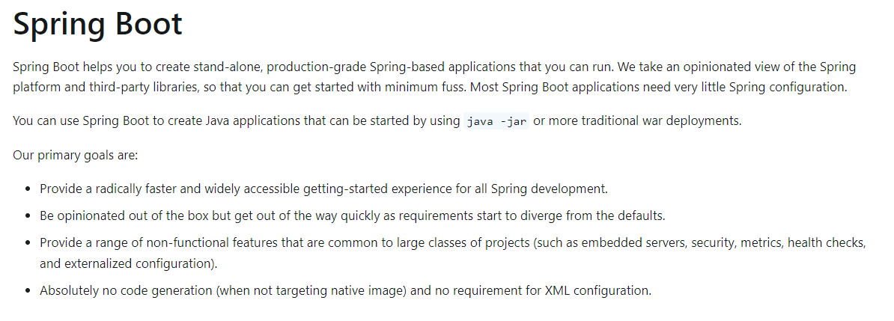

翻译：

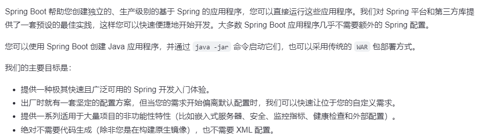

Spring Boot倡导`约定优于配置`，将`简化开发`发挥到极致。使用Spring Boot框架可以快速构建Spring应用，再也不需要`大量的繁琐的`的各种配置。Spring Boot框架设计的目标是：程序员关注业务逻辑就行了，环境方面的事儿交给Spring Boot就行。

**Spring Boot特性：**

1. 快速创建独立的Spring应用程序。（Spring支持的SpringBoot都支持，也就是说SpringBoot全方位支持IoC，AOP等）
2. 嵌入式的Tomcat、Jetty、Undertow容器。（web服务器本身就是几个jar包，Spring Boot框架自动嵌入了。）
3. 需要什么功能时只需要引入对应的starter启动器即可。（启动器可以自动管理这个功能相关的依赖，自动管理依赖版本的控制）
4. 尽最大努力，最大可能的自动配置Spring应用和第三方库。（例如默认支持 thymeleaf，你不需要手动配置视图解析器，引入依赖即可）
5. 没有代码生成，没有XML配置。（不会像某些框架那样生成.java源文件）
6. 提供了生产监控的支持，例如健康检查，度量信息，跟踪信息，审计信息等。也支持集成外部监控系统。

Spring Boot的开箱即用和约定优于配置：

- 开箱即用：Spring Boot框架设计得非常便捷，开发者能够在几乎不需要任何复杂的配置的情况下，快速搭建并运行一个功能完备的Spring应用。
- 约定优于配置：“约定优于配置”（Convention Over Configuration, CoC）是一种软件设计哲学，核心思想是通过提供一组合理的默认行为来减少配置的数量，从而简化开发流程。

# First Spring Boot


需求：在浏览器上输入请求路径 http://localhost:8080/hello，在浏览器上显示 HelloWorld!

使用**Spring Boot3 开发web应用**，实现步骤如下：

## 第一步：创建一个空的工程，并设置JDK版本21

Spring Boot 3要求JDK最低版本是17

## 第二步：设置maven

## 第三步：创建一个Maven模块 sb3-01-first-web

## 第四步：打开Spring Boot 3官方文档，按照文档一步一步进行

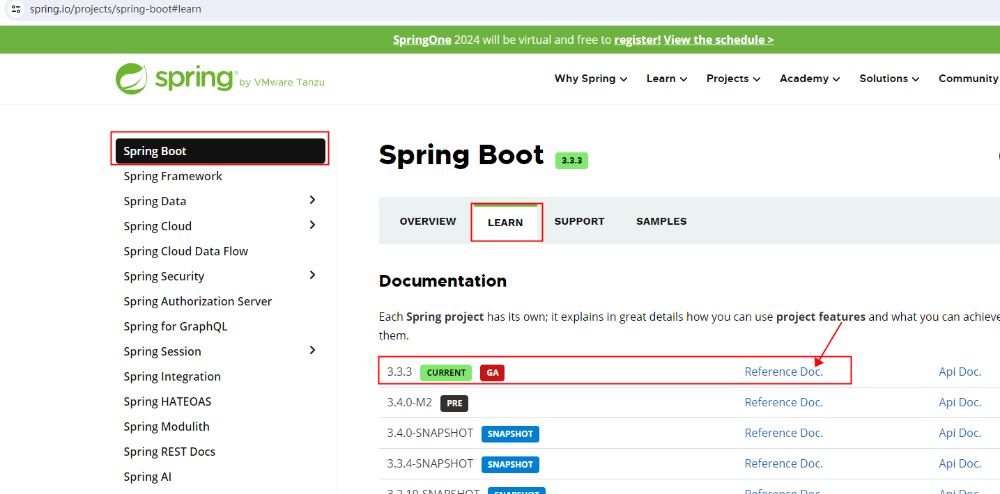

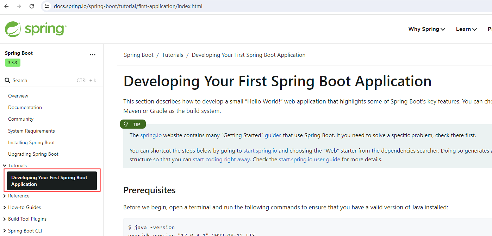

## 第五步：要使用Spring Boot 3，需要继承这个开源项目。从官方指导文档中复制以下内容：


```xml
<!--继承Spring Boot 3.5.8开源项目-->
<parent>
  <groupId>org.springframework.boot</groupId>
  <artifactId>spring-boot-starter-parent</artifactId>
  <version>3.5.8</version>
</parent>
```

我们开发的每一个项目其实可以看做是 Spring Boot 项目下的子项目。

**思考：使用 springboot 框架为什么和之前框架感觉不一样，以前我们学习框架的的时候，用它就引入它的依赖，但 springboot 这里是继承方式，而不是直接引入它的依赖。为什么呢？**

## 第六步：添加Spring Boot的web starter

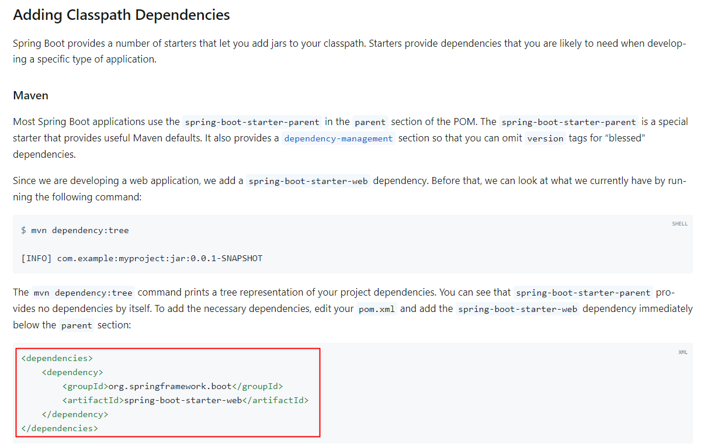

在parent下立即添加如下配置，让Spring Boot项目具备开发web应用的依赖：

```xml
<dependencies>
    <!--引入Spring Boot web启动器依赖-->
    <dependency>
        <groupId>org.springframework.boot</groupId>
        <artifactId>spring-boot-starter-web</artifactId>
    </dependency>
</dependencies>
```

关联的依赖也被引入进来，如下：

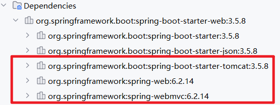

可以看到spring mvc被引入了，tomcat服务器也被引入了。

## 第七步：编写Spring Boot主入口程序

```java
package com.jkweilai.springboot;

import org.springframework.boot.SpringApplication;
import org.springframework.boot.autoconfigure.SpringBootApplication;

@SpringBootApplication
public class MyApplication {
    public static void main(String[] args) {
        SpringApplication.run(MyApplication.class, args);
    }
}
```

## 第八步：编写controller

```java
package com.jkweilai.springboot.controller;

import org.springframework.web.bind.annotation.GetMapping;
import org.springframework.web.bind.annotation.RestController;

@RestController
public class HelloController {
    
    @GetMapping("/hello")
    public String hello(){
        return "Hello World!";
    }
}
```

## 第九步：运行main方法就是启动web容器

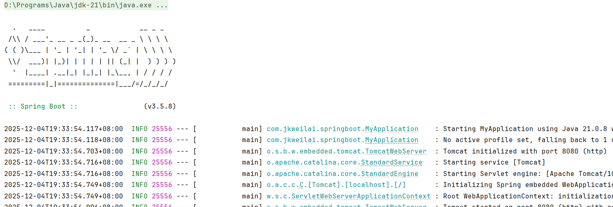

## 第十步：打开浏览器访问

[http://localhost:8080/hello](http://localhost:8080/hello)


# 便捷的部署方式


## 打jar包运行

Spring Boot提供了打包插件，可以将Spring Boot项目打包为**可执行 jar 包**。Web服务器（Tomcat）也会连同一块打入jar包中。只要电脑上安装了Java的运行环境（JDK），就可以启动Spring Boot项目。


根据官方文档指导，使用打包功能需要引入以下的插件：

```xml
<build>
        <plugins>
                <plugin>
                        <groupId>org.springframework.boot</groupId>
                        <artifactId>spring-boot-maven-plugin</artifactId>
                </plugin>
        </plugins>
</build>
```

执行打包命令，生成可执行jar包：


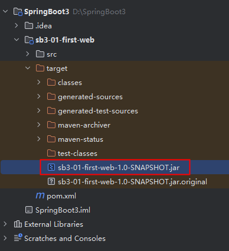

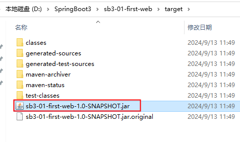

单独的将这个 jar 包可以拷贝到任何位置运行，通过`java -jar sb3-01-first-web-1.0-SNAPSHOT.jar`命令来启动 Spring Boot 项目：

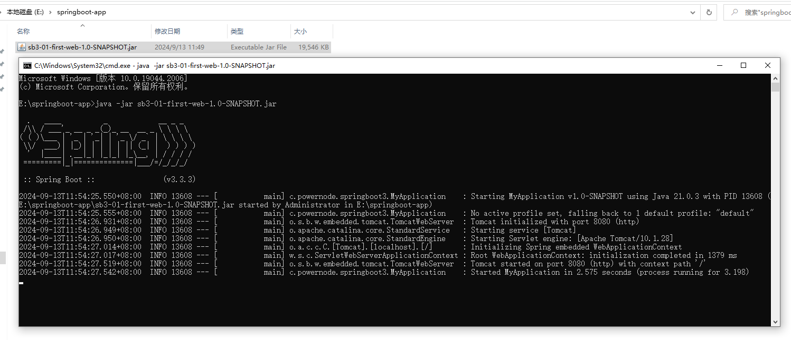

打开浏览器访问：


另外，Spring Boot框架为我们提供了非常灵活的配置，在可执行jar包的同级目录下新建配置文件：application.properties，并配置以下信息：

```plaintext
server.port=8888
```

重新启动服务器，然后使用新的端口号访问：


## SpringBoot的jar包和普通jar包的区别

Spring Boot 打包成的 JAR 文件与传统的 Java 应用程序中的 JAR 文件相比确实有一些显著的区别，主要体现在`依赖管理`和`可执行性`上。

**依赖管理**：

- Spring Boot 的 JAR 包通常包含了应用程序运行所需的所有依赖项，也就是说它是一个“fat jar”（胖 JAR 包），这种打包方式使得应用可以独立运行，而不需要外部的类路径或应用服务器上的其他依赖。
- 普通的 JAR 文件一般只包含一个类库的功能，并且需要依赖于特定的类路径来找到其他的类库或者框架，这些依赖项通常在部署环境中已经存在，比如在一个应用服务器中。

**可执行性**：

- Spring Boot 的 JAR 文件可以通过直接执行这个 JAR 文件来启动应用程序，也就是说它是一个可执行的 JAR 文件。通过 `java -jar your-application.jar` 命令就可以直接运行应用程序。
- 而普通的 JAR 文件通常是不可直接执行的，需要通过指定主类（main class）的方式或者其他方式来启动一个应用程序，例如使用 `-cp` 或 `-classpath` 加上类路径以及主类名来执行。

Spring Boot 的这些特性使得部署和运行变得更加简单和方便，特别是在微服务架构中，每个服务都可以被打包成独立的 JAR 文件并部署到任何支持 Java 的地方。

SpringBoot的可执行jar包目录结构：


普通jar包的目录结构：


# Spring Boot脚手架


## 什么是脚手架

### 建筑工程中的脚手架

在建筑工程领域，“脚手架”指的是临时性的结构，用于支撑建筑物以及建筑材料，同时为建筑工人提供工作平台。这种脚手架通常是由钢管、扣件、木板和其他配件组成的，可以根据施工需要搭建不同高度和形状的结构。


### 软件开发中的脚手架

在软件开发领域，“脚手架”指的是用于快速创建项目基本结构的工具或模板。它帮助开发者初始化项目，设置必要的目录结构、文件模板以及依赖项。

**脚手架 = 预设好的项目模板**

### Spring Boot脚手架

Spring Boot 脚手架（Scaffold）可以帮助开发者快速搭建一个Spring Boot项目结构，让开发者只专注于业务逻辑的开发，而不是在项目的初始阶段花费大量时间来配置环境或者解决依赖关系。

Spring Boot 脚手架工具存在多种形式，以下是一些常见的 Spring Boot 脚手架工具和方法：

- **Spring Initializr：**

这是 Spring 官方提供的工具，可以在 [https://start.spring.io](https://start.spring.io) 上找到。它允许开发者选择所需的依赖、Java 版本、构建工具（Maven 或 Gradle）以及其他配置选项来生成一个新的 Spring Boot 项目。

- **IntelliJ IDEA 内置支持：**

IntelliJ IDEA 集成了 Spring Initializr 的功能，可以在 IDE 内直接创建 Spring Boot 项目。

- **Start Alibaba Cloud：**

阿里云提供的 Start Alibaba Cloud 增强版工具，除了基本的 Spring Boot 模块外，还集成了阿里云服务和中间件的支持。

- **JHipster：**

JHipster 是一个流行的脚手架工具，用于生成完整的 Spring Boot 应用程序，包括前端（Angular, React 或 Vue.js）和后端。它还包括用户管理和认证等功能。

- **Yeoman Generators：**

Yeoman 是一个通用的脚手架工具，它有一个庞大的插件生态系统，其中包括用于生成 Spring Boot 项目的插件。

- **Bootify：**

Bootify 是另一个用于生成 Spring Boot 应用程序的脚手架工具，提供了一些预定义的应用模板。

- **Spring Boot CLI：**

Spring Boot CLI 是一个命令行工具，允许用户通过命令行来编写和运行 Spring Boot 应用。

- **Visual Studio Code 插件：**

Visual Studio Code 社区提供了多个插件，如 Spring Boot Extension Pack，可以帮助开发者生成 Spring Boot 项目的基本结构。

- **GitHub Gist 和 Bitbucket Templates：**

在 GitHub 和 Bitbucket 上，有很多开发者分享了用于生成 Spring Boot 项目的脚本或模板。

- **自定义脚手架：**

很多开发者也会根据自己的需求定制自己的脚手架工具，比如使用 Bash 脚本、Gradle 或 Maven 插件等。

## 使用官方提供的

### 使用官方脚手架生成Spring Boot项目

Spring Initializr：[https://start.spring.io](https://start.spring.io)

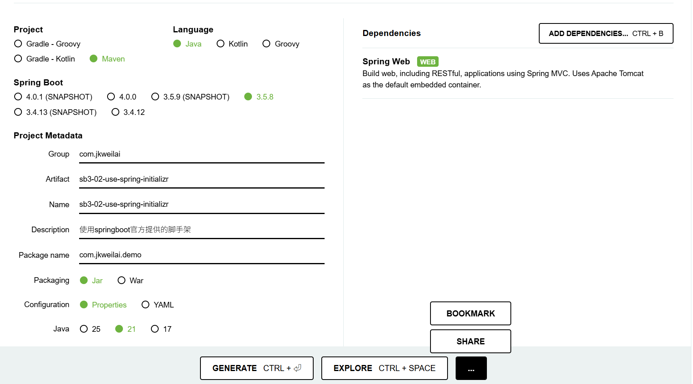

点击“GENERATE”后，生成zip压缩包：


将其解压后的目录结构是一个标准的maven 工程：

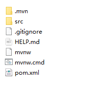

### 将项目放到IDEA当中

接下来将其导入到IDEA当中：直接将解压后的`sb3-02-use-spring-initializr`拷贝到我们新建的空工程`SpringBoot3`下，如图：


打开IDEA工具，你会看到如下图：

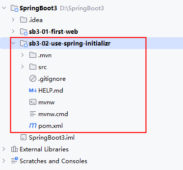

注意：如果`pom.xml`文件的图标颜色不是蓝色，而是橘色，需要在`pom.xml`文件上右键，选择：add as maven project。这样`pom.xml`文件的图标就会变为蓝色了。

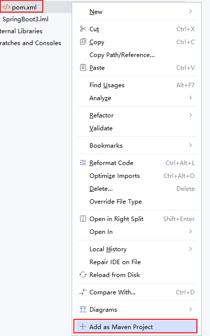

### 脚手架生成的pom.xml文件

```xml
<?xml version="1.0" encoding="UTF-8"?>
<project xmlns="http://maven.apache.org/POM/4.0.0" xmlns:xsi="http://www.w3.org/2001/XMLSchema-instance"
        xsi:schemaLocation="http://maven.apache.org/POM/4.0.0 https://maven.apache.org/xsd/maven-4.0.0.xsd">
        <modelVersion>4.0.0</modelVersion>
        <parent>
                <groupId>org.springframework.boot</groupId>
                <artifactId>spring-boot-starter-parent</artifactId>
                <version>3.5.8</version>
                <relativePath/> <!-- lookup parent from repository -->
        </parent>
        <groupId>com.jkweilai</groupId>
        <artifactId>sb3-02-use-spring-initializr</artifactId>
        <version>0.0.1-SNAPSHOT</version>
        <name>sb3-02-use-spring-initializr</name>
        <description>使用springboot官方提供的脚手架</description>
        <url/>
        <licenses>
                <license/>
        </licenses>
        <developers>
                <developer/>
        </developers>
        <scm>
                <connection/>

                <developerConnection/>
                <tag/>
                <url/>
        </scm>
        <properties>
                <java.version>21</java.version>
        </properties>
        <dependencies>
                <dependency>
                        <groupId>org.springframework.boot</groupId>
                        <artifactId>spring-boot-starter-web</artifactId>
                </dependency>

                <dependency>
                        <groupId>org.springframework.boot</groupId>
                        <artifactId>spring-boot-starter-test</artifactId>
                        <scope>test</scope>
                </dependency>
        </dependencies>

        <build>
                <plugins>
                        <plugin>
                                <groupId>org.springframework.boot</groupId>
                                <artifactId>spring-boot-maven-plugin</artifactId>
                        </plugin>
                </plugins>
        </build>

</project>
```

可以看到脚手架生成的`pom.xml`文件的内容和我们手动创建Spring Boot项目的`pom.xml`文件是一样的。

### 脚手架生成的Spring Boot项目的结构

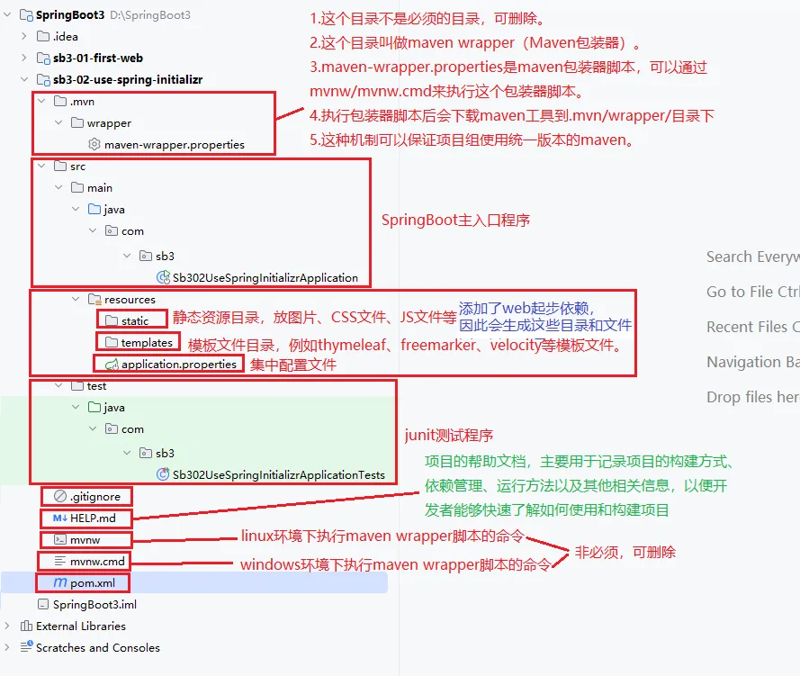

请仔细阅读上图来学习Spring Boot项目结构。

### 编写controller并测试

新建controller包，并新建HelloController类，如下图：

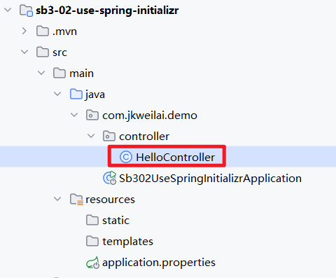

**重点：默认情况下，SpringBoot项目只扫描主入口程序所在目录以及子目录，因此创建的Controller类要求放在主入口程序的同级目录下或子目录下。其他位置默认情况下扫描不到。**

启动应用并访问：


## 使用IDEA工具的脚手架插件

IDEA工具自带了Spring Boot脚手架的插件，使用它会更加的方便，让我们来操作一下：

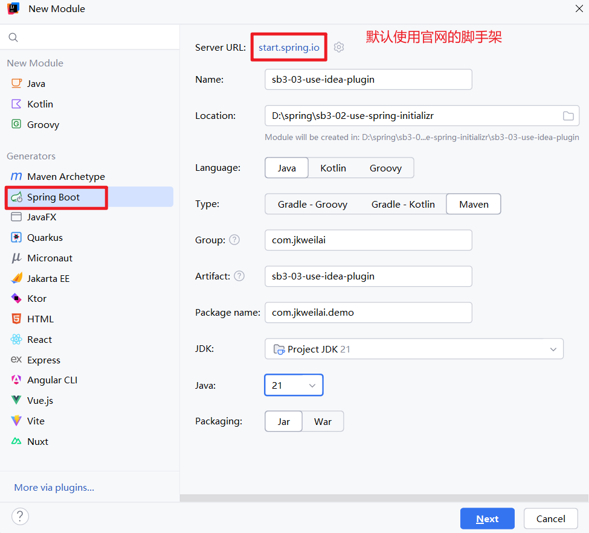

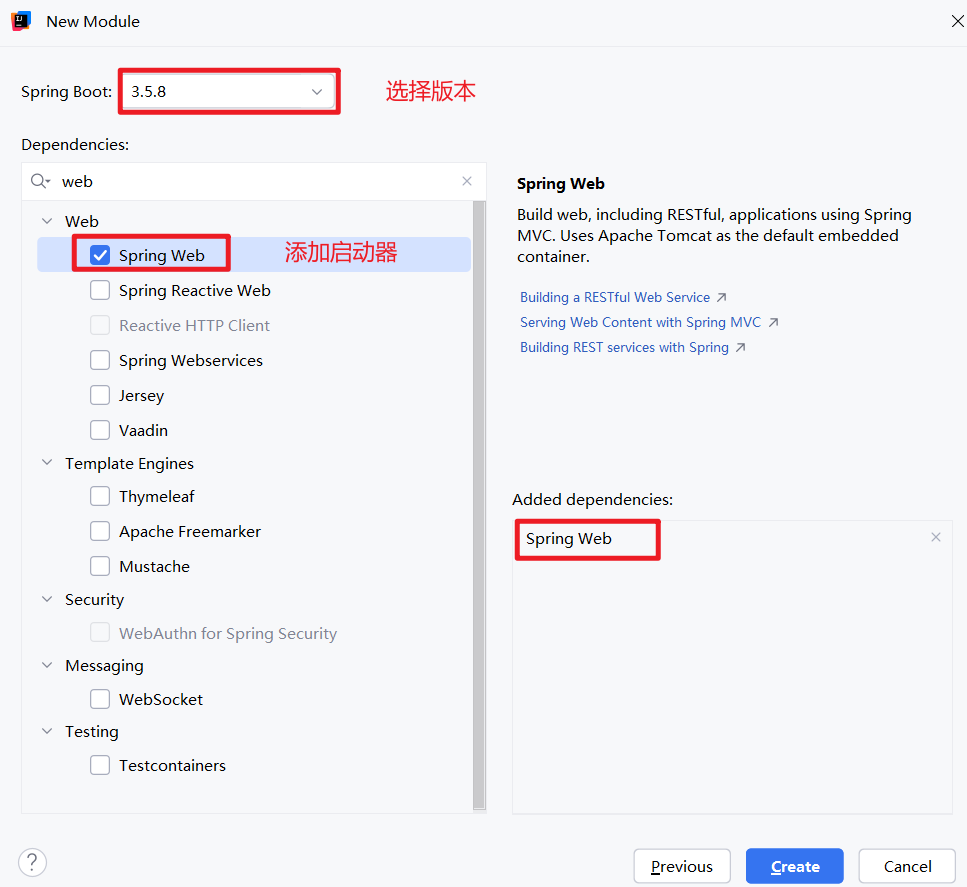

编写控制器，启动服务器测试：


# 为何以继承方式引入SpringBoot


## 提出疑问

以前我们在开发项目时，需要什么，引入对应的依赖就行，比如我们需要连接mysql数据，则引入mysql驱动的依赖，如下：

```xml
<dependency>
  <groupId>com.mysql</groupId>
  <artifactId>mysql-connector-j</artifactId>
  <version>8.3.0</version>
</dependency>
```

现在我们要使用SpringBoot框架，按说也应该采用依赖的方式将SpringBoot框架引入，如下：

```xml
<dependency>
  <groupId>org.springframework.boot</groupId>
  <artifactId>spring-boot-starter-parent</artifactId>
  <version>3.5.8</version>
</dependency>
```

但是SpringBoot官方推荐的不是直接引入依赖，而是采用继承的方式实现，如下：

```xml
<parent>
    <groupId>org.springframework.boot</groupId>
    <artifactId>spring-boot-starter-parent</artifactId>
    <version>3.5.8</version>
</parent>
```

**为什么？**

## 作为父项目和作为依赖的区别

**继承父工程的优势**

- 依赖管理：可以在父工程中定义依赖的版本，子模块可以直接引用而不必指定版本号。
- 插件管理：可以在父工程中配置常用的插件及其版本，子模块可以直接使用这些配置。
- 属性设置：可以在父工程中定义一些通用的属性，如项目编码、Java 版本等。
- 统一配置：可以统一多个子模块的构建配置，确保一致性。

**直接引入依赖的局限性**（如果你不使用继承父工程的方式，而是通过直接引入依赖的方式来管理项目，那么你将失去上述的一些优势）

- 依赖版本管理：每个子模块都需要单独指定依赖的版本，这会导致大量的重复配置，并且难以维护。
- 插件配置：每个子模块都需要单独配置插件及其版本，无法共享父工程中的插件配置。
- 属性设置：每个子模块都需要单独设置通用的属性，如项目编码、Java 版本等。
- 构建配置：每个子模块的构建配置需要单独维护，难以保证一致性。

**总结：选择哪种方式取决于你的具体需求。**

- **如果你希望多个项目之间共享构建配置，那么使用父项目是一个好的选择；**
- **如果你只是想在项目之间共享代码，那么应该使用依赖关系。**

## 原理揭晓

通过源码来分析一下：

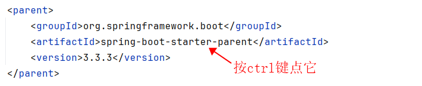


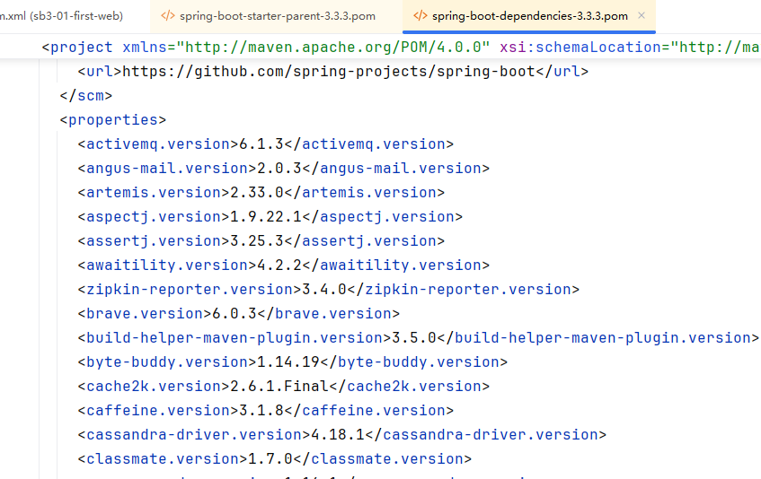

通过上图源码可以看到Spring Boot预先对开发中需要用到的依赖进行了版本的统一管理。我们需要和SpringBoot框架共享这个构建配置。因此官方推荐使用继承的方式引入SpringBoot框架。

**也就是说：每个 SpringBoot 版本都为我们提前打包好了一套兼容的、稳定的依赖库。我们使用 springboot，不需要手动指定某个依赖的版本，除非这个依赖没有被打包进 SpringBoot（SpringBoot 瞧不上它：嘿嘿）。**

## 依赖统一管理的好处

Spring Boot 框架的一个重要特性就是简化了项目依赖管理。它通过提供一个叫做“依赖管理”的功能来帮助开发者更容易地管理和使用第三方库和其他 Spring 组件。具体来说，Spring Boot 提供了一个包含多个 Spring 和其他常用库的依赖版本配置文件（通常是在 `spring-boot-dependencies` 文件中），这使得开发者不需要在自己的项目中显式指定这些依赖的版本号。

这样做有以下几个好处：

1. **简化依赖声明**：
开发者只需要在 `pom.xml` 文件中声明需要的依赖而不需要指定其版本号，因为 Spring Boot 已经为这些依赖指定了版本。例如，如果你需要使用mysql驱动，你只需要添加相应的依赖声明而不需要关心版本。

```xml
<dependency>
    <groupId>com.mysql</groupId>
    <artifactId>mysql-connector-j</artifactId>
</dependency>
```

1. **避免版本冲突**：
当多个库之间存在依赖关系的时候，如果手动管理版本可能会导致版本之间的冲突（即“依赖地狱”）。Spring Boot 提供的统一版本管理可以减少这种冲突的可能性。
2. **易于升级**：
当 Spring Boot 发布新版本时，通常会更新其依赖库到最新稳定版。因此，当你升级 Spring Boot 版本时，它所管理的所有依赖也会随之更新到兼容的版本。
3. **减少配置错误**：
由于 Spring Boot 自动处理了依赖的版本，减少了手动输入版本号可能引入的拼写或格式错误。
4. **提高开发效率**：
开发者可以专注于业务逻辑的编写，而不是花费时间在解决依赖问题上。

总的来说，Spring Boot 的依赖管理功能使得开发者可以更加专注于业务逻辑的实现，同时减少了因依赖版本不一致而引发的问题，提高了项目的可维护性和开发效率。

当然，如果你在项目中需要更改某个依赖的版本号，不想使用SpringBoot框架指定的版本号，只需要在引入依赖时强行执行版本号即可，maven是支持就近原则的：

这样做就是采用SpringBoot指定版本的依赖：

```xml
<dependency>
    <groupId>com.mysql</groupId>
    <artifactId>mysql-connector-j</artifactId>
</dependency>
```


这样做就是不采用SpringBoot指定版本的依赖：

```xml
<dependency>
    <groupId>com.mysql</groupId>
    <artifactId>mysql-connector-j</artifactId>
    <version>8.2.0</version>
</dependency>
```

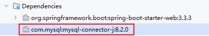

# Starter-启动器


在 Spring Boot 中，启动器（Starter）本质上是一个简化依赖管理的概念。

Spring Boot 的启动器本质上就是一组预定义的依赖集合，它们被组织成一个个 Maven的依赖，以方便开发者快速集成特定的功能模块。

如果你想做web开发，只需要引入web启动器。web启动器会自动引入web开发所需要的子依赖。

**启动器 starter 的引入是会引入具体依赖的。**`**<font style="color:#DF2A3F;"><dependencyManagement></font>**`**只声明/锁定依赖的版本，但它不会引入具体的依赖。**

**引入一个启动器，就是引入这个开发场景下对应的一套依赖。**

## 启动器实现原理

1. **依赖聚合**：
每个启动器通常对应一个特定的功能集或者一个完整的应用模块，如 `spring-boot-starter-web` 就包含了构建 Web 应用所需的所有基本依赖项，如 Spring MVC, Tomcat 嵌入式容器等。
2. **依赖传递**：
当你在项目中引入一个启动器时，它不仅会把自身作为依赖加入到你的项目中，还会把它的所有直接依赖项（transitive dependencies）也加入进来。这意味着你不需要单独声明这些依赖项，它们会自动成为项目的一部分。
3. **自动配置**：
许多启动器还提供了自动配置（Auto-configuration），这是一种机制，允许 Spring Boot 根据类路径上的可用组件自动设置你的应用程序。例如，如果类路径上有 DispatcherServlet 和嵌入式 Tomcat，则 Spring Boot 会自动配置它们，并准备好一个 web 应用程序。

**使用启动器的示例**

假设你想创建一个基于 Spring MVC 的 RESTful Web 应用，你可以简单地将 `spring-boot-starter-web` 添加到你的项目中：

```xml
<dependency>
    <groupId>org.springframework.boot</groupId>
    <artifactId>spring-boot-starter-web</artifactId>
</dependency>
```

当你添加这个依赖时，Spring Boot 会处理所有必要的细节，包括添加 Spring MVC 和 Tomcat 作为嵌入式 Servlet 容器，并且根据类路径上的内容进行适当的自动配置。如下图所示：

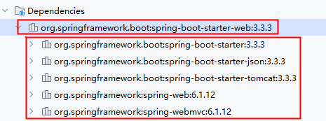

这就是 Spring Boot 启动器的基本实现原理，它简化了依赖管理，让开发者能够更专注于业务逻辑的实现。

## 每个 Starter 是一个独立的 Maven 项目

1. 启动器是独立的 Maven 项目（有的启动器是 springboot 官方提供的，有的启动器是第三方的）。
2. 在非 SpringBoot 项目中也可以使用。在普通的 Spring 项目中也可以使用启动器。
3. 启动器是独立的 Maven 项目，**它没有继承 springboot**。每个启动器中的子依赖的版本都是启动器自己管理的（自己管理的意思是：程序员人工管理的，人工保证依赖的版本）。但启动器本身的版本是由 springboot 项目管理的。可以通过下图看到每个启动器管理自己子依赖版本。

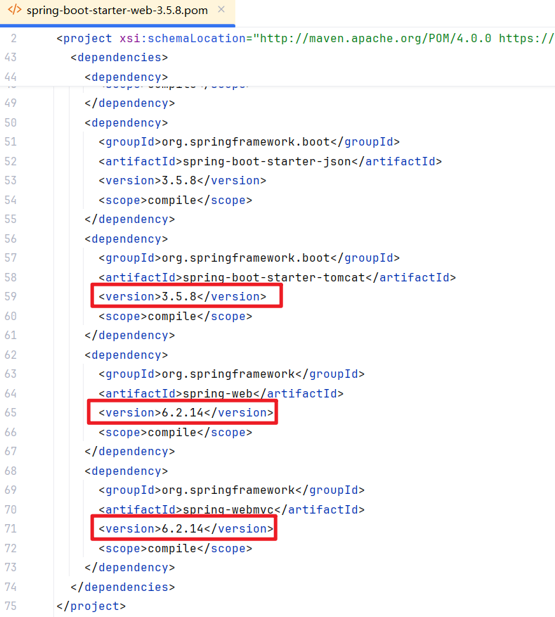

1. 当然，一个启动器，可以关联依赖其他启动器。不要把它想的太高端，就把一个启动器当做一个依赖就行了。和引入 mysql 驱动没啥区别。
2. 启动器中的子依赖的每一个版本是人工管理的，这个怎么理解？
  1. 启动器的开发人员在指定该启动器**子依赖**的版本时，参照 SpringBoot 的 BOM（物料清单（Bill of Materials））。
  2. 什么是 BOM？**如果一个POM文件中主要包含**`**<font style="color:rgb(15, 17, 21);background-color:rgb(235, 238, 242);">dependencyManagement</font>**`**，并且被设计为供其他项目**`**<font style="color:rgb(15, 17, 21);background-color:rgb(235, 238, 242);">import</font>**`**使用，那么它就可以被称为BOM。**
    1. 一个真正的BOM应该具备：
      1. `**<font style="color:rgb(15, 17, 21);background-color:rgb(235, 238, 242);"><packaging>pom</packaging></font>**` - 声明这是一个POM类型项目
      2. **主要/唯一内容是**`**<font style="color:rgb(15, 17, 21);background-color:rgb(235, 238, 242);">dependencyManagement</font>**` - 定义版本
      3. **很少或没有**`**<font style="color:rgb(15, 17, 21);background-color:rgb(235, 238, 242);"><dependencies></font>**` - 不直接引入依赖
      4. **被其他项目**`**<font style="color:rgb(15, 17, 21);background-color:rgb(235, 238, 242);">import</font>**` - 设计目的就是被引用
  3. SpringBoot 的 BOM 是：`<font style="color:rgb(15, 17, 21);">spring-boot-dependencies-3.5.8.pom</font>`

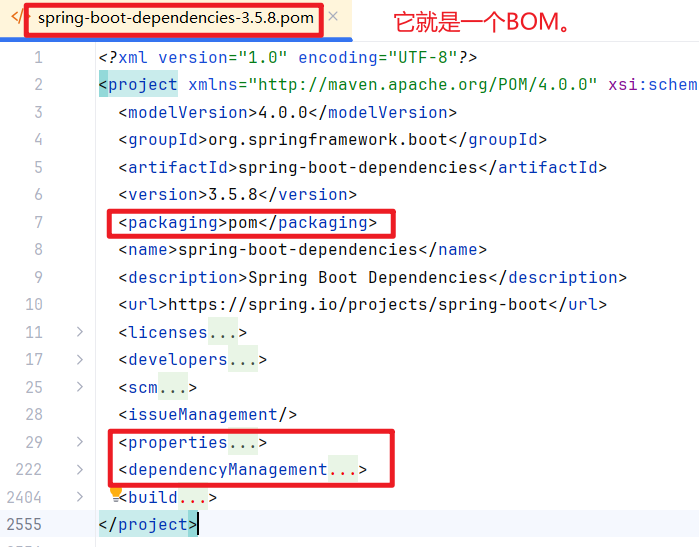

```plaintext
4. <font style="color:rgb(15, 17, 21);">启动器开发者是如何进行人工管理子依赖版本的？</font>
    1. <font style="color:rgb(15, 17, 21);">比如启动器的开发人员正在开发的 web 启动器的版本是：</font>`<font style="color:rgb(15, 17, 21);">spring-boot-starter-web-3.5.8</font>`
    2. <font style="color:rgb(15, 17, 21);">那么他们就会去 </font>`<font style="color:rgb(15, 17, 21);">spring-boot-dependencies-3.5.8.pom</font>`<font style="color:rgb(15, 17, 21);">中找子依赖的版本。</font>
```

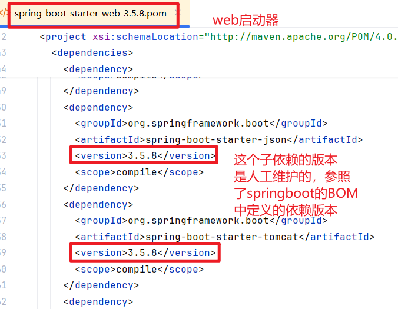

1. 启动器中子依赖的版本如果和 SpringBoot 的 BOM 中的依赖版本不一致，**以 BOM 中的版本为准**。
2. 启动器中子依赖不一定在 SpringBoot 的 BOM 中都存在！！

## SpringBoot 保证版本一致性的核心机制

1. ✅ 我们的项目继承Spring Boot父项目，决定使用哪个大版本，例如（3.5.8）
2. ✅ 引入启动器时**不写版本**，自动使用父项目定义的版本（因此启动器使用的也是 3.5.8）
3. ✅ 启动器内部依赖的版本**应该**按BOM标准写（程序员编写启动器的子依赖时，自己写，但要参考 SpringBoot 的 BOM，和它一样。）
4. ✅ 即使启动器写错版本（**程序员手滑写错了**），**最终以BOM为准**

这就是Spring Boot保证版本一致性的核心机制。

**大家必须要掌握的内容是：你写的项目、Spring Boot 父项目、启动器 三者的关系！！！**

## 都有哪些启动器

启动器通常包括：

- SpringBoot官方提供的启动器
- 非官方提供的启动器

### 官方提供的启动器

启动器命名特点：spring-boot-starter-*


### 非官方的启动器

启动器命名特点：*-spring-boot-starter


# Spring Boot核心注解


创建一个新的模块，来学习Spring Boot核心注解：

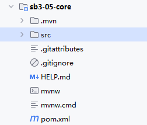

只加入web启动器。

## @SpringBootApplication注解

Spring Boot的主入口程序被`@SpringBootApplication`注解标注，可见这个注解的重要性，查看它的源码：

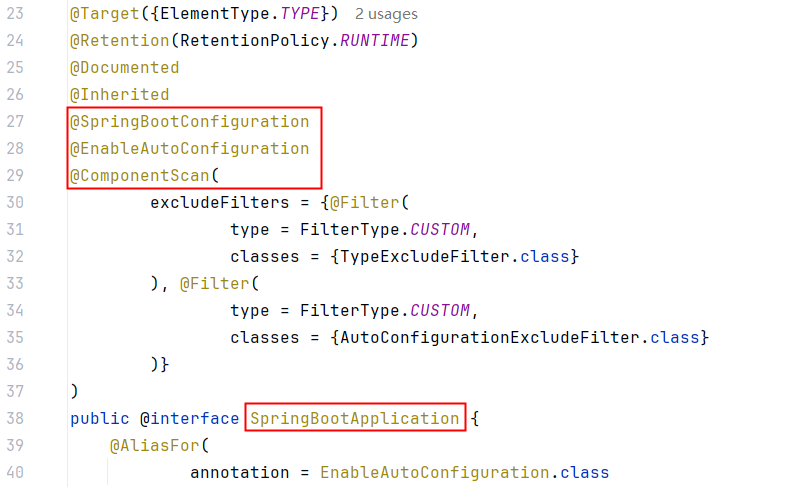

可以看出这个注解属于`组合注解`。拥有`@SpringBootConfiguration`、`@EnableAutoConfiguration`、`@ComponentScan`的功能。

## @SpringBootConfiguration注解

@SpringBootConfiguration注解的源码如下：

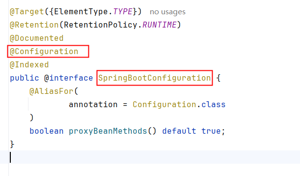

可以看到这个注解的被`@Configuration`标注，说明`主入口`程序是一个配置类。也就是说主入口中的方法可以被`@Bean`注解标注，被`@Bean`注解的标注的方法会被Spring容器自动调用，并且将该方法的返回对象纳入IoC容器的管理。测试一下：

```java
@SpringBootApplication
public class Sb305CoreApplication {
    @Bean
    public Date getNowDate(){ // 方法名作为bean的id
        return new Date();
    }
    public static void main(String[] args) {
        ConfigurableApplicationContext applicationContext = SpringApplication.run(Sb305CoreApplication.class, args);
        Date dateBean1 = applicationContext.getBean(Date.class);
        System.out.println(dateBean1);
        Date dateBean2 = applicationContext.getBean("getNowDate", Date.class);
        System.out.println(dateBean2);
    }
}
```

执行结果：

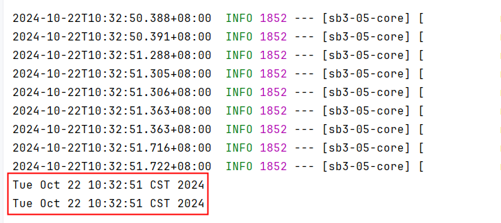

通过测试我们也认证了这一点：`SpringBoot主入口类实际上就是一个配置类`。

这个`配置类`也可以称为`源`，起源的意思，SpringBoot从这个配置类开始加载项目中所有的bean。

## @EnableAutoConfiguration注解

该注解表示`启用自动配置`。

Spring Boot 会根据你引入的依赖自动为你配置好一系列的 Bean，无需手动编写复杂的配置代码。

例如：如果你在SpringBoot项目中进行了如下配置：

```plaintext
spring.datasource.driver-class-name=com.mysql.cj.jdbc.Driver
spring.datasource.url=jdbc:mysql://localhost:3306/springboot
spring.datasource.username=root
spring.datasource.password=123456
```

并且在依赖中引入了`mybatis依赖`/`mybatis启动器`，那么SpringBoot框架将为你自动化配置以下bean：

- **SqlSessionFactory**: MyBatis的核心工厂SqlSessionFactory会被自动配置。这个工厂负责创建SqlSession实例，后者用来执行映射文件中的SQL语句。
- **TransactionManager**: DataSourceTransactionManager会被自动配置来管理与数据源相关的事务。

## @ComponentScan注解

这个注解的作用是：启动组件扫描功能，代替spring框架xml文件中这个配置：

```xml
<context:component-scan base-package="com.jkweilai.sb305core"/>
```

因此被`@SpringBootApplication`注解标注之后，会启动组件扫描功能，扫描的包是`主入口程序所在包及子包`，因此如果一个bean要纳入IoC容器的管理则必须放到主入口程序所在包及子包下。放到主入口程序所在包之外的话，扫描不到。测试一下：

### 扫描到

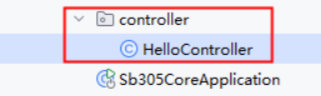

`HelloController`代码如下：

```java
@RestController
public class HelloController {
    @GetMapping("/hello")
    public String hello(){
        return "hello world!";
    }
}
```

启动服务器测试：


### 扫描不到

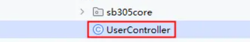

可以看到`UserController`没有在`sb305core`包下。

`UserController`代码如下：

```java
@RestController
public class UserController {
    @GetMapping("/list")
    public String list(){
        return "user list!";
    }
}
```

启动服务器测试：

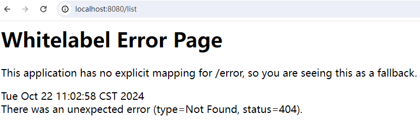

通过测试得知`UserController`没有被纳入IoC容器的管理。

最终结论：要让bean纳入IoC容器的管理，必须将类放到主入口程序同级目录下，或者子目录下。

### 怎么改变默认的扫描行为

可以通过以下方式来指定扫描的范围，这样就会改变默认的扫描规则：

`@SpringBootApplication(scanBasePackages = "com")`

# Spring Boot的单元测试


## 不使用单元测试怎么调用service

### 创建模块

使用脚手架创建sb3-06-test模块，不添加任何启动器：


### 编写service

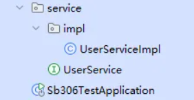

```java
package com.jkweilai.sb306test.service.impl;

import com.jkweilai.sb306test.service.UserService;
import org.springframework.stereotype.Service;

@Service("userService")
public class UserServiceImpl implements UserService {
    @Override
    public void save() {
        System.out.println("保存用户信息");
    }
}
```

### 直接在入口程序中调用service

```java
@SpringBootApplication
public class Sb306TestApplication {
    public static void main(String[] args) {
        ConfigurableApplicationContext applicationContext = SpringApplication.run(Sb306TestApplication.class, args);
        UserService userService = applicationContext.getBean("userService", UserService.class);
        userService.save();
    }
}
```

执行结果：

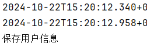

这种方式就是手动获取Spring上下文对象`ConfigurableApplicationContext`，然后调用getBean方法从Spring容器中获取service对象，然后调用方法。

## 使用单元测试怎么调用service

### test-starter引入以及测试类编写

使用单元测试应该如何调用service对象上的方法呢？

在使用脚手架创建Spring Boot项目时，为我们生成了单元测试类，如下：

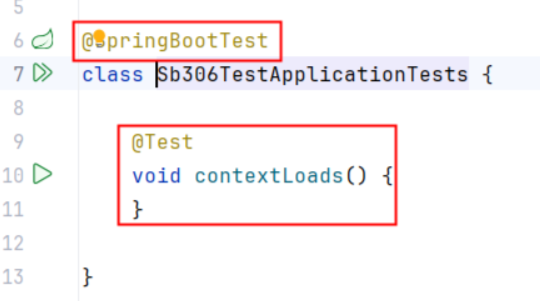

当然，如果要使用单元测试，需要引入单元测试启动器，如果使用脚手架创建SpringBoot项目，这个test启动器会自动引入：

```xml
<dependency>
    <groupId>org.springframework.boot</groupId>
    <artifactId>spring-boot-starter-test</artifactId>
    <scope>test</scope>
</dependency>
```

### @SpringBootTest注解

`@SpringBootTest` 会创建一个完整的 Spring 应用程序上下文（Application Context），这个上下文包含了应用程序的所有组件和服务。以下是 `@SpringBootTest` 做的一些主要工作：

1. **创建 ApplicationContext**：
  - `@SpringBootTest` 使用 `SpringApplication` 的 `run()` 方法来启动一个 Spring Boot 应用程序上下文。这意味着它会加载应用程序的主配置类和其他相关的配置类。
2. **加载配置文件**：
  - 它会查找并加载默认的配置文件，如 `application.properties`
3. **自动配置**：
  - 如果应用程序依赖于 Spring Boot 的自动配置特性，`@SpringBootTest` 会确保这些自动配置生效。这意味着它会根据可用的类和bean来自动配置一些组件，如数据库连接、消息队列等。
4. **注入依赖**：
  - 使用 `@SpringBootTest` 创建的应用程序上下文允许你在测试类中使用 `@Autowired` 注入需要的 bean，就像在一个真实的 Spring Boot 应用程序中一样。

总的来说，`@SpringBootTest` 为你的测试提供了尽可能接近实际运行时环境的条件，这对于验证应用程序的行为非常有用。

### 注入service并调用

```java
@SpringBootTest
class Sb306TestApplicationTests {

    @Autowired
    private UserService userService;
    
    @Test
    void contextLoads() {
        userService.save();
    }

}
```

测试结果如下：

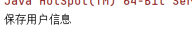

# 外部化配置


## 什么是外部化配置

外部化配置是指：将`配置信息`存储在`应用程序代码`之外的地方。这样`配置信息`可以独立于代码进行管理。这样方便了配置的修改，并且修改后不需要重新编译代码，也不需要重新部署项目。

### 外部化配置的方式

SpringBoot支持多种外部化配置方式，包括但不限于：

- properties文件
- YAML文件
- 系统环境变量
- 命令行参数
- ......

### 外部化配置的优势

1. **灵活性**：配置文件可以独立于应用程序部署，这使得可以根据运行环境的不同来调整配置，而无需修改代码。
2. **易于维护**：配置变更不需要重新构建和部署应用程序，降低了维护成本。
3. **安全性**：敏感信息如数据库密码、API密钥等可以存储在外部，并且可以限制谁有权限访问这些配置信息。
4. **共享性**：多实例或多服务可以共享相同的配置信息，减少重复配置的工作量。
5. **版本控制**：配置文件可以存放在版本控制系统中，便于跟踪历史版本和回滚配置。

总之，外部化配置使得配置更加灵活、安全、易于管理和共享，是现代云原生应用中非常推荐的做法

### 外部化配置对比传统配置

在传统的SSM三大框架中，如果修改XML的配置后，需要对应用重新打包，重新部署。

使用SpringBoot框架的`外部化配置`后，修改配置后，不需要对应用重新打包，也不需要重新部署，**最多重启一下服务即可**。

## application.properties

`application.properties`配置文件是SpringBoot框架默认的配置文件。

`application.properties`不是必须的，SpringBoot对于应用程序来说，都提供了一套默认配置（就是我们所说的自动配置）。

如果你要改变这些默认的行为，可以在`application.properties`文件中进行配置。

`application.properties`可以放在类路径当中，也可以放在项目之外。因此称为外部化配置。

Spring Boot 框架在启动时会尝试从以下位置加载 `application.properties` 配置文件：

1. `**file:./config/**`：首先在Spring Boot 当前工作目录下的 `config` 文件夹中查找。
  1. **注意：如果没有找到**`**<font style="color:#DF2A3F;">application.properties</font>**`**会继续找**`**<font style="color:#DF2A3F;">application.yml</font>**`**，如果这两个都没有找到，才会进入以下位置查找，以此类推。**
2. `**file:./**`：如果在当前工作目录下`config`目录中找不到时，再从当前工作目录中查找。
3. `**classpath:/config/**`： 如果从工作目录中找不到，会从类路径中找，先从类路径的 `/config/` 目录下寻找配置文件。
4. `**classpath:/**`：如果在 `/config/` 下没有找到，它会在类路径的根目录下查找。

**覆盖规则**：

- **优先级从高到低**（1 最高，4 最低）。
- **高优先级配置文件中的属性会覆盖低优先级中的同名属性**。
- **所有配置会合并**，不冲突的属性会同时生效。

如果你想要指定其他的配置文件位置或者改变默认的行为，可以通过 `--spring.config.location=` 后跟路径的方式来指定配置文件的具体位置。例如 ：

```plaintext
java -jar sb3-01-first-web-1.0-SNAPSHOT.jar --spring.config.location=file:///E:\a\b\application.properties
```

这样，Spring Boot 将会首先从 `E:\a\b\` 这个路径加载配置文件。注意，这种方式可以用来覆盖默认的配置文件位置，**它的优先级是最高的**。

注意：以上的`--spring.config.location=file:///E:\a\b\application.properties`就属于命令行参数，它将来会被传递到**main方法的(String[] args)**参数上。

## 使用@Value注解

**知识点列表：**

1. `**@Value("${key}")**`**可以取配置文件中的配置信息。**
2. `**@Value("${key}")**`**如果指定的 key 不存在，会报错。**
3. `**@Value("${key: defalut}")**`**语法可以指定默认值。**
4. `**@Value("${APP_KEY}")**`**语法也可以取操作系统的环境变量值。**

**这是一个比较重要的注解，在 Spring 中我们已经用过了，在这里再回顾一下。然后再补充一点内容。**

@Value注解可以将`application.properties`/`application.yml`文件中的配置信息注入/绑定到java对象的属性上。

**语法格式：@Value("${key}")**

使用脚手架创建SpringBoot项目，不添加任何启动器：

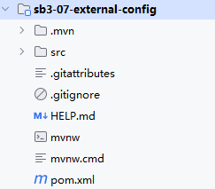

在`resources/application.properties`文件中进行如下配置：

```plaintext
myapp.username=jack
myapp.email=jack@123.com
myapp.age=30
```

编写service类：

```java
@Service("userService")
public class UserService {
    
    @Value("${myapp.username}")
    private String username;
    
    @Value("${myapp.email}")
    private String email;
    
    @Value("${myapp.age}")
    private Integer age;
    
    public void printInfo(){
        String str = String.join(",", username, email, String.valueOf(age));
        System.out.println(str);
    }
}
```

编写单元测试：

```java
@SpringBootTest
class Sb307ExternalConfigApplicationTests {
    @Autowired
    private UserService userService;
    @Test
    void test01() {
        userService.printInfo();
    }
}
```

运行结果：

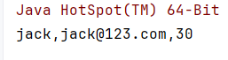

使用@Value注解时也可以指定默认值，当指定默认值时，如果配置文件中没有指定配置值，则采用默认值。

**语法格式：@Value("${key:defalut}")**

```java
@Service("userService")
public class UserService {

    @Value("${myapp.username}")
    private String username;

    @Value("${myapp.email}")
    private String email;

    @Value("${myapp.age}")
    private Integer age;
    
    @Value("${myapp.password:123456}")
    private String password;

    public void printInfo(){
        String str = String.join(",", username, email, String.valueOf(age), password);
        System.out.println(str);
    }
}
```

执行结果：

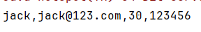

当然，如果配置文件进行了相关的配置，则不会采用默认值，修改配置文件`application.properties`：

```plaintext
myapp.username=jack
myapp.email=jack@123.com
myapp.age=30
myapp.password=888888
```

执行结果：

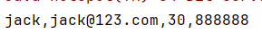

**另外，使用 **`**<font style="color:#DF2A3F;">@Value</font>**`**注解也可以读取系统的环境变量，例如 windows 系统有一个环境变量 **`**<font style="color:#DF2A3F;">APP_KEY</font>**`**，那么使用 **`**<font style="color:#DF2A3F;">@Value("${APP_KEY}")</font>**`**是可以读取到的。但配置文件 **`**<font style="color:#DF2A3F;">APP_KEY</font>**`**之后，一定要重启 windows 系统才行。**

## YAML

### YAML概述

SpringBoot采用集中式配置管理，所有的配置都编写到一个配置文件中：`application.properties`

如果配置非常多，层级不够分明，因此SpringBoot为了提高配置文件可读性，也支持YAML格式的配置文件：`application.yml`

YAML（YAML Ain't Markup Language）是一种人类可读的数据序列化格式，它通常用于配置文件，在各种编程语言中作为一种存储或传输数据的方式。YAML的设计目标是易于阅读和编写，同时保持足够的表达能力来表示复杂的数据结构。

**YAML文件的扩展名可以是**`**<font style="color:#DF2A3F;">.yaml</font>**`**或**`**<font style="color:#DF2A3F;">.yml</font>**`**。**

### 常见的数据存储和交换格式

`properties`、`XML`、`JSON`、`YAML`这几种格式确实是用来存储和交换数据的常见方式，但它们各有特点和适用场景：

**Properties**

- 这种格式主要用于Java应用程序中的配置文件。它是键值对的形式，每一行是一个键值对，使用等号或冒号分隔键和值。
- 特点是简单易懂，但在处理复杂结构的数据时显得力不从心。

**XML (eXtensible Markup Language)**

- XML是一种标记语言，用来描述数据的格式。它支持复杂的数据结构，包括嵌套和属性。
- XML文档具有良好的结构化特性，适合传输和存储结构化的数据。但是，XML文档通常体积较大，解析起来也比较耗资源。

**JSON (JavaScript Object Notation)**

- JSON是一种轻量级的数据交换格式，易于人阅读和编写，同时也易于机器解析和生成。它基于JavaScript的一个子集，支持多种数据类型，如数字、字符串、布尔值、数组和对象。
- JSON因为简洁和高效而广泛应用于Web应用程序之间进行数据交换。

**YAML (YAML Ain't Markup Language)**

- YAML设计的目标之一就是让人类更容易阅读。它支持类似JSON的数据序列化，但提供了更多的灵活性，例如缩进来表示数据结构。
- YAML非常适合用来编写配置文件，因为它允许以一种自然的方式组织数据，并且可以包含注释和其他人类可读的元素。

总结来说，这四种格式都可以用来存储和交换数据，但它们的设计初衷和最佳使用场景有所不同。选择哪种格式取决于具体的应用需求、数据复杂度、性能要求等因素。

### YAML的语法规则

YAML的语法规则如下：

1. 数据结构：YAML支持多种数据类型，包括：
  1. 字符串、数字、布尔值
  2. 数组、list集合
  3. map键值对 等。
2. YAML使用`一个冒号和一个空格`来分隔`属性名`和`属性值`，例如：
  1. `properties`文件中这样的配置：`name=jack`
  2. `yaml`文件中需要这样配置：`name: jack`
3. YAML用`换行+空格`来表示层级关系。注意不能使用tab，必须是空格，空格数量无要求，大部分建议2个或4个空格。例如：
  1. `properties`文件中这样的配置：`myapp.name=mall`
  2. `yaml`文件中就需要这样配置：

```yaml
myapp:
  name: mall
```

1. 同级元素左对齐。例如：
  1. `properties`文件中有这样的配置：

```plaintext
myapp.name=mall
myapp.count=10
```

```plaintext
2. `yaml`文件中就应该这样配置：
```

```yaml
myapp:
  name: mall
  count: 10
```

1. 键必须是唯一的：在一个映射中，键必须是唯一的。
2. 注释：使用`#`进行注释。
3. 区分大小写。

### YAML的使用小细节

**第一：**普通文本也可以使用单引号或双引号括起来：（当然普通文本也可以不使用单引号和双引号括起来。）

- 单引号括起来：单引号内所有的内容都被当做普通文本，不转义（例如字符串中有\n，则\n被当做普通的字符串）
- 双引号括起来：双引号中有 \n 则会被转义为换行符
- 单引号和双引号都不加，和添加单引号的效果一样。

**第二：**保留文本格式

- `|` 将文本写到这个符号的下层，会自动保留格式。

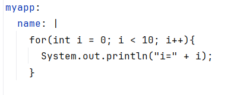

**第三：**换行变空格

- `>` 将文本写到这个符号的下层，内容中换行会自动变成空格。

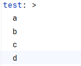

**第四：**文档切割

- --- 这个符号下面的配置可以认为是一个独立的yaml文件。便于庞大文件的阅读。

### application.yml

Spring Boot框架同时支持`properties`和`yaml`。

**强调：在同一个目录下同时存在**`**<font style="color:#DF2A3F;">application.properties</font>**`**和**`**<font style="color:#DF2A3F;">application.yml</font>**`**时，SpringBoot优先解析**`**<font style="color:#DF2A3F;">application.properties</font>**`**文件。**

在`resources/config`目录下新建`application.yml`文件，进行如下配置：

```yaml
myapp:
  username: jim
  email: jim@123.com
  age: 40
  password: jim123
```

一定要把`resources/config`目录下`application.properties`名字修改为`application2.properties`，这样Spring Boot才会解析`resources/config/application.yml`。


运行测试程序：

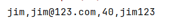

## 配置文件合并

一个项目中所有的配置全部编写到`application.properties`文件中，会导致配置臃肿，不易维护，有时我们会将配置编写到不同的文件中，例如：`application-mysql.properties`专门配置mysql的信息，`application-redis.properties`专门配置redis的信息，最终将两个配置文件合并到一个配置文件中。

### properties文件

`application-mysql.properties`

```plaintext
spring.datasource.username=root
spring.datasource.password=123456
```

`application-redis.properties`

```plaintext
spring.data.redis.host=localhost
spring.data.redis.port=6379
```

`application.properties`

```plaintext
spring.config.import=classpath:application-mysql.properties,classpath:application-redis.properties
```

编写service测试，看看能否拿到配置信息：

```java
package com.jkweilai.sb307externalconfig.service;

import org.springframework.beans.factory.annotation.Value;
import org.springframework.stereotype.Service;

@Service("userServiceMulti")
public class UserServiceMulti {
    @Value("${spring.datasource.username}")
    private String username;
    @Value("${spring.datasource.password}")
    private String password;
    @Value("${spring.data.redis.host}")
    private String host;
    @Value("${spring.data.redis.port}")
    private String port;
    
    public void printInfo(){
        String str = String.join(",", username, password, host, port);
        System.out.println(str);
    }
}
```

运行测试：

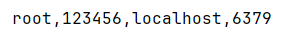

### yaml文件

`application-mysql.yml`

```yaml
spring:
  datasource:
    username: root
    password: 789789
```

`application-redis.yml`

```yaml
spring:
  data:
    redis:
      host: localhost
      port: 6379
```

`application.yml`

```yaml
spring:
  config:
    import:
      - classpath:application-mysql.yml
      - classpath:application-redis.yml
```

运行测试：


## 多环境切换

**知识点列表：**

1. **springboot 支持多配置文件切换**
2. **例如有 3 个配置文件：**`**application-x.properties**`**、**`**application-y.properties**`**、**`**application-z.properties**`
3. **在 **`**application.properties**`**中配置 **`**spring.profiles.active=x**`**则自动启用**`**application-x.properties**`**配置。**
4. **也可以通过命令行参数来指定启动哪个：--spring.profiles.active=x**

在Spring Boot中，多环境切换是指在一个应用程序中支持多种运行环境配置的能力。这通常用于区分开发（development）、测试（testing）、预生产（staging）和生产（production）等不同阶段的环境。

这种功能使得开发者能够在不同的环境中使用不同的配置，比如数据库连接信息、服务器端口、环境变量等，而不需要更改代码。这对于维护一个可移植且易于管理的应用程序非常重要。

1. 开发环境的配置文件名一般叫做：`application-dev.properties`

```plaintext
spring.datasource.username=dev
spring.datasource.password=dev123
spring.datasource.url=jdbc:mysql://localhost:3306/dev
```

1. 测试环境的配置文件名一般叫做：`application-test.properties`

```plaintext
spring.datasource.username=test
spring.datasource.password=test123
spring.datasource.url=jdbc:mysql://localhost:3306/test
```

1. 预生产环境的配置文件名一般叫做：`application-preprod.properties`

```plaintext
spring.datasource.username=preprod
spring.datasource.password=preprod123
spring.datasource.url=jdbc:mysql://localhost:3306/preprod
```

1. 生产环境的配置文件名一般叫做：`application-prod.properties`

```plaintext
spring.datasource.username=prod
spring.datasource.password=prod123
spring.datasource.url=jdbc:mysql://localhost:3306/prod
```

如果你希望该项目使用生产环境的配置，你可以这样做：

- 第一种方式：在`application.properties`文件中添加这个配置：**spring.profiles.active=prod**
- 第二种方式：在命令行参数上添加：**--spring.profiles.active=prod**

---

## 将配置绑定到bean

### 绑定简单bean

**知识点列表：**

1. **使用 **`**@Component**`**+**`**@ConfigurationProperties(prefix = "app")**`**可以将配置文件中的配置一次性绑定到 Bean 上。**
2. **如果没有前缀，**`**prefix**`**可以省略。**
3. **绑定时，配置文件中的 key 需要和 Bean 的属性名对应上，并且给属性提供 setter 方法。**
4. **bean 的属性需要是非静态的。**

SpringBoot配置文件中的信息除了可以使用`@Value注解`读取之外，也可以将配置信息一次性赋值给Bean对象的属性。

例如有这样的配置：

`application.yml`

```yaml
app:
  name: jack
  age: 30
  email: jack@123.com
```

Bean需要这样定义：

```java
package com.jkweilai.sb307externalconfig.bean;

import org.springframework.boot.context.properties.ConfigurationProperties;
import org.springframework.stereotype.Component;

@Component
@ConfigurationProperties(prefix = "app")
public class AppBean {
    private String name;
    private Integer age;
    private String email;

    @Override
    public String toString() {
        return "AppBean{" +
                "name='" + name + '\'' +
                ", age=" + age +
                ", email='" + email + '\'' +
                '}';
    }

    public String getName() {
        return name;
    }

    public void setName(String name) {
        this.name = name;
    }

    public Integer getAge() {
        return age;
    }

    public void setAge(Integer age) {
        this.age = age;
    }

    public String getEmail() {
        return email;
    }

    public void setEmail(String email) {
        this.email = email;
    }
}
```

说明：

1. 被绑定的bean，需要使用`@ConfigurationProperties(prefix = "app")`注解进行标注，prefix用来指定前缀，哪个是前缀，如下图所示：


配置文件中的`name`、`age`、`email`要和bean对象的属性名`name`、`age`、`email`对应上。（属性名相同）

并且bean中的所有属性都提供了`setter`方法。因为底层是通过`setter`方法给bean属性赋值的。

1. 注意：前缀 prefix 不是必须的，如果没有添加前缀，则从开始查找。
2. 这样的bean需要使用`@Component`注解进行标注，纳入IoC容器的管理。`@Component`注解负责创建Bean对象，`@ConfigurationProperties(prefix = "app")`注解负责给bean对象的属性赋值。
3. bean的属性需要是`非static`的属性。

编写测试程序，将bean对象输出，结果如下：


### @Configuration注解

**知识点列表：**

1. **如果是一个配置类的话，建议使用 **`**@Configuration**`**注解代替 **`**@Component**`**，语义更加明确。**
2. **使用 **`**@Configuration**`**注解后，输出对象的地址是一个代理对象地址（使用@Component 不会生成代理对象），生成代理对象效率较低，可以添加 **`**proxyBeanMethods = false**`**属性不生成代理对象。**
3. `**proxyBeanMethods = false**`**和 **`**proxyBeanMethods = true**`**的区别：**

**true：生成代理，虽然效率低，可以保证 bean 是单例。**

**false：不生成代理，虽然效率高，不保证单例。**

```java
@Configuration(proxyBeanMethods = false)
public class MyConfig {
    @Bean
    A a() { return new A(); }

    @Bean
    B b() {
        A a1 = a();  // 第1次调用
        A a2 = a();  // 第2次调用
        System.out.println(a1 == a2);
        return new B();
    }
}
class A {}
class B {}
```

以上操作中使用了`@Component注解`进行了标注，来纳入IoC容器的管理。也可以使用另外一个注解`@Configuration`，用这个注解将Bean标注为配置类。多数情况下我们会选择使用这个注解，因为该Bean对象的属性对应的就是配置文件中的配置信息，因此这个Bean我们也可以将其看做是一个配置类。

```java
@Configuration
@ConfigurationProperties(prefix = "app")
public class AppBean {
    private String name;
    private Integer age;
    private String email;
    //setter and getter
}
```

运行测试程序：


我们把这个Bean对象的类名打印一下看看：

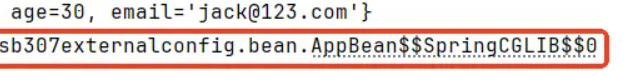

可以发现底层实际上创建了`AppBean`的代理对象`AppBean$$SpringCGLIB`。

生成代理对象会影响效率，这里我们不需要使用代理功能，可以通过以下配置来取消代理机制：

```java
@Configuration(proxyBeanMethods = false)
@ConfigurationProperties(prefix = "app")
public class AppBean {
    private String name;
    private Integer age;
    private String email;
    //setter and getter
}
```

执行结果如下：

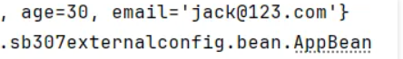

### 绑定嵌套bean

**知识点列表：**

1. **Bean 中嵌套一个 Bean，也可以绑定配置信息。比如 User 对象中有 Address 属性。**

当一个Bean中嵌套了一个Bean，这种情况下可以将配置信息绑定到该Bean上吗？当然可以。

有这样的一个配置：

```yaml
app:
  name: jack
  age: 30
  email: jack@123.com
  address: 
    city: BJ
    street: ChaoYang
    zipcode: 123456
```

需要编写这样的两个Bean：

```java
package com.jkweilai.sb307externalconfig.bean;

import org.springframework.boot.context.properties.ConfigurationProperties;
import org.springframework.context.annotation.Configuration;

@Configuration(proxyBeanMethods = false)
@ConfigurationProperties(prefix = "app")
public class AppBean {
    private String name;
    private Integer age;
    private String email;
    private Address address;

    @Override
    public String toString() {
        return "AppBean{" +
                "name='" + name + '\'' +
                ", age=" + age +
                ", email='" + email + '\'' +
                ", address=" + address +
                '}';
    }

    public Address getAddress() {
        return address;
    }

    public void setAddress(Address address) {
        this.address = address;
    }

    public String getName() {
        return name;
    }

    public void setName(String name) {
        this.name = name;
    }

    public Integer getAge() {
        return age;
    }

    public void setAge(Integer age) {
        this.age = age;
    }

    public String getEmail() {
        return email;
    }

    public void setEmail(String email) {
        this.email = email;
    }
}
```

```java
package com.jkweilai.sb307externalconfig.bean;

public class Address {
    private String city;
    private String street;
    private String zipcode;

    public String getCity() {
        return city;
    }

    public void setCity(String city) {
        this.city = city;
    }

    public String getStreet() {
        return street;
    }

    public void setStreet(String street) {
        this.street = street;
    }

    public String getZipcode() {
        return zipcode;
    }

    public void setZipcode(String zipcode) {
        this.zipcode = zipcode;
    }

    @Override
    public String toString() {
        return "Address{" +
                "city='" + city + '\'' +
                ", street='" + street + '\'' +
                ", zipcode='" + zipcode + '\'' +
                '}';
    }
}
```

执行测试程序，结果如下：

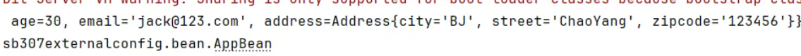

### @EnableConfigurationProperties与@ConfigurationPropertiesScan

**知识点列表：**

1. **之前的代码是这样写的：**** `**@Component**`+**`**@ConfigurationProperties(prefix = "app")**`
2. **或者是这样写的： **`**@Configuration**`**+**`**@ConfigurationProperties(prefix = "app")**`
3. **有了以下这两个注解（任意一个都行，要求写到主入口类上），**`**@Component**`**和 **`**@Configuration**`**可以省略了：**
  1. **@EnableConfigurationProperties(Bean.class)**
  2. **@****ConfigurationPropertiesScan(basePackages="")**

将`AppBean`纳入IoC容器的管理，之前我们说了两种方式：第一种是使用`@Component`，第二种是使用`@Configuration`。SpringBoot其实还提供了另外两种方式：

- 第一种：@EnableConfigurationProperties
- 第二种：@ConfigurationPropertiesScan

这两个注解都是标注在SpringBoot主入口程序上的：

```java
@EnableConfigurationProperties(AppBean.class)
@SpringBootApplication
public class Sb307ExternalConfigApplication {
    public static void main(String[] args) {
        SpringApplication.run(Sb307ExternalConfigApplication.class, args);
    }
}
```

或者

```java
@ConfigurationPropertiesScan(basePackages = "com.jkweilai.sb307externalconfig.bean")
@SpringBootApplication
public class Sb307ExternalConfigApplication {
    public static void main(String[] args) {
        SpringApplication.run(Sb307ExternalConfigApplication.class, args);
    }
}
```

运行测试程序，执行结果如下：

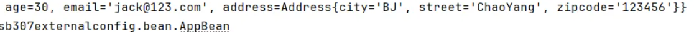

### 将配置赋值到Bean的Map/List/Array属性上

**知识点列表：**

1. **关键在于 **`**application.yml**`**中如何配置 Map/List/Array**

```yaml
# 数组
customers:

  - customer-name: jack
    age: 20
  - customer-name: lucy
    age: 30
# map
customer-map:
  customer1:
    customer-name: tom
    age: 20
  customer2:
    customer-name: jerry
    age: 30
# list（写法和数组一样）
customer-list:
  - customer-name: joke
    age: 30
  - customer-name: susan
    age: 40
```

代码如下：

```java
package com.jkweilai.sb307externalconfig.bean;

import org.springframework.boot.context.properties.ConfigurationProperties;

import java.util.Arrays;
import java.util.List;
import java.util.Map;

@ConfigurationProperties
public class CollectionConfig {
    private String[] names;
    private List<Product> products;
    private Map<String, Vip> vips;

    @Override
    public String toString() {
        return "CollectionConfig{" +
                "names=" + Arrays.toString(names) +
                ", products=" + products +
                ", vips=" + vips +
                '}';
    }

    public String[] getNames() {
        return names;
    }

    public void setNames(String[] names) {
        this.names = names;
    }

    public List<Product> getProducts() {
        return products;
    }

    public void setProducts(List<Product> products) {
        this.products = products;
    }

    public Map<String, Vip> getVips() {
        return vips;
    }

    public void setVips(Map<String, Vip> vips) {
        this.vips = vips;
    }
}

class Product {
    private String name;
    private Double price;

    @Override
    public String toString() {
        return "Product{" +
                "name='" + name + '\'' +
                ", price=" + price +
                '}';
    }

    public String getName() {
        return name;
    }

    public void setName(String name) {
        this.name = name;
    }

    public Double getPrice() {
        return price;
    }

    public void setPrice(Double price) {
        this.price = price;
    }
}

class Vip {
    private String name;
    private Integer age;

    @Override
    public String toString() {
        return "Vip{" +
                "name='" + name + '\'' +
                ", age=" + age +
                '}';
    }

    public String getName() {
        return name;
    }

    public void setName(String name) {
        this.name = name;
    }

    public Integer getAge() {
        return age;
    }

    public void setAge(Integer age) {
        this.age = age;
    }
}
```

配置信息如下：`application.yml`

```yaml
#数组
names:
  - jackson
  - lucy
  - lili

#List集合
products: 
  - name: 西瓜
    price: 3.0
  - name: 苹果
    price: 2.0

#Map集合
vips:
  vip1:
    name: 张三
    age: 20
  vip2:
    name: 李四
    age: 22
```

提醒：记得入口程序使用@ConfigurationPropertiesScan(basePackages = "com.jkweilai.sb307externalconfig.bean")进行标注。

编写测试程序，执行结果如下：


### 将配置绑定到第三方对象

**知识点列表：**

1. **如果 Bean 的源码我们接触不到，无法编辑源码，如何将配置文件的信息绑定到这个对象上？**
2. **使用 **`**@Bean**`**+**`**@ConfigurationProperties**`**可以实现。你只需要这么做，其他注解都不需要：**

```java
@Bean
@ConfigurationProperties
public SpringBean springBean() {
    return new SpringBean();
}
```

将配置文件中的信息绑定到某个Bean对象上，如果这个Bean对象没有源码，是第三方库提供的，怎么办？

此时可以单独编写一个方法，在方法上使用以下两个注解进行标注：

- **@Bean**
- **@ConfigurationProperties**

假设我们有这样一个类`Address`，代码如下：

```java
package com.jkweilai.sb307externalconfig.bean;

public class Address {
    private String city;
    private String street;
    private String zipcode;

    public String getCity() {
        return city;
    }

    public void setCity(String city) {
        this.city = city;
    }

    public String getStreet() {
        return street;
    }

    public void setStreet(String street) {
        this.street = street;
    }

    public String getZipcode() {
        return zipcode;
    }

    public void setZipcode(String zipcode) {
        this.zipcode = zipcode;
    }

    @Override
    public String toString() {
        return "Address{" +
                "city='" + city + '\'' +
                ", street='" + street + '\'' +
                ", zipcode='" + zipcode + '\'' +
                '}';
    }
}
```

当然，我们是看不到这个源码的，只知道有这样一个字节码`Address.class`。大家也可以看到这个`Address`类上没有添加任何注解。假设我们要将以下配置绑定到这个Bean上应该怎么做？

```yaml
address:
  city: TJ
  street: XiangYangLu
  zipcode: 11111111
```

实现代码如下：

```java
@Configuration
public class ApplicationConfig {
    @Bean
    @ConfigurationProperties(prefix = "address")
    public Address getAddress(){
        return new Address();
    }
}
```

运行结果如下：

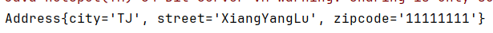

### 指定数据来源

**知识点列表：**

1. **如果需要加载的配置不是 **`**application.properties**`**中的，可以使用 **`**@PropertySource**`**来指定数据的来源。**
2. **@PropertySource("classpath:a/b/group-info.properties")**

之前所讲的内容是将Spring Boot框架默认的配置文件`application.properties`或`application.yml`作为数据的来源绑定到Bean上。如果配置信息没有在默认的配置文件中呢？可以使用@PropertySource注解指定配置文件的位置，这个配置文件可以是`.properties`，也可以是`.xml`。这里重点掌握`.properties`即可。

在`resources`目录下新建`a`目录，在`a`目录下新建`b`目录，`b`目录中新建`group-info.properties`文件，进行如下的配置：

```plaintext
group.name=IT
group.leader=LaoDu
group.count=20
```

定义Java类`Group`，然后进行注解标注：

```java
package com.jkweilai.sb307externalconfig.bean;

import org.springframework.boot.context.properties.ConfigurationProperties;
import org.springframework.context.annotation.Configuration;
import org.springframework.context.annotation.PropertySource;

@Configuration
@ConfigurationProperties(prefix = "group")
@PropertySource("classpath:a/b/group-info.properties")
public class Group {
    private String name;
    private String leader;
    private Integer count;

    @Override
    public String toString() {
        return "Group{" +
                "name='" + name + '\'' +
                ", leader='" + leader + '\'' +
                ", count=" + count +
                '}';
    }

    public String getName() {
        return name;
    }

    public void setName(String name) {
        this.name = name;
    }

    public String getLeader() {
        return leader;
    }

    public void setLeader(String leader) {
        this.leader = leader;
    }

    public Integer getCount() {
        return count;
    }

    public void setCount(Integer count) {
        this.count = count;
    }
}
```

以下三个注解分别起到什么作用：

- @Configuration：指定该类为配置类，纳入Spring容器的管理
- @ConfigurationProperties(prefix = "group")：将配置文件中的值赋值给Bean对象的属性
- @PropertySource("classpath:a/b/group-info.properties")：指定额外的配置文件

编写测试程序，测试结果如下：

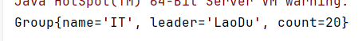

## @ImportResource注解

**知识点列表：**

1. **如果 Bean 的配置编写在 **`**XML**`**文件中，如果在SpringBoot框架中应该怎么实现呢？在入口类上使用@ImportResource注解实现**
2. **@ImportResource("classpath:applicationContext.xml")**

定义一个普通的Java类：Person

```java
package com.jkweilai.sb307externalconfig.bean;

public class Person {
    private String name;
    private String age;

    @Override
    public String toString() {
        return "Person{" +
                "name='" + name + '\'' +
                ", age='" + age + '\'' +
                '}';
    }

    public String getName() {
        return name;
    }

    public void setName(String name) {
        this.name = name;
    }

    public String getAge() {
        return age;
    }

    public void setAge(String age) {
        this.age = age;
    }
}
```

在`resources`目录下新建`applicationContext.xml`配置文件：

```xml
<?xml version="1.0" encoding="UTF-8"?>
<beans xmlns="http://www.springframework.org/schema/beans"
       xmlns:xsi="http://www.w3.org/2001/XMLSchema-instance"
       xsi:schemaLocation="http://www.springframework.org/schema/beans http://www.springframework.org/schema/beans/spring-beans.xsd">
    <bean id="person" class="com.jkweilai.sb307externalconfig.bean.Person">
        <property name="name" value="jackson"/>
        <property name="age" value="20"/>
    </bean>
</beans>
```

在SpringBoot主入口类上添加@ImportResource进行资源导入，这样`applicationContext.xml`文件中的Bean将会纳入IoC容器的管理：

```java
@ImportResource("classpath:applicationContext.xml")
public class Sb307ExternalConfigApplication {}
```

编写测试程序，看看是否可以获取到`person`这个bean对象：

```java
@SpringBootTest
class Sb307ExternalConfigApplicationTests {
    @Autowired
    private Person person;
    @Test
    void test09(){
        System.out.println(person);
    }
}
```

执行结果如下：


因此，项目中如果有类似于Spring的这种xml配置文件，要想纳入IoC容器管理，需要在入口类上使用`@ImportResource("classpath:applicationContext.xml")`注解即可。

## Environment

**知识点列表：**

1. `**Environment**`**是 SpringBoot 框架提供的环境对象。**
2. `**Environment**`**封装了什么信息？**
3. **在程序可以直接注入**`**Environment**`**对象，然后调用相关方法来获取各种配置信息。**

**SpringBoot框架在启动的时候会将系统配置，环境信息全部封装到**`**<font style="color:#DF2A3F;">Environment</font>**`**对象中，如果要获取这些环境信息，可以调用**`**<font style="color:#DF2A3F;">Environment</font>**`**接口的方法。**

在Spring Boot中，`Environment`接口提供了访问应用程序环境信息的方法，比如活动配置文件、系统环境变量、命令行参数等。`Environment`接口由Spring框架提供，Spring Boot应用程序通常会使用Spring提供的实现类`AbstractEnvironment`及其子类来实现具体的环境功能。

`Environment`对象封装的主要数据包括：

1. **Active Profiles**: 当前激活的配置文件列表。Spring Boot允许应用程序定义不同的环境配置文件（如开发环境、测试环境和生产环境），通过激活不同的配置文件来改变应用程序的行为。
2. **System Properties**: 系统属性，通常是操作系统级别的属性，比如操作系统名称、Java版本等。
3. **System Environment Variables**: 系统环境变量，这些变量通常是由操作系统提供的，可以在启动应用程序时设置特定的值。
4. **Command Line Arguments**: 应用程序启动时传递给主方法的命令行参数。
5. **Property Sources**: `Environment`还包含了一个`PropertySource`列表，这个列表包含了从不同来源加载的所有属性。

在Spring Boot中，可以通过注入`Environment`来获取上述信息。例如：

```java

package com.jkweilai.springboot.bean;

import org.springframework.beans.factory.annotation.Autowired;
import org.springframework.core.env.Environment;
import org.springframework.stereotype.Component;

@Component
public class SomeBean {

    @Autowired
    private Environment environment;

    public void doSome(){
        // 直接使用这个环境对象，来获取环境信息，配置信息等。
        String[] activeProfiles = environment.getActiveProfiles();
        for (String activeProfile : activeProfiles) {
            System.out.println(activeProfile);
        }

        // 获取配置信息
        String street = environment.getProperty("app.xyz.addr.street");
        System.out.println(street);
    }
}
```

通过这种方式，你可以根据环境的不同灵活地配置你的应用程序。`Environment`是一个非常有用的工具，它可以帮助你管理各种类型的配置信息，并根据不同的运行时条件做出相应的调整。

# Spring Boot中如何进行AOP的开发


## Spring Boot AOP概述

Spring Boot的AOP编程和Spring框架中AOP编程的唯一区别是：引入依赖的方式不同。其他内容完全一样。Spring Boot中AOP编程需要引入aop启动器：

```xml
<!--aop启动器-->
<dependency>
  <groupId>org.springframework.boot</groupId>
  <artifactId>spring-boot-starter-aop</artifactId>
</dependency>
```


可以看到，当引入`aop启动器`之后，会引入`aop依赖`和`aspectj依赖`。

- aop依赖：如果只有这一个依赖，也可以实现AOP编程，这种方式表示使用了纯Spring AOP实现aop编程。
- aspectj依赖：一个独立的可以完成AOP编程的AOP框架，属于第三方的，不属于Spring框架。（我们通常用它，因为它的功能更加强大）

## Spring Boot AOP实现

实现功能：项目中很多service，要求执行`任何service中的任何方法之前`记录日志。

### 创建Spring Boot项目引入aop启动器

项目名：sb3-08-aop

```xml
<!--aop启动器-->
<dependency>
  <groupId>org.springframework.boot</groupId>
  <artifactId>spring-boot-starter-aop</artifactId>
</dependency>
```

### 编写service并提供方法

```java
package com.jkweilai.aop.service;

public interface OrderService {
    /**
     * 生成订单
     */
    void generate();

    /**
     * 订单详情
     */
    void detail();
}
```

```java
package com.jkweilai.aop.service.impl;

import com.jkweilai.aop.service.OrderService;
import org.springframework.stereotype.Service;

@Service("orderService")
public class OrderServiceImpl implements OrderService {
    @Override
    public void generate(Integer id, String name) {
        System.out.println("生成订单");
    }

    @Override
    public void detail(Integer id) {
        System.out.println("订单详情");
    }
}
```

### 编写切面

```java
package com.jkweilai.aop;

import org.aspectj.lang.JoinPoint;
import org.aspectj.lang.annotation.Aspect;
import org.aspectj.lang.annotation.Before;
import org.springframework.stereotype.Component;

import java.time.LocalDateTime;
import java.time.format.DateTimeFormatter;

@Component // 纳入IoC容器
@Aspect // 指定该类为切面类
public class LogAspect {

    // 日期格式化器
    private DateTimeFormatter formatter = DateTimeFormatter.ofPattern("yyyy-MM-dd HH:mm:ss SSS");

    // 前置通知
    // 切入点表达式：service包下任意类的任意方法
    @Before("execution(* com.jkweilai.aop.service..*.*(..))")
    public void sysLog(JoinPoint joinPoint) throws Throwable {
        StringBuilder log = new StringBuilder();
        LocalDateTime now = LocalDateTime.now();
        String strNow = formatter.format(now);
        // 追加日期
        log.append(strNow);
        // 追加冒号
        log.append(":");
        // 追加方法签名
        log.append(joinPoint.getSignature().getName());
        // 追加方法参数
        log.append("(");
        Object[] args = joinPoint.getArgs();
        for (int i = 0; i < args.length; i++) {
            log.append(args[i]);
            if(i < args.length - 1) {
                log.append(",");
            }
        }
        log.append(")");
        System.out.println(log);
    }
}
```

### 测试

```java
package com.jkweilai.aop;

import com.jkweilai.aop.service.OrderService;
import org.junit.jupiter.api.Test;
import org.springframework.beans.factory.annotation.Autowired;
import org.springframework.boot.test.context.SpringBootTest;

@SpringBootTest
class Sb308AopApplicationTests {

        @Autowired
        private OrderService orderService;

        @Test
        void contextLoads() {
                orderService.generate(10, "name");
                orderService.detail(10);
        }

}
```

执行结果如下：


# 整合持久层框架MyBatis


## 准备数据库表及数据

创建数据库：springboot


使用IDEA工具自带的mysql插件来完成表的创建和数据的准备：

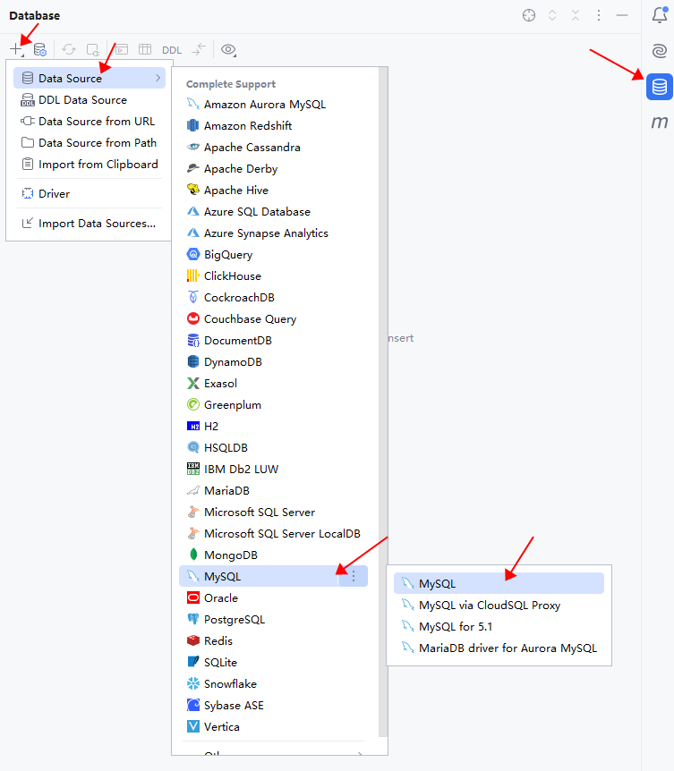


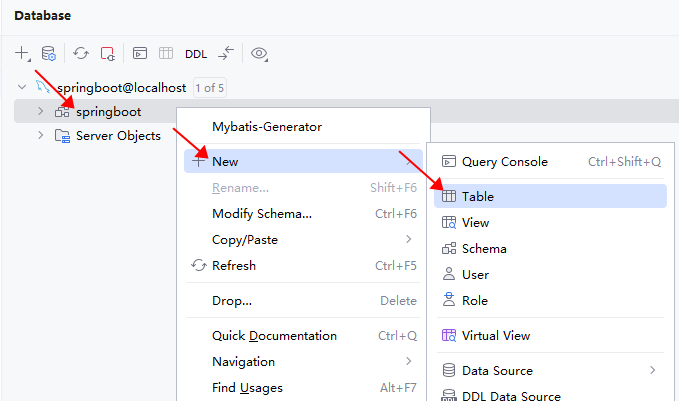

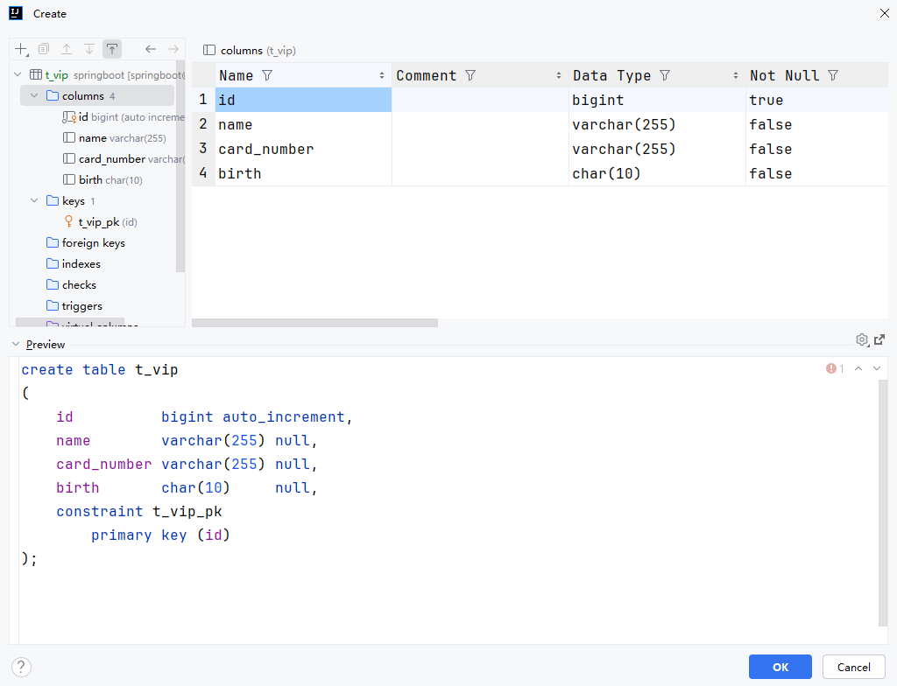

表创建成功后，为表准备数据，如下：


**或者直接执行 SQL 脚本：**

```sql
drop table if exists t_vip;
create table t_vip(
  id bigint primary key auto_increment,
  name varchar(255),
  card_number varchar(255),
  birth char(10)
);
insert into t_vip(name,card_number,birth) values('张三', '1234567890', '1980-11-10');
insert into t_vip(name,card_number,birth) values('李四', '1234567891', '1980-11-11');
select * from t_vip;
```

## 创建SpringBoot项目

使用脚手架创建Spring Boot项目

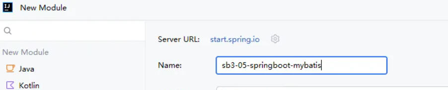

引入mysql驱动以及mybatis的启动器

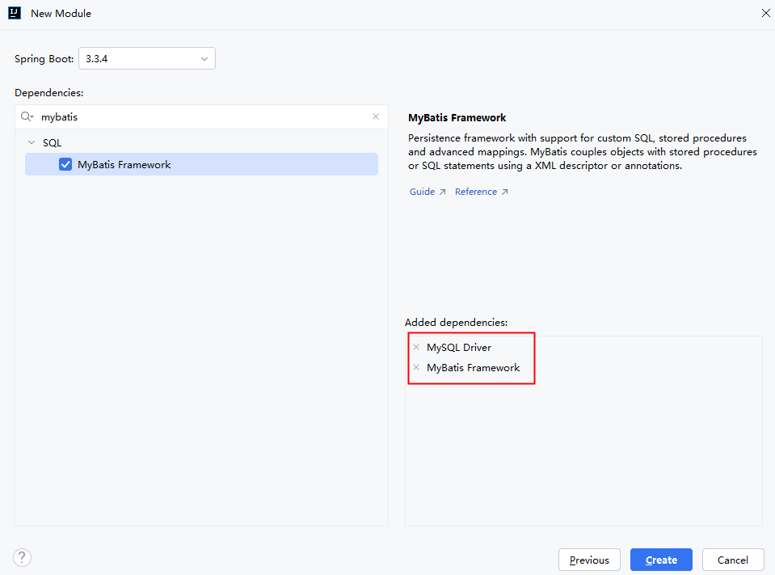

依赖如下：

```xml
<!--mybatis的启动器-->
<dependency>
    <groupId>org.mybatis.spring.boot</groupId>
    <artifactId>mybatis-spring-boot-starter</artifactId>
    <version>3.0.3</version>
</dependency>
<!--mysql的驱动依赖-->
<dependency>
    <groupId>com.mysql</groupId>
    <artifactId>mysql-connector-j</artifactId>
    <scope>runtime</scope>
</dependency>
```

**注意，之前也提到过：**

- **Spring Boot官方提供的启动器的名字规则：spring-boot-starter-xxx**
- **第三方（非Spring Boot官方）提供的启动器的名字规则：xxx-spring-boot-starter**

## 编写数据源配置

前面提到过，Spring Boot配置统一可以编写到application.properties中，配置如下：

```plaintext
# Spring Boot脚手架自动生成的
spring.application.name=sb3-05-springboot-mybatis

# mybatis连接数据库的数据源
# spring.datasource.type=com.zaxxer.hikari.HikariDataSource # 无需指定，springboot默认就是使用这个连接池。
spring.datasource.driver-class-name=com.mysql.cj.jdbc.Driver
spring.datasource.url=jdbc:mysql://localhost:3306/springboot
spring.datasource.username=root
spring.datasource.password=123456
```

以上的配置属于连接池的配置，连接池使用的是Spring Boot默认的连接池：HikariCP

## 编写实体类Vip

表`t_vip`中的字段分别是：

- id
- name
- card_number
- birth

对应实体类`Vip`中的属性名分别是：

- Long id;
- String name;
- String cardNumber;
- String birth;

创建包 entity，在该包下新建Vip类，代码如下：

```java
package com.jkweilai.sb305springbootmybatis.entity;

public class Vip {
    private Long id;
    private String name;
    private String cardNumber;
    private String birth;

    public Vip() {
    }

    public Vip(Long id, String name, String cardNumber, String birth) {
        this.id = id;
        this.name = name;
        this.cardNumber = cardNumber;
        this.birth = birth;
    }

    public Vip(String name, String cardNumber, String birth) {
        this.name = name;
        this.cardNumber = cardNumber;
        this.birth = birth;
    }

    public Long getId() {
        return id;
    }

    public void setId(Long id) {
        this.id = id;
    }

    public String getName() {
        return name;
    }

    public void setName(String name) {
        this.name = name;
    }

    public String getCardNumber() {
        return cardNumber;
    }

    public void setCardNumber(String cardNumber) {
        this.cardNumber = cardNumber;
    }

    public String getBirth() {
        return birth;
    }

    public void setBirth(String birth) {
        this.birth = birth;
    }

    @Override
    public String toString() {
        return "Vip{" +
                "id=" + id +
                ", name='" + name + '\'' +
                ", cardNumber='" + cardNumber + '\'' +
                ", birth='" + birth + '\'' +
                '}';
    }
}
```

以上代码可以使用第三方库Lombok进行改造，后面再说。

## 编写Mapper接口

创建`repository`包，在该包下新建`VipMapper`接口，代码如下：

```java
package com.jkweilai.sb305springbootmybatis.repository;

import com.jkweilai.sb305springbootmybatis.entity.Vip;

import java.util.List;

public interface VipMapper {
    /**
     * 插入会员信息
     * @param vip
     * @return 1表示插入成功，其他值表示失败
     */
    int insert(Vip vip);

    /**
     * 根据id删除会员信息
     * @param id 会员唯一标识
     * @return 1表示删除成功，其他值表示失败
     */
    int deleteById(Long id);

    /**
     * 更新会员信息（id不可更新）
     * @param vip 会员信息
     * @return 1表示更新成功，其他值表示更新失败。
     */
    int update(Vip vip);

    /**
     * 根据id查询会员信息
     * @param id 会员的唯一标识
     * @return 会员信息
     */
    Vip selectById(Long id);

    /**
     * 获取所有会员信息
     * @return
     */
    List<Vip> selectAll();
}
```

## 编写Mapper接口的XML配置文件

在`resources`目录下新建`mapper`目录，将来的`mapper.xml`配置文件放在这个目录下。

安装`MyBatisX`插件，该插件可以根据我们编写的`VipMapper`接口自动生成mapper的XML配置文件。


然后在`VipMapper`接口上：alt+enter

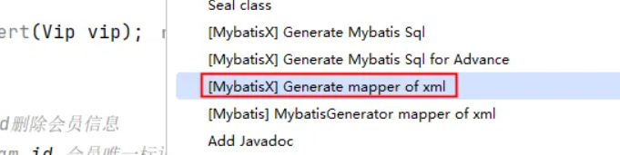

生成`mapper of xml`：需要选择一个生成的位置


接下来，你会看到Mapper接口中方法报错了，可以在错误的位置上使用`alt+enter`，选择`Generate statement`：


这个时候在mapper的xml配置文件中便生成了对应的配置。

接下来就是编写SQL语句了，最终`VipMapper.xml`文件的配置如下：

```xml
<?xml version="1.0" encoding="UTF-8" ?>
<!DOCTYPE mapper PUBLIC "-//mybatis.org//DTD Mapper 3.0//EN" "http://mybatis.org/dtd/mybatis-3-mapper.dtd" >
<mapper namespace="com.jkweilai.sb305springbootmybatis.repository.VipMapper">
    <insert id="insert">
        insert into t_vip(id,name,card_number,birth) values(null,#{name},#{cardNumber},#{birth})
    </insert>
    <update id="update">
        update t_vip set name=#{name},card_number=#{cardNumber},birth=#{birth} where id=#{id}
    </update>
    <delete id="deleteById">
        delete from t_vip where id = #{id}
    </delete>
    <select id="selectById" resultType="com.jkweilai.sb305springbootmybatis.entity.Vip">
        select * from t_vip where id=#{id}
    </select>
    <select id="selectAll" resultType="com.jkweilai.sb305springbootmybatis.entity.Vip">
        select * from t_vip
    </select>
</mapper>
```

## 添加Mapper的扫描

在Spring Boot的入口程序上添加如下的注解，来完成`VipMapper`接口的扫描：

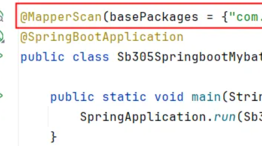

## 告诉MyBatis框架MapperXML文件的位置

在`application.properties`配置文件中进行如下配置：

```plaintext
mybatis.mapper-locations=classpath:mapper/*.xml
```

**注意：如果 SqlMapper.xml 文件的存放路径和 Mapper 接口在同一个目录下，以上配置可以去掉。**

## 测试整合MyBatis是否成功

在Spring Boot主入口程序中获取Spring上下文对象`ApplicationContext`，从Spring容器中获取`VipMapper`对象，然后调用相关方法进行测试：

```java
package com.jkweilai.sb305springbootmybatis;

import com.jkweilai.sb305springbootmybatis.entity.Vip;
import com.jkweilai.sb305springbootmybatis.repository.VipMapper;
import org.mybatis.spring.annotation.MapperScan;
import org.springframework.boot.SpringApplication;
import org.springframework.boot.autoconfigure.SpringBootApplication;
import org.springframework.context.ConfigurableApplicationContext;

@MapperScan(basePackages = {"com.jkweilai.sb305springbootmybatis.repository"})
@SpringBootApplication
public class Sb305SpringbootMybatisApplication {

    public static void main(String[] args) {
        // 获取Spring上下文
        ConfigurableApplicationContext applicationContext = SpringApplication.run(Sb305SpringbootMybatisApplication.class, args);
        // 根据id获取容器中的对象
        VipMapper vipMapper = applicationContext.getBean("vipMapper", VipMapper.class);
        Vip vip = vipMapper.selectById(1L);
        System.out.println(vip);
        // 关闭Spring上下文
        applicationContext.close();
    }

}
```

测试结果：


测试结果中可以看到`cardNumber`属性没有赋值成功，原因是：表中的字段名叫做`card_number`，和实体类`Vip`的属性名`cardNumber`对应不上。解决办法两个：

- **第一种方式：查询语句使用as关键字起别名，让查询结果列名和实体类的属性名对应上。**

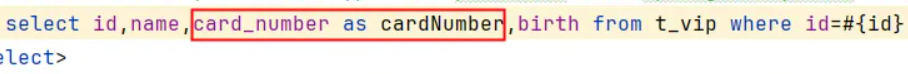

再次测试：

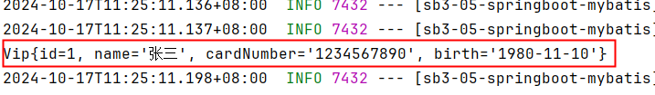

- **第二种方式：通过配置自动映射**

在`application.properties`配置文件中进行如下配置：

```plaintext
mybatis.configuration.map-underscore-to-camel-case=true
```

map-underscore-to-camel-case 是一个配置项，主要用于处理数据库字段名与Java对象属性名之间的命名差异。在许多数据库中，字段名通常使用下划线（_）分隔单词，例如 first_name 或 last_name。而在Java代码中，变量名通常使用驼峰式命名法（camel case），如 firstName 和 lastName。

当使用MyBatis作为ORM框架时，默认情况下它会将SQL查询结果映射到Java对象的属性上。如果数据库中的字段名与Java对象的属性名不一致，那么就需要手动为每个字段指定相应的属性名，或者使用某种方式来自动转换这些名称。

map-underscore-to-camel-case 这个配置项的作用就是在查询结果映射到Java对象时，自动将下划线分隔的字段名转换成驼峰式命名法。这样可以减少手动映射的工作量，并提高代码的可读性和可维护性。

mapper的xml文件中的sql语句仍然使用`*`的方式：

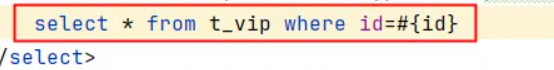

测试结果如下：

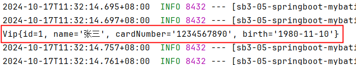

## 测试其他方法是否正常

测试程序如下：

```java
package com.jkweilai.sb305springbootmybatis;

import com.jkweilai.sb305springbootmybatis.entity.Vip;
import com.jkweilai.sb305springbootmybatis.repository.VipMapper;
import org.mybatis.spring.annotation.MapperScan;
import org.springframework.boot.SpringApplication;
import org.springframework.boot.autoconfigure.SpringBootApplication;
import org.springframework.context.ConfigurableApplicationContext;

import java.util.List;

@MapperScan(basePackages = {"com.jkweilai.sb305springbootmybatis.repository"})
@SpringBootApplication
public class Sb305SpringbootMybatisApplication {

    public static void main(String[] args) {
        // 获取Spring上下文
        ConfigurableApplicationContext applicationContext = SpringApplication.run(Sb305SpringbootMybatisApplication.class, args);
        // 根据id获取容器中的对象
        VipMapper vipMapper = applicationContext.getBean("vipMapper", VipMapper.class);
        Vip vip = vipMapper.selectById(1L);
        System.out.println(vip);
        // 添加会员信息
        Vip newVip = new Vip("杰克", "1234567892", "1999-11-10");
        vipMapper.insert(newVip);
        // 查询所有会员信息
        List<Vip> vips = vipMapper.selectAll();
        System.out.println(vips);
        // 修改会员信息
        vip.setName("zhangsan");
        vipMapper.update(vip);
        // 查询所有会员信息
        List<Vip> vips2 = vipMapper.selectAll();
        System.out.println(vips2);
        // 删除会员信息
        vipMapper.deleteById(1L);
        // 查询所有会员信息
        List<Vip> vips3 = vipMapper.selectAll();
        System.out.println(vips3);
        // 关闭Spring上下文
        applicationContext.close();
    }

}
```

执行结果如下：

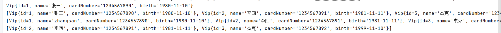

到此为止，我们已经完成了Spring Boot整合MyBatis的操作。

## 总结 SpringBoot 整合 MyBatis 的配置

**注意：以下的配置项中通过 **`**logging.level.com.jkweilai.demo.mapper=DEBUG**`**添加显示 SQL 的日志。**

```plaintext
# 数据源的配置（默认使用HikariCP）
spring.datasource.driver-class-name=com.mysql.cj.jdbc.Driver
spring.datasource.username=root
spring.datasource.password=123456
spring.datasource.url=jdbc:mysql://localhost:3306/springboot

# mybatis相关配置
# 指定mapper映射文件路径，如果mapper文件和mapper接口在同一个目录下，不需要指定该配置
mybatis.mapper-locations=classpath:mapper/*.xml
# 下划线转驼峰
mybatis.configuration.map-underscore-to-camel-case=true
# 起别名
mybatis.type-aliases-package=com.jkweilai.demo.entity

# 打印SQL日志
logging.level.com.jkweilai.demo.mapper=DEBUG
```

# Lombok库

## 了解 Lombok

**知识点列表：**

1. **Lombok 是一个 Java 库。自动帮我们生成构造方法，setter 和 getter，equals 和 hashCode，toString 等。**
2. **Lombok 只在编译阶段起作用，因此不影响程序的执行效率。**
3. **可以通过查看字节码，看看 Lombok 都帮我们生成了什么。**


Lombok 是一个 Java 库，它可以通过注解的方式减少 Java 代码中的样板代码。Lombok 自动为你生成构造函数、getter、setter、equals、hashCode、toString 方法等，从而避免了手动编写这些重复性的代码。这不仅减少了出错的机会，还让代码看起来更加简洁。

**Lombok只是一个编译阶段的库，能够帮我们自动补充代码，在Java程序运行阶段并不起作用。（因此Lombok库并不会影响Java程序的执行效率）**

例如我们有这样一个java源文件`User.java`，代码如下：

```java
@Data
public class User{
    private String name;
}
```

以上代码在程序的编译阶段，Lombok库会将`User.java`文件编译生成这样的`User.class`字节码文件：

```java
public class com.jkweilai.lomboktest.entity.User {
  public com.jkweilai.lomboktest.entity.User();
    Code:
       0: aload_0
       1: invokespecial #1                  // Method java/lang/Object."<init>":()V
       4: return

  public java.lang.String getName();
    Code:
       0: aload_0
       1: getfield      #7                  // Field name:Ljava/lang/String;
       4: areturn

  public void setName(java.lang.String);
    Code:
       0: aload_0
       1: aload_1
       2: putfield      #7                  // Field name:Ljava/lang/String;
       5: return

  public boolean equals(java.lang.Object);
    Code:
       0: aload_1
       1: aload_0
       2: if_acmpne     7
       5: iconst_1
       6: ireturn
       7: aload_1
       8: instanceof    #8                  // class com/jkweilai/lomboktest/entity/User
      11: ifne          16
      14: iconst_0
      15: ireturn
      16: aload_1
      17: checkcast     #8                  // class com/jkweilai/lomboktest/entity/User
      20: astore_2
      21: aload_2
      22: aload_0
      23: invokevirtual #13                 // Method canEqual:(Ljava/lang/Object;)Z
      26: ifne          31
      29: iconst_0
      30: ireturn
      31: aload_0
      32: invokevirtual #17                 // Method getName:()Ljava/lang/String;
      35: astore_3
      36: aload_2
      37: invokevirtual #17                 // Method getName:()Ljava/lang/String;
      40: astore        4
      42: aload_3
      43: ifnonnull     54
      46: aload         4
      48: ifnull        65
      51: goto          63
      54: aload_3
      55: aload         4
      57: invokevirtual #21                 // Method java/lang/Object.equals:(Ljava/lang/Object;)Z
      60: ifne          65
      63: iconst_0
      64: ireturn
      65: iconst_1
      66: ireturn

  protected boolean canEqual(java.lang.Object);
    Code:
       0: aload_1
       1: instanceof    #8                  // class com/jkweilai/lomboktest/entity/User
       4: ireturn

  public int hashCode();
    Code:
       0: bipush        59
       2: istore_1
       3: iconst_1
       4: istore_2
       5: aload_0
       6: invokevirtual #17                 // Method getName:()Ljava/lang/String;
       9: astore_3
      10: iload_2
      11: bipush        59
      13: imul
      14: aload_3
      15: ifnonnull     23
      18: bipush        43
      20: goto          27
      23: aload_3
      24: invokevirtual #24                 // Method java/lang/Object.hashCode:()I
      27: iadd
      28: istore_2
      29: iload_2
      30: ireturn

  public java.lang.String toString();
    Code:
       0: aload_0
       1: invokevirtual #17                 // Method getName:()Ljava/lang/String;
       4: invokedynamic #28,  0             // InvokeDynamic #0:makeConcatWithConstants:(Ljava/lang/String;)Ljava/lang/String;
       9: areturn
}
```

通过字节码可以看到Lombok库的`@Data`注解可以帮助我们生成`无参构造器`、`setter`、`getter`、`toString`、`hashCode`、`equals`。

## Lombok 的主要注解

**@Data**：

- 等价于 `@ToString`, `@EqualsAndHashCode`, `@Getter`，`@Setter`, `@RequiredArgsConstructor`.
- 用于生成：必要参数的构造方法、getter、setter、toString、equals 和 hashcode 方法。

**@Getter** / **@Setter**：

- 分别用于生成所有的 getter 和 setter 方法。
- 可以作用于整个类，也可以作用于特定的字段。

**@NoArgsConstructor**：

- 生成一个无参构造方法。

**@AllArgsConstructor**：

- 生成一个包含所有实例变量的构造器。

**@RequiredArgsConstructor**：

- 生成包含所有被 `final` 修饰符修饰的实例变量的构造方法。
- **如果没有**`**<font style="color:#DF2A3F;">final</font>**`**的实例变量，则自动生成无参数构造方法。**

**@ToString** / **@EqualsAndHashCode**：

- 用于生成 toString 和 equals/hashCode 方法。
- **这两个注解都有**`**<font style="color:#DF2A3F;">exclude</font>**`**属性，通过这个属性可以定制toString、hashCode、equals方法。**

## 使用 Lombok

### 添加依赖

在 Maven 的 `pom.xml` 文件中添加 Lombok 依赖：

```xml
<dependency>
    <groupId>org.projectlombok</groupId>
    <artifactId>lombok</artifactId>
    <optional>true</optional>
</dependency>
```

### 使用 Lombok 注解

在 Java 类中使用 Lombok 提供的注解。

```java
import lombok.Data;

@Data
public class User {
    private String name;
}
```

编写测试程序：

```java
package com.jkweilai.lomboktest;

import com.jkweilai.lomboktest.entity.User;

public class Test {
    public static void main(String[] args) {
        User user = new User();
        user.setName("jackson");
        System.out.println(user.getName());
        System.out.println(user.toString());
        System.out.println(user.hashCode());
        User user2 = new User();
        user2.setName("jackson");
        System.out.println(user.equals(user2));
    }
}
```

测试结果：


**以下的注解可以自行测试：**

- **@Getter**
- **@Setter**
- **@ToString【exclude属性】**
- **@EqualsAndHashCode【exclude属性】**
- **@NoArgsConstructor**
- **@AllArgsConstructor**
- **@RequiredArgsConstructor**

**注：Lombok只能帮助我们生成无参数构造方法和全参数构造方法，其他定制参数的构造方法无法生成。**

## Lombok的其他常用注解

@Value

@Builder

@Singular

@Slf4j

### @Value

该注解会给所有属性添加`final`，给所有属性提供`getter`方法，自动生成`toString`、`hashCode`、`equals`

**通过这个注解可以创建不可变对象。**

```java
package com.jkweilai.lomboktest.entity;

import lombok.Value;

@Value
public class Customer {
    Long id;
    String name;
    String password;
}
```

测试程序：

```java
package com.jkweilai.lomboktest;

import com.jkweilai.lomboktest.entity.Customer;

public class CustomerTest {
    public static void main(String[] args) {
        Customer c1 = new Customer(1L, "jackson", "123");
        System.out.println(c1);
        System.out.println(c1.getId());
        System.out.println(c1.getName());
        System.out.println(c1.getPassword());
        System.out.println(c1.hashCode());
        Customer c2 = new Customer(1L, "jackson", "123");
        System.out.println(c1.equals(c2));
    }
}
```

运行结果：

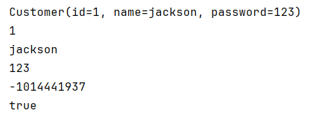

可以查看一下字节码，你会发现，@Value注解的作用只会生成：全参数构造方法、getter方法、hashCode、equals、toString方法。（没有setter方法。）

### 建造者模式

建造模式（Builder Pattern）属于创建型设计模式。GoF23种设计模式之一。

**用于解决对象创建时参数过多的问题。它可以让对象的构造过程可以逐步完成，而不是一次性提供所有参数。**

**建造模式的主要目的是让对象的创建过程更加清晰、灵活和可控。**

简而言之，建造模式用于：

1. **简化构造过程**：通过逐步构造对象，避免构造函数参数过多。
2. **提高可读性和可维护性**：让构造过程更加清晰和有序。
3. **增强灵活性**：允许按需配置对象的不同部分。

**建造模式的代码**

建造模式代码如下：

```java
package com.jkweilai.demo.entity;

// 建造者模式
public class Person {
    private String name;
    private Integer age;
    private String email;

    // 私有的全参数构造方法
    private Person(String name, Integer age, String email){
        this.name = name;
        this.age = age;
        this.email = email;
    }

    @Override
    public String toString() {
        return "Person{" +
                "name='" + name + '\'' +
                ", age=" + age +
                ", email='" + email + '\'' +
                '}';
    }

    // 获取建造者对象
    public static PersonBuilder builder(){
        return new PersonBuilder();
    }

    // 一般会提供一个静态的内部类：建造者类
    public static class PersonBuilder {
        private String name;
        private Integer age;
        private String email;
        public PersonBuilder name(String name){
            this.name = name;
            return this;
        }
        public PersonBuilder age(Integer age){
            this.age = age;
            return this;
        }
        public PersonBuilder email(String email){
            this.email = email;
            return this;
        }
        // 核心代码：建造方法
        public Person build(){
            return new Person(name, age, email);
        }
    }

    public static void main(String[] args) {
        Person person = Person.builder()
                .name("zhangsan")
                .age(100)
                .email("zhangsan@123.com")
                .build();
        System.out.println(person);
    }
}
```

执行结果如下：


### @Builder

`@Builder`注解可以帮我们生成建造者模式的代码。

```java
package com.jkweilai.demo.entity;

import lombok.Builder;

// 建造者模式
@Builder
public class Person {
    private String name;
    private Integer age;
    private String email;

    @Override
    public String toString() {
        return "Person{" +
                "name='" + name + '\'' +
                ", age=" + age +
                ", email='" + email + '\'' +
                '}';
    }

    public static void main(String[] args) {
        Person person = Person.builder()
                .name("zhangsan")
                .age(100)
                .email("zhangsan@123.com")
                .build();
        System.out.println(person);
    }
}
```

执行结果：


### @Singular

@Singular注解是辅助@Builder注解的。

当被建造的对象的属性是一个集合，这个集合属性使用@Singular注解进行标注的话，可以连续调用集合属性对应的方法完成多个元素的添加。如果没有这个注解，则无法连续调用方法完成多个元素的添加。代码如下：

```java
package com.jkweilai.demo.entity;

import lombok.Builder;
import lombok.Singular;
import lombok.ToString;

import java.util.List;

// 建造者模式
@Builder
@ToString
public class Person {
    private String name;
    private Integer age;
    private String email;
    @Singular("addPhone")
    private List<String> phones;

    public static void main(String[] args) {
        Person person = Person.builder()
                .name("zhangsan")
                .age(100)
                .email("zhangsan@123.com")
                .addPhone("18799878786")
                .addPhone("18977667675")
                .build();
        System.out.println(person);
    }
}
```

执行结果如下：

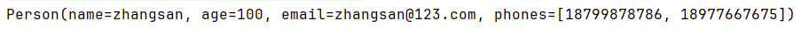

### @Slf4j

`@Slf4j`注解可以帮助我们在类中生成一个专门记录日志的常量：`log`。我们直接用就行，很方便。

`@Slf4j`底层使用的是日志门面中的方法，具体底层使用的是哪个日志框架，取决于你引入的具体日志框架的依赖。

SpringBoot 默认采用 `logback-classic`，如果在 SpringBoot 项目中使用 `Lombok`，则底层使用的是 `logback`。

```java
package com.jkweilai.demo;

import lombok.extern.slf4j.Slf4j;

import java.math.BigDecimal;

@Slf4j
public class LombokLog {

    // 使用 @Slf4j 底层会自动生成这样一个常量。（常量在字节码中看不到）
    //private static final org.slf4j.Logger log = org.slf4j.LoggerFactory.getLogger(LombokLog.class);

    public static void transfer(String from, String to, BigDecimal amount) {
        log.info("from:{}, to:{}, amount:{}", from, to, amount);
    }

    public static void main(String[] args) {
        transfer("act-001", "act-002", new BigDecimal(100));
    }
}
```

# MyBatis逆向生成


MyBatis逆向工程：使用IDEA插件可以根据数据库表的设计逆向生成MyBatis的Mapper接口 与 MapperXML文件。

## 安装插件`free mybatis tools`

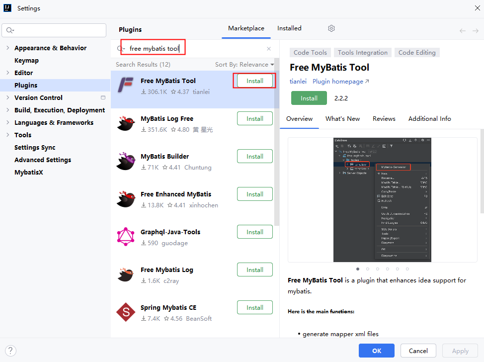

## 在IDEA中配置数据源


## 创建数据库，创建表，准备数据


## 使用脚手架创建SpringBoot项目

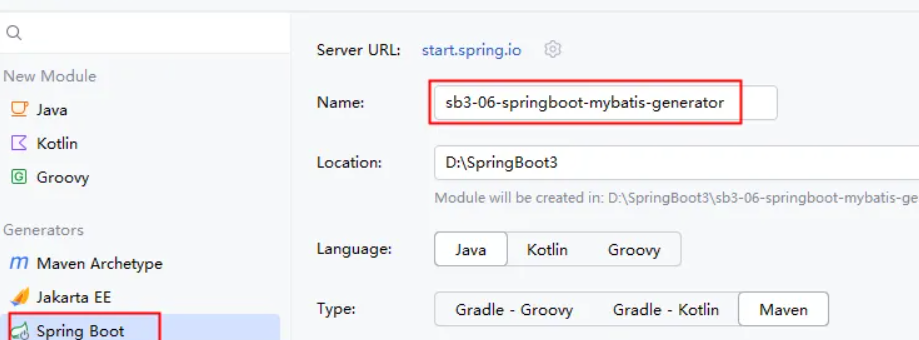

添加依赖：mybatis依赖、mysql驱动、Lombok库


## 生成MyBatis代码放到SpringBoot项目中

在表上右键：Mybatis-Generator


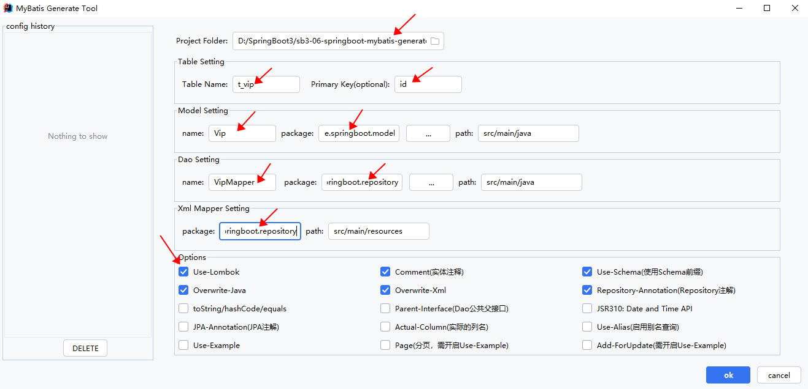

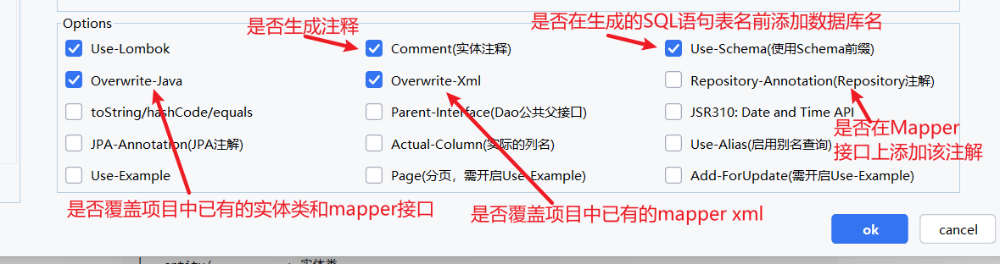

代码生成后，如果在IDEA中看不到，这样做（重新从硬盘加载）：

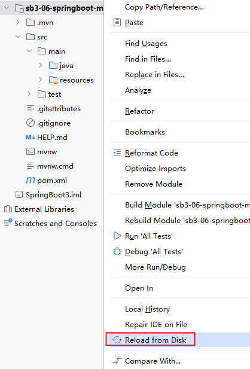

## 编写mybatis相关配置

application.properties属性文件的配置：

```plaintext
spring.datasource.driver-class-name=com.mysql.cj.jdbc.Driver
spring.datasource.url=jdbc:mysql://localhost:3306/springboot
spring.datasource.username=root
spring.datasource.password=123456

# mapper配置文件如果和mapper接口在同一个目录下不用配置。
mybatis.mapper-locations=classpath:com/jkweilai/springboot/repository/*.xml
mybatis.configuration.map-underscore-to-camel-case=true
```

## 编写测试程序

```java
package com.jkweilai.springboot;

import com.jkweilai.springboot.entity.Vip;
import com.jkweilai.springboot.repository.VipMapper;
import org.mybatis.spring.annotation.MapperScan;
import org.springframework.boot.SpringApplication;
import org.springframework.boot.autoconfigure.SpringBootApplication;
import org.springframework.context.ConfigurableApplicationContext;


@MapperScan(basePackages = "com.jkweilai.springboot.repository")
@SpringBootApplication
public class Sb306SpringbootMybatisGeneratorApplication {

    public static void main(String[] args) {
        ConfigurableApplicationContext applicationContext = SpringApplication.run(Sb306SpringbootMybatisGeneratorApplication.class, args);
        VipMapper vipMapper = applicationContext.getBean("vipMapper", VipMapper.class);
        // 增
        Vip vip = new Vip();
        vip.setName("孙悟空");
        vip.setBirth("1999-11-11");
        vip.setCardNumber("1234567894");
        vipMapper.insert(vip);
        // 查一个
        Vip vip1 = vipMapper.selectByPrimaryKey(2L);
        System.out.println(vip1);
        // 改
        vip1.setName("孙行者");
        vipMapper.updateByPrimaryKey(vip1);
        // 删
        vipMapper.deleteByPrimaryKey(1L);

        // 关闭Spring容器
        applicationContext.close();
    }
}
```

到此，Spring Boot整合MyBatis结束！

# 整合SpringMVC（SSM整合）


SSM整合：Spring + SpringMVC + MyBatis

Spring Boot项目本身就是基于Spring框架实现的。因此SSM整合时，只需要在整合MyBatis框架之后，引入`web启动器`即可完成SSM整合。

## 使用脚手架创建SpringBoot项目

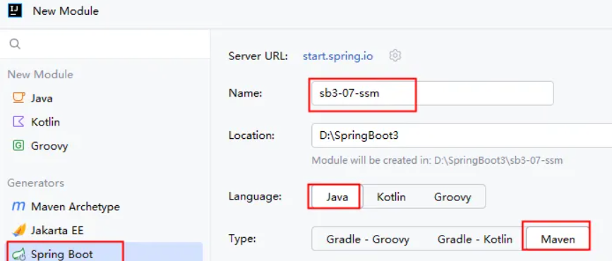

添加依赖：web启动器、mybatis启动器、mysql驱动依赖、lombok依赖


## 使用`free mybatis tool`插件逆向生成MyBatis代码

将`springboot`数据库中的`t_vip`表逆向生成mybatis代码。这里不再赘述。

## 整合MyBatis

1. 编写数据源的配置

```plaintext
spring.datasource.driver-class-name=com.mysql.cj.jdbc.Driver
spring.datasource.url=jdbc:mysql://localhost:3306/springboot
spring.datasource.username=root
spring.datasource.password=123456
spring.datasource.type=com.zaxxer.hikari.HikariDataSource
```

1. 编写mapper xml配置文件的位置

```plaintext
mybatis.mapper-locations=classpath:mapper/*.xml
mybatis.configuration.map-underscore-to-camel-case=true
```

1. 在主入口类上添加`@MapperScan`注解

```java
package com.jkweilai.sb307ssm;

import org.mybatis.spring.annotation.MapperScan;
import org.springframework.boot.SpringApplication;
import org.springframework.boot.autoconfigure.SpringBootApplication;

@MapperScan(basePackages = {"com.jkweilai.sb307ssm.repository"})
@SpringBootApplication
public class Sb307SsmApplication {

    public static void main(String[] args) {
        SpringApplication.run(Sb307SsmApplication.class, args);
    }

}
```

## 编写service

编写`VipService`接口：

```java
package com.jkweilai.sb307ssm.service;

import com.jkweilai.sb307ssm.entity.Vip;

public interface VipService {
    /**
     * 根据id获取会员信息
     * @param id 会员标识
     * @return 会员信息
     */
    Vip getById(Long id);
}
```

编写`VipServiceImpl`实现类：

```java
package com.jkweilai.sb307ssm.service.impl;

import com.jkweilai.sb307ssm.entity.Vip;
import com.jkweilai.sb307ssm.repository.VipMapper;
import com.jkweilai.sb307ssm.service.VipService;
import org.springframework.beans.factory.annotation.Autowired;
import org.springframework.stereotype.Service;

@Service("vipService")
public class VipServiceImpl implements VipService {

    @Autowired
    private VipMapper vipMapper;

    @Override
    public Vip getById(Long id) {
        return vipMapper.selectByPrimaryKey(id);
    }
}
```

## 编写controller

编写`VipController`，代码如下：

```java
package com.jkweilai.sb307ssm.controller;

import com.jkweilai.sb307ssm.entity.Vip;
import com.jkweilai.sb307ssm.service.VipService;
import org.springframework.beans.factory.annotation.Autowired;
import org.springframework.web.bind.annotation.GetMapping;
import org.springframework.web.bind.annotation.PathVariable;
import org.springframework.web.bind.annotation.RestController;

@RestController
public class VipController {
    
    @Autowired
    private VipService vipService;
    
    @GetMapping("/vip/{id}")
    public Vip detailById(@PathVariable("id") Long id){
        Vip vip = vipService.getById(id);
        return vip;
    }
}
```

## 启动服务器测试

执行SpringBoot项目主入口的main方法，启动Tomcat服务器：


打开浏览器访问：

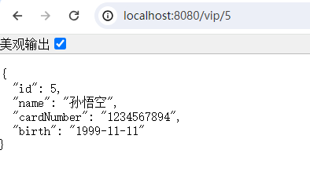

到此为止，SSM框架就集成完毕了，通过这个集成也可以感觉到SpringBoot简化了SSM三大框架的集成。

# 自动配置概述


## 体验自动配置

Spring Boot 框架的两大核心特性可以概括为“启动器”（Starter）和“自动配置”（Auto-configuration）。

1. **启动器（Starter）**：
Spring Boot 提供了一系列的 Starter，每个启动器都是一组**预定义**的依赖关系。
2. **自动配置（Auto-Configuration）**：
当添加了特定的 Starter POM 后，Spring Boot 会**根据类路径上存在的 jar 包来自动配置 Bean（自动配置相关组件）（比如：SpringBoot发现类路径上存在mybatis相关的类，例如SqlSessionFactory.class，那么SpringBoot将自动配置mybatis相关的所有Bean。）**。

这两个特性结合在一起，**让程序员专注业务逻辑的开发，在环境方面耗费最少的时间**。

**以前 Spring 集成 mybatis 要写这么多配置：**

```xml
<?xml version="1.0" encoding="UTF-8"?>
<beans xmlns="http://www.springframework.org/schema/beans"
       xmlns:xsi="http://www.w3.org/2001/XMLSchema-instance"
       xmlns:context="http://www.springframework.org/schema/context"
       xmlns:tx="http://www.springframework.org/schema/tx"
       xsi:schemaLocation="
        http://www.springframework.org/schema/beans
        http://www.springframework.org/schema/beans/spring-beans.xsd
        http://www.springframework.org/schema/context
        http://www.springframework.org/schema/context/spring-context.xsd
        http://www.springframework.org/schema/tx
        http://www.springframework.org/schema/tx/spring-tx.xsd">

    <!-- 数据源配置 -->
    <bean id="dataSource" class="org.apache.commons.dbcp2.BasicDataSource">
        <property name="driverClassName" value="com.mysql.cj.jdbc.Driver"/>
        <property name="url" value="jdbc:mysql://localhost:3306/mydb"/>
        <property name="username" value="root"/>
        <property name="password" value="password"/>
    </bean>

    <!-- SqlSessionFactory -->
    <bean id="sqlSessionFactory" class="org.mybatis.spring.SqlSessionFactoryBean">
        <property name="dataSource" ref="dataSource"/>
        <property name="mapperLocations" value="classpath:mapper/*.xml"/>
        <property name="typeAliasesPackage" value="com.example.model"/>
    </bean>

    <!-- Mapper 扫描器 -->
    <bean class="org.mybatis.spring.mapper.MapperScannerConfigurer">
        <property name="basePackage" value="com.example.mapper"/>
        <property name="sqlSessionFactoryBeanName" value="sqlSessionFactory"/>
    </bean>

    <!-- 事务管理器 -->
    <bean id="transactionManager" class="org.springframework.jdbc.datasource.DataSourceTransactionManager">
        <property name="dataSource" ref="dataSource"/>
    </bean>

    <!-- 开启事务注解 -->
    <tx:annotation-driven transaction-manager="transactionManager"/>

    <!-- 扫描 service 层的包 -->
    <context:component-scan base-package="com.example.service"/>

</beans>
```

使用 SpringBoot 自动配置机制后，你只需要这样：

```yaml
spring:
  datasource:
    driver-class-name: com.mysql.cj.jdbc.Driver
    url: jdbc:mysql://localhost:3306/springboot
    username: root
    password: 123456
```

## 引入web启动器都有哪些组件会准备好

**知识点清单：**

1. **怎么获取当前容器中所有的 bean？**
2. **添加一个 web 启动器，看看添加了多少个组件？**
3. **没有使用SpringBoot之前，很多组件都是需要手动配置的。**

通过以下代码获取spring ioc容器中的所有注册的bean，一个Bean就是一个组件：

```java
package com.jkweilai.auto;

import org.springframework.boot.SpringApplication;
import org.springframework.boot.autoconfigure.SpringBootApplication;
import org.springframework.context.ConfigurableApplicationContext;

@SpringBootApplication
public class AutoApplication {

    public static void main(String[] args) {
        ConfigurableApplicationContext context = SpringApplication.run(AutoApplication.class, args);
        String[] beanDefinitionNames = context.getBeanDefinitionNames();
        for (String beanDefinitionName : beanDefinitionNames) {
            System.out.println(beanDefinitionName);
        }
    }

}
```

在springboot没有引入任何启动器的情况下，默认提供了`59`bean：

```plaintext
org.springframework.context.annotation.internalConfigurationAnnotationProcessor
org.springframework.context.annotation.internalAutowiredAnnotationProcessor
org.springframework.context.annotation.internalCommonAnnotationProcessor
org.springframework.context.event.internalEventListenerProcessor
org.springframework.context.event.internalEventListenerFactory
springboot011Application
org.springframework.boot.autoconfigure.internalCachingMetadataReaderFactory
org.springframework.boot.autoconfigure.AutoConfigurationPackages
org.springframework.boot.autoconfigure.context.PropertyPlaceholderAutoConfiguration
propertySourcesPlaceholderConfigurer
org.springframework.boot.autoconfigure.jmx.JmxAutoConfiguration
mbeanExporter
objectNamingStrategy
mbeanServer
org.springframework.boot.context.properties.ConfigurationPropertiesBindingPostProcessor
org.springframework.boot.context.internalConfigurationPropertiesBinder
org.springframework.boot.context.properties.BoundConfigurationProperties
org.springframework.boot.context.properties.EnableConfigurationPropertiesRegistrar.methodValidationExcludeFilter
spring.jmx-org.springframework.boot.autoconfigure.jmx.JmxProperties
org.springframework.boot.autoconfigure.admin.SpringApplicationAdminJmxAutoConfiguration
springApplicationAdminRegistrar
org.springframework.boot.autoconfigure.aop.AopAutoConfiguration$ClassProxyingConfiguration
forceAutoProxyCreatorToUseClassProxying
org.springframework.boot.autoconfigure.aop.AopAutoConfiguration
org.springframework.boot.autoconfigure.availability.ApplicationAvailabilityAutoConfiguration
applicationAvailability
org.springframework.boot.autoconfigure.context.ConfigurationPropertiesAutoConfiguration
org.springframework.boot.autoconfigure.context.LifecycleAutoConfiguration
lifecycleProcessor
spring.lifecycle-org.springframework.boot.autoconfigure.context.LifecycleProperties
org.springframework.boot.autoconfigure.info.ProjectInfoAutoConfiguration
spring.info-org.springframework.boot.autoconfigure.info.ProjectInfoProperties
org.springframework.boot.autoconfigure.sql.init.SqlInitializationAutoConfiguration
spring.sql.init-org.springframework.boot.autoconfigure.sql.init.SqlInitializationProperties
org.springframework.boot.sql.init.dependency.DatabaseInitializationDependencyConfigurer$DependsOnDatabaseInitializationPostProcessor
org.springframework.boot.autoconfigure.ssl.SslAutoConfiguration
fileWatcher
sslPropertiesSslBundleRegistrar
sslBundleRegistry
spring.ssl-org.springframework.boot.autoconfigure.ssl.SslProperties
org.springframework.boot.autoconfigure.task.TaskExecutorConfigurations$ThreadPoolTaskExecutorBuilderConfiguration
threadPoolTaskExecutorBuilder
org.springframework.boot.autoconfigure.task.TaskExecutorConfigurations$SimpleAsyncTaskExecutorBuilderConfiguration
simpleAsyncTaskExecutorBuilder
org.springframework.boot.autoconfigure.task.TaskExecutorConfigurations$AsyncConfigurerConfiguration
applicationTaskExecutorAsyncConfigurer
org.springframework.boot.autoconfigure.task.TaskExecutorConfigurations$TaskExecutorConfiguration
applicationTaskExecutor
org.springframework.boot.autoconfigure.task.TaskExecutorConfigurations$BootstrapExecutorConfiguration
bootstrapExecutorAliasPostProcessor
org.springframework.boot.autoconfigure.task.TaskExecutionAutoConfiguration
spring.task.execution-org.springframework.boot.autoconfigure.task.TaskExecutionProperties
org.springframework.boot.autoconfigure.task.TaskSchedulingConfigurations$ThreadPoolTaskSchedulerBuilderConfiguration
threadPoolTaskSchedulerBuilder
org.springframework.boot.autoconfigure.task.TaskSchedulingConfigurations$SimpleAsyncTaskSchedulerBuilderConfiguration
simpleAsyncTaskSchedulerBuilder
org.springframework.boot.autoconfigure.task.TaskSchedulingAutoConfiguration
spring.task.scheduling-org.springframework.boot.autoconfigure.task.TaskSchedulingProperties
org.springframework.aop.config.internalAutoProxyCreator
```

引入web启动器：

```xml
<dependency>
  <groupId>org.springframework.boot</groupId>
  <artifactId>spring-boot-starter-web</artifactId>
</dependency>
```

可以发现，ioc容器中注册的bean总数量为`165`个：

```plaintext
org.springframework.context.annotation.internalConfigurationAnnotationProcessor
org.springframework.context.annotation.internalAutowiredAnnotationProcessor
org.springframework.context.annotation.internalCommonAnnotationProcessor
org.springframework.context.event.internalEventListenerProcessor
org.springframework.context.event.internalEventListenerFactory
springboot011Application
org.springframework.boot.autoconfigure.internalCachingMetadataReaderFactory
org.springframework.boot.autoconfigure.AutoConfigurationPackages
org.springframework.boot.autoconfigure.context.PropertyPlaceholderAutoConfiguration
propertySourcesPlaceholderConfigurer
org.springframework.boot.autoconfigure.ssl.SslAutoConfiguration
fileWatcher
sslPropertiesSslBundleRegistrar
sslBundleRegistry
org.springframework.boot.context.properties.ConfigurationPropertiesBindingPostProcessor
org.springframework.boot.context.internalConfigurationPropertiesBinder
org.springframework.boot.context.properties.BoundConfigurationProperties
org.springframework.boot.context.properties.EnableConfigurationPropertiesRegistrar.methodValidationExcludeFilter
spring.ssl-org.springframework.boot.autoconfigure.ssl.SslProperties
org.springframework.boot.autoconfigure.websocket.servlet.WebSocketServletAutoConfiguration$TomcatWebSocketConfiguration
websocketServletWebServerCustomizer
org.springframework.boot.autoconfigure.websocket.servlet.WebSocketServletAutoConfiguration
org.springframework.boot.autoconfigure.web.servlet.ServletWebServerFactoryAutoConfiguration$TomcatConfiguration
tomcatServletWebServerFactoryCustomizer
org.springframework.boot.autoconfigure.web.servlet.ServletWebServerFactoryConfiguration$EmbeddedTomcat
tomcatServletWebServerFactory
org.springframework.boot.autoconfigure.web.servlet.ServletWebServerFactoryAutoConfiguration
servletWebServerFactoryCustomizer
server-org.springframework.boot.autoconfigure.web.ServerProperties
webServerFactoryCustomizerBeanPostProcessor
errorPageRegistrarBeanPostProcessor
org.springframework.boot.autoconfigure.web.servlet.DispatcherServletAutoConfiguration$DispatcherServletConfiguration
dispatcherServlet
spring.mvc-org.springframework.boot.autoconfigure.web.servlet.WebMvcProperties
org.springframework.boot.autoconfigure.web.servlet.DispatcherServletAutoConfiguration$DispatcherServletRegistrationConfiguration
dispatcherServletRegistration

org.springframework.boot.autoconfigure.web.servlet.DispatcherServletAutoConfiguration
org.springframework.boot.autoconfigure.task.TaskExecutorConfigurations$ThreadPoolTaskExecutorBuilderConfiguration
threadPoolTaskExecutorBuilder
org.springframework.boot.autoconfigure.task.TaskExecutorConfigurations$SimpleAsyncTaskExecutorBuilderConfiguration
simpleAsyncTaskExecutorBuilder
org.springframework.boot.autoconfigure.task.TaskExecutorConfigurations$AsyncConfigurerConfiguration
applicationTaskExecutorAsyncConfigurer
org.springframework.boot.autoconfigure.task.TaskExecutorConfigurations$TaskExecutorConfiguration
applicationTaskExecutor
org.springframework.boot.autoconfigure.task.TaskExecutorConfigurations$BootstrapExecutorConfiguration
bootstrapExecutorAliasPostProcessor
org.springframework.boot.autoconfigure.task.TaskExecutionAutoConfiguration
spring.task.execution-org.springframework.boot.autoconfigure.task.TaskExecutionProperties
org.springframework.boot.autoconfigure.web.servlet.error.ErrorMvcAutoConfiguration$WhitelabelErrorViewConfiguration
error
beanNameViewResolver
org.springframework.boot.autoconfigure.web.servlet.error.ErrorMvcAutoConfiguration$DefaultErrorViewResolverConfiguration
conventionErrorViewResolver
spring.web-org.springframework.boot.autoconfigure.web.WebProperties
org.springframework.boot.autoconfigure.web.servlet.error.ErrorMvcAutoConfiguration
errorAttributes
basicErrorController
errorPageCustomizer
preserveErrorControllerTargetClassPostProcessor
org.springframework.boot.autoconfigure.web.servlet.WebMvcAutoConfiguration$EnableWebMvcConfiguration
welcomePageHandlerMapping
welcomePageNotAcceptableHandlerMapping
localeResolver
themeResolver
flashMapManager
viewNameTranslator
mvcConversionService
mvcValidator
mvcContentNegotiationManager
requestMappingHandlerMapping
mvcPatternParser
mvcUrlPathHelper
mvcPathMatcher
viewControllerHandlerMapping
beanNameHandlerMapping
routerFunctionMapping
resourceHandlerMapping
mvcResourceUrlProvider
defaultServletHandlerMapping
requestMappingHandlerAdapter
handlerFunctionAdapter
mvcUriComponentsContributor
httpRequestHandlerAdapter
simpleControllerHandlerAdapter
handlerExceptionResolver
mvcViewResolver
mvcHandlerMappingIntrospector
org.springframework.boot.autoconfigure.web.servlet.WebMvcAutoConfiguration$WebMvcAutoConfigurationAdapter
defaultViewResolver
viewResolver
requestContextFilter
org.springframework.boot.autoconfigure.web.servlet.WebMvcAutoConfiguration
formContentFilter
org.springframework.boot.autoconfigure.jmx.JmxAutoConfiguration
mbeanExporter
objectNamingStrategy
mbeanServer
spring.jmx-org.springframework.boot.autoconfigure.jmx.JmxProperties
org.springframework.boot.autoconfigure.admin.SpringApplicationAdminJmxAutoConfiguration
springApplicationAdminRegistrar
org.springframework.boot.autoconfigure.aop.AopAutoConfiguration$ClassProxyingConfiguration
forceAutoProxyCreatorToUseClassProxying
org.springframework.boot.autoconfigure.aop.AopAutoConfiguration
org.springframework.boot.autoconfigure.availability.ApplicationAvailabilityAutoConfiguration
applicationAvailability
org.springframework.boot.autoconfigure.jackson.JacksonAutoConfiguration$Jackson2ObjectMapperBuilderCustomizerConfiguration
standardJacksonObjectMapperBuilderCustomizer
spring.jackson-org.springframework.boot.autoconfigure.jackson.JacksonProperties
org.springframework.boot.autoconfigure.jackson.JacksonAutoConfiguration$JacksonObjectMapperBuilderConfiguration
jacksonObjectMapperBuilder
org.springframework.boot.autoconfigure.jackson.JacksonAutoConfiguration$ParameterNamesModuleConfiguration
parameterNamesModule
org.springframework.boot.autoconfigure.jackson.JacksonAutoConfiguration$JacksonObjectMapperConfiguration
jacksonObjectMapper
org.springframework.boot.autoconfigure.jackson.JacksonAutoConfiguration$JacksonMixinConfiguration
jsonMixinModuleEntries
jsonMixinModule
org.springframework.boot.autoconfigure.jackson.JacksonAutoConfiguration
jsonComponentModule
org.springframework.boot.autoconfigure.context.ConfigurationPropertiesAutoConfiguration
org.springframework.boot.autoconfigure.context.LifecycleAutoConfiguration
lifecycleProcessor
spring.lifecycle-org.springframework.boot.autoconfigure.context.LifecycleProperties
org.springframework.boot.autoconfigure.http.HttpMessageConvertersAutoConfiguration$StringHttpMessageConverterConfiguration
stringHttpMessageConverter
org.springframework.boot.autoconfigure.http.JacksonHttpMessageConvertersConfiguration$MappingJackson2HttpMessageConverterConfiguration
mappingJackson2HttpMessageConverter
org.springframework.boot.autoconfigure.http.JacksonHttpMessageConvertersConfiguration
org.springframework.boot.autoconfigure.http.HttpMessageConvertersAutoConfiguration
messageConverters
org.springframework.boot.autoconfigure.http.client.HttpClientAutoConfiguration
clientHttpRequestFactoryBuilder
clientHttpRequestFactorySettings
spring.http.client-org.springframework.boot.autoconfigure.http.client.HttpClientProperties
org.springframework.boot.autoconfigure.info.ProjectInfoAutoConfiguration
spring.info-org.springframework.boot.autoconfigure.info.ProjectInfoProperties
org.springframework.boot.autoconfigure.sql.init.SqlInitializationAutoConfiguration
spring.sql.init-org.springframework.boot.autoconfigure.sql.init.SqlInitializationProperties
org.springframework.boot.sql.init.dependency.DatabaseInitializationDependencyConfigurer$DependsOnDatabaseInitializationPostProcessor
org.springframework.boot.autoconfigure.task.TaskSchedulingConfigurations$ThreadPoolTaskSchedulerBuilderConfiguration
threadPoolTaskSchedulerBuilder
org.springframework.boot.autoconfigure.task.TaskSchedulingConfigurations$SimpleAsyncTaskSchedulerBuilderConfiguration
simpleAsyncTaskSchedulerBuilder
org.springframework.boot.autoconfigure.task.TaskSchedulingAutoConfiguration
spring.task.scheduling-org.springframework.boot.autoconfigure.task.TaskSchedulingProperties
org.springframework.boot.autoconfigure.web.client.RestClientAutoConfiguration
httpMessageConvertersRestClientCustomizer
restClientSsl
restClientBuilderConfigurer
restClientBuilder
org.springframework.boot.autoconfigure.web.client.RestTemplateAutoConfiguration
restTemplateBuilderConfigurer
restTemplateBuilder
org.springframework.boot.autoconfigure.web.embedded.EmbeddedWebServerFactoryCustomizerAutoConfiguration$TomcatWebServerFactoryCustomizerConfiguration
tomcatWebServerFactoryCustomizer
org.springframework.boot.autoconfigure.web.embedded.EmbeddedWebServerFactoryCustomizerAutoConfiguration
org.springframework.boot.autoconfigure.web.servlet.HttpEncodingAutoConfiguration
characterEncodingFilter
localeCharsetMappingsCustomizer
org.springframework.boot.autoconfigure.web.servlet.MultipartAutoConfiguration
multipartConfigElement
multipartResolver
spring.servlet.multipart-org.springframework.boot.autoconfigure.web.servlet.MultipartProperties
org.springframework.aop.config.internalAutoProxyCreator
```

也就是说，引入了`web启动器`后，ioc容器中增加了`106`个bean对象（**加入了106 个组件**）。这`106`个bean对象都是为web开发而准备的，例如我们常见的：

- dispatcherServlet：DispatcherServlet 是 Spring MVC 的前端控制器，负责接收所有的 HTTP 请求，并将请求分发给适当的处理器（Controller）
- viewResolver：ViewResolver 是 Spring MVC 中用于将逻辑视图名称解析为实际视图对象的组件。它的主要作用是根据控制器返回的视图名称，找到对应的视图实现（如 JSP、Thymeleaf、Freemarker 等），并返回给 DispatcherServlet 用于渲染视图。
- characterEncodingFilter：字符集过滤器组件，解决请求和响应的乱码问题。
- mappingJackson2HttpMessageConverter：负责处理消息转换的组件。它可以将json字符串转换成java对象，也可以将java对象转换为json字符串。
- ......

每一个组件都有它特定的功能。

没有使用SpringBoot之前，以上的很多组件都是需要手动配置的。

## 默认配置

**知识点清单：**

1. **SpringBoot 提供了很多默认配置。在 **`**spring-boot-autoconfigure-3.5.8.jar**`**的 **`**spring-configuration-metadata.json**`**文件中。**
2. **web 端口号的默认配置是 `**server.port=8080**`，搜 **`**8080**`**就可以找到。**
3. **模板文件的前缀默认配置是：**`**classpath:/templates/**`**，搜 **`**spring.thymeleaf.prefix**`** 就可以找到。**
4. **模板文件的后缀默认配置是：**`**.html**`**，搜 **`**.html**`**就可以找到。**
5. **静态资源路径的配置是：**`**classpath:/static/**`**，搜 **`**spring.web.resources.static-locations**`** 就可以找到。**
6. **想改这些配置也简单：默认提供了很多属性类，名字叫做 XxxxProperties，不知道是哪个属性类，也可以从**`**spring-configuration-metadata.json**`**找。然后就可以参考这个这个属性类在 **`**application.properties**`**中进行配置了。**

springboot为功能的实现提供了非常多的默认配置.

例如：tomcat服务器端口号在没有配置的情况下，默认是`8080`

当然，也可以在`application.properties`文件中进行重新配置：

```plaintext
server.port=8081
```

再如，配置thymeleaf的模板引擎时，默认的模板引擎前缀是`classpath:/templates/`，默认的后缀是`.html`

当然，也可以重新配置：

```plaintext
spring.thymeleaf.prefix=classpath:/templates/
spring.thymeleaf.suffix=.html
```

这些配置最终都会通过`@ConfigurationProperties(prefix="")`注解绑定到对应的bean的属性上。这个Bean我们一般称为`属性类`。例如：

`ServerProperties`：服务器属性类，专门负责配置服务器相关信息。

```java
@ConfigurationProperties(prefix = "server", ignoreUnknownFields = true)
public class ServerProperties {}
```

`ThymeleafProperties`：Thymeleaf属性类，专门负责配置Thymeleaf模板引擎的。

```java
@ConfigurationProperties(prefix = "spring.thymeleaf")
public class ThymeleafProperties {}
```

SpringBoot官方文档当中也有指导，告诉你都有哪些`属性类`，告诉你在`application.properties`中都可以配置哪些东西。默认值都是什么：


## 自动配置是按需加载的

SpringBoot提供了非常多的自动配置类，有的是`web`相关的自动配置，有的是`mail`相关的自动配置。但是这些自动配置并不是全部生效，它是按需加载的。**导入了哪个启动器，则该启动器对应的自动配置类才会被加载**。

这些自动配置类在哪里？

任何启动器都会关联引入这样一个启动器：`spring-boot-starter`，它是springboot框架最核心的启动器。

`spring-boot-starter`又关联引入了`spring-boot-autoconfigure`。所有的自动配置类都在这里。

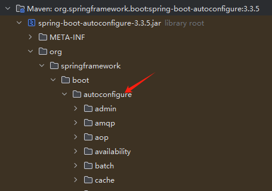

## SpringBoot框架提供的条件注解

如何做到按需加载的，依靠SpringBoot框架中的条件注解来实现的。

Spring Boot框架中的@ConditionalOnXxx系列注解属于条件注解（Conditional Annotations），它们用于基于某些条件来决定是否应该创建一个或一组Bean。这些注解通常用在自动配置类上，以确保只有在特定条件满足时才会应用相应的配置。

这里是一些常见的@ConditionalOnXxx注解及其作用：

- @ConditionalOnClass：当指定的类存在时，才创建Bean。
- @ConditionalOnMissingClass：当指定的类不存在时，才创建Bean。
- @ConditionalOnBean：当容器中存在指定的Bean时，才创建Bean。
- @ConditionalOnMissingBean：当容器中不存在指定的Bean时，才创建Bean。
- @ConditionalOnProperty：当配置文件中存在指定的属性时，才创建Bean。也可以设置属性值需要匹配的值。
- @ConditionalOnResource：当指定的资源存在时，才创建Bean。
- @ConditionalOnWebApplication：当应用程序是Web应用时，才创建Bean。
- @ConditionalOnNotWebApplication：当应用程序不是Web应用时，才创建Bean。

使用这些注解可以帮助开发者根据不同的运行环境或配置来灵活地控制Bean的创建，从而实现更智能、更自动化的配置过程。这对于构建可插拔的模块化系统特别有用，因为可以根据实际需求选择性地启用或禁用某些功能。

假设我们来实现这样一个功能：如果IoC容器当中**存在`**<font style="color:#DF2A3F;">A</font>**`Bean**，就创建`B`Bean，代码如下：

```java
@Configuration
public class AppConfig {

    @Bean
    public A a(){
        return new A();
    }

    @ConditionalOnBean(A.class)
    @Bean
    public B b(){
        return new B();
    }
}
```

如果IoC容器当中**不存在`**<font style="color:#DF2A3F;">A</font>**`Bean**，就创建`B`Bean，代码如下：

```java
@Configuration
public class AppConfig {

    @Bean
    public A a(){
        return new A();
    }

    @ConditionalOnMissingBean(A.class)
    @Bean
    public B b(){
        return new B();
    }
}
```

当类路径当中存在`DispatcherServlet`类，则启用配置，反之则不启用配置，代码如下：

```java
@ConditionalOnClass(name = {"org.springframework.web.servlet.DispatcherServlet"})
@Configuration
public class MyConfig {
    @Bean
    public A getA(){
        return new A();
    }
}
```

以上程序自行测试！

# 自动配置实现原理


## 自动配置类的三个来源

1. 以前配置是写在 XML 文件中的，现在的配置都是配置类。一个配置类对应一套配置。springboot 通过加载配置类来加载该配置。
2. 一个 springboot 项目的配置类在哪？来源有三个
3. **SpringBoot 官方提供的自动配置类**
  1. 位置： spring-boot-autoconfigure.jar 的META-INF/spring/org.springframework.boot.autoconfigure.AutoConfiguration.imports 配置中。
  2. 内容： Spring Boot 团队维护的所有官方自动配置
  3. 数量：约 150-200 个（不同版本略有差异）
4. **第三方启动器提供的自动配置类**
  1. 位置：在各自的 jar 包中，路径也是：META-INF/spring/org.springframework.boot.autoconfigure.AutoConfiguration.imports
5. **自己项目中自己写的自动配置类**
  1. 位置：在自己的项目中，路径也是：META-INF/spring/org.springframework.boot.autoconfigure.AutoConfiguration.imports
6. **不管来源是哪个，位置都是一样的**，这是一种约定，都是从 jar 包的 `META-INF/spring`目录下的 `org.springframework.boot.autoconfigure.AutoConfiguration.imports`文件中加载自动配置类。

## 加载机制：合并所有来源

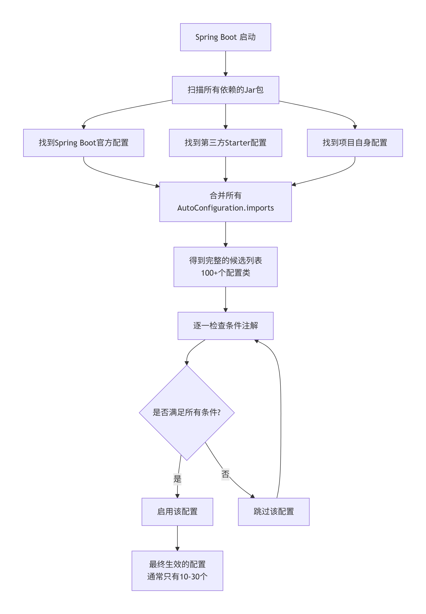

## SpringBoot 官方提供了 150 多个自动配置类

1. 当我们导入`spring-boot-starter-web`【web启动器】
2. 会关联导入了`spring-boot-starter`【任何一个 springboot 项目都需要这个启动器】
3. 核心启动器导入之后，关联导入了一个jar包：`spring-boot-autoconfigure`
  1. 注意：这个jar包中存放的是springboot框架**官方支持的自动配置类**。如下图：


```plaintext
2. 官方支持的自动配置类有多少个呢，可以通过下图位置查看：
```


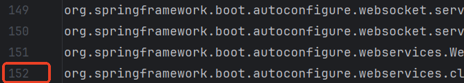

得知`springboot3.3.5`这个版本共`152`个自动配置类。自动配置类的命名规则是`XxxxAutoConfiguration`。

**提示：哪个自动配置类生效，就代表哪个配置文件生效，那么对应的技术就完成了整合，就可以进行对应技术的开发。**

## 自动配置实现原理

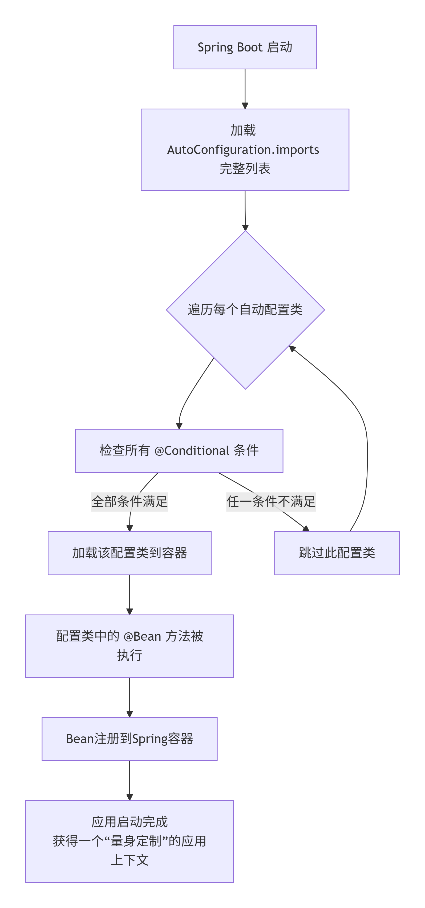

## 加载 150 多个自动配置类的源码分析

### 重要的注解

主入口类上的注解是：@SpringBootApplication

@SpringBootApplication 上面有一个@EnableAutoConfiguration，用来启用自动配置

@EnableAutoConfiguration 上面有一个@Import(AutoConfigurationImportSelector.class)，导入自动配置选择器

AutoConfigurationImportSelector.class 这个选择器负责导入符合条件的自动配置类

### 从哪个文件中导入 150 多个类名

`AutoConfigurationImportSelector`类中的核心方法 `getAutoConfigurationEntry`：该方法完成了自动配置类的筛选。

```java
protected AutoConfigurationEntry getAutoConfigurationEntry(AnnotationMetadata annotationMetadata) {
    if (!isEnabled(annotationMetadata)) {
        return EMPTY_ENTRY;
    }
    AnnotationAttributes attributes = getAttributes(annotationMetadata);
    // 这一行代码读取了150多个自动配置类的类名（从这一行代码进入，可以看到读取的是哪个配置文件）
    List<String> configurations = getCandidateConfigurations(annotationMetadata, attributes);
    configurations = removeDuplicates(configurations);
    Set<String> exclusions = getExclusions(annotationMetadata, attributes);
    checkExcludedClasses(configurations, exclusions);
    configurations.removeAll(exclusions);
    configurations = getConfigurationClassFilter().filter(configurations);
    fireAutoConfigurationImportEvents(configurations, exclusions);
    return new AutoConfigurationEntry(configurations, exclusions);
}
```

继续进入当前类的另一个方法：`getCandidateConfigurations`

```java
protected List<String> getCandidateConfigurations(AnnotationMetadata metadata, AnnotationAttributes attributes) {
    // 这个load方法就是用来加载配置文件中的150多个自动配置类的类名的。
    ImportCandidates importCandidates = ImportCandidates.load(this.autoConfigurationAnnotation,
            getBeanClassLoader());
    List<String> configurations = importCandidates.getCandidates();
    Assert.state(!CollectionUtils.isEmpty(configurations),
            "No auto configuration classes found in " + "META-INF/spring/"
                    + this.autoConfigurationAnnotation.getName() + ".imports. If you "
                    + "are using a custom packaging, make sure that file is correct.");
    return configurations;
}
```

继续进入 `ImportCandidates`类 `load`方法：

```java
public static ImportCandidates load(Class<?> annotation, ClassLoader classLoader) {
    Assert.notNull(annotation, "'annotation' must not be null");
    ClassLoader classLoaderToUse = decideClassloader(classLoader);
    // 从location变量可以捕捉到是从 META-INF/spring/org.springframework.boot.autoconfigure.AutoConfiguration.imports 文件中加载的。
    String location = String.format(LOCATION, annotation.getName());
    Enumeration<URL> urls = findUrlsInClasspath(classLoaderToUse, location);
    List<String> importCandidates = new ArrayList<>();
    while (urls.hasMoreElements()) {
        URL url = urls.nextElement();
        importCandidates.addAll(readCandidateConfigurations(url));
    }
    return new ImportCandidates(importCandidates);
}
```

通过上面源码的跟踪，可以得出，150 多个自动配置类是从 `META-INF/spring/org.springframework.boot.autoconfigure.AutoConfiguration.imports`配置文件中加载的。

## 核心方法的主要流程分析

`AutoConfigurationImportSelector`类中的核心方法 `getAutoConfigurationEntry`：该方法完成了自动配置类的筛选。

```java
protected AutoConfigurationEntry getAutoConfigurationEntry(AnnotationMetadata annotationMetadata) {
    if (!isEnabled(annotationMetadata)) {
        return EMPTY_ENTRY;
    }
    AnnotationAttributes attributes = getAttributes(annotationMetadata);
    List<String> configurations = getCandidateConfigurations(annotationMetadata, attributes);
    configurations = removeDuplicates(configurations);
    Set<String> exclusions = getExclusions(annotationMetadata, attributes);
    checkExcludedClasses(configurations, exclusions);
    configurations.removeAll(exclusions);
    configurations = getConfigurationClassFilter().filter(configurations);
    fireAutoConfigurationImportEvents(configurations, exclusions);
    return new AutoConfigurationEntry(configurations, exclusions);
}
```

### 获取注解属性

```java
AnnotationAttributes attributes = getAttributes(annotationMetadata);
```

**作用**：解析 `<font style="color:rgb(15, 17, 21);background-color:rgb(235, 238, 242);">@EnableAutoConfiguration</font>` 注解的属性。

```java
// 假设入口类上写了这样一个注解：通过这种方式用户可以显示的告诉springboot需要排除掉哪些自动配置类。
@EnableAutoConfiguration(
    exclude = DataSourceAutoConfiguration.class,
    excludeName = "org.springframework.boot.autoconfigure.security.SecurityAutoConfiguration"
)

// 上面代码执行后会解析得到：
attributes = {
    "exclude": [DataSourceAutoConfiguration.class],
    "excludeName": ["org.springframework.boot.autoconfigure.security.SecurityAutoConfiguration"]
}
```

### 获取候选配置

```java
List<String> configurations = getCandidateConfigurations(annotationMetadata, attributes);
```

**作用**：从 `<font style="color:rgb(15, 17, 21);background-color:rgb(235, 238, 242);">META-INF/spring/org.springframework.boot.autoconfigure.AutoConfiguration.imports</font>` 文件加载所有自动配置类。

### 去重

```java
configurations = removeDuplicates(configurations);
```

**作用**：确保配置类不重复。理论上不会重复，但多个 jar 包就不一定了。

### 获取排除项

```java
Set<String> exclusions = getExclusions(annotationMetadata, attributes);
```

**作用**：收集所有要排除的配置类。（这里的排除只是排除掉程序员在编码阶段指定的要排除的类，并不是通过条件注解进行过滤。）

### 检查排除项

```java
checkExcludedClasses(configurations, exclusions);
```

**作用**：验证用户排除的类确实是自动配置类（防止排除错误）。

### 排除

```java
configurations.removeAll(exclusions);
```

**作用**：从候选列表中移除被排除的配置类。（仍然是排除程序员指定要排除的配置类。并不是经过条件注解进行过滤。）

### 条件过滤（最核心的一步）

```java
configurations = getConfigurationClassFilter().filter(configurations);
```

**作用**：使用 `<font style="color:rgb(15, 17, 21);background-color:rgb(235, 238, 242);">@Conditional</font>` 系列注解进行智能过滤。

### 触发事件（这个对于我们来说不重要）

```java
fireAutoConfigurationImportEvents(configurations, exclusions);
```

**作用**：触发**自动配置导入**事件，让监听器可以处理。

**触发监听后，主要做了三件事：**

1. **生成条件评估报告** - 记录哪些配置类被匹配/排除
2. **存储在ConditionEvaluationReport中** - 供后续使用
3. **当开启debug时输出到控制台** - 显示详细的自动配置决策信息

## 条件过滤器

SpringBoot 内置了三个过滤器：spring-boot-autoconfigure-3.5.8.jar 的 META-INF/spring.factories 配置文件中存在三个过滤器

```java
# Auto Configuration Import Filters
org.springframework.boot.autoconfigure.AutoConfigurationImportFilter=\
org.springframework.boot.autoconfigure.condition.OnBeanCondition,\
org.springframework.boot.autoconfigure.condition.OnClassCondition,\
org.springframework.boot.autoconfigure.condition.OnWebApplicationCondition
```

**三个过滤器对应的条件注解：**

| **过滤器** | **对应的条件注解** | **作用** |
| --- | --- | --- |
| `<font style="color:rgb(15, 17, 21);background-color:rgb(235, 238, 242);">OnClassCondition</font>` | `<font style="color:rgb(15, 17, 21);background-color:rgb(235, 238, 242);">@ConditionalOnClass</font>` `<font style="color:rgb(15, 17, 21);background-color:rgb(235, 238, 242);">@ConditionalOnMissingClass</font>` | 根据类路径是否存在某个类来过滤 |
| `<font style="color:rgb(15, 17, 21);background-color:rgb(235, 238, 242);">OnBeanCondition</font>` | `<font style="color:rgb(15, 17, 21);background-color:rgb(235, 238, 242);">@ConditionalOnBean</font>` `<font style="color:rgb(15, 17, 21);background-color:rgb(235, 238, 242);">@ConditionalOnMissingBean</font>` | 根据容器中是否存在某个Bean来过滤 |
| `<font style="color:rgb(15, 17, 21);background-color:rgb(235, 238, 242);">OnWebApplicationCondition</font>` | `<font style="color:rgb(15, 17, 21);background-color:rgb(235, 238, 242);">@ConditionalOnWebApplication</font>` `<font style="color:rgb(15, 17, 21);background-color:rgb(235, 238, 242);">@ConditionalOnNotWebApplication</font>` | 根据是否是Web应用来过滤 |

## 条件过滤源码分析

我们需要分析这个最核心的步骤，重新回到：`AutoConfigurationImportSelector`类的`getAutoConfigurationEntry`方法。

```java
protected AutoConfigurationEntry getAutoConfigurationEntry(AnnotationMetadata annotationMetadata) {
    if (!isEnabled(annotationMetadata)) {
        return EMPTY_ENTRY;
    }
    AnnotationAttributes attributes = getAttributes(annotationMetadata);
    List<String> configurations = getCandidateConfigurations(annotationMetadata, attributes);
    configurations = removeDuplicates(configurations);
    Set<String> exclusions = getExclusions(annotationMetadata, attributes);
    checkExcludedClasses(configurations, exclusions);
    configurations.removeAll(exclusions);
    // 这个就是最核心的步骤：根据条件注解进行过滤，底层3个过滤器都会起作用。
    configurations = getConfigurationClassFilter().filter(configurations);
    fireAutoConfigurationImportEvents(configurations, exclusions);
    return new AutoConfigurationEntry(configurations, exclusions);
}
```

进入 `filter`方法：

```java
List<String> filter(List<String> configurations) {
    long startTime = System.nanoTime();
    String[] candidates = StringUtils.toStringArray(configurations);
    boolean skipped = false;
    for (AutoConfigurationImportFilter filter : this.filters) {
        boolean[] match = filter.match(candidates, this.autoConfigurationMetadata);
        for (int i = 0; i < match.length; i++) {
            if (!match[i]) {
                candidates[i] = null;
                skipped = true;
            }
        }
    }
    if (!skipped) {
        return configurations;
    }
    List<String> result = new ArrayList<>(candidates.length);
    for (String candidate : candidates) {
        if (candidate != null) {
            result.add(candidate);
        }
    }
    if (logger.isTraceEnabled()) {
        int numberFiltered = configurations.size() - result.size();
        logger.trace("Filtered " + numberFiltered + " auto configuration class in "
                + TimeUnit.NANOSECONDS.toMillis(System.nanoTime() - startTime) + " ms");
    }
    return result;
}
```

以上方法中最核心的代码就是：

```java
for (AutoConfigurationImportFilter filter : this.filters) {
    boolean[] match = filter.match(candidates, this.autoConfigurationMetadata);
    for (int i = 0; i < match.length; i++) {
        if (!match[i]) {
            candidates[i] = null;
            skipped = true;
        }
    }
}
```

这个最外层循环会循环 3 次，因为 SpringBoot 内置了 3 个过滤器。

外层循环每循环一次，内层循环 156 次。

**以上代码中最核心的代码是：**

```java
// 第一个参数：156个自动配置类
// 第二个参数：自动配置元数据（914个条件）
boolean[] match = filter.match(candidates, this.autoConfigurationMetadata);
```

`**914**`**个条件是写在配置文件中的，在 **`**spring-boot-autoconfigure-3.5.8.jar**`**的 **`**META-INF/spring-autoconfigure-metadata.properties**`**文件中。该文件一共 914 行，每一行都是一个条件，这些条件是用来约束那 156 个自动配置类的。**

---

**思考：****为什么要把 914 个条件放到一个属性文件中？这些条件不应该都在自动配置类上吗？直接通过反射读取 156 个配置类动态获取配置类上的条件不行吗？答案是：不行，原因是效率太低。**

# Web 中的核心配置类概述


## 共 27 个自动配置类

**如果是 web 开发，最终会留下 27 个自动配置类：**

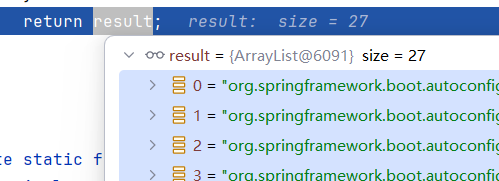

**分别是：**

```plaintext
0 = "org.springframework.boot.autoconfigure.admin.SpringApplicationAdminJmxAutoConfiguration"
1 = "org.springframework.boot.autoconfigure.aop.AopAutoConfiguration"
2 = "org.springframework.boot.autoconfigure.availability.ApplicationAvailabilityAutoConfiguration"
3 = "org.springframework.boot.autoconfigure.cache.CacheAutoConfiguration"
4 = "org.springframework.boot.autoconfigure.context.ConfigurationPropertiesAutoConfiguration"
5 = "org.springframework.boot.autoconfigure.context.LifecycleAutoConfiguration"
6 = "org.springframework.boot.autoconfigure.context.MessageSourceAutoConfiguration"
7 = "org.springframework.boot.autoconfigure.context.PropertyPlaceholderAutoConfiguration"
8 = "org.springframework.boot.autoconfigure.http.HttpMessageConvertersAutoConfiguration"
9 = "org.springframework.boot.autoconfigure.http.client.HttpClientAutoConfiguration"
10 = "org.springframework.boot.autoconfigure.info.ProjectInfoAutoConfiguration"
11 = "org.springframework.boot.autoconfigure.jackson.JacksonAutoConfiguration"
12 = "org.springframework.boot.autoconfigure.jmx.JmxAutoConfiguration"
13 = "org.springframework.boot.autoconfigure.sql.init.SqlInitializationAutoConfiguration"
14 = "org.springframework.boot.autoconfigure.ssl.SslAutoConfiguration"
15 = "org.springframework.boot.autoconfigure.task.TaskExecutionAutoConfiguration"
16 = "org.springframework.boot.autoconfigure.task.TaskSchedulingAutoConfiguration"
17 = "org.springframework.boot.autoconfigure.web.client.RestClientAutoConfiguration"
18 = "org.springframework.boot.autoconfigure.web.client.RestTemplateAutoConfiguration"
19 = "org.springframework.boot.autoconfigure.web.embedded.EmbeddedWebServerFactoryCustomizerAutoConfiguration"
20 = "org.springframework.boot.autoconfigure.web.servlet.DispatcherServletAutoConfiguration"
21 = "org.springframework.boot.autoconfigure.web.servlet.HttpEncodingAutoConfiguration"
22 = "org.springframework.boot.autoconfigure.web.servlet.MultipartAutoConfiguration"
23 = "org.springframework.boot.autoconfigure.web.servlet.ServletWebServerFactoryAutoConfiguration"
24 = "org.springframework.boot.autoconfigure.web.servlet.WebMvcAutoConfiguration"
25 = "org.springframework.boot.autoconfigure.web.servlet.error.ErrorMvcAutoConfiguration"
26 = "org.springframework.boot.autoconfigure.websocket.servlet.WebSocketServletAutoConfiguration"
```

## 服务器启动（2个）

**19. EmbeddedWebServerFactoryCustomizerAutoConfiguration**

- **作用**：Web服务器专有配置器（Tomcat/Jetty专有配置）
- **配置**：`server.tomcat.*`, `server.jetty.*`, `server.undertow.*`

**23. ServletWebServerFactoryAutoConfiguration**

- **作用**：Web服务器通用配置
- **配置**：`server.*`（通用：端口、SSL、上下文路径）

## Spring MVC核心（3个）

**20. DispatcherServletAutoConfiguration**

- **作用**：创建Spring MVC核心DispatcherServlet
- **配置**：`spring.mvc.servlet.*`

**24. WebMvcAutoConfiguration**

- **作用**：配置完整Spring MVC框架
- **配置**：`spring.mvc.*`（静态资源、视图解析等）

**25. ErrorMvcAutoConfiguration**

- **作用**：全局错误处理
- **配置**：`server.error.*`

## 数据处理（2个）

**11. JacksonAutoConfiguration**

- **作用**：JSON处理（REST API必需），它是 SpringBoot 处理 JSON 时默认采用 Jackson 库。
- **配置**：`spring.jackson.*`

**8. HttpMessageConvertersAutoConfiguration**

- **作用**：HTTP消息转换器（JSON/XML转换）
- **配置**：自动配置
- **它会自动配置多个消息转换器**，其中 **MappingJackson2HttpMessageConverter** 使用的是**JacksonAutoConfiguration**

## Web增强功能（3个）

**21. HttpEncodingAutoConfiguration**

- **作用**：字符编码过滤器（强制UTF-8）
- **配置**：`server.servlet.encoding.*`

**22. MultipartAutoConfiguration**

- **作用**：文件上传支持
- **配置**：`spring.servlet.multipart.*`

**14. SslAutoConfiguration**

- **作用**：SSL/TLS安全配置
- **配置**：`server.ssl.*`

# Web自动配置都默认配置了什么


**查看官方文档：**


**翻译如下：**

---

## 视图解析器

- **包括 ContentNegotiatingViewResolver 和 BeanNameViewResolver 的 Bean。**
  - **ContentNegotiatingViewResolver**：自动根据 HTTP 请求头中 Accept 字段来选择合适的视图技术渲染响应。
  - **BeanNameViewResolver**：根据视图名称找到视图 View 对象。

## 静态资源支持

- **支持提供静态资源，包括对 WebJars 的支持。**
  - 静态资源路径默认已经配置好了。默认会去 static 目录下找。

## 数据转换与格式化

- **自动注册 Converter 和 Formatter 的 Bean。**
  - **Converter**：转换器，做类型转换的，例如表单提交了用户数据，将表单数据转换成 User 对象。
  - **Formatter**：格式化器，做数据格式化的，例如将 Java 中的日期类型对象格式化为特定格式的日期字符串。或者将用户提交的日期字符串，转换为 Java 中的日期对象。

## HTTP 消息转换

- **支持 HttpMessageConverters。**
  - 内置了很多的 HTTP 消息转换器。例如：MappingJackson2HttpMessageConverter 可以将 json 转换成 java 对象，也可以将 java 对象转换为 json 字符串。

## 消息代码解析

- **自动注册 MessageCodesResolver。**
  - SpringBoot 会自动注册一个默认的消息代码解析器。
  - 帮助你在表单验证出错时生成一些特殊的代码。这些代码让你能够更精确地定位问题，并提供更友好的错误提示。

## 默认主页支持

- **静态 index.html 文件支持。**
  - Spring Boot 会自动处理位于项目静态资源目录下的 index.html 文件，使其成为应用程序的默认主页。

## 数据绑定初始化

- **自动使用 ConfigurableWebBindingInitializer Bean。**
  - 用它来指定默认使用哪个转换器，默认使用哪个格式化器。在这个类当中都已经配好了。

## 自定义配置说明

- 自己想完全控制 Spring MVC，使用 `@EnableWebMvc`+`@Configuration`，自己写一个配置类。（**不推荐！！！**）
- 如果你希望保留默认配置并进行扩展（如拦截器、格式化程序、视图控制器等其他功能），编写类实现`WebMvcConfigurer`接口+`@Configuration` 类。**但不能使用 **`@EnableWebMvc`** 注解。**

# WebMvcAutoConfiguration 源码解释


## WebMvc自动配置是否生效的条件

```java
// 先加载这几个类，然后再加载WebMvcAutoConfiguration
@AutoConfiguration(after = { DispatcherServletAutoConfiguration.class, TaskExecutionAutoConfiguration.class,ValidationAutoConfiguration.class })
// 必须是一个web应用，WebMvcAutoConfiguration才会生效
@ConditionalOnWebApplication(type = Type.SERVLET)
// 类路径中必须存在这几个类，WebMvcAutoConfiguration才会生效
@ConditionalOnClass({ Servlet.class, DispatcherServlet.class, WebMvcConfigurer.class })
// 如果有这样一个Bean，WebMvcAutoConfiguration不生效
// 针对这个可以看一下@EnableWebMvc注解，你会发现它导入了DelegatingWebMvcConfiguration，而它继承了WebMvcConfigurationSupport
// 因此当我们使用 @EnableWebMvc注解时，默认配置会全部失效
@ConditionalOnMissingBean(WebMvcConfigurationSupport.class)
// 以下这两个不重要
@AutoConfigureOrder(Ordered.HIGHEST_PRECEDENCE + 10)
@ImportRuntimeHints(WebResourcesRuntimeHints.class)
public class WebMvcAutoConfiguration {}
```

## WebMvc自动配置生效后引入了两个Filter Bean

### 引入了HiddenHttpMethodFilter Bean

```java
@Bean
@ConditionalOnMissingBean(HiddenHttpMethodFilter.class)
@ConditionalOnProperty(prefix = "spring.mvc.hiddenmethod.filter", name = "enabled")
public OrderedHiddenHttpMethodFilter hiddenHttpMethodFilter() {
    return new OrderedHiddenHttpMethodFilter();
}
```

提供对浏览器表单支持PUT、DELETE等HTTP方法的兼容处理

### 引入了FormContentFilter Bean

```java
@Bean
@ConditionalOnMissingBean(FormContentFilter.class)
@ConditionalOnProperty(prefix = "spring.mvc.formcontent.filter", name = "enabled", matchIfMissing = true)
public OrderedFormContentFilter formContentFilter() {
    return new OrderedFormContentFilter();
}
```

**解析并处理**`**<font style="color:rgb(15, 17, 21);background-color:rgb(235, 238, 242);">application/x-www-form-urlencoded</font>**`**格式的PUT、DELETE请求体数据。**

## WebMvc自动配置生效后引入了WebMvcConfigurer接口的实现类

**知识点清单：**

1. `**WebMvcAutoConfiguration**`**类中的静态内部类**`**WebMvcAutoConfigurationAdapter**`**实现了WebMvcConfigurer 接口。**
2. **这个接口的实现我们之前写过，在 SpringMVC 全注解开发时写过。因此 SpringBoot 对 MVC 的默认配置都在这个内部类中。**
3. **想修改默认配置：在 application.yml 文件中配置 **`**<font style="color:#DF2A3F;">spring.mvc</font>**`**、**`**<font style="color:#DF2A3F;">spring.web</font>**`
4. **想对默认配置进行扩展，例如添加拦截器：编写类实现**`**<font style="color:#DF2A3F;">WebMvcConfigurer</font>**`**接口+**`**<font style="color:#DF2A3F;">@Configuration</font>**`

在SpringBoot框架的`WebMvcAutoConfiguration`类中提供了一个内部类：`WebMvcAutoConfigurationAdapter`


SpringBoot在这个类`WebMvcAutoConfigurationAdapter`中进行了一系列的Spring MVC相关配置。

### 关于`WebMvcConfigurer`接口

这个接口我们以前就用过。在 SpringMVC 中进行全注解式开发时就用了。在这个接口中提供了很多方法，需要改变Spring MVC的哪个行为，则重写对应的方法即可，下面是这个接口中所有的方法，以及每个方法对应的Spring MVC行为的解释：

```java
public interface WebMvcConfigurer {
    // 用于定制 Spring MVC 如何匹配请求路径到控制器
    default void configurePathMatch(PathMatchConfigurer configurer) {}
    // 用于定制 Spring MVC 的内容协商策略，以确定如何根据请求的内容类型来选择合适的处理方法或返回数据格式
    default void configureContentNegotiation(ContentNegotiationConfigurer configurer) {}
    // 用于定制 Spring MVC 处理异步请求的方式
    default void configureAsyncSupport(AsyncSupportConfigurer configurer) {}
    // 用于定制是否将某些静态资源请求转发WEB容器默认的Servlet处理
    default void configureDefaultServletHandling(DefaultServletHandlerConfigurer configurer) {}
    // 用于定制 Spring MVC 解析视图的方式，以确定如何将控制器返回的视图名称转换为实际的视图资源。
    default void configureViewResolvers(ViewResolverRegistry registry) {}
    // 用于定制 Spring MVC 如何处理 HTTP 请求和响应的数据格式，包括 JSON、XML 等内容类型的转换
    default void configureMessageConverters(List<HttpMessageConverter<?>> converters) {}
    // 用于定制 Spring MVC 如何处理控制器方法中发生的异常，并提供相应的错误处理逻辑。
    default void configureHandlerExceptionResolvers(List<HandlerExceptionResolver> resolvers) {}

    // 用于定制 Spring MVC 如何处理数据的格式化和解析，例如日期、数值等类型的对象的输入和输出格式。
    default void addFormatters(FormatterRegistry registry) {}
    // 用于定制 Spring MVC 如何使用拦截器来处理请求和响应，包括在请求进入控制器之前和之后执行特定的操作。
    default void addInterceptors(InterceptorRegistry registry) {}
    // 用于定制 Spring MVC 如何处理静态资源（如 CSS、JavaScript、图片等文件）的请求。
    default void addResourceHandlers(ResourceHandlerRegistry registry) {}
    // 用于定制 Spring MVC 如何处理跨域请求，确保应用程序可以正确地响应来自不同域名的 AJAX 请求或其他跨域请求。
    default void addCorsMappings(CorsRegistry registry) {}
    // 用于快速定义简单的 URL 到视图的映射，而无需编写完整的控制器类和方法。
    default void addViewControllers(ViewControllerRegistry registry) {}
    // 用于定制 Spring MVC 如何解析控制器方法中的参数，包括如何从请求中获取并转换参数值。
    default void addArgumentResolvers(List<HandlerMethodArgumentResolver> resolvers) {}
    // 用于定制 Spring MVC 如何处理控制器方法的返回值，包括如何将返回值转换为实际的 HTTP 响应。
    default void addReturnValueHandlers(List<HandlerMethodReturnValueHandler> handlers) {}

    // 用于定制 Spring MVC 如何处理 HTTP 请求和响应的数据格式，允许你添加或调整默认的消息转换器，以支持特定的数据格式。
    default void extendMessageConverters(List<HttpMessageConverter<?>> converters) {}
    // 用于定制 Spring MVC 如何处理控制器方法中抛出的异常，允许你添加额外的异常处理逻辑。
    default void extendHandlerExceptionResolvers(List<HandlerExceptionResolver> resolvers) {}
}
```

### `WebMvcConfigurer`接口的实现类`WebMvcAutoConfigurationAdapter`

`WebMvcAutoConfigurationAdapter`是Spring Boot框架提供的，实现了Spring MVC中的`WebMvcConfigurer`接口，对Spring MVC的所有行为进行了默认的配置。

如果想要改变这些默认配置，应该怎么办呢？看源码：

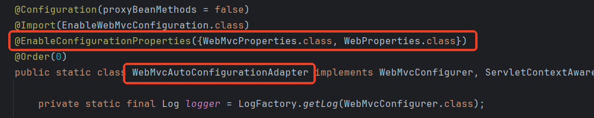

可以看到，该类上有一个注解`@EnableConfigurationProperties({ WebMvcProperties.class, WebProperties.class })`，该注解负责启用配置属性。会将配置文件`application.properties`或`application.yml`中的配置传递到该类中。因此可以通过`application.properties`或`application.yml`配置文件来改变Spring Boot对SpringMVC的默认配置。`WebMvcProperties`和`WebProperties`源码如下：


通过以上源码得知要改变SpringBoot对SpringMVC的默认配置，需要在配置文件中使用以下前缀的配置：

- spring.mvc：主要用于配置 Spring MVC 的相关行为，例如路径匹配、视图解析、静态资源处理等
- spring.web：通常用于配置一些通用的 Web 层设置，如资源处理、安全性配置等。

## 一个小小的疑惑

我们来看一下`WebMvcAutoConfiguration`的生效条件：


上图红框内表示，要求Spring容器中缺失`WebMvcConfigurationSupport`这个Bean，`WebMvcAutoConfiguration`才会生效。

但是我们来看一下`EnableWebMvcConfiguration`的继承结构：


很明显，`EnableWebMvcConfiguration`就是一个`WebMvcConfigurationSupport`这样的Bean。

那疑问就有了：既然容器中存在`WebMvcConfigurationSupport`这样的Bean，`WebMvcAutoConfiguration`为什么还会生效呢？

原因是因为：`EnableWebMvcConfiguration`是`WebMvcAutoConfiguration`类的内部类。在`WebMvcAutoConfiguration`进行加载的时候，`EnableWebMvcConfiguration`这个内部类还没有加载。因此这个时候在容器中还不存在`WebMvcConfigurationSupport`的Bean，所以`WebMvcAutoConfiguration`仍然会生效。

**以上所说的**`**<font style="color:#DF2A3F;">WebMvcAutoConfiguration</font>**`**类中的内部类**`**<font style="color:#DF2A3F;">EnableWebMvcConfiguration</font>**`**，是用来启用Web MVC默认配置的。**

**注意区分：WebMvcAutoConfiguration的两个内部类：**

- `WebMvcAutoConfigurationAdapter`作用是用来：**配置 MVC 的**。
- `EnableWebMvcConfiguration`作用是用来：**启用 MVC 配置的**。

# 自动配置中的静态资源处理


web站点中的静态资源指的是：js、css、图片、webjars 等。

webjars 是：**将前端资源（如jQuery、Bootstrap）打包成Java的JAR包，通过Maven依赖管理，像引入Java库一样引入前端库，现代开发中很少这样用，了解即可。**

## 静态资源处理源码分析

**知识点清单：**

1. **通过spring.web.resources.add-mappings=false 可以关闭默认的静态资源配置。**
2. **当请求路径是 **`**/webjars/****`**格式时，会去 **`**/META-INF/resources/webjars/**`**目录下找静态资源。**
3. **当请求路径是 **`**/****`**格式时（优先匹配控制器，如果匹配不到控制器，才会...），会去 **`**{ "classpath:/META-INF/resources/","classpath:/resources/", "classpath:/static/", "classpath:/public/" }**`**目录下找。**
4. **通过 **`**spring.mvc.static-path-pattern=...**`**配置 URL，通过 **`**spring.web.resources.static-locations=...,...,...,...**`**配置物理路径。**

关于**SpringBoot对静态资源处理的默认配置**，查看`WebMvcAutoConfigurationAdapter`源码，核心源码如下：

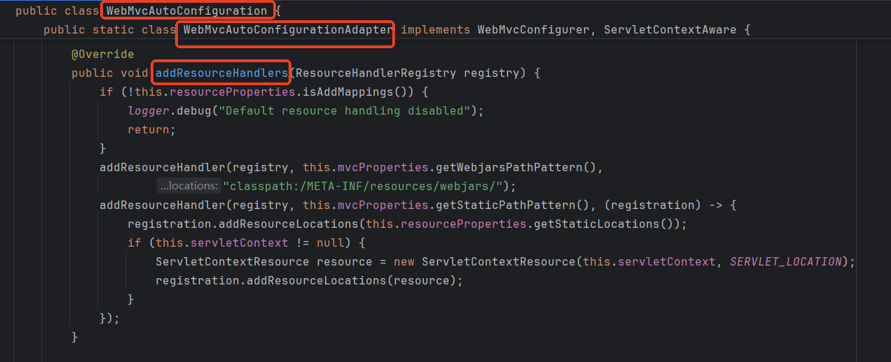

对以上源码进行解释：

```java
@Override
public void addResourceHandlers(ResourceHandlerRegistry registry) {

    // 检查 resourceProperties 中的 addMappings 属性是否为 false。如果为 false，则表示不启用默认的静态资源映射处理。
    // 在application.properties配置文件中进行`spring.web.resources.add-mappings=false`配置，可以将其设置为false。
    // 当然，如果没有配置的话，默认值是true。
    if (!this.resourceProperties.isAddMappings()) {
        logger.debug("Default resource handling disabled");
        return;
    }

    // 配置 WebJars 的静态资源处理。
    // this.mvcProperties.getWebjarsPathPattern()的执行结果是：/webjars/**
    // 也就是说，如果请求路径是 http://localhost:8080/webjars/** ，则自动去类路径下的 /META-INF/resources/webjars/ 目录中找静态资源。
    // 如果要改变这个默认的配置，需要在application.properties文件中进行这样的配置：`spring.mvc.webjars-path-pattern=...`
    addResourceHandler(registry, this.mvcProperties.getWebjarsPathPattern(),
            "classpath:/META-INF/resources/webjars/");

    // 配置普通静态资源处理
    // this.mvcProperties.getStaticPathPattern()的执行结果是：/**
    // this.resourceProperties.getStaticLocations()的执行结果是：{ "classpath:/META-INF/resources/","classpath:/resources/", "classpath:/static/", "classpath:/public/" }
    // 也就是说，如果请求路径是：http://localhost:8080/**，根据控制器方法优先原则，会先去找合适的控制器方法，如果没有合适的控制器方法，静态资源处理才会生效，则自动去类路径下的/META-INF/resources/、/resources/、/static/、/public/ 4个位置找。
    // 如果要改变这个默认的配置，需要在application.properties中进行如下的两个配置：
    // 配置URL：spring.mvc.static-path-pattern=...
    // 配置物理路径：spring.web.resources.static-locations=...,...,...,...
    addResourceHandler(registry, this.mvcProperties.getStaticPathPattern(), (registration) -> {
        registration.addResourceLocations(this.resourceProperties.getStaticLocations());
        if (this.servletContext != null) {
            ServletContextResource resource = new ServletContextResource(this.servletContext, SERVLET_LOCATION);
            registration.addResourceLocations(resource);
        }
    });
}
```

## 关于WebJars静态资源处理

**知识点清单：**

1. **默认规则是：当请求路径是**`**/webjars/****`**，则会去**`**classpath:/META-INF/resources/webjars/**`**找。**

**WebJars介绍**

WebJars 是一种将常用的前端库（如 jQuery、Bootstrap、Font Awesome 等）打包成 JAR 文件的形式，方便在 Java 应用程序中使用。WebJars 提供了一种标准化的方式来管理前端库，使其更容易集成到 Java 项目中，并且可以利用 Maven 的依赖管理功能。

**WebJars在SpringBoot中的使用**

WebJars官网：[https://www.webjars.org/](https://www.webjars.org/)

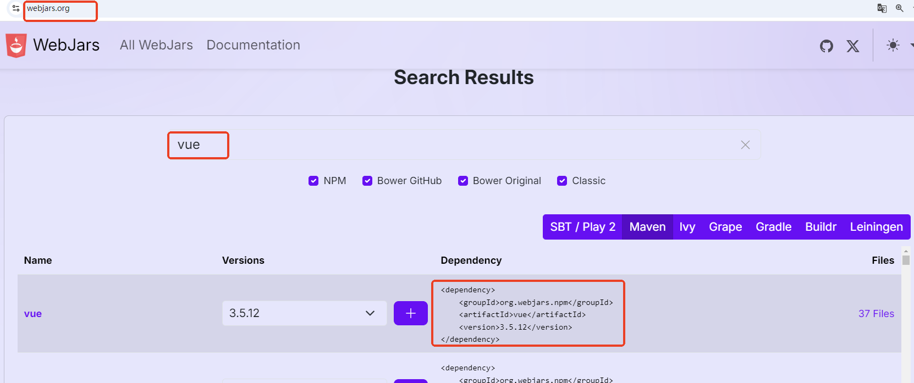

在官网上可以找到某个webjars的maven依赖，将依赖加入到SpringBoot项目中，例如我们添加vue的依赖：

```xml
<dependency>
    <groupId>org.webjars.npm</groupId>
    <artifactId>vue</artifactId>
    <version>3.5.12</version>
</dependency>
```

如下图表示加入成功：

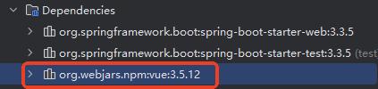

在jar包列表中也可以看到：

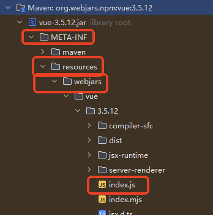

在SpringBoot中，对WebJars的默认访问规则是：当请求路径是`/webjars/**`，则会去`classpath:/META-INF/resources/webjars/`找。

因此我们要想访问上图的`index.js`，则应该发送这样的请求路径：`http://localhost:8080/webjars/vue/3.5.12/index.js`

启动服务器，打开浏览器，访问，测试结果如下：

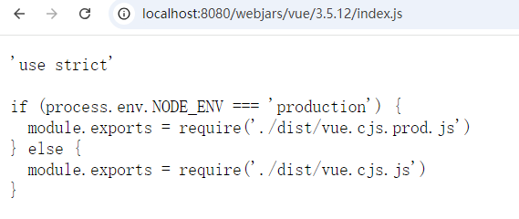

和IDEA中的文件对比一下，完全一样则表示测试成功：

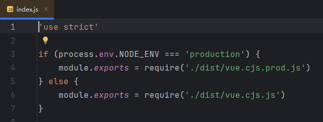

## 关于普通静态资源处理

**知识点清单：**

**当请求路径是**[**http://localhost:8080/****](http://localhost:8080/**)**，根据控制器方法优先原则，会先去找合适的控制器方法，如果没有合适的控制器方法，静态资源处理才会生效，则自动去类路径下的以下4个位置查找：**

- **classpath:/META-INF/resources/**
- **classpath:/resources/**
- **classpath:/static/**
- **classpath:/public/ **

我们可以在项目中分别创建以上4个目录，在4个目录当中放入静态资源，例如4张图片：

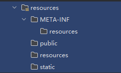


然后启动服务器，打开浏览器，访问，测试是否可以正常访问图片：


## 关于静态资源缓存处理

**什么是静态资源缓存，谁缓存，有什么用？**

静态资源缓存指的是浏览器的缓存行为，浏览器可以将静态资源（js、css、图片、声音、视频）缓存到浏览器中，只要下一次用户访问同样的静态资源直接从缓存中取，不再从服务器中获取，可以降低服务器的压力，提高用户的体验。而这个缓存策略可以在服务器端程序中进行设置，SpringBoot对静态资源缓存的默认策略就是以下这三行代码：

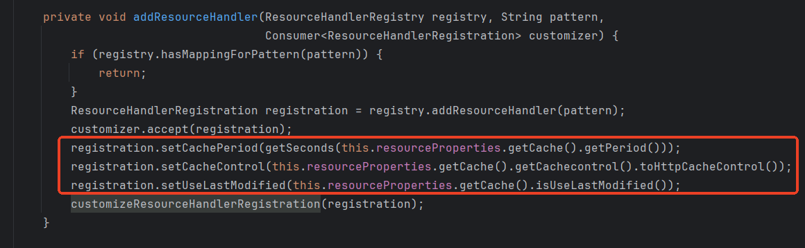

**以上三行代码的解释如下：**

- **registration.setCachePeriod(getSeconds(this.resourceProperties.getCache().getPeriod()));**
  - 设置缓存的过期时间，默认配置是 null。不设置缓存时间，由浏览器自己决定。
  - 假设配置为 3600 秒，则在 1 小时内浏览器都走缓存。
  - 可以通过`application.properties`的来修改默认的过期时间，例如：`<font style="color:rgb(51, 51, 51);">spring.web.resources.cache.period=3600</font>`或者`<font style="color:rgb(51, 51, 51);">spring.web.resources.cache.period=1h</font>`
- **registration.setCacheControl(this.resourceProperties.getCache().getCachecontrol().toHttpCacheControl());**
  - 设置静态资源的 Cache-Control HTTP 响应头，告诉浏览器如何去缓存这些资源。
  - `<font style="color:rgb(44, 44, 54);">Cache-Control</font>` HTTP 响应头 是HTTP响应协议的一部分内容。如下图：

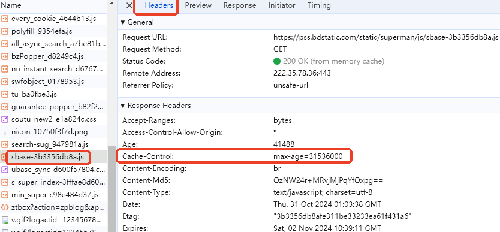

```plaintext
- <font style="color:rgb(44, 44, 54);">常见的 Cache-Control 指令包括：</font>
    * **<font style="color:rgb(15, 17, 21);">max-age=<seconds></font>**<font style="color:rgb(15, 17, 21);">：资源在指定秒数内被视为新鲜，浏览器直接使用缓存，无需请求服务器。</font>
    * **<font style="color:rgb(15, 17, 21);">public</font>**<font style="color:rgb(15, 17, 21);">：明确声明该响应可以被所有缓存（浏览器、CDN、代理服务器）存储和共享。</font>
    * **<font style="color:rgb(15, 17, 21);">private</font>**<font style="color:rgb(15, 17, 21);">：该响应只能存储在最终用户的浏览器缓存中，禁止CDN或代理服务器缓存。</font>
    * **<font style="color:rgb(15, 17, 21);">no-cache</font>**<font style="color:rgb(15, 17, 21);">：可以缓存响应副本，但每次使用前必须向服务器验证其有效性（Last-Modified）。</font>
    * **<font style="color:rgb(15, 17, 21);">no-store</font>**<font style="color:rgb(15, 17, 21);">：禁止以任何形式（内存或磁盘）缓存响应内容，每次都必须从服务器获取。</font>
- 例如：max-age=3600, public：表示响应在 3600 秒内有效，并且可以被任何缓存机制缓存。
- 可以通过`spring.web.resources.cache.cachecontrol.max-age=3600`以及`spring.web.resources.cache.cachecontrol.cache-public=true`进行重新配置。
```

- **registration.setUseLastModified(this.resourceProperties.getCache().isUseLastModified());**
  - **作用**：控制是否在静态资源响应头中添加资源的最后修改时间。
  - **默认值**：Spring Boot 默认启用，会添加最后修改时间。
  - **浏览器行为**：浏览器会发送请求，将缓存资源的最后修改时间与服务器端比对，无变化则使用缓存。
  - **配置方式**：通过 `<font style="color:rgb(15, 17, 21);background-color:rgb(235, 238, 242);">spring.web.resources.cache.use-last-modified=false</font>` 可禁用此功能。

## 静态资源缓存测试

根据之前源码分析，得知`静态资源缓存`相关的配置应该使用`spring.web.resources.cache`：

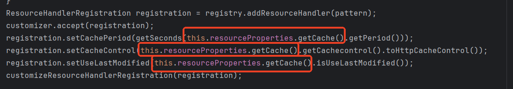


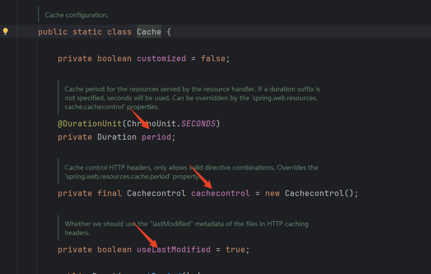

在`application.properties`文件中对缓存进行如下的配置：

```plaintext
# 静态资源缓存设置
# 1. 缓存有效期
spring.web.resources.cache.period=100
# 2. 缓存控制（cachecontrol配置的话，period会失效）
spring.web.resources.cache.cachecontrol.max-age=20
# 3. 是否使用缓存的最后修改时间（默认是：使用）
spring.web.resources.cache.use-last-modified=true
# 4. 是否开启静态资源默认处理方式（默认是：开启）
spring.web.resources.add-mappings=true
```

注意：`cachecontrol.max-age`配置的话，`period`会被覆盖。


启动服务器测试：看看是否在20秒内走缓存，20秒之后是不是就不走缓存了！！！

第一次访问：请求服务器

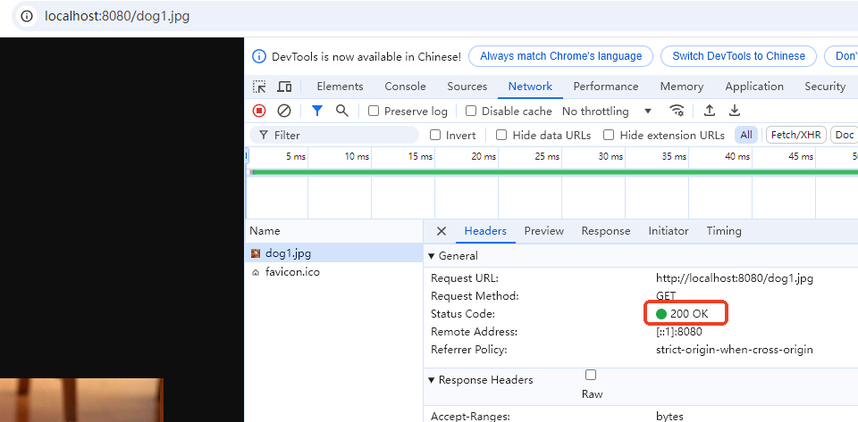

第二次访问：20秒内**开启一个新的浏览器窗口**，再次访问，发现走了缓存


第三次访问：20秒后**开启一个新的浏览器窗口**，再次访问，发现重新请求服务器


提示，为什么显示`304`，这是因为这个配置：`spring.web.resources.cache.use-last-modified=true`，浏览器发送了一次验证请求，发现静态资源没有发生变化，最终还是会走缓存的。

## web应用的欢迎页面

只要在静态资源路径下提供`index.html`，则被当做欢迎页面。静态资源路径指的是之前的4个路径：

```plaintext
{ "classpath:/META-INF/resources/", "classpath:/resources/", "classpath:/static/", "classpath:/public/" }
```

测试一下，在`classpath:/static/`目录下新建`index.html`页面：


启动服务器，测试结果如下：


如果同时在4个静态资源路径下都提供`index.html`，哪个页面会被当做欢迎页呢？

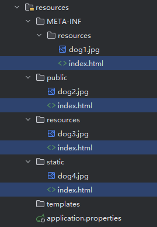

启动服务器，测试结果如下：


原因是什么呢？这是因为`classpath:/META-INF/resources/`是数组的首元素，因此先从这个路径下找欢迎页。


## favorite icon

favicon（也称为“收藏夹图标”或“网站图标”）是大多数现代网页浏览器的默认行为之一。当用户访问一个网站时，浏览器通常会尝试从该网站的根目录下载名为 favicon.ico 的文件，并将其用作标签页的图标。

如果网站没有提供 favicon.ico 文件，浏览器可能会显示一个默认图标，或者根本不显示任何图标。为了确保良好的用户体验，网站开发者通常会在网站的根目录下放置一个 favicon.ico 文件。

Spring Boot项目中`favicon.ico`文件应该放在哪里呢？Spring Boot官方是这样说明的：

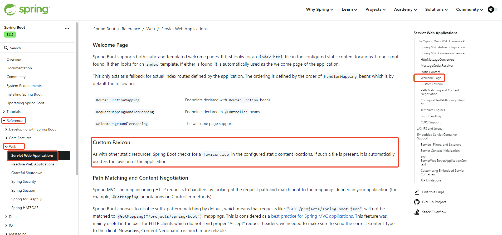

这段话翻译为：

与其他静态资源一样，Spring Boot 会在配置的静态内容位置检查是否存在 `favicon.ico`文件。如果存在这样的文件，它将自动作为应用程序的 favicon 使用。

以上官方说明的：将`favicon.ico`文件放到静态资源路径下即可。

web站点没有提供`favicon.ico`时：


我们在[https://www.iconfont.cn/](https://www.iconfont.cn/) （阿里巴巴提供的图标库）上随便找一个图标，然后将图片名字命名为`favicon.ico`，然后将其放到SpringBoot项目的静态资源路径下：


启动服务器测试：记住（ctrl + F5强行刷新一下，避免影响测试效果）

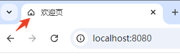

# Web 的手动配置(静态资源处理)


**手动配置 web 包括两种方式：**

- 第一种：配置文件方式（**实际开发中，经常通过这种方式改变默认配置**）
  - 通过修改`application.properties`或`application.yml`，添加`spring.mvc`和`spring.web`相关的配置。
- 第二种：编写代码方式（**实际开发中，经常通过这种方式扩展新配置**）
  - `编写一个类`实现`WebMvcConfigurer`接口，并`对应重写`接口中的方法即可扩展新的配置。

## 配置文件方式

要修改`访问静态资源URL的前缀`，这样配置：

```plaintext
# 设置静态资源的请求路径的前缀
spring.mvc.static-path-pattern=/static/**
```

要修改`静态资源的存放位置`，这样配置：

```plaintext
spring.web.resources.static-locations=classpath:/static1/,classpath:/static2/
```

进行以上配置之后：

1. 访问静态资源的请求路径应该是这样的：http://localhost:8080/static/....
2. 静态资源的存放位置也应该放到`classpath:/static1/,classpath:/static2/`下面，其他位置无效。

**访问静态资源测试结果如下：**

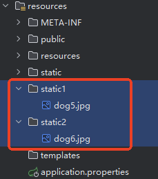

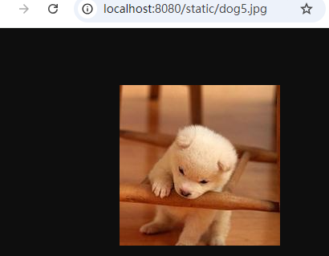


如果访问`dog2.jpg`，就无法访问了：

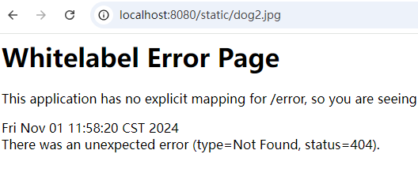

但是，存储在`classpath:/META-INF/resources/`目录下的`dog1.jpg`仍然是可以访问的：

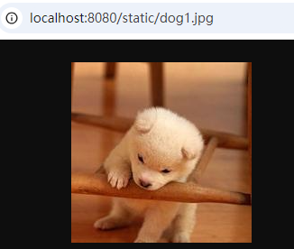

因此，存储在`classpath:/META-INF/resources/`位置的静态资源会被默认加载，不受手动配置的影响。

## 编写代码方式

编写代码方式又包括两种方式：

- 第一种：编写类实现`WebMvcConfigurer`接口+`@Configuration`，重写对应的方法。
- 第二种：编写一个方法，用`@Bean`注解标注。

### 第一种方式

因此在SpringBoot主入口程序同级目录下新建`config`包，在`config`包下新建`WebConfig`类：

```java

package com.jkweilai.springboot.config;

import org.springframework.context.annotation.Configuration;
import org.springframework.web.servlet.config.annotation.ResourceHandlerRegistry;
import org.springframework.web.servlet.config.annotation.WebMvcConfigurer;

// 使用该注解标注，表示该类为配置类。
@Configuration
public class WebConfig implements WebMvcConfigurer {
    @Override
    public void addResourceHandlers(ResourceHandlerRegistry registry) {
        registry.addResourceHandler("/static/**")
                .addResourceLocations("classpath:/static1/", "classpath:/static2/");
    }
}
```

注意：将`application.properties`文件中之前的所有配置全部注释掉。让其恢复到最原始的默认配置。


启动服务器进行测试：


通过测试，我们的配置是生效的。

我们再来看看，默认的配置是否还生效？

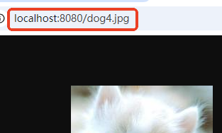

我们可以看到，Spring Boot对Spring MVC的默认自动配置是生效的。

**因此，以上的方式只是在Spring MVC默认行为之外扩展行为。**

### 第二种方式

采用`@Bean`注解提供一个`WebMvcConfigurer`组件，代码如下：

```java
package com.jkweilai.springboot.config;

import org.springframework.context.annotation.Bean;
import org.springframework.context.annotation.Configuration;
import org.springframework.web.servlet.config.annotation.ResourceHandlerRegistry;
import org.springframework.web.servlet.config.annotation.WebMvcConfigurer;

@Configuration
public class WebConfig2 {

    @Bean
    public WebMvcConfigurer addResourceHandlers(){
        return new WebMvcConfigurer() {
            @Override
            public void addResourceHandlers(ResourceHandlerRegistry registry) {
                registry.addResourceHandler("/static/**")
                        .addResourceLocations("classpath:/static1/", "classpath:/static2/");
            }
        };
    }
}
```

测试结果如下：


通过了测试，并且以上代码也是在原有配置基础上进行扩展。

### 其他配置实现方式相同

以上对`静态资源处理`进行了手动配置，也可以做其他配置，例如拦截器：

```java
package com.jkweilai.springboot.config;

import jakarta.servlet.http.HttpServletRequest;
import jakarta.servlet.http.HttpServletResponse;
import org.springframework.context.annotation.Bean;
import org.springframework.context.annotation.Configuration;
import org.springframework.web.servlet.HandlerInterceptor;
import org.springframework.web.servlet.ModelAndView;
import org.springframework.web.servlet.config.annotation.InterceptorRegistry;
import org.springframework.web.servlet.config.annotation.ResourceHandlerRegistry;
import org.springframework.web.servlet.config.annotation.WebMvcConfigurer;

@Configuration
public class WebConfig2 {

    @Bean
    public WebMvcConfigurer addResourceHandlers(){
        return new WebMvcConfigurer() {
            @Override
            public void addResourceHandlers(ResourceHandlerRegistry registry) {
                registry.addResourceHandler("/static/**")
                        .addResourceLocations("classpath:/static1/", "classpath:/static2/");
            }
        };
    }

    // 拦截器配置。
    @Bean
    public WebMvcConfigurer addInterceptor(){
        return new WebMvcConfigurer() {
            @Override
            public void addInterceptors(InterceptorRegistry registry) {
                registry.addInterceptor(new HandlerInterceptor() {
                    @Override
                    public boolean preHandle(HttpServletRequest request, HttpServletResponse response, Object handler) throws Exception {
                        System.out.println("Interceptor's preHandle......");
                        return true;
                    }

                    @Override
                    public void postHandle(HttpServletRequest request, HttpServletResponse response, Object handler, ModelAndView modelAndView) throws Exception {
                        System.out.println("Interceptor's postHandle......");
                    }

                    @Override
                    public void afterCompletion(HttpServletRequest request, HttpServletResponse response, Object handler, Exception ex) throws Exception {
                        System.out.println("Interceptor's afterCompletion......");
                    }
                });
            }
        };
    }
}
```

启动服务器，打开浏览器，发送请求[http://localhost:8080/static/dog5.jpg](http://localhost:8080/static/dog5.jpg)，后台执行结果如下：

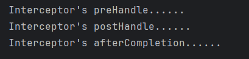

这说明拦截器生效。

# web请求的路径匹配


在 SpringBoot 的 web 应用中，web 的请求路径仍然支持模糊匹配，默认支持两种主要的路径匹配策略：

- Ant风格路径匹配 (AntPathMatcher)【传统方式，现代开发几乎不用】
- 正则表达式路径匹配 (PathPatternParser)【性能好，现代开发中都用它】

**正则表达式路径匹配语法：**

*****        匹配 0-N 个字符，不包括 `/`。

**        匹配任意数量的目录层级，只能出现在路径末尾。

**?****        **匹配**任意单个字符**。

**[]****        **匹配指定范围内的单个字符。

**{}****        **路径变量，用于提取路径的一部分作为参数。示例：/users/{userId} 匹配 /users/123，提取 userId=123。

```java
@GetMapping("/{path:[a-z]+}/a?/*.do/**")
public String path(HttpServletRequest request, @PathVariable String path){
    return request.getRequestURI() + "," + path;
}
```

启动服务器测试，可用：


# 内容协商


## 对内容协商的理解

内容协商机制是指服务器根据客户端的请求来决定返回资源的最佳表示形式。

白话文描述：客户端要什么格式的数据，咱后端就应该返回什么格式的数据。

- 客户端要JSON，咱就响应JSON。
- 客户端要XML，咱就响应XML。
- 客户端要YAML，咱就响应YAML。

你可能会有疑问：客户端接收数据时统一采用一种格式，例如JSON，不就行了吗。哪那么多事儿呀！！！

但在实际的开发中，不是这样的，例如：

- 遗留的老客户端系统，仍然处理的是XML格式的数据。
- 要求处理速度快的这种客户端系统，一般要求返回JSON格式的数据。
- 要求安全性高的客户端系统，一般要求返回XML格式的数据。

因此，在现代的开发中，不同的客户端可能需要后端系统返回不同格式的数据。总之后端应该满足这种多样化的需求。

## 实现内容协商的两种方式

通常通过HTTP请求头（如 Accept）或请求参数（如 format）来指定客户端偏好接收的内容类型（如JSON、XML等）。服务器会根据这些信息选择最合适的格式进行响应。

### 通过HTTP请求头（如 Accept）

SpringBoot框架中，在程序员不做任何配置的情况下，优先考虑的是这种方式。

服务器会根据客户端发送请求时提交的请求头中的"Accept: application/json" 或 "Accept: application/xml" 或 "Accept: text/html"来决定响应什么格式的数据。

客户端发送请求给服务器的时候，如何设置请求头的`Accept`？有以下几种常见实现方式：

- 写代码
  - ajax的XMLHttpRequest
  - fetch API
  - axios库....
- 用工具
  - 接口测试工具，例如：Postman、Apifox、Apipost 等。
  - 命令行工具：curl

对于我们编写的以下Controller来说：

```java
package com.jkweilai.springboot.controller;

import com.jkweilai.springboot.bean.User;
import com.jkweilai.springboot.service.UserService;
import org.springframework.beans.factory.annotation.Autowired;
import org.springframework.web.bind.annotation.GetMapping;
import org.springframework.web.bind.annotation.RestController;

@RestController
public class UserController {

    @Autowired
    private UserService userService;

    @GetMapping(value = "/detail")
    public User detail(){
        return userService.getUser();
    }
}
```

我们使用了`@RestController`，也就是使用了`@ResponseBody`。因此默认支持的是返回JSON数据。怎么才能支持返回XML格式的数据呢？需要做以下两步：

第一步：引入一个依赖（这个是必须的。）

```xml
<dependency>
  <groupId>com.fasterxml.jackson.dataformat</groupId>
  <artifactId>jackson-dataformat-xml</artifactId>
</dependency>
```

第二步：在实体类上添加一个注解：不是必须的，如果要定制 XML 根节点的名字，可以使用它。

```java
package com.jkweilai.springboot.bean;

import com.fasterxml.jackson.dataformat.xml.annotation.JacksonXmlRootElement;
import lombok.AllArgsConstructor;
import lombok.Data;
import lombok.NoArgsConstructor;

// 通过该注解可以定制XML根节点的名字，如果不需要定制，这个注解可以去掉。
@JacksonXmlRootElement(localName = "User")
@Data
@NoArgsConstructor
@AllArgsConstructor
public class User {
    private String name;
    private String password;
}
```

**测试：**

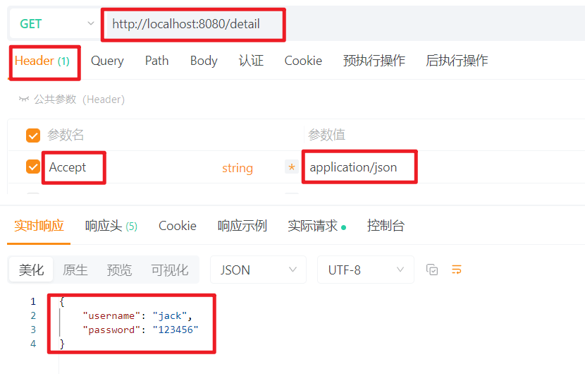

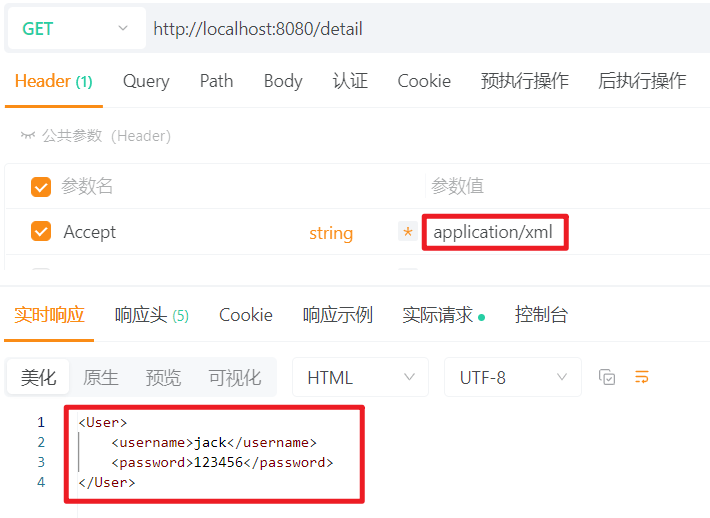

### 通过请求参数（如 `<font style="color:rgb(44, 44, 54);">format</font>`）

接下来我们使用请求参数的方式，`SpringBoot优先考虑的不是通过请求参数format方式`。如何优先考虑使用`format`方式呢？做如下配置：

```plaintext
# 内容协商时，优先考虑请求参数format方式。
spring.mvc.contentnegotiation.favor-parameter=true
```

测试：

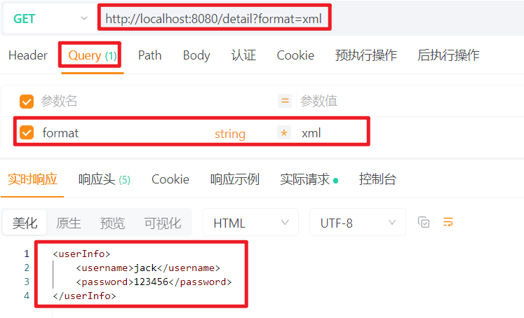

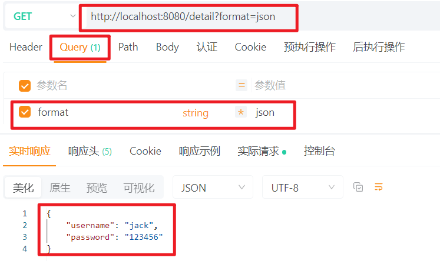

可以看到，现在SpringBoot已经优先考虑使用`请求参数format`方式了。

当然，请求参数的名字可以不使用`format`吗？支持定制化吗？答案是支持的，例如你希望请求参数的名字为`type`，可以做如下配置：

```plaintext
# 内容协商时，设置请求参数的名字，默认为format
spring.mvc.contentnegotiation.parameter-name=type
```

再次测试：

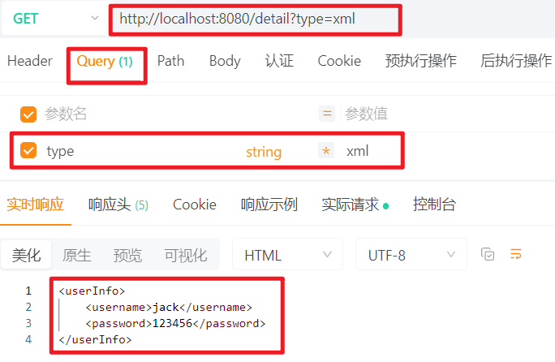

## HTTP 消息转换器

### HttpMessageConverter的理解

`HttpMessageConverter`接口，对于这个接口来说，大家应该不陌生，它是消息转换器的顶级接口。

当程序中使用了 `@RequestBody`或 `@ResponseBody`注解时，消息转换器就起作用了。

### 系统默认提供了哪些HttpMessageConverter

查看源码：

WebMvcAutoConfiguration.EnableWebMvcConfiguration extends DelegatingWebMvcConfiguration extends WebMvcConfigurationSupport

在`WebMvcConfigurationSupport`类中有这样一个方法：`addDefaultHttpMessageConverters()` 用来添加默认的`HttpMessageConverter`对象。

通过断点调试，可以发现默认支持6个HttpMessageConverter，如下：


**这6个**`**HttpMessageConverter**`**作用如下：**

1. **ByteArrayHttpMessageConverter:**

用于将字节数组(byte[])与HTTP消息体之间进行转换。这通常用于处理二进制数据，如图片或文件。

1. **StringHttpMessageConverter:**

用于将字符串(String)与HTTP消息体之间进行转换。它支持多种字符集编码，能够处理纯文本内容。

1. **ResourceHttpMessageConverter:**

用于将Spring的Resource对象与HTTP消息体之间进行转换。Resource是Spring中表示资源的接口，可以读取文件等资源。这个转换器对于下载文件或发送静态资源有用。

1. **ResourceRegionHttpMessageConverter:**

用于处理资源的部分内容（即“Range”请求），特别是当客户端请求大文件的一部分时。这对于实现视频流媒体等功能很有用。

1. **AllEncompassingFormHttpMessageConverter:**

用于处理表单，是一个比较全面的form消息转换器。处理标准的application/x-www-form-urlencoded格式的数据，以及包含文件上传的multipart/form-data格式的数据。

1. **MappingJackson2HttpMessageConverter:**

使用Jackson库来序列化和反序列化JSON数据。可以将Java对象转换为JSON格式的字符串，反之亦然。

另外，通过以下源码，也可以看到SpringBoot是根据类路径中是否存在某个类，而决定是否添加对应的消息转换器的：

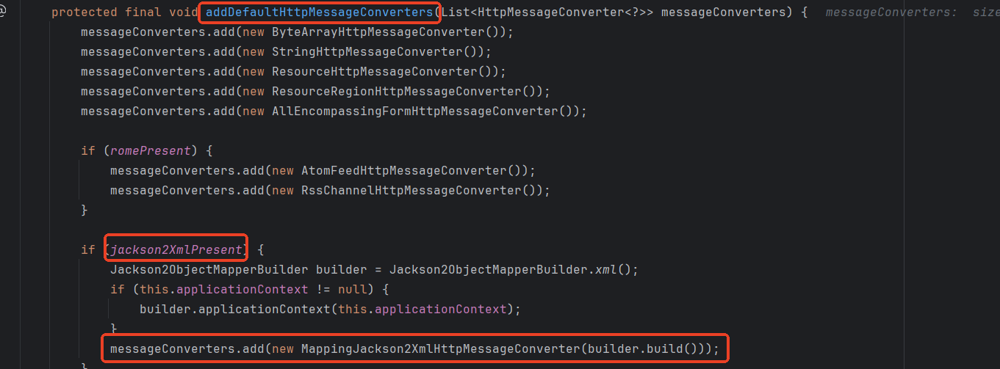

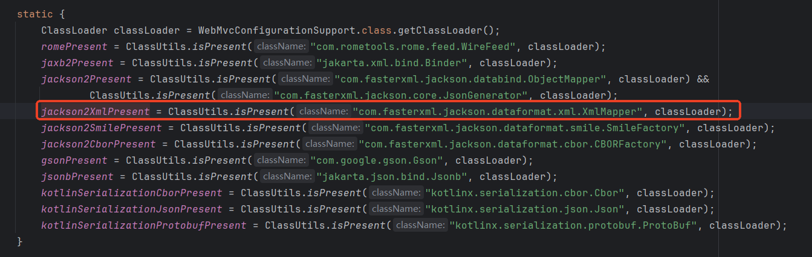

因此，我们只要引入相关的依赖，让类路径存在某个类，则对应的消息转换器就会被加载。

## 定义自己的HttpMessageConverter

可以看到以上6个消息转换器中没有yaml相关的消息转换器，可见，如果要实现yaml格式的内容协商，yaml格式的消息转换器就需要我们自定义了。

### 第一步：引入能够处理yaml格式的依赖

任何一个能够处理yaml格式数据的库都可以，这里选择使用`jackson`的库，因为它既可以处理json，xml，又可以处理yaml。

```xml
<dependency>
  <groupId>com.fasterxml.jackson.dataformat</groupId>
  <artifactId>jackson-dataformat-yaml</artifactId>
</dependency>
```

编写测试程序，简单测试一下这个库的用法：

```java
package com.jkweilai.springboot;

import com.fasterxml.jackson.core.JsonProcessingException;
import com.fasterxml.jackson.databind.ObjectMapper;
import com.fasterxml.jackson.dataformat.yaml.YAMLFactory;
import com.fasterxml.jackson.dataformat.yaml.YAMLGenerator;
import com.jkweilai.springboot.bean.User;

public class Jackson2YamlTest {
    public static void main(String[] args) throws JsonProcessingException {
        // 创建YAML工厂类
        YAMLFactory yamlFactory = new YAMLFactory().disable(YAMLGenerator.Feature.WRITE_DOC_START_MARKER); // 禁止使用文档头标记
        // 创建对象映射器
        ObjectMapper objectMapper = new ObjectMapper(yamlFactory);
        // 准备数据
        User user = new User("jackson", "jack123");
        // 将数据转换成YAML格式
        String s = objectMapper.writeValueAsString(user);
        System.out.println(s);
    }
}
```

执行结果如下：


### 第二步：新增一种媒体类型yaml

默认支持xml和json两种媒体类型，要支持yaml格式的，需要新增一个yaml媒体类型，在springboot的配置文件中进行如下配置：

```plaintext
spring.mvc.contentnegotiation.media-types.yaml=text/yaml
```

注意，以上`types`后面的`yaml`是媒体类型的名字，名字随意，如果媒体类型起名为`xyz`，那么发送请求时的路径应该是这样的：http://localhost:8080/detail?format=xyz

### 第三步：自定义HttpMessageConverter

编写类`YamlHttpMessageConverter`继承`AbstractHttpMessageConverter`，代码如下：

```java
package com.jkweilai.springboot.config;

import com.fasterxml.jackson.databind.ObjectMapper;
import com.fasterxml.jackson.dataformat.yaml.YAMLFactory;
import com.fasterxml.jackson.dataformat.yaml.YAMLGenerator;
import com.jkweilai.springboot.bean.User;
import org.springframework.http.HttpInputMessage;
import org.springframework.http.HttpOutputMessage;
import org.springframework.http.MediaType;
import org.springframework.http.converter.AbstractHttpMessageConverter;
import org.springframework.http.converter.HttpMessageNotReadableException;
import org.springframework.http.converter.HttpMessageNotWritableException;

import java.io.IOException;
import java.nio.charset.Charset;

public class YamlHttpMessageConverter extends AbstractHttpMessageConverter<Object> {

    private ObjectMapper objectMapper = new ObjectMapper(new YAMLFactory().disable(YAMLGenerator.Feature.WRITE_DOC_START_MARKER));

    public YamlHttpMessageConverter() {
        // 让 消息转换器 和 媒体类型 text/yaml 绑定在一起。
        super(new MediaType("text", "yaml", Charset.forName("UTF-8")));
    }

    @Override
    protected boolean supports(Class<?> clazz) {
        // 表示User类型的数据支持yaml，其他类型不支持
        return User.class.isAssignableFrom(clazz);
    }

    // 处理 @RequestBody（将提交的yaml格式数据转换为java对象）
    @Override
    protected Object readInternal(Class<?> clazz, HttpInputMessage inputMessage) throws IOException, HttpMessageNotReadableException {
        return null;
    }

    // 处理 @ResponseBody（将java对象转换为yaml格式的数据）
    @Override
    protected void writeInternal(Object o, HttpOutputMessage outputMessage) throws IOException, HttpMessageNotWritableException {
        this.objectMapper.writeValue(outputMessage.getBody(), o);
        // 注意：spring框架会自动关闭输出流，无需程序员手动释放。
    }
}
```

### 第四步：配置消息转换器

重写`WebMvcConfigurer`接口的`configureMessageConverters`方法：

```java
package com.jkweilai.springboot.config;

import org.springframework.context.annotation.Configuration;
import org.springframework.http.converter.HttpMessageConverter;
import org.springframework.web.servlet.config.annotation.WebMvcConfigurer;

import java.util.List;

@Configuration
public class WebConfig implements WebMvcConfigurer {
    @Override
    public void configureMessageConverters(List<HttpMessageConverter<?>> converters) {
        converters.add(new YamlHttpMessageConverter());
    }
}
```

启动服务器并测试：http://localhost:8080/detail?type=yaml


# SpringBoot整合Thymeleaf


## 传统web应用和前后端分离

如果你是做前后端分离的项目，这一章节的内容将用不上。

现代开发大部分应用都会采用前后端分离的方式进行开发，前端是一个独立的系统，后端也是一个独立的系统，后端系统只给前端系统提供数据（JSON数据），不需要后端解析模板页面，前端系统拿到后端提供的数据之后，前端负责填充数据即可。因此这一章节内容作为了解。

传统的WEB应用（非前后端分离）：浏览器页面上展示成什么效果，后端服务器说了算，这是传统web应用最大的特点。


前后端分离的应用：前端是一个独立的系统，后端也是一个独立的系统，后端系统不再负责页面的渲染，后端系统只负责给前端系统提供开放的API接口，后端系统只负责数据的收集，然后将数据以JSON/XML等格式响应给前端系统。前端系统拿到接口返回的数据后，将数据填充到页面上。

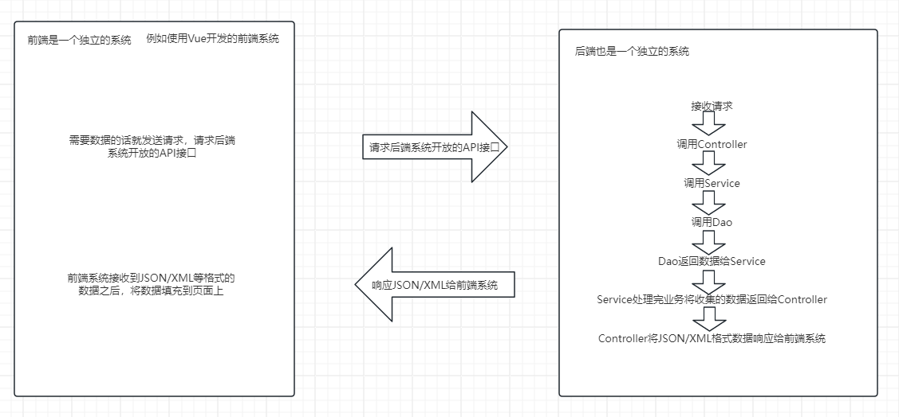

前后端分离的好处：

- 职责清晰：前端专注于用户界面和用户体验，后端专注于业务逻辑和数据处理。
- 开发效率高：前后端可以并行开发，互不影响，提高开发速度。
- 可维护性强：代码结构更清晰，便于维护和扩展。
- 技术栈灵活：前后端可以独立选择最适合的技术栈。
- 响应式设计：前端可以更好地处理不同设备和屏幕尺寸。
- 性能优化：前后端可以独立优化，提升整体性能。
- 易于测试：前后端接口明确，便于单元测试和集成测试。

## SpringBoot整合Thymeleaf

提醒：SpringBoot内嵌了Servlet容器（例如：Tomcat、Jetty等），使用SpringBoot不太适合使用JSP模板技术，因为SpringBoot项目最终打成jar包之后，放在jar包中的jsp文件不能被Servlet容器解析。

要在SpringBoot中整合Thymeleaf，按照以下步骤操作：

**第一步：**引入thymeleaf启动器

```xml
<dependency>
  <groupId>org.springframework.boot</groupId>
  <artifactId>spring-boot-starter-thymeleaf</artifactId>
</dependency>
```

**第二步：编写配置文件，指定前缀和后缀（默认不配置就是以下配置**）

```plaintext
spring.thymeleaf.prefix=classpath:/templates/
spring.thymeleaf.suffix=.html
```

**第三步：**编写控制器

```java
package com.jkweilai.springboot.controller;

import org.springframework.stereotype.Controller;
import org.springframework.ui.Model;
import org.springframework.web.bind.annotation.GetMapping;
import org.springframework.web.bind.annotation.RequestParam;

// 不能使用 @RestController
@Controller
public class HelloController {

    @GetMapping("/h")
    public String helloThymeleaf(@RequestParam("name") String name, Model model) {
        // 将接收到的name数据存储到域对象中
        model.addAttribute("name", name);
        // 逻辑视图名
        return "hello"; // 最终的物理视图名：classpath:/templates/hello.html
    }
}
```

**第四步：**编写thymeleaf模板页面

```html
<!DOCTYPE html>
<html lang="en">
<head>
    <meta charset="UTF-8">
    <title>hello, thymeleaf</title>
</head>
<body>
<h1>hello,<span th:text="${name}"></span></h1>
</body>
</html>
```

启动服务器，测试地址为：http://localhost:8080/h


## 将路径直接映射到视图

**在springboot中如何实现：直接将请求路径映射到特定的视图，而不需要编写controller？**

使用`ViewControllerRegistry`进行视图与控制器的注册

```java
package com.jkweilai.springboot.config;

import org.springframework.context.annotation.Configuration;
import org.springframework.web.servlet.config.annotation.ViewControllerRegistry;
import org.springframework.web.servlet.config.annotation.WebMvcConfigurer;

@Configuration
public class WebMvcConfig implements WebMvcConfigurer {

    @Override
    public void addViewControllers(ViewControllerRegistry registry) {
        registry.addViewController("/a").setViewName("a");
        registry.addViewController("/b").setViewName("b");
    }
}
```

**前提：**你需要将 `a.html`放到 `classpath:/templates/`目录下。

# 异常处理


在controller层如果程序出现了异常，并且这个异常未被捕获，springboot提供的异常处理机制将生效。

SpringMVC + Spring Boot 提供异常处理机制主要是为了提高应用的健壮性和用户体验。它的好处包括：

1. **统一错误响应**：可以定义全局异常处理器来统一处理各种异常，确保返回给客户端的错误信息格式一致，便于前端解析。
2. **提升用户体验**：能够优雅地处理异常情况，避免直接将技术性错误信息暴露给用户，而是显示更加友好的提示信息。
3. **简化代码**：开发者不需要在每个可能抛出异常的方法中重复编写异常处理逻辑，减少冗余代码，使业务代码更加清晰简洁。
4. **增强安全性**：通过控制异常信息的输出，防止敏感信息泄露，增加系统的安全性。

## 自适应的错误处理机制

springboot会根据请求头的Accept字段来决定错误的响应格式。

这种机制的好处就是：客户端设备自适应，提高用户的体验。

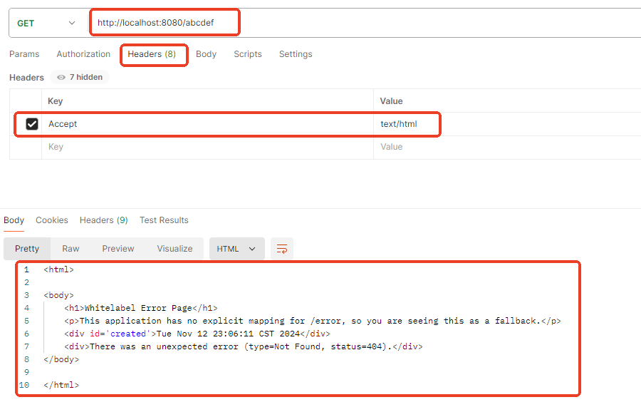

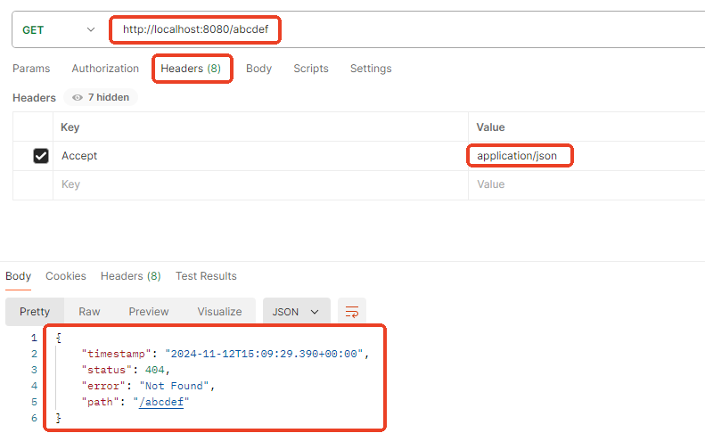

## SpringMVC的错误处理方案

**重点：SpringMVC 错误处理方案优先级较高，SpringMVC 错误没有处理的，SpringBoot 处理方案会自动启动。**

### 局部控制 @ExceptionHandler

在控制器当中编写一个方法，方法使用@ExceptionHandler注解进行标注，凡是**这个控制器**当中出现了**对应的异常**，则走这个方法来进行异常的处理。局部生效。

```java
package com.jkweilai.test.controller;

import org.springframework.web.bind.annotation.ExceptionHandler;
import org.springframework.web.bind.annotation.GetMapping;
import org.springframework.web.bind.annotation.PathVariable;
import org.springframework.web.bind.annotation.RestController;

@RestController
public class UserController {

    @GetMapping("/resource/{id}")
    public String getResource(@PathVariable Long id){
        if(id == 1){
            throw new IllegalArgumentException("无效ID：" + id);
        }
        return "ID = " + id;
    }

    @ExceptionHandler(IllegalArgumentException.class)
    public String handler(IllegalArgumentException e){
        return "错误信息：" + e.getMessage();
    }
}
```

可以再编写一个OtherController，让它也发生`IllegalArgumentException`异常，看看它会不会走局部的错误处理机制。

```java
package com.jkweilai.test.controller;

import org.springframework.web.bind.annotation.GetMapping;
import org.springframework.web.bind.annotation.PathVariable;
import org.springframework.web.bind.annotation.RestController;

@RestController
public class OtherController {
    @GetMapping("/resource2/{id}")
    public String getResource(@PathVariable Long id){
        if(id == 1){
            throw new IllegalArgumentException("无效ID：" + id);
        }
        return "ID = " + id;
    }
}
```

通过测试，确实局部生效。

### 全局控制 @ControllerAdvice + @ExceptionHandler

也可以把以上局部生效的方法单独放到一个类当中，这个类使用@ControllerAdvice注解标注，凡是**任何控制器**当中出现了**对应的异常**，则走这个方法来进行异常的处理。全局生效。

将之前的局部处理方案的代码注释掉。使用全局处理方式，编写以下类：

```java
package com.jkweilai.test.controller;

import org.springframework.web.bind.annotation.ControllerAdvice;
import org.springframework.web.bind.annotation.ExceptionHandler;
import org.springframework.web.bind.annotation.ResponseBody;

@ControllerAdvice
public class GlobalExceptionHandler {

    @ExceptionHandler(IllegalArgumentException.class)
    @ResponseBody
    public String handler(IllegalArgumentException e){
        return "错误信息：" + e.getMessage();
    }
}
```

通过测试，确实全局生效。

## SpringBoot的错误处理方案

**重点：如果SpringMVC没有对应的处理方案，会开启SpringBoot默认的错误处理方案。SpringBoot 默认的处理方案是ErrorMvcAutoConfiguration中配置了错误处理端点/error（白标错误页面）**

SpringBoot默认的错误处理方案如下：

1. 如果客户端要的是json，则直接响应json格式的错误信息。
2. 如果客户端要的是html页面（传统的 web 系统，非前后端分离），则按照下面方案：

- 第一步（精确错误码文件）：去`classpath:/templates/error/`目录下找`404.html``500.html`等`精确错误码.html`文件。如果找不到，则去静态资源目录下的/error目录下找。如果还是找不到，才会进入下一步。
- 第二步（模糊错误码文件）：去`classpath:/templates/error/`目录下找`4xx.html``5xx.html`等`模糊错误码.html`文件。如果找不到，则去静态资源目录下的/error目录下找。如果还是找不到，才会进入下一步。
- 第三步（通用错误页面）：去找`classpath:/templates/error.html`如果找不到则进入下一步。
- 第四步（默认错误处理）：如果上述所有步骤都未能找到合适的错误页面，Spring Boot 会使用内置的默认错误处理机制，即 `/error` 端点。

## 如何在错误页获取错误信息

Spring Boot 默认会在模型Model中放置以下信息（对于传统的 web 应用来说）：

- timestamp: 错误发生的时间戳
- status: HTTP 状态码
- error: 错误类型（如 "Not Found"）
- exception: 异常类名
- message: 错误消息
- trace: 堆栈跟踪

在thymeleaf中使用 `${message}`即可取出信息。

注意：**springboot3.3.5**版本默认只向Model对象中绑定了`timestamp``status``error`。如果要保存`exception``message``trace`，需要开启以下三个配置：

```plaintext
server.error.include-stacktrace=always
server.error.include-exception=true
server.error.include-message=always
```

## 前后端分离项目的错误处理方案

统一使用SpringMVC的错误处理方案，定义全局的异常处理机制：

1. 组合一：@RestControllerAdvice + @ExceptionHandler
2. 组合二：@ControllerAdvice + @ResponseBody + @ExceptionHandler

返回json格式的错误信息，其它的就不需要管了，因为前端接收到错误信息怎么处理是他自己的事儿。

## 服务器端负责页面渲染的项目错误处理方案

传统 web 项目的错误处理方案：

建议使用SpringBoot的错误处理方案：

1. 如果发生的异常是HTTP错误状态码：
  1. 建议常见的错误码给定`精确错误码.html`
  2. 建议不常见的错误码给定`模糊错误码.html`
2. 如果发生的异常不是HTTP错误状态码，而是业务相关异常：
  1. 在程序中处理具体的业务异常，自己通过程序来决定跳转到哪个错误页面。
3. 建议提供`classpath:/templates/error.html`来处理通用错误。

# 国际化（了解）


在Spring Boot中实现国际化（i18n）是一个常见的需求，它允许应用程序根据用户的语言和地区偏好显示不同的文本。

## 实现国际化

### 第一步：创建资源文件

创建包含不同语言版本的消息文件。这些文件通常放在`src/main/resources`目录下，并且以`.properties`为扩展名。例如：

- `messages.properties` (默认语言，如中文)
- `messages_en.properties` (英文)
- `messages_fr.properties` (法语)

每个文件都应包含相同的消息键，但值应对应于相应的语言。例如：

**messages.properties**:

```plaintext
welcome.message=欢迎来到我们的应用！
```

**messages_en.properties**:

```plaintext
welcome.message=Welcome to our application!
```

**messages_fr.properties**:

```plaintext
welcome.message=Bienvenue dans notre application !
```

### 第二步：在模板文件中取出消息

语法格式为：#{welcome.message}

```html
<!DOCTYPE html>
<html lang="en" xmlns:th="http://www.thymeleaf.org">
<head>
    <meta charset="UTF-8">
    <title>Title</title>
</head>
<body>
<h1 th:text="#{welcome.message}"></h1>
</body>
</html>
```

**测试1：浏览器默认的语言环境是中文时**


**测试2：将浏览器默认语言环境修改为法文**


## 国际化实现原理

做国际化的自动配置类是：`MessageSourceAutoConfiguration`


通过以上源码得知，国际化对应的配置前缀是：`spring.message`

例如在`application.properties`中进行如下配置：

```plaintext
# 配置国际化文件命名的基础名称
spring.messages.basename=messages

# 指定国际化信息的字符编码方式
spring.messages.encoding=UTF-8
```

注意：标准标识符：en_US 和 zh_CN 这样的标识符是固定的，不能更改。可以设置的是basename。

## 在程序当中如何获取国际化信息

在国际化自动配置类中可以看到这样一个Bean：MessageSource，它是专门用来处理国际化的。我们可以将它注入到我们的程序中，然后调用相关方法在程序中获取国际化信息。

```java
@Controller
public class MyController {

    @Autowired
    private MessageSource messageSource;

    @GetMapping("/test")
    @ResponseBody
    public String test(HttpServletRequest request){
        Locale locale = request.getLocale();
        String message = messageSource.getMessage("welcome.message", null, locale);
        return message;
    }
}
```

# 定制web容器


## web服务器切换为jetty

springboot默认嵌入的web服务器是Tomcat，如何切换到jetty服务器？

实现方式：排除Tomcat，添加Jetty依赖

**修改 **`pom.xml`** 文件**：在 `pom.xml` 中，确保你使用 `spring-boot-starter-web` 并排除 Tomcat，然后添加 Jetty 依赖。

```xml
<!-- 排除 Tomcat -->
<dependency>
    <groupId>org.springframework.boot</groupId>
    <artifactId>spring-boot-starter-web</artifactId>
    <exclusions>
        <exclusion>
            <groupId>org.springframework.boot</groupId>
            <artifactId>spring-boot-starter-tomcat</artifactId>
        </exclusion>
    </exclusions>
</dependency>
<!-- 添加 Jetty 依赖 -->
<dependency>
    <groupId>org.springframework.boot</groupId>
    <artifactId>spring-boot-starter-jetty</artifactId>
</dependency>
```

## web服务器切换原理

从哪里可以看出springboot是直接将tomcat服务器嵌入到应用中的呢？看这个类：`ServletWebServerFactoryAutoConfiguration`

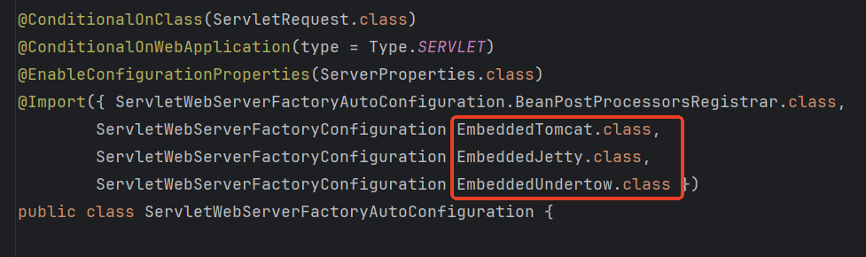

以上代码显示嵌入的是3个服务器。但并不是都生效，我们来看一下生效条件：


生效条件是，看类路径当中是否有对应服务器相关的类，如果有则生效。`spring-boot-web-starter`这个web启动器引入的时候，大家都知道，它间接引入的是tomcat服务器的jar包。因此默认Tomcat服务器被嵌入。如果想要切换web服务器，将tomcat相关jar包排除掉，引入jetty的jar包之后，jetty服务器就会生效，这就是切换web服务器的原理。

## web服务器优化

通过以下源码得知，web服务器的相关配置和`ServerProperties`有关系：

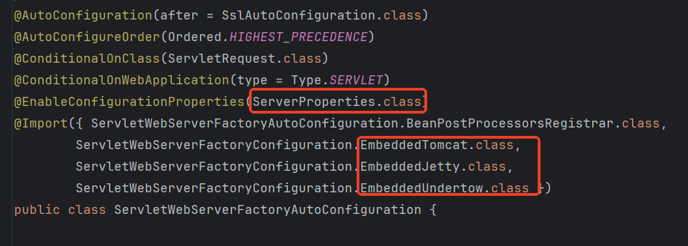

查看`ServerProperties`源码：


得知web服务器的配置都是以`server`开头的。

那么如果要配置tomcat服务器怎么办？要配置jetty服务器怎么办？请看一下源码


通过以上源码得知，如果要对tomcat服务器进行配置，前缀为：`server.tomcat`

如果要对jetty服务器进行配置，前缀为：`server.jetty`。

在以后的开发中关于tomcat服务器的常见优化配置有：

```plaintext
# 超过这个时间还没有处理完整个请求，自动关闭连接。
server.tomcat.connection-timeout=20000

# 设置 Tomcat 服务器处理请求的最大线程数为 200。
# 如果请求同时过来，数量超过200，多余的请求将被放到等待队列。
# 等待队列满的话，报503错误。
server.tomcat.max-threads=200

# 用来设置等待队列的最大容量
server.tomcat.accept-count=100

# 设置 Tomcat 服务器在空闲时至少保持 10 个线程处于活动状态，以便快速响应新的请求。
server.tomcat.min-spare-threads=10

# 设置 Tomcat 服务器绑定到所有可用的网络接口，使其可以从任何网络地址访问。
server.tomcat.bind-address=0.0.0.0

# 设置 Tomcat 服务器使用 HTTP/1.1 协议处理请求。
server.tomcat.protocol=HTTP/1.1

# 设置 Tomcat 服务器的会话(session)超时时间为 30 分钟。具体来说，如果用户在 30 分钟内没有与应用进行任何交互，其会话将被自动注销。
server.tomcat.session-timeout=30

# 设置 Tomcat 服务器的静态资源缓存时间为 3600 秒（即 1 小时）
# 这个缓存是将静态资源缓存到Tomcat服务器的JVM内存中。不是浏览器客户端上。
server.tomcat.resource-cache-period=3600

# 解决get请求乱码。对请求行url进行编码。
server.tomcat.uri-encoding=UTF-8

# 设置 Tomcat 服务器的基础目录为当前工作目录（. 表示当前目录）。
# 这个配置指定了 Tomcat 服务器的工作目录，包括日志文件、临时文件和其他运行时生成的文件的存放位置。 
# 生产环境中可能需要重新配置。
server.tomcat.basedir=.
```

# logo设置（了解）


## 关闭logo图标

### 配置方式

```plaintext
spring.main.banner-mode=off
```

### 代码方式

第一种代码：

```java
@SpringBootApplication
public class Springboot322WebServerApplication {
    public static void main(String[] args) {
        SpringApplication springApplication = new SpringApplication(Springboot322WebServerApplication.class);
        springApplication.setBannerMode(Banner.Mode.OFF);
        springApplication.run(args);
    }
}
```

第二种代码：流式编程/链式编程

```java
new SpringApplicationBuilder()
                .sources(Springboot322WebServerApplication.class)
                .bannerMode(Banner.Mode.OFF)
                .run(args);
```

## 修改logo图标

在`src/main/resources`目录下存放一个`banner.txt`文件。文件名固定。

利用一些网站生成图标：

[https://www.bootschool.net/ascii](https://www.bootschool.net/ascii) （支持中文、英文）

[http://patorjk.com/software/taag/](http://patorjk.com/software/taag/) （只支持英文）

[https://www.degraeve.com/img2txt.php](https://www.degraeve.com/img2txt.php) （只支持图片）

获取图标粘贴到`banner.txt`文件中运行程序即可。

# PageHelper整合


官网地址：[https://pagehelper.github.io/](https://pagehelper.github.io/)

## 引入依赖

```xml
<dependency>
    <groupId>com.github.pagehelper</groupId>
    <artifactId>pagehelper-spring-boot-starter</artifactId>
    <version>2.1.0</version>
</dependency>
```

## 编写代码

```java
@RestController
public class VipController {
    @Autowired
    private VipService vipService;
    
    @GetMapping("/list/{pageNo}")
    public PageInfo<Vip> list(@PathVariable("pageNo") Integer pageNo) {
        // 1.设置当前页码和每页显示的记录条数
        PageHelper.startPage(pageNo, Constant.PAGE_SIZE);
        // 2.获取数据（PageHelper会自动给SQL语句添加limit）
        List<Vip> vips = vipService.findAll();
        // 3.将分页数据封装到PageInfo
        PageInfo<Vip> vipPageInfo = new PageInfo<>(vips);
        return vipPageInfo;
    }

}
```

# web层响应结果封装


对于前后端分离的系统来说，为了降低沟通成本，我们有必要给前端系统开发人员返回统一格式的JSON数据。多数开发团队一般都会封装一个`R`对象来解决统一响应格式的问题。

## 封装R对象

```java
@NoArgsConstructor
@AllArgsConstructor
@Data
@Builder
public class R<T> {

    private int code; // 响应的状态码
    private String msg; // 响应的消息
    private T data; // 响应的数据体

    // 用于构建成功的响应，不携带数据
    public static <T> R<T> OK() {
        return R.<T>builder()
                .code(200)
                .msg("成功")
                .build();
    }

    // 用于构建成功的响应，携带数据
    public static <T> R<T> OK(T data) {
        return R.<T>builder()
                .code(200)
                .msg("成功")
                .data(data)
                .build();
    }

    // 用于构建成功的响应，自定义消息，不携带数据
    public static <T> R<T> OK(String msg) {
        return R.<T>builder()
                .code(200)
                .msg(msg)
                .build();
    }

    // 用于构建成功的响应，自定义消息，携带数据
    public static <T> R<T> OK(String msg, T data) {
        return R.<T>builder()
                .code(200)
                .msg(msg)
                .data(data)
                .build();
    }

    // 用于构建失败的响应，不带任何参数，默认状态码为400，消息为"失败"
    public static <T> R<T> FAIL() {
        return R.<T>builder()
                .code(400)
                .msg("失败")
                .build();
    }

    // 用于构建失败的响应，自定义状态码和消息
    public static <T> R<T> FAIL(int code, String msg) {
        return R.<T>builder()
                .code(code)
                .msg(msg)
                .build();
    }
}
```

## 改进R对象

以上`R`对象存在的问题是，难以维护，项目中可能会出现很多这样的代码：R.FAIL(400, "修改失败")。

引入枚举类型进行改进：

```java
@NoArgsConstructor
@AllArgsConstructor
public enum CodeEnum {

    OK(200, "成功"),
    FAIL(400, "失败"),
    BAD_REQUEST(400, "请求错误"),
    NOT_FOUND(404, "未找到资源"),
    INTERNAL_ERROR(500, "内部服务器错误"),
    MODIFICATION_FAILED(400, "修改失败"),
    DELETION_FAILED(400, "删除失败"),
    CREATION_FAILED(400, "创建失败");

    @Getter
    @Setter
    private int code;
    @Getter
    @Setter
    private String msg;

}
```

改进R：

```java
@NoArgsConstructor
@AllArgsConstructor
@Data
@Builder
public class R<T> {

    private int code; // 响应的状态码
    private String msg; // 响应的消息
    private T data; // 响应的数据体

    // 用于构建成功的响应，不携带数据
    public static <T> R<T> OK() {
        return R.<T>builder()
                .code(CodeEnum.OK.getCode())
                .msg(CodeEnum.OK.getMsg())
                .build();
    }

    // 用于构建成功的响应，携带数据
    public static <T> R<T> OK(T data) {
        return R.<T>builder()
                .code(CodeEnum.OK.getCode())
                .msg(CodeEnum.OK.getMsg())
                .data(data)
                .build();
    }

    // 用于构建失败的响应，不带任何参数，默认状态码为400，消息为"失败"
    public static <T> R<T> FAIL() {
        return R.<T>builder()
                .code(CodeEnum.FAIL.getCode())
                .msg(CodeEnum.FAIL.getMsg())
                .build();
    }

    // 用于构建失败的响应，自定义状态码和消息
    public static <T> R<T> FAIL(CodeEnum codeEnum) {
        return R.<T>builder()
                .code(codeEnum.getCode())
                .msg(codeEnum.getMsg())
                .build();
    }
}
```

# 事务管理


SpringBoot中的事务管理仍然使用的Spring框架中的事务管理机制，在代码实现上更为简单了。不需要手动配置事务管理器，SpringBoot自动配置完成了。我们只需要使用`@Transactional`注解标注需要控制事务的方法即可。以下代码是在SpringBoot框架中进行的事务控制：

```java
@Transactional(rollbackFor = Exception.class, propagation = Propagation.REQUIRED)
@Service
public class AccountServiceImpl implements AccountService {

    @Autowired
    private AccountMapper accountMapper;

    @Override
    public void transfer(String fromActNo, String toActNo, double money) {
        Account fromAct = accountMapper.selectByActNo(fromActNo);
        if(fromAct.getBalance() < money){
            throw new TransferException("余额不足");
        }
        Account toAct = accountMapper.selectByActNo(toActNo);
        fromAct.setBalance(fromAct.getBalance() - money);
        toAct.setBalance(toAct.getBalance() + money);
        int count = accountMapper.update(fromAct);
        if(1 == 1){
            throw new TransferException("转账失败");
        }
        count += accountMapper.update(toAct);
        if(count != 2){
            throw new TransferException("转账失败！");
        }
    }
}
```

我们只需要在需要控制事务的方法上，或者类上，使用`@Transactional`注解进行标注即可。然后事务的特性和之前Spring中是完全相同的。最重要的是其他的配置我们一律是不需要的。

# SpringBoot打war包


第一步：将打包方式设置为war

```xml
<packaging>war</packaging>
```

第二步：排除内嵌tomcat

```xml
<dependency>
    <groupId>org.springframework.boot</groupId>
    <artifactId>spring-boot-starter-web</artifactId>
    <!--内嵌的tomcat服务器排除掉-->
    <exclusions>
        <exclusion>
            <groupId>org.springframework.boot</groupId>
            <artifactId>spring-boot-starter-tomcat</artifactId>
        </exclusion>
    </exclusions>
</dependency>
```

第三步：添加servlet api依赖（引入tomcat，但scope设置为provided，这样这个tomcat服务器就不会打入war包了）

```xml
<!--额外添加一个tomcat服务器，实际上是为了添加servlet api。scope设置为provided表示这个不会被打入war包当中。-->
<dependency>
    <groupId>org.springframework.boot</groupId>
    <artifactId>spring-boot-starter-tomcat</artifactId>
    <scope>provided</scope>
</dependency>
```

第四步：修改主类

```java
@SpringBootApplication
public class Springboot324TransactionApplication extends SpringBootServletInitializer{

    // 将Spring Boot应用配置为可部署在外部Servlet容器（如Tomcat）中的WAR包，覆盖默认配置以支持传统的Java Web部署方式
    @Override
    protected SpringApplicationBuilder configure(SpringApplicationBuilder application) {
        return application.sources(Springboot324TransactionApplication.class);
    }

    public static void main(String[] args) {
        SpringApplication.run(Springboot324TransactionApplication.class, args);
    }

}
```

第五步：执行package命令打war包

第六步：配置tomcat环境，将war包放入到webapps目录下，启动tomcat服务器，并访问。

# SpringBoot的日志处理


## 日志概述

日志记录是关键的软件实践，用于捕捉运行时信息、警告和错误等数据，帮助开发、测试和运维人员理解应用行为、定位问题及优化性能。

在开发初期或简单场景中，直接使用 `<font style="color:rgb(15, 17, 21);background-color:rgb(235, 238, 242);">System.out.println()</font>` 输出日志虽然直接易用，但在生产环境或复杂系统中存在明显不足：

1. **性能影响**：频繁调用会占用额外 CPU 资源，高并发时可能拖慢应用响应；
2. **难以管理**：控制台输出不易保存和检索，也难以对接监控分析系统；
3. **灵活性差**：缺乏日志级别、格式和目标（如文件、数据库等）的配置能力；
4. **安全风险**：可能无意间输出敏感信息，导致数据泄露。

因此，在正式项目中推荐使用专业的日志框架，它们提供以下优势：

1. 支持多级别日志（DEBUG、INFO、WARN、ERROR等），便于信息筛选；
2. 可灵活配置输出格式与存储目标；
3. 提供异步日志等机制，降低性能损耗；
4. 易于集成监控告警系统，实现问题追踪与实时预警。

## Java中的日志框架

### 抽象的日志框架

提供统一的日志接口，在编译期使用，运行期绑定具体的日志实现。便于在不改动代码的情况下切换日志框架。

**代表框架：**

- **SLF4J**：目前主流选择，接口设计清晰，支持灵活绑定 Logback、Log4j2 等实现。
- **Commons Logging**：Apache 早期方案，因类加载问题逐渐被 SLF4J 取代。

### 具体的日志框架

提供实际的日志记录功能，在运行期被加载使用。常见选择包括：

| **框架** | **特点与适用场景** |
| --- | --- |
| **Log4j 2** | 性能优异，支持异步日志与插件化配置，适用于中大型项目。 |
| **Logback** | 与 SLF4J 天然集成，性能较好，配置简洁，是 Spring Boot 默认日志实现。 |
| **JUL** | Java 标准库自带，无需额外依赖，适合简单场景或小型应用。 |
| **Log4j（旧版）** | 已过时，不推荐在新项目中使用。 |

**建议搭配**：

- 大多数项目可选择 **SLF4J + Logback**（或 Log4j2），兼顾灵活性与性能。
- 若希望减少依赖，可使用 **SLF4J + JUL**（通过适配层）。

## 日志级别概述

在 Java 日志框架中，日志级别用于区分日志信息的严重程度，便于开发者按需过滤和查阅。级别越低，信息越详细，输出越多；级别越高，表示问题越严重。

常见日志级别从低到高依次为：

1. **TRACE**：最低级别，记录最详细的运行时流程，用于深度调试。
2. **DEBUG**：记录调试信息，如变量值、方法进出等，适用于开发阶段。
3. **INFO**：记录常规运行信息，如系统启动、重要业务事件等。
4. **WARN**：表示可能存在异常或潜在问题，但不影响核心流程。
5. **ERROR**：表示发生了错误，可能导致功能不可用。
6. **FATAL**：致命错误，通常导致应用崩溃（Spring Boot 不支持此级别）。

**使用建议**：

- **开发环境**：可设为 DEBUG，便于排查问题。
- **生产环境**：一般设为 INFO 或 WARN，避免过多日志影响性能与存储。
- Spring Boot 默认级别为 **INFO**，默认输出到控制台，可通过配置输出到文件。

## 更改日志级别

测试日志级别：使用Lombok的`@Slf4j`注解自动维护一个`log`对象：

```java
@Slf4j
@SpringBootApplication
public class TestApplication {

    public static void main(String[] args) {
        SpringApplication.run(TestApplication.class, args);
        log.trace("trace级别日志");
        log.debug("debug级别日志");
        log.info("info级别日志");
        log.warn("warn级别日志");
        log.error("error级别日志");
    }

}
```

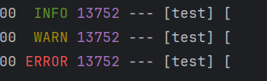

可以看到默认情况下，SpringBoot默认的日志隔离级别是INFO，因此：INFO，WARN，ERROR三个级别的日志都会打印。

如何更改日志级别，通过以下配置：

```plaintext
# 全局根日志记录器,影响所有未单独配置的包和类
logging.level.root=DEBUG
```

执行结果：

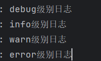

更改为最低级别，会打印所有日志信息：

```plaintext
logging.level.root=TRACE
```

执行结果：

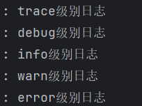

## 丰富启动日志（了解）

```plaintext
debug=true
```

这个配置项用于控制 **Spring Boot 框架自身**的启动期日志与诊断信息，**不影响**应用程序的业务日志。

- `**<font style="color:rgb(15, 17, 21);background-color:rgb(235, 238, 242);">debug=true</font>**`：启用调试模式，输出更详细的启动日志，并显示自动配置报告。

**仅作用于框架启动阶段**，启动完成后不再生效。

## 日志的粗细粒度

```plaintext
logging.level.root=WARN                     # 全局默认WARN
logging.level.com.jkweilai.service=INFO     # 明确指定service包为INFO
logging.level.com.jkweilai.service.OrderService=DEBUG # 明确指定该类的日志信息要更加详细
```

**效果：对OrderService这个类开启详细调试日志，对其他业务类只记录重要信息，全局默认只记录警告和错误。**

## 日志的分组

### 日志组的定义和使用

**日志组让多个包/类的日志级别可以统一设置和批量修改，避免重复配置，提升管理效率。**

```plaintext
# 组的定义，组名 mybusiness
spring.logging.group.mybusiness=com.jkweilai.bank.service,com.jkweilai.bank.controller

# 使用日志组，这是改组的日志级别
logging.level.mybusiness=DEBUG
```

### SpringBoot 内置的日志组

| **日志组名称** | **包含的日志记录器 (Loggers)** |
| --- | --- |
| `**<font style="color:rgb(15, 17, 21);background-color:rgb(235, 238, 242);">web</font>**` | `<font style="color:rgb(15, 17, 21);background-color:rgb(235, 238, 242);">org.springframework.core.codec</font>` , `<font style="color:rgb(15, 17, 21);background-color:rgb(235, 238, 242);">org.springframework.http</font>` , `<font style="color:rgb(15, 17, 21);background-color:rgb(235, 238, 242);">org.springframework.web</font>` , `<font style="color:rgb(15, 17, 21);background-color:rgb(235, 238, 242);">org.springframework.boot.actuate.endpoint.web</font>` , `<font style="color:rgb(15, 17, 21);background-color:rgb(235, 238, 242);">org.springframework.boot.web.servlet.ServletContextInitializerBeans</font>` |
| `**<font style="color:rgb(15, 17, 21);background-color:rgb(235, 238, 242);">sql</font>**` | `<font style="color:rgb(15, 17, 21);background-color:rgb(235, 238, 242);">org.springframework.jdbc.core</font>` , `<font style="color:rgb(15, 17, 21);background-color:rgb(235, 238, 242);">org.hibernate.SQL</font>` , `<font style="color:rgb(15, 17, 21);background-color:rgb(235, 238, 242);">org.hibernate.type.descriptor.sql.BasicBinder</font>` |

`**sql**`**日志组**：统一配置 **JDBC Template** 和 **Hibernate** 这类与数据库交互的底层框架的日志，**它与 MyBatis 完全无关**

`**<font style="color:rgb(15, 17, 21);background-color:rgb(235, 238, 242);">web</font>**`** 日志组：**记录了 **Spring MVC/WebFlux 框架处理 HTTP 请求、响应及内部组件的全链路调试信息**，是排查 Web 层问题的核心工具。

**通过组名可以统一配置日志行为：**

```yaml
logging:
  level:
    sql: TRACE    # 同时输出SQL和参数
    web: TRACE    # 输出Web处理全链路
```

### 日志的查找优先级

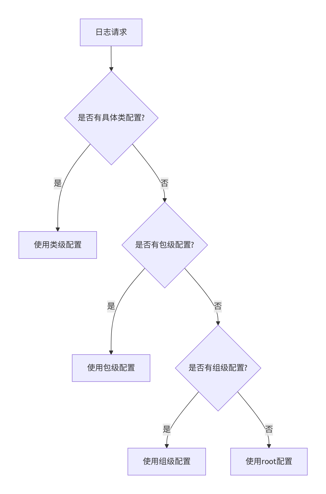

## 日志输出到文件

```plaintext
logging.file.name=./log/my.log
```

日志文件将被生成到当前工作目录下的 `log`目录，并且在该目录下生成 `my.log`文件

## 滚动日志

滚动日志是一种日志管理机制，用于防止日志文件无限增长，通过将日志文件分割成多个文件，每个文件只包含一定时间段或大小的日志记录。滚动日志可以帮助你更好地管理和维护日志文件，避免单个日志文件过大导致难以处理。

```plaintext
# 日志文件达到多大时进行归档
logging.logback.rollingpolicy.max-file-size=100MB

# 所有的归档日志文件总共达到多大时进行删除，默认是0B表示不删除
logging.logback.rollingpolicy.total-size-cap=50GB

# 归档日志文件最多保留几天
logging.logback.rollingpolicy.max-history=60

# 归档日志文件名的格式
# %d{yyyy-MM-dd}  按日期滚动。yyyy-MM-dd 是日期模式，归档文件会按天生成
# %i 当日索引。如果同一天内日志文件大小超过限制，产生第二个归档文件时，索引会递增。
logging.logback.rollingpolicy.file-name-pattern=${LOG_FILE}.%d{yyyy-MM-dd}.%i.gz
```

# Spring Task 定时任务


## 定时任务技术概述

Spring Task 是 Spring 框架内置的轻量级定时任务工具，配置简单，适合中小型项目或对定时任务需求不复杂的场景，Spring Boot 的自动配置进一步简化了使用。

若任务调度需求较为复杂，可选用以下专业框架：

- **Quartz**：功能全面，支持复杂调度策略和高可用性，适用于大型企业级应用。
- **XXL-JOB**：提供友好的 Web 管理界面和丰富的告警机制，适合需要可视化调度与高可用的中小型企业。
- **Elastic-Job**：支持任务分片与弹性伸缩，适用于需高度扩展和分布式调度的大型分布式系统。

**选择建议**

- 需复杂调度和高可用时，选 **Quartz**。
- 需要易用的管理界面和分布式调度支持，选 **XXL-JOB**。
- 若已基于 ZooKeeper 且需弹性扩缩容与分片，选 **Elastic-Job**。

## 什么是定时任务

定时任务（Scheduled Task）指在预先设定的时间或按指定周期自动执行的任务。它广泛应用于各类系统中，用于自动化完成重复性或定期维护性工作，例如**数据备份、日志清理、生成报表、定时发送邮件、系统监控**等。

**主要特点**

- **自动化**：无需人工干预，降低操作负担与出错风险。
- **周期性**：可按固定间隔（如每小时）或在特定时刻（如每日凌晨）执行。
- **可配置性**：执行时间和频率可通过配置或代码灵活调整。
- **高可用性**（分布式场景）：支持集群与故障转移，保障任务可靠执行。

## Spring Task实现定时任务

**不需要引入任何依赖，只要是 springboot 项目即可。**

---

**第一步：编写定时任务类**

```java
package com.jkweilai.demo.task;

import org.springframework.scheduling.annotation.Scheduled;
import org.springframework.stereotype.Component;

import java.time.LocalDateTime;

// 定时任务类纳入IoC容器的管理。
@Component
public class MyTask {

    // 指定定时任务：每隔5秒执行一次任务，以固定周期方式执行。
    @Scheduled(fixedRate = 5000)
    public void doTask() {
        System.out.println(LocalDateTime.now());
    }
}
```

**第二步：在定时任务类上或主入口类上添加注解**

```java
package com.jkweilai.demo;

import org.springframework.boot.SpringApplication;
import org.springframework.boot.autoconfigure.SpringBootApplication;
import org.springframework.scheduling.annotation.EnableScheduling;

@SpringBootApplication
// 主入口类上添加该注解，或在定时任务类上添加，表示启用定时任务。
@EnableScheduling
public class SpringTaskApplication {

    public static void main(String[] args) {
        SpringApplication.run(SpringTaskApplication.class, args);
    }

}
```

## 定时规则详解

通过这个注解`@Scheduled`的属性来指定定时规则，主要包括：

- fixedRate 与 fixedRateString：周期性执行任务。如果上一次任务执行时长超过了设定的周期时间，上次任务结束后，下次任务立即开始。
- fixedDelay 与 fixedDelayString：周期性执行任务。不管上一次任务耗时多久，任务结束后都会经过一个固定的时间周期，再开启下一次任务。
- initialDelay 与 initialDelayString：第一次执行任务时的延迟时间。
- timeUnit：用来指定时间单位。
- zone：用来指定时区。
- cron：**Cron 表达式**

### fixedRate 与 fixedRateString

按照固定周期执行任务。

注意： fixedRate：如果上一次任务的执行时间已经超过了设置的间隔时间，则在上一次任务结束之后立即开启下一次任务

```java
import org.springframework.scheduling.annotation.Scheduled;
import org.springframework.stereotype.Component;

import java.time.LocalDateTime;
import java.time.format.DateTimeFormatter;
import java.util.concurrent.TimeUnit;

@Component
public class MyTask {

    // 如果任务的执行总时长超过5秒，则当前任务结束后，下次任务立即开始。
    @Scheduled(fixedRate = 5000)
    public void doTask() {
        LocalDateTime begin = LocalDateTime.now();
        DateTimeFormatter dtf = DateTimeFormatter.ofPattern("HH:mm:ss");
        System.out.println("任务开始：" + dtf.format(begin));
        try {
            TimeUnit.SECONDS.sleep(10);
        } catch (InterruptedException e) {
            throw new RuntimeException(e);
        }
        LocalDateTime end = LocalDateTime.now();
        System.out.println("任务结束：" + dtf.format(end));
    }
}
```

fixedRateString属性支持字符串类型的属性值，这种方式主要便于在配置文件中达到可配置的效果：

```plaintext
task.fixed-rate-string=5000
```

在java程序中这样取出配置：

```java
import org.springframework.scheduling.annotation.Scheduled;
import org.springframework.stereotype.Component;

import java.time.LocalDateTime;
import java.time.format.DateTimeFormatter;
import java.util.concurrent.TimeUnit;

@Component
public class MyTask {

    @Scheduled(fixedRateString = "${task.fixed-rate-string}")
    public void doTask() {
        LocalDateTime begin = LocalDateTime.now();
        DateTimeFormatter dtf = DateTimeFormatter.ofPattern("HH:mm:ss");
        System.out.println("任务开始：" + dtf.format(begin));
        try {
            TimeUnit.SECONDS.sleep(10);
        } catch (InterruptedException e) {
            throw new RuntimeException(e);
        }
        LocalDateTime end = LocalDateTime.now();
        System.out.println("任务结束：" + dtf.format(end));
    }
}
```

### fixedDelay 与 fixedDelayString

`fixedDelay`也是用来设置周期性的执行任务。

但要注意：这个配置的效果是，不管上一次任务耗时多久，下一次任务一定是在上一次任务结束之后再经过一个固定的时间才开启。

```java
import org.springframework.scheduling.annotation.Scheduled;
import org.springframework.stereotype.Component;

import java.time.LocalDateTime;
import java.time.format.DateTimeFormatter;
import java.util.concurrent.TimeUnit;

@Component
public class MyTask {

    @Scheduled(fixedDelay = 5000)
    public void doTask() {
        LocalDateTime begin = LocalDateTime.now();
        DateTimeFormatter dtf = DateTimeFormatter.ofPattern("HH:mm:ss");
        System.out.println("任务开始：" + dtf.format(begin));
        try {
            TimeUnit.SECONDS.sleep(10);
        } catch (InterruptedException e) {
            throw new RuntimeException(e);
        }
        LocalDateTime end = LocalDateTime.now();
        System.out.println("任务结束：" + dtf.format(end));
    }
}
```

`fixedDelayString`同样是为了支持可配置。

### initialDelay 与 initialDelayString

指定任务首次执行前的初始延迟时间（以毫秒为单位）

如果你希望在应用启动之后过 10 秒开始执行某个任务，并且要求每隔 1 秒执行一次，则需要这样配置：

```java
import org.springframework.scheduling.annotation.Scheduled;
import org.springframework.stereotype.Component;

import java.time.LocalDateTime;
import java.time.format.DateTimeFormatter;

@Component
public class MyTask {

    @Scheduled(initialDelay = 10 * 1000, fixedRate = 1000)
    public void doTask() {
        LocalDateTime begin = LocalDateTime.now();
        DateTimeFormatter dtf = DateTimeFormatter.ofPattern("HH:mm:ss");
        System.out.println("任务执行：" + dtf.format(begin));
    }
}
```

### timeUnit

用来指定时间单位。

```java
import org.springframework.scheduling.annotation.Scheduled;
import org.springframework.stereotype.Component;

import java.time.LocalDateTime;
import java.time.format.DateTimeFormatter;
import java.util.concurrent.TimeUnit;

@Component
public class MyTask {

    @Scheduled(initialDelay = 10, fixedRate = 1, timeUnit = TimeUnit.SECONDS)
    public void doTask() {
        LocalDateTime begin = LocalDateTime.now();
        DateTimeFormatter dtf = DateTimeFormatter.ofPattern("HH:mm:ss");
        System.out.println("任务执行：" + dtf.format(begin));
    }
}
```

以上表示以**秒**为单位，第一次任务执行是在应用启动 10 秒之后开始，然后每间隔1 秒执行一次。

### zone

用来指定时区。默认使用服务器所在时区。

通过以下代码可以获取时区列表：

```java
ZoneId.getAvailableZoneIds().forEach(System.out::println);
```

中国的常用时区：

- Asia/Chongqing
- Asia/Shanghai

**如何使用：zone 一般在使用 cron 表达式的时候才能看出效果。**

```java
@Scheduled(zone = "Asia/Shanghai")
```

### cron表达式

cron 表达式用来定义了任务的执行时间规则。

cron 表达式由**六个**或**七个**字段组成，每个字段之间用**空格分隔**。格式如下：

```plaintext
秒 分 时 日 月 星期几 [年]
```

**字段说明：**

- 秒：0-59
- 分：0-59
- 时：0-23
- 日：1-31
- 月：1-12 或 JAN-DEC
- 星期几：0-7 或 SUN-SAT（其中 0 和 7 都表示星期日）
- 年（可选）：1970-2099

**常见通配符：**

- ***** 表示所有可能的值。
- **,** 表示列出的值。
- **-** 表示一个值的范围。
- **/** 表示增量。
- **?** 表示不指定值（只能用于日期和星期几字段）。
- **L** 表示最后一天（日期字段）或最后一个（星期几字段）。
  - 日字段上：表示月的最后一天
  - 周字段上：`5L`表示月的最后一个星期五
- **W** 表示离指定日期最近的工作日。
- **#**表示每月的第几个星期几。（用在星期几字段上）
  - `6#3`表示每月第 3 个星期六

**请理解下列的cron表达式：**

- `30 * * * * ?` 每分钟的第30秒执行
- `0 0 14 * * ?` 每天的14:00执行
- `0 0 14 ? * MON` 每周一的14:00执行
- `59 59 23 L * ?` 每月的最后一天的23:59:59执行
- `0 30 * * * ?` 每小时的第30分钟执行
- `0 0 0,12 * * ?` 每天的00:00和12:00执行
- `0 0 0-3 * * ?` 每天的00:00到03:00之间的每小时执行
- `0 0/5 * * * ?` 每天的00:00开始，每隔5分钟执行一次
- `0 0 9 1W * ?` 每月的第一个工作日的09:00执行
- `0 0 17 ? * 5L` 每月的最后一个星期五的17:00执行
- `0 0 12 ? * WED#2` 每月的第二个星期三的12:00执行
- `0 0 10 15 * ?` 每月的第15天的10:00执行
- `0 0 14 ? * MON-FRI` 每周的星期一到星期五的14:00执行
- `0 0 12 1,15 * ?` 每月的1号和15号的12:00执行
- `0 0 0 1 1 ?` 每年的1月1日的00:00执行
- `0 0 17 LW * ?` 每月的最后一个工作日的17:00执行
- `0 0 10 ? * MON#3` 每月的第三个星期一的10:00执行
- `0 0 9 10 * ?` 每月的第10天的09:00执行
- `0 0 16 ? * TUE#L` 每月的最后一个星期二的16:00执行
- `0 0 12-14 15 * ?` 每月的第15天的12:00到14:00之间的每小时执行

**下面的 Cron 表达式效果是：每周一凌晨 3 点执行。并指定上海时区。**

```java
@Scheduled(cron = "0 0 3 * * 1", zone = "Asia/Shanghai")
```

# SpringBoot 异步方法


## 异步方法的作用

**异步方法的作用是将耗时操作放到后台线程执行，避免阻塞主线程，提高系统吞吐量和响应速度。**

**本质是让方法调用立即返回，实际执行交给线程池异步完成。**

1. **邮件/短信发送** → “发邮件时不阻塞用户注册流程”
2. **文件处理** → “上传大文件后台处理，用户无需等待”
3. **日志记录** → “日志异步保存，不影响主业务性能”
4. **数据同步** → “跨系统数据同步在后台悄悄完成”
5. **缓存预热** → “启动时异步预热缓存，服务立即可用”

**核心就一句：任何“不需要立即知道结果”的耗时任务，都可以用异步方法优化体验。**

## 异步方法的实现步骤

### 启用异步支持

在主入口类上添加注解：`@EnableAsync`，这一步非常关键，这样异步方法注解 `@Async`才会生效。

```java
package com.jkweilai.demo;

import org.springframework.boot.SpringApplication;
import org.springframework.boot.autoconfigure.SpringBootApplication;
import org.springframework.scheduling.annotation.EnableAsync;

@SpringBootApplication
@EnableAsync // 启用异步支持
public class SpringAsyncApplication {

    public static void main(String[] args) {
        SpringApplication.run(SpringAsyncApplication.class, args);
    }

}
```

### 配置线程池

执行异步方法时，需要新的线程，springboot 默认提供了一个简单的线程池，在实际开发中，我们通常手动配置线程池。

```java
package com.jkweilai.demo.config;

import org.springframework.context.annotation.Bean;
import org.springframework.context.annotation.Configuration;
import org.springframework.scheduling.concurrent.ThreadPoolTaskExecutor;

import java.util.concurrent.Executor;
import java.util.concurrent.ThreadPoolExecutor;

@Configuration
public class AsyncConfig {

    /**
     * 默认线程池 - 用于通用异步任务
     */
    @Bean("taskExecutor")
    public Executor taskExecutor() {
        ThreadPoolTaskExecutor executor = new ThreadPoolTaskExecutor();
        // 核心线程数：线程池创建时初始化的线程数
        executor.setCorePoolSize(10);
        // 最大线程数：线程池最大的线程数，只有在缓冲队列满了之后才会申请超过核心线程数的线程
        executor.setMaxPoolSize(50);
        // 缓冲队列：用来缓冲执行任务的队列
        executor.setQueueCapacity(200);
        // 允许线程的空闲时间：当超过了核心线程之外的线程在空闲时间到达之后会被销毁
        executor.setKeepAliveSeconds(60);
        // 线程池名的前缀：设置好了之后可以方便我们定位处理任务所在的线程池
        executor.setThreadNamePrefix("async-task-");

        // 线程池对拒绝任务的处理策略
        // 当线程池"满了"（队列也满了）的时候，新来的任务怎么处理?
        // CallerRunsPolicy 表示“调用者运行”策略，让提交任务的线程（比如Tomcat的HTTP线程）自己去执行这个任务
        executor.setRejectedExecutionHandler(new ThreadPoolExecutor.CallerRunsPolicy());

        // 等待所有任务结束后再关闭线程池
        executor.setWaitForTasksToCompleteOnShutdown(true);
        // 等待时间：如果60秒了任务还没有完成，也会关闭线程池，避免一直等。等待时间可调整。
        executor.setAwaitTerminationSeconds(60);

        // 初始化线程池
        executor.initialize();
        return executor;
    }

    /**
     * 专用线程池 - 用于IO密集型任务
     */
    @Bean("ioTaskExecutor")
    public Executor iOTaskExecutor() {
        ThreadPoolTaskExecutor executor = new ThreadPoolTaskExecutor();
        // IO密集型任务大部分时间在等待（CPU空闲），多开线程可以让CPU在等待期间处理其他任务，提高总体利用率。
        executor.setCorePoolSize(20);      // IO密集型可设置更多线程
        executor.setMaxPoolSize(100);
        executor.setQueueCapacity(500);
        executor.setKeepAliveSeconds(30);
        executor.setThreadNamePrefix("async-io-");
        executor.setRejectedExecutionHandler(new ThreadPoolExecutor.CallerRunsPolicy());
        executor.initialize();
        return executor;
    }

    /**
     * 专用线程池 - 用于CPU密集型任务
     */
    @Bean("cpuTaskExecutor")
    public Executor cpuTaskExecutor() {
        ThreadPoolTaskExecutor executor = new ThreadPoolTaskExecutor();
        // CPU密集型线程数不宜过多，通常为CPU核数+1 （需要记住，为什么？有兴趣的可以查阅资料）
        int cpuCores = Runtime.getRuntime().availableProcessors();
        executor.setCorePoolSize(cpuCores + 1);
        executor.setMaxPoolSize(cpuCores * 2);
        executor.setQueueCapacity(100);
        executor.setThreadNamePrefix("async-cpu-");
        executor.setRejectedExecutionHandler(new ThreadPoolExecutor.AbortPolicy());
        executor.initialize();
        return executor;
    }
}
```

### 编写异步方法

```java
package com.jkweilai.demo.async;

import org.springframework.scheduling.annotation.Async;

import org.springframework.stereotype.Service;

import java.time.LocalDateTime;
import java.util.concurrent.TimeUnit;

@Service
public class AsyncService {

    // 指定异步方法，并且指定使用哪个线程池。
    @Async("taskExecutor")
    public void doTask(){
        System.out.println(Thread.currentThread().getName() + "开始处理任务：" + LocalDateTime.now());
        try {
            TimeUnit.SECONDS.sleep(10);
        } catch (InterruptedException e) {
            throw new RuntimeException(e);
        }
        System.out.println(Thread.currentThread().getName() + "处理任务完成：" + LocalDateTime.now());
    }
}
```

### 编写测试程序

```java
package com.jkweilai.demo;

import com.jkweilai.demo.async.AsyncService;
import jakarta.annotation.Resource;
import org.junit.jupiter.api.Test;
import org.springframework.boot.test.context.SpringBootTest;

@SpringBootTest
class SpringAsyncApplicationTests {

    @Resource
    private AsyncService asyncService;

    @Test
    void test() {
        asyncService.doTask();
        System.out.println("test end....");
    }

}
```

执行效果如下：

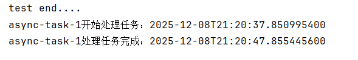

## 注意事项

1. **异步方法必须是 public 方法**
2. **同类内部调用异步方法不会生效**（因为基于代理）
3. **建议为不同业务类型配置不同的线程池**
4. **生产环境一定要配置合理的线程池参数和拒绝策略**

# Bean Validation


## 什么是 Bean Validation

**Bean Validation** 是一个 Java 规范，使用注解的方式对 Java Bean 进行声明式验证，**是 Jakarta EE 的一部分**。

通过注解直接在**字段或方法**上声明验证规则，而不是在业务逻辑中写 if-else。

```java
public class User {
    @NotNull
    @Size(min=2, max=30)
    private String name;
    
    @Email
    private String email;
    
    @Min(18)
    private int age;
}
```

实际开发中，最常见于 Web 层验证用户输入（但实际上它可以使用在三层架构的任何一层）

## 基础约束

| **注解** | **说明** | **适用类型** |
| --- | --- | --- |
| `<font style="color:rgb(15, 17, 21);background-color:rgb(235, 238, 242);">@NotNull</font>` | 值不为 null | 任何类型 |
| `<font style="color:rgb(15, 17, 21);background-color:rgb(235, 238, 242);">@NotEmpty</font>` | 不为 null 且长度/大小>0 | String、Collection、Map、Array |
| `<font style="color:rgb(15, 17, 21);background-color:rgb(235, 238, 242);">@NotBlank</font>` | 不为 null 且 trim 后长度>0 | String |
| `<font style="color:rgb(15, 17, 21);background-color:rgb(235, 238, 242);">@Size(min,max)</font>` | 长度/大小范围 | String、Collection、Map、Array |
| `<font style="color:rgb(15, 17, 21);background-color:rgb(235, 238, 242);">@Min(value)</font>` | 最小值 | 数值类型 |
| `<font style="color:rgb(15, 17, 21);background-color:rgb(235, 238, 242);">@Max(value)</font>` | 最大值 | 数值类型 |
| `<font style="color:rgb(15, 17, 21);background-color:rgb(235, 238, 242);">@Email</font>` | 邮箱格式 | String |
| `<font style="color:rgb(15, 17, 21);background-color:rgb(235, 238, 242);">@Pattern(regexp)</font>` | 正则匹配 | String |

## 特殊约束

| **注解** | **说明** |
| --- | --- |
| `<font style="color:rgb(15, 17, 21);background-color:rgb(235, 238, 242);">@Positive</font>`/ `<font style="color:rgb(15, 17, 21);background-color:rgb(235, 238, 242);">@PositiveOrZero</font>` | 正数/正数或零（应用在数字上） |
| `<font style="color:rgb(15, 17, 21);background-color:rgb(235, 238, 242);">@Negative</font>`/ `<font style="color:rgb(15, 17, 21);background-color:rgb(235, 238, 242);">@NegativeOrZero</font>` | 负数/负数或零（应用在数字上） |
| `<font style="color:rgb(15, 17, 21);background-color:rgb(235, 238, 242);">@Past</font>`/ `<font style="color:rgb(15, 17, 21);background-color:rgb(235, 238, 242);">@PastOrPresent</font>` | 过去/过去或现在 【时间】，应用在日期 API 上。 |
| `<font style="color:rgb(15, 17, 21);background-color:rgb(235, 238, 242);">@Future</font>`/ `<font style="color:rgb(15, 17, 21);background-color:rgb(235, 238, 242);">@FutureOrPresent</font>` | 未来/未来或现在【时间】，应用在日期 API 上。 |
| `<font style="color:rgb(15, 17, 21);background-color:rgb(235, 238, 242);">@Digits(integer,fraction)</font>` | 数字位数限制，integer 设置整数部分的数字个数，fraction 设置小数部分的数字个数。 |

## SpringBoot 与 Bean Validation 关系

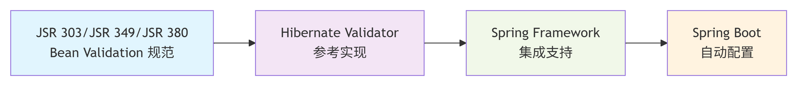

Spring Boot 自动集成了 Bean Validation 标准规范（JSR 380）及其参考实现 Hibernate Validator，使开发者能通过 `<font style="color:rgb(15, 17, 21);background-color:rgb(235, 238, 242);">@Valid</font>` 等注解便捷使用验证功能，但 Bean Validation 本身是独立于 Spring 的技术标准。

## 在 SpringBoot 中的使用

### 第一步：引入启动器

```xml
<dependency>
    <groupId>org.springframework.boot</groupId>
    <artifactId>spring-boot-starter-validation</artifactId>
</dependency>
```

### 第二步：编写 DTO

假设从前端系统提交过来的信息包含：

1. 用户名：不能为空，姓名必须是汉字
2. 邮箱地址：不能为空，必须符合邮箱格式
3. 手机号：不能为空，并且必须是手机号

```java
package com.jkweilai.demo.controller.dto;

import jakarta.validation.constraints.Email;
import jakarta.validation.constraints.NotBlank;
import jakarta.validation.constraints.Pattern;
import lombok.Data;

@Data
public class UserCreateDTO {
    // 1. 用户名：不能为空，必须是汉字
    @NotBlank(message = "用户名不能为空")
    @Pattern(regexp = "^[\\u4e00-\\u9fa5]{2,20}$", message = "姓名必须是2-20个汉字")
    private String username;

    // 2. 邮箱地址：不能为空，必须符合邮箱格式
    @NotBlank(message = "邮箱不能为空")
    @Email(message = "邮箱格式不正确")
    private String email;

    // 3. 手机号：不能为空，并且必须是手机号
    @NotBlank(message = "手机号不能为空")
    @Pattern(regexp = "^1[3-9]\\d{9}$", message = "手机号格式不正确")
    private String phone;
}
```

### 第三步：编写 Controller

重点关注 `@Valid`注解：

```java
package com.jkweilai.demo.controller;

import com.jkweilai.demo.controller.dto.UserCreateDTO;
import jakarta.validation.Valid;
import org.springframework.web.bind.annotation.PostMapping;
import org.springframework.web.bind.annotation.RequestBody;
import org.springframework.web.bind.annotation.RestController;

@RestController
public class UserController {

    @PostMapping("/createUser")
    public UserCreateDTO createUser(@Valid @RequestBody UserCreateDTO userCreateDTO) {
        // 校验失败不会走到这里
        return userCreateDTO;
    }
}
```

### 第四步：编写全局异常处理

只要校验失败，底层就会自动抛出异常，然后走我们编写的全局异常处理器，给前端系统返回 JSON ：

```java
package com.jkweilai.demo.handler;

import org.springframework.http.ResponseEntity;
import org.springframework.web.bind.MethodArgumentNotValidException;
import org.springframework.web.bind.annotation.ExceptionHandler;
import org.springframework.web.bind.annotation.RestControllerAdvice;

import java.util.HashMap;
import java.util.Map;

@RestControllerAdvice
public class GlobalExceptionHandler {

    @ExceptionHandler(MethodArgumentNotValidException.class)
    public ResponseEntity<Map<String, Object>> handleValidationException(MethodArgumentNotValidException ex) {

        Map<String, Object> errors = new HashMap<>();
        Map<String, String> fieldErrors = new HashMap<>();

        // 提取字段错误信息
        ex.getBindingResult().getFieldErrors().forEach(error -> {
            fieldErrors.put(error.getField(), error.getDefaultMessage());
        });

        errors.put("code", 400);
        errors.put("message", "参数校验失败");
        errors.put("timestamp", System.currentTimeMillis());
        errors.put("errors", fieldErrors);

        return ResponseEntity.badRequest().body(errors);
    }
}
```

### 第五步：测试

使用 Apipost 工具进行测试：

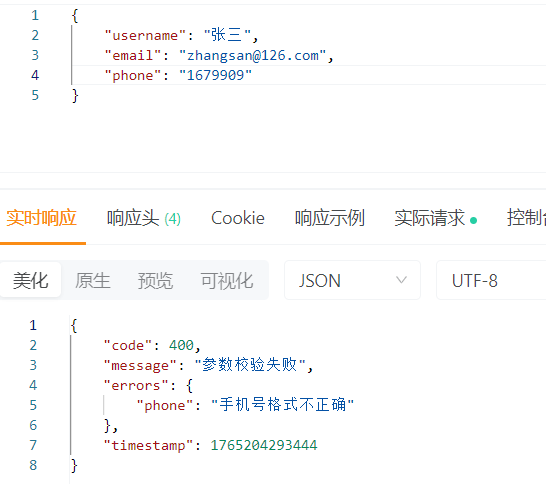

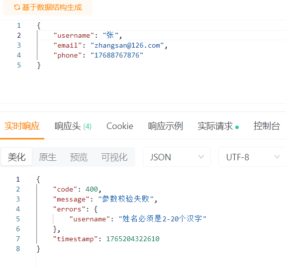

# Swagger

## 认识 Swagger

### 什么是 Swagger

**Swagger能根据你在代码中添加的注解自动生成实时在线的RESTful API文档，并提供可视化的交互界面让你可以直接在浏览器中测试接口调用，实现"代码即文档、文档即测试"的一体化开发体验。**

### Swagger 与 OpenAPI

- 最早在**2010年**，一个叫**Tony Tam**的工程师觉得写API文档和调试太麻烦了，就自己动手做了个叫“Swagger”的小工具。
- 工具在**2011年**免费开源后，吸引了好多程序员一起用，一下子就火了起来。
- 软件工具公司 **SmartBear** 看到了Swagger的价值。于是对项目提供了资金和资源支持。
- 到了**2015年**，**SmartBear** 觉得它潜力巨大，但又觉得个人开发很难做大，于是把 **Swagger 的核心设计**捐给了**Linux基金会**，成立了“OpenAPI倡议”。谷歌、微软这些大厂都加入进来，一起维护它。
- **2017年**，他们给这个核心设计起了个名字 **OpenAPI规范**，而原来的“Swagger”这个名字，则专指实现这份规范的一系列**具体工具**。
- **现在**，OpenAPI规范 已经是业界的**通用标准**，而Swagger也被全世界开发者广泛使用，生态非常繁荣。

**总结一句话：Swagger 是实现 OpenAPI 规范的工具集**

### 不用 Swagger 之前

```plaintext
🟥 问题1：文档手工维护
程序员写代码 -> 手动写Word文档 -> 之后修改代码后经常忘记同步更新word文档 -> 文档过时

🟥 问题2：前后端沟通成本高
前端："这个接口参数怎么传？"
后端："等我翻下文档...哦，文档还没写，你看代码吧"
前端："看不懂Java..."

🟥 问题3：测试效率低
测试人员需要手动构造请求 -> 容易出错 -> 需要去反复确认
```

### 用 Swagger 之后

```plaintext
🟢 解决1：代码即文档
程序员编写代码的时候写几个注解 -> 自动实时生成在线API文档 -> 实时同步

🟢 解决2：标准化接口,swagger实现OpenAPI规范，因此API接口是按照标准写的。不是自己搞一套的混乱时代了。
统一参数格式、响应格式、错误码 -> 减少沟通

🟢 解决3：在线测试
直接在浏览器里测试

🟢 解决4：协作高效
前后端都能看同一个文档 -> 减少联调时间50%+
```

### Swagger 工具集中有哪些常见工具

| **工具名称** | **核心功能** | **主要应用场景** |
| --- | --- | --- |
| **Swagger UI** | **将OpenAPI规范文件渲染成可视化、交互式的API文档网页**。 | 前端查看、测试人员调试、交付API文档给合作方。 |
| **Swagger Editor** | **编写OpenAPI规范文件的在线编辑器**。 | 编写 OpenAPI 的 YAML/JSON文件。 |
| **Swagger Codegen** | **根据OpenAPI规范文件，自动生成服务器端骨架代码和客户端调用代码**。 | 前后端分离开发，快速生成客户端SDK，搭建项目基础。 |

### Swagger 和 Apipost 的区别和联系

**Swagger是API设计/文档工具，Apipost是API调试/协作平台，Apipost可导入Swagger文档进行测试和管理。**

**第1步：后端开发**

```java
// 开发时就用Swagger注解
@PostMapping("/users")
@Operation(summary = "创建用户")
@ApiResponse(responseCode = "201", description = "创建成功")
public R<UserDTO> createUser(@Valid @RequestBody UserDTO dto) {
    // 业务逻辑
}
```

**第2步：导出OpenAPI规范**

```plaintext
访问 Swagger UI的地址：http://localhost:8080/doc.html
访问 http://localhost:8080/v3/api-docs
得到JSON格式的OpenAPI规范
```

**第3步：ApiPost导入**

```plaintext
1. ApiPost中点击"导入"
2. 选择"OpenAPI/Swagger"
3. 粘贴JSON或上传文件
4. 自动生成完整项目
```

**第4步：各角色使用**

```plaintext
👨💻 前端：
1. 查看接口文档
2. 使用Mock数据开发
3. 不需等后端

🧪 测试：
1. 生成测试用例
2. 自动化测试
3. 性能测试

👨💼 产品：
1. 验证业务流程
2. 检查参数是否合理
```

## 认识 Knife4j

**Knife4j 是一个让你在Spring Boot项目中能获得“更好看、更好用、更安全”的API文档的工具，它是Swagger的全面增强版，是国内Java后端开发者的主流选择。Knife4j 是 100% 由国人（中国开发者）开发并维护的优秀开源项目。**

- **创始人**：**肖雪（GitHub: xiaoymin）**。项目最初名为 `<font style="color:rgb(15, 17, 21);background-color:rgb(235, 238, 242);">Swagger-Bootstrap-UI</font>`，后升级为 `<font style="color:rgb(15, 17, 21);background-color:rgb(235, 238, 242);">Knife4j</font>`。
- **诞生原因**：正是因为在项目中使用原生的 Swagger UI 时，遇到了 **界面不够友好、功能不满足国内团队需求、对Spring Boot集成不够便捷** 等实际痛点，开发者才决定自己动手做一个更好的工具。
- **项目理念**：在完全遵循 OpenAPI 规范的基础上，做**深度增强和易用性改造**，而非另起炉灶。

## SpringBoot 项目中使用 Knife4j

### 创建SpringBoot项目

使用Spring Initializr创建项目（**重点注意事项：SpringBoot 选择3.3.6 版本才能兼容Knife4j**），选择以下依赖：

- Spring Web
- Lombok

### 添加依赖

在`pom.xml`中添加以下依赖：

```xml
<!-- Knife4j OpenAPI3 -->
<dependency>
    <groupId>com.github.xiaoymin</groupId>
    <artifactId>knife4j-openapi3-jakarta-spring-boot-starter</artifactId>
    <version>4.5.0</version>
</dependency>

<!-- Validation -->
<dependency>
    <groupId>org.springframework.boot</groupId>
    <artifactId>spring-boot-starter-validation</artifactId>
</dependency>
```

### 编写 Knife4j配置

在 application.yml 中提供配置：

**配置Spring Boot 3的路径匹配策略，并设置Knife4j生成标题为"用户信息管理接口文档"、扫描指定控制器包的API文档。**

```yaml
spring:
  mvc:
    pathmatch:
      matching-strategy: ant_path_matcher  # Spring Boot 3集成swagger必须的配置
knife4j:
  enable: true
  openapi:
    title: 用户信息管理接口文档
    description: 用户信息管理接口文档
    contact:
      name: 老杜
      email: dujubin@126.com
      url: http://localhost:8080
    version: 1.0.0
  group:
    default:
      group-name: default
      api-rule: package
      api-rule-resources:
        - com.jkweilai.demo.controller
```

### 创建实体类

```java
package com.jkweilai.demo.entity;

import com.fasterxml.jackson.annotation.JsonFormat;
import io.swagger.v3.oas.annotations.media.Schema;
import jakarta.validation.constraints.Email;
import jakarta.validation.constraints.NotBlank;
import jakarta.validation.constraints.NotNull;
import jakarta.validation.constraints.Pattern;
import lombok.AllArgsConstructor;
import lombok.Data;
import lombok.NoArgsConstructor;

import java.time.LocalDateTime;

@Data
@NoArgsConstructor
@AllArgsConstructor
/*
为整个实体类添加描述信息
在Swagger文档中会显示"用户实体"作为这个模型的描述
在API文档的"实体类列表"或"模型"部分会显示这个描述
 */
@Schema(description = "用户实体")
public class User {

    @Schema(description = "用户ID", example = "1")
    private Long id;

    @NotBlank(message = "用户名不能为空")
    /*
    description: 字段的描述信息
        会在API文档中显示字段的说明
        方便前端开发者理解字段含义
    example: 示例值
        在API文档中提供示例数据
        测试时会自动填充这个值
        有助于理解字段的格式和类型
    required: 是否必需
        required = true 表示该字段在请求中必须提供
        在文档中会标注为必填字段
        注意: 这只是文档层面的标注，实际校验需要配合 @NotNull、@NotBlank 等注解
     */
    @Schema(description = "用户名", example = "张三", required = true)
    private String username;

    @NotBlank(message = "密码不能为空")
    @Pattern(regexp = "^(?=.*[A-Za-z])(?=.*\\d)[A-Za-z\\d]{6,}$",
            message = "密码必须包含字母和数字，且长度至少6位")
    @Schema(description = "密码", example = "123456a", required = true)
    private String password;

    @NotBlank(message = "邮箱不能为空")
    @Email(message = "邮箱格式不正确")
    @Schema(description = "邮箱", example = "zhangsan@example.com", required = true)
    private String email;

    @NotNull(message = "年龄不能为空")
    @Schema(description = "年龄", example = "25", required = true)
    private Integer age;

    @NotBlank(message = "手机号不能为空")
    @Pattern(regexp = "^1[3-9]\\d{9}$", message = "手机号格式不正确")
    @Schema(description = "手机号", example = "13800138000", required = true)
    private String phone;

    @Schema(description = "创建时间", example = "2024-01-01 10:00:00")
    /*
        这个注解和swagger无关，属于jackson库中的注解。作用是指定日期对象在序列化和发序列化时的日期格式。
        不指定@JsonFormat时，LocalDateTime会默认序列化为包含"T"的ISO-8601格式（如"2024-01-01T10:00:00"）
     */
    @JsonFormat(pattern = "yyyy-MM-dd HH:mm:ss")
    private LocalDateTime createTime;

    @Schema(description = "更新时间", example = "2024-01-01 10:00:00")
    @JsonFormat(pattern = "yyyy-MM-dd HH:mm:ss")
    private LocalDateTime updateTime;
}
```

### 创建响应封装类

```java
package com.jkweilai.demo.common;

import io.swagger.v3.oas.annotations.media.Schema;
import lombok.Data;

@Data
@Schema(description = "统一响应结果")
public class Result<T> {

    @Schema(description = "状态码", example = "200")
    private Integer code;

    @Schema(description = "提示信息", example = "操作成功")
    private String message;

    @Schema(description = "响应数据")
    private T data;

    @Schema(description = "时间戳", example = "1704067200000")
    private Long timestamp;

    // 成功响应
    public static <T> Result<T> success(T data) {
        Result<T> result = new Result<>();
        result.setCode(200);
        result.setMessage("操作成功");
        result.setData(data);
        result.setTimestamp(System.currentTimeMillis());
        return result;
    }

    public static <T> Result<T> success(T data, String message) {
        Result<T> result = success(data);
        result.setMessage(message);
        return result;
    }

    // 失败响应
    public static <T> Result<T> error(String message) {
        Result<T> result = new Result<>();
        result.setCode(500);
        result.setMessage(message);
        result.setTimestamp(System.currentTimeMillis());
        return result;
    }

    public static <T> Result<T> error(Integer code, String message) {
        Result<T> result = new Result<>();
        result.setCode(code);
        result.setMessage(message);
        result.setTimestamp(System.currentTimeMillis());
        return result;
    }

    // 无数据成功
    public static <T> Result<T> success() {
        return success(null);
    }
}
```

### 创建Service层接口

```java
package com.jkweilai.demo.service;

import com.jkweilai.demo.entity.User;

import java.util.List;

public interface UserService {

    /**
     * 添加用户
     */
    User addUser(User user);

    /**
     * 更新用户
     */
    User updateUser(User user);

    /**
     * 删除用户
     */
    boolean deleteUser(Long id);

    /**
     * 根据ID查询用户
     */
    User getUserById(Long id);

    /**
     * 查询所有用户
     */
    List<User> getAllUsers();

    /**
     * 根据用户名查询用户
     */
    List<User> getUsersByUsername(String username);
}
```

### Service 实现类

```java
package com.jkweilai.demo.service.impl;

import com.jkweilai.demo.entity.User;
import com.jkweilai.demo.service.UserService;

import org.springframework.stereotype.Service;

import java.time.LocalDateTime;
import java.util.ArrayList;
import java.util.List;
import java.util.concurrent.ConcurrentHashMap;
import java.util.concurrent.atomic.AtomicLong;

@Service
public class UserServiceImpl implements UserService {

    // 使用ConcurrentHashMap模拟数据存储
    private ConcurrentHashMap<Long, User> userMap = new ConcurrentHashMap<>();

    // 使用AtomicLong生成ID
    // 自动维护一个线程安全的自增id。
    private AtomicLong idGenerator = new AtomicLong(1);

    // 初始化一些测试数据
    public UserServiceImpl() {
        LocalDateTime now = LocalDateTime.now();

        for (int i = 1; i <= 5; i++) {
            Long id = (long) i;
            User user = new User();
            user.setId(id);
            user.setUsername("用户" + i);
            user.setPassword("123456");
            user.setEmail("user" + i + "@jk.com");
            user.setAge(20 + i);
            user.setPhone("1380013800" + i);
            user.setCreateTime(now.minusDays(i));
            user.setUpdateTime(now.minusDays(i));

            userMap.put(id, user);
            idGenerator.set(i + 1);
        }
    }

    @Override
    public User addUser(User user) {
        // 生成ID
        Long id = idGenerator.getAndIncrement();
        user.setId(id);

        // 设置创建时间和更新时间
        LocalDateTime now = LocalDateTime.now();
        user.setCreateTime(now);
        user.setUpdateTime(now);

        // 保存用户
        userMap.put(id, user);

        return user;
    }

    @Override
    public User updateUser(User user) {
        Long id = user.getId();
        if (id == null || !userMap.containsKey(id)) {
            throw new RuntimeException("用户不存在");
        }

        // 获取原用户数据
        User existingUser = userMap.get(id);

        // 更新字段（在实际项目中，这里需要逐个字段判断是否更新）
        if (user.getUsername() != null) {
            existingUser.setUsername(user.getUsername());
        }
        if (user.getPassword() != null) {
            existingUser.setPassword(user.getPassword());
        }
        if (user.getEmail() != null) {
            existingUser.setEmail(user.getEmail());
        }
        if (user.getAge() != null) {
            existingUser.setAge(user.getAge());
        }
        if (user.getPhone() != null) {
            existingUser.setPhone(user.getPhone());
        }

        // 更新时间
        existingUser.setUpdateTime(LocalDateTime.now());

        // 保存更新
        userMap.put(id, existingUser);

        return existingUser;
    }

    @Override
    public boolean deleteUser(Long id) {
        if (!userMap.containsKey(id)) {
            return false;
        }

        userMap.remove(id);
        return true;
    }

    @Override
    public User getUserById(Long id) {
        return userMap.get(id);
    }

    @Override
    public List<User> getAllUsers() {
        return new ArrayList<>(userMap.values());
    }

    @Override
    public List<User> getUsersByUsername(String username) {
        List<User> result = new ArrayList<>();
        for (User user : userMap.values()) {
            if (user.getUsername().contains(username)) {
                result.add(user);
            }
        }
        return result;
    }
}
```

### 创建Controller层

```java
package com.jkweilai.demo.controller;

import com.jkweilai.demo.common.Result;
import com.jkweilai.demo.entity.User;
import com.jkweilai.demo.service.UserService;
import io.swagger.v3.oas.annotations.Operation;
import io.swagger.v3.oas.annotations.Parameter;
import io.swagger.v3.oas.annotations.tags.Tag;
import jakarta.validation.Valid;
import org.springframework.beans.factory.annotation.Autowired;
import org.springframework.web.bind.annotation.*;

import java.util.List;

@RestController
@RequestMapping("/users")
// @Tag 注解会在 API 文档的顶部导航栏显示为标签页/分组标签
@Tag(name = "用户管理", description = "用户相关的CRUD操作")
public class UserController {

    @Autowired
    private UserService userService;

    @PostMapping
    // 为API接口添加详细的描述信息，包括接口摘要和详细说明
    @Operation(summary = "创建用户", description = "添加一个新用户")
    public Result<User> createUser(
            // 描述API接口中的单个参数，包括参数说明、是否必需、示例值等信息
            @Parameter(description = "用户信息", required = true)
            @Valid @RequestBody User user) {
        User savedUser = userService.addUser(user);
        return Result.success(savedUser, "创建成功");
    }

    @PutMapping
    @Operation(summary = "更新用户", description = "更新用户信息")
    public Result<User> updateUser(
            @Parameter(description = "用户信息", required = true)
            @Valid @RequestBody User user) {
        User updatedUser = userService.updateUser(user);
        return Result.success(updatedUser, "更新成功");
    }

    @DeleteMapping("/{id}")
    @Operation(summary = "删除用户", description = "根据ID删除用户")
    public Result<Void> deleteUser(
            @Parameter(description = "用户ID", required = true, example = "1")
            @PathVariable Long id) {
        boolean success = userService.deleteUser(id);
        if (success) {
            return Result.success(null, "删除成功");
        } else {
            return Result.error("用户不存在");
        }
    }

    @GetMapping("/{id}")
    @Operation(summary = "获取用户详情", description = "根据ID查询用户")
    public Result<User> getUserById(
            @Parameter(description = "用户ID", required = true, example = "1")
            @PathVariable Long id) {
        User user = userService.getUserById(id);
        if (user != null) {
            return Result.success(user);
        } else {
            return Result.error(404, "用户不存在");
        }
    }

    @GetMapping
    @Operation(summary = "获取所有用户", description = "查询所有用户列表")
    public Result<List<User>> getAllUsers() {
        List<User> users = userService.getAllUsers();
        return Result.success(users);
    }

    @GetMapping("/search")
    @Operation(summary = "搜索用户", description = "根据用户名搜索用户")
    public Result<List<User>> searchUsers(
            @Parameter(description = "用户名关键字", required = true, example = "张三")
            @RequestParam String username) {
        List<User> users = userService.getUsersByUsername(username);
        return Result.success(users);
    }
}
```

### 创建全局异常处理器

```java
package com.jkweilai.demo.handler;

import com.jkweilai.demo.common.Result;
import jakarta.validation.ConstraintViolation;
import jakarta.validation.ConstraintViolationException;
import org.springframework.validation.BindException;
import org.springframework.validation.FieldError;
import org.springframework.web.bind.MethodArgumentNotValidException;
import org.springframework.web.bind.annotation.ExceptionHandler;
import org.springframework.web.bind.annotation.RestControllerAdvice;

import java.util.ArrayList;
import java.util.List;
import java.util.Set;

@RestControllerAdvice
public class GlobalExceptionHandler {

    /**
     * 处理 @RequestBody 参数校验异常
     *
     * @PostMapping public Result<User> createUser(
     * @Valid @RequestBody User user  // 这个注解触发的异常
     * )
     */
    @ExceptionHandler(MethodArgumentNotValidException.class)
    public Result<Void> handleMethodArgumentNotValidException(MethodArgumentNotValidException e) {
        // 获取所有字段校验错误列表
        List<FieldError> fieldErrors = e.getBindingResult().getFieldErrors();
        // 创建列表用于存储所有错误提示信息
        List<String> errorMessages = new ArrayList<>();
        // 遍历每个字段校验错误
        for (FieldError fieldError : fieldErrors) {
            // 获取校验注解中定义的错误提示信息
            // 例如：@NotBlank(message="用户名不能为空") → "用户名不能为空"
            errorMessages.add(fieldError.getDefaultMessage());
        }
        String message = String.join("; ", errorMessages);
        return Result.error(400, message);
    }

    /**
     * 处理普通表单参数绑定异常
     *
     * @PostMapping("/form") public Result<User> createUserByForm(
     * @Valid User user  // 没有 @RequestBody
     * )
     */
    @ExceptionHandler(BindException.class)
    public Result<Void> handleBindException(BindException e) {
        // 获取所有字段校验错误列表
        List<FieldError> fieldErrors = e.getBindingResult().getFieldErrors();
        // 创建列表存储所有错误信息
        List<String> errorMessages = new ArrayList<>();
        // 遍历每个字段错误，提取错误提示信息
        for (FieldError fieldError : fieldErrors) {
            String errorMessage = fieldError.getDefaultMessage();
            errorMessages.add(errorMessage);
        }
        String message = String.join("; ", errorMessages);
        return Result.error(400, message);
    }

    /**
     * 处理 @RequestParam/@PathVariable 参数校验异常
     *
     * @GetMapping("/{id}") public Result<User> getUser(
     * @PathVariable @Min(1) Long id,  // 这个注解触发的异常
     * @RequestParam @NotBlank String name  // 这个注解触发的异常
     * )
     */
    @ExceptionHandler(ConstraintViolationException.class)
    public Result<Void> handleConstraintViolationException(ConstraintViolationException e) {
        // 获取所有校验失败的约束违规信息集合
        Set<ConstraintViolation<?>> violations = e.getConstraintViolations();
        // 创建列表用于存储所有错误信息
        List<String> errorMessages = new ArrayList<>();
        // 遍历每个违规信息，提取错误提示
        for (ConstraintViolation<?> violation : violations) {
            // 获取校验注解中的message信息，如"用户名不能为空"
            errorMessages.add(violation.getMessage());
        }
        // 将所有错误信息用分号连接成一个字符串
        String message = String.join("; ", errorMessages);
        // 返回400状态码和错误信息
        return Result.error(400, message);
    }

    /**
     * 处理运行时异常
     */
    @ExceptionHandler(RuntimeException.class)
    public Result<Void> handleRuntimeException(RuntimeException e) {
        return Result.error(e.getMessage());
    }

    /**
     * 处理其他异常
     */
    @ExceptionHandler(Exception.class)
    public Result<Void> handleException(Exception e) {
        return Result.error("系统异常: " + e.getMessage());
    }
}
```

### 创建主启动类

```java
package com.jkweilai.demo;

import org.springframework.boot.SpringApplication;
import org.springframework.boot.autoconfigure.SpringBootApplication;

@SpringBootApplication
public class MyApplication {

    public static void main(String[] args) {
        SpringApplication.run(MyApplication.class, args);
        System.out.println("应用启动成功！");
        System.out.println("API文档地址：http://localhost:8080/doc.html");
        System.out.println("OpenAPI文档地址：http://localhost:8080/v3/api-docs");
    }
}
```

## 将 OpenAPI 导入 Apipost

**第一步：新建并导入项目**

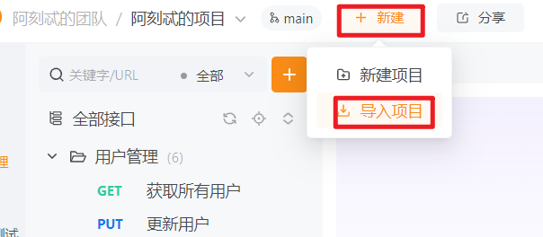

**第二步：填写 OpenAPI 地址：**[**http://localhost:8080/v3/api-docs**](http://localhost:8080/v3/api-docs)

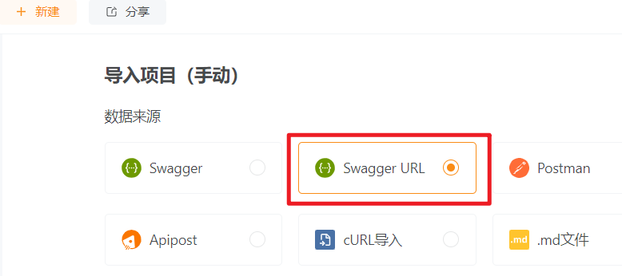

**第三步：设置 Apipost 基础 URL**

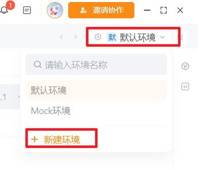

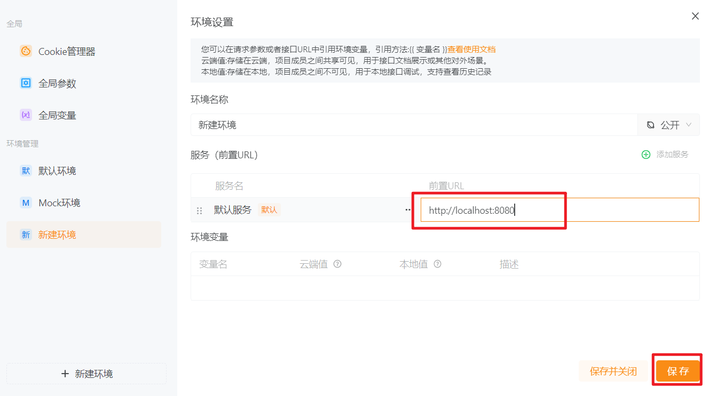

然后就可以在 Apipost 中进行接口的测试工作了。