# 6.MyBatis-Plus

# MyBatis-Plus概述


MyBatis-Plus不是用来替代MyBatis的，是对MyBatis的一种增强。注意：只做增强不做改变。

MyBatis-Plus为简化开发而生，为提高效率而生。

在MyBatis-Plus 中只需要简单的配置，或者不用配置（约定大于配置），即可完成单表的CRUD操作。

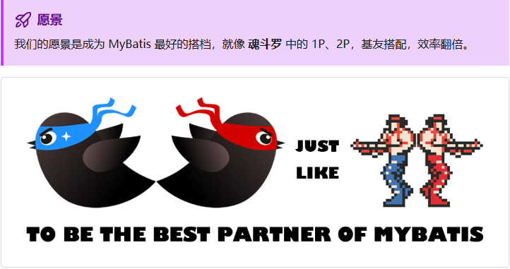

MyBatis-Plus文档官网地址：[https://baomidou.com/](https://baomidou.com/)

MyBatis-Plus 由中国的开发者 **baomidou**（团队 ID）创建并维护。

MyBatis-Plus 在 MyBatis 基础上增强功能的**国产工具**，**并非官方插件**，但已被 MyBatis 官方文档收录推荐。

MyBatis-Plus 提供完善的中文文档，对国内开发者更友好。

MyBatis-Plus 支持达梦、人大金仓等国产数据库。

MyBatis-Plus 项目托管在中国的代码平台 [**Gitee**](https://gitee.com/baomidou/mybatis-plus) 上（GitHub 也有镜像仓库）。

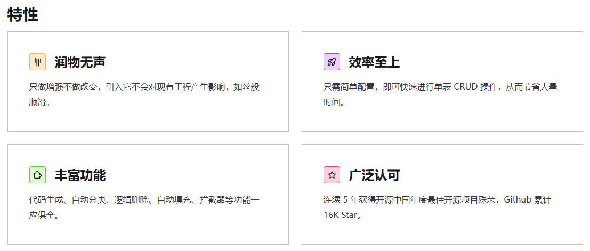

# 第一个MyBatis-Plus


提示：MyBatis-Plus是基于SpringBoot框架的。

第一步：引入 `MyBatis-Plus`依赖（注意：以下引入的是适合于`Spring Boot 3`的依赖）

```xml
<dependency>
  <groupId>com.baomidou</groupId>
  <artifactId>mybatis-plus-spring-boot3-starter</artifactId>
  <version>3.5.11</version>
</dependency>
```

第二步：`Mapper`接口继承`BaseMapper`

```java
package com.jkweilai.mp.mapper;

import com.baomidou.mybatisplus.core.mapper.BaseMapper;
import com.jkweilai.mp.model.Car;

public interface CarMapper extends BaseMapper<Car> {
}
```

具体步骤如下：

第一步：依赖

```xml
<dependencies>
  <!--spring boot核心启动器-->
  <dependency>
    <groupId>org.springframework.boot</groupId>
    <artifactId>spring-boot-starter</artifactId>
  </dependency>
  <!--MyBatis-Plus的Spring Boot 3的启动器-->
  <dependency>
    <groupId>com.baomidou</groupId>
    <artifactId>mybatis-plus-spring-boot3-starter</artifactId>
    <version>3.5.11</version>
  </dependency>
  <!--mysql驱动-->
  <dependency>
    <groupId>com.mysql</groupId>
    <artifactId>mysql-connector-j</artifactId>
    <scope>runtime</scope>
  </dependency>
  <!--lombok依赖-->
  <dependency>
    <groupId>org.projectlombok</groupId>
    <artifactId>lombok</artifactId>
    <optional>true</optional>
  </dependency>
  <!--Spring Boot 3测试启动器-->
  <dependency>
    <groupId>org.springframework.boot</groupId>
    <artifactId>spring-boot-starter-test</artifactId>
    <scope>test</scope>
  </dependency>
</dependencies>
```

第二步：编写实体类

```java
package com.jkweilai.mp.model;

import com.baomidou.mybatisplus.annotation.TableName;
import lombok.Data;

@Data
@TableName("t_car")
public class Car {
    private Long id;
    private String carNum;
    private String brand;
    private Double guidePrice;
    private String produceTime;
    private String carType;
}
```

第三步：编写yml配置

```yaml
# 数据源
spring:
  datasource:
    type: com.zaxxer.hikari.HikariDataSource
    driver-class-name: com.mysql.cj.jdbc.Driver
    url: jdbc:mysql://localhost:3306/mybatis
    username: root
    password: 123456

# 开启mapper接口的日志
logging:
  level:
    com.jkweilai.demo.mapper: DEBUG
```

第四步：编写Mapper接口直接继承`BaseMapper`

```java
package com.jkweilai.mp.mapper;

import com.baomidou.mybatisplus.core.mapper.BaseMapper;
import com.jkweilai.mp.model.Car;

public interface CarMapper extends BaseMapper<Car> {
}
```

`**<font style="color:#DF2A3F;">BaseMapper</font>**`**已经将CRUD相关的方法全部实现了，该类中有大量的 insert、delete、update、select 等方法。**

第五步：Spring Boot主入口程序添加 Mapper扫描

```java
package com.jkweilai.mp;

import org.mybatis.spring.annotation.MapperScan;
import org.springframework.boot.SpringApplication;
import org.springframework.boot.autoconfigure.SpringBootApplication;

@MapperScan(basePackages = {"com.jkweilai.mp.mapper"})
@SpringBootApplication
public class Mp01Application {

        public static void main(String[] args) {
                SpringApplication.run(Mp01Application.class, args);
        }

}
```

第六步：编写测试程序

```java
package com.jkweilai.mp;

import com.jkweilai.mp.mapper.CarMapper;
import com.jkweilai.mp.model.Car;
import org.junit.jupiter.api.Test;
import org.springframework.beans.factory.annotation.Autowired;
import org.springframework.boot.test.context.SpringBootTest;

import java.util.List;

@SpringBootTest
class Mp01ApplicationTests {

        @Autowired
        private CarMapper carMapper;

        @Test
        void testInsert(){
                Car car = new Car();
                car.setCarNum("999");
                car.setBrand("小米su7");
                car.setGuidePrice(30.00);
                car.setProduceTime("2025-10-11");
                car.setCarType("电车");
                int count = carMapper.insert(car);
                System.out.println("插入" + count + "条记录");
        }

        @Test
        void testDeleteById(){
                int count = carMapper.deleteById(7L);
                System.out.println("删除了" + count + "条记录");
        }

        @Test
        void testUpdateById(){
                Car car = new Car();
                car.setId(8L);
                car.setBrand("小米utl");
                int count = carMapper.updateById(car);
                System.out.println("更新了" + count + "条记录");
        }

        @Test
        void testSelectById(){
                Car car = carMapper.selectById(8L);
                System.out.println(car);
        }

        @Test
        void testSelectAll(){
                List<Car> cars = carMapper.selectList(null);
                cars.forEach(System.out::println);
        }

}
```

# MyBatis-Plus常用注解


## 实体类和表是如何对应的

在第一个`MyBatis-Plus`程序中可以看到，没有编写`Mapper xml`文件，仅仅只编写了`CarMapper`继承`BaseMapper`。那`MyBatis-Plus`底层是怎么让`实体类`和`表`对应起来的呢？原理如下：

`MyBatis-Plus`通过以下代码找到实体类`Car`：

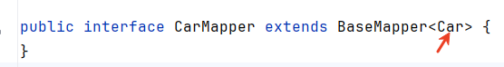

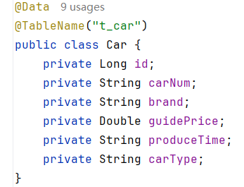

**然后通过反射机制获取**`**Car**`**类的类名以及字段名，遵循**`**<font style="color:#DF2A3F;">约定大于配置</font>**`**的方式完成了**`**实体类**`**与**`**表**`**的对应，约定如下：**

- **类名驼峰转下划线作为表名，例如：类名**`**UserInfo**`**，对应的表名**`**user_info**`
- **自动将名字为**`**id**`**的字段作为主键**
- **属性名驼峰转下划线作为字段名，例如：属性名**`**carType**`**，对应的字段名**`**car_type**`

**如果不符合约定就需要自己通过注解的方式来指定表名和字段名。**

## 常用注解

- @TableName：指定表名的
- @TableId：指定主键字段信息
- @TableField：指定普通字段信息

这几个注解是比较常用的，还有一些其他注解，如果需要可以查一下官方文档：

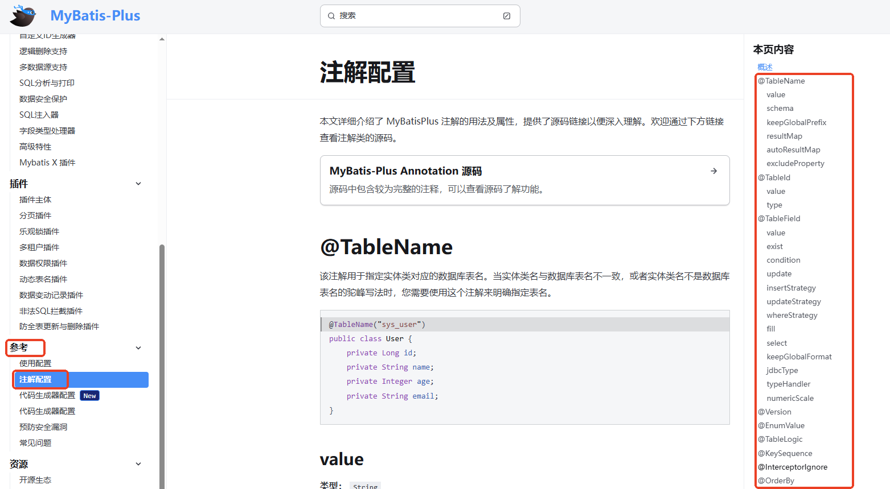

### @TableName

当`实体类名`和`表名`不符合mp的约定，此时就可以使用该注解来解决了，例如实体类名为`Car`，但是表名为`t_car`，则需要使用该注解：

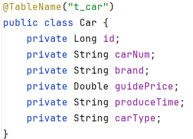

### @TableId

**用该注解的原因：**

- **默认约定**：该注解用于标记实体类中的主键字段。如果你的主键字段名为 id，你可以省略这个注解。**（数据库表的主键字段名是 id，实体类的属性名恰好也是 id，该注解可以省略）**
- **官方建议**：只要你属性名不是 `id`，最好都使用上 `@TableId`注解（**即使属性名和字段名能对应上，写上起码可读性强，而且还可以指定主键生成策略**）。

**使用方法：**

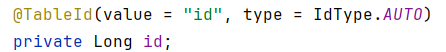

- value 属性用来指定表的主键名
- type 属性用来指定主键的生成策略，如果数据库表中主键值是`auto_increment`，则采用`type = IdType.AUTO`。

**主键生成策略：**

- IdType.AUTO：数据库自增（需数据库支持）。
- IdType.ASSIGN_ID：雪花算法生成分布式ID（默认策略），这是mp自己提供的，底层调用了`IdentifierGenerator`接口的`nextId()`方法，实现类是`DefaultIdentifierGenerator`，雪花算法实现的（**雪花算法是一种分布式ID生成算法，通过组合时间戳、机器ID和序列号生成全局唯一、趋势递增的64位ID。占 8 个字节，时钟回拨或机器 ID 全局不唯一可能会导致 id 重复，但概率较低**）。

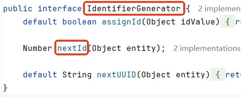

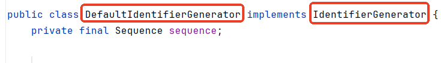

- IdType.INPUT：需要程序员手动赋值。

以上是比较常用的主键生成策略。

### @TableField

```sql
drop table if exists t_customer;
create table t_customer(
  id bigint primary key auto_increment,
  username varchar(255),
  is_vip varchar(255),
  `desc` varchar(255)
);
```

**什么情况下需要使用该注解：**

- `属性名`和`字段名`不一致。
- `属性名`以`is`开头，并且是布尔类型。（**>=3.4.0版本的MyBatis-Plus已经对is开头的属性名进行了处理。无需添加这个注解。**）
- `属性名`与数据库中的关键字冲突了。
- `属性名`不是数据库表中的字段。

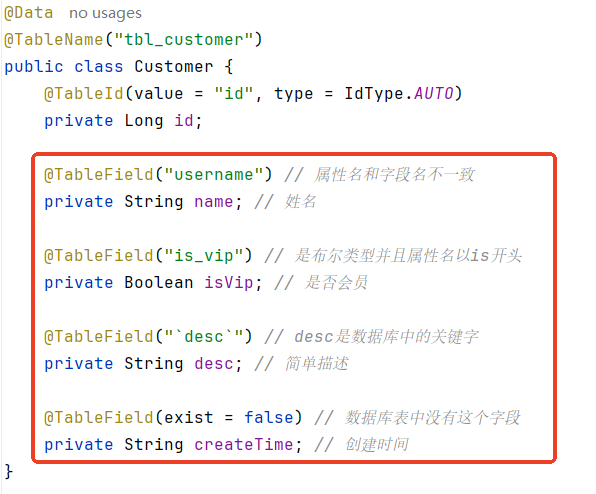

# MyBatis-Plus常用配置


mp的配置可以参考官方文档：

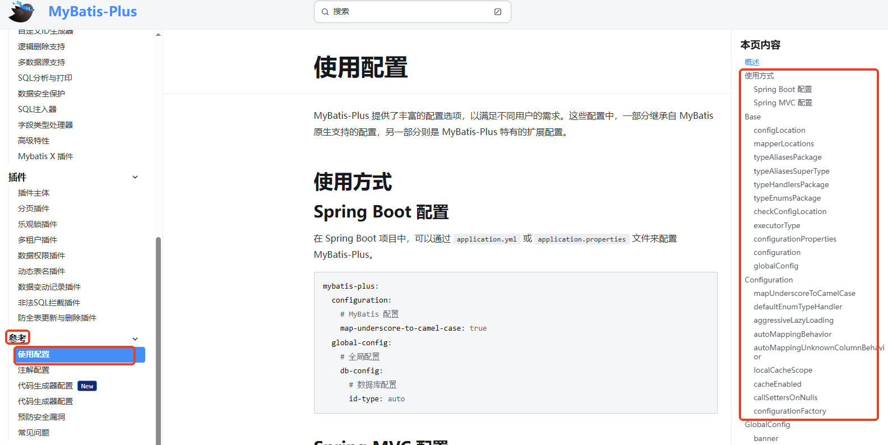

常用配置如下：

```yaml
mybatis-plus:
  
  configuration:
    map-underscore-to-camel-case: true # 是否开启驼峰和下划线的映射
    cache-enabled: false # 是否启用二级缓存
    log-impl: org.apache.ibatis.logging.stdout.StdOutImpl # 打印SQL日志
    
  type-aliases-package: com.jkweilai.mp.model # 别名包
  
  mapper-locations: "classpath*:/mapper/**/*.xml" # mapper xml文件的位置
  
  global-config: # 全局配置
    db-config:
      id-type: auto # id类型
      update-strategy: not_null # 更新策略：不为空时更新
```

提示：大部分的配置都是有默认配置的。

**大家可能会有疑问**：mp不是不用写mapper xml文件吗？为什么还需要`mapper-locations`配置呢？

这是因为mp做单表CRUD的时候不用提供 mapper xml文件，如果自己需要定制SQL，或者多表操作的时候就需要手动编写`mapper xml`文件了。

**小细节**：`classpath:`和`classpath*:`的区别？

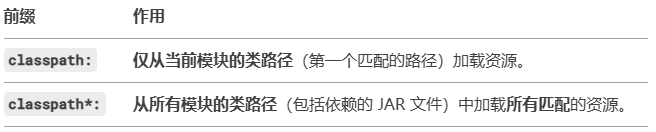

classpath*: 的星号表示跨模块/跨 JAR 加载资源，确保不会遗漏分散在不同位置的 XML 文件。但是要注意，这种方式效率较低，不要滥用。

# MyBatis-Plus条件构造器


## 初识条件构造器

mp默认生成的CRUD的SQL语句，都是基于主键id的，例如：deleteById、updateById、selectById等。

在实际的开发中 SQL 的 where 条件应该是多样化的，如何构造一个复杂条件的 SQL 呢？mp 提供了条件构造器`Wrapper`来解决这个问题。

来自官方的一段描述：

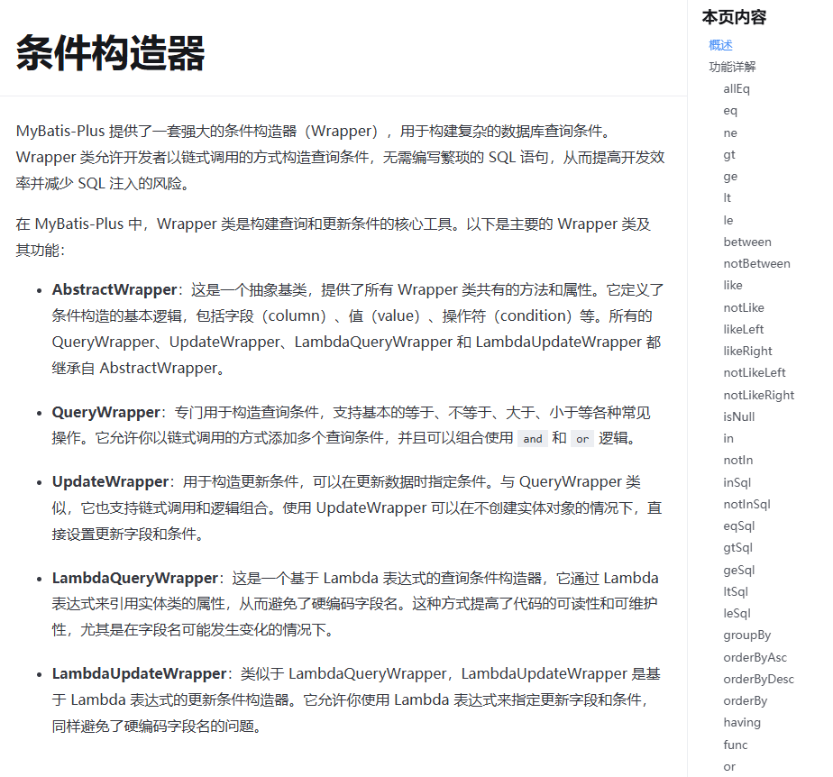

以下是条件构造器`Wrapper`的继承结构图：

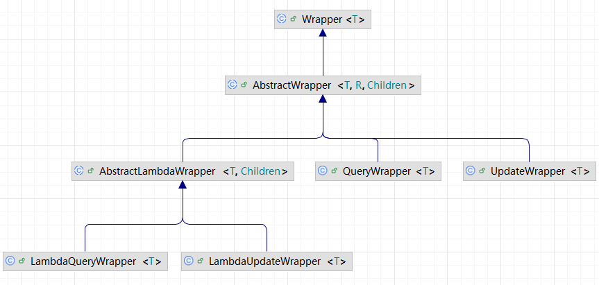

## QueryWrapper的使用

**注意：MP 中提供的**`**<font style="color:#DF2A3F;">QueryWrapper</font>**`** 与 **`**<font style="color:#DF2A3F;">LambdaQueryWrapper</font>**`**适合于单表查询，如果多表连接查询建议大家使用 MyBatis 原生配置文件。**

### 案例1

查询出汽车品牌中带有 '宝' 的，厂商指导价大于20万的，要求查询 id、car_num、brand、guide_price 字段。

如果写SQL语句应该这样写：

```sql
select id,car_num,brand,guide_price from t_car where brand like '%宝%' and guide_price > 20;
```

如果用条件构造器的话，Java代码应该怎么写呢？

```java
@Test
void testQueryWrapper(){
    // 1. 创建条件构造器
    QueryWrapper<Car> wrapper = new QueryWrapper<>();
    // 2. 链式追加条件
    wrapper.select("id","car_num","brand","guide_price")
            .like("brand", "宝")
            .gt("guide_price", 20.0);
    // 3. 查询
    List<Car> cars = carMapper.selectList(wrapper);
    cars.forEach(System.out::println);
}
```

另外，以上编写的代码中 `"id","car_num","brand","guide_price"` 等都属于硬编码，如果表的列名修改了，Java代码也是需要修改的。另外双引号里的字符串即使写错了，编译器也不会报错，因此mp给出了`Lambda`方式来解决这个问题，例如`LambdaQueryWrapper`，代码如下：

```java
@Test
void testLambdaQueryWrapper(){
    // 1.创建条件构造器
    LambdaQueryWrapper<Car> wrapper = new LambdaQueryWrapper<>();
    // 2.链式追加条件
    wrapper.select(Car::getId,Car::getCarNum,Car::getBrand,Car::getGuidePrice)
            .like(Car::getBrand, "宝")
            .gt(Car::getGuidePrice, 20.0);
    // 3.查询
    List<Car> cars = carMapper.selectList(wrapper);
    cars.forEach(System.out::println);
}
```

`**Car::getId**`**是如何转换成 **`**"id"**`**的呢？感兴趣的同学可以研究一下以下代码：**

```java
import java.lang.invoke.SerializedLambda;
import java.lang.reflect.Method;

// 普通类
class User {
    private Long id;

    public Long getId() {
        return id;
    }
}

// 函数式接口
interface MyFunc extends java.io.Serializable {
    Object apply(User user);
}

// 测试程序（以下代码是Lambda表达式相关的反射机制代码）
public class Test {
    public static void main(String[] args) throws Exception {
        // 方法引用
        MyFunc func = User::getId;
        // 获取SerializedLambda
        Method m = func.getClass().getDeclaredMethod("writeReplace");
        m.setAccessible(true);
        SerializedLambda lambda = (SerializedLambda) m.invoke(func);
        // 提取字段名
        String methodName = lambda.getImplMethodName(); // "getId"
        String fieldName = methodName.substring(3, 4).toLowerCase() + methodName.substring(4); // "id"
        System.out.println("字段名: " + fieldName);
    }
}
```

### 案例2

将`宝马535`的厂商指导价修改为`10.0`万。

对应的SQL语句写法：

```sql
update t_car set guide_price = 10.0 where brand = '宝马535';
```

如果用条件构造器的话Java代码该怎么写呢？

```java
@Test
void testQueryWrapper2(){
    // 1.准备数据
    Car car = new Car();
    car.setGuidePrice(10.0);
    // 2.创建条件构造器，并链式追加条件
    QueryWrapper<Car> wrapper = new QueryWrapper<Car>()
            .eq("brand", "宝马535");
    // 3.更新
    carMapper.update(car, wrapper);
}
```

使用`LambdaQueryWrapper`改造：

```java
@Test
void testLambdaQueryWrapper2(){
    // 1.准备数据
    Car car = new Car();
    car.setGuidePrice(10.0);
    // 2.创建条件构造器，并链式追加条件
    LambdaQueryWrapper<Car> wrapper = new LambdaQueryWrapper<Car>()
            .eq(Car::getBrand, "宝马535");
    // 3.更新
    carMapper.update(car, wrapper);
}
```

## UpdateWrapper的使用

当`update`语句中`set`后面的语句比较特殊的话，就需要使用`UpdateWrapper`了。

例如：要求所有的`宝马535`涨价`5`万。

SQL语句应该这样写：

```sql
update t_car set guide_price = guide_price + 5 where brand = '宝马535';
```

这个时候就需要使用`UpdateWrapper`了，Java代码如下：

```java
@Test
void testUpdateWrapper(){
    // 创建条件构造器
    UpdateWrapper<Car> wrapper = new UpdateWrapper<>();
    // 设置set语句并链式追加条件
    wrapper.setSql("guide_price = guide_price + 5")
            .eq("brand", "宝马535");
    // 更新
    carMapper.update(wrapper);
}
```

如果使用`LambdaUpdateWrapper`，代码应该这样写：

```java
@Test
void testLambdaUpdateWrapper(){
    // 创建条件构造器
    LambdaUpdateWrapper<Car> wrapper = new LambdaUpdateWrapper<>();
    // 设置set语句并链式追加条件
    wrapper.setSql("guide_price = guide_price + 5")
            .eq(Car::getBrand, "宝马535");
    // 更新
    carMapper.update(wrapper);
}
```

## 条件构造器用法总结

条件构造器用法：

1. `QueryWrapper`和`LambdaQueryWrapper`用来构建`select`、`delete`、`update`的`where`条件。
2. `UpdateWrapper`和`LambdaUpdateWrapper`一般只有在`set语句`比较特殊的情况下才会使用。
3. 尽量使用`LambdaQueryWrapper`和`LambdaUpdateWrapper`，避免硬编码。

# 自定义SQL


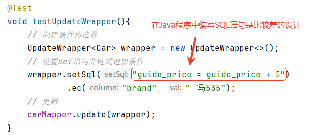

在Java程序中直接编写SQL这是不建议的，怎么解决这个问题？自定义SQL可以解决。

什么是自定义SQL？在Java程序中继续使用`Wrapper`进行条件的封装，将SQL语句编写到`Mapper xml`文件中，将`Wrapper`传递给`Mapper xml`，然后进行SQL语句的拼装。

第一步：在java程序中只进行`Wrapper`条件的构造

```java
@Test
void testCustomSql(){
    // 创建条件构造器
    UpdateWrapper<Car> wrapper = new UpdateWrapper<>();
    // 设置set语句并链式追加条件
    wrapper.eq("brand", "宝马535");
    // 更新
    carMapper.updateByCustomSql(wrapper, 5.0);
}
```

第二步：在Mapper接口中自定义方法

```java
public interface CarMapper extends BaseMapper<Car> {
    void updateByCustomSql(@Param("ew") UpdateWrapper<Car> wrapper, @Param("amount") Double amount);
}
```

注意：`@Param("ew")`中的`ew`是固定写法。当然也可以采用mp内置的常量来代替`"ew"`：Constants.WRAPPER

第三步：编写`Mapper xml`的配置

```xml
<mapper namespace="com.jkweilai.mp.mapper.CarMapper">
    <update id="updateByCustomSql">
        update t_car set guide_price = guide_price + #{amount} ${ew.customSqlSegment}
    </update>
</mapper>
```

注意：`${ew.customSqlSegment}`是固定写法。

# IService接口


mp不仅提供了持久层的代码，还提供了service层的代码。

## 自己写的service层代码

```java
package com.jkweilai.mp.service;

import com.jkweilai.mp.model.Car;

import java.util.List;

public interface CarService{
    // 增
    int save(Car car);
    // 删
    int removeById(Long id);
    // 改
    int updateById(Car car);
    // 查一个
    Car getById(Long id);
    // 查所有
    List<Car> list();
}
```

```java
package com.jkweilai.mp.service.impl;

import com.jkweilai.mp.mapper.CarMapper;
import com.jkweilai.mp.model.Car;
import com.jkweilai.mp.service.CarService;
import org.springframework.beans.factory.annotation.Autowired;
import org.springframework.stereotype.Service;

import java.util.List;

@Service
public class CarServiceImpl implements CarService {
    @Autowired
    private CarMapper carMapper;

    @Override
    public int save(Car car) {
        return carMapper.insert(car);
    }

    @Override
    public int removeById(Long id) {
        return carMapper.deleteById(id);
    }

    @Override
    public int updateById(Car car) {
        return carMapper.updateById(car);
    }

    @Override
    public Car getById(Long id) {
        return carMapper.selectById(id);
    }

    @Override
    public List<Car> list() {
        return carMapper.selectList(null);
    }
}
```

可见，在没有复杂业务的前提下，代码几乎也是固定的，就是在service中注入`mapper`，然后调用`mapper`相关的方法。因此这些代码mp也是可以自动生成的。

## 使用mp提供的IService接口

两步即可实现：

第一步：编写`CarService接口`继承`IService<Car>`接口

```java
package com.jkweilai.mp.service;

import com.baomidou.mybatisplus.extension.service.IService;
import com.jkweilai.mp.model.Car;

public interface CarService extends IService<Car> {
}
```

提示：`IService接口`是mp提供的，为什么我们的接口要继承这个接口，因为在`Controller`中要面向接口调用service的方法，而这些方法都在`IService接口`中，如果需要额外的业务方法，可以在自己的接口中额外添加扩展方法。

第二步：编写`CarServiceImpl实现类`继承`ServiceImpl<CarMapper,Car>`类并实现`CarService接口`

```java
package com.jkweilai.mp.service.impl;

import com.baomidou.mybatisplus.extension.service.impl.ServiceImpl;
import com.jkweilai.mp.mapper.CarMapper;
import com.jkweilai.mp.model.Car;
import com.jkweilai.mp.service.CarService;
import org.springframework.stereotype.Service;

@Service
public class CarServiceImpl extends ServiceImpl<CarMapper, Car> implements CarService {
}
```

提示：为什么实现了`CarService接口`还要继承 `ServiceImpl<CarMapper, Car>`？这是因为在`ServiceImpl<CarMapper, Car>`里面mp给了默认的实现，如果不继承它，则需要将`IService接口`中所有的方法自己全部实现一遍。

**IService接口的继承结构如下：**

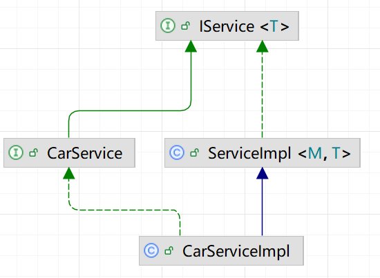

## IService接口常用方法

### 负责新增的方法

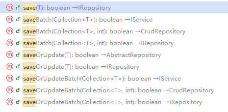

- save(T) 保存
- saveBatch(Collection) 批量保存
- saveOrUpdate(T) 保存或修改（保存时根据id判断，如果没有则保存，如果有则更新）

### 负责删除的方法

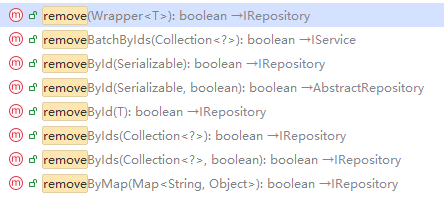

- removeById(Serializable) 根据主键删除
- removeByIds(Collection) 根据多个主键删除多条记录，底层用 `in(id1, id2, id3)`
- removeBatchByIds(Collection) 根据多个主键删除多条记录，底层会启动JDBC的批处理操作（调用JDBC的addBatch方法来批量删除，大数量时效率较高。）

### 负责修改的方法

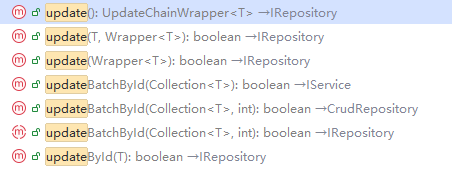

- updateById(T) 根据id更新
- updateBatchById(Collection) 根据id批量更新

### 负责查询的方法

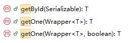

- 这几个方法都是查一个。

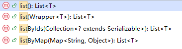

- 这几个方法都是查多个


- 这几个方法是查数量


- 这几个方法负责分页查询

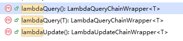

- 复杂条件的查询和更新建议使用这几个方法。
- **提示：如果是通过主键查询或更新建议使用之前的方法，如果是复杂条件的查询或更新使用这几个方法更方便。**

## 基于mp的IService开发业务接口

### 业务概述

实现五个接口，如下：

| 编号 | 接口 | 请求方式 | 请求路径 | 请求参数 | 返回值 |
| --- | --- | --- | --- | --- | --- |
| 1 | 新增汽车 | POST | /cars | 汽车表单实体 | 无 |
| 2 | 删除汽车 | DELETE | /cars/{id} | 汽车id | 无 |
| 3 | 根据id查询汽车 | GET | /cars/{id} | 汽车id | 汽车VO |
| 4 | 根据id批量查询 | GET | /cars | 汽车id集合 | 汽车VO集合 |
| 5 | 根据id降低厂商指导价 | PUT | /cars/{id}/reduction/{price} | 汽车id，降价额度 | 无 |

实现技术：**SpringBoot + MyBatis-Plus + Swagger + Hutool + Lombok**

### 搭建环境

1. 创建SpringBoot项目

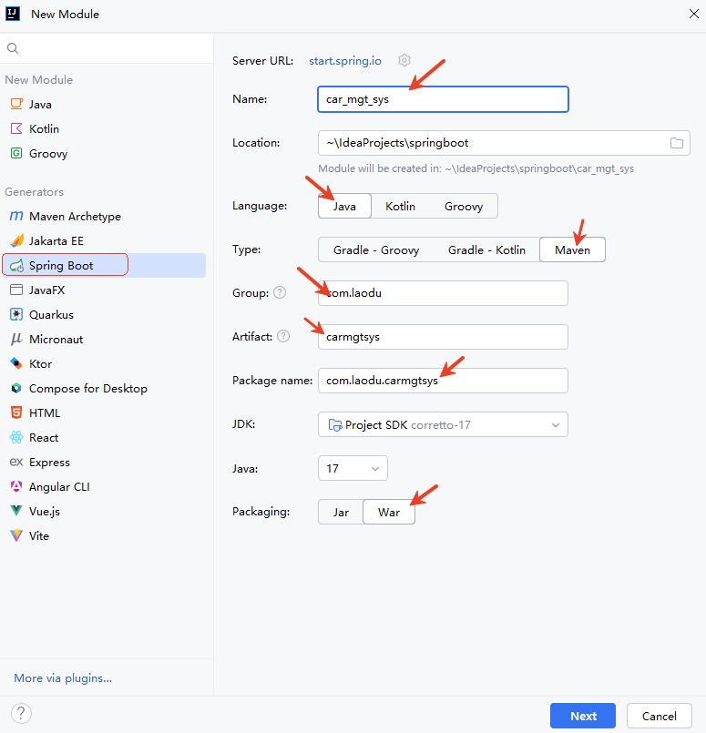

1. 创建SpringBoot项目过程中引入依赖

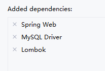

1. SpringBoot项目创建完成后，`application.properties`修改为`application.yml`

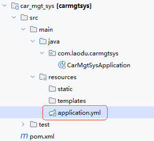

1. 引入依赖：MyBatis-Plus、Swagger、Hutool

```xml
<!--swagger依赖-->
<dependency>
  <groupId>com.github.xiaoymin</groupId>
  <artifactId>knife4j-openapi3-jakarta-spring-boot-starter</artifactId>
  <version>4.5.0</version>
</dependency>
<!--MyBatis-Plus依赖-->
<dependency>
  <groupId>com.baomidou</groupId>
  <artifactId>mybatis-plus-spring-boot3-starter</artifactId>
  <version>3.5.11</version>
</dependency>
<!-- hutool依赖，一个java工具库 -->
<dependency>
  <groupId>cn.hutool</groupId>
  <artifactId>hutool-all</artifactId>
  <version>5.8.37</version>
</dependency>
```

1. 编写`application.yml`配置文件

```yaml
# DataSource
spring:
  datasource:
    type: com.zaxxer.hikari.HikariDataSource
    driver-class-name: com.mysql.cj.jdbc.Driver
    url: jdbc:mysql://localhost:3306/mybatis
    username: root
    password: 123456

# MyBatis-Plus
mybatis-plus:
  configuration:
    log-impl: org.apache.ibatis.logging.stdout.StdOutImpl

# Swagger配置
  mvc:
    pathmatch:
      matching-strategy: ant_path_matcher  # Spring Boot 3集成swagger必须的配置
knife4j:
  enable: true
  openapi:
    title: 汽车信息管理接口文档
    description: 汽车信息管理接口文档
    contact:
      name: 老杜
      email: dujubin@126.com
      url: http://localhost:8080
    version: 1.0.0
  group:
    default:
      group-name: default
      api-rule: package
      api-rule-resources:
        - com.jkweilai.carmgtsys.controller
```

### MyBatis-Plus相关代码

编写po：Car类

```java
package com.jkweilai.carmgtsys.model.po;

import com.baomidou.mybatisplus.annotation.IdType;
import com.baomidou.mybatisplus.annotation.TableId;
import com.baomidou.mybatisplus.annotation.TableName;
import lombok.Data;

@Data
@TableName("t_car")
public class Car {
    @TableId(value = "id", type = IdType.AUTO)
    private Long id;
    private String carNum;
    private String brand;
    private Double guidePrice;
    private String produceTime;
    private String carType;
}
```

mapper的编写：CarMapper接口

```java
package com.jkweilai.carmgtsys.mapper;

import com.baomidou.mybatisplus.core.mapper.BaseMapper;
import com.jkweilai.carmgtsys.po.Car;

public interface CarMapper extends BaseMapper<Car> {
}
```

**在SpringBoot入口程序上添加**`**<font style="color:#DF2A3F;">@MapperScan</font>**`**扫描**

**@MapperScan(basePackages = "com.jkweilai.carmgtsys.mapper")**

service接口的编写：CarService

```java
package com.jkweilai.carmgtsys.service;

import com.baomidou.mybatisplus.extension.service.IService;
import com.jkweilai.carmgtsys.po.Car;

public interface CarService extends IService<Car> {
}
```

service实现类的编写：CarServiceImpl

```java
package com.jkweilai.carmgtsys.service.impl;

import com.baomidou.mybatisplus.extension.service.impl.ServiceImpl;
import com.jkweilai.carmgtsys.mapper.CarMapper;
import com.jkweilai.carmgtsys.po.Car;
import com.jkweilai.carmgtsys.service.CarService;
import org.springframework.stereotype.Service;

@Service
public class CarServiceImpl extends ServiceImpl<CarMapper, Car> implements CarService {
}
```

### 编写dto

```java
package com.jkweilai.carmgtsys.model.dto;

import io.swagger.v3.oas.annotations.media.Schema;
import lombok.Data;

@Data
@Schema(name = "CarDTO", description = "车辆信息传输对象")
public class CarDTO {
    @Schema(description = "车辆唯一ID", example = "1", requiredMode = Schema.RequiredMode.REQUIRED)
    private Long id;

    @Schema(description = "车牌号", example = "京A12345", maxLength = 20)
    private String carNum;

    @Schema(description = "品牌", example = "宝马", maxLength = 50)
    private String brand;

    @Schema(description = "指导价格（万元）", example = "42.5")
    private Double guidePrice;

    @Schema(description = "生产日期（yyyy-MM-dd）", example = "2023-08-01")
    private String produceTime;

    @Schema(description = "车辆类型", example = "SUV", allowableValues = {"SUV", "轿车", "跑车", "MPV"})
    private String carType;
}
```

### 编写vo

```java
package com.jkweilai.carmgtsys.model.vo;

import io.swagger.v3.oas.annotations.media.Schema;
import lombok.Data;

@Data
@Schema(name = "CarVO", description = "车辆信息视图对象")
public class CarVO {
    @Schema(description = "车辆唯一ID", example = "1")
    private Long id;

    @Schema(description = "车牌号码", example = "粤B12345", maxLength = 20)
    private String carNum;

    @Schema(description = "车辆品牌", example = "特斯拉", maxLength = 50)
    private String brand;

    @Schema(description = "官方指导价(单位：万元)", example = "29.99")
    private Double guidePrice;

    @Schema(description = "生产日期(yyyy-MM-dd格式)", example = "2023-05-15")
    private String produceTime;

    @Schema(description = "车辆类型", example = "新能源轿车",
            allowableValues = {"燃油车", "新能源轿车", "SUV", "MPV", "跑车"})
    private String carType;
}
```

### 实现简单的业务接口

编写`CarController`

```java
package com.jkweilai.carmgtsys.controller;

import cn.hutool.core.bean.BeanUtil;
import com.jkweilai.carmgtsys.model.dto.CarDTO;
import com.jkweilai.carmgtsys.model.po.Car;
import com.jkweilai.carmgtsys.model.vo.CarVO;
import com.jkweilai.carmgtsys.service.CarService;
import io.swagger.v3.oas.annotations.Operation;
import io.swagger.v3.oas.annotations.Parameter;
import io.swagger.v3.oas.annotations.tags.Tag;
import lombok.RequiredArgsConstructor;
import org.springframework.web.bind.annotation.*;

import java.util.List;

@Tag(name = "汽车信息管理接口") // swagger注解
@RequestMapping("/cars")
@RestController
@RequiredArgsConstructor // lombok注解，提供必须的构造方法
public class CarController {

    // 该属性会对应一个构造方法，构造方法帮助注入。
    private final CarService carService;

    @Operation(summary = "保存汽车信息") // swagger注解
    @PostMapping
    public void save(@RequestBody CarDTO carDTO) {
        // 1. 将DTO转换为PO
        Car car = BeanUtil.copyProperties(carDTO, Car.class);
        // 2. 保存
        carService.save(car);
    }

    @Operation(summary = "删除汽车信息", description = "根据id删除汽车信息", parameters = {@Parameter(name = "id", description = "车辆id")})
    @DeleteMapping("{id}")
    public void removeById(@PathVariable("id") Long id) {
        carService.removeById(id);
    }

    @Operation(summary = "查询汽车信息", description = "根据id查询汽车信息", parameters = {@Parameter(name = "id", description = "车辆id")})
    @GetMapping("{id}")
    public CarVO getById(@PathVariable("id") Long id) {
        // 1. 根据id查询汽车信息，返回po对象
        Car car = carService.getById(id);
        // 2. 将po对象转换成vo对象返回
        return BeanUtil.copyProperties(car, CarVO.class);
    }

    @Operation(summary = "批量查询汽车信息", description = "根据id批量查询汽车信息", parameters = @Parameter(name = "ids", example="1,2,3" description = "批量的车辆id"))
    @GetMapping
    public List<CarVO> getByIds(@RequestParam("ids") List<Long> ids){
        // 1.根据id批量查询，返回po集合
        List<Car> cars = carService.listByIds(ids);
        // 2.将po集合转换成vo集合
        return BeanUtil.copyToList(cars, CarVO.class);
    }
}
```

### 实现复杂的业务接口

在controller中添加方法：

```java
@Operation(summary = "降低官方指导价", description = "降低给定车辆id的官方指导价",
        parameters = {@Parameter(name = "id", description = "车辆id"),@Parameter(name="price", description = "降价额度")})
@PutMapping("{id}/reduction/{price}")
public void reduction(@PathVariable("id") Long id, @PathVariable("price") Double price){
    carService.reduction(id, price);
}
```

CarService接口添加方法：

```java
public interface CarService extends IService<Car> {
    void reduction(Long id, Double price);
}
```

CarServiceImpl实现方法：

```java
@Service
public class CarServiceImpl extends ServiceImpl<CarMapper, Car> implements CarService {
    @Override
    public void reduction(Long id, Double price) {
        // 1.查询汽车
        Car car = getById(id);
        // 2.判断汽车是否存在
        if(car == null){
            throw new RuntimeException("汽车信息异常！");
        }
        // 3.校验官方指导价
        if(car.getGuidePrice() < price){
            throw new RuntimeException("官方指导价不能小于0！");
        }
        // 4.降价
        baseMapper.reduction(id, price);
    }
}
```

CarMapper添加方法：

```java
public interface CarMapper extends BaseMapper<Car> {

    @Update("UPDATE t_car SET guide_price = guide_price - #{price} WHERE id = #{id}")
    void reduction(@Param("id") Long id, @Param("price") Double price);
}
```

**最后**，启动项目，打开浏览器，输入`Swagger`地址：http://localhost:8080/doc.html 来进行接口的测试：

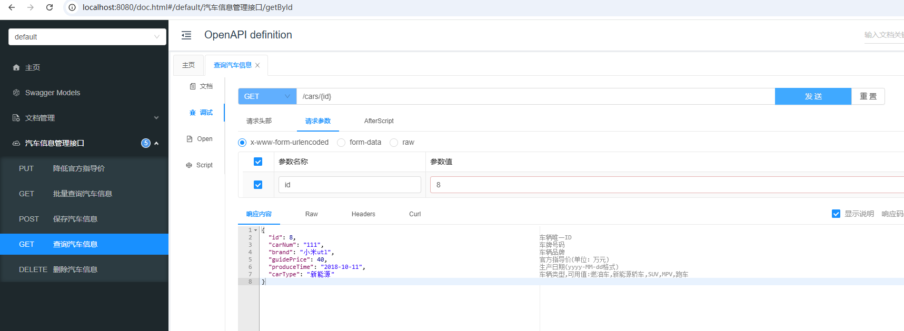

### IService的lambdaQuery()方法

适合复杂查询。

实现一个功能：实现多条件查询。查询条件包括：

- 可以根据汽车品牌模糊查询
- 可以根据价格区间查询
- 可以根据汽车类型查询

实际查询时，不知道用户提供了哪些条件。如果使用原生的`mybatis`实现的话`SQL`应该是这样写：

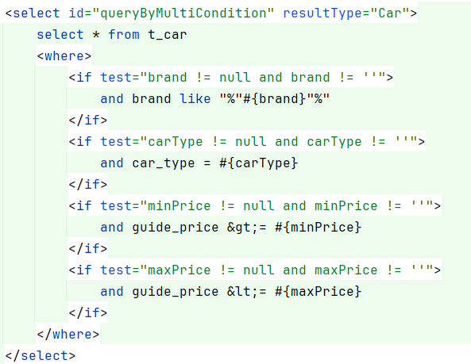

在mp中应该怎么做呢？可以使用我们之前学过的`Wrapper`，也可以使用`IService`中提供的`lambdaQuery()`方法。下面演示`lambdaQuery()`的用法：

提供`CarQuery`对象来封装查询条件：

```java
package com.jkweilai.carmgtsys.model.query;

import io.swagger.v3.oas.annotations.media.Schema;
import lombok.Data;

@Schema(name = "CarQuery", description = "对汽车进行查询时的多条件封装")
@Data
public class CarQuery {
    @Schema(description = "汽车品牌，支持模糊查询")
    private String brand;

    @Schema(description = "汽车类型，例如：燃油车，电车，氢能源，新能源")
    private String carType;

    @Schema(description = "最低价格")
    private Double minPrice;

    @Schema(description = "最高价格")
    private Double maxPrice;
}
```

在`CarController`中提供`queryByMultiCondition`方法：

**查询操作如果参数不多，RESTful 接口应设计为 get 请求，请求在请求行上提交，以下代码中 **`**<font style="color:#DF2A3F;">@ParameterObject</font>**`**是 swagger 的注解，和 SpringMVC 无关。使用这个注解，swagger 在生成文档的时候，会将 **`**<font style="color:#DF2A3F;">CarQuery</font>**`**对象的属性拆开在文档中显示。**

```java
@Operation(summary = "多条件查询汽车信息", description = "多条件查询汽车信息")
@GetMapping("/query")
public List<CarVO> queryByMultiCondition(@ParameterObject CarQuery carQuery){
    List<Car> cars = carService.queryByMultiCondition(
            carQuery.getBrand(), carQuery.getCarType(), carQuery.getMinPrice(), carQuery.getMaxPrice());
    return BeanUtil.copyToList(cars, CarVO.class);
}
```

在`CarServiceImpl`中实现`queryByMultiCondition`方法：使用`lambdaQuery()`方法

```java
@Override
public List<Car> queryByMultiCondition(String brand, String carType, Double minPrice, Double maxPrice) {
    // 这里没有再调用 lambdaQuery().select()这样的方法，如果不调用就是将实体类中的@TableField标注的字段都返回。
    // 如果你要返回指定字段，那么就需要手动调用select()方法。
    return lambdaQuery()
            .like(brand != null && !brand.trim().isEmpty(), Car::getBrand, brand)
            .eq(carType != null && !carType.trim().isEmpty(), Car::getCarType, carType)
            .ge(minPrice != null, Car::getGuidePrice, minPrice)
            .le(maxPrice != null, Car::getGuidePrice, maxPrice)
            .list();
}
```

### IService的lambdaUpdate()方法

适合复杂更新语句。

需求：针对提供id的车辆进行降价操作，如果降价后的价格低于10万，则将汽车类型修改为低端车。

直接在`CarServiceImpl`的`<font style="color:#080808;background-color:#ffffff;">reduction()</font>`方法基础上做修改：

```java
@Override
@Transactional
public void reduction(Long id, Double price) {
    // 1.查询汽车
    Car car = getById(id);
    // 2.判断汽车是否存在
    if (car == null) {
        throw new RuntimeException("汽车信息异常！");
    }
    // 3.校验官方指导价
    if (car.getGuidePrice() < price) {
        throw new RuntimeException("官方指导价不能小于0！");
    }
    // 4.降价
    //baseMapper.reduction(id, price);
    Double guidePriceNow = car.getGuidePrice() - price;
    lambdaUpdate()
            .set(Car::getGuidePrice, guidePriceNow)
            .set(guidePriceNow < 10, Car::getCarType, "低端车")
            .eq(Car::getId, id)
            .eq(Car::getGuidePrice, car.getGuidePrice()) // 事务 + 乐观锁 保证原子化操作！
            .update();
}
```

**注意：事务 + 乐观锁 来保证原子化操作！！！**

### IService的批量新增

向`t_car`表中插入1万条车辆信息

1. 第一种方式：不使用批处理操作并记录耗时

```java
@Test
void testSave() {
    long begin = System.currentTimeMillis();
    for (long i = 1; i <= 10000; i++) {
        // 每循环一次创建一个Car对象
        Car car = new Car();
        car.setId(i);
        car.setCarNum("CarNum" + i);
        car.setBrand("宝马" + i);
        car.setGuidePrice(30.0);
        car.setProduceTime("2000-10-11");
        car.setCarType("燃油车");
        // 保存Car
        carService.save(car);
    }
    long end = System.currentTimeMillis();
    System.out.println("耗时" + (end - begin) / 1000 + "秒");
}
```

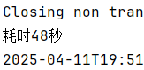

1. 第二种方式：使用批处理操作并记录耗时

```java
@Test
void testSaveBatch() {
    long begin = System.currentTimeMillis();
    List<Car> cars = new ArrayList<>();
    for (long i = 1; i <= 10000; i++) {
        // 每循环一次创建一个Car对象
        Car car = new Car();
        car.setId(i);
        car.setCarNum("CarNum" + i);
        car.setBrand("宝马" + i);
        car.setGuidePrice(30.0);
        car.setProduceTime("2000-10-11");
        car.setCarType("燃油车");
        cars.add(car);
        // 每100个保存一次
        if(i % 100 == 0){
            carService.saveBatch(cars);
            cars.clear();
        }
    }
    long end = System.currentTimeMillis();
    System.out.println("耗时" + (end - begin) / 1000 + "秒");
}
```

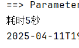

效率得到提升，原理是：每100条`insert`语句打包一次批量发给数据。

1. 在`application.yml`中的`url`后面添加`rewriteBatchedStatements=true`并记录耗时

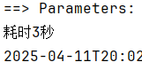

它的作用是将这种写法

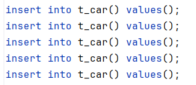

转换成这种写法

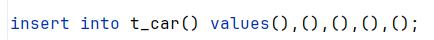

这是mysql驱动实现的，不是mp的功能。

# 代码生成器/逆向工程


`MyBatis-Plus`官方为我们推荐了两种方式：

- 第一种方式：通过自己编写代码来生成代码（**可以参考官方的代码来实现**）
- 第二种方式：`baomidou` 专门为`IDEA`开发了`MyBatis X`插件。

首先，要安装插件`MyBatis X`

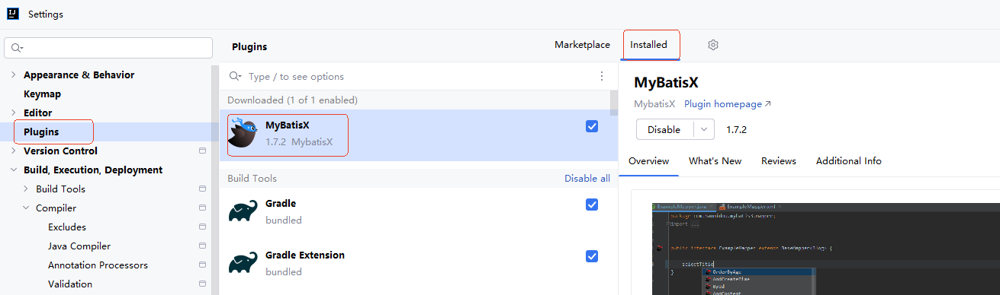

安装插件后，在表上右键，会出现`MyBatisX-Generator`，如下图：

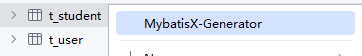

点击它：

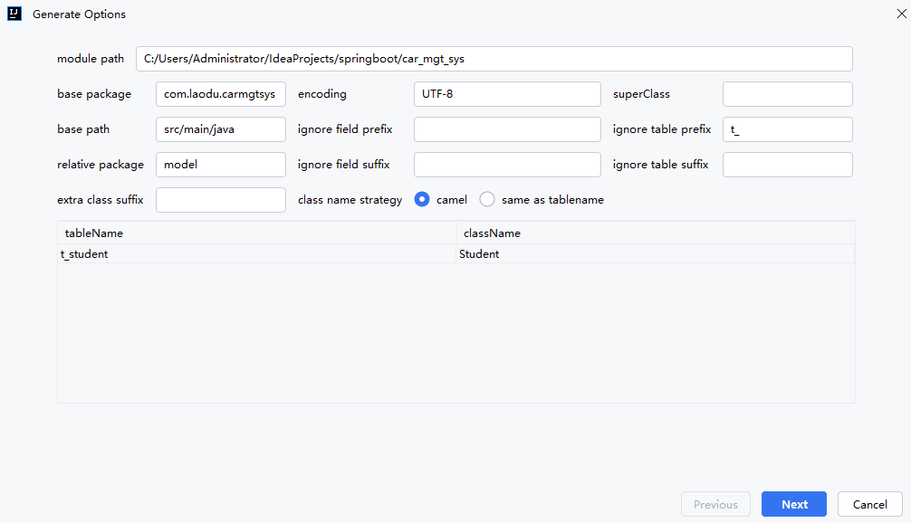

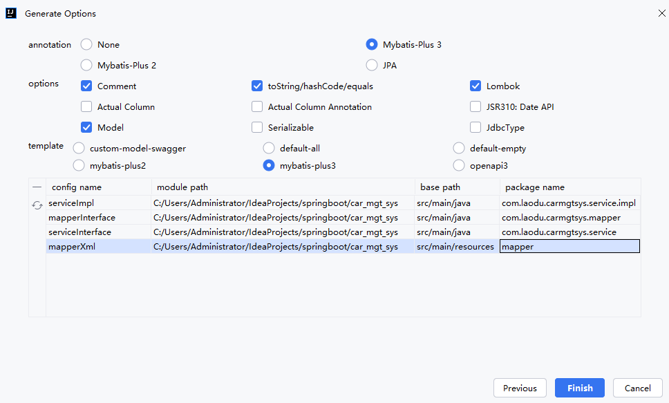

就这样，代码就轻松的生成了。

# 静态工具类Db


静态工具类`Db`的功能和`IService接口`功能一样。

## Db中的方法

1. 增

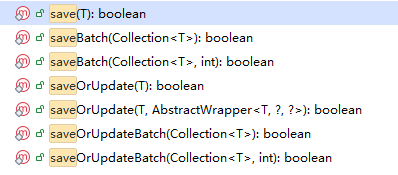

1. 删

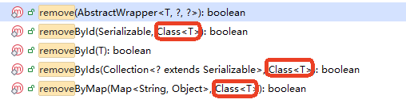

1. 改

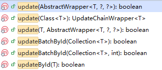

1. 查

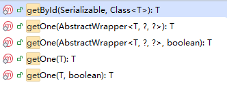

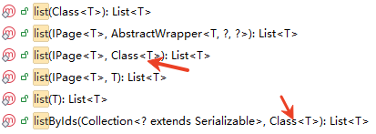

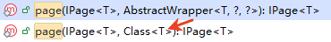


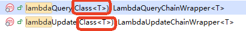

可以看到以上的方法基本上都是`IService`接口中的方法。

**静态工具类 Db 中的方法一般比 IService 接口中的方法多一个**`**<font style="color:#DF2A3F;">Class</font>**`**参数。这是因为 IService 接口可以通过泛型来指定类型，而静态工具类 Db 是无法指定泛型的。**

## 什么情况下需要Db

既然方法一样，为什么还要再提供一个静态工具类Db呢？

现在我们已经有一张表`t_car`，假设我们还有一张表来保存汽车的维修记录`t_wx`，这两张表的结构分别如下：

汽车表：

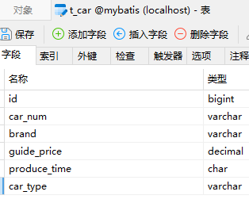

维修记录表：

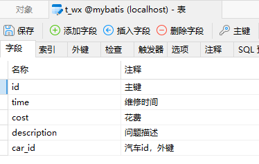

```sql
drop table if exists t_wx;
create table t_wx(
  id bigint primary key auto_increment,
  `time` char(10),
  cost decimal,
  description varchar(255),
  car_id bigint
);
insert into t_wx(`time`,cost,description,car_id) values('2025-10-11',300,'更换火花塞',1);
insert into t_wx(`time`,cost,description,car_id) values('2025-10-12',400,'小保养',1);
insert into t_wx(`time`,cost,description,car_id) values('2025-10-13',500,'大保养',1);
select * from t_wx;
```

可以看到汽车和维修记录的关系是：**一对多**。一个汽车有多条维修记录。

假设我们现在有这样一个需求：给定汽车的id，查询汽车的同时，再将汽车关联的维修记录也查出来。

我们有两张表，那应该是两个Service，分别是：CarService、WeiXiuService，要实现上面的需求，代码应该会是这样的结构：

```java
public class CarServiceImpl extends ServiceImpl<CarMapper, Car> implements CarService{
    @Autowire
    private WeiXiuService weiXiuService;

    // 根据汽车id查询汽车信息，并且携带汽车关联的维修记录
    public Car queryCarAndWeiXiuById(Long id){
        // 这里需要调用 CarService 的方法，也需要调用 WeiXiuService 的方法
    }
}
```

假设我们还有另一个需求：给定维修的id，查询维修记录的同时，再将关联的汽车信息查出来。代码应该是这样的结构：

```java
public class WeiXiuServiceImpl extends ServiceImpl<WeiXiuMapper, WeiXiu> implements WeiXiuService{
    @Autowire
    private CarService carService;

    // 根据维修id查询维修记录，并且携带关联的汽车信息。
    public WeiXiu queryWeiXiuAndCarById(Long id){
        // 这里需要调用 WeiXiuService 的方法，也需要调用 CarService 的方法
    }
}
```

如果代码这样写的话，很容易形成循环依赖。因为CarService中需要注入WeiXiuService，而WeiXiuService中需要注入CarService。怎么避免循环依赖呢？**可以使用Db静态工具类。**这样的话 CarService 中就不需要注入 WeiXiuService，而WeiXiuService中也不再注入CarService。

## Db的使用

接下来我们就使用Db来实现这样的需求：给定汽车的id，查询汽车的同时，再将汽车关联的维修记录也查出来。

### 编写`WeiXiu`这个po

```java
package com.jkweilai.carmgtsys.model.po;

import com.baomidou.mybatisplus.annotation.IdType;
import com.baomidou.mybatisplus.annotation.TableField;
import com.baomidou.mybatisplus.annotation.TableId;
import com.baomidou.mybatisplus.annotation.TableName;
import lombok.Data;

@Data
@TableName("t_wx")
public class WeiXiu {
    @TableId(value = "id", type = IdType.AUTO)
    private Long id;
    @TableField("`time`")
    private String time;
    private Double cost;
    private String description;
    private Long carId;
}
```

### 编写`WeiXiuMapper`

```java
package com.jkweilai.carmgtsys.mapper;

import com.baomidou.mybatisplus.core.mapper.BaseMapper;
import com.jkweilai.carmgtsys.model.po.WeiXiu;

public interface WeiXiuMapper extends BaseMapper<WeiXiu> {
}
```

### 编写`WeiXiuVO`

```java
package com.jkweilai.carmgtsys.model.vo;

import io.swagger.v3.oas.annotations.media.Schema;
import lombok.Data;

@Data
@Schema(name = "WeiXiuVO", description = "维修记录的视图对象")
public class WeiXiuVO {
    @Schema(description = "维修记录id")
    private Long id;
    @Schema(description = "维修时间")
    private String time;
    @Schema(description = "维修费用")
    private Double cost;
    @Schema(description = "问题描述")
    private String description;
}
```

### `CarVO`中添加`List<WeiXiuVO>`

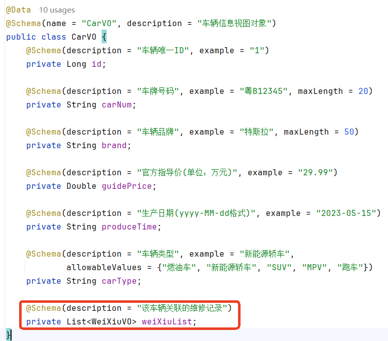

### `CarController`中添加业务接口

```java
@Operation(summary = "查询车辆信息以及该车辆的维修记录",
        description = "根据车辆id查询汽车信息，并且将该车辆的维修记录全部查询出来",
        parameters = @Parameter(name = "id", description = "车辆id"))
@GetMapping("queryById/{id}")
public CarVO queryCarAndWeiXiuById(@PathVariable("id") Long id){
    return carService.queryCarAndWeiXiuById(id);
}
```

### `CarServiceImpl`编写业务方法

```java
@Override
public CarVO queryCarAndWeiXiuById(Long id) {
    // 1. 根据id查找车辆信息
    Car car = getById(id);
    // 2. 校验车辆信息是否存在
    if(car == null){
        throw new RuntimeException("车辆信息异常！");
    }
    // 3. 车辆信息存在的情况下继续查询维修记录
    List<WeiXiu> weiXiuList = Db.lambdaQuery(WeiXiu.class)
            .eq(WeiXiu::getCarId, car.getId())
            .list();
    // 4. Car转CarVO
    CarVO carVO = BeanUtil.copyProperties(car, CarVO.class);
    carVO.setWeiXiuList(BeanUtil.copyToList(weiXiuList, WeiXiuVO.class));
    return carVO;
}
```

测试：

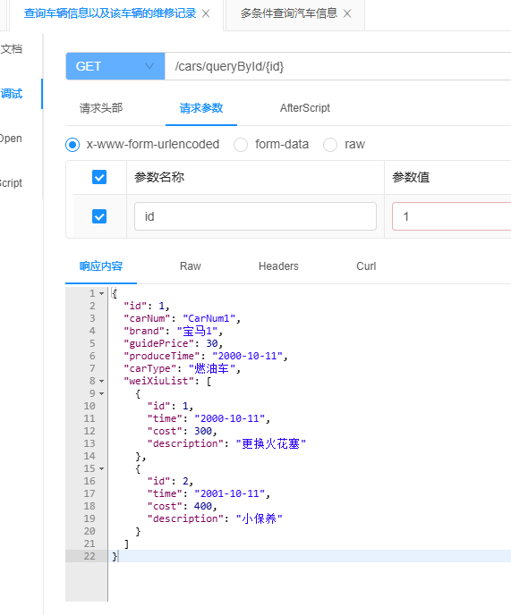

**课后练习：给定多个车辆的id，查询这些车辆的信息以及每个车辆关联的维修记录信息。**

# 逻辑删除


逻辑删除指的不是真正的删除数据，执行逻辑删除时，表中的数据仍然存在，只是这条记录被标记为`已删除`。怎么标记的？可以添加一个标记字段，例如：deleted，当deleted=1表示已删除，deleted=0表示未删除。

什么时候使用逻辑删除？数据比较重要的情况下才会考虑使用逻辑删除。实际开发中不太推荐使用逻辑删除，因为逻辑删除会导致数据量越来越大，影响查询性能。如果数据比较重要，删除时可以考虑将数据迁移到其他表以作备份。

当我们使用逻辑删除时，删除操作应该是一个update语句，例如：

```sql
update t_wx set deleted = 1 where id = ?;
```

当我们使用逻辑删除后，所有的查询语句也会受到影响，查询语句应该这样写：

```sql
select * from t_wx where deleted = 0;
```

那既然是这样 MyBatis-Plus 为我们自动生成的 SQL 语句还能用吗？当然可以用。因为mp也考虑到这一点了，你可以在`application.yml`配置文件中进行逻辑删除策略的配置，这样当删除和查询数据时，mp会自动按照逻辑删除的SQL语句生成。怎么配置？

```yaml
mybatis-plus:
  global-config:
    db-config:
      logic-delete-field: deleted # 标记逻辑删除的字段
      logic-delete-value: 1 # 已删除
      logic-not-delete-value: 0 # 未删除
```

给`t_wx`表添加一个`deleted`字段，编写代码测试一下：

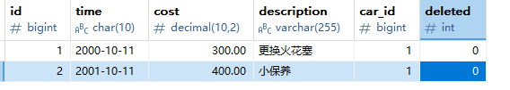

WeiXiu这个po上也要添加一个属性：

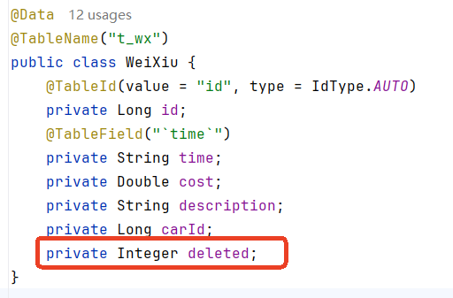

测试代码：

```java
package com.jkweilai.carmgtsys.service;

import com.baomidou.mybatisplus.extension.service.IService;
import com.jkweilai.carmgtsys.model.po.WeiXiu;

public interface WeiXiuService extends IService<WeiXiu> {
}
```

```java
package com.jkweilai.carmgtsys.service.impl;

import com.baomidou.mybatisplus.extension.service.impl.ServiceImpl;
import com.jkweilai.carmgtsys.mapper.WeiXiuMapper;
import com.jkweilai.carmgtsys.model.po.WeiXiu;
import com.jkweilai.carmgtsys.service.WeiXiuService;

@Service
public class WeiXiuServiceImpl extends ServiceImpl<WeiXiuMapper, WeiXiu> implements WeiXiuService {
}
```

```java
@Autowired
private WeiXiuService weiXiuService;

@Test
public void logicDelete(){
    // 根据id删除数据
    weiXiuService.removeById(2L);
    // 根据id查询数据
    WeiXiu weiXiu = weiXiuService.getById(2L);
    System.out.println(weiXiu);
}
```

执行结果：

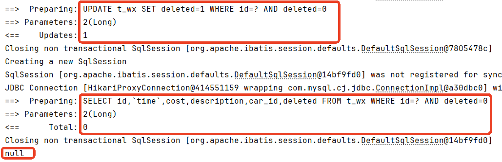

数据库数据没有真正删除：


**注意：保存数据时，可以不用指定 deleted 字段的值，设计数据库表的时候，将 deleted 字段设置默认值为 0 即可。**

# 枚举处理器


## 使用枚举增强可读性

假设汽车有一个状态属性，状态包括：在售(1)、已售(2)、维修中(3)、报废(4)，在数据库表中对应的字段为`status`，数据库中字段的类型为`int`，如下：


这时候，在po上也应该添加一个新的属性，如下：


`status`定义为Integer类型不是特别好的设计，因为这样出现在程序中的是数字`1,2,3,4`，**可读性较差**。

有的时候**对于po的属性**来说定义为枚举类型比数字类型来说可读性更好一些，例如定义这样一个枚举类型来表示汽车状态：

```java
package com.jkweilai.carmgtsys.enums;

import lombok.Getter;

@Getter
public enum CarStatus {
    
    FOR_SALE(1, "在售"),
    SOLD(2, "已售"),
    IN_MAIN(3, "维修中"),
    SCRAP(4, "报废");
    
    private int value;
    private String desc;

    CarStatus(int value, String desc) {
        this.value = value;
        this.desc = desc;
    }
}
```

po中的属性使用枚举类型：


这样的话，我们在编写java程序时，可读性会很好。但是新的问题出现了：数据库中存储的是`1,2,3,4`这样的数字，Java程序中是枚举类型的值，它们之间怎么进行映射转换呢？

不用担心，MyBatis-Plus已经帮我们解决了，它提供了这样一个类：`MybatisEnumTypeHandler`，这个类可以帮助我们完成`Java枚举类型的值`与`数据库中的int值`之间的转换，我们只需要在程序中做以下两步：

第一步：使用`@EnumValue`标注在Java枚举类型中哪个属性的值存储到数据库中。


第二步：在`application.yml`文件中指定我们使用的是哪个转换器，我们使用MP提供的`MybatisEnumTypeHandler`即可。

```yaml
mybatis-plus:
  configuration:
    default-enum-type-handler: com.baomidou.mybatisplus.core.handlers.MybatisEnumTypeHandler
```

## 测试保存功能

`CarDTO`代码添加属性，如下：


其他位置不需要修改，直接测试我们之前编写的保存接口：


我们来看一下数据库表中插入的状态值是不是`2`：


## 测试查询功能

需求：查询所有 **在售 **的车辆信息。

第一步：CarVO中添加属性


第二步：在CarController中添加方法


第三步：编写CarServiceImpl类中的query


测试结果：


如果展示的时候，希望展示结果是`在售`，而不是`FOR_SALE`，可以使用`@JsonValue`注解标注枚举类型中`desc`属性：


这个注解不是mp的。属于`Jackson库`的注解。

再来看结果：


# json 处理器


## 为什么需要 json 处理器

假设汽车表中有一个字段是 json 类型，存储了车主的信息。如下：


```json
{"id": "909890989898767676", "name": "张三"}
{"id": "909890989898767677", "name": "李四"}
{"id": "909890989898767678", "name": "王五"}
```

**在实体类中应该定义为什么类型的属性来接收这个 json 数据呢？**

1. 定义为 String 直接接收 json 格式的字符串。
2. 定义一个 json 字符串对应的实体类。

显然第二种方式会比较好。因为在 java 程序中操作对象比操作 json 字符串更方便。但默认情况下，数据库表中 json 格式的字符串是不会自动转换成 java 对象的。这个时候就需要 MP 为我们提供的 json 处理器了。

## MP 提供的 json 处理器


MP 给我们提供了很多 json 处理器，springboot 默认集成的是 jackson，因此我们这里选择 `JacksonTypeHandler`会比较方便，不需要引入额外的 json 处理库。

## 使用 json 处理器

### 第一步：编写 json 对应的实体

```java
package com.jkweilai.mp.entity;

import lombok.AllArgsConstructor;
import lombok.Data;
import lombok.NoArgsConstructor;

@Data
@NoArgsConstructor
// 生成静态方法of，便于对象的创建。
@AllArgsConstructor(staticName = "of")
public class Owner {
    private String id;
    private String name;
}
```

### 第二步：在字段上使用 `@TableField`注解

在 Car 实体类上添加字段，并使用 `@TableField`注解进行标注，**指定 json 类型处理器**，另外在实体类上**开启自动结果映射**：

```java
@Data
// 需要开启自动结果映射
@TableName(value = "t_car", autoResultMap = true)
public class Car {
    @TableId(value = "id", type = IdType.AUTO)
    private Long id;
    private String carNum;
    private String brand;
    private BigDecimal guidePrice;
    private String produceTime;
    private String carType;
    private CarStatus status;
    // 添加json类型处理器
    @TableField(typeHandler = JacksonTypeHandler.class)
    private Owner owner;
}
```

记得 VO 类也要修改一下：`CarVO`类上添加一个字段

```java
@Schema(description = "车主信息")
private Owner owner;
```

### 第三步：测试查询

直接通过 Swagger UI 测试之前的接口：通过 id 查询汽车信息的接口。


### 第四步：测试插入

编写单元测试，插入数据，看看能不能正常插入 json 字符串：

```java
@Resource
private CarService carService;

@Test
public void testSave(){
    Car car = new Car();
    car.setCarNum("津A90909");
    car.setCarType("新能源");
    car.setBrand("BYD666");
    car.setProduceTime("2025-10-11");
    car.setStatus(CarStatus.FOR_SALE);
    car.setGuidePrice(BigDecimal.valueOf(20));
    // 车辆关联车主
    car.setOwner(Owner.of("890989098989876787", "达摩"));
    carService.save(car);
}
```

测试结果：


# MP 分页插件的使用


MyBatis-Plus的分页插件能自动将Page对象参数转换为数据库分页SQL，无需手写LIMIT语句。

## 第一步：引入额外的依赖

使用分页插件需要引入以下的依赖。

```xml
<dependency>
  <groupId>com.baomidou</groupId>
  <artifactId>mybatis-plus-jsqlparser</artifactId>
  <version>3.5.11</version>
</dependency>
```

## 第二步：通过配置类添加插件

要使用 MP 提供的分页插件，第一步先配置插件，编写以下的配置类：

```java
package com.jkweilai.mp.config;

import com.baomidou.mybatisplus.annotation.DbType;
import com.baomidou.mybatisplus.extension.plugins.MybatisPlusInterceptor;
import com.baomidou.mybatisplus.extension.plugins.inner.PaginationInnerInterceptor;
import org.springframework.context.annotation.Bean;
import org.springframework.context.annotation.Configuration;

@Configuration
public class MyBatisConfig {
    
    // MyBatis-Plus 的插件机制底层基于 MyBatis 的拦截器（Interceptor） 实现
    @Bean
    public MybatisPlusInterceptor mybatisPlusInterceptor() {
        // 创建 MybatisPlusInterceptor 拦截器链，用于集中管理 Mybatis-Plus 的各种功能拦截器
        MybatisPlusInterceptor interceptor = new MybatisPlusInterceptor();

        // 创建分页拦截器实例，指定数据库类型为 MySQL
        // DbType.MYSQL 会自动生成适合 MySQL 的分页 SQL（使用 LIMIT 语句）
        PaginationInnerInterceptor pageInterceptor = new PaginationInnerInterceptor(DbType.MYSQL);

        // 设置单次分页查询的最大记录数限制，防止恶意大数量查询（如 pageSize=10000）
        // 当 pageSize 参数值超过 500 时，会自动调整为 500
        // 这可以有效防止内存溢出和数据库性能问题
        pageInterceptor.setMaxLimit(500L);

        // 将分页拦截器添加到拦截器链中
        // 拦截器会按照添加顺序执行，分页拦截器通常放在最后
        interceptor.addInnerInterceptor(pageInterceptor);

        // 返回配置好的拦截器实例，Spring 会将其注册到 Mybatis 的插件链中
        return interceptor;
    }
}
```

## 编写分页查询的代码

```java
@Test
void testPage(){
    // 创建分页对象（指定pageNo和pageSize）
    int pageNo = 1;
    int pageSize = 2;
    Page<Car> page = Page.of(pageNo, pageSize);
    // 指定排序规则，以下表示：先按照guide_price升序，如果guide_price相同则按照id降序
    page.addOrder(OrderItem.asc("guide_price"));
    page.addOrder(OrderItem.desc("id"));
    // 指定查询条件，执行查询
    //QueryWrapper<Car> queryWrapper = new QueryWrapper<>();
    //carService.page(page, queryWrapper);
    carService.page(page);
    // 获取总记录条数
    long total = page.getTotal();
    System.out.println("总记录条数：" + total);
    // 获取总页数
    long pages = page.getPages();
    System.out.println("总页数：" + pages);
    // 获取数据
    List<Car> records = page.getRecords();
    records.forEach(System.out::println);
}
```

到此：MP 的基础使用就结束了。