# 1.TypeScript

# TypeScript 简介


TypeScript 是**微软开发**的一种开源编程语言，它是 JavaScript 的一个超集（不是新语言，而是超集），添加了可选的静态类型系统。"**超集（Superset）**" 意味着 TypeScript **包含 JavaScript 的所有功能**，并在其基础上进行了扩展。TypeScript **没有引入与 JavaScript 冲突的语法**，而是通过 **渐进增强** 的方式扩展功能。开发者可以 **逐步迁移**，从纯 JavaScript 慢慢添加 TypeScript 特性（比如先加**类型注解**，再引入接口和泛型）。

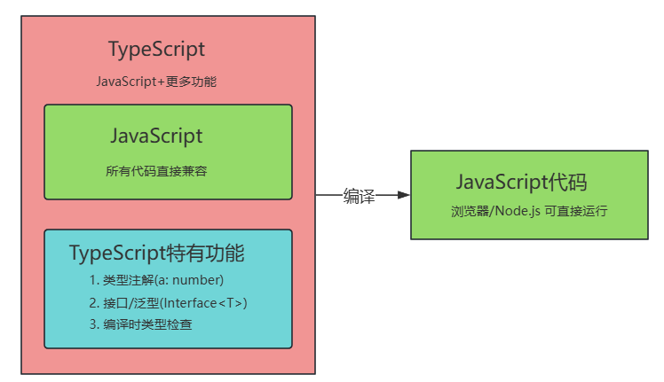

# JavaScript 的困扰


JavaScript 的困扰不仅限于以下提到的 4 个。

## 不清不楚的数据类型

```javascript
let hello = 'hello';
hello();
```

语法错误，即使放到 IDE 中，IDE 也不会提示错误。

## 有漏洞的逻辑

```javascript
let result = Math.floor(Math.random() * 100) % 2 ? '奇数' : '偶数';
if(result !== '奇数'){
    console.log('不是奇数');
}else if(result === '偶数'){
    console.log('是偶数');
}
```

有逻辑漏洞，即使放到 IDE 中，IDE 也不会提示错误。

## 访问不存在的属性

```javascript
const user = {
    username: 'jack',
    age: 30,
    height: 185
};
console.log(user.heigth);
```

语法错误，即使放到 IDE 中，IDE 也不会提示错误。

## 低级的拼写错误

```javascript
const message = 'hello typescript!';
console.log(mesage);
```

语法错误，即使放到 IDE 中，IDE 也不会提示错误。

## TypeScript 解决困扰

TypeScript 文件扩展名通常以 `.ts`结尾。在 ts 文件中编写以上代码，**ts 结合 IDE**（例如 VS Code）会提示错误：

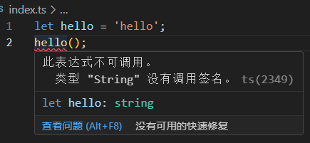

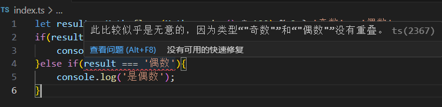

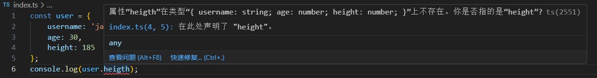

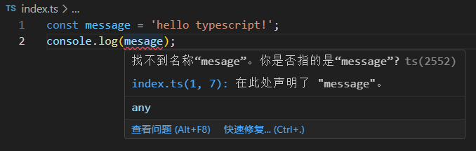

提示：如果提示信息不是中文的，可以在 VS Code 中安装简体中文插件：`**Chinese (Simplified) Language Pack for Visual Studio Code**`

# TypeScript 存在的核心原因


TypeScript 的核心价值在于 **解决 JavaScript 在大型项目中的致命缺陷**，以下是其不可替代的 **核心原因**：

## 静态类型系统

提前消灭低级错误

- **JavaScript 的问题**：
JS 是动态类型，运行时才能发现类型错误（如 `undefined` 调用、属性拼写错误）。
- **TypeScript 的解决**：
通过编译时的**静态类型检查**，在代码运行前捕获错误：

```typescript
// TS 直接报错（编译阶段）
const num: number = "hello"; // 类型不匹配
obj.undefinedMethod();       // 方法不存在
```

**怎么理解静态类型检查？**

在代码运行**前**进行类型检查，发现代码错误和不合理之处，减少运行时异常出现的几率，这种检查被称为**静态类型检查**。它是 TypeScript 的核心。简而言之就是把**运行时的错误前置**。同样的功能，TypeScript 的代码量要大于 JavaScript，但由于 TypeScript 代码结构更加清晰，在后期代码的维护中 TypeScript** 远胜于** JavaScript。

## 代码可维护性

大型项目的生存法则

- **JavaScript 的痛点**：
项目规模增长后，代码修改像“走钢丝”，重构时不敢动旧代码。
- **TypeScript 的武器**：
  - **类型即文档**：函数参数、返回值类型一目了然。
  - **智能重构**：IDE 支持安全的重命名。
  - **接口约束**：明确数据结构，避免隐藏的 `any` 黑洞。

什么是智能重构？例如以下代码，当你选择 `username`并且按 `F2`键重命名的时候，相关联的 `username`会一并修改：

```typescript
interface User{
  username: string // F2重命名username
}

const user1: User = { username: 'jack' }; // 因为对象实现了User接口，因此这里的username会自动修改。
const user2 = { username: 'lucy' }; // 这里不会。
```

什么是接口约束？以下代码中对象就实现了接口。保证了对象的数据结构，避免隐藏的 any 漏洞。

```typescript
interface User{
  username: string,
  age?: number // 可选属性
}

const user: User = { username: 'jack' };
```

any 漏洞指的是 JS 中变量是弱类型的，**可以接收任何类型的数据**，完全没有类型安全机制可言，就像掉进黑洞一样，所有类型检查都会被吞噬，带来隐藏风险。

## 增强的 IDE 支持

开发效率飞跃

- **JavaScript 的局限**：
IDE 只能基于猜测提供补全，准确性低。
- **TypeScript 的优势**：
  - **精准的代码补全**：基于类型推导提示属性和方法。
  - **实时错误提示**：边写代码边标红错误。
  - **强大的导航**：通过类型定义快速跳转。

强大的导航指的是：

```typescript
// a.ts 文件
interface User{
    username: string,
    age?: number // 可选属性
}

// b.ts 文件
function login(user: User){}
```

当你按住 ctrl 键，点击 login 函数的 User 参数时，会自动跳转到 a.ts 文件的 User 接口定义的位置。

## 渐进式采用

低成本迁移，你可以一点点用 TypeScript，不用一口气把整个项目重写！

- **核心策略**：
  - 允许混合使用 `.js` 和 `.ts` 文件。
  - 通过 `any` 类型逐步适配旧代码。
  - 即使不写类型，TS 也能通过推断提供部分支持。

any 类型是什么，请看以下代码：

```typescript
// js 代码
let username = 'jack';

// 过度代码
let userId: any = 'user001';
userId = 112233;

// ts 代码
let password: string = 'admin123';
```

## 现代工程化标配

- **行业事实标准**：
  - Angular、Vue 3、React 的官方推荐。
  - 主流库（如 Express、Prisma）优先提供 TS 类型定义。
- **编译兼容性**：
最终编译为纯 JavaScript，可运行在任何 JS 环境。

**一句话总结：**TypeScript 的核心价值是 **通过类型系统在开发阶段提前拦截错误，同时显著提升代码的可读性、可维护性和协作效率**，尤其适合长期迭代的中大型项目。

# TypeScript 的编译和运行


## 安装 Node.js

安装了 Node.js 环境后，就可以直接**使用 npm 包管理器**来安装和管理软件包了！

**Node.js**：JavaScript 运行时环境，允许在服务器或本地运行 JavaScript 代码。

**npm**（Node Package Manager）：Node.js 默认的包管理工具，随 Node.js 自动安装，**用于下载、安装、更新、删除第三方库或工具。**

例如：使用 npm 安装软件包

```bash
npm install <包名>       # 本地安装（当前项目）
npm install -g <包名>    # 全局安装（整个系统）
```

**疑问？****浏览器能够运行 javascript 代码，是因为浏览器内置了 node.js 吗？不是的，它们是两个完全不同的运行方式。浏览器是一个沙盒环境，安全性限制严格，浏览器是无法访问文件系统、进程等操作系统资源的。**

从 [**Node.js 官网**](https://nodejs.org/zh-cn) 下载 LTS 版本（推荐），默认安装会自动配置 npm。安装时会自动 "Add to PATH"（确保环境变量被添加）。


验证 Node.js 环境是否正常：

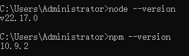

:::info
**介绍一个网站：npm 生态的官方网站**

[npmjs.com](https://www.npmjs.com/) 是 npm 生态的官方网站，你可以把它理解为 JavaScript 世界的“应用商店”，里面存放了数百万个开源代码包（比如 React、Vue、Lodash 等）。

开发中什么时候需要这个网站：

1. 找轮子：当你需要某个功能（比如解析 Excel 文件），直接搜索 excel，会发现现成的库（如 xlsx），不用自己造轮子。
2. 学习技术栈：比如想学 Vue3，可以搜 vue，找到官方包，链接到文档和教程。

:::

**实际场景**：你想找一个日期格式化工具

1. 访问 [npmjs.com](https://www.npmjs.com/) → 搜索 dayjs。
2. 复制安装命令：`<font style="color:rgba(0, 0, 0, 0.8);">npm i dayjs</font>`**（注意：安装时当前目录会自动生成 **`**<font style="color:#DF2A3F;">node_modules</font>**`**目录，下载的依赖就存在这个目录下，另外在**`**<font style="color:#DF2A3F;">node_modules</font>**`**目录之外生成了两个文件 :**`**<font style="color:#DF2A3F;">package.json</font>**`**和 **`**<font style="color:#DF2A3F;">package-lock.json</font>**`**，其中 **`**<font style="color:#DF2A3F;">package.json</font>**`**文件中描述了当前项目中引入了哪些依赖，**`**<font style="color:#DF2A3F;">package-lock.json</font>**`**中对依赖的版本进行了锁定。）**
3. 在 js 代码中使用：

```javascript
import dayjs from 'dayjs'

console.log(dayjs().format("YYYY-MM-DD HH:mm:ss"));
```

由于要在 js 文件中使用 `import`语句，`type`应该设置为 `module`。在 `package.json`文件中添加 `"type":"module"`，如下：

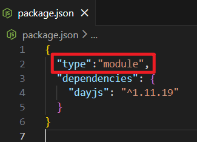

1. 然后在控制台执行：`**node xxx.js**`就可以运行程序了。

## 命令行编译和运行

### 创建 ts 文件并编写代码

```typescript
const user = {
    username: '张三',
    age: 18
};
console.log(`我叫${user.username}，今年${user.age}岁了！`);
```

### 使用 Node.js 提供的 npm 安装 tsc

```bash
npm install -g typescript
```

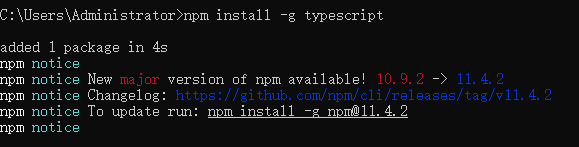

到此时`tsc`命令就可以使用了。`tsc`指的是 `TypeScript Compiler`。

### 命令行编译

在 DOS 命令窗口中切换到 `hello.ts`文件所在目录：

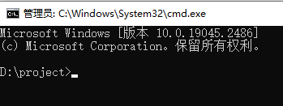

执行编译命令：

```bash
tsc hello.ts
```

或者

```bash
tsc hello
```

编译成功后会在当前目录下生成 `hello.js`文件。编译后的 js 代码如下：

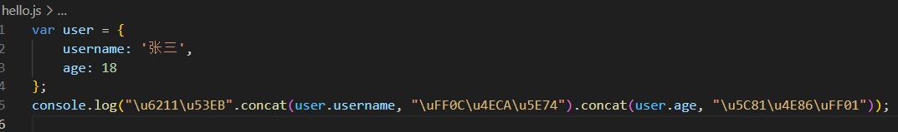

### 命令行运行

Node.js 就是 javascript 运行环境，因此可以使用 Node.js 来运行 js 代码，当然，大家也可以将该 js 文件引入到 HTML 文件中，让浏览器去执行也是可以的。

```bash
node hello.js
```


## 自动化编译

### tsc --init

`tsc --init`用于快速生成 TypeScript 项目的配置文件 `tsconfig.json`。

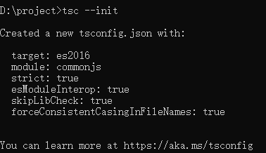

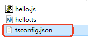

**作用：**

1. **创建**** **`**<font style="color:rgb(64, 64, 64);background-color:rgb(236, 236, 236);">tsconfig.json</font>**`
在当前目录生成一个默认的 TypeScript 配置文件，用于定义编译选项、文件包含规则等。
2. **初始化 TypeScript 项目**
标记当前目录为 TypeScript 项目的根目录，后续的 `**<font style="color:rgb(64, 64, 64);background-color:rgb(236, 236, 236);">tsc</font>**` 命令会依据该文件配置进行编译。

tsconfig.json 文件内容：

```json
{
  "compilerOptions": {
    // 将代码编译成 ES6 (ES2015) 版本的 JavaScript
    "target": "es6",
    // 编译后的代码使用 ES6 模块语法 (import/export)。
    "module": "es2015",
    // 启用所有严格的类型检查，这是 TypeScript 的核心
    "strict": true,
    // 让我们能够顺利的用 import 语法导入 CommonJS 格式的 npm 包。
    "esModuleInterop": true,
    // 跳过对库的类型声明文件的检查，加快编译速度。
    "skipLibCheck": true,
    // 强制引入模块的路径大小写一致，避免跨系统问题。
    "forceConsistentCasingInFileNames": true
  }
}
```

关键配置项：

| **配置项** | **作用** |
| --- | --- |
| `**<font style="color:rgb(64, 64, 64);background-color:rgb(236, 236, 236);">"target": "es6"</font>**` | 编译后的 JavaScript 目标版本（如 es5、es6、es2015 等）。 |
| `**<font style="color:rgb(64, 64, 64);background-color:rgb(236, 236, 236);">"module": "es2015"</font>**` | 指定模块系统（如 `**<font style="color:rgb(64, 64, 64);background-color:rgb(236, 236, 236);">commonjs</font>**`、`**<font style="color:rgb(64, 64, 64);background-color:rgb(236, 236, 236);">es2015</font>**`等）。 `**<font style="color:rgb(64, 64, 64);">commonjs</font>**`**:** 导出的语法：module.exports = { ... } 导入的语法：const lib = require('lib') `**<font style="color:rgb(64, 64, 64);">es2015</font>**`**:** 导出的语法：export const func = () => {} 导入的语法：import { func } from 'lib' 未来趋势（ES 标准） |
| `**<font style="color:rgb(64, 64, 64);background-color:rgb(236, 236, 236);">"strict": true</font>**` | 启用所有严格类型检查（推荐开启）。 |
| `**<font style="color:rgb(64, 64, 64);background-color:rgb(236, 236, 236);">"outDir": "./dist"</font>**` | 指定编译后的 JS 文件输出目录（默认是注释掉的，需手动取消注释）。 |
| `**<font style="color:rgb(64, 64, 64);background-color:rgb(236, 236, 236);">"rootDir": "./src"</font>**` | 指定 TypeScript 源文件目录（默认是注释掉的，需手动取消注释）。 |

**注意：本课程要求将 **`**<font style="color:#DF2A3F;">target</font>**`**设置为 **`**<font style="color:#DF2A3F;">es6</font>**`**，将 **`**<font style="color:#DF2A3F;">module</font>**`**设置为 **`**<font style="color:#DF2A3F;">es2015</font>**`**。**

### tsc --watch

```bash
tsc --watch
```

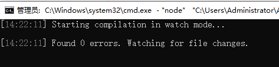

`**<font style="color:rgb(64, 64, 64);background-color:rgb(236, 236, 236);">tsc --watch</font>**`（或简写为 `**<font style="color:rgb(64, 64, 64);background-color:rgb(236, 236, 236);">tsc -w</font>**`）是 TypeScript 编译器提供的一个**实时监控并自动编译**的命令。

启动后，`**<font style="color:rgb(64, 64, 64);background-color:rgb(236, 236, 236);">tsc</font>**` 会持续监视你的 TypeScript 文件（如 `**<font style="color:rgb(64, 64, 64);background-color:rgb(236, 236, 236);">.ts</font>**`、`**<font style="color:rgb(64, 64, 64);background-color:rgb(236, 236, 236);">.tsx</font>**`），当文件内容被修改并保存时，**自动重新编译**为 JavaScript。仅重新编译修改过的文件（提升速度）。

**注意：**`**<font style="color:rgb(64, 64, 64);">tsc --watch 具体目录或文件</font>**`通过这种语法可以监控某些具体的目录或具体的文件。

**提示：**

如果你是在 VS Code 工具中的终端中执行 `<font style="color:rgb(64, 64, 64);">ts --watch</font>`可能会因为权限的问题而导致失败，你可以这样做：

以管理员身份打开 `<font style="color:rgb(64, 64, 64);">Windows PowerShell</font>`，执行 以下命令：

```shell
Set-ExecutionPolicy RemoteSigned -Scope CurrentUser
```

然后如下图一样，输入 `A`，然后回车即可：

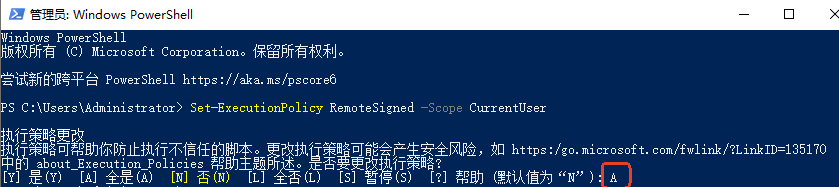

### 优化

**请启用下面的配置：这样的话，当 ts 出现语法错误时，不编译生成 js 文件。**

将 tsconfig.json 配置文件中以下的配置放开：


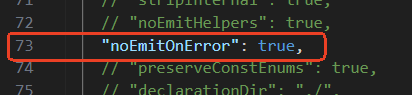

# 类型声明


## 类型声明语法

```typescript
// 类型声明
let username: string; // 冒号和类型之间建议添加一个空格，这也是代码规范中要求的。

// 赋值
username = 'jack';

// 赋其它类型值报错
//username = 100;

// 声明和赋值一行完成
let age: number = 20;
let gender: boolean = true;

console.log(username, age, gender ? '男': '女');
```

运行结果：

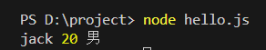

## 函数参数类型限定

```typescript
// 函数定义，并且指定参数类型
function sum(a: number, b: number){
    return a + b;
}

// 调用函数
let result = sum(10, 20);
console.log(result);

// 调用函数时传递的数据类型不匹配，报错。
//result = sum('10', 20);
```

运行结果：

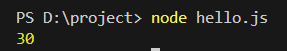

## 函数返回值类型限定

```javascript
// 函数定义，并且指定参数类型，指定返回值类型
function sum(a: number, b: number): number{
    return a + b;
}

// 调用函数
let result: number = sum(10, 20);
console.log(result);

function concat(a: number, b: number): string{
    return a + '' + b;
}
let strResult: string = concat(10, 20);
console.log(strResult);
```

运行结果：

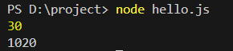

## 函数参数个数限定

```javascript
function sum(a: number, b: number){
    return a + b;
}

// 报错
//sum(1);

// 报错
//sum(1, 2, 3);

// 正确
const result: number = sum(1, 2);
console.log(result);
```

## 字面量类型

在 TypeScript 中，变量可以直接使用**字面量类型(literal types)**作为其类型。这是 TypeScript 强大的类型系统特性之一。TypeScript 支持以下字面量类型：

1. **字符串字面量类型**

```typescript
let direction: "north" | "south" | "east" | "west";
direction = "north";  // 正确
direction = "up";     // 错误：Type '"up"' is not assignable to type '"north" | "south" | "east" | "west"'
```

1. **数字字面量类型**

```typescript
let diceRoll: 1 | 2 | 3 | 4 | 5 | 6;
diceRoll = 3;   // 正确
diceRoll = 7;   // 错误
```

1. **布尔字面量类型**

```typescript
let isTrue: true;
isTrue = true;   // 正确
isTrue = false;  // 错误
```

# 类型自动推断


**TypeScript 根据你写的值、上下文和内置的类型定义，自动推导出变量和参数最精确的类型，让你不用每次都手动写类型注解。**

## 基础类型推断

### 变量初始化推断

```typescript
let num = 42;       // 推断为 number 类型
//num = '10'; // 报错
const str = "hello"; // 推断为 "hello" 字面量类型（因为是 const）
let arr = [1, 2, 3]; // 推断为 number[]
```

以下代码验证了 **const 声明的 str **被 TypeScript 自动推断为字面量类型：

```typescript
// 注意：是const定义的常量
const str = '101';

// 使用type为类型起别名
type UserCode = typeof str;

// 使用类型别名定义变量（必须赋值'101'，通过这个代码也可以测试出str被自动推断为字面量类型'101'）
let userCode: UserCode = '101';
```

**关于 typeof 运算符：**

1. **typeof **运算符如果出现在“**类型位置（凡是编译后都会消失的位置都是类型位置）**”，则属于 `TypeScript`中的运算符。它的作用是做类型查询。属于编译阶段的运算符，运行阶段不起作用。可以通过查看编译后生成的 js 文件来验证这一点。
2. **typeof** 运算符如果出现在“**值位置（值位置编译后不会消失）**”，则属于 `JavaScript`中的运算符。它的作用是在运行阶段动态获取某个值的类型。

### 函数返回值推断

```typescript
function add(a: number, b: number) {
  return a + b; // 返回值自动推断为 number
}
// 报错
//let result: string = add(1, 2);
```

## 上下文类型推断

### 事件回调参数推断

```typescript
let button = document.createElement('button');
// TypeScript 知道 e 是 PointerEvent 类型
// 它是如何推断的？通过事件名字click，以及addEventListener函数进行的推断。
button.addEventListener("click", e => {
  //只有PointerEvent类型才有clientX属性。
  console.log(e.clientX); // 自动知道 e 有 clientX 属性
});
```

### 对象字面量推断

```typescript
const person = {
  name: "Alice",
  age: 30
};
// 自动推断为 { name: string; age: number; }
// 在vscode开发工具中使用鼠标悬停到属性名上会有提示。
```

## 最佳通用类型推断

当有多种可能类型时，TypeScript 会寻找"最佳通用类型"：

```typescript
const values = [0, 1, null]; // 推断为 (number | null)[]
```

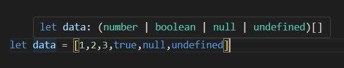

## `<font style="color:#DF2A3F;">const</font>` 断言的特殊推断

使用 `as const` 会进行更精确的字面量类型推断：

```typescript
const colors = ["red", "green"] as const;
// 推断为 readonly ["red", "green"]
// 而不是 string[]

// 我们把它叫做：只读的元组，元素值不可修改且每个元素值的类型精确到字面量
// readonly ["red", "green"]，一个只读的元组，长度固定为2
// 数组中第一个元素类型是"red"，第二个元素的类型是"green"
```

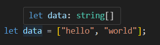

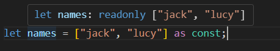

## TypeScript 官方建议

TypeScript 团队在[官方风格指南](https://github.com/microsoft/TypeScript/wiki/Coding-guidelines)中明确指出：**"对于公共API，总是显式编写类型注解；对于私有实现，可以酌情依赖类型推断。"**

# TypeScript 中的数据类型


## ts 中有哪些数据类型

TypeScript 支持 JavaScript 中所有数据类型，额外还扩展一些类型：

:::info
TypeScript 支持 JavaScript 所有原始类型：number、string、boolean、undefined、null、symbol、bigint

TypeScript 特殊类型：any、unknown、never、void

引用类型/非原始类型：object

固定长度数组类型/元组：tuple

枚举：enum

:::

另外 ts 中还提供了两个关键字，用来**自定义类型**：

:::info

1. type
2. interface

:::

## 类型声明时 ts 的官方建议

string 和 String 的区别：

string 是基本数据类型（**原始类型**），String 属于 Object 类型（**包装类型**）。ts 官方推荐使用 string，不推荐使用 String。因为 String 耗费内存，另外代码写起来比较冗余。

```typescript
let username: string = 'jack';

// 报错：因为类型不匹配。
//username = new String('lucy');

// 通过以下代码可以看到String比string更加灵活
// 虽然更加灵活，但ts官方还是建议使用string
// 因为String耗费内存，代码冗余。
let address: String;
// 可以
address = '北京朝阳';
// 也可以
address = new String('北京朝阳');

// number 与 Number
let num: number = 100;

// 报错
// num = new Number(100);

// 更灵活，但还是不建议使用Number，建议用number。
let a: Number;
a = 100;
a = new Number(200);
```

ts 官方建议是：凡是类型 `number`、`string`、`boolean`的时候建议使用小写的，尽量不要用 `Number`、`String`、`Boolean`。

**String 的主要用途：**

1. **类型转换**：`<font style="color:rgb(15, 17, 21);background-color:rgb(235, 238, 242);">String(123)</font>` → `<font style="color:rgb(15, 17, 21);background-color:rgb(235, 238, 242);">"123"</font>`
2. **访问静态方法**：`<font style="color:rgb(15, 17, 21);background-color:rgb(235, 238, 242);">String.fromCharCode(65)</font>` → `<font style="color:rgb(15, 17, 21);background-color:rgb(235, 238, 242);">"A"</font>`
3. **工具函数**：`<font style="color:rgb(15, 17, 21);background-color:rgb(235, 238, 242);">String.raw</font>` 模板字符串处理
4. **原始类型 本质上**是没有 `<font style="color:rgb(15, 17, 21);">length</font>` 属性的。String类型才有。`<font style="color:rgb(15, 17, 21);">"123".length</font>` 底层会进行隐式类型转换。

日常代码用 `<font style="color:rgb(15, 17, 21);background-color:rgb(235, 238, 242);">string</font>` 字面量，需要特殊功能时才用 `<font style="color:rgb(15, 17, 21);background-color:rgb(235, 238, 242);">String</font>` 函数。

## ts 特殊类型之 any

如果变量的类型声明为 any，表示该变量可以接收任何类型的数据。**对该变量的所有操作** 将跳过 TypeScript 的类型检查（相当于在此变量上退回到 JavaScript 的动态类型行为）；**但这样做会失去 TypeScript 的主要优势**。另外，在 ts 中如果一个变量声明时没有指定类型并且在声明的同时没有赋值，默认类型就是 any。

```typescript
// 声明时指定变量的类型为any
let userId: any;
// 该变量可以接收任何类型的数据
userId = 110;
userId = '110';

// 声明时没有指定类型，也没有赋值，类型是any
let price;
price = '10.2';
price = 3.1;

// 声明时没有指定类型，但是赋值了，ts会做类型推断以确定变量的数据类型，此时的类型不再是any
// 以下类型将被自动推断为：number
let weight = 100;
// 给number类型变量赋字符串会报错
//weight = '200';
```

谨慎使用 any，因为 any 声明的变量，可以赋值给任何**严格类型**的变量：

```typescript
let username: any;
username = 'jack';

let a: number;
// 这里的赋值居然没有报错
a = username;
console.log(a); // 而且这里的输出结果是 jack
```

## ts 特殊类型之 unknown

unknown 的含义是：未知类型。

**unkown 可以理解为一个类型安全的 any，****适用于：它将来是一个具体的类型，但是声明变量的时候还不确定类型时使用它**

```typescript
let a: unknown;

// 以下赋值均正常
a = 'hello';
a = 1;
a = false;

// 设置b的类型是string
let b: string;
b = a; // 报错：不能将类型“unknown”分配给类型“string”。
```

**unknown 会强制开发者在使用之前进行类型检查，从而提供更强的类型安全性**

```typescript
let a: unknown;

// 以下赋值均正常
a = 'hello';
a = 1;
a = false;

// 这样报错
//let b: string = a;

// 第一种：赋值前作类型判断
if(typeof a === 'string'){
    // 这样就行了
    let b: string = a;
}

// 第二种：类型断言
// 这个代码的意思是：程序员告诉TypeScript编译器，我可以保证这个 x 是string类型，你放心接收吧。
// 如果运行时，x 的类型不是string，会报错。
let x: unknown;
x = "hello";
let y: string = x as string; // 断言第一种写法
let z: string = <string>x; // 断言第二种写法

console.log(y.toUpperCase());
console.log(z.toUpperCase());
```

在 TypeScript 中，**类型断言（Type Assertion）不会在运行时执行任何实际的类型转换**。

它仅仅是开发者告诉 TypeScript 编译器：“我知道这个值的类型是什么，请按我声明的类型处理”。如果断言错误，可能会导致运行时错误。

**何时使用类型断言？**

1. 你比 TypeScript 更清楚某个值的类型时。
2. 处理第三方库返回的不精确类型时。

**但必须确保断言是正确的**，否则会导致运行时错误！

**访问 any 类型数据的任何属性都不会报错，而 unknown 正好与之相反：**

```typescript
let a: any;
a = 1;
a = 'abc';
a = true;

// 即使没有abc属性，没有xyz属性，编译照样通过，不报错。
console.log(a.abc); // 运行时如果没有这个属性，结果是undefined
console.log(a.xyz);

// -----------------------------
let x: unknown;
x = "abc";

// 报错
//console.log(x.toUpperCase());

// 你需要这样做
console.log((<string>x).toUpperCase());
// 或者这样做才能编译通过
console.log((x as string).toUpperCase());
```

## ts 特殊类型之 never

`**<font style="color:rgb(64, 64, 64);background-color:rgb(236, 236, 236);">never</font>**` 类型表示那些永远不会存在的值。`<font style="color:rgb(64, 64, 64);">undefined</font>`、`<font style="color:rgb(64, 64, 64);">null</font>`、`<font style="color:rgb(64, 64, 64);">''</font>`、`<font style="color:rgb(64, 64, 64);">0</font>` 都不行。

不要用 `<font style="color:rgb(64, 64, 64);">never</font>` 去直接定义变量，没有意义：

```typescript
let a: never;
// 报错
a = 10;
```

如果一个函数**永远不会正常返回**（即永远不会到达函数末尾并返回值），那么它的返回类型应该被标注为 `never`。这是 `never` 类型最典型的用法之一。

适合使用 `never` 作为返回类型的函数场景

1. 抛出错误的函数

```typescript
function throwError(message: string): never {
    throw new Error(message);
    // 这里不会执行任何后续代码
}
```

1. 无限循环的函数

```typescript
function infiniteLoop(): never {
    while (true) {
        console.log("This will run forever");
    }
    // 永远不会退出循环，也就不会返回
}
```

为什么用 `never` 而不是 `void`？

`void` 表示函数**正常执行完毕但没有返回值**

`never` 表示函数**永远不会正常执行完毕**

```typescript
// 返回 void 的例子
function logMessage(msg: string): void {
    console.log(msg);
    // 函数正常结束，只是没有返回值
}

// 返回 never 的例子
function crash(): never {
    throw new Error("Boom!");
    // 函数不会正常结束
}
```

`**never**`**的实际意义**

1. **类型安全性**：明确告诉其他开发者这个函数不会正常返回
2. **编译器检查**：TypeScript 会确保这类函数确实不会正常返回，如果你编写的代码能够正常执行结束，编译器会报错。

这样的标注能让你的代码意图更清晰，也能让 TypeScript 的类型系统更好地为你工作。

另外，有时 `never`也是 TypeScript 自动推断出来的，例如以下代码，可以鼠标悬停查看提示：

```typescript
let a: string;
a = "hello";
if(typeof a === "string"){
    console.log(a.toUpperCase);
}else{
    console.log(a);
}
```

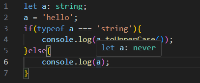

## ts 特殊类型之 void

void 数据类型不是用来定义变量的，通常用来定义一个函数的返回值。

void 表示一个函数正常执行结束的时候不返回任何值。如果一个函数可以正常执行结束，但最终不返回任何值时，函数在声明时建议加上 void，加上 void 之后，如果写代码的时候有**返回值**的操作，编译器会报错。

```typescript
function sayHello(username: string): void{
    console.log(`hello ${username}`);
}
```

如果代码这样写就会报错：

```typescript
function sayHello(username: string): void{
    return `hello ${username}`;
}
```

注意：以下三种写法都可以

```typescript
function sayHello(username: string): void{
    console.log(`hello ${username}`);
}
```

```typescript
function sayHello(username: string): void{
    console.log(`hello ${username}`);
    // 虽然有return语句，但是没有值，因此可以。
    return;
}
```

```typescript
function sayHello(username: string): void{
    console.log(`hello ${username}`);
    // 当一个函数的返回值类型是void时，undefined是void可以接受的一种空。
    return undefined;
}
```

**当一个函数的返回值类型设置为 **`**void**`**和设置为 **`**undefined**`**有什么本质上的区别？**

- 如果返回值类型设置为 void 表示这个方法结束的时候不返回任何值。
- 如果返回值类型设置为 undefined 表示这个方法结束的时候必须返回 undefined 值。

例如以下代码：一个报错，另一个则不会报错。

```typescript
function myFun1(): void{
    console.log('myFun1执行了');
}

let result1 = myFun1();

// 这里报错了：因为编译器检测到result1变量中并不会保存具体的值
if(result1){

}

function myFun2(): undefined{
    console.log('myFun2执行了');
}

let result2 = myFun2();

// 这里就没有事儿，因为result2变量中一定有值
if(result2){

}
```

## 非原始类型 object

### 小 object

`object`是非原始类型，7 种原始类型的值无法赋值给 object 类型的变量。除了原始类型之外，其它类型都可以赋值给 object 类型，object 类型比较宽泛，不够精确，因此实际开发中较少使用。

```typescript
let a: object;

// 以下均可赋值
a = {};
a = { name: 'jack'};
a = [1, 2, 3, 4];
a = function(){}
a = new String('jack');
class User{}
a = new User();

// 以下均报错
a = 1;
a = undefined;
a = 'hello';
a = null;
a = true;
```

### 大 Object

ts 中除了这个小 `object`之外，还有大 `Object`类型，大 `Object`类型的变量可以接收：凡是可以调用 Object 方法的数据。因此 Object 更加宽泛：

```typescript
let a: Object;

// 以下均可赋值
a = {};
a = { name: 'jack'};
a = [1, 2, 3, 4];
a = function(){}
a = new String('jack');
class User{}
a = new User();

// 这些也可以了（这几个之所以可以是因为底层会进行自动装箱，装箱之后就可以调用Object的方法了）
a = 1;
a = 'hello';
a = true;

// 这两个不行了
a = undefined;
a = null;
```

### 声明对象类型

`object/Object`太宽泛了。在 ts 中也可以自定义具体的对象类型，假设要求一个变量只能接收类似这样的对象 `{name: 'jack', age:20}`，代码可以这样写：

```typescript
// 声明变量person，person变量只能接收{name: string, age: number}类型的对象。
let person: {name: string, age: number};

// 正确
person = {
    name: 'jack',
    age: 20
};

// 报错
person = {
    name: 'lucy'
};
// 报错
person = 1;
```

自定义对象类型的属性可以用 `,`隔开，也可以用 `;`隔开，也可以用换行，如下都是可以的：

```typescript
// 逗号
let person: {name: string, age: number};

// 分号
let person: {name: string; age: number};

// 换行
let person: {
    name: string
    age: number
};
```

自定义对象类型的时候，如果某个属性不是必须的，可以使用以下语法：

```typescript
let person: { name: string, age?: number };

// 正确
person = {
    name: 'jack'
};
// 也正确
person = {
    name: 'jack',
    age: 30
};
```

**索引签名**：允许定义对象可以具有任意数量的属性，这些属性的键和类型是可变的，常用于：描述类型不确定的属性，具有动态属性的对象。

```typescript
let person: {
    name: string
    age?: number
    // 不一定写成key，其它的也可以
    // 表示该属性的属性名是一个字符串，该属性的值可以是任何类型
    [key: string]: any,
    // 表示该属性的属性名是一个数字，该属性的值可以是string或number
    [key: number]: string | number
};

person = {
    name: 'jackson',
    age: 20,
    gender: '男',
    address: '北京海淀',
    1: "jackson@123.com"
};
```

### 声明函数类型

```typescript
// 自定义函数类型
// 注意：以下这个箭头不是箭头函数。是一种ts自定义函数类型的一种语法。
// 语法格式：(参数名1:类型, 参数名2:类型, .....) => 返回值类型
let myFunction: (x: number, y: number) => number;

// 给变量myFunction赋值一个函数
myFunction = function(a: number, b: number): number{
    return a + b;
}

// 因为自定义函数类型的时候已经指定了参数的类型以及返回值的类型，因此可以简写为：
myFunction = function(a, b){
    return a + b;
}

// 赋值的时候也可以使用js中的箭头函数
// 这里的箭头表示：箭头函数。
myFunction = (k, f) => k + f;
```

### 声明数组类型

```typescript
// 字符串数组
let arr1: string[];
arr1 = ['jack', 'lucy', 'tom'];

// 数字数组
let arr2: number[];
arr2 = [1, 2, 3, 4, 5];

// 字符串数组
// 也可以采用泛型语法，后面再说泛型。
let arr3: Array<string>;
arr3 = ['cat', 'dog', 'fish'];
```

## 元组 tuple

tuple 不是关键字，元组（tuple）是一种特殊的数组类型，可以存储固定数量的元素，并且每个元素的类型是已知的且可以不同，元组用于精确描述一组值的类型，`?`表示可选元素。

```typescript
let arr1: [string, number];
arr1 = ['hello', 10];

// 数组中第二个元素可有可无，有的话必须是number类型。
let arr2: [string, number?];
arr2 = ['jack', 30];
arr2 = ['jack'];

// ...string[] 表示0到n个string
let arr3: [number, ...string[]];
arr3 = [30];
arr3 = [20, 'a', 'b', 'c', 'd', 'e', 'f'];
```

## 枚举 enum

### 什么是枚举

**枚举(enum)是一种给一组数值赋予有意义名称的方式**。它把程序中使用的"魔法数字"或"原始字符串"转换为有明确语义的命名常量。

### 不用枚举时的问题

假设我们处理用户状态，没有枚举时会这样写：

```typescript
let userStatus = 1; // 1表示活跃，2表示禁用，3表示删除
```

**问题：**

1. 代码可读性差 - `1`、`2`、`3`这些数字没有明确含义
2. 维护困难 - 如果状态值变更，需要修改所有使用这些数字的地方
3. 容易出错 - 可能错误地使用未定义的状态值(如`4`)
4. 缺乏类型检查 - 可以赋任意数值，编译器不会警告

### 使用枚举后

```typescript
enum UserStatus {
  Active = 1,
  Disabled = 2,
  Deleted = 3
}

let status: UserStatus = UserStatus.Active;
```

**优势：**

1. **语义清晰** - `UserStatus.Active`比`1`更易理解
2. **类型安全** - 只能赋枚举定义的值，避免无效状态
3. **易于维护** - 修改只需改枚举定义，所有使用处自动更新
4. **智能提示** - IDE能自动提示所有可用状态
5. **减少错误** - 编译时会检查值是否合法

枚举的核心价值：枚举**消除了代码中的魔法值**，用有意义的命名代替原始值，使代码更**自文档化**，同时利用类型系统提供**编译时检查**，显著提高了代码的可靠性和可维护性。

### 数字枚举

数字枚举是一种最常见的枚举类型，其成员值会**自动递增**，通过枚举成员名称可以获取值，也可以通过值获取枚举成员名称（因此数字枚举具有**反向映射**的特点，）。

定义枚举类型时，默认就是数字枚举。每一个枚举值默认从 0 开始，以 1 递增。例如：

```typescript
// 枚举名字的命名方式一般遵循大驼峰命名方式。
enum UserStatus {
    Active,
    Disabled,
    Deleted
}
console.log(UserStatus.Active);
console.log(UserStatus.Disabled);
console.log(UserStatus.Deleted);
```

执行结果如下：

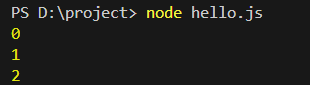

当然枚举值也可以手动指定，如下：

```typescript
enum UserStatus {
    Active = 2,
    Disabled = 4,
    Deleted = 6
}
console.log(UserStatus.Active);
console.log(UserStatus.Disabled);
console.log(UserStatus.Deleted);
```

执行结果如下：

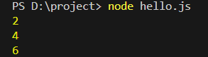

也可以指定其中某个枚举值，后续枚举值递增，如下：

```typescript
enum UserStatus {
    Active,
    Disabled = 20,
    Deleted
}
console.log(UserStatus.Active);
console.log(UserStatus.Disabled);
console.log(UserStatus.Deleted);
```

执行结果如下：

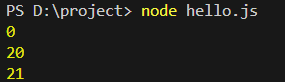

直接打印枚举类型的结果是这样的：

```typescript
enum UserStatus {
    Active,
    Disabled = 20,
    Deleted
}
console.log(UserStatus);
```

执行结果如下：

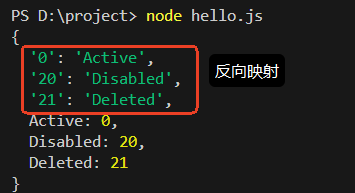

因此，对于数字枚举来说，通过枚举值也可以获取枚举类型的成员名称，代码如下：

```typescript
enum UserStatus {
    Active,
    Disabled = 20,
    Deleted
}
console.log(UserStatus[0]);
console.log(UserStatus[20]);
console.log(UserStatus[21]);
```

执行结果如下：

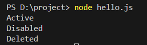

### 字符串枚举

字符串枚举指的是每一个枚举值不是数字了，而是字符串形式，代码如下：

```typescript
enum UserStatus {
    Active = '激活',
    Disabled = '失效',
    Deleted = '已删除'
}
console.log(UserStatus.Active);
console.log(UserStatus.Disabled);
console.log(UserStatus.Deleted);
```

执行结果如下：

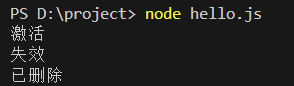

注意：字符串枚举**没有反向映射**。

### 常量枚举

常量枚举是使用 `const enum` 语法声明的特殊枚举类型，它在**编译阶段会被完全内联**，不会生成真实的 JavaScript 对象。

普通枚举的编译结果

```typescript
enum Direction {
  Up,
  Down
}
// 编译为：
var Direction;
(function (Direction) {
    Direction[Direction["Up"] = 0] = "Up";
    Direction[Direction["Down"] = 1] = "Down";
})(Direction || (Direction = {}));
```

常量枚举的编译结果

```typescript
const enum Direction {
  Up,
  Down
}
let dir = Direction.Up;
// 编译为：
let dir = 0 /* Direction.Up */;
```

常量枚举的核心用途

1. **性能优化**：
  - 完全消除运行时开销
  - 不会生成实际的枚举对象
  - 所有使用处直接替换为字面量值
2. **代码精简**：
  - 生成的 JavaScript 更简洁
  - 特别适合大量使用枚举的场景
3. **保持类型安全**：
  - 开发时仍享受类型检查和智能提示
  - 编译后不保留类型信息

常量枚举的使用场景：最适合在**性能敏感**且**不需要运行时访问枚举**的情况下使用：

```typescript
const enum ResponseCode {
  Success = 200,
  NotFound = 404,
  Error = 500
}

function handleResponse(code: ResponseCode) {
  if (code === ResponseCode.Success) {  // 编译后变成 if (code === 200)
    // ...
  }
}
```

使用常量枚举时的注意事项：

1. **无法通过对象访问**：

```typescript
console.log(Direction); // 错误！运行时Direction不存在
```

1. **必须使用常量表达式**：

```typescript
const enum BadExample {
  A = Math.random(), // 错误！（因为这个运行阶段才能算出结果）
  B = 2 + 1// 这个可以，这个就属于常量表达式。
}
```

1. **调试信息会丢失**：生产环境调试时看到的只是原始值

常量枚举通过牺牲少量灵活性，换取了更好的运行时性能，是 TypeScript 对传统枚举的重要优化。

## type 自定义类型

主要用途：为任何类型创建别名

### 基本用法

假设我要不喜欢 `string`这个类型的名字，我希望这个类型的名字叫做 `str`。你可以使用 `type`这样做：

```typescript
// 为string类型起别名str
type str = string;

// 定义变量
let username: str = 'jack';

console.log(username);
```

我们回顾一下声明对象类型的代码，如下：

```typescript
// 声明变量person，并且person变量的类型是一个自定义的对象类型。
let person: { name: string, age: number};

// 创建对象为person变量赋值
person = {
    name: 'jack',
    age: 30
}

console.log(person.name, person.age);
```

有了 `type`关键字之后，以上代码可以这样写了：

```typescript
// 声明对象类型，并且给类型起个别名
type PersonType = { name: string, age: number};

let p1: PersonType = {
    name: 'jack',
    age: 30
};

let p2: PersonType = {
    name: 'lucy',
    age: 20
};

console.log(p1.name, p1.age);
console.log(p2.name, p2.age);
```

### 联合类型

通过 type 也可以定义联合类型，多个类型联合起来叫做联合类型，代码如下：

```typescript
// 定义联合类型（联合类型名一般遵循大驼峰命名方式）
type HttpStatus = number | string;

// 定义函数，该函数的参数使用自定义的类型HttpStatus
function printHttpStatus(status: HttpStatus){
    console.log(status);
}

// 调用函数，传字符串可以
printHttpStatus('500');

// 调用函数，传数字也可以
printHttpStatus(500);
```

我们前面提到过，对于字面量来说也是一种类型，例如'hello'就是一个字面量类型。代码如下：

```typescript
// str变量被定义为字面量类型
let str: 'hello';

// str变量的值只能是'hello'
str = 'hello';

// 报错：不能是其它字面值
//str = 'abc';
```

既然字面量也是一种类型，那么多个字面量类型联合起来也可以定义联合类型，代码如下：

```typescript
// 使用字面量类型定义联合类型
// GenderType类型的变量的值只能是m或f
type GenderType = 'm' | 'f';

// 定义一个类型是GenderType的变量
let gender: GenderType;

// 给变量赋值
gender = 'm';
gender = 'f';

// 报错
//gender = '男';
```

### 交叉类型

交叉类型（`**<font style="color:rgb(64, 64, 64);background-color:rgb(236, 236, 236);">&</font>**`）将多个类型合并为一个类型，新类型将包含**所有原类型的属性**。

```typescript
// A类型
type A = {a1: number, a2: string};

// B类型
type B = {b1: string, b2: number};

// 交叉类型（并且类型）
type AAndB = A & B;

// 符合交叉类型的对象
let x: AAndB = {
    a1: 10,
    a2: '10',
    b1: '10',
    b2: 10
};
```

例如：超级英雄组合

```typescript
type Person = {
  name: string;
  age: number;
};

type SuperPower = {
  power: string;
  energyLevel: number;
};

type Costume = {
  color: string;
  hasCape: boolean;
};

type SuperHero = Person & SuperPower & Costume;

const spiderMan: SuperHero = {
  name: "Peter Parker",
  age: 23,
  power: "爬墙和蜘蛛感应",
  energyLevel: 85,
  color: "红蓝",
  hasCape: false
};
```

### 一个特殊情况

当一个函数的返回值类型是 `void`时，函数执行结束时不能返回值，这是之前讲过的，如下代码：

```typescript
// 可以
function notReturnValue():void{}

// 可以
function notReturnValue():void{
    return;
}

// 可以
function notReturnValue():void{
    return undefined;
}

// 不可以
function notReturnValue():void{
    // return 'hello';
    // return null;
    // return '';
    return 0;
}
```

在 ts 中有一个特殊情况：使用 type 声明限制函数返回值为 void 时，**ts 不会严格要求函数返回空**，代码如下：

```typescript
// 声明函数类型LogFun
// 约束函数无参数，并且函数执行结束时不能返回值
type LogFun = () => void;

// 居然没报错，你是不是感觉很疑惑！！！
// 确实是这样，这就是一种特殊情况
let logFun: LogFun = function(){
    return 1;
}
```

## ts 中类的定义和继承

```typescript
// 类的定义
class Person {
    // 属性
    name: string;
    age: number;
    // 构造方法
    constructor(name: string, age: number){
        this.name = name;
        this.age = age;
    }
    // 方法
    detail(): void{
        console.log(`我叫${this.name}，今年${this.age}岁了！`);
    }
}
// 子类继承父类
class Teacher extends Person{
    // 子类特有的属性
    salary: number;
    // 构造方法
    constructor(name: string, age: number, salary: number){
        // 调用父类的构造方法
        super(name, age);
        this.salary = salary;
    }
    // 方法
    doSome(): void{
        console.log(`${this.name}正在努力的工作....`); 
    }
    // 重写父类的方法
    // 使用 override 关键字可以在编译阶段检查该方法是否重写了父类的方法。
    override detail(): void {
        console.log(`我叫${this.name}，今年${this.age}岁了，我每月的薪资是${this.salary}！`);
    }
}
// 创建对象调用方法
let person = new Person('杰克', 30);
person.detail();

let teacher = new Teacher('露西', 31, 8000.0);
teacher.detail();
teacher.doSome();
```

以上内容演示了在 ts 中，如何定义类，如何继承，如何定义子类，构造方法如何编写，如何调用父类构造方法，属性如何定义，方法如何重写等。

## ts 中的修饰符列表

### 访问权限修饰符

访问权限修饰符列表包括：public、protected、private。

访问权限修饰符可以修饰属性和方法，用来约束属性和方法的访问范围。

| **访问权限修饰符** | **访问范围** |
| --- | --- |
| public | 任意位置，包括类内部、子类、类外部。 |
| protected | 只能在类内部、子类中访问。 |
| private | 只能在类内部访问。 |

注意：没有提供访问控制权限修饰符，默认是 public 的。

测试 public：

```typescript
class Person {
    public name: string;
    age: number;
    constructor(name: string,age: number){
        // public修饰：类内部可以访问
        this.name = name;
        this.age = age;
    }
}
class Teacher extends Person{
    salary: number;
    constructor(name: string,age: number,salary: number){
        super(name, age);
        this.salary = salary;
    }
    detail(){
        // public修饰：子类中可以访问
        console.log(`我叫${this.name}`);
    }
}
let person = new Person('杰克', 30);
// public修饰：类外部可以访问
console.log(person.name);
```

测试 protected：

```typescript
class Person {
    protected name: string;
    age: number;
    constructor(name: string,age: number){
        // protected修饰：类内部可以访问
        this.name = name;
        this.age = age;
    }
}
class Teacher extends Person{
    salary: number;
    constructor(name: string,age: number,salary: number){
        super(name, age);
        this.salary = salary;
    }
    detail(){
        // protected修饰：子类中可以访问
        console.log(`我叫${this.name}`);
    }
}
let person = new Person('杰克', 30);
// protected修饰：类外部不能访问
//console.log(person.name);
```

测试 private：

```typescript
class Person {
    private name: string;
    age: number;
    constructor(name: string,age: number){
        // private修饰：类内部可以访问
        this.name = name;
        this.age = age;
    }
}
class Teacher extends Person{
    salary: number;
    constructor(name: string,age: number,salary: number){
        super(name, age);
        this.salary = salary;
    }
    detail(){
        // private修饰：子类中不能访问
        //console.log(`我叫${this.name}`);
    }
}
let person = new Person('杰克', 30);
// private修饰：类外部不能访问
//console.log(person.name);
```

### 只读属性修饰符

`readonly`修饰符用来修饰属性，用它修饰的属性，属性值不可变。

```typescript
class Person {
    public readonly name: string;
    public readonly age: number;
    constructor(name: string,age: number){
        this.name = name;
        this.age = age;
    }
}
const person = new Person('jack', 30);
// 报错：无法为“name”赋值，因为它是只读属性
person.name = 'lucy';
// 报错：无法为“age”赋值，因为它是只读属性
person.age = 20;
```

## ts 中属性的简写形式

简写如下：

```typescript
// 类的定义
class Person {
    // 构造方法
    constructor(public name: string, public age: number){}
    // 方法
    detail(): void{
        console.log(`我叫${this.name}，今年${this.age}岁了！`);
    }
}
// 子类继承父类
class Teacher extends Person{
    // 构造方法
    constructor(name: string,age: number, public salary: number){
        super(name, age);
    }
    // 方法
    doSome(): void{
        console.log(`${this.name}正在努力的工作....`); 
    }
    override detail(): void {
        console.log(`我叫${this.name}，今年${this.age}岁了，我每月的薪资是${this.salary}！`);
    }
}
// 创建对象调用方法
let person = new Person('杰克', 30);
person.detail();

let teacher = new Teacher('露西', 31, 8000.0);
teacher.detail();
teacher.doSome();
```

注意：

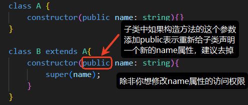

## ts 中的抽象类

抽象类无法实例化（不能创建对象），抽象类通常是用来定义公共结构的，比如公共的属性，公共的方法，如果某些方法在当前类中没必要提供实现（因为实现没有意义），方法可以定义为抽象方法，非抽象的子类继承抽象类时必须将抽象类中的抽象方法加以实现（重写）。

定义抽象类 Animal，公共属性 name，定义抽象方法 move()，定义非抽象方法 sayHello()，代码如下：

```typescript
// 抽象类
abstract class Animal{
    // 构造方法
    constructor(public name: string){}
    // 非抽象方法
    sayHello(): void{
        console.log(`你好，我的名字叫${this.name}`);
    }
    // 抽象方法
    abstract move(): void;
}

// 非抽象的子类
class Cat extends Animal {
    // 构造方法
    constructor(name: string){
        super(name)
    }
    // 实现抽象方法
    move(): void {
        console.log(`${this.name}正在走猫步！`);
    }
}

// 非抽象的子类
class Fish extends Animal{
    // 构造方法
    constructor(name: string){
        super(name);
    }
    // 实现抽象方法
    move(): void {
        console.log(`${this.name}正在水中快乐的游来游去！`);
    }
}

// 创建对象，调用方法
const cat = new Cat('Tom');
cat.sayHello();
cat.move();
const fish = new Fish('小鱼儿');
fish.sayHello();
fish.move();
```

运行结果如下：

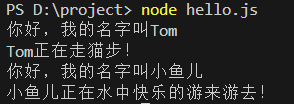

**什么时候使用抽象类？**

1. 你需要在多个子类间共享代码。
2. 你要求子类必须实现某些方法。
3. 禁止某个类实例化时。

## ts 中的接口 interface

### 接口的作用

接口是一种**定义结构**的方式，主要作用是为**类**、**对象**、**函数**等规定**一种契约**，这样可以确保代码的**一致性**和**类型安全**，但要注意接口**只能定义格式**，**不能包含任何实现**。

### 定义类结构

```typescript
// 接口
interface PersonInterface {
    // 属性
    name: string;
    age: number;
    // 方法
    speak(): void;
}

// 类实现接口
class EnglishPerson implements PersonInterface{
    // 构造方法，必须声明name和age属性
    constructor(public name: string, public age: number){}

    // 必须实现接口中的方法
    speak(): void {
        console.log(`Hello, My name is ${this.name}, and I'm ${this.age} years old!`);
    }
}

let p = new EnglishPerson('jack', 30);
p.speak();
```

### 定义对象结构

接口可以当做类型来使用。

```typescript
// 接口
interface UserInterface {
    name: string;
    age?: number; // 可选属性
    readonly gender: boolean; // 只读属性
    shopping: () => void;
}
// 把接口当做一种类型，创建一个符合该接口类型的对象
let user: UserInterface = {
    name: 'jack',
    age: 30,
    gender: true,
    shopping(): void {
        console.log(`${this.name} is shopping!`);
    }
};
// 调用对象的方法
user.shopping();
```

### 定义函数结构

```typescript
// 接口
interface SumInterface {
    (a: number, b: number): number;
}

// 创建函数
let sum: SumInterface = function(k, f){
    return k + f;
}
// 调用函数
console.log(sum(1, 2));

// 创建函数
let sumPlus: SumInterface = (x, y) => x + y;
// 调用函数
console.log(sum(3, 4));
```

### 接口之间的继承

接口和接口之间支持继承，如下代码：

```typescript
interface AInterface{
    userId: string
}
interface BInterface extends AInterface{
    name: string
}

let c: BInterface = {
    userId: '123',
    name: 'jack'
}
```

### 接口自动合并

```typescript
// 接口
interface UserInterface{
    name: string;
    age: number;
}
// 接口可重复定义，并且会自动合并。
interface UserInterface{
    gender: boolean;
}

let user: UserInterface = {
    name: 'jack',
    age: 30,
    gender: true
};
```

### 什么时候用接口

1. 定义对象的格式（对象的契约）：API 响应格式、配置对象....等等，是开发中用的最多的场景。
2. 类的契约：规定一个类需要实现哪些属性和方法。
3. 自动合并：一般用于扩展第三方库的类型，这种特性在大型项目中可能会用到。

## type 和 interface 的区别

### type 和 interface 都可以定义对象结构

```typescript
// type定义对象结构
type UserType = {
    name: string,
    age: number,
    speak:()=>void
};

// interface定义对象结构
interface UserInterface{
    name: string,
    age: number,
    speak: () => void
}

// 创建对象
let user: UserType = { // 直接将 UserType 修改为 UserInterface，程序仍可以正常运行，达到同样的效果。
    name: 'jack',
    age: 20,
    speak() {
        console.log(`我叫${this.name}，今年${this.age}岁了`);
    },
};

user.speak();
```

### type 和 interface 的区别

:::info

- **相同点**：
  - interface 和 type 都可以定义对象结构，两者在许多场景中都是可以互换的。
- **不同点**：
  - interface：更专注于定义**对象**和**类**的结构，支持**继承**、**合并**。
  - type：在定义**类型别名**、**联合类型**、**交叉类型**方便比较专业，但不支持继承和自动合并。

:::

## interface 和抽象类的区别

:::info

- **相同点：**
  - 都可以用于定义一个**类的格式**。（一种契约）
- **不同点：**
  - 接口：只能**描述结构**，不能有**任何实现**，一个类可以实现**多个**接口。
  - 抽象类：既可以包含**抽象方法**，又可以包含**具体方法**，一个类只能继承**一个**抽象类。

:::

以下代码演示了一个类可以实现多个接口：

```typescript
// 可以飞翔的
interface Flyable{
    fly(): void;
}
// 可以游泳的
interface Swimable{
    swim(): void;
}
// 飞鱼 类既可以飞翔又可以游泳，同时实现多个接口。
class FlyingFish implements Flyable, Swimable{
    fly(): void {
        console.log("飞翔");
    }
    swim(): void {
        console.log('游泳');
    }
}
// 创建对象
let ff: FlyingFish = new FlyingFish();
// 调用方法
ff.fly();
ff.swim();
```

# 泛型


## 泛型函数

当一个函数在定义的时候无法确定参数的类型，需要调用者来决定参数类型的时候，可以使用泛型机制。例如以下代码：

```typescript
// 泛型函数
function print<T>(info: T){
    console.log(info);
}

// 调用者指定参数的类型
print<number>(100);
print<string>('hello');
```

泛型也可以有多个，例如以下代码：

```typescript
// 函数泛型
function print<T,E>(info: T, time: E){
    console.log(info, time);
}

// 调用者指定参数的类型
print<number, string>(100, '2000-10-11 10:11:12');
print<string, string>('hello', '2000-10-11 10:11:22');
```

返回值类型也可以使用泛型约束：

```typescript
// 函数泛型
function print<T,E>(info: T, time: E): T | E{
    return Math.random() > 0.5 ? info : time;
}

// 调用者指定参数的类型
console.log(print<number, string>(100, '2000-10-11 10:11:12'));
console.log(print<string, string>('hello', '2000-10-11 10:11:22'));
```

## 泛型接口

泛型接口代码如下：

```typescript
// 泛型接口
interface UserInterface<T> {
    name: string;
    age: number;
    other: T;
}

// 创建对象1
let user: UserInterface<number> = {
    name: 'jack',
    age: 20,
    other: 110
};

// 创建对象2
let user2: UserInterface<string> = {
    name: 'lucy',
    age: 30,
    other: '高等级用户'
};
```

类型也可以是自定义类型：

```typescript
// 泛型接口
interface UserInterface<T> {
    name: string;
    age: number;
    other: T;
}

// 自定义类型
type Address = {
    city: string,
    street: string,
    zipcode: string
};

// 创建对象（使用自定义类型）
let user: UserInterface<Address> = {
    name: 'jack',
    age: 20,
    other: {
        city: '北京',
        street: '通州',
        zipcode: '1110101010'
    }
};
```

## 泛型类

定义类的时候也可以使用泛型，代码如下：

```typescript
// 泛型类
class Student<T> {
    constructor(public name: string, public age: number, public other: T){}

    detail(){
        console.log(this.name, this.age, this.other);
    }
}

// 创建对象
let student: Student<string> = new Student('jack', 30, '优秀学生');
student.detail();
```

# 类型定义文件


**类型定义文件**是 ts 中的一种特殊文件，通常以 `.d.ts`作为扩展名，作用是为现有的 javascript 代码提供类型信息，让 ts 能够在使用这些 javascript 库或模块时进行类型检查和提示。

## ts 中引入 js 文件

ts 中可以引入 js 文件。示例如下：

```javascript
export function add(a, b){
  return a + b;
}

export function mul(a, b){
  return a * b;
}
```

在 index.ts 中引入外部的 demo.js 文件：

```typescript
import {add, mul} from './demo.js';

console.log(add(1, 2));
console.log(mul(1, 2));
```

以上的 `index.ts`编译生成 `index.js`，这个时候编写 `index.html`，在 `index.html`中引入 `index.js`，代码如下：

```html
<!DOCTYPE html>
<html lang="en">
<head>
    <meta charset="UTF-8">
    <meta name="viewport" content="width=device-width, initial-scale=1.0">
    <title>Document</title>
</head>
<body>
    <!--注意，使用模块化的话type必须设置为module-->
    <script type="module" src="./index.js"></script>
</body>
</html>
```

打开浏览器，运行结果如下：（**注意：以上的程序要编译通过需要将 **`**<font style="color:#DF2A3F;">tsconfig.json</font>**`**文件中的严格模式关闭。**）


这种方式虽然可以，但是存在一些问题，没有很好的提示，如下图：

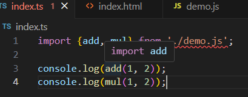

鼠标悬停 add 上，没有很好的提示，比如函数有几个参数，每个参数什么类型，函数返回值类型是什么等等，这些信息都没有。

## 加入 `.d.ts`文件

为 demo.js 文件提供一个 demo.d.ts 文件，以上程序自然就会有提示了。

```typescript
declare function add(a: number, b: number): number;
declare function mul(a: number, b:number): number;

export {add, mul}
```

关闭 VS Code 开发工具，重新打开，然后鼠标悬停在 add 方法就有提示了：

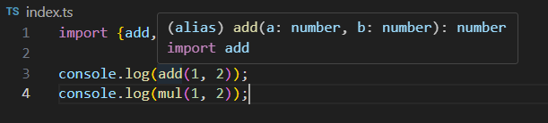

# 装饰器


## 什么是装饰器

1. 装饰器本身是一种**特殊的函数**，它可以对：类、属性、方法、参数进行扩展，同时让代码更加简洁。
2. 装饰器从 2015 年 ES6 中被提出。
3. 截至 2023 年 3 月 17 日，TypeScript5.0 发布，装饰器不再是实验性阶段，开发者无需手动调整配置来开启装饰器的支持。
4. TypeScript5.x 版本支持的是新版装饰器（`tsc --version`命令可以查看 TS 版本），对于旧版装饰器来说，开发者仍然需要通过手动配置 `--experimentalDecorators` 来开启装饰器的支持。
5. 装饰器有 5 种：

第 1 种：类装饰器

第 2 种：属性装饰器

第 3 种：方法装饰器

第 4 种：访问器装饰器

第 5 种：参数装饰器

1. 注意：任何一种装饰器都不能在 `.d.ts` 声明文件中使用。

## 类装饰器

### 基础语法

类装饰器是一个应用在类声明上的函数，可以为类添加额外的功能，或添加额外的逻辑。

```typescript
// 装饰器
function MyDecorator(target: Function){ // 参数target代表的是被装饰的目标对象。
    // 装饰器本质是一个函数，这个装饰器函数在什么时候执行呢？
    // 当前代码中，该装饰器去装饰了User类，因此装饰器中的代码会在User类进行初始化的时候执行。
    console.log(target);
}

// 装饰器去装饰某个类
@MyDecorator
class User{
    constructor(public name: string, public age: number){}
}
```

target 参数是被装饰的目标对象。大家可能会有疑问，为什么目标对象的类型是 `Function`，这是因为被装饰的是 `class`，而 `class`本质上是构造函数的语法糖。当你声明一个类的时候：

```javascript
class User{}
```

底层会编译为：

```typescript
function User(){}
```

所以 `**target**`的类型是 `**Function**`是完全正确的。

### 应用示例

需求：定义一个装饰器，实现 `**User**`实例调用 `**toString**`时返回 `**JSON.stringify**`的执行结果。

不用装饰器也能实现：

```typescript
class User {
    constructor(public name: string, public age: number){}
}

User.prototype.toString = function(){
    return JSON.stringify(this);
};
```

用装饰器也能实现：

```typescript
// 自定义装饰器
function DecoratorToString(target: Function){
    target.prototype.toString = function(){
        return JSON.stringify(this);
    }
    // 封闭其原型对象，禁止随意操作其原型对象。
    // 防止其他代码意外覆盖/删除你添加的 toString 方法，因此加上下面这行代码会更好。
    Object.seal(target.prototype);
}

// 使用装饰器扩展功能
@DecoratorToString // 去掉这行代码则去掉扩展。添加上这行代码则添加扩展。非常灵活。
class User{
    constructor(public name: string, public age: number){}
}

let user: User = new User('jack', 20);
console.log(user.toString());
```

**番外篇：关于 **`**Object.seal()**`**简单说一下：禁止新增/删除属性**：密封后的对象无法添加新属性，也无法删除现有属性。例如以下代码：

在没有使用 `**<font style="color:rgb(64, 64, 64);">Object.seal()</font>**`方法之前，对象是可以动态添加属性的，如下：

```typescript
// 定义类
class Person {
    constructor(public name: string, public age: number){}
}

// 创建对象
let p = new Person('jack', 20);

// 如果Person.prototype不被冻结，我们是可以给它扩展属性和方法的。
// 下面代码是扩展gender属性
// @ts-ignore (ts语法严格，在ts中编写以下代码会报错，可以使用它来忽略错误)
Person.prototype.gender = true;

// 访问扩展的属性是可以的
// @ts-ignore
console.log(p.gender);
```

如果一旦将对象的原型对象封闭，再添加或删除属性时，会报错：

```typescript
// 定义类
class Person {
    constructor(public name: string, public age: number){}
}

// 封闭Person的原型对象
Object.seal(Person.prototype);

// 创建对象
let p = new Person('jack', 20);

// @ts-ignore
Person.prototype.gender = true;
```

报错信息如下：对象是无法扩展的

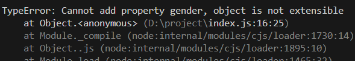

### 关于返回值

如果类装饰器函数**有**返回值：如果类装饰器返回一个**新的类**，那这个新类会**替代**掉被装饰的类。

如果类装饰器函数**无**返回值：如果类装饰器无返回值或返回 undefined，那被装饰的类**不会被替换**。

```typescript
function MyDecorator(target: Function){
    return class{
        constructor(public name: string, public age: number){}    
        detail(){
            console.log(`~~我叫${this.name},今年${this.age}岁了~~`);
        }
        shopping(){
            console.log(`${this.name}正在疯狂的购物！！！`);
        }
    }
}

@MyDecorator
class Customer{
    constructor(public name: string, public age: number){}
    detail(){
        console.log(`我叫${this.name},今年${this.age}岁了！`);
    }
}

console.log(Customer.toString());
```

另外需要注意的小细节：装饰器如果要返回一个新的类的话，这个新类有要求：新类和被装饰的类要求有一样的结构（构造函数的结构一样，另外必须保留被装饰类的原方法的结构。基于这个原则才可以扩展。）

### 关于构造类型

**关于构造类型**这个知识点是为后面的**高级应用示例**打基础的。

在 TypeScript 中，Function 类型所表示的范围十分广泛，包括：普通函数、箭头函数、方法等等，但并不是所有的 Function 类型的函数都可以被 new 关键字实例化，例如箭头函数是不能被实例化的，那么 TypeScript 是如何声明一个可构造的类型呢？有以下两种方式。

#### 仅声明构造类型

需求如下：

```typescript
// 需求：调用test函数的时候，要求必须传过来一个可构造的类型
// 如果参数定义为：Function类型，太广泛了，无法保证传过来的一定是一个可构造的类型。例如传递箭头函数过来。
function test(target: Function){}

// 箭头函数
let User = () => {}

// 调用test方法，传递了一个箭头函数，编译器没有提示报错
test(User);
```

怎么达到以上的需求呢：

```typescript
/*
    new     表示该类型可以用new操作符调用。
    ...args 表示构造函数可以接收任意数量的参数。
    any[]   表示构造函数可以接收任意类型的参数。
    {}      表示构造函数的返回值必须是一个对象（非null undefined对象）
*/
// 自定义 构造类型
type Constructor = new (...args: any[]) => {}

// 调用test函数的时候，要求必须传过来一个可构造的类型
function test(target: Constructor){}

// 箭头函数
let User = () => {}

// 报错了
test(User);
```

#### 声明构造类型+指定静态属性

如果要求传递过来的参数必须是一个构造类型，同时要求该类型中必须有一些固定的静态属性，使用以下方式：

```typescript
type Constructor = {
    // 构造类型（注意：这里不能使用 => 语法，需要使用冒号语法，冒号后面的 {} 表示返回值是一个对象）
    new (...args: any[]): {},
    // 静态属性
    country: string
};

// 调用test函数的时候，要求必须传过来一个可构造的类型
function test(target: Constructor){
    console.log(target.country);
}

class User{
    static country: string = '中国';
}

test(User);
```

### 高级应用示例

需求：设计一个 LogTime 装饰器，可以给所有实例添加一个createdTime属性，用于记录实例对象的创建时间，再添加一个方法getCreatedTime()用于读取实例的创建时间。

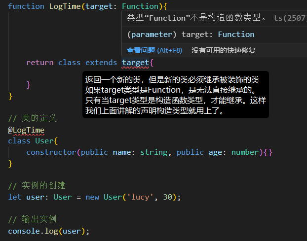

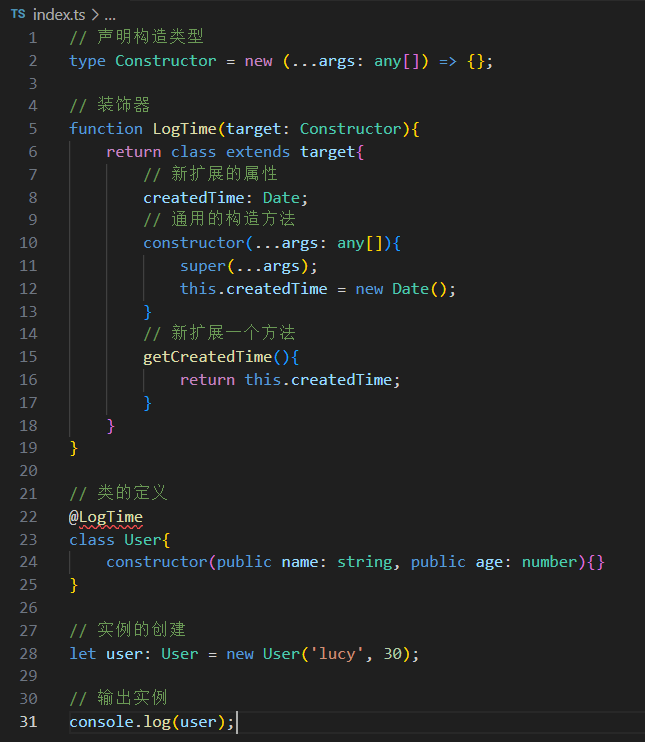

以上虽然编译报错，但可以正常运行，结果如下：

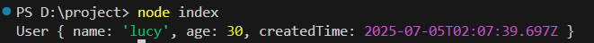

下面代码解决了以上的编译报错：

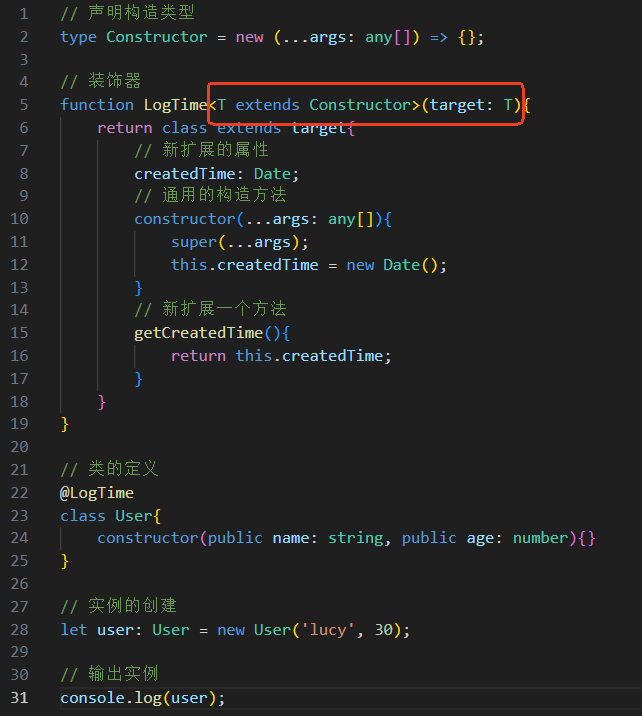

`<font style="color:rgb(15, 17, 21);background-color:rgb(235, 238, 242);">function LogTime<T extends Constructor>(target: T){}</font>` → **保留具体类的完整类型信息**
`<font style="color:rgb(15, 17, 21);background-color:rgb(235, 238, 242);">function LogTime(target: Constructor){}</font>` → **只知道是构造函数，丢失具体类信息**

执行结果如下：

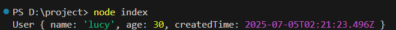

虽然编译器不报错了，也能够正常运行了，但这个时候如果访问 `user.getCreatedTime()`还是会报错，因为编译器检测到 User 类型上没有这个 `getCreatedTime()`方法：

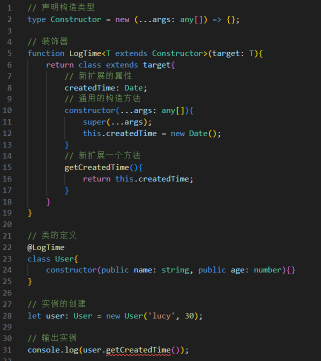

使用接口 interface 扩展，可以解决以上问题，最终实现代码如下：

```typescript
// 声明构造类型
type Constructor = new (...args: any[]) => {};

// 装饰器
function LogTime<T extends Constructor>(target: T){
    return class extends target{
        // 新扩展的属性
        createdTime: Date;
        // 通用的构造方法
        constructor(...args: any[]){
            super(...args);
            this.createdTime = new Date();
        }
        // 新扩展一个方法
        getCreatedTime(){
            return this.createdTime;
        }
    }
}

// 类的定义
@LogTime
class User{
    constructor(public name: string, public age: number){}
}

// 使用接口完成扩展。
interface User{
    getCreatedTime(): Date;
}

// 实例的创建
let user: User = new User('lucy', 30);

// 输出实例
console.log(user.getCreatedTime());
```

## 装饰器工厂

装饰器工厂：返回**装饰器函数**的**函数。**可以为装饰器添加参数，可以更灵活的控制装饰器的行为。

需求：定义一个装饰器工厂 `LogInfo`，实现 Person 实例可以调用 introduce 方法，且 introduce 中输出内容的次数由 LogInfo 接收的参数决定。

以下代码是初级实现：给 Person 实例扩展一个 introduce 方法，这个大家还是很容易能够写出来的。

```typescript
// 装饰器
function LogInfo(target: Function){
    target.prototype.introduce = function(){
        console.log(`我叫${this.name}，今年${this.age}岁了！`);
    }
}

@LogInfo
class Person {
    constructor(public name: string, public age: number){}
    speak(){
        console.log('你好呀');
    }
}

interface Person {
    introduce(): void;
}

let p = new Person('jack', 20);
p.introduce();
```

如果要实现 introduce 中输出内容的次数由 LogInfo 接收的参数决定，可以使用装饰器工厂，以下代码中 LoginInfo 就不再是装饰器了，是一个装饰器工厂，LoginInfo 的返回值是一个装饰器，代码如下：

```typescript
// 装饰器工厂
function LogInfo(count: number){
    // 返回一个装饰器
    return function(target: Function){
        target.prototype.introduce = function(){
            for(let i = 0; i < count; i++){
                console.log(`我叫${this.name}，今年${this.age}岁了！`);
            }
        }
    }
}

@LogInfo(3)
class Person {
    constructor(public name: string, public age: number){}
    speak(){
        console.log('你好呀');
    }
}

interface Person {
    introduce(): void;
}

let p = new Person('jack', 20);
p.introduce();
```

## 装饰器组合

多个装饰器是可以组合使用的。

### 组合后的执行顺序

执行顺序遵循这个原则：如果要有装饰器工厂，优先执行装饰器工厂，装饰器工厂遵循从上往下的顺序执行，当所有装饰器工厂执行结束之后，再开始执行装饰器，装饰器遵循从下往上的顺序执行。

```typescript
function Decorator1(target: Function){
    console.log('装饰器1');
}
function DecoratorFactory1(){
    console.log('装饰器工厂1');
    return function(target: Function){
        console.log('装饰器2');
    }
}
function DecoratorFactory2(){
    console.log('装饰器工厂2');
    return function(target: Function){
        console.log('装饰器3');
    }
}
function Decorator4(target: Function){
    console.log('装饰器4');
}

@Decorator1
@DecoratorFactory1()
@DecoratorFactory2()
@Decorator4
class User{}
```

执行结果如下：

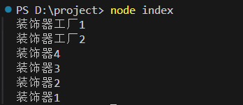

### 装饰器组合的具体应用

多个装饰器组合可以很灵活的扩展功能，我们将之前编写的装饰器和装饰器工厂组合起来使用一下：

```typescript
// 装饰器
function DecoratorToString(target: Function){
    target.prototype.toString = function(){
        return JSON.stringify(this);
    }
    Object.seal(target.prototype);
}

// 装饰器
type Constructor = new (...args: any[]) => {};
function LogTime<T extends Constructor>(target: T){
    return class extends target{
        createdTime: Date;
        constructor(...args: any[]){
            super(...args);
            this.createdTime = new Date();
        }
        getCreatedTime(){
            return this.createdTime;
        }
    }
}

// 装饰器工厂
function LogInfo(count: number){
    return function(target: Function){
        target.prototype.introduce = function(){
            for(let i = 0; i < count; i++){
                console.log(`我叫${this.name}，今年${this.age}岁了！`);
            }
        }
    }
}


@DecoratorToString
@LogTime
@LogInfo(3)
class Person{
    constructor(public name: string, public age: number){}
}

interface Person {
    getCreatedTime(): void;
    introduce(): void;
}

let person = new Person('jack', 20);
console.log(person.toString());
console.log(person.getCreatedTime());
person.introduce();
```

执行结果如下：

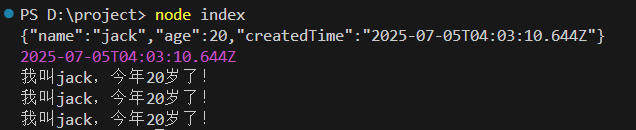

## 方法装饰器

方法装饰器是TypeScript装饰器(Decorators)的一种，用于修改或增强类中方法的行为。在TypeScript 5.0+中，装饰器功能已经稳定，使用更加方便。

方法装饰器提供了一种强大的AOP(面向切面编程)能力，能够将横切关注点(如日志、权限、缓存等)与业务逻辑分离，使代码更加模块化和可维护。

注意：方法装饰器在类定义时执行，而不是在方法调用时执行。

### 记录日志

```typescript
// originalMethod 参数是目标方法
// context 是装饰器上下文对象
function LogDecorator(originalMethod: Function, context: ClassMethodDecoratorContext){
  // 返回一个新的方法，替换原方法
  return function(this: any, ...args: any[]){
    // 开始日志
    console.log(`[LOG] 方法${context.name.toString()}被调用`);
    // 调用目标方法
    const result = originalMethod.call(this, ...args);
    // 结束日志
    console.log(`[LOG] 方法${context.name.toString()}执行结束`);
    // 将目标的执行结果返回
    return result;
  }
}

class Customer{

  constructor(public name: string){}

  // 实例方法
  @LogDecorator
  shopping(){
    console.log(`${this.name}正在疯狂购物！`);
  }
  
  // 静态方法
  @LogDecorator
  static print(){
    console.log('打印信息!!!');
  }
}

// 调用静态方法
Customer.print();

// 创建对象，调用实例方法
let c = new Customer('张三');
c.shopping();
```

执行结果如下：

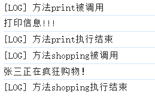

### 权限控制

```typescript
// 权限控制装饰器：只有管理员才能执行删除操作
function AdminOnly(originalMethod: Function, context: ClassMethodDecoratorContext){
  return function(this: any, ...args: any[]){
    if(!this.isAdmin){
      throw new Error('只有管理员才能进行删除操作！');
    }
    return originalMethod.call(this, args);
  }
}

class UserManager{
  constructor(public isAdmin: boolean){}
  @AdminOnly
  deleteById(id: string){
    console.log(`删除用户[${id}]成功`);
  }
}

let userManager = new UserManager(true);
userManager.deleteById('110');
userManager.isAdmin = false;
userManager.deleteById('110');
```

执行结果如下：

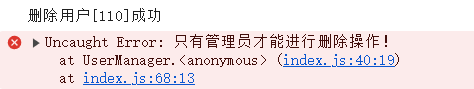

### 防抖

防抖（Debounce）是指在一定时间间隔内，无论事件被触发多少次，都只执行最后一次。简单来说，就是"等你停下来我再执行"

防抖常用于以下场景：

1. 搜索框输入（避免每输入一个字符就发送请求）
2. 窗口大小调整事件
3. 按钮频繁点击防止重复提交
4. 自动保存功能

```typescript
// Debounce 是一个装饰器工厂。
function Debounce(delay: number){
  // 返回一个装饰器
  return function(originalMethod: Function, context: ClassMemberDecoratorContext){
    let timer: any;
    return function(this: any, ...args: any[]){
      clearTimeout(timer);
      timer = setTimeout(() => {
        originalMethod.call(this, args);
      }, delay);
    }
  }
}

class SearchService {
  @Debounce(1000)
  search(query: string){
    console.log(`搜索[${query}]字符串`);
  }
}

let searchService = new SearchService();
// 虽然调用多次，但最终只执行一次。
searchService.search('手机');
searchService.search('手机');
searchService.search('手机');
searchService.search('手机');
searchService.search('手机');
```

执行结果如下：


### 参数验证

```typescript
// 装饰器工厂
function validateParams(...validators: Function[]) {
    // 返回装饰器
    return function(originalMethod: Function, context: ClassMemberDecoratorContext) {
        return function(this: any, ...args: any[]) {
            args.forEach((arg, index) => {
                // 有验证器函数，并且验证没有通过时。
                if (validators[index] && !validators[index](arg)) {
                    throw new Error(`无效参数，下标为 ${index}`);
                }
            });
            return originalMethod.apply(this, args);
        };
    };
}

class UserService {
    @validateParams(
        (name: any) => typeof name === 'string',
        (age: any) => typeof age === 'number' && age > 0
    )
    createUser(name: string, age: number) {
        console.log('创建用户成功');
    }
}

let userService = new UserService();
userService.createUser('jack', 20);
userService.createUser('lucy', '30');
```

执行结果如下：

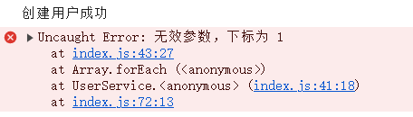

## 属性装饰器（了解）

### 什么是属性装饰器

属性装饰器允许你在**类属性初始化**时或定义时进行干预。属性装饰器**不能拦截修改属性的读写行为**，但可以：

1. 修改属性的初始值
2. 添加元数据
3. 执行与属性相关的副作用操作

注意事项：

1. **不能修改属性行为**：属性装饰器不能拦截属性的读写操作
2. **只能影响初始值**：通过返回的初始化函数可以修改属性初始值

### 属性装饰器影响初始值

```typescript
// 属性装饰器
function Uppercase(value: undefined,context: ClassFieldDecoratorContext) {
  // 可以返回一个初始化函数
  return function (this: any, initialValue: string) {
    // 可以修改初始值
    return initialValue.toUpperCase();
  };
}


class User {
  @Uppercase
  name: string = 'jack';
}

let user = new User();
console.log(user.name);
```

## 访问器装饰器（了解）

### 基础语法

```typescript
// 访问器装饰器
// 关键点：只有被accessor关键字修饰的属性才可以使用这种装饰器哦。
function AccessorDecorator(target: ClassAccessorDecoratorTarget<User, string>, context: ClassAccessorDecoratorContext){
  console.log(target);
  console.log(context);
}

// accessor修饰属性，是语法糖，自动生成getter和setter方法
class User{
  @AccessorDecorator
  accessor name: string;
  constructor(name: string){
    this.name = name;
  }
}
```

以上程序执行结果及说明：

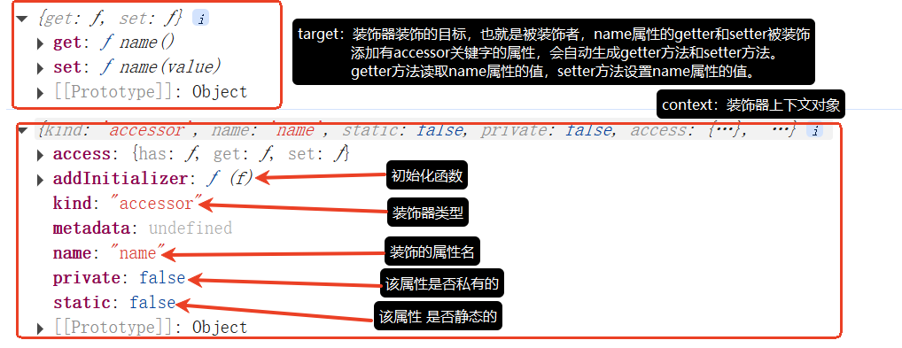

注意：在属性前添加 `accessor`关键字只是一个语法糖，编译后会生成私有字段和对应的 getter/setter。

```typescript
class User {
  accessor name: string = "Alice";
}

// 等价于传统写法：
class User {
  #name: string = "Alice";

  get name(): string {
    return this.#name;
  }

  set name(value: string) {
    this.#name = value;
  }
}
```

### 自动大写字符串

通过访问器装饰器实现拦截或修改属性的访问行为：

```typescript
function Uppercase(target: ClassAccessorDecoratorTarget<User,string>, context: ClassAccessorDecoratorContext){
  // 访问器装饰器可以返回一个对象，用来完全替代getter和setter的行为
  return {
    // this.name 时执行
    get(this: any){
      console.log('getter');
      return this[`_${context.name.toString()}`];
    },
    // this.name = xxx; 时执行
    set(this: any, value: string){
      console.log('setter');
      this[`_${context.name.toString()}`] = value.toUpperCase();
    },
    // 支持 init 方法来处理属性默认值
    // 构造方法体执行前执行。构造方法执行一次，init则执行一次。
    // 参数value是属性的默认值，如果属性没有默认值，则value的值为undefined。
    init(value: string){
      console.log('init', value);
      return value?.toUpperCase();
    }
  };
}

class User{

  @Uppercase
  accessor name: string;

  // 构造方法体执行前init会执行
  constructor(name: string){
    // 程序执行到这里时，会执行setter
    this.name = name;
  }
}

let user = new User('jack'); // 这一行代码会导致init先执行，再执行setter。
console.log(user.name); // 执行一次getter
user.name = 'lucy'; // 再执行一次setter
console.log(user.name); // 再执行一次getter
```

执行结果如下：

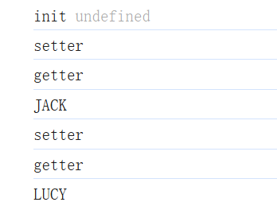

最后还有一个参数装饰器，参数装饰器在实际的开发中使用较少，大部分都是框架内部在使用，感兴趣的同学可以自行研究。