# 2.Vue3

# Vue3 简介


1. Vue 3 是当前最新的主要版本，是一个用于构建用户界面的**渐进式 JavaScript 框架（你可以从简单的页面交互开始，按需逐步引入更复杂的特性和工具，最终构建完整的现代化应用）**，由**尤雨溪（Evan You）**和团队开发。
2. 2020 年 9 月 18 日 Vue.js 正式发布 3.0 版本，代号 One Piece 海贼王。
3. 经历了 4800+次提交、40+个 RFC（"提案请求"，用于讨论 Vue 3 新特性或重大变更的设计文档）、600+次 PR（"代码合并请求"，开发者向仓库提交代码改动供审核并入主分支）、300+贡献者。
4. 截止 2025 年 7 月，最新稳定版本为 3.5.17【可以通过这个命令查看当下最新稳定版：npm show vue version】
5. [Vue3 官网地址](https://vuejs.org/)，[Vue3 中文官网地址](https://cn.vuejs.org/)。在官网中，你可以找到 **Vue 3 的教程**、**API 参考**、**示例代码**以及**迁移指南**等内容。
6. Vue 3 的源代码托管在 GitHub 上，Vue3核心仓库（Vue3框架源码）地址：[https://github.com/vuejs/core](https://github.com/vuejs/core)
7. Vue 3 编译之后的代码托管在 [**npm**](https://www.npmjs.com/) 上，供生产环境使用。

## 核心优势

- **性能提升**：
  - 比 Vue 2 更快的渲染速度（虚拟 DOM 重写，优化 Diff 算法）。 **初次渲染快 55%，更新渲染快 133%。**
  - 更小的体积（Tree-shaking 支持，核心库压缩后约 10KB）。**打包体积减少 41%。**
  - 内存减少 54%。
- **Composition API**：（友情提示：本课程主要讲解组合式 API，选项式 API 不是官方推荐的，因为选项式 API 属于 Vue2 中的语法机制）
  - 引入基于函数的 `setup()` 语法，逻辑复用更灵活（替代 Options API 的混入模式）。
  - 更好的 TypeScript 支持。

## 新特性

1. **Teleport**
  - 将组件渲染到 DOM 树任意位置（如 `<font style="color:rgb(64, 64, 64);background-color:rgb(236, 236, 236);">body</font>` 下的模态框），解决 `<font style="color:rgb(64, 64, 64);background-color:rgb(236, 236, 236);">z-index</font>` 和布局层级问题。
2. **Fragments**
  - 支持模板多根节点，无需额外包裹 `<font style="color:rgb(64, 64, 64);background-color:rgb(236, 236, 236);"><div></font>`（减少冗余 DOM 层级）。
3. **Suspense**
  - 统一处理异步组件/异步依赖的加载状态（提供 `<font style="color:rgb(64, 64, 64);background-color:rgb(236, 236, 236);">fallback</font>` 占位内容）。
4. **自定义渲染器**
  - 通过 `<font style="color:rgb(64, 64, 64);background-color:rgb(236, 236, 236);">@vue/runtime-core</font>` 实现非 DOM 渲染（如小程序、Canvas、终端应用）。

## 底层核心优化

1. **Proxy 响应式系统**
  - 替代 `<font style="color:rgb(64, 64, 64);background-color:rgb(236, 236, 236);">Object.defineProperty</font>`，支持动态属性/数组索引/集合类型（`<font style="color:rgb(64, 64, 64);background-color:rgb(236, 236, 236);">Map</font>`/`<font style="color:rgb(64, 64, 64);background-color:rgb(236, 236, 236);">Set</font>`）的自动追踪。
2. **虚拟 DOM 重写**
  - 编译时：静态节点提升（Hoist Static）、动态标记（Patch Flags）。
  - 运行时：优化 Diff 算法，跳过静态子树比对。
3. **Tree-Shaking 支持**
  - 基于 ES Module 的模块化架构，未使用的功能（如 `<font style="color:rgb(64, 64, 64);background-color:rgb(236, 236, 236);">v-model</font>` 修饰符）不会打入生产包。

## 生态与工具

- **Vite**：
原生 ES Module 的构建工具，极速热更新，默认推荐开发环境。
- **Pinia**：
官方推荐的状态管理库（替代 Vuex），更简洁的 API。
- **TypeScript 集成**：
源码使用 TS 重写，提供完整的类型推断。

## 兼容性

- 支持现代浏览器（IE11 需 polyfill）。
- 提供迁移构建（`@vue/compat`）帮助从 Vue 2 平滑升级。

---

Vue 3 在性能、开发体验和扩展性上大幅提升，尤其适合复杂应用和 TypeScript 项目，同时保持低学习曲线的传统优势。对于新项目，建议直接使用 Vue 3；旧项目可评估迁移成本逐步升级。

# 创建 Vue3 工程


## 基于 vue-cli 创建

vue-cli 是脚手架，底层基于 webpack 实现。这种方式已经不再推荐，如果你硬要按照这种方式创建工程，可以按照以下步骤操作：

### 检查 Node.js 和 npm 版本

确保你的 Node.js 版本 ≥ 14.0.0，npm 版本 ≥ 5.6。

```bash
node -v  # 检查 Node.js 版本
npm -v   # 检查 npm 版本
```

### 全局安装 @vue/cli

```bash
npm install -g @vue/cli
```

安装完成后检查版本：

```bash
vue --version  # 确认 @vue/cli 版本（需要 ≥ 4.5.0）
```

### 创建 Vue 3 项目

1. 通过命令行初始化项目：

```bash
vue create my-vue3-project
```

1. **手动选择配置**（方向键选择，空格键勾选）：

选择 `Manually select features`。

勾选所需功能（如 Babel、Router、Vuex、CSS Pre-processors 等）。

**选择 Vue 3**（关键步骤）：

```plaintext
Choose a version of Vue.js that you want to start the project with: 
❯ 3.x 
  2.x
```

其他配置按需选择（如路由的 History 模式、CSS 预处理器等）。不知道怎么选择时，直接让 deepseek 给你推荐方案。

### 进入项目目录并启动

```bash
cd my-vue3-project
npm run serve
```

项目默认运行在 `http://localhost:8080`。

终止服务的话：ctrl + c。

## 基于 vite 创建【官方推荐】


### 了解 vite

- **vite** 是新一代前端构建工具（尤雨溪写的），官网地址：[https://vitejs.cn](https://vitejs.cn)
- **webpack 和 vite 都是构建工具**，什么是构建工具？将开发者编写的源代码和资源，经过转换、打包、优化等处理，最终生成生产环境可部署的高效、兼容的静态文件。
- 轻量快速的热重载（**HMR**），能实现极速的服务启动。
- 对** TypeScript、JSX（JavaScript 和 HTML 结构混合编写的一种语法）、CSS** 等支持开箱即用。
- 真正的**按需编译**，不再等待整个应用编译完成。
- **webpack** 构建与 **vite** 构建的对比如下：

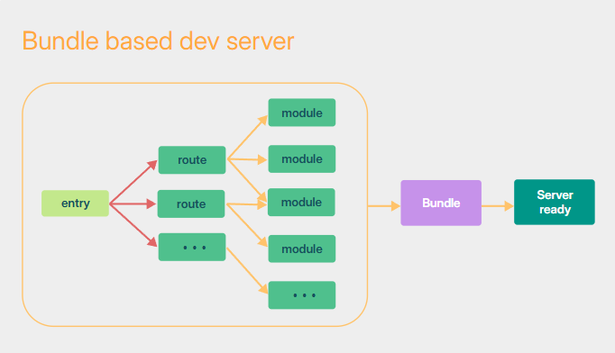

 

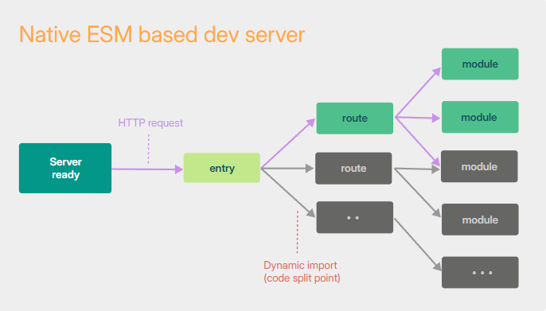

```plaintext
- **webpack** 的机制：从入口 entry 进来，分析所有的路由，分析每个路由下的所有模块，然后绑定，最后服务器准备好了。较慢。Webpack：像提前做好所有菜的餐厅，顾客来了直接上菜，但准备时间长
- **vite** 的机制：先把服务器启动起来准备好，根据用户的请求来加载对应的路由和模块，不访问的路由和模块可以先不加载。更快，更智能。Vite：像现点现做的火锅店，锅底（基础环境）先上，食材（模块）随要随煮
```

### 检查 Node.js 和 npm 安装

确保你的 Node.js 版本 ≥ 16.0.0，npm 版本 ≥ 7.0.0。

```bash
node -v
npm -v
```

### 淘宝镜像

国内用户如果下载慢，可以考虑使用淘宝镜像：

```bash
npm config set registry https://registry.npmmirror.com
```

### 创建 Vue3 项目

**下载并执行 **`**<font style="color:rgb(15, 17, 21);background-color:rgb(235, 238, 242);">create-vite</font>**`** 脚手架，通过脚手架立即创建项目。****注意：**`**<font style="color:#DF2A3F;">create-vite</font>**`**是 vite 提供的脚手架，它并不是 vite。**

```bash
npm create vite@6.5.0
```

输入项目名：hello_vue3，选择 Vue：

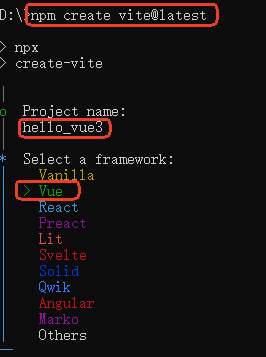

选择 TypeScript：

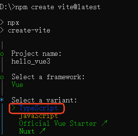

### 进入项目目录并安装依赖

```bash
cd hello_vue3
npm install    # 一键安装项目配置文件（package.json）中声明的所有第三方依赖包，生成node_modules目录。
               # 对于后端程序员来说，等同于使用maven下载所有的jar包依赖。【简写：npm i】
```

**注意：**`npm install`之后，查看 `node_modules`目录，你将看到 `vite`：它是 vite 的真身所在。通过它来构建前端项目。

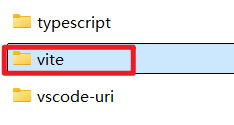

### 启动开发服务器

```bash
npm run dev
```

这将启动开发服务器，在浏览器中访问 `http://localhost:5173`

ctrl + c 终止服务器的运行。

### 构建生产版本

当准备部署时，运行：

```bash
npm run build
```

构建的文件会生成在 `dist/` 目录中

现在你已经成功创建了一个基于 Vite 的 Vue 3 项目，可以开始开发了！

## 项目结构说明

创建的项目将包含以下主要文件和目录：

```plaintext
my-vue-app/
├── .vscode/           # VS Code 编辑器配置：例如在extensions.json文件中描述需要安装的插件。
├── dist/              # 生产环境构建输出目录
├── node_modules/      # 项目依赖的 npm 包
├── public/            # 静态资源，里面有一个文件vite.svg，作为网页的页签图标。该目录下的文件不会被 Vite 构建处理，文件会直接被复制到最终产物的根路径（dist 目录下）。
└── src/               # 源代码目录：前端工程师的工作结果
    ├── App.vue        # Vue 根组件
    ├── assets/        # 图片、字体等静态资源（和public的区别是：assets中的资源会被webpack解析打包（如合并、压缩），而public中的资源会被直接复制到输出目录。）
    ├── components/    # 可复用的 Vue 组件
    ├── main.ts        # 应用入口文件（初始化 Vue 实例）
    ├── style.css      # 全局样式文件
    └── vite-env.d.ts  # Vite 环境变量类型声明，例如该文件中的默认配置作用是：你创建了.jpg .txt等文件ts是不认识的，它的作用就是让ts去认识这些文件。
├── .gitignore         # 指定 Git 忽略的文件和目录
├── index.html         # 主 HTML 文件（应用入口）：在这个文件中引入了main.ts。
├── package.json       # 项目配置和依赖管理（类似于maven中的pom.xml文件）
├── package-lock.json  # 锁定依赖版本，确保安装一致性
├── README.md          # 项目说明文档
├── tsconfig.app.json  # 应用相关的 TypeScript 配置,继承tsconfig.json并扩展它，专门配置应用源码的编译规则（如排除测试文件）
├── tsconfig.json      # 主 TypeScript 配置文件
├── tsconfig.node.json # 专为项目中的 Node.js 相关脚本（如构建工具、配置文件）提供的 TypeScript 编译配置
├── vite.config.ts     # Vite 构建工具配置（整个工程的配置文件：安装插件，配置代理等。）
```

## VS Code 安装 Vue 插件


### 安装 Vue.volar 插件

使用 VS Code 打开 Vue3 项目后，右下角会自动有提示，请安装该扩展：

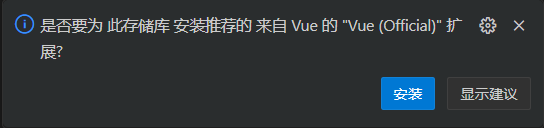

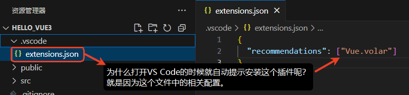

安装 `<font style="color:rgb(64, 64, 64);background-color:rgb(236, 236, 236);">Vue.volar</font>` 后，你已获得以下所有能力：

- 语法高亮（`<font style="color:rgb(64, 64, 64);background-color:rgb(236, 236, 236);">.vue</font>` 文件中的模板、脚本、样式）
- 类型检查（TypeScript 支持）
- 智能提示（组件 props、事件、插槽）
- 模板表达式类型推导（如 `<font style="color:rgb(64, 64, 64);background-color:rgb(236, 236, 236);">{{ user.name }}</font>` 会检查 `<font style="color:rgb(64, 64, 64);background-color:rgb(236, 236, 236);">user</font>` 的类型）
- 快速跳转定义（`<font style="color:rgb(64, 64, 64);background-color:rgb(236, 236, 236);">Ctrl+Click</font>` 跳转到组件或变量定义）

### 安装图标主题插件（可选）

为了让工程中的目录和文件图标显示的时候比较舒服，可以选择安装这个插件：

- `**<font style="color:rgb(64, 64, 64);background-color:rgb(236, 236, 236);">Material Icon Theme</font>**`

安装后的效果如下：

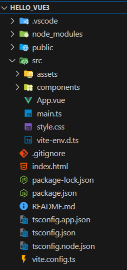

# 第一个 vue 程序


将以上自动生成的 Vue3 工程中的 src 目录下的全部内容删除。开始写代码。

## 第一步：分析入口

入口程序如下：

```html
<!doctype html>
<html lang="en">
  <head>
    <meta charset="UTF-8" />
    <link rel="icon" type="image/svg+xml" href="/vite.svg" />
    <meta name="viewport" content="width=device-width, initial-scale=1.0" />
    <title>Vite + Vue + TS</title>
  </head>
  <body>
    <div id="app"></div>
    <script type="module" src="/src/main.ts"></script>
  </body>
</html>
```

可以看到入口 `index.html`的 `body`标签中有两个比较重要东西：

1. `id='app'`的 div 容器：将来 vue 最终渲染的结果会放到该 `div`中。
2. `<script>`引入了 `/src/main.ts`，因此我们要从该文件中开始写代码。

## 第二步：在 main.ts 中写代码

在 `src`目录下新建 `main.ts`文件，编写以下代码：

```typescript
// 引入createApp函数
import {createApp} from 'vue';

// 引入根组件App（在App.vue文件中对外暴露了组件App，因此这里才能导入App组件）
// 这种导入方式为：默认导入。
import App from './App.vue';

// 采用默认导入的时候，import后面的变量名是随意的，例如也可以这样写：
//import Application from './App.vue';

// 将App根组件交给createApp来完成应用的创建，并且将应用挂载到id='app'的元素上
// 任何一个App都应该有一个根组件。
createApp(App).mount('#app');
```

## 第三步：在 App.vue 中写代码

在 `src`目录下新建 `App.vue`文件，编写以下代码：

```plaintext
<template>
    <!-- html：组件结构 -->
    <div class="hello">
        <h1>hello vue3!</h1>
    </div>
</template>

<!-- scoped表示该样式为局部样式，只对当前组件有效，如果省略表示全局样式 -->
<style scoped>
    /* css：组件样式 */
    .hello {
        /* 设置背景颜色为浅灰色 (#b5f0ee) */
        background-color: #b5f0ee; 
        /* 水平阴影偏移量0px，垂直阴影偏移量0px，阴影模糊半径15px */
        box-shadow: 0 0 15px;
        /* 设置15px的圆角边框 */
        border-radius: 15px;
        /* 定义内边距为15px */
        padding: 15px;
    }
</style>

<script>
    // Vue2的语法：
    // 对外暴露组件，这种导出方式为：默认导出
    // 默认导出后，在main.ts中的import App from './App.vue';就是用来导入它的。
    export default {
        name: 'MyApp'  // 这个name主要用于在开发者工具（DevTools）显示组件的节点名称（方便调试）。
    }
</script>
```

## 第四步：启动服务器测试

```bash
npm run dev
```

打开浏览器访问：[http://localhost:5173/](http://localhost:5173/)，效果如下：

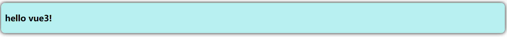

# 安装 Vue.js devtools


Vue.js Devtools 是 Vue.js 官方提供的浏览器开发者工具插件，用于调试和优化 Vue.js 应用程序。它帮助开发者更直观地查看、分析和修改 Vue 组件的状态、事件、路由和性能。

## 正常安装

**下载步骤如下**：

1. 在百度中搜索极简插件，打开极简插件官网：[https://chrome.zzzmh.cn/](https://chrome.zzzmh.cn/)
2. 在极简插件上搜索 vue，找到 `Vue.js devtools`并下载压缩包。

**安装步骤如下**：

1. 打开Chrome浏览器 -> 点击右上角三个点 -> 扩展程序 -> 管理扩展程序
2. '管理扩展程序' 页面的右上角 '开发者模式' 开关打开
3. 极简插件下载到的是压缩包，必须先解压缩！解压后有2个文件。一个安装文件，一个说明书
4. 其中名字长的 `xxx_chrome.zzzmh.cn.crx` 文件就是安装包，鼠标长按拖住，拖到 '管理扩展程序' 页面，松开鼠标
5. 看到弹出框，点添加扩展程序，安装成功！

关闭浏览器，重新打开浏览器，F12 打开控制面板，看看有没有 `Vue`选项卡：

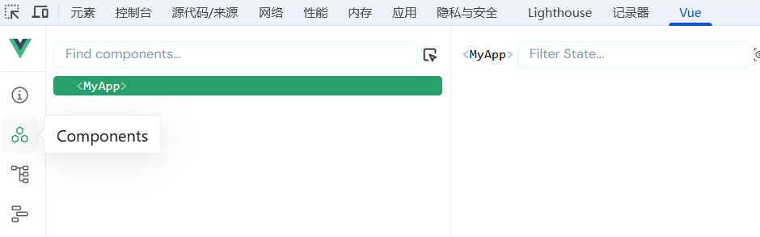

如上图表示成功安装。

## 当 win11 的 chrome 不支持拖动安装时

**第一步：**将下载的 `crx`文件采用 7zip 解压工具解压（亲测只能用 7zip，其他解压软件不行）

**第二步：**点击加载未打包的扩展程序，然后选择 7zip 解压的目录即可完成安装。

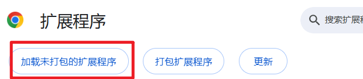

# setup 函数


setup 是 Vue3 **组合式 API** 的**核心入口函数（几乎所有组合式的 API 都是要写在这个 setup 函数中的）**，它在组件初始化时最先执行，集中管理所有组件逻辑（状态、方法、生命周期等），并返回**模板**可访问的内容。（这里的模板是指 `<template>`标签）

## 基本用法

**实现的功能：在页面上展示用户名，然后用户点击页面上的按钮显示联系方式。**

注意：`index.html`和 `main.ts`代码不变。

### 第一步：编写 Person.vue

在 src 目录下新建 components 目录，用来存储子组件。在 components 目录下新建 Person.vue 文件。代码如下：

```plaintext
<template>
    <div class="person">
        <!-- 插值语法：{{}} -->
        <h2>姓名：{{name}}</h2>
        <!-- 绑定事件 -->
        <button @click="showTel">查看联系方式</button>
    </div>

</template>

<!-- 编写TypeScript代码，需要在script标签中添加 lang='ts' -->
<script lang="ts">
    export default {
        name: 'Person',

        setup(){

            // 数据
            let name = '张三';
            let tel = '13000000000';

            // 方法
            function showTel(): void{
                alert(`手机号：${tel}`);
            }

            // setup函数的返回值非常重要，返回值会自动交给模板来处理。模板就是从这个值中自动解析数据。
            //return {name: name, showTel: showTel};

            // name和value同名，可以使用对象简写形式
            return {name, showTel};
        }
    }
</script>

<style scoped>
    .person {
        background-color: skyblue;
        box-shadow: 0 0 15px;
        border-radius: 15px;
        padding: 15px;
    }
</style>
```

知识点总结：

1. 插值语法：`{{ }}`
2. 绑定事件：`@click`【或者使用 v-on 指令，代码如：**v-on:click**】
3. setup 函数中提供的数据和方法最终必须通过 return 的方式交出去，这样模板才能解析。
4. 对象的简写形式：`{name: name, showTel: showTel}`可以简写为 `{name, showTel}`

### 第二步：编写 App.vue

```plaintext
<template>
    <div class="hello">
        <h1>hello vue3!</h1>
        <!-- 第三步：使用Person组件 -->
        <Person></Person>
    </div>
</template>

<style scoped>
    .hello {
        background-color: #b5f0ee; 
        box-shadow: 0 0 15px;
        border-radius: 15px;
        padding: 15px;
    }
</style>

<script lang="ts">

    // 第一步：导入 Person 组件
    import Person from './components/Person.vue';

    export default {
        name: 'MyApp',
        // 第二步：注册组件Person
        components: {Person} 
    }

</script>
```

知识点总结：

1. 在一个组件中可以使用另一个组件，步骤如下：
  1. 第一步：导入组件
  2. 第二步：注册组件
  3. 第三步：使用组件
2. 注意：在 Vue3 中的 `<template>`标签中可以编写多个根组件，Vue2 中是不允许的，Vue2 中只允许根有一个。

### 启动服务并运行

效果如下：

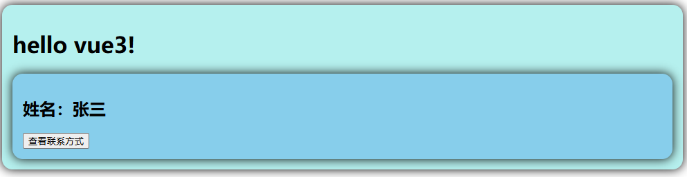

点击查看联系方式按钮会弹窗显示联系方式，如下：

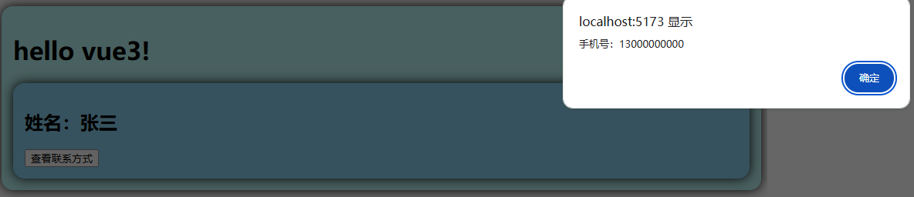

## setup 函数的返回值

setup 函数的返回值可以是：

1. 可以返回一个对象
  1. `**<font style="color:rgb(64, 64, 64);background-color:rgb(236, 236, 236);">setup</font>**` 返回的对象会暴露给模板（`**<font style="color:rgb(64, 64, 64);background-color:rgb(236, 236, 236);"><template></font>**`）使用，模板可以直接访问对象的属性和方法。
2. 也可以返回一个渲染函数
  1. 如果 `**<font style="color:rgb(64, 64, 64);background-color:rgb(236, 236, 236);">setup</font>**` 直接返回一个**渲染函数**，则组件的 `**<font style="color:rgb(64, 64, 64);background-color:rgb(236, 236, 236);"><template></font>**` 会被**完全忽略**，渲染函数的输出会直接替代模板内容。

代码如下：

```plaintext
// 返回渲染函数
return function(){
    return '渲染内容';
}
```

执行结果如下：

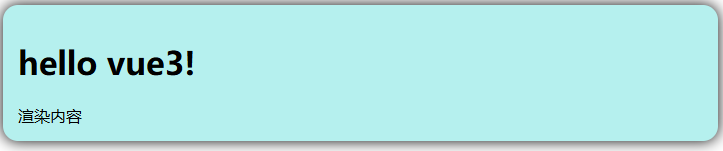

当然，渲染函数也可以是一个箭头函数，简写代码如下：

```plaintext
return () => '箭头函数渲染内容';
```

执行结果如下：

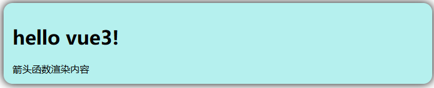

## setup 语法糖

语法糖指的是简写形式：

```plaintext
<template>
    <div class="person">
        <h2>姓名：{{name}}</h2>
        <button @click="showTel">查看联系方式</button>
    </div>
</template>

<!-- 这个script只负责导出当前组件 -->
<script lang="ts">
    export default {
        name: 'Person' // 这个名字设置devtools中显示的组件节点名字。
    }
</script>

<!-- 这个script专门编写setup函数中的代码 -->
<script lang="ts" setup>
    // 数据
    let name = '张三';
    let tel = '13000000000';
    // 方法
    function showTel(){
        alert(`手机号：${tel}`);
    }
    // 最终这些数据和方法会自动暴露给模板
</script>

<style scoped>
    .person {
        background-color: skyblue;
        box-shadow: 0 0 15px;
        border-radius: 15px;
        padding: 15px;
    }
</style>
```

第一个 script 标签中的代码负责默认导出，实际上在 vue 中默认导出的 script 实际上是可以省略的，当你省略掉之后，会自动生成默认导出。默认导出的名字和文件名自动保持一致，如果你有特殊需求的话，第一个 script 可以留着。

**也可以安装一个插件，让以上两个 **`**<font style="color:#DF2A3F;">script</font>**`**合并成一个 **`**<font style="color:#DF2A3F;">script</font>**`**：**

```bash
npm install vite-plugin-vue-setup-extend -D
```

修改 `vite.config.js`配置信息：

```javascript
import { defineConfig } from 'vite'
import vue from '@vitejs/plugin-vue'
import SetupExtend from 'vite-plugin-vue-setup-extend'  // 导入插件

// https://vite.dev/config/
export default defineConfig({
  plugins: [vue(), SetupExtend()], // 调用插件
})
```

两个 `script`就可以合并为一个了，代码如下：

```plaintext
<template>
    <div class="person">
        <h2>姓名：{{name}}</h2>
        <button @click="showTel">查看联系方式</button>
    </div>
</template>

<script lang="ts" setup name="PersonInfo">
    let name = '张三';
    let tel = '13000000000';
    function showTel() {
        alert(`手机号：${tel}`);
    }
</script>

<style scoped>
    .person {
        background-color: skyblue;
        box-shadow: 0 0 15px;
        border-radius: 15px;
        padding: 15px;
    }
</style>
```

查看 `devtools`：

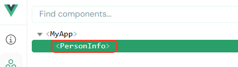

## 组件自动注册

在 Vue3 中如果使用了 setup 语法糖，import 的组件会自动注册，不需要再编写注册的代码，之前 App.vue 代码是这样写的：

```plaintext
<script>
    import Person from './components/Person.vue';

    export default {
        name: "MyApp", 
        // 手动注册组件
        components: {
            Person
        }
    }
</script>
```

可以简写为：**使用 setup 语法糖后，不需要手动注册。**

```plaintext
<script lang="ts" setup name="MyApp">
    import Person from './components/Person.vue';
</script>
```

## 配置代码模板

和我们之前配置的 `console.log();`方法一样。

要达到的效果：在 VS Code 中输入 vue3 的时候，自动生成以下代码：

```plaintext
<template>
</template>

<script lang='ts' setup>
</script>

<style scoped>
</style>
```

**第一步**：**Ctrl + Shift + P**

**第二步**：输入**Preferences: Configure User Snippets**

**第三步**：选择 **vue.json**

**第四步**：在 **vue.json** 中添加如下配置片段

```json
{
  "Vue 3 Component": {
    "prefix": "vue3",
    "body": [
      "<template>",
      "</template>",
      "",
      "<script lang='ts' setup>",
      "</script>",
      "",
      "<style scoped>",
      "</style>"
    ],
    "description": "Generate a Vue 3 single-file component with <script setup>"
  }
}
```

这样，你只要在 `**Xxx.vue**`文件中输入`**vue3**`回车，然后就会自动生成代码片段了。

# 响应式数据


## 什么是响应式数据

`setup`中的数据只要一有修改，模板中使用到数据的位置自动修改，这就是响应式。

在 Vue3 中实现响应式数据的语法有两个：

1. **ref**
2. **reactive**

## ref 实现基本类型数据的响应式

**知识点列表：**

1. **原始类型实现响应式的语法是：使用 vue 框架提供的 ref 函数进行包裹，例如：**`**let username = ref("jack");**`**，**`**username**`**具有响应式。**
2. `**ref()**`**会将原始类型转换为 **`**RefImpl**`**对象。因此以上的 **`**username**`**变量是一个 **`**RefImpl**`**对象。**
3. **原始类型数据被放到了 **`**RefImpl**`**对象的 **`**value**`**属性上，如果在脚本中需要修改 **`**username**`**，语法是：**`**username.value**`
4. **在模板的插值语法中不需要 `**.value**`，因为插值语法底层会自动 **`**.value**`

实现方式是：在需要实现响应式效果的基本类型的数据外面包裹 `ref`，例如，如果你希望 `'张三'`是响应式的，你需要这样写：`ref('张三')`。

实现原理：`ref()`函数会将基本类型数据转换为 `RefImpl`对象，如下：

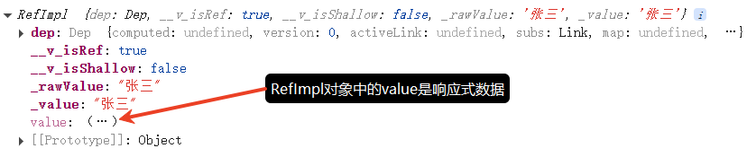

**该对象中的 value 属性上存放了基本类型数据。因此在 **`**JS**`**代码中一旦需要使用到这个数据，你需要使用 **`**.value**`**属性操作该数据。**

**但需要引起注意的是：在模板 **`**template**`**中使用插值语法 **`**{{}}**`**时不需要 **`**.value**`**，因为 vue 在这里会自动 **`**.value**`**。**

实现基本类型数据响应式效果的代码如下：

```plaintext
<template>
    <div class="person">
        <!-- 这里不需要加.value，因为底层会自动.value -->
        <h2>姓名：{{name}}</h2>
        <h2>年龄：{{age}}</h2>
        <button @click="changeName">修改名字</button>
        <button @click="changeAge">修改年龄</button>
        <button @click="showTel">查看联系方式</button>
    </div>
</template>

<script lang="ts" name="PersonInfo" setup>
    import { ref } from 'vue';

    let name = ref('张三');
    let age = ref(20);
    let tel = '13000000000';

    function changeName(){
        // 用ref包裹的数据是一个RefImpl对象，操作数据时一定要加.value
        name.value = 'zhangsan';
    }
    function changeAge(){
        age.value += 1;
    }
    function showTel(){
        alert(`手机号：${tel}`);
    }
</script>

<style scoped>
    .person {
        background-color: skyblue;
        box-shadow: 0 0 15px;
        border-radius: 15px;
        padding: 15px;
    }
    button {
        margin: 0 5px;
    }
</style>
```

注意：在 TS 中，如果要导入一个类型的话，需要在类型前面添加 `type`关键字。

## reactive 实现对象类型数据的响应式

**知识点列表：**

1. **如果一个对象要实现响应式效果，需要使用 vue 框架提供的 **`**reactive()**`**函数进行包裹。**
2. **底层实现原理是使用了 JS 内置的 **`**Proxy**`**实现的，通过控制台输出可以看到。**
3. **被 **`**reactive()**`**函数包裹的响应式对象默认支持深层次响应式。**
4. `**reactive()**`**包裹的原始类型数据没有响应式效果。**

和 `ref`实现方式差不多，需要实现对象类型数据响应式的，直接使用 `reactive`将对象包裹即可，代码如下：

```plaintext
<template>
    <div class="person">
        <h2>姓名：{{person.name}}</h2>
        <h2>年龄：{{person.age}}</h2>
        <button @click="changeName">修改名字</button>
        <button @click="changeAge">修改年龄</button>
    </div>
</template>

<script lang="ts" name="PersonInfo" setup>
    // 导入reactive函数
    import { reactive } from 'vue';

    // 数据
    let person = reactive({name: '张三',age: 20});

    // 方法
    function changeName() {
        person.name = 'zhangsan';
    }

    function changeAge() {
        person.age += 1;
    }

</script>

<style scoped>
    .person {
        background-color: skyblue;
        box-shadow: 0 0 15px;
        border-radius: 15px;
        padding: 15px;
    }
    button {
        margin: 0 5px;
    }
</style>
```

`reactive`函数包裹对象之后，会自动为目标对象生成代理对象，如下图：

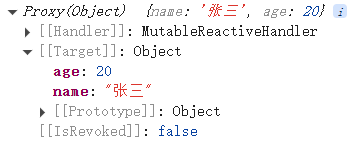

因此，对于对象类型数据的响应式来说，底层实现原理使用了原生 JS 的 `Proxy`实现的。注意：`Proxy`是原生 JS 中自带的函数。

**另外，被 reactive 函数包裹的对象被称为响应式对象，并且这个响应式对象深层次的属性也是支持响应式的。**

编写以下代码，测试一下深层次的属性是否支持响应式：

```plaintext
<template>
    <div>
        <div>{{obj.a.b.c}}</div>
        <button @click="changeValue">修改</button>
    </div>
</template>


<script lang='ts' setup name="PersonInfo">
    import { reactive } from 'vue';

    let obj = reactive({
        a: {
            b: {
                c: 100
            }
        }
    });

    // 也可以使用箭头函数。将函数赋给一个变量，这个变量就代表这个函数。最终也会自动返回暴露给模板。
    const changeValue = () =>{
        obj.a.b.c = 200;
    }
</script>
```

通过测试可以看到，响应式对象的深层次属性也是支持响应式的。

**注意：**`**<font style="color:#DF2A3F;">reactive</font>**`**无法处理基本类型数据的响应式，只能处理对象类型的数据。**

## v-bind 指令

`v-bind` 是 Vue 中最常用的指令之一，它用于**动态绑定 HTML 属性到 Vue 实例的数据上**。

### 基本用法

`v-bind` 的基本语法是将属性名前面加上 `**v-bind:**` 或简写为 `**:**`

```plaintext
<!-- 完整语法 -->


<!-- 简写语法 -->

```

在这个例子中，`src` 属性会被绑定到 Vue 实例的 `imageSrc` 数据属性上。

`**<font style="color:#DF2A3F;">v-bind</font>**`** 的值是 JavaScript 表达式，所以可以直接写变量名或简单表达式。**

### 绑定字符串

```plaintext
<template>
  <a :href="url">点击这里</a>
</template>
<script lang="ts" setup name="PersonInfo">
  const url = "https://vuejs.org";
</script>
```

### 绑定布尔值

```plaintext
<template>
  <button :disabled="isButtonDisabled">提交</button>
</template>

<script lang="ts" setup name="PersonInfo">
  const isButtonDisabled = true;
</script>
```

如果变量值是 `null`或 `undefined`时，该属性不会渲染。不渲染的意思是：**这个属性不存在**。

### 绑定数组

**知识点列表：**

1. `**:class="[activeClass, errorClass]"**`**这是 Vue 中提供的语法。**
2. **Vue 对 **`**class**`**属性有特殊处理，如果 **`**activeClass**`** 和 **`**errorClass**`** 两个变量都有值**
  1. **渲染结果是：**`**class="active text-danger"**`
3. **如果不是 **`**class**`**属性，而是随意一个属性，例如 **`**abc**`**属性，如果 **`**activeClass**`** 和 **`**errorClass**`** 两个变量都有值**
  1. **渲染结果是：**`**abc="active,text-danger"**`**，一般这种用法意义不大。**

```plaintext
<template>
    <!-- v-bind允许绑定一个数组 -->
    <div :class="[activeClass, errorClass]">
        这是一个带有动态类名的div元素
    </div>
    <!-- 请认真阅读以下注释信息： -->
    <!-- 以上代码如果变量activeClass和errorClass都有值的情况下，最终渲染结果如下 -->
    <!--
    <div class="active text-danger">
        这是一个带有动态类名的div元素
    </div>
    -->
    <!-- 以上代码如果变量activeClass有值，errorClass是空字符串的情况下，最终渲染结果如下 -->
    <!--
    <div class="active">
        这是一个带有动态类名的div元素
    </div>
    -->
</template>

<script lang="ts" setup name="PersonInfo">
    const activeClass = 'active';
    const errorClass = 'text-danger';
</script>

<style scoped>
    /* 基础样式 */
    div {
        padding: 20px;
        margin: 10px;
        border-radius: 4px;
        transition: all 0.3s ease;
    }

    /* active 类样式 */
    .active {
        background-color: #42b983;
        border: 1px solid #3aa876;
    }

    /* text-danger 类样式 */
    .text-danger {
        color: #f56c6c;
        font-weight: bold;
    }
</style>
```

### 绑定对象

**知识点列表：**

1. `**:class="{ 'active': isActive, 'text-danger': hasError }"**`**在 Vue 中也进行了特殊处理，属于 Vue 的语法。**
2. **如果 **`**isActive**`** 和 **`**hasError**`** 都是 true，则最终渲染结果：**`**class="active text-danger"**`

```plaintext
<template>
    <!-- v-bind 允许绑定对象 -->
    <div :class="{ 'active': isActive, 'text-danger': hasError }">
        这是一个带有动态类名的div元素
    </div>
    <!-- 请详细阅读以下注释 -->
    <!-- 当变量 isActive 和 hasError都是true时，以上代码的最终渲染效果如下 -->
    <!-- 
    <div :class="active text-danger">
        这是一个带有动态类名的div元素
    </div>
    -->
    <!-- 当变量 isActive是true，hasError是false时，以上代码的最终渲染效果如下 -->
    <!-- 
    <div :class="active">
        这是一个带有动态类名的div元素
    </div>
    -->
</template>

<script lang="ts" setup name="PersonInfo">
    const isActive = true;
    const hasError = true;
</script>

<style scoped>
    /* 基础样式 */
    div {
        padding: 20px;
        margin: 10px;
        border-radius: 4px;
        transition: all 0.3s ease;
    }

    /* active 类样式 */
    .active {
        background-color: #42b983;
        color: white;
        border: 1px solid #3aa876;
    }

    /* text-danger 类样式 */
    .text-danger {
        color: #f56c6c;
        font-weight: bold;
    }
</style>
```

### 动态属性名

在 Vue 3 中，你可以使用动态属性名：

```plaintext
<template>
    <div :[attributeName]="value"></div>
</template>
<script lang="ts" setup name="PersonInfo">
    const attributeName = 'id';
    const value = 'main-content';
</script>
```

查看页面源码，会发现动态生成了属性名和值：

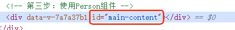

### 绑定多个属性

可以使用对象语法一次性绑定多个属性：

```plaintext
<template>
    <div v-bind="objectOfAttrs"></div>
    <!--或者这样写-->
    <div :="objectOfAttrs"></div>
</template>

<script lang="ts" setup name="PersonInfo">
    const objectOfAttrs = {
        id: 'container',
        class: 'wrapper',
        'data-attribute': 'example'
    };
</script>
```

查看页面源码，会发现动态生成了属性名和值：

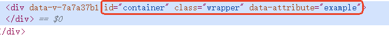

### 实际应用示例

```plaintext
<template>
    <div>
        <!-- 绑定图片源 -->
        

        <!-- 绑定样式 -->
        <div :style="{ color: textColor, fontSize: fontSize + 'px' }">
            动态样式文本
        </div>

        <!-- 绑定表单值 -->
        <input type="text" :value="inputValue">

        <!-- 绑定类名 -->
        <button :class="{ 'btn-primary': isPrimary, 'btn-disabled': isDisabled }" :disabled="isDisabled">
            点击我
        </button>

    </div>
</template>

<script lang="ts" setup name="PersonInfo">
    import { ref } from 'vue';

    const imagePath = '/vite.svg';
    const imageDescription = '示例图片';
    // ref() 函数不是必须的，需要响应式就加，不需要响应式就可以不加。
    const textColor = ref('#42b983');
    const fontSize = ref(16);
    const inputValue = ref('jackson');
    const isPrimary = ref(true);
    const isDisabled = ref(false);
</script>

<style scoped>
    .btn-primary {
        background-color: #42b983;
        color: white;
    }

    .btn-primary:hover {
        background-color: #3aa876;
        transform: translateY(-2px);
    }
</style>
```

## v-model 指令

`v-model`指令可以完成双向数据绑定效果。

**什么是双向数据绑定？**

1. **数据修改时视图变化。**
2. **视图修改时数据也变化。**

### 通过事件实现双向数据绑定

`v-bind`只支持单向，要想使用 `v-bind`完成双向数据绑定的效果，那就需要额外添加事件处理代码了：

```plaintext
<template>
    <div>
        <!-- @input 表示当发生input事件的时候执行：inputValue = ($event.target as HTMLInputElement).value -->
        <!-- $event 表示当前发生的事件 -->
        <!-- $event.target 表示当前发生事件的目标元素，as HTMLInputElement是TypeScript中的断言机制，断言类型之后可以解决编译报错问题 -->
        <!--@input="inputValue = ($event.target as HTMLInputElement).value" 表示当发生input事件的时候，将文本框中value赋值给数据inputValue变量 -->
        <input type="text" :value="inputValue" @input="inputValue = ($event.target as HTMLInputElement).value">

        <div>您输入的用户名为：{{inputValue}}</div>
    </div>
</template>

<script lang="ts" setup name="PersonInfo">
    import { ref } from 'vue';

    const inputValue = ref('jackson');
</script>
```

### 通过 v-model 实现双向数据绑定

`v-model`指令自动就可以完成双向数据绑定，代码如下：

```plaintext
<template>
    <div>
        <input type="text" v-model="inputValue">
        <div>您输入的用户名为：{{inputValue}}</div>
    </div>
</template>

<script lang="ts" setup name="PersonInfo">
    import { ref } from 'vue';

    const inputValue = ref('jackson');
</script>
```

**注意：不是 **`**v-model:value**`**，而是 **`**v-model**`**。**

## v-for 指令

### 什么是 v-for

`v-for` 是 Vue 中的一个指令，用于基于源数据多次渲染元素或模板块。简单说，就是用来循环显示列表数据的。

### 基本语法

```plaintext
<template>
    <div>
        <ul>
            <li v-for="person in personList" :key="person.id">
                {{person.name}},{{person.age}}
            </li>
        </ul>
    </div>
</template>

<script lang='ts' name="PersonInfo" setup>
  
    let personList = [
        {id: '101', name: 'jack', age: 20},
        {id: '102', name: 'lucy', age: 30},
        {id: '103', name: 'tom', age: 25}
    ];
</script>
```

`**v-for**`** 的基本语法是**：`item in items`，其中：

- `items` 是源数据数组
- `item` 是被迭代的数组元素的别名

**重要的 **`**key**`**属性**：在使用 `v-for` 时，你应该始终提供一个唯一的 `key` 属性：

- 帮助 Vue 识别节点，提高性能
- 避免一些潜在的渲染问题
- 通常使用数据中的唯一 ID 作为 key

### 获取索引

你还可以获取当前项的索引：

```plaintext
<template>
    <div>
        <ul>
            <li v-for="(person, index) in personList" :key="person.id">
                {{index}},{{person.name}},{{person.age}}
            </li>
        </ul>
    </div>
</template>

<script lang='ts' name="PersonInfo" setup>
    let personList = [
        {id: '101', name: 'jack', age: 20},
        {id: '102', name: 'lucy', age: 30},
        {id: '103', name: 'tom', age: 25}
    ];
</script>
```

### 遍历对象

`v-for` 也可以用来遍历对象的属性：

```plaintext
<template>
    <div>
        <ul>
            <li v-for="(propertyValue, propertyName, index) in person" :key="propertyName">
                {{propertyValue}},{{index}},{{propertyName}}
            </li>
        </ul>
    </div>
</template>

<script lang='ts' name="PersonInfo" setup>
    let person = {
        name: 'jackson',
        age: 20,
        tel: '13000232124'
    };
</script>
```

### 使用范围值

`v-for` 也可以接受整数，在这种情况下，它会把模板重复对应次数：

```plaintext
<template>
    <div>
        <ul>
            <li v-for="n in 10" :key="n">
                {{n}}
            </li>
        </ul>
    </div>
</template>
```

## reactive 实现数组响应式

```plaintext
<template>
    <div>
        <h2>购物清单</h2>
        <ul>
            <li v-for="(item, index) in shoppingList" :key="item.id">
                {{ index + 1 }}. {{ item.name }} - 数量: {{ item.quantity }}
                <button @click="removeItem(index)">删除</button>
            </li>
        </ul>
        <button @click="changeFirstItemQuantity">将第一个商品的数量修改为5</button>
    </div>
</template>

<script lang="ts" setup name="PersonInfo">
    import { reactive } from 'vue'

    const shoppingList = reactive([
        { id: 1, name: '苹果', quantity: 3 },
        { id: 2, name: '牛奶', quantity: 1 },
        { id: 3, name: '面包', quantity: 2 }
    ])

    function removeItem(index: number) {
        shoppingList.splice(index, 1);
    }
    // 箭头函数也可以。
    const changeFirstItemQuantity = () => {
        shoppingList[0].quantity = 5;
    }
</script>
```

Vue 能够检测到以下数组方法并触发视图更新：

- `**<font style="color:rgb(15, 17, 21);background-color:rgb(235, 238, 242);">push()</font>**`：在数组**末尾**添加一个或多个元素
- `**<font style="color:rgb(15, 17, 21);background-color:rgb(235, 238, 242);">pop()</font>**`：删除并返回数组的**最后一个**元素
- `**<font style="color:rgb(15, 17, 21);background-color:rgb(235, 238, 242);">shift()</font>**`：删除并返回数组的**第一个**元素
- `**<font style="color:rgb(15, 17, 21);background-color:rgb(235, 238, 242);">unshift()</font>**`：在数组**开头**添加一个或多个元素
- `**<font style="color:rgb(15, 17, 21);background-color:rgb(235, 238, 242);">splice()</font>**`：在指定位置**删除/替换/添加**元素（功能最强大）
- `**<font style="color:rgb(15, 17, 21);background-color:rgb(235, 238, 242);">sort()</font>**`：对数组元素进行**排序**（默认按字符串Unicode排序）
- `**<font style="color:rgb(15, 17, 21);background-color:rgb(235, 238, 242);">reverse()</font>**`：将数组元素**顺序反转**

这些方法都会**直接修改原数组**，在 Vue 中使用时能触发响应式更新。

## ref 实现对象类型数据的响应式

`ref`不仅可以实现基本类型数据的响应式，还可以实现对象类型数据的响应式，代码如下：

```plaintext
<template>
    <div>
        <h2>购物清单</h2>
        <ul>
            <li v-for="(item, index) in shoppingList" :key="item.id">
                {{ index + 1 }}. {{ item.name }} - 数量: {{ item.quantity }}
                <button @click="removeItem(index)">删除</button>
            </li>
        </ul>
        <button @click="changeFirstItemQuantity">将第一个商品的数量修改为5</button>
    </div>
</template>

<script lang="ts" setup name="PersonInfo">
    import { ref } from 'vue'

    const shoppingList = ref([
        { id: 1, name: '苹果', quantity: 3 },
        { id: 2, name: '牛奶', quantity: 1 },
        { id: 3, name: '面包', quantity: 2 }
    ])

    function removeItem(index: number) {
        shoppingList.value.splice(index, 1);
    }

    const changeFirstItemQuantity = () => {
        // 取数组对象也需要 .value 才能取到
        shoppingList.value[0].quantity = 5;
    }
</script>
```

将 `ref`包裹的对象之后的返回值输出一下可以看到以下效果：

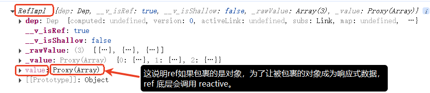

**小技巧：**使用 `ref`包裹数据之后，编写代码时，每一次都要带着 `.value`，可见编写代码时比较繁琐，另外程序员也很容易忘记添加 `.value`，VS Code 的`Volar`插件可以自动生成 `.value`，按照如下步骤进行配置：

**第一步**：设置->扩展->Vue

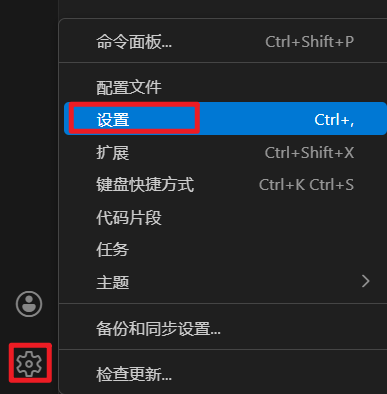

**第二步**：下图打勾

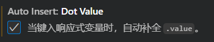

## reactive 的失效情况

**失去响应式还是不失去响应式的核心标准是：看最外层的引用指向是否发生变化，如果变化就会失去响应式，没有变化则不会失去响应式。**

`reactive`重新分配一个新对象，会失去响应式。**ref 不存在这个问题，但重新指向一个全新的 ref，也会失去响应式，只修改 value 不会失去响应式。**

```plaintext
<template>
    <div>
        <ul>
            <li>姓名：{{person.name}}</li>
            <li>年龄：{{person.age}}</li>
        </ul>
        <button @click="changeName">修改名字</button>
        <button @click="changeAge">修改年龄</button>
        <button @click="changePerson">修改用户信息</button>
    </div>
</template>

<script lang='ts' setup>
    import { reactive } from 'vue';

    let person = reactive({name: 'jack', age: 20});

    const changeName = () => {
        person.name = 'jackson';
    }

    const changeAge = () => {
        person.age++;
    }

    const changePerson = () => {

        // 响应式失效
        //person = {name: 'lucy', age: 18};

        // 响应式同样失效，因为压根就不是同一个对象
        //person = reactive({name: 'lucy', age: 18});

        // 可以采用最笨的办法，一个属性一个属性修改
        //person.name = 'lucy';
        //person.age = 18;

        // 也可以这样做
        Object.assign(person, {name: 'lucy', age: 18});
    }

</script>
```

注意：`**Object.assign(person, {name: 'lucy', age: 18});**`是把新对象的数据合并到老对象上，老对象还是那个老对象，没有变化，所以仍然具有响应式。

`ref`不存在这个问题，我们来编写代码测试一下：

```plaintext
<template>
    <div>
        <ul>
            <li>姓名：{{person.name}}</li>
            <li>年龄：{{person.age}}</li>
        </ul>
        <button @click="changeName">修改名字</button>
        <button @click="changeAge">修改年龄</button>
        <button @click="changePerson">修改用户信息</button>
    </div>
</template>

<script lang='ts' setup>
    import { ref } from 'vue';

    let person = ref({name: 'jack', age: 20});

    const changeName = () => {
        person.value.name = 'jackson';
    }

    const changeAge = () => {
        person.value.age++;
    }

    const changePerson = () => {
        // 必须 .value
        person.value = {name: 'lucy', age: 18};
        // 这样也会失去响应式。
        //person = ref({name: 'lucy', age: 18});
    }

</script>
```

**使用原则：**`**ref**`**和 **`**reactive**`**应该如何选择？**

1. 如果需要一个基本类型数据的响应式，必须使用 ref
2. 如果需要一个响应式对象，但层次不深，ref 和 reactive 都可以。
3. 如果需要一个响应式对象，且层次较深，建议使用 reactive。

## toRefs 与 toRef

### 对象解构语法

```javascript
let user = {
    username: 'jack',
    age: 20
};

// 对象解构语法
let {username, age} = user;

// 数组也支持对象解构语法
let [a, b, c] = [1, 2, 3];

// 等同于
//let username = user.username;
//let age = user.age;

console.log(username, age);
```

### toRefs

`**<font style="color:rgb(64, 64, 64);background-color:rgb(236, 236, 236);">toRefs</font>**`** **函数将一个响应式对象（reactive 对象）转换为一个新对象，新对象的每个属性都是 ref 的，虽然是新对象，但是该新对象的每个 ref 属性仍然连接到**原始响应式对象**。主要用途：**解构时保持响应性**。

默认情况下，一个 reactive 对象解构之后，生成的每个变量不具备响应性，示例代码：

```plaintext
<template>
    <ul>
        <li>姓名：{{name}}</li>
        <li>年龄：{{age}}</li>
    </ul>
    <button @click="changeName">修改名字</button>
    <button @click="changeAge">修改年龄</button>
</template>

<script lang='ts' setup name="PersonInfo">
    import { reactive } from 'vue';

    // 创建reactive响应式对象
    let person = reactive({name: 'jack', age: 18});

    // 对象解构
    let {name, age} = person;

    const changeName = () => {
        name += '*';
    }

    const changeAge = () => {
        age++;
    }
</script>
```

使用 `toRefs`可以让其继续保持响应性，代码如下：

```plaintext
<template>
    <ul>
        <li>姓名：{{name}}</li>
        <li>年龄：{{age}}</li>
    </ul>
    <button @click="changeName">修改名字</button>
    <button @click="changeAge">修改年龄</button>
</template>

<script lang='ts' setup name="PersonInfo">
    import { reactive, toRefs } from 'vue';

    // 创建reactive响应式对象
    let person = reactive({name: 'jack', age: 18});

    // 对象解构
    let {name, age} = toRefs(person);

    const changeName = () => {
        name.value += '*';
    }

    const changeAge = () => {
        age.value++;
    }
</script>
```

### toRef

`**<font style="color:rgb(64, 64, 64);">toRef</font>**` 函数为响应式对象（reactive 对象）的某个特定属性创建一个 ref 引用，这个 ref 会与原属性保持同步的响应式连接。主要用途：**在需要将响应式对象的单个属性作为 ref 传递时保持响应性**。

示例代码：

```plaintext
<template>
    <ul>
        <li>年龄：{{age}}</li>
    </ul>
    <button @click="changeAge">修改年龄</button>
</template>

<script lang='ts' setup name="PersonInfo">
    import { reactive, toRef } from 'vue';

    // 创建reactive响应式对象
    let person = reactive({name: 'jack', age: 18});

    // 为reactive响应式对象的age属性创建一个 ref 引用
    let age = toRef(person, 'age');

    const changeAge = () => {
        age.value++;
    }
</script>
```

# 其它需要掌握的指令


## `v-else`

**作用**：必须紧跟在 `v-if` 或 `v-else-if` 之后，表示“否则”情况。
**示例**：

```plaintext
<template>
  <div v-if="isLoggedIn">欢迎回来！</div>
  <div v-else>请先登录</div>
</template>

<script setup>
    import { ref } from 'vue';

    const isLoggedIn = ref(false);
</script>
```

## `v-else-if`

**作用**：用于多条件判断，类似于 `else if`。
**示例**：

```plaintext
<template>
  <div v-if="score >= 90">优秀</div>
  <div v-else-if="score >= 60">及格</div>
  <div v-else>不及格</div>
</template>

<script setup>
    import { ref } from 'vue';

    const score = ref(85);
</script>
```

## `v-text`

**作用**：设置元素的 `textContent`（相当于 `{{ }}`，但会覆盖整个内容）。
**示例**：

```plaintext
<template>
  <div v-text="message"></div>
  <!-- 等同于 <div>{{ message }}</div> -->
</template>

<script setup>
    import { ref } from 'vue';

    const message = ref("Hello Vue 3!");
</script>
```

## `v-html`

**作用**：渲染原始 HTML（注意：动态 HTML 可能有 XSS 风险，仅用于可信内容）。
**示例**：

```plaintext
<template>
  <div v-html="rawHtml"></div>
</template>

<script setup>
    import { ref } from 'vue';

    const rawHtml = ref('<span style="color: red">红色文字</span>');
</script>
```

## `v-pre`

**作用**：跳过编译，直接输出原始内容（适用于展示 Vue 模板代码）。
**示例**：

```plaintext
<template>
  <div v-pre>{{ 这个内容不会被编译 }}</div>
  <!-- 渲染结果：{{ 这个内容不会被编译 }} -->
</template>
```

## `v-cloak`

**作用**：防止 Vue 未编译完成时显示 `{{ }}` 模板（需配合 CSS 使用）。
**示例**：

```plaintext
<template>
  <div v-cloak>{{ message }}</div>
</template>

<script lang="ts" setup>
    import { ref } from 'vue';

    let message = ref("hello message!");
</script>

<style>
    [v-cloak] {
        display: none;
    }
</style>
```

## `v-once`

**作用**：仅渲染一次，后续数据变化不会更新（适用于静态内容优化）。
**示例**：

```plaintext
<template>
  <div v-once>{{ staticMessage }}</div>
  <!-- 即使 staticMessage 变化，这里也不会更新 -->
</template>

<script setup>
    import { ref } from 'vue';

    const staticMessage = ref("这段内容只渲染一次");
</script>
```

## `v-memo`（Vue 3 新增）

**组件内任何在模板中使用的响应式数据变化** → 触发组件重新渲染 → 重新执行 render 函数 → 所有模板中的函数都会重新调用。

**作用**：缓存模板片段，仅在依赖项变化时重新渲染（优化性能）。
**示例**：

```plaintext
<template>
  <button @click="data++">其他组件更新 {{ data }}</button>
  
  <!-- 没有 v-memo：每次点击按钮都会重新计算 -->
  <!-- <div>
    无缓存：{{ expensiveCalculation() }}
  </div> -->
  
  <!-- 有 v-memo：点击按钮不会重新计算（因为依赖没变） -->
  <div v-memo="[dependency1, dependency2]">
    有缓存：{{ expensiveCalculation() }}
  </div>
</template>

<script setup>
  import { ref } from 'vue';
  
  // 依赖项
  const dependency1 = ref(1);
  const dependency2 = ref(2);
  
  // 其他组件的数据
  const data = ref(0);
  
  const expensiveCalculation = () => {
    console.log("计算中...");
    return dependency1.value + dependency2.value;
  };
</script>
```

## 总结

| **指令** | **作用** | **适用场景** |
| --- | --- | --- |
| `v-else` | `v-if` 的“否则”情况 | 条件渲染 |
| `v-else-if` | 多条件分支 | 复杂条件判断 |
| `v-text` | 设置 `textContent` | 替代 `{{ }}` |
| `v-html` | 渲染原始 HTML | 动态 HTML（需防 XSS） |
| `v-pre` | 跳过编译 | 展示 Vue 模板代码 |
| `v-cloak` | 防止未编译时显示 `{{ }}` | 配合 CSS 使用 |
| `v-once` | 仅渲染一次 | 静态内容优化 |
| `v-memo` | 缓存模板片段 | 性能优化 |

这些指令在 Vue 3 开发中非常实用，合理使用可以提升代码性能和可读性。

# 计算属性


## 基础示例

我们要完成这样一个效果，大家思考一下，根据目前所学应该如何完成？

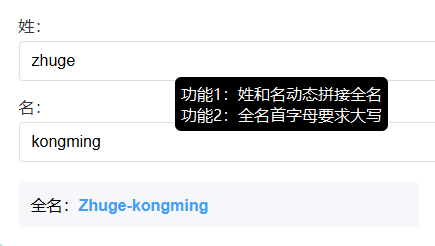

代码如下：

```plaintext
<template>
    姓：<input type="text" v-model="firstName"><br>
    名：<input type="text" v-model="lastName"><br>
    <!-- 插值语法中可以编写表达式： -->
    全名：{{firstName.slice(0, 1).toUpperCase() + firstName.slice(1)}}-{{lastName}}
</template>

<script lang='ts' setup name="PersonInfo">
    import {ref } from 'vue';

    let firstName = ref('张');
    let lastName = ref('三');
</script>
```

Vue 官方建议模板中只应该包含简单的表达式，复杂的逻辑应该放在计算属性或方法中。模板中的复杂表达式会：

- 降低模板的可读性
- 使逻辑难以复用
- 增加维护难度

Vue 推崇将逻辑（JavaScript）与视图（模板）分离，这种字符串操作属于业务逻辑，应该放在脚本部分而不是模板中。

## 计算属性（只读）

计算属性（只读）的语法格式：

```plaintext
<script lang='ts' setup>
  import {computed} from 'vue';
  
  let computedProperty = computed(()=>{
    // 执行计算逻辑，只要计算属性关联的任意属性值发生变化，计算属性的函数就会被调用一次。
    // 但如果计算属性关联的所有属性值都没有发生变化，计算属性的值会自动从缓存中获取。因此计算属性是支持缓存的。
    return 值; // 这个值就是计算属性的值。
  });
</script>
```

注意：计算属性返回的也是一个 Ref 响应式对象。

将之前的示例使用计算属性再实现一次：

```plaintext
<template>
    姓：<input type="text" v-model="firstName"><br>
    名：<input type="text" v-model="lastName"><br>
    全名：{{fullName}}
    <!-- 直接从缓存中取，不再执行计算过程。计算属性是支持缓存的。 -->
    全名：{{fullName}}
</template>

<script lang='ts' setup name="PersonInfo">
    import {computed, ref} from 'vue';

    let firstName = ref('张');
    let lastName = ref('三');

    // 计算属性
    let fullName = computed(() => {
        return firstName.value.slice(0, 1).toUpperCase() + firstName.value.slice(1) + '-' + lastName.value;
    });
</script>
```

## 调用方法和计算属性的区别

插值语法中也可以调用方法，采用调用方法的方式可以实现以上的功能吗？可以，代码如下：

```plaintext
<template>
    姓：<input type="text" v-model="firstName"><br>
    名：<input type="text" v-model="lastName"><br>
    全名：{{fullName()}}<br>
    全名：{{fullName()}}<br>
</template>

<script lang='ts' setup name="PersonInfo">
    import { ref } from 'vue';

    let firstName = ref('张');
    let lastName = ref('三');

    function fullName() {
        console.log('fullName()方法执行了');
        return firstName.value.slice(0, 1).toUpperCase() + firstName.value.slice(1) + '-' + lastName.value;
    }
</script>
```

这种方式也可以完成效果，但是效率较低，只要 `{{fullName()}}`一次则调用一次，没有缓存的概念。

## 计算属性（可读可写）

只读的计算属性是不可修改的，我们尝试修改一下，看看会报什么错？代码如下：

```plaintext
<template>
    姓：<input type="text" v-model="firstName"><br>
    名：<input type="text" v-model="lastName"><br>
    全名：{{fullName}}<br>
    <button @click="changeFullName">将全名修改为jack-son</button>
</template>

<script lang='ts' setup name="PersonInfo">
    import {computed, ref} from 'vue';

    let firstName = ref('张');
    let lastName = ref('三');

    // 计算属性
    let fullName = computed(() => {
        return firstName.value.slice(0, 1).toUpperCase() + firstName.value.slice(1) + '-' + lastName.value;
    });

    // 尝试修改只读的计算属性
    const changeFullName = () => {
        fullName.value = 'jack-son';
    };
</script>
```

报错信息如下：

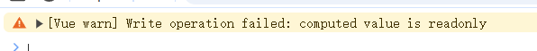

**对于计算属性（可读可写）的语法格式：**

```plaintext
<script lang='ts' setup>
  import {type WritableComputedRef, computed} from 'vue';
  
  let computedProperty: WritableComputedRef<string> = computed({
    get(){
      // 当读取计算属性的值时，该方法会被调用。
      return 值;
    },
    set(val){
      // 当修改计算属性的值时，该方法会被调用。
    }
  });
</script>
```

**如果你需要一个可读可写的计算属性，代码需要这样写：**

```plaintext
<template>
    姓：<input type="text" v-model="firstName"><br>
    名：<input type="text" v-model="lastName"><br>
    <!-- 这里会自动调用计算属性的 get() 方法 -->
    全名：{{fullName}}<br>
    <button @click="changeFullName">将全名修改为Jack-son</button>
</template>

<script lang='ts' setup name="PersonInfo">
    import {computed, ref} from 'vue';

    let firstName = ref('张');
    let lastName = ref('三');

    // 计算属性（注意TS类型要使用 WritableComputedRef）
    let fullName = computed({
        get(){
            return firstName.value.slice(0, 1).toUpperCase() + firstName.value.slice(1) + '-' + lastName.value;
        },
        set(val){
            const [first, last] = val.split('-');
            firstName.value = first;
            lastName.value = last;
        }
    });

    // 尝试修改只读的计算属性
    const changeFullName = ()=> {
        // 这里会自动调用计算属性的 set() 方法。并且将值传递给 set(val) 方法的val参数
        fullName.value = 'jack-son';
    };
</script>
```

**总结：**

- **只读的计算属性：**`**computed(回调函数)**`
- **可读可写的计算属性：**`**computed({对象中写 get 和 set 方法})**`

# watch 监视


**作用：监视数据的变化。**

监视和计算属性的区别？

- 监视目的是：监视某个数据的变化，当数据变化时，执行回调函数，在回调函数中处理业务。
- 计算属性的目的是：最终返回一个值。（返回一个计算之后的值），计算属性的实现依赖于缓存机制。

**特点：Vue3 中的监视只能监视以下四种数据：**

1. **一个函数，返回一个值。**
2. **一个 ref**
3. **一个响应式对象**
4. **...或是由以上类型的值组成的数组。**

## 监视 ref 定义的基本类型数据

**默认情况下：**

1. **监视**`**ref(0)**`**时，监视的是 0 这个数字的变化，只要数字变化就能监视到。**
2. **监视 `**ref({name:"jack", age: 20})**`，监视的是 **`**{name:"jack", age: 20}**`**对象有没有变成新对象。如果要监视对象中的 **`**name**`**和 **`**age**`**属性的需要开启深度监视。**

语法格式：

```plaintext
<script lang='ts' setup>
    import { watch } from 'vue';
  
    // 只要被监视的对象中的数据发生变化，立即执行回调函数
    // 并且回调函数中有两个参数用来接收新值和旧值
    watch(被监视的对象, (新值, 旧值)=>{
      // 监视后的逻辑
    }, {配置项});
</script>
```

代码如下：

```plaintext
<template>
    <div>
        <h2>count = {{ count }}</h2>
        <button @click="addOne">计数器加1</button>
    </div>
</template>

<script lang='ts' setup>
    import { ref, watch } from 'vue';

    let count = ref(0);

    const addOne = ()=>{
        count.value++;
    }

    // 监视：只要count一发生变化，立即执行回调函数
    // 需要引起的注意：第一个参数是被监视的对象，你不能写 count.value 哈。因为官方说了只能监视四种数据：count.value不在这四种数据范围之内。
    watch(count, (newVal, oldVal)=>{
        console.log('计数器加1了', newVal, oldVal);
    });
</script>
```

如何停止监视，请看代码：比如计数器达到 10 的时候停止监视。

```plaintext
<template>
    <div>
        <h2>count = {{ count }}</h2>
        <button @click="addOne">计数器加1</button>
    </div>
</template>

<script lang='ts' setup>
    import { ref, watch } from 'vue';

    let count = ref(0);

    const addOne = ()=>{
        count.value++;
    }

    // watch() 函数的返回值是一个函数，通过调用这个函数可以停止监视。
    const stopWatch = watch(count, (newVal, oldVal)=>{
        console.log('计数器加1了', newVal, oldVal);
        if(count.value >= 10){
            // 调用停止监视函数来停止监视。
            stopWatch();
        }
    });
</script>
```

注意：监视器的返回值就是一个专门用来停止监视的函数：无参数无返回值。

## 监视 ref 定义的对象类型数据

**监视 ref 定义的对象类型数据时，直接写数据名，监视的是对象的【地址值】，如果想监视对象内部的数据，需要手动开启深度监视。**

### 未开启深度监视

当未开启深度监视时，监视的是对象的【地址值】。

```plaintext
<template>
    <div>
        <div>姓名：{{ person.name }}</div>
        <div>年龄：{{ person.age }}</div>
        <div><button @click="changeName">修改姓名</button></div>
        <div><button @click="changeAge">修改年龄</button></div>
        <div><button @click="changePerson">修改整个人</button></div>
    </div>
</template>

<script lang='ts' setup name="PersonInfo">
    import {ref, watch} from 'vue';

    // 数据
    let person = ref({
        name: 'jack',
        age: 30
    });

    // 方法
    function changeName(){
        person.value.name += '*';
    }
    function changeAge(){
        person.value.age++;
    }
    function changePerson(){
        // 等于修改了 person 引用的内存地址，让其指向了新对象。
        person.value = {
            name: 'lucy',
            age: 30
        };
    }

    // 监视
    watch(person, (newVal, oldVal)=> {
        console.log('person被修改了', newVal, oldVal);
    });

</script>

<style scoped>
    button {
        margin: 5px 0;
    }
</style>
```

通过以上代码的测试，只有点击 **修改整个人 **才会触发监视。未开启深度监视时，监视的是对象的【**地址值**】。

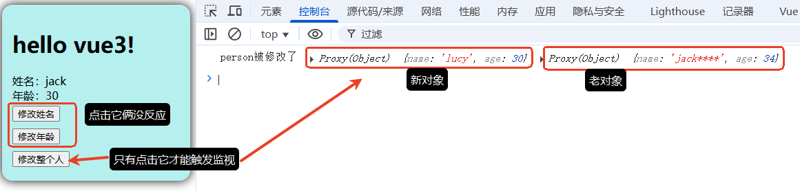

### 开启深度监视

使用配置项 `deep: true`开启深度监视。代码如下：

```plaintext
<template>
    <div>
        <div>姓名：{{ person.name }}</div>
        <div>年龄：{{ person.age }}</div>
        <div><button @click="changeName">修改姓名</button></div>
        <div><button @click="changeAge">修改年龄</button></div>
        <div><button @click="changePerson">修改整个人</button></div>
    </div>
</template>

<script lang='ts' setup name="PersonInfo">
    import {ref, watch} from 'vue';

    // 数据
    let person = ref({
        name: 'jack',
        age: 30
    });


    // 方法
    function changeName(){
        person.value.name += '*';
    }
    function changeAge(){
        person.value.age++;
    }
    function changePerson(){
        // 等于修改了 person 引用的内存地址，让其指向了新对象。
        person.value = {
            name: 'lucy',
            age: 30
        };
    }

    // 监视
    watch(person, (newVal, oldVal)=> {
        console.log('person被修改了', newVal, oldVal);
    }, { deep: true});

</script>

<style scoped>
    button {
        margin: 5px 0;
    }
</style>
```

开启深度监视之后，对象地址不变的前提下，对象内部的数据发生变化时也会触发监视。运行结果如下：

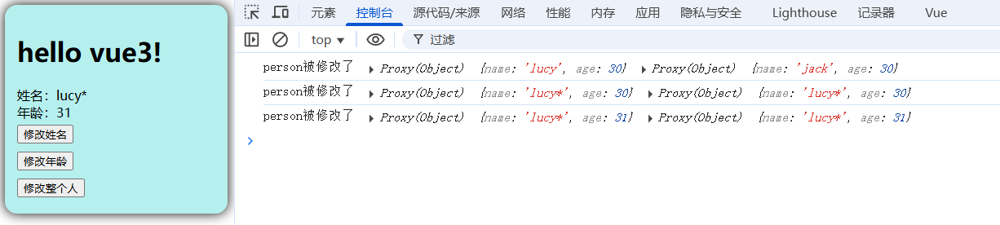

点击以上三个按钮，都会触发监视。

### 关于 newVal 和 oldVal

1. 首先实际开发中，newVal 用的较多，oldVal 几乎不用，因此回调函数一般写一个参数即可。
2. 如果是 **修改整个人** newVal 和 oldVal 两个变量保存的对象地址不同，newVal 引用指向新对象，oldVal 引用指向旧对象。
3. 如果是 **修改姓名**、**修改年龄** newVal 和 oldVal 两个引用保存的对象地址不变，因此指向的是同一个对象，因此如上图，newVal 和 oldVal 打印结果相同，都指向了更新后的效果。

### 开启立即监视

**配置项 **`**immediate: true**`**开启之后，会开启立即监视，页面加载完毕立即监视一次。**

```plaintext
<template>
    <div>
        <div>姓名：{{ person.name }}</div>
        <div>年龄：{{ person.age }}</div>
        <div><button @click="changeName">修改姓名</button></div>
        <div><button @click="changeAge">修改年龄</button></div>
        <div><button @click="changePerson">修改整个人</button></div>
    </div>
</template>

<script lang='ts' setup name="PersonInfo">
    import {ref, watch} from 'vue';

    // 数据
    let person = ref({
        name: 'jack',
        age: 30
    });

    // 方法
    function changeName(){
        person.value.name += '*';
    }
    function changeAge(){
        person.value.age++;
    }
    function changePerson(){
        // 等于修改了 person 引用的内存地址，让其指向了新对象。
        person.value = {
            name: 'lucy',
            age: 30
        };
    }

    // 监视
    watch(person, (newVal, oldVal)=> {
        console.log('person被修改了', newVal, oldVal);
    }, { deep: true, immediate: true});

</script>

<style scoped>
    button {
        margin: 5px 0;
    }
</style>
```

执行结果如下：

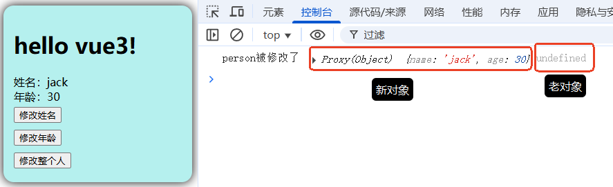

## 监视 reactive 定义的对象数据

reactive 只能定义对象类型的数据，不能定义基本类型的数据。

**重点：监视 reactive 定义的对象数据时，默认开启深度监视，并且深度监视无法关闭。**

```plaintext
<template>
    <h2>姓名：{{ person.name }}</h2>
    <h2>年龄：{{ person.age }}</h2>
    <button @click="changeName">修改姓名</button>
    <button @click="changeAge">修改年龄</button>
    <button @click="changePerson">修改整个人</button>
</template>

<script lang='ts' setup name="PersonInfo">
    import { reactive, watch } from 'vue';

    // 数据
    let person = reactive({
        name: 'jack',
        age: 18
    });

    // 方法
    function changeName(){
        person.name += '*';
    }
    function changeAge(){
        person.age++;
    }
    function changePerson(){
        Object.assign(person, {name: 'lucy', age: 22});
    }

    // 监视
    watch(person, (newVal, oldVal)=>{
        console.log('person被修改了', newVal, oldVal);
    }, {deep: false}); // 无法关闭深度监视
</script>

<style scoped>
    button {
        margin: 0 5px;
    }
</style>
```

## 监视响应式对象中的某个属性

vue3 官方说过，watch 只能监视以下四种数据：

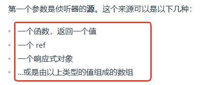

:::info
**先说结论：**

1. 监视响应式对象中的某个属性时，如果属性是基本类型的，需要将该属性包装为 getter 函数。
2. 监视响应式对象中的某个属性时，如果属性是对象类型的，可以直接写对象，也可以将其包装为 getter 函数，更推荐将其包装为 getter 函数，并同时开启深度监视。

:::

编写代码验证以上结论：

```plaintext
<template>
    <div>
        <h2>姓名：{{ person.name }}</h2>
        <h2>所在城市：{{ person.address.city }}</h2>
        <h2>所在街道：{{ person.address.street }}</h2>
        <button @click="changeName">修改姓名</button>
        <button @click="changeCity">修改城市</button>
        <button @click="changeStreet">修改街道</button>
        <button @click="changeAddress">修改整个地址</button>
    </div>
</template>

<script lang='ts' setup name='PersonInfo'>
    import { reactive, watch } from 'vue';

    // 数据
    let person = reactive({
        name: '张三',
        address: {
            city: '北京',
            street: '朝阳街道'
        }
    });

    // 方法
    function changeName() {
        person.name = '李四';
    }
    function changeCity() {
        person.address.city = '南京';
    }
    function changeStreet() {
        person.address.street = '中山街道';
    }
    function changeAddress() {
        person.address = {
            city: '上海',
            street: '梧桐街道'
        };
    }

    // 监视响应式对象的基本类型属性时，需要提供一个getter函数。
    watch(() => person.name, (newVal, oldVal)=>{
        console.log('person.name被修改了', newVal, oldVal);
    });

    // 监视响应式对象的对象类型属性时，直接编写对象是可以的，但对象内部属性变化时可以监视到，对象被整体替换时不会被监视到。
    /* watch(person.address, (newVal, oldVal)=>{
        console.log('person.address被修改了', newVal, oldVal);
    }); */

    // 监视响应式对象的对象类型属性时，提供一个getter函数的话，对象被整体替换时会被监视到，对象内部的属性变化时不会被监视到。
    /* watch(() => person.address, (newVal, oldVal)=>{
        console.log('person.address被修改了', newVal, oldVal);
    }); */

    // 监视响应式对象的对象类型属性时的最终建议：提供一个getter函数，开启深度监视。
    // 这样对象内部属性变化时，以及对象被整体替换时，都会被监视到。
    watch(() => person.address, (newVal, oldVal)=>{
        console.log('person.address被修改了', newVal, oldVal);
    }, {deep: true});
</script>

<style scoped>
    button{
        margin: 0 5px;
    }
</style>
```

## 监视以上类型的值组成的数组

需求：我要监视上一个例子中的 `person.name`以及 `person.address.street`，代码应该这样写：

```plaintext
<template>
    <div>
        <h2>姓名：{{ person.name }}</h2>
        <h2>所在城市：{{ person.address.city }}</h2>
        <h2>所在街道：{{ person.address.street }}</h2>
        <button @click="changeName">修改姓名</button>
        <button @click="changeCity">修改城市</button>
        <button @click="changeStreet">修改街道</button>
        <button @click="changeAddress">修改整个地址</button>
    </div>
</template>

<script lang='ts' setup>
    import { reactive, watch } from 'vue';

    // 数据
    let person = reactive({
        name: '张三',
        address: {
            city: '北京',
            street: '朝阳街道'
        }
    });

    // 方法
    function changeName() {
        person.name = '李四';
    }
    function changeCity() {
        person.address.city = '南京';
    }
    function changeStreet() {
        person.address.street = '中山街道';
    }
    function changeAddress() {
        person.address = {
            city: '上海',
            street: '梧桐街道'
        };
    }

    // 监视
    watch([() => person.name, () => person.address.street], (newVal, oldVal)=> {
        console.log('数据被修改了', newVal, oldVal);
    });
    
</script>

<style scoped>
    button{
        margin: 0 5px;
    }
</style>
```

# watchEffect 模糊监视


`watch`可以看做是精确监视，`watchEffect`可以做到模糊监视。

官网是这样描述 `watchEffect`的：

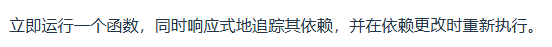

:::info
`watch`和 `watchEffect`对比：

1. 都能监听响应式数据的变化，监听数据变化的方式不同。
2. `watch`要明确指出监视的数据。
3. `watchEffect`：不需要明确指出监视的数据（函数中用到哪些属性，它就会自动监视这些属性）

:::

需求：监视一个学生的语文和数学成绩，如果语文和数学成绩都大于等于 60 分，输出及格，都大于等于 80 分，输出良好，都大于等于 90 分，输出优秀。另外，任何一科的学习成绩不能超过 100 分。

使用 `watch`实现：

```plaintext
<template>
    <h2>语文成绩：{{ chineseScores }}分</h2>
    <h2>数学成绩：{{ mathScores }}分</h2>
    <div>
        <button @click="changeChineseScores">修改语文成绩</button>
        <button @click="changeMathScores">修改数学成绩</button>
    </div>
</template>

<script lang='ts' setup>
    import { ref, watch } from 'vue';

    // 数据
    let chineseScores = ref(0);
    let mathScores = ref(0);

    // 方法
    function changeChineseScores(){
        if(chineseScores.value < 100){
            chineseScores.value += 10;
        }
    }
    function changeMathScores(){
        if(mathScores.value < 100){
            mathScores.value += 10;
        }
    }

    // 监视
    watch([chineseScores, mathScores], (val)=>{
        let [chScore, maScore] = val;
        if(chScore >= 90 && maScore >= 90){
            console.log('成绩：优秀');
        }else if(chScore >= 80 && maScore >= 80){
            console.log('成绩：良好');
        }else if(chScore >= 60 && maScore >= 60){
            console.log('成绩：及格');
        }else{
            console.log('成绩：不及格');
        }
    }, { immediate: true});

</script>

<style scoped>
    button {
        margin: 0 5px;
    }
</style>
```

使用 `watchEffect`实现：

```plaintext
<template>
    <h2>语文成绩：{{ chineseScores }}分</h2>
    <h2>数学成绩：{{ mathScores }}分</h2>
    <div>
        <button @click="changeChineseScores">修改语文成绩</button>
        <button @click="changeMathScores">修改数学成绩</button>
    </div>
</template>

<script lang='ts' setup>
    import { ref, watchEffect } from 'vue';

    // 数据
    let chineseScores = ref(0);
    let mathScores = ref(0);

    // 方法
    function changeChineseScores(){
        if(chineseScores.value < 100){
            chineseScores.value += 10;
        }
    }
    function changeMathScores(){
        if(mathScores.value < 100){
            mathScores.value += 10;
        }
    }

    // 监视
    watchEffect(()=>{
        if(chineseScores.value >= 90 && mathScores.value >= 90){
            console.log('成绩：优秀');
        }else if(chineseScores.value >= 80 && mathScores.value >= 80){
            console.log('成绩：良好');
        }else if(chineseScores.value >= 60 && mathScores.value >= 60){
            console.log('成绩：及格');
        }else{
            console.log('成绩：不及格');
        }
    });

</script>

<style scoped>
    button {
        margin: 0 5px;
    }
</style>
```

# 标签的 ref 属性


现代的开发方式都是 SPA 单网页应用。我们之前虽然编写了 `App.vue`和 `Person.vue`两个文件，但最终渲染的时候都会渲染到同一个 html 文件中，因此在 Vue 组件中标记一个元素的时候尽量不要使用 `id`属性，因为不同的 Vue 组件中可能会出现相同的 `id`，会因此产生覆盖和干扰。此时：标签的 `ref`属性就用上了。

**另外 **`**<font style="color:#DF2A3F;">ref</font>**`**属性还可以完成一个重要的任务：子组件向父组件传递数据。并且当子组件向父组件暴露响应式数据时，在父组件中是可以修改这个响应式数据的。**

## 普通标签上使用 ref

`Person.vue`子组件代码如下：

```plaintext
<template>
    <!--原理第二步：页面渲染的时候将 dom元素赋值给 RefImpl对象的value属性。-->
    <div ref='myDiv'>这是Person组件中的一个div元素</div>
    <button @click="showDiv">输出div元素</button>
</template>

<script lang='ts' setup name='PersonInfo'>
    import { ref } from 'vue';

    // 数据（myDiv变量代表的就是模板中的div元素）
    // 一定要注意：变量名一定要和模板中的ref属性的值一致才行。
    // 原理第一步：创建RefImpl对象。
    let myDiv = ref();

    // 在这里访问myDiv的话是undefined，这是因为myDiv是在页面渲染之后才会有值。

    // 方法
    function showDiv(){
        // 这个方法是在页面渲染之后才会调用，因此这里的myDiv不是undefined。
        console.log(myDiv.value);
    }
</script>
```

`App.vue`父组件代码如下：

```plaintext
<template>
    <div class="hello">
        <h1>hello vue3!</h1>
        <div ref="myDiv">这是App组件中的一个div元素</div>
        <button @click="showDiv">输出div元素</button>
        <Person></Person>
    </div>

</template>

<script lang="ts" setup name="MyApp">
    import { ref } from 'vue';
    import Person from './components/Person.vue';

    // 数据
    let myDiv = ref();

    // 方法
    function showDiv(){
        console.log(myDiv.value);
    }
</script>

<style scoped>
    .hello {
        background-color: #b5f0ee; 
        box-shadow: 0 0 15px;
        border-radius: 15px;
        padding: 15px;
    }
</style>
```

虽然在 `Person.vue`和 `App.vue`组件中都存在 `ref='myDiv'`的元素，但是它俩是不同的两个元素。

**底层是如何区分的？实现原理是什么？每个组件都有自己的 setup 函数，每个 setup 函数就是一个独立的域。虽然名字相同，但不再同一个域中。**

---

**另外需要特别注意的是：****只有在页面渲染之后，脚本中的**`**<font style="color:#DF2A3F;">myDiv</font>**`**才会有值。渲染前脚本中的 **`**<font style="color:#DF2A3F;">myDiv</font>**`**是 undefined。**

## 组件标签上使用 ref

组件标签上也可以使用 `ref`属性。

```plaintext
<template>
    <div class="hello">
        <h1>hello vue3!</h1>
        <div ref="myDiv">这是App组件中的一个div元素</div>
        <button @click="showDiv">输出div元素</button>
        <Person ref="personInstance"></Person>
        <button @click="showPersonInstance">输出Person组件实例</button>
    </div>
</template>

<script lang="ts" setup name="MyApp">
    import { ref } from 'vue';
    import Person from './components/Person.vue';

    // 数据
    let myDiv = ref();
  
    // 这个变量代表的是Person组件实例哦！！！！！！！！
    let personInstance = ref();

    // 方法
    function showDiv(){
        console.log(myDiv.value);
    }
    function showPersonInstance() {
        // 获取的是组件对应的代理对象Proxy。
        console.log(personInstance.value);
    }
</script>

<style scoped>
    .hello {
        background-color: #b5f0ee; 
        box-shadow: 0 0 15px;
        border-radius: 15px;
        padding: 15px;
    }
</style>
```

**通过以上的代码我们就可以在父组件中获取到子组件的实例了。**`**<font style="color:#DF2A3F;">personInstance</font>**`**就是子组件对象。**

**获取子组件实例干什么呢？**

- **只要是子组件使用 **`**defineExpose**`**对外暴露的数据或者函数，在父组件中都可以通过子组件实例对象来访问这些数据和函数。**

## defineExpose

子组件实例上的数据如何暴露给父组件，可以在子组件中使用 `defineExpose`，代码如下：

```plaintext
<template>
    <div ref='myDiv'>这是Person组件中的一个div元素</div>
    <button @click="showDiv">输出div元素</button>
</template>

<script lang='ts' setup name='PersonInfo'>
    import { ref } from 'vue';

    // 数据（myDiv变量代表的就是模板中的div元素）
    let myDiv = ref();

    // 数据
    let a = ref(100);

    // 方法
    function showDiv(){
        console.log(myDiv.value);
    }

    // 暴露给父组件
    defineExpose({a: a});
</script>
```

**注意：不仅可以暴露数据，还可以暴露函数等。**

```plaintext
<template>
    <div class="hello">
        <h1>hello vue3!</h1>
        <div ref="myDiv">这是App组件中的一个div元素</div>
        <button @click="showDiv">输出div元素</button>
        <Person ref="personInstance"></Person>
        <button @click="showPersonInstance">输出Person组件实例</button>
    </div>
</template>

<!-- 修改为vue3语法：只需要这样写就可以完成导入Person组件，并且完成Person组件的注册 -->
<script lang="ts" setup name="MyApp">
    import { ref } from 'vue';
    import Person from './components/Person.vue';

    // 数据
    let myDiv = ref();
  
    // 这个变量代表的是Person组件实例哦！！！！！！！！
    let personInstance = ref();

    // 方法
    function showDiv(){
        console.log(myDiv.value);
    }
    function showPersonInstance() {
        console.log(personInstance.value);
        console.log('Person组件实例上的数据',personInstance.value.a);
    }
</script>

<style scoped>
    .hello {
        background-color: #b5f0ee; 
        box-shadow: 0 0 15px;
        border-radius: 15px;
        padding: 15px;
    }
</style>
```

**总结：通过以上方式，我们就可以完成一个效果：子组件向父组件传递数据。**

# props


`**<font style="color:rgb(64, 64, 64);background-color:rgb(236, 236, 236);">props</font>**`** 的核心作用：父组件 → 子组件单向传递数据**

- **父组件**通过组件标签的属性（props）向子组件传递数据（静态或动态）。
- **子组件**通过 `**<font style="color:rgb(64, 64, 64);background-color:rgb(236, 236, 236);">defineProps</font>**` 接收数据，但不能直接修改（单向数据流）。

## 传递静态数据

父组件中的代码

```plaintext
<template>
    <div class="hello">
        <!-- 通过 props 将静态数据传递给子组件 -->
        <Person name='jack' age="18"/>
    </div>
</template>

<script lang="ts" setup name="MyApp">
    import Person from './components/Person.vue';
</script>

<style scoped>
    .hello {
        background-color: #b5f0ee; 
        box-shadow: 0 0 15px;
        border-radius: 15px;
        padding: 15px;
    }
</style>
```

子组件中的代码：请仔细阅读程序的注释信息。

```plaintext
<template>
    <h2>姓名：{{ name }}</h2>
    <h2>年龄：{{ age }}</h2>
</template>

<script lang='ts' setup name='PersonInfo'>
    // 通过 defineProps 来接收父组件传递过来的数据。
    // 程序执行到这里就完成了接收，并且此时在模板中已经可以用了。
    // 另外需要注意的是：defineProps()的参数要求必须是一个数组。只有一个参数也需要数组。
    //defineProps(['name', 'age']);

    // 如果你想在接下来的代码中使用父组件中的数据，可以获取defineProps()返回值
    // defineProps()方法的返回值是一个对象。
    // 这里的 'name' 'age' 是子组件接收的 prop 名称
    // 它必须与父组件绑定的属性名一致
    const fromParentDataObj = defineProps(['name', 'age']);
    
    console.log(fromParentDataObj.name, fromParentDataObj.age);

</script>
```

这样就完成了静态数据传递。

## 传递动态数据

父组件中的代码：使用 `v-bind:`或者 `:`来动态传递数据。

```plaintext
<template>
    <div class="hello">
        <!-- 通过 props 将动态数据传递给子组件 -->
        <Person v-bind:name='nameData' :age="ageData"/>
    </div>
</template>

<script lang="ts" setup name="MyApp">
    import Person from './components/Person.vue';
    // 数据
    let nameData = '杰克';
    let ageData = 19;
</script>

<style scoped>
    .hello {
        background-color: #b5f0ee; 
        box-shadow: 0 0 15px;
        border-radius: 15px;
        padding: 15px;
    }
</style>
```

子组件中的代码不需要修改。

## 传递数组

传递数组和之前代码基本相同。

父组件中的代码：

```plaintext
<template>
    <div class="hello">
        <Person :list="personList"/>
    </div>
</template>

<script lang="ts" setup name="MyApp">
    import Person from './components/Person.vue';
    import { reactive } from 'vue';
    
    // 数据
    let personList = reactive([
        {id: '101', name: 'jack', age: 18},
        {id: '101', name: 'lucy', age: 19},
        {id: '101', name: 'tom', age: 20}
    ]);
</script>

<style scoped>
    .hello {
        background-color: #b5f0ee; 
        box-shadow: 0 0 15px;
        border-radius: 15px;
        padding: 15px;
    }
</style>
```

子组件中的代码：

```plaintext
<template>
    <ul>
        <li v-for="p in list" :key="p.id">
            {{ p.id }},{{ p.name }},{{ p.age }}
        </li>
    </ul>
</template>

<script lang='ts' setup name='PersonInfo'>
    // 这里的 'list' 是子组件接收的 prop 名称
    // 它必须与父组件绑定的属性名一致
    defineProps(['list']);
</script>
```

执行结果如下：

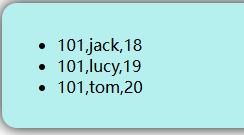

## 关于 props 的类型限定

父组件中的代码：

```plaintext
<template>
    <div class="hello">
        <Person :list="personList"/>
    </div>
</template>

<script lang="ts" setup name="MyApp">
    import Person from './components/Person.vue';
    import { reactive } from 'vue';
    
    // 数据
    let personList = reactive([
        {id: '101', name: 'jack', age: 18},
        {id: '101', name: 'lucy', age: 19},
        {id: '101', name: 'tom', age: 20}
    ]);
</script>

<style scoped>
    .hello {
        background-color: #b5f0ee; 
        box-shadow: 0 0 15px;
        border-radius: 15px;
        padding: 15px;
    }
</style>
```

子组件中的代码：

```plaintext
<template>
    <ul>
        <li v-for="p in list" :key="p.id">
            {{ p.id }},{{ p.name }},{{ p.age }}
        </li>
    </ul>
</template>

<script lang='ts' setup name='PersonInfo'>
    defineProps(['list']);
</script>
```

**这是我们之前编写的代码。以上代码存在的问题是：**

- 子组件没有限定父组件必须传递过来一个 list
- 也就是说：现在父组件可以向子组件传递任意类型的数据

**子组件如何限定父组件传递过来的数据类型呢？**

### 限定父组件传递过来的数据类型

父组件中的代码不需要修改，子组件中的代码修改如下：

```plaintext
<template>
    <ul>
        <li v-for="p in list" :key="p.id">
            {{ p.id }},{{ p.name }},{{ p.age }}
        </li>
    </ul>
</template>

<script lang='ts' setup name='PersonInfo'>
    // 类型定义
    interface Person {
        id: number | string,
        name: string,
        age: number
    }

    // 泛型约束父组件必须传递过来一个 Person[] 数组
    // 注意：泛型对象中的属性名 list 必须是父组件的prop
    defineProps<{list: Person[]}>();
</script>
```

### 限制父组件传递数据的必要性

子组件可以强制要求父组件必须传递过来数据。当然，子组件也可以要求父组件传递数据时：可传可不传

```plaintext
<template>
    <ul>
        <li v-for="p in list" :key="p.id">
            {{ p.id }},{{ p.name }},{{ p.age }}
        </li>
    </ul>
</template>

<script lang='ts' setup name='PersonInfo'>
    // 类型定义
    interface Person {
        id: number | string,
        name: string,
        age: number
    }

    // 添加一个问号，表示可传，可不传。
    defineProps<{list?: Person[]}>();
</script>
```

### 子组件指定默认值

当父组件可传可不传的时候：父组件选择了不传，在子组件中可以使用 `withDefaults`来指定默认值，代码如下：

```plaintext
<template>
    <ul>
        <li v-for="p in list" :key="p.id">
            {{ p.id }},{{ p.name }},{{ p.age }}
        </li>
    </ul>
</template>

<script lang='ts' setup name='PersonInfo'>
    // 类型定义
    interface Person {
        id: number | string,
        name: string,
        age: number
    }

    // 如果父组件没有传则使用默认值
    withDefaults(defineProps<{list?: Person[]}>(), {
        list: ()=> [
            {id: '111', name: '张三', age: 20},
            {id: '222', name: '李四', age: 21},
            {id: '333', name: '王五', age: 22}
        ]
    });
</script>
```

此时，如果父组件并没有传递过来 list 数据，子组件将采用默认值。

# Vue3 的生命周期


## 生命周期的理解

Vue3 的生命周期：指的是组件从出生到死亡的整个过程。

:::info
组件的生命周期通常包括四大阶段：

1. 创建
2. 挂载
3. 更新
4. 销毁

:::

为什么要学习生命周期？

:::info
在一个组件的生命周期过程中，不同的时刻会去调用不同的函数

也就是说 Vue3 在一个组件的生命周期上安排了不同的时间点，在不同的时间点上会去自动调用对应的函数

如果我们需要在某个时间点上执行一段代码，可以把这个代码写到对应的函数（钩子函数）上，到了那个时间点就会被自动调用。

:::

## Vue2 的生命周期

4 个阶段 8 个钩子（钩子指的是生命周期函数）

:::info
第一阶段：创建（创建前 beforeCreate、创建完毕 created）：执行一次

第二阶段：挂载（挂载前 beforeMount、挂载完毕 mounted）：执行一次

第三阶段：更新（更新前 beforeUpdate、更新完毕 updated）：更新一次执行一次

第四阶段：销毁（销毁前 beforeDestroy、销毁完毕 destoryed）：执行一次（组件销毁才会触发）

:::

## v-if 和 v-show 指令

这两个指令都可以控制组件的显示和隐藏，true 显示 false 隐藏，区别是：

1. `v-if`隐藏时会彻底删除组件。
2. `v-show`隐藏时只是把 `display`的样式修改为 `none`，不会删除组件。

父组件中的代码如下：

```plaintext
<template>
    <div class="hello">
        <h2>Hello Vue3!</h2>
        <Person/>
    </div>
</template>

<script lang="ts" setup name="MyApp">
    import Person from './components/Person.vue';
</script>

<style scoped>
    .hello {
        background-color: #b5f0ee; 
        box-shadow: 0 0 15px;
        border-radius: 15px;
        padding: 15px;
    }
</style>
```

子组件中的代码如下：

```plaintext
<template>
    <h3 v-if="flag1">v-if指令</h3>
    <h3 v-show="flag2">v-show指令</h3>
</template>

<script lang='ts' setup name='PersonInfo'>
    import { ref } from 'vue';

    let flag1 = ref(true);

    let flag2 = ref(true);
</script>
```

使用 `devtools`操作布尔值，让其显示和隐藏，然后观察 HTML 源码的变化：

**对 **`**v-if**`**的测试：**

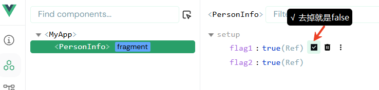

√ 去掉前的 HTML 源码如下：

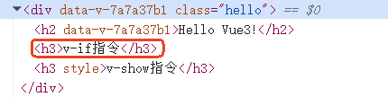

√ 去掉后的 HTML 源码如下：

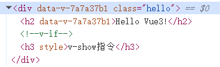

可以看到 √ 去掉后元素在 HTML 源码中消失了。

**对 **`**v-show**`**的测试：**

√ 去掉前的 HTML 源码如下：


√ 去掉后的 HTML 源码如下：

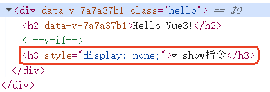

可以看到 √ 去掉后元素在 HTML 源码中仍然存在，只是 display 样式设置为了 none。

## Vue3 的生命周期

4 个阶段 7 个钩子：【提醒：以下讲解的是部分钩子，后期学习了路由等知识点后，还有其它钩子函数。】

:::info
第一阶段：创建（直接把代码写到 setup 函数中的代码自动会在创建组件时执行）：执行一次

第二阶段：挂载（挂载前 onBeforeMount、挂载完毕 onMounted）：执行一次

第三阶段：更新（更新前 onBeforeUpdate、更新完毕 onUpdated）：更新一次执行一次

第四阶段：卸载/销毁（卸载前 onBeforeUnmount、销毁完毕 onUnmounted）：执行一次（组件卸载才会触发）

:::

常用钩子包括三个：

:::info
挂载完毕：onMounted

更新完毕：onUpdated

卸载前：onBeforeUnmount

:::

编写代码测试一下生命周期，父组件中的代码：

```plaintext
<template>
    <div class="hello">
        <h2>Hello Vue3!</h2>
        <Person v-if="isShow"/>
    </div>
</template>

<script lang="ts" setup name="MyApp">
    import { ref } from 'vue';
    import Person from './components/Person.vue';

    let isShow = ref(true);
</script>

<style scoped>
    .hello {
        background-color: #b5f0ee; 
        box-shadow: 0 0 15px;
        border-radius: 15px;
        padding: 15px;
    }
</style>
```

子组件中的代码：

```plaintext
<template>
    <h3>计数器：{{ count }}</h3>
    <button @click="increment">计数器加1</button>
</template>

<script lang='ts' setup name='PersonInfo'>
    import { onBeforeMount, onBeforeUnmount, onBeforeUpdate, onMounted, onUnmounted, onUpdated, ref } from 'vue';

    // 数据
    let count = ref(0);

    function increment(){
        count.value++;
    }

    // 创建
    console.log('创建');

    // 挂载前
    onBeforeMount(()=>{
        console.log('挂载前');
    });
    // 挂载后
    onMounted(()=>{
        console.log('挂载后');
    });
    // 更新前
    onBeforeUpdate(()=>{
        console.log('更新前');
    });
    // 更新后
    onUpdated(()=>{
        console.log('更新后');
    });
    // 卸载前
    onBeforeUnmount(()=>{
        console.log('卸载前');
    });
    // 卸载后
    onUnmounted(()=>{
        console.log('卸载后');
    });
</script>
```

最终效果：

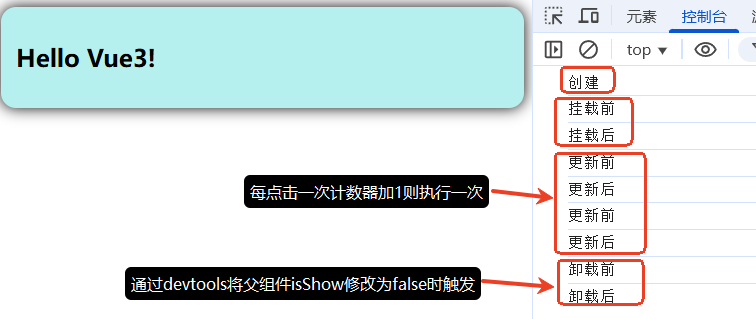

**JS/TS 代码调试技巧：debugger;**

如果想在组件生命周期执行过程中在某个阶段停下来，可以使用添加断点，在需要的位置编写：`debugger;`即可。

如果在挂载前的钩子中添加 `debugger;`

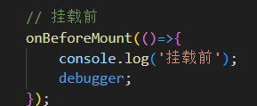

效果如下图：

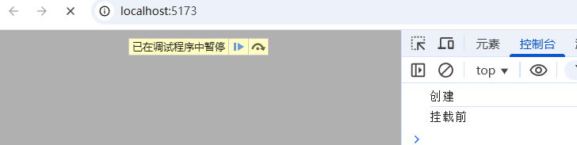

# 选项式 API 和组合式 API 的区别

## 想象你在厨房做饭

**选项式API - 传统厨房（东西都分类放，但做一道菜要跑多个地方）**

```plaintext
冰箱（data区）：
- 鸡蛋  ← 做番茄炒蛋需要
- 番茄  ← 做番茄炒蛋需要
- 肉    ← 做其他菜需要
- 蔬菜  ← 做其他菜需要

厨具柜（methods区）：
- 炒锅  ← 做番茄炒蛋需要
- 菜刀  ← 做番茄炒蛋需要
- 蒸锅  ← 做其他菜需要
- 烤箱  ← 做其他菜需要

调料架（computed区）：
- 盐    ← 做番茄炒蛋需要
- 糖    ← 做番茄炒蛋需要
- 酱油  ← 做其他菜需要
```

**问题：** 做番茄炒蛋时，你要：

1. 去冰箱拿鸡蛋和番茄
2. 去厨具柜拿炒锅和菜刀
3. 去调料架拿盐和糖
4. 来回跑三趟！

**组合式API - 现代厨房（按菜品打包）**

```plaintext
【番茄炒蛋套餐包】：
- 鸡蛋
- 番茄  
- 炒锅
- 菜刀
- 盐、糖
（做这道菜需要的东西全在一个包里）

【红烧肉套餐包】：
- 肉
- 炒锅
- 酱油、糖
（另一道菜的东西在另一个包里）
```

**优点：** 做番茄炒蛋时，你只需要：

1. 打开"番茄炒蛋套餐包"
2. 里面什么都有！
3. 一次性搞定

## 代码对比

### 选项式 API 代码

```plaintext
组件 = {
  // 【数据抽屉】-所有业务的数据混在一起
  data() {
    return {
      // 业务1：用户登录数据
      用户名: '',
      密码: '',
      是否登录: false,
      用户信息: null,
      
      // 业务2：购物车数据  
      购物车商品: [],
      购物车总价: 0,
      优惠券: null,
      
      // 业务3：商品列表数据
      商品列表: [],
      加载中: false,
      当前页码: 1,
    }
  },
  
  // 【方法抽屉】- 所有业务的方法混在一起
  methods: {
    // 业务1：用户登录相关方法
    登录() {
      // 用 this.用户名 和 this.密码
    },
    登出() {
      // 清空 this.用户信息
    },
    修改资料() {
      // 修改 this.用户信息
    },
    
    // 业务2：购物车相关方法
    添加到购物车(商品) {
      // 操作 this.购物车商品
    },
    删除购物车商品(id) {
      // 操作 this.购物车商品
    },
    计算总价() {
      // 计算 this.购物车总价
    },
    
    // 业务3：商品相关方法
    获取商品列表() {
      // 设置 this.加载中 = true
      // 获取数据到 this.商品列表
    },
    翻页(页码) {
      // 设置 this.当前页码 = 页码
    }
  },
  
  // 【计算属性抽屉】- 所有业务的计算属性混在一起
  computed: {
    // 业务1：用户相关计算
    是否已登录() {
      return !!this.用户信息
    },
    
    // 业务2：购物车相关计算
    购物车商品数量() {
      return this.购物车商品.length
    },
    折后总价() {
      return this.购物车总价 * 0.9
    },
    
    // 业务3：商品相关计算
    可显示商品() {
      return this.商品列表.slice(0, 10)
    }
  }
  
}
```

### 组合式 API 代码

```typescript
// 【业务1：用户登录】- 所有相关的东西放一起
const 用户名 = ref('')           
const 密码 = ref('')
const 是否登录 = ref(false)
const 用户信息 = ref(null)

function 登录() {                
  // 用 用户名.value 访问，不用 this
}

function 登出() {
  用户信息.value = null         
}

function 修改资料() {
  // 直接操作 用户信息.value
}

const 是否已登录 = computed(() => {  
  return !!用户信息.value           
})


// 【业务2：购物车】- 所有相关的东西放一起
const 购物车商品 = ref([])       
const 购物车总价 = ref(0)
const 优惠券 = ref(null)

function 添加到购物车(商品) {     
  购物车商品.value.push(商品)    
}

function 删除购物车商品(id) {
  购物车商品.value = 购物车商品.value.filter(item => item.id !== id)
}

function 计算总价() {
  购物车总价.value = 购物车商品.value.reduce((sum, item) => sum + item.price, 0)
}

const 购物车商品数量 = computed(() => 购物车商品.value.length)  
const 折后总价 = computed(() => 购物车总价.value * 0.9)


// 【业务3：商品列表】- 所有相关的东西放一起
const 商品列表 = ref([])          
const 加载中 = ref(false)
const 当前页码 = ref(1)

async function 获取商品列表() {   
  加载中.value = true            
  // 获取数据...
  商品列表.value = 获取的数据
  加载中.value = false
}

function 翻页(页码) {
  当前页码.value = 页码
  获取商品列表()
}

const 可显示商品 = computed(() => {  
  return 商品列表.value.slice(0, 10)  
})
```

## 总结

**选项式API：** 东西按种类放（所有数据放一起，所有方法放一起）
**组合式API：** 东西按用途放（做一件事需要的所有东西放一起）

就像：

- **选项式**：所有书放书柜，所有衣服放衣柜，所有碗放碗柜
- **组合式**：上班包（书+电脑+钥匙），运动包（运动服+水杯+毛巾）

# Hooks（组合式函数）


## 理解 Hooks

Hooks 是 Vue 3 组合式 API (Composition API) 的核心概念之一，它借鉴了 React Hooks 的思想，但在实现和使用上有一些不同。

注意： Vue3 的 Hooks（**组合式函数**） 和 生命周期钩子函数（Lifecycle Hooks）是不同的概念。

**什么是 Hooks？**

在 Vue 3 中，Hooks 是指一系列以 `**use**`** **为前缀的函数，它们封装了可复用的逻辑，让你能够在组件中"钩入"各种功能。Hooks 是组合式 API 的一种实现方式，用于组织和复用代码逻辑。

**为什么需要 Hooks？**

在 Options API 中，相关的代码逻辑会被分散到不同的选项（data, methods, computed 等）中，而 Hooks 可以让你把相关逻辑组织在一起，提高代码的可读性和可维护性。

Vue 3 中的 Hooks 是组合式 API 的重要实践，它们提供了**一种优雅的**方式来**组织和复用组件逻辑**。通过自定义 Hooks，你可以将复杂的组件逻辑拆分为更小、更专注的函数，从而提高代码的可维护性和可读性，以及可复用性。

## 不使用 Hooks 的缺点

请通过以下代码实现的功能来分析一下在不使用 Hooks 时的缺点。

父组件中的代码：

```plaintext
<template>
    <div class="hello">
        <Person />
    </div>
</template>

<script lang="ts" setup name="MyApp">
import Person from './components/Person.vue';
</script>

<style scoped>
.hello {
    background-color: #b5f0ee;
    box-shadow: 0 0 15px;
    border-radius: 15px;
    padding: 15px;
}
</style>
```

子组件中的代码：

```plaintext
<template>
    <h3>计数器：{{ count }}</h3>
    <button @click="increment">计数器加1</button>
    <hr>
    
    <br>
    <button @click="addImg">添加图片</button>
</template>

<script lang='ts' setup name='PersonInfo'>
    import { reactive, ref } from 'vue';
    import axios from 'axios';

    // 数据
    let count = ref(0);

    let imgs = reactive(['https://img.btstu.cn/api/images/5a4ca29ea74cd.jpg']);

    // 方法
    function increment(){
        count.value++;
    }

    async function addImg(){
        try{
            let response = await axios.get('https://api.btstu.cn/sjbz/api.php?format=json');
            imgs.push(response.data.imgurl);
        }catch(error){
            alert(error);
        }
    }
</script>

<style scoped>
    img {
        width: 100px;
        margin: 0 5px;
    }
</style>
```

提示：

1. 运行以上程序需要安装 axios 库

```bash
npm install axios
```

1. 以上代码中提供了一个对外免费提供图片的网站：[https://api.btstu.cn/sjbz/api.php?format=json](https://api.btstu.cn/sjbz/api.php?format=json)，访问它可以随机返回 JSON 字符串，该 JSON 字符串中包含了图片的 url，JSON 如下：

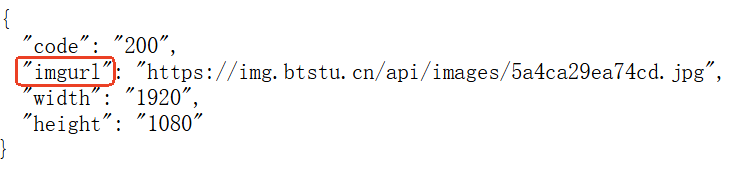

最终效果如下：

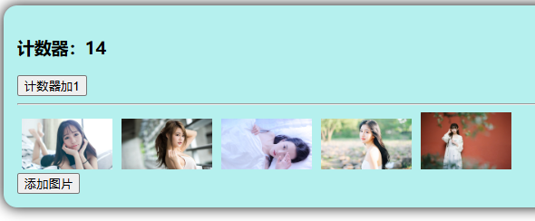

虽然功能实现了，但代码的编写风格不太好：以上代码更像选项式 API 的风格，不太符合组合式 API 风格，因为当前的风格是：数据中融合了不同功能的数据，方法中融合了不同功能的方法。

**组合式 API 强调的是**：把单独一个功能相关的 数据+方法 打包放一起。这个时候就需要使用到 Hooks（组合式函数）。

## 封装 Hooks 的优势

父组件中的代码如下：

```plaintext
<template>
    <div class="hello">
        <Person />
    </div>
</template>

<script lang="ts" setup name="MyApp">
import Person from './components/Person.vue';
</script>

<style scoped>
.hello {
    background-color: #b5f0ee;
    box-shadow: 0 0 15px;
    border-radius: 15px;
    padding: 15px;
}

</style>
```

**第一步：在 src 目录下新建 hooks 目录。**

**第二步：在 hooks 目录下新建 useCount.ts，编写以下代码**

```typescript
import { ref } from 'vue';

export default function () {
    // 数据
    let count = ref(0);

    // 方法
    function increment() {
        count.value++;
    }
    
    return {count, increment};
}
```

**第三步：在 hooks 目录下新建 useImg.ts，编写以下代码**

```typescript
import { reactive } from 'vue';
import axios from 'axios';

export default function(){
    // 数据
    let imgs = reactive(['https://img.btstu.cn/api/images/5a4ca29ea74cd.jpg']);

    // 方法
    async function addImg() {
        try {
            let response = await axios.get('https://api.btstu.cn/sjbz/api.php?format=json');
            imgs.push(response.data.imgurl);
        } catch (error) {
            alert(error);
        }
    }
    return {imgs, addImg};
}
```

**第四步：在 Person.vue 组件中使用 Hook**

```plaintext
<template>
    <h3>计数器：{{ count }}</h3>
    <button @click="increment">计数器加1</button>
    <hr>
    
    <br>
    <button @click="addImg">添加图片</button>
</template>

<script lang='ts' setup name='PersonInfo'>
    import useImg from '../hooks/useImg.ts';
    import useCount from '../hooks/useCount.ts';
    // 调用函数useImg()，函数最终直接结束会返回一个对象，以下是对象解构语法。
    const { imgs, addImg } = useImg();
    const { count, increment } = useCount();
</script>

<style scoped>
img {
    width: 100px;
    margin: 0 5px;
}
</style>
```

到这里功能就改进完成了。

## Hooks 中支持生命周期钩子

例如，我要在页面加载完毕后，count 计数器的初始值设置为 10。你可以这样修改 `useCount.ts`这个 Hooks：

```typescript

import { onMounted, ref } from 'vue';

export default function () {
    // 数据
    let count = ref(0);

    // 方法
    function increment() {
        count.value++;
    }

    // 生命周期钩子
    onMounted(()=>{
        count.value = 10;
    });
    
    return {count, increment};
}
```

这样只要页面加载完毕之后，计数器的初始值就是 10。

## 注意事项

1. **命名约定**：自定义 Hook 通常以 `use` 开头，以便识别
2. **组合式 API 限制**：Hooks 只能在 `<script setup>` 或 `setup()` 函数中使用
3. **响应式保持**：返回响应式状态时，确保使用 `ref` 或 `reactive` 包装
4. **生命周期**：可以在 Hook 中使用生命周期钩子

# 路由


## 路由概述

路由：route，路由器：router。它俩的关系是**路由器管理路由**。

在前端框架中一个路由就是一个 key-value 对儿，key 是请求路径，value 是该路径对应的 Vue 组件。

路由是为了解决：在单网页（SPA）应用中，实现页面跳转效果的。大家会不会感觉不可思议：SPA 单网页技术表示页面只有一个，怎么还能页面跳转呢？？？？

路由可以达到：虽然是一个页面，用户也可以轻松使用浏览器的前进和后退按钮。就像在多个网页之间切换一样。

在 SPA 应用 中，如果不使用路由，就无法实现页面跳转效果吗？确实是这样的，因为为了达到单网页效果，网站中所有的请求均为 AJAX 请求，只能页面局部刷新达到新数据的加载。如果不使用路由技术，单纯的发送 AJAX 请求，浏览器地址栏上的地址是不会发生变化的，自然就无法模拟页面跳转的效果。

其实在前面的 AJAX 课程中我们已经接触过路由了，底层实现原理可以使用 BOM 编程中的 history 的 pushState()完成。Vue Router 的 History 模式底层实现原理就是基于 history.pushState()实现的。

## 路由的工作原理

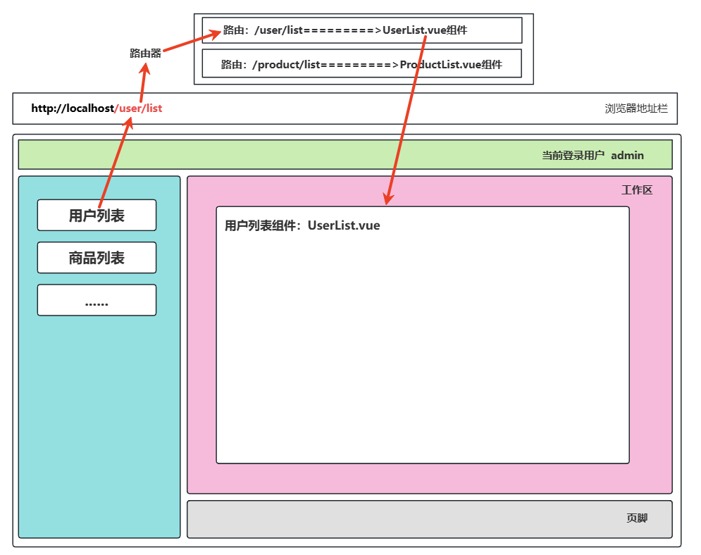

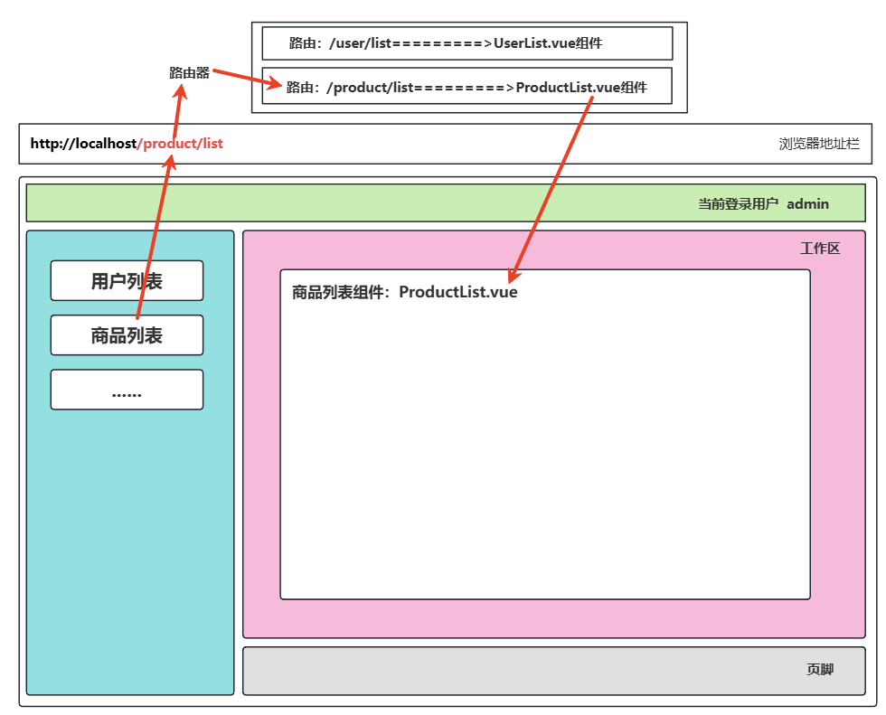

**路由的工作原理描述：**

1. 当用户点击按钮 **用户列表 **按钮时，发送请求 `**/user/list**`，浏览器地址栏上的地址变为 `**/user/list**`。此时路由器会接收到请求路径 `**/user/list**`，然后通过这个 **key** 找到对应 **UserList.vue** 组件，然后将组件更新到页面的对应位置上。
2. 当用户点击按钮 **商品列表 **按钮时，发送请求 `**/product/list**`，浏览器地址栏上的地址变为 `**/product/list**`。此时路由器会接收到请求路径 `**/product/list**`，然后通过这个 **key** 找到对应 **ProductList.vue** 组件，然后将 **UserList.vue** 组件卸载掉，将 **ProductList.vue** 组件更新到页面的对应位置上。

## 实现一个简单的路由

### 项目结构

```plaintext
src/
├── router/
│   └── index.ts
├── views/
│   ├── HomeView.vue
│   └── AboutView.vue
├── App.vue
└── main.ts
```

**重点注意事项：现代的企业级项目中，一般组件要放到 **`**<font style="color:#DF2A3F;">components</font>**`**目录下，路由组件要放到 **`**<font style="color:#DF2A3F;">views/pages</font>**`**目录下。另外路由组件的文件名建议以 **`**<font style="color:#DF2A3F;">View</font>**`**结尾，大家尽量遵循这个规范。**

### 安装必要的依赖

```bash
npm install vue-router
```

### `src/views/HomeView.vue`

```plaintext
<template>
  <div class="home">
    <h1>Home Page</h1>
    <p>Welcome to the home page!</p>
  </div>
</template>

<script lang="ts" setup name="HomeView"></script>

<style scoped>
  .home {
    text-align: center;
    padding: 20px;
  }
  .link {
    display: inline-block;
    margin-top: 20px;
    padding: 8px 16px;
    background-color: #42b983;
    color: white;
    text-decoration: none;
    border-radius: 4px;
  }
</style>
```

### `src/view/AboutView.vue`

```plaintext
<template>
  <div class="about">
    <h1>About Us</h1>
    <p>This is the about page.</p>
  </div>
</template>

<script lang="ts" setup name="AboutView"></script>

<style scoped>
.about {
  text-align: center;
  padding: 20px;
}
.link {
  display: inline-block;
  margin-top: 20px;
  padding: 8px 16px;
  background-color: #42b983;
  color: white;
  text-decoration: none;
  border-radius: 4px;
}
</style>
```

### `src/router/index.ts`

```typescript
import { createRouter, createWebHistory } from 'vue-router'
import HomeView from '../views/HomeView.vue'
import AboutView from '../views/AboutView.vue'

// 创建路由器
const router = createRouter({
  // 路由的工作模式采用 history
  history: createWebHistory(),
  // 路由数组用来配置多个路由
  routes: [
    // 其中一个路由
    {
      path: '/home',        // key
      component: HomeView,  // 组件
    },
    // 另一个路由
    {
      path: '/about',       // key
      component: AboutView, // 组件
    }
  ]
})

// 将路由器导出
export default router
```

**注意：路由配置时有两种配置方式，分别是：直接导入 和 懒加载。**

- **直接导入：访问网站时一次性下载所有页面代码；（以上代码是直接导入）**
- **懒加载：访问哪个页面才下载哪个页面的代码，首屏加载更快。**

**懒加载的写法如下：**

```typescript
import { createRouter, createWebHistory } from 'vue-router'

// 创建路由器
const router = createRouter({
  // 路由的工作模式采用 history
  history: createWebHistory(),
  // 路由数组用来配置多个路由
  routes: [
    // 其中一个路由
    {
      path: '/home',        // key
      component: () => import('../views/HomeView.vue'),  // 组件
    },
    // 另一个路由
    {
      path: '/about',       // key
      component: () => import('../views/AboutView.vue'), // 组件
    }
  ]
})

// 将路由器导出
export default router
```

### `src/App.vue`

**第一种写法：使用 RouterView 和 RouterLink 组件。（推荐）**

```plaintext
<template>
  <div id="app">
    <nav>
      <!-- 路由链接，to属性提供path，active-class属性用来设置当前链接被激活时的样式 -->
      <RouterLink to="/home" active-class="active">Home</RouterLink>
      <RouterLink to="/about" active-class="active">About</RouterLink>
    </nav>
    <!-- 内容将来显示在这里 -->
    <!-- 一个项目中路由出口可以有多个，Vue在底层是如何选择出口的？-->
    <!-- 底层会根据路径最佳匹配/最精确匹配原则进行出口的选择。 -->
    <!-- 如果是同级出口，则需要在 <RouterView> 标签中编写 name 属性用来指定。-->
    <RouterView />
  </div>
</template>

<script lang="ts" setup name="App">
  // RouterView和RouterLink都是全局注册的组件，因此以下import语句可写可不写。
  //import { RouterView, RouterLink } from 'vue-router';
</script>

<style>
#app {
  font-family: Avenir, Helvetica, Arial, sans-serif;
  -webkit-font-smoothing: antialiased;
  -moz-osx-font-smoothing: grayscale;
  text-align: center;
  color: #2c3e50;
  margin-top: 60px;
}

nav {
  padding: 30px;
}

nav a {
  font-weight: bold;
  color: #2c3e50;
  padding: 0 10px;
}

.active {
  color: #42b983;
}
</style>
```

**第二种写法：使用 router-view 和 router-link 标签。**

```plaintext
<template>
  <div id="app">
    <nav>
      <!-- 路由链接，to属性提供path，active-class属性用来设置当前链接被激活时的样式 -->
      <router-link to="/home" active-class="active">Home</router-link>
      <router-link to="/about" active-class="active">About</router-link>
    </nav>
    <!-- 内容将来显示在这里 -->
    <router-view />
  </div>
</template>

<script lang="ts" setup name="App"></script>

<style>
#app {
  font-family: Avenir, Helvetica, Arial, sans-serif;
  -webkit-font-smoothing: antialiased;
  -moz-osx-font-smoothing: grayscale;
  text-align: center;
  color: #2c3e50;
  margin-top: 60px;
}

nav {
  padding: 30px;
}

nav a {
  font-weight: bold;
  color: #2c3e50;
  padding: 0 10px;
}

.active {
  color: #42b983;
}
</style>
```

### `src/main.ts`

```typescript
import { createApp } from 'vue'
import App from './App.vue'

// 导入路由器
import router from './router'

// 创建app
const app = createApp(App)

// app使用路由器
app.use(router)

// 将app挂载到容器
app.mount('#app')
```

最终的运行效果：

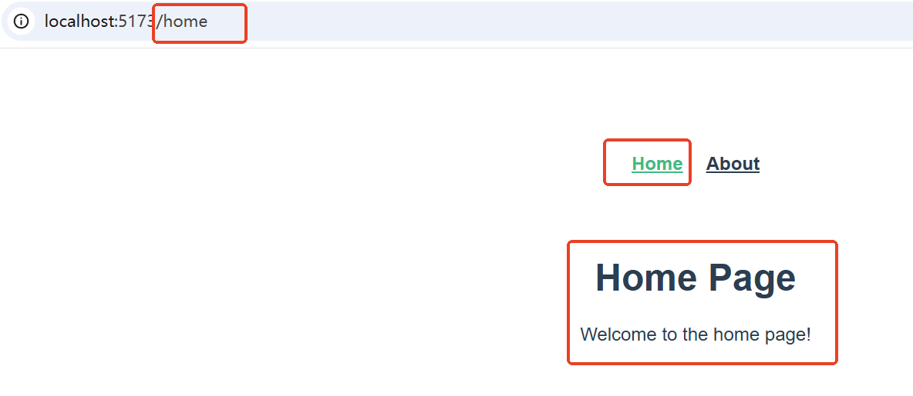

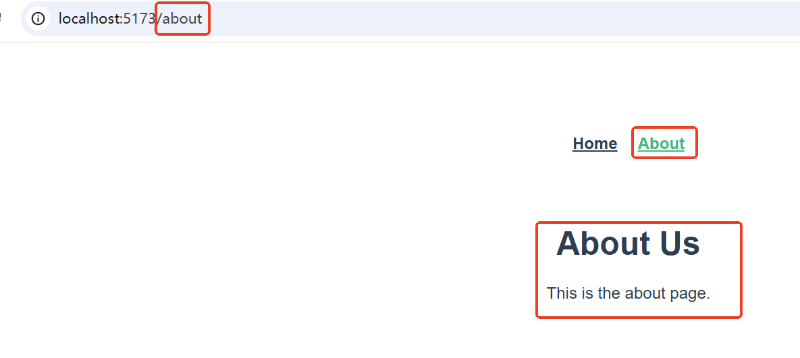

另外细心的同学应该也注意到了： `devtools`中也多了一个新的标签页：Router

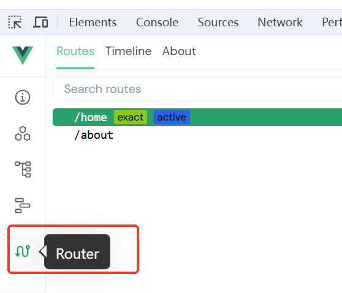

## 路由组件切换时

路由组件在切换时，在视觉效果上是“消失”，底层实际上是将路由组件“卸载”掉，需要的时候再重新“挂载”。

怎么验证一下？可以在任何一个路由组件上编写生命周期钩子：onMounted、onUnmounted

```plaintext
<template>
  <div class="about">
    <h1>About Us</h1>
    <p>This is the about page.</p>
  </div>
</template>

<script lang="ts" setup name="AboutView">
    import { onMounted, onUnmounted } from 'vue';

    onMounted(()=>{
        console.log('AboutView组件已挂载');
    });

    onUnmounted(()=>{
        console.log('AboutView组件已卸载');
    });
</script>

<style scoped>
.about {
  text-align: center;
  padding: 20px;
}
.link {
  display: inline-block;
  margin-top: 20px;
  padding: 8px 16px;
  background-color: #42b983;
  color: white;
  text-decoration: none;
  border-radius: 4px;
}
</style>
```

测试结果如下：

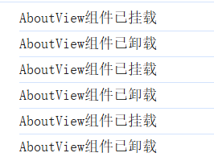

## 路由器工作模式

### history 模式

**优点：URL **更加美观，路径中不带有 `**#**`，更接近传统网站的 **URL**。

**缺点：后期项目上线，需要服务器端配合处理路径问题，否则刷新会有 404 的错误。（浏览器刷新时会把 **`**<font style="color:rgb(15, 17, 21);background-color:rgb(235, 238, 242);">/about</font>**`** 路径发给服务器，但服务器上根本没有这个文件，所以返回 404**）

代码实现：

```typescript
const router = createRouter({
  history: createWebHistory(),
  // ......
});
```

history 模式由于路径较为美观，因此在多数的 `**to C**` 系统较为常用。（**to C（面向消费者），to B（面向企业）**）

### hash 模式

优点：兼容性好，不需要服务器端处理路径。

缺点：URL 中带有 `**#**` 不美观，且在 **SEO** 优化方面相对较差。

代码实现：

```typescript
const router = createRouter({
  history: createWebHashHistory(),
  // ......
});
```

hash 模式多数使用在后台管理系统当中，因为大部分后台管理系统对美观性要求较低。

## 为路由起名字

```typescript
import { createRouter, createWebHistory } from 'vue-router'
import HomeView from '../views/HomeView.vue'
import AboutView from '../views/AboutView.vue'

const router = createRouter({
  history: createWebHistory(),
  routes: [
    {
      name: 'home', // 为路由起名
      path: '/home',      
      component: HomeView, 
    },
    {
      name: 'about', // 为路由起名
      path: '/about',       
      component: AboutView, 
    }
  ]
})

export default router
```

## to 的三种写法

第一种写法：

```plaintext
<router-link to="/home" active-class="active">Home</router-link>
```

第二种写法：`:to`可以接收一个带有 path 属性的对象

```plaintext
<router-link :to="{path: '/about'}" active-class="active">About</router-link>
```

第三种写法：`:to`可以接收一个带有 name 属性的对象

```plaintext
<router-link :to="{name: 'home'}" active-class="active">Home</router-link>
```

第二种和第三种写法在后期学习中才可以体会到它的好处。

## 嵌套路由

实现效果如下：


### 定义子路由组件

在 `views`目录下新建 `about`目录，在 `about`目录下新建 `TeamView.vue`和 `HistoryView.vue`，并提供以下代码：

```plaintext
<template>
  <div class="team">
    <h2>Our Team</h2>
    <p>Meet our amazing team members...</p>
  </div>
</template>

<script lang="ts" setup></script>

<style scoped>
.team {
  text-align: center;
  padding: 20px;
}
</style>
```

```plaintext
<template>
  <div class="history">
    <h2>Company History</h2>
    <p>Learn about our company's journey...</p>
  </div>
</template>

<script lang="ts" setup></script>

<style scoped>
.history {
  text-align: center;
  padding: 20px;
}
</style>
```

### 注册子路由组件

在 `router/index.ts`中完成子路由组件的注册：

```typescript
import { createRouter, createWebHistory } from 'vue-router'

import HomeView from '../views/HomeView.vue'
import AboutView from '../views/AboutView.vue'
import TeamView from '../views/about/TeamView.vue'
import HistoryView from '../views/about/HistoryView.vue'

// 创建路由器
const router = createRouter({
  // 路由的工作模式采用 history
  history: createWebHistory(),
  // 路由数组用来配置多个路由
  routes: [
    // 其中一个路由
    {
      name: 'home',
      path: '/home',        // key
      component: HomeView,  // 组件
    },
    // 另一个路由
    {
      name: 'about',
      path: '/about',       // key
      component: AboutView, // 组件
      // 子路由组件
      children: [
        {
          name: 'team',
          path: 'team',
          component: TeamView
        },
        {
          name: 'history',
          path: 'history',
          component: HistoryView
        },
      ]
    }
  ]
})

// 将路由器导出
export default router
```

重点代码是：`children`部分的代码，完成子路由的注册。

注意：子路由组件的 `path`不要以 `/`开始，如果 `path`是 `team`，则完整的路径是 `/about/team`。

### 子路由导航链接与出口

```plaintext
<template>
  <div class="about">
    <h1>About Us</h1>
    <p>This is the about page.</p>

    <!-- 子路由导航链接 -->
    <nav>
      <router-link to="/about/team" active-class="active">Team</router-link>
      <router-link to="/about/history" active-class="active">History</router-link>
    </nav>
    
    <!-- 子路由出口 -->
    <router-view />

  </div>
</template>

<script lang="ts" setup name="AboutView"></script>

<style scoped>
.about {
  text-align: center;
  padding: 20px;
}
.link {
  display: inline-block;
  margin-top: 20px;
  padding: 8px 16px;
  background-color: #42b983;
  color: white;
  text-decoration: none;
  border-radius: 4px;
}
nav {
  padding: 20px 0;
}
nav a {
  font-weight: bold;
  color: #2c3e50;
  padding: 0 10px;
}
nav a.active {
  color: #42b983;
}
</style>
```

## 父子组件参数传递

大家可能会有疑问：我们之前不是已经学过组件之间可以通过 `props`来完成参数的传递吗？例如我们在 A 组件中使用 B 组件时，给 B 组件传递数据，代码如下：

```plaintext
<template>
  <!--在A组件中使用B组件，然后通过props给B组件传递参数。-->
  <B name='jack' age='20'>
</template>
```

以上这种方式当然可以完成组件之间数据的传递，这是因为 `**B**` 标签是写在 `**<template>**`中的，是有机会通过属性传参的。

但对于 **父路由组件** 和 **子路由组件** 之间传递参数时，在 `**<template>**`标签中并没有编写具体的子路由组件的名字，因此使用 `**props**`无法完成传参。

### query 参数

在父组件当中给子组件传参，代码这样写：

```plaintext
<template>
  <div class="about">
    <h1>About Us</h1>
    <p>This is the about page.</p>

    <!-- 子路由导航链接 -->
    <nav>
      <!-- 第一种方式：拼接字符串 -->
      <!-- <router-link :to="`/about/team?company=${company}&members=${members}`" active-class="active">Team</router-link>
      <router-link :to="`/about/history?company=${company}&establishYear=${establishYear}`" active-class="active">History</router-link> -->
      <!-- 第二种方式：对象形式传参，但是对象query属性名不能随便写，必须写query这个单词。query后面我写的是对象的简写形式，写对象完整格式也是对的。 -->
       <router-link :to="{path: '/about/team', query: {company, members}}" active-class="active">Team</router-link>
       <router-link :to="{path: '/about/history', query: {company, establishYear}}" active-class="active">History</router-link>
    </nav>
    
    <!-- 子路由出口 -->
    <router-view />

  </div>
</template>

<script lang="ts" setup name="AboutView">

  import { ref } from 'vue';

  // 公司名
  let company = ref('One Master');
  // 成员数量
  let members = ref(1);
  // 成立年份
  let establishYear = ref('2025');

</script>

<style scoped>
.about {
  text-align: center;
  padding: 20px;
}
.link {
  display: inline-block;
  margin-top: 20px;
  padding: 8px 16px;
  background-color: #42b983;
  color: white;
  text-decoration: none;
  border-radius: 4px;
}
nav {
  padding: 20px 0;
}
nav a {
  font-weight: bold;
  color: #2c3e50;
  padding: 0 10px;
}
nav a.active {
  color: #42b983;
}
</style>
```

在子组件中接收父组件传递过来的数据：

```plaintext
<template>
  <div class="team">
    <h2>Our Team</h2>
    <!-- 可以这样取 -->
    <p>{{ route.query.company }} has {{ route.query.members }} member in total.</p>
    <!-- 也可以先对route.query对象进行解构 -->
    <p>{{ company }} has {{ members }} member in total.</p>
  </div>
</template>

<script lang="ts" setup>
  import { useRoute } from 'vue-router';

  // useRoute是一个函数，这个函数可以获取到当前路由组件对象。
  let route = useRoute();

  // route.query：从当前路由组件对象上获取query对象，query单词不能随便写，固定的。
  // 对象解构
  let {company, members} = route.query;

</script>

<style scoped>
.team {
  text-align: center;
  padding: 20px;
}
</style>
```

```plaintext
<template>
  <div class="history">
    <h2>Company History</h2>
    <p>{{ company }} was established in {{ establishYear }}!</p>
  </div>
</template>

<script lang="ts" setup>
  import { useRoute } from 'vue-router';

  let route = useRoute();

  let {company, establishYear} = route.query;
</script>

<style scoped>
.history {
  text-align: center;
  padding: 20px;
}
</style>
```

最终效果如下：

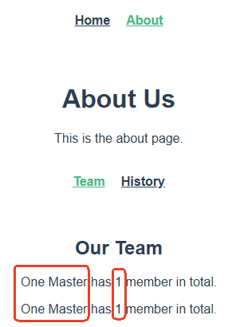

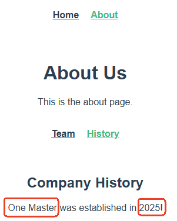

### params 参数

首先你需要在制定路由规则的文件中指定动态参数：

```typescript
import { createRouter, createWebHistory } from 'vue-router'
import HomeView from '../views/HomeView.vue'
import AboutView from '../views/AboutView.vue'
import TeamView from '../views/about/TeamView.vue'
import HistoryView from '../views/about/HistoryView.vue'

// 创建路由器
const router = createRouter({
  // 路由的工作模式采用 history
  history: createWebHistory(),
  // 路由数组用来配置多个路由
  routes: [
    // 其中一个路由
    {
      name: 'home',
      path: '/home',        // key
      component: HomeView,  // 组件
    },
    // 另一个路由
    {
      name: 'about',
      path: '/about',       // key
      component: AboutView, // 组件
      // 子路由组件
      children: [
        {
          name: 'team',
          path: 'team/:company/:members?', // 动态参数语法，:company 和 :members 是参数名，会被解析为 params 对象（另外需要注意 ? 的作用是用来设置参数的必要性。?表示可传可不传。）
          component: TeamView
        },
        {
          name: 'history',
          path: 'history/:company/:establishYear', // 动态参数语法
          component: HistoryView
        },
      ]
    }
  ]
})

// 将路由器导出
export default router
```

然后在父组件中传参：

```plaintext
<template>
  <div class="about">
    <h1>About Us</h1>
    <p>This is the about page.</p>

    <!-- 子路由导航链接 -->
    <nav>
      <!-- 第一种方式： -->
      <!-- <router-link :to="`/about/team/${company}/${members}`" active-class="active">Team</router-link>
      <router-link :to="`/about/history/${company}/${establishYear}`" active-class="active">History</router-link> -->
      <!-- 第二种方式：注意，这种方式只支持name，不支持path -->
      <router-link :to="{name: 'team', params: {company, members}}" active-class="active">Team</router-link>
      <router-link :to="{name: 'history', params: {company, establishYear}}" active-class="active">History</router-link>
    </nav>
    
    <!-- 子路由出口 -->
    <router-view />

  </div>
</template>

<script lang="ts" setup name="AboutView">

  import { ref } from 'vue';

  // 公司名
  let company = ref('One Master');
  // 成员数量
  let members = ref(1);
  // 成立年份
  let establishYear = ref('2025');

</script>

<style scoped>
.about {
  text-align: center;
  padding: 20px;
}
.link {
  display: inline-block;
  margin-top: 20px;
  padding: 8px 16px;
  background-color: #42b983;
  color: white;
  text-decoration: none;
  border-radius: 4px;
}
nav {
  padding: 20px 0;
}
nav a {
  font-weight: bold;
  color: #2c3e50;
  padding: 0 10px;
}
nav a.active {
  color: #42b983;
}
</style>
```

**需要引起你注意的是：**

1. **如果使用 params 参数，**`**<font style="color:#DF2A3F;">:to</font>**`**后面的对象的属性中不能使用 path，必须使用 name。**
2. **使用 params 参数时，不能传递数组或对象。**

最后在子组件中使用 params 接收参数：

```plaintext
<template>
  <div class="team">
    <h2>Our Team</h2>
    <!--通过子路由组件对象获取params对象。-->
    <p>{{ route.params.company }} has {{ route.params.members }} member in total.</p>
  </div>
</template>

<script lang="ts" setup>
  import { useRoute } from 'vue-router';
  // 获取子路由组件
  let route = useRoute();
</script>

<style scoped>
.team {
  text-align: center;
  padding: 20px;
}
</style>
```

```plaintext
<template>
  <div class="history">
    <h2>Company History</h2>
    <p>{{ route.params.company }} was established in {{ route.params.establishYear }}!</p>
  </div>
</template>

<script lang="ts" setup>
  import { useRoute } from 'vue-router';
  let route = useRoute();
</script>

<style scoped>
.history {
  text-align: center;
  padding: 20px;
}
</style>
```

### 路由组件的 props 配置

我们最开始就有说过：父路由组件向子路由组件传递数据时，不能使用 `**props**`，因为子路由组件不是直接编写在 `**<template>**`当中的。

如果想要达到同等效果，也不是完全不行，可以在**制定路由规则的文件中进行 props 配置**。

#### props 配合 params 参数

以下这种方式只适合于 `params`参数。

首先，你需要在**制定路由规则**的文件中，添加以下配置：

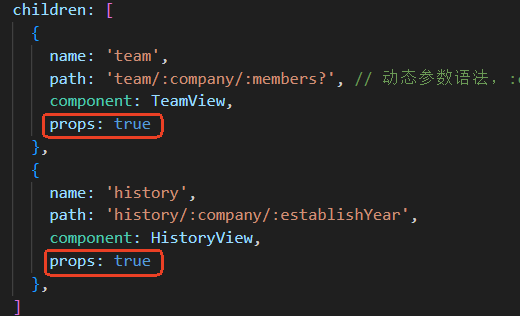

加上这个 `props: true`之后，等同于有这样一个配置：

```plaintext
<TeamView company="One Master" members="1">
```

因此，在子路由组件中，就可以使用 `**defineProps()**`来获取参数，代码如下：

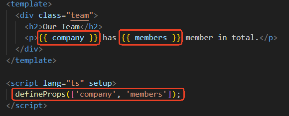

#### props 配合 query 参数

函数写法：

在制定路由规则的文件中，使用 `props()`函数，返回一个对象。这种方式既适合 params 参数，又适合 query 参数，但 params 参数还是推荐前面讲解的方式，因此这种方式可以认为是 query 参数专属的。

需要修改的代码位置如下图所示：


#### props 传固定参数

对象写法：不常用。

如果传递的参数固定，不是动态的，可以按照下图进行配置：


## `router-link`的 replace 属性

路由对导航链接的管理模式包括两种：

1. push 模式
2. replace 模式

### push 模式

路由的导航链接默认是 `push`模式。路由为了达到前进和后退的效果，将用户点击导航链接的记录采用 `push`方式压入栈顶。

假设用户分别先后点击了：`/a`、`/b`、`/c`三个请求，这三个请求会被分别压入栈数据结构，`/a`请求在栈底，`/c`请求在栈顶。如下图：


前进就是压栈：`/a`、`/b`、`/c`

后退就是弹栈：`/c`、`/b`、`/a`

通过这种方式就完成了前进和后退的效果。这就是 push 模式！！！！默认就是 push 模式，它是较常用的。

### replace 模式

所谓的 `replace`模式就是：设置为 replace 模式的路由导航链接会将 `当前栈顶部最近的一次请求`替换掉，导致无法后退和前进到这一次请求。

因此，如果在请求链条当中，你希望某一次请求不支持前进和后退，可以将这个请求的下一次请求设置为 `replace`模式。代码如下：


怎么理解这个 `replace`模式呢？

假设 `/a`请求是 push 模式。`/b`请求也是 push 模式。`/c`请求是 replace 模式。假设用户先后分别发送了 `/a`、`/b`、`/c`三个请求。它将如下图所示：


 


 


最终用户的前进和后退只体现在 `/a`和 `/c`请求上，`/b`请求是不支持前进和后退的。

## 编程式路由导航

之前我们都是在 `<template>`中编写 `<router-link>`标签来完成路由导航（最终生成的 HTML 代码是 `<a>`超链接标签），这属于标签式路由导航。

假设现在有这样的需求：

1. 页面组件挂载完毕后，要求跳转到某个路由组件。
2. 用户通过点击页面的某个按钮跳转到某个路由组件。

像以上这些功能的实现都需要通过编写代码来实现路由跳转。这就是编程式路由导航。

### 功能一

要求 `HomeView`组件挂载完后，再过 5 秒，跳转到 `AboutView`组件，在 `HomeView`组件中添加生命周期钩子 `onMounted`，编写代码：

```plaintext
<template>
  <div class="home">
    <h1>Home Page</h1>
    <p>Welcome to the home page!</p>
  </div>
</template>

<script lang="ts" setup name="HomeView">
  import { onMounted } from 'vue';
  import { useRouter } from 'vue-router';

  // 获取路由器
  const router = useRouter();

  onMounted(() => {
    setTimeout(()=>{
      // push模式，也可以调用replace()使用replace模式
      router.push('/about');
    }, 1000 * 5);
  });

</script>

<style scoped>
  .home {
    text-align: center;
    padding: 20px;
  }
  .link {
    display: inline-block;
    margin-top: 20px;
    padding: 8px 16px;
    background-color: #42b983;
    color: white;
    text-decoration: none;
    border-radius: 4px;
  }
</style>
```

### 功能二

在 `Team`和 `History`旁边分别添加一个按钮，用户通过点击按钮来完成路由跳转。代码如下：

```plaintext
<template>
  <div class="about">
    <h1>About Us</h1>
    <p>This is the about page.</p>

    <nav>
      <!-- 编程式路由导航 -->
      <button @click="goTeam(company, members)">Team</button>
      <router-link replace :to="{name: 'team', query: {company, members}}" active-class="active">Team</router-link>
      <!-- 编程式路由导航 -->
      <button @click="goHistory(company, establishYear)">History</button>
      <router-link replace :to="{name: 'history', query: {company, establishYear}}" active-class="active">History</router-link>
    </nav>
    
    <router-view />

  </div>
</template>

<script lang="ts" setup name="AboutView">

  import { ref } from 'vue';
  import { useRouter } from 'vue-router';

  let company = ref('One Master');
  let members = ref(1);
  let establishYear = ref('2025');

  // 获取路由器
  const router = useRouter();

  // 编程式路由导航
  function goTeam(company: string, members: number){
    router.push({name: 'team', query: {company, members}});
  }

  // 编程式路由导航
  function goHistory(company: string, establishYear: string){
    router.push({name: 'history', query: {company, establishYear}});
  }

</script>

<style scoped>
.about {
  text-align: center;
  padding: 20px;
}
.link {
  display: inline-block;
  margin-top: 20px;
  padding: 8px 16px;
  background-color: #42b983;
  color: white;
  text-decoration: none;
  border-radius: 4px;
}
nav {
  padding: 20px 0;
}
nav a {
  font-weight: bold;
  color: #2c3e50;
  padding: 0 10px;
}
nav a.active {
  color: #42b983;
}
</style>
```

需要引起注意的是：使用 `**router.push()**`或 `**router.replace()**`时，参数的写法和 `**:to**`后面的写法完全一致。可以写 `**字符串**`，也可以写 `**对象**`。

## 路由重定向

重定向：当访问某个路由组件时，让它自动重定向到另一个路由组件。

我们当前项目存在这样一个问题，当我们访问项目的根 `http://localhost:5173`时，会出现以下错误：


出现这个错误很正常，因为访问 `/`路径时没有对应的路由组件。类似于 404 错误。可以使用重定向来解决这个问题，在制定路由规则的 `src/router/index.ts`文件中添加以下代码即可：


这样当我们再次访问 `http://localhost:5173`时，会自动显示 `/home`对应的路由组件。

# Pinia

**什么时候使用 Pinia？当数据需要在多个不相关的组件间共享时。**

**Hooks是代码的组织方式（怎么做逻辑），Pinia是状态的存储方案（在哪存数据）。**

可以这样理解：Hooks解决“怎么写代码更优雅”，Pinia解决“数据放哪里大家都能用”。


## Pinia 概述

Pinia 的官网地址：[https://pinia.vuejs.org/](https://pinia.vuejs.org/)

Pinia 的 logo 是一个菠萝：


**Pinia** 是 **Vue3** 的状态（数据）管理库。如果你要做 **集中式状态（数据）管理 **可以使用它。类似于 Pinia 的状态管理库有很多，例如 **vue2** 中的 **vuex**、**react** 中的 **redux** 等。

假设你开发一个 **购物网站**，有以下功能：

- **购物车**（需要记录商品）
- **用户登录**（需要保存用户名）
- **商品库存**（需要实时更新）

如果不用 Pinia（或 Vuex），你的状态（数据）可能分散在各个组件里：

- `Header.vue` 存用户信息
- `Cart.vue` 存购物车数据
- `ProductList.vue` 存库存

**问题来了**：

- 当 `Cart.vue` 想用用户信息时，需要层层传递（props 或事件），麻烦！
- 如果多个组件同时修改库存，可能互相覆盖，导致数据不一致！

Pinia 就像一个**公共仓库**，所有组件都能直接从这里 **读/写** 数据，不用绕来绕去！

**集中式管理的优势**

- **数据共享简单**：所有组件直接访问同一个仓库，不用 props/emit 折腾。
- **数据一致性**：比如库存更新后，所有用到它的组件会自动同步。
- **维护方便**：所有逻辑集中在仓库里，改代码不用到处找。

**对比日常例子**

- **没 Pinia**：像家里杂物分散在各个抽屉，找东西要翻箱倒柜。
- **用 Pinia**：像把所有东西整理进一个储物间，需要时直接去拿！

## 计数器演示 Pinia 基础用法

### 准备一个效果

**项目结构**

```plaintext
src/
├── components/
│   ├── Count.vue
├── App.vue
└── main.ts
```

`**src/main.ts**`**代码：**

```typescript
import { createApp } from "vue";
import App from "./App.vue";

// 创建应用
const app = createApp(App);

// 挂载应用
app.mount('#app');
```

`**src/App.vue**`**代码：**

```plaintext
<template>
    <Count/>
</template>

<script lang='ts' setup name="App">
    import Count from './components/Count.vue';
</script>
```

`**src/components/Count.vue**`**代码：**

```plaintext
<template>
    <div class="count">
        <h1>Counter: {{ count }}</h1>
      
        <!--.number 保证是数字-->
        <select v-model.number="n">
            <option value="1">1</option>
            <option value="2">2</option>
            <option value="3">3</option>
        </select>

        <!-- :value 方式也可以保证是数字 -->
        <!-- <select v-model="n">
            <option :value="1">1</option>
            <option :value="2">2</option>
            <option :value="3">3</option>
        </select> -->
        <button @click="add">+</button> 
        <button @click="minus">-</button>
    </div>
</template>

<script lang='ts' setup name="Count">
    import { ref } from 'vue';

    // 数据
    let count = ref(0);
    let n = ref(1);

    // 方法
    function add(){
        count.value += n.value;
    }
    function minus(){
        count.value -= n.value;
    }

</script>

<style scoped>
.count {
    background-color: skyblue;
    padding: 10px;
    border-radius: 10px;
    box-shadow: 10px;
}
select, button{
    margin: 0 5px;
    height: 25px;
    width: 40px;
}
</style>
```

最终效果如下：


### 搭建 pinia 环境

#### 安装 pinia

```bash
npm i pinia
```

#### 使用 pinia

在 `main.ts`中使用 pinia，代码如下：

```typescript
import { createApp } from "vue";
import App from "./App.vue";

// 第一步：引入
import { createPinia } from "pinia";

const app = createApp(App);

// 第二步：创建
const pinia = createPinia();

// 第三步：使用
app.use(pinia);

app.mount('#app');
```

#### 查看 pinia 环境是否搭建成功

如果 `pinia`环境搭建成功，在 devtools 中会看到下图效果：


### 存储/读取数据

`**pinia**`做数据集中式管理时，我们一般会创建一个目录 `**store**`，你可以认为 `**store**`目录就是 `**pinia**`的具体实现。

另外数据要分类，例如 `**Count.vue**`对应的数据文件一般起名为 `**Count.ts**`，如下图所示：


向仓库中**存储**数据，代码如下：

```typescript
import { defineStore } from "pinia";

// 可以把它看做是一个存储数据的仓库
export const useCountStore = defineStore('count', {
    // 真正存储数据的地方
    state(){
        return {
            count: 1,
            n: 1
        };
    }
});
```

从仓库中**读取**数据，代码如下：

```plaintext
<template>
    <div class="count">
        <h1>Counter: {{ countStore.count }}</h1>
        <select v-model.number="countStore.n">
            <option value="1">1</option>
            <option value="2">2</option>
            <option value="3">3</option>
        </select>
        <button @click="add">+</button> 
        <button @click="minus">-</button>
    </div>
</template>

<script lang='ts' setup name="Count">
    import { useCountStore } from '../store/Count';

    // 返回的对象是一个 reactive的响应式对象。
    // 返回的是一个仓库实例（仓库是单例的）
    let countStore = useCountStore();

    // 以下这两种方式都可以获取到state中的数据。
    console.log(countStore.count);
    console.log(countStore.$state.count);
    console.log(countStore.n);
    console.log(countStore.$state.n);

    // 方法
    function add(){
        
    }
    function minus(){
        
    }

</script>

<style scoped>
.count {
    background-color: skyblue;
    padding: 10px;
    border-radius: 10px;
    box-shadow: 10px;
}
select, button{
    margin: 0 5px;
    height: 25px;
    width: 40px;
}
</style>
```

以上代码中隐藏了一个知识点：直接的 ref 响应式对象在访问数据时必须添加 `.value`。如果是一个 reactive 响应式对象，该对象中包裹了一个 ref 对象，访问这个 ref 对象时不需要添加 `.value`。例如以下代码：

```typescript
let a = ref(100);
// 这里就需要手动 .value
console.log(a.value);

let b = reactive({
    c: ref(200)
});
// 这里就不需要手动 .value
console.log(b.c);
```

### 修改数据

在 `Count.vue`中演示修改数据的三种方式，以下代码呈现了三种方式：

```plaintext
<template>
    <div class="count">
        <h1>Counter: {{ countStore.count }}</h1>
        <select v-model.number="countStore.n">
            <option value="1">1</option>
            <option value="2">2</option>
            <option value="3">3</option>
        </select>
        <button @click="add">+</button> 
        <button @click="minus">-</button>
    </div>
</template>

<script lang='ts' setup name="Count">
    import { useCountStore } from '../store/Count';

    // 返回的对象是一个 reactive的响应式对象。
    // 返回的是一个仓库实例（仓库是单例的）
    let countStore = useCountStore();

    // 方法
    function add(){
        // 第一种方式：一个一个修改
        //countStore.count += countStore.n;
        // 第二种方式：批量修改
        // countStore.$patch({
        //     count: countStore.count + countStore.n,
        //     // 如果还有其它数据需要修改，可以写到这里
        // });
        // 第三种方式：借助actions
        countStore.add();
    }
    function minus(){
        // 第一种方式：一个一个修改
        //countStore.count -= countStore.n;
        // 第二种方式：批量修改
        // countStore.$patch({
        //     count: countStore.count - countStore.n,
        //     // 如果还有其它数据需要修改，可以写到这里
        // });
        // 第三种方式：借助actions
        countStore.minus();
    }


</script>

<style scoped>
.count {
    background-color: skyblue;
    padding: 10px;
    border-radius: 10px;
    box-shadow: 10px;
}
select, button{
    margin: 0 5px;
    height: 25px;
    width: 40px;
}
</style>
```

以上代码的第三种方式需要在 `count.ts`中编写 `actions`，代码如下：

```typescript
import { defineStore } from "pinia";

// 可以把它看做是一个存储数据的仓库
export const useCountStore = defineStore('count', {
    // 真正存储数据的地方
    state(){
        return {
            count: 1,
            n: 1
        };
    },
    // actions里面放置的是一个一个方法，用于响应组件中的“动作”
    actions: {
        add(){
            this.count += this.n;
        },
        minus(){
            this.count -= this.n;
        }
    }
});
```

### storeToRefs

使用 `storeToRefs`可以将 store 中的数据转换为 ref 对象，方便在模板中使用。

注意：`pinia`提供的 `storeToRefs`**只会将数据**做转换，而 `Vue`的 `toRefs`会转换 store 中所有的数据和方法等。

```plaintext
<template>
    <div class="count">
        <h1>Counter: {{ count }}</h1>
        <select v-model.number="n">
            <option value="1">1</option>
            <option value="2">2</option>
            <option value="3">3</option>
        </select>
        <button @click="add">+</button> 
        <button @click="minus">-</button>
    </div>
</template>

<script lang='ts' setup name="Count">
    import { storeToRefs } from 'pinia';
    import { useCountStore } from '../store/Count';

    let countStore = useCountStore();

    // 使用 storeToRefs 简化模板template中的代码
    // storeToRefs只会将store中的数据包裹为ref的，建议使用storeToRefs。
    let {count, n} = storeToRefs(countStore);
    
    // 不建议使用toRefs，因为这种方式会导致store对象中所有的数据及方法都包裹ref。
    //let {count, n} = toRefs(countStore);

    // 方法
    function add(){
        countStore.add();
    }
    function minus(){
        countStore.minus();
    }

</script>

<style scoped>
.count {
    background-color: skyblue;
    padding: 10px;
    border-radius: 10px;
    box-shadow: 10px;
}
select, button{
    margin: 0 5px;
    height: 25px;
    width: 40px;
}
</style>
```

### getters

当 state 中的数据需要经过加工之后再显示，可以使用 getters。

`getters`的配置如下：

```typescript
import { defineStore } from "pinia";

export const useCountStore = defineStore('count', {
    state(){
        return {
            count: 1,
            n: 1
        };
    },
    actions: {
        add(){
            this.count += this.n;
        },
        minus(){
            this.count -= this.n;
        }
    },
    getters: {
        // 第一种写法
        // bigCount(state){
        //     return state.count * 10;
        // }
        // 第二种写法：箭头函数
        //bigCount: state => state.count * 10,

        // 第三种写法
        bigCount(): number{
            return this.count * 10;
        }
    }
});
```

取 `getters`数据，展示：

```plaintext
<template>
    <div class="count">
        <h1>Counter: {{ count }}</h1>
        <!-- 展现 -->
        <h1>10x multiplier Counter: {{ bigCount }}</h1>
        <select v-model.number="n">
            <option value="1">1</option>
            <option value="2">2</option>
            <option value="3">3</option>
        </select>
        <button @click="add">+</button> 
        <button @click="minus">-</button>
    </div>
</template>

<script lang='ts' setup name="Count">
    import { storeToRefs } from 'pinia';
    import { useCountStore } from '../store/Count';

    let countStore = useCountStore();

    // 从getters中取出数据。
    let {count, n, bigCount} = storeToRefs(countStore);
    
    function add(){
        countStore.add();
    }
    function minus(){
        countStore.minus();
    }

</script>

<style scoped>
.count {
    background-color: skyblue;
    padding: 10px;
    border-radius: 10px;
    box-shadow: 10px;
}
select, button{
    margin: 0 5px;
    height: 25px;
    width: 40px;
}
</style>
```

### $subscribe 的使用

在 Pinia 中，`**<font style="color:rgb(64, 64, 64);background-color:rgb(236, 236, 236);">$subscribe</font>**` 方法是用来订阅 store 状态变化的。它的回调函数接收两个参数：`**<font style="color:rgb(64, 64, 64);background-color:rgb(236, 236, 236);">mutate</font>**` 和 `**<font style="color:rgb(64, 64, 64);background-color:rgb(236, 236, 236);">state</font>**`。

**mutate 参数**：这是一个包含变更信息的对象

**state 参数：**这是变更后的**新状态**（已经是修改后的状态）

```plaintext
<template>
    <div class="count">
        <h1>Counter: {{ count }}</h1>
        <h1>10x multiplier Counter: {{ bigCount }}</h1>
        <select v-model.number="n">
            <option value="1">1</option>
            <option value="2">2</option>
            <option value="3">3</option>
        </select>
        <button @click="add">+</button> 
        <button @click="minus">-</button>
    </div>
</template>

<script lang='ts' setup name="Count">
    import { storeToRefs } from 'pinia';
    import { useCountStore } from '../store/Count';

    let countStore = useCountStore();

    // 订阅仓库（当仓库中的数据发生变化时，回调会执行）
    countStore.$subscribe((mutate, state)=>{
        console.log("包含变更信息的对象", mutate);
        console.log("变更后的新状态", state);
    });

    let {count, n, bigCount} = storeToRefs(countStore);
    
    function add(){
        countStore.add();
    }
    function minus(){
        countStore.minus();
    }

</script>

<style scoped>
.count {
    background-color: skyblue;
    padding: 10px;
    border-radius: 10px;
    box-shadow: 10px;
}
select, button{
    margin: 0 5px;
    height: 25px;
    width: 40px;
}
</style>
```

### store 的组合式写法

之前我们编写的属于选项式，store 也可以采用**组合式**写法（**推荐**），代码如下：

```typescript
import { defineStore } from "pinia";
import { computed, ref } from "vue";

export const useCountStore = defineStore("count", ()=>{
    // state 对应响应式数据
    let count = ref(1);
    let n = ref(1);
    // actions 对应方法
    function add(){
        count.value += n.value;
    }
    function minus(){
        count.value -= n.value;
    }
    // getters 对应计算属性
    let bigCount = computed(()=>{
        return count.value * 10;
    });
    return {count, n, add, minus, bigCount};
});
```

1. **state 对应响应式数据。**
2. **actions 对应普通方法。**
3. **getters 对应计算属性。**

## 毒鸡汤案例演示 Pinia

### 准备一个效果

**项目结构**

```plaintext
src/
├── components/
│   └── Du.vue
├── App.vue
└── main.ts
```

`**src/main.ts**`**代码：**

```typescript
import { createApp } from "vue";
import App from "./App.vue";
import { createPinia } from "pinia";

// 创建应用
const app = createApp(App);

// 创建Pinia
const pinia = createPinia();

// 使用Pinia
app.use(pinia);

// 挂载应用
app.mount('#app');
```

`**src/App.vue**`**代码：**

```plaintext
<template>
    <Du/>
</template>

<script lang='ts' setup name="App">
    import Du from './components/Du.vue';
</script>
```

`**src/components/Du.vue**`**代码：**

```plaintext
<template>
    <div class="du">
        <button @click="getDu">获取毒鸡汤</button>
        <ul>
            <li v-for="(du, index) in duList" :key="du.id">
                {{ index + 1 }}-{{ du.content }}
            </li>
        </ul>
    </div>
</template>

<script lang='ts' setup>
    import axios from 'axios';
    import { reactive } from 'vue';
    import { nanoid } from 'nanoid';
    // 数据
    let duList = reactive([
        {id: 'id001', content: '过年哪个亲戚问我成绩，我就问他年终奖金。'},
        {id: 'id002', content: '间歇性洗心革面，持续性混吃等死。'},
        {id: 'id003', content: '路遥知马力不足，日久见人心叵测。'}
    ]);

    async function getDu(){
        // 发送异步请求获取毒鸡汤
        let response = await axios.get("https://api.shadiao.pro/du");
        // 连续解构语法+重命名
        let {data:{data:{text:content}}} = response;
        // 将对象添加到数组的第一个位置
        duList.unshift({
            id: nanoid(),
            content: content
        });
    }
</script>

<style scoped>
    .du {
        background-color: rgb(171, 214, 129);
        border-radius: 10px;
        box-shadow: 10px;
        padding: 10px;
    }
</style>
```

这个代码中有几个新的知识点：

1. 安装 `nanoid`，用于生成 id。
2. 毒鸡汤接口地址：[https://api.shadiao.pro/du](https://api.shadiao.pro/du)
3. **连续解构赋值+重命名语法：**`**{data:{data:{text:content}}}**`
  1. **冒号的作用：赋值操作。**
  2. `**let {username: uname} = person;**`**这个代码则表示将 **`**person.username**`**值赋值给 **`**uname**`**变量。**
  3. **最后的重命名为 **`**content**`**其本质上也是赋值操作。**

最终效果如下：


### 使用 Pinia 存储/读取/修改数据

在 `store`目录中创建 `Du.ts`。

向仓库中**存储数据**（存储毒鸡汤），代码如下：

```typescript
import { defineStore } from "pinia";
import { reactive } from "vue";
import axios from "axios";
import { nanoid } from "nanoid";

export const useDuStore = defineStore("du", ()=>{
    let duList = reactive([
        {id: 'id001', content: '过年哪个亲戚问我成绩，我就问他年终奖金。'},
        {id: 'id002', content: '间歇性洗心革面，持续性混吃等死。'},
        {id: 'id003', content: '路遥知马力不足，日久见人心叵测。'}
    ]);
    async function getDu(){
        // 发送异步请求获取毒鸡汤
        let response = await axios.get("https://api.shadiao.pro/du");
        // 连续解构语法+重命名
        let {data:{data:{text:content}}} = response;
        // 将对象添加到数组的第一个位置
        duList.unshift({
            id: nanoid(),
            content: content
        });
    }
    
    return {duList, getDu}
});
```

从仓库中**读取数据**（读取毒鸡汤）以及**修改数据**，代码如下：

```plaintext
<template>
    <div class="du">
        <button @click="getDu">获取毒鸡汤</button>
        <ul>
            <!-- duStore.duList 读取数据 -->
            <li v-for="(du, index) in duStore.duList" :key="du.id">
                {{ index + 1 }}-{{ du.content }}
            </li>
        </ul>
    </div>
</template>

<script lang='ts' setup>
    import { useDuStore } from '../store/Du';
    
    // 获取单例的仓库实例
    // 通过仓库对象可以读取数据
    const duStore = useDuStore();

    function getDu(){
        // 修改数据
        duStore.getDu();
    }
</script>

<style scoped>
    .du {
        background-color: rgb(171, 214, 129);
        border-radius: 10px;
        box-shadow: 10px;
        padding: 10px;
    }
</style>
```

### $subscribe 的使用

实现这样一个效果：页面加载的时候从 `<font style="color:rgb(64, 64, 64);">localStorage</font>`中取毒鸡汤列表，只要毒鸡汤列表发生变化，就把变化后的列表存储到 `<font style="color:rgb(64, 64, 64);">localStorage</font>`中

```typescript
import { defineStore } from "pinia";
import { reactive } from "vue";
import axios from "axios";
import { nanoid } from "nanoid";

export const useDuStore = defineStore("du", ()=>{
    
    // 逻辑或(||)操作符 用于设置默认值
    let duList = reactive(JSON.parse(localStorage.getItem("duList") as string) || []);
    
    async function getDu(){
        // 发送异步请求获取毒鸡汤
        let response = await axios.get("https://api.shadiao.pro/du");
        // 连续解构语法+重命名
        let {data:{data:{text:content}}} = response;
        // 将对象添加到数组的第一个位置
        duList.unshift({
            id: nanoid(),
            content: content
        });
    }
    
    return {duList, getDu}
});
```

```plaintext
<template>
    <div class="du">
        <button @click="getDu">获取毒鸡汤</button>
        <ul>
            <li v-for="(du, index) in duStore.duList" :key="du.id">
                {{ index + 1 }}-{{ du.content }}
            </li>
        </ul>
    </div>
</template>

<script lang='ts' setup>
    import { useDuStore } from '../store/Du';
    
    const duStore = useDuStore();

    function getDu(){
        duStore.getDu();
    }

    // 订阅仓库中数据的更新，数据更新时执行回调。
    duStore.$subscribe((mutate, state)=>{
        localStorage.setItem("duList", JSON.stringify(duStore.duList));
    });
</script>

<style scoped>
    .du {
        background-color: rgb(171, 214, 129);
        border-radius: 10px;
        box-shadow: 10px;
        padding: 10px;
    }
</style>
```

## 购物车(课后自行查看和理解)

下面是一个简单但能体现 Pinia 优势的购物车示例，展示了集中式状态管理的好处。

### 项目结构

```plaintext
src/
├── stores/
│   └── cart.ts       # Pinia 购物车store
├── components/
│   ├── ProductList.vue
│   └── ShoppingCart.vue
├── App.vue
└── main.ts
```

### 创建 Pinia Store

```typescript
import { defineStore } from 'pinia'

// 定义商品类型
interface Product {
    id: number
    name: string
    price: number
}

// 定义购物车项类型
interface CartItem extends Product {
    quantity: number
}

// 创建并导出购物车store
export const useCartStore = defineStore('cart', {
    state: () => ({
        items: [] as CartItem[],
        products: [
            { id: 1, name: '笔记本电脑', price: 7999 },
            { id: 2, name: '智能手机', price: 3999 },
            { id: 3, name: '无线耳机', price: 599 },
        ] as Product[],
    }),
    getters: {
        // 计算总价
        totalPrice: (state) => {
            return state.items.reduce((total, item) => total + item.price * item.quantity, 0)
        },
        // 计算总数量
        totalItems: (state) => {
            return state.items.reduce((total, item) => total + item.quantity, 0)
        },
    },
    actions: {
        // 添加商品到购物车
        addToCart(productId: number) {
            const product = this.products.find(p => p.id === productId)
            if (!product) return

            const existingItem = this.items.find(item => item.id === productId)
            if (existingItem) {
                existingItem.quantity++
            } else {
                this.items.push({ ...product, quantity: 1 })
            }
        },
        // 从购物车移除商品
        removeFromCart(productId: number) {
            const itemIndex = this.items.findIndex(item => item.id === productId)
            if (itemIndex > -1) {
                const item = this.items[itemIndex]
                if (item.quantity > 1) {
                    item.quantity--
                } else {
                    this.items.splice(itemIndex, 1)
                }
            }
        },
        // 清空购物车
        clearCart() {
            this.items = []
        },
    },
})
```

### 创建商品列表组件

```plaintext
<template>
    <div class="product-list">
        <h2>商品列表</h2>
        <ul>
            <li v-for="product in products" :key="product.id">
                {{ product.name }} - ¥{{ product.price }}
                <button @click="addToCart(product.id)">加入购物车</button>
            </li>
        </ul>
    </div>
</template>
<script setup lang="ts">
import { useCartStore } from '../stores/cart.ts'
import { storeToRefs } from 'pinia'

const cartStore = useCartStore()
const { products } = storeToRefs(cartStore)

const addToCart = (productId: number) => {
    cartStore.addToCart(productId)
}
</script>
<style scoped>
.product-list {
    border: 1px solid #ddd;
    padding: 20px;
    margin-bottom: 20px;
}

ul {
    list-style: none;
    padding: 0;
}

li {
    margin: 10px 0;
    padding: 10px;
    background: #f5f5f5;
}

button {
    margin-left: 10px;
}
</style>
```

### 创建购物车组件

```plaintext
<template>
    <div class="shopping-cart">
        <h2>购物车 ({{ totalItems }}件)</h2>
        <p v-if="items.length === 0">购物车为空</p>
        <ul v-else>
            <li v-for="item in items" :key="item.id">
                {{ item.name }} × {{ item.quantity }} - ¥{{ item.price * item.quantity }}
                <button @click="removeFromCart(item.id)">移除</button>
            </li>
        </ul>
        <p v-if="items.length > 0">总价: ¥{{ totalPrice }}</p>
        <button v-if="items.length > 0" @click="clearCart">清空购物车</button>
    </div>
</template>
<script setup lang="ts">
import { useCartStore } from '../stores/cart.ts'
import { storeToRefs } from 'pinia'

const cartStore = useCartStore()
const { items, totalPrice, totalItems } = storeToRefs(cartStore)

const removeFromCart = (productId: number) => {
    cartStore.removeFromCart(productId)
}

const clearCart = () => {
    cartStore.clearCart()
}
</script>
<style scoped>
.shopping-cart {
    border: 1px solid #ddd;
    padding: 20px;
}

ul {
    list-style: none;
    padding: 0;
}

li {
    margin: 10px 0;
    padding: 10px;
    background: #f5f5f5;
}

button {
    margin-left: 10px;
}
</style>
```

### 主应用组件

```plaintext
<template>
    <div class="app">
        <h1>Pinia 购物车示例</h1>
        <div class="container">
            <ProductList />
            <ShoppingCart />
        </div>
    </div>
</template>
<script setup lang="ts">
import ProductList from './components/ProductList.vue'
import ShoppingCart from './components/ShoppingCart.vue'
</script>
<style>
.app {
    max-width: 800px;
    margin: 0 auto;
    padding: 20px;
}

.container {
    display: flex;
    gap: 20px;
}

.container>* {
    flex: 1;
}
</style>
```

### 主入口文件

```typescript
import { createApp } from 'vue'
import { createPinia } from 'pinia'
import App from './App.vue'

const app = createApp(App)

app.use(createPinia())

app.mount('#app')
```

### Pinia 优势体现

1. **集中式状态管理**：
  - 购物车状态和逻辑集中在一个 store 中
  - 多个组件可以共享和修改同一状态
2. **类型安全**：
  - 使用 TypeScript 定义了 Product 和 CartItem 接口
  - 所有方法和属性都有明确的类型
3. **响应式**：
  - 组件会自动响应 store 中状态的变化
  - 无需手动处理数据同步
4. **模块化**：
  - 购物车逻辑与组件分离，易于维护和测试
  - 可以在任何组件中访问购物车状态
5. **Devtools 支持**：
  - Pinia 与 Vue Devtools 集成，方便调试

这个示例虽然简单，但展示了 Pinia 的核心优势：集中式、类型安全的状态管理，使代码更易于维护和扩展。

# 跨组件通信


一个项目中，组件会有很多，组件通信指的是组件之间数据的传递。

## props

props 是组件通信中使用较多的一种方式，适合于：父子之间互相传递数据。不太适合于爷孙组件或更多层级的组件之间传递数据。

- **如果父传子**：属性值是非函数。
- **如果子传父**：属性值用函数。

父组件：

```plaintext
<template>
    <div class="parent">
        <h1>父组件</h1>
        <h2 v-if="fromSon">收到了子的：{{ fromSon }}</h2>
        <Son :life="life" :acceptLove="acceptLove"/>
    </div>
</template>

<script lang='ts' setup name="Parent">
    import { ref } from 'vue';
    import Son from './Son.vue';

    // 数据
    let life = ref('生命');
    let fromSon = ref('');

    // 方法
    function acceptLove(value: string){
        fromSon.value = value;
    }
</script>

<style scoped>
.parent{
    border-radius: 10px;
    padding: 10px;
    box-shadow: 10px;
    background-color: skyblue;
}
</style>
```

子组件：

```plaintext
<template>
    <div class="son">
        <h2>子组件</h2>
        <h3>父给了我：{{ life }}</h3>
        <button @click="acceptLove('关爱')">我应该关爱我的父</button>
    </div>
</template>

<script lang='ts' setup name="Son">
    defineProps(['life', 'acceptLove']);
</script>

<style scoped>
.son{
    border-radius: 10px;
    padding: 10px;
    box-shadow: 10px;
    background-color: rgb(243, 209, 42);
}
</style>
```

执行效果如下：


## 自定义事件

自定义事件只适合：子向父传递数据。

原理是：在** 父组件 **中给 子组件标签 绑定一个 自定义事件 然后在**子组件中调用 **`**emit**`方法来触发这个自定义事件，通过 `**emit**`方法来传递数据。

父组件：

```plaintext
<template>
    <div class="parent">
        <h1>父组件</h1>
        <h3 v-if="fromSon">收到了子的：{{ fromSon }}</h3>
        <!-- 注意：Vue开发规范中建议自定义事件的名字要遵循kebab-case风格（烤肉串式命名）。 -->
        <Son @get-love="acceptLove"/>
    </div>
</template>

<script lang='ts' setup name="Parent">
    import { ref } from 'vue';
    import Son from './Son.vue';

    // 数据
    let fromSon = ref('');

    // 方法
    // 触发get-love事件时，传递过来的'关爱'数据会自动注入到acceptLove函数中。
    // 使用 loveFromSon 变量接收传递过来的 '关爱'
    function acceptLove(loveFromSon: string, event: Event){ 
        fromSon.value = loveFromSon;
        console.log('发生事件的目标元素是：', event.target);
    }
    
</script>

<style scoped>
.parent{
    border-radius: 10px;
    padding: 10px;
    box-shadow: 10px;
    background-color: skyblue;
}
</style>
```

子组件：

```plaintext
<template>
    <div class="son">
        <h2>子组件</h2>
        <!-- 以下代码表示当鼠标事件发生之后，触发 get-love 事件，触发事件的同时传递 '关爱' 数据 -->
        <!-- $event 是固定写法，表示当前事件对象 -->
        <button @click="emit('get-love', '关爱', $event)">我应该关爱我的父</button>
    </div>
</template>

<script lang='ts' setup name="Son">

    // 宏函数：defineEmits() 可以用来声明/定义事件
    // 以下代码表示定义一个 get-love 事件
    const emit = defineEmits(['get-love']);

</script>

<style scoped>
.son{
    border-radius: 10px;
    padding: 10px;
    box-shadow: 10px;
    background-color: rgb(243, 209, 42);
}
</style>
```

最终运行效果：


## mitt

### mitt 概述

1. `**mitt**`可以完成任意组件之间的通信。推荐仅在需要**全局事件**时使用 `**mitt**`。
2. ****`**mitt（微型事件总线）**`：微型事件总线，超轻量级（仅 200 bytes），专为 Vue 3 或现代 JS 设计。无依赖，支持 TypeScript。Vue 3 中替代 Event Bus 的首选方案。
3. **mitt 的实现原理**：用一个 `**<font style="color:rgb(64, 64, 64);background-color:rgb(236, 236, 236);">Map</font>**` 存储**事件名**和对应的**回调函数**列表，通过 `**<font style="color:rgb(64, 64, 64);background-color:rgb(236, 236, 236);">.on()</font>**` 订阅时存入回调，`**<font style="color:rgb(64, 64, 64);background-color:rgb(236, 236, 236);">.emit()</font>**` 发布时遍历执行对应回调，`**<font style="color:rgb(64, 64, 64);background-color:rgb(236, 236, 236);">.off()</font>**` 移除指定回调，本质是 **发布-订阅模式的极简实现**。（核心代码约 20 行，无依赖，直接操作 Map 和数组完成事件管理。）

### 安装 mitt

```bash
npm i mitt
```

### 暴露 emitter

创建 `utils`目录用来专门存储工具。在 `utils`目录中创建 `emitter.ts`，在 `emitter.ts`中编写代码暴露 `emitter`：

```typescript
// 引入mitt
import mitt from "mitt";

// 调用mitt()方法返回emitter，emitter可以：绑定事件、触发事件
const emitter = mitt();

/*
// 绑定事件
emitter.on('event1', ()=>{
    console.log('event1事件触发了');
});
emitter.on('event2', ()=>{
    console.log('event2事件触发了');
});

// 触发事件
setInterval(()=>{
    emitter.emit('event1');
    emitter.emit('event2');
}, 1000);

// 解绑事件
setTimeout(() => {
    //emitter.off('event1');
    //emitter.off('event2');
    // 解绑所有事件
    emitter.all.clear();
}, 3000)
*/

// 暴露emitter
export default emitter;
```

### 实现兄弟组件间的数据传递

案例是实现兄弟组件间的通信，实际上使用 `mitt`可以实现任意组件间的通信。

父组件：

```plaintext
<template>
    <div class="parent">
        <h1>父组件</h1>
        <Son1></Son1>
        <br>
        <Son2></Son2>
    </div>
</template>

<script lang='ts' setup name="Parent">
    import Son1 from './Son1.vue';
    import Son2 from './Son2.vue';
</script>

<style scoped>
.parent{
    border-radius: 10px;
    padding: 10px;
    box-shadow: 10px;
    background-color: skyblue;
}
</style>
```

子组件 1：

```plaintext
<template>
    <div class="son">
        <h2>子组件1</h2>
        <button @click="giveMoney">给弟弟一万元</button>
    </div>
</template>

<script lang='ts' setup name="Son">
    // 重点：发送数据方一定是触发事件
    import emitter from '../utils/emitter';

    function giveMoney(){
        // 触发事件
        emitter.emit('send-money', 10000);
    }

</script>

<style scoped>
.son{
    border-radius: 10px;
    padding: 10px;
    box-shadow: 10px;
    background-color: rgb(243, 209, 42);
}
</style>
```

子组件 2：

```plaintext
<template>
    <div class="son">
        <h2>子组件2</h2>
        <h3 v-if="money">哥哥给了我{{ money }}元</h3>
    </div>
</template>

<script lang='ts' setup name="Son">
    // 重点：接收数据方一定是绑定事件
    import { ref } from 'vue';
    import emitter from '../utils/emitter';

    // 数据
    let money = ref();

    // 绑定事件
    emitter.on('send-money', (value)=>{
        money.value = value;
    });
</script>

<style scoped>
.son{
    border-radius: 10px;
    padding: 10px;
    box-shadow: 10px;
    background-color: rgb(171, 197, 140);
}
</style>
```

最后组件卸载时，建议将**卸载的组件**上绑定的事件解除掉：

```plaintext
// 组件卸载时建议解除事件绑定。
onUnmounted(() => {
    emitter.off('send-money');
});
```

## $attrs

`$attrs`用于实现**当前组件**的**父组件**向**当前组件**的**子组件**传递数据（**祖→孙**，当然，通过它也可以完成** 孙→祖**）

`$attrs`是一个对象，包含所有父组件传入的标签属性。

`$attrs`会自动排除 `defineProps` 中声明的属性。

父组件：

```plaintext
<template>
    <div class="parent">
        <h1>父组件</h1>
        <h2>a: {{ a }}</h2>
        <h2>b: {{ b }}</h2>

        <!-- 传递数据 -->
        <!-- v-bind="{x: 300, y: 400}" 表示将对象的所有属性绑定到 Son 标签上 -->
        <Son :a="a" :b="b" v-bind="{x: 300, y: 400}" :changeB="changeB"/>

    </div>
    
</template>

<script lang='ts' setup name="Parent">
    import { ref } from 'vue';
    import Son from './Son.vue';

    let a = ref(100);
    let b = ref(200);

    function changeB(val: number){
        b.value += val;
    }
</script>

<style scoped>
.parent{
    border-radius: 10px;
    padding: 10px;
    box-shadow: 10px;
    background-color: rgb(219, 240, 248);
}
</style>
```

子组件：

```plaintext
<template>
    <div class="son">
        <h2>子组件</h2>
        <h2>a: {{ a }}</h2>
        <h2>$attrs中的数据：{{ $attrs }}</h2>
        <!-- 传递数据 -->
        <Grandson v-bind="$attrs"/>
    </div>
</template>

<script lang='ts' setup>
    import Grandson from './Grandson.vue';
    // 由于a在这里已经通过defineProps消费掉了。所以$attrs还包含 b x y 的数据。
    defineProps(['a']);
</script>

<style scoped>
.son{
    border-radius: 10px;
    padding: 10px;
    box-shadow: 10px;
    background-color: rgb(216, 237, 149);
}
</style>
```

孙组件：

```plaintext
<template>
    <div class="grandson">
        <h2>孙组件</h2>
        <h2>b: {{ b }}</h2>
        <h2>x: {{ x }}</h2>
        <h2>y: {{ y }}</h2>
        <!-- 通过这种方式可以完成 孙 向 祖 传递数据。 -->
        <button @click="changeB(10)">修改爷爷组件中的b</button>
    </div>
</template>

<script lang='ts' setup>
    defineProps(['b', 'x', 'y', 'changeB']);
</script>

<style scoped>
.grandson{
    border-radius: 10px;
    padding: 10px;
    box-shadow: 10px;
    background-color: rgb(108, 203, 246);
}
</style>
```

执行效果如下：


$refs 与$parent

`$refs`：内置的，可以直接用，可以获取被 ref 属性标识的 DOM 元素或组件实例。

`$parent` ：内置的，可以直接用，可以在当前组件中获取父组件实例对象。

父组件：

```plaintext
<template>
    <div class="parent">
        <h1>父组件</h1>
        <h4>账户余额：{{ balance }}</h4>
        <button @click="giveFirst(1000)">给老大1000</button>
        <button @click="giveSecond(2000)">给老二2000</button>
        <!-- $refs 是内置的直接用，包含所有被ref属性表示的DOM元素或组件实例 -->
        <button @click="giveFirstAndSecond($refs,3000)">分别给老大和老二3000</button>
        <Son1 ref="s1"></Son1>
        <br>
        <Son2 ref="s2"></Son2>
    </div>
    
</template>

<script lang='ts' setup name="Parent">
    import { ref } from 'vue';
    import Son1 from './Son1.vue';
    import Son2 from './Son2.vue';

    // 数据
    let balance = ref(10000);
    let s1 = ref();
    let s2 = ref();

    // 方法
    function giveFirst(value: number){
        balance.value -= value;
        // s1.value 代表子组件
        s1.value.balance += value;
    }

    function giveSecond(value: number){
        balance.value -= value;
        s2.value.balance += value;
    }

    function giveFirstAndSecond(refs: any, value: number){
        balance.value -= value * 2;
        for (const key in refs) {
            // refs[key] 是代表其中的一个子组件
            refs[key].balance += value;
        }
    }

    // 对外暴露数据
    defineExpose({balance});
</script>

<style scoped>
.parent{
    border-radius: 10px;
    padding: 10px;
    box-shadow: 10px;
    background-color: rgb(219, 240, 248);
}
button {
    margin: 10px 10px;
}
</style>
```

子组件 1：

```plaintext
<template>
    <div class="son">
        <h2>子组件1</h2>
        <h4>账户余额：{{ balance }}</h4>
        <!-- $parent 是内置的直接用，获取的是当前组件的父组件实例 -->
        <button @click="giveAll($parent)">把钱都给父亲</button>
    </div>
</template>

<script lang='ts' setup name="Son1">
    import { ref } from 'vue';

    let balance = ref(2000);

    function giveAll(parent: any){
        parent.balance += balance.value;
        balance.value = 0;
    }

    // 对外暴露数据
    defineExpose({balance});
</script>

<style scoped>
.son{
    border-radius: 10px;
    padding: 10px;
    box-shadow: 10px;
    background-color: rgb(3, 213, 250);
}
</style>
```

子组件 2：

```plaintext
<template>
    <div class="son">
        <h2>子组件2</h2>
        <h4>账户余额：{{ balance }}</h4>
        <!-- $parent 是内置的直接用，获取的是当前组件的父组件实例 -->
        <button @click="giveAll($parent)">把钱都给父亲</button>
    </div>
</template>

<script lang='ts' setup name="Son2">
    import { ref } from 'vue';

    let balance = ref(4000);

    function giveAll(parent: any){
        parent.balance += balance.value;
        balance.value = 0;
    }

    // 对外暴露数据
    defineExpose({balance});
</script>

<style scoped>
.son{
    border-radius: 10px;
    padding: 10px;
    box-shadow: 10px;
    background-color: rgb(247, 239, 6);
}
</style>
```

执行效果如下：


## provide 与 inject

通过 `**provide**`和 `**inject**`可以完成：**祖←→孙** 数据传递。（`**$attrs**`也可以完成同样效果，但是它会打扰中间人。`**provide**`和 `**inject**`可以完成无打扰的 **祖←→孙** 数据传递）

**父组件**：`**provide**`提供数据

```plaintext
<template>
    <div class="parent">
        <h1>父组件</h1>
        <h4>账户余额：{{ balance }}元</h4>
        <h4>房子：面积{{ house.area }}平方米，位置：{{ house.location }}</h4>
        <Son/>
    </div>
</template>

<script lang='ts' setup name="Parent">
    import { provide, reactive, ref } from 'vue';
    import Son from './Son.vue';

    // 数据
    let balance = ref(10000);
    let house = reactive({
        area: 100,
        location: '北京海淀X小区'
    });

    // 方法
    function changeBalance(value: number){
        balance.value -= value;
    }

    // 提供数据
    provide('balance' , balance); // 千万不要 balance.value，如果.value传递过去的数据就不是响应式的了。
    provide('house', house);
    provide('changeBalance', changeBalance);
</script>

<style scoped>
.parent{
    border-radius: 10px;
    padding: 10px;
    box-shadow: 10px;
    background-color: rgb(219, 240, 248);
}
</style>
```

**子组件**：子组件在这里存在意义就是为了证明 `**provide**`和 `**inject**`在进行**祖←→孙** 数据传递时，中间人不被打扰。

```plaintext
<template>
    <div class="son">
        <h2>子组件</h2>
        <Grandson/>
    </div>
</template>

<script lang='ts' setup name="Son">
    import Grandson from './Grandson.vue';
</script>

<style scoped>
.son{
    border-radius: 10px;
    padding: 10px;
    box-shadow: 10px;
    background-color: rgb(101, 207, 124);
}
</style>
```

**孙组件**：`**inject**`注入数据

```plaintext
<template>
    <div class="grandson">
        <h3>孙组件</h3>
        <h4>爷爷的钱我继承了：{{ balance }}元</h4>
        <h4>爷爷的房子我继承了，房子面积：{{ house.area }}平方米，位置：{{ house.location }}</h4>
        <button @click="changeBalance(100)">我要花爷爷100元</button>
    </div>

</template>

<script lang='ts' setup name="Grandson">
    import { inject } from 'vue';

    // 注入数据
    let balance = inject('balance', '第二个参数是默认值');
    let house = inject('house', { area: 0, location: ''}); // 使用第二个对象参数作为对象属性的自动推断。用来解决上面的报错问题。
    let changeBalance = inject('changeBalance', (x: number)=> x); // 第二个参数仍然是默认值，解决编译报错问题。
</script>

<style scoped>
.grandson{
    border-radius: 10px;
    padding: 10px;
    box-shadow: 10px;
    background-color: rgb(215, 239, 121);
}
</style>
```

**执行效果如下：**


## pinia

通过 `pinia`也可以轻松的完成跨组件通信。可以参考之前讲解的 `pinia`内容。

## 插槽

插槽包括：默认插槽、具名插槽、作用域插槽。

当父组件需要向子组件**动态注入自定义内容或结构**（如HTML片段、组件等）时，使用插槽（`**<font style="color:rgb(64, 64, 64);background-color:rgb(236, 236, 236);"><slot></font>**`）。

**常见场景举例**：

- 子组件作为**布局容器**（如弹窗、卡片），父组件控制内部内容。
- 需要**复用UI逻辑，**但允许父组件灵活修改部分样式或功能。

### 默认插槽

父组件：

```plaintext
<template>
    <div class="parent">
        <h1>父组件</h1>
        <div class="content">
            <Category title="今日新闻热点">
                <!-- 这里的内容将会放到插槽上 -->
                 <ul>
                    <li v-for="news in newsList" :key="news.id">
                        {{ news.content }}
                    </li>
                 </ul>
            </Category>
            <Category title="今日美食推荐">
                <!-- 这里的内容将会放到插槽上 -->
                
            </Category>
            <Category title="今日影视推荐">
                <!-- 这里的内容将会放到插槽上 -->
                <!-- controls 用来控制视频是否可以操作播放等 -->
                <video :src="movieUrl" controls></video>
            </Category>
        </div>
    </div>
</template>

<script lang='ts' setup name="Parent">
    import Category from './Category.vue';

    // 新闻列表
    let newsList = [
        {id: 'news001', content: '澳总理发帖晒图：很荣幸参观中国长城'},
        {id: 'news002', content: '特朗普改口：无意炒掉美联储'},
        {id: 'news003', content: '巴西一11岁女孩拔牙时发现81颗牙齿'},
        {id: 'news004', content: '亚马尔与巴萨正式续约 新赛季将身披10号球衣'},
        {id: 'news005', content: '听孙颖莎说，而不是替她说'}
    ];

    // 美食图片
    let imgUrl = 'https://images.unsplash.com/photo-1568901346375-23c9450c58cd';

    // 影视视频
    let movieUrl = 'https://images-assets.nasa.gov/video/One%20Small%20Step/One%20Small%20Step~orig.mp4';
</script>

<style scoped>
.parent{
    border-radius: 10px;
    padding: 10px;
    box-shadow: 10px;
    background-color: rgb(219, 240, 248);
    width: 60%;
}
.content {
    /* 三个东西横向排开 */
    display: flex;
    /* 主轴对齐方式：均分开 */
    justify-content: space-evenly;
}
img, video {
    width: 100%;
}
</style>
```

子组件：

```plaintext
<template>
    <div class="category">
        <h2>{{ title }}</h2>
        <!-- 默认插槽 -->
        <slot></slot>
    </div>
</template>

<script lang='ts' setup name="Category">
    defineProps(['title']);
</script>

<style scoped>
.category{
    /* 背景色 */
    background-color: skyblue;
    /* 圆角 */
    border-radius: 10px;
    /* 阴影 */
    box-shadow: 0 0 10px;
    /* 补丁 */
    padding: 10px;
    /* 宽 */
    width: 300px;
    /* 高 */
    height: 400px;
}
h2 {
    background-color: orange;
    text-align: center;
}
</style>
```

执行效果如下：


### 具名插槽

具名插槽：有名字的插槽，这样在插入内容的时候比较灵活。可以指定某段内容插入到某个指定的位置。

父组件：

```plaintext
<template>
    <div class="parent">
        <h1>父组件</h1>
        <div class="content">
            <!-- 将整个Category标签中的所有内容全部放到 s 插槽中，不够灵活 -->
            <Category title="今日新闻热点" v-slot:s>
                <ul>
                    <li v-for="news in newsList" :key="news.id">
                        {{ news.content }}
                    </li>
                </ul>
            </Category>
            <Category title="今日美食推荐">
                <!-- 将Category标签中的部分内容放到 s 插槽中，比较灵活 -->
                <template v-slot:s>
                    
                </template>
            </Category>
            <Category title="今日影视推荐">
                <!-- 插槽的简写形式 -->
                <template #s>
                    <video :src="movieUrl" controls></video>
                </template>
            </Category>
        </div>
    </div>
</template>

<script lang='ts' setup name="Parent">
    import Category from './Category.vue';

    let newsList = [
        {id: 'news001', content: '澳总理发帖晒图：很荣幸参观中国长城'},
        {id: 'news002', content: '特朗普改口：无意炒掉美联储'},
        {id: 'news003', content: '巴西一11岁女孩拔牙时发现81颗牙齿'},
        {id: 'news004', content: '亚马尔与巴萨正式续约 新赛季将身披10号球衣'},
        {id: 'news005', content: '听孙颖莎说，而不是替她说'}
    ];

    let imgUrl = 'https://images.unsplash.com/photo-1568901346375-23c9450c58cd';

    let movieUrl = 'https://images-assets.nasa.gov/video/One%20Small%20Step/One%20Small%20Step~orig.mp4';
</script>

<style scoped>
.parent{
    border-radius: 10px;
    padding: 10px;
    box-shadow: 10px;
    background-color: rgb(219, 240, 248);
    width: 70%;
}
.content {
    display: flex;
    justify-content: space-evenly;
}
img, video {
    width: 100%;
}
</style>
```

子组件：

```plaintext
<template>
    <div class="category">
        <h2>{{ title }}</h2>
        <!-- 具名插槽 -->
        <slot name="s"></slot>
    </div>
</template>

<script lang='ts' setup name="Category">
    defineProps(['title']);
</script>

<style scoped>
.category{
    background-color: skyblue;
    border-radius: 10px;
    box-shadow: 0 0 10px;
    padding: 10px;
    width: 300px;
    height: 400px;
}
h2 {
    background-color: orange;
    text-align: center;
}
</style>
```

### 作用域插槽

:::info
什么时候使用作用域插槽？

数据在子组件当中，父组件在生成结构时需要使用子组件中的数据，此时需要使用作用域插槽。

:::

父组件：

```plaintext
<template>
    <div class="parent">
        <h1>父组件</h1>
        <div class="content">
            <News>
                <!-- params是子组件给传递过来的对象，对象中包含 newsList、x、y等数据，params名字不是固定的，可以换名字 -->
                <template v-slot:s="params">
                    <ul>
                        <li v-for="news in params.newsList" :key="news.id">
                            {{ news.content }}
                        </li>
                    </ul>
                </template>
            </News>
            <News>
                <template v-slot:s="aaa">
                    <ol>
                        <li v-for="news in aaa.newsList" :key="news.id">
                            {{ news.content }}
                        </li>
                    </ol>
                </template>
            </News>
            <News>
                <template v-slot:s="params">
                    <h5 v-for="news in params.newsList" :key="news.id">
                        {{ news.content }}
                    </h5>
                </template>
            </News>
        </div>
    </div>
</template>

<script lang='ts' setup name="Parent">
    import News from './News.vue';
</script>

<style scoped>
.parent{
    border-radius: 10px;
    padding: 10px;
    box-shadow: 10px;
    background-color: rgb(219, 240, 248);
    width: 80%;
}
.content {
    display: flex;
    justify-content: space-evenly;
}
</style>
```

子组件：

```plaintext
<template>
    <div class="news">
        <h2>今日热点新闻</h2>
        <!-- 作用域插槽：给父组件开了一个窗口，让父组件可以访问我的数据。 -->
        <slot :newsList="newsList" x="100" y="200" name="s"></slot>
    </div>
</template>

<script lang='ts' setup name="News">
    import { reactive } from 'vue';

    let newsList = reactive([
        {id: 'news001', content: '澳总理发帖晒图：很荣幸参观中国长城'},
        {id: 'news002', content: '特朗普改口：无意炒掉美联储'},
        {id: 'news003', content: '巴西一11岁女孩拔牙时发现81颗牙齿'},
        {id: 'news004', content: '亚马尔与巴萨正式续约 新赛季将身披10号球衣'},
        {id: 'news005', content: '听孙颖莎说，而不是替她说'}
    ]);
</script>

<style scoped>
.news {
    width: 400px;
    height: 500px;
    background-color: skyblue;
    border-radius: 10px;
    box-shadow: 0 0 10px;
}
h2 {
    background-color: orange;
    text-align: center;
    font-size: 20px;
    font-weight: 800;
}
</style>
```

执行结果如下：


# 其它 API


## shallowRef 与 shallowReactive

:::success
官方描述：

通过 `**<font style="color:#ED740C;">shallowRef()</font>**`和 `**<font style="color:#ED740C;">shallowReactive()</font>**`可以绕开深度响应，浅层式 API 创建的状态只在其顶层是响应式的，对所有深层的对象不会做任何处理，避免了对每一个内部属性做响应式所带来的性能成本，这让属性的访问更快，可提升性能。

:::

### shallowRef

特点：只跟踪引用值的变化，不关心值内部的属性变化。

```plaintext
<template>
    <div class="person">
        <h3>Person组件</h3>
        <h4>计数器：{{ count }}</h4>
        <h4>姓名：{{ person.name }}</h4>
        <h4>年龄：{{ person.age }}</h4>
        <button @click="add">计数器加1</button>
        <button @click="changeName">修改姓名</button>
        <button @click="changeAge">修改年龄</button>
        <button @click="changePerson">修改整个人</button>
    </div>
</template>

<script lang='ts' setup name="Person">
    import { ref, shallowRef } from 'vue';

    // 数据
    /* let count = ref(0);
    let person = ref({
        name: 'jackson',
        age: 20
    }); */

    let count = shallowRef(0);
    let person = shallowRef({
        name: 'jackson',
        age: 20
    });

    // 方法
    function add(){ // ref 和 shallowRef 都是响应式
        count.value++;
    }
    function changeName(){ // ref是响应式，shallowRef不是响应式
        person.value.name = 'lucy'; 
    }
    function changeAge(){ // ref是响应式，shallowRef不是响应式
        person.value.age++;
    }
    function changePerson(){ // ref 和 shallowRef 都是响应式
        person.value = {
            name: 'king',
            age: 30
        };
    }

</script>

<style scoped>
.person {
    background-color: rgb(184, 219, 61);
    border-radius: 10px;
    box-shadow: 0 0 10px;
    padding: 10px;
}
button {
    margin: 0 10px;
}
</style>
```

### shallowReactive

特点：对象的顶层属性是响应式的，但嵌套的对象属性不是。

```plaintext
<template>
    <div class="person">
        <h3>Person组件</h3>
        <h4>姓名：{{ person.name }}</h4>
        <h4>年龄：{{ person.age }}</h4>
        <h4>城市：{{ person.address.city }}</h4>
        <button @click="changeName">修改姓名</button>
        <button @click="changeAge">修改年龄</button>
        <button @click="changeCity">修改城市</button>
    </div>
</template>

<script lang='ts' setup name="Person">
    import { reactive, shallowReactive } from 'vue';

    // 数据
    /* let person = reactive({
        name: 'jackson',
        age: 20,
        address: {
            city: 'BeiJing'
        }
    }); */

    let person = shallowReactive({
        name: 'jackson',
        age: 20,
        address: {
            city: 'BeiJing'
        }
    });

    // 方法
    function changeName(){ // reactive 和 shallowReactive 都是响应式
        person.name = 'lucy';
    }
    function changeAge(){ // reactive 和 shallowReactive 都是响应式
        person.age++;
    }
    function changeCity(){ // reactive 是响应式，shallowReactive 不是响应式
        person.address.city = 'TianJin';
    }
</script>

<style scoped>
.person {
    background-color: rgb(184, 219, 61);
    border-radius: 10px;
    box-shadow: 0 0 10px;
    padding: 10px;
}
button {
    margin: 0 10px;
}
</style>
```

## readonly 与 shallowReadonly

创建一个响应式对象的副本，但这个副本是只读的，目的是为了保护响应式对象不被他人修改。意思就是：我可以给你一个只读的响应式对象，只让你看到响应式效果，但是不允许你修改。

`**readonly**`：深只读。较常用。

`**shallowReadonly**`：浅只读。（对象的顶层属性是只读的，深层次的属性不是只读的。）

`**readonly**`和 `**shallowReadonly**`对 `**ref**`和 `**reactive**`的响应式数据都有效。以下代码以 `**reactive**`响应式对象为例：

```plaintext
<template>
    <div class="person">
        <h3>Person组件</h3>

        <h4>姓名：{{ person.name }}</h4>
        <h4>年龄：{{ person.age }}</h4>
        <h4>城市：{{ person.address.city }}</h4>

        <h4>姓名1：{{ person1.name }}</h4>
        <h4>年龄1：{{ person1.age }}</h4>
        <h4>城市1：{{ person1.address.city }}</h4>

        <h4>姓名2：{{ person2.name }}</h4>
        <h4>年龄2：{{ person2.age }}</h4>
        <h4>城市2：{{ person2.address.city }}</h4>

        <button @click="changeName">修改姓名</button>
        <button @click="changeAge">修改年龄</button>
        <button @click="changeCity">修改城市</button>
        <br>
        <button @click="changeName1">修改姓名</button>
        <button @click="changeAge1">修改年龄</button>
        <button @click="changeCity1">修改城市</button>
        <br>
        <button @click="changeName2">修改姓名</button>
        <button @click="changeAge2">修改年龄</button>
        <button @click="changeCity2">修改城市</button>
    </div>
</template>

<script lang='ts' setup name="Person">
    import { reactive, readonly, shallowReadonly } from 'vue';

    // 数据
    let person = reactive({
        name: 'jackson',
        age: 20,
        address: {
            city: 'BeiJing'
        }
    });

    // 创建深只读副本（参数必须是一个响应式对象）
    let person1 = readonly(person);

    // 创建浅只读副本(参数必须是一个响应式对象)
    let person2 = shallowReadonly(person);

    // 方法
    function changeName(){
        person.name = 'lucy';
    }
    function changeAge(){
        person.age++;
    }
    function changeCity(){
        person.address.city = 'TianJin';
    }

    function changeName1(){
        // 报错
        person1.name = 'lucy';
    }
    function changeAge1(){
        // 报错
        person1.age++;
    }
    function changeCity1(){
        // 报错
        person1.address.city = 'TianJin';
    }

    function changeName2(){
        // 报错
        person2.name = 'lucy';
    }
    function changeAge2(){
        // 报错
        person2.age++;
    }
    function changeCity2(){
        // 可以
        person2.address.city = 'TianJin';
    }
</script>

<style scoped>
.person {
    background-color: rgb(184, 219, 61);
    border-radius: 10px;
    box-shadow: 0 0 10px;
    padding: 10px;
}
button {
    margin: 0 10px;
    border-radius: 5px;
    box-shadow: 0 0 3px;
    background-color: aquamarine;
    width: 100px;
    height: 30px;
    font-size: 15px;
    font-weight: 800;
}
</style>
```

## toRaw 与 markRaw

### toRaw

`toRaw`可以获取响应式对象对应的原始对象。使用场景：在需要将响应式对象传递给非 Vue 的库或外部系统时，使用 `toRaw`可以确保它们收到的是普通对象。

```plaintext
<template>
</template>

<script lang='ts' setup name="Person">
    import { reactive, toRaw } from 'vue';

    // 响应式对象
    let person = reactive({
        name: 'jackson',
        age: 30
    });

    console.log('响应式对象：', person);

    // 普通对象
    let rawPerson = toRaw(person);

    console.log('普通对象：', rawPerson);
</script>

<style scoped>
</style>
```

执行结果：


### markRaw

被 `markRaw`标记的对象永远不会变成响应式对象。使用场景：在你使用第三方库的时候，为了防止把第三方库的某个对象变为响应式对象，可以使用 `markRaw`进行标记。

```plaintext
<template>
    <div class="person">
        <h3>Person组件</h3>
        <h4>姓名：{{ person2.name }}</h4>
        <h4>年龄：{{ person2.age }}</h4>
        <button @click="changeName">修改姓名</button>
        <button @click="changeAge">修改年龄</button>
    </div>
</template>

<script lang='ts' setup name="Person">
    import { markRaw, reactive } from 'vue';

    // 数据
    // 被markRaw标记的对象永远都不会变成响应式对象
    let person = markRaw({name: 'jackson',age: 30});
    // 即使手动使用reactive进行包裹，person仍然是一个非响应式对象
    let person2 = reactive(person);

    // 方法
    function changeName(){
        person2.name = 'lucy';
    }
    function changeAge(){
        person2.age++;
    }
</script>

<style scoped>
.person {
    background-color: rgb(184, 219, 61);
    border-radius: 10px;
    box-shadow: 0 0 10px;
    padding: 10px;
}
button {
    margin: 0 10px;
    border-radius: 5px;
    box-shadow: 0 0 3px;
    background-color: aquamarine;
    width: 100px;
    height: 30px;
    font-size: 15px;
    font-weight: 800;
}
</style>
```

## customRef（了解）

`customRef`可以完成自定义 `ref`的效果。

需求：我要实现带有延迟性的响应式对象（假设修改信息两秒之后再实现响应式效果，`ref`是修改完之后立即响应式，`customRef`可以实现自定义的响应式效果）。

### 实现自定义的延迟性响应式效果

```plaintext
<template>
    <div class="person">
        <h3>Person组件</h3>
        <h4>消息: {{ msg }}</h4>
        <input type="text" v-model="msg">
    </div>
</template>

<script lang='ts' setup name="Person">
    import { customRef } from 'vue';

    // 立即发生响应式，没有延迟效果
    // let msg = ref('jack');

    // 注意：变量声明时，如果没有指定类型，TS是无法做类型推断的，需要指定类型。
    let timer: number;
    let initValue = 'hello';

    // 自定义ref
    let msg = customRef((track, trigger)=>{ // track跟踪，trigger触发
        return {
            // 响应式对象msg被读取时 get() 会被自动调用。
            get(){
                track(); // 嘿Vue，这个值有人在盯着，变化了要通知我
                return initValue;
            },
            // 响应式对象msg被修改时 set() 会被自动调用。
            // 参数value是新数据。
            set(value){
                clearTimeout(timer);
                timer = setTimeout(() => {
                    initValue = value;
                    trigger(); // 嘿Vue，这个值变了，快通知所有盯着它的人！
                }, 2000);
            }
        }
    });

</script>

<style scoped>
.person {
    background-color: rgb(184, 219, 61);
    border-radius: 10px;
    box-shadow: 0 0 10px;
    padding: 10px;
}
</style>
```

### 封装 Hook

编写 `hook`，新建 `hooks`目录，在该目录下新建 `useMsgRef.ts`文件：

```typescript
import { customRef } from "vue";

export default function(initValue: string, delay: number){
    let timer: number;
    // 自定义ref
    let msg = customRef((track, trigger)=>{ // track跟踪，trigger触发
        return {
            // 响应式对象msg被读取时 get() 会被自动调用。
            get(){
                track(); // 告诉Vue要持续跟踪该数据，一旦数据发生变化就去更新。
                return initValue;
            },
            // 响应式对象msg被修改时 set() 会被自动调用。
            // 参数value是新数据。
            set(value){
                clearTimeout(timer);
                timer = setTimeout(() => {
                    trigger(); // 通知Vue数据被修改了。
                    initValue = value;
                }, delay);
            }
        }
    });
    return {msg};
}
```

在 `Person.vue`中测试 `hook`：

```plaintext
<template>
    <div class="person">
        <h3>Person组件</h3>
        <h4>立即响应式消息: {{ msg2 }}</h4>
        <input type="text" v-model="msg2">
        <hr>
        <h4>延迟性响应式消息: {{ msg }}</h4>
        <input type="text" v-model="msg">
    </div>
</template>

<script lang='ts' setup name="Person">
    import { ref } from 'vue';
    import useMsgRef from '../hooks/useMsgRef';

    let msg2 = ref('hello');

    // 注意：返回值要解构哦。
    let {msg} = useMsgRef('hello', 3000);

</script>

<style scoped>
.person {
    background-color: rgb(184, 219, 61);
    border-radius: 10px;
    box-shadow: 0 0 10px;
    padding: 10px;
}
</style>
```

# Vue3 的新组件


## Teleport

Vue3 中内置了一个组件 `<Teleport>`，它可以将**包裹的元素**传送到其它位置，可以解决定位相关的一些问题。（没有它之前，开发者们大部分通过手动操作 DOM 来完成。）

```plaintext
<template>
    <!-- 父容器添加了filter滤镜样式 -->
    <div class="outer">
        <h2>App组件</h2>
        
        <br>
        <!-- 父容器添加了filter滤镜样式，子组件的样式中有参照视口定位的样式，这个定位会受影响。 -->
        <Modal/>
    </div>
</template>

<script lang='ts' setup name="App">
    import Modal from './components/Modal.vue';
</script>

<style scoped>
.outer {
    background-color: #ddd;
    border-radius: 10px;
    padding: 5px;
    box-shadow: 0 0 10px;
    width: 400px;
    height: 400px;
    /* 滤镜：添加了滤镜之后，内部的模态窗口定位会参考添加了滤镜的这个容器。 */
    filter: saturate(200%);
}
img {
    width: 180px;
}
</style>
```

```plaintext
<template>
    <button @click="isShow = true">显示弹窗</button>
    <!-- 传送走 -->
    <Teleport to="body">
        <div class="modal" v-show="isShow">
            <h2>我是弹窗的标题</h2>
            <p>我是弹窗的内容</p>
            <button @click="isShow = false">关闭弹窗</button>
        </div>
    </Teleport>
</template>

<script lang='ts' setup name="Modal">
    import { ref } from 'vue';

    let isShow = ref(false);
</script>

<style scoped>
.modal {
    width: 200px;
    height: 150px;
    background-color: skyblue;
    border-radius: 10px;
    padding: 5px;
    box-shadow: 0 0 10px;
    text-align: center;


    /* 参考视口定位：那如果你要以为这是绝对的参考视口定位，你就错了！ */
    position: fixed;
    left: 50%;
    top: 20px;
    margin-left: -100px;
}
</style>
```

## Suspense

`Suspense`是 Vue 内置的异步组件。当在子组件的 `setup`中使用了异步任务，当网速非常慢的时候，也希望能够呈现一些内容，可以使用 `Suspense`。但需要引起注意的是：截至 2025 年 7 月`Suspense`是一个实验性的功能：


### 不使用 Suspense 时

```plaintext
<template>
    <div class="app">
        <h2>App组件</h2>
        <Child/>
    </div>
</template>

<script lang='ts' setup name="App">
    import Child from './components/Child.vue';
</script>

<style scoped>
.app {
    background-color: aliceblue;
    border-radius: 10px;
    padding: 10px;
    box-shadow: 0 0 10px;
}
</style>
```

```plaintext
<template>
    <div class="child">
        <h2>Child组件</h2>
        
    </div>
</template>

<script lang='ts' setup name="Child">
    import axios from 'axios';
    // 直接编写在setup函数中的axios请求，只要前面使用await修饰，setup函数会自动添加async
    let responose = await axios.get('https://api.btstu.cn/sjbz/api.php?format=json');
    let imgUrl = responose.data.imgurl;
</script>

<style scoped>
.child {
    background-color: skyblue;
    border-radius: 10px;
    padding: 10px;
    box-shadow: 0 0 10px;
}
img {
    width: 200px;
}
</style>
```

最终执行结果如下：


**子组件并没有渲染。什么原因？****顶层 ****await 需要 配合，否则组件可能无法渲染。如果不想用 ，改用 onMounted 生命周期钩子发起请求。**

### 使用 Suspense

在 `App`组件中使用 `Suspense`组件，代码如下：

```plaintext
<template>
    <div class="app">
        <h2>App组件</h2>

        <Suspense>
            <!-- 这是Suspense组件的默认插槽 -->
            <template v-slot:default>
                <Child/>
            </template>
            <!-- 这是Suspense组件的另一个插槽，当默认插槽还没有内容时，显示这个备用插槽的内容 -->
            <template v-slot:fallback>
                <h4>图片正在加载，请稍后...</h4>
            </template>
        </Suspense>

    </div>
</template>

<script lang='ts' setup name="App">
    import Child from './components/Child.vue';
</script>

<style scoped>
.app {
    background-color: aliceblue;
    border-radius: 10px;
    padding: 10px;
    box-shadow: 0 0 10px;
}
</style>
```

执行效果如下：


# 全局 API


## app.component()

`app.component`可以注册全局组件。全局组件在使用时可以直接使用，不需要手动引入。

全局组件的编写：

```plaintext
<template>
    <h4>当前登录用户：admin</h4>
</template>

<script lang='ts' setup>
</script>
```

注册全局组件：

```typescript
import { createApp } from "vue";
import App from "./App.vue";
import LoginInfo from "./LoginInfo.vue";

const app = createApp(App);

// 注册为全局组件
app.component('LoginInfo', LoginInfo);

app.mount('#app');
```

使用全局组件：

```plaintext
<template>
    <div class="app">
        <h2>App组件</h2>
        <LoginInfo/>
        <Child/>
    </div>
</template>

<script lang='ts' setup name="App">
    import Child from './components/Child.vue';
</script>

<style scoped>
.app {
    background-color: aliceblue;
    border-radius: 10px;
    padding: 10px;
    box-shadow: 0 0 10px;
}
</style>
```

```plaintext
<template>
    <div class="child">
        <h2>Child组件</h2>
        <LoginInfo/>
    </div>
</template>

<script lang='ts' setup name="Child">
import LoginInfo from '../LoginInfo.vue';

</script>

<style scoped>
.child {
    background-color: skyblue;
    border-radius: 10px;
    padding: 10px;
    box-shadow: 0 0 10px;
}
</style>
```

执行效果如下：


## app.config（重点）

在 Vue 3 中，app.config 是全局应用配置对象，用于设置一些影响整个 Vue 应用的选项。它提供了一些重要的配置项，可以用来自定义 Vue 的行为、定义全局属性或配置错误处理等。

### 全局错误处理（errorHandler）

场景：捕获整个应用中的未处理异常（如 API 请求失败、组件渲染错误），并统一上报或提示用户。

```typescript
import { createApp } from "vue";
import App from "./App.vue";

const app = createApp(App);

app.config.errorHandler = (err, vm, info) => {
  console.error('全局捕获的错误:', err);
  console.log('发生错误的组件:', vm);
  console.log('错误来源:', info); // 如 'setup function'
  alert('发生错误，请稍后重试！');
};

app.mount('#app');
```

### 全局属性

定义全局属性：

```typescript
import { createApp } from "vue";
import App from "./App.vue";

const app = createApp(App);

// 全局属性
app.config.globalProperties.globalName = '极课未来';

// 全局属性在其他位置使用时，编译器有报错信息，以下代码解决这个报错信息。
declare module 'vue' {
    interface ComponentCustomProperties{
        globalName: string
    }
}

app.mount('#app');
```

在其他组件中使用全局属性：

```plaintext
<template>
    <div class="app">
        <h2>App组件</h2>
        <h2>{{ globalName }}</h2>
        <Child/>
    </div>
</template>

<script lang='ts' setup name="App">
    import Child from './components/Child.vue';
</script>

<style scoped>
.app {
    background-color: aliceblue;
    border-radius: 10px;
    padding: 10px;
    box-shadow: 0 0 10px;
}
</style>
```

```plaintext
<template>
    <div class="child">
        <h2>Child组件</h2>
        <h2>{{ globalName }}</h2>
    </div>
</template>

<script lang='ts' setup name="Child">
</script>

<style scoped>
.child {
    background-color: skyblue;
    border-radius: 10px;
    padding: 10px;
    box-shadow: 0 0 10px;
}
</style>
```

## app.directive()（了解）

通过它可以实现自定义指令。

```typescript
import { createApp } from "vue";
import App from "./App.vue";

const app = createApp(App);

// 自定义指令
// 该指令的作用是调整图片的滤镜样式。
app.directive('filter', (element, {value}) => {
  // element 是指令所在的DOM元素
  // value 是指令的值
  element.style.filter = `saturate(${value}%)`;
});

app.mount('#app');
```

```plaintext
<template>
    <div class="app">
        <h2>App组件</h2>
        <!-- 通过 v-filter 指令设置图片的滤镜样式 -->
        

        <br>
        <button @click="add">滤镜值+10</button>
        <button @click="minus">滤镜值-10</button>
    </div>
</template>

<script lang='ts' setup name="App">
    import { ref } from 'vue';

    let filterValue = ref(100);

    function add(){
        filterValue.value += 10;
    }

    function minus(){
        filterValue.value -= 10;
    }
</script>

<style scoped>
.app {
    background-color: aliceblue;
    border-radius: 10px;
    padding: 10px;
    box-shadow: 0 0 10px;
}
img {
    width: 200px;
}
button {
    margin: 10px 10px;
}
</style>
```

执行效果如下：


## app.mount()

我们一直在用：挂载组件

```typescript
app.mount('#app');
```

## app.unmount()

卸载组件：组件加载完毕后 3 秒之后卸载组件。

```typescript
import { createApp } from "vue";
import App from "./App.vue";

const app = createApp(App);

app.mount('#app');

setTimeout(()=>{
    app.unmount();
}, 3000);
```

## app.use

这个我们之前就已经用过了，例如让应用使用 `pinia`，让应用使用 `router`等。

# 非兼容性的改变(感兴趣的了解下)

Vue 3 的非兼容性改变是指那些**可能破坏现有 Vue 2 代码**的变更。如果你直接将 Vue 2 项目升级到 Vue 3，这些改变会导致代码无法正常工作，必须进行相应的修改。


1. 过渡类名 v-enter 修改为 v-enter-from，过渡类名 v-leave 修改为 v-leave-from
2. keyCode 作为 v-on 修饰符的支持。
3. v-model 指令在组件上的使用已经被重新设计了，替换掉了 v-bind.sync
4. v-if 和 v-for 在同一个元素身上使用时的优先级发生了变化。
5. 移除了$on、$off、$once 实例方法。
6. 移除了过滤器 filter。
7. 移除了$children 实例 propert。