# 3.Element Plus

# 初识 Element Plus


**Element Plus** 是基于 Vue 3 的流行前端 UI 组件库，是 Element UI（Vue 2 版本）的升级版。它由饿了么前端团队开发并开源，专为开发者提供高效、灵活的组件化解决方案，适用于构建现代化的 Web 应用。

## 核心特点

1. **基于 Vue 3**
专为 Vue 3 设计，充分利用 Composition API、Teleport 等新特性，性能更优。
2. **丰富的组件**
提供 80+ 常用组件，包括表单、表格、弹窗、导航、图表等，覆盖大部分业务场景：
  - **表单类**：Input、Select、DatePicker、Upload 等
  - **数据展示**：Table、Tag、Tree、Progress 等
  - **反馈类**：Dialog、Notification、Message、Loading 等
  - **布局类**：Layout、Grid、Divider 等
3. **主题与样式**
  - 支持 **Sass** 变量自定义主题颜色、间距等。
  - 提供暗黑模式（Dark Mode）。
  - 通过 `el-config-provider` 全局配置组件尺寸（small/default/large）。
4. **国际化**
内置多语言支持（中文、英文等），可轻松扩展其他语言。
5. **TypeScript 支持**
完整的 TS 类型定义，提升开发体验。

## 安装与使用

1. **安装**

```bash
npm install element-plus
```

1. **全局引入**（推荐快速上手）

```typescript
import { createApp } from 'vue'
// 导入库
import ElementPlus from 'element-plus'
// 导入样式
import 'element-plus/dist/index.css'

const app = createApp(App)

// 使用ElementPlus
app.use(ElementPlus)

app.mount('#app')
```

以上这种安装方式属于全局安装，还有另一种安装方式叫做：按需安装，感兴趣的可以研究一下。但在实际开发中由于 Element Plus 多数使用在后台管理系统，而后台管理系统多数是运行在内网上，并发量并不是很大，没必要纠结安装的体积大小。

1. **添加 Volar 插件支持**

如果你使用 Volar，请在 `**tsconfig.app.json**` 中通过 compilerOptions.type 指定全局组件类型。

```json
{
  "compilerOptions": {
    // ...
    "types": [
      "element-plus/global",
      "vite/client"
    ]
  }
}
```

## 生态与工具

- **官方工具**
  - [Element Plus 官方文档](https://element-plus.org/)（含示例和 API 详情）
  - [**Element Plus 官方文档（中文站）**](https://element-plus.org/zh-CN/)
- **社区扩展**
  - **Pro 版本**：提供高级模板和业务组件（需付费）。
  - **Icon 库**：内置丰富的图标（需单独安装 `@element-plus/icons-vue`）。

## 适用场景

- 后台管理系统（如 Admin 面板、CRM 系统）。
- 需要快速搭建标准化界面的项目。
- 对 Vue 3 和 TypeScript 有需求的团队。

Element Plus 凭借其成熟的组件体系、Vue 3 的深度优化，以及友好的中文文档，成为国内开发者常用的 UI 库之一。适合追求开发效率、需要稳定组件支持的团队。对于个性化需求较强的项目，可通过自定义主题或组合其他库（如 TailwindCSS【CSS 框架】）实现。

# 按钮


```plaintext
<template>
    <h3>按钮的配色风格</h3>
    <!-- 按钮配色风格是通过 type 属性来定义的 -->
    <el-button>默认按钮</el-button><br><br>
    <el-button type="primary">主要按钮</el-button>【type='primary'】<br><br>
    <el-button type="success">成功按钮</el-button>【type='success'】<br><br>
    <el-button type="info">信息按钮</el-button>【type='info'】<br><br>
    <el-button type="warning">警告按钮</el-button>【type='warning'】<br><br>
    <el-button type="danger">危险按钮</el-button>【type='danger'】<br><br>

    <h3>按钮形状控制属性</h3>
    <el-button round>圆角按钮</el-button>【round】<br><br>
    <el-button circle>圆</el-button>【circle】<br><br>

    <h3>按钮样式控制属性</h3>
    <!-- 朴素按钮 与 默认按钮 鼠标悬停时的背景色不同 -->
    <!-- 朴素按钮的适用场景：次要操作（如取消、返回） -->
    <el-button plain>朴素按钮</el-button>【plain】<br><br>

    <h3>按钮状态控制属性</h3>
    <el-button disabled>禁用按钮</el-button>【disabled】<br><br>
    <el-button loading>加载按钮</el-button>【loading】<br><br>

    <h3>按钮的大小</h3>
    <el-button size="small">小按钮</el-button>【size='small'】<br><br>
    <el-button>默认按钮</el-button><br><br>
    <el-button size="large">大按钮</el-button>【size='large'】<br><br>

    <h3>组合</h3>
    <el-button type="danger" size="large" round>删除</el-button>

</template>

<script lang='ts' setup name="App"></script>
```

**效果如下：**

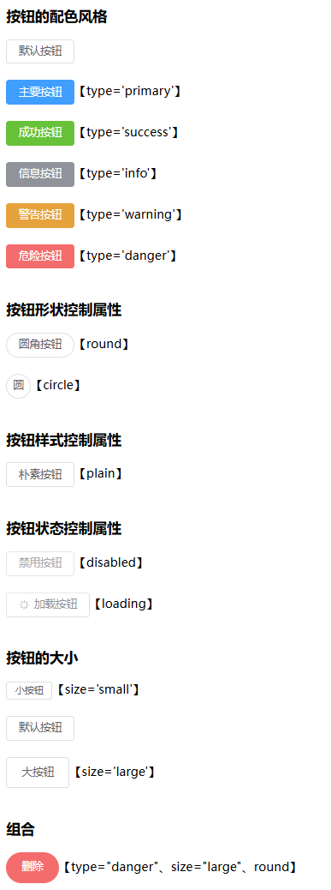

# 图标


## 环境准备

1. 导入 Element Plus 组件库中所有图标

```typescript
import * as ElementPlusIconsVue from '@element-plus/icons-vue'
```

1. 将 Element Plus 组件库中所有图标注册到全局 Vue 应用中

```typescript
for(const [key, component] of Object.entries(ElementPlusIconsVue)){
    app.component(key, component);
}
```

**第一：遍历数组推荐用 **`**for...of**`

**第二：**`**Object.entries()**`

```javascript
const obj = { a: 1, b: 2 };
Object.entries(obj);  // 结果：[['a', 1], ['b', 2]]
```

## 使用图标

```plaintext
<template>

    <h3>图标</h3>
    <el-icon><Plus/></el-icon><br><br>
    <el-icon><Delete/></el-icon><br><br>
    <el-icon><Edit/></el-icon><br><br>
    <el-icon><Search/></el-icon><br><br>
    <el-icon><Loading/></el-icon><br><br>
    <el-icon class="is-loading"><Loading/></el-icon><br><br>

    <h3>图标的尺寸和颜色属性</h3>
    <!-- size属性的单位是px -->
    <el-icon size="20" color="red"><Search/></el-icon><br><br>

    <h3>按钮与图标组合</h3>
    <el-button type="primary">
        <el-icon><Search/></el-icon>
        <span>搜索</span>
    </el-button>
    <el-button type="primary">
        <el-icon><Search/></el-icon>
    </el-button>
    <el-button type="primary" circle>
        <el-icon><Search/></el-icon>
    </el-button>

    <h3>按钮组</h3>
    <!-- 按钮组使用它包裹 -->
    <el-button-group>
        <el-button type="primary">
            <el-icon><Plus/></el-icon>
        </el-button>
        <el-button type="primary">
            <el-icon><Edit/></el-icon>
        </el-button>
        <el-button type="primary">
            <el-icon><Delete/></el-icon>
        </el-button>
    </el-button-group>

</template>

<script lang='ts' setup name="App"></script>
```

效果如下：

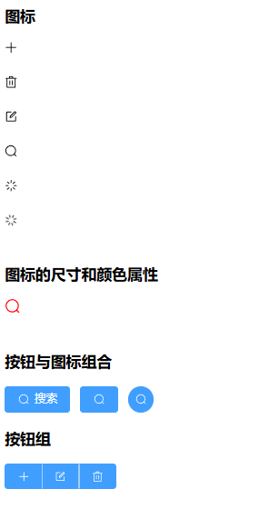

# 提示框


## 三个常用的提示框组件

1. 消息：`**ElMessage**`
2. 确认框：`**ElMessageBox**`
3. 通知：`**ElNotification**`

## 使用提示框

```plaintext
<template>
    <el-button @click="openMsg">消息</el-button>
    <el-button @click="openConfirm">确认框</el-button>
    <el-button @click="openNotify">通知</el-button>
    <el-button @click="openNotify2">通知2</el-button>
</template>

<script lang='ts' setup name="App">
    import { ElMessage, ElMessageBox, ElNotification } from 'element-plus';

    // 消息框
    function openMsg(){
        return ElMessage({
            type: 'success', // success | warning | info | error  消息的类型
            message: '极课未来', // 具体的消息
            duration: 2000,
            showClose: true, // 是否显示关闭按钮，true表示显示
            onClose: ()=>{
              // 关闭之后执行的回调。
            }
        });
    }

    // 确认框
    function openConfirm(){
        return ElMessageBox.confirm('确认删除？','标题', {
            type: 'warning',
            confirmButtonText: '确认',
            cancelButtonText: '取消'
        }).then(() => {
            // 用户点击确认时走这个分支
            console.log('确认');
        }).catch(()=>{
            // 用户点击取消时走这个分支
            console.log('取消');
        });
    }

    // 通知
    function openNotify(){
        return ElNotification({
            title: "say hello",
            message: 'Welcome to OneMaster',
            duration: 3000 // 展示时间，单位毫秒
        });
    }

    // 通知2
    function openNotify2(){
        return ElNotification({
            title: 'say hello',
            message: 'Welcome to OneMaster',
            duration: 3000,
            type: 'success', // success | warning | error | info
            position: 'bottom-right'
        });
    }
</script>
```

# 导航


## 水平导航

```plaintext
<template>
    <h3>水平导航</h3>
    <!-- 导航菜单 -->
    <!--mode="horizontal"，如果是垂直导航则不需要这个属性-->
    <!-- :default-active 默认选中的菜单索引 -->
    <!-- @select 选中菜单项时触发回调 -->
    <el-menu mode="horizontal" :default-active="selectedIndex" @select="selected"> 
        <!-- 菜单项 -->
        <el-menu-item index="1">极课未来</el-menu-item>
        <el-menu-item index="2">免费课</el-menu-item>
        <el-menu-item index="3">体系课</el-menu-item>
        <!-- 子菜单项 -->
        <el-sub-menu index="4">
            <!-- 子菜单项的标题 -->
            <template #title>商业合作</template>
            <el-menu-item index="4-1">企业服务</el-menu-item>
            <el-menu-item index="4-2">讲师入驻</el-menu-item>
        </el-sub-menu>
    </el-menu>
</template>

<script lang='ts' setup name="App">
    import { ref } from 'vue';

    // 默认选中的导航索引
    const selectedIndex = ref('4-2');

    // 选中导航项时触发的回调
    const selected = (index: string, indexPath: string[])=>{
        console.log(index, indexPath);
    }
</script>
```

效果如下：

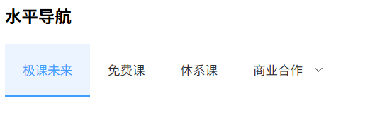

## 水平导航自定义样式

```plaintext
<template>
    <h3>水平导航</h3>
    <!-- 
        背景色：background-color
        文字颜色：text-color
        菜单项被选中时的文字颜色：active-text-color
    -->
    <el-menu mode="horizontal" :default-active="selectedIndex" @select="selected"
            background-color="#545c64"
            text-color="#fff"
            active-text-color="#ffd04b"
        > 
        <el-menu-item index="1">极课未来</el-menu-item>
        <el-menu-item index="2">免费课</el-menu-item>
        <el-menu-item index="3">体系课</el-menu-item>
        <el-sub-menu index="4">
            <template #title>商业合作</template>
            <el-menu-item index="4-1">企业服务</el-menu-item>
            <el-menu-item index="4-2">讲师入驻</el-menu-item>
        </el-sub-menu>
    </el-menu>
</template>

<script lang='ts' setup name="App">
    import { ref } from 'vue';

    const selectedIndex = ref('4-2');

    const selected = (index: string, indexPath: string[])=>{
        console.log(index, indexPath);
    }
</script>
```

效果：

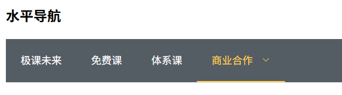

**EP 组件库中也可以通过下面方式来设置样式：**

**第一种：**最常用的方式（使用 EP 组件库内置的 CSS 变量）

```css
<template>
  <el-button class="custom-btn">按钮</el-button>
</template>

<style scoped>
.custom-btn {
  --el-color-primary: #ff6b6b;
  --el-button-border-radius: 20px;
  --el-button-hover-bg-color: #ff8e8e;
}
</style>
```

去哪里找这些变量，多种方式，最常见的方式包括：在浏览器 F12 打开面板之后，查看元素。或者通过官方提供的 [css 变量文件](https://github.com/element-plus/element-plus/blob/dev/packages/theme-chalk/src/common/var.scss)

**第二种：**使用组件自带的样式属性：官方文档中的每一个组件都提供了属性的使用说明。

```plaintext
<template>
  <!-- 简单直接的 API：这种方式只影响最外层，内部元素（如文字、图标）样式需要另外设置 -->
  <!--也就是说它只影响渲染后的根 button 标签的样式-->
  <el-button :style="{ borderRadius: '20px' }">
    按钮
  </el-button>

  <!-- 特定组件提供的专用属性 -->
  <el-input
    :input-style="{ borderColor: '#409eff' }"
    :style="{ width: '100%' }"
    />

  <el-table
    :header-cell-style="{ background: '#f0f9ff' }"
    :cell-style="{ padding: '10px' }"
    />
</template>
```

## 垂直导航

```plaintext
<template>
    <h3>垂直导航</h3>
    <!-- 去掉mode属性就是垂直导航，style可以设置宽度和高度 -->
    <el-menu :default-active="selectedIndex" @select="selected"
            background-color="#545c64"
            text-color="#fff"
            active-text-color="#ffd04b"
            style="width: 200px;"
        > 
        <el-menu-item index="1">极课未来</el-menu-item>
        <el-menu-item index="2">免费课</el-menu-item>
        <el-menu-item index="3">体系课</el-menu-item>
        <el-sub-menu index="4">
            <template #title>商业合作</template>
            <el-menu-item index="4-1">企业服务</el-menu-item>
            <el-menu-item index="4-2">讲师入驻</el-menu-item>
        </el-sub-menu>
    </el-menu>
</template>

<script lang='ts' setup name="App">
    import { ref } from 'vue';

    const selectedIndex = ref('4-2');

    const selected = (index: string, indexPath: string[])=>{
        console.log(index, indexPath);
    }
</script>
```

效果：

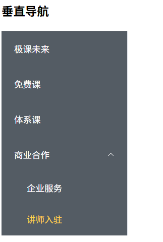

## 菜单项也可以用图标

```plaintext
<template>
    <h3>垂直导航</h3>
    <el-menu :default-active="selectedIndex" @select="selected"
            background-color="#545c64"
            text-color="#fff"
            active-text-color="#ffd04b"
            style="width: 200px;"
        > 
        <el-menu-item index="1">
            <!-- 菜单项也可以使用图标 -->
            <el-icon><Search/></el-icon>
            <span>极课未来</span>
        </el-menu-item>
        <el-menu-item index="2">免费课</el-menu-item>
        <el-menu-item index="3">体系课</el-menu-item>
        <el-sub-menu index="4">
            <template #title>
                <!-- 菜单项也可以使用图标 -->
                <el-icon><Plus/></el-icon>
                <span>商业合作</span>
            </template>
            <el-menu-item index="4-1">企业服务</el-menu-item>
            <el-menu-item index="4-2">讲师入驻</el-menu-item>
        </el-sub-menu>
    </el-menu>
</template>

<script lang='ts' setup name="App">
    import { ref } from 'vue';

    const selectedIndex = ref('4-2');

    const selected = (index: string, indexPath: string[])=>{
        console.log(index, indexPath);
    }
</script>
```

效果：

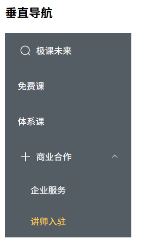

## 默认展开

```plaintext
<template>
    <h3>垂直导航</h3>
    <!-- :defaultOpeneds 使用它绑定默认展开 -->
    <el-menu :default-active="selectedIndex" @select="selected"
            background-color="#545c64"
            text-color="#fff"
            active-text-color="#ffd04b"
            style="width: 200px;"
            :defaultOpeneds="defaultOpeneds"
        > 
        <el-menu-item index="1">
            <el-icon><Search/></el-icon>
            <span>极课未来</span>
        </el-menu-item>
        <el-menu-item index="2">免费课</el-menu-item>
        <el-menu-item index="3">体系课</el-menu-item>
        <el-sub-menu index="4">
            <template #title>
                <el-icon><Plus/></el-icon>
                <span>商业合作</span>
            </template>
            <el-menu-item index="4-1">企业服务</el-menu-item>
            <el-menu-item index="4-2">讲师入驻</el-menu-item>
        </el-sub-menu>
    </el-menu>
</template>

<script lang='ts' setup name="App">
    import { ref } from 'vue';

    const selectedIndex = ref('1');

    // 默认展开 index="4" 的子菜单（商业合作）
    const defaultOpeneds = ref(['4']);  

    const selected = (index: string, indexPath: string[])=>{
        console.log(index, indexPath);
    }
</script>
```

## 面包屑

```plaintext
<template>
    <h3>面包屑</h3>
    <el-breadcrumb separator="/">
        <el-breadcrumb-item><a href="#">首页</a></el-breadcrumb-item>
        <el-breadcrumb-item>课程</el-breadcrumb-item>
        <el-breadcrumb-item>免费课</el-breadcrumb-item>
    </el-breadcrumb>
</template>

<script lang='ts' setup name="App">
</script>
```

效果：

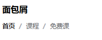

## 下拉菜单

```plaintext
<template>
    <h3>下拉菜单</h3>
    <!-- 用户点击菜单时触发该事件 -->
    <el-dropdown @command="userCommand">

        <!-- <el-button type="primary" :icon="User">
            个人中心
        </el-button> -->

        <span>
            个人中心<el-icon><User/></el-icon>
        </span>
        <template #dropdown>
            <el-dropdown-menu>
                <!-- :icon 可以直接指定图标 -->
                <el-dropdown-item command="order" :icon="Document">订单</el-dropdown-item>
                <!-- divided 属性可以添加分割线 -->
                <el-dropdown-item divided command="logout" :icon="SwitchButton">退出</el-dropdown-item>
            </el-dropdown-menu>
        </template>
    </el-dropdown>
</template>

<script lang='ts' setup name="App">

    // 导入图标
    import { User, Document, SwitchButton } from '@element-plus/icons-vue';

    // 用户点击菜单时触发的回调
    const userCommand = (command: string)=>{
        console.log('用户点击了：', command);
    }
</script>
```

效果：

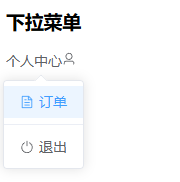

# 标签页


## 标签页

```plaintext
<template>
    <h3>标签页</h3>
    <!-- type='card' 表示设置为卡片风格。不设置时它有默认风格。 -->
    <!-- type='border-card' 设置为带有边框的卡片风格。 -->
    <el-tabs v-model="selectedName" @tab-click="tabClick" type="border-card">
        <el-tab-pane label="Home" name="1">Home Content...</el-tab-pane>
        <el-tab-pane label="News" name="2">News List...</el-tab-pane>
        <el-tab-pane label="About" name="3">About Content...</el-tab-pane>
    </el-tabs>
</template>

<script lang='ts' setup>
    import { ref } from 'vue';

    // 默认选中的标签名称
    const selectedName = ref('2');

    // 选中标签时触发的回调
    const tabClick = (tab: any, event: any)=>{
        // 当前标签页的属性
        console.log(tab.props);
        // 当前事件对象
        console.log(event);
    }
</script>
```

效果：

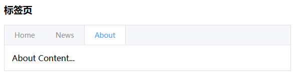

## 动态标签页

```plaintext
<template>
    <h3>动态标签页</h3>
    <el-button @click="tabAdd" type="primary" round>
        <el-icon><Plus/></el-icon>
        <span>新增</span>
    </el-button>
    <hr>
    <!-- closable 标签页变为可关闭的 -->
    <!-- @tab-remove 用来绑定标签页关闭时的回调 -->
    <el-tabs v-model="selectedName" @tab-click="tabClick" type="border-card" @tab-remove="tabRemove" closable>
        <el-tab-pane v-for="tab in tabList" :key="tab.id" :label="tab.label" :name="tab.name">{{ tab.content }}</el-tab-pane>
    </el-tabs>
</template>

<script lang='ts' setup>
    import { reactive, ref } from 'vue';
    const selectedName = ref('2');
    const tabClick = (tab: any, event: any)=>{
        console.log(tab.props);
        console.log(event);
    }
    const tabList = reactive([
        {id:'tab001', name: '1', label: '主页', content: 'Home Content...'},
        {id:'tab002', name: '2', label: '新闻', content: 'News List...'},
        {id:'tab003', name: '3', label: '关于', content: 'About Content...'}
    ]);

    // 回调的参数是 el-tab-pane 的name属性的值
    const tabRemove = (name: any)=>{
        let index = tabList.findIndex((tab)=>{
            return tab.name === name;
        });
        tabList.splice(index, 1); // 从指定位置index开始删除，删除1个元素。
    }
    const tabAdd = ()=>{
        let index = tabList.length + 1;
        tabList.push({
            id:`tab00${index}`, 
            name: `${index}`, 
            label: `新选项卡${index}`, 
            content: `新选项卡${index}`
        });
    }
</script>
```

效果：

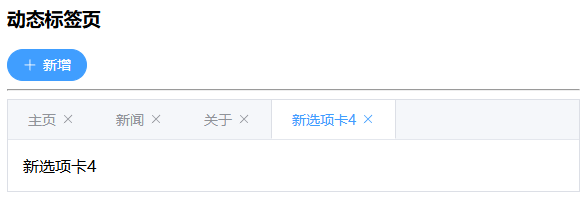

# 输入框


```plaintext
<template>
    
    <div class="elinput">
        <!-- clearable 可一键清空 -->
        <h3>输入框</h3>
        <el-input v-model="name" placeholder="请输入用户名" clearable></el-input>

        <!-- maxlength 长度限制 -->
        <!-- show-word-limit 显示还能输入的字符数量 -->
        <h3>输入框：长度限制</h3>
        <el-input v-model="name" placeholder="请输入用户名" clearable maxlength="20" show-word-limit></el-input>

        <!-- show-password 密码可查看 -->
        <h3>密码框</h3>
        <el-input v-model="password" placeholder="请输入密码" show-password></el-input>

        <h3>文本域</h3>
        <!-- :rows 设置初始显示行数-->
        <el-input type="textarea" v-model="content" :rows="2"></el-input>

        <h3>文本域：长度限制</h3>
        <!-- show-word-limit 显示字数的限制 -->
        <el-input type="textarea" v-model="content2" :rows="2" maxlength="100" show-word-limit></el-input>

        <h3>尺寸</h3>
        大<el-input size="large"></el-input>
        默认<el-input></el-input>
        小<el-input size="small"></el-input>

        <h3>前置</h3>
        <el-input v-model="url">
            <!-- 前置 -->
            <template #prepend>https://</template>
        </el-input>
        
        <h3>后置</h3>
        <el-input v-model="email">
            <!-- 后置 -->
            <template #append>@qq.com</template>
        </el-input>

        <h3>前置后置</h3>
        <el-input v-model="url2">
            <template #prepend>http://www.</template>
            <template #append>.com</template>
        </el-input>

        <h3>前置后置扩展：搜索</h3>
        <el-input placeholder="请输入课程名称">
            <template #prepend>
                <el-select v-model="selected" placeholder="请选择" style="width: 100px;">
                    <el-option label="java" value="1"></el-option>
                    <el-option label="python" value="2"></el-option>
                    <el-option label="go" value="3"></el-option>
                </el-select>
            </template>
            <template #append>
                <el-button>
                    <el-icon><Search/></el-icon>
                </el-button>
            </template>
        </el-input>
    </div>
</template>

<script lang='ts' setup name="App">
    import { ref } from 'vue';

    let name = ref('');
    let password = ref('');
    let content = ref('极课未来');
    let content2 = ref('极课未来');
    let url = ref('www.jkweilai.com');
    let email = ref('3181786330');
    let url2 = ref('jkweilai');
    let selected = ref('1');

</script>

<style scoped>
.elinput {
    width: 300px;
}
</style>
```

# 单选框和复选框


```plaintext
<template>
    <h3>单选框</h3>
    <!-- v-model 的值决定哪个单选框被选中 -->
    <el-radio v-model="radio1" value="1">java</el-radio>
    <el-radio v-model="radio1" value="2">python</el-radio>
    <el-radio v-model="radio1" value="3">go</el-radio>

    <h3>单选框-事件绑定</h3>
    <el-radio v-model="radio2" value="a" @change="radioChange">java</el-radio>
    <el-radio v-model="radio2" value="b" @change="radioChange">python</el-radio>
    <el-radio v-model="radio2" value="c" @change="radioChange">go</el-radio>

    <h3>单选框组</h3>
    <!-- 优点：只需要在单选框组上绑定事件即可。 -->
    <el-radio-group v-model="radio3" @change="radioGroupChange">
        <el-radio value="x">java</el-radio>
        <el-radio value="y">python</el-radio>
        <el-radio value="z">go</el-radio>
    </el-radio-group>

    <h3>复选框</h3>
    <!-- v-model指定的是一个字符串数组，来确定默认选中 -->
    <el-checkbox-group v-model="checked1">
        <el-checkbox value="1">java</el-checkbox>
        <el-checkbox value="2">python</el-checkbox>
        <el-checkbox value="3">go</el-checkbox>
    </el-checkbox-group>

    <h3>复选框-事件绑定</h3>
    <el-checkbox-group v-model="checked2" @change="checkChange">
        <el-checkbox value="x">java</el-checkbox>
        <el-checkbox value="y">python</el-checkbox>
        <el-checkbox value="z">go</el-checkbox>
    </el-checkbox-group>
</template>

<script setup name="App" lang="ts">
    import { ref } from 'vue';

    let radio1 = ref('3');
    let radio2 = ref('c');
    let radio3 = ref('z');
    let checked1 = ref(['1', '2']);
    let checked2 = ref([]);

    const radioChange = (val: string)=>{
        console.log('radioChange:', val);
    }

    // val 参数是选中项的值
    const radioGroupChange = (val: string)=>{
        console.log('radioGroupChange:', val);
    }

    // val 参数是所有选中项的值形成的一个数组
    const checkChange = (val: string) => {
        console.log('checkChange:', val);
    }
</script>
```

效果：

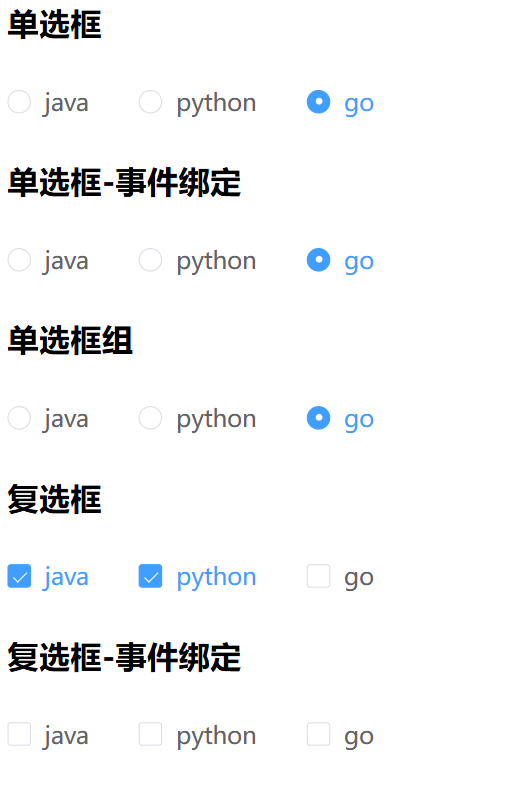

# 下拉框


```plaintext
<template>
    <h3>下拉框</h3>
    <!-- v-model 决定选中哪一项 -->
    <el-select v-model="selected1">
        <!-- label 决定显示的内容 -->
        <el-option value="1" label="java"></el-option>
        <el-option value="2" label="python"></el-option>
        <el-option value="3" label="go"></el-option>
    </el-select>

    <h3>下拉框-事件绑定</h3>
    <!-- placeholder用来设置未选择任何选项时默认显示的内容 -->
    <el-select v-model="selected2" placeholder="请选择" @change="changeSelected">
        <el-option value="1" label="java"></el-option>
        <el-option value="2" label="python"></el-option>
        <el-option value="3" label="go"></el-option>
    </el-select>

    <h3>动态下拉框</h3>
    <el-select v-model="selected3" placeholder="请选择编程语言">
        <el-option v-for="item in items" 
                    :value="item.value" 
                    :label="item.label" 
                    :key="item.id"></el-option>
    </el-select>

    <h3>下拉框-多选</h3>
    <!-- multiple 多选 -->
    <el-select v-model="selected4" placeholder="请选择" multiple>
        <el-option value="1" label="java"></el-option>
        <el-option value="2" label="python"></el-option>
        <el-option value="3" label="go"></el-option>
    </el-select>

</template>

<script lang="ts" name="App" setup>
    import { reactive, ref } from 'vue';

    let selected1 = ref('2')
    let selected2 = ref('3');
    let selected3 = ref('');
    let selected4 = ref(['1', '3']);

    const changeSelected = (val: string)=>{
        console.log('changeSelected: ', val);
    }

    const items = reactive([
        {id:'item001', label:'java', value: '1'},
        {id:'item002', label:'python', value: '2'},
        {id:'item003', label:'go', value: '3'},
        {id:'item004', label:'c++', value: '4'}
    ]);
</script>
```

效果：

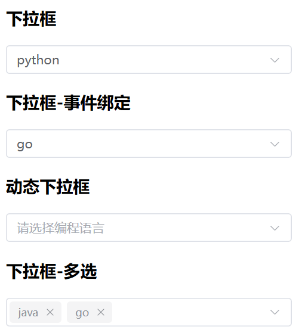

# 日期选择器


## 默认的日期选择器

```plaintext
<template>
    <h3>日期选择器</h3>
    <el-date-picker v-model="date" type="date" placeholder="请选择开始日期"></el-date-picker>

    <h3>日期时间选择器</h3>
    <el-date-picker v-model="date2" type="datetime" placeholder="请选择结束日期"></el-date-picker>

    <h3>日期时间选择器-绑定事件</h3>
    <!-- value-format 是决定value的格式哦，不是决定显示的格式哦。 -->
    <el-date-picker v-model="date3" type="datetime" placeholder="请选择日期" 
                    @change="dateChange"
                    value-format="HH:mm:ss YYYY-MM-DD"></el-date-picker>
</template>

<script lang="ts" name="App" setup>
    import { ref } from 'vue';

    let date = ref('');
    let date2 = ref('');
    let date3 = ref('');

    const dateChange = (val:string) => {
        console.log('您选择的日期：', val);
    }

</script>
```

效果：

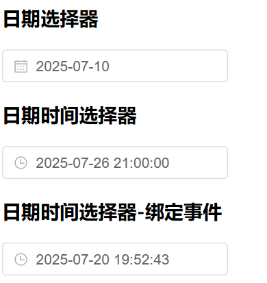

## 中文的日期选择器

1. 首先你要导入 Element Plus 组件库的中文语言包

```typescript
import { zhCn } from "element-plus/es/locales.mjs";
```

1. 设置区域语言为中文简体

```typescript
app.use(ElementPlus, {
    locale: zhCn
})
```

效果：

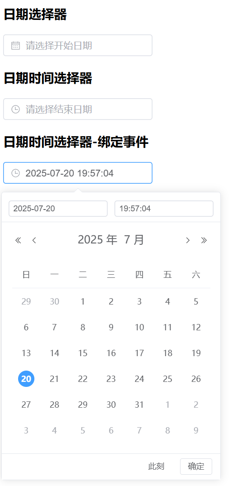

# 表单


```plaintext
<template>
    <el-form label-width="80" style="width: 400px;">
        <el-form-item label="姓名">
            <el-input v-model="data.name" placeholder="请输入您的姓名"></el-input>
        </el-form-item>

        <el-form-item label="性别">
            <el-radio-group v-model="data.radio">
                <el-radio value="1">男</el-radio>
                <el-radio value="0">女</el-radio>
            </el-radio-group>
        </el-form-item>

        <el-form-item label="爱好">
            <el-checkbox-group v-model="data.checkbox">
                <el-checkbox value="1">抽烟</el-checkbox>
                <el-checkbox value="2">喝酒</el-checkbox>
                <el-checkbox value="3">烫头</el-checkbox>
            </el-checkbox-group>
        </el-form-item>

        <el-form-item label="生日">
            <el-date-picker v-model="data.date" type="date" 
                            value-format="YYYY-MM-DD"></el-date-picker>
        </el-form-item>

        <el-form-item label="学历">
            <el-select v-model="data.select" placeholder="请选择">
                <el-option value="1" label="学士"></el-option>
                <el-option value="2" label="硕士"></el-option>
                <el-option value="3" label="博士"></el-option>
            </el-select>
        </el-form-item>

        <el-form-item label="选择语言">
            <el-select v-model="data.multipleSelect" placeholder="请选择" multiple>
                <el-option value="1" label="java"></el-option>
                <el-option value="2" label="python"></el-option>
                <el-option value="3" label="go"></el-option>
            </el-select>
        </el-form-item>

        <el-form-item label="简介">
            <el-input type="textarea" v-model="data.textarea" :rows="10"></el-input>
        </el-form-item>

        <el-form-item>
            <el-button type="primary" @click="add">保存</el-button>
            <el-button @click="reset">重置</el-button>
        </el-form-item>
        

    </el-form>
</template>
<script setup lang="ts" name="App">
    import { ref } from 'vue';

    const data = ref({
        name: 'jack',
        radio: '0',
        checkbox: ['1', '2'],
        date: '',
        select: '1',
        multipleSelect: ['1','2'],
        textarea: 'Welcome to One Master Study IT!'
    });

    const add = () => {
        console.log('data.value:', data.value);
    }

    const reset = () => {
        data.value = {
            name: '',
            radio: '',
            checkbox: [],
            date: '',
            select: '',
            multipleSelect: [],
            textarea: ''
        };
    }
</script>
```

效果：

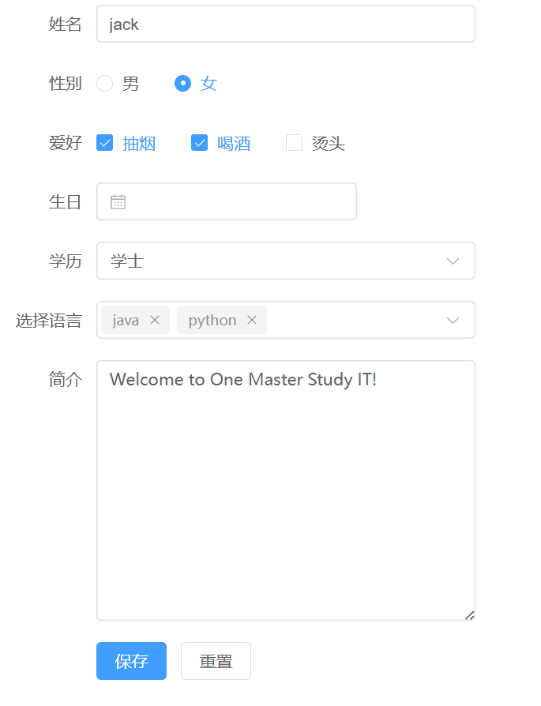

# 对话框


```plaintext
<template>
    <el-button @click="dialog = true">填写用户信息</el-button>
    <!-- v-model是true表示显示对话框，false隐藏对话框 -->
    <!-- draggable 表示对话框可拖拽可移动 -->
    <!-- @close 关闭对话框时触发事件 -->
    <el-dialog v-model="dialog" width="500" title="保存用户信息" draggable @close="dialogClose">
        <el-form label-width="80" style="width: 400px;">
            <el-form-item label="姓名">
                <el-input v-model="data.name" placeholder="请输入您的姓名"></el-input>
            </el-form-item>

            <el-form-item label="性别">
                <el-radio-group v-model="data.radio">
                    <el-radio value="1">男</el-radio>
                    <el-radio value="0">女</el-radio>
                </el-radio-group>
            </el-form-item>

            <el-form-item label="爱好">
                <el-checkbox-group v-model="data.checkbox">
                    <el-checkbox value="1">抽烟</el-checkbox>
                    <el-checkbox value="2">喝酒</el-checkbox>
                    <el-checkbox value="3">烫头</el-checkbox>
                </el-checkbox-group>
            </el-form-item>

            <el-form-item label="生日">
                <el-date-picker v-model="data.date" type="date" 
                                value-format="YYYY-MM-DD"></el-date-picker>
            </el-form-item>

            <el-form-item label="学历">
                <el-select v-model="data.select" placeholder="请选择">
                    <el-option value="1" label="学士"></el-option>
                    <el-option value="2" label="硕士"></el-option>
                    <el-option value="3" label="博士"></el-option>
                </el-select>
            </el-form-item>

            <el-form-item label="选择语言">
                <el-select v-model="data.multipleSelect" placeholder="请选择" multiple>
                    <el-option value="1" label="java"></el-option>
                    <el-option value="2" label="python"></el-option>
                    <el-option value="3" label="go"></el-option>
                </el-select>
            </el-form-item>

            <el-form-item label="简介">
                <el-input type="textarea" v-model="data.textarea" :rows="10"></el-input>
            </el-form-item>

            <el-form-item>
                <el-button type="primary" @click="add">保存</el-button>
                <el-button @click="reset">重置</el-button>
            </el-form-item>
        </el-form>
    </el-dialog>
</template>
<script setup lang="ts" name="App">
    import { ref } from 'vue';

    const data = ref({
        name: 'jack',
        radio: '0',
        checkbox: ['1', '2'],
        date: '',
        select: '1',
        multipleSelect: ['1','2'],
        textarea: 'Welcome to One Master Study IT!'
    });

    const add = () => {
        console.log('data.value:', data.value);
    }

    const reset = () => {
        data.value = {
            name: '',
            radio: '',
            checkbox: [],
            date: '',
            select: '',
            multipleSelect: [],
            textarea: ''
        };
    }

    const dialog = ref(false);

    const dialogClose = () => {
        console.log('关闭');
    }
</script>
```

效果如下：

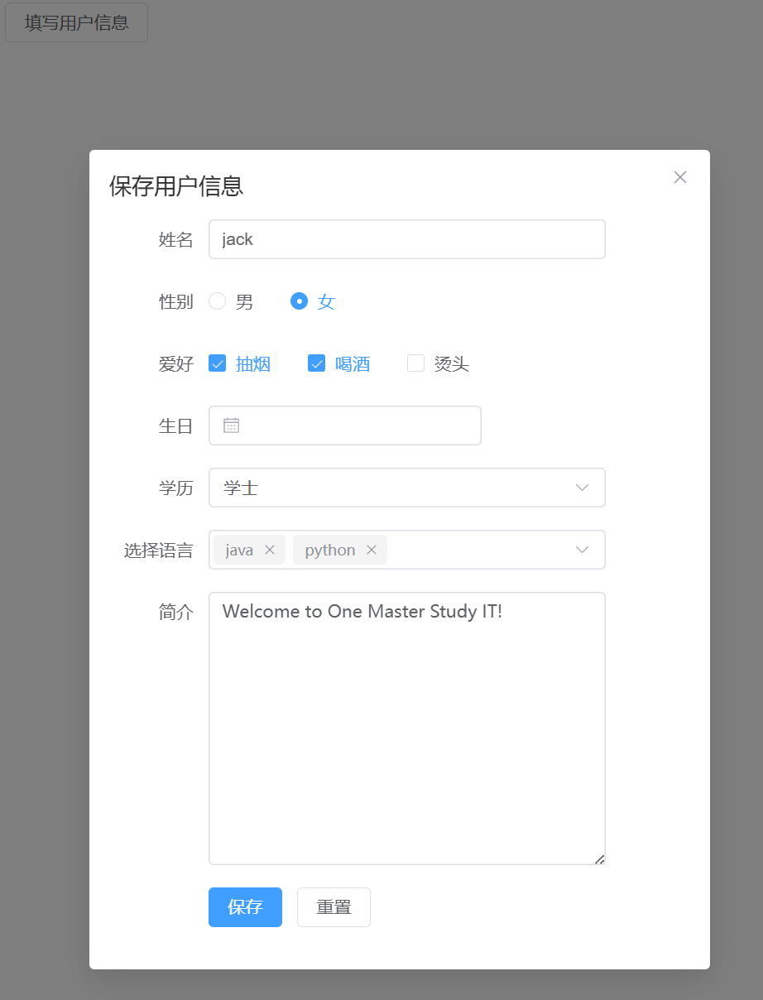

# 分页


```plaintext
<template>
    <h3>page-size: 每页显示记录条数</h3>
    <h3>total:总记录数</h3>
    <h3>layout布局方式：prev 上一页 pager 分页 next 下一页</h3>
    <el-pagination layout="prev, pager, next" :page-size="10" :total="50"></el-pagination>

    <h3>backgroud：显示背景</h3>
    <el-pagination layout="prev, pager, next" :page-size="10" :total="50" background></el-pagination>

    <h3>layout='total': 显示总数</h3>
    <el-pagination layout="prev, pager, next, total" :page-size="10" :total="50" background></el-pagination>

    <h3>layout='jumper': 显示跳转</h3>
    <el-pagination layout="prev, pager, next, jumper, total" :page-size="10" :total="50" background></el-pagination>

    <h3>事件绑定</h3>
    <el-pagination layout="prev, pager, next" :page-size="10" :total="50" @current-change='currentChange'></el-pagination>
</template>
<script lang="ts" name="App" setup>
    const currentChange = (val: number)=>{
        console.log('pageNo:', val);
    }
</script>
```

效果：

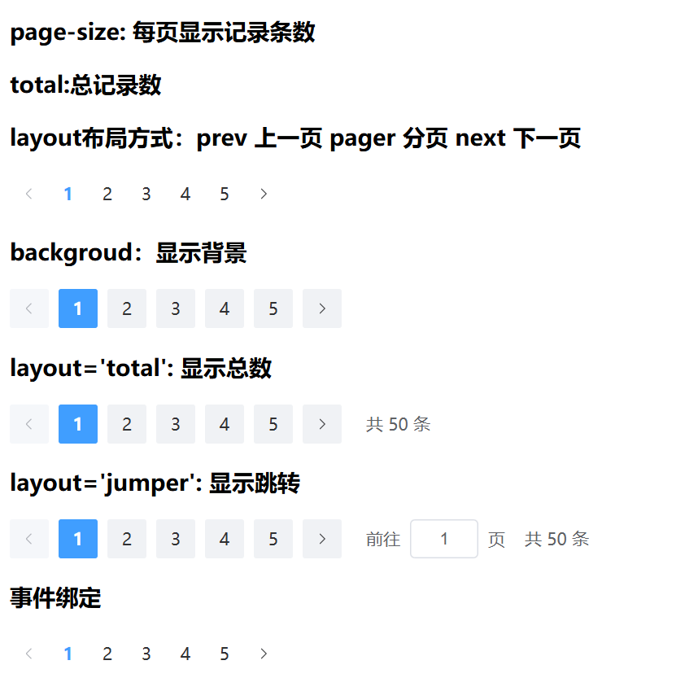

完整的分页组件：

```plaintext
<template>
  <div class="pagination-demo">
    <h3>完整功能分页</h3>
    <el-pagination
      v-model:page-size="pageSize"
      v-model:current-page="currentPage"
      :page-sizes="pageSizeOptions"
      :total="total"
      :layout="layout"
      background
      @size-change="handleSizeChange"
      @current-change="handleCurrentChange"
    />
    
    <div class="info">
      当前页码：{{ currentPage }}，每页条数：{{ pageSize }}
    </div>
  </div>
</template>

<script setup lang="ts">
import { ref } from 'vue'

// 数据
const total = ref(150)
const currentPage = ref(1)
const pageSize = ref(10)

// 配置
const pageSizeOptions = ref([10, 20, 50, 100])
const layout = ref('sizes, prev, pager, next, jumper, total')

// 事件处理
const handleSizeChange = (val: number) => {
  console.log(`每页 ${val} 条`)
  // 这里可以重新请求数据
  fetchData()
}

const handleCurrentChange = (val: number) => {
  console.log(`当前页: ${val}`)
  fetchData()
}

const fetchData = () => {
  console.log(`请求数据：页码=${currentPage.value}, 每页=${pageSize.value}`)
  // 实际项目中的 API 请求
}
</script>

<style scoped>
.pagination-demo {
  padding: 20px;
  border: 1px solid #e4e7ed;
  border-radius: 4px;
  margin: 20px 0;
}

.info {
  margin-top: 15px;
  color: #606266;
  font-size: 14px;
}
</style>
```

# 表格


```plaintext
<template>
    <h3>表格</h3>
    <!-- border 添加边框效果 -->
    <!-- height 设置表格高度，如果数据无法全部展示，会显示滚动条展示 -->
    <el-table :data="dataList" style="width: 800px;" border height="120">

        <!-- 在表格最左侧添加多选框 -->
        <el-table-column type="selection" width="55"></el-table-column>

        <el-table-column prop="id" label="编号" width="80"></el-table-column>
        <el-table-column prop="name" label="姓名"></el-table-column>
        <el-table-column prop="age" label="年龄"></el-table-column>
        <el-table-column prop="birth" label="生日" width="300"></el-table-column>
    </el-table>

    <h3>按钮</h3>
    <!-- 批量删除按钮 -->
    <el-button type="primary" @click="del">删除</el-button>
  
    <!-- 表格组件 -->
    <!-- :data - 绑定的数据源 -->
    <!-- @selection-change - 勾选框变化事件，用于获取选中行 -->
    <el-table :data="dataList" style="width: 900px; margin: 3px 0;" border @selection-change="selected">
      
      <!-- 选择列：type="selection" 添加勾选框 -->
      <el-table-column type="selection" width="55"></el-table-column>
      
      <!-- 数据列：prop 对应 dataList 中对象的属性名 -->
      <el-table-column prop="id" label="编号" width="80"></el-table-column>
      <el-table-column prop="name" label="姓名"></el-table-column>
      <el-table-column prop="age" label="年龄"></el-table-column>
      <el-table-column prop="birth" label="生日" width="300"></el-table-column>
      
      <!-- 操作列-->
      <el-table-column label="操作" width="150">
        <!-- 使用 template 插槽自定义列内容 -->
        <!-- #default="currentRow" 获取当前行的数据 -->
        <!-- currentRow.$index: 当前行索引 -->
        <!-- currentRow.row: 当前行的数据对象 -->
        <template #default="currentRow">
          <!-- 编辑按钮：传入当前行索引和数据 -->
          <el-button size="small" type="primary" @click="edit(currentRow.$index, currentRow.row)">编辑</el-button>
          <!-- 删除按钮：可添加点击事件处理当前行删除 -->
          <el-button size="small">删除</el-button>
        </template>
      </el-table-column>
      
    </el-table>


</template>
<script lang="ts" name="App" setup>
    import { reactive } from 'vue';

    const dataList = reactive([
        {id: '1', name: '张三', age: 21, birth: '2000-10-11'},
        {id: '2', name: '李四', age: 22, birth: '2001-10-11'},
        {id: '3', name: '王五', age: 23, birth: '2002-10-11'},
        {id: '4', name: '赵六', age: 24, birth: '2003-10-11'},
        {id: '5', name: '老杜', age: 25, birth: '2000-10-11'}
    ]);

    // 参数val就是被选中的那些行对应的数据
    let idArr: object[] = [];
    const selected = (vals: any) => {
        console.log(vals);
        idArr = [];
        vals.forEach((val: object) => {
            idArr.push(val);
        });
    }

    const del = () => {
        console.log(idArr);
    }

    const edit = (index: number, row: any) => {
        console.log(index, row);
    }
</script>
```

效果：

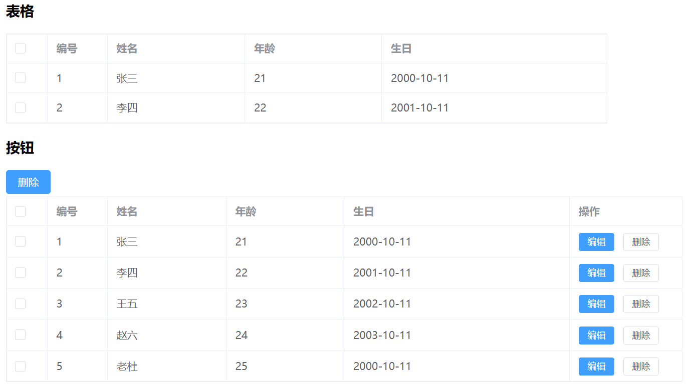

# 按需导入

**按需导入是指只导入项目中实际用到的组件，而不是导入整个 Element Plus 库，这样可以显著减小打包体积。**

**另外，我们在开发中也不需要手动编写 import 语句了。**


1. 如果按需导入，则需要安装以下插件：

```bash
npm i -D unplugin-vue-components unplugin-auto-import
npm i -D unplugin-icons
```

1. main.ts 代码恢复

```typescript
import { createApp } from 'vue'
import App from './App.vue'
const app = createApp(App)
app.mount('#app')
```

1. 配置 `vite.config.ts`

以下配置了 Element Plus 组件、Vue API 和图标的自动按需导入，让你写代码时无需手动 import。

```typescript
import { defineConfig } from "vite";
import vue from "@vitejs/plugin-vue";
import AutoImport from "unplugin-auto-import/vite";
import Components from "unplugin-vue-components/vite";
import { ElementPlusResolver } from "unplugin-vue-components/resolvers";
import Icons from "unplugin-icons/vite";
import IconsResolver from "unplugin-icons/resolver";

export default defineConfig({
  plugins: [
    vue(),
    AutoImport({
      imports: ["vue"],
      resolvers: [ElementPlusResolver()],
      dts: "src/auto-imports.d.ts",
    }),
    Components({
      resolvers: [
        ElementPlusResolver(),
        IconsResolver({
          enabledCollections: ["ep"],
        }),
      ],
      dts: "src/components.d.ts",
    }),
    Icons({
      autoInstall: true,
      scale: 1,
    }),
  ],
});
```

1. 使用图标时，前缀需要添加：`i-ep-`或 `IEp`或 `iEp`（默认前缀，固定写法，不过可以修改以上的配置来设置前缀）

```plaintext
<template>
    <el-button @click="openMsg">消息</el-button>
    <el-button @click="openConfirm">确认框</el-button>
    <el-button @click="openNotify">通知</el-button>
    <el-button @click="openNotify2">通知2</el-button>

    <h3>图标</h3>
    <!-- 使用 `i-ep-` 前缀的图标名称 -->
    <el-icon><i-ep-plus /></el-icon><br><br>
    <el-icon><i-ep-delete /></el-icon><br><br>
    <el-icon><i-ep-edit /></el-icon><br><br>
    <el-icon><i-ep-search /></el-icon><br><br>
    <el-icon><i-ep-loading /></el-icon><br><br>
    <el-icon class="is-loading"><i-ep-loading /></el-icon><br><br>

    <h3>图标的尺寸和颜色属性</h3>
    <el-icon size="20" color="red"><i-ep-search /></el-icon><br><br>

    <h3>按钮与图标组合</h3>
    <el-button type="primary">
        <el-icon><i-ep-search /></el-icon>
        <span>搜索</span>
    </el-button>
    <h3>输入框</h3>
    <el-input v-model="username" placeholder="请输入用户名"></el-input>
</template>

<script lang='ts' setup name="App">
let username = ref('jackson');

function openMsg() {
    return ElMessage({
        type: 'success',
        message: '极课未来', 
        showClose: true
    });
}

function openConfirm() {
    return ElMessageBox.confirm('确认删除？', '标题', {
        type: 'warning',
        confirmButtonText: '确认',
        cancelButtonText: '取消'
    }).then(() => {
        console.log('确认');
    }).catch(() => {
        console.log('取消');
    });
}

function openNotify() {
    return ElNotification({
        title: "say hello",
        message: 'Welcome to OneMaster',
        duration: 3000
    });
}

function openNotify2() {
    return ElNotification({
        title: 'say hello',
        message: 'Welcome to OneMaster',
        duration: 3000,
        type: 'success',
        position: 'bottom-right'
    });
}
</script>
```

大家掌握以上内容之后基本上是可以应付日常管理系统界面的开发了！！！