# 1.Linux

# 环境准备


## Linux概述

### 常见的操作系统

操作系统可以分为多种类型，包括但不限于以下几种：

1. Windows 操作系统：由微软公司开发的操作系统，广泛应用于个人电脑、服务器、游戏机等设备中。
  1. win xp
  2. win7/win8/win10/win11 等
2. Unix 操作系统（1960年代诞生）：由贝尔实验室开发的一类操作系统，主要应用于服务器、工作站、超级计算机等领域，具有稳定、安全等特点。
  1. Solaris：SUN公司开发
  2. AIX：IBM开发
  3. HP-UX：惠普公司开发
  4. macOS：苹果公司开发，主要应用于苹果公司的电脑和笔记本电脑上
  5. ......
3. Linux 操作系统（1991年诞生）：**Linux 操作系统是一种开源的、免费的、类 UNIX 操作系统，用于服务器、工作站、超级计算机等领域。**
  1. Debian：一种流行的稳定 Linux 操作系统
  2. Ubuntu：基于 Debian 构建的一种流行的 Linux 桌面操作系统
  3. Red Hat：一种商业 Linux 操作系统，由 Red Hat 公司开发
  4. CentOS：通过重新编译 Red Hat而得到的 Linux 操作系统，免费且源代码开放
  5. Fedora：由 Red Hat 公司赞助的基于开源的 Linux 桌面和服务器操作系统
  6. ......
4. Chrome OS 操作系统：由 Google 公司开发的基于 Chrome 浏览器的操作系统，主要应用于 Chromebook 笔记本电脑上。
5. Android 操作系统：由 Google 公司开发的操作系统，主要应用于手机、平板电脑等移动设备中。
6. iOS 操作系统：由苹果公司开发的操作系统，主要应用于 iPhone、iPad 等移动设备中。
7. HarmonyOS 鸿蒙也是一种操作系统，由华为公司自主开发。

总之，不同的操作系统在不同的领域和设备中有各自的应用，针对不同的应用场景和需求，可以选择不同的操作系统进行应用和开发。

### Linux发展史

Linux 操作系统的历史可以追溯到 1991 年，当时 Linus Torvalds（林纳斯·托瓦兹） 是一名芬兰赫尔辛基大学的学生，并且对 MINIX，一种类 UNIX 操作系统，感到不满意。他开始编写自己的操作系统内核，最终发布了第一个版本，命名为 Linux。从此，Linux 这个开源、自由和可定制化的操作系统内核就开始了它的发展之旅。


以下是 Linux 操作系统的发展史中一些重要的时间节点和里程碑：

- 1991 年：Linus Torvalds 发布 Linux 内核的第一个版本。
- 1992 年：大量的程序员和开发者开始参与到 Linux 的开发中，这使得 Linux 开始迅速发展，不断壮大。
- 1993 年：Debian（第一个社区驱动的 Linux 发行版）出现。
- 1994 年：Red Hat（最著名的商业 Linux 发行版）成立。Linux 社区也制定了第一个 Linux 标准基准（Linux Standard Base 1.0）。
- 1995 年：KDE 和 GNOME 两个桌面环境诞生。这标志着 Linux 开始关注桌面应用以及用户友好度。
- 1996 年：Apache 服务器成为主流 Web 服务器。
- 2003 年：SuSE 成为 Novell 公司的一部分，这是 Linux 巨头中第一家被收购的公司。
- 2008 年：Google 发布基于 Linux 的 Android 操作系统。
- 2011 年：Linux 内核 3.0 发布，该版本具有更好的性能、支持新的硬件技术和文件系统。
- 2015 年：微软宣布支持 Linux，并将一些 Linux 工具整合到他们的操作系统 Windows 10 中。
- 2018 年：Red Hat 被 IBM 收购，该交易是迄今为止 Linux 社区中最大的交易之一。
- 2020 年：Linux 内核 5.10 发布，具有改进的性能、新的安全功能和更好的硬件支持。

总之，Linux 操作系统的发展史充满了许多令人惊叹的里程碑。它已成为了供应商和开发者的首选操作系统，全世界各个组织和机构都在使用 Linux 以及基于 Linux 的解决方案。

## 安装VMware(管理虚拟机的软件)

安装VMware。通过这个软件可以新建虚拟机。然后我们可以在虚拟机上安装操作系统CentOS。

如果安装失败，再看下面的解决办法：

1. VMware 与 Windows 自带的 Hyper-V 不兼容。**关闭方法**：**控制面板** -> 程序和功能 -> 启用或关闭 Windows 功能 -> **取消勾选“Hyper-V”**。
2. **检查 BIOS/UEFI 设置**：如果之前“虚拟化”显示未启用，需要进入电脑BIOS（开机时按F2/Del等键），在CPU配置中找到“Intel Virtualization Technology”或“AMD SVM”选项并**启用**。
3. **win11 关闭内核隔离**：在Windows安全中心的“设备安全性”->“内核隔离详细信息”中，**关闭“内存完整性”** 功能。

另外：安装时会问你是否“**增强型键盘驱动程序**”，不需要。

## 新建虚拟机

虚拟机管理软件安装成功之后，就可以新建虚拟机了。一个虚拟机管理软件可以创建多个虚拟机，一个虚拟机就代表一台新的电脑。新建虚拟机的过程就相当于去电脑商城购买电脑是一样的。

**注意事项：**

- **硬盘分配多大？**30GB~50GB
- **CPU 给几个核心？**不超过宿主机总核心数 1/2
- **内存分配多大？**宿主机总内存的 25%~40%（分配 4GB）
- **网络配置方式？**建议配置为 NAT 方式（虚拟机会共享主机的IP地址上网，就像一个普通的家庭设备，能直接访问外网，同时主机也能访问虚拟机。设置简单，无需额外配置。）

**第一步：打开虚拟机软件，创建新的虚拟机**

**第二步：稍后安装操作系统**

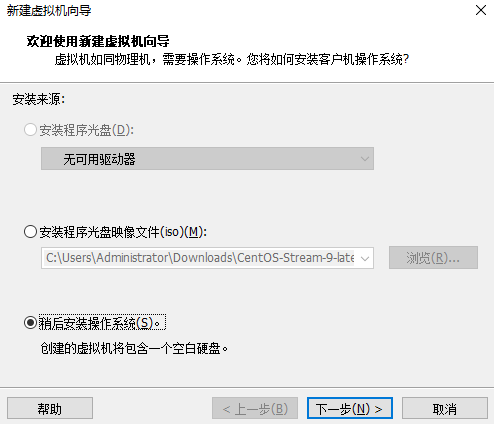

**第三步：选择客户机操作系统**

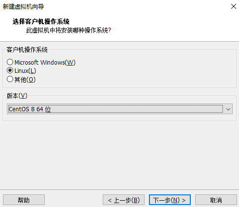

**第四步：为虚拟机命名并指定虚拟机存放位置**

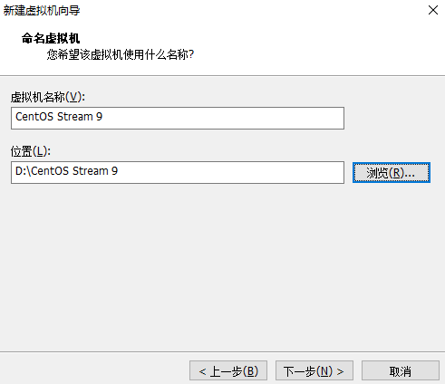

**第五步：指定磁盘容量**

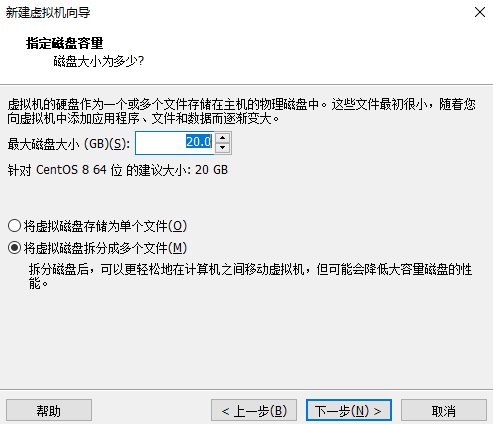

**第六步：虚拟机硬件配置完成**

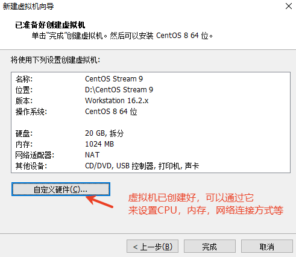

**第七步：自定义硬件：设置电脑的CPU数量**

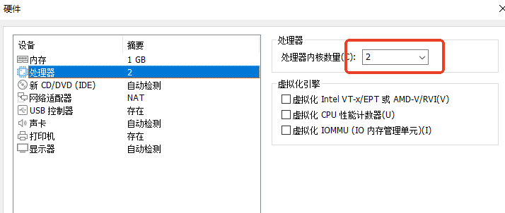

**第八步：自定义硬件：设置内存大小**

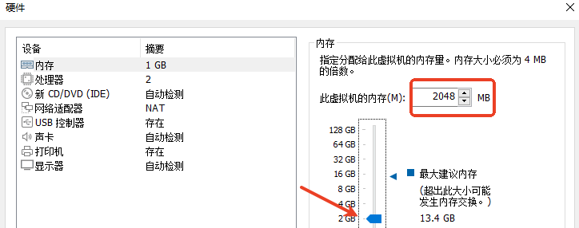

**第九步：自定义硬件：指定网络连接方式为NAT**

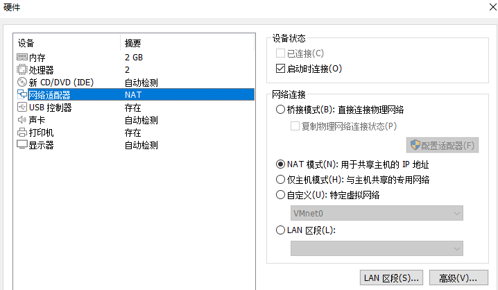

**在创建虚拟机时，网络连接模式有桥接模式和NAT模式，应该根据个人实际需求来选择。**

- 桥接模式：虚拟机会直接接入宿主机网络中，相当于网络中的一个普通计算机，有自己的ip地址和MAC地址，可以访问网络上其他的设备。适用于需要虚拟机与宿主机处于同一网段的场景，如测试、网络应用开发等。
- NAT模式：虚拟机通过虚拟化的NAT网络与宿主机连接，宿主机向虚拟机提供网络访问能力，虚拟机之间不能相互访问。NAT模式适用于虚拟机需要访问外部网络，但只有一个公共IP地址的情况下使用。

总之，根据个人实际需求来选择适合自己的网络连接模式，有需要虚拟机与宿主机处于同一网段的情况选桥接模式，有需要虚拟机访问外部网络的情况选NAT模式。

到此为止相当于你已经购买了一台新电脑了，只不过这个电脑中还没有任何操作系统，只是一台裸机。接下来你需要安装操作系统。

## 安装操作系统

安装操作系统之前，你需要先下载这个操作系统的镜像文件：


把以上的iso镜像文件（系统盘）放到DVD当中。

按照下面一步一步安装操作系统：

按上下键，移动到：Install CentOS Stream 9，然后回车。

**注意：从虚拟机中释放鼠标的组合键是ctrl + alt**

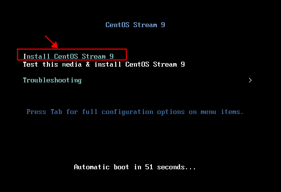

正在安装：

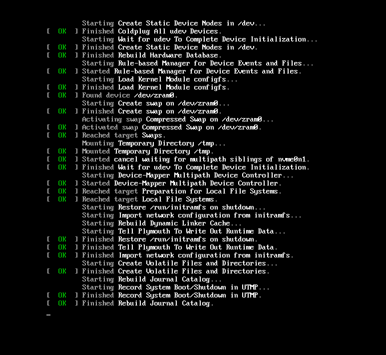

语言选择：简体中文，英文不错的话，可以使用英文，都可以

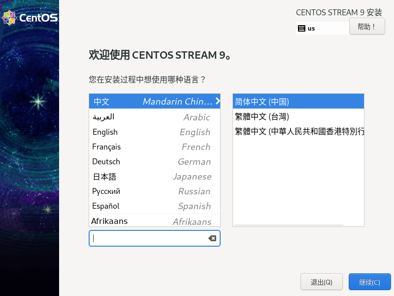

接下来，要处理两件事：

第一个：安装目的地

第二个：设置root密码

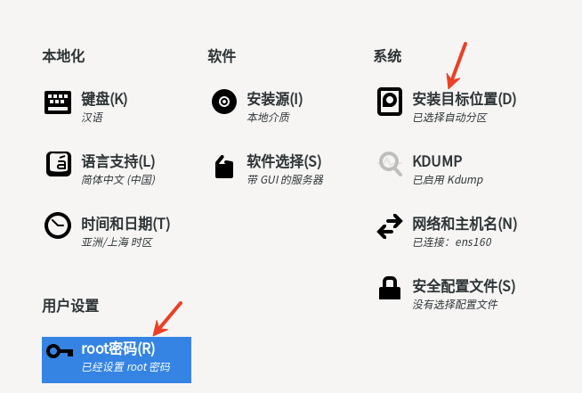

安装目的地，默认即可，点击完成：


设置root密码时允许root远程SSH登录：

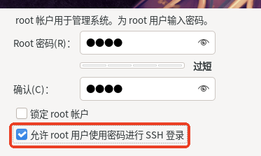

点击开始安装：

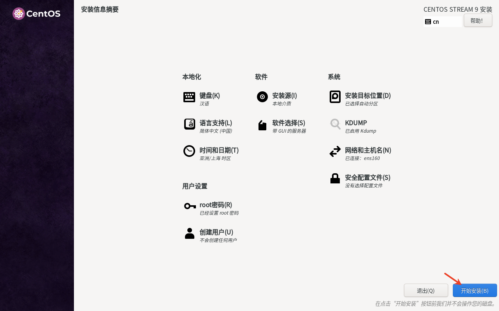

安装中，请稍后：

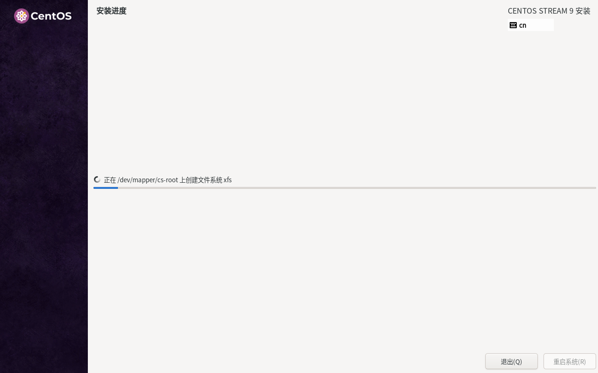

安装完成后，点击右下角的重启系统即可！！！

## 配置操作系统

这是开启除了root管理员之外，开启的其他账户：

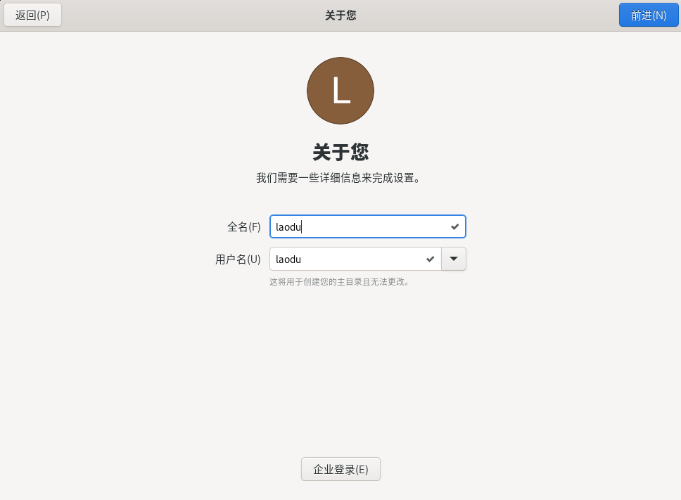

设置密码：

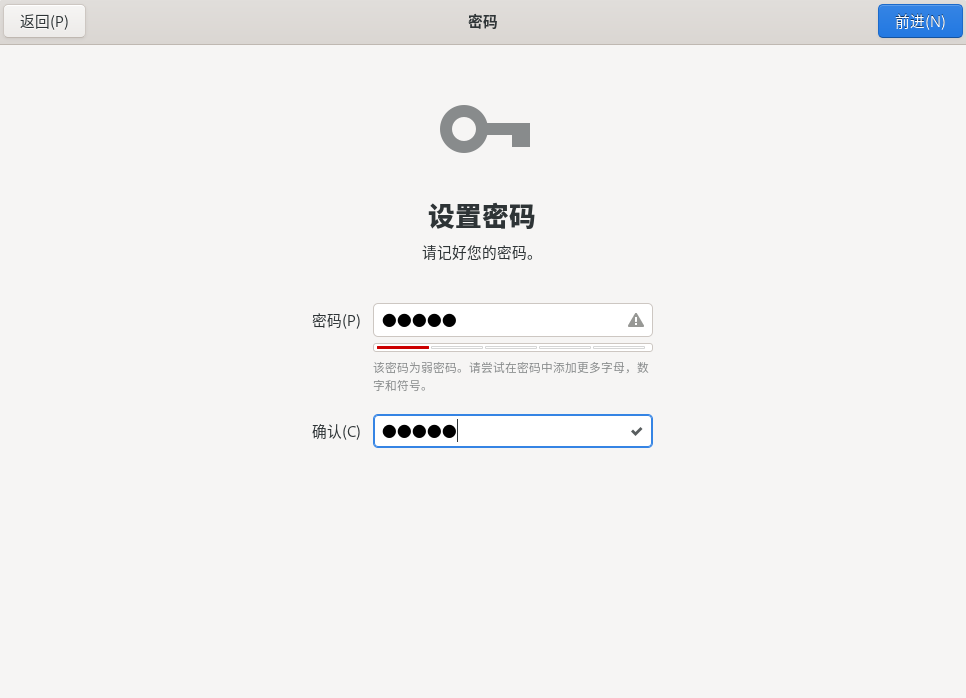

**查看一下网络是否正常：**

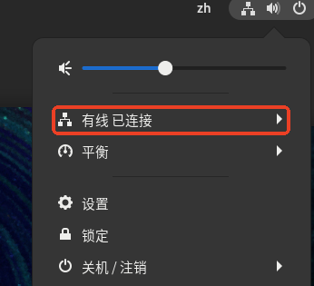

## 安装MobaXterm

**MobaXterm 是一个集成了SSH客户端、Unix命令集和网络工具的Windows终端软件：**

- 免费并且功能强大。
- 支持很好的拖拽文件上传。

**类似于****MobaXterm 软件很多，例如：**

- **Xshell+Xftp**：功能强大的商业SSH终端，以安全管理和多会话著称。
- **PuTTY组合 (PuTTY + WinSCP + Xming)**：经典的免费工具组合，分别实现SSH连接、文件传输和图形转发。
- **Windows Terminal + WSL**：现代化的Windows原生终端，深度集成本地Linux子系统。
- **SecureCRT**：历史悠久的商业终端仿真器，以稳定性和脚本功能见长。
- **Tabby**：外观现代、高度可定制的开源终端，支持插件扩展。
- **Termius**：设计现代、跨平台的SSH客户端，支持团队同步功能。
- **KiTTY**：基于PuTTY的增强分支，增加了标签页等便捷功能。

# 磁盘管理


## windows和Linux磁盘管理的区别

### windows资源管理方式

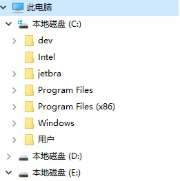

- 系统一般安装在C盘
- C盘下的"Windows"目录是操作系统的核心
- C盘下的"Program Files"目录下安装软件
- C盘下的"用户"目录是所有的用户，包括超级管理员也在其中
- windows操作系统分为C盘、D盘、E盘等，每个磁盘下采用文档树的形式组织文件

### Linux资源管理方式

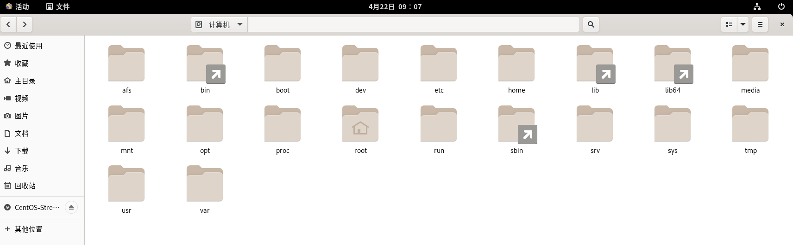

linux操作系统采用一个文档树来组织所有的资源。

这棵树的根目录的名字叫做：/

/ 是一个目录名字，是linux操作系统中所有文件的根。

/ 目录下又有很多其他的子目录，比如：dev home lib .....

**比较重要的几个目录概述：**

1. **/bin目录**：包含一些常用的二进制可执行文件，如cat、ls、mkdir、rm等。这些二进制文件在系统运行时始终可用，可以被任何用户运行。
2. **/etc目录**：包含了系统的大多数配置文件，如网络配置、用户登录信息、软件包安装配置等。大多数应用程序在安装后都会在这个目录下创建自己的子目录，以便存储自己的配置文件。
3. **/home目录**：包含Linux系统用户的家目录，每个用户的数据和个人文件都存放在这里。
4. **/lib目录**：包含一些共享库文件，应用程序可以通过这些共享库文件调用系统的功能，如libc.so，是C语言函数库的共享库。
5. **/root目录**：是系统管理者（超级用户）的家目录。
6. **/tmp目录**：是系统中的一个临时目录，所有用户都可以在这里创建临时文件，文件系统会定期清空该目录，以防止文件滞留。
7. **/usr目录**：包含系统启动后，所有用户能访问的应用程序和数据文件。
8. **/var 目录**：包含可变数据的文件。包括日志、数据库、Web服务器、邮件队列等文件。它是一个经常被修改的目录，如果在其他目录有可变数据的话，它们都应当被链接到 /var 中。

## pwd

在终端中输入该命令，可以查看当前所在位置，例如：

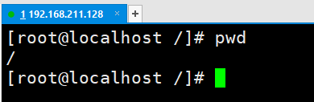

可以看到，当前所在位置是根目录。

## man和--help

### man命令

man命令可以查看某个命令的具体用法，例如：man pwd。如果一个命令具体的用法你不知道的话，问那个男人就行了。

man命令怎么进行翻页？空格

man命令怎么退出？q

### --help参数

--help，也可以查看一个命令的帮助，一次性列出。用法：touch --help

## ls

### ls

ls命令是list的意思：列出，列表等。

通过ls命令可以查看当前目录下的子目录和子文件。例如：

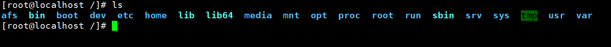

### ls -a

a是all的意思，表示所有。

列出包含隐藏文件在内的所有的文件。（在Linux操作系统中隐藏文件的文件名通常以"."开始）

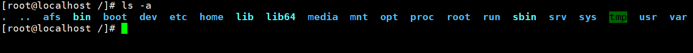

### ls -l

-l 参数表示使用长格式输出：long format

输出结果中每一列的含义如下：

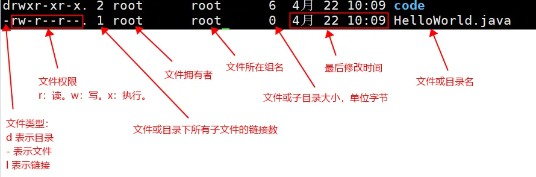

注意权限部分：

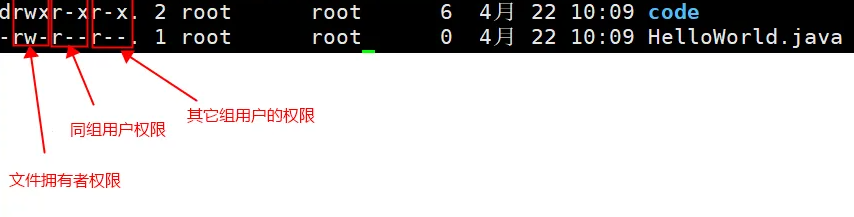

ls -l 可以简写为：ll

### ls -al

ls -al等同于：ls -a + ls -l的功能。

可以简写为：ll -a

### ll -a /root

可以指定查看某个目录下的所有文件详情。

## cd

cd命令：change directory

cd命令用法：

```shell
cd 路径名
```

cd .. 回到上级目录

cd ../.. 回到上级目录的上级目录

cd ~ 回到主目录

cd / 回到根目录

cd /home/laodu 切换到 /home/laodu目录下

cd abc 切换到当前目录下的abc目录中

- 这里的abc没有以 / 开始，表示这个路径是相对路径，相对路径指的是从当前所在目录作为起点开始找。
- 以 / 开始的路径被称为绝对路径。
- cd 命令后面既可以是相对路径，也可以是绝对路径。只要路径正确即可。

## clear

清屏

# 文件管理


## 新建目录

mkdir abc （mkdir是新建目录的命令，abc是一个目录名）

mkdir -p a/b/c （-p参数表示，一次创建多重目录）

mkdir -p a/kk/ff （虽然a已经存在了，但是不会报错，直接在a目录下新建kk目录，kk目录下新建ff目录。）

## 新建文件

touch 文件名，例如：touch Hello.java 表示在当前目录下新建一个文件Hello.java

touch a.txt b.txt c.txt 一次性在当前目录下，新建多个文件，文件名之间采用空格分隔。

## 删除文件

用法：rm 文件名

rm a.txt（删除当前目录下的a.txt文件）。这种方式会询问，是否删除，输入y表示删除，输入n表示不删除。

不想让系统询问你是否删除，怎么进行强行删除呢？ -f 参数可以做到。

- rm -f a.txt（强行删除a.txt文件，不询问）

删除多个文件

- rm -f b.txt c.txt （删除b.txt和c.txt文件）
- rm -f *.java（删除所有.java结尾的文件，模糊匹配的方式。）

## 删除目录

删除目录的时候，必须添加-r参数，这个-r表示删除一个目录，或者递归删除目录下的所有子目录以及子文件。

rm -r x（删除当前目录下的x目录，以及x目录下所有的子目录），但是这种方式需要用户自己输入y进行确认删除。

rm -rf x （强行删除x目录以及x目录下所有的子目录，并且不询问。包括子文件也全部删除。）

## 文件拷贝

cp a.txt aa.txt（复制当前目录下的a.txt文件，粘贴到当前目录下并且生成新文件aa.txt）

语法如下：

- cp file1 file2
- file1就是被拷贝的文件
- file2就是粘贴之后的文件
- file1和file2可以添加路径。
- cp 被拷贝文件的路径 粘贴到哪里的路径

cp Hello2.java a/Hello3.java

## 目录拷贝

cp 目录名1 目录名2

- 目录名1 是拷贝源
- 目录名2 是拷贝到哪里

-rf （-r递归拷贝，-f强行拷贝）

cp -rf a abc（将当前目录下的a目录拷贝到当前目录下的abc目录当中）

cp -rf /home/laodu/a /home/laodu/x （将/home/laodu/a目录拷贝到/home/laodu/x目录下）

## 移动

mv Hello.java x（将当前目录下的Hello.java文件移动到x目录下）

mv /home/laodu/Hello2.java /home/laodu/x （将/home/laodu/Hello2.java 移动到 /home/laodu/x目录下）

mv x f（将x目录移动到f目录下）

## 文件搜索

在CentOS中，可以使用以下方式进行文件搜索：

### find 命令

find命令：使用find命令可以在指定目录下搜索文件，例如根据名字搜索：

```shell
find /home/laodu -name "Hello.java"

# 搜索当前工作目录下，所有.java结尾的文件。
find ~ -name "*.java"
```

### which 和 whereis

| **特性** | `**<font style="color:rgb(15, 17, 21);background-color:rgb(235, 238, 242);">which</font>**`**命令** | `**<font style="color:rgb(15, 17, 21);background-color:rgb(235, 238, 242);">whereis</font>**`**命令** |
| --- | --- | --- |
| **核心目的** | **查找可执行文件路径** | **查找程序相关的所有文件** |
| **搜索范围** | 当前用户的 `**<font style="color:rgb(15, 17, 21);background-color:rgb(235, 238, 242);">$PATH</font>**`**环境变量** | 预定义的**系统目录** (如 `<font style="color:rgb(15, 17, 21);background-color:rgb(235, 238, 242);">/bin</font>`, `<font style="color:rgb(15, 17, 21);background-color:rgb(235, 238, 242);">/usr/bin</font>`, `<font style="color:rgb(15, 17, 21);background-color:rgb(235, 238, 242);">/usr/share/man</font>`等) |
| **主要输出** | **一个路径**：当前shell环境下**实际会执行**的那个命令的**完整路径**。 | **多个路径**：程序的**二进制文件、源码（如果安装）和手册页**的路径。 |
| **关键机制** | 模拟Shell的命令查找过程，**严格遵循**`**<font style="color:rgb(15, 17, 21);background-color:rgb(235, 238, 242);">$PATH</font>**`**的顺序**。 | 在固定目录中**快速检索**，**不关心**`**<font style="color:rgb(15, 17, 21);background-color:rgb(235, 238, 242);">$PATH</font>**` **顺序**。 |

**日常使用和问题诊断，用 **`**<font style="color:rgb(15, 17, 21);background-color:rgb(235, 238, 242);">which</font>**`：当你关心“**我现在输入这个命令，到底运行的是谁？**”时，`<font style="color:rgb(15, 17, 21);background-color:rgb(235, 238, 242);">which</font>` 是唯一能给你准确答案的命令。

**了解程序安装情况，用 **`**<font style="color:rgb(15, 17, 21);background-color:rgb(235, 238, 242);">whereis</font>**`：当你想知道“**这个程序在系统里都安装了哪些相关文件？**”（比如，你想删除一个软件的所有部分）时，`<font style="color:rgb(15, 17, 21);background-color:rgb(235, 238, 242);">whereis</font>` 能提供更全面的信息。

## 文件的inode号

在Linux操作系统中，每一个文件都有自己的身份证号：inode号（index node：索引节点号）

每个文件都有自己的inode号，并且不会重复，在Linux操作系统中通过inode来区分两个文件。

查看文件的inode号：

```shell
ls -i HelloWorld.java
```

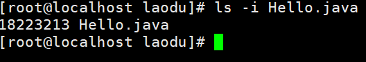

# 软链接与硬链接


## 软链接

软链接类似于windows操作系统中的快捷方式。

软链接的作用：方便操作。快捷。。。有些经常被操作的文件，藏的很深，每一次找很麻烦，怎么办，可以给这些经常操作的文件创建软链接。通过软链接快捷的操作目标文件。

怎么创建软链接呢（在linux当中怎么创建快捷方式呢）？

```shell
ln -s Hello.java Hello.java2
```

- 表示给hello.java文件创建一个hello2.java的快捷方式（软链接）
- hello.java是目标文件。hello2.java文件是软链接，属于快捷方式

软链接和目标文件实际上是两个文件，在软链接中存储的是目标文件的路径。软链接关联的目标文件如果被删除，软链接这个快捷方式也就失效了。

失效的软链接使用 `ls -l`命令查看时通常显示为红色。（**如果继续向无效的软链接文件中写入数据，此时底层会新建指向的文件**。）

可以通过查看inode号，来证明软链接是两个不同的文件：

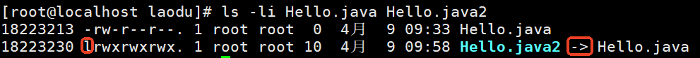

## 硬链接

怎么创建硬链接？（把软链接创建过程中的 -s 去掉就是创建硬链接的语法。）

创建硬链接的语法：

```shell
ln Hello.java Hello.java2
```

通过测试得知：inode号一致，说明创建的硬链接和原文件是同一个文件。

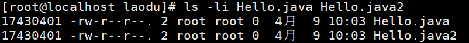

通过操作硬链接，目标文件会改变吗？操作目标文件，硬链接会改变吗？ 答案是：当然会。

硬链接的特点：

- 主要是用来做：重要文件备份。
- 目标文件删除之后，硬链接只要在，文件其实就没有被删除。或者说硬链接删除之后，目标文件还在。总结一句话：目标文件或者硬链接只要有一个存在，文件就没有被真正的删除。
- 硬链接机制和复制粘贴还不一样，复制粘贴之后的文件，修改其中之一，另一个不会变，但是硬链接就不一样了。

# 文件压缩与解压缩


tar是在linux系统当中完成压缩和解压缩的命令。

压缩后的文件又被称为**归档文件**。

## tar命令详解

tar命令语法格式： tar 参数 要压缩的或解压的文件或目录

tar命令的常用参数：

- z：指定是否使用gzip压缩方式压缩。（扩展名通常为：tar.gz。特点：速度最快）
- j：是否需要用 bzip2 压缩方式压缩。（扩展名通常为：tar.bz2。特点：体积最小）
- c：创建压缩（create）
- x：解压缩
- v：是否在压缩的过程中显示文件
- f：指定归档文件名（file）。f参数后面必须紧跟文件名，不能在f参数后面再加其他参数。
- t：查看 tarfile 里面的文件
- C：指定解压到的具体目录。注意是大写C。

注意：c、x、t，这三个参数不能共存，只能出现一个。

## 压缩

压缩一个文件

- tar -zcvf mytxt.tar.gz log1.txt

压缩多个文件

- tar -zcvf mytxt2.tar.gz log1.txt log2.txt log3.txt
- tar -zcvf mytxt3.tar.gz *.txt

压缩目录

- tar -zcvf mytxt4.tar.gz test 【将test目录压缩为mytxt4.tar.gz】

## 查看归档文件

- tar -tf mytxt.tar.gz

## 解压

tar -zxvf mytxt.tar.gz 【解压到当前目录下】

tar -zxvf mytxt.tar.gz -C test【将mytxt.tar.gz压缩包解压到test目录】

# 文件编辑vi & vim


## vi与vim概述

vi 和 vim 都是在 Linux 和 Unix 中常用的基于字符终端的文本编辑器。

vi 是 Unix 早期提供的标准命令行下的文本编辑器，是一款非常强大、高效的编辑器，可以对文本进行快速修改和编辑，具有常见编辑器的基本功能。

vim（Vi Improved）是在vi基础上进行了改进和扩展的一个版本，它保留了vi的全部功能，并添加了许多新功能，如基本的 GUI 界面、语法高亮、多级撤销/重做、对齐、插件支持等等。可以说 vim 是强大的文本编辑器之一，被众多的开发者、管理员、写作人员和爱好者使用。

通过 vi 和 vim 命令，我们可以在终端中打开并编辑文本文件，进行各种修改和编辑，保存后退出，是 Linux 和 Unix 系统中非常基础、常用的一种文本编辑方式。

总之，vi 和 vim 均是一款 Linux 和 Unix 中常用的基于字符终端的文本编辑器，其中 vim 是在 vi 基础上进行了改进和扩展的版本。

在 CentOS 中，系统默认安装的是 vim 编辑器，但是为了兼容 vi 编辑器的使用习惯，CentOS 将 vim 的执行文件命名为 vi。因此，实际上在 CentOS 中使用 vi 和 vim 是等价的，都是使用 vim 编辑器进行文本编辑。

## vi 编辑器使用

第一步：使用vi编辑器打开文件，语法：vi 文件的路径

- vi Hello.java（打开当前路径下的Hello.java）
- vi /home/laodu/Hello.java（打开/home/laodu目录下的Hello.java文件。）

第二步：编辑文件（vi编辑器为用户准备了两个模式）

- 第一个模式：命令行模式。（此时键入的都是命令）
- 第二个模式：编辑模式。（此时键入的内容都会写入文件）
- 进入vi编辑器时是命令模式：键入i命令进入编辑模式
- 从编辑模式回到命令模式：按一下esc键

第三步：保存。在命令模式下，输入以下命令：

- :wq  这是一个命令，这个命令可以保存并退出。
- :q! 这是一个命令，这个命令可以强行退出vi编辑器，并且不保存。

注意：vi编辑器打开的文件如果不存在，则自动新建。

## vi编辑器常用命令

dd：删除光标所在行

yy：复制光标所在行到缓冲区

p：粘贴缓冲区中的内容

gg：光标回到文件第一行

GG：光标回到文件最后一行

^ ：光标移动至当前行的行首

$ ：光标移动至当前行的行尾

/关键字：按斜杠/键，可以输入想搜索的字符，然后确定进行搜索，如果第一次查找的关键字不是想要的，可以一直按 n 键往后查找到想要的关键字为止

o命令：在下一行插入。

x命令：命令行模式下，x命令会删除单个字符。

a命令：在光标后面插入。

# 系统命令


## 系统当前时间

date命令：

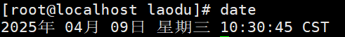

## 切换用户

su 用户名

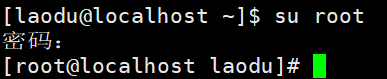

**sudo 命令**：表示使用超级管理员身份执行该命令，如果你当前不是管理员，希望以管理员身份执行某个命令时，使用sudo，需要输入超级管理员的密码：

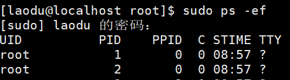

## echo命令

### 输出字符串

```shell
echo "Hello, world!"
```

这将会输出 `Hello, world!` 和一个换行符。

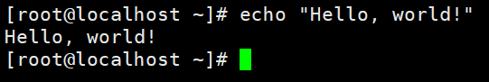

### 输出变量

```shell
name="John"
echo "My name is $name"
```

这将会输出 `My name is John` 和一个换行符。在输出字符串时，使用 `$` 符号加上变量名即可。

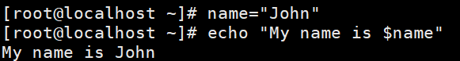

### 输出多行

```shell
echo "line 1
line 2
line 3"
```

这将会输出三行文本，每行一条。

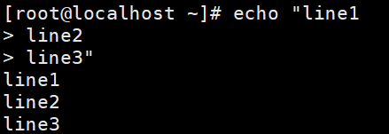

### 输出特殊字符

```shell
echo -e "Line 1\nLine 2\tTable"
```

这将会输出两行文本，第一行后接一个换行符，第二行中的 `Table`前有一个制表符。

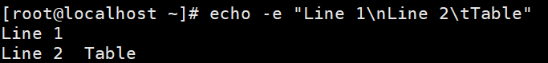

## diff命令

diff命令可以用来比较两个文件的不同之处：

a.txt文件内容如下：

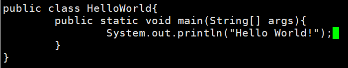

b.txt文件内容如下：

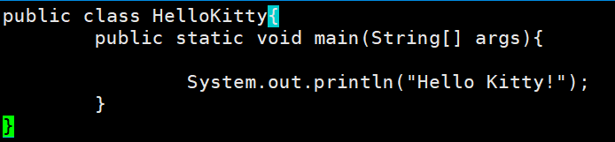

比较a.txt和b.txt文件之间的区别：

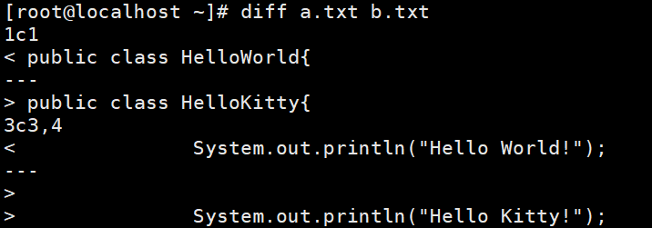

以上的比较结果中：1c1是什么含义？3c3,4是什么含义？

c 表示 change，改变的意思。

1c1表示：第一个文件的第1行 和 第二个文件的第1行 发生了改变。

3c3,4表示：第一个文件的第3行 和 第二个文件的第3,4行不同，发生了改变。

## 重定向

### 输出重定向

凡是在控制台上能够打印出来的，统一都可以重定向，可以将其打印到控制台的行为重定向到文件或其它设备。例如：

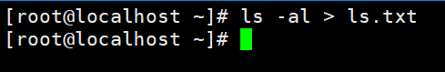

将 ls -al的执行结果重定向到 ls.txt 文件中。

ls.txt文件内容如下：

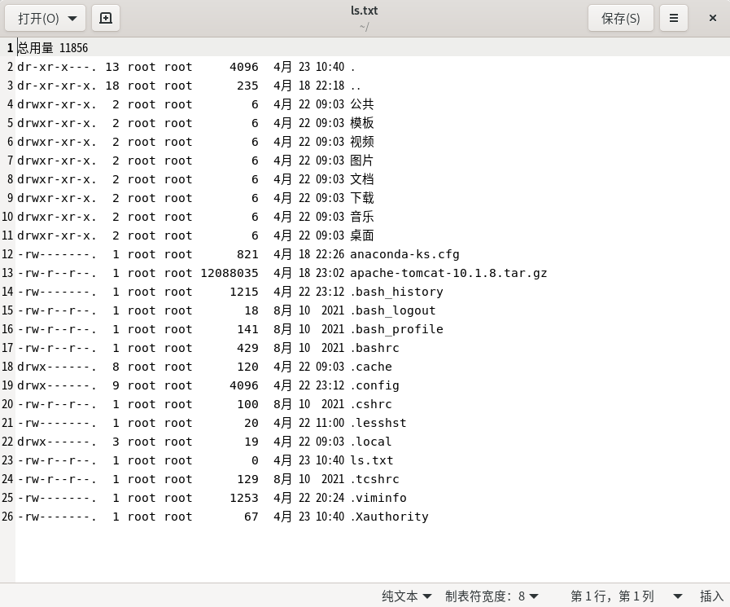

以上方式是采用覆盖的方式，所谓覆盖方式指的是，每一次执行时，都会把 ls.txt 文件全部清空，然后重新写入。

如果要以追加的方式，则需要使用 >> ，这个可以自行测试一下。

### 输入重定向

**输入重定向：**`**<**`

**输入重定向和输出重定向的区别：**

| **类型** | **符号** | **方向** | **典型作用** |
| --- | --- | --- | --- |
| **输入重定向** | `<font style="color:rgb(15, 17, 21);background-color:rgb(235, 238, 242);"><</font>` | **文件 → 命令** | 将文件内容作为命令的**输入**。 |
| **输出重定向** | `<font style="color:rgb(15, 17, 21);background-color:rgb(235, 238, 242);">></font>` | **命令 → 文件** | 将命令的**输出**写入文件（覆盖）。 |
| **输出重定向(追加)** | `<font style="color:rgb(15, 17, 21);background-color:rgb(235, 238, 242);">>></font>` | **命令 → 文件** | 将命令的**输出**追加到文件末尾。 |

**<：将文件内容输入给某个命令，例如：**

a.txt文件内容如下：

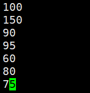

将 a.txt 文件中的内容输入给 sort命令：`sort -n`**对文本内容进行“数值排序”**

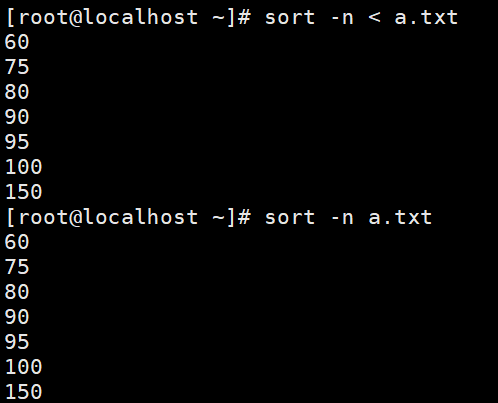

### `<`和 `<<`的区别

| **特性** | **标准输入重定向 (**`**<font style="color:rgb(15, 17, 21);background-color:rgb(235, 238, 242);"><</font>**`**)** | **内嵌文档语法 (**`**<font style="color:rgb(15, 17, 21);background-color:rgb(235, 238, 242);"><<</font>**`**)，特殊形式的输入重定向** |
| --- | --- | --- |
| **输入来源** | **来自一个已存在的文件**。 | **来自命令行中紧接着的一段文本块**。 |
| **数据位置** | 数据在**外部文件**里。 | 数据直接**内嵌在命令脚本中**。 |

从终端上接收一个多行的文本框，如下：

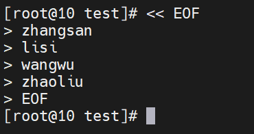

其中 `EOF`是文档的结束标记，当然，这个结束标记是可以随便起名的，例如：

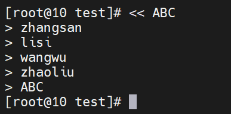

### 在终端中写入多行内容

通常有这样一个需求：在终端上写配置文件。

当然，大家可以使用 vi 命令，完全可行，还有其他方式吗？有的。标准写法如下：

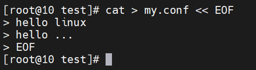

**解释以上的命令：**

**第一：**`**<< EOF**`**在终端上接收一个多行的文本块**

**第二：接收到的文本块交给 **`**cat**`**命令输出**

**第三：输出重定向到 **`**my.conf**`**文件中。**

## grep命令

在某段内容中搜索

例如： grep 0 a.txt （在a.txt中搜索0）

`grep` 用于在文本内容中查找匹配的字符串或模式，并将匹配行作为输出。基本用法：

```shell
grep 'pattern' file
```

- `'pattern'` 表示要匹配的字符串或模式。
- `file` 表示要搜索的文件名。如果不指定文件名，则 `grep` 命令会从标准输入中读取数据，等待用户输入并匹配字符串。

搜索多个文件：

```shell
grep 'pattern' file1 file2
grep 'pattern' *.txt
```

- `file1` 和 `file2` 表示要搜索的多个文件名。也可以使用通配符 `*.txt` 搜索所有扩展名为 `.txt` 的文件。

递归搜索目录：

```shell
grep -r 'pattern' dir
```

- `-r` 表示递归搜索目录。
- `dir` 表示要搜索的目录。

显示匹配行前的几行或后的几行：

```shell
grep -A 2 'pattern' file    # 显示匹配行后2行
grep -B 2 'pattern' file    # 显示匹配行前2行
grep -C 2 'pattern' file    # 显示匹配行前后各2行
```

- `-A` 表示显示匹配行后的几行。（After）
- `-B` 表示显示匹配行前的几行。（Before）
- `-C` 表示同时显示匹配行前后的几行。这三个选项后面必须跟一个数字，表示要显示的行数。

同时输出匹配结果的行号：

```shell
grep -n 'pattern' file
```

- `-n` 表示只输出匹配结果所在的行号。

忽略大小写：

```shell
grep -i 'pattern' file
```

- `-i` 表示忽略大小写。

找出不匹配的行：

```shell
grep -v 'pattern' file
```

- `-v` 输出不匹配模式的行。

使用正则表达式匹配：

```shell
grep -E 'pattern' file
```

- `-E` 表示使用正则表达式匹配。
- 例如：grep -E '[0-9]+' file

## 管道 |

将**前面命令的输出**作为**后面命令的输入**，可以**叠加**，例如：

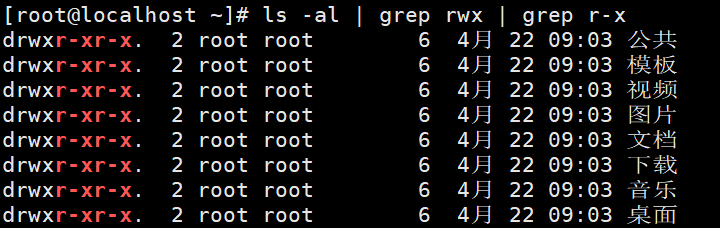

## 查看系统进程

ps [命令参数]

常用参数：
-e :显示当前所有进程
-f :显示 UID,PPID,C 与 STIME 栏位信息

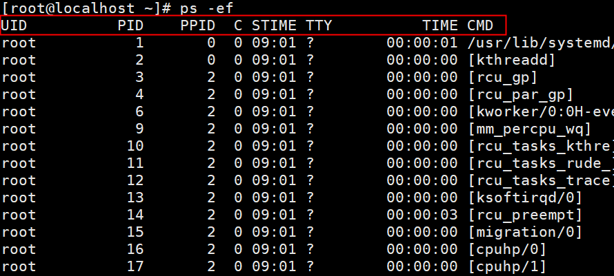

UID：该进程的所属用户
PID：进程id
PPID：父进程id
C：CPU使用百分比
STIME：启动时间
TTY：启动该进程的终端设备是哪个
TIME：耗费的CPU时间
CMD：该进程对应的命令

## kill进程

kill 进程号

kill -9 进程号（强行杀死）

killall 进程名

sleep命令：可以让当前进程进入休眠状态。

- sleep 1d （当前进程进入休眠1天）
- sleep 30 （当前进程进入休眠30秒）
- sleep 2d & （当前进程进入休眠2天，并将当前进程放到后台休眠）

找到进程：

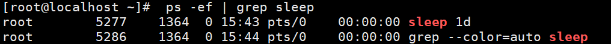

杀死进程：

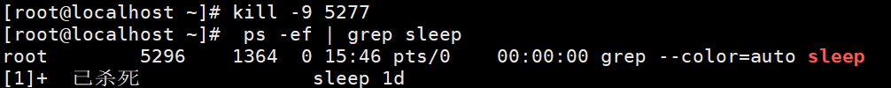

杀死所有的sleep进程：

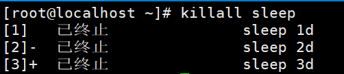

## 系统性能相关

### top命令

`top` 命令是用于查看正在运行的系统进程信息的命令。它会**实时**动态地显示系统资源的使用情况，如 CPU 占用率、内存使用情况、进程情况等。通常用于系统监控和性能调优。

**重点关注对象：**

1. 哪些进程耗费内存较多，应重点关注（前几名）。
2. 关注系统平均负载，例如 5 分钟内的平均负载高于 15 分钟的平均负载，说明短期负载有上升趋势。
3. 关注内存使用情况。
4. 交换分区如果未使用，是个好现象。


僵尸进程：在操作系统中，僵尸进程 (Zombie Process) 是指一个已经执行结束的进程，但其进程描述符仍然留在进程列表中，它不再执行任何其他操作，但仍然占用一定内存空间。

交换分区（Swap），也称虚拟存储器，是一种在计算机内存不足时，为了增加内存所采用的一种技术。当系统内存不足时，操作系统会把暂时不需要的内存数据和程序信息通过**交换机制**存储到硬盘上的交换分区中，节省内存的使用，保证共享内存的进程正常运行。

q：退出top命令。

### df命令

`df` 命令是 Linux 系统中的一个磁盘空间使用情况查询命令，用于显示当前文件系统的磁盘空间使用状况，以及文件系统的挂载点、磁盘大小、已用空间、可用空间、使用占比等信息。`df`命令是 "disk free" 的缩写。


对于程序员来说，应该重点关注以上红框中的内容，已用空间超过80%则需要重点注意，以防磁盘已满导致数据无法写入而丢失。

### du命令

`du`命令是 Linux 系统中的一个磁盘空间占用查询命令，用于显示文件或目录占用的磁盘空间大小。`du`命令是 "disk usage" 的缩写：


4表示占用4个字节的空间。

## 关机与重启

### 重启

reboot

### 关机

shutdown -h now

poweroff

`shutdown -h now` 和 `poweroff` 都是用于关机的 Linux 命令，它们的区别如下：

1. `shutdown -h now` 命令会向系统发送信号，通知所有正在运行的进程停止运行，并保存当前的状态，然后关闭系统。通常会在关机前向所有用户发送通知消息。
2. `poweroff` 命令相较于 `shutdown -h now` 更为强制，它会立即关闭系统电源，不会等待正在运行的进程结束。使用 `poweroff` 命令时需要特别小心，因为它可能会丢失尚未保存的数据。

综上所述，`shutdown -h now` 命令会逐步关闭进程，允许程序释放资源并保存数据；而 `poweroff` 命令则会立即关闭系统电源，可能会丢失一些尚未保存的数据。因此，在正常关机的情况下，建议使用 `shutdown -h now` 命令；只有在意外情况下，比如系统出现严重故障等情况，才应该使用 `poweroff` 命令。

## ifconfig命令

查看网卡的ip地址。在windows当中是：ipconfig。在linux当中是ifconfig。


## ping命令

查看计算机之间是否可以正常通信

语法：

- ping ip地址
- ping 域名


## curl命令

模拟用户访问，模拟浏览器行为。

- 例如：curl [http://www.baidu.com](http://www.baidu.com) （可以直接查看百度首页的前端代码。）

`curl` 命令是 Linux 系统中的一个用于发送 HTTP 请求的工具。它支持各种协议，包括 HTTP、HTTPS、FTP、IMAP、SMTP 等，可以用于从网络中获取数据、上传文件等。

`curl` 命令的基本语法如下：

```shell
curl [options] <URL>
```

其中，`URL` 表示要请求的目标地址。

`curl` 命令的常用选项如下：

- `-i` ：显示响应头信息。
- `-I` ：只显示响应头信息，不显示响应体。
- `-X` ：设置请求方法，包括 GET、POST、PUT、DELETE 等。
- `-d` ：设置请求体数据（POST 请求）。
- `-H` ：设置请求头信息。
- `-o/-O` ：下载文件，并保存到本地。
- `-u` ：设置认证信息。
- `-A` ：设置 User-Agent。
- `-s` ：静默模式，不输出进度信息。

以下是 `curl` 命令的一些使用示例：

1. 请求一个 URL 并输出响应信息：

```shell
curl www.example.com
```

1. 发送 POST 请求：

```shell
curl -X POST -d "name=john&age=30" www.example.com/submit
```

1. 设置请求头信息：

```shell
curl -H "User-Agent: Mozilla/5.0" www.example.com
```

总之，`curl` 命令是一个非常方便的工具，可以用于从网络中获取数据、上传文件等，并且支持多种协议和请求方式。需要注意的是，在实际使用 `curl` 命令时，还需要根据具体情况设置相应的选项和参数。

`curl`命令可以用来测试服务端的接口。不过在实际开发中，使用`curl`命令来测试接口的情况还是较少的，因为现在接口测试工具比较多，例如：Postman、Apifox等这些工具都很好用。

## wget

下载资源，语法：wget 资源地址

下载tomcat ：wget [https://dlcdn.apache.org/tomcat/tomcat-10/v10.1.20/bin/apache-tomcat-10.1.20.tar.gz](https://dlcdn.apache.org/tomcat/tomcat-10/v10.1.20/bin/apache-tomcat-10.1.20.tar.gz)


下载结果：


## netstat查看网络连接状态及端口

开发人员使用 `netstat` 最常用的几种用法如下：

### 查看所有连接

```bash
# 查看所有活动的网络连接
netstat -tunlp
```

**参数解释：**

- `-t`：TCP 连接
- `-u`：UDP 连接
- `-n`：以数字形式显示（不解析主机名/服务名，将 IP 地址和端口显示出来。）
- `-l`：仅显示监听中的连接
- `-p`：显示进程信息（需要 sudo）

### 检查服务是否启动

```bash
# 查看服务监听端口
netstat -tlnp | grep -E "(3306|5432|6379|27017)"  # 数据库端口

# 常见端口检查：
# 3306 - MySQL
# 5432 - PostgreSQL
# 6379 - Redis
# 27017 - MongoDB
# 8080/3000 - 应用服务
```


`**LISTEN**`**表示****服务正在监听端口，等待连接**

`**<font style="color:rgb(15, 17, 21);">ESTABLISHED</font>**`**连接已建立，正在传输数据**

`**<font style="color:rgb(15, 17, 21);">TIME_WAIT</font>**`**连接超时，过多可能有问题**

### 排查"端口已被占用"错误

```bash
# 查找哪个进程占用了 8080 端口
sudo netstat -tunlp | grep :8080
```

### 诊断连接问题

```bash
# 查看所有 ESTABLISHED 连接
netstat -nat | grep ESTABLISHED

# 查看连接超时（TIME_WAIT 过多可能是问题）
netstat -nat | grep TIME_WAIT
```

# 文件内容查看


## cat命令

语法：

```shell
用法：cat [选项]... [文件]...

常用选项：
  -n, 对输出的所有行编号
  -b, 对输出的所有行编号（不含空白行）
  -t, 将制表符(tab)显示为^I
  -e, 在每行结束处显示"$"
  -s, 当连续空白行数量大于1时，合并为1个空白行
```

**cat命令会一次性将文件的完整内容全部显示出来，不适合大文件。**

---

查看文件所有内容

```shell
cat HelloWorld.java
```

查看文件所有内容，并且添加行号

```shell
cat -n HelloWorld.java
```

查看文件所有内容，添加行号，但空白行不加行号

```shell
cat -b HelloWorld.java
```

查看文件所有内容，将制表符显示为^I

```shell
cat -t HelloWorld.java
```

查看文件所有内容，在每行结束处显示"$"

```shell
cat -e HelloWorld.java
```

查看文件所有内容，合并多个连续的空白行为1个空白行

```shell
cat -s HelloWorld.java
```

一次查看多个文件

```shell
cat a.txt b.txt
```

使用cat合并文件

```shell
cat a.txt b.txt > c.txt
```

加上行号之后输出到另一个文件

```shell
cat -n HelloWorld.java > HelloWorld2.java
```

清空文件内容

```shell
cat /dev/null > HelloWorld.java
```

## more命令

more命令和cat命令的相同点和不同点：

- 相同点：more和cat在开始读取文件的时候，都是一次性的将文件全部内容装载到缓存中。
- 不同点：cat是一次性的全部输出打印。more可以进行部分打印（一屏一屏的打印）。

```shell
用法：
 more [选项] <文件>...

常用选项：
 -<number>  每个屏幕的行数
 +<number>  从行号开始显示文件
 +/<pattern>  从匹配的位置前两行开始显示内容
 -p  以清除原内容的方式进行翻页。
 
常用操作：
  回车键        【显示下一行】
  空格键        【显示下一页】
  ctrl + b     【显示上一页】
  =            【显示行号】
  :f           【显示文件名的同时显示行号】
  q            【退出more命令】
```

这里有日志文件：log.txt，内容如下：

```shell
2021.10.1 zhangsan
2021.10.2 lisi
2021.10.3 wangwu
2021.10.4 zhaoliu
2021.10.5 admin
2021.10.6 zhangsan
2021.10.7 lisi
2021.10.8 wangwu
2021.10.9 zhaoliu
2021.10.10 qianqi
2021.10.11 zhouyu
2021.10.12 huanggai
2021.10.13 zhugeliang
2021.10.14 simayi
2021.10.15 maimaiti
2021.10.16 erdaye
2021.10.17 sandaye
2021.10.18 zhangsan
2021.10.19 lisi
2021.10.20 wangwu
2021.10.21 zhaoliu
2021.10.22 qianqi
2021.10.23 zhoubapi
2021.10.24 doudizhu
2021.10.25 nongmin
2021.10.26 sunwukong
2021.10.27 zhubajie
2021.10.28 shaseng
2021.10.29 wujing
2021.10.30 baigujing
2021.10.31 java
2021.11.1 oracle
2021.11.2 mysql
2021.11.3 jdbc
2021.11.4 servlet
2021.11.5 jsp
2021.11.6 spring
2021.11.7 mybatis
2021.11.8 springmvc
2021.11.9 web
2021.11.10 html
2021.11.11 css
2021.11.12 java
2021.11.13 sun
```

案例1：从第3行起，查看文件内容。

```shell
more +3 log.txt
```

案例2：每屏显示4条记录。

```plaintext
more -4 log.txt
```

案例3：从文件中查找"java"字符串的行

```shell
more +/java log.txt
```

案例4：查看进程，每5条为一屏，翻屏时清空原内容

```shell
ps -ef | more -5 -p
```

## less命令

less 的用法比起 more 更加的有弹性。使用less 时，可以使用 [pageup] [pagedown] 等按键的功能来往前往后翻看文件，更容易用来查看一个文件的内容！除此之外，在 less 中可以拥有更多的搜索功能。

有这样的一个文件：usernames.txt

```plaintext
zhangsan
lisi
wangwu
zhaoliu
sunwukong
zhubajie
wusong
linchong
huanggai
songjiang
ZHANGSAN
lisi
wangwu
zhaoliu
sunwukong
zhubajie
wusong
linchong
huanggai
songjiang
ZHANGSAN
lisi
wangwu
zhaoliu
sunwukong
zhubajie
wusong
linchong
huanggai
songjiang
zhangsan
lisi
wangwu
zhaoliu
sunwukong
zhubajie
wusong
linchong
huanggai
songjiang
zhangsan
lisi
wangwu
zhaoliu
sunwukong
zhubajie
wusong
linchong
huanggai
songjiang
zhangsan
lisi
wangwu
zhaoliu
sunwukong
zhubajie
wusong
linchong
huanggai
songjiang
zhangsan
lisi
wangwu
zhaoliu
sunwukong
zhubajie
wusong
linchong
huanggai
songjiang
zhangsan
lisi
wangwu
zhaoliu
sunwukong
zhubajie
wusong
linchong
huanggai
songjiang
zhangsan
lisi
wangwu
zhaoliu
sunwukong
zhubajie
wusong
linchong
huanggai
songjiang
zhangsan
lisi
wangwu
zhaoliu
sunwukong
zhubajie
wusong
linchong
huanggai
songjiang
zhangsan
lisi
wangwu
zhaoliu
sunwukong
zhubajie
wusong
linchong
huanggai
songjiang
zhangsan
lisi
wangwu
zhaoliu
sunwukong
zhubajie
wusong
linchong
huanggai
songjiang
zhangsan
lisi
wangwu
zhaoliu
sunwukong
zhubajie
wusong
linchong
huanggai
songjiang
zhangsan
lisi
wangwu
zhaoliu
sunwukong
zhubajie
wusong
linchong
huanggai
songjiang
zhangsan
lisi
wangwu
zhaoliu
sunwukong
zhubajie
wusong
linchong
huanggai
songjiang
zhangsan
lisi
wangwu
zhaoliu
sunwukong
zhubajie
wusong
linchong
huanggai
songjiang
zhangsan
lisi
wangwu
zhaoliu
sunwukong
zhubajie
wusong
linchong
huanggai
songjiang
zhangsan
lisi
wangwu
zhaoliu
sunwukong
zhubajie
wusong
linchong
huanggai
songjiang
zhangsan
lisi
wangwu
zhaoliu
sunwukong
zhubajie
wusong
linchong
huanggai
songjiang
zhangsan
lisi
wangwu
zhaoliu
sunwukong
zhubajie
wusong
linchong
huanggai
songjiang
```

```shell
用法：less [选项] 文件

常用选项：
-g  只标志当前搜索到的关键词所在行
-I  忽略搜索时的大小写（注意：是大写I）
-m  显示类似more命令的百分比
-N  显示每行的行号
+num 从第num行开始显示

常用操作：
[pagedown] 向下翻动一页
[pageup] 向上翻动一页

/字符串：向下搜索“字符串”的功能
?字符串：向上搜索“字符串”的功能

n：重复前一个搜索（与 / 或 ? 有关）
N：反向重复前一个搜索（与 / 或 ? 有关）

y  向前滚动一行
回车键 向后滚动一行

g  移动到第一行
G  移动到最后一行

= 显示详细信息（第几行，共多少行，内容的字节数量等）

v  使用vim编辑器进行编辑

q  退出less 命令
```

## head命令

head命令：显示文件头部内容。

```shell
用法：head [选项]... [文件]...
将每个指定文件的前 10 行输出到标准输出。
如果指定了多于一个文件，在每块输出之前附加文件名称作为头部。

参数：
  -c 输出前几个字符
  -n 指定行数
  -q 不显示包含给定文件名的文件头
```

前三行：


前9个字符：


显示多个文件的前3行：


不带文件名标识：


## tail命令

tail命令：显示文件尾部内容。

```shell
用法：tail [选项]... [文件]...
显示每个指定文件的最后 10 行并输出至标准输出。
若指定了多于一个文件，程序会在每段输出的开始添加相应文件名作为头。

参数：
  -c  输出最后几个字符
  -f  随文件增长即时输出新增数据
  -n  指定行数
  -q  不输出文件名的头
```

默认显示文件末尾的后10行：


指定行数：


一次查看多个文件：


不显示文件名：


监控文件变化：

在窗口1中：


在窗口2中：


可以看到窗口1发生了变化：


# Linux 用户管理

Linux系统中超级用户是root，通过超级用户root可以创建其它的普通用户。

在实际使用中，一般会分配给开发人员专属的账户，这个账户只拥有部分权限，如果权限太高，操作的范围过大，一些误操作可能导致系统崩溃。

在Linux系统中任何一个用户都对应：一个用户名 + 一个口令。用户使用系统时需要输入用户名和口令进行登录，登录成功后就可以进入自己的主目录（主目录就是自己的工作目录或者叫做家目录）。

用户账号管理主要包括以下三方面：

- 用户组的管理
- 用户的管理
- 为用户主目录之外的目录授权


## 用户组的管理

每个用户都有一个用户组，系统可以对一个用户组中的所有用户进行集中管理。

用户组的管理涉及用户组的添加、修改和删除。

用户组的添加、修改和删除实际上就是对/etc/group文件的更新。

**使用root账户查看当前系统的用户组有哪些**

```shell
cat /etc/group
```


每一个用户组四部分组成：组名：密码标识：GID：该用户组中的用户列表

**查看当前登录的账户属于哪一组**

```shell
groups
```

**查看某个用户属于哪一组**

```shell
[root@localhost ~]# groups root
```


以上结果表示`root`用户属于`root`组。

```shell
[laodu@localhost ~]$ groups laodu
```


以上结果表示`laodu`用户的主组`laodu`，附加组`wheel`

### 用户组的添加

语法：groupadd [选项] 组名

常用选项包括：

- -g 可以通过这个选项来指定新用户组的标识号（GID）

```shell
groupadd dev1
```

```shell
groupadd -g 101 dev2
```

其中101是dev2这个组的组号。

### 用户组的修改

```shell
groupmod -g 102 dev2
```

```shell
# 将dev2修改为dev3
groupmod -n dev3 dev2
```

### 用户组的删除

```shell
# 删除用户组dev3
groupdel dev3
```

## 用户的管理

用户管理工作主要涉及到用户的添加、修改和删除。

### 添加用户

添加用户就是在系统中创建一个新账号，然后为新账号分配用户组、主目录等资源。

语法：useradd [选项] 用户名

选项：

- -d 指定新用户的主目录
- -g 指定新用户属于哪个组（主组）
- -G 可以给新用户添加附加组

```shell
[root@localhost ~]# useradd lisi
```

注意：当新建用户时，没有指定组，也没有指定工作目录时：

- 默认的组名：和自己用户名一样
- 默认的主目录：/home/用户名

```shell
[root@localhost ~]# useradd -d /usr/zhangsan zhangsan
```

```shell
[root@localhost usr]# useradd -d /usr/lisi -g dev -G test lisi
```

添加lisi用户，该用户的主目录/usr/lisi，所属主组dev（开发组），附加组test（测试组）

### 设置密码

```shell
passwd lisi
```

注意：增加用户就是在/etc/passwd文件中为新用户增加一条记录，同时更新其他系统文件如/etc/shadow, /etc/group等。

通过查看/etc/passwd文件可以看到系统中有哪些用户，例如执行：cat /etc/passwd


以上信息描述了什么？


密码会单独存储在/etc/shadow文件中，例如执行：cat /etc/shadow


可以看到这个密码是通过某种算法进行加密的。

### 切换用户

从root账户切换到普通账户


从普通用户切换到超级管理员需要密码


注意：从普通用户切换到高级用户需要密码。密码输入时不回显。

注意：切换到普通用户之后，该普通用户默认只对自己的“主目录”有权限，主目录之外的目录是没有权限的。

### 修改用户

修改用户就是对用户名，用户主目录，用户组等进行修改。

语法：usermod [选项] 用户名

- -d 指定用户的主目录
- -g 指定用户属于哪个组（主组）
- -G 可以给用户添加附加组
- -l 指定新的用户名（小写的艾路）

```shell
usermod -l zhangsi zhangsan
```

```shell
# -m 选项：当有了这个选项之后，目录不存在时会新建该目录，并且将之前家目录中的数据移动到新的家目录当中。
usermod -d /usr/zhangsan2 -m zhangsan
```

```shell
usermod -g dev1 zhangsan
```

```shell
usermod -L zhangsan
```

```shell
usermod -U zhangsan
```

### 删除用户

```shell
userdel -r zhangsan
```

-r 选项的作用是连同该用户主目录一块删除。

## 为用户主目录之外的目录授权

第一步：创建目录

```shell
mkdir /java
```

第二步：给目录授权

```shell
# -R表示递归设置权限，该目录下所有的子目录以及子文件
chmod -R 775 /java
```

第三步：创建组

```shell
groupadd dev
```

第四步：把目录赋予组

```shell
chgrp -R dev /java
```

这个命令只是**把 **`**<font style="color:rgb(15, 17, 21);background-color:rgb(235, 238, 242);">/java</font>**`** 目录及其所有内容的所属组改为 **`**<font style="color:rgb(15, 17, 21);background-color:rgb(235, 238, 242);">dev</font>**`** 组**

**执行前：drwxrwxr-x root root /java**

**执行后：drwxrwxr-x root dev /java**

第五步：创建用户

```shell
useradd xiaoming
```

第六步：设置密码

```shell
passwd xiaoming
```

第七步：给用户添加附加组

```shell
usermod -G dev xiaoming
```

# 文件权限


## 文件权限概述

Linux为了保证系统中每个文件的安全，引入了文件权限机制。针对于系统中的每一个文件Linux都可以提供精确的权限控制。它可以做到**不同的用户**对**同一个文件**具有不同的操作权利。而通常这个权利包括以下3个：

- 读的权利（Read，简称r）
- 写的权利（Write，简称w）
- 执行的权利（eXecute，简称x）

具体的权限值：rwx（读、写、执行）。这个我们已经知道了。但是上面还提到了“**不同的用户对同一个文件可以有不同的权限”中“不同的用户**”指的是哪些用户呢？所以这个文件的用户也是包括3类用户：

- 文件拥有者（User，简称U）：该文件的创建人
- 同组用户（Group，简称G）：和创建人在同一组的用户
- 其他组用户（Other，简称O）：和创建人不在同一组的用户

这就是非常著名的UGO模型。也就是说一个文件的权限包括三组：

- 第一组U：我们可以给文件的创建者设置rwx权限。
- 第二组G：我们可以给文件创建者的同组人员设置rwx权限。
- 第三组O：我们可以给和文件创建者不在同一组的人员设置rwx权限。

## 查看文件权限

采用“ls -l”命令可以查看文件的具体权限，如下：


权限信息在哪里呢？看下图：


每一个文件或目录采用ls -l查看之后，第一个字段描述了文件类型+文件的权限。第一个字段共10个字符：

- 第1个字符：代表文件的类型，- 代表文件，d代表目录
  - 其实Linux中文件的类型有7种：
    - 代表普通文件
    - d 代表目录
    - l 代表链接（软链接：快捷方式）
    - b 块设备（硬盘，软盘等存储设备）
    - c 字符设备（通常以字节流的方式访问）
    - p 管道文件（主要用于进程间通讯）
    - s 套接字文件（主要用于网络通讯）
- 第2,3,4个字符：代表文件创建者对该文件的权限。
- 第5,6,7个字符：代表与文件创建者在同一组的用户对该文件的权限。
- 第8,9,10 个字符：代表其他组人员对该文件的权限。

关于文件权限的9个字符中包含四种字符，分别是：r、w、x、-，他们代表什么含义：

- r：读权限
- w：写权限
- x：执行权限
- -：无权限

## 基于UGO设置文件权限

修改权限的命令是chmod，如果采用UGO方式修改权限的话，大致语法是这样的：

```shell
chmod g+w Hello.java
```

```shell
chmod g+w,o+w Hello.java
```

**注意：不要有空格，**`**<font style="color:#DF2A3F;">chmod g+w, o+w Hello.java</font>**`**这个是不行的。有空格不行。**

```shell
chmod g-w, o-w Hello.java
```

我们查看HelloWorld.java文件的权限：


文件拥有者：读和写

同组人员：读

其他组人员：读

我们将文件拥有者的写权限删除：


我们尝试使用vim命令编辑HelloWorld.java文件，当你使用vim编辑时：


发现该文件是只读的，不支持编辑。

我们再把写的权限加上：


再使用vim命令打开该文件：


可以看到，这个时候文件可以编辑了。

**注意：在测试同组人员的权限时，一定要注意创建者创建文件之后，文件所对应的组是否修改了。怎么修改文件所属组：chgrp dev Test.java（将Test.java文件所属组修改为dev）**

## 基于421设置文件权限

421采用数字来表示不同的权限。

- 4代表读
- 2代表写
- 1代表执行

例如：如果让一个用户读、写、执行权限都有的话，就是4 + 2 + 1 = 7，那么7这个数字就代表rwx的权限都具备。如果是5就表示4+1的组合，表示有r和x的权限。如果是6就表示4+2的组合，表示有r和w的权限。如果是0就表示无任何权限。

通过421这几个数字的不同组合来表示不同的权限，那么它有多少种不同的组合呢：

- 0：无权限
- 1：x
- 4：r
- 5：r + x
- 6：r + w
- 7：r + w + x

也就是说一共6个数字：0 1 4 5 6 7

那么采用421方式设置权限应该怎么做呢，比如：如何给文件拥有者设置权限，如何给同组人员设置权限，如何给其他组人员设置权限？语法是这样的：

```shell
chmod 三个数字 文件名
```

例如：chmod 755 HelloWorld.java

第一个数字7是文件拥有者的权限，第二个数字5是同组人员的权限，第三个数字5是其他组人员的权限。

也就是说文件拥有者的权限是rwx，同组人员是r-x，其他组人员是：r-x


再如：chmod 700 HelloWorld.java

表示文件拥有者权限：rwx，同组人员无权限，其他组人员无权限


## chown修改文件拥有者

在 Linux 中，可以使用 `chown` 命令来修改指定文件或目录的拥有者和所属组。`chown` 命令的基本语法如下：

```plaintext
chown [选项]... [所有者][:[所属组]] 文件...
```

其中，`所有者` 和 `所属组` 可以是用户名或用户 ID、组名或组 ID，如果省略 `:` 和 `所属组`，则默认为修改文件的所有者。

下面是一些常用选项：

- `-R`：递归修改，包括子目录和文件。

例如，将 `/home/user/file.txt` 文件的所有者修改为 `root` 用户，可以使用如下命令：

```plaintext
sudo chown root /home/user/file.txt
```

将 `/home/user/dir/` 目录及其子目录和文件的所有者都修改为 `userA` 用户，所属组修改为 `groupA` 组，可以使用如下命令：

```plaintext
sudo chown -R userA:groupA /home/user/dir/
```

注意，在使用 `chown` 命令时，需要有足够的权限才能修改文件或目录的拥有者和所属组。一般需要使用 `sudo` 命令或使用具有相应权限的用户来执行。

# 软件的安装与卸载


## 软件安装方式概述

CentOS安装软件的方式主要包括：

- 源码安装
- rpm安装（二进制安装）
- yum安装（在线安装）

### 源码安装：

源码包是指C等语言所开发的源代码文件的一个压缩包，通常压缩为.tar.gz或.tar.bz2。源码通常需要编译器将其编译成二进制文件，如gcc编译器。

优点：

（1）开源，有能力者可以修改源代码；特别是要对某个软件，从头开发时，就特别需要对源码进行解读分析。

（2）可自由选择所需功能；

（3）卸载方便，直接删除目录即可。

（4）对于学习者而言，源码安装更有利于学习者发现软件环境和工具之间所依赖的关系。

缺点：

（1）安装麻烦，需要自行解决工具之间的依赖关系。

（2）某些软件编译过程耗费的时间较长。

（3）大型软件编译，对新手来说较为麻烦，所报错误往往超过所能解决的范围，排错过程有可能会把系统给搞崩溃。

### rpm安装：

RPM包：由Red Hat公司开发的包管理系统，软件的安装、升级、卸载都非常简单和方便。目前很多Linux发行版都在使用这种包管理机制，包括CentOS、Redhat、Fedora等。软件包文件后缀是".rpm"。

优点：

（1）包安装与管理简单，往往仅通过几个命令即可实现包的安装、升级、查询和卸载。

（2）通常安装速度要比源码安装快很多；

缺点：

（1）二进制文件，看不到源码了，修改和分析源码已不太可能。

（2）模块功能已经被定制，用户功能选择远不如源码灵活；

（3）有时也需要解决依赖性的问题，此时解决依赖性有一定的困难。

### yum安装：

yum软件仓库是为了进一步简化RPM管理软件的难度以及自动分析所需软件包及其依赖关系的技术。

yum的关键之处是要有可靠的respository（保证能够连接互联网，还需要保证它是一个互联网上正常可用的仓库）。

它能够从指定服务器自动下载rpm包并安装。yum能够自动解决软件依赖性问题，一次性安装所有依赖的软件包。

## yum安装与卸载的相关命令

安装命令：yum -y install 软件名

升级命令：yum -y install 软件名

升级所有软件：yum -y install

卸载命令：yum remove 软件名

查看当前Linux系统中**已安装**和**仓库中可安装**的软件包列表：yum list

列出已安装的软件包：yum list installed

查询某个软件包：yum list 软件名

根据关键字搜索软件包：yum search Keyword

清除缓存：yum clean all

## JDK的安装与配置

1. 从yum仓库中搜索jdk：`yum search jdk`
2. 安装jdk：yum -y install java-17-openjdk-devel.x86_64
3. 看看jdk的安装目录：
  1. which java
  2. ls -l /usr/bin/java
  3. ls -l /etc/alternatives/java
4. 在/etc/profile文件中配置环境变量：

```plaintext
export JAVA_HOME=/usr/lib/jvm/java-17-openjdk-17.0.6.0.10-3.el9.x86_64
export CLASSPATH=.:$JAVA_HOME/lib
export PATH=$PATH:$JAVA_HOME/bin
```

1. 生效：source /etc/profile

## Tomcat服务器的安装与配置

1. Tomcat是Java语言实现的，因此使用Tomcat服务器的前提是：已经安装并配置了Java环境。
2. 下载Tomcat
  1. 官网：[https://tomcat.apache.org/](https://tomcat.apache.org/)
  2. 下载tomcat10


1. 使用FTP工具将以上压缩包上传到CentOS。


1. 解压到当前目录下


1. 第三方软件一般存放在/usr/local目录下，使用mv命令tomcat移动到该目录下


1. 为了方便配置环境变量，将目录名重命名


现在Tomcat服务器的根路径是：/usr/local/tomcat10

1. 配置环境变量


让环境变量生效：


1. 启动Tomcat


1. 查看服务器IP地址


1. 永久放行防火墙端口8080

永久放行防火墙端口8080：

```shell
firewall-cmd --add-port=8080/tcp --permanent
```

重启防火墙：

```shell
systemctl restart firewalld
```

如果以上方式无法解决，可以使用下面命令将整个防火墙关闭（不安全，不推荐）：

```shell
systemctl stop firewalld.service
```

1. 打开windows上的浏览器，输入地址访问


1. 关闭tomcat服务器


服务器关闭之后，重新打开一个全新的浏览器，再次输入访问地址，会发现无法访问了。

## MySQL的安装与配置

### MySQL8的安装

以下是在CentOS Stream系统上安装MySQL8的步骤：

1. 更新系统软件包

使用以下命令更新CentOS Stream系统上的软件包：

```shell
dnf update
```

安装MySQL8需要更新系统上的软件包是因为MySQL8需要使用一些较新的依赖库和工具，而CentOS Stream默认的软件包版本可能较旧，无法满足MySQL8的要求。更新系统上的软件包可以确保系统中的依赖库和工具版本与MySQL8的要求相匹配，从而保证MySQL8的正常运行。

dnf和yum都是CentOS中的包管理器，它们的作用是安装、升级、删除软件包以及解决软件包依赖关系。它们的区别如下：

- 语法不同：dnf命令的语法更加简洁，而yum命令的语法相对较长。
- 性能不同：dnf命令在处理软件包时的性能比yum命令更好，因为dnf使用了更高效的算法。
- 依赖关系处理不同：dnf命令在处理软件包依赖关系时更加智能，能够自动选择最佳的依赖关系解决方案。
- 使用的库不同：dnf命令使用了更加现代化的libdnf库，而yum命令使用了较老的yum库。
- 可用插件不同：dnf命令支持更多的插件，可以实现更多的功能。

总的来说，dnf命令是yum命令的升级版本，它在性能、依赖关系处理和可用插件等方面都更加优秀。

1. 添加MySQL Yum存储库

使用以下命令将MySQL Yum存储库添加到系统中：

```plaintext
dnf install https://dev.mysql.com/get/mysql80-community-release-el9-5.noarch.rpm
```

MySQL Yum存储库怎么获取？如下图所示：从mysql官网获取


1. 导入mysql公钥

```shell
rpm --import https://repo.mysql.com/RPM-GPG-KEY-mysql-2022
```

导入GPG密钥是为了**验证软件包来自MySQL官方且未被篡改**，确保安装安全。

1. 安装MySQL 8

```plaintext
dnf install mysql-community-server
```

1. 启动MySQL服务

```plaintext
systemctl start mysqld
```

1. 设置MySQL开机自启

```plaintext
systemctl enable mysqld
```

1. 查看root账户的临时密码

```shell
grep 'temporary password' /var/log/mysqld.log
```

1. 配置MySQL安全设置

```plaintext
mysql_secure_installation
```

按照提示输入密码并回答问题，完成安全设置。

**标注：我这里设置的密码是：**`**<font style="color:#DF2A3F;">abC_123456</font>**`

1. 登录MySQL

```plaintext
mysql -u root -p
```

完成以上步骤后，您就可以在CentOS Stream系统上安装并使用MySQL 8了。

### MySQL8设置字符集

1. 查看MySQL8字符集

在MySQL命令行界面中输入以下命令：

```plaintext
show variables like '%character%';
```

可以查看MySQL的字符集设置。


1. 如果字符集不是utf8，可以在/etc/my.cnf文件中进行配置，在[mysqld]下面添加如下配置：/etc/my.cnf是mysql的配置文件。

```plaintext
[mysqld]
character-set-server=utf8mb4
collation-server=utf8mb4_general_ci
```

保存并退出。

1. 重启MySQL服务

在终端中输入以下命令：

```plaintext
systemctl restart mysqld
```

1. 再次查看MySQL8的字符集是否为utf8

### 在MySQL8中为Java程序员创建专属的MySQL用户

首先，以root用户身份登录MySQL：

```shell
mysql -u root -p
```

创建一个新的数据库，例如项目是oa项目，一般创建一个数据库叫做oa：

```sql
create database oa;
```

然后，创建一个新用户并设置密码：

```plaintext
CREATE USER 'java_dev'@'%' IDENTIFIED BY 'java_DEV123';
```

接下来，为该用户授予开发者专有的权限：

```plaintext
GRANT SELECT, INSERT, UPDATE, DELETE, CREATE, DROP, ALTER, INDEX, REFERENCES ON oa.* TO 'java_dev'@'%';
```

接下来，刷新权限：

```plaintext
FLUSH PRIVILEGES;
```

放行端口号3306：

```shell
# 永久放行3306端口
firewall-cmd --add-port=3306/tcp --permanent

# 重启防火墙服务
systemctl restart firewalld.service
```

现在，Java程序员可以使用用户名和密码连接到MySQL并拥有开发者专有的权限。

## WEB应用的部署

1. 请确保以上的JDK17、Tomcat10、MySQL8已经安装成功。
2. 初始化数据库
  1. 这里使用navicat for mysql工具。
  2. 先在navicat for mysql工具中创建连接。
  3. 如果项目名叫做oa，那么创建一个数据库oa。
  4. 执行sql脚本文件（**oa.sql**）完成数据初始化。
3. 将war包拷贝到tomcat的webapps目录下


1. **启动**Tomcat服务器，然后**关闭**Tomcat服务器，这一步的作用是将war包自动解压


1. 修改连接数据库的信息

找到`myweb-1.0/WEB-INF/classes/jdbc.properties`文件，修改连接数据库的信息


1. 启动Tomcat服务器
2. 打开浏览器，输入访问地址访问


注意访问地址：`/myweb-1.0/welcome`

1. 实时查看Tomcat服务器后台日志

切换到CATALINA_HOME/logs目录下，执行以下命令，可以实时查看tomcat服务器日志

```shell
tail -f catalina.out
```

# 将 web 应用部署到阿里云


## 注册阿里云账号

[https://www.aliyun.com/](https://www.aliyun.com/)


有账号的登录，没有账号的注册，注册后需要进行账号实名认证。

## 购买阿里云服务器

登录成功后，首页应该有`产品`，`产品`下有`云服务器ECS`


、

有经济实力的可以购买，没钱的可以找找看看有没有试用版本的，阿里云对于新用户来说一般是提供试用版本的。我这里选择的免费试用版本：


创建的实例是这样的：你需要记住这个公网IP。


管理员：root，新建的实例需要设置密码：


## 使用 MobaXterm 连接阿里云服务器

默认情况下阿里云服务器的“密码认证”是没有开启的。需要通过修改相关配置，来开启“密码认证”。

在阿里云服务器实例中找到如下图的VNC连接：


然后输入用户名root和密码。登录成功之后找到该文件：/etc/ssh/sshd_config

使用vim编辑sshd_config文件中的“passwordAuthcation”，将no修改为yes。

重启sshd服务：service sshd restart

此时采用MobaXterm就可以使用密码的方式连接阿里云服务器了。

## 部署项目

接下来就可以部署项目了：

1. 安装 JDK
2. 安装 Tomcat
3. 安装 MySQL
4. 项目部署
5. 阿里云安全组中放行端口，需要放行：8080 和 3306.
  1. 通过图形界面操作即可。
6. Linux 系统内部也需要放行端口，需要放行：8080 和 3306.
  1. 通过执行 linux 命令放行。

```shell
firewall-cmd --add-port=8080/tcp --permanent
firewall-cmd --add-port=3306/tcp --permanent
systemctl restart firewalld.service
```

# 虚拟机克隆完整步骤

**只适合于 CentOS Stream10 的版本：**


## 设置母机

为母机设置静态 IP

**注意：以下命令在使用时，需要修改两个位置：**

1. **网络接口名字需要修改为自己系统的网络接口名。（ifconfig 查看网络接口名，大部分默认为 ens33）**
2. **网段最好保持之前的网段，假如之前的动态 ip 是：**`**192.168.48.128**`**，那么把以下命令的 **`**28**`**修改为 **`**48**`

```shell
# 设置母机为静态IP 192.168.28.200
# ens33请确认一下，不一样的需要修改。
# ip端确认一下，不一样的需要修改。
sudo nmcli connection modify ens33 ipv4.method manual ipv4.addresses 192.168.28.200/24 ipv4.gateway 192.168.28.2 ipv4.dns "8.8.8.8,114.114.114.114"

# 重启网络连接
sudo nmcli connection down ens33

# 进入虚拟机内部执行该命令
sudo nmcli connection up ens33
```

修改母机主机名为 master

```shell
sudo hostnamectl set-hostname master
```

验证母机配置：

```shell
echo "=== 验证IP地址 ==="
ip addr show ens33

echo "=== 验证主机名 ==="
hostname

echo "=== 验证网络 ==="
ping -c 3 www.baidu.com
```

关闭防火墙

```shell
sudo systemctl stop firewalld
sudo systemctl disable firewalld
```

关机准备克隆

```shell
sudo shutdown -h now
```

## 开始克隆

1. 在VMware中，右键点击已关机的 `<font style="color:rgb(15, 17, 21);background-color:rgb(235, 238, 242);">master</font>` 虚拟机
2. 选择 **"管理" → "克隆"**
3. 克隆源：选择 **"虚拟机中的当前状态"**
4. 克隆类型：选择 **"创建完整克隆"**
5. 虚拟机名称：clone1
6. 位置：选择合适的位置
7. 点击"完成"，等待克隆过程结束

## 为克隆机生成新MAC地址

1. 在VMware中，右键点击新克隆的 `<font style="color:rgb(15, 17, 21);background-color:rgb(235, 238, 242);">clone1</font>`
2. 选择 **"设置"**
3. 点击 **"网络适配器"**
4. 点击 **"高级"** 按钮
5. 点击 **"生成"** 生成新的MAC地址
6. **记下这个新MAC地址**（非常重要！）

## 配置克隆机

```shell
# 获取root权限
sudo -i

# 修改主机名（主机名要修改）
hostnamectl set-hostname clone1

# 重新配置网络（一定要注意更换下面的mac地址：就是你当时生成的mac地址。还有IP地址你要修改一下。）
nmcli connection delete ens33
nmcli connection add type ethernet con-name ens33 ifname ens33 \
    ipv4.method manual \
    ipv4.addresses 192.168.28.201/24 \
    ipv4.gateway 192.168.28.2 \
    ipv4.dns "8.8.8.8,114.114.114.114" \
    802-3-ethernet.mac-address 00:50:56:3B:6E:72
nmcli connection up ens33

# 关闭防火墙
systemctl stop firewalld
systemctl disable firewalld

# 验证配置
echo "=== 最终验证 ==="
ip addr show ens33
hostname
ping -c 2 192.168.28.200
ping -c 2 www.baidu.com
```

如果需要再次克隆新的虚拟机，最好是基于母机进行再次克隆。

# shell 编程（了解）


## Linux系统结构

Linux操作系统是一种开放源代码的类UNIX操作系统，它的结构分为内核、Shell和应用程序三个层次。

1. 内核层：内核是Linux系统的核心部分，它负责管理系统各种硬件设备、文件系统、内存管理和进程管理等核心任务。
2. Shell层：Shell是Linux系统的命令行解释器，它负责将用户输入的命令解释并执行。Linux系统上有多种Shell，其中最常用的是Bash Shell。
3. 应用层：应用层是Linux系统上的各种应用程序和服务，包括文本编辑器、图形界面、Web服务器、邮件服务器、数据库服务器等。


他们的关系：**用户通过Shell或应用程序发出指令，Shell将指令翻译给内核，内核直接驱动硬件执行。**

**Shell是用户与操作系统内核之间的命令解释器，是人机交互的翻译官与控制器。**

## 都有哪些shell

**shell 是一个程序解释器，为什么有多个？**

就像同一种语言（如英语）有不同的翻译官，有的翻译严谨直译（如 **dash**），有的翻译会补充背景知识（如 **Bash**），还有的翻译会用更生动的语言重新表达（如 **Fish**）。他们都是翻译官（**解释器**），但风格和方式（**语法和功能**）各异。

**最常见的Shell及其核心概括如下：**

| **Shell 名称** | **核心定位与特点** |
| --- | --- |
| **Bash** | **Linux 标准、全能兼容**。多数系统的默认Shell，平衡功能与兼容性，是脚本编写的“通用语”。 |
| **Zsh** | **高度可定制的强者**。 |
| **Fish** | **开箱即用的现代Shell**。默认提供智能提示、彩色高亮等友好功能，语法更直观但不兼容Bash。 |
| **dash/ash** | **追求效率的轻量工具**。通常作为系统脚本的快速解释器（如 `<font style="color:rgb(15, 17, 21);background-color:rgb(235, 238, 242);">/bin/sh</font>`），体积小、启动快。 |

**以下是切换Shell的步骤：**

1. 查看已安装的Shell。

```shell
cat /etc/shells
```


虽然在 CentOS Stream 10 中输出的结果是 4 行。这并不是 4 中 Shell，这只是一种 Shell，它就是 Bash。如果需要其他 Shell，可以自行安装。

1. 使用以下命令更改Shell。

```shell
chsh -s /bin/sh
```

1. 重新登录后：检查Shell是否已更改

```shell
echo $SHELL
```

## shell 脚本

shell脚本可以编写在一个xxx.sh结尾的文件中，xxx.sh文件我们称为shell脚本文件。

shell脚本文件是一个可执行文件，类似于windows环境中的xxx.exe 或 xxx.bat 等文件。

## 注释

单行注释是一行文本，它以井号（#）开头，从该字符开始一直延伸到该行的结束。在此行内，任何内容都会被 Shell 解释器忽略：

```shell
# 这是一行注释
echo "Hello, World!"  # 这是一行带有注释的代码
```

Shell 脚本也支持多行注释，这种注释也被称为块注释。块注释在脚本中可以用于分组一系列代码，或将一段代码置于未被执行的状态。在 Bash Shell 中，块注释通常使用以下语法：

```shell
: '
这里是注释内容。
可以是多行，直到下面一行的单独引号为止。
'
```

下面是一个示例，说明这种块注释的使用方法：

```shell
#!/bin/bash

: '
这是一个多行注释块。
我们将在这里添加一些注释，并将一些代码放在这里，以防它们被执行。

echo "Hello, World!"
'

echo "这行是被执行的。"
```

在此示例中，我们使用了一个多行注释块，该块包含我们想要添加的注释和未被执行的代码。通过使用这种方式添加注释，我们可以让脚本更具可读性。

注意：第一行代码的作用是告知系统采用bash解释器执行以下代码。可以省略，如果省略会默认使用当前会话的shell解释器。

## 变量

在Linux中，有三种类型的Shell变量，包括：

1. 环境变量
2. 本地变量
3. 特殊变量

### 环境变量

环境变量是Linux操作系统中最常用的变量类型之一。它们是在Shell会话外设置的，可以由多个脚本和进程共享。在Linux中，环境变量没有固定的值，而是在需要时通过脚本或命令进行设置或更新。（**系统环境变量一般在/etc/profile文件中设置。**）

要查看当前所有环境变量，可以运行以下命令：

```shell
printenv
```

或

```shell
env
```

要设置一个新的环境变量，请使用“export”命令，例如：

```shell
export MY_VAR="Hello World" # 这个环境变量只在当前会话有效。
```

注意：如果去掉 export 就不是环境变量了。是本地变量。

要使用环境变量，在变量名称前必须加上$符号，例如：

```shell
echo $MY_VAR
```

### 本地变量

在Shell脚本中，变量的命名遵循以下规则：

1. 变量名由字母、数字和下划线组成。
2. 不能以数字开头。
3. 区分大小写。
4. 等号两侧不能有空格。
5. 不能使用特殊字符作为变量名，如$, &, !, (, ), *等。

shell变量名命名规范：

1. 环境变量一般是全部大写，单词和单词之间采用下划线分割：JAVA_HOME, CATALINA_HOME
2. 本地变量一般是小写。

本地变量是一种临时变量，在Shell会话中设置和使用。与环境变量不同，本地变量仅限于当前Shell会话，不会被其他脚本或命令使用。设置本地变量可以使用“=”号操作符，例如：

```shell
MY_VAR="Hello World"
```

类似于环境变量，在使用本地变量时，变量名称前必须加上$符号。例如：

```shell
echo $MY_VAR
```

### 特殊变量

特殊变量是在Shell中预定义的变量名称，具有特殊的含义。这些变量与当前Shell会话有关，可以用于许多不同的用途，包括文件和目录操作、命令历史记录和处理脚本参数等等。

以下是常见的一些特殊变量：

- `$0`: 当前脚本的文件名
- `$1, $2...`: 脚本参数列表中的第1个、第2个参数等等 (例如：./first.sh abc def，在执行这个脚本时，第一个参数abc，第二个参数def。)
- `$#`: 脚本参数的数量
- `$*`: 所有脚本参数的列表（将所有的参数作为一个字符串："zhangsan lisi wangwu"）
- `$@`: 所有脚本参数的列表（将每一个参数作为一个独立的字符串："zhangsan" "lisi" "wangwu"）
- `$$`: 当前脚本的进程ID号
- `$?`: 上一个命令的退出状态，一个数值。

例如：

```shell
#!/bin/bash
echo "The name of this script is: $0"
echo "The first parameter is: $1"
echo "The total number of parameters is: $#"
echo "All parameters are: $@"
echo "The current process ID is: $$"
echo "The last exit status was: $?"
```

此脚本将输出有关脚本本身和参数的信息。

总结：

在Linux中，Shell变量是非常重要和有用的一部分。使用环境变量、本地变量和特殊变量可以让我们更加精确地控制和管理我们的Linux系统。掌握这些变量类型及其用法，可以让我们更加高效地编写Shell脚本并提高我们的日常工作效率。

**$? 这个特殊变量的用法**

```shell
ls -l /etc/passwd
if [ "$?" -eq 0 ]; then
  echo "ls command succeeded"
else
  echo "ls command failed"
fi
```

这个变量可以用来获取上一条命令的执行结果是否正确，如果执行结果是0表示成功，其他值表示失败！！！

## 控制语句

Shell编程中，控制语句可用于控制程序的执行流程和执行次数，主要包括条件判断和循环。

条件判断主要通过if语句来实现，if语句用于检查指定条件是否成立，并根据条件的真或假来执行相应的语句块。

循环主要通过for循环、while循环和until循环来实现。循环语句用于反复执行某些语句块，直到满足指定条件为止。

### shell中的中括号

中括号有两种使用方法：

1. 用于比较操作符：用于比较两个值的大小或者判断两个值是否相等。例如：

- `-eq`: 判断两个值是否相等（equal to），例如`[ "$a" -eq "$b" ]`
- `-ne`: 判断两个值是否不相等（not equal to），例如`[ "$a" -ne "$b" ]`
- `-lt`: 判断左边的值是否小于右边的值（less than），例如`[ "$a" -lt "$b" ]`
- `-gt`: 判断左边的值是否大于右边的值（greater than），例如`[ "$a" -gt "$b" ]`
- `-le`: 判断左边的值是否小于等于右边的值（less than or equal to），例如`[ "$a" -le "$b" ]`
- `-ge`: 判断左边的值是否大于等于右边的值（greater than or equal to），例如`[ "$a" -ge "$b" ]`

在Shell中，比较操作符可以用于中括号[]中，例如:`[ "$a" -eq "$b" ]`。在比较时，要注意两个值之间必须有空格分隔，否则会出现语法错误。

1. 用于测试表达式：用于测试某个表达式是否成立。例如：

- `-f`: 判断某个文件是否存在并且是一个常规文件（regular file），例如`[ -f file.txt ]`
- `-d`: 判断某个文件是否存在并且是一个目录（directory），例如`[ -d dir ]`
- `-z`: 判断某个字符串是否为空（zero length），例如`[ -z "$str" ]`
- `-n`: 判断某个字符串是否非空（not zero length），例如`[ -n "$str" ]`
- `-e`: 判断某个文件或目录是否存在（exist），例如`[ -e file.txt ]`

在Shell中，测试表达式也可以用于中括号[]中，例如:`[ -f file.txt ]`。在多数Linux发行版中，测试表达式可以用中括号[]或者test命令实现，例如:`test -f file.txt`等价于`[ -f file.txt ]`。

需要注意的是，中括号中的空格很重要，空格缺少会导致语法错误。另外，在使用中括号[]时，要注意变量用双引号括起来，避免空值引起的语法错误。

### if语句详解

if语句用于检查指定条件是否成立，并根据条件判断的结果执行不同的语句块。if语法格式如下：

```shell
if condition 
then
  command1
  command2
  ...
elif condition2 
then
  command3
  command4
  ...
else
  command5
  command6
  ...
fi
```

其中，`condition`是要检查的条件，可以是命令、变量、表达式等任何Shell语法，`then`表示条件成立要执行的语句块，如果有多个条件，可以使用`elif`语句来添加多个条件，每个条件使用`then`分别表示要执行的语句块，如果所有条件都不成立，则执行`else`分支中的语句块。

if语句的执行过程是从上到下依次判断每个条件，如果条件成立，则执行对应的语句块，执行完后跳出if语句。

案例：

```shell
#!/bin/bash

if [ -f file.txt ] 
then
  echo "file.txt exists."
elif [ -d dir ] 
then

  echo "dir exists."
else
  echo "file.txt and dir not found."
fi
```

### for循环详解

for循环用于遍历指定列表或值的集合，并执行相应的语句块。for循环语法格式如下：

```shell
for var in list
do
  command1
  command2
  ...
done
```

其中，`var`是一个临时的变量名，用于存储当前循环的值，`list`是一个值或者多个带有空格或换行符分隔的值组成的列表。在每一次循环迭代时，`var`会被`list`列表中的一个值所替换，直到`list`中的所有值都被处理完为止。

案例：

```shell
#!/bin/bash

for i in 1 2 3 4 5
do
  echo "The value of i is: $i"
done
```

### while循环详解

while循环用于不断执行语句块，直到满足指定条件为止。while循环语法格式如下：

```shell
while condition
do
  command1
  command2
  ...
done
```

其中，`condition`是要检查的条件，如果条件为真，则执行`do`语句块中的命令，执行完后再回到`while`语句中检查条件是否依然为真，如果条件仍为真，则继续执行命令块，否则跳出循环。

注意：在shell编程中 $((...)) 被称为算术扩展运算符，做数学运算的，并且将运算结果返回。$(...)运算符会将结果直接返回。例如：

- $((j+1))，如果j是5的话，结果就会返回6 （注意，使用这个运算符的时候，括号里面不能有空格）
- $(echo "hello world")，会将"hello world"打印，然后再将"hello world"字符串返回。

案例：

```shell
#!/bin/bash

j=0
while [ $j -lt 5 ]
do
  echo "The value of j is: $j"
  j=$((j+1))
done
```

### until循环详解

until循环用于不断执行语句块，直到满足指定条件为止。和while循环不同的是，直到指定条件为假时才会停止循环。until循环语法格式如下：

```shell
until condition
do
  command1
  command2
  ...
done
```

其中，`condition`是要检查的条件，如果条件为假，则执行`do`语句块中的命令，执行完后再回到`until`语句中检查条件是否依然为假，如果条件仍为假，则继续执行命令块，否则跳出循环。

案例：

```shell
#!/bin/bash

k=0
until [ $k -ge 5 ]
do
  echo "The value of k is: $k"
  k=$((k+1))
done
```

### break和continue语句

break和continue是控制循环的两个重要关键字。

- break语句用于跳出当前循环块，例如在for循环和while循环中使用该语句时，可以跳出当前循环并停止迭代。break语句可以嵌套在多重循环中，用于跳出内层循环和外层循环，其语法格式如下：

```shell
while condition
do
  command1
  command2
  if condition2 
        then
    break
  fi
  command3
  ...
done
```

在上述示例中，如果在执行`command2`时，条件`condition2`成立，那么会执行`break`语句，跳出循环块并停止迭代。

- continue语句用于跳过本次循环迭代，直接进入下一次的迭代。在for循环和while循环中使用该语句时，可以用于跳过本次迭代，执行下一次迭代。其语法格式如下：

```shell
while condition
do
  command1
  command2
  if condition2
  then
    continue
  fi
  command3
  ...
done
```

在上述示例中，如果在执行`command2`时，条件`condition2`成立，那么会执行`continue`语句，跳过本次迭代，直接进入下一次迭代。

案例：

```shell
#!/bin/bash

for l in 1 2 3 4 5
do
  if [ $l -eq 3 ] 
        then
    continue
  fi
  echo "The value of l is: $l"
  if [ $l -eq 4 ] 
        then
    break
  fi
done
```

## 函数

### 什么是函数？

在Shell编程中，函数是一种可重用的代码块，可以提高程序的可读性和可维护性。通过定义一个函数，可以把一段代码封装起来，赋予其一个名称，可以在程序的其他部分反复调用。

Shell脚本中的函数非常灵活，可以使用各种Shell语句和命令来编写，如if语句、for循环、while循环等。

### 定义函数

下面是一个示例函数的定义：

```shell
function say_hello() {
  echo "Hello, world!"
}
```

在上述示例中，我们定义了一个函数名为`say_hello`，它的执行结果是输出`Hello, world!`字符串。函数定义的语法格式如下：

```shell
function_name() {
    commands
}
```

使用function关键字来定义函数是可选的。当使用function关键字时，要注意不要加空格，否则会出现语法错误。函数体中可以包含任意数量的命令和语句。

### 调用函数

成功定义一个函数后，可以在程序的任何地方调用它。只需要使用函数的名称，再加上一对小括号，即可调用函数。例如：

```shell
say_hello
```

上述示例将会调用函数`say_hello`，执行函数体中的命令，输出`Hello, world!`字符串。

### 传递参数

Shell函数也支持传递参数。在调用函数时，可以把参数传递给函数，让函数使用这些参数来完成特定的任务。例如：

```shell
function greet() {
  echo "Hello, $1 $2"
}

greet "John" "Doe"
```

上述示例中，我们定义了一个名为`greet`的函数，它输入参数$1和$2，并把这些参数用于输出字符串`Hello, $1 $2`。我们调用`greet`函数，并把参数"John"和"Doe"传递给它，最终输出`Hello, John Doe`字符串。

在函数中，参数可以使用$1、$2、$3等占位符来引用。$1表示第一个参数，$2表示第二个参数，以此类推。

### 示例代码

下面是一个示例代码，演示了如何定义和调用Shell中的函数：

```shell
#!/bin/sh

# 定义函数say_hello
say_hello() {
  echo "Hello, world!"
}

# 调用函数say_hello
say_hello

# 定义函数greet
greet() {
  echo "Hello, $1 $2"
}

# 调用函数greet
greet "John" "Doe"
```

运行上述代码后，会输出如下结果：

```plaintext
Hello, world!
Hello, John Doe
```

## 实现数据库自动备份

下面是一个用Shell编写的自动备份数据库的脚本，可以根据实际情况进行修改和调整：

```shell
#!/bin/bash

# 设置备份目录
backupDir="/home/backup"

# 设置需要备份的数据库名称和用户名、密码
dbUser="root"
dbPass="123456"
dbName="database_name"

# 设置备份文件名，包括日期和时间
# /home/backup/test_20251023_150000.sql
backupFile="$backupDir/${dbName}_$(date +%Y%m%d_%H%M%S).sql"

# 执行备份命令
mysqldump -u$dbUser -p$dbPass $dbName > $backupFile

# 压缩备份文件
gzip -f $backupFile

# 删除7天前的备份文件
find $backupDir -mtime +7 -type f -name "${dbName}*.sql.gz" -delete
```

脚本的实现流程如下：

1. 首先设置备份目录和要备份的数据库的用户名、密码和名称。
2. 然后，设置备份文件名，这里使用了当前日期和时间来命名备份文件。
3. 接下来，使用mysqldump命令备份数据库并将结果重定向到备份文件中。
4. 备份完成后，使用gzip命令将备份文件压缩。
5. 最后，使用find命令删除7天前的备份文件，以避免占用过多磁盘空间。

将这个脚本保存到一个文件中，如backup_db.sh，并添加可执行权限：

```shell
chmod +x backup_db.sh
```

通过编辑crontab文件，可以将这个脚本设置为定期自动运行，比如每天执行一次备份。打开终端，输入：

`<font style="color:rgb(15, 17, 21);background-color:rgb(235, 238, 242);">crontab</font>` 是 **“定时任务管理器”**，用于在Linux/Unix系统中**定时、周期性地自动执行命令或脚本**。

```shell
crontab -e
```

在文件末尾添加下面的一行：

```plaintext
0 0 * * * /path/to/backup_db.sh   # 每天午夜零点整，准时自动执行数据库备份脚本。
```

```shell
20 12 * * * /path/to/backup_db.sh   表示每天12:20会执行一次脚本。
```

保存并退出crontab文件，这样在每天午夜0点进行自动备份。如果需要调整自动备份的时间，也可以修改crontab文件中的时间字段。