# 2.Docker

# 初识Docker


## Docker的出现背景

在一个项目的开发过程中，我们通常会接触到不同的环境，例如：开发环境、测试环境、生产环境。

**开发环境**：开发人员使用的环境。程序员开发好项目之后，通常会将项目打war包发给测试人员。

**测试环境**：测试人员使用的环境。测试人员拿到开发人员发过来的war包，进行测试。测试没问题之后，会将测试后的war包发给运维人员。

**生产环境**：运维人员使用的环境。运维人员拿到测试人员发过来的war包，进行项目部署实施，正式上线。

假设开发人员在自己的开发环境上安装的是Java21，但测试人员在自己的测试环境中安装的是Java17，虽然开发人员编写的程序没有问题，在开发人员的机器上是好用的，但是测试人员拿到war包之后，去测试的时候发现程序无法运行。这种现象被称为`**代码的水土不服**`。在软件团队中经常会看到这种因为环境不兼容的问题导致扯皮的发生。

怎么解决这种代码水土不服的问题呢？最简单的办法就是在进行代码迁移的时候，一并将“水土”一块迁移过去。也就是说开发人员不要只将 war 包发给测试人员，可以将 `war包+JDK21环境`全部放到一个`容器`中，一并迁移过去。这里的`容器`指的就是Docker。这样的话，测试人员只需要在这个容器当中进行测试即可，避免了软硬件不兼容的问题。因此Docker解决了**软件跨环境迁移**的问题。

总结一句话：**Docker是一种容器技术，解决软件环境迁移的问题。**

**Docker让开发人员彻底告别"在我机器上好好的"问题，实现开发、测试、生产环境的完全一致。**

## Docker 概述

Docker官网地址：[https://www.docker.com/](https://www.docker.com/)

Docker的logo：

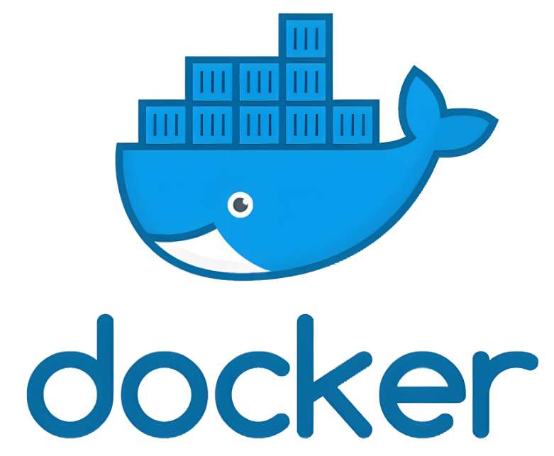

1. Docker是一个开源的应用容器引擎。
2. 2013年出现，Go语言实现的，所属公司 `Docker Inc`
3. Docker 可以帮助我们将`**应用以及依赖**`打包到一个**轻量级、可移植的容器**中，然后发布到任何流行的Linux机器上。
4. 容器采用沙箱机制，容器与容器之间相互隔离。（**把10个不同版本的JDK，每个都创建一个docker容器。对宿主机无污染。并且他们之间互不干扰。 Docker 容器和宿主机是隔离的，在 docker 中通过创建容器的方式安装软件，不会向宿主机上写入任何注册表。**）
5. 容器启动极快，开销极低。
6. Docker从17.03版本后分为CE版（社区版）和EE版（企业版）。

## 安装Docker

**第一步：关闭 SELINUX 服务**

类似于 windows 系统中安装的 360 安全卫士。建议大家关闭。

找到 `/etc/sysconfig/selinux`文件，把其中的 `SELINUX`设置为 `disabled`，保存文件重启 CentOS。【在 MobaX 上 **reboot 重启后，过半分钟左右等待系统重启成功，按 ctrl + R 重新进入**】

**第二步：更新 yum**

建议更新 yum 库

```bash
yum update -y
```

**第三步：****添加 Docker 官方仓库**

```bash
yum install -y yum-utils
yum-config-manager --add-repo https://download.docker.com/linux/centos/docker-ce.repo
```

**第四步：安装 Docker CE（社区版）**

```bash
yum install -y docker-ce docker-ce-cli containerd.io
```

如果网络不太行，安装过程中报错的话，再重新执行`yum install -y docker-ce`进行重新安装。

安装成功后，可以查看docker的版本，如下：`docker -v`

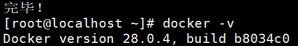

# Docker的架构


## 官方架构图

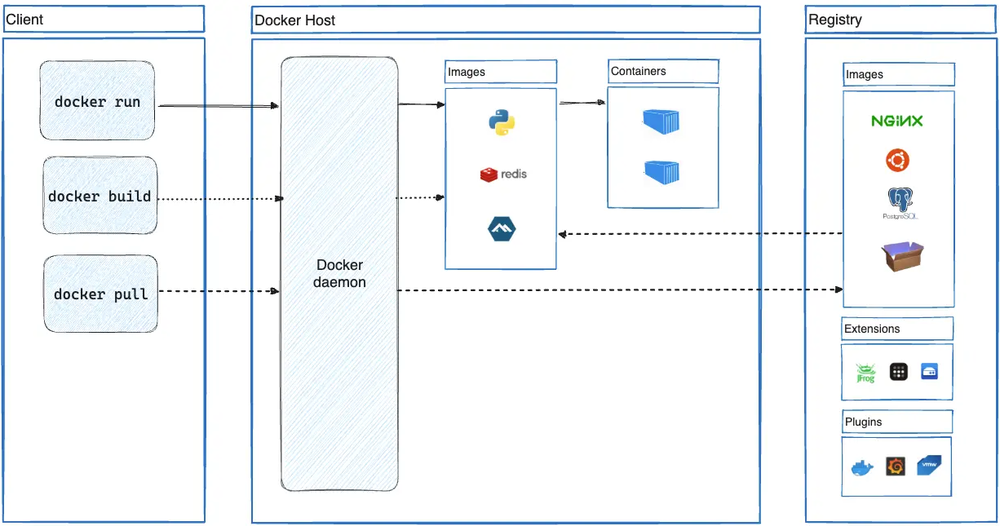

1. Docker 的架构主要由 Client（客户端）、Docker Host（Docker 主机）、Registry（镜像仓库） 三大核心部分组成，而 Image（镜像） 和 Container（容器） 是 Docker 的核心概念。
2. Client（客户端）：用户与 Docker 交互的接口（命令行或 GUI）。
3. Docker Host（Docker主机）：运行容器的核心环境。
4. Docker Daemon（守护进程 dockerd）：常驻后台的服务，负责实际执行 Client 发来的命令（如拉取镜像、创建容器）。管理 Docker 对象（镜像、容器、网络、存储卷等）
5. Image（镜像）：一个只读模板，包含运行应用所需的代码、依赖、配置。可以看做Java中的类。
6. Container（容器）：镜像的运行实例。可以看做Java中的对象。
7. Registry（镜像仓库）：存储和分发镜像的服务器/仓库（如 **Docker Hub**）。
  1. 公共仓库：如 Docker Hub（默认仓库），包含官方镜像（如 nginx、ubuntu）。
  2. 私有仓库：如企业自建的 Harbor、AWS ECR 等。

## 完整交互流程示例

**第一步**：用户输入命令：

```shell
docker run -d nginx
```

**第二步**：Client 发送请求：客户端将命令发送给 Docker Host 的 `<font style="color:rgb(64, 64, 64);">dockerd</font>`。

**第三步**：Docker Daemon 处理：

- 检查本地是否有 `<font style="color:rgb(64, 64, 64);">nginx</font>` 镜像，若无则从 Registry（Docker Hub） 拉取。
- 基于镜像创建容器，分配隔离的文件系统、网络和进程空间。

**第四步**：运行容器：启动容器内的 `<font style="color:rgb(64, 64, 64);">nginx</font>` 进程，对外提供服务。

# 配置Docker镜像加速器


Docker默认从`Docker Hub`仓库上下载镜像，由于`Docker Hub`在国外，因此拉取镜像的速度较慢。怎么办？可以配置国内的镜像加速器。

## 国内有哪些镜像加速器

| **镜像加速器** | **地址** | **备注** |
| --- | --- | --- |
| **阿里云** | `https://<你的ID>.mirror.aliyuncs.com` | 需免费注册阿里云账号，分配专属加速地址。 |
| **腾讯云** | `https://mirror.ccs.tencentyun.com` | 腾讯云用户可直接使用，无需额外配置。 |
| **华为云** | `https://<你的ID>.swr.cn` | 需在华为云控制台获取专属地址。 |
| **网易云** | `https://hub-mirror.c.163.com` | 公开可用，无需登录。 |
| **中科大USTC** | `https://docker.mirrors.ustc.edu.cn` | 中国科学技术大学开源镜像站，稳定免费。 |
| **DaoCloud** | `https://f1361db2.m.daocloud.io` | 需注册 DaoCloud 账号获取专属地址（旧版已停用，需更新）。 |
| **Azure 中国** | `https://dockerhub.azk8s.cn` | 微软 Azure 中国区镜像，适合 Azure 用户。 |

因政策原因，以上的镜像加速器基本无法使用。

## 配置国内的镜像加速器

```shell
sudo mkdir -p /etc/docker

sudo tee /etc/docker/daemon.json <<-'EOF'
{
  "registry-mirrors": [
      "https://docker.1ms.run",
      "https://docker-0.unsee.tech",
      "https://docker.m.daocloud.io",
      "https://ccr.ccs.tencentyun.com",
      "https://hub.xdark.top",
      "https://dhub.kubesre.xyz",
      "https://docker.kejilion.pro",
      "https://docker.xuanyuan.me",
      "https://docker.hlmirror.com",
      "https://run-docker.cn",
      "https://docker.sunzishaokao.com",
      "https://image.cloudlayer.icu",
      "https://docker.tbedu.top",
      "https://hub.crdz.gq",
      "https://docker.melikeme.cn",
      "https://1thbhxhq.mirror.aliyuncs.com",
      "https://5tqw56kt.mirror.aliyuncs.com",
      "https://docker.hpcloud.cloud",
      "http://mirror.azure.cn",
      "https://docker.1panel.live",
      "https://docker.ckyl.me",
      "https://hub.rat.dev",
      "http://mirrors.ustc.edu.cn",
      "https://docker.chenby.cn",
      "https://docker.m.daocloud.io",
      "https://docker.m.daocloud.io",
      "https://noohub.ru",
      "https://huecker.io",
      "https://dockerhub.timeweb.cloud",
      "https://0c105db5188026850f80c001def654a0.mirror.swr.myhuaweicloud.com",
      "https://5tqw56kt.mirror.aliyuncs.com",
      "https://docker.1panel.live",
      "http://mirrors.ustc.edu.cn/",
      "http://mirror.azure.cn/",
      "https://hub.rat.dev/",
      "https://docker.ckyl.me/",
      "https://docker.chenby.cn",
      "https://docker.hpcloud.cloud",
      "https://docker.m.daocloud.io"
  ]
}
EOF
```

```shell
sudo systemctl daemon-reload
sudo systemctl restart docker
```

执行以上命令来完成镜像加速器的配置。（**作用：加速从 Docker Hub 上拉取**）

目前来说这 **几个地址是可用的**。不可用的话，大家可以自行从网络上查找可用的镜像加速器。

# Docker命令


## Docker daemon相关命令

### 启动Docker服务

```shell
systemctl start docker
```

### 停止Docker服务

**两个服务都需要停止才能完全关闭**

```shell
systemctl stop docker.service docker.socket
```

### 重启Docker服务

```shell
systemctl restart docker
```

### 查看Docker服务状态

```shell
systemctl status docker
```

### 开机启动Docker服务

```shell
systemctl enable docker
```

## 镜像相关的常用命令

### 查看本地有哪些镜像

```shell
docker images
```

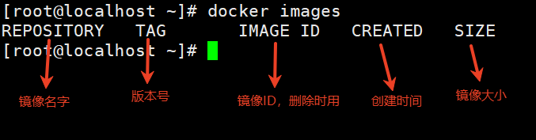

### 搜索远程仓库中的镜像

```shell
docker search redis
```

但因目前国内镜像加速器的原因，该命令使用时显示连接被拒绝。

### 从远程仓库拉取镜像

拉取最新版本：latest

```shell
docker pull redis
```

拉取指定版本：

```shell
docker pull redis:5.0
```

怎么查看支持的镜像源的版本号：以前可以通过 [http://hub.docker.com](http://hub.docker.com) 来查看镜像的版本号，但是因为政策问题，现在看不了，要想看只能梯子。

我们课堂上暂时下载这几个版本的镜像：

- `mysql:8.0.24`
- `redis:7.4.2`
- `tomcat:latest`
- `centos:latest`

### 将镜像保存到本地（镜像备份）

```shell
docker save -o redis_7.4.2.tar redis:7.4.2
```

### 将本地镜像导入到 docker 环境

```shell
docker load < redis_7.4.2.tar
```

### 删除本地镜像

**第一种删除方式：**

```shell
docker rmi 镜像id
```

**第二种删除方式：**

```shell
docker rmi redis:latest
```

**全部删除：添加反向单引号的作用是，反向单引号中的命令先执行，将执行结果交给外面的命令。**

```shell
docker rmi `docker images -q`

# 只获取所有镜像的id（q参数是quiet，表示安静模式，只获取镜像）
docker images -q
```

## 容器相关命令

容器就是`**镜像这些物理文件**`运行出来的实例。本节内容主要讲解怎么通过镜像创建容器，并且操作这些容器。

### 查看容器

查看正在运行的容器：

```shell
docker ps
```

查看所有的容器，包括历史已关闭的容器：

```shell
docker ps -a
```

### 创建容器第一种方式`docker run -it`

```shell
docker run -i -t --name=c1 centos:latest /bin/bash
```

这个命令用于创建并启动一个新的Docker容器。这个Docker容器是基于`centos:latest`镜像创建的。

**各部分解释：**

1. `docker run`：Docker的核心命令，用来创建并启动一个新的容器。
2. `-i`：允许你和容器内的进程进行交互。
3. `-t`：为容器分配一个终端，这样才能交互（**-it** 通常联合使用）。
4. `--name=c1`：给容器起个名字。
5. `centos:latest`：创建容器时使用的镜像。
6. `/bin/bash`：容器启动后在终端上运行的命令。

以上这种方式完成了：**创建容器、启动容器、进入容器**。

这种方式创建出来的容器，一般称为**交互式容器**。

**注意：这种方式当执行**`**<font style="color:#DF2A3F;">exit</font>**`**命令时，容器会关闭！**

### 创建容器第二种方式`docker run -id`

```shell
docker run -i -d --name=c2 centos:latest
```

这个命令和上面命令的区别是：`-it`变成了`-id`，另外最后没有了`/bin/bash`

1. `-d`：让容器在后台运行，不阻塞当前终端。
2. 没有了`/bin/bash`：没有打开终端，自然不需要在终端上运行命令。

以上这种方式完成了：**创建容器、启动容器在后台运行、不会进入容器**。

这种方式创建出来的容器，一般称为：**守护式容器**。

### 进入容器

```shell
docker exec -it c2 /bin/bash
```

`docker exec`: Docker子命令，用于进入容器。

**注意：这种方式当执行**`**<font style="color:#DF2A3F;">exit</font>**`**命令时，****只会结束当前的exec会话，不会停止容器**。

### 启动、停止、删除、查看容器

1. 启动容器：

```shell
docker start 容器id或者容器名字

# 重启容器
docker restart 容器id或者容器名字
```

1. 停止容器：

```shell
docker stop 容器id或者容器名字
```

1. 删除指定容器：

```shell
docker rm 容器id或者容器名字
```

注意：不能删除一个正在运行的容器

1. 获取所有容器id：

```shell
docker ps -aq
```

1. 删除所有容器：

```shell
docker rm `docker ps -aq`
```

1. 查看容器的信息：

```shell
docker inspect 容器id或者容器名称
```

# Docker容器的数据卷


数据卷可以理解为：一个文件或者一个目录。

## 数据卷的概念和作用

**思考：**

1. Docker容器删除后，在容器中产生的数据还在吗？
  1. 容器删除后，之前产生的数据都会被删除，那如果我想保留这个数据怎么办？
2. Docker容器和宿主机可以直接交换文件吗？
  1. **默认情况下，容器和宿主机之间不能直接交换文件**。容器有自己隔离的文件系统。那如果我想交换文件怎么办？
3. 容器和容器之间怎么进行数据的交换呢？

**以上的问题，使用数据卷可以解决：**

1. 什么是数据卷？
  1. 数据卷是宿主机中的一个目录或文件。
  2. 并不是宿主机中任何一个目录或文件都是数据卷，要成为数据卷需要进行一个`挂载`的操作。
  3. 所谓的挂载就是，在容器中也弄一个目录，然后`容器中的目录`和`宿主机的目录`产生联系。这样的话，容器中的目录和宿主机的目录就会实时同步。对方的修改会立即同步。
  4. 一个数据卷可以被多个容器同时挂载。这样容器和容器之间就可以进行数据交换了。
  5. 当然，一个容器也可以同时挂载多个数据卷。

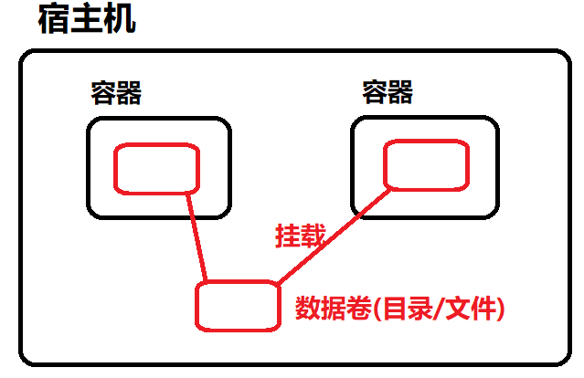

1. 数据卷的作用？
  1. 容器数据持久化。
  2. 外部机器和容器间的通信。
  3. 容器之间数据交换。

## 配置数据卷

创建启动容器时，使用 -v 参数 设置数据卷：

```shell
docker run -v 宿主机目录(文件):容器内目录(文件)
```

注意事项：

1. 目录必须是绝对路径。并且冒号两边不能有空格。
2. 如果目录不存在，会自动创建。
3. 可以挂载多个数据卷。（多个 -v 参数即可。）

演示挂载数据卷：

```shell
# 将宿主机 /root/data 挂载到 容器的 /root/docker_data 上，就像插U盘。
# 双向数据自动同步
docker run -it --name=c1 -v /root/data:/root/docker_data centos:latest /bin/bash
```

宿主机的`/root/data`目录挂载容器内的`root/docker_data`。这两个目录是同步的，修改其中任何一个，另一方都会自动同步。

需要验证一下：

1. 宿主机修改文件，容器内的文件是否也修改了。
2. 容器内的文件修改了，宿主机的文件是否也修改了。
3. 关闭容器，并且删除容器，查看宿主机中的文件是否还在。
4. 容器删除了，下次再创建一个新的容器，重新挂载还可以吗？

```shell
docker run -it --name=c1 -v /root/data:/root/docker_data centos:latest /bin/bash
```

经过测试，重新挂载后，数据又重新恢复了。

1. 验证下，一个容器是否可以挂载多个数据卷？

```shell
docker run -it --name=c2 -v /root/data2:/root/data2 -v /root/data3:/root/data3 centos:latest
```

通过测试可以看到，一个容器可以挂载多个数据卷。

1. 验证下，两个容器是否可以共享同一个数据卷

```shell
# 创建容器c3
docker run -it --name=c3 -v ~/data:/root/data centos:latest /bin/bash
# 创建容器c4
docker run -it --name=c4 -v ~/data:/root/data centos:latest /bin/bash
```

通过验证，两个容器可以挂载同一个数据卷。

## 配置数据卷容器

如果多个容器共享同一个数据卷，需要为每个容器单独声明挂载，比较麻烦，docker中又推出了`数据卷容器`来解决这个问题。

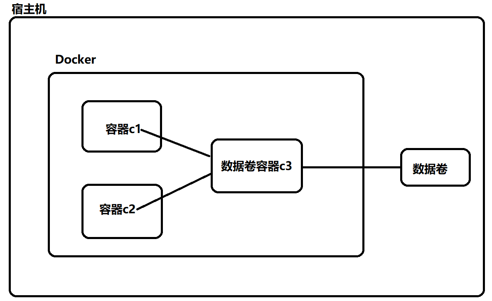

实现方式：可以创建一个数据卷容器`c3`，让其它容器继承`c3`容器即可。

创建`数据卷容器c3`

```shell
docker run -it --name=c3 -v /volume centos:latest
```

注意事项：

1. `/volume` 目录名随意，比如`/aaa`
2. `/volume`目录是容器内的目录，不是宿主机上的目录。

那么这个`/volume`目录对应的宿主机上的数据卷目录是哪个呢？宿主机上会自动生成数据卷目录。可以使用`docker inspect c3`命令进行查看：

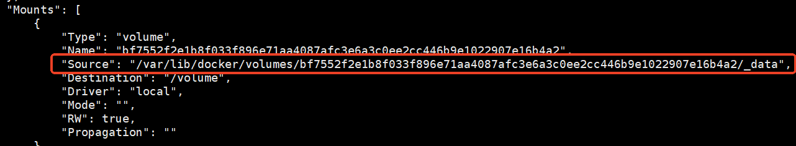

创建`容器c1`继承`数据卷容器c3`：

```shell
docker run -it --name=c1 --volumes-from c3 centos:latest
```

创建`容器c2`继承`数据卷容器c3`：

```shell
docker run -it --name=c2 --volumes-from c3 centos:latest
```

需要验证一下：

1. 修改c1、c2、c3容器，或者修改宿主机上的数据卷，都会同步。
2. 删除`数据卷容器c3`，容器c1和容器c2不受影响，数据卷也不受影响。

**注意：任何一个容器，只要该容器上挂载了数据卷，我们都可以称其为**`**<font style="color:#DF2A3F;">数据卷容器</font>**`**，只要是**`**<font style="color:#DF2A3F;">数据卷容器</font>**`**都可以被继承。**

# Docker的应用部署


## 创建一个自定义的 Docker 网络

创建一个**自定义的Docker网络**，并为该网络指定了IP地址范围。bridge类型。

18 表示**子网掩码的位数。**

```shell
docker network create --subnet=172.16.0.0/18 dajiankang
```

主要是为了将来创建容器时，给每个容器固定 IP，这样容器和容器之间就可以正常通信了。

该网络是 Docker 内部的虚拟网络，和宿主机系统完全隔离。

## MySQL部署

### 拉取MySQL镜像

```shell
docker pull mysql:8.0.24
```

### 创建容器、端口映射、目录映射

在/root目录下新建mysql目录用于存储mysql数据信息

```shell
mkdir ~/mysql
cd ~/mysql
```

**创建容器、端口映射、目录映射**

```shell
docker run -id \
-p 12001:3306 \
--name=c_mysql \
--restart=unless-stopped \
--net dajiankang --ip 172.16.0.100 \
-v $(pwd)/conf:/etc/mysql/conf.d \
-v $(pwd)/logs:/logs \
-v $(pwd)/data:/var/lib/mysql \
-e MYSQL_ROOT_PASSWORD=123456 \
mysql:8.0.24
```

为什么要端口映射？因为容器有自己隔离的网络空间，外部默认无法直接访问容器内部服务，端口映射就像在容器的隔离墙上开了一个"窗口"，让外部流量能够进入容器。

以上端口映射表示：**将容器内部的3306端口映射到宿主机的12001端口，这样外部可以通过访问宿主机的12001端口来访问容器内的MySQL服务。**

**访问宿主机12001端口 = 访问容器内3306端口的MySQL服务**

`**<font style="color:rgb(15, 17, 21);">$(pwd)</font>**`**是干啥的：获取并展开当前工作目录的绝对路径，这个不是必须的，不使用它，docker 容器也可以创建。**

`**<font style="color:rgb(15, 17, 21);">--restart=unless-stopped</font>**`** 表示下次 docker 服务启动后 mysql 容器自动重启。**

`**<font style="color:rgb(15, 17, 21);">-e</font>**`**参数是指定 docker 容器的环境变量。要知道每个 docker 容器支持哪些环境变量，可以访问**[**https://hub.docker.com/_/mysql**](https://hub.docker.com/_/mysql)** (需要梯子)，**在文档的 "Environment Variables" 部分查看完整列表。

进入mysql容器：

```shell
docker exec -it c_mysql /bin/bash
```

进入之后，就可以使用`mysql -uroot -p123456`来登录mysql了。

另外，使用`navicat for mysql`这类的工具也是可以连接mysql数据了，注意事项如下：

1. IP地址填写宿主机的IP地址。
2. 端口号填写映射的端口号 12001。

## Tomcat部署

### 拉取镜像

```shell
docker pull tomcat:latest
```

### 创建容器、映射端口、目录映射

在/root目录下新建tomcat目录，用于存储项目

```shell
mkdir -p ~/tomcat/webapps ~/tomcat/logs ~/tomcat/conf
cd ~/tomcat
```

创建并启动tomcat容器：

```shell
docker run -id  \
  --name=c_tomcat \
  --restart=unless-stopped \
  --net dajiankang --ip 172.16.0.101 \
  -p 28080:8080 \
  -v ~/tomcat/webapps:/usr/local/tomcat/webapps \
  -v ~/tomcat/logs:/usr/local/tomcat/logs \
  -e TZ=Asia/Shanghai \
  tomcat:latest
```

在外部机器上打开浏览器访问：`http://192.168.52.128:8080`

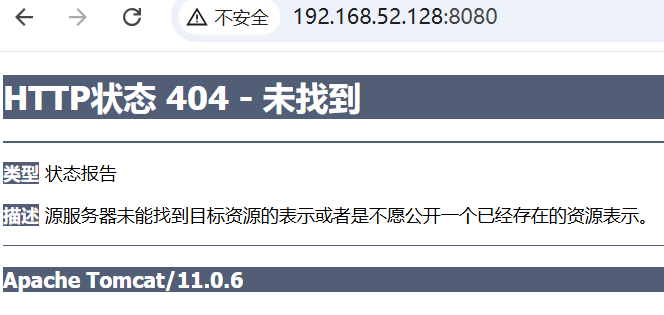

错误是因为现在没有项目，在宿主机的tomcat目录下直接创建`myweb`项目，在项目中提供`index.html`页面，再次访问：

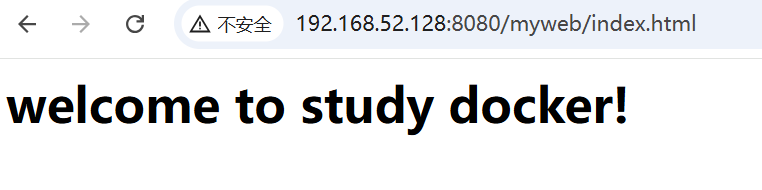

## Redis部署

**第一步：下载镜像**

```bash
docker pull redis:7.4.2
```

**第二步：在 **`**/root/redis/conf**`**目录下编写 **`**redis.conf**`

```nginx
bind 0.0.0.0
protected-mode yes
port 6379
tcp-backlog 1024
timeout 0
tcp-keepalive 0
maxclients 10000
requirepass 123456
rename-command CONFIG ""
rename-command FLUSHDB ""
rename-command FLUSHALL ""
loglevel notice
logfile "/var/log/redis/redis-server.log"
slowlog-log-slower-than 10000
slowlog-max-len 128
databases 5
save 900 1
save 300 100
save 60 10000
stop-writes-on-bgsave-error yes
rdbcompression yes
rdbchecksum yes
dbfilename dump.rdb
dir /var/lib/redis
appendonly yes
appendfsync everysec
aof-rewrite-incremental-fsync yes
aof-use-rdb-preamble yes
maxmemory 1gb
maxmemory-policy allkeys-lru
```

**第三步：创建日志目录，并授权**

```bash
mkdir /root/redis/logs
mkdir /root/redis/data

chmod -R 777 /root/redis/logs
chmod -R 777 /root/redis/data
```

---

**第四步：创建并启动容器**

```bash
docker run -id --name redis \
-p 26379:6379 \
--restart unless-stopped \
--net dajiankang --ip 172.16.0.102 -m 400m \
-v /root/redis/conf:/usr/local/etc/redis \
-v /root/redis/data:/var/lib/redis \
-v /root/redis/logs:/var/log/redis \
-e TZ=Asia/Shanghai \
redis:7.4.2 \
redis-server /usr/local/etc/redis/redis.conf
```

`-v /root/redis/conf:/usr/local/etc/redis`：挂载配置文件目录。

`-v /root/redis/data:/var/lib/redis`：挂载数据目录。

`-v /root/redis/logs:/var/log/redis`：挂载日志目录。

### 进入Docker Redis容器中

```shell
docker exec -it redis redis-cli
```

### 怎么查看 docker 容器的启动日志

```shell
docker logs 容器名字或者容器id
```

### 执行测试

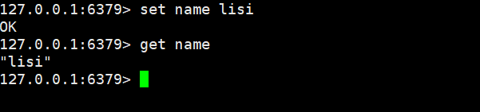

# Dockerfile


## Docker镜像原理

思考：

1. Docker镜像本质是什么？由特殊的文件系统叠加而成。是一个分层的文件系统。
2. Docker中一个centos镜像为什么只有230MB，而一个centos操作系统的iso文件要12GB？
3. Tomcat服务器的安装包大小为14MB，为什么Tomcat镜像475MB？

对于`Linux文件系统`我们来详细看一下：

1. Linux文件系统由bootfs和rootfs两部分组成。
  1. bootfs包括bootloader（引导加载程序）和kernel（内核）
  2. rootfs其实就是root文件系统，包括：/etc、/dev、/bin等目录和文件
  3. 不同的发行版的Linux操作系统，例如：centos、ubuntu。**bootfs基本一样，rootfs不同**。


Docker镜像原理：Docker镜像是由**特殊**的文件系统**叠加**而成。怎么叠加的？

1. 最底端是bootfs，而且bootfs使用的是宿主机的。**因此Docker CentOS容器安装快，启动也快**。
  1. 为什么安装快？因为不需要安装bootfs，只需要初始化rootfs即可。
  2. 为什么启动快？因为bootfs使用了宿主机的，宿主机的bootfs本身就是处于启动状态的，根本不用启动。
  3. 为什么Docker CentOS镜像体积小？因为该镜像中不包括bootfs，只有rootfs。因此体积小。
2. 第二层是root文件系统rootfs，称为base image（**基础镜像**）。
3. 再往上可以叠加其他的镜像文件，例如：jdk镜像、tomcat镜像。

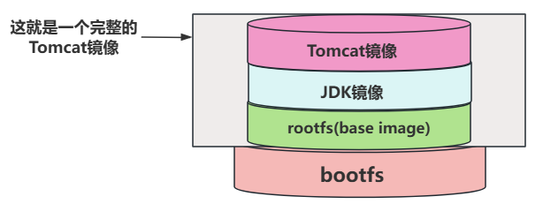

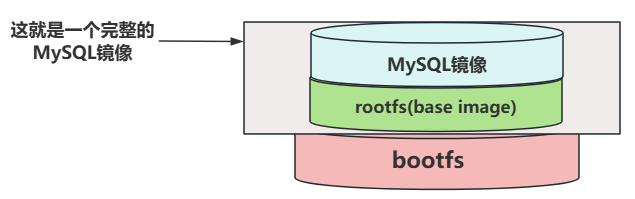

以上这种`**文件系统技术**`称为`**统一文件系统（Union File System）**`，它能够将不同的层整合成一个文件系统，为这些层提供了一个统一的视角，站在用户的角度来看，底层是隐藏的，只存在一个文件系统，例如我们只看到了一个Tomcat镜像，实际上一个Tomcat镜像底层是由 rootfs基础镜像、JDK镜像、Tomcat镜像 叠加而成的。因此Tomcat镜像为什么比Tomcat安装包要大很多，这就可以解释了。

**思考：文件系统为什么要采用分层的方式？复用。**

另外，怎么验证docker镜像是一个分层的文件系统呢？两种方式：

1. 第一种方式：`docker pull tomcat` 的时候可以看看镜像的拉取过程。

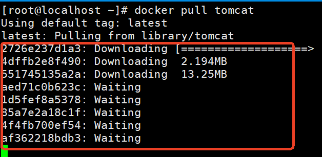

1. 第二种方式：`docker inspect tomcat:latest`命令查看镜像的详细信息。

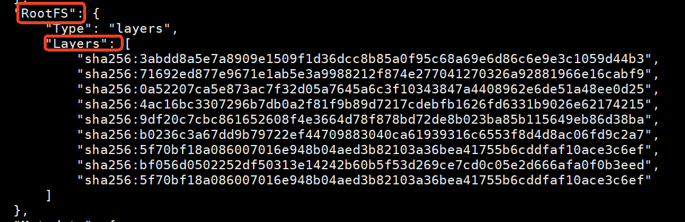

**注意，镜像是只读的，不可修改的，那如果需要修改镜像，我们应该怎么做呢？也是有办法的，可以通过镜像创建容器，然后对容器进行修改，再将容器制作成新的镜像。这样就等同于达到了修改镜像的效果。但直接修改镜像是不允许的。**

Docker镜像的制作通常包含两种方式：

1. 第一种方式：将容器转换为镜像。
2. 第二种方式：使用Dockerfile制作镜像。

## 容器转换为镜像

这种需求在开发中也是很常见的，比如我们在`Tomcat容器`中部署了web项目，我们可以将这时的`Tomcat容器`转换为`新的Tomcat镜像`，把这个`新的Tomcat镜像`发送给测试人员，测试人员可以直接将`新的Tomcat镜像`创建为容器，直接开始测试即可。

容器转换为镜像的命令如下：

```shell
docker commit 容器id 镜像名称:版本号
```

另外，镜像是无法直接传输的，需要将镜像制作为压缩文件。命令如下：

```shell
docker save -o 压缩文件名称 镜像名称:版本号
```

另外`压缩之后的镜像文件`，怎么释放压缩生成另一个镜像。命令如下：

```shell
docker load -i 压缩文件名称
```

**注意：容器中挂载的数据卷对应的目录中的数据不能被压缩，其他的可以压缩。**

**我们来演示一下这个过程：**

**第一步**：进入Tomcat容器，随便创建一个文件，用来演示这个文件会不会被压缩。我们这个Tomcat容器webapps目录下的`myweb/index.html`有对应的数据卷，也可以测试一下。

```shell
docker exec -it c_tomcat /bin/bash
cd ~
echo "hello" > hello.txt
ls
```

**第二步**：将Tomcat容器`c_tomcat`制作为`新的镜像`

先查看容器id：

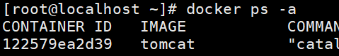

制作新镜像：

```shell
docker commit 122579ea2d39 test_tomcat:1.0
```

查看是否生成镜像：

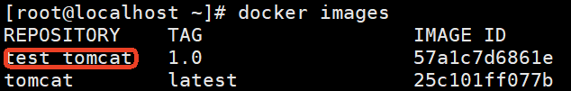

**第三步**：将新镜像制作为压缩包

```shell
docker save -o test_tomcat.tar.gz test_tomcat:1.0
```

**第四步**：将`新的镜像`解压

先删除之前的镜像：

```shell
docker rmi test_tomcat:1.0
```

再解压为镜像：

```shell
docker load -i test_tomcat.tar.gz
```

查看是否解压为新镜像：

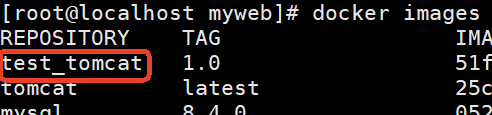

**第五步**：使用`新的镜像`创建容器

```shell
docker run -it --name=new_tomcat test_tomcat:1.0 /bin/bash
```

**第六步**：查看容器中有没有`hello.txt`文件，看看容器中webapps目录下有没有`myweb/index.html`

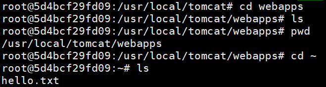

## 认识Dockerfile

1. Dockerfile是什么？它是一个做镜像的文件。是一个普通文本文件。
2. Dockerfile中包含了一条一条指令。
3. 基于基础镜像，每一条指令构建一层，最终构建出一个新的镜像。
4. 对于开发人员来说：可以为开发团队提供一个完全一致的开发环境。
5. 对于测试人员来说：可以直接拿开发时构建的镜像或通过Dockerfile文件构建一个新的镜像开始测试。
6. 对于运维人员：在部署时，可以实现应用的无缝移植。

Dockerfile怎么写？

1. 第一种方式：直接让deepseek写。
2. 第二种方式：参考官方的Dockerfile是怎么写的。
  1. 打开平台：[https://hub-stage.docker.com/](https://hub-stage.docker.com/)
  2. 搜索，例如：centos，tomcat等
  3. 点击`Dockerfile`，跳转到 github 进行查看。

## Dockerfile关键字

| **关键字** | **作用** | **描述** |
| --- | --- | --- |
| **FROM** | 指定父镜像 | 基于哪个镜像构建的 |
| MAINTAINER | 指定作者签名信息 |   |
| LABEL | 标签 | 可以用LABEL代替MAINTAINER，最终都可以在docker image基本信息中查看 |
| **RUN** | 容器创建过程中执行一段linux命令 | 支持格式：RUN 命令 或者 RUN ["命令", "参数1", "参数2"] |
| **CMD** | 容器启动时执行一段linux命令 | 也有两种写法 |
| ENTRYPOINT | 入口 | 一般在制作一些执行就关闭的容器中使用 |
| **COPY** | 添加本地文件到镜像 |   |
| **ADD** | 添加本地或远程文件到镜像 |   |
| ENV | 指定环境变量 |   |
| ARG | 指定在构建时使用的参数 |   |
| **VOLUME** | 定义外部可以挂载的数据卷 |   |
| **EXPOSE** | 暴露端口 | 定义容器运行的时候监听的端口 |
| **WORKDIR** | 指定工作目录 | 进入容器时停留的目录 |
| USER | 指定执行用户 | 在RUN CMD ENTRYPOINT执行时的用户 |
| HEALTHCHECK | 健康检查 |   |
| ONBUILD | 触发器 |   |
| STOPSIGNAL | 发送信号量到宿主机 |   |
| SHELL | 指定RUN CMD 执行命令时采用哪一种shell |   |

## 发布springboot项目

### 第一步：IDEA编写一个简单的springboot项目

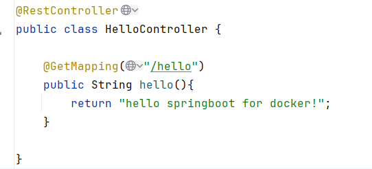

**将 springboot 项目打 jar 包：**

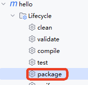

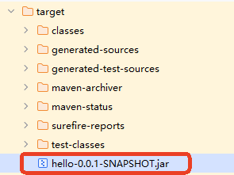

**将jar包拷贝到较浅的目录，执行jar包，测试项目是否可以正常访问：**

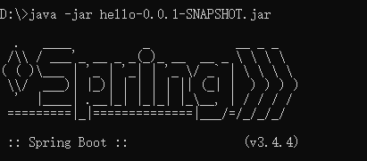

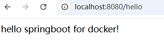

**最后将 jar 包上传到linux操作系统中，在主目录下随便创建一个目录，例如：**`**docker-files**`**，将jar包放到这个目录下吧：**

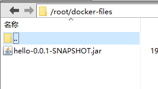

### 第二步：`docker-files`目录下编写`springboot_dockerfile`

创建`springboot_dockerfile`文件，编写如下内容：

```shell
FROM openjdk:21-jdk
MAINTAINER laodu <dujubin@126.com>
ADD hello-0.0.1-SNAPSHOT.jar app.jar
CMD java -jar app.jar
```

保存退出。

### 第三步：通过Dockerfile来构建镜像

先把 `openjdk:21-jdk`的镜像拉取下来，然后再执行下面的命令来构建镜像：

```shell
docker build -f ./springboot_dockerfile -t app:latest .
```

最后的这个点儿`.`表示：Docker 会将该目录下的所有文件发送给 Docker 引擎

`-t`是`tag`标签，打标签。

查看镜像：

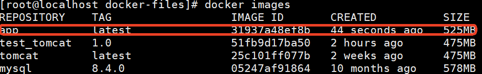

### 第四步：通过镜像创建容器，测试容器

```shell
docker run -id --name=app -p 8088:8080 app:latest
```

创建容器时，记得做端口映射。

打开浏览器访问：

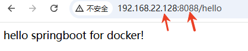

## 自定义centos镜像

默认的`centos:latest`镜像创建的容器，当进入容器时，自动进入到根目录下，如下图：

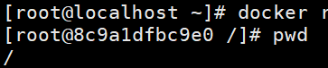

我希望我自定义的centos镜像，创建并启动容器后，自动进入到`/root`目录下。

另外，默认的`centos:latest`镜像创建的容器，无法使用`vim`，我希望我自定义的centos镜像可以使用`vim`。

在`docker-files`目录下新建`centos_dockerfile`，编写Dockerfile，内容如下：

```shell
FROM rockylinux:8
MAINTAINER laodu <dujubin@126.com>

RUN dnf install -y vim
WORKDIR /root

cmd /bin/bash
```

执行命令，构建镜像：

```shell
docker build -f ./centos_dockerfile -t laodu_centos:1.0 .
```

查看镜像是否生成成功：

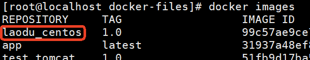

使用镜像创建容器：

```shell
docker run -it --name=ccc laodu_centos:1.0 /bin/bash
```

进入容器之后，查看目录是不是在`/root`这里，另外`vim`能不能用：

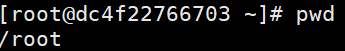

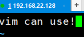

# Docker Compose

## 是什么？

**Docker Compose 是一个用 YAML 文件定义和运行多个 Docker 容器的工具。**

## 有什么用？

1. **一键启动多个容器** - 不用挨个运行 `docker run`
2. **管理容器关系** - 自动处理网络、依赖、启动顺序
3. **环境配置即代码** - 一个文件定义整个应用栈
4. **团队环境一致** - 新人直接运行，5分钟搭建开发环境

## 核心价值

**把复杂的多容器部署变成一条命令：**

```bash
docker-compose up -d    # 启动所有
docker-compose down     # 停止所有
```

**对比：**

- 没有 Compose：需要记住和运行一堆 `docker run` 命令
- 有 Compose：只需维护一个 YAML 文件，一键搞定

# Docker Compose 演示

## 准备工作

需要电脑安装 Docker 和 Docker Compose

安装 Docker Compose

```shell
# 1. 下载 Docker Compose 二进制文件
sudo curl -L "https://github.com/docker/compose/releases/latest/download/docker-compose-$(uname -s)-$(uname -m)" -o /usr/local/bin/docker-compose

# 2. 赋予执行权限
sudo chmod +x /usr/local/bin/docker-compose

# 3. 验证安装是否成功
docker-compose --version
```

## 演示步骤

### 创建演示文件夹

```bash
mkdir demo
cd demo
```

****创建一个新文件夹，所有操作都在这里面

### 创建 docker-compose.yml 文件

```bash
cat > docker-compose.yml << 'EOF'
services:
  web:
    image: nginx:latest
    ports:
      - "80:80"
  redis:
    image: redis:7.4.2
EOF
```

****创建核心配置文件，定义了：

- 两个服务：web（网站）、redis（缓存）
- web 用 nginx 镜像，把电脑的 80 端口映射到容器的 80 端口
- redis 用 redis 镜像

### 一键启动

```bash
docker-compose up -d
```

- `docker-compose`：调用编排工具
- `up`：启动服务
- `-d`：后台运行（不占用当前命令行）

### 查看运行状态

```bash
docker-compose ps
```

****查看两个容器是否正常运行

### 测试效果

```bash
# 测试网站（二选一）
curl http://localhost:80
# 或打开浏览器访问 http://localhost

# 测试 Redis
docker-compose exec redis redis-cli ping
# 应该返回 "PONG"
```

### 一键停止

```bash
docker-compose down
```

****停止并删除所有容器

## 核心概念一句话总结

**Docker Compose = 一个文件 + 一条命令，管理多个容器**

- **传统方式**：需要多个 `docker run` 命令
- **Compose方式**：一个 YAML 文件定义，一条命令启动全部