# 09、版本控制与协作（Git、GitHub）


# Git 是什么


Git 是一个**分布式版本控制系统**，用于**高效管理项目代码的版本历史和团队协作**。

其实类似于 Git 的软件还有其他的，比如 SVN。不过 SVN 是集中式版本控制系统，Git 是分布式版本控制系统。

**集中式版本控制系统（CVCS）** 采用**客户端-服务器架构**，版本历史集中存储在单一服务器仓库中。客户端仅持有文件的当前快照，绝大部分操作（如提交历史、对比差异）都需要网络连接与中央服务器进行交互。其核心特征是**单点数据存储和单点工作依赖**。

**分布式版本控制系统（DVCS）** 采用**对等网络架构**，每个客户端都拥有包括完整版本历史在内的仓库完整镜像。因此，绝大多数操作（如提交、分支、合并）都可在本地完成，无需网络连接。客户端之间通过交换更改集（changeset）来同步，其核心特征是**数据完全冗余和操作去中心化**。

我们用一个具体的场景来说明没有Git时的“文件覆盖”灾难：

想象一下，你和同事小王共同开发一个Java网站项目，只有一个共享文件夹（比如网盘或公司服务器上的一个目录）。

1. **周一上午**：你下载了最新的 `UserController.java` 文件，开始开发“用户登录”功能。
2. **周一下午**：小王也下载了同一个 `UserController.java` 文件，但他不知道你在修改，他开始开发“用户注册”功能。
3. **周二**：你先完成了“登录”功能，于是你将你的 `UserController.java` 文件**上传并覆盖**到了共享文件夹。
4. **周三**：小王也完成了“注册”功能，他也将他的 `UserController.java` 文件**上传并覆盖**到了共享文件夹。
5. **结果**：**你的“登录”代码被彻底覆盖、永久丢失了**。服务器上只剩下小王的“注册”代码。你们两人一天的劳动成果直接冲突，并损失了一半。

**这就是没有版本控制时最经典的“最后保存者获胜”问题，全靠人工记忆和沟通，极易出错且责任难究。**

**有了Git之后，这个场景会完全不同：**

1. 你和小王会从远程仓库 `git clone`（克隆）项目，各自在**本地**拥有完整仓库和历史。
2. 你们会基于主分支创建**各自的功能分支**（`git checkout -b feature/login`），在独立分支上开发，互不干扰。
3. 你先完成，你可以 `git push` 到远程你的分支，然后在GitLab/GitHub上发起**合并请求（Pull Request）**。
4. 这时，系统或同事会**清晰地看到你修改了哪些代码行**。小王在完成他的“注册”功能后推送时，如果修改了同一文件的相邻位置，Git可能会**自动合并**；如果修改了同一行，Git会**立即标记冲突**，要求你们**协商解决**（选择保留谁的，或整合两者），而不是粗暴覆盖。
5. **最终**，所有更改被有序合并，所有人的工作成果都得以保留，历史记录完整可查。

**总结**：没有Git，协作像在“一张所有人在同一时间涂改的纸上写字”，必然覆盖混乱；有了Git，协作像“每个人在各自的透明胶片上书写，最后可以精准叠加成完整画面”。**Git通过分支隔离和自动合并，从根本上解决了文件覆盖问题，让多人协作变得可控、可追溯。**

# Git 安装


## Git 下载与安装

**下载地址：**[**https://git-scm.com/**](https://git-scm.com/)

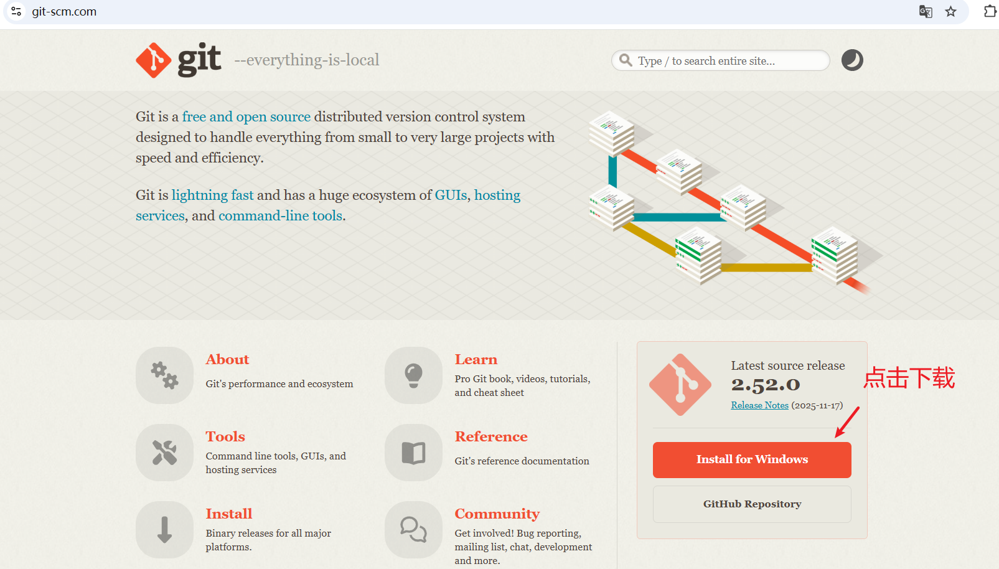

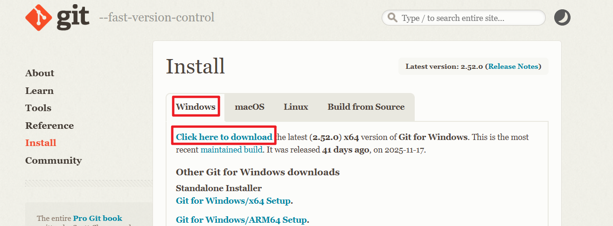


**安装没什么可说，按照默认安装即可，一直下一步即可。**

---

**测试是否安装成功，如果安装成功了，鼠标右键时如下图：**

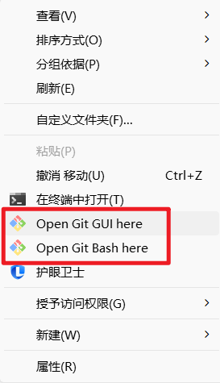

1. `**<font style="color:rgb(15, 17, 21);background-color:rgb(235, 238, 242);">Open Git GUI here</font>**`：打开**图形化 Git 操作界面**（老旧工具，不推荐用）。
2. `**<font style="color:rgb(15, 17, 21);background-color:rgb(235, 238, 242);">Open Git Bash here</font>**`：打开**Git 命令行窗口**（在此文件夹位置执行 Git 命令）。

## GUI Clients 下载与安装

GUI Clients 就是 Git 的图形界面客户端。（**我们这里选择使用 **`**GitHub Desktop**`）

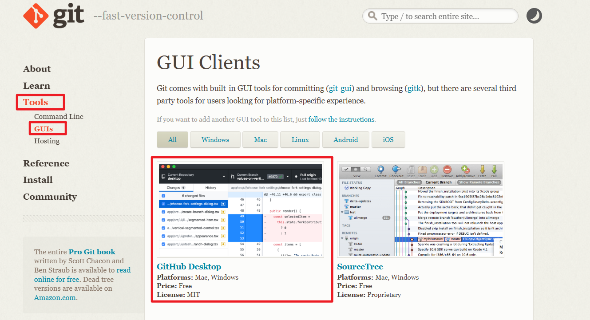


**安装的话没啥可说的，双击直接就打开了。**

# GitHub Desktop 操作


## 进入 GitHub Desktop

打开后，你会看到：

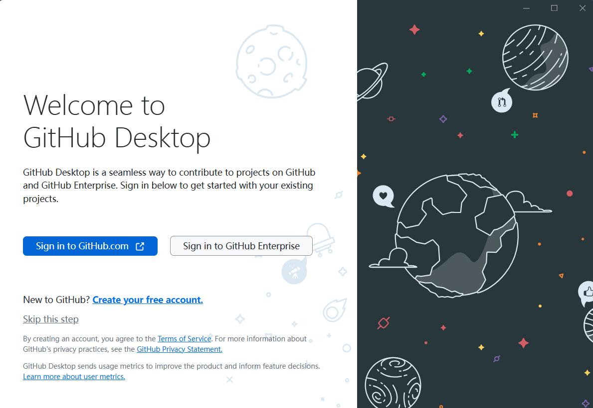

1. **Sign in to**** **[**GitHub.com**](https://github.com/)：登录到**公开的全球 GitHub 网站**（个人项目、开源代码都在这里）。
2. **Sign in to GitHub Enterprise**：登录到**公司/学校自建的私有 GitHub**（内部代码，不对外公开）。
3. `<font style="color:rgb(15, 17, 21);">New to Github？Create your free account</font>`：这是 **GitHub 的注册入口**，如果你还没有 GitHub 账号，点这里就能免费创建一个。
4. `<font style="color:rgb(15, 17, 21);">Skip this step</font>`：**“先跳过登录，直接进入软件”**（以后需要 GitHub 时再登录）。【**我们这里选择先跳过这一步，后面再说 GitHub。**】

**点击跳过之后，显示下面窗口：**

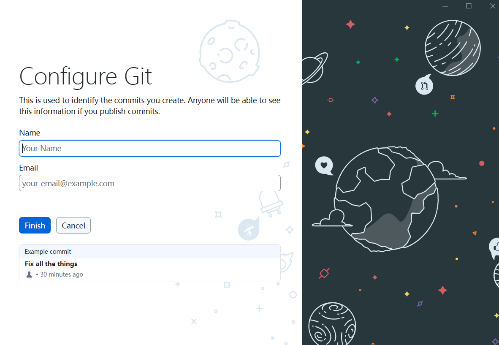

填写用户名和邮箱：**设置“代码作者身份”** 的步骤，你填的姓名和邮箱会永久记录在你提交的代码历史上。

**这是 Git 的要求，不是 GitHub 的要求**

- 每次你用 Git 提交代码，都必须附带**作者信息**（谁写的这段代码）。
- 这个信息会像“水印”一样打在每一次提交记录里，全球唯一。

**Name**：写你的**常用名**（英文或拼音）

**Email**：写你**常用邮箱**（最好与 GitHub 注册邮箱一致），**理论上是可以随便写，Git 在技术上不会验证你信息的真假。但最好不要。**

```plaintext
# 你提交代码后，别人查看历史时会看到：
Commit: 修复了登录bug
Author: zhangsan <zhangsan@email.com>
Date:   2023-10-01
```

**不填的后果**：Git 会拒绝你提交代码，提示“请设置 user.username 和 user.email”。

**当我们填写了名字和邮箱地址之后，跳转到这个页面：**

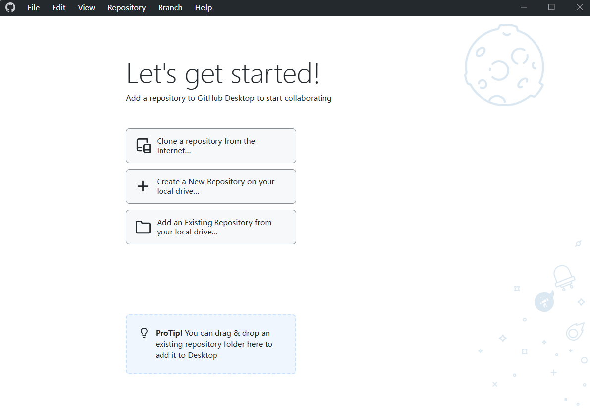

1. `**<font style="color:rgb(15, 17, 21);">Clone a repository..</font>**`**： 下载**别人（或你自己）在 GitHub 上已有的项目到本地电脑。
2. `<font style="color:rgb(15, 17, 21);">Create a New Repository..</font>`： 在本地电脑**新建一个空项目文件夹**，并设置为 Git 仓库（可随后上传到 GitHub）。
3. `<font style="color:rgb(15, 17, 21);">Add an Existing Repository..</font>`： 将本地电脑上**已有项目文件夹**（比如你之前写的代码）纳入 Git 管理/关联到 GitHub。

**总结这三个操作：本质上都是在本地电脑上创建 Git 仓库。一个是从外网下载的，一个是创建新的，一个是导入本地存在的。**

## GitHub Desktop 创建仓库

### 创建仓库

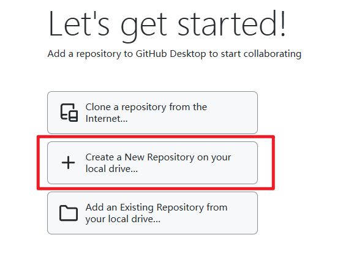

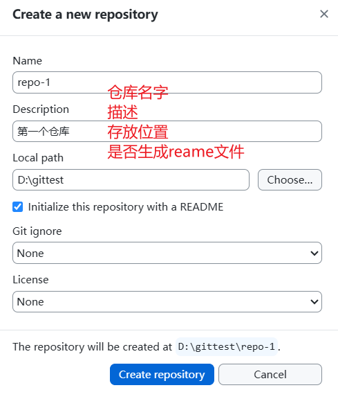

### 切换仓库

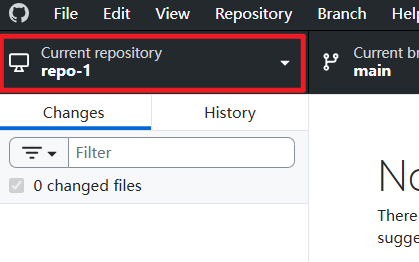

### 浏览本地仓库

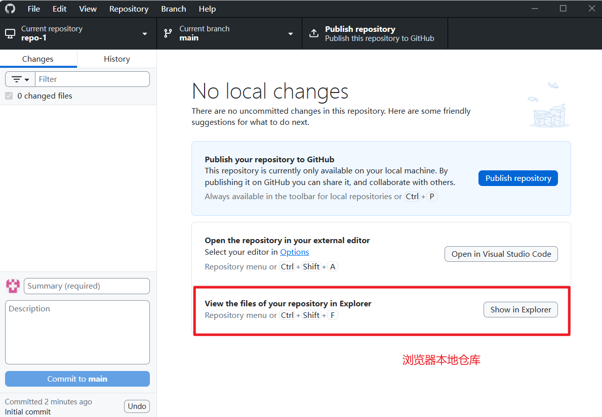

**仓库中的**`**<font style="color:rgb(15, 17, 21);">.git</font>**`**目录中的东西不要动：**

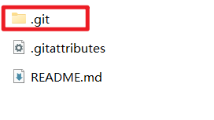

### 删除仓库

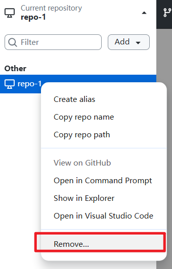

仅从 GitHub Desktop **左侧仓库列表**中删除，**不删除电脑里的实际文件**。

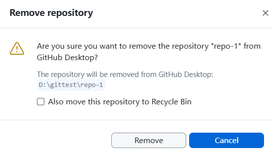

**不仅从列表移除，还会把整个项目文件夹扔进电脑回收站**（可清空彻底删除）。

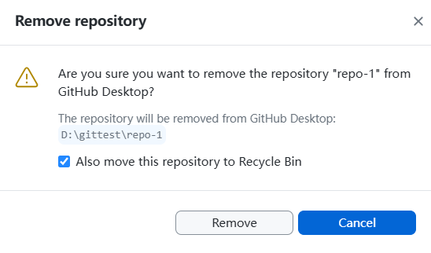

### 拖拽仓库

从列表中移除之后，将硬盘上的仓库目录直接拖拽到 GitHub Desktop 也是可以的：

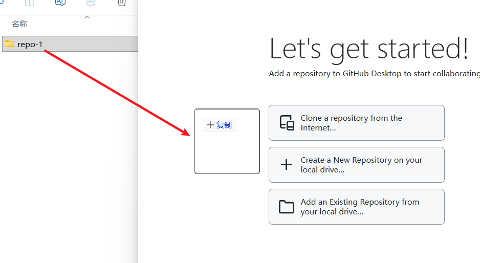

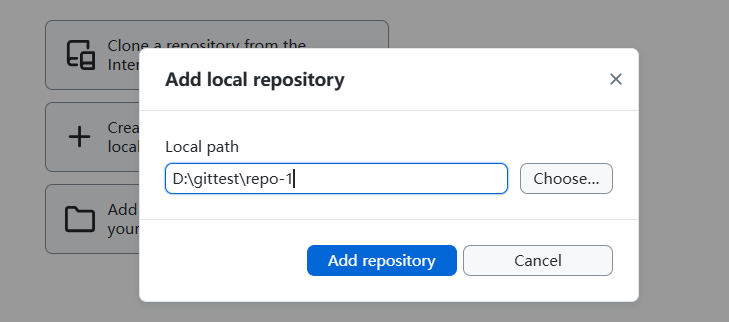

## Git 仓库中文件的操作

### 将文件添加到仓库

直接在仓库中创建的文件，并没有添加到 git 仓库中（**等于把物品放到了仓库，但是没有登记到物品清单上**）

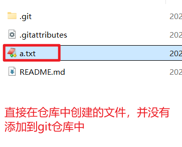

**但由于这个文件是创建在仓库目录下的，可以被 Git 客户端工具自动发现。**

**Git 客户端工具发现新物品但没有登记到清单，会有提示，如下图。**

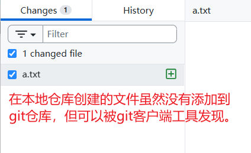

**注意：在仓库外面创建的文件，Git 客户端工具是不会发现的。**

**通过下面的方式可以将文件添加到 git 仓库：**

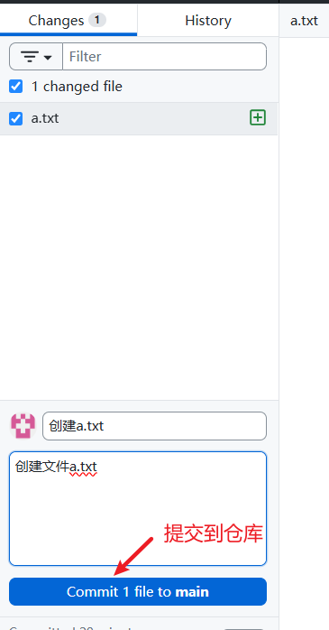

### 将文件添加到仓库的原理

文件添加到仓库有**三个关键角色（状态）:**

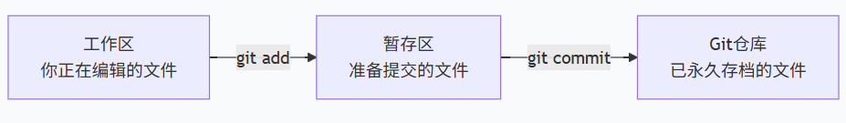

**工作区：工作区的位置是你的仓库文件夹里**。在工作区**编辑**文件**之后**，通过 `**<font style="color:rgb(15, 17, 21);">git add</font>**`命令将其放到**暂存区**。

**暂存区：**又叫做 Git 临时缓存区。在 GitHub Desktop 客户端软件中，文件左侧复选框打上对钩则表示执行 `<font style="color:rgb(15, 17, 21);">git add</font>`命令，此时文件就在暂存区中。

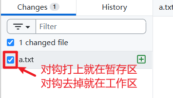

**Git 仓库：**`<font style="color:rgb(15, 17, 21);background-color:rgb(235, 238, 242);">.git</font>` 隐藏文件夹里的数据库。对暂存区的文件执行 `<font style="color:rgb(15, 17, 21);">git commit</font>`命令，文件将被永久存储在 Git 仓库中。

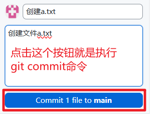

**当提交后，文件将被永久存储到 Git 仓库当中，并为该****提交操作**生成一个独一无二的哈希值：**也可以叫做提交 ID。或者也可以叫做**版本号**。**

**在下图位置可以看到它的版本号，版本号采用 40 个长度的十六进制表示。另外也可以看到操作的历史记录：**

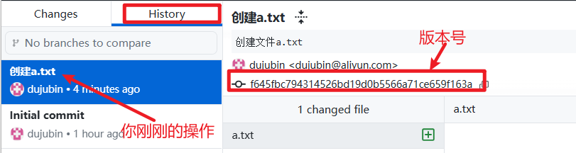

**这个版本号在 **`**.git**`**文件夹中也可以找到：**

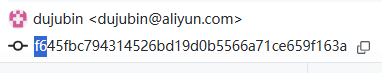

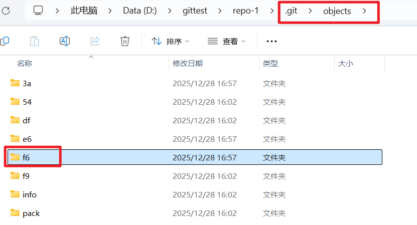

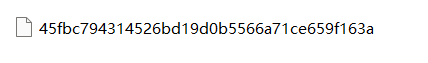

### Git 的存储原理

**具体原理：**

1. **每次提交**：Git 会为**每个文件**生成一个哈希值（**基于文件内容**）
2. **检查去重**：如果这个哈希值在 `<font style="color:rgb(15, 17, 21);background-color:rgb(235, 238, 242);">.git/objects</font>` 中**已存在**，就**不再存储新的副本**
3. **如果仓库中没有这个哈希值**：生成一个新文件，并且以新的哈希值命名。

**假设你有 **`**<font style="color:rgb(15, 17, 21);background-color:rgb(235, 238, 242);">User.java</font>**`** 文件：**

| **提交** | **文件内容** | **Git 操作** |
| --- | --- | --- |
| **第一次提交** | `<font style="color:rgb(15, 17, 21);background-color:rgb(235, 238, 242);">public class User { }</font>` | 存储内容，哈希为 `<font style="color:rgb(15, 17, 21);background-color:rgb(235, 238, 242);">abc123</font>` |
| **第二次提交** （未修改文件） | `<font style="color:rgb(15, 17, 21);background-color:rgb(235, 238, 242);">public class User { }</font>` | **发现 **`**<font style="color:rgb(15, 17, 21);background-color:rgb(235, 238, 242);">abc123</font>**`**已存在，不存储** |
| **第三次提交** （修改了文件） | `<font style="color:rgb(15, 17, 21);background-color:rgb(235, 238, 242);">public class User { private String name; }</font>` | 存储新内容，哈希为 `<font style="color:rgb(15, 17, 21);background-color:rgb(235, 238, 242);">def456</font>` |

**注意：新文件中保存了当下文件的全部内容，而不仅仅是存储修改那一部分。（不用担心空间问题，git 底层会自动压缩。）**

### 文件的修改

**修改工作区中的文件：**

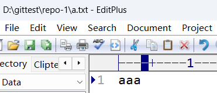

**观察 GitHub Desktop 工具：复选框自动选中，已经将文件加入到暂存区了。**

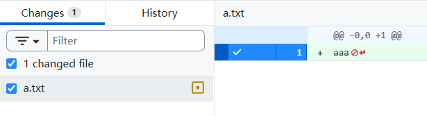

**然后再通过提交按钮，将其提交到 git 仓库：**

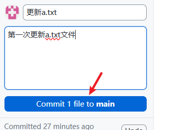

**可以再次查看操作历史记录，查看生成了新的提交 ID：**

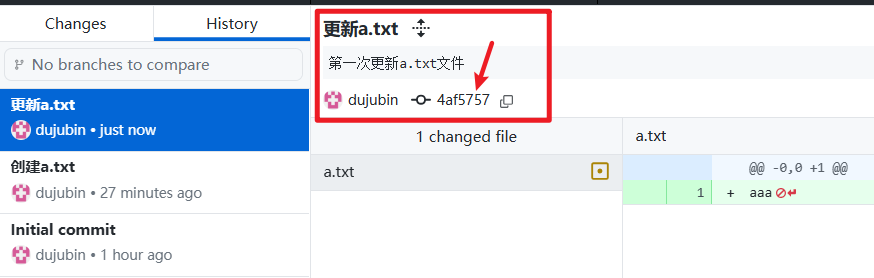

**可以再次通过这个提交 ID，从 **`**.git**`**仓库中看到一个新的文件：**

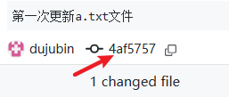

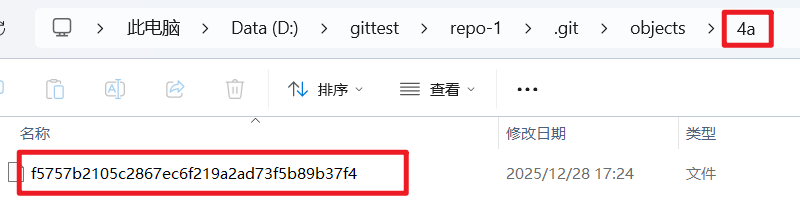

### 文件的删除

**我们将 **`**a.txt**`**文件删除，观察客户端工具，客户端工具又将复选框自动选中了，等于客户端工具又执行了 **`**git add**`**，将删除操作放到了暂存区：**

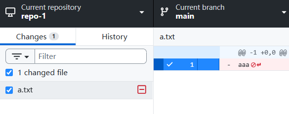

**虽然是删除文件，但这个删除的动作也要提交给 git 仓库，点击提交按钮：**

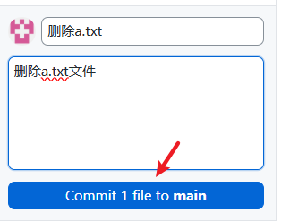

**查看操作记录：**

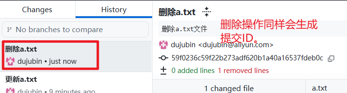

**删除动作也会在 git 仓库中生成一个文件，如下：**

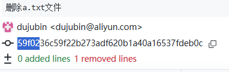

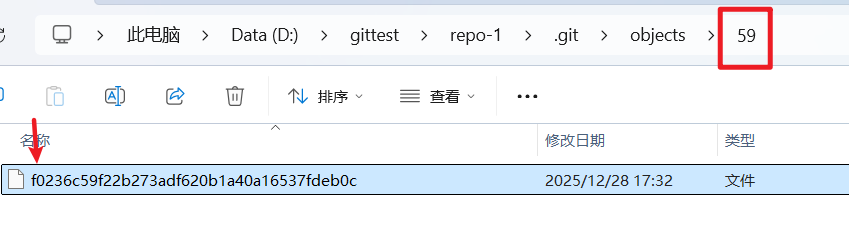

**这个文件中存储了：****“删除了 a.txt”这个动作的元数据**

```plaintext
tree 新目录树哈希
parent 旧提交ID
author ...

删除了a.txt
```

**新目录树对象**：生成一个新的目录树对象，这个树里**不再包含 a.txt 的引用**

## Git 分支的理解

软件版本控制工具都有分支的概念，不是 git 特有的。SVN、CVS 等都有。

### 没有分支的情况（就像一条单行车道）

想象一下，实际开发中是多个人开发同一个项目。假设没有分支，只有一个主仓库。

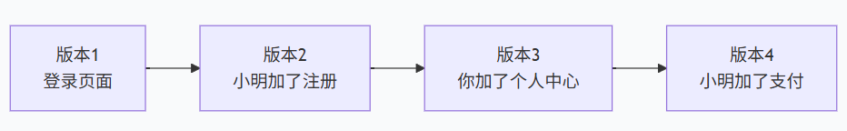

**问题出现了：**

1. **必须排队**：你正在开发“个人中心”，没做完就不能提交，因为你提交到主仓库上的话，等于提交了半成品，别的同事以为能用呢，结果一用就崩，为了避免，大家只能排队。（**所谓的排队是：你别动！等我做完的！**）
2. **无法隔离风险**：小明的“支付功能”有bug提交了，大家共享一个仓库，你拉下来的代码很可能导致你的“个人中心”也跟着崩了。
3. **无法并行实验**：你想试试用新技术重写登录，但一旦开始，所有人都得用你这个实验版，因为共享同一个仓库。

**这就是没有分支的情况——所有人挤在一条时间线上。**

### **有分支的情况（就像有了“平行宇宙”）**

Git 允许你创建**分支**，本质上是**从某个时间点复制一条独立的时间线**。

**分支本质上其实将主仓库复制一份，你在复制品上随便折腾。等你折腾完了，测试功能没问题，将你折腾的成果最终再合并到主仓库中。**

利用分支来开发新的功能，这是最常用的。

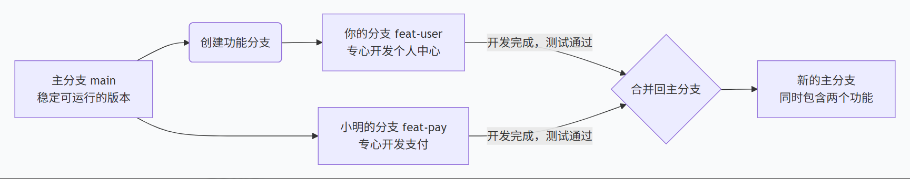

- 你和小明**同时从主分支复制了一条自己的时间线**。
- 你在你的分支上随便折腾，不影响小明，也不影响主分支。
- 你们都完成后，**分别**把各自稳定的代码合并回主分支。

### **用现实比喻理解分支**

想象你们在合作写一本小说：

- **没有分支**：所有人围着一份手稿改，你改一页，我改一页，经常写乱套。
- **有分支**：
  1. 主分支是**正式出版的小说**。
  2. 你想写一个“外传”，就**复印一份**手稿，在复印件上随便写（这就是创建分支）。
  3. 写完后，如果大家觉得好，就把“外传”章节**抄进**正式手稿里（这就是合并分支）。
  4. 另一个人同时也可以复印一份去写“前传”。

**分支就是复印稿，让你可以安全地并行创作。**

### **分支对Java开发者的好处**

1. `**<font style="color:rgb(15, 17, 21);background-color:rgb(235, 238, 242);">main</font>**`** ****分支**：永远放着**稳定、可运行的代码**，随时能打包发布。
2. `**<font style="color:rgb(15, 17, 21);background-color:rgb(235, 238, 242);">feat/xxx</font>**`** ****分支**：开发新功能（如 `<font style="color:rgb(15, 17, 21);background-color:rgb(235, 238, 242);">feat/user-login</font>`），做完合并。
3. `**<font style="color:rgb(15, 17, 21);background-color:rgb(235, 238, 242);">fix/xxx</font>**`** 分支**：修复Bug。修复 bug 的时候可以复制一个分支，在分支上修复。修复完再合并回去。
4. `**<font style="color:rgb(15, 17, 21);background-color:rgb(235, 238, 242);">release/xxx</font>**`** ****分支**：准备发布新版本。

**你每天的工作就是：**

1. 从 `<font style="color:rgb(15, 17, 21);background-color:rgb(235, 238, 242);">main</font>` 拉一个新分支 `<font style="color:rgb(15, 17, 21);background-color:rgb(235, 238, 242);">feat/add-order</font>`。
2. 在这个分支上安心写3天订单功能。
3. 写完，测试通过，合并回 `<font style="color:rgb(15, 17, 21);background-color:rgb(235, 238, 242);">main</font>`。
4. 删除 `<font style="color:rgb(15, 17, 21);background-color:rgb(235, 238, 242);">feat/add-order</font>` 分支。

**分支就是你的“安全沙盒”，玩坏了也不影响别人。**

## 分支功能演示

### 创建仓库（自带主分支）

**创建主库 **`**repo-2**`**：**

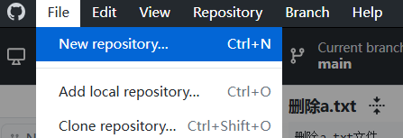

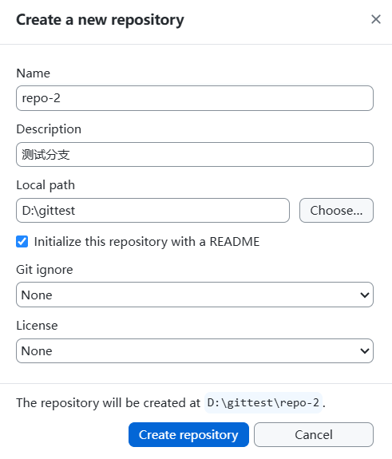

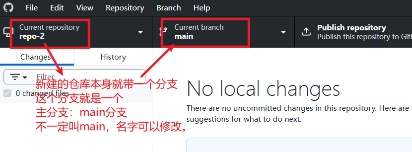

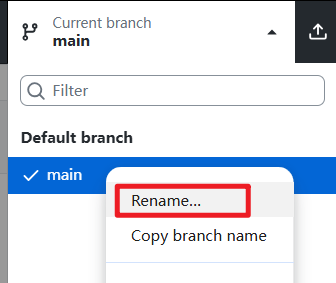

**注意：创建仓库时，每个新建的仓库默认自带一个主分支。**

### 创建 user 分支

项目经理为开发**用户模块**的同事创建 user 分支：

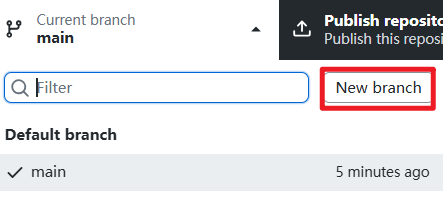

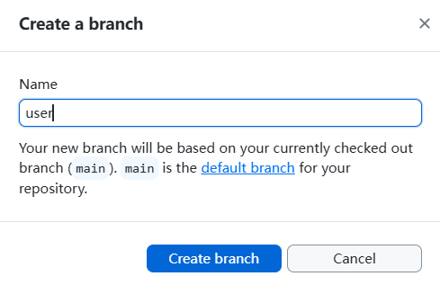

创建完 user 分支被自动选中：

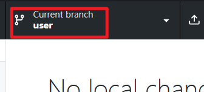

### 在 user 分支上开发并提交

**打开分支对应的位置：**

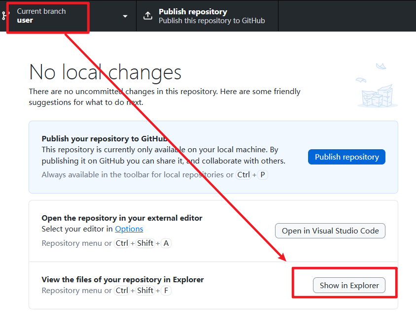

**在该分支上开发：**

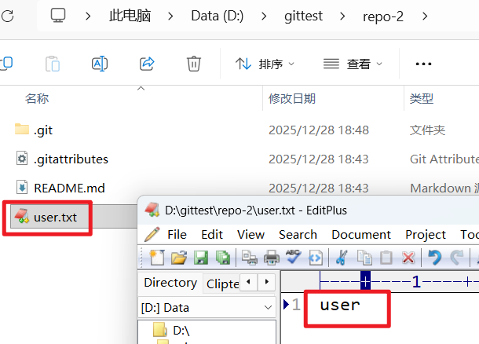

**提交分支：**

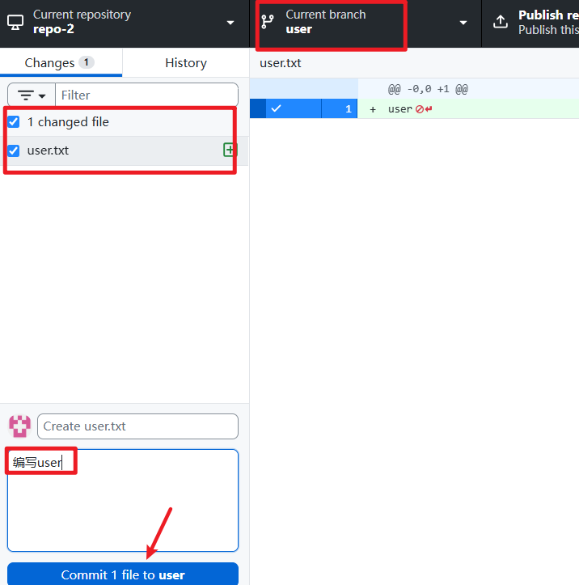

**到这里user 分支就完成了开发，并将分支中的开发成果提交到分支仓库中了。**

---

**你可以看一下：主分支中没有，user 分支中有。**


### 创建 order 分支

和创建 user 分支方式相同。


### 在 order 分支上开发并提交

和 user 分支上的开发一样，按照之前的步骤操作一遍。

### user 分支合并到主分支


**通过以上方式，可以选择一个分支合并到主分支：**


**合并之后，去主分支上看看有没有 user 分支的数据：**


### order 分支合并到主分支

合并方式和 user 分支的合并方式相同。

**合并之后，可以看到主分支的数据如下：**


### 合并冲突的解决

**第一步：**在 user 分支上创建 `common.txt`文件，编写内容 `user`并提交。

**第二步：**在 order 分支上创建 `common.txt`文件，编写内容 `order`并提交。

**第三步：**将 user 分支合并到主分支。

**第四步：**将 order 分支合并到主分支：此时就会出现文件冲突问题，如下图：


**第五步：解决冲突，git 这个时候是无法自动处理的，需要人为介入**


**编辑器显示如下：**


**内容怎么修改？你说了算：**


**合并后，查看主分支中文件的内容，如下：**


## 标签功能

在提交代码的时候有注释，在合并的时候没有注释，怎么办？我们可以给每一个操作历史记录打标签，这样就会更加清晰。

**第一步：打开历史记录**


**第二步：在历史记录上打标签**


**第三步：标签也可以删除**


## 操作远程仓库 GitHub

### 本地仓库与远程仓库的区别

Git的本地仓库和远程仓库是代码协作中两个核心但角色不同的概念。

简单来说，**本地仓库是你个人计算机上的“私人工作区”，而远程仓库是团队成员共享的“中央服务器”**


**列表格对比一下：**

| **特性** | **本地仓库 (Local Repository)** | **远程仓库 (Remote Repository)** |
| --- | --- | --- |
| **位置** | 位于**你的个人电脑**上，`<font style="color:rgb(15, 17, 21);background-color:rgb(235, 238, 242);">.git</font>`隐藏文件夹。 | 位于**独立的服务器或云端**，如GitHub、GitLab、Gitee、公司自建服务器等。 |
| **核心用途** | **个人工作区**：让你可以离线工作、频繁提交、创建分支进行实验，而不会影响他人。 | **协作中心与备份**：团队共享的代码，用于集成所有人的工作、备份历史记录。 |
| **访问与权限** | 仅限你自己**完全控制**，所有操作（增删改提交历史）都瞬间完成。 | **团队共享**，有权限控制。`<font style="color:rgb(15, 17, 21);background-color:rgb(235, 238, 242);">push</font>`（推送）操作需要网络和相应权限。 |
| **网络需求** | **无需网络**，绝大多数操作（提交、分支切换、查看历史）都可离线进行。 | **依赖网络**，`<font style="color:rgb(15, 17, 21);background-color:rgb(235, 238, 242);">push</font>`、`<font style="color:rgb(15, 17, 21);background-color:rgb(235, 238, 242);">pull</font>`、`<font style="color:rgb(15, 17, 21);background-color:rgb(235, 238, 242);">fetch</font>`、`<font style="color:rgb(15, 17, 21);background-color:rgb(235, 238, 242);">clone</font>`等与远程交互的操作都需要联网。 |
| **内容构成** | 包含项目的**完整历史记录、所有分支、标签**以及Git的所有对象数据库。 | 本质上是本地仓库的一个**镜像或快照**，通常内容与某个本地仓库同步。 |

**本地仓库和远程仓库的这种分离与协作模式，正是Git“分布式”版本控制系统最核心、最生动的体现**。

当你执行 `<font style="color:rgb(15, 17, 21);background-color:rgb(235, 238, 242);">git clone</font>` 时，你得到的是**整个项目历史、所有分支和标签的完整副本**。这意味着：

- **你可以离线工作**：所有提交、查看历史、创建合并分支等操作都瞬间完成，无需连接服务器。
- **你拥有全部历史**：可以自由探索任何时期的代码状态，不受服务器是否在线的限制。

**因此，即使中央服务器坏掉了，也没有关系，代码不会丢。**

### GitHub 创建远程仓库

公司可以自建中央仓库，我们也可以使用云端的中央仓库，现代的开发一般都是使用云端的，例如 GitHub。

**第一步：注册并登录 GitHub。这个自己操作即可。（如果比较慢，可以考虑梯子。）**

**第二步：创建远程仓库**


**public对所有人可见，private仅自己或授权者可见。**


### 创建文件


**然后，你可以看到你创建的文件：**


### 修改文件


### 创建分支


**切换分支：**


### 删除仓库


### 从远程仓库下载代码

**第一步：**创建远程仓库，提供一个文件，随便向文件中写点内容。

**第二步：**打开 GitHub Desktop 工具，关联 GitHub 账号。


**第三步：从远程仓库克隆项目到本地仓库**


**第四步：在本地仓库中开发并提交到本地仓库。**


**第五步：推送到远程仓库。**


### 操作远程仓库 Gitee

国内的开发者也可以使用 Gitee 创建远程仓库，GitHub 国外的网站，有时比较慢。

**第一步：注册 Gitee 账号，并创建仓库，创建文件。**


**public对所有人可见，private仅自己或授权者可见。**

---

**第二步：将 Gitee 的仓库克隆到本地。**

先拿到 URL：


打开客户端工具：


---

**第三步：在本地修改，提交到本地仓库。**


---

**第四步：推送到远程仓库。**


**提示需要输入用户名和密码。此时输入 Gitee 的用户名和密码即可。**

## Readme 文件

**README文件就是项目的“产品说明书”或“使用手册”。**

**README是别人打开你项目时看到的第一个页面，告诉人家“这是啥、怎么用、谁负责”。**

**具体作用（四个核心）：**

### 项目名片（这是啥？）

```plaintext
# 项目名
[![状态徽章]](链接) [![版本]](链接) [![许可证]](链接)

一句话介绍：这是一个XXX系统，用于XXX...
```

### 安装指南（怎么跑起来？）

```markdown
## 快速开始
### 环境要求
- Java 11+
- MySQL 8.0

### 三步运行：
1. git clone https://...
2. mvn install
3. java -jar target/app.jar
```

### 使用教程（怎么用？）

```markdown
## 功能说明
### 用户管理
- 注册：POST /api/register
- 登录：POST /api/login

### 订单管理...
```

### 联系方式（有问题找谁？）

```plaintext
## 联系
- 作者：张三
- 邮箱：zhang@example.com
- 问题反馈：GitHub Issues
```

### **最少要有**

```plaintext
# 项目名
简要描述

## 如何运行
1. ...
2. ...

## 主要功能
- 功能1
- 功能2
```

### **完整版包括**

```plaintext
# 项目名
[![状态徽章]]()

## 📖 简介
## 🚀 快速开始
## 🔧 配置说明  
## 📁 项目结构
## 📝 使用文档
## 👥 贡献指南
## 📄 许可证
## 🙏 致谢
```

**总之，README就是项目的门面——第一印象决定别人愿不愿意用你的代码。**

## git 的忽略机制

### 为什么需要忽略机制

假设我们开发了一个 java 项目：

```plaintext
我们的项目/
├── src/           ← 源代码（要保存）
├── target/        ← 编译生成的（不要保存！）
│   ├── classes/   ← .class文件
│   ├── test-classes/
│   └── your-app.jar
├── .idea/         ← IDE配置（不要保存！）
└── .iml           ← 项目文件（不要保存！）
```

如果没有忽略机制：

1. Git会把 `<font style="color:rgb(15, 17, 21);background-color:rgb(235, 238, 242);">target/</font>` 里的 `<font style="color:rgb(15, 17, 21);background-color:rgb(235, 238, 242);">.class</font>` 文件也跟踪（每编译一次，class 都不一样，git 都要对它进行无用的跟踪）
2. 同事之间的IDE配置互相覆盖。
3. 仓库里塞满垃圾，提交缓慢。

### 忽略机制怎么实现

在 git 仓库的根目录下创建一个文件 `.gitignore`，两个必须：

1. 必须放在根目录下。
2. 文件名必须是 `.gitignore`

### Java项目的 标准`.gitignore`

```plaintext
# 编译输出
target/
build/
*.jar
*.war
*.class

# IDE
.idea/
*.iml
.vscode/

# 日志
*.log
logs/

# 临时文件
*.tmp
*.temp

# 系统文件
.DS_Store
Thumbs.db

# 环境配置（包含密码）
application-dev.properties
```

### 演示忽略机制

**第一步：创建一个仓库。**


创建完成后，会看到根目录下有这样一个文件：


打开看看：可以看到，它自动生成的忽略机制中忽略 `.log`文件。


**第二步：向仓库中添加被忽略的文件试试**

我们来创建一个 `.log`文件。看看是什么情况。


可以看到，压根不会让文件进入暂存区，也就是没有执行 `git add`


我们再创建一个 java 文件试试：


### 在 GitHub Desktop 中通过操作也可以忽略

这样测试一下：我们在仓库的根目录下创建多个 `.bak`结尾的文件。默认它是不会忽略的。


可以看到被 git 追踪了：


你通过客户端工具也可以来进行设置：忽略所有的 bak 文件


你会看到，`.gitignore`文件中多了这个配置，bak 文件就被忽略了：


## 图标与文件比对

创建仓库 `repo-4`：

**第一步：**先创建文件：`a.txt`、`b.txt`，提交到本地仓库。

**第二步：**删除文件 a.txt、修改 b.txt、新建 c.txt，你会看到如下图标。


**另外还有比对功能：**


`<font style="color:rgb(15, 17, 21);background-color:rgb(235, 238, 242);">@@ -0,0 +1 @@</font>`

- `**<font style="color:rgb(15, 17, 21);background-color:rgb(235, 238, 242);">-0,0</font>**`：代表“原始文件”（`<font style="color:rgb(15, 17, 21);background-color:rgb(235, 238, 242);">-</font>`）在第0行开始，有0行内容。也就是**这个文件原本不存在**。
- `**<font style="color:rgb(15, 17, 21);background-color:rgb(235, 238, 242);">+1</font>**`：代表“新文件”（`<font style="color:rgb(15, 17, 21);background-color:rgb(235, 238, 242);">+</font>`）在第1行开始，有1行内容。也就是**现在这个文件从第1行开始有1行内容**。
- 这个 `<font style="color:rgb(15, 17, 21);background-color:rgb(235, 238, 242);">@@ ... @@</font>` 是 Git 用来定位更改位置范围的标记。

**再修改一下 **`**<font style="color:rgb(15, 17, 21);">b.txt</font>**`**，再来看看比对结果：**


# IDEA 使用 Git


## 创建空项目

在 IDEA 中创建一个空的项目，在空项目中随便创建一个文件。随便编写一些内容。


## 将项目推送到 github

****点击菜单中的 VCS，选择 Share Project on GitHub


然后会打开浏览器，用你的 github 账号给 IDEA 授权：


看看 GitHub 上有没有项目：


## 将修改提交到本地仓库或远程仓库

**将文件 **`**a.txt**`**的内容修改一下：**


**然后在文件上右键：选择 **`**Commit File**`


但当你第一次选择提交到本地仓库后，如果没有再做任何修改，点击右侧按钮是无法推送到远程仓库的。

**你可以这样做：**


## 代码合并（将 github 仓库中代码修改后合并到本地仓库）

在 GitHub 的仓库中直接修改代码：


**将 GitHub 远程仓库中的代码拉取下来并自动合并：**


**注意：pull 下面还有一个 fetch，他俩的区别是：**

`**<font style="color:rgb(15, 17, 21);background-color:rgb(235, 238, 242);">pull</font>**`** = **`**<font style="color:rgb(15, 17, 21);background-color:rgb(235, 238, 242);">fetch</font>**`**（获取更新） + **`**<font style="color:rgb(15, 17, 21);background-color:rgb(235, 238, 242);">merge</font>**`**（自动合并），而 **`**<font style="color:rgb(15, 17, 21);background-color:rgb(235, 238, 242);">fetch</font>**`** 只获取不合并。**

**fetch 成功的效果是：静默地将远程仓库的最新信息（如新分支、新提交）下载到你的本地仓库，但完全不会改动你正在工作的代码文件。**

在 IDEA 的 **Git → Log** 视图里，原本只显示你本地的提交历史。`<font style="color:rgb(15, 17, 21);background-color:rgb(235, 238, 242);">fetch</font>` 成功后，你可以看到远程分支已经跑到前面去了，领先于你的本地分支。


**如果你看着日志感觉没问题，可以再手动合并：**


`Merge`的作用是：**将另一个分支的更改整合到当前分支**


## 克隆远程仓库的项目

操作步骤非常简单，直接点击 Git，然后选择 Clone：


克隆之后的效果就是新建一个项目：


# IDEA 使用 Git 将代码推送到 Gitee


## 创建一个新的工程

空的工程即可，然后创建一个文件，随便写点东西。


## IDEA 安装插件

IDEA 默认不支持 gitee，需要额外安装 gitee 插件。


安装成功后，VCS 中就有了：


接下来的操作就和之前的一样了。

# Git 命令


我们上面一直都是用图形化界面完成的操作。其实这些图形化界面上的操作底层都对应了 Git 相关的命令。

接下来我们学习一下 Git 的命令。

## 仓库操作

执行命令，我们用它就行：


### 查看 git 版本

`git -v`

### 创建本地仓库

**先创建仓库的根目录，并进入根目录：实际上这两个命令和 git 无关，只是普通的 Linux 命令：**


**通过 **`**git init**`**命令来初始化仓库：**


到这里，本地仓库就创建成功了：


### 克隆远程仓库

**克隆远程仓库的核心命令：**`**git clone**`

**首先你需要获取到 gitee 上项目的克隆地址：**


**将 github 上的项目克隆下来：**

```shell
git clone https://github.com/dujubinaliyun/remote-test.git
```

**另外，克隆时也可以给仓库起别名：**

```shell
git clone https://gitee.com/du-jubin/remote-gitee-test.git remote-gitee-test2
```

### 配置仓库（局部配置）

配置仓库使用 `git config`命令。例如以下配置 `user.name`和 `user.email`：

如果你想对**某一个仓库进行配置**，可以进入到仓库的根目录，执行 `git config`：

```shell
git config user.name dujubinaliyun
git config user.email dujubin@aliyun.com
```

实际上修改的是这个文件：


### 配置仓库（全局配置）

也可以通过 `--global`参数来设置仓库的全局配置：

```shell
git config --global user.name dujubinaliyun

git config --global user.email dujubin@aliyun.com
```

这个全局配置，在当前系统用户的主目录下会生成这样一个文件：


## 文件操作

### 查看暂存区状态

```shell
git status
```


### 添加文件到暂存区

```shell
# 创建一个文件,这个时候文件没有git跟踪，只是在工作区
touch a.txt

# 添加到暂存区
git add a.txt

# 再次查看状态
git status 
```


### 将文件从暂存区中删除

只是从暂存区中删除，文件并不会删除。

```shell
git rm --cache a.txt
```


### 将文件提交到仓库

```shell
# 提交一个文件，并指定注释信息
git commit -m 新增文件 a.txt

# 提交当前目录下所有被git跟踪的文件
git commit -m 新增文件
```


### 查看当前仓库的历史提交记录

我们再创建一个 b.txt 文件，让后提交该文件到仓库。

```shell
touch b.txt
git add b.txt
git commit -m 新增b文件 b.txt
```

通过这个命令可以查看当前仓库的历史提交记录。

```shell

git log
```

将提交历史**以一行的紧凑格式**显示，每条提交只显示**提交哈希的前7位**和**提交信息**。


### 修改文件并提交

修改 `a.txt`文件，内容随便写。然后再查看仓库的状态。

```shell
git status
```

将修改后的文件添加到暂存区。

```shell
git add a.txt
```

将修改后的文件提交到仓库。

```shell
git commit -m 修改a文件 a.txt
```

查看仓库的历史提交记录。

```shell
git log
```


### 删除文件并提交

**删除 b.txt 文件，查看仓库当前状态**

```shell
rm -rf b.txt
git status
```


**将删除操作提交到暂存区：**

```shell
git add b.txt
git status
```


**将删除操作提交到仓库：**

```shell
git commit -m 删除b文件
```

### 误删除的第一种恢复

新建文件，添加到暂存区，添加到仓库。然后删除该文件。如何恢复？使用 `git restore`命令即可。

```shell
touch Hello.java
git add Hello.java
git commit -m 新增Hello文件
rm -rf Hello.java
git restore Hello.java
```

你需要知道的是：删除其实并不会真正的删除文件，历史操作中还有。

### 误删除的第二种恢复

有一种特殊情况，上面的删除操作之后，并没有将删除操作提交，如果删除后并且提交了删除操作会怎样？

```shell
rm -rf Hello.java
git add Hello.java
git commit -m 删除Hello
```

这个时候再按照上面的恢复方式就无法恢复了：

```shell
git restore Hello.java
```


那怎么办呢？可以通过重新到上一个版本来实现这个功能：

```shell
git log --oneline
```


重置到指定版本：

```shell
git reset --hard 733c3fa
```


可以看到文件恢复了：


不过这种重置方式会导致历史提交丢失，通过 `git log --oneline`可以清楚的看到，上一次的历史提交丢失了：

```shell
git log --oneline
```

以前是这样的：


现在是这样的：


### 误删除的第三种恢复

下面这种方式可以实现，恢复删除的内容，并且之前的历史提交不丢失，底层会对你这一次的恢复动作单独创建一个提交记录：

```shell
rm -rf Hello.java
git add Hello.java
git commit -m 删除Hello
```

此时查看仓库以及仓库历史操作记录：

```shell
ls

# 创建一个新的提交，这个新提交专门用来撤销指定提交（cae002d）所做的更改
git revert cae002d

# 再次查看，文件就恢复了。
ls 
```

并且通过查看历史操作记录可以看到，刚才的恢复动作也被当做一次新的提交记录了：

```shell
git log --oneline
```


## 分支操作

### 创建分支

```shell
# 创建目录
mkdir repo-6
cd repo-6

# 初始化仓库
git init

# 创建分支
git branch user
```

控制台提示信息如下：


这个错误 `<font style="color:rgb(15, 17, 21);background-color:rgb(235, 238, 242);">fatal: not a valid object name: 'master'</font>` 的意思是：**当前仓库中不存在名为 **`**<font style="color:rgb(15, 17, 21);background-color:rgb(235, 238, 242);">master</font>**`** 的分支或提交对象**。

注意：**这是一个全新的、完全空的仓库，**还没有进行任何提交。当你做了第一个提交动作之后，master 分支就创建了。

创建新文件，提交到仓库，然后再创建 user 分支：

```shell
touch a.txt
git add a.txt
git commit -m 提交a文件

# 创建user分支
git branch user
```

可以从硬盘文件中查看分支：`.git\refs\heads`


### 查看当前分支状态

```shell
git branch -v
```


上图表示当前正在 master 分支上。

### 切换分支

```shell
git checkout user
git branch -v
```


### 创建分支的同时切换分支

```shell
git checkout -b order
```


### 删除分支

```shell
git branch -d user
```


### 基于某个历史记录创建分支

```shell
git checkout -b <新分支名> <历史提交id>

# 基于某个历史提交id（61393eb）创建一个分支（hehe）
git checkout -b hehe 61393eb
```

### 合并

注意分支合并原则：假设有 a 分支和 b 分支，如果要将 b 分支合并到 a 分支上，你需要先切换到 a 分支上，在 a 分支上执行 `git merge`命令。

基于上面的分支继续操作，当前我们有 `master`分支和 order 分支。

我们要完成的效果是：将 order 分支合并到 master 分支上。

**第一步：**在 order 分支上创建 Test.java 文件，并且提交到本地仓库

```shell
git checkout order
touch Test.java
git add Test.java
git commit -m 添加Test Test.java
```

**第二步：**将 order 分支合并到 master 分支，首先你需要将分支切换到 master 分支

```shell
git checkout master
git merge order
```


合并后可以看看 master 分支上是否存在 Test.java 文件。

### 合并时的冲突问题

假设现在我将 master 分支上的 Test.java 内容修改并提交到本地仓库。

```shell
git checkout master
echo hello >> Test.java
git add Test.java
git commit -m 修改Test Test.java
```

然后再将 order 分支上的 Test.java 内容修改并提交到本地仓库。

```shell
git checkout order
echo world >> Test.java
git add Test.java
git commit -m 修改Test Test.java
```

最后再将 order 分支合并到 master 分支上，会不会冲突呢？

```shell
git checkout master
git merge order
```

冲突如下：


必须人为干涉解决冲突：

```shell
# 打开冲突的文件
vi Test.java

# 修改文件内容

# 添加到暂存区
git add Test.java

# 提交到本地仓库（注意：正在合并时，你不能提交部分文件，必须提交仓库中所有文件）
# 这样是不行的
git commit -m 解决冲突 Test.java

# 需要提交所有
git commit -m 解决冲突
```


## 标签操作

### 为什么需要标签

目的是：语义化，增强可读性，增强可维护性。

打标签本质上是给某个提交记录起别名。

### 查看当前仓库中有哪些标签

```shell
git tag
```

当你没有创建任何标签时，什么也不会输出。

### 创建标签

创建一个新的仓库：

1. 创建 a.txt 并提交
2. 创建 b.txt 并提交
3. 创建 c.txt 并提交
4. 查看历史提交记录

```shell
mkdir repo-7
cd repo-7
touch a.txt
git add a.txt
git commit -m 创建a

touch b.txt
git add b.txt
git commit -m 创建b

touch c.txt
git add c.txt
git commit -m 创建c

git log --oneline
```


**为创建 a 这一次的提交打一个标签：**

```shell
git tag newFileA 985455a
```

**再次查看标签，此时当前分支中就有一个标签了：**

```shell
git tag
```


### 再次查看历史记录时也有标签了

```shell
git log --oneline
```


而且也可以通过下面的命令查看某个标签之前的所有历史提交记录了：

```shell
git log newFileA
```

### 删除标签

```shell
git tag -d newFileA
```

删除之后，标签就没有了：


### 基于标签创建分支

我们之前可以根据历史提交 id 来创建分支，当然也可以通过标签名来创建分支：

```shell
git checkout -b haha newFileA
```

## 远程仓库的操作

### 公司只提供 SSH 的远程仓库怎么办

将远程仓库的项目 clone 到本地：

```shell
git clone https://gitee.com/du-jubin/remote-gitee-test.git
```

**打开克隆的项目，找到 **`**.git/config**`**文件，如下：**


其中 url 就是远程仓库的地址。但实际开发中，很多公司（尤其是注重安全和内部网络管理的）**不提供或不推荐使用 HTTPS 协议**访问 Git 仓库，而是**仅提供 SSH 协议**

**咱们来模拟一下，一些公司只提供 SSH 的场景：**

**第一步：**找到远程仓库的 SSH 链接，如下，拷贝 SSH 地址


**第二步：**将 SSH 地址修改到 config 文件中


**第三步：**在本地工作区中创建文件，并添加到暂存区，提交到本地仓库

```shell
cd remote-gitee-test/
touch Test.java
git add Test.java
git commit -m 提交Test
```

**第四步：**push 到远程仓库

```shell
# 直接使用地址也可以，使用名字也可以。配置文件中的名字叫做：origin
git push origin  
```

你会发现因为权限不足而导致推送失败。

### 解决权限不足问题

**第一步：**执行以下命令生成 SSH 安全证书（生成公钥文件）

```shell
ssh-keygen -t rsa -Cgit@gitee.com:du-jubin/remote-gitee-test.git
```

询问你保存位置：一路回车即可。

**第二步：**找到这个公钥，默认位置在：`用户主目录\.ssh\id_rsa.pub`，打开这个文件

```plaintext
ssh-rsa AAAAB3NzaC1yc2EAAAADAQABAAABgQCqKHFj6S2UDdd7/+dToSSpGhTbiag2rGidwnNsGfLeWrbZFfa7LnL6S82ofFtMP52xjplCw6E7tP6199T+bx2VrPvzFqozHtzAz7gZrLJmItlFrVbyqmrpDHJbg37YYNsOGvobMkMf0NB1s/Agzql9fg6YxBX+jBMdprTFtsDgxGx1V4Zu9GzW1Pi42ExUBDxq75/92Gfo2jkxRrSwhwszkqx4L08ZYFEsRScFscLobhs/szkbasxHjFl8pbQ7ysAfq5d/KfDwucoU+MlnZWZUbRAq6B+uHrJJZkeB+c3lsl4PXY5ln9/lCKwzUIVEjJlzdOY6L8zkmbBGgDlPJ1XGG1dxM3MIlufwa+gsYmK3N/xDTyQnO+1/eN9APSEz/HW1jPXtF+6lErB2Aoq5slfIBrpeGzeLA75PGVOgQJ46xnHyjrXYezdCi9dCBIWcYSzcuYW5idN+U/tnGiyF4yygXIPmV01aun2kwqp06dh3FgKhalOzzsqAiiNek+FJtsM= git@gitee.com:du-jubin/remote-gitee-test.git
```

**第三步：**把这个文件中的公钥复制一下，打开 gitee 的后台，找到 SSH 公钥位置，添加公钥并保存。


### 再次推送

```shell
git push origin
```

查看远程仓库内容是否更新。

### 拉取合并

远程仓库中的文件修改一下，然后通过以下命令将远程仓库中的数据拉取到本地并进行自动合并：

```shell
git pull origin
```

# 程序员的一天


**核心理念**：**“永远在正确的分支上做正确的事，先拉后推。”**

## 第一步：早上一来，更新代码（防冲突）


`<font style="color:rgb(15, 17, 21);background-color:rgb(235, 238, 242);">Update Project</font>` **更智能、更安全**，`<font style="color:rgb(15, 17, 21);background-color:rgb(235, 238, 242);">Pull</font>` 是直接执行默认的合并。公司一般推荐 `<font style="color:rgb(15, 17, 21);">Update Project...</font>`

## 第二步：开始新功能？创建分支（隔离开发）


*命名规则：*`feature/功能`*、*`fix/修复`*、*`hotfix/紧急修复`*。*

**自动切换到新分支**，开始 coding。

## 第三步：日常提交（细粒度，多提交）

**写一部分代码就提交**，别等到下班。


- **勾选**要提交的文件。
- **写清晰的提交信息**，例如：“新增用户登录验证逻辑”。
- **点击 **`Commit`（仅本地）或 `Commit and Push`（提交并推送到远程）。

## 第四步：推送代码到远程（备份与协作）


***注意：push 推送到远程仓库只是推送到远程仓库的对应分支上了。所以你不需要担心。你需要关注的是在远程仓库中你的分支与 master 主分支的合并，这个千万不要随便来。***

***推送之后 git 仓库中就有你创建的分支了：***


## 第五步：功能完成，发起合并（Pull Request/Merge Request）

1. 去公司的 **GitLab/Gitee/GitHub 网站**。
2. 找到你的分支，点击 `New Merge Request`。【github 上是 New Pull Request】
3. 选择：`源分支`（你的feature分支） -> `目标分支`（通常是 `master` 或 `develop`）。
4. 填写标题和描述，**指定同事给你评审（Review）**。
5. **等待评审通过后，由负责人或你自己点击合并（Merge）**。

## 第六步：处理合并冲突（一定会遇到，别慌）

****你推送时或合并时被告知有冲突。

1. **先更新代码**（第一步的 `Update`）。
2. 如果冲突弹出框出现：

- **双击冲突文件**，IDEA 会打开一个**三窗格对比视图**。
- **中间是结果**，用鼠标点击选择要保留的版本（左侧你的，右侧别人的），或直接手动编辑。
- **解决完后，点击 **`Apply`。

1. **重新提交并推送**（`Commit and Push`）。

## 第七步：更新主分支，准备下一个任务

1. 回到 IDEA，**切换回 **`master` 分支。


1. 对 `master` 执行 **第一步的 **`Update`，拉取刚才合并的新代码。
2. 基于最新的 `master`，**回到第二步**，创建下一个功能分支。

**注意哈：以上说的更新是更新主分支哈。**

- **第一步：手动切换到主分支上。**
- **第二步：**`**<font style="color:#DF2A3F;">Update Project</font>**`**更新主分支。**
- **第三步：将最新的主分支合并到当前工作分支。**

**以上三步联合起来就完成了代码更新。**

## 黄金法则（公司生存指南）

1. **永远在功能分支开发，禁止直接在主分支（master/main）上写代码。**
2. **每天早上的第一件事：更新代码（Pull）。先更新 master，将 master 合并到自己的工作分支上，基于自己的工作分支继续开发。**
3. **推送前的最后一件事：再次更新代码（Pull），解决可能的新冲突。**
4. **提交信息要像小标题一样清晰，禁用“修复bug”、“更新”这种废话。**
5. **遇到冲突不要怕，这是常态，冷静对比，必要时找同事一起看。**
6. **合并（Merge Request）不是结束，必须等同事评审通过。**
7. **IDEA的右键菜单很强大：**`Git -> Rollback`**（回滚更改）、**`Show History`**（查看历史）、**`Compare with Branch`**（对比分支）。**