# 美年大健康项目-02

# 配置 Spring Cache

Spring Cache 本身不是一个缓存实现，而是一个管理缓存的抽象框架（缓存抽象层）

Spring Cache 是一个**缓存抽象层**，它：

- ✅ **定义了一套统一的缓存操作API**（注解和接口）
- ✅ **整合多种缓存实现**，让你可以无缝切换
- ❌ **不提供具体的缓存存储能力**

## 缓存什么数据

在大型网站中，将首页等高频访问数据缓存于内存是提升性能的关键手段。这避免了每次请求都查询数据库，从而极大加快响应速度。

鉴于内存容量有限，缓存策略需围绕业务核心设计。例如，电商缓存热门商品，新闻站缓存当日新闻。

我们的大健康体检项目将“**热门体检套餐**”等核心数据优先缓存，以实现最优的性能提升。

## Spring Cache 的使用

在 `<font style="color:rgb(15, 17, 21);background-color:rgb(235, 238, 242);">application.yml</font>` 配置文件中，我们需要设置 Spring Cache 的相关属性。

Spring Cache 支持多种缓存实现，如 Redis、Ehcache 等。

在本项目中，我们选用普及度更高、性能更优的 Redis 作为缓存方案。

```yaml
spring:
  cache:
    type: redis
    redis:
      time-to-live: 2592000000  # 30天缓存时间（单位：毫秒）
```

我们可以使用 `<font style="color:rgb(15, 17, 21);background-color:rgb(235, 238, 242);">@Cacheable</font>` 注解将查询结果缓存起来。Spring Cache 基于 Redis 构建的缓存采用 Key-Value 结构，其中 Value 即为查询结果，而 Key 则可以通过注解的 `<font style="color:rgb(15, 17, 21);background-color:rgb(235, 238, 242);">key</font>` 属性进行自定义。

```java
// Redis 缓存就是一个大柜子，里面有很多抽屉。
// cacheNames：就是每个抽屉的名字。
// key：就是每个抽屉里具体文件的文件名。
@Override
@Cacheable(cacheNames = "goods", key = "#id")
public HashMap searchById(int id) {
    //根据商品ID查询商品详情信息
}
```

`cacheNames`属性和 `value`属性是等价的，用哪个都可以：

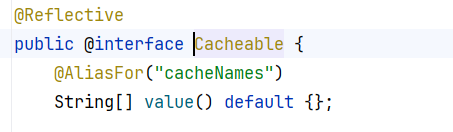

该Service方法用于更新商品信息。方法上的`<font style="color:rgb(15, 17, 21);background-color:rgb(235, 238, 242);">@CacheEvict</font>`注解会在执行后，清除指定商品的缓存。

具体来说，它会根据Key（如商品ID）定位并删除Redis中对应的缓存数据，而其他商品的缓存则不受影响，依旧保留。

```java
@Override
@Transactional
@CacheEvict(cacheNames = "goods", key = "#entity.id")
public int update(GoodsEntity entity) {
    //更新某个商品的信息
}
```

# 全局异常处理

实际开发中，异常的处理通常是：

1. 后端用日志框架记录异常的详细信息。
2. 返回给前端一个简单的异常描述信息。

## 自定义异常

自定义系统的业务异常，创建 `exception`包，包下新建 `HisException`类，用来定义业务异常：

```java
package com.jkweilai.meinian.api.exception;

import lombok.Data;

@Data
public class HisException extends RuntimeException {
    private String msg;
    private int code = 500;

    // 捕获到其他异常时直接包装
    public HisException(Exception e) {
        super(e);
        this.msg = "执行异常";
    }
    // 简单的业务逻辑错误提示
    public HisException(String msg) {
        super(msg);
        this.msg = msg;
    }
    // 既有自定义错误信息，又要保留原始异常栈
    public HisException(String msg, Throwable e) {
        super(msg, e);
        this.msg = msg;
    }
    // 需要指定特定错误码的业务异常
    public HisException(String msg, int code) {
        super(msg);
        this.msg = msg;
        this.code = code;
    }
    // 最完整的场景 - 既有错误码、自定义信息，又保留原始异常
    public HisException(String msg, int code, Throwable e) {
        super(msg, e);
        this.msg = msg;
        this.code = code;
    }
}
```

## 全局异常处理

创建`config`包，在该包下新建 `ExceptionAdvice`类，编写以下代码：

```java
package com.jkweilai.meinian.api.config;

import cn.dev33.satoken.exception.NotLoginException;
import cn.hutool.json.JSONObject;
import com.jkweilai.meinian.api.exception.HisException;
import lombok.extern.slf4j.Slf4j;
import org.springframework.http.HttpStatus;
import org.springframework.http.converter.HttpMessageNotReadableException;
import org.springframework.validation.BindException;
import org.springframework.web.HttpRequestMethodNotSupportedException;
import org.springframework.web.bind.MethodArgumentNotValidException;
import org.springframework.web.bind.annotation.ExceptionHandler;
import org.springframework.web.bind.annotation.ResponseBody;
import org.springframework.web.bind.annotation.ResponseStatus;
import org.springframework.web.bind.annotation.RestControllerAdvice;
import org.springframework.web.multipart.support.MissingServletRequestPartException;

@Slf4j
@RestControllerAdvice
public class ExceptionAdvice {
    /*
     * 捕获异常，并且返回500状态码
     */
    @ResponseBody // 响应JSON字符串到前端
    @ResponseStatus(HttpStatus.INTERNAL_SERVER_ERROR) // 状态码500
    @ExceptionHandler(Exception.class) // 除了没登录异常，其它异常都走这个处理器
    public String exceptionHandler(Exception e) {
        JSONObject json = new JSONObject();
        if (e instanceof HttpMessageNotReadableException ex) {
            // 当HTTP请求体（Body）的数据格式错误或无法解析时，就会发生此异常
            log.error("error", ex);
            json.set("error", "请求未提交数据或者数据有误");
        } else if (e instanceof MissingServletRequestPartException ex) {
            // 当请求中缺少预期的文件（@RequestPart）或表单字段时，就会发生此异常
            log.error("error", ex);
            json.set("error", "请求提交数据错误");
        } else if (e instanceof HttpRequestMethodNotSupportedException ex) {
            // 当客户端使用了一个该URL不支持的HTTP方法（如用GET访问只支持POST的接口）时，就会发生此异常。
            log.error("error", ex);
            json.set("error", "HTTP请求方法类型错误");
        } else if (e instanceof BindException ex) {
            // 当请求参数绑定到Java对象（如使用@RequestBody或@ModelAttribute）失败时，就会发生此异常
            String defaultMessage = ex.getFieldError().getDefaultMessage();
            log.error(defaultMessage, ex);
            json.set("error", defaultMessage);
        } else if (e instanceof MethodArgumentNotValidException ex) {
            // 没有通过后端验证产生的异常
            // 当使用 @Valid 注解校验请求体参数失败时，就会发生此异常
            json.set("error", ex.getBindingResult().getFieldError().getDefaultMessage());
        } else if (e instanceof HisException ex) {
            // 处理业务异常
            log.error("执行异常", e);
            json.set("error", ex.getMsg());
        } else {
            // 处理其余的异常
            log.error("执行异常", e);
            json.set("error", "执行异常");
        }
        return String.valueOf(json);
    }

    /*
     * 捕获异常，并且返回401状态码
     */
    @ResponseBody // 响应JSON给前端
    @ResponseStatus(HttpStatus.UNAUTHORIZED) // 状态码：401
    @ExceptionHandler(NotLoginException.class) // 当Sa-Token检测到用户没有登录时就会抛出这个异常
    public String unLoginHandler(Exception e) {
        JSONObject json = new JSONObject();
        json.set("error", e.getMessage());
        return String.valueOf(json);
    }
}
```

# 配置线程池 ThreadPool

我们项目中有一个功能是**生成体检报告**，这个过程非常慢，如果不启用异步处理，用户体验不好。我们先来配置一下线程池。然后在后续编写程序时，如果某个方法需要采用异步方式执行，则在该方法上直接添加一个注解就行了，这样这个方法会被自动委派给线程池中的空闲线程来执行。

**思考一个问题：Tomcat 服务器本身不是支持多线程的吗？为什么还要自己配置线程池？高并发的情况下，如果要生成体检报告，直接使用 Tomcat 服务器的线程不行吗？答案是：不一样。**

**本质上，咱们配置的线程池的线程和 Tomcat 服务器线程池的线程是一样的。但是他们在“资源占用”层面是不一样的，一个“背负着HTTP上下文的Tomcat线程”和一個“轻量级的异步线程”是不等价的。前者在耗时任务中，会造成关联资源的严重滞留和浪费。另外他们的职责也不一样，Tomcat 服务器的线程池的线程用来接收前端发过来的请求，SpringBoot 线程池负责处理后台业务！**

## 配置线程池

```java
package com.jkweilai.meinian.api.config;

import org.springframework.context.annotation.Bean;
import org.springframework.context.annotation.Configuration;
import org.springframework.core.task.AsyncTaskExecutor;
import org.springframework.scheduling.concurrent.ThreadPoolTaskExecutor;

import java.util.concurrent.ThreadPoolExecutor;

@Configuration
public class ThreadPoolConfig {

    @Bean("AsyncTaskExecutor")
    public AsyncTaskExecutor taskExecutor() {
        ThreadPoolTaskExecutor executor = new ThreadPoolTaskExecutor();

        // 核心线程数一般定义CPU核数的2倍。
        // 设置核心线程数
        executor.setCorePoolSize(8);
        // 设置最大线程数
        executor.setMaxPoolSize(16);
        // 设置队列容量（线程没有空闲的就排队，这个设置排队容量）
        executor.setQueueCapacity(1000);
        // 设置线程活跃时间（秒）60秒没有活跃，杀死该线程
        executor.setKeepAliveSeconds(60);
        // 线程名称的前缀，线程前缀名随意
        executor.setThreadNamePrefix("task-");
        // 设置拒绝策略
        executor.setRejectedExecutionHandler(new ThreadPoolExecutor.CallerRunsPolicy());
        //初始化线程池
        executor.initialize();
        return executor;
    }

}
```

当线程池的任务队列已满时，它将按照预设的拒绝策略处理新提交的任务。以下是几种常见的拒绝策略及其行为：

- **AbortPolicy（中止策略）**
直接抛出 `RejectedExecutionException` 异常，阻止系统继续执行。这是线程池的**默认拒绝策略**。
- **CallerRunsPolicy（调用者运行策略）**
将任务回退给提交任务的线程（通常是主线程）来执行。这种策略能确保任务不被丢弃，适用于不允许任务丢失的场景。例如生成体检报告，一旦放弃任务将导致报告无法生成，此时可采用此策略。
- **DiscardOldestPolicy（丢弃最老任务策略）**
移除队列中最早进入的任务，然后将当前任务加入队列，以腾出空间执行新任务。
- **DiscardPolicy（静默丢弃策略）**
直接丢弃无法处理的任务，既不执行也不抛出异常，适用于对任务完整性要求不高的场景。

## 开启异步线程功能

SpringBoot 的异步功能让我们无需手动操作线程池。我们只需定义一个任务，并使用 `<font style="color:rgb(15, 17, 21);background-color:rgb(235, 238, 242);">@Async</font>` 注解标记，SpringBoot 就会自动安排线程池来执行它。主线程就像把任务“扔进”线程池后便挂挡就走，不会原地等待结果，因此被称为“异步”。

在MeinianApiApplication主类的声明中，添加上@EnableAsync注解，就可以开启异步线程功能了

```java
package com.jkweilai.meinian.api;

import org.mybatis.spring.annotation.MapperScan;
import org.springframework.boot.SpringApplication;
import org.springframework.boot.autoconfigure.SpringBootApplication;
import org.springframework.boot.web.servlet.ServletComponentScan;
import org.springframework.context.annotation.ComponentScan;
import org.springframework.scheduling.annotation.EnableAsync;

@EnableAsync // 开启异步线程
@ServletComponentScan

@ComponentScan("com.jkweilai.*")
@MapperScan(basePackages = "com.jkweilai.meinian.api.db.mapper")
@SpringBootApplication
public class MeinianApiApplication {

    public static void main(String[] args) {
        SpringApplication.run(MeinianApiApplication.class, args);
    }

}
```

要使用异步线程，我们只需在一个方法上添加 `<font style="color:rgb(15, 17, 21);background-color:rgb(235, 238, 242);">@Async</font>` 注解。该方法在执行时会被自动提交到线程池，由空闲线程处理。这意味着像生成体检报告这样的耗时任务将与主线程分离，不会阻塞主流程。

```java
@Service
@Slf4j
public class CheckupWorkAsync {

    // 这个方法会交给异步线程执行。
    @Async("AsyncTaskExecutor")
    public void createReport(Integer id) {
        // 检查哪些人的报告数据已经准备完毕，然后生成体检报告
    }
}
```

# 统一响应体封装

在后续开发中，我们将编写大量返回JSON数据的Web方法。为了统一响应格式，我们需要预先定义JSON对象的公共结构。由于使用了`<font style="color:rgb(15, 17, 21);background-color:rgb(235, 238, 242);">@RestController</font>`注解，方法的返回值会被自动转换为JSON，因此我们只需创建一个统一的响应封装类，并让所有Web方法都返回该类的实例即可。

考虑到不同方法返回的业务数据各不相同，响应体需要具备动态性。为此，我们可以选择一个灵活的结构作为基础。在本项目中，我们将使用`<font style="color:rgb(15, 17, 21);background-color:rgb(235, 238, 242);">HashMap</font>`作为父类，在`<font style="color:rgb(15, 17, 21);background-color:rgb(235, 238, 242);">com.jkweilai.meinian.api.common</font>`包下创建这个名为`<font style="color:rgb(15, 17, 21);background-color:rgb(235, 238, 242);">R</font>`的响应封装类。

```java
package com.jkweilai.meinian.api.common;

import org.apache.http.HttpStatus;

import java.util.HashMap;
import java.util.Map;

/**
 * 统一API响应结果封装类
 * 继承自HashMap，提供链式操作，用于规范所有Controller方法的返回格式
 */
public class R extends HashMap<String, Object> {

    /**
     * 默认构造器：初始化一个成功的响应
     * 设计意图：默认创建即表示成功，符合大多数成功场景，减少冗余设置。
     */
    public R() {
        // 默认创建的R对象中包含了公共的属性
        put("code", HttpStatus.SC_OK);
        put("msg", "success");
    }

    /**
     * 重写put方法，支持链式调用
     * 例如：r.put("data", data).put("token", token);
     * 设计意图：提升代码的流畅度和可读性，便于动态添加多个自定义字段。
     *
     * @param key   键
     * @param value 值
     * @return 当前R对象自身
     */
    @Override
    public R put(String key, Object value) {
        super.put(key, value);
        // 返回自己，用于链式调用
        return this;
    }

    /**
     * 创建一个表示【成功】的响应对象（无附加数据）
     * 设计意图：用于操作成功但无需返回业务数据的场景，如新增、删除、修改操作。
     *
     * @return 默认的成功响应对象
     */
    public static R ok() {
        return new R();
    }

    /**
     * 创建一个表示【成功】的响应对象，并自定义成功消息
     * 设计意图：在成功的基础上，提供更具体的成功提示信息。
     *
     * @param msg 自定义的成功消息
     * @return 带有自定义消息的成功响应对象
     */
    public static R ok(String msg) {
        R r = new R();
        r.put("msg", msg);
        return r;
    }

    /**
     * 创建一个表示【成功】的响应对象，并批量添加数据
     * 设计意图：当需要返回多个键值对数据时，可以传入一个Map，避免多次调用put方法。
     *
     * @param map 包含多个键值对数据的Map
     * @return 包含了指定Map所有数据的成功响应对象
     */
    public static R ok(Map<String, Object> map) {
        R r = new R();
        r.putAll(map);
        return r;
    }

    /**
     * 创建一个表示【错误】的响应对象，并指定错误码和错误信息
     * 设计意图：提供最灵活的错误创建方式，允许自定义业务错误码和错误信息。
     *
     * @param code 错误码（通常使用HTTP状态码或自定义业务状态码）
     * @param msg  错误信息
     * @return 错误响应对象
     */
    public static R error(int code, String msg) {
        R r = new R();
        // 覆盖默认的成功状态码和消息
        r.put("code", code);
        r.put("msg", msg);
        return r;
    }

    /**
     * 创建一个表示【错误】的响应对象，使用默认错误码（500）
     * 设计意图：简化错误创建，在仅需提供错误信息而错误码可默认为500时使用。
     *
     * @param msg 错误信息
     * @return 错误响应对象
     */
    public static R error(String msg) {
        return error(HttpStatus.SC_INTERNAL_SERVER_ERROR, msg);
    }

    /**
     * 创建一个表示【错误】的响应对象，使用默认错误码和错误信息
     * 设计意图：作为最后的兜底方案，在捕获到未知异常时返回，避免暴露系统内部细节。
     *
     * @return 使用默认错误码和信息的错误响应对象
     */
    public static R error() {
        return error(HttpStatus.SC_INTERNAL_SERVER_ERROR, "未知异常，请联系管理员");
    }
}
```

# 创建自签名 HTTPS 数字证书

## 为什么要创建 HTTPS 数字证书

我们之前提到过，在 Sa-Token 权限框架中会生成 Token 令牌，令牌在网络中被黑客窃取的话，黑客就可以使用令牌冒充我们的身份去访问系统。因此我们的令牌在网络传输中需要以加密的形式传输。所以我们要使用 HTTPS 安全协议进行传输。

**因为 HTTP 是透明的，Token 在里面就像大声喊出来的密码，沿途所有坏人都能听见并偷走。而 HTTPS 是加密的私人电话，只有通话的双方能听懂。为了让 Token 从用户浏览器到后端 API 的整个旅途都安全，我们必须全程使用 HTTPS 这个‘加密电话’。**

全程使用表示：


## 创建自签名数字证书

开通HTTPS服务必须配置数字证书。数字证书应该由公共信任的（CA 机构）签发。开发阶段没必要，使用自签名证书模拟一下就行。

在命令行界面执行下面的指令，生成一个365天有效期的数字证书文件。

```bash
keytool -genkey -alias jetty -dname "CN=demo,OU=demo,O=demo,L=BeiJing,ST=BeiJing,C=CN" -storetype PKCS12 -keyalg RSA -keysize 2048 -keystore keystore.p12 -validity 365
```

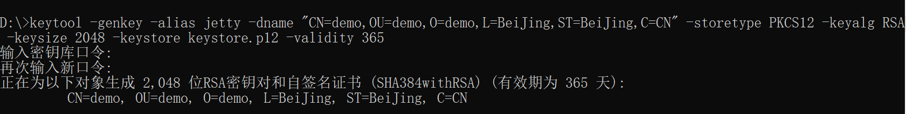

生成是需要输入口令，两次口令保持一致，并且后期配置文件中需要配置。

我在 `d:\`目录下执行的命令，该证书文件会生成的这里：


## 后端项目配置 HTTPS

将数字证书文件拷贝 `resources`根目录下，如下：

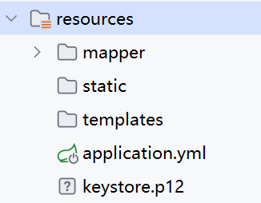

在 `application.yml`文件中配置启用 HTTPS，以及配置证书相关信息：在 server 节点下面配置

```yaml
server:
  ……
  ssl:
    enabled: true
    key-store-type: PKCS12
    key-store: classpath:keystore.p12
    key-store-password: 123456
```

编写测试的 Controller，新建 `HttpsTestController`，编写以下代码：

```java
package com.jkweilai.meinian.api.controller;

import com.jkweilai.meinian.api.common.R;
import org.springframework.web.bind.annotation.GetMapping;
import org.springframework.web.bind.annotation.RequestMapping;
import org.springframework.web.bind.annotation.RestController;

@RestController
// 为什么需要手动指定以json格式响应？默认的响应格式是json，为什么还需要指定？
// 问题根源是支付 starter 包引入了 XML 支持，导致 Spring Boot 自动配置了 XML 消息转换器。
@RequestMapping(value = "/test", produces = "application/json")
public class HttpsTestController {

    @GetMapping("/ssl")
    public R test(){
        return R.ok("执行成功");
    }
}
```

打开浏览器，访问地址：[https://localhost:8080/meinian-api/test/ssl](https://localhost:8080/meinian-api/test/ssl)

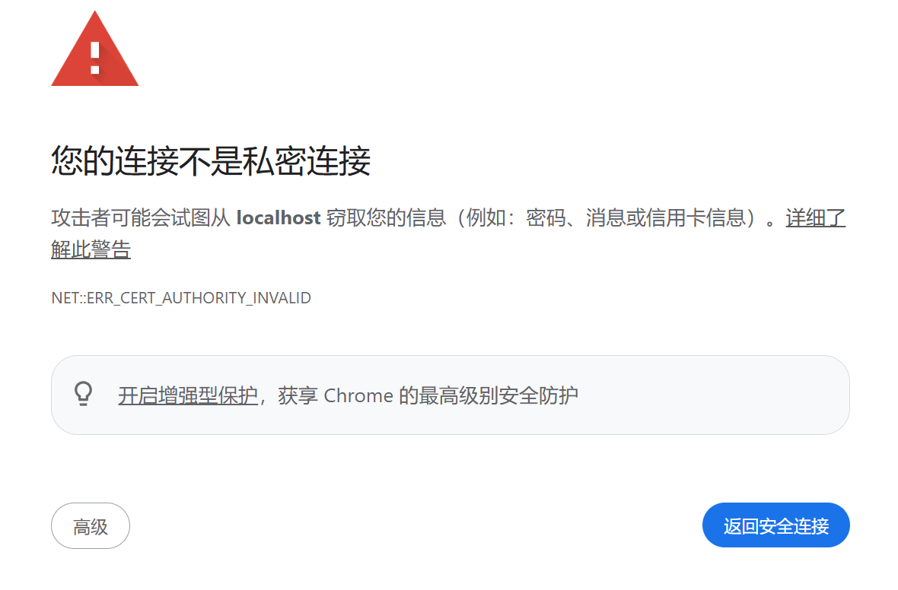

出现这个问题没关系，点击高级：

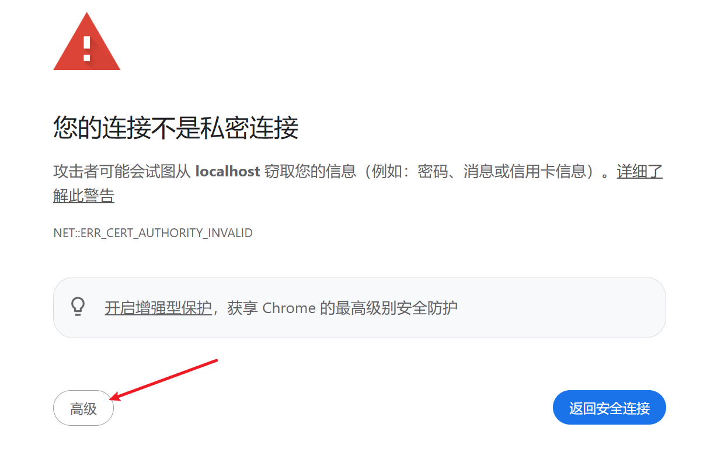

点击继续前往：


执行结果如下：

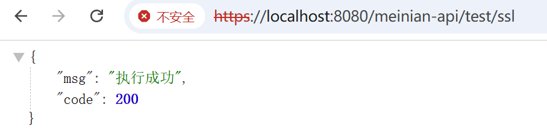

**注意：以后前端发送 AJAX 请求后端接口时都要使用 **`**<font style="color:#DF2A3F;">https://</font>**`**方式。**

## 前端项目配置 HTTPS

前端项目在构建后将部署至 Nginx 服务器，因此只需在 Nginx 层面统一配置 HTTPS 证书。

开发阶段，前端服务器不需要配置 HTTPS。

# 用户管理模块实现

系统包含两个用户管理体系：

1. mis 端的用户管理。（我们先实现这个。）
2. 业务端的客户管理。

## 数据库 ER 图

在 `Navicat for MySQL`工具中可以使用以下方式查看数据库 ER 图：


以下是实现用户管理模块的相关的三张表：

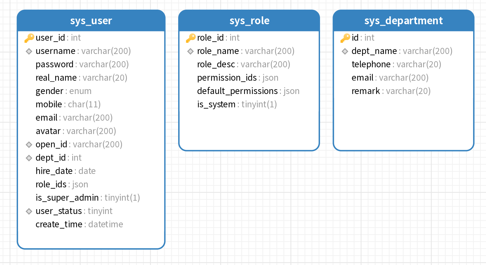

**每个表的每个字段的解释：**

**用户表：**`**sys_user**`


- 密码字段：存储加密之后的数据
- 开放平台 id：为移动端、小程序准备的字段
- 部门 id：虽然是外键，但实际开发中一般不添加外键约束。通过页面上数据来控制外键关系。
- role_ids：json 类型
- is_super_admin：1 表示超级管理员，超级管理员只有一个，0 表示非超级管理员
- user_status 用户状态：1 表示在职（启用），2 表示离职（禁用）

**角色表：**`**sys_role**`

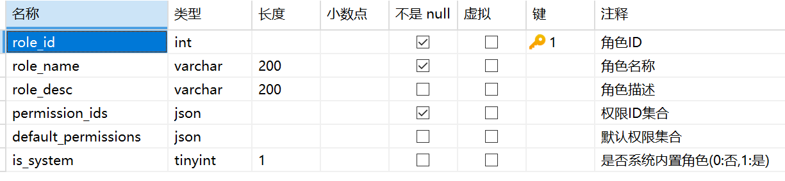

- is_system：该字段值 1 表示该角色是系统内置角色，不可删除，不可修改。如果为 0 则表示后期新增的角色，可删除，可修改。
- default_permissions：系统内置角色的默认权限。用户登录成功后获取用户有哪些权限时和这个字段没有关系。
- permission_ids：这是该角色对应的具体的权限。用户登录成功后获取用户有哪些权限时，查的就是这个字段。

**部门表：**`**sys_department**`


## UI 界面截图

**用户登录页：**


**用户列表页：**


**模态窗口页：**


## 用户管理模块用例图

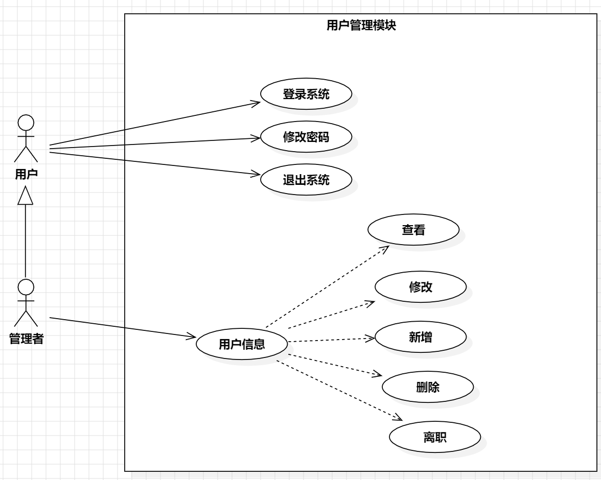

用户管理模块主要涉及两类角色：普通用户与管理者。

- **普通用户**拥有系统的基本操作权限，包括登录系统、修改个人密码及退出系统。请注意，每位用户仅能修改自己的密码，此项权限不可转移给他人，即便是超级管理员也无权修改其他用户的密码。
- **管理者**（如总经理、部门经理等管理角色的抽象集合）在继承普通用户所有功能的基础上，额外拥有对用户信息进行增、删、改、查（CRUD）的操作权限。

此外，管理者的具体操作权限是动态可配的。例如，系统可以通过角色管理模块灵活设置，允许某位管理者仅查看用户信息，而无权进行修改或其他操作。

## 实现用户管理模块 Vue 页面的搜索框

### 创建 Vue 页面配置路由

在 `src/views/mis`目录下新建 `user.vue`文件，然后在 `src/router/index.ts`文件中配置路由信息：

```typescript
// mis端
{
    path: '/mis',
    name: 'Main',
    component: () => import('../views/mis/main.vue'),
    children: [
        ......,
        {
            path: 'user',
            name: 'MisUser',
            component: ()=>import('../views/mis/user.vue'),
            meta: {
                title: "用户管理",
                isTab: true
            }
        }
    ]
}
```

### 编写模型层

根据页面上需要的数据编写模型层：

```typescript

<script lang="ts" setup>
    import { reactive, getCurrentInstance, ref, onMounted } from 'vue';
    const { proxy } = getCurrentInstance();
    import { dayjs } from 'element-plus';

    // 给表单绑定数据
    const dataForm = reactive({
        name: '',
        sex: '',
        role: '',
        deptId: '',
        status: '',
        roleList: [],
        deptList: []
    });
    // 数据校验规则
    const dataRule = reactive({
        name: [{ required: false, pattern: '^[\u4e00-\u9fa5]{1,10}$', message: '姓名格式错误' }]
    });
</script>
```

### 编写视图层

```html
<template>
    <div>
        <!-- 没有el-form同样可以显示页面，为什么用它？主要是用它来完成表单验证功能 -->
        <!-- :inline="true" 表示控件排成一行 -->
        <!-- :model="dataForm" 表单数据绑定 -->
        <!-- :rules="dataRule" 关联验证规则 -->
        <!-- ref="form" 这个给表单起个名，以后获取表单通过名字来获取 -->
        <el-form :inline="true" :model="dataForm" :rules="dataRule" ref="form">
            <!-- prop="name" 对应的就是 dataRule 中的 name 属性，这样就关联上验证了 -->
            <el-form-item prop="name">
                <!-- class="input" 是自己设置的样式，用来设置表单控件宽度，因为默认情况下，表单控件太宽了 -->
                <el-input v-model="dataForm.name" placeholder="姓名"
                    maxlength="10" class="input" clearable />
            </el-form-item>
            <el-form-item>
                <el-select v-model="dataForm.sex" class="input" placeholder="性别"
                    clearable>
                    <el-option label="男" value="男" />
                    <el-option label="女" value="女" />
                </el-select>
            </el-form-item>
            <el-form-item>
                <el-select v-model="dataForm.role" class="input"
                    placeholder="角色" clearable>
                    <!-- 这个位置将来模型层有数据了，自然就显示了 -->
                    <el-option v-for="one in dataForm.roleList"
                        :label="one.roleName" :value="one.roleName" />
                </el-select>
            </el-form-item>
            <el-form-item>
                <el-select v-model="dataForm.deptId" class="input"
                    placeholder="部门" clearable>
                    <!-- 这个位置也是这样，将来发送ajax请求之后就有数据了 -->
                    <el-option v-for="one in dataForm.deptList"
                        :label="one.deptName" :value="one.id" />
                </el-select>
            </el-form-item>
            <el-form-item>
                <el-select v-model="dataForm.status" class="input"
                    placeholder="状态" clearable>
                    <el-option label="在职" value="1" />
                    <el-option label="离职" value="2" />
                </el-select>
            </el-form-item>
            <el-form-item>
                <!-- 这些事件对应的函数还没有写，后面写 -->
                <el-button type="primary" @click="searchHandle()">查询</el-button>
                <!-- 当前用户至少有 ROOM或者USER:INSERT中的任何一个权限，这个按钮才能显示 -->
                <el-button type="primary"
                    :disabled="!proxy.isAuth(['ROOT', 'USER:INSERT'])"
                    @click="addHandle()">
                    新增
                </el-button>
                <!-- 当前用户至少有 ROOT或者USER:DELETE中的任何一个权限，这个按钮才能显示 -->
                <el-button type="danger"
                    :disabled="!proxy.isAuth(['ROOT', 'USER:DELETE'])"
                    @click="deleteHandle()">
                    批量删除
                </el-button>
            </el-form-item>
        </el-form>
    </div>
</template>
```

### 注意事项

由于我们尚未实现登录功能，浏览器的 storage 无法自动保存令牌和权限信息。因此，我们可以手动向 storage 中添加模拟数据。如果不这样做，当你访问人员管理页面时，Vue 路由会检测到 storage 中没有有效数据，判定你尚未登录，从而自动跳转到登录页面。

要想访问资源，需要向 `<font style="color:rgb(15, 17, 21);">localStorage</font>`中写入两个数据：

1. token：随便写一个就行
2. permissions：这个需要写入 `[ROOT]`

**你这里可能会有疑问？如果在 **`**<font style="color:#DF2A3F;">storage</font>**`**中可以直接写如 token 和 permissions 的话，这个系统的权限不就没用了吗？**

- **并不是这样的，首先我们这样做是为了骗过浏览器，便捷我们前端项目的开发。**
- **实际项目在运行时，后端服务器会校验你前端提交过来的 token 对不对。另外后端系统也会动态查询你真实的权限，**
- **从纯前端视角来看，向 storage 中写入了 permissions 为 [ROOT] ，黑客确实能看到页面元素了，但无法获得真实的权限，数据接口全部访问失败，真实数据永远拿不到。**

以下是在谷歌浏览器中，向 storage 中写入的方法：

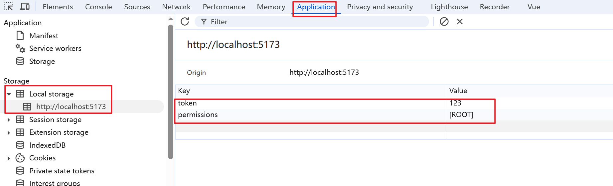

### 测试效果如下


## 实现用户管理模块 Vue 页面的表格和分页

### 编写模型层

在 `user.vue`文件中的 `dataRule`后面添加以下代码：

```typescript
const data = reactive({
    // 为表格准备的数据
    dataList: [],
    // 页码
    pageIndex: 1,
    // 每页显示多少条记录
    pageSize: 10,
    // 总记录条数
    totalCount: 0,
    // 控制是否显示加载动画：true表示显示加载动画，false表示不显示加载动画
    loading: false,
    // 被选中的记录
    selections: []
});
```

### 编写视图层

在搜索框 `el-form`下面编写以下代码：

```html
<!-- :data="data.dataList" 为表格提供数据，现代开发不需要写v-for，
 直接底层自动从数组中取出数据遍历生成表格行，data.dataList存储的是
 当前页数据，不是数据库中全部数据 -->
<!-- :header-cell-style 设置表头背景色 -->
<!-- border 表示表格的每个单元格都有边框 -->
<!-- v-loading="data.loading" 决定是否显示加载动画 -->
<!-- @selection-change="selectionChangeHandle" 勾选复选框时的回调 -->
<el-table :data="data.dataList"
:header-cell-style="{'background':'#f5f7fa'}" border
v-loading="data.loading" @selection-change="selectionChangeHandle">

    <!-- type="selection" 规定这一列是复选框列 -->
    <!-- header-align="center" 表示表头内容居中 -->
    <!-- align="center" 表示列中数据居中 -->
    <el-table-column type="selection" header-align="center"
        align="center" width="50" />
    
    <!-- 这一列是序号，不是主键值哈。 -->
    <!-- type="index" 告诉EP组件，这一列不用绑定数据，请自动帮我生成行号 -->
    <el-table-column type="index" header-align="center" align="center"
        width="100" label="序号">
        <!-- 
            scope 是一个回调参数，它包含了当前这行表格数据的所有信息。
            可以把它理解成一个数据快递包，ElTable 会自动把这一行的数据
            “打包”好，通过 scope 传递给你。 
            scope.$index: 当前行在【当前页面】的索引（从0开始）
            scope.row: 当前行的完整数据对象 
            scope.column: 当前列的信息
            scope.store: 表格的状态管理
        -->
        <template #default="scope">
            <!-- 这是序号的算法 -->
            <span>{{ (data.pageIndex - 1) * data.pageSize + scope.$index + 1 }}</span>
        </template>
    </el-table-column>
    <!-- prop="name" 这个 name是后端java对象的属性名 -->
    <el-table-column prop="realName" header-align="center" align="center"
        min-width="100" label="姓名" />
    <el-table-column prop="gender" header-align="center" align="center"
        min-width="60" label="性别" />
    <el-table-column prop="mobile" header-align="center" align="center"
        min-width="130" label="电话" />
    <!-- :show-overflow-tooltip="true" 设置为true表示采用缩略显示 -->
    <el-table-column prop="email" header-align="center" align="center"
        min-width="240" label="邮箱" :show-overflow-tooltip="true" />
    <el-table-column prop="hireDate" header-align="center"
        align="center" min-width="130" label="入职日期" />
    <el-table-column prop="roles" header-align="center" align="center"
        min-width="150" label="角色" :show-overflow-tooltip="true" />
    <el-table-column prop="deptName" header-align="center" align="center"
        min-width="120" label="部门" />
    <el-table-column prop="userStatus" header-align="center" align="center"
        min-width="100" label="状态" />
    <el-table-column header-align="center" align="center" width="150"
        label="操作">
        <template #default="scope">
            <!-- type="text" 表示按钮没有边框，看起来像文字。 -->
            <el-button type="text"
                v-if="proxy.isAuth(['ROOT', 'USER:UPDATE'])"
                @click="updateHandle(scope.row.id)">
                修改
            </el-button>
            <el-button type="text"
                v-if="proxy.isAuth(['ROOT', 'USER:UPDATE'])"
                :disabled="scope.row.status == '离职' || scope.row.root"
                @click="dismissHandle(scope.row.id)">
                离职
            </el-button>
            <el-button type="text" :disabled="scope.row.root"
                v-if="proxy.isAuth(['ROOT', 'USER:DELETE'])"
                @click="deleteHandle(scope.row.id)">
                删除
            </el-button>
        </template>
    </el-table-column>
</el-table>
<!-- EP组件库的分页组件 -->
<!-- :current-page 当前页码 -->
<!-- :page-size 每页显示多少条记录 -->
<!-- :total 总记录条数 -->
<!-- :page-sizes  它定义了一个下拉选择框，让用户可以快速切换每页显示的数据条数-->
<!-- layout 分页最下面一行显示什么内容，顺序是怎样的 -->
<el-pagination @size-change="sizeChangeHandle"
    @current-change="currentChangeHandle" :current-page="data.pageIndex"
    :page-sizes="[10, 20, 50]" :page-size="data.pageSize"
    :total="data.totalCount"
    layout="total, sizes, prev, pager, next, jumper"></el-pagination>
```

### 测试效果如下

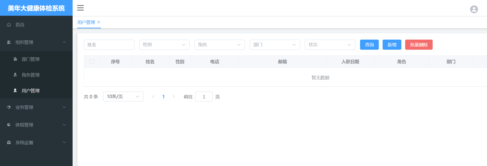

## 实现用户管理模块 Vue 页面的弹窗

### 编写模型层

接着在之前的 `data`下面编写以下代码：

```typescript
const dialog = reactive({
    // 控制模态窗口显示/隐藏
    visible: true, 
    // 区分是修改还是新增的标记
    update: false,
    // 给表单绑定数据
    dataForm: {
        // 新增时不需要id，修改时需要id
        id: null,
        username: null,
        // 新增员工时需要密码框，修改时不需要密码框，因为密码只能员工自己修改
        password: null,
        realName: null,
        gender: null,
        mobile: null,
        email: null,
        // 入职日期希望有默认值，使用了dayjs库
        hireDate: dayjs(new Date()).format('YYYY-MM-DD'),
        // 对应选中的角色
        role: null,
        // 对应选中的部门
        deptId: null,
        // 默认值1表示在职
        userStatus: 1
    },
    dataRule: {
        // 校验规则
        username: [
            { required: true, message: '用户名不能为空' },
            { pattern: '^[a-zA-Z0-9]{5,20}$', message: '用户名格式错误' }
        ],
        password: [
            { required: true, message: '密码不能为空' },
            { pattern: '^[a-zA-Z0-9]{6,20}$', message: '密码格式错误' }
        ],
        realName: [
            { required: true, message: '姓名不能为空' },
            { pattern: '^[\u4e00-\u9fa5]{2,10}$', message: '姓名格式错误' }
        ],
        gender: [{ required: true, message: '性别不能为空' }],
        mobile: [{ required: true, message: '电话不能为空' }, { pattern: '^1[1-9]\\d{9}$', message: '电话格式错误' }],
        email: [
            { required: true, message: '邮箱不能为空' },
            { pattern: '^([a-zA-Z]|[0-9])(\\w|\\-)+@[a-zA-Z0-9]+\\.([a-zA-Z]{2,4})$', message: '邮箱格式错误' }
        ],
        hireDate: [{ required: true, message: '入职日期不能为空' }],
        role: [{ required: true, message: '角色不能为空' }],
        userStatus: [{ required: true, message: '状态不能为空' }]
    }
});
```

### 编写视图层

在 `div`下面写，不是 `div`里面写，编写以下代码：

```plaintext
<!-- :title 是动态的，是新增还是修改，看id是不是null，是null就是新增 -->
<!-- :close-on-click-modal="false" 设置点击模态窗口之外的阴影是否隐藏模态窗口，false不隐藏 -->
<!-- v-model="dialog.visible" 控制模态窗口隐藏/显示 -->
<el-dialog :title="!dialog.dataForm.id ? '新增' : '修改'"
    :close-on-click-modal="false" v-model="dialog.visible" width="450px">
    <!-- :model="dialog.dataForm" 表单上绑定的数据 -->
    <!-- ref="dialogForm" 给表单起个名字 -->
    <!-- :rules="dialog.dataRule" 给表单关联校验规则 -->
    <el-form :model="dialog.dataForm" ref="dialogForm"
        :rules="dialog.dataRule" label-width="80px">
        <!-- prop="username"是将username的校验规则绑定到表单项上 -->
        <el-form-item label="用户名" prop="username">
            <el-input v-model="dialog.dataForm.username" maxlength="20"
                clearable />
        </el-form-item>
        <!-- v-if="!dialog.update" 用来决定密码框显示还是隐藏 -->
        <el-form-item label="密码" prop="password" v-if="!dialog.update">
            <el-input type="password" v-model="dialog.dataForm.password"
                maxlength="20" clearable />
        </el-form-item>

        <el-form-item label="姓名" prop="realName">
            <el-input v-model="dialog.dataForm.realName" maxlength="10"
                clearable />
        </el-form-item>
        <el-form-item label="性别" prop="gender">
            <el-select v-model="dialog.dataForm.gender" clearable>
                <el-option label="男" value="男"></el-option>
                <el-option label="女" value="女"></el-option>
            </el-select>
        </el-form-item>
        <el-form-item label="电话" prop="mobile">
            <el-input v-model="dialog.dataForm.mobile" maxlength="11"
                clearable />
        </el-form-item>
        <el-form-item label="邮箱" prop="email">
            <el-input v-model="dialog.dataForm.email" maxlength="200"
                clearable />
        </el-form-item>
        <el-form-item label="入职日期" prop="hireDate">
            <!-- type="date" 表示日期的格式只需要年月日 -->
            <!-- :editable="false" 表示用户不可输入，只能鼠标操作 -->
            <!-- value-format="YYYY-MM-DD" 表示js代码读取日期时的日期格式 -->
            <el-date-picker v-model="dialog.dataForm.hireDate" type="date"
                placeholder="选择日期" :editable="false" format="YYYY-MM-DD"
                value-format="YYYY-MM-DD" />
        </el-form-item>
        <el-form-item label="角色" prop="role">
            <!-- multiple 表示可以多选 -->
            <el-select v-model="dialog.dataForm.role" placeholder="选择角色"
                class="dialog-input" multiple clearable>
                <el-option v-for="one in dataForm.roleList" :key="one.id"
                    :label="one.roleName" :value="one.id"
                    :disabled="one.roleName == '超级管理员'"></el-option>
            </el-select>
        </el-form-item>
        <el-form-item label="部门">
            <el-select v-model="dialog.dataForm.deptId" placeholder="选择部门"
                class="dialog-input" clearable>
                <el-option v-for="one in dataForm.deptList" :key="one.id"
                    :label="one.deptName" :value="one.id" />
            </el-select>
        </el-form-item>
    </el-form>
    <!-- 页脚区 -->
    <template #footer>
        <span class="dialog-footer">
            <!-- 直接将 dialog.visible 设置为false 就隐藏了。 -->
            <el-button @click="dialog.visible = false">取消</el-button>
            <el-button type="primary" @click="dataFormSubmit">确定</el-button>
        </span>
    </template>
</el-dialog>
```

### 补充一个小样式

如果你的角色和部门列表的宽度与文本框不一样宽，加上下面样式。

```plaintext
<style lang="less" scoped>
    .dialog-input {
        width: 100% !important;
    }
</style>
```

### 测试效果如下


# 用户密码加密

## 密码安全发展史

密码发展史在攻击和防御之间不断演变。没有绝对的安全。只有更安全。

1. 明文存储密码：这是最初密码的形态，黑客只要能获取到这个明文，即可登录系统。或者公司的数据库管理员离职了，把密码信息导出来拿走了。密码采用明文存储简直是裸奔。
2. 后来出现了哈希算法，哈希是不可逆的，一个好的密码应该是不可逆的。那大家可能会有一个疑问：那怎么验证用户输入的密码是否正确呢？非常简单，只要接收到用户表单提交的密码，将这个密码经过同一个哈希算法得出结果，拿这个结果和数据库表中存储的密码进行比对即可。常见的哈希算法有 MD5，SHA 等。不过这种方式也是不安全的，因为黑客自己搞了一个哈希字典，这个哈希字典又被称为彩虹表，彩虹表中是大量的随意的字符串的组合（可以看作是黑客猜测的密码），每个字符串都进行哈希得出一个结果，黑客拿着他非法获取的用户密码和彩虹表中的哈希值进行比对，只要比对成功了，他就知道这个密码的明文是什么了。得到明文就可以轻松登录你的系统了。
3. 随着黑客的攻击手段升级，简单的哈希已经无法解决安全问题了，因此为了防御，出现了“哈希再哈希”，什么意思呢？就是将密码进行哈希后得到一个字符串，这个字符串的长度一般是 32 个，然后对这 32 个长度的哈希值再进行哈希，又得到一个全新的 32 个长度的哈希值，然后将这个值最终存储到数据库中，但这种方式黑客也能破解，它仍然是利用彩虹表，他拿着你 32 个长度的哈希值经过彩虹表的查询一看结果仍然是一个 32 个长度的字符串，因此他断定这个肯定还是一个哈希值，于是再继续查找彩虹表，最终找到你的明文密码。
4. 为了增强防御，后来出现了一种方式叫做加盐，给我们的明文密码前或后或者前后添加随机的字符串（**将随机字符串存储到用户表中**，每个用户信息中都有这些随机字符串，等待校验的时候使用，没关系，这个随机字符串暴露给黑客，也没有关系，因为他不知道你的明文密码是什么），然后再对这个整体的字符串进行哈希。这种算法最终的效果是：张三和李四的密码虽然是相同的，但是存储到数据库表中的密文是不同的。如果黑客破解，就需要给每个用户都准备一个单独的彩虹表（可想而知，这个破解难度是非常大的）。不过，在这种情况下，仍然没有绝对的安全。
5. 后来为了让黑客的破解成本提高，引入了慢哈希，也就是故意让哈希算法的执行速度变慢，假设之前一个哈希计算的过程是 1 秒，现在我让哈希计算的过程提升到 10 秒，虽然会折损系统的性能，影响用户的体验，但对于安全级别较高的系统来说，这一权衡是值得的。其中 Bcrypt 和 Argon2 都是典型的、被广泛推荐的慢哈希函数。

我们的系统没必要使用慢哈希，现在我把我们系统的加密算法公开给大家，我是这样做的：将用户名进行哈希，得出一个字符串，然后取字符串的前 6 位和后 3 位，然后和用户的明文密码进行拼接，然后再哈希，然后转大写，存储到数据库表当中。哈希采用 MD5。接下来我们来编写一下登录逻辑：验证用户名和密码是否正确。

## 登录的 Mapper 程序

在 `SysUserMapper`接口中添加以下代码：

```java
Integer selectByUsernameAndPassword(@Param("username") String username, @Param("password") String password);
```

在 `SysUserMapper.xml`文件中添加以下配置：

```xml
<select id="selectByUsernameAndPassword" resultType="Integer">
    select user_id from sys_user where username = #{username} and password = #{password} and user_status = 1 limit 1
</select>
```

这里需要提醒一下：使用 `limit 1`的作用是提高效率，因为不用它的话，当查询到匹配的用户信息之后，它还会继续扫描其他记录，添加了它之后，如果扫描到记录之后，就直接返回第一条记录，不再继续扫描后续数据，效率高一些。

## 登录的 service 程序

创建 `service`包，然后在该包下新建 `SysUserService`接口。然后编写以下代码：

```java
package com.jkweilai.meinian.api.service;

import java.util.Map;

public interface SysUserService {
    
    Integer login(Map<String, Object> userMap);
    
}
```

编写 service 接口的实现类，代码如下：

```java
package com.jkweilai.meinian.api.service.impl;

import cn.hutool.core.map.MapUtil;
import cn.hutool.core.util.StrUtil;
import cn.hutool.crypto.digest.MD5;
import com.jkweilai.meinian.api.db.mapper.SysUserMapper;
import com.jkweilai.meinian.api.service.SysUserService;
import jakarta.annotation.Resource;
import org.springframework.stereotype.Service;

import java.util.Map;

@Service
public class SysUserServiceImpl implements SysUserService {

    @Resource
    private SysUserMapper sysUserMapper;

    @Override
    public Integer login(Map<String, Object> userMap) {
        // 获取用户提交的用户名和密码
        String username = MapUtil.getStr(userMap, "username");
        String password = MapUtil.getStr(userMap, "password");
        // 获取MD5对象
        MD5 md5 = MD5.create();
        // 对用户名进行哈希
        String usernameMD5 = md5.digestHex(username);
        // 获取前6位
        String usernameMD5Start = StrUtil.subWithLength(usernameMD5, 0, 6);
        // 获取后3位
        String usernameMD5End = StrUtil.subSuf(usernameMD5, usernameMD5.length() - 3);
        // 拼接密码
        password = usernameMD5Start + password + usernameMD5End;
        // 经过哈希,然后转换大写
        String pwd = md5.digestHex(password).toUpperCase();
        // 验证用户名和密码
        return sysUserMapper.selectByUsernameAndPassword(username, pwd);
    }
}
```

这段代码是将用户登录表单提交过来的密码进行一系列运算之后得到一个字符串，然后拿这个字符串和底层数据库中真实存储的密码进行比对，一致则登录成功。

# 编写登录的 RESTful 接口

## 编写接收前端数据的 LoginForm

LoginForm 负责接收前端提交过来的 username 和 password。

在 LoginForm 中编写后端验证代码，例如：不能为空，长度限制，包含什么字符等。

在 `controller`包下新建 `form`包。

代码如下：

```java
package com.jkweilai.meinian.api.controller.form;

import jakarta.validation.constraints.NotBlank;
import jakarta.validation.constraints.Pattern;
import lombok.Data;

@Data
public class LoginForm {
    @NotBlank(message = "username不能为空")
    @Pattern(regexp = "^[a-zA-Z0-9]{5,50}$", message = "username格式错误")
    private String username;

    @NotBlank(message = "password不能为空")
    @Pattern(regexp = "^[a-zA-Z0-9]{6,20}$", message = "password格式错误")
    private String password;
}
```

## 编写 UserController 的 login 方法

在 `controller`包下新建 `UserController`，提供 `login`方法。实现逻辑如下：

1. 要求前端发送 POST 请求（以 JSON 格式提交用户名和密码）
2. 后端将用户名和密码接收到 `LoginForm`中。
3. 将 `LoginForm`转换成普通的 Map。
4. 调用 `SysUserService`的 `login`方法进行登录。
5. 登录失败的话返回失败消息。
6. 登录成功的话：同端互斥，生成令牌，获取用户权限列表，响应令牌和用户权限列表以及登录成功的状态信息给前端。

代码如下：

```java
package com.jkweilai.meinian.api.controller;

import cn.dev33.satoken.stp.StpUtil;
import cn.hutool.core.bean.BeanUtil;
import com.jkweilai.meinian.api.common.R;
import com.jkweilai.meinian.api.controller.form.LoginForm;
import com.jkweilai.meinian.api.service.SysUserService;
import jakarta.annotation.Resource;
import jakarta.validation.Valid;
import org.springframework.web.bind.annotation.PostMapping;
import org.springframework.web.bind.annotation.RequestBody;
import org.springframework.web.bind.annotation.RequestMapping;
import org.springframework.web.bind.annotation.RestController;

import java.util.List;
import java.util.Map;

@RestController
@RequestMapping("/mis/user")
public class UserController {

    @Resource
    private SysUserService sysUserService;

    @PostMapping("/login")
    public R login(@RequestBody @Valid LoginForm loginForm){
        // 将loginForm转换成Map
        Map<String, Object> loginMap = BeanUtil.beanToMap(loginForm);
        // 调用service登录
        Integer userId = sysUserService.login(loginMap);
        if (userId != null) {
            // 登录成功，生成令牌
            StpUtil.login(userId, "Web");
            // 获取令牌
            String token = StpUtil.getTokenValueByLoginId(userId, "Web");
            // 获取权限列表
            List<String> permissions = StpUtil.getPermissionList(); // Sa-Token框架底层会调用 StpInterfaceImpl中的 getPermissionList 方法。
            // 响应
            return R.ok().put("result", true).put("token", token).put("permissions", permissions);
        }
        // 登录失败
        return R.ok().put("result", false);
    }
}
```

## 测试 RESTful 接口

把之前超级管理员的角色再修改回去，超级管理员的角色是 `[0]`，如下：


打开 Apipost，发送 POST 请求，提交 JSON 字符串（JSON 中提交用户名 admin，密码 abc123456），然后测试接口：

接口地址（注意是 HTTPS 协议）：[https://localhost:8080/meinian-api/mis/user/login](https://localhost:8080/meinian-api/mis/user/login)

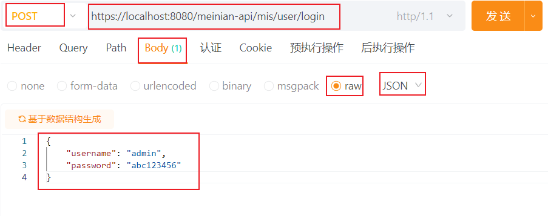

登录成功结果如下：


登录失败结果如下：


# 完成前端项目的登录功能

实现思路：

1. 在 `login.vue`页面中编写代码，重点编写一个 `login()`函数
2. 在 login 函数中使用 axios 方法 ajax POST 请求，提交用户名和密码。
3. 在发送 ajax 请求之前要进行前端验证，验证用户名和密码格式是否正确，注意：导入我们之前编写的前端验证的函数，使用验证函数进行验证。
4. 登录成功后，将 token 和 permissions 保存到 localStorage 中。跳转到 MisHome， 最后打开浏览器看看 localStorage 中是否有数据。
5. 登录失败，或者前端验证失败，都要给用户提示信息。使用 EP 组件弹出错误信息。

先安装 axios 库，保证能够发送 axios 请求：

```bash
npm i axios
```

代码实现如下：在 `login.vue`的 `<script>`标签中编写

```typescript
// 导入前端验证函数
import { isUsername, isPassword } from '../../utils/validate';
// 导入axios
import axios from 'axios';

// 登录函数
async function login(){

    // 验证用户名是否合法
    if(!isUsername(loginInfo.username)){
        proxy.$message({
            // 提示信息
            message: "用户名格式错误",
            // 错误信息，以红色显示
            type: 'error',
            // 持续1200毫秒
            duration: 1200
        });
    } else if(!isPassword(loginInfo.password)){// 验证密码是否合法
        proxy.$message({
            // 提示信息
            message: "密码格式错误",
            // 错误信息，以红色显示
            type: 'error',
            // 持续1200毫秒
            duration: 1200
        });
    } else {
        // 封装数据
        const loginData = {
            username: loginInfo.username,
            password: loginInfo.password
        };
        // 配置
        const config = {
            headers: {
                'Content-Type': 'application/json'
            }
        };
        // 使用axios发送ajax post请求
        const response = await axios.post('/meinian-api/mis/user/login', loginData, config);
        // 获取响应数据
        const data = response.data;
        if(data.result){
            // 登录成功
            // 存储token和permissions到本地浏览器
            localStorage.setItem('token', data.token);
            localStorage.setItem('permissions', JSON.stringify(data.permissions));
            // 跳转到欢迎页
            router.push({name: 'MisHome'});
        }else{
            // 登录失败
            proxy.$message({
                message: "登录失败",
                type: 'error',
                duration: 1200
            });
        }
    }
}
```

注意：前端发送的 ajax 请求路径必须以 `/meinian-api`开头。因为 Vite 代理中我们是配置过的。只有以这个路径开头的才会走代理。Vite 才会给你代理到这个路径下：`https://localhost:8080/meinian-api/mis/user/login`，然后才能访问到服务器端的资源。

登录成功后会跳转到欢迎页面，最后查看 localStorage，如下表示成功了：

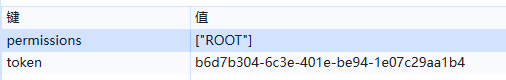

# 实现登出 MIS 系统

## 后端接口实现

退出系统你只需要做一件事：销毁 token 即可。

在 `UserController`类中继续编写 `logout`方法，方法中的代码如下：

```java
@GetMapping("/logout")
// 只有已经登录的用户才能登出，这个注解是Sa-Token用来检查用户是否已经登录的。如果已经登录才能执行这个方法，如果没有登录，这个方法就不会执行。
@SaCheckLogin
public R logout(){
    // 获取userId信息。
    int userId = StpUtil.getLoginIdAsInt();
    // 销毁token（Web端用户退出，app端，小程序端仍然是登录状态）
    StpUtil.logout(userId, "Web");
    // 返回结果即可。
    return R.ok();
}
```

## 前端请求接口的实现

在`main.vue`页面找到 退出 按钮，它绑定了回调函数 `logout`，我们编写一个 logout 回调函数即可。

在 logout 回调函数中，我们发送 ajax 请求，提交 token，访问后端接口：https://localhost:8080/meinian-api/mis/user/logout

ajax 请求成功响应回来之后，清除浏览器 localStorage 中的 permissions 和 token，然后路由到登录页即可。代码如下：

```plaintext
async function logout(){
    try{
        // 获取token
        const token = localStorage.getItem('token');
        
        // 设置请求头（需要提交token，不提交它就没有权限）
        const config = {
            headers: {
                // 这个地方的名字必须和yml配置中的名字一致。
                'satoken': token
            }
        };
        
        // 发送ajax请求
        const response = await axios.get('/meinian-api/mis/user/logout', config);
        
        // 获取响应数据
        const data = response.data;
        
        // 如果响应成功
        if(data.code == 200){
            // 删除本地token和permissions
            localStorage.removeItem('token');
            localStorage.removeItem('permissions')
            // 路由到登录页
            router.push({name: 'MisLogin'});
        }
    }catch(error){
        console.log('错误对象:', error);
        console.log('响应数据:', error.response);
        console.log('错误信息:', error.message);
        console.log('错误代码:', error.code);
    }
}
```

分别启动前端服务器，后端服务器，然后测试一下，点击退出系统按钮，看看是否能够退出到登录页，然后再查看浏览器的本地存储中 token 和 permissions 是不是没有了：

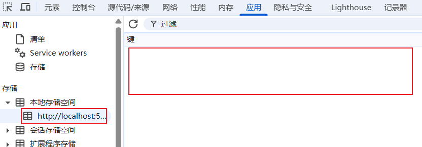

# 更新密码

## 更新密码的 web 接口实现


上面是时序图，实现思路，请认真阅读。

### 编写 Mapper

在 `SysUserMapper.xml`文件中编写以下两个 SQL：

```xml
<select id="selectUsernameById" resultType="string">
    select username from sys_user where user_id = #{userId}
</select>

<update id="updatePassword">
    update sys_user set password = #{newPassword} where password = #{oldPassword} and user_id = #{userId}
</update>
```

在 `SysUserMapper`接口中编写以下代码：

```java
public interface SysUserMapper {

    // ......

    String selectUsernameById(int id);

    int updatePassword(@Param("userId") int id, @Param("oldPassword") String oldPassword, @Param("newPassword") String newPassword);

}
```

### 编写 Service

编写核心业务方法，在 `SysUserService`接口中定义方法，在 `SysUserServiceImpl`中编写实现：

```java
public interface SysUserService {

    // ......

    int modifyPassword(Map<String, Object> param);

}
```

```java
@Override
@Transactional
public int modifyPassword(Map<String, Object> param) {
    // 获取userId
    int userId = MapUtil.getInt(param, "userId");
    // 获取用户名
    String username = sysUserMapper.selectUsernameById(userId);
    // 获取oldPassword
    String oldPassword = MapUtil.getStr(param, "oldPassword");
    // 获取newPassword
    String newPassword = MapUtil.getStr(param, "newPassword");
    
    // 原密码混淆加密
    MD5 md5 = MD5.create();
    // 对用户名进行哈希
    String usernameMD5 = md5.digestHex(username);
    // 获取前6位
    String usernameMD5Start = StrUtil.subWithLength(usernameMD5, 0, 6);
    // 获取后3位
    String usernameMD5End = StrUtil.subSuf(usernameMD5, usernameMD5.length() - 3);
    // 拼接密码
    oldPassword = usernameMD5Start + oldPassword + usernameMD5End;
    // 经过哈希,然后转换大写
    oldPassword = md5.digestHex(oldPassword).toUpperCase();
    
    // 新密码混淆加密
    // 拼接密码
    newPassword = usernameMD5Start + newPassword + usernameMD5End;
    // 经过哈希,然后转换大写
    newPassword = md5.digestHex(newPassword).toUpperCase();
    
    // 更新密码
    int count = sysUserMapper.updatePassword(userId, oldPassword, newPassword);

    return count;
}
```

### 编写 web 代码

编写接收前端数据的 Form 对象 `ModifyPasswordForm`，代码如下：

```java
package com.jkweilai.meinian.api.controller.form;

import jakarta.validation.constraints.NotBlank;
import jakarta.validation.constraints.Pattern;
import lombok.Data;

@Data
public class ModifyPasswordForm {
    
    @NotBlank(message = "原密码不能为空")
    @Pattern(regexp = "^[a-zA-Z0-9]{6,20}$", message = "原密码格式错误")
    String oldPassword;

    @NotBlank(message = "新密码不能为空")
    @Pattern(regexp = "^[a-zA-Z0-9]{6,20}$", message = "新密码格式错误")
    private String newPassword;
}
```

编写 Controller 代码，接收前端提交的数据并自动校验数据是否合法，Sa-Token 检查用户是否已登录，然后从 token 中获取 userId，获取原密码，获取新密码，将这些数据封装到 Map 对象，然后调用 service 修改密码，代码如下：

```java
@PostMapping("/modifyPassword")
@SaCheckLogin
public R modifyPassword(@RequestBody @Valid ModifyPasswordForm modifyPasswordForm){
    // 获取用户id
    int userId = StpUtil.getLoginIdAsInt();
    // 获取原密码
    String oldPassword = modifyPasswordForm.getOldPassword();
    // 获取新密码
    String newPassword = modifyPasswordForm.getNewPassword();
    // 将数据放到Map集合
    Map<String, Object> param = new HashMap<>(){{
        put("oldPassword", oldPassword);
        put("newPassword", newPassword);
        put("userId", userId);
    }};
    // 调用service修改密码
    int count = sysUserService.modifyPassword(param);
    // 响应
    return R.ok().put("count", count);
}
```

### 测试 web 接口

使用 Apipost 测试接口：

第一步：先用登录获取一个 token，复制这个 token


第二步：新建测试接口上设置 header


第三步：新建测试接口上设置 body 中的 json 数据

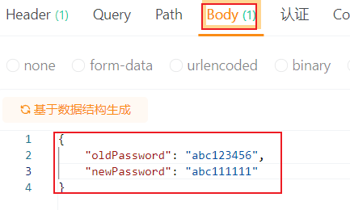

测试结果如下：

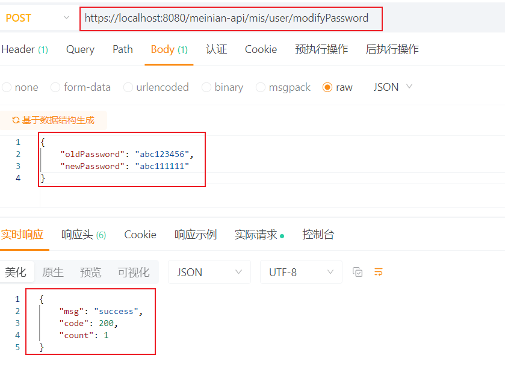

## 更新密码的前端实现

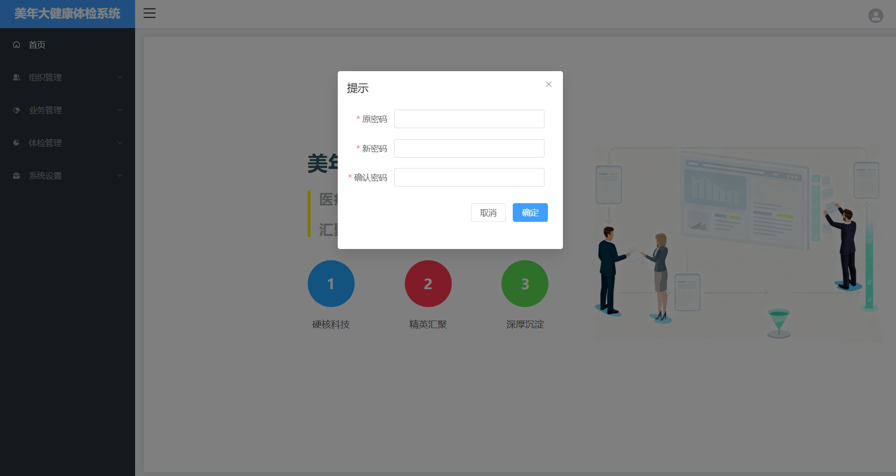

### 编写视图层代码

编写修改密码的控件，在 `src/views/mis/main.vue`中添加代码，在 `<template>`中最大的 `div`标签的外面添加以下代码：

```html
<el-dialog title="提示" v-model="dialog.visible" width="25%">
    <el-form :model="dialog.dataForm" :rules="dialog.dataRule"
        ref="dialogForm" label-width="80px">
        <el-form-item label="原密码" prop="password">
            <el-input type="password" v-model="dialog.dataForm.password"
                size="medium" maxlength="20" clearable />
        </el-form-item>
        <el-form-item label="新密码" prop="newPassword">
            <el-input type="password" v-model="dialog.dataForm.newPassword"
                size="medium" maxlength="20" clearable />
        </el-form-item>
        <el-form-item label="确认密码" prop="confirmPassword">
            <el-input type="password"
                v-model="dialog.dataForm.confirmPassword" size="medium"
                maxlength="20" clearable />
        </el-form-item>
    </el-form>
    <template #footer>
        <span class="dialog-footer">
            <el-button size="medium"
                @click="dialog.visible = false">取消</el-button>
            <el-button type="primary" size="medium"
                @click="dataFormSubmit">确定</el-button>
        </span>
    </template>

</el-dialog>
```

### 编写模型层代码

给以上的控件准备数据，代码如下：

```typescript
// 修改密码控件对应的模型层代码
const validateConfirmPassword = (rule, value, callback) => {
    // value是确认密码
    if (value != dialog.dataForm.newPassword) {
        // 通过调用回调函数来通知表单验证系统，表单验证系统根据结果动态更新UI。
        callback(new Error('两次输入的密码不一致'));
    } else {
        // 通过调用回调函数来通知表单验证系统，表单验证系统根据结果动态更新UI。
        // 函数不传参数表示验证通过。
        callback();
    }
};
const dialog = reactive({
    visible: false,
    dataForm: {
        password: '',
        newPassword: '',
        confirmPassword: ''
    },
    dataRule: {
        password: [{ required: true, pattern: '^[a-zA-Z0-9]{6,20}$', message: '密码格式错误' }],
        newPassword: [{ required: true, pattern: '^[a-zA-Z0-9]{6,20}$', message: '密码格式错误' }],
        confirmPassword: [
            { required: true, pattern: '^[a-zA-Z0-9]{6,20}$', message: '密码格式错误' },
            // blur失去焦点则调用validateConfirmPassword进行验证
            { validator: validateConfirmPassword, trigger: 'blur' }
        ]
    }
});
```

用户要修改密码，需要点击右上角列表项中的修改密码按钮：

```html
<template #dropdown>
    <el-dropdown-menu>
        <el-dropdown-item @click="updatePassword">修改密码</el-dropdown-item>
        <el-dropdown-item @click="logout">退出</el-dropdown-item>
    </el-dropdown-menu>
</template>
```

编写 updatePassword 回调函数：

```typescript
// 变量名必须和template中的ref属性值相同。
const dialogForm: Ref = ref(null);

async function updatePassword(){
    // 显示修改密码的弹窗
    dialog.visible = true;
    // 等弹窗完全显示出来
    await nextTick();
    // 重置表单
    if(dialogForm.value != null){
        // 将表单重置到初始值状态，并清空所有错误提示信息。
        dialogForm.value.resetFields();
    }
}
```

### 校验表单并发送 ajax 请求

用户修改密码之后，点击确定按钮，发送 ajax 请求，这个回调函数如下：

```typescript
    async function dataFormSubmit(){
        if(dialogForm.value){
            // 获取表单并验证（底层调用了EP组件库的验证系统）
            // 虽然EP组件库可以自动校验，但是在提交表单前，我们需要确认下校验结果，下面代码的作用是：一次性所有字段全部校验，并获取校验结果。
            let valid = await dialogForm.value.validate();
            if(valid){
                // 发送ajax请求，更新密码
                let sendData = {
                    oldPassword: dialog.dataForm.password,
                    newPassword: dialog.dataForm.newPassword
                };
                let config = {
                    headers: {
                        satoken: localStorage.getItem("token")
                    }
                };
                let response = await axios.post("/meinian-api/mis/user/modifyPassword", sendData, config);
                if(response.data.result){
                    ElMessage({
                        type: "success",
                        message: "更新成功",
                        duration: 1200
                    });
                    dialog.visible = false; // 隐藏窗口
                }else{
                    ElMessage({
                        type: "error",
                        message: "更新失败",
                        duration: 1200
                    });
                }
            }else{
                // 注意：验证失败EP组件库会自动显示错误信息
            }
        }
    }
```

# 用户分页查询

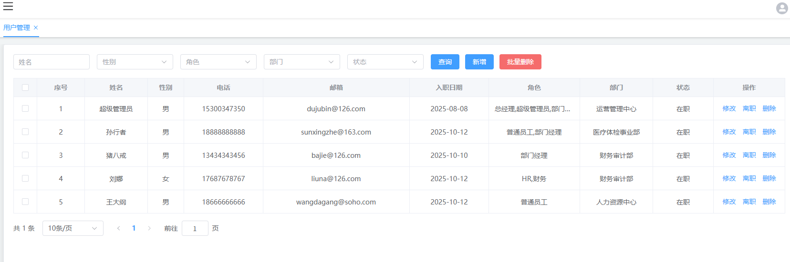

## 用户分页查询时序图


## 编写分页的 SQL

**先来看页面上用户需要什么数据：**

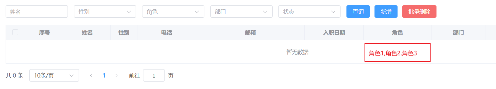

**先来总结用户提交的查询条件可能是：**

1. 姓名：支持模糊查询，姓名对应 `sys_user`表中的 `real_name`字段。
2. 性别：对应 `sys_user`表中的 `gender` 字段
3. 角色：对应 `sys_role`表中的 `role_id`字段
4. 部门：对应 `sys_department`表中的 `id`字段
5. 状态：对应 `sys_user`表中的 `user_status`字段

这些条件用户可能填写了，也可能没填写。

**再来总结一下查询结果包含哪些列：**

1. 用户 id：对应 sys_user 表的 user_id 字段
2. 姓名：对应 sys_user 表的 real_name 字段
3. 性别：对应 sys_user 表的 gender 字段
4. 电话：对应 sys_user 表的 mobile 字段
5. 邮箱：对应 sys_user 表的 email 字段
6. 入职日期：对应 sys_user 表的 hire_date 字段
7. 角色：对应 sys_role 表中的 role_name 字段【**1.需要用户表和角色表进行表连接取出该用户对应的角色名称。2.并且以上图红框中的形式获取到**】
8. 部门：对应 sys_department 表中的 dept_name 字段【**需要用户表和部门表进行表连接，由于有的用户是没有部门的，这是合理的，因此这里需要一个****左连接**】
9. 状态：对应 sys_user 表中的 user_status 字段
10. 是否为超级管理员：对应 sys_user 表中的 is_super_admin 字段

**我们这里把超级管理员的角色修改一下，如下，之前他只有一个角色 0，现在我给他加了两个角色 1 和 2，现在他有三个角色，如下：**


如果超级管理员的角色修改为 0,1,2 的话，这个超级管理员的角色应该是【**超级管理员,总经理,部门经理**】，最终页面上需要显示的内容也必须是这种逗号隔开形式的，我们先来编写这个 SQL 语句：

**第一步：**先让用户表和角色表进行表连接，连接条件是：sys_user 表的 role_ids 包含 sys_role 表的 role_id，使用 JSON_CONTAINS 函数，如下：

```sql
select 
    u.username,r.role_name 
from 
    sys_user u 
join 
    sys_role r 
on 
    json_contains(u.role_ids, cast(r.role_id as json));
```

执行效果如下：


**第二步：**怎么把上面的查询结果变成一条记录，需要使用到另一个函数：group_concat，具体 SQL 如下：

```sql
select 
    group_concat(r.role_name separator ",") as roles 
from 
    sys_user u 
join 
    sys_role r 
on 
    json_contains(u.role_ids, cast(r.role_id as json));
```

执行结果如下：


**注意：**`group_concat`在使用的时候如果没有指定分组的时候，全部查询结果作为一组，全部拼接。

**第三步：假如我们现在要查询 real_name like '%管理员%' 的用户角色的 SQL 语句就需要这样编写了：（不好理解**）

```sql
SELECT u.username,
       (SELECT GROUP_CONCAT(r.role_name SEPARATOR ",") 
        FROM sys_role r
        WHERE JSON_CONTAINS(u.role_ids, cast(r.role_id as json))) AS roles
FROM sys_user u
WHERE u.real_name LIKE "%管理员%";
```

执行结果如下：


**我们来分析一下这个 SQL 语句的执行顺序：**

1. `FROM sys_user u`：从 sys_user 表中查询
2. `WHERE u.real_name LIKE "%管理员%";`：先找出名字中含有管理员的用户信息（这个结果可能是多个）
3. 执行完第二步之后，查询结果可能是多个用户，然后一个用户一个用户过，假设这个时候过的是第一个用户：
  1. 取出第一个用户的用户名。
  2. （子查询）取出**这个用户**关联的角色集。
  3. 取出第二个用户的用户名。
  4. （子查询）取出**这个用户**关联的角色集。
  5. 以此类推。直到结束。

接下里，我们来推演一下，当查询时，用户输入的查询条件如下，并且每页显示 10 条记录，显示第 1 页的 SQL 语句该怎么写？

用户输入以下查询条件：

1. 姓名：管理员 (模糊查询)
2. 性别：男
3. 部门：运营管理中心（运营管理中心对应的部门 id=1）
4. 状态：在职（也就是 user_status = 1）
5. 角色：部门经理（部门经理对应的 role_id=2）

SQL 语句如下：

```sql
SELECT u.user_id,u.real_name,u.gender,u.mobile,u.hire_date,d.dept_name,
       (SELECT GROUP_CONCAT(a.role_name SEPARATOR ",") 
        FROM sys_role a
        WHERE JSON_CONTAINS(u.role_ids, CONVERT(a.role_id, CHAR))) AS roles
FROM sys_user u
left JOIN sys_department d on u.dept_id = d.id
WHERE 
  u.gender = '男' 
  and d.id = 1
  and u.user_status = 1
  and u.real_name LIKE "%管理员%"
  and EXISTS (
    SELECT 1 FROM sys_role r 
    WHERE JSON_CONTAINS(u.role_ids, CAST(r.role_id AS JSON))
    AND r.role_id = 2
  )
limit 0, 10;
```

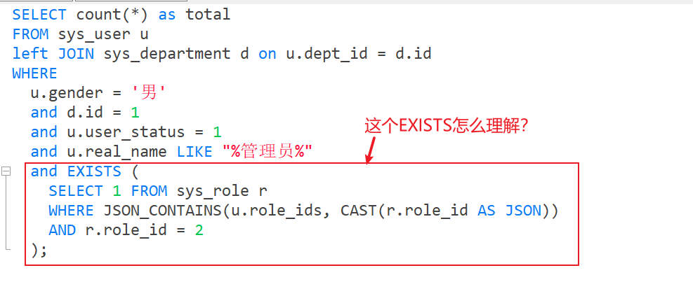

1. **EXISTS 后面小括号中的子查询，如果查询结果条数=0，则EXISTS 返回 false。**
2. **如果查询条件>0，则EXISTS 返回 true。**
3. **以上 SQL 中 EXISTS 的作用是：判断当前用户是否存在 2 号角色。（因为我们的查询条件中可以根据角色查询）**

最终执行结果如下：


## 编写查询总记录条数的 SQL

查询总记录条数的 SQL 就很简单了，只要用 `count(*)`就行了，如下：

```sql
SELECT count(*) as total
FROM sys_user u
left JOIN sys_department d on u.dept_id = d.id
WHERE 
  u.gender = '男' 
  and d.id = 1
  and u.user_status = 1
  and u.real_name LIKE "%管理员%"
  and EXISTS (
    SELECT 1 FROM sys_role r 
    WHERE JSON_CONTAINS(u.role_ids, CAST(r.role_id AS JSON))
    AND r.role_id = 2
  );
```

## 编写 Mapper 和 MapperXML

### 编写 SysUserMapper

在 `SysUserMapper`接口中提供两个方法，一个是查询用户数据，一个是统计符合查询条件的记录条数。

```java
List<Map<String, Object>> selectPageByQueryCondition(Map<String, Object> params);

long selectCountByQueryCondition(Map<String, Object> params);
```

### 编写 SysUserMapper.xml

在配置文件中编写两个 SQL，具体代码如下：

1. 查询结果列一定要全面。
2. 添加排序规则，按照 u.id 升序排列。
3. 之前编写的 SQL 语句中没有添加角色的判断条件，这里 where 条件中要添加角色的判断条件：`and r.role_id = #{roleId}`

```xml
<select id="selectPageByQueryCondition" parameterType="Map" resultType="Map">
    SELECT  u.user_id as userId,u.real_name as realName,u.gender,u.mobile,u.hire_date as hireDate,
            u.email,u.user_status as userStatus,d.dept_name as deptName,u.is_super_admin as isSuperAdmin,
            (SELECT GROUP_CONCAT(a.role_name SEPARATOR ",")
             FROM sys_role a
             WHERE JSON_CONTAINS(u.role_ids, cast(a.role_id as json))) AS roles
    FROM sys_user u
             left JOIN sys_department d on u.dept_id = d.id
    <where>
        <if test="gender != null and gender != ''">
            and u.gender = #{gender}
        </if>
        <if test="deptId != null and deptId != ''">
            and d.id = #{deptId}
        </if>
        <if test="userStatus != null and userStatus != ''">
            and u.user_status = #{userStatus}
        </if>
        <if test="roleId != null and roleId != ''">
            and EXISTS (
              SELECT 1 FROM sys_role r 
              WHERE JSON_CONTAINS(u.role_ids, CAST(r.role_id AS JSON))
              AND r.role_id = #{roleId}
            )
        </if>
        <if test="realName != null and realName != ''">
            and u.real_name like concat('%',#{realName},'%')
        </if>
    </where>
    order by u.user_id asc
    limit #{startIndex}, #{pageSize}
</select>

<select id="selectCountByQueryCondition" parameterType="Map" resultType="long">
    SELECT count(*)
    FROM sys_user u
             left JOIN sys_department d on u.dept_id = d.id
    <where>
        <if test="gender != null and gender != ''">
            and u.gender = #{gender}
        </if>
        <if test="deptId != null and deptId != ''">
            and d.id = #{deptId}
        </if>
        <if test="userStatus != null and userStatus != ''">
            and u.user_status = #{userStatus}
        </if>
        <if test="roleId != null and roleId != ''">
            and EXISTS (
              SELECT 1 FROM sys_role r 
              WHERE JSON_CONTAINS(u.role_ids, CAST(r.role_id AS JSON))
              AND r.role_id = #{roleId}
            )
        </if>
        <if test="realName != null and realName != ''">
            and u.real_name like concat('%',#{realName},'%')
        </if>
    </where>

</select>
```

## 封装分页数据

最终查询的结果要返回给前端，接下来封装 `PageResult`类，先来分析一下，需要返回给前端的分页数据包括哪些属性？

1. 总记录条数：total
2. 每页显示记录条数：pageSize（这个不需要返回给前端，用它只是为了计算总页数）
3. 当前页码：pageNo（这个也不需要返回给前端，用它只是为了计算总页数）
4. 总页数：pages（如果前端使用的 ElementPlus 提供的分页组件，这个属性也是不需要提供的。它会自动计算。）
5. 当前页数据：records

代码如下：在 common 包下新建 PageResult 类

```java
package com.jkweilai.meinian.api.common;

import lombok.Data;

import java.util.List;

/**
 * 分页数据
 *
 * @param <T>
 */
@Data
public class PageResult<T> {
    // 总记录条数
    private Long total;
    // 每页显示多少条(这个属性的存在并不是为了返回给前端，而是为了计算总页数。)
    private Integer pageSize;
    // 当前页码(这个属性的存在并不是为了返回给前端，而是为了计算总页数。)
    private Integer pageNo;
    // 总页数(其实这个总页数也不需要提供，因为我们前端使用的是ElementPlus提供的分页组件，它是可以自动计算总页数的。)
    // 咱们这里编写的分页对象是较为通用的分页对象。
    private Integer pages;
    // 当前页数据
    private List<T> records;

    // 虽然有5个属性，但是只需要传递4个参数，因为总页数可以动态计算。
    public PageResult(Long total, Integer pageSize, Integer pageNo, List<T> records) {
        this.total = total;
        this.pageSize = pageSize;
        this.pageNo = pageNo;
        this.pages = (int) (total % pageSize == 0 ? total / pageSize : total / pageSize + 1);
        this.records = records;
    }
}

// 最小化写法
/*@Data
public class PageResult<T> {
    private List<T> records;
    private Long total;

    public PageResult(Long total, List<T> records) {
        this.total = total;
        this.records = records;
    }
}*/
```

## 编写业务层代码

### 编写 service 接口

在 `SysUserService`接口中添加以下方法：

```java
PageResult<Map<String,Object>> pageQueryByCondition(Map<String, Object> param);
```

### 编写 service 实现

在 `SysUserServiceImpl`中实现方法：

```java
@Override
public PageResult<Map<String, Object>> pageQueryByCondition(Map<String, Object> param) {
    // 获取总记录条数
    long total = sysUserMapper.selectCountByQueryCondition(param);
    // 当前页的数据
    List<Map<String, Object>> records = new ArrayList<>(); // 最好不要赋值null，给一个空List集合比较好。
    if(total > 0){
        records = sysUserMapper.selectPageByQueryCondition(param);
    }
    // 每页显示记录条数
    Integer pageSize = MapUtil.getInt(param, "pageSize");
    // 当前页码
    Integer pageNo = MapUtil.getInt(param, "pageNo");
    // 封装分页对象
    PageResult<Map<String, Object>> pageResult = new PageResult<>(total, pageSize, pageNo, records);
    return pageResult;
}
```

## 编写 web 层代码

### 编写接收前端数据的 form

前端提交过来的数据包括：

1. 当前页码：不能为空，最小值为 1
2. 每页显示记录条数：不能为空，最小 10，最大 50
3. 姓名：可以为空，但是名字必须是 1-10 个汉字
4. 性别：可以为空，只能是男或女
5. 角色 id：可以为空，但不能小于 0
6. 部门 id：可以为空，但不能小于 1
7. 用户状态信息：可以为空，但只能是 1 或 2

代码如下：

```java
package com.jkweilai.meinian.api.controller.form;

import jakarta.validation.constraints.Min;
import jakarta.validation.constraints.NotNull;
import jakarta.validation.constraints.Pattern;
import lombok.Data;
import org.hibernate.validator.constraints.Range;

@Data
public class UserPageQueryForm {
    @NotNull(message = "pageNo不能为空")
    @Min(value = 1, message = "pageNo不能小于1")
    private Integer pageNo;

    @NotNull(message = "pageSize不能为空")
    @Range(min = 10, max = 50, message = "pageSize必须在10~50之间")
    private Integer pageSize;

    @Pattern(regexp = "^[\\u4e00-\\u9fa5]{1,10}$", message = "realName内容不正确")
    private String realName;

    @Pattern(regexp = "^男$|^女$", message = "gender内容不正确")
    private String gender;

    @Min(value = 0, message = "roleId不能小于0")
    private Integer roleId;

    @Min(value = 1, message = "deptId不能小于1")
    private Integer deptId;

    @Range(min = 1, max = 2, message = "userStatus只能是1或2")
    private Integer userStatus;

}
```

### 编写 web 接口

```java
@PostMapping("/pageQuery")
@SaCheckPermission(value = {"ROOT", "USER:SELECT"}, mode = SaMode.OR)
public R pageQuery(@RequestBody @Valid UserPageQueryForm userPageQueryForm){
    // 获取每页显示的记录条数
    Integer pageSize = userPageQueryForm.getPageSize();
    // 获取当前页码
    Integer pageNo = userPageQueryForm.getPageNo();
    // 计算startIndex
    Integer startIndex = (pageNo - 1) * pageSize;
    // 将form转换为Map
    Map<String, Object> param = BeanUtil.beanToMap(userPageQueryForm);
    param.put("startIndex", startIndex);
    // 调用service方法进行分页查询，返回分页对象
    PageResult<Map<String, Object>> pageResult = sysUserService.pageQueryByCondition(param);
    // 响应
    return R.ok().put("pageResult", pageResult);
}
```

## web 接口测试

测试 web 接口，接口地址：[**https://localhost:8080/meinian-api/mis/user/pageQuery**](https://localhost:8080/meinian-api/mis/user/pageQuery)，发送 post 请求，提交查询条件，注意 token 是否过期，如果过期重新登录获取全新 token 令牌，然后将令牌在 Apipost 中重新设置一下：

测试样例数据如下：

```json
{
    "pageNo": 1,
    "pageSize": 10,
    "realName": "管理员",
    "gender": "男",
    "roleId": 1,
    "deptId": 1,
    "userStatus": 1
}
```

测试结果如下：

```json
{
        "msg": "success",
        "code": 200,
        "pageResult": {
                "total": 1,
                "pageSize": 10,
                "pageNo": 1,
                "records": [
                        {
                                "gender": "男",
                                "userId": 1,
                                "roles": "总经理,超级管理员,部门经理",
                                "mobile": "15300347350",
                                "deptName": "运营管理中心",
                                "realName": "超级管理员",
                                "hireDate": "2025-08-08",
        "email": "dujubin@126.com",
        "userStatus": 1
                        }
                ],
                "pages": 1
        }
}
```

## 获取角色列表的 web 接口实现

### 编写 Mapper

找到 `SysRoleMapper`接口，添加以下方法，代码如下：

```java
public interface SysRoleMapper {
    List<Map<String, Object>> selectAll();
}
```

### 编写 Mapper XML

找到 `SysRoleMapper.xml`文件，添加以下 SQL 语句：

```xml
<?xml version="1.0" encoding="UTF-8"?>
<!DOCTYPE mapper
        PUBLIC "-//mybatis.org//DTD Mapper 3.0//EN"
        "http://mybatis.org/dtd/mybatis-3-mapper.dtd">
<mapper namespace="com.jkweilai.meinian.api.db.mapper.SysRoleMapper">
    <select id="selectAll" resultType="Map">
        select role_id as roleId, role_name as roleName from sys_role order by role_id asc
    </select>
</mapper>
```

### 编写 service 接口

创建 `SysRoleService`接口，代码如下：

```java
package com.jkweilai.meinian.api.service;

import java.util.List;
import java.util.Map;

public interface SysRoleService {
    List<Map<String, Object>> getAll();
}
```

### 编写 service 实现

创建 `SysRoleServiceImpl`类，代码如下：

```java
package com.jkweilai.meinian.api.service.impl;

import com.jkweilai.meinian.api.db.mapper.SysRoleMapper;
import com.jkweilai.meinian.api.service.SysRoleService;
import jakarta.annotation.Resource;
import org.springframework.stereotype.Service;

import java.util.List;
import java.util.Map;

@Service
public class SysRoleServiceImpl implements SysRoleService {
    
    @Resource
    private SysRoleMapper sysRoleMapper;
    
    @Override
    public List<Map<String, Object>> getAll() {
        return sysRoleMapper.selectAll();
    }
}
```

### 编写 web 接口

发送一个 get 请求即可，接口路径 `/mis/role/listRoles`，不需要权限检查。

编写 `RoleController`，代码如下：

```java
package com.jkweilai.meinian.api.controller;

import com.jkweilai.meinian.api.common.R;
import com.jkweilai.meinian.api.service.SysRoleService;
import jakarta.annotation.Resource;
import org.springframework.web.bind.annotation.GetMapping;
import org.springframework.web.bind.annotation.RequestMapping;
import org.springframework.web.bind.annotation.RestController;

import java.util.List;
import java.util.Map;

@RestController
@RequestMapping("/mis/role")
public class RoleController {

    @Resource
    private SysRoleService sysRoleService;
    
    @GetMapping("/listRoles")
    public R listRoles(){
        List<Map<String, Object>> list = sysRoleService.getAll();
        return R.ok().put("list", list);
    }
}
```

### 测试 web 接口

接口测试地址：[https://localhost:8080/meinian-api/mis/role/listRoles](https://localhost:8080/meinian-api/mis/role/listRoles)

测试效果如下：


## 获取部门列表的 web 接口实现

### 编写 Mapper

找到 `SysDepartmentMapper`接口，编写以下方法：

```java
public interface SysDepartmentMapper {
    List<Map<String,Object>> selectAll();
}
```

### 编写 Mapper XML

找到 `SysDepartmentMapper.xml`文件，编写以下 SQL 配置：

```xml
<?xml version="1.0" encoding="UTF-8"?>
<!DOCTYPE mapper
        PUBLIC "-//mybatis.org//DTD Mapper 3.0//EN"
        "http://mybatis.org/dtd/mybatis-3-mapper.dtd">
<mapper namespace="com.jkweilai.meinian.api.db.mapper.SysDepartmentMapper">
    <select id="selectAll" resultType="Map">
        select id as deptId, dept_name as deptName from sys_department order by id asc
    </select>
</mapper>
```

### 编写 Service 接口

编写 `SysDeptService`接口，代码如下：

```java
package com.jkweilai.meinian.api.service;

import java.util.List;
import java.util.Map;

public interface SysDeptService {
    List<Map<String,Object>> getAll();
}
```

### 编写 Service 实现

编写 `SysDeptServiceImpl`实现类，代码如下：

```java
package com.jkweilai.meinian.api.service.impl;

import com.jkweilai.meinian.api.db.mapper.SysDepartmentMapper;
import com.jkweilai.meinian.api.service.SysDeptService;
import jakarta.annotation.Resource;
import org.springframework.stereotype.Service;

import java.util.List;
import java.util.Map;

@Service
public class SysDeptServiceImpl implements SysDeptService {
    
    @Resource
    private SysDepartmentMapper sysDepartmentMapper;
    
    @Override
    public List<Map<String, Object>> getAll() {
        return sysDepartmentMapper.selectAll();
    }
}
```

### 编写 RESTful 接口

发送 get 请求，请求路径 `/mis/dept/listDepts`，不需要权限检查

编写 `DeptController`，编写以下代码：

```java
package com.jkweilai.meinian.api.controller;

import com.jkweilai.meinian.api.common.R;
import com.jkweilai.meinian.api.service.SysDeptService;
import jakarta.annotation.Resource;
import org.springframework.web.bind.annotation.GetMapping;
import org.springframework.web.bind.annotation.RequestMapping;
import org.springframework.web.bind.annotation.RestController;

import java.util.List;
import java.util.Map;

@RestController
@RequestMapping("/mis/dept")
public class DeptController {
    
    @Resource
    private SysDeptService sysDeptService;
    
    @GetMapping("/listDepts")
    public R listDepts(){
        List<Map<String, Object>> list = sysDeptService.getAll();
        return R.ok().put("list", list);
    }
}
```

### 测试 RESTful 接口

接口测试地址：[https://localhost:8080/meinian-api/mis/dept/listDepts](https://localhost:8080/meinian-api/mis/dept/listDepts)

测试效果如下：

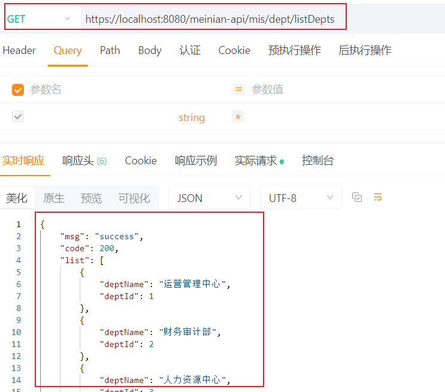

## 前端加载角色列表

在 `user.vue`中编写代码，发送 ajax 请求，从后端获取角色列表，然后将角色列表数据赋值给响应式对象。现在前端页面 `user.vue`中找一下这个响应式对象是哪个？大概在查询按钮的左边，代码如下：

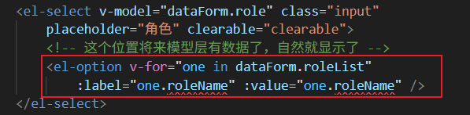

很显然响应式对象是 `dataForm`，然后从模型层代码中找，看看有没有这个响应式对象，再看看响应式对象中有没有 `roleList`属性，如下：


也就是，我们只要编写一个函数，在函数中发送 ajax 请求，然后获取角色列表，将后端返回的角色列表赋值给响应式对象 dataForm 的 roleList 属性即可，代码如下：

```typescript
// 发送异步请求，加载角色列表
async function loadRoleList(){
    // 查询角色列表后端没有鉴权的过程，因此不需要在头部提交token。
    const response = await axios.get('/meinian-api/mis/role/listRoles');
    const data = response.data;
    dataForm.roleList = data.list;
}

// 加载角色列表
loadRoleList();
```

此时可以打开页面了，看看用户分页查询的条件中，角色条件的下拉列表是否如下图所示：


## 前端加载部门列表

和加载角色列表步骤完全相同。直接在 `user.vue`文件中编写以下代码即可：

```typescript
// 发送异步请求，加载部门列表
async function loadDeptList(){
    const response = await axios.get('/meinian-api/mis/dept/listDepts');
    const data = response.data;
    dataForm.deptList = data.list;
}
// 加载部门列表
loadDeptList();
```

效果如下：


注意，视图层代码有两个位置需要修改一下，方便后期给后端提交数据，后端分页查询时是根据部门 id 和角色 id 查询的，因此按照下图所示进行修改：


## 点击查询按钮展示用户列表

当用户点击查询按钮后，立即发送 ajax 请求，提交查询条件，从后端获取用户列表，同样将用户列表的数据赋值给响应式对象，表格中的数据自然就会显示。需要注意的是：

1. 发送 ajax post 请求
2. 请求头中携带 token
3. 请求体中提交 json 格式的查询条件
4. 开始加载时显示正在加载的进度条，加载完成后加载进度条消失

先找到查询按钮对应的回调函数，如下：

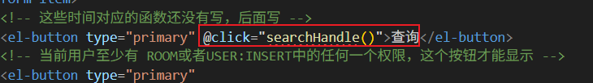

因此编写 `searchHandle()`函数，代码如下：

```typescript
// 分页查询
const form: Ref = ref(null);
async function searchHandle() {
    let valid = await form.value.validate();
    if (valid) {
        // 清理验证结果（清除验证错误提示）
        form.value.clearValidate();
        data.pageIndex = 1;
        //加载分页记录
        loadPageData();
    }
}
// 加载分页数据
async function loadPageData(){
    // 显示加载进度条
    data.loading = true;

    // 加载用户分页数据
    // 查询条件：从另一个响应式对象 dataForm 上获取数据封装查询条件
    const queryCondition = {
        pageNo: data.pageIndex,
        pageSize: data.pageSize,
        realName: dataForm.name,
        gender: dataForm.sex,
        roleId: dataForm.role,
        deptId: dataForm.deptId,
        userStatus: dataForm.status
    }

    // token放到headers中
    const config = {
        headers: {
            'satoken': localStorage.getItem("token")
        }
    };

    // 发送ajax post请求
    const response = await axios.post('/meinian-api/mis/user/pageQuery', queryCondition, config);

    // 将响应回来的用户列表数据放到响应式对象的对应属性上
    const records = response.data.pageResult.records;
    for(let record of records){
        if(record.userStatus == 1){
            record.userStatus = '在职';
        }else if(record.userStatus == 2){
            record.userStatus = "离职";
        }
    }
    data.dataList = records;
    // 更新总记录条数
    data.totalCount = response.data.pageResult.pages;

    // 隐藏加载进度条
    data.loading = false;
}


// 页面打开的时候就加载。
loadPageData();
```

## 一个坑

当提交的数据是数字 0 时，假设提交了 roleId 是 0 数字，到 Java 程序中的类型是 int/Integer，那么这个会导致以下 mybatis 的配置出现问题：

```xml
<!-- MyBatis OGNL表达式中，当数字0与空字符串''比较时，
OGNL会将空字符串转换为数字0，导致0 == ''为true，
从而使条件roleId != ''判断失败。 -->
<if test="roleId != null and roleId != ''">
    and EXISTS (
        SELECT 1 FROM sys_role r
        WHERE JSON_CONTAINS(u.role_ids, CAST(r.role_id AS JSON))
        AND r.role_id = #{roleId}
    )
</if>
```

因此我们这里需要将以上配置修改为：（**两个位置都要修改，一个是查询总记录条数，一个是查询数据**）

```xml
<if test="roleId != null">
    and EXISTS (
        SELECT 1 FROM sys_role r
        WHERE JSON_CONTAINS(u.role_ids, CAST(r.role_id AS JSON))
        AND r.role_id = #{roleId}
    )
</if>
```

包括部门编号位置的判断也需要修改。

## 实现分页控件

目前user.vue页面已经可以正常显示分页记录了，但是我们想要翻页必然要依靠分页控件。这个控件的标签我们一起回顾一下。

```plaintext
<el-pagination @size-change="sizeChangeHandle"
  @current-change="currentChangeHandle" :current-page="data.pageIndex"
  :page-sizes="[10, 20, 50]" :page-size="data.pageSize"
  :total="data.totalCount"
  layout="total, sizes, prev, pager, next, jumper"></el-pagination>
```

其中的sizeChangeHandle()函数是改变分页控件每页显示记录条数的时候触发执行的；currentChangeHandle()函数是翻页时候触发的。接下来我们要创建这两个函数，代码如下：

```typescript
function sizeChangeHandle(val) {
    data.pageSize = val;
    data.pageIndex = 1;
    loadPageData();
}
function currentChangeHandle(val) {
    data.pageIndex = val;
    loadPageData();
}
```

# 新增用户


## 新增用户的 RESTful 接口实现

### 新增用户的 UML 时序图

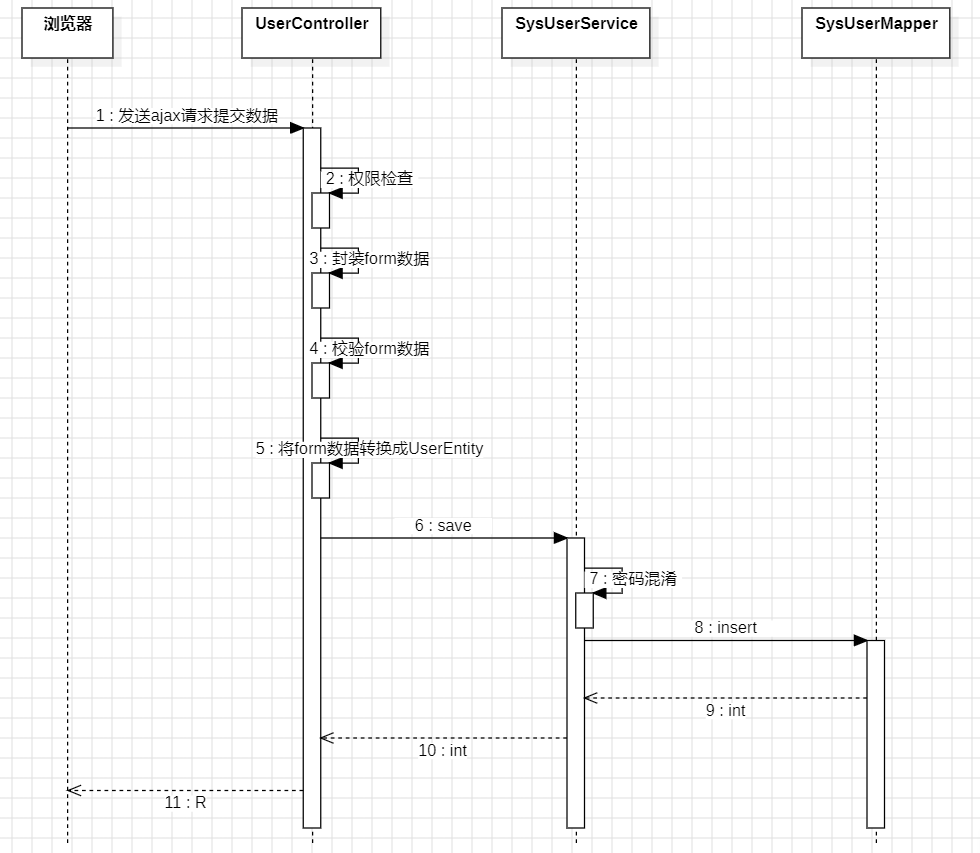

### 分析新增时都需要插入什么数据

`sys_user`表结构如下：

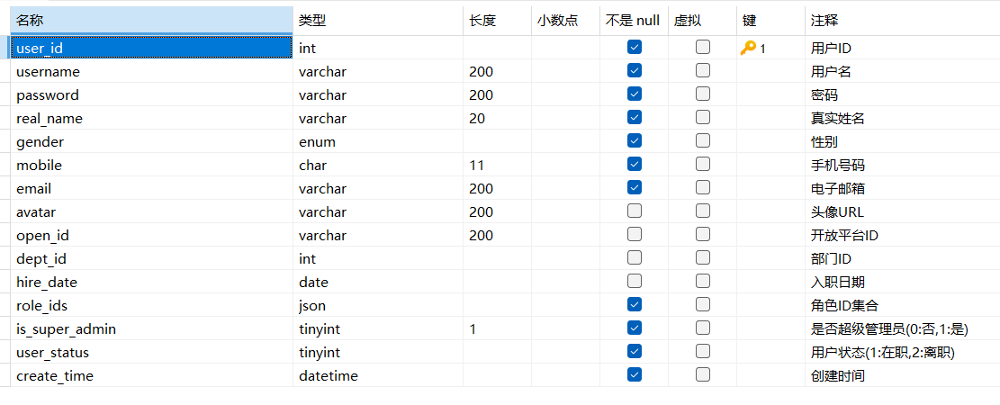

user_id：主键自增，前端不需要提供，后端 SQL 语句中也不需要写。

username：用户名，前端提供，后端 SQL 需要写。

password：密码，前端提供，后端 SQL 需要写，并且密码需要混淆加密。

real_name：真实姓名，前端提供，后端 SQL 需要写。

gender：性别，前端提供，后端 SQL 需要写。

mobile：手机号，前端提供，后端 SQL 需要写。

email：邮箱地址，前端提供，后端 SQL 需要写。

avatar：头像 URL，前端不需要提供，后端 SQL 也不需要写。

open_id：开放平台 ID，前端不需要提供，后端 SQL 也不需要写。

dept_id：部门 id，前端提供，后端 SQL 需要写。

hire_date：入职日期，前端提供，后端 SQL 需要写。

role_ids：角色 id 集合，前端提供，后端 SQL 需要写。

is_super_admin：是否超级管理员，前端不需要提供，后端 SQL 写成固定值 0

user_status：用户状态，不需要前端提供，后端 SQL 中写成固定值 1

create_time：创建时间，前端不需要提供，后端 SQL 也不需要写，系统自动生成。

### 编写 Mapper 和 Mapper XML

找到 `SysUserMapper`，在接口中添加 `insert`方法：

```java
int insert(SysUserEntity user);
```

找到 `SysUserMapper.xml`文件，在文件中编写 SQL 语句：

```xml
<insert id="insert" parameterType="SysUserEntity">
    insert into sys_user
    (username,password,real_name,gender,mobile,email,dept_id,
     hire_date,role_ids,is_super_admin,user_status)
    values
    (#{username},#{password},#{realName},#{gender},#{mobile},
     #{email},#{deptId},#{hireDate},#{roleIds},0,1)
</insert>
```

### 编写 Service 接口和实现

找到 `SysUserService`接口，在接口中编写以下方法：

```java
int save(SysUserEntity user);
```

找到 `SysUserServiceImpl`类，实现接口中的方法：

```java
@Override
@Transactional
public int save(SysUserEntity user) {
    MD5 md5 = MD5.create();
    String usernameHash = md5.digestHex(user.getUsername());
    String start = StrUtil.subWithLength(usernameHash, 0, 6);
    String end = StrUtil.subSuf(usernameHash, usernameHash.length() - 3);
    String password = md5.digestHex(start + user.getPassword() + end).toUpperCase();
    user.setPassword(password);
    return sysUserMapper.insert(user);
}
```

### Web 接口开发

需要前端提交的数据包括：

1. username：String username
2. password：String password
3. real_name：String realName
4. gender：String gender
5. mobile：String mobile
6. email：String email
7. dept_id：Integer deptId
8. hire_date：String hireDate
9. role_ids：Integer[] roleIds

编写校验 form，代码如下：

```java
package com.jkweilai.meinian.api.controller.form;

import jakarta.validation.constraints.*;
import lombok.Data;

@Data
public class SaveUserForm {

    @NotBlank(message = "username不能为空")
    @Pattern(regexp = "^[a-zA-Z0-9]{5,20}$", message = "username内容不正确")
    private String username;

    @NotBlank(message = "password不能为空")
    @Pattern(regexp = "^[a-zA-Z0-9]{6,20}$", message = "password内容不正确")
    private String password;

    @NotBlank(message = "姓名不能为空")
    @Pattern(regexp = "^[\\u4e00-\\u9fa5]{2,10}$", message = "姓名内容不正确")
    private String realName;

    @NotBlank(message = "gender不能为空")
    @Pattern(regexp = "^男$|^女$", message = "gender内容不正确")
    private String gender;

    @NotBlank(message = "mobile不能为空")
    @Pattern(regexp = "^1[1-9]\\d{9}$", message = "mobile内容不正确")
    private String mobile;

    @NotBlank(message = "email内容不正确")
    @Email(message = "email内容不正确")
    private String email;

    @Min(value = 1, message = "deptId不能小于1")
    private Integer deptId;

    @NotBlank(message = "hireDate不能为空")
    @Pattern(regexp = "^((((1[6-9]|[2-9]\\d)\\d{2})-(0?[13578]|1[02])-(0?[1-9]|[12]\\d|3[01]))|(((1[6-9]|[2-9]\\d)\\d{2})-(0?[13456789]|1[012])-(0?[1-9]|[12]\\d|30))|(((1[6-9]|[2-9]\\d)\\d{2})-0?2-(0?[1-9]|1\\d|2[0-8]))|(((1[6-9]|[2-9]\\d)(0[48]|[2468][048]|[13579][26])|((16|[2468][048]|[3579][26])00))-0?2-29))$", message = "hireDate内容不正确")
    private String hireDate;

    @NotEmpty(message = "roleIds不能为空")
    private Integer[] roleIds;
}
```

找到 `UserController`编写保存用户的 web 接口，代码如下：

```java
@PostMapping("/save")
@SaCheckPermission(value = {"ROOT", "USER:INSERT"}, mode = SaMode.OR)
public R save(@RequestBody @Valid SaveUserForm  saveUserForm){
    SysUserEntity user = BeanUtil.toBean(saveUserForm, SysUserEntity.class);

    // BeanUtil.toBean() 默认不会将"Integer[] roleIds;"转换成json字符串。需要手动转换。
    Integer[] roleIds = saveUserForm.getRoleIds();
    String roleIdsStr = JSONUtil.toJsonStr(roleIds);
    user.setRoleIds(roleIdsStr);
    
    int rows = sysUserService.save(user);
    return R.ok().put("rows", rows);
}
```

### 测试新增 RESTful 接口

打开 Apipost，发送 post 请求，提交 json 格式的用户数据，header 中携带 token。

接口测试地址：[https://localhost:8080/meinian-api/mis/user/save](https://localhost:8080/meinian-api/mis/user/save)

测试数据如下：

```json
{
        "username": "zhubajie",
        "password": "abc123456",
        "realName": "猪八戒",
        "gender": "男",
        "mobile": "13434343456",
        "email": "bajie@126.com",
        "deptId": 2,
        "hireDate": "2025-10-10",
        "roleIds": [
                2
        ]
}
```

测试结果如下：

```json
{
        "msg": "success",
        "code": 200,
        "rows": 1
}
```

## 新增用户的前端实现

### 编写视图层代码

1. 给用户列表的 **整个 div** 添加权限控制，只有具有 `['ROOT', 'USER:SELECT']`权限中任何一个权限的人才能查看用户列表。
2. 给 **新增/修改** 的弹窗口添加权限控制，只有具有 `['ROOT','USER:INSERT','USER:UPDATE']` 权限中任何一个权限的人才能对用户信息进行新增和修改。


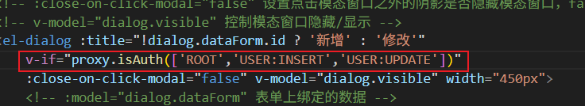

**另外**，新增弹出窗口中也需要角色列表和部门列表，这个角色列表和部门列表直接从 `dataForm.roleList`和 `dataForm.deptList`中取就行了，因此你需要确认一下弹出窗口的角色列表和部门列表的相关代码是否正确：


**代码如下：**

```plaintext
<div v-if="proxy.isAuth(['ROOT','USER:SELECT'])">
  <!--此处代码省略....-->
</div>


<!-- :title 是动态的，是新增还是修改，看id是不是null，是null就是新增 -->
<!-- :close-on-click-modal="false" 设置点击模态窗口之外的阴影是否隐藏模态窗口，false不隐藏 -->
<!-- v-model="dialog.visible" 控制模态窗口隐藏/显示 -->
<el-dialog :title="!dialog.dataForm.id ? '新增' : '修改'"
  v-if="proxy.isAuth(['ROOT','USER:INSERT','USER:UPDATE'])"
  :close-on-click-modal="false" v-model="dialog.visible" width="450px">
  <!-- :model="dialog.dataForm" 表单上绑定的数据 -->
  <!-- ref="dialogForm" 给表单起个名字 -->
  <!-- :rules="dialog.dataRule" 给表单关联校验规则 -->
  <el-form :model="dialog.dataForm" ref="dialogForm"
    :rules="dialog.dataRule" label-width="80px">
    <!-- prop="username"是将username的校验规则绑定到表单项上 -->
    <el-form-item label="用户名" prop="username">
      <el-input v-model="dialog.dataForm.username" maxlength="20"
        clearable />
    </el-form-item>
    <!-- v-if="!dialog.update" 用来决定密码框显示还是隐藏 -->
    <el-form-item label="密码" prop="password" v-if="!dialog.update">
      <el-input type="password" v-model="dialog.dataForm.password"
        maxlength="20" clearable />
    </el-form-item>

    <el-form-item label="姓名" prop="realName">
      <el-input v-model="dialog.dataForm.realName" maxlength="10"
        clearable />
    </el-form-item>
    <el-form-item label="性别" prop="gender">
      <el-select v-model="dialog.dataForm.gender" clearable>
        <el-option label="男" value="男"></el-option>
        <el-option label="女" value="女"></el-option>
      </el-select>
    </el-form-item>
    <el-form-item label="电话" prop="mobile">
      <el-input v-model="dialog.dataForm.mobile" maxlength="11"
        clearable />
    </el-form-item>
    <el-form-item label="邮箱" prop="email">
      <el-input v-model="dialog.dataForm.email" maxlength="200"
        clearable />
    </el-form-item>
    <el-form-item label="入职日期" prop="hireDate">
      <!-- type="date" 表示日期的格式只需要年月日 -->
      <!-- :editable="false" 表示用户不可输入，只能鼠标操作 -->
      <!-- value-format="YYYY-MM-DD" 表示js代码读取日期时的日期格式 -->
      <el-date-picker v-model="dialog.dataForm.hireDate" type="date"
        placeholder="选择日期" :editable="false" format="YYYY-MM-DD"
        value-format="YYYY-MM-DD" />
    </el-form-item>
    <el-form-item label="角色" prop="role">
      <!-- multiple 表示可以多选 -->
      <el-select v-model="dialog.dataForm.role" placeholder="选择角色"
        class="dialog-input" multiple clearable>
        <el-option v-for="one in dataForm.roleList" :key="one.roleId"
          :label="one.roleName" :value="one.roleId"
          :disabled="one.roleName == '超级管理员'"></el-option>
      </el-select>
    </el-form-item>
    <el-form-item label="部门">
      <el-select v-model="dialog.dataForm.deptId" placeholder="选择部门"
        class="dialog-input" clearable>
        <el-option v-for="one in dataForm.deptList" :key="one.deptId"
          :label="one.deptName" :value="one.deptId" />
      </el-select>
    </el-form-item>
  </el-form>
  <!-- 页脚区 -->
  <template #footer>
    <span class="dialog-footer">
    <!-- 直接将 dialog.visible 设置为false 就隐藏了。 -->
    <el-button @click="dialog.visible = false">取消</el-button>
    <el-button type="primary" @click="dataFormSubmit">确定</el-button>
  </span>
  </template>
</el-dialog>
```

### 显示弹窗控件

当用户点击 新增 按钮时，弹出新增用户的窗口。首先你需要设置一下权限，只有 `['ROOT','USER:INSERT']` 权限中任一权限的用户才能显示新增弹窗：


接下来编写 `addHandle()`回调函数，代码如下：

```typescript
async function addHandle(){
    dialog.update = false;
    dialog.dataForm.id = null;
    dialog.visible = true;
    await nextTick();
    // 以下代码让数据恢复到初始状态。清空错误提示信息，并且重置表单中的数据
    // el-form 的 resetFields() 方法只会重置那些绑定了 prop 属性并且在 rules 中有对应验证规则的字段。
    // 因此我们的部门不会重置
    dialogForm.value.resetFields();
    // 恢复部门的初始值
    dialog.dataForm.deptId = null;
}
```

### 发送 ajax 请求

当用户点击新增弹窗中的确定按钮时，执行回调函数 `dataFormSubmit`，在回调函数中你需要做的是：

1. 校验表单
2. 发送 ajax 请求保存用户数据
3. 保存成功隐藏弹窗
4. 然后加载用户列表
5. 保存失败，提示错误信息

**代码如下：**

```typescript
// 注意：保存和修改都会走这个回调函数。
async function dataFormSubmit() {
    let valid = await dialogForm.value.validate();
    if (valid) {
        // 校验通过准备数据
        let json = {
            // 这个是给修改准备的，保存不需要提交，不过写上也没关系，因为保存的后台逻辑是：主键自动生成。
            userId: dialog.dataForm.id,
            username: dialog.dataForm.username,
            // 修改不需要传密码，不过传过去也没有关系，修改时，后端form中没有该属性。
            password: dialog.dataForm.password,
            realName: dialog.dataForm.realName,
            gender: dialog.dataForm.gender,
            mobile: dialog.dataForm.mobile,
            email: dialog.dataForm.email,
            hireDate: dialog.dataForm.hireDate,
            // 下拉列表多选后本身就是一个数组，传给后端之后使用 Integer[] 数组接收。
            roleIds: dialog.dataForm.role,
            deptId: dialog.dataForm.deptId,
        };

        const config = {
            headers: {
                'satoken': localStorage.getItem('token')
            }
        };

        // 发送ajax请求：注意，发送的请求可能是保存，也可能是修改。请求路径需要动态。
        const response = await axios.post(`/meinian-api/mis/user/${dialog.dataForm.id == null ? 'save' : 'modify'}`, json, config);
        const result = response.data;
        if (result.rows == 1) {
            ElMessage({
                message: '操作成功',
                type: 'success',
                duration: 1200,
                onClose: () => {
                    dialog.visible = false;
                    //重新加载分页数据
                    loadPageData();
                }
            });
        } else {
            ElMessage({
                message: '操作失败',
                type: 'error',
                duration: 1200
            });
        }
    }
}
```

# 修改用户


## 功能分析

修改用户的时候，先弹窗，弹窗上需要显示出要修改的用户信息，然后用户修改信息之后，点击弹窗上的确定按钮，发送 ajax 请求完成修改。因此修改用户需要两个 RESTful 接口：一个是通过用户 id 查找用户信息，一个是修改用户信息。

根据用户 id 查找用户信息的时序图如下：


修改用户信息的时序图如下：

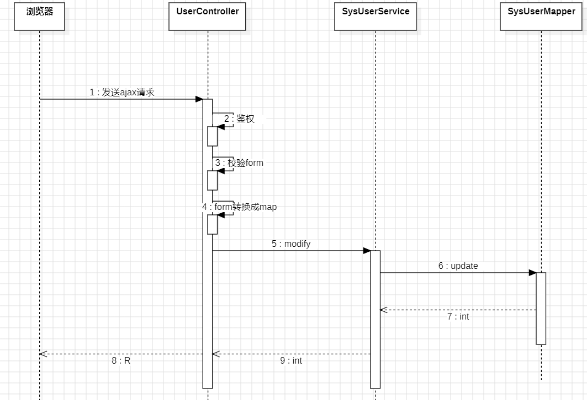

## 根据 id 查询用户信息的 RESTful 接口

### 编写 Mapper 和 Mapper XML

找到 `SysUserMapper`接口，编写以下代码：

```java
Map<String, Object> selectById(int userId);
```

看看前端都需要哪些数据，咱们就返回哪些数据：【**用户名不支持修改，修改用户名会导致用户密码不可用**】

1. realName
2. gender
3. mobile
4. email
5. hireDate
6. roleIds
7. deptId

找到 `SysUserMapper.xml`文件编写以下 SQL 语句：

```xml
<select id="selectById" parameterType="int" resultType="Map">
    select
        real_name as realName,
        gender,
        mobile,
        email,
        hire_date as hireDate,
        role_ids as roleIds,
        dept_id as deptId
    from
        sys_user
    where 
        user_id = #{userId}
</select>
```

### 编写 Service 接口和实现

找到 `SysUserService`接口，提供以下方法：

```java
Map<String, Object> findById(int userId);
```

找到 `SysUserServiceImpl`类，实现 findById 方法：

```java
@Override
public Map<String, Object> findById(int userId) {
    return sysUserMapper.selectById(userId);
}
```

### 编写 web 接口

创建 `FindUserByIdForm`，用来接收前端提交过来的数据，同时做校验。

```java
package com.jkweilai.meinian.api.controller.form;

import jakarta.validation.constraints.Min;
import jakarta.validation.constraints.NotNull;
import lombok.Data;

@Data
public class FindUserByIdForm {
    @NotNull(message = "userId不能为空")
    @Min(value = 1, message = "userId不能小于1")
    private int userId;
}
```

找到 `UserController`，编写 web 接口的方法，代码如下：

```java
@PostMapping("/findUserById")
@SaCheckPermission(value = {"ROOT", "USER:SELECT"},  mode = SaMode.OR)
public R findUserById(@RequestBody @Valid FindUserByIdForm findUserByIdForm){
    Map<String, Object> result = sysUserService.findById(findUserByIdForm.getUserId());
    return R.ok().put("result", result);
}
```

### 测试 RESTful 接口

接口测试地址：[https://localhost:8080/meinian-api/mis/user/findUserById](https://localhost:8080/meinian-api/mis/user/findUserById)

测试数据：

```json
{
        "userId": "2"
}
```

测试结果：

```json
{
        "msg": "success",
        "result": {
    "realName": "孙悟空",
                "hireDate": "2025-10-10",
                "roleIds": "[2, 3]",
                "gender": "男",
                "mobile": "13434343456",
                "deptId": 2,
                "email": "wukong@126.com",
                "username": "sunwukong"
        },
        "code": 200
}
```

## 修改用户信息的 RESTful 接口

### 编写 Mapper 和 Mapper XML

找到 `SysUserMapper`接口，然后添加以下方法：

```java
int update(Map<String, Object> user);
```

找到 `SysUserMapper.xml`文件，然后编写以下 SQL 语句：

```xml
<update id="update" parameterType="Map">
    update sys_user set
        real_name = #{realName},
        gender = #{gender},
        mobile = #{mobile},
        email = #{email},
        hire_date = #{hireDate},
        role_ids = #{roleIds},
        dept_id = #{deptId}
    where
        user_id = #{userId}
</update>
```

### 编写 Service 接口和实现

找到 `SysUserService`接口，编写以下方法：

```java
int modify(Map<String, Object> user);
```

找到 `SysUserServiceImpl`类实现方法：

```java
@Override
@Transactional
public int modify(Map<String, Object> user) {
    return sysUserMapper.update(user);
}
```

### 编写 web 接口

编写 `ModifyUserForm`接收前端提交过来的数据，同时做校验

```java
package com.jkweilai.meinian.api.controller.form;

import jakarta.validation.constraints.*;
import lombok.Data;

@Data
public class ModifyUserForm {

    @NotNull(message = "userId不能为空")
    @Min(value = 1, message = "userId不能小于1")
    private Integer userId;

    @NotBlank(message = "姓名不能为空")
    @Pattern(regexp = "^[\\u4e00-\\u9fa5]{2,10}$", message = "姓名内容不正确")
    private String realName;

    @NotBlank(message = "gender不能为空")
    @Pattern(regexp = "^男$|^女$", message = "gender内容不正确")
    private String gender;

    @NotBlank(message = "mobile不能为空")
    @Pattern(regexp = "^1[1-9]\\d{9}$", message = "mobile内容不正确")
    private String mobile;

    @NotBlank(message = "email不能为空")
    @Email(message = "email内容不正确")
    private String email;

    @NotBlank(message = "hireDate日期不能为空")
    @Pattern(regexp = "^((((1[6-9]|[2-9]\\d)\\d{2})-(0?[13578]|1[02])-(0?[1-9]|[12]\\d|3[01]))|(((1[6-9]|[2-9]\\d)\\d{2})-(0?[13456789]|1[012])-(0?[1-9]|[12]\\d|30))|(((1[6-9]|[2-9]\\d)\\d{2})-0?2-(0?[1-9]|1\\d|2[0-8]))|(((1[6-9]|[2-9]\\d)(0[48]|[2468][048]|[13579][26])|((16|[2468][048]|[3579][26])00))-0?2-29))$", message = "hireDate内容不正确")
    private String hireDate;

    @NotEmpty(message = "roleIds不能为空")
    private Integer[] roleIds;

    @Min(value = 1, message = "deptId不能小于1")
    private Integer deptId;

}
```

在 UserController 中编写 web 接口方法，完成更新用户信息，并给前端响应结果：

```java
@PostMapping("/modify")
@SaCheckPermission(value = {"ROOT", "USER:UPDATE"},  mode = SaMode.OR)
public R modify(@RequestBody @Valid ModifyUserForm modifyUserForm){
    Map<String, Object> user = BeanUtil.beanToMap(modifyUserForm);
    // 将 Integer[] 数组转换为json字符串。
    user.replace("roleIds", JSONUtil.toJsonStr(modifyUserForm.getRoleIds()));
    int rows = sysUserService.modify(user);
    if(rows == 1){
        // 将修改之后的用户从所有设备踢下线，让他重新登录才能拥有新的角色和权限
        StpUtil.logout(modifyUserForm.getUserId());
    }
    return R.ok().put("rows", rows);
}
```

### 测试 RESTful 接口

接口测试地址：[https://localhost:8080/meinian-api/mis/user/modify](https://localhost:8080/meinian-api/mis/user/modify)

测试数据：

```json
{
    "userId": 2,
    "username": "sunxingzhe",
    "realName": "孙行者",
    "gender": "男",
    "mobile": "18888888888",
    "email": "sunxingzhe@163.com",
    "hireDate": "2025-10-12",
    "roleIds": [
        2,
        3
    ],
    "deptId": 4
}
```

测试结果：

```json
{
        "msg": "success",
        "code": 200,
        "rows": 1
}
```

## 前端实现修改功能

### 弹出修改窗口

当用户点击分页查询结果列表中某条记录后面的 **修改** 按钮时，弹出修改用户的窗口，在窗口的表单中显示当前用户的详细信息。实现思路：

1. 点击修改按钮，将当前用户的 id 传递给回调函数。
2. 回调函数中先将模型层的 dialog.dataForm.id 的值赋上去，因为这是修改操作，用户 id 必须提供。
3. 然后将 dialog.update 修改为 true，表示现在是修改操作，弹窗必须是一个修改用户的窗口。
4. 发送 ajax 请求，根据 id 获取用户信息，将用户信息填充到响应式对象上即可。
5. 然后设置 dialog.visible 为 true，显示窗口。

**代码如下：**

调用回调的时候传递用户的 id，如下：

```plaintext
<el-button type="text" v-if="proxy.isAuth(['ROOT', 'USER:UPDATE'])" @click="updateHandle(scope.row.userId)">修改</el-button>
```

注意控制权限，不是所有人都能修改。另外，通过 `scope.row.userId`来获取当前这条记录的用户的 id。

**特别强调：**不是 `scope.row.id`，是 `scope.row.userId`，因为分页查询返回的用户列表数据中每个用户对象中主键属性名为 userId。

继续编写回调函数：

```typescript
async function updateHandle(userId){
    dialog.dataForm.id = userId;
    dialog.update = true;

    // 显示弹窗（一定要先渲染窗口，后填充数据）
    dialog.visible = true;
    await nextTick();
    
    // 准备数据
    const json = {
        userId: userId
    };
    // 准备token
    const config = {
        headers: {
            'satoken': localStorage.getItem('token')
        }
    };
    // 发送ajax请求
    const response = await axios.post('/meinian-api/mis/user/findUserById', json, config);
    const result = response.data.result;
    dialog.dataForm.realName = result.realName;
    dialog.dataForm.gender = result.gender;
    dialog.dataForm.mobile = result.mobile;
    dialog.dataForm.email = result.email;
    dialog.dataForm.hireDate = result.hireDate;
    // 将后端返回的json字符串转换成对象。
    dialog.dataForm.role = JSON.parse(result.roleIds);
    dialog.dataForm.deptId = result.deptId;
}
```

最终效果如下：


### 实现修改功能

当用户点击弹窗上的确定按钮之后，执行真正的更新操作，这个代码其实已经写完了，就是之前的保存功能，我们的保存功能和修改功能使用的是同一个代码，可以再看看这个代码：

```typescript
// 注意：保存和修改都会走这个回调函数。
async function dataFormSubmit() {
    let valid = await dialogForm.value.validate();
    if (valid) {
        // 校验通过准备数据
        let json = {
            // 这个是给修改准备的，保存不需要提交，不过写上也没关系，因为保存的后台逻辑是：主键自动生成。
            userId: dialog.dataForm.id,
            // 修改时不需要用户名，但保存时需要用户名。
            username: dialog.dataForm.username,
            // 修改不需要传密码，不过传过去也没有关系，修改时，后端form中没有该属性。
            password: dialog.dataForm.password,
            realName: dialog.dataForm.realName,
            gender: dialog.dataForm.gender,
            mobile: dialog.dataForm.mobile,
            email: dialog.dataForm.email,
            hireDate: dialog.dataForm.hireDate,
            // 下拉列表多选后本身就是一个数组，传给后端之后使用 Integer[] 数组接收。
            roleIds: dialog.dataForm.role,
            deptId: dialog.dataForm.deptId,
        };

        const config = {
            headers: {
                'satoken': localStorage.getItem('token')
            }
        };

        // 发送ajax请求：注意，发送的请求可能是保存，也可能是修改。请求路径需要动态。
        const response = await axios.post(`/meinian-api/mis/user/${dialog.dataForm.id == null ? 'save' : 'modify'}`, json, config);
        const result = response.data;
        if (result.rows == 1) {
            ElMessage({
                message: '操作成功',
                type: 'success',
                duration: 1200,
                onClose: () => {
                    dialog.visible = false;
                    //重新加载分页数据
                    loadPageData();
                }
            });
        } else {
            ElMessage({
                message: '操作失败',
                type: 'error',
                duration: 1200
            });
        }
    }
}
```

最终我们来测试一下修改是否好用，修改完数据之后，是否自动隐藏窗口，是否重新加载分页数据，看看重新加载的数据是否为修改后的。

# 删除用户

## 实现删除用户的 RESTful 接口

### 删除用户的时序图如下

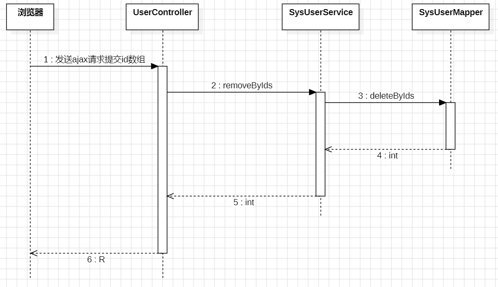

### 删除用户的注意事项

1. 超级管理员不能被删除
2. 用户不能删除自己
3. 被删除的用户被立即踢下线

### 编写 Mapper 和 Mapper XML

找到 `SysUserMapper`接口，编写以下方法：

```java
int deleteByIds(Integer[] ids);
```

找到 `SysUserMapper.xml`文件，编写以下 SQL：

```xml
<delete id="deleteByIds">
    delete from sys_user where user_id in
    <foreach collection="array" open="(" close=")" separator="," item="userId">
        #{userId}
    </foreach>
    and is_super_admin = 0
</delete>
```

### 编写 Service 接口和实现

找到 `SysUserService`接口，编写以下代码：

```java
int removeByIds(Integer[] ids);
```

找到 `SysUserServiceImpl`类，实现方法：

```java
@Override
@Transactional
public int removeByIds(Integer[] ids) {
    return sysUserMapper.deleteByIds(ids);
}
```

### 编写 web 接口

编写 form 接收数据，校验数据：

```java
package com.jkweilai.meinian.api.controller.form;

import jakarta.validation.constraints.NotEmpty;
import lombok.Data;

@Data
public class RemoveUserByIdsForm {
    @NotEmpty(message = "userIds不能为空")
    private Integer[] userIds;
}
```

编写 UserController 中的 web 接口方法：

```java
@PostMapping("/remove")
@SaCheckPermission(value = {"ROOT", "USER:DELETE"}, mode = SaMode.OR)
public R remove(@RequestBody @Valid RemoveUserByIdsForm removeUserByIdsForm){
    Integer id = StpUtil.getLoginIdAsInt();
    if(ArrayUtil.contains(removeUserByIdsForm.getUserIds(), id)){
        return R.error("您不能删除自己");
    }
    int rows = sysUserService.removeByIds(removeUserByIdsForm.getUserIds());
    if(rows > 0){
        for(Integer userId: removeUserByIdsForm.getUserIds()){
            StpUtil.logout(userId);
        }
    }
    return R.ok().put("rows", rows);
}
```

### 测试 RESTful 接口

测试接口地址：

[https://localhost:8080/meinian-api/mis/user/remove](https://localhost:8080/meinian-api/mis/user/remove)

测试数据：

```json
{
    "userIds": [4, 5]
}
```

测试结果：

```json
{
        "msg": "success",
        "code": 200,
        "rows": 2
}
```

## 删除用户的前端实现


### 禁止选中超级管理员

`:selectable`的回调函数结果是 true 表示可以选中，false 表示禁止选中。代码如下：

```plaintext
<el-table-column type="selection" header-align="center"
    :selectable="selectable"
    align="center" width="50" />
```

编写 `selectable`函数，代码如下：如果角色中包含超级管理员，回调函数返回 false，否则返回 true。代码如下：

```typescript
function selectable(row){
    //注意：数据库中存储的是英文的逗号，不是中文的逗号。
    const roles = row.roles.split(",");
    if(roles.includes("超级管理员")){
        return false;
    }
    return true;
}

// 这种方式也可以
function selectable(row: any){
    return !row.isSuperAdmin;
}
```

### 禁止删除超级管理员

找到 删除 按钮，代码如下：

```plaintext
<el-button type="text" :disabled="scope.row.isSuperAdmin"
    v-if="proxy.isAuth(['ROOT', 'USER:DELETE'])"
    @click="deleteHandle(scope.row.userId)">
    删除
</el-button>
```

1. 注意权限，有 ROOT 或者 USER:DELETE 权限的才能显示删除按钮。
2. `scope.row.isSuperAdmin`如果是 1，则 `:disabled="true"`，则删除按钮无法操作。
3. 点击删除按钮后调用 `deleteHandle`回调函数，将 `scope.row.userId`传递给该函数。

### 获取复选框的选中记录

在 `el-table`标签上绑定 `@selection-change`事件，这个事件在什么情况下发生呢？只要 table 的复选框的选中状态发生改变，这个事件就会发生，并且 EP 组件库会自动给该事件的回调函数传递最新的选中的数据。

```plaintext
<el-table :data="data.dataList"
  :header-cell-style="{'background':'#f5f7fa'}" border
  v-loading="data.loading" @selection-change="selectionChangeHandle">
```

编写回调函数 `selectionChangeHandle`，代码如下：

```typescript
function selectionChangeHandle(values){
    // 这个values EP组件库自动传递过来的最新的选中记录。
    // 将这个数据赋值给我们之前定义的响应式对象。
    data.selections = values;
}
```

### 删除按钮上绑定回调函数

删除按钮和批量删除按钮，让他俩同时走同一套逻辑，因此给他俩绑定同一个回调函数，这两个回调函数，一个传单个 userId，另一个什么也不传，代码如下：

**单个删除：**

```plaintext
<el-button type="text" :disabled="scope.row.isSuperAdmin"
    v-if="proxy.isAuth(['ROOT', 'USER:DELETE'])"
    @click="deleteHandle(scope.row.userId)">
    删除
</el-button>
```

**批量删除：**

```plaintext
<el-button type="danger"
    :disabled="!proxy.isAuth(['ROOT', 'USER:DELETE'])"
    @click="deleteHandle()">
    批量删除
</el-button>
```

接下里我们就要编写 `deleteHandle`回调函数来发送 ajax 请求删除数据了。

### 发送 ajax 请求删除用户

这里发送 RESTful 的 DELETE 请求，代码如下：

```typescript
function deleteHandle(userId){
    // 不管是用户是进行单个删除，还是批量删除，将userId封装到数组中，用于提交数据。
    const userIds = userId ? [userId] : data.selections.map(item => {
        return item.userId;
    });
    if(userIds.length == 0){
        proxy.$message({
            message: '请选择要删除的记录',
            type: 'warning',
            duration: 1200
        });
    }else{
        proxy.$confirm('确定要删除选中的记录吗?', '提示', {
            confirmButtonText: "确定",
            cancelButtonText: "取消",
            type: 'warning'
        }).then(async () => {
            // 发送ajax请求删除数据(发送delete请求和之前的get和post请求有区别。)
            const response = await axios.delete('/meinian-api/mis/user/remove', {
                data: {
                    userIds: userIds
                },
                headers: {
                    'satoken': localStorage.getItem("token")
                }
            });
            const rows = response.data.rows;
            if(rows > 0){
                proxy.$message({
                    message: "操作成功",
                    type: 'success',
                    duration: 1200,
                    onClose: () => {
                        // 重新加载当前分页数据
                        loadPageData();
                    }
                });
            }else{
                proxy.$message({
                    message: "删除失败",
                    type: 'warning',
                    duration: 1200,
                });
            }
        });
    }
}
```

完成后，测试删除一个，批量删除是否好用。

**另外需要注意的：我们搭建了集群环境，写操作是在主节点上，读操作是在从节点上，有时分页查询时走从库的时候，会读取到旧数据，这种情况怎么解决？大家可以在 shardingsphere 当中进行配置，配置所有的分页查询走主库。这样就可以解决分页查询显示旧数据的问题了。这个大家自行实现。**

# 办理离职

## 离职的 RESTful 接口实现

### 办理离职的时序图

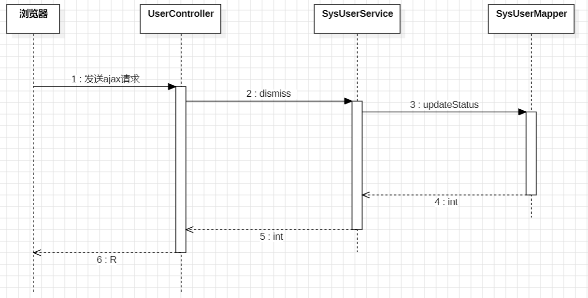

### 需要注意的事项

1. 超级管理员不能离职
2. 离职的用户会被踢下线

### 编写 Mapper 和 Mapper XML

找到 `SysUserMapper`接口，编写以下方法：

```java
int updateStatus(int userId);
```

找到 `SysUserMapper.xml`文件，编写以下 SQL：

```xml
<update id="updateStatus" parameterType="int">
    update sys_user set user_status = 2 where user_id = #{userId} and is_super_admin = 0
</update>
```

### 编写 Service 接口和实现

找到 `SysUserService`接口，编写以下方法：

```java
int dismiss(int userId);
```

找到 `SysUserServiceImpl`类，编写实现：

```java
@Override
@Transactional
public int dismiss(int userId) {
    return sysUserMapper.updateStatus(userId);
}
```

### 编写 RESTful 接口

编写 form，接收前端的数据，同时校验数据：

```java
package com.jkweilai.meinian.api.controller.form;

import jakarta.validation.constraints.Min;
import jakarta.validation.constraints.NotNull;
import lombok.Data;

@Data
public class DismissUserForm {
    @NotNull(message = "userId不能为空")
    @Min(value = 1, message = "userId不能小于1")
    private Integer userId;
}
```

编写 Controller 的方法，实现 RESTful 接口：

```java
@PutMapping("/dismiss")
@SaCheckPermission(value = {"ROOT", "USER:UPDATE"}, mode = SaMode.OR)
public R dismiss(@RequestBody @Valid DismissUserForm dismissUserForm){
    int userId = dismissUserForm.getUserId();
    int rows = sysUserService.dismiss(userId);
    if(rows > 0){
        StpUtil.logout(dismissUserForm.getUserId());
    }
    return R.ok().put("rows", rows);
}
```

### 测试 RESTful 接口

发送 ajax put 请求，提交 token，提交数据。

接口地址：[https://localhost:8080/meinian-api/mis/user/dismiss](https://localhost:8080/meinian-api/mis/user/dismiss)

测试数据：

```json
{
    "userId": 3
}
```

测试结果：

```json
{
        "msg": "success",
        "code": 200,
        "rows": 1
}
```

## 离职的前端实现

离职按钮相关代码的编写：

```plaintext
<el-button type="text"
    v-if="proxy.isAuth(['ROOT', 'USER:UPDATE'])"
    :disabled="scope.row.userStatus == '离职' || scope.row.isSuperAdmin"
    @click="dismissHandle(scope.row.userId)">
    离职
</el-button>
```

1. 设置好权限。
2. 当用户已经离职，或者用户是超级管理员，离职按钮变成不可用。
3. 点击离职按钮后执行回调函数：dismissHandle

编写 dismissHandle 函数，发送 ajax 请求，实现离职：

```typescript
function dismissHandle(userId: Number){
    proxy.$confirm("确定要给当前人员办理离职吗？", "提示", {
        confirmButtonText: "确定",
        cancelButtonText: "取消",
        type: "warning"
    }).then(async () => {
        // 发送ajax请求
        const json = {
            userId: userId
        };
        const config = {
            headers: {
                'satoken': localStorage.getItem('token')
            }
        };
        const response = await axios.put('/meinian-api/mis/user/dismiss', json, config);
        const rows = response.data.rows;
        if(rows > 0){
            proxy.$message({
                message: '离职成功',
                type: 'success',
                duration: 1200,
                onClose: () => {
                    // 重新加载分页数据
                    loadPageData();
                }
            });
        }else{
            proxy.$message({
                message: '离职失败',
                type: 'warning',
                duration: 1200
            });
        }
    });
}
```

## axios 发送不同请求的代码总结

```javascript
// GET - 获取数据
axios.get(url, config)
// config 中可以包含: params, headers 等

// POST - 创建数据
axios.post(url, data, config)
// data: 请求体数据
// config: 配置（headers, params 等）

// PUT - 更新数据
axios.put(url, data, config)
// 和 POST 完全一样

// DELETE - 删除数据（写法特殊）
axios.delete(url, config)
// config 中可以包含: data, params, headers 等
// data 要放在 config 里面！
```

# 作业布置

自行实现部门管理和角色管理的所有功能。这些功能和用户管理模块功能相同，甚至比用户管理模块功能还要简单。

# 体检套餐模块需求分析

## ER 图

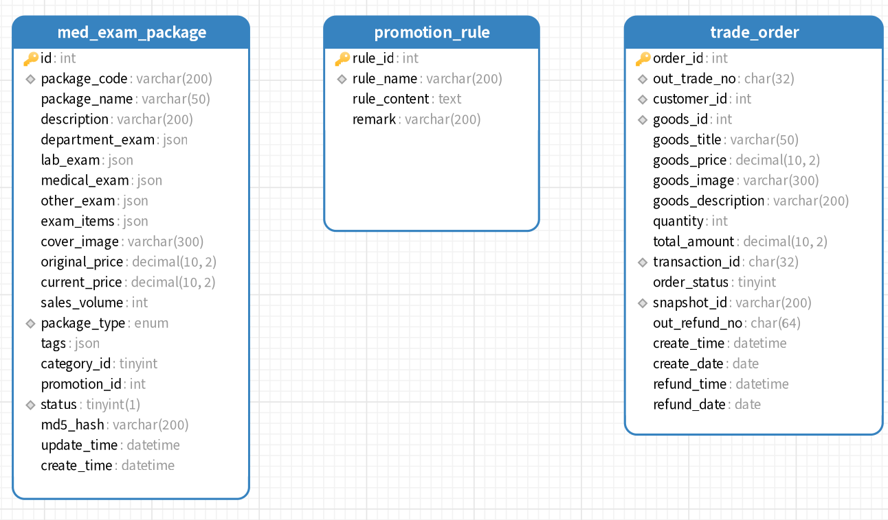

`med_exam_package`：体检套餐表，相当于商品表。(med 是医学的含义)

`promotion_rule`：促销规则表

`trade_order`：交易订单表

体检套餐模块只用到了 `med_exam_package`表，我们这里先来看一下体检套餐表的每个字段是什么意思：


1. id：主键
2. package_code：体检套餐的编号
3. package_name：体检套餐的名字
4. description：体检套餐的描述
5. department_exam：科室检查项目（体检内容）**【json 存储，购买了该体检套餐后可享受的体检项目，展示在商品详情页】**

```json
"departmentExam": [
  {
    "title": "一般检查",
    "content": "身高、体重、血压、BMI指数测量"
  },
  {
    "title": "内科检查",
    "content": "心肺听诊、腹部触诊、神经系统检查",
  }
]
```

1. lab_exam：实验室检查项目（体检内容）**【json 存储，购买了该体检套餐后可享受的体检项目，展示在商品详情页】**

```json
"labExam": [
  {
    "title": "血常规",
    "content": "全血细胞分析（五分类）"
  },
  {
    "title": "肝功能",
    "content": "ALT、AST、总蛋白等指标检测"
  }
]
```

1. medical_exam：医技检查项目（体检内容）**【json 存储，购买了该体检套餐后可享受的体检项目，展示在商品详情页】**

```json
"medicalExam": [
  {
    "title": "心电图",
    "content": "十二导联心电图检查"
  },
  {
    "title": "腹部超声",
    "content": "肝胆胰脾肾超声检查"
  }
]
```

1. other_exam：其他检查项目（体检内容）**【json 存储，购买了该体检套餐后可享受的体检项目，展示在商品详情页】**

```json
"otherExam": [
  {
    "title": "健康档案建立",
    "content": "建立个人电子健康档案，记录历年体检数据",
  },
  {
    "title": "早餐服务",
    "content": "体检后营养早餐（牛奶、面包、鸡蛋、水果）",
  }
]
```

1. exam_items：用在医生体检页面的体检内容【**json 存储**】**医生专用的检查项目列表，**便于医生录入检查结果
2. cover_image：封面图片，保存在 minio 服务器上，数据库存储图片的 url 地址
3. original_price：体检套餐原价
4. current_price：体检套餐现价
5. sales_volume：体检套餐的销量
6. package_type：体检套餐类型，enum 字段，该字段值不能随便设定，只能从枚举值中选择，比如：不限、父母体检、入职体检、职场白领、个人高端、中青年体检
7. tags：在页面上有一个位置，在文本框中输入内容之后，回车，会在文本框下面显示标签，这个就是套餐标签。
8. category_id：分类 ID。 体检套餐显示在页面的哪个区域或者说显示在页面的哪个栏目上。例如包括：1 活动专区 2 热卖套餐 3 新品推荐 4 孝敬父母 5 白领精英
9. promotion_id：体检套餐的促销方案，可以看做是一个外键，引用了 promotion_rule 促销规则表的主键。
10. status：套餐的状态，1 表示上架，0 表示下架。
11. **md5_hash**：和商品快照有关系的一个哈希值。
  1. 商家在创建套餐时，根据套餐的**关键信息**生成哈希值。（什么叫**关键信息**：决定商品属性的信息，例如**价格**。**商品修改时间就不属于关键信息**）
  2. 商品的关键信息被修改后，会生成一个全新哈希值，并更新 md5_hash 值。
  3. 用户下单那一刻，从体检套餐表中获取哈希值（**不要在生成订单时计算哈希值，这样效率低**），通过这个哈希值去 mongodb 中找商品快照，如果不存在则新建快照。
12. update_time：套餐修改时间
13. create_time：套餐创建时间

## UML 用例图


# 实现套餐管理页面

## 搜索框部分的实现

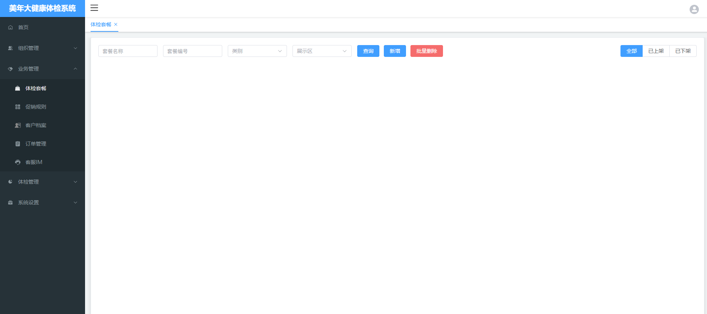

### 编写路由规则

在 `src/views/mis`目录下新建 `goods.vue`文件，然后在 `src/router/index.ts`文件中配置路由信息。

```typescript
// mis端
{
    path: '/mis',
    name: 'Main',
    component: () => import('../views/mis/main.vue'),
    children: [
        ......,
        {
            path: 'goods',
            name: 'MisGoods',
            component: ()=>import('../views/mis/goods.vue'),
            meta: {
                title: "体检套餐",
                isTab: true
            }
        }
    ]
}
```

在同目录下创建goods.less文件，然后让VUE页面关联这个LESS文件

```plaintext
<template></template>

<script lang="ts" setup></script>

<style lang="less" scoped>
    @import url('goods.less');
</style>
```

### 定义视图层标签

在goods.vue页面中，我们把查询条件的表单给定义出来，然后根据视图层标签核对模型层的常量声明会更简单一些

```plaintext
<template>
    <div v-if="proxy.isAuth(['ROOT', 'GOODS:SELECT'])">
        <el-form :inline="true" :model="dataForm" :rules="dataRule" ref="form">
            <el-form-item prop="packageName">
                <el-input v-model="dataForm.packageName" placeholder="套餐名称"
                    maxlength="50" class="input" clearable />
            </el-form-item>
            <el-form-item prop="packageCode">
                <el-input v-model="dataForm.packageCode" placeholder="套餐编号"
                    class="input" maxlength="20" clearable />
            </el-form-item>
            <el-form-item>
                <el-select v-model="dataForm.packageType" class="input"
                    placeholder="类别" clearable>
                    <el-option label="父母体检" value="父母体检" />
                    <el-option label="入职体检" value="入职体检" />
                    <el-option label="职场白领" value="职场白领" />
                    <el-option label="个人高端" value="个人高端" />
                    <el-option label="中青年体检" value="中青年体检" />
                </el-select>
            </el-form-item>
            <el-form-item>
                <el-select v-model="dataForm.categoryId" class="input"
                    placeholder="展示区" clearable>
                    <el-option label="活动专区" value="1" />
                    <el-option label="热卖套餐" value="2" />
                    <el-option label="新品推荐" value="3" />
                    <el-option label="孝敬父母" value="4" />
                    <el-option label="白领精英" value="5" />
                </el-select>
            </el-form-item>
            <el-form-item>
                <el-button type="primary" @click="searchHandle()">查询</el-button>
                <el-button type="primary"
                    :disabled="!proxy.isAuth(['ROOT', 'GOODS:INSERT'])"
                    @click="addHandle()">
                    新增
                </el-button>
                <el-button type="danger"
                    :disabled="!proxy.isAuth(['ROOT', 'GOODS:DELETE'])"
                    @click="deleteHandle()">
                    批量删除
                </el-button>
            </el-form-item>
            <el-form-item class="mold">
                <el-radio-group v-model="dataForm.statusLabel"
                    @change="searchHandle()">
                    <el-radio-button label="全部"></el-radio-button>
                    <el-radio-button label="已上架"></el-radio-button>
                    <el-radio-button label="已下架"></el-radio-button>
                </el-radio-group>
            </el-form-item>
        </el-form>
    </div>
</template>
```

### 定义模型层

接下来我们要把模型层的相关变量和验证规则定义出来，这样就能跟视图层的标签对得上了。

```plaintext
<script lang="ts" setup>
    import { reactive, getCurrentInstance, ref, onMounted } from 'vue';
    //引入ElementPlus组件库中的三个图标，要给按钮设置图标
    import { Delete, Download, Upload } from '@element-plus/icons-vue';
    import router from '../../router/index';
    const { proxy } = getCurrentInstance();

    const dataForm = reactive({
        packageName: null,
        packageCode: null,
        packageType: null,
        categoryId: null,
        statusLabel: '全部',
        status: null
    });

    const dataRule = reactive({
        packageName: [{ pattern: '^[a-zA-Z0-9\u4e00-\u9fa5]{1,50}$', message: '关键字内容不正确' }],
        packageCode: [{ min: 6, message: '编号不能少于6个字符' }, { pattern: '^[a-zA-Z0-9]{6,20}$', message: '编号格式错误' }]
    });
</script>
```

### 编写 less 样式

我们要让单选组合按钮放在搜索区的最右侧，这个效果很容易实现，我们编写goods.less文件，用右浮动就能做出排版效果

```plaintext
@import url('../style.less');
.mold {
        float: right;
    //el-form-item自带右外填充，所以我们要把外填充去掉
        margin-right: 0 !important;
}
```

测试效果如下：


## 内容区实现


### 编写视图标签

在goods.vue页面中，我们要添加表格标签和分页组件标签，添加代码到我们之前实现的搜索框下方，具体如下：

```html
<el-table :data="data.dataList" :header-cell-style="{'background':'#f5f7fa'}" border v-loading="data.loading" @selection-change="selectionChangeHandle">
    <el-table-column type="selection" header-align="center" align="center" width="50" :selectable="selectable" />
    <el-table-column type="index" header-align="center" align="center" width="100" label="序号">
        <template #default="scope">
            <span>{{ (data.pageIndex - 1) * data.pageSize + scope.$index + 1 }}</span>
        </template>
    </el-table-column>
    <el-table-column prop="packageName" header-align="left" align="left" min-width="250" label="套餐名称" />
    <el-table-column prop="packageCode" header-align="left" align="left" min-width="130" label="套餐编号" />
      
    <el-table-column header-align="center" align="center" min-width="80" label="现价">
        <!--如果你要自定义单元格中的内容，就需要单独编写下面的 template 标签-->
        <template #default="scope">
            <span>￥{{ scope.row.currentPrice }}</span>
        </template>
    </el-table-column>
      
    <el-table-column header-align="center" align="center" min-width="100" label="原价">
        <template #default="scope">
            <span>￥{{ scope.row.originalPrice }}</span>
        </template>
    </el-table-column>
    <el-table-column prop="ruleName" header-align="center" align="center" min-width="100" label="促销方案" />
    <el-table-column prop="salesVolume" header-align="center" align="center" min-width="100" label="销量" />
    <el-table-column prop="packageType" header-align="center" align="center" min-width="100" label="类型" />
    <el-table-column header-align="center" align="center" min-width="100" label="体检内容">
        <template #default="scope">
            <span :class="scope.row.hasCheckup ? 'link-blue' : 'link-red'" @click="documentHandle(scope.row.id, scope.row.hasCheckup)">
                {{ scope.row.hasCheckup ? '有文档' : '无文档' }}
            </span>
        </template>
    </el-table-column>
    <el-table-column prop="status" header-align="center" align="center"
        min-width="80" label="状态">
        <template #default="scope">
            <!-- v-model="scope.row.status" 为true表示上架，false表示下架 -->
            <!-- active-text="上架" 开启时显示上架-->
            <!-- inactive-text="下架" 关闭时显示下架-->
            <!-- style="--el-switch-on-color: #13ce66; --el-switch-off-color: #ff4949;" 开启时绿色，关闭时红色-->
            <!-- :disabled="!scope.row.hasCheckup" 只有当 hasCheckup 为 true 时开关才可用-->
            <!-- inline-prompt 控制文本显示的位置和方式，这个配置表示文本显示在开关的内部，如果不写它，文本显示在开关的外面-->
            <el-switch v-model="scope.row.status" inline-prompt
                style="--el-switch-on-color: #13ce66; --el-switch-off-color: #ff4949;"
                active-text="上架" inactive-text="下架"
                :disabled="!scope.row.hasCheckup"
                @change="changeSwitchHandle(scope.row.id, scope.row.status)" />
        </template>
    </el-table-column>
    <el-table-column header-align="center" align="center" width="150" label="操作">
        <template #default="scope">
            <el-button type="text" :disabled="!scope.row.status"  @click="viewHandle(scope.row.id)">
                预览
            </el-button>
            <el-button type="text"
                v-if="proxy.isAuth(['ROOT', 'GOODS:UPDATE'])"
                :disabled="scope.row.status"
                @click="updateHandle(scope.row.id)">
                修改
            </el-button>    
            <el-button type="text"
                v-if="proxy.isAuth(['ROOT', 'GOODS:DELETE'])"
                :disabled="scope.row.salesVolume > 0 || scope.row.status"
                @click="deleteHandle(scope.row.id)">
                删除
            </el-button>
        </template>
    </el-table-column>
</el-table>
<el-pagination @size-change="sizeChangeHandle"
    @current-change="currentChangeHandle" :current-page="data.pageIndex"
    :page-sizes="[10, 20, 50]" :page-size="data.pageSize"
    :total="data.totalCount"
    layout="total, sizes, prev, pager, next, jumper">
</el-pagination>
```

### 定义模型层

```typescript
const data = reactive({
    dataList: [],
    pageIndex: 1,
    pageSize: 10,
    totalCount: 0,
    loading: false,
    selections: []
});
```

### 编写 less 样式

视图层标签中用到了link-blue和link-red样式，需要我们在 goods.less 文件中继续添加这两个样式

```plaintext
.link-blue {
    color: @font-color-27;
    cursor: pointer;
    padding: 5px 0;
    //鼠标悬停，字体颜色变成浅蓝色
    &:hover {
        color: @font-color-28;
    }
}
.link-red {
    color: @font-color-30;
    cursor: pointer;
    padding: 5px 0;
    //鼠标悬停，字体颜色变成浅红色
    &:hover {
        color: @font-color-31;
    }
}
```

测试效果如下：


## 添加套餐的弹窗实现


### 编写视图层代码

在 `goods.vue`页面中编写以下代码，注意以下代码是放在 div 下面的（不是 div 里面，和 div 平级）：

```html
<el-dialog :title="!goodsDialog.dataForm.id ? '新增' : '修改'"
  v-if="proxy.isAuth(['ROOT', 'GOODS:INSERT', 'GOODS:UPDATE'])"
  :close-on-click-modal="false" v-model="goodsDialog.visible"
  width="750px">
  <el-form :model="goodsDialog.dataForm" ref="dialogForm" :rules="goodsDialog.dataRule" label-width="80px">
    <el-form-item label="套餐名称" prop="packageName">
      <el-input v-model="goodsDialog.dataForm.packageName" maxlength="50" clearable />
    </el-form-item>
    <el-form-item label="套餐编号" prop="packageCode">
      <el-input v-model="goodsDialog.dataForm.packageCode" maxlength="20" clearable />
    </el-form-item>
    <el-form-item label="简介信息" prop="description">
      <el-input type="textarea" v-model="goodsDialog.dataForm.description" :rows="4" maxlength="200" clearable />
    </el-form-item>
    <el-form-item label="套餐原价" prop="originalPrice">
      <el-input v-model="goodsDialog.dataForm.originalPrice" placeholder="输入原价" class="price" maxlength="20" clearable>
        <template #append>
          元
        </template>
      </el-input>
      <span class="desc">提示：价格精确到分（小数点后两位）</span>
    </el-form-item>
    <el-form-item label="套餐现价" prop="currentPrice">
      <el-input v-model="goodsDialog.dataForm.currentPrice" placeholder="输入现价" class="price" maxlength="20" clearable>
        <template #append>
          元
        </template>
      </el-input>
      <span class="desc">提示：价格精确到分（小数点后两位）</span>
    </el-form-item>
    <el-form-item label="折扣列表">
      <el-select v-model="goodsDialog.dataForm.promotionId" placeholder="选择折扣信息" clearable>
        <el-option :label="one.ruleName" :value="one.ruleId" v-for="one in goodsDialog.ruleList" />
      </el-select>
    </el-form-item>
    <el-form-item label="封面图片" prop="coverImage">
      <!--EP组件库底层自动发送请求，不需要我们发请求：用户点击 → 弹出文件选择框 → 选择文件 → 自动发送POST请求-->
      <!-- :action="goodsDialog.upload.action" 指定上传时的请求路径 -->
      <!-- :headers="goodsDialog.upload.headers" 上传请求头（通常用于身份验证，如token） -->
      <!-- :data="goodsDialog.upload.data" 上传附加数据（如业务参数） -->
      <!-- :show-file-list="false" 不显示文件列表，适用于单文件上传，如果显示的话：每个文件会显示文件名、大小、状态 -->
      <!-- accept=".jpg,.jpeg" 只接受jpg和jpeg格式的图片 -->
      <!-- :on-success="imageUploadSuccess" 上传成功回调函数 -->
      <!-- :before-upload="imageBeforeUpload" 上传前校验函数（可用于文件类型、大小校验） -->
      <!-- :on-error="imageUploadError" 上传失败回调函数 -->
      <el-upload class="image-uploader"
        :action="goodsDialog.upload.action"
        :headers="goodsDialog.upload.headers"
        :data="goodsDialog.upload.data" :show-file-list="false"
        accept=".jpg,.jpeg" :on-success="imageUploadSuccess"
        :before-upload="imageBeforeUpload"
        :on-error="imageUploadError">
        <!-- 如果已上传图片，显示预览图 -->
        
        <!-- 未上传图片时显示上传图标 -->
        <el-icon v-else class="image-uploader-icon"><Plus /></el-icon>
      </el-upload>
    </el-form-item>
    <el-form-item label="套餐类别" prop="packageType">
        <el-select v-model="goodsDialog.dataForm.packageType" placeholder="检查类别" clearable>
            <el-option label="父母体检" value="父母体检" />
            <el-option label="入职体检" value="入职体检" />
            <el-option label="职场白领" value="职场白领" />
            <el-option label="个人高端" value="个人高端" />
            <el-option label="中青年体检" value="中青年体检" />
        </el-select>
    </el-form-item>
    <el-form-item label="特征标签">
        <div class="tag-row">
            <el-input class="tag-input" v-model="goodsDialog.newTag" clearable />
            <span class="desc">提示：输入标签后按回车键</span>
        </div>
        <div class="tags">
            <el-tag v-for="one in goodsDialog.dataForm.tags" closable :disable-transitions="false" @close="closeTag(one)">
                {{ one }}
            </el-tag>
        </div>
    </el-form-item>
    <el-form-item label="展示区" prop="categoryId">
        <el-select v-model="goodsDialog.dataForm.categoryId" placeholder="选择展示区" clearable>
            <el-option label="活动专区" value="1" />
            <el-option label="热卖套餐" value="2" />
            <el-option label="新品推荐" value="3" />
            <el-option label="孝敬父母" value="4" />
            <el-option label="白领精英" value="5" />
        </el-select>
    </el-form-item>
    <el-form-item label="体检内容">
        <!-- 
          商品体检项目动态表单行
          功能：循环渲染体检项目配置，每行包含类别选择、项目名称、内容和删除操作
          结构说明：
            - :gutter="10" 列间距10像素
            - v-for 遍历goodsDialog.item数组，动态生成多个配置行
            - :key="$index" 使用索引作为key
          
          el-col 列布局(EP的栅格布局，EP规定一行共24个栅格：把一行等分成24份)：
            - 第1列(span=6，6就是表示占6份)：检查类别下拉选择，包含科室/实验室/医技/其他检查
            - 第2列(span=6)：体检项目名称输入框，最多50字符
            - 第3列(span=11)：体检内容详细说明输入框，最多500字符  
            - 第4列(span=1)：删除按钮，点击移除当前行配置
        -->
        <el-row :gutter="10" class="item-row" v-for="(one, $index) in goodsDialog.item" :key="$index">
            <el-col :span="6">
                <el-select v-model="one.type" placeholder="检查类别" clearable>
                    <el-option label="科室检查" value="科室检查" />
                    <el-option label="实验室检查" value="实验室检查" />
                    <el-option label="医技检查" value="医技检查" />
                    <el-option label="其他检查" value="其他检查" />
                </el-select>
            </el-col>
            <el-col :span="6">
                <el-input v-model="one.title" placeholder="体检项目" maxlength="50" clearable />
            </el-col>
            <el-col :span="11">
                <el-input v-model="one.content" placeholder="体检内容" maxlength="500" clearable />
            </el-col>
            <el-col :span="1">
                <el-button type="primary" :icon="Delete" @click="deleteItem($index)" />
            </el-col>
        </el-row>
    </el-form-item>

  </el-form>
  <template #footer>
      <span class="dialog-footer">
          <el-button type="danger" @click="addItem">添加项目</el-button>
          <el-button @click="goodsDialog.visible=false">取消</el-button>
          <el-button type="primary" @click="dataFormSubmit">确定</el-button>
      </span>
  </template>
</el-dialog>
```

### 编写模型层代码

```typescript
const goodsDialog = reactive({
    visible: true,
    newTag: null,
    item: [{}],
    imageUrl: null,
    ruleList: [],
    dataForm: {
        id: null,
        packageName: null,
        packageCode: null,
        description: null,
        originalPrice: null,
        currentPrice: null,
        promotionId: null,
        coverImage: null,
        packageType: null,
        tags: [],
        categoryId: null
    },
    upload: {
        action: '/meinian-api/mis/goods/uploadImage',
        headers: {
            'satoken': localStorage.getItem('token')
        },
        data: {
            id: null
        },
    },

    dataRule: {
        packageName: [
            { required: true, message: '名称不能为空' },
            { min: 2, message: '名称不能少于2个字符' },
            { pattern: '^[a-zA-Z0-9\u4e00-\u9fa5]{2,50}$', message: '名称格式错误' }
        ],
        packageCode: [
            { required: true, message: '编号不能为空' },
            { min: 6, message: '编号不能少于6个字符' },
            { pattern: '^[a-zA-Z0-9]{6,20}$', message: '编号格式错误' }
        ],
        description: [{ required: true, message: '简介信息不能为空' }],
        originalPrice: [
            {
                required: true,
                message: '价格不能为空'
            },
            {
                pattern: '(^[1-9]([0-9]+)?(\\.[0-9]{1,2})?$)|(^(0){1}$)|(^[0-9]\\.[0-9]([0-9])?$)',
                message: '价格不正确'
            }
        ],
        currentPrice: [
            {
                required: true,
                message: '价格不能为空'
            },
            {
                pattern: '(^[1-9]([0-9]+)?(\\.[0-9]{1,2})?$)|(^(0){1}$)|(^[0-9]\\.[0-9]([0-9])?$)',
                message: '价格不正确'
            }
        ],
        coverImage: [
            {
                required: true,
                message: '没有上传封面图片'
            }
        ],
        packageType: [
            {
                required: true,
                message: '没有选择套餐类别'
            }
        ]
    }
});
```

### 编写 less 样式

在 goods.less 文件中继续添加以下样式：

```plaintext
.image-uploader {
    width: 90px;
    height: 90px;
    border: 1px dashed var(--el-border-color);
    border-radius: 6px;
    cursor: pointer;
    //如果图片不是正方形，缩放之后溢出部分被截掉
    overflow: hidden;
}

.el-icon.image-uploader-icon {
    font-size: 28px;
    color: #8c939d;
    width: 90px;
    height: 90px;
    text-align: center;
}
.image {
    width: 90px;
    height: 90px;
}
.price {
    width: 200px;
}
.desc {
    margin-left: 20px;
    font-size: 14px;
    color: @font-color-3;
}

.tag-row {
    width: 100%;
    .tag-input {
        width: 50%;
    }
}
.tags {
    margin-top: 5px;
}
.item-row {
    width: 100%;
    margin-bottom: 18px;
}
```

测试效果如下：


## 导入 Excel 的弹窗设计

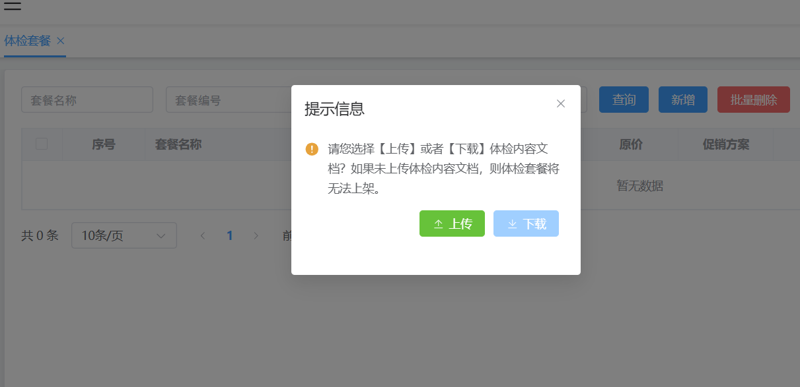

### 编写视图层

在 goods.vue 页面中：在之前的 dialog 下面再新增一个 dialog，代码如下：

```html
<el-dialog title="提示信息"
   v-if="proxy.isAuth(['ROOT', 'GOODS:INSERT', 'GOODS:UPDATE'])"
   v-model="documentDialog.visible" width="350px">
   <div class="message-content">
       <el-icon :size="18" class="icon">
           <WarningFilled />
       </el-icon>
       <p>请您选择【上传】或者【下载】体检内容文档？如果未上传体检内容文档，则体检套餐将无法上架。</p>
   </div>
    <!-- 
      1. 上传功能：
         - 使用el-upload组件实现Excel文件上传
         - 上传地址：documentDialog.upload.action
         - 附加数据：documentDialog.data
         - 请求头：documentDialog.upload.headers（通常包含认证信息）
         - 只接受.xlsx格式文件
         - 上传前校验：documentBeforeUpload（校验文件格式、大小等）
         - 上传成功回调：documentUploadSuccess（处理上传结果）
         - 上传失败回调：documentUploadError（错误处理）
         - 显示为带Upload图标的成功样式按钮
    
      2. 下载功能：
         - 使用el-button实现文件下载
         - 带Download图标的主样式按钮
         - 禁用条件：!documentDialog.data.hasCheckup（未通过审核时禁用下载）
         - 点击事件：documentDownloadHandle（触发下载操作）
    -->
   <template #footer>
       <span class="document-dialog-footer">
           <el-upload :action="documentDialog.upload.action"
               :data="documentDialog.data" :show-file-list="false"
               :headers="documentDialog.upload.headers" accept=".xlsx"
               :before-upload="documentBeforeUpload"
               :on-success="documentUploadSuccess"
               :on-error="documentUploadError">
               <el-button type="success" :icon="Upload"
                   class="uploadBtn">上传</el-button>
           </el-upload>
           <el-button type="primary" :icon="Download"
               class="downloadBtn"
               :disabled="!documentDialog.data.hasCheckup"
               @click="documentDownloadHandle">
               下载
           </el-button>
       </span>
   </template>
</el-dialog>
```

### 编写模型层

```typescript
const documentDialog = reactive({
    visible: true, // 记得调试完改成false
    upload: {
        action: '/meinian-api/mis/goods/uploadCheckupExcel',
        headers: {
            'satoken': localStorage.getItem('token')
        }
    },
    data: {
        id: null,
        hasCheckup: null
    }
});
```

### 编写 less 样式

在goods.less文件中，添加两个CSS样式。用于规定消息内容的排版和弹窗页脚的布局

```plaintext
/* 
  消息内容样式 (.message-content):
  - display: flex 启用弹性布局，实现水平排列
  - .icon 图标样式：
      * color: @bg-color-17 使用主题变量设置图标颜色
      * margin-top: 3px 微调图标垂直位置，实现视觉对齐
  - p 段落样式：
      * margin: 0 10px 5px 10px 上边距0，左右边距10px，下边距5px
      * line-height: 1.7 设置1.7倍行高，提升文本可读性

  文档对话框底部样式 (.document-dialog-footer):
  - display: flex 启用弹性布局
  - justify-content: flex-end 子元素右对齐
  - .uploadBtn 上传按钮样式：
      * margin-right: 10px 右侧10px外边距，与下载按钮保持间距
*/

.message-content {
    display: flex;
    .icon {
        color: @bg-color-17;
        margin-top: 3px;
    }
    p {
        margin: 0 10px 5px 10px;
        line-height: 1.7;
    }
}
.document-dialog-footer {
    display: flex;
    justify-content: flex-end;
    .uploadBtn {
        margin-right: 10px;
    }
    .downloadBtn {
    }
}
```

## 利用 Flex 布局设计商品页面展示区


从上面的截图可以大致分析出先用一个DIV作为父控件，然后用flex布局把图片和SKU信息左右排版。SKU区域里面一行行的内容，就很容易排版了。

SKU：**S**tock **K**eeping **U**nit **库存单位**

在电商网站页面上，**“SKU部分”** 是指 **“可供消费者选择的商品规格属性的组合”**。

实际上就是页面上让你选择**颜色、尺寸、口味、容量**等属性的那个区域。

### 创建 vue 页面

在 `src/views/**<font style="color:#DF2A3F;">front</font>**`** **目录中，创建 `goods.vue` 页面，然后在路由配置文件中添加路由配置信息。

```typescript
{
    path: 'goods/:id',
    name: 'FrontGoods',
    component: () => import('../views/front/goods.vue')
}
```

配置位置如下图所示：

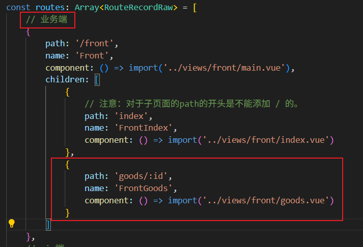

`goods/:id`表示允许传递过来一个商品的 id。因为要根据商品 id 去数据库中查找对应的商品然后再显示页面。

创建 `goods.less`样式文件，用于以后编写样式，然后在 `goods.vue`页面中将 `goods.less`样式引入：

```plaintext
<template>

</template>

<script lang="ts" setup></script>

<style lang="less" scoped>
    @import url('goods.less');
</style>
```

### 获取封面图片

后端代码没写呢，所以我们先从 MinIO 中临时分享一个图片的链接，供我们开发前端项目时使用。注意：默认图片 URL 的有效期是 12 个小时或者会话失效。**这个“会话”就是你登录 MinIO 网页后台的这次登录状态，如果你退出登录或页面超时自动登出，分享链接就会立即失效。因此你先暂时不要退出 MinIO 的 web 端管理页面。**

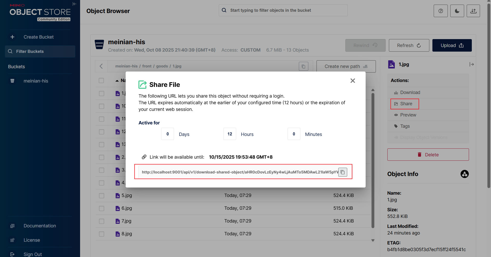

### 编写模型层代码

在goods.vue页面添加模型层定义，为了能让视图层渲染出商品信息，所以我们需要暂时在模型层中写死商品信息。

```typescript
<script lang="ts" setup>
    import { reactive, ref, type Ref, getCurrentInstance, onMounted } from 'vue';
    import { ElMessageBox } from 'element-plus';
    import router from '../../router/index';
    const { proxy } = getCurrentInstance();
    
    const dataForm = reactive({
        number: 1
    });
  
    const data = reactive({
        packageCode: "117GWMN00",
        packageName: "新感恩敬老中级体检套餐",
        description: "「感恩季到检钜惠」适合人群：适用于中、老年人及血管疾病人群 （参加第二件0元活动 需加入购物车后数量选2）",
        coverImage: "http://localhost:9001/api/v1/download-shared-object/aHR0cDovLzEyNy4wLjAuMTo5MDAwL21laW5pYW4taGlzL2Zyb250L2dvb2RzLzcuanBnP1gtQW16LUFsZ29yaXRobT1BV1M0LUhNQUMtU0hBMjU2JlgtQW16LUNyZWRlbnRpYWw9SU80TTFUOURFOUVETlZPSzIxOUIlMkYyMDI1MTAxNSUyRnVzLWVhc3QtMSUyRnMzJTJGYXdzNF9yZXF1ZXN0JlgtQW16LURhdGU9MjAyNTEwMTVUMDkwNTAwWiZYLUFtei1FeHBpcmVzPTQzMjAwJlgtQW16LVNlY3VyaXR5LVRva2VuPWV5SmhiR2NpT2lKSVV6VXhNaUlzSW5SNWNDSTZJa3BYVkNKOS5leUpoWTJObGMzTkxaWGtpT2lKSlR6Uk5NVlE1UkVVNVJVUk9WazlMTWpFNVFpSXNJbVY0Y0NJNk1UYzJNRFUyTWpJNU15d2ljR0Z5Wlc1MElqb2ljbTl2ZENKOS42RGkwOWNPektpb21FUGdORnZNdUJ0aWdHWHRnSFhSdzdpNk83bFhOZ0JnU3BuTXRySHJXRS12UXdaYUE5SjlfRzFSOFlBS09PODNpMjJyTXg3UHF1ZyZYLUFtei1TaWduZWRIZWFkZXJzPWhvc3QmdmVyc2lvbklkPW51bGwmWC1BbXotU2lnbmF0dXJlPWFjMDc1OTM0MDUzZGE2YmI2ZGZlN2QyODMwODE2NmIxNmE1NzZhM2VlNDRhZjg4ZGQ0MGYzMDJmZDkxMjk5ZGQ",
        originalPrice: 2249.00,
        currentPrice: 2142.00,
        ruleName: null,
        packageType: "父母体检",
        tags: ["中老年", "女性", "男性"],
        departmentExam: [{ "title": "一般健康检查", "content": "身高、体重、血压、心、肺、肝、脾、神经系统 ；甲状腺、乳腺、肛门、直肠" }],
        labExam: [
            {"title": "C反应蛋白","content": "升高常见于：急性炎症、组织坏死、恶性肿瘤、风湿病等疾病"}, 
            {"title": "肝功10项","content": "丙氨酸氨基转移酶(ALT)测定 ；天门冬氨酸氨基转移酶(AST)测定；总蛋白(TP)测定 ；白蛋白(Alb)测定 ；碱性磷酸酶(ALP)测定 ;γ-谷氨酰基转移酶(GGT)测定;总胆红素(T-Bil)测定;直接胆红素(D-Bil)测定 ；总胆汁酸(TBA)测定 ；胆碱脂酶(ChE)测定"}, 
            {"title": "甲功七项","content": "三碘甲状腺原氨酸(T3)测定 ；甲状腺素(T4)测定 ；促甲状腺激素(TSH)测定 ；游离三碘甲状腺原氨酸(FT3)测定 ；游离甲状腺素(FT4)测定 ；抗甲状腺球蛋白抗体(TGAb)测定 ；抗甲状腺过氧化物酶抗体(TPOAb)测定"}, 
            {"title": "尿常规","content": "尿常规化学分析；尿有形成分分析"}, 
            {"title": "肾功5项","content": "尿素(Urea)测定 ；肌酐(Cr)测定 ；葡萄糖(Glu)测定 ；尿酸(UA)测定 ；β2微球蛋白(β2-MG)测定"}, 
            {"title": " 糖化血红蛋白","content": "检测近2-3个月内的平均血糖水平、用于糖尿病疗效观察"}, 
            {"title": " 同型半胱氨酸","content": "HCY升高是心血管疾病的重要危险因素"}
        ],
        medicalExam: [
            {"title": "泌尿系彩色多普勒超声检查","content": "双肾、肾盂、输尿管、膀胱壁、[前列腺（男）]"}, 
            {"title": "肝胆胰脾彩色多普勒超声检查","content": "肝胆胰脾彩色多普勒超声检查"}, 
            {"title": "数字化摄影（指CR/DR)","content": "心、肺、膈等"}, 
            {"title": "超声骨密度检测","content": "超声仪检查骨量情况，无骨质疏松、骨量减少"}, 
            {"title": "心电图","content": "检查心脏有否器官功能性病变，如：窦性心动过速、过缓、不齐以及各种心脏病的筛查"}
        ],
        otherExam: [{"title": "肿物标记物（男）","content": " 男：甲胎蛋白(AFP)测定 ；癌胚抗原(CEA)测定 ;游离前列腺特异性抗原(FPSA)测定 ；总前列腺特异性抗原(TPSA)测定 ；糖类抗原CA-199测定"}],

        departmentExam_count: 1,
        labExam_count: 7,
        medicalExam_count: 5,
        otherExam_count: 1,
        examCount: 14
    });

</script>
```

### 编写视图层标签

在goods.vue页面的视图层代码如下：

```html
<template>
    <div class="goods-detail">
        
        <div class="property">
            <h3 class="title">{{ data.packageName }} {{ data.packageCode }}</h3>
            <p class="desc">{{ data.description }}</p>
            <div class="row">
                <label>官网价格：</label>
                <div class="info">
                    <span class="current-price">{{ data.currentPrice }}</span>
                    <span class="initial-price">￥{{ data.originalPrice }}</span>
                </div>
            </div>
            <div class="row">
                <label>享有折扣：</label>
                <div class="info">
                    
                    <span
                        class="discount">{{ data.ruleName != null ? data.ruleName : '无' }}</span>
                </div>
            </div>
            <!--下面的标签是新添加的-->
            <div class="row">
                <label>商品类型：</label>
                <div class="info">虚拟卡（电子卡密）</div>
            </div>
            <div class="row">
                <label>适用人群：</label>
                <div class="info">{{ data.packageType }}</div>
            </div>
            <div class="row">
                <label>购买数量：</label>
                <div class="info">
                    <el-input-number v-model="dataForm.number" size="small"
                        :min="1" :max="10" @change="handleChange" />
                </div>
            </div>
            <div class="row">
                <label>服务承诺：</label>
                <div class="info">
                    
                    <span class="service-tag">专业品质</span>
                    
                    <span class="service-tag">官方直营</span>
                    
                    <span class="service-tag">随时改</span>
                    
                    <span class="service-tag">随时退</span>
                </div>
            </div>
            <div class="operate">
                <div class="consult-btn" @click="consultHandle">
                    
                    <span>咨询客服</span>
                </div>
                <div class="buy-btn" @click="createPayment">立即付款</div>
            </div>
        </div>
    </div>
</template>
```

### 编写 less 样式

我们到LESS文件中，规定CSS样式。

```plaintext
@import url('../style.less');
.goods-detail {
    width: 1200px;
    margin-left: auto;
    margin-right: auto;
    margin-top: 30px;
    display: flex;
    .cover {
        width: 380px;
        height: 380px;
    }
    .property {
        margin-left: 40px;
        .title {
            font-size: 20px;
            color: @font-color-1;
            margin-top: 0;
            margin-bottom: 0;
        }
        .desc {
            font-size: 14px;
            color: @font-color-3;
            margin-top: 10px;
            margin-bottom: 30px;
        }
        .row {
            display: flex;
            margin-bottom: 20px;
            label {
                width: 80px;
                font-size: 14px;
                color: @font-color-1;
            }
            .info {
                font-size: 14px;
                color: @font-color-1;
                display: flex;
                .current-price {
                    font-size: 30px;
                    color: @font-color-23;
                    margin-top: -12px;
                    &::before {
                        content: '￥';
                        font-size: 22px;
                    }
                }
                .initial-price {
                    font-size: 15px;
                    color: @font-color-3;
                    text-decoration: line-through;
                    margin-left: 10px;
                }
              
                .discount-img{
                                                  width: 28px;
                                                  height: auto;
                                                  margin-right: 5px;
                                        }
                                        .discount{
                                                  color: @font-color-23;
                                        }
                //这里往下的CSS样式都是新添加的
                .property-icon {
                    width: 20px;
                    height: 20px;
                    margin-right: 5px;
                }
                .service-tag {
                    margin-right: 20px;
                }
            }
        }
        .operate {
            display: flex;
            margin-top: 25px;
            .consult-btn {
                border: 1px solid @border-color-20;
                display: flex;
                justify-content: center;
                align-items: center;
                width: 130px;
                height: 43px;
                border-radius: 3px;
                cursor: pointer;
                user-select: none;
                &:active {
                    background-color: #fff7fb;
                }
                .consult-icon {
                    width: 17px;
                    height: 17px;
                    font-size: 14px;
                    margin-right: 5px;
                }
                span {
                    color: @font-color-23;
                    font-size: 14px;
                }
            }
            .buy-btn {
                border: 1px solid @border-color-20;
                display: flex;
                justify-content: center;
                align-items: center;
                width: 130px;
                height: 43px;
                border-radius: 3px;
                cursor: pointer;
                user-select: none;
                font-size: 14px;
                background-color: @button-color-10;
                color: #fff;
                margin-left: 15px;
                &:active {
                    background-color: @button-active-color-10;
                }
            }
        }
    }
}
```

效果如下：


## 利用 Flex 布局设计商品页体检明细


### 编写视图层代码

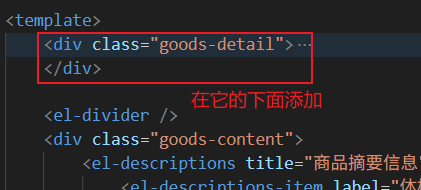

在goods.vue页面的视图层中，添加新的内容。其中代表一条灰色的横线

```html
    <el-divider />
    <div class="goods-content">
        <el-descriptions title="商品摘要信息" :column="3" size="large" border>
            <el-descriptions-item label="体检名称" label-align="center">
                {{ data.packageName }} {{ data.packageCode }}
            </el-descriptions-item>
            <el-descriptions-item label="体检类型"
                label-align="center">{{ data.packageType }}</el-descriptions-item>
            <el-descriptions-item label="适用人群" label-align="center">
                <span class="tag" v-for="one in data.tags">{{ one }}</span>
            </el-descriptions-item>
            <el-descriptions-item label="体检机构" label-align="center">
                天津美年大健康体检中心（卫津南路109号京燕大厦5层）
            </el-descriptions-item>
            <el-descriptions-item label="体检项目"
                label-align="center">{{ data.examCount }}个</el-descriptions-item>
            <el-descriptions-item label="有效期"
                label-align="center">一年</el-descriptions-item>
        </el-descriptions>
        <div class="detail">
            <fieldset>
                <legend>体检项目明细</legend>
                <div v-if="data.departmentExam_count > 0">
                    <h4 class="detail-title">科室检查({{ data.departmentExam_count }}项目)</h4>
                    <table class="detail-table">
                        <tr v-for="one in data.departmentExam">
                            <th>{{ one.title }}</th>
                            <td>{{ one.content }}</td>
                        </tr>
                    </table>
                </div>
                <div v-if="data.labExam_count > 0">
                    <h4 class="detail-title">实验室检查({{ data.labExam_count }}项目)</h4>
                    <table class="detail-table">
                        <tr v-for="one in data.labExam">
                            <th>{{ one.title }}</th>
                            <td>{{ one.content }}</td>
                        </tr>
                    </table>
                </div>
                <div v-if="data.medicalExam_count > 0">
                    <h4 class="detail-title">医技检查({{ data.medicalExam_count }}项目)</h4>
                    <table class="detail-table">
                        <tr v-for="one in data.medicalExam">
                            <th>{{ one.title }}</th>
                            <td>{{ one.content }}</td>
                        </tr>
                    </table>
                </div>
                <div v-if="data.otherExam_count > 0">
                    <h4 class="detail-title">其他检查({{ data.otherExam_count }}项目)</h4>
                    <table class="detail-table">
                        <tr v-for="one in data.otherExam">
                            <th>{{ one.title }}</th>
                            <td>{{ one.content }}</td>
                        </tr>
                    </table>
                </div>
            </fieldset>
        </div>
    </div>
```

### 编写 less 样式

在goods.less文件中，我们为新控件添加新的CSS样式（在最下面继续添加，不需要嵌套到其他元素中）

```plaintext
.goods-content {
    margin-top: 30px;
    .tag {
        border-right: solid 1px @border-color-1;
        padding-right: 10px;
        margin-right: 10px;
        &:last-of-type {
            border-right: none;
            padding-right: 0;
            margin-right: 0;
        }
    }
    .detail {
        margin-top: 50px;
    }

}

fieldset {
    border-top: solid 1px @border-color-1;
    border-left: none;
    border-right: none;
    border-bottom: none;
    margin: 0;
    padding: 0;
    legend {
        text-align: center;
        font-size: 30px;
        background-color: @bg-color-22;
        height: 70px;
        padding: 0 50px;
        line-height: 70px;
        border-radius: 35px;
        color: #fff;
        margin-left: auto;
        margin-right: auto;
        margin-bottom: 50px;
        margin-top: 30px;
    }
    .detail-title {
        color: @font-color-26;
        margin-top: 0;
        margin-bottom: 20px;
    }
    .detail-table {
        width: 100%;
        border: solid 1px @border-color-22;
        border-collapse: collapse;
        border-spacing: 0;
        margin-bottom: 35px;

        th {
            font-size: 14px;
            line-height: 1.7;
            padding: 12px 15px;
            font-weight: normal;
            border: solid 1px @border-color-22;
            background-color: @bg-color-31;
            color: @font-color-25;
            width: 200px;
        }
        td {
            font-size: 14px;
            line-height: 1.7;
            padding: 12px 15px;
            font-weight: normal;
            border: solid 1px @border-color-22;
            color: @font-color-26;
        }
    }
}
```

测试效果如下：


## 利用 Flex 布局设计商品页预约事项


### 编写视图层


在goods.vue页面中，继续添加新的控件标签

```html
<div class="checkup-appointment">
    <fieldset>
        <legend>预约须知</legend>
        <el-descriptions title="" :column="1" size="large"
            class="descriptions">
            <el-descriptions-item label="预约时间：" label-align="center"
                style="width:300px">
                该医院支持提前可约，若要预约当天请在08:30前下单
            </el-descriptions-item>
            <el-descriptions-item label="营业时间：" label-align="center">
                周一至周五08:00-10:30(到院时间为08:00-10:30)
            </el-descriptions-item>
            <el-descriptions-item label="体检地点：" label-align="center">
                天津市南开区向阳路888号美年大健康体检中心
            </el-descriptions-item>
            <el-descriptions-item label="体检凭证：" label-align="center">
                体检当天凭借预约成功短信，现场出示身份证即可体检
            </el-descriptions-item>
            <el-descriptions-item label="优惠信息：" label-align="center">
                会员在线支付时含“立减”字样的套餐，付款时会自动抵扣掉对应的金额
            </el-descriptions-item>
            <el-descriptions-item label="订单退改：" label-align="center">
                如客户预约成功后选择退款，需扣除套餐实付金额的10%作为服务费。最高扣款金额不超过100元。（*个别体检中心执行单独退赔政策*）
            </el-descriptions-item>
            <el-descriptions-item label="注意事项：" label-align="center">
                当您预约套餐时，即表示接受检测的所有项目。如因自身原因放弃体检套餐中的检查项目，网站将不予退款处理
            </el-descriptions-item>
            <el-descriptions-item label="发票申请：" label-align="center">
                请在体检后到“我的订单”中申请，如需了解开票具体流程，可在提交订单后及时联系中康体检网客服，客服热线：4008007580
            </el-descriptions-item>
        </el-descriptions>
    </fieldset>
    
    <fieldset>
        <legend>线上预约优势</legend>
        <div class="content">
            <div class="advantage">
                <div class="card">
                    <div class="left"><span>提前确认到院可检</span></div>
                    <div class="right">
                        <span>提前选择体检时间、体检套餐，避免部分医院预约号紧缺，而导致当天无法体检的状况。</span>
                    </div>
                </div>
                <div class="card">
                    <div class="left"><span>省时方便无需排队</span></div>
                    <div class="right">
                        <span>体检当天携带身份证到院打印体检单，即可开始体检，无需排队缴费。</span>
                    </div>
                </div>
                <div class="card">
                    <div class="left"><span>电话通知灵活改期</span></div>
                    <div class="right">
                        <span>预约成功后如需改期，可提前电话告知客服，灵活安排行程。</span></div>
                </div>
                <div class="card">
                    <div class="left"><span>享受优惠节省费用</span></div>
                    <div class="right">
                        <span>线上体检套餐，享受团体体检优惠价格，大部分可享医院价的7-9折。</span>
                    </div>
                </div>
            </div>
            <div class="timeline">
                <ul>
                    <li>
                        
                        <div class="list-line"></div>
                        <div class="list-tag">
                            
                            <span>1</span>
                        </div>
                        <div class="list-content">
                            <h4>选购体检套餐</h4>
                            <p>确定订单无误后，完成线上支付</p>
                        </div>
                    </li>
                    <li>
                        
                        <div class="list-line"></div>
                        <div class="list-tag">
                            
                            <span>2</span>
                        </div>
                        <div class="list-content">
                            <h4>完成预约体检</h4>
                            <p>填写体检人信息及体检日期</p>
                        </div>
                    </li>
                    <li>
                        
                        <div class="list-line"></div>
                        <div class="list-tag">
                            
                            <span>3</span>
                        </div>
                        <div class="list-content">
                            <h4>到院体检</h4>
                            <p>到院出示身份证，领取体检单体检</p>
                        </div>
                    </li>
                    <li>
                        
                        <div class="list-line"></div>
                        <div class="list-tag">
                            
                            <span>4</span>
                        </div>
                        <div class="list-content">
                            <h4>获取体检报告</h4>
                            <p>根据医院情况，到前台登记自取或自费邮寄</p>
                        </div>
                    </li>
                </ul>
            </div>
        </div>
    </fieldset>
</div>
```

### 编写 less 样式


在goods.less文件中，为新添加的控件设置CSS样式

```plaintext
    // 这部分是新增的样式代码。
    .descriptions {
        margin-bottom: 35px;
    }
    .content {
        display: flex;
        margin-bottom: 60px;
        .advantage {
            width: 600px;
            .card {
                display: flex;
                margin-bottom: 25px;
                &:first-child {
                    margin-top: 10px;
                }
                &:last-child {
                    margin-bottom: 0;
                }
                .left {
                    width: 150px;
                    height: 80px;
                    flex-grow: 0;
                    flex-shrink: 0;
                    display: flex;
                    justify-content: center;
                    align-items: center;
                    background-color: @bg-color-30;
                    border-top-left-radius: 40px;
                    border-bottom-left-radius: 40px;
                    span {
                        display: block;
                        width: 70px;
                        font-size: 16px;
                        color: #fff;
                        text-align: center;
                        padding-left: 15px;
                        line-height: 1.5;
                    }
                }
                .right {
                    flex-grow: 1;
                    background-color: @bg-color-29;
                    display: flex;
                    justify-content: center;
                    align-items: center;
                    margin-right: 30px;
                    span {
                        display: block;
                        font-size: 16px;
                        width: 94%;
                        line-height: 1.5;
                        color: @font-color-2;
                    }
                }
            }
        }
        .timeline {
            padding-top: 10px;
            ul {
                list-style: none;
                padding: 0 0 0 30px;
                margin: 0;
                li {
                    display: flex;
                    .list-img {
                        width: 10px;
                        height: 98px;
                    }
                    .list-line {
                        width: 44px;
                        height: 0;
                        border-top: solid 3px @border-color-21;
                        margin-top: 44px;
                    }
                    .list-tag {
                        position: relative;
                        img {
                            width: 68px;
                            height: 48px;
                            margin-top: 20px;
                        }
                        span {
                            position: absolute;
                            left: 20px;
                            top: 30px;
                            font-size: 24px;
                            color: #fff;
                            font-weight: bold;
                        }
                    }
                    .list-content {
                        margin-left: 10px;
                        margin-top: 12px;
                        h4 {
                            font-size: 24px;
                            color: @font-color-2;
                            margin: 0;
                            font-weight: normal;
                        }
                        p {
                            margin: 0;
                            font-size: 18px;
                            color: @font-color-2;
                        }
                    }
                }
            }
        }
    }
```

测试效果如下：


## 利用 Flex 布局设计商品页体检事项


### 编写视图层标签

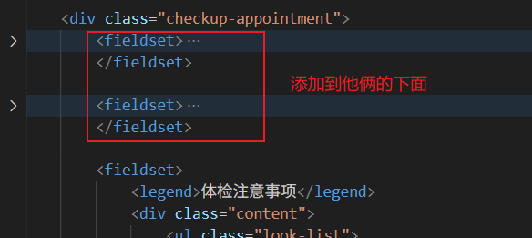

```html
<fieldset>
    <legend>体检注意事项</legend>
    <div class="content">
        <ul class="look-list">
            <li class="item">
                <div class="left">体检前</div>
                <div class="right">
                    <ul>
                        <li>体检前一天请您清淡饮食,勿饮酒、勿劳累。体检当天请空腹。</li>
                        <li>
                            体检前一天要注意休息，晚上8点后不再进食。避免剧烈运动和情绪激动，保证充足睡眠，以免影响体检结果。
                        </li>
                        <li>例假期间不宜做妇科、尿液检查。</li>
                    </ul>
                </div>
            </li>
            <li class="item">
                <div class="left">体检中</div>
                <div class="right">
                    <ul>
                        <li>需空腹检查的项目为抽血、腹部B超、数字胃肠，胃镜及其它标注的体检项目。</li>
                        <li>做膀胱、子宫、附件B超时请勿排尿，如无尿需饮水至膀胱充盈。做妇科检查前应排空尿。</li>
                        <li>未婚女性不做妇科检查；怀孕的女性请预先告知医护人员,不安排做放射及其他有影响的检查。</li>
                        <li>做放射线检查前,请您除去身上佩戴的金银、玉器等饰物。</li>
                        <li>
                            核磁共振检查，应禁止佩带首饰、手表、传呼、手机等金属物品，磁卡也不应带入检查室，以防消磁。
                        </li>
                    </ul>
                </div>
            </li>
            <li class="item">
                <div class="left">体检后</div>
                <div class="right">
                    <ul>
                        <li>全部项目完毕后请您务必将体检单交到前台。</li>
                        <li>请您认真听取医生的建议,及时复查.随诊或进一步检查治疗。</li>
                        <li>请您保存好体检结果，以便和下次体检结果作对照，也可作为您就医时的资料。</li>
                    </ul>
                </div>
            </li>
        </ul>
    </div>
</fieldset>
```

### 编写 less 样式


在goods.less文件中，为新控件添加CSS样式

```plaintext
.look-list {
    list-style: none;
    margin: 0;
    padding: 0;
    user-select: none;
    .item {
        display: flex;
        margin-bottom: 50px;
        .left {
            width: 122px;
            height: 106px;
            background-image: url('../../assets/front/goods/polygon.png');
            background-size: 122px 106px;
            text-align: center;
            line-height: 106px;
            font-size: 22px;
            color: @font-color-24;
        }
        .right {
            margin-left: 20px;
            ul {
                margin: 0;
                padding: 0;
                list-style: none;
                li {
                    font-size: 18px;
                    color: @font-color-2;
                    display: flex;
                    margin-bottom: 18px;
                    &:last-of-type {
                        margin-bottom: 0;
                    }
                    &::before {
                        display: block;
                        content: '';
                        width: 24px;
                        height: 24px;
                        background-image: url('../../assets/front/goods/tick.png');
                        background-size: 24px;
                        margin-right: 10px;
                    }
                }
            }
        }
    }
}
```

测试结果如下：


# 套餐管理分页 RESTful 接口开发

## 分析查询条件都有哪些

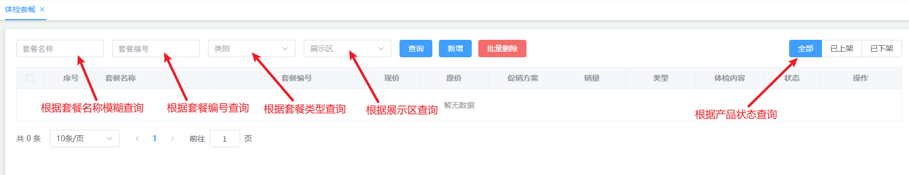

1. 查询哪张表？`med_exam_package`体检套餐表。比较简单因为只需要进行一次表连接。（套餐表和促销规则表连接。）
2. 查询条件包括 5 个：
  1. 根据套餐名称模糊查询，字段名是：`package_name`
  2. 根据套餐编号查询，字段名是：`package_code`
  3. 根据套餐类型查询，字段名是：`package_type`
  4. 根据展示区查询，字段名是：`category_id`
  5. 根据状态查询，字段名是：`status`

## 分析查询结果列都有哪些

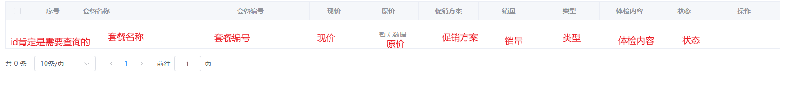

需要查询的列包括：

1. 主键：字段名是 `id`
2. 套餐名称：字段名是 `package_name`
3. 套餐编号：字段名是 `package_code`
4. 原价：字段名是 `original_price`
5. 现价：字段名是 `current_price`
6. 销量：字段名是 `sales_volume`
7. 套餐类型：字段名是 `package_type`
8. 促销规则：字段名在 `promotion_rule`表中，字段名为：`rule_name`，需要让 `med_exam_package`表和 `promotion_rule`表连接，但需要左连接，因为有的体检套餐是没有促销规则的。连接条件：`ep.promotion_id = pr.rule_id`
9. 体检内容：字段名是 `exam_items`，判断规则，如果该字段不为空，则页面上 体检内容 那一列展示：有文档。
10. 状态：字段名是 `status`
11. 展示区 ID：字段名 `category_id`，虽然页面上不显示这一列，但是这一列后面有用。

初步的 SQL 语句我们基本上已经可以写出来了：

```sql
select
  ep.id,
  ep.package_name as packageName,
  ep.package_code as packageCode,
  ep.original_price as originalPrice,
  ep.current_price as currentPrice,
  ep.sales_volume as salesVolume,
  ep.package_type as packageType,
  pr.rule_name as ruleName,
  (ep.exam_items is not null) as hasDocument,
  ep.status,
  ep.category_id as categoryId
from
  med_exam_package ep
left join
  promotion_rule pr
on
  ep.promotion_id = pr.rule_id;
```

## 套餐分页查询时序图

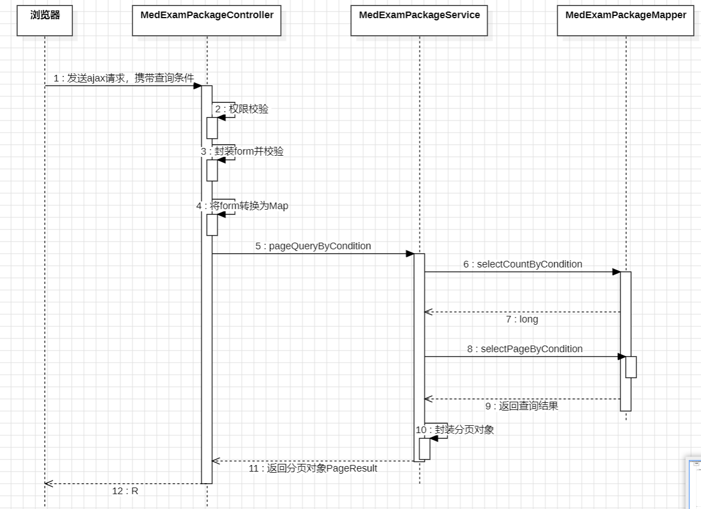

## 编写 Mapper 和 Mapper XML

编写 `MedExamPackageMapper`，在该接口中编写两个方法，一个是根据条件查询总记录条数，一个是根据查询条件获取查询结果：

```java
public interface MedExamPackageMapper {

    long selectCountByCondition(Map<String, Object> params);

    List<Map<String, Object>> selectPageByCondition(Map<String, Object> params);
}
```

编写 `MedExamPackageMapper.xml`文件，编写 SQL 语句，如下：

```xml
<?xml version="1.0" encoding="UTF-8"?>
<!DOCTYPE mapper
        PUBLIC "-//mybatis.org//DTD Mapper 3.0//EN"
        "http://mybatis.org/dtd/mybatis-3-mapper.dtd">
<mapper namespace="com.jkweilai.meinian.api.db.mapper.MedExamPackageMapper">

    <select id="selectCountByCondition" resultType="long">
        select
            count(*)
        from
            med_exam_package ep
        left join
            promotion_rule pr
        on
            ep.promotion_id = pr.rule_id
        <where>
            <if test="packageName != null and packageName != ''">
                and ep.package_name like concat('%', #{packageName}, '%')
            </if>
            <if test="packageCode != null and packageCode != ''">
                and ep.package_code = #{packageCode}
            </if>
            <if test="packageType != null">
                and ep.package_type = #{packageType}
            </if>
            <if test="categoryId != null">
                and ep.category_id = #{categoryId}
            </if>
            <if test="status != null">
                and ep.status = #{status}
            </if>
        </where>
    </select>

    <select id="selectPageByCondition" parameterType="Map" resultType="Map">
        select
            ep.id,
            ep.package_name as packageName,
            ep.package_code as packageCode,
            ep.original_price as originalPrice,
            ep.current_price as currentPrice,
            ep.sales_volume as salesVolume,
            ep.package_type as packageType,
            pr.rule_name as ruleName,
            (ep.exam_items is not null) as hasDocument,
            ep.status,
            ep.category_id as categoryId
        from
            med_exam_package ep
                left join
            promotion_rule pr
            on
                ep.promotion_id = pr.rule_id
        <where>
            <if test="packageName != null and packageName != ''">
                and ep.package_name like concat('%', #{packageName}, '%')
            </if>
            <if test="packageCode != null and packageCode != ''">
                and ep.package_code = #{packageCode}
            </if>
            <if test="packageType != null">
                and ep.package_type = #{packageType}
            </if>
            <if test="categoryId != null">
                and ep.category_id = #{categoryId}
            </if>
            <if test="status != null">
                and ep.status = #{status}
            </if>
        </where>
        order by ep.id asc
        limit #{startIndex}, #{pageSize}
    </select>

</mapper>
```

## 编写 Service 与实现

编写 `MedExamPackageService`接口，提供一个方法，代码如下：

```java
package com.jkweilai.meinian.api.service;

import com.jkweilai.meinian.api.common.PageResult;

import java.util.Map;

public interface MedExamPackageService {

    PageResult<Map<String,Object>> pageQueryByCondition(Map<String, Object> param);

}
```

编写 `MedExamPackageServiceImpl`实现类，实现方法，代码如下：

```java
package com.jkweilai.meinian.api.service.impl;

import cn.hutool.core.map.MapUtil;
import com.jkweilai.meinian.api.common.PageResult;
import com.jkweilai.meinian.api.db.mapper.MedExamPackageMapper;
import com.jkweilai.meinian.api.service.MedExamPackageService;
import jakarta.annotation.Resource;
import org.springframework.stereotype.Service;

import java.util.ArrayList;
import java.util.List;
import java.util.Map;

@Service
public class MedExamPackageServiceImpl implements MedExamPackageService {

    @Resource
    private MedExamPackageMapper medExamPackageMapper;

    @Override
    public PageResult<Map<String, Object>> pageQueryByCondition(Map<String, Object> param) {
        // 查询总记录条数
        long total = medExamPackageMapper.selectCountByCondition(param);
        // 最好不好准备一个null，准备一个初始化容量为0的List集合。
        List<Map<String, Object>> records = new ArrayList<>();
        // 如果记录数大于0才有必要进行下一步的查询
        if (total > 0) {
            records = medExamPackageMapper.selectPageByCondition(param);
        }
        // 每页显示的记录条数
        Integer pageSize = MapUtil.getInt(param, "pageSize");
        // 当前页码
        Integer pageNo = MapUtil.getInt(param, "pageNo");
        // 封装分页对象
        PageResult<Map<String, Object>> pageResult = new PageResult<>(total, pageSize, pageNo, records);
        // 返回分页对象
        return pageResult;
    }
}
```

## 编写 form 接收数据和校验数据

编写 web 层的 form，使用它来接收表单数据，同时做表单数据验证。代码如下：

```java

package com.jkweilai.meinian.api.controller.form;

import jakarta.validation.constraints.Min;
import jakarta.validation.constraints.NotNull;
import jakarta.validation.constraints.Pattern;
import lombok.Data;
import org.hibernate.validator.constraints.Range;

@Data
public class ExamPackagePageQueryForm {
    @Pattern(regexp = "^[a-zA-Z0-9\\u4e00-\\u9fa5]{1,50}$", message = "packageName内容不正确")
    private String packageName;

    @Pattern(regexp = "^[a-zA-Z0-9]{6,20}$", message = "packageCode内容不正确")
    private String packageCode;

    @Pattern(regexp = "^父母体检$|^入职体检$|^职场白领$|^个人高端$|^中青年体检$", message = "packageType内容不正确")
    private String packageType;

    @Range(min = 1, max = 5, message = "categoryId范围不正确")
    private Byte categoryId;

    private Boolean status;

    @NotNull(message = "pageNo不能为空")
    @Min(value = 1, message = "pageNo不能小于1")
    private Integer pageNo;

    @NotNull(message = "pageSize不能为空")
    @Range(min = 10, max = 50, message = "pageSize必须为10~50之间")
    private Integer pageSize;
}
```

## 编写 Controller 实现 RESTful 接口

创建 `MedExamPackageController`，编写分页接口，代码如下：

```java
package com.jkweilai.meinian.api.controller;

import cn.dev33.satoken.annotation.SaCheckPermission;
import cn.dev33.satoken.annotation.SaMode;
import cn.hutool.core.bean.BeanUtil;
import com.jkweilai.meinian.api.common.PageResult;
import com.jkweilai.meinian.api.common.R;
import com.jkweilai.meinian.api.controller.form.ExamPackagePageQueryForm;
import com.jkweilai.meinian.api.service.MedExamPackageService;
import jakarta.annotation.Resource;
import jakarta.validation.Valid;
import org.springframework.web.bind.annotation.PostMapping;
import org.springframework.web.bind.annotation.RequestBody;
import org.springframework.web.bind.annotation.RequestMapping;
import org.springframework.web.bind.annotation.RestController;

import java.util.Map;

@RestController
@RequestMapping("/mis/goods")
public class MedExamPackageController {

    @Resource
    private MedExamPackageService medExamPackageService;

    @PostMapping("/pageQuery")
    @SaCheckPermission(value = {"ROOT", "GOODS:SELECT"}, mode = SaMode.OR)
    public R pageQuery(@RequestBody @Valid ExamPackagePageQueryForm form){
        Integer pageSize = form.getPageSize();
        Integer pageNo = form.getPageNo();
        Integer startIndex = pageSize * (pageNo - 1);
        Map<String, Object> param = BeanUtil.beanToMap(form);
        param.put("startIndex", startIndex);
        PageResult<Map<String, Object>> pageResult = medExamPackageService.pageQueryByCondition(param);
        return R.ok().put("pageResult", pageResult);
    }
}
```

## 测试 RESTful 接口

接口测试地址：[https://localhost:8080/meinian-api/mis/goods/pageQuery](https://localhost:8080/meinian-api/mis/goods/pageQuery)

测试数据如下：

```json
{
    "packageName": "感恩",
    "packageCode": "117GWMN00",
    "packageType": "父母体检",
    "categoryId": 1,
    "status": 1,
    "pageNo": 1,
    "pageSize": 10
}
```

测试结果如下：

```json
{
        "msg": "success",
        "code": 200,
        "pageResult": {
                "total": 1,
                "pageSize": 10,
                "pageNo": 1,
                "records": [
                        {
                                "originalPrice": 2249,
                                "salesVolume": 125,
                                "hasDocument": 1,
                                "packageCode": "117GWMN00",
                                "currentPrice": 2142,
                                "ruleName": "双人同行折扣",
                                "id": 1,
                                "packageName": "新感恩敬老中级体检套餐",
                                "packageType": "父母体检",
                                "categoryId": 1,
                                "status": 1
                        }
                ],
                "pages": 1
        }
}
```