# 美年大健康项目-03

# 套餐管理分页前端实现


## 编写 loadPageData

页面第一次打开时，直接加载分页数据的第一页，按照默认的查询条件进行查询。之前我们已经分过查询条件了：

查询条件包括 5 个：

1. 根据套餐名称模糊查询，字段名是：`package_name`
2. 根据套餐编号查询，字段名是：`package_code`
3. 根据套餐类型查询，字段名是：`package_type`
4. 根据展示区查询，字段名是：`category_id`
5. 根据状态查询，字段名是：`status`

在 `goods.vue`页面中，查询条件和 `dataForm`对象双向数据绑定，`dataForm`代码如下：

```typescript
const dataForm = reactive({
    packageName: null,
    packageCode: null,
    packageType: null,
    categoryId: null,
    statusLabel: '全部',
    status: null
});
```

其中除了 `statusLabel`之外，按照剩下的 5 个属性进行查询。

接下来我们编写 `loadPageData`函数，在这个函数中发送 ajax 请求，提交查询条件，返回分页数据，并且在页面第一次加载时就执行这个函数，加载第一页数据，代码如下：

```typescript
async function loadPageData(){
    // 显示页面加载进度条
    data.loading = true;

    // 准备数据
    if(dataForm.statusLabel == '全部'){
        dataForm.status = null;
    }else if(dataForm.statusLabel == '已上架'){
        dataForm.status = true;
    }else{
        dataForm.status = false;
    }

    const json = {
        packageName: dataForm.packageName,
        packageCode: dataForm.packageCode,
        packageType: dataForm.packageType,
        categoryId: dataForm.categoryId,
        status: dataForm.status,
        pageNo: data.pageIndex,
        pageSize: data.pageSize
    };

    // 准备配置
    const config = {
        headers: {
            satoken: localStorage.getItem('token')
        }
    };
    // 发送ajax请求
    const response = await axios.post('/meinian-api/mis/goods/pageQuery', json, config);
    // 获取响应的数据
    const pageResult = response.data.pageResult;
    // 填充 dataList
    data.dataList = pageResult.records;
    // 把数据库返回的数字1和0转换为true和false。因为前端页面需要布尔值。
    for(let one of data.dataList){
        let goods = one as any;
        goods.status = goods.status ? true : false
    }
    // 更新总记录条数
    data.totalCount = pageResult.total;
    // 隐藏加载进度条
    data.loading = false;
}

// 页面第一次渲染时，就加载第一页数据。
loadPageData();
```

执行效果如下：

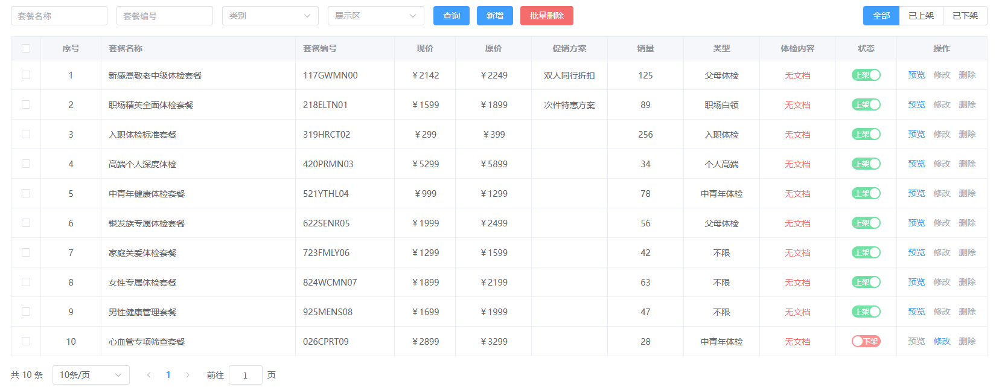

体检内容列显示有问题，应该都是有文档的，但是页面上显示无文档，我们来看一下前端显示 体检内容 的代码，如下：


找到原因所在了，因为后端返回的数据不是 `hasCheckup`，而是 `hasDocument`，我们修改一下前端代码吧，如下：


再看看测试效果：


这次正常了。

## 实现条件查询

用户点击查询按钮，或者点击右上角的全部/已上架/已下架 都需要触发分页查询：

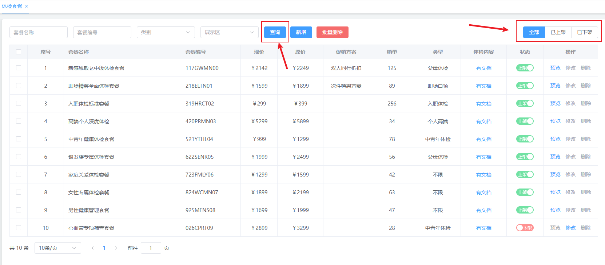

我们来看看前端页面中这两处的代码：


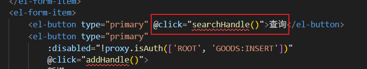

也就是说无论是点击哪个都需要执行 `searchHandle()`函数。接下来我们就来编写这个函数，其实这个函数最大的作用就是做两件事：

1. 校验用户提交的查询条件是否合法。
2. 调用 `loadPageData()`函数进行分页查询。

**代码如下：**

```typescript
// 点击 查询 或者 点击 全部/已上架/已下架 执行的回调函数。
function searchHandle(){
    // 1. 校验表单数据
    proxy.$refs['form'].validate((valid: any) => {
        if(valid){
            // 清空之前的错误提示信息
            proxy.$refs['form'].clearValidate();
            // 2. 将页码定位到第一页
            data.pageIndex = 1;
            // 3. 分页查询
            loadPageData();
        }else{
            return false;
        }
    })
}
```

## 实现分页控件

分页控件的前端代码如下：


我们写两个函数就行了，代码如下：

```typescript
function sizeChangeHandle(val){
    data.pageIndex = 1;
    data.pageSize = val;
    loadPageData();
}

function currentChangeHandle(val){
    data.pageIndex = val;
    loadPageData();
}
```

到此为止，我们就完成了体检套餐的前后端分页查询。

# 后端实现图片上传到 MinIO

先来实现图片上传到 minio，在实际开发中，图片一般不直接存储到数据库当中，我们可以将图片/文件存储到 MinIO/亚马逊的 AWS/阿里的 OSS。我们这里选择 MinIO 是因为要存储体检文件，这种文件较为私密，因此不存储到公网上。只存储到本地局域网当中 MinIO 服务器上。为什么现在实现这个功能，看下图，要想实现新增体检套餐功能，先要实现文件上传：

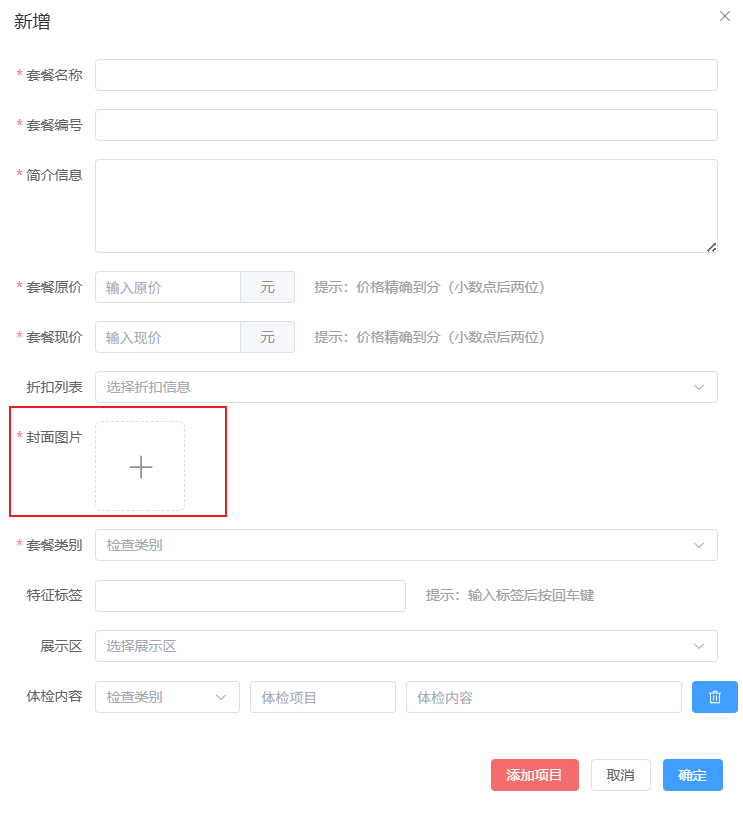

前端如果要显示上图的 dialog，需要临时修改一下 `visible`为 true，如下：


## 实现思路

1. 前端用户点击加号，选择文件，点击确定，此时前端会向后端发送一个文件上传的请求。
2. 后端将文件上传到 minio 服务器，返回一个图片在 minio 服务器上的保存地址。
3. 后端将图片在 minio 服务器上的地址返回给前端，前端将图片地址保存在某个响应式对象上。
4. 当用户填写完体检套餐的信息之后，点击确定按钮，保存套餐信息，此时提交这个响应式对象上存储的图片路径。
5. 后端接收到数据，将图片路径保存在数据库中。

## 时序图

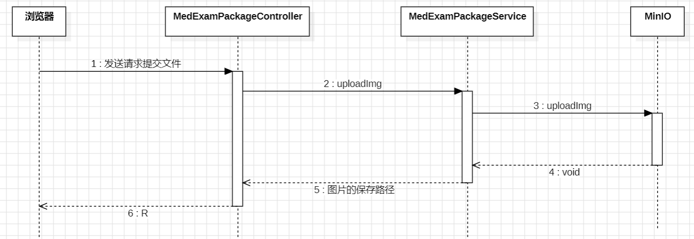

## 配置 MinIO 服务器信息

在 `application.yml`文件中配置 MinIO 服务器的信息（比如：服务器的地址，用户名，密码等信息），当然，这不是必须的，也可以单独配置到一个属性文件中，使用 Java 程序去读取属性文件。但使用 springboot 的 `application.yml`更方便。配置如下：

```yaml
minio:
  endpoint: http://localhost:9000
  access-key: root
  secret-key: 12345678
  bucket: meinian-his
```

## 编写 MinIO 程序

[**官方 minio 代码示例**](https://github.com/minio/minio-java/tree/release/examples)

在 common 包下新建 `MinIO.java`。

编写 MinIO 类，这个类可以看做是一个工具类，在这个类中将文件上传到 MinIO 服务器上，代码如下：

```java
package com.jkweilai.meinian.api.common;

import com.jkweilai.meinian.api.exception.HisException;
import io.minio.MinioClient;
import io.minio.PutObjectArgs;
import jakarta.annotation.PostConstruct;
import lombok.extern.slf4j.Slf4j;
import org.springframework.beans.factory.annotation.Value;
import org.springframework.stereotype.Component;
import org.springframework.web.multipart.MultipartFile;


@Component
@Slf4j
public class MinIO {
    @Value("${minio.endpoint}")
    private String endpoint;

    @Value("${minio.access-key}")
    private String accessKey;

    @Value("${minio.secret-key}")
    private String secretKey;

    @Value("${minio.bucket}")
    private String bucket;

    private MinioClient client;

    @PostConstruct
    public void init() {
        // 初始化MinIO客户端连接
        // 使用建造者模式配置服务端点和管理员凭证
        this.client = new MinioClient.Builder()
                .endpoint(endpoint)          // 设置MinIO服务器地址
                .credentials(accessKey, secretKey)  // 设置访问密钥
                .build();                    // 构建MinIO客户端实例
    }

    /**
     * 上传图片到MinIO对象存储
     * @param path 文件在MinIO中的存储路径（包含文件名）
     * @param file Spring MultipartFile文件对象
     * @throws HisException 当文件上传失败时抛出业务异常
     */
    public void uploadImage(String path, MultipartFile file) {
        try {
            // 使用MinIO客户端上传文件到指定存储桶
            this.client.putObject(PutObjectArgs.builder()
                    .bucket(bucket)                    // 设置存储桶名称
                    .object(path)                      // 设置文件在MinIO中的存储路径
                    .stream(file.getInputStream(),     // 文件输入流
                            -1,                        // 文件大小：-1表示自动检测
                            5 * 1024 * 1024)           // 分片大小：5MB，用于大文件分片上传（这个工具类不只是给上传图片用，还有大文件）
                    .contentType("image/jpeg")         // 设置文件内容类型为JPEG图片
                    .build());                         // 构建上传参数并执行上传

            // 记录上传成功日志
            log.debug("向" + path + "保存了文件");

        } catch (Exception e) {
            // 记录错误日志并抛出业务异常
            log.error("保存文件失败", e);
            throw new HisException("保存文件失败");
        }
    }
}
```

## 编写 Service 接口和实现

找到 `MedExamPackageService`接口，添加一个方法：

```java
String uploadImg(MultipartFile file);
```

编写方法的实现：

```java
// 注入MinIO对象
@Resource
private MinIO minIO;

@Override
public String uploadImg(MultipartFile file) {
    // 随机一个文件名，为什么不用前端传过来的文件名：因为传过来的文件名可能有中文。
    String fileName = IdUtil.simpleUUID() + ".jpg";
    // 拼接一个路径
    String path = "front/goods/" + fileName;
    // 将文件上传到minio服务器。
    minIO.uploadImage(path, file);
    // 返回相对路径
    return path;
}
```

## 编写 Web 接口

找到 `MedExamPackageController`，不需要定义单独的 form。直接在 Controller 中添加方法，代码如下：

```java
@PostMapping("/uploadImage")
@SaCheckPermission(value = {"ROOT", "GOODS:INSERT", "GOODS:UPDATE"}, mode = SaMode.OR)
// @RequestParam("file")  不一定写 "file"，具体要看前端提交的时候name是什么。
public R uploadImage(@RequestParam("file") MultipartFile file){
    String path = medExamPackageService.uploadImg(file);
    return R.ok().put("result", path);
}
```

# 前端实现图片上传

找到 `src/views/mis/goods.vue`页面中的图片上传控件：

```html
<el-form-item label="封面图片" prop="coverImage">
    <!-- :action="goodsDialog.upload.action" 上传的服务器地址 -->
    <!-- :headers="goodsDialog.upload.headers" 上传请求头（通常用于身份验证，如token） -->
    <!-- :data="goodsDialog.upload.data" 上传附加数据（如业务参数） -->
    <!-- :show-file-list="false" 不显示文件列表，适用于单文件上传 -->
    <!-- accept=".jpg,.jpeg" 只接受jpg和jpeg格式的图片 -->
    <!-- :on-success="imageUploadSuccess" 上传成功回调函数 -->
    <!-- :before-upload="imageBeforeUpload" 上传前校验函数（可用于文件类型、大小校验） -->
    <!-- :on-error="imageUploadError" 上传失败回调函数 -->
    <el-upload class="image-uploader"
        :action="goodsDialog.upload.action"
        :headers="goodsDialog.upload.headers"
        :data="goodsDialog.upload.data" :show-file-list="false"
        accept=".jpg,.jpeg" :on-success="imageUploadSuccess"
        :before-upload="imageBeforeUpload"
        :on-error="imageUploadError">
        <!-- 如果已上传图片，显示预览图 -->
        
        <!-- 未上传图片时显示上传图标 -->
        <el-icon v-else class="image-uploader-icon">
            <Plus />
        </el-icon>
    </el-upload>
</el-form-item>
```

图片上传前的回调：`imageBeforeUpload`可以在这个回调中控制文件的上传大小。

图片上传成功的回调：`imageUploadSuccess`上传成功后显示缩略图。

图片上传失败的回调：`imageUploadError`如果上传失败提示错误信息。

## 上传前的回调

```typescript
function imageBeforeUpload(file) {
    let size = file.size / 1024 / 1024;
    if (size > 2) {
        proxy.$message({
            message: '图片不能超过2M大小',
            type: 'error',
            duration: 1200
        });
        return false;
    }
    return true;
}
```

## 上传成功的回调

```typescript
function imageUploadSuccess(resp : any, uploadFile : UploadFile, uploadFiles : UploadFiles) {
    if (resp.msg == 'success') {
        let path = resp.result;
        //保存图片相对地址，添加或者修改商品的时候，要上传给后端Web方法
        goodsDialog.dataForm.coverImage = path;
        //上传控件中显示已上传的图片
        goodsDialog.imageUrl = `${proxy.$minioUrl}/${path}`;
    }
}
```

注意：你需要在** main.ts **文件中添加以下代码

```typescript
//Minio服务器地址
let minioUrl = 'http://localhost:9000/meinian-his';
// 为什么以美元符号开始，这是Vue的开发规范中规定的，全局变量以 $ 符号开头，这样可以和组件自身的属性很好的区分开。
app.config.globalProperties.$minioUrl = minioUrl;
```

这样才能保证 `${proxy.$minioUrl}/${path}`代码能够正常执行。

## 上传失败的回调

```typescript
function imageUploadError(e) {
    proxy.$message({
        message: "图片上传失败",
        type: 'error',
        duration: 1200
    });
    console.error(e)
}
```

可以测试了，前端和后端同时测试：联调测试

# 实现新增套餐的 RESTful 接口


## 分析前端会提交哪些数据

前端提交给后端的数据包括：

1. 套餐名称（必填项）：对应字段 `package_name`
2. 套餐编号（必填项）：对应字段 `package_code`
3. 简介信息（必填项）：对应字段 `description`
4. 套餐原价（必填项）：对应字段 `original_price`
5. 套餐现价（必填项）：对应字段 `current_price`
6. 折扣列表/促销规则 id（**非必填项**）：对应字段 `promotion_id`
7. 封面图片（必填项）：对应字段 `cover_image`
8. 套餐类别（必填项）：对应字段 `package_type`
9. 特征标签（**非必填项**）：对应字段 `tags`
10. 展示区（**非必填项**）：对应字段 `category_id`
11. 体检内容（**必填项**）：对应字段可能是这几个字段中的一个：`department_exam`、`lab_exam`、`medical_exam`、`other_exam`

看看后端数据库表中有哪些字段：

1. id：不需要前端提交，后端自动生成主键值
2. package_code
3. package_name
4. description
5. department_exam
6. lab_exam
7. medical_exam
8. other_exam
9. exam_items：不需要前端提供，后期以导入文档的方式插入。
10. cover_image
11. original_price
12. current_price
13. sales_volume：不需要前端提供，新插入的数据销量是 0。
14. package_type
15. tags
16. category_id
17. promotion_id
18. **status：前端不需要提交，自动插入 0，也就是新增的套餐默认状态是已下架。**
19. **md5_hash：前端不需要提交，但后端业务层需要计算出一个哈希值。这是商品的哈希值**
20. update_time：这是插入操作不需要提供更新时间。
21. **create_time：前端不需要提交，数据库自动插入。**

这样 SQL 语句就可以写出来了，如下：

```sql
insert into med_exam_package
  (package_code,package_name,description,department_exam,lab_exam,medical_exam,other_exam,cover_image,original_price,current_price,sales_volume,package_type,tags,category_id,promotion_id,status,md5_hash) 
values
  (#{packageCode},#{packageName},#{description},#{departmentExam},#{labExam},#{medicalExam},#{otherExam},#{coverImage},#{originalPrice},#{currentPrice},0,#{packageType},#{tags},#{categoryId},#{promotionId},0,#{md5Hash})
```

**我们刚才已经分析过了，只有 **`**<font style="color:#DF2A3F;">md5_hash</font>**`**字段的值不知道从哪里来，我这里来描述一下，它是如何生成的：很简单，一个哈希值就代表了一个商品，因此这个哈希值应该根据商品的必要属性来生成，我们在写程序的时候，就通过商品对象中的必要属性来生成哈希值。只要商品的必要属性进行了修改，那么当我们再次计算哈希值的时候，哈希值必然改变，这样就代表这个商品改变了。必要属性是：除 id、categoryId、salesVolume、status、md5Hash、updateTime、createTime 之外的属性。**

## 时序图

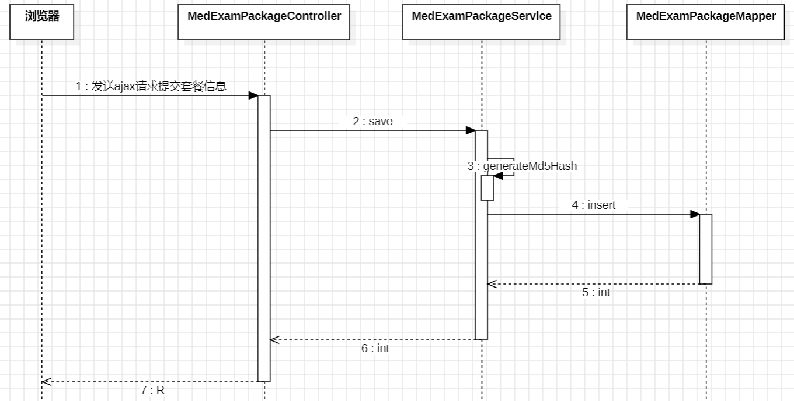

## 编写 Mapper 和 Mapper XML

找到 `MedExamPackageMapper`，编写以下方法：

```java
int insert(MedExamPackageEntity entity);
```

找到`MedExamPackageMapper.xml`文件，编写 SQL：

```xml
<insert id="insert" parameterType="MedExamPackageEntity">
    insert into med_exam_package
        (package_code,package_name,description,department_exam,lab_exam,medical_exam,other_exam,cover_image,original_price,current_price,sales_volume,package_type,tags,category_id,promotion_id,status,md5_hash)
    values
        (#{packageCode},#{packageName},#{description},#{departmentExam},#{labExam},#{medicalExam},#{otherExam},#{coverImage},#{originalPrice},#{currentPrice},0,#{packageType},#{tags},#{categoryId},#{promotionId},0,#{md5Hash})
</insert>
```

## 编写 Service 接口和实现

找到 `MedExamPackageService`接口，编写以下方法：

```java
int save(MedExamPackageEntity entity);
```

找到 `MedExamPackageServiceImpl`类，编写实现，并同时提供一个私有的方法，该方法用于生成 `md5_hash`：

```java
@Override
@Transactional
public int save(MedExamPackageEntity entity) {
    // 生成md5 hash
    String md5Hash = generateMd5Hash(entity);
    // 将md5值赋给entity对象的md5Hash属性
    entity.setMd5Hash(md5Hash);
    return medExamPackageMapper.insert(entity);
}

private String generateMd5Hash(MedExamPackageEntity entity) {
    // 将entity对象转换成json对象
    JSONObject json = JSONUtil.parseObj(entity);
    // 将无关紧要的属性移除，因为这些属性在生成md5 hash时是非必要属性
    json.remove("id");
    json.remove("categoryId");
    json.remove("salesVolume");
    json.remove("status");
    json.remove("md5Hash");
    json.remove("createTime");
    json.remove("updateTime");
    // 生成md5 hash并返回
    return MD5.create().digestHex(json.toString()).toUpperCase();
}
```

## 编写 form 接收数据和校验数据

对于前端提交过来的数据有 5 项比较特殊，因为这 5 项提交的都是 json 格式的字符串，对于这种 json 字符串，我们又应该如何进行 form 校验呢？

先说这 5 项数据都是什么：

1. tags：提交过来的是一个字符串数组

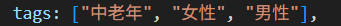

对于它来说，比较容易，直接在 form 中搞一个 String[] 数组即可。

1. departmentExam、labExam、medicalExam、otherExam都提交过来一个 json 数组，如下：

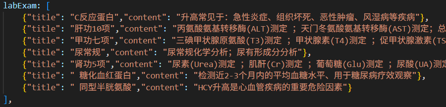

对于这个来说就需要在 form 中准备一个 ArrayList 集合了，让 ArrayList 集合中存放 ExamForm，而 ExamForm 中有两个属性：title 和 content，因为需要对这两个属性进行校验，要在这两个属性上编写校验规则。

先编写 `ExamForm`类：

```java
package com.jkweilai.meinian.api.controller.form;

import jakarta.validation.constraints.NotBlank;
import lombok.Data;
import org.hibernate.validator.constraints.Length;

@Data
public class ExamForm {
    @NotBlank(message = "体检项目不能为空")
    @Length(max = 50, message = "体检项目不能超过50个字符")
    private String title;

    @NotBlank(message = "体检内容不能为空")
    @Length(max = 500, message = "体检内容不能超过500个字符")
    private String content;
}
```

再编写 `SaveMedExamPackageForm`类：

```java
package com.jkweilai.meinian.api.controller.form;

import jakarta.validation.Valid;
import jakarta.validation.constraints.Min;
import jakarta.validation.constraints.NotBlank;
import jakarta.validation.constraints.NotNull;
import jakarta.validation.constraints.Pattern;
import lombok.Data;
import org.hibernate.validator.constraints.Length;
import org.hibernate.validator.constraints.Range;

import java.math.BigDecimal;
import java.util.ArrayList;

@Data
public class SaveMedExamPackageForm {
    @NotBlank(message = "packageCode不能为空")
    @Pattern(regexp = "^[a-zA-Z0-9]{6,20}$", message = "packageCode内容不正确")
    private String packageCode;

    @NotBlank(message = "packageName不能为空")
    @Pattern(regexp = "^[a-zA-Z0-9\\u4e00-\\u9fa5]{2,50}$", message = "packageName内容不正确")
    private String packageName;

    @NotBlank(message = "description不能为空")
    @Length(max = 200, message = "description不能超过200个字符")
    private String description;

    @Valid
    private ArrayList<ExamForm> departmentExam;

    @Valid
    private ArrayList<ExamForm> labExam;

    @Valid
    private ArrayList<ExamForm> medicalExam;

    @Valid
    private ArrayList<ExamForm> otherExam;

    @NotBlank(message = "coverImage不能为空")
    @Pattern(regexp = "^[0-9a-zA-Z/\\.]{1,200}$", message = "coverImage内容不正确")
    private String coverImage;

    @NotNull(message = "originalPrice不能为空")
    @Min(value = 0, message = "originalPrice不能小于0")
    private BigDecimal originalPrice;

    @NotNull(message = "currentPrice不能为空")
    @Min(value = 0, message = "currentPrice不能小于0")
    private BigDecimal currentPrice;

    @NotBlank(message = "packageType不能为空")
    @Pattern(regexp = "^父母体检$|^入职体检$|^职场白领$|^个人高端$|^中青年体检$")
    private String packageType;

    private String[] tags;

    @Range(min = 1, max = 5, message = "categoryId范围不正确")
    private Integer categoryId;

    @Min(value = 1, message = "promotionId不能小于1")
    private Integer promotionId;

}
```

## 编写保存的 RESTful 接口

在 Controller 主要需要完成的是：将 form 对象中的 AarrayList 集合转换成 json 字符串，将 form 对象中的 tags 数组转换成 json 字符串，这样才能插入到底层数据库中。代码如下：

```java
@PostMapping("/save")
@SaCheckPermission(value = {"ROOT", "GOODS:INSERT"}, mode = SaMode.OR)
public R save(@RequestBody @Valid SaveMedExamPackageForm form){
    // 将form对象转换成entity，但是在转换的时候自动忽略5个属性，因为这5个属性我们需要手动调用set方法赋值。
    MedExamPackageEntity entity = BeanUtil.toBean(form, MedExamPackageEntity.class, CopyOptions.create()
            .setIgnoreProperties("departmentExam", "labExam", "medicalExam", "otherExam", "tags"));
    
    if (form.getDepartmentExam() != null && !form.getDepartmentExam().isEmpty()) {
        entity.setDepartmentExam(JSONUtil.toJsonStr(form.getDepartmentExam()));
    }
    if (form.getLabExam() != null && !form.getLabExam().isEmpty()) {
        entity.setLabExam(JSONUtil.toJsonStr(form.getLabExam()));
    }
    if (form.getMedicalExam() != null && !form.getMedicalExam().isEmpty()) {
        entity.setMedicalExam(JSONUtil.toJsonStr(form.getMedicalExam()));
    }
    if (form.getOtherExam() != null && !form.getOtherExam().isEmpty()) {
        entity.setOtherExam(JSONUtil.toJsonStr(form.getOtherExam()));
    }
    if (form.getTags() != null && form.getTags().length > 0) {
        entity.setTags(JSONUtil.toJsonStr(form.getTags()));
    }
    
    int rows = medExamPackageService.save(entity);
    return R.ok().put("rows", rows);
}
```

## 测试 RESTful 接口

接口测试地址：[https://localhost:8080/meinian-api/mis/goods/save](https://localhost:8080/meinian-api/mis/goods/save)

测试数据：

```json
{
        "packageCode": "026CPRT10",
        "packageName": "心血管专项筛查套餐2",
        "description": "心血管疾病风险评估2",
    "departmentExam": [
        {
            "title": "心血管评估",
            "content": "心血管系统检查"
        }
    ],
        "labExam": null,
        "medicalExam": null,
        "otherExam": null,
        "coverImage": "front/goods/1.jpg",
        "originalPrice": "1000",
        "currentPrice": "500",
        "packageType": "中青年体检",
        "tags": ["心血管", "预防"],
        "categoryId": "2",
        "promotionId": "1"
}
```

测试结果：

```json
{
        "msg": "success",
        "code": 200,
        "rows": 1
}
```

# 展示新增弹窗中的折扣列表

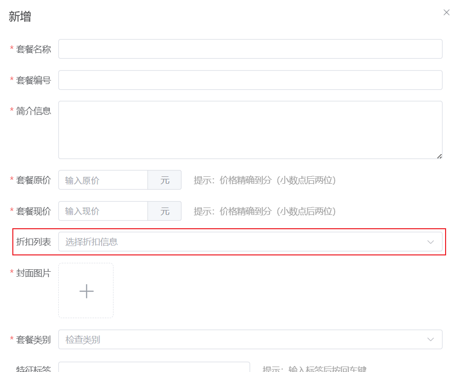

这个功能非常简单，查询 `promotion_rule`表中的 `rule_id`和 `rule_name`字段，全部查询。

## 实现折扣列表的 RESTful 接口

### 编写 Mapper 和 Mapper XML

找到 `PromotionRuleMapper`接口，编写以下代码：

```java
public interface PromotionRuleMapper {
    
    List<Map<String, Object>> selectAll();
}
```

找到 `PromotionRuleMapper.xml`文件，编写以下代码：

```java
<?xml version="1.0" encoding="UTF-8"?>
<!DOCTYPE mapper
        PUBLIC "-//mybatis.org//DTD Mapper 3.0//EN"
        "http://mybatis.org/dtd/mybatis-3-mapper.dtd">
<mapper namespace="com.jkweilai.meinian.api.db.mapper.PromotionRuleMapper">

    <select id="selectAll" resultType="Map">
        select rule_id as ruleId, rule_name as ruleName from promotion_rule;
    </select>

</mapper>
```

### 编写 Service 接口和实现

创建 `PromotionRuleService`接口，提供方法如下：

```java
package com.jkweilai.meinian.api.service;

import java.util.List;
import java.util.Map;

public interface PromotionRuleService {
    List<Map<String, Object>> findAll();
}
```

创建 `PromotionRuleServiceImpl`实现类，提供实现方法：

```java
package com.jkweilai.meinian.api.service.impl;

import com.jkweilai.meinian.api.db.mapper.PromotionRuleMapper;
import com.jkweilai.meinian.api.service.PromotionRuleService;
import jakarta.annotation.Resource;
import org.springframework.stereotype.Service;

import java.util.List;
import java.util.Map;

@Service
public class PromotionRuleServiceImpl implements PromotionRuleService {
    
    @Resource
    private PromotionRuleMapper promotionRuleMapper;
    
    @Override
    public List<Map<String, Object>> findAll() {
        return promotionRuleMapper.selectAll();
    }
}
```

### 编写 Web 接口

创建 `PromotionRuleController`，然后提供 web 方法，代码如下：

```java
package com.jkweilai.meinian.api.controller;

import cn.dev33.satoken.annotation.SaCheckLogin;
import com.jkweilai.meinian.api.common.R;
import com.jkweilai.meinian.api.service.PromotionRuleService;
import jakarta.annotation.Resource;
import org.springframework.web.bind.annotation.GetMapping;
import org.springframework.web.bind.annotation.RequestMapping;
import org.springframework.web.bind.annotation.RestController;

import java.util.List;
import java.util.Map;

@RestController
@RequestMapping("/mis/rule")
public class PromotionRuleController {

    @Resource
    private PromotionRuleService promotionRuleService;

    @GetMapping("/list")
    @SaCheckLogin
    public R list(){
        List<Map<String, Object>> list = promotionRuleService.findAll();
        return R.ok().put("result", list);
    }

}
```

测试接口，接口地址：[https://localhost:8080/meinian-api/mis/rule/list](https://localhost:8080/meinian-api/mis/rule/list)

测试结果：

```json
{
        "msg": "success",
        "result": [
                {
                        "ruleName": "双人同行折扣",
                        "ruleId": 1
                },
                {
                        "ruleName": "次件特惠方案",
                        "ruleId": 2
                }
        ],
        "code": 200
}
```

## 实现折扣列表的前端展示

### 编写 loadRuleList 函数

先来看看新增窗口折扣列表的前端代码：

```plaintext
<el-form-item label="折扣列表">
    <el-select v-model="goodsDialog.dataForm.promotionId" placeholder="选择折扣信息" clearable="clearable">
        <el-option :label="one.ruleName" :value="one.ruleId" v-for="one in goodsDialog.ruleList" />
    </el-select>
</el-form-item>
```

很显然，有一个响应是对象 `goodsDialog`，这个对象中有一个 `ruleList`属性，只要它有值，折扣列表就可以渲染。

在 `goods.vue`页面中编写 `loadRuleList()`函数，该函数发送 ajax 请求获取折扣列表数据，将返回的数据放到响应式对象 `goodsDialog.ruleList`上即可。

```typescript
// 加载折扣列表
async function loadRuleList(){
    // 配置信息
    const config = {
        headers: {
            satoken: localStorage.getItem('token')
        }
    };
    // 发送ajax get请求
    const response = await axios.get('/meinian-api/mis/rule/list', config);
    const result = response.data.result;
    // 获取响应数据并设置到响应对象的属性上
    goodsDialog.ruleList = result;
}
```

### 展示新增套餐的弹窗

之前我们一直都是让新增弹窗的 `visible:true`，我们现在需要将其修改为 `visible:false`，这样新增弹窗就隐藏起来了。

接下来用户点击新增按钮，将新增窗口所有表单项全部恢复（为什么要恢复，因为这个窗口既是新增窗口又是修改窗口），然后显示新增窗口，动态加载折扣列表。因此我们从新增按钮着手，看看新增按钮的回调函数是哪个：


很显然我们需要编写 `addHandle()`函数，代码如下：

```typescript
const dialogForm: Ref = ref(null);

async function addHandle() {
    goodsDialog.visible = true;
    // 等页面显示出来
    await nextTick();
    // 恢复初始值
    dialogForm.value.resetFields();
    // 新增时id肯定是要置空的
    goodsDialog.dataForm.id = null;
  
    // 看看页面上有什么残留，就清空哪个
    goodsDialog.dataForm.promotionId = null;
    goodsDialog.imageUrl = null;
    goodsDialog.dataForm.coverImage = null;
    goodsDialog.dataForm.tags = [];
    goodsDialog.item = [{}];
    // 加载折扣列表
    loadRules();
}
```

# 前端使用 el-tag 展示套餐特征

## 实现思路

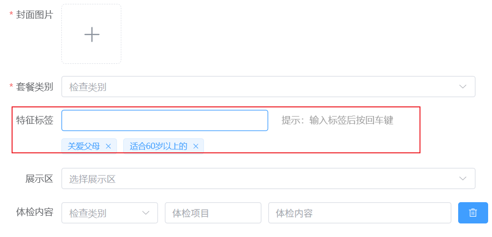

先看前端这部分的代码：

```html
<el-form-item label="特征标签">
    <div class="tag-row">
        <el-input class="tag-input" v-model="goodsDialog.newTag" clearable @keyup.enter="enterTag"/>
        <span class="desc">提示：输入标签后按回车键</span>
    </div>
    <div class="tags">
        <!-- :disable-transitions="false" 关闭时保留动画。-->
        <el-tag v-for="one in goodsDialog.dataForm.tags" closable :disable-transitions="false" @close="closeTag(one)">
            {{ one }}
        </el-tag>
    </div>

</el-form-item>
```

没有这两个事件的，把事件和事件的回调写一下：`@keyup.enter="enterTag"``@close="closeTag(one)"`

**实现思路：**

一个事件是用户输入之后敲回车，此时我们要将用户输入的数据放到 `goodsDialog.dataForm.tags`数组中，当然，如果用户没有输入直接敲回车，或者用户输入的内容本身在数组中就是存在的，则不放入 tags 数组。当放到数组中之后，把 `goodsDialog.newTag`置空，这样用户在文本框中输入的内容就消失了。另外，当用户点击关闭时，触发 `@close="closeTag(one)"`,然后去执行回调，在回调函数中去数组中查找匹配项，找到之后，将该数据从数组中移除即可。

## 编写 enterTag 回调函数

```typescript
function enterTag() {
    //判断文本框输入的内容是不是空值或者空字符串
    if (goodsDialog.newTag != null && goodsDialog.newTag != '') {
        //判断newTag数组是否有文本框输入的内容相同的元素，如果有就不需要创建新的Tag控件
        if (goodsDialog.dataForm.tags.includes(goodsDialog.newTag)) {
            proxy.$message({
                message: '不能添加重复标签',
                type: 'warning',
                duration: 1200
            });
        } else {
            goodsDialog.dataForm.tags.push(goodsDialog.newTag);
            //清空文本框内容
            goodsDialog.newTag = null;
        }
    }
}
```

## 编写 closeTag 回调函数

```typescript
function closeTag(tag) {
    //计算要关闭的Tag是数组中的哪个元素
    let i = goodsDialog.dataForm.tags.indexOf(tag);
    //删除数组中某个元素
    goodsDialog.dataForm.tags.splice(i, 1);
}
```

# 体检内容栅格行添加和删除

这个功能对应的是：


## 实现思路

其实这个体检内容底层对应的是一个数组，数组中有 10 个元素就是 10 行。我们找到这段代码，如下：

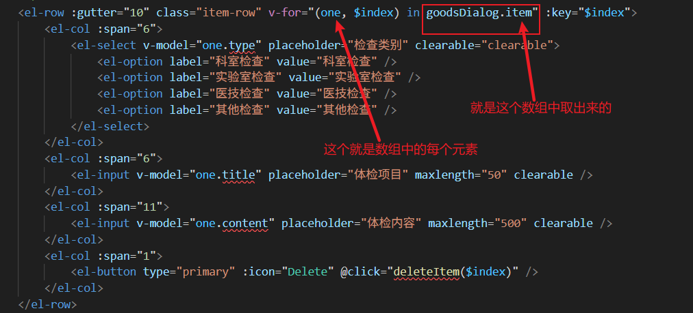

很显然 `goodsDialog.item`就是这个数组。我们来看一下这个数组的默认值：


为什么是 `[{}]`，为什么数组中有一个 `{}`空对象，这是为了保证至少循环一次，至少能够在体检内容生成一个栅格行，并且栅格行上的文本框没有内容，下拉列表也不选中。

我们添加一个栅格行，其实就是向这个数组中再添加一个 `{}`对象即可。删除栅格行就需要注意了：数组中至少要保存一个元素，因此数组中最后一个元素是不可删除的。如果不是最后一个元素，则按照数组的下标删除即可。

## 添加栅格行

找到添加项目按钮：

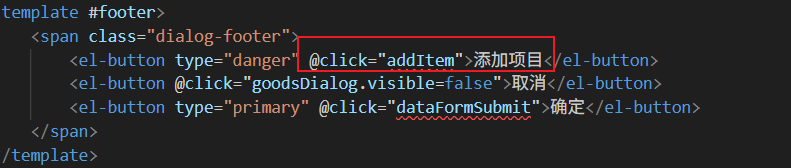

编写 `addItem`函数：

```typescript
function addItem(){
    goodsDialog.item.push({});
}
```

效果如下：


## 删除栅格行

找到删除按钮：


编写 deleteItem 函数，参数是数组下标：

```typescript
function deleteItem(index){
    if(goodsDialog.item.length == 1){
        proxy.$message({
            message: '不能全部删除',
            type: 'error',
            duration: 1200
        });
    }else{
        goodsDialog.item.splice(index, 1);
    }
}
```

# 前端实现套餐保存功能

## 再次梳理一下前端需要提交什么

看看后端写的 form，就知道都要提交什么了，需要提交的字段包括：

```java
private String packageCode; // 必填项，前端已保证必填
private String packageName; // 必填项，前端已保证必填
private String description; // 必填项，前端已保证必填
private String coverImage; // 必填项，前端已保证必填
private BigDecimal originalPrice;// 必填项，前端已保证必填
private BigDecimal currentPrice;// 必填项，前端已保证必填
private String packageType;// 必填项，前端已保证必填

private String[] tags; // 非必填，如果前端没有提交这个数据要提交过来 null
private Integer categoryId; // 非必填项，如果前端没有提交这个数据要提交过来 null
private Integer promotionId; // 非必填项，如果前端没有提交这个数据要提交过来 null
private ArrayList<ExamForm> departmentExam;// 非必填项，如果前端没有提交这个数据要提交过来 null
private ArrayList<ExamForm> labExam;// 非必填项，如果前端没有提交这个数据要提交过来 null
private ArrayList<ExamForm> medicalExam;// 非必填项，如果前端没有提交这个数据要提交过来 null
private ArrayList<ExamForm> otherExam;// 非必填项，如果前端没有提交这个数据要提交过来 null
```

## 关于体检内容信息的转换

当用户在前端页面填写的体检内容信息如下时：


那么对于 `goodsDialog.item`数组来说，这个数组的数据是：

```typescript
[
  {type:'科室检查',title:'体检项目1',content:'体检内容1'},
  {type:'科室检查',title:'体检项目2',content:'体检内容2'},
  {type:'实验室检查',title:'体检项目1',content:'体检内容1'},
  {type:'实验室检查',title:'体检项目2',content:'体检内容2'}
]
```

我们需要将 item 数组转换成什么格式提交给后端呢？这样的格式：

```typescript
let sendData = {
  packageName: '',
  //......
  departmentExam: [{title:'体检项目1',content:'体检内容1'},{title:'体检项目2',content:'体检内容2'}],
  labExam: [{title:'体检项目1',content:'体检内容1'},{title:'体检项目2',content:'体检内容2'}],
  medicalExam: null,
  otherExam: null
  //......
}
```

这样就一目了然了。遍历 `goodsDialog.item`数组，取出一个对象，看看 `type`值是什么，如果 `type=='科室检查'`则取出对象的 title 和 content，封装成一个对象，把对象塞到 departmentExam 数组中。另外塞第一个对象的时候，要创建新数组，然后放进去，塞第二个对象的时候，直接 push。还需要注意的是，如果体检内容中用户没有提供medicalExam 和otherExam 时，你需要给它们设置为 null。

## 保存套餐数据

找到我们要写哪个回调函数，找弹出窗口的确定按钮对应的代码：


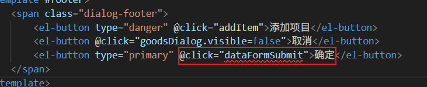

接下来编写 `dataFormSumbmit`函数：

```typescript
async function dataFormSubmit() {
    // 校验表单数据（异步）
    let ok = await dialogForm.value.validate();
    if(ok){
        try{
            // 转换体检内容为最终要提交的数据
            let departmentExam: any = [];
            let labExam: any = [];
            let medicalExam: any = [];
            let otherExam: any = [];
            let items = goodsDialog.item;
            for(let one of items){
                let goods = one as any;
                if(goods.type == undefined || goods.type == ""){
                    ElMessage({
                        type: "error",
                        message: "体检类别不能为空",
                        duration: 1200
                    });
                    return;
                }
                if(goods.title == undefined || goods.title == ""){
                    ElMessage({
                        type: "error",
                        message: "体检项目不能为空",
                        duration: 1200
                    });
                    return;
                }
                if(goods.content == undefined || goods.content == ""){
                    ElMessage({
                        type: "error",
                        message: "体检内容不能为空",
                        duration: 1200
                    });
                    return;
                }
                if(goods.type == "科室检查"){
                    departmentExam.push({title: goods.title,content:goods.content});
                }else if(goods.type == "实验室检查"){
                    labExam.push({title: goods.title,content:goods.content});
                }else if(goods.type == "医技检查"){
                    medicalExam.push({title: goods.title,content:goods.content});
                }else if(goods.type == "其他检查"){
                    otherExam.push({title: goods.title,content:goods.content});
                }
            }
            // 准备数据
            let sendData = {
                packageCode: goodsDialog.dataForm.packageCode,
                packageName: goodsDialog.dataForm.packageName,
                description: goodsDialog.dataForm.description,
                departmentExam: departmentExam,
                labExam: labExam,
                medicalExam: medicalExam,
                otherExam: otherExam,
                coverImage: goodsDialog.dataForm.coverImage,
                originalPrice: goodsDialog.dataForm.originalPrice,
                currentPrice: goodsDialog.dataForm.currentPrice,
                packageType: goodsDialog.dataForm.packageType,
                tags: goodsDialog.dataForm.tags,
                categoryId: goodsDialog.dataForm.categoryId,
                promotionId: goodsDialog.dataForm.promotionId
            };
            // 准备token
            let config = {
                headers: {
                    satoken: localStorage.getItem("token")
                }
            };
            // 发送ajax post请求
            let response = await axios.post(`/meinian-api/mis/goods/${goodsDialog.dataForm.id ? "modify":"save"}`, sendData, config);
            if(response.data.rows == 1){
                ElMessage({
                    type: "success",
                    message: "操作成功",
                    duration: 1200
                });
                // 隐藏modal窗口
                goodsDialog.visible = false;
                // 重新加载分页数据
                loadPageData();
            }else{
                ElMessage({
                    type: "error",
                    message: "操作失败",
                    duration: 1200
                });
            }
        }catch(e){
            console.log(e);
            ElMessage({
                type: "error",
                message: "操作失败",
                duration: 1200
            });
        }
    }
}
```

# 实现根据套餐 id 查询套餐的 RESTful 接口

## 时序图


## 编写 Mapper 和 Mapper XML

找到 `MedExamPackageMapper`接口，提供以下方法：

```java
Map<String, Object> selectById(Map<String, Object> param);
```

为什么参数是 Map，而不是 id，这是因为这个方法以后要复用，其他业务也会调用这个方法，因此参数就定义成了 Map。

找到 `MedExamPackageMapper.xml`文件，编写以下 SQL 语句：

```xml
<select id="selectById" parameterType="Map" resultType="Map">
    SELECT
        g.package_code AS packageCode,
        g.package_name AS packageName,
        g.description,
        g.cover_image AS coverImage,
        CAST(g.original_price AS CHAR) AS originalPrice,
        CAST(g.current_price AS CHAR) AS currentPrice,
        r.rule_id AS ruleId,
        r.rule_name AS ruleName,
        g.package_type AS packageType,
        g.tags,
        g.category_id AS categoryId,
        g.department_exam AS departmentExam,
        IFNULL(JSON_LENGTH(g.department_exam), 0) AS count_1,
        g.lab_exam AS labExam,
        IFNULL(JSON_LENGTH(g.lab_exam), 0) AS count_2,
        g.medical_exam AS medicalExam,
        IFNULL(JSON_LENGTH(g.medical_exam), 0) AS count_3,
        g.other_exam AS otherExam,
        IFNULL(JSON_LENGTH(g.other_exam), 0) AS count_4
    FROM
        med_exam_package g
    LEFT JOIN 
        promotion_rule r 
    ON 
        g.promotion_id = r.rule_id
    WHERE
        g.id = #{id}
    <if test="status != null">
        AND status = #{status}
    </if>
</select>
```

1. 以上 SQL 中的 `count_1``count_2``count_3``count_4`是体检项目的个数，这是因为其他业务中要用，为了这个方法的通用性。
2. 为什么最后动态添加一个 `status`条件，这是因为其他业务中要用，为了这个方法的通用性。
3. 为什么 `CAST(g.original_price AS CHAR)`这样做？
  1. MySQL 的 `<font style="color:rgb(15, 17, 21);background-color:rgb(235, 238, 242);">DECIMAL</font>` 类型在直接返回给前端时：会被转换为 JavaScript 的 `<font style="color:rgb(15, 17, 21);background-color:rgb(235, 238, 242);">Number</font>` 类型，JavaScript 的 `<font style="color:rgb(15, 17, 21);background-color:rgb(235, 238, 242);">Number</font>` 是双精度浮点数，存在精度问题。
  2. 转换成字符串再返回精度就不会损失。

## 编写 Service 接口和实现

找到 `MedExamPackageService`接口，提供以下方法：

```java
Map<String, Object> findById(Integer id);
```

编写方法的实现，代码如下：

```java
@Override
public Map<String, Object> findById(Integer id) {
    Map<String, Object> param = new HashMap<>(Map.of("id", id));
    Map<String, Object> map = medExamPackageMapper.selectById(param);
    // map是数据库的查询结果，需要将map中查询的json字符串转换成json对象，返回给前端
    // 从数据库中查询出来的是："[{\"title\": \"血脂全套\", \"content\": \"血脂七项检测\"}]"
    //应该返回JSON对象：[{"title": "血脂全套", "content": "血脂七项检测"}]
    String[] columns = {"departmentExam", "labExam", "medicalExam", "otherExam", "tags"};
    for(String column: columns){
        String temp = MapUtil.getStr(map, column);
        if(temp != null) {
            // 将字符串转换成json数组。
            JSONArray array = JSONUtil.parseArray(temp);
            // 替换原字符串
            map.replace(column, array);
        }
    }
    return map;
}
```

## 编写 form

编写 `FindMedExamPackageByIdForm`，接收前端提交的 id，同时校验 id：

```java
package com.jkweilai.meinian.api.controller.form;

import jakarta.validation.constraints.Min;
import jakarta.validation.constraints.NotNull;
import lombok.Data;

@Data
public class FindMedExamPackageByIdForm {
    @NotNull(message = "id不能为空")
    @Min(value = 1, message = "id不能小于1")
    private Integer id;
}
```

## 编写 Controller

```java
@PostMapping("/findById")
@SaCheckPermission(value = {"ROOT", "GOODS:SELECT"}, mode = SaMode.OR)
public R findById(@RequestBody @Valid FindMedExamPackageByIdForm form){
    Map<String, Object> result = medExamPackageService.findById(form.getId());
    return R.ok().put("result", result);
}
```

## 测试 RESTful 接口

接口测试地址：[https://localhost:8080/meinian-api/mis/goods/findById](https://localhost:8080/meinian-api/mis/goods/findById)

测试数据：

```json
{
    "id": 1
}
```

测试结果：

```json
{
        "msg": "success",
        "result": {
                "labExam": [
                        {
                                "title": "血常规",
                                "content": "全血细胞分析（五分类）"
                        },
                        {
                                "title": "肝功能",
                                "content": "ALT、AST、总蛋白等指标检测"
                        }
                ],
                "medicalExam": [
                        {
                                "title": "心电图",
                                "content": "十二导联心电图检查"
                        },
                        {
                                "title": "腹部超声",
                                "content": "肝胆胰脾肾超声检查"
                        }
                ],
                "originalPrice": "2249.00",
                "departmentExam": [
                        {
                                "title": "一般健康检查",
                                "content": "身高、体重、血压、心、肺、肝、脾、神经系统检查"
                        }
                ],
                "description": "「感恩季到检钜惠」适合人群：适用于中、老年人及血管疾病人群",
                "currentPrice": "2142.00",
                "packageType": "父母体检",
                "tags": [
                        "中老年",
                        "心血管"
                ],
                "otherExam": [
                        {
                                "title": "健康问卷",
                                "content": "个人健康史问卷调查"
                        }
                ],
                "count_4": 1,
                "count_3": 2,
                "count_2": 2,
                "packageCode": "117GWMN00",
                "count_1": 1,
                "coverImage": "exam/cover1.jpg",
                "ruleName": "双人同行折扣",
                "packageName": "新感恩敬老中级体检套餐",
                "ruleId": 1,
                "categoryId": 1
        },
        "code": 200
}
```

# 前端实现加载套餐信息

用户点击修改按钮，弹出修改窗口，在修改窗口上显示用户信息。

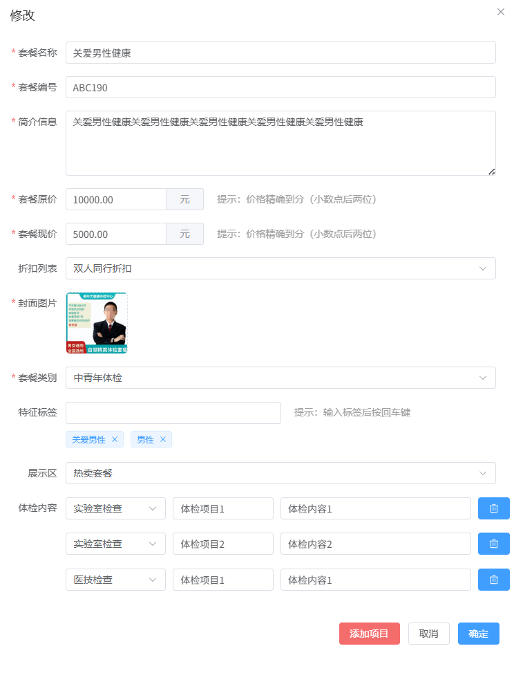

## 先来看注意事项

关于下拉列表选中的问题，当前端是**静态列表**，那么前端 value 处的值是字符串类型，如果从数据库返回的是数字，则会因为数据类型不匹配而导致下拉列表无法被选中。反过来亦是如此，如果当前下拉列表是动态列表，也就是说这个列表当初初始化的时候是通过后台数据库返回的数据进行初始化的，假设数据库返回的是整数数字，如果此时给下拉列表选项的 value 赋值为字符串类型，也会因为数据类型不匹配而导致下拉列表无法选中。

**前端弹窗上有这几个下拉列表应该引起注意：**

**折扣列表：**

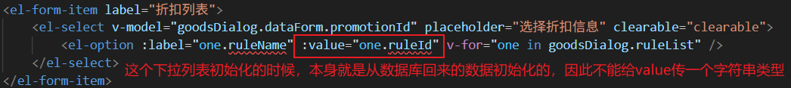

**套餐类别：**

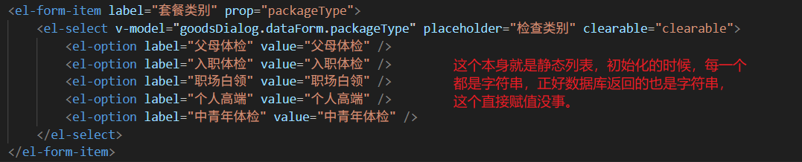

**展示区列表：**


## 实现功能

找到修改按钮所在的位置：

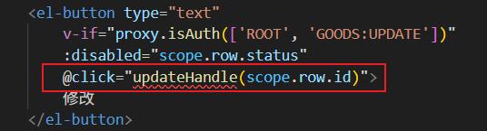

编写 updateHandle 函数，代码如下：

```typescript
function updateHandle(id) {
    // 将相关数据清空
    goodsDialog.dataForm.id = id;
    goodsDialog.dataForm.coverImage = null;
    goodsDialog.imageUrl = null;
    goodsDialog.item = [];
    goodsDialog.newTag = null;
    goodsDialog.dataForm.tags = [];

    // 显示弹窗
    goodsDialog.visible = true;

    // 保证弹窗显示完之后，再发送ajax请求。
    proxy.$nextTick(async () => {
        // 重置表单，清空错误提示信息
        proxy.$refs['dialogForm'].resetFields();
        // 准备数据
        let json = { id: id };
        // 加载促销规则列表，下拉列表要使用
        loadRuleList();
        // 准备配置
        const config = {
            headers: {
                satoken: localStorage.getItem('token')
            }
        }
        // 发送ajax请求
        const response = await axios.post('/meinian-api/mis/goods/findById', json, config);
        const resp = response.data;
        goodsDialog.dataForm.packageCode = resp.result.packageCode;
        goodsDialog.dataForm.packageName = resp.result.packageName;
        goodsDialog.dataForm.description = resp.result.description;

        goodsDialog.dataForm.coverImage = resp.result.coverImage;
        goodsDialog.imageUrl = `${proxy.$minioUrl}/${resp.result.coverImage}`;

        goodsDialog.dataForm.originalPrice = resp.result.originalPrice;
        goodsDialog.dataForm.currentPrice = resp.result.currentPrice;
        goodsDialog.dataForm.packageType = resp.result.packageType;
        goodsDialog.dataForm.tags = resp.result.hasOwnProperty('tags') ? resp.result.tags : [];
        goodsDialog.dataForm.categoryId = resp.result.categoryId + "";
        goodsDialog.dataForm.promotionId = resp.result.ruleId;
        let typeJson = {
            departmentExam: '科室检查',
            labExam: '实验室检查',
            medicalExam: '医技检查',
            otherExam: '其他检查'
        };
        for (let key in typeJson) {
            if (resp.result.hasOwnProperty(key)) {
                let exams = resp.result[key];
                for (let one of exams) {
                    goodsDialog.item.push({ type: typeJson[key], title: one.title, content: one.content });
                }
            }
        }
    });
}
```

# 实现更新套餐功能

## 更新套餐的 RESTful 接口

### 时序图


### 编写 Mapper 和 Mapper XML

找到 `MedExamPackageMapper`接口，编写以下方法：

```java
int update(MedExamPackageEntity entity);
```

找到 `MedExamPackageMapper.xml`编写以下 SQL 语句：

```xml
<update id="update" parameterType="MedExamPackageEntity">
    UPDATE med_exam_package SET
        package_name = #{packageName},
        package_code = #{packageCode},
        description = #{description},
        department_exam = #{departmentExam},
        lab_exam = #{labExam},
        medical_exam = #{medicalExam},
        other_exam = #{otherExam},
        cover_image = #{coverImage},
        original_price = #{originalPrice},
        current_price = #{currentPrice},
        package_type = #{packageType},
        tags = #{tags},
        category_id = #{categoryId},
        promotion_id = #{promotionId},
        status = 0,
        md5_hash = #{md5Hash}
    WHERE
        id = #{id}
</update>
```

### 编写 Service 接口和实现

找到 `MedExamPackageService`接口，添加如下方法：

```java
int modify(MedExamPackageEntity entity);
```

更新商品不管是更新重要信息还是非重要信息，都重新计算哈希值。

编写方法实现，代码如下：

```java
@Override
@Transactional
public int modify(MedExamPackageEntity entity) {
    // 生成md5 hash
    String md5Hash = generateMd5Hash(entity);
    // 将md5值赋给entity对象的md5Hash属性
    entity.setMd5Hash(md5Hash);
    return medExamPackageMapper.update(entity);
}
```

其实和保存方法的代码基本一样，一个是 insert，一个是 update。直接复制代码即可。

### 编写 form

编写 `UpdateMedExamPackageForm`：**比之前保存的 form 多一个 id 字段。其他完全一致。**

```java
package com.jkweilai.meinian.api.controller.form;

import jakarta.validation.Valid;
import jakarta.validation.constraints.Min;
import jakarta.validation.constraints.NotBlank;
import jakarta.validation.constraints.NotNull;
import jakarta.validation.constraints.Pattern;
import lombok.Data;
import org.hibernate.validator.constraints.Length;
import org.hibernate.validator.constraints.Range;

import java.math.BigDecimal;
import java.util.ArrayList;

@Data
public class UpdateMedExamPackageForm {
    @NotNull(message = "id不能为空")
    @Min(value = 1, message = "id不能小于1")
    private Integer id;
    
    @NotBlank(message = "packageCode不能为空")
    @Pattern(regexp = "^[a-zA-Z0-9]{6,20}$", message = "packageCode内容不正确")
    private String packageCode;

    @NotBlank(message = "packageName不能为空")
    @Pattern(regexp = "^[a-zA-Z0-9\\u4e00-\\u9fa5]{2,50}$", message = "packageName内容不正确")
    private String packageName;

    @NotBlank(message = "description不能为空")
    @Length(max = 200, message = "description不能超过200个字符")
    private String description;

    @Valid
    private ArrayList<ExamForm> departmentExam;

    @Valid
    private ArrayList<ExamForm> labExam;

    @Valid
    private ArrayList<ExamForm> medicalExam;

    @Valid
    private ArrayList<ExamForm> otherExam;

    @NotBlank(message = "coverImage不能为空")
    @Pattern(regexp = "^[0-9a-zA-Z/\\.]{1,200}$", message = "coverImage内容不正确")
    private String coverImage;

    @NotNull(message = "originalPrice不能为空")
    @Min(value = 0, message = "originalPrice不能小于0")
    private BigDecimal originalPrice;

    @NotNull(message = "currentPrice不能为空")
    @Min(value = 0, message = "currentPrice不能小于0")
    private BigDecimal currentPrice;

    @NotBlank(message = "packageType不能为空")
    @Pattern(regexp = "^父母体检$|^入职体检$|^职场白领$|^个人高端$|^中青年体检$")
    private String packageType;

    private String[] tags;

    @Range(min = 1, max = 5, message = "categoryId范围不正确")
    private Integer categoryId;

    @Min(value = 1, message = "promotionId不能小于1")
    private Integer promotionId;

}
```

### 编写 Controller

这个 Controller 中的 modify 方法和之前的 save 方法代码基本一致，一个是 save 方法中调用 save 方法，一个是 modify 方法中调用 modify，`MedExamPackageController`类中的 modify 代码如下：

```java
@PostMapping("/modify")
@SaCheckPermission(value = {"ROOT", "GOODS:UPDATE"}, mode = SaMode.OR)
public R modify(@RequestBody @Valid UpdateMedExamPackageForm form){
    // 将form对象转换成entity，但是在转换的时候自动忽略5个属性，因为这5个属性我们需要手动调用set方法赋值。
    MedExamPackageEntity entity = BeanUtil.toBean(form, MedExamPackageEntity.class, CopyOptions.create()
            .setIgnoreProperties("departmentExam", "labExam", "medicalExam", "otherExam", "tags"));
    
    if (form.getDepartmentExam() != null && !form.getDepartmentExam().isEmpty()) {
        String departmentExam = JSONUtil.toJsonStr(form.getDepartmentExam());
        entity.setDepartmentExam(departmentExam);
    }
    if (form.getLabExam() != null && !form.getLabExam().isEmpty()) {
        String labExam = JSONUtil.toJsonStr(form.getLabExam());
        entity.setLabExam(labExam);
    }
    if (form.getMedicalExam() != null && !form.getMedicalExam().isEmpty()) {
        String medicalExam = JSONUtil.toJsonStr(form.getMedicalExam());
        entity.setMedicalExam(medicalExam);
    }
    if (form.getOtherExam() != null && !form.getOtherExam().isEmpty()) {
        String otherExam = JSONUtil.toJsonStr(form.getOtherExam());
        entity.setOtherExam(otherExam);
    }
    if (form.getTags() != null && form.getTags().length > 0) {
        String tags = JSONUtil.toJsonStr(form.getTags());
        entity.setTags(tags);
    }
    
    int rows = medExamPackageService.modify(entity);
    return R.ok().put("rows", rows);
}
```

## 更新套餐的前端实现

更新套餐的前端代码其实我们也不需要写了，因为保存和修改使用的是同一个弹出窗口，并且使用的回调函数都是 `dataFormSubmit`


直接测试效果即可。

# 上传详细的体检内容

套餐表中的 `exam_items`字段还是空的，这个字段是给医生工作站使用的，用于快速录入体检结果而准备的，这个字段如果为空，则该套餐无法上架。这个字段中的内容我们是通过 excel 导入完成的，接下来我们就来完成 excel 的导入，看下图：

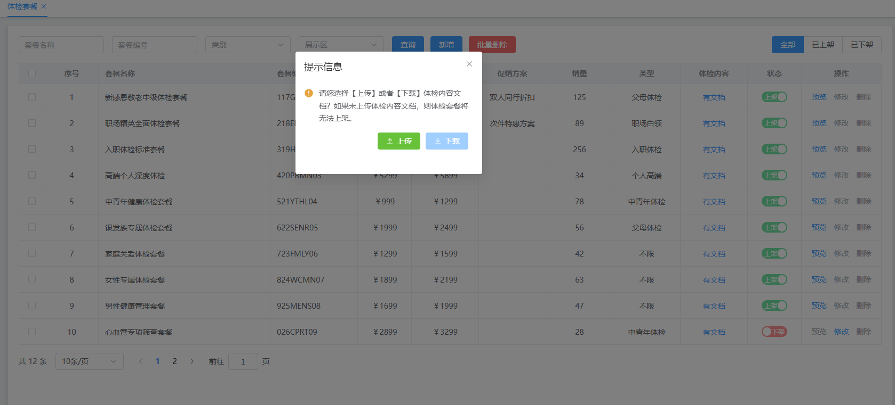

用户点击上传时，我们需要将 excel 文件中的数据导入到 `med_exam_package`表中的 `exam_items`字段。我们需要做的事情是：

1. 用户将 excel 文件上传，web 接口使用 `MultipartFile file`参数来接收文件。
2. 当然用户提交 excel 的同时，前端也需要提交本套餐的 id，因为我们将来把 excel 中的数据导入到 `exam_items`字段之后，等同于修改了套餐的数据，那么套餐的 md5Hash 值需要重新生成，因此我们需要将来通过 id 来查询到这个套餐，并更新套餐的 md5Hash 值。
3. 后端 service 根据套餐 id 获取套餐对象。
4. 后端 service 中从 `MultipartFile file`对象上获取输入流，使用 Apache POI 对 excel 文件进行解析。然后更新套餐对象的 examItems 属性值。
5. 重新生成 md5Hash。
6. 更新数据库表。
7. 将 excel 文件上传到 minio 服务器（以备用户从 minio 服务器上下载 excel 文件）

excel 文件内容如下，大家可以把它下载走：

[体检内容.xlsx](https://www.yuque.com/attachments/yuque/0/2025/xlsx/21376908/1767173107759-c76e5aaa-2705-46f7-ae5c-dba8876e9c36.xlsx)

## 时序图


## 编写 form 接收并校验 id

```java
package com.jkweilai.meinian.api.controller.form;

import jakarta.validation.constraints.Min;
import jakarta.validation.constraints.NotNull;
import lombok.Data;

@Data
public class UploadExamItemsForm {
    @NotNull(message = "id不能小于1")
    @Min(value = 1, message = "id不能小于1")
    private Integer id;
}
```

用户前端不仅要提交 excel 文件，还要提交套餐的 id。

## 编写 Controller

注意：方法中不要添加 `@RequestBody注解`

找到 `MedExamPackageController`类，编写以下代码

```java
@PostMapping("/uploadExamItems")
@SaCheckPermission(value = {"ROOT", "GOODS:INSERT", "GOODS:UPDATE"}, mode = SaMode.OR)
public R uploadExamItems(@Valid UploadExamItemsForm form, @RequestParam("file") MultipartFile file){
    medExamPackageService.uploadExamItems(form.getId(), file);
    return R.ok();
}
```

如果前端 EP 组件库中没有特殊设置 `name`， 默认：`@RequestParam("file")`参数名写 `file`。

如果前端 EP 组件库是这样写的：

```html
<el-upload
  action="/api/upload"
  name="myFile"  <!-- 自定义名称 -->
  >
```

后端写法：`@RequestParam("myFile")`

## 编写 Service 接口与实现

以下代码先完成 excel 文件的解析：

在 `MedExamPackageService`接口中编写以下方法：

```java
void uploadExamItems(Integer medExamPackageId, MultipartFile file);
```

编写实现方法，代码如下：

```java
@Override
public void uploadExamItems(Integer medExamPackageId, MultipartFile file) {

    // 解析excel文件，将数据保存到套餐对象
    List<Map<String, String>> list = new ArrayList<>();
    try(BufferedInputStream in = new BufferedInputStream(file.getInputStream())){
        // 获取整个excel文件
        XSSFWorkbook book = new XSSFWorkbook(in);
        // 获取第一个sheet页面：一共就一页。
        XSSFSheet sheet = book.getSheetAt(0);
        // excel第一行是表头，从第二行开始循环
        for(int i = 1; i <= sheet.getLastRowNum(); i++){
            // 取出当前行
            XSSFRow row = sheet.getRow(i);
            // 一共8列，一列一列取出
            XSSFCell cell1 = row.getCell(0);
            String cell1Value = cell1.getStringCellValue();

            XSSFCell cell2 = row.getCell(1);
            String cell2Value = cell1.getStringCellValue();

            XSSFCell cell3 = row.getCell(2);
            String cell3Value = cell1.getStringCellValue();

            XSSFCell cell4 = row.getCell(3);
            String cell4Value = cell1.getStringCellValue();

            XSSFCell cell5 = row.getCell(4);
            String cell5Value = cell1.getStringCellValue();

            XSSFCell cell6 = row.getCell(5);
            String cell6Value = cell1.getStringCellValue();

            XSSFCell cell7 = row.getCell(6);
            String cell7Value = cell1.getStringCellValue();

            XSSFCell cell8 = row.getCell(7);
            String cell8Value = cell1.getStringCellValue();

            // 将单元格的数据封装到Map集合中。一个Map集合相当于一条记录。
            Map<String, String> examItem = new LinkedHashMap<>();
            examItem.put("place", cell1Value);
            examItem.put("name", cell2Value);
            examItem.put("item", cell3Value);
            examItem.put("type", cell4Value);
            examItem.put("code", cell5Value);
            examItem.put("sex", cell6Value);
            examItem.put("value", cell7Value);
            examItem.put("template", cell8Value);

            // 将Map添加到List集合
            list.add(examItem);
        }
    }catch (Exception e){
        throw new HisException("解析Excel出错了");
    }
    // TODO 将excel文件上传到minio服务器
    // TODO 根据id查询套餐对象
    // TODO 重新生成md5Hash值
    // TODO 更新套餐数据到数据库表
}
```

## Service 完成文件上传到 minio 服务器

找到 `MinIO`工具，编写 `uploadExcel`方法，代码如下：

```java
public void uploadExcel(String path, MultipartFile file) {
    try {
        // Excel文件的MIME类型
        String mime = "application/vnd.openxmlformats-officedocument.spreadsheetml.sheet";

        // 使用MinIO客户端上传文件到对象存储
        // bucket: 存储桶名称
        // path: 文件在存储桶中的路径
        // file.getInputStream(): 获取上传文件的输入流
        // -1: 表示流大小未知，由SDK自动计算
        // 20 * 1024 * 1024: Excel文件大小限制为20MB
        // contentType: 设置文件内容类型为Excel格式
        this.client.putObject(PutObjectArgs.builder()
                .bucket(bucket)                    // 指定存储桶
                .object(path)                      // 指定文件路径
                .stream(file.getInputStream(), -1, 20 * 1024 * 1024)  // 文件流，自动计算大小，限制20MB
                .contentType(mime)                 // 设置内容类型为Excel
                .build());                         // 构建上传参数并执行上传

        // 记录调试日志，文件上传成功
        log.debug("向" + path + "保存了文件");

    } catch (Exception e) {
        // 记录错误日志并抛出业务异常
        log.error("保存文件失败", e);
        throw new HisException("保存文件失败");
    }
}
```

继续完善之前的 Service 方法，将文件上传到 minio 服务器：

```java
// 将excel文件上传到minio服务器
String path = "mis/goods/exam_items/" + medExamPackageId + ".xlsx";
minIO.uploadExcel(path, file);
```

## 更新套餐数据及 md5Hash

### 编写 Mapper

找到 `MedExamPackageMapper`，编写以下方法：

```java
MedExamPackageEntity selectEntityById(Integer id);

int updateExamItems(Map<String, Object> params);
```

### 编写 Mapper XML

找到 `MedExamPackageMapper.xml`文件，编写以下 SQL：

```xml
<select id="selectEntityById" resultType="MedExamPackageEntity">
    select * from med_exam_package where id = #{id}
</select>

<update id="updateExamItems" parameterType="Map">
    update med_exam_package set exam_items = #{examItems}, md5_hash=#{md5Hash} where id = #{id}
</update>
```

### 完善 Service

在之前的 Service 方法中继续添加以下代码，来完成套餐数据的更新：

```java
// 根据id查询套餐对象
MedExamPackageEntity medExamPackageEntity = medExamPackageMapper.selectEntityById(medExamPackageId);
String examItems = JSONUtil.parseArray(list).toString();
medExamPackageEntity.setExamItems(examItems);
// 重新生md5Hash值
String md5Hash = generateMd5Hash(medExamPackageEntity);
// 更新套餐数据到数据库表
Map<String,Object> param = new HashMap<>(){{
    put("examItems",examItems);
    put("md5Hash",md5Hash);
    put("id", medExamPackageId);
}};
int rows = medExamPackageMapper.updateExamItems(param);
if(rows != 1){
    throw new HisException("更新体检内容失败");
}
```

## 测试接口

测试地址：[https://localhost:8080/meinian-api/mis/goods/uploadExamItems](https://localhost:8080/meinian-api/mis/goods/uploadExamItems)

测试数据：


测试结果：


然后查看数据库表，看看 `exam_items`列有没有数据，另外看看 minio 服务器上有没有 excel 文件。

## 前端实现上传功能

用户点击 有文档 或者 无文档 时会弹出上传控件，我们先来找一下这个 有文档 或 无文档 的代码位置：


把这个 hasCheckup 修改为 hasDocument（前端所有的 hasCheckup 统一修改为 hasDocument），因为后端返回的是 hasDocument。我们通过这个代码可以看出，当用户点击有文档 或 无文档时执行回调函数 documentHandle，我们来编写这个回调函数，很简单，点它的时候，把上传控件显示出来，代码如下：

```typescript
function documentHandle(id, hasDocument) {
    documentDialog.data = {
        // id是最终要传递给后端的，这是套餐id
        id: id,
        // 这个也会提交给后端，但后端form里没有写对应属性，因此也不用担心后端能接收到。
        // 这个作用是来控制下载按钮是否可用的。如果没有文档，说明用户没有上传过，自然也下载不了。
        hasDocument: hasDocument
    };
    documentDialog.visible = true;
}
```

如何控制下载按钮的状态，就是根据以上的 `hasDocument: hasDocument`来控制的，请看下载按钮处的代码：


我们再来看看具体的上传控件的代码：

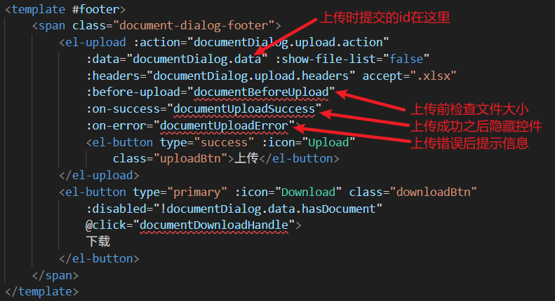

**编写以下三个回调函数：**

```typescript
function documentBeforeUpload(file) {
    let size = file.size / 1024 / 1024;
    if (size > 20) {
        proxy.$message({
            message: '文件不能超过20M大小',
            type: 'error',
            duration: 1200
        });
        return false;
    }
    return true;
}

function documentUploadSuccess() {
    documentDialog.visible = false;
    proxy.$message({
        message: '文件上传成功',
        type: 'success',
        duration: 1200,
        onClose: () => {
            loadPageData()
        }
    });
}

function documentUploadError(e) {
    proxy.$message({
        message: "文件上传失败",
        type: 'error',
        duration: 1200
    });
    console.error(e);
}
```

# 前后端实现下载功能

## 编写 MinIO 下载方法

找到 MinIO 类，然后提供下载方法，如下：

```java
/**
 * 下载文件
 * 从MinIO对象存储中获取指定路径的文件输入流
 *
 * @param path 文件在MinIO中的存储路径（对象键）
 * @return InputStream 文件输入流，可直接用于文件下载或读取
 * @throws HisException 当文件下载失败时抛出业务异常
 * @example
 * <pre>
 * // 使用示例：
 * InputStream inputStream = downloadFile("user/avatar/12345.jpg");
 * // 将inputStream写入HttpServletResponse输出流实现文件下载
 * </pre>
 */
public InputStream downloadFile(String path) {
    try {
        // 构建MinIO文件获取参数
        GetObjectArgs args = GetObjectArgs.builder()
                .bucket(bucket)      // 设置存储桶名称
                .object(path)        // 设置文件路径（对象键）
                .build();
        
        // 从MinIO获取文件输入流
        return client.getObject(args);
    } catch (Exception e) {
        log.error("文件下载失败，文件路径：{}", path, e);
        throw new HisException("文件下载失败");
    }
}
```

## 编写 form 接收 id 并校验

提供 form，用来接收前端提交的套餐 id，因为 MinIO 中存储的文件名特点是：id.xlsx，因此需要使用 id。

```java
package com.jkweilai.meinian.api.controller.form;

import jakarta.validation.constraints.Min;
import jakarta.validation.constraints.NotNull;
import lombok.Data;

@Data
public class DownloadExamItemsForm {
    @NotNull(message = "id不能为空")
    @Min(value = 1, message = "id不能小于1")
    private Integer id;
}
```

## 编写 web 方法

在MedExamPackageController 中编写方法，从 MinIO 的输出流中读，读到的数据再使用输出流向浏览器响应。代码如下：

```java
@PostMapping("/downloadExamItems")
@SaCheckPermission(value = {"ROOT","GOODS:SELECT", "GOODS:INSERT", "GOODS:UPDATE"}, mode = SaMode.OR)
public void downloadExamItems(@RequestBody @Valid DownloadExamItemsForm form, HttpServletResponse response){
    //设置下载文件的名称
    response.setHeader("Content-Disposition",
            "attachment;filename=" + form.getId() + ".xlsx");
    //该MIME类型会让浏览器弹出下载对话框
    response.setContentType("application/x-download");
    response.setCharacterEncoding("UTF-8");
    String path = "mis/goods/exam_items/" + form.getId() + ".xlsx";
    try (
            //读取Minio存储文件的输入流
            InputStream in = minIO.downloadFile(path);
            BufferedInputStream bin = new BufferedInputStream(in);
            //向响应输出数据的输出流
            ServletOutputStream out = response.getOutputStream();
            BufferedOutputStream bout = new BufferedOutputStream(out);) {
        //把输入流中的数据拷贝到输出流
        IoUtil.copy(bin, bout);
    } catch (Exception e) {
        throw new HisException("文档下载失败");
    }
}
```

## 编写前端发送下载请求的代码

前端一定要发送 POST 请求，不要发送 GET 请求，因为发送 GET 请求需要在请求 URL 中提交 token，这样做非常不安全的。找到下载的按钮，看看回调函数是哪个：


编写回调函数，代码如下：

```typescript
async function documentDownloadHandle() {
    const response = await axios.post('/meinian-api/mis/goods/downloadExamItems', {
        id: documentDialog.data.id
    }, {
        responseType: 'blob', // 必须写上，告诉axios，响应的内容类型是blob 二进制数据
        headers: {
            satoken: localStorage.getItem('token')
        }
    });
    
    // 直接使用后端返回的文件名
    const blobUrl = URL.createObjectURL(new Blob([response.data]));
    const link = document.createElement('a');
    link.href = blobUrl;
    link.download = `${documentDialog.data.id}.xlsx`; // 后端会返回这个文件名
    link.click();
    // 释放资源
    setTimeout(() => URL.revokeObjectURL(blobUrl), 100);
    // 隐藏弹窗
    setTimeout(() => documentDialog.visible = false, 1000);
}
```

# 前后端实现上架下架功能

## 时序图


前端提交 id 和 status，然后后端 form 接收并验证，没问题之后 controller 调用 service，service 调用 mapper，mapper 根据 id 更新 status 字段。

## 编写 Mapper 和 Mapper XML

找到 `MedExamPackageMapper`，编写以下方法：

```java
int updateStatus(Map<String, Object> param);
```

找到 `MedExamPackageMapper.xml`文件，编写以下 SQL：

```xml
<update id="updateStatus" parameterType="Map">
  update med_exam_package set status = #{status} where id = #{id}
</update>
```

## 编写 Service 接口和实现

找到 `MedExamPackageService`接口，编写以下方法：

```java
int modifyStatus(Map<String, Object> params);
```

编写实现类，代码如下：

```java
@Override
@Transactional
public int modifyStatus(Map<String, Object> params) {
    return medExamPackageMapper.updateStatus(params);
}
```

## 编写 form 接收数据并校验

使用 form 对象接收前端提交的 id 和 status 并校验：

```java
package com.jkweilai.meinian.api.controller.form;

import jakarta.validation.constraints.Min;
import jakarta.validation.constraints.NotNull;
import lombok.Data;

@Data
public class ModifyStatusForm {
    @NotNull(message = "id不能为空")
    @Min(value = 1, message = "id不能小于1")
    private Integer id;

    @NotNull(message = "status不能为空")
    private Boolean status;
}
```

## 编写 web 方法

找到 `MedExamPackageController`，编写以下代码：

```java
@PostMapping("/modifyStatus")
@SaCheckPermission(value = {"ROOT", "GOODS:UPDATE"}, mode = SaMode.OR)
public R modifyStatus(@RequestBody @Valid ModifyStatusForm form){
    Map<String, Object> param = BeanUtil.beanToMap(form);
    int rows = medExamPackageService.modifyStatus(param);
    return R.ok().put("result", rows);
}
```

## 前端编写 TS 代码实现功能

看看前端需要写哪个回调函数：

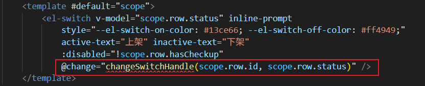

编写回调函数，代码如下：

```typescript
async function changeSwitchHandle(id, status) {
    // 准备数据
    const sendData = {
        id: id,
        status: status
    };
    // 准备配置
    const config = {
        headers:{
            satoken: localStorage.getItem('token')
        }
    }
    // 发送ajax post请求
    const response = await axios.post('/meinian-api/mis/goods/modifyStatus', sendData, config);
    const result = response.data.result;
    // 提示成功信息
    if(result){
        proxy.$message({
            message: '操作成功',
            type: 'success',
            duration: 1200
        });
    }
}
```

# 前后端实现删除套餐功能

注意事项：

1. 只有已下架并且销量为 0 的套餐才能删除。
2. 不仅要删除这个套餐，而且还要删除套餐对应的封面图片。

## 时序图

实现思路：前端提交要删除的套餐 id，可能提交一个，也可能提交多个，form 中统一采用数组接收。接收到要删除的套餐 id 之后，调用 service，在 service 中我们需要根据 ids 查询每个套餐对应的封面图片的路径，调用 mapper 去删除 ids 对应的套餐数据，如果删除的套餐数据量 > 0，则表示删除成功了，此时调用 MinIO 来删除对应的封面图片。


## 编写 MinIO 的 deleteFile 方法

```java
/**
 * 删除文件
 * 从MinIO对象存储中删除指定路径的文件
 *
 * @param path 文件在MinIO中的存储路径（对象键）
 * @throws HisException 当文件删除失败时抛出业务异常
 * @example
 * <pre>
 * // 使用示例：
 * deleteFile("user/avatar/12345.jpg"); // 删除用户头像文件
 * deleteFile("documents/report.pdf");   // 删除文档文件
 * </pre>
 */
public void deleteFile(String path) {
    try {
        // 构建MinIO文件删除参数
        this.client.removeObject(RemoveObjectArgs.builder()
                .bucket(bucket)      // 设置存储桶名称
                .object(path)        // 设置要删除的文件路径（对象键）
                .build());

        // 记录删除操作日志（调试级别）
        log.debug("删除了" + path + "路径下的文件");
    } catch (Exception e) {
        // 记录错误日志并抛出业务异常
        log.error("文件删除失败，文件路径：{}", path, e);
        throw new HisException("文件删除失败");
    }
}
```

## 编写 Mapper 和 Mapper XML

找到 `MedExamPackageMapper`接口，编写以下方法：

```java
List<String> selectImagesByIds(Integer[] ids);

int deleteByIds(Integer[] ids);
```

找到 `MedExamPackageMapper.xml`文件，编写以下 SQL：

```xml
<select id="selectImagesByIds" resultType="String">
    select cover_image from med_exam_package where id in
    <foreach collection="array" item="id" open="(" close=")" separator=",">
        #{id}
    </foreach>
</select>

<delete id="deleteByIds">
    delete from med_exam_package where status=0 and sales_volume = 0 and id in
    <foreach collection="array" item="id" separator="," open="(" close=")">
        #{id}
    </foreach>
</delete>
```

注意，`collection="array"`表示参数是一个数组，如果参数是一个 List 集合，则使用 `collection="list"`。当然也可以在 Mapper 中使用 `@Param`注解来指定参数的名字。

## 编写 Service 接口和实现

找到 `MedExamPackageService`接口，代码如下：

```java
int removeByIds(Integer[] ids);
```

编写实现方法，代码如下：

```java
@Override
@Transactional // 这个事务注解很重要。
public int removeByIds(Integer[] ids) {
    // 根据id删除套餐
    int rows = medExamPackageMapper.deleteByIds(ids);
    if(rows > 0){
        // 根据id查询封面图片的路径
        List<String> images = medExamPackageMapper.selectImagesByIds(ids);
        // 遍历封面图片路径，一个一个删除Minio服务器上的图片。
        images.forEach(image -> {
            minIO.deleteFile(image);
        });
    }
    return rows;
}
```

## 编写 form 接收前端 ids 并验证

```java
package com.jkweilai.meinian.api.controller.form;

import jakarta.validation.constraints.NotEmpty;
import lombok.Data;

@Data
public class RemoveMedExamPackageForm {

    @NotEmpty(message = "ids不能为空")
    private Integer[] ids;
}
```

## 编写 web 方法

找到 `MedExamPackageController`，编写以下方法：

```java
@PostMapping("/removeByIds")
@SaCheckPermission(value = {"ROOT", "GOODS:DELETE"}, mode = SaMode.OR)
public R removeByIds(@RequestBody @Valid RemoveMedExamPackageForm form){
    Integer[] ids = form.getIds();
    int rows = medExamPackageService.removeByIds(ids);
    return R.ok().put("rows", rows);
}
```

## 实现前端删除功能

### 禁止选中商品记录

未下架的套餐，以及销量不为 0 的套餐，不能删除。因此禁止选中。怎么实现的？

```html
<el-table-column type="selection" header-align="center"
    align="center" width="50" :selectable="selectable" />
```

上面的selectable属性的功能是表格在显示一行行记录的时候，用特定的函数计算当前行的复选框是否禁用。

```typescript
function selectable(row, index) {
    if (row.salesVolume > 0 || row.status == true) {
        return false;
    }
    return true;
}
```

### 禁止删除商品

每行商品最右侧有删除按钮，不符合条件的商品记录，该按钮是禁用的状态。

```html
<el-button type="text"
    v-if="proxy.isAuth(['ROOT', 'GOODS:DELETE'])"
    :disabled="scope.row.salesVolume > 0 || scope.row.status"
    @click="deleteHandle(scope.row.id)">
    删除
</el-button>
```

### 获取复选框选中记录

给表格控件绑定@selection-change事件后，每次选中或者取消选中的时候都会触发该事件的回调函数。

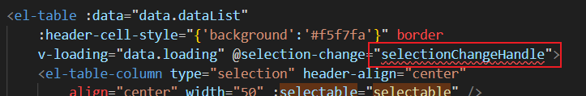

编写回调函数 `selectionChangeHandle`：

```typescript
function selectionChangeHandle(val){
    data.selections = val
}
```

### 提交 ajax 请求删除

删除按钮上需要提供一个回调函数进行删除，不管删除一个还是多个，统一走同一个函数：


编写 `deleteHandle`函数：

```typescript
function deleteHandle(id) {
    // 如果这个函数的 id 参数有值，表示用户删除一个，如果该函数的id参数没有值，表示批量删除。
    let ids = id ? [id] : data.selections.map(item => { return item.id; });
    if (ids.length == 0) {
        proxy.$message({
            message: '没有选中记录',
            type: 'warning',
            duration: 1200
        });
    } else {
        proxy.$confirm(`确定要删除选中的记录？`, '提示', { 
            confirmButtonText: '确定',
            cancelButtonText: '取消',
            type: 'warning'
        }).then(async () => {
            const json = { ids: ids };
            const config = {
                headers:{
                    satoken: localStorage.getItem('token')
                }
            };
            const response = await axios.post('/meinian-api/mis/goods/removeByIds', json, config);
            const rows = response.data.rows;
            if (rows > 0) {
                proxy.$message({
                    message: `刪除了${rows}条记录`,
                    type: 'success',
                    duration: 1200,
                    onClose: () => {
                        loadPageData();
                    }
                });
            } else {
                proxy.$message({
                    message: '未能删除记录',
                    type: 'warning',
                    duration: 1200
                });
            }
        });
    }
}
```

# 实现套餐预览功能

实现思路：从 mis 端的 goods.vue 页面跳转到 front 业务端的 goods.vue 页面

1. 用户点击了预览按钮，路由跳转到业务端的 `FrontGoods`，也就是 `/views/front/goods.vue`页面。并且跳转时需要提供套餐的 id。

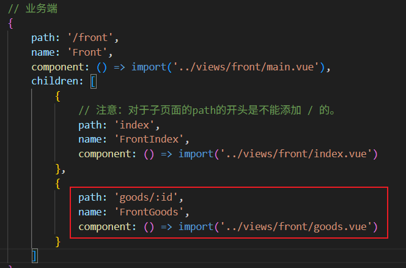

1. `/front/goods.vue`页面在加载的时候，获取到传过来的套餐 id，然后发送 ajax 请求，通过套餐 id 获取套餐信息，然后将返回的套餐数据，填充到响应式对象上，页面中的数据就有了。

提示，将之前业务端的 `goods.vue`文件中的默认数据清空掉，变成下面这种代码：

```typescript
const data = reactive({
    packageCode: null,
    packageName: null,
    description: null,
    coverImage: null,
    originalPrice: null,
    currentPrice: null,
    ruleName: null,
    packageType: null,
    tags: [],
    departmentExam: [],
    labExam: [],
    medicalExam: [],
    otherExam: [],
    departmentExam_count: null,
    labExam_count: null,
    medicalExam_count: null,
    otherExam_count: null,
    examCount: null
});
```

## 在 mis 端的 goods.vue 中编写路由跳转

在 mis 端的 goods.vue 页面编写路由跳转代码，跳转时需要携带套餐 id。

**找到预览按钮：**

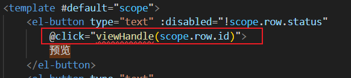

**编写回调函数 viewHandle，代码如下：**

```typescript
function viewHandle(id){
    // 在当前页面中显示
    router.push({
        name: 'FrontGoods',
        params: {
            id: id
        }
    });
    // 在新窗口中显示
    /*
    const route = router.resolve({
        name: "FrontGoods",
        params: {
            id: id
        }
    });
    window.open(route.href, "_blank");
    */
}
```

## 在 front 端的 goods.vue 加载套餐信息

在 front 端的 goods.vue 页面中，获取传递过来的套餐 id，然后发送 ajax 请求去获取套餐信息，将套餐信息赋值到响应式对象上，代码如下：

```typescript
// 加载页面
async function loadPreviewPage(){
    // 接收路由传递的商品主键值，该页面要根据商品主键值加载商品信息
    let id = router.currentRoute.value.params.id;

    // 如果用户在上个页面滚动到底部，新页面也会从底部显示
    // 用户进入页面时总是从顶部开始浏览
    // 滚动到页面的顶部，然后加载数据
    window.scrollTo(0, 0);

    // 准备数据
    const json = {
        id: id
    };
    // 准备配置
    const config = {
        headers: {
            satoken: localStorage.getItem("token")
        }
    };
    // 发送ajax请求
    const response = await axios.post('/meinian-api/front/goods/findById', json, config);
    const result = response.data.result;
    // 渲染页面
    if (result == null) {
        proxy.$message({
            message: '无法加载该商品',
            type: 'warning',
            duration: 1200,
            onClose: () => {
                // 我提前写好了如果无法加载商品则跳转到这个路由。这个路由还没写。
                router.push({ name: "FrontGoodsList" })
            }
        });
    }else {
        data.packageCode = result.packageCode;
        data.packageName = result.packageName;
        data.description = result.description;
        data.coverImage = `${proxy.$minioUrl}/${result.coverImage}`;
        data.originalPrice = result.originalPrice;
        data.currentPrice = result.currentPrice;
        data.ruleName = result.ruleName;
        data.packageType = result.packageType;
        data.tags = result.tags;
        data.departmentExam = result.departmentExam;
        data.labExam = result.labExam;
        data.medicalExam = result.medicalExam;
        data.otherExam = result.otherExam;
        data.departmentExam_count = result.count_1;
        data.labExam_count = result.count_2;
        data.medicalExam_count = result.count_3;
        data.otherExam_count = result.count_4;
        data.examCount = result.count_1 + result.count_2 + result.count_3 + result.count_4;
    }
}
// 页面打开时立即执行。
loadPreviewPage();
```

## 编写 Service 接口和实现

你可能会问：不需要编写 Mapper 和 Mapper XML 吗？这个我们复用之前 mis 端的 Mapper 和 Mapper XML 即可。看看之前写的这个方法，就能用：

```xml
<select id="selectById" parameterType="Map" resultType="Map">
    SELECT
        g.package_code AS packageCode,
        g.package_name AS packageName,
        g.description,
        g.cover_image AS coverImage,
        CAST(g.original_price AS CHAR) AS originalPrice,
        CAST(g.current_price AS CHAR) AS currentPrice,
        r.rule_id AS ruleId,
        r.rule_name AS ruleName,
        g.package_type AS packageType,
        g.tags,
        g.category_id AS categoryId,
        g.department_exam AS departmentExam,
        IFNULL(JSON_LENGTH(g.department_exam), 0) AS count_1,
        g.lab_exam AS labExam,
        IFNULL(JSON_LENGTH(g.lab_exam), 0) AS count_2,
        g.medical_exam AS medicalExam,
        IFNULL(JSON_LENGTH(g.medical_exam), 0) AS count_3,
        g.other_exam AS otherExam,
        IFNULL(JSON_LENGTH(g.other_exam), 0) AS count_4
    FROM
        med_exam_package g
    LEFT JOIN
        promotion_rule r
    ON
        g.promotion_id = r.rule_id
    WHERE
        g.id = #{id}
    <if test="status != null">
        AND status = #{status}
    </if>
</select>
```

为什么需要同时提交 id 和 status 呢？**因为只有上架的套餐才支持预览**，因此要求 status 必须等于 1。

在 `api`包下新建软件包 `front`包，在 `front`包下新建 `service`包，然后创建接口 `MedExamPackageService`，代码如下：

```java
package com.jkweilai.meinian.api.front.service;

import java.util.Map;

public interface MedExamPackageService {
    Map<String, Object> findById(Integer id);
}
```

在 service 包下新建 impl 包，编写实现类`MedExamPackageServiceImpl`，实现方法：

```java
package com.jkweilai.meinian.api.front.service.impl;

import cn.hutool.core.map.MapUtil;
import cn.hutool.json.JSONArray;
import cn.hutool.json.JSONUtil;
import com.jkweilai.meinian.api.db.mapper.MedExamPackageMapper;
import com.jkweilai.meinian.api.front.service.MedExamPackageService;
import jakarta.annotation.Resource;
import org.springframework.stereotype.Service;

import java.util.HashMap;
import java.util.Map;

// 这个必须设置一个名字哈，因为如果不设置名字的话，默认名字是 MedExamPackageServiceImpl，这样就和mis端的bean的名字冲突了。
@Service("FrontMedExamPackageServiceImpl")
public class MedExamPackageServiceImpl implements MedExamPackageService {

    @Resource
    private MedExamPackageMapper medExamPackageMapper;

    @Override
    public Map<String, Object> findById(Integer id) {
        Map<String, Object> params = new HashMap<>();
        params.put("id", id);
        params.put("status", 1);
        Map<String, Object> map = medExamPackageMapper.selectById(params);
        // 将查询结果中的体检项目字符串全部转换为json对象
        if (map != null) {
            for (String key : new String[]{"tags", "departmentExam", "labExam", "medicalExam", "otherExam"}) {
                String temp = MapUtil.getStr(map, key);
                JSONArray array = JSONUtil.parseArray(temp);
                map.replace(key, array);
            }
            return map;
        }
        return null;
    }
}
```

**需要特别注意的是 service 的 name 一定要显示设置，要不然会和 mis 端的 bean 的名字冲突**。

## 编写 front 端的 form

在 `front`包下新建 `controller`包，在 `controller`包下新建 `form`包。在 `form`包下新建 `FindMedExamPackageForm`，编写以下代码。

```java
package com.jkweilai.meinian.api.front.controller.form;

import jakarta.validation.constraints.Min;
import jakarta.validation.constraints.NotNull;
import lombok.Data;

@Data
public class FindMedExamPackageByIdForm {
    @NotNull(message = "id不能为空")
    @Min(value = 1, message = "id不能小于1")
    private Integer id;
}
```

## 编写 front 端的 Controller

在`controller`包下新建`MedExamPackageController`，代码如下：

```java
package com.jkweilai.meinian.api.front.controller;

import com.jkweilai.meinian.api.common.R;
import com.jkweilai.meinian.api.front.controller.form.FindMedExamPackageByIdForm;
import com.jkweilai.meinian.api.front.service.MedExamPackageService;
import jakarta.annotation.Resource;
import jakarta.validation.Valid;
import org.springframework.web.bind.annotation.PostMapping;
import org.springframework.web.bind.annotation.RequestBody;
import org.springframework.web.bind.annotation.RequestMapping;
import org.springframework.web.bind.annotation.RestController;

import java.util.Map;

@RequestMapping("/front/goods")
// 一定要起一个新的名字，因为这类名和mis端的类名一致。防止冲突，一定要给bean起个名字。
@RestController("FrontMedExamPackageController")
public class MedExamPackageController {

    @Resource
    private MedExamPackageService medExamPackageService;


    @PostMapping("/findById")
    // 业务端这个方法不需要控制权限
    public R findById(@RequestBody @Valid FindMedExamPackageByIdForm form) {
        Map<String, Object> map = medExamPackageService.findById(form.getId());
        return R.ok().put("result", map);
    }

}
```

注意：一定要给这个 controller bean 起个新的名字，防止 mis 端冲突，因为和 mis 端的类名一样。

将前后端项目全部启动之后，测试以下预览功能是否好用。

# SpringCache 缓存套餐

## 使用缓存的原则

Spring Cache 缓存的使用需要谨慎分析，遵循以下原则：

（1）**频繁变更的数据不宜缓存**
对于更新频率较高的数据，添加缓存反而会增加系统复杂度，无法保证数据实时性。

（2）**优先缓存单条数据而非结果集**
应尽量缓存细粒度的单条记录查询。结果集范围越大，数据变更导致缓存失效的概率就越高。

（3）**聚焦高频访问数据**
仅对访问频率高的热点数据建立缓存，低频访问的数据设置缓存性价比低，且占用系统资源。

## 分析我们的系统应该把什么放到缓存中

基于上述缓存原则，我们可以得出一个明确的结论：并非所有数据都适合缓存。以本系统为例，MIS管理端的用户基数小、并发低，不易出现高负载情况，因此各模块数据基本无需引入缓存机制。

然而在业务端则完全不同。假设在618促销活动中，所有体检套餐于上午9点开启五折优惠，大健康平台可能瞬间涌入数十万用户。为应对此类高并发场景，业务端的商品页面应优先从缓存中提取数据，而非直接查询数据库，从而显著提升页面加载速度。

在业务端商品页面对应的后端实现中，我们应在业务层方法上添加缓存注解，将最终返回的商品详情信息存入缓存。这样设计的理由很明确：Dao层方法职责抽象，仅负责数据查询，无法对结果集做业务处理；而业务层才是完成数据组装与处理的最终环节，因此理应缓存业务层返回的完整结果。

由于我们难以预先判断哪些商品属于热门访问对象，因此将“是否被加载”作为触发缓存的唯一条件。只要某商品被业务端页面访问，即说明其具备潜在访问价值，便将其缓存。考虑到单条商品记录所占内存空间有限，即使将所有体检套餐数据全部存入Redis，所占用的内存资源也完全在可接受范围内。

## 缓存套餐到 redis

因此我们需要在 `front`端的 `MedExamPackageServiceImpl`的 `findById`方法上添加注解。将从数据库中查找的商品信息缓存到 redis 当中，代码如下：

```java
@Override
@Cacheable(cacheNames = "goods", key = "#id")
public Map<String, Object> findById(Integer id) {
    Map<String, Object> params = new HashMap<>();
    params.put("id", id);
    params.put("status", 1);
    Map<String, Object> map = medExamPackageMapper.selectById(params);
    // 将查询结果中的体检项目字符串全部转换为json对象
    if (map != null) {
        for (String key : new String[]{"tags", "departmentExam", "labExam", "medicalExam", "otherExam"}) {
            String temp = MapUtil.getStr(map, key);
            JSONArray array = JSONUtil.parseArray(temp);
            map.replace(key, array);
        }
        return map;
    }
    return null;
}
```

---

**@Cacheable(cacheNames = "goods", key = "#id") 的作用是：**

当调用 findById 方法时，Spring会首先检查名为 goods 的缓存中是否存在键为 #id 值的缓存数据。如果存在，则直接返回缓存数据，不再执行方法体；如果不存在，则执行方法体，并将方法返回的 Map<String, Object> 对象存入缓存，以便下次使用。

**cacheNames (或 value)**

- 含义：缓存名称，用于定义逻辑上的缓存分区。
- 作用：你的应用可能有多种类型的数据需要缓存（如用户、商品、订单），用此属性将它们隔离。
- 示例："goods" 表示这个缓存属于“商品”这个业务范畴。
- 在Redis中的体现：通常会作为Redis键的前缀，例如生成 goods::123 这样的键。

**key**

- 含义：缓存键，用于在同一个缓存分区内唯一标识一条数据。
- 作用：支持Spring表达式语言(SpEL)，可以动态地根据方法参数、方法名等生成键。
- 示例：#id 表示使用方法的 id 参数值作为键。

## 开启 Spring Cache 缓存

要想让 SpringCache 去帮你管理 redis 缓存，你需要在 springboot 入口类上使用以下注解：`@EnableCaching`

```java
package com.jkweilai.meinian.api;

import org.mybatis.spring.annotation.MapperScan;
import org.springframework.boot.SpringApplication;
import org.springframework.boot.autoconfigure.SpringBootApplication;
import org.springframework.boot.web.servlet.ServletComponentScan;
import org.springframework.cache.annotation.EnableCaching;
import org.springframework.context.annotation.ComponentScan;
import org.springframework.scheduling.annotation.EnableAsync;

@EnableAsync
@ServletComponentScan
@ComponentScan("com.jkweilai.*")
@MapperScan(basePackages = "com.jkweilai.meinian.api.db.mapper")
@SpringBootApplication
@EnableCaching
public class MeinianApiApplication {

    public static void main(String[] args) {
        SpringApplication.run(MeinianApiApplication.class, args);
    }

}
```

## 将套餐从缓存中清除

当套餐信息发生任何修改操作时，我们都需要让缓存失效，用户请求时需要从数据库中重新查询数据。因此我们需要在 mis 端的 `MedExamPackageServiceImpl`类中的相关方法上使用 `@CacheEvict`注解，主动让缓存中存储的套餐数据失效。需要在哪些方法上添加呢？

1. modify：修改套餐信息时
2. uploadExamItems：修改套餐中的详细体检内容时
3. modifyStatus：下架时
4. removeByIds：删除套餐时

具体代码如下：

```java
@Override
@CacheEvict(cacheNames = "goods", key = "#entity.id")
public int modify(MedExamPackageEntity entity) {}

@Override
@CacheEvict(cacheNames = "goods", key = "#medExamPackageId")
public void uploadExamItems(Integer medExamPackageId, MultipartFile file) {}

@Override
@Transactional
@CacheEvict(cacheNames = "goods", key = "#params.get('id')", condition = "#params.get('status') == false")
public int modifyStatus(Map<String, Object> params) {}

@Override
@Transactional // 这个事务注解很重要。
@CacheEvict(cacheNames = "goods", key = "#ids")
public int removeByIds(Integer[] ids) {}
```

测试一下，先预览，然后看看 redis 缓存中有没有。第二次再预览的时候看看后台有没有打印 SQL，如果没有打印则表示从缓存中取出的数据。然后再让商品下架，看看 redis 缓存中还有数据吗。然后再次上架，预览商品看看会不会走数据库。

## 缓存数据的有效期

有同学担心，一旦商品信息被缓存，只要不主动修改或删除，这些数据就会永久占用 Redis 空间。事实上并非如此，我们已在 `<font style="color:rgb(15, 17, 21);background-color:rgb(235, 238, 242);">application.yml</font>` 中统一设置了缓存有效期为一月。因此，即使某些商品仅被临时访问，也不会长期占用内存——一个月后相应缓存将自动失效并被清理。如果该商品之后再次被访问，系统将重新查询数据库并建立缓存，从而实现内存资源的动态回收与合理 利用。


# 购买体检套餐模块业务分析

## ER 图


购买体检套餐模块涉及到三张表：

1. 客户表：客户使用系统也需要登录，但没有设计 password 字段，用户登录使用手机号接收验证码来实现。
2. 订单表
3. 体检套餐表（商品表）

**客户表的字段说明：**

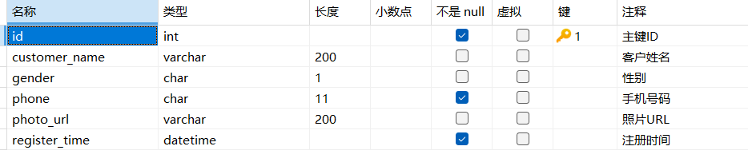

**订单表的字段说明：**


## UI 界面截图

### 业务端的登录弹窗页

业务端的`main.vue`页面：


### 业务端的 index.vue 页

业务端`index.vue`页面中“活动专区”、“热卖套餐”和“新品推荐”三个区域都要放置商品列表：


### 业务端的体检套餐列表页

业务端的商品列表页面（goods_list.vue）默认显示所有体检套餐，而且还支持条件检索功能：


### 业务端的 mine.vue 页

客户登录成功以后，可以在帐户信息页面（mine.vue）页面，看到自己的简介信息和购物统计：

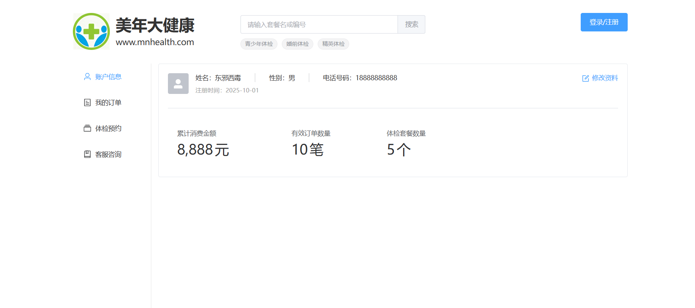

### 业务端 order_list.vue 页

业务端的订单列表页面（order_list.vue）需要把客户的订单分页显示，而且还提供了条件查询：

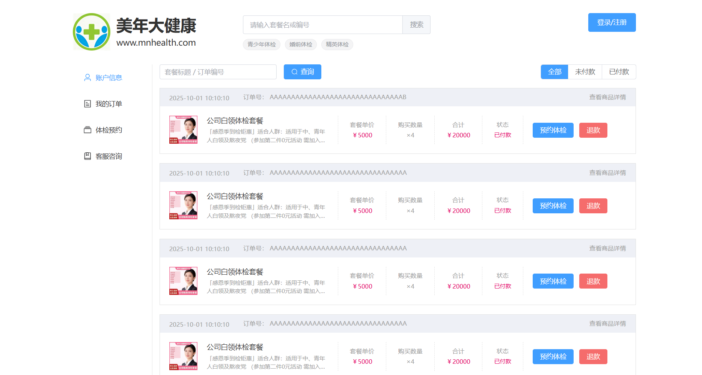

## UML 用例图


# 实现业务端登录弹窗


## 视图层

在 `src/views/front/main.vue` 页面中，补充新的标签，代码如下：

```html
<div class="container">
    <header>
        ……
        <div class="oper-container">
            <el-button type="primary" size="large" v-if="dialog.status == 'logout'" @click="showDialog">
                登录/注册
            </el-button>
            <div class="btn" v-if="dialog.status == 'login'" @click="router.push({name:'FrontMine'})">
                <el-icon><User /></el-icon>
                <span>个人中心</span>
            </div>
            <div class="btn" v-if="dialog.status == 'login'" @click="logout">
                <el-icon><SwitchButton /></el-icon>
                <span>退出系统</span>
            </div>
        </div>
    </header>
    <!-- 避免路由引用页面的时候浏览器不刷新内容，所以给URL添加随机数参数 -->
    <router-view :key="router.currentRoute.value.query.random" />
</div>

<footer>
  ……
</footer>

<el-dialog v-model="dialog.visible" title="手机快速登录" width="400" class="dialog">
    <el-row>
        <el-col :span="24">
            <el-input v-model="dialog.phone" placeholder="输入手机号，快捷登录"
                size="large" maxlength="11" clearable>
                <template #prepend>
                    <el-icon><Iphone /></el-icon>
                </template>
            </el-input>
        </el-col>
    </el-row>
    <el-row :gutter="10">
        <el-col :span="16">
            <el-input v-model="dialog.code" placeholder="输入短信验证码"
                size="large" maxlength="6" clearable>
                <template #prepend>
                    <el-icon><Message /></el-icon>
                </template>
            </el-input>
        </el-col>
        <el-col :span="8">
            <el-button size="large" class="receive-btn" type="primary" plain
                @click="sendSmsCode" :disabled="dialog.disabled">
                {{ dialog.btnContent }}
            </el-button>
        </el-col>
    </el-row>
    <el-button type="primary" class="login-btn" size="large" @click="login">
        登录系统
    </el-button>
</el-dialog>
```

## 模型层

刚才在视图层添加的新控件需要用到的常量或者属性，我们要在模型层中创建出来

```typescript
……
import { isPhone, stringIsEmpty, isSmsCode } from '../../utils/validate';
……
const dialog = reactive({
    visible: false,
    phone: null,
    code: null,
    disabled: false,
    btnContent: '获取短信验证码',
    num: 0,
    status: 'logout'
});

const dataRule = reactive({
    phone: [{ required: true, pattern: '^1[1-9]\d{9}$', message: '手机号码错误' }]
});
```

为了能看到弹窗的显示效果，我们把“登录/注册”按钮的回调函数给实现了：

```typescript
function showDialog() {
    dialog.visible = true;
}
```

## 定义 less 样式

在main.less文件中，编写页面控件用到的CSS样式

```plaintext
header {
    ……
    .oper-container {
        ……
        /* 通用按钮容器样式 */
        .btn {
            display: flex;          /* 启用Flex布局，使图标和文字水平排列 */
            margin-left: 30px;      /* 左侧外边距30px，与其他元素保持间距 */
            cursor: pointer;        /* 鼠标悬停时显示手型指针，表明可点击 */
            
            /* 按钮内的图标样式 */
            .el-icon {
                margin-top: 1px;    /* 图标微调1px垂直偏移，实现视觉对齐 */
            }
            
            /* 按钮内的文字样式 */
            span {
                font-size: 14px;    /* 设置文字大小为14px */
                color: @font-color-2;       /* 使用预定义变量设置文字颜色（通常为次要文字色） */
                margin-left: 5px;   /* 文字左侧与图标保持5px间距 */
            }
        }
    }
}

/* 对话框组件内部样式 */
.dialog {
    /* 对话框内所有行元素设置统一底部间距 */
    .el-row {
        margin-bottom: 17px;
    }
    
    /* 接收按钮样式 - 通常用于确认、提交等主要操作 */
    .receive-btn {
        width: 100%;        /* 按钮宽度充满父容器 */
        outline: none;      /* 移除焦点时的轮廓线，保持视觉简洁 */
    }
    
    /* 登录按钮样式 */
    .login-btn {
        width: 100%;        /* 按钮宽度充满父容器 */
        margin-top: 10px;   /* 与上方元素保持10px间距 */
        height: 45px;       /* 固定按钮高度为45px */
    }
}
```

# 实现业务端 index 页面 banner 区


## 视图层

在 `scr/views/front/index.vue` 页面中，声明 `banner` 区域用到的控件。

```html
<template>
    
    <div class="service-container">
        <div class="service">
            
            <div>
                <h4>体检预约</h4>
                <p>在线预约体检服务</p>
            </div>
        </div>
        <div class="service">
            
            <div>
                <h4>报告查询</h4>
                <p>快速获取体检报告</p>
            </div>
        </div>
        <div class="service">
            
            <div>
                <h4>热门活动</h4>
                <p>精选特惠体检套餐</p>
            </div>
        </div>
        <div class="service">
            
            <div>
                <h4>企业服务</h4>
                <p>企业团体健康管理</p>
            </div>
        </div>
    </div>
</template>

<script setup lang="ts">
</script>

<style lang="less" scoped>
</style>
```

## 样式

在 `front`目录下新建 `index.less`文件，在 `index.less` 文件中，给视图层的标签定义CSS样式

```plaintext
@import url('../style.less');

.banner {
    width: 100%;
    margin-top: 25px;
    display: block;
}
.service-container {
    margin-top: 30px;
    display: flex;
    justify-content: space-between;
    .service {
        width: 280px;
        height: 114px;
        background-color: @bg-color-18;
        border-radius: 10px;
        display: flex;
        justify-content: center;
        align-items: center;
        cursor: pointer;
        &:hover {
            background-color: @bg-color-15;
            transition-duration: 0.12s;
            transition-property: all;
        }
        img {
            width: 45px;
            height: 48px;
            display: block;
            margin-right: 10px;
        }
        h4 {
            margin: 0 0 4px 0;
            font-size: 22px;
            color: #fff;
            font-weight: normal;
        }
        p {
            margin: 0;
            font-size: 14px;
            color: #fff;
        }
    }
}
```

## 导入 less 文件

别忘了在 index.vue 中引入 less 样式文件：

```html
<style lang="less" scoped>
    @import url('index.less');
</style>
```