# 美年大健康项目-04

# 实现业务端 index 页面商品推荐区


## 视图层

在 `front/index.vue`中添加代码：

```html
<div class="service-container">
    ……
</div>
<!--以下是新添加的内容-->
<div class="goods-container">
    <nav>
        <h3>活动专区</h3>
        <el-link :icon="Plus" :underline="false"
            @click="moreHandle">查看更多</el-link>
    </nav>
    <ul class="goods-list">
        <li class="item" v-for="one in data.part_1">
            <div class="card">
                
                <h4>{{ one.title }}</h4>
                <el-tooltip class="box-item" effect="dark" placement="top">
                    <template #content>
                        <div style="width: 260px;">{{ one.description }}
                        </div>
                    </template>
                    <p class="desc">
                        <span>折</span>
                        {{ one.description }}
                    </p>
                </el-tooltip>
                <p class="price">
                    <span class="current">￥{{ one.currentPrice }}</span>
                    <span class="old">￥{{ one.originalPrice }}</span>
                    <span class="sale">已售{{ one.salesVolume }}</span>
                </p>
                <input type="button" class="buy-btn" value="立即购买"
                    @click="buyHandle(one.id)" />
            </div>
        </li>
    </ul>
</div>

<div class="goods-container">
    <nav>
        <h3>热卖套餐</h3>
        <el-link :icon="Plus" :underline="false"
            @click="moreHandle">查看更多</el-link>
    </nav>
    <ul class="goods-list">
        <li class="item" v-for="one in data.part_2">
            <div class="card">
                
                <h4>{{ one.title }}</h4>
                <el-tooltip class="box-item" effect="dark" placement="top">
                    <template #content>
                        <div style="width: 260px;">{{ one.description }}
                        </div>
                    </template>
                    <p class="desc">
                        <span>折</span>
                        {{ one.description }}
                    </p>
                </el-tooltip>
                <p class="price">
                    <span class="current">￥{{ one.currentPrice }}</span>
                    <span class="old">￥{{ one.originalPrice }}</span>
                    <span class="sale">已售{{ one.salesVolume }}</span>
                </p>
                <input type="button" class="buy-btn" value="立即购买"
                    @click="buyHandle(one.id)" />
            </div>
        </li>
    </ul>
</div>

<div class="goods-container">
    <nav>
        <h3>新品推荐</h3>
        <el-link :icon="Plus" :underline="false"
            @click="moreHandle">查看更多</el-link>
    </nav>
    <ul class="goods-list">
        <li class="item" v-for="one in data.part_3">
            <div class="card">
                
                <h4>{{ one.title }}</h4>
                <el-tooltip class="box-item" effect="dark" placement="top">
                    <template #content>
                        <div style="width: 260px;">{{ one.description }}
                        </div>
                    </template>
                    <p class="desc">
                        <span>折</span>
                        {{ one.description }}
                    </p>
                </el-tooltip>
                <p class="price">
                    <span class="current">￥{{ one.currentPrice }}</span>
                    <span class="old">￥{{ one.originalPrice }}</span>
                    <span class="sale">已售{{ one.salesVolume }}</span>
                </p>
                <input type="button" class="buy-btn" value="立即购买"
                    @click="buyHandle(one.id)" />
            </div>
        </li>
    </ul>
</div>
```

## 模型层

为该页面视图层新添加的控件，在模型层中定义相关的常量和属性。

```typescript
<script setup lang="ts">
    import { reactive, ref, Ref, getCurrentInstance } from 'vue';
    import { Plus } from '@element-plus/icons-vue';
    import router from '../../router/index';
    const { proxy } = getCurrentInstance();
    const data = reactive({
        part_1: [
            {
                title: "银龄关怀健康呵护套餐",
                coverImage: `${proxy.$minioUrl}/front/goods/d079bf3cfbe64aa9b5e17a2e77244bb7.jpg`,
                description: "「感恩回馈季 到检享优惠」适用对象：中老年群体及心血管健康关注者 （参与买一赠一活动 需在购物车内选择2件商品）",
                currentPrice: 5000.00,
                originalPrice: 8000.00,
                salesVolume: 888
            },
            {
                title: "银龄关怀健康呵护套餐",
                coverImage: `${proxy.$minioUrl}/front/goods/d079bf3cfbe64aa9b5e17a2e77244bb7.jpg`,
                description: "「感恩回馈季 到检享优惠」适用对象：中老年群体及心血管健康关注者 （参与买一赠一活动 需在购物车内选择2件商品）",
                currentPrice: 5000.00,
                originalPrice: 8000.00,
                salesVolume: 888
            },
            {
                title: "银龄关怀健康呵护套餐",
                coverImage: `${proxy.$minioUrl}/front/goods/d079bf3cfbe64aa9b5e17a2e77244bb7.jpg`,
                description: "「感恩回馈季 到检享优惠」适用对象：中老年群体及心血管健康关注者 （参与买一赠一活动 需在购物车内选择2件商品）",
                currentPrice: 5000.00,
                originalPrice: 8000.00,
                salesVolume: 888
            },
            {
                title: "银龄关怀健康呵护套餐",
                coverImage: `${proxy.$minioUrl}/front/goods/d079bf3cfbe64aa9b5e17a2e77244bb7.jpg`,
                description: "「感恩回馈季 到检享优惠」适用对象：中老年群体及心血管健康关注者 （参与买一赠一活动 需在购物车内选择2件商品）",
                currentPrice: 5000.00,
                originalPrice: 8000.00,
                salesVolume: 888
            },
        ],
        part_2: [
            {
                title: "银龄关怀健康呵护套餐",
                coverImage: `${proxy.$minioUrl}/front/goods/d079bf3cfbe64aa9b5e17a2e77244bb7.jpg`,
                description: "「感恩回馈季 到检享优惠」适用对象：中老年群体及心血管健康关注者 （参与买一赠一活动 需在购物车内选择2件商品）",
                currentPrice: 5000.00,
                originalPrice: 8000.00,
                salesVolume: 888
            },
            {
                title: "银龄关怀健康呵护套餐",
                coverImage: `${proxy.$minioUrl}/front/goods/d079bf3cfbe64aa9b5e17a2e77244bb7.jpg`,
                description: "「感恩回馈季 到检享优惠」适用对象：中老年群体及心血管健康关注者 （参与买一赠一活动 需在购物车内选择2件商品）",
                currentPrice: 5000.00,
                originalPrice: 8000.00,
                salesVolume: 888
            },
            {
                title: "银龄关怀健康呵护套餐",
                coverImage: `${proxy.$minioUrl}/front/goods/d079bf3cfbe64aa9b5e17a2e77244bb7.jpg`,
                description: "「感恩回馈季 到检享优惠」适用对象：中老年群体及心血管健康关注者 （参与买一赠一活动 需在购物车内选择2件商品）",
                currentPrice: 5000.00,
                originalPrice: 8000.00,
                salesVolume: 888
            },
            {
                title: "银龄关怀健康呵护套餐",
                coverImage: `${proxy.$minioUrl}/front/goods/d079bf3cfbe64aa9b5e17a2e77244bb7.jpg`,
                description: "「感恩回馈季 到检享优惠」适用对象：中老年群体及心血管健康关注者 （参与买一赠一活动 需在购物车内选择2件商品）",
                currentPrice: 5000.00,
                originalPrice: 8000.00,
                salesVolume: 888
            }
        ],
        part_3: [
            {
                title: "银龄关怀健康呵护套餐",
                coverImage: `${proxy.$minioUrl}/front/goods/d079bf3cfbe64aa9b5e17a2e77244bb7.jpg`,
                description: "「感恩回馈季 到检享优惠」适用对象：中老年群体及心血管健康关注者 （参与买一赠一活动 需在购物车内选择2件商品）",
                currentPrice: 5000.00,
                originalPrice: 8000.00,
                salesVolume: 888
            },
            {
                title: "银龄关怀健康呵护套餐",
                coverImage: `${proxy.$minioUrl}/front/goods/d079bf3cfbe64aa9b5e17a2e77244bb7.jpg`,
                description: "「感恩回馈季 到检享优惠」适用对象：中老年群体及心血管健康关注者 （参与买一赠一活动 需在购物车内选择2件商品）",
                currentPrice: 5000.00,
                originalPrice: 8000.00,
                salesVolume: 888
            },
            {
                title: "银龄关怀健康呵护套餐",
                coverImage: `${proxy.$minioUrl}/front/goods/d079bf3cfbe64aa9b5e17a2e77244bb7.jpg`,
                description: "「感恩回馈季 到检享优惠」适用对象：中老年群体及心血管健康关注者 （参与买一赠一活动 需在购物车内选择2件商品）",
                currentPrice: 5000.00,
                originalPrice: 8000.00,
                salesVolume: 888
            },
            {
                title: "银龄关怀健康呵护套餐",
                coverImage: `${proxy.$minioUrl}/front/goods/d079bf3cfbe64aa9b5e17a2e77244bb7.jpg`,
                description: "「感恩回馈季 到检享优惠」适用对象：中老年群体及心血管健康关注者 （参与买一赠一活动 需在购物车内选择2件商品）",
                currentPrice: 5000.00,
                originalPrice: 8000.00,
                salesVolume: 888
            }
        ]
    });

</script>
```

## 样式

在index.less文件中，为视图层控件添加CSS样式

```plaintext
.goods-container {
    margin-top: 50px;           /* 容器顶部外边距 */
    user-select: none;          /* 禁止用户选择文本 */
    nav {
        display: flex;          /* 导航栏使用flex布局 */
        justify-content: space-between;  /* 两端对齐 */
        h3 {
            font-size: 32px;    /* 标题字体大小 */
            color: @font-color-1;  /* 使用主字体颜色变量 */
            font-weight: normal;    /* 正常字体粗细 */
            margin: 0px 0 25px 0;  /* 外边距：上 右 下 左 */
        }
    }
    .goods-list {
        overflow: hidden;       /* 清除浮动 */
        list-style: none;       /* 移除列表默认样式 */
        margin: 0;              /* 外边距归零 */
        padding: 0;             /* 内边距归零 */
        .item {
            width: 280px;       /* 商品项固定宽度 */
            float: left;        /* 左浮动实现横向排列 */
            margin-right: 26px; /* 右侧间距 */
            &:last-of-type {
                margin-right: 0;  /* 最后一个商品项移除右侧间距 */
            }
            .card {
                img {
                    width: 280px;  /* 商品图片固定宽度 */
                }
                h4 {
                    font-size: 18px;      /* 商品标题字体大小 */
                    font-weight: normal;  /* 正常字体粗细 */
                    color: @font-color-1;  /* 使用主字体颜色变量 */
                    margin: 10px 0 5px 0;  /* 上下外边距 */
                    overflow: hidden;      /* 超出部分隐藏 */
                    text-overflow: ellipsis;  /* 文本溢出显示省略号 */
                    white-space: nowrap;   /* 不换行 */
                }

                .desc {
                    display: -webkit-box;      /* 使用webkit盒子模型 */
                    -webkit-box-orient: vertical;  /* 垂直方向排列 */
                    -webkit-line-clamp: 2;     /* 限制显示2行 */
                    overflow: hidden;          /* 超出部分隐藏 */
                    font-size: 12px;           /* 描述文字大小 */
                    color: @font-color-3;      /* 使用辅助字体颜色变量 */
                    margin: 0 0 5px 0;         /* 底部外边距 */
                    line-height: 1.5;          /* 行高 */
                    span {
                        background-color: @bg-color-27;  /* 标签背景色 */
                        color: #fff;           /* 标签文字白色 */
                        padding: 2px;          /* 内边距 */
                        font-size: 11px;       /* 标签文字大小 */
                    }
                }
                .price {
                    margin: 0;                 /* 价格区域外边距归零 */
                    overflow: hidden;          /* 清除浮动 */
                    .current {
                        color: @font-color-23;  /* 当前价格颜色 */
                        font-size: 22px;       /* 当前价格字体大小 */
                        font-weight: bold;     /* 粗体显示 */
                        float: left;           /* 左浮动 */
                    }
                    .old {
                        float: left;           /* 左浮动 */
                        font-size: 13px;       /* 原价字体大小 */
                        color: @font-color-3;  /* 使用辅助字体颜色变量 */
                        text-decoration: line-through;  /* 删除线效果 */
                        margin-left: 10px;     /* 左侧间距 */
                        margin-top: 7px;       /* 顶部间距用于垂直对齐 */
                    }
                    .sale {
                        float: right;          /* 右浮动 */
                        font-size: 12px;       /* 销量字体大小 */
                        color: @font-color-3;  /* 使用辅助字体颜色变量 */
                        margin-top: 7px;       /* 顶部间距用于垂直对齐 */
                    }
                }
                .buy-btn {
                    width: 100%;               /* 按钮宽度100% */
                    background-color: @button-color-10;  /* 按钮背景色 */
                    border: none;              /* 无边框 */
                    border-radius: 3px;        /* 圆角边框 */
                    height: 40px;              /* 按钮高度 */
                    color: #fff;               /* 文字白色 */
                    font-size: 15px;           /* 文字大小 */
                    margin-top: 10px;          /* 顶部间距 */
                    outline: none;             /* 移除轮廓线 */
                    cursor: pointer;           /* 手型光标 */
                    &:active {
                        background-color: @button-active-color-10;  /* 按钮按下状态背景色 */
                    }
                }
            }
        }
    }

}
```

# 实现业务端 index 页面 Partner 区域

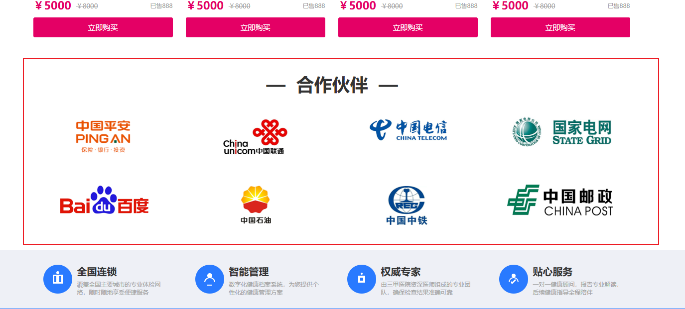

## 视图层

在src/views/front/index.vue页面中的视图层，添加新的控件标签。标签是走马灯效果的，每页放置8个企业Logo图片，然后前后两页可以切换。

```html
<!-- 合作伙伴展示区域 -->
<div class="partner-container">
    <!-- 分区标题，使用特殊符号装饰 -->
    <h3>—  合作伙伴  —</h3>
    
    <!-- Element Plus 走马灯组件，设置固定高度并关闭自动播放 -->
    <el-carousel height="220px" :autoplay="false">
        <!-- 第一个轮播页 -->
        <el-carousel-item>
            <!-- 第一行合作伙伴Logo，使用24栅格布局，列间距20 -->
            <el-row :gutter="20">
                <el-col :span="6">
                    
                </el-col>
                <el-col :span="6">
                    
                </el-col>
                <el-col :span="6">
                    
                </el-col>
                <el-col :span="6">
                    
                </el-col>
            </el-row>
            <!-- 第二行合作伙伴Logo -->
            <el-row :gutter="20">
                <el-col :span="6">
                    
                </el-col>
                <el-col :span="6">
                    
                </el-col>
                <el-col :span="6">
                    
                </el-col>
                <el-col :span="6">
                    
                </el-col>
            </el-row>
        </el-carousel-item>
        
        <!-- 第二个轮播页 -->
        <el-carousel-item>
            <!-- 第三行合作伙伴Logo -->
            <el-row :gutter="20">
                <el-col :span="6">
                    
                </el-col>
                <el-col :span="6">
                    
                </el-col>
                <el-col :span="6">
                    
                </el-col>
                <el-col :span="6">
                    
                </el-col>
            </el-row>
            <!-- 第四行合作伙伴Logo -->
            <el-row :gutter="20">
                <el-col :span="6">
                    
                </el-col>
                <el-col :span="6">
                    
                </el-col>
                <el-col :span="6">
                    
                </el-col>
                <el-col :span="6">
                    
                </el-col>
            </el-row>
        </el-carousel-item>
    </el-carousel>
</div>
```

## 样式

在index.less文件中，添加视图层控件需要用的样式。

```plaintext
.partner-container {
    h3 {
        font-size: 36px;
        text-align: center;
        margin-top: 70px;
        margin-bottom: 40px;
        color: @font-color-1;
    }
    .el-row {
        margin-bottom: 50px;
    }
    .logo {
        margin-left: auto;
        margin-right: auto;
        display: block;
    }
}
```

# 实现业务端 goods_list 页面搜索区

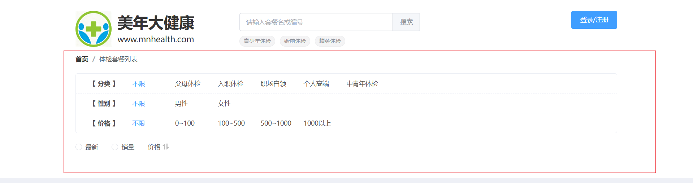

## 视图层

创建 `src/views/front/goods_list.vue` 页面，并且在视图层中定义相关控件

```html
<template>
    <!-- 面包屑导航组件，用于显示当前页面在网站结构中的位置 -->
    <el-breadcrumb separator="/" class="breadcrumb">
        <!-- 首页面包屑项，点击可跳转到首页 -->
        <el-breadcrumb-item :to="{ name: 'FrontIndex' }">首页</el-breadcrumb-item>
        <!-- 当前页面面包屑项，显示为体检套餐列表页面 -->
        <el-breadcrumb-item>体检套餐列表</el-breadcrumb-item>
    </el-breadcrumb>
    
    <!-- 搜索条件筛选区域，包含分类、性别、价格等多维度筛选 -->
    <div class="search-rows">
        <!-- 分类筛选行：使用Element Plus的栅格布局，gutter="0"表示列间无间隔 -->
        <el-row gutter="0" class="row">
            <!-- 分类标签，占据2列宽度 -->
            <el-col :span="2"><span class="label">【 分类 】</span></el-col>
            <!-- 动态渲染分类选项，每个选项占据2列宽度 -->
            <el-col :span="2" v-for="one in condition.type" :key="one.name">
                <!-- 条件选项，根据active状态切换样式，点击触发筛选 -->
                <span :class="one.active ? 'item active' : 'item'"
                    @click="selectHandle('type', one.name)">
                    {{ one.name }}
                </span>
            </el-col>
        </el-row>
        
        <!-- 性别筛选行：结构与分类筛选行类似 -->
        <el-row gutter="0" class="row">
            <el-col :span="2"><span class="label">【 性别 】</span></el-col>
            <el-col :span="2" v-for="one in condition.sex" :key="one.name">
                <span :class="one.active ? 'item active' : 'item'"
                    @click="selectHandle('sex', one.name)">
                    {{ one.name }}
                </span>
            </el-col>
        </el-row>
        
        <!-- 价格区间筛选行：提供不同价格范围的筛选选项 -->
        <el-row gutter="0" class="row">
            <el-col :span="2"><span class="label">【 价格 】</span></el-col>
            <el-col :span="2" v-for="one in condition.priceType" :key="one.name">
                <span :class="one.active ? 'item active' : 'item'"
                    @click="selectHandle('priceType', one.name)">
                    {{ one.name }}
                </span>
            </el-col>
        </el-row>
    </div>
    
    <!-- 排序筛选区域：提供多种排序方式选择 -->
    <div class="search-filter">
        <!-- 排序单选按钮组，v-model绑定当前选中的排序方式 -->
        <el-radio-group v-model="radio" @change="selectRadio">
            <!-- 按最新排序选项 -->
            <el-radio label="最新" size="large">最新</el-radio>
            <!-- 按销量排序选项 -->
            <el-radio label="销量" size="large">销量</el-radio>
        </el-radio-group>
        
        <!-- 价格排序操作区域，点击可切换升序/降序 -->
        <div class="sort-operate" @click="selectPrice">
            <span>价格</span>
            <!-- 价格排序图标，根据排序状态显示不同图标 -->
            <SvgIcon :name="priceOrder.icon" class="sort-icon" />
        </div>
    </div>
</template>
```

## 模型层

接下来我们要给新创建的VUE定义模型层，代码如下

```typescript
<script lang="ts" setup>
  import { reactive, ref, Ref, getCurrentInstance} from 'vue';
  import router from '../../router/index';
  import SvgIcon from '../../components/SvgIcon.vue';
  const { proxy } = getCurrentInstance();
    
  let radio = ref(null);
    
  const priceOrder = reactive({
      icon: 'sort-default' // sort-asc 升序图标。sort-desc 降序图标。
  });
    
  const dataForm = reactive({
      keyword: null,
      type: null,
      sex: null,
      priceType: null,
      orderType: null
  });
  
  const condition = reactive({
      type: [
          { name: '不限', active: true },
          { name: '父母体检', active: false },
          { name: '入职体检', active: false },
          { name: '职场白领', active: false },
          { name: '个人高端', active: false },
          { name: '中青年体检', active: false }
      ],
      sex: [
          { name: '不限', active: true }, 
          { name: '男性', active: false }, 
          { name: '女性', active: false }
      ],
      priceType: [
          { name: '不限', active: true },
          { name: '0~100', value: 1, active: false },
          { name: '100~500', value: 2, active: false },
          { name: '500~1000', value: 3, active: false },
          { name: '1000以上', value: 4, active: false }
      ]
  });
</script>
```

## 样式

创建goods_list.less文件，然后在VUE页面中引用LESS文件

```html
<style lang="less" scoped>
    @import url('goods_list.less');
</style>
```

在goods_list.less文件中，定义视图层控件需要的样式

```plaintext
// 导入公共样式文件
@import url('../style.less');

// 面包屑导航样式
.breadcrumb {
    margin-top: 20px;  // 顶部间距
}

// 搜索条件筛选区域样式
.search-rows {
    border: solid 1px @border-color-22;  // 边框样式，使用预定义边框颜色变量
    border-radius: 5px;                  // 圆角边框
    margin-top: 25px;                    // 顶部外边距
    user-select: none;                   // 禁止文本选择
    
    // 筛选行通用样式
    .row {
        padding: 12px 30px;              // 内边距：上下12px，左右30px
        border-bottom: dashed 1px @border-color-22;  // 底部虚线边框
        font-size: 14px;                 // 字体大小
        color: @font-color-2;            // 字体颜色，使用预定义颜色变量

        // 最后一行移除底部边框
        &:last-of-type {
            border-bottom: none;
        }
        
        // 筛选标签样式（如"【 分类 】"）
        .label {
            font-weight: bold;           // 加粗显示
        }
        
        // 筛选选项项通用样式
        .item {
            cursor: pointer;             // 鼠标悬停显示手型指针
        }
        
        // 激活状态的筛选选项样式
        .active {
            color: @font-color-27;       // 激活状态颜色，使用预定义颜色变量
        }
    }
}

// 排序筛选区域样式
.search-filter {
    display: flex;                       // 弹性布局，水平排列子元素
    margin-top: 10px;                    // 顶部外边距
    margin-bottom: 10px;                 // 底部外边距
    
    // 价格排序操作区域样式
    .sort-operate {
        display: flex;                   // 弹性布局，水平排列文字和图标
        margin-left: 30px;               // 左侧外边距，与单选按钮组保持间距
        margin-top: 10px;                // 顶部外边距，垂直对齐
        cursor: pointer;                 // 鼠标悬停显示手型指针
        
        // 价格文字样式
        span {
            font-size: 14px;             // 字体大小
            color: @font-color-25;       // 字体颜色，使用预定义颜色变量
        }
        
        // 排序图标样式
        .sort-icon {
            width: 16px;                 // 图标宽度
            height: 16px;                // 图标高度
            margin-left: 5px;            // 左侧外边距，与文字保持间距
            margin-top: 1px;             // 顶部微调，实现视觉对齐
        }
    }
}
```

## 配置路由

在index.ts路由文件中，为新创建的VUE页面配置路由信息

```typescript

const routes : Array<RouteRecordRaw> = [
    {
        path: '/front',
        name: 'Front',
        component: () => import('../views/front/main.vue'),
        children: [
            ……,
            {
                path: 'goods_list',
                name: 'FrontGoodsList',
                component: () => import('../views/front/goods_list.vue')
            }
        ]
    },
    ……
];
```

# 实现业务端 goods_list 页的商品列表

由于商品数量庞大，无法在列表页面一次性展示全部内容，因此需要采用分页显示机制。不过，这里的分页方式与MIS端有所不同——我们将实现“无限滚动”的分页效果。

这种效果类似于淘宝APP的浏览体验：当用户不断向下滚动页面时，系统会自动加载并显示更多商品，实现无需点击翻页的无缝浏览体验。

这种效果是通过 `<font style="color:rgb(15, 17, 21);">v-infinite-scroll="load"</font>`来实现的，当滚动时会自动调用回调函数 `<font style="color:rgb(15, 17, 21);">load</font>`，这个函数我们后期再写。


## 视图层

在 `<font style="color:rgb(15, 17, 21);background-color:rgb(235, 238, 242);">goods_list.vue</font>` 页面中，我们需要添加与商品列表相关的布局标签。对于商品卡片的内部排版，由于之前在 `<font style="color:rgb(15, 17, 21);background-color:rgb(235, 238, 242);">index.vue</font>` 页面中已经实现过相同的布局结构，这里可以直接复用那套成熟的样式方案。

```html
<div class="goods-container">
    <!-- 商品列表容器，使用v-infinite-scroll指令实现无限滚动加载 -->
    <ul class="goods-list" v-infinite-scroll="load">
        <!-- 遍历商品数据列表，生成商品项 -->
        <li class="item" v-for="(one, index) in data.dataList"
            :style="(index + 1) % 4 == 0 ? 'margin-right:0' : ''">  <!-- 每行第4个商品移除右边距 -->
            <div class="card">
                <!-- 商品图片 -->
                
                <!-- 商品标题 -->
                <h4>{{ one.title }}</h4>
                <!-- 商品描述，使用Element Plus的提示框组件 -->
                <el-tooltip class="box-item" effect="dark" placement="top">
                    <template #content>
                        <div style="width: 260px;">{{ one.description }}</div>
                    </template>
                    <p class="desc">
                        <span>折</span>  <!-- 折扣标签 -->
                        {{ one.description }}
                    </p>
                </el-tooltip>
                <!-- 价格信息区域 -->
                <p class="price">
                    <span class="current">￥{{ one.currentPrice }}</span>  <!-- 当前价格 -->
                    <span class="old">￥{{ one.originalPrice }}</span>      <!-- 原价 -->
                    <span class="sale">已售{{ one.salesVolume }}</span>    <!-- 销量 -->
                </p>
                <!-- 立即购买按钮 -->
                <input type="button" class="buy-btn" value="立即购买"
                    @click="buyHandle(one.id)" />
            </div>
        </li>
    </ul>
</div>
```

## 模型层

```typescript
const data = reactive({
    dataList: [
        {
            title: "银龄关怀健康呵护套餐",
            coverImage: `${proxy.$minioUrl}/front/goods/d079bf3cfbe64aa9b5e17a2e77244bb7.jpg`,
            description: "「感恩回馈季 到检享优惠」适用对象：中老年群体及心血管健康关注者 （参与买一赠一活动 需在购物车内选择2件商品）",
            currentPrice: 5000.00,
            originalPrice: 8000.00,
            salesVolume: 888
        },
        {
            title: "银龄关怀健康呵护套餐",
            coverImage: `${proxy.$minioUrl}/front/goods/d079bf3cfbe64aa9b5e17a2e77244bb7.jpg`,
            description: "「感恩回馈季 到检享优惠」适用对象：中老年群体及心血管健康关注者 （参与买一赠一活动 需在购物车内选择2件商品）",
            currentPrice: 5000.00,
            originalPrice: 8000.00,
            salesVolume: 888
        },
        {
            title: "银龄关怀健康呵护套餐",
            coverImage: `${proxy.$minioUrl}/front/goods/d079bf3cfbe64aa9b5e17a2e77244bb7.jpg`,
            description: "「感恩回馈季 到检享优惠」适用对象：中老年群体及心血管健康关注者 （参与买一赠一活动 需在购物车内选择2件商品）",
            currentPrice: 5000.00,
            originalPrice: 8000.00,
            salesVolume: 888
        },
        {
            title: "银龄关怀健康呵护套餐",
            coverImage: `${proxy.$minioUrl}/front/goods/d079bf3cfbe64aa9b5e17a2e77244bb7.jpg`,
            description: "「感恩回馈季 到检享优惠」适用对象：中老年群体及心血管健康关注者 （参与买一赠一活动 需在购物车内选择2件商品）",
            currentPrice: 5000.00,
            originalPrice: 8000.00,
            salesVolume: 888
        },
        {
            title: "银龄关怀健康呵护套餐",
            coverImage: `${proxy.$minioUrl}/front/goods/d079bf3cfbe64aa9b5e17a2e77244bb7.jpg`,
            description: "「感恩回馈季 到检享优惠」适用对象：中老年群体及心血管健康关注者 （参与买一赠一活动 需在购物车内选择2件商品）",
            currentPrice: 5000.00,
            originalPrice: 8000.00,
            salesVolume: 888
        },
        {
            title: "银龄关怀健康呵护套餐",
            coverImage: `${proxy.$minioUrl}/front/goods/d079bf3cfbe64aa9b5e17a2e77244bb7.jpg`,
            description: "「感恩回馈季 到检享优惠」适用对象：中老年群体及心血管健康关注者 （参与买一赠一活动 需在购物车内选择2件商品）",
            currentPrice: 5000.00,
            originalPrice: 8000.00,
            salesVolume: 888
        },
    ],
    pageIndex: 0, // 这个是当前页码，为什么从0开始，mis端都是从1开始呀。这个后面再说。
    pageSize: 12, // 12正好是4的倍数，三行比较好看。
    totalCount: 0,
    isLast: false // 是否为最后一页的标记。
});
```

## 样式

在goods_list.less文件中定义视图层控件用到的CSS样式，代码如下：

```plaintext
.goods-container {
    .goods-list {
        overflow: hidden;       // 清除浮动，防止高度塌陷
        list-style: none;      // 移除列表默认样式
        margin: 0;             // 外边距归零
        padding: 0;            // 内边距归零
        .item {
            width: 280px;      // 固定商品项宽度
            float: left;       // 左浮动实现横向排列
            margin-right: 26px; // 商品项右侧间距
            margin-bottom: 50px; // 商品项底部间距
            .card {
                img {
                    width: 280px;  // 商品图片固定宽度
                }
                h4 {
                    font-size: 18px;      // 商品标题字体大小
                    font-weight: normal;  // 正常字体粗细
                    color: @font-color-1;         // 使用主字体颜色变量
                    margin: 10px 0 5px 0; // 上下外边距
                    overflow: hidden;     // 超出隐藏
                    text-overflow: ellipsis;  // 文本溢出显示省略号
                    white-space: nowrap;  // 禁止换行
                }

                .desc {
                    display: -webkit-box;      // 使用Webkit盒子模型
                    -webkit-box-orient: vertical;  // 垂直方向排列
                    -webkit-line-clamp: 2;     // 限制显示2行
                    overflow: hidden;          // 超出隐藏
                    font-size: 12px;           // 描述文字大小
                    color: @font-color-3;              // 使用辅助字体颜色变量
                    margin: 0 0 5px 0;         // 底部外边距
                    line-height: 1.5;          // 行高
                    height: 36px;              // 固定高度，确保布局一致
                    span {
                        background-color: @bg-color-27;  // 折扣标签背景色
                        color: #fff;           // 标签文字白色
                        padding: 2px;          // 内边距
                        font-size: 11px;       // 标签文字大小
                    }
                }
                .price {
                    margin: 0;                 // 价格区域外边距归零
                    overflow: hidden;          // 清除浮动
                    .current {
                        color: @font-color-23;         // 当前价格颜色
                        font-size: 22px;       // 当前价格字体大小
                        font-weight: bold;     // 粗体显示
                        float: left;           // 左浮动
                    }
                    .old {
                        float: left;           // 左浮动
                        font-size: 13px;       // 原价字体大小
                        color: @font-color-3;          // 使用辅助字体颜色变量
                        text-decoration: line-through;  // 删除线效果
                        margin-left: 10px;     // 左侧间距
                        margin-top: 7px;       // 顶部间距用于垂直对齐
                    }
                    .sale {
                        float: right;          // 右浮动
                        font-size: 12px;       // 销量字体大小
                        color: @font-color-3;          // 使用辅助字体颜色变量
                        margin-top: 7px;       // 顶部间距用于垂直对齐
                    }
                }
                .buy-btn {
                    width: 100%;               // 按钮宽度100%
                    background-color: @button-color-10;  // 按钮背景色
                    border: none;              // 无边框
                    border-radius: 3px;        // 圆角边框
                    height: 40px;              // 按钮高度
                    color: #fff;               // 文字白色
                    font-size: 15px;           // 文字大小
                    margin-top: 10px;          // 顶部间距
                    outline: none;             // 移除轮廓线
                    cursor: pointer;           // 手型光标
                    &:active {
                        background-color: @button-active-color-10;  // 按钮按下状态背景色
                    }
                }
            }
        }
    }
}
```

# 实现业务端 Customer 框架页面


## 创建 customer.vue 框架页

由于业务端的帐户信息、我的订单、体检预约和客服咨询页面都包含相同的左侧菜单，因此我将这部分公共内容提取到框架页面中统一定义，并通过该框架页面引用其他Vue页面。具体实现为创建 `<font style="color:rgb(15, 17, 21);background-color:rgb(235, 238, 242);">src/views/front/customer.vue</font>` 页面，并在视图层中定义相关标签。（在 `<font style="color:rgb(15, 17, 21);">front</font>`目录下新建 `<font style="color:rgb(15, 17, 21);">customer.vue</font>`页面）

```html
<template>
    <div class="customer-container">
        <el-menu :default-active="active" class="menu" @select="selectHandle">
            <el-menu-item index="FrontMine">
                <el-icon>
                    <User />
                </el-icon>
                <span>账户信息</span>
            </el-menu-item>
            <el-menu-item index="FrontOrderList">
                <el-icon>
                    <Tickets />
                </el-icon>
                <span>我的订单</span>
            </el-menu-item>
            <el-menu-item index="FrontAppointmentList">
                <el-icon>
                    <Files />
                </el-icon>
                <span>体检预约</span>
            </el-menu-item>
            <el-menu-item index="FrontCustomerIm">
                <el-icon>
                    <Collection />
                </el-icon>
                <span>客服咨询</span>
            </el-menu-item>
        </el-menu>
        <div class="content"><router-view /></div>
    </div>

</template>
```

## 编写模型层

```typescript
<script lang="ts" setup>

    import { reactive, ref, type Ref, getCurrentInstance } from 'vue';
    import router from '../../router/index';

    const { proxy } = getCurrentInstance();

    // 响应式对象决定哪个被菜单被激活。
    let active = ref('FrontMine');

</script>
```

## 编写样式

在 `front`目录新建 `customer.less`文件，然后编写样式：

```plaintext
/* 引入公共样式文件 */
@import url('../style.less');

/* 客户中心主容器 */
.customer-container{
        margin-top: 30px;        /* 顶部外边距 */
        display: flex;           /* 启用弹性布局 */
}

/* 左侧菜单区域样式 */
.menu{
        width: 170px;            /* 固定宽度 */
        border-right: 1px solid @border-color-4;  /* 右侧分隔线，使用主题颜色变量 */
}

/* 右侧内容区域样式 */
.content{
        margin-left: 15px;       /* 左侧外边距，与菜单保持间距 */
        flex-grow: 1;            /* 弹性增长，占据剩余所有空间 */
}
```

然后在 `customer.vue`中引入 `less`文件：

```html
<style lang="less" scoped>
    @import url('customer.less');
</style>
```

## 配置路由信息

打开 `router/index.ts`文件，然后配置以下信息：

```typescript
// 业务端
{
    path: '/front',
    name: 'Front',
    component: () => import('../views/front/main.vue'),
    children: [
        ......,
        // 在这里添加
        {
            path: 'customer',
            name: 'FrontCustomer',
            component: () => import('../views/front/customer.vue')
        }
    ]
},
```

# 实现业务端账户信息页面


## 编写视图层

创建 `front/mine.vue`文件，在该文件中编写视图层：

```html
<template>
    <div class="summary-container">
        <el-card class="box-card" shadow="never">
            <div class="info">
                <div class="left">
                    <el-avatar :size="45" shape="square" :src="data.photoUrl">
                        <el-icon size="25">
                            <UserFilled />
                        </el-icon>
                    </el-avatar>
                </div>
                <div class="right">
                    <div class="base">
                        <span>姓名：{{ data.customerName }}</span>
                        <span>性别：{{ data.gender }}</span>
                        <span>电话号码：{{ data.phone }}</span>
                        <div class="operate" @click="updateHandle">
                            <el-icon :size="18">
                                <Edit />
                            </el-icon>
                            <div>修改资料</div>
                        </div>
                    </div>
                    <p>注册时间：{{ data.registerTime }}</p>
                </div>
            </div>
            <el-divider />
            <el-row :gutter="16">
                <el-col :span="6">
                    <div class="statistic-card">
                        <el-statistic :value="data.amount" suffix="元">
                            <template #title>
                                <div class="title">累计消费金额</div>
                            </template>
                        </el-statistic>
                    </div>
                </el-col>
                <el-col :span="5">
                    <div class="statistic-card">
                        <el-statistic :value="data.count" suffix="笔">
                            <template #title>
                                <div class="title">有效订单数量</div>
                            </template>
                        </el-statistic>
                    </div>
                </el-col>
                <el-col :span="5">
                    <div class="statistic-card">
                        <el-statistic :value="data.number" suffix="个">
                            <template #title>
                                <div class="title">体检套餐数量</div>
                            </template>
                        </el-statistic>
                    </div>
                </el-col>
            </el-row>
        </el-card>
    </div>
</template>
```

## 编写模型层

为上面视图层提供数据：

```typescript
<script lang="ts" setup>
    import { reactive, ref, type Ref, getCurrentInstance } from 'vue';
    import router from '../../router/index';
    const { proxy } = getCurrentInstance();

    const data = reactive({
        customerName: "东邪西毒",
        gender: "男",
        phone: "18888888888",
        photoUrl: null,
        registerTime: "2025-10-01",
        count: 10,
        number: 5,
        amount: 8888
    });
</script>
```

## 编写样式

创建 `front/mine.less`文件，编写 `less`样式

```plaintext
/* 引入公共样式文件 */
@import url('../style.less');

/* 概览页面主容器 */
.summary-container {
    min-height: 632px;  /* 设置最小高度 */
    .box-card {
        cursor: default;    /* 默认光标样式 */
        user-select: none;  /* 禁止文本选中 */
        .info {
            display: flex;  /* 弹性布局 */
            .left {
                /* 左侧区域样式 */
            }
            .right {
                margin-left: 15px;   /* 左侧外边距 */
                flex-grow: 1;        /* 占据剩余空间 */
                .base {
                    font-size: 14px;
                    color: @font-color-1;
                    margin-bottom: 8px;
                    overflow: hidden;  /* 清除浮动 */
                    span {
                        border-right: solid 1px @border-color-7;  /* 右侧边框分隔 */
                        padding: 0 30px;
                        &:first-of-type {
                            padding-left: 0;  /* 第一个元素取消左内边距 */
                        }
                        &:last-of-type {
                            border-right: none;  /* 最后一个元素取消右边框 */
                        }
                    }
                    .operate {
                        float: right;      /* 右浮动 */
                        display: flex;     /* 弹性布局 */
                        cursor: pointer;   /* 手型光标 */
                        .el-icon {
                            margin-top: 2px;
                            color: @font-color-27;
                        }
                        div {
                            font-size: 14px;
                            margin-left: 5px;
                            color: @font-color-27;
                        }
                    }
                }
                p {
                    margin-top: 0;
                    font-size: 13px;
                    margin-bottom: 6px;
                    color: @font-color-3;
                }
            }
        }
    }
}

/* 统计组件样式覆盖 */
.el-statistic {
    --el-statistic-content-font-size: 30px;  /* 设置统计数字字体大小 */
}

/* 统计卡片样式 */
.statistic-card {
    padding: 20px;  /* 内边距 */
    .title {
        align-items: center;  /* 垂直居中 */
        font-size: 14px;      /* 字体大小 */
    }
}
```

在 `mine.vue`页面引入样式文件：

```html
<style lang="less" scoped>
    @import url(mine.less);
</style>
```

## 配置路由信息

在 `router/index.ts`中配置以下路由信息：

```typescript
{
    path: 'customer',
    name: 'FrontCustomer',
    component: () => import('../views/front/customer.vue'),
    // 以下代码为新增代码
    children: [
        {
            path: 'mine',
            name: 'FrontMine',
            component: () => import('../views/front/mine.vue')
        }
    ]
}
```

测试，访问地址为：[http://localhost:5173/front/customer/mine](http://localhost:5173/front/customer/mine)

# 实现业务端订单列表页面

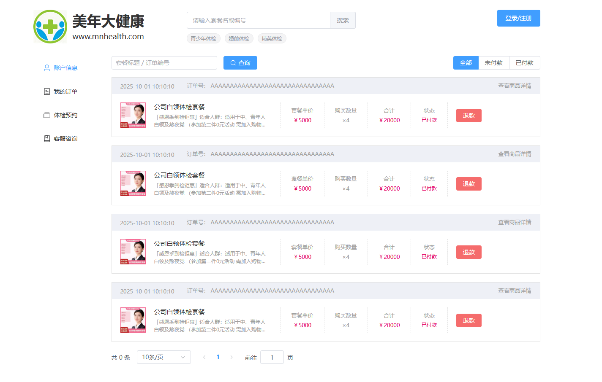

## 编写视图层

在 `front`目录下新建 `order_list.vue`文件，编写以下模型层代码：

```html
<template>
    <el-form :inline="true" :model="dataForm" :rules="dataRule" ref="form">
        <el-form-item prop="keyword">
            <el-input v-model="dataForm.keyword" placeholder="套餐标题 / 订单编号"
                size="medium" class="keyword" maxlength="32" clearable="clearable" />
        </el-form-item>
        <el-form-item>
            <el-button size="medium" type="primary" :icon="Search"
                @click="searchHandle()">查询</el-button>
        </el-form-item>
        <el-form-item class="mold">
            <el-radio-group v-model="dataForm.statusLabel" size="medium"
                @change="searchHandle()">
                <el-radio-button label="全部"></el-radio-button>
                <el-radio-button label="未付款"></el-radio-button>
                <el-radio-button label="已付款"></el-radio-button>
            </el-radio-group>
        </el-form-item>
    </el-form>
    <div class="order-list" v-show="!empty">
        <div class="order" v-for="one in data.dataList">
            <div class="header">
                <div class="datetime">{{ one.createTime }}</div>
                <div class="uuid">
                    订单号：
                    <span>{{ one.outTradeNo }}</span>
                </div>
                <div class="detail" @click="searchDetailHandle(one.snapshotId)">
                    查看商品详情
                </div>
            </div>
            <div class="content">
                
                <div class="info">
                    <h4>{{ one.goodsTitle }}</h4>
                    <p>{{ one.goodsDescription }}</p>
                </div>
                <div class="price">
                    <span class="label">套餐单价</span>
                    <span class="value">￥{{ one.goodsPrice }}</span>
                </div>
                <div class="number">
                    <span class="label">购买数量</span>
                    <span class="value">×{{ one.quantity }}</span>
                </div>
                <div class="amount">
                    <span class="label">合计</span>
                    <span class="value">￥{{ one.totalAmount }}</span>
                </div>
                <div class="status">
                    <span class="label">状态</span>
                    <span class="value">{{ one.orderStatus }}</span>
                </div>
                <div class="operate">
                    <el-button v-if="one.orderStatus == '未付款'" type="primary"
                        :disabled="one.disabled"
                        @click="paymentHandle(one.outTradeNo)">
                        付款
                    </el-button>
                    <el-button v-if="one.orderStatus == '未付款'" type="danger"
                        @click="closeOrderHandle(one.id)">
                        取消订单
                    </el-button>
                    <el-button v-if="one.orderStatus == '已付款'" type="primary"
                        :disabled="one.appointCount == one.quantity"
                        @click="appointHandle(one.id, one.quantity, one.appointCount)">
                        预约体检
                    </el-button>
                    <el-button v-if="one.orderStatus == '已结束'">获取发票</el-button>
                    <el-button v-if="one.orderStatus == '已付款'" type="danger"
                        :disabled="one.appointCount > 0"
                        @click="refundHandle(one.id)">
                        退款
                    </el-button>
                </div>
            </div>
        </div>
        <el-pagination @size-change="sizeChangeHandle"
            @current-change="currentChangeHandle" :current-page="data.pageIndex"
            :page-sizes="[10, 20, 50]" :page-size="data.pageSize"
            :total="data.totalCount"
            layout="total, sizes, prev, pager, next, jumper"></el-pagination>
    </div>
    <div class="empty" v-show="empty">
        <el-empty :image-size="200" />
    </div>


</template>
```

## 编写模型层

为视图层准备数据：

```typescript
<script lang="ts" setup>
    import { reactive, ref, type Ref, getCurrentInstance } from 'vue';
    import { Search } from '@element-plus/icons-vue';
    import router from '../../router/index';
  
    import { dayjs } from 'element-plus';
    import isBetween from 'dayjs/plugin/isBetween';
    dayjs.extend(isBetween);

    const { proxy } = getCurrentInstance();
  
    let empty = ref(false);
  
    const dataForm = reactive({
        keyword: null,
        statusLabel: '全部',
        status: null
    });
  
    const dataRule = reactive({
        keyword: [
          { required: false, pattern: '^[a-zA-Z0-9\u4e00-\u9fa5]{1,32}$', message: '关键字内容不正确' }
        ]
    });
  
    const data = reactive({
        dataList: [
            {
                createTime:"2025-10-01 10:10:10",
                outTradeNo:"AAAAAAAAAAAAAAAAAAAAAAAAAAAAAAAA",
                snapshotId:"888888",
                goodsImage:`${proxy.$minioUrl}/front/goods/d079bf3cfbe64aa9b5e17a2e77244bb7.jpg`,
                goodsTitle:"公司白领体检套餐",
                goodsDescription:"「感恩季到检钜惠」适合人群：适用于中、青年人白领及熬夜党 （参加第二件0元活动 需加入购物车后数量选2）",
                goodsPrice:5000,
                quantity:4,
                totalAmount:20000,
                orderStatus:"已付款"
            },
            {
                createTime:"2025-10-01 10:10:10",
                outTradeNo:"AAAAAAAAAAAAAAAAAAAAAAAAAAAAAAAA",
                snapshotId:"888888",
                goodsImage:`${proxy.$minioUrl}/front/goods/d079bf3cfbe64aa9b5e17a2e77244bb7.jpg`,
                goodsTitle:"公司白领体检套餐",
                goodsDescription:"「感恩季到检钜惠」适合人群：适用于中、青年人白领及熬夜党 （参加第二件0元活动 需加入购物车后数量选2）",
                goodsPrice:5000,
                quantity:4,
                totalAmount:20000,
                orderStatus:"已付款"
            },
            {
                createTime:"2025-10-01 10:10:10",
                outTradeNo:"AAAAAAAAAAAAAAAAAAAAAAAAAAAAAAAA",
                snapshotId:"888888",
                goodsImage:`${proxy.$minioUrl}/front/goods/d079bf3cfbe64aa9b5e17a2e77244bb7.jpg`,
                goodsTitle:"公司白领体检套餐",
                goodsDescription:"「感恩季到检钜惠」适合人群：适用于中、青年人白领及熬夜党 （参加第二件0元活动 需加入购物车后数量选2）",
                goodsPrice:5000,
                quantity:4,
                totalAmount:20000,
                orderStatus:"已付款"
            },
            {
                createTime:"2025-10-01 10:10:10",
                outTradeNo:"AAAAAAAAAAAAAAAAAAAAAAAAAAAAAAAA",
                snapshotId:"888888",
                goodsImage:`${proxy.$minioUrl}/front/goods/d079bf3cfbe64aa9b5e17a2e77244bb7.jpg`,
                goodsTitle:"公司白领体检套餐",
                goodsDescription:"「感恩季到检钜惠」适合人群：适用于中、青年人白领及熬夜党 （参加第二件0元活动 需加入购物车后数量选2）",
                goodsPrice:5000,
                quantity:4,
                totalAmount:20000,
                orderStatus:"已付款"
            }
        ],
        pageIndex: 1,
        pageSize: 10,
        totalCount: 0,
        loading: false
    });
</script>
```

## 编写样式

新建 `front/order_list.less`文件，编写样式：

```plaintext
/* 引入公共样式文件 */
@import url('../style.less');

/* 表单项全局样式调整 */
.el-form-item{
    margin-right: 15px !important;  /* 强制设置右侧间距，用于表单布局的间隔 */
}

/* 关键词搜索框样式 */
.keyword{
    width: 250px;  /* 固定宽度，用于搜索输入框 */
}

/* 模式选择器样式（位于表单右侧） */
.mold{
    float: right;              /* 右浮动布局 */
    margin-right: 0px !important;  /* 取消右侧边距，避免与其他元素产生间隙 */
}

/* 订单列表主容器 */
.order-list{
    min-height: 582px;  /* 设置最小高度，确保即使无内容也有适当高度 */
    .order{
        border: solid 1px @border-color-1;  /* 边框样式 */
        margin-bottom: 20px;                 /* 底部外边距，订单项之间的间隔 */
        width: 100%;                         /* 宽度占满父容器 */
        cursor: default;                     /* 默认光标样式 */
        .header{
            overflow: hidden;                /* 清除浮动 */
            font-size: 13px;
            color: @font-color-3;
            background-color: @bg-color-1;   /* 头部背景色 */
            padding: 10px 20px;              /* 内边距 */
            .datetime{
                margin-top: 2px;
                margin-right: 30px;          /* 与后续元素的间距 */
                float: left;                 /* 左浮动布局 */
                user-select: none;           /* 禁止文本选中 */
            }
            .uuid{
                float: left;                 /* 左浮动布局，订单号显示 */
            }
            .detail{
                float: right;                /* 右浮动布局 */
                cursor: pointer;             /* 手型光标，表示可点击 */
                user-select: none;           /* 禁止文本选中 */
                &:hover{
                    color: @font-color-27;   /* 鼠标悬停时颜色变化 */
                }
            }
        }
        .content{
            display: flex;                   /* 弹性布局，水平排列子元素 */
            padding: 20px;                   /* 内边距 */
            user-select: none;               /* 禁止文本选中 */
            .image{
                width: 60px;                 /* 图片固定宽度 */
                height: 60px;                /* 图片固定高度 */
            }
            .info{
                width: 280px;                /* 信息区域固定宽度 */
                margin-left: 20px;           /* 左侧外边距，与图片间隔 */
                border-right: dashed 1px @border-color-1;  /* 右侧虚线分隔线 */
                padding-right: 25px;         /* 右侧内边距 */
                h4{
                    font-size: 15px;
                    color: @font-color-1;
                    font-weight: normal;     /* 取消加粗 */
                    margin-top: 0;           /* 清除默认上边距 */
                    margin-bottom: 5px;      /* 底部边距 */
                    padding: 0;              /* 清除内边距 */
                }
                p{
                    margin: 0;               /* 清除外边距 */
                    padding: 0;              /* 清除内边距 */
                    font-size: 12px;
                    color: @font-color-3;
                    overflow: hidden;        /* 溢出隐藏 */
                    display: -webkit-box;    /* 弹性盒模型，用于多行文本截断 */
                    -webkit-box-orient: vertical;  /* 垂直方向排列 */
                    -webkit-line-clamp: 2;   /* 限制显示两行 */
                    line-height: 1.5;        /* 行高设置 */
                }
            }
            .label{
                display: block;              /* 块级元素 */
                text-align: center;          /* 文本居中 */
                font-size: 13px;
                color: @font-color-3;
                margin-top: 10px;            /* 上边距 */
            }
            .value {
                display: block;              /* 块级元素 */
                text-align: center;          /* 文本居中 */
                font-size: 13px;
                color: @font-color-23;
                margin-top: 6px;             /* 上边距，与标签的间隔 */
            }
            .border{
                border-right: dashed 1px @border-color-1;  /* 右侧虚线分隔线混合器 */
                padding: 0 25px;             /* 左右内边距 */
            }
            .price, .amount{
                .border;  /* 应用border混合器，价格和数量区域样式 */
            }
            .number{
                .border;  /* 应用border混合器，订单编号区域样式 */
                .value{
                    color: @font-color-3;    /* 数值颜色 */
                }
            }
            .status{
                .border;  /* 应用border混合器，状态区域样式 */
                .value{
                    color: @font-color-23;   /* 状态值颜色 */
                    font-size: 12px;         /* 字体大小稍小 */
                }
            }
            .operate{
                margin-left: 20px;           /* 左侧外边距，与其他内容间隔 */
                padding-top: 15px;           /* 顶部内边距，垂直居中调整 */
            }
        }
    }
}

/* 空状态容器样式 */
.empty{
    height: 600px;  /* 固定高度，用于无订单数据时的占位显示 */
}
```

在 `order_list.vue`文件中引入 `order_list.less`文件：

```plaintext
<style lang="less" scoped>
    @import url(order_list.less);
</style>
```

## 配置路由

在 `router/index.ts`文件中配置路由：

```typescript
{
    path: 'customer',
    name: 'FrontCustomer',
    component: () => import('../views/front/customer.vue'),
    children: [
        {
            path: 'mine',
            name: 'FrontMine',
            component: () => import('../views/front/mine.vue')
        },
        // 以下是新增的路由配置。
        {
            path: 'order_list',
            name: 'FrontOrderList',
            component: () => import('../views/front/order_list.vue')
        },
    ]
}
```

访问地址：[http://localhost:5173/front/customer/order_list](http://localhost:5173/front/customer/order_list)

# 后端实现发送短信验证码的 RESTful 接口

## 实现思路

1. 用户点击发送短信验证码的按钮，发送 ajax 请求，提交手机号。
2. 后端 form 接收到手机号并验证手机号合法性。
3. 执行对应的 Controller 方法，Controller 方法接收到手机号，然后调用 service 方法来发送短信验证码。
4. service 来处理核心业务：
  1. 生成 6 位验证码。
  2. 将验证码缓存到 redis 中，5 分钟内有效。缓存到 redis 中的 key 为：`sms_code_电话号码`
  3. 调用运营商的发送短信 API，运营商发送短信到用户手机上。
5. 怎么防止用户频繁点击发送短信验证码按钮？
  1. 假设我们允许用户第二次再点击发送验证码的时间间隔为 1 分钟。
  2. 我们可以在 redis 中再存储一份验证码数据，缓存到 redis 中的 key 为：`sms_code_refresh_电话号码`
  3. 该 key 在 1 分钟内有效。

## 编写 Service 接口和实现

在 `front`包下新建 `CustomerService`接口，在接口中定义以下方法：

```java
package com.jkweilai.meinian.api.front.service;

public interface CustomerService {
    
    boolean sendSmsCode(String phone);
    
}
```

编写接口的实现，代码如下：

```java
package com.jkweilai.meinian.api.front.service.impl;

import cn.hutool.core.util.RandomUtil;
import com.jkweilai.meinian.api.front.service.CustomerService;
import jakarta.annotation.Resource;
import org.springframework.data.redis.core.RedisTemplate;
import org.springframework.stereotype.Service;

import java.util.concurrent.TimeUnit;

@Service
public class CustomerServiceImpl implements CustomerService {

    // 需要操作redis缓存，注入它。
    @Resource
    private RedisTemplate<String, Object> redisTemplate;

    @Override
    public boolean sendSmsCode(String phone) {

        // 生成验证码
        String code = RandomUtil.randomNumbers(6);
        // 将验证码输出到控制台
        System.out.println(code);

        // 判断缓存中有没有 sms_code_refresh_电话号码  的key，如果还有这个key，表示用户还得再等等，等完1分钟之后才能再次发送短信验证码。
        if (redisTemplate.hasKey("sms_code_refresh_" + phone)) {
            return false;
        }

        // 程序能执行到这里，说明没有这个key，代表用户可以再次发送短信验证码
        // 把 sms_code_refresh_电话号码  这个数据放到redis缓存中
        redisTemplate.opsForValue().set("sms_code_refresh_" + phone, code);
        // 设置缓存有效期为1分钟
        redisTemplate.expire("sms_code_refresh_" + phone, 1, TimeUnit.MINUTES);

        // 将验证码缓存到redis中
        redisTemplate.opsForValue().set("sms_code_" + phone, code);
        // 设置缓存的有效期为5分钟
        redisTemplate.expire("sms_code_" + phone, 5, TimeUnit.MINUTES);

        // 调用短信运营商的API接口，让运营商发送短信
        return true;
    }
}
```

## 编写 form 接收手机号

编写 `SendSmsCodeForm`，接收用户手机号并验证手机号：

```java
package com.jkweilai.meinian.api.front.controller.form;

import jakarta.validation.constraints.NotBlank;
import jakarta.validation.constraints.Pattern;
import lombok.Data;

@Data
public class SendSmsCodeForm {
    @NotBlank(message = "phone不能为空")
    @Pattern(regexp = "^1[1-9]\\d{9}$", message = "phone内容错误")
    private String phone;
}
```

## 编写 web 方法

创建 `CustomerController`，并编写 web 方法，代码如下：

```java
package com.jkweilai.meinian.api.front.controller;

import com.jkweilai.meinian.api.common.R;
import com.jkweilai.meinian.api.front.controller.form.SendSmsCodeForm;
import com.jkweilai.meinian.api.front.service.CustomerService;
import jakarta.annotation.Resource;
import jakarta.validation.Valid;
import org.springframework.web.bind.annotation.PostMapping;
import org.springframework.web.bind.annotation.RequestBody;
import org.springframework.web.bind.annotation.RequestMapping;
import org.springframework.web.bind.annotation.RestController;

@RestController
@RequestMapping("/front/customer")
public class CustomerController {

    @Resource
    private CustomerService customerService;

    @PostMapping("/sendSmsCode")
    public R sendSmsCode(@Valid @RequestBody SendSmsCodeForm form) {
        boolean success = customerService.sendSmsCode(form.getPhone());
        String msg = success ? "短信验证码发送成功" : "短信验证码发送失败";
        return R.ok(msg).put("result", success);
    }
}
```

## 测试接口

接口测试地址：[https://localhost:8080/meinian-api/front/customer/sendSmsCode](https://localhost:8080/meinian-api/front/customer/sendSmsCode)

测试数据：

```json
{
    "phone": "18888888888"
}
```

测试结果：

```json
{
        "msg": "短信验证码发送成功",
        "result": true,
        "code": 200
}
```

看看 redis 中有没有两个 key，有的话，就成功了，分别过 5 分钟和 1 分钟后，看看这两个 key 是否消失，如果消失则表示没问题：

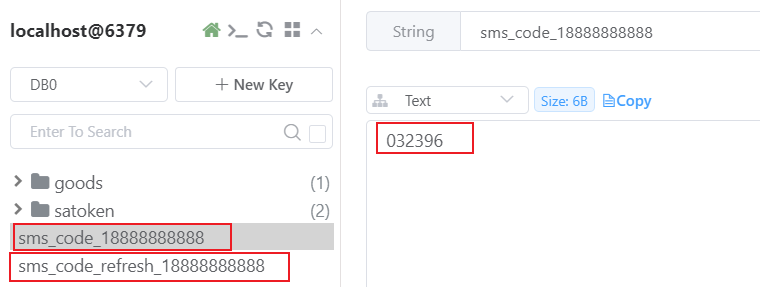

# 前端实现发送短信验证码


## 实现思路

1. 用户点击登录/注册按钮，弹出登录窗口。用户输入手机号，然后点击获取短信验证码。
2. 系统应该判断用户是否输入了手机号。
3. 如果输入了手机号，再判断一下手机号格式是否正确。
4. 如果手机号合法，发送 ajax post 请求提交，请求后端发送手机验证码。
5. 后端发送验证码成功，前端应立即进入倒计时状态，倒计时 60 秒，并且按钮状态应设置为不可用。
  1. 可以使用 `window.setInterval()`设置一个周期性执行的代码。
  2. 每隔一秒执行一次，修改一下按钮上的文本内容
6. 等倒计时结束之后，应该将按钮上的文本再次修改为：获取短信验证码，同时将按钮设置为可用。

## 先来看一下登录弹窗和模型层数据

先来看一下登录弹窗中发送短信验证码按钮的代码：在 `front/main.vue`文件中。

```html
<el-col :span="8">
    <el-button size="large" class="receive-btn" type="primary" plain
        @click="sendSmsCode" :disabled="dialog.disabled">
        {{ dialog.btnContent }}
    </el-button>
</el-col>
```

1. `{{ dialog.btnContent }}`这个是用来决定按钮上显示的文本内容的。
2. `:disabled="dialog.disabled"`是决定按钮可用不可用的。
3. `sendSmsCode`这个是点击按钮之后发送 ajax 请求的。

**模型层的数据如下：**

```typescript
const dialog = reactive({
    visible: false, // 决定登录弹窗是否可见
    phone: null, // 用户填写的手机号
    code: null, // 用户填的验证码
    disabled: false, // false表示按钮可用，true表示按钮不可用
    btnContent: '获取短信验证码', // 按钮上显示的文本
    num: 0, // 倒计时用的
    status: 'logout'
});
```

## 编写前端代码

编写 `sendSmsCode`回调函数，代码如下：

```typescript
// 发送短信验证码
async function sendSmsCode(){
    // 拿到用户填写的手机号
    const phone = dialog.phone;
    // 判断手机号是否为空
    if(stringIsEmpty(phone)){
        proxy.$message({
            message: '请填写手机号',
            type: 'error',
            duration: 1200
        });
    }else if(!isPhone(phone)){
        proxy.$message({
            message: '手机号格式错误',
            type: 'error',
            duration: 1200
        });
    }else{
        // 发送ajax post请求，去发送短信验证码
        // 准备数据
        const json = {
            phone: phone
        };
        // 不需要提交token，发送ajax post请求
        const response = await axios.post('/meinian-api/front/customer/sendSmsCode', json);
        const result = response.data.result;
        if(result){
            // 提示用户用户短信已发送
            proxy.$message({
                message: '短信已发送',
                type: 'success',
                duration: 1200
            });
            // 获取短信验证码的按钮进入倒计时
            dialog.disabled = true;
            const interval = setInterval(()=>{
                dialog.num++;
                dialog.btnContent = `${60 - dialog.num}秒后重新获取`;
                if(dialog.num == 60){
                    dialog.num = 0;
                    dialog.disabled = false;
                    dialog.btnContent = "获取短信验证码";
                    clearInterval(interval);
                }
            }, 1000);
        }
    }
}
```

效果如下：


# 编写后端登录和注册的 RESTful 接口

## 实现思路

1. 注册和登录走一个流程。如果用户已经注册了就执行登录的逻辑。如果用户没有注册就注册，然后再登录成功。
2. 用户手机接收到了验证码，然后用户在登录弹窗上输入手机号 + 验证码，点击登录，此时发送 ajax post 请求提交手机号和验证码。
3. 后端 form 接收手机号和验证码，并且进行合法性校验。如果合法则继续执行 Controller 的相关方法，来处理登录。
4. Controller 调用 Service，在 Service 中进行登录和注册流程。
  1. 先拿着 `sms_code_`和手机号进行字符串拼接，拼接得到一个 key，去 redis 缓存中判断一下这个 key 有没有，如果没有这样的 key，说明验证码已过期。如果验证码已过期，则直接结束，返回 Map 集合，该集合中封装错误提示信息。
  2. 如果 `sms_code_`和手机号拼接的 key 在 redis 缓存中是存在的，说明验证码没有过期，接下来判断验证码是否正确，从 redis 缓存中将验证码取出来，和用户填写的验证码进行比对，如果验证码错误，则直接结束，返回 Map 集合，该集合中封装错误提示信息。
  3. 如果手机号正确，验证码也正确，接下来先将 redis 中之前存储的两个 key 全部删除。（一个是 `sms_code_手机号`，一个是 `sms_code_refresh_手机号`）
  4. 然后通过手机号去数据库中查询该用户是否已经存在，如果用户不存在，则将用户信息保存到数据库中。（保存客户信息之后，需要数据库返回客户信息对应的主键值，因为将来要通过主键值计算 token 令牌）
  5. 返回 Map 集合，该集合中封装登录成功的信息。
5. Service 返回 Map 集合到 Controller 之后。Controller 的 web 方法中判断用户是否登录成功，如果登录成功则颁发令牌。将令牌响应给客户端。

## 时序图

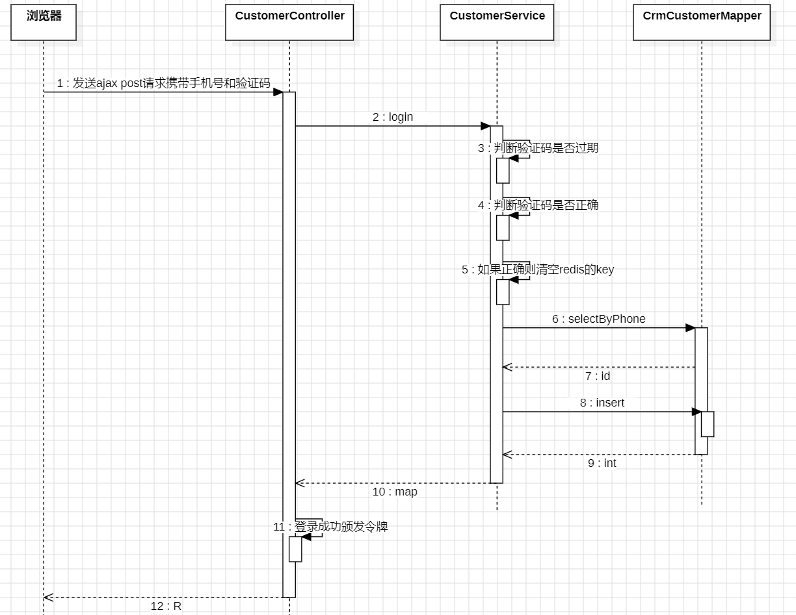

## 编写 Mapper 和 Mapper XML

找到 `CrmCustomerMapper`接口，编写方法：

```java
public interface CrmCustomerMapper {

    // 保存客户信息
    int insert(CrmCustomerEntity entity);

    // 根据手机号获取客户id
    Integer selectByPhone(String phone);
}
```

找到 `CrmCustomerMapper.xml`配置文件，编写 SQL：

```xml
<?xml version="1.0" encoding="UTF-8"?>
<!DOCTYPE mapper
        PUBLIC "-//mybatis.org//DTD Mapper 3.0//EN"
        "http://mybatis.org/dtd/mybatis-3-mapper.dtd">
<mapper namespace="com.jkweilai.meinian.api.db.mapper.CrmCustomerMapper">

    <insert id="insert" parameterType="CrmCustomerEntity" useGeneratedKeys="true" keyProperty="id">
        insert into crm_customer
            (customer_name,gender,phone,photo_url,register_time)
        values
            (#{customerName},#{gender},#{phone},#{photoUrl},now())
    </insert>

    <select id="selectByPhone" parameterType="String" resultType="Integer">
        select id from crm_customer where phone = #{phone}
    </select>

</mapper>
```

## 编写 Service 和实现

找到 `CustomerService`接口，编写方法：

```java
Map<String, Object> login(String phone, String code);
```

找到 `CustomerServiceImpl`实现类，编写方法：

```java
@Resource
private CrmCustomerMapper crmCustomerMapper;

@Override
public Map<String, Object> login(String phone, String code) {
    // 创建Map集合
    Map<String, Object> map = new HashMap<>();

    // 用 sms_code_ 和 手机号 进行字符串拼接，得到key
    String key = "sms_code_" + phone;
    if(!redisTemplate.hasKey(key)) {
        // 说明验证码过期了。
        map.put("result", false);
        map.put("msg", "短信验证码已过期");
        return map;
    }

    // 程序能够执行到此处，说明验证码没有过期。接下来看看验证码是否正确。
    String smsCode = redisTemplate.opsForValue().get(key).toString();
    if(!smsCode.equals(code)){
        // 说明验证码错误的
        map.put("result", false);
        map.put("msg", "短信验证码错误");
        return map;
    }

    // 程序执行到这里说明手机号和验证码都有效。先清空redis中的两个key
    redisTemplate.delete(key);
    redisTemplate.delete("sms_code_refresh_" + phone);

    // 判断该用户是否已经注册
    Integer id = crmCustomerMapper.selectByPhone(phone);
    if(id == null) {
        // 证明用户不存在，则需要保存用户信息。
        CrmCustomerEntity crmCustomerEntity = new CrmCustomerEntity();
        crmCustomerEntity.setPhone(phone);
        // 保存信息
        crmCustomerMapper.insert(crmCustomerEntity);
        // 获取到保存之后生成的主键值
        id =  crmCustomerEntity.getId();
    }

    map.put("result", true);
    map.put("id", id);
    map.put("msg", "登录成功");

    return map;
}
```

## 编写 form 接收数据并验证

在 `front/controller/form`包下新建 `LoginForm`，代码如下：

```java
package com.jkweilai.meinian.api.front.controller.form;

import jakarta.validation.constraints.NotBlank;
import jakarta.validation.constraints.Pattern;
import lombok.Data;

@Data
public class LoginForm {
    @NotBlank(message = "phone不能为空")
    @Pattern(regexp = "^1[1-9]\\d{9}$", message = "phone内容错误")
    private String phone;

    @NotBlank(message = "code不能为空")
    @Pattern(regexp = "^\\d{6}$", message = "code内容错误")
    private String code;
}
```

## 编写 web 方法

找到 `CustomerController`类，然后编写以下登录方法：

```java
@PostMapping("/login")
public R login(@RequestBody @Valid LoginForm form) {
    // 获取用户提交的手机号和验证码
    String phone = form.getPhone();
    String code = form.getCode();

    // 调用service验证
    Map<String, Object> map = customerService.login(phone, code);

    Boolean result = MapUtil.getBool(map, "result");
    String msg = MapUtil.getStr(map, "msg");
    R r = R.ok(msg).put("result", result);
    if(result){
        // 生成令牌
        int id = MapUtil.getInt(map, "id");
        // 注意：业务端的认证体系和mis端的认证体系一定是不一样的。这里千万不能用StpUtil工具类。
        StpCustomerUtil.login(id, "PC");
        String token = StpCustomerUtil.getTokenValue();
        r.put("token", token);
    }
    return r;
}
```

## 测试 RESTful 接口

接口测试地址：[https://localhost:8080/meinian-api/front/customer/login](https://localhost:8080/meinian-api/front/customer/login)

测试数据：【你需要先执行发送验证码的接口，看一下后台的验证码是什么，填写到测试数据中。】

```json
{
    "phone":"18888888888",
    "code": "466238"
}
```

测试结果：

```json
{
        "msg": "登录成功",
        "result": true,
        "code": 200,
        "token": "9042e8dc-2c45-4615-b736-4789378c3ba9"
}
```

# 前端实现登录与注册

## 实现思路

1. 用户点击登录时，需要校验：
  1. 手机号不能为空
  2. 手机号格式正确
  3. 验证码不能为空
  4. 验证码格式正确
2. 如果数据都正确，则发送 ajax post 请求提交手机号和验证码给后端。
3. 如果登录成功，需要做这几件事：
  1. 将登录弹窗隐藏
  2. 修改 status 为 login（这样右上角的登录/注册就消失了，会显示个人中心和退出系统）
  3. 将 phone 置空
  4. 将 code 置空
  5. 存储令牌到 localStorage
4. 如果登录失败，弹出错误提示。

## 编写前端代码

找到 `front/main.vue`，按照以上思路编写前端代码：


编写的回调函数是 login：

```typescript
async function login(){
    const phone = dialog.phone;
    const code = dialog.code;
    
    if(stringIsEmpty(phone)){ // 验证手机号是否合法
        proxy.$message({
            message: "填写手机号",
            type: "error",
            duration: 1200
        });
    }else if(!isPhone(phone)){
        proxy.$message({
            message: "手机号格式错误",
            type: "error",
            duration: 1200
        });
    }else if(stringIsEmpty(code)){ // 检查验证码是否合法
        proxy.$message({
            message: "填写验证码",
            type: "error",
            duration: 1200
        });
    }else if(!isSmsCode(code)){
        proxy.$message({
            message: "验证码格式错误",
            type: "error",
            duration: 1200
        });
    }else{
        // 数据都合法，则提交ajax post请求，提交手机号和验证码。
        // 准备数据
        const json = {
            phone: phone,
            code: code
        };

        const response = await axios.post('/meinian-api/front/customer/login', json);
        const resp = response.data;
        const result = resp.result;
        if(result){
            dialog.phone = null;
            dialog.code = null;
            dialog.visible = false;
            dialog.status = 'login';
            localStorage.setItem('token', resp.token);
        }else{
            proxy.$message({
                message: resp.msg,
                type: "error",
                duration: 1200
            });
        }
    }
    
}
```

## 前端代码部分说明

用户已登录和用户未登录，右上角显示的内容不一样。这是怎么做到的？就是通过 `dialog.status`做到的。


测试，登录成功的效果是：


## 解决登录成功后页面刷新问题

用户如果已经登录成功了，但是在 [http://localhost:5173/front/index](http://localhost:5173/front/index) 页面只要刷新一下，右上角又出现 **登录/注册** 按钮了。**个人中心和退出系统**的按钮消失了。这个好办，解决办法是：页面加载的时候，看看浏览器 localStorage 中有没有 token，如果有 token 则发送一个 ajax get 请求提交 token，在服务器端验证一下这个 token 是否有效，如果有效，将有效信息返回给前端，前端得到响应之后，将 dialog.status 属性值赋值为 login 即可。

### 编写后端代码

找到 `CustomerController`类，编写以下方法：

```java
@GetMapping("/checkLogin")
public R checkLogin(){
    boolean isLogin = StpCustomerUtil.isLogin();
    return R.ok().put("result", isLogin);
}
```

### 编写前端代码

找到 `front/main.vue`页面，编写以下代码，注意：这个代码是在页面加载的时候就执行的：

```typescript
// 验证是否已登录
async function checkLogin(){
    // 获取token
    const token = localStorage.getItem('token');
    if(token != null){
        // 如果有token，再将token发送给服务器。
        // 准备配置
        const config = {
            headers : {
                satoken: token
            }
        };
        // 发送ajax请求
        const response = await axios.get('/meinian-api/front/customer/checkLogin', config);
        const result = response.data.result;
        if(result){
            // 已登录
            dialog.status = 'login';
        }else{
            dialog.status = 'logout';
        }
    }
}
// 直接调用方法
checkLogin();
```

# 实现业务端退出系统功能


## 实现思路

1. 用户点击页面退出系统按钮，发送 ajax post 请求，后端销毁 token，销毁成功后前端收到响应，前端再将 localStorage 中的 token 删除。
2. 前端浏览器中的 token 删除后，页面右上角显示 登录/注册，这个简单，只需要将 status 赋值为 logout 即可。

## 编写后端代码

找到 `CustomerController`编写以下代码：

```java
@GetMapping("/logout")
@SaCheckLogin(type = StpCustomerUtil.TYPE) // 注意这个认证体系必须采用业务端的这一套认证体系哈。
public R logout(){
    int loginId = StpCustomerUtil.getLoginIdAsInt();
    StpCustomerUtil.logout(loginId, "PC");
    return R.ok();
}
```

## 编写前端代码

在 `front/main.vue`中找到退出系统的按钮，如下：


编写 logout 回调函数，代码如下：

```typescript
async function logout(){
    // 准备token
    const config = {
        headers: {
            satoken: localStorage.getItem('token')
        }
    };
    // 发送ajax请求退出系统。
    const response = await axios.get('/meinian-api/front/customer/logout', config);
    // 移除token
    localStorage.removeItem('token');
    // 修改状态值：这样页面上就会显示 登录/注册 按钮
    dialog.status = 'logout';
    // 跳转到index页
    router.push({name: 'FrontIndex'});
    // 提示成功消息
    proxy.$message({
        message: '已退出系统',
        type: 'success',
        duration: 1200
    });
}
```

## 点击个人中心问题

点击个人中心的时候，页面要路由到 `front/mine.vue`页面，在 front/main.vue 页面找到个人中心按钮，在按钮被点击的时候，直接执行路由跳转即可，代码如下：

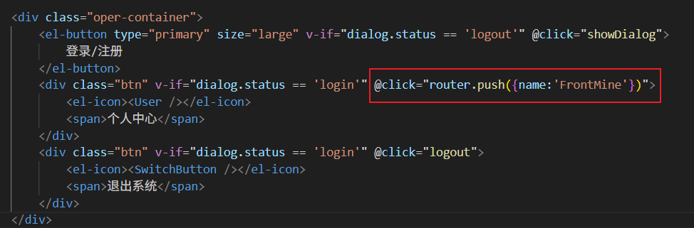

## 点击业务端页面的 logo 问题

我们希望用户不管在哪个页面，只要用户点击页面左上角的 logo 图片，直接回到 front/index.vue 页面，其实还是一个简单的路由跳转问题，我们找到 front/main.vue 页面中的这个 logo 图片：

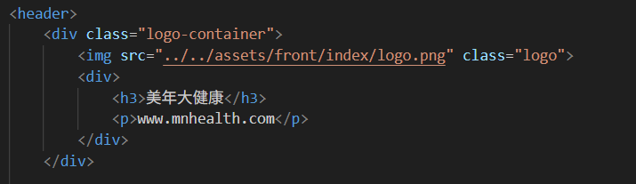

然后我们在 div 上绑定鼠标单击事件，只要用户点击这个 div，我们就进行路由跳转。

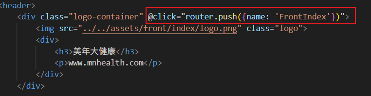

# 实现个人中心摘要信息的 RESTful 接口

## 实现思路

1. 前端发送 get 请求，因为不需要提交什么数据，只需要在请求头中提交 token 即可。
2. 后端从 token 中解析出用户的 id。
3. Controller 调用 service，给 service 传递用户的 id。
4. service 先调用 CrmCustomerMapper ，根据用户 id 获取用户的详细信息。
5. service 再调用 TradeOrderMapper，根据用户 id 在 trade_order 表中统计该用户的订单信息。
6. service 将两个 Mapper 返回的数据放到一个 Map 集合中返回给 Controller。
7. Controller 响应 R 对象到前端。

## 看看前端页面需要什么数据

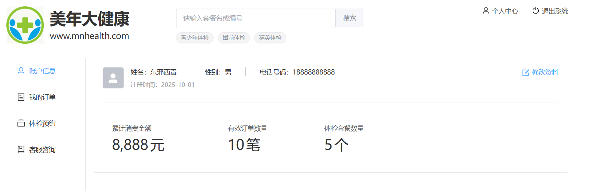

1. 姓名，头像，性别，电话，注册时间：从 crm_customer 表中获取即可。但需要注意的是：注册时间只需要年月日。不需要时分秒。

```sql
select customer_name as customerName,gender,phone,photo_url as photoUrl,date_format(register_time, '%Y-%m-%d') as registerTime 
from crm_customer where id = #{id}
```

1. 累计消费金额、有效订单数量、体检套餐数量：从 trade_order 表中获取即可。
  1. 累计消费金额怎么计算？对 total_amount 字段进行 sum。
  2. 有效订单数量怎么计算？count(*)即可。
  3. 体检套餐数量怎么计算？对 quantity 字段进行 sum。
  4. 但是以上的统计是有条件的，order_status 字段的值必须是 3,5,6（订单状态(1:未付款,2:已关闭,3:已付款,4:已退款,5:已预约,6:已完成)）

```sql
select sum(total_amount) as totalAmount,count(*) as totalCount,sum(quantity) as totalQuantity 
from trade_order where customer_id = #{id} and order_status in(3,5,6)
```

## 时序图

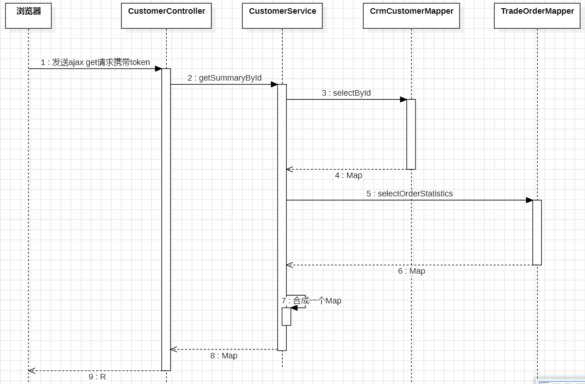

## 编写 CrmCustomer 的 Mapper 和 XML

找到 `CrmCustomerMapper`接口，编写以下方法：

```java
Map<String, Object> selectById(Integer id);
```

找到 `CrmCustomerMapper.xml`文件，编写以下 SQL：

```xml
<select id="selectById" resultType="Map">
    select 
        customer_name as customerName,
        gender,
        phone,
        photo_url as photoUrl,
        date_format(register_time, '%Y-%m-%d') as registerTime
    from 
        crm_customer 
    where 
        id = #{id}
</select>
```

## 编写 TradeOrder 的 Mapper 和 XML

找到 `TradeOrderMapper`接口，编写以下方法：

```java
public interface TradeOrderMapper {

    Map<String, Object> selectOrderStatistics(Integer id);
}
```

找到 `TradeOrderMapper.xml`文件，编写以下 SQL 语句：

```xml
<?xml version="1.0" encoding="UTF-8"?>
<!DOCTYPE mapper
        PUBLIC "-//mybatis.org//DTD Mapper 3.0//EN"
        "http://mybatis.org/dtd/mybatis-3-mapper.dtd">
<mapper namespace="com.jkweilai.meinian.api.db.mapper.TradeOrderMapper">
    <select id="selectOrderStatistics" resultType="Map">
        select
            sum(total_amount) as totalAmount,
            count(*) as totalCount,
            sum(quantity) as totalQuantity
        from
            trade_order
        where
            customer_id = #{id}
          and
            order_status in(3,5,6)
    </select>
</mapper>
```

## 编写 Service 接口和实现

找到 `CustomerService`接口，编写以下方法：

```java
Map<String, Object> getSummaryById(Integer id);
```

找到 `CustomerServiceImpl`类，编写以下方法：

```java
@Resource
private TradeOrderMapper tradeOrderMapper;

@Override
public Map<String, Object> getSummaryById(Integer id) {
    Map<String, Object> map = crmCustomerMapper.selectById(id);
    map.putAll(tradeOrderMapper.selectOrderStatistics(id));
    return map;
}
```

## 编写 web 接口

找到 `CustomerController`编写以下代码：

```java
@GetMapping("/getSummary")
@SaCheckLogin(type = StpCustomerUtil.TYPE)
public R getSummary(){
    // 通过token解析id
    int id = StpCustomerUtil.getLoginIdAsInt();
    Map<String, Object> summary = customerService.getSummaryById(id);
    return R.ok().put("result", summary);
}
```

## 测试接口

测试前向 crm_customer 表中放点数据：

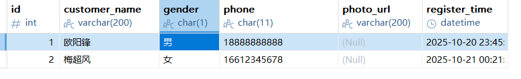

另外，目前订单表中是没有数据的。

接口测试地址：[https://localhost:8080/meinian-api/front/customer/getSummary](https://localhost:8080/meinian-api/front/customer/getSummary)

测试数据：业务端用户登录成功后，在浏览器本地存储中找到用户的 token，将 token 填写到 Apipost 工具的 header 中。

测试结果：

```json
{
        "msg": "success",
        "result": {
                "gender": "男",
                "phone": "18888888888",
                "registerTime": "2025-10-20",
                "totalCount": 0,
                "customerName": "欧阳锋"
        },
        "code": 200
}
```

很奇怪：

1. 为什么没有返回 photoUrl
2. 为什么没有 totalAmount
3. 为什么没有 totalQuantity

原因是：由于订单表中没有数据，`<font style="color:rgb(15, 17, 21);background-color:rgb(235, 238, 242);">sum(total_amount)</font>` 返回 `**<font style="color:rgb(15, 17, 21);background-color:rgb(235, 238, 242);">NULL</font>**`（不是0），MyBatis 在处理结果集时，对于值为 NULL 的字段，默认不会将该字段放入返回的Map中。没有关系，这个我们可以在前端进行处理，如果前端从后端返回的 json 中无法取到数据时，显示一个默认值即可。

# 前端实现摘要信息加载

## 清空之前写死的数据

找到 `front/mine.vue`页面，将之前写死的数据清空掉，恢复到如下效果：

```typescript
const data = reactive({
    customerName: null,
    gender: null,
    phone: null,
    photoUrl: null,
    registerTime: null,
    count: 0,
    number: 0,
    amount: 0
});
```

## 在 mine.vue 页面编写加载函数

mine.vue 页面只要加载，就发送 ajax get 请求获取个人信息。代码如下：

```typescript
async function loadCustomerInfo(){
    // 准备配置
    const config = {
        headers: {
            satoken: localStorage.getItem('token')
        }
    };
    // 发送ajax get请求
    const response = await axios.get('/meinian-api/front/customer/getSummary', config);
    const result = response.data.result;
    data.customerName = result.customerName == null ? "未填写" : result.customerName;
    data.gender = result.gender == null ? "未填写" : result.gender;
    data.phone = result.phone;
    data.photoUrl = result.photoUrl; // 头像为null不用处理，因为前端有默认头像。
    data.registerTime = result.registerTime;
    data.count = result.totalCount;
    // 当 result.totalQuantity 没有从后端返回的时候，这个值是 undefined，vue做了特殊处理，如果是undefined则采用之前的默认值0
    data.number = result.totalQuantity; 
    data.amount = result.totalAmount;
}

// 页面打开时执行
loadCustomerInfo();
```

效果如下：


## 实现点击左侧菜单


### 第一种方式：编写函数

这个菜单列表在哪里？在框架页面上：`front/customer.vue`，找到它，看以下代码：

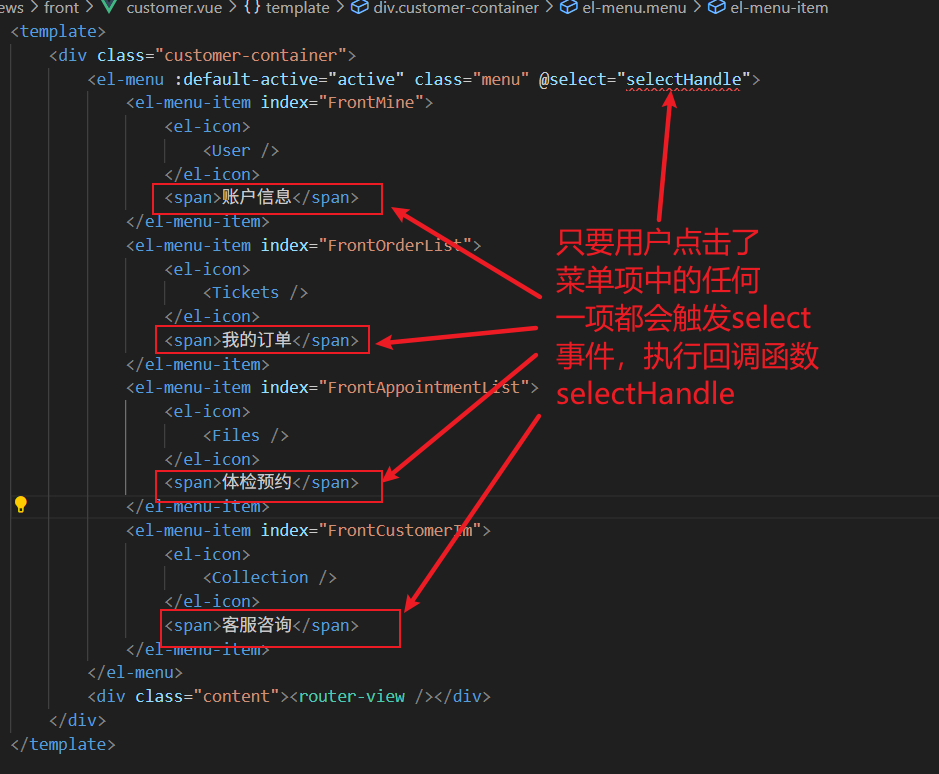

因此我们需要去编写 `selectHandle`回调函数。代码如下：

```typescript
// 这个代码是在函数外面的响应式对象。
// 用当前路由的名字作为激活的菜单项。
let active = ref(router.currentRoute.value.name);

// 这个回调函数会自动接收一个index
// 假设用户点击的账户信息，则这个index = FrontMine
// 假设用户点击的我的订单，则这个index = FrontOrderList
// 因此这个index正好是一个路由的名字。利用它就可以跳转路由。
function selectHandle(index){
    // 跳转路由
    router.push({name: index});
}
```

这样我们就可以完成页面的切换了。

### 第二种方式：启用路由模式

不编写函数也可以实现，通过以下代码也可以完成相同效果：`index`属性使用当前路由的 path，`:router=true`是启用路由模式。

```html
<el-menu :default-active="$route.path" class="menu" :router="true">
  <el-menu-item index="/front/customer/mine">
    <el-icon>
      <User />
    </el-icon>
    <span>账户信息</span>
  </el-menu-item>
  <el-menu-item index="/front/customer/order_list">
    <el-icon>
      <Tickets />
    </el-icon>
    <span>我的订单</span>
  </el-menu-item>
  <el-menu-item index="/front/customer/appointment_list">
    <el-icon>
      <Files />
    </el-icon>
    <span>体检预约</span>
  </el-menu-item>
  <el-menu-item index="/front/customer/customer_im">
    <el-icon>
      <Collection />
    </el-icon>
    <span>客服咨询</span>
  </el-menu-item>
</el-menu>
```

# 用户修改个人资料

正常来说，客户修改自己的手机号，商业流程的正规做法是：

1. 先让自己的手机号收一个验证码，确实是客户自己要修改手机号，然后还需要给新手机号发一个验证码，验证新手机号的有效性之后，再完成手机号的更新。
2. 我们这里不做那么严谨了，手机号的有效性我们仅做手机号格式的有效性。不做手机号是否可用的有效性验证。
3. 头像修改功能大家可以自行扩展。和我们之前做的套餐封面图片原理相同。


## 修改个人资料的 RESTful 接口

### 实现思路

功能比较简单，所以就不画时序图了。

1. 用户点击修改资料按钮，弹出修改资料的模态窗口。在模态窗口上显示用户的原始信息，包括：姓名、性别、手机号。（这个信息直接从页面的响应式对象中获取即可，不需要单独再发送 ajax 请求）
2. 用户修改信息之后，提交修改的数据给后端，提交的数据包括：姓名、性别、手机号。
3. 后端进行 form 验证，并将数据交给 controller。
4. controller 从 satoken 中获取用户 id，将 id 姓名 性别 手机号 放到 map 中，传递给 service
5. service 调用 mapper 进行更新。
6. mapper 返回更新的记录条数给 service
7. 如果 service 接收到返回值为 1，则表示更新成功，service 返回更新结果给 controller
8. controller 接收到结果之后，封装 R 对象，响应给前端。

### 编写 Mapper 和 XML

找到 `CrmCustomerMapper`接口，编写以下方法：

```java
int update(Map<String, Object> param);
```

找到 `CrmCustomerMapper.xml`编写以下 SQL：

```java
<update id="update" parameterType="Map">
    update crm_customer set 
        customer_name = #{customerName}, 
        gender = #{gender}, 
        phone = #{phone} 
    where 
        id = #{id}
</update>
```

### 编写 Service 和实现

找到 `CustomerService`接口，编写以下方法：

```java
boolean modify(Map<String, Object> param);
```

编写 service 的实现，代码如下：

```java
@Override
@Transactional
public boolean modify(Map<String, Object> param) {
    return crmCustomerMapper.update(param) == 1;
}
```

### 编写 form 接收数据并校验

编写 `ModifyCustomerForm`，代码如下：

```java
package com.jkweilai.meinian.api.front.controller.form;

import jakarta.validation.constraints.NotBlank;
import jakarta.validation.constraints.Pattern;
import lombok.Data;

@Data
public class ModifyCustomerForm {
    @Pattern(regexp = "^[\\u4e00-\\u9fa5]{2,10}$", message = "customerName内容不正确")
    private String customerName;

    @Pattern(regexp = "^男$|^女$", message = "gender内容不正确")
    private String gender;

    @NotBlank(message = "phone不能为空")
    @Pattern(regexp = "^1[1-9]\\d{9}$", message = "phone内容错误")
    private String phone;
}
```

### 编写 web 方法

找到 `CustomerController`类，编写 web 方法，代码如下：

```java
@PostMapping("/modify")
@SaCheckLogin(type = StpCustomerUtil.TYPE)
public R modify(@RequestBody @Valid ModifyCustomerForm form){
    // 将form转换成map
    Map<String, Object> param = BeanUtil.beanToMap(form);
    // 从token中解析用户id
    int id = StpCustomerUtil.getLoginIdAsInt();
    param.put("id", id);
    boolean result = customerService.modify(param);
    return R.ok().put("result", result);
}
```

这个接口就先不做测试了。比较简单。等前端写完之后一块测。

## 修改个人资料的前端实现

### 实现弹窗控件

当用户在 `front/mine.vue`页面点击了修改资料按钮，就需要显示一个修改信息的弹窗，我们来设计一下这个弹窗，在 `front/mine.vue`页面中提供以下弹窗代码：

```html
<el-dialog title="修改资料" :close-on-click-modal="false"
    v-model="dialog.visible" width="420px">
    <el-form :model="dialog.dataForm" ref="dialogForm"
        :rules="dialog.dataRule" label-width="60px">
        <el-form-item label="姓名" prop="customerName">
            <el-input v-model="dialog.dataForm.customerName" placeholder="输入姓名"
                maxlength="10" size="medium" class="input" clearable />
        </el-form-item>
        <el-form-item label="性别" prop="gender">
            <el-select v-model="dialog.dataForm.gender" placeholder="选择性别"
                size="medium" clearable="clearable">
                <el-option label="男" value="男" />
                <el-option label="女" value="女" />
            </el-select>
        </el-form-item>
        <el-form-item label="电话" prop="phone">
            <el-input v-model="dialog.dataForm.phone" placeholder="输入电话"
                maxlength="11" size="medium" class="input" clearable />
        </el-form-item>
    </el-form>
    <template #footer>
        <span class="dialog-footer">
            <el-button size="medium" @click="dialog.visible = false">
                取消
            </el-button>
            <el-button type="primary" size="medium" @click="dataFormSubmit">
                确定
            </el-button>
        </span>
    </template>

</el-dialog>
```

然后在 `front/mine.less`文件中提供以下样式：

```plaintext
.input {
    width: 92%;
}
```

### 编写模型层代码

为视图层弹窗提供数据，并且提供数据的校验规则，代码如下：

```typescript
const dialog = reactive({
    // 控制可见性
    visible: false,
    // 表单数据
    dataForm: {
        customerName: null,
        gender: null,
        phone: null
    },
    // 校验规则
    dataRule: {
        customerName: [{pattern: '^[\u4e00-\u9fa5]{2,10}$', message: '姓名格式错误'}],
        phone: [{required: true, message: '电话不能为空'},{pattern:'^1[1-9]\\d{9}$', message:'电话格式错误'}]
    }
});
```

### 点击按钮显示弹窗

点击 `front/mine.vue`页面的修改资料，显示弹窗，并且弹窗上要显示出当前用户的信息。找到 修改资料 按钮，编写回调函数updateHandle：

```typescript
function updateHandle(){
    // 显示弹窗
    dialog.visible = true;
    // 等弹窗完全显示完毕之后
    proxy.$nextTick(() => {
        // 清空弹窗上残留的错误提示信息
        proxy.$refs['dialogForm'].resetFields();
        // 给表单上每一项填充值
        dialog.dataForm.customerName = (data.customerName == '未填写' ? null : data.customerName);
        dialog.dataForm.gender = (data.gender == '未填写' ? null : data.gender);
        dialog.dataForm.phone = data.phone;
    });
}
```

### 修改用户信息

用户在弹窗上修改信息之后，发送 ajax post 请求，提交数据。后端修改之后返回结果。如果修改成功，显示成功的提示信息，等提示信息消失消失关闭的时候，让弹窗隐藏，然后重新加载个人信息。先找到那个弹窗上的确定按钮，提供回调函数名，编写回调函数：

```typescript
async function dataFormSubmit(){
    proxy.$refs['dialogForm'].validate(async valid => {
        if(valid){
            // 如果校验通过
            const config = {
                headers: {
                    satoken: localStorage.getItem('token')
                }
            };
            const response = await axios.post('/meinian-api/front/customer/modify', dialog.dataForm, config);
            const result = response.data.result;
            if(result){
                proxy.$message({
                    message: '个人资料更新成功',
                    type: 'success',
                    duration: 1200,
                    onClose: ()=>{
                        dialog.visible = false;
                        loadCustomerInfo();
                    }
                });
            }
        }
    });
}
```

# 获取推荐体检套餐的 RESTful 接口

在业务端的首页面上有三个区域，分别是：活动专区、热卖套餐、新品推荐。如下图：


我们先来实现一下后端查询推荐套餐的 RESTful 接口。

## 实现思路

1. 每个区域最多显示 4 个套餐。
2. 每个套餐需要的信息包括：
  1. 封面图片、套餐名字、套餐描述、现价、原价、销量，这些字段都是需要后端返回的。
  2. 另外套餐的 id 和套餐的编号（packageCode）也需要返回，后期要用。
3. 套餐按照销量进行排序，找出销量最好的 4 个，按照销量降序排列。
4. 细节 1：如果销量一样则让 **后添加 **的套餐排在前面（可以根据 id 降序）。
5. 细节 2：推荐的套餐一定是上架的，已下架的套餐不能返回。
6. 前端应该向后端提交 `categoryId`，多个区域就提交多个 `categoryId`，后端采用 `Integer[] categoryIds`来接收。
7. controller 接收到 `categoryIds`，将它传递给 service。
8. service 中编写一个 for 循环，对 `categoryIds`进行遍历，每遍历一次调用一次 Mapper，在 Mapper 中根据 `categoryId`获取推荐的套餐，返回 List，这个 List 集合中每个 Map 对象中都封装一个套餐信息。
9. service 最终采用一个大 Map 来组织所有数据，这个 Map 的 key 存 categoryId，value 存对应的套餐列表：Map<Integer, List>
10. 最终这个大 Map 返回给 Controller，Controller 将它放到 R 对象中返回。

## 编写 Mapper 和 XML

找到 `MedExamPackageMapper`接口，编写以下方法：根据 categoryId 获取销量最好的 4 个套餐。

```java
List<Map<String, Object>> selectTop4ByCategoryIdOrderBySalesDesc(Integer categoryId);
```

找到 `MedExamPackageMapper.xml`文件，编写以下 SQL：

```xml
<select id="selectTop4ByCategoryIdOrderBySalesDesc" resultType="Map">
    select
        id,
        package_code as packageCode,
        cover_image as coverImage,
        package_name as packageName,
        description,
        current_price as currentPrice,
        original_price as originalPrice,
        sales_volume as salesVolume
    from
        med_exam_package
    where
        status = 1 and category_id = #{categoryId}
    order by
        salesVolume desc, id desc
    limit 4
</select>
```

## 编写 Service 接口和实现

找到 `front`包下的 `MedExamPackageService`接口，提供以下方法：

```java
Map<Integer, List<Map<String, Object>>> findTop4ByCategoryIdOrderBySalesDesc(Integer[] categoryIds);
```

编写该方法的实现：

```java
@Override
public Map<Integer, List<Map<String, Object>>> findTop4ByCategoryIdOrderBySalesDesc(Integer[] categoryIds) {
    Map<Integer, List<Map<String, Object>>> map = new HashMap<>();
    for(Integer categoryId : categoryIds){
        List<Map<String, Object>> top4 = medExamPackageMapper.selectTop4ByCategoryIdOrderBySalesDesc(categoryId);
        map.put(categoryId, top4);
    }
    return map;
}
```

## 编写 form 接收并校验数据

编写 `FindTop4ByCategoryIdsForm`，用它来接收 category ids，并校验，代码如下：

```java
package com.jkweilai.meinian.api.front.controller.form;

import jakarta.validation.constraints.NotEmpty;
import lombok.Data;

@Data
public class FindTop4ByCategoryIdsForm {
    @NotEmpty(message = "categoryIds不能为空")
    private Integer[] categoryIds;
}
```

## 编写 web 方法

找到 `front`包下的 `MedExamPackageController`，然后提供以下方法，注意：由于不登录的用户也应该能看到推荐套餐，因此不做登录验证：

```java
@PostMapping("/findTop4ByCategoryIds")
public R findTop4ByCategoryIds(@RequestBody @Valid FindTop4ByCategoryIdsForm form) {
    Map<Integer, List<Map<String, Object>>> map = medExamPackageService.findTop4ByCategoryIdOrderBySalesDesc(form.getCategoryIds());
    return R.ok().put("result", map);
}
```

## 接口测试

接口测试地址：[https://localhost:8080/meinian-api/front/goods/findTop4ByCategoryIds](https://localhost:8080/meinian-api/front/goods/findTop4ByCategoryIds)

测试数据：

```json
{
    "categoryIds": [1,2,3]
}
```

测试结果：确认一下是大 Map 结构，key 是 categoryId，value 是一个 List 集合。


# 前端展示推荐的体检套餐

## 删除之前写死的数据

找到 `front/index.vue`页面，将之前写死的数据删除掉：


清空之后的代码是：

```typescript
const data = reactive({
    part_1: [],
    part_2: [],
    part_3: []
});
```

## 加载推荐的体检套餐

`front/index.vue`页面中展示体检套餐的代码已经写了。我们只需要向上面提到的 data 响应式对象中填充数据就行了。给 part_1/2/3 赋值。

注意：数据库中存储的封面是相对路径，取到路径后需要拼接一个完整的路径。

实现思路：页面加载的时候发送 ajax 请求，获取套餐列表，将套餐列表信息赋值给 part_1/2/3

```typescript
async function loadTop4(){
    // 准备数据
    const json = {
        categoryIds: [1,2,3]
    };

    // 发送ajax请求
    const response = await axios.post('/meinian-api/front/goods/findTop4ByCategoryIds', json);
    const result = response.data.result;
    console.log(result)
    
    // 处理第一个区域
    for(let one of result['1']){
        one.coverImage = `${proxy.$minioUrl}/${one.coverImage}`
    }
    data['part_1'] = result['1'];

    // 处理第二个区域
    for(let one of result['2']){
        one.coverImage = `${proxy.$minioUrl}/${one.coverImage}`
    }
    data['part_2'] = result['2'];

    // 处理第三个区域
    for(let one of result['3']){
        one.coverImage = `${proxy.$minioUrl}/${one.coverImage}`
    }
    data['part_3'] = result['3'];
}
// 页面加载时执行。
loadTop4();
```

## 跳转到商品页面

如果客户点击某个体检套餐上面的“立即购买”按钮，浏览器会自动跳转到商品页面。传递的参数是商品的主键值，让商品页面加载商品信息。“立即购买”按钮标签如下：

```html
<input type="button" class="buy-btn" value="立即购买" @click="buyHandle(one.id)" />
```

编写 buyHandle 回调函数，进行路由跳转：

```typescript
function buyHandle(id){
    router.push({name: 'FrontGoods', params: {id: id}});
}
```

商品页面需要商品的 id 哦。一定要传过去。

## 跳转到商品列表页面

如果客户点击index页面中“查看更多”，浏览器会跳转到商品列表页面。“查看更多”控件的标签如下：

```html
<el-link :icon="Plus" :underline="false" @click="moreHandle">查看更多</el-link>
```

编写moreHandle 回调函数，进行路由跳转：

```typescript
function moreHandle(){
    router.push({name: 'FrontGoodsList'});
}
```

# 商品列表页分页查询后端实现


## 时序图


## 实现思路

### 可以通过哪些条件进行查询

1. 通过套餐名或套餐编号模糊查询
  1. 前端会传过来 `keyword`
  2. 后端 sql 判断 `keyword`是否为空，如果不为空：
    1. `package_name like concat('%', #{keyword}, '%') or package_code like concat('%',#{keyword},'%')`
2. 通过分类精确查询
  1. 前端传过来 `packageType`
  2. 后端 sql 判断 `packageType`是否为空，如果不为空：
    1. `package_type = #{packageType}`
3. 通过性别精确查询：数据库表中并没有设计这个性别字段，我们就通过表中的 `tags`字段进行查询吧。如果 `tags`字段中的 `json`数据中有男性或女性时被检索。
  1. 前端传过来 `sex`
  2. 后端 sql 判断 `sex`是否为空，如果不为空：
    1. `JSON_CONTAINS(tags, concat('"', #{sex}, '"'))`
    2. 不能这样写哈：`JSON_CONTAINS(tags, #{sex})`
4. 通过价格区间查询
  1. 前端会传过来一个 `priceType`
  2. `priceType`的值可能是 1,2,3,4 的其中一个
    1. 如果 `priceType == 1`：`current_price >= 0 and current_price < 100`
    2. 如果 `priceType == 2`：`current_price >= 100 and current_price < 500`
    3. 如果 `priceType == 3`：`current_price >= 500 and current_price < 1000`
    4. 如果 `priceType == 4`：`current_price >= 1000`
5. 按照 最新排序、销量排序、价格升序、价格降序
  1. 前端会传过来一个 `orderType`
  2. `orderType`的值可能是 1,2,3,4 的其中一个
    1. 如果 `orderType == 1`：`order by id desc`
    2. 如果 `orderType == 2`：`order by sales_volume desc`
    3. 如果 `orderType == 3`：`order by current_price asc`
    4. 如果 `orderType == 4`：`order by current_price desc`
    5. 其他情况：`order by sales_volume desc, id desc`
6. 非常重要的一点是：只能 `status = 1`才能被查询到，也就是说只有上架的套餐才能查询到。
7. 注意：分页查询，最后使用 `limit #{startIndex}, #{pageSize}`

### 查询结果返回什么

查询结果根据上图可以分析得到，需要返回的数据包括：

1. `id`
2. `package_code as packageCode`
3. `package_name as packageName`
4. `description`
5. `cover_image as coverImage`
6. `original_price as originalPrice`
7. `current_price as currentPrice`
8. `sales_volume as salesVolume`

## 编写 Mapper 和 XML

找到 `MedExamPackageMapper`接口，编写以下两个方法，一个是根据条件获取数据，一个是根据条件获取总记录条数：

```java
List<Map<String, Object>> selectPageForFront(Map<String, Object> params);

long selectCountForFront(Map<String, Object> params);
```

找到 `MedExamPackageMapper.xml`配置文件，编写以下 SQL：

```xml
<select id="selectPageForFront" parameterType="Map" resultType="Map">
    select id,
           package_code as packageCode,
           package_name as packageName,
           description,
           cover_image as coverImage,
           original_price as originalPrice,
           current_price as currentPrice,
           sales_volume as salesVolume
    from med_exam_package
    where status = 1
    <if test="keyword != null and keyword != ''">
        and ( package_name like concat("%",#{keyword},"%") or 
              package_code like concat("%",#{keyword},"%") 
            )
    </if>
    <if test="packageType != null and packageType != ''">
        and package_type = #{packageType}
    </if>
    <if test="sex != null and sex != ''">
        and JSON_CONTAINS (tags, CONCAT('"',#{sex},'"'))
    </if>
    <choose>
        <when test="priceType == 1">
            and current_price >= 0 and current_price < 100
        </when>
        <when test="priceType == 2">
            and current_price >= 100 and current_price < 500
        </when>
        <when test="priceType == 3">
            and current_price >= 500 and current_price < 1000
        </when>
        <when test="priceType == 4">
            and current_price >= 1000
        </when>
    </choose>
    <choose>
        <when test="orderType == 1">
            order by id desc
        </when>
        <when test="orderType == 2">
            order by sales_volume desc
        </when>
        <when test="orderType == 3">
            order by current_price asc
        </when>
        <when test="orderType == 4">
            order by current_price desc
        </when>
        <otherwise>
            order by sales_volume desc, id desc
        </otherwise>
    </choose>
    limit #{startIndex}, #{pageSize}
</select>

<select id="selectCountForFront" parameterType="Map" resultType="long">
    select count(*)
    from med_exam_package
    where status = 1
    <if test="keyword != null and keyword != ''">
        and ( package_name like concat("%",#{keyword},"%") or 
              package_code like concat("%",#{keyword},"%") 
            )
    </if>
    <if test="packageType != null and packageType != ''">
        and package_type = #{packageType}
    </if>
    <if test="sex != null and sex != ''">
        and JSON_CONTAINS (tags, CONCAT('"',#{sex},'"'))
    </if>
    <choose>
        <when test="priceType == 1">
            and current_price >= 0 and current_price < 100
        </when>
        <when test="priceType == 2">
            and current_price >= 100 and current_price < 500
        </when>
        <when test="priceType == 3">
            and current_price >= 500 and current_price < 1000
        </when>
        <when test="priceType == 4">
            and current_price >= 1000
        </when>
    </choose>
</select>
```

## 编写 Service 和实现

找到 `**<font style="color:#DF2A3F;">front</font>**`包下的 `MedExamPackageService`接口，提供以下方法：

```java
PageResult<Map<String,Object>> pageQueryByCondition(Map<String, Object> param);
```

编写实现方法：

```java
@Override
public PageResult<Map<String, Object>> pageQueryByCondition(Map<String, Object> param) {
    List<Map<String, Object>> records = new ArrayList<>();
    long count = medExamPackageMapper.selectCountForFront(param);
    if(count > 0){
        records = medExamPackageMapper.selectPageForFront(param);
    }
    Integer pageNo = MapUtil.getInt(param, "pageNo");
    Integer pageSize = MapUtil.getInt(param, "pageSize");
    PageResult<Map<String, Object>> pageResult = new PageResult<>(count, pageSize, pageNo, records);
    return pageResult;
}
```

## 编写 form 接收数据并校验

编写 `MedExamPackagePageQueryForm`接收前端传过来的数据并校验。

```java
package com.jkweilai.meinian.api.front.controller.form;

import jakarta.validation.constraints.Min;
import jakarta.validation.constraints.NotNull;
import jakarta.validation.constraints.Pattern;
import lombok.Data;
import org.hibernate.validator.constraints.Length;
import org.hibernate.validator.constraints.Range;

@Data
public class MedExamPackagePageQueryForm {
    @Length(min = 1, max = 50, message = "keyword字数超出范围")
    private String keyword;

    @Pattern(regexp = "^父母体检$|^入职体检$|^职场白领$|^个人高端$|^中青年体检$", message = "packageType内容不正确")
    private String packageType;

    @Pattern(regexp = "^男性$|^女性$")
    private String sex;

    @Range(min = 1, max = 4, message = "priceType范围不正确")
    private Integer priceType;

    @Range(min = 1, max = 4, message = "orderType范围不正确")
    private Integer orderType;

    @NotNull(message = "page不能为空")
    @Min(value = 1, message = "pageNo不能小于1")
    private Integer pageNo;

    @NotNull(message = "pageSize不能为空")
    @Range(min = 10, max = 50, message = "length必须为10~50之间")
    private Integer pageSize;
}
```

## 编写 web 方法

找到 `**<font style="color:#DF2A3F;">front</font>**`包下的 `MedExamPackageController`类，编写以下方法：

```java
@PostMapping("/pageQuery")
public R pageQuery(@RequestBody @Valid MedExamPackagePageQueryForm form) {
    Integer pageNo = form.getPageNo();
    Integer pageSize = form.getPageSize();
    Integer startIndex = pageSize * (pageNo - 1);
    Map<String, Object> param = BeanUtil.beanToMap(form);
    param.put("startIndex", startIndex);
    PageResult<Map<String, Object>> pageResult = medExamPackageService.pageQueryByCondition(param);
    return R.ok().put("pageResult", pageResult);
}
```

## 测试接口

接口测试地址：[https://localhost:8080/meinian-api/front/goods/pageQuery](https://localhost:8080/meinian-api/front/goods/pageQuery)

测试数据：

```json
{
    "pageNo": 1,
    "pageSize": 10,
    "priceType": 4,
    "orderType": 1,
    "keyword": "心血管"
}
```

测试结果：

```json
{
        "msg": "success",
        "code": 200,
        "pageResult": {
                "total": 3,
                "pageSize": 10,
                "pageNo": 1,
                "records": [
                        {
                                "originalPrice": 3299,
                                "salesVolume": 28,
                                "packageCode": "026CPRT12",
                                "coverImage": "front/goods/d079bf3cfbe64aa9b5e17a2e77244bb7.jpg",
                                "description": "心血管疾病风险评估",
                                "currentPrice": 2899,
                                "id": 12,
                                "packageName": "心血管专项筛查套餐"
                        },
                        {
                                "originalPrice": 3299,
                                "salesVolume": 28,
                                "packageCode": "026CPRT11",
                                "coverImage": "front/goods/d079bf3cfbe64aa9b5e17a2e77244bb7.jpg",
                                "description": "心血管疾病风险评估",
                                "currentPrice": 2899,
                                "id": 11,
                                "packageName": "心血管专项筛查套餐"
                        },
                        {
                                "originalPrice": 3299,
                                "salesVolume": 28,
                                "packageCode": "026CPRT09",
                                "coverImage": "front/goods/d079bf3cfbe64aa9b5e17a2e77244bb7.jpg",
                                "description": "心血管疾病风险评估",
                                "currentPrice": 2899,
                                "id": 10,
                                "packageName": "心血管专项筛查套餐"
                        }
                ],
                "pages": 1
        }
}
```

# 前端实现无限滚动加载效果

在商品列表页，当用户第一次打开页面时加载第一页，只要用户滚动到页面底部则开始加载第二页，再次滚动到底部，则开始加载第三页，以此类推。如何实现？找到 `front/goods_list.vue`页面，看下图，主要是通过下面这个回调函数来完成的：


可以看到 `ul`标签中使用了 `v-infinite-scroll`，他是实现无限滚动加载的核心，只要有它在，每当用户将页面滚动到最底部时，会自动调用 `load`回调函数，然后我们可以在 `load`回调函数中查询下一页的数据，将新查询到的下一页数据和页面中原有数据做一个追加，这样页面就会实现无限滚动效果。

## 清理静态数据

我们当前页面之所以可以看到商品信息，是因为这些信息都是写死的，将之前 `goods_list.vue`页面中固定死的数据清空掉，让它恢复到最开始的状态，代码如下：

```typescript
const data = reactive({
    dataList: [],
    pageIndex: 0, // 如果初始值为1，当页面第一次加载时，它会变成2，导致第一页数据丢失。
    pageSize: 12, // 12正好是4的倍数，三行比较好看。
    totalCount: 0,
    isLast: false // 是否为最后一页的标记(当用户在滚动页面时，如果已经加载到最后一页了，isLast值将被设置为true，用来阻止继续发送ajax请求。)
});
```

## 滚到页面顶端

从业务端 `index` 页面跳转到商品列表页面，看到的是商品列表页面的下半部分，而不是从页面顶部开始显示的。解决这个小BUG，需要在商品列表页面中加上以下代码：

```typescript
//滚动到页面的顶部，否则路由跳转页面之后，页面垂直位置还是上一个页面的地方
window.scrollTo(0, 0);
```

## 编写加载函数

编写一个加载分页数据的函数，在该函数中发送 ajax 请求获取后端的数据，代码如下：

```typescript
async function loadPageData(){
    // 如果当前页已经是最后一页了，则不再发送ajax请求了
    if(data.isLast){
        return;
    }
    // 当前页还不是最后一页则发送ajax请求
    // 准备数据
    let json = {
        keyword: dataForm.keyword,
        packageType: dataForm.type,
        sex: dataForm.sex,
        priceType: dataForm.priceType,
        orderType: dataForm.orderType,
        pageNo: data.pageIndex,
        pageSize: data.pageSize
    };
    // 发送请求
    const response = await axios.post('/meinian-api/front/goods/pageQuery', json);
    const pageResult = response.data.pageResult;
    //获取分页数据
    let list = pageResult.records;
    //判断有没有查询出分页数据
    if (list == null || list.length == 0) {
        //记录再无分页数据
        data.isLast = true
        //当前分页并不存在，页数减1作为最后一页
        data.pageIndex--;
    } else {
        //处理商品封面图片URL，转换成绝对地址
        for (let one of list) {
            one.coverImage = `${proxy.$minioUrl}/${one.coverImage}`;
        }
        //把当前页的分页记录，追加到dataList数组中，页面会自动显示商品记录
        data.dataList = data.dataList.concat(list); // concat方法返回的是一个新数组，因此要重新赋值。
        //记录总记录数
        data.totalCount = pageResult.total;
    }
}
```

## 实现 load 回调函数

实现 load 函数，在 load 函数中实现无限滚动加载，代码如下：

```typescript
function load(){
    // 如果当前页已经是最后一页，则不再加载。
    if(data.isLast){
        return;
    }
    // 页码 + 1
    data.pageIndex++;
    // 加载下一页数据
    loadPageData();
}
```

# 前端实现条件组合分页查询


## 实现思路

1. 分页查询的封装函数 `loadPageData()`之前已经写好了。要实现用户点击页面中的任何一个按钮都进行分页查询，其本质上是修改模型层的响应式对象，让响应式对象中**任何一个属性值的状态**和页面**用户点击完之后的状态**保持一致即可。假设用户点击了 **父母体检** ，如下图：

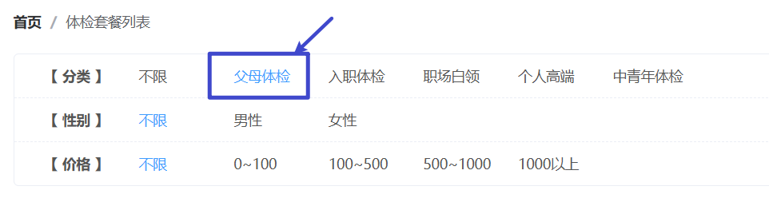

那么此时，此时响应式数据应该是这样的：


并且同时要修改另一个响应式对象中的数据，如下：

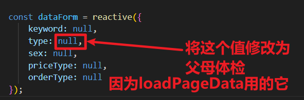

说来说去，其实就是：当用户点击页面上的任意按钮，你需要去维护两个地方：一个是保持按钮被激活，一个是保持参数分页的响应式对象状态要和页面中用户点击的状态一致即可。

1. 如果用户点击的是分类和性别，那么就提交点击的字符串本身即可。
2. 如果用户点击的是价格，比如 1-100，则提交 priceType=1，100-500 则提交 priceType=2，以此类推。
3. 用户点击分类、性别、价格时，都调用同一个函数：selectHandle
4. 用户如果点击最新、销量，则调用另一个函数：selectRadio
5. 用户如果点击的是价格的升序降序，则调用另一个函数：selectPrice
6. 用户如果点击最新或销量，则价格升降序的图标需要恢复默认状态。
7. 用户如果点击价格升降序的图标，最新和销量的单选按钮需要恢复默认状态。

## 编写 selectHandle 函数

该函数处理的是分类、性别、价格区域的变化：记住哦，你需要做两件事，第一是维护页面的按钮激活状态，第二是维护响应式对象中的数据。

```typescript
function selectHandle(key, name){

    condition[key].forEach(one => {
        if(key != 'priceType'){ // 用户点了 分类 或 性别
            if(name == one.name){
                // 维护页面按钮激活状态
                one.active = true;
                // 维护响应式对象中的数据
                if(key == "type"){
                  dataForm.type = one.name == '不限' ? null : one.name;  
                }else if(key == "sex"){
                  dataForm.sex = one.name == '不限' ? null : one.name;  
                }
            }else{
                // 维护页面按钮激活状态
                one.active = false;
            }
        }else{
            // 用户点了 价格 区间
            if(name == one.name){
                one.active = true;
                dataForm.priceType = one.name == '不限' ? null : one.value;
            }else{
                one.active = false;
            }
        }
    });

    // 清空之前的分页数据
    data.dataList = [];
    data.isLast = false;
    data.pageIndex = 1; // 不能给0，需要给1
    data.pageSize = 12;
    data.totalCount = 0;
    // 重新根据条件加载最新数据
    loadPageData();
}
```

## 编写 selectRadio 函数

```typescript
    function selectRadio(value: string){
        // 将升降序图标恢复为默认
        priceOrder.icon = 'sort-default';
        // 维护响应式对象中的数据
        if(value == '最新'){
            dataForm.orderType = 1;
        }else if(value == '销量'){
            dataForm.orderType = 2;
        }
        // 清空之前的分页数据
        data.dataList = [];
        data.isLast = false;
        data.pageIndex = 1; // 不能给0，需要给1
        data.pageSize = 12;
        data.totalCount = 0;
        // 重新根据条件加载最新数据
        loadPageData();
    }
```

## 编写 selectPrice 函数

```typescript
function selectPrice(){
    // 先把销量和最新单选按钮取消选中。
    radio.value = null;

    // 然后再维护响应式对象的状态。
    if(priceOrder.icon == 'sort-default' || priceOrder.icon == 'sort-desc'){
        // 维护图标状态
        priceOrder.icon = 'sort-asc';
        // 维护响应式数据
        dataForm.orderType = 3;
    }else{
        // 维护图标状态
        priceOrder.icon = 'sort-desc';
        dataForm.orderType = 4;
    }

    // 清空之前数据，并加载新数据。
    // 清空之前的分页数据
    data.dataList = [];
    data.isLast = false;
    data.pageIndex = 1; // 不能给0，需要给1
    data.pageSize = 12;
    data.totalCount = 0;
    // 重新根据条件加载最新数据
    loadPageData();
}
```