# 美年大健康项目-06

# mis 端订单管理模块业务分析

## 数据库 ER 图

`trade_order`：订单表

`med_exam_appointment`：体检预约表

`crm_customer`：客户表


**体检预约表的字段说明：**

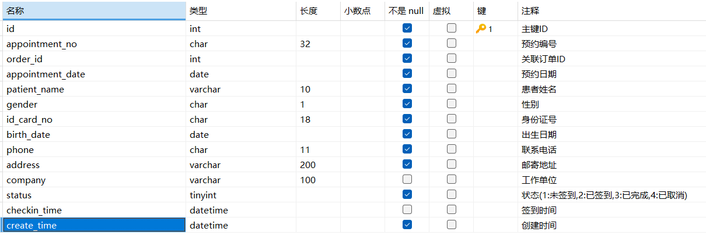

**下单购买体检套餐的客户与体检人可以不是同一个人**。比如说子女给父母买体检套餐，但是自己不体检，所以体检预约表中**并不存在客户表的外键字段**。

## UI 界面截图


**同步付款结果的业务：**

当客户支付成功后，若因网络问题导致后端未收到支付成功通知，且客户浏览器意外关闭未能主动查询支付结果，订单可能被系统定时任务误判为“超时未支付”而关闭。遇到此类情况，客户可主动联系大健康网站客服说明详情。工作人员将在订单管理页面中选中对应订单，并点击“同步付款结果”按钮，系统将主动向支付平台查询实际支付状态并更新订单，确保订单状态准确。

**线下退款业务：**

若客户申请退款时，因银行卡已注销导致原路退款失败，则需客户本人携带有效身份证件前往体检中心办理线下退款。财务人员通过网银完成转账后，工作人员可在订单管理页面点击“线下退款”按钮，手动将订单状态更新为“已退款”。

**删除订单业务：**

订单管理页面提供的“删除”功能，主要用于清理调试阶段产生的测试数据，不建议用于删除正式订单记录。在用户权限管理中，应严格限制该功能，仅超级管理员可操作。

**预览套餐业务：**

工作人员如需查看订单中包含的体检套餐详情，可点击“预览”按钮。系统将展示下单时保存的商品快照信息，真实还原客户购买时的套餐内容与价格，而非调用当前商品库中的最新信息，确保历史订单的准确性与公正性。

## UML 用例图


# mis 端的促销规则模块业务分析

## 数据库 ER 图

`med_exam_package`：体检套餐表

`promotion_rule`：促销规则表

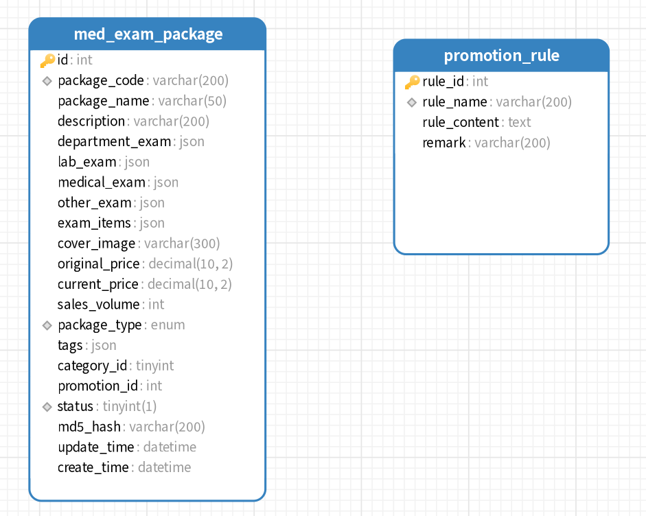

**促销规则表字段说明：**


## UI 界面截图

我们在该模块里面可以对促销规则执行CRUD操作，只不过一旦被商品引用的促销规则就不能被删除，除非商品取消关联这个促销规则。


规则管理页面包含了弹窗控件，我们可以在里面填写规则内容


## UML 用例图

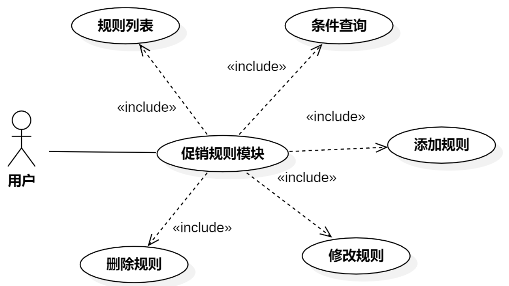

# mis 端订单管理页面搜索区实现

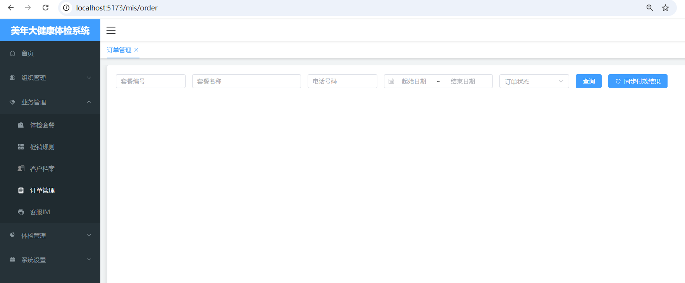

## 配置路由规则

在 `src/views/mis` 目录中创建 `order.vue` 页面，然后在 `src/router/index.ts` 文件中配置路由信息：

在 `mis`的 `children`中添加

```typescript
{
    path: 'order',
    name: 'MisOrder',
    component: ()=>import('../views/mis/order.vue'),
    meta: {
        title: "订单管理",
        isTab: true
    }
}
```

在 `src/views/mis` 目录中创建 `order.less`文件，在 `order.vue`中引入样式文件：

```plaintext
<template>

</template>

<script lang="ts" setup>

</script>

<style lang="less" scoped>
    @import url('order.less');
</style>
```

## 编写视图层

在 `order.vue`中编写视图层代码：

```html
<div v-if="proxy.isAuth(['ROOT', 'ORDER:SELECT'])">
    <el-form :inline="true" :model="dataForm" :rules="dataRule" ref="form">
        <el-form-item prop="packageCode">
            <el-input v-model="dataForm.packageCode" placeholder="套餐编号"
                maxlength="20" class="input" clearable="clearable" />
        </el-form-item>
        <el-form-item prop="keyword">
            <el-input v-model="dataForm.keyword" placeholder="套餐名称"
                class="keyword" maxlength="50" clearable="clearable" />
        </el-form-item>
        <el-form-item prop="phone">
            <el-input v-model="dataForm.phone" placeholder="电话号码"
                maxlength="11" class="input" clearable="clearable" />
        </el-form-item>
        <el-form-item class="range">
            <el-date-picker v-model="dataForm.dateRange" type="daterange"
                range-separator="~" start-placeholder="起始日期"
                end-placeholder="结束日期" format="YYYY-MM-DD"
                value-format="YYYY-MM-DD" />
        </el-form-item>
        <el-form-item>
            <el-select v-model="dataForm.orderStatus" class="input"
                placeholder="订单状态" clearable="clearable">
                <el-option label="未付款" value="1" />
                <el-option label="已关闭" value="2" />
                <el-option label="已付款" value="3" />
                <el-option label="已退款" value="4" />
                <el-option label="已预约" value="5" />
                <el-option label="已结束" value="6" />
            </el-select>
        </el-form-item>
        <el-form-item>
            <el-button type="primary" @click="searchHandle()">查询</el-button>
        </el-form-item>
        <el-form-item>
            <el-button type="primary"
                v-if="proxy.isAuth(['ROOT', 'ORDER:UPDATE'])" :icon="Refresh"
                @click="checkPaymentResultHandle()">同步付款结果</el-button>
        </el-form-item>
    </el-form>
</div>
```

## 编写模型层

在 `order.vue`中编写以下代码：

```typescript
<script lang="ts" setup>
    import { reactive, getCurrentInstance, ref } from 'vue';
    import router from '../../router/index';
    import { Refresh } from '@element-plus/icons-vue'

    const { proxy } = getCurrentInstance();

    const dataForm = reactive({
        packageCode: null,
        keyword: null,
        phone: null,
        dateRange: [],
        orderStatus: null
    });

    const dataRule = reactive({
        packageCode: [
            { min: 6, message: '编号不能少于6个字符' },
            { pattern: '^[a-zA-Z0-9]{6,20}$', message: '编号格式错误' }
        ],
        keword: [
            { pattern: '^[a-zA-Z0-9\u4e00-\u9fa5]{1,50}$', message: '名称格式错误' }
        ],
        phone: [
            { pattern: '^1[1-9]\\d{9}$', message: '电话号码格式错误' }
        ]
    });
</script>
```

## 编写样式

在 `order.less`文件中编写以下代码：

```plaintext
@import url('../style.less');

.range {
        width: 250px;
}
.keyword {
        width: 250px;
}
```

# mis 端订单模块分页排版


## 编写视图层代码

在 `order.vue`的视图层中添加表格标签和分页组件标签：

```html
<el-table :data="data.dataList"
    :header-cell-style="{'background':'#f5f7fa'}" border
    v-loading="data.loading" @selection-change="selectionChangeHandle"
    @expand-change="expand" :row-key="data.getRowKeys"
    :expand-row-keys="data.expands">
    <el-table-column type="expand">
        <template #default="scope">
            <p>这里是折叠面板的内容</p>
        </template>
    </el-table-column>
    <el-table-column type="selection" header-align="center"
        align="center" width="50" :selectable="selectable" />
    <el-table-column type="index" header-align="center" align="center"
        width="100" label="序号">
        <template #default="scope">
            <span>{{ (data.pageIndex - 1) * data.pageSize + scope.$index + 1 }}</span>
        </template>
    </el-table-column>
    <el-table-column prop="goodsTitle" header-align="left" align="left"
        min-width="220" label="套餐名称" />
    <el-table-column header-align="center" align="center" min-width="80"
        label="价格">
        <template #default="scope">
            <span>￥{{ scope.row.goodsPrice }}</span>
        </template>
    </el-table-column>
    <el-table-column prop="quantity" header-align="center" align="center"
        min-width="100" label="数量" />
    <el-table-column header-align="center" align="center"
        min-width="100" label="总计">
        <template #default="scope">
            <span>￥{{ scope.row.totalAmount }}</span>
        </template>
    </el-table-column>
    <el-table-column prop="orderStatus" header-align="center" align="center"
        min-width="100" label="状态" />
    <el-table-column prop="createTime" header-align="center"
        align="center" min-width="100" label="下单时间" />
    <el-table-column prop="refundTime" header-align="center"
        align="center" min-width="100" label="退款时间" />
    <el-table-column header-align="center" align="center" width="200"
        label="操作">
        <template #default="scope">
            <el-button type="text"
                v-if="proxy.isAuth(['ROOT', 'ORDER:SELECT'])"
                @click="viewHandle(scope.row.snapshotId)">
                预览
            </el-button>
            <el-button type="text"
                v-if="proxy.isAuth(['ROOT', 'ORDER:DELETE'])"
                :disabled="scope.row.status!='已关闭'"
                @click="deleteHandle(scope.row.orderId)">
                删除
            </el-button>
            <el-button type="text"
                v-if="proxy.isAuth(['ROOT', 'ORDER:UPDATE'])"
                :disabled="scope.row.orderStatus!='已付款'"
                @click="updateHandle(scope.row.orderId)">
                线下退款
            </el-button>
        </template>
    </el-table-column>
</el-table>
<el-pagination @size-change="sizeChangeHandle"
    @current-change="currentChangeHandle" :current-page="data.pageIndex"
    :page-sizes="[10, 20, 50]" :page-size="data.pageSize"
    :total="data.totalCount"
    layout="total, sizes, prev, pager, next, jumper">
</el-pagination>
```

## 编写模型层代码

```typescript
const data = reactive({
    dataList: [
        {
            "totalAmount": "5,000",
            "snapshotId": "68fd9a9ba2bf84c53c8875d1",
            "registerTime": "2025-10-17",
            "gender": "男",
            "num": 0,
            "photoUrl": "",
            "quantity": 1,
            "createTime": "2025-10-04 12:00",
            "goodsPrice": "5,000",
            "outTradeNo": "7D0CFD603DA74C5A8477D7E09CDDEBF6",
            "customerName": "欧阳锋",
            "goodsTitle": "新青年新白领体检套餐",
            "phone": "18888888888",
            "orderId": 10,
            "orderStatus": "已关闭",
            "createDate": "2025-10-05"
        }
    ],
    pageIndex: 1,
    pageSize: 10,
    totalCount: 0,
    loading: false,
    selections: [],
    expands: [],
    getRowKeys(row) {
        return row.orderId;
    },
    appointment: []

});
```

# mis 端订单模块折叠面板

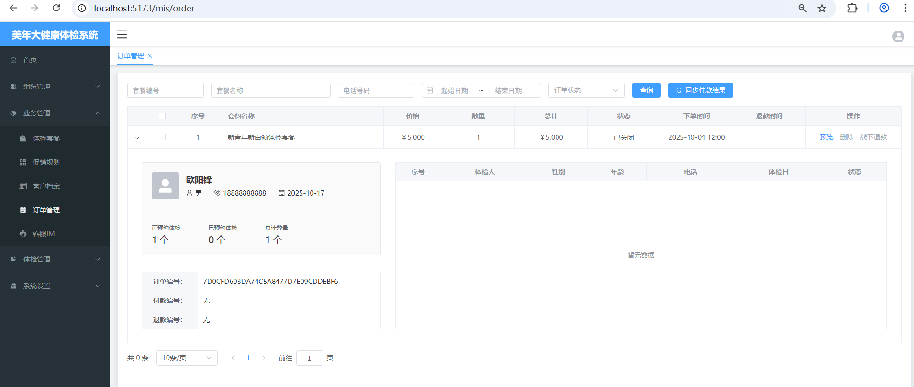

## 编写视图层

在 `order.vue`中找到折叠面板的位置，将以下代码填充到折叠面板上：

```html
<div class="content-container">
    <div class="left-panel">
        <el-card class="box-card" shadow="never">
            <div class="info">
                <div class="left">
                    <el-avatar :size="57" shape="square" :src="scope.row.photoUrl">
                        <el-icon size="35"><UserFilled /></el-icon>
                    </el-avatar>
                </div>
                <div class="right">
                    <h4 class="customer-name">{{scope.row.customerName}}</h4>
                    <p class="customer-desc">
                        <el-icon class="icon"><User /></el-icon>
                        <span class="value">{{scope.row.gender}}</span>
                        <el-icon class="icon"><Phone /></el-icon>
                        <span class="value">{{scope.row.phone}}</span>
                        <el-icon class="icon"><Calendar /></el-icon>
                        <span class="value">{{scope.row.registerTime}}</span>
                    </p>
                </div>
            </div>
            <el-divider />
            <el-row :gutter="16">
                <el-col :span="6">
                    <div class="statistic-card">
                        <el-statistic :value="scope.row.quantity-scope.row.num"
                            suffix="个">
                            <template #title>
                                <div class="title">可预约体检</div>
                            </template>
                        </el-statistic>
                    </div>
                </el-col>
                <el-col :span="6">
                    <div class="statistic-card">
                        <el-statistic :value="scope.row.num"
                            suffix="个">
                            <template #title>
                                <div class="title">已预约体检</div>
                            </template>
                        </el-statistic>
                    </div>
                </el-col>
                <el-col :span="6">
                    <div class="statistic-card">
                        <el-statistic :value="scope.row.quantity"
                            suffix="个">
                            <template #title>
                                <div class="title">总计数量</div>
                            </template>
                        </el-statistic>
                    </div>
                </el-col>
            </el-row>
        </el-card>
        <el-descriptions :column="1" class="order-code" border>
            <el-descriptions-item label="订单编号：" label-align="center">
            {{scope.row.outTradeNo}}
            </el-descriptions-item>
            <el-descriptions-item label="付款编号：" label-align="center">
            {{scope.row.transactionId==null?"无":scope.row.transactionId}}
            </el-descriptions-item>
            <el-descriptions-item label="退款编号：" label-align="center">
            {{scope.row.outRefundNo==null?"无":scope.row.outRefundNo}}
            </el-descriptions-item>
        </el-descriptions>
    </div>
    <div class="right-panel">
        <el-table :data="data.appointment"
            :header-cell-style="{'background':'#f5f7fa'}"
            height="350" border>
            <el-table-column label="序号" type="index" label-align="center" 
                align="center" min-width="90">
                <template #default="scope">
                    <span>{{ scope.$index + 1 }}</span>
                </template>
            </el-table-column>
            <el-table-column prop="patientName" label="体检人" label-align="center" 
                align="center" min-width="180" />
            <el-table-column prop="gender" label="性别" label-align="center" 
                align="center" min-width="120" />
            <el-table-column prop="age" label="年龄" label-align="center" 
                align="center" min-width="120" />
            <el-table-column prop="phone" label="电话" label-align="center" 
                align="center" min-width="180" />
            <el-table-column prop="appointmentDate" label="体检日" label-align="center" 
                align="center" min-width="180" />
            <el-table-column prop="status" label="状态" label-align="center" 
                align="center" min-width="130" />
        </el-table>
    </div>
</div>
```

## 编写样式

在 `order.less`文件中添加样式：

```plaintext
.content-container {
    padding: 20px 30px;
    display: flex;
    .left-panel {
        width: 500px;
        height: 350px;
        flex-grow: 0;
        flex-shrink: 0;
        .box-card {
            cursor: default;
            user-select: none;
            background-color: @bg-color-20;
            .info {
                display: flex;
                .left {
                }
                .right {
                    margin-left: 15px;
                    .customer-name {
                        color: @font-color-1;
                        font-size: 18px;
                        margin: 5px 0 0 0;
                    }
                    .customer-desc {
                        display: flex;
                        margin-top: 10px;
                        margin-bottom: 0;
                        .icon {
                        }
                        .value {
                            margin-left: 5px;
                            margin-right: 25px;
                            &:last-of-type {
                                margin-right: 0;
                            }
                        }
                    }
                }
            }
        }
        .order-code {
            margin-top: 34px;
        }
    }
    .right-panel {
        margin-left: 30px;
        flex-grow: 1;
        height: 350px;
    }
}
```

# mis 端促销规则页面

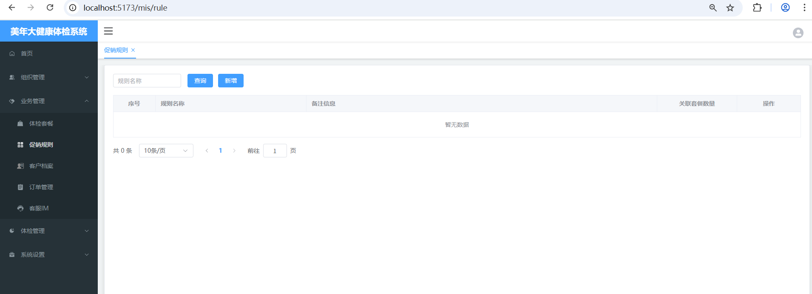

## 配置路由

在 `src/views/mis` 目录中创建 `rule.vue` 页面，然后在 `src/router/index.ts` 文件中配置路由信息：

在 mis 端的 children 下添加路由配置：

```typescript
{
    path: 'rule',
    name: 'MisRule',
    component: ()=>import('../views/mis/rule.vue'),
    meta: {
        title: "促销规则",
        isTab: true
    }
}
```

## 编写视图层

```html
<template>

    <div v-if="proxy.isAuth(['ROOT', 'RULE:SELECT'])">
        <el-form :inline="true" :model="dataForm" :rules="dataRule" ref="form">
            <el-form-item prop="ruleName">
                <el-input v-model="dataForm.ruleName" placeholder="规则名称"
                    maxlength="20" class="input" clearable="clearable" />
            </el-form-item>
            <el-form-item>
                <el-button type="primary" @click="searchHandle()">查询</el-button>
                <el-button type="primary" :disabled="!proxy.isAuth(['ROOT', 'RULE:INSERT'])"
                    @click="addHandle()">
                    新增
                </el-button>
            </el-form-item>
        </el-form>
        <el-table :data="data.dataList"
            :header-cell-style="{'background':'#f5f7fa'}" border
            v-loading="data.loading">
            <el-table-column type="index" header-align="center" align="center"
                width="100" label="序号">
                <template #default="scope">
                    <span>{{ (data.pageIndex - 1) * data.pageSize + scope.$index + 1 }}</span>
                </template>
            </el-table-column>
            <el-table-column prop="ruleName" header-align="left" align="left"
                min-width="150" label="规则名称" />
            <el-table-column prop="remark" header-align="left" align="left"
                min-width="350" label="备注信息" />
            <el-table-column prop="count" header-align="center" align="center"
                min-width="80" label="关联套餐数量" />
            <el-table-column header-align="center" align="center" width="150"
                label="操作">
                <template #default="scope">
                    <el-button type="text"
                        v-if="proxy.isAuth(['ROOT', 'RULE:UPDATE'])"
                        @click="updateHandle(scope.row.ruleId)">
                        修改
                    </el-button>
                    <el-button type="text" :disabled="scope.row.count>0"
                        v-if="proxy.isAuth(['ROOT', 'RULE:DELETE'])"
                        @click="deleteHandle(scope.row.ruleId)">
                        删除
                    </el-button>
                </template>
            </el-table-column>
        </el-table>
        <el-pagination @size-change="sizeChangeHandle"
            @current-change="currentChangeHandle" :current-page="data.pageIndex"
            :page-sizes="[10, 20, 50]" :page-size="data.pageSize"
            :total="data.totalCount"
            layout="total, sizes, prev, pager, next, jumper">
        </el-pagination>
    </div>

</template>
```

## 编写模型层

```typescript
<script lang="ts" setup>
    import { reactive, getCurrentInstance, ref, onMounted } from 'vue';
    import { Delete } from '@element-plus/icons-vue';
    import router from '../../router/index';
    const { proxy } = getCurrentInstance();
  
    const dataForm = reactive({
        ruleName: null
    });
  
    const dataRule = reactive({
        ruleName: [
          { required: false, pattern: '^[a-zA-Z0-9\u4e00-\u9fa5]{1,20}$', message: '规则名称不正确' }
        ]
    });

    const data = reactive({
        dataList: [],
        pageIndex: 1,
        pageSize: 10,
        totalCount: 0,
        loading: false
    });

</script>
```

# 订单分页查询 RESTful 接口

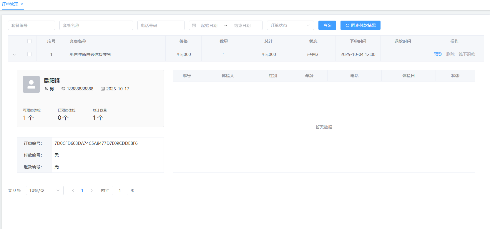

## 时序图


## 需要哪些查询条件

1. 套餐编号：根据套餐编号模糊查询，套餐编号 `package_code`，该字段在 `med_exam_package`表当中。
2. 套餐名称：根据套餐名称模糊查询，套餐名称 `goods_title`，该字段在 `trade_order`表当中。
3. 电话号码：根据电话号码精确查询，电话号码 `phone`，该字段在 `crm_customer`表当中。
4. 创建日期：根据订单创建日期区间精确查询，创建日期 `create_date`，该字段在 `trade_order`表当中。
5. 订单状态：根据订单状态精确查询，订单状态 `order_status`，该字段在 `trade_order`表当中。

通过上面的查询条件可以分析得到至少需要三张表连接：

1. `med_exam_package`
2. `trade_order`
3. `crm_customer`

另外，我们通过页面的数据展示上，发现折叠面板中还需要显示预约体检的数量，因此还需要再多连接一张表：体检预约表 `med_exam_appointment`，因此最终得出的结论是至少需要这 4 张表进行连接。并且需要注意的是：与 `med_exam_appointment`进行表连接时要使用外连接，因为有的订单还没有任何预约记录。

## 需要返回什么结果

需要返回什么结果，具体就要看页面上需要什么数据。通过表格行上显示的数据，以及折叠面板中的数据，我们可以汇总得到需要返回这些数据：

1. 套餐名称：`trade_order`表中的 `goods_title`
2. 价格：`trade_order`表中的 `goods_price`
3. 数量：`trade_order`表中的 `quantity`
4. 总价：`trade_order`表中的 `total_amount`
5. 订单状态：`trade_order`表中的 `order_status`
6. 下单时间（创建时间）：`trade_order`表中的 `create_time`
7. 创建日期：`trade_order`表中的 `create_date`
8. 退款时间：`trade_order`表中的 `refund_time`
9. 退款日期：`trade_order`表中的 `refund_date`
10. 订单 id：`trade_order`表中的 `order_id`
11. 客户头像：`crm_customer`表中的 `photo_url`
12. 客户姓名：`crm_customer`表中的 `customer_name`
13. 客户性别：`crm_customer` 表中的 `gender`
14. 客户电话：`crm_customer`表中的 `phone`
15. 客户注册时间：`crm_customer`表中的 `register_time`
16. 订单编号（交易流水号）：`trade_order`表中的 `out_trade_no`
17. 付款编号（付款单 id）：`trade_order`表中的 `transaction_id`
18. 退款编号（退款流水号）：`trade_order`表中的 `out_refund_no`
19. 商品快照 id（实现预览功能时从 mongodb 中获取）：`trade_order`表中的 `snapshot_id`
20. 已预约体检数量：与体检预约表进行外连接，根据 `order_id` 分组，`count(*)` 计数。

## 编写 Mapper 和 XML

找到 `TradeOrderMapper`接口，编写以下两个方法：

```java
List<Map<String, Object>> selectPage(Map<String, Object> params);

long selectCount(Map<String, Object> params);
```

找到 `TradeOrderMapper.xml`文件，编写以下两个 SQL：

```xml
<select id="selectPage" parameterType="Map" resultType="Map">
  select 
    o.goods_title as goodsTitle,
    o.goods_price as goodsPrice,
    o.quantity,
    o.total_amount as totalAmount,
    o.order_status as orderStatus,
    date_format(o.create_time, '%Y-%m-%d %H:%i') as createTime,
    o.create_date as createDate,
    date_format(o.refund_time, '%Y-%m-%d %H:%i') as refundTime,
    o.refund_date as refundDate,
    o.order_id as orderId,
    c.photo_url as photoUrl,
    c.customer_name as customerName,
    c.gender,
    c.phone,
    date_format(c.register_time, '%Y-%m-%d') as registerTime,
    o.out_trade_no as outTradeNo,
    o.transaction_id as transactionId,
    o.out_refund_no as outRefundNo,
    o.snapshot_id as snapshotId,
    count(a.order_id) as num
  from 
    med_exam_package p
  join
    trade_order o
  on
    p.id = o.goods_id
  join
    crm_customer c
  on
    c.id = o.customer_id
  left join
    med_exam_appointment a
  on
    a.order_id = o.order_id
  <where>
    <if test="packageCode != null and packageCode != ''">
      p.package_code like concat('%',#{packageCode},'%')
    </if>
    <if test="keyword != null and keyword != ''">
      and o.goods_title like concat('%',#{keyword},'%')
    </if>
    <if test="phone != null and phone != ''">
      and c.phone = #{phone}
    </if>
    <if test="orderStatus != null">
      and o.order_status = #{orderStatus}
    </if>
    <if test="startDate != null and startDate != '' and endDate != null and endDate != ''">
      and o.create_date between #{startDate} and #{endDate}
    </if>
  </where>
  group by o.order_id
  order by o.order_id desc
  limit #{startIndex}, #{pageSize}
</select>

<select id="selectCount" parameterType="Map" resultType="long">
  select 
    count(*)
  from 
    med_exam_package p
  join
    trade_order o
  on
    p.id = o.goods_id
  join
    crm_customer c
  on
    c.id = o.customer_id
  <where>
    <if test="packageCode != null and packageCode != ''">
      p.package_code like concat('%',#{packageCode},'%')
    </if>
    <if test="keyword != null and keyword != ''">
      and o.goods_title like concat('%',#{keyword},'%')
    </if>
    <if test="phone != null and phone != ''">
      and c.phone = #{phone}
    </if>
    <if test="orderStatus != null and orderStatus != ''">
      and o.order_status = #{orderStatus}
    </if>
    <if test="startDate != null and startDate != '' and endDate != null and endDate != ''">
      and o.create_date between #{startDate} and #{endDate}
    </if>
  </where>
</select>
```

## 编写 Service 接口和实现

注意：在 mis 端新建一个 Service 接口，起名`TradeOrderService`，注意这个 service 需要给它起个名字，如果不起名字会和业务端的 `TradeOrderService`冲突。

```java
package com.jkweilai.meinian.api.service;

import com.jkweilai.meinian.api.common.PageResult;

import java.util.Map;

public interface TradeOrderService {
    PageResult<Map<String,Object>> pageQueryByCondition(Map<String, Object> param);
}
```

编写接口实现类，一定要起个名字，代码如下：

```java
package com.jkweilai.meinian.api.service.impl;

import cn.hutool.core.map.MapUtil;
import com.jkweilai.meinian.api.common.PageResult;
import com.jkweilai.meinian.api.db.mapper.TradeOrderMapper;
import com.jkweilai.meinian.api.service.TradeOrderService;
import jakarta.annotation.Resource;
import org.springframework.stereotype.Service;

import java.util.ArrayList;
import java.util.List;
import java.util.Map;

@Service("MisTradeOrderService") // 这个名字很重要，防止冲突。
public class TradeOrderServiceImpl implements TradeOrderService {

    @Resource
    private TradeOrderMapper tradeOrderMapper;

    @Override
    public PageResult<Map<String, Object>> pageQueryByCondition(Map<String, Object> param) {
        long total = tradeOrderMapper.selectCount(param);
        List<Map<String, Object>> records = new ArrayList<>();
        if(total > 0){
            records = tradeOrderMapper.selectPage(param);
        }
        Integer pageSize = MapUtil.getInt(param, "pageSize");
        Integer pageNo = MapUtil.getInt(param, "pageNo");
        PageResult<Map<String, Object>> pageResult = new PageResult<>(total,pageSize, pageNo, records);
        return pageResult;
    }
}
```

## 编写 form 接收数据和校验

```java
package com.jkweilai.meinian.api.controller.form;

import jakarta.validation.constraints.Min;
import jakarta.validation.constraints.NotNull;
import jakarta.validation.constraints.Pattern;
import lombok.Data;
import org.hibernate.validator.constraints.Range;

@Data
public class OrderPageQueryForm {

    @Pattern(regexp = "^1[1-9]\\d{9}$", message = "phone内容不正确")
    private String phone;

    @Pattern(regexp = "^[a-zA-Z0-9]{6,20}$", message = "packageCode内容不正确")
    private String packageCode;

    @Pattern(regexp = "^[a-zA-Z0-9\\u4e00-\\u9fa5]{1,50}$", message = "keyword内容不正确")
    private String keyword;

    @Range(min = 1, max = 6, message = "orderStatus内容不正确")
    private Integer orderStatus;

    @Pattern(regexp = "^((((1[6-9]|[2-9]\\d)\\d{2})-(0?[13578]|1[02])-(0?[1-9]|[12]\\d|3[01]))|(((1[6-9]|[2-9]\\d)\\d{2})-(0?[13456789]|1[012])-(0?[1-9]|[12]\\d|30))|(((1[6-9]|[2-9]\\d)\\d{2})-0?2-(0?[1-9]|1\\d|2[0-8]))|(((1[6-9]|[2-9]\\d)(0[48]|[2468][048]|[13579][26])|((16|[2468][048]|[3579][26])00))-0?2-29))$", message = "startDate内容不正确")
    private String startDate;

    @Pattern(regexp = "^((((1[6-9]|[2-9]\\d)\\d{2})-(0?[13578]|1[02])-(0?[1-9]|[12]\\d|3[01]))|(((1[6-9]|[2-9]\\d)\\d{2})-(0?[13456789]|1[012])-(0?[1-9]|[12]\\d|30))|(((1[6-9]|[2-9]\\d)\\d{2})-0?2-(0?[1-9]|1\\d|2[0-8]))|(((1[6-9]|[2-9]\\d)(0[48]|[2468][048]|[13579][26])|((16|[2468][048]|[3579][26])00))-0?2-29))$", message = "endDate内容不正确")
    private String endDate;

    @NotNull(message = "pageNo不能为空")
    @Min(value = 1, message = "pageNo不能小于1")
    private Integer pageNo;

    @NotNull(message = "pageSize不能为空")
    @Range(min = 5, max = 50, message = "pageSize必须为10~50之间")
    private Integer pageSize;

}
```

## 编写 web 接口

在 mis 端创建新的类 `TradeOrderController`，这个控制器也必须起一个名字，要不然会和业务端的冲突。代码如下：

```java
package com.jkweilai.meinian.api.controller;

import cn.dev33.satoken.annotation.SaCheckPermission;
import cn.dev33.satoken.annotation.SaMode;
import cn.hutool.core.bean.BeanUtil;
import cn.hutool.core.date.DateTime;
import cn.hutool.core.date.DateUtil;
import com.jkweilai.meinian.api.common.PageResult;
import com.jkweilai.meinian.api.common.R;
import com.jkweilai.meinian.api.controller.form.OrderPageQueryForm;
import com.jkweilai.meinian.api.exception.HisException;
import com.jkweilai.meinian.api.service.TradeOrderService;
import jakarta.annotation.Resource;
import jakarta.validation.Valid;
import org.springframework.web.bind.annotation.PostMapping;
import org.springframework.web.bind.annotation.RequestBody;
import org.springframework.web.bind.annotation.RequestMapping;
import org.springframework.web.bind.annotation.RestController;

import java.util.Map;

@RestController("MisTradeOrderController")
@RequestMapping("/mis/order")
public class TradeOrderController {

    @Resource
    private TradeOrderService tradeOrderService;

    @PostMapping("/pageQuery")
    @SaCheckPermission(value = {"ROOT", "ORDER:SELECT"}, mode = SaMode.OR)
    public R pageQuery(@RequestBody @Valid OrderPageQueryForm form) {
        // 如果提供了一个开始日期，则结束日期不能为空，如果提供了结束日期，则开始日期不能为空。
        // 要提供都提供，要不提供都不提供
        String startDate = form.getStartDate();
        String endDate = form.getEndDate();
        if((startDate != null && endDate == null) || (startDate == null && endDate != null)) {
            throw new HisException("开始日期和结束日期要提供就都提供，不能只提供一个");
        }else if(startDate != null && endDate != null) {
            // 开始日期必须是小于等于结束日期的。
            DateTime start = DateUtil.parse(startDate, "yyyy-MM-dd");
            DateTime end = DateUtil.parse(endDate, "yyyy-MM-dd");
            if(start.isAfter(end)) {
                throw new HisException("开始日期必须在结束日期之前");
            }
        }

        Integer pageNo = form.getPageNo();
        Integer pageSize = form.getPageSize();
        Integer startIndex = (pageNo - 1) * pageSize;
        Map<String, Object> param = BeanUtil.beanToMap(form);
        param.put("startIndex", startIndex);
        PageResult<Map<String, Object>> pageResult = tradeOrderService.pageQueryByCondition(param);
        return R.ok().put("pageResult", pageResult);
    }
}
```

## 测试 web 接口

注意：现在的测试方式不是 https 了，是 http。

接口测试地址：[http://localhost:8080/meinian-api/mis/order/pageQuery](http://localhost:8080/meinian-api/mis/order/pageQuery)

测试数据：

```json
{
    "keyword": "入职",
    "pageNo": 1,
    "pageSize": 10,
    "startDate": "2025-10-27",
    "endDate": "2025-10-28"
}
```

测试结果：

```json
{
        "msg": "success",
        "code": 200,
        "pageResult": {
                "total": 2,
                "pageSize": 10,
                "pageNo": 1,
                "records": [
                        {
                                "quantity": 1,
                                "outRefundNo": "CF1CCEE80D744693AB4DC09AAE0CC490",
                                "snapshotId": "68fd9a9ba2bf84c53c8875d1",
                                "gender": "男",
                                "orderId": 7,
                                "registerTime": "2025-10-20",
                                "refundTime": "2025-10-27 17:43",
                                "num": 0,
                                "orderStatus": 4,
                                "customerName": "欧阳锋",
                                "transactionId": "4200002947202510274097155786",
                                "totalAmount": 299,
                                "createTime": "2025-10-27 17:43",
                                "phone": "18888888888",
                                "goodsPrice": 299,
                                "outTradeNo": "D452E62314F346D6B68C3E51DA263D04",
                                "goodsTitle": "入职体检标准套餐",
                                "refundDate": "2025-10-27",
                                "createDate": "2025-10-27"
                        },
                        {
                                "quantity": 1,
                                "outRefundNo": "EDB8470B7EBE48B295FB15842312C29F",
                                "snapshotId": "68fd9a9ba2bf84c53c8875d1",
                                "gender": "男",
                                "orderId": 6,
                                "registerTime": "2025-10-20",
                                "refundTime": "2025-10-27 17:29",
                                "num": 0,
                                "orderStatus": 4,
                                "customerName": "欧阳锋",
                                "transactionId": "4200002939202510278181187293",
                                "totalAmount": 299,
                                "createTime": "2025-10-27 17:27",
                                "phone": "18888888888",
                                "goodsPrice": 299,
                                "outTradeNo": "60B002EF3CFE4B32AEE01C587D7F9F25",
                                "goodsTitle": "入职体检标准套餐",
                                "refundDate": "2025-10-27",
                                "createDate": "2025-10-27"
                        }
                ],
                "pages": 1
        }
}
```

# 前端实现订单的分页查询

## 恢复静态数据

把 `src/views/mis/order.vue`文件中之前模拟的静态数据删除，代码如下：

```typescript
const data = reactive({
    dataList: [],
    pageIndex: 1,
    pageSize: 10,
    totalCount: 0,
    loading: false,
    selections: [],
    expands: [],
    getRowKeys(row) {
        return row.orderId;
    },
    appointment: []
});
```

## 编写加载第一页数据的函数

在 `src/views/mis/order.vue`页面中编写 `loadPageData()`函数，发送 ajax 请求获取第一页数据：

```typescript
async function loadPageData(){
    data.loading = true;
    // 准备配置
    const config = {
        headers : {
            satoken: localStorage.getItem('token')
        }
    };
    // 准备数据
    const json = {
        packageCode: dataForm.packageCode,
        keyword: dataForm.keyword,
        phone: dataForm.phone,
        orderStatus: dataForm.orderStatus,
        pageNo: data.pageIndex,
        pageSize: data.pageSize,
        startDate: dataForm.dateRange.length == 2 ? dataForm.dateRange[0] : null,
        endData: dataForm.dateRange.length == 2 ? dataForm.dateRange[1] : null,
    }

    // 发送ajax请求
    const response = await axios.post('/meinian-api/mis/order/pageQuery', json, config);
    const pageResult = response.data.pageResult;

    // 将 pageResult.records 中的订单的orderStatus设置为文字形式，底层数据库返回的是数字。
    const orderStatusEnum = {
        "1": "未付款",
        "2": "已关闭",
        "3": "已付款",
        "4": "已退款",
        "5": "已预约",
        "6": "已结束"
    };

    const list = pageResult.records;
    for(const one of list){
        one.orderStatus = orderStatusEnum[one.orderStatus + ""];
    }

    // 渲染数据
    data.dataList = list;
    data.pageIndex = pageResult.pageNo;
    data.pageSize = pageResult.pageSize;
    data.totalCount = pageResult.total;

    data.loading = false;
}

// 页面加载的时候调用一下
loadPageData();
```

## 实现条件分页

用户点击页面上查询按钮时发送请求查询分页数据，找到查询按钮，编写回调函数：


编写 `searchHanle()`函数，代码如下：

```typescript
function searchHandle(){
    // 其实就是看好 dataForm 响应式对象
    // 前端进行一下数据的验证，如果没问题，就调用 loadPageData() 函数加载数据
    proxy.$refs["form"].validate(valid => {
        if(valid){
            // 清除表单上的错误消息
            proxy.$refs['form'].clearValidate();
            // 将页码设置为第一页
            data.pageIndex = 1;
            // 加载数据
            loadPageData();
        }
    });
}
```

## 实现分页控件的回调函数

还是老样子

```typescript
function sizeChangeHandle(val) {
    data.pageSize = val;
    data.pageIndex = 1;
    loadPageData();
}
function currentChangeHandle(val) {
    data.pageIndex = val;
    loadPageData();
}
```

# 查询体检预约记录的 RESTful 接口

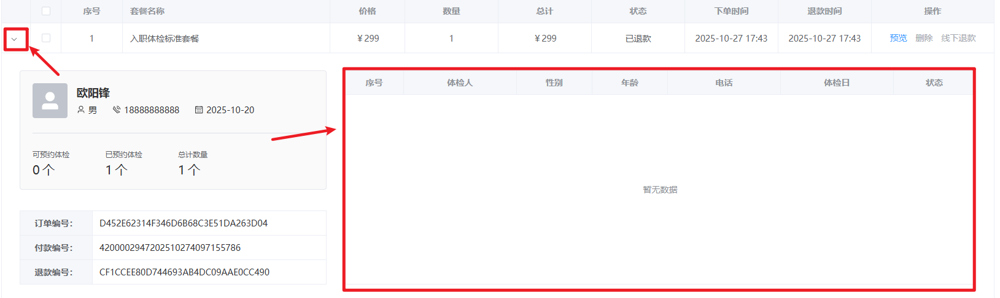

用户在展开折叠面板的时候，发送 ajax 请求。获取该订单的对应的体检预约记录。我们先来实现一下后端的 RESTful 接口，前端提交 `order_id`，在数据库表 `med_exam_appointment`中根据 `order_id`查询关联的预约记录。

## 时序图

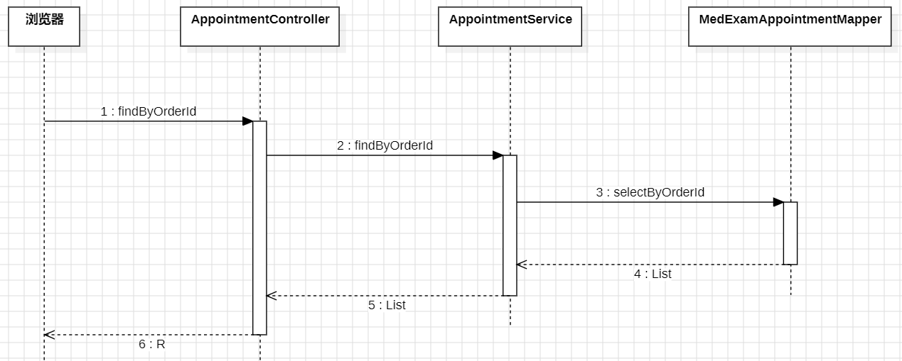

## 分析返回哪些数据

从前端页面上可以看到要返回的数据包括：表名 `med_exam_appointment`

1. 体检人：`patient_name`
2. 性别：`gender`
3. 年龄：`birth_date`和 `now()`计算一下相差多少年
4. 电话：`phone`
5. 体检日：`appointment_date`
6. 状态：`status`

## 编写 Mapper 和 XML

找到 `MedExamAppointmentMapper`接口，提供以下方法：

```java
List<Map<String, Object>> selectByOrderId(Integer orderId);
```

找到 `MedExamAppointmentMapper.xml`文件，编写以下 SQL：

```xml
<?xml version="1.0" encoding="UTF-8"?>
<!DOCTYPE mapper
        PUBLIC "-//mybatis.org//DTD Mapper 3.0//EN"
        "http://mybatis.org/dtd/mybatis-3-mapper.dtd">
<mapper namespace="com.jkweilai.meinian.api.db.mapper.MedExamAppointmentMapper">

    <select id="selectByOrderId" resultType="Map" parameterType="Integer">
        select
            patient_name as patientName,
            gender,
            phone,
            appointment_date as appointmentDate,
            status,
            timestampdiff(YEAR, birth_date, now()) as age
        from
            med_exam_appointment
        where
            order_id = #{orderId}
    </select>
</mapper>
```

## 编写 Service 接口和实现

在 mis 端新建接口 `AppointmentService`，提供以下方法：

```java
package com.jkweilai.meinian.api.service;

import java.util.List;
import java.util.Map;

public interface AppointmentService {
    List<Map<String, Object>> findByOrderId(Integer orderId);
}
```

编写接口的实现：

```java
package com.jkweilai.meinian.api.service.impl;

import com.jkweilai.meinian.api.db.mapper.MedExamAppointmentMapper;
import com.jkweilai.meinian.api.service.AppointmentService;
import jakarta.annotation.Resource;
import org.springframework.stereotype.Service;

import java.util.List;
import java.util.Map;

@Service
public class AppointmentServiceImpl implements AppointmentService {
    
    @Resource
    private MedExamAppointmentMapper appointmentMapper;
    
    @Override
    public List<Map<String, Object>> findByOrderId(Integer orderId) {
        return appointmentMapper.selectByOrderId(orderId);
    }
}
```

## 编写 form 接收数据并校验

编写 `FindAppointmentByOrderIdForm`，提供以下代码：

```java
package com.jkweilai.meinian.api.controller.form;

import jakarta.validation.constraints.Min;
import jakarta.validation.constraints.NotNull;
import lombok.Data;

@Data
public class FindAppointmentByOrderIdForm {
    @NotNull(message = "orderId不能为空")
    @Min(value = 1, message = "orderId不能小于1")
    private Integer orderId;
}
```

## 编写 web 接口

在 mis 端新建 `AppointmentController`，然后编写 web 方法，如下：

```java
package com.jkweilai.meinian.api.controller;

import cn.dev33.satoken.annotation.SaCheckPermission;
import cn.dev33.satoken.annotation.SaMode;
import com.jkweilai.meinian.api.common.R;
import com.jkweilai.meinian.api.controller.form.FindAppointmentByOrderIdForm;
import com.jkweilai.meinian.api.service.AppointmentService;
import jakarta.annotation.Resource;
import jakarta.validation.Valid;
import org.springframework.web.bind.annotation.PostMapping;
import org.springframework.web.bind.annotation.RequestBody;
import org.springframework.web.bind.annotation.RequestMapping;
import org.springframework.web.bind.annotation.RestController;

import java.util.List;
import java.util.Map;

@RestController
@RequestMapping("/mis/appointment")
public class AppointmentController {

    @Resource
    private AppointmentService appointmentService;

    @PostMapping("/findByOrderId")
    @SaCheckPermission(value = {"ROOT", "APPOINTMENT:SELECT"}, mode = SaMode.OR)
    public R findByOrderId(@RequestBody @Valid FindAppointmentByOrderIdForm form) {
        List<Map<String, Object>> list = appointmentService.findByOrderId(form.getOrderId());
        return R.ok().put("result", list);
    }
}
```

## 测试 web 接口

接口测试地址：[http://localhost:8080/meinian-api/mis/appointment/findByOrderId](http://localhost:8080/meinian-api/mis/appointment/findByOrderId)

测试数据：

```json
{
    "orderId": 7
}
```

测试结果：

```json
{
        "msg": "success",
        "result": [],
        "code": 200
}
```

# 前端展示体检预约记录

用户点开折叠面板的时候，发送 ajax 请求，展示该订单对应的体检预约记录。先来研究一下折叠面板的工作原理。

## 折叠面板的工作原理

看折叠面板这部分的代码：


el-table的折叠展开原理：通过`<font style="color:rgb(15, 17, 21);background-color:rgb(235, 238, 242);">expand-row-keys</font>`控制当前展开的行，点击展开按钮时触发`<font style="color:rgb(15, 17, 21);background-color:rgb(235, 238, 242);">expand-change</font>`事件，将点击行的唯一标识（由`<font style="color:rgb(15, 17, 21);background-color:rgb(235, 238, 242);">row-key</font>`指定）加入或移出`<font style="color:rgb(15, 17, 21);background-color:rgb(235, 238, 242);">expand-row-keys</font>`数组，从而实现行的展开与收起。

**关键点：**

- `<font style="color:rgb(15, 17, 21);background-color:rgb(235, 238, 242);">row-key</font>`：指定每行数据的唯一标识字段（**为当前折叠面板指定一个身份证号**）
- `<font style="color:rgb(15, 17, 21);background-color:rgb(235, 238, 242);">expand-row-keys</font>`：当前展开行的key值数组（**如果数组中没有元素，则表示所有折叠面板都关闭**）
- `<font style="color:rgb(15, 17, 21);background-color:rgb(235, 238, 242);">expand-change</font>`：展开状态变化时的回调函数
- 点击展开图标 → 触发expand-change → 更新expand-row-keys → 重新渲染表格

我用的是每个订单的 `<font style="color:rgb(15, 17, 21);">orderId</font>`作为折叠面板行的唯一标识，这个唯一标识可以从这里看出来：


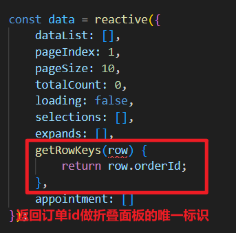

## EP 组件库其实已经实现了默认的折叠和展开

你可以把这三个代码删除掉，测试一下，看看是否可以正常的展开和折叠，删掉这三个：

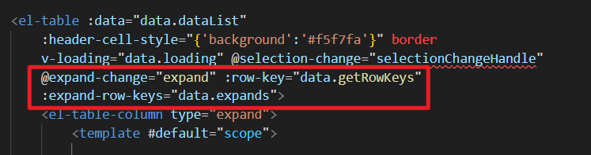

经过测试，大家可以看到删掉这些代码，折叠面板照样可以折叠和展开。那我们什么时候需要编写这三个代码呢？

答案是：如果你想重写这些展开和折叠的逻辑，你就需要把这三个代码都写上。

1. 如果你没有外部代码干涉的话，EP 组件库默认是支持展开多个面板的，但在我们的业务中永远只允许展开一个面板。
2. 另外我们展开面板的时候，肯定还要发送 ajax 请求获取订单关联的预约记录。这个 ajax 的代码你需要写到回调函数中。

因此我们需要使用以上三个代码来改变展开和折叠的默认行为。

## 研究展开和折叠时的回调函数上的两个参数

展开和折叠时，自动会调用回调函数，我们这里的回调函数是 `expand`，这个函数可以接收两个参数，这两个参数都是 EP 组件库自动给我们传过来的。我们可以先研究一下这两个参数都是什么，编写以下代码测试一下：

```typescript
function expand(a, b){
    console.log(a);
    console.log(b);
}
```

通过测试可以看到，第一个参数 a 是当前行（就是你点的那个行），第二个参数 b 是一个数组，这个数组是当前所有的展开行。也就是说如果数组中有 3 个元素，则表示有 3 个行都展开了，如果数组中没有元素，则表示一个都没有展开。（**对于我们的业务来说，我们只需要第一个参数就行了**）

## 实现展开加载数据 折叠清空数据

在 mis 端的 `order.vue`页面中编写 `expand`回调函数，判断当前行如果是展开行为，则发送 ajax 请求加载数据。并且要完成只允许一个行展开的效果。

```typescript
async function expand(row){

    // 这行代码实现只展开一个面板的逻辑
    data.expands = data.expands.includes(row.orderId) ? [] : [row.orderId];

    if(data.expands.length > 0){
        // 走到这里说明用户是一个打开操作
        // 打开的时候发送ajax请求获取预约记录
        const json = {
            orderId: row.orderId
        };
        const config = {
            headers: {
                satoken: localStorage.getItem('token')
            }
        };
        const response = await axios.post('/meinian-api/mis/appointment/findByOrderId', json, config);
        const list = response.data.result;
        // 将list集合中的每一个预约记录对象的状态修改为中文（数据库中存储的数字）
        const statusEnum = {
            "1": "未签到",
            "2": "已签到",
            "3": "已完成",
            "4": "已取消"
        };
        for(let one of list){
            one.status = statusEnum[one.status + ""];
        }
        // 将list赋值给响应式对象
        data.appointment = list;
    }else{
        // 走到这里这说明用户是一个折叠操作。
        // 折叠的时候把预约记录清空掉
        data.appointment = [];
    }
}
```

# 获取商品快照的 RESTful 接口

注意事项：获取商品快照在业务端和 mis 端都需要这个功能。并且查看商品快照主要是业务端的功能，因此我们将该功能划分到业务端。大家在写这部分代码的时候将该功能编写到 `front`业务端相关的包当中。实现思路非常简单：通过商品快照的 id 去 MongoDB 中查找快照的信息。

## 时序图


## 编写 GoodsSnapshotDao

找到 `GoodsSnapshotDao`类，编写以下代码：

```java
// 根据快照id获取商品快照信息
public GoodsSnapshotEntity findById(String snapshotId){
    return mongoTemplate.findById(snapshotId, GoodsSnapshotEntity.class);
}
```

## 编写 Service 接口和实现

注意：找到业务端 `front`包下的 `MedExamPackageService` 接口，编写以下方法：

```java
Map<String, Object> findBySnapshotId(String snapshotId, Integer customerId);
```

编写方法的实现：

```java
@Override
public Map<String, Object> findBySnapshotId(String snapshotId, Integer customerId) {

    // TODO 业务端用户在使用这个功能的时候，必须提供一个customerId，因为系统要保证当前客户只能看自己的商品快照，
    //  不能说客户只要有一个快照id就可以随便看别人的商品快照。判断逻辑是只要该客户拥有该快照id就可以查看，后面实现,
    //  mis端的用户不需要限制，如果mis端调用该方法，则customerId提供一个null即可。

    GoodsSnapshotEntity entity = goodsSnapshotDao.findById(snapshotId);
    Map<String, Object> map = BeanUtil.beanToMap(entity);
    return map;
}
```

## 编写 form 接收数据并校验

仍然是在 `front`业务端的 form 包下新建 form 类：`FindGoodsBySnapshotIdForm`

```java
package com.jkweilai.meinian.api.front.controller.form;

import jakarta.validation.constraints.NotBlank;
import jakarta.validation.constraints.Pattern;
import lombok.Data;

@Data
public class FindGoodsBySnapshotIdForm {
    @NotBlank(message = "snapshotId不能为空")
    @Pattern(regexp = "^[0-9a-z]{24}$", message = "snapshotId内容不正确")
    private String snapshotId;
}
```

## 编写 web 方法

仍然是找到业务端 `front`包下的 `MedExamPackageController`来编写以下的 web 方法：

```java
@PostMapping("/findSnapshotForMis")
@SaCheckLogin
public R findSnapshotForMis(@RequestBody @Valid FindGoodsBySnapshotIdForm form) {
    Map<String, Object> map = medExamPackageService.findBySnapshotId(form.getSnapshotId(), null);
    return R.ok().put("result", map);
}
```

这个 web 方法是专门为 mis 端的用户准备的。业务端将来还需要编写自己的 web 方法，因为业务端除了传过来快照 id，还需要传过来 customer_id。

## web 接口测试

接口测试地址：[http://localhost:8080/meinian-api/front/goods/findSnapshotForMis](http://localhost:8080/meinian-api/front/goods/findSnapshotForMis)

测试数据：你需要去 MongoDB 中找一下已存在的商品快照 id。

```json
{
    "snapshotId" : "68fd9a9ba2bf84c53c8875d1"
}
```

测试结果：

```json
{
        "msg": "success",
        "result": {
                "_id": "68fd9a9ba2bf84c53c8875d1",
                "id": 3,
                "packageCode": "319HRCT02",
                "packageName": "入职体检标准套餐",
                "description": "企业入职体检标准套餐",
                "departmentExam": [
                        {
                                "title": "基础检查",
                                "content": "内外科基础检查"
                        }
                ],
                "labExam": [
                        {
                                "title": "血常规",
                                "content": "五分类血常规"
                        },
                        {
                                "title": "尿常规",
                                "content": "尿液分析"
                        }
                ],
                "medicalExam": [
                        {
                                "title": "胸透",
                                "content": "胸部X光检查"
                        }
                ],
                "otherExam": [
                        {
                                "title": "职业病筛查",
                                "content": "基础职业病项目筛查"
                        }
                ],
                "coverImage": "front/goods/d079bf3cfbe64aa9b5e17a2e77244bb7.jpg",
                "originalPrice": 399,
                "currentPrice": 299,
                "packageType": "入职体检",
                "tags": [
                        "入职",
                        "基础"
                ],
                "ruleName": null,
                "ruleContent": null,
                "examItems": [
                        {
                                "sex": "无",
                                "code": "X1003",
                                "item": "尿常规",
                                "name": "实验室检查",
                                "type": "导入",
                                "place": "检验科"
                        }
                ],
                "md5Hash": "C3D4E5F6G7H8I9J0K1L2"
        },
        "code": 200
}
```

# 前端实现预览商品快照

## 实现思路

1. 肯定要创建一个新的 vue 页面来显示商品快照信息，这个页面主要在业务端使用，就创建到 `front`目录下：`goods_snapshot.vue`，我们之前也做过商品预览的功能，这里的预览功能对应的页面和之前的页面基本上相同。可以直接复制过来使用。之前的页面是 `front/goods.vue`
2. 需要给这个新的页面 `goods_snapshot.vue`配置一个路由，在 `front`的 children 中配置。
3. 当用户点击预览时，跳转到该路由，但由于这个预览功能是业务端和 mis 端共用的，对应的 web 接口方法不是同一个，因此跳转路由的时候，需要给路由传递一个额外的参数，比如我这里额外多传一个 `mode`参数，如果 `mode`是 front 则表示业务端跳过来的，如果 mode 是 mis 则表示 mis 端跳过来的。因此用户点击预览时要传递过来两个参数：一个是 snapshotId，一个是 mode。
4. `goods_snapshot.vue`页面在加载时，发送 ajax 请求，获取快照信息，渲染快照信息。

## 粘贴 vue 页面

在 `front`目录下新建 `goods_snapshot.vue`文件，粘贴以下代码进去：

```plaintext
<template>
    <div class="goods-detail">
        
        <div class="property">
            <h3 class="title">{{ data.packageName }} {{ data.packageCode }}</h3>
            <p class="desc">{{ data.description }}</p>
            <div class="row">
                <label>官网价格：</label>
                <div class="info">
                    <span class="current-price">{{ data.currentPrice }}</span>
                    <span class="initial-price">￥{{ data.originalPrice }}</span>
                </div>
            </div>
            <div class="row">
                <label>享有折扣：</label>
                <div class="info">
                    
                    <span
                        class="discount">{{ data.ruleName != null ? data.ruleName : '无' }}</span>
                </div>
            </div>
            <!--下面的标签是新添加的-->
            <div class="row">
                <label>商品类型：</label>
                <div class="info">虚拟卡（电子卡密）</div>
            </div>
            <div class="row">
                <label>适用人群：</label>
                <div class="info">{{ data.packageType }}</div>
            </div>
            <div class="row">
                <label>服务承诺：</label>
                <div class="info">
                    
                    <span class="service-tag">专业品质</span>
                    
                    <span class="service-tag">官方直营</span>
                    
                    <span class="service-tag">随时改</span>
                    
                    <span class="service-tag">随时退</span>
                </div>
            </div>
        </div>
    </div>

    <el-divider />
    <div class="goods-content">
        <el-descriptions title="商品摘要信息" :column="3" size="large" border>
            <el-descriptions-item label="体检名称" label-align="center">
                {{ data.packageName }} {{ data.packageCode }}
            </el-descriptions-item>
            <el-descriptions-item label="体检类型"
                label-align="center">{{ data.packageType }}</el-descriptions-item>
            <el-descriptions-item label="适用人群" label-align="center">
                <span class="tag" v-for="one in data.tags">{{ one }}</span>
            </el-descriptions-item>
            <el-descriptions-item label="体检机构" label-align="center">
                天津美年大健康体检中心（卫津南路109号京燕大厦5层）
            </el-descriptions-item>
            <el-descriptions-item label="体检项目"
                label-align="center">{{ data.examCount }}个</el-descriptions-item>
            <el-descriptions-item label="有效期"
                label-align="center">一年</el-descriptions-item>
        </el-descriptions>
        <div class="detail">
            <fieldset>
                <legend>体检项目明细</legend>
                <div v-if="data.departmentExam_count > 0">
                    <h4 class="detail-title">科室检查({{ data.departmentExam_count }}项目)</h4>
                    <table class="detail-table">
                        <tr v-for="one in data.departmentExam">
                            <th>{{ one.title }}</th>
                            <td>{{ one.content }}</td>
                        </tr>
                    </table>
                </div>
                <div v-if="data.labExam_count > 0">
                    <h4 class="detail-title">实验室检查({{ data.labExam_count }}项目)</h4>
                    <table class="detail-table">
                        <tr v-for="one in data.labExam">
                            <th>{{ one.title }}</th>
                            <td>{{ one.content }}</td>
                        </tr>
                    </table>
                </div>
                <div v-if="data.medicalExam_count > 0">
                    <h4 class="detail-title">医技检查({{ data.medicalExam_count }}项目)</h4>
                    <table class="detail-table">
                        <tr v-for="one in data.medicalExam">
                            <th>{{ one.title }}</th>
                            <td>{{ one.content }}</td>
                        </tr>
                    </table>
                </div>
                <div v-if="data.otherExam_count > 0">
                    <h4 class="detail-title">其他检查({{ data.otherExam_count }}项目)</h4>
                    <table class="detail-table">
                        <tr v-for="one in data.otherExam">
                            <th>{{ one.title }}</th>
                            <td>{{ one.content }}</td>
                        </tr>
                    </table>
                </div>
            </fieldset>
        </div>
    </div>

    <div class="checkup-appointment">
        <fieldset>
            <legend>预约须知</legend>
            <el-descriptions title="" :column="1" size="large"
                class="descriptions">
                <el-descriptions-item label="预约时间：" label-align="center"
                    style="width:300px">
                    该医院支持提前可约，若要预约当天请在08:30前下单
                </el-descriptions-item>
                <el-descriptions-item label="营业时间：" label-align="center">
                    周一至周五08:00-10:30(到院时间为08:00-10:30)
                </el-descriptions-item>
                <el-descriptions-item label="体检地点：" label-align="center">
                    天津市南开区向阳路888号美年大健康体检中心
                </el-descriptions-item>
                <el-descriptions-item label="体检凭证：" label-align="center">
                    体检当天凭借预约成功短信，现场出示身份证即可体检
                </el-descriptions-item>
                <el-descriptions-item label="优惠信息：" label-align="center">
                    会员在线支付时含“立减”字样的套餐，付款时会自动抵扣掉对应的金额
                </el-descriptions-item>
                <el-descriptions-item label="订单退改：" label-align="center">
                    如客户预约成功后选择退款，需扣除套餐实付金额的10%作为服务费。最高扣款金额不超过100元。（*个别体检中心执行单独退赔政策*）
                </el-descriptions-item>
                <el-descriptions-item label="注意事项：" label-align="center">
                    当您预约套餐时，即表示接受检测的所有项目。如因自身原因放弃体检套餐中的检查项目，网站将不予退款处理
                </el-descriptions-item>
                <el-descriptions-item label="发票申请：" label-align="center">
                    请在体检后到“我的订单”中申请，如需了解开票具体流程，可在提交订单后及时联系中康体检网客服，客服热线：4008007580
                </el-descriptions-item>
            </el-descriptions>
        </fieldset>
        
        <fieldset>
            <legend>线上预约优势</legend>
            <div class="content">
                <div class="advantage">
                    <div class="card">
                        <div class="left"><span>提前确认到院可检</span></div>
                        <div class="right">
                            <span>提前选择体检时间、体检套餐，避免部分医院预约号紧缺，而导致当天无法体检的状况。</span>
                        </div>
                    </div>
                    <div class="card">
                        <div class="left"><span>省时方便无需排队</span></div>
                        <div class="right">
                            <span>体检当天携带身份证到院打印体检单，即可开始体检，无需排队缴费。</span>
                        </div>
                    </div>
                    <div class="card">
                        <div class="left"><span>电话通知灵活改期</span></div>
                        <div class="right">
                            <span>预约成功后如需改期，可提前电话告知客服，灵活安排行程。</span></div>
                    </div>
                    <div class="card">
                        <div class="left"><span>享受优惠节省费用</span></div>
                        <div class="right">
                            <span>线上体检套餐，享受团体体检优惠价格，大部分可享医院价的7-9折。</span>
                        </div>
                    </div>
                </div>
                <div class="timeline">
                    <ul>
                        <li>
                            
                            <div class="list-line"></div>
                            <div class="list-tag">
                                
                                <span>1</span>
                            </div>
                            <div class="list-content">
                                <h4>选购体检套餐</h4>
                                <p>确定订单无误后，完成线上支付</p>
                            </div>
                        </li>
                        <li>
                            
                            <div class="list-line"></div>
                            <div class="list-tag">
                                
                                <span>2</span>
                            </div>
                            <div class="list-content">
                                <h4>完成预约体检</h4>
                                <p>填写体检人信息及体检日期</p>
                            </div>
                        </li>
                        <li>
                            
                            <div class="list-line"></div>
                            <div class="list-tag">
                                
                                <span>3</span>
                            </div>
                            <div class="list-content">
                                <h4>到院体检</h4>
                                <p>到院出示身份证，领取体检单体检</p>
                            </div>
                        </li>
                        <li>
                            
                            <div class="list-line"></div>
                            <div class="list-tag">
                                
                                <span>4</span>
                            </div>
                            <div class="list-content">
                                <h4>获取体检报告</h4>
                                <p>根据医院情况，到前台登记自取或自费邮寄</p>
                            </div>
                        </li>
                    </ul>
                </div>
            </div>
        </fieldset>

        <fieldset>
            <legend>体检注意事项</legend>
            <div class="content">
                <ul class="look-list">
                    <li class="item">
                        <div class="left">体检前</div>
                        <div class="right">
                            <ul>
                                <li>体检前一天请您清淡饮食,勿饮酒、勿劳累。体检当天请空腹。</li>
                                <li>
                                    体检前一天要注意休息，晚上8点后不再进食。避免剧烈运动和情绪激动，保证充足睡眠，以免影响体检结果。
                                </li>
                                <li>例假期间不宜做妇科、尿液检查。</li>
                            </ul>
                        </div>
                    </li>
                    <li class="item">
                        <div class="left">体检中</div>
                        <div class="right">
                            <ul>
                                <li>需空腹检查的项目为抽血、腹部B超、数字胃肠，胃镜及其它标注的体检项目。</li>
                                <li>做膀胱、子宫、附件B超时请勿排尿，如无尿需饮水至膀胱充盈。做妇科检查前应排空尿。</li>
                                <li>未婚女性不做妇科检查；怀孕的女性请预先告知医护人员,不安排做放射及其他有影响的检查。</li>
                                <li>做放射线检查前,请您除去身上佩戴的金银、玉器等饰物。</li>
                                <li>
                                    核磁共振检查，应禁止佩带首饰、手表、传呼、手机等金属物品，磁卡也不应带入检查室，以防消磁。
                                </li>
                            </ul>
                        </div>
                    </li>
                    <li class="item">
                        <div class="left">体检后</div>
                        <div class="right">
                            <ul>
                                <li>全部项目完毕后请您务必将体检单交到前台。</li>
                                <li>请您认真听取医生的建议,及时复查.随诊或进一步检查治疗。</li>
                                <li>请您保存好体检结果，以便和下次体检结果作对照，也可作为您就医时的资料。</li>
                            </ul>
                        </div>
                    </li>
                </ul>
            </div>
        </fieldset>
        
    </div>


</template>

<script lang="ts" setup>
    import { reactive, ref, type Ref, getCurrentInstance, onMounted } from 'vue';
    import router from '../../router/index';

    const { proxy } = getCurrentInstance();
  
    const data = reactive({
        packageCode: null,
        packageName: null,
        description: null,
        coverImage: null,
        originalPrice: null,
        currentPrice: null,
        ruleName: null,
        packageType: null,
        tags: [],
        departmentExam: [],
        labExam: [],
        medicalExam: [],
        otherExam: [],
        departmentExam_count: null,
        labExam_count: null,
        medicalExam_count: null,
        otherExam_count: null,
        examCount: null
    });

</script>


<style lang="less" scoped>
    @import url('goods_snapshot.less');
</style>
```

## 粘贴 less 样式

在 `front`目录下新建 `goods_snapshot.less`文件，粘贴以下代码进去：

```plaintext
@import url('../style.less');
.goods-detail {
    width: 1200px;
    margin-left: auto;
    margin-right: auto;
    margin-top: 30px;
    display: flex;
    .cover {
        width: 380px;
        height: 380px;
    }
    .property {
        margin-left: 40px;
        .title {
            font-size: 20px;
            color: @font-color-1;
            margin-top: 0;
            margin-bottom: 0;
        }
        .desc {
            font-size: 14px;
            color: @font-color-3;
            margin-top: 10px;
            margin-bottom: 30px;
        }
        .row {
            display: flex;
            margin-bottom: 20px;
            label {
                width: 80px;
                font-size: 14px;
                color: @font-color-1;
            }
            .info {
                font-size: 14px;
                color: @font-color-1;
                display: flex;
                .current-price {
                    font-size: 30px;
                    color: @font-color-23;
                    margin-top: -12px;
                    &::before {
                        content: '￥';
                        font-size: 22px;
                    }
                }
                .initial-price {
                    font-size: 15px;
                    color: @font-color-3;
                    text-decoration: line-through;
                    margin-left: 10px;
                }
              
                .discount-img{
                                                  width: 28px;
                                                  height: auto;
                                                  margin-right: 5px;
                                        }
                                        .discount{
                                                  color: @font-color-23;
                                        }
                //这里往下的CSS样式都是新添加的
                .property-icon {
                    width: 20px;
                    height: 20px;
                    margin-right: 5px;
                }
                .service-tag {
                    margin-right: 20px;
                }
            }
        }
        .operate {
            display: flex;
            margin-top: 25px;
            .consult-btn {
                border: 1px solid @border-color-20;
                display: flex;
                justify-content: center;
                align-items: center;
                width: 130px;
                height: 43px;
                border-radius: 3px;
                cursor: pointer;
                user-select: none;
                &:active {
                    background-color: #fff7fb;
                }
                .consult-icon {
                    width: 17px;
                    height: 17px;
                    font-size: 14px;
                    margin-right: 5px;
                }
                span {
                    color: @font-color-23;
                    font-size: 14px;
                }
            }
            .buy-btn {
                border: 1px solid @border-color-20;
                display: flex;
                justify-content: center;
                align-items: center;
                width: 130px;
                height: 43px;
                border-radius: 3px;
                cursor: pointer;
                user-select: none;
                font-size: 14px;
                background-color: @button-color-10;
                color: #fff;
                margin-left: 15px;
                &:active {
                    background-color: @button-active-color-10;
                }
            }
        }
    }
}


.goods-content {
    margin-top: 30px;
    .tag {
        border-right: solid 1px @border-color-1;
        padding-right: 10px;
        margin-right: 10px;
        &:last-of-type {
            border-right: none;
            padding-right: 0;
            margin-right: 0;
        }
    }
    .detail {
        margin-top: 50px;
    }
}

fieldset {
    border-top: solid 1px @border-color-1;
    border-left: none;
    border-right: none;
    border-bottom: none;
    margin: 0;
    padding: 0;
    legend {
        text-align: center;
        font-size: 30px;
        background-color: @bg-color-22;
        height: 70px;
        padding: 0 50px;
        line-height: 70px;
        border-radius: 35px;
        color: #fff;
        margin-left: auto;
        margin-right: auto;
        margin-bottom: 50px;
        margin-top: 30px;
    }
    .detail-title {
        color: @font-color-26;
        margin-top: 0;
        margin-bottom: 20px;
    }
    .detail-table {
        width: 100%;
        border: solid 1px @border-color-22;
        border-collapse: collapse;
        border-spacing: 0;
        margin-bottom: 35px;

        th {
            font-size: 14px;
            line-height: 1.7;
            padding: 12px 15px;
            font-weight: normal;
            border: solid 1px @border-color-22;
            background-color: @bg-color-31;
            color: @font-color-25;
            width: 200px;
        }
        td {
            font-size: 14px;
            line-height: 1.7;
            padding: 12px 15px;
            font-weight: normal;
            border: solid 1px @border-color-22;
            color: @font-color-26;
        }
    }
    .descriptions {
        margin-bottom: 35px;
    }
    .content {
        display: flex;
        margin-bottom: 60px;
        .advantage {
            width: 600px;
            .card {
                display: flex;
                margin-bottom: 25px;
                &:first-child {
                    margin-top: 10px;
                }
                &:last-child {
                    margin-bottom: 0;
                }
                .left {
                    width: 150px;
                    height: 80px;
                    flex-grow: 0;
                    flex-shrink: 0;
                    display: flex;
                    justify-content: center;
                    align-items: center;
                    background-color: @bg-color-30;
                    border-top-left-radius: 40px;
                    border-bottom-left-radius: 40px;
                    span {
                        display: block;
                        width: 70px;
                        font-size: 16px;
                        color: #fff;
                        text-align: center;
                        padding-left: 15px;
                        line-height: 1.5;
                    }
                }
                .right {
                    flex-grow: 1;
                    background-color: @bg-color-29;
                    display: flex;
                    justify-content: center;
                    align-items: center;
                    margin-right: 30px;
                    span {
                        display: block;
                        font-size: 16px;
                        width: 94%;
                        line-height: 1.5;
                        color: @font-color-2;
                    }
                }
            }
        }
        .timeline {
            padding-top: 10px;
            ul {
                list-style: none;
                padding: 0 0 0 30px;
                margin: 0;
                li {
                    display: flex;
                    .list-img {
                        width: 10px;
                        height: 98px;
                    }
                    .list-line {
                        width: 44px;
                        height: 0;
                        border-top: solid 3px @border-color-21;
                        margin-top: 44px;
                    }
                    .list-tag {
                        position: relative;
                        img {
                            width: 68px;
                            height: 48px;
                            margin-top: 20px;
                        }
                        span {
                            position: absolute;
                            left: 20px;
                            top: 30px;
                            font-size: 24px;
                            color: #fff;
                            font-weight: bold;
                        }
                    }
                    .list-content {
                        margin-left: 10px;
                        margin-top: 12px;
                        h4 {
                            font-size: 24px;
                            color: @font-color-2;
                            margin: 0;
                            font-weight: normal;
                        }
                        p {
                            margin: 0;
                            font-size: 18px;
                            color: @font-color-2;
                        }
                    }
                }
            }
        }

        .look-list {
            list-style: none;
            margin: 0;
            padding: 0;
            user-select: none;
            .item {
                display: flex;
                margin-bottom: 50px;
                .left {
                    width: 122px;
                    height: 106px;
                    background-image: url('../../assets/front/goods/polygon.png');
                    background-size: 122px 106px;
                    text-align: center;
                    line-height: 106px;
                    font-size: 22px;
                    color: @font-color-24;
                }
                .right {
                    margin-left: 20px;
                    ul {
                        margin: 0;
                        padding: 0;
                        list-style: none;
                        li {
                            font-size: 18px;
                            color: @font-color-2;
                            display: flex;
                            margin-bottom: 18px;
                            &:last-of-type {
                                margin-bottom: 0;
                            }
                            &::before {
                                display: block;
                                content: '';
                                width: 24px;
                                height: 24px;
                                background-image: url('../../assets/front/goods/tick.png');
                                background-size: 24px;
                                margin-right: 10px;
                            }
                        }
                    }
                }
            }
        }
    }
}
```

## 配置路由

找到 `router/index.ts`文件，在 `path: '/front'`的 children 下配置路由：

```typescript
{
  path: 'goods_snapshot/:id/:mode',
  name: 'FrontGoodsSnapshot',
  component: () => import('../views/front/goods_snapshot.vue')
}
```

一定要注意路径中的两个参数，将来跳转到这个路由的时候必须提供这两个参数，也就是说当用户点击预览的时候，路由的跳转路径是：`goods_snapshot/:id/:mode`。

## 发送请求加载快照

在 `front/goods_snapshot.vue`页面中编写加载的函数，在函数中发送 ajax 请求获取快照数据，并渲染页面。重点注意事项是：获取 mode，如果是 front 则调用业务端相关的 web 接口，如果是 mis 则调用 mis 端相关的 web 接口。

```typescript
const id = router.currentRoute.value.params.id;
const mode = router.currentRoute.value.params.mode;

async function loadSnapshot() {
    const json = {
        snapshotId: id
    };
    const config = {
        headers: {
            satoken: localStorage.getItem('token')
        }
    };
    const url = (mode == "front") ? "/meinian-api/front/goods/findSnapshotForFront" : "/meinian-api/front/goods/findSnapshotForMis"
    const response = await axios.post(url, json, config);
    const result = response.data.result;

    data.packageCode = result.packageCode;
    data.packageName = result.packageName;
    data.description = result.description;
    data.coverImage = `${proxy.$minioUrl}/${result.coverImage}`;
    data.originalPrice = result.originalPrice;
    data.currentPrice = result.currentPrice;
    data.ruleName = result.ruleName;
    data.packageType = result.packageType;
    data.tags = result.tags;
    data.departmentExam = result.departmentExam;
    data.labExam = result.labExam;
    data.medicalExam = result.medicalExam;
    data.otherExam = result.otherExam;
    data.departmentExam_count = result.departmentExam.length;
    data.labExam_count = result.labExam.length;
    data.medicalExam_count = result.medicalExam.length;
    data.otherExam_count = result.otherExam.length;
    data.examCount = data.departmentExam_count + data.labExam_count + data.medicalExam_count + data.otherExam_count;
}

loadSnapshot();
```

## 点预览跳转到快照页面

找到 mis 端下面的 `order.vue`页面，然后在 `order.vue`页面中找到预览按钮，然后编写回调函数，跳转路由：

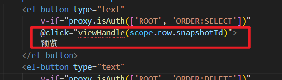

编写 `viewHandle`回调函数：

```typescript
function viewHandle(snapshotId){
    router.push({
        name: 'FrontGoodsSnapshot',
        params: {
            id: snapshotId,
            mode: 'mis'
        }
    });
}
```

# 同步付款结果


当客户已完成付款，但后端系统因故未能收到微信支付的结果通知时，该笔订单会在一定时间后被系统的定时任务判定为“超时未付款”并自动关闭。此时，如果客户联系大健康网站客服说明情况，工作人员可在后台找到对应订单，并手动点击“同步付款结果”按钮，主动向微信支付平台查询该订单的实际支付状态。若确认客户已成功支付，系统将自动更新订单状态为“已付款”。

## 实现思路

1. 只有订单状态是**已关闭、未付款**时才支持同步付款结果。（已关闭：order_status=2，未付款：order_status=1）
2. 在页面上你需要保证，只有订单状态是 1 和 2 的情况下，复选框才可以选择。
3. 客服人员在进行同步付款结果的操作时支持多选，一次同步多个订单。
4. 当客服人员点击同步付款结果时，提交交易流水号 `out_trade_no`，可以提交一个数组 `String[] outTradeNos`
5. 后端程序使用 form 接收这些交易流水号。Controller 调用 service，service 中遍历数组，取出每一个交易流水号，然后向微信支付平台发送请求，查看该交易流水号是否已经支付成功，如果已支付，则更新订单的付款单 id（transaction_id）和 订单状态（order_status 更新为 3），该 service 方法要添加事务注解。

## 修改 Mapper XML 中的 SQL

不需要编写 Mapper 吗？不需要，因为之前我们已经在 `TradeOrderMapper`中写了一个方法 `updatePayment`，该方法的作用是：根据交易流水号更新 transaction_id 和 order_status。虽然不需要编写一个新的方法，但 `updatePayment`方法需要修改一下条件，之前写的是只有当 `order_status=1`时才允许修改，现在的需求是当订单状态是 1 或 2 的时候，都应该允许修改，因此我们把`TradeOrderMapper`中的`updatePayment`对应的 SQL 语句修改为下面的 SQL：

```xml
<update id="updatePayment" parameterType="Map">
    update trade_order set
        order_status = 3,
        transaction_id = #{transactionId}
    where
        out_trade_no = #{outTradeNo}
      and
        order_status in(1,2)
</update>
```

## 编写 service 接口与实现

找到 mis 端的 `TradeOrderService`接口，提供以下方法：

```java
/**
 * 根据交易流水号，同步付款结果
 * @param outTradeNos 要同步的订单的交易流水号
 * @return 同步的订单数量
 */
int syncPaymentResult(String[] outTradeNos);
```

编写接口的实现：

```java
@Override
@Transactional
public int syncPaymentResult(String[] outTradeNos) {
    if(outTradeNos == null || outTradeNos.length == 0){
        return 0;
    }
    int rows = 0;
    for(String outTradeNo : outTradeNos){
        String transactionId = paymentService.getPaymentResult(outTradeNo);
        if(transactionId != null){
            Map<String,Object> param = new HashMap<>();
            param.put("outTradeNo",outTradeNo);
            param.put("transactionId",transactionId);
            rows += tradeOrderMapper.updatePayment(param);
        }
    }
    return rows;
}
```

## 编写 form 接收数据并校验

编写 `SyncPaymentResultForm`，代码如下：

```java
package com.jkweilai.meinian.api.controller.form;

import jakarta.validation.constraints.NotEmpty;
import lombok.Data;

@Data
public class SyncPaymentResultForm {
    @NotEmpty(message = "outTradeNos不能为空")
    private String[] outTradeNos;
}
```

## 编写 web 方法

找到 mis 端的 `TradeOrderController`，然后编写以下方法：

```java
@PostMapping("/syncPaymentResult")
@SaCheckPermission(value = {"ROOT", "ORDER:UPDATE"}, mode = SaMode.OR)
public R syncPaymentResult(@RequestBody @Valid SyncPaymentResultForm form) {
    String[] outTradeNos = form.getOutTradeNos();
    int rows = tradeOrderService.syncPaymentResult(outTradeNos);
    return R.ok().put("rows", rows);
}
```

## 接口测试

怎么测试呢？大家打开量子互联，再支付一单，然后支付成功后，将订单表中的订单状态 order_status 的值手动修改为 1 或 2，就可以测试接口了。

接口测试地址：[http://localhost:8080/meinian-api/mis/order/syncPaymentResult](http://localhost:8080/meinian-api/mis/order/syncPaymentResult)

测试数据：

```json
{
    "outTradeNos": ["B2DD1FF10DBD4762B5297C1688738718"]
}
```

测试结果：

```json
{
        "msg": "success",
        "code": 200,
        "rows": 1
}
```

测试完成之后，看看底层数据库表中的 `transaction_id`是否有值，另外看看 `order_status`是否修改为了 3。

## 前端实现同步付款结果功能

### 只有订单状态是 1 和 2 的才可以被选中

控制复选框是否能够选中的代码在这里：


编写回调函数 `selectable`，这个函数可以返回 true 或者 false，返回 true 则表示该复选框可以被选中，返回 false 表示复选框不能被选中。

```typescript
function selectable(row){
    return (row.orderStatus == '已关闭' || row.orderStatus == "未付款");
}
```

### 获取被选中项的 outTradeNo

用户选中其中某个复选框时要执行的回调函数是：


编写这个回调函数，代码如下：

```typescript
function selectionChangeHandle(values){
    data.selections = values;
}
```

### 编写同步付款结果的回调

找到同步付款结果的按钮：

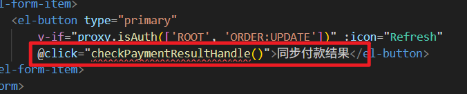

编写回调函数：

```typescript
async function checkPaymentResultHandle(){
    if(data.selections == null || data.selections.length == 0){
        proxy.$message({
            message: "请选择您要同步的数据",
            type: "warning",
            duration: 1200
        });
    }else{

        // 从 data.selections 数组中获取所有的outTradeNo
        const outTradeNos = data.selections.map(item => {
            return item.outTradeNo;
        });

        // 准备数据
        const json = {
            outTradeNos: outTradeNos
        };
        // 准备配置
        const config = {
            headers: {
                satoken: localStorage.getItem("token")
            }
        };
        // 发送ajax post请求
        const response = await axios.post("/meinian-api/mis/order/syncPaymentResult", json, config);
        const rows = response.data.rows;
        if(rows > 0){
            proxy.$message({
                message: `同步了${rows}个订单`,
                type: "success",
                duration: 1200
            });
        }else{
            proxy.$message({
                message: `您选择的这些订单都没有付款`,
                type: "warning",
                duration: 1200
            });
        }
    }
}
```

# 删除订单记录

注意事项：

1. 一般不建议删除订单记录。因为会影响业务的完整性。
2. 不提供批量删除功能，因为太危险。
3. 删除的时候，只有订单的状态是已关闭时才能删除。

## 编写 Mapper 和 XML

找到 `TradeOrderMapper`接口，编写以下方法：

```java
int deleteById(Integer id);
```

找到 `TradeOrderMapper.xml`文件，编写 SQL 语句：

```xml
<delete id="deleteById" parameterType="Integer">
    delete from trade_order where order_id = #{id} and order_status = 2
</delete>
```

## 编写 Service 接口和实现

找到 mis 端的 `TradeOrderService`接口，编写以下方法：

```java
int removeById(Integer id);
```

编写接口的实现：

```java
@Override
@Transactional
public int removeById(Integer id) {
    return tradeOrderMapper.deleteById(id);
}
```

## 编写 form 接收数据和校验

编写 `RemoveOrderByIdForm`：

```java
package com.jkweilai.meinian.api.controller.form;

import jakarta.validation.constraints.Min;
import jakarta.validation.constraints.NotNull;
import lombok.Data;

@Data
public class RemoveOrderByIdForm {

    @NotNull(message = "orderId不能为空")
    @Min(value = 1, message = "orderId不能小于1")
    private Integer orderId;

}
```

## 编写 web 接口

找到 mis 端的 `TradeOrderController`类，编写以下方法：

```java
@PostMapping("/removeById")
@SaCheckPermission(value = {"ROOT", "ORDER:DELETE"}, mode = SaMode.OR)
public R removeById(@RequestBody @Valid RemoveOrderByIdForm form){
    int rows = tradeOrderService.removeById(form.getOrderId());
    return R.ok().put("rows", rows);
}
```

## 前端实现删除订单功能

### 只有已关闭的订单删除按钮才被激活

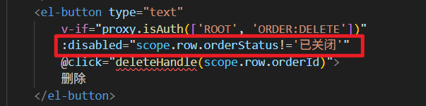


### 编写回调函数删除订单

用户点击删除按钮，提示用户是否真的要删除，如果确定删除则发送 ajax 请求删除数据。删除成功之后，重新加载分页数据。

```typescript
function deleteHandle(orderId){
    proxy.$confirm("您确定要删除订单记录吗？", "提示信息", {
        confirmButtonText: "确定",
        cancelButtonText: "取消"
    }).then(async ()=>{
        // 准备数据
        const json = {
            orderId: orderId
        };
        // 准备配置
        const config = {
            headers: {
                satoken: localStorage.getItem('token')
            }
        };
        // 发送ajax post请求删除数据
        const response = await axios.post('/meinian-api/mis/order/removeById', json, config);
        const rows = response.data.rows;
        if(rows > 0){
            proxy.$message({
                message: "删除成功",
                type: "success",
                duration: 1200,
                onClose:()=>{
                    loadPageData();
                }
            });
        }else{
            proxy.$message({
                message: "删除失败",
                type: "error",
                duration: 1200
            });
        }
    });
}
```

# 线下退款功能

为什么会有线下退款的功能？有的用户在退款的时候由于银行卡冻结，或银行卡状态异常导致无法完成退款，这时客户需要拿着身份证到大健康门店进行线下退款。财务进行线下银行卡转账，完成退款。退款完成后，客服人员需要在订单模块点击对应订单的线下退款按钮，完成订单状态的更新。就是将订单的状态由 3 变成 4。

## 编写 Mapper 和 XML

这个 Mapper 的方法我们之前写过，直接复用就行了，就是这个方法：


根据交易流水号更新订单的状态，当交易流水号正确，并且订单当前状态是已付款，就可以把这个状态更新为已退款。

## 编写 Service 和实现

找到 mis 端的 `TradeOrderService`接口，编写以下方法：

```java
boolean processOfflineRefund(String outTradeNo);
```

编写方法的实现：

```java
@Override
@Transactional
public boolean processOfflineRefund(String outTradeNo) {
    return tradeOrderMapper.updateStatusByOutTradeNo(outTradeNo) == 1;
}
```

## 编写 form 接收数据并校验

编写 `ProcessOfflineRefundForm`：

```java
package com.jkweilai.meinian.api.controller.form;

import jakarta.validation.constraints.NotBlank;
import jakarta.validation.constraints.Pattern;
import jakarta.validation.constraints.Size;
import lombok.Data;

@Data
public class ProcessOfflineRefundForm {

    @NotBlank(message = "订单流水号不能为空")
    @Size(min = 16, max = 32, message = "订单流水号长度应在16-32位之间")
    @Pattern(regexp = "^[A-F0-9]+$", message = "订单流水号必须是十六进制字符（0-9, A-F）")
    private String outTradeNo;
}
```

## 编写 web 接口

找到 mis 端的 `TradeOrderController`类，编写以下方法：

```java
@PostMapping("/offlineRefund")
@SaCheckPermission(value = {"ROOT", "ORDER:UPDATE"}, mode = SaMode.OR)
public R offlineRefund(@RequestBody @Valid ProcessOfflineRefundForm form){
    String outTradeNo = form.getOutTradeNo();
    boolean success = tradeOrderService.processOfflineRefund(outTradeNo);
    return R.ok().put("result", success);
}
```

## 前端实现线下退款

### 只有订单状态是已付款的才能退款

只有订单当前状态是已付款的，线下退款按钮才能激活：

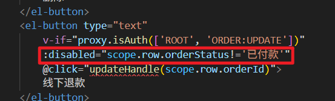

### 编写线下退款的回调函数

在 `updateHandle`回调函数中：

1. 弹出确认框，等待用户确认退款。
2. 如果用户确认退款，则发送 ajax 请求执行线下退款逻辑。
3. 退款成功，提示成功信息，并重新加载分页数据。
4. 退款失败，提示失败信息。

我们把回调函数中传递的参数修改一下，后端写的方法是通过交易流水号来更新订单状态的：


编写 `updateHandle`回调函数:

```typescript
function updateHandle(outTradeNo){
    ElMessageBox.confirm("您确定要执行线下退款吗？", "提示信息", {
        confirmButtonText: "确定",
        cancelButtonText: "取消"
    }).then(async () => {
        // 准备数据
        const json = {
            outTradeNo : outTradeNo
        };
        // 准备配置
        const config  = {
            headers: {
                satoken: localStorage.getItem('token')
            }
        }
        // 发送ajax请求
        const response = await axios.post('/meinian-api/mis/order/offlineRefund', json, config);
        const result = response.data.result;
        if(result){
            ElMessage({
                message: "退款成功",
                type: "success",
                duration: 1200,
                onClose: ()=>{
                    loadPageData();
                }
            });
        }else{
            ElMessage({
                message: "退款失败",
                type: "error",
                duration: 1200
            });
        }
    });

}
```

# 实现促销规则分页查询接口

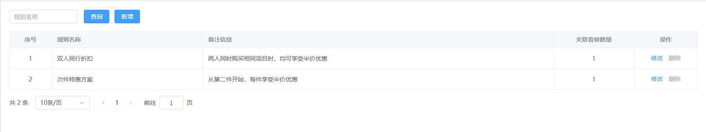

## 分页查询条件与返回数据

1. 表是：`promotion_rule`

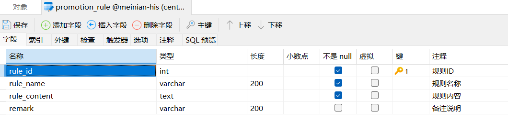

1. 查询条件是：规则名称（根据 `rule_name`进行模糊查询）
2. 返回什么数据？
  1. 规则 id（rule_id）
  2. 规则名称（rule_name）
  3. 备注信息（remark）
  4. 关联套餐数量

## 编写 Mapper 和 XML

找到 `PromotionRuleMapper`接口，编写以下方法：

```java
List<Map<String, Object>> selectPageByQueryCondition(Map<String, Object> params);

long selectCountByQueryCondition(Map<String, Object> params);
```

找到 `PromotionRuleMapper.xml`文件，编写以下 SQL 语句：

```xml
<select id="selectPageByQueryCondition" parameterType="Map" resultType="Map">
    select
        r.rule_id as ruleId,count(p.id) as count,r.rule_name as ruleName,r.remark
    from
        promotion_rule r
    left join
        med_exam_package p
    on
        r.rule_id = p.promotion_id
    <where>
        <if test="ruleName != null and ruleName != ''">
            and r.rule_name like concat('%', #{ruleName}, '%')
        </if>
    </where>
    group by
        r.rule_id
    order by
        r.rule_id asc
    limit #{startIndex}, #{pageSize}
</select>

<select id="selectCountByQueryCondition" parameterType="Map" resultType="long">
    select
        count(*)
    from
        promotion_rule r
    <where>
        <if test="ruleName != null and ruleName != ''">
            and r.rule_name like concat('%', #{ruleName}, '%')
        </if>
    </where>
</select>
```

## 编写 Service 接口和实现

找到 `PromotionRuleService`接口，编写以下方法：

```java
PageResult<Map<String,Object>> pageQueryByCondition(Map<String, Object> param);
```

编写方法的实现，代码如下：

```java
@Override
public PageResult<Map<String, Object>> pageQueryByCondition(Map<String, Object> param) {
    List<Map<String, Object>> records = new ArrayList<>();
    long count = promotionRuleMapper.selectCountByQueryCondition(param);
    if(count > 0){
        records = promotionRuleMapper.selectPageByQueryCondition(param);
    }
    Integer pageNo = MapUtil.getInt(param, "pageNo");
    Integer pageSize = MapUtil.getInt(param, "pageSize");
    return new PageResult<>(count, pageSize, pageNo, records);
}
```

## 编写 form 接收数据并校验

在 mis 端编写 `RulePageQueryForm`，代码如下：

```java
package com.jkweilai.meinian.api.controller.form;

import jakarta.validation.constraints.Min;
import jakarta.validation.constraints.NotNull;
import jakarta.validation.constraints.Pattern;
import lombok.Data;
import org.hibernate.validator.constraints.Range;

@Data
public class RulePageQueryForm {

    @Pattern(regexp = "^[0-9a-zA-Z\\u4e00-\\u9fa5]{1,20}$", message = "ruleName内容不正确")
    private String ruleName;

    @NotNull(message = "pageNo不能为空")
    @Min(value = 1, message = "pageNo不能小于1")
    private Integer pageNo;

    @NotNull(message = "pageSize不能为空")
    @Range(min = 10, max = 50, message = "pageSize必须为10~50之间")
    private Integer pageSize;
}
```

## 编写 web 接口

找到 `PromotionRuleController`类，编写 web 方法，如下：

```java
@PostMapping("/pageQuery")
@SaCheckPermission(value = {"ROOT", "RULE:SELECT"}, mode = SaMode.OR)
public R pageQuery(@RequestBody @Valid RulePageQueryForm form){
    // 计算 startIndex
    Integer pageNo = form.getPageNo();
    Integer pageSize = form.getPageSize();
    Integer startIndex = pageSize * (pageNo - 1);
    Map<String, Object> param = BeanUtil.beanToMap(form);
    param.put("startIndex", startIndex);
    // 分页查询
    PageResult<Map<String, Object>> pageResult = promotionRuleService.pageQueryByCondition(param);
    return R.ok().put("pageResult", pageResult);
}
```

## 测试 web 接口

接口测试地址：[http://localhost:8080/meinian-api/mis/rule/pageQuery](http://localhost:8080/meinian-api/mis/rule/pageQuery)

测试数据：

```json
{
    "pageNo": 1,
    "pageSize": 10,
    "ruleName": "双人同行"
}
```

测试结果：

```json
{
        "msg": "success",
        "code": 200,
        "pageResult": {
                "total": 1,
                "pageSize": 10,
                "pageNo": 1,
                "records": [
                        {
                                "ruleId": 1,
                                "ruleName": "双人同行折扣",
                                "count": 1,
                                "remark": "两人同时购买相同项目时，均可享受半价优惠"
                        }
                ],
                "pages": 1
        }
}
```

# 前端实现分页查询促销规则

## 先加载第一页数据

找到 mis 端的 `rule.vue`页面，然后编写 `loadPageData()`函数，并调用它：

```typescript
async function loadPageData(){
    // 加载数据的进度条
    data.loading = true;
    // 准备查询数据
    const json = {
        ruleName: dataForm.ruleName,
        pageNo: data.pageIndex,
        pageSize: data.pageSize
    };
    // 准备配置
    const config = {
        headers: {
            satoken: localStorage.getItem('token')
        }
    };
    // 发送ajax请求
    const response = await axios.post('/meinian-api/mis/rule/pageQuery', json, config);
    const pageResult = response.data.pageResult;
    data.dataList = pageResult.records;
    data.totalCount = pageResult.total;
    data.loading = false;
}
loadPageData();
```

## 实现分页查询

在 `rule.vue`页面找到查询按钮：

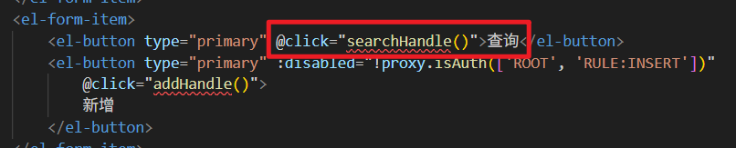

编写回调函数 `searchHandle`，代码如下：

```typescript
function searchHandle(){
    // 前端校验
    proxy.$refs['form'].validate(async valid => {
        if(valid){
            // 前端校验通过
            // 清除之前的错误消息
            proxy.$refs['form'].clearValidate();
            // 将页码修改为第一页
            data.pageIndex = 1;
            // 加载分页数据
            loadPageData();
        }
    });
}
```

# 实现保存促销规则的 RESTful 接口


## 编写 Mapper 和 XML

找到 `PromotionRuleMapper`接口，编写以下方法：

```java
int insert(PromotionRuleEntity promotionRuleEntity);
```

找到 `PromotionRuleMapper.xml`文件，编写以下 SQL：

```xml
<insert id="insert" parameterType="PromotionRuleEntity">
    insert into promotion_rule(rule_name, rule_content, remark) values(#{ruleName}, #{ruleContent}, #{remark})
</insert>
```

## 编写 Service 接口和实现

找到 `PromotionRuleService`接口，提供以下方法：

```java
int save(PromotionRuleEntity promotionRuleEntity);
```

编写方法的实现：

```java
@Override
@Transactional
public int save(PromotionRuleEntity promotionRuleEntity) {
    return promotionRuleMapper.insert(promotionRuleEntity);
}
```

## 编写 form 接收数据并校验

编写 `SavePromotionRuleForm`，代码如下：

```java
package com.jkweilai.meinian.api.controller.form;

import jakarta.validation.constraints.NotBlank;
import jakarta.validation.constraints.Pattern;
import lombok.Data;

@Data
public class SavePromotionRuleForm {
    @NotBlank(message = "ruleName不能为空")
    @Pattern(regexp = "^[0-9a-zA-Z\\u4e00-\\u9fa5]{1,20}$", message = "ruleName内容不正确")
    private String ruleName;

    @NotBlank(message = "ruleContent不能为空")
    private String ruleContent;

    private String remark;
}
```

## 编写 web 接口

找到 `PromotionRuleController`，编写以下 web 方法：

```java
@PostMapping("/save")
@SaCheckPermission(value = {"ROOT", "RULE:INSERT"}, mode = SaMode.OR)
public R save(@RequestBody @Valid SavePromotionRuleForm form){
    // 将form转换为bean
    PromotionRuleEntity promotionRuleEntity = BeanUtil.toBean(form, PromotionRuleEntity.class);
    int rows = promotionRuleService.save(promotionRuleEntity);
    return R.ok().put("rows", rows);
}
```

# 前端实现保存促销规则

## 创建弹窗控件(编写视图层)

打开 `rule.vue`页面，在该页面中的视图层添加以下弹窗控件：

```html
<!-- dialog.dataForm.id 没有值就是新增，有值就是修改 -->
<!-- :close-on-click-modal="false"表示点击遮罩层时，不关闭模态窗口 -->
<!-- v-model="dialog.visible" visible决定模态窗口可见性 -->
<el-dialog :title="!dialog.dataForm.ruleId ? '新增' : '修改'"
    v-if="proxy.isAuth(['ROOT', 'RULE:INSERT', 'RULE:UPDATE'])"
    :close-on-click-modal="false" v-model="dialog.visible"
    custom-class="dialog" width="500px">

    <!-- 保存或修改的form表单 -->
    <!-- 
        四要素：
            :model="dialog.dataForm" - 为表单提供数据上下文
            v-model="dialog.dataForm.xxx" - 单个字段的双向绑定
            :rules="dialog.dataRule" - 验证规则
            prop="fieldName" - 指定验证的字段名
            这四个要素缺一不可，它们共同构成了 Element Plus 表单的完整验证体系。
    -->
    <el-form :model="dialog.dataForm" ref="dialogForm" :rules="dialog.dataRule" label-width="80px">
        <el-form-item label="规则名称" prop="ruleName">
            <el-input v-model="dialog.dataForm.ruleName" maxlength="20" clearable />
        </el-form-item>
        <el-form-item label="规则内容" prop="ruleContent">
            <el-input v-model="dialog.dataForm.ruleContent" type="textarea" rows="10" clearable />
        </el-form-item>
        <el-form-item label="备注信息">
            <el-input v-model="dialog.dataForm.remark" type="textarea" rows="3" clearable />
        </el-form-item>
    </el-form>

    <template #footer>
        <span class="dialog-footer">
            <el-button @click="dialog.visible = false">取消</el-button>
            <el-button type="primary" @click="dataFormSubmit">确定</el-button>
        </span>
    </template>
    
</el-dialog>
```

## 编写模型层

模型层中应该提供的是：

1. dataForm（表单数据）
2. dataRule（校验规则）

```typescript
// 专门为弹窗准备的 dataForm 和 dataRule
// 为什么要放到 dialog 里，因为直接写 dataForm 和 dataRule会和页面中其他的dataForm 和 dataRule冲突。
const dialog = reactive({
    visible: false,
    dataForm: {
        ruleId: null,
        ruleName: null,
        remark: null,
        ruleContent: null
    },
    dataRule: {
        ruleName: [
            { required: true, message: '规则名称不能为空' },
            { pattern: '^[a-zA-Z0-9\u4e00-\u9fa5]{1,20}$', message: '规则名称不正确' }
        ],
        ruleContent: [{ required: true, trigger: 'blur', message: '规则内容不能为空' }]
    }
});
```

## 点击新增按钮显示弹窗

用户点击新增按钮，显示弹窗：

1. 清空表单中的数据。也就是让 dataForm 对象中的数据恢复默认。尤其是 dataForm.ruleId 必须是 null。
2. 清除残留的验证错误消息。
3. 设置 visible 为 true，弹窗显示。


编写回调函数 `addHandle`

```typescript
function addHandle(){
    // 显示为新增效果时，ruleId必须是null
    dialog.dataForm.ruleId = null;
    dialog.dataForm.remark = null;
    dialog.dataForm.ruleContent = null;
    dialog.dataForm.ruleName = null;
    dialog.visible = true;
    proxy.$nextTick(() => {
        // 清除所有验证状态和错误信息
        proxy.$refs['dialogForm'].resetFields();
    });
}
```

## 发送 ajax 请求保存促销规则

找到弹窗控件中的确定按钮：


实现思路：

1. 校验表单中的数据是否合法。
2. 如果合法则发送 ajax post 请求保存/修改数据。（注意：这个请求路径可能是修改也可能是保存。请求路径是动态的。并且提交数据时，都需要提交，包括 ruleId，因为修改的时候需要 ruleId。）
3. 保存/修改成功之后，隐藏弹窗控件。
4. 重新加载分页数据。

编写 `dataFormSubmit`回调函数，代码如下：

```typescript
function dataFormSubmit(){
    proxy.$refs['dialogForm'].validate(async (valid) => {
        if(valid){
            // 准备数据（四个数据都需要准备，因为这个方法是一个通用的方法，既是保存方法，又是修改的方法。）
            const json = {
                ruleId: dialog.dataForm.ruleId,
                ruleName: dialog.dataForm.ruleName,
                ruleContent: dialog.dataForm.ruleContent,
                remark: dialog.dataForm.remark
            };
            // 准备配置
            const config = {
                headers: {
                    satoken: localStorage.getItem('token')
                }
            }
            // 发送ajax post请求
            // 注意请求路径的动态效果。
            const response = await axios.post(`/meinian-api/mis/rule/${dialog.dataForm.ruleId == null ? 'save' : 'modify'}`, json, config);
            const rows = response.data.rows;
            if(rows == 1){
                // 保存成功
                ElMessage({
                    message: "保存成功",
                    type: "success",
                    duration: 1200,
                    onClose: ()=>{
                        // 隐藏弹窗
                        dialog.visible = false;
                        // 加载当前分页数据
                        loadPageData();
                    }
                })
            }else{
                // 保存失败
                ElMessage({
                    message: "保存失败",
                    type: "error",
                    duration: 1200
                })
            }
        }
    });
}
```

## 测试保存

例如我想添加一个**满5000打八折**的促销规则，写出来是下面的样子。经过规则引擎的测试，可以正常执行。

```java
import java.math.BigDecimal;
                                
p = new BigDecimal(price);
n = new BigDecimal(number);
                
result = n.multiply(p);
if(result.intValue() >= 5000){
    result = result.multiply(new BigDecimal("0.8"));
}
```

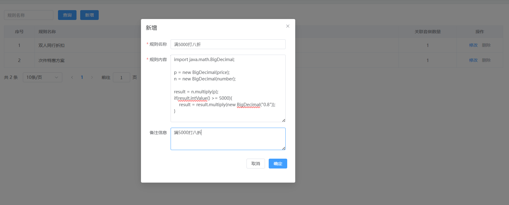


# 后端实现修改促销规则

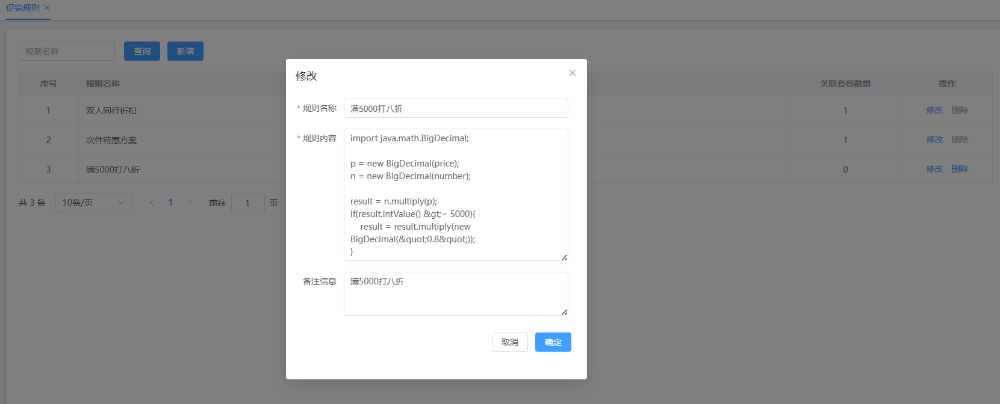

## 实现思路

要实现修改，需要分两步：

1. 先通过 ruleId 查询促销规则，显示修改页面。（selectByRuleId）
2. 用户点击弹窗的确定按钮，进行真正的修改操作。（updateByRuleId）

## 编写 Mapper 和 XML

找到 `PromotionRuleMapper`接口，编写以下两个方法：

```java
PromotionRuleEntity selectById(Integer ruleId);

int updateById(PromotionRuleEntity promotionRuleEntity);
```

找到 `PromotionRuleMapper.xml`文件，编写以下两个 SQL：

```xml
<select id="selectById" resultType="PromotionRuleEntity">
    select
        rule_id as ruleId, rule_name as ruleName, rule_content as ruleContent, remark
    from
        promotion_rule where rule_id = #{ruleId}
</select>

<update id="updateById" parameterType="PromotionRuleEntity">
    update promotion_rule set
        rule_name = #{ruleName},
        rule_content = #{ruleContent},
        remark = #{remark}
    where
        rule_id = #{ruleId}
</update>
```

## 编写 Service 接口和实现

找到 `PromotionRuleService`接口，编写两个方法：

```java
PromotionRuleEntity findById(int id);

int modifyById(PromotionRuleEntity promotionRuleEntity);
```

编写方法的实现：

```java
@Override
public PromotionRuleEntity findById(int id) {
    return promotionRuleMapper.selectById(id);
}

@Override
@Transactional
public int modifyById(PromotionRuleEntity promotionRuleEntity) {
    return promotionRuleMapper.updateById(promotionRuleEntity);
}
```

## 编写 form 接收数据并校验

编写两个 form。

编写 `FindRuleByIdForm`，代码如下：

```java
package com.jkweilai.meinian.api.controller.form;

import jakarta.validation.constraints.Min;
import jakarta.validation.constraints.NotNull;
import lombok.Data;

@Data
public class FindRuleByIdForm {

    @NotNull(message = "ruleId不能为空")
    @Min(value = 1, message = "ruleId不能小于1")
    private Integer ruleId;

}
```

编写 `ModifyRuleForm`，代码如下：

```java
package com.jkweilai.meinian.api.controller.form;

import jakarta.validation.constraints.Min;
import jakarta.validation.constraints.NotBlank;
import jakarta.validation.constraints.NotNull;
import jakarta.validation.constraints.Pattern;
import lombok.Data;

@Data
public class ModifyRuleForm {
    @NotNull(message = "ruleId不能为空")
    @Min(value = 1, message = "ruleId不能小于1")
    private Integer ruleId;

    @NotBlank(message = "ruleName不能为空")
    @Pattern(regexp = "^[0-9a-zA-Z\\u4e00-\\u9fa5]{1,20}$", message = "ruleName内容不正确")
    private String ruleName;

    @NotBlank(message = "ruleContent不能为空")
    private String ruleContent;

    private String remark;
}
```

## 编写 web 方法

编写两个 web 方法，找到 `PromotionRuleController`，编写以下两个方法：

```java
@PostMapping("/findById")
@SaCheckPermission(value = {"ROOT", "RULE:SELECT"}, mode = SaMode.OR)
public R findById(@RequestBody @Valid FindRuleByIdForm form){
    PromotionRuleEntity rule = promotionRuleService.findById(form.getRuleId());
    return R.ok().put("result", rule);
}

@PostMapping("/modify")
@SaCheckPermission(value = {"ROOT","RULE:UPDATE"}, mode = SaMode.OR)
public R modify(@RequestBody @Valid ModifyRuleForm form){
    // 将form转换成bean
    PromotionRuleEntity rule = BeanUtil.toBean(form, PromotionRuleEntity.class);
    // 更新
    int rows = promotionRuleService.modifyById(rule);
    return R.ok().put("rows", rows);
}
```