# 美年大健康项目-05

# 解决没有查找到商品时页面丑的问题

## 现在的问题


问题是：没有查找到商品是，页脚挤上来了。

解决办法：非常简单，当 `dataList`为空时，也就是没有查询到数据时，显示一个空的控件。EP 组件库中正好提供了这样的控件 `el-empty`，把这个控件添加到商品列表的顶部，然后再设置一下之前商品无序列表的最小高度即可。

## 编写视图层代码


找到 `goods_list.vue`页面，找到上图代码位置，添加以下代码：

```html
<el-empty description="无体检套餐" :image-size="200" v-if="data.dataList.length == 0"></el-empty>
```

## 设置无序列表最小高度

在goods_list.less文件中，给goods-list这个无序列表设置最小高度。

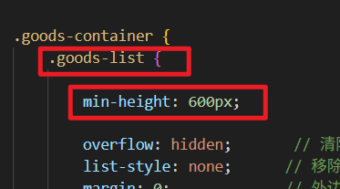

## 编写模型层代码

因为我们给无序列表设置了最小高度600像素，所以浏览器就没办法默认触达无序列表底部，也就不会触发load()函数加载分页记录。所以我们要自己调用 loadPageData()函数，而且要把pageIndex初始值改成1，而不是零。


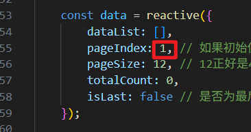

最终效果如下：


# 父子页面传递数据实现 keyword 搜索

## 实现思路

我们要做的是：


用户在搜索框中输入搜索关键字，然后点击搜索，我们需要将用户填写的 keyword 传递给子页面，子页面打开的时候自动会执行我们之前编写的 loadPageData()函数完成页面数据的加载。另外用户点击了搜索框下面的 tag 标签的话，需要将 tag 标签中的内容设置到搜索框当中。

## 父页面 main.vue 中编写代码

首先你需要绑定两个事件：


**然后编写两个函数：searchGoods 和 tagHandle，代码如下：**

```typescript
function searchGoods(){
    // 直接路由跳转
    router.push({
        name: 'FrontGoodsList',
        query: {
            keyword: header.keyword,
            random: new Date().getTime() // 提交时间戳，避免走缓存。
        }
    });
}

// 将标签中的内容设置到搜索框中。
function tagHandle(tagLabel: string){
    header.keyword = tagLabel;
}
```

## 子页面 goods_list.vue 中编写代码

注意：一定要在调用 `loadPageData()`函数之前编写代码。在它调用之前设置好 goods_list.vue 页面中的 keyword 的值。

```typescript
const keyword = router.currentRoute.value.query.keyword;
if(keyword == null || keyword == ''){
  dataForm.keyword = null;
}else{
  dataForm.keyword = keyword;
}
```

我是把这段代码写到了这里：


## 解决一个小 bug

比如用户在搜索框中填写了入职体检，并进行搜索：


此时如果刷新浏览器，会发现搜索框中的数据丢失了：


解决这个问题也简单，我们只需要将 URL 地址栏上的数据重新填写到文本框上即可。也就是获取路由参数上的信息，将其赋值给 keyword 即可【注意是在 main.vue 页面中编写代码哦】，代码如下：

```typescript
header.keyword = router.currentRoute.value.query.keyword;
```

我是把代码添加到这里了：


这样问题就解决了。

# 开通微信支付

## 注册微信支付商户号

企业身份才能注册微信支付商户号，个人身份不行。**（微信支付商户号是“钱袋子”）**

访问这个网址：[https://pay.weixin.qq.com/index.php/apply/applyment_home/guide_normal](https://pay.weixin.qq.com/index.php/apply/applyment_home/guide_normal)


需要注意的是：在注册微信支付商户号的时候，如果你选择的经营场景是 PC 网站（因为我们是做的 web 开发），则需要一个已备案的域名，因此你还需要去购买一个域名，并且域名要进行 ICP 备案。等你有了一个已进行 ICP 备案的域名之后，就可以继续进行微信支付商户号的注册了。

## 注册微信开发者账号(企业身份注册)

**有了企业开发者账号，我们才能调用微信官方提供的 API 接口。(个人开发者账号无权调用微信支付的 API 接口)**

[https://open.weixin.qq.com/](https://open.weixin.qq.com/)


有了微信支付商户号之后，你还需要去微信开放平台（微信开放平台就是专门为开发者准备的，是微信生态的技术总入口）以企业的身份注册一个开发者账号（需要提交企业资料，例如营业执照等。）。

用这个账号来**创建和管理**网站应用（我们使用开发者账号创建的每一个网站应用都会对应一个 AppID，也就是说在开发者平台上创建 AppID）。

## 微信支付商户号与 AppID 关联

**微信支付商户平台、微信开发者平台、网站应用 三者的关系是什么？**

1. **微信支付商户平台就是管钱的**，负责收款、结算和资金管理。
2. **微信开放平台（开发者平台）就是管接口调用的**，通过它的API来操作商户平台上的钱。
3. **网站应用就是我们开发的项目了（创建的网站应用都会有一个 AppID）**，在开放平台创建，用它来告诉微信“是谁在调用接口”。

**一句话总结关系：你用网站应用（身份证）在开放平台（操作台）调用API，来管理商户平台（金库）里的钱。**

**商户号关联 APPID：**登录 **微信支付商户平台**，在 **【产品中心】->【AppID账号管理】** 中，关联你上一步获得的AppID。

**这一步表示：只要商户号和 APPID 关联，则 APPID 就有资格替商户收钱了。**

去**微信支付商户平台**拿一下**商户的 ID、数字证书、微信支付 3.0 密钥（APIv3 密钥）**。

在**微信开放平台**上可以拿到 **AppID** 和**密钥**。

这些都拿到了表示资质全了，然后将其整合到项目，项目中就可以使用微信支付功能了。

（**切记：这些东西千万不能暴露给公众，建议配置到 windows 环境变量中，然后在 springboot 项目的配置文件中使用 **`**<font style="color:#DF2A3F;">${}</font>**`**占位符来获取环境变量**）

## 配置支付目录

登录 [**微信支付商户平台**](https://pay.weixin.qq.com/) > **产品中心** > **你的支付产品（如Native支付）** > 点击 **【配置】** > 填写 **“支付授权目录”**。

填写网站上**生成支付二维码的那个后端接口地址所在的目录**

**格式必须精确**：例如，如果接口URL是 `<font style="color:rgb(15, 17, 21);background-color:rgb(235, 238, 242);">https://www.yourdomain.com/api/pay/native</font>`，那么授权目录应填写 `<font style="color:rgb(15, 17, 21);background-color:rgb(235, 238, 242);">https://www.yourdomain.com/api/pay/</font>` （注意以斜杠结尾）

**这是给我们的网站服务器地址办一个“收款许可证”，只有登记过的服务器才有权发起收款请求。**

## 准备开发环境

以上工作都完成之后，就可以在项目中配置环境了，你需要以下两步：

1. 将你得到的数字证书 `apiclient_cert.p12`放到项目的 `resources`目录下。

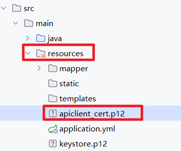

1. 在 `application.yml`文件中进行商户号的配置、AppID 的配置、密钥的配置、数字证书路径的配置等等。

```yaml
wechat:
  app-id: ${WECHAT_APP_ID}                                                                                                                                        # 微信公众号或小程序的AppID，用于网页授权、登录等
  app-secret: ${WECHAT_APP_SECRET}                                                                                                        # 微信公众号或小程序的AppSecret，与AppID配对使用
  pay:
    v3:
      meinian-vue:                                                                                                                                                                        # 支付配置名称，可以区分多个支付场景
        app-id: ${WECHAT_APP_ID}                                                                                                                # 支付专用的AppID（通常与上面相同）
        app-v3-secret: ${WECHAT_APP_V3_SECRET}                                                        # 支付API v3密钥，在微信支付平台设置
        mch-id: ${WECHAT_MCH_ID}                                                                                                                # 商户号(Merchant ID)，微信支付分配的商户号
        domain: http://s2.gnip.vip:26810/meinian-api                                # 支付回调域名，微信支付结果通知的接收地址
        cert-path: ${WECHAT_CERT_PATH}                                                                                        # 商户证书文件路径，用于签名和验证
        merchant-serial-no: ${WECHAT_MERCHANT_SERIAL_NO}                # 商户证书序列号
```

有 `.p12`商户证书文件，怎么获取商户证书序列化？可以自己 AI 查一下，可以通过命令，或者通过 java 程序来获取。

## 引入微信支付 Java 依赖库

我们使用微信官方提供的依赖库的，市面上也有很多对微信官方依赖库进行二次封装的库。不过我们课堂上就使用原始的微信官方依赖库。你需要引入以下依赖，不过这些依赖在开始搭建项目的时候已经引入了：

```xml
<!--微信支付官方依赖库-->
<dependency>
    <groupId>com.github.wechatpay-apiv3</groupId>
    <artifactId>wechatpay-apache-httpclient</artifactId>
    <version>0.4.8</version>
</dependency>

<!--配合微信支付的加密解密库-->
<dependency>
    <groupId>org.bouncycastle</groupId>
    <artifactId>bcprov-jdk18on</artifactId>
    <version>1.78.1</version>
</dependency>
```

# 创建微信付款单

流程是这样的： 创建微信付款单（创建支付订单） → 二维码 → 用户扫码支付

## 微信付款单必须的参数

微信官方的API要求我们创建付款单的时候需要提供若干参数，可以通过官方手册来查看每个参数的含义：[https://pay.weixin.qq.com/doc/v3/merchant/4012791877](https://pay.weixin.qq.com/doc/v3/merchant/4012791877)

这里我把重要的参数说明一下：

| **序号** | **变量** | **类型** | **必填** | **描述** |
| --- | --- | --- | --- | --- |
| 1 | appid | String | 是 | 应用程序的唯一标识 |
| 2 | mchid | String | 是 | 商户ID |
| 3 | description | String | 是 | 商品描述信息 |
| 4 | out_trade_no | String | 是 | 订单流水号 |
| 5 | time_expire | String | 否 | 付款失效时间 |
| 6 | attach | String | 否 | 附加数据 |
| 7 | notify_url | String | 是 | 用于接收付款结果的URL地址 |
| 8 | **amount** | **Object** | 是 | **金额对象** |
| 8.1 | total | int | 是 | 订单金额（单位是分，不是元） |
| 8.2 | currency | String | 否 | 货币种类。CNY代表人民币（默认） |
| 9 | **scene_info** | **Object** | 是 | **场景信息对象** |
| 9.1 | payer_client_ip | String | 是 | 用户发起支付请求时，其手机、电脑等设备所使用的公网IP地址 |

## 封装 HTTP 客户端

创建并配置一个专门用于微信支付API通信的HTTP客户端，该客户端会自动处理请求签名、响应验证和证书更新等安全机制

这个客户端工具可以向微信支付平台发送 HTTP 请求，也可以接收微信支付平台的响应。并且保证请求和响应是安全的。

在 `<font style="color:rgb(15, 17, 21);">api.config</font>`包下新建类 `<font style="color:rgb(15, 17, 21);">WechatPayConfig</font>`，编写以下代码：

```java
package com.jkweilai.meinian.api.config;

import com.wechat.pay.contrib.apache.httpclient.WechatPayHttpClientBuilder;
import com.wechat.pay.contrib.apache.httpclient.auth.AutoUpdateCertificatesVerifier;
import com.wechat.pay.contrib.apache.httpclient.auth.PrivateKeySigner;
import com.wechat.pay.contrib.apache.httpclient.auth.WechatPay2Credentials;
import com.wechat.pay.contrib.apache.httpclient.auth.WechatPay2Validator;
import lombok.extern.slf4j.Slf4j;
import org.apache.http.impl.client.CloseableHttpClient;
import org.springframework.beans.factory.annotation.Value;
import org.springframework.context.annotation.Bean;
import org.springframework.context.annotation.Configuration;
import org.springframework.core.io.FileSystemResource;

import java.nio.charset.StandardCharsets;
import java.security.KeyStore;
import java.security.PrivateKey;

@Slf4j
@Configuration  // 声明这是一个Spring配置类
public class WechatPayConfig {

    // 注入微信支付API v3密钥，用于敏感数据加密和验证
    @Value("${wechat.pay.v3.meinian-vue.app-v3-secret}")
    private String apiV3Key;

    /**
     * 创建微信支付专用的HTTP客户端Bean
     * 该客户端会自动处理请求签名、响应验证和证书更新
     *
     * @param mchId 商户号，从配置文件中注入
     * @param merchantSerialNo 商户证书序列号，从配置文件中注入
     * @param certPath 商户证书文件路径，从配置文件中注入
     */
    @Bean
    public CloseableHttpClient wechatPayHttpClient(
        @Value("${wechat.pay.v3.meinian-vue.mch-id}") String mchId, 
        @Value("${wechat.pay.v3.meinian-vue.merchant-serial-no}") String merchantSerialNo, 
        @Value("${wechat.pay.v3.meinian-vue.cert-path}") String certPath) throws Exception {

        // 加载P12格式的商户证书文件
        KeyStore keyStore = KeyStore.getInstance("PKCS12");  // 指定使用PKCS12格式
        try (var inputStream = new FileSystemResource(certPath).getInputStream()) {
            // 从classpath加载证书文件，使用商户号作为密码
            keyStore.load(inputStream, mchId.toCharArray());
        }

        // 获取证书中的别名（通常只有一个别名）
        String alias = keyStore.aliases().nextElement();
        // 从证书中提取私钥，用于请求签名
        PrivateKey privateKey = (PrivateKey) keyStore.getKey(alias, mchId.toCharArray());

        // 创建自动更新证书的验证器，定期从微信服务器下载和更新平台证书
        AutoUpdateCertificatesVerifier verifier = new AutoUpdateCertificatesVerifier(
                // 创建微信支付凭证，包含商户身份信息和签名器
                new WechatPay2Credentials(mchId, new PrivateKeySigner(merchantSerialNo, privateKey)),
                // API v3密钥转换为字节数组，用于响应验证
                apiV3Key.getBytes(StandardCharsets.UTF_8)
        );

        // 构建微信支付专用的HTTP客户端
        return WechatPayHttpClientBuilder.create()
                // 配置商户信息：商户号、证书序列号、私钥
                .withMerchant(mchId, merchantSerialNo, privateKey)
                // 添加验证器，用于验证微信支付响应的签名，确保响应未被篡改
                .withValidator(new WechatPay2Validator(verifier))  // 必须添加验证器
                .build();  // 构建最终的HTTP客户端实例
    }
}
```

## 创建微信付款单

编写接口：在 `com.jkweilai.meinian.api.front.service` 包 `PaymentService` 接口中，声明抽象方法

```java
package com.jkweilai.meinian.api.front.service;

import com.fasterxml.jackson.databind.node.ObjectNode;

public interface PaymentService {
    // 统一下单 方法
    // outTradeNo：咱们自己系统生成的唯一订单号，用来标识这笔交易是咱们系统中的“哪一单”。
    // total：订单总金额，单位是分（100分 = 1元），要付50元就传5000。
    // desc：商品描述信息，会显示在用户的微信支付账单里。
    // notifyUrl：微信支付成功后，微信会通过这个url告诉你“钱已到账”。
    // timeExpire：订单的最晚支付时间，超过这个时间订单就自动失效
    public ObjectNode unifiedOrder(String outTradeNo, int total, 
                                   String desc, String notifyUrl, 
                                   String timeExpire);
}
```

编写实现类：

```java
package com.jkweilai.meinian.api.front.service.impl;

import com.fasterxml.jackson.databind.JsonNode;
import com.fasterxml.jackson.databind.ObjectMapper;
import com.fasterxml.jackson.databind.node.ObjectNode;
import com.jkweilai.meinian.api.front.service.PaymentService;
import lombok.extern.slf4j.Slf4j;
import org.apache.http.client.methods.CloseableHttpResponse;
import org.apache.http.client.methods.HttpPost;
import org.apache.http.entity.StringEntity;
import org.apache.http.impl.client.CloseableHttpClient;
import org.apache.http.util.EntityUtils;
import org.springframework.beans.factory.annotation.Value;
import org.springframework.stereotype.Service;

import java.time.OffsetDateTime;
import java.time.format.DateTimeFormatter;
import java.util.HashMap;
import java.util.Map;

@Service
@Slf4j
public class PaymentServiceImpl implements PaymentService {

    // 从配置文件中注入微信支付商户号
    @Value("${wechat.pay.v3.meinian-vue.mch-id}")
    private String mchId;

    // 从配置文件中注入微信支付应用ID
    @Value("${wechat.pay.v3.meinian-vue.app-id}")
    private String appId;

    // 微信支付HTTP客户端，自动处理签名和认证
    private CloseableHttpClient httpClient;
    
    // JSON序列化工具
    private final ObjectMapper objectMapper;

    /**
     * 构造函数，通过依赖注入初始化HTTP客户端和JSON工具
     * @param wechatPayHttpClient 微信支付专用的HTTP客户端（自动配置签名等）
     * @param objectMapper JSON序列化工具
     */
    public PaymentServiceImpl(CloseableHttpClient wechatPayHttpClient, ObjectMapper objectMapper) {
        this.httpClient = wechatPayHttpClient;
        this.objectMapper = objectMapper;
    }

    /**
     * 微信支付统一下单接口 - Native支付（扫码支付）
     * 调用微信支付V3接口创建支付订单，返回包含支付二维码链接的响应
     *
     * @param outTradeNo 商户订单号，商户系统内部订单号，要求32个字符内
     * @param total 订单总金额，单位：分
     * @param desc 商品描述，如："腾讯充值中心-QQ会员充值"
     * @param notifyUrl 支付结果通知URL，微信服务器会主动发送支付结果到此URL
     * @param timeExpire 订单过期时间，ISO8601格式，如："2025-10-26T12:00:00+08:00"
     * @return ObjectNode 微信支付API响应数据，包含code_url（二维码链接）等字段
     */
    @Override
    public ObjectNode unifiedOrder(String outTradeNo, int total, String desc, String notifyUrl, String timeExpire) {
        try {
            // 构建请求参数Map，对应微信支付API要求的JSON结构
            Map<String, Object> requestMap = new HashMap<>();
            requestMap.put("appid", appId);              // 应用ID
            requestMap.put("mchid", mchId);              // 商户号
            requestMap.put("description", desc);         // 商品描述
            requestMap.put("out_trade_no", outTradeNo);  // 商户订单号
            requestMap.put("notify_url", notifyUrl);     // 支付结果回调地址

            // 构建金额信息对象
            Map<String, Object> amountMap = new HashMap<>();
            // amountMap.put("total", total); // 实际金额（单位：分）
            amountMap.put("total", 1); // 测试金额：1分钱（测试环境使用，生产环境需要注释）
            amountMap.put("currency", "CNY"); // 货币类型：人民币
            requestMap.put("amount", amountMap);

            // 处理订单过期时间（可选参数）
            if (timeExpire != null) {
                // 将字符串时间解析为OffsetDateTime，然后格式化为ISO8601标准格式
                // OffsetDateTime 是Java8中提供的，该对象包含日期时间信息的同时还包含时区的信息。
                // 微信支付要求过期时间信息必须带有时区信息。
                OffsetDateTime expireTime = OffsetDateTime.parse(timeExpire);
                requestMap.put("time_expire", expireTime.format(DateTimeFormatter.ISO_OFFSET_DATE_TIME));
            }

            // 创建HTTP POST请求到微信支付Native下单接口
            HttpPost httpPost = new HttpPost("https://api.mch.weixin.qq.com/v3/pay/transactions/native");
            httpPost.addHeader("Accept", "application/json"); // 接受JSON响应
            httpPost.addHeader("Content-type", "application/json; charset=utf-8"); // 发送JSON请求体
            httpPost.addHeader("User-Agent", "Mozilla/5.0 (Windows NT 10.0; Win64; x64) AppleWebKit/537.36"); // 浏览器标识

            // 将请求参数Map转换为JSON字符串
            String requestBody = objectMapper.writeValueAsString(requestMap);
            // 设置请求体，指定UTF-8编码防止中文乱码
            httpPost.setEntity(new StringEntity(requestBody, "UTF-8"));

            // 记录请求日志（生产环境建议对敏感信息脱敏）
            log.info("调用微信支付Native下单，请求参数：{}", requestBody);

            // 执行HTTP请求，使用try-with-resources确保响应流正确关闭
            try (CloseableHttpResponse response = httpClient.execute(httpPost)) {
                // 读取响应体内容
                String responseBody = EntityUtils.toString(response.getEntity());
                // 获取HTTP状态码
                int statusCode = response.getStatusLine().getStatusCode();

                log.info("微信支付响应：状态码={}", statusCode);

                // 处理成功响应（状态码200）
                if (statusCode == 200) {
                    // 将一个 JSON 字符串解析为可操作的 JSON 对象
                    JsonNode jsonNode = objectMapper.readTree(responseBody);
                    ObjectNode result = objectMapper.createObjectNode();
                    // 如果响应是JSON对象，将其所有字段复制到结果中
                    if (jsonNode.isObject()) {
                        result.setAll((ObjectNode) jsonNode);
                    }
                    return result; // 返回包含code_url等支付信息的JSON对象
                } else {
                    // 处理失败响应，记录错误日志并抛出异常
                    log.error("创建微信支付订单失败，状态码：{}，响应：{}", statusCode, responseBody);
                    throw new RuntimeException("创建微信支付订单失败，状态码：" + statusCode);
                }
            }

        } catch (Exception e) {
            // 捕获所有异常，记录错误日志并包装为运行时异常抛出
            log.error("调用微信支付Native下单API异常", e);
            throw new RuntimeException("创建微信支付订单失败：" + e.getMessage());
        }
    }
}
```

# QLExpress 规则引擎

## 为什么用规则引擎

规则引擎的核心作用是执行条件判断，根据不同的规则触发相应的操作。那么，为什么我们不直接使用if-else语句，而要引入规则引擎呢？

关键原因在于**可维护性**。

如果在Java代码中编写大量条件判断，一旦业务规则发生变化，就需要修改源代码、重新编译、部署发布——整个过程繁琐且容易出错。

而使用规则引擎，可以将业务规则以配置的形式（如文本、配置文件或数据库记录）进行管理。当规则需要调整时，只需修改配置即可立即生效，无需改动程序代码，大大提升了系统的灵活性和可维护性。

## 规则引擎的选择

当前业界存在多款成熟的规则引擎产品，例如轻量级的 Easy-Rules 以及结构清晰的 RuleBook 。在这些选项中，我选择了阿里开源的 **QLExpress**（项目地址：[https://gitee.com/cuibo119/QLExpress](https://gitee.com/cuibo119/QLExpress)）。

作出这一选择主要基于以下几点考虑：

- **轻量高效**：QLExpress 启动迅速，内存占用小，能够轻松集成到 Spring Boot 项目中；
- **语法友好**：语法和 Java 高度接近，支持复杂的条件判断和代码逻辑编写；
- **功能全面**：QLExpress 更能满足复杂业务场景的需求。

## 整合 QLExpress 规则引擎

引入依赖，日志依赖冲突，需要排除一下：

```xml
<dependency>
    <groupId>com.alibaba</groupId>
    <artifactId>QLExpress</artifactId>
    <version>3.3.4</version>
    <exclusions>
        <exclusion>
            <groupId>commons-logging</groupId>
            <artifactId>commons-logging</artifactId>
        </exclusion>
        <exclusion>
            <groupId>org.apache.logging.log4j</groupId>
            <artifactId>log4j-api</artifactId>
        </exclusion>
        <exclusion>
            <groupId>org.apache.logging.log4j</groupId>
            <artifactId>log4j-core</artifactId>
        </exclusion>
        <exclusion>
            <groupId>org.apache.logging.log4j</groupId>
            <artifactId>log4j-to-slf4j</artifactId>
        </exclusion>
        <exclusion>
            <groupId>log4j</groupId>
            <artifactId>log4j</artifactId>
        </exclusion>
    </exclusions>
</dependency>
```

## 初步使用规则引擎的入门案例

根据2017版个税计算方法，个人月收入低于3500元时无需缴纳个税。当月收入超过3500元时，超出部分称为“应纳税额”，需要按以下公式计算个税：

**个税 = 应纳税额 × 税率 － 扣除数**

其中，应纳税额 = 月收入 － 3500元（起征点）。

| **级数** | **应纳税额** | **税率** | **扣除数** |
| --- | --- | --- | --- |
| 1 | 不超过1500元 | 3% | 0 |
| 2 | 不超过4500元 | 10% | 105 |
| 3 | 不超过9000元 | 20% | 555 |
| 4 | 不超过35000元 | 25% | 1005 |
| 5 | 不超过55000元 | 30% | 2755 |
| 6 | 不超过80000元 | 35% | 5505 |
| 7 | 超过80000元 | 45% | 13505 |

假设某人的月薪是5500元，应纳税额是2000元，所以个税的税率是10%，扣除数为105元，个税为95元。

**编写规则引擎代码：**

```java
package com.jkweilai.meinian.api;

import com.ql.util.express.DefaultContext;
import com.ql.util.express.ExpressRunner;

public class QLExpressTest {
    public static void main(String[] args) throws Exception {
        ExpressRunner runner = new ExpressRunner();
        String rule= """
                temp=salary-3500;
                tax=0;
                if(temp<=0){
                    tax=0;
                }
                else if(temp<=1500){
                    tax=temp*0.03-0;
                }
                else if(temp<=4500){
                    tax=temp*0.10-105;
                }
                else if(temp<=9000){
                    tax=temp*0.20-555;
                }
                else if(temp<=35000){
                    tax=temp*0.25-1005;
                }
                else if(temp<=55000){
                    tax=temp*0.30-2755;
                }
                else if(temp<=80000){
                    tax=temp*0.35-5505;
                }
                else{
                    tax=temp*0.45-13505;
                }
                return tax;
        """;

        // 创建规则执行的上下文环境，用于存储变量
        DefaultContext<String, Object> context = new DefaultContext<String, Object>();
        // 向上下文环境中放入变量
        context.put("salary", 5500);

        // 执行规则引擎
        // 
        Object result = runner.execute(
            rule,  // 要执行的QLExpress脚本表达式字符串
            context,  // 表达式执行所需的变量上下文
            null,  // 错误监听器，null表示使用默认的错误处理
            true,  // 是否开启缓存，true表示缓存表达式解析结果
            false  // 是否输出跟踪信息，false表示不输出详细执行日志
        );
        System.out.println(result.toString());
    }
}
```

执行结果如下：


## 第二件半价的规则引擎

我们数据库 `promotion_rule`表中存储了具体的促销规则：


比如有一个次件特惠方案，该体检套餐原价为每件1000元，现推出“第二件半价”促销活动。根据单笔订单中购买的件数，可享受以下优惠：

- 购买1件：无优惠，订单金额为1000元；
- 购买2件：其中1件半价，订单金额为1500元；
- 购买3件：其中1件半价，订单金额为2500元；
- 购买4件：其中2件半价，订单金额为3000元。

这样的规则应该怎么写？

- 总价格=单价*件数-优惠金额
- 优惠金额=(总件数/2) * (单价*0.5)

知道以上的公式之后，我们怎么编写 java 的代码？

```java
package com.jkweilai.meinian.api;

import java.math.BigDecimal;

public class QLExpressTest2 {
    public static void main(String[] args) {
        // 购买的件数
        int number = 5;
        BigDecimal n = new BigDecimal(number);
        // 单价
        int price = 1000;
        BigDecimal p = new BigDecimal(price);
        // 计算总金额
        BigDecimal amount = p.multiply(n).subtract(new BigDecimal(number / 2).multiply(p.multiply(new BigDecimal("0.5"))));
        System.out.println(amount);
    }
}
```

需要注意的是：要用 `number/2`，不能用 n 除以 2。

我们把 Java 代码再转换成规则代码：

```java
import java.math.BigDecimal;
n = new BigDecimal(number);
p = new BigDecimal(price);
amount = p.multiply(n).subtract(new BigDecimal(number / 2).multiply(p.multiply(new BigDecimal("0.5"))));
```

然后我们再使用规则引擎去执行它：

```java
package com.jkweilai.meinian.api;

import com.ql.util.express.DefaultContext;
import com.ql.util.express.ExpressRunner;

public class QLExpressTest2 {
    public static void main(String[] args) throws Exception {
        ExpressRunner runner = new ExpressRunner();
        String rule= """
                import java.math.BigDecimal;
                n = new BigDecimal(number);
                p = new BigDecimal(price);
                p.multiply(n).subtract(new BigDecimal(number / 2).multiply(p.multiply(new BigDecimal("0.5"))));
        """;

        // 创建规则执行的上下文环境，用于存储变量
        DefaultContext<String, Object> context = new DefaultContext<String, Object>();
        // 向上下文环境中放入变量
        context.put("number", 4);
        context.put("price", 1000);

        // 执行规则引擎
        Object r = runner.execute(
                rule,      // 参数1：规则字符串，要执行的业务逻辑代码
                context,   // 参数2：上下文环境，包含规则中需要的变量（如salary）
                null,      // 参数3：错误信息处理器，null表示使用默认处理
                true,      // 参数4：是否输出执行跟踪日志（true=是，用于调试）
                false      // 参数5：是否缓存编译结果（false=不缓存）
        );
        System.out.println(r.toString());
    }
}
```

# 利用 MongoDB 存储商品快照

## 为什么要存储商品快照

用户下单之后，这个订单需要对应**当时**的商品信息，比如用户下单时，商品的价格是多少，商品的促销规则是什么，这些必须在用户下单的时候保存下来，以备用户后期退款时使用。如果不将当时下单时的商品信息存下来，后期商品维护人员可能会对商品信息进行修改操作，比如修改一下价格，修改一下促销规则等等，这样用户下单时的商品状态和最新的商品状态是对应不上，数据就错了。

## 为什么用 MongDB 存储商品快照

商品快照，其实就是下单时那个商品的“定格”信息。为了避免原商品后续被修改，我们需要把当时的信息从`<font style="color:rgb(15, 17, 21);background-color:rgb(235, 238, 242);">med_exam_package</font>`表里复制出来，单独保存。

最初，我们确实用MySQL来存这些快照。但随着业务增长，快照数据爆炸式增加（超过2000万条），MySQL在处理这种海量数据时开始变得非常吃力，速度和效率都成了问题。

为此，我们选择了MongoDB来专门负责快照存储。因为它天生适合存储TB级别的海量数据，并且读写速度远超MySQL。

当然，业界还有能存储PB级别、更强大的数据库（如HBase），但对于我们当前的项目体量和需求来说，它显得有些“杀鸡用牛刀”了。MongoDB在性能和成本之间为我们提供了最佳的平衡。

## MongoDB 的集合与文档

MongoDB不使用传统的“数据表”和“记录”。在MongoDB中，数据以JSON格式存储，每条这样的数据称为一个“文档”，而一系列文档则组成一个“集合”。可以这样类比理解：**集合（Collection）** 相当于MySQL的数据表（Table），**文档（Document）** 则相当于表中的一条记录（Record）。

### 创建数据库与集合

打开 MongDB Compass 工具，点击 `+`新建数据库和集合，如下：

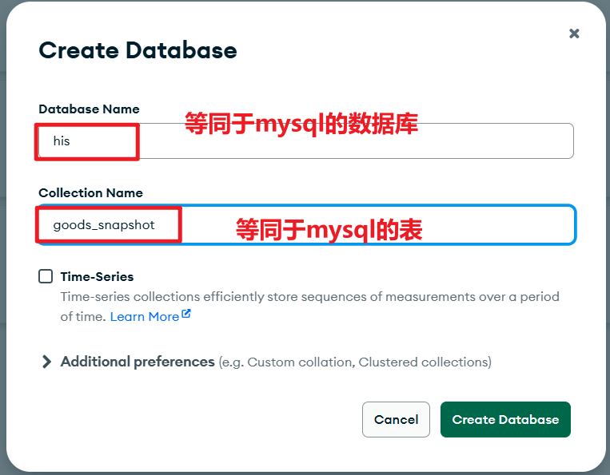

### 文档的结构

商品快照数据被保存在 `goods_snapshot` 集合中。这个集合中保存的数据，就是 `med_exam_package` 数据表中的体检套餐信息。

注意：在集合中，每一个文档都会自动生成 `_id`数据，你可以把它理解成每个文档的唯一标识，它是由 MongDB 自动维护的，我们不需要维护它。

## 编写 PO 类

要向 MongoDB 中插入数据，肯定是要编写一个 pojo 类。在 `com.jkweilai.meinian.api.db.pojo`包下新建 `GoodsSnapshotEntity`类，一个`GoodsSnapshotEntity`对象就是 MongoDB 集合中的一个文档。

```java
package com.jkweilai.meinian.api.db.pojo;

import lombok.Data;
import org.springframework.data.annotation.Id;
import org.springframework.data.mongodb.core.index.Indexed;
import org.springframework.data.mongodb.core.mapping.Document;

import java.io.Serializable;
import java.math.BigDecimal;
import java.util.List;
import java.util.Map;

@Data
@Document(collection = "goods_snapshot") // 这个是集合名，类似于mysql中的表名。
public class GoodsSnapshotEntity implements Serializable {
    // @Id 注解是 MongoDB 实体对象的身份标识，它的作用相当于 MySQL 表中的主键
    @Id
    private String _id;

    // @Indexed 注解的作用是 为指定字段创建数据库索引，其目的与在 MySQL 表中为字段创建索引完全相同：为了大幅提高查询速度。
    @Indexed
    private Integer id;

    private String packageCode;

    private String packageName;

    private String description;

    private List<Map> departmentExam;

    private List<Map> labExam;

    private List<Map> medicalExam;

    private List<Map> otherExam;

    private String coverImage;

    private BigDecimal originalPrice;

    private BigDecimal currentPrice;

    private String packageType;

    private List<String> tags;

    private String ruleName;

    private String ruleContent;

    private List<Map> examItems;

    @Indexed
    private String md5Hash;
}
```

## 编写 Dao 类

类似于编写 MyBatis 的 Mapper。不需要接口，直接创建 Dao 类：`GoodsSnapshotDao`，找到 `com.jkweilai.meinian.api.db.mapper`包，然后编写`GoodsSnapshotDao`以及方法，方法主要是两个：

1. 一个是根据 md5Hash 去 MongoDB 的集合中找有没有对应的文档（商品快照），如果有就返回快照 id，如果没有就返回 null。
2. 另一个是保存商品快照到 MongoDB 的集合中，返回商品快照的 id。

这两个方法都需要返回商品快照的 id，因为订单表中需要保存商品快照的 id，这样订单和商品快照就建立了关联。

```java
package com.jkweilai.meinian.api.db.mapper;

import com.jkweilai.meinian.api.db.pojo.GoodsSnapshotEntity;
import jakarta.annotation.Resource;
import org.springframework.data.mongodb.core.MongoTemplate;
import org.springframework.data.mongodb.core.query.Criteria;
import org.springframework.data.mongodb.core.query.Query;
import org.springframework.stereotype.Repository;

@Repository
public class GoodsSnapshotDao {
    @Resource
    private MongoTemplate mongoTemplate;

    // 根据md5Hash判断是否存在商品快照，存在就返回快照 id，不存在则返回null
    public String hasGoodsSnapshot(String md5Hash) {
        // 构建查询条件：根据md5Hash字段精确匹配
        Criteria criteria = Criteria.where("md5Hash").is(md5Hash);
        Query query = new Query(criteria);

        // 设置分页参数：只查询第一条匹配的记录，提高查询效率
        query.skip(0);  // 从第0条开始
        query.limit(1); // 只取1条记录（拿到1个就不再继续扫描了，效率高。）

        // 执行查询，返回单个实体对象
        GoodsSnapshotEntity entity = mongoTemplate.findOne(query, GoodsSnapshotEntity.class);

        // 如果找到记录则返回其主键_id，否则返回null
        return entity != null ? entity.get_id() : null;
    }

    // 保存或更新快照信息。
    public String insert(GoodsSnapshotEntity entity) {
        // 使用save方法：当entity的_id为null时执行插入，否则执行更新
        // 返回保存后的实体，并获取其主键_id
        String _id = mongoTemplate.save(entity).get_id();
        return _id;
    }
}
```

# 编写下单轮廓代码及限定特殊客户下单

主要任务：生成一个待支付的订单。（我们这里先搭建一个基本轮廓，后面再慢慢一点一点实现）

## 什么是特殊客户

为防范交易风险，系统对用户当日行为设有以下限制：若用户当天产生 **10笔及以上未付款订单**，或 **5笔及以上退款订单**，则将被系统限制，无法继续下单。

## 编写 Mapper 和 Mapper XML

找到 `TradeOrderMapper`接口，然后编写以下方法：

```java
// 检查客户是否达到了每日限制
boolean isCustomerReachedDailyLimit(Integer customerId);
```

找到 `TradeOrderMapper.xml`文件，然后编写 SQL 语句：

```xml
<select id="isCustomerReachedDailyLimit" parameterType="Integer" resultType="boolean">
    SELECT
        (
            ( SELECT COUNT(*)
                FROM trade_order
                WHERE customer_id = #{customerId}
                AND create_date = CURRENT_DATE()   -- 只检查今天创建的订单
                AND order_status < 3                  -- 状态1表示未付款，状态2表示已关闭
            ) >= 10                                -- 数量是否达到或超过10笔
        OR
            ( SELECT COUNT(*)
                FROM trade_order
                WHERE customer_id = #{customerId}
                AND refund_date = CURRENT_DATE()  -- 只检查今天退款的订单
                AND order_status = 4                    -- 状态值为4表示已退款
            ) >= 5                                -- 数量是否达到或超过5笔
        ) AS illegal
</select>
```

最后返回 true 则表示客户违规。false 表示客户正常。

## 编写 form 接收并校验数据

前端客户下单，需要给后端发过来什么数据？只需要提交过来：哪个客户，购买了几个什么商品。

因此后端需要接收的数据包括：`goodsId`、`buyCount`、`customerId`。其中 `customerId`从 `satoken`中可以解析。因此我们这个 form 只需要两个属性即可。

```java
package com.jkweilai.meinian.api.front.controller.form;

import jakarta.validation.constraints.Min;
import jakarta.validation.constraints.NotNull;
import lombok.Data;

@Data
public class CreatePaymentForm {
    
    @NotNull(message = "goodsId不能为空")
    @Min(value = 1, message = "goodsId不能小于1")
    private Integer goodsId;

    @NotNull(message = "buyCount不能为空")
    @Min(value = 1, message = "buyCount不能小于1")
    private Integer buyCount;
}
```

## 编写 web 方法

先编写 web 方法吧（TradeOrderController），核心业务不再这个 web 方法上，核心业务在 service 的方法上。分析一下这个 web 方法我们需要做什么？

1. 从 token 中解析 `customerId`
2. 将 `customerId` `goodsId`和 `buyCount`封装到 Map 集合中
3. 调用 `OrderService` 的 `createPayment()` 方法（这个方法我们还没写）创建一个待支付的订单，创建成功暂定返回 Map，创建失败返回 null
4. `Controller` 接收到 `createPayment()` 方法返回值后，判断结果并响应 R 对象。

```java
@RestController
@RequestMapping("/front/order")
@Slf4j
public class TradeOrderController {

    @Resource
    private TradeOrderService tradeOrderService;

    @PostMapping("/createPayment")
    @SaCheckLogin(type = StpCustomerUtil.TYPE)
    public R createPayment(@RequestBody @Valid CreatePaymentForm form) {
        // 从token中取出customerId
        int customerId = StpCustomerUtil.getLoginIdAsInt();
        // 将form转换成Map
        Map<String, Object> param = BeanUtil.beanToMap(form);
        param.put("customerId", customerId);
        // 调用service生成订单
        Map<String, Object> result = tradeOrderService.createPayment(param);
        if (result == null) {
            // 返回无效用户
            return R.ok().put("illegal", true);
        } else {
            return R.ok().put("illegal", false).put("result", result);
        }
    }
}
```

## 编写 Service 接口与实现

编写 `TradeOrderService`接口，如下：

```java
package com.jkweilai.meinian.api.front.service;

import java.util.Map;

public interface TradeOrderService {
    Map<String, Object> createPayment(Map<String, Object> params);
}
```

编写方法的实现：现在我们在 service 方法中不实现太多的逻辑，只实现一个逻辑：判断用户是否违规，违规的话直接返回 null，不违规的可以继续。

```java
package com.jkweilai.meinian.api.front.service.impl;

import cn.hutool.core.map.MapUtil;
import com.jkweilai.meinian.api.db.mapper.TradeOrderMapper;
import com.jkweilai.meinian.api.front.service.TradeOrderService;
import jakarta.annotation.Resource;
import lombok.extern.slf4j.Slf4j;
import org.springframework.stereotype.Service;
import org.springframework.transaction.annotation.Transactional;

import java.util.Map;

@Service
@Slf4j
public class TradeOrderServiceImpl implements TradeOrderService {

    @Resource
    private TradeOrderMapper tradeOrderMapper;

    @Override
    @Transactional // 别忘了添加事务控制注解
    public Map<String, Object> createPayment(Map<String, Object> params) {
        // 取出 customerId goodsId buyCount
        Integer customerId = MapUtil.getInt(params, "customerId");
        Integer buyCount = MapUtil.getInt(params, "buyCount");
        Integer goodsId = MapUtil.getInt(params, "goodsId");

        // 判断客户是否违规
        if (tradeOrderMapper.isCustomerReachedDailyLimit(customerId)) {
            return null;
        }

        // TODO 查找商品详情信息
        // TODO 计算订单金额
        // TODO 创建微信支付单
        // TODO 创建支付单缓存，设置缓存过期时间
        // TODO 如果不存在该商品快照，就创建快照记录
        // TODO 保存订单记录
        // TODO 更新商品销量
        // TODO 付款二维码图片转换成base64字符串返回给前端
        return null;
    }
}
```

# 根据商品 id 获取商品信息及促销规则

1. 为什么要获取商品信息？
  1. 商品信息中有商品的价格，用价格计算订单的总价。
  2. 另外商品信息将来用于保存商品快照。
2. 为什么要获取促销规则？
  1. 需要促销规则去计算订单的总价。
3. 注意：有一些商品是没有促销规则的，因此商品表和促销规则表进行连接时，需要使用外连接。

## 编写 Mapper 和 Mapper XML

找到 `MedExamPackageMapper`接口，编写以下方法：

```java
Map<String, Object> selectPackageAndPromotionById(Integer id);
```

找到 `MedExamPackageMapper.xml`文件，编写 SQL 语句：

```xml
<select id="selectPackageAndPromotionById" resultType="Map">
    select
        p.package_code as packageCode,
        p.package_name as packageName,
        p.description,
        p.department_exam as departmentExam,
        p.lab_exam as labExam,
        p.medical_exam as medicalExam,
        p.other_exam as otherExam,
        p.exam_items as examItems,
        p.cover_image as coverImage,
        cast(p.original_price as char) as originalPrice, -- 为什么要转换成字符串，防止损失精度
        cast(p.current_price as char) as currentPrice,
        p.package_type as packageType,
        p.tags,
        p.md5_hash as md5Hash,
        r.rule_content as ruleContent,
        r.rule_name as ruleName
    from
        med_exam_package p
    left join
        promotion_rule r
    on
        p.promotion_id = r.rule_id
    where
        p.id = #{id}
</select>
```

大家需要注意 `cast`函数的使用。如果不将价格转换成字符串，可能出现的问题是：Java 程序直接拿到可能会损失精度。以防万一。

## 继续编写 TradeOrderService 的 createPayment 方法

去实现这个功能：

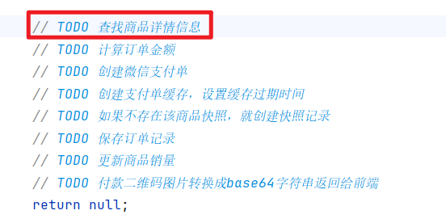

```java
package com.jkweilai.meinian.api.front.service.impl;

import cn.hutool.core.map.MapUtil;
import cn.hutool.json.JSONUtil;
import com.jkweilai.meinian.api.db.mapper.MedExamPackageMapper;
import com.jkweilai.meinian.api.db.mapper.TradeOrderMapper;
import com.jkweilai.meinian.api.front.service.TradeOrderService;
import jakarta.annotation.Resource;
import lombok.extern.slf4j.Slf4j;
import org.springframework.stereotype.Service;
import org.springframework.transaction.annotation.Transactional;

import java.util.ArrayList;
import java.util.List;
import java.util.Map;

@Service
@Slf4j
public class TradeOrderServiceImpl implements TradeOrderService {

    @Resource
    private TradeOrderMapper tradeOrderMapper;

    @Resource
    private MedExamPackageMapper medExamPackageMapper;

    @Override
    @Transactional // 别忘了添加事务控制注解
    public Map<String, Object> createPayment(Map<String, Object> params) {
        // 取出 customerId goodsId buyCount
        Integer customerId = MapUtil.getInt(params, "customerId");
        Integer buyCount = MapUtil.getInt(params, "buyCount");
        Integer goodsId = MapUtil.getInt(params, "goodsId");

        // 判断客户是否违规
        if (tradeOrderMapper.isCustomerReachedDailyLimit(customerId)) {
            return null;
        }

        // 查找商品详情信息
        Map<String, Object> map = medExamPackageMapper.selectPackageAndPromotionById(goodsId);
        // map是一个查询结果集，从结果中取出每个数据
        String packageCode = MapUtil.getStr(map, "packageCode");
        String packageName = MapUtil.getStr(map, "packageName");
        String description = MapUtil.getStr(map, "description");
        String coverImage = MapUtil.getStr(map, "coverImage");
        String originalPrice = MapUtil.getStr(map, "originalPrice");
        String currentPrice = MapUtil.getStr(map, "currentPrice");
        String packageType = MapUtil.getStr(map, "packageType");
        String md5Hash = MapUtil.getStr(map, "md5Hash");
        String ruleContent = MapUtil.getStr(map, "ruleContent");
        String ruleName = MapUtil.getStr(map, "ruleName");

        String temp = MapUtil.getStr(map, "departmentExam");
        // 如果不进行格式转换的话，从数据库中查询出来的json字符串直接传递给mongodb，
        // mongodb会认为它只是一个普通的字符串，不会将其视为mongodb的文档对象
        // 记得做判空处理。
        List<Map> departmentExam = temp != null ? JSONUtil.parseArray(temp).toList(Map.class) : null;

        temp = MapUtil.getStr(map, "labExam");
        List<Map> labExam = temp != null ? JSONUtil.parseArray(temp).toList(Map.class) : null;

        temp = MapUtil.getStr(map, "medicalExam");
        List<Map> medicalExam = temp != null ? JSONUtil.parseArray(temp).toList(Map.class) : null;

        temp = MapUtil.getStr(map, "otherExam");
        List<Map> otherExam = temp != null ? JSONUtil.parseArray(temp).toList(Map.class) : null;

        temp = MapUtil.getStr(map, "examItems");
        List<Map> examItems = temp != null ? JSONUtil.parseArray(temp).toList(Map.class) : null;

        temp = MapUtil.getStr(map, "tags");
        List<String> tags = temp != null ? JSONUtil.parseArray(temp).toList(String.class) : null;


        // TODO 计算订单金额
        // TODO 创建微信支付单
        // TODO 创建支付单缓存，设置缓存过期时间
        // TODO 如果不存在该商品快照，就创建快照记录
        // TODO 保存订单记录
        // TODO 更新商品销量
        // TODO 付款二维码图片转换成base64字符串返回给前端
        return null;
    }
}
```

## 使用规则引擎计算订单金额

直接将之前的规则引擎代码复制过来修改一下：

```java
package com.jkweilai.meinian.api.front.service.impl;

import cn.hutool.core.map.MapUtil;
import cn.hutool.json.JSONUtil;
import com.jkweilai.meinian.api.db.mapper.MedExamPackageMapper;
import com.jkweilai.meinian.api.db.mapper.TradeOrderMapper;
import com.jkweilai.meinian.api.exception.HisException;
import com.jkweilai.meinian.api.front.service.TradeOrderService;
import com.ql.util.express.DefaultContext;
import com.ql.util.express.ExpressRunner;
import jakarta.annotation.Resource;
import lombok.extern.slf4j.Slf4j;
import org.springframework.stereotype.Service;
import org.springframework.transaction.annotation.Transactional;

import java.math.BigDecimal;
import java.util.ArrayList;
import java.util.List;
import java.util.Map;

@Service
@Slf4j
public class TradeOrderServiceImpl implements TradeOrderService {

    @Resource
    private TradeOrderMapper tradeOrderMapper;

    @Resource
    private MedExamPackageMapper medExamPackageMapper;

    @Override
    @Transactional // 别忘了添加事务控制注解
    public Map<String, Object> createPayment(Map<String, Object> params) {
        // 取出 customerId goodsId buyCount
        Integer customerId = MapUtil.getInt(params, "customerId");
        Integer buyCount = MapUtil.getInt(params, "buyCount");
        Integer goodsId = MapUtil.getInt(params, "goodsId");

        // 判断客户是否违规
        if (tradeOrderMapper.isCustomerReachedDailyLimit(customerId)) {
            return null;
        }

        // 查找商品详情信息
        Map<String, Object> map = medExamPackageMapper.selectPackageAndPromotionById(goodsId);
        // map是一个查询结果集，从结果中取出每个数据
        String packageCode = MapUtil.getStr(map, "packageCode");
        String packageName = MapUtil.getStr(map, "packageName");
        String description = MapUtil.getStr(map, "description");
        String coverImage = MapUtil.getStr(map, "coverImage");
        String originalPrice = MapUtil.getStr(map, "originalPrice");
        String currentPrice = MapUtil.getStr(map, "currentPrice");
        String packageType = MapUtil.getStr(map, "packageType");
        String md5Hash = MapUtil.getStr(map, "md5Hash");
        String ruleContent = MapUtil.getStr(map, "ruleContent");
        String ruleName = MapUtil.getStr(map, "ruleName");

        String temp = MapUtil.getStr(map, "departmentExam");
        // 如果不进行格式转换的话，从数据库中查询出来的json字符串直接传递给mongodb，
        // mongodb会认为它只是一个普通的字符串，不会将其视为mongodb的文档对象
        // 记得做判空处理。
        List<Map> departmentExam = temp != null ? JSONUtil.parseArray(temp).toList(Map.class) : null;

        temp = MapUtil.getStr(map, "labExam");
        List<Map> labExam = temp != null ? JSONUtil.parseArray(temp).toList(Map.class) : null;

        temp = MapUtil.getStr(map, "medicalExam");
        List<Map> medicalExam = temp != null ? JSONUtil.parseArray(temp).toList(Map.class) : null;

        temp = MapUtil.getStr(map, "otherExam");
        List<Map> otherExam = temp != null ? JSONUtil.parseArray(temp).toList(Map.class) : null;

        temp = MapUtil.getStr(map, "examItems");
        List<Map> examItems = temp != null ? JSONUtil.parseArray(temp).toList(Map.class) : null;

        temp = MapUtil.getStr(map, "tags");
        List<String> tags = temp != null ? JSONUtil.parseArray(temp).toList(String.class) : null;


        // 计算订单金额
        BigDecimal goodsCurrentPrice = new BigDecimal(currentPrice); // 商品价格
        BigDecimal goodsBuyCount = new BigDecimal(buyCount); // 商品购买数量
        String amount = null;
        if(ruleContent == null){
            // 没有促销规则，总价是商品数量 * 商品价格
            amount = goodsCurrentPrice.multiply(goodsBuyCount).toString();
        }else{
            // 有促销规则，根据促销规则计算总价
            try {
                ExpressRunner runner = new ExpressRunner();
                DefaultContext<String, Object> context = new DefaultContext<>();
                context.put("number", buyCount.intValue());
                context.put("price", goodsCurrentPrice.toString());
                amount = runner.execute(ruleContent,context,null,true,false).toString();
            } catch (Exception e) {
                throw new HisException("执行规则引擎错误", e);
            }
        }

        // TODO 创建微信支付单
        // TODO 创建支付单缓存，设置缓存过期时间
        // TODO 如果不存在该商品快照，就创建快照记录
        // TODO 保存订单记录
        // TODO 更新商品销量
        // TODO 付款二维码图片转换成base64字符串返回给前端
        return null;
    }
}
```

# 生成微信支付单

## 关于 code_url


在 `<font style="color:rgb(15, 17, 21);background-color:rgb(235, 238, 242);">PaymentServiceImpl</font>` 中调用微信支付API成功后，其返回的响应数据中包含一个至关重要的参数：`<font style="color:rgb(15, 17, 21);background-color:rgb(235, 238, 242);">code_url</font>`。这是一个用于Native支付的二维码链接。**后端会将此 **`**<font style="color:rgb(15, 17, 21);background-color:rgb(235, 238, 242);">code_url</font>**`** 转换为二维码图片，并以 Base64 编码的字符串形式直接返回给前端**。前端在收到后，可将其作为图片的 `<font style="color:rgb(15, 17, 21);background-color:rgb(235, 238, 242);">src</font>` 属性值直接渲染并展示给用户，用户使用微信扫描此二维码即可完成支付。

```json
{
  "code_url" : "weixin://wxpay/bizpayurl?pr={一个长长的随机字符串}"
}
```

## 编写生成微信支付单的代码

还是继续在 `createPayment()`方法中编写代码，在之前代码基础上添加以下代码：

```java
// 创建微信支付单
// 交易流水号
String outTradeNo = IdUtil.simpleUUID().toUpperCase();
// 订单总金额微信要求必须转换为分
int total = NumberUtil.round(NumberUtil.mul(amount, "100"), 0).intValue();
// 描述信息
String desc = "购买体检套餐";
// 回调url (notifyUrl：将来订单支付之后，微信支付平台会调用这个url，给我们传递支付成功/失败的信息)
String notifyUrl = domain + "/front/order/paymentCallback";
// 交易过期时间
// 第一种写法
/*
DateTime dateTime = new DateTime(); // 当前时间
dateTime.offset(DateField.MINUTE, 20); // 向后偏移20分钟
String timeExpire = dateTime.toString("yyyy-MM-dd'T'HH:mm:ss.SSS'Z'"); // 这个日期格式是微信官方要求的。
*/
// 第二种写法
String timeExpire = DateUtil.offsetMinute(new Date(), 20).toInstant().toString();
// 创建微信支付单
ObjectNode objectNode = paymentService.unifiedOrder(outTradeNo, total, desc, notifyUrl, timeExpire);
// 获取 code_url
String codeUrl = objectNode.get("code_url").textValue();
```

注意以上代码的 `domain`，是从 `application.yml`文件中读取到的，因此要在该类上添加一个属性：

```java
@Value("${wechat.pay.v3.meinian-vue.domain}")
private String domain;
```

## 编写创建支付单缓存的代码

将 `<font style="color:rgb(15, 17, 21);background-color:rgb(235, 238, 242);">code_url</font>` 缓存至 Redis 的核心目的在于**提升支付体验与系统效率**。

具体流程是：当用户在订单列表页对未支付订单点击“继续支付”时：

- **若有缓存**：系统无需调用微信支付接口查询状态，仅需检查 Redis 中该 `<font style="color:rgb(15, 17, 21);background-color:rgb(235, 238, 242);">code_url</font>` 是否存在。若存在，则直接用它重新生成支付二维码，用户可立即继续付款。
- **若无缓存**：意味着该支付链接已过期。

这样做**避免了频繁查询微信平台的开销**，大幅缩短了响应时间，让用户支付流程更为顺畅。

只需要在原先代码的基础之上添加以下代码即可：

```java
// 创建支付单缓存，设置缓存过期时间
String key = "codeUrl_" + customerId + "_" + outTradeNo;
redisTemplate.opsForValue().set(key, codeUrl); // 存储到缓存中
redisTemplate.expireAt(key, dateTime); // 设置过期时间
```

注意：这个 key 的拼接字符串的规则需要记住，后面要用。

## 关闭超时未支付的订单

如果订单超时未支付，应该将订单的状态 `order_status`字段设置为 `2`。

实现思路：编写一个定时器，每小时查询一下数据库，看看订单表中有没有已过期的订单，如果有已过期的订单则将状态值修改为 2

### 编写 Mapper 和 Mapper XML

找到 `TradeOrderMapper`接口，编写以下方法：

```java
int closeOrder();
```

找到 `TradeOrderMapper.xml`文件，编写以下 SQL：

```xml
<update id="closeOrder">
    update trade_order 
    set order_status = 2 
    where order_status = 1 
      and timestampdiff(MINUTE, create_time, now()) > 20
</update>
```

### 编写定时器

我们选择使用 Spring Boot 内置的 Scheduler 而非 Quartz 来运行定时任务。Quartz 太重量级，没必要。

**启用定时器，springboot 入口程序添加注解：@EnableScheduling**

```java
@EnableAsync
@ServletComponentScan
@ComponentScan("com.jkweilai.*")
@MapperScan(basePackages = "com.jkweilai.meinian.api.db.mapper")
@SpringBootApplication
@EnableCaching
@EnableScheduling // 定时器
public class MeinianApiApplication {

    public static void main(String[] args) {
        SpringApplication.run(MeinianApiApplication.class, args);
    }

}
```

编写定时任务，在 api 包下新建一个子包 `schedule`，然后编写 `OrderSchedule`类，在该类中编写定时任务

```java
@Component
@Slf4j
public class OrderSchedule {

    @Resource
    private TradeOrderMapper tradeOrderMapper;

    // 代表 每天每小时的第0分第0秒执行
    @Scheduled(cron = "0 0 * * * ?")
    @Transactional
    public void closeOrder(){
        int rows = tradeOrderMapper.closeOrder();
        if(rows > 0){
            System.out.println("关闭了" + rows + "个未支付的订单！");
        }
    }
}
```

## 继续编写生成商品快照的代码

继续在 `TradeOrderServiceImpl`类的 `createPayment`方法中编写生成商品快照的代码：

```java
@Service
@Slf4j
public class TradeOrderServiceImpl implements TradeOrderService {

    @Resource
    private TradeOrderMapper tradeOrderMapper;

    @Resource
    private MedExamPackageMapper medExamPackageMapper;

    @Resource
    private PaymentService paymentService;

    @Resource
    private RedisTemplate redisTemplate;

    @Resource
    private GoodsSnapshotDao goodsSnapshotDao;

    @Override
    @Transactional // 别忘了添加事务控制注解
    public Map<String, Object> createPayment(Map<String, Object> params) {
        // 取出 customerId goodsId buyCount
        Integer customerId = MapUtil.getInt(params, "customerId");
        Integer buyCount = MapUtil.getInt(params, "buyCount");
        Integer goodsId = MapUtil.getInt(params, "goodsId");

        // 判断客户是否违规
        if (tradeOrderMapper.isCustomerReachedDailyLimit(customerId)) {
            return null;
        }

        // 查找商品详情信息
        Map<String, Object> map = medExamPackageMapper.selectPackageAndPromotionById(goodsId);
        // map是一个查询结果集，从结果中取出每个数据
        String packageCode = MapUtil.getStr(map, "packageCode");
        String packageName = MapUtil.getStr(map, "packageName");
        String description = MapUtil.getStr(map, "description");
        String coverImage = MapUtil.getStr(map, "coverImage");
        String originalPrice = MapUtil.getStr(map, "originalPrice");
        String currentPrice = MapUtil.getStr(map, "currentPrice");
        String packageType = MapUtil.getStr(map, "packageType");
        String md5Hash = MapUtil.getStr(map, "md5Hash");
        String ruleContent = MapUtil.getStr(map, "ruleContent");
        String ruleName = MapUtil.getStr(map, "ruleName");

        String temp = MapUtil.getStr(map, "departmentExam");
        // 如果不进行格式转换的话，从数据库中查询出来的json字符串直接传递给mongodb，
        // mongodb会认为它只是一个普通的字符串，不会将其视为mongodb的文档对象
        // 记得做判空处理。
        List<Map> departmentExam = temp != null ? JSONUtil.parseArray(temp).toList(Map.class) : null;

        temp = MapUtil.getStr(map, "labExam");
        List<Map> labExam = temp != null ? JSONUtil.parseArray(temp).toList(Map.class) : null;

        temp = MapUtil.getStr(map, "medicalExam");
        List<Map> medicalExam = temp != null ? JSONUtil.parseArray(temp).toList(Map.class) : null;

        temp = MapUtil.getStr(map, "otherExam");
        List<Map> otherExam = temp != null ? JSONUtil.parseArray(temp).toList(Map.class) : null;

        temp = MapUtil.getStr(map, "examItems");
        List<Map> examItems = temp != null ? JSONUtil.parseArray(temp).toList(Map.class) : null;

        temp = MapUtil.getStr(map, "tags");
        List<String> tags = temp != null ? JSONUtil.parseArray(temp).toList(String.class) : null;


        // 计算订单金额
        BigDecimal goodsCurrentPrice = new BigDecimal(currentPrice); // 商品价格
        BigDecimal goodsBuyCount = new BigDecimal(buyCount); // 商品购买数量
        String amount = null;
        if(ruleContent == null){
            // 没有促销规则，总价是商品数量 * 商品价格
            amount = goodsCurrentPrice.multiply(goodsBuyCount).toString();
        }else{
            // 有促销规则，根据促销规则计算总价
            try {
                ExpressRunner runner = new ExpressRunner();
                DefaultContext<String, Object> context = new DefaultContext<>();
                context.put("number", buyCount.intValue());
                context.put("price", goodsCurrentPrice.toString());
                amount = runner.execute(ruleContent,context,null,true,false).toString();
            } catch (Exception e) {
                throw new HisException("执行规则引擎错误", e);
            }
        }

        // 创建微信支付单
        // 交易流水号
        String outTradeNo = IdUtil.simpleUUID().toUpperCase();
        // 订单总金额微信要求必须转换为分
        int total = NumberUtil.mul(amount, "100").intValue();
        // 描述信息
        String desc = "购买体检套餐";
        // 回调url (notifyUrl：将来订单支付之后，微信支付平台会调用这个url，给我们传递支付成功/失败的信息)
        String notifyUrl = domain + "/front/order/paymentCallback";
        // 交易过期时间
        DateTime dateTime = new DateTime(); // 当前时间
        dateTime.offset(DateField.MINUTE, 20); // 向后偏移20分钟
        String timeExpire = dateTime.toString("yyyy-MM-dd'T'HH:mm:ss.SSS'Z'"); // 这个日期格式是微信官方要求的。
        // 创建微信支付单
        ObjectNode objectNode = paymentService.unifiedOrder(outTradeNo, total, "购买体检套餐", notifyUrl, timeExpire);
        // 获取 code_url
        String codeUrl = objectNode.get("code_url").textValue();

        // 创建支付单缓存，设置缓存过期时间
        String key = "codeUrl_" + customerId + "_" + outTradeNo;
        redisTemplate.opsForValue().set(key, codeUrl); // 存储到缓存中
        redisTemplate.expireAt(key, dateTime); // 设置过期时间


        if(codeUrl != null){ // codeUrl不为空表示微信支付单已经创建成功了。
            // 如果不存在该商品快照，就创建快照记录
            String _id = goodsSnapshotDao.hasGoodsSnapshot(md5Hash);
            if(_id == null){ // _id == null 表示该商品还没有保存快照。
                // 创建商品快照数据
                GoodsSnapshotEntity goodsSnapshot = new GoodsSnapshotEntity();
                goodsSnapshot.setId(goodsId);
                goodsSnapshot.setDescription(description);
                goodsSnapshot.setCoverImage(coverImage);
                goodsSnapshot.setCurrentPrice(goodsCurrentPrice);
                goodsSnapshot.setDepartmentExam(departmentExam);
                goodsSnapshot.setLabExam(labExam);
                goodsSnapshot.setMedicalExam(medicalExam);
                goodsSnapshot.setOtherExam(otherExam);
                goodsSnapshot.setExamItems(examItems);
                goodsSnapshot.setPackageCode(packageCode);
                goodsSnapshot.setPackageName(packageName);
                goodsSnapshot.setPackageType(packageType);
                goodsSnapshot.setTags(tags);
                goodsSnapshot.setOriginalPrice(new BigDecimal(originalPrice));
                goodsSnapshot.setMd5Hash(md5Hash);
                goodsSnapshot.setRuleContent(ruleContent);
                goodsSnapshot.setRuleName(ruleName);

                // 保存商品快照信息到MongDB
                _id = goodsSnapshotDao.insert(goodsSnapshot);
            }
        }
        // TODO 保存订单记录
        // TODO 更新商品销量
        // TODO 付款二维码图片转换成base64字符串返回给前端
        return null;
    }
}
```

## 继续编写保存订单记录的代码

继续在 `TradeOrderServiceImpl`类的 `createPayment`方法中编写保存订单记录的代码：

```java
@Service
@Slf4j
public class TradeOrderServiceImpl implements TradeOrderService {

    @Resource
    private TradeOrderMapper tradeOrderMapper;

    @Resource
    private MedExamPackageMapper medExamPackageMapper;

    @Resource
    private PaymentService paymentService;

    @Resource
    private RedisTemplate redisTemplate;

    @Resource
    private GoodsSnapshotDao goodsSnapshotDao;

    @Override
    @Transactional // 别忘了添加事务控制注解
    public Map<String, Object> createPayment(Map<String, Object> params) {
        // 取出 customerId goodsId buyCount
        Integer customerId = MapUtil.getInt(params, "customerId");
        Integer buyCount = MapUtil.getInt(params, "buyCount");
        Integer goodsId = MapUtil.getInt(params, "goodsId");

        // 判断客户是否违规
        if (tradeOrderMapper.isCustomerReachedDailyLimit(customerId)) {
            return null;
        }

        // 查找商品详情信息
        Map<String, Object> map = medExamPackageMapper.selectPackageAndPromotionById(goodsId);
        // map是一个查询结果集，从结果中取出每个数据
        String packageCode = MapUtil.getStr(map, "packageCode");
        String packageName = MapUtil.getStr(map, "packageName");
        String description = MapUtil.getStr(map, "description");
        String coverImage = MapUtil.getStr(map, "coverImage");
        String originalPrice = MapUtil.getStr(map, "originalPrice");
        String currentPrice = MapUtil.getStr(map, "currentPrice");
        String packageType = MapUtil.getStr(map, "packageType");
        String md5Hash = MapUtil.getStr(map, "md5Hash");
        String ruleContent = MapUtil.getStr(map, "ruleContent");
        String ruleName = MapUtil.getStr(map, "ruleName");

        String temp = MapUtil.getStr(map, "departmentExam");
        // 如果不进行格式转换的话，从数据库中查询出来的json字符串直接传递给mongodb，
        // mongodb会认为它只是一个普通的字符串，不会将其视为mongodb的文档对象
        // 记得做判空处理。
        List<Map> departmentExam = temp != null ? JSONUtil.parseArray(temp).toList(Map.class) : null;

        temp = MapUtil.getStr(map, "labExam");
        List<Map> labExam = temp != null ? JSONUtil.parseArray(temp).toList(Map.class) : null;

        temp = MapUtil.getStr(map, "medicalExam");
        List<Map> medicalExam = temp != null ? JSONUtil.parseArray(temp).toList(Map.class) : null;

        temp = MapUtil.getStr(map, "otherExam");
        List<Map> otherExam = temp != null ? JSONUtil.parseArray(temp).toList(Map.class) : null;

        temp = MapUtil.getStr(map, "examItems");
        List<Map> examItems = temp != null ? JSONUtil.parseArray(temp).toList(Map.class) : null;

        temp = MapUtil.getStr(map, "tags");
        List<String> tags = temp != null ? JSONUtil.parseArray(temp).toList(String.class) : null;


        // 计算订单金额
        BigDecimal goodsCurrentPrice = new BigDecimal(currentPrice); // 商品价格
        BigDecimal goodsBuyCount = new BigDecimal(buyCount); // 商品购买数量
        String amount = null;
        if(ruleContent == null){
            // 没有促销规则，总价是商品数量 * 商品价格
            amount = goodsCurrentPrice.multiply(goodsBuyCount).toString();
        }else{
            // 有促销规则，根据促销规则计算总价
            try {
                ExpressRunner runner = new ExpressRunner();
                DefaultContext<String, Object> context = new DefaultContext<>();
                context.put("number", buyCount.intValue());
                context.put("price", goodsCurrentPrice.toString());
                amount = runner.execute(ruleContent,context,null,true,false).toString();
            } catch (Exception e) {
                throw new HisException("执行规则引擎错误", e);
            }
        }

        // 创建微信支付单
        // 交易流水号
        String outTradeNo = IdUtil.simpleUUID().toUpperCase();
        // 订单总金额微信要求必须转换为分
        int total = NumberUtil.mul(amount, "100").intValue();
        // 描述信息
        String desc = "购买体检套餐";
        // 回调url (notifyUrl：将来订单支付之后，微信支付平台会调用这个url，给我们传递支付成功/失败的信息)
        String notifyUrl = domain + "/front/order/paymentCallback";
        // 交易过期时间
        DateTime dateTime = new DateTime(); // 当前时间
        dateTime.offset(DateField.MINUTE, 20); // 向后偏移20分钟
        String timeExpire = dateTime.toString("yyyy-MM-dd'T'HH:mm:ss.SSS'Z'"); // 这个日期格式是微信官方要求的。
        // 创建微信支付单
        ObjectNode objectNode = paymentService.unifiedOrder(outTradeNo, total, "购买体检套餐", notifyUrl, timeExpire);
        // 获取 code_url
        String codeUrl = objectNode.get("code_url").textValue();

        // 创建支付单缓存，设置缓存过期时间
        String key = "codeUrl_" + customerId + "_" + outTradeNo;
        redisTemplate.opsForValue().set(key, codeUrl); // 存储到缓存中
        redisTemplate.expireAt(key, dateTime); // 设置过期时间


        if(codeUrl != null){ // codeUrl不为空表示微信支付单已经创建成功了。
            // 如果不存在该商品快照，就创建快照记录
            String _id = goodsSnapshotDao.hasGoodsSnapshot(md5Hash);
            if(_id == null){ // _id == null 表示该商品还没有保存快照。
                // 创建商品快照数据
                GoodsSnapshotEntity goodsSnapshot = new GoodsSnapshotEntity();
                goodsSnapshot.setId(goodsId);
                goodsSnapshot.setDescription(description);
                goodsSnapshot.setCoverImage(coverImage);
                goodsSnapshot.setCurrentPrice(goodsCurrentPrice);
                goodsSnapshot.setDepartmentExam(departmentExam);
                goodsSnapshot.setLabExam(labExam);
                goodsSnapshot.setMedicalExam(medicalExam);
                goodsSnapshot.setOtherExam(otherExam);
                goodsSnapshot.setExamItems(examItems);
                goodsSnapshot.setPackageCode(packageCode);
                goodsSnapshot.setPackageName(packageName);
                goodsSnapshot.setPackageType(packageType);
                goodsSnapshot.setTags(tags);
                goodsSnapshot.setOriginalPrice(new BigDecimal(originalPrice));
                goodsSnapshot.setMd5Hash(md5Hash);
                goodsSnapshot.setRuleContent(ruleContent);
                goodsSnapshot.setRuleName(ruleName);

                // 保存商品快照信息到MongDB
                _id = goodsSnapshotDao.insert(goodsSnapshot);
            }

            // 程序走到这里，商品快照的 _id 已经就绪。
            // 保存订单记录
            TradeOrderEntity tradeOrder = new TradeOrderEntity();
            tradeOrder.setOutTradeNo(outTradeNo); // 交易流水号
            tradeOrder.setCustomerId(customerId); // 客户id
            tradeOrder.setGoodsId(goodsId); // 商品id
            tradeOrder.setGoodsTitle(packageName); // 商品名称
            tradeOrder.setGoodsPrice(goodsCurrentPrice); // 商品价格
            tradeOrder.setGoodsImage(coverImage); // 商品封面
            tradeOrder.setGoodsDescription(description); // 商品描述
            tradeOrder.setQuantity(buyCount); // 购买数量
            tradeOrder.setTotalAmount(new BigDecimal(amount)); // 订单总价
            tradeOrder.setSnapshotId(_id); // 关联商品快照id
            tradeOrderMapper.insert(tradeOrder);

        }

        // TODO 更新商品销量
        // TODO 付款二维码图片转换成base64字符串返回给前端
        return null;
    }
}
```

接下来就需要在 `TradeOrderMapper`接口中添加 `insert`方法了：

```java
int insert(TradeOrderEntity tradeOrderEntity);
```

然后需要在 `TradeOrderMapper.xml`文件中编写 SQL：

```xml
<insert id="insert" parameterType="TradeOrderEntity">
    insert into trade_order
        (out_trade_no,customer_id,goods_id,goods_title,
         goods_price,goods_image,goods_description,quantity,
         total_amount,order_status,snapshot_id,create_date)
    values
        (#{outTradeNo},#{customerId},#{goodsId},#{goodsTitle},
         #{goodsPrice},#{goodsImage},#{goodsDescription},#{quantity},
         #{totalAmount},1,#{snapshotId},current_date)
</insert>
```

## 继续编写更新商品销量

继续在 `TradeOrderServiceImpl`类的 `createPayment`方法中编写更新商品销量：

```java
@Service
@Slf4j
public class TradeOrderServiceImpl implements TradeOrderService {

    @Resource
    private TradeOrderMapper tradeOrderMapper;

    @Resource
    private MedExamPackageMapper medExamPackageMapper;

    @Resource
    private PaymentService paymentService;

    @Resource
    private RedisTemplate redisTemplate;

    @Resource
    private GoodsSnapshotDao goodsSnapshotDao;

    @Override
    @Transactional // 别忘了添加事务控制注解
    public Map<String, Object> createPayment(Map<String, Object> params) {
        // 取出 customerId goodsId buyCount
        Integer customerId = MapUtil.getInt(params, "customerId");
        Integer buyCount = MapUtil.getInt(params, "buyCount");
        Integer goodsId = MapUtil.getInt(params, "goodsId");

        // 判断客户是否违规
        if (tradeOrderMapper.isCustomerReachedDailyLimit(customerId)) {
            return null;
        }

        // 查找商品详情信息
        Map<String, Object> map = medExamPackageMapper.selectPackageAndPromotionById(goodsId);
        // map是一个查询结果集，从结果中取出每个数据
        String packageCode = MapUtil.getStr(map, "packageCode");
        String packageName = MapUtil.getStr(map, "packageName");
        String description = MapUtil.getStr(map, "description");
        String coverImage = MapUtil.getStr(map, "coverImage");
        String originalPrice = MapUtil.getStr(map, "originalPrice");
        String currentPrice = MapUtil.getStr(map, "currentPrice");
        String packageType = MapUtil.getStr(map, "packageType");
        String md5Hash = MapUtil.getStr(map, "md5Hash");
        String ruleContent = MapUtil.getStr(map, "ruleContent");
        String ruleName = MapUtil.getStr(map, "ruleName");

        String temp = MapUtil.getStr(map, "departmentExam");
        // 如果不进行格式转换的话，从数据库中查询出来的json字符串直接传递给mongodb，
        // mongodb会认为它只是一个普通的字符串，不会将其视为mongodb的文档对象
        // 记得做判空处理。
        List<Map> departmentExam = temp != null ? JSONUtil.parseArray(temp).toList(Map.class) : null;

        temp = MapUtil.getStr(map, "labExam");
        List<Map> labExam = temp != null ? JSONUtil.parseArray(temp).toList(Map.class) : null;

        temp = MapUtil.getStr(map, "medicalExam");
        List<Map> medicalExam = temp != null ? JSONUtil.parseArray(temp).toList(Map.class) : null;

        temp = MapUtil.getStr(map, "otherExam");
        List<Map> otherExam = temp != null ? JSONUtil.parseArray(temp).toList(Map.class) : null;

        temp = MapUtil.getStr(map, "examItems");
        List<Map> examItems = temp != null ? JSONUtil.parseArray(temp).toList(Map.class) : null;

        temp = MapUtil.getStr(map, "tags");
        List<String> tags = temp != null ? JSONUtil.parseArray(temp).toList(String.class) : null;


        // 计算订单金额
        BigDecimal goodsCurrentPrice = new BigDecimal(currentPrice); // 商品价格
        BigDecimal goodsBuyCount = new BigDecimal(buyCount); // 商品购买数量
        String amount = null;
        if(ruleContent == null){
            // 没有促销规则，总价是商品数量 * 商品价格
            amount = goodsCurrentPrice.multiply(goodsBuyCount).toString();
        }else{
            // 有促销规则，根据促销规则计算总价
            try {
                ExpressRunner runner = new ExpressRunner();
                DefaultContext<String, Object> context = new DefaultContext<>();
                context.put("number", buyCount.intValue());
                context.put("price", goodsCurrentPrice.toString());
                amount = runner.execute(ruleContent,context,null,true,false).toString();
            } catch (Exception e) {
                throw new HisException("执行规则引擎错误", e);
            }
        }

        // 创建微信支付单
        // 交易流水号
        String outTradeNo = IdUtil.simpleUUID().toUpperCase();
        // 订单总金额微信要求必须转换为分
        int total = NumberUtil.mul(amount, "100").intValue();
        // 描述信息
        String desc = "购买体检套餐";
        // 回调url (notifyUrl：将来订单支付之后，微信支付平台会调用这个url，给我们传递支付成功/失败的信息)
        String notifyUrl = domain + "/front/order/paymentCallback";
        // 交易过期时间
        DateTime dateTime = new DateTime(); // 当前时间
        dateTime.offset(DateField.MINUTE, 20); // 向后偏移20分钟
        String timeExpire = dateTime.toString("yyyy-MM-dd'T'HH:mm:ss.SSS'Z'"); // 这个日期格式是微信官方要求的。
        // 创建微信支付单
        ObjectNode objectNode = paymentService.unifiedOrder(outTradeNo, total, "购买体检套餐", notifyUrl, timeExpire);
        // 获取 code_url
        String codeUrl = objectNode.get("code_url").textValue();

        // 创建支付单缓存，设置缓存过期时间
        String key = "codeUrl_" + customerId + "_" + outTradeNo;
        redisTemplate.opsForValue().set(key, codeUrl); // 存储到缓存中
        redisTemplate.expireAt(key, dateTime); // 设置过期时间


        if(codeUrl != null){ // codeUrl不为空表示微信支付单已经创建成功了。
            // 如果不存在该商品快照，就创建快照记录
            String _id = goodsSnapshotDao.hasGoodsSnapshot(md5Hash);
            if(_id == null){ // _id == null 表示该商品还没有保存快照。
                // 创建商品快照数据
                GoodsSnapshotEntity goodsSnapshot = new GoodsSnapshotEntity();
                goodsSnapshot.setId(goodsId);
                goodsSnapshot.setDescription(description);
                goodsSnapshot.setCoverImage(coverImage);
                goodsSnapshot.setCurrentPrice(goodsCurrentPrice);
                goodsSnapshot.setDepartmentExam(departmentExam);
                goodsSnapshot.setLabExam(labExam);
                goodsSnapshot.setMedicalExam(medicalExam);
                goodsSnapshot.setOtherExam(otherExam);
                goodsSnapshot.setExamItems(examItems);
                goodsSnapshot.setPackageCode(packageCode);
                goodsSnapshot.setPackageName(packageName);
                goodsSnapshot.setPackageType(packageType);
                goodsSnapshot.setTags(tags);
                goodsSnapshot.setOriginalPrice(new BigDecimal(originalPrice));
                goodsSnapshot.setMd5Hash(md5Hash);
                goodsSnapshot.setRuleContent(ruleContent);
                goodsSnapshot.setRuleName(ruleName);

                // 保存商品快照信息到MongDB
                _id = goodsSnapshotDao.insert(goodsSnapshot);
            }

            // 程序走到这里，商品快照的 _id 已经就绪。
            // 保存订单记录
            TradeOrderEntity tradeOrder = new TradeOrderEntity();
            tradeOrder.setOutTradeNo(outTradeNo); // 交易流水号
            tradeOrder.setCustomerId(customerId); // 客户id
            tradeOrder.setGoodsId(goodsId); // 商品id
            tradeOrder.setGoodsTitle(packageName); // 商品名称
            tradeOrder.setGoodsPrice(goodsCurrentPrice); // 商品价格
            tradeOrder.setGoodsImage(coverImage); // 商品封面
            tradeOrder.setGoodsDescription(description); // 商品描述
            tradeOrder.setQuantity(buyCount); // 购买数量
            tradeOrder.setTotalAmount(new BigDecimal(amount)); // 订单总价
            tradeOrder.setSnapshotId(_id); // 关联商品快照id
            tradeOrderMapper.insert(tradeOrder);


            // 更新商品销量
            // 底层对应的update语句是一条。属于原子性操作，并且隔离级别采用RR级别。
            // MySQL的RR使用MVCC（多版本并发控制） + Next-Key Lock
            // 是当前读（读取最新已提交值）、会加行锁、保证原子性
            int rows = medExamPackageMapper.updateSalesVolume(goodsId, buyCount);
            if(rows != 1){
                throw new HisException("更新商品销量失败");
            }
        }
        
        // TODO 付款二维码图片转换成base64字符串返回给前端
        return null;
    }
}
```

接下来应该编写 Mapper 和 Mapper XML 文件了，找到 `MedExamPackageMapper`接口，提供以下方法：

```java
int updateSalesVolume(@Param("goodsId") Integer goodsId, @Param("buyCount") Integer buyCount);
```

找到 `MedExamPackageMapper.xml`文件，编写以下 SQL：

```xml
<update id="updateSalesVolume">
    update med_exam_package set sales_volume = sales_volume + #{buyCount} where id = #{goodsId}
</update>
```

## 继续编写将付款二维码响应给前端

继续在 `TradeOrderServiceImpl`类的 `createPayment`方法中编写将付款二维码响应给前端：

```java
@Service
@Slf4j
public class TradeOrderServiceImpl implements TradeOrderService {

    @Resource
    private TradeOrderMapper tradeOrderMapper;

    @Resource
    private MedExamPackageMapper medExamPackageMapper;

    @Resource
    private PaymentService paymentService;

    @Resource
    private RedisTemplate redisTemplate;

    @Resource
    private GoodsSnapshotDao goodsSnapshotDao;

    @Override
    @Transactional // 别忘了添加事务控制注解
    public Map<String, Object> createPayment(Map<String, Object> params) {
        // 取出 customerId goodsId buyCount
        Integer customerId = MapUtil.getInt(params, "customerId");
        Integer buyCount = MapUtil.getInt(params, "buyCount");
        Integer goodsId = MapUtil.getInt(params, "goodsId");

        // 判断客户是否违规
        if (tradeOrderMapper.isCustomerReachedDailyLimit(customerId)) {
            return null;
        }

        // 查找商品详情信息
        Map<String, Object> map = medExamPackageMapper.selectPackageAndPromotionById(goodsId);
        // map是一个查询结果集，从结果中取出每个数据
        String packageCode = MapUtil.getStr(map, "packageCode");
        String packageName = MapUtil.getStr(map, "packageName");
        String description = MapUtil.getStr(map, "description");
        String coverImage = MapUtil.getStr(map, "coverImage");
        String originalPrice = MapUtil.getStr(map, "originalPrice");
        String currentPrice = MapUtil.getStr(map, "currentPrice");
        String packageType = MapUtil.getStr(map, "packageType");
        String md5Hash = MapUtil.getStr(map, "md5Hash");
        String ruleContent = MapUtil.getStr(map, "ruleContent");
        String ruleName = MapUtil.getStr(map, "ruleName");

        String temp = MapUtil.getStr(map, "departmentExam");
        // 如果不进行格式转换的话，从数据库中查询出来的json字符串直接传递给mongodb，
        // mongodb会认为它只是一个普通的字符串，不会将其视为mongodb的文档对象
        // 记得做判空处理。
        List<Map> departmentExam = temp != null ? JSONUtil.parseArray(temp).toList(Map.class) : null;

        temp = MapUtil.getStr(map, "labExam");
        List<Map> labExam = temp != null ? JSONUtil.parseArray(temp).toList(Map.class) : null;

        temp = MapUtil.getStr(map, "medicalExam");
        List<Map> medicalExam = temp != null ? JSONUtil.parseArray(temp).toList(Map.class) : null;

        temp = MapUtil.getStr(map, "otherExam");
        List<Map> otherExam = temp != null ? JSONUtil.parseArray(temp).toList(Map.class) : null;

        temp = MapUtil.getStr(map, "examItems");
        List<Map> examItems = temp != null ? JSONUtil.parseArray(temp).toList(Map.class) : null;

        temp = MapUtil.getStr(map, "tags");
        List<String> tags = temp != null ? JSONUtil.parseArray(temp).toList(String.class) : null;


        // 计算订单金额
        BigDecimal goodsCurrentPrice = new BigDecimal(currentPrice); // 商品价格
        BigDecimal goodsBuyCount = new BigDecimal(buyCount); // 商品购买数量
        String amount = null;
        if(ruleContent == null){
            // 没有促销规则，总价是商品数量 * 商品价格
            amount = goodsCurrentPrice.multiply(goodsBuyCount).toString();
        }else{
            // 有促销规则，根据促销规则计算总价
            try {
                ExpressRunner runner = new ExpressRunner();
                DefaultContext<String, Object> context = new DefaultContext<>();
                context.put("number", buyCount.intValue());
                context.put("price", goodsCurrentPrice.toString());
                amount = runner.execute(ruleContent,context,null,true,false).toString();
            } catch (Exception e) {
                throw new HisException("执行规则引擎错误", e);
            }
        }

        // 创建微信支付单
        // 交易流水号
        String outTradeNo = IdUtil.simpleUUID().toUpperCase();
        // 订单总金额微信要求必须转换为分
        int total = NumberUtil.mul(amount, "100").intValue();
        // 描述信息
        String desc = "购买体检套餐";
        // 回调url (notifyUrl：将来订单支付之后，微信支付平台会调用这个url，给我们传递支付成功/失败的信息)
        String notifyUrl = domain + "/front/order/paymentCallback";
        // 交易过期时间
        DateTime dateTime = new DateTime(); // 当前时间
        dateTime.offset(DateField.MINUTE, 20); // 向后偏移20分钟
        String timeExpire = dateTime.toString("yyyy-MM-dd'T'HH:mm:ss.SSS'Z'"); // 这个日期格式是微信官方要求的。
        // 创建微信支付单
        ObjectNode objectNode = paymentService.unifiedOrder(outTradeNo, total, "购买体检套餐", notifyUrl, timeExpire);
        // 获取 code_url
        String codeUrl = objectNode.get("code_url").textValue();

        // 创建支付单缓存，设置缓存过期时间
        String key = "codeUrl_" + customerId + "_" + outTradeNo;
        redisTemplate.opsForValue().set(key, codeUrl); // 存储到缓存中
        redisTemplate.expireAt(key, dateTime); // 设置过期时间


        if(codeUrl != null){ // codeUrl不为空表示微信支付单已经创建成功了。
            // 如果不存在该商品快照，就创建快照记录
            String _id = goodsSnapshotDao.hasGoodsSnapshot(md5Hash);
            if(_id == null){ // _id == null 表示该商品还没有保存快照。
                // 创建商品快照数据
                GoodsSnapshotEntity goodsSnapshot = new GoodsSnapshotEntity();
                goodsSnapshot.setId(goodsId);
                goodsSnapshot.setDescription(description);
                goodsSnapshot.setCoverImage(coverImage);
                goodsSnapshot.setCurrentPrice(goodsCurrentPrice);
                goodsSnapshot.setDepartmentExam(departmentExam);
                goodsSnapshot.setLabExam(labExam);
                goodsSnapshot.setMedicalExam(medicalExam);
                goodsSnapshot.setOtherExam(otherExam);
                goodsSnapshot.setExamItems(examItems);
                goodsSnapshot.setPackageCode(packageCode);
                goodsSnapshot.setPackageName(packageName);
                goodsSnapshot.setPackageType(packageType);
                goodsSnapshot.setTags(tags);
                goodsSnapshot.setOriginalPrice(new BigDecimal(originalPrice));
                goodsSnapshot.setMd5Hash(md5Hash);
                goodsSnapshot.setRuleContent(ruleContent);
                goodsSnapshot.setRuleName(ruleName);

                // 保存商品快照信息到MongDB
                _id = goodsSnapshotDao.insert(goodsSnapshot);
            }

            // 程序走到这里，商品快照的 _id 已经就绪。
            // 保存订单记录
            TradeOrderEntity tradeOrder = new TradeOrderEntity();
            tradeOrder.setOutTradeNo(outTradeNo); // 交易流水号
            tradeOrder.setCustomerId(customerId); // 客户id
            tradeOrder.setGoodsId(goodsId); // 商品id
            tradeOrder.setGoodsTitle(packageName); // 商品名称
            tradeOrder.setGoodsPrice(goodsCurrentPrice); // 商品价格
            tradeOrder.setGoodsImage(coverImage); // 商品封面
            tradeOrder.setGoodsDescription(description); // 商品描述
            tradeOrder.setQuantity(buyCount); // 购买数量
            tradeOrder.setTotalAmount(new BigDecimal(amount)); // 订单总价
            tradeOrder.setSnapshotId(_id); // 关联商品快照id
            tradeOrderMapper.insert(tradeOrder);

            // 更新商品销量
            int rows = medExamPackageMapper.updateSalesVolume(goodsId);
            if(rows != 1){
                throw new HisException("更新商品销量失败");
            }

            // 付款二维码图片转换成base64字符串返回给前端
            // 创建二维码配置对象
            QrConfig qrConfig = new QrConfig();
            qrConfig.setWidth(230);
            qrConfig.setHeight(230);
            // 设置二维码边距为2像素
            qrConfig.setMargin(2);
            // 生成二维码并转换为Base64字符串，格式为JPG
            String qrCodeBase64 = QrCodeUtil.generateAsBase64(codeUrl, qrConfig, "jpg");

            // 封装返回数据
            Map<String, Object> result = new HashMap<>();
            result.put("qrCodeBase64", qrCodeBase64);
            // 为什么要返回交易流水号，因为前端要通过交易流水号来轮询订单的支付状态。
            result.put("outTradeNo", outTradeNo);
            return result;
        }else{
            log.error("创建支付订单失败", objectNode);
            throw new HisException("创建订单失败！");
        }
    }
}
```

# 编写支付成功的回调

## 微信支付平台都回传了什么

当用户扫码，然后支付，并且支付成功之后，微信支付平台会主动调用我们提供的 `notifyUrl`，通过这个地址告诉我们支付的结果。我们这个 notifyUrl 是这样写的：


在微信支付[官方文档](https://pay.weixin.qq.com/doc/v3/merchant/4012791861)中，详细说明了微信服务器发送的支付结果通知消息所包含的内容。以下是其中几个关键参数的说明：

| **序号** | **参数名** | **类型** | **描述** |
| --- | --- | --- | --- |
| 1 | out_trade_no | string | 订单流水号 |
| 2 | transaction_id | string | 微信支付单编号 |
| 3 | trade_state | string | 交易状态。SUCCESS：支付成功 |
| 4 | success_time | string | 付款日期时间 |

除了上述几个业务参数外，支付通知消息中还包含了**数字签名**。为确保消息来源的真实性，我们需要在接收到通知后执行验签操作：使用**本地的微信支付密钥和数字证书**，对接收到的消息**重新计算数字签名**。若计算结果与消息中附带的签名一致，即可确认该消息确实来自微信服务器，而非第三方伪造。

## 编写 Mapper 和 Mapper XML

用户支付成功之后，订单的的信息肯定是要修改的，需要修改两个字段：

1. 微信支付单编号：transaction_id
2. 订单状态：order_status 从 1 （未付款）修改为 3（已付款）

找到 `TradeOrderMapper`接口，提供以下方法：

```java
int updatePayment(Map<String, Object> params);
```

找到 `TradeOrderMapper.xml`文件，编写以下 SQL：

```xml
<update id="updatePayment" parameterType="Map">
    update trade_order set 
        order_status = 3, 
        transaction_id = #{transactionId} 
    where 
        out_trade_no = #{outTradeNo} 
      and 
        order_status = 1
</update>
```

## 编写 Service 和实现

找到 `TradeOrderService`接口，编写以下方法：

```java
boolean updatePayment(Map<String, Object> params);
```

编写实现方法：

```java
@Override
public boolean updatePayment(Map<String, Object> params) {
    return tradeOrderMapper.updatePayment(params) == 1;
}
```

## 加入回调验证器


上图是我们给微信平台提供的回调接口，那会不会有不法分子模拟调用我们的接口呢？

一定会有的，我们怎么能够验证调用我们接口的平台一定是微信支付平台呢？需要编写以下的回调验证器，验证器原理：

1. 微信用它的私钥（一串你不知道的字符串）给消息计算一个签名（实际上就是用**哈希算法**得出一个**哈希值**）
2. 你把**消息**和**签名（哈希值）**一起收到
3. 你用**微信的公钥**验证这个签名是不是微信生成的。（**注意：公钥也是微信平台的，专门用来验证私钥是不是微信平台生成的。**）
4. 是 → 消息是真的，不是 → 消息是假的

```java
package com.jkweilai.meinian.api.util;

import com.fasterxml.jackson.databind.ObjectMapper;
import lombok.extern.slf4j.Slf4j;
import org.bouncycastle.jce.provider.BouncyCastleProvider;
import org.springframework.beans.factory.annotation.Value;
import org.springframework.stereotype.Component;

import javax.crypto.Cipher;
import javax.crypto.spec.GCMParameterSpec;
import javax.crypto.spec.SecretKeySpec;
import java.nio.charset.StandardCharsets;
import java.security.Security;
import java.util.Base64;

@Slf4j
@Component  // 声明为Spring组件，可以被自动注入
public class WechatPayCallbackValidator {

    // 注入微信支付API v3密钥，用于解密回调数据
    @Value("${wechat.pay.v3.meinian-vue.app-v3-secret}")
    private String apiV3Key;

    // JSON序列化工具，用于处理回调数据
    private final ObjectMapper objectMapper;

    // 静态代码块：在类加载时注册BouncyCastle密码学提供者
    static {
        Security.addProvider(new BouncyCastleProvider());  // 添加BouncyCastle加密库支持
    }

    // 构造函数，通过依赖注入ObjectMapper
    public WechatPayCallbackValidator(ObjectMapper objectMapper) {
        this.objectMapper = objectMapper;
    }

    /**
     * 开发环境签名验证
     * 验证微信支付回调请求的签名，确保请求来自微信服务器而非伪造
     * 
     * @param timestamp 请求时间戳，微信服务器生成
     * @param nonce 随机字符串，防止重放攻击
     * @param body 请求体数据（JSON格式）
     * @param signature 微信服务器计算的数字签名
     * @param serial 证书序列号（当前方法未使用）
     * @return true表示验证通过，false表示验证失败
     */
    public boolean verifyWechatSignature(String timestamp, String nonce, String body,
                                         String signature, String serial) {
        try {
            // 基础参数检查：确保所有必要参数都不为空
            if (timestamp == null || nonce == null || body == null || signature == null) {
                log.error("签名验证失败：必要参数缺失");
                return false;
            }

            // 时间戳验证（5分钟内有效），防止过期请求被重放
            long requestTime = Long.parseLong(timestamp) * 1000;  // 转换为毫秒
            long currentTime = System.currentTimeMillis();        // 当前系统时间
            long timeDiff = Math.abs(currentTime - requestTime);  // 计算时间差
            if (timeDiff > 5 * 60 * 1000) {  // 5分钟 = 5 * 60秒 * 1000毫秒
                log.error("签名验证失败：时间戳过期");
                return false;
            }

            // TODO: 实际生产环境需要在这里添加签名计算和比对逻辑
            // 1. 使用apiV3Key对(timestamp + "\n" + nonce + "\n" + body)进行HMAC-SHA256计算
            // 2. 将计算结果与传入的signature参数进行比对
            
            
            log.info("开发环境签名验证通过");  // 当前仅通过基础验证，用于开发测试
            return true;

        } catch (Exception e) {
            log.error("签名验证异常", e);  // 记录异常日志
            return false;  // 出现异常时验证失败
        }
    }

    /**
     * 解密微信回调资源数据
     * 使用AES-GCM算法解密微信支付回调中的敏感数据（如金额、用户信息等）
     * 
     * @param ciphertext Base64编码的加密数据
     * @param associatedData 附加数据，用于完整性验证
     * @param nonce 随机数，用于加密运算
     * @return 解密后的原始JSON字符串
     * @throws Exception 解密失败时抛出异常
     */
    public String decryptResourceData(String ciphertext, String associatedData, String nonce) throws Exception {
        try {
            // 准备解密所需的密钥和参数
            byte[] key = apiV3Key.getBytes(StandardCharsets.UTF_8);           // API密钥字节数组
            byte[] nonceBytes = nonce.getBytes(StandardCharsets.UTF_8);       // 随机数字节数组
            byte[] associatedDataBytes = associatedData.getBytes(StandardCharsets.UTF_8);  // 附加数据字节数组
            byte[] ciphertextBytes = Base64.getDecoder().decode(ciphertext);  // Base64解码加密数据

            // 配置AES-GCM解密器
            SecretKeySpec keySpec = new SecretKeySpec(key, "AES");  // 创建AES密钥规范
            Cipher cipher = Cipher.getInstance("AES/GCM/NoPadding", "BC");  // 获取AES-GCM算法实例，使用BouncyCastle提供者
            GCMParameterSpec parameterSpec = new GCMParameterSpec(128, nonceBytes);  // 创建GCM参数规范，128位认证标签

            // 执行解密操作
            cipher.init(Cipher.DECRYPT_MODE, keySpec, parameterSpec);  // 初始化解密器
            cipher.updateAAD(associatedDataBytes);  // 设置附加认证数据，用于完整性验证

            byte[] decryptedBytes = cipher.doFinal(ciphertextBytes);  // 执行解密，得到原始数据字节数组
            return new String(decryptedBytes, StandardCharsets.UTF_8);  // 将字节数组转换为UTF-8字符串返回

        } catch (Exception e) {
            log.error("解密回调数据失败", e);  // 记录解密失败日志
            throw new RuntimeException("解密失败", e);  // 包装并抛出运行时异常
        }
    }
}
```

## 编写 web 方法

接下来我们就需要去编写这个 web 接口了，找到 `TradeOrderController`，编写以下代码：

```java
@Resource
private ObjectMapper objectMapper;

@Resource
private WechatPayCallbackValidator wechatPayCallbackValidator;


@SneakyThrows
@PostMapping("/paymentCallback")
public Map<String, String> paymentCallback(
        @RequestHeader("Wechatpay-Serial") String serial,           // 微信支付证书序列号，用于验证签名
        @RequestHeader("Wechatpay-Signature") String signature,     // 微信支付请求签名，用于验证消息真实性
        @RequestHeader("Wechatpay-Timestamp") String timestamp,     // 请求时间戳，用于防止重放攻击
        @RequestHeader("Wechatpay-Nonce") String nonce,             // 随机字符串，用于防止重放攻击
        HttpServletRequest request) {                               // HTTP请求对象，用于读取请求体

    Map<String, String> response = new HashMap<>();  // 创建响应Map，用于返回给微信支付服务器

    try {
        // 读取请求体：将HTTP请求的输入流按行读取并拼接成完整字符串
        String body = request.getReader().lines().collect(Collectors.joining());
        log.info("收到微信支付回调");  // 记录回调接收日志

        // 1. 生产环境签名验证：验证回调请求是否确实来自微信支付服务器
        if (!wechatPayCallbackValidator.verifyWechatSignature(timestamp, nonce, body, signature, serial)) {
            log.error("微信支付回调签名验证失败");  // 签名验证失败日志
            response.put("code", "FAIL");        // 设置响应码为失败
            response.put("message", "签名验证失败");  // 设置响应消息
            return response;  // 立即返回失败响应，不继续处理
        }

        // 2. 解析回调数据：将请求体JSON字符串解析为JsonNode对象便于操作
        JsonNode callbackData = objectMapper.readTree(body);
        JsonNode resource = callbackData.get("resource");  // 获取加密的资源数据节点

        // 提取加密数据所需的三个参数
        String ciphertext = resource.get("ciphertext").asText();          // Base64编码的加密数据
        String associatedData = resource.get("associated_data").asText(); // 附加认证数据
        String resourceNonce = resource.get("nonce").asText();            // 加密随机数

        // 3. 解密资源数据：使用AES-GCM算法解密微信支付回调中的敏感信息
        String decryptedData = wechatPayCallbackValidator.decryptResourceData(
                ciphertext, associatedData, resourceNonce
        );
        // 将解密后的JSON字符串再次解析为JsonNode对象
        JsonNode decryptedJson = objectMapper.readTree(decryptedData);

        // 从解密后的数据中提取关键业务字段
        String outTradeNo = decryptedJson.get("out_trade_no").asText();      // 商户订单号
        String transactionId = decryptedJson.get("transaction_id").asText(); // 微信支付订单号
        String tradeState = decryptedJson.get("trade_state").asText();       // 交易状态

        log.info("支付回调解密成功: outTradeNo={}, tradeState={}", outTradeNo, tradeState);  // 记录解密成功日志

        // 4. 处理支付成功订单：只有当交易状态为"SUCCESS"时才更新订单
        if ("SUCCESS".equals(tradeState)) {
            Map<String, Object> param = new HashMap<>();  // 创建参数Map用于数据库更新
            param.put("transactionId", transactionId);    // 微信支付订单号
            param.put("outTradeNo", outTradeNo);          // 商户订单号

            // 调用服务层方法更新订单支付状态
            boolean success = tradeOrderService.updatePayment(param);
            log.info("订单更新{}: {}", success ? "成功" : "失败", outTradeNo);  // 记录订单更新结果
        }

        // 返回成功响应给微信支付服务器
        response.put("code", "SUCCESS");  // 必须返回SUCCESS，否则微信会重复发送回调
        response.put("message", "OK");    // 成功消息
        return response;

    } catch (Exception e) {
        log.error("处理微信支付回调异常", e);  // 记录异常详细信息
        response.put("code", "FAIL");     // 设置失败响应码
        response.put("message", "处理失败");  // 设置失败消息
        return response;  // 返回失败响应
    }
}
```

# 配置内网穿透

## 量子互联概述

由于我们的本地电脑没有固定的公网IP地址，微信服务器无法直接将支付结果通知发送到本地运行的Java项目。为解决这一问题，我们需要使用内网穿透技术。

内网穿透能够将本地Java项目临时暴露到公网，建立一个可被外网访问的地址通道，从而使微信服务器的支付通知能够顺利送达我们的开发环境。

目前市面上有多种内网穿透工具，其中"量子互联"软件在不限流量的情况下，提供了相对稳定可靠的服务，适合开发测试使用。

量子互联的官网地址：[https://www.uulap.com/](https://www.uulap.com/)

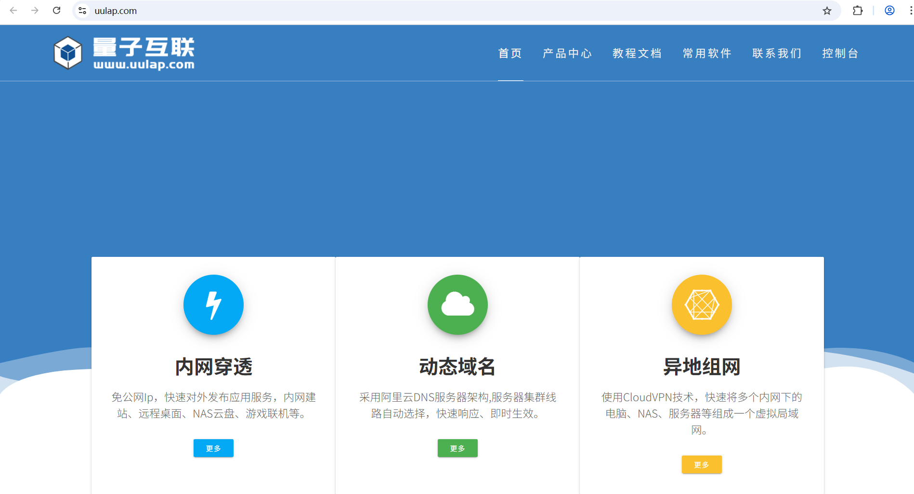

## 下载安装软件并注册


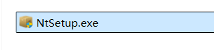

双击安装即可，安装软件之后，启动软件，你会看到：


点击立即注册。会弹出一个网页，如下：


点击我要注册：


填写信息并注册。

## 购买服务

免费的也能用，但是容易断网，建议购买一下，一个月 10 元不限流量。


## 线路设置

我的隧道，线路设置：


一定要选择香港线路，要不然你还得注册域名并备案：

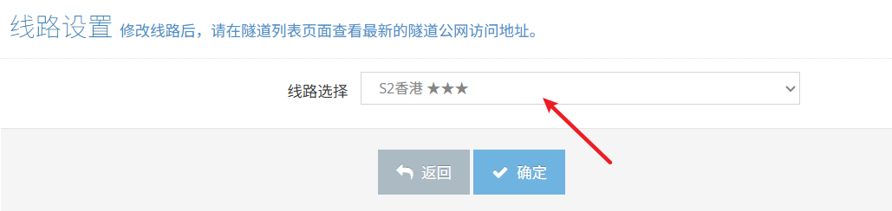

## 开通隧道

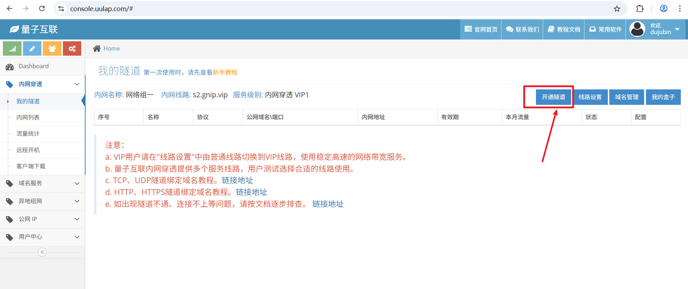

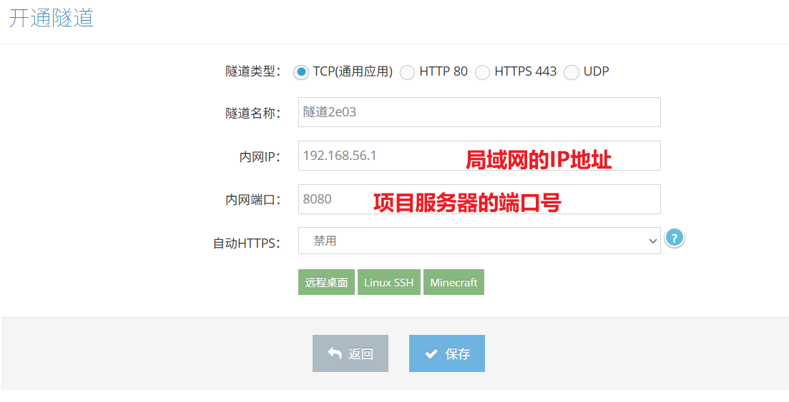

创建内网穿透隧道后，即可通过外网URL地址访问您本地电脑上运行的Java项目。请注意：**请务必保持量子互联软件持续运行**，以确保隧道始终有效。若长期未运行Java项目，量子互联软件向 8080 端口发送的心跳检测可能无法响应，导致外网HTTP请求无法被正常转发。因此，**建议您在启动Java项目前，先重启一次量子互联软件**，以保障服务稳定。启动量子互联软件后，需要输入网络 TOKEN 进行登录，在这里找网络 TOKEN：


在量子互联软件上输入网络 TOKEN，登录：


这个软件需要一直处于运行状态哈。

最后一步：在后端Java项目的YML文件中，配置notifyUrl地址，把内网穿透的外网地址写上去


# 下单购买体检套餐

## 前端创建付款弹窗

在 `front/goods.vue`页面中，添加付款弹窗，弹窗上显示付款二维码，在 `goods.vue`的视图层的末尾添加弹窗的代码：

```html
<el-dialog title="购买体检套餐" :close-on-click-modal="false" v-model="dialog.visible" width="305px" center>
  
    
  
    <div v-if="dialog.result" class="pay-success">
        <el-result icon="success" title="付款成功" subTitle="请根据提示进行操作"></el-result>
    </div>
  
    <div class="dialog-footer-style">
        <el-button type="danger" size="medium" v-if="!dialog.result"
            @click="closeHandle">取消支付</el-button>
        <el-button type="primary" size="medium" v-if="!dialog.result"
            @click="successHandle">支付成功</el-button>
        <el-button type="primary" size="medium" v-if="dialog.result"
            @click="closeHandle">关闭窗口</el-button>
    </div>
  
</el-dialog>
```

## 编写 less 样式

在 `goods.less`文件中编写样式：

```plaintext
.qrcode {
    width: 230px;
    height: 230px;
    display: block;
    margin-left: auto;
    margin-right: auto;
}
.pay-success {
    width: 230px;
    height: 230px;
    margin-left: auto;
    margin-right: auto;
}
.dialog-footer-style {
    padding-bottom: 30px;
    padding-top: 10px;
    text-align: center;
}
```

## 编写模型层代码

在模型层为视图层准备数据：

```typescript
const dialog = reactive({
    visible: false,
    result: false,
    qrCode: null,
    //订单流水号，查询付款结果时候使用
    outTradeNo: null
});
```

## 编写立即付款的回调函数

找到 立即付款 按钮，看看调用回调函数：

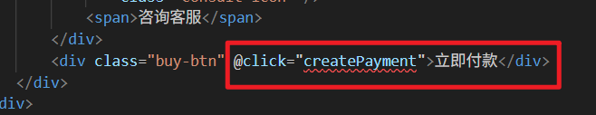

编写 `createPayment`回调函数：先检查用户是否已经登录，如果已经登录了再执行购买套餐

```typescript
async function createPayment() {
    dialog.outTradeNo = null;
    dialog.qrCode = null;
    dialog.result = false;

    //检查用户是否登录
    const config = {
        headers : {
            satoken: localStorage.getItem('token')
        }
    };
    const response = await axios.get('/meinian-api/front/customer/checkLogin', config);
    const resp = response.data;
    
    if (!resp.result) {
        proxy.$message({
            message: '请先登录系统',
            type: 'warning',
            duration: 1200
        });
    } else {
        // 用户已登录
        proxy.$confirm('您确定购买该体检套餐？', '提示信息', {
            confirmButtonText: '确定',
            cancelButtonText: '取消',
            type: 'info'
        }).then(async () => {
            const id = router.currentRoute.value.params.id;
            let json = { goodsId: id, buyCount: dataForm.number };
            const response = await axios.post('/meinian-api/front/order/createPayment', json, config);
            const resp = response.data;
            if (!resp.illegal) {
                dialog.visible = true;
                let result = resp.result;
                dialog.outTradeNo = result.outTradeNo;
                dialog.qrCode = result.qrCodeBase64;
                //TODO 利用WebSocket接受后端推送的付款结果
            } else {
                ElMessageBox.alert(
                    '今日您的未支付订单或退款订单已达到上线，导致今日不能再下单。请明日再来购买体检套餐！',
                    '提示信息',
                    {}
                );
            }
        }); 
    } 
}
```

顺手再编写一个关闭付款弹窗的函数：

```typescript
function closeHandle(){
    dialog.visible = false;
}
```

## 重点调试注意事项

此前我们为后端 Java 项目配置了自签名数字证书，以启用 HTTPS 协议。但由于该证书未受公共信任机构认证，可能导致微信服务器无法正常向我们发送通知消息。为保障通信可用性，我们决定暂时关闭 HTTPS 协议，恢复使用 HTTP 进行通信。

### 关闭 HTTPS 协议

打开 `application.properties`文件，注释掉这个内容：

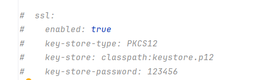

### 修改前端代理的配置

打开 `vite.config.ts`文件，将 `https`修改为 `http`


### 重启量子互联软件

为确保内网穿透服务的稳定性，在启动Java项目前，务必先重启量子互联客户端。此举可有效消除因电脑休眠或项目长期未运行而导致的连接故障。

## 测试效果如下


这个时候，底层数据库订单表中已经生成了一条记录。只不过是一个未支付的订单。可以打开数据库表看看 `order_status`字段是不是 `1`

接下来拿微信扫码付款，支付成功后，可以看到数据库中订单的状态修改成了 `3`。

# 后端使用 WebSocket 推送付款结果

## 什么是 WebSocket

WebSocket 是 HTML5 标准提出的一种新型网络通信协议。它实现了浏览器与服务器之间的全双工通信，能够有效节省服务器资源和带宽，满足实时通信的需求。

与传统的 HTTP 请求不同，WebSocket 建立的是长连接。在需要频繁交互的场景下——例如实时消息通知——传统做法通常要求浏览器每隔几秒发起一次轮询请求。而每次 HTTP 连接建立都需要经过多次握手，频繁的轮询会导致大量时间消耗在重复建立连接上。如果浏览器和服务器之间能够维持一个长连接，数据传递就会高效得多：浏览器可以随时发送请求，服务器也能随时主动推送消息。

需要注意的是，WebSocket 并不是要完全替代 HTTP 协议，而是作为它的重要补充。例如，在浏览新闻网页这样的场景中，使用 HTTP 协议更为合适——页面加载完成后即可断开连接，以节约网络资源。如果所有静态网页都使用长连接，无论对浏览器还是服务器来说，维持大量 WebSocket 连接都会带来巨大的资源开销。

因此，WebSocket 更适合用于页面与服务器之间需要频繁、实时交互的场景，例如在线聊天、实时数据监控、多人协作编辑等，在这些情况下才能充分发挥其技术优势。

## 在 SpringBoot 项目中使用 WebSocket

### 引入依赖

```xml
<!--WebSocket实时通信支持-->
<dependency>
    <groupId>org.springframework.boot</groupId>
    <artifactId>spring-boot-starter-websocket</artifactId>
</dependency>
```

这个依赖在我们初期搭建项目的时候已经引入了。

### 创建 WebSocket 配置类

在 `api.config`包下新建 `WebSocketConfig`配置类：

```java
package com.jkweilai.meinian.api.config;

import org.springframework.context.annotation.Bean;
import org.springframework.context.annotation.Configuration;
import org.springframework.web.socket.server.standard.ServerEndpointExporter;

@Configuration
public class WebSocketConfig {
    @Bean
    public ServerEndpointExporter serverEndpointExporter() {
        return new ServerEndpointExporter();
    }
}
```

这个配置会将 `ServerEndpointExporter`对象纳入 IoC 容器的管理。`ServerEndpointExporter`对象的作用是：

- **扫描注解**：查找所有被 `<font style="color:rgb(15, 17, 21);background-color:rgb(235, 238, 242);">@ServerEndpoint</font>` 标注的类
- **注册端点**：将这些**端点类**注册到 WebSocket 服务器中，创建对应的访问地址

### 编写端点类

端点类需要使用 `@ServerEndpoint`注解标注。一个项目中可以有多个端点类。比如：一个业务一个端点类。一个端点类中管理多个 `Socket`对象，一个 `Socket`对象就代表一个客户端到服务器的连接。在 `api`包下新建 `socket`包，编写 `MessagePushEndpoint`，这个类的作用是：**作为WebSocket通信的统一入口，管理所有用户的长连接并实现服务端向指定客户端的消息推送。**

```java
package com.jkweilai.meinian.api.socket;

import cn.dev33.satoken.stp.StpUtil;
import cn.hutool.core.map.MapUtil;
import cn.hutool.core.util.StrUtil;
import cn.hutool.json.JSONObject;
import cn.hutool.json.JSONUtil;
import com.jkweilai.meinian.api.config.satoken.StpCustomerUtil;
import jakarta.websocket.*;
import jakarta.websocket.server.ServerEndpoint;
import lombok.extern.slf4j.Slf4j;
import org.springframework.stereotype.Component;

import java.util.Map;
import java.util.concurrent.ConcurrentHashMap;

@Slf4j
@ServerEndpoint(value = "/websocket/push/message")
@Component
public class MessagePushEndpoint {

    /*
        key存储的是用户的id，value是这个用户对应的Socket连接。
        假设业务端的id=1的用户访问，则key是 customer_1
        假设mis端的id=1的用户访问，则key是 user_1
        每一个用户都有自己专属的Socket连接（也就是Session对象）
        并且Socket连接永不共享，一个用户对应一个。
        customer_1==>对应自己的Socket连接。
        user_1==>对应自己的Socket连接。
        一个Socket连接不能让张三用了之后，李四又用，这是不可能的。
     */
    private static ConcurrentHashMap<String, Session> sessionMap = new ConcurrentHashMap<>();

    // Socket连接被创建时自动调用。
    @OnOpen
    public void onOpen(Session session) {
        // 设置会话超时时间，防止长时间空闲连接
        session.setMaxIdleTimeout(30 * 60 * 1000); // 30分钟
    }

    // 客户端每一次向服务器发送消息时的回调
    // 该方法的作用是：将用户的id和对应的socket绑定到sessionMap中。（注册）
    /*
        假如客户端通过websocket发消息的时候，采用了以下格式：
            ws.send(JSON.stringify({
                "opt": "register",      // 操作类型（代码有ping判断）
                "identity": "customer", // 用户身份
                "token": "eyJhbGciOiJ..." // 认证令牌
            }));
    */
    @OnMessage
    public void onMessage(String message, Session session) {
        JSONObject json = JSONUtil.parseObj(message);
        String opt = json.getStr("opt");

        if ("ping".equals(opt)) {
            return;
        }
        // 获取用户的身份
        String identity = json.getStr("identity");
        // 获取令牌
        String token = json.getStr("token");
        // 生成key
        String userId = null;
        if ("customer".equals(identity)) {
            userId = "customer_" + StpCustomerUtil.getLoginIdByToken(token).toString();
        } else {
            userId = "user_" + StpUtil.getLoginIdByToken(token).toString();
        }

        // 这是 WebSocket Session 的标准方法，getUserProperties() 返回一个 Map
        // 用于在 Session 的整个生命周期中存储自定义数据
        Map<String, Object> map = session.getUserProperties();
        map.put("userId", userId);

        // 直接put，ConcurrentHashMap是线程安全的
        // 不会创建新的Socket连接，只是sessionMap中的value会被覆盖
        sessionMap.put(userId, session);
    }

    // Socket连接被关闭时自动调用。
    @OnClose
    public void onClose(Session session) {
        // 这个代码的逻辑是：关闭Socket连接时，将 sessionMap 中对应的键值对移除。
        Map map = session.getUserProperties();
        if (map.containsKey("userId")) {
            String userId = MapUtil.getStr(map, "userId");
            // 确保只移除当前会话，避免移除其他新会话
            Session currentSession = sessionMap.get(userId);
            if (currentSession == session) {
                sessionMap.remove(userId);
            }
        }
    }


    // 发生错误时的回调
    @OnError
    public void onError(Session session, Throwable error) {
        log.error("发生错误", error);
        // 错误时也清理连接
        onClose(session);
    }

    // 服务器向客户端发消息的方法。
    public static void sendInfo(String message, String userId) {
        if (StrUtil.isBlank(userId)) return;

        Session session = sessionMap.get(userId);
        if (session == null || !session.isOpen()) {
            sessionMap.remove(userId);
            return;
        }

        try {
            // 服务端向客户端发送消息的核心代码
            // session：代表一个用户的WebSocket连接
            // getBasicRemote()：获取消息发送接口
            // sendText(message)：发送文本消息到客户端
            session.getBasicRemote().sendText(message);
        } catch (Exception e) {
            log.error("发送消息异常, userId: {}", userId, e);
            sessionMap.remove(userId);
        }
    }


}
```

## 根据交易流水号获取客户 id

根据 `outTradeNo`获取 `customerId`，这是因为用户支付成功之后，会返回一个交易流水号，而通过交易流水号，在订单表中可以查询到 `customerId`，通过 `customerId`可以获取到 `sessionMap`中对应的 `session`对象，这样才能给对应的客户推送支付成功的消息。

**编写 Mapper 和 XML：**

找到 `TradeOrderMapper`接口，编写以下方法：

```java
Integer selectCustomerIdByOutTradeNo(String outTradeNo);
```

找到 `TradeOrderMapper.xml`文件，编写以下 SQL：

```xml
<select id="selectCustomerIdByOutTradeNo" resultType="Integer">
    select customer_id from trade_order where out_trade_no = #{outTradeNo}
</select>
```

**编写 Service 接口和实现：**

找到 `TradeOrderService`接口，编写以下方法：

```java
Integer findCustomerIdByOutTradeNo(String outTradeNo);
```

找到 `TradeOrderServiceImpl`类，编写方法实现：

```java
@Override
public Integer findCustomerIdByOutTradeNo(String outTradeNo) {
    return tradeOrderMapper.selectCustomerIdByOutTradeNo(outTradeNo);
}
```

## 推送消息给前端

找到 `TradeOrderController`，编写推送消息到前端的代码：


代码如下：

```java
if(success){
    log.info("订单更新{}: {}", success ? "成功" : "失败", outTradeNo);  // 记录订单更新结果
    Integer customerId = tradeOrderService.findCustomerIdByOutTradeNo(outTradeNo);
    if(customerId != null){
        JSONObject json = new JSONObject();
        json.set("result", true);
        MessagePushEndpoint.sendInfo(json.toString(), "customer_" + customerId);
    } else {
        log.error("没有查询到customerId");
    }
}else{
    log.error("订单付款成功，但是订单状态更新失败");
}
```

# 前端使用 WebSocket 接收付款结果

## 添加依赖

[https://www.npmjs.com/package/vue-native-websocket-vue3](https://www.npmjs.com/package/vue-native-websocket-vue3) 官方文档。

如果前端要发送 websocket 长连接请求，也需要安装依赖，执行下面命令来完成安装：

```shell
npm install vue-native-websocket-vue3 --save
```

如果执行命令时出现 404 依赖库无法找到的错误，可以按照以下步骤重新安装依赖：

1. **删除现有依赖**：移除前端项目中的 `<font style="color:rgb(15, 17, 21);background-color:rgb(235, 238, 242);">node_modules</font>` 目录
2. **添加依赖配置**：在 `<font style="color:rgb(15, 17, 21);background-color:rgb(235, 238, 242);">package.json</font>` 文件中补全所需的依赖库：`<font style="color:rgb(15, 17, 21);">"vue-native-websocket-vue3": "^3.1.8"</font>`
3. **重新安装**：在命令行中执行 `<font style="color:rgb(15, 17, 21);background-color:rgb(235, 238, 242);">npm install</font>` 命令，下载所有依赖库

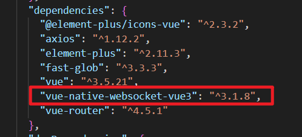

## 配置 WebSocket 建立连接

配置 Vue 应用使用 WebSocket 客户端，连接到指定的后端 WebSocket 服务端地址，并支持自动重连。在 `main.ts`文件中编写以下代码：

```typescript
// 配置WebSocket
import VueNativeSock from 'vue-native-websocket-vue3';

app.use(VueNativeSock, 'ws://localhost:8080/meinian-api/websocket/push/message', {
    format: 'json',
    // 如果WebSocket连接长时间不收发请求，会被服务端切断连接，下面的设置可以自动重连
    reconnection: true
});
```

## 页面加载完之后发送消息完成认证

在 `front/views/goods.vue`文件中编写以下代码：

```typescript
onMounted(() => {
    // 页面加载时立即进行 WebSocket 认证
    const token = localStorage.getItem('token');
    if (token) {
        // 发送消息给websocket服务器。
        // $socket 属性来自 vue-native-websocket-vue3 插件。这个插件会自动注入 $socket 到 Vue 应用实例中
        proxy.$socket.sendObj({
            opt: 'auth',
            identity: 'customer', 
            token: token
        });
    }
});
```

## 接收推送消息

在 `front/view/goods.vue`文件中接收服务器推送回来的消息，在 `createPayment()`方法中编写注册监听的程序，只要监听建立，服务器推送消息时客户端的回调函数就会自动执行：

```typescript
async function createPayment() {
    dialog.outTradeNo = null;
    dialog.qrCode = null;
    dialog.result = false;

    //检查用户是否登录
    const config = {
        headers : {
            satoken: localStorage.getItem('token')
        }
    };
    const response = await axios.get('/meinian-api/front/customer/checkLogin', config);
    const resp = response.data;
    
    if (!resp.result) {
        proxy.$message({
            message: '请先登录系统',
            type: 'warning',
            duration: 1200
        });
    } else {
        // 用户已登录
        proxy.$confirm('您确定购买该体检套餐？', '提示信息', {
            confirmButtonText: '确定',
            cancelButtonText: '取消',
            type: 'info'
        }).then(async () => {
            const id = router.currentRoute.value.params.id;
            let json = { goodsId: id, buyCount: dataForm.number };
            const response = await axios.post('/meinian-api/front/order/createPayment', json, config);
            const resp = response.data;
            if (!resp.illegal) {
                dialog.visible = true;
                let result = resp.result;
                dialog.outTradeNo = result.outTradeNo;
                dialog.qrCode = result.qrCodeBase64;


                //TODO 利用WebSocket接受后端推送的付款结果
                
                // 监听到服务器推送消息过来之后，执行这个回调函数
                const handlePaymentMessage = (event) => {
                    // 服务器响应回来的是json字符串要转换成对象
                    const data = JSON.parse(event.data);
                    if (data.result) {
                        dialog.result = true;
                        // 移除监听
                        proxy.$socket.removeEventListener('message', handlePaymentMessage);
                    }
                };

                // 绑定监听
                proxy.$socket.addEventListener('message', handlePaymentMessage);
                
            } else {
                ElMessageBox.alert(
                    '今日您的未支付订单或退款订单已达到上线，导致今日不能再下单。请明日再来购买体检套餐！',
                    '提示信息',
                    {}
                );
            }
        }); 
    } 
}
```

测试效果：


# 用户迟迟没有收到付款成功的消息

## 实现思路

用户有可能已支付成功，但是迟迟没有收到付款成功的消息，我们应该允许用户自己点击某个按钮来重新查询付款结果。如下图：

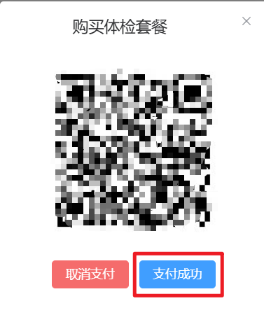

用户点击 支付成功 按钮，可以发送 AJAX 请求，重新查询付款结果。

那么用户付款成功还是失败的依据是什么呢？就是重新发送请求到微信支付平台，获取一下付款单 id（transaction_id），如果能获取到付款单 id 说明已付款成功，如果付款成功了。需要去数据库中更新该订单的状态，比如将订单的状态修改为 3，填充`transaciton_id`。

## 微信支付平台提供的查询付款结果的接口

微信支付 3.0 提供了通过订单流水号查询付款结果的接口。调用该接口所需的请求参数、返回结果及字段说明，均在[官方文档](https://pay.weixin.qq.com/doc/v3/merchant/4012791880)中有明确描述。下方表格列出了响应中较为关键的几个参数，供参考。

| **序号** | **参数** | **类型** | **描述** |
| --- | --- | --- | --- |
| 1 | transaction_id | string | 微信支付单编号 |
| 2 | trade_type | string | 交易类型。NATIVE：扫码支付。 |
| 3 | trade_state | string | 交易状态。 SUCCESS：支付成功； REFUND：转入退款； NOTPAY：未支付； CLOSED：已关闭 |

## 编写根据交易流水号查询付款单 id 的方法

找到 `PaymentService`接口，编写以下方法：

```java
String getPaymentResult(String outTradeNo);
```

找到 `PaymentServiceImpl`实现类，实现方法：

```java
@Override
public String getPaymentResult(String outTradeNo) {
    try {
        // 构建查询请求
        HttpGet httpGet = new HttpGet("https://api.mch.weixin.qq.com/v3/pay/transactions/out-trade-no/" + outTradeNo + "?mchid=" + mchId);
        httpGet.addHeader("Accept", "application/json");
        httpGet.addHeader("User-Agent", "Mozilla/5.0 (Windows NT 10.0; Win64; x64) AppleWebKit/537.36");

        log.info("查询微信支付结果，订单号：{}", outTradeNo);

        // 执行查询请求
        try (CloseableHttpResponse response = httpClient.execute(httpGet)) {
            String responseBody = EntityUtils.toString(response.getEntity());
            int statusCode = response.getStatusLine().getStatusCode();

            log.info("微信支付查询响应：状态码={}", statusCode);

            if (statusCode == 200) {
                JsonNode jsonNode = objectMapper.readTree(responseBody);
                String tradeState = jsonNode.get("trade_state").asText();

                if ("SUCCESS".equals(tradeState)) {
                    String transactionId = jsonNode.get("transaction_id").asText();
                    log.info("订单 {} 支付成功，微信支付订单号：{}", outTradeNo, transactionId);
                    return transactionId;
                } else {
                    log.info("订单 {} 支付状态：{}", outTradeNo, tradeState);
                    return null;
                }
            } else {
                log.error("查询微信支付结果失败，状态码：{}，响应：{}", statusCode, responseBody);
                return null;
            }
        }


    } catch (Exception e) {
        log.error("查询微信支付结果异常，订单号：{}", outTradeNo, e);
        return null;
    }
}
```

## 编写 OrderService 接口和实现

以上我们已经编写了调用微信支付平台的接口，现在我们要编写业务逻辑的代码了，这个业务属于订单方面的，因此我们需要找到 `TradeOrderService`接口，然后编写以下方法：

```java
boolean getPaymentResult(String outTradeNo);
```

然后编写方法的实现，代码如下：

```java
@Override
public boolean getPaymentResult(String outTradeNo) {
    String transactionId = paymentService.getPaymentResult(outTradeNo);
    if(transactionId != null){
        // 说明已经付款成功了。
        // 更新订单
        Map<String,Object> param = new HashMap<>();
        param.put("transactionId", transactionId);
        param.put("outTradeNo", outTradeNo);
        updatePayment(param);
        return true;
    }
    return false;
}
```

## 编写 form 接收数据并校验

编写 `GetPaymentResultForm`，代码如下：

```java
package com.jkweilai.meinian.api.front.controller.form;

import jakarta.validation.constraints.NotBlank;
import jakarta.validation.constraints.Pattern;
import lombok.Data;

@Data
public class GetPaymentResultForm {
    @NotBlank(message = "outTradeNo不能为空")
    @Pattern(regexp = "^[0-9A-Z]{32}$", message = "outTradeNo内容不正确")
    private String outTradeNo;
}
```

## 编写 web 接口

找到 `TradeOrderController`，编写以下方法：

```java
@PostMapping("/paymentResult")
@SaCheckLogin(type = StpCustomerUtil.TYPE)
public R paymentResult(@RequestBody @Valid GetPaymentResultForm form) {
    String outTradeNo = form.getOutTradeNo();
    boolean paymentResult = tradeOrderService.getPaymentResult(outTradeNo);
    return R.ok().put("result", paymentResult);
}
```

## 编写前端代码

在 `/front/views/goods.vue`页面中找到 支付成功按钮：

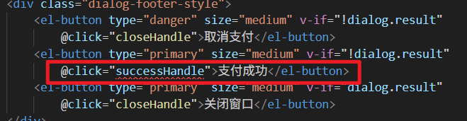

然后我们应该去编写 `successHanle`回调函数了，代码如下：

```typescript
async function successHandle(){
    const json = {
        outTradeNo: dialog.outTradeNo
    };
    const config = {
        headers : {
            satoken: localStorage.getItem('token')
        }
    };
    const response = await axios.post('/meinian-api/front/order/paymentResult', json, config);
    const result = response.data.result;
    if(result){
        dialog.result = true;
        // 删除监听
        delete proxy.$options.sockets.onmessage;
    }else{
        proxy.$message({
            message : "付款失败",
            type: 'error',
            duration: 1200
        });
    }
}
```

测试的时候，将**量子互联的内网穿透关闭**。

# 后端实现分页查询客户订单列表

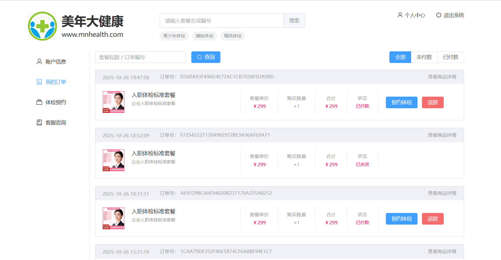

## 实现思路

1. 分页查询我们已经实现过很多次了，无非就是执行两个 SQL：一个是获取符合条件的记录条数，一个是获取符合条件的数据。
2. 查询条件是什么？
  1. 可以根据交易流水号(out_trade_no)进行模糊查询。
  2. 可以根据商品名字（goods_title）进行模糊查询。
  3. 可以根据订单的状态进行精确查询。
  4. 另外查询时，只查询当前客户的订单，因此 where 条件中还要限定 customer_id
3. 需要返回什么数据？
  1. order_id
  2. out_trade_no
  3. goods_id
  4. snapshot_id
  5. goods_title
  6. goods_price
  7. quantity
  8. total_amount
  9. goods_image
  10. goods_description
  11. order_status
  12. **该订单状态是否为超期未付款（返回 true 表示超期未付款，返回 false 表示未付款但未超期）（后面有用）**
  13. 创建日期（后面有用）
  14. 创建时间
  15. **预约数量（一个订单中可能有多个体检套餐，需要知道这个订单已经产生了几次预约了。如果预约数量等于体检套餐的数量了，客户就不能再预约了，因为等于所有的体检套餐都用完了。这样页面上就不能显示预约按钮了。因此，怎么获取订单的预约数量呢？订单表 trade_order 和预约表med_exam_appointment 进行表连接，但由于订单可能会一条预约记录都没有呢，因此需要使用外连接，保证订单表数据在没有预约记录的前提下能够查询出来。）**

## 编写 Mapper 和 XML

找到 `TradeOrderMapper`接口，编写以下方法：

```java
List<Map<String, Object>> selectPageByCondition(Map<String, Object> params);

long selectCountByQueryCondition(Map<String, Object> params);
```

找到 `TradeOrderMapper.xml`文件，编写以下 SQL：

```xml
<select id="selectPageByCondition" parameterType="Map" resultType="Map">
    SELECT o.order_id as orderId,
        o.out_trade_no AS outTradeNo,
        o.goods_id AS goodsId,
        o.snapshot_id AS snapshotId,
        o.goods_title AS goodsTitle,
        o.goods_price AS goodsPrice,
        o.quantity,
        o.total_amount AS totalAmount,
        o.goods_image AS goodsImage,
        o.goods_description AS goodsDescription,
        o.`order_status` AS orderStatus,
        IF(o.`order_status` = 1 AND TIMESTAMPDIFF(MINUTE,o.create_time,NOW()) > 20, true, false) AS disabled,
        DATE_FORMAT(o.create_date,"%Y-%m-%d") AS createDate,
        DATE_FORMAT(o.create_time,"%Y-%m-%d %H:%i:%s") AS createTime,
        COUNT(a.order_id) AS appointCount
        FROM trade_order o
        LEFT JOIN med_exam_appointment a ON o.order_id = a.order_id
    WHERE o.customer_id = #{customerId}
    <if test="orderStatus != null and orderStatus != ''">
        AND o.`order_status` = #{orderStatus}
    </if>
    <if test="keyword != null and keyword != ''">
        AND ( o.out_trade_no = #{keyword} OR o.goods_title LIKE CONCAT( "%", #{keyword}, "%" ) )
    </if>
    GROUP BY o.order_id
    ORDER BY o.order_id DESC
    LIMIT #{startIndex}, #{pageSize}
</select>

<select id="selectCountByQueryCondition" parameterType="Map" resultType="long">
    SELECT COUNT(*)
    FROM trade_order
    WHERE customer_id = #{customerId}
    <if test="orderStatus != null and orderStatus != ''">
        AND `order_status` = #{orderStatus}
    </if>
    <if test="keyword != null and keyword != ''">
        AND ( out_trade_no = #{keyword} OR goods_title LIKE CONCAT( "%", #{keyword}, "%" ) )
    </if>
</select>
```

我们之前学过，当一个 select 语句中使用了 group by 子句时，select 后面只能出现参加分组的字段吗？以上 SQL 语句不会出问题吗？`order_id`是主键，这种写法就没事。

## 编写 Service 接口和实现

找到 `TradeOrderService`接口编写以下分页查询方法：

```java
PageResult<Map<String,Object>> pageQueryByCondition(Map<String, Object> param);
```

编写方法的实现：

```java
@Override
public PageResult<Map<String, Object>> pageQueryByCondition(Map<String, Object> param) {
    List<Map<String, Object>> records = new ArrayList<>();
    long total = tradeOrderMapper.selectCountByQueryCondition(param);
    if(total > 0){
        records = tradeOrderMapper.selectPageByCondition(param);
    }
    Integer pageSize = MapUtil.getInt(param, "pageSize");
    Integer pageNo = MapUtil.getInt(param, "pageNo");
    PageResult<Map<String, Object>> pageResult = new PageResult<>(total, pageSize, pageNo, records);
    return pageResult;
}
```

## 编写 form 接收数据并校验

创建 `OrderPageQueryForm`，编写以下代码：

```java
package com.jkweilai.meinian.api.front.controller.form;


import jakarta.validation.constraints.Min;
import jakarta.validation.constraints.NotNull;
import jakarta.validation.constraints.Pattern;
import lombok.Data;
import org.hibernate.validator.constraints.Range;

@Data
public class OrderPageQueryForm {
    @Pattern(regexp = "^[a-zA-Z0-9\\u4e00-\\u9fa5]{1,50}$", message = "keyword内容不正确")
    private String keyword;

    @Pattern(regexp = "^1$|^3$", message = "orderStatus内容不正确")
    private String orderStatus;

    @NotNull(message = "pageNo不能为空")
    @Min(value = 1, message = "pageNo不能小于1")
    private Integer pageNo;

    @NotNull(message = "pageSize不能为空")
    @Range(min = 10, max = 50, message = "pageSize必须为10~50之间")
    private Integer pageSize;
}
```

## 编写 web 方法

找到 `TradeOrderController`类，编写分页查询的方法：

```java
@PostMapping("/pageQuery")
@SaCheckLogin(type = StpCustomerUtil.TYPE)
public R pageQuery(@RequestBody @Valid OrderPageQueryForm form) {
    Integer pageNo = form.getPageNo();
    Integer pageSize = form.getPageSize();
    Integer startIndex = (pageNo - 1) * pageSize;
    Map<String, Object> param = BeanUtil.beanToMap(form);
    param.put("startIndex", startIndex);
    int customerId = StpCustomerUtil.getLoginIdAsInt();
    param.put("customerId", customerId);
    PageResult<Map<String, Object>> pageResult = tradeOrderService.pageQueryByCondition(param);
    return R.ok().put("result", pageResult);
}
```

# 前端实现分页查询客户订单列表

## 回顾视图层的代码

找到 `order_list.vue`页面，回顾一下视图层的代码：

```html
<template>
    <el-form :inline="true" :model="dataForm" :rules="dataRule" ref="form">
        <el-form-item prop="keyword">
            <el-input v-model="dataForm.keyword" placeholder="套餐标题 / 订单编号"
                size="medium" class="keyword" maxlength="32" clearable="clearable" />
        </el-form-item>
        <el-form-item>
            <el-button size="medium" type="primary" :icon="Search"
                @click="searchHandle()">查询</el-button>
        </el-form-item>
        <el-form-item class="mold">
            <el-radio-group v-model="dataForm.statusLabel" size="medium"
                @change="searchHandle()">
                <el-radio-button label="全部"></el-radio-button>
                <el-radio-button label="未付款"></el-radio-button>
                <el-radio-button label="已付款"></el-radio-button>
            </el-radio-group>
        </el-form-item>
    </el-form>
    <div class="order-list" v-show="!empty">
        <div class="order" v-for="one in data.dataList">
            <div class="header">
                <div class="datetime">{{ one.createTime }}</div>
                <div class="uuid">
                    订单号：
                    <span>{{ one.outTradeNo }}</span>
                </div>
                <div class="detail" @click="searchDetailHandle(one.snapshotId)">
                    查看商品详情
                </div>
            </div>
            <div class="content">
                
                <div class="info">
                    <h4>{{ one.goodsTitle }}</h4>
                    <p>{{ one.goodsDescription }}</p>
                </div>
                <div class="price">
                    <span class="label">套餐单价</span>
                    <span class="value">￥{{ one.goodsPrice }}</span>
                </div>
                <div class="number">
                    <span class="label">购买数量</span>
                    <span class="value">×{{ one.quantity }}</span>
                </div>
                <div class="amount">
                    <span class="label">合计</span>
                    <span class="value">￥{{ one.totalAmount }}</span>
                </div>
                <div class="status">
                    <span class="label">状态</span>
                    <span class="value">{{ one.orderStatus }}</span>
                </div>
                <div class="operate">
                    <el-button v-if="one.orderStatus == '未付款'" type="primary"
                        :disabled="one.disabled"
                        @click="paymentHandle(one.outTradeNo)">
                        付款
                    </el-button>
                    <el-button v-if="one.orderStatus == '未付款'" type="danger"
                        @click="closeOrderHandle(one.id)">
                        取消订单
                    </el-button>
                    <el-button v-if="one.orderStatus == '已付款'" type="primary"
                        :disabled="one.appointCount == one.quantity"
                        @click="appointHandle(one.id, one.quantity, one.appointCount)">
                        预约体检
                    </el-button>
                    <el-button v-if="one.orderStatus == '已结束'">获取发票</el-button>
                    <el-button v-if="one.orderStatus == '已付款'" type="danger"
                        :disabled="one.appointCount > 0"
                        @click="refundHandle(one.id)">
                        退款
                    </el-button>
                </div>
            </div>
        </div>
        <el-pagination @size-change="sizeChangeHandle"
            @current-change="currentChangeHandle" :current-page="data.pageIndex"
            :page-sizes="[10, 20, 50]" :page-size="data.pageSize"
            :total="data.totalCount"
            layout="total, sizes, prev, pager, next, jumper"></el-pagination>
    </div>
    <div class="empty" v-show="empty">
        <el-empty :image-size="200" />
    </div>

</template>
```

## 模型层数据还原

之前我们写页面的时候，准备了一些静态的数据，我们要把它删除掉，还原成下面的样子：

```typescript
const data = reactive({
    dataList: [],
    pageIndex: 1,
    pageSize: 10,
    totalCount: 0,
    loading: false
});
```

## 页面打开时加载分页数据

定义 `loadPageData`函数，并在页面加载的时候调用这个函数，加载第一页数据。代码如下：

```typescript
async function loadPageData(){
    // 显示加载进度条
    data.loading = true;
    // 根据用户的选择，设置订单状态值
    if(dataForm.statusLabel == '全部'){
        dataForm.status = null;
    }else if(dataForm.statusLabel == '未付款'){
        dataForm.status = 1;
    }else {
        dataForm.status = 3;
    }
    // 准备token
    const config = {
        headers : {
            satoken: localStorage.getItem('token')
        }
    };
    // 准备数据
    const json = {
        keyword: dataForm.keyword,
        orderStatus: dataForm.status,
        pageNo: data.pageIndex,
        pageSize: data.pageSize
    };
    
    // 发送ajax请求获取数据
    const response = await axios.post('/meinian-api/front/order/pageQuery', json, config);
    // 获取ajax请求响应的数据，将数据设置到响应式对象中
    const pageResult = response.data.result;

    const statusEnum = {
        '1': '未付款',
        '2': '已关闭',
        '3': '已付款',
        '4': '已退款',
        '5': '已预约',
        '6': '已结束',
    };

    const list = pageResult.records;
    for(let one of list){
        one.goodsImage = `${proxy.$minioUrl}/${one.goodsImage}`;
        one.orderStatus = statusEnum[one.orderStatus + ""];
    }

    data.dataList = list;
    data.totalCount = pageResult.total;
    data.loading = false;
    empty = (list.length == 0);
}


loadPageData();
```

## 编写分页查询回调函数

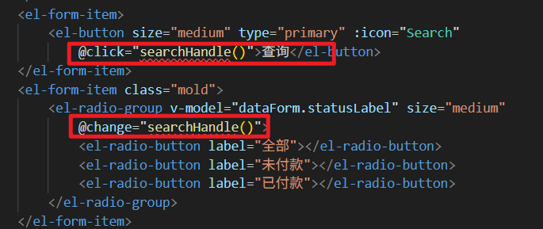

当用户点击查询 或者 点击 全部 未付款 已付款 按钮时，执行回调函数 `searchHanle()`，在函数中主要完成：

1. 校验用户填写的表单信息是否合法。
2. 如果合法则加载分页数据。

```typescript
function searchHandle(){
    proxy.$refs['form'].validate((valid)=>{
        if(valid){
            proxy.$refs['form'].clearValidate();
            loadPageData();
        }
    });
}
```

分页控件用到的两个回调函数，还是以前的写法：

```typescript
function sizeChangeHandle(val) {
    data.pageSize = val;
    data.pageIndex = 1;
    loadPageData();
}
function currentChangeHandle(val) {
    data.pageIndex = val;
    loadPageData();
}
```

# 实现退款

## 实现思路

1. 退款肯定要走微信支付平台，因此肯定要调用微信支付的退款接口。需要先研究一下退款接口需要传什么参数，返回什么数据。可以猜测一下：
  1. 肯定是需要当时付款时生成的付款单 id（transaction_id），因为这个付款单 id 是微信支付平台生成的。
  2. 肯定是需要提交一个退款金额，要不然微信也不知道给你退多少钱。但退款的金额肯定是<=支付的金额的（这个应该不需要我们来负责，微信支付平台的退款接口内部自然会进行判断）。
2. 能不能退款取决于 `trade_order`表中的 `out_refund_no`退款流水号是否为空，如果为空可以退款。全部的退款条件为：
  1. `out_refund_no is null`
  2. 订单状态为已付款，也就是 `order_status = 3`，订单状态为已预约不支持线上退款，因为有的体检套餐是有折扣的，如果实现线上退款非常复杂，客户如果需要退款可以进行线下退款（也就是需要联系客服，客服后台操作）。
  3. where 条件中还需要一个 `customer_id`，毕竟是给当前客户退款。不是给其他客户退款。
  4. where 条件中还需要一个订单 id。
3. 微信支付平台的退款操作肯定不是实时的，因此肯定还需要提供一个回调 url：notifyUrl，当微信支付平台退款成功之后调用我们提供的 notifyUrl，给我们的应用传递退款成功的消息。
4. 用户点击了退款之后我们更新什么？
  1. 填充退款单流水号：`out_refund_no`
  2. 更新退款时间：`refund_time`
  3. 更新退款日期：`refund_date`
5. 用户退款成功之后，我们需要更新什么？
  1. 订单状态更新为 4：`order_status = 4`

## 时序图


## 微信支付平台退款接口

微信支付3.0的[官方文档](https://pay.weixin.qq.com/doc/v3/merchant/4012791883)讲了调用退款API接口需要提供哪些参数，返回的响应中有什么参数。具体的参数请看表格：

### 请求参数

| **序号** | **参数** | **类型** | **描述** |
| --- | --- | --- | --- |
| 1 | transaction_id | string | 微信支付单编号 |
| 2 | out_trade_no | string | 订单流水号 |
| 3 | out_refund_no | string | 退款流水号（由我们自己生成/商户自己生成） |
| 4 | **amount** | Object |   |
|   | refund | int | 退款金额 |
|   | total | int | 订单金额 |

### 响应参数

| **序号** | **参数** | **类型** | **描述** |
| --- | --- | --- | --- |
| 1 | refund_id | string | 退款单编号 |
| 2 | transaction_id | string | 付款单编号 |
| 3 | out_trade_no | string | 订单流水号 |
| 4 | status | string | 退款状态。 |

- `<font style="color:rgb(23, 43, 77);background-color:rgb(244, 245, 247);">SUCCESS</font>`: 退款成功
- `<font style="color:rgb(23, 43, 77);background-color:rgb(244, 245, 247);">CLOSED</font>`: 退款关闭
- `<font style="color:rgb(23, 43, 77);background-color:rgb(244, 245, 247);">PROCESSING</font>`: 退款处理中
- `<font style="color:rgb(23, 43, 77);background-color:rgb(244, 245, 247);">ABNORMAL</font>`: 退款异常，退款到银行发现用户的卡作废或者冻结了，导致原路退款银行卡失败，可前往[商户平台](https://pay.weixin.qq.com/)-交易中心，手动处理此笔退款，可参考： [退款异常的处理](https://kf.qq.com/faq/140225MveaUz150107mAVz6F.html)，或者通过[发起异常退款](https://pay.weixin.qq.com/doc/v3/merchant/4013071193)接口进行处理。

## 编写 Mapper 和 XML

找到 `TradeOrderMapper`接口，编写以下三个方法：

```java
String selectOutRefundNoByOrderId(Integer orderId);

Map<String, Object> selectTranIdAndAmountByOrderId(Map<String, Object> param);

int updateOutRefundNo(Map<String, Object> param);
```

找到 `TradeOrderMapper.xml`文件，编写 SQL 语句：

```xml
<select id="selectOutRefundNoByOrderId" resultType="Integer">
    select out_refund_no as outRefundNo from trade_order where order_id = #{orderId}
</select>

<select id="selectTranIdAndAmountByOrderId" parameterType="Map" resultType="Map">
    select
        transaction_id as transactionId, total_amount as totalAmount
    from
        trade_order
    where
        order_id = #{orderId} and order_status = 3 and customer_id = #{customerId}
</select>

<update id="updateOutRefundNo" parameterType="Map">
    update
        trade_order
    set
        out_refund_no = #{outRefundNo},
        refund_date = current_date(),
        refund_time = now()
    where
        order_id = #{orderId} and order_status = 3
</update>
```

## 编写 PaymentService

在 `PaymentService`和 `PaymentServiceImpl`中编写退款的方法：调用微信支付的退款接口，完成退款。

```java
/**
 * 退款方法
 * @param transactionId 付款单id
 * @param refund 退款金额
 * @param total 订单总金额
 * @param notifyUrl 回调url
 * @return 退款状态是 PROCESSING时，立即返回退款单号 out_refund_no，否则返回null。
 */
String refund(String transactionId, Integer refund, Integer total, String notifyUrl);
```

```java
@Override
public String refund(String transactionId, Integer refund, Integer total, String notifyUrl) {
    try {
        // 生成退款流水号
        String outRefundNo = IdUtil.simpleUUID().toUpperCase();

        // 构建退款请求参数
        Map<String, Object> requestMap = new HashMap<>();
        requestMap.put("transaction_id", transactionId); // 微信支付订单号
        requestMap.put("out_refund_no", outRefundNo);   // 商户退款单号
        requestMap.put("notify_url", notifyUrl);        // 退款结果通知URL

        // 构建金额信息
        Map<String, Object> amountMap = new HashMap<>();
        amountMap.put("refund", refund);                // 退款金额
        amountMap.put("total", total);                  // 原订单金额
        amountMap.put("currency", "CNY");               // 币种
        requestMap.put("amount", amountMap);

        // 创建HTTP POST请求到微信支付退款接口
        HttpPost httpPost = new HttpPost("https://api.mch.weixin.qq.com/v3/refund/domestic/refunds");
        httpPost.addHeader("Accept", "application/json");
        httpPost.addHeader("Content-type", "application/json; charset=utf-8");
        httpPost.addHeader("User-Agent", "Mozilla/5.0 (Windows NT 10.0; Win64; x64) AppleWebKit/537.36");

        // 设置请求体
        String requestBody = objectMapper.writeValueAsString(requestMap);
        httpPost.setEntity(new StringEntity(requestBody, "UTF-8"));

        log.info("调用微信支付退款接口，请求参数：{}", requestBody);

        // 执行退款请求
        try (CloseableHttpResponse response = httpClient.execute(httpPost)) {
            String responseBody = EntityUtils.toString(response.getEntity());
            int statusCode = response.getStatusLine().getStatusCode();

            log.info("微信支付退款响应：状态码={}, 响应体={}", statusCode, responseBody);

            if (statusCode == 200) {
                JsonNode jsonNode = objectMapper.readTree(responseBody);
                String status = jsonNode.get("status").asText();

                // 判断退款状态
                if ("PROCESSING".equals(status)) {
                    log.info("退款申请成功，退款单号：{}", outRefundNo);
                    return outRefundNo;
                } else {
                    log.warn("退款状态异常，状态：{}，退款单号：{}", status, outRefundNo);
                    return null;
                }
            } else {
                log.error("微信支付退款失败，状态码：{}，响应：{}", statusCode, responseBody);
                return null;
            }
        }

    } catch (Exception e) {
        log.error("调用微信支付退款API异常", e);
        return null;
    }
}
```

## 编写 TradeOrderService 和实现

这个 service 的编写就是我们项目的退款业务逻辑了。上面的 PaymentService 中的方法是调用的微信支付平台的退款接口，执行真正的退款。

找到 `TradeOrderService`接口，提供以下方法：

```java
boolean refund(Map<String, Object> param);
```

找到 `TradeOrderServiceImpl`实现类，提供以下实现：

```java
@Override
public boolean refund(Map<String, Object> param) {
    Integer orderId = MapUtil.getInt(param, "orderId");
    String outRefundNo = tradeOrderMapper.selectOutRefundNoByOrderId(orderId);
    if(outRefundNo != null){
        return false;
    }

    Map<String, Object> map = tradeOrderMapper.selectTranIdAndAmountByOrderId(param);
    String transactionId = MapUtil.getStr(map, "transactionId");
    String totalAmount = MapUtil.getStr(map, "totalAmount");
    // 将金额转换成分
    //int total = NumberUtil.mul(totalAmount, "100").intValue();
    int total = 1;
    //int refund = total;
    int refund = 1;
    if(transactionId == null){
        log.error("transactionId is null");
        return false;
    }

    // 执行退款
    String notifyUrl = domain + "/front/order/refundCallback";
    outRefundNo = paymentService.refund(transactionId, refund, total, notifyUrl);
    param.put("outRefundNo", outRefundNo);
    if(outRefundNo != null){
        // 更新退款流水号和退款时间/日期
        int rows = tradeOrderMapper.updateOutRefundNo(param);
        if(rows == 1){
            return true;
        }
    }
    return false;
}
```

## 编写 form 接收并校验数据

form 只需要接收 orderId，customerId 可以从 token 中获取：

```java
package com.jkweilai.meinian.api.front.controller.form;


import jakarta.validation.constraints.Min;
import jakarta.validation.constraints.NotNull;
import lombok.Data;

@Data
public class RefundForm {
    
    private Integer customerId;
    
    @NotNull
    @Min(value = 1, message = "orderId不能小于1")
    private Integer orderId;
}
```

## 编写退款的 web 方法

找到 `TradeOrderController`，编写退款的 web 方法：

```java
@PostMapping("/refund")
@SaCheckLogin(type = StpCustomerUtil.TYPE)
public R refund(@RequestBody @Valid RefundForm form) {
    Integer customerId = StpCustomerUtil.getLoginIdAsInt();
    form.setCustomerId(customerId);
    Map<String, Object> param = BeanUtil.beanToMap(form);
    boolean result = tradeOrderService.refund(param);
    return R.ok().put("result", result);
}
```

## 前端发送 ajax 请求发起退款

### 退款原则

重点注意：一个订单中可以有多个体检套餐，只要有任何一个体检套餐进行了预约，该订单就不能退款了。

在订单列表页面中，我们为每个订单设置了退款按钮。需要注意的是，如果订单已经预约了体检服务，则该订单将无法申请退款。

**为什么要有这样的限制？**

这主要是为了避免复杂的退款金额计算问题。避免不公平的现象发生。

“大家点过外卖吧？比如你现在点‘3份炸鸡套餐’，原价 150 元，但平台有个‘满 100 减 30’的优惠券，你实际只付了 120 元。

这时候如果你说：‘老板，我先吃 1 份，剩下 2 份我不要了，退钱！’

**请问该退你多少钱？**

1. **按原价退**：每份炸鸡 50 元，退 2 份 = 退 100 元。
→ 但你只付了 120 元，退 100 元后，你相当于用 20 元吃了原价 50 元的炸鸡！**这合理吗？**
2. **按实付比例退**：120 元 ÷ 3 份 = 每份 40 元，退 2 份 = 退 80 元。
→ 那你相当于用 40 元吃了 1 份炸鸡（原价 50 元）。但如果你当初只点 1 份，根本用不了满减券，就要付 50 元！**你还是赚了！**

你看，是不是怎么算都有人吃亏？所以平台干脆说：‘优惠订单一旦部分使用，就不能退了！’”

我们采取了相对简单的规则：**一旦预约体检，订单即不可退款**。这样既避免了复杂的计算问题，也便于向客户解释和理解。在客户进行体检预约时，系统会明确提示这一限制条件。

我们在代码中是这样控制的：


只要预约数量大于 0，则不显示退款按钮。这也是为什么后端的查询语句中要统计该订单的预约数量了。

### 编写 ajax 代码发起退款

在 `order_list.vue`中 编写 `refundHandle()`回调函数：

```typescript
function refundHandle(orderId){
    proxy.$confirm('您确定要退款吗？','提示信息', {
        confirmButtonText : '确定',
        cancelButtonText: '取消',
        type: 'warning'
    }).then(async () => {
        // 发送ajax请求
        // 准备数据
        const json = {
            orderId: orderId
        };
        console.log(json)
        // 准备token
        const config = {
            headers: {
                satoken: localStorage.getItem('token')
            }
        };
        // 发送ajax post请求
        const response = await axios.post('/meinian-api/front/order/refund', json, config);
        const result = response.data.result;
        if(result){
            proxy.$message({
                message: '已申请原路返回退款资金，请稍后查看到账情况',
                type: 'success',
                duration: 1200
            });
        }else{
            proxy.$message({
                message: '退款失败，请联系客服',
                type: 'error',
                duration: 1200
            });
        }
    });
}
```

## 实现退款的回调

微信支付平台完成退款之后，会自动调用我们提供的 `notifyUrl`，给我们的应用传送支付结果的消息。

我们给微信支付平台的回调 url 地址是：`/front/order/refundCallback`

### 研究一下微信会给我们返回什么数据

| **序号** | **参数** | **类型** | **描述** |
| --- | --- | --- | --- |
| 1 | out_trade_no | string | 订单流水号 |
| 2 | transaction_id | string | 付款单编号 |
| 3 | out_refund_no | string | 退款流水号 |
| 4 | refund_id | string | 退款单编号 |
| 5 | refund_status | string | 退款状态。 |

SUCCESS：退款成功；

CLOSED：退款关闭；

ABNORMAL：退款异常；（比如银行卡被冻结）

接下来我们要做的是：通过回调 url 收到微信返回的退款成功的消息后，需要将该订单的状态 `order_status`修改为 `4`。

我们可以根据微信返回的 `<font style="color:rgb(28, 31, 33);">transaction_id</font>`或者 `<font style="color:rgb(28, 31, 33);">out_trade_no</font>`来更新订单的状态。我们这里选择使用`<font style="color:rgb(28, 31, 33);">out_trade_no</font>`

### 编写 Mapper 和 XML

找到 `TradeOrderMapper`接口，编写以下方法：

```java
int updateStatusByOutTradeNo(String outTradeNo);
```

找到 `TradeOrderMapper.xml`，编写以下 SQL：

```xml
<update id="updateStatusByOutTradeNo" parameterType="String">
    update trade_order set order_status = 4 where out_trade_no = #{outTradeNo} and order_status = 3
</update>
```

### 编写 Service 和实现

找到 `TradeOrderService`接口，编写以下方法：

```java
boolean modifyStatusByOutTradeNo(String outTradeNo);
```

找到 `TradeOrderServiceImpl`，编写方法的实现：

```java
@Override
public boolean modifyStatusByOutTradeNo(String outTradeNo) {
    return tradeOrderMapper.updateStatusByOutTradeNo(outTradeNo) == 1;
}
```

### 编写回调的 web 方法

回调 url 地址是 `/front/order/refundCallback`，我们来编写以下这个请求路径对应的 web 方法，找到 `TradeOrderController`，编写方法：

```java
@SneakyThrows
@PostMapping("/refundCallback")
public Map<String, String> refundCallback(
        @RequestHeader("Wechatpay-Serial") String serial,           // 微信支付证书序列号，用于验证签名
        @RequestHeader("Wechatpay-Signature") String signature,     // 微信支付请求签名，用于验证消息真实性
        @RequestHeader("Wechatpay-Timestamp") String timestamp,     // 请求时间戳，用于防止重放攻击
        @RequestHeader("Wechatpay-Nonce") String nonce,             // 随机字符串，用于防止重放攻击
        HttpServletRequest request) {                               // HTTP请求对象，用于读取请求体

    Map<String, String> response = new HashMap<>();  // 创建响应Map，用于返回给微信支付服务器

    try {
        // 读取请求体：将HTTP请求的输入流按行读取并拼接成完整字符串
        String body = request.getReader().lines().collect(Collectors.joining());
        log.info("收到微信退款回调");  // 记录回调接收日志

        // 1. 生产环境签名验证：验证回调请求是否确实来自微信支付服务器
        if (!wechatPayCallbackValidator.verifyWechatSignature(timestamp, nonce, body, signature, serial)) {
            log.error("微信退款回调签名验证失败");  // 签名验证失败日志
            response.put("code", "FAIL");        // 设置响应码为失败
            response.put("message", "签名验证失败");  // 设置响应消息
            return response;  // 立即返回失败响应，不继续处理
        }

        // 2. 解析回调数据：将请求体JSON字符串解析为JsonNode对象便于操作
        JsonNode callbackData = objectMapper.readTree(body);
        JsonNode resource = callbackData.get("resource");  // 获取加密的资源数据节点

        // 提取加密数据所需的三个参数
        String ciphertext = resource.get("ciphertext").asText();          // Base64编码的加密数据
        String associatedData = resource.get("associated_data").asText(); // 附加认证数据
        String resourceNonce = resource.get("nonce").asText();            // 加密随机数

        // 3. 解密资源数据：使用AES-GCM算法解密微信支付回调中的敏感信息
        String decryptedData = wechatPayCallbackValidator.decryptResourceData(
                ciphertext, associatedData, resourceNonce
        );
        // 将解密后的JSON字符串再次解析为JsonNode对象
        JsonNode decryptedJson = objectMapper.readTree(decryptedData);

        // 从解密后的数据中提取关键业务字段
        String outRefundNo = decryptedJson.get("out_refund_no").asText();    // 商户退款单号
        String refundStatus = decryptedJson.get("refund_status").asText();   // 退款状态
        String outTradeNo = decryptedJson.get("out_trade_no").asText();
        String successTime = decryptedJson.has("success_time") ?
                decryptedJson.get("success_time").asText() : null; // 退款成功时间（如果有）

        log.info("退款回调解密成功: outRefundNo={}, refundStatus={}", outRefundNo, refundStatus);  // 记录解密成功日志

        // 4. 处理退款回调业务逻辑
        if ("SUCCESS".equals(refundStatus)) {
            // 退款成功：更新订单状态为已退款
            boolean success = tradeOrderService.modifyStatusByOutTradeNo(outTradeNo);
            if (success) {
                log.info("退款成功，退款单号：{}", outRefundNo);

            } else {
                log.error("退款回调成功，但订单状态更新失败，退款单号：{}", outRefundNo);
            }
        } else if ("ABNORMAL".equals(refundStatus)) {
            // 退款异常：用户银行卡作废或者冻结
            log.warn("退款状态异常，退款单号：{}，可能原因：用户银行卡作废或冻结", outRefundNo);
        } else if ("CLOSED".equals(refundStatus)) {
            // 退款关闭
            log.info("退款已关闭，退款单号：{}", outRefundNo);
        } else {
            // 其他状态（如PROCESSING等）
            log.info("退款处理中，退款单号：{}，状态：{}", outRefundNo, refundStatus);
        }

        // 返回成功响应给微信支付服务器
        response.put("code", "SUCCESS");  // 必须返回SUCCESS，否则微信会重复发送回调
        response.put("message", "OK");    // 成功消息
        return response;

    } catch (Exception e) {
        log.error("处理微信退款回调异常", e);  // 记录异常详细信息
        response.put("code", "FAIL");     // 设置失败响应码
        response.put("message", "处理失败");  // 设置失败消息
        return response;  // 返回失败响应
    }
}
```

# 作业

1. 在订单列表页面支付未付款的订单
2. 客户主动关闭未支付订单