# 美年大健康项目-07

# 前端实现修改促销规则

## 显示修改弹窗

点击修改，执行回调函数，从数据库中根据 ruleId 查询促销规则，将返回的数据设置到 dialog.dataForm 对象中，然后显示弹窗即可。

找到修改按钮：


编写回调函数：`updateHanle`

```typescript
async function updateHandle(ruleId){
    // 准备数据
    const json = {
        ruleId: ruleId
    }
    // 准备配置
    const config = {
        headers: {
            satoken: localStorage.getItem('token')
        }
    };
    // 发送ajax请求
    const response = await axios.post("/meinian-api/mis/rule/findById", json, config);
    const result = response.data.result;

    dialog.dataForm.ruleId = result.ruleId;
    dialog.dataForm.ruleName = result.ruleName;
    dialog.dataForm.ruleContent = result.ruleContent;
    dialog.dataForm.remark = result.remark;

    dialog.visible = true;
}
```

## 修改促销规则

点击弹窗上的确定按钮，发送 ajax 请求，提交修改的数据。后端进行修改。这个逻辑其实我们已经写完了，和新增的逻辑代码走同一个回调函数：

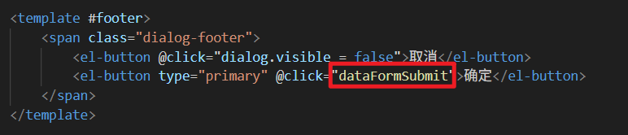

# 后端实现删除促销规则


注意事项：只有当促销规则对应的套餐数量是 0 时才能删除。这个前端需要控制，后端也需要控制。

## 编写 Mapper 和 XML

找到 `PromotionRuleMapper`接口，编写以下方法：

```java
int deleteById(Integer ruleId);
```

找到 `PromotionRuleMapper.xml`文件，编写以下 SQL：

```xml
<delete id="deleteById" parameterType="Integer">
    delete r from
        promotion_rule r
    left join
        (select r.rule_id,count(*) as count from promotion_rule r join med_exam_package p on r.rule_id = p.promotion_id group by r.rule_id) t
    on
        r.rule_id = t.rule_id
    where
        r.rule_id = #{ruleId}
    and
        t.count is null
</delete>
```

以上的删除操作也可以使用以下的两个 SQL 来完成：（mysql 支持，但 shardingsphere 不支持）

```xml
<delete id="deleteById" parameterType="Integer">
    delete from promotion_rule where rule_id = #{ruleId} and (select count(*) from med_exam_package where promotion_id = #{ruleId}) = 0
</delete>
```

```xml
<delete id="deleteById" parameterType="Integer">
    delete from promotion_rule where rule_id = #{ruleId} and not exists(select 1 from med_exam_package where promotion_id = #{ruleId})
</delete>
```

**但由于 **`**ShardingSphere**`**不支持 MySQL 的这种方言，因此我们只能使用第一种删除语句。**

## 编写 Service 接口和实现

找到 `PromotionRuleService`接口，编写以下方法：

```java
int removeById(Integer ruleId);
```

编写方法的实现：

```java
@Override
@Transactional 
public int removeById(Integer ruleId) {
    return promotionRuleMapper.deleteById(ruleId);
}
```

## 编写 form 结束数据并校验

编写 `RemoveRuleByIdForm`，代码如下：

```java
package com.jkweilai.meinian.api.controller.form;

import jakarta.validation.constraints.Min;
import jakarta.validation.constraints.NotNull;
import lombok.Data;

@Data
public class RemoveRuleByIdForm {
    @NotNull(message = "ruleId不能为空")
    @Min(value = 1, message = "ruleId不能小于1")
    private Integer ruleId;
}
```

## 编写 web 方法

找到 `PromotionRuleController`，编写以下方法：

```java
@PostMapping("/removeById")
@SaCheckPermission(value = {"ROOT", "RULE:DELETE"}, mode = SaMode.OR)
public R removeById(@RequestBody @Valid RemoveRuleByIdForm form){
    Integer ruleId = form.getRuleId();
    int rows = promotionRuleService.removeById(ruleId);
    return R.ok().put("rows", rows);
}
```

# 前端实现删除促销规则

## 实现思路

1. 找到删除按钮，当关联的体检套餐数量是 0 时，才能激活删除按钮。
2. 用户点击删除， 执行回调函数，回调函数中弹出确认框，如果用户点击了确定删除，则发送 ajax 请求删除数据。
3. 删除之后重新加载当前分页数据。


以上代码用来控制删除按钮的激活状态。

## 编写删除的回调函数

找到 `rule.vue`文件中的删除按钮：


编写回调函数 `deleteHandle`：

```typescript
function deleteHandle(ruleId){
    ElMessageBox.confirm('您确定要删除该促销规则吗？', '提示信息', {
        confirmButtonText: "确定",
        cancelButtonText: "取消"
    }).then(async () => {
        // 准备数据
        const json = {
            ruleId: ruleId
        };
        // 准备配置
        const config = {
            headers: {
                satoken: localStorage.getItem('token')
            }
        };
        // 发送post请求删除数据
        const response = await axios.post('/meinian-api/mis/rule/removeById', json, config);
        const rows = response.data.rows;
        if(rows == 1){
            ElMessage({
                message: "删除成功",
                type: "success",
                duration: 1200,
                onClose: () => {
                    loadPageData();
                }
            });
        }else{
            ElMessage({
                message: "删除失败",
                type: "error",
                duration: 1200
            });
        }
    });
}
```

# 作业

实现业务端预览商品快照。

# IM 即时通讯


## 对于我们的项目自行研发 IM 是否可行

我们日常工作和生活都离不开即时通讯软件，比如微信、钉钉、QQ 等。这类服务表面看起来简单，但背后的技术实现却极为复杂。虽然网上能找到不少即时通讯的代码示例，但它们大多只实现了最基础的收发消息功能，很多实际场景下的关键问题都没有覆盖。

随便举几个例子，就能感受到一个完整 IM 系统的挑战：

1. **多端长连接维护**

例如，要确保用户同时在手机App和网页版登录时，两者都能实时收到新消息提醒。

1. **支持多种消息类型**

例如，医生在问诊时不仅能发送文字，还能直接分享医学影像图片或一段病情描述的语音。

1. **用户多端登录时的消息同步机制**

例如，用户在电脑上已读了一条消息，他手机上的同一对话的未读红点需要同步消失。

1. **消息发送与接收的顺序一致性保证**

例如，确保医生发出的“先做A检查”和“然后做B治疗”这两条指令，患者接收到的顺序绝不会颠倒。

1. **热消息与冷消息持久化策略**

例如，用户能快速拉取并查看今天的所有聊天记录（热消息），但查询一周前的某条记录（冷消息）则需要稍等片刻从数据库加载。

1. **使用 HBase 等存储应对 PB 级消息数据**

例如，为全国数千万用户提供长达数年的聊天记录存储与查询服务，其数据量是PB级别的。

1. **系统弹性设计**

例如，在每天上午10点的问诊高峰时段，系统能自动扩容以承受瞬间激增的医患沟通流量，避免卡顿。

由此可见，如果我们投入大量资源去自主研发一套完整的 IM 系统，最终可能难以收回成本。回顾腾讯早期的发展历程，其 IM 业务也曾多次面临经营压力，并不是单纯靠聊天软件盈利——真正的变现来源其实是游戏等衍生业务。

对我们的大健康项目而言，用户之间的沟通频率并不高，IM 属于辅助功能而非核心业务。与其耗费巨大成本自研，不如直接接入成熟的第三方即时通讯服务。在这方面，腾讯积累了二十多年的技术经验，其提供的商用 IM 解决方案已经非常稳定和成熟。

因此，选择集成现有 IM 服务，而不是重复造轮子，显然是更务实、更经济的选择。

## 腾讯云的 IM 服务

[https://cloud.tencent.com/](https://cloud.tencent.com/)

腾讯云平台提供了非常全面的即时通讯（IM）服务介绍，建议大家在选用前进行全方位的了解。服务覆盖了**安卓、iOS、Web、小程序及PC客户端**等多个平台。我们可以直接借鉴现有的成熟案例，将其快速、简便地整合到我们自身的项目中。

### 开通腾讯云账户


注册完成后，直接在首页搜索：**即时通讯**

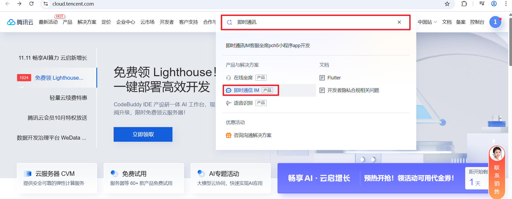


### 小规模系统建议使用后付费模式

腾讯IM服务提供预付费和后付费两种模式。预付费模式需要购买套餐包，价格相对较高，具体可参考[**购买指南**](https://cloud.tencent.com/document/product/269/11673)

后付费模式则根据实际使用量计费，使用前需在腾讯云账户中预充值。当账户余额为零时，IM服务将自动暂停。从企业成本控制的角度出发，我们建议优先考虑后付费方式。

### 开启免费试用

登录腾讯云控制台，访问[**指定URL**](https://console.cloud.tencent.com/im/new-user-guide)进入IM应用创建页面，创建应用。然后点击应用管理：

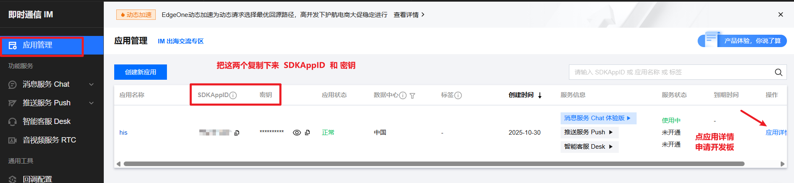

一定要把 SDKAppID 和密钥找个地方记下来。

然后申请开发版：

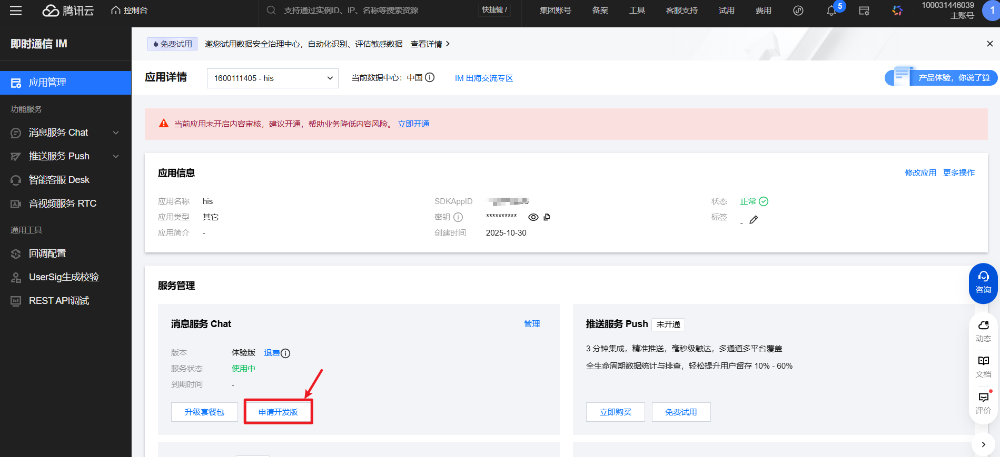

# 后端项目整合 IM 依赖库

我们后端整合 IM 是干什么？

1. **我们Java后台相当于 IM的“管理员”，负责注册账号、管理关系，真正实现聊天的不是我们 Java 程序。**
2. **真正的聊天功能是由腾讯 IM 服务实现的。**
3. **Java 后端怎么管理 IM 的账号呢？当然是调用腾讯云为我们提供的 REST API 了。**
4. **但调用腾讯云的 REST API 是有前提的，调用时必须传一个腾讯 IM 服务认可的安全签名。**
5. **怎么生成这个腾讯 IM 服务认可的安全签名呢？你需要引入以下的依赖，这个依赖是腾讯官方提供的。它可以生成安全签名。**

接下来，我们引入一下依赖，这个依赖其实在项目搭建阶段已经引入了：

```xml
<dependency>
    <groupId>com.github.tencentyun</groupId>
    <artifactId>tls-sig-api-v2</artifactId>
    <version>2.0</version>
</dependency>
```

官方文档在这里：[https://github.com/tencentyun/tls-sig-api-v2-java](https://github.com/tencentyun/tls-sig-api-v2-java)

在 `application.yml` 文件中，添加 `IM` 配置信息，将来生成调用腾讯IM服务的数字签名会用到

```yaml
tencent:
  im:
    sdkAppId: ${TENCENT_IM_SDKAPPID}
    secretKey: ${TENCENT_IM_SECRETKEY}
    managerId: administrator
    customerServiceId: customer_service_1
```

# 前端项目整合 IM 依赖库

## 为什么需要两端都集成？

为了帮大家彻底理解，这里有一个简单的比喻：

- **后端集成SDK**：像一个**“发证机关”**。它的核心职责是生成用户登录IM系统所需的“身份证”（UserSig）。它不负责具体的聊天业务。
- **前端集成SDK**：像一个**“聊天软件客户端”**。用它来实现聊天的。
  - 前端集成 SDK 后，前端可以用后端生成的“身份证”去**连接**腾讯云的IM服务器。
  - 前端集成的 SDK 提供现成的API来**发送消息**、**接收消息**、**管理群组**、处理**上线/下线**通知等所有实时交互功能。

如果前端不集成这个库，那么每次发消息都需要先请求你自己的后端，再由你的后端转发给腾讯云，这会带来巨大的延迟和复杂性。前端SDK就是为了实现**点对点**的实时通信。

接下来我们按照腾讯IM[**官方文档**](https://cloud.tencent.com/document/product/269/68493)的指引，我们把IM功能整合到前端项目中。

## 前端项目整合 IM 依赖

腾讯IM给了我们两种选择：

1. **“大礼包” (TUIKit)**：里面连界面带功能都准备好了，直接拿来就能用，能省下我们自己做聊天窗口的很多功夫。
2. **“纯工具包” (无UI库)**：只给了发送消息、接收消息这些底层功能，界面长啥样需要我们自己从头设计。

为了**快点儿把东西做出来**，我们决定直接用那个现成的 **“大礼包” (TUIKit)** ，这样就不用自己费心去画界面和实现基础功能了。

### 安装sass-loader

因为TUIKit需要sass-loader依赖库，所以我们先把这个依赖库安装到开发空间。

```shell
npm i -D sass@1.77.0 sass-loader@10.1.1
```

在这两个文件 tsconfig.app.json 和 tsconfig.node.json 的 compilerOptions 分别添加以下规则（**官方文档中要求的**）

```json
{
  ...
  "compilerOptions": {
    "verbatimModuleSyntax": false,
  }
}
```

这是关闭 TypeScript 的"原样模块语法"检查，允许在导入模块时混合使用类型和值，而不被强制要求使用 import type 语法。

### 安装TUIKit组件库

执行下面的命令，安装TUIKit组件库。

```shell
# 聊天 UI 组件库
npm i @tencentcloud/chat-uikit-vue
# 音视频通话 UI 组件库
npm i @tencentcloud/call-uikit-vue
```

安装之后还需要执行命令，把这套组件库复制到前端项目src目录下。（**在 Vue 项目的根目录下执行**）

```shell
xcopy .\node_modules\@tencentcloud\chat-uikit-vue .\src\TUIKit /i /e /exclude:.\node_modules\@tencentcloud\chat-uikit-vue\excluded-list.txt
```

### 引入 TUIKit 组件

以下这个代码是从官方文档中复制过来的，这个页面可以初始化聊天页面。但初始化的时候，你需要发送一个 ajax 请求，从后端获取三个信息，并将这三个信息赋值给响应式对象，这三个信息是：`SDKAppID``userID``userSig`

```plaintext
<template>
  <div id="app">
    <TUIKit :SDKAppID="YOUR_SDKAPPID" userID="YOUR_USERID" userSig="YOUR_USERSIG" />
    <TUICallKit class="callkit-container" :allowedMinimized="true" :allowedFullScreen="false" />
  </div>
</template>
<script lang="ts" setup>
import { TUIKit } from './TUIKit';
import { TUICallKit } from '@tencentcloud/call-uikit-vue';
</script>
<style lang="scss">
</style>
```

# 为大健康系统的客户创建 IM 账号

## 实现思路

1. 从 `crm_customer`表中获取用户当时注册大健康系统时的信息。用这个信息来为客户生成对应的 IM 账号。
2. 生成普通的 IM 账号时，需要管理员 IM 账号，因此需要先去腾讯云控制面板创建超级管理员的 IM 账号。
3. 超级管理员的 IM 账号有了之后，我们就可以编写 Java 程序调用腾讯提供的 RESTful 接口来创建普通的 IM 账号了。
4. 创建普通 IM 账号的逻辑是：
  1. 第一步要先调用**查询 IM 账号的接口**，判断该 IM 账号是否已存在。
  2. 如果要创建的 IM 账号不存在，则继续调用**创建 IM 账号的接口**，来创建 IM 账号。

## 创建 IM 管理员账号

由于创建普通IM账号需要超级管理员权限，因此我们首先需要创建超级管理员账号。登录腾讯云控制台，进入IM的[**账号管理页面**](https://console.cloud.tencent.com/im/account-management)，创建一个名为 `<font style="color:rgb(15, 17, 21);background-color:rgb(235, 238, 242);">administrator</font>` 的账号。这样，该账号就能与后端项目YML配置文件中的超级管理员账户名称保持一致了。（名字不一定非得是：administrator，只要你能保证这个名字与你在 yml 文件中配置的名字一致即可。）

一般情况下这个administrator 账户是自带的，如果你在平台上没有看到的话，就手动创建一个，创建的时候，权限一定是管理员身份哈：


## 查询 IM 账户是否存在的 RESTful 接口

[**官方文档**](https://cloud.tencent.com/document/product/269/38417)有对该RESTful接口的说明，有时间你可以自己了解，调用RESTful接口，URL地址的相关内容如下：

（1）RESTful接口域名为console.tim.qq.com，取决于创建IM应用的地区

（2）RESTful接口相对地址为v4/im_open_login_svc/account_check

（3）sdkappid是IM应用的APPID

（4）identifier是管理员账号

（5）usersig是数字签名

（6）random是最多32位随机数

（7）contenttype固定值为json

调用RESTful接口，请求体需要提交的内容如下：

```json
{
  "CheckItem":[
      {
          "UserID":"IM帐户名称"
      },
      ……
  ]
}
```

RESTful接口返回的响应体是JSON格式的，内容如下：

```json
{
    "ActionStatus": "OK",
    "ErrorCode": 0, //代表查询执行成功
    "ErrorInfo": "",
    "ResultItem": [
        {
            "UserID": "IM帐户名称",
            "ResultCode": 0,
            "ResultInfo": "",
            "AccountStatus": "Imported" //代表已经存在IM账号（NotImported 表示IM账号不存在）
        },
              ……
    ]
}
```

## 生成 IM 账户的 RESTful 接口

该接口的[**官方文档**](https://cloud.tencent.com/document/product/269/1608)写的很清楚，你有时间可以自己了解。该RESTful接口的相对地址是 `v4/im_open_login_svc/account_import`，其他参数与上面的RESTful接口都是一致的。调用RESTful接口，请求体需要提交的内容如下：

```json
{
   "UserID": "IM帐户名称",
   "Nick": "IM帐户昵称",
   "FaceUrl": "头像URL地址"
}
```

RESTful接口返回的响应体是JSON格式的，内容如下：

```json
{
   "ActionStatus":"OK",
   "ErrorInfo":"",
   "ErrorCode":0
}
```

## 编写业务层代码

编写接口：com.jkweilai.meinian.api.front.service 包下新建 CustomerImService 接口，编写以下方法：

```java
package com.jkweilai.meinian.api.front.service;

import java.util.Map;

public interface CustomerImService {
    Map<String, Object> createAccount(int customerId);
}
```

编写实现方法：

```java
package com.jkweilai.meinian.api.front.service.impl;

import cn.hutool.core.map.MapUtil;
import cn.hutool.core.util.RandomUtil;
import cn.hutool.http.HttpUtil;
import cn.hutool.json.JSONArray;
import cn.hutool.json.JSONObject;
import cn.hutool.json.JSONUtil;
import com.jkweilai.meinian.api.db.mapper.CrmCustomerMapper;
import com.jkweilai.meinian.api.exception.HisException;
import com.jkweilai.meinian.api.front.service.CustomerImService;
import com.tencentyun.TLSSigAPIv2;
import jakarta.annotation.Resource;
import lombok.extern.slf4j.Slf4j;
import org.springframework.beans.factory.annotation.Value;
import org.springframework.stereotype.Service;
import org.springframework.transaction.annotation.Transactional;

import java.util.ArrayList;
import java.util.HashMap;
import java.util.Map;


@Service
@Slf4j
public class CustomerImServiceImpl implements CustomerImService {
    // 腾讯IM SDK应用ID
    @Value("${tencent.im.sdkAppId}")
    private Long sdkAppId;

    // 腾讯IM密钥
    @Value("${tencent.im.secretKey}")
    private String secretKey;

    // 管理员账号ID
    @Value("${tencent.im.managerId}")
    private String managerId;

    // 客服账号ID
    @Value("${tencent.im.customerServiceId}")
    private String customerServiceId;

    @Resource
    private CrmCustomerMapper crmCustomerMapper;

    // 腾讯IM API基础地址
    private String baseUrl = "https://console.tim.qq.com/";

    @Override
    @Transactional
    public Map<String, Object> createAccount(int customerId) {
        // 从大健康系统中查询客户的信息
        Map<String, Object> map = crmCustomerMapper.selectById(customerId);
        String phone = MapUtil.getStr(map, "phone");
        String photoUrl = MapUtil.getStr(map, "photoUrl");
        // 生成客户IM账号，格式：customer_客户ID
        String account = "customer_" + customerId;
        // 生成客户昵称，格式：客户_手机号
        String nickname = "客户_" + phone;

        // 初始化腾讯IM签名生成器
        TLSSigAPIv2 api = new TLSSigAPIv2(sdkAppId, secretKey);

        // 客户在登录大健康IM系统时，我们后端生成这个签名给客户。
        // 客户拿着这个签名，就能直接进入腾讯IM的“俱乐部”聊天、收消息
        // 生成客户账号签名，有效期180天
        String userSigForCustomer = api.genUserSig(account, 180 * 86400);

        //保存返回的结果（最终result是需要返回给前端项目的）
        Map<String, Object> result = new HashMap();
        result.put("sdkAppId", sdkAppId);
        result.put("account", account);
        result.put("userSig", userSigForCustomer);

        // 重新生成管理员账号签名，用于后续API调用
        String userSig = api.genUserSig(managerId, 180 * 86400);

        // 构建查询账号状态的URL
        String url = baseUrl + "v4/im_open_login_svc/account_check?sdkappid=" + sdkAppId + "&identifier=" + managerId + "&usersig=" + userSig + "&random=" + RandomUtil.randomInt(1, 99999999) + "&contenttype=json";

        // 构建查询请求体
        JSONObject json = new JSONObject();
        json.set("CheckItem", new ArrayList<>() {{
            add(new HashMap<>() {{
                put("UserID", account); // 要检查的客户账号
            }});
        }});

        // 发送HTTP POST请求查询账号状态
        String response = HttpUtil.post(url, json.toString());
        JSONObject entries = JSONUtil.parseObj(response);
        Integer errorCode = entries.getInt("ErrorCode");
        String errorInfo = entries.getStr("ErrorInfo");
        if (errorCode != 0) {
            log.error("查询客户IM账号失败：" + errorInfo);
            throw new HisException("客服系统异常");
        }

        // 解析查询结果
        JSONArray list = (JSONArray) entries.get("ResultItem");
        JSONObject object = (JSONObject) list.get(0);
        String accountStatus = object.getStr("AccountStatus");
        // 如果客户IM账号不存在
        if (!"Imported".equals(accountStatus)) {
            // 构建创建账号的URL
            url = baseUrl + "v4/im_open_login_svc/account_import?sdkappid=" + sdkAppId + "&identifier=" + managerId + "&usersig=" + userSig + "&random=" + RandomUtil.randomInt(1, 99999999) + "&contenttype=json";

            // 构建创建账号请求体
            json = new JSONObject();
            json.set("UserID", account); // 客户账号
            json.set("Nick", nickname);  // 客户昵称
            if (photoUrl != null) {
                json.set("FaceUrl", photoUrl); // 客户头像URL
            }

            // 发送HTTP POST请求创建IM账号
            response = HttpUtil.post(url, json.toString());
            entries = JSONUtil.parseObj(response);
            errorCode = entries.getInt("ErrorCode");
            errorInfo = entries.getStr("ErrorInfo");
            if (errorCode != 0) {
                log.error("创建客户IM账号失败：" + errorInfo);
                throw new HisException("客服系统异常");
            }
        }

        //TODO 记录登录时间
        //TODO 发送欢迎语
        
        return null;
    }
}
```

# 为客户 IM 账号添加客服专员

大健康的客户马上就要开启对话了，**如果是第一次创建 IM 账号(只有当用户是第一次创建 IM 账号时才需要)**，我们需要给 IM 普通用户添加一个好友，这个好友就是他的客服专员。

在腾讯IM控制台中，我们创建了一个名为 `<font style="color:rgb(15, 17, 21);background-color:rgb(235, 238, 242);">customer_service_1</font>` 的大健康客服IM账号，并将其类型设置为"管理员"。这样设置的原因是，当客服人员遇到胡搅蛮缠的客户时，需要具备删除客户IM账号的权限，因此使用管理员类型的IM账号是恰当的。此外，该账号名称必须与YML配置文件中的客服账号名称保持一致。

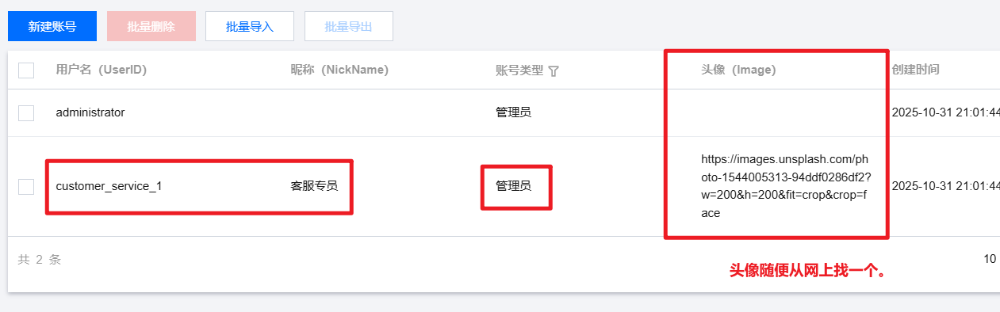

## 添加好友的 RESTful 接口

腾讯IM[**官方文档**](https://cloud.tencent.com/document/product/269/1643)详细说明了添加好友的RESTful接口调用方法，你有时间可以自己看一下。这个RESTful接口的相对地址是v4/sns/friend_add，其他的URL参数跟上节课的一样。

RESTful接口的请求体是JSON格式的，例如下面的样子。其中AddSource属性是添加好友的来源，可以自己设定，相当于来源备注。例如AddSource_Type_Web，代表为Web端IM程序添加好友。

```json
{
   "From_Account": "客户IM账号",
   "AddFriendItem": [
       {
           "To_Account": "好友IM账号",
           "AddSource": "AddSource_Type_XXXXXXXX"
       }
   ]
}
```

RESTful接口返回的响应也是JSON格式，例如下面的样子。其中ResultCode属性值为0的时候，代表好友添加成功。

```json
{
  "ResultItem": [
      {
          "To_Account": "好友IM账号",
          "ResultCode": 0, 
          "ResultInfo": ""
      }
  ],
  "ActionStatus": "OK",
  "ErrorCode": 0,
  "ErrorInfo": "",
  "ErrorDisplay": ""
}
```

## 继续 createAccount 方法中添加代码

以下这段代码的添加位置一定要注意：只有当用户第一次创建 IM 账号时。才需要执行以下代码。因此这段代码是需要放在 if 分支当中的，**紧跟在创建 IM 账号的代码后面**：

```java
//给客户IM账号添加客服好友
// 构建添加好友的REST API URL，使用管理员身份调用腾讯IM添加好友接口
url = baseUrl + "v4/sns/friend_add?sdkappid=" + sdkAppId + "&identifier=" + managerId + "&usersig=" + userSig + "&random=" + RandomUtil.randomInt(1, 99999999) + "&contenttype=json";

// 构建添加好友的请求体JSON对象
json = new JSONObject();
json.set("From_Account", account); // 设置发起好友请求的客户账号
json.set("AddFriendItem", new ArrayList<>() {{
    add(new HashMap() {{
        put("To_Account", customerServiceId); // 设置要添加的好友账号（客服账号）
        put("AddSource", "AddSource_Type_Web"); // 设置好友来源为Web端
    }});
}});

// 发送HTTP POST请求执行添加好友操作
response = HttpUtil.post(url, json.toString());
entries = JSONUtil.parseObj(response);
errorCode = entries.getInt("ErrorCode");
errorInfo = entries.getStr("ErrorInfo");

// 检查API调用是否成功（HTTP层面和基础验证）
if (errorCode != 0) {
    log.error("添加客服IM好友失败:" + errorInfo);
    throw new HisException("客服系统异常");
}

// 解析添加好友的具体结果
list = (JSONArray) entries.get("ResultItem");
object = (JSONObject) list.get(0);

// 获取单个好友添加操作的结果代码和信息
int resultCode = object.getInt("ResultCode");
String resultInfo = object.getStr("ResultInfo");

// 检查具体的好友添加操作是否成功
if (resultCode != 0) {
    log.error("添加客服IM好友失败：" + resultInfo);
    throw new HisException("客服系统异常");
}
```

# 更新 IM 账号登录时间及发送欢迎语

## 更新 IM 账号登录时间

### 分析思路

对于我们大健康系统来说，我们会在 `crm_customer_im`表中记录 IM 账号的最后一次登录时间。这个表的结构如下：


记录原则是：如果没有记录就插入数据，如果已经有记录了，则更新最后登录时间。

### 编写 Mapper 和 XML

找到 `CrmCustomerImMapper`接口，编写以下方法：

```java
int insertOrUpdate(Integer customerId);
```

找到 `CrmCustomerImMapper.xml`文件，编写以下 SQL：

```xml
<?xml version="1.0" encoding="UTF-8"?>
<!DOCTYPE mapper
        PUBLIC "-//mybatis.org//DTD Mapper 3.0//EN"
        "http://mybatis.org/dtd/mybatis-3-mapper.dtd">
<mapper namespace="com.jkweilai.meinian.api.db.mapper.CrmCustomerImMapper">

    <insert id="insertOrUpdate">
        INSERT INTO crm_customer_im (customer_id, last_login_time)
        VALUES (#{customerId}, NOW())
            ON DUPLICATE KEY UPDATE last_login_time = NOW();
    </insert>
    
</mapper>
```

在 MySQL 当中，这一条 SQL 语句可以完成两个功能：没有就插入，有就更新。

`DUPLICATE KEY`表示主键重复时。**（注意DUPLICATE KEY 的语句执行时，返回值可能是 1 也可能是 2，插入一条记录返回 1，更新一条记录返回 2）**

## 给开启对话的 IM 账号发送欢迎语

### 发送消息的 RESTful 接口

腾讯IM[**官方文档**](https://cloud.tencent.com/document/product/269/2282)详细讲解了发送消息的RESTful接口调用规则，该接口的相对地址是v4/openim/sendmsg，其他URL参数与之前的RESTful接口相同。

RESTful接口要求请求体必须是JSON格式的，具体如下。其中SyncOtherMachine属性值需要引起注意，1代表同步到发送方，2代表不同步到发送方。因为客服专员不需要看到发送给客户的欢迎词，所以我们选择不同步。MsgLifeTime属性代表离线消息缓存多久，这个时间可以自己设定。

```json
{
    "SyncOtherMachine": 2,  // 消息同步选项：2表示不同步到发送者的其他终端设备
    "To_Account": "客户IM账号",  // 消息接收者的IM账号
    "MsgLifeTime": 60,  // 消息离线保存时间（秒），60秒后未送达则丢弃
    "MsgSeq": 93847636,  // 消息序列号，用于消息排序和去重（重复的消息不能重复发，避免影响用户体验。）
    "MsgRandom": 1287657,  // 消息随机数，与MsgSeq配合确保消息唯一性
    "MsgBody": [  // 消息内容主体，支持多种消息元素组成的数组
        {
            "MsgType": "TIMTextElem",  // 消息类型：文本消息元素
            "MsgContent": {  // 消息具体内容
                "Text": "hi, beauty"  // 文本消息的实际内容
            }
        }
    ]
}
```

RESTful接口返回的响应也是JSON格式的，例如下面的样子：

```json
{
    "ActionStatus": "OK",           // 请求处理状态：OK 表示成功，FAIL 表示失败
    "ErrorInfo": "",                // 错误信息：成功时为空字符串
    "ErrorCode": 0,                 // 错误码：0 表示成功，非零表示失败
    "MsgTime": 1572870301,          // 消息时间戳：消息的服务器端接收时间（Unix时间戳）
    "MsgKey": "89541_2574206_1572870301"  // 消息唯一标识：用于后续消息撤回等操作
}
```

### 封装发送消息的私有方法

在 `CustomerImServiceImpl`类中，编写一个私有的方法，这个方法专门用来发送消息，因为后期我们还会发送消息，到时调用这个封装的方法即可。

```java
private void sendWelcomeMessage(String account) {
    TLSSigAPIv2 api = new TLSSigAPIv2(sdkAppId, secretKey);
    //生成客服账号签名
    String userSig = api.genUserSig(customerServiceId, 180 * 86400);
    String url = baseUrl + "v4/openim/sendmsg?sdkappid=" + sdkAppId + "&identifier=" + customerServiceId + "&usersig=" + userSig + "&random=" + RandomUtil.randomInt(1, 99999999) + "&contenttype=json";
    JSONObject json = new JSONObject();
    json.set("SyncOtherMachine", 2); //欢迎词消息不同步至发送方
    json.set("To_Account", account);
    json.set("MsgLifeTime", 120); //消息保存两分钟
    json.set("MsgRandom", RandomUtil.randomInt(1, 99999999)); //用于消息去重
    json.set("MsgBody", new ArrayList<>() {{
        add(new HashMap<>() {{
            put("MsgType", "TIMTextElem"); //文本消息
            put("MsgContent", new HashMap<>() {{
                put("Text", "亲，您好，非常高兴为您服务，有什么可以为您效劳的呢?");
            }});
        }});
    }});
    String response = HttpUtil.post(url, json.toString());
    JSONObject entries = JSONUtil.parseObj(response);
    int errorCode = entries.getInt("ErrorCode");
    String errorInfo = entries.getStr("ErrorInfo");
    if (errorCode != 0) {
        log.error("发送欢迎词失败：" + errorInfo.toString());
        throw new HisException("客服系统异常");
    }
}
```

### 更新最后登录时间与发送问候语

在这里添加代码即可：

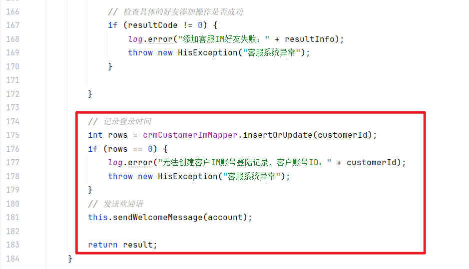

最终代码如下：

```java
package com.jkweilai.meinian.api.front.service.impl;

import cn.hutool.core.map.MapUtil;
import cn.hutool.core.util.RandomUtil;
import cn.hutool.http.HttpUtil;
import cn.hutool.json.JSONArray;
import cn.hutool.json.JSONObject;
import cn.hutool.json.JSONUtil;
import com.jkweilai.meinian.api.db.mapper.CrmCustomerImMapper;
import com.jkweilai.meinian.api.db.mapper.CrmCustomerMapper;
import com.jkweilai.meinian.api.exception.HisException;
import com.jkweilai.meinian.api.front.service.CustomerImService;
import com.tencentyun.TLSSigAPIv2;
import jakarta.annotation.Resource;
import lombok.extern.slf4j.Slf4j;
import org.springframework.beans.factory.annotation.Value;
import org.springframework.stereotype.Service;
import org.springframework.transaction.annotation.Transactional;

import java.util.ArrayList;
import java.util.HashMap;
import java.util.Map;


@Service
@Slf4j
public class CustomerImServiceImpl implements CustomerImService {
    // 腾讯IM SDK应用ID
    @Value("${tencent.im.sdkAppId}")
    private Long sdkAppId;

    // 腾讯IM密钥
    @Value("${tencent.im.secretKey}")
    private String secretKey;

    // 管理员账号ID
    @Value("${tencent.im.managerId}")
    private String managerId;

    // 客服账号ID
    @Value("${tencent.im.customerServiceId}")
    private String customerServiceId;

    @Resource
    private CrmCustomerMapper crmCustomerMapper;

    @Resource
    private CrmCustomerImMapper crmCustomerImMapper;

    // 腾讯IM API基础地址
    private String baseUrl = "https://console.tim.qq.com/";

    @Override
    @Transactional
    public Map<String, Object> createAccount(int customerId) {
        // 从大健康系统中查询客户的信息
        Map<String, Object> map = crmCustomerMapper.selectById(customerId);
        String phone = MapUtil.getStr(map, "phone");
        String photoUrl = MapUtil.getStr(map, "photoUrl");
        // 生成客户IM账号，格式：customer_客户ID
        String account = "customer_" + customerId;
        // 生成客户昵称，格式：客户_手机号
        String nickname = "客户_" + phone;

        // 初始化腾讯IM签名生成器
        TLSSigAPIv2 api = new TLSSigAPIv2(sdkAppId, secretKey);

        // 客户在登录大健康IM系统时，我们后端生成这个签名给客户。
        // 客户拿着这个签名，就能直接进入腾讯IM的“俱乐部”聊天、收消息
        // 生成客户账号签名，有效期180天
        String userSigForCustomer = api.genUserSig(account, 180 * 86400);

        //保存返回的结果
        Map<String, Object> result = new HashMap();
        result.put("sdkAppId", sdkAppId);
        result.put("account", account);
        result.put("userSig", userSigForCustomer);

        // 重新生成管理员账号签名，用于后续API调用
        String userSig = api.genUserSig(managerId, 180 * 86400);

        // 构建查询账号状态的URL
        String url = baseUrl + "v4/im_open_login_svc/account_check?sdkappid=" + sdkAppId + "&identifier=" + managerId + "&usersig=" + userSig + "&random=" + RandomUtil.randomInt(1, 99999999) + "&contenttype=json";

        // 构建查询请求体
        JSONObject json = new JSONObject();
        json.set("CheckItem", new ArrayList<>() {{
            add(new HashMap<>() {{
                put("UserID", account); // 要检查的客户账号
            }});
        }});

        // 发送HTTP POST请求查询账号状态
        String response = HttpUtil.post(url, json.toString());
        JSONObject entries = JSONUtil.parseObj(response);
        Integer errorCode = entries.getInt("ErrorCode");
        String errorInfo = entries.getStr("ErrorInfo");
        if (errorCode != 0) {
            log.error("查询客户IM账号失败：" + errorInfo);
            throw new HisException("客服系统异常");
        }

        // 解析查询结果
        JSONArray list = (JSONArray) entries.get("ResultItem");
        JSONObject object = (JSONObject) list.get(0);
        String accountStatus = object.getStr("AccountStatus");

        // 如果客户IM账号不存在
        if (!"Imported".equals(accountStatus)) {
            // 构建创建账号的URL
            url = baseUrl + "v4/im_open_login_svc/account_import?sdkappid=" + sdkAppId + "&identifier=" + managerId + "&usersig=" + userSig + "&random=" + RandomUtil.randomInt(1, 99999999) + "&contenttype=json";

            // 构建创建账号请求体
            json = new JSONObject();
            json.set("UserID", account); // 客户账号
            json.set("Nick", nickname);  // 客户昵称
            if (photoUrl != null) {
                json.set("FaceUrl", photoUrl); // 客户头像URL
            }

            // 发送HTTP POST请求创建IM账号
            response = HttpUtil.post(url, json.toString());
            entries = JSONUtil.parseObj(response);
            errorCode = entries.getInt("ErrorCode");
            errorInfo = entries.getStr("ErrorInfo");
            if (errorCode != 0) {
                log.error("创建客户IM账号失败：" + errorInfo);
                throw new HisException("客服系统异常");
            }


            //给客户IM账号添加客服好友
            // 构建添加好友的REST API URL，使用管理员身份调用腾讯IM添加好友接口
            url = baseUrl + "v4/sns/friend_add?sdkappid=" + sdkAppId + "&identifier=" + managerId + "&usersig=" + userSig + "&random=" + RandomUtil.randomInt(1, 99999999) + "&contenttype=json";

            // 构建添加好友的请求体JSON对象
            json = new JSONObject();
            json.set("From_Account", account); // 设置发起好友请求的客户账号
            json.set("AddFriendItem", new ArrayList<>() {{
                add(new HashMap() {{
                    put("To_Account", customerServiceId); // 设置要添加的好友账号（客服账号）
                    put("AddSource", "AddSource_Type_Web"); // 设置好友来源为Web端
                }});
            }});

            // 发送HTTP POST请求执行添加好友操作
            response = HttpUtil.post(url, json.toString());
            entries = JSONUtil.parseObj(response);
            errorCode = entries.getInt("ErrorCode");
            errorInfo = entries.getStr("ErrorInfo");

            // 检查API调用是否成功（HTTP层面和基础验证）
            if (errorCode != 0) {
                log.error("添加客服IM好友失败:" + errorInfo);
                throw new HisException("客服系统异常");
            }

            // 解析添加好友的具体结果
            list = (JSONArray) entries.get("ResultItem");
            object = (JSONObject) list.get(0);

            // 获取单个好友添加操作的结果代码和信息
            int resultCode = object.getInt("ResultCode");
            String resultInfo = object.getStr("ResultInfo");

            // 检查具体的好友添加操作是否成功
            if (resultCode != 0) {
                log.error("添加客服IM好友失败：" + resultInfo);
                throw new HisException("客服系统异常");
            }

        }

        // 记录登录时间
        int rows = crmCustomerImMapper.insertOrUpdate(customerId);
        if (rows == 0) {
            log.error("无法创建客户IM账号登陆记录，客户账号ID：" + customerId);
            throw new HisException("客服系统异常");
        }
        // 发送欢迎语
        this.sendWelcomeMessage(account);


        return result;
    }


    private void sendWelcomeMessage(String account) {
        TLSSigAPIv2 api = new TLSSigAPIv2(sdkAppId, secretKey);
        //生成客服账号签名
        String userSig = api.genUserSig(customerServiceId, 180 * 86400);
        String url = baseUrl + "v4/openim/sendmsg?sdkappid=" + sdkAppId + "&identifier=" + customerServiceId + "&usersig=" + userSig + "&random=" + RandomUtil.randomInt(1, 99999999) + "&contenttype=json";
        JSONObject json = new JSONObject();
        json.set("SyncOtherMachine", 2); //欢迎词消息不同步至发送方
        json.set("To_Account", account);
        json.set("MsgLifeTime", 120); //消息保存两分钟
        json.set("MsgRandom", RandomUtil.randomInt(1, 99999999)); //用于消息去重
        json.set("MsgBody", new ArrayList<>() {{
            add(new HashMap<>() {{
                put("MsgType", "TIMTextElem"); //文本消息
                put("MsgContent", new HashMap<>() {{
                    put("Text", "亲，您好，非常高兴为您服务，有什么可以为您效劳的呢?");
                }});
            }});
        }});
        String response = HttpUtil.post(url, json.toString());
        JSONObject entries = JSONUtil.parseObj(response);
        int errorCode = entries.getInt("ErrorCode");
        String errorInfo = entries.getStr("ErrorInfo");
        if (errorCode != 0) {
            log.error("发送欢迎词失败：" + errorInfo.toString());
            throw new HisException("客服系统异常");
        }
    }
}
```

## 编写 web 方法

在 `front.controller`包下新建类：CustomerImController，编写以下方法：

```java
package com.jkweilai.meinian.api.front.controller;

import cn.dev33.satoken.annotation.SaCheckLogin;
import com.jkweilai.meinian.api.common.R;
import com.jkweilai.meinian.api.config.satoken.StpCustomerUtil;
import com.jkweilai.meinian.api.front.service.CustomerImService;
import jakarta.annotation.Resource;
import org.springframework.web.bind.annotation.GetMapping;
import org.springframework.web.bind.annotation.RequestMapping;
import org.springframework.web.bind.annotation.RestController;

import java.util.Map;

@RestController
@RequestMapping("/front/customer/im")
public class CustomerImController {
    @Resource
    private CustomerImService customerImService;

    @GetMapping("/createAccount")
    @SaCheckLogin(type = StpCustomerUtil.TYPE)
    public R createAccount() {
        int customerId = StpCustomerUtil.getLoginIdAsInt();
        Map<String, Object> result = customerImService.createAccount(customerId);
        return R.ok().put("result", result);
    }
}
```

# 前端使用 TUIKit 登录客户 IM 账号

前端项目先发送Ajax请求调用Web方法，让Web方法去创建客户IM账号，然后添加客服专员为好友。这些事情做完之后，前端项目要通过TUIKit依赖库登陆客户IM账号。

## 创建 IM 页面

在src/views/front目录下，新建customer_im.vue页面，然后为该VUE页面定义路由配置：找到 router/index.ts，配置路由信息，在这里配置：

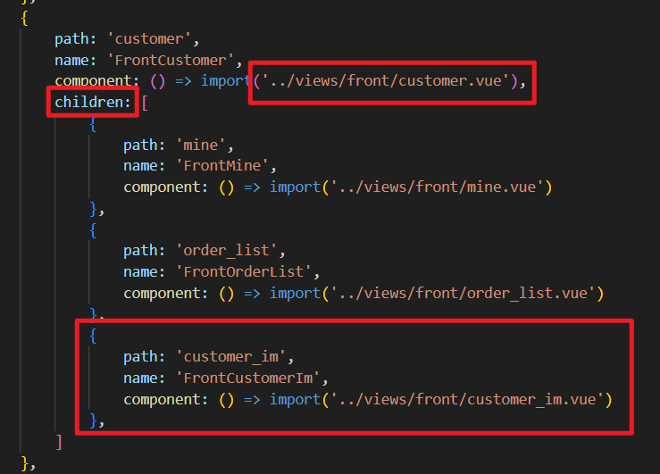

具体配置信息：

```typescript
{
    path: 'customer_im',
    name: 'FrontCustomerIm',
    component: () => import('../views/front/customer_im.vue')
}
```

创建customer_im.less文件，然后让VUE页面引用该文件，后面要写样式：

```plaintext
<style lang="less">
    @import url("customer_im.less");
</style>
```

## 编写模型层代码

在 `customer_im.vue`页面的模型层中，编写TS代码发起Ajax请求，将响应回来的三个信息赋值到响应式对象上，这样聊天页面就可以初始化成功了：

```plaintext
<template>
  <div id="app">
    <!-- v-if作用：只有在所有必要参数都准备好之后，才创建和初始化 TUIKit 组件 -->
    <TUIKit v-if="sdkAppId && userId && userSig" :SDKAppID="Number(sdkAppId)" :userID="userId" :userSig="userSig" />
    <TUICallKit v-if="sdkAppId && userId && userSig" class="callkit-container" :allowedMinimized="true" :allowedFullScreen="false" />
  </div>
</template>

<script lang="ts" setup>
    import { ref } from 'vue';
    import { TUIKit } from '../../TUIKit';
    import { TUICallKit } from '@tencentcloud/call-uikit-vue';
    import axios from 'axios';

    let sdkAppId = ref('');
    let userId = ref('');
    let userSig = ref('');

    // 发送ajax请求
    async function login(){
        // 准备配置
        let config = {
            headers: {
                satoken: localStorage.getItem('token')
            }
        };
        let response = await axios.get('/meinian-api/front/customer/im/createAccount', config);
        let result = response.data.result;
        sdkAppId.value = result.sdkAppId;
        userSig.value = result.userSig;
        userId.value = result.account;
    }
    login();
</script>


<style lang="less">
    @import url("customer_im.less");
</style>
```

以上视图层的代码是从腾讯官网直接拷贝过来的，可能无法满足我们的需求，如果要满足我们的需求，就需要自己写视图层，并提供相关样式。

效果如下：


# 初始化业务端 IM 界面

上面视图层代码是从腾讯官方直接拷贝的，界面效果可能不是我们想要的，我们接下来通过样式对这个界面进行微调。

## vue 页面的最终代码

`customer_im.vue`文件中的代码如下：我们不需要视频通话功能，直接去掉。只留下聊天功能。

```plaintext
<template>
  <div id="app">
    <div class="home-TUIKit-main">
      <TUIKit 
        v-if="sdkAppId && userId && userSig" 
        :SDKAppID="Number(sdkAppId)" 
        :userID="userId" 
        :userSig="userSig" 
      />
    </div>
  </div>
</template>

<script lang="ts" setup>
    import { ref } from 'vue';
    import { TUIKit } from '../../TUIKit';
    import axios from 'axios';

    let sdkAppId = ref('');
    let userId = ref('');
    let userSig = ref('');

    // 发送ajax请求
    async function login(){
        // 准备配置
        let config = {
            headers: {
                satoken: localStorage.getItem('token')
            }
        };
        let response = await axios.get('/meinian-api/front/customer/im/createAccount', config);
        let result = response.data.result;
        sdkAppId.value = result.sdkAppId;
        userSig.value = result.userSig;
        userId.value = result.account;
    }
    login();
</script>

<!-- 不能添加scoped，因为样式中需要设置TUIKit内部组件的样式。需要编写全局样式。-->
<style lang="less">
    @import url("customer_im.less");
</style>
```

## 样式代码如下

```plaintext
// 导入全局样式变量文件
@import url('../style.less');

// 腾讯云IM聊天界面主容器
.home-TUIKit-main {
    // 设置固定尺寸：高度750像素，宽度1050像素
    height: 827px;
    width: 1050px; 
    
    // 边框样式：1像素实线，使用全局定义的边框颜色变量
    border: solid 1px @border-color-4;
    
    // 设置10像素圆角边框
    border-radius: 10px;
    
    overflow: auto;
    
    // 针对腾讯云IM内部组件的宽度设置
    .TUIChat, .TUIConversation, .TUIKit {
        // 强制内部组件宽度填满父容器（100%宽度）
        width: 100% !important;  // 使用!important覆盖组件默认样式
    }
}
```

最终效果如下：


# 生成客服 IM 账号对应的数字签名

为支持客服在MIS端与客户通信，我们需要在后端为已创建的客服账号生成IM登录所需的数字签名，并供前端调用。

## 编写 Service 接口与实现

找到 `CustomerImService`接口，编写以下方法：

```java
Map<String, Object> getServiceAccount();
```

编写接口的实现：

```java
@Override
public Map<String, Object> getServiceAccount() {
    TLSSigAPIv2 api = new TLSSigAPIv2(sdkAppId, secretKey);
    //生成客户账号签名
    String userSig = api.genUserSig(customerServiceId, 180 * 86400);
    //保存返回的结果
    Map<String, Object> result = new HashMap();
    result.put("sdkAppId", sdkAppId);
    result.put("account", customerServiceId);
    result.put("userSig", userSig);
    return result;
}
```

## 编写 web 接口

在 **mis 端**新建 `CustomerImController`，编写以下 web 方法，返回客服 IM 账号对应的数字签名：

```java
package com.jkweilai.meinian.api.controller;

import cn.dev33.satoken.annotation.SaCheckPermission;
import cn.dev33.satoken.annotation.SaMode;
import com.jkweilai.meinian.api.common.R;
import com.jkweilai.meinian.api.front.service.CustomerImService;
import jakarta.annotation.Resource;
import org.springframework.web.bind.annotation.GetMapping;
import org.springframework.web.bind.annotation.RequestMapping;
import org.springframework.web.bind.annotation.RestController;

import java.util.Map;

@RestController("MisCustomerImController")
@RequestMapping("/mis/customer/im")
public class CustomerImController {

    @Resource
    private CustomerImService customerImService;

    @GetMapping("/getServiceAccount")
    @SaCheckPermission(value = {"ROOT", "CUSTOMER_IM:SELECT"}, mode = SaMode.OR)
    public R getServiceAccount() {
        Map<String, Object> result = customerImService.getServiceAccount();
        return R.ok().put("result", result);
    }
}
```

# mis 端客服 IM 账号登录

## 创建 vue 页面并配置路由

在 `src/views/mis`目录下新建 `customer_im.vue`页面，并配置路径：编写在 mis 端的 children 当中。

```typescript
{
    path: 'customer_im',
    name: 'MisCustomerIm',
    component: ()=>import('../views/mis/customer_im.vue'),
    meta: {
        title: "客服IM",
        isTab: true
    }
}
```

同时创建 `customer_im.less`文件，在 `customer_im.vue`文件中引入：

```plaintext
<template>

</template>

<script lang="ts" setup>

</script>

<!-- 不能添加scoped，因为样式中需要设置TUIKit内部组件的样式。需要编写全局样式。-->
<style lang="less">
    @import url('customer_im.less');
</style>
```

## 编写视图层代码

在 mis 端的`customer_im.vue`页面中编写视图层代码：

```html
<template>
  <!-- 容器div -->
  <div class="panel-container">
    <!-- IM聊天窗口div -->
    <div class="home-TUIKit-main2">
      <TUIKit
        v-if="sdkAppId && userId && userSig" 
        :SDKAppID="Number(sdkAppId)" 
        :userID="userId" 
        :userSig="userSig" 
      />
    </div>
    <!-- 客户信息div -->
    <div class="customer-info">
      <!--这里的内容会陆续实现-->
    </div>
  </div>
</template>
```

## 编写模型层代码

继续编写模型层代码：

```html
<script lang="ts" setup>
    // 导入Vue相关依赖
    import { reactive, ref, getCurrentInstance } from 'vue';
    // 导入腾讯云IM TUIKit组件
    import { TUIKit } from '../../TUIKit';
    // 导入HTTP请求库
    import axios from 'axios';

    // 获取当前组件实例，可用于访问全局属性或方法
    const { proxy } = getCurrentInstance();

    // 定义响应式数据对象，用于存储客户相关信息
    const data = reactive({
        // 客户基本信息
        customer: {
            id: null,           // 客户ID
            customerName: "--",         // 客户姓名
            gender: "--",          // 客户性别
            phone: "--",          // 客户电话
            photoUrl: "--",        // 客户头像
            registerTime: "--"    // 创建时间
        },
        // 客户统计信息
        statistic: {
            totalAmount: 0,  // 总金额
            count: 0,   // 总次数
            quantity: 0   // 数量
        },
        // 订单相关信息
        order: {
            dataList: [],       // 订单数据列表
            pageIndex: 1,       // 当前页码
            pageSize: 5,        // 每页显示条数
            totalCount: 0,      // 总记录数
            loading: false,     // 加载状态
        }
    });

    // 定义腾讯云IM所需的参数
    let sdkAppId = ref('');  // 应用SDK AppID
    let userId = ref('');    // 用户ID
    let userSig = ref('');   // 用户签名

    /**
     * 获取IM账号信息并登录腾讯云IM
     * 通过API请求获取SDK AppID、用户ID和用户签名
     */
    async function login(){
        // 配置请求头，携带认证token
        let config = {
            headers : {
                satoken: localStorage.getItem('token')  // 从本地存储获取token
            }
        };
        
        // 发送GET请求获取IM账号信息
        let response = await axios.get('/meinian-api/mis/customer/im/getServiceAccount', config);
        let result = response.data.result;
        
        // 将获取到的IM参数赋值给响应式变量
        sdkAppId.value = result.sdkAppId;
        userSig.value = result.userSig;
        userId.value = result.account;
    }
    
    // 页面加载时自动调用登录函数
    login();
    

    /**
     * 处理当前会话切换事件
     * @param conversation - 当前选中的会话对象
     * 当用户在聊天界面切换不同会话时触发
     */
    function handleCurrentConversation(conversation: any) {
        // 会话切换逻辑
        console.log('当前会话:', conversation);
        // 这里可以添加会话切换后的业务逻辑，如加载对应客户信息等
    }

</script>
```

## 编写 less 样式

继续编写 less 样式：

```plaintext
@import url('../style.less');

.panel-container {
    display: flex;
    
    .home-TUIKit-main2 {
        width: 1050px;
        height: 827px; /* 固定高度 */
        overflow: auto;
        border: solid 1px @border-color-4;
        border-radius: 5px;
        
        .TUIChat, .TUIConversation, .TUIKit {
            width: 100% !important;
        }
    }
    
    .customer-info {
        flex: 1;
        margin-left: 10px;
        /* 客户信息面板样式 */
    }
}
```

# 获取 IM 客户摘要信息的 RESTful 接口


实现点击好友列表中的客户，Vue页面的右侧显示相关数据，接下来我们的任务是根据客户ID查询客户的基本信息和订单统计数据。

## 时序图

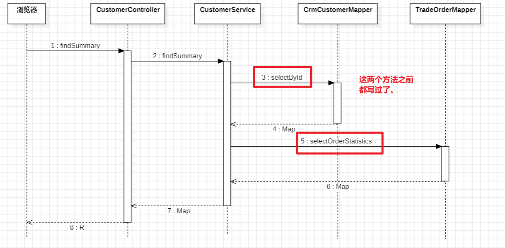

## 编写 Service 和实现

在 mis 端创建新的 `CustomerService`接口，编写以下方法：

```java
package com.jkweilai.meinian.api.service;

import java.util.Map;

public interface CustomerService {
    
    Map<String, Object> findSummary(Integer customerId);
    
}
```

编写接口的实现：注意给 bean 起个名字。

```java
package com.jkweilai.meinian.api.service.impl;


import com.jkweilai.meinian.api.db.mapper.CrmCustomerMapper;
import com.jkweilai.meinian.api.db.mapper.TradeOrderMapper;
import com.jkweilai.meinian.api.service.CustomerService;
import jakarta.annotation.Resource;
import org.springframework.stereotype.Service;

import java.util.Map;

@Service("MisCustomerService")
public class CustomerServiceImpl implements CustomerService {

    @Resource
    private CrmCustomerMapper crmCustomerMapper;

    @Resource
    private TradeOrderMapper tradeOrderMapper;

    @Override
    public Map<String, Object> findSummary(Integer customerId) {
        Map<String, Object> map = crmCustomerMapper.selectById(customerId);
        Map<String, Object> map1 = tradeOrderMapper.selectOrderStatistics(customerId);
        map.putAll(map1);
        return map;
    }
}
```

## 编写 form 接收数据并校验

在 mis 端创建一个新的 form 接收数据并校验：

```java
package com.jkweilai.meinian.api.controller.form;

import jakarta.validation.constraints.Min;
import jakarta.validation.constraints.NotNull;
import lombok.Data;

@Data
public class FindCustomerSummaryForm {
    @NotNull(message = "customerId不能为空")
    @Min(value = 1, message = "customerId不能小于1")
    private Integer customerId;
}
```

## 编写 web 方法

在 mis 端创建新的 CustomerController 类，在该类中提供方法：

```java
package com.jkweilai.meinian.api.controller;

import cn.dev33.satoken.annotation.SaCheckLogin;
import com.jkweilai.meinian.api.common.R;
import com.jkweilai.meinian.api.controller.form.FindCustomerSummaryForm;
import com.jkweilai.meinian.api.service.CustomerService;
import jakarta.annotation.Resource;
import jakarta.validation.Valid;
import org.springframework.web.bind.annotation.PostMapping;
import org.springframework.web.bind.annotation.RequestBody;
import org.springframework.web.bind.annotation.RequestMapping;
import org.springframework.web.bind.annotation.RestController;

import java.util.Map;

@RestController("MisCustomerController")
@RequestMapping("/mis/customer")
public class CustomerController {

    @Resource
    private CustomerService customerService;

    @PostMapping("/findSummary")
    @SaCheckLogin // 公共方法，不需要检查权限，只要登录了就行。
    public R findSummary(@RequestBody @Valid FindCustomerSummaryForm form) {
        Map<String, Object> map = customerService.findSummary(form.getCustomerId());
        return R.ok().put("result", map);
    }
}
```

## 测试接口

接口测试地址：[http://localhost:8080/meinian-api/mis/customer/findSummary](http://localhost:8080/meinian-api/mis/customer/findSummary)

测试数据：

```json
{
    "customerId": 1
}
```

测试结果：

```json
{
        "msg": "success",
        "result": {
                "totalAmount": 2142,
                "totalQuantity": 1,
                "gender": "男",
                "phone": "18888888888",
                "registerTime": "2025-10-20",
                "totalCount": 1,
                "customerName": "欧阳锋"
        },
        "code": 200
}
```

# 后端实现分页查询 IM 客户的订单记录


对于订单的分页查询我们之前已经实现了。只不过之前实现的订单分页查询中没有 `customer_id`条件，我们只需要修改两个位置就行了。

## 修改 TradeOrderMapper.xml

在 TradeOrderMapper.xml文件中，找到之前写的两条SQL语句，给WHERE子句追加上客户ID作为查询条件。

注意：方法名是 `selectPage``selectCount`

在 where 条件中加以下代码：

```xml
<if test="customerId != null and customerId != ''">
    and o.customer_id = #{customerId}
</if>
```

## 修改 OrderPageQueryForm

找到 mis 端的 `OrderPageQueryForm`，添加一个 customerId 属性：

```java
@Min(value = 1, message = "customerId最小值为1")
private Integer customerId;
```

mis 端对订单进行分页查询的接口地址为：`/mis/order/pageQuery`

# 设计 IM 模块信息区


我们把 IM 模块中展示用户信息摘要和分页查询订单信息的 div 实现一下。

## 编写视图层代码

找到 mis 端 customer_im.vue 文件，在 `<div class="customer-info">`里面添加以下代码：

```html
<el-card class="box-card" shadow="never">
    <div class="info">
        <div class="left">
            <el-avatar :size="57" shape="square" :src="data.customer.photoUrl">
                <el-icon size="35"><UserFilled /></el-icon>
            </el-avatar>
        </div>
        <div class="right">
            <h4 class="customer-name">{{data.customer.customerName}}</h4>
            <p class="customer-desc">
                <el-icon class="icon"><User /></el-icon>
                <span class="value">{{data.customer.gender}}</span>
                <el-icon class="icon"><Phone /></el-icon>
                <span class="value">{{data.customer.phone}}</span>
                <el-icon class="icon"><Calendar /></el-icon>
                <span class="value">{{data.customer.registerTime}}</span>
            </p>
        </div>
    </div>
    <el-divider />
    <el-row :gutter="16">
        <el-col :span="10">
            <div class="statistic-card">
                <el-statistic :value="data.statistic.totalAmount" suffix="元">
                    <template #title>
                        <div class="title">累计消费金额</div>
                    </template>
                </el-statistic>
            </div>
        </el-col>
        <el-col :span="7">
            <div class="statistic-card">
                <el-statistic :value="data.statistic.count" suffix="笔">
                    <template #title>
                        <div class="title">有效订单数量</div>
                    </template>
                </el-statistic>
            </div>
        </el-col>
        <el-col :span="7">
            <div class="statistic-card">
                <el-statistic :value="data.statistic.quantity" suffix="个">
                    <template #title>
                        <div class="title">体检套餐数量</div>
                    </template>
                </el-statistic>
            </div>
        </el-col>
    </el-row>
</el-card>
<el-table  v-loading="data.order.loading" :data="data.order.dataList" border style="width: 100%"
    class="orders-table" :header-cell-style="{'background':'#f5f7fa'}">
    <el-table-column type="index" header-align="center"
        align="center" width="80" label="序号">
        <template #default="scope">
            <span>{{ (data.order.pageIndex - 1) * data.order.pageSize + scope.$index + 1 }}</span>
        </template>
    </el-table-column>
    <el-table-column prop="goodsTitle" label="套餐名称"
        header-align="left" align="left" min-width="200" />
    <el-table-column prop="createDate" label="购买日期"
        header-align="center" align="center" min-width="120" />
    <el-table-column prop="orderStatus" label="状态" header-align="center"
        align="center" min-width="100" />
</el-table>
<el-pagination @size-change="sizeChangeHandle"
    @current-change="currentChangeHandle"
    :current-page="data.order.pageIndex"
    :page-sizes="[5,10, 20, 50]" :page-size="data.order.pageSize"
    :total="data.order.totalCount"
    layout="total, sizes, prev, pager, next, jumper">
</el-pagination>
```

## 编写 LESS 样式

找到 mis 端的 `customer_im.vue`文件，这个文件中的完整代码如下：

```plaintext
@import url('../style.less');

.panel-container {
    display: flex;
    
    .home-TUIKit-main2 {
        width: 1050px;
        height: 827px; /* 固定高度 */
        overflow: auto;
        border: solid 1px @border-color-4;
        border-radius: 5px;
        
        .TUIChat, .TUIConversation, .TUIKit {
            width: 100% !important;
        }
    }
    
    .customer-info {
        margin-left: 20px;
        flex-grow: 1;
        .box-card {
            cursor: default;
            user-select: none;
            .info {
                display: flex;
                .left {
                }
                .right {
                    margin-left: 15px;
                    .customer-name {
                        color: @font-color-1;
                        font-size: 18px;
                        margin: 5px 0 0 0;
                    }
                    .customer-desc {
                        display: flex;
                        margin-top: 10px;
                        margin-bottom: 0;
                        .icon {
                        }
                        .value {
                            margin-left: 5px;
                            margin-right: 25px;
                            &:last-of-type {
                                margin-right: 0;
                            }
                        }
                    }
                }
            }
        }
        .orders-table {
            margin-top: 20px;
        }
    }

}


.el-statistic {
    --el-statistic-content-font-size: 26px;
}

.statistic-card {
    height: 100%;
    padding: 20px;
    .title {
        display: inline-flex;
        align-items: center;
        font-size: 14px;
    }
}
```

# 加载 IM 模块客户摘要信息与订单分页数据


做三件事：

1. 封装 `loadPageData()`函数。加载订单分页数据。
2. 发送 ajax 请求获取 IM 客户对应的摘要信息。
3. 实现翻页功能。

## 封装 loadPageData()函数

在 mis 端的 `customer_im.vue`文件中编写 `loadPageData()`函数，加载订单数据。

```typescript
async function loadPageData(){
    data.order.loading = true;
    // 准备数据
    let json = {
        customerId: data.customer.id,
        pageNo: data.order.pageIndex,
        pageSize: data.order.pageSize
    };
    // 准备配置
    let config = {
        headers: {
            satoken: localStorage.getItem('token')
        }
    };
    // 发送ajax请求
    const response = await axios.post('/meinian-api/mis/order/pageQuery', json, config);
    const pageResult = response.data.pageResult;

    let statusEnum = {
        "1": "未付款",
        "2": "已关闭",
        "3": "已付款",
        "4": "已退款",
        "5": "已预约",
        "6": "已结束",
    }
    for (let one of pageResult.records) {
        one.orderStatus = statusEnum[one.orderStatus + ""]
    }


    data.order.dataList = pageResult.records;
    data.order.totalCount = pageResult.total;
    data.order.loading = false;
}
```

## 加载 IM 客户的摘要信息与第一页订单数据

当客服点击会话列表中的某一个会话时，我们必须捕捉到这个会话切换事件，拿到当前的会话对象之后，我们通过会话对象就可以获取 customer_id。接下来，我们写一段监听程序，**监听TUIKit中当前选中会话的变化，当用户点击不同会话时自动触发回调。**就在 mis 端的 `customer_im.vue`文件中添加代码：

```typescript
import { TUIStore, StoreName } from '@tencentcloud/chat-uikit-engine-lite';

onMounted(() => {
    // 监听当前会话变化
    TUIStore.watch(StoreName.CONV, {
        currentConversation: (conversation: any) => {
            // 会话发生变化时执行这个回调函数，在前面代码中我们已经把它定义出来了。
            handleCurrentConversation(conversation);
        }
    });
});

onUnmounted(() => {
    // 清理监听
    TUIStore.unwatch(StoreName.CONV, {
        currentConversation: () => {}
    });
});
```

然后我们在回调函数 `handleCurrentConversation`里面输出一下当前被选中的会话对象，看看对象中都有哪些属性：

```typescript
function handleCurrentConversation(conversation: any) {
    if(conversation){
        console.log(conversation)
    }
}
```

测试一下，当我们选中其中一个会话时，控制台输出结果：


可以清楚的看到这个 conversation 对象中有一个属性conversationID 可以拿到 `C2Ccustomer_1`，好了，这个时候我们就可以进行字符串的截取了，以下划线的方式截取，拿到 customerId 为 1。

在 mis 端的 `customer_im.vue`文件中编写 `handleCurrentConversation()`函数，加载个人摘要信息以及第一页订单数据。

```typescript
async function handleCurrentConversation(conversation: any) {
    if(conversation){
        let customerId = conversation.conversationID.split("_")[1];
        data.customer.id = customerId
        let json = { 
            customerId: customerId 
        }
        let config = {
            headers: {
                satoken: localStorage.getItem('token')
            }
        };
        //查询客户基本信息和订单统计数据
        let response = await axios.post('/meinian-api/mis/customer/findSummary', json, config);
        let result = response.data.result;
        data.customer.customerName = result.customerName
        data.customer.gender = result.gender
        data.customer.phone = result.phone
        data.customer.registerTime = result.registerTime
        data.customer.photoUrl = result.photoUrl
        data.statistic.totalAmount = result.totalAmount
        data.statistic.count = result.totalCount
        data.statistic.quantity = result.totalQuantity
    
        //加载订单分页记录
        loadPageData()

    }
}
```

这个时候，功能基本上实现了，但存在一个问题，有抖动的问题，可以看到当我们切换一次会话，会导致发送两次请求，大家思考一下，自行解决一下抖动问题，给大家一个思路：

```typescript
let lastConversationId = '';

function handleConversationChange(newConversation) {
    // 1. 获取当前会话的唯一标识
    const currentId = newConversation?.conversationID;
    
    // 2. 检查是否与上次相同
    if (currentId === lastConversationId) {
        return; // 跳过重复处理
    }
    
    // 3. 更新记录
    lastConversationId = currentId;
    
    // 4. 执行实际业务逻辑
    console.log('处理新会话:', newConversation);
    // ...你的业务代码
}
```

## 实现翻页功能

最后我们来实现一下翻页的功能，和以前一行，写两个函数就行了：

```typescript
function sizeChangeHandle(val) {
    data.order.pageSize = val;
    data.order.pageIndex = 1;
    loadPageData();
}

function currentChangeHandle(val) {
    data.order.pageIndex = val;
    loadPageData();
}
```

最终效果：


# 业务端体检预约模块业务分析

## 数据库 ER 图


我们来了解一下体检预约限流表（`<font style="color:rgb(15, 17, 21);background-color:rgb(235, 238, 242);">med_appointment_limit</font>`）的作用。这张表用于管理特定日期的体检预约人数上限。

**它的工作方式是这样的：**
当体检中心在某天接待能力受限时（例如，周五下午因停电只能接待100人），就可以通过此表设置该日的预约上限为100人。设置之后，系统将确保周五的预约总数不会超过这个限制。

**那么，如果在设置限流之前，预约人数就已经超标了怎么办？**
比如，在发布停电通知前，周五的预约可能已经达到了150人。在这种情况下，即便设置了限流，已有的超额预约也不会自动消失。

**处理这种情况的方法是：**
客服人员会主动联系超出100人限额的客户，向他们说明情况（例如因停电无法提供服务），并告知其预约将被取消。同时，客服会协助客户重新预约其他有空余名额的日期。

**预约限流表的具体表结构如下：这张表会记录下来每一天的预约数量情况。**


actual_limit：实际限流人数

max_limit：最大允许人数

actual_count：实际预约人数

很多人可能会认为，如果不通过体检预约限流表（`<font style="color:rgb(15, 17, 21);background-color:rgb(235, 238, 242);">med_appointment_limit</font>`）进行特殊设置，每天的预约人数就没有限制了。

**事实并非如此。** 系统本身设有一个默认的全局预约上限。这个上限值并非硬编码在程序里，而是作为一个可配置的选项，保存在**系统设置表（**`**<font style="color:rgb(15, 17, 21);background-color:rgb(235, 238, 242);">system_config</font>**`**）** 中。这张表的结构如下：

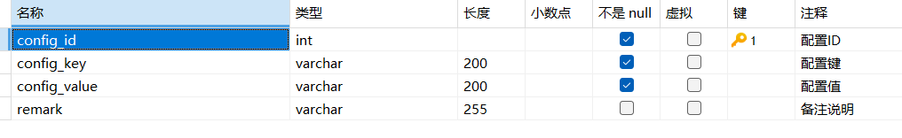

下面的数据说明，即使不针对特定日期设置限流，体检中心每天的预约总数也不会无限制增长，因为系统设置了一个**全局默认上限（例如200人）**。

设立这个默认上限的主要目的是为了**简化管理**。它可以避免为每一个普通工作日都重复创建一条限流记录，从而防止预约限流表中存入大量不必要的冗余数据，保持数据表的简洁和高效。


## UI 截图

业务端的订单列表页面，客户点击体检预约按钮会出现弹窗，填写好相关信息，体检预约就创建成功了


业务端的体检预约页面是下面的样子，用分页的形式展现体检预约记录。如果体检报告出来了，可以在该页面下载到体检报告


## UML 用例图

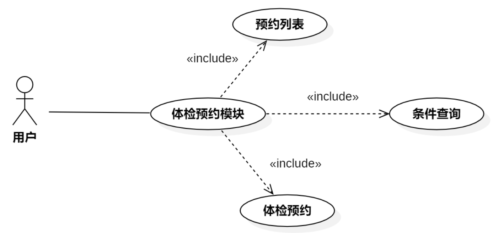

# MIS 端体检预约模块的功能分析

## UI 截图

MIS端的体检预约模块除了用分页形式展现体检预约记录，还有删除体检预约的功能。假如周五下午停电，客服打电话跟体检人解释了无法体检的原因，然后就可以删掉对应的体检记录。客户可以预约其他日期体检。


## 用例图

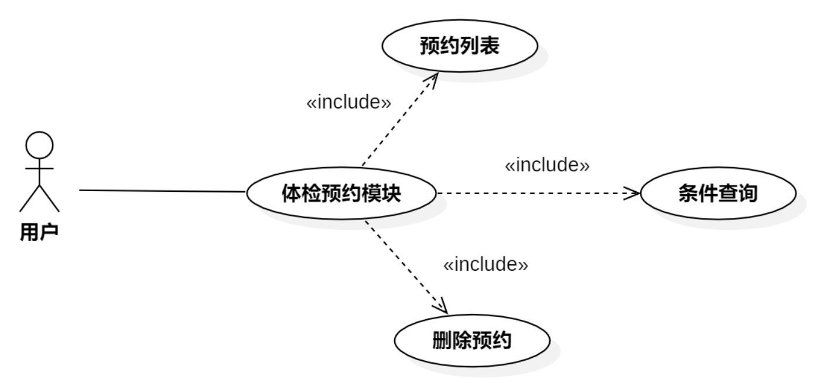