# 美年大健康项目-08

# 使用 dialog 设计预约体检弹窗

假如客户想要预约体检，需要在业务端订单列表页面找到订单记录，然后点击预约体检按钮，接下来在弹窗控件中录入预约信息。

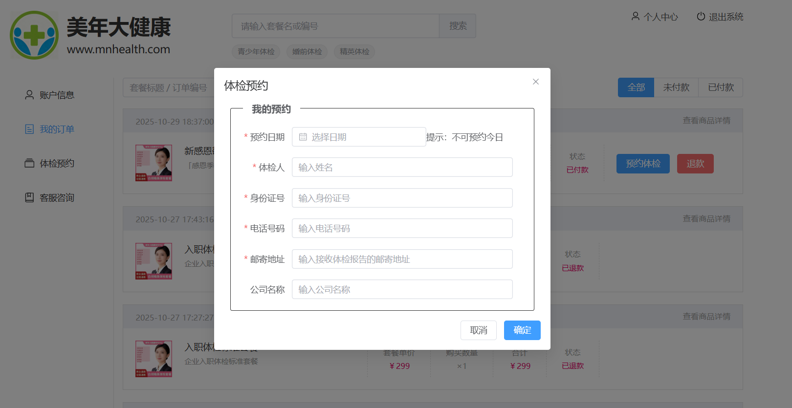

## 编写视图层

在 `src/views/front/order_list.vue` 页面的视图层中，添加如下标签，创建弹窗控件

```html
<el-dialog title="体检预约" :close-on-click-modal="false"
    v-model="appointDialog.visible" width="550px">
    <el-form :model="appointDialog.dataForm" ref="dialogForm"
        :rules="appointDialog.dataRule" label-width="80px">
        <fieldset class="appointment">
            <legend>
                <h4>我的预约</h4>
            </legend>
            <el-form-item label="预约日期" prop="appointmentDate">
                <el-date-picker v-model="appointDialog.dataForm.appointmentDate"
                    type="date" placeholder="选择日期" size="medium"
                    :editable="false" format="YYYY-MM-DD"
                    value-format="YYYY-MM-DD"
                    :disabled-date="disabledDate" />
                <span class="desc">提示：不可预约今日</span>
            </el-form-item>
            <el-form-item label="体检人" prop="patientName">
                <el-input v-model="appointDialog.dataForm.patientName"
                    size="medium" placeholder="输入姓名" maxlength="10"
                    clearable />
            </el-form-item>
            <el-form-item label="身份证号" prop="idCardNo">
                <el-input v-model="appointDialog.dataForm.idCardNo" size="medium"
                    placeholder="输入身份证号" maxlength="18" clearable />
            </el-form-item>
            <el-form-item label="电话号码" prop="phone">
                <el-input v-model="appointDialog.dataForm.phone" size="medium"
                    placeholder="输入电话号码" maxlength="11" clearable />
            </el-form-item>
            <el-form-item label="邮寄地址" prop="address">
                <el-input v-model="appointDialog.dataForm.address"
                    size="medium" placeholder="输入接收体检报告的邮寄地址"
                    maxlength="100" clearable />
            </el-form-item>
            <el-form-item label="公司名称" prop="company">
                <el-input v-model="appointDialog.dataForm.company"
                    size="medium" placeholder="输入公司名称" maxlength="100"
                    clearable />
            </el-form-item>
        </fieldset>
    </el-form>
    <template #footer>
        <span class="dialog-footer">
            <el-button size="medium"
                @click="appointDialog.visible = false">取消</el-button>
            <el-button type="primary" size="medium"
                @click="dataFormSubmit">确定</el-button>
        </span>
    </template>
</el-dialog>
```

## 编写模型层

```typescript
const appointDialog = reactive({
    visible: false,
    dataForm: {
        orderId: null,
        appointmentDate: null,
        patientName: null,
        idCardNo: null,
        phone: null,
        address: null,
        company: null
    },
    dataRule: {
        appointmentDate: [{ required: true, message: '日期不能为空' }],
        patientName: [
            { required: true, message: '姓名不能为空' },
            { pattern: '^[\u4e00-\u9fa5]{2,10}$', message: '姓名格式错误' }
        ],
        idCardNo: [
            { required: true, message: '身份证号不能为空' },
            { pattern: '^[0-9Xx]{18}$', message: '身份证号格式错误' }
        ],
        phone: [
            { required: true, message: '电话号码不能为空' },
            { pattern: '^1[1-9]\\d{9}$', message: '电话号码格式错误' }
        ],
        address: [
            { required: true, message: '邮寄地址不能为空' },
            { pattern: '^[0-9A-Za-z\u4e00-\u9fa5\\-_#]{10,100}$', message: '邮寄地址格式错误' }
        ],
        company: [
            { required: false, pattern: '^[0-9A-Za-z\u4e00-\u9fa5\\-_#]{2,100}$', message: '公司名称不正确' }
        ]
    }
});

function disabledDate(date) {
    //只能预约未来60天的体检
    let bool = dayjs(date).isBetween(dayjs(), dayjs().add(61, 'day'));
    return !bool;
}
```

调试Vue页面的时候，把上面的visible属性设置成true就能看到弹窗了。结束调试之后，还要把属性值改回成false才可以。

## 编写样式

在order_list.less文件中，给标签设置CSS样式

```plaintext
.appointment {
    border: solid 1px @border-color-19;
    border-radius: 3px;
    margin: 0 10px 0 10px;
    padding: 0 20px;
    legend {
        padding: 0 15px;
        margin-bottom: 20px;
        h4 {
            font-size: 16px;
            margin: 0;
        }
    }
}
```

# 实现业务端的体检列表页面

客户预约了体检之后，可以在业务端的体检预约列表页面中，看到自己所有预约的体检


## 创建 Vue 页面配置路由

在 `src/views/front` 目录中创建 `appointment_list.vue` 页面，然后在 `src/router/index.ts` 文件中配置路由信息

```typescript
{
    path: 'appointment_list',
    name: 'FrontAppointmentList',
    component: () => import('../views/front/appointment_list.vue')
}
```

注意配置位置：

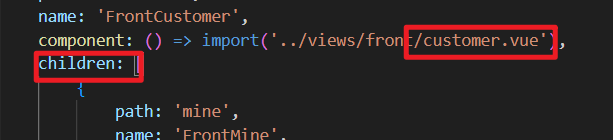

顺手创建 `appointment_list.less`文件，然后在 `appointment_list.vue`中引入样式文件：

```html
<template>

</template>

<script lang="ts" setup>

</script>

<style lang="less" scoped>
    @import url('appointment_list.less');
</style>
```

## 编写视图层

```html
<el-form :inline="true" :model="dataForm" :rules="dataRule" ref="form">
    <el-form-item prop="keyword">
        <el-input v-model="dataForm.keyword" placeholder="套餐名称 / 姓名 / 电话"
            size="medium" class="keyword" clearable="clearable" />
    </el-form-item>
    <el-form-item class="date">
        <el-date-picker v-model="dataForm.date" type="date"
            placeholder="选择日期" :editable="false" format="YYYY-MM-DD"
            value-format="YYYY-MM-DD" />
    </el-form-item>
    <el-form-item>
        <el-button size="medium" type="primary" :icon="Search"
            @click="searchHandle()">查询</el-button>
    </el-form-item>
    <el-form-item class="mold">
        <el-radio-group v-model="dataForm.statusLabel" size="medium"
            @change="searchHandle()">
            <el-radio-button label="全部"></el-radio-button>
            <el-radio-button label="已结束"></el-radio-button>
        </el-radio-group>
    </el-form-item>
</el-form>
<div class="table-conatainer" v-show="!empty">
    <el-table :data="data.dataList" class="appointment-table"
        :header-cell-style="{'background':'#f5f7fa'}" border
        v-loading="data.loading">
        <el-table-column type="index" header-align="center" align="center"
            width="120" label="序号" fixed>
            <template #default="scope">
                <span>{{ (data.pageIndex - 1) * data.pageSize + scope.$index + 1 }}</span>
            </template>
        </el-table-column>
        <el-table-column prop="goodsTitle" header-align="center"
            align="center" label="套餐名称" min-width="250" fixed />
        <el-table-column prop="name" header-align="center" align="center"
            label="体检人" min-width="120" />
        <el-table-column prop="date" header-align="center" align="center"
            label="预约日期" min-width="120" />
        <el-table-column prop="status" header-align="center" align="center"
            label="状态" min-width="120" />
        <el-table-column fixed="right" header-align="center" align="center"
            width="150" label="操作">
            <template #default="scope">
                <el-button type="text" :disabled="scope.row.filePath==null"
                    @click="downloadHandle(scope.row.name,scope.row.filePath)">
                    体检报告
                </el-button>
            </template>
        </el-table-column>
    </el-table>
    <el-pagination @size-change="sizeChangeHandle"
        @current-change="currentChangeHandle" :current-page="data.pageIndex"
        :page-sizes="[10, 20, 50]" :page-size="data.pageSize"
        :total="data.totalCount"
        layout="total, sizes, prev, pager, next, jumper">
    </el-pagination>
</div>

<div class="empty" v-show="empty">
    <el-empty :image-size="200" />
</div>
```

## 编写模型层

```html
<script lang="ts" setup>
    import { reactive, ref, Ref, getCurrentInstance } from 'vue';
    import { Search } from '@element-plus/icons-vue';
    import router from '../../router/index';    
    import { dayjs } from 'element-plus';
    import isBetween from 'dayjs/plugin/isBetween';
    dayjs.extend(isBetween);    
    const { proxy } = getCurrentInstance();
  
    let empty = ref(false);
    const dataForm = reactive({
        keyword: null,
        date: null,
        status: null,
        statusLabel: '全部',
    });
    const dataRule = reactive({
        keyword: [
            { required: false, pattern: '^[a-zA-Z0-9\u4e00-\u9fa5]{1,30}$', message: '关键字内容不正确' }
        ]
    });
    const data = reactive({
        dataList: [],
        pageIndex: 1,
        pageSize: 10,
        totalCount: 0,
        loading: false
    });
</script>
```

## 编写样式

```plaintext
@import url('../style.less');

.el-form-item {
    margin-right: 15px !important;
}
.mold {
    float: right;
    margin-right: 0 !important;
}
.keyword {
    width: 250px;
}
.date {
    width: 160px;
}
.table-conatainer {
    min-height: 582px;
    .appointment-table {
        margin-bottom: 20px;
    }
}
.empty {
    height: 600px;
}
```

# MIS 端体检预约管理页面实现

业务端创建的所有体检预约，在MIS端的管理页面中都能看到。只不过MIS端能做的操作很有限，只能查看或者删除预约


## 创建页面并配置路由

在 `src/views/mis` 目录中创建 `appointment.vue` 页面，然后在 `src/router/index.ts` 文件中配置该页面路由信息

```typescript
{
    path: 'appointment',
    name: 'MisAppointment',
    component: ()=>import('../views/mis/appointment.vue'),
    meta: {
        title: "体检预约",
        isTab: true
    }
}
```

这里配置：


顺手创建 `appointment.less`文件，并在 VUE 页面中引入：

```plaintext
<template></template>

<script lang="ts" setup></script>

<style lang="less" scoped>
@import url('appointment.less');
</style>
```

## 编写视图层

```html
<div v-if="proxy.isAuth(['ROOT', 'APPOINTMENT:SELECT'])">
    <el-form :inline="true" :model="dataForm" :rules="dataRule" ref="form">
        <el-form-item>
            <el-date-picker v-model="dataForm.appointmentDate" type="appointmentDate"
                placeholder="选择日期" :editable="false" format="YYYY-MM-DD"
                value-format="YYYY-MM-DD" clearable />
        </el-form-item>
        <el-form-item prop="patientName">
            <el-input v-model="dataForm.patientName" placeholder="姓名"
                maxlength="10" class="input" clearable />
        </el-form-item>
        <el-form-item prop="phone">
            <el-input v-model="dataForm.phone" placeholder="电话号码"
                maxlength="11" class="input" clearable />
        </el-form-item>
        <el-form-item>
            <el-button type="primary" @click="searchHandle()">查询</el-button>
            <el-button type="danger"
                :disabled="!proxy.isAuth(['ROOT', 'APPOINTMENT:DELETE'])"
                @click="deleteHandle()">
                批量删除
            </el-button>
        </el-form-item>
        <el-form-item class="mold">
            <el-radio-group v-model="dataForm.statusLabel"
                @change="searchHandle()">
                <el-radio-button label="全部"></el-radio-button>
                <el-radio-button label="未签到"></el-radio-button>
                <el-radio-button label="已签到"></el-radio-button>
                <el-radio-button label="已结束"></el-radio-button>
                <el-radio-button label="已关闭"></el-radio-button>
            </el-radio-group>
        </el-form-item>
    </el-form>
    <el-table :data="data.dataList"
        :header-cell-style="{'background':'#f5f7fa'}" border
        v-loading="data.loading" @selection-change="selectionChangeHandle">
        <el-table-column type="selection" :selectable="selectable"
            header-align="center" align="center" width="50" fixed />
        <el-table-column type="index" header-align="center" align="center"
            width="120" label="序号" fixed>
            <template #default="scope">
                <span>{{ (data.pageIndex - 1) * data.pageSize + scope.$index + 1 }}</span>
            </template>
        </el-table-column>
        <el-table-column prop="patientName" header-align="center" align="center"
            label="姓名" width="200" fixed />
        <el-table-column prop="gender" header-align="center" align="center"
            label="性别" width="100" />
        <el-table-column prop="age" header-align="center" align="center"
            label="年龄" width="100" />
        <el-table-column prop="phone" header-align="center" align="center"
            label="联系电话" width="150" />
        <el-table-column prop="idCardNo" header-align="center" align="center"
            label="身份证号" width="190" />
        <el-table-column prop="company" header-align="center" align="center"
            label="公司名称" width="200" />
        <el-table-column prop="packageName" header-align="center" align="center"
            label="体检套餐" min-width="200" />
        <el-table-column prop="status" header-align="center" align="center"
            label="状态" width="120" />
        <el-table-column fixed="right" header-align="center" align="center"
            width="150" label="操作">
            <template #default="scope">
                <el-button type="text"
                    :disabled="!proxy.isAuth(['ROOT', 'APPOINTMENT:DELETE'])||scope.row.status!='未签到'"
                    @click="deleteHandle(scope.row.id)">
                    删除
                </el-button>
            </template>
        </el-table-column>
    </el-table>
    <el-pagination @size-change="sizeChangeHandle"
        @current-change="currentChangeHandle" :current-page="data.pageIndex"
        :page-sizes="[10, 20, 50]" :page-size="data.pageSize"
        :total="data.totalCount"
        layout="total, sizes, prev, pager, next, jumper">
    </el-pagination>
</div>
```

## 编写模型层

```html
<script lang="ts" setup>
import { reactive, getCurrentInstance, ref } from 'vue';
import { dayjs } from 'element-plus';
import isBetween from 'dayjs/plugin/isBetween';
dayjs.extend(isBetween);

const { proxy } = getCurrentInstance();
const dataForm = reactive({
    patientName: null,
    phone: null,
    appointmentDate: null,
    statusLabel: '全部',
    status: null
});

const dataRule = reactive({
    patientName: [
        { pattern: '^[\u4e00-\u9fa5]{1,10}$', message: '姓名格式错误' }
    ],
    phone: [
        { pattern: '^1[1-9]\\d{9}$', message: '电话号码格式错误' }
    ]
});

const data = reactive({
    dataList: [],
    pageIndex: 1,
    pageSize: 10,
    totalCount: 0,
    loading: false,
    selections: []
});

</script>
```

## 编写样式

```plaintext
@import url('../style.less');
.mold {
    float: right;
    margin-right: 0 !important;
}
```

# 将 60 天的限流规则放到 redis 缓存

为什么需要将限流规则放到 redis 缓存？如果没有缓存，每一个用户在预约的时候，都需要重新从数据库中查询**预约日期**对应的**当天的预约情况**。这样会增大数据库的压力。

## 限流缓存的实现思路

我们再来重新看一下以下两张表，主要围绕这两张表：

**第一张表：**预约限流表 `med_appointment_limit`


**最大人数和实际限流人数两个字段有什么区别？**

- **最大人数：**体检机构最大承载量，所有实际限流人数的参考值，实际限流值不可超过该值。
- **实际限流人数：**可调整的。根据最大人数进行灵活调整。

**第二张表**：系统配置表 `sys_config`


**限流缓存都存储什么？**

1. 把系统配置 `sys_config`表中两条系统配置存进去，需要使用这个默认规则时直接从 redis 缓存中获取。这两条系统配置存储到 redis 时的 key 我们确定一下：
  1. 第一条配置的 key 起名为：`setting#appointment_number`，那么该 key 对应的 value 是 `200`
  2. 第二条配置的 key 起名为：`setting#auto_flow_regulation`，那么该 key 对应的 value 是 `false`
  3. 当然，这些 `config_key`和 `config_value`都是从数据库中查询出来的。不能写死。
2. 把预约限流表中从次日起 60 天内的 60 条限流规则存储到 redis 中（每天都要保证 redis 缓存中有从次日起 60 天的限流规则）
  1. 为什么是 60 天：因为大健康系统只能预约 60 天内的。
  2. 为什么是从次日起 60 天，因为当天不可预约。
  3. 60 个限流规则，每一个都要存储进去。也就是 60 个对象都要存储到 redis 当中。
  4. 我们来确定一下每个限流规则存储到 redis 时的 key ，假设 2025-11-20 日的限流规则，那么这个 key 定位：`appointment#20251120`，那么 value 存储什么呢？value 可以存储一个 Map，Map 中存储两个键值对就行了，分别是：实际限流人数`actualLimit`和 实际预约人数`actualCount`
  5. 这 60 条规则在`med_appointment_limit`表中本身就是存在的吗？不是，只要对应的日期下有人预约了，或者是管理人员人为的添加了一条限流规则，这个表中才会有一条对应日期的限流规则。假设对应的日期没有人预约，也没有管理人员添加对应日期下的限流规则，则数据库表中不会有当天的限流规则。
  6. 默认的限流规则是怎样的？假设 2025-11-20 日当天的限流规则在 `med_appointment_limit`中不存在，这个时候就用到系统配置规则了，也就是用到那个 `200`了。redis 缓存中的 key 和 value 是：key 是 `appointment#20251120`，value 是一个 Map，这个 Map 中的两个键值对分别是：`actualLimit:200`与`actualCount:0`
3. 综上所述，我们应该向 redis 缓存中存储 62 个对象。60 个限流规则 + 2 个系统配置。（2 个系统配置中目前只用到 1 个配置，另一个配置后面再说）

**我们现在搞清楚了 redis 中具体要存储什么，那么实现思路是怎样的呢？**

1. 将`sys_config`表中的数据都查询出来。
2. 将`med_appointment_limit`表中的数据也都查询出来，返回 List 集合。
3. 获取 60 个日期对象，从次日起的 60 个日期对象。
4. 迭代这 60 个日期，先按照系统默认规则设置actualLimit=200，actualCount=0，如果限流 List 集合中存在这个日期（表示数据库中存在对应的限流规则），则设置最新的actualLimit 和actualCount。
5. 将actualLimit 和actualCount 放到 redis 缓存中，并设置限流规则的过期时间。
6. 按照上面思路，我们应该就能够把 62 个对象放到 redis 缓存当中了。

## 编写 Mapper 和 XML

找到 `SysConfigMapper`接口，编写以下方法：

```java
public interface SysConfigMapper {
    List<SysConfigEntity> selectAll();
}
```

找到 `SysConfigMapper.xml`文件，提供以下 SQL：

```xml
<?xml version="1.0" encoding="UTF-8"?>
<!DOCTYPE mapper
        PUBLIC "-//mybatis.org//DTD Mapper 3.0//EN"
        "http://mybatis.org/dtd/mybatis-3-mapper.dtd">
<mapper namespace="com.jkweilai.meinian.api.db.mapper.SysConfigMapper">
    <select id="selectAll" resultType="SysConfigEntity">
        select
            config_id as configId,
            config_key as configKey,
            config_value as configValue
        from
            sys_config
    </select>
</mapper>
```

找到 `MedAppointmentLimitMapper`接口，编写以下方法：

```java
public interface MedAppointmentLimitMapper {

    List<Map<String, Object>> selectAppointmentLimitLast60Days(Map<String, Object> param);
}
```

找到`MedAppointmentLimitMapper.xml`文件，编写以下 SQL：

```xml
<?xml version="1.0" encoding="UTF-8"?>
<!DOCTYPE mapper
        PUBLIC "-//mybatis.org//DTD Mapper 3.0//EN"
        "http://mybatis.org/dtd/mybatis-3-mapper.dtd">
<mapper namespace="com.jkweilai.meinian.api.db.mapper.MedAppointmentLimitMapper">

    <select id="selectAppointmentLimitLast60Days" resultType="Map">
        select
            appointment_date as appointmentDate,
            actual_limit as actualLimit,
            max_limit as maxLimit,
            actual_count as actualCount
        from
            med_appointment_limit
        where
            appointment_date between #{startDate} and #{endDate}
        order by
            appointmentDate asc;
    </select>
</mapper>
```

## 使用异步线程初始化 redis 缓存

在大健康后端项目启动的时候，需要把60天范围内每天体检预约人数查询出来，并且缓存到Redis里面。如果在项目启动的过程中执行这个工作会拖慢启动速度，所以应该用异步线程，把创建缓存的工作推给其他线程，后端项目启动速度就不会被拖慢了。

在 `com.jkweilai.meinian.api.async`包下新建 `InitializeWorkAsync`类，编写以下代码：

```java
package com.jkweilai.meinian.api.async;

import cn.hutool.core.date.DateField;
import cn.hutool.core.date.DateRange;
import cn.hutool.core.date.DateTime;
import cn.hutool.core.date.DateUtil;
import cn.hutool.core.map.MapUtil;
import com.jkweilai.meinian.api.db.mapper.MedAppointmentLimitMapper;
import com.jkweilai.meinian.api.db.mapper.SysConfigMapper;
import com.jkweilai.meinian.api.db.pojo.SysConfigEntity;
import jakarta.annotation.Resource;
import lombok.extern.slf4j.Slf4j;
import org.springframework.data.redis.core.RedisTemplate;
import org.springframework.scheduling.annotation.Async;
import org.springframework.stereotype.Component;

import java.util.*;

/**
 * 异步初始化
 */
@Slf4j
@Component
public class InitializeWorkAsync {

    @Resource
    private SysConfigMapper sysConfigMapper;

    @Resource
    private RedisTemplate redisTemplate;

    @Resource
    private MedAppointmentLimitMapper  medAppointmentLimitMapper;

    // 让 initializeWork() 方法在一个名为 "AsyncTaskExecutor" 的线程池中异步执行
    // 这个线程池我们之前配置过，在ThreadPoolConfig中配置的。这里可以直接使用。
    @Async("AsyncTaskExecutor")
    public void initializeWork() {
        // 查询所有系统默认配置
        List<SysConfigEntity> sysConfigEntities = sysConfigMapper.selectAll();
        // 遍历系统配置，将其放到redis缓存中
        sysConfigEntities.forEach(sysConfig -> {
            String configKey = sysConfig.getConfigKey();
            String configValue = sysConfig.getConfigValue();
            redisTemplate.opsForValue().set("setting#" + configKey, configValue);
        });
        // 记一下日志
        log.debug("系统配置已加载到redis缓存");

        // 获取次日日期
        DateTime startDate = DateUtil.tomorrow();
        // 获取60天之后的日期
        DateTime endDate = startDate.offsetNew(DateField.DAY_OF_MONTH, 60);
        // 获取一个60天的日期集合
        DateRange range = DateUtil.range(startDate, endDate, DateField.DAY_OF_MONTH);
        // 将开始日期和结束日期放到Map集合中，这个是SQL语句的查询条件
        Map<String, Object> param = new HashMap<>();
        param.put("startDate", startDate.toDateStr());
        param.put("endDate", endDate.toDateStr());
        // 查询数据库中所有的限流规则
        List<Map<String, Object>> list = medAppointmentLimitMapper.selectAppointmentLimitLast60Days(param);
        // 遍历日期集合
        range.forEach(date -> {
            // 默认的系统配置规则先取出来
            int actualLimit = Integer.parseInt(redisTemplate.opsForValue().get("setting#appointment_number").toString());
            int actualCount = 0;
            // 判断日期date在list集合中有没有对应的限流规则
            // 如果有，则将对应的限流规则取出放到redis缓存中
            // 如果没有，则需要根据系统配置创建一个全新的限流规则，存放到redis中

            // date是2025-11-04 21:26:41这样的，把它变成2025-11-04这样。
            String dateStr = date.toDateStr();
            for(Map<String, Object> map : list) {
                String appointmentDate = MapUtil.getStr(map, "appointmentDate");
                if(dateStr.equals(appointmentDate)) {
                    actualLimit = MapUtil.getInt(map, "actualLimit");
                    actualCount = MapUtil.getInt(map, "actualCount");
                    break;
                }
            }

            // 存储到redis缓存中
            Map<String, Object> cache = new HashMap<>();
            cache.put("actualLimit", actualLimit);
            cache.put("actualCount", actualCount);
            String key = "appointment#" + dateStr;
            // 注意：向redis中存储Map需要调用这个方法。
            redisTemplate.opsForHash().putAll(key, cache);
            // 设置缓存过期时间（每一条缓存的过期时间是当前日期+1）
            DateTime dateTime = new DateTime(dateStr).offsetNew(DateField.DAY_OF_MONTH, 1);
            redisTemplate.expireAt(key, dateTime);
        });

        // 记录日志
        log.debug("60天的限流规则已全部加载到redis缓存");
    }
}
```

在 `MeinianApiApplication` 主类中，调用异步线程任务类的 `init()` 方法，让线程池委派空闲线程执行该方法，实现异步效果

```java
package com.jkweilai.meinian.api;

import com.jkweilai.meinian.api.async.InitializeWorkAsync;
import jakarta.annotation.PostConstruct;
import jakarta.annotation.Resource;
import org.mybatis.spring.annotation.MapperScan;
import org.springframework.boot.SpringApplication;
import org.springframework.boot.autoconfigure.SpringBootApplication;
import org.springframework.boot.web.servlet.ServletComponentScan;
import org.springframework.cache.annotation.EnableCaching;
import org.springframework.context.annotation.ComponentScan;
import org.springframework.scheduling.annotation.EnableAsync;
import org.springframework.scheduling.annotation.EnableScheduling;

@EnableAsync
@ServletComponentScan
@ComponentScan("com.jkweilai.*")
@MapperScan(basePackages = "com.jkweilai.meinian.api.db.mapper")
@SpringBootApplication
@EnableCaching
@EnableScheduling // 定时器
public class MeinianApiApplication {

    public static void main(String[] args) {
        SpringApplication.run(MeinianApiApplication.class, args);
    }

    // 以下是新增代码
    @Resource
    private InitializeWorkAsync initializeWorkAsync;

    @PostConstruct
    public void init() {
        initializeWorkAsync.initializeWork();
    }

    // 通过重写run方法也可以。可以达到在服务器启动阶段就执行异步任务。
    /*
    @Override
    public void run(String... args) {
        initializeWorkAsync.initializeWork();
    }
    */

}
```

启动项目之后，查看 redis 缓存是否如下图所示：


# 定时添加新一天的限流缓存

后端项目启动的时候创建未来60天的体检预约限流缓存，但是还远远不够。时间不是静止的，过了一天，就变成仅有59天缓存。如果我们要一直维持Redis中保存未来60天的缓存，就需要用定时任务每天往缓存中添加新一天的缓存。

在 `com.jkweilai.meinian.api.schedule`包创建定时任务类：`AppointmentSchedule`

```java
package com.jkweilai.meinian.api.schedule;

import cn.hutool.core.date.DateField;
import cn.hutool.core.date.DateTime;
import cn.hutool.core.date.DateUtil;
import cn.hutool.core.map.MapUtil;
import com.jkweilai.meinian.api.db.mapper.MedAppointmentLimitMapper;
import jakarta.annotation.Resource;
import lombok.extern.slf4j.Slf4j;
import org.springframework.data.redis.core.RedisTemplate;
import org.springframework.scheduling.annotation.Scheduled;
import org.springframework.stereotype.Component;

import java.util.HashMap;
import java.util.Map;

@Component
@Slf4j
/**
 * 预约日程管理类
 * 负责处理体检预约相关的缓存生成和调度任务
 */
public class AppointmentSchedule {

    @Resource
    private RedisTemplate<String, Object> redisTemplate;

    @Resource
    private MedAppointmentLimitMapper medAppointmentLimitMapper;

    /**
     * 创建62天后的体检预约缓存
     * 每天23:00执行，预生成62天后的预约名额缓存
     *
     * 执行逻辑：
     * 1. 从Redis获取系统设置的每日预约名额数量
     * 2. 生成62天后的日期作为缓存key
     * 3. 在Redis中创建hash结构存储预约名额信息
     * 4. 设置缓存过期时间为生成日期的次日
     */
    @Scheduled(cron = "0 0 23 * * ?")  // 每天23:00执行
    public void createCacheAfter62Day() {

        // 从Redis系统设置中获取每日预约名额限制
        int actualLimit = Integer.parseInt(redisTemplate.opsForValue().get("setting#appointment_number").toString());

        // 初始化实际预约数量为0
        int actualCount = 0;

        // 计算62天后的日期，格式化为字符串
        String date = new DateTime().offset(DateField.DAY_OF_MONTH, 62).toDateStr();

        // 根据这个 date 查询限流规则。
        Map<String, Object> map = medAppointmentLimitMapper.selectByAppointmentDate(date);
        if(map != null){
            actualLimit = MapUtil.getInt(map, "actualLimit");
            actualCount = MapUtil.getInt(map, "actualCount");
        }

        // 构建Redis缓存key，格式：appointment#2024-01-01
        String key = "appointment#" + date;

        // 在Redis中创建hash结构，存储预约名额信息
        Map<String, Object> appointmentMap = new HashMap<>();
        appointmentMap.put("actualLimit", actualLimit);
        appointmentMap.put("actualCount", actualCount);

        redisTemplate.opsForHash().putAll(key, appointmentMap);

        // 设置缓存过期时间为生成日期的第二天（即63天后）
        DateTime dateTime = new DateTime(date).offsetNew(DateField.DAY_OF_MONTH, 1);
        redisTemplate.expireAt(key, dateTime);

        // 记录日志，便于监控和调试
        log.debug("生成了" + date + "的体检日程缓存");
    }
}
```

有个细节需要特别注意：如果系统在23点之后才启动，当日的定时任务就无法执行，这将导致62天后的限流缓存无法生成。确实存在这种可能性。

对此，有两种解决方案：

1. 建议在23点至次日凌晨这段时间避免启动后端项目，确保定时任务能够正常执行。
2. 将定时任务的执行时间调整为23点50分，这样就将不可启动的时间窗口从1小时压缩到了10分钟，降低了操作风险。

# Redis 事务防超卖机制

我们思考一下：我们的系统可能会在高并发的环境下运行，假设体检预约限流是 200 人，那会不会导致 300 人都预约上了呢？那是有可能的，这就是典型的超卖问题。

## 超卖现象

在电商秒杀等高并发场景中，“超售”（或称“超卖”）是一个常见且严重的技术问题。它指的是系统实际售出的商品数量超过了商家预设的库存数量。例如，A商品库存仅为100件，秒杀活动后却成功卖出了500件。

**超售的严重后果**

我们可以通过一个假设案例来直观感受其严重性：

某商家为促销，在电商平台上以半价出售20部苹果手机。由于优惠力度大，吸引了数万甚至数十万用户参与抢购。然而，由于系统出现超售漏洞，最终竟有2000人成功下单并支付。

这对商家而言，意味着巨大的经济损失——原本计划让利20部手机，结果却要承担2000部的损失。商家核查后发现问题根源：自己在后台明明设置了20件的库存，平台系统却卖出了2000件。这显然是电商平台的技术漏洞所致，平台因此负有不可推卸的赔偿责任。

试想，在淘宝这类拥有数百万商家的巨型平台上，如果在“双十一”等大型促销活动中普遍发生超售，平台将面临的索赔金额将是天文数字。

**结论**
因此，超售不仅仅是一个技术漏洞，更是一个会引发巨大商业风险和经济纠纷的问题。**从平台到商家，都必须高度重视并彻底解决它。**

## 为什么会超卖

**在高并发场景下，多个线程同时查询到充足的库存，并相继完成下单逻辑，导致售出数量远超实际库存。**

其核心技术原因主要有以下三点：

1. **库存校验与库存扣减的非原子性**
系统先查询库存（判断是否足够），然后再执行扣减，这两个步骤不是“一瞬间”完成的。在查询和扣减的间隙，其他线程可能已经修改了库存。
2. **数据库“读”与“写”的存在延迟**
在高并发下，数据库的主从架构或缓存可能导致线程读到的库存数据是过时的、不准确的，从而基于错误的数据进行扣减。
3. **并发访问共享资源**
库存是一个被所有用户线程共享的关键数据。当成千上万的请求同时来扣减同一个库存时，如果没有正确的保护机制（如锁），就会发生数据覆盖和更新丢失。

## 怎么预防数据库超卖

### 第一种办法

第一种解决办法：排队（不可取）

将数据库事务隔离级别设置为 `<font style="color:rgb(15, 17, 21);background-color:rgb(235, 238, 242);">Serializable</font>`，从技术原理上讲是解决超售问题最彻底的办法。它通过强制所有事务串行执行，彻底杜绝了并发导致的数据冲突，就像让顾客一个一个地结账，自然不会有卖超的风险。

然而，这种方案在业务上是完全不可行的，尤其是在高并发的电商场景中。其核心弊端在于**极低的吞吐量**：

数据库的写操作最终要持久化到磁盘，而磁盘I/O速度与内存和CPU相比极其缓慢。让所有事务排队串行执行，每个事务都要经历漫长的磁盘写入时间。在“双十一”这种数千万交易并发的场景下，排在末尾的事务可能需要等待数小时甚至数天才能执行——用户显然无法接受。

因此，`<font style="color:rgb(15, 17, 21);background-color:rgb(235, 238, 242);">Serializable</font>` 隔离级别虽然技术稳妥，但因其无法满足高并发、低延迟的业务需求，在实践中被排除。

### 第二种办法

第二种解决超售的技术方案是**乐观锁**。

它的实现方式是在商品数据表中增加一个整型字段，作为**版本号**，其机制与SVN等版本控制工具类似。

**工作原理如下：**

1. **读取与记录**：事务1准备抢购A商品。它先查询当前数据，看到库存为100，同时记录下当前的版本号（假设为0）。
2. **验证与提交**：在事务1准备更新库存时，它会执行一条条件严格的UPDATE语句：“将库存减1，并将版本号设置为1，但**前提是**当前的版本号必须是我之前读取的0”。
3. **冲突的发生**：如果在事务1读取数据后、执行更新前，事务2抢先完成了更新（将库存改为99，版本号升为1）。那么当事务1执行它的UPDATE语句时，会发现当前数据库中的版本号已经是1，与自己记录的0不匹配。
4. **冲突的处理**：此时，数据库会判定事务1的更新条件不成立，更新操作失败。事务1此次抢购便不会成功，从而有效避免了超售。

简单来说，乐观锁就像在说：“在我修改之前，如果有人动过这份数据，那我就放弃本次操作。”

## Redis 的事务机制避免超卖

Redis中利用**事务+乐观锁**来防止超售的机制，其核心流程如下：

1. **观察与记录**：客户端A在修改数据前，首先使用 `<font style="color:rgb(15, 17, 21);background-color:rgb(235, 238, 242);">WATCH</font>` 命令监视目标数据（如商品库存）。这相当于记下了数据的当前版本号，并启动了一个监听机制。
2. **命令缓存**：随后，客户端A开启事务（`<font style="color:rgb(15, 17, 21);background-color:rgb(235, 238, 242);">MULTI</font>`）。在此之后发出的所有修改命令（如扣减库存）都不会立即执行，而是被缓存在客户端的本地事务队列中。
3. **提交与验证**：当客户端A执行 `<font style="color:rgb(15, 17, 21);background-color:rgb(235, 238, 242);">EXEC</font>` 提交事务时，所有缓存的命令会作为一个批次一次性发送给Redis服务器。
4. **原子性执行**：在最终执行前，Redis会**再次检查**被 `<font style="color:rgb(15, 17, 21);background-color:rgb(235, 238, 242);">WATCH</font>` 的数据版本号。如果发现版本号在监听期间已被其他客户端修改，则整个事务失败，所有命令都不执行，从而避免超售；如果版本号未变，则Redis会保证这个批处理命令被**原子性**地执行完毕，期间不会被任何其他命令打断。

通过这种方式，既保证了批量操作的高效性，又通过版本号验证确保了数据在关键阶段不被并发修改，从而杜绝超售。

# 利用 redis 事务避免预约超卖

之前我们已经完成了：预约限流规则已经全部加载到 redis 缓存当中了，redis 缓存中一直会保存从次日起 60 日之内的限流规则了。接下来我们就应该去实现一个核心业务了：实现用户的体检预约功能。我们先实现其中的核心业务：保存体检预约记录。

## 实现思路

1. Controller 将来会给我们 `Service`传过来一个预约对象：`MedExamAppointmentEntity`
2. 先看看 Redis 缓存中对应的预约日期的 `actualCount < actualLimit`是否成立，如果不成立，则表示当天已经约满了。
3. 如果成立，则表示还可以预约（此时使用 redis 事务防止超卖），更新 redis 缓存中的 actualCount，让它+1
4. 向 `med_exam_appointment`预约表插入一条预约记录。
5. 更新订单 `trade_order` 的状态为 order_status = 5，表示已预约。
6. 更新 `med_appointment_limit` 预约限流表中的 `actual_count`，让它+1（**当然，也可能不是更新，而是插入，因为只要当天预约人数为 0 时，当天的限流规则在表中是没有的，因此第一个预约人预约之后才会插入限流规则。**）
7. 整个过程数据库事务要控制好。

## 编写 3 个 Mapper 和 XML

找到 `TradeOrderMapper`接口，编写以下方法：

```java
int updateStatus(Map<String, Object> param);
```

找到 `TradeOrderMapper.xml`文件，编写以下 SQL：

```xml
<update id="updateStatus">
    update trade_order set order_status = #{orderStatus} where order_id = #{orderId}
</update>
```

找到 `MedExamAppointmentMapper`接口，编写以下方法：

```java
int insert(MedExamAppointmentEntity entity);
```

找到`MedExamAppointmentMapper.xml`文件，编写以下 SQL：

```xml
<insert id="insert">
    insert into med_exam_appointment
        (appointment_no,order_id,appointment_date,patient_name,gender,id_card_no,birth_date,phone,address,company,status,create_time)
    values
        (#{appointmentNo},#{orderId},#{appointmentDate},#{patientName},#{gender},#{idCardNo},#{birthDate},#{phone},#{address},#{company},1,now())
</insert>
```

找到 `MedAppointmentLimitMapper`接口，编写以下方法：

```java
int saveOrUpdateAppointmentLimit(Map<String, Object> param);
```

找到`MedAppointmentLimitMapper.xml`文件，编写以下 SQL：不存在记录就插入记录，存在记录则只更新 `actual_count`字段值。

```xml
<insert id="saveOrUpdateAppointmentLimit" parameterType="Map">
    INSERT INTO med_appointment_limit
        (appointment_date, actual_limit, max_limit, actual_count, remark, create_time)
    VALUES
        (#{appointmentDate}, #{actualLimit}, #{maxLimit}, 1, #{remark}, NOW())
    ON DUPLICATE KEY UPDATE
        actual_count = actual_count + 1
</insert>
```

## 编写 Service 接口和实现

在 `com.jkweilai.meinian.api.front.service`包下创建一个新的接口：`AppointmentService`，编写以下方法

```java
package com.jkweilai.meinian.api.front.service;

import com.jkweilai.meinian.api.db.pojo.MedExamAppointmentEntity;

public interface AppointmentService {

    String save(MedExamAppointmentEntity entity);
}
```

编写接口的实现类，实现方法，在该方法中要进行核心业务的处理，尤其需要使用 redis 事务防止超卖：

```java
package com.jkweilai.meinian.api.front.service.impl;

import com.jkweilai.meinian.api.db.mapper.MedAppointmentLimitMapper;
import com.jkweilai.meinian.api.db.mapper.MedExamAppointmentMapper;
import com.jkweilai.meinian.api.db.mapper.TradeOrderMapper;
import com.jkweilai.meinian.api.db.pojo.MedExamAppointmentEntity;
import com.jkweilai.meinian.api.exception.HisException;
import com.jkweilai.meinian.api.front.service.AppointmentService;
import jakarta.annotation.Resource;
import org.springframework.dao.DataAccessException;
import org.springframework.data.redis.core.RedisOperations;
import org.springframework.data.redis.core.RedisTemplate;
import org.springframework.data.redis.core.SessionCallback;
import org.springframework.stereotype.Service;

import java.util.HashMap;
import java.util.List;
import java.util.Map;

@Service("FrontAppointmentService")
public class AppointmentServiceImpl implements AppointmentService {
    @Resource
    private RedisTemplate redisTemplate;

    public static final String FULL = "当天预约已满，请选择其它日期";
    public static final String FAIL = "预约失败";
    public static final String SUCCESS = "预约成功";

    @Resource
    private MedExamAppointmentMapper medExamAppointmentMapper;

    @Resource
    private MedAppointmentLimitMapper medAppointmentLimitMapper;

    @Resource
    private TradeOrderMapper tradeOrderMapper;

    @Override
    public String save(MedExamAppointmentEntity entity) {
        // 拼接redis的key
        String key = "appointment#" + entity.getAppointmentDate();
        // 从redis中取出数据（以下代码要囊括在redis事务当中）
        String execute = (String)redisTemplate.execute(new SessionCallback() {
            @Override
            public String execute(RedisOperations operations) throws DataAccessException {
                // 开始监视缓存key对应的数据。（等于拿到乐观锁的version）
                operations.watch(key);
                // 拿到缓存的数据
                Map map = redisTemplate.opsForHash().entries(key);
                int actualLimit = Integer.parseInt(map.get("actualLimit").toString());
                int actualCount = Integer.parseInt(map.get("actualCount").toString());
                if(actualCount < actualLimit) {
                    // 开启redis事务
                    operations.multi();
                    // 在事务当中进行一系列redis命令的执行
                    operations.opsForHash().increment(key, "actualCount", 1);
                    // 提交事务
                    List<Long> list = operations.exec();
                    if(list.size() == 0){
                        return FAIL;
                    }
                    Long l = list.get(0);
                    return l > 0 ? SUCCESS : FAIL;
                }else{
                    operations.unwatch();
                    return FULL;
                }
            }
        });

        // 如果redis事务提交失败，则结束方法的执行
        if(!execute.equals(SUCCESS)){
            return FAIL;
        }

        try {
            // 插入预约记录
            int rows = medExamAppointmentMapper.insert(entity);
            if(rows != 1){
                throw new HisException("保存预约记录失败");
            }

            // 取出redis缓存中的actualLimit
            int actualLimit = Integer.parseInt(redisTemplate.opsForHash().entries(key).get("actualLimit").toString());
            // 更新/插入限流表中限流规则
            Map<String, Object> map = new HashMap<>();
            map.put("appointmentDate", entity.getAppointmentDate());
            map.put("actualLimit", actualLimit);
            map.put("maxLimit", actualLimit);
            int count = medAppointmentLimitMapper.saveOrUpdateAppointmentLimit(map);
            if(count == 0){ // on duplicate key语句的返回结果可能是1，也可能是2
                throw new HisException("更新/保存限流规则失败");
            }

            // 更新订单状态
            int updateRows = tradeOrderMapper.updateStatus(new HashMap<>(){{
                put("orderId", entity.getOrderId());
                put("orderStatus", 5);
            }});

            if(updateRows != 1){
                throw new HisException("更新订单状态失败");
            }
        } catch (Exception e) {
            // 回滚redis
            redisTemplate.execute(new SessionCallback() {
                @Override
                public Object execute(RedisOperations operations) throws DataAccessException {
                    boolean rollbackSuccess = false;
                    // 重试机制
                    for (int i = 0; i < 3 && !rollbackSuccess; i++) {
                        operations.watch(key);
                        operations.multi();
                        operations.opsForHash().increment(key, "actualCount", -1);
                        List<Long> list = operations.exec();
                        if(!list.isEmpty()){
                            rollbackSuccess = true;
                        }
                        // 每次重试时稍微等一会
                        try {
                            Thread.sleep(100);
                        } catch (InterruptedException ex) {
                            throw new RuntimeException(ex);
                        }
                    }
                    if(!rollbackSuccess){
                        // 使用补偿表机制，将失败写入补偿表，人为处理。
                    }
                    return null;
                }
            });
            throw new HisException(e);
        }

        return SUCCESS;
    }
}
```

# 实现体检预约的 web 接口

## 实现思路

1. 判断该客户是否拥有这个订单，如果没有这个订单不能预约体检。（如果不做这个限制会存在一个问题：客户如果知道咱们 web 接口的地址，可以通过 接口测试工具向大健康系统发送请求，来预约体检。）
2. 获取身份证号，从身份证号中解析生日和性别信息。
3. 后端验证日期是否为 60 天以内的日期，只能预约 60 天以内的。
4. 保存预约记录。

## 编写 Mapper 和 XML

找到 `TradeOrderMapper`接口，编写以下方法：

```java
Integer hasOwnOrder(Map<String, Object> param);
```

找到 `TradeOrderMapper.xml`文件，编写以下 SQL：

```xml
<select id="hasOwnOrder" parameterType="Map" resultType="Integer">
    select order_id as orderId from trade_order where order_id = #{orderId} and customer_id = #{customerId}
</select>
```

## 编写 Service 接口和实现

找到**业务端**的 `TradeOrderService`接口，编写以下方法：

```java
boolean hasOwnOrder(Map<String, Object> param);
```

编写实现方法：

```java
@Override
public boolean hasOwnOrder(Map<String, Object> param) {
    return tradeOrderMapper.hasOwnOrder(param) != null;
}
```

## 编写 form 接收数据并校验

在业务端编写 `SaveAppointmentForm`

```java
package com.jkweilai.meinian.api.front.controller.form;

import jakarta.validation.constraints.Min;
import jakarta.validation.constraints.NotBlank;
import jakarta.validation.constraints.NotNull;
import jakarta.validation.constraints.Pattern;
import lombok.Data;

@Data
public class SaveAppointmentForm {
    @NotNull(message = "orderId不能为空")
    @Min(value = 1, message = "orderId不能小于1")
    private Integer orderId;

    @NotBlank(message = "appointmentDate不能为空")
    @Pattern(regexp = "^((((1[6-9]|[2-9]\\d)\\d{2})-(0?[13578]|1[02])-(0?[1-9]|[12]\\d|3[01]))|(((1[6-9]|[2-9]\\d)\\d{2})-(0?[13456789]|1[012])-(0?[1-9]|[12]\\d|30))|(((1[6-9]|[2-9]\\d)\\d{2})-0?2-(0?[1-9]|1\\d|2[0-8]))|(((1[6-9]|[2-9]\\d)(0[48]|[2468][048]|[13579][26])|((16|[2468][048]|[3579][26])00))-0?2-29))$", message = "date内容不正确")
    private String appointmentDate;

    @NotBlank(message = "patientName不能为空")
    @Pattern(regexp = "^[\\u4e00-\\u9fa5]{2,10}$", message = "patientName内容不正确")
    private String patientName;

    @NotBlank(message = "idCardNo不能为空")
    @Pattern(regexp = "^[0-9Xx]{18}$", message = "idCardNo内容不正确")
    private String idCardNo;

    @NotBlank(message = "phone不能为空")
    @Pattern(regexp = "^1[1-9]\\d{9}$", message = "phone内容不正确")
    private String phone;

    @NotBlank(message = "address不能为空")
    @Pattern(regexp = "^[0-9A-Za-z\\u4e00-\\u9fa5\\-_#]{10,100}", message = "address内容不正确")
    private String address;

    @Pattern(regexp = "^[0-9A-Za-z\\u4e00-\\u9fa5\\-_#]{2,100}", message = "company内容不正确")
    private String company;
}
```

## 编写 web 方法

在业务端编写控制器：AppointmentController

```java
package com.jkweilai.meinian.api.front.controller;

import cn.dev33.satoken.annotation.SaCheckLogin;
import cn.hutool.core.bean.BeanUtil;
import cn.hutool.core.date.DateField;
import cn.hutool.core.date.DateTime;
import cn.hutool.core.date.DateUtil;
import cn.hutool.core.util.IdUtil;
import cn.hutool.core.util.IdcardUtil;
import com.jkweilai.meinian.api.common.R;
import com.jkweilai.meinian.api.config.satoken.StpCustomerUtil;
import com.jkweilai.meinian.api.db.pojo.MedExamAppointmentEntity;
import com.jkweilai.meinian.api.exception.HisException;
import com.jkweilai.meinian.api.front.controller.form.SaveAppointmentForm;
import com.jkweilai.meinian.api.front.service.AppointmentService;
import com.jkweilai.meinian.api.front.service.TradeOrderService;
import jakarta.annotation.Resource;
import jakarta.validation.Valid;
import org.springframework.web.bind.annotation.PostMapping;
import org.springframework.web.bind.annotation.RequestBody;
import org.springframework.web.bind.annotation.RequestMapping;
import org.springframework.web.bind.annotation.RestController;

import java.util.HashMap;
import java.util.Map;

@RestController("FrontAppointmentController")
@RequestMapping("/front/appointment")
public class AppointmentController {
    @Resource
    private TradeOrderService tradeOrderService;

    @Resource
    private AppointmentService appointmentService;

    @PostMapping("/save")
    @SaCheckLogin(type = StpCustomerUtil.TYPE)
    public R save(@RequestBody @Valid SaveAppointmentForm form) {
        int customerId = StpCustomerUtil.getLoginIdAsInt();
        Map<String, Object> param = new HashMap() {{
            put("customerId", customerId);
            put("orderId", form.getOrderId());
        }};
        boolean bool = tradeOrderService.hasOwnOrder(param);
        if (!bool) {
            throw new HisException("预约失败，该订单与您无关");
        }

        // 验证身份证是否有效
        String idCardNo = form.getIdCardNo();
        if (!IdcardUtil.isValidCard18(idCardNo)) {
            throw new HisException("身份证号码无效");
        }
        String birthDate = IdcardUtil.getBirthDate(idCardNo).toDateStr();
        String gender = IdcardUtil.getGenderByIdCard(idCardNo) == 1 ? "男" : "女";

        // 验证日期是否为未来60天以内
        DateTime appointmentDate = DateUtil.parse(form.getAppointmentDate());
        DateTime tomorrow = DateUtil.tomorrow(); //当前时刻的24小时之后
        DateTime startDate = DateUtil.parse(tomorrow.toDateStr()); //明天凌晨
        DateTime endDate = tomorrow.offset(DateField.DAY_OF_MONTH, 60);
        boolean temp = appointmentDate.isIn(startDate, endDate);
        if (!temp) {
            throw new HisException("预约日期错误");
        }
        MedExamAppointmentEntity entity = BeanUtil.toBean(form, MedExamAppointmentEntity.class);
        entity.setAppointmentNo(IdUtil.simpleUUID().toUpperCase());
        entity.setBirthDate(birthDate);
        entity.setGender(gender);

        String result = appointmentService.save(entity);
        return R.ok().put("result", result);
    }
}
```

# 前端实现保存体检预约记录

## 弹出预约体检窗口

首先我们需要解决第一个问题：已付款 已预约 的都能显示这个预约体检的按钮，当前咱们的代码是：只有订单状态是已付款的能够显示预约按钮。能够显示预约体检按钮的条件是：已付款/已预约，但已预约数量必须是小于购买的体检套餐数量的。

找到业务端的 `order_list.vue`页面。找到预约体检按钮，代码修改成这样：


```typescript
<el-button v-if="['已付款','已预约'].includes(one.orderStatus)" type="primary"
    :disabled="one.appointCount == one.quantity"
    @click="appointHandle(one.orderId, one.quantity, one.appointCount)">
    预约体检
</el-button>
```

下面我们应该编写回调函数 `appointHandle`了，当用户点击这个按钮时弹出预约体检的窗口，回调函数代码如下：

```typescript
// 目前这个函数的第二个参数没有用。
function appointHandle(orderId, quantity, appointCount){
    if(appointCount == 0){
        // 说明客户是第一次预约，提示客户是否确定预约，因为预约后不可退款。
        ElMessageBox.confirm("预约成功后不支持退款，确定要预约吗？", "确认信息", {
            confirmButtonText: "确认",
            cancelButtonText: "取消"
        }).then(() => {
            // 显示弹窗
            appointDialog.visible = true;
            // 设置orderId
            appointDialog.dataForm.orderId = orderId;
            proxy.$nextTick(()=>{
                // 等预约弹窗显示出来之后，重置表单(重置表单到最初始的状态，清除表单上的错误提示信息)
                // 不会将响应式数据恢复到初始状态。
                proxy.$refs["dialogForm"].resetFields();
            });
        });
    }else{
        // 显示弹窗
        appointDialog.visible = true;
        // 设置orderId
        appointDialog.dataForm.orderId = orderId;
        proxy.$nextTick(()=>{
            // 等预约弹窗显示出来之后，重置表单
            proxy.$refs["dialogForm"].resetFields();
        });
    }
}
```

## 发送请求保存预约记录

当用户输入体检信息之后，点击确定：

1. 进行表单验证。
2. 验证通过之后，将响应式对象（表单）中的数据拿出来，封装好要提交的数据，发送 ajax 请求。
3. 保存成功之后，提示成功信息。隐藏弹窗。重新加载分页数据。
4. 保存失败之后，提示错误信息。

找到弹窗的确定按钮，如下：


编写回调函数 `dataFormSubmit`，代码如下：

```typescript
function dataFormSubmit(){
    proxy.$refs["dialogForm"].validate(async (valid)=>{
        if(valid){
            // 准备数据
            let json = {
                orderId: appointDialog.dataForm.orderId,
                appointmentDate: appointDialog.dataForm.appointmentDate,
                patientName: appointDialog.dataForm.patientName,
                idCardNo: appointDialog.dataForm.idCardNo,
                phone: appointDialog.dataForm.phone,
                address: appointDialog.dataForm.address,
                company: appointDialog.dataForm.company
            };
            // 准备配置
            let config = {
                headers: {
                    satoken: localStorage.getItem('token')
                }
            };
            // 发送ajax请求保存预约数据
            const response = await axios.post("/meinian-api/front/appointment/save", json, config);
            const result = response.data.result;
            if(result === "预约成功"){
                // 成功（提示信息，隐藏弹窗，重新加载分页数据）
                appointDialog.visible = false;
                ElMessage({
                    message: "预约成功",
                    type: "success",
                    duration: 1200
                });
                loadPageData();
            }else {
                // 失败（提示失败信息）
                ElMessage({
                    message: "预约失败",
                    type: "error",
                    duration: 1200
                });
            }
        }
    });
}
```

# 业务端后端分页查询体检预约记录


## 分析需要传什么条件

1. 根据套餐名称模糊查询，体检预约表中没有套餐的名字，不过它关联的订单表中有套餐的名字，因此需要让 `med_exam_appointment`表和 `trade_order`表进行表连接。因此第一个条件是 `trade_order`表中的 `goods_title`支持模糊查询。
2. 根据姓名精确查询，体检人的姓名在预约表中存在。字段是 `patient_name`。
3. 根据电话精确查询，体检人的电话在预约表中存在。字段是 `phone`。
4. 根据预约日期精确查询，预约日期在预约表中存在。字段是 `appointment_date`。
5. 根据状态精确查询，状态在预约表中存在，字段是 `status`。
6. 操作一列可以查看该体检的体检报告。这个位置是一个体检报告的 url。需要从 `med_exam_report`表中查询，字段是 `file_url`。体检预约表`med_exam_appointment`需要与体检报告表`med_exam_report`进行表连接。但需要外连接，因为有的体检报告还没有出来。
7. 最重要的一个查询条件，当前客户只能看他自己的体检预约记录，不能看别人的，因此条件中必须加一个 `customer_id`条件。
8. 综上所述，三张表连接：
  1. `med_exam_appointment`
  2. `trade_order`
  3. `med_exam_report`（这个需要外连接）

## 分析返回什么数据

1. 套餐名称：在 `trade_order`表中的 `goods_title`字段。
2. 体检人：在 `med_exam_appointment`表中的 `patient_name`字段。
3. 预约日期：在`med_exam_appointment`表中的 `appointment_date`字段。
4. 状态：在`med_exam_appointment`表中的 `status`字段。
5. 体检报告的 url：在 `med_exam_report`表中的 `file_url`字段。

## 编写 Mapper 和 XML

找到 `MedExamAppointmentMapper`接口，编写以下方法：

```java
List<Map<String, Object>> selectPageByQueryCondition(Map<String, Object> params);

long selectCountByQueryCondition(Map<String, Object> params);
```

找到 `MedExamAppointmentMapper.xml`文件，编写以下 SQL：

```xml
<select id="selectPageByQueryCondition" resultType="Map">
    select
        o.goods_title as goodsTitle,
        a.patient_name as patientName,
        a.appointment_date as appointmentDate,
        a.status,
        r.file_url as fileUrl
    from
        med_exam_appointment a
    join
        trade_order o
    on
        a.order_id = o.order_id
    left join
        med_exam_report r
    on
        a.id = r.appointment_id
    where o.customer_id = #{customerId}
    <if test="keyword != null and keyword != ''">
        and (o.goods_title like concat('%',#{keyword},'%') or a.patient_name = #{keyword} or a.phone = #{keyword})
    </if>
    <if test="appointmentDate != null and appointmentDate != ''">
        and a.appointment_date = #{appointmentDate}
    </if>
    <if test="status != null">
        and a.status = #{status}
    </if>
    order by a.appointment_date desc
    limit #{startIndex}, #{pageSize}
</select>
<select id="selectCountByQueryCondition" resultType="java.lang.Long">
    select
        count(*)
    from
        med_exam_appointment a
    join
        trade_order o
    on
        a.order_id = o.order_id
    where o.customer_id = #{customerId}
    <if test="keyword != null and keyword != ''">
        and (o.goods_title like concat('%',#{keyword},'%') or a.patient_name = #{keyword} or a.phone = #{keyword})
    </if>
    <if test="appointmentDate != null and appointmentDate != ''">
        and a.appointment_date = #{appointmentDate}
    </if>
    <if test="status != null">
        and a.status = #{status}
    </if>
</select>
```

## 编写 Service 和实现

找到业务端的 `AppointmentService`接口，编写以下方法：

```java
PageResult<Map<String,Object>> pageQueryByCondition(Map<String, Object> param);
```

编写接口的实现：

```java
@Override
public PageResult<Map<String, Object>> pageQueryByCondition(Map<String, Object> param) {
    List<Map<String, Object>> records = new ArrayList<>();
    long total = medExamAppointmentMapper.selectCountByQueryCondition(param);
    if(total > 0){
        records = medExamAppointmentMapper.selectPageByQueryCondition(param);
    }
    Integer pageSize = MapUtil.getInt(param, "pageSize");
    Integer pageNo = MapUtil.getInt(param, "pageNo");
    PageResult<Map<String, Object>> pageResult = new PageResult<>(total, pageSize, pageNo, records);
    return pageResult;
}
```

## 编写 form 接收数据并校验

创建业务端 `PageQueryAppointmentForm`，编写以下代码：

```java
package com.jkweilai.meinian.api.front.controller.form;

import jakarta.validation.constraints.Min;
import jakarta.validation.constraints.NotNull;
import jakarta.validation.constraints.Pattern;
import lombok.Data;
import org.hibernate.validator.constraints.Range;

@Data
public class PageQueryAppointmentForm {
    private Integer customerId;

    @Pattern(regexp = "^[a-zA-Z0-9\\u4e00-\\u9fa5]{1,50}$", message = "keyword内容不正确")
    private String keyword;

    @Pattern(regexp = "^1$|^4$", message = "status内容不正确")
    private String status;

    @Pattern(regexp = "^((((1[6-9]|[2-9]\\d)\\d{2})-(0?[13578]|1[02])-(0?[1-9]|[12]\\d|3[01]))|(((1[6-9]|[2-9]\\d)\\d{2})-(0?[13456789]|1[012])-(0?[1-9]|[12]\\d|30))|(((1[6-9]|[2-9]\\d)\\d{2})-0?2-(0?[1-9]|1\\d|2[0-8]))|(((1[6-9]|[2-9]\\d)(0[48]|[2468][048]|[13579][26])|((16|[2468][048]|[3579][26])00))-0?2-29))$", message = "appointmentDate内容不正确")
    private String appointmentDate;

    @NotNull(message = "pageNo不能为空")
    @Min(value = 1, message = "pageNo不能小于1")
    private Integer pageNo;

    @NotNull(message = "pageSize不能为空")
    @Range(min = 10, max = 50, message = "pageSize必须为10~50之间")
    private Integer pageSize;
}
```

## 编写 web 方法

找到业务端的 `AppointmentController`，编写以下 web 方法：

```java
@PostMapping("/pageQuery")
@SaCheckLogin(type = StpCustomerUtil.TYPE)
public R pageQuery(@RequestBody @Valid PageQueryAppointmentForm form) {
    // 获取customerId
    int customerId = StpCustomerUtil.getLoginIdAsInt();
    form.setCustomerId(customerId);
    // 计算startIndex
    int pageNo = form.getPageNo();
    int pageSize = form.getPageSize();
    int startIndex = (pageNo - 1) * pageSize;
    // form转换map
    Map<String, Object> param = BeanUtil.beanToMap(form);
    param.put("startIndex", startIndex);
    // 分页查询
    PageResult<Map<String, Object>> pageResult = appointmentService.pageQueryByCondition(param);
    // 返回分页数据
    return R.ok().put("pageResult", pageResult);
}
```

# 业务端前端实现分页查询


## 封装 loadPageData 函数

找到业务端的 `appointment_list.vue`页面，编写以下封装函数：

```typescript
// 加载分页数据
async function loadPageData(){
    // 显示进度条
    data.loading = true;
    // 根据statusLabel设置status的值
    if(dataForm.statusLabel == "全部"){
        dataForm.status = null;
    }else{
        dataForm.status = 4;
    }
    // 准备数据
    let json 、= {
        keyword: dataForm.keyword,
        status: dataForm.status,
        appointmentDate: dataForm.date,
        pageNo: data.pageIndex,
        pageSize: data.pageSize
    };
    // 准备配置
    let config = {
        headers: {
            satoken: localStorage.getItem('token')
        }
    };
    // 发送ajax请求查询数据
    const response = await axios.post("/meinian-api/front/appointment/pageQuery", json, config);
    const pageResult = response.data.pageResult;
    // 需要把分页查询回来的信息中的体检状态设置为中文
    let statusEnum = {
        "1" : "未签到",
        "2" : "已签到",
        "3" : "已完成",
        "4" : "已取消"
    };
    pageResult.records.forEach((item)=>{
        item.status = statusEnum[String(item.status)];
        // 如果体检报告的url地址不为空的话，需要将相对地址拼接为绝对地址。
        if(item.fileUrl != null){
            item.fileUrl = `${proxy.$minioUrl}/${item.fileUrl}`
        }
    });
    // 将数据设置到响应式对象
    data.dataList = pageResult.records;
    data.totalCount = pageResult.total;
    // 关闭进度条
    data.loading = false;
    // 如果查询不到任何数据，则将empty变量置为true。
    empty = (pageResult.records.length == 0);
}
loadPageData();
```

## 点击 查询 全部 已结束 分页查询

找到这几个按钮：查询、全部、已结束。点击这几个按钮都需要进行分页查询，编写对应的回调函数即可。回调函数中只需要做两件事：

1. 校验表单是否合法。
2. 表单合法则调用上面封装的 `loadPageData()`函数。

**先找按钮：**

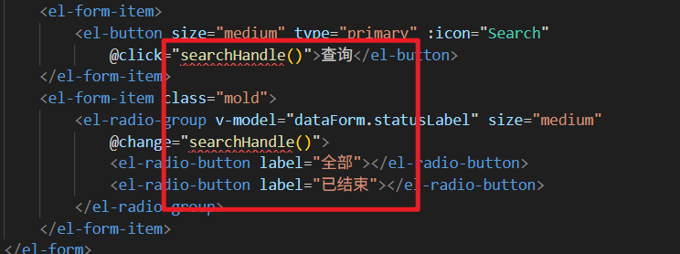

**接下来编写 **`**searchHandle()**`**方法：**

```typescript
function searchHandle(){
    proxy.$refs['form'].validate((valid) => {
        if(valid){
            loadPageData();
        }
    });
}
```

## 实现翻页功能

仍然是老规矩，编写以下两个函数即可：

```typescript
function sizeChangeHandle(val) {
    data.pageSize = val;
    data.pageIndex = 1;
    loadPageData();
}

function currentChangeHandle(val) {
    data.pageIndex = val;
    loadPageData();
}
```

# MIS 端后端实现分页查询预约记录


## 分析查询条件

1. 根据预约日期精确查询：appointment_date
2. 根据体检人名字模糊查询：patient_name
3. 根据电话精确查询：phone
4. 根据状态精确查询：status

## 分析返回的数据

1. 预约 id：`med_exam_appointment`表 `id`字段
2. 体检人名字：`med_exam_appointment`表 `patient_name`字段
3. 性别：`med_exam_appointment`表 `gender`字段
4. 电话：`med_exam_appointment`表 `phone`字段（需要安全遮蔽）
5. 身份证号：`med_exam_appointment`表 `id_card_no`字段（需要安全遮蔽）
6. 年龄：`med_exam_appointment`表 `birth_date`字段（然后使用函数计算生日与当前日期两个日期相差年数来计算年龄）
7. 公司：`med_exam_appointment`表 `company`字段
8. 状态：`med_exam_appointment`表 `status`字段
9. 套餐名字：`trade_order`表的 `goods_title`字段
10. 商品快照 id：`trade_order`表的 `snapshot_id`字段（可能会有查看商品快照的业务，返回它便于业务的扩展。）

## 编写 Mapper 和 XML

找到 `MedExamAppointmentMapper`接口，编写以下方法：

```java
List<Map<String, Object>> selectPage(Map<String, Object> params);

long selectCount(Map<String, Object> params);
```

找到 `MedExamAppointmentMapper.xml`文件，编写以下 SQL：

```xml
<select id="selectPage" parameterType="Map" resultType="HashMap">
    SELECT a.id,
    a.patient_name as patientName,
    a.gender,
    CONCAT(SUBSTRING(a.phone,1,3),"****",SUBSTRING(a.phone,8,4)) AS phone,
    CONCAT(SUBSTRING(a.id_card_no,1,3),"***********",SUBSTRING(a.id_card_no,15,4)) AS idCardNo,
    TIMESTAMPDIFF(YEAR,a.birth_date,NOW()) AS age,
    a.company,
    a.status,
    o.goods_title AS goodsTitle,
    o.snapshot_id AS snapshotId
    FROM med_exam_appointment a
    JOIN trade_order o ON a.order_id = o.order_id
    <where>
        <if test="appointmentDate != null and appointmentDate != ''">
            AND a.appointment_date = #{appointmentDate}
        </if>
        <if test="patientName != null and patientName != ''">
            AND a.patient_name LIKE CONCAT("%",#{patientName},"%")
        </if>
        <if test="phone != null and phone != ''">
            AND a.phone = #{phone}
        </if>
        <if test="status != null">
            AND a.status = #{status}
        </if>
    </where>
    ORDER BY a.id DESC
    LIMIT #{startIndex}, #{pageSize}
</select>

<select id="selectCount" parameterType="Map" resultType="long">
    SELECT count(*)
    FROM med_exam_appointment a
    JOIN trade_order o ON a.order_id = o.order_id
    <where>
        <if test="appointmentDate != null and appointmentDate != ''">
            AND a.appointment_date = #{appointmentDate}
        </if>
        <if test="patientName != null and patientName != ''">
            AND a.patient_name LIKE CONCAT("%",#{patientName},"%")
        </if>
        <if test="phone != null and phone != ''">
            AND a.phone = #{phone}
        </if>
        <if test="status != null">
            AND a.status = #{status}
        </if>
    </where>
</select>
```

## 编写 Service 和实现

找到 mis 端的 `AppointmentService`接口，编写以下方法：

```java
PageResult<Map<String,Object>> pageQueryByCondition(Map<String, Object> param);
```

编写方法实现：

```java
@Override
public PageResult<Map<String, Object>> pageQueryByCondition(Map<String, Object> param) {
    List<Map<String, Object>> records = new ArrayList<>();
    long total = appointmentMapper.selectCount(param);
    if (total > 0) {
        records = appointmentMapper.selectPage(param);
    }
    Integer pageSize = MapUtil.getInt(param, "pageSize");
    Integer pageNo = MapUtil.getInt(param, "pageNo");
    PageResult<Map<String, Object>> pageResult = new PageResult(total,pageSize, pageNo, records);
    return pageResult;
}
```

## 编写 form 接收数据并校验

在 mis 端编写 `PageQueryAppointmentForm`，代码如下：

```java
package com.jkweilai.meinian.api.controller.form;

import jakarta.validation.constraints.Min;
import jakarta.validation.constraints.NotNull;
import jakarta.validation.constraints.Pattern;
import lombok.Data;
import org.hibernate.validator.constraints.Range;

@Data
public class PageQueryAppointmentForm {
    @Pattern(regexp = "^[\\u4e00-\\u9fa5]{1,10}$", message = "patientName内容不正确")
    private String patientName;

    @Pattern(regexp = "^1[1-9]\\d{9}$", message = "phone内容不正确")
    private String phone;

    @Pattern(regexp = "^((((1[6-9]|[2-9]\\d)\\d{2})-(0?[13578]|1[02])-(0?[1-9]|[12]\\d|3[01]))|(((1[6-9]|[2-9]\\d)\\d{2})-(0?[13456789]|1[012])-(0?[1-9]|[12]\\d|30))|(((1[6-9]|[2-9]\\d)\\d{2})-0?2-(0?[1-9]|1\\d|2[0-8]))|(((1[6-9]|[2-9]\\d)(0[48]|[2468][048]|[13579][26])|((16|[2468][048]|[3579][26])00))-0?2-29))$", message = "appointmentDate内容不正确")
    private String appointmentDate;

    @Range(min = 1, max = 4, message = "status内容不正确")
    private Integer status;

    @NotNull(message = "pageNo不能为空")
    @Min(value = 1, message = "pageNo不能小于1")
    private Integer pageNo;

    @NotNull(message = "pageSize不能为空")
    @Range(min = 10, max = 50, message = "pageSize必须为10~50之间")
    private Integer pageSize;
}
```

## 编写 web 方法

找到 mis 端的 `AppointmentController`，编写以下 web 方法：

```java
@PostMapping("/pageQuery")
@SaCheckPermission(value = {"ROOT", "APPOINTMENT:SELECT"}, mode = SaMode.OR)
public R pageQuery(@RequestBody @Valid PageQueryAppointmentForm form) {
    Integer pageNo = form.getPageNo();
    Integer pageSize = form.getPageSize();
    Integer startIndex = pageSize * (pageNo - 1);
    Map param = BeanUtil.beanToMap(form);
    param.put("startIndex", startIndex);
    PageResult pageResult = appointmentService.pageQueryByCondition(param);
    return R.ok().put("pageResult", pageResult);
}
```

# MIS 端前端实现分页查询预约记录

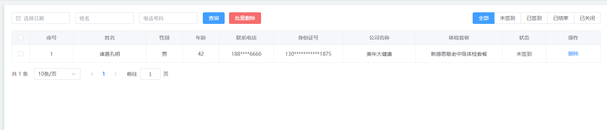

## 编写 loadPageData()函数

找到 mis 端的 `appointment.vue`文件，编写 `loadPageData()`函数，代码如下：

```typescript
async function loadPageData() {
    data.loading = true;
    if (dataForm.statusLabel == '全部') {
        dataForm.status = null;
    } else if (dataForm.statusLabel == '未签到') {
        dataForm.status = 1;
    } else if (dataForm.statusLabel == '已签到') {
        dataForm.status = 2;
    } else if (dataForm.statusLabel == '已结束') {
        dataForm.status = 3;
    } else if (dataForm.statusLabel == '已关闭') {
        dataForm.status = 4;
    }
  
    let json = {
        patientName: dataForm.patientName,
        phone: dataForm.phone,
        appointmentDate: dataForm.appointmentDate,
        status: dataForm.status,
        pageNo: data.pageIndex,
        pageSize: data.pageSize
    };

    let config = {
        headers : {
            satoken: localStorage.getItem('token')
        }
    };

    let response = await axios.post("/meinian-api/mis/appointment/pageQuery", json, config);
    let pageResult = response.data.pageResult;
    let records = pageResult.records;

    let statusEnum = {
        '1': '未签到',
        '2': '已签到',
        '3': '已结束',
        '4': '已关闭'
    };
    for (let one of records) {
        one.status = statusEnum[String(one.status)];
    }
    data.dataList = records;
    data.totalCount = pageResult.total;
    data.loading = false;
}

loadPageData();
```

## 点击 查询 等按钮实现分页查询

找到这些按钮：查询、全部、未签到、已签到、已结束、已关闭

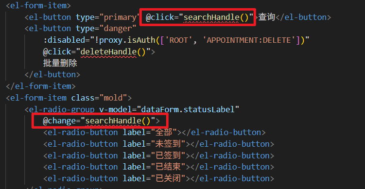

编写一个回调函数即可：

```typescript
function searchHandle(){
    proxy.$refs['form'].validate(valid => {
        if(valid){
            // 清除验证信息
            proxy.$refs['form'].clearValidate();
            // 加载分页数据
            loadPageData();
        }
    });
}
```

## 实现翻页

还是老规矩，编写以下两个函数完成翻页：

```typescript
function sizeChangeHandle(val) {
    data.pageSize = val;
    data.pageIndex = 1;
    loadPageData();
}

function currentChangeHandle(val) {
    data.pageIndex = val;
    loadPageData();
}
```

# MIS 端后端实现删除体检预约记录


1. 支持一条一条删除。
2. 也支持批量删除。
3. 只能删除未签到的。（只能删除 status = 1 的数据。）
4. 批量删除和单个删除共用同一个方法。

## 编写 Mapper 和 XML

找到 `MedExamAppointmentMapper`接口，编写以下方法：

```java
int deleteByIds(Integer[] ids);
```

找到 `MedExamAppointmentMapper.xml`文件，编写以下 SQL：

```xml
<delete id="deleteByIds">
    delete from med_exam_appointment where id in
    <foreach collection="array" open="(" close=")" separator="," item="id">
        #{id}
    </foreach>
    and status = 1
</delete>
```

## 编写 Service 和实现

找到 mis 端的 `AppointmentService`接口，编写以下方法：

```java
int removeByIds(Integer[] ids);
```

编写实现方法：

```java
@Override
@Transactional
public int removeByIds(Integer[] ids) {
    return appointmentMapper.deleteByIds(ids);
}
```

## 编写 form 接收数据并校验

在 mis 端创建 `RemoveAppointmentByIdsForm`类：

```java
package com.jkweilai.meinian.api.controller.form;

import jakarta.validation.constraints.NotEmpty;
import lombok.Data;

@Data
public class RemoveAppointmentByIdsForm {
    @NotEmpty(message = "ids不能为空")
    private Integer[] ids;
}
```

## 编写 web 方法

找到 mis 端的 `AppointmentController`类，编写以下方法：

```java
@PostMapping("/removeByIds")
@SaCheckPermission(value = {"ROOT", "APPOINTMENT:DELETE"}, mode = SaMode.OR)
public R removeByIds(@RequestBody @Valid RemoveAppointmentByIdsForm form){
    int rows = appointmentService.removeByIds(form.getIds());
    return R.ok().put("rows", rows);
}
```

# MIS 端前端实现删除体检预约记录

## 实现思路

1. 只有状态是未签到的才能删除。否则删除按钮不可用。
2. 删除一个和批量删除可以共用同一个方法。
3. 删除时要让用户确认是否删除。
4. 删除之后，要重新加载当前页数据。

**正常来说，删除预约记录之后，还要让 redis 缓存中的 actualCount-1，预约限流表中的 actualCount 也要减 1，订单的状态还要再恢复回去。这里大家自行扩展功能吧。**

## 实现删除

找到 mis 端的 `appointment.vue`文件，找到删除按钮和批量删除按钮，如下：

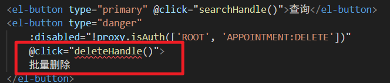


通过这个代码可以看到删除按钮可用和不可用是如何控制的。

另外用户选择了哪些体检预约记录，这个响应式对象在哪里呢？在这里：

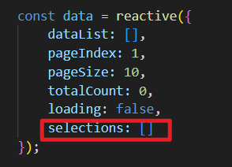

那这个响应式对象中的数据是如何保持和页面中的复选框对应的呢？是通过这个回调函数：


以上回调函数的执行时机是：当任意一个复选框的选中状态发生变化时就执行这个回调函数 `selectionChangeHandle`，我们需要写一下这个回调函数，这个回调函数会自动接收一个已选中元素的数组，可以将这个回调函数的参数直接赋值给响应式对象 `selections`，代码如下：

```typescript
function selectionChangeHandle(values){
    data.selections = values;
}
```

另外，如何控制每条预约记录前面的复选框是否可以选中呢？就靠它了：

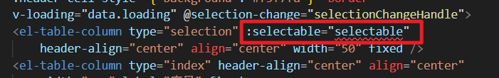

`:selectable`为 true 时表示可选中，为 false 是表示不能选中，因此我们还需要写一下 `selectable`回调函数，代码如下：

```typescript
function selectable(row, index){
    if(row.status == "未签到"){
        return true;
    }
    return false;
}
```

接下来我们编写删除的回调函数：`deleteHandle`，怎么能够知道用户是单个删除还是批量删除：主要看 `deleteHanle`回调函数的参数是否为空，如果参数是空，则表示用户是批量删除。如果参数不为空，则表示用户是单个删除。如果是单个删除，也需要将 id 放到数组当中，提交给后端。因为后端是采用数组来接收的。

```typescript
function deleteHandle(id){
    let ids = (id != null && id != undefined) ? [id] : data.selections.map(item => item.id);
    if(ids != null && ids.length > 0){
        // 提醒用户是否确定删除
        ElMessageBox.confirm("您确定要删除预约记录吗？", "提示信息", {
            confirmButtonText: "确定",
            cancelButtonText: "取消"
        }).then(async ()=>{
            // 准备数据
            let json = {
                ids: ids
            };
            // 准备配置
            let config = {
                headers: {
                    satoken: localStorage.getItem('token')
                }
            };
            // 发送请求删除数据
            const response = await axios.post("/meinian-api/mis/appointment/removeByIds", json, config);
            const rows = response.data.rows;
            if(rows > 0){
                // 删除成功
                ElMessage({
                    message: `删除了[${rows}]条记录`,
                    type: "success",
                    duration: 1200
                });
                // 重新加载分页数据
                loadPageData();
            }else{
                // 删除失败
                ElMessage({
                    message: `删除失败`,
                    type: "error",
                    duration: 1200
                });
            }
        });
    }
}
```

# 分析 MIS 端体检签到模块

## UI 界面

在体检预约签到页面中，默认显示当日的体检预约记录。如需查看其他日期或其他体检人的预约，可设置相应查询条件。此外，预约记录中的联系电话和身份证号仍将保持遮挡显示。

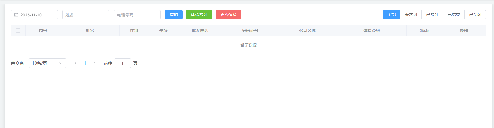

点击"体检签到"按钮后，将弹出签到窗口。此时，大健康工作人员需刷取客户的身份证，以读取身份信息及照片。随后，系统将自动开启摄像头，由工作人员为体检人拍摄现场照片，进行人脸识别比对。身份核验通过后，即视为签到成功，该体检预约的状态将更新为"已签到"。


体检人完成签到后，可至服务台领取体检导引单。体检中心工作人员可提前打印当日所有导引单：在每条体检预约记录的右侧均设有“导引单”按钮，点击后将弹出导引单预览窗口。工作人员点击“下载导引单”按钮，浏览器将自动把内容转换为PDF文件并下载，随后直接打印该PDF文件即可。


当体检人完成所有体检项目后，可持导引单至服务台办理完成手续。工作人员点击“完成体检”按钮，并扫描导引单上的二维码，系统将自动在弹窗中填入体检单的流水号。工作人员点击“确定”后，该笔预约的状态即更新为“已完成”。客户此时即可回家，安心等待体检报告即可。

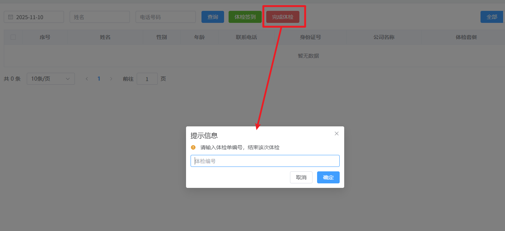

## UML 用例图


# 分析 MIS 端医生体检模块

体检人签到成功后，可持体检导引单前往各诊室进行体检。随后，医生将依据检查情况，在系统中录入相应的体检结果。

## MongoDB 集合结构

在数据存储方案上，我们选择了MongoDB来存放体检结果。这主要是因为在处理包含大量JSON字段的体检数据时，MongoDB的文档模型提供了比MySQL更高效、更灵活的条件查询支持，完美契合了我们的业务场景需求。

| **序号** | **列名** | **类型** | **必填** | **备注** |
| --- | --- | --- | --- | --- |
| 1 | _id | object | Y | 主键 |
| 2 | uuid | varchar | Y | 体检流水号 |
| 3 | checkup | json | Y | 体检录入项模板（体检套餐要检查的体检内容） |
| 4 | place | json | Y | 体检地点 |
| 5 | result | json | Y | 体检结果 |

所有体检结果数据均以JSON格式存储于MongoDB中。下面是一个体检人的体检结果信息：

```json
{
    "_id": ObjectId("888c48d19a2588267cd6666d"),
    "uuid": "8D4A6F3B90124785B5927C8E1A6F5D2E",
    "checkup": [
        // 一个json就是一个体检项目
        {
            "template": "基础体检模板", // 将来输出体检报告的时候，采用什么模板输出。
            "item": "血压测量",
            "code": "BP001",
            "sex": "通用",
            "name": "生命体征检查",
            "place": "内科",
            "type": "测量",
            "value": "120/80mmHg"
        },
        {
            "template": "基础体检模板", 
            "item": "心电图",
            "code": "ECG001",
            "sex": "通用",
            "name": "心脏功能检查",
            "place": "心电图室",
            "type": "检查",
            "value": "正常窦性心律"
        }
    ],
    "place": ["内科", "外科", "眼科", "心电图室"], // 在哪些诊室完成体检
    "result": [
        // 每个json对象就是一个科室的体检结果。
        {
            "date": "2024-06-15",
            "template": "基础体检模板", // 指定生成体检报告的时候，这里指定用哪个模板。
            "item": [
                {
                    "name": "血压",
                    "unit": "mmHg",   // 单位（有的体检项用得上，有的体检项用不上）
                    "standard": "<140/90", // 体检项的标准值（有的体检项用得上，有的体检项用不上）
                    "value": "120/80"
                },
                {
                    "name": "心率", 
                    "unit": "次/分",
                    "standard": "60-100",
                    "value": "75"
                },
                {
                    "name": "视力检查",
                    "unit": null,
                    "standard": "≥1.0",
                    "value": "左眼1.2，右眼1.0"
                }
            ],
            "doctorName": "张伟",
            "doctorId": 1001,
            "place": "内科"
        },
        {
            "date": "2024-06-15",
            "template": "专项检查模板", 
            "item": [
                {
                    "name": "心电图诊断",
                    "unit": null,
                    "standard": "正常范围",
                    "value": "正常心电图"
                },
                {
                    "name": "胸部X光",
                    "unit": null, 
                    "standard": "无异常发现",
                    "value": "心肺膈未见明显异常"
                }
            ],
            "doctorName": "李静",
            "doctorId": 1002,
            "place": "放射科"
        }
    ]
}
```

## UI 界面

**医生体检页面操作流程**

**1. 科室选择**
体检医生需在页面右上角选择当日所在科室。因体检工作对医学专项深度要求不高，医生常会根据人力需要跨科室支援（例如，李医生今日在内科，明日可能支援外科）。选择科室后，系统将自动显示当前医生的个人信息。

**2. 信息录入**
当体检人将导引单交至诊室后，护士/体检医生 使用扫码枪扫描单上二维码，系统将自动填入体检编号，并调出该体检人的基本信息及本诊室需执行的全部检查项目。

**3. 结果填写**
医生在填写体检结果时，既可从预设的结果模板中选择，也可完全手动录入，操作灵活。

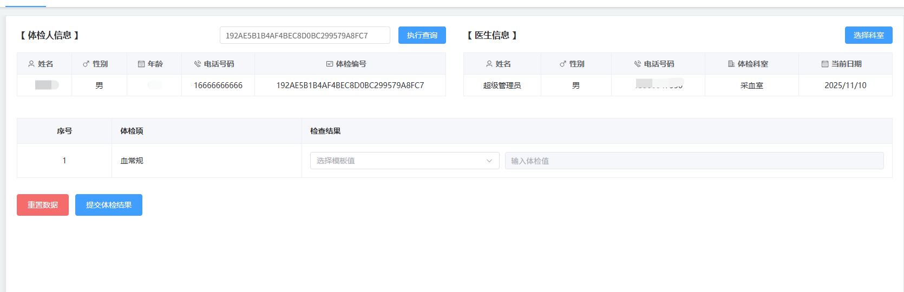

**体检结果纠错与应急流程**

**1. 结果纠错流程**
若医生提交体检结果后发现有误，可重新扫描该体检人的导引单二维码。系统将自动载入已提交的结果数据，医生可直接在原有基础上修改并重新提交，以完成结果更正。

**2. 特殊情况应急流程**
如遇体检过程中断电等突发情况，导致大量体检人未能完成检查，体检中心可为受影响的体检人发放加盖公章的应急凭证。

- **次日体检**：体检人可凭原导引单和应急凭证，于次日免签到直接前往相应诊室继续体检。
- **系统提示**：当护士扫描此类导引单二维码时，系统会弹出“该体检非当日预约”的提示。此提示可被忽略，医生可正常为体检人完成检查并提交结果。

## UML 用例图


# 实现体检签到页面


## 创建 vue 页面并配置路由

在 `src/views/mis/` 目录中创建 `customer_checkin.vue` 页面，然后在 `src/router/index.ts` 文件中配置路由信息。

配置到它的下面：

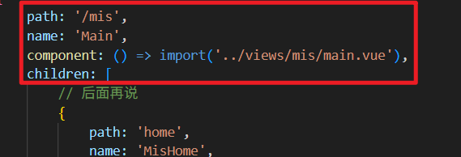

```typescript
{
    path: 'customer_checkin',
    name: 'MisCustomerCheckin',
    component: ()=>import('../views/mis/customer_checkin.vue'),
    meta: {
        title: "体检签到",
        isTab: true
    }
}
```

顺手创建样式文件 `customer_checkin.less`，并在 `vue`页面中引入：

```html
<template>

</template>

<script lang="ts" setup></script>

<style lang="less" scoped>
@import url('customer_checkin.less');
</style>
```

## 编写视图层代码

打开 `customer_checkin.vue`页面，编写视图层代码：

```plaintext
<div v-if="proxy.isAuth(['ROOT', 'APPOINTMENT:SELECT'])">
    <el-form :inline="true" :model="dataForm" :rules="dataRule" ref="form">
        <el-form-item>
            <el-date-picker v-model="dataForm.appointmentDate" type="date"
                placeholder="选择日期" :editable="false" format="YYYY-MM-DD"
                value-format="YYYY-MM-DD" :clearable="false" />
        </el-form-item>
        <el-form-item prop="patientName">
            <el-input v-model="dataForm.patientName" placeholder="姓名"
                maxlength="10" class="input" clearable="clearable" />
        </el-form-item>
        <el-form-item prop="phone">
            <el-input v-model="dataForm.phone" placeholder="电话号码"
                maxlength="11" class="input" clearable="clearable" />
        </el-form-item>
        <el-form-item>
            <el-button type="primary" @click="searchHandle()">查询</el-button>
            <el-button type="success" @click="checkinHandle()">体检签到</el-button>
            <el-button type="danger"  @click="finishHandle()">完成体检</el-button>
        </el-form-item>
        <el-form-item class="mold">
            <el-radio-group v-model="dataForm.statusLabel" @change="searchHandle()">
                <el-radio-button label="全部"></el-radio-button>
                <el-radio-button label="未签到"></el-radio-button>
                <el-radio-button label="已签到"></el-radio-button>
                <el-radio-button label="已结束"></el-radio-button>
                <el-radio-button label="已关闭"></el-radio-button>
            </el-radio-group>
        </el-form-item>
    </el-form>
    <el-table :data="data.dataList"
        :header-cell-style="{'background':'#f5f7fa'}" border
        v-loading="data.loading" @selection-change="selectionChangeHandle">
        <el-table-column type="selection" :selectable="selectable"
            header-align="center" align="center" width="50" fixed />
        <el-table-column type="index" header-align="center" align="center"
            width="120" label="序号" fixed>
            <template #default="scope">
                <span>{{ (data.pageIndex - 1) * data.pageSize + scope.$index + 1 }}</span>
            </template>
        </el-table-column>
        <el-table-column prop="patientName" header-align="center" align="center"
            label="姓名" width="200" fixed />
        <el-table-column prop="gender" header-align="center" align="center"
            label="性别" width="100" />
        <el-table-column prop="age" header-align="center" align="center"
            label="年龄" width="100" />
        <el-table-column prop="phone" header-align="center" align="center"
            label="联系电话" width="150" />
        <el-table-column prop="idCardNo" header-align="center" align="center"
            label="身份证号" width="190" />
        <el-table-column prop="company" header-align="center" align="center"
            label="公司名称" width="200" />
        <el-table-column prop="goodsTitle" header-align="center" align="center"
            label="体检套餐" min-width="200" />
        <el-table-column prop="status" header-align="center" align="center"
            label="状态" width="120" />
        <el-table-column fixed="right" header-align="center" align="center"
            width="150" label="操作">
            <template #default="scope">
                <el-button type="text"
                    :disabled="!proxy.isAuth(['ROOT', 'APPOINTMENT:SELECT'])"
                    @click="guidanceHandle(scope.row.id)">
                    导引单
                </el-button>
            </template>
        </el-table-column>
    </el-table>
    <el-pagination @size-change="sizeChangeHandle"
        @current-change="currentChangeHandle" :current-page="data.pageIndex"
        :page-sizes="[10, 20, 50]" :page-size="data.pageSize"
        :total="data.totalCount"
        layout="total, sizes, prev, pager, next, jumper">
    </el-pagination>
</div>
```

## 编写模型层代码

继续编写模型层代码：

```typescript
<script lang="ts" setup>
    import { reactive, getCurrentInstance, ref, onMounted } from 'vue';
    import { ElNotification } from 'element-plus';
    import { Camera, RefreshRight, Document } from '@element-plus/icons-vue';
    import router from '../../router/index';
    import { dayjs } from 'element-plus';
    import isBetween from 'dayjs/plugin/isBetween';
    
    dayjs.extend(isBetween);
    const { proxy } = getCurrentInstance();
    
    const dataForm = reactive({
        patientName: null,
        phone: null,
        appointmentDate: dayjs().format('YYYY-MM-DD'),
        statusLabel: '全部',
        status: null
    });

    const dataRule = reactive({
        patientName: [{ pattern: '^[\u4e00-\u9fa5]{1,10}$', message: '姓名格式错误' }],
        phone: [{ pattern: '^1[1-9]\\d{9}$', message: '电话号码格式错误' }]
    });

    const data = reactive({
        dataList: [],
        pageIndex: 1,
        pageSize: 10,
        totalCount: 0,
        loading: false,
        selections: []
    });
</script>
```

## 编写样式

打开 `customer_checkin.less`文件，编写以下样式：

```plaintext
@import url('../style.less');
.mold {
          float: right;
          margin-right: 0 !important;
}
```

# 实现医生体检页面


## 创建 vue 页面并配置路由

在 `src/views/mis/` 目录中创建 `doctor_checkup.vue` 页面，然后在 `src/router/index.ts` 文件中配置路由信息。

在 mis 下面配置：

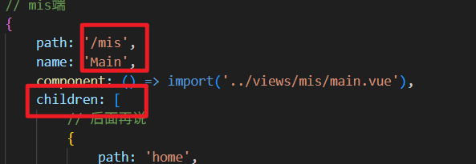

```typescript
{
    path: 'doctor_checkup',
    name: 'MisDoctorCheckup',
    component: ()=>import('../views/mis/doctor_checkup.vue'),
    meta: {
        title: "医生检查",
        isTab: true
    }
}
```

顺手创建 `doctor_checkup.less`文件，并在 vue 页面中引入样式文件：

```html
<template></template>
<script lang="ts" setup></script>
<style lang="less" scoped>
    @import url('doctor_checkup.less');
</style>
```

## 编写视图层

```html
<div class="person-container"
    v-if="proxy.isAuth(['ROOT', 'CHECKUP:INSERT','CHECKUP:UPDATE'])">
    <div class="left">
        <el-descriptions title="【 体检人信息 】" direction="vertical" :column="5" border>
            <template #extra>
                <div class="operate">
                    <el-input placeholder="输入 / 扫码体检编号"
                        v-model="data.dataForm.uuid" ref="uuid" class="uuid"
                        maxlength="32" 
                        @keyup.enter.native="searchHandle"
                        clearable/>
                    <el-button type="primary" @click="searchHandle">执行查询</el-button>
                </div>
            </template>
            <el-descriptions-item align="center">
                <template #label>
                    <div class="cell-item">
                        <el-icon class="icon"><User /></el-icon>
                        姓名
                    </div>
                </template>
                {{data.customer.name}}
            </el-descriptions-item>
            <el-descriptions-item align="center">
                <template #label>
                    <div class="cell-item">
                        <el-icon class="icon"><Male /></el-icon>
                        性别
                    </div>
                </template>
                {{data.customer.sex}}
            </el-descriptions-item>
            <el-descriptions-item align="center">
                <template #label>
                    <div class="cell-item">
                        <el-icon class="icon"><Calendar /></el-icon>
                        年龄
                    </div>
                </template>
                {{data.customer.age}}
            </el-descriptions-item>
            <el-descriptions-item align="center">
                <template #label>
                    <div class="cell-item">
                        <el-icon class="icon"><Phone /></el-icon>
                        电话号码
                    </div>
                </template>
                {{data.customer.tel}}
            </el-descriptions-item>
            <el-descriptions-item align="center">
                <template #label>
                    <div class="cell-item">
                        <el-icon class="icon"><Postcard /></el-icon>
                        体检编号
                    </div>
                </template>
                {{data.customer.uuid}}
            </el-descriptions-item>
        </el-descriptions>
    </div>
    <div class="right">
        <el-descriptions title="【 医生信息 】" direction="vertical" :column="5" border>
            <template #extra>
                <el-button type="primary" @click="selectDeptHandle">选择科室</el-button>
            </template>
            <el-descriptions-item align="center">
                <template #label>
                    <div class="cell-item">
                        <el-icon class="icon"><User /></el-icon>
                        姓名
                    </div>
                </template>
                {{ data.doctor.name }}
            </el-descriptions-item>
            <el-descriptions-item align="center">
                <template #label>
                    <div class="cell-item">
                        <el-icon class="icon"><Male /></el-icon>
                        性别
                    </div>
                </template>
                {{ data.doctor.sex }}
            </el-descriptions-item>
            <el-descriptions-item align="center">
                <template #label>
                    <div class="cell-item">
                        <el-icon class="icon"><Phone /></el-icon>
                        电话号码
                    </div>
                </template>
                {{ data.doctor.tel }}
            </el-descriptions-item>
            <el-descriptions-item align="center">
                <template #label>
                    <div class="cell-item">
                        <el-icon class="icon"><OfficeBuilding /></el-icon>
                        体检科室
                    </div>
                </template>
                {{ data.dataForm.place }}
            </el-descriptions-item>
            <el-descriptions-item align="center">
                <template #label>
                    <div class="cell-item">
                        <el-icon class="icon"><Calendar /></el-icon>
                        当前日期
                    </div>
                </template>
                {{ data.doctor.date }}
            </el-descriptions-item>
        </el-descriptions>
    </div>

</div>
<div class="checkup-container">
    <table>
        <thead>
            <tr>
                <th width="50">序号</th>
                <th width="100" align="left">体检项</th>
                <th width="300" align="left">检查结果</th>
            </tr>
        </thead>
        <tbody>
            <tr v-for="(one,index) in data.dataForm.checkup">
                <td align="center">{{index+1}}</td>
                <td>{{one.item}}</td>
                <td>
                    <div class="value-container">
                        <el-select v-model="one.input.select" class="m-2"
                            placeholder="选择模板值">
                            <el-option v-for="item in one.value" :label="item"
                                :value="item" />
                        </el-select>
                        <el-input v-model="one.input.value"
                            :disabled="one.input.select!='其他'"
                            placeholder="输入体检值" class="input-value" clearable />
                    </div>
                </td>
            </tr>
        </tbody>
    </table>
    <div class="operate" v-if="data.dataForm.checkup.length>0">
        <el-button type="danger" size="large" @click="clearCheckupHandle">
            重置数据
        </el-button>
        <el-button type="primary" size="large" @click="dataFormSubmit">
            提交体检结果
        </el-button>
    </div>
</div>
```

## 编写模型层

```html
<script lang="ts" setup>
    import { reactive, getCurrentInstance, ref } from "vue";
    import { ElMessageBox } from 'element-plus'
    import { dayjs } from 'element-plus'
    import { stringIsEmpty } from "../../utils/validate";

    const { proxy } = getCurrentInstance();

    const data = reactive({
        dataForm: {
            place: null,
            uuid: null,
            checkup: [],
            template: null
        },
        customer: {
            name: "<无>",
            sex: "<无>",
            age: "<无>",
            tel: "<无>",
            uuid: "<无>",
            date: null
        },
        doctor: {
            name: null,
            sex: null,
            tel: null,
            date: new Date().toLocaleDateString()
        },
    });

    function searchHandle(){}
</script>
```

## 编写样式

```plaintext
@import url('../style.less');

.person-container{
    display: flex;
    justify-content: space-between;
    .left{
        width: 49%;
        .operate{
            display: flex;
            .uuid{
                width: 315px;
                margin-right: 15px;
            }
        }
    }
    .right{
        width: 49%;
    }
    .cell-item{
        display: flex;
        justify-content: center;
        padding-right: 15px;
        .icon{
            margin-top: 5px;
            margin-right: 5px;
        }
    }
}

.checkup-container{
    margin-top: 40px;
    table{
        width: 100%;
        border-spacing: 0;
        border: solid 1px @border-color-22;
        border-collapse: collapse;
        th{
            padding: 15px;
            border: solid 1px @border-color-22;
            color: @font-color-32;
            background-color: @bg-color-31;
        }
        td{
            border: solid 1px @border-color-22;
            padding: 15px;
        }
        .value-container{
            display: flex;
            align-items: center;
            gap: 10px;
            
            .el-select {
                flex: 1;
                min-width: 120px;
            }
            
            .input-value{
                flex: 2; 
                min-width: 150px; 
                margin-left: 0;
            }
        }
    }
    .operate{
        margin-top: 30px;
        text-align: left; 
    }
}
```

# MIS 端前端实现分页查询体检预约记录

体检预约记录的分页查询后端接口我们之前已经实现过了。这个功能只需要编写前端的代码了。

## 封装 loadPageData()函数

在 mis 端的体检签到的 vue 页面 `customer_checkin.vue`封装 `loadPageData()`函数，加载分页数据

```typescript
async function loadPageData(){
    data.loading = true;
    // 准备数据（页面上用户选择状态的时候，选择是文字，底层数据库中的状态是数字，这里需要将文字转换成数字）
    if(dataForm.statusLabel == "全部"){
        dataForm.status = null;
    }else if(dataForm.statusLabel == "未签到"){
        dataForm.status = 1;
    }else if(dataForm.statusLabel == "已签到"){
        dataForm.status = 2;
    }else if(dataForm.statusLabel == "已结束"){
        dataForm.status = 3;
    }else if(dataForm.statusLabel == "已关闭"){
        dataForm.status = 4;
    }
    // 1.预约日期 2.体检人姓名 3.电话 4.状态 5.pageNo 6.pageSize
    let json = {
        appointmentDate: dataForm.appointmentDate,
        patientName: dataForm.patientName,
        phone: dataForm.phone,
        status: dataForm.status,
        pageNo: data.pageIndex,
        pageSize: data.pageSize
    };
    // 准备配置
    let config = {
        headers : {
            satoken: localStorage.getItem('token')
        }
    };
    // 发送ajax请求
    let response = await axios.post('/meinian-api/mis/appointment/pageQuery', json, config);
    let pageResult = response.data.pageResult;
    let records = pageResult.records;
    // 将响应回来的数据设置到响应对象中（响应回来的数据中状态值是数字，需要将数字转换成文字描述）
    let statusEnum = {
        "1": "未签到",
        "2": "已签到",
        "3": "已结束",
        "4": "已关闭",
    };
    for(let one of records){
        one.status = statusEnum[String(one.status)];
    }
    data.dataList = records;
    data.totalCount = pageResult.total;
    data.loading = false;
}
loadPageData();
```

## 实现分页查询

用户点击查询按钮，或者点击右上角的状态标签，都要触发分页查询，找到它们的位置，提供一下回调函数，回调函数也很简单，校验一下表单，如果表单数据合法，则调用我们上面封装的 `loadPageData`函数。


编写回调函数：

```typescript
function searchHandle(){
    proxy.$refs["form"].validate(valid => {
        if(valid){
            proxy.$refs["form"].clearValidate();
            data.pageIndex = 1;
            loadPageData();
        }
    });
}
```

## 实现翻页功能

还是老规矩，和之前一样：

```typescript
function sizeChangeHandle(val) {
    data.pageSize = val;
    data.pageIndex = 1;
    loadPageData();
}

function currentChangeHandle(val) {
    data.pageIndex = val;
    loadPageData();
}
```