# 美年大健康项目-09

# 前端显示体检签到弹窗

我们来完善MIS端体检签到页面的签到弹窗功能。当大健康工作人员点击"体检签到"按钮后，页面会弹出签到窗口。弹窗中的身份信息将通过身份证读卡器自动获取（该功能将在后续实现），本小节的重点是完成弹窗的UI设计和显示功能。


## 编写视图层代码

在MIS端的customer_checkin.vue页面的视图层中，添加弹窗控件，代码添加位置如下：


```html
<el-dialog title="体检签到" v-if="proxy.isAuth(['ROOT', 'APPOINTMENT:UPDATE'])"
    :close-on-click-modal="false" v-model="checkinDialog.visible"
    width="500px" :before-close="closeHandle">
    <div class="card-info">
        <div class="left">
            <el-form :model="checkinDialog.dataForm" ref="dialogForm" label-width="60px">
                <el-form-item label="姓名">
                    <el-input v-model="checkinDialog.dataForm.name" disabled />
                </el-form-item>
                <el-form-item label="性别">
                    <el-input v-model="checkinDialog.dataForm.sex" disabled />
                </el-form-item>
                <el-form-item label="身份证">
                    <el-input v-model="checkinDialog.dataForm.pid" disabled />
                </el-form-item>
            </el-form>
        </div>
        <div class="right">
            <!-- 这两个控件是排他的，通过photo_1的状态来决定显示谁。-->
            
            <div class="empty"
                v-if="checkinDialog.dataForm.photo_1 == null">
                <el-icon :size="60" class="icon"><Avatar /></el-icon>
            </div>
        </div>
    </div>
    
    <!-- 
    控件排他显示实现原理：
    通过 v-show 控制三个视觉元素的显隐，确保同一时间只有一个元素可见
    showEmpty: 显示操作指引
    showVideo: 显示摄像头实时画面  
    showPhoto: 显示拍摄的照片
    这三个状态在业务逻辑中互斥，实现排他效果
    -->
    <div class="photo-container">
        <!-- 初始状态：显示操作指引 -->
        <div class="empty" v-show="checkinDialog.showEmpty">
            <SvgIcon name="camera" class="camera" />
            <ol>
                <li>完成体检人身份证刷卡验证后，系统将自动启用摄像头进行人脸采集。</li>
                <li>拍摄画面中须确保仅包含单一人脸特征，如检测到多张人脸将触发系统告警。</li>
                <li>要求采集正面免冠人脸图像，禁止佩戴墨镜、口罩等影响面部识别的遮挡物。</li>
            </ol>
        </div>
        
        <!-- 拍照状态：显示摄像头实时画面 -->
        <!--video标签：HTML5原生视频播放元素，用于在网页中嵌入和播放视频内容或显示摄像头实时流。-->
        <video id="video" autoplay v-show="checkinDialog.showVideo"></video>
        
        <!-- 完成状态：显示拍摄的照片 -->
        <!--canvas标签：HTML5原生画布元素，提供JavaScript绘图API，用于在网页上动态生成和操作图像图形-->
        <canvas id="photo" width="460" height="345" v-show="checkinDialog.showPhoto">
        </canvas>
    </div>
    
    <template #footer>
        <span class="dialog-footer">
            <!-- 
            按钮状态控制：
            - 拍照按钮在showEmpty时为禁用状态（需要先刷身份证）
            - 签到按钮需要pid和photo_2同时存在才可用
            通过disabled属性实现功能逻辑的排他控制
            -->
            <el-button type="primary" :icon="checkinDialog.btnIcon"
                :disabled="checkinDialog.showEmpty"
                @click="takePhotoHandle">
                {{ checkinDialog.btnText }}
            </el-button>
            <el-button @click="closeHandle">取消</el-button>
            <el-button type="success"
                :disabled="checkinDialog.dataForm.pid == null || checkinDialog.dataForm.photo_2 == null"
                @click="dataFormSubmit">
                签到
            </el-button>
        </span>
    </template>
</el-dialog>
```

## 编写样式

在customer_checkin.less文件中，我们给弹窗和它的子控件设置CSS样式

```plaintext
.card-info {
    display: flex;
    .left {
        width: 330px;
    }
    .right {
        margin-left: 20px;
        .empty {
            background-color: @bg-color-1;
            width: 105px;
            height: 130px;
            display: flex;
            justify-content: center;
            align-items: center;
            .icon {
                color: @bg-color-3;
            }
        }
        .photo {
            width: 105px;
            height: 130px;
        }
    }
}

.photo-container {
    .empty {
        width: 460px;
        height: 345px;
        .camera {
            width: 130px;
            height: 130px;
            margin-top: 30px;
            margin-left: auto;
            margin-right: auto;
            display: block;
        }
        ol {
            margin: 20px 0 0 0;
            padding: 0 20px;
            li {
                line-height: 1.7;
                color: @font-color-2;
                margin-bottom: 10px;
            }
        }
    }
    #video, #photo {
        width: 460px;
        height: 345px;
    }
}
```

## 编写模型层

现在我们写customer_checkin.vue页面模型层的代码，具体如下

```typescript
const checkinDialog = reactive({
    visible: false,
    btnText: '拍照',
    btnIcon: Camera,
    showEmpty: true,
    showVideo: false,
    showPhoto: false,
    streamTrack: null,
    dataForm: {
        name: null,
        sex: null,
        pid: null,
        photo_1: null,
        photo_2: null
    }
});
```

用户点击体检签到按钮之后，触发了checkinHandle()回调函数：

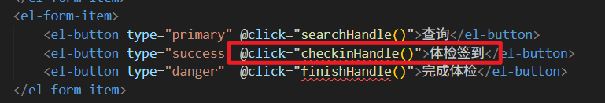

编写 checkinHandle()回调函数，显示弹窗控件：

```typescript
function checkinHandle() {
    let current = dayjs().format("YYYY-MM-DD")
    if (current != dataForm.appointmentDate) {
        proxy.$message({
            message: `请将日期改为${current}`,
            type: 'warning',
            duration: 1200
        });
    }
    else {
        checkinDialog.dataForm.name = null;
        checkinDialog.dataForm.sex = null;
        checkinDialog.dataForm.pid = null;
        checkinDialog.dataForm.photo_1 = null;
        checkinDialog.dataForm.photo_2 = null;
        checkinDialog.showEmpty = true;
        checkinDialog.showVideo = false;
        checkinDialog.showPhoto = false;
        checkinDialog.visible = true;
    }
}
```

# 连接身份证读卡器

## 购买身份证读卡器

淘宝上有很多身份证读卡器，有的需要联网，有的不需要，不需要联网的大概要几千块，需要联网的就便宜很多，我这里购买的是**鱼住未来科技**的，大家可以参考一下，你也可以选购其他的，不过一定要跟商家说清楚，你是要二次开发的，因为有的读卡器是不支持二次开发的。


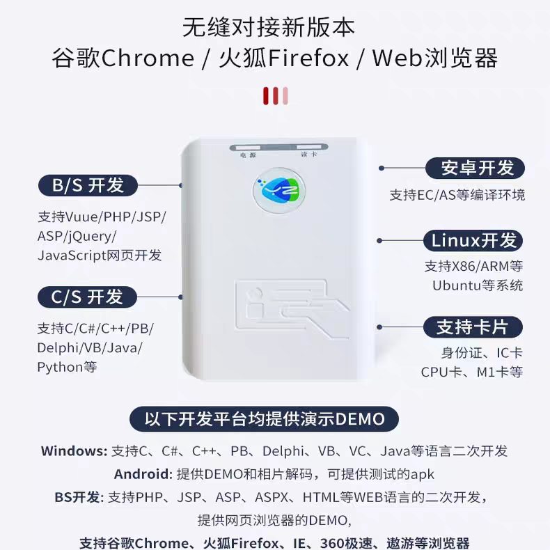

购买的时候一般商家会提供对应的 SDK，以及对接的接口文档，这里我给出鱼住未来科技的 SDK 下载地址及接口文档：[https://aidoing.com.cn/openapi.html](https://aidoing.com.cn/openapi.html)

## 下载并安装 SDK 工具包

目前该读卡器仅支持Windows系统。使用MacOS系统的同学需要借用Windows电脑来安装读卡器工具包程序。（可以把 windows 作为一个客户端。）

厂家提供了多种编程语言的SDK工具包，我们选择其中最简单的WebSocket方案，因为它的代码量最少，实现最便捷。

具体操作流程如下：

1. 首先安装厂家提供的工具包程序
2. 该工具包会启动一个WebSocket服务
3. 我们的前端项目通过WebSocket连接这个服务
4. 实时获取读卡器读取的身份证信息

**关闭内核隔离：**

部分 Windows 电脑默认开启了系统隔离功能，这可能导致读卡器 SDK 工具包安装失败。你需要关闭系统中的"内核隔离"功能，具体来说是关闭其中的"内存完整性"服务。在 windows 安全中心中搜索内核隔离。


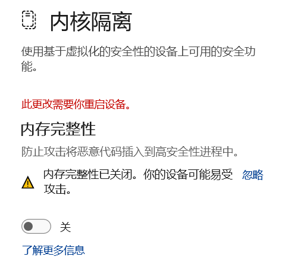

**下载并安装 SDK 工具包**（在接口文档中有下载链接）:[https://d.yzfuture.cn/p/14](https://d.yzfuture.cn/p/14)

提供的 SDK 很多，各种语言的支持，我们只需要安装一个浏览器插件就行了。支持浏览器即可。

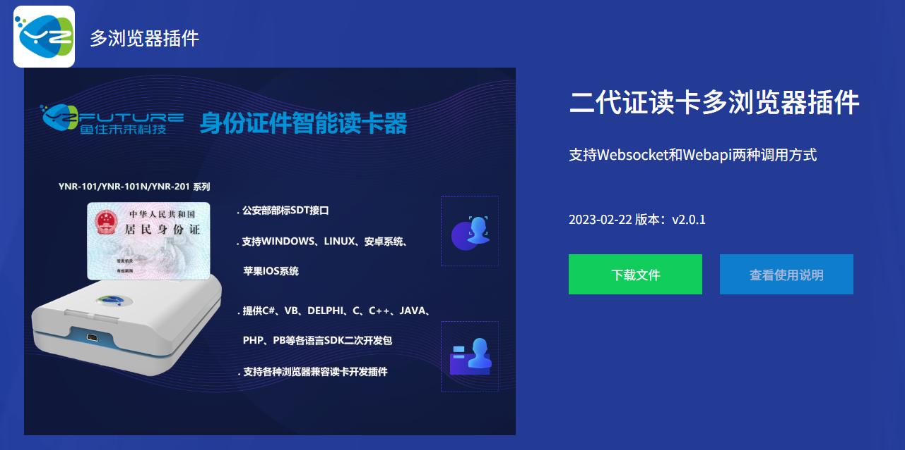

下载后解压：


双击 exe 文件安装多浏览器支持插件。安装之后桌面上会有一个图标，双击图标启动程序：


**测试读卡服务：**

1. **连接设备**：使用 USB 数据线将身份证读卡器与 Windows 电脑正确连接。
2. **启动程序**：打开已安装的 SDK 工具包程序。
3. **执行读卡测试**：
  - 在系统桌面右下角找到该程序的托盘图标；
  - 右键点击图标，在弹出的菜单中选择“读卡测试”功能。

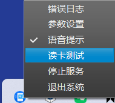

**操作步骤：**

1. 在打开的浏览器页面中，首先点击 **“连接到 WebSocket”** 按钮，以建立前端页面与后端服务的通信连接。
2. 连接成功后，使用读卡器刷取身份证。
3. 读取的身份证信息将实时显示在页面右侧区域。

**重要提示：**
由于读卡器需要访问厂家云服务以完成身份证数据的解密与验证，因此请确保您当前的电脑网络**可以正常访问互联网（外网）**，否则将无法成功获取信息。

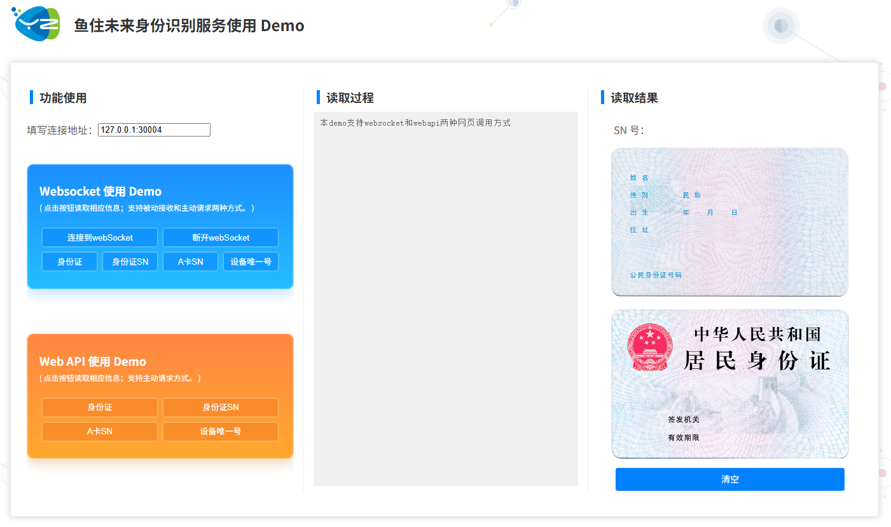

**查看 websocket 案例：**

安装SDK工具包之后，在电脑桌面上就会出现PDF文档的链接。该文档里面是WebSocket具体案例代码，我们编写前端TS代码，就需要参考这些案例。


# websocket 接收读卡信息


读卡器会自动读取身份证的信息，然后 SDK 程序会将读取到的身份证信息通过 websocket 方式自动推送给我们，我们只需要接收这些信息就行了。

## 参考案例

在这个页面上右键，可以看到引入了 `index.js`文件，这个文件中的代码正是我们需要参考的：


在index.js文件中，JavaScript代码向我们展示了如何获取SDK程序推送过来的消息，以及如何解析消息的内容


具体的读卡信息，在官方的PDF文件中有详细的说明：

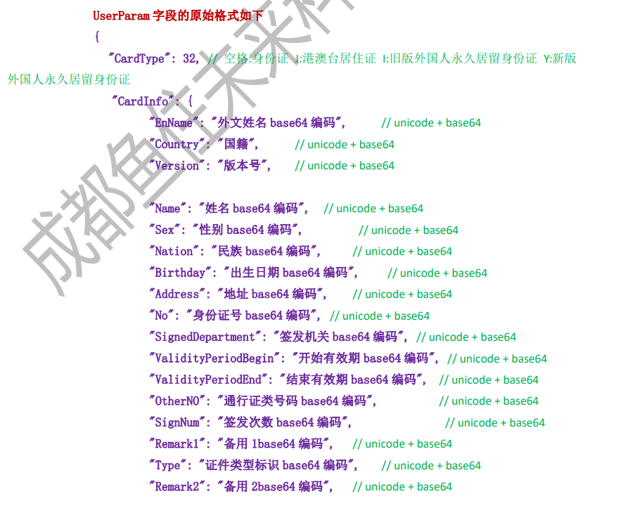

## 编写前端 TS 代码

在MIS端customer_checkin.vue页面中，我们要先定义两个工具函数（这两个函数都是直接从 `index.js`官方 demo 中拷贝过来的），分别用来处理日期字符串和转换base16格式的字符串

```typescript
/*
* 鱼住科技的读卡器推送过来的数据是先经过base16编码，再进行base64编码，然后推送过来。
* 我们接收到推送的数据后，要先经过base64解码，再经过base16解码，最终才能拿到原始的内容。
* base64的解码函数JS内置就有：window.atob() 函数
* base16的解码函数没有，以下这个函数就是base16的解码函数，从鱼住的index.js文件中拷贝过来的。
*/
function hex2a(hex) {
    let str_list = '';
    for (let i = 0; i < hex.length && hex.substr(i, 2) !== '00'; i += 2) {
        const a = hex.charCodeAt(i);
        const b = hex.charCodeAt(i + 1);
        const c = b * 256 + a;
        str_list += String.fromCharCode(c);
    }

    return str_list.toString();
}

/*
* 该函数用于把YYYYMMDD格式的日期字符串转换成YYYY-MM-DD格式
* 这个函数也是从index.js文件中拷贝的
*/
function parseDateString(str, deco, zero) {
    let year = str.substr(0, 4);
    let month = str.substr(4, 2);
    let date = str.substr(6);
    if (zero) { // 如果zero为true则去掉月和日的前导0
        month = month.substr(0, 1) === '0' ? month.substr(1) : month;
        date = date.substr(0, 1) === '0' ? date.substr(1) : date;
    }
    return `${year}${deco}${month}${deco}${date}`;
}
```

接下来我们要创建WebSocket连接，然后接收身份证读卡结果

```typescript
// 身份证读卡器 WebSocket 客户端
// 功能：连接本地读卡器服务，接收并解析身份证信息

// WebSocket 服务器地址（本地读卡器服务）
const webUrl = 'ws://127.0.0.1:30004/ws';
// 创建 WebSocket 连接实例
let ws = new WebSocket(webUrl);

// WebSocket 连接建立成功回调
ws.onopen = function (evt) {
    console.log('身份读取WebSocket已连接');
};

// WebSocket 连接关闭回调
ws.onclose = function (evt) {
    console.log('身份读取WebSocket已关闭');
};

// WebSocket 接收到消息回调（核心处理逻辑）
ws.onmessage = function (messageEvent) {
    // 业务逻辑判断：只有在登记对话框可见且为空时才处理读卡信息
    if (!checkinDialog.visible || !checkinDialog.showEmpty) {
        return;
    }
    
    // 解析WebSocket消息为JSON对象
    // 消息格式由读卡器SDK协议定义
    const jsonObject = JSON.parse(messageEvent.data);

    // 判断读卡操作是否成功：Ret=0表示成功，其他值表示失败
    if (jsonObject.Ret == 0) {
        // 判断消息类型：10001=被动接收读卡结果，10000=主动读取身份证内容
        // 这里处理的是读卡器感应到身份证后自动推送的结果
        if (jsonObject.Cmd == 10001) {
            // 将推送过来的数据，通过base64解码
            const userParam = JSON.parse(window.atob(jsonObject.UserParam));
            
            // ========== 开始提取和解析身份证信息 ==========
            // 虽然刚开始已经对全文进行了base64解码，但具体到信息中的姓名需要再进行base64的解码，鱼住的读卡器就是这么设计的，没办法。
            // 姓名处理：Base64解码 → base16解码 → 去除尾部空格
            // 注意：身份证姓名字段固定为15字符，尾部用空格填充
            const name = hex2a(window.atob(userParam.CardInfo.Name)).trim();
            
            // 性别处理：1=男，其他=女
            const sex = hex2a(window.atob(userParam.CardInfo.Sex)) == 1 ? '男' : '女';
            
            // 身份证号码
            const pid = hex2a(window.atob(userParam.CardInfo.No));
            
            // 生日处理：格式转换（如：19920315 → 1992-03-15）
            const temp = hex2a(window.atob(userParam.CardInfo.Birthday));
            const birthday = parseDateString(temp, '-', true);
            
            // 照片处理：构建Base64图片URL，供img标签直接显示
            const image = 'data:image/jpg;base64,' + userParam.BmpInfo;
            
            // 身份证有效期起始日
            const validityPeriodBegin = hex2a(window.atob(userParam.CardInfo.ValidityPeriodBegin));
            const expiryBegin = parseDateString(validityPeriodBegin, '-', true);

            // 身份证有效期截止日处理：可能是具体日期或"长期"
            const validityPeriodEnd = hex2a(window.atob(userParam.CardInfo.ValidityPeriodEnd)).trim();
            const expiryEnd = validityPeriodEnd !== '长期' ? parseDateString(validityPeriodEnd, '-', true) : validityPeriodEnd;
            
            // 有效期检查：如果不是长期有效，检查是否在有效期内
            if (expiryEnd !== '长期') {
                // 使用dayjs检查当前时间是否在有效期内
                let valid = dayjs().isBetween(expiryBegin, expiryEnd);
                if (!valid) {
                    // 身份证过期，显示错误提示
                    proxy.$message({
                        message: '身份证已过期',
                        type: 'error',
                        duration: 1200
                    });
                    return; // 过期身份证不再进行后续处理
                }
                console.log('身份证有效期状态:', valid);
                
            }
            
            // ========== 信息提取完成 ==========
            
            // TODO: 在此处添加业务逻辑
            // 例如：比对身份证信息与体检人信息是否一致
            // 可以将解析出的信息填充到表单中或进行身份验证
            
        }
    } else {
        // 读卡失败处理：输出错误信息
        console.log('websocket 协议调用失败，原因：' + jsonObject.ErrInfo);
    }
};
```

# 后端实现核验体检人身份

## 实现思路

根据读取到的身份证信息：身份证号、姓名、性别。去预约表中查询记录，如果能够查询到记录，说明核验成功。另外业务上有要求：只能核验当天，也就是说：如果一个体检人不是预约的当天体检，而是其他日期的体检，自然是不能办理体检签到的。因此在 SQL 语句中查询时需要添加上当天日期作为查询条件，如果能够查询出来才算核验成功。

另外最终核验结果需要返回给前端，最终核验结果包括 3 种情况：

1. 核验失败。
2. 核验通过但之前已签到。
3. 核验通过并且未签到。

因此在 SQL 语句查询时，需要返回该预约记录对应的 status 状态字段。

最终返回给前端 3 个状态码：

第一：核验失败，表示没有预约（返回 0）

第二：有预约，但之前已办理了签到（返回 -1）

第三：有预约，之前还未办理过签到（返回 1）

## 编写 Mapper 和 XML

找到 `MedExamAppointmentMapper`接口，编写以下方法：

```java
Map<String, Object> selectAppointInToday(Map<String, Object> param);
```

找到 `MedExamAppointmentMapper.xml`文件，编写 SQL：

```xml
<select id="selectAppointInToday" resultType="java.util.Map">
    select id,status
    from med_exam_appointment
    where id_card_no = #{idCardNo} and patient_name = #{patientName}
      and gender = #{gender} and appointment_date = current_date()
    limit 1
</select>
```

添加 `limit 1` 可以避免全表扫描。

## 编写 Service 和实现

找到 mis 端的 `AppointmentService`接口，编写以下方法：

```java
int hasAppointmentInToday(Map<String, Object> param);
```

编写实现：

```java
@Override
public int hasAppointmentInToday(Map<String, Object> param) {
    Map<String, Object> map = appointmentMapper.selectAppointInToday(param);
    if(map == null){
        // 没有预约
        return 0;
    }else if(MapUtil.getInt(map, "status") != 1){
        // 有预约已签到
        return -1;
    }else{
        // 有预约未签到
        return 1;
    }
}
```

## 编写 form 接收数据并校验

在 MIS 端编写 `HasAppointmentInTodayForm`

```java
package com.jkweilai.meinian.api.controller.form;

import jakarta.validation.constraints.NotBlank;
import jakarta.validation.constraints.Pattern;
import lombok.Data;

@Data
public class HasAppointmentInTodayForm {
    @NotBlank(message = "patientName不能为空")
    @Pattern(regexp = "^[\\u4e00-\\u9fa5]{1,10}$", message = "patientName内容不正确")
    private String patientName;

    @NotBlank(message = "gender不能为空")
    @Pattern(regexp = "^男$|^女$", message = "gender内容不正确")
    private String gender;

    @NotBlank(message = "idCardNo不能为空")
    @Pattern(regexp = "^[0-9Xx]{18}$", message = "身份证号码无效")
    private String idCardNo;
}
```

## 编写 web 方法

找到 MIS 端的 `AppointmentController`，编写以下方法：

```java
@PostMapping("/hasInToday")
@SaCheckPermission(value = {"ROOT", "APPOINTMENT:UPDATE"}, mode = SaMode.OR)
public R hasInToday(@RequestBody @Valid HasAppointmentInTodayForm form) {
    Map param = BeanUtil.beanToMap(form);
    int result = appointmentService.hasAppointmentInToday(param);
    return R.ok().put("result", result);
}
```

# 前端实现核验体检人身份

找到我们之前编写的代码：`customer_checkin.vue`


在这个位置补充代码，完成前端核验体检人身份：

```typescript
// 构建请求参数对象，包含从身份证读取的患者信息
let json = {
    patientName: name,  // 患者姓名
    gender: sex,        // 患者性别
    //idCardNo: pid       // 身份证号码
    idCardNo: "310101199001011234"
};

// 配置HTTP请求头，包含认证token
let config = {
    headers: {
        satoken: localStorage.getItem('token')  // 从本地存储获取用户令牌
    }
};

// 调用后端API，检查患者今日是否已预约或已签到
let response = await axios.post("/meinian-api/mis/appointment/hasInToday", json, config);
// 获取API返回的结果标识
let result = response.data.result;

// 根据API返回结果进行不同处理
if (result == -1) {
    // 结果-1：患者今日已签到，提示无需重复签到
    proxy.$message({
        message: '已经签到，无需重复签到',
        type: 'warning',
        duration: 1200
    });
} else if (result == 1) {
    // 结果1：患者已预约且未签到，进行签到流程
    
    // 将身份证信息填充到登记弹窗的表单中
    checkinDialog.dataForm.name = name;     // 设置姓名
    checkinDialog.dataForm.sex = sex;       // 设置性别
    //checkinDialog.dataForm.pid = pid;       // 设置身份证号
    checkinDialog.dataForm.pid = "310101199001011234";
    checkinDialog.dataForm.photo_1 = image; // 设置身份证照片
    
    // 检测浏览器是否支持访问摄像头（浏览器只要支持以下三个属性中的任何一个属性，都表示支持访问摄像头）
    let bool = navigator.getUserMedia || navigator.webkitGetUserMedia || navigator.mozGetUserMedia;
    
    if (bool) {
        // 浏览器支持摄像头，开始获取视频流
        navigator.getUserMedia(
            { 
                audio: false,   // 不获取音频
                video: true     // 获取视频
            },
            // 成功回调函数：获取到视频流
            function (stream) {
                // 根据ID查找页面中的video元素
                let video = document.querySelector('#video');
                // 将视频流设置到video元素
                video.srcObject = stream;
                // 保存视频流轨道到对话框对象，便于后续关闭时释放资源
                checkinDialog.streamTrack = stream.getTracks()[0]; // 从获取的媒体流中提取第一个轨道（是摄像头视频轨道）

                // 视频元数据加载完成后的回调
                video.onloadedmetadata = function (e) {
                    video.play(); // 开始播放视频流
                    // 更新对话框显示状态
                    checkinDialog.showEmpty = false;   // 隐藏空状态
                    checkinDialog.showPhoto = false;   // 隐藏照片显示
                    checkinDialog.showVideo = true;    // 显示视频画面
                };
            },
            // 失败回调函数：获取视频流失败
            function (err) {
                // 显示摄像头开启失败提示
                proxy.$message({
                    message: '开启摄像头失败',
                    type: 'error',
                    duration: 1200
                });
            }
        );
    } else {
        // 浏览器不支持摄像头访问
        proxy.$message({
            message: '当前电脑没有连接摄像头',
            type: 'error',
            duration: 1200
        });
    }

} else {
    // 其他结果（如0）：患者未预约，提示错误信息
    proxy.$message({
        message: '该体检人未预约',
        type: 'error',
        duration: 1200
    });
}
```

记得在外层函数添加 `async`关键字：

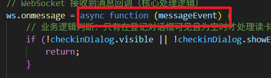

# 前端TS实现摄像头拍照

## 拍照

在MIS端体检签到页面的签到弹窗底部放置了拍照按钮，该按钮的默认文字为拍照。点击这个按钮会触发takePhotoHandle()回调函数。


编写回调函数`takePhotoHandle()`：

```typescript
/**
 * 拍照处理函数 - 用于在打卡/签到场景中进行拍照和重拍操作
 */
function takePhotoHandle() {
    // 当按钮文字为'拍照'时，执行拍照操作
    if (checkinDialog.btnText == '拍照') {
        // 获取视频元素和画布元素
        let video = document.querySelector('#video');
        let canvas = document.querySelector('#photo');
        
        // 获取2D绘图上下文
        let context = canvas.getContext('2d');
        // 把摄像头当前的取景内容绘制到canvas控件中
        // 参数说明：视频源, 起始x坐标, 起始y坐标, 绘制宽度, 绘制高度
        context.drawImage(video, 0, 0, 460, 345);
      
        // 显示canvas控件（照片预览），隐藏两个排他控件
        checkinDialog.showEmpty = false;   // 隐藏空状态
        checkinDialog.showVideo = false;   // 隐藏视频流
        checkinDialog.showPhoto = true;    // 显示拍照结果
      
        // 显示成功消息提示
        proxy.$message({
            message: '拍照成功',
            type: 'success',
            duration: 1200  // 显示时长1200毫秒
        });
        
        // 更新按钮文字和图标为"重拍"状态
        checkinDialog.btnText = '重拍';
        checkinDialog.btnIcon = RefreshRight;
        
        // 把canvas中的图片转换成base64编码，并保存到表单数据中
        // 'image/jpeg'指定输出为JPEG格式
        checkinDialog.dataForm.photo_2 = canvas.toDataURL('image/jpeg');
    } else {
        // 当按钮文字为'重拍'时，执行重拍操作
        
        // 隐藏canvas（照片预览），重新显示摄像头取景
        checkinDialog.showEmpty = false;   // 隐藏空状态
        checkinDialog.showVideo = true;    // 显示视频流
        checkinDialog.showPhoto = false;   // 隐藏拍照结果
        
        // 更新按钮文字和图标为"拍照"状态
        checkinDialog.btnText = '拍照';
        checkinDialog.btnIcon = Camera;
    }
}
```

## 关闭弹窗切断视频流

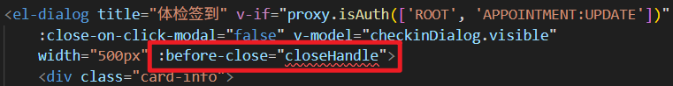


关闭弹窗或点击弹窗上的取消按钮时都会关闭弹窗，创建closeHandle()回调函数，在关闭弹窗时切断视频流。避免弹窗隐藏后Video控件仍在后台占用摄像头资源。

```typescript
function closeHandle() {
    if (checkinDialog.streamTrack != null) {
        checkinDialog.streamTrack.stop();
    }
    checkinDialog.showEmpty = true;
    checkinDialog.showVideo = false;
    checkinDialog.showPhoto = false;
    checkinDialog.visible = false;
    checkinDialog.btnText = '拍照';
    checkinDialog.btnIcon = Camera;
}
```

# 开通腾讯云人脸识别服务

为什么选择腾讯云的人脸识别？腾讯云人脸识别提供高精度、低成本且成熟可靠的AI能力，让我们快速获得经亿级用户验证的视觉技术。

## 创建人员库

打开[**官网页面**](https://console.cloud.tencent.com/aiface)：根据腾讯云人脸识别的要求，使用其服务前必须先行创建人员库。因此，我们首先需要在控制台中创建一个人员库。


## 不要购买资源包


每个月都是能够收到赠送的：


## 使用后付费模式

确认一下是不是后付费模式：我们计划采用后付费模式，费用将从腾讯云预充值余额中扣除。腾讯云每月会赠送10,000次免费调用额度，仅在免费额度用尽后才会产生实际费用，因此成本极低。

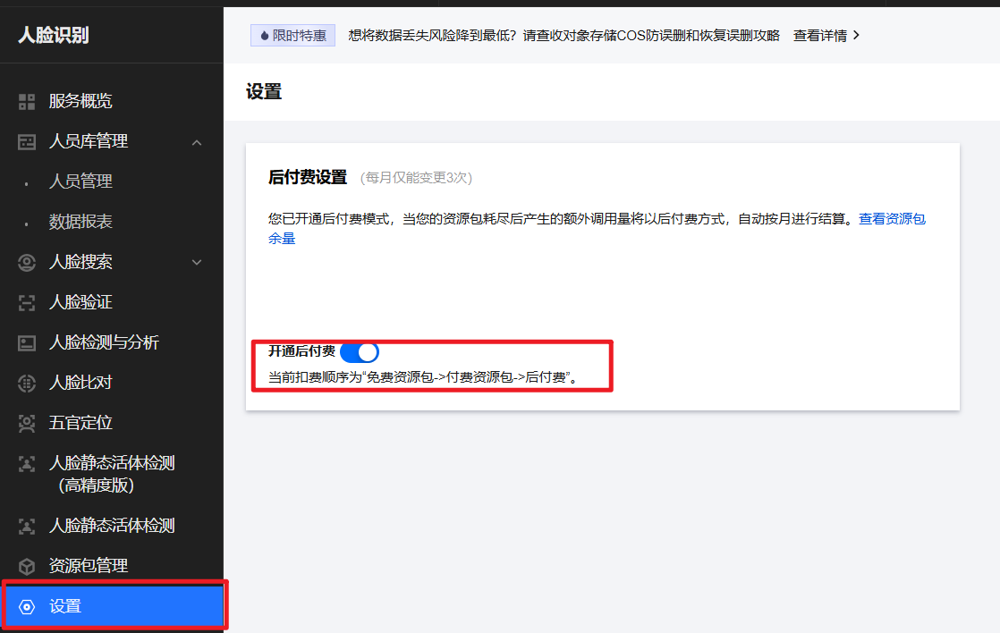

## 获取腾讯云访问密钥

在[**访问管理页面**](https://console.cloud.tencent.com/cam/overview)创建密钥。把密钥复制下来并保存好。


## SpringBoot项目配置

在SpringBoot项目的`<font style="color:rgb(15, 17, 21);background-color:rgb(235, 238, 242);">application.yml</font>`配置文件中，设置腾讯云的APPID、SecretId和SecretKey等认证信息。

```yaml
tencent:
  cloud:
    appId: ${FACE_APP_ID}
    secretId: ${FACE_SECRET_ID}
    secretKey: ${FACE_SECRET_KEY}
    face:
      groupId: his
      region: ap-beijing
```

`region: ap-beijing`表示：告诉 SDK 连接到哪个地域的腾讯云人脸识别服务，ap-beijing 表示接入北京地域的服务端点

# 封装面部识别与活体验证工具类

## 引入依赖

这个依赖我们之前就引入了：

```xml
<!-- 腾讯云服务Java SDK -->
<dependency>
    <groupId>com.tencentcloudapi</groupId>
    <artifactId>tencentcloud-sdk-java</artifactId>
    <version>4.0.11</version>
    <exclusions>
        <exclusion>
            <groupId>commons-logging</groupId>
            <artifactId>commons-logging</artifactId>
        </exclusion>
    </exclusions>
</dependency>
```

## 腾讯 SDK 是干啥的，调用规范是什么

腾讯云服务中的 SDK 是为开发人员专门准备的一套类库，开发人员，面向 SDK 调用 API 即可。SDK 自动发送 HTTP 请求给腾讯云的服务器。

**腾讯云 Java SDK 的调用规范如下：**

```java
// 1. 初始化腾讯云客户端
Credential cred = new Credential(secretId, secretKey);
// 接口请求域名是：iai.tencentcloudapi.com，因此要创建IaiClient对象
IaiClient client = new IaiClient(cred, region);

// 2. 创建请求对象
// Request对象的命名规范：参加下图
CompareFaceRequest compareFaceRequest = new CompareFaceRequest();
// 通过set方法来设置请求参数
compareFaceRequest.setImageA(photo_1);
compareFaceRequest.setImageB(photo_2);

// 3.获取响应对象
// Response对象的命名规范：参加下图
CompareFaceResponse compareFaceResponse = client.CompareFace(compareFaceRequest);
// 通过get方法来获取响应数据
Float score = compareFaceResponse.getScore();
```

**输入参数中 **`**Action**`**参数的值决定了 **`**Request**``**Response**`**对象的命名。**

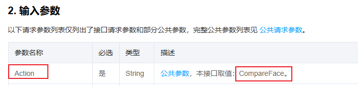

**每一个请求参数都可以调用 `**Request**` 对象的 **`**set**`**方法来设置值。**

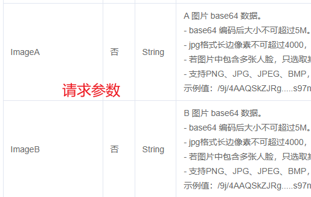

**每一个响应参数都可以调用 **`**Response**`**对象的 **`**get**`**方法来获取值。**

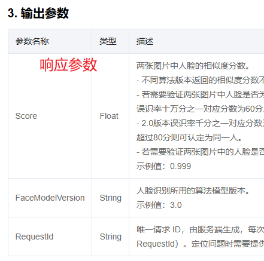

## 人脸对比接口

为实现人脸对比功能，我们决定调用腾讯云的CompareFace接口。该[**接口的RESTful API文档**](https://cloud.tencent.com/document/product/867/44987)描述十分详细，虽然暂未找到对应的Java文档，但这份文档已足够清晰，可以作为我们开发的主要依据。

| **序号** | **参数名称** | **类型** | **备注信息** |
| --- | --- | --- | --- |
| 1 | ImageA | String | base64格式的图片，不能大于5M |
| 2 | ImageB | String | base64格式的图片，不能大于5M |

接口返回的核心指标（返回参数）是 `<font style="color:rgb(15, 17, 21);background-color:rgb(235, 238, 242);">Score</font>`（人脸相似度分数）。当该分数大于 50 分时，即可判定两张照片为同一人。

## 静态活体识别接口

仅依赖人脸对比不足以确保身份安全，必须结合静态活体检测技术。这正如手机面部解锁的原理：若有人仅持有你的照片，是无法解锁手机的，因为系统会通过检测摩尔纹、光线反射等特征，识别出对方是平面图像而非活体。

腾讯云提供的 `<font style="color:rgb(15, 17, 21);background-color:rgb(235, 238, 242);">DetectLiveFaceAccurate</font>` 接口专用于高精度静态活体检测，请求时只需通过 `<font style="color:rgb(15, 17, 21);background-color:rgb(235, 238, 242);">Image</font>` 参数上传待验证图片即可。其技术细节在[**官方文档**](https://cloud.tencent.com/document/product/867/48501)中有详尽说明。

## 创建人脸识别工具类

在`com.jkweilai.meinian.api.common`包下新建`FaceAuthUtil`人脸识别工具类。

```java
package com.jkweilai.meinian.api.common;

import com.jkweilai.meinian.api.exception.HisException;
import com.tencentcloudapi.common.Credential;
import com.tencentcloudapi.common.exception.TencentCloudSDKException;
import com.tencentcloudapi.iai.v20200303.IaiClient;
import com.tencentcloudapi.iai.v20200303.models.CompareFaceRequest;
import com.tencentcloudapi.iai.v20200303.models.CompareFaceResponse;
import com.tencentcloudapi.iai.v20200303.models.DetectLiveFaceRequest;
import com.tencentcloudapi.iai.v20200303.models.DetectLiveFaceResponse;
import lombok.extern.slf4j.Slf4j;
import org.springframework.beans.factory.annotation.Value;
import org.springframework.stereotype.Component;

@Component
@Slf4j
public class FaceAuthUtil {

    // 腾讯云API密钥配置
    @Value("${tencent.cloud.secretId}")
    private String secretId;

    @Value("${tencent.cloud.secretKey}")
    private String secretKey;

    @Value("${tencent.cloud.face.groupId}")
    private String groupId;

    @Value("${tencent.cloud.face.region}")
    private String region;

    /**
     * 人脸识别+活体验证综合验证
     * 验证流程：人脸比对 → 活体检测 → 人员库管理（待实现）
     *
     * @param name    体检人姓名
     * @param pid     身份证号码
     * @param sex     性别
     * @param photo_1 身份证上的照片(base64编码)
     * @param photo_2 现场摄像头拍摄照片(base64编码)
     * @return boolean 验证结果：true-验证通过，false-验证失败
     */
    public boolean verifyFaceModel(String name, String pid, String sex, String photo_1, String photo_2) {
        boolean result;

        // 1. 初始化腾讯云客户端
        Credential cred = new Credential(secretId, secretKey);
        IaiClient client = new IaiClient(cred, region);

        // 2. 执行人脸比对 - 验证两张照片是否为同一人
        CompareFaceRequest compareFaceRequest = new CompareFaceRequest();
        compareFaceRequest.setImageA(photo_1);  // 设置身份证上的照片
        compareFaceRequest.setImageB(photo_2);  // 设置现场拍摄照片

        CompareFaceResponse compareFaceResponse = null;
        try {
            // 调用腾讯云人脸比对接口
            compareFaceResponse = client.CompareFace(compareFaceRequest);
        } catch (TencentCloudSDKException e) {
            log.error("人脸比对失败 - 姓名: {}, 身份证: {}", name, pid, e);
            throw new HisException("人脸比对失败");
        }

        // 3. 获取人脸相似度分数并判断
        Float score = compareFaceResponse.getScore();
        log.info("人脸比对分数: {} - 姓名: {}, 身份证: {}", score, name, pid);

        if (score >= 50) {
            // 4. 人脸比对通过后，执行静态活体检测 - 防止照片攻击
            DetectLiveFaceRequest detectLiveFaceRequest = new DetectLiveFaceRequest();
            detectLiveFaceRequest.setImage(photo_2);  // 对现场拍摄照片进行活体检测

            DetectLiveFaceResponse detectLiveFaceResponse = null;
            try {
                // 调用腾讯云静态活体检测接口
                detectLiveFaceResponse = client.DetectLiveFace(detectLiveFaceRequest);
            } catch (TencentCloudSDKException e) {
                log.error("静态活体识别失败 - 姓名: {}, 身份证: {}", name, pid, e);
                throw new HisException("静态活体识别失败");
            }

            // 5. 获取活体检测结果
            result = detectLiveFaceResponse.getIsLiveness();
            log.info("活体检测结果: {} - 姓名: {}, 身份证: {}", result, name, pid);
        } else {
            // 人脸比对分数低于50分，直接判定验证失败
            log.warn("人脸比对分数过低: {} - 姓名: {}, 身份证: {}", score, name, pid);
            result = false;
            return result;
        }

        // 6. 待实现功能 - 人员库管理
        // TODO 判断人员库是否有该体检人
        // TODO 把体检人添加到人员库

        return result;
    }

}
```

# 后端实现将体检人添加到人员库

将体检人添加到人员库，是为将来提升客户体验的。设想一个场景：老客户走进门店的瞬间，摄像头自动识别其身份，系统即刻向工作人员提示：“王先生来了！他去年曾参加 XXXX 检查。”这样工作人员就能主动提供更精准、贴心的服务。

## 向人员库添加记录

前面使用的人脸对比接口，仅能判断两张照片是否为同一人，但无法识别其具体身份。添加到人员库之后就可以实现身份识别了。

首先将体检人的身份证上的照片、姓名、性别及身份证号通过 `<font style="color:rgb(15, 17, 21);background-color:rgb(235, 238, 242);">CreatePerson</font>` 接口（[**接口文档**](https://cloud.tencent.com/document/product/867/45014)）录入人员库。

以后当提交任何一张照片时，腾讯云去人员库中搜索这个人，这样就能准确识别出照片中的人是谁。

| **序号** | **参数名称** | **类型** | **备注信息** |
| --- | --- | --- | --- |
| 1 | GroupId | String | 人员库ID |
| 2 | PersonName | String | 姓名 |
| 3 | PersonId | String | 人员ID，这里我用的是身份证号码 |
| 4 | Gender | Integer | 1代表男性，2代表女性 |
| 5 | Image | String | 照片base64字符串，不能大于5M |
| 6 | QualityControl | Integer | 图片拍摄质量要求，默认是0。 0/1/2/3/4（4是要求最严格） |
| 7 | UniquePersonControl | Integer | 人员去重控制。最低0，来者不拒，基本都会录入。最高4，重复率极低。 |
| 8 | NeedRotateDetection | Integer | 是否开启图片旋转识别支持，默认为0。0为不开启，1为开启 |

返回的参数：返回的响应中关键的参数为FaceId，如果人员添加成功，该参数值是面部唯一标识。所以我们可以根据该参数值是否为空，断定人员添加成功还是失败。

## 查询人员库接口

腾讯云提供了 `<font style="color:rgb(15, 17, 21);background-color:rgb(235, 238, 242);">GetPersonBaseInfo</font>` 接口，根据人员ID（PersonId）查询人员库中的详细记录。要判断人员库中是否存在某个体检人，调用此接口（[**接口文档**](https://cloud.tencent.com/document/product/867/45007)），并检查返回的响应数据：若 `<font style="color:rgb(15, 17, 21);background-color:rgb(235, 238, 242);">PersonName</font>` 字段不为空，则表明该人员存在。链接

## 补充工具类的代码

在FaceAuthUtil类中的verifyFaceModel()方法追加新的代码：（以下是整个类的完整代码）

```java
package com.jkweilai.meinian.api.common;

import cn.hutool.core.util.StrUtil;
import com.jkweilai.meinian.api.exception.HisException;
import com.tencentcloudapi.common.Credential;
import com.tencentcloudapi.common.exception.TencentCloudSDKException;
import com.tencentcloudapi.iai.v20200303.IaiClient;
import com.tencentcloudapi.iai.v20200303.models.*;
import lombok.extern.slf4j.Slf4j;
import org.springframework.beans.factory.annotation.Value;
import org.springframework.stereotype.Component;

@Component
@Slf4j
public class FaceAuthUtil {

    // 腾讯云API密钥配置
    @Value("${tencent.cloud.secretId}")
    private String secretId;

    @Value("${tencent.cloud.secretKey}")
    private String secretKey;

    @Value("${tencent.cloud.face.groupId}")
    private String groupId;

    @Value("${tencent.cloud.face.region}")
    private String region;

    /**
     * 人脸识别+活体验证综合验证
     * 验证流程：人脸比对 → 活体检测 → 人员库管理（待实现）
     *
     * @param name    体检人姓名
     * @param pid     身份证号码
     * @param sex     性别
     * @param photo_1 身份证照片(base64编码)
     * @param photo_2 现场摄像头拍摄照片(base64编码)
     * @return boolean 验证结果：true-验证通过，false-验证失败
     */
    public boolean verifyFaceModel(String name, String pid, String sex, String photo_1, String photo_2) {
        boolean result;

        // 1. 初始化腾讯云客户端
        Credential cred = new Credential(secretId, secretKey);
        IaiClient client = new IaiClient(cred, region);

        // 2. 执行人脸比对 - 验证两张照片是否为同一人
        CompareFaceRequest compareFaceRequest = new CompareFaceRequest();
        compareFaceRequest.setImageA(photo_1);  // 设置身份证照片
        compareFaceRequest.setImageB(photo_2);  // 设置现场拍摄照片

        CompareFaceResponse compareFaceResponse = null;
        try {
            // 调用腾讯云人脸比对接口
            compareFaceResponse = client.CompareFace(compareFaceRequest);
        } catch (TencentCloudSDKException e) {
            log.error("人脸比对失败 - 姓名: {}, 身份证: {}", name, pid, e);
            throw new HisException("人脸比对失败");
        }

        // 3. 获取人脸相似度分数并判断
        Float score = compareFaceResponse.getScore();
        log.info("人脸比对分数: {} - 姓名: {}, 身份证: {}", score, name, pid);

        if (score >= 50) {
            // 4. 人脸比对通过后，执行静态活体检测 - 防止照片攻击
            DetectLiveFaceRequest detectLiveFaceRequest = new DetectLiveFaceRequest();
            detectLiveFaceRequest.setImage(photo_2);  // 对现场拍摄照片进行活体检测

            DetectLiveFaceResponse detectLiveFaceResponse = null;
            try {
                // 调用腾讯云静态活体检测接口
                detectLiveFaceResponse = client.DetectLiveFace(detectLiveFaceRequest);
            } catch (TencentCloudSDKException e) {
                log.error("静态活体识别失败 - 姓名: {}, 身份证: {}", name, pid, e);
                throw new HisException("静态活体识别失败");
            }

            // 5. 获取活体检测结果
            result = detectLiveFaceResponse.getIsLiveness();
            log.info("活体检测结果: {} - 姓名: {}, 身份证: {}", result, name, pid);
        } else {
            // 人脸比对分数低于50分，直接判定验证失败
            log.warn("人脸比对分数过低: {} - 姓名: {}, 身份证: {}", score, name, pid);
            result = false;
            return result;
        }

        // 这里是新添加的代码
        if (result) {
            // 查询人员库中是否有该体检人 - 使用身份证号作为人员ID进行查询
            GetPersonBaseInfoRequest getPersonBaseInfoRequest = new GetPersonBaseInfoRequest();
            getPersonBaseInfoRequest.setPersonId(pid); // 设置要查询的人员ID（身份证号）
            GetPersonBaseInfoResponse getPersonBaseInfoResponse = null;
            try {
                // 调用腾讯云接口查询人员基本信息
                getPersonBaseInfoResponse = client.GetPersonBaseInfo(getPersonBaseInfoRequest);
            } catch (TencentCloudSDKException e) {
                // 异常处理：如果错误码不是"人员不存在"，则抛出异常
                // "InvalidParameterValue.PersonIdNotExist"表示要查询的人员在库中不存在，这是正常情况
                if (!e.getErrorCode().equals("InvalidParameterValue.PersonIdNotExist")) {
                    log.error("查询人员库失败", e);
                    throw new HisException("查询人员库失败");
                }
                // 如果是"人员不存在"的错误，不抛出异常，继续执行后续逻辑
            }

            // 判断查询结果是否为null，如果为null说明人员库中不存在该体检人
            if (getPersonBaseInfoResponse == null) {
                // 创建人员请求对象，准备将体检人添加到人员库
                CreatePersonRequest createPersonRequest = new CreatePersonRequest();
                createPersonRequest.setGroupId(groupId); // 设置人员所属的组ID
                createPersonRequest.setPersonId(pid); // 设置人员唯一ID（身份证号）

                // 性别转换：将"男"/"女"转换为腾讯云需要的数字格式（1-男，2-女）
                long gender = sex.equals("男") ? 1L : 2L;
                createPersonRequest.setGender(gender);

                createPersonRequest.setQualityControl(4L); // 设置图片质量控制为最高级别（4-很高的质量要求）
                createPersonRequest.setUniquePersonControl(4L); // 设置人员去重控制为最高级别（4-很高的同一人判断要求）
                createPersonRequest.setPersonName(name); // 设置人员姓名
                createPersonRequest.setImage(photo_1); // 设置人员照片（身份证照片）

                CreatePersonResponse createPersonResponse = null;
                try {
                    // 调用腾讯云接口创建人员记录
                    createPersonResponse = client.CreatePerson(createPersonRequest);
                } catch (TencentCloudSDKException e) {
                    log.error("添加体检人到人员库失败", e);
                    throw new HisException("添加体检人到人员库失败");
                }

                // 判断人员是否添加成功：通过检查返回的faceId是否为空
                if (StrUtil.isNotBlank(createPersonResponse.getFaceId())) {
                    log.debug("体检人成功添加到人员库"); // 添加成功日志
                } else {
                    log.error("添加体检人到人员库失败"); // 添加失败日志
                    throw new HisException("添加体检人到人员库失败"); // 抛出业务异常
                }
            }
            // 如果getPersonBaseInfoResponse不为null，说明人员已存在，不需要重复添加
        }

        return result;
    }
}
```

# 后端实现体检签到的RESTful接口


保存体检人的照片目的是：保留证据。

`searchCheckup`方法是从商品快照的体检内容中筛选出适合当前体检人性别的体检项目。

保存体检结果到 MongoDB 的时候保存的是：预约流水号+筛选出来的体检内容。（**体检人最后体检完之后，再去更新体检结果就行了**）

## 编写Mapper和XML

找到`MedExamAppointmentMapper`接口编写方法：

```java
int updateForCheckin(Map<String, Object> param);

Map<String, Object> selectAppointNoAndSnapshotId(Map<String, Object> param);
```

找到`MedExamAppointmentMapper.xml`文件，编写SQL语句：

```xml
<!-- 更新这个体检人（用身份证号确定体检人是谁），并且状态是未签到，并且预约日期是当天的。将状态更新为2已签到，签到时间更新为当前时间 -->

<update id="updateForCheckin">
    UPDATE med_exam_appointment
    SET `status` = 2,
        checkin_time = NOW()
    WHERE appointment_date = CURRENT_DATE()
      AND `status` = 1
      AND id_card_no = #{idCardNo}
</update>

<!-- 找出这个体检人（身份证号）对应的预约流水号和商品快照id：后面业务要使用。打印导引单上肯定要有预约流水号-->
<select id="selectAppointNoAndSnapshotId" resultType="java.util.Map">
    SELECT
        a.appointment_no as appointmentNo,o.snapshot_id AS snapshotId
    FROM
        med_exam_appointment a
    JOIN
        trade_order o
    ON
        a.order_id = o.order_id
    WHERE
        a.appointment_date = CURRENT_DATE() AND a.id_card_no = #{idCardNo}
</select>
```

## 编写MongoDB的持久层

两个方法：

1. 查询该体检人对应的商品快照中的体检内容。
2. 向 MongoDB 数据库插入体检结果记录。

### 查询体检内容

找到`GoodsSnapshotDao`类，编写以下方法：

```java
/**
 * 查询适合指定性别的体检项目列表
 * @param id 体检项目快照记录的ID
 * @param sex 体检人的性别（"男" 或 "女"）
 * @return 适合该性别的体检项目列表
 */
public List<Map> searchCheckup(String id, String sex) {
    // 创建MongoDB聚合管道，用于复杂的数据处理和筛选
    Aggregation aggregation = Aggregation.newAggregation(
            // 第一阶段：投影 - 只保留examItems字段，其他字段不返回
            // 注意：主键 _id 会自动投影，不用写。
            Aggregation.project("examItems"),

            // 第二阶段：展开 - 将examItems数组拆分成多个独立的文档
            // 例如：原文档{examItems: [项目1, 项目2, 项目3]}
            // 展开后变成：[{examItems: 项目1}, {examItems: 项目2}, {examItems: 项目3}]
            Aggregation.unwind("$examItems"),

            // 第三阶段：匹配 - 筛选符合条件的文档
            Aggregation.match(
                    Criteria.where("_id").is(id) // 根据ID找到指定的体检项目快照记录
                            // 筛选体检项目：只保留性别为"无"或与传入性别匹配的项目
                            // 比如sex="男"，就保留项目中sex="无"或sex="男"的项目，排除sex="女"的项目
                            .and("examItems.sex").in("无", sex)
            )
    );

    // 执行聚合查询
    // 参数说明：聚合管道, 集合名称, 返回结果类型
    AggregationResults<HashMap> results = mongoTemplate.aggregate(aggregation, "goods_snapshot", HashMap.class);

    // 处理查询结果，提取需要的体检项目数据
    List<Map> list = new ArrayList<>();
    results.getMappedResults().forEach(one -> {
        // 从每个结果文档中提取examItems字段，这里面就是具体的体检项目信息
        HashMap map = (HashMap) one.get("examItems");
        list.add(map);
    });

    return list;
}
```

**注意：主键 **`**_id**`**字段会自动投影，不需要手动编写。**

原始数据是这样的：

```json
[
    {
        "_id": "642049361e5fe04e0d364307",
        "examItems": [
            {
                "item": "裸眼视力(左)",
                "code": "无",
                "sex": "无", 
                "name": "眼科检查",
                "place": "眼科",
                "type": "录入",
                "value": "无"
            },
            {
                "item": "前列腺检查",
                "code": "无", 
                "sex": "男",
                "name": "男科检查",
                "place": "男科", 
                "type": "录入",
                "value": "无"
            },
            {
                "item": "妇科检查", 
                "code": "无",
                "sex": "女",
                "name": "妇科检查",
                "place": "妇科",
                "type": "录入", 
                "value": "无"
            }
            // ... 其他检查项目
        ]
    }
]
```

执行完这个方法之后，得到的数据是这样的：

```json
[
    {
        "item": "裸眼视力(左)",
        "code": "无",
        "sex": "无",
        "name": "眼科检查", 
        "place": "眼科",
        "type": "录入",
        "value": "无"
    },
    {
        "item": "前列腺检查",
        "code": "无",
        "sex": "男", 
        "name": "男科检查",
        "place": "男科",
        "type": "录入",
        "value": "无"
    }
]
```

### 保存体检结果

定义实体类：在`com.jkweilai.meinian.api.db.pojo`下新建`CheckupResultEntity`：

```java
package com.jkweilai.meinian.api.db.pojo;

import lombok.Data;
import org.springframework.data.annotation.Id;
import org.springframework.data.mongodb.core.index.Indexed;
import org.springframework.data.mongodb.core.mapping.Document;

import java.util.List;
import java.util.Map;

/**
 * 体检结果实体类
 * 对应MongoDB中的 checkup_result 集合
 */
@Data
@Document(collection = "checkup_result")  // 指定MongoDB集合名称为 checkup_result
public class CheckupResultEntity {
    /**
     * MongoDB主键ID
     * 使用MongoDB自动生成的ObjectId作为主键
     */
    @Id
    private String _id;

    /**
     * 唯一标识符（建立索引）
     * 用于关联体检单号或体检人信息
     */
    @Indexed  // 为该字段创建索引，提高查询性能
    private String uuid;

    /**
     * 体检项目列表
     */
    private List<Map> checkup;

    /**
     * 体检地点列表
     * 记录体检过程中涉及的不同科室或地点
     * 示例：["内科", "外科", "眼科"]
     */
    private List<String> place;

    /**
     * 体检结果列表
     * 存储最终的体检结论或汇总结果
     * 示例：[{"conclusion": "健康状况良好", "suggestion": "注意休息"}]
     */
    private List<Map> result;
}
```

新建`CheckupResultDao`类，编写以下代码，完成体检结果的保存：

```java
package com.jkweilai.meinian.api.db.mapper;

import com.jkweilai.meinian.api.db.pojo.CheckupResultEntity;
import jakarta.annotation.Resource;
import org.springframework.data.mongodb.core.MongoTemplate;
import org.springframework.stereotype.Repository;

import java.util.ArrayList;
import java.util.List;
import java.util.Map;

/**
 * 体检结果数据访问层
 * 负责体检结果数据的数据库操作
 */
@Repository  // 标识为数据访问层组件，由Spring管理
public class CheckupResultDao {

    @Resource  // 注入MongoDB操作模板
    private MongoTemplate mongoTemplate;

    /**
     * 插入体检结果记录
     *
     * @param uuid    体检记录唯一标识符，用于关联体检单或体检人
     * @param checkup 体检项目列表，包含具体的检查项目和数据
     * @return boolean 插入是否成功，true-成功，false-失败
     */
    public boolean insert(String uuid, List<Map> checkup) {
        // 创建体检结果实体对象
        CheckupResultEntity entity = new CheckupResultEntity();

        // 设置实体属性
        entity.setUuid(uuid);        // 设置唯一标识
        entity.setCheckup(checkup);  // 设置体检项目数据

        // 初始化空的地点列表
        entity.setPlace(new ArrayList<>());

        // 初始化空的结果列表
        entity.setResult(new ArrayList<>());

        // 执行数据库插入操作
        // mongoTemplate.insert()方法会将实体插入到对应的MongoDB集合中
        // 插入成功后，MongoDB会自动生成_id字段并回填到实体对象中
        entity = mongoTemplate.insert(entity);

        // 判断插入是否成功：检查_id字段是否不为null
        // 如果_id不为null，说明MongoDB成功生成了主键，插入操作成功
        return entity.get_id() != null;
    }
}
```

## 编写 MinIO 的方法

编写一个重载的 `uploadImage`方法，因为前端拍照后传过来的是一个 Base64 编码后的一个字符串。之前我们编写的 `uploadImage`方法不支持 Base64。

```java
public void uploadImage(String path, String base64Image) {
    try {
        // 移除Base64字符串中的Data URI前缀，保留纯Base64数据
        base64Image = base64Image.replace("data:image/jpeg;base64,", "");
        base64Image = base64Image.replace("data:image/png;base64,", "");

        // 将Base64字符串解码为字节数组
        byte[] decode = Base64.decode(base64Image);

        // 将字节数组包装为输入流，供MinIO客户端读取
        ByteArrayInputStream in = new ByteArrayInputStream(decode);

        // 使用MinIO客户端上传对象到存储桶
        this.client.putObject(PutObjectArgs.builder()
                .bucket(bucket)          // 指定存储桶名称
                .object(path)            // 指定对象存储路径
                .stream(in, -1, 5 * 1024 * 1024) // 设置输入流，-1表示未知流大小，5MB为分片大小
                .contentType("image/jpeg") // 设置内容类型为JPEG格式
                .build());

        // 记录调试日志，确认文件保存成功
        log.debug("向" + path + "保存了文件");

    } catch (Exception e) {
        // 记录错误日志并抛出业务异常
        log.error("保存文件失败", e);
        throw new HisException("保存文件失败");
    }
}
```

## 编写 Service 接口和实现

找到 MIS 端 `AppointmentService`接口，编写以下方法：

```java
boolean checkin(Map<String, Object> param);
```

编写方法的实现：

```java
@Resource
private FaceAuthUtil faceAuthUtil;

@Resource
private MinIO minIO;

@Resource
private GoodsSnapshotDao goodsSnapshotDao;

@Resource
private CheckupResultDao checkupResultDao;

@Override
@Transactional
public boolean checkin(Map<String, Object> param) {
    // 从参数中提取患者基本信息
    String idCardNo = MapUtil.getStr(param, "idCardNo");
    String patientName = MapUtil.getStr(param, "patientName");
    // 根据身份证号解析性别（1为男，其他为女）
    String gender = IdcardUtil.getGenderByIdCard(idCardNo) == 1 ? "男" : "女";
    String photo_1 = MapUtil.getStr(param, "photo_1");
    String photo_2 = MapUtil.getStr(param, "photo_2");

    // 调用人脸认证工具进行人脸比对验证
    boolean result = faceAuthUtil.verifyFaceModel(patientName, idCardNo, gender, photo_1, photo_2);

    // 如果人脸认证通过，执行签到流程
    if (result) {
        // 生成唯一的图片文件名：身份证号_时间戳.jpg
        String filename = idCardNo + "_" + new Date().getTime() + ".jpg";
        String path = "checkin/" + filename;

        // 将签到照片上传到MinIO对象存储
        minIO.uploadImage(path, photo_2);

        // 更新预约状态为已签到
        int rows = appointmentMapper.updateForCheckin(param);
        if (rows != 1) {
            throw new HisException("保存签到记录失败");
        }

        // 查询预约编号和快照ID
        Map<String, Object> map = appointmentMapper.selectAppointNoAndSnapshotId(param);
        String appointmentNo = MapUtil.getStr(map, "appointmentNo");
        String snapshotId = MapUtil.getStr(map, "snapshotId");

        // 根据快照ID和性别查询对应的体检项目
        List<Map> checkup = goodsSnapshotDao.searchCheckup(snapshotId, gender);

        // 为患者初始化体检结果记录
        boolean bool = checkupResultDao.insert(appointmentNo, checkup);
        if (!bool) {
            throw new HisException("添加体检结果失败");
        }
    }

    // 返回人脸认证结果
    return result;
}
```

## 编写 form 接收数据并校验

在 MIS 端编写 `CheckinAppointmentForm`类：

```java
package com.jkweilai.meinian.api.controller.form;

import jakarta.validation.constraints.NotBlank;
import jakarta.validation.constraints.Pattern;
import lombok.Data;

@Data
public class CheckinAppointmentForm {
    @NotBlank(message = "idCardNo不能为空")
    @Pattern(regexp = "^[0-9Xx]{18}$", message = "身份证号码无效")
    private String idCardNo;

    @NotBlank(message = "patientName不能为空")
    @Pattern(regexp = "^[\\u4e00-\\u9fa5]{2,10}$", message = "patientName内容不正确")
    private String patientName;

    @NotBlank(message = "photo_1不能为空")
    private String photo_1;

    @NotBlank(message = "photo_2不能为空")
    private String photo_2;
}
```

## 编写 web 方法

找到 MIS 端的 `AppointmentController`类，编写以下方法：

```java
@PostMapping("/checkin")
@SaCheckPermission(value = {"ROOT", "APPOINTMENT:UPDATE"}, mode = SaMode.OR)
public R checkin(@RequestBody @Valid CheckinAppointmentForm form) {
    Map param = BeanUtil.beanToMap(form);
    boolean result = appointmentService.checkin(param);
    return R.ok().put("result", result);
}
```

# 前端实现签到

## 签到按钮禁用的问题

如果没有刷身份证或者拍摄体检人照片，签到按钮是禁用的状态：


## 编写回调函数

从上图可以看到签到对应的回调函数是 `dataFormSubmit`，我们来编写一下：

```typescript
async function dataFormSubmit() {
    // 准备数据
    let json = {
        idCardNo: checkinDialog.dataForm.pid,
        patientName: checkinDialog.dataForm.name,
        photo_1: checkinDialog.dataForm.photo_1,
        photo_2: checkinDialog.dataForm.photo_2
    };
    // 准备配置
    let config = {
        headers: {
            satoken: localStorage.getItem('token')
        }
    };
    // 发送ajax请求签到
    let response = await axios.post("/meinian-api/mis/appointment/checkin", json, config);
    let resp = response.data;
    if (resp.result) {
        // 在右上角显示通知
        ElNotification({
            title: '通知消息',
            message: "签到成功",
            type: 'success',
            duration: 1200
        });
        // 签到成功后，让签到弹窗不消失，因为工作人员可能还需要刷下一个身份证。
        // 把弹窗的所有状态重置即可。
        checkinDialog.showEmpty = true;
        checkinDialog.showVideo = false;
        checkinDialog.showPhoto = false;
        checkinDialog.btnIcon = Camera;
        checkinDialog.btnText = '拍照';
        // 数据也重置
        checkinDialog.dataForm.name = null;
        checkinDialog.dataForm.sex = null;
        checkinDialog.dataForm.pid = null;
        checkinDialog.dataForm.photo_1 = null;
        checkinDialog.dataForm.photo_2 = null;
        // 加载分页数据
        loadPageData();
    } else {
        ElMessage({
            message: "签到失败",
            type: 'error',
            duration: 1200
        });
    }
}
```

## 测试

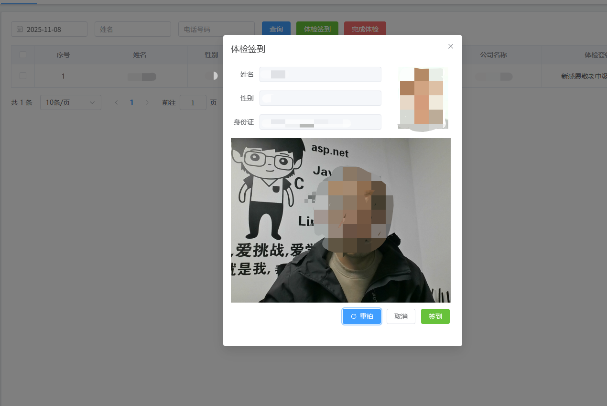

点击签到，签到成功后，看看[**腾讯云的人员库**](https://console.cloud.tencent.com/aiface)中有没有信息：


再刷一次身份证，系统就会提示：


# 前端设计体检导引单弹窗

## 编写视图层

在 MIS 端的 `customer_checkin.vue`页面中，创建导引单弹窗。

```html
<el-dialog title="体检导引单"
    v-if="proxy.isAuth(['ROOT', 'APPOINTMENT:SELECT'])"
    v-model="guidanceDialog.visible" width="800px">
    <div class="guidance" id="pdfDom" :name="guidanceDialog.name">
        <h2 class="title">美年大健康体检项目导引单</h2>
        <div class="summary">
            <table class="base-info">
                <tr>
                    <td class="label">姓名:</td>
                    <td class="value">{{guidanceDialog.name}}</td>
                    <td class="label">性别:</td>
                    <td class="value">{{guidanceDialog.sex}}</td>
                    <td class="label">年龄:</td>
                    <td class="value">{{guidanceDialog.age}}</td>
                </tr>
                <tr>
                    <td class="label">身份证:</td>
                    <td class="value">{{guidanceDialog.pid}}</td>
                    <td class="label">电话:</td>
                    <td class="value">{{guidanceDialog.tel}}</td>
                    <td class="label">日期:</td>
                    <td class="value">{{guidanceDialog.date}}</td>
                </tr>
                <tr>
                    <td class="label">公司:</td>
                    <td colspan="5" class="value">
                        {{guidanceDialog.company}}
                    </td>
                </tr>
            </table>
            <!-- 以体检流水号做二维码 -->
            
        </div>
        <table class="checkup">
            <tr>
                <th>序号</th>
                <th align="left">检查地点</th>
                <th align="left">检查项目</th>
                <th>体检医生</th>
            </tr>
            <tr v-for="(one,index) in guidanceDialog.checkup">
                <td align="center">{{index+1}}</td>
                <td>{{one.place}}</td>
                <td>{{one.name}}</td>
                <td></td>
            </tr>
        </table>
        <div class="desc">
            <p>请注意：体检结束10天后，即可在美年大健康网站（http://www.meinianhealth.com）查询到您的体检报告。之后的5个工作日之内，您将收到本体检中心邮寄的体检报告，请留意查收！</p>
            <ul>
                <li>
                    <el-icon><PhoneFilled /></el-icon>
                    <span>体检咨询：010-12345678</span>
                </li>
                <li>
                    <el-icon><PhoneFilled /></el-icon>
                    <span>体检咨询：010-12345679</span></li>
                <li>
                    <el-icon><PhoneFilled /></el-icon>
                    <span>体检咨询：010-12345670</span>
                </li>
            </ul>
        </div>
    </div>
    <div class="operate">
        <el-button type="primary" size="large" :icon="Document" @click="getPdf()">
            下载导引单
        </el-button>
    </div>
</el-dialog>
```

## 编写模型层

```typescript
const guidanceDialog = reactive({
    visible: true, //测试完把这个值改成false
    name: null,
    sex: null,
    age: null,
    pid: null,
    tel: null,
    date: null,
    company: null,
    qrCodeBase64: null,
    checkup: []
});
```

## 编写样式

找到 MIS 端的 `customer_checkin.less`文件，编写以下样式：

```plaintext
.guidance {
    padding: 20px 30px;
    h2 {
        font-size: 28px;
        text-align: center;
        margin-top: 0;
        margin-bottom: 20px;
        border-bottom: solid 1px @border-color-19;
        padding-bottom: 10px;
    }
    .summary {
        display: flex;
        justify-content: space-between;
        .base-info {
            flex-grow: 1;
            border-spacing: 10px;
            tr {
                td {
                    font-size: 14px;
                    &:nth-child(even) {
                        border-bottom: solid 1px @border-color-19;
                    }
                }
                .label {
                    font-size: 14px;
                }
                .value {
                    font-size: 14px;
                    padding: 3px 10px;
                }
            }
        }
        .qrcode {
            width: 100px;
            height: 100px;
            margin-left: 20px;
        }
    }
    .checkup {
        width: 100%;
        border-top: solid 1px @border-color-19;
        border-left: solid 1px @border-color-19;
        border-spacing: 0;
        margin-top: 20px;
        tr {
            th {
                border-bottom: solid 1px @border-color-19;
                border-right: solid 1px @border-color-19;
                padding: 15px 20px;
                font-size: 14px;
            }
            td {
                border-bottom: solid 1px @border-color-19;
                border-right: solid 1px @border-color-19;
                padding: 10px 20px;
                font-size: 14px;
            }
        }
    }
    .desc {
        margin-top: 30px;
        p {
            color: @font-color-3;
            line-height: 1.7;
            padding-bottom: 10px;
            border-bottom: dashed 1px @border-color-1;
        }
        ul {
            margin: 15px 0 0 0;
            padding: 0;
            list-style: none;
            display: flex;
            li {
                margin-right: 40px;
                display: flex;
                color: @font-color-3;
                .el-icon {
                    margin-top: 1px;
                    margin-right: 5px;
                }
            }
        }
    }
}
.operate {
    margin-top: 30px;
    margin-bottom: 30px;
    text-align: center;
}
```

最终测试效果如下：

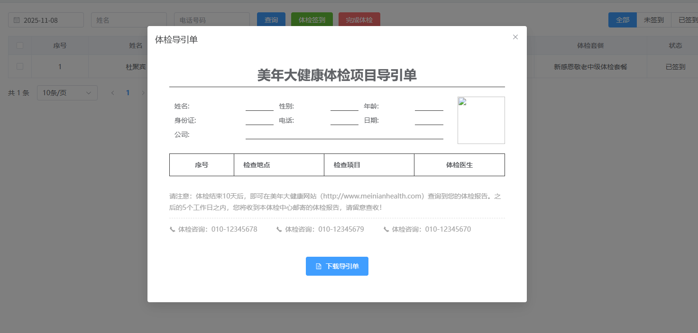

# 后端实现查询导引单内容

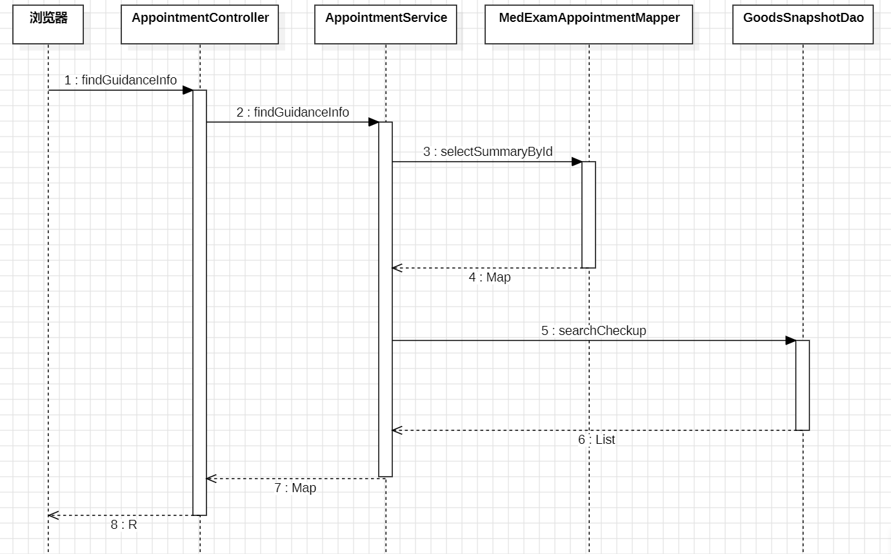

## 编写 Mapper 与 XML

找到 `MedExamAppointmentMapper`接口，编写以下方法：

```java
Map<String, Object> selectSummaryById(Integer id);
```

找到 `MedExamAppointmentMapper.xml`文件，编写 SQL 语句：

```xml
<select id="selectSummaryById" resultType="java.util.Map">
    SELECT a.appointment_no as appointmentNo,
           a.order_id  AS orderId,
           o.snapshot_id AS snapshotId,
           a.patient_name as patientName,
           a.gender,
           TIMESTAMPDIFF(YEAR,a.birth_date, NOW()) AS age,
           a.id_card_no as idCardNo,
           a.phone,
           a.appointment_date as appointmentDate,
           a.company
    FROM med_exam_appointment a
             JOIN trade_order o ON a.order_id = o.order_id
    WHERE a.id = #{id}
</select>
```

## 编写 Service 接口和实现

找到 MIS 端的 `AppointmentService`接口，编写以下方法：

```java
Map<String, Object> findGuidanceInfo(Integer id);
```

编写实现：

```java
@Override
public Map<String, Object> findGuidanceInfo(Integer id) {
    // 根据ID从数据库查询预约概要信息
    Map<String, Object> map = appointmentMapper.selectSummaryById(id);
    
    // 从查询结果中获取快照ID、性别和预约编号
    String snapshotId = MapUtil.getStr(map, "snapshotId");
    String gender = MapUtil.getStr(map, "gender");
    String appointmentNo = MapUtil.getStr(map, "appointmentNo");
    
    // 配置二维码生成参数
    QrConfig qrConfig = new QrConfig();
    qrConfig.setWidth(100);      // 设置二维码宽度
    qrConfig.setHeight(100);     // 设置二维码高度
    qrConfig.setMargin(0);       // 设置二维码边距
    
    // 生成二维码并转换为Base64格式（体检流水号做二维码）
    String qrCodeBase64 = QrCodeUtil.generateAsBase64(appointmentNo, qrConfig, "jpg");
    // 将二维码Base64字符串添加到返回结果中
    map.put("qrCodeBase64", qrCodeBase64);
    
    // 根据快照ID和性别查询体检项目信息
    List<Map> list = goodsSnapshotDao.searchCheckup(snapshotId, gender);
    
    // 使用LinkedHashSet去重并保持顺序
    LinkedHashSet<Map> set = new LinkedHashSet();
    
    // 遍历体检项目列表，提取关键信息并去重
    list.forEach(one -> {
        HashMap temp = new HashMap() {{
            // 只保留地点和名称信息用于去重比较
            put("place", MapUtil.getStr(one, "place"));
            put("name", MapUtil.getStr(one, "name"));
        }};
        set.add(temp);
    });
    
    // 将去重后的体检项目信息添加到返回结果中
    map.put("checkup", set);
    
    return map;
}
```

## 编写 form 接收数据并校验

```java

package com.jkweilai.meinian.api.controller.form;

import jakarta.validation.constraints.Min;
import jakarta.validation.constraints.NotNull;
import lombok.Data;

@Data
public class FindGuidanceInfoForm {
    @NotNull(message = "id不能小于1")
    @Min(value = 1, message = "id不能小于1")
    private Integer id;
}
```

## 编写 web 方法

找到 MIS 端的 `AppointmentController`，编写以下方法：

```java
@PostMapping("/findGuidanceInfo")
@SaCheckPermission(value = {"ROOT", "APPOINTMENT:SELECT"}, mode = SaMode.OR)
public R findGuidanceInfo(@RequestBody @Valid FindGuidanceInfoForm form) {
    Map<String, Object> map = appointmentService.findGuidanceInfo(form.getId());
    return R.ok().put("result", map);
}
```

# 前端实现加载导引单

在MIS端的体检签到页面，每条预约记录旁均设有“导引单”按钮。无论体检人是否完成签到，工作人员均可随时点击该按钮，下载并打印对应的导引单PDF文件。这一设计便于工作人员提前准备纸质导引单，待体检人完成签到后即可直接发放。

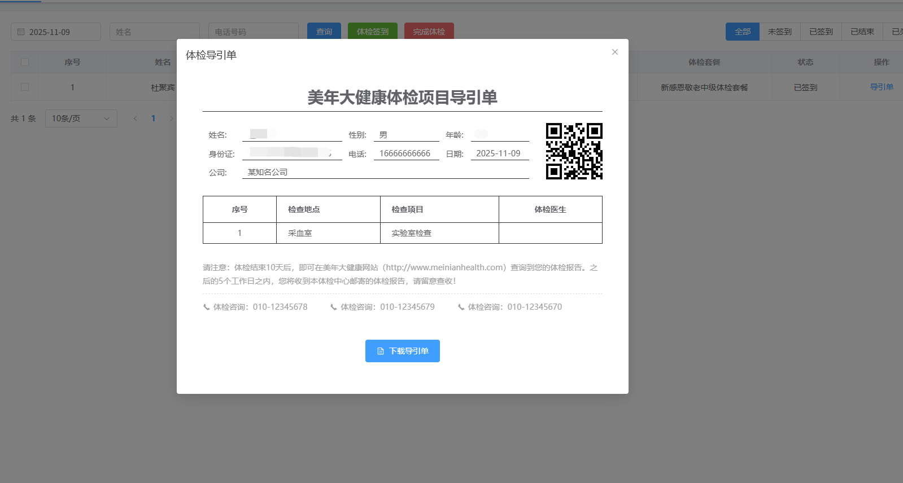

## 确认编写哪个回调函数

找到 MIS 端 `customer_checkin.vue`页面，然后找到其中的导引单按钮：


确认要编写的回调函数 `guidanceHandle`

## 编写回调函数加载导引单内容

```typescript
async function guidanceHandle(id) {
    guidanceDialog.visible = true
    // 准备数据
    let json = {
        id: id
    };
    // 准备配置
    let config = {
        headers: {
            satoken: localStorage.getItem('token')
        }
    };
    // 发送ajax请求
    let response = await axios.post("/meinian-api/mis/appointment/findGuidanceInfo", json, config);
    let result = response.data.result;
    guidanceDialog.name = result.patientName;
    guidanceDialog.sex = result.gender;
    guidanceDialog.age = result.age;
    guidanceDialog.pid = result.idCardNo;
    guidanceDialog.tel = result.phone;
    guidanceDialog.date = result.appointmentDate;
    guidanceDialog.company = result.company == null ? '无' : result.company;
    guidanceDialog.checkup = result.checkup;
    guidanceDialog.qrCodeBase64 = result.qrCodeBase64;
}
```

# 前端实现下载 PDF

接下来我们将实现“导引单生成PDF文件”的功能。在技术选型上，虽然前后端都能实现，但由于后端Java生成PDF较为繁琐，因此我们选择在更轻量、更灵活的前端来完成此功能。

## 安装依赖库

需要安装一下 `jsPDF`依赖库。

```shell
npm install jspdf
```

## 添加公共函数

找到 `main.ts`，添加公共函数，这个代码是从 jspdf 官方文档中拷贝的，把以下代码直接放到 `main.ts`文件的末尾就行：

```typescript
import html2Canvas from 'html2canvas';
import jsPDF from 'jspdf';

function isSplit(nodes, index, pageHeight) {
    // 计算当前这块dom是否跨越了a4大小，以此分割
    if (
        nodes[index].offsetTop + nodes[index].offsetHeight < pageHeight &&
        nodes[index + 1] &&
        nodes[index + 1].offsetTop + nodes[index + 1].offsetHeight > pageHeight
    ) {
        return true;
    }
    return false;
}

app.config.globalProperties.getPdf = function () {
    var title = this.htmlTitle; //PDF标题
    let ST = document.documentElement.scrollTop || document.body.scrollTop;
    let SL = document.documentElement.scrollLeft || document.body.scrollLeft;
    document.documentElement.scrollTop = 0;
    document.documentElement.scrollLeft = 0;
    document.body.scrollTop = 0;
    document.body.scrollLeft = 0;
    //获取滚动条的位置并赋值为0，因为是el-dialog弹框，并且内容较多出现了纵向的滚动条,截图出来的效果只能截取到视图窗口显示的部分,超出窗口部分则无法生成。所以先将滚动条置顶
    const A4_WIDTH = 592.28;
    const A4_HEIGHT = 841.89;
    let imageWrapper = document.querySelector('#pdfDom'); // 获取DOM
    var title = imageWrapper.getAttribute('name'); //PDF标题
    let pageHeight = (imageWrapper.scrollWidth / A4_WIDTH) * A4_HEIGHT;
    let lableListID = imageWrapper.querySelectorAll('p');
    // 进行分割操作，当dom内容已超出a4的高度，则将该dom前插入一个空dom，把他挤下去，分割
    for (let i = 0; i < lableListID.length; i++) {
        let multiple = Math.ceil((lableListID[i].offsetTop + lableListID[i].offsetHeight) / pageHeight);
        if (isSplit(lableListID, i, multiple * pageHeight)) {
            let divParent = lableListID[i].parentNode; // 获取该div的父节点
            let newNode = document.createElement('div');
            newNode.className = 'emptyDiv';
            newNode.style.background = '#ffffff';
            let _H = multiple * pageHeight - (lableListID[i].offsetTop + lableListID[i].offsetHeight);
            //留白
            newNode.style.height = _H + 30 + 'px';
            newNode.style.width = '100%';
            let next = lableListID[i].nextSibling; // 获取div的下一个兄弟节点
            // 判断兄弟节点是否存在
            if (next) {
                // 存在则将新节点插入到div的下一个兄弟节点之前，即div之后
                divParent.insertBefore(newNode, next);
            } else {
                // 不存在则直接添加到最后,appendChild默认添加到divParent的最后
                divParent.appendChild(newNode);
            }
        }
    }
    //接下来开始截图
    this.$nextTick(() => {
        // nexttick可以保证要截图的部分全部执行完毕，具体用法自行百度...
        html2Canvas(imageWrapper, {
            allowTaint: true,
            taintTest: false,
            useCORS: true,
            //width:960,
            //height:5072,
            dpi: window.devicePixelRatio * 4, //将分辨率提高到特定的DPI 提高四倍
            scale: 4 //按比例增加分辨率
        }).then(canvas => {
            let pdf = new jsPDF('p', 'mm', 'a4'); //A4纸，纵向
            let ctx = canvas.getContext('2d'),
                a4w = 190,
                a4h = 277, //A4大小，210mm x 297mm，四边各保留10mm的边距，显示区域190x277
                imgHeight = Math.floor((a4h * canvas.width) / a4w), //按A4显示比例换算一页图像的像素高度
                renderedHeight = 0;

            while (renderedHeight < canvas.height) {
                let page = document.createElement('canvas');
                page.width = canvas.width;
                page.height = Math.min(imgHeight, canvas.height - renderedHeight); //可能内容不足一页
                //用getImageData剪裁指定区域，并画到前面创建的canvas对象中
                page.getContext('2d').putImageData(
                    ctx.getImageData(
                        0,
                        renderedHeight,
                        canvas.width,
                        Math.min(imgHeight, canvas.height - renderedHeight)
                    ),
                    0,
                    0
                );
                pdf.addImage(
                    page.toDataURL('image/jpeg', 1.0), 'JPEG', 10, 10, a4w, Math.min(a4h, (a4w * page.height) / page.width)
                ); //添加图像到页面，保留10mm边距
                renderedHeight += imgHeight;
                if (renderedHeight < canvas.height) pdf.addPage(); //如果后面还有内容，添加一个空页
            }
            pdf.save(`${title}.pdf`);
        });
    });
};
```

只需要注意两个位置：

1. 全局函数的名字是：`getPdf`
2. 获取 DOM 元素的选择器：`let imageWrapper = document.querySelector('#pdfDom');`，对应的页面上容器的 id 是 `pdfDom`

## 下载导引单

找到 MIS 端的 `customer_checkin.vue`页面，找到下载导引单按钮，如下所示：


用户点击下载导引单时，就会调用全局函数 `getPdf()`，完成下载。

# 后端实现完成体检的 RESTful 接口


## 实现思路

用户点击完成体检时，都需要做什么？

1. 将当前的体检预约记录的状态修改为 status=3，表示当前体检已完成。
2. 如果**订单的套餐数量**和**已完成的体检数量**相等，需要将订单的状态更新为 order_status = 6，表示订单已完成。
3. 去 MongoDB 中根据预约 id 查询体检报告的 id（MongoDB 中的`_id`作为体检报告的 id），将体检报告 id 插入到体检报告表的 `report_id`字段上。

## 了解体检报告表

`med_exam_report`表是用来存储体检报告的，表结构如下：

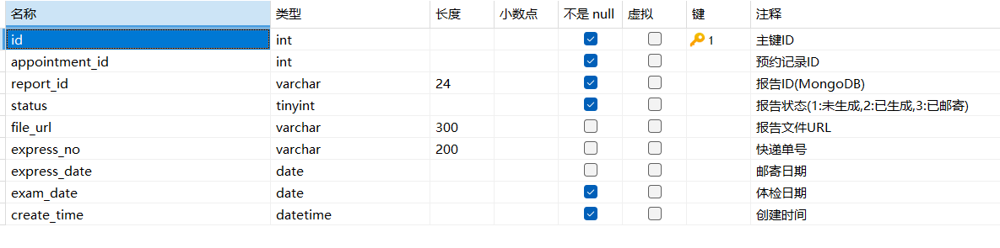

对于当前业务流程来说，我们需要向体检报告表中的哪些字段插入数据呢？需要向这些字段：

1. id（自动生成）
2. appointment_id（预约 id）
3. report_id（报告 id，来自 MongoDB 的 `_id`）
4. status = 1，表示未完成。
5. exam_date（体检日期为系统当前日期）
6. create_time（系统当前时间）

## 编写更新体检预约记录状态的 Mapper 和 XML

找到 `MedExamAppointmentMapper`接口，编写以下方法：根据预约流水号更新预约记录的状态 status 字段。

```java
int updateStatusByAppointmentNo(Map<String, Object> param);
```

找到 `MedExamAppointmentMapper.xml`文件，编写 SQL 语句：

```xml
<update id="updateStatusByAppointmentNo">
    update med_exam_appointment
    set status = #{status}
    where appointment_no = #{appointmentNo}
      and status != 3
</update>
```

注意：`status != 3`的才能修改状态，因为这个方法是一个通用的方法，其他业务也能用，因此必须保证已经完成的体检就不能再修改状态了。

**为什么要添加status != 3，含义是：体检预约记录如果是已完成的，不允许修改状态。**

## 编写更新订单状态的的 Mapper 和 XML

这里需要编写两个方法：

1. 查询订单对应的体检套餐数量以及查询已经完成的体检数量。（后面再编写业务代码的时候，判断这两个数量是否相等，如果相等，则更新订单状态为已完成）
2. 将订单的状态修改为已完成。（这个方法之前已经写过了）

找到 `TradeOrderMapper`接口，编写以下两个方法：

```java
Map<String, Object> selectOrderIsFinished(String appointmentNo);

// 这个方法之前我们已经写过了。
int updateStatus(Map<String, Object> param);
```

找到 `TradeOrderMapper.xml`文件，编写 SQL 语句：

```xml
<!-- 这个where条件的作用是只返回一条结果即可。 -->
<select id="selectOrderIsFinished" resultType="java.util.Map">
    /* ShardingSphere hint: dataSourceName=write_a */
    select o.order_id as orderId,
           o.quantity as n1,
           (select count(*) from med_exam_appointment where order_id=o.order_id and status=3) as n2
    from trade_order o join med_exam_appointment a on o.order_id=a.order_id
    WHERE a.appointment_no = #{appointmentNo}
</select>

<!--这个是我们之前已经写过的-->
<update id="updateStatus">
    update trade_order set order_status = #{orderStatus} where order_id = #{orderId}
</update>
```

`**/* ShardingSphere hint: dataSourceName=write_a */**`**作用：**

- **在集群模式下，该 SQL 语句被要求强制走主库：**`**write_a**`
- **在当前业务流程中，如果这个查询语句不走主库的话，由于该业务方法上添加有 `**@Transactional**`，业务中的第一个 **`**update**`**语句在主库中执行后未提交，这样从库中的数据不是最新数据，导致该 SQL 执行结果无效。**

## 去 MongoDB 中查询 `_id`

去 MongoDB 中查询 `_id`，将来用 `_id`作为体检报告表的 `report_id`。

去 MongoDB 的 `checkup_result`集合中查询。

找到 `CheckupResultDao`接口，编写以下方法：

```java
public String selectIdByAppointmentNo(String appointmentNo) {
    Criteria criteria = Criteria.where("uuid").is(appointmentNo);
    Query query = new Query(criteria);
    CheckupResultEntity entity = mongoTemplate.findOne(query, CheckupResultEntity.class);
    return entity.get_id();
}
```

## 编写插入体检报告的 Mapper 和 XML

找到 `MedExamReportMapper`接口，编写以下方法：

```java
int insert(Map<String, Object> param);
```

找到 `MedExamReportMapper.xml`文件，编写 SQL：

```xml
<insert id="insert">
    insert into med_exam_report
        (appointment_id, report_id, status, exam_date, create_time)
    values
        ((select id from med_exam_appointment where appointment_no = #{appointmentNo}),#{reportId},1,current_date,now())
</insert>
```

## 编写 Service 和实现

找到 MIS 端的 `AppointmentService`，编写以下方法：

```java
boolean modifyStatusByAppointmentNo(Map<String, Object> param);
```

编写方法的实现：

```java
@Resource
private TradeOrderMapper tradeOrderMapper;

@Resource
private MedExamReportMapper medExamReportMapper;

@Override
@Transactional
public boolean modifyStatusByAppointmentNo(Map<String, Object> param) {
    int rows = appointmentMapper.updateStatusByAppointmentNo(param);
    if (rows != 1) {
        return false;
    }
    int status = MapUtil.getInt(param, "status");
    if (status == 3) {
        //检查对应的订单是否所有体检预约都已经结束
        String appointmentNo = MapUtil.getStr(param, "appointmentNo");
        Map<String,Object> map = tradeOrderMapper.selectOrderIsFinished(appointmentNo);
        int orderId = MapUtil.getInt(map, "orderId");
        int n1 = MapUtil.getInt(map, "n1");
        int n2 = MapUtil.getInt(map, "n2");
        if (n1 == n2) {
            //更新订单为已结束状态
            rows = tradeOrderMapper.updateStatus(new HashMap<>() {{
                put("orderStatus", 6);
                put("orderId", orderId);
            }});
            if (rows != 1) {
                return false;
            }
        }
        //查询体检结果ID
        String reportId = checkupResultDao.selectIdByAppointmentNo(appointmentNo);
        param.put("reportId", reportId);
        rows = medExamReportMapper.insert(param);
        if (rows != 1) {
            return false;
        }
    }
    return true;
}
```

## 编写 form 接收数据并校验

编写 `ModifyStatusByAppointmentNoForm`：

```java
package com.jkweilai.meinian.api.controller.form;

import jakarta.validation.constraints.NotBlank;
import jakarta.validation.constraints.NotNull;
import jakarta.validation.constraints.Pattern;
import lombok.Data;
import org.hibernate.validator.constraints.Range;

@Data
public class ModifyStatusByAppointmentNoForm {
    @NotBlank(message = "appointmentNo不能为空")
    @Pattern(regexp = "^[0-9a-zA-Z]{32}$", message = "appointmentNo内容不正确")
    private String appointmentNo;

    @NotNull(message = "status不能为空")
    @Range(min = 1, max = 4, message = "status内容不正确")
    private Integer status;
}
```

## 编写 web 方法

找到 MIS 端的 `AppointmentController`，编写以下方法：

```java
@PostMapping("/modifyStatusByAppointmentNo")
@SaCheckPermission(value = {"ROOT", "APPOINTMENT:UPDATE"}, mode = SaMode.OR)
public R modifyStatusByAppointmentNo(@RequestBody @Valid ModifyStatusByAppointmentNoForm form) {
    Map<String, Object> param = BeanUtil.beanToMap(form);
    boolean result = appointmentService.modifyStatusByAppointmentNo(param);
    return R.ok().put("result", result);
}
```

# 前端实现扫码结束体检


## 了解二维码扫码枪

当体检人完成所有体检项目后，需将导引单交至服务台工作人员处。工作人员首先点击【完成体检】按钮，系统将弹出录入对话框。此时，工作人员使用二维码扫码枪扫描导引单上的二维码，体检流水号（appointmentNo）将自动填入对话框的文本框中。

请注意：对话框弹出时，必须确保文本框处于激活状态（即光标在输入框内闪烁）。若文本框未激活，扫码枪将无法成功填入流水号。

【小知识】二维码扫码枪是一种常见的外设，在超市结账等场景中广泛使用。该设备通过模拟键盘输入的方式工作——扫描二维码后，设备会将内容以键盘输入形式传输给计算机。如果您暂无扫码枪，也可手动复制粘贴体检流水号至文本框，模拟扫码输入效果。


## 编写模型层代码

找到 MIS 端的 `customer_checkin.vue`页面，找到 完成体检 按钮：


创建 `finishHandle()` 回调函数，弹出对话框并激活文本框，随时接收扫码枪输入的结果：

```typescript
function finishHandle() {
    ElMessageBox.prompt('请输入体检单编号，结束该次体检', '提示信息', {
        confirmButtonText: '确定',
        cancelButtonText: '取消',
        inputPlaceholder: "体检编号",
        type: "warning",
        inputPattern: /^[0-9a-zA-Z]{32}$/,
        inputErrorMessage: '体检编号不正确',
    }).then(async ({ value }) => {
        let json = {
            appointmentNo: value,
            status: 3
        }
        let config = {
            headers: {
                satoken: localStorage.getItem('token')
            }
        };
        let response = await axios.post("/meinian-api/mis/appointment/modifyStatusByAppointmentNo", json, config);
        let resp = response.data;
        if (resp.result) {
            ElMessage({
                message: '操作成功',
                type: 'success',
                duration: 1200,
                onClose: () => {
                    loadPageData();
                }
            });
        } else {
            ElMessage({
                message: '未能更新记录',
                type: 'error',
                duration: 1200
            });
        }
    })
}
```

# 实现体检医生信息加载


我们开始做医生检查模块。对应的 vue 页面是：`doctor_checkup.vue`

第一个要实现的功能是：实现当前医生信息加载。实现很简单：当前登录的用户就是当前负责体检的医生。因此通过登录的 id 获取用户的信息即可。

## 编写 Mapper 和 XML

找到 `SysUserMapper`接口，编写以下方法：

```java
Map<String, Object> selectDoctorById(int id);
```

找到 `SysUserMapper.xml`配置文件，编写 SQL：

```xml
<select id="selectDoctorById" resultType="java.util.Map">
    select real_name as username,
           gender,
           mobile
    from sys_user
    where user_id = #{userId}
</select>
```

## 编写 Service 和实现

找到 `SysUserService`接口，编写以下方法

```java
Map<String,Object> findDoctorById(int id);
```

编写方法的实现：

```java
@Override
public Map<String, Object> findDoctorById(int id) {
    return sysUserMapper.selectDoctorById(id);
}
```

## 编写 web 方法

找到 `UserController`，编写以下代码：

```java
@GetMapping("/findDoctorById")
@SaCheckLogin
public R findDoctorById() {
    Integer userId = StpUtil.getLoginIdAsInt();
    Map<String, Object> map = sysUserService.findDoctorById(userId);
    return R.ok().put("result", map);
}
```

## 前端发送请求加载医生信息

找到 `doctor_checkup.vue`页面，编写以下代码：

```typescript
async function loadDoctorSummary() {
    let config = {
        headers: {
            satoken: localStorage.getItem('token')
        }
    };
    let response = await axios.get("/meinian-api/mis/user/findDoctorById", config);
    let result = response.data.result;
    data.doctor.name = result.username;
    data.doctor.sex = result.gender;
    data.doctor.tel = result.mobile;
}

loadDoctorSummary();
```

# 前端实现体检医生选择科室


## 编写视图层代码

在MIS端的 `doctor_checkup.vue` 页面中，我们需要定义用于显示科室列表的弹窗控件：

```html
<el-dialog title="选择科室"
    v-if="proxy.isAuth(['ROOT', 'CHECKUP:INSERT', 'CHECKUP:UPDATE'])"
    :close-on-click-modal="false" v-model="dialog.visible"
    width="300px">
    <el-form :model="data.dataForm" ref="dialogForm"
        :rules="dialog.dataRule" label-width="80px">
        <el-form-item label="科室名称" prop="place">
            <el-select v-model="data.dataForm.place" placeholder="选择科室"
                clearable="clearable" @change="changePlaceHandle">
                <el-option label="外科" value="外科" />
                <el-option label="内科" value="内科" />
                <el-option label="眼科" value="眼科" />
                <el-option label="耳鼻喉科" value="耳鼻喉科" />
                <el-option label="口腔科" value="口腔科" />
                <el-option label="放射科" value="放射科" />
                <el-option label="妇科" value="妇科" />
                <el-option label="男科" value="男科" />
                <el-option label="一般检查室" value="一般检查室" />
                <el-option label="动脉硬化检测室" value="动脉硬化检测室" />
                <el-option label="心电图室" value="心电图室" />
                <el-option label="采血室" value="采血室" />
                <el-option label="尿常规室" value="尿常规室" />
                <el-option label="超声检查室" value="超声检查室" />
                <el-option label="骨密度检查室" value="骨密度检查室" />
            </el-select>
        </el-form-item>
    </el-form>
    <template #footer>
        <span class="dialog-footer">
            <el-button @click="dialog.visible = false">取消</el-button>
            <el-button type="primary" @click="dialog.visible = false">确定</el-button>
        </span>
    </template>
</el-dialog>
```

科室的名字是固定的，因此没有设计到数据库表中，在前端页面固定死的。

## 编写模型层代码

为视图层准备数据：

```typescript
const dialog = reactive({
    visible: false,
    dataRule: {
        place: [{ required: true, message: "没有选择科室" }],
    },
});
```

找到【选择科室】按钮：

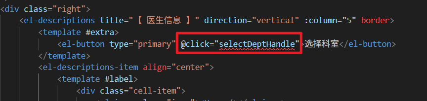

编写回调函数，显示选择科室的弹窗：

```typescript
function selectDeptHandle(){
    dialog.visible = true;
}
```

在选择科室的弹窗上选择科室：


编写回调函数：`changePlaceHandle`，切换科室，页面中关于体检人的数据都需要重置清空。

```typescript
function changePlaceHandle() {
    clearData()
}

function clearData() {
    //清空体检人信息
    data.customer.name = "<无>"
    data.customer.sex = "<无>"
    data.customer.tel = "<无>"
    data.customer.age = "<无>"
    data.customer.uuid = "<无>"
    data.customer.date = null

    //清空体检项
    data.dataForm.uuid = null;
    data.dataForm.checkup = []
}
```

实现关闭 modal 窗口后，输入预约编号的文本框自动获取焦点，先给“确定”和“取消”按钮绑定回调函数：

```html
<template #footer>
    <span class="dialog-footer">
        <el-button @click="closeDialog">取消</el-button>
        <el-button type="primary" @click="closeDialog">确定</el-button>
    </span>
</template>
```

编写函数 `closeDialog`：

```javascript
function closeDialog(){
  // 隐藏弹窗
  dialog.visible = false;
  // 获取焦点
  proxy.$refs.uuid.focus();
}
```

# 查询体检人信息


## 编写 Mapper 与 XML

找到 `MedExamAppointmentMapper`接口，编写以下方法：

```java
Map<String, Object> selectByAppointmentNo(String appointmentNo);
```

找到 `MedExamAppointmentMapper.xml`文件，编写 SQL 语句：

```xml
<select id="selectByAppointmentNo" resultType="java.util.Map">
    select a.order_id as orderId,
           a.patient_name as patientName,
           a.gender,
           TIMESTAMPDIFF(YEAR, a.birth_date, NOW()) as age,
           a.phone,
           a.appointment_no as appointmentNo,
           a.appointment_date as appointmentDate,
           a.`status`,
           o.snapshot_id as snapshotId
    from med_exam_appointment a
             join trade_order o on a.order_id = o.order_id
    where a.appointment_no = #{appointmentNo}

</select>
```

为什么要把 `order_id`和 `snapshot_id`也查询出来？这是因为这个方法后面业务中也要使用（通用的 SQL），我就提前写上了。

## 编写 Service 和实现

找到 MIS 端的 `AppointmentService`接口，编写以下方法

```java
Map<String, Object> findByAppointmentNo(String appointmentNo);
```

编写方法的实现：

```java
@Override
public Map<String, Object> findByAppointmentNo(String appointmentNo) {

    Map<String, Object> map = medExamAppointmentMapper.selectByAppointmentNo(appointmentNo);

    if(map == null){
        Map<String, Object> result = new HashMap<>();
        result.put("error", "没有预约记录");
        return result;
    }

    int status = MapUtil.getInt(map, "status");
    if(status == 1){
        Map<String, Object> result = new HashMap<>();
        result.put("error", "该体检人未签到");
        return result;
    }

    if(status == 4){
        Map<String, Object> result = new HashMap<>();
        result.put("error", "该体检人预约已取消");
        return result;
    }

    return map;
}
```

## 编写 form 接收数据并校验

编写 `FindAppointmentByAppointmentNoForm`，代码如下：

```java
package com.jkweilai.meinian.api.controller.form;

import jakarta.validation.constraints.NotBlank;
import jakarta.validation.constraints.Pattern;
import lombok.Data;

@Data
public class FindAppointmentByAppointmentNoForm {
    @NotBlank(message = "appointmentNo不能为空")
    @Pattern(regexp = "^[0-9A-Za-z]{32}$", message = "appointmentNo内容不正确")
    private String appointmentNo;
}
```

## 编写 web 方法

找到 MIS 端的 `AppointmentController`，编写以下方法：

```java
@PostMapping("/findByAppointmentNo")
@SaCheckPermission(value = {"ROOT", "APPOINTMENT:SELECT"}, mode = SaMode.OR)
public R findByAppointmentNo(@RequestBody @Valid FindAppointmentByAppointmentNoForm form) {
    Map<String, Object> map = appointmentService.findByAppointmentNo(form.getAppointmentNo());
    return R.ok().put("result", map);
}
```

## 前端视图层代码分析

先在 MIS 端的 `doctor_checkup.vue`页面中找到【执行查询】的按钮：

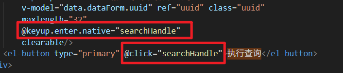

从上代码中可以看到，当点击【执行查询】按钮时，或者按回车键时，都会执行回调函数：`searchHandle`。

另外扫码枪在扫完码之后，自动将预约流水号填到文本框中，然后也会自动触发回车键，此时 `searchHandle`也会被调用。

## 监听 F4 键

按 F4 键（为什么选择 F4，因为浏览器上 F4 键没啥用），文本框自动获得焦点，医生直接可以用扫码枪扫码，预约流水号会自动填写到文本框中。如果不设置 F4 快捷键，医生每一次都需要操作鼠标，将光标放到文本框，比较麻烦。设置了 F4 快捷键之后，医生直接按 F4 快捷键，光标自动就到文本框了。将以下代码直接编写到 `<font style="color:rgb(15, 17, 21);">doctor_checkup.vue</font>`中：

```typescript
//监听键盘快捷键
document.onkeyup = function (e) {
    if (e.key == "F4") {
        proxy.$refs.uuid.focus();
        data.dataForm.uuid = null
    }
};
```

## 编写回调函数

编写回调函数 `searchHandle`，代码如下：

```typescript
// 执行查询操作
async function searchHandle(){
    // 判断一下科室是否选择了。
    if(stringIsEmpty(data.dataForm.place)){
        ElMessage({
            type: "error",
            message: "请选择体检科室",
            duration: 1200
        });
    }else if(stringIsEmpty(data.dataForm.uuid)){
        ElMessage({
            type: "error",
            message: "请填写体检编号",
            duration: 1200
        });
    }else if(!/^[A-Z0-9]{32}$/.test(data.dataForm.uuid)){
        ElMessage({
            type: "error",
            message: "体检编号格式错误",
            duration: 1200
        });
    }else{
        // 数据都准备好了，有效。
        // 发送ajax请求，查询体检人的信息。
        let appointmentNo = data.dataForm.uuid;
        let response = await axios.post("/meinian-api/mis/appointment/findByAppointmentNo", {appointmentNo}, {
            headers: {
                satoken: localStorage.getItem("token")
            }
        });
        // 获取响应的信息
        let map = response.data.result;
        if(map.hasOwnProperty("error")){
            // 不显示体检人的信息，没必要，提示一个错误信息就行了。
            ElMessage({
                type: "error",
                message: map.error,
                duration: 1200
            });
        }else{
            data.customer.name = map.patientName;
            data.customer.sex = map.gender;
            data.customer.age = map.age;
            data.customer.tel = map.phone;
            data.customer.uuid = map.appointmentNo;
            data.customer.date = map.appointmentDate;

            // 如果当前体检人的预约日期和今天的日期不一致，应该提示医生，是否继续执行体检。
            if(data.customer.date != dayjs().format("YYYY-MM-DD")){
                ElMessageBox.confirm("该体检人非当日预约，确定要执行体检吗？", "提示信息", {
                    type: "warning",
                    confirmButtonText: "执行",
                    cancelButtonText: "拒绝"
                }).then(() => {
                    // 加载这个体检人的体检项目
                    loadCheckup();
                }).catch(() => {
                    clearData();
                });
            }else{
                // 加载这个体检人的体检项目
                loadCheckup();
            }
        }
    }
}
```