# 美年大健康项目-10

# 后端实现查询体检科室的体检项目

要实现的功能是：查询这个体检人对应的体检科室的体检项目。


## 编写持久层代码

之前我们已经实现了从商品快照中筛选出与当前体检人性别相符的体检项目，并将其保存至 `<font style="color:rgb(15, 17, 21);background-color:rgb(235, 238, 242);">checkup_result</font>` 集合的 `<font style="color:rgb(15, 17, 21);background-color:rgb(235, 238, 242);">checkup</font>` 字段中。以下示例展示了 `<font style="color:rgb(15, 17, 21);background-color:rgb(235, 238, 242);">checkup</font>` 字段的内容，其中的 `<font style="color:rgb(15, 17, 21);background-color:rgb(235, 238, 242);">place</font>` 属性表示体检项目所属的科室。如需查询特定科室的体检项目，只需以科室名称作为查询条件即可。

```json
{
  "_id": {
    "$oid": "690ff14223645e5eee136270"
  },
  "uuid": "192AE5B1B4AF4BEC8D0BC299579A8FC7",
  "checkup": [
    {
      "sex": "无",
      "code": "X1001",
      "item": "血常规",
      "name": "实验室检查",
      "type": "导入",
      "place": "采血室"
    },
    {
      "item": "裸眼视力(左)",
      "code": "无",
      "sex": "无",
      "name": "眼科检查",
      "place": "眼科",
      "type": "录入",
      "value": "无"
    },
    {
      "item": "裸眼视力(右)",
      "code": "无",
      "sex": "无",
      "name": "眼科检查",
      "place": "眼科",
      "type": "录入",
      "value": "无"
    },
  ],
  "place": [],
  "result": [],
  "_class": "com.jkweilai.meinian.api.db.pojo.CheckupResultEntity"
}
```

找到 `CheckupResultDao`类，然后编写以下两个方法：

1. 查询体检人在当前科室对应的体检项目。
2. 查询体检人在当前科室的体检项目是否已经录入了体检结果。（这个功能在前端的作用是：如果该体检人在该科室的体检项目中已经存在录入的体检结果了，则需要提示医生是否重新录入体检结果）

```java
public List<Map> selectCheckupByPlace(String uuid, String place) {

    // 创建聚合管道（你可以看做相当于mysql中写了一条SQL语句）
    Aggregation aggregation = Aggregation.newAggregation(
            // 管道第一阶段：指定查询的列（投影 - project）
            // 指定要查询的列是 checkup 和 uuid 两列，uuid是因为要在match中使用，所以需要写上。
            // 第一阶段后的结果：{uuid: "xxx", checkup: [...]}
            Aggregation.project("checkup","uuid"),
            // 管道第二阶段：打散数组（展开 - unwind）
            // 将第一阶段中的checkup数组打散
            // 第二阶段后的结果：{uuid: "xxx", checkup: {项目A}}, {uuid: "xxx", checkup: {项目B}}
            Aggregation.unwind("$checkup"),
            // 管道第三阶段：封装查询条件（匹配 - match）
            // 查询条件中需要 uuid，因此在管道第一阶段的时候需要将uuid列查询出来
            Aggregation.match(Criteria.where("uuid").is(uuid).and("checkup.place").is(place))
    );

    // 通过聚合管道执行查询。（相当于mysql中执行了SQL语句）
    AggregationResults<Map> results = mongoTemplate.aggregate(aggregation, "checkup_result", Map.class);

    /*
    以上执行完的数据是这样的：
        [
          {
              _id: "6511425827c25d66503d6aa0",
              uuid: "F7ADC0D6C1AB4E18A5B7C72005E72AA5",
              checkup: {
                  template: "模板1",
                  item: "裸眼视力(左)",
                  code: "无",
                  sex: "无",
                  name: "眼科检查",
                  place: "眼科",
                  type: "录入",
                  value: "无"
              }
          },
          {
              _id: "6511425827c25d66503d6aa0",
              uuid: "F7ADC0D6C1AB4E18A5B7C72005E72AA5",
              checkup: {
                  template: "模板1",
                  item: "裂隙灯检查",
                  code: "无",
                  sex: "无",
                  name: "眼科检查",
                  place: "眼科",
                  type: "录入",
                  value: "未见异常#其他"
              }
          }
        ]
     */

    /*
        我们需要把以上的查询结果转换成这个格式
            [
                {
                    template: "模板1",
                    item: "裸眼视力(左)",
                    code: "无",
                    sex: "无",
                    name: "眼科检查",
                    place: "眼科",
                    type: "录入",
                    value: "无"
                },
                {
                    template: "模板1",
                    item: "裂隙灯检查",
                    code: "无",
                    sex: "无",
                    name: "眼科检查",
                    place: "眼科",
                    type: "录入",
                    value: "未见异常#其他"
                }
            ]
     */

    // 通过以下代码完成转换。
    List<Map> list = new ArrayList<>();
    results.getMappedResults().forEach(one -> {
        HashMap map = (HashMap) one.get("checkup");
        list.add(map);
    });
    return list;
}

public boolean hasCheckupResults(String uuid, String place) {
    Aggregation aggregation = Aggregation.newAggregation(
            Aggregation.project("result","uuid"),
            Aggregation.unwind("$result"),
            Aggregation.match(Criteria.where("uuid").is(uuid).and("result.place").is(place))
    );
    AggregationResults<HashMap> results = mongoTemplate.aggregate(aggregation, "checkup_result", HashMap.class);
    List<HashMap> list = results.getMappedResults();
    if (list.size() >= 1) {
        return true;
    } else {
        return false;
    }
}
```

## 编写业务层代码

在 MIS 端的 service 包下新建 `CheckupService`接口，编写以下方法：

```java
package com.jkweilai.meinian.api.service;

import java.util.Map;

public interface CheckupService {
    Map findCheckupByPlace(String uuid, String place);
}
```

编写接口的实现：

```java
package com.jkweilai.meinian.api.service.impl;

import com.jkweilai.meinian.api.db.mapper.CheckupResultDao;
import com.jkweilai.meinian.api.service.CheckupService;
import jakarta.annotation.Resource;
import org.springframework.stereotype.Service;

import java.util.HashMap;
import java.util.List;
import java.util.Map;

@Service
public class CheckupServiceImpl implements CheckupService {

    @Resource
    private CheckupResultDao checkupResultDao;

    @Override
    public Map findCheckupByPlace(String uuid, String place) {
        List<Map> checkupList = checkupResultDao.selectCheckupByPlace(uuid, place);
        boolean hasCheckupResults = checkupResultDao.hasCheckupResults(uuid, place);
        Map<String, Object> map = new HashMap<>() {{
            put("hasCheckupResults", hasCheckupResults);
            put("checkupList", checkupList);
        }};
        return map;
    }
}
```

## 编写 form 接收数据并校验

编写 `FindCheckupByAppointmentNoAndPlaceForm`，代码如下：

```java
package com.jkweilai.meinian.api.controller.form;

import jakarta.validation.constraints.NotBlank;
import jakarta.validation.constraints.Pattern;
import lombok.Data;

@Data
public class FindCheckupByAppointmentNoAndPlaceForm {
    @NotBlank(message = "appointmentNo不能为空")
    @Pattern(regexp = "^[0-9a-zA-Z]{32}$", message = "appointmentNo内容不正确")
    private String appointmentNo;

    @NotBlank(message = "place不能为空")
    @Pattern(regexp = "^[0-9a-zA-Z\\u4e00-\\u9fa5]{2,30}$", message = "place内容不正确")
    private String place;
}
```

## 编写 web 方法

创建新的类 `CheckupController`，编写 web 方法：

```java
package com.jkweilai.meinian.api.controller;

import cn.dev33.satoken.annotation.SaCheckPermission;
import cn.dev33.satoken.annotation.SaMode;
import com.jkweilai.meinian.api.common.R;
import com.jkweilai.meinian.api.controller.form.FindCheckupByAppointmentNoAndPlaceForm;
import com.jkweilai.meinian.api.service.CheckupService;
import jakarta.annotation.Resource;
import jakarta.validation.Valid;
import org.springframework.web.bind.annotation.PostMapping;
import org.springframework.web.bind.annotation.RequestBody;
import org.springframework.web.bind.annotation.RequestMapping;
import org.springframework.web.bind.annotation.RestController;

import java.util.Map;

@RestController
@RequestMapping("/mis/checkup")
public class CheckupController {

    @Resource
    private CheckupService checkupService;

    @PostMapping("/searchCheckupByPlace")
    @SaCheckPermission(value = {"ROOT", "CHECKUP:SELECT"}, mode = SaMode.OR)
    public R searchCheckupByPlace(@RequestBody @Valid FindCheckupByAppointmentNoAndPlaceForm form) {
        Map map = checkupService.findCheckupByPlace(form.getAppointmentNo(), form.getPlace());
        return R.ok().put("result", map);
    }
}
```

# 前端实现加载科室体检项目

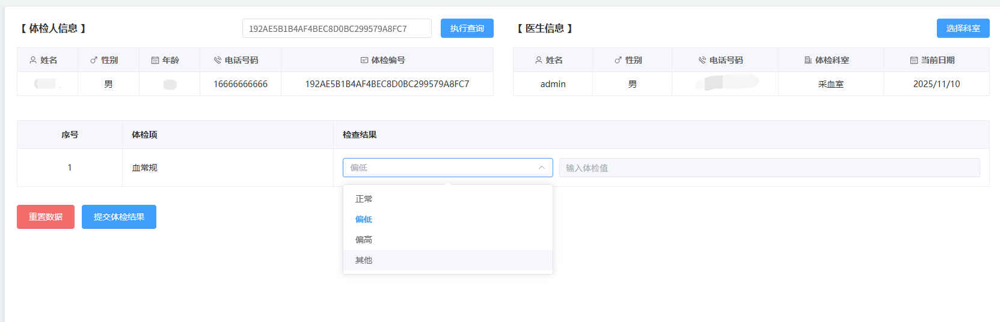

## 回顾视图层代码

找到 `doctor_checkup.vue`页面中这部分视图层代码，我们有必要先看这个代码：

```html
<table>
    <thead>
        <tr>
            <th width="50">序号</th>
            <th width="100" align="left">体检项</th>
            <th width="300" align="left">检查结果</th>
        </tr>
    </thead>
    <tbody>
        <tr v-for="(one,index) in data.dataForm.checkup">
            <td align="center">{{index+1}}</td>
            <td>{{one.item}}</td>
            <td>
                <div class="value-container">
                    <el-select v-model="one.input.select" class="m-2" placeholder="选择模板值">
                        <el-option v-for="item in one.value" :label="item" :value="item" />
                    </el-select>
                    <!--当医生在左侧选择的是  其他 时，右侧的文本框才可用。也就是说医生在内置的模板值中没有合适的结果时，可以手动在右侧文本框中输入体检结果。-->
                    <el-input v-model="one.input.value" :disabled="one.input.select!='其他'" placeholder="输入体检值" class="input-value" clearable />
                </div>
            </td>
        </tr>
    </tbody>
</table>
```

## 再回顾一下现在后端返回的数据

```json
[
    {
        template: "模板1", 
        item: "裸眼视力(左)", 
        code: "无", 
        sex: "无",
        name: "眼科检查", 
        place: "眼科", 
        type: "录入",
        value: "无"
    },
    {
        template: "模板1", 
        item: "裂隙灯检查", 
        code: "无", 
        sex: "无",
        name: "眼科检查", 
        place: "眼科", 
        type: "录入",
        value: "未见异常#其他"
    },
    ……
]
```

查询结果中的每个体检项目主要包含以下关键属性：

- `**<font style="color:rgb(15, 17, 21);background-color:rgb(235, 238, 242);">place</font>**`：体检科室。
- `**<font style="color:rgb(15, 17, 21);background-color:rgb(235, 238, 242);">item</font>**`：具体的体检项目名称。
- `**<font style="color:rgb(15, 17, 21);background-color:rgb(235, 238, 242);">value</font>**`：预设的体检结果选项。

关于 `**<font style="color:rgb(15, 17, 21);background-color:rgb(235, 238, 242);">value</font>**` 属性的核心逻辑：

1. 如果 `<font style="color:rgb(15, 17, 21);background-color:rgb(235, 238, 242);">value</font>` 的值为 **“无”**，则代表这个体检项目**没有**预设结果选项。
2. 如果 `<font style="color:rgb(15, 17, 21);background-color:rgb(235, 238, 242);">value</font>` 的值**不是“无”**，则代表已经预设了结果。这些结果通常是一个字符串，多个选项之间使用 `**<font style="color:rgb(15, 17, 21);background-color:rgb(235, 238, 242);">#</font>**` 符号进行分隔。

我们的任务是：当 `<font style="color:rgb(15, 17, 21);background-color:rgb(235, 238, 242);">value</font>` 不是“无”时，需要根据 `<font style="color:rgb(15, 17, 21);background-color:rgb(235, 238, 242);">#</font>` 将这个字符串**拆分成一个数组**，然后将这些预设的选项**渲染到一个下拉列表**中，供用户选择。

## 编写加载函数

```typescript
async function loadCheckup() {
    let json = {
        appointmentNo: data.dataForm.uuid,
        place: data.dataForm.place
    }
    let config = {
        headers: {
            satoken: localStorage.getItem('token')
        }
    };
    let response = await axios.post("/meinian-api/mis/checkup/findCheckupByPlace", json, config);
    let result = response.data.result;
    //判断该科室是否录入了体检结果
    if (result.hasAlreadyCheckup) {
        ElMessageBox.confirm(
            '该体检套餐已经存在当前科室的检查结果，是否重新执行检查?',
            '提示信息',
            {
                confirmButtonText: '执行',
                cancelButtonText: '拒绝',
                type: 'warning',
            }
        ).then(() => {
            for (let one of result.checkupList) {
                //给每个元素添加input属性，用于存储体检结果的值
                one.input = { select: null, value: null }
                //判断预设值是“无”的情况
                if (one.value == "无") {
                    //列表项内容为“其他”
                    one.value = ["其他"]
                    //设置列表选中内容
                    one.input.select = "其他"
                }else {
                    //切分预设值形成数组
                    one.value = one.value.split("#")
                }
                //提交体检结果的时候需要提交输入模板种类，该模板与生成体检报告有关
                data.dataForm.template = one.template
            }
            data.dataForm.checkup = result.checkupList
        }).catch(() => {
            clearData()
        })
    }else {
        for (let one of result.checkupList) {
            one.input = { select: null, value: null }
            if (one.value == "无") {
                one.value = ["其他"]
                one.input.select = "其他"
            }else {
                one.value = one.value.split("#")
            }

            data.dataForm.template = one.template
        }
        data.dataForm.checkup = result.checkupList
    }
}
```

将之前注释掉的 `loadCheckup()`代码，将注释去掉：

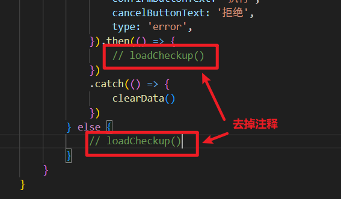

# 后端实现保存科室体检结果

## 编写持久层代码

MongoDB中的checkup_result集合result字段用于保存体检结果。该字段是JSON数组格式的，其中一个元素就是一个科室的体检结果。

```json
[
    {
        date: "2025-10-05",
        doctorName: "张三丰",
        doctorId: 1,
        place: "内科"
        template: "模板1",
        item: [
            {
                name: "血糖",
                unit: "mmol/L",
                standard: "≥ 7.0 mmol/L",
                value: "6.0"
            },
            {
                name: "血型检查",
                unit: null,
                standard: null,
                value: "B型"
            },
            ……
        ]
    },

    ……
]
```

体检人签到成功之后，后端系统会自动向checkup_result集合中添加一条记录。现在科室医生录入了体检结果，我们需要根据uuid找到checkup_result集合中的记录，然后更新result字段和place字段的内容。

在 `CheckupResultDao`类中编写以下方法：

```java
/**
 * 添加或更新体检结果
 * @param uuid 体检编号
 * @param place 科室名称
 * @param map 体检结果数据
 */
public void addResult(String uuid, String place, Map map) {
    // 构建查询条件：根据UUID查找记录
    Criteria criteria = Criteria.where("uuid").is(uuid);
    Query query = new Query(criteria);

    // 根据UUID从MongoDB中查找对应的体检记录
    CheckupResultEntity entity = mongoTemplate.findOne(query, CheckupResultEntity.class);

    // 获取该体检记录中所有已体检的科室列表
    List<String> placeList = entity.getPlace();
    // 获取该体检记录中所有的体检结果列表
    List<Map> resultList = entity.getResult();

    // 判断是否存在该科室的体检结果
    int index = 0;
    if (placeList.contains(place)) {
        // 如果该科室已经存在体检结果，找到该科室结果在列表中的位置
        for (int i = 0; i < resultList.size(); i++) {
            Map one = resultList.get(i);
            String temp = MapUtil.getStr(one, "place");
            if (place.equals(temp)) {
                index = i;
                break;
            }
        }
        // 用该科室新的体检结果覆盖原有结果（更新操作）
        resultList.set(index, map);
    } else {
        // 如果该科室不存在体检结果，执行新增操作
        // 在科室列表中添加新体检的科室
        placeList.add(place);
        // 在结果列表中添加新的体检结果
        resultList.add(map);
    }

    // 更新数据：将修改后的实体对象保存回MongoDB
    mongoTemplate.save(entity);
}
```

## 编写业务层代码

找到 `CheckupService`接口，编写以下方法：

```java
void addResult(int userId, String name, String uuid, String place, String template, List item);
```

编写方法的实现：

```java
@Override
public void addResult(int userId, String name, String uuid, String place, String template, List item) {
    HashMap map = new HashMap() {{
        put("doctorId", userId);
        put("doctorName", name);
        put("date", DateUtil.today());
        put("place", place);
        put("template", template);
        put("item", item);
    }};
    checkupResultDao.addResult(uuid, place, map);
}
```

## 编写 form 接收数据并校验

```java
package com.jkweilai.meinian.api.controller.form;

import jakarta.validation.constraints.NotBlank;
import jakarta.validation.constraints.NotEmpty;
import jakarta.validation.constraints.Pattern;
import lombok.Data;

import java.util.List;

@Data
public class AddCheckupResultForm {
    @NotBlank(message = "doctorName不能为空")
    @Pattern(regexp = "^[\\u4e00-\\u9fa5]{2,10}$", message = "doctorName内容不正确")
    private String doctorName;

    @NotBlank(message = "appointmentNo不能为空")
    @Pattern(regexp = "^[0-9A-Za-z]{32}$", message = "appointmentNo内容不正确")
    private String appointmentNo;

    @NotBlank(message = "place不能为空")
    @Pattern(regexp = "^[0-9A-Za-z\\u4e00-\\u9fa5]{2,30}$", message = "place内容不正确")
    private String place;

    @NotEmpty(message = "item不能为空")
    private List item;

    @NotEmpty(message = "template不能为空")
    private String template;
}
```

## 编写 web 方法

找到 `CheckupController`，编写以下代码：

```java
@PostMapping("/addResult")
@SaCheckPermission(value = {"ROOT", "CHECKUP:INSERT", "CHECKUP:UPDATE"}, mode = SaMode.OR)
public R addResult(@RequestBody @Valid AddCheckupResultForm form) {
    int userId = StpUtil.getLoginIdAsInt();
    checkupService.addResult(userId, form.getDoctorName(), form.getAppointmentNo(), form.getPlace(), form.getTemplate(), form.getItem());
    return R.ok();
}
```

# 前端实现提交科室体检结果

## 回顾视图层代码

在MIS端的医生体检页面中放置了“重置数据”和“提交体检结果”按钮，这两个按钮的标签代码如下：


## 编写模型层代码

```typescript
function clearCheckupHandle() {
    for (let one of data.dataForm.checkup) {
        if (one.value.length == 1) {
            one.input = { select: "其他", value: null }
        }
        else {
            one.input = { select: null, value: null }
        }
    }
}

// 提交体检结果
async function dataFormSubmit(){
    // 必须保证每一个体检项都填写了，不能为空。
    // 最终的体检结果是保存在 one.input.select 和 one.input.value 这里了。
    for(let one of data.dataForm.checkup){
        if(one.input.select == null || (one.input.select == "其他" && one.input.value == null)){
            ElMessage({
                type: "error",
                message: "体检结果有空的，请填写",
                duration: 1200
            });
            return;
        }
    }

    try {
        // 程序能够执行到这里说明所有体检项都填写了。
        // 发送ajax请求，保存体检结果。
        // 准备提交的数据
        let items = []; // 真正的体检结果。所有体检项目的体检结果都放在这个数组中。
        for(let one of data.dataForm.checkup){
            let value = one.input.select == "其他" ? one.input.value : one.input.select;
            let item = {name: one.item, unit: one.unit, standard: one.standard, value: value};
            items.push(item);   
        }

        let sendData = {
            doctorName: data.doctor.name,
            appointmentNo: data.dataForm.uuid,
            place: data.dataForm.place,
            template: data.dataForm.template,
            item: items
        };
        let response = await axios.post("/meinian-api/mis/checkup/addResult", sendData, {
            headers: {
                satoken: localStorage.getItem("token")
            }
        });

        // 获取响应结果
        let result = response.data.result;
        if(result){
            ElMessage({
                type: "success",
                message: "操作成功",
                duration: 1200
            });
            // 清空页面的信息
            clearData();
        }
    }catch(e){
        console.log(e);
        ElMessage({
            type: "error",
            message: "操作失败",
            duration: 1200
        });
    }
}
```

# 人员调流模块功能分析

**调(diào)流：调度流量。**

在当前体检流程中，一个常见的现象是：大量体检者倾向于优先完成“血常规”等特定项目，导致这些科室前排起长队，而其他科室却人员稀少。这种不均衡的分布，显著增加了用户的整体等待时间。

为了解决这一问题，我们引入了**体检调流模块**。该模块的核心作用是：**实时分析各科室的排队情况，并主动引导体检者前往当前人数最少的科室。**

通过这种方式，系统能够动态平衡各科室的负载，有效分散人流，从而帮助体检者大幅减少排队等待，提升整体体检效率与体验。

## 数据库 ER 图

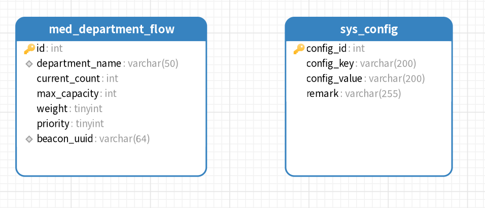

**人员调流表结构如下：**


## UI 界面

在MIS端人员调流页面中，用分页形式显示所有科室调流设置和实际排队的人数。


工作人员可以手动添加新的科室，只要在弹窗中填写相关信息即可。

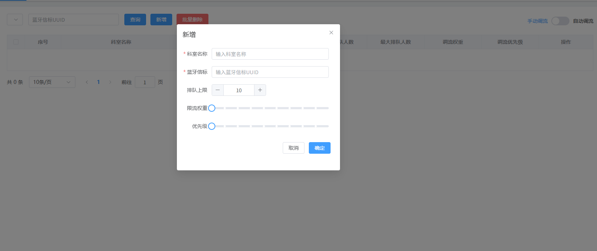

## 自动调流算法

人员调流分为**自动调流**与**手动调流**两种模式。在自动调流模式下，系统主要依据**权重**进行计算；而在手动调流时，则由**优先级**直接决定。

**一、权重的定义与作用**

我们用“权重”来量化一个科室的体检速度：**权重越大，表示该科室的单人体检耗时越长，越容易引发排队**。例如，一个复杂影像检查的权重要远高于简单的身高体重测量。

然而，系统并非简单地推荐权重最小的科室。因为即使某个科室（如耳鼻喉科）体检很快，如果当前已有50人排队，此时再推荐新用户前往，显然是不合理的。

**二、核心算法：科室分值**

为了做出智能推荐，系统会为每个科室计算一个实时“科室分值”。**分值越高，表示该科室当前排队压力越小，越值得推荐**。

**科室分值计算公式如下：**
`<font style="color:rgb(15, 17, 21);background-color:rgb(235, 238, 242);">科室分值 = (本科室权重 / 所有科室权重总和) × (最大承载人数 - 实际排队人数)</font>`

**三、计算实例分析**

假设系统中有两个科室：

- **外科**：权重为5，最大承载50人，实际排队30人。
- **眼科**：权重为2，最大承载50人，实际排队40人。
所有科室总权重为26。

我们来计算它们的科室分值：

- **外科分值** = (5 / 26) × (50 - 30) ≈ 3.85
- **眼科分值** = (2 / 26) × (50 - 40) ≈ 0.77

**结论**：虽然眼科的单人体检速度更快（权重小），但外科因当前排队人数少，剩余容量大，分值更高。因此，系统会推荐用户先去外科，这样可以更有效地利用空间，避免所有人群都涌向“快”科室导致走廊拥堵，反而降低整体效率。

**注意：**本算法更倾向于权重较大的科室，因为权重较大的科室是决定体检中心吞吐量的。因此绝对不能让这么重要的科室闲着，因此以上公式中可以看到，当排队人数都是 40 人时，系统会推荐去权重较高的科室。

**四、关于超额排队的处理**

当排队人数超过最大承载人数时，公式依然有效。此时，`<font style="color:rgb(15, 17, 21);background-color:rgb(235, 238, 242);">(最大承载人数 - 实际排队人数)</font>`会变为负数，从而导致科室分值为负。

例如，当外科实际排队人数达到100人时：

- **外科分值** = (5 / 26) × (50 - 100) ≈ -9.62

此时，系统会比较外科（-9.62分）和眼科（0.77分），显然会推荐用户去眼科。这符合我们的直觉：当一个科室已经严重超负荷时，应该引导用户去压力相对更小的科室。

## 手动调流算法

在手动调流模式下，系统的推荐逻辑遵循明确的优先级规则：

1. **首要依据：科室优先级**
系统会优先将**优先级最高**的科室推荐给体检人。
2. **并列处理：优先级相同时，比较权重**
当出现两个或多个科室的优先级相同时，系统将引入第二个判断指标——**科室权重**。
  - 此时，系统会推荐其中**权重较小**的科室。
  - 因为权重小意味着该科室的**单人体检速度更快**，有助于体检人更快完成检查。

**总结来说，手动调流的决策规则是：先按优先级排序，高者优先；若优先级相同，则权重小者优先。**

## 蓝牙信标

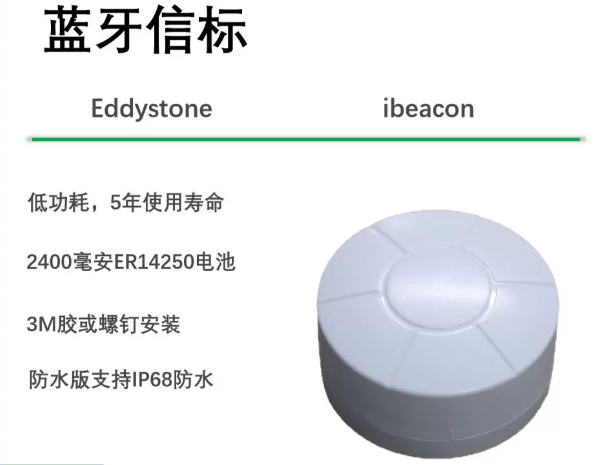

蓝牙信标是一种小型信号发射器，它会持续向周围广播包含自身唯一身份标识（UUID）的蓝牙信号。当体检人手机上的“大健康APP”进入信号范围时，即可接收到**该UUID及信号强度**。

**系统工作流程如下：**

1. **部署信标**：在每个诊室门口安装一个蓝牙信标，并为每个信标配置独一无二的UUID，用于对应具体的诊室。
2. **自动“打卡”**：当体检人携带手机走近某个诊室时，APP会自动接收到该诊室信标的信号。APP将此信标的UUID上传至后端服务器，系统随即判定该体检人已到达此科室门口，并自动将其加入该科室的排队队列。**您可以将其通俗地理解为“蓝牙自动打卡”：只需走近科室，系统即自动完成排队登记。**
3. **精准定位与防干扰**：
  - **有效范围小**：蓝牙信标的有效信号距离很短（通常在3米以内，且穿墙后信号急剧衰减）。这一特性确保了两个相邻诊室的信号不会互相干扰。
  - **信号择优**：在极少数情况下，如果手机同时接收到多个信标信号，APP会采用一个简单而有效的策略：**自动选择信号最强的一个作为当前科室**。因为信号强度越高，代表物理距离越近，从而保证了定位的准确性。

通过这套机制，系统能够实时、自动地感知各科室前的实际排队人数，为后续的智能调流提供准确的数据基础。

## UML 用例图

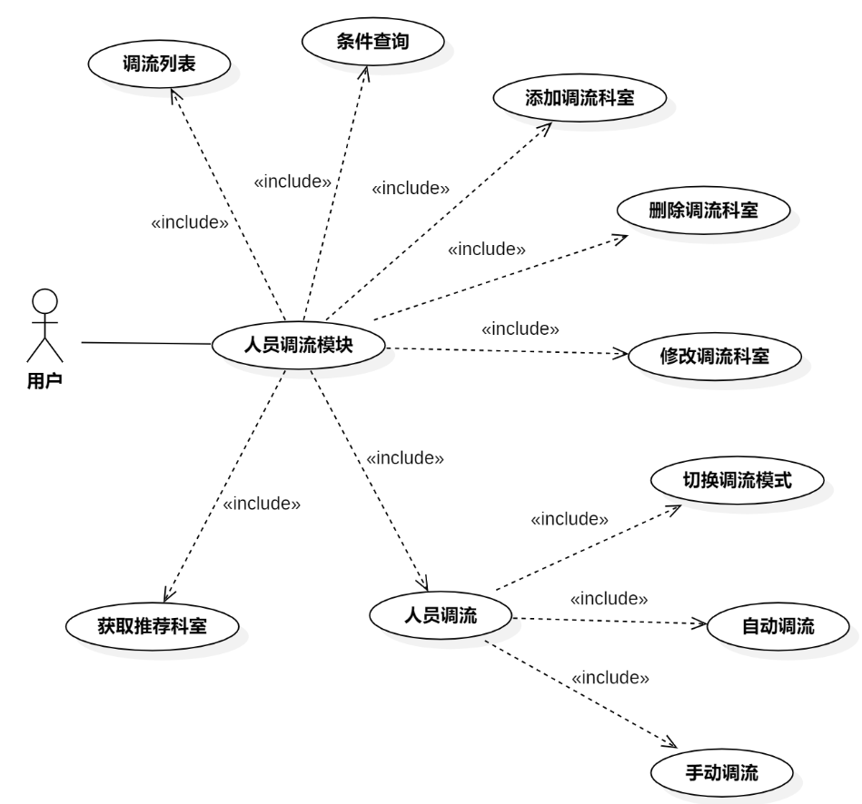

# 实现体检人员调流页面

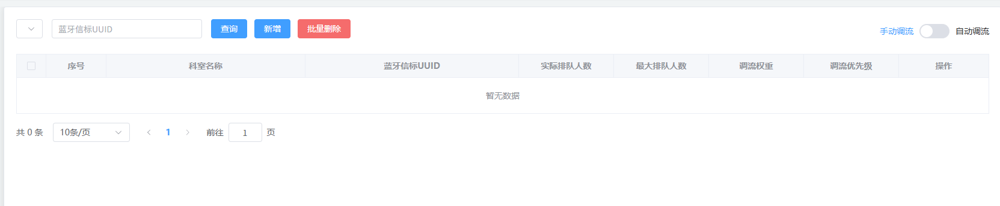

## 创建 vue 页面

在 `src/views/mis/` 目录中创建 `flow_regulation.vue` 页面，然后在 `src/router/index.ts` 文件中配置路由信息：

```typescript
{
    path: 'flow_regulation',
    name: 'MisFlowRegulation',
    component: ()=>import('../views/mis/flow_regulation.vue'),
    meta: {
        title: "人员限流",
        isTab: true
    }
}
```

顺手创建 `flow_regulation.less`样式文件，然后在 vue 页面中引入：

```plaintext
<template>

</template>

<style lang="less" scoped>
    @import url('flow_regulation.less');
</style>
```

## 编写视图层

```html
<div v-if="proxy.isAuth(['ROOT', 'FLOW_REGULATION:SELECT'])">
    <el-form :inline="true" :model="dataForm" :rules="dataRule" ref="form">
        <el-form-item>
            <el-select v-model="dataForm.place" style="width: 250px" placeholder="科室名称"
                clearable="clearable">
                <el-option v-for="one in data.placeList" :label="one"
                    :value="one" />
            </el-select>
        </el-form-item>
        <el-form-item prop="blueUuid">
            <el-input v-model="dataForm.blueUuid" placeholder="蓝牙信标UUID"
                maxlength="32" class="input" clearable="clearable" />
        </el-form-item>
        <el-form-item>
            <el-button type="primary" @click="searchHandle()">查询</el-button>
            <el-button type="primary"
                :disabled="!proxy.isAuth(['ROOT', 'FLOW_REGULATION:INSERT'])"
                @click="addHandle()">
                新增
            </el-button>
            <el-button type="danger"
                :disabled="!proxy.isAuth(['ROOT', 'FLOW_REGULATION:DELETE'])"
                @click="deleteHandle()">
                批量删除
            </el-button>
        </el-form-item>
        <el-form-item class="mold">
            <el-switch v-model="dataForm.mode" size="large"
                active-text="自动调流" inactive-text="手动调流"
                :before-change="changeModeHandle" />
        </el-form-item>
    </el-form>
    <el-table :data="data.dataList"
        :header-cell-style="{'background':'#f5f7fa'}" border
        v-loading="data.loading" @selection-change="selectionChangeHandle">
        <el-table-column type="selection" header-align="center"
            align="center" width="50" :selectable="selectable" />
        <el-table-column type="index" header-align="center" align="center"
            width="100" label="序号">
            <template #default="scope">
                <span>{{ (data.pageIndex - 1) * data.pageSize + scope.$index + 1 }}</span>
            </template>
        </el-table-column>
        <el-table-column prop="departmentName" header-align="center" align="center"
            min-width="250" label="科室名称" />
        <el-table-column prop="beaconUuid" header-align="center"
            align="center" min-width="270" label="蓝牙信标UUID" />
        <el-table-column prop="currentCount" header-align="center" align="center"
            min-width="120" label="实际排队人数" />
        <el-table-column prop="maxCapacity" header-align="center" align="center"
            min-width="120" label="最大排队人数" />
        <el-table-column prop="weight" header-align="center" align="center"
            min-width="120" label="调流权重" />
        <el-table-column prop="priority" header-align="center"
            align="center" min-width="120" label="调流优先级" />
        <el-table-column header-align="center" align="center" width="150"
            label="操作">
            <template #default="scope">
                <el-button type="text"
                    v-if="proxy.isAuth(['ROOT', 'FLOW_REGULATION:UPDATE'])"
                    :disabled="scope.row.status"
                    @click="updateHandle(scope.row.id)">
                    修改
                </el-button>
                <el-button type="text"
                    v-if="proxy.isAuth(['ROOT', 'FLOW_REGULATION:DELETE'])"
                    @click="deleteHandle(scope.row.id)">
                    删除
                </el-button>
            </template>
        </el-table-column>
    </el-table>
    <el-pagination @size-change="sizeChangeHandle"
        @current-change="currentChangeHandle" :current-page="data.pageIndex"
        :page-sizes="[10, 20, 50]" :page-size="data.pageSize"
        :total="data.totalCount"
        layout="total, sizes, prev, pager, next, jumper">
    </el-pagination>
</div>
```

## 编写模型层

```typescript
<script lang="ts" setup>
    import { reactive, getCurrentInstance, ref } from 'vue';
    const { proxy } = getCurrentInstance();

    const dataForm = reactive({
        place: null,
        blueUuid: null,
        mode: null
    });

    const data = reactive({
        placeList: [],
        dataList: [],
        pageIndex: 1,
        pageSize: 10,
        totalCount: 0,
        loading: false,
        selections: []
    });

    const dataRule = reactive({
        blueUuid: [
            { required: false, pattern: '^[a-zA-Z0-9]{32}$', message: '蓝牙信标UUID格式错误' }
        ]
    });
</script>
```

## 编写样式

```plaintext
.mold {
    float: right;
    margin-right: 0 !important;
}
.input {
    width: 250px !important;
}
```

# 实现人员调流弹窗

添加新的科室调流或者修改已有的调流都需要用到弹窗控件。

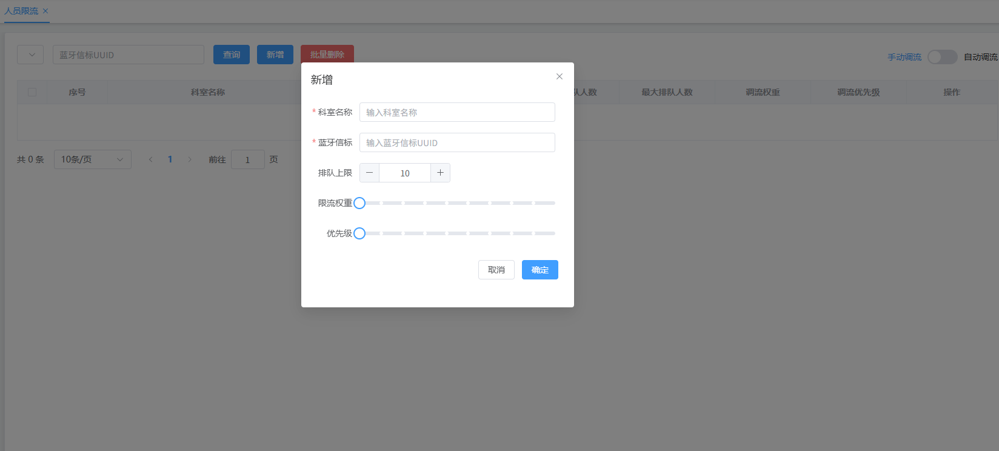

## 编写视图层代码

在MIS端flow_regulation.vue页面中，添加弹窗控件以及子控件。其中标签是滑块控件。

```html
<el-dialog :title="!dialog.dataForm.id ? '新增' : '修改'"
    v-if="proxy.isAuth(['ROOT', 'FLOW_REGULATION:INSERT', 'FLOW_REGULATION:UPDATE'])"
    :close-on-click-modal="false" v-model="dialog.visible"
    width="450px">
    <el-form :model="dialog.dataForm" ref="dialogForm"
        :rules="dialog.dataRule" label-width="80px">
        <el-form-item label="科室名称" prop="place">
            <el-input v-model="dialog.dataForm.place"
                placeholder="输入科室名称" maxlength="40" clearable />
        </el-form-item>
        <el-form-item label="蓝牙信标" prop="blueUuid">
            <el-input v-model="dialog.dataForm.blueUuid"
                placeholder="输入蓝牙信标UUID" maxlength="32" clearable />
        </el-form-item>
        <el-form-item label="排队上限">
            <el-input-number v-model="dialog.dataForm.maxNum" min="1"
                max="500" :step="10" step-strictly />
        </el-form-item>
        <el-form-item label="限流权重">
            <el-slider v-model="dialog.dataForm.weight" :step="1"
                show-stops :min="1" :max="10" />
        </el-form-item>
        <el-form-item label="优先级">
            <el-slider v-model="dialog.dataForm.priority" :step="1"
                show-stops :min="1" :max="10" />
        </el-form-item>
    </el-form>
    <template #footer>
        <span class="dialog-footer">
            <el-button @click="dialog.visible=false">取消</el-button>
            <el-button type="primary" @click="dataFormSubmit">确定</el-button>
        </span>
    </template>
</el-dialog>
```

## 编写模型层代码

```typescript
const dialog = reactive({
    visible: false,
    dataForm: {
        id: null,
        place: null,
        blueUuid: null,
        maxNum: 10,
        weight: 1,
        priority: 1
    },
    dataRule: {
        place: [
            { required: true, message: '科室名称不能为空' },
            { min: 2, message: '科室名称不能少于2个字符' },
            { pattern: '^[a-zA-Z0-9\u4e00-\u9fa5\(\)]{2,40}$', message: '科室名称格式错误' }
        ],
        blueUuid: [
            { required: true, message: '蓝牙信标UUID不能为空' },
            { pattern: '^[a-zA-Z0-9]{32}$', message: '蓝牙信标UUID格式错误' }
        ]
    }
})
```

# 体检调流页面加载科室列表

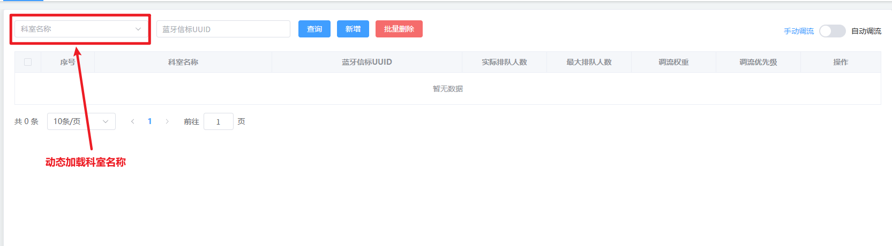

## 编写 Mapper 和 XML

找到 `MedDepartmentFlowMapper`接口，编写以下方法：

```java
public interface MedDepartmentFlowMapper {
    List<String> selectDepartmentNames();
}
```

找到 `MedDepartmentFlowMapper.xml`文件，编写 SQL 语句：

```xml
<?xml version="1.0" encoding="UTF-8"?>
<!DOCTYPE mapper
        PUBLIC "-//mybatis.org//DTD Mapper 3.0//EN"
        "http://mybatis.org/dtd/mybatis-3-mapper.dtd">
<mapper namespace="com.jkweilai.meinian.api.db.mapper.MedDepartmentFlowMapper">
    <select id="selectDepartmentNames" resultType="java.lang.String">
        select department_name as deptName from med_department_flow
    </select>
</mapper>
```

## 编写 Service 和实现

在 MIS 端创建一个接口 `FlowRegulationService`，编写以下方法：

```java
package com.jkweilai.meinian.api.service;

import java.util.List;

public interface FlowRegulationService {
    
    List<String> findDepartmentNames();
}
```

编写方法实现：

```java
package com.jkweilai.meinian.api.service.impl;

import com.jkweilai.meinian.api.db.mapper.MedDepartmentFlowMapper;
import com.jkweilai.meinian.api.service.FlowRegulationService;
import jakarta.annotation.Resource;
import org.springframework.stereotype.Service;

import java.util.List;

@Service
public class FlowRegulationServiceImpl implements FlowRegulationService {

    @Resource
    private MedDepartmentFlowMapper medDepartmentFlowMapper;

    @Override
    public List<String> findDepartmentNames() {
        return medDepartmentFlowMapper.selectDepartmentNames();
    }
}
```

## 编写 web 方法

创建 `FlowRegulationController`类，编写以下方法：

```java
package com.jkweilai.meinian.api.controller;

import cn.dev33.satoken.annotation.SaCheckLogin;
import com.jkweilai.meinian.api.common.R;
import com.jkweilai.meinian.api.service.FlowRegulationService;
import jakarta.annotation.Resource;
import org.springframework.web.bind.annotation.GetMapping;
import org.springframework.web.bind.annotation.RequestMapping;
import org.springframework.web.bind.annotation.RestController;

import java.util.List;

@RestController
@RequestMapping("/mis/flow_regulation")
public class FlowRegulationController {

    @Resource
    private FlowRegulationService flowRegulationService;
    
    @GetMapping("/findDepartmentNames")
    @SaCheckLogin
    public R findDepartmentNames() {
        List<String> deptNames = flowRegulationService.findDepartmentNames();
        return R.ok().put("result", deptNames);
    }
}
```

## 前端实现加载科室列表

找到 `flow_regulation.vue`页面，发送 ajax 请求，加载科室列表：

找到下拉列表，看看这个下拉列表关联的是哪个响应式对象。

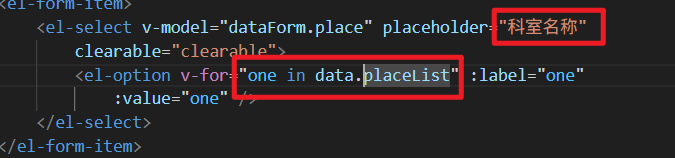

因此我们发送的 ajax 请求返回的数据要赋值给 `data.placeList`。

```typescript
async function loadDeptList(){
    // 准备配置
    let config = {
        headers: {
            satoken: localStorage.getItem('token')
        }
    };
    // 发送请求
    let response = await axios.get("/meinian-api/mis/flow_regulation/findDepartmentNames", config);
    let result = response.data.result;
    data.placeList = result;
}
loadDeptList();
```

# 体检调流页面加载 Switch 开关状态


## 实现思路

从 redis 的缓存中取出调流规则。这个调流规则是在 `sys_config`表中的，回顾下这个表：

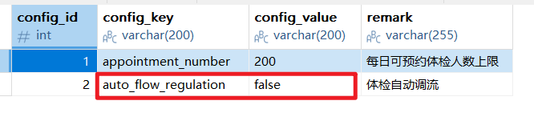

不过这个系统配置在之前的功能中，我们已经将调流规则存储到了 redis 当中。当时存储到 redis 中的 key 是 `setting#auto_flow_regulation`。

因此我们直接从 redis 中取出调流规则，true 表示自动调流，false 表示手动调流。

## 编写 Service 和实现

创建一个新的接口：`SysConfigService`，编写以下方法：

```java
package com.jkweilai.meinian.api.service;

public interface SysConfigService {
    String getItemValue(String key);
}
```

编写实现：

```java
package com.jkweilai.meinian.api.service.impl;

import com.jkweilai.meinian.api.service.SysConfigService;
import jakarta.annotation.Resource;
import org.springframework.data.redis.core.RedisTemplate;
import org.springframework.stereotype.Service;

@Service
public class SysConfigServiceImpl implements SysConfigService {

    @Resource
    private RedisTemplate redisTemplate;

    @Override
    public String getItemValue(String key) {
        return redisTemplate.opsForValue().get("setting#" + key).toString();
    }
}
```

## 编写 web 方法

找到 `FlowRegulationController`，编写以下代码：

```java
@Resource
private SysConfigService sysConfigService;

@GetMapping("/findFlowRule")
@SaCheckLogin
public R findFlowRule(){
    String result = sysConfigService.getItemValue("auto_flow_regulation");
    return R.ok().put("result", Boolean.parseBoolean(result));
}
```

## 前端实现 Switch 开关状态

找到 `flow_regulation.vue`页面，看看 Switch 开关处的代码：


可以看到 `dataForm.mode`的值决定了哪个被激活。发送 ajax 请求，返回调流规则之后，将调流规则赋值给 `dataForm.mode`即可。

```typescript
async function loadMode(){
    // 准备配置
    let config = {
        headers : {
            satoken: localStorage.getItem("token")
        }
    };
    // 发送ajax请求
    let response = await axios.get("/meinian-api/mis/flow_regulation/findFlowRule", config);
    dataForm.mode = response.data.result;
}
loadMode();
```

# 体检调流页面实现分页查询


## 编写 Mapper 和 XML

找到 `MedDepartmentFlowMapper`接口，编写以下两个方法：

```java
List<MedDepartmentFlowEntity> selectPage(Map<String, Object> params);

long selectCount(Map<String, Object> params);
```

找到 `MedDepartmentFlowMapper.xml`文件，编写 SQL 语句：

```xml
<select id="selectPage" resultType="MedDepartmentFlowEntity">
    SELECT id,
    department_name as departmentName,
    current_count AS currentCount,
    max_capacity AS maxCapacity,
    weight,
    priority,
    beacon_uuid AS beaconUuid
    FROM med_department_flow
    <where>
        <if test="deptName != null and deptName != ''">
            department_name = #{deptName}
        </if>
        <if test="beaconUuid != null and beaconUuid != ''">
            AND beacon_uuid = #{beaconUuid}
        </if>
    </where>
    order by priority desc
    LIMIT #{startIndex}, #{pageSize}
</select>
<select id="selectCount" resultType="java.lang.Long">
    SELECT count(*)
    FROM med_department_flow
    <where>
        <if test="deptName != null and deptName != ''">
            department_name = #{deptName}
        </if>
        <if test="beaconUuid != null and beaconUuid != ''">
            AND beacon_uuid = #{beaconUuid}
        </if>
    </where>
</select>
```

## 编写 Service 和实现

找到 `FlowRegulationService`接口，编写以下方法：

```java
PageResult<MedDepartmentFlowEntity> pageQuery(Map<String, Object> params);
```

编写方法的实现：

```java
@Override
public PageResult<MedDepartmentFlowEntity> pageQuery(Map<String, Object> params) {
    long total = medDepartmentFlowMapper.selectCount(params);
    List<MedDepartmentFlowEntity> records = new ArrayList<>();
    if(total > 0){
        records = medDepartmentFlowMapper.selectPage(params);
    }
    int pageSize = MapUtil.getInt(params, "pageSize");
    int pageNo = MapUtil.getInt(params, "pageNo");
    PageResult<MedDepartmentFlowEntity> pageResult = new PageResult<>(total, pageSize, pageNo, records);
    return pageResult;
}
```

## 编写 form 接收数据并校验

创建 `FlowRegulationPageQueryForm`，编写以下代码：

```java
package com.jkweilai.meinian.api.controller.form;

import jakarta.validation.constraints.Min;
import jakarta.validation.constraints.NotNull;
import jakarta.validation.constraints.Pattern;
import lombok.Data;
import org.hibernate.validator.constraints.Range;

@Data
public class FlowRegulationPageQueryForm {
    @Pattern(regexp = "^[0-9a-zA-Z\\u4e00-\\u9fa5\\(\\)]{1,40}$", message = "deptName内容不正确")
    private String deptName;

    @Pattern(regexp = "^[0-9a-zA-Z]{32}$", message = "beaconUuid内容不正确")
    private String beaconUuid;

    @NotNull(message = "pageNo不能为空")
    @Min(value = 1, message = "pageNo不能小于1")
    private Integer pageNo;

    @NotNull(message = "pageSize不能为空")
    @Range(min = 10, max = 50, message = "pageSize必须为10~50之间")
    private Integer pageSize;
}
```

## 编写 web 方法

找到 `FlowRegulationController`编写以下方法：

```java
@PostMapping("/pageQuery")
@SaCheckPermission(value = {"ROOT", "FLOW_REGULATION:SELECT"}, mode = SaMode.OR)
public R pageQuery(@RequestBody @Valid FlowRegulationPageQueryForm form){
    Integer pageNo = form.getPageNo();
    Integer pageSize = form.getPageSize();
    Integer startIndex = pageSize * (pageNo - 1);
    Map<String, Object> param = BeanUtil.beanToMap(form);
    param.put("startIndex", startIndex);
    PageResult<MedDepartmentFlowEntity> pageResult = flowRegulationService.pageQuery(param);
    return R.ok().put("pageResult", pageResult);
}
```

## 前端封装 loadPageData 函数

找到 `flow_regulation.vue`页面，编写加载分页数据的函数：

```typescript
async function loadPageData(){
    data.loading = true;
    // 准备数据
    let json = {
        pageNo: data.pageIndex,
        pageSize: data.pageSize,
        beaconUuid: dataForm.blueUuid,
        deptName: dataForm.place
    };
    // 准备配置
    let config = {
        headers: {
            satoken: localStorage.getItem('token')
        }
    };
    // 发送ajax请求
    let response = await axios.post("/meinian-api/mis/flow_regulation/pageQuery", json, config);
    let pageResult = response.data.pageResult;

    // 将返回的数据赋值给响应式对象
    data.totalCount = pageResult.total;
    data.dataList = pageResult.records;
    
    data.loading = false;
}

loadPageData();
```

## 前端实现分页查询

找到查询按钮：


编写回调函数 `searchHanle`，主要任务是校验表单是否合法，如果合法则加载分页数据：

```typescript
function searchHandle(){
    proxy.$refs['form'].validate(valid=>{
        if(valid){
            // 表单合法，清除残留的错误信息
            proxy.$refs['form'].clearValidate();
            // 加载分页数据
            loadPageData();
        }
    });        
}
```

## 前端实现翻页

代码还和之前一样：

```typescript
function sizeChangeHandle(val) {
    data.pageSize = val;
    data.pageIndex = 1;
    loadPageData();
}

function currentChangeHandle(val) {
    data.pageIndex = val;
    loadPageData();
}
```

# 添加体检科室调流记录

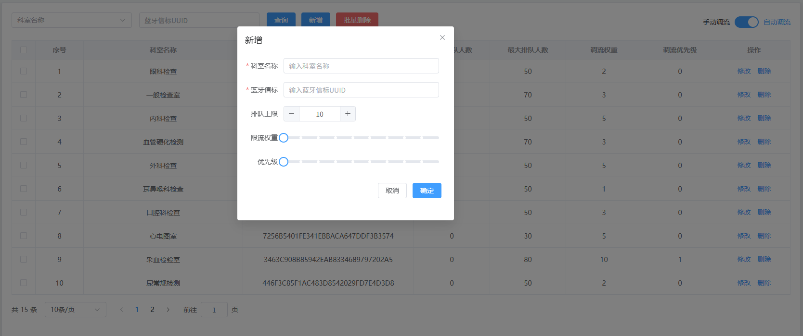

## 编写 Mapper 和 XML

找到 `MedDepartmentFlowMapper`接口，编写以下方法：

```java
int insert(MedDepartmentFlowEntity entity);
```

找到 `MedDepartmentFlowMapper.xml`文件，编写 SQL：

```xml
<insert id="insert">
    insert into med_department_flow
        (department_name, max_capacity, weight, priority, beacon_uuid)
    values
        (#{departmentName},#{maxCapacity},#{weight},#{priority},#{beaconUuid})
</insert>
```

## 编写 Service 和实现

找到 `FlowRegulationService`接口，编写以下方法：

```java
int save(MedDepartmentFlowEntity entity);
```

编写实现：

```java
@Override
@Transactional
public int save(MedDepartmentFlowEntity entity) {
    return medDepartmentFlowMapper.insert(entity);
}
```

## 编写 form 接收数据并校验

编写 `SaveFlowRegulationForm`，代码如下：

```java
package com.jkweilai.meinian.api.controller.form;

import jakarta.validation.constraints.NotBlank;
import jakarta.validation.constraints.NotNull;
import jakarta.validation.constraints.Pattern;
import lombok.Data;
import org.hibernate.validator.constraints.Range;

@Data
public class SaveFlowRegulationForm {
    @NotBlank(message = "departmentName不能为空")
    @Pattern(regexp = "^[a-zA-Z0-9\\u4e00-\\u9fa5]{2,40}$", message = "departmentName内容不正确")
    private String departmentName;

    @NotBlank(message = "beaconUuid不能为空")
    @Pattern(regexp = "^[a-zA-Z0-9]{32}$", message = "beaconUuid内容不正确")
    private String beaconUuid;

    @NotNull(message = "maxCapacity不能为空")
    @Range(min = 1, max = 1000, message = "maxCapacity内容不正确")
    private Integer maxCapacity;

    @NotNull(message = "weight不能为空")
    @Range(min = 1, max = 10, message = "weight内容不正确")
    private Integer weight;

    @NotNull(message = "priority不能为空")
    @Range(min = 1, max = 10, message = "priority内容不正确")
    private Integer priority;
}
```

## 编写 web 方法

找到 `FlowRegulationController`，编写以下 web 方法：

```java
@PostMapping("/save")
@SaCheckPermission(value = {"ROOT", "FLOW_REGULATION:INSERT"}, mode = SaMode.OR)
public R insert(@RequestBody @Valid SaveFlowRegulationForm form) {
    MedDepartmentFlowEntity entity = BeanUtil.toBean(form, MedDepartmentFlowEntity.class);
    int rows = flowRegulationService.save(entity);
    return R.ok().put("rows", rows);
}
```

## 前端展示新增弹窗

找到新增按钮：


新增和修改是共用同一个弹窗，因此当显示新增弹窗时，需要将弹窗重置，对应的响应式数据需要还原为初始值，编写回调函数 `addHandle`：

```typescript
function addHandle(){
    dialog.dataForm.id = null;
    dialog.dataForm.place = null;
    dialog.dataForm.blueUuid = null;
    dialog.dataForm.maxNum = 10;
    dialog.dataForm.weight = 1;
    dialog.dataForm.priority = 1;
    dialog.visible = true;
    proxy.$nextTick(()=>{
        proxy.$refs['dialogForm'].resetFields();
    });
}
```

## 前端实现保存功能

找到弹窗的确定按钮：

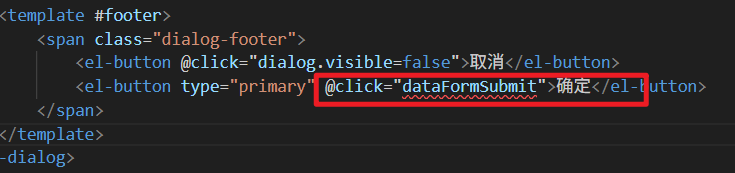

编写回调函数 `dataFormSubmit`，代码如下：

```java
function dataFormSubmit() {
    proxy.$refs['dialogForm'].validate(async valid => {
        if (valid) {
            // 准备数据
            let json = {
                id: dialog.dataForm.id,
                departmentName: dialog.dataForm.place,
                beaconUuid: dialog.dataForm.blueUuid,
                maxCapacity: dialog.dataForm.maxNum,
                weight: dialog.dataForm.weight,
                priority: dialog.dataForm.priority
            };
            // 准备配置
            let config = {
                headers: {
                    satoken: localStorage.getItem('token')
                }
            };
            // 发送ajax post请求
            let response = await axios.post(`/meinian-api/mis/flow_regulation/${dialog.dataForm.id == null ? 'save' : 'modify'}`, json, config);
            let rows = response.data.rows;
            if (rows == 1) {
                proxy.$message({
                    message: '操作成功',
                    type: 'success',
                    duration: 1200,
                    onClose: () => {
                        dialog.visible = false;
                        loadPageData();
                        loadDeptList();
                    }
                });
            }
            else {
                proxy.$message({
                    message: '操作失败',
                    type: 'error',
                    duration: 1200
                });
            }
        }
    });
}
```

# 加载修改体检科室调流弹窗


## 编写 Mapper 和 XML

找到 `MedDepartmentFlowMapper`接口，编写以下方法：

```java
MedDepartmentFlowEntity selectById(int id);
```

找到 `MedDepartmentFlowMapper.xml`文件，编写 SQL：

```xml
<select id="selectById" resultType="MedDepartmentFlowEntity">
    select id,
           department_name as departmentName,
           current_count as currentCount,
           max_capacity as maxCapacity,
           weight,
           priority,
           beacon_uuid as beaconUuid
    from med_department_flow
    where id = #{id}
</select>
```

## 编写 Service 和实现

找到 `FlowRegulationService`接口，编写以下方法：

```java
MedDepartmentFlowEntity findById(int id);
```

编写实现：

```java
@Override
public MedDepartmentFlowEntity findById(int id) {
    return medDepartmentFlowMapper.selectById(id);
}
```

## 编写 form 接收数据并校验

编写 `FindMedDepartmentFlowByIdForm`，代码如下：

```java
package com.jkweilai.meinian.api.controller.form;

import jakarta.validation.constraints.Min;
import jakarta.validation.constraints.NotNull;
import lombok.Data;

@Data
public class FindMedDepartmentFlowByIdForm {
    @NotNull(message = "id不能为空")
    @Min(value = 1, message = "id不能小于1")
    private Integer id;
}
```

## 编写 web 方法

找到 `FlowRegulationController`，编写以下方法：

```java
@PostMapping("/findById")
@SaCheckPermission(value = {"ROOT", "FLOW_REGULATION:SELECT"}, mode = SaMode.OR)
public R findById(@RequestBody @Valid FindMedDepartmentFlowByIdForm form) {
    MedDepartmentFlowEntity entity = flowRegulationService.findById(form.getId());
    return R.ok().put("result", entity);
}
```

## 前端显示修改弹窗

找到修改按钮：


编写回调函数 `updateHandle`，代码如下：

```typescript
function updateHandle(id) {
    dialog.dataForm.id = id;
    dialog.visible = true;
    proxy.$nextTick(async () => {
        proxy.$refs['dialogForm'].resetFields();
        let json = { id: id };
        let config = {
            headers: {
                satoken: localStorage.getItem("token")
            }
        };
        let response = await axios.post("/meinian-api/mis/flow_regulation/findById", json, config);
        let result = response.data.result;
        dialog.dataForm.place = result.departmentName;
        dialog.dataForm.blueUuid = result.beaconUuid;
        dialog.dataForm.maxNum = result.maxCapacity;
        dialog.dataForm.weight = result.weight;
        dialog.dataForm.priority = result.priority;
    });
}
```

# 修改体检科室调流记录

## 编写 Mapper 和 XML

找到 `MedDepartmentFlowMapper`接口，编写以下方法：

```java
int update(Map<String, Object> param);
```

找到 `MedDepartmentFlowMapper.xml`文件，编写 SQL：

```xml
<update id="update" parameterType="Map">
    update med_department_flow
    set department_name = #{departmentName},
        max_capacity = #{maxCapacity},
        weight = #{weight},
        priority = #{priority},
        beacon_uuid = #{beaconUuid}
    where id = #{id}
</update>
```

## 编写 Service 和实现

找到 `FlowRegulationService`接口，编写以下方法：

```java
int modify(Map<String, Object> params);
```

编写实现：

```java
@Override
@Transactional
public int modify(Map<String, Object> params) {
    return medDepartmentFlowMapper.update(params);
}
```

## 编写 form 接收数据并校验

编写 `ModifyMedDepartmentFlowForm`，代码如下：

```java
package com.jkweilai.meinian.api.controller.form;

import jakarta.validation.constraints.Min;
import jakarta.validation.constraints.NotBlank;
import jakarta.validation.constraints.NotNull;
import jakarta.validation.constraints.Pattern;
import lombok.Data;
import org.hibernate.validator.constraints.Range;

@Data
public class ModifyMedDepartmentFlowForm {
    @NotNull(message = "id不能为空")
    @Min(value = 1, message = "id不能小于1")
    private Integer id;

    @NotBlank(message = "departmentName不能为空")
    @Pattern(regexp = "^[a-zA-Z0-9\\u4e00-\\u9fa5\\(\\)]{2,40}$", message = "departmentName内容不正确")
    private String departmentName;

    @NotBlank(message = "beaconUuid不能为空")
    @Pattern(regexp = "^[a-zA-Z0-9]{32}$", message = "beaconUuid内容不正确")
    private String beaconUuid;

    @NotNull(message = "maxCapacity不能为空")
    @Range(min = 1, max = 1000, message = "maxCapacity内容不正确")
    private Integer maxCapacity;

    @NotNull(message = "weight不能为空")
    @Range(min = 1, max = 10, message = "weight内容不正确")
    private Integer weight;

    @NotNull(message = "priority不能为空")
    @Range(min = 1, max = 10, message = "priority内容不正确")
    private Integer priority;
}
```

## 编写 web 方法

找到 `FlowRegulationController`，编写以下方法：

```java
@PostMapping("/modify")
@SaCheckPermission(value = {"ROOT", "FLOW_REGULATION:UPDATE"}, mode = SaMode.OR)
public R modify(@RequestBody @Valid ModifyMedDepartmentFlowForm form) {
    Map<String,Object> param = BeanUtil.beanToMap(form);
    int rows = flowRegulationService.modify(param);
    return R.ok().put("rows", rows);
}
```

## 前端实现修改

前端的修改操作和保存操作调用的是同一个回调函数 `dataFormSubmit`，代码不需要写了：

```typescript
function dataFormSubmit() {
    proxy.$refs['dialogForm'].validate(async valid => {
        if (valid) {
            // 准备数据
            let json = {
                id: dialog.dataForm.id,
                departmentName: dialog.dataForm.place,
                beaconUuid: dialog.dataForm.blueUuid,
                maxCapacity: dialog.dataForm.maxNum,
                weight: dialog.dataForm.weight,
                priority: dialog.dataForm.priority
            };
            // 准备配置
            let config = {
                headers: {
                    satoken: localStorage.getItem('token')
                }
            };
            // 发送ajax post请求
            let response = await axios.post(`/meinian-api/mis/flow_regulation/${dialog.dataForm.id == null ? 'save' : 'modify'}`, json, config);
            let rows = response.data.rows;
            if (rows == 1) {
                proxy.$message({
                    message: '操作成功',
                    type: 'success',
                    duration: 1200,
                    onClose: () => {
                        dialog.visible = false;
                        loadPageData();
                        loadDeptList();
                    }
                });
            }
            else {
                proxy.$message({
                    message: '操作失败',
                    type: 'error',
                    duration: 1200
                });
            }
        }
    });

}
```

# 利用 Async 线程将体检科室调流规则按照排名缓存到 Redis

体检调流推荐科室缓存到Redis里面，然后大健康APP端可以从Redis上获取推荐的科室，降低了数据库负担。

## 实现思路

1. 服务器启动的时候向 Redis 中缓存中存储。因此服务器启动时应该将 `med_department_flow`表中的 `current_count`字段统一修改为 0，如果不修改为 0 是不对的，因为 `current_count`字段反映的是某个时间点上的人数。服务器都不知道停机多久了，这个 `current_count`都已经不是当下时间点上的值了。
2. 从 Redis 缓存中获取当前系统采用的调流规则，看看是自动调流还是手动调流，因为他俩的推荐算法是不同的。
3. 将调流规则的推荐列表查询出来之后，先将 Redis 之前缓存的推荐列表删除，然后将查询出来的最新推荐列表存储到 Redis 中。

## 编写 Mapper 与 XML

找到 `MedDepartmentFlowMapper`接口，编写以下方法：

```java
// 更新科室门口当前人数（这是一个通用的方法，可以一次将每个科室的当前人数统一更新为0，也可以将某个科室的当前人数更新为指定值）
int updateCurrentCount(Map<String, Object> param);

// 根据权重获取推荐列表
List<Map<String,Object>> selectRecommendationsWithWeight();

// 根据优先级获取推荐列表
List<Map<String,Object>> selectRecommendationsWithPriority();
```

找到 `MedDepartmentFlowMapper.xml`文件，编写以下 SQL：

```xml
<!-- 不传条件就全部更新，传条件id就更新某一条-->
<update id="updateCurrentCount">
    update med_department_flow
    set current_count = #{currentCount}
    <if test="id != null">
        where id = #{id}
    </if>
</update>

<!--按照权重-->
<select id="selectRecommendationsWithWeight" resultType="java.util.Map">
    select r.id,
           r.department_name as departmentName,
           r.current_count as currentCount,
           r.weight,
           (r.weight / t.sum) * (r.max_capacity - r.current_count) as `rank`
    from med_department_flow r
             join (select sum(weight) as sum from med_department_flow) t
    order by `rank` desc
</select>

<!--按照优先级-->
<select id="selectRecommendationsWithPriority" resultType="java.util.Map">
    select id,
           department_name as departmentName,
           current_count as currentCount
    from med_department_flow
    order by priority desc, weight asc
</select>
```

## 编写 Async 线程

找到 `InitializeWorkAsync`类的 `initializeWork`方法，然后在这个方法末尾继续添加以下代码：

```java
//把所有调流科室排队人数更新成0人
medDepartmentFlowMapper.updateCurrentCount(Map.of("currentCount", 0));

//查询当前的调流模式
String value = redisTemplate.opsForValue().get("setting#auto_flow_regulation").toString();
boolean mode = Boolean.parseBoolean(value);
List<Map<String, Object>> recommendations = null;

if (mode) {
    //自动调流模式推荐的科室排名
    recommendations = medDepartmentFlowMapper.selectRecommendationsWithWeight();
} else {
    //手动调流模式推荐的科室排名
    recommendations = medDepartmentFlowMapper.selectRecommendationsWithPriority();
}

// recommendations 是 List<Map<String, Object>> 类型，其中的 Object 可能是各种类型（String、Integer、Date等）
// 通过手动转换为 JSON 字符串，确保了存入 Redis 的数据格式统一为字符串，避免因类型不明确导致的序列化问题
List<String> result = new ArrayList<>();
recommendations.forEach((one) -> {
    JSONObject json = JSONUtil.parseObj(one);
    result.add(json.toString());
});

// 不需要考虑redis事务，这是服务器启动阶段。没有并发。
redisTemplate.delete("flow_regulation");
redisTemplate.opsForList().rightPushAll("flow_regulation", result.toArray(new String[0]));

log.debug("更新了体检调流缓存");
```

启动服务器，查看 Redis 缓存中是否加载了科室推荐列表：

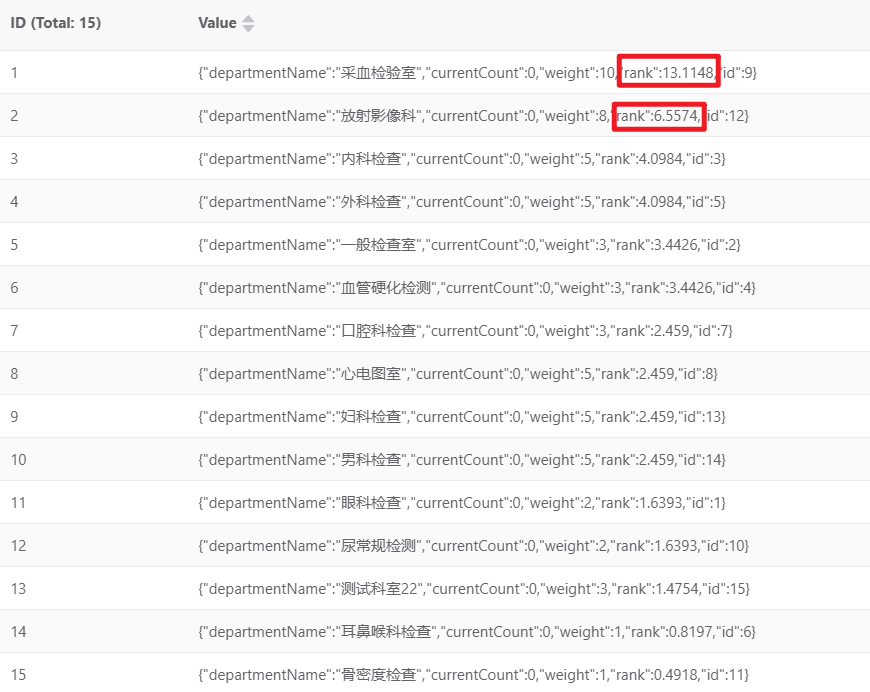

# 定时任务实时更新推荐科室列表

## 实现思路

1. 体检人手机上安装了大健康的 App（当然：我们现在的 App 端是没有开发出来的）。体检人只要拿着手机走到某个体检科室的门口，和最近的蓝牙信标产生连接之后，会自动将该体检人的在某个科室门口的状态存储到 Redis 缓存当中（该缓存不是永久存在的，超过 3 分钟没有更新，自动销毁），存储的 key 和 value 分别是：
  1. key 是：`flow_regulation_customer#客户主键值`
  2. value 是：`科室 id`
2. 我们怎么找出每个科室门口有多少人？
  1. 很简单，我们可以将 Redis 中缓存的 `flow_regulation_customer#客户主键值`，全部取出来，使用这个语法 `flow_regulation_customer#*`
  2. 然后遍历所有的 `flow_regulation_customer#客户主键值`，遍历它的时候，通过它取出 value，value 就是科室 id，然后就可以统计某个科室门口的人数了。
3. 以上只是完成一个科室门口人数的统计，如果要完成所有科室的统计，就需要先从数据库中将所有的科室都查询出来，然后遍历每个科室就行了。遍历到科室 1 的时候，统计科室 1 的人数，遍历到科室 2 的时候统计科室 2 的人数，以此类推。
4. 最后统计完每个科室门口的人数之后，更新数据库，并且同时需要重新加载 Redis 缓存中的推荐科室列表（这个功能的代码前面我们已经写过了，直接复制过来即可）。

## 编写 Mapper 和 XML

找到 `MedDepartmentFlowMapper`接口，编写以下方法查询所有的科室：

```java
List<Map<String, Object>> selectAllDept();
```

找到 `MedDepartmentFlowMapper.xml`文件，编写以下 SQL：

```xml
<select id="selectAllDept" resultType="java.util.Map">
    select 
        id,department_name as departmentName 
    from 
        med_department_flow
</select>
```

## 编写定时器

在 `com.jkweilai.meinian.api.schedule` 包下新建 `FlowRegulationSchedule`定时任务类。

```java
package com.jkweilai.meinian.api.schedule;

import cn.hutool.json.JSONObject;
import cn.hutool.json.JSONUtil;
import com.jkweilai.meinian.api.db.mapper.MedDepartmentFlowMapper;
import com.jkweilai.meinian.api.exception.HisException;
import jakarta.annotation.Resource;
import lombok.extern.slf4j.Slf4j;
import org.springframework.dao.DataAccessException;
import org.springframework.data.redis.core.RedisOperations;
import org.springframework.data.redis.core.RedisTemplate;
import org.springframework.data.redis.core.SessionCallback;
import org.springframework.data.redis.core.ValueOperations;
import org.springframework.scheduling.annotation.Scheduled;
import org.springframework.stereotype.Component;
import org.springframework.transaction.annotation.Transactional;

import java.util.*;

@Component
@Slf4j
public class FlowRegulationSchedule {
    @Resource
    private MedDepartmentFlowMapper medDepartmentFlowMapper;

    @Resource
    private RedisTemplate redisTemplate;

    //@Scheduled(cron = "0 * 7-16 * * ?") // 生产环境下的建议：每天7-16点之间，每分钟计算一次推荐的科室列表
    @Scheduled(cron = "0,20,40 * * * * ?") // 测试的时候每隔20秒执行一次
    @Transactional
    public void refreshFlowRegulation() {
        //查询所有调流科室
        List<Map<String, Object>> deptList = medDepartmentFlowMapper.selectAllDept();
        //所有体检人的排队缓存
        Set<String> keys = redisTemplate.keys("flow_regulation_customer#*");
        
        //遍历所有体检调流科室
        deptList.forEach(one -> {
            int id = Integer.parseInt(one.get("id").toString());
            String departmentName = one.get("departmentName").toString();
            int sum = 0;
            //遍历所有体检人缓存，如果是在当前科室排队，就累加sum值
            for (String key : keys) {
                ValueOperations ops = redisTemplate.opsForValue();
                int deptId = Integer.parseInt(ops.get(key).toString());
                if (id == deptId) {
                    sum++;
                }
            }
            //把该调流科室排队人数更新到数据库
            Map<String, Object> param = new HashMap<>();
            param.put("id", id);
            param.put("currentCount", sum);

            int rows = medDepartmentFlowMapper.updateCurrentCount(param);
            if (rows != 1) {
                throw new HisException("更新体检调流排队人数失败");
            }
        });


        //查询当前的调流模式
        String value = redisTemplate.opsForValue().get("setting#auto_flow_regulation").toString();
        boolean mode = Boolean.parseBoolean(value);
        List<Map<String, Object>> recommendations = null;

        if (mode) {
            recommendations = medDepartmentFlowMapper.selectRecommendationsWithWeight();
        } else {
            recommendations = medDepartmentFlowMapper.selectRecommendationsWithPriority();
        }
        List<String> result = new ArrayList<>();
        recommendations.forEach((one) -> {
            JSONObject json = JSONUtil.parseObj(one);
            result.add(json.toString());
        });

        redisTemplate.delete("flow_regulation");
        redisTemplate.opsForList().rightPushAll("flow_regulation", result.toArray(new String[0]));
        
        log.debug("更新了体检调流缓存");
    }
}
```

现在我们的项目并没有开发 App 端，所以以上功能在测试的时候，启动服务器，每隔 20 秒，看看控制台有没有错误，如果没有错误就表示测试通过了。

# 为 App 端提供推荐科室列表

为将来的 App 端开发的 RESTful 接口。

## 实现思路

1. 为 App 端创建一个专门的 package
2. 为 App 端专门创建一个 Service， 从 Redis 缓存中获取科室推荐列表。从 Redis 缓存中获取的是 JSON 字符串，将每一个 JSON 字符串转换成 JSON 对象，然后将所有 JSON 对象存储到 List 集合中并返回。
3. 为 App 端专门创建一个 Controller，响应 R 对象。

## 编写 Service 和实现

在 `api`包下新建 `app`包，在 `app`包下新建 `service`包，并创建 `FlowRegulationService`接口，编写以下方法：

```java
package com.jkweilai.meinian.api.app.service;

import java.util.List;

public interface FlowRegulationService {
    List<Object> findRecommendations();
}
```

编写实现类 `FlowRegulationServiceImpl`

```java
package com.jkweilai.meinian.api.app.service.impl;

import cn.hutool.json.JSONObject;
import cn.hutool.json.JSONUtil;
import com.jkweilai.meinian.api.app.service.FlowRegulationService;
import jakarta.annotation.Resource;
import org.springframework.data.redis.core.RedisTemplate;
import org.springframework.stereotype.Service;

import java.util.ArrayList;
import java.util.List;

// 注意：一定要指定一个名字，如果不指定名字，会和mis端的冲突
@Service("AppFlowRegulationService")
public class FlowRegulationServiceImpl implements FlowRegulationService {

    @Resource
    private RedisTemplate redisTemplate;

    @Override
    public List<Object> findRecommendations() {
        List<String> list = redisTemplate.opsForList().range("flow_regulation", 0, -1);
        List<Object> result = new ArrayList<>();
        list.forEach(one -> {
            JSONObject json = JSONUtil.parseObj(one.toString());
            result.add(json);
        });
        return result;
    }
}
```

## 编写 web 方法

在 `app`包下新建 `controller`包，新建类 `FlowRegulationController`，编写以下代码：

```java
package com.jkweilai.meinian.api.app.controller;

import com.jkweilai.meinian.api.app.service.FlowRegulationService;
import com.jkweilai.meinian.api.common.R;
import jakarta.annotation.Resource;
import org.springframework.web.bind.annotation.GetMapping;
import org.springframework.web.bind.annotation.RequestMapping;
import org.springframework.web.bind.annotation.RestController;

import java.util.List;

@RestController("AppFlowRegulationController")
@RequestMapping("/app/appointment")
public class FlowRegulationController {
    @Resource
    private FlowRegulationService flowRegulationService;

    @GetMapping("/findRecommendations")
    public R findRecommendations() {
        List<Object> list = flowRegulationService.findRecommendations();
        return R.ok().put("result", list);
    }
}
```

## 测试 web 接口

接口测试地址：[http://localhost:8080/meinian-api/app/appointment/findRecommendations](http://localhost:8080/meinian-api/app/appointment/findRecommendations)

测试结果：


# 后端实现删除科室调流记录

删除调流记录时，不需要手动清除Redis中缓存的推荐科室列表。因为定时任务会每分钟重新统计各科室的排队人数，并自动更新推荐科室列表。


## 编写 Mapper 与 XML

找到 `MedDepartmentFlowMapper`接口，编写以下方法：

```java
int deleteByIds(Integer[] ids);
```

找到 `MedDepartmentFlowMapper.xml`文件，编写 SQL：

```xml
<delete id="deleteByIds">
    delete from med_department_flow where id in 
    <foreach collection="array" item="id" open="(" close=")" separator=",">
        #{id}
    </foreach>
</delete>
```

## 编写 Service 和实现

找到 MIS 端的 `FlowRegulationService`接口，编写以下方法：

```java
int removeByIds(Integer[] ids);
```

编写实现：

```java
@Override
@Transactional
public int removeByIds(Integer[] ids) {
    return medDepartmentFlowMapper.deleteByIds(ids);
}
```

## 编写 form 接收数据并校验

编写 `RemoveMedDepartmentFlowByIdsForm`

```java
package com.jkweilai.meinian.api.controller.form;

import jakarta.validation.constraints.NotEmpty;
import lombok.Data;

@Data
public class RemoveMedDepartmentFlowByIdsForm {
    @NotEmpty(message = "ids不能为空")
    private Integer[] ids;
}
```

## 编写 web 方法

找到 MIS 端 `FlowRegulationController`，编写以下方法：

```java
@PostMapping("/removeByIds")
@SaCheckPermission(value = {"ROOT", "FLOW_REGULATION:DELETE"}, mode = SaMode.OR)
public R removeByIds(@RequestBody @Valid RemoveMedDepartmentFlowByIdsForm form) {
    int rows = flowRegulationService.removeByIds(form.getIds());
    return R.ok().put("rows", rows);
}
```

# 前端实现删除科室调流记录

大家需要注意，删除科室体检调流记录，只是推荐科室列表中不会再出现该科室，该体检科室的体检服务还是正常的。


## 复选框的可选性

复选框一直都是可选的。因此以下回调函数应返回固定的 true：


编写回调函数 `selectable`，返回 true：

```typescript
function selectable(){
    return true;
}
```

## 当用户点击复选框时将当下选择数据赋值给响应式对象

当用户点击复选框时触发的回调函数为：


编写回调函数 `selectionChangeHandle`，代码如下：

```typescript
function selectionChangeHandle(vals){
    data.selections = vals;
}
```

## 发送 ajax 请求删除数据

不管用户点击的删除按钮，还是批量删除，都走同一个回调函数，另外删除前要有提醒。

```typescript
function deleteHandle(id){
    let ids = id ? [id] : data.selections.map(item => item.id);
    if(ids.length == 0){
        ElMessage({
            message: "请选择要删除的数据",
            type: "warning",
            duration: 1200
        });
    }else{
        ElMessageBox.confirm("您确定要删除数据吗？", "提示信息", {
            confirmButtonText: "确定",
            cancelButtonText: "取消"
        }).then(async ()=>{
            // 准备数据
            let json = {ids};
            // 准备配置
            let config = {
                headers: {
                    satoken: localStorage.getItem("token")
                }
            };
            // 发送ajax请求
            let response = await axios.post("/meinian-api/mis/flow_regulation/removeByIds", json, config);
            let rows = response.data.rows;
            if(rows > 0){
                ElMessage({
                    message: "操作成功",
                    type: "success",
                    duration: 1200
                });
                // 加载科室列表
                loadDeptList();
                // 加载分页数据
                loadPageData();
            }else{
                ElMessage({
                    message: "操作失败",
                    type: "error",
                    duration: 1200
                });
            }
        });
    }
}
```

# 体检调流模式切换

切换调流模式。切换调流模式不仅要更新系统设置表的记录，还要更新Redis里面的系统设置缓存。

## 编写 Mapper 和 XML

找到 `SysConfigMapper`接口，编写以下方法：

```java
int updateByConfigKey(Map<String, String> params);
```

找到 `SysConfigMapper.xml`文件，编写以下 SQL：

```xml
<update id="updateByConfigKey">
    update sys_config set config_value = #{configValue} where config_key = #{configKey}
</update>
```

## 编写 Service 和实现

找到 `SysConfigService`接口，编写以下方法：

```java
boolean setConfigValue(String configKey, String configValue);
```

编写方法实现：

```java
@Resource
private SysConfigMapper sysConfigMapper;

@Override
@Transactional
public boolean setConfigValue(String configKey, String configValue) {
    // 更新数据库
    Map<String, String> params = new HashMap<>();
    params.put("configKey", configKey);
    params.put("configValue", configValue);
    int rows = sysConfigMapper.updateByConfigKey(params);
    // 更新缓存
    if(rows > 0){
        redisTemplate.opsForValue().set("setting#" + configKey, configValue);
        return true;
    }
    return false;
}
```

## 编写 form 接收数据并校验

编写 `SwitchFlowRegulationModeForm`

```java
package com.jkweilai.meinian.api.controller.form;

import jakarta.validation.constraints.NotNull;
import lombok.Data;

@Data
public class SwitchFlowRegulationModeForm {
    @NotNull(message = "mode不能为空")
    private Boolean mode;
}
```

## 编写 web 方法

找到 MIS 端 `FlowRegulationController`，编写以下 web 方法：

```java
@PostMapping("/switchFlowRegulation")
@SaCheckPermission(value = {"ROOT", "FLOW_REGULATION:UPDATE"}, mode = SaMode.OR)
public R switchFlowRegulation(@RequestBody @Valid SwitchFlowRegulationModeForm form){
    boolean result = sysConfigService.setConfigValue("auto_flow_regulation", String.valueOf(form.getMode()));
    return R.ok().put("result", result);
}
```

## 前端实现切换调流规则

在页面中找到切换按钮：


编写回调函数 `changeModeHandle`，通过响应式对象 `dataForm.mode`来获取当前的状态：

```typescript
async function changeModeHandle() {
    let json = { mode: !dataForm.mode };
    let config = {
        headers: {
            satoken: localStorage.getItem('token')
        }
    };
    let response = await axios.post("/meinian-api/mis/flow_regulation/switchFlowRegulation", json, config);
    let result = response.data.result;
    if (result) {
        ElMessage({
            message: '切换成功',
            type: 'success',
            duration: 800
        });
        // 返回true按钮才会有切换的效果
        return true;
    } else {
        ElMessage({
            message: '切换失败',
            type: 'warning',
            duration: 800
        });
        // 返回false按钮不会切换。
        return false;
    }
}
```

## 最终测试

在页面上点击切换按钮：

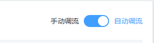

等一分钟。然后使用之前的获取推荐科室列表的接口来测试一下，看看切换后，推荐列表有没有变化。

测试接口地址：[http://localhost:8080/meinian-api/app/appointment/findRecommendations](http://localhost:8080/meinian-api/app/appointment/findRecommendations)

# 分析体检报告模块

## 数据库 ER 图


体检报告表结构如下：


`report_id`是体检结果 `id`，来自 MongoDB。

`status`是报告的状态，1 表示未生成，2 表示已生成，3 表示已邮寄。

`file_url`是报告文件的 url 地址，报告文件会存储到 Minio 服务器上。

## UI 界面

MIS端体检报告模块支持多种业务操作，包括按条件搜索记录、下载已生成的报告以及管理邮寄情况。

请注意：体检人一旦签到，系统就会自动创建报告记录，但此时报告尚未生成，状态为“未生成”。待后续系统完成报告生成，**记录状态**才会相应更新。

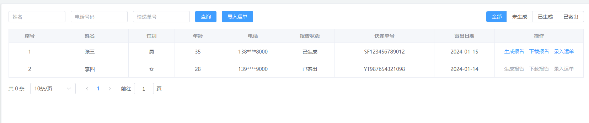

体检报告无法当天出具，主要原因在于：

1. **检验项目耗时差异**：外科、内科等科室可现场录入结果，但血检等化验项目需1-2天才能返回结果；
2. **结果录入分步进行**：各科室需待结果出具后逐一录入系统；
3. **报告需复核确认**：全部结果汇总后，需经医生复核才能生成正式报告并安排邮寄。

为确保所有检验结果完整生成，系统设置定时任务，将在体检完成10天后自动生成报告，该时长已充分涵盖各项检验及审核流程。

系统虽已设置定时器自动生成报告，但仍提供了手动生成功能，主要用于程序调试。例如，当修复一个报告生成的Bug后，定时任务需等到次日才能再次触发。此时，手动功能允许开发人员立即测试，验证问题是否已解决，无需漫长等待。

在邮寄管理中，点击“录入运单”即可弹出上传窗口。上传快递单照片后，系统会调用OCR技术自动识别并回填运单信息，提交后即可保存至对应报告记录中。

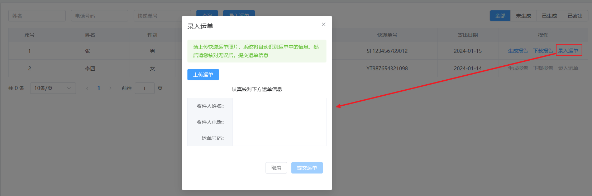

在业务端：在体检预约记录中，若报告已生成，右侧会显示一个可点击的下载链接。点击该链接，即可从Minio服务器获取并下载自己的体检报告。

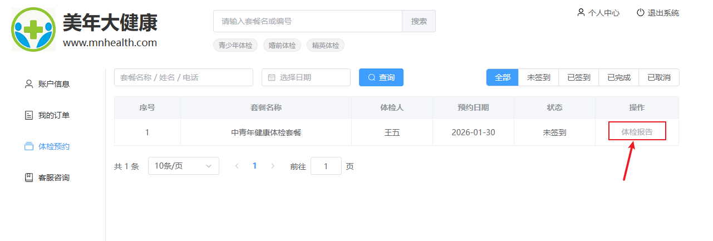

## UML 用例图

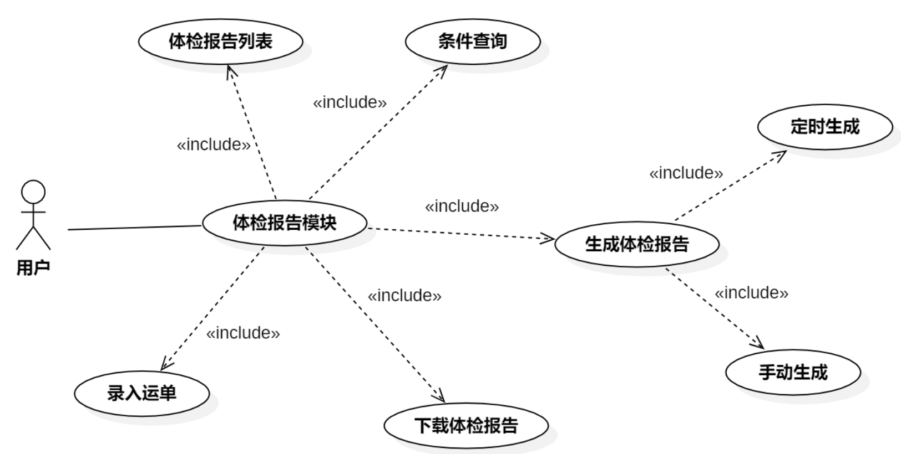