# 美年大健康项目-11

# 实现体检报告模块页面

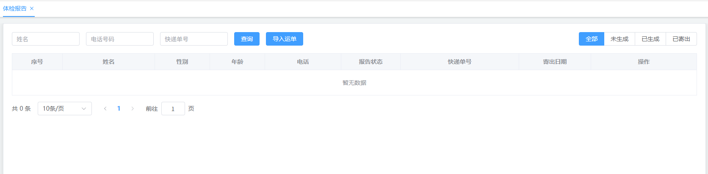

## 创建 vue 页面并配置路由

在 `src/views/mis/` 目录中创建 `checkup_report.vue` 页面，然后在 `src/router/index.ts` 文件中配置路由信息。

在 mis 端添加以下配置：

```typescript
{
    path: 'checkup_report',
    name: 'MisCheckupReport',
    component: ()=>import('../views/mis/checkup_report.vue'),
    meta: {
        title: "体检报告",
        isTab: true
    }
}
```

顺手创建 less 样式文件：`checkup_report.less`

```plaintext
<style lang="less" scoped>
    @import url('checkup_report.less');
</style>
```

## 编写视图层

```html
<template>
    <div v-if="proxy.isAuth(['ROOT', 'CHECKUP_REPORT:SELECT'])">
        <el-form :inline="true" :model="dataForm" :rules="dataRule" ref="form">
            <el-form-item prop="patientName">
                <el-input v-model="dataForm.patientName" placeholder="姓名"
                    maxlength="20" class="input" clearable="clearable" />
            </el-form-item>
            <el-form-item prop="phone">
                <el-input v-model="dataForm.phone" placeholder="电话号码"
                    maxlength="11" class="input" clearable="clearable" />
            </el-form-item>
            <el-form-item prop="expressNo">
                <el-input v-model="dataForm.expressNo" placeholder="快递单号"
                    maxlength="24" class="input" clearable="clearable" />
            </el-form-item>
            <el-form-item>
                <el-button type="primary" @click="searchHandle()">查询</el-button>
            </el-form-item>
            <el-form-item>
                <el-upload :action="upload.action" name="file" accept=".xlsx"
                    :headers="upload.headers" :show-file-list="false"
                    :before-upload="excelBeforeUpload"
                    :on-success="excelUploadSuccess"
                    :on-error="excelUploadError">
                    <el-button type="primary">导入运单</el-button>
                </el-upload>
            </el-form-item>
            <el-form-item class="mold">
                <el-radio-group v-model="dataForm.statusLabel" @change="searchHandle()">
                    <el-radio-button label="全部"></el-radio-button>
                    <el-radio-button label="未生成"></el-radio-button>
                    <el-radio-button label="已生成"></el-radio-button>
                    <el-radio-button label="已寄出"></el-radio-button>
                </el-radio-group>
            </el-form-item>
        </el-form>
        <el-table :data="data.dataList"
            :header-cell-style="{'background':'#f5f7fa'}" border
            v-loading="data.loading">
            <el-table-column type="index" header-align="center" align="center"
                width="120" label="序号" fixed>
                <template #default="scope">
                    <span>{{ (data.pageIndex - 1) * data.pageSize + scope.$index + 1 }}</span>
                </template>
            </el-table-column>
            <el-table-column header-align="center" align="center" label="姓名"
                min-width="150" fixed>
                <template #default="scope">
                    <span class="customer-name" @dblclick="copyAddressHandle(scope.row.patientName,scope.row.phone,scope.row.address)">{{scope.row.patientName}}</span>
                </template>
            </el-table-column>
            <el-table-column prop="gender" header-align="center" align="center"
                label="性别" width="130" />
            <el-table-column prop="age" header-align="center" align="center"
                label="年龄" width="130" />
            <el-table-column prop="hidePhone" header-align="center" align="center"
                label="电话" width="180" />
            <el-table-column prop="status" header-align="center" align="center"
                label="报告状态" width="140" />
            <el-table-column prop="expressNo" header-align="center"
                align="center" label="快递单号" width="280" />
            <el-table-column prop="expressDate" header-align="center"
                align="center" label="寄出日期" width="170" />
            <el-table-column fixed="right" header-align="center" align="center"
                width="250" label="操作">
                <template #default="scope">
                    <el-button type="text" :disabled="scope.row.disabled"
                        @click="createReportHandle(scope.row.id)">
                        生成报告
                    </el-button>
                    <el-button type="text" :disabled="scope.row.status!='已生成'"
                        @click="downloadReportHandle(scope.row.patientName, scope.row.fileUrl)">
                        下载报告
                    </el-button>
                    <el-button type="text" :disabled="scope.row.status!='已生成'"
                        @click="identifyWaybillHandle(scope.row.id,scope.row.patientName, scope.row.phone)">
                        录入运单
                    </el-button>
                </template>
            </el-table-column>
        </el-table>
        <el-pagination @size-change="sizeChangeHandle"
            @current-change="currentChangeHandle" :current-page="data.pageIndex"
            :page-sizes="[10, 20, 50]" :page-size="data.pageSize"
            :total="data.totalCount"
            layout="total, sizes, prev, pager, next, jumper">
        </el-pagination>
    </div>

</template>
```

## 编写模型层

```typescript
<script lang="ts" setup>
    import { reactive, getCurrentInstance, ref } from 'vue';
    import { ElNotification } from 'element-plus'
    import { isBlank } from '../../utils/validate';
  
    import { dayjs } from 'element-plus'
    import isSameOrBefore from 'dayjs/plugin/isSameOrBefore'
    dayjs.extend(isSameOrBefore)

    const { proxy } = getCurrentInstance();
  
    const dataForm = reactive({
        patientName: null,
        phone: null,
        expressNo: null,
        statusLabel: '全部',
        status: null
    });

    const data = reactive({
        dataList: [],
        pageIndex: 1,
        pageSize: 10,
        totalCount: 0,
        loading: false
    });

    const dataRule = reactive({
        patientName: [
            { required: false, pattern: '^[\u4e00-\u9fa5]{1,10}$', message: '姓名格式错误' }
        ],
        phone: [
            { required: false, pattern: '^1[1-9]\\d{9}$', message: '电话格式错误' }
        ],
        expressNo: [
            { required: false, pattern: '^[0-9a-zA-Z]{10,24}$', message: '快递单号格式错误' }
        ]
    });
  
    const upload = reactive({
        action: "/meinian-api/mis/checkup/report/importExpress",
        headers: {
            satoken : localStorage.getItem('token')
        },
    });
</script>
```

## 编写样式

```plaintext
@import url('../style.less');
.mold {
          float: right;
          margin-right: 0 !important;
}
```

# 实现录入运单弹窗

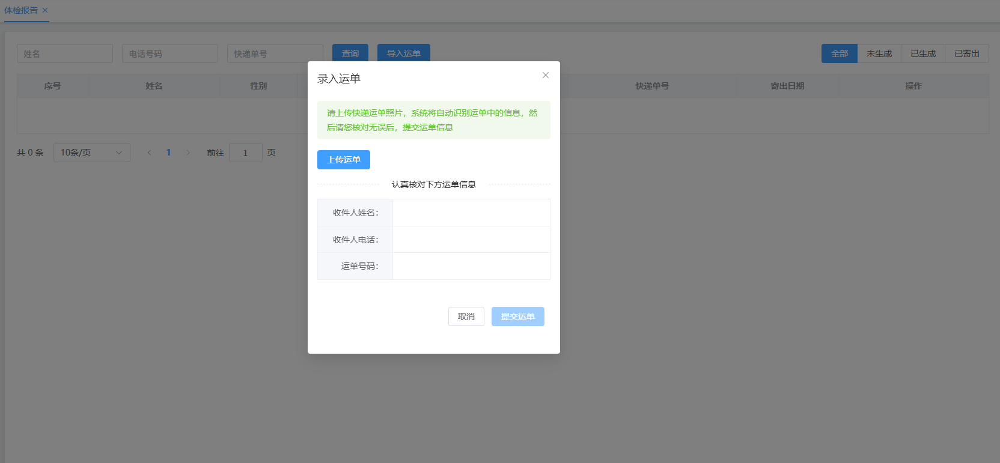

## 编写视图层

```html
<el-dialog title="录入运单" v-if="proxy.isAuth(['ROOT', 'CHECKUP_REPORT:UPDATE'])"
    :close-on-click-modal="false" v-model="dialog.visible" width="420px">
    <el-alert title="请上传快递运单照片，系统将自动识别运单中的信息，然后请您核对无误后，提交运单信息"
        type="success" :closable="false" />
    <el-upload :action="dialog.upload.action" name="file"
        accept=".jpg,.jpeg" :headers="dialog.upload.headers"
        :show-file-list="false"
        :before-upload="waybillBeforeUpload"
        :on-success="waybillUploadSuccess"
        :on-error="waybillUploadError">
        <el-button type="primary">上传运单</el-button>
    </el-upload>
    <el-divider border-style="dashed">认真核对下方运单信息</el-divider>
    <table class="waybill-table">
        <tr>
            <th>收件人姓名：</th>
            <td>{{dialog.data.recName}}</td>
        </tr>
        <tr>
            <th>收件人电话：</th>
            <td>{{dialog.data.recPhone}}</td>
        </tr>
        <tr>
            <th>运单号码：</th>
            <td>{{dialog.data.expressNo}}</td>
        </tr>
    </table>
    <template #footer>
        <span class="dialog-footer">
            <el-button @click="dialog.visible = false">取消</el-button>
            <el-button type="primary" :disabled="dialog.data.expressNo==null||dialog.data.patientName!=dialog.data.recName|| dialog.data.recPhone.substr(7, 4) != dialog.data.phoneEnd"
                @click="dataFormSubmit">
            提交运单
            </el-button>
        </span>
    </template>
</el-dialog>
```

## 编写模型层

```typescript
const dialog = reactive({
    visible: false,
    upload: {
        action: "/meinian-api/mis/report/recognizeWaybill",
        headers: {
            satoken : localStorage.getItem('token')
        },
        data: {
            id: null
        }
    },
    data: {
        id: null,
        recName: null,
        recPhone: null,
        expressNo: null,
        patientName: null,
        phoneEnd: null
    }
})
```

## 编写样式

```plaintext
.el-alert {
    margin-bottom: 18px;
}

.waybill-table {
    width: 100%;
    border: solid 1px @border-color-22;
    border-collapse: collapse;
    border-spacing: 0;
    margin-bottom: 35px;
    th {
        font-size: 14px;
        line-height: 1.7;
        padding: 10px 15px;
        font-weight: normal;
        border: solid 1px @border-color-22;
        background-color: @bg-color-31;
        color: @font-color-25;
        width: 125px;
        text-align: right;
    }
    td {
        font-size: 14px;
        line-height: 1.7;
        padding: 10px 15px;
        font-weight: normal;
        border: solid 1px @border-color-22;
        color: @font-color-26;
    }
}
```

# 实现体检报告分页查询

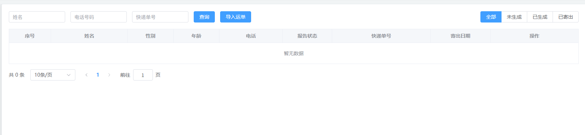

分页查询我们已经做过很多了。只要分析好，查询条件是什么，查询结果需要返回什么，编写好两条 SQL 语句就行了。一条是查询数据返回封装的分页对象，一条是查询记录条数。接下来我们直接实现。

## 编写 Mapper 与 XML

找到 `MedExamReportMapper`接口，编写以下两个方法：

```java
List<Map<String, Object>> selectPage(Map<String, Object> param);

long selectCount(Map<String, Object> param);
```

找到 `MedExamReportMapper.xml`文件，编写以下 SQL：

```xml

<select id="selectPage" resultType="java.util.Map">
    select
        r.id,
        a.patient_name as patientName,
        a.gender,
        timestampdiff(year,a.birth_date,now()) as age,
        concat(substring(a.id_card_no,1,3),"***********",substring(a.id_card_no,15,4)) as idCardNo,
        a.phone,
        concat(substring(a.phone,1,3),"****",substring(a.phone,8,4)) as hidePhone,
        a.address,
        a.appointment_date as appointmentDate,
        r.status,
        r.file_url as fileUrl,
        r.express_no as expressNo,
        r.express_date as expressDate
    from
        med_exam_report r
    join
        med_exam_appointment a
    on r.appointment_id = a.id
    <where>
        <if test="patientName != null and patientName != ''">
            and a.patient_name like concat("%",#{patientName},"%")
        </if>
        <if test="phone != null and phone != ''">
            and a.phone = #{phone}
        </if>
        <if test="expressNo != null and expressNo != ''">
            and r.express_no = #{expressNo}
        </if>
        <if test="status != null and status != ''">
            and r.status = #{status}
        </if>
    </where>
    order by r.id desc
    limit #{startIndex}, #{pageSize}
</select>

<select id="selectCount" resultType="java.lang.Long">
    select
        count(*)
    from
        med_exam_report r
    join
        med_exam_appointment a
    on r.appointment_id = a.id
    <where>
        <if test="patientName != null and patientName != ''">
            and a.patient_name like concat("%",#{patientName},"%")
        </if>
        <if test="phone != null and phone != ''">
            and a.phone = #{phone}
        </if>
        <if test="expressNo != null and expressNo != ''">
            and r.express_no = #{expressNo}
        </if>
        <if test="status != null and status != ''">
            and r.status = #{status}
        </if>
    </where>
</select>
```

## 编写 Service 与实现

在 MIS 端新建 `MedExamReportService`接口，编写以下方法：

```java
package com.jkweilai.meinian.api.service;

import com.jkweilai.meinian.api.common.PageResult;

import java.util.Map;

public interface MedExamReportService {
    
    PageResult<Map<String, Object>> pageQuery(Map<String, Object> param);
}
```

编写实现：

```java
package com.jkweilai.meinian.api.service.impl;

import cn.hutool.core.map.MapUtil;
import com.jkweilai.meinian.api.common.PageResult;
import com.jkweilai.meinian.api.db.mapper.MedExamReportMapper;
import com.jkweilai.meinian.api.service.MedExamReportService;
import jakarta.annotation.Resource;
import org.springframework.stereotype.Service;

import java.util.ArrayList;
import java.util.List;
import java.util.Map;

@Service
public class MedExamReportServiceImpl implements MedExamReportService {
    
    @Resource
    private MedExamReportMapper medExamReportMapper;
    
    @Override
    public PageResult<Map<String, Object>> pageQuery(Map<String, Object> param) {
        long total = medExamReportMapper.selectCount(param);
        List<Map<String, Object>> records = new ArrayList<>();
        if(total > 0){
            records = medExamReportMapper.selectPage(param);
        }
        Integer pageNo = MapUtil.getInt(param, "pageNo");
        Integer pageSize = MapUtil.getInt(param, "pageSize");
        PageResult<Map<String, Object>> pageResult = new PageResult<>(total, pageSize, pageNo, records);
        return pageResult;
    }
}
```

## 编写 form 接收并校验数据

编写 `PageQueryMedExamReportForm`

```java
package com.jkweilai.meinian.api.controller.form;

import jakarta.validation.constraints.Min;
import jakarta.validation.constraints.NotNull;
import jakarta.validation.constraints.Pattern;
import lombok.Data;
import org.hibernate.validator.constraints.Range;

@Data
public class PageQueryMedExamReportForm {
    @Pattern(regexp = "^[\\u4e00-\\u9fa5]{1,10}$", message = "patientName内容不正确")
    private String patientName;

    @Pattern(regexp = "^1[1-9]\\d{9}$", message = "phone内容不正确")
    private String phone;

    @Pattern(regexp = "^[0-9A-Za-z]{10,24}$", message = "expressNo内容不正确")
    private String expressNo;

    @Range(min = 1, max = 3, message = "status内容不正确")
    private Integer status;

    @NotNull(message = "pageNo不能为空")
    @Min(value = 1, message = "pageNo不能小于1")
    private Integer pageNo;

    @NotNull(message = "pageSize不能为空")
    @Range(min = 10, max = 50, message = "pageSize必须为10~50之间")
    private Integer pageSize;
}
```

## 编写 web 方法

在 MIS 端创建 `MedExamReportController`，编写 web 方法：

```java
package com.jkweilai.meinian.api.controller;

import cn.dev33.satoken.annotation.SaCheckPermission;
import cn.dev33.satoken.annotation.SaMode;
import cn.hutool.core.bean.BeanUtil;
import com.jkweilai.meinian.api.common.PageResult;
import com.jkweilai.meinian.api.common.R;
import com.jkweilai.meinian.api.controller.form.PageQueryMedExamReportForm;
import com.jkweilai.meinian.api.service.MedExamReportService;
import jakarta.annotation.Resource;
import jakarta.validation.Valid;
import org.springframework.web.bind.annotation.PostMapping;
import org.springframework.web.bind.annotation.RequestBody;
import org.springframework.web.bind.annotation.RequestMapping;
import org.springframework.web.bind.annotation.RestController;

import java.util.Map;

@RestController
@RequestMapping("/mis/report")
public class MedExamReportController {

    @Resource
    private MedExamReportService medExamReportService;

    @PostMapping("/pageQuery")
    @SaCheckPermission(value = {"ROOT", "CHECKUP_REPORT:SELECT"}, mode = SaMode.OR)
    public R pageQuery(@RequestBody @Valid PageQueryMedExamReportForm form) {
        Integer pageNo = form.getPageNo();
        Integer pageSize = form.getPageSize();
        Integer startIndex = pageSize * (pageNo - 1);
        Map<String, Object> param = BeanUtil.beanToMap(form);
        param.put("startIndex", startIndex);
        PageResult<Map<String, Object>> pageResult = medExamReportService.pageQuery(param);
        return R.ok().put("pageResult", pageResult);
    }
}
```

## 前端封装 loadPageData 函数

在 MIS 端的 `checkup_report.vue`页面中编写 `loadPageData`函数：

```typescript
async function loadPageData() {
    data.loading = true;
    if (dataForm.statusLabel == '全部') {
        dataForm.status = null;
    } else if (dataForm.statusLabel == '未生成') {
        dataForm.status = 1;
    } else if (dataForm.statusLabel == '已生成') {
        dataForm.status = 2;
    } else {
        dataForm.status = 3;
    }
    let json = {
        patientName: dataForm.patientName,
        phone: dataForm.phone,
        expressNo: dataForm.expressNo,
        status: dataForm.status,
        pageNo: data.pageIndex,
        pageSize: data.pageSize
    };
    let config = {
        headers: {
            satoken: localStorage.getItem('token')
        }
    };
    let response = await axios.post("/meinian-api/mis/report/pageQuery", json, config);
    let pageResult = response.data.pageResult;
    let records = pageResult.records;

    let temp = {
        "1": "未生成",
        "2": "已生成",
        "3": "已寄出"
    }
    for (let one of records) {
        one.status = temp[one.status + ""]
        /*
        * 生成报告按钮是否禁用。
        * 当前日期时间十天之前如果在体检日之前，说明体检距今未超过10天，生成报告按钮处于禁用状态
        */
        one.disabled = dayjs().subtract(10, 'day').isSameOrBefore(dayjs(one.appointmentDate))
    }
    data.dataList = records;
    data.totalCount = pageResult.total;
    data.loading = false;
}
loadPageData();
```

## 前端实现分页查询

编写 `searchHandle`回调函数：

```typescript
function searchHandle() {
    proxy.$refs['form'].validate(valid => {
        if (valid) {
            proxy.$refs['form'].clearValidate();
            data.pageIndex = 1;
            loadPageData();
        }
    });
}
```

## 前端实现翻页

```typescript
function sizeChangeHandle(val) {
    data.pageSize = val;
    data.pageIndex = 1;
    loadPageData();
}

function currentChangeHandle(val) {
    data.pageIndex = val;
    loadPageData();
}
```

# 封装 POI 工具类

封装 POI 工具类，该工具类用来导出体检报告。(里面带有 main 方法测试程序，直接运行可以将报告生成到 d 盘根目录下。)

```java
package com.jkweilai.meinian.api.report;

import cn.hutool.core.map.MapUtil;
import cn.hutool.extra.qrcode.QrCodeUtil;
import cn.hutool.extra.qrcode.QrConfig;
import lombok.SneakyThrows;
import org.apache.poi.util.Units;
import org.apache.poi.wp.usermodel.HeaderFooterType;
import org.apache.poi.xwpf.usermodel.*;
import org.openxmlformats.schemas.wordprocessingml.x2006.main.*;
import org.springframework.stereotype.Component;

import javax.imageio.ImageIO;
import java.awt.image.BufferedImage;
import java.io.ByteArrayInputStream;
import java.io.ByteArrayOutputStream;
import java.io.FileOutputStream;
import java.io.InputStream;
import java.math.BigInteger;
import java.net.URL;
import java.util.ArrayList;
import java.util.HashMap;
import java.util.List;
import java.util.Map;

@Component
public class CheckupReportUtil {

    /**
     * 创建报告封面页
     */
    private void createCover(XWPFDocument doc, HashMap param) throws Exception {
        // 创建标题段落 - 机构名称
        XWPFParagraph paragraph = doc.createParagraph();
        XWPFRun run = paragraph.createRun();
        run.setBold(true);
        run.setFontSize(20);
        run.setFontFamily("Microsoft YaHei");
        run.setUnderline(UnderlinePatterns.THICK);
        run.setText("天津美年大健康体检中心");

        // 设置段落行间距
        CTP ctp = paragraph.getCTP();
        CTPPr ctpPr = ctp.addNewPPr();
        CTSpacing ctSpacing = ctpPr.addNewSpacing();
        ctSpacing.setLineRule(STLineSpacingRule.EXACT);
        ctSpacing.setLine(BigInteger.valueOf(480));

        // 创建英文机构名称段落
        paragraph = doc.createParagraph();
        run = paragraph.createRun();
        run.setFontSize(10);
        run.setFontFamily("Microsoft YaHei");
        run.setText("Tianjin Meinian Onehealth Healthcare Center");

        // 设置英文名称段落行间距
        ctp = paragraph.getCTP();
        ctpPr = ctp.addNewPPr();
        ctSpacing = ctpPr.addNewSpacing();
        ctSpacing.setLineRule(STLineSpacingRule.EXACT);
        ctSpacing.setLine(BigInteger.valueOf(280));

        // 创建主标题段落 - 体检报告书
        paragraph = doc.createParagraph();
        paragraph.setAlignment(ParagraphAlignment.CENTER);
        run = paragraph.createRun();
        run.setBold(true);
        run.setFontSize(26);
        run.setFontFamily("Microsoft YaHei");
        run.setText("体检报告书");

        // 设置主标题段落间距
        ctp = paragraph.getCTP();
        ctpPr = ctp.addNewPPr();
        ctSpacing = ctpPr.addNewSpacing();
        ctSpacing.setBeforeLines(BigInteger.valueOf(800));
        ctSpacing.setAfterLines(BigInteger.valueOf(800));

        // 生成二维码
        QrConfig qrConfig = new QrConfig();
        qrConfig.setWidth(150);
        qrConfig.setHeight(150);
        qrConfig.setMargin(2);
        String uuid = MapUtil.getStr(param, "uuid");
        BufferedImage bufferedImage = QrCodeUtil.generate(uuid, qrConfig);
        ByteArrayOutputStream bout = new ByteArrayOutputStream();
        ImageIO.write(bufferedImage, "jpg", bout);
        InputStream input = new ByteArrayInputStream(bout.toByteArray());

        // 创建二维码段落
        paragraph = doc.createParagraph();
        paragraph.setAlignment(ParagraphAlignment.CENTER);
        ctp = paragraph.getCTP();
        ctpPr = ctp.addNewPPr();
        ctSpacing = ctpPr.addNewSpacing();
        ctSpacing.setAfterLines(BigInteger.valueOf(400));
        run = paragraph.createRun();
        run.addPicture(input, Document.PICTURE_TYPE_JPEG, "", Units.pixelToEMU(bufferedImage.getWidth()), Units.pixelToEMU(bufferedImage.getHeight()));

        // 创建个人信息表格
        XWPFTable table = doc.createTable(4, 2);
        table.setTableAlignment(TableRowAlign.CENTER);
        table.getCTTbl().getTblPr().unsetTblBorders(); // 隐藏表格边框

        // 填充个人信息
        ArrayList<HashMap> list = (ArrayList) param.get("item");
        for (int i = 0; i < list.size(); i++) {
            HashMap map = list.get(i);
            String label = MapUtil.getStr(map, "label");
            String value = MapUtil.getStr(map, "value");
            XWPFTableRow row = table.getRow(i);
            row.setHeight(600);
            List<XWPFTableCell> tableCells = row.getTableCells();

            // 设置第二列单元格宽度
            CTTcPr ctTcPr = tableCells.get(1).getCTTc().addNewTcPr();
            CTTblWidth ctTblWidth = ctTcPr.addNewTcW();
            ctTblWidth.setW(BigInteger.valueOf(2800));


            // 标签单元格
            paragraph = tableCells.get(0).getParagraphArray(0);
            run = paragraph.createRun();
            run.setFontFamily("Microsoft YaHei");
            run.setText(label + "    ");

            // 值单元格 - 带下划线样式
            paragraph = tableCells.get(1).getParagraphArray(0);
            paragraph.setBorderBottom(Borders.BABY_RATTLE);
            run = paragraph.createRun();
            run.setFontFamily("Microsoft YaHei");
            run.setText("    " + value);
        }
    }

    /**
     * 创建欢迎致辞页面
     */
    private void createWelcome(XWPFDocument doc, HashMap param) {
        // 创建标题段落
        XWPFParagraph paragraph = doc.createParagraph();
        paragraph.setAlignment(ParagraphAlignment.CENTER);
        XWPFRun run = paragraph.createRun();
        run.setFontSize(18);
        run.setFontFamily("Microsoft YaHei");
        run.setText("健康体检报告");

        // 设置标题段落间距
        CTP ctp = paragraph.getCTP();
        CTPPr ctpPr = ctp.addNewPPr();
        CTSpacing ctSpacing = ctpPr.addNewSpacing();
        ctSpacing.setLineRule(STLineSpacingRule.EXACT);
        ctSpacing.setLine(BigInteger.valueOf(420));
        ctSpacing.setBeforeLines(BigInteger.valueOf(2000));
        ctSpacing.setAfterLines(BigInteger.valueOf(200));

        // 创建称呼段落
        paragraph = doc.createParagraph();
        run = paragraph.createRun();
        run.setFontSize(10);
        run.setFontFamily("Microsoft YaHei");
        String name = MapUtil.getStr(param, "name");
        String sex = MapUtil.getStr(param, "sex");
        String temp = name + (sex.equals("男") ? "先生" : "女士");
        run.setText("尊敬的" + temp + "，您好！");

        // 设置称呼段落间距
        ctp = paragraph.getCTP();
        ctpPr = ctp.addNewPPr();
        ctSpacing = ctpPr.addNewSpacing();
        ctSpacing.setLineRule(STLineSpacingRule.EXACT);
        ctSpacing.setLine(BigInteger.valueOf(380));
        ctSpacing.setAfterLines(BigInteger.valueOf(50));

        // 创建正文段落
        paragraph = doc.createParagraph();
        paragraph.setIndentationFirstLine(600); // 首行缩进
        run = paragraph.createRun();
        run.setFontSize(10);
        run.setFontFamily("Microsoft YaHei");
        run.setText("感谢您到天津美年大健康中心体检。现将您的体检结果汇总如下，请您认真阅读体检结果和建议。如有疑问，请您来院或者致电本中心服务电话022-88888888，我们将安排专业人员为您答疑解惑。欢迎对我们的工作提出批评和建议。祝您健康！");

        // 设置正文段落间距
        ctp = paragraph.getCTP();
        ctpPr = ctp.addNewPPr();
        ctSpacing = ctpPr.addNewSpacing();
        ctSpacing.setLineRule(STLineSpacingRule.EXACT);
        ctSpacing.setLine(BigInteger.valueOf(380));
        ctSpacing.setAfterLines(BigInteger.valueOf(100));
    }

    /**
     * 创建体检人信息表格
     */
    private void createCustomerInfo(XWPFDocument doc, HashMap param) {
        // 创建标题段落
        XWPFParagraph paragraph = doc.createParagraph();
        XWPFRun run = paragraph.createRun();
        run.setFontSize(14);
        run.setFontFamily("Microsoft YaHei");
        run.setText("体检人信息");

        // 设置标题段落间距
        CTP ctp = paragraph.getCTP();
        CTPPr ctpPr = ctp.addNewPPr();
        CTSpacing ctSpacing = ctpPr.addNewSpacing();
        ctSpacing.setBeforeLines(BigInteger.valueOf(200));
        ctSpacing.setAfterLines(BigInteger.valueOf(100));

        // 创建4行6列的信息表格
        XWPFTable table = doc.createTable(4, 6);
        CTTblPr tblPr = table.getCTTbl().getTblPr();
        tblPr.getTblW().setType(STTblWidth.DXA);
        tblPr.getTblW().setW(BigInteger.valueOf(9850)); // 设置表格总宽度

        // 第一行：姓名、性别、出生日期
        XWPFTableRow row = table.getRow(0);
        row.setHeight(550);
        List<XWPFTableCell> tableCells = row.getTableCells();

        // 姓名标签单元格
        XWPFTableCell cell = tableCells.get(0);
        cell.setVerticalAlignment(XWPFTableCell.XWPFVertAlign.CENTER);
        cell.setColor("f0f0f0"); // 设置背景色
        paragraph = cell.getParagraphArray(0);
        paragraph.setAlignment(ParagraphAlignment.CENTER);
        run = paragraph.createRun();
        run.setFontSize(9);
        run.setFontFamily("Microsoft YaHei");
        run.setText("姓名");
        CTTcPr ctTcPr = cell.getCTTc().addNewTcPr();
        CTTblWidth ctTblWidth = ctTcPr.addNewTcW();
        ctTblWidth.setW(BigInteger.valueOf(1500)); // 设置列宽

        // 姓名值单元格
        cell = tableCells.get(1);
        cell.setVerticalAlignment(XWPFTableCell.XWPFVertAlign.CENTER);
        paragraph = cell.getParagraphArray(0);
        paragraph.setAlignment(ParagraphAlignment.CENTER);
        run = paragraph.createRun();
        run.setFontSize(9);
        run.setFontFamily("Microsoft YaHei");
        run.setText(MapUtil.getStr(param, "name"));

        // 性别标签单元格
        cell = tableCells.get(2);
        cell.setVerticalAlignment(XWPFTableCell.XWPFVertAlign.CENTER);
        cell.setColor("f0f0f0");
        paragraph = cell.getParagraphArray(0);
        paragraph.setAlignment(ParagraphAlignment.CENTER);
        run = paragraph.createRun();
        run.setFontSize(9);
        run.setFontFamily("Microsoft YaHei");
        run.setText("性别");
        ctTcPr = cell.getCTTc().addNewTcPr();
        ctTblWidth = ctTcPr.addNewTcW();
        ctTblWidth.setW(BigInteger.valueOf(1500));

        // 性别值单元格
        cell = tableCells.get(3);
        cell.setVerticalAlignment(XWPFTableCell.XWPFVertAlign.CENTER);
        paragraph = cell.getParagraphArray(0);
        paragraph.setAlignment(ParagraphAlignment.CENTER);
        run = paragraph.createRun();
        run.setFontSize(9);
        run.setFontFamily("Microsoft YaHei");
        run.setText(MapUtil.getStr(param, "sex"));
        ctTcPr = cell.getCTTc().addNewTcPr();
        ctTblWidth = ctTcPr.addNewTcW();
        ctTblWidth.setW(BigInteger.valueOf(1200));

        // 出生日期标签单元格
        cell = tableCells.get(4);
        cell.setVerticalAlignment(XWPFTableCell.XWPFVertAlign.CENTER);
        cell.setColor("f0f0f0");
        paragraph = cell.getParagraphArray(0);
        paragraph.setAlignment(ParagraphAlignment.CENTER);
        run = paragraph.createRun();
        run.setFontSize(9);
        run.setFontFamily("Microsoft YaHei");
        run.setText("出生日期");
        ctTcPr = cell.getCTTc().addNewTcPr();
        ctTblWidth = ctTcPr.addNewTcW();
        ctTblWidth.setW(BigInteger.valueOf(1500));

        // 出生日期值单元格
        cell = tableCells.get(5);
        cell.setVerticalAlignment(XWPFTableCell.XWPFVertAlign.CENTER);
        paragraph = cell.getParagraphArray(0);
        paragraph.setAlignment(ParagraphAlignment.CENTER);
        run = paragraph.createRun();
        run.setFontSize(9);
        run.setFontFamily("Microsoft YaHei");
        run.setText(MapUtil.getStr(param, "birthday"));

        // 第二行：电话、年龄、体检日期
        row = table.getRow(1);
        row.setHeight(550);
        tableCells = row.getTableCells();

        // 电话标签单元格
        cell = tableCells.get(0);
        cell.setVerticalAlignment(XWPFTableCell.XWPFVertAlign.CENTER);
        cell.setColor("f0f0f0");
        paragraph = cell.getParagraphArray(0);
        paragraph.setAlignment(ParagraphAlignment.CENTER);
        run = paragraph.createRun();
        run.setFontSize(9);
        run.setFontFamily("Microsoft YaHei");
        run.setText("电话");

        // 电话值单元格
        cell = tableCells.get(1);
        cell.setVerticalAlignment(XWPFTableCell.XWPFVertAlign.CENTER);
        paragraph = cell.getParagraphArray(0);
        paragraph.setAlignment(ParagraphAlignment.CENTER);
        run = paragraph.createRun();
        run.setFontSize(9);
        run.setFontFamily("Microsoft YaHei");
        run.setText(MapUtil.getStr(param, "tel"));

        // 年龄标签单元格
        cell = tableCells.get(2);
        cell.setVerticalAlignment(XWPFTableCell.XWPFVertAlign.CENTER);
        cell.setColor("f0f0f0");
        paragraph = cell.getParagraphArray(0);
        paragraph.setAlignment(ParagraphAlignment.CENTER);
        run = paragraph.createRun();
        run.setFontSize(9);
        run.setFontFamily("Microsoft YaHei");
        run.setText("年龄");

        // 年龄值单元格
        cell = tableCells.get(3);
        cell.setVerticalAlignment(XWPFTableCell.XWPFVertAlign.CENTER);
        paragraph = cell.getParagraphArray(0);
        paragraph.setAlignment(ParagraphAlignment.CENTER);
        run = paragraph.createRun();
        run.setFontSize(9);
        run.setFontFamily("Microsoft YaHei");
        run.setText(MapUtil.getStr(param, "age"));

        // 体检日期标签单元格
        cell = tableCells.get(4);
        cell.setVerticalAlignment(XWPFTableCell.XWPFVertAlign.CENTER);
        cell.setColor("f0f0f0");
        paragraph = cell.getParagraphArray(0);
        paragraph.setAlignment(ParagraphAlignment.CENTER);
        run = paragraph.createRun();
        run.setFontSize(9);
        run.setFontFamily("Microsoft YaHei");
        run.setText("体检日期");

        // 体检日期值单元格
        cell = tableCells.get(5);
        cell.setVerticalAlignment(XWPFTableCell.XWPFVertAlign.CENTER);
        paragraph = cell.getParagraphArray(0);
        paragraph.setAlignment(ParagraphAlignment.CENTER);
        run = paragraph.createRun();
        run.setFontSize(9);
        run.setFontFamily("Microsoft YaHei");
        run.setText(MapUtil.getStr(param, "date"));

        // 第三行：单位名称（跨列合并）
        row = table.getRow(2);
        row.setHeight(550);
        tableCells = row.getTableCells();

        // 单位名称标签单元格
        cell = tableCells.get(0);
        cell.setVerticalAlignment(XWPFTableCell.XWPFVertAlign.CENTER);
        cell.setColor("f0f0f0");
        paragraph = cell.getParagraphArray(0);
        paragraph.setAlignment(ParagraphAlignment.CENTER);
        run = paragraph.createRun();
        run.setFontSize(9);
        run.setFontFamily("Microsoft YaHei");
        run.setText("单位名称");

        // 单位名称值单元格 - 横向合并
        cell = tableCells.get(1);
        cell.getCTTc().addNewTcPr().addNewHMerge().setVal(STMerge.RESTART);
        cell.setVerticalAlignment(XWPFTableCell.XWPFVertAlign.CENTER);
        paragraph = cell.getParagraphArray(0);
        paragraph.setAlignment(ParagraphAlignment.LEFT);
        run = paragraph.createRun();
        run.setFontSize(9);
        run.setFontFamily("Microsoft YaHei");
        run.setText("    " + param.get("company"));

        // 合并后续单元格
        for (int i = 2; i <= 5; i++) {
            cell = tableCells.get(i);
            cell.getCTTc().addNewTcPr().addNewHMerge().setVal(STMerge.CONTINUE);
        }

        // 第四行：体检套餐（跨列合并）
        row = table.getRow(3);
        row.setHeight(600);
        tableCells = row.getTableCells();

        // 体检套餐标签单元格
        cell = tableCells.get(0);
        cell.setVerticalAlignment(XWPFTableCell.XWPFVertAlign.CENTER);
        cell.setColor("f0f0f0");
        paragraph = cell.getParagraphArray(0);
        paragraph.setAlignment(ParagraphAlignment.CENTER);
        run = paragraph.createRun();
        run.setFontSize(9);
        run.setFontFamily("Microsoft YaHei");
        run.setText("体检套餐");

        // 体检套餐值单元格 - 横向合并
        cell = tableCells.get(1);
        cell.getCTTc().addNewTcPr().addNewHMerge().setVal(STMerge.RESTART);
        cell.setVerticalAlignment(XWPFTableCell.XWPFVertAlign.CENTER);
        paragraph = cell.getParagraphArray(0);
        paragraph.setAlignment(ParagraphAlignment.LEFT);
        run = paragraph.createRun();
        run.setFontSize(9);
        run.setFontFamily("Microsoft YaHei");
        run.setText("    " + param.get("goods"));

        // 合并后续单元格
        for (int i = 2; i <= 5; i++) {
            cell = tableCells.get(i);
            cell.getCTTc().addNewTcPr().addNewHMerge().setVal(STMerge.CONTINUE);
        }
    }

    /**
     * 创建体检内容表格
     */
    private void createCheckup(XWPFDocument doc, List<Map> list) {
        // 创建标题段落
        XWPFParagraph paragraph = doc.createParagraph();
        XWPFRun run = paragraph.createRun();
        run.setFontSize(14);
        run.setFontFamily("Microsoft YaHei");
        run.setText("体检内容");

        // 设置标题段落间距
        CTP ctp = paragraph.getCTP();
        CTPPr ctpPr = ctp.addNewPPr();
        CTSpacing ctSpacing = ctpPr.addNewSpacing();
        ctSpacing.setBeforeLines(BigInteger.valueOf(200));
        ctSpacing.setAfterLines(BigInteger.valueOf(100));

        // 创建体检内容表格
        XWPFTable table = doc.createTable(list.size() + 1, 3);
        CTTblPr tblPr = table.getCTTbl().getTblPr();
        tblPr.getTblW().setType(STTblWidth.DXA);
        tblPr.getTblW().setW(BigInteger.valueOf(9850));


        // 表头行
        String[] array = {"序号", "体检科室", "体检内容"};
        XWPFTableRow row = table.getRow(0);
        row.setHeight(550);
        List<XWPFTableCell> tableCells = row.getTableCells();
        for (int i = 0; i < array.length; i++) {
            String text = array[i];
            XWPFTableCell cell = tableCells.get(i);
            cell.setVerticalAlignment(XWPFTableCell.XWPFVertAlign.CENTER);
            cell.setColor("f0f0f0"); // 表头背景色
            paragraph = cell.getParagraphArray(0);
            paragraph.setAlignment(ParagraphAlignment.CENTER);
            run = paragraph.createRun();
            run.setFontSize(9);
            run.setFontFamily("Microsoft YaHei");
            run.setText(text);
        }

        // 填充体检内容数据，支持科室合并
        String temp = null;
        int index = 0;
        for (int i = 0; i < list.size(); i++) {
            Map one = list.get(i);
            String place = MapUtil.getStr(one, "place");
            String item = MapUtil.getStr(one, "item");
            row = table.getRow(i + 1);
            row.setHeight(550);
            tableCells = row.getTableCells();

            // 处理科室列的纵向合并
            XWPFTableCell cell = tableCells.get(1);
            STMerge.Enum val = null;
            if (!place.equals(temp)) {
                index++;
                temp = place;
                val = STMerge.RESTART; // 开始合并
                cell.getCTTc().addNewTcPr().addNewVMerge().setVal(val);
            } else {
                val = STMerge.CONTINUE; // 继续合并
                cell.getCTTc().addNewTcPr().addNewVMerge().setVal(val);
            }
            cell.setVerticalAlignment(XWPFTableCell.XWPFVertAlign.CENTER);
            paragraph = cell.getParagraphArray(0);
            paragraph.setAlignment(ParagraphAlignment.CENTER);
            run = paragraph.createRun();
            run.setFontSize(9);
            run.setFontFamily("Microsoft YaHei");
            run.setText(place);

            // 序号列同样需要纵向合并
            cell = tableCells.get(0);
            cell.getCTTc().addNewTcPr().addNewVMerge().setVal(val);
            cell.setVerticalAlignment(XWPFTableCell.XWPFVertAlign.CENTER);
            paragraph = cell.getParagraphArray(0);
            paragraph.setAlignment(ParagraphAlignment.CENTER);
            run = paragraph.createRun();
            run.setFontSize(9);
            run.setFontFamily("Microsoft YaHei");
            run.setText(index + "");

            // 体检内容列
            cell = tableCells.get(2);
            cell.setVerticalAlignment(XWPFTableCell.XWPFVertAlign.CENTER);
            paragraph = cell.getParagraphArray(0);
            paragraph.setAlignment(ParagraphAlignment.CENTER);
            run = paragraph.createRun();
            run.setFontSize(9);
            run.setFontFamily("Microsoft YaHei");
            run.setText(item);
        }
    }

    /**
     * 模板1：创建体检结果表格（基础表格样式）
     */
    private void createCheckupResultByTemplate_1(XWPFDocument doc, Map param) {
        String place = MapUtil.getStr(param, "place");
        List<Map> item = MapUtil.get(param, "item", List.class);
        String doctor = MapUtil.getStr(param, "doctorName");
        String date = MapUtil.getStr(param, "date");

        // 创建科室标题段落
        XWPFParagraph paragraph = doc.createParagraph();
        paragraph.setBorderBottom(Borders.BABY_RATTLE); // 底部边框
        XWPFRun run = paragraph.createRun();
        run.setFontSize(14);
        run.setFontFamily("Microsoft YaHei");
        run.setTextHighlightColor("lightGray"); // 文字高亮
        run.setText("【" + place + "体检结果】");

        // 设置标题段落间距
        CTP ctp = paragraph.getCTP();
        CTPPr ctpPr = ctp.addNewPPr();
        CTSpacing ctSpacing = ctpPr.addNewSpacing();
        ctSpacing.setBeforeLines(BigInteger.valueOf(250));
        ctSpacing.setAfterLines(BigInteger.valueOf(150));

        // 创建体检结果表格
        XWPFTable table = doc.createTable(item.size() + 1, 5);
        CTTblPr tblPr = table.getCTTbl().getTblPr();
        tblPr.getTblW().setType(STTblWidth.DXA);
        tblPr.getTblW().setW(BigInteger.valueOf(9850));

        // 表头行
        XWPFTableRow row = table.getRow(0);
        row.setHeight(500);
        List<XWPFTableCell> tableCells = row.getTableCells();
        String[] array = {"序号#800", "检查项目#2200", "检查结果#3000", "单位#1200", "参考值#1300",};
        for (int i = 0; i <= 4; i++) {
            XWPFTableCell cell = tableCells.get(i);
            cell.setVerticalAlignment(XWPFTableCell.XWPFVertAlign.CENTER);
            cell.setColor("f0f0f0"); // 表头背景色
            paragraph = cell.getParagraphArray(0);
            if (i != 2) {
                paragraph.setAlignment(ParagraphAlignment.CENTER);
            } else {
                paragraph.setIndentationLeft(200); // 检查结果列左缩进
            }
            run = paragraph.createRun();
            run.setFontSize(9);
            run.setFontFamily("Microsoft YaHei");
            String label = array[i].split("#")[0];
            int width = Integer.parseInt(array[i].split("#")[1]);
            run.setText(label);
            // 设置列宽
            CTTcPr ctTcPr = cell.getCTTc().addNewTcPr();
            CTTblWidth ctTblWidth = ctTcPr.addNewTcW();
            ctTblWidth.setW(BigInteger.valueOf(width));
        }

        // 填充体检结果数据
        for (int i = 0; i < item.size(); i++) {
            Map map = item.get(i);
            String name = MapUtil.getStr(map, "name");
            String value = MapUtil.getStr(map, "value");
            String unit = MapUtil.getStr(map, "unit");
            unit = (unit == null ? "" : unit);
            String standard = MapUtil.getStr(map, "standard");
            standard = (standard == null ? "" : standard);
            String[] temp = {i + 1 + "", name, value, unit, standard};
            row = table.getRow(i + 1);
            row.setHeight(500);
            tableCells = row.getTableCells();
            for (int j = 0; j < temp.length; j++) {
                XWPFTableCell cell = tableCells.get(j);
                cell.setVerticalAlignment(XWPFTableCell.XWPFVertAlign.CENTER);
                paragraph = cell.getParagraphArray(0);
                if (j != 2) {
                    paragraph.setAlignment(ParagraphAlignment.CENTER);
                } else {
                    paragraph.setIndentationLeft(200); // 检查结果列左缩进
                }
                run = paragraph.createRun();
                run.setFontSize(9);
                run.setFontFamily("Microsoft YaHei");
                run.setText(temp[j]);
            }
        }

        // 创建医生签名和日期段落
        paragraph = doc.createParagraph();
        run = paragraph.createRun();
        run.setFontSize(9);
        run.setFontFamily("Microsoft YaHei");
        run.setText("体检医生：" + doctor + "\t\t\t\t\t\t\t\t\t日期：" + date);
        ctp = paragraph.getCTP();
        ctpPr = ctp.addNewPPr();
        ctSpacing = ctpPr.addNewSpacing();
        ctSpacing.setBeforeLines(BigInteger.valueOf(100));
        ctSpacing.setAfterLines(BigInteger.valueOf(150));
    }

    /**
     * 模板2：创建带图片的体检结果表格
     */
    @SneakyThrows
    private void createCheckupResultByTemplate_2(XWPFDocument doc, Map param) {
        String place = MapUtil.getStr(param, "place");
        List<Map> item = (List<Map>) param.get("item");
        String doctor = MapUtil.getStr(param, "doctorName");
        String date = MapUtil.getStr(param, "date");
        String image = MapUtil.getStr(param, "image");

        // 创建科室标题段落
        XWPFParagraph paragraph = doc.createParagraph();
        paragraph.setBorderBottom(Borders.BABY_RATTLE);
        XWPFRun run = paragraph.createRun();
        run.setFontSize(14);
        run.setFontFamily("Microsoft YaHei");
        run.setTextHighlightColor("lightGray");
        run.setText("【" + place + "体检结果】");

        // 设置标题段落间距
        CTP ctp = paragraph.getCTP();
        CTPPr ctpPr = ctp.addNewPPr();
        CTSpacing ctSpacing = ctpPr.addNewSpacing();
        ctSpacing.setBeforeLines(BigInteger.valueOf(250));
        ctSpacing.setAfterLines(BigInteger.valueOf(150));

        // 插入图片（如医学影像）
        if (image != null) {
            URL url = new URL(image);
            InputStream in = url.openStream();
            BufferedImage bufferedImage = ImageIO.read(url);
            int width = bufferedImage.getWidth();
            int height = bufferedImage.getHeight();
            double scaling = 1.0;
            // 图片宽度自适应
            if (width > 72 * 9.13) {
                scaling = (72.0 * 9.13) / width;
            }
            paragraph = doc.createParagraph();
            paragraph.setAlignment(ParagraphAlignment.LEFT);
            ctp = paragraph.getCTP();
            ctpPr = ctp.addNewPPr();
            ctSpacing = ctpPr.addNewSpacing();
            ctSpacing.setAfterLines(BigInteger.valueOf(100));
            run = paragraph.createRun();
            run.addPicture(in, Document.PICTURE_TYPE_JPEG, "", Units.pixelToEMU((int) (width * scaling)), Units.pixelToEMU((int) (height * scaling)));
        }

        // 创建体检结果表格
        XWPFTable table = doc.createTable(item.size() + 1, 5);
        CTTblPr tblPr = table.getCTTbl().getTblPr();
        tblPr.getTblW().setType(STTblWidth.DXA);
        tblPr.getTblW().setW(BigInteger.valueOf(9850));

        // 表头行
        XWPFTableRow row = table.getRow(0);
        row.setHeight(500);
        List<XWPFTableCell> tableCells = row.getTableCells();
        String[] array = {"序号#800", "检查项目#2200", "检查结果#3000", "单位#1200", "参考值#1300",};
        for (int i = 0; i <= 4; i++) {
            XWPFTableCell cell = tableCells.get(i);
            cell.setVerticalAlignment(XWPFTableCell.XWPFVertAlign.CENTER);
            cell.setColor("f0f0f0");
            paragraph = cell.getParagraphArray(0);
            if (i != 2) {
                paragraph.setAlignment(ParagraphAlignment.CENTER);
            } else {
                paragraph.setIndentationLeft(200);
            }
            run = paragraph.createRun();
            run.setFontSize(9);
            run.setFontFamily("Microsoft YaHei");
            String label = array[i].split("#")[0];
            int width = Integer.parseInt(array[i].split("#")[1]);
            run.setText(label);
            CTTcPr ctTcPr = cell.getCTTc().addNewTcPr();
            CTTblWidth ctTblWidth = ctTcPr.addNewTcW();
            ctTblWidth.setW(BigInteger.valueOf(width));
        }

        // 填充体检结果数据，支持检查结果换行显示
        for (int i = 0; i < item.size(); i++) {
            Map map = item.get(i);
            String name = MapUtil.getStr(map, "name");
            String value = MapUtil.getStr(map, "value");
            String unit = MapUtil.getStr(map, "unit");
            unit = unit == null ? "" : unit;
            String standard = MapUtil.getStr(map, "standard");
            standard = standard == null ? "" : standard;
            String[] temp = {i + 1 + "", name, value, unit, standard};
            row = table.getRow(i + 1);
            row.setHeight(500);
            tableCells = row.getTableCells();
            for (int j = 0; j < temp.length; j++) {
                XWPFTableCell cell = tableCells.get(j);
                cell.setVerticalAlignment(XWPFTableCell.XWPFVertAlign.CENTER);
                paragraph = cell.getParagraphArray(0);
                run = paragraph.createRun();
                run.setFontSize(9);
                run.setFontFamily("Microsoft YaHei");
                if (j != 2) {
                    paragraph.setAlignment(ParagraphAlignment.CENTER);
                    run.setText(temp[j]);
                } else {
                    // 检查结果列特殊处理：支持换行显示
                    paragraph.setAlignment(ParagraphAlignment.LEFT);
                    paragraph.setIndentationLeft(200);
                    array = temp[j].split("#"); // 按#分割实现换行
                    for (int k = 0; k < array.length; k++) {
                        String one = array[k];
                        run.setText(one);
                        if (k < array.length - 1) {
                            run.addBreak(); // 添加换行
                        }
                    }
                }
            }
        }

        // 创建医生签名和日期段落
        paragraph = doc.createParagraph();
        run = paragraph.createRun();
        run.setFontSize(9);
        run.setFontFamily("Microsoft YaHei");
        run.setText("体检医生：" + doctor + "\t\t\t\t\t\t\t\t\t日期：" + date);
        ctp = paragraph.getCTP();
        ctpPr = ctp.addNewPPr();
        ctSpacing = ctpPr.addNewSpacing();
        ctSpacing.setBeforeLines(BigInteger.valueOf(100));
        ctSpacing.setAfterLines(BigInteger.valueOf(150));
    }

    /**
     * 核心方法：生成word文档对象。
     * @param map 生成时需要的数据
     * @return word文档对象
     * @throws Exception
     */
    public XWPFDocument createReport(HashMap map) throws Exception {
        // 创建Word文档对象
        XWPFDocument doc = new XWPFDocument();

        // 设置页面边距
        CTSectPr sectPr = doc.getDocument().getBody().addNewSectPr();
        CTPageMar pageMar = sectPr.addNewPgMar();
        pageMar.setLeft(BigInteger.valueOf(1200));
        pageMar.setRight(BigInteger.valueOf(1200));
        pageMar.setTop(BigInteger.valueOf(1000));
        pageMar.setBottom(BigInteger.valueOf(1000));


        // 设置页脚页码
        XWPFFooter footer = doc.createFooter(HeaderFooterType.DEFAULT);
        XWPFParagraph paragraph = footer.createParagraph();
        paragraph.setAlignment(ParagraphAlignment.CENTER);
        paragraph.getCTP().addNewFldSimple().setInstr("PAGE \\* MERGEFORMAT");
        paragraph.createRun();

        // 从参数map中提取数据
        String uuid = MapUtil.getStr(map, "uuid");
        String name = MapUtil.getStr(map, "name");
        String sex = MapUtil.getStr(map, "sex");
        String tel = MapUtil.getStr(map, "tel");
        String birthday = MapUtil.getStr(map, "birthday");
        String age = MapUtil.getStr(map, "age");
        String company = MapUtil.getStr(map, "company");
        String date = MapUtil.getStr(map, "date");
        String goods = MapUtil.getStr(map, "goods");
        List<Map> checkup = MapUtil.get(map, "checkup", List.class);
        List<Map> result = MapUtil.get(map, "result", List.class);

        // 构建参数对象
        HashMap param = new HashMap() {{
            put("uuid", uuid);
            put("item", new ArrayList<>() {{
                add(new HashMap<>() {{
                    put("label", "姓    名：");
                    put("value", name);
                }});
                add(new HashMap<>() {{
                    put("label", "性    别：");
                    put("value", sex);
                }});
                add(new HashMap<>() {{
                    put("label", "单    位：");
                    put("value", company);
                }});
                add(new HashMap<>() {{
                    put("label", "日    期：");
                    put("value", date);
                }});
            }});
            put("name", name);
            put("sex", sex);
            put("birthday", birthday);
            put("age", age);
            put("tel", tel);
            put("date", date);
            put("company", company);
            put("goods", goods);
        }};

        // 按顺序构建报告各部分
        createCover(doc, param);           // 封面页
        createWelcome(doc, param);         // 欢迎致辞
        createCustomerInfo(doc, param);    // 体检人信息
        createCheckup(doc, checkup);       // 体检内容

        // 按模板生成体检结果
        result.forEach(one -> {
            String template = MapUtil.getStr(one, "template");
            if ("模板1".equals(template)) {
                createCheckupResultByTemplate_1(doc, one);
            } else if ("模板2".equals(template)) {
                createCheckupResultByTemplate_2(doc, one);
            }
        });

        return doc;
    }

    // 工具的测试程序。
    public static void main(String[] args) {
        try {
            // 创建测试数据
            HashMap<String, Object> reportData = new HashMap<>();

            // 基本信息
            reportData.put("uuid", "1234567890");
            reportData.put("name", "张三");
            reportData.put("sex", "男");
            reportData.put("tel", "13800138000");
            reportData.put("birthday", "1985-05-15");
            reportData.put("age", "38");
            reportData.put("company", "天津科技有限公司");
            reportData.put("date", "2025-01-15");
            reportData.put("goods", "精英体检套餐");

            // 体检内容数据
            List<Map<String, String>> checkupList = new ArrayList<>();
            checkupList.add(new HashMap<String, String>() {{
                put("place", "内科");
                put("item", "心肺听诊、血压测量");
            }});
            checkupList.add(new HashMap<String, String>() {{
                put("place", "内科");
                put("item", "腹部触诊");
            }});
            checkupList.add(new HashMap<String, String>() {{
                put("place", "外科");
                put("item", "甲状腺检查");
            }});
            checkupList.add(new HashMap<String, String>() {{
                put("place", "眼科");
                put("item", "视力检查、眼底检查");
            }});
            reportData.put("checkup", checkupList);

            // 体检结果数据 - 模板1示例
            List<Map<String, Object>> resultList = new ArrayList<>();

            // 模板1结果
            Map<String, Object> template1Result = new HashMap<>();
            template1Result.put("place", "血常规");
            template1Result.put("doctorName", "李医生");
            template1Result.put("date", "2025-01-15");
            template1Result.put("template", "模板1");

            List<Map<String, String>> template1Items = new ArrayList<>();
            template1Items.add(new HashMap<String, String>() {{
                put("name", "白细胞计数");
                put("value", "6.5");
                put("unit", "×10^9/L");
                put("standard", "4.0-10.0");
            }});
            template1Items.add(new HashMap<String, String>() {{
                put("name", "红细胞计数");
                put("value", "4.8");
                put("unit", "×10^12/L");
                put("standard", "4.3-5.8");
            }});
            template1Items.add(new HashMap<String, String>() {{
                put("name", "血红蛋白");
                put("value", "145");
                put("unit", "g/L");
                put("standard", "130-175");
            }});
            template1Result.put("item", template1Items);
            resultList.add(template1Result);

            // 模板2结果
            Map<String, Object> template2Result = new HashMap<>();
            template2Result.put("place", "超声检查");
            template2Result.put("doctorName", "王医生");
            template2Result.put("date", "2025-01-15");
            template2Result.put("template", "模板2");
            template2Result.put("image", "https://p8.itc.cn/q_70/images03/20220805/24d5d42bf740446988d0a034770674e6.jpeg"); // 可选的图片URL

            List<Map<String, String>> template2Items = new ArrayList<>();
            template2Items.add(new HashMap<String, String>() {{
                put("name", "肝脏");
                put("value", "形态正常#大小正常#回声均匀");
                put("unit", "");
                put("standard", "");
            }});
            template2Items.add(new HashMap<String, String>() {{
                put("name", "胆囊");
                put("value", "壁光滑#腔内未见异常回声");
                put("unit", "");
                put("standard", "");
            }});
            template2Result.put("item", template2Items);
            resultList.add(template2Result);

            reportData.put("result", resultList);

            // 创建报告工具实例并生成文档
            CheckupReportUtil reportUtil = new CheckupReportUtil();
            XWPFDocument document = reportUtil.createReport(reportData);

            // 保存到D盘根目录
            String filePath = "d:/体检报告.doc";
            try (FileOutputStream out = new FileOutputStream(filePath)) {
                document.write(out);
                System.out.println("体检报告生成成功！文件保存位置：" + filePath);
            }

            // 关闭文档释放资源
            document.close();

        } catch (Exception e) {
            System.err.println("生成体检报告时发生错误：" + e.getMessage());
            e.printStackTrace();
        }
    }
}
```

因为 `MongoDB` 中的 `checkup_result` 集合中的 `result` 字段中保存的体检结果是下面样子的，所以我们遍历数组中每个科室体检结果的时候，要看一下该科室用什么模板输出。**“模板 1”是正常表格。“模板 2”是带有图片的报告。**

```json
[
    {
        date: "2025-05-31",
        template: "模板1",
        item: [
            {
                name: "裸眼视力(左)",
                unit: null,
                standard: null,
                value: "1.0"
            },
            {
                name: "裸眼视力(右)",
                unit: null,
                standard: null,
                value: "0.9"
            },
            {
                name: "裂隙灯检查",
                unit: null,
                standard: null,
                value: "未见异常"
            },
            {
                name: "眼底检查",
                unit: null,
                standard: null,
                value: "闭角型青光眼"
            },
            {
                name: "色觉检查",
                unit: null,
                standard: null,
                value: "色弱"
            }
        ],
        doctorName: "超级管理员",
        doctorId: NumberInt("1"),
        place: "眼科"
    }
]
```

# 获取生成体检报告的数据

## 查询体检报告记录

找到 `MedExamReportMapper`接口，编写以下方法：

```java
Map<String, Object> selectById(Integer id);
```

找到 `MedExamReportMapper.xml`文件，编写 SQL：

```xml
<select id="selectById" resultType="java.util.Map">
    select appointment_id as appointmentId,
           report_id      as reportId,
           status,
           exam_date as examDate
    from med_exam_report
    where id = #{id}
</select>
```

## 获取体检人信息、套餐名、预约编号（体检编号）

找到 `MedExamAppointmentMapper`接口，编写以下方法：

```java
Map<String, Object> selectDataForReport(Integer id);
```

找到 `MedExamAppointmentMapper.xml`文件，编写 SQL：

```xml
<select id="selectDataForReport" resultType="java.util.Map">
    select
        a.appointment_no as uuid,
        a.patient_name as name,
        a.gender as sex,
        a.phone as tel,
        a.birth_date as birthday,
        timestampdiff(year, a.birth_date, now()) as age,
        ifnull(a.company,'个人体检') as company,
        a.appointment_date as `date`,
        o.goods_title as goods
    from
        med_exam_appointment a
    join
        trade_order o
    on
        a.order_id = o.order_id
    where
        a.id = #{id};
</select>
```

## 查询体检结果

找到 `CheckupResultDao`类，编写以下方法：

```java
public CheckupResultEntity selectById(String id) {
    CheckupResultEntity entity = mongoTemplate.findById(id, CheckupResultEntity.class);
    return entity;
}
```

# 将体检报告保存到 Minio 服务器

## 编写 Minio 工具类代码

找到 `MinIO`工具类：

```java
public void uploadWord(String path, InputStream in) {
    try {
        // mime是用来标识文件类型的。
        // 以下这个mime表示文件的类型是: .docx 文件格式
        // 主要作用是：这个MIME类型是当用户从浏览器下载文件时，MinIO服务器在HTTP响应头中设置的Content-Type值，
        // 用于告诉浏览器应该如何解释和处理接收到的文件数据。不设置MIME类型会导致浏览器无法识别文件格式，
        // 默认按二进制流处理，可能造成文件下载后无法正确打开或需要手动选择打开方式。
        String mime = "application/vnd.openxmlformats-officedocument.wordprocessingml.document";
        
        this.client.putObject(PutObjectArgs.builder()
                              .bucket(bucket)
                              .object(path)
                              .stream(in, -1, 50 * 1024 * 1024)
                              .contentType(mime)
                              .build()
                             );
        in.close();
    } catch (Exception e) {
        throw new HisException("保存文件失败");
    }
}
```

## 编写 Mapper 与 XML

找到 `MedExamReportMapper`接口，编写以下方法：

```java
int update(Map<String, Object> param);
```

找到 `MedExamReportMapper.xml`文件，编写 SQL：

```xml
<update id="update">
    update med_exam_report
    <set>
        <if test="status != null">
            status = #{status},
        </if>
        <if test="fileUrl != null and fileUrl != ''">
            file_url = #{fileUrl},
        </if>
        <if test="expressNo != null and expressNo != ''">
            express_no = #{expressNo},
        </if>
        <if test="expressDate != null and expressDate != ''">
            express_date = #{expressDate},
        </if>
    </set>
    where id = #{id}
</update>
```

## 编写 Service 和实现

找到 `MedExamReportService`接口，编写以下方法：

```java
boolean createReport(Integer id);
```

编写实现：

```java
@Resource
private MedExamAppointmentMapper medExamAppointmentMapper;

@Resource
private CheckupResultDao checkupResultDao;

@Resource
private CheckupReportUtil checkupReportUtil;

@Resource
private MinIO minIO;

// @SneakyThrows 是 Lombok 库 提供的一个注解，它的主要作用是悄无声息地抛出受检异常（checked exceptions），而无需在方法上使用 throws 声明。
@SneakyThrows
@Override
@Transactional
public boolean createReport(Integer id) {
    Map<String, Object> result = medExamReportMapper.selectById(id);
    if (result == null || result.size() == 0) {
        throw new HisException("不存在体检报告记录");
    }
    int appointmentId = MapUtil.getInt(result, "appointmentId");
    String reportId = MapUtil.getStr(result, "reportId");
    int status = MapUtil.getInt(result, "status");
    DateTime examDate = DateUtil.parseDate(MapUtil.getStr(result, "examDate"));
    DateTime today = new DateTime(DateUtil.today());
    //判断当前日期距离体检日期是否在10天以内
    if (today.offsetNew(DateField.DAY_OF_MONTH, -10).isBefore(examDate)) {
        throw new HisException("无法生成10天以内的体检报告");
    }
    //根据状态判断是否已经生成过体检报告
    if (status != 1) {
        log.debug("主键为" + id + "的体检报告已经生成，当前任务自动结束");
        return true;
    }

    //查询体检人信息、体检套餐名称
    Map map = medExamAppointmentMapper.selectDataForReport(appointmentId);
    //查询体检项目
    CheckupResultEntity entity = checkupResultDao.selectById(reportId);
    List<Map> checkup = entity.getCheckup();
    map.put("checkup", checkup);
    map.put("result", entity.getResult());

    Set<String> set = new HashSet<>();

    //把所有体检科室添加到Set中
    checkup.forEach(one -> {
        String place = MapUtil.getStr(one, "place");
        set.add(place);
    });
    //获取已经录入体检结果的科室列表
    List<String> placeList = entity.getPlace();

    //如果体检存在逾期未录入的体检结果的科室，就发送电子邮件给相关领导
    if (placeList.size() < set.size()) {
        //存在没有录入的体检结果
        log.debug("主键为" + id + "的体检存在没有录入的体检结果");
        //TODO 发送告警邮件或者短信
        return false;
    }

    //创建体检报告
    XWPFDocument report = checkupReportUtil.createReport((HashMap) map);
    ByteArrayOutputStream out = new ByteArrayOutputStream();
    report.write(out);
    out.flush();
    InputStream in = new ByteArrayInputStream(out.toByteArray());
    String fileUrl = "/report/checkup/" + reportId + ".docx";
    //把体检报告上传到Minio
    minIO.uploadWord(fileUrl, in);

    //更新体检结果状态
    medExamReportMapper.update(new HashMap() {{
        put("status", 2);
        put("fileUrl", fileUrl);
        put("id", id);
    }});

    return true;
}
```

# 利用定时器和异步线程生成体检报告

## 编写异步线程代码

在 `async`包下新建 `CheckupWorkAsync`类，编写以下代码：

```java
package com.jkweilai.meinian.api.async;

import com.jkweilai.meinian.api.service.MedExamReportService;
import jakarta.annotation.Resource;
import lombok.extern.slf4j.Slf4j;
import org.springframework.scheduling.annotation.Async;
import org.springframework.stereotype.Service;

@Service
@Slf4j
public class CheckupWorkAsync {
    @Resource
    private MedExamReportService medExamReportService;

    @Async("AsyncTaskExecutor")
    public void createReport(Integer id) {
        medExamReportService.createReport(id);
    }
}
```

## 编写 Mapper 和 XML

找到 `MedExamReportMapper`接口，编写以下方法：

```java
List<Integer> select50NonReport();
```

找到 `MedExamReportMapper.xml`文件，编写以下 SQL：

```xml
<select id="select50NonReport" resultType="java.lang.Integer">
  select 
    id
  from 
    med_exam_report
  where 
    status = 1
  and 
    DATEDIFF(CURRENT_DATE,exam_date) >= 10
  limit 50
</select>
```

为什么查询前 50 个，因为怕服务器压力大。定时器每次执行定时任务最多生成 50 个。剩下的，定时器下一次再执行。

## 编写定时器

在 `schedule`包下新建 `MedExamReportSchedule`类

```java
package com.jkweilai.meinian.api.schedule;

import com.jkweilai.meinian.api.async.CheckupWorkAsync;
import com.jkweilai.meinian.api.db.mapper.MedExamReportMapper;
import jakarta.annotation.Resource;
import lombok.extern.slf4j.Slf4j;
import org.springframework.scheduling.annotation.Scheduled;
import org.springframework.stereotype.Component;

import java.util.List;

@Component
@Slf4j
public class MedExamReportSchedule {

    @Resource
    private MedExamReportMapper medExamReportMapper;

    @Resource
    private CheckupWorkAsync checkupWorkAsync;

    /**
     * 每天凌晨1~5点，每隔20分钟，生成一批10天前的体检报告。
     * 如果体检结果数据并未录入结束，自动把该体检信息发送给相关领导
     */
    //@Scheduled(cron = "0 0,20,40 1,2,3,4,5 * * ?")
    @Scheduled(cron = "0 0/1 * * * ? ")
    public void createReport() {
        //查询10天以前的体检记录，每次提取50条记录
        List<Integer> list = medExamReportMapper.select50NonReport();
        if (list == null || list.size() == 0) {
            return;
        }
        //让异步线程去生成体检报告
        list.forEach(one -> {
            checkupWorkAsync.createReport(one);
        });
        log.debug("对" + list.size() + "份体检生成报告");
    }
}
```

## 准备工作

1. 确认一下数据库中的体检记录是否已经结束超过10天以上，否则系统无法生成体检报告。
2. 由于很多化验科室的体检结果需要医疗设备定制系统自动录入到大健康系统，所以这部分体检结果我们暂时不考虑输出到体检报告中。我们把 `MedExamReportServiceImpl` 类中 `createReport()` 方法中的 `return false`注释掉。

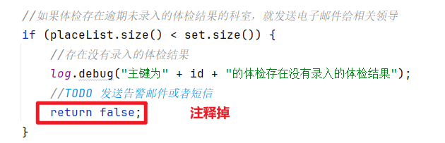

## 测试

启动服务器之后，大概一分钟之后，查看 minio 管理界面：


将体检报告文件下载下来，查看是否正确。

# 实现手动创建体检报告

由于定时器是每天凌晨1~5点运行，倘若错过了这个时间段就要等到次日，定时程序才有机会再次运行。这期间如果想要让大健康系统立即生成体检报告，就需要手动创建体检报告。

## 编写 form 接收数据并校验

在 MIS 端创建 `CreateMedExamReportForm`

```java
package com.jkweilai.meinian.api.controller.form;

import jakarta.validation.constraints.Min;
import jakarta.validation.constraints.NotNull;
import lombok.Data;

@Data
public class CreateMedExamReportForm {
    @NotNull(message = "id不能为空")
    @Min(value = 1, message = "id不能小于1")
    private Integer id;
}
```

## 编写 web 方法

找到 `MedExamReportController`，编写以下方法：

```java
@PostMapping("/createReport")
@SaCheckPermission(value = {"ROOT", "CHECKUP_REPORT:CREATE"}, mode = SaMode.OR)
public R createReport(@RequestBody @Valid CreateMedExamReportForm form) {
    boolean result = medExamReportService.createReport(form.getId());
    return R.ok().put("result", result);
}
```

## 修改数据记录

到 `med_exam_report` 表中找到对应的体检报告记录，把 `status` 字段值改成 `1`，然后把 `file_url` 字段值设置成 `null`。Minio服务器上面的体检报告Word文档即便不手动删除也无所谓，生成的新Word文档会覆盖原来的文档。


## 前端编写回调函数手动生成报告

找到 `checkup_report.vue`页面，找到生成报告按钮：

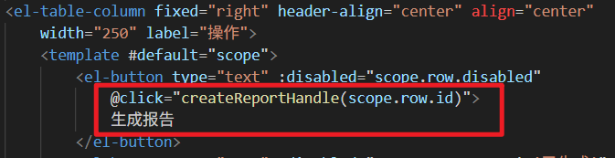

编写回调函数 `createReportHandle`，代码如下：

```typescript
async function createReportHandle(id) {
    ElNotification({
        title: '提示信息',
        message: '体检报告正在生成中，请稍后',
        duration: 1000
    })

    let json = { id: id }
    let config = {
        headers: {
            satoken: localStorage.getItem("token")
        }
    };
    let response = await axios.post("/meinian-api/mis/report/createReport", json, config);
    let resp = response.data;
    if (resp.result) {
        ElMessage({
            message: '体检报告创建成功',
            type: 'success',
            duration: 1200,
            onClose: () => {
                loadPageData();
            }
        });
    }else {
        ElMessage({
            message: '体检报告创建失败',
            type: 'error',
            duration: 1200
        });
    }
}
```

# MIS 端实现下载体检报告


## 后端编写 web 方法

找到 `MedExamReportController`，编写以下方法：

```java
@Resource
private MinIO minIO;

// name参数是体检人的名字，以体检人的名字作为文件名
@GetMapping("/downloadReport")
@SaCheckPermission(value = {"ROOT", "CHECKUP_REPORT:SELECT"}, mode = SaMode.OR)
public void downloadReport(@RequestParam String fileUrl, @RequestParam String name, HttpServletResponse response) {
    // 这个功能没有编写form，因此校验放到了这里。
    if (StrUtil.isBlank(name)) {
        throw new HisException("name不能为空");
    } else if (!ReUtil.isMatch("^[\\u4e00-\\u9fa5]{2,10}$", name)) {
        throw new HisException("name内容不正确");
    }

    try (InputStream in = minIO.downloadFile(fileUrl); OutputStream out = response.getOutputStream()) {
        // 为了保证下载正常，清除一下响应头，框架中的响应设置，拦截器中的响应设置全部清除掉（如果有的话）
        response.reset();
        // 设置响应的内容类型，文件下载的响应内容类型固定
        response.setContentType("application/x-msdownloadoctet-stream;charset=utf-8");
        // HTTP响应协议中filename不允许出现中文，所以必须编码。
        response.setHeader("Content-Disposition", "attachment;filename=\"" + URLEncoder.encode(name + "的体检报告.docx", "UTF-8"));
        
        IOUtil.copyCompletely(in, out);
        
        // spring框架也有自带的，也能用
        // FileCopyUtils.copy(in, out);
    } catch (Exception e) {
        throw new HisException("下载体检报告失败");
    }
}
```

## 编写前端代码

在 `checkup_report.vue`页面中找到下载报告按钮：

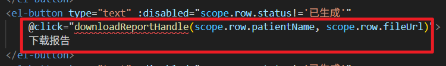

编写回调函数 `downloadReportHandle`：

```typescript
async function downloadReportHandle(name, fileUrl) {
    
    let response = await axios.get(`/meinian-api/mis/report/downloadReport`, {
        params: { name, fileUrl },
        headers: { satoken: localStorage.getItem("token") },
        responseType: 'blob'
    });
    const url = window.URL.createObjectURL(new Blob([response.data]));
    const link = document.createElement('a');
    link.href = url;
    link.setAttribute('download', `${name}的体检报告.docx`);
    document.body.appendChild(link);
    link.click();
    link.remove();
}
```

# 业务端下载体检报告

只要体检报告生成了，客户是可以在 MIS 端下载体检报告的。

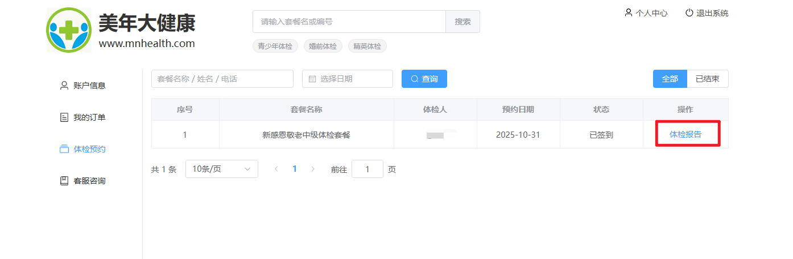

找到业务端 front 下的： `appointment_list.vue`，搜索体检报告按钮：


编写回调函数 `downloadHandle`：

```typescript
function downloadHandle(name, fileUrl) {
    document.location.href = `${proxy.$minioUrl}/${fileUrl}`;
}
```

这么简单吗？为什么不需要编写 `Controller`？为什么在 MIS 端的时候需要编写 `Controller`？主要原因是在 MIS 端我想控制权限。

# 快速获取邮寄地址

目前，大健康系统已支持自动生成体检报告。待工作人员下载、打印并装订完毕后，下一步便是寄送报告。为实现线上快捷发货，接下来我们将开发报告邮寄地址的获取功能，方便工作人员一键下单发快递。

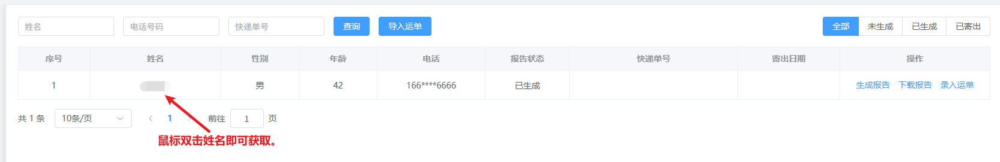

## 复制信息

找到 `checkup_report.vue`文件，找到姓名那一列：

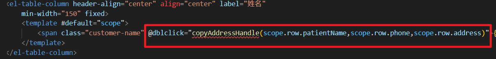

编写回调函数 `copyAddressHandle`：

```typescript
function copyAddressHandle(name, phone, address){
    const info = `${name},${phone},${address}`;
    navigator.clipboard.writeText(info).then(()=>{
        ElMessage.success("已复制");
    });
}
```

## 在线下单

顺丰快递：[https://www.sf-express.com/chn/sc/ship/home](https://www.sf-express.com/chn/sc/ship/home)


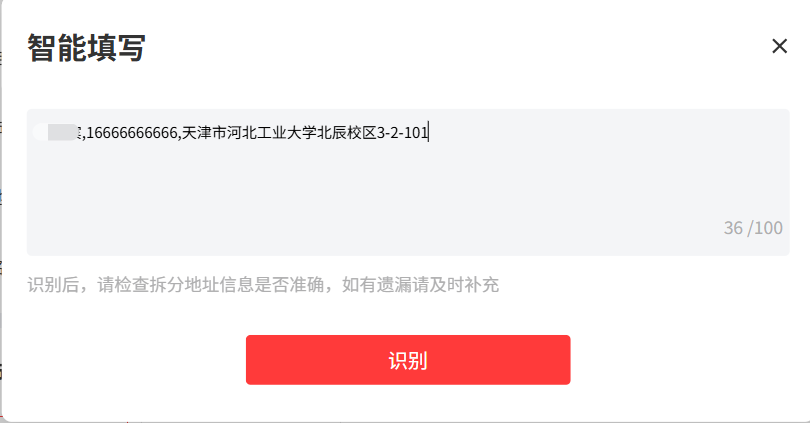


# 开通华为云的 OCR 识别服务

当快递发出之后，体检中心工作人员拿到快递单回执，只需要拍摄照片然后上传到大健康系统中，系统就能识别并保存运单信息。为什么使用华为云的 OCR 服务，因为有免费试用。

## 注册华为云账户

[https://www.huaweicloud.com/](https://www.huaweicloud.com/)


## 开通 OCR 服务

某个服务商在华为云上提供了可以免费试用的OCR服务，100次以内都是免费的。访问[购买页面](https://marketplace.huaweicloud.com/product/OFFI807551686931148800#productid=OFFI807551686931148800)


购买成功之后，访问[已购买服务页面](https://console.huaweicloud.com/marketplace/tenant/?region=cn-north-4#/market/order/purchasedProducts)，点击资源详情：

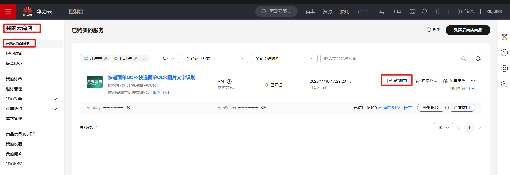

接下来要拿到OCR服务的AppKey和AppSecret，然后配置到YML文件中。另外，在该页面也可以点击查看接口，具体看一下这个接口怎么用。


## 编写配置文件

编写 `application.yml`配置文件：

```yaml
huawei:
  appKey: ${HUAWEI_OCR_APPKEY}
  appSecret: ${HUAWEI_OCR_APPSECRET}
```

注意：`huawei`是靠左边的根。

## 手动导入 jar 包

由于调用华为云服务所需的 `<font style="color:rgb(15, 17, 21);background-color:rgb(235, 238, 242);">java-sdk-core-3.2.0.jar</font>` 未收录在 Maven 官方仓库及阿里云镜像中，我们需要手动将其安装至本地 Maven 仓库。

该 Jar 文件我已经给大家提供了，大家下载就行。假设你将其保存至 D 盘，可执行以下命令完成安装：

```shell
mvn install:install-file -Dfile=D:/java-sdk-core-3.2.0.jar -DgroupId=com.huawei.apigateway -DartifactId=java-sdk-core -Dversion=3.2.0 -Dpackaging=jar
```

注意：你电脑上一定是已经配置了 MAVEN 的环境变量：也就是说 Maven 的 bin 目录已经配置到 PATH 环境变量中了。

加入本地 Maven 仓库之后，我们项目的 `pom.xml`文件中也需要手动引入它的依赖，我们在项目最初搭建阶段已经引入了，如下：

```xml
<!-- 华为云 -->
<dependency>
    <groupId>com.huawei.apigateway</groupId>
    <artifactId>java-sdk-core</artifactId>
    <version>3.2.0</version>
    <exclusions>
        <exclusion>
            <groupId>org.slf4j</groupId>
            <artifactId>slf4j-log4j12</artifactId>
        </exclusion>
        <exclusion>
            <groupId>log4j</groupId>
            <artifactId>log4j</artifactId>
        </exclusion>
        <exclusion>
            <groupId>org.slf4j</groupId>
            <artifactId>slf4j-simple</artifactId>
        </exclusion>
    </exclusions>
</dependency>
```

# 编写 MIS 端 OCR 运单识别工具类

接下来我们要编写这个OCR服务的Java工具类。将来我们上传快递运单照片，然后就能得到运单信息。找到 `common`包，创建 `OcrUtil`工具类，编写以下代码：

```java
package com.jkweilai.meinian.api.common;

import cn.hutool.core.util.URLUtil;
import cn.hutool.json.JSONObject;
import cn.hutool.json.JSONUtil;
import com.cloud.apigateway.sdk.utils.Client;
import com.cloud.apigateway.sdk.utils.Request;
import com.jkweilai.meinian.api.exception.HisException;
import lombok.extern.slf4j.Slf4j;
import org.apache.http.HttpEntity;
import org.apache.http.client.methods.CloseableHttpResponse;
import org.apache.http.client.methods.HttpRequestBase;
import org.apache.http.impl.client.CloseableHttpClient;
import org.apache.http.impl.client.HttpClients;
import org.apache.http.util.EntityUtils;
import org.springframework.beans.factory.annotation.Value;
import org.springframework.stereotype.Component;

import java.util.HashMap;
import java.util.Map;

@Component
@Slf4j
public class OcrUtil {
    @Value("${huawei.appKey}")
    private String appKey;

    @Value("${huawei.appSecret}")
    private String appSecret;

    public Map<String, Object> identifyWaybill(String imgBase64) throws Exception {
        Request request = new Request();
        request.setKey(appKey);
        request.setSecret(appSecret);
        request.setMethod("POST");
        request.setUrl("https://jmexpressbill.apistore.huaweicloud.com/ocr/express-bill");
        request.addHeader("Content-Type", "application/x-www-form-urlencoded");
        //对上传的图片Base64字符串做URL编码
        //base64的字符串如果是作为请求参数传递的话，必须编码，因为base64中含有"=和/"等特殊字符。
        String encode = URLUtil.encodeAll(imgBase64);
        //在请求体中设置上传的图片
        request.setBody("base64=" + encode);
        //对请求中的内容生成数字签名
        HttpRequestBase signedRequest = Client.sign(request);
        //创建HTTP客户端对象(这是apache的httpclient库中的API，也可以使用hutool中的HttpUtil)
        CloseableHttpClient client = HttpClients.custom().build();
        //发出HTTP请求，并且得到返回的响应
        CloseableHttpResponse response = client.execute(signedRequest);
        if (response.getStatusLine().getStatusCode() != 200) {
            log.error("OCR识别运单失败", response.toString());
            throw new HisException("OCR识别运单失败");
        }
        //获取响应体中的内容
        HttpEntity entity = response.getEntity();
        if (entity != null) {
            // EntityUtils是Apache HttpClient中的，将实体转换成字符串。
            String string = EntityUtils.toString(entity, "utf-8");
            JSONObject json = JSONUtil.parseObj(string);
            int code = json.getInt("code");
            String msg = json.getStr("msg");
            if (code == 200) {
                JSONObject data = json.getJSONObject("data");
                //收件人姓名
                String recName = data.getStr("recipient_name");
                //收件人电话
                String recPhone = data.getStr("recipient_phone");
                //快递运单编号
                String expressNo = data.getStr("waybill_number");
                Map<String, Object> map = new HashMap<>() {{
                    put("recName", recName);
                    put("recPhone", recPhone);
                    put("expressNo", expressNo);
                }};
                return map;
            } else {
                log.error("OCR运单识别失败", msg);
                throw new HisException("OCR识别运单失败");
            }
        } else {
            throw new HisException("OCR请求的响应体为空");
        }
    }

}
```

# MIS 端实现识别单张运单 RESTful 接口


## 编写 Service 和实现

找到 `MedExamReportService`接口，编写以下方法：

```java
Map<String,Object> recognizeWaybill(String imageBase64);
```

编写实现：

```java
@Resource
private OcrUtil ocrUtil;

@Override
public Map<String, Object> recognizeWaybill(String imageBase64) {
    try {
        Map<String, Object> map = ocrUtil.identifyWaybill(imageBase64);
        return map;
    } catch (Exception e) {
        log.error("OCR识别异常", e);
        throw new HisException("OCR识别异常");
    }
}
```

## 编写 web 方法

找到 `MedExamReportController`，编写以下 web 方法：

```java
@SneakyThrows
@PostMapping("/recognizeWaybill")
@SaCheckPermission(value = {"ROOT", "CHECKUP_REPORT:UPDATE"}, mode = SaMode.OR)
public R recognizeWaybill(@RequestParam("file") MultipartFile file) {
    InputStream in = file.getInputStream();
    BufferedImage image = ImgUtil.read(in);
    String imageBase64 = "data:image/jpg;base64," + ImgUtil.toBase64(image, "jpg");
    in.close();
    Map<String, Object> map = medExamReportService.recognizeWaybill(imageBase64);
    return R.ok().put("result", map);
}
```

# 前端实现上传单张运单照片


## 显示录入运单弹窗

找到 `checkup_report.vue`页面，然后搜索录入运单按钮：


编写回调函数：`identifyWaybillHandle`，重置数据，显示弹窗：

```typescript
function identifyWaybillHandle(id, patientName, phone) {
    dialog.data.id = id;
    dialog.data.recName = null
    dialog.data.recPhone = null
    dialog.data.expressNo = null
    dialog.data.patientName = patientName
    dialog.data.phoneEnd = phone.substr(7, 4) //保存尾号
    dialog.visible = true
}
```

## 上传单张运单照片

只支持上传 JPG/JPEG 格式的图片。

搜索上传运单按钮：


需要编写三个回调函数：一个是上传前的回调，上传成功的回调，上传失败的回调。

```typescript
function waybillBeforeUpload(file) {
    let size = file.size / 1024 / 1024;
    if (size > 5) {
        ElMessage({
            message: '图片不能超过5M大小',
            type: 'error',
            duration: 1200
        });
        return false;
    }
    ElMessage({
        message: '识别中请稍后',
        type: 'info',
        duration: 1000
    });
    return true;
}

function waybillUploadError(e) {
    ElMessage({
        message: "图片上传失败",
        type: 'error',
        duration: 1200
    });
    console.error(e)
}

function waybillUploadSuccess(resp : any, uploadFile : UploadFile, uploadFiles : UploadFiles) {
    if (resp.msg == 'success') {
        let result = resp.result;
        dialog.data.recName = result.recName
        dialog.data.recPhone = result.recPhone
        dialog.data.expressNo = result.expressNo
        if (result.recName != dialog.data.patientName || result.recPhone.substr(7, 4) != dialog.data.phoneEnd) {
            ElMessage({
                message: '收件人姓名或者电话与体检人不符',
                type: 'error',
                duration: 1200
            });
        }
    }
}
```

注意：运行的时候，会因为华为云的 SDK 版本不兼容 JDK21 而报错，解决办法是，在启动后端项目前，设置 VM Options：

```plaintext
--add-exports=java.base/sun.security.x509=ALL-UNNAMED
--add-exports=java.base/sun.security.util=ALL-UNNAMED
--add-exports=java.base/sun.security.provider=ALL-UNNAMED
--add-exports=java.base/sun.security.rsa=ALL-UNNAMED
--add-exports=java.base/sun.security.internal.spec=ALL-UNNAMED
--add-exports=java.base/sun.security.action=ALL-UNNAMED
--add-exports=java.base/sun.security.pkcs=ALL-UNNAMED
--add-exports=java.base/sun.security.timestamp=ALL-UNNAMED
--add-opens=java.base/java.lang=ALL-UNNAMED
--add-opens=java.base/java.security=ALL-UNNAMED
--add-opens=java.base/java.util=ALL-UNNAMED
--add-opens=java.base/javax.crypto=ALL-UNNAMED
--add-opens=java.base/sun.security.x509=ALL-UNNAMED
--add-opens=java.base/sun.security.util=ALL-UNNAMED
--add-opens=java.base/sun.security.provider=ALL-UNNAMED
```


# 保存运单信息


## 回顾 Mapper 和 XML

之前我们在 `MedExamReportMapper`接口中编写过 `update`方法，这个方法在这里正好可以使用：

```java
int update(Map<String, Object> param);
```

打开 `MedExamReportMapper.xml`文件，确认下 `update`语句：

```xml
<update id="update">
    update med_exam_report
    <set>
        <if test="status != null and status != ''">
            status = #{status},
        </if>
        <if test="fileUrl != null and fileUrl != ''">
            file_url = #{fileUrl},
        </if>
        <if test="expressNo != null and expressNo != ''">
            express_no = #{expressNo},
        </if>
        <if test="expressDate != null and expressDate != ''">
            express_date = #{expressDate},
        </if>
    </set>
    where id = #{id}
</update>
```

## 编写 Service 和实现

找到 `MedExamReportService`接口，编写以下方法：

```java
boolean saveWaybill(Map<String, Object> param);
```

编写实现：

```java
@Override
@Transactional
public boolean saveWaybill(Map<String, Object> param) {
    int rows = medExamReportMapper.update(param);
    return rows == 1;
}
```

## 编写 form 接收数据并校验

创建 `SaveWaybillForm`，编写代码：

```java
package com.jkweilai.meinian.api.controller.form;

import jakarta.validation.constraints.Min;
import jakarta.validation.constraints.NotBlank;
import jakarta.validation.constraints.NotNull;
import jakarta.validation.constraints.Pattern;
import lombok.Data;

@Data
public class SaveWaybillForm {
    @NotNull(message = "id不能为空")
    @Min(value = 1, message = "id不能小于1")
    private Integer id;

    @NotBlank(message = "expressNo不能为空")
    @Pattern(regexp = "^[0-9a-zA-Z]{10,24}$", message = "expressNo内容不正确")
    private String expressNo;

    @NotBlank(message = "expressDate不能为空")
    @Pattern(regexp = "^((((1[6-9]|[2-9]\\d)\\d{2})-(0?[13578]|1[02])-(0?[1-9]|[12]\\d|3[01]))|(((1[6-9]|[2-9]\\d)\\d{2})-(0?[13456789]|1[012])-(0?[1-9]|[12]\\d|30))|(((1[6-9]|[2-9]\\d)\\d{2})-0?2-(0?[1-9]|1\\d|2[0-8]))|(((1[6-9]|[2-9]\\d)(0[48]|[2468][048]|[13579][26])|((16|[2468][048]|[3579][26])00))-0?2-29))$", message = "expressDate内容不正确")
    private String expressDate;
}
```

## 编写 web 方法

找到 `MedExamReportController`，编写以下 web 方法：

```java
@PostMapping("/saveWaybill")
@SaCheckPermission(value = {"ROOT", "CHECKUP_REPORT:UPDATE"}, mode = SaMode.OR)
public R saveWaybill(@RequestBody @Valid SaveWaybillForm form) {
    Map<String,Object> param = BeanUtil.beanToMap(form);
    param.put("status", 3);
    boolean result = medExamReportService.saveWaybill(param);
    return R.ok().put("result", result);
}
```

## 前端实现保存运单

找到 `checkup_report.vue`文件，找到提交运单按钮：


编写回调函数 `dataFormSubmit`：

```typescript
async function dataFormSubmit() {
    let expressNo = dialog.data.expressNo
    let expressDate = dayjs().format('YYYY-MM-DD')
    if (!stringIsEmpty(expressNo)) {
        let json = {
            id: dialog.data.id,
            expressNo: expressNo,
            expressDate: expressDate
        }
        let config = {
            headers: {
                satoken: localStorage.getItem("token")
            }
        };
        let response = await axios.post("/meinian-api/mis/report/saveWaybill", json, config);
        let resp = response.data;
        if (resp.result) {
            ElMessage({
                message: "运单提交成功",
                type: 'success',
                duration: 1200,
                onClose: () => {
                    dialog.visible = false
                    loadPageData()
                }
            });
        }else {
            ElMessage({
                message: "运单提交失败",
                type: 'error',
                duration: 1200
            });
        }
    }
}
```

# 总结课程后端技术栈

## 后端以 SpringBoot 为核心

我们的后端项目基于Spring Boot框架从零搭建。在此基础上，我们进行了深度的定制和功能增强：

- **依赖集成**：引入了多种功能依赖库，以支持特定的业务需求。
  - SpringBoot
  - SpringCache
  - MyBatis
  - lombok
  - MongoDB+MySQL
  - validation 后端校验框架
  - hutool 工具
  - 谷歌 zxing 生成二维码
  - minio 对象存储服务
  - 腾讯云的人脸识别
  - 腾讯云 IM 服务
  - 华为云 OCR 识别
  - 阿里巴巴规则引擎 QLExpress
  - 文件上传和下载
  - Apache POI：用于 excel 的导入导出以及生成体检报告
  - 微信支付 3.0
  - Java 邮件发送
- **配置管理**：
  - 线程池的配置
  - Redis 配置序列化
  - WebSocket 配置
  - 微信支付配置
- **功能增强**：
  - **XSS防御**：有效防范跨站脚本攻击，提升应用安全性。
  - **跨域支持**：通过统一配置，解决了Web请求的跨域问题。
  - **全局异常处理**：通过集中式的异常处理机制，统一了系统的错误响应格式。
  - **R 对象：**统一的返回的数据格式。
  - **分页对象**：封装统一的分页数据。

## SaToken 认证与授权框架

我们选择 Sa-Token，核心原因是：**它用最轻量的方式，解决了我们 Spring Boot + Vue 分离架构下最关键的认证授权问题，且避免了过度设计。**

具体有三点：

1. **架构匹配**：它是为 API 和微服务时代设计的，**原生无状态**的 Token 机制，天生适合前后端分离，解决了 Session 的粘性问题。
2. **效率最优**：对比过 Spring Security 和纯 JWT。**Spring Security 太重**，我们需要裁剪掉 80% 的功能，学习成本高。**纯 JWT 又太薄**，会话管理、踢人下线都要自研。**Sa-Token 正好在中间**，提供了生产级的权限控制，但 API 极简，开箱即用。
3. **解决实际痛点**：比如‘强制用户下线’功能，用 `<font style="color:rgb(15, 17, 21);background-color:rgb(235, 238, 242);">StpUtil.kickout(userId)</font>` 一行代码就实现了。如果用 JWT，得自己搞黑名单和缓存同步，复杂得多。未来要上分布式，也只需加个 Redis 依赖，会话自然共享，**扩展成本几乎为零**。

所以，这是一个**务实的技术选型**，让我们能以最小成本获得稳定可靠的权限能力，把精力集中在业务开发上。

## MySQL 集群

实现集群，采用的技术包括：

- mysql
- shardingsphere proxy
- zookeeper 注册中心
- python 自动化脚本

采用的架构是：三主四从。其中三主在同一个 MGR 集群中。三主中一个主节点是仲裁节点，另外两个主节点的每个主节点下面挂两个从节点，主从采用传统的主从复制。

## Redis 服务

1. 缓存 Token 令牌
2. 缓存热门体检套餐（结合 spring cache 搭建了**高速缓存**）
3. 微信支付单缓存
4. 缓存从次日起 60 天的预约限流缓存（**采用 redis 事务+乐观锁机制实现的防超售**）
5. 缓存推荐科室列表
6. 缓存手机验证码
7. 缓存系统配置（默认的限流规则与调流规则）

## MongoDB

大健康系统采用MySQL与MongoDB混合的架构，主要基于两点考虑：
其一，对于商品快照等非结构化数据，MongoDB的文档模型提供了更灵活、高效的存储与查询能力，尤其擅长处理海量数据。
其二，当业务涉及复杂的JSON条件查询时，MongoDB的原生支持相比MySQL的JSON字段功能更为强大，能更好地满足此类查询需求。

## Spring 定时任务

项目中我们广泛使用了定时任务，典型场景包括：自动关闭超时未付款订单、定时查询退款状态以及生成体检报告。鉴于当前业务逻辑相对简单，直接使用SpringBoot内置的定时器功能已足以满足需求。若未来遇到更复杂的调度场景（如分布式任务、精确状态管理等），推荐采用Quartz/XXL-JOB 等专业框架来实现。

1. 每日 23:50 生成第 62 天的预约限流缓存。
2. 每天 7-16 点每分钟计算一次推荐的科室列表。
3. 每天凌晨 1 到 5 点，每隔 20 分钟，分批次生成 10 天前体检人的体检报告。
4. 每小时执行一次关闭超时未支付订单的操作。

## 异步线程

SpringBoot 提供的异步任务机制，使我们能够将耗时操作交由后台线程执行，从而避免阻塞主流程。

例如：

- 在项目启动时，部分初始化任务通过异步方式执行，有效加快了系统的启动速度。
- 在生成大批量体检报告时，异步处理能确保定时任务不被阻塞，从而顺利推进后续批次的任务。

这样一来，系统整体的响应速度与任务处理效率都得到了显著提升。

**项目中主要包括的异步线程：**

1. 异步生成体检报告
2. 异步初始化 60 天的限流规则。
3. 异步初始化推荐科室列表。

## 微信支付 3.0

通过本项目的学习，大家已经完整走通了微信支付3.0的接入流程。从整体上看，支付逻辑本身并不复杂，本质上是一系列规范的接口调用过程。虽然微信官方API参数较多、调用方式较为底层，导致具体实现时代码量有所增加，但我们全程基于官方原生接口进行开发，确保了流程的清晰可控，最终顺利完成了支付功能的集成。

## Minio 私有云服务器

很多同学可能用过阿里云或腾讯云的对象存储服务，也就是把文件直接存放在云服务商提供的主机上。虽然这类服务价格不高（每GB仅需几毛钱），但考虑到体检报告这类文件涉及用户隐私，一旦发生泄露将带来严重风险。因此，我们最终决定自行搭建私有云存储，从源头上掌控数据安全，使用起来也更加安心。

项目中我们选用 MinIO 作为私有存储方案。与其他对象存储服务类似，MinIO 也需要先创建存储桶（Bucket）、规划目录结构，之后即可通过 API 调用来实现文件的上传与管理。

## WebSocket 消息推送

HTTP作为短连接协议，在请求响应后连接立即断开，导致服务端无法主动向客户端推送消息。而WebSocket长连接协议弥补了这一缺陷，实现了服务端到客户端的实时主动通信。

例如在支付场景中，当服务端收到支付成功通知后，可通过WebSocket立即推送给浏览器，前端页面便会同步更新状态。若不使用此机制，即便用户已在手机上完成支付，网页却仍无提示，容易让用户对支付结果产生疑虑，影响体验。

# 总结课程前端技术栈

## Vue3.0 框架

我们使用Vite脚手架从零创建了Vue3.0项目，并逐步构建了包括路由嵌套、权限控制、404页面在内的完整前端架构

## ElementPlus 组件库

由于 ElementUI 不支持 Vue 3.0，我们选择了专为 Vue 3 设计的 ElementPlus 作为组件库。其配置主要涉及 `<font style="color:rgb(15, 17, 21);background-color:rgb(235, 238, 242);">vite.config.ts</font>` 和 `<font style="color:rgb(15, 17, 21);background-color:rgb(235, 238, 242);">main.ts</font>` 两个文件。官方文档已清晰说明了集成步骤，后续如开发新的 Vue 项目，你也可参照此流程快速引入 ElementPlus。

## 腾讯 IM 服务

大健康系统的业务端和MIS端都含有IM客服功能。

## WebSoket 技术

在前后端技术栈中，WebSocket 的配置是双向的。前端在 `<font style="color:rgb(15, 17, 21);background-color:rgb(235, 238, 242);">main.ts</font>` 中建立了全局 WebSocket 连接，用于实时接收来自后端的支付结果推送。一旦收到成功状态，前端便会触发提示信息，从而确保用户能明确知晓支付状态。

# 求职简历撰写

## 一个程序员简历的构成

一份优秀的简历通常包含三个核心部分：个人基本信息、技术能力总结与项目实践经验。整体篇幅建议控制在三页，过长或过短都可能影响阅读效果。

例如，我们可以用第一页清晰展示个人介绍，后续两页重点呈现项目经验与技术栈，结构清晰、详略得当，这样的简历在技术岗位求职中会更具竞争力。

在简历撰写上，存在一些需要澄清的误区。

**1. 关于简历篇幅**
有的大学老师建议“简历只写一页”，认为这样可以吸引HR来电询问，从而获得沟通机会。这种观点并不符合技术岗位的招聘实际。HR每日需处理大量简历，若简历内容过于单薄，一方面可能显得对求职缺乏诚意，另一方面也因信息量不足而无法体现个人能力，很难获得面试邀约。需知，能够仅凭一页简历就发出邀请的，往往并非优质的技术岗位。

**2. 关于内容选择**
简历应聚焦于与技术岗位相关的能力与经验。一些同学会花费大量篇幅描述社团活动、文艺比赛获奖（如卡拉OK、篮球赛等），或在快餐店打工的经历。这些内容对于程序员岗位而言，通常不具备参考价值。

企业招聘程序员的核心要求是技术能力与项目经验。与其罗列与专业无关的社会实践，不如将时间用于展示技术栈、项目成果和专业积累。过多无关内容反而可能让HR认为你的技术深度不足，或缺乏对职业的清晰规划。

**3. 核心建议**
一份好的技术简历，应做到结构清晰、内容详实、重点突出。将篇幅有效运用于**个人技术能力与项目经验**的展示，才是获得心仪职位的关键。

## 项目介绍突出重点

**1. 项目业务背景**
在简历中仅写出“XX物流系统”并罗列技术框架是远远不够的。面试官无法从中判断这是冷链、快运还是普通快递系统，容易让人觉得项目并非你亲身参与。建议用100字以内清晰说明项目的业务背景、所属行业及核心业务目标，帮助面试官快速建立认知。

**2. 技术架构说明**
在介绍技术时，不应只写SpringBoot、MyBatis、MySQL等基础内容，这会使项目看起来缺乏深度。建议进一步说明所使用的第三方组件或中间件，如Quartz、Zookeeper、Activiti、Spark等，从而体现技术栈的完整性与项目复杂度。

**3. 个人职责明确**
很多同学在简历中未明确写出自己负责的模块，导致面试官无法针对性提问。明确个人职责（如“负责订单与支付模块的后端开发”），既能引导面试官在你熟悉的范围内提问，也展现了你在项目中的具体贡献。

## 项目介绍样例

**开发方：北京市 XXX 信息技术有限公司**

**开发环境：**

- JDK21 + IDEA + MySQL 集群 + Redis + Minio + VS Code

**项目技术栈：**

- 后端项目：SpringBoot、SpringMVC、MyBatis、SaToken、微信支付 3.0、WebSocket
- 前端项目：Vue3.0、ElementPlus、IM 服务、WebSocket

**项目描述：**

HIS 大健康系统是为天津美年大健康体检中心开发并实施的体检系统。体检人可以在业务端购买体检套餐，预约体检日期，也可以下载到自己的体检报告；体检中心工作人员在 MIS 端可以管理各个模块的业务数据，并且为体检人完成签到、打印导引单等服务；体检医生在 MIS 系统中可以为体检人录入体检结果。

HIS 大健康系统采用了 7 节点的 MySQL 集群，使用 ShardingSphere 管理数据库集群。由于实现了读写分离，数据库 IO 性能得到了大幅度的提升。在抗风险测试中，7 个 MySQL 节点，最多可以宕机 4 个，数据库集群依然可以正常工作，数据不受任何影响，而且宕机节点重新上线之后数据会自动同步。

本系统的支付模块采用了微信支付 3.0，不仅可以实现付款，还实现了退款。为了避免后端系统没有收到付款或退款结果，大健康系统采用了主动查询付款或退款结果，然后同步更新订单状态。作为前一种方案的补充，本系统还使用了定时器技术，定期核对订单的付款和退款结果，并且关闭超期未付款的订单。

为了提升商品页面详情内容加载速度，大健康系统使用了 SpringCache 技术，自动对常用商品缓存。客户打开商品页面，后端系统直接从 Redis 缓存中提取商品信息，从而降低了数据库的负载，提升了数据读取速度。

大健康系统对每件商品生成唯一 MD5 指纹信息，管理者每次修改商品信息之后，后端系统会自动比对 MD5 指纹。如果发生变化，就立即创建商品快照。商品快照技术可以防止修改商品信息之后，体检人购买的商品与当前商品不一致的情况。每个订单都关联下单时的商品快照。

大健康系统体检人实名签到流程中采用了身份证刷卡+人脸识别+静态活体验证技术，确保签到人是体检人本人。签到成功后系统会利用 JSPDF 技术生成体检 导引单。体检人持导引单去体检，每个科室的护士通过扫描导引单二维码获取该体检人订单中的体检项目，体检结束后医生在 MIS 系统录入结果。最后由定时器在十天后通过异步线程与 POI 技术生成体检报告，存储在 Minio 服务器上。

# 技术面试疑难问题总结

## 提前巩固基础知识

为提升招聘效率，多数公司在应届生招聘中会设置“笔试+面试”的筛选流程。通过笔试可初步淘汰约80%的候选人，仅对剩余约20%的求职者开展技术面试，从而有效控制招聘成本与时间投入。

笔试内容主要围绕软件开发的核心基础知识展开，涵盖Java语法、JVM机制、数据结构与算法、网络协议等关键领域。建议求职者提前系统复习相关知识，并结合大量题目练习与重点记忆，以提升通过率。

## 项目疑难问题

### 这个项目有没有实现高并发

目前，这个项目已经部署上线。一台 200M 带宽的云主机能够支持约 5000 个并发访问，当前阶段已经足够使用，尚未遇到高并发瓶颈。如果未来需要进一步提升并发能力，我们计划采用五台 200M 带宽的云主机，通过负载均衡技术整合资源。每台主机仍按 5000 并发估算，五台即可支持约 2.5 万并发——这对于体检中心的业务需求来说，已经绰绰有余。

### 这个项目为什么不使用微服务架构？

在项目立项阶段，项目经理就排除了微服务架构，主要有三个原因：

- 一是项目周期短、团队成员有限，采用微服务会延长交付时间；
- 二是医疗类业务的模块之间关联紧密，拆分为微服务反而会显得过于零散；
- 三是甲方预算有限，而微服务在开发与维护上的成本较高。因此，我们没有选用微服务架构。

### 你们的MySQL集群是怎么搭建的？

7 个节点。其中 3 个主节点在 MGR 集群当中，保证数据的一致性。3 个主节点中有一个节点是仲裁节点。另外两个主节点每个主节点下挂两个从节点，采用传统的主从复制。ShardingSphereProxy 配置读写分离。Zookeeper 存储动态的 ShardingSphere 的配置信息。通过 python 脚本监控每个节点的工作状态，节点工作状态发生变化后，python 脚本动态修改 zookeeper 上的配置，通过这种方式完成 ShardingSphere 的动态感知。

### MySQL它们之间是怎么实现数据同步的？

MySQL本身提供了binlog日志功能。我们让Master节点开启binlog，Slave节点会实时监听Master节点的binlog变化，将新增内容下载到本地的relaylog中，再执行其中的SQL语句，从而实现数据同步。我们还做过测试：当Slave节点短暂宕机后重新上线，它能够自动同步在宕机期间Master节点写入的新数据，最终与Master数据保持一致。至于 MGR 集群来说，是 MySQL 内置的，自动完成数据同步。

### MySQL集群有没有用分库分表？

我们没有采用分库分表。分库分表通常是在数据量极大（如超过两千万条记录）时才需考虑。而体检中心每天接待人数有限，业务数据增长缓慢，即使系统运行30年，预计也达不到分库分表的阈值，因此当前没有必要实施。

### 你用异步线程做什么？

在SpringBoot项目启动时，我们需要执行一些初始化任务，例如清理Redis缓存、启动定时任务检查超时未付款订单、生成体检报告等。这些任务如果全部放在主线程执行，会拖慢项目启动速度。因此，我们使用异步线程来执行这些初始化工作，确保主线程能快速完成启动。

1. 异步生成体检报告
2. 异步初始化 60 天的限流规则。
3. 异步初始化推荐科室列表。

### 商品快照是什么原理？

商品快照的作用是防止商品信息后续被修改时，影响已生成订单中的商品信息。每次创建订单时，系统会将当前商品的**关键信息**抓取并保存为一条快照记录，存储在MongoDB中。订单只与快照关联，后续商品信息的任何变动都不会对历史订单造成影响。

### 你怎么读取到身份证信息的？

身份证读卡器提供了WebSocket接口。前端页面与读卡器驱动建立WebSocket连接后，读卡器读取到的身份证信息会实时推送到前端。此外，读卡器还能识别假身份证：假证通常没有内置IC芯片，因此无法读取信息。

### 人脸识别是怎么实现的？

我们接入腾讯云的人脸识别服务，通过调用其接口实现识别功能。具体流程是：用摄像头拍摄签到人照片，将身份证照片与现场拍摄照片一并提交至腾讯云，由其判断是否为同一人。同时，我们还进行静态活体检测，确保照片中为真人，而非翻拍图片。

### 如何保证支付的一致性？

这里的一致性主要指客户付款成功后，系统必须将订单更新为“已付款”。我们采用两种机制保障：

- 第一，系统接收微信服务器发送的付款结果通知，据此更新订单状态；
- 第二，作为容错手段，前端支付成功后的回调函数中会发起Ajax请求，主动查询微信服务器的支付结果。

这两种方式结合，基本能保证一致性。但若微信服务器本身发生故障导致无法获取结果，则无法完全保证支付状态同步，因此任何支付系统都无法实现绝对的一致性。

### 这个项目中为什么要使用规则引擎？

由于促销规则经常变动，不宜硬编码在程序中，因此我们将规则存储在数据库中，并采用QLExpress规则引擎来解析执行。该引擎支持类似Java的语法，能够实现复杂的促销逻辑。我们将购买数量和原价等参数传入规则，即可计算出实付金额。同时，我们还开发了促销规则管理模块，支持在页面上直接编辑和更新规则，无需重新编译和部署系统。

### 你刚才说体检中心每天接待几百人，每天体检人数有没有上限？

有上限。系统采用预约制，确保每个体检日的预约人数不超过设定上限。为防止超售，我们利用Redis事务机制加乐观锁严格保证并发下的名额控制。此外，系统提供体检预约管理模块，可灵活设置或调整每日人数上限，以应对特殊情况。

### 这个系统是怎么生成体检报告的？

我们使用POI技术从MongoDB中提取体检结果数据，生成体检报告文件并存储至Minio服务器。在生成报告前，系统会检查是否所有科室的体检结果都已录入。如存在未录入项目，会自动向相关负责人发送通知。为避免一次性生成大量报告对JVM造成压力，系统采用分批生成策略，循环处理，直至所有符合条件的记录都完成报告生成。

### 这个系统用OCR做什么？

OCR用于识别快递运单照片。例如，在体检报告邮寄后，工作人员上传运单照片，系统通过OCR自动提取运单信息并保存到数据库。