# 1.1.系统架构演变

# 企业常用搭配方案

**Spring Cloud** 是一套基于 Spring Boot 的**微服务架构开发****组件集**，提供了**服务发现、配置管理、负载均衡、熔断器**等分布式系统所需的核心组件，简化了微服务系统的构建和部署。 （核心定位：用**Spring生态的约定式配置**快速实现分布式系统）

**Spring Cloud Alibaba** 是 **Spring Cloud 的****扩展组件集**，它整合了阿里巴巴开源的微服务解决方案，为微服务架构提供**注册中心、配置管理、流量控制、分布式事务** 等能力，增强 Spring Cloud 在云原生领域的生态。 （核心定位：让 Spring Cloud 用户**无缝使用**阿里云中间件，**补充**企业级分布式功能）

**Spring Cloud** 与 **Spring Cloud Alibaba** 都**不能叫做框架**，可以叫做**组件集**，Spring Cloud 组件集中包含很多组件，同样 Spring Cloud Alibaba 扩展组件集中也包含了很多组件，但不是所有组件都需要用上，目前在国内，对于分布式微服务系统来说，企业常用的组件搭配方案如下：

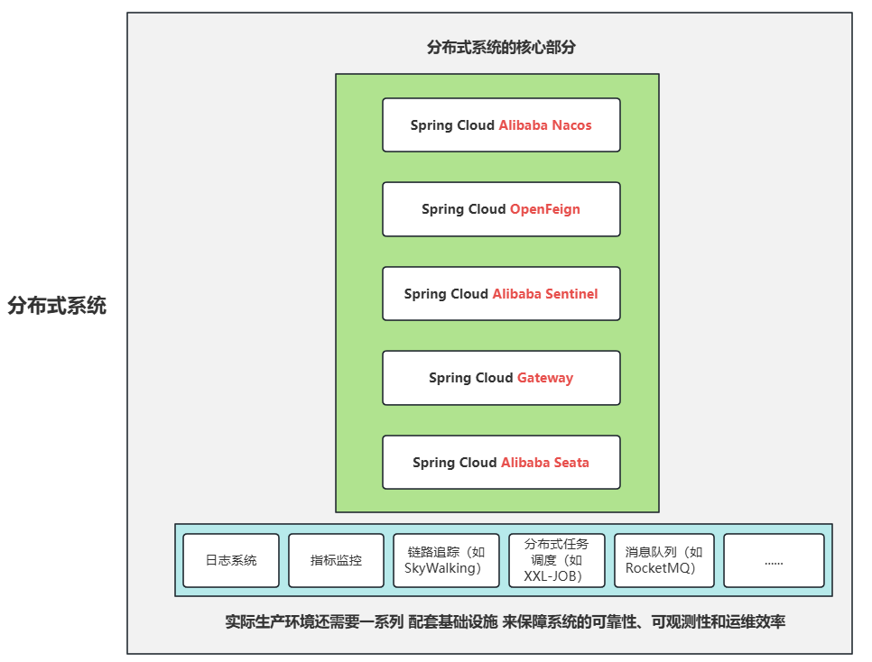

# 系统架构的演变过程

Java系统架构的演变经历了从简单到复杂的过程，主要可以分为以下几个阶段：

## 单体架构

**架构图：**

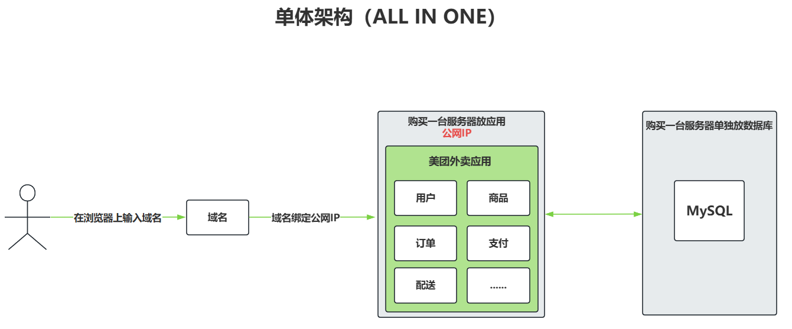

**核心概念：**

- 域名：购买域名，更容易让用户记住你的网站。（云服务提供商可以帮你将**域名**与**公网 IP** 进行绑定。）
- 公网 IP：购买服务器时，云服务提供商会自动提供公网 IP。
- 节点：服务器称为节点。
- 应用：例如美团外卖应用。
- 数据库

**特点**：

- 所有功能模块打包在一个应用中
- 单一代码库和数据库
- 通常使用WAR部署到服务器

**优点**：

- 开发简单直接
- 测试和部署方便
- 初期性能较好

**缺点**：

- **无法应对高并发**（因为只有一台服务器，假设一台服务器每秒只能处理 100 个请求，如果同时进来 1000 个请求，服务器就无法同时处理。）
- **代码臃肿**
- **维护困难**（例如：出现 bug 时，需要在庞大的代码中定位问题模块，日志混合在一起，很难分离关注点）
- **扩展性差**

## 集群架构

**演进原因**：应对单体架构的性能瓶颈和高可用需求（**其实现在很多公司的项目也都是采用这种架构的，这种架构可以满足大部分的需求**）

**架构图：**

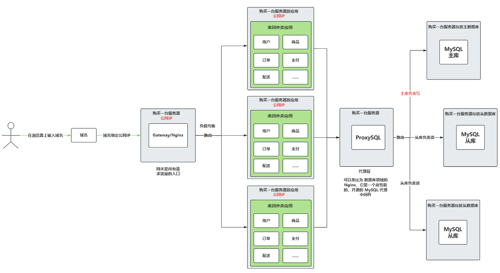

**核心概念：**

- 副本：对服务器进行复制形成了副本。
- 集群：一堆服务器在一起工作就可以称为集群。
- 网关：所有请求流量的入口，不负责处理真正的业务请求，它把收到的所有请求转给后面真正处理业务的服务器。
- 路由：网关把所有接收到的请求转给后面真正处理业务的服务器，这个过程称为请求的路由。
- 负载均衡：在路由的期间会经过负载均衡算法，将请求的流量均分给服务器，这样不至于有的服务器太忙，或者有的服务器太闲。假设一个服务器可以处理 200 个请求，3 台服务器就可以处理 600 个请求。
- 扩缩容：未来业务进一步扩大，可以对服务器进行增加副本，这个过程叫做扩容。或者业务量变少之后，删除服务器的某些副本，这个过程叫做缩容。

**特点**：

- 多个相同的单体应用实例组成集群
- 通过负载均衡(Nginx)分配请求
- 共享数据库或数据库主从复制

**优点**：

- 提高了系统吞吐量和可用性
- 实现了水平扩展
- 故障转移能力增强

**缺点**：

- 应用本身仍是单体，假设其中订单模块要升级，整个项目需要重新打包，所有的服务器上的项目需要全部下线，模块化升级会导致牵一发而动全身。
- 应用本身仍是单体，技术栈单一，如果现在项目中需要开发一个新的模块，例如直播模块，而直播模块的实现需要依靠流媒体相关的技术，Java 在流媒体方面就没有 C 语言好，那么使用 C 语言开发的直播模块就无法融入到我们的单体应用中。也就是说，**对于要求多语言开发的团队，以目前的集群架构来说是存在局限性的**。
- 会话管理需要额外处理(如Session共享)

## 分布式架构

**演进原因**：解决**复杂业务系统的模块化升级**和**多语言团队问题**。

**系统按****业务/功能****拆分为多个服务，数据也进行相应的拆分：**

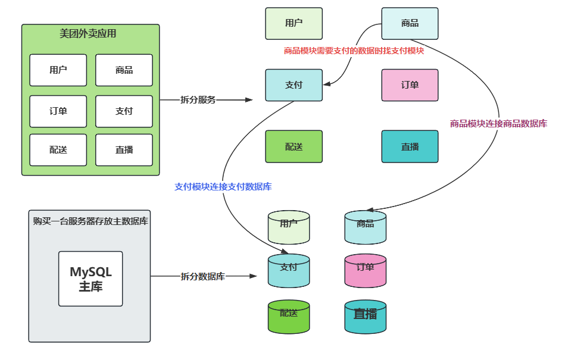

系统按照业务/功能拆分出来的每一个服务都叫做：微服务。

数据库也要进行对应的拆分，**支付服务**连接**支付数据库**，**商品服务**连接**商品数据库**，如果**商品服务**需要**支付数据**，则**商品服务**不能直接连接**支付数据库**，而是让**商品服务**去找**支付服务**获取数据。这样就达到了**数据隔离**。

每个微服务都可以独立的部署。

每个微服务的数据是隔离的。

每个微服务实现的语言是可以不同的。

以上体现了每个微服务是自治的。在微服务架构中，**“自治”（Autonomy） 是核心设计原则之一**，指的是每个微服务能够独立运作、自我管理，尽可能减少对外部服务的依赖。

**特点**：

- 系统按业务/功能拆分为多个服务
- 服务间通过RPC/REST/gRPC等通信
- 每个服务可独立开发、部署和扩展

**优点**：

- 模块化程度高
- 技术栈灵活
- 独立扩展和部署
- 容错性更好

**缺点**：

- 系统复杂度高
- 需要处理分布式事务
- 运维监控难度大
- 网络延迟问题

**架构图：**

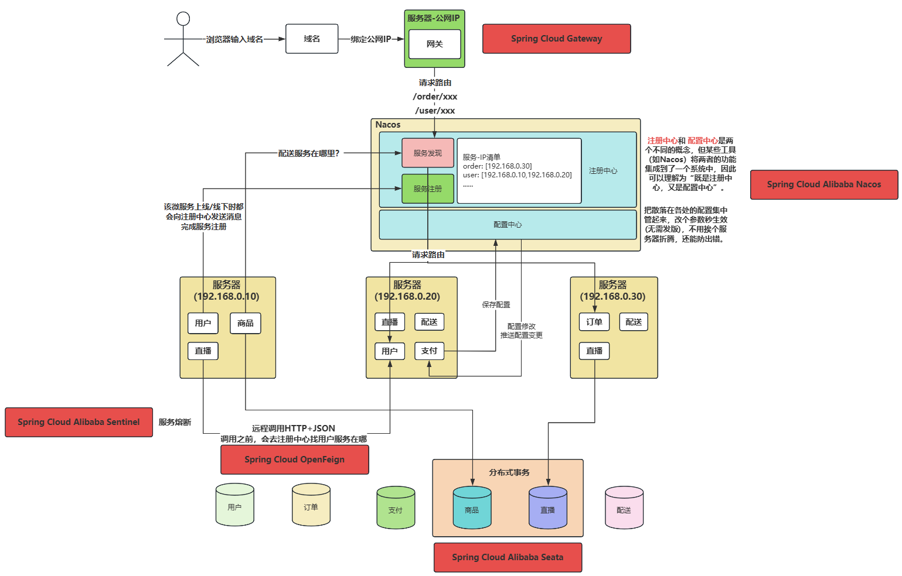

**核心概念：**

- **微服务**：系统按照业务/功能拆分出来的每一个服务叫做微服务。
- **单点故障**：不要将某个微服务的所有副本放到同一个物理机中，假设将配送微服务包括所有的副本全部放到一台物理机中，如果宕机后，整个项目中就不再有配送相关的功能了，分布式应用就不能再提供完整的功能。因此要消除单点故障【分布式系统的金标准】。（俗话说：不要把所有的鸡蛋放到一个篮子当中。）
- **远程调用**：假设直播服务需要用户服务提供数据时，直播服务可以发送 HTTP 请求，用户服务返回 JSON 数据给直播服务，这个过程我们称为远程调用。例如通过 RPC（Remote Procedure Call）/REST/gRPC 等通信。（**SpringCloud OpenFeign 是基于 HTTP 的 REST 风格的调用**）
- **注册中心**：提供服务注册与服务发现。保证微服务之间的调用畅通无阻。
- **配置中心**：项目的所有微服务的配置集中管理，修改配置不需要重新发版。
- **服务雪崩**：由于某个微服务故障，一个微服务的故障影响到了整个微服务调用链，在高并发的情况下，**瞬间千万个请求**会导致**千万个微服务调用链**发生阻塞，影响到整个应用的运行。被称为服务雪崩。【某个微服务故障（**如响应超时、宕机**）。调用它的**依赖服务**因资源耗尽（如线程池满、连接数超限）而连锁故障。故障沿调用链向上扩散，最终导致整个系统不可用。】

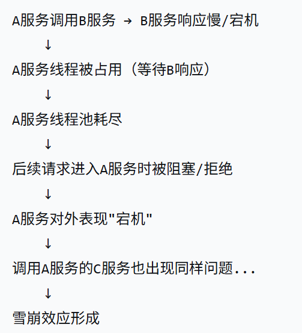

- **服务熔断**：服务熔断用来解决服务雪崩的问题。

:::info
**场景：用户服务**调用**订单服务**时，订单服务突然卡顿（比如响应变慢或超时）。如果**用户服务一直傻等****订单服务**响应，会导致自己的线程池被占满，进而拖垮整个调用链（雪崩效应）。

**熔断机制的作用**：让用户服务在检测到订单服务不可用时，直接放弃等待，快速返回失败（比如默认值或错误提示），避免自己被拖垮。

**在服务熔断中进行如下配置**：

- **触发条件（比如）**：5秒内，超过50%的请求卡顿（超时或报错）。
- **熔断动作**：立即开启熔断，后续所有请求直接失败（不再真正调用订单服务）。
- **恢复试探（比如）**：过一段时间（如30秒），放一个请求试试订单服务是否恢复。如果成功，就逐步恢复正常调用；如果仍然失败，继续保持熔断状态。

**白话总结**：“订单服务不行了？用户服务直接摆烂不调它了，等它恢复了再说！”（就像电路里的保险丝，电流过大就熔断，保护整个系统）

:::

**面试题：**

- **分布式与集群有什么区别？**
  - **集群是多台机器扛同一个活。（是一种物理形态）**
  - **分布式是多台机器分不同活。（是一种工作方式）**
  - **两者常结合，比如分布式系统中的每个服务自己是个小集群。**
- **分布式和微服务的区别是什么？**
  - **分布式架构是更广泛的概念，关注的是系统组件在多节点上的协作。**
  - **微服务是分布式架构的一种具体实现形式，强调细粒度、业务解耦和独立部署。(微服务是实现分布式架构的方式之一，还有其他方式)**

## 云原生架构

**最新演进**：充分利用云计算优势

**云原生就是专门为云环境（像搭积木一样）设计应用的开发方法，让你的软件能像乐高一样灵活拼装、自动伸缩、永不宕机。**

- **传统开发**：盖一栋砖混楼房，盖好了就很难改
- **云原生**：用**标准化集装箱**搭建，随时可以：
  - 增加或减少房间（自动伸缩）
  - 换掉坏掉的集装箱（故障自愈）
  - 快速拼出新楼层（快速迭代）

**特点**：

- **容器化部署(Docker)**：把应用和它的运行环境打包成“标准化集装箱”，在哪台电脑都能一键运行
- **动态编排(Kubernetes)**：你可以把它看做智能调度系统，自动管理成千上万个“集装箱”的启停、扩容和修复
- **微服务+DevOps+持续交付：**
  - **微服务：**把大App拆成独立小功能（如微信拆成聊天、支付、朋友圈）
  - **DevOps：**开发和运维用“自动化流水线”协作
  - **持续交付：**像手机APP更新一样随时发布新功能
- **服务网格(Service Mesh)**：给所有微服务装上“智能对讲机”，自动处理通信问题
- **无服务器(Serverless)**：写代码时完全不用管服务器，像用“云函数”一样，**按实际使用量计费，不用时自动休眠不占资源**

## 架构选择建议

- 初创项目：单体
- 中型系统：集群或初步微服务
- 大型复杂系统：成熟的微服务或云原生架构

架构演进的**核心驱动因素**是**业务规模**和**技术需求的变化**，**没有最好**的架构，**只有最适合**当前场景的架构。

# 创建微服务项目

1. Spring Cloud 是基于 Spring Boot 的，每一个微服务项目都是 Spring Boot 项目。
2. 项目中需要用到：
  1. JDK
  2. Spring Boot
  3. Spring Cloud
  4. Spring Cloud Alibaba
3. Spring Cloud Alibaba 代码托管在 github 上，Spring Cloud Alibaba 官方文档（中文）：[https://sca.aliyun.com](https://sca.aliyun.com)

## 版本说明

截至 2025 年 7 月：

| **JDK 版本** | **Spring Boot 版本** | **Spring Cloud 版本** | **Spring Cloud Alibaba 版本** |
| --- | --- | --- | --- |
| 最低 JDK17，建议 JDK21 | 3.4.x+ | 2024.0.x | 未适配 |
| 最低 JDK17，建议 JDK21 | 3.2.x-3.3.x | 2023.0.x | 2023.0.* |
| 最低 JDK17 | 3.0.2-3.2.x | 2022.0.x | 2022.0.* |

本课程中使用的版本号：

- JDK21
- Spring Boot：**3.3.4**
- Spring Cloud：**2023.0.3**
- Spring Cloud Alibaba：**2023.0.3.2**

组件采用的版本号：

- Spring Cloud Alibaba **Nacos：2.4.3**
- Spring Cloud Alibaba **Sentinel：1.8.8**
- Spring Cloud Alibaba **Seata：2.2.0**

## 项目工程结构图

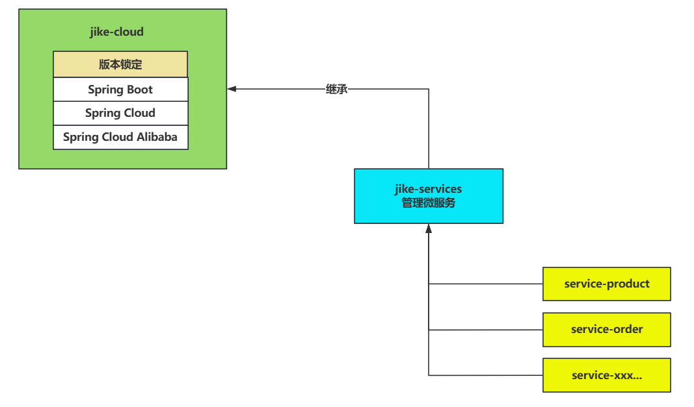

## 创建微服务项目

### 创建 jike-cloud 工程

1. **创建 Spring Boot 工程：**

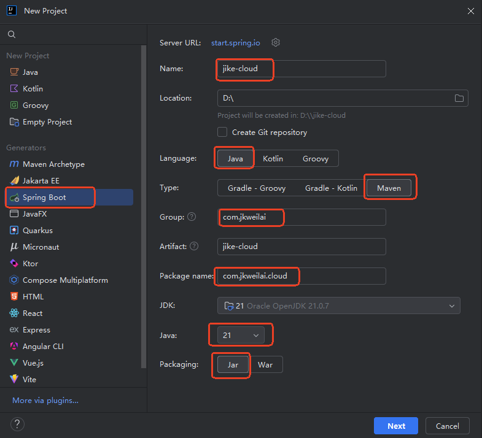

1. **删除没必要的，留下下图的**

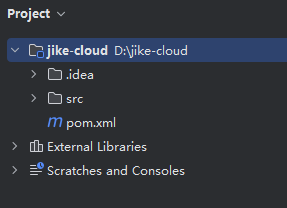

1. **配置 JDK21**

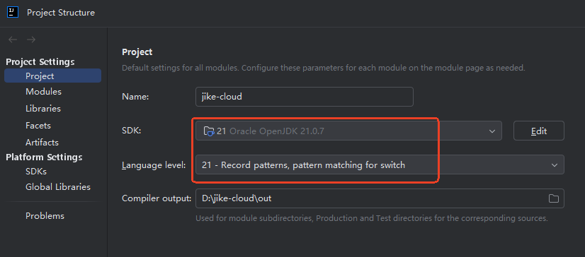

1. **配置 Maven**

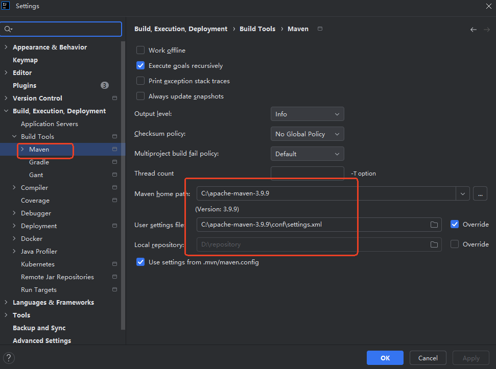

1. **编写 pom.xml**

```xml
<?xml version="1.0" encoding="UTF-8"?>
<project xmlns="http://maven.apache.org/POM/4.0.0" xmlns:xsi="http://www.w3.org/2001/XMLSchema-instance"
         xsi:schemaLocation="http://maven.apache.org/POM/4.0.0 https://maven.apache.org/xsd/maven-4.0.0.xsd">
    <modelVersion>4.0.0</modelVersion>
    <parent>
        <groupId>org.springframework.boot</groupId>
        <artifactId>spring-boot-starter-parent</artifactId>
        <version>3.3.4</version>
        <relativePath/> <!-- lookup parent from repository -->
    </parent>

    <!--打包方式pom-->
    <packaging>pom</packaging>

    <groupId>com.jkweilai</groupId>
    <artifactId>jike-cloud</artifactId>
    <version>0.0.1-SNAPSHOT</version>
    <name>jike-cloud</name>
    <description>jike-cloud</description>

    <!--版本统一管理-->
    <properties>
        <java.version>21</java.version>
        <project.build.sourceEncoding>UTF-8</project.build.sourceEncoding>
        <spring-cloud.version>2023.0.3</spring-cloud.version>
        <spring-cloud-alibaba.version>2023.0.3.2</spring-cloud-alibaba.version>
    </properties>

    <!--依赖统一管理：版本锁定-->
    <dependencyManagement>
        <dependencies>
            <dependency>
                <groupId>org.springframework.cloud</groupId>
                <artifactId>spring-cloud-dependencies</artifactId>
                <version>${spring-cloud.version}</version>
                <!-- 将spring-cloud-dependencies项目的dependencyManagement引入到当前项目中 -->
                <type>pom</type>
                <scope>import</scope>
            </dependency>
            <dependency>
                <groupId>com.alibaba.cloud</groupId>
                <artifactId>spring-cloud-alibaba-dependencies</artifactId>
                <version>${spring-cloud-alibaba.version}</version>
                <!-- 将spring-cloud-alibaba-dependencies项目的dependencyManagement引入到当前项目中 -->
                <type>pom</type>
                <scope>import</scope>
            </dependency>
        </dependencies>
    </dependencyManagement>

    <build>
        <plugins>
            <plugin>
                <groupId>org.springframework.boot</groupId>
                <artifactId>spring-boot-maven-plugin</artifactId>
            </plugin>
        </plugins>
    </build>

</project>
```

1. **删除 src 目录**


### 创建 jike-services

1. **在 jike-cloud 父工程上点击右键，新建模块**

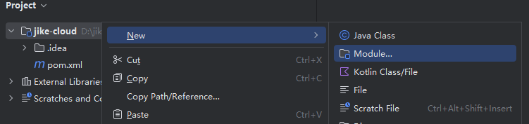

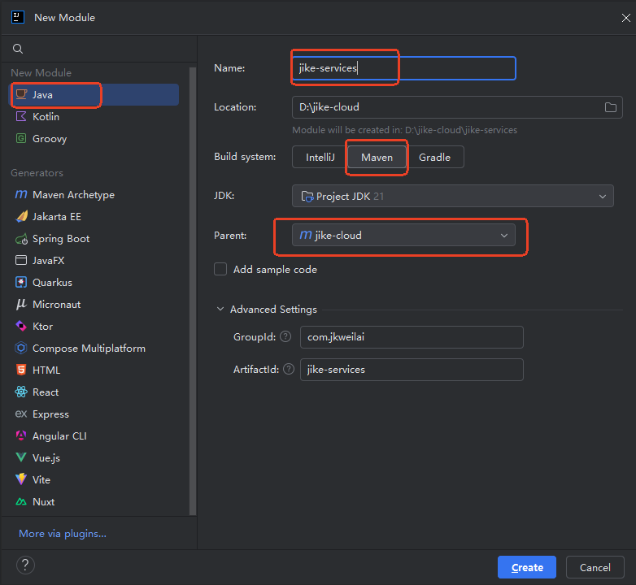

1. **编写 pom.xml 文件**

```xml
<?xml version="1.0" encoding="UTF-8"?>
<project xmlns="http://maven.apache.org/POM/4.0.0"
         xmlns:xsi="http://www.w3.org/2001/XMLSchema-instance"
         xsi:schemaLocation="http://maven.apache.org/POM/4.0.0 http://maven.apache.org/xsd/maven-4.0.0.xsd">
    <modelVersion>4.0.0</modelVersion>
    <parent>
        <groupId>com.jkweilai</groupId>
        <artifactId>jike-cloud</artifactId>
        <version>0.0.1-SNAPSHOT</version>
    </parent>

    <!--打包方式pom-->
    <packaging>pom</packaging>

    <artifactId>jike-services</artifactId>

    <properties>
        <maven.compiler.source>21</maven.compiler.source>
        <maven.compiler.target>21</maven.compiler.target>
        <project.build.sourceEncoding>UTF-8</project.build.sourceEncoding>
    </properties>

</project>
```

1. **删除 src 目录**

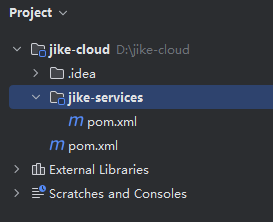

### 创建 service-product 和 service-order

1. **创建 service-product 模块**

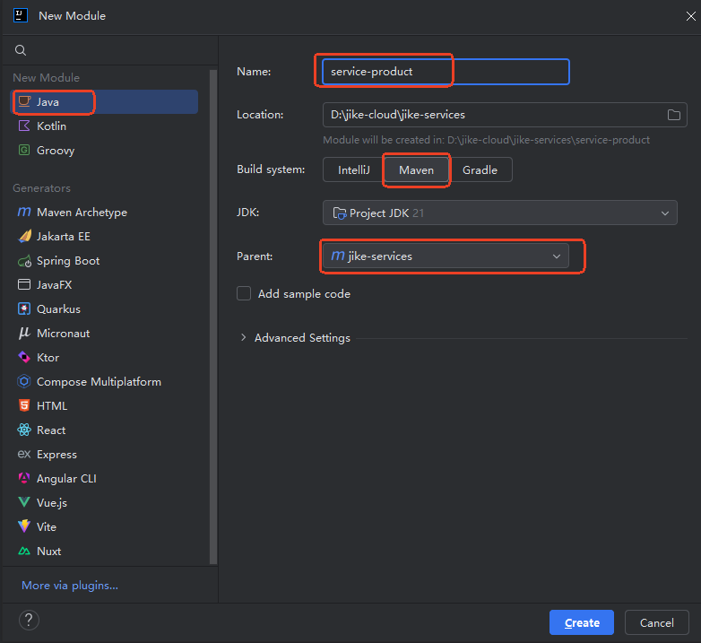

1. **创建 service-order 模块**

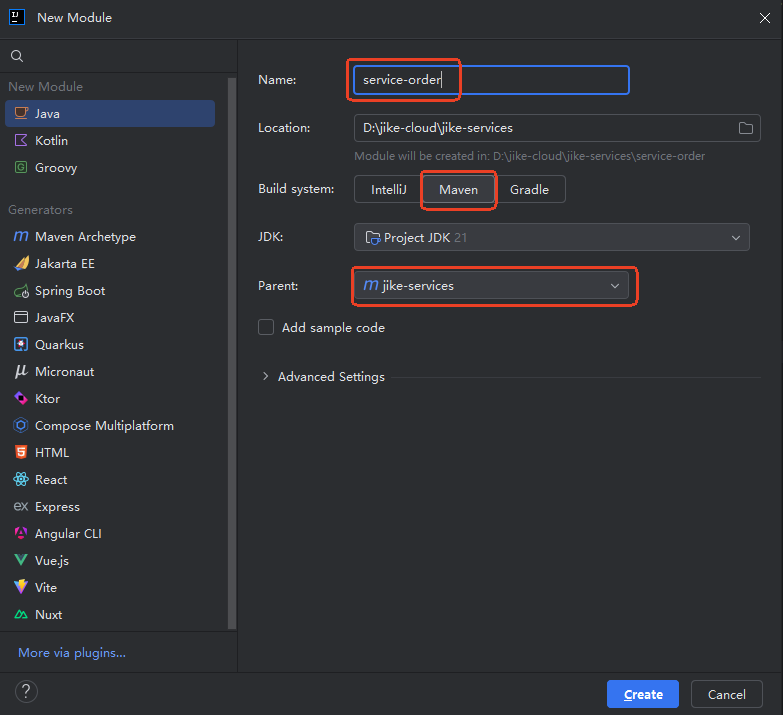

1. **查看继承结构是否正确**

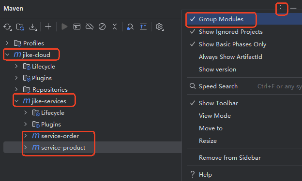

Maven 窗口的右上角有三个点，点击选择 Group Modules 以分组的方式显示结构。可以清楚的看到它们的继承关系。

### 在 jike-services 中引入公共依赖

可以在 jike-services 模块中引入公共依赖，在 pom.xml 中添加以下配置：

```xml
<dependencies>
    <!--注册中心/配置中心：服务注册与服务发现 Spring Cloud Alibaba Nacos-->
    <dependency>
        <groupId>com.alibaba.cloud</groupId>
        <artifactId>spring-cloud-starter-alibaba-nacos-discovery</artifactId>
    </dependency>
    <!--远程调用 Spring Cloud OpenFeign-->
    <dependency>
        <groupId>org.springframework.cloud</groupId>
        <artifactId>spring-cloud-starter-openfeign</artifactId>
    </dependency>
</dependencies>
```

通过下图可以看到子模块已经自动引入这些依赖：

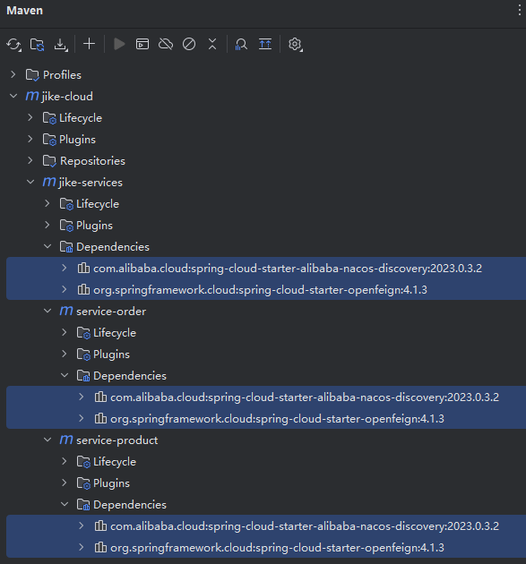